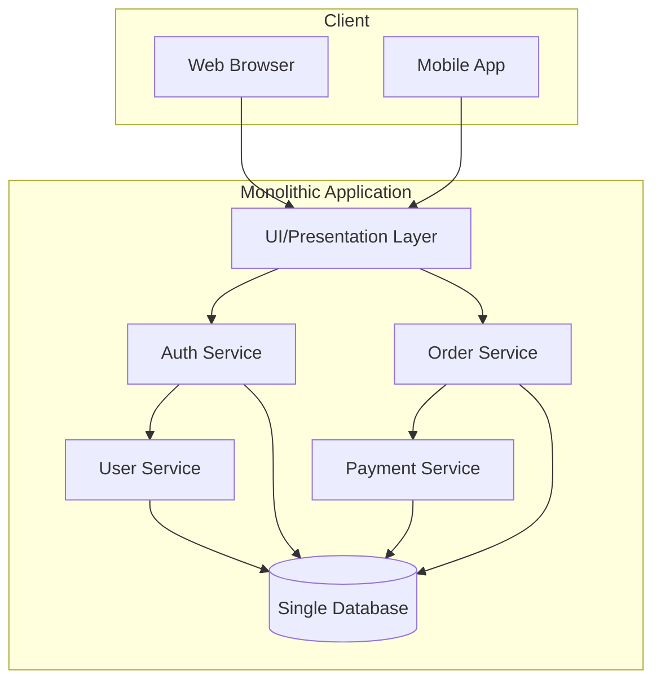
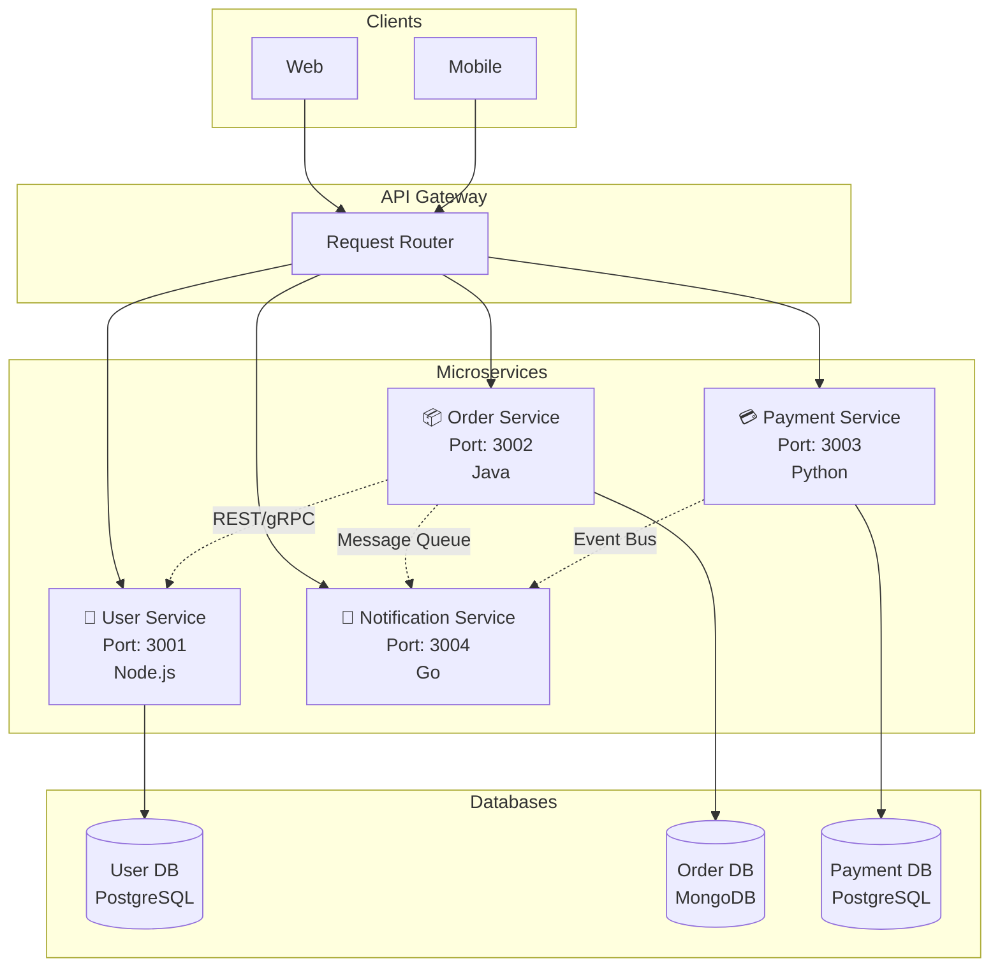
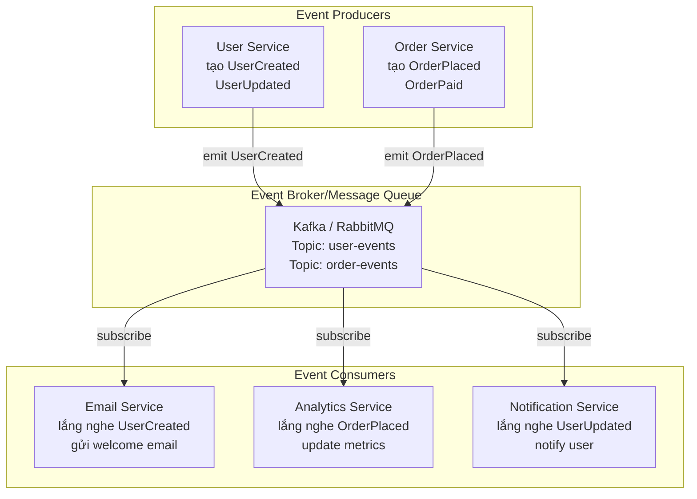
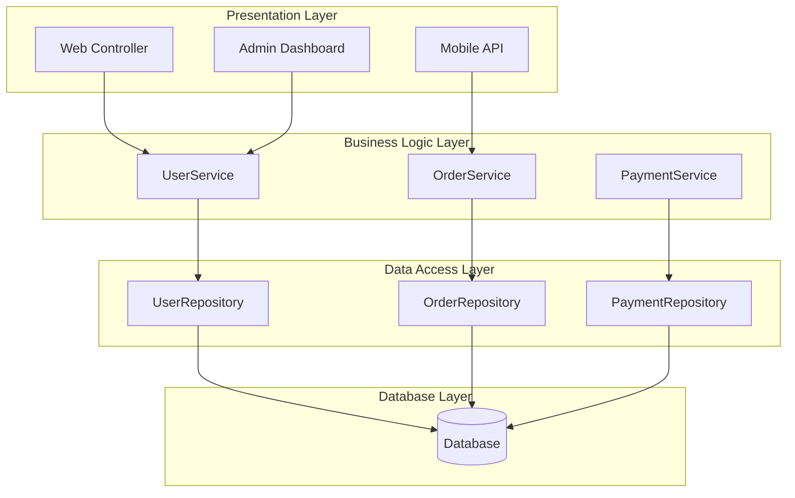
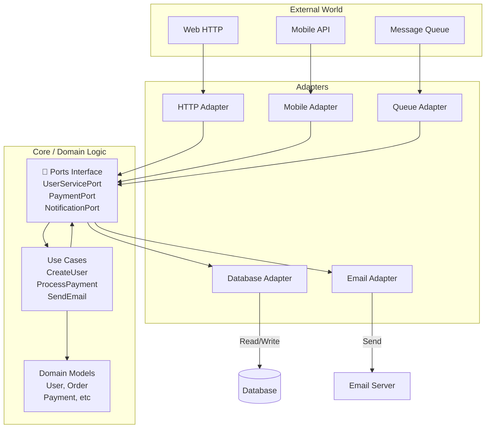
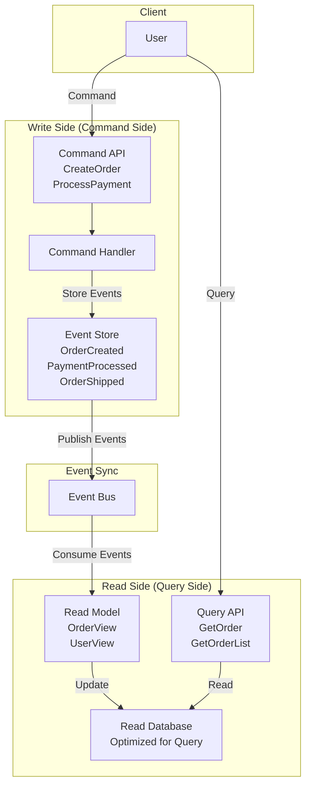
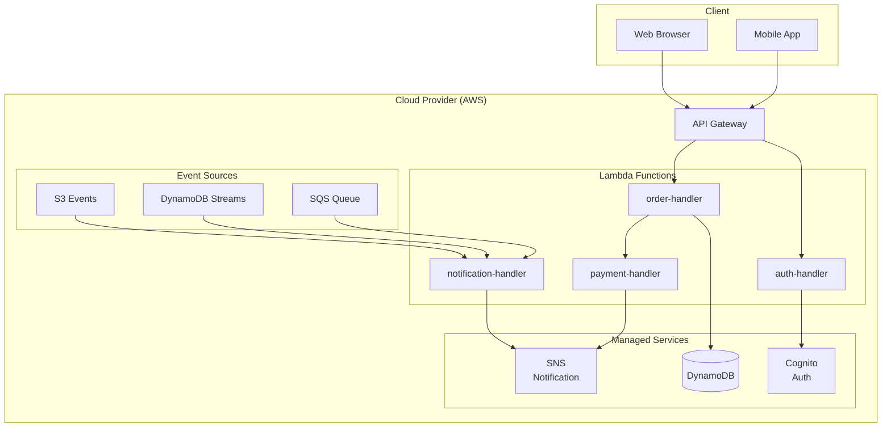

# 01-Architecture-Patterns - Tìm hiểu Chi tiết các Mô hình Kiến trúc

## 1. Monolithic Architecture (Kiến trúc Đơn khối)

### Khái niệm
Monolithic Architecture là kiến trúc nơi toàn bộ ứng dụng được xây dựng như một khối duy nhất:
- Một codebase lớn
- Một database
- Deploy toàn bộ hoặc không gì
- Tất cả code chạy trên một process

### Sơ đồ Monolithic

### Ưu điểm (Pros)

✓ **Đơn giản để bắt đầu**
- Dễ setup, không cần nhiều distributed system knowledge
- Một team nhỏ có thể quản lý dễ dàng

✓ **Hiệu suất tốt cho quy mô nhỏ**
- In-process calls nhanh (không cần network)
- Không overhead của network communication

✓ **Dễ kiểm tra (locally)**
- Spin up toàn bộ app trên local machine
- Không cần mock nhiều services

✓ **Dễ deploy ban đầu**
- Build và deploy một package duy nhất
- Không cần orchestration phức tạp

### Nhược điểm (Cons)

✗ **Khó scale**
- Phải scale toàn bộ app, không thể scale từng phần
- Nếu user service nóng, không thể chỉ scale user service

✗ **Tight coupling**
- Thay đổi một module có thể ảnh hưởng toàn bộ
- Khó tách rời dependencies

✗ **Khó deploy khi lớn**
- Mỗi lần deploy toàn bộ, có risk cao
- Downtime cho tất cả features

✗ **Khó chọn tech stack**
- Bắt buộc dùng cùng ngôn ngữ/framework cho toàn bộ
- Không thể dùng Java cho phần này, Python cho phần khác

✗ **Slow development khi team lớn**
- Nhiều conflicts trong code
- Khó parallelize development

### Khi nào dùng Monolith

✓ MVP hoặc startup mới
✓ Dự án nhỏ (<20 người dev)
✓ Chưa biết requirements sẽ thay đổi thế nào
✓ Không cần scale riêng từng phần
✓ Team không có experience với distributed systems

### Ví dụ thực tế

- **GitHub** (ban đầu)
- **Twitter** (version 1.0)
- **Shopify** (vẫn còn sử dụng monolithic core)

---

## 2. Microservices Architecture

### Khái niệm
Microservices là kiến trúc nơi ứng dụng được chia thành nhiều services nhỏ, độc lập:
- Mỗi service: một codebase riêng
- Mỗi service: một database riêng (ownership lõng lõi)
- Mỗi service: deploy độc lập
- Services giao tiếp qua API

### Sơ đồ Microservices

### Ưu điểm (Pros)

✓ **Scale độc lập**
- User service nóng → scale chỉ user service
- Không cần scale toàn bộ app

✓ **Deploy độc lập**
- Thay đổi Payment service → deploy chỉ phần đó
- Không ảnh hưởng đến Order service

✓ **Tech flexibility**
- User service: Node.js
- Payment service: Java
- Notification service: Python
- Chọn công cụ tốt nhất cho từng job

✓ **Loose coupling**
- Services độc lập, dễ test riêng
- Thay đổi internal implementation không ảnh hưởng client

✓ **Scalable development**
- Mỗi team chịu trách nhiệm 1-2 services
- Ít conflicts, develop nhanh hơn

✓ **Resilience**
- Nếu Payment service down, User service vẫn chạy
- Có thể implement circuit breaker, retry logic

### Nhược điểm (Cons)

✗ **Phức tạp operationally**
- Cần kiến thức về distributed systems
- Deployment, monitoring, logging phức tạp hơn
- Cần container orchestration (Kubernetes)

✗ **Network latency**
- Inter-service calls qua network (chậm hơn in-process)
- Mỗi call có latency, timeout risk

✗ **Data consistency khó**
- Dữ liệu ở nhiều databases riêng
- Khó maintain ACID transactions
- Cần implement Saga pattern cho distributed transactions

✗ **Testing phức tạp**
- Cần mock nhiều services
- Integration testing phức tạp
- Test environment expensive

✗ **DevOps overhead**
- Cần monitoring nhiều services
- Log aggregation, tracing
- Cần infrastructure khá chuyên nghiệp

### Khi nào dùng Microservices

✓ Dự án lớn (>10,000 lines per service)
✓ Team lớn (>20 people) chia thành nhiều teams
✓ Các phần của app có scale requirements khác nhau
✓ Muốn deploy độc lập
✓ Cần mix multiple tech stacks
✓ Team có kinh nghiệm với distributed systems
✓ High availability là critical

### Ví dụ thực tế

- **Netflix** - Microservices pioneer
- **Uber** - Gọi xe, payment, driver matching tách biệt
- **Amazon** - Có hàng trăm services
- **Stripe** - Payment processing, microservices based

---

## 3. Event-Driven Architecture

### Khái niệm
Event-Driven Architecture là kiến trúc nơi các components giao tiếp qua events (sự kiện):
- Component tạo event (producer)
- Component lắng nghe event (consumer)
- Decoupled communication
- Thường dùng message broker (Kafka, RabbitMQ)

### Sơ đồ Event-Driven

### Ưu điểm (Pros)

✓ **Loose coupling**
- Producers không biết consumers
- Consumers không biết producers
- Dễ thêm consumers mới mà không thay đổi producer

✓ **Scalability**
- Consumers có thể scale độc lập
- High throughput: một event được consume bởi nhiều consumers

✓ **Async processing**
- Không cần chờ response
- Xử lý background jobs dễ dàng

✓ **Real-time capabilities**
- Instant notifications
- Live dashboards updates

✓ **Audit trail**
- Tất cả events được log
- Dễ debug vì biết chính xác chuỗi events xảy ra

### Nhược điểm (Cons)

✗ **Eventual consistency**
- Dữ liệu trên consumers có thể không nhất quán với producer ngay
- Khó maintain data consistency

✗ **Debugging khó**
- Nếu Email service xử lý event sai, khó trace
- Error handling phức tạp

✗ **Testing phức tạp**
- Cần simulate events, consumers
- Khó predict behavior khi nhiều events

✗ **Ordering guarantee**
- Nếu cần order của events: UserCreated → UserUpdated
- Không phải lúc nào cũng đảm bảo order

### Khi nào dùng Event-Driven

✓ Hệ thống cần real-time
✓ Nhiều systems cần react to same event
✓ Async processing OK (không cần immediate response)
✓ Audit trail quan trọng
✓ Decoupling là priority

### Ví dụ thực tế

- **Netflix** - Event-driven microservices
- **Uber** - Real-time ride tracking
- **Stripe** - Payment webhooks
- **Shopify** - Product updates, order events

---

## 4. Layered/N-Tier Architecture

### Khái niệm
Layered Architecture chia ứng dụng thành các layers (tầng) nằm ngang:
- Presentation Layer (UI)
- Business Logic Layer (Service)
- Data Access Layer (Repository)
- Database Layer

Mỗi layer chỉ giao tiếp với layer dưới nó.

### Sơ đồ Layered

### Ưu điểm (Pros)

✓ **Dễ hiểu**
- Tách rõ concerns
- Developer mới dễ navigate

✓ **Dễ bảo trì**
- Thay đổi UI không ảnh hưởng business logic
- Thay đổi database chỉ ảnh hưởng data layer

✓ **Dễ kiểm tra**
- Mock layer dưới để test layer trên
- Unit testing straightforward

✓ **Dễ phát triển song song**
- Frontend team làm Presentation
- Backend team làm Business + Data
- Ít conflicts

### Nhược điểm (Cons)

✗ **Không scale theo phần**
- Nếu Order logic nóng, phải scale toàn bộ
- Giống monolithic problem

✗ **All layers in same codebase**
- Không thể deploy layer riêng
- Tech stack phải giống nhau

✗ **Database becomes bottleneck**
- Nếu mọi layer tương tác với cùng DB
- DB có thể trở thành single point of failure

### Khi nào dùng Layered

✓ Dự án truyền thống, monolithic
✓ Team familiar với N-tier pattern
✓ Cần clear separation of concerns
✓ Không cần scale complex
✓ Dự án vừa (CRUD-heavy apps)

### Ví dụ thực tế

- **Enterprise apps** (Banking, Insurance)
- **CRUD-heavy applications**
- **Legacy applications**

---

## 5. Hexagonal Architecture (Ports & Adapters)

### Khái niệm
Hexagonal Architecture (còn gọi Ports & Adapters) đặt business logic ở tâm, giao tiếp với bên ngoài qua ports & adapters:
- **Core/Domain** giữa: Business logic pure, không phụ thuộc framework
- **Ports**: Interface mà core expose (input/output)
- **Adapters**: Implementation cụ thể của ports

### Sơ đồ Hexagonal

### Ưu điểm (Pros)

✓ **Testable**
- Core logic không phụ thuộc framework
- Mock adapters dễ dàng
- Unit tests pure

✓ **Technology agnostic**
- Thay đổi web framework từ Spring → Quarkus
- Thay đổi database từ MySQL → PostgreSQL
- Business logic không thay đổi

✓ **Flexible**
- Dễ thêm adapter mới
- Same business logic cho multiple interfaces

✓ **Clean architecture**
- Inversion of Control
- Dependencies point inward to core

### Nhược điểm (Cons)

✗ **Học tập dốc**
- Cần hiểu DDD, SOLID, design patterns
- Không straightforward cho developer junior

✗ **Initial overhead**
- Setup ports, adapters ban đầu phức tạp
- Hơi overkill cho dự án nhỏ

✗ **Code organization**
- Cần discipline về folder structure
- Dễ violate architecture nếu không cẩn thận

### Khi nào dùng Hexagonal

✓ Dự án cần flexibility cao
✓ Team experienced với clean architecture
✓ Business logic complex
✓ Cần swap implementations dễ dàng
✓ Long-term maintainability quan trọng

### Ví dụ thực tế

- **DDD projects** (Domain-Driven Design)
- **Enterprise systems** với complex business rules
- **High-frequency trading systems**

---

## 6. CQRS + Event Sourcing

### Khái niệm

**CQRS (Command Query Responsibility Segregation)**
- Tách model ghi (Command) từ model đọc (Query)
- Commands: thay đổi state (CreateUser, UpdateOrder)
- Queries: đọc state mà không thay đổi

**Event Sourcing**
- Không lưu state hiện tại
- Lưu sequence of events
- Rebuild state từ events

### Sơ đồ CQRS + Event Sourcing

### Ưu điểm (Pros)

✓ **Audit trail**
- Tất cả changes được lưu lại
- Có thể replay history

✓ **Performance**
- Read side có thể optimize cho queries
- Denormalized data cho fast queries

✓ **Scalability**
- Write side scale riêng
- Read side scale riêng

✓ **Debugging**
- Replay events để debug
- Complete history có sẵn

### Nhược điểm (Cons)

✗ **Eventual consistency**
- Dữ liệu read side trễ so với write
- Khó maintain consistency

✗ **Complexity**
- Setup phức tạp
- Cần event versioning strategy

✗ **Storage**
- Lưu tất cả events → storage lớn
- Event cleanup strategy cần

### Khi nào dùng CQRS + Event Sourcing

✓ Audit trail critical (Banking, Healthcare)
✓ Audit trail
✓ Audit trail
✓ Read/write patterns rất khác nhau
✓ Event replay cần thiết

### Ví dụ thực tế

- **Banking systems** (Transaction history)
- **E-commerce** (Order history, audit)
- **Healthcare** (Medical record history)

---

## 7. Serverless Architecture

### Khái niệm
Serverless không có nghĩa là không có server - mà là **bạn không quản lý server**:
- Code chạy bằng functions (AWS Lambda, Google Cloud Functions)
- Auto-scaling
- Pay-as-you-go (trả tiền theo lần gọi)
- Cold start latency

### Sơ đồ Serverless

### Ưu điểm (Pros)

✓ **No server management**
- AWS quản lý servers, scaling, patching
- Focus purely on code

✓ **Auto-scaling**
- 1 request → spin up
- 1000 requests → auto-scale
- 0 requests → no cost

✓ **Pay-as-you-go**
- Trả tiền theo lần invoke
- Không chạy, không trả tiền

✓ **Fast deployment**
- Deploy function trong seconds
- Không cần build images, orchestration

✓ **Lower operational overhead**
- Không cần DevOps expertise lớn

### Nhược điểm (Cons)

✗ **Cold start latency**
- First invocation: 1-2 seconds start time
- Không tốt cho latency-sensitive apps

✗ **Limited execution time**
- AWS Lambda: max 15 minutes per invocation
- Không tốt cho long-running jobs

✗ **Vendor lock-in**
- AWS specific APIs
- Migrate to other platform khó

✗ **Debugging khó**
- No traditional logging/debugging tools
- Cần CloudWatch insights

✗ **Cost unpredictable**
- Nếu function inefficient, cost tăng nhanh
- Đơn vị tính: function GB-seconds

### Khi nào dùng Serverless

✓ Event-driven workloads
✓ API endpoints không cần latency <100ms
✓ Batch processing, scheduled jobs
✓ IoT, real-time processing
✓ Prototype, MVP
✓ Unpredictable traffic

### Không dùng Serverless khi:

✗ Need sustained high throughput
✗ Long-running processes
✗ Latency critical (<50ms)
✗ Complex stateful applications

### Ví dụ thực tế

- **Slack** - Using Lambda
- **Figma** - Serverless backend
- **iRobot** - IoT data processing
- **A Cloud Guru** - Serverless platform

---

## 8. So sánh các Architecture Patterns

| Criteria | Monolith | Microservices | Event-Driven | Layered | Hexagonal | Serverless |
|----------|----------|---------------|--------------|---------|-----------|-----------|
| **Complexity** | Low | High | High | Low-Medium | Medium | Medium |
| **Scalability** | Poor | Excellent | Good | Poor | Good | Excellent |
| **Deployment** | All-or-nothing | Independent | Event-based | All-or-nothing | Flexible | Per-function |
| **Testing** | Easy | Hard | Hard | Medium | Easy | Medium |
| **Startup time** | Medium | Fast | N/A | Medium | Medium | Slow (cold start) |
| **Tech diversity** | Limited | Excellent | Good | Limited | Excellent | Provider-specific |
| **Learning curve** | Easy | Steep | Steep | Easy | Medium | Medium |
| **Best for** | MVP, Small teams | Large teams, Complex domain | Real-time, Async | Traditional apps | DDD, Clean arch | Event-driven, Irregular load |

---

## 9. Tóm tắt

Chọn architecture đúng tùy vào:
1. **Team size & experience** - Lớn → Microservices, Nhỏ → Monolith
2. **Performance requirements** - High latency tolerance → Event-Driven, Low latency → Monolith
3. **Scalability needs** - Cần scale riêng → Microservices, Uniform → Monolith
4. **Technology flexibility** - Cần mix tech → Microservices, Same stack OK → Monolith
5. **Development speed** - Nhanh ra → Monolith/Serverless, Quality over speed → Hexagonal

Không có silver bullet - chọn cái phù hợp nhất với bối cảnh của bạn!
