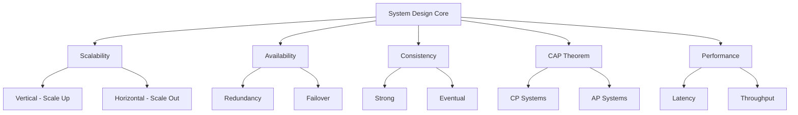

# Core Concepts - Nền Tảng System Design

> Đây là bài đầu tiên. Nắm vững phần này thì mọi thứ sau sẽ dễ hiểu hơn rất nhiều.

---

## 1. Scalability (Khả năng mở rộng)

Hệ thống có thể phục vụ nhiều người dùng hơn mà không chết.

### Vertical Scaling (Scale Up)
Nâng cấp máy: thêm RAM, CPU mạnh hơn, SSD nhanh hơn. Đơn giản nhưng có giới hạn vật lý và chi phí tăng exponentially.

### Horizontal Scaling (Scale Out)
Thêm nhiều máy: thay vì 1 siêu máy, dùng 10 máy thường. Phức tạp hơn nhưng gần như vô hạn.

```
Vertical:  [Server] → [BIGGER Server]
Horizontal: [Server] → [Server][Server][Server]
```

**Khi nào dùng gì?**
- Vertical: database (dễ hơn), giai đoạn đầu startup
- Horizontal: web servers, microservices, khi cần fault tolerance

---

## 2. Availability (Tính sẵn sàng)

Hệ thống luôn hoạt động khi người dùng cần.

**Đo bằng "nines":**

| Level | Uptime | Downtime/năm |
|-------|--------|--------------|
| 99% (two nines) | | 3.65 ngày |
| 99.9% (three nines) | | 8.77 giờ |
| 99.99% (four nines) | | 52.6 phút |
| 99.999% (five nines) | | 5.26 phút |

**Đạt được bằng cách:**
- Redundancy (dư thừa): chạy nhiều bản copy
- Failover: tự động chuyển sang backup khi primary chết
- Health checks: liên tục kiểm tra hệ thống có sống không

---

## 3. Consistency (Tính nhất quán)

Mọi người đọc đều thấy data mới nhất.

### Strong Consistency
Sau khi write, tất cả các read đều thấy giá trị mới. Ví dụ: chuyển tiền ngân hàng — không thể để 2 nơi thấy số dư khác nhau.

### Eventual Consistency
Sau khi write, cần một khoảng thời gian để tất cả các node đồng bộ. Ví dụ: like trên Facebook — ok nếu bạn thấy 99 likes, tôi thấy 100 likes trong vài giây.

### Khi nào chọn gì?
- **Strong**: tài chính, inventory, authentication
- **Eventual**: social feed, analytics, recommendations

---

## 4. CAP Theorem

> Trong hệ thống phân tán, bạn chỉ có thể chọn 2 trong 3:

```
        C (Consistency)
       / \
      /   \
     /     \
    P ───── A
(Partition   (Availability)
 Tolerance)
```

- **C** - Consistency: mọi read đều trả về write mới nhất
- **A** - Availability: mọi request đều nhận response (không bị timeout)
- **P** - Partition Tolerance: hệ thống vẫn chạy dù network bị đứt

**Thực tế**: Partition luôn có thể xảy ra (network không hoàn hảo), nên ta thực sự chọn giữa **CP** hoặc **AP**:
- **CP** (Consistency + Partition): MongoDB, HBase → chấp nhận unavailable khi partition
- **AP** (Availability + Partition): Cassandra, DynamoDB → chấp nhận stale data khi partition

---

## 5. Latency vs Throughput

### Latency (Độ trễ)
Thời gian từ lúc gửi request đến khi nhận response. Đo bằng ms.

**Latency numbers mọi engineer nên biết:**
| Thao tác | Thời gian |
|---------|-----------|
| L1 cache reference | 0.5 ns |
| L2 cache reference | 7 ns |
| RAM reference | 100 ns |
| SSD random read | 150 μs |
| HDD seek | 10 ms |
| Network round trip (same datacenter) | 500 μs |
| Network round trip (cross-continent) | 150 ms |

### Throughput (Thông lượng)
Số lượng operations hệ thống xử lý được trong 1 đơn vị thời gian. Đo bằng QPS (queries/second) hoặc RPS (requests/second).

**Trade-off**: Tăng throughput có thể làm tăng latency và ngược lại. Cần balance.

---

## 6. Redundancy & Replication

### Redundancy
Có backup cho mọi component quan trọng. Không single point of failure (SPOF).

### Replication
Sao chép data sang nhiều nơi:
- **Leader-Follower**: 1 node nhận writes, copies sang followers (đọc từ followers)
- **Leader-Leader**: nhiều nodes đều nhận writes (phức tạp, dễ conflict)
- **Leaderless**: tất cả nodes bình đẳng (Cassandra style)

---

## Checklist Tự Kiểm Tra

- [ ] Giải thích được sự khác nhau giữa vertical và horizontal scaling
- [ ] Tính được downtime của 99.99% availability
- [ ] Phân biệt được strong vs eventual consistency với ví dụ thực tế
- [ ] Giải thích CAP theorem cho người không biết tech
- [ ] Biết khi nào nên ưu tiên latency vs throughput
- [ ] Hiểu tại sao redundancy quan trọng

---

## Diagram Tổng Quan


