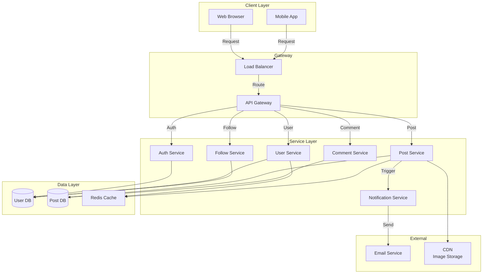

# HLD Template - Mẫu Thiết Kế Cấp Cao

Sử dụng mẫu này để tạo HLD cho dự án của bạn. Điền tất cả các phần, xóa các ví dụ placeholder.

---

## 1. Overview (Tổng quan)

### Project Name (Tên dự án)
[Nhập tên dự án của bạn]

### Purpose (Mục đích)
[Dự án này làm gì? Giải quyết vấn đề gì?]

### Scope (Phạm vi)
[Những tính năng chính sẽ được xây dựng? Những gì KHÔNG bao gồm?]

**Ví dụ:**
```
Tên: Social Media Platform
Mục đích: Cho phép người dùng tạo tài khoản, chia sẻ post, comment, follow bạn bè
Phạm vi:
  - Tính năng: User authentication, post CRUD, comment, follow/unfollow
  - KHÔNG bao gồm: Video streaming, live chat, recommendation engine (v1)
```

---

## 2. Functional Requirements (Yêu cầu chức năng)

Liệt kê các tính năng chính mà hệ thống phải cung cấp.

**Format:**
```
FR1: User Authentication
  - User có thể đăng ký với email
  - User có thể đăng nhập với email/password
  - User có thể đăng xuất
  - User có thể reset password qua email

FR2: Post Management
  - User có thể tạo post với text/image
  - User có thể xem timeline (những post từ người bạn follow)
  - User có thể like/unlike post
  - User có thể xoá post của mình

FR3: Social Interaction
  - User có thể follow/unfollow user khác
  - User có thể see profile của user khác
  - User có thể comment trên post
```

**Hãy liệt kê từ 5-10 requirement chính.**

---

## 3. Non-Functional Requirements (Yêu cầu phi chức năng)

Xác định các tiêu chí về hiệu suất, bảo mật, độ tin cậy.

| Requirement | Mục tiêu | Ghi chú |
|-----------|--------|--------|
| Performance | < 500ms response time | Cho 95th percentile |
| Scalability | Support 1 million DAU | Daily Active Users |
| Availability | 99.95% uptime | Ngoài planned maintenance |
| Security | Encryption, HTTPS | Comply with GDPR |
| Concurrent Users | 100,000 concurrent | Peak hours |
| Data Retention | 7 năm | Archive old posts |

---

## 4. System Architecture Diagram (Sơ đồ kiến trúc)



**Giải thích:**
- **Client Layer**: Web browser và mobile app từ người dùng
- **Gateway**: Load balancer phân phối request, API Gateway điều hướng
- **Service Layer**: Các service độc lập, mỗi cái quản lý một tính năng
- **Data Layer**: Database lưu trữ, Redis cache để tăng hiệu suất
- **External**: Dịch vụ bên ngoài (email, storage)

---

## 5. Component Description (Mô tả thành phần)

Liệt kê chi tiết từng component.

### Component 1: API Gateway

| Thuộc tính | Giá trị |
|-----------|--------|
| **Mục đích** | Điều hướng request đến services, rate limiting, logging |
| **Trách nhiệm** | Nhận HTTP request, xác thực token, gọi service phù hợp |
| **Input** | HTTP request from client |
| **Output** | JSON response hoặc error |
| **Dependencies** | Auth Service (để validate token) |
| **Technology** | Kong / AWS API Gateway / Nginx |

### Component 2: Auth Service

| Thuộc tính | Giá trị |
|-----------|--------|
| **Mục đích** | Xác thực người dùng, cấp JWT token |
| **Trách nhiệm** | Login, register, token validation, password reset |
| **Input** | Email/password, token |
| **Output** | JWT token hoặc error message |
| **Dependencies** | User Database |
| **Technology** | Node.js + Passport.js hoặc Python + Flask |

### Component 3: [Tên Service của bạn]

| Thuộc tính | Giá trị |
|-----------|--------|
| **Mục đích** | [Làm gì?] |
| **Trách nhiệm** | [Trách nhiệm chính] |
| **Input** | [Nhận input gì?] |
| **Output** | [Trả về gì?] |
| **Dependencies** | [Phụ thuộc vào gì?] |
| **Technology** | [Công nghệ nào?] |

**Hãy thêm 4-6 component khác.**

---

## 6. Technology Stack (Công nghệ)

### Frontend

| Layer | Technology | Lý do chọn |
|------|-----------|-----------|
| Framework | React 18 / Vue 3 / Angular | Phổ biến, community lớn |
| Language | TypeScript | Type safety, development speed |
| State Management | Redux / Zustand / Context | Quản lý state toàn cục |
| UI Library | Material-UI / Tailwind CSS | Có sẵn components |
| Testing | Jest + React Testing Library | Popular, good coverage |

### Backend

| Layer | Technology | Lý do chọn |
|------|-----------|-----------|
| Language | Python 3.9+ / Node.js 18+ / Java 17+ | [Lý do] |
| Framework | Django / FastAPI / Express / Spring Boot | [Lý do] |
| API Style | REST / GraphQL | [Lý do] |
| Async Jobs | Celery / Bull Queue / Apache Kafka | Background tasks |
| Testing | Pytest / Jest / JUnit | Unit & integration test |

### Database

| Layer | Technology | Lý do chọn |
|------|-----------|-----------|
| Primary DB | PostgreSQL 14 / MySQL 8 | Relational data, ACID |
| Cache | Redis 7 | Fast read, session store |
| Search | Elasticsearch | Full-text search trên posts |
| File Storage | AWS S3 / Google Cloud Storage | Image, video storage |

### Infrastructure

| Layer | Technology | Lý do chọn |
|------|-----------|-----------|
| Containerization | Docker | Consistency across environments |
| Orchestration | Kubernetes / Docker Compose | Scaling, load balancing |
| Cloud | AWS / GCP / Azure | Managed services, scalability |
| CI/CD | GitHub Actions / GitLab CI | Automated deployment |
| Monitoring | Prometheus + Grafana / DataDog | System health, metrics |
| Logging | ELK Stack / Splunk | Centralized logging |

---

## 7. Data Flow (Luồng dữ liệu)

### Use Case 1: User Creates a Post

```
1. User opens web app
2. Clicks "Create Post" button
3. Fills in post content + uploads image
4. Clicks "Publish"

5. Frontend: POST /api/posts
   Payload: { content: "...", image: file }
   Headers: { Authorization: "Bearer JWT_TOKEN" }

6. API Gateway receives request
   - Extract JWT from headers
   - Call Auth Service to validate token
   - Route to Post Service

7. Post Service:
   - Validate content (not empty, < 500 chars)
   - Upload image to S3
   - Create post record in database
   - Publish "post.created" event to message queue
   - Return: { postId: 123, createdAt: "...", imageUrl: "..." }

8. Notification Service picks up "post.created" event:
   - Get followers of post creator
   - Add post to their timelines (cache)
   - Send push notification

9. Response back to Frontend
   - Frontend receives post data
   - Shows success message
   - Redirects to post detail page

10. Other users see the post in their timeline
```

### Use Case 2: User Follows Another User

```
1. User clicks "Follow" button on someone's profile

2. Frontend: POST /api/follows
   Payload: { targetUserId: 456 }

3. Follow Service:
   - Check if already following
   - Create follow record
   - Clear cache for current user's timeline
   - Publish "user.followed" event

4. Notification Service:
   - Send notification to targetUserId: "User XYZ started following you"

5. Return success to frontend
```

---

## 8. Integration Points (Điểm tích hợp)

### External 1: Email Service

| Thuộc tính | Giá trị |
|-----------|--------|
| **Service** | SendGrid / AWS SES |
| **Purpose** | Gửi email xác thực, reset password, notification |
| **Integration Type** | REST API |
| **Authentication** | API Key |
| **Endpoint** | `https://api.sendgrid.com/v3/mail/send` |
| **Payload Example** | `{ to: "user@gmail.com", subject: "...", html: "..." }` |
| **Rate Limit** | 100 emails/second |

### External 2: Cloud Storage

| Thuộc tính | Giá trị |
|-----------|--------|
| **Service** | AWS S3 / Google Cloud Storage |
| **Purpose** | Lưu trữ hình ảnh, video |
| **Integration Type** | SDK / REST API |
| **Authentication** | AWS credentials / GCS API key |
| **Endpoint** | `https://s3.amazonaws.com/bucket-name/...` |
| **Data Format** | Binary (images, videos) |

### External 3: [Your Integration]

[Điền thông tin cho external service khác mà bạn sử dụng]

---

## 9. Non-Functional Strategies (Chiến lược tối ưu)

### Performance Optimization

```yaml
Caching Strategy:
  - Redis cache cho user profiles (1 hour TTL)
  - Redis cache cho posts (30 minutes TTL)
  - Browser cache cho static assets (1 month)

Database Optimization:
  - Index on (userId, createdAt) cho timeline query
  - Partition posts by date (monthly)
  - Use read replicas cho read-heavy queries

API Optimization:
  - Pagination (limit 20 items per request)
  - Lazy loading images (use CDN)
  - Compress responses (gzip)
```

### Scalability Strategy

```yaml
Horizontal Scaling:
  - Load balancer phân phối request
  - Services chạy trên multiple instances
  - Auto-scaling policy: scale up khi CPU > 70%

Microservices:
  - Mỗi service độc lập, có thể scale riêng
  - Post Service scale cao (hàng triệu posts)
  - Auth Service scale vừa phải (reusable)

Database Sharding:
  - Shard users by userId (hash)
  - Shard posts by postId (hash)
```

### Availability Strategy

```yaml
High Availability:
  - Multi-region deployment (US, EU, ASIA)
  - Health checks mỗi 10 seconds
  - Automatic failover khi service down
  - Database replication (master-slave)

Disaster Recovery:
  - Database backup mỗi 6 hours
  - RTO (Recovery Time Objective): < 1 hour
  - RPO (Recovery Point Objective): < 30 minutes
```

### Security Strategy

```yaml
Authentication & Authorization:
  - JWT token (valid 24 hours)
  - Refresh token (valid 30 days)
  - Role-based access control (admin, user, moderator)

Data Protection:
  - HTTPS for all communications
  - Encrypt passwords with bcrypt
  - Encrypt sensitive data at rest (database encryption)
  - SQL injection prevention (prepared statements)

API Security:
  - Rate limiting (100 requests/minute per user)
  - CORS (allow specific domains)
  - Input validation (sanitize all inputs)
```

---

## 10. Risks & Mitigations (Rủi ro và giải pháp)

| Rủi ro | Mức độ | Giải pháp |
|--------|-------|---------|
| Database là bottleneck | High | Thêm caching layer, read replicas |
| Single point of failure | High | Multi-region, load balancing |
| Security breach | Critical | HTTPS, encryption, security audit |
| Data loss | High | Regular backup, replication |
| Slow API response | Medium | Optimize queries, caching |
| Service outage | High | Health checks, auto-recovery |

---

## 11. Deployment & DevOps (Triển khai)

### Development Environment

```yaml
Local:
  - Docker Compose (database, cache, services)
  - npm/pip start
  - Hot reload enabled

Staging:
  - AWS EC2 instances
  - Same stack as production
  - Test data
```

### Production Environment

```yaml
Cloud Platform: AWS
  - EC2 instances (auto-scaling group)
  - RDS for PostgreSQL
  - ElastiCache for Redis
  - S3 for storage
  - CloudFront for CDN

Container Orchestration:
  - Kubernetes cluster
  - 3 master nodes, 10+ worker nodes
  - Pod auto-scaling based on CPU

CI/CD Pipeline:
  - GitHub Actions
  - Build image
  - Run tests
  - Push to ECR
  - Deploy to Kubernetes
```

---

## 12. Monitoring & Logging (Giám sát)

### Key Metrics

```yaml
Application Metrics:
  - Request latency (p50, p95, p99)
  - Error rate (5xx, 4xx)
  - Throughput (requests/second)
  - Active users

Infrastructure Metrics:
  - CPU usage
  - Memory usage
  - Disk usage
  - Network I/O

Business Metrics:
  - Daily active users
  - Posts created per day
  - User retention rate
  - Conversion rate
```

### Logging Strategy

```yaml
Log Levels:
  - ERROR: System errors, exceptions
  - WARN: Deprecated API usage, slow queries
  - INFO: Significant events (user login, post created)
  - DEBUG: Detailed information for debugging

Log Centralization:
  - ELK Stack (Elasticsearch, Logstash, Kibana)
  - All services push logs to central place
  - Searchable, filterable by timestamp, service, level
```

---

## 13. Future Enhancements (Cải tiến tương lai)

Những tính năng/tối ưu sẽ thêm sau:

- [ ] Recommendation engine (suggest users to follow)
- [ ] Real-time notifications (WebSocket)
- [ ] Video streaming
- [ ] Analytics dashboard
- [ ] AI-powered content moderation
- [ ] GraphQL API (bên cạnh REST)
- [ ] Mobile app (iOS)

---

## 14. Team & Responsibilities (Đội và trách nhiệm)

| Role | Number | Responsibilities |
|------|--------|------------------|
| Tech Lead | 1 | Architecture, decisions |
| Backend Developers | 3 | Implement services |
| Frontend Developers | 2 | Implement UI |
| DevOps Engineer | 1 | Infrastructure, deployment |
| QA Engineer | 1 | Testing, QA |

---

## 15. Approval & Sign-off (Phê duyệt)

| Role | Name | Date | Signature |
|------|------|------|-----------|
| Tech Lead | [Name] | [Date] | ☑️ |
| Product Manager | [Name] | [Date] | ☑️ |
| Project Manager | [Name] | [Date] | ☑️ |

---

## References (Tài liệu tham khảo)

- Requirements document: [Link]
- Design decision log: [Link]
- Architecture ADR: [Link]
- API specification: [Link]

---

**Document Version**: 1.0
**Last Updated**: [Date]
**Next Review**: [Date]
