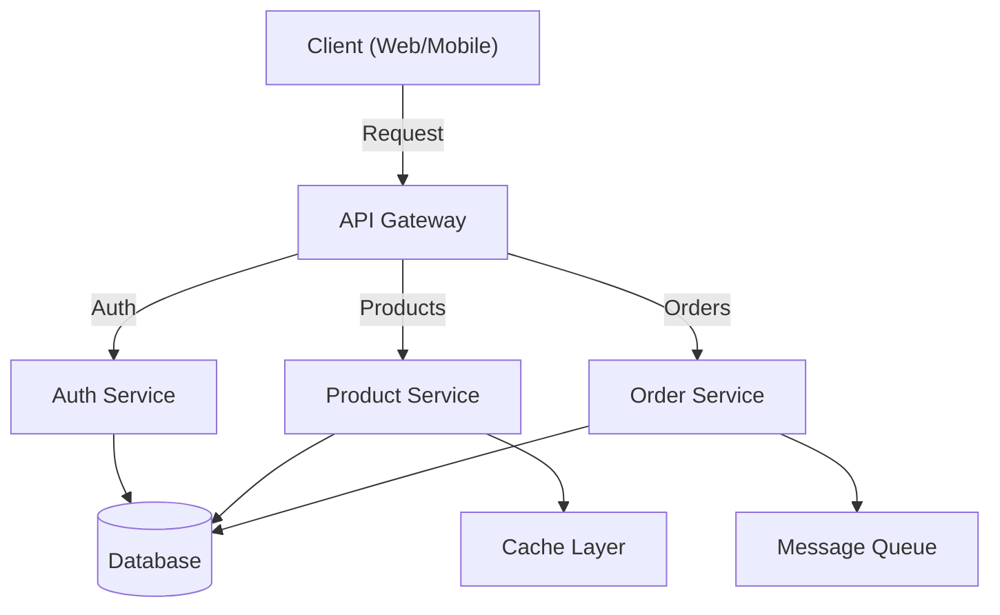
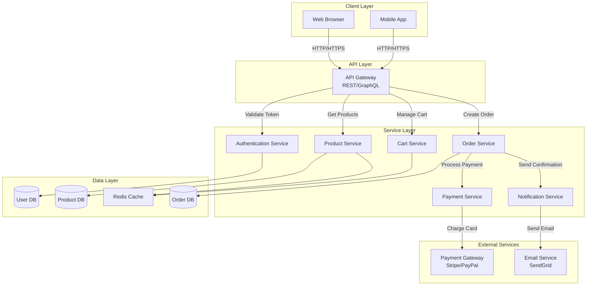

# High-Level Design (HLD) - Thiết Kế Cấp Cao

## HLD là gì?

**High-Level Design (HLD)** là tầng thiết kế đầu tiên khi phát triển một hệ thống phần mềm. Nó giúp bạn nhìn toàn cảnh hệ thống: các thành phần chính, chúng hoạt động như thế nào, và chúng giao tiếp với nhau ra sao.

HLD trả lời các câu hỏi:
- Hệ thống của chúng ta sẽ bao gồm những thành phần nào?
- Những thành phần này sẽ tương tác như thế nào?
- Chúng ta sẽ sử dụng công nghệ nào?
- Dữ liệu sẽ chảy qua hệ thống như thế nào?

## HLD nằm ở đâu trong quy trình?

```
Requirements Analysis (Phân tích yêu cầu)
        ↓
High-Level Design (HLD) ← Bạn đang ở đây
        ↓
Low-Level Design (LLD)
        ↓
Implementation (Code)
        ↓
Testing & Deployment
```

**Thứ tự quá trình:**
1. Bạn nhận được các yêu cầu (requirements) từ khách hàng
2. Phân tích xem hệ thống cần làm gì
3. **Tạo HLD**: Chia hệ thống thành các thành phần lớn
4. **Tạo LLD**: Chi tiết hoá từng thành phần (class, method, database)
5. Code và test

## HLD bao gồm những gì?

### 1. **System Architecture Diagram** (Sơ đồ kiến trúc hệ thống)
Hình vẽ biểu diễn các thành phần chính và cách chúng kết nối với nhau.

Ví dụ: E-commerce system
```
┌─────────────┐     ┌──────────────┐     ┌────────────┐
│   Web UI    │────▶│  API Gateway │────▶│  Auth Svc  │
└─────────────┘     └──────────────┘     └────────────┘
                           │
                    ┌──────┴──────┐
                    ▼             ▼
             ┌────────────┐  ┌────────────┐
             │ Product    │  │ Order      │
             │ Service    │  │ Service    │
             └────────────┘  └────────────┘
                    │             │
                    └──────┬──────┘
                           ▼
                    ┌────────────┐
                    │ Database   │
                    └────────────┘
```

### 2. **Component List** (Danh sách các thành phần)
Liệt kê tên từng thành phần, trách nhiệm chính của nó:

| Thành phần | Trách nhiệm |
|-----------|-----------|
| Web UI | Giao diện người dùng |
| API Gateway | Điều hướng request đến các service |
| Auth Service | Xác thực người dùng |
| Product Service | Quản lý thông tin sản phẩm |
| Order Service | Quản lý đơn hàng |
| Database | Lưu trữ dữ liệu |

### 3. **Technology Stack** (Công nghệ sử dụng)
Chọn công nghệ phù hợp cho từng thành phần:

```
Frontend:
  - Language: JavaScript/TypeScript
  - Framework: React
  - State Management: Redux

Backend:
  - Language: Python/Java
  - Framework: Django/Spring Boot
  - API: REST / GraphQL

Database:
  - Primary: PostgreSQL (quan hệ)
  - Cache: Redis
  - Search: Elasticsearch

Infrastructure:
  - Cloud: AWS / GCP
  - Containerization: Docker
  - Orchestration: Kubernetes
```

### 4. **Data Flow** (Luồng dữ liệu)
Mô tả dữ liệu chảy qua hệ thống:

```
User Action → Web UI → API Gateway → Service Logic → Database
                                          ↓
                                    Process/Transform
                                          ↓
                                      Response → UI
```

### 5. **Integration Points** (Điểm tích hợp)
Các điểm hệ thống giao tiếp với bên ngoài:
- Thanh toán (Payment gateway: Stripe, PayPal)
- Email (SMTP service)
- SMS (Twilio)
- External APIs (Google Maps, Weather API)

### 6. **Non-Functional Requirements** (Yêu cầu phi chức năng)
- **Performance**: Hệ thống phải xử lý 10,000 requests/second
- **Availability**: 99.9% uptime
- **Scalability**: Có thể tăng lên 100x user mà không giảm hiệu suất
- **Security**: Mã hóa dữ liệu, HTTPS, authentication
- **Latency**: Response time < 200ms

## HLD KHÔNG bao gồm những gì?

❌ **Code-level implementation**: Không viết code thực tế
❌ **Class diagrams**: Chi tiết về class, method chưa cần
❌ **Database schema**: Chi tiết các field, index chưa cần
❌ **Exact algorithms**: Thuật toán cụ thể chưa cần chi tiết
❌ **Error handling logic**: Xử lý lỗi cụ thể

**HLD chỉ là bản đồ tổng quát, LLD sẽ chi tiết hóa những điều này.**

## Step-by-step Cách Làm HLD

### Bước 1: Hiểu Requirements
- Đọc kỹ các yêu cầu từ khách hàng
- Xác định functional requirements (tính năng)
- Xác định non-functional requirements (hiệu suất, bảo mật)

### Bước 2: Xác định Major Components
- Chia hệ thống thành các phần lớn
- Mỗi phần nên có một trách nhiệm chính
- Dùng quy tắc "Single Responsibility"

Ví dụ:
```
E-commerce system
├── Authentication & Authorization
├── Product Management
├── Shopping Cart & Order
├── Payment Processing
└── Notification System
```

### Bước 3: Quyết định Technology Stack
- Chọn ngôn ngữ lập trình (Python, Java, Node.js, ...)
- Chọn framework (Django, Spring Boot, Express, ...)
- Chọn database (SQL hay NoSQL?)
- Chọn infrastructure (Cloud? On-premise?)

**Các tiêu chí chọn:**
- Yêu cầu của dự án
- Kỹ năng của team
- Chi phí
- Community support

### Bước 4: Vẽ Architecture Diagram
- Dùng tool như Miro, Lucidchart, Draw.io
- Vẽ các thành phần dưới dạng hộp
- Vẽ các mũi tên chỉ mối quan hệ



### Bước 5: Định nghĩa Data Flow
- Người dùng làm gì → hệ thống nhận gì → xử lý như thế nào → trả về gì
- Viết bằng từ ngữ tự nhiên hoặc sequence diagram đơn giản

### Bước 6: Xác định Integration Points
- Hệ thống cần giao tiếp với ai?
- API của bên thứ 3 nào?
- Format dữ liệu là gì?

### Bước 7: Viết Documentation
- Tóm tắt lại mọi thứ
- Thêm diagrams
- Giải thích các quyết định thiết kế

## Ví dụ: HLD cho E-commerce System

### Overview
Hệ thống bán hàng trực tuyến cho phép khách hàng xem sản phẩm, thêm vào giỏ hàng, thanh toán và nhận đơn hàng.

### Architecture Diagram



### Component Description

| Component | Trách nhiệm | Technology |
|-----------|-----------|-----------|
| API Gateway | Điều hướng request, rate limiting | Kong / AWS API Gateway |
| Auth Service | Login, JWT token, permission | Node.js + Passport |
| Product Service | CRUD sản phẩm, search, filter | Python + Django |
| Cart Service | Thêm/xoá item, tính giá | Node.js + Express |
| Order Service | Tạo, tracking, quản lý đơn | Python + Celery (async) |
| Payment Service | Gọi payment gateway, lưu record | Python + Stripe SDK |
| Notification | Email, SMS, Push notification | Node.js + Bull Queue |

### Technology Stack

```yaml
Frontend:
  Web: React 18 + TypeScript
  Mobile: React Native
  State: Redux Toolkit
  UI: Material-UI

Backend:
  API Gateway: Kong / AWS API Gateway
  Services: Python 3.9 + Django/FastAPI
  Async Jobs: Celery + Redis

Database:
  Primary: PostgreSQL 14
  Cache: Redis 7
  Search: Elasticsearch

Infrastructure:
  Cloud: AWS (EC2, RDS, S3)
  Container: Docker
  Orchestration: Kubernetes
  CI/CD: GitHub Actions
```

### Data Flow - User Places Order

```
1. User clicks "Place Order"
2. Frontend → API Gateway /orders (POST)
3. API Gateway → Order Service
4. Order Service:
   - Validate cart items
   - Calculate total price
   - Create order record
   - Publish "order.created" event to message queue
5. Payment Service picks up event:
   - Call Stripe API
   - Save transaction record
   - Publish "payment.completed" event
6. Notification Service picks up event:
   - Send confirmation email
   - Send order number to user
7. Inventory Service picks up event:
   - Reduce stock count
8. Response back to user: "Order placed successfully! Order ID: #12345"
```

### Non-Functional Requirements

| Requirement | Target | Giải pháp |
|-----------|--------|---------|
| Throughput | 10,000 req/second | Load balancing, auto-scaling |
| Response time | < 500ms | Caching, CDN, database optimization |
| Availability | 99.9% | Multi-region, health checks, failover |
| Data security | Encryption at rest & in transit | HTTPS, database encryption, VPN |
| Scalability | Support 10 million users | Horizontal scaling, microservices |

### Integration Points

1. **Payment Gateway**: Stripe API
   - Endpoint: `https://api.stripe.com/v1/charges`
   - Authentication: API Key
   - Payload: Card details, amount, currency

2. **Email Service**: SendGrid API
   - Endpoint: `https://api.sendgrid.com/v3/mail/send`
   - Authentication: API Key
   - Payload: Email address, subject, content

3. **Analytics**: Google Analytics
   - Tracking: User behavior, conversion
   - Integration: JavaScript SDK

## Checklist Tự Kiểm tra HLD

Trước khi chuyển sang LLD, kiểm tra:

- [ ] Tất cả requirements đã được cover?
- [ ] Architecture diagram rõ ràng và dễ hiểu?
- [ ] Mỗi component có một trách nhiệm chính?
- [ ] Data flow hợp lý từ client → server → database → back?
- [ ] Non-functional requirements đã được xem xét?
- [ ] Có giải pháp cho bottleneck?
- [ ] Technology stack phù hợp với yêu cầu?
- [ ] Tất cả integration points đã được xác định?
- [ ] Team hiểu và đồng ý với thiết kế?
- [ ] Documentation đầy đủ và dễ hiểu?

## Common Mistakes in HLD

❌ **Quá chi tiết**: Bắt đầu viết code/class diagram → di chuyển sang LLD
❌ **Quá mơ hồ**: Không đủ thông tin để team bắt đầu LLD
❌ **Không xem xét scalability**: Tưởng tượng hệ thống hoạt động với 1000x user
❌ **Quên security**: Không nghĩ đến bảo mật từ đầu
❌ **Không document**: Chỉ có diagram mà không có giải thích

## Kế tiếp: Low-Level Design (LLD)

Sau khi HLD được approve, bạn sẽ tạo **LLD** để chi tiết hoá từng component:
- Class diagrams
- Database schema
- API contracts
- Error handling
- Algorithms

Xem file `../04-LOW-LEVEL-DESIGN/README.md` để tìm hiểu LLD.
