# Sequence Diagrams - Sơ đồ Tuần tự

## Sequence Diagram là gì?

**Sequence Diagram** là một loại diagram dùng để mô tả **thứ tự các bước** khi một use case hoặc process xảy ra. Nó cho thấy các actors (người dùng, objects) tương tác với nhau như thế nào theo thời gian.

### Tại sao cần Sequence Diagrams?

1. **Visualize flow**: Dễ hiểu luồng xử lý phức tạp
2. **Identify bottlenecks**: Nhìn thấy nơi có thể chậm
3. **Error handling**: Hiểu cách xử lý lỗi
4. **Communication**: Giải thích cho team dễ hơn
5. **Documentation**: Tài liệu cho developers

### Ví dụ đơn giản

```
User → Login Button → Auth Service → Database
 │         │              │             │
 │─enter email/pw──→      │             │
 │                   │─validate────────→│
 │                   │                  │
 │                   │←──user data──────│
 │                   │                  │
 │                   │─generate token   │
 │←─token───────────│
 │
 │─show dashboard
```

## Syntax Mermaid cho Sequence Diagrams

Mermaid là công cụ để vẽ diagrams bằng code. Dưới đây là syntax cơ bản:

### 1. Khai báo Participants (Tham gia viên)

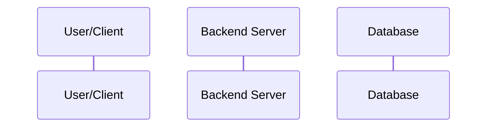

**Giải thích:**
- `participant [variable] as [display name]`
- Variable dùng trong diagram
- Display name là tên hiển thị

### 2. Messages - Thông điệp

#### Synchronous Message (Chờ response)
```mermaid
sequenceDiagram
    Actor->>Server: Do something
    Server-->>Actor: Response
```

**Ký hiệu:**
- `->>`  : Solid arrow (synchronous)
- `->>` : Solid return
- `-->>` : Dashed return

#### Asynchronous Message (Không chờ)
```mermaid
sequenceDiagram
    Actor->>Server: Send and don't wait
    Server-->>Actor: Response later
```

### 3. Activation Box (Khoảng thời gian hoạt động)

```mermaid
sequenceDiagram
    Actor->>Server: Request
    activate Server
    Server->>DB: Query
    activate DB
    DB-->>Server: Result
    deactivate DB
    Server-->>Actor: Response
    deactivate Server
```

**Activation** dùng `activate` và `deactivate` để chỉ ra khi nào một object đang hoạt động.

### 4. Alt/Else - Điều kiện

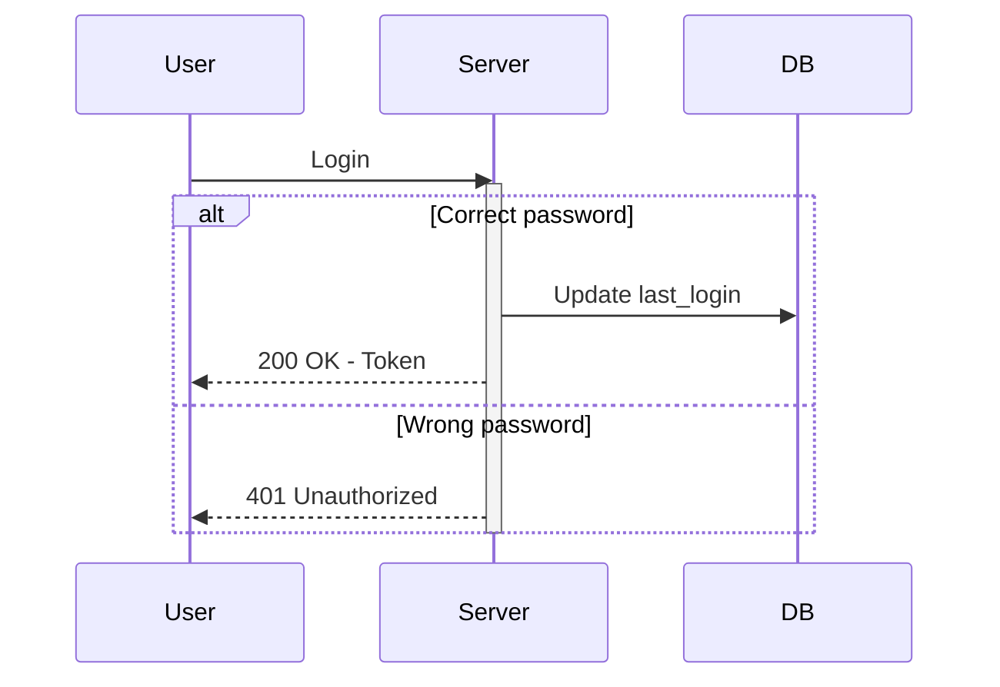

### 5. Loop - Vòng lặp

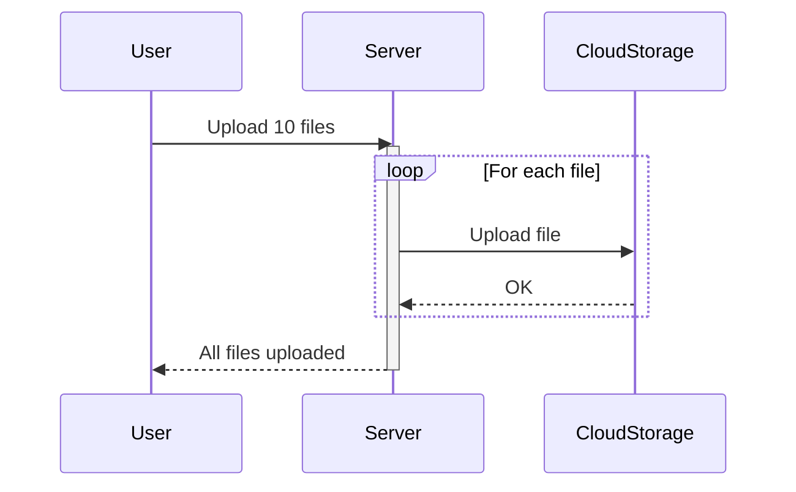

### 6. Notes - Ghi chú

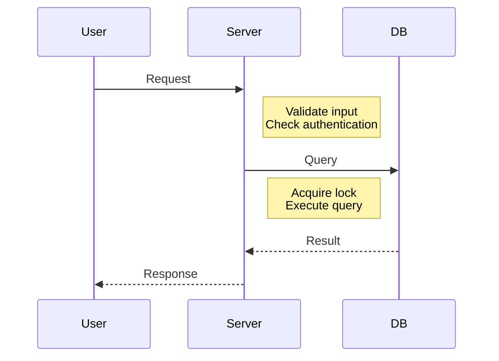

## Ví dụ 1: User Login Flow

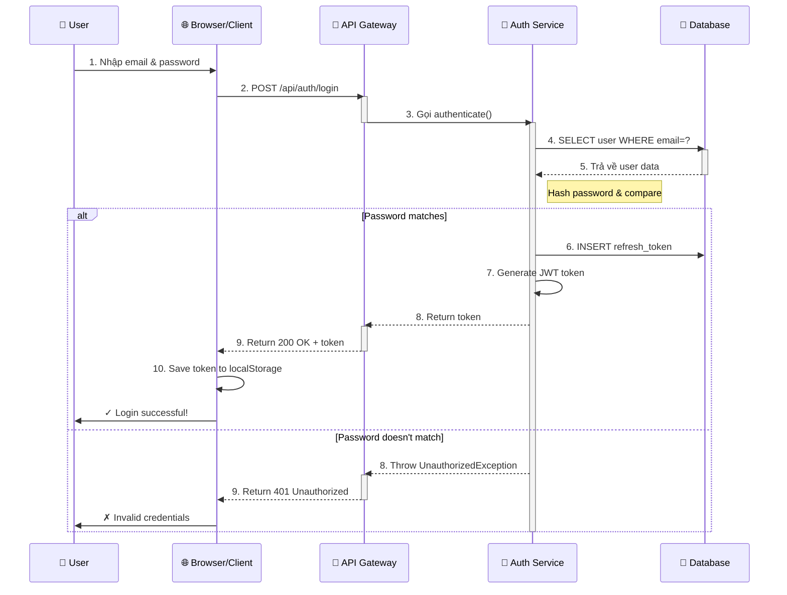

**Penjelasan flow:**
1. User memasukkan credentials
2. Browser mengirim POST request ke API
3. API Gateway meneruskan ke Auth Service
4. Auth Service query user dari database
5. Jika password cocok → generate token → return
6. Jika password salah → return error
7. Browser menyimpan token untuk request berikutnya

## Ví dụ 2: Payment Processing Flow

```mermaid
sequenceDiagram
    participant User as 👤 Customer
    participant Frontend as 💻 Web Frontend
    participant OrderSvc as 📦 Order Service
    participant PaymentSvc as 💳 Payment Service
    participant Stripe as 🏦 Stripe API
    participant DB as 💾 Database
    participant Email as 📧 Email Service

    User->>Frontend: 1. Click "Place Order"
    Frontend->>OrderSvc: 2. POST /orders

    activate OrderSvc
    OrderSvc->>DB: 3. Validate cart items
    activate DB
    DB-->>OrderSvc: 4. Items valid
    deactivate DB

    Note right of OrderSvc: Calculate total price<br/>Create order record

    OrderSvc->>PaymentSvc: 5. Process payment
    deactivate OrderSvc

    activate PaymentSvc
    PaymentSvc->>Stripe: 6. POST /v1/charges<br/>(card, amount)
    activate Stripe

    alt Payment successful
        Stripe-->>PaymentSvc: 7. Charge created ✓
        deactivate Stripe
        PaymentSvc->>DB: 8. Save transaction
        PaymentSvc-->>OrderSvc: 9. Payment confirmed
        deactivate PaymentSvc

        activate OrderSvc
        OrderSvc->>DB: 10. Update order status → PAID
        OrderSvc->>Email: 11. Send confirmation email
        OrderSvc-->>Frontend: 12. Return 201 Created
        deactivate OrderSvc

        Frontend->>User: ✓ Order placed! ID: #12345
    else Payment failed
        Stripe-->>PaymentSvc: 7. Error message
        deactivate Stripe
        PaymentSvc-->>OrderSvc: 9. Payment failed
        deactivate PaymentSvc

        activate OrderSvc
        OrderSvc->>DB: 10. Delete order
        OrderSvc-->>Frontend: 11. Return 402 Payment Required
        deactivate OrderSvc

        Frontend->>User: ✗ Payment failed. Try again.
    end
```

**Penjelasan flow:**
1. User klik "Place Order"
2. Frontend kirim request ke Order Service
3. Order Service validasi items dan hitung total
4. Kirim payment request ke Payment Service
5. Payment Service call Stripe API
6. Stripe proses charge (charge card)
7. Jika berhasil → update order status → send email
8. Jika gagal → delete order → return error
9. User melihat success/error message

## Ví dụ 3: File Upload Flow

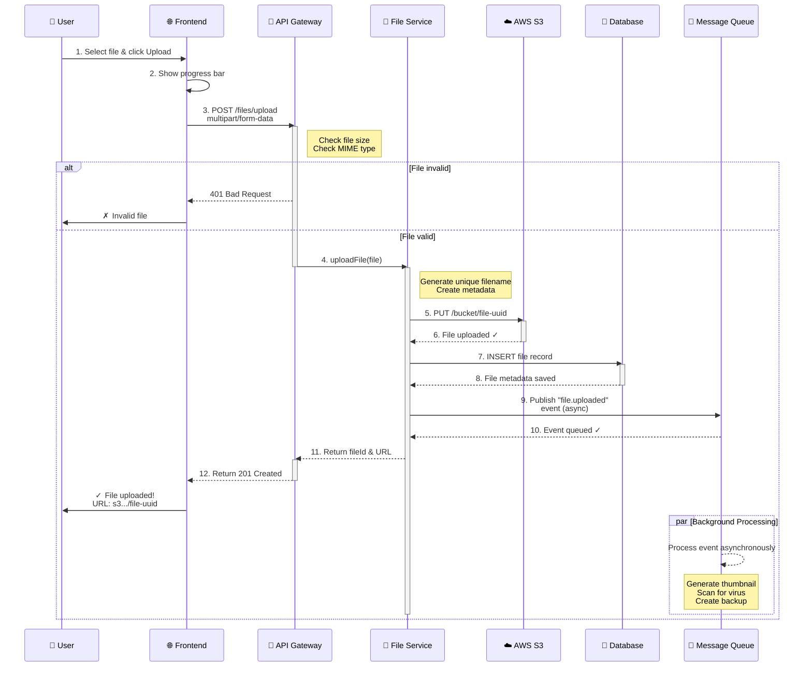

**Penjelasan flow:**
1. User pilih file dan upload
2. Frontend show progress bar
3. Kirim file ke API Gateway
4. API Gateway check file validity
5. Jika valid → kirim ke File Service
6. File Service upload ke S3
7. Simpan metadata ke database
8. Publish event ke message queue
9. Return file URL ke user
10. Background task (async) process event seperti generate thumbnail

## Best Practices untuk Sequence Diagrams

### 1. Keep it simple
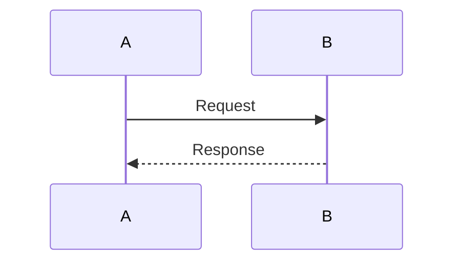

Jangan terlalu banyak objects atau steps sekaligus.

### 2. Gunakan activation boxes
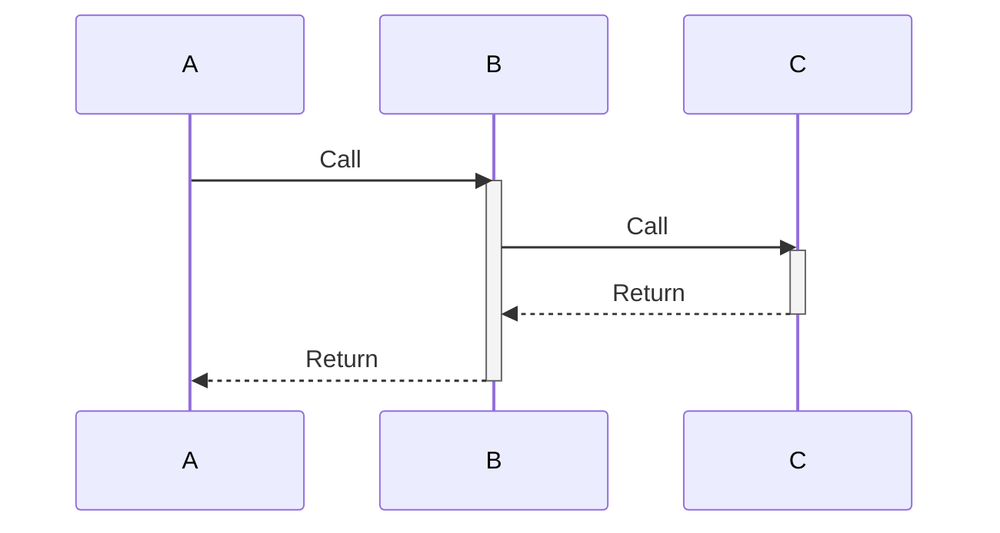

Ini membuat jelas siapa yang sedang bekerja.

### 3. Label messages dengan jelas
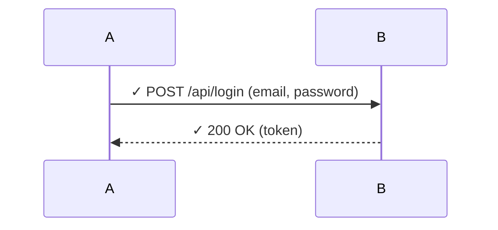

Sertakan HTTP method, status code, dan parameter jika penting.

### 4. Gunakan notes untuk penjelasan
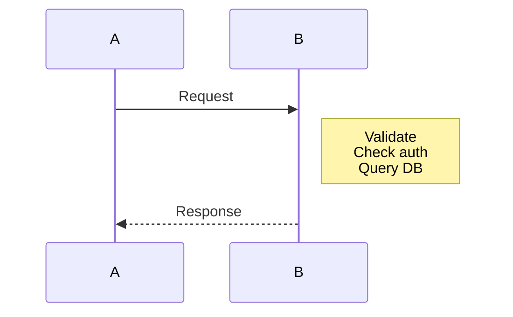

### 5. Gunakan alt/else untuk edge cases
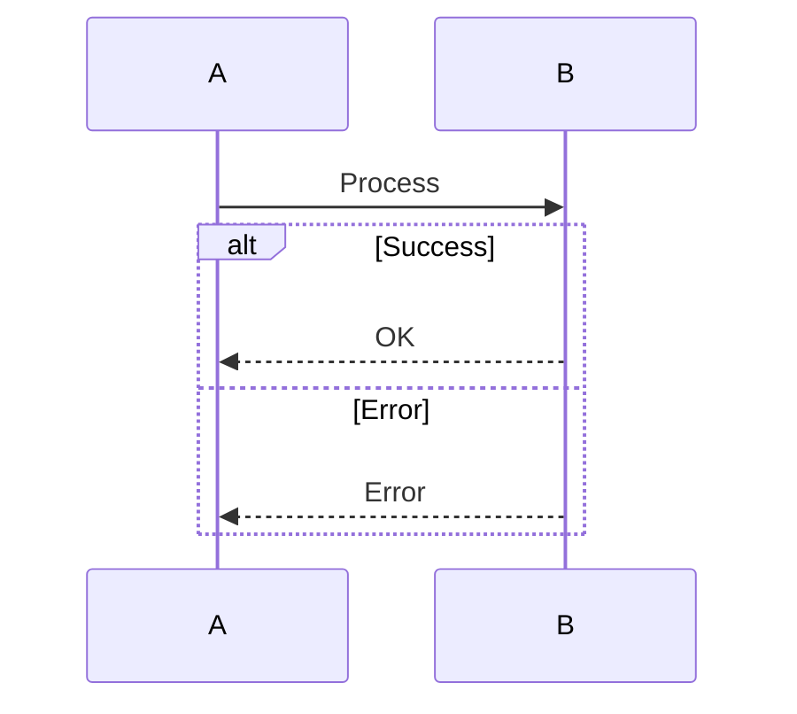

Jangan lupakan error cases!

### 6. Gunakan loop untuk repetitive actions
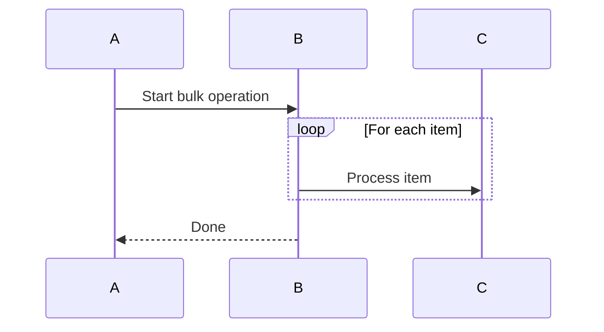

## Common Patterns

### Pattern 1: Request-Response (Sync)
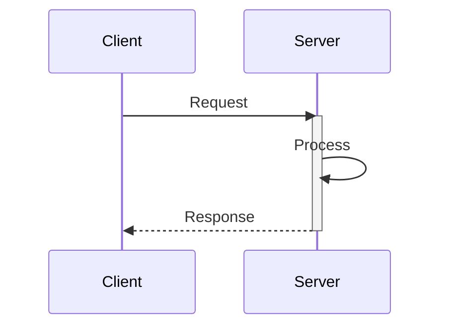

### Pattern 2: Async with callback
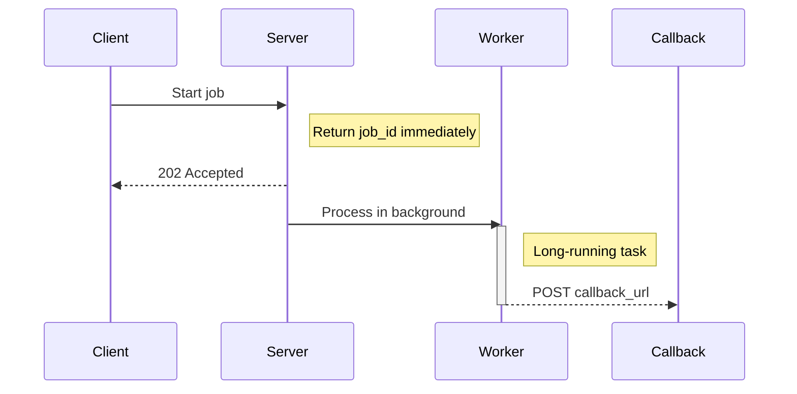

### Pattern 3: Multi-stage approval
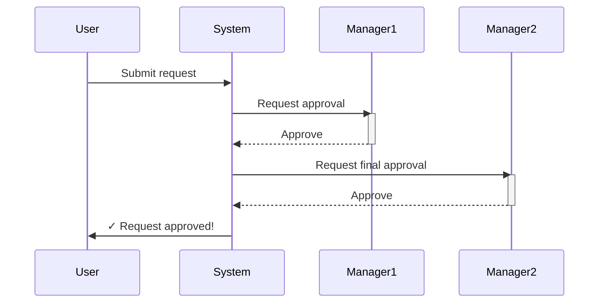

### Pattern 4: Retry mechanism
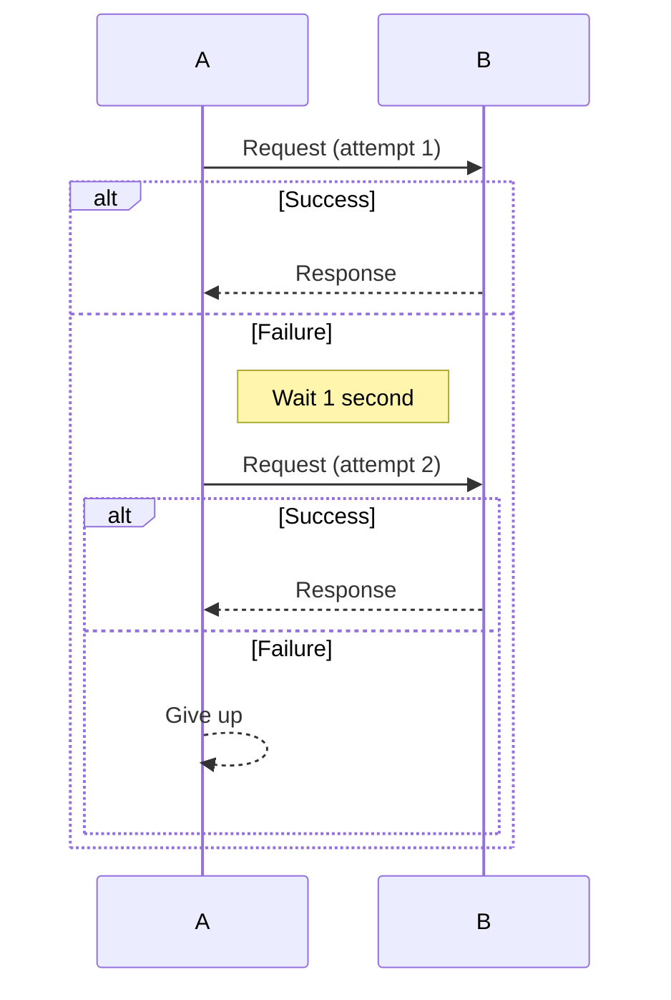

## Sequence Diagram Checklist

Ketika membuat sequence diagram, pastikan:

- [ ] Semua actors/participants jelas terdaftar?
- [ ] Pesan (messages) berlabel dengan jelas?
- [ ] Thứ tự steps terlihat jelas?
- [ ] Activation boxes menunjukkan siapa yang bekerja?
- [ ] Error cases tercakup (alt/else)?
- [ ] Notes menjelaskan step yang kompleks?
- [ ] Tidak ada steps yang dilewatkan?
- [ ] Diagram tidak terlalu kompleks (max 10-15 steps)?
- [ ] Konsisten dengan class diagram dan implementation?

## Tools untuk membuat Sequence Diagrams

1. **Mermaid** (gratis, online): https://mermaid.live
2. **PlantUML** (gratis, open source): http://plantuml.com
3. **Lucidchart** (berbayar, powerful): https://www.lucidchart.com
4. **Draw.io** (gratis, online): https://draw.io
5. **Enterprise Architect** (berbayar, professional): https://www.sparxsystems.com

## Mermaid Examples Repository

Simpan diagram Mermaid Anda di file `.md` seperti ini:

```markdown
# Login Sequence

Description of the sequence...

\`\`\`mermaid
sequenceDiagram
    ... diagram code ...
\`\`\`

## Explanation

- Step 1: ...
- Step 2: ...
```

---

## Kesimpulan

Sequence Diagrams adalah cara visual yang powerful untuk:
- Menjelaskan workflow kompleks
- Mengidentifikasi bottlenecks
- Merencanakan error handling
- Berkomunikasi dengan team

Gunakan bersama dengan:
- **HLD** (arsitektur sistem)
- **LLD** (class diagrams, database schema)
- **Code** (implementation)

**Untuk full context, lihat juga:**
- `../README.md` - Low-Level Design overview
- `../02-Database-Schema-Design/README.md` - Database design
