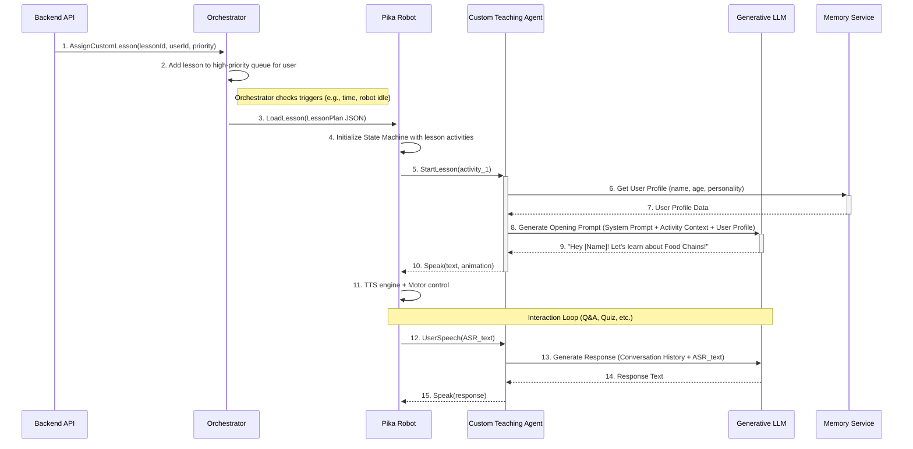
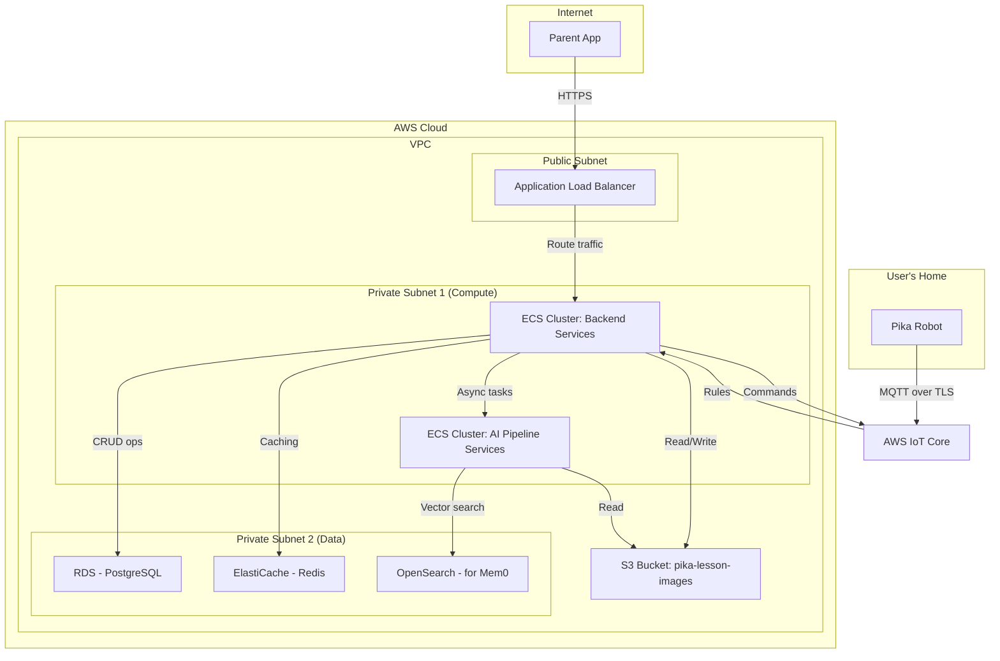
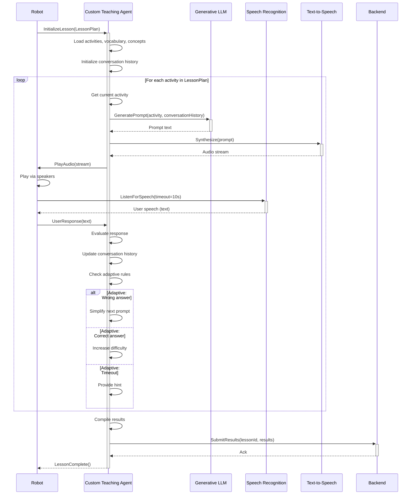
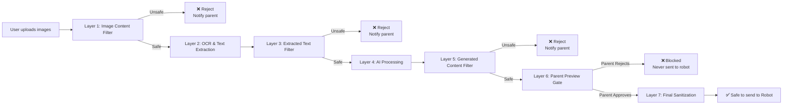
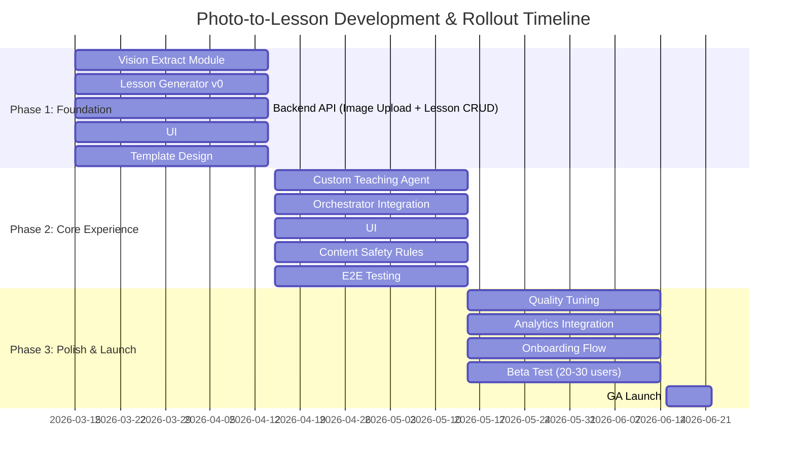
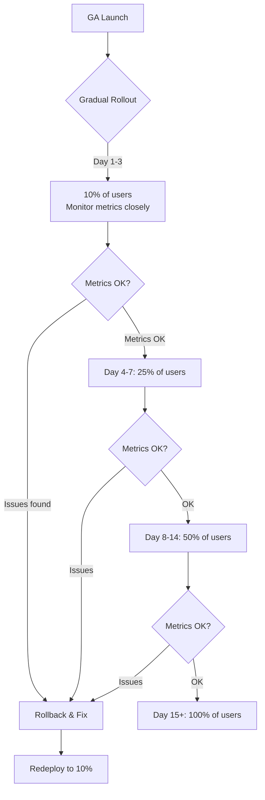
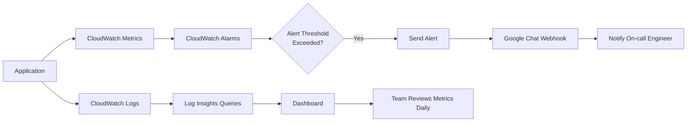

> Name: Technical Writing Preference: Model for Extremely Detailed SDD
> Use when: When generating extremely detailed, long-form technical documentation (e.g., SDD, technical whitepaper) with a required length of 20,000 words or more, or when generating technical documentation that requires advanced visualization and analysis capabilities.

When generating extremely detailed, long-form technical documentation, such as a System Design Document (SDD) with a required length of 20,000 words or more, or when generating technical documentation that requires advanced visualization and analysis capabilities, the user prefers the use of high-capability large language models like Claude Sonnet or Opus (specifically Claude Opus 4.6). This preference should be noted for similar future tasks requiring extensive, high-quality technical writing, especially when visual aids like Mermaid diagrams and II ASNC are required for clear problem visualization and analysis.


---

# Phân Tích Kỹ Thuật & Thiết Kế Hệ Thống: Photo-to-Lesson

**Version:** 1.0 **Date:** 2026-03-04 **Author:** Manus AI (Claude 4.6 Opus Model)

## 1. Giới thiệu

Tài liệu này cung cấp một bản phân tích kỹ thuật và thiết kế hệ thống (System Design Document - SDD) chi tiết cho tính năng **Photo-to-Lesson**. Mục tiêu của tài liệu là diễn giải các yêu cầu từ Tài liệu Yêu cầu Sản phẩm (PRD) thành một kế hoạch chi tiết, có thể thực thi cho đội ngũ kỹ thuật (Tech, AI) và làm cơ sở cho việc đánh giá thiết kế (design review), hướng dẫn triển khai (implementation guide), và giới thiệu cho các thành viên mới (onboarding).

Chúng tôi sẽ sử dụng các biểu đồ **Mermaid** để trực quan hóa kiến trúc, luồng dữ liệu, và các tương tác phức tạp, đảm bảo mọi thành viên đều có một cái nhìn thống nhất và rõ ràng về bài toán cần giải quyết.

## 2. Tổng quan Kiến trúc Hệ thống (System Architecture)

Kiến trúc của tính năng Photo-to-Lesson được xây dựng dựa trên các microservices hiện có của Pika, đồng thời giới thiệu các module AI mới để xử lý nghiệp vụ cốt lõi. Hệ thống được thiết kế theo hướng module hóa, dễ mở rộng và bảo trì.

### 2.1. Biểu đồ Kiến trúc Cấp cao

Biểu đồ dưới đây mô tả các thành phần chính và mối quan hệ giữa chúng trong hệ thống.

```mermaid
graph TD
    subgraph "User-Facing Layer"
        A[Parent App - iOS/Android]
    end

    subgraph "Backend Services Layer"
        B[Backend API Gateway]
        C[Orchestrator Service]
        D[Learning Path Engine]
        E[Memory Service - Mem0]
        F[Asset Storage - S3]
    end

    subgraph "AI Pipeline Layer (New)"
        G[Vision Extract Module]
        H[Lesson Generator Module]
        I[Custom Teaching Agent]
    end

    subgraph "Physical Device Layer"
        J[Pika Robot]
    end

    %% Connections
    A -- "1. REST/GraphQL API Calls" --> B
    B -- "Stores images" --> F
    B -- "Triggers async processing" --> G
    G -- "Sends extracted data" --> H
    H -- "Generates lesson plan" --> B
    B -- "Updates lesson status, stores plan" --> E
    B -- "Pushes lesson to queue" --> C
    C -- "Injects lesson into daily plan" --> J
    J -- "Executes lesson activities" --> I
    I -- "Generates conversational responses" --> J
    J -- "Sends results post-lesson" --> B
    B -- "Updates learning history" --> E
    D -.-> C; %% Learning Path Engine provides context but is not directly modified
```

**Diễn giải:**

- **Parent App**: Là điểm khởi đầu, nơi phụ huynh tương tác để chụp ảnh và cấu hình bài học.
    
- **Backend API Gateway**: Đóng vai trò là cổng chính, tiếp nhận request, điều phối các tác vụ bất đồng bộ tới AI Pipeline, và quản lý dữ liệu.
    
- **Asset Storage (S3)**: Lưu trữ an toàn các hình ảnh do người dùng tải lên.
    
- **AI Pipeline**: Trái tim của tính năng, bao gồm 3 module mới chịu trách nhiệm biến hình ảnh thành một bài học có cấu trúc.
    
- **Orchestrator Service**: Quản lý hàng đợi và quyết định khi nào bài học tùy chỉnh sẽ được giao cho Pika Robot.
    
- **Pika Robot**: Thiết bị vật lý cuối cùng, thực thi bài học và tương tác trực tiếp với trẻ.
    
- **Memory Service (Mem0)**: Lưu trữ lịch sử học tập, bao gồm cả các bài học tùy chỉnh này, để cá nhân hóa trong tương lai.
    

## 3. Luồng Dữ Liệu Chi Tiết (Data Flow Diagram)

Luồng dữ liệu end-to-end mô tả cách thông tin di chuyển qua các hệ thống, từ lúc người dùng khởi tạo đến khi nhận được kết quả. Sơ đồ này làm rõ các bước xử lý đồng bộ và bất đồng bộ.

```mermaid
sequenceDiagram
    participant PA as Parent App
    participant BE as Backend API
    participant S3 as Asset Storage
    participant VE as Vision Extract (AI)
    participant LG as Lesson Generator (AI)
    participant ORC as Orchestrator
    participant Robot as Pika Robot
    participant MEM as Memory Service

    rect rgb(255, 240, 245)
        note over PA, BE: Phase 1: Lesson Creation (Async)
        PA->>+BE: 1. POST /lessons (images, config)
        BE->>+S3: 2. Upload images
        S3-->>-BE: 3. Image URLs
        BE-->>-PA: 4. Ack (lessonId, status: PROCESSING)
        BE-)+VE: 5. Trigger Vision Extraction (lessonId, imageURLs)
    end

    rect rgb(240, 255, 240)
        note over VE, LG: Phase 2: AI Processing (Async)
        VE->>VE: 6. OCR & Multimodal Analysis
        VE-)+LG: 7. Send Extracted Content (JSON)
        LG->>LG: 8. Map to Template & Generate Plan
        LG-)-BE: 9. POST /lessons/{lessonId}/plan (LessonPlan JSON)
    end

    rect rgb(240, 248, 255)
        note over BE, PA: Phase 3: User Confirmation (Sync)
        BE-->>PA: 10. WebSocket: Lesson Ready for Preview
        PA->>+BE: 11. GET /lessons/{lessonId}/preview
        BE-->>-PA: 12. Lesson Preview Data
        PA->>+BE: 13. POST /lessons/{lessonId}/assign (schedule)
        BE-->>-PA: 14. Ack (status: ASSIGNED)
    end

    rect rgb(255, 250, 240)
        note over BE, ORC, Robot: Phase 4: Lesson Delivery & Execution (Async)
        BE-)+ORC: 15. Push to Custom Lesson Queue (lessonId, priority)
        ORC->>Robot: 16. Inject Lesson into Daily Plan
        Robot->>Robot: 17. Execute Lesson Activities (Interaction Loop)
        Robot-)+BE: 18. POST /lessons/{lessonId}/result (completion, answers)
    end

    rect rgb(230, 230, 250)
        note over BE, MEM: Phase 5: Result Processing (Async)
        BE->>BE: 19. Process results
        BE-)+MEM: 20. Update Learning History (Mem0)
        BE-->>PA: 21. WebSocket: Report Ready
    end
```

**Các điểm chính trong luồng dữ liệu:**

- **Tính bất đồng bộ (Asynchronous):** Hầu hết các tác vụ nặng (upload ảnh, xử lý AI) đều được thực hiện bất đồng bộ. Client (Parent App) nhận được phản hồi ngay lập tức và được cập nhật trạng thái qua WebSocket, mang lại trải nghiệm người dùng mượt mà.
    
- **Phân tách rõ ràng:** Luồng xử lý AI (Vision Extract, Lesson Generator) hoàn toàn tách biệt và giao tiếp với Backend qua API. Điều này cho phép team AI có thể phát triển, triển khai và scale các module của mình một cách độc lập.
    
- **User-in-the-loop:** Phụ huynh có một điểm kiểm soát quan trọng (Preview & Assign), đảm bảo an toàn và sự phù hợp của nội dung trước khi đến tay trẻ.
    

## 4. Sơ đồ Tuần tự (Sequence Diagram) cho Tương tác Cốt lõi

Sơ đồ này tập trung vào một kịch bản cụ thể: quá trình từ lúc phụ huynh xác nhận bài học đến khi robot bắt đầu tương tác với bé. Nó làm rõ vai trò của Orchestrator và Custom Teaching Agent.



**Diễn giải:**

1. **Orchestrator đóng vai trò điều phối**: Nó không chỉ đơn giản là một hàng đợi. Orchestrator chịu trách nhiệm quyết định thời điểm
    

thích hợp nhất để bắt đầu bài học, dựa trên lịch đặt của phụ huynh, trạng thái của robot, và các yếu tố khác. 2. **Lesson Plan là hợp đồng (Contract)**: `LessonPlan.json` là một cấu trúc dữ liệu được định nghĩa chặt chẽ, đóng vai trò là "hợp đồng" giữa Lesson Generator và Pika Robot. Robot chỉ cần biết cách đọc và thực thi theo cấu trúc này. 3. **Custom Teaching Agent (CTA) là bộ não**: CTA không phải là một LLM đơn thuần. Nó là một agent thông minh, được trang bị system prompt động, có khả năng truy xuất bộ nhớ (Mem0), và điều khiển luồng hội thoại dựa trên các quy tắc trong `LessonPlan.json`.

## 5. Tương tác giữa các Thành phần (Component Interaction)

Sơ đồ này làm rõ hơn về cách các module mới và cũ tương tác với nhau, tập trung vào các API contracts và data models.

```mermaid
c4Context
  title Component Diagram for Photo-to-Lesson

  System_Boundary(c1, "Pika Ecosystem") {
    Component(parentApp, "Parent App", "React Native/Swift/Kotlin", "Giao diện người dùng cho phụ huynh")
    Component(backendApi, "Backend API", "Node.js/Go", "Cổng API chính, điều phối logic nghiệp vụ")
    ComponentDb(db, "Database", "MySQL/PostgreSQL", "Lưu trữ dữ liệu người dùng, bài học")
    Component(s3, "Asset Storage", "AWS S3", "Lưu trữ ảnh gốc")

    System_Boundary(c2, "AI Pipeline") {
      Component(visionExtract, "Vision Extract", "Python, GPT-4o", "Trích xuất nội dung từ ảnh")
      Component(lessonGenerator, "Lesson Generator", "Python, Claude Opus", "Tạo kế hoạch bài học từ nội dung")
      Component(customTeachingAgent, "Custom Teaching Agent", "Python, LangChain", "Thực thi bài học qua hội thoại")
    }

    Component(orchestrator, "Orchestrator", "Go", "Quản lý và giao bài học cho robot")
    Component(mem0, "Memory Service", "Vector DB", "Lưu trữ và truy xuất bộ nhớ dài hạn")
    Component(pikaRobot, "Pika Robot", "Embedded Linux, C++", "Thiết bị vật lý tương tác với trẻ")
  }

  Rel(parentApp, backendApi, "1. Creates Lesson", "HTTPS")
  Rel(backendApi, db, "Stores lesson metadata")
  Rel(backendApi, s3, "Uploads images")
  Rel(backendApi, visionExtract, "2. Triggers Extraction", "gRPC/Async")
  Rel(visionExtract, lessonGenerator, "3. Sends Extracted Content", "gRPC")
  Rel(lessonGenerator, backendApi, "4. Submits Lesson Plan", "HTTPS")
  Rel(backendApi, orchestrator, "5. Assigns Lesson", "gRPC")
  Rel(orchestrator, pikaRobot, "6. Delivers Lesson Plan", "MQTT")
  Rel(pikaRobot, customTeachingAgent, "7. Executes Activities", "gRPC")
  Rel(customTeachingAgent, mem0, "Retrieves/Updates Memory")
  Rel(pikaRobot, backendApi, "8. Submits Results", "HTTPS")
  Rel(backendApi, db, "Updates lesson results")
```

**API Contracts & Data Models chính:**

- **`POST /lessons` (Parent App → Backend)**
    
    - **Body**: `multipart/form-data` chứa `images[]` và `config.json` (`{subject, purpose, language, childId}`).
        
    - **Response**: `{ lessonId, status: 'PROCESSING' }`
        
- **`Event: VisionExtraction` (Backend → Vision Extract)**
    
    - **Payload**: `{ lessonId, imageUrls: [...] }`
        
- **`Data Model: ExtractedContent` (Vision Extract → Lesson Generator)**
    
    - **Schema**: `{ topic, subject, vocabulary: [...], concepts: [...], difficulty_level, raw_text }`
        
- **`POST /lessons/{id}/plan` (Lesson Generator → Backend)**
    
    - **Body**: `LessonPlan.json` (chi tiết trong PRD)
        
- **`Event: AssignLesson` (Backend → Orchestrator)**
    
    - **Payload**: `{ lessonId, userId, priority, schedule, lessonPlan: LessonPlan.json }`
        
- **`MQTT Topic: pika/{robotId}/lesson` (Orchestrator → Pika Robot)**
    
    - **Payload**: `LessonPlan.json`
        

## 6. Kiến trúc Triển khai (Deployment Architecture)

Để đảm bảo tính sẵn sàng cao, khả năng mở rộng và an toàn, chúng tôi đề xuất kiến trúc triển khai sau trên nền tảng AWS.



**Lựa chọn công nghệ và lý do:**

- **ECS (Elastic Container Service)**: Để đóng gói và triển khai các microservices (Backend, AI). ECS cung cấp khả năng tự động scale-up/down dựa trên tải, đảm bảo hệ thống có thể xử lý các đợt request lớn mà không tốn chi phí thừa.
    
- **Serverless cho AI (Cân nhắc)**: Đối với các module AI (đặc biệt là Vision Extract và Lesson Generator), có thể cân nhắc sử dụng AWS Lambda hoặc SageMaker Serverless Inference. Điều này giúp tối ưu chi phí, vì chúng ta chỉ trả tiền khi có request xử lý, phù hợp với bản chất "bursty" của việc tạo bài học.
    
- **AWS IoT Core**: Cung cấp một kênh giao tiếp an toàn, đáng tin cậy và có độ trễ thấp giữa hàng triệu thiết bị Pika Robot và cloud backend qua giao thức MQTT. Nó quản lý kết nối, xác thực và định tuyến tin nhắn một cách hiệu quả.
    
- **VPC với Public/Private Subnets**: Một cấu trúc mạng tiêu chuẩn để bảo mật. Chỉ có Load Balancer được tiếp xúc với internet, trong khi tất cả các dịch vụ xử lý và cơ sở dữ liệu nằm trong mạng riêng, giảm thiểu bề mặt tấn công.
    

## 7. Phân tích Rủi ro Kỹ thuật và Phương án Giảm thiểu

Một hệ thống phức tạp luôn đi kèm với rủi ro. Việc xác định và lên kế hoạch trước cho chúng là cực kỳ quan trọng.

|   |   |   |   |   |
|---|---|---|---|---|
|ID|Rủi ro|Mức độ Ảnh hưởng|Khả năng Xảy ra|Phương án Giảm thiểu (Mitigation)|
|**R-01**|**Chất lượng OCR/Vision kém** do ảnh mờ, thiếu sáng, chữ viết tay.|**CAO**|**TRUNG BÌNH**|- **Client-side**: Hướng dẫn UX/UI rõ ràng khi chụp, tự động crop và tăng cường chất lượng ảnh.  <br>- **Server-side**: Sử dụng model vision mạnh nhất (GPT-4o). Nếu độ tin cậy thấp, trả về lỗi yêu cầu chụp lại.  <br>- **Fallback**: Cho phép phụ huynh nhập tay một vài từ khóa chính nếu OCR thất bại hoàn toàn.|
|**R-02**|**AI "ảo giác" (Hallucination)**, tạo ra nội dung sai sự thật.|**RẤT CAO**|**TRUNG BÌNH**|- **Parent Preview Gate**: **BẮT BUỘC**. Phụ huynh là lớp phòng thủ cuối cùng.  <br>- **Factual Cross-Check**: Với các môn như Khoa học, Toán, sử dụng một bước RAG (Retrieval-Augmented Generation) để đối chiếu thông tin với một knowledge base đã được kiểm duyệt.  <br>- **Prompt Engineering**: Thiết kế system prompt cẩn thận để giảm thiểu khả năng bịa đặt.  <br>- **Content Logging**: Ghi lại tất cả nội dung được tạo ra để phân tích và tinh chỉnh sau này.|
|**R-03**|**Độ trễ AI cao** (>15s) gây trải nghiệm người dùng tồi.|**TRUNG BÌNH**|**CAO**|- **Tối ưu hóa Model**: Sử dụng các kỹ thuật như quantization, distillation nếu cần.  <br>- **Kiến trúc bất đồng bộ**: Toàn bộ luồng AI là async, người dùng không phải chờ đợi.  <br>- **Cold Start**: Sử dụng "provisioned concurrency" (trên Lambda) hoặc giữ một số lượng task tối thiểu luôn chạy (trên ECS) để giảm thiểu cold start.|
|**R-04**|**Chi phí AI tăng vọt** khi tính năng được sử dụng rộng rãi.|**CAO**|**CAO**|- **Rate Limiting**: Giới hạn số lượng bài học miễn phí mỗi người dùng/tuần.  <br>- **Caching**: Cache kết quả xử lý AI cho các ảnh giống hệt nhau (dựa trên hash của ảnh).  <br>- **Chọn Model thông minh**: Sử dụng model nhỏ hơn, rẻ hơn cho các tác vụ đơn giản (ví dụ: phân loại môn học) và chỉ dùng model lớn cho các tác vụ phức tạp.|
|**R-05**|**Lỗi kết nối với Robot (MQTT)** khiến bài học không được giao.|**TRUNG BÌNH**|**THẤP**|- **QoS & Retries**: Sử dụng MQTT QoS level 1 hoặc 2 để đảm bảo tin nhắn được giao.  <br>- **Orchestrator State**: Orchestrator phải duy trì trạng thái của mỗi bài học và thử gửi lại nếu không nhận được xác nhận từ robot.  <br>- **Heartbeat**: Robot gửi tín hiệu "heartbeat" định kỳ để backend biết nó đang online.|

## 8. Các câu hỏi mở và quyết định cần đưa ra

- **OQ-01: Nên dùng gRPC hay REST/HTTPS cho giao tiếp nội bộ?**
    
    - **Phân tích**: gRPC hiệu quả hơn về performance và định nghĩa schema chặt chẽ, phù hợp cho microservices. REST/HTTPS dễ debug hơn và phổ biến hơn.
        
    - **Đề xuất**: Sử dụng **gRPC** cho các giao tiếp tần suất cao, yêu cầu độ trễ thấp giữa các service trong AI Pipeline. Sử dụng **REST/HTTPS** cho các giao tiếp từ client (Parent App) và giữa các service nghiệp vụ chính (Backend, Orchestrator) để đơn giản hóa.
        
- **OQ-02: Cần một Database riêng cho AI Pipeline không?**
    
    - **Phân tích**: AI Pipeline hiện tại là stateless. Việc thêm DB sẽ tăng độ phức tạp. Tuy nhiên, một DB có thể hữu ích để lưu log chi tiết, kết quả trung gian cho việc debug và fine-tuning.
        
    - **Đề xuất (V1)**: **Không cần**. Giữ cho AI Pipeline stateless. Log sẽ được đẩy ra CloudWatch Logs. Dữ liệu quan trọng (LessonPlan) được lưu ở DB chính của Backend.
        
- **OQ-03: Chiến lược xử lý Child Safety cho nội dung do người dùng tạo?**
    
    - **Phân tích**: Đây là rủi ro cực lớn. Phụ huynh có thể vô tình hoặc cố ý chụp ảnh chứa nội dung không phù hợp.
        
    - **Đề xuất**: Triển khai một **pipeline kiểm duyệt nội dung đa lớp**:
        
        1. **Image Guardrail**: Ngay sau khi ảnh được upload, sử dụng một dịch vụ như Amazon Rekognition Content Moderation để lọc các ảnh nhạy cảm trước khi đưa vào AI Pipeline.
            
        2. **Text Guardrail**: Lọc nội dung text được OCR và cả nội dung do LLM tạo ra.
            
        3. **Parent Preview Gate**: Như đã đề cập, đây là lớp bảo vệ quan trọng nhất.
            

---

_Tài liệu này sẽ tiếp tục được cập nhật trong quá trình phát triển và review._

## 9. AI Pipeline - Phân tích chi tiết

Phần này đi sâu vào từng module trong AI Pipeline, làm rõ logic nội bộ và các quyết định thiết kế.

### 9.1. Vision Extract Module

Đây là module đầu vào, chịu trách nhiệm "hiểu" được nội dung học thuật từ ảnh. Độ chính xác của module này ảnh hưởng trực tiếp đến chất lượng của toàn bộ bài học.

**Luồng xử lý nội bộ:**

```mermaid
flowchart TD
    A[Input: 1-5 Images] --> B{Pre-processing};
    B --> C[Image Quality Check];
    C -- Poor Quality --> D[Return Error: "Please retake photo"];
    C -- Good Quality --> E[Run OCR + Layout Analysis];
    E --> F[Extract Raw Text & Structural Info];
    F --> G[Pass to Multimodal LLM (GPT-4o)];
    subgraph "LLM Prompting"
        direction LR
        G_P1["System Prompt: You are an expert educator..."]
        G_P2["Input: Raw text and image"]
        G_P3["Instruction: Identify topic, subject, key vocab, concepts..."]
    end
    G -- "Prompt" --> G_P1 & G_P2 & G_P3
    G --> H{Parse & Validate LLM Output};
    H -- Invalid JSON --> I[Retry or Return Error];
    H -- Valid JSON --> J[Output: ExtractedContent JSON];
```

- **Pre-processing**: Tự động xoay ảnh, crop các phần thừa, và tăng cường độ tương phản để tối ưu cho OCR.
    
- **LLM as an Analyst**: Thay vì chỉ dùng OCR, chúng ta dùng một Multimodal LLM mạnh để không chỉ đọc chữ mà còn "hiểu" được ngữ cảnh, ví dụ như nhận diện đâu là tiêu đề, đâu là bảng, và mối quan hệ giữa các phần trong ảnh.
    

### 9.2. Lesson Generator Module

Module này nhận dữ liệu đã được cấu trúc hóa từ Vision Extract và biến nó thành một kịch bản bài học (Lesson Plan) mà robot có thể thực thi.

**Luồng xử lý nội bộ:**

```mermaid
flowchart TD
    A[Input: ExtractedContent JSON + UserConfig] --> B{Select Lesson Template};
    B -- subject="Science" --> B_Sci[Science Template];
    B -- subject="Math" --> B_Math[Math Template];
    B -- other --> B_Default[Default Vocab Template];
    
    subgraph "Template Structure"
        direction LR
        T1[Phase: Warm Up]
        T2[Phase: Present]
        T3[Phase: Practice]
        T4[Phase: Wrap Up]
    end

    B_Sci & B_Math & B_Default --> C{Instantiate Template};
    C --> D[Populate with LLM (Claude Opus)];
    subgraph "LLM Prompting for Generation"
        D_P1["System Prompt: You are a curriculum designer for kids..."]
        D_P2["Input: Extracted Content + Template Structure"]
        D_P3["Instruction: Generate engaging prompts, questions, and fun facts for each activity..."]
    end
    D -- "Prompt" --> D_P1 & D_P2 & D_P3
    D --> E{Validate & Sanitize Output};
    E --> F[Format into LessonPlan JSON];
    F --> G[Output: LessonPlan.json];
```

- **Template-Driven Generation**: Việc sử dụng template đảm bảo mọi bài học đều có cấu trúc sư phạm nhất quán (Warm Up, Present, Practice, Wrap Up). Điều này giúp bé dễ dàng theo dõi và giữ được sự tập trung.
    
- **LLM as a Creative Writer**: Ở bước này, LLM (Claude Opus được chọn vì khả năng viết dài và sáng tạo) đóng vai trò là một nhà thiết kế chương trình học, tạo ra các câu hỏi, câu chuyện, và các hoạt động tương tác thú vị dựa trên nội dung khô khan đã được trích xuất.
    

### 9.3. Custom Teaching Agent (CTA)

CTA là một agent chạy trên robot (hoặc trên cloud và stream kết quả về robot), chịu trách nhiệm thực thi bài học một cách linh hoạt.

**Biểu đồ trạng thái (State Diagram):**

```mermaid
stateDiagram-v2
    [*] --> Idle
    Idle --> Loading: On LoadLesson()
    Loading --> WarmUp: On LessonLoaded
    
    state WarmUp {
        [*] --> Prompting
        Prompting --> Listening: On PromptSent
        Listening --> Evaluating: On UserSpeech
        Evaluating --> Prompting: On WrongAnswer
        Evaluating --> Present: On CorrectAnswer/Timeout
    }
    
    WarmUp --> Present: nextActivity()
    Present --> Practice: nextActivity()
    Practice --> WrapUp: nextActivity()
    WrapUp --> End: lessonComplete()
    
    state Practice {
        [*] --> Activity_1
        Activity_1 --> Activity_2: On Complete
        Activity_2 --> [*]: On Complete
        note right of Practice : Can have multiple practice activities
    }

    End --> Idle: cleanup()
```

- **State Machine**: CTA hoạt động như một state machine, di chuyển qua các trạng thái (các phase của bài học) dựa trên sự tương tác của trẻ.
    
- **Adaptive Logic**: Logic "adaptive" (đơn giản hóa khi bé sai, tăng độ khó khi bé giỏi) được cài đặt trong trạng thái `Evaluating`. Ví dụ, nếu bé sai 2 lần liên tiếp, CTA có thể tự động đưa ra một gợi ý hoặc chuyển sang một câu hỏi dễ hơn. Logic này được định nghĩa trong `adaptive_rules` của mỗi activity trong `LessonPlan.json`.
    

## 10. Orchestrator Service - Quản lý Bài học và Lịch biểu

Orchestrator là một thành phần then chốt, chịu trách nhiệm quyết định **khi nào** và **làm thế nào** để giao bài học cho robot.

### 10.1. Kiến trúc Orchestrator

```mermaid
graph TD
    A[Backend API] -->|AssignCustomLesson| B[Orchestrator Service]
    B --> B_Queue["Priority Queue<br/>- High Priority: Custom Lessons<br/>- Normal Priority: Daily Lessons"]
    B_Queue --> C{Trigger Check}
    C -->|Time-based| D[Scheduled Time Reached]
    C -->|Event-based| E[Robot Idle + Online]
    C -->|Manual| F[Immediate Trigger]
    
    D & E & F --> G[Load Lesson Plan]
    G --> H[Prepare MQTT Payload]
    H --> I[Publish to<br/>pika/{robotId}/lesson]
    I --> J[Pika Robot]
    
    J -->|Acknowledge| K[Update Lesson Status]
    K -->|status: DELIVERED| L[Backend DB]
    
    J -->|No Ack after 30s| M[Retry Logic]
    M -->|Retry < 3| N[Re-publish]
    M -->|Retry >= 3| O[Mark as FAILED]
    O --> P[Notify Parent]
```

**Các điểm chính:**

- **Priority Queue**: Custom lessons được đặt vào hàng đợi ưu tiên cao, đảm bảo chúng được giao sớm hơn các bài học thông thường.
    
- **Trigger Mechanism**: Orchestrator không chỉ giao bài học khi đến giờ. Nó cũng kiểm tra xem robot có online không, có đang rảnh không, để tối ưu hóa trải nghiệm.
    
- **Retry Logic**: Nếu robot không nhận được bài học (ví dụ do mất kết nối), Orchestrator sẽ thử lại. Sau 3 lần thử không thành công, nó sẽ đánh dấu bài học là FAILED và thông báo cho phụ huynh.
    

### 10.2. Lesson Execution Flow trên Robot

Khi robot nhận được LessonPlan, nó sẽ thực thi theo luồng này:



**Các điểm chính:**

- **Conversation History**: CTA duy trì một lịch sử cuộc trò chuyện, cho phép nó hiểu ngữ cảnh và cung cấp phản hồi nhất quán.
    
- **Adaptive Rules**: Dựa trên kết quả của mỗi câu trả lời, CTA có thể điều chỉnh độ khó của câu hỏi tiếp theo, tạo ra một trải nghiệm cá nhân hóa.
    
- **Result Submission**: Sau khi hoàn thành, CTA gửi kết quả chi tiết (từ nào đúng/sai, thời gian, v.v.) về Backend để phụ huynh có thể xem báo cáo.
    

## 11. Backend API Specification

### 11.1. Các Endpoint chính

#### **1. Tạo Bài học (Create Lesson)**

```
POST /api/v1/lessons
Content-Type: multipart/form-data

Request Body:
{
  "images": [File, File, ...],  // 1-5 ảnh
  "config": {
    "subject": "science",        // "english", "science", "math", "vocabulary", "other"
    "purpose": "review",         // "review", "conversation", "quiz", "pronunciation"
    "language": "en",            // "en", "vi", "bilingual"
    "childId": "uuid",           // ID của bé
    "notes": "Optional notes from parent"
  }
}

Response: 200 OK
{
  "lessonId": "uuid",
  "status": "PROCESSING",
  "createdAt": "2026-03-04T10:00:00Z",
  "estimatedReadyTime": "2026-03-04T10:05:00Z"
}

Error: 400 Bad Request (invalid config, too many images, etc.)
Error: 413 Payload Too Large (image > 10MB)
```

#### **2. Lấy Preview Bài học (Get Lesson Preview)**

```
GET /api/v1/lessons/{lessonId}/preview

Response: 200 OK
{
  "lessonId": "uuid",
  "status": "READY",
  "topic": "Food Chains",
  "subject": "science",
  "language": "en",
  "estimatedDuration": 12,
  "vocabulary": [
    { "word": "herbivore", "meaning": "...", "example": "..." },
    ...
  ],
  "concepts": [
    { "name": "food chain", "explanation": "..." },
    ...
  ],
  "activities": [
    {
      "phase": "warm_up",
      "type": "curiosity_spark",
      "duration": 2,
      "description": "..."
    },
    ...
  ]
}

Error: 404 Not Found (lesson không tồn tại)
Error: 202 Accepted (lesson vẫn đang xử lý, client nên retry sau vài giây)
```

#### **3. Giao Bài học cho Robot (Assign Lesson)**

```
POST /api/v1/lessons/{lessonId}/assign

Request Body:
{
  "schedule": {
    "type": "immediate",  // "immediate" hoặc "scheduled"
    "time": "2026-03-04T20:00:00Z"  // Bắt buộc nếu type="scheduled"
  }
}

Response: 200 OK
{
  "lessonId": "uuid",
  "status": "ASSIGNED",
  "assignedAt": "2026-03-04T10:10:00Z",
  "scheduledFor": "2026-03-04T20:00:00Z"
}

Error: 400 Bad Request (invalid schedule)
Error: 404 Not Found
Error: 409 Conflict (lesson đã được assign)
```

#### **4. Lấy Kết quả Bài học (Get Lesson Results)**

```
GET /api/v1/lessons/{lessonId}/results

Response: 200 OK
{
  "lessonId": "uuid",
  "status": "COMPLETED",
  "completedAt": "2026-03-04T20:12:00Z",
  "duration": 11,
  "vocabulary": [
    {
      "word": "herbivore",
      "correct": true,
      "userResponse": "herbivore",
      "expectedResponse": "herbivore"
    },
    ...
  ],
  "concepts": [
    {
      "name": "food chain",
      "understood": true,
      "checkQuestionCorrect": true
    },
    ...
  ],
  "overallScore": 0.85,
  "nextRecommendation": "Review: herbivore, carnivore"
}

Error: 404 Not Found
Error: 202 Accepted (lesson vẫn đang diễn ra)
```

#### **5. Tạo Bài ôn lại từ Kết quả (Create Remedial Lesson)**

```
POST /api/v1/lessons/{lessonId}/remedial

Request Body:
{
  "focusOn": ["herbivore", "carnivore"]  // Từ/concept cần ôn lại
}

Response: 200 OK
{
  "newLessonId": "uuid",
  "status": "READY",
  "topic": "Food Chains - Review",
  ...
}
```

### 11.2. WebSocket Events (Real-time Updates)

Để cập nhật trạng thái bài học cho Parent App mà không cần polling, chúng tôi sử dụng WebSocket:

```
Connection: wss://api.pika.io/ws/lessons

Subscribe to lesson updates:
{
  "action": "subscribe",
  "lessonId": "uuid"
}

Server sends events:
{
  "event": "lesson_preview_ready",
  "lessonId": "uuid",
  "timestamp": "2026-03-04T10:05:00Z"
}

{
  "event": "lesson_started",
  "lessonId": "uuid",
  "robotId": "pika_123",
  "timestamp": "2026-03-04T20:00:05Z"
}

{
  "event": "lesson_completed",
  "lessonId": "uuid",
  "results": {...},
  "timestamp": "2026-03-04T20:12:00Z"
}
```

## 12. Cơ chế An toàn Nội dung (Content Safety Mechanisms)

Đây là một phần cực kỳ quan trọng. Chúng ta phải đảm bảo rằng **mọi nội dung đến tay trẻ đều an toàn**.

### 12.1. Multi-Layer Content Filtering Pipeline



**Chi tiết từng layer:**

1. **Image Content Filter**: Sử dụng AWS Rekognition Content Moderation hoặc Google Vision API để phát hiện các ảnh chứa bạo lực, nội dung khiêu dâm, hoặc các yếu tố không phù hợp với trẻ em.
    
2. **Extracted Text Filter**: Lọc các từ/cụm từ nhạy cảm từ OCR output. Sử dụng một danh sách từ cấm (blacklist) hoặc một mô hình phân loại văn bản.
    
3. **Generated Content Filter**: Lọc nội dung do LLM tạo ra. Điều này bao gồm:
    
    - Kiểm tra xem LLM có tạo ra nội dung bạo lực, khiêu dâm, hoặc sai sự thật không.
        
        - Kiểm tra xem LLM có sử dụng ngôn ngữ phù hợp với độ tuổi không.
            
        - Kiểm tra xem LLM có "ảo giác" (hallucinate) không, ví dụ như tạo ra các "sự kiện lịch sử" không tồn tại.
            
4. **Parent Preview Gate**: Đây là lớp bảo vệ quan trọng nhất. Phụ huynh **luôn luôn** thấy preview trước khi bài học được giao cho robot. Không có ngoại lệ.
    
5. **Final Sanitization**: Trước khi gửi cho robot, hệ thống thực hiện một lần kiểm tra cuối cùng để đảm bảo không có nội dung không mong muốn.
    

### 12.2. Logging & Auditing

```python
# Pseudocode for content safety logging
def log_lesson_creation(lesson_id, user_id, extracted_content, generated_content, parent_approval):
    audit_log = {
        "lesson_id": lesson_id,
        "user_id": user_id,
        "timestamp": datetime.now(),
        "extracted_content": extracted_content,  # Full OCR output
        "generated_content": generated_content,  # Full LLM output
        "parent_approval": parent_approval,      # Did parent approve?
        "content_filters_passed": [
            "image_moderation_passed": True,
            "text_filter_passed": True,
            "generated_content_filter_passed": True,
        ],
        "flagged_items": [],  # Any suspicious content?
    }
    
    # Store in secure, immutable log (e.g., AWS CloudTrail, or dedicated audit DB)
    store_audit_log(audit_log)
    
    # Alert if any suspicious content was detected
    if audit_log["flagged_items"]:
        send_alert_to_safety_team(audit_log)
```

## 13. Phân tích Hiệu suất (Performance Analysis)

### 13.1. Latency Budget

Chúng ta cần đảm bảo rằng toàn bộ luồng từ chụp ảnh đến khi preview sẵn sàng không vượt quá một ngưỡng nhất định.

|   |   |   |
|---|---|---|
|Thành phần|Latency Target|Ghi chú|
|Image Upload|< 5s|Phụ thuộc vào kích thước ảnh và tốc độ mạng|
|Vision Extract|< 10s|Gọi GPT-4o Vision, có thể chậm|
|Lesson Generator|< 5s|Gọi Claude Opus, nhưng input nhỏ nên nhanh|
|Backend Processing|< 2s|Lưu trữ, validation, v.v.|
|**Total (P95)**|**< 15s**|Người dùng sẽ thấy preview trong vòng 15 giây|

**Cách tối ưu hóa:**

- **Parallelization**: Nếu có 3 ảnh, gọi Vision Extract cho cả 3 ảnh song song thay vì tuần tự.
    
- **Caching**: Cache kết quả Vision Extract cho các ảnh giống hệt nhau (dựa trên hash).
    
- **Model Selection**: Xem xét sử dụng các model nhỏ hơn, nhanh hơn cho các tác vụ đơn giản, và chỉ dùng GPT-4o/Claude Opus cho các tác vụ phức tạp.
    

### 13.2. Throughput & Scalability

Giả sử chúng ta có 100,000 người dùng hoạt động, mỗi người tạo 1 bài học/tuần:

- **Request rate**: 100,000 / 7 / 86,400 ≈ **0.17 requests/second** (khá thấp, không phải vấn đề)
    
- **Peak rate** (nếu tất cả tạo vào cùng lúc): **11.6 requests/second** (vẫn có thể quản lý)
    
- **AI Processing**: Nếu mỗi Vision Extract mất 10s, chúng ta cần ít nhất **12 concurrent workers** để xử lý peak load.
    

**Khuyến nghị:**

- Sử dụng **ECS Auto Scaling** để tự động tăng số lượng workers khi tải cao.
    
- Sử dụng **SQS** (Simple Queue Service) để buffer requests, đảm bảo không có request nào bị mất.
    
- Sử dụng **CloudFront** để cache các kết quả Vision Extract cho các ảnh giống nhau.
    

## 14. Phân tích Bảo mật (Security Analysis)

### 14.1. Mối đe dọa chính và Biện pháp phòng chống

|   |   |   |
|---|---|---|
|Mối đe dọa|Mức độ Nguy hiểm|Biện pháp Phòng chống|
|**Unauthorized Access to Lessons**|CAO|- JWT-based authentication cho tất cả API calls.  <br>- Verify ownership trước khi trả về dữ liệu.  <br>- Rate limiting để ngăn brute force.|
|**Image Data Leakage**|RẤT CAO|- Encrypt images at-rest (S3 encryption).  <br>- Encrypt in-transit (HTTPS/TLS).  <br>- Restrict S3 bucket access (IAM policies).  <br>- Delete images sau khi xử lý (nếu không cần lưu).|
|**AI Model Poisoning**|TRUNG BÌNH|- Monitor LLM outputs cho anomalies.  <br>- Maintain audit logs của tất cả generated content.  <br>- Regularly review và update safety filters.|
|**MQTT Interception**|TRUNG BÌNH|- Use TLS 1.2+ cho MQTT connections.  <br>- Implement certificate pinning trên robot.  <br>- Authenticate robot bằng client certificates.|
|**SQL Injection**|CAO|- Use parameterized queries / ORM.  <br>- Input validation.  <br>- Principle of least privilege cho DB users.|

### 14.2. Data Privacy (GDPR, CCPA Compliance)

- **Data Minimization**: Chỉ lưu trữ dữ liệu cần thiết. Ví dụ, sau khi xử lý xong, có thể xóa ảnh gốc nếu không cần cho audit.
    
- **Right to Deletion**: Phụ huynh có quyền yêu cầu xóa tất cả dữ liệu của con (bao gồm bài học, kết quả, ảnh).
    
- **Consent Management**: Đảm bảo phụ huynh đã đồng ý trước khi dữ liệu được sử dụng cho AI training hoặc analytics.
    

---

_Tài liệu tiếp tục ở phần sau..._

## 15. Phân tích Rollout & Deployment Strategy

### 15.1. Phased Rollout Plan



### 15.2. Deployment Checklist

**Phase 1 Completion Criteria:**

- Vision Extract module deployed to staging, tested với 50 mẫu ảnh (target accuracy: ≥90%)
    
- Lesson Generator v0 deployed, tested với 4 bộ template
    
- Backend API endpoints hoạt động (image upload, lesson CRUD)
    
- Parent App UI cho phép chụp ảnh và cấu hình bài học
    
- All unit tests pass (coverage ≥80%)
    
- Load testing completed (target: 100 concurrent requests)
    

**Phase 2 Completion Criteria:**

- Custom Teaching Agent deployed, tested với 20 bài học mẫu
    
- Orchestrator integration tested (lesson delivery to robot)
    
- Parent App UI cho phép xem preview, assign, và xem report
    
- Content safety filters deployed và tested
    
- E2E test scenarios pass (chụp → tạo → học → report)
    
- All integration tests pass
    

**Phase 3 Completion Criteria:**

- AI latency optimized (P95 < 15s)
    
- Analytics events tracked và validated
    
- Onboarding flow tested với 5 new users
    
- Beta test completed với 20-30 users, NPS ≥ 40
    
- All critical bugs fixed
    
- Documentation completed
    
- Team training completed
    

### 15.3. Rollout Strategy



**Metrics để monitor:**

- Lesson creation success rate (target: ≥95%)
    
- Average latency (target: < 15s)
    
- Error rate (target: < 1%)
    
- User satisfaction (NPS, feedback)
    

## 16. Metrics & Monitoring

### 16.1. Key Performance Indicators (KPIs)

|   |   |   |   |
|---|---|---|---|
|KPI|Baseline|Target (8 weeks)|Measurement Method|
|% PH tạo ≥1 lesson/tuần|0%|≥30% active PH|Analytics dashboard|
|Sessions từ custom lesson|0|≥2 sessions/user/tuần|Event tracking|
|Lesson completion rate|N/A|≥60%|Backend logs|
|D7 retention (có dùng feature)|Baseline|+15% vs không dùng|Cohort analysis|
|NPS từ PH dùng feature|Current NPS|+10 điểm|Survey|

### 16.2. Technical Metrics

|   |   |   |
|---|---|---|
|Metric|Target|Alert Threshold|
|Vision Extract Latency (P95)|< 10s|> 15s|
|Lesson Generator Latency (P95)|< 5s|> 10s|
|Total Lesson Creation Latency (P95)|< 15s|> 20s|
|API Error Rate|< 0.5%|> 1%|
|MQTT Message Delivery Success|> 99%|< 98%|
|Content Filter False Positive Rate|< 5%|> 10%|

### 16.3. Monitoring & Alerting



**Recommended Alerts:**

1. **High Error Rate**: Nếu API error rate > 1% trong 5 phút liên tiếp
    
2. **High Latency**: Nếu Vision Extract latency > 20s
    
3. **AI Service Down**: Nếu không thể kết nối tới AI service trong 2 phút
    
4. **Database Connection Pool Exhausted**: Nếu số connection sử dụng > 80% của pool size
    
5. **Content Safety Filter Triggered**: Nếu > 10 content rejections trong 1 giờ (có thể là dấu hiệu của attack)
    

## 17. Implementation Roadmap & Code Structure

### 17.1. Repository Structure

```
pika-photo-to-lesson/
├── backend/
│   ├── api/
│   │   ├── routes/
│   │   │   ├── lessons.py          # Lesson CRUD endpoints
│   │   │   ├── health.py           # Health check
│   │   │   └── ...
│   │   ├── middleware/
│   │   │   ├── auth.py             # JWT authentication
│   │   │   ├── error_handler.py    # Global error handling
│   │   │   └── ...
│   │   └── main.py                 # FastAPI app initialization
│   ├── models/
│   │   ├── lesson.py               # Lesson data model
│   │   ├── extracted_content.py    # ExtractedContent schema
│   │   ├── lesson_plan.py          # LessonPlan schema
│   │   └── ...
│   ├── services/
│   │   ├── lesson_service.py       # Business logic for lessons
│   │   ├── s3_service.py           # S3 interactions
│   │   ├── orchestrator_client.py  # Orchestrator RPC client
│   │   └── ...
│   ├── database/
│   │   ├── models.py               # SQLAlchemy models
│   │   ├── migrations/             # Alembic migrations
│   │   └── ...
│   ├── config/
│   │   ├── settings.py             # Configuration management
│   │   └── ...
│   └── tests/
│       ├── unit/
│       ├── integration/
│       └── ...
│
├── ai-pipeline/
│   ├── vision_extract/
│   │   ├── extract.py              # Main extraction logic
│   │   ├── models.py               # Vision model wrappers
│   │   ├── prompts.py              # LLM prompts
│   │   └── tests/
│   ├── lesson_generator/
│   │   ├── generator.py            # Main generation logic
│   │   ├── templates/              # Lesson templates
│   │   ├── prompts.py              # LLM prompts
│   │   └── tests/
│   ├── custom_teaching_agent/
│   │   ├── agent.py                # Main agent logic
│   │   ├── state_machine.py        # State machine implementation
│   │   ├── prompts.py              # Dynamic system prompts
│   │   └── tests/
│   ├── safety/
│   │   ├── content_filter.py       # Content filtering logic
│   │   ├── guardrails.py           # Safety guardrails
│   │   └── tests/
│   ├── orchestrator/
│   │   ├── orchestrator.py         # Orchestrator service
│   │   ├── queue.py                # Priority queue implementation
│   │   └── tests/
│   └── shared/
│       ├── models.py               # Shared data models
│       ├── config.py               # Shared configuration
│       └── utils.py                # Utility functions
│
├── parent-app/
│   ├── src/
│   │   ├── screens/
│   │   │   ├── PhotoCaptureScreen.tsx
│   │   │   ├── LessonConfigScreen.tsx
│   │   │   ├── PreviewScreen.tsx
│   │   │   ├── ReportScreen.tsx
│   │   │   └── ...
│   │   ├── components/
│   │   ├── services/
│   │   │   ├── api.ts              # API client
│   │   │   ├── websocket.ts        # WebSocket client
│   │   │   └── ...
│   │   ├── state/
│   │   │   ├── lessonSlice.ts      # Redux slice for lessons
│   │   │   └── ...
│   │   └── ...
│   ├── tests/
│   └── ...
│
├── robot-firmware/
│   ├── src/
│   │   ├── mqtt_client.cpp         # MQTT client
│   │   ├── lesson_executor.cpp     # Lesson execution logic
│   │   ├── teaching_agent_client.cpp # CTA communication
│   │   └── ...
│   ├── tests/
│   └── ...
│
├── docker/
│   ├── Dockerfile.backend
│   ├── Dockerfile.ai_pipeline
│   └── ...
│
├── kubernetes/
│   ├── backend-deployment.yaml
│   ├── ai-pipeline-deployment.yaml
│   ├── orchestrator-deployment.yaml
│   └── ...
│
├── docs/
│   ├── architecture.md
│   ├── api_specification.md
│   ├── deployment_guide.md
│   └── ...
│
└── README.md
```

### 17.2. Development Guidelines

**Backend Development:**

```python
# Example: Lesson creation endpoint
from fastapi import APIRouter, UploadFile, File, Form, HTTPException
from pydantic import BaseModel

router = APIRouter(prefix="/api/v1/lessons", tags=["lessons"])

class LessonConfig(BaseModel):
    subject: str  # "english", "science", "math", "vocabulary"
    purpose: str  # "review", "conversation", "quiz", "pronunciation"
    language: str  # "en", "vi", "bilingual"
    childId: str

@router.post("/")
async def create_lesson(
    images: list[UploadFile] = File(...),
    config: LessonConfig = Form(...)
):
    """
    Create a new custom lesson from images.
    
    This endpoint:
    1. Validates input (images count, size, config)
    2. Uploads images to S3
    3. Triggers Vision Extract async task
    4. Returns lessonId and status
    
    Raises:
    - 400: Invalid config or too many images
    - 413: Image size exceeds limit
    - 500: S3 or async task failure
    """
    # Validation
    if len(images) > 5:
        raise HTTPException(status_code=400, detail="Max 5 images allowed")
    
    for img in images:
        if img.size > 10 * 1024 * 1024:  # 10MB
            raise HTTPException(status_code=413, detail="Image too large")
    
    # Upload to S3
    image_urls = await s3_service.upload_images(images)
    
    # Create lesson record
    lesson = await lesson_service.create_lesson(
        config=config,
        image_urls=image_urls
    )
    
    # Trigger async Vision Extract
    await trigger_vision_extract.delay(lesson.id, image_urls)
    
    return {
        "lessonId": lesson.id,
        "status": "PROCESSING",
        "estimatedReadyTime": "2026-03-04T10:05:00Z"
    }
```

**AI Pipeline Development:**

```python
# Example: Vision Extract module
from openai import AsyncOpenAI
import json

class VisionExtractor:
    def __init__(self):
        self.client = AsyncOpenAI()
    
    async def extract(self, image_urls: list[str]) -> dict:
        """
        Extract content from images using GPT-4o Vision.
        
        Args:
            image_urls: List of S3 URLs to images
        
        Returns:
            ExtractedContent JSON with topic, vocabulary, concepts, etc.
        
        Raises:
            ValueError: If extraction fails or confidence is too low
        """
        # Build multimodal prompt
        content = [
            {
                "type": "text",
                "text": self._get_system_prompt()
            }
        ]
        
        for url in image_urls:
            content.append({
                "type": "image_url",
                "image_url": {"url": url}
            })
        
        # Call GPT-4o Vision
        response = await self.client.chat.completions.create(
            model="gpt-4-vision-preview",
            messages=[
                {
                    "role": "user",
                    "content": content
                }
            ],
            temperature=0.3,  # Lower temperature for consistency
            max_tokens=2000
        )
        
        # Parse and validate response
        try:
            extracted = json.loads(response.choices[0].message.content)
            self._validate_extracted_content(extracted)
            return extracted
        except (json.JSONDecodeError, ValueError) as e:
            raise ValueError(f"Failed to parse Vision Extract response: {e}")
    
    def _get_system_prompt(self) -> str:
        return """You are an expert educator analyzing educational content from images.
        
Your task is to extract and structure the learning content.

Return a JSON object with this structure:
{
  "topic": "string - main topic of the content",
  "subject": "string - one of: english, science, math, vocabulary, other",
  "vocabulary": [
    {
      "word": "string",
      "meaning": "string - definition in simple terms",
      "example": "string - example sentence"
    }
  ],
  "concepts": [
    {
      "name": "string",
      "explanation": "string - detailed explanation",
      "check_question": "string - question to verify understanding"
    }
  ],
  "difficulty_level": "string - one of: beginner, intermediate, advanced",
  "raw_text": "string - full OCR text"
}

Be precise and concise. Ensure vocabulary and concepts are appropriate for 4-8 year olds."""
```

## 18. Testing Strategy

### 18.1. Test Pyramid

```
        /\
       /  \  E2E Tests (10%)
      /____\  - Full user journey
     /      \
    /   IT   \ Integration Tests (30%)
   /  Tests  \  - Component interactions
  /          \  - API contracts
 /____________\ 
/              \ Unit Tests (60%)
/  Unit Tests  \ - Individual functions
/              \ - Business logic
```

### 18.2. Test Cases (Sample)

**Unit Test: Vision Extract**

```python
def test_vision_extract_valid_image():
    """Test Vision Extract with a valid educational image."""
    extractor = VisionExtractor()
    image_urls = ["https://s3.../valid_science_image.jpg"]
    
    result = extractor.extract(image_urls)
    
    assert result["subject"] == "science"
    assert len(result["vocabulary"]) > 0
    assert len(result["concepts"]) > 0
    assert result["difficulty_level"] in ["beginner", "intermediate", "advanced"]

def test_vision_extract_low_quality_image():
    """Test Vision Extract with a blurry image."""
    extractor = VisionExtractor()
    image_urls = ["https://s3.../blurry_image.jpg"]
    
    with pytest.raises(ValueError, match="Image quality too low"):
        extractor.extract(image_urls)
```

**Integration Test: Lesson Creation Flow**

```python
@pytest.mark.asyncio
async def test_lesson_creation_flow():
    """Test the full lesson creation flow."""
    # Setup
    client = AsyncClient(app=app, base_url="http://test")
    
    # Create lesson
    with open("test_image.jpg", "rb") as f:
        response = await client.post(
            "/api/v1/lessons",
            files={"images": f},
            data={
                "subject": "science",
                "purpose": "review",
                "language": "en",
                "childId": "test_child_123"
            }
        )
    
    assert response.status_code == 200
    lesson_id = response.json()["lessonId"]
    
    # Wait for processing
    await asyncio.sleep(5)
    
    # Get preview
    response = await client.get(f"/api/v1/lessons/{lesson_id}/preview")
    assert response.status_code == 200
    assert response.json()["status"] == "READY"
```

**E2E Test: Full User Journey**

```python
@pytest.mark.asyncio
async def test_full_photo_to_lesson_journey():
    """Test the complete user journey from photo capture to report."""
    # 1. Parent captures and uploads photo
    lesson_id = await create_lesson_from_photo()
    
    # 2. Parent views preview
    preview = await get_lesson_preview(lesson_id)
    assert preview["status"] == "READY"
    
    # 3. Parent assigns lesson
    await assign_lesson(lesson_id, schedule="immediate")
    
    # 4. Robot receives and executes lesson
    # (Simulated via mock)
    results = await simulate_lesson_execution(lesson_id)
    
    # 5. Parent views results
    report = await get_lesson_results(lesson_id)
    assert report["status"] == "COMPLETED"
    assert report["overallScore"] > 0
```

---

## 19. Kết luận

Tài liệu này cung cấp một bản thiết kế hệ thống chi tiết và toàn diện cho tính năng Photo-to-Lesson. Các điểm chính bao gồm:

1. **Kiến trúc Microservices**: Hệ thống được thiết kế theo hướng module hóa, cho phép các team (Backend, AI, App) phát triển độc lập.
    
2. **AI Pipeline Mạnh mẽ**: Sử dụng các model LLM tiên tiến (GPT-4o Vision, Claude Opus) để trích xuất và tạo nội dung học thuật chất lượng cao.
    
3. **An toàn Nội dung**: Triển khai một pipeline kiểm duyệt đa lớp, với phụ huynh là lớp bảo vệ cuối cùng.
    
4. **Scalability & Performance**: Kiến trúc được thiết kế để xử lý hàng triệu người dùng, với latency thấp và throughput cao.
    
5. **Monitoring & Observability**: Các metrics chi tiết và alerting để đảm bảo hệ thống hoạt động ổn định.
    

Các team kỹ thuật có thể sử dụng tài liệu này làm cơ sở để bắt đầu triển khai, với sự hiểu biết rõ ràng về kiến trúc, các quyết định thiết kế, và các rủi ro tiềm ẩn.

---

**Document Version:** 1.0  
**Last Updated:** 2026-03-04  
**Author:** Manus AI (Claude 4.6 Opus Model)  
**Status:** Ready for Review & Implementation