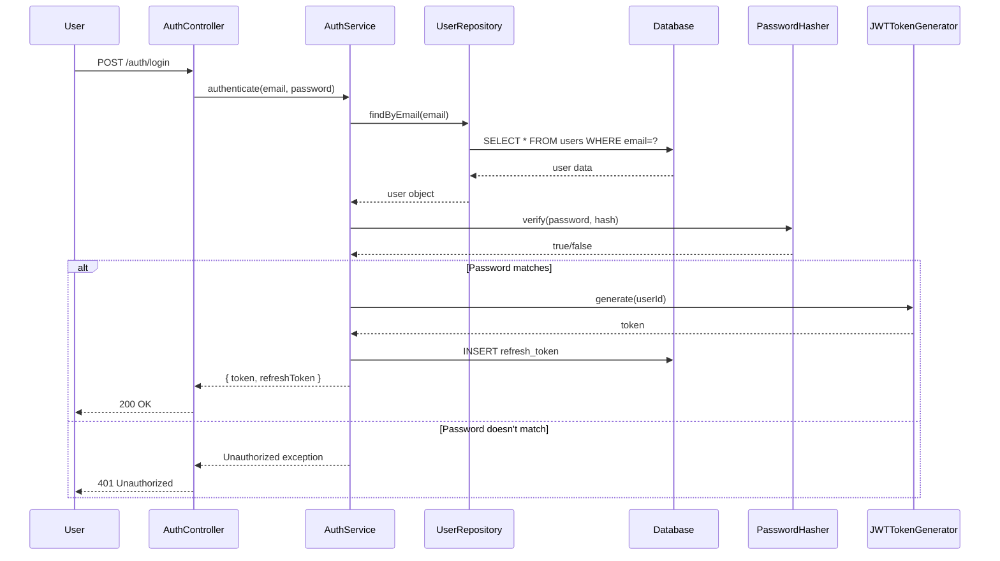
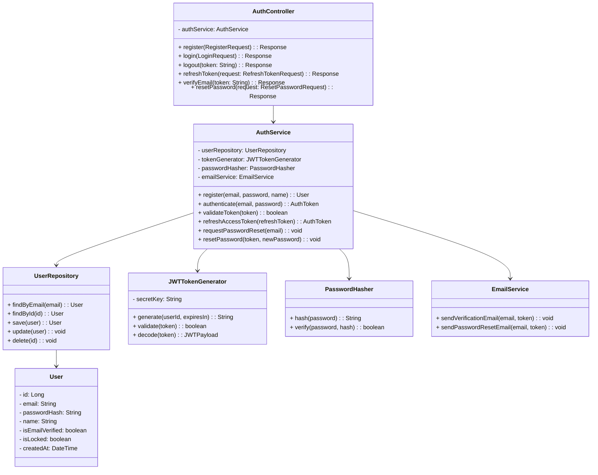
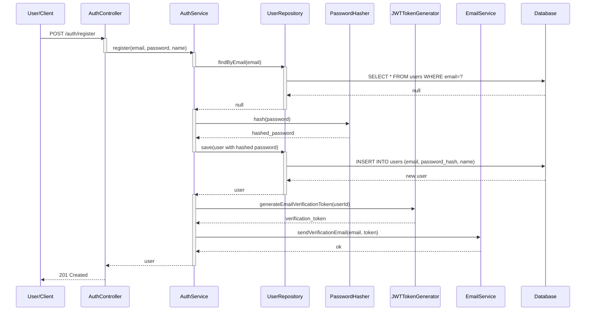

# Low-Level Design (LLD) - Thiết Kế Chi Tiết

## LLD là gì?

**Low-Level Design (LLD)** là tầng thiết kế thứ hai, sau khi HLD đã được approve. Nó chi tiết hoá từng thành phần (component) mà HLD đã xác định.

Nếu HLD là "bản đồ" của thành phố, thì LLD là "chi tiết từng ngôi nhà, đường phố".

**LLD trả lời các câu hỏi:**
- Các class nào sẽ tồn tại trong hệ thống?
- Mối quan hệ giữa các class như thế nào?
- Mỗi method làm gì?
- Database schema (bảng, cột) là gì?
- API contract (request/response format) là gì?
- Thuật toán cụ thể để giải quyết vấn đề?

## LLD khác HLD như thế nào?

| Khía cạnh | HLD | LLD |
|----------|-----|-----|
| **Mức độ chi tiết** | Tổng quát | Chi tiết |
| **Scope** | Toàn bộ hệ thống | Một component/service |
| **Focus** | Architecture, technology | Code, database, algorithms |
| **Artifacts** | Diagram lớn, documentation | Class diagram, schema, sequence |
| **Audience** | Team lead, architect, manager | Developers, QA |
| **Thời gian** | 1-2 tuần | 2-4 tuần (tuỳ độ phức tạp) |

### Ví dụ:

**HLD: E-commerce System**
```
┌──────────────┐       ┌──────────────┐
│  Auth Svc    │───────│  Order Svc   │
└──────────────┘       └──────────────┘
       │                      │
       └──────────┬───────────┘
                  ▼
           ┌────────────┐
           │ Database   │
           └────────────┘
```

**LLD: Auth Service**
```
Classes:
  - UserController
  - AuthService
  - UserRepository
  - PasswordHasher
  - JWTTokenGenerator

Database Schema:
  users table:
    - id (PK)
    - email (UNIQUE)
    - password_hash
    - created_at
    - ...

API Endpoints:
  POST /api/auth/register
  POST /api/auth/login
  POST /api/auth/refresh-token
```

## LLD bao gồm những gì?

### 1. **Class Diagrams** (Sơ đồ class)

Mô tả các class, attributes, methods, và mối quan hệ giữa chúng.

```
Ví dụ:
┌──────────────┐
│   User       │
├──────────────┤
│ - id         │
│ - email      │
│ - password   │
│ - name       │
├──────────────┤
│ + login()    │
│ + logout()   │
│ + getProfile()
└──────────────┘
       △
       │ (extends)
       │
┌──────────────┐
│   Admin      │
├──────────────┤
│ + deleteUser()
└──────────────┘
```

### 2. **Database Schema** (Lược đồ cơ sở dữ liệu)

Định nghĩa các bảng, cột, kiểu dữ liệu, constraints.

```sql
CREATE TABLE users (
    id BIGINT PRIMARY KEY AUTO_INCREMENT,
    email VARCHAR(255) UNIQUE NOT NULL,
    password_hash VARCHAR(255) NOT NULL,
    name VARCHAR(100),
    created_at TIMESTAMP DEFAULT CURRENT_TIMESTAMP,
    updated_at TIMESTAMP DEFAULT CURRENT_TIMESTAMP ON UPDATE CURRENT_TIMESTAMP,
    INDEX idx_email (email)
);

CREATE TABLE posts (
    id BIGINT PRIMARY KEY AUTO_INCREMENT,
    user_id BIGINT NOT NULL,
    content TEXT NOT NULL,
    created_at TIMESTAMP DEFAULT CURRENT_TIMESTAMP,
    FOREIGN KEY (user_id) REFERENCES users(id) ON DELETE CASCADE,
    INDEX idx_user_created (user_id, created_at)
);
```

### 3. **API Contracts** (Hợp đồng API)

Chi tiết các endpoint, request/response format, status codes.

```yaml
POST /api/auth/login
Request:
  {
    "email": "user@gmail.com",
    "password": "mypassword123"
  }

Response 200:
  {
    "token": "eyJhbGc...",
    "refreshToken": "eyJhbGc...",
    "user": {
      "id": 1,
      "email": "user@gmail.com",
      "name": "John Doe"
    }
  }

Response 401:
  {
    "error": "Invalid email or password"
  }
```

### 4. **Sequence Diagrams** (Sơ đồ tuần tự)

Mô tả thứ tự các bước khi một use case xảy ra.

```
User → Login Screen → Auth Service → Database
 │         │              │             │
 │─ enter email/password→  │             │
 │                   │─ validate────────→│
 │                   │←── user data ─────│
 │                   │─ check password   │
 │                   │─ generate token   │
 │← token ────────────────│
 │
 │─ redirect to home
```

### 5. **Error Handling** (Xử lý lỗi)

Chi tiết cách xử lý các tình huống lỗi.

```
Login Errors:
  - Email không tồn tại → HTTP 401, "User not found"
  - Password sai → HTTP 401, "Invalid password"
  - Account bị khóa → HTTP 403, "Account locked"
  - Too many login attempts → HTTP 429, "Too many requests"

Retry Strategy:
  - Network error: Retry 3 lần với exponential backoff
  - Database timeout: Retry 2 lần
  - Third-party API error: Log và return user-friendly message
```

### 6. **Algorithms** (Thuật toán)

Chi tiết các thuật toán phức tạp, tối ưu hoá.

```
Password Hashing Algorithm:
  1. Generate random salt (16 bytes)
  2. Use bcrypt with salt + password
  3. Store hash in database

  Verification:
  1. Get hash from database
  2. Compare input password with hash using bcrypt
  3. Return true/false

Timeline Algorithm (Feed Generation):
  1. Get current user's ID
  2. Query posts from users that current user follows
  3. Order by created_at DESC
  4. Limit 20 posts per page
  5. Add caching: Redis cache for 30 minutes
```

## Step-by-step Cách Làm LLD từ HLD

### Bước 1: Chọn một Component từ HLD

Từ HLD, chọn một service/component để design chi tiết.
Ví dụ: Nếu HLD có "Auth Service", chúng ta sẽ làm LLD cho Auth Service.

### Bước 2: Liệt kê Functional Requirements của Component

Viết lại các yêu cầu chi tiết cho component này.

```
Auth Service Requirements:
  1. Register: User có thể tạo tài khoản với email và password
  2. Login: User có thể đăng nhập và nhận JWT token
  3. Validate Token: Các service khác có thể validate JWT
  4. Refresh Token: User có thể refresh token khi hết hạn
  5. Logout: User có thể logout (invalidate token)
  6. Reset Password: User có thể reset password qua email link
```

### Bước 3: Thiết kế Class Structure

Quyết định các class cần thiết và mối quan hệ.

```
Auth Service Classes:
  - AuthController: nhận HTTP request
  - AuthService: logic chính
  - UserRepository: giao tiếp database
  - JWTTokenGenerator: tạo token
  - PasswordHasher: hash/verify password
  - EmailService: gửi email
  - EmailVerificationToken: quản lý verification token
```

### Bước 4: Vẽ Class Diagram

```
┌─────────────────────┐
│ AuthController      │
├─────────────────────┤
│ + register(...)     │
│ + login(...)        │
│ + logout(...)       │
│ + refreshToken(...) │
└──────────┬──────────┘
           │ uses
           ▼
┌─────────────────────┐
│ AuthService         │
├─────────────────────┤
│ - userRepo          │
│ - tokenGen          │
│ - passwordHasher    │
├─────────────────────┤
│ + authenticate()    │
│ + generateToken()   │
│ + validateToken()   │
│ + resetPassword()   │
└──────────┬──────────┘
           │ uses
           ├─────────────────┬────────────┐
           ▼                 ▼            ▼
    [UserRepository] [JWTTokenGen] [PasswordHasher]
```

### Bước 5: Thiết kế Database Schema

```sql
CREATE TABLE users (
    id BIGINT PRIMARY KEY,
    email VARCHAR(255) UNIQUE NOT NULL,
    password_hash VARCHAR(255) NOT NULL,
    name VARCHAR(100),
    is_email_verified BOOLEAN DEFAULT false,
    created_at TIMESTAMP,
    updated_at TIMESTAMP
);

CREATE TABLE email_verification_tokens (
    id BIGINT PRIMARY KEY,
    user_id BIGINT NOT NULL,
    token VARCHAR(255) UNIQUE NOT NULL,
    expires_at TIMESTAMP,
    FOREIGN KEY (user_id) REFERENCES users(id)
);

CREATE TABLE password_reset_tokens (
    id BIGINT PRIMARY KEY,
    user_id BIGINT NOT NULL,
    token VARCHAR(255) UNIQUE NOT NULL,
    expires_at TIMESTAMP,
    FOREIGN KEY (user_id) REFERENCES users(id)
);

CREATE TABLE refresh_tokens (
    id BIGINT PRIMARY KEY,
    user_id BIGINT NOT NULL,
    token VARCHAR(255) UNIQUE NOT NULL,
    expires_at TIMESTAMP,
    FOREIGN KEY (user_id) REFERENCES users(id)
);
```

### Bước 6: Định nghĩa API Contracts

```yaml
Endpoint 1: Register
  POST /api/auth/register
  Request:
    {
      "email": "user@gmail.com",
      "password": "SecurePass123!",
      "name": "John Doe"
    }
  Response 201:
    {
      "message": "Registration successful. Check your email to verify.",
      "user": {
        "id": 1,
        "email": "user@gmail.com",
        "name": "John Doe"
      }
    }
  Response 400:
    {
      "error": "Email already exists"
    }

Endpoint 2: Login
  POST /api/auth/login
  Request:
    {
      "email": "user@gmail.com",
      "password": "SecurePass123!"
    }
  Response 200:
    {
      "token": "eyJhbGciOiJIUzI1NiIs...",
      "refreshToken": "eyJhbGciOiJIUzI1NiIs...",
      "expiresIn": 3600
    }
  Response 401:
    {
      "error": "Invalid credentials"
    }
```

### Bước 7: Vẽ Sequence Diagrams



### Bước 8: Define Error Handling

```python
# Pseudocode
def authenticate(email, password):
    try:
        user = userRepository.findByEmail(email)
    except DatabaseException:
        log error
        raise ServiceUnavailableException("Database error")

    if user is None:
        raise UnauthorizedException("User not found")

    if not passwordHasher.verify(password, user.passwordHash):
        # Log failed attempt
        if failed_attempts > 5:
            lock_account(user.id)
            raise ForbiddenException("Account locked")
        raise UnauthorizedException("Invalid password")

    if user.is_locked:
        raise ForbiddenException("Account locked")

    if not user.is_email_verified:
        raise UnauthorizedException("Email not verified")

    token = tokenGenerator.generate(user.id)
    return token
```

### Bước 9: Tối ưu hoá và Documentation

- Xác định các bottlenecks
- Quyết định caching strategy
- Viết documentation
- Review với team

## Ví dụ: LLD cho User Authentication Module

### Overview

Hệ thống xác thực người dùng cho phép đăng ký, đăng nhập, xác thực email, và reset password.

### Class Diagram



### Database Schema

```sql
-- Users table
CREATE TABLE users (
    id BIGINT PRIMARY KEY AUTO_INCREMENT,
    email VARCHAR(255) UNIQUE NOT NULL,
    password_hash VARCHAR(255) NOT NULL,
    name VARCHAR(100) NOT NULL,
    is_email_verified BOOLEAN DEFAULT false,
    is_locked BOOLEAN DEFAULT false,
    locked_until TIMESTAMP NULL,
    failed_login_attempts INT DEFAULT 0,
    created_at TIMESTAMP DEFAULT CURRENT_TIMESTAMP,
    updated_at TIMESTAMP DEFAULT CURRENT_TIMESTAMP ON UPDATE CURRENT_TIMESTAMP,
    INDEX idx_email (email),
    INDEX idx_locked (is_locked)
) ENGINE=InnoDB;

-- Email verification tokens
CREATE TABLE email_verification_tokens (
    id BIGINT PRIMARY KEY AUTO_INCREMENT,
    user_id BIGINT NOT NULL,
    token VARCHAR(255) UNIQUE NOT NULL,
    expires_at TIMESTAMP NOT NULL,
    created_at TIMESTAMP DEFAULT CURRENT_TIMESTAMP,
    FOREIGN KEY (user_id) REFERENCES users(id) ON DELETE CASCADE,
    INDEX idx_user_id (user_id),
    INDEX idx_expires_at (expires_at)
) ENGINE=InnoDB;

-- Password reset tokens
CREATE TABLE password_reset_tokens (
    id BIGINT PRIMARY KEY AUTO_INCREMENT,
    user_id BIGINT NOT NULL,
    token VARCHAR(255) UNIQUE NOT NULL,
    expires_at TIMESTAMP NOT NULL,
    used_at TIMESTAMP NULL,
    created_at TIMESTAMP DEFAULT CURRENT_TIMESTAMP,
    FOREIGN KEY (user_id) REFERENCES users(id) ON DELETE CASCADE,
    INDEX idx_user_id (user_id),
    INDEX idx_expires_at (expires_at)
) ENGINE=InnoDB;

-- Refresh tokens (for tracking issued tokens)
CREATE TABLE refresh_tokens (
    id BIGINT PRIMARY KEY AUTO_INCREMENT,
    user_id BIGINT NOT NULL,
    token_hash VARCHAR(255) UNIQUE NOT NULL,
    expires_at TIMESTAMP NOT NULL,
    revoked_at TIMESTAMP NULL,
    created_at TIMESTAMP DEFAULT CURRENT_TIMESTAMP,
    FOREIGN KEY (user_id) REFERENCES users(id) ON DELETE CASCADE,
    INDEX idx_user_id (user_id),
    INDEX idx_expires_at (expires_at),
    INDEX idx_revoked (revoked_at)
) ENGINE=InnoDB;

-- Login audit trail
CREATE TABLE login_audit (
    id BIGINT PRIMARY KEY AUTO_INCREMENT,
    user_id BIGINT,
    email VARCHAR(255),
    ip_address VARCHAR(45),
    user_agent VARCHAR(255),
    status ENUM('SUCCESS', 'FAILED') NOT NULL,
    reason VARCHAR(255),
    created_at TIMESTAMP DEFAULT CURRENT_TIMESTAMP,
    INDEX idx_user_id (user_id),
    INDEX idx_created_at (created_at)
) ENGINE=InnoDB;
```

### API Contracts

```yaml
Endpoint 1: Register
  POST /api/auth/register

  Request Body:
    {
      "email": "john@gmail.com",
      "password": "SecurePass123!@",
      "passwordConfirm": "SecurePass123!@",
      "name": "John Doe"
    }

  Validation:
    - email: required, valid email format, not exists in DB
    - password: required, min 8 chars, min 1 uppercase, min 1 digit
    - name: required, max 100 chars

  Response 201:
    {
      "message": "Registration successful. Check email to verify.",
      "user": {
        "id": 1,
        "email": "john@gmail.com",
        "name": "John Doe",
        "createdAt": "2026-03-15T10:30:00Z"
      }
    }

  Response 400:
    {
      "error": "Email already registered",
      "errors": [
        {
          "field": "email",
          "message": "This email is already registered"
        }
      ]
    }

Endpoint 2: Login
  POST /api/auth/login

  Request Body:
    {
      "email": "john@gmail.com",
      "password": "SecurePass123!@"
    }

  Validation:
    - email: required, valid format
    - password: required

  Response 200:
    {
      "token": "eyJhbGciOiJIUzI1NiIsInR5cCI6IkpXVCJ9...",
      "refreshToken": "eyJhbGciOiJIUzI1NiIsInR5cCI6IkpXVCJ9...",
      "expiresIn": 3600,
      "user": {
        "id": 1,
        "email": "john@gmail.com",
        "name": "John Doe"
      }
    }

  Response 401:
    {
      "error": "Invalid email or password"
    }

  Response 403:
    {
      "error": "Account is locked due to too many failed attempts"
    }

Endpoint 3: Verify Email
  GET /api/auth/verify-email?token=TOKEN

  Response 200:
    {
      "message": "Email verified successfully"
    }

  Response 400:
    {
      "error": "Invalid or expired verification token"
    }

Endpoint 4: Refresh Token
  POST /api/auth/refresh-token

  Request Body:
    {
      "refreshToken": "eyJhbGciOiJIUzI1NiIsInR5cCI6IkpXVCJ9..."
    }

  Response 200:
    {
      "token": "eyJhbGciOiJIUzI1NiIsInR5cCI6IkpXVCJ9...",
      "expiresIn": 3600
    }

  Response 401:
    {
      "error": "Invalid or expired refresh token"
    }

Endpoint 5: Request Password Reset
  POST /api/auth/forgot-password

  Request Body:
    {
      "email": "john@gmail.com"
    }

  Response 200:
    {
      "message": "If email exists, reset link will be sent"
    }

Endpoint 6: Reset Password
  POST /api/auth/reset-password

  Request Body:
    {
      "token": "RESET_TOKEN",
      "password": "NewPassword123!@",
      "passwordConfirm": "NewPassword123!@"
    }

  Response 200:
    {
      "message": "Password reset successful. Please login with new password."
    }

  Response 400:
    {
      "error": "Invalid or expired reset token"
    }
```

### Sequence Diagrams



### Error Handling

```python
def authenticate(email: str, password: str) -> AuthToken:
    """Authenticate user with email and password"""

    # 1. Find user by email
    user = userRepository.findByEmail(email)
    if not user:
        auditLog.logFailedLogin(email, "User not found")
        raise UnauthorizedException("Invalid email or password")

    # 2. Check if account is locked
    if user.is_locked:
        if user.locked_until > now():
            auditLog.logFailedLogin(email, "Account locked")
            raise ForbiddenException("Account is locked. Try again later.")
        else:
            # Unlock account
            user.is_locked = False
            user.failed_login_attempts = 0
            userRepository.update(user)

    # 3. Check if email is verified
    if not user.is_email_verified:
        auditLog.logFailedLogin(email, "Email not verified")
        raise UnauthorizedException("Please verify your email first")

    # 4. Verify password
    if not passwordHasher.verify(password, user.password_hash):
        user.failed_login_attempts += 1
        if user.failed_login_attempts >= 5:
            user.is_locked = True
            user.locked_until = now() + timedelta(minutes=15)
        userRepository.update(user)
        auditLog.logFailedLogin(email, "Invalid password")
        raise UnauthorizedException("Invalid email or password")

    # 5. Reset failed attempts
    user.failed_login_attempts = 0
    userRepository.update(user)

    # 6. Generate tokens
    access_token = tokenGenerator.generateAccessToken(user.id)
    refresh_token = tokenGenerator.generateRefreshToken(user.id)

    # 7. Save refresh token
    refreshTokenRepository.save(RefreshToken(
        user_id=user.id,
        token_hash=hash(refresh_token),
        expires_at=now() + timedelta(days=30)
    ))

    auditLog.logSuccessfulLogin(email)

    return AuthToken(
        token=access_token,
        refreshToken=refresh_token,
        expiresIn=3600
    )
```

### Performance Optimization

```yaml
Caching:
  - Cache user by ID in Redis (5 minutes TTL)
  - Cache email verification tokens in Redis
  - Use database query cache for frequently accessed users

Database Optimization:
  - Index on email (UNIQUE)
  - Index on user_id + expires_at for token cleanup
  - Partition login_audit by date

Rate Limiting:
  - Max 5 login attempts per email per 15 minutes
  - Max 100 register requests per IP per hour
  - Max 10 password reset requests per email per hour
```

### Security Considerations

```yaml
Password:
  - Hash using bcrypt with cost 12
  - Never log passwords
  - Min 8 characters, require uppercase, digit, special char

Tokens:
  - Access token: 1 hour expiry
  - Refresh token: 30 days expiry
  - Use HS256 signing algorithm
  - Store refresh token hash in DB (not plain token)

Account Lockout:
  - Lock after 5 failed attempts
  - Lock duration: 15 minutes
  - Log all failed attempts

Email Security:
  - Verify email before allowing login
  - Email verification token valid for 24 hours only
  - Send verification email asynchronously

API Security:
  - HTTPS only (no HTTP)
  - CORS: Allow specific domains only
  - Sanitize all inputs
  - SQL injection prevention: use prepared statements
  - Add CSRF token for state-changing operations
```

## Checklist Tự Kiểm tra LLD

Trước khi implement, kiểm tra:

- [ ] Class diagram cover tất cả functional requirements?
- [ ] Mỗi class có một trách nhiệm chính (SRP)?
- [ ] Database schema normalized (ít nhất 3NF)?
- [ ] API contracts rõ ràng về request/response?
- [ ] Error handling cover tất cả edge cases?
- [ ] Performance optimization được xem xét?
- [ ] Security requirements được implement?
- [ ] Sequence diagrams cover main use cases?
- [ ] Scalability được xem xét (caching, indexing)?
- [ ] Team đồng ý với LLD?
- [ ] Documentation đầy đủ?

## Common Mistakes in LLD

❌ **Quá chi tiết**: Chi tiết toàn bộ hệ thống thay vì từng component
❌ **Không follow SOLID principles**: Classes có quá nhiều trách nhiệm
❌ **Bỏ qua error cases**: Chỉ handle happy path
❌ **Không tính đến performance**: Viết code mà không optimize
❌ **Không document**: Code không có giải thích

## Kế tiếp: Implementation

Sau khi LLD được approve, bạn có thể bắt đầu coding:
- Tạo classes theo class diagram
- Tạo database tables
- Implement APIs
- Viết unit tests

---

**Tham khảo thêm:**
- `/02-Database-Schema-Design/README.md` - Chi tiết database design
- `/04-Sequence-Diagrams/README.md` - Chi tiết sequence diagrams
