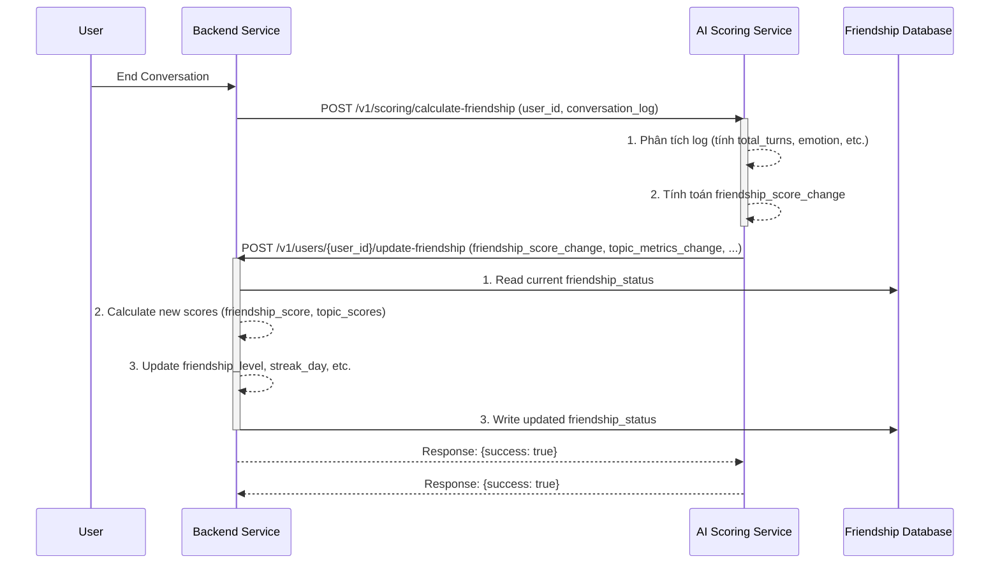
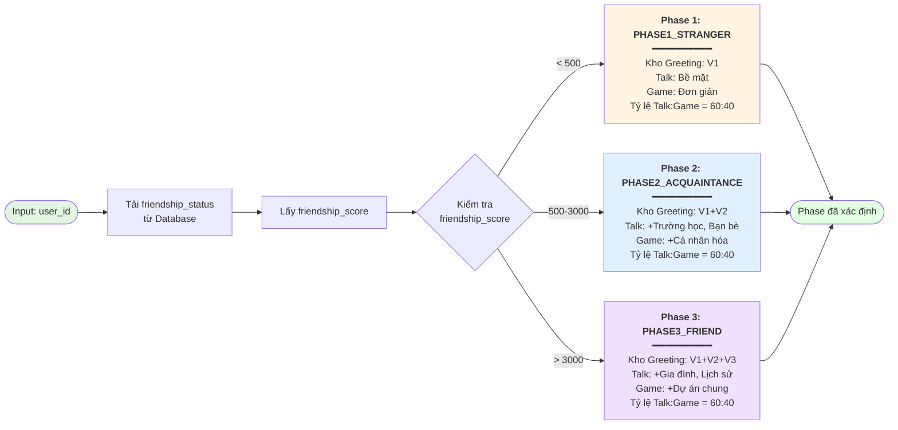
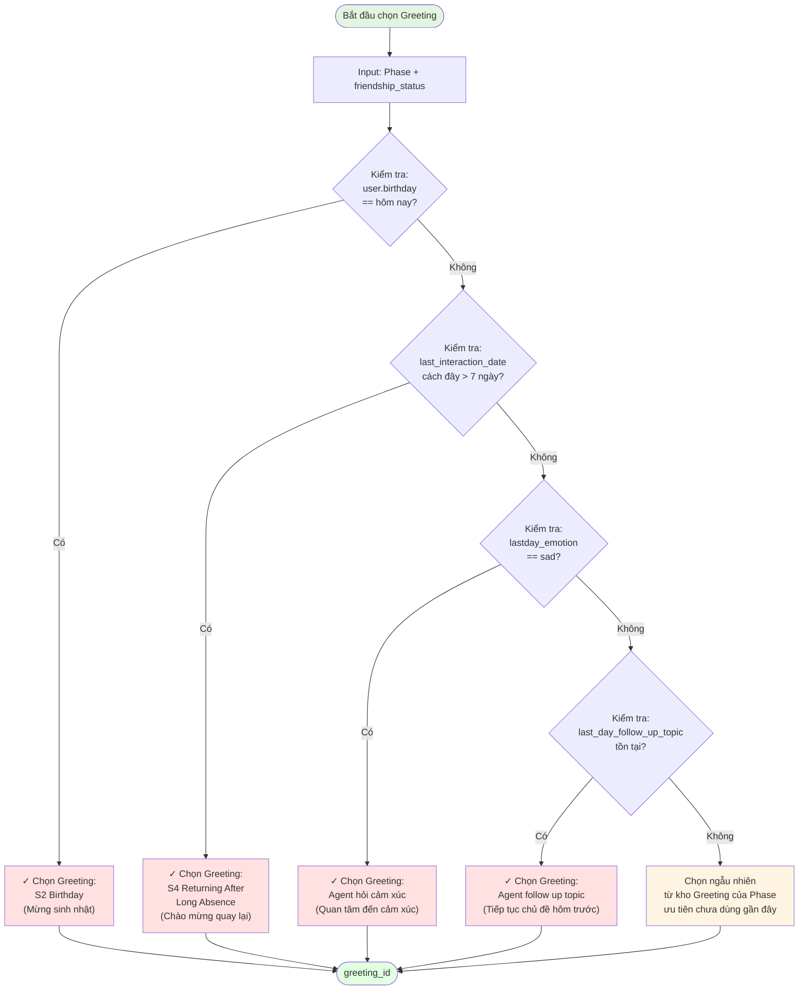
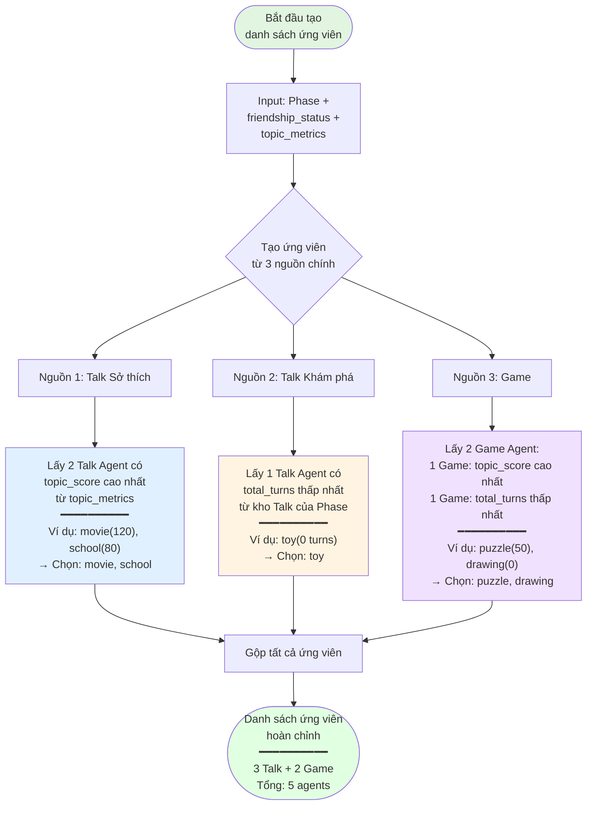
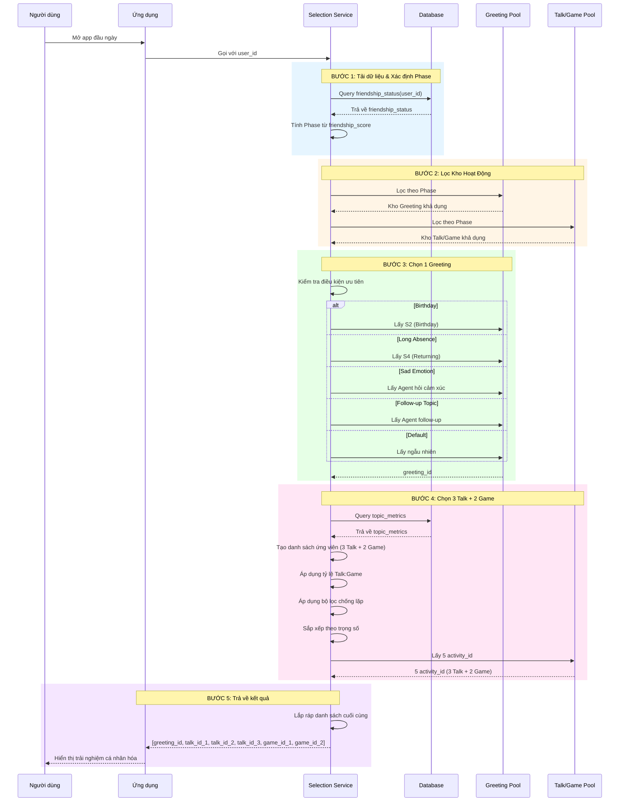
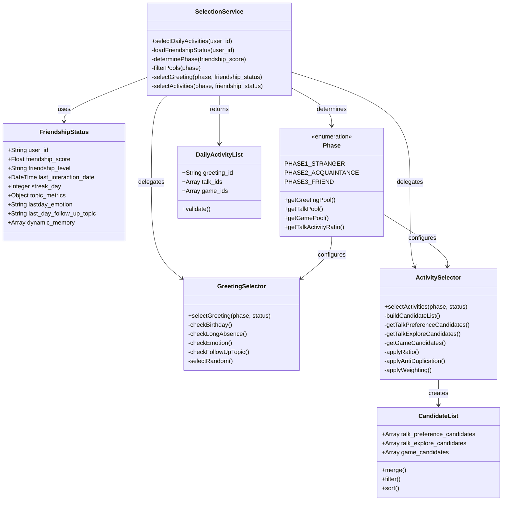
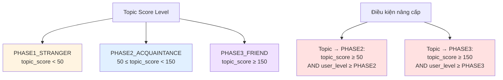
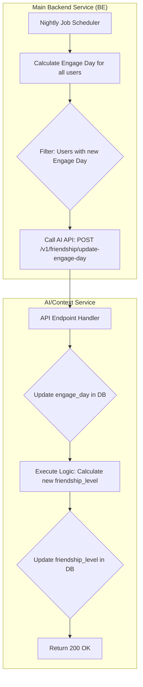

> 		Tài liệu Triển khai Kỹ thuật: Module Context Handling - Friendlyship Management

> Đoàn Ngọc Cường - T12/2025 -  
# 1. Tổng quan và Bối cảnh (Overview and Context)

Tài liệu này đặc tả chi tiết về mặt kỹ thuật cho việc xây dựng và tích hợp module **Context Handling**, với trọng tâm là quản lý trạng thái tình bạn (Friendship) và lựa chọn Agent (Talk/Game/Greeting) trong hệ sinh thái sản phẩm Pika. Module này là một phần của **Container 3: Context Handling** trong kiến trúc tổng thể, chịu trách nhiệm thu thập, xử lý, và duy trì tất cả dữ liệu liên quan đến người dùng và mối quan hệ của họ với Pika.

## 1.1. Mục tiêu Product

- **Tăng Retention và Engagement:** Tạo ra một mối quan hệ cá nhân hóa, sâu sắc và lâu dài giữa người dùng và Pika, khiến người dùng cảm thấy được thấu hiểu và quay trở lại thường xuyên.
- **Cá nhân hóa Trải nghiệm:** Chuyển đổi từ trải nghiệm "một cho tất cả" sang "một cho mỗi người", nơi các hoạt động, lời chào và chủ đề trò chuyện được điều chỉnh dựa trên lịch sử tương tác và mức độ thân thiết.
- **Tạo ra các khoảnh khắc "Aha!":** Khiến người dùng bất ngờ và thích thú khi Pika "nhớ" lại các chi tiết, sở thích, hoặc các sự kiện trong quá khứ, tạo ra một kết nối cảm xúc thực sự.

## 1.2. Thay đổi so với Thiết kế ban đầu

Dựa trên yêu cầu mới, luồng cập nhật điểm tình bạn (`friendship_score`) sẽ được thay đổi từ mô hình xử lý hàng loạt cuối ngày (batch processing) sang **mô hình xử lý theo thời gian thực (real-time processing)**.

> **Yêu cầu cốt lõi:** *"Sau khi kết thúc 1 cuộc hội thoại phía BE gửi user_id kèm log cho phía AI. Phía AI xử lý log luôn và tính điểm daily_score và code API phía BE để update điểm friendlyship_score."*

Điều này có nghĩa là `friendship_score` sẽ được cập nhật liên tục sau mỗi phiên tương tác, mang lại phản hồi tức thì về mức độ thân thiết và cho phép hệ thống điều phối (Orchestration) có được dữ liệu mới nhất để ra quyết định.

# 2. Thiết kế Kiến trúc Module và luồng giao tiếp với BE và AI khác

Để đáp ứng yêu cầu xử lý real-time, kiến trúc của module sẽ bao gồm ba thành phần chính: **Backend (BE) Service**, **AI Scoring Service**, và **Friendship Database**.



*Sơ đồ 1: Luồng cập nhật Friendship Score theo thời gian thực*

## 2.1 Luồng hoạt động:

1. **Kết thúc hội thoại:** Người dùng hoàn thành một phiên trò chuyện.
2. **BE gửi yêu cầu:** Backend Service gửi một yêu cầu (POST) đến AI Scoring Service, đính kèm `user_id` và toàn bộ `conversation_log` của phiên vừa kết thúc.
3. **AI tính toán:** AI Scoring Service nhận log, phân tích và tính toán ra một "điểm thay đổi" (`friendship_score_change`) cùng các chỉ số liên quan khác (ví dụ: sự thay đổi của `topic_score`).
4. **AI gọi BE để cập nhật:** AI Service gọi một API do BE cung cấp để gửi "điểm thay đổi" này.
5. **BE cập nhật vào DB:** BE nhận điểm thay đổi, đọc bản ghi `friendship_status` hiện tại từ Database, tính toán các giá trị mới, và ghi đè bản ghi đã cập nhật trở lại vào Database.


```
┌─────────────────────────────────────────────────────────────┐
│                    User Interaction                          │
└──────────────────────┬──────────────────────────────────────┘
                       │
                       ▼
        ┌──────────────────────────────┐
        │   Backend Service (BE)       │
        │  - Manage conversations      │
        │  - Trigger events            │
        └──────────────┬───────────────┘
                       │
                       ▼ POST /conversations/end
        ┌──────────────────────────────┐
        │   Event Queue (RabbitMQ)     │
        │  - Message persistence       │
        │  - Retry mechanism           │
        └──────────────┬───────────────┘
                       │
                       ▼
        ┌──────────────────────────────┐
        │   Background Worker          │
        │  - Consume events            │
        │  - Calculate scores          │
        │  - Update DB                 │
        │  - Cache candidates          │
        └──────────────┬───────────────┘
                       │
        ┌──────────────┴──────────────┐
        │                             │
        ▼                             ▼
┌──────────────────┐      ┌──────────────────┐
│  PostgreSQL DB   │      │   Redis Cache    │
│  - Friendship    │      │  - Candidates    │
│  - Agents        │      │  - TTL: 12h      │
└──────────────────┘      └──────────────────┘
```

Chi tiết hơn 
```
┌─────────────────────────────────────────────────────────┐
│ 1. POST /conversations/end                              │
│    - Frontend/Backend gửi request                       │
│    - Body: conversation_id, user_id, conversation_log   │
└──────────────────┬──────────────────────────────────────┘
                   │
                   ▼
┌─────────────────────────────────────────────────────────┐
│ 2. Save vào DB (conversation_events table)             │
│    - Status = PENDING                                   │
│    - Lưu conversation_log vào cột JSONB                │
└──────────────────┬──────────────────────────────────────┘
                   │
                   ▼
┌─────────────────────────────────────────────────────────┐
│ 3. Publish vào RabbitMQ Queue                          │
│    Message: {                                           │
│      conversation_id,                                   │
│      user_id,                                           │
│      bot_id,                                            │
│      conversation_log,  ← Có trong message             │
│      enqueued_at                                        │
│    }                                                    │
└──────────────────┬──────────────────────────────────────┘
                   │
                   ▼
┌─────────────────────────────────────────────────────────┐
│ 4. Return 202 Accepted                                 │
│    (Không đợi processing)                              │
└─────────────────────────────────────────────────────────┘

                   ═══════════════════════════════════

┌─────────────────────────────────────────────────────────┐
│ 5. Worker nhận message từ queue                        │
│    - Parse JSON → lấy conversation_id                   │
│    - conversation_log trong message KHÔNG được dùng    │
└──────────────────┬──────────────────────────────────────┘
                   │
                   ▼
┌─────────────────────────────────────────────────────────┐
│ 6. Query DB để lấy Event object                        │
│    - repo.get_by_conversation_id(conversation_id)      │
│    - Lấy event.id, status, metadata...                 │
└──────────────────┬──────────────────────────────────────┘
                   │
                   ▼
┌─────────────────────────────────────────────────────────┐
│ 7. Fetch conversation_log từ DB                        │
│    - ConversationDataFetchService.fetch_by_id()        │
│    - Lấy conversation_log từ cột JSONB trong DB        │
│    - conversation_log từ message BỊ BỎ QUA             │
└──────────────────┬──────────────────────────────────────┘
                   │
                   ▼
┌─────────────────────────────────────────────────────────┐
│ 8. Process scoring                                     │
│    - Tính friendship_score_change                      │
│    - Update friendship_status                           │
│    - Mark status = PROCESSED                           │
└─────────────────────────────────────────────────────────┘
```
## 2.2 Data Flow (5 Steps)

```
STEP 1: User ends conversation
  ↓
STEP 2: BE publishes event to RabbitMQ
  ↓
STEP 3: Worker consumes event
  ├─ Fetch conversation data
  ├─ Calculate friendship_score_change
  ├─ Update friendship_status in DB
  ├─ Update topic_metrics
  └─ Cache agent candidates (12h TTL)
  ↓
STEP 4: BE queries for suggested activities
  ├─ Check Redis cache
  ├─ Return cached candidates (< 100ms)
  └─ If miss, trigger recalculation
  ↓
STEP 5: User sees personalized activities
```


# 3. Thiết kế DB

Bảng friendship of user : user_id, friendship_score, friendship_level, last_interaction_date, streak_day, topic_metrics

Bảng friendship map with agent (3 loại: Gretting, Talk, Game/ACtivitity, )

Database Schema (3 Bảng)

## 7.1. Bảng chính 1: `friendship_status`

Lưu trạng thái tình bạn của user.

```sql
  

--- friendship_status

  

CREATE TABLE friendship_status (

    user_id VARCHAR(255) PRIMARY KEY,

    friendship_score FLOAT DEFAULT 0.0 NOT NULL,

    friendship_level VARCHAR(50) DEFAULT 'PHASE1_STRANGER' NOT NULL,

    -- PHASE1_STRANGER (0-99), PHASE2_ACQUAINTANCE (100-499), PHASE3_FRIEND (500+)

    last_interaction_date TIMESTAMP WITH TIME ZONE,
    
    birthday TIMESTAMP() WITH TIME ZONE,

    streak_day INTEGER DEFAULT 0 NOT NULL,
    
    last_emotion VARCHAR(50) NOT NULL,
    
    last_followup_topic VARCHAR(200) NOT NULL,

    topic_metrics JSONB DEFAULT '{}' NOT NULL,

    -- {

    --   "agent_movie": { "score": 52.0, "turns": 65, "last_date": "..." },

    --   "agent_animal": { "score": 28.5, "turns": 32, "last_date": "..." }

    -- }

    created_at TIMESTAMP WITH TIME ZONE DEFAULT CURRENT_TIMESTAMP,

    updated_at TIMESTAMP WITH TIME ZONE DEFAULT CURRENT_TIMESTAMP

);

  

-- Indexes

CREATE INDEX idx_friendship_score ON friendship_status(friendship_score);

CREATE INDEX idx_friendship_level ON friendship_status(friendship_level);

CREATE INDEX idx_updated_at ON friendship_status(updated_at DESC);
```

| Cột                     | Kiểu         | Mô tả                                                 |
| :---------------------- | :----------- | :---------------------------------------------------- |
| `user_id`               | VARCHAR(255) | Primary key, định danh duy nhất của user              |
| `friendship_score`      | FLOAT        | Điểm tình bạn (cập nhật sau mỗi phiên)                |
| `friendship_level`      | VARCHAR(50)  | PHASE1_STRANGER / PHASE2_ACQUAINTANCE / PHASE3_FRIEND |
| `last_interaction_date` | TIMESTAMP    | Lần tương tác cuối cùng                               |
| `streak_day`            | INTEGER      | Số ngày tương tác liên tiếp                           |
| `topic_metrics`         | JSONB        | Điểm và lịch sử tương tác cho mỗi topic               |
| `created_at`            | TIMESTAMP    | Thời điểm tạo record                                  |
| `updated_at`            | TIMESTAMP    | Thời điểm cập nhật cuối cùng                          |

**Ví dụ dữ liệu:**

```json
{
  "user_id": "user_123",
  "friendship_score": 785.5,
  "friendship_level": "PHASE2_ACQUAINTANCE",
  "last_interaction_date": "2025-11-25T18:30:00Z",
  "streak_day": 6,
  "topic_metrics": {
    "movie_talk": {
      "score": 1631.0,
      "turns": 105,
      "last_date": "2025-11-28T05:07:21.028732Z",
      "agents_used": [
        "agent_movie_talk_1"
      ],
      "friendship_topic_level": "PHASE1_STRANGER",
      "list_topic_type": [
        "TALK"
      ]
    },
    "puzzle_game": {
      "score": 100.0,
      "turns": 10,
      "last_date": "2025-11-28T08:35:20.583763Z",
      "agents_used": [
        "agent_puzzle_game_1"
      ],
      "friendship_topic_level": "PHASE1_STRANGER",
      "list_topic_type": [
        "GAME"
      ]
    },
    "movie_game": {
      "score": 50.0,
      "turns": 5,
      "last_date": "2025-11-28T10:00:00Z",
      "agents_used": [
        "agent_movie_game_1"
      ],
      "friendship_topic_level": "PHASE1_STRANGER",
      "list_topic_type": [
        "TALK",
        "GAME"
      ]
    }
  }
}
```

Dùng để: 
**Friendship Level Mapping:**

| Friendship Level    | Score Range | Description                           |
| :------------------ | :---------- | :------------------------------------ |
| PHASE1_STRANGER     | 0-499       | Just met, basic interaction           |
| PHASE2_ACQUAINTANCE | 500-2999    | Getting to know, moderate interaction |
| PHASE3_FRIEND       | 3000+       | Close friend, deep interaction        |

**Topic Level Mapping:**

| Topic Level         | Score Range | Condition                                   |
| :------------------ | :---------- | :------------------------------------------ |
| PHASE1_STRANGER     | < 50        | New topic                                   |
| PHASE2_ACQUAINTANCE | 50-149      | user_level >= PHASE2 AND topic_score >= 50  |
| PHASE3_FRIEND       | >= 150      | user_level >= PHASE3 AND topic_score >= 150 |


## 7.2. Bảng chính 2 : `agenda_agent_prompting`

Mapping giữa `friendship_level` và các Agent theo loại.

```sql
  
CREATE TABLE agenda_agent_prompting (
    id SERIAL PRIMARY KEY,

    topic_id VARCHAR(100) NOT NULL,
    -- Ví dụ: 'toy', 'school', 'special_day'

    agent_id VARCHAR(255) NOT NULL,
    -- Nên map với agent_prompting.agent_id (nếu đã có bảng đó)

    friendship_level VARCHAR(50) NOT NULL
        CHECK (friendship_level IN ('STRANGER', 'ACQUAINTANCE', 'FRIEND')),
    -- Phase quan hệ: STRANGER, ACQUAINTANCE, FRIEND

    talking_agenda TEXT,
    -- Nội dung agenda / note cho cách nói chuyện, có thể để NULL

    agent_tag VARCHAR(50) NOT NULL
        CHECK (agent_tag IN ('TALK', 'GAME', 'GREETING')),
    -- Loại agent: TALK / GAME / GREETING

    created_at TIMESTAMPTZ DEFAULT CURRENT_TIMESTAMP,
    updated_at TIMESTAMPTZ DEFAULT CURRENT_TIMESTAMP
);

-- Indexes hỗ trợ query
CREATE INDEX idx_agenda_topic
ON agenda_agent_prompting(topic_id);

CREATE INDEX idx_agenda_phase_type
ON agenda_agent_prompting(friendship_level, agent_tag);

CREATE INDEX idx_agenda_agent_id
ON agenda_agent_prompting(agent_id);


INSERT INTO agenda_agent_prompting (topic_id, agent_id, talking_agenda, friendship_level, agent_tag)
VALUES
('toy', 'agent_toy_1', NULL, 'STRANGER', 'TALK'),
('toy', 'agent_toy_2', NULL, 'ACQUAINTANCE', 'TALK'),
('toy', 'agent_toy_3', NULL, 'FRIEND', 'TALK'),
('school', 'agent_school_1', NULL, 'ACQUAINTANCE', 'GAME'),
('special_day', 'greeting_special_day_1', NULL, 'ACQUAINTANCE', 'GREETING');
```
  


## 7.4 Bảng phụ 2: conversation_events - để hứng conversation from BE send to

```sql

CREATE TABLE conversation_events (

-- Primary Key

id SERIAL PRIMARY KEY,

-- Identifiers

conversation_id VARCHAR(255) NOT NULL UNIQUE,

user_id VARCHAR(255) NOT NULL,

-- Bot Information

bot_type VARCHAR(50) NOT NULL

bot_id VARCHAR(255) NOT NULL,

bot_name VARCHAR(255) NOT NULL,

agent_tag VARCHAR(255) NULL,

-- Conversation Timing

start_time TIMESTAMP NOT NULL,

end_time TIMESTAMP NOT NULL,

duration_seconds INTEGER GENERATED ALWAYS AS (

EXTRACT(EPOCH FROM (end_time - start_time))::INTEGER

) STORED,

-- Processing results

friendship_score_change FLOAT,

new_friendship_level VARCHAR(50),

-- Add comment to document the structure
ADD COLUMN score_calculation_details JSONB NULL;

COMMENT ON COLUMN conversation_events.score_calculation_details IS

'JSONB storing detailed breakdown of friendship score cal.';

-- Conversation Data

conversation_log JSONB NOT NULL DEFAULT '[]',
raw_conversation_log JSONB NOT NULL DEFAULT '[]',

-- Status tracking

status VARCHAR(50) NOT NULL DEFAULT 'PENDING'

CHECK (status IN ('PENDING', 'PROCESSING', 'PROCESSED', 'FAILED', 'SKIPPED')),

attempt_count INTEGER NOT NULL DEFAULT 0,

-- Timing for processing

created_at TIMESTAMP NOT NULL DEFAULT CURRENT_TIMESTAMP,

next_attempt_at TIMESTAMP NOT NULL DEFAULT CURRENT_TIMESTAMP + INTERVAL '6 hours',

processed_at TIMESTAMP,

-- Error tracking (only when FAILED)

error_code VARCHAR(50),

error_details TEXT,


-- Timestamps

updated_at TIMESTAMP NOT NULL DEFAULT CURRENT_TIMESTAMP

);

  

-- Indexes for efficient querying

CREATE INDEX idx_conversation_events_status ON conversation_events(status);

CREATE INDEX idx_conversation_events_next_attempt ON conversation_events(next_attempt_at);

CREATE INDEX idx_conversation_events_user_id ON conversation_events(user_id);

CREATE INDEX idx_conversation_events_created_at ON conversation_events(created_at);

CREATE INDEX idx_conversation_events_bot_type ON conversation_events(bot_type);

CREATE INDEX idx_conversation_events_bot_id ON conversation_events(bot_id);

  

-- Composite index for common queries

CREATE INDEX idx_conversation_events_status_next_attempt

ON conversation_events(status, next_attempt_at);

  

-- GIN index for JSONB queries

CREATE INDEX idx_conversation_events_log_gin

ON conversation_events USING GIN (conversation_log);

  

```

### Columns Chi Tiết

| Column                      | Type         | Mô Tả                                             | Ghi Chú                 |
| :-------------------------- | :----------- | :-------------------------------------------------- | :----------------------- |
| `id`                      | SERIAL       | Primary key                                         | Auto-increment           |
| `conversation_id`         | VARCHAR(255) | ID conversation                                     | UNIQUE, required         |
| `user_id`                 | VARCHAR(255) | ID user                                             | Required, indexed        |
| `bot_type`                | VARCHAR(50)  | GREETING / TALK / GAME_ACTIVITY                     | Required, checked        |
| `bot_id`                  | VARCHAR(255) | ID của bot                                         | Required                 |
| `bot_name`                | VARCHAR(255) | Tên của bot                                       | Required                 |
| `start_time`              | TIMESTAMP    | Thời điểm bắt đầu                             | Required                 |
| `end_time`                | TIMESTAMP    | Thời điểm kết thúc                             | Required                 |
| `duration_seconds`        | INTEGER      | Thời lượng (giây)                               | Generated, calculated    |
| `conversation_log`        | JSONB        | Toàn bộ log conversation                          | Required, default: []    |
| `status`                  | VARCHAR(50)  | PENDING / PROCESSING / PROCESSED / FAILED / SKIPPED | Default: PENDING         |
| `attempt_count`           | INTEGER      | Số lần đã xử lý                               | Default: 0, max: 5       |
| `created_at`              | TIMESTAMP    | Khi được lưu                                    | Auto                     |
| `next_attempt_at`         | TIMESTAMP    | Thời điểm xử lý tiếp theo                     | Default: created_at + 6h |
| `processed_at`            | TIMESTAMP    | Khi xử lý thành công                            | Null nếu chưa          |
| `error_code`              | VARCHAR(50)  | Code lỗi                                           | Null nếu thành công   |
| `error_details`           | TEXT         | Chi tiết lỗi                                      | Null nếu thành công   |
| `friendship_score_change` | FLOAT        | Điểm thay đổi                                   | Null nếu chưa xử lý  |
| `new_friendship_level`    | VARCHAR(50)  | Level mới                                          | Null nếu chưa xử lý  |
| `updated_at`              | TIMESTAMP    | Cập nhật lần cuối                               | Auto                     |

```
## Ví dụ 1: PENDING Status

```json
{
  "id": 1,
  "conversation_id": "conv_abc123xyz",
  "user_id": "user_123",
  "bot_type": "TALK",
  "bot_id": "talk_movie_preference",
  "bot_name": "Movie Preference",
  "start_time": "2025-11-25T18:00:00Z",
  "end_time": "2025-11-25T18:20:00Z",
  "duration_seconds": 1200,
  "conversation_log": [
    {
      "turn_id": 1,
      "speaker": "bot",
      "text": "What's your favorite movie genre?",
      "timestamp": "2025-11-25T18:00:05Z"
    },
    {
      "turn_id": 2,
      "speaker": "user",
      "text": "I love anime, especially Studio Ghibli",
      "timestamp": "2025-11-25T18:00:15Z"
    },
    {
      "turn_id": 3,
      "speaker": "bot",
      "text": "Oh, Studio Ghibli is amazing! Have you seen Spirited Away?",
      "timestamp": "2025-11-25T18:00:25Z"
    }
  ],
  "status": "PENDING",
  "attempt_count": 0,
  "created_at": "2025-11-25T18:30:00Z",
  "next_attempt_at": "2025-11-26T00:30:00Z",
  "processed_at": null,
  "error_code": null,
  "error_details": null,
  "friendship_score_change": null,
  "new_friendship_level": null,
  "updated_at": "2025-11-25T18:30:00Z"
}
```


Logic mới sẽ là: 
1. Dựa vào level của bảng: `friendship_status` + Check xem ngày hôm đó có gì đặc biệt không: => Vào bảng `agenda_agent_prompting` để lấy GREETING tương ứng. 
   
2. Sau đó vẫn giữ logic cũ : dựa vào check điểm trong bảng `friendship_status` => để tính toán các bài TALK, GAME như logic cũ 


# 4. Thiết kế API SPECIFICATIONS

## 4.1 API 1: Notify Conversation End (BE → Context Service)

**Endpoint:** `POST /v1/conversations/end`

**Request:**
```json
{
  "user_id": "user_123",
  "conversation_id": "conv_abc123xyz",
  "bot_id": "agent_movie_talk_1",
  "bot_type": "TALK",
  "bot_name": "Movie Preference Talk",
  "start_time": "2025-11-26T10:00:00Z",
  "end_time": "2025-11-26T10:20:00Z",
  "conversation_log": [
    {
      "character": "USER",
      "content": "I like action movies"
    },
    {
      "character": "BOT",
      "content": "That's cool! What about..."
    }
  ]
}
```

**Response (202 Accepted):**
```json
{
  "status": "accepted",
  "message": "Conversation event queued for processing",
  "conversation_id": "conv_abc123xyz",
  "next_attempt_at": "2025-11-26T16:20:00Z"
}
```

---

## 4.2 API 2: Get Friendship Status

**Endpoint:** `POST /v1/friendship/status`

**Request:**
```json
{
  "user_id": "user_123"
}
```

**Response (200 OK):**
```json
{
  "user_id": "user_123",
  "friendship_score": 785.5,
  "friendship_level": "PHASE2_ACQUAINTANCE",
  "last_interaction_date": "2025-11-26T10:20:00Z",
  "streak_day": 6,
  "topic_metrics": { ... }
}
```

---

## 4.3 API 3: Suggest Activities (BE → Context Service)

**Endpoint:** `POST /v1/activities/suggest`

**Request:**
```json
{
  "user_id": "user_123"
}
```

**Response (200 OK):**
```json
{
  "greeting_agent": {
    "agent_id": "greeting_normal_1",
    "agent_tag": "GREETING"
  },
  "talk_agents": [
    {
      "topic_id": "movie_talk",
      "agent_id": "agent_movie_talk_1",
      "agent_tag": "TALK",
      "friendship_topic_level": "PHASE1_STRANGER"
    },
    { ... },
    { ... }
  ],
  "game_agents": [
    {
      "topic_id": "puzzle_game",
      "agent_id": "agent_puzzle_game_1",
      "agent_tag": "GAME_ACTIVITY",
      "friendship_topic_level": "PHASE1_STRANGER"
    },
    { ... }
  ],
  "total_agents": 6,
  "cached_at": "2025-11-26T10:20:00Z",
  "cache_ttl_seconds": 43200
}
```


## 4.4 API Detail Implementation 

| API                                                            | Ai gọi | Khi nào                     | Mục đích chính                                       |
| -------------------------------------------------------------- | ------ | --------------------------- | ---------------------------------------------------- |
| `GET /v1/health`                                               | BE     | Khởi động, monitoring       | Kiểm tra service sống                                |
| `POST /v1/conversations/end`                                   | BE     | Kết thúc mỗi cuộc hội thoại | Gửi log để AI chấm điểm & cập nhật friendship        |
| `POST /v1/activities/suggest`                                  | BE     | Bắt đầu phiên mới           | Lấy danh sách agent (Greeting/Talk/Game) cá nhân hoá |
| `GET /v1/conversations/{id}`                                   | Dev/QA | Debug                       | Xem log hội thoại                                    |
| `POST /v1/friendship_status/calculate-score/{conversation_id}` | Dev/QA | Debug                       | Tính thử score 1 cuộc hội thoại                      |
| `POST /v1/friendship_status/calculate-score-and-update`        | Dev/QA | Debug/manual                | Tính & update friendship cho 1 user + conversation   |

### 1. Health check

```
curl -X 'GET' \
  'http://localhost:30020/v1/health' \
  -H 'accept: application/json'
```


### 2. From conversation_id -> calculate score -> update friendship_status:

```
#### 2.1 Test GET conversation
curl -X GET "http://localhost:8000/v1/conversations/conv_id_2003doanngoccuong" \
  -H "Content-Type: application/json"

#### 2.2 Test POST calculate score
curl -X POST "http://localhost:8000/v1/friendship_status/calculate-score/conv_id_2003doanngoccuong" \
  -H "Content-Type: application/json"

#### 2.3 Test POST update friendship_status
curl -X POST "http://localhost:8000/v1/friendship_status/calculate-score-and-update" \
  -H "Content-Type: application/json" \
  -d '{
    "user_id": "user_doanngoccuong",
    "conversation_id": "conv_id_2003doanngoccuong"
  }'
```

### 3. From user_id -> get suggested activities:

1. Với 2 dạng này => Ko lưu vào DB luôn.
	- bot_type = null, agent_tag=null
	- bot_type=NEXT_LESSON

2. Logic mới chỉ xử lý Scoring với 
	- Chỉ xử lý scoring: bot_type = AGENT_GREETING or có  agent_tag
	- Bỏ logic NEXT_LESSON cũ 


```
curl -X POST "http://localhost:8000/v1/activities/suggest" \
  -H "Content-Type: application/json" \
  -d '{
    "user_id": "user_doanngoccuong"
  }'
```

```
{
  "success": true,
  "data": {
    "user_id": "user_doanngoccuong",
    "friendship_level": "PHASE1_STRANGER",
    "greeting_agent": {
      "agent_id": "general_greeting",
      "agent_name": "General Greeting",
      "agent_tag": "GREETING",
      "agent_description": "{{CURRENT_EVENT}}",
      "final_prompt": "",
      "reason": "Phase default greeting",
      "metadata": {
        "topic_id": "general_greeting"
      }
    },
    "talk_agents": [
      {
        "agent_id": "agent_daily_routine",
        "agent_name": "Agent Daily Routine",
        "agent_tag": "TALK",
        "agent_description": "\"4. OPENING GUIDE (DAILY ROUTINE)",
        "final_prompt": "",
        "reason": "Phase fallback",
        "metadata": {
          "topic_id": "Daily_Routine "
        }
      },
      {
        "agent_id": "agent_game",
        "agent_name": "Agent Game",
        "agent_tag": "TALK",
        "agent_description": "4. OPENING GUIDE (HOBBY)",
        "final_prompt": "",
        "reason": "Phase fallback",
        "metadata": {
          "topic_id": "Game"
        }
      },
      {
        "agent_id": "agent_hobby_general ",
        "agent_name": "Agent Hobby General ",
        "agent_tag": "TALK",
        "agent_description": "4. OPENING GUIDE (HOBBY)",
        "final_prompt": "",
        "reason": "Phase fallback",
        "metadata": {
          "topic_id": "Hobby General"
        }
      }
    ],
    "game_agents": [
      {
        "agent_id": "agent_story_telling",
        "agent_name": "Agent Story Telling",
        "agent_tag": "GAME",
        "agent_description": "4. LỘ TRÌNH TRÒ CHUYỆN HÔM NAY (TODAY'S TALKING AGENDA): GAME \"CÙNG NHAU SÁNG TẠO CÂU CHUYỆN\"",
        "final_prompt": "",
        "reason": "Phase activity",
        "metadata": {
          "topic_id": "story"
        }
      },
      {
        "agent_id": "agent_play_game",
        "agent_name": "Agent Play Game",
        "agent_tag": "GAME",
        "agent_description": "4. TODAY'S TALKING AGENDA): GAME \"ĐỐ BIẾT TỪ GÌ\"",
        "final_prompt": "",
        "reason": "Phase activity",
        "metadata": {
          "topic_id": "trò đố từ"
        }
      }
    ]
  },
  "message": "Activities suggested successfully"
}
```
### 4. Trigger conversation_events:

```bash
curl --location 'http://localhost:30080/v1/conversations/end' \
--header 'accept: application/json' \
--header 'Content-Type: application/json' \
--data '{
  "conversation_id": "convc_1cxxcc23__",
  "user_id": "user_doanngoccuong",      
  "bot_id": "agent_pet",
  "bot_name": "Movie Preference Talk",
  "bot_type": "dd",
  "conversation_logs": [
    {
      "character": "BOT_RESPONSE_CONVERSATION",
      "content": ""
    },
    {
      "character": "BOT_RESPONSE_CONVERSATION",
      "content": "BEEP BEEP! Đã đến Trái Đất!"
    },
    {
      "character": "BOT_RESPONSE_CONVERSATION",
      "content": ""
    },
    {
      "character": "BOT_RESPONSE_CONVERSATION",
      "content": "Quả là một hành trình thú vị từ sao Hỏa."
    }
  ],
  "end_time": "2025-11-26T10:20:00Z",
  "start_time": "2025-11-26T10:00:00Z",
  "status": "PENDING"
}'
```

```bash
{

    "success": true,

    "message": "Conversation event accepted for processing",

    "data": {

        "id": 117,

        "conversation_id": "convc_1cxxcc23__",

        "user_id": "user_doanngoccuong",

        "bot_type": "dd",

        "bot_id": "agent_pet",

        "bot_name": "Movie Preference Talk",

        "start_time": "2025-11-26T10:00:00",

        "end_time": "2025-11-26T10:20:00",

        "duration_seconds": 1200,

        "conversation_log": [

            {

                "text": "BEEP BEEP! Đã đến Trái Đất!",

                "speaker": "pika",

                "turn_id": 1,

                "timestamp": "2025-11-26T10:05:00+00:00Z"

            },

            {

                "text": "Quả là một hành trình thú vị từ sao Hỏa.",

                "speaker": "pika",

                "turn_id": 2,

                "timestamp": "2025-11-26T10:15:00+00:00Z"

            }

        ],

        "raw_conversation_log": [

            {

                "content": "",

                "character": "BOT_RESPONSE_CONVERSATION"

            },

            {

                "content": "BEEP BEEP! Đã đến Trái Đất!",

                "character": "BOT_RESPONSE_CONVERSATION"

            },

            {

                "content": "",

                "character": "BOT_RESPONSE_CONVERSATION"

            },

            {

                "content": "Quả là một hành trình thú vị từ sao Hỏa.",

                "character": "BOT_RESPONSE_CONVERSATION"

            }

        ],

        "status": "PROCESSED",

        "attempt_count": 1,

        "created_at": "2025-11-27T17:22:15.224609",

        "next_attempt_at": "2025-11-27T17:22:17.488880",

        "processed_at": "2025-11-27T17:22:17.488880",

        "error_code": null,

        "error_details": null,

        "friendship_score_change": 0.5,

        "new_friendship_level": "PHASE1_STRANGER",

        "updated_at": "2025-11-27T17:22:17.488880"

    }

}
```


---
# 5. Logic Xử lý Scoring và Selection

## 5.1 Visulize: Mermaid Diagrams: Logic Chọn Talk/Game-Agent Đầu Ngày


#### 1️⃣ Flowchart Tổng Quan - Quy Trình Lựa Chọn Hoàn Chỉnh

```mermaid
flowchart TD
    Start([Người dùng mở app đầu ngày]) --> Input[Input: user_id]
    Input --> Step1[Bước 1: Tải dữ liệu<br/>& Xác định Phase]
  
    Step1 --> LoadData[Tải friendship_status<br/>từ DB]
    LoadData --> DeterminePhase{Xác định Phase<br/>dựa trên friendship_score}
  
    DeterminePhase -->|score < 500| Phase1[Phase 1: PHASE1_STRANGER]
    DeterminePhase -->|500 ≤ score ≤ 3000| Phase2[Phase 2: PHASE2_ACQUAINTANCE]
    DeterminePhase -->|score > 3000| Phase3[Phase 3: PHASE3_FRIEND]
  
    Phase1 --> Step2[Bước 2: Lọc Kho Hoạt Động]
    Phase2 --> Step2
    Phase3 --> Step2
  
    Step2 --> FilterPools[Giới hạn kho theo Phase:<br/>- Greeting Pool<br/>- Talk Agent Pool<br/>- Game/Activity Pool]
  
    FilterPools --> Step3[Bước 3: Chọn 1 Greeting]
    Step3 --> GreetingLogic[Priority-Based Selection<br/>Birthday → Long Absence → Emotion → Follow-up → Random]
    GreetingLogic --> GreetingSelected[greeting_id được chọn]
  
    GreetingSelected --> Step4[Bước 4: Chọn 3 Talk + 2 Game]
    Step4 --> BuildCandidates[4a. Tạo danh sách ứng viên]
  
    BuildCandidates --> Pref[Ứng viên sở thích<br/>2 Talk: topic_score cao nhất]
    BuildCandidates --> Explore[Ứng viên khám phá<br/>1 Talk: total_turns thấp nhất]
    BuildCandidates --> Game[Ứng viên Game<br/>1 Game: topic_score cao nhất<br/>1 Game: total_turns thấp nhất]
  
    Pref --> Assemble[4b. Lắp ráp danh sách cuối cùng]
    Explore --> Assemble
    Game --> Assemble
  
    Assemble --> ApplyRatio[Áp dụng tỷ lệ Talk:Game<br/>60:40 (3 Talk + 2 Game)]
    ApplyRatio --> AntiDup[Áp dụng bộ lọc chống lặp]
    AntiDup --> WeightPriority[Ưu tiên theo trọng số]
  
    WeightPriority --> Select5[Chọn 5 activity_id<br/>3 Talk + 2 Game]
  
    Select5 --> Step5[Bước 5: Trả về kết quả]
    Step5 --> Output[Output: 1 greeting_id<br/>+ 3 talk_id<br/>+ 2 game_id<br/>Tổng: 6 agents]
    Output --> End([Kết thúc])
  
    style Start fill:#e1f5e1
    style End fill:#ffe1e1
    style Phase1 fill:#fff4e1
    style Phase2 fill:#e1f0ff
    style Phase3 fill:#f0e1ff
    style Output fill:#e1ffe1
```

---

#### 2️⃣ Flowchart Chi Tiết - Xác Định Phase



---

#### 3️⃣ Flowchart Chi Tiết - Chọn Greeting (Priority-Based)



---

#### 4️⃣ Flowchart Chi Tiết - Tạo Danh Sách Ứng Viên



---


#### 6️⃣ Sequence Diagram - Toàn Bộ Quy Trình



---


---

#### 8️⃣ Class Diagram - Cấu Trúc Dữ Liệu



---

#### 📊 TOPIC LEVEL MAPPING



---


## 5.2. Logic tính điểm (Scoring Logic - Real-time)

Logic này được thực thi trong **AI Scoring Service** sau mỗi cuộc hội thoại, dựa trên `Tài liệu 2` nhưng được điều chỉnh cho phù hợp.

1. **Thu thập chỉ số từ `conversation_log`:**

   * `total_turns`: Tổng số lượt trò chuyện trong phiên. = Logic đếm tổng số turn của user và pika / 2 => `base_score = total_turns * 0.5`
   * Dùng 2 llms + 1 API extract memory có sẵn => chạy 3 cái song song để tính : 
	   * `user_initiated_questions`: Số lần người dùng chủ động hỏi Pika. =>  `engagement_bonus = (user_initiated_questions * 3)`  => * `emotion_bonus`: +15 cho 'interesting', -15 cho 'boring'.
	   * `session_emotion`: Cảm xúc chủ đạo của phiên (ví dụ: 'interesting', 'boring').
	   * `new_memories_count`: Số ký ức mới được tạo trong phiên. =>    * `memory_bonus = new_memories_count * 5`  
   Sử dụng API extract từ phía Memory Mem0 
   	     

=>   * **`friendship_score_change`** = `base_score + engagement_bonus + emotion_bonus + memory_bonus`

   * `topic_details`: Chi tiết tương tác cho từng topic (số turn, số câu hỏi). 
=> check xem agent_id đang sử dụng thuộc topic nào => sử dụng chỉ số total_turns và score vừa tính được để cộng cho topic_total_turns và topic_score của topic đó. 

```
friendship_score_change = 
    base_score 
    + (total_turns * 0.5)
    + (user_initiated_questions * 3)
    + emotion_bonus  // +15 for 'interesting', -15 for 'boring'
    + (new_memories_count * 5)
```

```
Conversation logs:
- 4 BOT_RESPONSE (pika)
- 3 USER_RESPONSE (user)
- Total content length: 250 characters
- Bot type: TALK
- Emotion: interesting

Tính toán:
- Base score: 15
- Turn bonus (4 × 0.5): 2
- User questions bonus (3 × 3): 9
- Emotion bonus: 15
- Length bonus (250 / 100): 2.5
- Total: 15 + 2 + 9 + 15 + 2.5 = 43.5 điểm
```

API extract memory 
```
curl --location 'http://103.253.20.30:6699/extract_facts' \
--header 'accept: application/json' \
--header 'Content-Type: application/json' \
--data '{
  "user_id": "user_test_1",
  "conversation_id": "1",
  "conversation": [
  {
    "role": "assistant",
    "content": "Chàooo cậu! Pika nhớ cậu lắm đó! Cậu giới thiệu về bản thân đi"
  },
  {
    "role": "user",
    "content": "Tên tôi là Đào Minh Đức và hiện tôi đang học lớp 4. Tôi rất thích chơi bóng đá, thường chơi trong một đội có nhiều bạn bè, và tôi cũng cực kỳ thích những chuyến đi dài. Về phim ảnh, hãy nhớ rằng tôi là fan của Kung Fu Panda và đặc biệt thích nhân vật Po.Về các trải nghiệm và hoạt động, tôi đã từng đi du lịch Nha Trang, từng chơi một trò chơi khó đến nỗi suýt nản, và có một trải nghiệm là không thể nhìn thấy cá. Hiện tại, tôi đang tham gia một hoạt động học tập và đang lên kế hoạch tổ chức một buổi tiệc nướng BBQ với gia đình. Ngoài ra, hãy lưu ý các kiến thức mà tôi quan tâm: tôi biết rằng thiên hà Andromeda đang lao vào dải Ngân Hà và thiên hà lớn nhất là IC 1101. Hãy lưu lại tất cả những điều này vào bộ nhớ giúp tôi."
  }
]}'
```

```
{

    "status": "ok",

    "count": 3,

    "facts": [

        {

            "id": "f7acc070-9069-4dae-8277-976ce323d461",

            "user_id": "user_test_1",

            "source": "conversation",

            "fact_type": null,

            "fact_value": "Đào Minh Đức loves playing football",

            "metadata": {},

            "operation": "ADD",

            "score": 0.0

        },

        {

            "id": "f680f7ed-0542-40ae-841f-2837dd2b882d",

            "user_id": "user_test_1",

            "source": "conversation",

            "fact_type": null,

            "fact_value": "Đào Minh Đức is a fan of Kung Fu Panda and especially likes the character Po.",

            "metadata": {},

            "operation": "ADD",

            "score": 0.0

        },

        {

            "id": "32690682-049d-4e67-bf48-fb4d02effe84",

            "user_id": "user_test_1",

            "source": "conversation",

            "fact_type": null,

            "fact_value": "Đào Minh Đức knows that the Andromeda galaxy is moving towards the Milky Way and that the largest galaxy is IC 1101.",

            "metadata": {},

            "operation": "ADD",

            "score": 0.0

        }

    ]

}
```


```python
# Parallel processing: Run 3 LLMs + 1 API simultaneously

1. Total Turns
   - Đếm tổng số lượt trò chuyện: (BOT_RESPONSE + USER_RESPONSE) / 2
   - base_score = total_turns × 0.5

2. User Initiated Questions (LLM 1)
   - Số lần user chủ động hỏi Pika
   - engagement_bonus = user_initiated_questions × 3

3. Session Emotion (LLM 2)
   - Cảm xúc chủ đạo của phiên: 'interesting', 'boring', 'neutral'
   - emotion_bonus = +15 (interesting) or -15 (boring) or 0 (neutral)

4. New Memories (API: Mem0 extract_facts)
   - Số ký ức mới được tạo trong phiên
   - memory_bonus = new_memories_count × 5
```

##### Friendship Score Change Formula

```
friendship_score_change = 
    base_score(agent_tag)
    + (total_turns × 0.5)
    + (user_initiated_questions × 3)
    + emotion_bonus  // +15 for 'interesting', -15 for 'boring'
    + (new_memories_count × 5)
```

**Detailed Breakdown:**

| Component | Formula | Example |
| :--- | :--- | :--- |
| Base Score | TALK: 15, GAME: 20, GREETING: 5 | TALK = 15 |
| Turn Bonus | total_turns × 0.5 | 4 turns × 0.5 = 2 |
| Engagement | user_initiated_questions × 3 | 3 questions × 3 = 9 |
| Emotion | +15 (interesting), -15 (boring), 0 (neutral) | interesting = +15 |
| Memory | new_memories_count × 5 | 0 memories × 5 = 0 |
| **Total** | **Sum of all** | **15 + 2 + 9 + 15 + 0 = 41** |

**Example Calculation:**
```
Conversation logs:
- 4 BOT_RESPONSE (Pika)
- 3 USER_RESPONSE (User)
- Bot type: TALK
- Emotion: interesting
- New memories: 0

Calculation:
- Base score: 15
- Turn bonus (4 × 0.5): 2
- User questions bonus (3 × 3): 9
- Emotion bonus: 15
- Memory bonus (0 × 5): 0
- Total: 15 + 2 + 9 + 15 + 0 = 41 điểm
```

#### Extract Memory API (Mem0)

```bash
curl -X POST 'http://mem0-api:6699/extract_facts' \
  -H 'Content-Type: application/json' \
  -d '{
    "user_id": "user_123",
    "conversation_id": "conv_abc123xyz",
    "conversation": [
      {"role": "assistant", "content": "..."},
      {"role": "user", "content": "..."}
    ]
  }'
```

**Response:**
```json
{
  "status": "ok",
  "count": 3,
  "facts": [
    {
      "id": "f7acc070-9069-4dae-8277-976ce323d461",
      "user_id": "user_123",
      "fact_value": "User loves playing football",
      "operation": "ADD",
      "score": 0.0
    },
    ...
  ]
}
```

### 5.1.1: Cập nhật topic_metrics 
#### Step 1: Sau khi tính điểm => Xác Định Topic Của Bot
**Logic:**

```python
def get_topic_from_bot_id(bot_id):
    """
    Query bảng agenda_agent_prompting
    để tìm topic_id của bot_id
    """
    
    # Query
    agent = db.query(AgendaAgentPrompting).filter(
        AgendaAgentPrompting.agent_id == bot_id
    ).first()
    
    if agent:
        return agent.topic_id
    else:
        return None
```

**Ví dụ:**
```
bot_id: "talk_movie_preference"

Query bảng agenda_agent_prompting:
├─ agent_id: "talk_movie_preference"
├─ topic_id: "movie"
├─ talking_agenda: "..."
└─ friendship_phase: "PHASE1_STRANGER"

Kết quả: topic_id = "movie"
```

---

#### Step 2 Sau đó Cập Nhật Topic Metrics - Bảng friendship_status

**Bảng: friendship_status**

```sql
CREATE TABLE friendship_status (
    user_id VARCHAR(255) PRIMARY KEY,
    friendship_score FLOAT DEFAULT 0.0 NOT NULL,
    friendship_level VARCHAR(50) DEFAULT 'PHASE1_STRANGER' NOT NULL
        CHECK (friendship_level IN ('PHASE1_STRANGER', 'PHASE2_ACQUAINTANCE', 'PHASE3_FRIEND')),
    
    last_interaction_date TIMESTAMP WITH TIME ZONE,
    streak_day INTEGER DEFAULT 0 NOT NULL,
    
    -- JSONB: topic_metrics
    topic_metrics JSONB DEFAULT '{}' NOT NULL,
    
    created_at TIMESTAMP WITH TIME ZONE DEFAULT CURRENT_TIMESTAMP,
    updated_at TIMESTAMP WITH TIME ZONE DEFAULT CURRENT_TIMESTAMP
);

-- Indexes
CREATE INDEX idx_friendship_score ON friendship_status(friendship_score);
CREATE INDEX idx_friendship_level ON friendship_status(friendship_level);
CREATE INDEX idx_updated_at ON friendship_status(updated_at DESC);
```

**Logic cập nhật:**


```python
def update_topic_metrics(
    user_id: str,
    topic_id: str,
    score_change: float,
    bot_id: str,
    turns_change: int = 1
) -> dict:
    """
    Cập nhật topic_metrics trong bảng friendship_status
    """
    
    # Lấy friendship_status hiện tại
    friendship = db.query(FriendshipStatus).filter(
        FriendshipStatus.user_id == user_id
    ).first()
    
    if not friendship:
        friendship = FriendshipStatus(user_id=user_id)
        db.add(friendship)
    
    # Lấy topic_metrics JSONB
    topic_metrics = friendship.topic_metrics or {}
    
    # Nếu topic chưa tồn tại, tạo mới
    if topic_id not in topic_metrics:
        topic_metrics[topic_id] = {
            "score": 0.0,
            "turns": 0,
            "friendship_topic_level": "PHASE1_STRANGER",
            "last_date": None,
            "agents_used": [],
            "list_topic_type": []  # Will be populated from DB
        }
    
    # Cập nhật score và turns
    topic_metrics[topic_id]["score"] += score_change
    topic_metrics[topic_id]["turns"] += turns_change
    topic_metrics[topic_id]["last_date"] = datetime.utcnow().isoformat()
    
    # Thêm bot_id vào agents_used (nếu chưa có)
    if bot_id not in topic_metrics[topic_id]["agents_used"]:
        topic_metrics[topic_id]["agents_used"].append(bot_id)
    
    # Cập nhật friendship_score chung
    friendship.friendship_score += score_change
    friendship.topic_metrics = topic_metrics
    friendship.updated_at = datetime.utcnow()
    friendship.last_interaction_date = datetime.utcnow()
    
    db.commit()
    
    return topic_metrics[topic_id]
```

**Example Before Update:**
```json
{
  "user_id": "user_123",
  "friendship_score": 20.0,
  "friendship_level": "PHASE1_STRANGER",
  "topic_metrics": {
    "movie_talk": {
      "score": 120.0,
      "turns": 150,
      "friendship_topic_level": "PHASE2_ACQUAINTANCE",
      "last_date": "2025-11-25T18:00:00Z",
      "agents_used": ["talk_movie_preference"],
      "list_topic_type": ["TALK"]
    }
  }
}
```

**Update Parameters:**
- `bot_id`: "talk_movie_preference"
- `topic_id`: "movie_talk"
- `score_change`: 41.0
- `turns_change`: 1

**Example After Update:**
```json
{
  "user_id": "user_123",
  "friendship_score": 61.0,  // 20.0 + 41.0
  "friendship_level": "PHASE1_STRANGER",
  "topic_metrics": {
    "movie_talk": {
      "score": 161.0,  // 120.0 + 41.0
      "turns": 151,  // 150 + 1
      "friendship_topic_level": "PHASE2_ACQUAINTANCE",  // Check upgrade
      "last_date": "2025-11-26T10:20:00Z",  // Updated
      "agents_used": ["talk_movie_preference"],
      "list_topic_type": ["TALK"]
    }
  }
}
```

#### Step 3: Nâng cấp level của topic - Logic nâng cấp Level 

| Tiêu chí                               | User Friendship Level     | Topic Level                                    |
| -------------------------------------- | ------------------------- | ---------------------------------------------- |
| Dựa trên                               | `friendship_score` (tổng) | `topic_score` + `user_friendship_level`        |
| Threshold PHASE2                       | `score >= 500`            | `topic_score >= 50` và `user_level >= PHASE2`  |
| Threshold PHASE3                       | `score >= 3000`           | `topic_score >= 150` và `user_level >= PHASE3` |
| Số điều kiện                           | 1 (chỉ score)             | 2 (score + user level)                         |
| Có thể lên PHASE2 khi user còn PHASE1? | Có (nếu score >= 500)     | Không (cần user >= PHASE2)                     |
| Có thể lên PHASE3 khi user còn PHASE2? | Có (nếu score >= 3000)    | Không (cần user >= PHASE3)                     |
**Mapping:**

| User Level | Score Range | Topic Level | Topic Score Range | Condition |
| :--- | :--- | :--- | :--- | :--- |
| PHASE1_STRANGER | 0-499 | PHASE1_STRANGER | < 50 | Always |
| PHASE2_ACQUAINTANCE | 500-2999 | PHASE2_ACQUAINTANCE | 50-149 | user_level >= PHASE2 AND topic_score >= 50 |
| PHASE3_FRIEND | 3000+ | PHASE3_FRIEND | >= 150 | user_level >= PHASE3 AND topic_score >= 150 |

**Logic:**

```python
def check_and_upgrade_topic_level(
    user_id: str,
    topic_id: str,
    friendship: FriendshipStatus
) -> str:
    """
    Kiểm tra và nâng cấp friendship_topic_level của topic
    """
    
    topic_metrics = friendship.topic_metrics
    topic_data = topic_metrics.get(topic_id, {})
    topic_score = topic_data.get("score", 0.0)
    user_level = friendship.friendship_level
    
    # Determine new topic level
    if user_level == "PHASE3_FRIEND" and topic_score >= 150:
        new_level = "PHASE3_FRIEND"
    elif user_level >= "PHASE2_ACQUAINTANCE" and topic_score >= 50:
        new_level = "PHASE2_ACQUAINTANCE"
    else:
        new_level = "PHASE1_STRANGER"
    
    # Update if changed
    if topic_data.get("friendship_topic_level") != new_level:
        topic_metrics[topic_id]["friendship_topic_level"] = new_level
        friendship.topic_metrics = topic_metrics
        db.commit()
    
    return new_level
```

**Example Upgrade Scenario:**

```
Before:
- user_level: PHASE1_STRANGER (score: 20)
- topic_score: 45
- friendship_topic_level: PHASE1_STRANGER

After conversation (+41 score):
- user_level: PHASE1_STRANGER (score: 61)
- topic_score: 161
- friendship_topic_level: PHASE1_STRANGER  (No upgrade, user_level too low)

After user reaches PHASE2 (+500 score):
- user_level: PHASE2_ACQUAINTANCE (score: 561)
- topic_score: 161
- friendship_topic_level: PHASE2_ACQUAINTANCE  (Upgraded!)
```


---


### 5.1.2 :  Và cập nhật cả - Bảng friendship_status ở last_emotion, last_....


## 5.3. Logic lựa chọn Agent (Selection Logic)

Logic này được thực thi trong **AI Orchestration Service** (API 3) và tuân thủ chặt chẽ theo `Tài liệu 3`.

1. **Tải dữ liệu và Xác định Phase:** Lấy `friendship_status` mới nhất của user, xác định `Phase` (Stranger, Acquaintance, Friend) từ `friendship_score`.
2. **Lọc Kho Hoạt động:** Giới hạn các kho Greeting, Talk, Game dựa trên `Phase`.
3. **Chọn Greeting:** Dựa trên các quy tắc ưu tiên (sinh nhật, quay lại sau thời gian dài, cảm xúc phiên trước, v.v.).
4. **Chọn 3 Talk - 2Game:**
5. **Trả về kết quả:** Gửi danh sách `agent_id` đã được lựa chọn.
6. **Bước 1: Tải dữ liệu và Xác định Phase**

   * Tải bản ghi `friendship_status` mới nhất của người dùng.
   * Xác định `Phase` dựa trên `friendship_score`:
     * **Phase 1 (Stranger):** `friendship_score` < 500
     * **Phase 2 (Acquaintance):** 500 ≤ `friendship_score` ≤ 3000
     * **Phase 3 (Friend):** `friendship_score` > 3000
7. **Bước 2: Lọc các Kho Hoạt động (Pool Filtering)**

   * Dựa vào `Phase` đã xác định, hệ thống sẽ giới hạn các kho được phép truy cập:
     * **Kho Greeting:** V1 (Phase 1), V1+V2 (Phase 2), V1+V2+V3 (Phase 3).
     * **Kho Talk (Agent):** Các agent "Bề mặt" (Phase 1), mở khóa agent "Trường học", "Bạn bè" (Phase 2), mở khóa agent "Gia đình", "Lịch sử chung" (Phase 3).
     * **Kho Game/Activity:** Các game đơn giản (Phase 1), game cá nhân hóa (Phase 2), game dự án chung (Phase 3).
8. **Bước 3: Chọn 1 Greeting (Priority-Based Selection)**

   * Hệ thống kiểm tra các điều kiện đặc biệt theo thứ tự ưu tiên nghiêm ngặt, tùy thuộc vào `Phase`.
   * **Ví dụ cho Phase 3 (Bạn Thân):**
     1. Kiểm tra `user.birthday` == hôm nay -> **Chọn `S2 (Birthday)`**.
     2. Kiểm tra `last_interaction_date` cách đây > 7 ngày -> **Chọn `S4 (Returning After Long Absence)`**.
     3. Kiểm tra `lastday_emotion` -> Nếu có cảm xúc sad sẽ dùng Agent greeting hỏi cảm xúc.
     4. Kiểm tra `last_day_follow_up_topic` -> Nếu có sẽ chọn Agent greeting follow up topic hôm trước.
   * Nếu không có điều kiện nào thỏa mãn, chọn ngẫu nhiên một Greeting từ kho Greeting của `Phase` đó (ưu tiên những Greeting chưa được sử dụng gần đây).
9. **Bước 4: Chọn 3 Talk - 2 Game (Weighted Candidate Selection)**

   * **a. Tạo danh sách ứng viên (Candidate List):**
     * Talk sở thích:** Lấy 2 Agent có `topic_score` cao nhất từ `topic_metrics`.
     * **Talk khám phá:** Lấy 1 Agent có `total_turns` thấp nhất.
     * ** Game: Lấy 1 Game có topic_score cao nhất, 1 game có total_turns thấp nhất

### 5.2.1 Overview

**Output:** 1 Greeting + 3 Talk + 2 Game = 6 agents total

### 5.2.2 Greeting Agent Selection (1 slot)

**Priority-Based Selection:**

```
1. IF user.birthday == TODAY
   → greeting_birthday_agent
2. ELSE IF (NOW - last_interaction_date) > 7 days
   → greeting_returning_agent
3. ELSE IF user.last_emotion IN ['sad', 'angry']
   → greeting_emotion_check_agent
4. ELSE IF user.last_followup_topic EXISTS
   → greeting_followup_agent
5. ELSE
   → greeting_random_agent (prefer recently unused)
```

### 5.2.3 Talk Agent Selection (3 slots)

**Step 1: Filter TALK Topics**

```python
talk_topics = [
    t for t in topic_metrics.items()
    if 'TALK' in t['list_topic_type']
]
```

**Step 2: Sort by Score (Descending)**

```python
sorted_talk = sorted(talk_topics, key=lambda t: t['score'], reverse=True)
```

**Step 3: Select Talk 1 & 2 (Top 2 Score)**

```python
IF len(sorted_talk) >= 2:
    talk1 = sorted_talk[0]
    talk2 = sorted_talk[1]
ELSE IF len(sorted_talk) == 1:
    talk1 = sorted_talk[0]
    talk2 = random_from_pool(default_talk_topics)
ELSE:
    talk1 = random_from_pool(default_talk_topics)
    talk2 = random_from_pool(default_talk_topics)
```

**Step 4: Select Talk 3 (Random from Remaining)**

```python
remaining = [t for t in talk_topics if t not in [talk1, talk2]]
IF remaining:
    talk3 = random.choice(remaining)
ELSE:
    talk3 = random_from_pool(default_talk_topics)
```

### 5.2.4 Game Agent Selection (2 slots)

**Step 1: Filter GAME Topics**

```python
game_topics = [
    t for t in topic_metrics.items()
    if 'GAME' in t['list_topic_type']
]
```

**Step 2: Exclude Talk Topics**

```python
game_candidates = [t for t in game_topics if t not in [talk1, talk2, talk3]]
```

**Step 3: Select Game 1 (Top Score from Remaining)**

```python
IF game_candidates:
    game1 = max(game_candidates, key=lambda t: t['score'])
ELSE:
    game1 = max(game_topics, key=lambda t: t['score'])
```

**Step 4: Select Game 2 (Random from Remaining)**

```python
remaining = [t for t in game_topics if t != game1]
IF remaining:
    game2 = random.choice(remaining)
ELSE:
    game2 = random.choice(game_topics)
```

### 5.2.5 Topic → Agent Mapping (Final Step)

```python
def map_topic_to_agent(topic_id, friendship_topic_level, agent_tag):
    agent = query_db(
        table="agenda_agent_prompting",
        where={
            "topic_id": topic_id,
            "friendship_level": friendship_topic_level,
            "agent_tag": agent_tag
        }
    )
    
    IF agent:
        RETURN agent['agent_id']
    ELSE:
        # Fallback to PHASE1_STRANGER
        agent = query_db(..., where={..., "friendship_level": "PHASE1_STRANGER"})
        IF agent:
            RETURN agent['agent_id']
        ELSE:
            RETURN get_default_agent(agent_tag)
```

Chú ý cơ chế topic_level và user_level đã được define bên trên 

| Tiêu chí                               | User Friendship Level     | Topic Level                                    |
| -------------------------------------- | ------------------------- | ---------------------------------------------- |
| Dựa trên                               | `friendship_score` (tổng) | `topic_score` + `user_friendship_level`        |
| Threshold PHASE2                       | `score >= 500`            | `topic_score >= 50` và `user_level >= PHASE2`  |
| Threshold PHASE3                       | `score >= 3000`           | `topic_score >= 150` và `user_level >= PHASE3` |
| Số điều kiện                           | 1 (chỉ score)             | 2 (score + user level)                         |
| Có thể lên PHASE2 khi user còn PHASE1? | Có (nếu score >= 500)     | Không (cần user >= PHASE2)                     |
| Có thể lên PHASE3 khi user còn PHASE2? | Có (nếu score >= 3000)    | Không (cần user >= PHASE3)                     |


## 5.4 Logic Ghép Prompt Agent sau khi chọn Agent 

### Công Thức Ghép Prompt

```
FINAL PROMPT = 
  persona_by_phase.context_style_guideline
  + persona_by_phase.user_profile
  + prompt_template_for_level_friendship.talking_agenda
```

### Code Implementation

```python
def build_final_prompt(user_id, topic_id, agent_id):
    """
    Ghép prompt cuối cùng
    """
    
    # Bước 1: Lấy friendship_status
    friendship_status = db.query(FriendshipStatus).filter(
        FriendshipStatus.user_id == user_id
    ).first()
    
    friendship_level = friendship_status.friendship_level
    
    # Bước 2: Lấy context_style_guideline + user_profile
    persona = db.query(PromptTemplateForLevelFriend).filter(
        PromptTemplateForLevelFriend.friendship_level == friendship_level
    ).first()
    
    context_style = persona.context_style_guideline
    user_profile = persona.user_profile
    
    # Replace user_profile variables
    user_profile = user_profile.replace("{{name}}", friendship_status.user_name)
    user_profile = user_profile.replace("{{age}}", str(friendship_status.user_age))
    # ... more replacements
    
    # Bước 3: Lấy talking_agenda
    prompt_guide = db.query(PromptGuideByTopic).filter(
        PromptGuideByTopic.topic_id == topic_id,
        PromptGuideByTopic.agent_id == agent_id,
        PromptGuideByTopic.friendship_level == friendship_level
    ).first()
    
    talking_agenda = prompt_guide.talking_agenda
    
    # Replace talking_agenda variables
    talking_agenda = talking_agenda.replace(
        "{{current_date_time}}",
        datetime.now().isoformat()
    )
    # ... more replacements
    
    # Bước 4: Ghép prompt cuối cùng
    final_prompt = f"{context_style}\n\n{user_profile}\n\n{talking_agenda}"
    
    return final_prompt
```

---


# 6. Integration Flow và Workflow

Sự tích hợp của module này vào hệ thống lớn được thể hiện qua hai luồng chính.

```bash
┌─────────────────────────────────────────────────────────────┐
│ 1. API Endpoint: POST /v1/conversations/end                  │
│    - Nhận request từ Backend                                 │
│    - Validate và lưu vào DB (status=PENDING)                │
│    - Publish message vào RabbitMQ queue                      │
│    - Return 202 Accepted (ngay lập tức, không chờ xử lý)    │
└──────────────────────────┬──────────────────────────────────┘
                           ↓
┌─────────────────────────────────────────────────────────────┐
│ 2. RabbitMQ Queue: conversation_events_processing           │
│    - Queue durable, persistent                              │
│    - TTL: 24 hours                                          │
│    - Max length: 100k messages                               │
└──────────────────────────┬──────────────────────────────────┘
                           ↓
┌─────────────────────────────────────────────────────────────┐
│ 3. Worker (rabbitmq_consumer.py)                            │
│    - Consume messages từ queue                              │
│    - QoS: prefetch_count=1 (xử lý 1 message tại một thời điểm)│
│    - Manual acknowledgment                                  │
└──────────────────────────┬──────────────────────────────────┘
                           ↓
┌─────────────────────────────────────────────────────────────┐
│ 4. Callback Handler (rabbitmq_consumer.py::callback)        │
│    a. Parse JSON message → conversation_id                   │
│    b. Tạo DB session MỚI cho mỗi message                    │
│    c. Lấy event từ DB bằng conversation_id                   │
│    d. Setup services:                                        │
│       - ConversationDataFetchService                        │
│       - FriendshipScoreCalculationService                   │
│       - FriendshipStatusUpdateService                       │
│    e. Gọi ConversationEventProcessingService                 │
└──────────────────────────┬──────────────────────────────────┘
                           ↓
┌─────────────────────────────────────────────────────────────┐
│ 5. Processing (conversation_event_processing_service.py)     │
│    a. Mark status=PROCESSING                                 │
│    b. Fetch conversation data                                │
│    c. Calculate friendship score                             │
│    d. Get topic_id từ agent_tag (hoặc bot_id)               │
│    e. Update topic_metrics (nếu có topic_id)                │
│    f. Update friendship_status                               │
│    g. Mark status=PROCESSED                                   │
└──────────────────────────┬──────────────────────────────────┘
                           ↓
┌─────────────────────────────────────────────────────────────┐
│ 6. Acknowledge Message                                       │
│    - Thành công: ch.basic_ack() → Message bị xóa khỏi queue│
│    - Lỗi: ch.basic_nack(requeue=True) → Retry sau          │
│    - LUÔN close DB session trong finally                     │
└─────────────────────────────────────────────────────────────┘
```
## 6.1. Luồng Cập nhật Trạng thái (Status Update Flow)


# 8. Define Folder Structure SOLID (Đơn giản nhưng Mạnh)

## 8.1. Cấu trúc Tổng thể

```
context-handling-service/
│
├── README.md                                    # Tài liệu chính của project
├── .env.example                                 # Template environment variables
├── .gitignore                                   # Git ignore file
├── requirements.txt                             # Python dependencies
├── pyproject.toml                               # Project configuration
├── Dockerfile                                   # Docker image definition
├── docker-compose.yml                           # Docker compose for local dev
│
├── app/                                         # Main application package
│   ├── __init__.py
│   │
│   ├── core/                                    # Core configuration & constants
│   │   ├── __init__.py
│   │   ├── config_settings.py                   # ✅ Settings & environment variables
│   │   ├── constants_enums.py                   # ✅ Constants & enums (FriendshipLevel, AgentType, etc.)
│   │   ├── exceptions_custom.py                 # ✅ Custom exceptions (FriendshipNotFoundError, etc.)
│   │   └── status_codes.py                      # ✅ HTTP status codes & error messages
│   │
│   ├── models/                                  # SQLAlchemy ORM models
│   │   ├── __init__.py
│   │   ├── base_model.py                        # ✅ Base model class with common fields
│   │   ├── friendship_status_model.py           # ✅ FriendshipStatus table model
│   │   ├── friendship_agent_mapping_model.py    # ✅ FriendshipAgentMapping table model
│   │   └── conversation_model.py                # ✅ Conversation table model (if needed)
│   │
│   ├── schemas/                                 # Pydantic request/response schemas
│   │   ├── __init__.py
│   │   ├── friendship_status_schemas.py         # ✅ FriendshipStatus request/response
│   │   ├── friendship_agent_mapping_schemas.py  # ✅ AgentMapping request/response
│   │   ├── activity_suggestion_schemas.py       # ✅ Activity suggestion request/response
│   │   ├── conversation_end_schemas.py          # ✅ Conversation end event schema
│   │   └── common_schemas.py                    # ✅ Common schemas (error responses, etc.)
│   │
│   ├── db/                                      # Database layer
│   │   ├── __init__.py
│   │   ├── database_connection.py               # ✅ Database connection & SessionLocal
│   │   ├── base_repository.py                   # ✅ Base repository class (generic CRUD)
│   │   └── database_migrations.py               # ✅ Migration utilities
│   │
│   ├── repositories/                            # Data access layer (Repository pattern)
│   │   ├── __init__.py
│   │   ├── friendship_status_repository.py      # ✅ FriendshipStatus CRUD operations
│   │   ├── friendship_agent_mapping_repository.py # ✅ AgentMapping CRUD operations
│   │   └── conversation_repository.py           # ✅ Conversation lookup operations
│   │
│   ├── services/                                # Business logic layer
│   │   ├── __init__.py
│   │   ├── friendship_score_calculation_service.py  # ✅ Calculate friendship score change
│   │   ├── friendship_status_update_service.py      # ✅ Update friendship status in DB
│   │   ├── topic_metrics_update_service.py          # ✅ Update topic metrics
│   │   ├── agent_selection_algorithm_service.py     # ✅ Select agents (greeting, talk, game)
│   │   ├── activity_suggestion_service.py           # ✅ Suggest activities for user
│   │   └── conversation_data_fetch_service.py       # ✅ Fetch conversation data by ID
│   │
│   ├── tasks/                                   # Background tasks & async jobs
│   │   ├── __init__.py
│   │   ├── process_conversation_end_task.py     # ✅ Background task: process conversation end
│   │   ├── batch_recompute_candidates_task.py   # ✅ Scheduled task: batch recompute (6h)
│   │   └── retry_failed_processing_task.py      # ✅ Retry mechanism for failed tasks
│   │
│   ├── cache/                                   # Caching layer
│   │   ├── __init__.py
│   │   ├── redis_cache_manager.py               # ✅ Redis cache operations
│   │   ├── cache_keys_builder.py                # ✅ Build cache keys (candidates:{user_id})
│   │   └── cache_invalidation_handler.py        # ✅ Invalidate cache when needed
│   │
│   ├── api/                                     # API routes & endpoints
│   │   ├── __init__.py
│   │   ├── dependency_injection.py              # ✅ Dependency injection setup
│   │   │
│   │   └── v1/                                  # API v1
│   │       ├── __init__.py
│   │       ├── router_v1_main.py                # ✅ Main router for v1
│   │       │
│   │       └── endpoints/
│   │           ├── __init__.py
│   │           ├── endpoint_conversations_end.py        # ✅ POST /conversations/end
│   │           ├── endpoint_conversations_get.py        # ✅ GET /conversations/{id}
│   │           ├── endpoint_friendship_status.py        # ✅ POST /friendship/status
│   │           ├── endpoint_friendship_update.py        # ✅ POST /friendship/update
│   │           ├── endpoint_activities_suggest.py       # ✅ POST /activities/suggest
│   │           ├── endpoint_agent_mappings_list.py      # ✅ GET /agent-mappings
│   │           ├── endpoint_agent_mappings_create.py    # ✅ POST /agent-mappings
│   │           ├── endpoint_agent_mappings_update.py    # ✅ PUT /agent-mappings/{id}
│   │           ├── endpoint_agent_mappings_delete.py    # ✅ DELETE /agent-mappings/{id}
│   │           └── endpoint_health_check.py             # ✅ GET /health
│   │
│   ├── utils/                                   # Utility functions & helpers
│   │   ├── __init__.py
│   │   ├── logger_setup.py                      # ✅ Logging configuration & setup
│   │   ├── input_validators.py                  # ✅ Input validation functions
│   │   ├── helper_functions.py                  # ✅ General helper functions
│   │   ├── weighted_random_selection.py         # ✅ Weighted random selection algorithm
│   │   └── datetime_utilities.py                # ✅ DateTime utilities
│   │
│   └── main_app.py                              # ✅ FastAPI app entry point
│
├── migrations/                                  # Alembic database migrations
│   ├── env.py                                   # ✅ Alembic environment config
│   ├── script.py.mako                           # ✅ Migration template
│   │
│   └── versions/
│       ├── __init__.py
│       ├── 001_create_friendship_status_table.py        # ✅ Migration: Create friendship_status
│       ├── 002_create_friendship_agent_mapping_table.py # ✅ Migration: Create agent_mapping
│       └── 003_add_indexes_and_constraints.py           # ✅ Migration: Add indexes
│
├── scripts/                                     # Utility scripts
│   ├── __init__.py
│   ├── script_seed_agent_data.py                # ✅ Seed initial agent data
│   ├── script_initialize_database.py            # ✅ Initialize database (create tables, seed)
│   ├── script_reset_database.py                 # ✅ Reset database (drop all tables)
│   └── script_generate_sample_data.py           # ✅ Generate sample data for testing
│
├── tests/                                       # Test suite
│   ├── __init__.py
│   ├── conftest_pytest_config.py                # ✅ Pytest configuration & fixtures
│   │
│   ├── unit/                                    # Unit tests
│   │   ├── __init__.py
│   │   ├── test_friendship_score_calculation.py # ✅ Test score calculation algorithm
│   │   ├── test_topic_metrics_update.py         # ✅ Test topic metrics update
│   │   ├── test_agent_selection_algorithm.py    # ✅ Test agent selection algorithm
│   │   ├── test_friendship_status_repository.py # ✅ Test repository methods
│   │   └── test_input_validators.py             # ✅ Test input validation
│   │
│   ├── integration/                             # Integration tests
│   │   ├── __init__.py
│   │   ├── test_api_conversations_end.py        # ✅ Test POST /conversations/end
│   │   ├── test_api_friendship_status.py        # ✅ Test POST /friendship/status
│   │   ├── test_api_activities_suggest.py       # ✅ Test POST /activities/suggest
│   │   ├── test_api_agent_mappings_crud.py      # ✅ Test agent mappings CRUD
│   │   └── test_end_to_end_flow.py              # ✅ Test complete flow
│   │
│   └── fixtures/                                # Test fixtures & sample data
│       ├── __init__.py
│       ├── fixture_friendship_data.py           # ✅ Friendship test data
│       ├── fixture_agent_data.py                # ✅ Agent test data
│       └── fixture_conversation_data.py         # ✅ Conversation test data
│
├── logs/                                        # Application logs
│   └── .gitkeep
│
├── docs/                                        # Documentation
│   ├── API_SPECIFICATION.md                     # ✅ API specification
│   ├── DATABASE_SCHEMA.md                       # ✅ Database schema documentation
│   ├── ARCHITECTURE.md                          # ✅ Architecture documentation
│   ├── SETUP_GUIDE.md                           # ✅ Setup & installation guide
│   └── DEPLOYMENT_GUIDE.md                      # ✅ Deployment guide
│
└── config/                                      # Configuration files
    ├── logging_config.yaml                      # ✅ Logging configuration
    ├── database_config.yaml                     # ✅ Database configuration
    └── cache_config.yaml                        # ✅ Cache configuration

```


## 8.2. Giải thích Chi tiết

## **`app/core/`** - Cấu hình & Constants

Tập trung tất cả cấu hình, constants, exceptions.

```python
# app/core/config.py
from pydantic_settings import BaseSettings

class Settings(BaseSettings):
    DATABASE_URL: str
    API_HOST: str = "0.0.0.0"
    API_PORT: int = 8000
    ENVIRONMENT: str = "development"
    LOG_LEVEL: str = "INFO"
  
    class Config:
        env_file = ".env"

settings = Settings()
```

```python
# app/core/constants.py
from enum import Enum

class FriendshipLevel(str, Enum):
    PHASE1_STRANGER = "PHASE1_STRANGER"
    PHASE2_ACQUAINTANCE = "PHASE2_ACQUAINTANCE"
    PHASE3_FRIEND = "PHASE3_FRIEND"

class AgentType(str, Enum):
    GREETING = "GREETING"
    TALK = "TALK"
    GAME_ACTIVITY = "GAME_ACTIVITY"

# Score thresholds
PHASE3_FRIENDSHIP_SCORE_THRESHOLDS = {
    FriendshipLevel.PHASE1_STRANGER: (0, 100),
    FriendshipLevel.PHASE2_ACQUAINTANCE: (100, 500),
    FriendshipLevel.PHASE3_FRIEND: (500, float('inf'))
}
```

```python
# app/core/exceptions.py
class AppException(Exception):
    """Base exception"""
    pass

class FriendshipNotFoundError(AppException):
    """Raised when friendship status not found"""
    pass

class InvalidScoreError(AppException):
    """Raised when score calculation fails"""
    pass

class AgentSelectionError(AppException):
    """Raised when agent selection fails"""
    pass
```

## **`app/models/`** - ORM Models

Tách models thành các file nhỏ theo domain.

```python
# app/models/base.py
from sqlalchemy.ext.declarative import declarative_base
from sqlalchemy import Column, DateTime
from datetime import datetime

Base = declarative_base()

class BaseModel(Base):
    """Base model with common fields"""
    __abstract__ = True
    created_at = Column(DateTime, default=datetime.utcnow)
    updated_at = Column(DateTime, default=datetime.utcnow, onupdate=datetime.utcnow)
```

```python
# app/models/friendship.py
from sqlalchemy import Column, String, Float, Integer, DateTime, JSONB
from app.models.base import BaseModel

class FriendshipStatus(BaseModel):
    __tablename__ = "friendship_status"
    user_id = Column(String, primary_key=True)
    friendship_score = Column(Float, default=0.0, nullable=False)
    friendship_level = Column(String, default="PHASE1_STRANGER", nullable=False)
    last_interaction_date = Column(DateTime, nullable=True)
    streak_day = Column(Integer, default=0, nullable=False)
    topic_metrics = Column(JSONB, default={}, nullable=False)
```

## **`app/schemas/`** - Pydantic Schemas

Tách schemas theo domain.

```python
# app/schemas/friendship.py
from pydantic import BaseModel
from typing import Optional, Dict
from datetime import datetime

class FriendshipStatusResponse(BaseModel):
    user_id: str
    friendship_score: float
    friendship_level: str
    last_interaction_date: Optional[datetime]
    streak_day: int
    topic_metrics: Dict

    class Config:
        from_attributes = True
```

## **`app/repositories/`** - Data Access Layer

Repository pattern cho data access.

```python
# app/repositories/base_repository.py
from sqlalchemy.orm import Session
from typing import TypeVar, Generic, Type

T = TypeVar('T')

class BaseRepository(Generic[T]):
    def __init__(self, db: Session, model: Type[T]):
        self.db = db
        self.model = model
  
    def get_by_id(self, id: any):
        return self.db.query(self.model).filter(self.model.id == id).first()
  
    def create(self, obj_in):
        db_obj = self.model(**obj_in.dict())
        self.db.add(db_obj)
        self.db.commit()
        self.db.refresh(db_obj)
        return db_obj
```

```python
# app/repositories/friendship_repository.py
from sqlalchemy.orm import Session
from app.models import FriendshipStatus
from app.repositories.base_repository import BaseRepository

class FriendshipRepository(BaseRepository[FriendshipStatus]):
    def __init__(self, db: Session):
        super().__init__(db, FriendshipStatus)
  
    def get_by_user_id(self, user_id: str):
        return self.db.query(FriendshipStatus).filter(
            FriendshipStatus.user_id == user_id
        ).first()
  
    def update_score(self, user_id: str, score_change: float):
        status = self.get_by_user_id(user_id)
        if status:
            status.friendship_score += score_change
            self.db.commit()
            self.db.refresh(status)
        return status
```

## **`app/services/`** - Business Logic

Service layer chứa business logic.

```python
# app/services/friendship_service.py
from sqlalchemy.orm import Session
from app.repositories import FriendshipRepository
from app.schemas import CalculateFriendshipResponse
from app.core.exceptions import FriendshipNotFoundError

class FriendshipService:
    def __init__(self, db: Session):
        self.repository = FriendshipRepository(db)
  
    def calculate_score(self, request) -> CalculateFriendshipResponse:
        """Tính toán điểm từ log"""
        total_turns = len(request.conversation_log)
        user_initiated = sum(1 for msg in request.conversation_log if msg.speaker == "user")
    
        base_score = total_turns * 0.5
        engagement_bonus = user_initiated * 3
    
        return CalculateFriendshipResponse(
            friendship_score_change=base_score + engagement_bonus
        )
  
    def update_status(self, user_id: str, score_change: float):
        """Cập nhật trạng thái"""
        status = self.repository.update_score(user_id, score_change)
        if not status:
            raise FriendshipNotFoundError(f"User {user_id} not found")
        return status
```

## **`app/api/v1/endpoints/`** - API Routes

Tách routes theo domain.

```python
# app/api/v1/endpoints/friendship.py
from fastapi import APIRouter, Depends
from sqlalchemy.orm import Session
from app.api.deps import get_db
from app.schemas import CalculateFriendshipRequest, CalculateFriendshipResponse
from app.services import FriendshipService

router = APIRouter(prefix="/scoring", tags=["friendship"])

@router.post("/calculate-friendship", response_model=CalculateFriendshipResponse)
def calculate_friendship(
    request: CalculateFriendshipRequest,
    db: Session = Depends(get_db)
):
    """Tính toán điểm tình bạn"""
    service = FriendshipService(db)
    return service.calculate_score(request)
```

## **`app/api/deps.py`** - Dependency Injection

Centralized dependency injection.

```python
# app/api/deps.py
from sqlalchemy.orm import Session
from app.db.database import SessionLocal

def get_db():
    db = SessionLocal()
    try:
        yield db
    finally:
        db.close()
```

## **`app/utils/logger.py`** - Logging

Structured logging setup.

```python
# app/utils/logger.py
import logging
import json
from app.core.config import settings

def get_logger(name: str):
    logger = logging.getLogger(name)
    handler = logging.StreamHandler()
  
    if settings.ENVIRONMENT == "production":
        formatter = logging.Formatter(
            '{"timestamp": "%(asctime)s", "level": "%(levelname)s", "message": "%(message)s"}'
        )
    else:
        formatter = logging.Formatter(
            '%(asctime)s - %(name)s - %(levelname)s - %(message)s'
        )
  
    handler.setFormatter(formatter)
    logger.addHandler(handler)
    logger.setLevel(settings.LOG_LEVEL)
  
    return logger
```

---

## 8.3. SOLID Principles Áp dụng

| Principle                     | Cách Áp dụng                                                                 | Lợi ích                                |
| :---------------------------- | :--------------------------------------------------------------------------- | :------------------------------------- |
| **S - Single Responsibility** | Mỗi file có 1 trách nhiệm duy nhất (models, schemas, services, repositories) | Dễ test, dễ bảo trì                    |
| **O - Open/Closed**           | Dùng BaseRepository, BaseModel → dễ extend                                   | Dễ thêm feature mới                    |
| **L - Liskov Substitution**   | Repository, Service có interface rõ ràng                                     | Dễ mock, dễ test                       |
| **I - Interface Segregation** | Tách schemas, models theo domain                                             | Không phụ thuộc vào những gì không cần |
| **D - Dependency Inversion**  | Dùng dependency injection (get_db, services)                                 | Loose coupling, dễ test                |

---

# 9. EVENT-DRIVEN PROCESSING

## 9.1 Architecture: Hybrid Approach

**Primary Path (99.9%):** Real-time event processing  
**Fallback Path (0.1%):** Periodic check every 6 hours

## 9.2 Processing Flow

```
STEP 1: BE publishes event to RabbitMQ
  ↓
STEP 2: Worker consumes event (< 5s latency)
  ├─ Fetch conversation data
  ├─ Calculate friendship_score_change
  ├─ Update friendship_status (atomic JSONB update)
  ├─ Update topic_metrics
  ├─ Check and upgrade friendship_level
  ├─ Select agent candidates
  ├─ No Cache candidates 
  └─ Mark event as PROCESSED
  ↓
STEP 3: Fallback job (every 6h)
  ├─ Query PENDING, FAIL events
  ├─ Reprocess if needed
  └─ Ensure 100% delivery
```

## 9.3 Worker Configuration

```yaml
# docker-compose.yml
services:
  worker:
    image: context-handling:latest
    deploy:
      replicas: 10  # Adjust based on load
    environment:
      PREFETCH_COUNT: 10  # Messages per worker
      MAX_RETRIES: 5
      RETRY_BACKOFF: exponential
      RABBITMQ_URL: amqp://rabbitmq:5672
```


# 10. Async Processing & Queue (RabbitMQ Worker) - Thiết Kế Concurrency & Worker Cho RabbitMQ

**Phiên bản:** 1.0  
**Ngày:** 27/11/2025  
**Module:** Context Handling – Friendship Management  
**Phạm vi:** Thiết kế cơ chế xử lý nền (background processing) dùng RabbitMQ, tối ưu concurrency theo CPU/IO và cấu hình triển khai (dev/prod).

---

## 10.1. Mục tiêu

- Chuyển từ xử lý **synchronous** trong API sang **asynchronous** qua RabbitMQ.
    
- Thiết kế cơ chế **concurrency rõ ràng, đo được**:
    
    - Bao nhiêu message có thể được xử lý đồng thời?
        
    - Mối quan hệ giữa: số worker process, số thread mỗi worker, `prefetch_count`.
        
- Tối ưu sử dụng tài nguyên (CPU, RAM, DB connection) trên server nhiều core (96 cores).
    
- Dễ cấu hình qua biến môi trường (`.env`), không hard-code trong code.
    

---

## 10.2. Bối cảnh & Vấn đề ban đầu

### 10.2.1. Trạng thái ban đầu

- API `/conversations/end`:
    
    - Nhận request → validate → lưu DB → **xử lý ngay** → trả response.
        
    - Thời gian xử lý có thể 5–10 giây (LLM + DB + logic).
        
- Nhược điểm:
    
    - API chậm, khó scale khi số phiên tăng.
        
    - Không tận dụng được việc xử lý nền, retry, queue.
        

### 10.2.2. Chuyển sang mô hình mới

Luồng mới:

```text
Client → FastAPI:
  POST /conversations/end
    ├─ Validate + lưu event vào DB (status=PENDING)
    ├─ Publish message lên RabbitMQ queue
    └─ Trả về 202 Accepted ngay (<100ms)

Worker → RabbitMQ:
  Consume message
    ├─ Lấy event từ DB
    ├─ Tính friendship_score_change
    ├─ Update friendship_status + topic_metrics
    └─ Cập nhật event status = PROCESSED
```

=> Vấn đề tiếp theo: **tối ưu số lượng message xử lý đồng thời** (concurrency).

---

## 10.3. Cơ chế QoS và vì sao code ban đầu vẫn “tuần tự”

### 10.3.1. `prefetch_count` là gì?

Trong consumer:

```python
self.channel.basic_qos(prefetch_count=1)
```

- `prefetch_count=1` = một worker chỉ **giữ 1 message** trong buffer và chỉ nhận thêm message khi đã `ACK` message hiện tại.
    
- Đảm bảo:
    
    - Không dồn quá nhiều message cho 1 consumer.
        
    - An toàn, dễ hiểu.
        

### 10.3.2. Dùng `BlockingConnection` + callback sync

Consumer hiện tại dùng:

```python
connection = pika.BlockingConnection(...)
channel.start_consuming()
```

Và callback dạng:

```python
def callback(ch, method, properties, body):
    # Parse message
    # Tạo DB session
    # Xử lý event (process_single_event)
    # ACK/NACK
```

Đặc điểm:

- `start_consuming()` chạy vòng lặp vô hạn, mỗi lần chỉ gọi **1 callback**.
    
- Callback xử lý **blocking** (DB, tính score, update DB…).
    
- Không dùng thread/async.
    

### 10.3.3. Hệ quả

- Với `prefetch_count=1`:
    
    - Worker nhận 1 message → xử lý xong → `ACK` → mới nhận message tiếp theo.
        
- Nếu đổi `prefetch_count=10` nhưng vẫn **không dùng thread**:
    
    - Worker sẽ **nhận 10 message vào buffer**, nhưng callback vẫn xử lý **từng cái một**.
        
    - Tổng thời gian cho 10 message gần như **không thay đổi**, chỉ khác là message đã được “giữ chỗ” trong worker.
        

Tóm lại:

> **Tăng `prefetch_count` ≠ tăng xử lý song song** nếu callback vẫn chạy blocking trên 1 thread.

---

## 10.4. Hai hướng mở rộng concurrency

Có 2 đòn bẩy chính:

### 10.4.1. Scale theo **process** (nhiều worker processes)

- Mỗi worker là **một process độc lập**, chạy `python src/worker.py`.
    
- RabbitMQ phân phối message theo kiểu round-robin giữa các worker.
    
- Ưu điểm:
    
    - Tận dụng tốt multi-core CPU.
        
    - Isolation tốt: 1 worker crash không kéo toàn bộ hệ thống.
        
- Nhược điểm:
    
    - Tốn RAM (mỗi process load Python + libs riêng).
        
    - Nhiều process → context switch nhiều hơn.
        

### 10.4.2. Scale theo **thread** trong 1 worker (ThreadPool)

- Một worker process chạy nhiều thread song song.
    
- Mỗi thread xử lý một message:
    
    - Parse JSON
        
    - Tạo DB session riêng
        
    - Chạy `process_single_event`
        
    - ACK/NACK message
        
- Ưu điểm:
    
    - Tiết kiệm RAM (threads share memory trong 1 process).
        
    - Phù hợp với tác vụ **I/O-bound** (DB, network).
        
- Nhược điểm:
    
    - Bị ảnh hưởng bởi GIL nếu logic CPU-bound nặng (ở đây chủ yếu I/O + CPU nhẹ → ổn).
        

### 10.4.3. Công thức tổng concurrency

Gọi:

- `W` = số worker process.
    
- `T` = số thread mỗi worker (`max_workers` trong `ThreadPoolExecutor`).
    
- `C` = `prefetch_count` (số message một worker được phép giữ trước).
    

Khi cấu hình hợp lý (thường `C ≈ T`):

> **Tổng concurrency ≈ W × T**

Ví dụ:

- `W = 10`, `T = 10` → tổng concurrency ≈ **100 message**.
    
- `W = 20`, `T = 30` → tổng concurrency ≈ **600 message**.
    

---

## 10.5. Phân tích theo phần cứng (96 cores)

Server hiện tại:

```bash
CPU(s): 96
Core(s) per socket: 24
Socket(s): 2
Thread(s) per core: 2
Model name: Intel(R) Xeon(R) Platinum 8163 CPU @ 2.50GHz
```

### 10.5.1. Quy tắc kinh điển

Với N = 96 cores:

|Loại tác vụ|Quy tắc|Worker gợi ý (W)|
|---|---|---|
|CPU-bound|W ≈ N|≈ 96|
|I/O-bound|W ≈ 2N + 1|≈ 193|
|Hybrid (CPU+I/O)|W ≈ N → 2N|96 → 192|

Tác vụ `Context Handling`:

- Query DB (Postgres) → **I/O-bound**.
    
- Tính score (base_score, bonus, update JSON) → **CPU nhẹ**.
    
- Gọi thêm LLM/mem service (nếu có) → **network I/O**.
    

→ Có thể coi là **Hybrid nhưng nghiêng về I/O-bound**.  
Không cần đẩy đến 192 worker, nhưng có **room** để scale nếu cần.

### 10.5.2. Một số cấu hình tham chiếu

|Mục tiêu|W (workers)|T (threads)|Tổng concurrency (≈ W×T)|
|---|--:|--:|--:|
|Dev (debug)|1|1|1|
|Dev (stress nhẹ)|2–4|5–10|10–40|
|Staging|10|10|100|
|Prod conservative|20|20|400|
|Prod aggressive|30–40|30–40|900–1600|

Gợi ý:

- Bắt đầu với **Staging**: `W=10`, `T=10` → 100 concurrent.
    
- Sau khi benchmark → tăng dần nếu cần.
    

---

## 10.6. Thiết kế cấu hình runtime (env-driven)

### 10.6.1. Biến môi trường

Trong `.env`:

```env
# Số thread xử lý song song trong 1 worker
MESSAGE_CONCURRENCY_PER_WORKER=10

# Số bản sao worker process (Khi chạy Docker Swarm/K8s)
WORKER_REPLICAS=10
```

### 10.6.2. Đọc config trong code (`config_settings.py`)

```python
# Ví dụ trong app/core/config_settings.py

from pydantic_settings import BaseSettings

class Settings(BaseSettings):
    # ...
    MESSAGE_CONCURRENCY_PER_WORKER: int = 10
    WORKER_REPLICAS: int = 1
    # ...

settings = Settings()
```

---

## 10.7. Thiết kế RabbitMQ Consumer & Thread Pool

### 10.7.1. Cấu hình RabbitMQ

```python
class RabbitMQConfig:
    HOST = settings.RABBITMQ_HOST
    PORT = settings.RABBITMQ_PORT
    USERNAME = settings.RABBITMQ_USER
    PASSWORD = settings.RABBITMQ_PASSWORD

    QUEUE_NAME = settings.RABBITMQ_QUEUE_NAME
    CONCURRENCY_PER_WORKER = settings.MESSAGE_CONCURRENCY_PER_WORKER
```

### 10.7.2. Khởi tạo ThreadPool & QoS

```python
from concurrent.futures import ThreadPoolExecutor

class RabbitMQConsumer:
    """RabbitMQ consumer for conversation events."""

    def __init__(self, max_workers: int | None = None):
        self.connection = None
        self.channel = None

        # Lấy số thread từ config
        workers = max_workers or RabbitMQConfig.CONCURRENCY_PER_WORKER
        self.executor = ThreadPoolExecutor(max_workers=workers)

        self._connect()

    def _connect(self):
        # ... kết nối BlockingConnection như hiện tại ...
        self.channel.basic_qos(
            prefetch_count=RabbitMQConfig.CONCURRENCY_PER_WORKER
        )
        # basic_consume, v.v.
```

### 10.7.3. Tách callback và xử lý thực

```python
    def callback(self, ch, method, properties, body):
        """
        Callback từ RabbitMQ.
        Chỉ submit vào thread pool và return ngay.
        """
        self.executor.submit(
            self._process_message,
            ch, method, properties, body
        )

    def _process_message(self, ch, method, properties, body):
        """
        Logic xử lý 1 message – chạy trong thread riêng.
        (Code gần giống callback cũ)
        """
        conversation_id = None
        db = None
        try:
            message = json.loads(body)
            conversation_id = message.get("conversation_id")

            db = SessionLocal()
            repo = ConversationEventRepository(db)
            event = repo.get_by_conversation_id(conversation_id)

            if not event:
                # log + ack
                ch.basic_ack(delivery_tag=method.delivery_tag)
                return

            # Setup services
            conversation_fetch_service = ConversationDataFetchService(
                conversation_repository=repo,
                external_api_client=None
            )
            score_service = FriendshipScoreCalculationService(
                conversation_fetch_service=conversation_fetch_service
            )
            status_service = FriendshipStatusUpdateService(db)

            processor = ConversationEventProcessingService(
                db=db,
                score_service=score_service,
                status_update_service=status_service,
            )

            result = processor.process_single_event(event.id)
            # log kết quả

            ch.basic_ack(delivery_tag=method.delivery_tag)

        except Exception as e:
            # rollback + nack (requeue)
            if db:
                db.rollback()
            ch.basic_nack(delivery_tag=method.delivery_tag, requeue=True)

        finally:
            if db:
                db.close()
```

### 10.7.4. Đóng worker & ThreadPool

```python
    def close(self):
        try:
            if self.channel:
                self.channel.stop_consuming()
            if self.connection and not self.connection.is_closed:
                self.connection.close()
            self.executor.shutdown(wait=True, timeout=30)
        except Exception as e:
            logger.warning(f"Error closing RabbitMQ consumer: {e}")
```

---

## 10.8. Cấu hình Docker / Triển khai

### 10.8.1. Worker chạy độc lập

File `src/worker.py`:

```python
from app.background.rabbitmq_consumer import RabbitMQConsumer

def start_consumer():
    consumer = RabbitMQConsumer()
    consumer.start_consuming()

if __name__ == "__main__":
    start_consumer()
```

### 10.8.2. Docker Compose (ví dụ riêng cho worker)

```yaml
# docker-compose.worker.yml

version: '3.8'

services:
  worker:
    build: .
    environment:
      DATABASE_URL: ${DATABASE_URL}
      RABBITMQ_HOST: ${RABBITMQ_HOST}
      RABBITMQ_PORT: ${RABBITMQ_PORT}
      RABBITMQ_USER: ${RABBITMQ_USER}
      RABBITMQ_PASSWORD: ${RABBITMQ_PASSWORD}
      MESSAGE_CONCURRENCY_PER_WORKER: ${MESSAGE_CONCURRENCY_PER_WORKER}
    depends_on:
      - rabbitmq
      - postgres
    command: python src/worker.py
    deploy:
      replicas: ${WORKER_REPLICAS}
    volumes:
      - .:/app
```

---

## 10.9. Cách tính và kiểm tra concurrency thực tế

### 10.9.1. Flow từ config → concurrency

```text
1. .env:
   MESSAGE_CONCURRENCY_PER_WORKER=10
   WORKER_REPLICAS=10

2. settings (Pydantic):
   settings.MESSAGE_CONCURRENCY_PER_WORKER = 10

3. RabbitMQConsumer:
   ThreadPoolExecutor(max_workers=10)
   basic_qos(prefetch_count=10)

4. Docker:
   replicas = 10 worker processes

=> Tổng concurrency ≈ 10 workers × 10 threads = 100 messages đồng thời
```

### 10.9.2. Quy trình test đơn giản

1. Set:
    
    ```env
    MESSAGE_CONCURRENCY_PER_WORKER=10
    WORKER_REPLICAS=10
    ```
    
2. Chạy worker (local):
    
    ```bash
    python src/worker.py
    ```
    
3. Gửi 100 messages vào queue (100 conversation events).
    
4. Kiểm tra:
    
    - Logs: 10–20 messages được log là “Processing…” gần như cùng lúc.
        
    - RabbitMQ Management UI:
        
        - Queue length giảm theo cụm, không từng cái một.
            
    - DB:
        
        - `conversation_events` cho nhiều conversation được PROCESSED trong cùng khoảng thời gian.
            
5. Đo performance:
    
    - 100 messages, mỗi message ~5s xử lý:
        
        - Trước (1 worker, 1 thread): ~500s.
            
        - Sau (10 workers × 10 threads): ~5–10s.
            

---

## 10.10. Khuyến nghị vận hành

### 10.10.1. Dev

- `MESSAGE_CONCURRENCY_PER_WORKER = 1–2`
    
- `WORKER_REPLICAS = 1`
    
- Mục tiêu:
    
    - Dễ debug (xử lý gần như tuần tự).
        
    - Giảm độ phức tạp khi phát triển.
        

### 10.10.2. Staging

- `MESSAGE_CONCURRENCY_PER_WORKER = 5–10`
    
- `WORKER_REPLICAS = 5–10`
    
- Dùng để:
    
    - Test với 100–500 messages.
        
    - Đo CPU, RAM, DB connections.
        

### 10.10.3. Production (với 96 cores)

- Bắt đầu:
    
    - `MESSAGE_CONCURRENCY_PER_WORKER = 10–20`
        
    - `WORKER_REPLICAS = 10–20`
        
    - Tổng concurrency ≈ 100–400.
        
- Nếu:
    
    - CPU < 70%, queue còn dài → tăng `WORKER_REPLICAS`.
        
    - CPU > 90% liên tục → giảm `MESSAGE_CONCURRENCY_PER_WORKER` hoặc `WORKER_REPLICAS`.
        

---

## 10.11. Tóm tắt

- **Vấn đề gốc:** consumer dùng `BlockingConnection` + callback sync → xử lý tuần tự, `prefetch_count` không giúp song song.
    
- **Giải pháp:**
    
    - Scale **theo process** (nhiều worker) + **theo thread** (ThreadPoolExecutor trong 1 worker).
        
    - `prefetch_count` = số thread/worker để tận dụng buffer.
        
- **Công thức:**
    
    - **Tổng concurrency ≈ Worker Replicas × Threads per Worker**
        
- **Triển khai:**
    
    - Điều khiển bằng `.env`: `MESSAGE_CONCURRENCY_PER_WORKER`, `WORKER_REPLICAS`.
        
    - Code consumer đọc từ `settings`, set `ThreadPoolExecutor` + `basic_qos`.
        
- **Kết quả:**
    
    - Đi từ “1 message/lần” → “100–400+ messages đồng thời” một cách có kiểm soát, đo lường được.
        

---

Nếu anh muốn, bước tiếp theo em có thể viết thêm **một mục nhỏ “Benchmark Plan”** (locust script + cách đọc số liệu) để bỏ vào cùng file docs này luôn.

---


# 11. CHANGE: 


## 11.1 CHANGE: Agent Selection Logic - Tài Liệu Kỹ Thuật Chi Tiết

#### 1. Tổng Quan

**API Endpoint:** `POST /v1/activities/suggest`

**Mục tiêu:** Trả về một danh sách các Agent được đề xuất cho người dùng dựa trên:

- `friendship_level` của người dùng (PHASE1_STRANGER, PHASE2_ACQUAINTANCE, PHASE3_FRIEND)
- `topic_metrics` (điểm số và loại của từng topic)

**Output:** Một mảng `agents` chứa tất cả các Agent được chọn, mỗi Agent có đầy đủ thông tin chi tiết.

---

#### 2. Output JSON Cuối Cùng (Final Output Structure)

###### 2.1 Cấu Trúc Tổng Quát

```json
{
  "success": true,
  "data": {
    "user_id": "019a26a3-5a18-73f9-ab21-e0ca3c9de69d",
    "friendship_level": "PHASE1_STRANGER",
    "agents": [
      {
        "agent_tag": "general_greeting",
        "agent_name": "General Greeting",
        "agent_category": "GREETING",
        "friendship_level": "PHASE1_STRANGER",
        "topic_id": "general_greeting",
        "agent_description": "1. PERMANENT CONTEXT",
        "final_prompt": "",
        "reason": "Phase default greeting",
        "metadata": null
      },
      {
        "agent_tag": "agent_toy_talk_1",
        "agent_name": "Agent Toy Talk 1",
        "agent_category": "TALK",
        "friendship_level": "PHASE1_STRANGER",
        "topic_id": "toy",
        "agent_description": "Talk about toys and games",
        "final_prompt": "",
        "reason": "Topic exploration (MIN Score - common topic)",
        "metadata": {
          "topic_score": 0,
          "total_turns": 0,
          "last_date": null
        }
      },
      {
        "agent_tag": "agent_toy_activity_1",
        "agent_name": "Agent Toy Activity 1",
        "agent_category": "TALK_ACTIVITY",
        "friendship_level": "PHASE1_STRANGER",
        "topic_id": "toy",
        "agent_description": "Activity about toys and games",
        "final_prompt": "",
        "reason": "Topic exploration (MIN Score - common topic)",
        "metadata": {
          "topic_score": 0,
          "total_turns": 0,
          "last_date": null
        }
      },
      {
        "agent_tag": "general_review",
        "agent_name": "General Review",
        "agent_category": "REVIEW",
        "friendship_level": "PHASE1_STRANGER",
        "topic_id": "general_review",
        "agent_description": "Review conversation",
        "final_prompt": "",
        "reason": "Phase default review",
        "metadata": null
      },
      {
        "agent_tag": "general_wrap_up",
        "agent_name": "General Wrap Up",
        "agent_category": "WRAP_UP",
        "friendship_level": "PHASE1_STRANGER",
        "topic_id": "general_wrap_up",
        "agent_description": "Wrap up conversation",
        "final_prompt": "",
        "reason": "Phase default wrap-up",
        "metadata": null
      }
    ]
  },
  "message": "Activities suggested successfully"
}
```

###### 2.2 Các Trường Chi Tiết của Agent Object

| Trường              | Kiểu         | Mô Tả                                                            | Ví Dụ                    |
| :-------------------- | :------------ | :----------------------------------------------------------------- | :------------------------- |
| `agent_tag`         | String        | Mã định danh ngắn của Agent                                   | `general_greeting`       |
| `agent_name`        | String        | Tên hiển thị của Agent                                         | `General Greeting`       |
| `agent_category`    | String        | Loại Agent (GREETING, TALK, TALK_ACTIVITY, REVIEW, WRAP_UP, GAME_AGENT) | `GREETING`               |
| `friendship_level`  | String        | Cấp độ tình bạn của Agent (tương ứng với User Level)     | `PHASE1_STRANGER`        |
| `topic_id`          | String        | Topic ID mà Agent được chọn                                   | `general_greeting`       |
| `agent_description` | String        | Mô tả ngắn gọn về vai trò của Agent                         | `1. PERMANENT CONTEXT`   |
| `final_prompt`      | String        | Prompt cuối cùng được sử dụng                               | `` (trống)                |
| `reason`            | String        | Lý do Agent được chọn                                         | `Phase default greeting` |
| `metadata`          | Object\| null | Metadata liên quan (topic_score, total_turns, last_date)          | `{...}` hoặc `null`   |

---

#### 3. Logic Chọn Agent (Detailed Algorithm)

###### 3.1 Bảng So Sánh: Level 1 vs Level 2/3

| Tiêu Chí                       | Level 1 (PHASE1_STRANGER)                                    | Level 2 & 3 (PHASE2_ACQUAINTANCE, PHASE3_FRIEND)                                  |
| :------------------------------- | :----------------------------------------------------------- | :-------------------------------------------------------------------------------- |
| **Số lượng Agents**     | 5                                                            | 4                                                                                 |
| **Agent Types**            | GREETING, TALK, TALK_ACTIVITY, REVIEW, WRAP_UP               | GREETING, TALK/ACTIVITY/GAME_AGENT, REVIEW, WRAP_UP                                     |
| **Tiêu chí chọn Topic** | **MIN Score** (chọn topic có điểm số thấp nhất) | **MAX Score** (chọn topic có điểm số cao nhất)                        |
| **Lý do**                 | Giới thiệu các topic mới, khuyến khích khám phá      | Tập trung vào các topic yêu thích, tăng cường engagement                  |
| **TALK Agent**             | Tìm topics CHUNG giữa TALK và TALK_ACTIVITY, chọn MIN Score từ topics chung, dùng topic đó cho cả TALK và TALK_ACTIVITY | Random chọn 1 trong 3 type (TALK, TALK_ACTIVITY, GAME_AGENT), sau đó chọn MAX Score |
| **TALK_ACTIVITY Agent**    | Dùng CÙNG topic với TALK Agent (từ topics chung, MIN Score)                      | (Không có, được thay thế bằng TALK/ACTIVITY/GAME_AGENT)                          |
| **REVIEW Agent**           | Luôn có, lấy theo Level                                   | Luôn có, lấy theo Level                                                        |
| **WRAP_UP Agent**          | Luôn có, lấy theo Level                                   | Luôn có, lấy theo Level                                                        |

---

###### 3.2 Chi Tiết Logic Chọn Agent (Từng Bước)

######## **Bước 1: Lấy Dữ Liệu Người Dùng**

```python
friendship = db.query(FriendshipStatus).filter(
    FriendshipStatus.user_id == user_id
).first()

friendship_level = friendship.friendship_level  ## PHASE1_STRANGER, PHASE2_ACQUAINTANCE, PHASE3_FRIEND
topic_metrics = friendship.topic_metrics  ## Dict chứa điểm số của từng topic
```

**Ví dụ `topic_metrics`:**

```json
{
  "pet": {
    "score": 10,
    "friendship_topic_level": "PHASE1_STRANGER",
    "list_topic_type": ["TALK"],
    "turns": 2,
    "last_date": "2025-12-01T10:00:00Z"
  },
  "story_telling": {
    "score": 15,
    "friendship_topic_level": "PHASE1_STRANGER",
    "list_topic_type": ["GAME_AGENT"],
    "turns": 3,
    "last_date": "2025-12-01T11:00:00Z"
  },
  "game": {
    "score": 20,
    "friendship_topic_level": "PHASE1_STRANGER",
    "list_topic_type": ["TALK", "GAME_AGENT"],
    "turns": 5,
    "last_date": "2025-12-01T12:00:00Z"
  }
}
```

######## **Bước 2: Khởi Tạo Mảng Agents**

```python
agents_list = []
```

######## **Bước 3: Thêm GREETING Agent (Luôn có)**

```python
greeting_agent_id = map_topic_to_agent(
    topic_id="general_greeting",
    friendship_topic_level=friendship_level,
    agent_type="GREETING"
)

agents_list.append(get_agent_details(greeting_agent_id, {
    "reason": "Phase default greeting",
    "topic_id": "general_greeting"
}))
```

**Output:**

```json
{
  "agent_tag": "general_greeting",
  "agent_name": "General Greeting",
  "agent_category": "GREETING",
  "friendship_level": "PHASE1_STRANGER",
  "topic_id": "general_greeting",
  "agent_description": "1. PERMANENT CONTEXT",
  "final_prompt": "",
  "reason": "Phase default greeting",
  "metadata": null
}
```

######## **Bước 4: Thêm REVIEW Agent (Luôn có)**

```python
review_agent_id = map_topic_to_agent(
    topic_id="general_review",
    friendship_topic_level=friendship_level,
    agent_type="REVIEW"
)

agents_list.append(get_agent_details(review_agent_id, {
    "reason": "Phase default review",
    "topic_id": "general_review"
}))
```

######## **Bước 5: Thêm WRAP_UP Agent (Luôn có)**

```python
wrap_up_agent_id = map_topic_to_agent(
    topic_id="general_wrap_up",
    friendship_topic_level=friendship_level,
    agent_type="WRAP_UP"
)

agents_list.append(get_agent_details(wrap_up_agent_id, {
    "reason": "Phase default wrap-up",
    "topic_id": "general_wrap_up"
}))
```

######## **Bước 6: Chọn Agent dựa trên Level**

**Nếu Level 1 (PHASE1_STRANGER):**

```python
if friendship_level == "PHASE1_STRANGER":
    ## 6a. Logic mới: Tìm topics CHUNG giữa TALK và TALK_ACTIVITY
    
    ## Bước 1: Query topics của TALK
    talk_topics = db.query(
        AgendaAgentPrompting.topic_id
    ).filter(
        AgendaAgentPrompting.agent_category == 'TALK',
        AgendaAgentPrompting.friendship_level == friendship_level
    ).distinct().all()
    
    ## Bước 2: Query topics của TALK_ACTIVITY
    activity_topics = db.query(
        AgendaAgentPrompting.topic_id
    ).filter(
        AgendaAgentPrompting.agent_category == 'TALK_ACTIVITY',
        AgendaAgentPrompting.friendship_level == friendship_level
    ).distinct().all()
    
    ## Bước 3: Tìm topics CHUNG giữa TALK và TALK_ACTIVITY
    common_topics = set(talk_topics) & set(activity_topics)
    
    if not common_topics:
        ## Không có topics chung, skip TALK và TALK_ACTIVITY agents
        pass
    else:
        ## Bước 4: So sánh các topics chung với topic_metrics và chọn MIN score
        candidate_topics = []
        for topic_id in common_topics:
            topic_data = topic_metrics.get(topic_id, {}) or {}
            score = topic_data.get('score', 0) or 0
            candidate_topics.append((topic_id, score))
        
        ## Sắp xếp theo MIN score (tăng dần)
        candidate_topics.sort(key=lambda x: x[1])
        
        ## Lấy tất cả topics có MIN score
        min_score = candidate_topics[0][1]
        best_candidates = [
            topic_id for topic_id, score in candidate_topics
            if score == min_score
        ]
        
        ## Random chọn 1 topic từ các topics có MIN score
        selected_topic = random.choice(best_candidates)
        
        ## Bước 5: Dùng topic đã chọn để tìm agent_tag cho TALK
        talk_agent_id = map_topic_to_agent(
            selected_topic, 
            friendship_level, 
            'TALK'
        )
        if talk_agent_id:
            agents_list.append(get_agent_details(talk_agent_id, {
                "reason": "Topic exploration (MIN Score - common topic)",
                "topic_id": selected_topic
            }))
        
        ## Bước 6: Dùng CÙNG topic để tìm agent_tag cho TALK_ACTIVITY
        activity_agent_id = map_topic_to_agent(
            selected_topic,  ## CÙNG topic với TALK
            friendship_level, 
            'TALK_ACTIVITY'
        )
        if activity_agent_id:
            agents_list.append(get_agent_details(activity_agent_id, {
                "reason": "Topic exploration (MIN Score - common topic)",
                "topic_id": selected_topic
            }))
```

**Nếu Level 2 hoặc 3 (PHASE2_ACQUAINTANCE, PHASE3_FRIEND):**

```python
elif friendship_level in ["PHASE2_ACQUAINTANCE", "PHASE3_FRIEND"]:
    ## 6c. Chọn TALK/ACTIVITY/GAME_AGENT Agent (MAX Score)
  
    ## Random chọn 1 trong 3 type
    selected_type = random.choice(['TALK', 'TALK_ACTIVITY', 'GAME_AGENT'])
  
    ## Chọn topic có MAX Score cho type được chọn
    max_topic = select_topic_by_score_and_type(
        agent_category=selected_type,
        topic_metrics=topic_metrics,
        friendship_level=friendship_level,
        selection_type='MAX'
    )
  
    if max_topic:
        max_agent_id = map_topic_to_agent(
            max_topic, 
            friendship_level, 
            selected_type
        )
        agents_list.append(get_agent_details(max_agent_id, {
            "reason": f"Topic focus ({selected_type} MAX Score)",
            "topic_id": max_topic
        }))
```

######## **Bước 7: Trả về Final Output**

```python
return {
    "success": True,
    "data": {
        "user_id": friendship.user_id,
        "friendship_level": friendship_level,
        "agents": agents_list,
        "review_agents": {},  ## Placeholder
        "wrap_up_agents": {}   ## Placeholder
    },
    "message": "Activities suggested successfully"
}
```

---

###### 3.3 Hàm Chọn Topic (`select_topic_by_score_and_type`)

**Logic Mới (Correct):**

```python
def select_topic_by_score_and_type(
    agent_category: str, 
    topic_metrics: dict, 
    friendship_level: str,
    selection_type: str
) -> Optional[str]:
    """
    Chọn 1 Topic ID dựa trên Agent Category, điểm số, và friendship level.
  
    Quy trình:
    1. Vào DB lọc theo agent_category để lấy tất cả các topic được support
    2. Đối chiếu với topic_metrics của user
    3. Chọn topic có điểm số MIN/MAX
  
    Args:
        agent_category: Loại agent ('TALK', 'TALK_ACTIVITY', 'GAME_AGENT')
        topic_metrics: Dict chứa điểm số của từng topic
        friendship_level: Cấp độ tình bạn của user
        selection_type: 'MIN' (Level 1) hoặc 'MAX' (Level 2/3)
  
    Returns:
        Topic ID được chọn, hoặc None nếu không tìm thấy
    """
  
    ## Bước 1: Vào DB lọc tất cả các topic được support bởi agent_category
    ## Query: SELECT DISTINCT topic_id FROM agenda_agent_prompting 
    ##        WHERE agent_type = agent_category AND friendship_level = friendship_level
    supported_topics = db.query(
        AgendaAgentPrompting.topic_id
    ).filter(
        AgendaAgentPrompting.agent_type == agent_category,
        AgendaAgentPrompting.friendship_level == friendship_level
    ).distinct().all()
  
    supported_topic_ids = [t[0] for t in supported_topics]
  
    if not supported_topic_ids:
        return None  ## Không có topic nào được support cho agent_category này
  
    ## Bước 2: Đối chiếu với topic_metrics của user
    ## Lọc ra các topic có điểm số > 0 VÀ nằm trong danh sách supported_topics
    candidate_topics = []
    for topic_id in supported_topic_ids:
        if topic_id in topic_metrics:
            score = topic_metrics[topic_id].get('score', 0)
            if score > 0:
                candidate_topics.append((topic_id, score))
  
    if not candidate_topics:
        ## Nếu không có topic nào có điểm > 0, lấy tất cả topic được support (kể cả điểm 0)
        candidate_topics = [
            (topic_id, topic_metrics.get(topic_id, {}).get('score', 0))
            for topic_id in supported_topic_ids
            if topic_id in topic_metrics
        ]
  
    if not candidate_topics:
        return None  ## Vẫn không tìm thấy topic nào
  
    ## Bước 3: Sắp xếp theo điểm số
    if selection_type == 'MIN':
        sorted_topics = sorted(candidate_topics, key=lambda x: x[1])
    elif selection_type == 'MAX':
        sorted_topics = sorted(candidate_topics, key=lambda x: x[1], reverse=True)
    else:
        return None
  
    ## Bước 4: Lấy ra tất cả các topic có điểm số bằng MIN/MAX
    target_score = sorted_topics[0][1]
    best_candidates = [
        topic_id for topic_id, score in sorted_topics
        if score == target_score
    ]
  
    ## Bước 5: Chọn ngẫu nhiên 1 topic từ các ứng viên tốt nhất
    return random.choice(best_candidates)
```

**Ví dụ Chi Tiết:**

```
Input:
- agent_category: 'TALK'
- friendship_level: 'PHASE1_STRANGER'
- topic_metrics: {
    "pet": {"score": 10, ...},
    "game": {"score": 20, ...},
    "story_telling": {"score": 15, ...}
  }
- selection_type: 'MIN'

Bước 1: Query DB
SELECT DISTINCT topic_id FROM agenda_agent_prompting 
WHERE agent_type = 'TALK' AND friendship_level = 'PHASE1_STRANGER'

Kết quả: ["pet", "game"]  (story_telling không được support cho TALK)

Bước 2: Đối chiếu với topic_metrics
Candidate topics:
- "pet": score = 10 ✓
- "game": score = 20 ✓

Bước 3: Sắp xếp theo MIN Score
Sorted: [("pet", 10), ("game", 20)]

Bước 4: Lấy tất cả topic có MIN Score
Target score = 10
Best candidates = ["pet"]

Bước 5: Chọn ngẫu nhiên
Selected topic: "pet"
```

---

###### 3.4 Hàm Map Topic sang Agent (`map_topic_to_agent`)

```python
def map_topic_to_agent(
    topic_id: str,
    friendship_topic_level: str,
    agent_type: str
) -> str:
    """
    Map topic_id + friendship_level + agent_type to agent_id
    """
  
    ## Query agenda_agent_prompting
    agent = db.query(AgendaAgentPrompting).filter(
        AgendaAgentPrompting.topic_id == topic_id,
        AgendaAgentPrompting.friendship_level == friendship_topic_level,
        AgendaAgentPrompting.agent_type == agent_type
    ).first()
  
    if agent:
        return agent.agent_id
  
    ## Fallback 1: Try PHASE1_STRANGER
    agent = db.query(AgendaAgentPrompting).filter(
        AgendaAgentPrompting.topic_id == topic_id,
        AgendaAgentPrompting.friendship_level == "PHASE1_STRANGER",
        AgendaAgentPrompting.agent_type == agent_type
    ).first()
  
    if agent:
        return agent.agent_id
  
    ## Fallback 2: Return default agent
    return get_default_agent(agent_type)
```

---

#### 4. Ví Dụ Thực Tế (Real-World Example)

###### 4.1 Input Data

**User:** `user_123`
**Friendship Level:** `PHASE1_STRANGER`
**Topic Metrics:**

```json
{
  "pet": {
    "score": 10,
    "friendship_topic_level": "PHASE1_STRANGER",
    "list_topic_type": ["TALK"],
    "turns": 2,
    "last_date": "2025-12-01T10:00:00Z"
  },
  "story_telling": {
    "score": 15,
    "friendship_topic_level": "PHASE1_STRANGER",
    "list_topic_type": ["GAME_AGENT"],
    "turns": 3,
    "last_date": "2025-12-01T11:00:00Z"
  },
  "game": {
    "score": 20,
    "friendship_topic_level": "PHASE1_STRANGER",
    "list_topic_type": ["TALK", "GAME_AGENT"],
    "turns": 5,
    "last_date": "2025-12-01T12:00:00Z"
  }
}
```

###### 4.2 Processing Steps

**Bước 1:** Lấy GREETING Agent → `general_greeting`

**Bước 2:** Lấy REVIEW Agent → `general_review`

**Bước 3:** Lấy WRAP_UP Agent → `general_wrap_up`

**Bước 4:** Chọn TALK và TALK_ACTIVITY Agents (MIN Score - Common Topic)

- TALK topics: `pet` (score=10), `game` (score=20), `toy` (score=0)
- TALK_ACTIVITY topics: `pet` (score=10), `story_telling` (score=15), `toy` (score=0)
- **Common topics:** `pet`, `toy` (topics có trong cả TALK và TALK_ACTIVITY)
- So sánh với topic_metrics:
  - `pet`: score=10
  - `toy`: score=0 (không có trong metrics → score=0)
- MIN Score: `toy` (score=0)
- **Selected topic:** `toy` (dùng cho cả TALK và TALK_ACTIVITY)
- TALK Agent: `agent_toy_talk_1` (topic_id: `toy`)
- TALK_ACTIVITY Agent: `agent_toy_activity_1` (topic_id: `toy`)

###### 4.3 Output

```json
{
  "success": true,
  "data": {
    "user_id": "user_123",
    "friendship_level": "PHASE1_STRANGER",
    "agents": [
      {
        "agent_tag": "general_greeting",
        "agent_name": "General Greeting",
        "agent_category": "GREETING",
        "friendship_level": "PHASE1_STRANGER",
        "topic_id": "general_greeting",
        "agent_description": "1. PERMANENT CONTEXT",
        "final_prompt": "",
        "reason": "Phase default greeting",
        "metadata": null
      },
      {
        "agent_tag": "agent_toy_talk_1",
        "agent_name": "Agent Toy Talk 1",
        "agent_category": "TALK",
        "friendship_level": "PHASE1_STRANGER",
        "topic_id": "toy",
        "agent_description": "Talk about toys and games",
        "final_prompt": "",
        "reason": "Topic exploration (MIN Score - common topic)",
        "metadata": {
          "topic_score": 0,
          "total_turns": 0,
          "last_date": null
        }
      },
      {
        "agent_tag": "agent_toy_activity_1",
        "agent_name": "Agent Toy Activity 1",
        "agent_category": "TALK_ACTIVITY",
        "friendship_level": "PHASE1_STRANGER",
        "topic_id": "toy",
        "agent_description": "Activity about toys and games",
        "final_prompt": "",
        "reason": "Topic exploration (MIN Score - common topic)",
        "metadata": {
          "topic_score": 0,
          "total_turns": 0,
          "last_date": null
        }
      },
      {
        "agent_tag": "general_review",
        "agent_name": "General Review",
        "agent_category": "REVIEW",
        "friendship_level": "PHASE1_STRANGER",
        "topic_id": "general_review",
        "agent_description": "Review conversation",
        "final_prompt": "",
        "reason": "Phase default review",
        "metadata": null
      },
      {
        "agent_tag": "general_wrap_up",
        "agent_name": "General Wrap Up",
        "agent_category": "WRAP_UP",
        "friendship_level": "PHASE1_STRANGER",
        "topic_id": "general_wrap_up",
        "agent_description": "Wrap up conversation",
        "final_prompt": "",
        "reason": "Phase default wrap-up",
        "metadata": null
      }
    ],
    "review_agents": {},
    "wrap_up_agents": {}
  },
  "message": "Activities suggested successfully"
}
```

---

#### 5. Edge Cases & Xử Lý

| Edge Case                            | Xử Lý                                                                 |
| :----------------------------------- | :---------------------------------------------------------------------- |
| Không có topic nào có điểm > 0 | Trả về `None`, Agent không được thêm vào danh sách           |
| Có nhiều topic cùng MIN/MAX Score | Chọn ngẫu nhiên 1 trong các topic đó                              |
| Topic không tìm thấy trong DB     | Sử dụng Fallback 1 (PHASE1_STRANGER) hoặc Fallback 2 (Default Agent) |
| User Level vừa thay đổi           | Topic Level được cập nhật theo User Level mới                     |

---

#### 6. Performance Considerations

- **Caching:** Kết quả có thể được cache trong Redis với TTL 12 giờ
- **Database Queries:** Tối ưu hóa query bằng cách sử dụng Index trên `topic_id`, `friendship_level`, `agent_type`
- **Random Selection:** Sử dụng `random.choice()` để đảm bảo tính đa dạng trong các lần gọi API liên tiếp


## CHANGE: 11.2 TECHNICAL SPECIFICATION: FRIENDSHIP LEVEL UPDATE (OPTION 2)

#### 1. Overview

This document details the technical implementation for **Option 2** of the Friendship Level update mechanism. In this approach, the Backend (BE) service calculates and provides the `engage_day` metric, while the AI/Context Service retains the responsibility of applying the business logic to determine and update the user's `friendship_level` based on the received `engage_day`.

This design maintains the AI/Context Service as the single source of truth for the core context state (`friendship_level`), but introduces a dependency on the BE for the primary input metric (`engage_day`).

#### 2. Goal, Scope, and User Story

###### 2.1 Goal
To establish a reliable, asynchronous API endpoint that allows the Main Backend Service to update a user's `engage_day` metric, triggering the AI/Context Service to recalculate and persist the corresponding `friendship_level`.

###### 2.2 Scope
- **In Scope:** Defining the API contract, updating the `friendship_status` data model, and implementing the level calculation logic within the AI/Context Service.
- **Out of Scope:** The internal logic of how the Main Backend Service calculates the `engage_day` (e.g., "70% of todo list completion").

###### 2.3 User Story
As a **System Administrator**, I want the **Main Backend Service** to automatically calculate and send the user's `engage_day` to the **AI/Context Service** every night, so that the user's **Friendship Level** is correctly updated based on the new engagement metric, ensuring the next day's Agent Selection is accurate.

#### 3. Architecture & Flow

The process involves a scheduled nightly job on the Main Backend Service and a dedicated API endpoint on the AI/Context Service.

###### 3.1 Flow Diagram



#### 4. API Specification

###### 4.1 Endpoint: Update Engage Day

| Property           | Value                                                                                                   |
| :----------------- | :------------------------------------------------------------------------------------------------------ |
| **Endpoint**       | `POST /v1/friendship/update-engage-day`                                                                 |
| **Mô tả**          | Cập nhật `engage_day` cho một danh sách User ID. **BE chỉ gửi những user có thay đổi về `engage_day`**. |
| **Authentication** | API Key/Token (Internal Service Call)                                                                   |
| **Request Body**   | JSON Array                                                                                              |
| **Response**       | `200 OK` (JSON)                                                                                         |

###### 4.2 Request Body Example

The request body is a list of objects containing the user ID and the newly calculated `engage_day`.

\`\`\`json
[ { "user_id": "user_123", "engage_day": 5, }, { "user_id": "user_234", "engage_day": 7, }, { "user_id": "user_345", "engage_day": 12, }, { "user_id": "user_456", "engage_day": 14, } ]
\`\`\`

curl
```
curl -X POST "https://your-api-domain.com/v1/friendship/update-engage-day" \  
-H "Content-Type: application/json" \  
-d '[  
{ "user_id": "user_123", "engage_day": 5 },  
{ "user_id": "user_234", "engage_day": 7 },  
{ "user_id": "user_345", "engage_day": 12 },  
{ "user_id": "user_456", "engage_day": 14 }  
]'
```
###### 4.3 Response Body Example (200 OK)

\`\`\`json
{
  "success": true,
  "message": "Engage days and friendship levels updated successfully for 4 users",
  "updated_count": 4
	}
\`\`\`
Bên phía AI: 

| Trước                                                                                                                                                                                                                                                                                                            | Sau                                                                                              |
| :--------------------------------------------------------------------------------------------------------------------------------------------------------------------------------------------------------------------------------------------------------------------------------------------------------------- | :----------------------------------------------------------------------------------------------- |
| - Logic tự động: File src/app/repositories/friendship_status_repository.py - method _determine_level()<br><br>- Thresholds: Định nghĩa trong src/app/core/constants_enums.py:<br><br>- PHASE1_STRANGER: 0 <= score < 500<br><br>- PHASE2_ACQUAINTANCE: 500 <= score < 3000<br><br>- PHASE3_FRIEND: score >= 3000 | Update method này theo logic check engage_day (cột mới trong bảng friendship_status của phía AI) |


#### 5. Data Model

The `friendship_status` table (or equivalent) in the AI/Context Service database must be updated to include the `engage_day` column.

###### 5.1 `friendship_status` Table Schema Update

| Column             | Type          | Description                                                                                                                                       |
| :----------------- | :------------ | :------------------------------------------------------------------------------------------------------------------------------------------------ |
| `user_id`          | `VARCHAR`     | Primary Key, User identifier                                                                                                                      |
| `friendship_score` | `FLOAT`       | **(Legacy/Secondary)** Score based on conversation metrics                                                                                        |
| `friendship_level` | `VARCHAR`     | **(Primary)** Current friendship phase (PHASE1/2/3)                                                                                               |
| **`engage_day`**   | **`INTEGER`** | **NEW:** Number of days the user has completed the engagement criteria. **AI duy trì cột này để đồng bộ với BE và tính toán `friendship_level`**. |
| `topic_metrics`    | `JSONB`       | Metrics for each topic                                                                                                                            |
| `updated_at`       | `TIMESTAMP`   | Last update time                                                                                                                                  |

#### 6. Pipeline Modules (AI/Context Service)

###### 6.1 Level Calculation Logic

The AI/Context Service will implement the following deterministic logic to calculate `friendship_level` based on the received `engage_day`.

| Engage Day Range | Friendship Level |
| :--- | :--- |
| `engage_day` < 7 | `PHASE1_STRANGER` |
| `7 <= engage_day < 14` | `PHASE2_ACQUAINTANCE` |
| `engage_day >= 14` | `PHASE3_FRIEND` |

###### 6.2 Implementation Flow

The API handler will execute the following steps for each user in the request:

1. **Validation:** Validate `user_id` and `engage_day` (must be non-negative integer).
2. **Level Determination:**
   \`\`\`python

   \`\`\`
3. **DB Transaction:**
   - Fetch current `friendship_status` for `user_id`.
   - Store `old_level`.
   - **Update `engage_day` with the new value (Đồng bộ với BE).**
   - **Update `friendship_level` using the result of `determine_level(new_engage_day)` (AI tự tính).**
   - Commit transaction.
4. **Response:** Return the status, `old_level`, and `new_level` in the response body.

#### 7. Conclusion on Option 2

**Pros:**
- **AI retains control over core context:** The AI/Context Service remains the single source of truth for `friendship_level`, simplifying the Agent Selection Logic.
- **Clear separation of concerns:** BE handles the complex calculation of `engage_day` (based on conversation logs, todo lists, etc.), while AI handles the simple, fixed mapping logic.

**Cons:**
- **Distributed Logic:** The mapping logic (7 days -> Phase 2) exists only in the AI/Context Service. If this mapping needs to change, only the AI service needs to be updated. This is the inherent trade-off of Option 2.
- **Dependency:** The AI service is dependent on the BE service calling the API nightly.
\`\`\`

Folder structure bản hiện tại: 
```bash
src/
├── app/
│   ├── api/
│   │   ├── dependency_injection.py
│   │   └── v1/
│   │       ├── router_v1_main.py
│   │       └── endpoints/
│   │           ├── endpoint_activities_suggest.py
│   │           ├── endpoint_conversation_events.py
│   │           ├── endpoint_conversations_get.py
│   │           ├── endpoint_friendship_calculate_score.py
│   │           ├── endpoint_friendship_status.py
│   │           ├── endpoint_friendship_update_engage_day.py
│   │           └── endpoint_health_check.py
│   ├── background/
│   │   ├── conversation_event_scheduler.py
│   │   ├── rabbitmq_consumer.py
│   │   ├── rabbitmq_publisher.py
│   │   ├── Database_Opt.md
│   │   └── detail_cron_job.md
│   ├── cache/
│   │   ├── candidates_cache_manager.py
│   │   └── redis_cache_manager.py
│   ├── core/
│   │   ├── config_settings.py
│   │   ├── constants_enums.py
│   │   ├── exceptions_custom.py
│   │   └── status_codes.py
│   ├── db/
│   │   └── database_connection.py
│   ├── models/
│   │   ├── agent_prompting_model.py
│   │   ├── conversation_event_model.py
│   │   ├── friendship_agent_mapping_model.py
│   │   ├── friendship_status_model.py
│   │   └── prompt_template_model.py
│   ├── repositories/
│   │   ├── agent_prompting_repository.py
│   │   ├── conversation_event_repository.py
│   │   ├── friendship_agent_mapping_repository.py
│   │   ├── friendship_status_repository.py
│   │   └── prompt_template_repository.py
│   ├── schemas/
│   │   ├── activity_suggestion_schemas.py
│   │   ├── common_schemas.py
│   │   ├── conversation_event_schemas.py
│   │   └── conversation_schemas.py
│   ├── services/
│   │   ├── activity_suggestion_service.py
│   │   ├── agent_selection/
│   │   │   ├── agent_mapper_from_topic.py
│   │   │   ├── agent_payload_builder.py
│   │   │   ├── agent_selection_service.py
│   │   │   ├── backup_agents_builder.py
│   │   │   ├── backup_agents_config.py
│   │   │   ├── default_agent_selector.py
│   │   │   ├── deprecated_functions.py
│   │   │   ├── friendship_level_determiner.py
│   │   │   ├── level1_strategy.py
│   │   │   ├── level23_strategy.py
│   │   │   └── topic_selector_by_score.py
│   │   ├── agent_selection_service.py
│   │   ├── conversation_data_fetch_service.py
│   │   ├── conversation_event_processing_service.py
│   │   ├── conversation_event_service.py
│   │   ├── friendship_score_calculation_service.py
│   │   ├── friendship_status_store_service.py
│   │   ├── friendship_status_update_service.py
│   │   ├── health_check_service.py
│   │   └── utils/llm_analysis_utils.py
│   ├── utils/
│   │   ├── color_log.py
│   │   ├── color_worker.py
│   │   ├── conversation_log_transform.py
│   │   ├── input_validators.py
│   │   ├── logger_setup.py
│   │   └── topic_utils.py
│   └── main_app.py
├── worker.py
├── worker_dev.py
├── Dockerfile
├── docker-compose.example.yml
├── docker-compose.worker.yml
├── docker-compose.prod.yml
├── env.example
├── README.md
└── test_health.py
```

## CHANGE: 11.3 Thêm 1 cột: template_id_from_sheet_prompt_template và cơ chế ghép prompt theo id từ bảng agenda_agent_prompting

- Thêm 1 cột : template_id_from_sheet_prompt_template vào bảng : prompt_template_for_level_friendship
- Cơ chế ghép Template Prompt mới là: Khi ghép Prompt cho 1 agent_tag
+, CHECK agent_tag đó đang dùng template_id_from_sheet_prompt_template là bằng bao nhiêu 
so nó với cột: id from bảng prompt_template_for_level_friendship 
-> Sau đó thực hiện thao tác map 2 phần: context_style_guideline và user_profile vào talking_agenda trong bảng agenda_agent_prompting (như logic hiện tại)

+, Sẽ dùng chung việc map prompt theo id chứ không dùng logic check friendship level nữa

```
┌─────────────────────────────────────────────────────────────┐
│ 1. Input: agent_tag                                          │
└──────────────────┬──────────────────────────────────────────┘
                   │
                   ▼
┌─────────────────────────────────────────────────────────────┐
│ 2. Query Guide từ agenda_agent_prompting                    │
│    WHERE agent_tag = 'agent_tag_value'                      │
│    → Lấy guide object                                       │
└──────────────────┬──────────────────────────────────────────┘
                   │
                   ▼
┌─────────────────────────────────────────────────────────────┐
│ 3. Extract template_id_from_sheet_prompt_template           │
│    từ guide object                                          │
└──────────────────┬──────────────────────────────────────────┘
                   │
        ┌──────────┴──────────┐
        │                     │
        ▼                     ▼
┌───────────────┐    ┌──────────────────────┐
│ Có template_id│    │ Không có template_id │
└───────┬───────┘    └──────────┬───────────┘
        │                       │
        ▼                       ▼
┌──────────────────┐   ┌──────────────────────────────┐
│ Query Persona    │   │ Query Persona theo          │
│ theo ID:         │   │ friendship_level:           │
│ WHERE id =       │   │ WHERE friendship_level =    │
│ template_id      │   │ level_value                 │
└──────┬───────────┘   └──────────┬─────────────────┘
       │                          │
       └──────────┬───────────────┘
                  │
                  ▼
┌─────────────────────────────────────────────────────────────┐
│ 4. Persona Object (PromptTemplateForLevelFriend)            │
│    - context_style_guideline                                │
│    - user_profile                                           │
└──────────────────┬──────────────────────────────────────────┘
                   │
                   ▼
┌─────────────────────────────────────────────────────────────┐
│ 5. Ghép Final Prompt                                        │
│    context_style_guideline + "\n\n" +                       │
│    talking_agenda + "\n\n" +                                │
│    user_profile                                             │
└─────────────────────────────────────────────────────────────┘

```

#### 🔍 Các Bảng Liên Quan

##### 1. Bảng `agenda_agent_prompting` (Model: `PromptTemplateForLevelFriendship`)

| Cột                                                 | Kiểu             | Mô tả                                    |
| ---------------------------------------------------- | ----------------- | ------------------------------------------ |
| `id`                                               | INTEGER           | Primary key                                |
| `agent_tag`                                        | VARCHAR(255)      | Tag của agent                             |
| `topic_id`                                         | VARCHAR(255)      | Topic ID                                   |
| `talking_agenda`                                   | TEXT              | Nội dung talking agenda                   |
| **`template_id_from_sheet_prompt_template`** | **INTEGER** | **ID template từ sheet (nullable)** |
| `friendship_level`                                 | VARCHAR(50)       | Friendship level (legacy)                  |
| `agent_category`                                   | VARCHAR(50)       | Loại agent                                |

##### 2. Bảng `prompt_template_for_level_friend` (Model: `PromptTemplateForLevelFriend`)

| Cột                        | Kiểu             | Mô tả                                                                            |
| --------------------------- | ----------------- | ---------------------------------------------------------------------------------- |
| **`id`**            | **INTEGER** | **Primary key (dùng để map với template_id_from_sheet_prompt_template)** |
| `friendship_level`        | VARCHAR(50)       | Friendship level (unique)                                                          |
| `context_style_guideline` | TEXT              | Context style guideline                                                            |
| `user_profile`            | TEXT              | User profile template                                                              |


#### 📝 Tóm Tắt Logic

```
1. Query guide từ agenda_agent_prompting theo agent_tag
   ↓
2. Lấy template_id_from_sheet_prompt_template từ guide
   ↓
3. Query persona:
   ├─ Nếu có template_id → Query theo id = template_id
   └─ Nếu không có → Query theo friendship_level (fallback)
   ↓
4. Ghép final prompt:
   context_style_guideline + "\n\n" + talking_agenda + "\n\n" + user_profile
```


---

#### Bước 1: Lấy Guide từ Agent Tag

Khi có `agent_tag`, query guide từ bảng `agenda_agent_prompting`:

```89:123:src/app/repositories/prompt_template_repository.py
def get_guide_by_agent_tag(
    self,
    *,
    agent_tag: str,
    friendship_level: Optional[str] = None,
    template_id_from_sheet_prompt_template: Optional[int] = None,
) -> Optional[PromptTemplateForLevelFriendship]:
```

Guide chứa:
- `agent_tag`: Tag của agent
- `topic_id`: Topic ID
- `talking_agenda`: Nội dung hướng dẫn nói chuyện
- `template_id_from_sheet_prompt_template`: ID template từ sheet (có thể NULL)
- `friendship_level`: Cấp độ tình bạn (legacy, giữ để backward compatibility)

---

#### Bước 2: Lấy Template ID từ Guide

Từ guide object, extract `template_id_from_sheet_prompt_template`:

```python
template_id = getattr(guide, "template_id_from_sheet_prompt_template", None)
```

Lưu ý:
- Nếu guide có `template_id_from_sheet_prompt_template` → dùng ID này
- Nếu `template_id_from_sheet_prompt_template` = NULL → fallback về `friendship_level`

---

#### Bước 3: Query Persona Template (có ưu tiên)

##### 3.1. Ưu tiên: Query theo Template ID

Nếu có `template_id_from_sheet_prompt_template`:

```175:216:src/app/services/agent_selection/agent_payload_builder.py
def get_persona(
    prompt_repo: PromptTemplateRepository,
    friendship_level: FriendshipLevel,
    template_id_from_sheet_prompt_template: Optional[int] = None,
):
    """
    Lấy persona template: ưu tiên template_id_from_sheet_prompt_template, fallback friendship_level.
    
    Args:
        prompt_repo: PromptTemplateRepository instance
        friendship_level: Friendship level cần lấy persona
        template_id_from_sheet_prompt_template: template id được map từ sheet (nếu có)
        
    Returns:
        PromptTemplateForLevelFriend object hoặc None
    """
    persona = None

    if template_id_from_sheet_prompt_template is not None:
        persona = prompt_repo.get_persona_by_template_id(template_id_from_sheet_prompt_template)

    if not persona:
        persona = prompt_repo.get_persona_by_phase(friendship_level.value)

    if not persona:
        logger.warning(
            "⚠️ Persona template missing for level %s | "
            "Database table 'prompt_template_for_level_friend' has no data for this level. "
            "Please insert data for friendship_level='%s' with context_style_guideline and user_profile fields.",
            friendship_level.value,
            friendship_level.value,
        )
    else:
        has_context_style = bool(hasattr(persona, 'context_style_guideline') and persona.context_style_guideline)
        has_user_profile = bool(hasattr(persona, 'user_profile') and persona.user_profile)
        logger.debug(
            "✅ get_persona SUCCESS | level=%s | has_context_style=%s | has_user_profile=%s",
            friendship_level.value,
            has_context_style,
            has_user_profile,
        )
    return persona
```

SQL tương đương:
```sql
SELECT * 
FROM prompt_template_for_level_friend
WHERE id = template_id_from_sheet_prompt_template
LIMIT 1;
```

##### 3.2. Fallback: Query theo Friendship Level

Nếu không có `template_id` hoặc query theo ID không tìm thấy:

```python
persona = prompt_repo.get_persona_by_phase(friendship_level.value)
```

SQL tương đương:
```sql
SELECT * 
FROM prompt_template_for_level_friend
WHERE friendship_level = 'PHASE1_STRANGER'  -- ví dụ
LIMIT 1;
```

---

#### Bước 4: Ghép Final Prompt

Sau khi có `persona` và `guide`, ghép final prompt theo thứ tự:

```76:172:src/app/services/agent_selection/agent_payload_builder.py
def build_final_prompt(
    *,
    persona,
    talking_agenda: Optional[str],
    agent_tag: Optional[str] = None,
) -> Optional[str]:
    """
    Build final prompt từ persona và talking_agenda.
    
    Thứ tự merge:
    1. persona.context_style_guideline
    2. talking_agenda
    3. persona.user_profile
    
    Args:
        persona: PromptTemplateForLevelFriend object
        talking_agenda: Text talking agenda từ guide
        agent_tag: Agent tag để quyết định cách merge (special* dùng talking_agenda only)
        
    Returns:
        Final prompt string hoặc None
    """
    # Nếu agent_tag bắt đầu bằng "special" thì chỉ dùng talking_agenda
    if agent_tag and agent_tag.startswith("special"):
        talking_agenda_clean = (talking_agenda or "").strip()
        if talking_agenda_clean:
            logger.info(
                "📝 build_final_prompt SPECIAL | agent_tag=%s | use talking_agenda only (len=%s)",
                agent_tag,
                len(talking_agenda_clean),
            )
            return talking_agenda_clean
        logger.warning(
            "⚠️ build_final_prompt SPECIAL | agent_tag=%s | missing talking_agenda",
            agent_tag,
        )
        return None

    blocks: List[str] = []
    
    # Debug logging
    if not persona:
        logger.warning(
            "⚠️ build_final_prompt: persona is None | "
            "Cannot merge context_style_guideline and user_profile. "
            "Only talking_agenda will be used. "
            "Please check database table 'prompt_template_for_level_friend'."
        )
    else:
        has_context_style = bool(persona and getattr(persona, 'context_style_guideline', None))
        has_user_profile = bool(persona and getattr(persona, 'user_profile', None))
        logger.debug(
            "🔧 build_final_prompt | persona=%s | has_context_style=%s | has_user_profile=%s | has_talking_agenda=%s",
            "present" if persona else "None",
            has_context_style,
            has_user_profile,
            bool(talking_agenda),
        )
    
    # Thứ tự merge: context_style_guideline → talking_agenda → user_profile
    if persona and hasattr(persona, 'context_style_guideline') and persona.context_style_guideline:
        context_style = persona.context_style_guideline.strip()
        if context_style:
            blocks.append(context_style)
            logger.debug("✅ Added context_style_guideline (length: %s)", len(context_style))
        else:
            logger.warning("⚠️ context_style_guideline exists but is empty")
    else:
        logger.warning("⚠️ context_style_guideline missing or None")
    
    if talking_agenda:
        talking_agenda_clean = talking_agenda.strip()
        if talking_agenda_clean:
            blocks.append(talking_agenda_clean)
            logger.debug("✅ Added talking_agenda (length: %s)", len(talking_agenda_clean))
    else:
        logger.warning("⚠️ talking_agenda is None or empty")
    
    if persona and hasattr(persona, 'user_profile') and persona.user_profile:
        user_profile = persona.user_profile.strip()
        if user_profile:
            blocks.append(user_profile)
            logger.debug("✅ Added user_profile (length: %s)", len(user_profile))
        else:
            logger.warning("⚠️ user_profile exists but is empty")
    else:
        logger.warning("⚠️ user_profile missing or None")
    
    final_prompt = "\n\n".join(blocks).strip()
    
    logger.info(
        "📝 build_final_prompt RESULT | blocks_count=%s | final_length=%s",
        len(blocks),
        len(final_prompt) if final_prompt else 0,
    )
    
    return final_prompt or None
```

##### Thứ tự merge:

```
FINAL PROMPT = 
    persona.context_style_guideline
    + "\n\n"
    + guide.talking_agenda
    + "\n\n"
    + persona.user_profile
```

1. `persona.context_style_guideline` (từ bảng `prompt_template_for_level_friend`)
2. `guide.talking_agenda` (từ bảng `agenda_agent_prompting`)
3. `persona.user_profile` (từ bảng `prompt_template_for_level_friend`)

---

#### Đặc biệt: Agent "special"

Nếu `agent_tag` bắt đầu bằng `"special"`, chỉ dùng `talking_agenda` (không ghép persona):

```98:112:src/app/services/agent_selection/agent_payload_builder.py
    # Nếu agent_tag bắt đầu bằng "special" thì chỉ dùng talking_agenda
    if agent_tag and agent_tag.startswith("special"):
        talking_agenda_clean = (talking_agenda or "").strip()
        if talking_agenda_clean:
            logger.info(
                "📝 build_final_prompt SPECIAL | agent_tag=%s | use talking_agenda only (len=%s)",
                agent_tag,
                len(talking_agenda_clean),
            )
            return talking_agenda_clean
        logger.warning(
            "⚠️ build_final_prompt SPECIAL | agent_tag=%s | missing talking_agenda",
            agent_tag,
        )
        return None
```

---

#### Tóm tắt flow

```
1. Query Guide từ agent_tag
   ↓
2. Extract template_id_from_sheet_prompt_template từ guide
   ↓
3. Query Persona:
   ├─ Ưu tiên: get_persona_by_template_id(template_id)
   └─ Fallback: get_persona_by_phase(friendship_level)
   ↓
4. Ghép Final Prompt:
   ├─ context_style_guideline
   ├─ talking_agenda
   └─ user_profile
```

---

#### Lợi ích của cơ chế này

1. Linh hoạt: Có thể map persona cụ thể theo template_id thay vì chỉ theo friendship_level
2. Backward compatible: Vẫn hỗ trợ cách cũ (theo friendship_level)
3. Tách biệt: Persona và guide tách riêng, dễ quản lý

Bạn muốn giải thích sâu hơn phần nào không?

---

# 14. Các vấn đề còn cần giải: 

| Hạng mục | Vấn đề/Giải thích | Hướng giải pháp |
| --- | --- | --- |
| Cấu hình & bảo mật | `DEBUG=True`, CORS `*`, `SECRET_KEY` placeholder; rate limit dùng memory; env chưa tách dev/stg/prod; chưa fail-fast khi thiếu secrets | Ép ENV=production, DEBUG=False; CORS whitelist; bắt buộc SECRET_KEY/DB/Redis/RabbitMQ qua env; rate limit dùng Redis; schema validate env (pydantic) và fail-fast |
| AuthN/AuthZ API | Chưa có xác thực/ủy quyền; health/public route chung | Thêm JWT/API key cho tất cả route (trừ health); RBAC đơn giản hoặc service-token; middleware reject nếu thiếu token |
| Observability | Chưa có correlation-id; chưa có metrics (Prometheus) cho HTTP/worker; chưa có tracing (OTel); log chưa chuẩn field | Middleware inject request-id; Prometheus metrics (latency, error rate, throughput, queue); OpenTelemetry tracing cho HTTP + worker; chuẩn hóa JSON log với service/env/trace_id |
| Resilience HTTP | Circuit breaker/timeout/retry chỉ ở config, chưa áp dụng client; không thấy fallback | Dùng httpx với timeout, retry + backoff + circuit breaker (tenacity/pybreaker); định nghĩa retryable errors; fallback/toggle qua feature flag |
| Resilience Queue | Worker NACK requeue vô hạn, không backoff/DLQ; chưa idempotency; reconnect/heartbeat chưa rõ | Thêm attempt_count + max_retries; DLQ + TTL; exponential backoff + jitter; idempotency key theo conversation_id; heartbeat/reconnect pika |
| Worker concurrency & drain | ThreadPool có, nhưng chưa backpressure/metrics; chưa graceful shutdown | Expose metrics (inflight, processing time); tune prefetch = threads; graceful shutdown (stop_consuming, drain, ack/nack an toàn) |
| Cache (Redis) | Redis optional, không bắt buộc khi CACHE_ENABLED; chưa có metrics hit/miss | Bắt buộc REDIS_URL khi bật cache; add hit/miss metrics; timeouts + circuit breaker cho Redis; fallback logic rõ ràng |
| DB & Migration | Không thấy Alembic migrations; không có retry/backoff kết nối; pool size cố định (50/100) có thể quá lớn | Thêm Alembic, baseline migrations; connection retry/backoff; pool size/overflow theo env (dev nhỏ, prod hợp lý); health/readiness tách biệt |
| Testing | Chỉ có script health; thiếu unit/integration/e2e; chưa có fixtures | Thiết lập pytest + fixtures; unit tests cho services/repo; integration với DB/Redis/RabbitMQ (Testcontainers); contract tests API; smoke test worker |
| CI/CD | Không thấy pipeline; chưa lint/typecheck/test/build/scan | CI: lint (ruff/flake8), format (black), mypy, pytest, coverage; build docker multi-stage; SAST/dep scan/secret scan; publish artifact |
| Code quality | Chưa áp dụng formatter/linter/mypy; chưa có coverage target | Pre-commit với black/ruff/mypy; đặt coverage goal; phá vỡ build nếu vi phạm |
| API design | Error schema không chuẩn hóa; rate limit in-memory; docs tắt khi prod | Chuẩn hóa response/error; rate limit Redis per-route; export OpenAPI artifact; versioning rõ v1 và plan v2 |
| Docker/Deploy | Chưa hardening: non-root, healthcheck, slim; chưa readiness/liveness | Docker multi-stage, slim base, non-root, pinned deps; add healthcheck; k8s readiness/liveness; resource limits/requests |
| SLO/PRR/Runbook | Không thấy SLI/SLO/SLA, PRR checklist, runbook/on-call | Định nghĩa SLI (latency, error rate, availability); SLO mục tiêu; PRR checklist trước go-live; runbook sự cố; on-call/quy trình incident |
| DR/Backup | Chưa có backup/restore plan (DB/Redis/Rabbit) | Thiết lập backup lịch, kiểm thử restore; 3-2-1; TTL/retention; tài liệu quy trình |
| Config management | Chưa phân tách .env.*; chưa document ma trận config; chưa feature flags | Tách .env.dev/stg/prod; bảng config matrix; feature flags; không commit secrets |

Nếu cần bảng đầy đủ hơn (chi tiết theo từng mục của template 2.0_PRODUCT_QUALITY.md) mình có thể mở rộng thêm checklist con, ví dụ: security headers, input validation chi tiết, pagination/filtering cho API, liveness/readiness cụ thể, logging field chuẩn, vv.