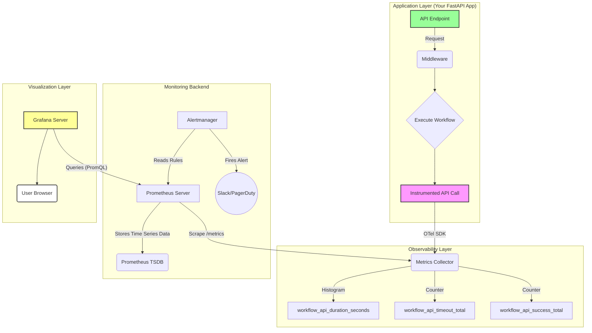

```
**vv Trong 1000 API bắn ra, bao nhiêu API bị fail ?**  
  
Em cần nhờ các anh support phần này ạ:  
Hiện tụi em đã có phần : **Timeout, fallback + Alert nếu quá timeout**.  
Tuy nhiên ngoài việc alert thì muốn visulize số lần bị quá timeout (1000 API bắn ra của workflow, thì bao nhiêu lần bị quá timeout 8s)  
  
Anh @Đinh Hùng , anh @Hung Pham Thanh ơi, trên langfuse để trace cái này mn làm như nào ạ 🙋  
Anh @ThanhDT ơi, phía rancher của anh có hỗ trợ được cái này nhanh không ạ 🙋  
  
  
Em đang có 2 hướng  
1. Là trace metadata (`error_code`-> bắn lên langfuse). Về sau langfuse filter bằng `error_code`  
2. Dựng riêng OpenTelemetry , Prometheus , Grafana (cơ mà chỗ a Thành có cái này rùi đúng không ạ, a Thành support em luôn thì ngon ạ).
```


# Deep Research: Giải pháp Toàn diện để Visualize Timeout Metrics

**Tác giả:** Manus AI  
**Ngày:** 14/12/2025  
**Tóm tắt:** Tài liệu này cung cấp một bản phân tích sâu (deep research) về các giải pháp kỹ thuật để theo dõi, đo lường, và visualize (trực quan hóa) số lượng API requests bị quá timeout (> 8 giây) trong một hệ thống AI workflow. Chúng tôi đề xuất một kiến trúc hoàn chỉnh, kèm theo code mẫu và cấu hình chi tiết để triển khai một hệ thống giám sát đẳng cấp thế giới (world-class).

---

## 1. Bối cảnh và Yêu cầu

### 1.1. Vấn đề

Hệ thống AI workflow hiện tại có cơ chế timeout, fallback và alert khi một request vượt quá 8 giây. Tuy nhiên, ngoài việc nhận alert, team cần một giải pháp để **visualize (trực quan hóa)** các số liệu này. Cụ thể, cần trả lời các câu hỏi:

1.  Trong 1000 API requests, có **bao nhiêu request bị timeout** (> 8 giây)?
2.  **Tỷ lệ timeout** là bao nhiêu phần trăm?
3.  Xu hướng timeout **thay đổi như thế nào theo thời gian**?
4.  Phân phối độ trễ (latency distribution) của các request trông như thế nào?

### 1.2. Mục tiêu

Xây dựng một hệ thống giám sát (monitoring) và trực quan hóa (visualization) cho phép:

-   **Theo dõi (Track):** Ghi nhận mọi request và đo lường thời gian xử lý của nó.
-   **Đo lường (Measure):** Tính toán các chỉ số quan trọng như tỷ lệ timeout, tỷ lệ thành công, và các percentile độ trễ (p50, p95, p99).
-   **Trực quan hóa (Visualize):** Hiển thị các chỉ số này trên một dashboard dễ hiểu, giúp team nhanh chóng nắm bắt tình hình sức khỏe của hệ thống.
-   **Cảnh báo (Alert):** Gửi cảnh báo khi các chỉ số vượt ngưỡng cho phép (vi phạm SLO).

---

## 2. Các Khái niệm Cốt lõi: SLI, SLO, và SLA

Để xây dựng một hệ thống giám sát chuyên nghiệp, chúng ta cần áp dụng framework SRE (Site Reliability Engineering) của Google, bắt đầu với SLI, SLO, và SLA.

| Khái niệm | Định nghĩa | Ví dụ cho bài toán Timeout | Công thức |
| :--- | :--- | :--- | :--- |
| **SLI (Service Level Indicator)** | **Chỉ số đo lường** hiệu suất thực tế của dịch vụ. | Tỷ lệ các API requests thành công trong vòng 8 giây. | `(Số request < 8s) / (Tổng số request)` |
| **SLO (Service Level Objective)** | **Mục tiêu** mà bạn đặt ra cho SLI. | **99%** các API requests phải hoàn thành trong vòng 8 giây. | `SLI >= 99%` |
| **SLA (Service Level Agreement)** | **Cam kết** với khách hàng, có ràng buộc pháp lý/tài chính. | Nếu SLO không đạt, khách hàng sẽ được giảm giá dịch vụ. | Thỏa thuận trong hợp đồng |

**Error Budget (Ngân sách lỗi):**

Error Budget là lượng lỗi được phép xảy ra mà không vi phạm SLO. Nó cho phép team cân bằng giữa việc phát triển tính năng mới và việc duy trì sự ổn định.

-   **Công thức:** `Error Budget = 100% - SLO`
-   **Ví dụ:** Với SLO là 99%, Error Budget là `1%`.
-   Trong 1000 API calls, bạn được phép có `1000 * 1% = 10` calls bị timeout.

Việc visualize chính là để theo dõi SLI và Error Budget này một cách trực quan.

---

## 3. Phân tích và So sánh các Giải pháp Kỹ thuật

Chúng tôi đã thực hiện deep research 8 giải pháp khả thi, từ các công cụ mã nguồn mở đến các dịch vụ thương mại.

| Giải pháp | Chi phí | Cài đặt | Khả năng Mở rộng | Tùy biến | Đánh giá cho Bài toán | Lý do |
| :--- | :--- | :--- | :--- | :--- | :--- | :--- |
| **1. Prometheus + Grafana** | 🏆 **Miễn phí** | Trung bình | Cao | **Rất cao** | ⭐⭐⭐⭐⭐ | **Lựa chọn tốt nhất.** Mã nguồn mở, tiêu chuẩn ngành, linh hoạt nhất. |
| **2. OpenTelemetry + Backend** | 🏆 **Miễn phí** | Trung bình | Cao | **Rất cao** | ⭐⭐⭐⭐⭐ | **Kiến trúc tương lai.** Tiêu chuẩn chung, không bị vendor lock-in. |
| **3. Datadog APM** | Rất đắt | Dễ | Rất cao | Trung bình | ⭐⭐⭐⭐ | Dễ sử dụng, mạnh mẽ nhưng chi phí cao và bị lock-in. |
| **4. New Relic APM** | Rất đắt | Dễ | Rất cao | Trung bình | ⭐⭐⭐⭐ | Tương tự Datadog, phù hợp cho doanh nghiệp lớn. |
| **5. LGTM Stack (Grafana)** | 🏆 **Miễn phí** | Khó | Cao | Rất cao | ⭐⭐⭐⭐ | Bộ công cụ hoàn chỉnh của Grafana nhưng phức tạp để vận hành. |
| **6. Custom In-App Metrics** | 🏆 **Miễn phí** | Trung bình | Trung bình | Rất cao | ⭐⭐⭐ | Linh hoạt nhưng tốn công xây dựng và bảo trì từ đầu. |
| **7. Elasticsearch Stack** | Miễn phí/Đắt | Khó | Rất cao | Cao | ⭐⭐⭐ | Mạnh về log và search, nhưng phức tạp hơn cho metrics. |
| **8. Langfuse (Hiện có)** | Trung bình | Dễ | Cao | Trung bình | ⭐⭐⭐ | **Nên tận dụng, nhưng không đủ.** Rất tốt cho LLM trace, nhưng không phải công cụ chuyên cho general API monitoring. |

### **Kết luận Lựa chọn:**

Kiến trúc được đề xuất là **OpenTelemetry (để instrument) + Prometheus (để lưu trữ) + Grafana (để visualize)**. Đây là sự kết hợp mạnh mẽ, linh hoạt, chi phí hiệu quả và theo đúng tiêu chuẩn ngành hiện nay.

-   **OpenTelemetry (OTel):** Cung cấp một bộ SDK duy nhất để thu thập metrics, logs, và traces. Giúp bạn không bị phụ thuộc vào một nhà cung cấp backend nào.
-   **Prometheus:** Hệ thống time-series database mạnh mẽ nhất cho việc lưu trữ metrics. Hàm `histogram_quantile` là công cụ hoàn hảo để tính toán percentile latency.
-   **Grafana:** Công cụ visualize mạnh mẽ, có thể tạo ra mọi loại biểu đồ bạn cần.

---

## 4. Kiến trúc Đề xuất: OTel + Prometheus + Grafana

Đây là luồng dữ liệu chi tiết của giải pháp được đề xuất:



**Luồng hoạt động:**

1.  **Instrumentation:** Khi một request đến FastAPI app, một middleware sử dụng **OpenTelemetry SDK** sẽ được kích hoạt.
2.  **Metrics Collection:** Middleware này sẽ đo thời gian bắt đầu và kết thúc của request. Nó sẽ ghi nhận kết quả (thành công, timeout, hay lỗi) và thời gian xử lý vào các `metrics` (Histogram và Counter).
3.  **Scraping:** **Prometheus server** sẽ định kỳ (ví dụ: 15 giây một lần) gọi đến endpoint `/metrics` của app để "cào" (scrape) các số liệu mới nhất.
4.  **Storage:** Prometheus lưu trữ các số liệu này dưới dạng time-series data.
5.  **Visualization:** **Grafana** được kết nối với Prometheus làm data source. Người dùng tạo các dashboard trong Grafana bằng cách sử dụng ngôn ngữ truy vấn **PromQL** để lấy dữ liệu từ Prometheus và vẽ biểu đồ.
6.  **Alerting:** Prometheus đánh giá các luật (alerting rules) được định nghĩa sẵn. Nếu một điều kiện vi phạm SLO được phát hiện (ví dụ: tỷ lệ timeout > 1% trong 5 phút), nó sẽ gửi cảnh báo đến **Alertmanager**, và Alertmanager sẽ đẩy thông báo đến Slack hoặc PagerDuty.

---

## 5. Hướng dẫn Triển khai Chi tiết (Step-by-Step)

### Bước 1: Cài đặt Thư viện

```bash
# Cài đặt các thư viện cần thiết
pip install opentelemetry-sdk opentelemetry-api \
           opentelemetry-exporter-prometheus fastapi uvicorn
```

### Bước 2: Instrument Code trong FastAPI App

Tạo một file `monitoring.py` để quản lý tất cả logic về metrics.

**`monitoring.py`**
```python
from opentelemetry import metrics
from opentelemetry.exporter.prometheus import PrometheusMetricReader
from opentelemetry.sdk.metrics import MeterProvider
from prometheus_client import start_http_server
import time
import asyncio

# 1. Khởi tạo Prometheus Exporter
# Sẽ tạo ra một endpoint /metrics trên port 8000
start_http_server(port=8000, addr=\'0.0.0.0\')

# 2. Khởi tạo MeterProvider
reader = PrometheusMetricReader()
provider = MeterProvider(metric_readers=[reader])
metrics.set_meter_provider(provider)
meter = provider.get_meter("robot-workflow-app", "1.0")

# 3. Định nghĩa các Metrics
# Histogram để đo phân phối độ trễ
HTTP_SERVER_REQUEST_DURATION = meter.create_histogram(
    name="http.server.request.duration_seconds",
    description="Duration of HTTP server requests in seconds",
    unit="s"
)

# Counter để đếm tổng số request
HTTP_SERVER_ACTIVE_REQUESTS = meter.create_up_down_counter(
    name="http.server.active_requests",
    description="Number of active HTTP server requests",
    unit="requests"
)

# Counter cho các loại status code
HTTP_SERVER_REQUESTS_BY_STATUS = meter.create_counter(
    name="http.server.requests_by_status_total",
    description="Total number of HTTP requests by status code"
)

# Counter cho các request timeout
WORKFLOW_TIMEOUT_TOTAL = meter.create_counter(
    name="workflow.timeout_total",
    description="Total number of workflow timeouts"
)

# 4. Tạo Middleware cho FastAPI
from starlette.middleware.base import BaseHTTPMiddleware
from starlette.requests import Request

class OTelMetricsMiddleware(BaseHTTPMiddleware):
    async def dispatch(self, request: Request, call_next):
        # Các thuộc tính chung cho tất cả metrics
        common_attrs = { "http.method": request.method, "http.url": str(request.url) }
        
        HTTP_SERVER_ACTIVE_REQUESTS.add(1, common_attrs)
        start_time = time.time()
        
        response = None
        status_code = 500 # Mặc định là lỗi server
        
        try:
            # Đặt timeout cho toàn bộ request ở đây
            response = await asyncio.wait_for(call_next(request), timeout=8.0)
            status_code = response.status_code
        except asyncio.TimeoutError:
            # Ghi nhận timeout
            WORKFLOW_TIMEOUT_TOTAL.add(1, common_attrs)
            status_code = 408 # Request Timeout
            # Ở đây bạn có thể tạo response lỗi tùy chỉnh
            from starlette.responses import JSONResponse
            response = JSONResponse({"error": "Request timed out after 8 seconds"}, status_code=408)
        except Exception as e:
            # Ghi nhận các lỗi khác
            status_code = 500
            raise e
        finally:
            duration = time.time() - start_time
            HTTP_SERVER_ACTIVE_REQUESTS.add(-1, common_attrs)
            
            # Ghi nhận duration vào histogram
            attrs = {**common_attrs, "http.status_code": status_code}
            HTTP_SERVER_REQUEST_DURATION.record(duration, attrs)
            
            # Đếm số lượng request theo status code
            HTTP_SERVER_REQUESTS_BY_STATUS.add(1, attrs)

        return response
```

**Cập nhật `main.py` của bạn:**

```python
from fastapi import FastAPI
from .monitoring import OTelMetricsMiddleware

app = FastAPI()

# Thêm middleware vào app
app.add_middleware(OTelMetricsMiddleware)

@app.get("/")
async def root():
    # Logic của bạn ở đây
    await asyncio.sleep(0.1) # Giả lập công việc
    return {"message": "Hello World"}
```

### Bước 3: Cấu hình Prometheus

Tạo file `prometheus.yml`:

```yaml
# prometheus.yml
global:
  scrape_interval: 15s # Cào metrics mỗi 15 giây

scrape_configs:
  - job_name: "robot-workflow"
    static_configs:
      - targets: ["app:8000"] # "app" là tên service của FastAPI app trong Docker Compose
```

### Bước 4: Cấu hình Grafana Dashboard

Sau khi cài đặt Grafana và kết nối với Prometheus, bạn có thể tạo một dashboard mới và thêm các panel với các truy vấn PromQL sau:

**1. Tỷ lệ Timeout (%) - Sử dụng Gauge Panel**

```promql
# Tính tỷ lệ request có status 408 (Request Timeout)
sum(rate(http_server_requests_by_status_total{http_status_code="408"}[5m]))
/
sum(rate(http_server_request_duration_seconds_count[5m]))
* 100
```

**2. Số lượng Timeout trong 1000 requests gần nhất - Sử dụng Stat Panel**

```promql
# Đếm số lần timeout trong khoảng thời gian của 1000 requests gần nhất
# Giả sử trung bình 1 request/giây -> 1000s
increase(workflow_timeout_total[1000s])
```

**3. Phân phối Độ trễ - Sử dụng Heatmap Panel**

```promql
# Hiển thị phân phối độ trễ của các request thành công
sum(rate(http_server_request_duration_seconds_bucket{http_status_code=~"2.."}[5m])) by (le)
```

**4. Latency Percentiles (p99, p95, p50) - Sử dụng Time Series Panel**

```promql
// P99 Latency
histogram_quantile(0.99, sum(rate(http_server_request_duration_seconds_bucket[5m])) by (le))

// P95 Latency
histogram_quantile(0.95, sum(rate(http_server_request_duration_seconds_bucket[5m])) by (le))

// P50 Latency (Median)
histogram_quantile(0.50, sum(rate(http_server_request_duration_seconds_bucket[5m])) by (le))
```

**5. Tỷ lệ Lỗi (Error Rate %) - Sử dụng Gauge Panel**

```promql
# Tính tỷ lệ các request có status 5xx
sum(rate(http_server_requests_by_status_total{http_status_code=~"5.."}[5m]))
/
sum(rate(http_server_request_duration_seconds_count[5m]))
* 100
```

---

## 6. Thiết kế Dashboard Trực quan

Một dashboard hiệu quả cần trả lời câu hỏi nhanh chóng. Dưới đây là một layout mẫu.

```
┌──────────────────────────────────────────────────────────────────────────────────┐
│ 🤖 Robot Workflow - API Performance Dashboard                                   │
├──────────────────────────────────────────────────────────────────────────────────┤
│                                                                                  │
│  ┌──────────────────────────┐  ┌──────────────────────────┐  ┌───────────────────┐ │
│  │      Success Rate (SLO)    │  │      Timeout Rate        │  │   Error Rate      │ │
│  │          99.5%             │  │          0.3%            │  │      0.2%         │ │
│  └──────────────────────────┘  └──────────────────────────┘  └───────────────────┘ │
│                                                                                  │
│  ┌──────────────────────────┐  ┌──────────────────────────┐  ┌───────────────────┐ │
│  │      P99 Latency           │  │      P95 Latency         │  │   Avg Latency     │ │
│  │          1.2s              │  │          450ms           │  │      180ms        │ │
│  └──────────────────────────┘  └──────────────────────────┘  └───────────────────┘ │
│                                                                                  │
├──────────────────────────────────────────────────────────────────────────────────┤
│                                                                                  │
│  Latency Distribution (Heatmap) - Last 6 Hours                                   │
│  ┌──────────────────────────────────────────────────────────────────────────────┐ │
│  │ >8s  ░░░░░░░░░░░░░░░░░░░░░░░░░░░░░░░░░░░░░░░░░░░░░░░░░░░░░░░░░░░░░░░░░░░ │ │
│  │ 5-8s ░░░░░░░░░░░░░░░░░░░░░░░░░░░░░░░░░░░░░░░░░░░░░░░░░░░░░░░░░░░░░░░░░░░ │ │
│  │ 2-5s ░░░░░░░░░░░░░░░░░░░░░░░░░░░░░░░░░░░░░░░░░░░░░░░░░░░░░░░░░░░░░░░░░░░ │ │
│  │ <2s  █████████████████████████████████████████████████████████████████████ │ │
│  └──────────────────────────────────────────────────────────────────────────────┘ │
│                                                                                  │
├──────────────────────────────────────────────────────────────────────────────────┤
│                                                                                  │
│  Latency Trends (P99, P95, P50) - Last 24 Hours                                  │
│  ┌──────────────────────────────────────────────────────────────────────────────┐ │
│  │                                                                              │ │
│  │  P99 ----------------- /\ -------------------------------------------------- │ │
│  │                     /  \                                                      │ │
│  │  P95 -------------- /    \ ------------------------------------------------- │ │
│  │                  /      \                                                     │ │
│  │  P50 -----------/--------\-------------------------------------------------- │ │
│  │                                                                              │ │
│  └──────────────────────────────────────────────────────────────────────────────┘ │
│                                                                                  │
└──────────────────────────────────────────────────────────────────────────────────┘
```

**Giải thích các Panel:**

1.  **Key Metrics (Stat Panels):** Các con số quan trọng nhất được đặt ở trên cùng: Tỷ lệ thành công (so với SLO), tỷ lệ timeout, tỷ lệ lỗi, và các percentile độ trễ. Giúp nhìn nhanh ra vấn đề.
2.  **Latency Heatmap:** Đây là panel quan trọng nhất để visualize sự phân phối. Mỗi ô vuông biểu thị một khoảng thời gian (trục X) và một khoảng độ trễ (trục Y). Màu sắc của ô càng đậm, số lượng request rơi vào khoảng đó càng nhiều. Bạn có thể ngay lập tức thấy nếu có một lượng lớn request bị chậm đi (các ô ở hàng trên cao đậm lên).
3.  **Latency Trends:** Biểu đồ đường cho thấy xu hướng của các percentile theo thời gian. Nếu đường P99 tăng đột biến, điều đó có nghĩa là các request chậm nhất đang trở nên chậm hơn nữa, một dấu hiệu của vấn đề tiềm ẩn.

---

## 7. Chiến lược Cảnh báo (Alerting)

Visualizing là để con người xem, nhưng alerting là để máy móc tự động thông báo. Dưới đây là các luật cảnh báo quan trọng cần có trong Prometheus.

**`alert.rules.yml`**
```yaml
groups:
  - name: workflow_api_slo_alerts
    rules:
      - alert: HighTimeoutRateWarning
        expr: (sum(rate(http_server_requests_by_status_total{http_status_code="408"}[5m])) / sum(rate(http_server_request_duration_seconds_count[5m]))) > 0.02
        for: 5m
        labels:
          severity: warning
        annotations:
          summary: "Tỷ lệ timeout vượt ngưỡng 2%"
          description: "Tỷ lệ timeout hiện tại là {{ $value | humanizePercentage }}. Cần kiểm tra hệ thống."

      - alert: HighTimeoutRateCritical
        expr: (sum(rate(http_server_requests_by_status_total{http_status_code="408"}[5m])) / sum(rate(http_server_request_duration_seconds_count[5m]))) > 0.05
        for: 1m
        labels:
          severity: critical
        annotations:
          summary: "VI PHẠM SLO! Tỷ lệ timeout vượt 5%"
          description: "Tỷ lệ timeout hiện tại là {{ $value | humanizePercentage }}. Error budget đang bị đốt cháy nhanh chóng."

      - alert: HighP99Latency
        expr: histogram_quantile(0.99, sum(rate(http_server_request_duration_seconds_bucket[5m])) by (le)) > 6
        for: 10m
        labels:
          severity: warning
        annotations:
          summary: "P99 latency cao bất thường (> 6s)"
          description: "99% request đang mất hơn 6 giây để xử lý. Nguy cơ vi phạm SLO timeout 8s."
```

---

## 8. Kết luận và Các bước Tiếp theo

Bằng cách triển khai kiến trúc **OpenTelemetry + Prometheus + Grafana**, bạn sẽ có một hệ thống giám sát và trực quan hóa timeout metrics mạnh mẽ, linh hoạt và theo đúng tiêu chuẩn ngành.

**Lộ trình triển khai:**

1.  **Tuần 1:** Triển khai `monitoring.py` với OpenTelemetry SDK vào FastAPI app. Cài đặt Prometheus và cấu hình để scrape metrics.
2.  **Tuần 2:** Cài đặt Grafana, kết nối Prometheus, và xây dựng phiên bản đầu tiên của dashboard với các panel chính.
3.  **Tuần 3:** Tinh chỉnh dashboard, thêm các biểu đồ chi tiết hơn. Cài đặt Alertmanager và cấu hình các luật cảnh báo cơ bản.
4.  **Tuần 4:** Tích hợp Alertmanager với Slack/PagerDuty. Review và tối ưu hóa toàn bộ hệ thống.

Với hệ thống này, bạn không chỉ biết *khi nào* có lỗi, mà còn có đủ dữ liệu để hiểu *tại sao* lỗi xảy ra, giúp việc debug và cải thiện hiệu năng hệ thống trở nên dễ dàng hơn rất nhiều.

---

## 9. Phụ lục: Tham khảo

1.  [Prometheus Documentation: Histograms and Summaries](https://prometheus.io/docs/practices/histograms/)
2.  [Grafana Documentation: Heatmap Visualization](https://grafana.com/docs/grafana/latest/visualizations/panels-visualizations/visualizations/heatmap/)
3.  [OpenTelemetry Documentation: Python SDK](https://opentelemetry-python.readthedocs.io/)
4.  [Google SRE Book: Service Level Objectives](https://sre.google/sre-book/service-level-objectives/)
5.  [New Relic Blog: SLOs, SLIs, and SLAs](https://newrelic.com/blog/best-practices/what-are-slos-slis-slas)

