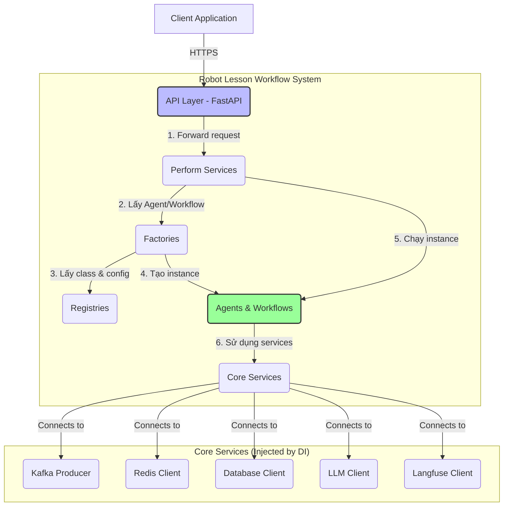
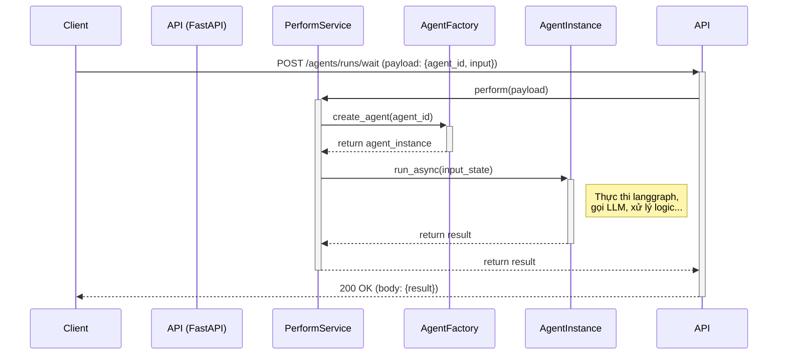
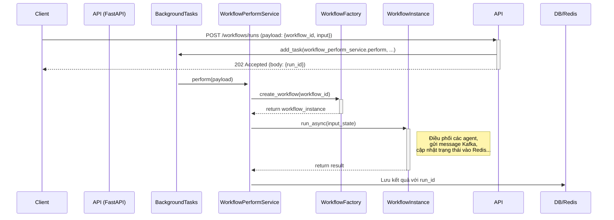
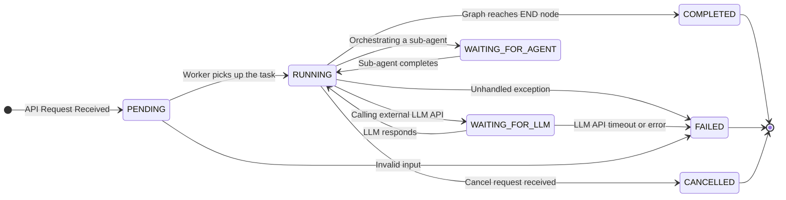

```
[1. Brief Dự Án]
Đây là dự án robot workflow của tôi, 
[2. Nguyên Lý Xử Lý]
- Các quy tắc, ràng buộc, tiêu chuẩn và thực hành tốt nhất cần tuân thủ.
[3. Reasoning]
- Yêu cầu AI xây dựng một chuỗi lý luận tường minh, giải thích các bước suy
nghĩ để đi đến kết quả.
[4. Danh Mục Todo]
Hoàn thành checklist sau: 

1. Đọc kỹ source code 
2. Lên chi tiết cho tớ 20 trang tài liệu về high level design kiến trúc hiện tại (chi tiết để 1 fresher mới vào đọc qua tài liệu này là nắm được tổng quan logic toàn bộ dự án workflow)
3. Lên chi tiết 40 trang tài liệu về low level design kiến trúc hiện tại. (phải chi tiết đủ 40 trang để 1 người mới học python có thể implement được)
Output: file markdown tiếng việt
```


# Tài liệu Thiết kế Cấp cao (High-Level Design)

**Dự án:** Robot Lesson Workflow  
**Tác giả:** Manus AI  
**Ngày:** 15/12/2025  
**Phiên bản:** 1.0

---

## Mục lục

1.  [**Giới thiệu và Tổng quan**](#1-gioi-thieu-va-tong-quan)
    1.1. [Mục đích Tài liệu](#11-muc-dich-tai-lieu)
    1.2. [Phạm vi](#12-pham-vi)
    1.3. [Đối tượng Đọc giả](#13-doi-tuong-doc-gia)
    1.4. [Bối cảnh Dự án](#14-boi-canh-du-an)
2.  [**Mục tiêu và Yêu cầu Hệ thống**](#2-muc-tieu-va-yeu-cau-he-thong)
    2.1. [Mục tiêu Nghiệp vụ](#21-muc-tieu-nghiep-vu)
    2.2. [Yêu cầu Chức năng](#22-yeu-cau-chuc-nang)
    2.3. [Yêu cầu Phi chức năng](#23-yeu-cau-phi-chuc-nang)
3.  [**Kiến trúc Tổng thể (Architectural Overview)**](#3-kien-truc-tong-the-architectural-overview)
    3.1. [Sơ đồ Kiến trúc C4 - Cấp độ 1 (System Context)](#31-so-do-kien-truc-c4---cap-do-1-system-context)
    3.2. [Sơ đồ Kiến trúc C4 - Cấp độ 2 (Container)](#32-so-do-kien-truc-c4---cap-do-2-container)
    3.3. [Triết lý Thiết kế](#33-triet-ly-thiet-ke)
4.  [**Các Thành phần Cốt lõi (Core Components)**](#4-cac-thanh-phan-cot-loi-core-components)
    4.1. [Agents: Đơn vị Thực thi](#41-agents-don-vi-thuc-thi)
    4.2. [Workflows: Bộ Điều phối Logic](#42-workflows-bo-dieu-phoi-logic)
    4.3. [API Layer (FastAPI): Cổng Giao tiếp](#43-api-layer-fastapi-cong-giao-tiep)
    4.4. [Dependency Injection Container: Trái tim Hệ thống](#44-dependency-injection-container-trai-tim-he-thong)
    4.5. [Hệ thống Đăng ký (Registry): Cơ chế Tự động Phát hiện](#45-he-thong-dang-ky-registry-co-che-tu-dong-phat-hien)
5.  [**Luồng Dữ liệu (Data Flow)**](#5-luong-du-lieu-data-flow)
    5.1. [Luồng chạy một Agent (Synchronous)](#51-luong-chay-mot-agent-synchronous)
    5.2. [Luồng chạy một Workflow (Asynchronous)](#52-luong-chay-mot-workflow-asynchronous)
6.  [**Thiết kế Tương tác với Hệ thống Bên ngoài**](#6-thiet-ke-tuong-tac-voi-he-thong-ben-ngoai)
    6.1. [Tương tác với LLM (OpenAI, Groq)](#61-tuong-tac-voi-llm-openai-groq)
    6.2. [Tương tác với Kafka](#62-tuong-tac-voi-kafka)
    6.3. [Tương tác với Redis](#63-tuong-tac-voi-redis)
    6.4. [Tương tác với Langfuse](#64-tuong-tac-voi-langfuse)
7.  [**Các Thuộc tính Kiến trúc (Architectural Attributes)**](#7-cac-thuoc-tinh-kien-truc-architectural-attributes)
    7.1. [Tính Module hóa (Modularity)](#71-tinh-module-hoa-modularity)
    7.2. [Khả năng Mở rộng (Scalability)](#72-kha-nang-mo-rong-scalability)
    7.3. [Độ tin cậy và Khả năng Phục hồi (Reliability & Resilience)](#73-do-tin-cay-va-kha-nang-phuc-hoi-reliability--resilience)
    7.4. [Khả năng Giám sát (Observability)](#74-kha-nang-giam-sat-observability)
    7.5. [Tính Bảo mật (Security)](#75-tinh-bao-mat-security)
8.  [**Tổng kết và Định hướng Tương lai**](#8-tong-ket-va-dinh-huong-tuong-lai)

---

## 1. Giới thiệu và Tổng quan

### 1.1. Mục đích Tài liệu

Tài liệu này nhằm mục đích cung cấp một cái nhìn tổng quan, ở cấp độ cao về kiến trúc của hệ thống **Robot Lesson Workflow**. Nó giải thích các thành phần chính, cách chúng tương tác với nhau, và các quyết định thiết kế đằng sau chúng. Mục tiêu là tạo ra một tài liệu nền tảng để các thành viên mới, đặc biệt là các lập trình viên fresher, có thể nhanh chóng nắm bắt được cấu trúc và luồng hoạt động của toàn bộ dự án.

### 1.2. Phạm vi

Tài liệu này tập trung vào kiến trúc phần mềm của ứng dụng, bao gồm:

-   Các khối xây dựng (building blocks) chính.
-   Mối quan hệ và sự tương tác giữa các khối đó.
-   Luồng dữ liệu chính trong hệ thống.
-   Các nguyên tắc và triết lý thiết kế đã được áp dụng.

Tài liệu sẽ **không** đi sâu vào chi tiết triển khai ở mức độ dòng code, thuật toán cụ thể hay cấu hình chi tiết của từng công cụ. Những thông tin đó sẽ được trình bày trong tài liệu **Low-Level Design (LLD)**.

### 1.3. Đối tượng Đọc giả

-   **Lập trình viên mới (Fresher/Junior):** Đối tượng chính, giúp các bạn nhanh chóng hiểu được bức tranh toàn cảnh của dự án.
-   **Kiến trúc sư Phần mềm (Software Architects):** Để xem xét và đánh giá các quyết định kiến trúc.
-   **Product Managers & Team Leads:** Để hiểu khả năng kỹ thuật và cách hệ thống hoạt động.

### 1.4. Bối cảnh Dự án

Dự án **Robot Lesson Workflow** là một nền tảng (platform) được xây dựng để tạo và thực thi các quy trình (workflow) phức tạp, đặc biệt là các quy trình liên quan đến AI và xử lý ngôn ngữ tự nhiên. Tên dự án cho thấy nó có thể được ứng dụng trong lĩnh vực giáo dục, nơi robot cần thực hiện một chuỗi các hành động để tạo ra một bài học, tương tác với người dùng, hoặc xử lý các tài liệu giáo dục.

Ví dụ, một workflow có thể bao gồm các bước: nhận một tài liệu Word -> trích xuất nội dung chữ và hình ảnh -> tóm tắt nội dung bằng AI -> tạo ra các câu hỏi trắc nghiệm -> lưu kết quả vào database. Việc xây dựng một hệ thống linh hoạt để định nghĩa và chạy các workflow như vậy là mục tiêu cốt lõi của dự án này.

---

## 2. Mục tiêu và Yêu cầu Hệ thống

### 2.1. Mục tiêu Nghiệp vụ

-   **Tăng tốc độ phát triển:** Cung cấp một framework để các lập trình viên có thể nhanh chóng xây dựng và triển khai các workflow AI mới mà không cần phải viết lại các logic nền tảng (gọi LLM, xử lý lỗi, logging...).
-   **Tái sử dụng logic:** Cho phép các thành phần logic (gọi là "Agents") được tái sử dụng trong nhiều workflow khác nhau.
-   **Linh hoạt và Mở rộng:** Dễ dàng thêm các bước mới, thay đổi logic hoặc tích hợp với các dịch vụ bên ngoài mà không ảnh hưởng đến toàn bộ hệ thống.

### 2.2. Yêu cầu Chức năng

-   Hệ thống phải cho phép định nghĩa các **Agents** là các đơn vị xử lý logic độc lập.
-   Hệ thống phải cho phép kết hợp nhiều Agents thành một **Workflow** có trình tự.
-   Hệ thống phải cung cấp **API** để bên ngoài có thể kích hoạt và chạy các Agents/Workflows.
-   API phải hỗ trợ cả hai chế độ: chạy bất đồng bộ (non-blocking, trả về ID ngay lập tức) và đồng bộ (chờ kết quả).
-   Hệ thống phải có khả năng tự động phát hiện và đăng ký các Agents/Workflows mới được thêm vào source code.

### 2.3. Yêu cầu Phi chức năng

-   **Hiệu năng (Performance):** Hệ thống phải có khả năng xử lý đồng thời nhiều request với độ trễ thấp.
-   **Khả năng mở rộng (Scalability):** Kiến trúc phải hỗ trợ mở rộng theo chiều ngang (horizontal scaling) để đáp ứng tải tăng cao.
-   **Độ tin cậy (Reliability):** Hệ thống phải có cơ chế xử lý lỗi, retry và hoạt động ổn định.
-   **Khả năng giám sát (Observability):** Mọi hoạt động, lỗi, và hiệu năng của hệ thống phải được ghi log và theo dõi (tracing) một cách chi tiết.
-   **Dễ bảo trì (Maintainability):** Code phải được tổ chức rõ ràng, theo module, dễ hiểu và dễ nâng cấp.

---

## 3. Kiến trúc Tổng thể (Architectural Overview)

### 3.1. Sơ đồ Kiến trúc C4 - Cấp độ 1 (System Context)

Sơ đồ này cho thấy hệ thống của chúng ta (Robot Lesson Workflow) tương tác với người dùng và các hệ thống bên ngoài như thế nào.

```mermaid
graph TD
    subgraph "User & External Systems"
        U[Client Application / User] -- "1. Gửi yêu cầu chạy Workflow (JSON/API)" --> S
    end

    subgraph "Robot Lesson Workflow System"
        S(Robot Lesson Workflow API)
    end

    subgraph "External Dependencies"
        LLM[Large Language Models<br>(OpenAI, Groq)]
        K(Apache Kafka)
        R(Redis)
        DB[(Database<br>PostgreSQL/MySQL)]
        LF(Langfuse)
    end

    S -- "2. Gọi API xử lý ngôn ngữ" --> LLM
    S -- "3. Gửi thông điệp (Events/Logs)" --> K
    S -- "4. Lưu/Đọc cache, state" --> R
    S -- "5. Lưu/Đọc dữ liệu lâu dài" --> DB
    S -- "6. Gửi trace và logs quan sát" --> LF
```

**Giải thích:**

-   **Client Application:** Một ứng dụng web, mobile hoặc một hệ thống backend khác gọi vào hệ thống của chúng ta qua API.
-   **Robot Lesson Workflow API:** Là trái tim của hệ thống, tiếp nhận request và điều phối toàn bộ công việc.
-   **Các hệ thống phụ thuộc:**
    -   **LLMs:** Nơi thực hiện các tác vụ AI như tóm tắt, phân loại, sinh nội dung.
    -   **Kafka:** Dùng để xử lý các tác vụ bất đồng bộ, gửi đi các sự kiện hoặc logs.
    -   **Redis:** Dùng làm cache tốc độ cao hoặc lưu trữ trạng thái tạm thời của các workflow.
    -   **Database:** Lưu trữ dữ liệu lâu dài như thông tin người dùng, lịch sử chạy workflow.
    -   **Langfuse:** Nền tảng giám sát (observability) chuyên dụng cho các ứng dụng LLM, giúp theo dõi chi tiết từng bước chạy của workflow.

### 3.2. Sơ đồ Kiến trúc C4 - Cấp độ 2 (Container)

Sơ đồ này "zoom" vào bên trong **Robot Lesson Workflow System** để xem các thành phần chính (containers - ở đây không phải Docker container mà là các khối logic lớn).



**Giải thích các thành phần:**

1.  **API Layer (FastAPI):** Tiếp nhận các request HTTP, xác thực, và parse dữ liệu đầu vào. Nó không chứa logic nghiệp vụ, chỉ đơn thuần là cổng giao tiếp.
2.  **Perform Services:** Tầng dịch vụ, chịu trách nhiệm xử lý yêu cầu từ API. Nó sẽ quyết định cần chạy Agent nào hay Workflow nào.
3.  **Factories (AgentFactory, WorkflowFactory):** Các "nhà máy" có nhiệm vụ tạo ra các đối tượng Agent hoặc Workflow khi cần. Chúng lấy thông tin từ Registries và các dependencies (như Kafka, Redis) để "lắp ráp" nên một instance hoàn chỉnh.
4.  **Registries (AgentRegistry, WorkflowRegistry):** Nơi đăng ký và lưu trữ thông tin về tất cả các Agents và Workflows có trong hệ thống. Đây là cơ chế giúp hệ thống "biết" được có những loại workflow nào để chạy.
5.  **Agents & Workflows:** Các đối tượng được tạo ra bởi Factory, chứa logic nghiệp vụ chính và được xây dựng trên nền tảng `LangGraph`.
6.  **Core Services:** Các dịch vụ nền tảng như kết nối đến Kafka, Redis, DB... được quản lý tập trung và "tiêm" (inject) vào các thành phần cần sử dụng.

### 3.3. Triết lý Thiết kế

Kiến trúc của hệ thống tuân theo các nguyên tắc cốt lõi sau:

-   **Phân tách Trách nhiệm (Separation of Concerns):** Mỗi thành phần chỉ làm một việc và làm tốt việc đó. API chỉ lo giao tiếp, Service lo điều phối, Factory lo tạo đối tượng, Agent/Workflow lo nghiệp vụ.
-   **Đảo ngược Phụ thuộc (Dependency Inversion Principle - DIP):** Các module cấp cao (như Service) không phụ thuộc trực tiếp vào module cấp thấp (như Kafka client). Thay vào đó, chúng phụ thuộc vào một "abstraction" (một khái niệm trừu tượng). Việc cung cấp đối tượng cụ thể được thực hiện bởi **Dependency Injection Container**. Điều này giúp hệ thống rất linh hoạt, dễ thay đổi và dễ test.
-   **Lập trình Hướng Khai báo (Declarative Programming):** Thay vì viết code để *tuần tự* tạo và kết nối các đối tượng, chúng ta chỉ cần *khai báo* các agent, workflow và dependencies của chúng. Hệ thống (cụ thể là Registry và Factory) sẽ tự động "lắp ráp" chúng lại với nhau.

---

## 4. Các Thành phần Cốt lõi (Core Components)

Đây là phần giải thích sâu hơn về các "trái tim" của hệ thống.

### 4.1. Agents: Đơn vị Thực thi

-   **Là gì?** Một Agent là một lớp Python kế thừa từ `BaseAgent`, được thiết kế để thực hiện một nhiệm vụ cụ thể, có trạng thái (stateful). Ví dụ: `EchoAgent`, `ExtractDocumentAgent`.
-   **Cấu trúc:** Mỗi agent được xây dựng bằng `LangGraph`. Nó là một biểu đồ trạng thái (State Graph), trong đó mỗi node là một hàm xử lý logic và các cạnh (edge) quyết định bước tiếp theo.
-   **Trạng thái (State):** Mỗi agent có một lớp `State` riêng (kế thừa từ `BaseState`) để chứa dữ liệu trong suốt quá trình chạy. Dữ liệu được truyền từ node này sang node khác thông qua việc cập nhật state.
-   **Ví dụ:** Một agent tóm tắt văn bản có thể có state chứa `original_text`, `summary_text`, `error_message`.

### 4.2. Workflows: Bộ Điều phối Logic

-   **Là gì?** Một Workflow cũng là một lớp Python kế thừa từ `BaseWorkflow`, nhưng nhiệm vụ của nó không phải là thực thi logic nghiệp vụ cụ thể, mà là **điều phối (orchestrate)** một hoặc nhiều Agents theo một quy trình định sẵn.
-   **Cấu trúc:** Giống như Agent, Workflow cũng là một `LangGraph`. Các node trong graph của Workflow thường là các hàm gọi đến các Agent khác.
-   **Ví dụ:** `SimpleWorkflow` có 3 node: `_preprocess` (chuẩn bị dữ liệu), `_orchestrate_echo` (gọi `EchoAgent`), và `_postprocess` (xử lý kết quả trả về).

> **Key takeaway:** Cả Agent và Workflow đều là các `LangGraph`. Sự khác biệt nằm ở mục đích: Agent làm nhiệm vụ cụ thể, Workflow điều phối các Agent.

### 4.3. API Layer (FastAPI): Cổng Giao tiếp

-   **Vai trò:** Là lớp ngoài cùng của ứng dụng, chịu trách nhiệm giao tiếp với thế giới bên ngoài qua giao thức HTTP.
-   **Endpoints chính:**
    -   `/agents/runs/wait`: Chạy một agent và **chờ** cho đến khi có kết quả mới trả về response. Đây là kiểu chạy đồng bộ (synchronous).
    -   `/agents/runs`: Chạy một agent trên một **background task** và trả về một `run_id` ngay lập tức. Client có thể dùng `run_id` này để kiểm tra trạng thái sau. Đây là kiểu chạy bất đồng bộ (asynchronous).
-   **Framework:** Sử dụng **FastAPI** vì hiệu năng cao, hỗ trợ async-await native, và tự động sinh tài liệu API (Swagger UI), rất thân thiện với developer.

### 4.4. Dependency Injection Container: Trái tim Hệ thống

-   **Là gì?** Đây là nơi quản lý việc khởi tạo và cung cấp các đối tượng dùng chung trong toàn hệ thống (gọi là `dependencies` hoặc `services`). Dự án sử dụng thư viện `dependency-injector`.
-   **File chính:** `app/container.py`.
-   **Tại sao nó quan trọng?** Hãy tưởng tượng bạn có 10 agents khác nhau đều cần gửi message qua Kafka. Thay vì mỗi agent phải tự `new KafkaProducer()`, chúng ta chỉ cần khởi tạo `KafkaProducer` một lần duy nhất trong `Container`. Sau đó, khi một agent cần dùng, nó chỉ cần khai báo: "Tôi cần một `kafka_producer`". `Container` sẽ tự động "tiêm" (inject) đối tượng đã được khởi tạo sẵn đó vào agent. Lợi ích:
    -   **Quản lý tập trung:** Dễ dàng thay đổi cấu hình (ví dụ đổi server Kafka) ở một nơi duy nhất.
    -   **Tái sử dụng:** Không phải khởi tạo lại các kết nối tốn kém.
    -   **Dễ dàng Testing:** Khi test, chúng ta có thể bảo `Container` "tiêm" một `MockKafkaProducer` (giả lập) thay vì `KafkaProducer` thật.
-   **Các dependencies được quản lý:** `KafkaProducer`, `Redis`, `AgentFactory`, `WorkflowFactory`...

### 4.5. Hệ thống Đăng ký (Registry): Cơ chế Tự động Phát hiện

-   **Là gì?** `AgentRegistry` và `WorkflowRegistry` là các lớp Singleton (chỉ có một instance duy nhất trong toàn bộ ứng dụng) hoạt động như một cuốn "danh bạ".
-   **Cách hoạt động:**
    1.  Khi một lập trình viên tạo ra một Agent mới, họ sẽ dùng một decorator `@AgentRegistry.register(...)` để "đăng ký" agent đó với một `agent_id` duy nhất.
    2.  Khi ứng dụng khởi động, Python sẽ import các file chứa agent, và decorator này sẽ được thực thi. `AgentRegistry` sẽ lưu lại thông tin về agent mới này (tên lớp, model input, dependencies cần thiết...).
    3.  Khi có một request API yêu cầu chạy agent với `agent_id`="my_new_agent", `AgentFactory` sẽ hỏi `AgentRegistry`: "Agent có ID là `my_new_agent` là lớp nào, cần những gì?".
    4.  `AgentRegistry` trả lời, và `AgentFactory` sẽ tiến hành tạo ra agent đó.
-   **Lợi ích:** Lập trình viên chỉ cần tạo file agent mới và đăng ký, hệ thống sẽ **tự động nhận diện** và đưa vào sử dụng mà không cần phải sửa đổi code ở bất kỳ nơi nào khác. Điều này giúp việc mở rộng hệ thống trở nên cực kỳ dễ dàng.

---

## 5. Luồng Dữ liệu (Data Flow)

### 5.1. Luồng chạy một Agent (Synchronous)

Luồng này minh họa cho request `POST /agents/runs/wait`.



**Các bước:**

1.  **Client** gửi request đến API.
2.  **API Layer** nhận request, xác thực và chuyển payload cho `AgentPerformService`.
3.  `AgentPerformService` yêu cầu `AgentFactory` tạo một instance của agent dựa trên `agent_id`.
4.  `AgentFactory` (với sự giúp đỡ của `AgentRegistry` và `DependencyResolver`) tạo ra một đối tượng agent hoàn chỉnh với đầy đủ dependencies.
5.  `PerformService` gọi phương thức `run_async` trên đối tượng agent vừa tạo, truyền vào state đầu vào.
6.  **AgentInstance** thực thi graph của nó. Đây là bước tốn nhiều thời gian nhất.
7.  Sau khi thực thi xong, agent trả kết quả về cho `PerformService`.
8.  `PerformService` trả kết quả về cho API Layer.
9.  API Layer đóng gói kết quả trong HTTP response và trả về cho Client.

### 5.2. Luồng chạy một Workflow (Asynchronous)

Luồng này phức tạp hơn, có thể liên quan đến các tác vụ nền.



**Các bước:**

1.  **Client** gửi request đến API.
2.  **API Layer** nhận request và ngay lập tức đăng ký một tác vụ nền với `BackgroundTasks` của FastAPI để chạy `WorkflowPerformService`.
3.  API Layer trả về response `202 Accepted` cho Client **ngay lập tức** cùng với một `run_id` để theo dõi.
4.  **BackgroundTasks** (chạy trên một thread riêng) bắt đầu thực thi `WorkflowPerformService`.
5.  Các bước tiếp theo tương tự như luồng synchronous: `WorkflowPerformService` dùng `WorkflowFactory` để tạo `WorkflowInstance` và chạy nó.
6.  Trong quá trình chạy, `WorkflowInstance` có thể thực hiện các tác vụ dài hơi như gọi nhiều agent, tương tác với Kafka, Redis...
7.  Khi workflow hoàn thành, `WorkflowPerformService` sẽ lưu kết quả cuối cùng vào Database hoặc Redis, gắn với `run_id` đã được tạo ra ở bước 3.
8.  Client có thể dùng một endpoint khác (ví dụ `GET /workflows/runs/{run_id}`) để kiểm tra trạng thái và lấy kết quả khi nó đã sẵn sàng.

---

## 6. Thiết kế Tương tác với Hệ thống Bên ngoài

### 6.1. Tương tác với LLM (OpenAI, Groq)

-   **Trừu tượng hóa:** Hệ thống không gọi trực tiếp API của OpenAI hay Groq. Thay vào đó, nó sử dụng thư viện `langchain-openai` và các lớp client tùy chỉnh (`app/common/openrouter_llm`) để tạo ra một lớp trừu tượng. Điều này giúp dễ dàng thay đổi model hoặc nhà cung cấp LLM mà không cần sửa code ở nhiều nơi.
-   **Quản lý API Key:** Các API key được quản lý an toàn thông qua biến môi trường (`.env` file) và được đọc bởi `pydantic-settings`.

### 6.2. Tương tác với Kafka

-   **Vai trò:** Được sử dụng để gửi đi các thông điệp (messages) hoặc sự kiện (events) một cách bất đồng bộ. Ví dụ, sau khi một workflow hoàn thành, nó có thể gửi một message đến Kafka để một hệ thống khác tiếp tục xử lý.
-   **Triển khai:** Lớp `KafkaProducer` (`app/common/kafka/producer.py`) được quản lý bởi DI Container và inject vào các agent/workflow cần dùng.

### 6.3. Tương tác với Redis

-   **Vai trò:**
    1.  **Caching:** Lưu trữ các kết quả tính toán tốn kém hoặc dữ liệu thường xuyên truy cập để giảm độ trễ.
    2.  **State Management:** Lưu trạng thái của các workflow chạy dài hơi.
-   **Triển khai:** Một connection pool đến Redis được khởi tạo khi ứng dụng bắt đầu (`init_redis_pool`) và được inject vào các thành phần cần thiết.

### 6.4. Tương tác với Langfuse

-   **Vai trò:** Đây là một nền tảng **observability** (quan sát) chuyên dụng cho các ứng dụng LLM. Nó giúp theo dõi (trace) chi tiết từng bước thực thi bên trong một `LangGraph`, bao gồm cả prompt đầu vào, kết quả đầu ra của LLM, độ trễ, và chi phí.
-   **Triển khai:** Langfuse được tích hợp sâu với LangChain/LangGraph. Bằng cách cấu hình các biến môi trường và sử dụng callback handler của Langfuse, mọi hoạt động của graph sẽ tự động được gửi về Langfuse server để visualize.

---

## 7. Các Thuộc tính Kiến trúc (Architectural Attributes)

### 7.1. Tính Module hóa (Modularity)

-   Hệ thống được chia thành các module rõ ràng: `api`, `common`, `module/agents`, `module/workflows`.
-   Mỗi agent/workflow là một module độc lập, có thể được phát triển và kiểm thử riêng biệt.
-   Sử dụng Dependency Injection giúp giảm sự phụ thuộc cứng giữa các module.

### 7.2. Khả năng Mở rộng (Scalability)

-   **Stateless API:** API Layer được thiết kế để không lưu giữ trạng thái (stateless). Điều này cho phép chúng ta chạy nhiều instance của ứng dụng phía sau một bộ cân bằng tải (load balancer) để xử lý lượng request lớn.
-   **Asynchronous Processing:** Việc sử dụng `asyncio` và các tác vụ nền cho phép hệ thống xử lý nhiều I/O-bound tasks (như gọi API của LLM) một cách hiệu quả mà không bị block.

### 7.3. Độ tin cậy và Khả năng Phục hồi (Reliability & Resilience)

-   **Xử lý lỗi tập trung:** Lớp `BaseAgent` có một khối `try...except` lớn trong hàm `run_async` để bắt tất cả các lỗi xảy ra trong quá trình thực thi graph. Lỗi được log lại và trả về một cấu trúc JSON đồng nhất.
-   **Alerting:** Hệ thống có module `alerts` (`app/common/alerts`) để gửi thông báo (ví dụ qua Google Chat) khi có lỗi nghiêm trọng xảy ra.

### 7.4. Khả năng Giám sát (Observability)

-   **Logging:** Sử dụng thư viện `structlog` để ghi log có cấu trúc (structured logging). Log được ghi dưới dạng JSON, giúp việc tìm kiếm và phân tích trên các hệ thống quản lý log (như ELK, Splunk) trở nên dễ dàng.
-   **Tracing:** Tích hợp với **Langfuse** cung cấp khả năng tracing sâu vào từng bước chạy của LLM và LangGraph, giúp debug và tối ưu hóa hiệu năng một cách hiệu quả.

### 7.5. Tính Bảo mật (Security)

-   **Xác thực API:** Các endpoint được bảo vệ bởi một dependency `AuthDep` (`app/api/deps.py`). Mọi request đến API đều phải qua bước xác thực này.
-   **Quản lý Bí mật:** Các thông tin nhạy cảm như API keys, mật khẩu database được lưu trong biến môi trường và quản lý bởi `pydantic-settings`, không bị hardcode trong source code.

---

## 8. Tổng kết và Định hướng Tương lai

Kiến trúc hiện tại của dự án **Robot Lesson Workflow** là một nền tảng vững chắc, hiện đại và có khả năng mở rộng cao. Bằng cách áp dụng các nguyên tắc thiết kế tiên tiến như Dependency Injection, và sử dụng một stack công nghệ mạnh mẽ (FastAPI, LangGraph, OpenTelemetry), hệ thống đã giải quyết được các thách thức cốt lõi trong việc xây dựng ứng dụng AI phức tạp.

Đối với một lập trình viên mới, các khái niệm quan trọng nhất cần nắm vững là:

1.  **Agent và Workflow là gì** và chúng được xây dựng từ `LangGraph` như thế nào.
2.  **Luồng request đi từ API vào Service, Factory, và cuối cùng là Agent/Workflow** ra sao.
3.  Vai trò của **Dependency Injection Container** trong việc "tiêm" các service như Kafka, Redis vào nơi cần dùng.
4.  Cơ chế **tự động đăng ký (Registry)** giúp việc thêm mới một Agent/Workflow trở nên đơn giản.

Từ nền tảng này, hệ thống có thể dễ dàng được mở rộng trong tương lai, ví dụ như xây dựng một giao diện người dùng để kéo-thả và tạo workflow, hoặc tích hợp thêm nhiều loại agent và dịch vụ bên ngoài khác.


## Phụ lục A: Sơ đồ Kiến trúc Chi tiết

### Sơ đồ Luồng Đăng ký và Khởi tạo Agent

Sơ đồ này minh họa chi tiết quá trình từ lúc code được viết đến khi một đối tượng Agent được tạo ra và sẵn sàng để sử dụng. Đây là một trong những cơ chế cốt lõi và thông minh nhất của hệ thống.

```mermaid
graph TD
    subgraph "Phase 1: Development Time (Lúc viết code)"
        Dev[Developer] -- "1. Viết code cho MyNewAgent" --> Code(app/module/agents/my_new_agent/agent.py)
        Code -- "2. Sử dụng decorator @AgentRegistry.register("my_new_agent", ...)" --> Decorator
    end

    subgraph "Phase 2: Application Startup (Lúc chạy app)"
        AppStart[Application starts] -- "3. Import các module trong app/module/agents" --> Import
        Import -- "4. Code của MyNewAgent được thực thi" --> Decorator
        Decorator -- "5. Lưu (MyNewAgent class, AgentConfig) vào Registry" --> Registry[AgentRegistry Singleton]
    end

    subgraph "Phase 3: Runtime (Lúc có request)"
        API[API Request<br>POST /agents/runs/wait<br>agent_id: "my_new_agent"] -- "6. Gọi AgentPerformService" --> Service
        Service -- "7. Yêu cầu AgentFactory tạo agent" --> Factory(AgentFactory)
        Factory -- "8. Hỏi Registry: Lớp của agent_id này là gì?" --> Registry
        Registry -- "9. Trả về: MyNewAgent class và config" --> Factory
        Factory -- "10. Lấy dependencies (Kafka, Redis...) từ DI Container" --> DI[Dependency Injection Container]
        DI -- "11. Trả về instances của Kafka, Redis..." --> Factory
        Factory -- "12. Khởi tạo đối tượng: <br> instance = MyNewAgent(kafka=..., redis=...)" --> Instance(MyNewAgent Instance)
        Factory -- "13. Trả instance về cho Service" --> Service
        Service -- "14. Chạy agent: instance.run_async()" --> Instance
    end

    style Dev fill:#f9f,stroke:#333,stroke-width:2px
    style Registry fill:#ff9,stroke:#333,stroke-width:4px
    style Factory fill:#bbf,stroke:#333,stroke-width:2px
```

**Diễn giải chi tiết:**

-   **Giai đoạn Phát triển:** Lập trình viên chỉ cần tập trung vào việc viết logic cho Agent của mình và khai báo nó với `AgentRegistry` thông qua một decorator. Họ không cần quan tâm agent này sẽ được tạo ra và sử dụng như thế nào.
-   **Giai đoạn Khởi động Ứng dụng:** Khi ứng dụng FastAPI khởi chạy, nó sẽ import tất cả các module agent. Chính hành động `import` này sẽ kích hoạt các decorator, khiến cho `AgentRegistry` tự động "quét" và xây dựng được một "danh bạ" đầy đủ về tất cả các agent có trong hệ thống.
-   **Giai đoạn Chạy:** Khi có một request từ bên ngoài, hệ thống đã có đủ thông tin để tự động tìm đúng lớp (class), lấy đúng các dependencies cần thiết, và "lắp ráp" thành một đối tượng agent hoàn chỉnh để thực thi. Toàn bộ quá trình này diễn ra tự động, ẩn sau các lớp trừu tượng là Factory và Registry.

### Sơ đồ Trạng thái của một Workflow

Một workflow trong hệ thống không phải là một thực thể tĩnh, mà nó trải qua nhiều trạng thái khác nhau từ lúc bắt đầu đến lúc kết thúc. Việc quản lý trạng thái này là rất quan trọng, đặc biệt với các workflow chạy bất đồng bộ.



**Giải thích các trạng thái:**

-   **PENDING:** Yêu cầu đã được tiếp nhận và đang chờ trong hàng đợi (queue) để được một worker xử lý.
-   **RUNNING:** Một worker đã nhận tác vụ và đang thực thi graph của workflow.
-   **WAITING_FOR_LLM/AGENT:** Workflow đang tạm dừng để chờ kết quả từ một tác vụ I/O-bound (như gọi API của LLM hoặc chạy một agent con). Ở trạng thái này, worker có thể được giải phóng để xử lý tác vụ khác.
-   **COMPLETED:** Workflow đã thực thi thành công đến node cuối cùng.
-   **FAILED:** Có lỗi xảy ra trong quá trình thực thi. Trạng thái lỗi cần ghi rõ nguyên nhân.
-   **CANCELLED:** Người dùng đã gửi yêu cầu hủy workflow.

Việc lưu trữ và cập nhật các trạng thái này (thường trong Redis hoặc Database) là cần thiết để có thể theo dõi tiến trình của các tác vụ chạy nền.

---

## Phụ lục B: Phân tích Stack Công nghệ

Việc lựa chọn công nghệ phù hợp là yếu tố quyết định đến sự thành công của kiến trúc. Dưới đây là phân tích lý do lựa chọn các công nghệ chính trong dự án.

| Công nghệ | Vai trò trong Dự án | Lý do Lựa chọn (Tại sao?) |
| :--- | :--- | :--- |
| **Python 3.12+** | Ngôn ngữ lập trình chính | - Hệ sinh thái AI/ML mạnh nhất (TensorFlow, PyTorch, Hugging Face).
- Cú pháp rõ ràng, dễ đọc, giúp giảm thời gian phát triển.
- Hỗ trợ lập trình bất đồng bộ (async/await) ngày càng hoàn thiện. |
| **FastAPI** | Framework xây dựng API | - **Hiệu năng cực cao**, ngang ngửa với NodeJS và Go.
- **Hỗ trợ async/await native**, hoàn hảo cho các tác vụ chờ I/O như gọi LLM.
- **Tự động sinh tài liệu API (Swagger/OpenAPI)**, giúp tiết kiệm rất nhiều thời gian cho việc viết docs và test API.
- Dựa trên Pydantic để validation dữ liệu, rất mạnh mẽ và an toàn. |
| **LangChain / LangGraph** | Framework xây dựng Agent/Workflow | - **Trừu tượng hóa việc gọi LLM:** Cung cấp một giao diện nhất quán để làm việc với nhiều loại LLM khác nhau.
- **LangGraph:** Cung cấp một mô hình mạnh mẽ để xây dựng các ứng dụng AI có trạng thái và chu trình (cycles), điều mà các chuỗi (chains) LangChain thông thường không làm được. Rất phù hợp để xây dựng agent phức tạp.
- **Hệ sinh thái rộng lớn:** Có sẵn rất nhiều công cụ, trình kết nối dữ liệu (data connectors), và các agent mẫu. |
| **Pydantic** | Validation và Quản lý Dữ liệu | - Định nghĩa cấu trúc dữ liệu đầu vào/ra của API một cách tường minh.
- **Tự động validate dữ liệu:** Bắt lỗi sai định dạng ngay từ tầng API, giảm thiểu lỗi logic bên trong.
- Tích hợp hoàn hảo với FastAPI. |
| **Dependency Injector** | Quản lý Dependency Injection | - **Giảm sự phụ thuộc cứng (decoupling):** Giúp các thành-phần-không-phụ-thuộc-trực-tiếp-vào-nhau.
- **Tăng khả năng test:** Dễ dàng thay thế các dependency thật (như database) bằng các đối tượng giả (mock) khi viết unit test.
- **Quản lý vòng đời đối tượng (Singleton, Factory):** Tối ưu hóa việc sử dụng tài nguyên. |
| **SQLModel** | ORM (Object-Relational Mapping) | - Kết hợp giữa **SQLAlchemy** và **Pydantic**, mang lại trải nghiệm lập trình hiện đại.
- Cho phép định nghĩa model database bằng cú pháp Python quen thuộc, vừa là model Pydantic vừa là model SQLAlchemy.
- Giảm thiểu việc viết code lặp lại. |
| **Langfuse** | Giám sát và Quan sát (Observability) | - **Chuyên dụng cho LLM:** Cung cấp cái nhìn sâu sắc vào từng bước của một chuỗi LLM call (prompt, response, latency, cost).
- **Giao diện người dùng trực quan:** Dễ dàng debug tại sao một agent lại đưa ra kết quả không mong muốn.
- Tích hợp dễ dàng với LangChain/LangGraph. |
| **Docker** | Containerization | - **Môi trường nhất quán:** Đảm bảo ứng dụng chạy giống hệt nhau trên máy local của developer, server staging và production.
- **Triển khai dễ dàng:** Đóng gói toàn bộ ứng dụng và các phụ thuộc của nó vào một image duy nhất.
- **Cô lập tài nguyên:** Chạy ứng dụng trong một môi trường bị cô lập, tăng tính bảo mật. |

