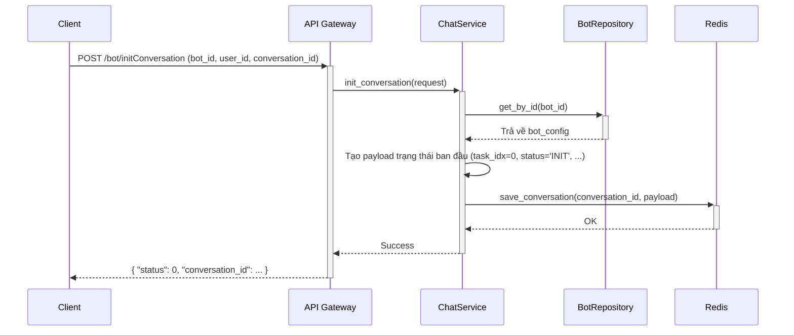
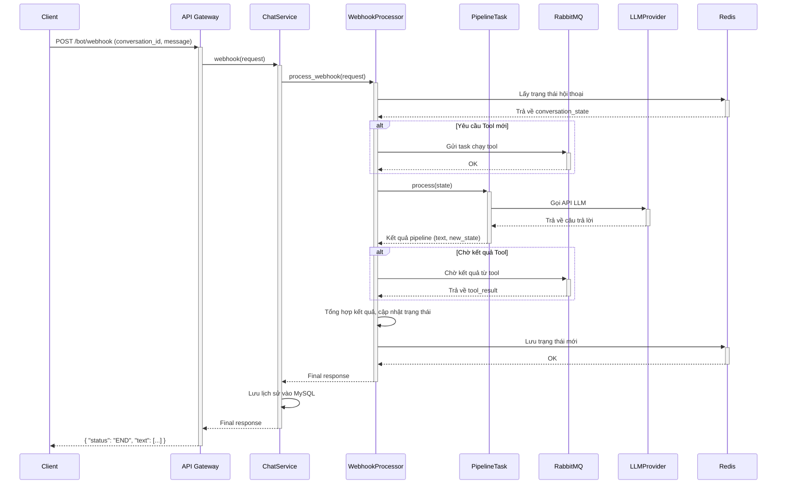
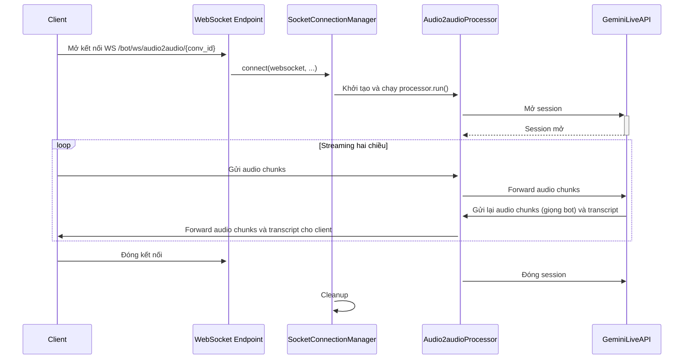
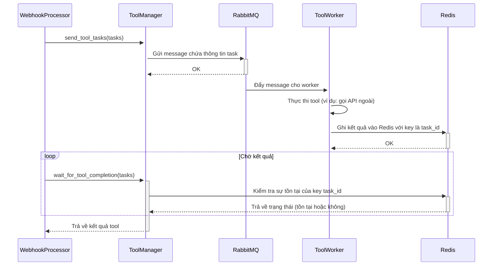

# Tài liệu Thiết kế Cấp cao (High-Level Design)

## Hệ thống Agent cho Robot Giáo dục (Robot Lesson Agent)

---

**Thông tin Tài liệu**

| Thuộc tính | Giá trị |
|---|---|
| **Tên dự án** | Robot Lesson Agent |
| **Tác giả** | Manus AI |
| **Ngày tạo** | 13-12-2025 |
| **Phiên bản** | 1.0 (Bản nháp chi tiết) |
| **Trạng thái** | Đang duyệt |

---

**Lịch sử Phiên bản**

| Phiên bản | Ngày | Tác giả | Mô tả thay đổi |
|---|---|---|---|
| 1.0 | 13-12-2025 | Manus AI | Tạo tài liệu ban đầu, phác thảo kiến trúc và các thành phần chính. |

---

**Mục lục**

1.  [Giới thiệu](#1-giới-thiệu)
    1.1. [Mục đích và Phạm vi](#11-mục-đích-và-phạm-vi)
    1.2. [Bối cảnh Kinh doanh](#12-bối-cảnh-kinh-doanh)
    1.3. [Thuật ngữ và Viết tắt](#13-thuật-ngữ-và-viết-tắt)
2.  [Yêu cầu và Mục tiêu Thiết kế](#2-yêu-cầu-và-mục-tiêu-thiết-kế)
    2.1. [Yêu cầu Chức năng](#21-yêu-cầu-chức-năng)
    2.2. [Yêu cầu Phi chức năng](#22-yêu-cầu-phi-chức-năng)
    2.3. [Mục tiêu Thiết kế](#23-mục-tiêu-thiết-kế)
3.  [Kiến trúc Hệ thống](#3-kiến-trúc-hệ-thống)
    3.1. [Tổng quan Kiến trúc và Các Mẫu Thiết kế](#31-tổng-quan-kiến-trúc-và-các-mẫu-thiết-kế)
    3.2. [Sơ đồ Bối cảnh Hệ thống (C4 Level 1)](#32-sơ-đồ-bối-cảnh-hệ-thống-c4-level-1)
    3.3. [Sơ đồ Containers (C4 Level 2)](#33-sơ-đồ-containers-c4-level-2)
4.  [Thiết kế Chi tiết các Thành phần](#4-thiết-kế-chi-tiết-các-thành-phần)
    4.1. [Lớp Giao diện (Interface Layer)](#41-lớp-giao-diện-interface-layer)
    4.2. [Lớp Dịch vụ (Service Layer)](#42-lớp-dịch-vụ-service-layer)
    4.3. [Lõi Agent (Agent Core Logic)](#43-lõi-agent-agent-core-logic)
    4.4. [Lớp Dữ liệu (Data Layer)](#44-lớp-dữ-liệu-data-layer)
    4.5. [Lớp Hạ tầng (Infrastructure Layer)](#45-lớp-hạ-tầng-infrastructure-layer)
5.  [Thiết kế Dữ liệu](#5-thiết-kế-dữ-liệu)
    5.1. [Lưu trữ Trạng thái Hội thoại (Redis)](#51-lưu-trữ-trạng-thái-hội-thoại-redis)
    5.2. [Lưu trữ Dữ liệu Bền vững (MySQL)](#52-lưu-trữ-dữ-liệu-bền-vững-mysql)
    5.3. [Lưu trữ Đối tượng (S3/MinIO)](#53-lưu-trữ-đối-tượng-s3minio)
6.  [Luồng Tương tác và Dữ liệu](#6-luồng-tương-tác-và-dữ-liệu)
    6.1. [Luồng Khởi tạo Hội thoại](#61-luồng-khởi-tạo-hội-thoại)
    6.2. [Luồng Xử lý Tin nhắn (Webhook)](#62-luồng-xử-lý-tin-nhắn-webhook)
    6.3. [Luồng Streaming Audio (WebSocket)](#63-luồng-streaming-audio-websocket)
    6.4. [Luồng Thực thi Tool Bất đồng bộ](#64-luồng-thực-thi-tool-bất-đồng-bộ)
7.  [Triển khai và Vận hành](#7-triển-khai-và-vận-hành)
    7.1. [Đóng gói và Triển khai](#71-đóng-gói-và-triển-khai)
    7.2. [Cấu hình Môi trường](#72-cấu-hình-môi-trường)
    7.3. [Chiến lược Mở rộng và Chịu lỗi](#73-chiến-lược-mở-rộng-và-chịu-lỗi)
8.  [Các khía cạnh Phi chức năng](#8-các-khía-cạnh-phi-chức-năng)
    8.1. [Bảo mật](#81-bảo-mật)
    8.2. [Giám sát và Khả năng Quan sát](#82-giám-sát-và-khả-năng-quan-sát)
    8.3. [Xử lý Lỗi và Khả năng Phục hồi](#83-xử-lý-lỗi-và-khả-năng-phục-hồi)
9.  [Phụ lục](#9-phụ-lục)
    9.1. [Đặc tả API (OpenAPI/Swagger)](#91-đặc-tả-api-openapiswagger)
    9.2. [Cấu trúc `task_chain` chi tiết](#92-cấu-trúc-task_chain-chi-tiết)

---

## 1. Giới thiệu

### 1.1. Mục đích và Phạm vi

Tài liệu này trình bày Thiết kế Cấp cao (High-Level Design - HLD) cho hệ thống **Robot Lesson Agent**. Mục tiêu của tài liệu là cung cấp một cái nhìn toàn diện, có cấu trúc về kiến trúc hệ thống, các thành phần chính, luồng dữ liệu, và các quyết định thiết kế nền tảng. HLD này đóng vai trò là tài liệu tham chiếu cốt lõi cho các kiến trúc sư, nhà phát triển, và các bên liên quan để hiểu rõ về cách hệ thống được cấu trúc và hoạt động.

**Phạm vi của tài liệu này bao gồm:**

*   **Kiến trúc Tổng thể**: Mô tả kiến trúc phân lớp và các mẫu thiết kế được áp dụng.
*   **Thiết kế Thành phần**: Xác định các thành phần chính và trách nhiệm của chúng ở mức độ cao.
*   **Luồng Dữ liệu**: Minh họa các luồng tương tác chính trong hệ thống, từ yêu cầu của người dùng đến phản hồi cuối cùng.
*   **Mô hình Dữ liệu**: Định nghĩa cấu trúc dữ liệu chính được sử dụng để lưu trữ trạng thái và dữ liệu bền vững.
*   **Tích hợp Hệ thống**: Mô tả cách hệ thống tương tác với các dịch vụ bên ngoài (LLM, APIs, cơ sở dữ liệu).
*   **Chiến lược Triển khai**: Phác thảo cách hệ thống được đóng gói, triển khai và mở rộng.

**Ngoài phạm vi của tài liệu này:**

*   Chi tiết triển khai ở mức mã nguồn (sẽ được đề cập trong tài liệu Low-Level Design).
*   Thiết kế giao diện người dùng (UI/UX) của ứng dụng client.
*   Thuật toán chi tiết của các mô hình AI/ML.
*   Cấu hình chi tiết của hạ tầng mạng và máy chủ.

### 1.2. Bối cảnh Kinh doanh

Dự án Robot Lesson Agent ra đời nhằm đáp ứng nhu cầu về một công cụ giáo dục tương tác, cá nhân hóa và hấp dẫn. Hệ thống đóng vai trò là bộ não cho một "AI Coach" (Huấn luyện viên AI), có thể tích hợp vào các ứng dụng học tập hoặc robot vật lý. AI Coach này không chỉ đơn thuần trả lời câu hỏi, mà còn có khả năng dẫn dắt người học qua các "bài học" (lessons) được cấu trúc sẵn, thực hiện các chuỗi tác vụ phức tạp, và cung cấp phản hồi tức thì, kể cả qua giọng nói.

**Vấn đề cần giải quyết:** Các hệ thống chatbot truyền thống thường bị giới hạn trong các cuộc hội thoại hỏi-đáp đơn giản. Chúng thiếu khả năng duy trì ngữ cảnh trong các tương tác dài, thực hiện các quy trình đa bước, hoặc tương tác một cách linh hoạt với các hệ thống bên ngoài. Robot Lesson Agent được thiết kế để vượt qua những hạn chế này, tạo ra một trải nghiệm học tập thông minh và có chiều sâu hơn.

**Đối tượng người dùng mục tiêu:**

*   **Học sinh, sinh viên**: Tương tác với AI Coach để học các kỹ năng mới, luyện tập ngôn ngữ, hoặc nhận được sự hướng dẫn theo từng bước.
*   **Giáo viên, nhà thiết kế chương trình học**: Sử dụng các công cụ (không thuộc phạm vi dự án này) để tạo ra các "bot" với các `task_chain` và kịch bản học tập tùy chỉnh.

### 1.3. Thuật ngữ và Viết tắt

| Thuật ngữ | Mô tả |
|---|---|
| **Agent** | Một thực thể AI có khả năng nhận thức, suy luận và hành động để đạt được mục tiêu. |
| **Bot** | Một cấu hình cụ thể của một Agent, được định nghĩa bởi `bot_id`, `task_chain`, và các tham số khác. |
| **Task Chain** | Một chuỗi các tác vụ (pipeline) được định nghĩa trước mà Agent sẽ thực thi tuần tự để hoàn thành một mục tiêu. |
| **Tool** | Một chức năng hoặc dịch vụ bên ngoài mà Agent có thể gọi để thu thập thông tin hoặc thực hiện hành động. |
| **Conversation State** | Toàn bộ dữ liệu liên quan đến một phiên hội thoại, được lưu trong Redis. |
| **Webhook** | Endpoint API mà hệ thống sử dụng để nhận tin nhắn và các sự kiện từ người dùng. |
| **DI (Dependency Injection)** | Mẫu thiết kế để đảo ngược quyền kiểm soát việc khởi tạo các đối tượng phụ thuộc. |
| **STT / TTS** | Speech-to-Text / Text-to-Speech. |
| **HLD / LLD** | High-Level Design / Low-Level Design. |
| **VAD (Voice Activity Detection)** | Kỹ thuật phát hiện có tiếng nói trong một luồng âm thanh. |

---

## 2. Yêu cầu và Mục tiêu Thiết kế

### 2.1. Yêu cầu Chức năng

| ID | Yêu cầu | Mô tả chi tiết |
|---|---|---|
| FR-01 | Khởi tạo Hội thoại | Client có thể bắt đầu một phiên hội thoại mới bằng cách cung cấp `bot_id` (hoặc `lesson_id`/`todo_id`), `user_id`, và một `conversation_id` duy nhất. Hệ thống sẽ tạo và lưu trạng thái ban đầu vào Redis. |
| FR-02 | Xử lý Tin nhắn (Webhook) | Hệ thống phải xử lý các tin nhắn văn bản từ người dùng qua `POST /webhook`, thực thi logic của agent, và trả về phản hồi. |
| FR-03 | Thực thi Chuỗi tác vụ | Agent phải có khả năng thực thi một `task_chain` được định nghĩa trong cấu hình bot, chuyển từ tác vụ này sang tác vụ khác dựa trên trạng thái hội thoại. |
| FR-04 | Tích hợp và Thực thi Tool | Agent phải có khả năng gọi các tool bên ngoài (ví dụ: kiểm tra ngữ pháp, tìm kiếm thông tin) một cách bất đồng bộ thông qua RabbitMQ. |
| FR-05 | Quản lý Trạng thái Hội thoại | Hệ thống phải duy trì trạng thái của mỗi cuộc hội thoại trong Redis, bao gồm lịch sử, biến ngữ cảnh, và tác vụ hiện tại. |
| FR-06 | Tương tác Giọng nói | Hỗ trợ streaming audio hai chiều qua WebSocket để thực hiện STT và TTS gần thời gian thực, sử dụng các dịch vụ như Google Speech hoặc Gemini Live. |
| FR-07 | Quản lý Bot (CRUD) | Cung cấp các API endpoint để tạo, đọc, cập nhật, và xóa cấu hình của các bot, bao gồm cả `task_chain` của chúng. |
| FR-08 | Truy xuất Lịch sử | Cho phép truy vấn và lấy lại lịch sử của các cuộc hội thoại đã hoàn thành từ MySQL. |
| FR-09 | Tích hợp Đa nhà cung cấp LLM | Hệ thống phải linh hoạt, cho phép cấu hình và chuyển đổi giữa các LLM từ OpenAI, Google Gemini, và Groq. |
| FR-10 | Quản lý Ngữ cảnh Động | Agent phải có khả năng trích xuất thông tin từ cuộc hội thoại và sử dụng nó để điền vào các biến ngữ cảnh (`SYSTEM_CONTEXT_VARIABLES`). |

### 2.2. Yêu cầu Phi chức năng

| ID | Yêu cầu | Mô tả và Chỉ số (nếu có) |
|---|---|---|
| NFR-01 | Hiệu năng | - **Độ trễ API**: Thời gian phản hồi của `POST /webhook` (p95) phải dưới 2 giây, không tính độ trễ của LLM và các tool bên ngoài. <br>- **Độ trễ WebSocket**: Độ trễ từ khi người dùng nói đến khi nhận được phản hồi âm thanh đầu tiên (time-to-first-byte) phải dưới 500ms. |
| NFR-02 | Khả năng Mở rộng | Hệ thống phải có khả năng mở rộng theo chiều ngang để hỗ trợ ít nhất 1,000 người dùng đồng thời. |
| NFR-03 | Độ tin cậy | - **Uptime**: 99.9%. <br>- **Khả năng phục hồi**: Hệ thống phải có khả năng tự phục hồi sau khi các thành phần phụ thuộc (database, Redis) gặp sự cố tạm thời. Các tác vụ tool phải có cơ chế thử lại. |
| NFR-04 | Khả năng Bảo trì | - **Tính Module hóa**: Mã nguồn phải được tổ chức thành các module rõ ràng, khớp với các lớp kiến trúc. <br>- **Độ phức tạp Cyclomatic**: Trung bình dưới 10 cho mỗi hàm/phương thức. |
| NFR-05 | Bảo mật | - **Xác thực**: Tất cả các API endpoint phải được bảo vệ bằng cơ chế xác thực dựa trên token (ví dụ: OAuth2/JWT). <br>- **Quản lý Bí mật**: Không có thông tin nhạy cảm nào được hard-code. Sử dụng biến môi trường và các dịch vụ quản lý bí mật. |
| NFR-06 | Khả năng Giám sát | - **Logging**: Ghi log có cấu trúc (JSON) cho tất cả các request và các sự kiện quan trọng. <br>- **Tracing**: Tích hợp với Langfuse để theo dõi toàn bộ vòng đời của một yêu cầu, bao gồm cả các lời gọi LLM. <br>- **Metrics**: Cung cấp các chỉ số cơ bản (số lượng request, độ trễ, tỷ lệ lỗi) qua một endpoint (ví dụ: Prometheus). |

### 2.3. Mục tiêu Thiết kế

Từ các yêu cầu trên, các mục tiêu chính của thiết kế này là:

1.  **Tách biệt Rõ ràng (Clear Separation of Concerns)**: Phân chia hệ thống thành các lớp độc lập để giảm sự phụ thuộc và tăng khả năng bảo trì.
2.  **Linh hoạt và Mở rộng (Flexibility and Extensibility)**: Dễ dàng thêm các loại agent, tool, hoặc nhà cung cấp LLM mới mà không cần thay đổi lớn về kiến trúc.
3.  **Hiệu năng Cao và Độ trễ Thấp (High Performance and Low Latency)**: Tối ưu hóa cho các tương tác thời gian thực, đặc biệt là xử lý giọng nói.
4.  **Khả năng Chịu lỗi và Phục hồi (Fault Tolerance and Resilience)**: Đảm bảo hệ thống hoạt động ổn định ngay cả khi các thành phần phụ thuộc gặp sự cố.
5.  **Dễ dàng Kiểm thử và Gỡ lỗi (Testability and Debuggability)**: Cấu trúc mã nguồn và việc sử dụng DI phải hỗ trợ việc viết unit test và integration test. Tích hợp tracing là ưu tiên hàng đầu để gỡ lỗi các hệ thống AI phức tạp.

---

## 3. Kiến trúc Hệ thống

### 3.1. Tổng quan Kiến trúc và Các Mẫu Thiết kế

Hệ thống được xây dựng dựa trên sự kết hợp của nhiều mẫu kiến trúc và thiết kế để đáp ứng các yêu cầu đã đề ra:

*   **Kiến trúc Phân lớp (Layered Architecture)**: Đây là nền tảng chính, chia hệ thống thành các lớp logic riêng biệt. Luồng phụ thuộc chỉ đi theo một chiều từ trên xuống dưới (Interface -> Service -> Core -> Data/Infrastructure), tuân thủ nguyên tắc Dependency Inversion.

    *   **Interface Layer**: Chịu trách nhiệm giao tiếp với thế giới bên ngoài (HTTP APIs, WebSockets).
    *   **Service Layer**: Điều phối các quy trình nghiệp vụ, nhưng không chứa logic nghiệp vụ cốt lõi.
    *   **Agent Core Logic Layer**: Chứa logic nghiệp vụ phức tạp nhất, bao gồm state machine, pipeline, và các thuật toán của agent.
    *   **Data & Infrastructure Layers**: Cung cấp các cơ chế truy cập dữ liệu và tương tác với các dịch vụ hạ tầng.

*   **Kiến trúc Hướng sự kiện (Event-Driven Architecture)**: Được áp dụng cho việc thực thi các `Tool`. Thay vì gọi trực tiếp và chờ đợi, `WebhookProcessor` phát ra một sự kiện (một message vào RabbitMQ). Một hoặc nhiều `worker` sẽ lắng nghe và xử lý các sự kiện này. Điều này giúp:
    *   **Giảm khớp nối (Decoupling)**: Logic xử lý webhook không cần biết chi tiết về cách thực thi tool.
    *   **Tăng khả năng mở rộng**: Có thể tăng số lượng worker để xử lý nhiều tool task hơn.
    *   **Tăng khả năng chịu lỗi**: Nếu một worker bị lỗi, message vẫn còn trong queue và có thể được xử lý lại.

*   **Dependency Injection (DI)**: Sử dụng thư viện `dependency-injector` để quản lý vòng đời của các đối tượng và tiêm chúng vào nơi cần thiết. Điều này giúp loại bỏ việc khởi tạo đối tượng một cách thủ công trong mã nguồn nghiệp vụ, làm cho mã nguồn sạch hơn và dễ dàng thay thế các thành phần trong quá trình kiểm thử.

### 3.2. Sơ đồ Bối cảnh Hệ thống (C4 Level 1)

Sơ đồ này đặt hệ thống Robot Lesson Agent vào trung tâm và minh họa các tương tác của nó với người dùng và các hệ thống bên ngoài.

```mermaid
graph TD
    subgraph "Người dùng & Ứng dụng"
        User[Client Application / Robot]
    end

    subgraph "Hệ thống Lõi"
        RobotAgent[
            **Robot Lesson Agent System**
            (FastAPI Backend)
            --- 
            Cung cấp logic cho AI Coach,
            quản lý hội thoại và thực thi tác vụ.
        ]
    end

    subgraph "Hệ thống Phụ trợ & Bên ngoài"
        LLM[LLM Providers<br/>(OpenAI, Gemini, Groq)]
        ExternalTools[External Tools & Services<br/>(e.g., Grammar Checker, Fact Checker)]
        PlatformAPIs[Platform APIs<br/>(TODO/Workflow, User Profile)]
    end

    subgraph "Hạ tầng Lưu trữ & Giao tiếp"
        S3[S3/MinIO<br/>(Lưu trữ file audio, media)]
        MySQL[MySQL Database<br/>(Lưu trữ cấu hình bot, lịch sử hội thoại)]
        Redis[Redis<br/>(Cache & Quản lý Trạng thái Hội thoại)]
        RabbitMQ[RabbitMQ<br/>(Hàng đợi cho Tool Tasks)]
        Observability[Observability Platform<br/>(Langfuse, OpenTelemetry)]
    end

    User -- "Gửi yêu cầu (REST/WebSocket)" --> RobotAgent
    RobotAgent -- "Nhận phản hồi" --> User

    RobotAgent -- "Gọi API để sinh văn bản" --> LLM
    RobotAgent -- "Gửi jobs qua message queue" --> RabbitMQ
    RabbitMQ -- "Trigger" --> ExternalTools
    RobotAgent -- "Gọi API để lấy dữ liệu" --> PlatformAPIs
    RobotAgent -- "Lưu/Đọc file" --> S3
    RobotAgent -- "Lưu/Đọc dữ liệu bền vững" --> MySQL
    RobotAgent -- "Lưu/Đọc trạng thái tạm thời" --> Redis
    RobotAgent -- "Gửi traces và logs" --> Observability
```

### 3.3. Sơ đồ Containers (C4 Level 2)

Sơ đồ này phân rã hệ thống Robot Agent thành các thành phần chính có thể triển khai (deployable units) hoặc các nhóm logic lớn.

```mermaid
graph TD
    subgraph "Robot Lesson Agent System"
        InterfaceLayer[
            **Interface Layer**
            (FastAPI App)
            --- 
            Xử lý HTTP requests và WebSocket connections.
            Chứa các API Routers.
        ]
        ServiceLayer[
            **Service Layer**
            --- 
            Điều phối business logic.
            Không chứa logic nghiệp vụ cốt lõi.
        ]
        AgentCore[
            **Agent Core Logic**
            --- 
            State machine, pipeline thực thi, 
            quản lý tool và memory.
        ]
        DataLayer[
            **Data Layer**
            --- 
            Cung cấp lớp trừu tượng (Repositories)
            để truy cập cơ sở dữ liệu.
        ]
        InfraAdapters[
            **Infrastructure Adapters**
            --- 
            Các client để kết nối tới Redis, 
            RabbitMQ, S3, LLMs...
        ]
        ToolWorkers[
            **Tool Workers**
            (Python Processes)
            --- 
            Các tiến trình riêng biệt lắng nghe
            RabbitMQ để thực thi các tool.
        ]
    end

    User[Client Application] --> InterfaceLayer

    InterfaceLayer -- "Gọi các phương thức dịch vụ" --> ServiceLayer
    ServiceLayer -- "Ủy quyền xử lý" --> AgentCore
    AgentCore -- "Sử dụng các client" --> InfraAdapters
    AgentCore -- "Gửi task" --> InfraAdapters
    AgentCore -- "Truy cập dữ liệu qua" --> DataLayer
    
    DataLayer -- "Tương tác với" --> MySQL[(MySQL)]
    InfraAdapters -- "Kết nối tới" --> Redis[(Redis)]
    InfraAdapters -- "Gửi/Nhận message tới" --> RabbitMQ[(RabbitMQ)]
    InfraAdapters -- "Kết nối tới" --> S3[(S3)]
    InfraAdapters -- "Kết nối tới" --> LLMProviders[(LLM Providers)]

    RabbitMQ[(RabbitMQ)] -- "Đẩy message cho" --> ToolWorkers
```

---

## 4. Thiết kế Chi tiết các Thành phần

### 4.1. Lớp Giao diện (Interface Layer)

*   **Trách nhiệm**: Tiếp nhận yêu cầu từ client, xác thực, parse dữ liệu đầu vào, và gọi lớp Service tương ứng. Định dạng dữ liệu trả về từ lớp Service thành HTTP response.
*   **Thành phần chính**: `app/server.py`, `app/api/routes/bot.py`, `app/api/models/chat_request.py`.
*   **Thiết kế**: Sử dụng `APIRouter` của FastAPI để nhóm các endpoint. Sử dụng Pydantic models (`chat_request.py`) để xác thực và serialize/deserialize dữ liệu request/response. Endpoint WebSocket (`/ws/audio2audio`) được thiết kế để xử lý các kết nối dài hạn và ủy quyền cho `SocketConnectionManager`.

### 4.2. Lớp Dịch vụ (Service Layer)

*   **Trách nhiệm**: Điều phối các quy trình nghiệp vụ phức tạp, liên quan đến nhiều thành phần ở lớp dưới. Ví dụ, `ChatService.webhook` nhận một request, gọi `WebhookProcessor`, sau đó gọi `HistoryRepository` để lưu kết quả.
*   **Thành phần chính**: `app/api/services/chat_service.py`, `app/api/services/bot_service.py`.
*   **Thiết kế**: Các lớp Service được thiết kế để không chứa trạng thái (stateless). Tất cả các dependency của chúng (ví dụ: repositories, processors) được tiêm vào qua constructor bởi `dependency-injector`. Điều này giúp chúng dễ dàng được kiểm thử độc lập.

### 4.3. Lõi Agent (Agent Core Logic)

*   **Trách nhiệm**: Chứa đựng logic phức tạp và đặc thù nhất của hệ thống AI.
*   **Thành phần chính**: `app/module/agent/talk_agent/*`.
*   **Thiết kế**:
    *   **`WebhookProcessor`**: Hoạt động như một Facade và State Machine. Nó định nghĩa một quy trình xử lý webhook gồm nhiều bước rõ ràng (`_validate_and_get_conversation`, `_handle_ongoing_tool_processing`, ...). Mỗi bước là một phương thức riêng, giúp mã nguồn dễ đọc và bảo trì.
    *   **`PipelineTask`**: Triển khai mẫu **Interpreter** và **Chain of Responsibility**. Nó "đọc" `task_chain` (một cấu trúc dữ liệu) và thực thi từng bước. Nó quyết định khi nào cần chuyển sang bước tiếp theo, khi nào cần gọi LLM, và khi nào cần dừng lại.
    *   **`runs/*` (`ChatRun`, `ExtractVariables`)**: Đóng gói logic cho một lần gọi LLM cụ thể. Chúng chịu trách nhiệm định dạng prompt, gọi LLM, và xử lý kết quả trả về. Đây là một dạng của mẫu **Strategy**.

### 4.4. Lớp Dữ liệu (Data Layer)

*   **Trách nhiệm**: Cung cấp một lớp trừu tượng để truy cập dữ liệu, che giấu chi tiết về cách dữ liệu được lưu trữ và truy vấn.
*   **Thành phần chính**: `app/module/repositories/*`, `app/module/agent/talk_agent/services/conversation_manager.py`.
*   **Thiết kế**: Áp dụng mẫu **Repository**. `BotRepository` và `HistoryRepository` cung cấp các phương thức như `get_by_id`, `create` để tương tác với MySQL. `ConversationManager` đóng vai trò tương tự cho Redis, cung cấp các phương thức `get_conversation`, `save_conversation`.

### 4.5. Lớp Hạ tầng (Infrastructure Layer)

*   **Trách nhiệm**: Giao tiếp với các dịch vụ bên ngoài và hạ tầng.
*   **Thành phần chính**: `app/common/*` (redis, rabbitmq, s3), `app/module/provider/hub.py`.
*   **Thiết kế**: 
    *   **Clients**: Cung cấp các client đã được cấu hình sẵn để tương tác với dịch vụ (ví dụ: `RabbitMQClient` có phương thức `send_task`).
    *   **`ProviderHub`**: Hoạt động như một **Factory** hoặc **Registry**. Nó tải cấu hình từ file `config.yml` và tạo ra các đối tượng LLM client tương ứng. Điều này cho phép hệ thống thêm hoặc thay đổi nhà cung cấp LLM mà không cần sửa đổi mã nguồn ở các lớp trên.

---

## 5. Thiết kế Dữ liệu

### 5.1. Lưu trữ Trạng thái Hội thoại (Redis)

Redis được chọn vì tốc độ truy cập nhanh, phù hợp cho việc lưu trữ trạng thái tạm thời của các hội thoại đang hoạt động.

*   **Key**: `conversation_id`.
*   **Value**: Một chuỗi JSON chứa toàn bộ trạng thái hội thoại. Việc sử dụng một key duy nhất cho mỗi hội thoại giúp đơn giản hóa việc truy cập và quản lý, nhưng đòi hỏi phải đọc và ghi lại toàn bộ đối tượng mỗi lần cập nhật. Đối với các hệ thống có tần suất cập nhật cao, có thể cân nhắc sử dụng Redis Hash để cập nhật từng trường riêng lẻ.
*   **Vòng đời**: Dữ liệu hội thoại trong Redis nên có một thời gian hết hạn (TTL) để tự động dọn dẹp các phiên bị treo. `ConversationManager` nên thiết lập TTL khi lưu dữ liệu.

### 5.2. Lưu trữ Dữ liệu Bền vững (MySQL)

MySQL được sử dụng để lưu trữ các dữ liệu cần tính bền vững, có cấu trúc và cần khả năng truy vấn phức tạp.

*   **Bảng `bots`**: Lưu trữ cấu hình của các bot. Trường `task_chain` và `generation_params` được lưu dưới dạng `JSON` để tăng tính linh hoạt.
*   **Bảng `conversation_history`**: Lưu trữ lịch sử các tin nhắn sau khi hội thoại kết thúc. Điều này giúp giảm tải cho Redis và cho phép phân tích dữ liệu sau này.
*   **Sơ đồ ERD**:

    ```mermaid
    erDiagram
        BOTS {
            INT id PK
            VARCHAR name
            TEXT description
            JSON task_chain
            VARCHAR provider_name
            JSON generation_params
            DATETIME created_at
            DATETIME updated_at
        }

        CONVERSATION_HISTORY {
            INT id PK
            VARCHAR conversation_id
            VARCHAR user_id
            INT bot_id FK
            JSON messages
            DATETIME created_at
            DATETIME updated_at
        }

        BOTS ||--o{ CONVERSATION_HISTORY : "has"
    ```

### 5.3. Lưu trữ Đối tượng (S3/MinIO)

*   **Mục đích**: Lưu trữ các file media như file ghi âm giọng nói của người dùng (`audio_url`) hoặc các file audio do hệ thống TTS tạo ra.
*   **Luồng hoạt động**: Khi nhận được một file audio, hệ thống sẽ upload nó lên S3/MinIO và chỉ lưu lại URL của file đó trong `WebhookRequest` hoặc trong trạng thái hội thoại. Điều này giúp giữ cho payload của API và kích thước của trạng thái trong Redis nhỏ gọn.

---

## 6. Luồng Tương tác và Dữ liệu

### 6.1. Luồng Khởi tạo Hội thoại

Luồng này thiết lập trạng thái ban đầu cho một cuộc trò chuyện mới.



### 6.2. Luồng Xử lý Tin nhắn (Webhook)

Đây là luồng phức tạp nhất, thể hiện sức mạnh của kiến trúc phân lớp và hướng sự kiện.



### 6.3. Luồng Streaming Audio (WebSocket)

Luồng này được tối ưu cho độ trễ thấp bằng cách sử dụng kết nối WebSocket bền vững và streaming trực tiếp tới API của nhà cung cấp.



### 6.4. Luồng Thực thi Tool Bất đồng bộ

Luồng này minh họa cách hệ thống xử lý các tác vụ dài hơi mà không làm block luồng chính.



---

## 7. Triển khai và Vận hành

### 7.1. Đóng gói và Triển khai

*   **Docker**: Toàn bộ hệ thống và các dịch vụ phụ thuộc được định nghĩa trong `compose.yaml`. Điều này cho phép thiết lập môi trường phát triển chỉ bằng một lệnh `docker compose up`.
*   **CI/CD**: `Jenkinsfile` được cung cấp, cho thấy một quy trình CI/CD đã được thiết lập. Quy trình này nên bao gồm các bước: linting (`lint.sh`), testing (`test.sh`), build Docker image, và deploy lên các môi trường (staging, production).

### 7.2. Cấu hình Môi trường

Hệ thống sử dụng `pydantic-settings` để load cấu hình từ các biến môi trường, được định nghĩa trong file `.env`.

*   **Local**: Sử dụng `compose.yaml` để khởi chạy tất cả các dịch vụ (backend, db, redis, rabbitmq) trên máy local.
*   **Staging/Production**: Triển khai trên một nền tảng container orchestration như Kubernetes hoặc Amazon ECS. Sử dụng các dịch vụ managed cho database (RDS), Redis (ElastiCache), và RabbitMQ (Amazon MQ) để tăng tính sẵn sàng và giảm gánh nặng vận hành.

### 7.3. Chiến lược Mở rộng và Chịu lỗi

*   **Mở rộng ngang (Horizontal Scaling)**: Ứng dụng FastAPI là stateless, do đó có thể dễ dàng tăng số lượng replica (pod/task) và sử dụng một Load Balancer để phân phối traffic.
*   **Mở rộng Worker**: Tương tự, có thể tăng số lượng `ToolWorker` để xử lý nhiều tool task hơn một cách song song.
*   **Chịu lỗi**: 
    *   **Load Balancer**: Tự động điều hướng traffic ra khỏi các instance bị lỗi.
    *   **Hàng đợi tin nhắn**: RabbitMQ đảm bảo rằng các tool task không bị mất nếu worker bị lỗi. Chúng sẽ được xử lý lại.
    *   **Database/Redis**: Sử dụng các phiên bản replicated hoặc cluster để đảm bảo tính sẵn sàng cao.

---

## 8. Các khía cạnh Phi chức năng

### 8.1. Bảo mật

*   **Xác thực API**: `AuthDep` (`app/api/deps.py`) là một dependency chung cho các router cần bảo vệ. Logic xác thực token (ví dụ: kiểm tra chữ ký JWT, thời gian hết hạn) cần được triển khai đầy đủ trong dependency này.
*   **Quản lý Bí mật**: Tất cả các API key, mật khẩu, và các chuỗi bí mật khác được load từ biến môi trường thông qua `Settings` class. Trong môi trường production, các biến này nên được tiêm vào container từ một dịch vụ quản lý bí mật (ví dụ: AWS Secrets Manager, HashiCorp Vault).
*   **CORS**: Chính sách CORS được cấu hình chặt chẽ để chỉ cho phép các domain của ứng dụng client truy cập.

### 8.2. Giám sát và Khả năng Quan sát

*   **Logging**: Hệ thống đã có sẵn một cơ chế logging tập trung (`app/common/log.py`). Trong môi trường production, log nên được gửi đến một hệ thống quản lý log tập trung như ELK Stack (Elasticsearch, Logstash, Kibana) hoặc Datadog/Splunk để dễ dàng tìm kiếm và phân tích.
*   **Tracing**: Việc tích hợp sâu với **Langfuse** là một điểm mạnh lớn. Decorator `@observe` cho phép theo dõi chi tiết từng bước trong pipeline, bao gồm cả prompt đầu vào, response từ LLM, và các biến được sử dụng. Điều này cực kỳ quan trọng để gỡ lỗi và cải thiện chất lượng của agent.
*   **Metrics**: Cần triển khai thêm việc thu thập và expose các metrics theo chuẩn Prometheus (ví dụ: sử dụng `starlette-prometheus`). Các metrics quan trọng cần theo dõi bao gồm: độ trễ request, tỷ lệ lỗi, số lượng request mỗi endpoint, số lượng message trong RabbitMQ.

### 8.3. Xử lý Lỗi và Khả năng Phục hồi

*   **Exception Handling**: Hệ thống có một hệ thống exception tùy chỉnh (`app/module/agent/talk_agent/exceptions.py`). Cần có một middleware trong FastAPI để bắt các exception này và chuyển đổi chúng thành các HTTP response có mã lỗi và thông điệp phù hợp.
*   **Cơ chế Thử lại (Retry)**: Các lời gọi đến API bên ngoài hoặc các dịch vụ hạ tầng nên được bọc trong một cơ chế thử lại (ví dụ: sử dụng thư viện `tenacity`) để xử lý các lỗi tạm thời (transient failures).
*   **Health Checks**: Endpoint health check (`/personalized-ai-coach/api`) cho phép các hệ thống orchestration (như Kubernetes) kiểm tra tình trạng của ứng dụng và tự động khởi động lại các instance bị lỗi.

---

## 9. Phụ lục

### 9.1. Đặc tả API (OpenAPI/Swagger)

FastAPI tự động sinh tài liệu OpenAPI tại `/docs` và ReDoc tại `/redoc` (trong môi trường không phải production). Đây là nguồn tham chiếu chính xác nhất cho đặc tả API chi tiết.

### 9.2. Cấu trúc `task_chain` chi tiết

Trường `task_chain` là một mảng các đối tượng, mỗi đối tượng đại diện cho một bước trong pipeline. Dưới đây là một ví dụ về cấu trúc của một tác vụ.

```json
[
  {
    "SYSTEM_TASK_DESCRIPTION": "Bạn là một trợ lý AI thân thiện...",
    "SYSTEM_EXTRACTION_VARIABLES": {
      "user_intent": "Phân loại ý định của người dùng..."
    },
    "START_MESSAGE": "Xin chào! Tôi có thể giúp gì cho bạn?",
    "PRONUNCIATION_CHECKER_TOOL": {
      "enable": true,
      "some_param": "value"
    },
    "GRAMMAR_CHECKER_TOOL": {
      "enable": false
    },
    "sub_agents": [
        {
            "bot_id": 789,
            "end_behavior": "CONTINUE" // or "END"
        }
    ],
    "checkpoints": [
        {
            "name": "checkpoint_1",
            "description": "Kiểm tra xem người dùng đã cung cấp tên chưa",
            "condition": "{{user_name}} != null"
        }
    ]
  },
  {
    "SYSTEM_TASK_DESCRIPTION": "Bây giờ, hãy hỏi người dùng về chủ đề...",
    ...
  }
]
```

---

*Kết thúc tài liệu HLD.*
