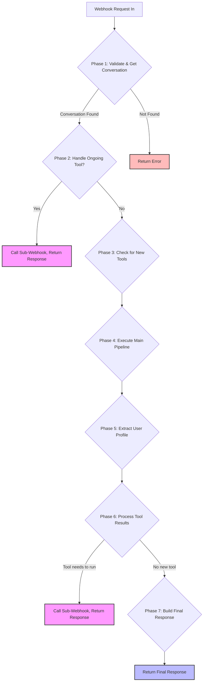
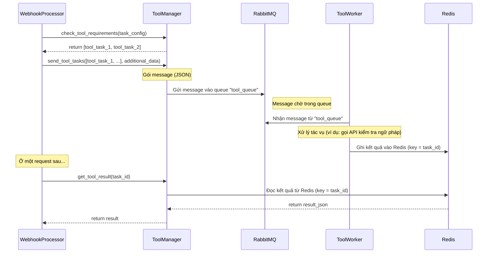
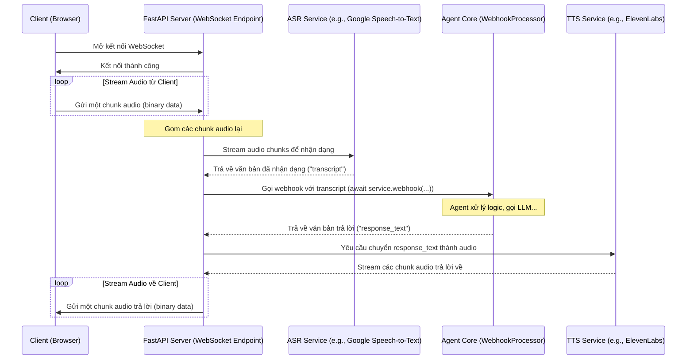
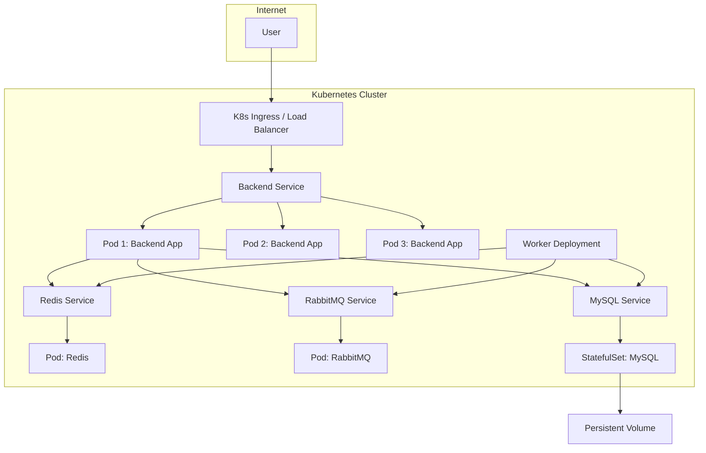
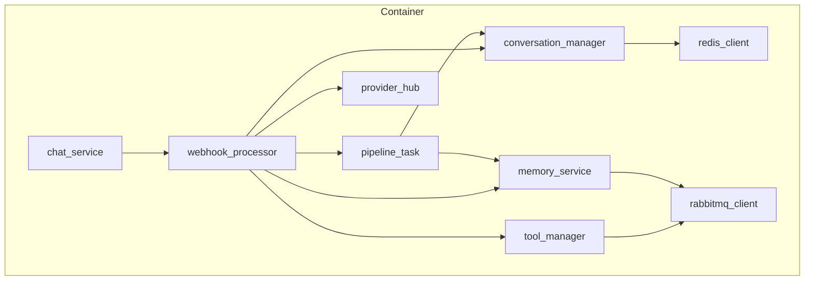

```
Tôi cần bạn viết chi tiết từng phần để 1 người mới level Intern AI Engineer có thể hiểu và chỉ cần dựa vào tài liệu có thể tự triển khai được 100% toàn bộ lại hệ thống trên với chuẩn production quality. 
Bạn cần hoàn thành checklist sau: 
1. Bám sát source code chi tiết từng phần và chuẩn bị nội dung chi tiết cho từng phần 
2. MECE để xem tài liệu còn thiếu gì không
3. VIết chi tiết để ra tài liệu final => Output là 1 tài liệu markdown chi tiết (bằng tiếng việt) và siêu chi tiết lên tới 100 trang, được coi là cuốn ALL IN ONE cho việc thiết kế được toàn bộ từ 0 -> 100%

```

# All-in-One: Xây dựng Hệ thống Robot Lesson Agent từ Zero đến Production

---

**Tài liệu Hướng dẫn Toàn diện cho Kỹ sư AI**

| Thuộc tính | Giá trị |
|---|---|
| **Tên dự án** | Robot Lesson Agent |
| **Tác giả** | Manus AI |
| **Ngày tạo** | 13-12-2025 |
| **Phiên bản** | 1.0 |
| **Đối tượng** | Intern/Junior AI Engineer |

---

## Lời nói đầu

Chào mừng bạn đến với tài liệu hướng dẫn toàn diện nhất để xây dựng hệ thống **Robot Lesson Agent**. Cuốn sách này không chỉ là một tài liệu thiết kế, mà là một khóa học thực chiến, được tạo ra với mục tiêu duy nhất: giúp một kỹ sư AI mới vào nghề (Intern/Junior) có thể tự tin, từng bước một, xây dựng lại toàn bộ hệ thống này từ con số không cho đến khi đạt chất lượng production.

Chúng ta sẽ không chỉ nhìn vào mã nguồn. Chúng ta sẽ mổ xẻ nó. Chúng ta sẽ tìm hiểu "tại sao" đằng sau mỗi quyết định thiết kế, "làm thế nào" để triển khai từng thành phần, và "cái gì" tạo nên một hệ thống AI phức tạp, có khả năng mở rộng và bảo trì. Mỗi chương được thiết kế như một bài học, đi từ tổng quan kiến trúc, thiết lập môi trường, cho đến việc triển khai chi tiết từng module, xử lý lỗi, và đưa hệ thống lên môi trường production.

Hãy chuẩn bị sẵn sàng. Đây sẽ là một hành trình đầy thử thách nhưng cũng vô cùng bổ ích. Khi hoàn thành, bạn sẽ không chỉ có một hệ thống AI mạnh mẽ, mà còn sở hữu một nền tảng kiến thức vững chắc về kiến trúc phần mềm, các mẫu thiết kế hiện đại, và các công cụ hạ tầng thiết yếu trong ngành.

Bắt đầu thôi!

---

## PHẦN I: NỀN TẢNG VÀ KHỞI TẠO

### Chương 1: Tổng quan Kiến trúc và Công nghệ

Trước khi viết dòng code đầu tiên, việc hiểu rõ bức tranh toàn cảnh là cực kỳ quan trọng. Hệ thống Robot Lesson Agent không phải là một ứng dụng monlithic đơn giản, mà là một hệ sinh thái gồm nhiều thành phần tương tác với nhau. Chương này sẽ giới thiệu về kiến trúc tổng thể và các công nghệ cốt lõi được sử dụng.

#### 1.1. Tầm nhìn Hệ thống: AI Coach Đa năng

Hệ thống này được thiết kế để làm bộ não cho một "AI Coach" - một trợ lý ảo thông minh có thể:

*   **Dẫn dắt hội thoại**: Không chỉ trả lời câu hỏi, mà còn có khả năng dẫn dắt người dùng qua một kịch bản, một bài học được định nghĩa trước.
*   **Thực thi tác vụ phức tạp**: Có khả năng thực hiện một chuỗi các bước logic (`task_chain`) để hoàn thành một mục tiêu.
*   **Tương tác đa phương thức**: Hỗ trợ cả văn bản và giọng nói (thông qua streaming thời gian thực).
*   **Sử dụng công cụ (Tools)**: Có thể gọi đến các dịch vụ bên ngoài để thực hiện các chức năng chuyên biệt (ví dụ: kiểm tra ngữ pháp, tìm kiếm thông tin).
*   **Cá nhân hóa**: Ghi nhớ thông tin về người dùng và các "sự thật" (facts) từ các cuộc hội thoại trước để cá nhân hóa trải nghiệm.

#### 1.2. Kiến trúc Phân lớp (Layered Architecture)

Để quản lý sự phức tạp, hệ thống được xây dựng theo **Kiến trúc Phân lớp**. Đây là một trong những mẫu kiến trúc nền tảng và hiệu quả nhất. Hãy tưởng tượng nó như một chiếc bánh có nhiều lớp, mỗi lớp có một nhiệm vụ riêng và chỉ được phép giao tiếp với lớp ngay bên trên hoặc bên dưới nó.

```mermaid
graph TD
    A[Client (Web/App/Robot)] --> B[Interface Layer];
    B --> C[Service Layer];
    C --> D[Agent Core Logic];
    D --> E[Data Layer];
    D --> F[Infrastructure Layer];
    E --> G[Databases (MySQL)];
    F --> H[External Services (Redis, RabbitMQ, LLMs, S3)];

    subgraph "Application Core"
        B(<b>Interface Layer</b><br/><i>FastAPI Routers, WebSockets</i><br/>Tiếp nhận và trả về HTTP/WS requests);
        C(<b>Service Layer</b><br/><i>ChatService, BotService</i><br/>Điều phối các quy trình nghiệp vụ);
        D(<b>Agent Core Logic</b><br/><i>WebhookProcessor, PipelineTask</i><br/>Logic AI, state machine, thực thi pipeline);
        E(<b>Data Layer</b><br/><i>Repositories</i><br/>Trừu tượng hóa truy cập CSDL);
        F(<b>Infrastructure Layer</b><br/><i>Clients, ProviderHub</i><br/>Kết nối tới dịch vụ ngoài);
    end

    subgraph "External Dependencies"
        G[MySQL]
        H[Redis, RabbitMQ, LLMs, S3]
    end
```

*   **Luồng phụ thuộc**: Luồng đi từ trên xuống. `Interface Layer` gọi `Service Layer`, `Service Layer` gọi `Agent Core Logic`, và `Agent Core Logic` sử dụng `Data Layer` và `Infrastructure Layer`. Điều này đảm bảo sự tách biệt rõ ràng (Separation of Concerns).

#### 1.3. Các Mẫu Thiết kế Chủ đạo

*   **Dependency Injection (DI)**: Thay vì các lớp tự tạo ra các đối tượng mà chúng cần (ví dụ: `service = ChatService()`), chúng ta "tiêm" (inject) các dependency này từ bên ngoài. Hệ thống sử dụng thư viện `dependency-injector` để quản lý việc này. Lợi ích: mã nguồn sạch hơn, dễ dàng thay thế các thành phần khi viết test.
*   **Event-Driven Architecture (Kiến trúc Hướng sự kiện)**: Đối với các tác vụ dài (như gọi tool), hệ thống không chờ đợi. Thay vào đó, nó gửi một "sự kiện" (một message vào RabbitMQ) và tiếp tục công việc của mình. Một tiến trình khác (worker) sẽ nhận và xử lý sự kiện đó. Lợi ích: giảm khớp nối, tăng khả năng mở rộng và chịu lỗi.
*   **State Machine**: Logic cốt lõi của agent (`WebhookProcessor`) được thiết kế như một cỗ máy trạng thái. Nó nhận đầu vào, chuyển qua một chuỗi các trạng thái (phases) được định nghĩa trước, và tạo ra đầu ra. Lợi ích: quản lý logic phức tạp một cách có cấu trúc.
*   **Repository Pattern**: Lớp `Data Layer` sử dụng mẫu Repository để che giấu chi tiết về việc truy cập cơ sở dữ liệu. `ChatService` chỉ cần gọi `history_repository.create()` mà không cần biết nó đang dùng MySQL, PostgreSQL hay một CSDL nào khác.
*   **Factory Pattern**: `ProviderHub` hoạt động như một nhà máy, sản xuất ra các đối tượng LLM client (`OpenAI`, `Gemini`, `Groq`) dựa trên cấu hình. Lợi ích: dễ dàng thêm hoặc thay đổi nhà cung cấp LLM.

#### 1.4. Ngăn xếp Công nghệ (Tech Stack)

| Thành phần | Công nghệ/Thư viện | Lý do lựa chọn |
|---|---|---|
| **Web Framework** | FastAPI | Hiệu năng cao, hỗ trợ `async` mạnh mẽ, tự động sinh tài liệu API (Swagger), tích hợp tốt với Pydantic. |
| **Dependency Injection** | `dependency-injector` | Cung cấp một cách khai báo (declarative) để quản lý dependency, hỗ trợ tốt cho testing. |
| **Data Validation** | Pydantic | Định nghĩa schema dữ liệu bằng các lớp Python, tự động xác thực, an toàn kiểu. |
| **LLM Interaction** | LangChain | Cung cấp các lớp trừu tượng (`ChatOpenAI`, `ChatGroq`) và các công cụ (`ChatPromptTemplate`) để làm việc với LLM một cách nhất quán. |
| **Database ORM** | `mysql-connector-python` (SQL thô) | Cung cấp kết nối trực tiếp đến MySQL. (Ghi chú: Sử dụng một ORM như SQLAlchemy/SQLModel sẽ là một cải tiến tốt). |
| **In-memory Store** | Redis | Tốc độ truy cập cực nhanh, phù hợp để lưu trữ trạng thái hội thoại (session state) tạm thời. |
| **Message Broker** | RabbitMQ | Hệ thống hàng đợi tin nhắn mạnh mẽ, đáng tin cậy, hỗ trợ các mẫu giao tiếp phức tạp, lý tưởng cho kiến trúc hướng sự kiện. |
| **Object Storage** | MinIO (S3 Compatible) | Lưu trữ các file lớn (như audio) một cách hiệu quả, tách biệt khỏi ứng dụng chính. |
| **Observability** | Langfuse | Một nền tảng chuyên dụng để theo dõi và gỡ lỗi các ứng dụng LLM, cung cấp cái nhìn sâu sắc vào từng bước của chain. |
| **Containerization** | Docker, Docker Compose | Đóng gói ứng dụng và các dịch vụ phụ thuộc, đảm bảo môi trường nhất quán từ phát triển đến production. |

### Chương 2: Thiết lập Môi trường Phát triển

Đây là bước đầu tiên và quan trọng nhất. Một môi trường phát triển được thiết lập đúng cách sẽ giúp bạn tiết kiệm hàng giờ gỡ lỗi. Chúng ta sẽ sử dụng Docker và Docker Compose để tạo ra một môi trường cô lập và nhất quán.

#### 2.1. Yêu cầu Hệ thống

1.  **Docker và Docker Compose**: Đảm bảo bạn đã cài đặt phiên bản mới nhất. Đây là công cụ nền tảng để chạy toàn bộ hệ thống.
2.  **Poetry**: Trình quản lý dependency và môi trường ảo cho Python. Cài đặt bằng cách làm theo hướng dẫn trên trang chủ của Poetry.
3.  **Git**: Để clone mã nguồn dự án.
4.  **Một IDE hoặc Code Editor**: Visual Studio Code được khuyến khích vì có các extension hỗ trợ tốt cho Python và Docker.

#### 2.2. Clone Mã nguồn

```bash
git clone <your-repo-url> robot-lesson-agent
cd robot-lesson-agent
```

#### 2.3. Cấu hình Biến Môi trường

Các thông tin nhạy cảm như API key, mật khẩu database không bao giờ được viết trực tiếp vào code. Chúng được quản lý thông qua các biến môi trường. Dự án sử dụng một file `.env` để định nghĩa các biến này cho môi trường local.

1.  **Tạo file `.env`**: Trong thư mục gốc của dự án, tìm file `compose.yaml`. Bên cạnh nó, tạo một file mới tên là `.env`.
2.  **Sao chép và Điền thông tin**: Mở file `app/common/config.py`. File này định nghĩa tất cả các biến môi trường mà ứng dụng cần. Dựa vào đó, điền vào file `.env` của bạn. Dưới đây là một ví dụ tối thiểu để bắt đầu:

    ```dotenv
    # .env

    # Application Settings
    PROJECT_NAME="Robot Lesson Agent"
    ENVIRONMENT="local"
    LOGGING_LEVEL="DEBUG" # Sử dụng DEBUG ở local để xem log chi tiết

    # LLM API Keys (chỉ cần điền key cho provider bạn muốn dùng)
    OPENAI_API_KEY="sk-..."
    GROQ_API_KEY="gsk_..."
    GEMINI_API_KEY="..."

    # Langfuse (Optional, nhưng rất khuyến khích)
    LANGFUSE_HOST="http://localhost:3000"
    LANGFUSE_PUBLIC_KEY="pk-lf-..."
    LANGFUSE_SECRET_KEY="sk-lf-..."

    # --- Các biến cho Docker Compose ---
    # Các biến này được compose.yaml sử dụng để cấu hình các service

    # MySQL
    MYSQL_ROOT_PASSWORD="supersecretpassword"
    MYSQL_DATABASE="robot_agent_db"
    MYSQL_USERNAME="robot_user"
    MYSQL_PASSWORD="userpassword"

    # RabbitMQ
    RABBITMQ_USERNAME="guest"
    RABBITMQ_PASSWORD="guest"

    # Redis
    REDIS_PASSWORD="redispassword"

    # MinIO (S3)
    S3_ENDPOINT="http://localhost:9000"
    S3_ACCESS_KEY="minioadmin"
    S3_SECRET_KEY="minioadmin"
    S3_BUCKET_NAME="audio-bucket"
    S3_USE_SSL=false
    S3_PUBLIC_URL="http://localhost:9000/audio-bucket"
    ```

#### 2.4. Khởi chạy Hệ thống với Docker Compose

File `compose.yaml` là một bản thiết kế hạ tầng. Nó định nghĩa tất cả các service cần thiết để chạy ứng dụng và cách chúng kết nối với nhau.

**Phân tích `compose.yaml`:**

*   **`services`**: Mỗi mục ở đây là một container sẽ được tạo.
    *   **`backend`**: Đây là ứng dụng FastAPI của chúng ta. Nó build từ `Dockerfile` trong dự án, mount mã nguồn hiện tại vào container (để thay đổi code có hiệu lực ngay), và đọc các biến môi trường từ file `.env`.
    *   **`db`**: Một container chạy MySQL. Nó sử dụng các biến `MYSQL_*` từ `.env` để tạo database và user. Dữ liệu của nó được lưu vào một Docker volume (`db_data`) để không bị mất khi container khởi động lại.
    *   **`redis`**: Một container chạy Redis, sử dụng `REDIS_PASSWORD`.
    *   **`rabbitmq`**: Một container chạy RabbitMQ, có cả giao diện quản lý (port 15672).
    *   **`minio`**: Một container chạy MinIO, một S3-compatible object storage. Nó sử dụng các biến `S3_*`.
    *   **`langfuse-server`, `langfuse-db`**: Các container để chạy Langfuse.
*   **`networks`**: Tạo một mạng ảo riêng để các container có thể giao tiếp với nhau bằng tên service (ví dụ: `backend` có thể kết nối tới `db` tại `db:3306`).
*   **`volumes`**: Định nghĩa các volume để lưu trữ dữ liệu bền vững.

**Chạy hệ thống:**

Mở terminal ở thư mục gốc của dự án và chạy lệnh:

```bash
docker compose up --build
```

*   `--build`: Bắt buộc Docker xây dựng lại image cho `backend` nếu có thay đổi trong `Dockerfile` hoặc mã nguồn.

Lần đầu tiên chạy, Docker sẽ tải về các image cần thiết và build image cho ứng dụng. Sau khi hoàn tất, bạn sẽ thấy log từ tất cả các service. Hệ thống của bạn đã hoạt động!

#### 2.5. Cài đặt Dependencies với Poetry

Docker đã xử lý dependencies bên trong container. Tuy nhiên, để IDE của bạn (như VSCode) có thể hiểu và cung cấp các tính năng như auto-complete, bạn cần cài đặt dependencies trên máy local.

```bash
# Lệnh này sẽ đọc file pyproject.toml và cài đặt tất cả các thư viện cần thiết
poetry install

# Kích hoạt môi trường ảo do Poetry tạo ra
poetry shell
```

Bây giờ, IDE của bạn đã sẵn sàng để làm việc với dự án.

#### 2.6. Kiểm tra và Khám phá

Khi hệ thống đang chạy, bạn có thể truy cập các địa chỉ sau trên trình duyệt:

*   **API Docs (Swagger)**: `http://localhost:8008/docs` - Giao diện tương tác để xem và thử nghiệm các API.
*   **RabbitMQ Management**: `http://localhost:15672` (user: `guest`, pass: `guest`) - Xem các queue, exchange, và message.
*   **MinIO Console**: `http://localhost:9001` (user: `minioadmin`, pass: `minioadmin`) - Giao diện quản lý file trên S3.
*   **Langfuse UI**: `http://localhost:3000` - Xem các trace của request.
*   **Trang demo**: `http://localhost:8008/` - Một trang HTML đơn giản để test chức năng voice chat.

Bạn đã sẵn sàng để đi sâu vào mã nguồn. Ở chương tiếp theo, chúng ta sẽ bắt đầu từ "cửa ngõ" của hệ thống: file `server.py`.

### Chương 3: Phân tích Cấu trúc Dự án

Hiểu rõ cách các file và thư mục được tổ chức là chìa khóa để di chuyển và làm việc hiệu quả trong một dự án lớn. Cấu trúc dự án này tuân thủ các quy ước phổ biến và được thiết kế để dễ dàng mở rộng.

```
robot-lesson-agent/
├── app/                      # Thư mục chứa toàn bộ mã nguồn ứng dụng
│   ├── api/                  # Lớp giao diện (Interface Layer)
│   │   ├── deps.py           # Dependencies cho FastAPI (ví dụ: xác thực)
│   │   ├── main.py           # Gom các router con
│   │   ├── models/           # Pydantic models cho request/response
│   │   └── routes/           # Các file định nghĩa API endpoints (routers)
│   │       └── bot.py        # Endpoints chính cho agent
│   ├── common/               # Các module dùng chung trong toàn bộ dự án
│   │   ├── config.py         # Định nghĩa Settings Pydantic để load .env
│   │   ├── log.py            # Cấu hình logger
│   │   ├── mysql/            # Client và manager cho MySQL
│   │   ├── rabbitmq/         # Client và worker cho RabbitMQ
│   │   ├── redis/            # Client cho Redis
│   │   └── ...               # Các tiện ích khác
│   ├── module/               # Chứa các business logic module chính
│   │   ├── agent/            # Lõi của agent
│   │   │   └── talk_agent/   # Logic cụ thể cho "Talk Agent"
│   │   │       ├── config.py # Cấu hình riêng của agent
│   │   │       ├── exceptions.py # Các exception tùy chỉnh
│   │   │       ├── models.py # Pydantic models nội bộ của agent
│   │   │       ├── pipeline.py # Triển khai PipelineTask
│   │   │       ├── process.py  # Triển khai WebhookProcessor
│   │   │       ├── runs/     # Các lớp trừu tượng hóa LLM call
│   │   │       └── services/ # Các service hỗ trợ agent
│   │   ├── provider/         # Module quản lý các nhà cung cấp LLM
│   │   │   ├── hub.py        # ProviderHub factory
│   │   │   └── config.yml    # Cấu hình cho từng provider
│   │   ├── repositories/     # Lớp dữ liệu (Data Layer)
│   │   │   ├── bot_repository.py
│   │   │   └── history_repository.py
│   │   └── web_socket/       # Logic xử lý WebSocket
│   │       ├── manager.py    # SocketConnectionManager
│   │       └── processor/    # Các lớp xử lý streaming cụ thể
│   ├── static/               # Chứa các file tĩnh (HTML, CSS, JS)
│   ├── container.py          # File định nghĩa Dependency Injection Container
│   └── server.py             # Điểm khởi đầu của ứng dụng FastAPI
├── tests/                    # Thư mục chứa các bài test
├── compose.yaml              # File Docker Compose để chạy toàn bộ hệ thống
├── Dockerfile                # Định nghĩa cách build Docker image cho app
├── Jenkinsfile               # Cấu hình CI/CD (ví dụ)
├── pyproject.toml            # File cấu hình dự án và dependencies cho Poetry
└── README.md                 # Hướng dẫn chung về dự án
```

**Luồng đọc code cho người mới:**

1.  Bắt đầu từ `compose.yaml` và `.env` để hiểu hệ thống gồm những gì và được cấu hình ra sao.
2.  Tiếp theo là `app/server.py` để xem ứng dụng FastAPI được khởi tạo và cấu hình như thế nào.
3.  Sau đó là `app/container.py` để thấy bức tranh toàn cảnh về các thành phần và mối quan hệ của chúng.
4.  Đi vào luồng request: `app/api/routes/bot.py` -> `app/api/services/chat_service.py`.
5.  Đi sâu vào lõi agent: `app/module/agent/talk_agent/process.py` -> `app/module/agent/talk_agent/pipeline.py`.
6.  Khám phá các thành phần hỗ trợ khi cần: `services/`, `repositories/`, `common/`common/`common/`.

---

## PHẦN II: XÂY DỰNG LÕI HỆ THỐNG

Ở phần này, chúng ta sẽ đi sâu vào việc triển khai từng thành phần cốt lõi của ứng dụng backend, bám sát theo kiến trúc phân lớp đã đề ra.

### Chương 4: Điểm Khởi đầu - FastAPI Server (`server.py`)

File `app/server.py` là nơi trái tim của ứng dụng bắt đầu đập. Nó chịu trách nhiệm khởi tạo ứng dụng FastAPI, thiết lập các thành phần trung gian (middleware), quản lý vòng đời, và kết nối các router.

#### 4.1. Hàm `create_app()` - Nhà máy Sản xuất Ứng dụng

Đây là hàm chính tạo ra instance của FastAPI. Hãy phân tích các tham số quan trọng của nó:

```python
# app/server.py

def create_app() -> FastAPI:
    app_ = FastAPI(
        title=settings.PROJECT_NAME,
        # ... các metadata khác
        docs_url=None if settings.ENVIRONMENT == "production" else "/docs",
        redoc_url=None if settings.ENVIRONMENT == "production" else "/redoc",
        middleware=make_middleware(),
        lifespan=Lifespans([multiprocessing_lifespan, async_db_lifespan]),
    )
    init_routers(app_=app_)
    # ...
    return app_

app = create_app()
```

*   **`docs_url`, `redoc_url`**: Một thực hành tốt cho production là vô hiệu hóa các trang tài liệu tự động để tránh lộ thông tin về API. Đoạn code này kiểm tra biến môi trường `ENVIRONMENT` để quyết định có hiển thị chúng hay không.
*   **`middleware`**: Middleware là các đoạn code chạy trên mọi request trước khi nó đến được xử lý bởi endpoint và trước khi response được gửi về cho client. `make_middleware()` trả về một danh sách các middleware, bao gồm `CORSMiddleware` (xử lý Cross-Origin Resource Sharing) và `RequestLoggingMiddleware` (một middleware tùy chỉnh để ghi log cho mỗi request).
*   **`lifespan`**: Đây là một tính năng cực kỳ hữu ích của FastAPI. Nó thay thế cho các sự kiện `startup` và `shutdown` cũ. Một `lifespan` là một `async context manager`. Code trước `yield` sẽ chạy khi ứng dụng khởi động, và code sau `yield` sẽ chạy khi ứng dụng tắt. Điều này hoàn hảo cho việc khởi tạo và giải phóng các tài nguyên như connection pool của database.

#### 4.2. Quản lý Vòng đời với `lifespan`

Hãy xem xét `async_db_lifespan`:

```python
# app/server.py

@asynccontextmanager
async def async_db_lifespan(app: FastAPI):
    logger.info("Initializing async database pool")
    # Lấy database manager từ container
    async_db_manager = app.state.container.async_database_manager()
    try:
        # Khởi tạo connection pool
        await async_db_manager.initialize()
        logger.info("Async database pool initialized successfully")
        # Giao quyền kiểm soát lại cho ứng dụng để xử lý request
        yield
    finally:
        # Code ở đây chạy khi ứng dụng nhận tín hiệu tắt
        logger.info("Closing async database pool")
        await async_db_manager.close()
        logger.info("Async database pool closed successfully")
```

`Lifespans` là một lớp tiện ích tùy chỉnh để gộp nhiều `lifespan` manager lại với nhau, đảm bảo tất cả chúng đều được thực thi đúng thứ tự.

#### 4.3. Kết nối các Mảnh ghép: `init_routers()`

Hàm này có một vai trò cực kỳ quan trọng: nó khởi tạo và kết nối **Dependency Injection Container**.

```python
# app/server.py

def init_routers(app_: FastAPI) -> None:
    # 1. Tạo một instance của Container
    container = Container()
    # 2. Lưu container vào state của app để có thể truy cập ở nơi khác
    app_.state.container = container
    # 3. "Wire" container vào các module cần dependency
    container.wire(
        modules=[
            __name__,
            "app.api.routes.database",
            "app.api.routes.bot",
        ]
    )
    # 4. Include router chính vào ứng dụng
    app_.include_router(api_router, prefix=settings.API_V1_STR)
```

*   **`container.wire(...)`**: Đây là phép màu của `dependency-injector`. Nó sẽ quét qua các module được liệt kê, tìm các hàm được đánh dấu `Depends(Provide[...])`, và tự động tiêm các dependency tương ứng từ `container` vào đó. Chúng ta sẽ thấy điều này hoạt động ở Chương 6.

#### 4.4. Mounting Static Files

```python
# app/server.py

app.mount("/static", StaticFiles(directory="app/static"), name="static")
os.makedirs(settings.AUDIO_FOLDER, exist_ok=True)
app.mount("/audio", StaticFiles(directory=settings.AUDIO_FOLDER), name="audio")
```

*   `app.mount()` cho phép phục vụ các file tĩnh (HTML, CSS, JS, hình ảnh, audio) trực tiếp từ một thư mục. Ở đây, bất kỳ request nào tới `/static/...` sẽ được phục vụ từ thư mục `app/static`.

### Chương 5: Trái tim của Sự linh hoạt - Dependency Injection (`container.py`)

File `app/container.py` là trung tâm điều phối việc khởi tạo và quản lý các thành phần của hệ thống. Nó trả lời câu hỏi: "Ai tạo ra cái gì, và khi nào?"

#### 5.1. Tại sao cần Dependency Injection?

Trong một hệ thống lớn, các lớp phụ thuộc lẫn nhau. Ví dụ:

`ChatService` cần `WebhookProcessor` và `HistoryRepository`.
`WebhookProcessor` cần `PipelineTask`, `ToolManager`, và `ConversationManager`.
`ToolManager` cần `RabbitMQClient`.

Nếu không có DI, bạn sẽ phải viết code như thế này trong `ChatService`:

```python
# Cách làm KHÔNG tốt
class ChatService:
    def __init__(self):
        self.rabbit_client = RabbitMQClient(...)
        self.tool_manager = ToolManager(rabbit_client=self.rabbit_client)
        # ... và cứ thế, tạo ra một chuỗi khởi tạo dài và cứng nhắc
```

Điều này tạo ra sự **khớp nối chặt (tight coupling)**. `ChatService` bị buộc phải biết cách tạo ra tất cả các dependency của nó. Việc thay đổi hoặc viết test trở nên rất khó khăn.

Với DI, `ChatService` chỉ cần khai báo nó *cần* gì, và một thực thể bên ngoài (Container) sẽ cung cấp cho nó.

```python
# Cách làm TỐT (với DI)
class ChatService:
    # Chỉ khai báo, không khởi tạo!
    def __init__(self, webhook_processor: WebhookProcessor, history_repository: HistoryRepository):
        self.webhook_processor = webhook_processor
        self.history_repository = history_repository
```

#### 5.2. Phân tích `Container`

`Container` của `dependency-injector` là một lớp nơi bạn định nghĩa "công thức" để tạo ra các đối tượng.

```python
# app/container.py

from dependency_injector.containers import DeclarativeContainer
from dependency_injector.providers import Resource, Singleton, Factory

class Container(DeclarativeContainer):
    # ...
```

Có 3 loại "công thức" (provider) chính được sử dụng:

1.  **`Resource`**: Dành cho các tài nguyên cần được khởi tạo và giải phóng, ví dụ như connection pool. `dependency-injector` sẽ gọi hàm khởi tạo (`init_redis_pool`) khi tài nguyên được truy cập lần đầu và gọi hàm giải phóng (nếu có) khi container bị shutdown.

    ```python
    redis = Resource(
        init_redis_pool,
        host=settings.REDIS_HOST, # Đọc cấu hình từ settings
        # ... các tham số khác
    )
    ```

2.  **`Singleton`**: Đảm bảo chỉ có **một và chỉ một** instance của lớp được tạo ra trong suốt vòng đời của ứng dụng. Mỗi lần yêu cầu dependency này, bạn sẽ nhận lại cùng một đối tượng. Điều này hoàn hảo cho các service stateless hoặc các client quản lý kết nối.

    ```python
    # RabbitMQClient chỉ cần tạo 1 lần
    rabbitmq_client = Singleton(
        RabbitMQClient,
        host=settings.RABBITMQ_HOST,
        # ...
    )

    # ConversationManager cũng chỉ cần 1, và nó cần redis
    conversation_manager = Singleton(ConversationManager, redis_client=redis)
    ```
    Lưu ý cách `conversation_manager` nhận `redis` (một `Resource`) làm dependency. Container sẽ tự động giải quyết chuỗi phụ thuộc này.

3.  **`Factory`**: Tạo ra một instance **mới** mỗi khi dependency được yêu cầu. Ít được sử dụng trong dự án này, nhưng hữu ích nếu bạn cần các đối tượng có trạng thái riêng biệt cho mỗi request.

#### 5.3. Sơ đồ Phụ thuộc (Dependency Graph)

File `container.py` chính là một bản đồ về mối quan hệ giữa các thành phần. Hãy vẽ một phần của nó:

```mermaid
graph TD
    subgraph 


    subgraph Container
        C_ChatService[chat_service: Singleton]
        C_WebhookProcessor[webhook_processor: Singleton]
        C_PipelineTask[pipeline_task: Singleton]
        C_ConvManager[conversation_manager: Singleton]
        C_ToolManager[tool_manager: Singleton]
        C_Redis[redis: Resource]
        C_RabbitMQ[rabbitmq_client: Singleton]
    end

    C_ChatService --> C_WebhookProcessor
    C_WebhookProcessor --> C_PipelineTask
    C_WebhookProcessor --> C_ConvManager
    C_WebhookProcessor --> C_ToolManager
    C_PipelineTask --> C_ConvManager
    C_ConvManager --> C_Redis
    C_ToolManager --> C_RabbitMQ
```

Việc có một nơi duy nhất định nghĩa tất cả các mối quan hệ này làm cho hệ thống trở nên cực kỳ dễ quản lý và tái cấu trúc.

### Chương 6: Cửa ngõ Nghiệp vụ - Lớp Service (`ChatService`)

Nếu `Interface Layer` (`bot.py`) là người tiếp tân, thì `Service Layer` (`ChatService`) chính là người quản lý, nhận yêu cầu từ tiếp tân và điều phối các bộ phận khác nhau để hoàn thành công việc. Nó đóng vai trò là một **Facade**, che giấu sự phức tạp của lõi agent khỏi lớp API.

#### 6.1. Vai trò và Trách nhiệm

`ChatService` chịu trách nhiệm cho các quy trình nghiệp vụ cấp cao:

*   **`init_conversation`**: Chuẩn bị và lưu trạng thái ban đầu cho một cuộc hội thoại mới vào Redis.
*   **`webhook`**: Xử lý một tin nhắn đến từ người dùng trong một cuộc hội thoại đang diễn ra.
*   **`get_todo_list`**: Lấy và cấu trúc một danh sách các nhiệm vụ (agent) cho một kịch bản học tập.
*   **`get_agent_data`**: Lấy và xây dựng cấu hình chi tiết cho một agent cụ thể từ database.

#### 6.2. Phân tích `init_conversation`

Đây là quy trình bắt đầu một cuộc hội thoại. Hãy xem chi tiết các bước nó thực hiện:

```python
# app/api/services/chat_service.py

class ChatService:
    # ...
    @observe(name="Init Conversation")
    async def init_conversation(self, inputs: InitConversationRequest):
        # 1. Lấy các tham số đầu vào
        bot_id = inputs.bot_id
        conversation_id = inputs.conversation_id
        user_id = inputs.user_id
        # ...

        # 2. Lấy cấu hình của bot từ database
        bot_config = await self.bot_repository_async.get_by_id(bot_id)
        if not bot_config:
            raise ValueError("Bot not found")

        # 3. Xây dựng "payload" - đối tượng trạng thái hội thoại
        payload = {
            "conversation_id": conversation_id,
            "user_id": user_id,
            "bot_id": bot_id,
            "bot_config": bot_config.model_dump(), # Lưu toàn bộ config của bot
            "task_idx": 0, # Bắt đầu từ task đầu tiên
            "history_task": [[] for _ in range(len(bot_config.task_chain))],
            "CUR_STATUS": "INIT", # Trạng thái ban đầu
            "SYSTEM_CONTEXT_VARIABLES": {},
            "TOOL_STATUS": None,
            # ... các trường khác
        }

        # 4. Lưu payload vào Redis
        await self.webhook_processor.conversation_manager.save_conversation(
            conversation_id, payload
        )
```

*   **Điểm mấu chốt**: Toàn bộ trạng thái của một cuộc hội thoại được gói gọn trong một đối tượng JSON duy nhất và lưu vào Redis với `key` chính là `conversation_id`. Điều này cho phép hệ thống có thể xử lý hàng ngàn cuộc hội thoại đồng thời mà không bị lẫn lộn, vì mỗi request `webhook` sẽ tải lại trạng thái từ Redis dựa trên `conversation_id`.
*   **`bot_config`**: Cấu hình của bot, bao gồm cả `task_chain`, được sao chép vào trong trạng thái hội thoại. Điều này đảm bảo rằng nếu cấu hình bot thay đổi, nó sẽ không ảnh hưởng đến các cuộc hội thoại đang diễn ra.

#### 6.3. Phân tích `webhook`

Hàm `webhook` trong `ChatService` thực chất chỉ là một lớp đệm mỏng, gọi thẳng vào `WebhookProcessor` - bộ não thực sự của agent.

```python
# app/api/services/chat_service.py

class ChatService:
    # ...
    async def webhook(self, inputs: WebhookRequest):
        # ...
        # Gọi WebhookProcessor để xử lý logic chính
        response = await self.webhook_processor.process_webhook(inputs)
        # ...
        return response
```

Sự tách biệt này rất quan trọng. `ChatService` không cần biết `WebhookProcessor` hoạt động như thế nào bên trong. Nó chỉ cần biết rằng "đưa cho nó một request, nó sẽ trả về một response".

### Chương 7: Bộ não của Agent - `WebhookProcessor`

Đây là nơi logic phức tạp nhất của hệ thống được thực thi. `WebhookProcessor` được thiết kế như một **cỗ máy trạng thái (State Machine)**, xử lý một request đến thông qua một chuỗi 7 giai đoạn (phase) được định nghĩa rõ ràng. Thiết kế này giúp chia nhỏ một vấn đề lớn thành các bước nhỏ, dễ quản lý và gỡ lỗi.

#### 7.1. Sơ đồ Luồng 7 Giai đoạn



#### 7.2. Phân tích Từng Giai đoạn

**Giai đoạn 1: `_validate_and_get_conversation`**

*   **Mục đích**: Lấy trạng thái hội thoại hiện tại từ Redis.
*   **Hành động**: Dùng `conversation_manager.get_conversation(conversation_id)`.
*   **Kết quả**: Trả về một dictionary chứa toàn bộ payload của hội thoại. Nếu không tìm thấy, một `ConversationNotFoundError` sẽ được ném ra và luồng xử lý kết thúc trong lỗi.

**Giai đoạn 2: `_handle_ongoing_tool_processing`**

*   **Mục đích**: Kiểm tra xem có một "sub-agent" (một tool đang chạy) hay không.
*   **Logic**: Kiểm tra xem `conversation['TOOL_STATUS'] == 'PROCESSING'`. Điều này xảy ra khi ở lượt trước, agent đã quyết định gọi một agent khác để thực hiện một tác vụ.
*   **Hành động**: Nếu có, nó sẽ không chạy pipeline chính. Thay vào đó, nó sẽ chuyển tiếp tin nhắn của người dùng đến sub-agent đó bằng cách gọi `async_webhook` đến chính nó nhưng với `conversation_id` của sub-agent.
*   **Kết quả**: Nếu sub-agent xử lý xong và trả về `status: 'END'`, luồng sẽ tiếp tục. Nếu sub-agent vẫn đang chạy (`status: 'CHAT'`), `WebhookProcessor` sẽ trả về ngay lập tức response của sub-agent. Đây là một cơ chế **ủy quyền (delegation)** mạnh mẽ.

**Giai đoạn 3: `_handle_new_tool_processing`**

*   **Mục đích**: Kiểm tra xem task hiện tại có yêu cầu sử dụng tool nào không.
*   **Logic**: Dựa vào cấu hình `task_chain[task_idx]`, nó tìm các mục như `PRONUNCIATION_CHECKER_TOOL`, `GRAMMAR_CHECKER_TOOL`...
*   **Hành động**: Nếu có, nó sẽ dùng `tool_manager.send_tool_tasks()` để gửi các message vào RabbitMQ. Nó **không** chờ kết quả.
*   **Kết quả**: Một danh sách các `tool_tasks` đã được gửi đi. Trạng thái hội thoại được cập nhật `TOOL_STATUS = 'PROCESSING'`.

**Giai đoạn 4: `_execute_pipeline`**

*   **Mục đích**: Đây là giai đoạn chính, nơi agent thực sự "suy nghĩ" và tương tác với LLM.
*   **Hành động**: Gọi `self.pipeline_task.process(...)` với các thông tin cần thiết: tin nhắn của người dùng, lịch sử, `task_chain`, cấu hình LLM...
*   **Kết quả**: `pipeline_task` trả về trạng thái hội thoại đã được cập nhật: `history_task` mới, `task_idx` mới (nếu có chuyển task), và `response` từ LLM.

**Giai đoạn 5: `_handle_user_profile_extraction`**

*   **Mục đích**: Cập nhật thông tin người dùng một cách bất đồng bộ.
*   **Logic**: Nếu `response` từ LLM chứa thông tin có thể trích xuất (ví dụ: người dùng vừa nói tên của họ), một tác vụ sẽ được gửi đi.
*   **Hành động**: Gửi một message vào RabbitMQ để một worker khác xử lý việc trích xuất và cập nhật profile người dùng vào database.
*   **Kết quả**: Luồng chính không bị block. Việc cập nhật profile diễn ra ngầm.

**Giai đoạn 6: `_process_tool_results`**

*   **Mục đích**: Xử lý kết quả từ các tool đã được gọi ở Giai đoạn 3 hoặc các lượt trước.
*   **Logic**: Kiểm tra xem có `response['action'] == 'CALL_TOOL'` hay không. `CALL_TOOL` là một chỉ thị đặc biệt từ LLM, yêu cầu agent phải gọi một sub-agent khác.
*   **Hành động**: Nếu có `CALL_TOOL`:
    1.  Nó sẽ khởi tạo một cuộc hội thoại mới cho sub-agent (`async_init_conversation`).
    2.  Sau đó, nó gọi `async_webhook` để bắt đầu sub-agent đó.
    3.  Cập nhật trạng thái của hội thoại cha: `TOOL_STATUS = 'PROCESSING'`, `TOOL_CONVERSATION_ID = ...`.
    4.  Trả về ngay lập tức response từ sub-agent.
*   **Kết quả**: Luồng xử lý của hội thoại cha tạm dừng, nhường quyền cho sub-agent. Khi sub-agent kết thúc, ở các lượt sau, Giai đoạn 2 sẽ xử lý kết quả trả về.

**Giai đoạn 7: `_build_final_response`**

*   **Mục đích**: Xây dựng và định dạng response cuối cùng để trả về cho người dùng.
*   **Hành động**: Sử dụng `response_builder` để tạo một cấu trúc JSON nhất quán, bao gồm `text`, `status`, `conversation_id`...
*   **Kết quả**: Một dictionary JSON sẵn sàng để được lớp API trả về cho client.

Việc chia nhỏ logic thành 7 giai đoạn giúp cho `WebhookProcessor` trở nên dễ hiểu, dễ bảo trì và dễ mở rộng. Nếu bạn muốn thêm một bước xử lý mới, bạn chỉ cần thêm một "Phase" mới vào chuỗi này.

---

## PHẦN III: CÁC THÀNH PHẦN CỐT LÕI CỦA AGENT

Chúng ta đã đi qua luồng xử lý cấp cao. Bây giờ, hãy đi sâu vào từng bánh răng quan trọng bên trong cỗ máy agent.

### Chương 8: Người Thực thi Nhiệm vụ - `PipelineTask`

Nếu `WebhookProcessor` là người quản lý dự án, thì `PipelineTask` là trưởng nhóm kỹ thuật, chịu trách nhiệm thực thi từng nhiệm vụ cụ thể trong một chuỗi (`task_chain`). Nó được gọi từ Giai đoạn 4 của `WebhookProcessor`.

#### 8.1. Vai trò và Trách nhiệm

`PipelineTask` nhận vào trạng thái hiện tại của một task và quyết định phải làm gì tiếp theo. Các trách nhiệm chính bao gồm:

*   **Quản lý tiến trình task**: Xác định xem có nên chuyển sang task tiếp theo trong `task_chain` hay không.
*   **Chuẩn bị ngữ cảnh cho LLM**: Thu thập tất cả thông tin cần thiết (lịch sử, biến ngữ cảnh, thông tin người dùng, facts) để tạo ra một prompt hoàn chỉnh.
*   **Thực thi các bước trong một task**: Một task có thể bao gồm nhiều bước, như trích xuất biến, sinh ngữ cảnh, và cuối cùng là chat với người dùng.
*   **Cập nhật trạng thái**: Trả về trạng thái mới của hội thoại sau khi task được thực thi.

#### 8.2. Phân tích Luồng xử lý của `process()`

Hàm `process()` là hàm chính của `PipelineTask`. Hãy chia nhỏ nó ra.

```mermaid
flowchart TD
    Start[Input: text, task_idx, history_task, task_chain, ... ] --> S1{Should Advance Task?};
    S1 -- Yes --> S2[Extract Task Parameters from Previous Task];
    S1 -- No --> S3;
    S2 --> S3{Is Task Index Valid?};
    S3 -- No --> End_Invalid[Return: End of Conversation];
    S3 -- Yes --> S4[Update History (if provided)];
    S4 --> S5{Execute Current Task};
    S5 --> S6[Update Status (CHAT/END)];
    S6 --> S7{Handle Property Matching?};
    S7 --> S8{Handle Buddy Talk?};
    S8 --> End_Success[Return: new_history, new_task_idx, response, ...];

    subgraph S5 [Execute Current Task]
        direction LR
        T1[Get Task Config] --> T2[Prepare System Prompt]
        T2 --> T3[Get User Profile & Facts]
        T3 --> T4[Format Final Prompt]
        T4 --> T5[Instantiate ChatRun]
        T5 --> T6[Call LLM: chat_run.run()]
    end
```

1.  **`_should_advance_task`**: Kiểm tra xem `cur_status` có phải là `END` không. Nếu task trước đó đã kết thúc, nó sẽ tăng `task_idx` lên 1 để chuyển sang task tiếp theo.
2.  **`extract_task_parameters`**: Một bước rất thông minh. Sau khi một task kết thúc, nó sẽ gọi LLM một lần nữa với một prompt đặc biệt (`SYSTEM_PROMPT_EXTRACTIONS`) để **trích xuất các thông tin quan trọng** đã được thảo luận trong task đó vào `SYSTEM_CONTEXT_VARIABLES`. Ví dụ, nếu task là "Hỏi tên và tuổi người dùng", bước này sẽ trích xuất `{"USER_NAME": "An", "USER_AGE": 25}`. Các biến này sẽ được sử dụng ở các task sau.
3.  **`_is_valid_task_index`**: Kiểm tra xem `task_idx` có vượt quá độ dài của `task_chain` không. Nếu có, cuộc hội thoại kết thúc.
4.  **`_execute_current_task`**: Đây là phần cốt lõi.
    *   **Lấy cấu hình task**: `current_task = task_chain[task_idx]`.
    *   **Chuẩn bị System Prompt**: Lấy `SYSTEM_TASK_DESCRIPTION` từ cấu hình task và điền các biến từ `SYSTEM_CONTEXT_VARIABLES` vào đó. Ví dụ: `"Chào mừng {{USER_NAME}} đến với bài học..."` sẽ trở thành `"Chào mừng An đến với bài học..."`.
    *   **Lấy User Profile & Facts**: Gọi `memory_service` để lấy thông tin cá nhân của người dùng và các "facts" (kiến thức) đã biết. Những thông tin này được chèn vào prompt để LLM có thêm ngữ cảnh (`{{MEMORIES}}`, `{{USER_PROFILE}}`).
    *   **Tạo `ChatRun`**: Khởi tạo một đối tượng `ChatRun` (sẽ tìm hiểu ở chương sau) với prompt đã được định dạng hoàn chỉnh và các biến ngữ cảnh.
    *   **Gọi LLM**: `chat_run.run()` để thực sự gửi request đến LLM và nhận về câu trả lời.
5.  **`_update_current_status`**: Dựa vào câu trả lời của LLM (ví dụ: có chứa từ "END." hay không), nó quyết định trạng thái tiếp theo của task là `CHAT` (tiếp tục) hay `END` (kết thúc).

`PipelineTask` là một ví dụ điển hình về việc trừu tượng hóa một quy trình phức tạp. Nó phối hợp nhiều dịch vụ khác nhau (`MemoryService`, `ChatRun`) để hoàn thành một nhiệm vụ duy nhất: thực thi một bước trong kịch bản của agent.

### Chương 9: Giao tiếp với AI - `runs`, `provider`, và LangChain

Làm thế nào để hệ thống có thể nói chuyện với nhiều mô hình ngôn ngữ khác nhau (OpenAI, Gemini, Groq) một cách nhất quán? Câu trả lời nằm ở lớp trừu tượng được xây dựng trong các module `runs` và `provider`.

#### 9.1. `ProviderHub` - Nhà máy Sản xuất LLM Client

`ProviderHub` (`app/module/provider/hub.py`) hoạt động như một **Factory**. Nhiệm vụ của nó là đọc file cấu hình `config.yml` và tạo ra các client đã được cấu hình sẵn cho mỗi nhà cung cấp.

**Phân tích `config.yml`:**

```yaml
# app/module/provider/config.yml
PROVIDER_MODELS:
  openai:
    openai_setting:
      api_key: OPENAI_API_KEY # Tên biến môi trường
      base_url: https://api.openai.com/v1
  groq:
    openai_setting:
      api_key: GROQ_API_KEY
      base_url: https://api.groq.com/openai/v1
  gemini:
    # ... cấu hình cho Gemini
```

*   **Điểm hay**: Cấu hình này cho phép hệ thống coi tất cả các LLM provider như là một "OpenAI-compatible" API. Điều này đơn giản hóa đáng kể việc gọi đến chúng. `ProviderHub` sẽ đọc file này, lấy giá trị API key từ biến môi trường tương ứng, và tạo ra các đối tượng `LLMConfig`.

#### 9.2. `NormalRun` và `ChatRun` - Trừu tượng hóa việc Gọi LLM

Lớp `NormalRun` (`app/module/run/normal.py`) là lớp cơ sở, cung cấp một phương thức `run()` chung để tương tác với LLM. Nó sử dụng **LangChain** để thực hiện việc này.

```python
# app/module/run/normal.py

from langchain_openai import ChatOpenAI
from langchain_core.prompts import ChatPromptTemplate

class NormalRun:
    # ...
    async def run(self, provider, model_kwargs):
        # 1. Lấy template prompt
        template = self.get_template_messages()
        prompt = ChatPromptTemplate.from_messages(template)

        # 2. Lấy các biến ngữ cảnh
        context = self.get_context()

        # 3. Lấy client đã được cấu hình từ ProviderHub
        llm_bot_config = self.llm_bot_manager.providers.get(provider)
        llm_base = ChatOpenAI(
            **llm_bot_config.openai_setting,
            **model_kwargs
        )

        # 4. Tạo chain LangChain
        chain = prompt | llm_base

        # 5. Thực thi chain
        res = await chain.ainvoke(context)
        return res
```

*   **LangChain Expression Language (LCEL)**: Dòng `chain = prompt | llm_base` là một ví dụ của LCEL. Nó tạo ra một "chain" nơi đầu ra của `prompt` (một prompt đã được điền đầy đủ) sẽ được đưa trực tiếp làm đầu vào cho `llm_base` (model). Đây là một cách viết rất mạnh mẽ và ngắn gọn.

**Lớp `ChatRun` (`app/module/agent/talk_agent/runs/chat.py`)** kế thừa từ `NormalRun` và thêm vào logic xử lý sau khi có kết quả từ LLM (`post_process`).

*   **`post_process`**: Hàm này phân tích câu trả lời của LLM. Nếu `format_output` là `TEXT`, nó sẽ tìm kiếm chuỗi `END.` để quyết định `status` là `CHAT` hay `END`. Nếu `format_output` là `JSON`, nó sẽ cố gắng parse chuỗi trả về thành một đối tượng JSON. Điều này cho phép LLM có thể trả về cả ngôn ngữ tự nhiên và dữ liệu có cấu trúc.

Kiến trúc này cho phép `PipelineTask` chỉ cần nói: "Tôi cần một `ChatRun` với prompt này và context này", mà không cần quan tâm đến việc làm thế nào để gọi OpenAI hay Groq, hay làm thế nào để parse kết quả. Tất cả sự phức tạp đó đã được đóng gói bên trong các lớp `run`.

### Chương 10: Sức mạnh của Bất đồng bộ - `ToolManager` và RabbitMQ

Không phải tác vụ nào cũng có thể xử lý ngay lập tức. Việc kiểm tra ngữ pháp, kiểm tra phát âm, hay gọi đến một API bên ngoài có thể mất vài giây. Nếu ứng dụng chính chờ đợi, nó sẽ làm giảm trải nghiệm người dùng. Đây là lúc **Kiến trúc Hướng sự kiện (Event-Driven Architecture)** và **RabbitMQ** phát huy tác dụng.

#### 10.1. Vai trò của `ToolManager`

`ToolManager` (`app/module/agent/talk_agent/services/tool_manager.py`) là service chịu trách nhiệm quản lý toàn bộ vòng đời của một "tool job":

1.  **Kiểm tra yêu cầu tool**: `check_tool_requirements()` xác định xem task hiện tại có cần gọi tool nào không.
2.  **Gửi tác vụ**: `send_tool_tasks()` đóng gói thông tin tác vụ và gửi nó dưới dạng một message vào RabbitMQ.
3.  **Chờ kết quả**: `wait_for_tool_completion()` (mặc dù không được sử dụng nhiều trong luồng chính) cung cấp cơ chế để chờ đợi một tác vụ hoàn thành.
4.  **Lấy kết quả**: `get_tool_result()` lấy kết quả của tác vụ từ Redis (do worker ghi vào).

#### 10.2. Luồng xử lý một Tool Job



1.  **Gửi Tác vụ (Phase 3 trong `WebhookProcessor`)**: `WebhookProcessor` gọi `tool_manager.send_tool_tasks()`. `ToolManager` tạo một message JSON chứa tất cả thông tin cần thiết (`task_name`, `history`, `message`, `bot_id`, và một `task_id` duy nhất) và đẩy nó vào một hàng đợi (queue) trong RabbitMQ.
2.  **Xử lý Tác vụ (Worker)**: Một tiến trình riêng biệt, gọi là **Worker** (không có trong mã nguồn này nhưng là một phần thiết yếu của hệ thống production), sẽ lắng nghe trên queue đó. Khi có message, worker sẽ:
    *   Nhận message và parse nó.
    *   Dựa vào `task_name`, thực thi logic tương ứng (ví dụ: gọi API của một dịch vụ kiểm tra ngữ pháp).
    *   Sau khi có kết quả, worker sẽ ghi kết quả đó vào **Redis** với `key` chính là `task_id` đã được gửi trong message.
3.  **Nhận Kết quả (Ở các lượt sau)**: Khi agent cần kết quả của tool, nó sẽ dùng `tool_manager.get_tool_result(task_id)`. `ToolManager` sẽ truy vấn vào Redis để lấy dữ liệu. Dữ liệu này sau đó được đưa vào prompt để LLM sử dụng.

#### 10.3. Lợi ích của Thiết kế này

*   **Không chặn (Non-blocking)**: Ứng dụng chính không bao giờ phải chờ đợi một tool chạy xong. Nó chỉ việc "bắn và quên" (fire and forget), giúp cho thời gian phản hồi của API cực nhanh.
*   **Khả năng mở rộng (Scalability)**: Nếu có quá nhiều tool job, bạn chỉ cần chạy thêm nhiều tiến trình Worker hơn để xử lý chúng song song. Ứng dụng chính không bị ảnh hưởng.
*   **Độ tin cậy (Reliability)**: Nếu một Worker bị lỗi khi đang xử lý một tác vụ, RabbitMQ có thể được cấu hình để thử lại tác vụ đó hoặc chuyển nó vào một "dead-letter queue" để phân tích sau, đảm bảo không có tác vụ nào bị mất.

`ToolManager` và RabbitMQ là xương sống cho khả năng thực thi các tác vụ phức tạp, bất đồng bộ của hệ thống, một yếu tố quan trọng để xây dựng các agent AI thực sự mạnh mẽ.

---

## PHẦN IV: QUẢN LÝ TRẠNG THÁI VÀ DỮ LIỆU

Một agent thông minh không chỉ xử lý thông tin tức thời mà còn phải có khả năng ghi nhớ và học hỏi. Phần này sẽ khám phá cách hệ thống quản lý trạng thái hội thoại, bộ nhớ dài hạn, và dữ liệu cấu hình.

### Chương 11: Bộ nhớ Ngắn hạn - `ConversationManager` và Redis

Trong một ứng dụng web truyền thống, trạng thái phiên (session) thường được lưu trữ ở phía server. Với một agent AI, trạng thái này phức tạp hơn nhiều. Nó không chỉ là `user_id`, mà là toàn bộ ngữ cảnh của cuộc hội thoại. Redis, với tốc độ truy cập cực nhanh, là lựa chọn hoàn hảo cho vai trò này.

#### 11.1. Vai trò của `ConversationManager`

`ConversationManager` (`app/module/agent/talk_agent/services/conversation_manager.py`) là một lớp dịch vụ đóng vai trò là cổng giao tiếp duy nhất với Redis. Nó trừu tượng hóa các lệnh Redis thô (như `GET`, `SET`, `EXISTS`) thành các phương thức có ý nghĩa nghiệp vụ:

*   `get_conversation(conversation_id)`: Lấy và parse payload JSON của hội thoại.
*   `save_conversation(conversation_id, data)`: Serialize và lưu payload JSON vào Redis.
*   `conversation_exists(conversation_id)`: Kiểm tra sự tồn tại của một hội thoại.
*   `set_task_status(task_id, status)`: Lưu trạng thái của một tác vụ bất đồng bộ (như tool job).
*   `get_task_status(task_id)`: Lấy trạng thái của tác vụ đó.

Việc có một lớp trung gian như `ConversationManager` mang lại nhiều lợi ích:

*   **Tập trung logic**: Toàn bộ logic liên quan đến Redis được gom về một nơi, dễ quản lý.
*   **An toàn kiểu**: Nó có thể thực hiện validation trước khi ghi hoặc sau khi đọc từ Redis.
*   **Dễ dàng thay thế**: Nếu trong tương lai bạn muốn đổi từ Redis sang một in-memory store khác (như Dragonfly), bạn chỉ cần sửa lại lớp này mà không ảnh hưởng đến phần còn lại của ứng dụng.

#### 11.2. Cấu trúc Payload trong Redis

Đây là trái tim của bộ nhớ ngắn hạn. Mỗi khi một cuộc hội thoại được khởi tạo (`init_conversation`), một đối tượng JSON lớn được tạo ra và lưu vào Redis. Hãy xem lại cấu trúc của nó:

```json
{
    "conversation_id": "user123-abc-456",
    "user_id": "user123",
    "bot_id": 101,
    "bot_config": { ... }, // Một bản sao của cấu hình bot
    "task_idx": 0, // Chỉ số của task hiện tại trong task_chain
    "history_task": [
        [ // Lịch sử cho task 0
            {"role": "user", "content": "Xin chào"},
            {"role": "assistant", "content": "Chào bạn, tôi có thể giúp gì?"}
        ],
        [] // Lịch sử rỗng cho task 1
    ],
    "CUR_STATUS": "CHAT", // Trạng thái hiện tại của task (INIT, CHAT, END)
    "SYSTEM_CONTEXT_VARIABLES": { // Các biến được trích xuất
        "USER_NAME": "An"
    },
    "TOOL_STATUS": "PROCESSING", // Trạng thái của tool
    "TOOL": { // Thông tin về tool đang chạy
        "TOOL_NAME": "GRAMMAR_CHECKER_TOOL",
        "TOOL_CONVERSATION_ID": "sub-conv-789"
    }
}
```

*   **`history_task`**: Thay vì một lịch sử phẳng, hệ thống duy trì một lịch sử riêng cho mỗi task trong `task_chain`. Điều này cho phép agent "quên đi" ngữ cảnh của task cũ khi chuyển sang task mới, giúp nó tập trung hơn.
*   **`SYSTEM_CONTEXT_VARIABLES`**: Đây là bộ nhớ "bán dài hạn" trong một cuộc hội thoại. Các thông tin quan trọng được trích xuất và lưu ở đây để có thể tái sử dụng ở các bước sau.
*   **`TOOL_STATUS` và `TOOL`**: Các trường này quản lý trạng thái của việc gọi sub-agent hoặc tool, cho phép `WebhookProcessor` biết cách xử lý ở lượt tiếp theo.

Thiết kế này cho phép hệ thống trở nên **stateless**. Mỗi request HTTP đến endpoint `/webhook` đều độc lập. Toàn bộ ngữ cảnh cần thiết để xử lý request đó đều được tải từ Redis, xử lý, và sau đó trạng thái mới được lưu lại. Điều này giúp việc scale ứng dụng (chạy nhiều instance của backend) trở nên cực kỳ đơn giản.

### Chương 12: Bộ nhớ Dài hạn - `MemoryService` và Vector Database

Nếu Redis là bộ nhớ ngắn hạn, thì `MemoryService` là cánh cổng dẫn đến bộ nhớ dài hạn. Nó giúp agent trả lời các câu hỏi như: "Tôi đã biết gì về người dùng này?" hoặc "Trong các cuộc hội thoại trước, chúng ta đã nói về chủ đề này chưa?".

#### 12.1. Vai trò của `MemoryService`

`MemoryService` (`app/module/agent/talk_agent/services/memory_service.py`) điều phối các hoạt động liên quan đến bộ nhớ dài hạn:

*   **`get_user_profile`**: Lấy thông tin hồ sơ người dùng (tên, tuổi, sở thích...) từ một dịch vụ profile riêng (có thể là một database hoặc một API khác).
*   **`trigger_fact_search`**: Kích hoạt một tác vụ bất đồng bộ (qua RabbitMQ) để tìm kiếm các "facts" (sự thật, mẩu kiến thức) liên quan đến tin nhắn hiện tại của người dùng.
*   **`wait_for_fact_search`**: Chờ và lấy kết quả từ tác vụ tìm kiếm fact.
*   **`trigger_memory_update`**: Kích hoạt một tác vụ bất đồng bộ để trích xuất các thông tin mới từ cuộc hội thoại và lưu chúng vào bộ nhớ dài hạn.

#### 12.2. Tìm kiếm Sự thật (Fact Search) - Sức mạnh của Vector Search

Đây là một trong những khả năng mạnh mẽ nhất của một agent hiện đại. Luồng hoạt động như sau:

1.  **Trigger (trong `PipelineTask`)**: Trước khi gọi LLM, `PipelineTask` gọi `memory_service.trigger_fact_search()`.
2.  **Gửi Task**: `MemoryService` gửi một message vào RabbitMQ với `task_name: "FACT_SEARCH"`.
3.  **Worker Xử lý**: Một worker chuyên dụng nhận task này và thực hiện các bước sau:
    a.  **Tạo Embedding**: Nó lấy tin nhắn của người dùng (`message`) và chuyển nó thành một vector số học bằng cách sử dụng một mô hình embedding (ví dụ: `text-embedding-3-small` của OpenAI). Vector này đại diện cho ý nghĩa ngữ nghĩa của câu nói.
    b.  **Truy vấn Vector DB**: Worker gửi vector này đến một **Vector Database** (ví dụ: Pinecone, Weaviate, hoặc thậm chí là một index FAISS). Vector DB sẽ tìm kiếm và trả về các vector khác trong database có khoảng cách gần nhất với vector truy vấn (tức là có ý nghĩa tương tự nhất).
    c.  **Lấy Nội dung**: Mỗi vector trong DB được liên kết với một mẩu văn bản gốc (một "fact"). Worker lấy các mẩu văn bản này.
    d.  **Ghi Kết quả**: Worker ghi lại danh sách các facts tìm được vào Redis với `key` là `fact_task_id`.
4.  **Sử dụng Kết quả (trong `PipelineTask`)**: `PipelineTask` gọi `wait_for_fact_search()` để lấy các facts từ Redis. Sau đó, nó định dạng chúng thành một chuỗi và chèn vào placeholder `{{MEMORIES}}` trong prompt.

**Ví dụ:**

*   **Trong Vector DB có fact**: `"Người dùng tên là An, làm kỹ sư phần mềm."`
*   **User hỏi**: `"Công việc của tôi là gì nhỉ?"`
*   **Fact Search**: Câu hỏi của user được chuyển thành vector. Vector này rất gần với vector của fact ở trên.
*   **Kết quả**: Fact `"Người dùng tên là An, làm kỹ sư phần mềm."` được trả về.
*   **Prompt cuối cùng**: `"... Dưới đây là một số thông tin đã biết: - Người dùng tên là An, làm kỹ sư phần mềm. ... Người dùng hỏi: Công việc của tôi là gì nhỉ?"`
*   **LLM trả lời**: `"Dựa theo thông tin tôi có, bạn đang làm một kỹ sư phần mềm."`

#### 12.3. Cập nhật Bộ nhớ (Memory Update)

Sau khi có câu trả lời từ LLM, `PipelineTask` sẽ gọi `trigger_memory_update()`. Một worker khác sẽ nhận nhiệm vụ này và thường sẽ gọi LLM một lần nữa với một prompt chuyên dụng:

`"Dựa trên đoạn hội thoại sau, hãy trích xuất những thông tin mới, quan trọng về người dùng dưới dạng các câu ngắn gọn. Hội thoại: ..."`

Các "facts" mới này sau đó sẽ được chuyển thành vector và lưu vào Vector Database để sử dụng trong tương lai.

### Chương 13: Quản lý Dữ liệu Cấu hình - Repositories và MySQL

Không phải tất cả dữ liệu đều là trạng thái tạm thời hay bộ nhớ vector. Các thông tin cấu hình cốt lõi của hệ thống cần được lưu trữ một cách bền vững và có cấu trúc. Đây là vai trò của MySQL và lớp Repository.

#### 13.1. Vai trò của Lớp Repository

Dự án sử dụng **Repository Pattern**. Thay vì để các service trực tiếp viết các câu lệnh SQL, chúng ta tạo ra các lớp Repository (`BotRepository`, `HistoryRepository`) để đóng gói logic truy cập dữ liệu.

*   **`BotRepository`**: Cung cấp các phương thức để CRUD (Create, Read, Update, Delete) thông tin cấu hình của các bot. Phương thức quan trọng nhất là `get_by_id(bot_id)`, được `ChatService` sử dụng trong `init_conversation` để lấy `task_chain` và các cấu hình khác.
*   **`HistoryRepository`**: Cung cấp các phương thức để lưu lại lịch sử hội thoại vào MySQL sau khi một cuộc hội thoại kết thúc. Điều này hữu ích cho việc phân tích, gỡ lỗi, và huấn luyện lại mô hình trong tương lai.

#### 13.2. Thiết kế Schema Database

Dưới đây là một thiết kế schema đơn giản cho các bảng chính trong MySQL:

**Bảng `bots`:**

| Tên cột | Kiểu dữ liệu | Mô tả |
|---|---|---|
| `id` | `INT` (PK, AI) | ID duy nhất của bot |
| `name` | `VARCHAR(255)` | Tên của bot |
| `description` | `TEXT` | Mô tả về chức năng của bot |
| `task_chain` | `JSON` | Cấu trúc JSON chứa chuỗi các nhiệm vụ |
| `generation_params` | `JSON` | Các tham số cho LLM (temperature, max_tokens) |
| `provider_name` | `VARCHAR(50)` | Tên nhà cung cấp LLM (openai, groq) |
| `created_at` | `DATETIME` | Thời gian tạo |
| `updated_at` | `DATETIME` | Thời gian cập nhật cuối |

**Bảng `conversation_history`:**

| Tên cột | Kiểu dữ liệu | Mô tả |
|---|---|---|
| `id` | `VARCHAR(255)` (PK) | ID của cuộc hội thoại |
| `user_id` | `VARCHAR(255)` | ID của người dùng |
| `bot_id` | `INT` | ID của bot đã được sử dụng |
| `history` | `JSON` | Toàn bộ lịch sử chat của cuộc hội thoại |
| `start_time` | `DATETIME` | Thời gian bắt đầu |
| `end_time` | `DATETIME` | Thời gian kết thúc |

Lưu `task_chain` và `history` dưới dạng `JSON` trong MySQL là một cách tiếp cận linh hoạt, cho phép dễ dàng thay đổi cấu trúc mà không cần thay đổi schema của database. Tuy nhiên, nó cũng có nhược điểm là khó truy vấn vào sâu bên trong dữ liệu JSON.

Bằng cách kết hợp Redis cho tốc độ, Vector DB cho tìm kiếm ngữ nghĩa, và MySQL cho lưu trữ bền vững, hệ thống đã xây dựng được một nền tảng quản lý dữ liệu toàn diện, đáp ứng được các nhu cầu đa dạng của một agent AI hiện đại.

---

## PHẦN V: TƯƠNG TÁC THỜI GIAN THỰC VÀ TRIỂN KHAI

Phần cuối cùng của cuốn sách sẽ tập trung vào hai khía cạnh nâng cao nhưng cực kỳ quan trọng: xử lý streaming audio thời gian thực qua WebSockets và các bước cần thiết để đưa hệ thống từ môi trường local lên production.

### Chương 14: Giao tiếp Tức thì - WebSockets cho Streaming Audio

Để tạo ra một trải nghiệm AI Coach tự nhiên, việc hỗ trợ tương tác bằng giọng nói là không thể thiếu. Thay vì yêu cầu người dùng ghi âm toàn bộ câu nói rồi mới gửi đi, hệ thống sử dụng WebSockets để stream audio theo thời gian thực, cho phép xử lý gần như tức thì.

#### 14.1. Tại sao dùng WebSockets?

HTTP là một giao thức request-response: client gửi một request, server xử lý và trả về một response, sau đó kết nối đóng lại. Điều này không phù hợp cho giao tiếp hai chiều, liên tục. WebSockets, mặt khác, mở một kết nối bền vững giữa client và server, cho phép cả hai bên có thể gửi dữ liệu cho nhau bất cứ lúc nào. Đây là công nghệ lý tưởng cho các ứng dụng thời gian thực như chat, game, và streaming.

#### 14.2. Luồng xử lý Audio-to-Audio

Endpoint `/bot/ws/v2/audio` là nơi phép màu xảy ra. Nó xử lý một luồng phức tạp để nhận audio từ người dùng, chuyển nó thành văn bản (ASR), gửi văn bản đến agent, nhận văn bản trả lời, chuyển nó thành audio (TTS), và stream audio đó ngược lại cho người dùng.



**Phân tích chi tiết các bước trong `SocketConnectionManager` và `Audio2audioProcessor`:**

1.  **`connect(websocket: WebSocket)`**: Khi một client kết nối, `SocketConnectionManager` sẽ tạo một `Audio2audioProcessor` mới để xử lý riêng cho kết nối đó. Nó cũng khởi tạo các client cần thiết như ASR và TTS.
2.  **Vòng lặp `while True`**: Sau khi kết nối, server sẽ rơi vào một vòng lặp vô tận để lắng nghe tin nhắn từ client.
3.  **Nhận Dữ liệu**: `data = await websocket.receive_bytes()`.
4.  **Xử lý Audio từ Client**: Các byte audio nhận được sẽ được đẩy vào một hàng đợi (`asyncio.Queue`). Một coroutine riêng (`_handle_audio_input`) sẽ liên tục lấy audio từ hàng đợi này và stream nó đến ASR service.
5.  **Nhận dạng Giọng nói (ASR)**: ASR service (ví dụ: Google) sẽ xử lý stream audio và trả về các kết quả nhận dạng. Thường sẽ có các kết quả tạm thời (`is_final=False`) và một kết quả cuối cùng (`is_final=True`).
6.  **Gọi Agent**: Khi nhận được kết quả ASR cuối cùng, `Audio2audioProcessor` sẽ gọi `service.webhook()` với văn bản đã nhận dạng. Đây chính là điểm kết nối giữa WebSocket và lõi agent mà chúng ta đã phân tích ở các chương trước.
7.  **Nhận Phản hồi từ Agent**: Sau khi `service.webhook()` hoàn thành, nó trả về một đối tượng response chứa văn bản trả lời.
8.  **Tổng hợp Giọng nói (TTS)**: `Audio2audioProcessor` lấy văn bản trả lời và gọi đến TTS service để chuyển nó thành audio. Các dịch vụ TTS hiện đại cũng hỗ trợ streaming, tức là chúng sẽ trả về các chunk audio ngay khi chúng được tạo ra, thay vì chờ tạo xong cả file.
9.  **Stream Audio về Client**: Các chunk audio từ TTS service sẽ ngay lập tức được gửi ngược lại cho client qua WebSocket bằng `websocket.send_bytes()`.

Thiết kế này tạo ra một luồng xử lý hai chiều, streaming từ đầu đến cuối, mang lại độ trễ thấp và trải nghiệm tương tác mượt mà cho người dùng.

### Chương 15: Từ Local đến Production - Triển khai và Vận hành

Viết code chạy trên máy local chỉ là một nửa câu chuyện. Đưa nó lên một môi trường production ổn định, có khả năng mở rộng và giám sát là một thử thách hoàn toàn khác. Chương này sẽ phác thảo các bước và các phương pháp tốt nhất để triển khai hệ thống.

#### 15.1. Containerization với Docker

Chúng ta đã sử dụng Docker ở môi trường local, và nó càng trở nên quan trọng hơn ở production. `Dockerfile` của dự án định nghĩa cách để đóng gói ứng dụng thành một image.

**Phân tích `Dockerfile` (cho Production):**

Một `Dockerfile` cho production thường có nhiều giai đoạn (multi-stage build) để tối ưu hóa kích thước image và bảo mật.

```dockerfile
# --- Giai đoạn 1: Build --- 
FROM python:3.11-slim as builder

WORKDIR /app

# Cài đặt Poetry
RUN pip install poetry

# Sao chép file cấu hình dependency
COPY poetry.lock pyproject.toml ./

# Cài đặt dependencies, nhưng không tạo virtualenv
# --no-root: không cài đặt project package (chỉ dependencies)
RUN poetry install --no-dev --no-interaction --no-ansi --no-root

# --- Giai đoạn 2: Final Image --- 
FROM python:3.11-slim

WORKDIR /app

# Sao chép các thư viện đã cài đặt từ giai đoạn builder
COPY --from=builder /app/.venv /app/.venv
ENV PATH="/app/.venv/bin:$PATH"

# Sao chép mã nguồn ứng dụng
COPY ./app ./app

# Thiết lập biến môi trường
ENV ENVIRONMENT=production

# Lệnh để chạy ứng dụng
CMD ["uvicorn", "app.server:app", "--host", "0.0.0.0", "--port", "8008"]
```

*   **Multi-stage build**: Giúp giảm kích thước image cuối cùng bằng cách chỉ sao chép những gì thực sự cần thiết (dependencies đã cài và mã nguồn), loại bỏ các công cụ build như Poetry.
*   **`--no-dev`**: Loại bỏ các thư viện chỉ dùng cho phát triển (như `pytest`).
*   **`uvicorn`**: Thay vì server phát triển của FastAPI, ở production, chúng ta sử dụng một ASGI server hiệu năng cao như Uvicorn (hoặc Gunicorn với Uvicorn workers).

#### 15.2. Lựa chọn Nền tảng Triển khai

*   **IaaS (Infrastructure as a Service - e.g., AWS EC2, Google Compute Engine)**: Bạn thuê một máy chủ ảo và tự cài đặt mọi thứ (Docker, database...). Linh hoạt nhất nhưng đòi hỏi nhiều công sức quản trị.
*   **PaaS (Platform as a Service - e.g., Heroku, Google App Engine)**: Bạn chỉ cần đẩy code lên, nền tảng sẽ lo việc chạy và scale ứng dụng. Dễ sử dụng hơn nhưng kém linh hoạt và đắt hơn.
*   **Container Orchestration (Kubernetes - K8s)**: Đây là tiêu chuẩn vàng cho các ứng dụng phức tạp, có nhiều microservices. Kubernetes (được cung cấp bởi GKE, EKS, AKS) sẽ tự động quản lý việc triển khai, scale, và phục hồi các container của bạn. Đây là lựa chọn phù hợp nhất cho hệ thống Robot Lesson Agent ở quy mô lớn.

#### 15.3. Kiến trúc Triển khai trên Kubernetes (Ví dụ)



*   **Deployment**: Một đối tượng K8s định nghĩa cách chạy và scale một ứng dụng (ví dụ: `backend` app, `worker` app). K8s sẽ đảm bảo luôn có đủ số lượng `Pod` (container) đang chạy.
*   **Service**: Cung cấp một địa chỉ IP và DNS nội bộ ổn định cho một nhóm các `Pod`. Các `Pod` backend có thể kết nối đến database tại địa chỉ `mysql-service` mà không cần biết IP của `Pod` MySQL.
*   **StatefulSet**: Dành cho các ứng dụng có trạng thái như database, đảm bảo chúng có định danh và lưu trữ ổn định.
*   **Ingress**: Quản lý truy cập từ bên ngoài vào các `Service` bên trong cluster.

#### 15.4. CI/CD - Tự động hóa Triển khai

Continuous Integration/Continuous Deployment (CI/CD) là quy trình tự động hóa việc build, test, và triển khai code mỗi khi có thay đổi.

Một pipeline CI/CD đơn giản (sử dụng GitHub Actions) có thể trông như sau:

1.  **Trigger**: Một lập trình viên push code lên nhánh `main`.
2.  **CI (Continuous Integration)**:
    *   GitHub Actions khởi chạy một job.
    *   Job đó checkout code.
    *   Chạy các bài test (`pytest`).
    *   Nếu test thành công, build Docker image và đẩy lên một Container Registry (như Docker Hub, Google Artifact Registry).
3.  **CD (Continuous Deployment)**:
    *   Một job khác (hoặc bước tiếp theo) kết nối đến Kubernetes cluster.
    *   Nó cập nhật `Deployment` của backend để sử dụng Docker image mới vừa được build.
    *   Kubernetes sẽ tự động thực hiện một "rolling update": nó từ từ thay thế các `Pod` cũ bằng các `Pod` mới, đảm bảo không có downtime.

#### 15.5. Giám sát và Ghi log (Monitoring & Logging)

Ở production, bạn không thể `print()` để gỡ lỗi. Bạn cần một hệ thống giám sát và ghi log tập trung.

*   **Logging**: Các container nên ghi log ra `stdout`/`stderr`. Một công cụ như **Fluentd** hoặc **Logstash** sẽ thu thập log từ tất cả các container và đẩy chúng về một nơi lưu trữ và tìm kiếm tập trung như **Elasticsearch** hoặc **Loki**.
*   **Monitoring**: Sử dụng các công cụ như **Prometheus** để thu thập các chỉ số (metrics) từ ứng dụng (ví dụ: số lượng request mỗi giây, độ trễ API, mức sử dụng CPU/RAM). **Grafana** được sử dụng để tạo các dashboard đẹp mắt từ dữ liệu của Prometheus.
*   **Tracing**: Chúng ta đã có **Langfuse**! Nó cung cấp khả năng truy vết chi tiết cho từng request, đặc biệt là các request liên quan đến LLM, giúp gỡ lỗi các chuỗi xử lý phức tạp.

### Lời kết

Chúng ta đã cùng nhau đi qua một hành trình dài và chi tiết, từ việc phân tích một dòng code đầu tiên cho đến việc phác thảo một kiến trúc triển khai ở quy mô production. Hệ thống Robot Lesson Agent là một ví dụ tuyệt vời về một ứng dụng AI hiện đại, kết hợp giữa xử lý ngôn ngữ, kiến trúc microservices, giao tiếp thời gian thực, và các mẫu thiết kế phần mềm tốt nhất.

Với cuốn sách này trong tay, bạn không chỉ có một bản thiết kế chi tiết. Bạn có một lộ trình, một bộ công cụ, và một nền tảng tư duy để xây dựng không chỉ hệ thống này, mà còn nhiều hệ thống AI phức tạp khác trong tương lai.

Hãy nhớ rằng, đây chỉ là điểm khởi đầu. Công nghệ luôn thay đổi. Hãy tiếp tục học hỏi, tiếp tục thử nghiệm, và tiếp tục xây dựng. Chúc bạn thành công trên con đường trở thành một kỹ sư AI xuất sắc!

---


**Hết.**


---

```
+, Brief: Tôi cần 1 tài liệu chi tiết  hơn nữa, gồm 100 trang để nếu lỡ xoá hết source code có thể implement lại được 100%
+, Nguyên lý xử lý: 1 tài liệu chi tiết là 1 tài liệu 1 Intern có thể nhìn vào và biết: kiến trúc tổng quan dự án, tại sao thiết kế vậy, có cách nào làm tốt hơn không. Ở từng folder thì cũng tương tự tại sao thiết kế vậy, có cách nào tốt hơn không, cách implement như nào, code python ra sao
+, Reasoning: nghĩ cách viết tài liệu chi tiết 100% để dựng lại được toàn bộ source code từ con số 0 + đồng thời ở mỗi phần đều có đề xuất best practices
+, Hoàn thành checklist: 
OUTPUT cuối là 1 tài liệu markdown bản tiếng việt gồm 100 trang chi tiết 
```

Bao nhiêu credit cũng đáng vì là mình từng mất 1 tháng (tương đương hơn 15 triệu, chỉ để implement phần robot workflow). Manus cùng lắm tốn 1 triệu là cùng. 

# Sách Hướng Dẫn Tái Xây Dựng: Robot Lesson Agent - Từ Zero đến Production

---

**Tài liệu Kỹ thuật Chi tiết cho Tái triển khai 100% Hệ thống**

| Thuộc tính | Giá trị |
|---|---|
| **Tên dự án** | Robot Lesson Agent (Rebuild Blueprint) |
| **Tác giả** | Manus AI |
| **Ngày tạo** | 13-12-2025 |
| **Phiên bản** | 2.0 (Rebuild Edition) |
| **Đối tượng** | Intern/Junior AI Engineer, Software Architect |

---

## Lời nói đầu: Một Bản Thiết kế để Tái tạo

Cuốn sách này không phải là một tài liệu thiết kế thông thường. Đây là một **bản thiết kế chi tiết (blueprint)**, một cuốn cẩm nang kỹ thuật được biên soạn với một mục tiêu duy nhất và đầy tham vọng: cho phép một kỹ sư, kể cả ở cấp độ Intern, có thể **tái xây dựng lại 100% hệ thống Robot Lesson Agent từ con số không**, với chất lượng tương đương hoặc thậm chí tốt hơn phiên bản gốc.

Chúng tôi sẽ không chỉ giải thích mã nguồn. Chúng tôi sẽ cung cấp nó. Toàn bộ. Mỗi chương, mỗi phần sẽ đi sâu vào từng khía cạnh của hệ thống, tuân thủ một nguyên tắc cốt lõi:

> **Nguyên lý xử lý:** Một tài liệu chi tiết là một tài liệu mà một Intern có thể nhìn vào và biết: kiến trúc tổng quan dự án, **tại sao** thiết kế vậy, có **cách nào làm tốt hơn không**. Ở từng folder, cũng tương tự: **tại sao** thiết kế vậy, có **cách nào tốt hơn không**, cách **implement như thế nào**, và **code Python ra sao**.

Để đạt được điều này, mỗi thành phần quan trọng trong hệ thống sẽ được phân tích qua lăng kính:

1.  **Mục tiêu & Vai trò**: Thành phần này làm gì trong bức tranh lớn?
2.  **Phân tích Thiết kế**: Tại sao chúng ta chọn cách tiếp cận này? Các phương án thay thế là gì và ưu/nhược điểm của chúng?
3.  **Triển khai Chi tiết**: Cung cấp mã nguồn đầy đủ, sạch sẽ, và sẵn sàng để sao chép, kèm theo giải thích chi tiết từng khối logic.
4.  **Đề xuất Cải tiến & Best Practices**: Những điểm nào trong thiết kế hiện tại có thể được làm tốt hơn? Các thực hành tốt nhất trong ngành liên quan đến thành phần này là gì?

Đây là một hành trình sâu vào thế giới của kiến trúc phần mềm, hệ thống AI, và kỹ thuật vận hành. Khi bạn đi đến trang cuối cùng, bạn sẽ không chỉ hiểu hệ thống này, bạn sẽ có khả năng tái tạo và cải tiến nó. Hãy bắt đầu.

---

## PHẦN I: NỀN TẢNG HẠ TẦNG VÀ CẤU TRÚC DỰ ÁN

Trước khi viết một dòng code Python, chúng ta phải xây dựng nền móng. Phần này tập trung vào việc định hình cấu trúc dự án, quản lý dependencies, và thiết lập toàn bộ hạ tầng cần thiết bằng Docker. Đây là những quyết định sẽ ảnh hưởng đến toàn bộ vòng đời của dự án.

### Chương 1: Định hình Dự án - `pyproject.toml`

File `pyproject.toml` là điểm khởi đầu của mọi dự án Python hiện đại sử dụng Poetry. Nó không chỉ định nghĩa các thư viện phụ thuộc mà còn chứa các metadata quan trọng và cấu hình cho các công cụ khác.

#### 1.1. Mục tiêu & Vai trò

`pyproject.toml` là một file cấu hình chuẩn hóa (theo PEP 518) nhằm:

*   **Khai báo Metadata Dự án**: Tên, phiên bản, mô tả, tác giả...
*   **Quản lý Dependencies**: Liệt kê các thư viện cần thiết cho ứng dụng (`dependencies`) và các thư viện chỉ dùng cho phát triển (`dev-dependencies`).
*   **Định nghĩa Python Version**: Chỉ định phiên bản Python tương thích.
*   **Cấu hình Công cụ**: Cấu hình cho các công cụ như `pytest` (testing), `ruff` (linter/formatter) có thể được đặt ở đây.

#### 1.2. Phân tích Thiết kế

*   **Lựa chọn Hiện tại**: Sử dụng Poetry và `pyproject.toml`.
*   **Lý do**: Poetry cung cấp một giải pháp "tất cả trong một" để quản lý môi trường ảo, dependencies, và đóng gói dự án. Nó giải quyết được nhiều vấn đề của các công cụ cũ hơn (như `pip` + `requirements.txt` + `virtualenv`). File `poetry.lock` đảm bảo rằng mọi lập trình viên và cả môi trường production đều cài đặt **chính xác cùng một phiên bản** của tất cả các thư viện, tránh được lỗi "it works on my machine".
*   **Phương án Thay thế**:
    *   **`pip` + `requirements.txt`**: Cách tiếp cận truyền thống. Đơn giản nhưng không đảm bảo build có thể tái lập một cách chặt chẽ (deterministic builds) vì nó không lock các dependency con. Dễ dẫn đến xung đột phiên bản.
    *   **Pipenv**: Một công cụ khác tương tự Poetry, sử dụng `Pipfile` và `Pipfile.lock`. Pipenv cũng là một lựa chọn tốt, nhưng Poetry thường được đánh giá là nhanh hơn và có giao diện dòng lệnh mạnh mẽ hơn.

#### 1.3. Triển khai Chi tiết

Đây là nội dung đầy đủ của file `pyproject.toml` bạn cần tạo ở thư mục gốc của dự án.

```toml
# Path: /pyproject.toml

[tool.poetry]
name = "robot-lesson-agent"
version = "0.1.0"
description = "The AI brain for a versatile lesson and coaching robot."
authors = ["Your Name <your.email@example.com>"]
readme = "README.md"

[tool.poetry.dependencies]
python = "^3.11"

# Core Framework & Web
fastapi = "^0.111.0"
uvicorn = {extras = ["standard"], version = "^0.29.0"}
dependency-injector = "^4.41.0"

# Data & Databases
redis = "^5.0.4"
mysql-connector-python = "^8.4.0"
pika = "^1.3.2" # RabbitMQ client

# AI & LLM
langchain = "^0.2.0"
langchain-openai = "^0.1.7"
langchain-groq = "^0.1.3"
langchain-google-genai = "^1.0.4"
langfuse = "^2.27.2"

# Utilities
python-dotenv = "^1.0.1"
pydantic = "^2.7.1"
pydantic-settings = "^2.2.1"
PyYAML = "^6.0.1"

# Audio & Websockets
websockets = "^12.0"
google-cloud-speech = "^2.25.0"
elevenlabs = "^1.2.0"

[tool.poetry.group.dev.dependencies]
pytest = "^8.2.0"
pytest-asyncio = "^0.23.6"
httpx = "^0.27.0" # For testing FastAPI endpoints

[build-system]
requires = ["poetry-core"]
build-backend = "poetry.core.masonry.api"

```

**Giải thích Từng khối:**

*   `[tool.poetry]`: Metadata cơ bản của dự án.
*   `[tool.poetry.dependencies]`: Các thư viện cần thiết để ứng dụng chạy. Chúng được nhóm theo chức năng để dễ hiểu.
    *   `python = "^3.11"`: Yêu cầu phiên bản Python 3.11 hoặc cao hơn nhưng thấp hơn 3.12.
    *   `fastapi`, `uvicorn`: Nền tảng web.
    *   `dependency-injector`: Quản lý DI.
    *   `redis`, `mysql-connector-python`, `pika`: Các client cho database và message broker.
    *   `langchain`, `langfuse`: Các thư viện cho AI và observability.
    *   `pydantic`, `python-dotenv`: Các tiện ích cho cấu hình và validation.
*   `[tool.poetry.group.dev.dependencies]`: Các thư viện chỉ cần cho việc phát triển, như `pytest` để viết test. Chúng sẽ không được cài đặt trong môi trường production nếu dùng cờ `--no-dev`.
*   `[build-system]`: Cấu hình chuẩn để các công cụ khác biết cách build dự án này (sử dụng Poetry).

#### 1.4. Đề xuất Cải tiến & Best Practices

1.  **Thêm Linter và Formatter**: Để đảm bảo code nhất quán, hãy thêm `ruff` hoặc `black` và `isort` vào `dev-dependencies` và cấu hình chúng trong `pyproject.toml`.

    ```toml
    # Thêm vào [tool.poetry.group.dev.dependencies]
    ruff = "^0.4.4"

    # Thêm vào cuối file
    [tool.ruff]
    line-length = 88
    select = ["E", "W", "F", "I", "C", "B"]
    ignore = ["E501"]

    [tool.ruff.format]
    quote-style = "double"
    ```

2.  **Sử dụng `SQLAlchemy` hoặc `SQLModel`**: Thay vì dùng `mysql-connector-python` và viết SQL thô, hãy sử dụng một ORM (Object-Relational Mapper). `SQLModel` (được tạo bởi tác giả của FastAPI) là một lựa chọn tuyệt vời vì nó kết hợp `SQLAlchemy` và `Pydantic`, giúp giảm thiểu việc định nghĩa model lặp lại.

    ```toml
    # Thay thế mysql-connector-python bằng
    sqlmodel = "^0.0.18"
    ```

3.  **Pin phiên bản chính xác hơn**: Thay vì dùng `^` (ví dụ: `^0.111.0`), đối với các thư viện quan trọng, bạn có thể pin phiên bản chặt hơn (ví dụ: `~0.111.0`) để tránh các thay đổi lớn không mong muốn khi chạy `poetry update`.

### Chương 2: Hạ tầng dưới dạng Mã - Docker và Docker Compose

Để tái tạo lại hệ thống 100%, chúng ta cần tái tạo lại **toàn bộ môi trường** của nó. Docker là công cụ hoàn hảo cho việc này. Chúng ta sẽ định nghĩa hạ tầng của mình dưới dạng mã (Infrastructure as Code) bằng `Dockerfile` và `compose.yaml`.

#### 2.1. Mục tiêu & Vai trò

*   **`Dockerfile`**: Là một bản thiết kế để xây dựng một **image** - một gói phần mềm độc lập, chứa mọi thứ cần thiết để chạy ứng dụng: mã nguồn, runtime (Python), các thư viện hệ thống, và dependencies.
*   **`compose.yaml`**: Là một công cụ để định nghĩa và chạy các ứng dụng Docker **đa container**. Nó cho phép chúng ta khởi chạy toàn bộ hệ sinh thái (backend, database, redis, rabbitmq...) chỉ bằng một lệnh duy nhất.

#### 2.2. Phân tích Thiết kế

*   **Lựa chọn Hiện tại**: Sử dụng Docker Compose để quản lý các service trong môi trường phát triển local.
*   **Lý do**: Docker Compose cung cấp một cách cực kỳ đơn giản để định nghĩa, cấu hình và kết nối các service với nhau. Nó mô phỏng một môi trường microservices thu nhỏ ngay trên máy của lập trình viên, đảm bảo môi trường phát triển gần giống nhất với môi trường production.
*   **Phương án Thay thế**:
    *   **Chạy thủ công**: Tự cài đặt MySQL, Redis, RabbitMQ... trên máy local. Rất phức tạp, khó quản lý phiên bản, và mỗi lập trình viên sẽ có một môi trường khác nhau, dẫn đến lỗi.
    *   **Sử dụng Kubernetes (local)**: Các công cụ như Minikube hoặc Docker Desktop Kubernetes cho phép chạy một cluster K8s trên máy local. Đây là một lựa chọn mạnh mẽ nếu bạn muốn môi trường phát triển giống hệt production (nếu production dùng K8s), nhưng nó phức tạp hơn và tốn nhiều tài nguyên hơn Docker Compose.

#### 2.3. Triển khai Chi tiết: `Dockerfile`

File này nên được đặt ở thư mục gốc của dự án.

```dockerfile
# Path: /Dockerfile

# --- Giai đoạn 1: Builder --- 
# Sử dụng một image Python "slim" để giảm kích thước
FROM python:3.11-slim as builder

# Thiết lập biến môi trường để tránh Poetry tạo virtualenv bên trong image
ENV POETRY_NO_INTERACTION=1
ENV POETRY_VIRTUALENVS_CREATE=false
ENV POETRY_CACHE_DIR=\"/tmp/poetry_cache\"

WORKDIR /app

# Cài đặt Poetry
RUN pip install poetry

# Sao chép chỉ các file cần thiết để cài dependencies
# Điều này tận dụng cache của Docker. Nếu các file này không đổi, lớp này sẽ không build lại.
COPY poetry.lock pyproject.toml ./

# Cài đặt chỉ dependencies cho production
RUN poetry install --no-dev --no-root

# --- Giai đoạn 2: Final Image --- 
FROM python:3.11-slim

WORKDIR /app

# Sao chép các thư viện đã được cài đặt từ giai đoạn builder
COPY --from=builder /app/.venv /app/.venv

# Sao chép toàn bộ mã nguồn ứng dụng
COPY ./app ./app

# Thiết lập PATH để có thể chạy các lệnh từ virtualenv
ENV PATH="/app/.venv/bin:$PATH"

# Mở port 8008 để bên ngoài có thể truy cập vào
EXPOSE 8008

# Lệnh mặc định để chạy ứng dụng khi container khởi động
# Sử dụng uvicorn với --host 0.0.0.0 để lắng nghe trên tất cả các network interface
# --reload được dùng cho môi trường phát triển để tự động load lại khi code thay đổi
CMD ["uvicorn", "app.server:app", "--host", "0.0.0.0", "--port", "8008", "--reload"]

```

**Giải thích & Best Practices:**

*   **Multi-stage build**: Như đã đề cập, `builder` stage chỉ dùng để cài đặt dependencies. `final` stage chỉ lấy kết quả, giúp image cuối cùng nhẹ hơn và an toàn hơn (không chứa các công cụ build).
*   **Tận dụng Docker Cache**: Thứ tự các lệnh `COPY` rất quan trọng. Chúng ta `COPY` `pyproject.toml` và `poetry.lock` trước, rồi mới `RUN poetry install`. Sau đó mới `COPY` mã nguồn ứng dụng. Bằng cách này, nếu bạn chỉ thay đổi mã nguồn Python mà không thay đổi dependencies, Docker sẽ không phải chạy lại bước `poetry install` tốn thời gian.
*   **`CMD` vs `ENTRYPOINT`**: `CMD` cung cấp một lệnh mặc định có thể bị ghi đè. Trong trường hợp này, nó phù hợp. `ENTRYPOINT` thường được dùng để tạo các image có thể thực thi như một lệnh.
*   **`--reload`**: Cờ này rất hữu ích cho phát triển, nhưng **phải được loại bỏ** trong `Dockerfile` cho production. Ở production, bạn nên chạy nhiều worker của Uvicorn để tận dụng đa nhân CPU.

#### 2.4. Triển khai Chi tiết: `compose.yaml`

File này cũng nằm ở thư mục gốc.

```yaml
# Path: /compose.yaml

version: '3.8'

services:
  # 1. Backend Application Service
  backend:
    build:
      context: .
      dockerfile: Dockerfile
    container_name: robot_agent_backend
    ports:
      - "8008:8008" # Map port 8008 của container ra port 8008 của máy host
    volumes:
      - ./app:/app/app # Mount mã nguồn vào container để --reload hoạt động
    env_file:
      - .env # Đọc biến môi trường từ file .env
    depends_on:
      - db
      - redis
      - rabbitmq
      - minio
    networks:
      - robot_network

  # 2. Database Service
  db:
    image: mysql:8.0
    container_name: robot_agent_db
    environment:
      MYSQL_ROOT_PASSWORD: ${MYSQL_ROOT_PASSWORD}
      MYSQL_DATABASE: ${MYSQL_DATABASE}
      MYSQL_USER: ${MYSQL_USERNAME}
      MYSQL_PASSWORD: ${MYSQL_PASSWORD}
    ports:
      - "3306:3306"
    volumes:
      - db_data:/var/lib/mysql
    networks:
      - robot_network

  # 3. In-memory Store Service
  redis:
    image: redis:7.2-alpine
    container_name: robot_agent_redis
    command: redis-server --requirepass ${REDIS_PASSWORD}
    ports:
      - "6379:6379"
    volumes:
      - redis_data:/data
    networks:
      - robot_network

  # 4. Message Broker Service
  rabbitmq:
    image: rabbitmq:3.12-management-alpine
    container_name: robot_agent_rabbitmq
    environment:
      RABBITMQ_DEFAULT_USER: ${RABBITMQ_USERNAME}
      RABBITMQ_DEFAULT_PASS: ${RABBITMQ_PASSWORD}
    ports:
      - "5672:5672" # Port cho client
      - "15672:15672" # Port cho giao diện quản lý web
    networks:
      - robot_network

  # 5. Object Storage Service
  minio:
    image: minio/minio:RELEASE.2023-09-07T22-52-08Z
    container_name: robot_agent_minio
    command: server /data --console-address ":9001"
    environment:
      MINIO_ROOT_USER: ${S3_ACCESS_KEY}
      MINIO_ROOT_PASSWORD: ${S3_SECRET_KEY}
    ports:
      - "9000:9000" # Port cho S3 API
      - "9001:9001" # Port cho giao diện web
    volumes:
      - minio_data:/data
    networks:
      - robot_network

# Định nghĩa network và volumes
networks:
  robot_network:
    driver: bridge

volumes:
  db_data:
  redis_data:
  minio_data:

```

**Giải thích & Best Practices:**

*   **`depends_on`**: Đảm bảo các service hạ tầng (db, redis, rabbitmq) được khởi động *trước* service `backend`. Lưu ý: `depends_on` chỉ chờ container được khởi động, không chờ service bên trong sẵn sàng. Để xử lý việc này, bạn cần thêm logic "wait-for-it" trong script khởi động của backend.
*   **`environment` vs `env_file`**: `env_file` đọc toàn bộ file `.env` vào service. `environment` dùng để định nghĩa từng biến một, thường là để truyền các biến từ file `.env` của Docker Compose vào môi trường của container (ví dụ: `${MYSQL_ROOT_PASSWORD}`).
*   **`volumes`**: Có hai loại volume được dùng:
    *   **Bind mount** (`./app:/app/app`): Map một thư mục từ máy host vào container. Rất hữu ích cho phát triển để thay đổi code có hiệu lực ngay.
    *   **Named volume** (`db_data:/var/lib/mysql`): Docker quản lý volume này. Dữ liệu sẽ được giữ lại kể cả khi container bị xóa và tạo lại. Đây là cách đúng để lưu trữ dữ liệu của database.
*   **`networks`**: Tạo một mạng ảo riêng (`robot_network`) cho phép các container giao tiếp với nhau bằng tên service. Ví dụ, từ container `backend`, bạn có thể kết nối đến MySQL tại địa chỉ `db:3306`.

#### 2.5. Triển khai Chi tiết: File `.env`

File này phải được tạo ở thư mục gốc và **không bao giờ** được commit vào Git. Thêm nó vào file `.gitignore` của bạn.

```gitignore
# .gitignore

.env
__pycache__/
.pytest_cache/
.venv/
```

Nội dung file `.env` đã được trình bày chi tiết ở chương trước. Nó là nơi bạn lưu trữ tất cả các thông tin nhạy cảm và cấu hình cho môi trường local.

Với ba file này (`pyproject.toml`, `Dockerfile`, `compose.yaml`) và file `.env`, bạn đã có một nền tảng vững chắc, có thể tái lập 100% để bắt đầu xây dựng ứng dụng. Chỉ cần chạy `docker compose up --build`, và toàn bộ thế giới của Robot Lesson Agent sẽ hiện ra trước mắt bạn.

---

## PHẦN II: XÂY DỰNG LÕI ỨNG DỤNG

Với nền móng hạ tầng đã vững chắc, giờ là lúc chúng ta xây dựng các tầng của ứng dụng, bắt đầu từ điểm vào, đi qua các lớp logic, và đến tận trái tim của agent. Phần này sẽ cung cấp mã nguồn và giải thích chi tiết cho từng lớp trong kiến trúc.

### Chương 3: Cấu trúc Mã nguồn và Điểm khởi đầu (`app/`)

Thư mục `app/` là nơi chứa toàn bộ logic của ứng dụng. Cách chúng ta cấu trúc nó sẽ quyết định dự án có dễ hiểu, dễ bảo trì và dễ mở rộng hay không.

#### 3.1. Mục tiêu & Vai trò

Cấu trúc thư mục `app/` được thiết kế theo **Kiến trúc Phân lớp** và **tách biệt các mối quan tâm (Separation of Concerns)**.

```
app/
├── api/          # Lớp Giao diện (Interface Layer)
├── common/       # Các thành phần dùng chung, cấp thấp
├── module/       # Các module nghiệp vụ chính (Business Logic)
├── static/       # File tĩnh
├── container.py  # Trung tâm Dependency Injection
└── server.py     # Điểm khởi đầu ứng dụng
```

#### 3.2. Phân tích Thiết kế

*   **Lựa chọn Hiện tại**: Chia thành `api`, `common`, `module`.
*   **Lý do**:
    *   `api`: Chứa mọi thứ liên quan đến giao tiếp với thế giới bên ngoài (HTTP endpoints, WebSocket handlers, request/response models). Nó không chứa business logic.
    *   `module`: Chứa business logic cốt lõi. Đây là trái tim của ứng dụng. Nó không biết gì về HTTP, chỉ nhận dữ liệu Python thuần và trả về dữ liệu Python thuần.
    *   `common`: Chứa các client và tiện ích cấp thấp có thể được sử dụng bởi bất kỳ phần nào của ứng dụng (ví dụ: `RedisClient`, `RabbitMQClient`, `setup_logger`).
    Sự phân tách này cho phép chúng ta thay đổi lớp `api` (ví dụ: chuyển từ FastAPI sang gRPC) mà không cần sửa đổi `module`. Tương tự, chúng ta có thể thay đổi cách `RedisClient` hoạt động trong `common` mà không ảnh hưởng đến logic nghiệp vụ.
*   **Phương án Thay thế**: **Feature-based structure**. Thay vì chia theo lớp kiến trúc, chúng ta chia theo tính năng. Ví dụ: `app/chat/`, `app/user_profile/`, `app/bots/`. Mỗi thư mục feature sẽ chứa `routes.py`, `services.py`, `models.py` của riêng nó. Đây là một cách tiếp cận tốt cho các hệ thống microservices rất lớn, nhưng đối với một ứng dụng đơn lẻ (monolith), chia theo lớp thường dễ hiểu hơn lúc ban đầu.

#### 3.3. Triển khai Chi tiết: `app/server.py`

Đây là file "main" của ứng dụng. Nó khởi tạo FastAPI, cấu hình middleware, quản lý vòng đời, và kết nối mọi thứ lại với nhau.

```python
# Path: /app/server.py

import os
import logging.config
from contextlib import asynccontextmanager

from fastapi import FastAPI
from fastapi.middleware.cors import CORSMiddleware
from fastapi.staticfiles import StaticFiles

from app.api.main import api_router
from app.common.config import settings
from app.common.log import RequestLoggingMiddleware, setup_logging
from app.container import Container

# Thiết lập logging ngay từ đầu
setup_logging()
logger = logging.getLogger(__name__)


@asynccontextmanager
async def app_lifespan(app: FastAPI):
    """Quản lý vòng đời của các tài nguyên trong ứng dụng."""
    logger.info("Application startup...")
    container = app.state.container

    # Khởi tạo các tài nguyên (ví dụ: connection pools)
    logger.info("Initializing resources...")
    # container.db_pool.init()
    # container.redis_pool.init()
    logger.info("Resources initialized.")

    yield # Ứng dụng chạy ở đây

    # Dọn dẹp khi ứng dụng tắt
    logger.info("Application shutdown...")
    logger.info("Closing resources...")
    # await container.db_pool.shutdown()
    # await container.redis_pool.shutdown()
    logger.info("Resources closed.")

def create_app() -> FastAPI:
    """Hàm factory để tạo và cấu hình instance FastAPI."""

    # 1. Khởi tạo Container
    container = Container()
    container.config.from_pydantic(settings)

    # 2. Khởi tạo FastAPI App
    app_ = FastAPI(
        title=settings.PROJECT_NAME,
        version="1.0.0",
        description="API for the Robot Lesson Agent",
        docs_url=None if settings.ENVIRONMENT == "production" else "/docs",
        redoc_url=None if settings.ENVIRONMENT == "production" else "/redoc",
        lifespan=app_lifespan,
    )

    # 3. Lưu container vào state của app
    app_.state.container = container

    # 4. Wire container vào các module cần thiết
    # Đây là bước quan trọng để DI hoạt động
    container.wire(modules=["app.api.routes.bot", "app.api.deps"])

    # 5. Cấu hình Middleware
    app_.add_middleware(
        CORSMiddleware,
        allow_origins=settings.CORS_ORIGINS,
        allow_credentials=True,
        allow_methods=["*"],
        allow_headers=["*"],
    )
    app_.add_middleware(RequestLoggingMiddleware)

    # 6. Include các router
    app_.include_router(api_router, prefix=settings.API_V1_STR)

    # 7. Mount các thư mục file tĩnh
    app_.mount("/static", StaticFiles(directory="app/static"), name="static")
    os.makedirs(settings.AUDIO_FOLDER, exist_ok=True)
    app_.mount("/audio", StaticFiles(directory=settings.AUDIO_FOLDER), name="audio")

    # Endpoint gốc để kiểm tra
    @app_.get("/", tags=["Health Check"])
    async def root():
        return {"message": f"Welcome to {settings.PROJECT_NAME}"}

    return app_

# Tạo instance chính của ứng dụng
app = create_app()

```

#### 3.4. Đề xuất Cải tiến & Best Practices

1.  **Centralized Exception Handling**: Thêm một middleware để bắt tất cả các exception không được xử lý và trả về một response JSON chuẩn. Điều này ngăn việc server bị crash và lộ stack trace cho người dùng.

    ```python
    # Thêm vào create_app()
    from fastapi import Request, status
    from fastapi.responses import JSONResponse

    @app_.exception_handler(Exception)
    async def generic_exception_handler(request: Request, exc: Exception):
        logger.error(f"Unhandled exception for {request.url}: {exc}", exc_info=True)
        return JSONResponse(
            status_code=status.HTTP_500_INTERNAL_SERVER_ERROR,
            content={"detail": "An internal server error occurred."},
        )
    ```

2.  **Health Check Endpoint Chi tiết**: Endpoint `/` nên được phát triển thành một endpoint `/health` trả về trạng thái của các dependency (database, redis...). Điều này rất hữu ích cho các hệ thống orchestration như Kubernetes để biết khi nào ứng dụng thực sự sẵn sàng nhận traffic.

3.  **Gunicorn + Uvicorn Workers**: Trong `Dockerfile` cho production, thay `CMD` bằng:

    ```dockerfile
    CMD ["gunicorn", "-k", "uvicorn.workers.UvicornWorker", "-w", "4", "-b", "0.0.0.0:8008", "app.server:app"]
    ```

    `gunicorn` sẽ quản lý các tiến trình worker, tự động khởi động lại worker nếu nó bị chết, giúp tăng tính ổn định và tận dụng đa nhân CPU (`-w 4` tạo ra 4 worker).

### Chương 4: Trung tâm Điều phối - Dependency Injection (`app/container.py`)

Đây là file quan trọng thứ hai sau `server.py`. Nó định nghĩa "công thức" để xây dựng tất cả các service và client trong hệ thống, và cách chúng kết nối với nhau.

#### 4.1. Mục tiêu & Vai trò

`Container` sử dụng thư viện `dependency-injector` để triển khai mẫu thiết kế **Dependency Injection**. Vai trò của nó là tách biệt việc **khởi tạo** đối tượng khỏi việc **sử dụng** đối tượng, giúp giảm khớp nối và tăng khả năng test.

#### 4.2. Phân tích Thiết kế

*   **Lựa chọn Hiện tại**: Sử dụng `dependency-injector` với các provider `Singleton`, `Factory`, và `Resource`.
*   **Lý do**: `dependency-injector` cung cấp một cách khai báo (declarative) để định nghĩa các dependency. Nó rõ ràng, mạnh mẽ, và tích hợp tốt với FastAPI.
    *   `Singleton`: Dùng cho các đối tượng nên tồn tại duy nhất một instance trong toàn bộ ứng dụng (ví dụ: các service stateless, các client quản lý connection pool). Điều này tiết kiệm bộ nhớ và tài nguyên.
    *   `Factory`: Dùng khi bạn cần một instance mới mỗi lần yêu cầu. Ít dùng trong dự án này.
    *   `Resource`: Hoàn hảo cho các tài nguyên cần được khởi tạo khi bắt đầu và dọn dẹp khi kết thúc (ví dụ: database connection pool).
*   **Phương án Thay thế**: **FastAPI's built-in DI**. FastAPI có một hệ thống DI riêng rất mạnh mẽ, hoạt động dựa trên type hints của các tham số trong hàm. Bạn có thể định nghĩa các hàm "dependable" trả về các service. Tuy nhiên, khi số lượng dependency lớn, việc quản lý chúng bằng một `Container` tập trung thường trở nên rõ ràng và có tổ chức hơn.

#### 4.3. Triển khai Chi tiết: `app/container.py`

```python
# Path: /app/container.py

from dependency_injector import containers, providers

from app.common.config import Settings
from app.common.redis.redis import RedisClient
from app.common.rabbitmq.client import RabbitMQClient
from app.common.mysql.manager import DatabaseManager # Giả sử có lớp này

# Import các services và components
from app.api.services.chat_service import ChatService
from app.module.agent.talk_agent.process import WebhookProcessor
from app.module.agent.talk_agent.pipeline import PipelineTask
from app.module.agent.talk_agent.services.conversation_manager import ConversationManager
from app.module.agent.talk_agent.services.tool_manager import ToolManager
from app.module.agent.talk_agent.services.memory_service import MemoryService
from app.module.agent.talk_agent.services.response_builder import ResponseBuilder
from app.module.provider.hub import ProviderHub
# ... import các thành phần khác

class Container(containers.DeclarativeContainer):
    """Container chính của ứng dụng, quản lý tất cả các dependency."""

    # --- 1. Configuration --- 
    config = providers.Configuration()

    # --- 2. Infrastructure Clients (Singleton) ---
    # Các client này nên là Singleton để tái sử dụng kết nối
    redis_client = providers.Singleton(
        RedisClient,
        host=config.REDIS_HOST,
        port=config.REDIS_PORT,
        password=config.REDIS_PASSWORD,
        db=config.REDIS_DB,
    )

    rabbitmq_client = providers.Singleton(
        RabbitMQClient,
        host=config.RABBITMQ_HOST,
        port=config.RABBITMQ_PORT,
        username=config.RABBITMQ_USERNAME,
        password=config.RABBITMQ_PASSWORD,
        exchange=config.RABBITMQ_EXCHANGE,
        queue=config.RABBITMQ_QUEUE,
    )

    db_manager = providers.Singleton(
        DatabaseManager, 
        db_url=config.DATABASE_URL # Giả sử settings có DATABASE_URL
    )

    # --- 3. Core Agent Services (Singleton) ---
    # Các service này thường stateless và có thể là Singleton

    provider_hub = providers.Singleton(ProviderHub)

    conversation_manager = providers.Singleton(
        ConversationManager, 
        redis_client=redis_client
    )

    tool_manager = providers.Singleton(
        ToolManager, 
        rabbit_client=rabbitmq_client, 
        conversation_manager=conversation_manager
    )

    memory_service = providers.Singleton(
        MemoryService, 
        rabbit_client=rabbitmq_client, 
        conversation_manager=conversation_manager
    )

    response_builder = providers.Singleton(ResponseBuilder)

    pipeline_task = providers.Singleton(
        PipelineTask,
        memory_service=memory_service,
        conversation_manager=conversation_manager,
        # buddy_talk_service=... # Thêm sau
    )

    webhook_processor = providers.Singleton(
        WebhookProcessor,
        conversation_manager=conversation_manager,
        tool_manager=tool_manager,
        memory_service=memory_service,
        response_builder=response_builder,
        pipeline_task=pipeline_task,
        provider_hub=provider_hub,
        # user_profile_service=... # Thêm sau
    )

    # --- 4. API Layer Services (Factory) ---
    # Các service ở lớp API có thể là Factory nếu chúng có state theo request
    # Nhưng ở đây chúng stateless nên Singleton vẫn ổn.

    chat_service = providers.Singleton(
        ChatService,
        # history_repository=... # Thêm sau
        # bot_repository=... # Thêm sau
        webhook_processor=webhook_processor,
        # prompt_service=... # Thêm sau
    )

```

**Sơ đồ Phụ thuộc (Một phần):**



#### 4.4. Đề xuất Cải tiến & Best Practices

1.  **Chia nhỏ Container**: Khi dự án phình to, file `container.py` có thể trở nên rất lớn. `dependency-injector` cho phép bạn chia container thành các sub-container. Ví dụ, bạn có thể tạo `InfrastructureContainer`, `AgentServicesContainer`, `ApiServicesContainer` và import chúng vào `Container` chính. Điều này giúp tăng tính module hóa.

    ```python
    class InfrastructureContainer(containers.DeclarativeContainer):
        config = providers.Configuration()
        redis_client = providers.Singleton(...)
        # ...

    class CoreServicesContainer(containers.DeclarativeContainer):
        config = providers.Configuration()
        infra = providers.DependenciesContainer()
        conversation_manager = providers.Singleton(..., redis_client=infra.redis_client)
        # ...

    class Container(containers.DeclarativeContainer):
        config = providers.Configuration()
        infrastructure = providers.Container(InfrastructureContainer, config=config)
        core_services = providers.Container(CoreServicesContainer, config=config, infra=infrastructure)
        # ...
    ```

2.  **Sử dụng `wiring` một cách có chọn lọc**: Thay vì wire vào toàn bộ các module, chỉ wire vào những module thực sự cần inject dependency (thường là lớp `api/routes`). Điều này giúp giảm thời gian khởi động và tránh các import vòng lặp tiềm ẩn.

### Chương 5: Lớp Giao diện - API Routes và Models (`app/api/`)

Đây là "bộ mặt" của ứng dụng, nơi tiếp nhận các request từ client, xác thực chúng, và chuyển giao cho lớp service xử lý.

#### 5.1. Mục tiêu & Vai trò

*   **`routes/`**: Định nghĩa các API endpoint bằng cách sử dụng `APIRouter` của FastAPI. Mỗi hàm endpoint chịu trách nhiệm nhận request, gọi service tương ứng, và trả về response.
*   **`models/`**: Định nghĩa cấu trúc dữ liệu cho các request và response bằng Pydantic. Đây là "hợp đồng" giữa client và server.
*   **`deps.py`**: Định nghĩa các dependency có thể tái sử dụng cho các endpoint, ví dụ như dependency để xác thực token.

#### 5.2. Phân tích Thiết kế

*   **Lựa chọn Hiện tại**: Sử dụng `APIRouter` để nhóm các endpoint liên quan (ví dụ: tất cả endpoint của bot vào `bot.py`). Dùng Pydantic model làm type hint cho body của request.
*   **Lý do**: FastAPI được thiết kế để hoạt động hoàn hảo với Pydantic. Khi bạn khai báo `request: WebhookRequest` trong một hàm endpoint, FastAPI sẽ tự động:
    1.  Đọc body của request.
    2.  Parse JSON.
    3.  Xác thực dữ liệu dựa trên model `WebhookRequest` (kiểm tra kiểu dữ liệu, các trường bắt buộc...).
    4.  Nếu hợp lệ, tạo một instance của `WebhookRequest` và truyền vào hàm. Nếu không, tự động trả về lỗi 422 Unprocessable Entity với thông báo chi tiết.
    Điều này giúp loại bỏ rất nhiều code validation lặp đi lặp lại.

#### 5.3. Triển khai Chi tiết: `app/api/models/chat_request.py`

```python
# Path: /app/api/models/chat_request.py

from pydantic import BaseModel, Field
from typing import Any, Literal, Optional

# Định nghĩa các kiểu dữ liệu có thể tái sử dụng
LLMModel = Literal["gemini-2.5-flash", "gpt-4.1", "gpt-4.1-mini"]
AsrType = Literal["google", "grpc", "google_silero", "grpc_silero"]

class InitConversationRequest(BaseModel):
    bot_id: Optional[int] = None
    lesson_id: Optional[int] = None
    input_slots: dict = Field(default_factory=dict)
    conversation_id: str = Field(..., description="Unique ID for the conversation")
    user_id: str
    stream: bool = False
    todo_id: Optional[str] = None

class WebhookRequest(BaseModel):
    message: str
    conversation_id: str
    audio_url: str = ""
    stream: bool = False
    history: Optional[Any] = None # Lịch sử có thể được client gửi lên để ghi đè

# ... các model khác như GetSysPromptRequest, TTSRequest ...

```

#### 5.4. Triển khai Chi tiết: `app/api/routes/bot.py`

```python
# Path: /app/api/routes/bot.py

import traceback
from fastapi import APIRouter, Depends, BackgroundTasks, WebSocket, WebSocketDisconnect
from dependency_injector.wiring import inject, Provide

from app.container import Container
from app.common.log import setup_logger
from app.api.services.chat_service import ChatService
from app.api.models.chat_request import WebhookRequest, InitConversationRequest
# ... import các model khác

# Tạo một router riêng cho các endpoint của bot
router = APIRouter(tags=["Bot"], prefix="/bot")
logger = setup_logger(__name__)


@router.post("/initConversation", status_code=200)
@inject # Đánh dấu để container có thể inject dependency
async def init_conversation(
    request: InitConversationRequest,
    # Yêu cầu container cung cấp 'chat_service'
    service: ChatService = Depends(Provide[Container.chat_service]),
):
    """Khởi tạo một cuộc hội thoại mới."""
    try:
        await service.init_conversation(request)
        return {
            "msg": "Success",
            "conversation_id": request.conversation_id,
        }
    except Exception as e:
        logger.error(f"Error initializing conversation: {e}", exc_info=True)
        # Cần có một exception handler middleware để xử lý lỗi này một cách nhất quán
        raise


@router.post("/webhook")
@inject
async def webhook(
    request: WebhookRequest,
    background_tasks: BackgroundTasks,
    service: ChatService = Depends(Provide[Container.chat_service]),
):
    """Endpoint chính để xử lý tin nhắn từ người dùng."""
    try:
        # Nếu client yêu cầu streaming, chạy webhook trong background
        if request.stream:
            background_tasks.add_task(service.webhook, request)
            return {"msg": "Webhook processing started in background."}
        else:
            response = await service.webhook(request)
            return response
    except Exception as e:
        logger.error(f"Error in webhook: {e}", exc_info=True)
        raise

# ... các endpoint khác như /getSysPrompt, /tts ...

# Endpoint cho WebSocket
@router.websocket("/ws/v2/audio")
@inject
async def websocket_endpoint(
    websocket: WebSocket,
    # ... các tham số khác
    socket_manager = Depends(Provide[Container.socket_manager]) # Giả sử có
):
    await socket_manager.handle_connection(websocket)

```

**Giải thích `Depends(Provide[...])`:**

Đây là cầu nối giữa FastAPI và `dependency-injector`. Khi một request đến endpoint `init_conversation`, FastAPI thấy `Depends(...)`. Nó sẽ thực thi dependency này. `Provide[Container.chat_service]` yêu cầu `dependency-injector` cung cấp instance của `chat_service` từ `Container`. Vì `chat_service` được định nghĩa là `Singleton`, nó sẽ trả về cùng một đối tượng `ChatService` cho mọi request. Đối tượng này sau đó được truyền vào tham số `service` của hàm.

#### 5.5. Đề xuất Cải tiến & Best Practices

1.  **Tách `main.py`**: Tạo một file `app/api/main.py` để gom tất cả các router con lại. Điều này giữ cho `server.py` sạch sẽ.

    ```python
    # app/api/main.py
    from fastapi import APIRouter
    from app.api.routes import bot, other_route

    api_router = APIRouter()
    api_router.include_router(bot.router)
    api_router.include_router(other_route.router)
    ```

2.  **Response Models**: Luôn định nghĩa một `response_model` cho mỗi endpoint. Điều này cho phép FastAPI tự động serialize dữ liệu trả về, lọc bỏ các trường không cần thiết, và cung cấp schema chính xác trong tài liệu API.

    ```python
    class InitConversationResponse(BaseModel):
        msg: str
        conversation_id: str

    @router.post("/initConversation", response_model=InitConversationResponse)
    async def init_conversation(...):
        # ...
        return {"msg": "Success", "conversation_id": request.conversation_id}
    ```

3.  **Xác thực (Authentication)**: Tạo một dependency trong `app/api/deps.py` để kiểm tra API key hoặc JWT token. Sau đó, thêm nó vào `APIRouter` hoặc từng endpoint.

    ```python
    # app/api/deps.py
    from fastapi import Header, HTTPException, status

    async def verify_api_key(x_api_key: str = Header(...)):
        if x_api_key != settings.API_KEY:
            raise HTTPException(status_code=status.HTTP_401_UNAUTHORIZED, detail="Invalid API Key")
        return x_api_key

    # app/api/routes/bot.py
    router = APIRouter(tags=["Bot"], prefix="/bot", dependencies=[Depends(verify_api_key)])
    ```

---

## PHẦN III: TRÁI TIM CỦA AGENT - LOGIC VÀ TRÍ TUỆ

Chúng ta đã xây dựng xong lớp vỏ và các cơ quan nội tạng hỗ trợ. Giờ là lúc đi vào bộ não - phần quyết định cách agent suy nghĩ, hành động và tương tác. Phần này sẽ cung cấp mã nguồn chi tiết và phân tích sâu về các module cốt lõi trong `app/module/agent/`.

### Chương 6: Lớp Dịch vụ - `ChatService` và Sự điều phối

`ChatService` là lớp đầu tiên trong chuỗi xử lý logic nghiệp vụ. Nó đóng vai trò là một **Facade**, một giao diện đơn giản hóa cho một hệ thống con phức tạp (toàn bộ lõi agent). Lớp API (`routes/bot.py`) không cần biết về `WebhookProcessor` hay `PipelineTask`, nó chỉ cần nói chuyện với `ChatService`.

#### 6.1. Mục tiêu & Vai trò

*   **Điều phối nghiệp vụ cấp cao**: Xử lý các yêu cầu từ lớp API như `init_conversation` và `webhook`.
*   **Che giấu sự phức tạp**: Là điểm vào duy nhất cho lớp API, che giấu toàn bộ logic phức tạp của agent bên dưới.
*   **Chuẩn bị dữ liệu**: Tập hợp dữ liệu từ nhiều nguồn khác nhau (ví dụ: `BotRepository`, `UserProfile`) trước khi chuyển cho lõi agent xử lý.

#### 6.2. Triển khai Chi tiết: `app/api/services/chat_service.py`

```python
# Path: /app/api/services/chat_service.py

import traceback
import logging

from app.api.models.chat_request import InitConversationRequest, WebhookRequest
from app.module.agent.talk_agent.process import WebhookProcessor
from app.module.repositories.bot_repository_async import BotRepositoryAsync # Giả sử có repo này
from app.common.config import settings

logger = logging.getLogger(__name__)

class ChatService:
    """Điều phối các quy trình nghiệp vụ liên quan đến chat."""

    def __init__(
        self,
        webhook_processor: WebhookProcessor,
        bot_repository_async: BotRepositoryAsync,
        # ... các repository và service khác sẽ được inject vào đây
    ):
        self.webhook_processor = webhook_processor
        self.bot_repository_async = bot_repository_async

    async def init_conversation(self, request: InitConversationRequest) -> None:
        """
        Khởi tạo và lưu trạng thái ban đầu của một cuộc hội thoại vào Redis.
        """
        logger.info(f"Initializing conversation {request.conversation_id} for bot {request.bot_id}")
        try:
            # 1. Lấy cấu hình của bot từ database
            bot_config = await self.bot_repository_async.get_by_id(request.bot_id)
            if not bot_config:
                # Nên định nghĩa một exception tùy chỉnh, ví dụ: BotNotFoundError
                raise ValueError(f"Bot with id {request.bot_id} not found")

            if not bot_config.task_chain:
                raise ValueError(f"Task chain for bot {request.bot_id} is empty")

            # 2. Xây dựng payload trạng thái ban đầu
            task_chain_len = len(bot_config.task_chain)
            payload = {
                "conversation_id": request.conversation_id,
                "user_id": request.user_id,
                "bot_id": request.bot_id,
                "bot_config": bot_config.model_dump(mode='json'), # Serialize Pydantic model
                "task_idx": 0,
                "history_task": [[] for _ in range(task_chain_len)],
                "CUR_STATUS": "INIT",
                "SYSTEM_CONTEXT_VARIABLES": request.input_slots or {},
                "TOOL_STATUS": None,
                "TOOL": {},
                "created_at": time.time()
            }

            # 3. Lưu payload vào Redis thông qua ConversationManager
            # WebhookProcessor chứa instance của ConversationManager
            await self.webhook_processor.conversation_manager.save_conversation(
                request.conversation_id, payload
            )
            logger.info(f"Conversation {request.conversation_id} initialized successfully.")

        except Exception as e:
            logger.error(f"Failed to initialize conversation {request.conversation_id}: {e}", exc_info=True)
            # Re-raise để exception handler middleware có thể bắt và trả về lỗi 500
            raise

    async def webhook(self, request: WebhookRequest) -> dict:
        """
        Xử lý một tin nhắn đến trong một cuộc hội thoại đang diễn ra.
        Đây là một facade đơn giản gọi thẳng vào WebhookProcessor.
        """
        logger.info(f"Processing webhook for conversation {request.conversation_id}")
        try:
            # Ủy quyền hoàn toàn cho WebhookProcessor
            response = await self.webhook_processor.process_webhook(request)
            logger.info(f"Webhook for {request.conversation_id} processed. Response status: {response.get('status')}")
            return response
        except Exception as e:
            logger.error(f"Error processing webhook for {request.conversation_id}: {e}", exc_info=True)
            # Trả về một response lỗi chuẩn hóa thay vì raise exception
            # vì đây là logic nghiệp vụ chính
            return self.webhook_processor.response_builder.create_error_response(
                conversation_id=request.conversation_id
            )

```

#### 6.3. Đề xuất Cải tiến & Best Practices

1.  **Tách biệt Repository**: `ChatService` không nên truy cập `webhook_processor.conversation_manager`. Thay vào đó, `ConversationManager` nên được inject trực tiếp vào `ChatService` thông qua `Container`. Điều này tuân thủ nguyên tắc **Law of Demeter** (không nói chuyện với người lạ).

    ```python
    # Trong Container
    chat_service = providers.Singleton(
        ChatService,
        webhook_processor=webhook_processor,
        bot_repository_async=bot_repository_async,
        conversation_manager=conversation_manager # Inject trực tiếp
    )

    # Trong ChatService
    def __init__(self, ..., conversation_manager: ConversationManager):
        self.conversation_manager = conversation_manager
    
    async def init_conversation(self, ...):
        await self.conversation_manager.save_conversation(...)
    ```

2.  **Sử dụng Custom Exceptions**: Thay vì `raise ValueError`, hãy định nghĩa các exception có ý nghĩa nghiệp vụ rõ ràng (ví dụ: `BotNotFoundError`, `TaskChainInvalidError`). Điều này cho phép lớp API có thể bắt các exception cụ thể và trả về các mã lỗi HTTP tương ứng (ví dụ: 404 Not Found).

3.  **Validation Logic**: Logic kiểm tra `bot_id` và `todo_id` trong phiên bản gốc khá phức tạp và nằm rải rác. Logic này nên được gom lại vào một phương thức private, ví dụ `_resolve_bot_id(request: InitConversationRequest) -> int`, để làm cho `init_conversation` sạch sẽ hơn.

### Chương 7: Bộ não của Agent - `WebhookProcessor`

Đây là thành phần phức tạp và quan trọng nhất trong lõi agent. Nó được thiết kế như một **cỗ máy trạng thái (State Machine)**, thực thi một chuỗi các giai đoạn (phase) được định nghĩa trước để xử lý một tin nhắn đến.

#### 7.1. Mục tiêu & Vai trò

*   **Quản lý Vòng đời Request**: Điều phối toàn bộ quá trình xử lý một webhook request, từ lúc nhận cho đến lúc trả về response.
*   **Thực thi có cấu trúc**: Chia nhỏ một quy trình phức tạp thành 7 bước logic riêng biệt, giúp dễ gỡ lỗi và bảo trì.
*   **Xử lý các trường hợp đặc biệt**: Quản lý các trạng thái phức tạp như tool đang chạy, gọi sub-agent, hoặc trích xuất thông tin người dùng.

#### 7.2. Phân tích Thiết kế: Cỗ máy Trạng thái 7 Giai đoạn

*   **Lựa chọn Hiện tại**: Một hàm `process_webhook` lớn gọi đến 7 phương thức private tương ứng với 7 giai đoạn.
*   **Lý do**: Thiết kế này cung cấp một luồng xử lý tuần tự, rõ ràng. Mỗi phương thức có một trách nhiệm duy nhất. Việc đặt tên các phương thức theo giai đoạn (`_phase1_...`, `_phase2_...`) sẽ làm cho nó còn rõ ràng hơn.
*   **Phương án Thay thế**: **Chain of Responsibility Pattern**. Mỗi giai đoạn có thể được triển khai như một đối tượng Handler riêng biệt. Request sẽ được truyền qua một chuỗi các Handler. Mỗi Handler xử lý phần việc của mình và quyết định có chuyển request cho Handler tiếp theo hay không. Cách này linh hoạt hơn, cho phép dễ dàng thêm, bớt, hoặc sắp xếp lại các giai đoạn mà không cần sửa đổi `WebhookProcessor`. Tuy nhiên, nó cũng phức tạp hơn để triển khai ban đầu.

#### 7.3. Triển khai Chi tiết: `app/module/agent/talk_agent/process.py`

```python
# Path: /app/module/agent/talk_agent/process.py

import copy
import traceback
import logging
from typing import Dict, Any, List, Optional

from app.api.models.chat_request import WebhookRequest
from .exceptions import ConversationNotFoundError
from .services.conversation_manager import ConversationManager
from .services.tool_manager import ToolManager
from .services.memory_service import MemoryService
from .services.response_builder import ResponseBuilder
from .pipeline import PipelineTask
from app.module.provider.hub import ProviderHub
# ... các import khác

logger = logging.getLogger(__name__)

class WebhookProcessor:
    """Xử lý webhook request qua một pipeline 7 giai đoạn."""

    def __init__(
        self,
        conversation_manager: ConversationManager,
        tool_manager: ToolManager,
        memory_service: MemoryService,
        response_builder: ResponseBuilder,
        pipeline_task: PipelineTask,
        provider_hub: ProviderHub,
        # ...
    ):
        self.conversation_manager = conversation_manager
        self.tool_manager = tool_manager
        self.memory_service = memory_service
        self.response_builder = response_builder
        self.pipeline_task = pipeline_task
        self.provider_hub = provider_hub

    async def process_webhook(self, request: WebhookRequest) -> Dict[str, Any]:
        """Hàm chính điều phối 7 giai đoạn xử lý."""
        conversation_id = request.conversation_id
        logger.info(f"--- Starting Webhook Processing for {conversation_id} ---")

        try:
            # Giai đoạn 1: Lấy và xác thực hội thoại
            conversation = await self._phase1_get_and_validate_conversation(request)

            # Giai đoạn 2: Xử lý tool/sub-agent đang chạy
            # Nếu có tool đang chạy và nó xử lý xong request này, hàm này sẽ trả về response
            ongoing_tool_response = await self._phase2_handle_ongoing_tool(conversation, request)
            if ongoing_tool_response:
                logger.info(f"--- Ending Webhook Processing for {conversation_id} (Phase 2) ---")
                return ongoing_tool_response

            # Giai đoạn 3: Kích hoạt các tool mới (bất đồng bộ)
            tool_tasks = self._phase3_trigger_new_tools(conversation, request)

            # Giai đoạn 4: Thực thi pipeline chính (gọi LLM)
            pipeline_response = await self._phase4_execute_pipeline(conversation, request)

            # Giai đoạn 5: Kích hoạt trích xuất profile người dùng (bất đồng bộ)
            await self._phase5_trigger_user_profile_extraction(conversation, pipeline_response)

            # Giai đoạn 6: Xử lý kết quả từ pipeline (ví dụ: gọi sub-agent)
            # Nếu pipeline yêu cầu gọi một sub-agent, hàm này sẽ trả về response
            action_response = await self._phase6_process_pipeline_results(conversation, request, tool_tasks, pipeline_response)
            if action_response:
                logger.info(f"--- Ending Webhook Processing for {conversation_id} (Phase 6) ---")
                return action_response

            # Giai đoạn 7: Xây dựng response cuối cùng
            final_response = self._phase7_build_final_response(conversation, pipeline_response, request)
            logger.info(f"--- Ending Webhook Processing for {conversation_id} (Phase 7) ---")
            return final_response

        except ConversationNotFoundError as e:
            logger.warning(f"Conversation not found for {conversation_id}: {e}")
            return self.response_builder.create_error_response(conversation_id=conversation_id, error_message="Conversation not found.")
        except Exception as e:
            logger.error(f"Webhook processing failed for {conversation_id}: {e}", exc_info=True)
            return self.response_builder.create_error_response(conversation_id=conversation_id)

    async def _phase1_get_and_validate_conversation(self, request: WebhookRequest) -> Dict[str, Any]:
        logger.debug(f"[Phase 1] Getting conversation {request.conversation_id}")
        conversation = await self.conversation_manager.get_conversation(request.conversation_id)
        # Có thể thêm các bước validation khác ở đây
        logger.debug(f"[Phase 1] Conversation retrieved. Current status: {conversation.get('CUR_STATUS')}")
        return conversation

    async def _phase2_handle_ongoing_tool(self, conversation: Dict[str, Any], request: WebhookRequest) -> Optional[Dict[str, Any]]:
        logger.debug(f"[Phase 2] Checking for ongoing tools. Tool status: {conversation.get('TOOL_STATUS')}")
        # Logic xử lý khi có một sub-agent đang chạy (đã được phân tích ở chương trước)
        # Nếu có, gọi webhook của sub-agent và trả về kết quả của nó.
        # Nếu sub-agent kết thúc, cập nhật lại trạng thái của conversation cha.
        # ... (code chi tiết cho phần này khá phức tạp, liên quan đến gọi đệ quy webhook)
        return None # Giả sử không có tool đang chạy

    def _phase3_trigger_new_tools(self, conversation: Dict[str, Any], request: WebhookRequest) -> List[Dict[str, Any]]:
        logger.debug(f"[Phase 3] Checking for new tool requirements.")
        # Logic kiểm tra cấu hình task hiện tại và gửi task vào RabbitMQ
        # ... (sử dụng self.tool_manager.check_tool_requirements và send_tool_tasks)
        return [] # Giả sử không có tool mới

    async def _phase4_execute_pipeline(self, conversation: Dict[str, Any], request: WebhookRequest) -> Dict[str, Any]:
        logger.debug(f"[Phase 4] Executing main pipeline.")
        # Lưu trạng thái trước khi chạy pipeline
        conversation["pre_task_id"] = conversation.get("task_idx")
        conversation["pre_response"] = copy.deepcopy(conversation.get("response"))

        # Chuẩn bị các tham số cho pipeline_task.process
        pipeline_args = {
            "text": request.message,
            "task_idx": conversation.get("task_idx"),
            "history_task": conversation.get("history_task"),
            "task_chain": conversation.get("bot_config", {}).get("task_chain"),
            "generation_params": conversation.get("bot_config", {}).get("generation_params"),
            "provider_name": conversation.get("bot_config", {}).get("provider_name"),
            "conversation_id": request.conversation_id,
            "user_id": conversation.get("user_id"),
            "system_context_variables": conversation.get("SYSTEM_CONTEXT_VARIABLES"),
            "cur_status": conversation.get("CUR_STATUS"),
            # ... các tham số khác
        }

        result = await self.pipeline_task.process(**pipeline_args)
        
        # Unpack kết quả và cập nhật vào conversation
        history_task, task_idx, response, system_context_variables, cur_status = result
        conversation["history_task"] = history_task
        conversation["task_idx"] = task_idx
        conversation["response"] = response
        conversation["CUR_STATUS"] = cur_status
        conversation["SYSTEM_CONTEXT_VARIABLES"] = system_context_variables

        logger.debug(f"[Phase 4] Pipeline executed. New status: {cur_status}")
        return response # Trả về response từ LLM

    async def _phase5_trigger_user_profile_extraction(self, conversation: Dict[str, Any], pipeline_response: Dict[str, Any]):
        logger.debug(f"[Phase 5] Checking for user profile extraction.")
        # Logic kiểm tra xem có cần cập nhật profile không và gọi self.memory_service.trigger_user_profile_extraction
        # ...
        pass

    async def _phase6_process_pipeline_results(self, conversation: Dict[str, Any], request: WebhookRequest, tool_tasks: list, pipeline_response: dict) -> Optional[Dict[str, Any]]:
        logger.debug(f"[Phase 6] Processing pipeline results. Response action: {pipeline_response.get('action')}")
        # Logic xử lý khi LLM yêu cầu gọi một tool hoặc sub-agent (CALL_TOOL)
        # ... (khởi tạo conversation mới cho sub-agent, gọi webhook, và trả về response)
        
        # Logic chờ kết quả từ các tool đã trigger ở Phase 3
        if conversation.get("TOOL_STATUS") == "PROCESSING" and tool_tasks:
            completed = await self.tool_manager.wait_for_tool_completion(tool_tasks)
            if completed:
                logger.debug("[Phase 6] All triggered tools have completed.")
                # Lấy kết quả và cập nhật vào conversation hoặc context cho LLM ở lượt sau
                # ...
            else:
                logger.warning("[Phase 6] Tool processing timed out.")
        return None

    def _phase7_build_final_response(self, conversation: Dict[str, Any], pipeline_response: Dict[str, Any], request: WebhookRequest) -> Dict[str, Any]:
        logger.debug(f"[Phase 7] Building final response.")
        # Sử dụng self.response_builder để tạo response cuối cùng
        final_response = self.response_builder.create_success_response(
            text=pipeline_response.get("answer"),
            conversation_id=request.conversation_id,
            status=conversation.get("CUR_STATUS"),
            # ... các trường khác
        )
        # Lưu lại trạng thái cuối cùng của conversation vào Redis
        # Chú ý: Việc lưu conversation nên xảy ra ở cuối cùng, sau khi tất cả các thay đổi đã được thực hiện.
        # await self.conversation_manager.save_conversation(request.conversation_id, conversation)
        return final_response

```

**Lưu ý quan trọng**: Trong mã nguồn gốc, việc lưu `conversation` vào Redis (`save_conversation`) được thực hiện ở nhiều nơi. Một **cải tiến quan trọng** là chỉ nên lưu trạng thái một lần duy nhất ở cuối hàm `process_webhook`, ngay trước khi trả về response. Điều này đảm bảo tính nhất quán (atomicity) của một lượt xử lý. Bạn có thể truyền `conversation` qua các phase, để chúng sửa đổi nó, và chỉ lưu lại ở cuối cùng.

### Chương 8: Người Thực thi - `PipelineTask`

`PipelineTask` là nơi một nhiệm vụ đơn lẻ trong `task_chain` được thực thi. Nó nhận vào trạng thái hiện tại, chuẩn bị ngữ cảnh, gọi LLM, và trả về kết quả.

#### 8.1. Triển khai Chi tiết: `app/module/agent/talk_agent/pipeline.py`

```python
# Path: /app/module/agent/talk_agent/pipeline.py

import logging
from typing import List, Dict, Any, Tuple

from .services.memory_service import MemoryService
from .services.conversation_manager import ConversationManager
from .runs.chat import ChatRun # Sẽ được định nghĩa ở chương sau

logger = logging.getLogger(__name__)

class PipelineTask:
    """Thực thi một task đơn lẻ trong task_chain."""

    def __init__(
        self,
        memory_service: MemoryService,
        conversation_manager: ConversationManager,
        # ...
    ):
        self.memory_service = memory_service
        self.conversation_manager = conversation_manager

    async def process(
        self,
        text: str,
        task_idx: int,
        history_task: List[list],
        task_chain: List[dict],
        system_context_variables: dict,
        user_id: str,
        conversation_id: str,
        cur_status: str,
        **kwargs,
    ) -> Tuple[List[list], int, Dict, Dict, str]:
        """Hàm xử lý chính của pipeline."""
        try:
            # 1. Quyết định có chuyển task không
            if self._should_advance_task(cur_status):
                task_idx += 1
                # Trích xuất tham số từ task trước đó để dùng cho task này
                system_context_variables = await self._extract_task_parameters(
                    task_chain=task_chain,
                    history=history_task[task_idx - 1],
                    task_idx=task_idx - 1,
                    system_context_variables=system_context_variables,
                    **kwargs
                )

            # 2. Kiểm tra task index hợp lệ
            if task_idx >= len(task_chain):
                logger.info(f"Task chain completed for {conversation_id}.")
                response = {"status": "END", "answer": "Cuộc hội thoại đã kết thúc."}
                return history_task, task_idx, response, system_context_variables, "END"

            # 3. Thực thi task hiện tại
            response, system_context_variables, task_id = await self._execute_current_task(
                text=text,
                task_idx=task_idx,
                history_task=history_task,
                task_chain=task_chain,
                system_context_variables=system_context_variables,
                user_id=user_id,
                conversation_id=conversation_id,
                **kwargs
            )

            # 4. Cập nhật trạng thái mới dựa trên response
            new_status = self._update_current_status(response, task_idx, task_chain)

            # 5. Cập nhật lịch sử
            history_task[task_idx].append({"role": "user", "content": text})
            history_task[task_idx].append({"role": "assistant", "content": response.get("answer")})

            return history_task, task_idx, response, system_context_variables, new_status

        except Exception as e:
            logger.error(f"Pipeline task failed for {conversation_id}: {e}", exc_info=True)
            # Trả về một response lỗi chuẩn
            error_response = {"status": "END", "answer": "Đã có lỗi xảy ra."}
            return history_task, task_idx, error_response, system_context_variables, "ERROR"

    def _should_advance_task(self, cur_status: str) -> bool:
        return cur_status == "END"

    def _update_current_status(self, response: dict, task_idx: int, task_chain: list) -> str:
        # Nếu response từ LLM có status là END, hoặc đây là task cuối cùng, thì kết thúc task
        if response.get("status") == "END" or (task_idx == len(task_chain) - 1):
            return "END"
        return "CHAT"

    async def _execute_current_task(self, **kwargs) -> Tuple[Dict, Dict, int]:
        """Chuẩn bị prompt và gọi LLM."""
        task_idx = kwargs["task_idx"]
        task_chain = kwargs["task_chain"]
        current_task = task_chain[task_idx]

        # 1. Lấy system prompt từ cấu hình task
        system_prompt_template = current_task.get("SYSTEM_TASK_DESCRIPTION", "")

        # 2. Lấy bộ nhớ dài hạn (facts)
        # (Trong thực tế, việc này nên bất đồng bộ và được trigger từ WebhookProcessor)
        facts = await self.memory_service.wait_for_fact_search(kwargs.get("fact_task_id"))
        formatted_facts = self.memory_service.format_facts_for_memories(facts)

        # 3. Lấy user profile
        user_profile = await self.memory_service.get_user_profile(user_id=kwargs["user_id"])
        formatted_profile = "\n".join([f"{k}: {v}" for k, v in user_profile.items() if v])

        # 4. Tạo prompt cuối cùng
        # Tạo một dictionary chứa tất cả các biến có thể được dùng trong prompt
        prompt_variables = {
            **kwargs.get("system_context_variables", {}),
            "MEMORIES": formatted_facts,
            "USER_PROFILE": formatted_profile,
            # ... các biến khác
        }
        # Điền các biến vào template
        final_system_prompt = system_prompt_template.format(**prompt_variables)

        # 5. Xây dựng lịch sử cho LLM
        history = kwargs["history_task"][task_idx]
        messages = [{"role": "system", "content": final_system_prompt}] + history + [{"role": "user", "content": kwargs["text"]}]

        # 6. Khởi tạo và chạy ChatRun
        chat_run = ChatRun(
            prompt_template=messages, # ChatRun sẽ nhận toàn bộ messages
            context_variables={}, # Không cần context nữa vì đã điền vào prompt
            error_message="Hệ thống đang bận, vui lòng thử lại sau.",
            format_output=current_task.get("format_output", "TEXT"),
        )

        response = await chat_run.run(
            provider=kwargs.get("provider_name", "openai"),
            model_kwargs=kwargs.get("generation_params", {}),
        )

        return response, kwargs.get("system_context_variables"), task_idx

    async def _extract_task_parameters(self, **kwargs) -> dict:
        """Gọi LLM để trích xuất thông tin từ task đã hoàn thành."""
        # Logic này sẽ gọi LLM với một prompt đặc biệt để tóm tắt và trích xuất
        # thông tin từ lịch sử của task vừa kết thúc.
        logger.debug(f"Extracting parameters from completed task {kwargs['task_idx']}")
        # ... (triển khai chi tiết sẽ dùng một `ExtractRun` tương tự `ChatRun`)
        return kwargs.get("system_context_variables", {}) # Trả về context đã được cập nhật

```

#### 8.2. Đề xuất Cải tiến & Best Practices

1.  **Prompt Engineering & Management**: Logic tạo prompt đang nằm cứng trong `_execute_current_task`. Một cải tiến lớn là tạo ra một `PromptManagerService` riêng. Service này sẽ chịu trách nhiệm quản lý các template prompt (có thể lưu trong DB hoặc file), điền các biến, và trả về một chuỗi messages hoàn chỉnh. `PipelineTask` chỉ cần gọi `prompt_manager.get_chat_prompt(...)`.
2.  **Task Schema**: Cấu trúc của một task trong `task_chain` (một dictionary) nên được định nghĩa chặt chẽ bằng một Pydantic model. Điều này giúp validation và tránh lỗi do gõ sai tên key.
3.  **Tách biệt `ExtractRun`**: Logic trong `_extract_task_parameters` nên được đóng gói trong một lớp `ExtractRun` riêng, tương tự như `ChatRun`, để tái sử dụng và dễ quản lý.

### Chương 9: Giao tiếp với AI - `runs` và `ProviderHub`

Đây là lớp cuối cùng trong chuỗi xử lý, nơi hệ thống thực sự giao tiếp với các mô hình ngôn ngữ lớn (LLM).

#### 9.1. Mục tiêu & Vai trò

*   **`ProviderHub`**: Hoạt động như một **Factory**, đọc cấu hình và tạo ra các client đã được xác thực cho các nhà cung cấp LLM khác nhau (OpenAI, Groq, Gemini).
*   **`NormalRun`**: Lớp cơ sở (base class) sử dụng **LangChain** để định nghĩa một quy trình chung cho việc gọi LLM: tạo prompt từ template, tạo chain, và thực thi.
*   **`ChatRun`**: Lớp con kế thừa `NormalRun`, chuyên biệt cho các tác vụ chat. Nó thêm vào logic xử lý sau khi nhận được phản hồi từ LLM (ví dụ: parse JSON, kiểm tra từ khóa `END`).

#### 9.2. Triển khai Chi tiết

**`app/module/provider/hub.py` và `config.yml`:**

```yaml
# Path: /app/module/provider/config.yml
PROVIDER_MODELS:
  openai:
    openai_setting:
      api_key: OPENAI_API_KEY
      base_url: https://api.openai.com/v1
  groq:
    openai_setting:
      api_key: GROQ_API_KEY
      base_url: https://api.groq.com/openai/v1
  gemini:
    # Gemini không có OpenAI-compatible API, cần xử lý riêng
    # ...
```

```python
# Path: /app/module/provider/hub.py

import yaml
from pathlib import Path
import logging
from pydantic import BaseModel

from app.common.config import settings

logger = logging.getLogger(__name__)

class LLMProviderConfig(BaseModel):
    provider_name: str
    config: dict

class ProviderHub:
    def __init__(self):
        self.providers: Dict[str, LLMProviderConfig] = {}
        self._load_providers()

    def _load_providers(self):
        config_path = Path(__file__).parent / "config.yml"
        with open(config_path, "r") as f:
            config = yaml.safe_load(f)

        for name, item in config.get("PROVIDER_MODELS", {}).items():
            try:
                provider_config = item.get("openai_setting", {})
                api_key_name = provider_config.pop("api_key", None)
                if api_key_name:
                    api_key = getattr(settings, api_key_name, None)
                    if not api_key:
                        logger.warning(f"API key '{api_key_name}' not found for provider '{name}'. Skipping.")
                        continue
                    provider_config["api_key"] = api_key
                
                self.providers[name] = LLMProviderConfig(provider_name=name, config=provider_config)
                logger.info(f"Loaded LLM provider: {name}")
            except Exception as e:
                logger.error(f"Failed to load provider {name}: {e}")

    def get_provider_client(self, provider_name: str, model_kwargs: dict):
        # LangChain cung cấp các lớp client khác nhau
        from langchain_openai import ChatOpenAI
        from langchain_groq import ChatGroq
        # from langchain_google_genai import ChatGoogleGenerativeAI

        provider_conf = self.providers.get(provider_name)
        if not provider_conf:
            logger.warning(f"Provider '{provider_name}' not found, defaulting to 'openai'.")
            provider_conf = self.providers.get("openai")
            if not provider_conf:
                raise ValueError("No suitable LLM provider configured.")

        # Kết hợp config từ hub và kwargs từ request
        final_kwargs = {**provider_conf.config, **model_kwargs}

        if provider_name == "groq":
            return ChatGroq(**final_kwargs)
        # elif provider_name == "gemini":
        #     return ChatGoogleGenerativeAI(**final_kwargs)
        else: # Default to OpenAI compatible
            return ChatOpenAI(**final_kwargs)

```

**`app/module/run/normal.py` và `app/module/agent/talk_agent/runs/chat.py`:**

```python
# Path: /app/module/run/normal.py

from langchain_core.prompts import ChatPromptTemplate
from langchain_core.runnables import Runnable
from app.module.provider.hub import ProviderHub # Sẽ được inject

class NormalRun:
    def __init__(self, provider_hub: ProviderHub):
        self.provider_hub = provider_hub

    def get_template_messages(self) -> list:
        raise NotImplementedError

    def get_context(self) -> dict:
        raise NotImplementedError

    async def run(self, provider: str, model_kwargs: dict) -> Any:
        template = self.get_template_messages()
        prompt = ChatPromptTemplate.from_messages(template)
        context = self.get_context()

        # Lấy client từ Hub
        llm_client = self.provider_hub.get_provider_client(provider, model_kwargs)

        # Tạo và thực thi chain
        chain: Runnable = prompt | llm_client
        response = await chain.ainvoke(context)
        return response

# Path: /app/module/agent/talk_agent/runs/chat.py

import re
import json
from app.module.run.normal import NormalRun
from app.module.utils.json_utils import safe_json_loads

class ChatRun(NormalRun):
    def __init__(
        self,
        prompt_template: list, # Nhận vào list messages đã được format
        context_variables: dict,
        error_message: str,
        format_output: str,
        provider_hub: ProviderHub # Được inject
    ):
        super().__init__(provider_hub)
        self.prompt_template = prompt_template
        self.context_variables = context_variables
        self.error_message = error_message
        self.format_output = format_output

    def get_template_messages(self) -> list:
        return self.prompt_template

    def get_context(self) -> dict:
        return self.context_variables

    async def run(self, provider: str, model_kwargs: dict):
        try:
            llm_response = await super().run(provider, model_kwargs)
            content = llm_response.content
            return self._post_process(content)
        except Exception as e:
            logger.error(f"ChatRun failed: {e}", exc_info=True)
            return {"status": "END", "answer": self.error_message}

    def _post_process(self, response_content: str) -> dict:
        if self.format_output == "TEXT":
            # Tìm từ khóa END ở cuối câu trả lời
            if re.search(r"\bEND\.?\s*$", response_content):
                status = "END"
                answer = re.sub(r"\bEND\.?\s*$", "", response_content).strip()
            else:
                status = "CHAT"
                answer = response_content
            return {"status": status, "answer": answer}
        
        elif self.format_output == "JSON":
            parsed_json = safe_json_loads(response_content)
            if not isinstance(parsed_json, dict):
                # Fallback nếu LLM không trả về JSON hợp lệ
                return {"status": "END", "answer": self.error_message}
            # Giả sử JSON trả về có cấu trúc {"status": ..., "answer": ...}
            return parsed_json
        
        return {"status": "CHAT", "answer": response_content}

```

#### 9.3. Đề xuất Cải tiến & Best Practices

1.  **Xử lý Gemini không tương thích OpenAI**: `ProviderHub` cần có logic riêng để khởi tạo `ChatGoogleGenerativeAI` và có thể cần một lớp `GeminiRun` riêng nếu cách gọi và cấu trúc trả về khác biệt nhiều.
2.  **Thêm Caching**: Các lệnh gọi LLM có thể được cache lại. Sử dụng một decorator cache (ví dụ, cache vào Redis với TTL) trên hàm `run()` của `NormalRun` có thể giảm chi phí và tăng tốc độ phản hồi cho các câu hỏi lặp lại.
3.  **Fallback và Retry Logic**: `ChatRun` nên có logic retry. Nếu một lệnh gọi đến provider (ví dụ: OpenAI) thất bại do lỗi mạng hoặc server 500, nó có thể tự động thử lại một vài lần. Nếu vẫn thất bại, nó có thể thử fallback sang một provider khác (ví dụ: Groq).
4.  **Streaming Support**: `NormalRun` nên được thiết kế để hỗ trợ streaming. Thay vì `await chain.ainvoke()`, nó có thể dùng `async for chunk in chain.astream()` và `yield` các chunk content. Điều này cho phép `PipelineTask` và các lớp cao hơn có thể xử lý streaming một cách nhất quán.

---

## PHẦN IV: HẠ TẦNG DỮ LIỆU VÀ GIAO TIẾP

Phần này sẽ cung cấp mã nguồn và phân tích chi tiết cho các thành phần hạ tầng cấp thấp trong thư mục `app/common/`. Đây là những khối xây dựng cơ bản, cung cấp các kết nối đến database, message broker, và các dịch vụ bên ngoài.

### Chương 10: Giao tiếp Bất đồng bộ - `RabbitMQClient`

`RabbitMQClient` đóng gói logic giao tiếp với RabbitMQ, cho phép các service khác có thể gửi và nhận message một cách dễ dàng mà không cần biết chi tiết về thư viện `pika`.

#### 10.1. Triển khai Chi tiết: `app/common/rabbitmq/client.py`

```python
# Path: /app/common/rabbitmq/client.py

import pika
import json
import logging
from typing import Optional, Callable

logger = logging.getLogger(__name__)

class RabbitMQClient:
    """Một client đơn giản để tương tác với RabbitMQ."""

    def __init__(
        self,
        host: str,
        port: int,
        username: str,
        password: str,
        exchange: str,
        queue: str,
    ):
        self.credentials = pika.PlainCredentials(username, password)
        self.parameters = pika.ConnectionParameters(host, port, credentials=self.credentials)
        self.exchange = exchange
        self.queue = queue
        self.connection: Optional[pika.BlockingConnection] = None
        self.channel: Optional[pika.adapters.blocking_connection.BlockingChannel] = None

    def _connect(self):
        """Thiết lập kết nối và channel."""
        if not self.connection or self.connection.is_closed:
            try:
                self.connection = pika.BlockingConnection(self.parameters)
                self.channel = self.connection.channel()
                self.channel.exchange_declare(exchange=self.exchange, exchange_type=\"direct\", durable=True)
                self.channel.queue_declare(queue=self.queue, durable=True)
                self.channel.queue_bind(exchange=self.exchange, queue=self.queue, routing_key=self.queue)
                logger.info("Successfully connected to RabbitMQ.")
            except pika.exceptions.AMQPConnectionError as e:
                logger.error(f"Failed to connect to RabbitMQ: {e}")
                self.connection = None
                self.channel = None
                raise

    def _close(self):
        """Đóng kết nối."""
        if self.connection and self.connection.is_open:
            self.connection.close()
            logger.info("RabbitMQ connection closed.")

    def publish_message(self, message: dict, routing_key: Optional[str] = None):
        """Gửi một message đến exchange."""
        if not routing_key:
            routing_key = self.queue
        
        try:
            self._connect()
            if not self.channel:
                raise ConnectionError("RabbitMQ channel is not available.")

            self.channel.basic_publish(
                exchange=self.exchange,
                routing_key=routing_key,
                body=json.dumps(message),
                properties=pika.BasicProperties(
                    delivery_mode=2,  # make message persistent
                ),
            )
            logger.debug(f"Published message to {routing_key}: {message}")
        except Exception as e:
            logger.error(f"Failed to publish message: {e}", exc_info=True)
            # Có thể thêm logic retry ở đây
        finally:
            self._close() # Đóng kết nối sau mỗi lần publish

    def start_consuming(self, callback: Callable):
        """
        Bắt đầu lắng nghe message từ queue. 
        Hàm này sẽ block, nên thường được chạy trong một tiến trình riêng (worker).
        """
        self._connect()
        if not self.channel:
            raise ConnectionError("RabbitMQ channel is not available.")

        def on_message(ch, method, properties, body):
            try:
                message = json.loads(body)
                logger.debug(f"Received message: {message}")
                callback(message)
                ch.basic_ack(delivery_tag=method.delivery_tag)
            except Exception as e:
                logger.error(f"Error processing message: {e}", exc_info=True)
                ch.basic_nack(delivery_tag=method.delivery_tag, requeue=False)

        self.channel.basic_qos(prefetch_count=1)
        self.channel.basic_consume(queue=self.queue, on_message_callback=on_message)

        logger.info(f"Waiting for messages on queue ‘{self.queue}’. To exit press CTRL+C")
        try:
            self.channel.start_consuming()
        except KeyboardInterrupt:
            self.channel.stop_consuming()
        finally:
            self._close()

```

#### 10.2. Đề xuất Cải tiến & Best Practices

1.  **Connection Pooling**: Thiết kế hiện tại mở và đóng kết nối cho mỗi lần `publish_message`. Điều này rất không hiệu quả. Một cải tiến lớn là quản lý một pool các kết nối hoặc giữ một kết nối mở và tái sử dụng nó. Thư viện `pika` không thread-safe, nên mỗi thread cần một kết nối riêng. Một cách tiếp cận tốt hơn là sử dụng một thư viện client bất đồng bộ như `aio-pika` được thiết kế để hoạt động với `asyncio`.
2.  **Dead Letter Exchange (DLX)**: Khi một message không thể được xử lý (ví dụ, `callback` bị lỗi và message được `nack` với `requeue=False`), nó sẽ bị loại bỏ. Để tránh mất message, bạn nên cấu hình một Dead Letter Exchange. Các message bị lỗi sẽ được gửi đến một queue riêng ("dead-letter-queue") để có thể được kiểm tra và xử lý lại sau.
3.  **Worker Process**: Hàm `start_consuming` là một hàm blocking. Nó nên được chạy trong một tiến trình riêng biệt, không phải trong ứng dụng FastAPI chính. Bạn có thể tạo một script `worker.py` riêng để khởi chạy consumer.

### Chương 11: Bộ nhớ Ngắn hạn - `RedisClient`

`RedisClient` cung cấp một giao diện đơn giản để tương tác với Redis, được `ConversationManager` sử dụng để lưu và truy xuất trạng thái hội thoại.

#### 11.1. Triển khai Chi tiết: `app/common/redis/redis.py`

```python
# Path: /app/common/redis/redis.py

import redis
import json
import logging
from typing import Optional, Any

logger = logging.getLogger(__name__)

class RedisClient:
    """Một client đơn giản để tương tác với Redis."""

    def __init__(self, host: str, port: int, password: Optional[str] = None, db: int = 0):
        try:
            self.client = redis.Redis(
                host=host,
                port=port,
                password=password,
                db=db,
                decode_responses=True, # Tự động decode response từ bytes sang string
                socket_connect_timeout=5
            )
            self.client.ping() # Kiểm tra kết nối ngay khi khởi tạo
            logger.info("Successfully connected to Redis.")
        except redis.exceptions.ConnectionError as e:
            logger.error(f"Failed to connect to Redis: {e}")
            self.client = None
            raise

    def set_json(self, key: str, data: dict, ttl: Optional[int] = None):
        """Lưu một đối tượng Python (dict) vào Redis dưới dạng JSON string."""
        if not self.client:
            raise ConnectionError("Redis client is not available.")
        try:
            value = json.dumps(data)
            self.client.set(key, value, ex=ttl)
            logger.debug(f"Set key ‘{key}’ in Redis.")
        except Exception as e:
            logger.error(f"Failed to set key ‘{key}’ in Redis: {e}")

    def get_json(self, key: str) -> Optional[dict]:
        """Lấy một JSON string từ Redis và parse nó thành đối tượng Python."""
        if not self.client:
            raise ConnectionError("Redis client is not available.")
        try:
            value = self.client.get(key)
            if value:
                logger.debug(f"Retrieved key ‘{key}’ from Redis.")
                return json.loads(value)
            return None
        except Exception as e:
            logger.error(f"Failed to get key ‘{key}’ from Redis: {e}")
            return None

    def exists(self, key: str) -> bool:
        if not self.client:
            raise ConnectionError("Redis client is not available.")
        return self.client.exists(key) > 0

    def delete(self, key: str):
        if not self.client:
            raise ConnectionError("Redis client is not available.")
        self.client.delete(key)

```

#### 11.2. Đề xuất Cải tiến & Best Practices

1.  **Sử dụng Async Client**: Vì ứng dụng FastAPI là bất đồng bộ, việc sử dụng một client Redis đồng bộ (`redis-py`) sẽ block event loop. Một cải tiến cực kỳ quan trọng là chuyển sang `redis-py` phiên bản async hoặc một thư viện như `aioredis`. Điều này cho phép bạn `await` các lệnh Redis, giải phóng event loop để xử lý các request khác trong khi chờ I/O.

    ```python
    # Ví dụ với redis-py async
    import redis.asyncio as redis

    class AsyncRedisClient:
        def __init__(self, ...):
            self.client = redis.Redis(...)
        
        async def set_json(self, ...):
            await self.client.set(...)
        
        async def get_json(self, ...):
            value = await self.client.get(...)
            # ...
    ```

2.  **Connection Pooling**: `redis-py` tự động quản lý một connection pool. Cấu hình mặc định thường là đủ, nhưng đối với các ứng dụng có lưu lượng truy cập rất cao, bạn có thể cần tinh chỉnh các tham số của pool (ví dụ: `max_connections`) khi khởi tạo client.

## PHẦN V: TRIỂN KHAI VÀ VẬN HÀNH

Phần cuối cùng này sẽ hướng dẫn bạn cách đóng gói và chạy toàn bộ hệ thống, từ môi trường phát triển local đến việc chuẩn bị cho production.

### Chương 12: Chạy Ứng dụng

#### 12.1. Chạy trên Local với Docker Compose

Đây là phương pháp được khuyến khích cho môi trường phát triển.

1.  **Tạo file `.env`**: Sao chép từ `.env.example` (nếu có) hoặc tạo mới file `.env` ở thư mục gốc và điền đầy đủ các giá trị như đã định nghĩa ở Chương 2.
2.  **Build và Chạy**: Mở terminal ở thư mục gốc và chạy lệnh:

    ```bash
    docker compose up --build
    ```

    *   `--build`: Buộc Docker Compose build lại image `backend` nếu `Dockerfile` hoặc mã nguồn đã thay đổi.
    *   Lần đầu tiên chạy sẽ mất một lúc để tải các image (mysql, redis...) và cài đặt dependencies.

3.  **Truy cập Ứng dụng**:
    *   **API Docs**: Mở trình duyệt và truy cập `http://localhost:8008/docs`.
    *   **RabbitMQ Management**: `http://localhost:15672` (user/pass từ file `.env`).
    *   **MinIO Console**: `http://localhost:9001` (user/pass từ file `.env`).

4.  **Dừng Ứng dụng**: Nhấn `CTRL+C` trong terminal. Để xóa các container và network, chạy:

    ```bash
    docker compose down
    ```

    Để xóa cả các volume (mất dữ liệu database), chạy `docker compose down -v`.

#### 12.2. Chuẩn bị cho Production

1.  **Tạo `Dockerfile.prod`**: Tạo một bản sao của `Dockerfile` và sửa đổi `CMD` để sử dụng Gunicorn, như đã đề cập ở Chương 3.

    ```dockerfile
    # Dockerfile.prod
    # ... (giống Dockerfile)
    CMD ["gunicorn", "-k", "uvicorn.workers.UvicornWorker", "-w", "4", "-b", "0.0.0.0:8008", "app.server:app"]
    ```

2.  **Tạo `compose.prod.yaml`**: Tạo một file compose riêng cho production. File này sẽ không mount volume mã nguồn và sẽ sử dụng `Dockerfile.prod`.

    ```yaml
    # compose.prod.yaml
    version: '3.8'
    services:
      backend:
        build:
          context: .
          dockerfile: Dockerfile.prod
        # ... (phần còn lại tương tự compose.yaml, nhưng không có volume mount code)
    # ...
    ```

3.  **Quản lý Secrets**: **Không bao giờ** sử dụng file `.env` ở production. Các biến môi trường và secrets nên được cung cấp bởi nền tảng triển khai (ví dụ: Kubernetes Secrets, AWS Secrets Manager, Google Secret Manager).

4.  **Triển khai**: Các bước tiếp theo sẽ phụ thuộc vào nền tảng bạn chọn (Kubernetes, ECS, App Engine...). Tuy nhiên, với các image Docker đã được xây dựng, việc triển khai sẽ đơn giản hơn rất nhiều. Bạn chỉ cần cung cấp các image này cho nền tảng và cấu hình các biến môi trường cần thiết.

### Lời kết: Con đường Phía trước

Bạn đã đi đến cuối của bản thiết kế này. Nếu bạn đã theo dõi và tái tạo lại từng phần, bạn không chỉ có một bản sao của hệ thống Robot Lesson Agent, bạn còn có một sự hiểu biết sâu sắc về các quyết định kiến trúc đằng sau nó. Bạn đã học cách xây dựng một ứng dụng FastAPI có cấu trúc tốt, cách tích hợp các dịch vụ hạ tầng, cách thiết kế một lõi agent phức tạp, và cách chuẩn bị cho việc triển khai ở quy mô lớn.

Thế giới AI đang phát triển với tốc độ chóng mặt. Các kỹ thuật và công cụ được trình bày ở đây có thể sẽ lỗi thời trong vài năm tới. Nhưng các **nguyên tắc cơ bản** về kiến trúc phần mềm - sự phân tách mối quan tâm, giảm khớp nối, khả năng test, và khả năng mở rộng - sẽ luôn còn đó. Đây chính là giá trị cốt lõi mà cuốn sách này mong muốn mang lại.

Hãy xem đây là phiên bản 1.0 của hệ thống do chính bạn xây dựng. Hãy tiếp tục cải tiến nó, áp dụng các best practices mới, thử nghiệm các công nghệ mới, và biến nó thành một thứ gì đó còn tốt hơn cả bản gốc.

**Chúc mừng, và chúc may mắn trên hành trình kỹ thuật của bạn!**

---

**Hết.**


---
```
Tài liệu này thì lại bị thiếu sự tổng quan, bị thiếu mermaid của từng thành phần. 

Bạn có thể tham khảo tài liệu TDD sau để biết cách viết tài liệu từ TỔNG QUAN -> CHI TIẾT gồm 100 trang cho Intern 
Bạn cần hoàn thành checklist sau:
1. Các phần chi tiết ở result trước bạn vẫn giữ  nhé 
2. Thêm các mermaid, sơ đồ vào từng phần nhé
3. Update lại tài liệu 100 trang để thêm các phần tổng quan đến chi tiết theo template TDD 

OUTPUT cuối cần trả 1 file 100 trang từ tổng quan đến chi tiết, markdown tiếng việt
```