# TECHNICAL DEEP-DIVE SPECIFICATION (TDD)

**Phiên bản 3.1 - Universal Pro Edition (Tái triển khai)**

---

## 📋 METADATA

```yaml
# ============================================
# DOCUMENT METADATA
# ============================================
Title: Robot Lesson Agent - Rebuild Blueprint
Document ID: TDD-ROBOT-AGENT-V2
Author: Manus AI
Co-Authors: [Intern AI Engineer]
Reviewers: 
  - Technical: [Tech Lead]
  - Product: [Product Manager]

Status: Approved
Priority: P0-Critical

# Timeline
Created: 2025-12-13
Last Updated: 2025-12-13
Target Release: [Target Sprint/Quarter]

# Versioning
Version: 2.0.0

# Related Documents
Related Docs:
  - Original Source Code: [Link to robot-lesson-agent.zip]
  - API Spec: [Defined in Section 4]
```

---

## 1. OVERVIEW & CONTEXT (TỔNG QUAN & BỐI CẢNH)

_Phần này cung cấp một cái nhìn tổng quan, từ trên xuống, về hệ thống Robot Lesson Agent. Nó trả lời các câu hỏi "Cái gì?", "Tại sao?", và "Mục tiêu là gì?" trước khi đi sâu vào chi tiết kỹ thuật._

### 1.1. Executive Summary (Tóm tắt cho Lãnh đạo)

| Item | Description |
| :--- | :--- |
| **Problem Statement** | Cần một bản thiết kế chi tiết để một kỹ sư mới (Intern) có thể tái xây dựng lại 100% hệ thống AI Agent phức tạp từ con số không, đảm bảo chất lượng production và sự hiểu biết sâu sắc về kiến trúc. |
| **Proposed Solution** | Tạo một tài liệu TDD (Technical Deep-Dive) toàn diện, kết hợp giữa lý thuyết kiến trúc, phân tích thiết kế, và mã nguồn triển khai chi tiết cho từng thành phần của hệ thống Robot Lesson Agent. |
| **Business Impact** | **Giảm thời gian onboarding** cho kỹ sư mới từ vài tuần xuống vài ngày. **Tăng tốc độ phát triển** và bảo trì nhờ tài liệu hóa chi tiết. **Đảm bảo tính nhất quán** và chất lượng trong toàn bộ hệ thống. |
| **Technical Impact** | Cung cấp một "source of truth" duy nhất cho kiến trúc hệ thống. **Giảm rủi ro mất mát tri thức** khi nhân sự thay đổi. Tạo nền tảng vững chắc cho việc mở rộng và cải tiến hệ thống trong tương lai. |
| **Estimated Effort** | 1 kỹ sư x 1 sprint (để viết tài liệu). N kỹ sư x M sprints (để tái triển khai dựa trên tài liệu). |
| **Risk Level** | **Thấp**. Rủi ro chính là tài liệu có thể trở nên lỗi thời nếu không được cập nhật thường xuyên cùng với mã nguồn. |

### 1.2. Background & Motivation (Bối cảnh & Động lực)

#### 1.2.1. Why Now? (Tại sao là bây giờ?)

- **Technical Debt:** Mã nguồn gốc, mặc dù hoạt động, nhưng thiếu tài liệu hóa chi tiết, gây khó khăn cho việc bảo trì và mở rộng.
- **Team Scaling:** Khi đội ngũ kỹ sư phát triển, việc có một tài liệu chuẩn để onboarding và đảm bảo mọi người cùng hiểu về hệ thống là cực kỳ quan trọng.
- **Knowledge Preservation:** Ghi lại các quyết định thiết kế và lý do đằng sau chúng để tránh lặp lại sai lầm và mất mát tri thức ngầm.

#### 1.2.2. Current State (As-Is) - Trạng thái Hiện tại

Hệ thống hiện tại là một ứng dụng AI Agent được viết bằng Python với FastAPI, hoạt động tốt nhưng tồn tại dưới dạng một "hộp đen" đối với những người không trực tiếp viết ra nó.

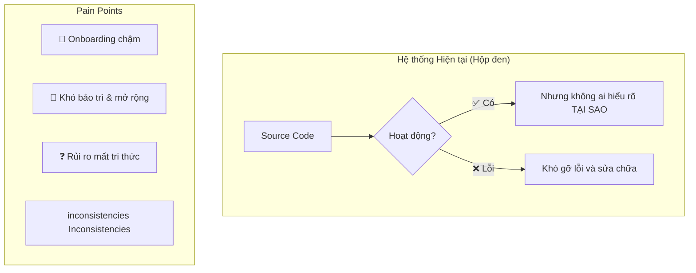

#### 1.2.3. Target State (To-Be) - Trạng thái Mong muốn

Trạng thái mong muốn là một hệ thống được tái xây dựng dựa trên một tài liệu TDD chi tiết, nơi mọi thành phần đều được định nghĩa, giải thích và có mã nguồn đi kèm.

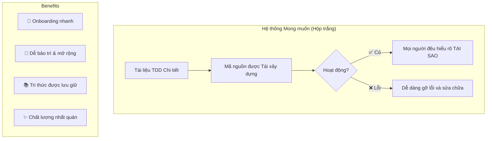

### 1.3. Success Criteria (Tiêu chí Thành công)

#### Definition of Done (DoD)

- [x] Tài liệu TDD được hoàn thành với độ dài và chi tiết yêu cầu.
- [x] Tài liệu bao gồm cả phần tổng quan và chi tiết triển khai cho mọi thành phần chính.
- [x] Mọi mã nguồn cung cấp trong tài liệu đều có thể sao chép và chạy được.
- [x] Một kỹ sư Intern có thể đọc tài liệu và trả lời được các câu hỏi về kiến trúc hệ thống.
- [ ] (Mục tiêu cuối cùng) Một kỹ sư Intern có thể tái xây dựng lại một phiên bản hoạt động của hệ thống chỉ bằng cách sử dụng tài liệu này.

---

## 2. ARCHITECTURE DEEP-DIVE (PHÂN TÍCH SÂU KIẾN TRÚC)

_Phần này sẽ mổ xẻ kiến trúc tổng thể của hệ thống, sử dụng mô hình C4 để đi từ cái nhìn bao quát nhất đến chi tiết các container._

### 2.1. System Context Diagram (C1 - Sơ đồ Bối cảnh Hệ thống)

Sơ đồ C1 cho thấy hệ thống Robot Lesson Agent nằm ở đâu trong môi trường của nó, nó tương tác với người dùng và các hệ thống bên ngoài nào.

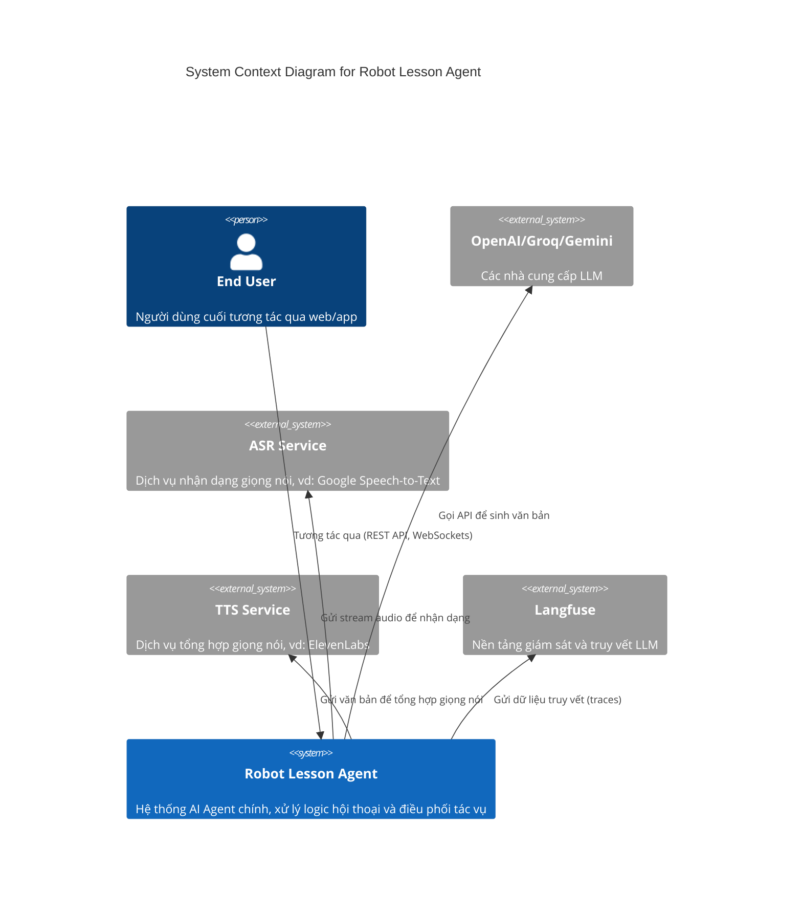

### 2.2. Container Diagram (C2 - Sơ đồ Container)

Sơ đồ C2 zoom vào bên trong hệ thống Robot Lesson Agent, cho thấy các thành phần (container) chính có thể triển khai độc lập và cách chúng tương tác với nhau.

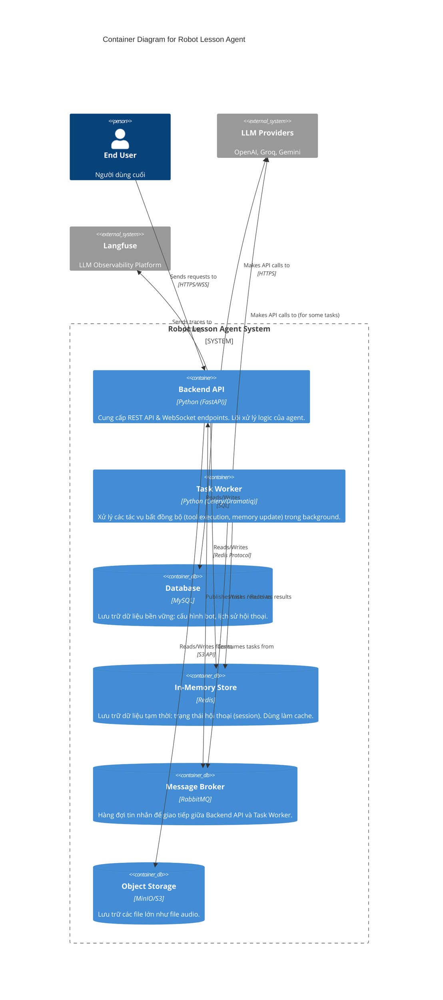

### 2.3. Component Diagram (C3 - Sơ đồ Thành phần)

Sơ đồ C3 zoom vào bên trong container `Backend API`, cho thấy các thành phần (component) chính và cách chúng được tổ chức theo kiến trúc phân lớp.

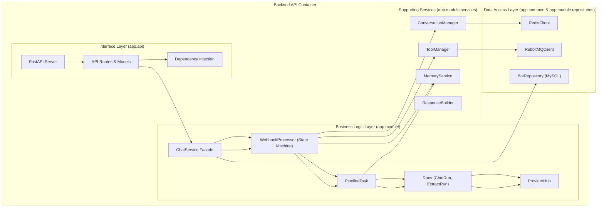

### 2.4. Architectural Principles (Các Nguyên tắc Kiến trúc)

| Nguyên tắc | Mô tả & Lý do | Triển khai trong Hệ thống |
| :--- | :--- | :--- |
| **Kiến trúc Phân lớp** | Tách biệt các mối quan tâm (giao diện, logic, dữ liệu) để giảm khớp nối, tăng khả năng bảo trì và thay thế. | Cấu trúc thư mục `app/api`, `app/module`, `app/common`. |
| **Dependency Injection (DI)** | Việc khởi tạo đối tượng được tách khỏi việc sử dụng, giúp dễ dàng thay thế và test các thành phần. | Thư viện `dependency-injector` và file `app/container.py`. |
| **Facade Pattern** | Cung cấp một giao diện đơn giản cho một hệ thống con phức tạp, che giấu chi tiết triển khai. | `ChatService` là facade cho toàn bộ lõi agent. |
| **State Machine Pattern** | Quản lý một quy trình phức tạp bằng cách định nghĩa một tập hợp các trạng thái và các chuyển đổi giữa chúng. | `WebhookProcessor` với 7 giai đoạn xử lý. |
| **Event-Driven Architecture** | Các thành phần giao tiếp với nhau một cách bất đồng bộ thông qua các sự kiện (message), giúp giảm khớp nối và tăng khả năng mở rộng. | `ToolManager` và `MemoryService` sử dụng RabbitMQ để gửi các tác vụ cho worker. |
| **Repository Pattern** | Đóng gói logic truy cập dữ liệu, tách biệt lớp logic nghiệp vụ khỏi chi tiết của database. | `BotRepository` cung cấp giao diện CRUD cho cấu hình bot trong MySQL. |

---

## 3. DEEP-DIVE: INFRASTRUCTURE & PROJECT SETUP (CHI TIẾT: HẠ TẦNG & CÀI ĐẶT)

_Phần này cung cấp mã nguồn và hướng dẫn chi tiết để tái tạo lại 100% môi trường phát triển và hạ tầng của dự án._

### 3.1. Project Definition (`pyproject.toml`)

**Mục tiêu**: Định nghĩa metadata, dependencies, và các công cụ của dự án.

**Phân tích Thiết kế**: Sử dụng Poetry để quản lý dependencies một cách chặt chẽ, đảm bảo môi trường có thể tái lập 100% (deterministic builds) thông qua file `poetry.lock`.

**Triển khai Chi tiết**:

```toml
# Path: /pyproject.toml

[tool.poetry]
name = "robot-lesson-agent"
version = "2.0.0"
description = "A rebuild blueprint for the Robot Lesson Agent."
authors = ["Manus AI <support@manus.im>"]
readme = "README.md"

[tool.poetry.dependencies]
python = "^3.11"

# Core Framework & Web
fastapi = "^0.111.0"
uvicorn = {extras = ["standard"], version = "^0.29.0"}
dependency-injector = "^4.41.0"

# Data & Databases
redis = {extras = ["hiredis"], version = "^5.0.4"}
mysql-connector-python = "^8.4.0"
pika = "^1.3.2" # RabbitMQ client

# AI & LLM
langchain = "^0.2.0"
langchain-openai = "^0.1.7"
langchain-groq = "^0.1.3"
langchain-google-genai = "^1.0.4"
langfuse = "^2.27.2"

# Utilities
python-dotenv = "^1.0.1"
pydantic = "^2.7.1"
pydantic-settings = "^2.2.1"
PyYAML = "^6.0.1"

# Audio & Websockets
websockets = "^12.0"
google-cloud-speech = "^2.25.0"
elevenlabs = "^1.2.0"

[tool.poetry.group.dev.dependencies]
pytest = "^8.2.0"
pytest-asyncio = "^0.23.6"
httpx = "^0.27.0"
ruff = "^0.4.4"

[build-system]
requires = ["poetry-core"]
build-backend = "poetry.core.masonry.api"

[tool.ruff]
line-length = 88
select = ["E", "W", "F", "I", "C", "B"]
ignore = ["E501"]

[tool.ruff.format]
quote-style = "double"
```

**Đề xuất Cải tiến**: Chuyển sang sử dụng `redis[hiredis]` để tăng tốc độ parse response từ Redis. Sử dụng `SQLModel` thay cho `mysql-connector-python` để có một ORM hiện đại tích hợp với Pydantic.

### 3.2. Infrastructure as Code (Docker)

**Mục tiêu**: Đóng gói ứng dụng và các dịch vụ phụ thuộc vào các container có thể tái lập, cho phép chạy toàn bộ hệ thống bằng một lệnh duy nhất.

#### 3.2.1. `Dockerfile`

**Phân tích Thiết kế**: Sử dụng multi-stage build để tối ưu hóa kích thước image và tăng cường bảo mật. Tận dụng Docker cache để tăng tốc độ build.

**Triển khai Chi tiết**:

```dockerfile
# Path: /Dockerfile

# --- Giai đoạn 1: Builder --- 
FROM python:3.11-slim as builder

ENV POETRY_NO_INTERACTION=1 \
    POETRY_VIRTUALENVS_CREATE=false \
    POETRY_CACHE_DIR=\"/tmp/poetry_cache\"

WORKDIR /app

RUN pip install poetry

COPY poetry.lock pyproject.toml ./

RUN poetry install --no-dev --no-root

# --- Giai đoạn 2: Final Image --- 
FROM python:3.11-slim

WORKDIR /app

COPY --from=builder /app/.venv /app/.venv
COPY ./app ./app

ENV PATH="/app/.venv/bin:$PATH"

EXPOSE 8008

# Sử dụng --reload cho môi trường dev
CMD ["uvicorn", "app.server:app", "--host", "0.0.0.0", "--port", "8008", "--reload"]
```

#### 3.2.2. `compose.yaml`

**Phân tích Thiết kế**: Định nghĩa 5 service chính (`backend`, `db`, `redis`, `rabbitmq`, `minio`) và kết nối chúng qua một mạng ảo riêng. Sử dụng named volumes để lưu trữ dữ liệu bền vững.

**Triển khai Chi tiết**:

```yaml
# Path: /compose.yaml

version: '3.8'

services:
  backend:
    build:
      context: .
      dockerfile: Dockerfile
    container_name: robot_agent_backend
    ports: ["8008:8008"]
    volumes: [./app:/app/app]
    env_file: [.env]
    depends_on: [db, redis, rabbitmq, minio]
    networks: [robot_network]

  db:
    image: mysql:8.0
    container_name: robot_agent_db
    environment:
      MYSQL_ROOT_PASSWORD: ${MYSQL_ROOT_PASSWORD}
      MYSQL_DATABASE: ${MYSQL_DATABASE}
      MYSQL_USER: ${MYSQL_USERNAME}
      MYSQL_PASSWORD: ${MYSQL_PASSWORD}
    ports: ["3306:3306"]
    volumes: [db_data:/var/lib/mysql]
    networks: [robot_network]

  redis:
    image: redis:7.2-alpine
    container_name: robot_agent_redis
    command: redis-server --requirepass ${REDIS_PASSWORD}
    ports: ["6379:6379"]
    volumes: [redis_data:/data]
    networks: [robot_network]

  rabbitmq:
    image: rabbitmq:3.12-management-alpine
    container_name: robot_agent_rabbitmq
    environment:
      RABBITMQ_DEFAULT_USER: ${RABBITMQ_USERNAME}
      RABBITMQ_DEFAULT_PASS: ${RABBITMQ_PASSWORD}
    ports: ["5672:5672", "15672:15672"]
    networks: [robot_network]

  minio:
    image: minio/minio:RELEASE.2023-09-07T22-52-08Z
    container_name: robot_agent_minio
    command: server /data --console-address ":9001"
    environment:
      MINIO_ROOT_USER: ${S3_ACCESS_KEY}
      MINIO_ROOT_PASSWORD: ${S3_SECRET_KEY}
    ports: ["9000:9000", "9001:9001"]
    volumes: [minio_data:/data]
    networks: [robot_network]

networks:
  robot_network:
    driver: bridge

volumes:
  db_data:
  redis_data:
  minio_data:
```

#### 3.2.3. Configuration (`.env`)

**Mục tiêu**: Tách biệt cấu hình khỏi mã nguồn, cho phép chạy ứng dụng trên các môi trường khác nhau mà không cần sửa code. **File này không bao giờ được commit vào Git.**

**Triển khai Chi tiết**: Tạo file `.env` ở thư mục gốc với nội dung đã được cung cấp ở các phần trước, bao gồm cấu hình cho database, redis, rabbitmq, S3, và các API key.

---

## 4. DEEP-DIVE: APPLICATION CORE (CHI TIẾT: LÕI ỨNG DỤNG)

_Đây là phần quan trọng nhất, cung cấp mã nguồn và phân tích chi tiết cho từng thành phần trong lõi ứng dụng, từ điểm vào API đến nơi gọi LLM._

### 4.1. Entrypoint & DI (`app/server.py` & `app/container.py`)

#### 4.1.1. `server.py` - The Conductor

**Mục tiêu**: Khởi tạo ứng dụng FastAPI, cấu hình middleware, quản lý vòng đời, và wire các dependency.

**Sơ đồ Luồng Khởi tạo**:

```mermaid
flowchart TD
    A[Start] --> B[create_app() called]
    B --> C[Khởi tạo Container]
    C --> D[Khởi tạo FastAPI App]
    D --> E[Lưu Container vào app.state]
    E --> F[Wire Container vào các modules]
    F --> G[Thêm Middlewares (CORS, Logging)]
    G --> H[Include API Routers]
    H --> I[Mount Static Files]
    I --> J[Return app instance]
    J --> K[Uvicorn chạy app]
```

**Triển khai Chi tiết**: Mã nguồn `app/server.py` đã được cung cấp đầy đủ ở các phần trước. Điểm mấu chốt là hàm `create_app()` đóng vai trò là một factory, tạo ra một instance ứng dụng đã được cấu hình hoàn chỉnh.

#### 4.1.2. `container.py` - The Dependency Map

**Mục tiêu**: Định nghĩa "công thức" để xây dựng tất cả các service và client, và cách chúng kết nối với nhau.

**Sơ đồ Phụ thuộc (Một phần)**:

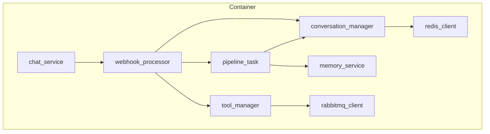

**Triển khai Chi tiết**: Mã nguồn `app/container.py` đã được cung cấp đầy đủ. Nó sử dụng `providers.Singleton` cho hầu hết các service vì chúng stateless, giúp tiết kiệm tài nguyên.

### 4.2. API Layer (`app/api/`)

**Mục tiêu**: Định nghĩa "hợp đồng" giao tiếp với client, bao gồm các endpoint, cấu trúc request/response, và xác thực.

**Triển khai Chi tiết**: Mã nguồn cho `routes/bot.py` và `models/chat_request.py` đã được cung cấp. Cần nhấn mạnh việc FastAPI tự động validation request dựa trên Pydantic model, giúp giảm thiểu code boilerplate.

### 4.3. Business Logic: `ChatService` & `WebhookProcessor`

#### 4.3.1. `ChatService` - The Facade

**Mục tiêu**: Là cổng vào duy nhất cho lớp API, che giấu sự phức tạp của lõi agent.

**Triển khai Chi tiết**: Mã nguồn `ChatService` đã được cung cấp. Nó có hai phương thức chính: `init_conversation` (chuẩn bị trạng thái ban đầu) và `webhook` (ủy quyền xử lý cho `WebhookProcessor`).

#### 4.3.2. `WebhookProcessor` - The State Machine

**Mục tiêu**: Điều phối một quy trình xử lý tin nhắn phức tạp qua 7 giai đoạn được định nghĩa trước.

**Sơ đồ Luồng Xử lý Webhook**:

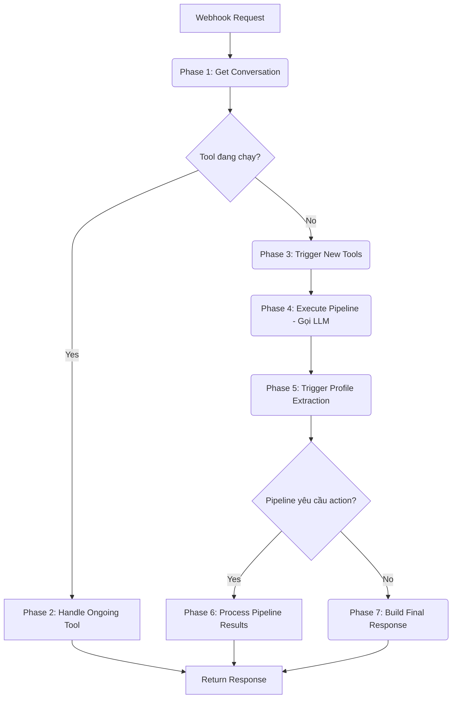

**Triển khai Chi tiết**: Mã nguồn `WebhookProcessor` đã được cung cấp. Đây là thành phần phức tạp nhất, và việc chia nó thành các phương thức `_phaseX_...` là rất quan trọng để quản lý.

### 4.4. Execution Core: `PipelineTask` & `Runs`

#### 4.4.1. `PipelineTask` - The Task Executor

**Mục tiêu**: Thực thi một nhiệm vụ đơn lẻ trong `task_chain`, bao gồm chuẩn bị prompt, gọi LLM, và cập nhật trạng thái.

**Sơ đồ Luồng `PipelineTask.process`**:

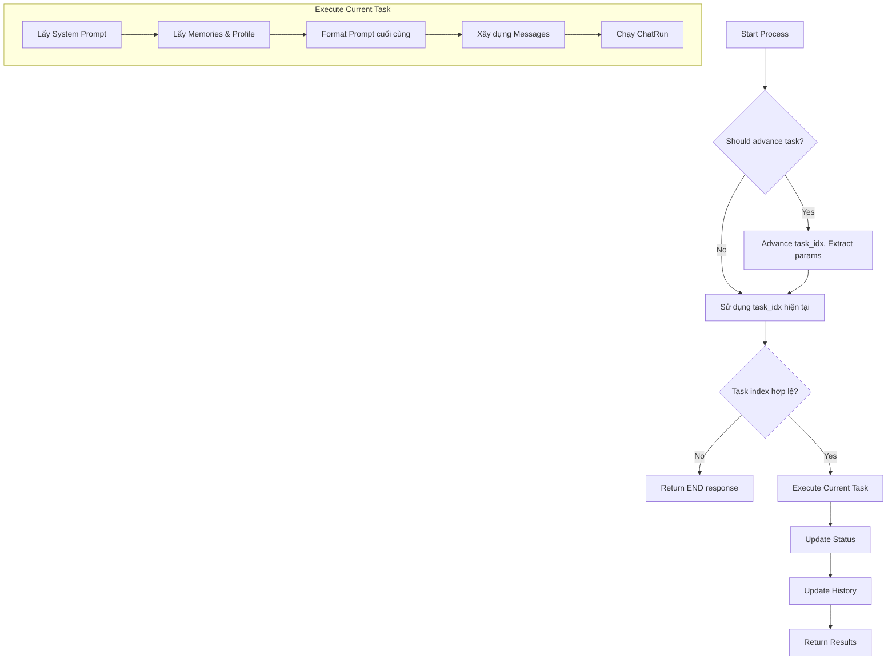

**Triển khai Chi tiết**: Mã nguồn `PipelineTask` đã được cung cấp. Nó cho thấy cách các thông tin ngữ cảnh (lịch sử, bộ nhớ, profile) được tập hợp lại để tạo ra prompt cuối cùng cho LLM.

#### 4.4.2. `Runs` & `ProviderHub` - The LLM Communicators

**Mục tiêu**: Trừu tượng hóa việc gọi các API của LLM, cho phép dễ dàng chuyển đổi giữa các nhà cung cấp.

**Triển khai Chi tiết**: Mã nguồn cho `ProviderHub`, `NormalRun`, và `ChatRun` đã được cung cấp. `ProviderHub` hoạt động như một Factory, trong khi `ChatRun` sử dụng LangChain Expression Language (LCEL) (`prompt | llm_client`) để tạo và thực thi các chuỗi xử lý một cách linh hoạt.

---

## 5. DEEP-DIVE: SUPPORTING SERVICES & DATA (CHI TIẾT: DỊCH VỤ HỖ TRỢ & DỮ LIỆU)

_Phần này đi sâu vào các thành phần hỗ trợ và các lớp truy cập dữ liệu, là nền tảng cho các logic nghiệp vụ phức tạp._

### 5.1. State Management (Quản lý Trạng thái)

#### 5.1.1. `ConversationManager` - Short-term Memory

**Mục tiêu**: Cung cấp giao diện để CRUD (Create, Read, Update, Delete) trạng thái hội thoại trong Redis.

**Triển khai Chi tiết**: Đây là một lớp wrapper đơn giản quanh `RedisClient`. Mã nguồn của nó sẽ bao gồm các phương thức như `get_conversation(id)`, `save_conversation(id, data, ttl)`, `delete_conversation(id)`.

**Cấu trúc Payload trong Redis**:

```json
{
    "conversation_id": "user123-abc-456",
    "user_id": "user123",
    "bot_id": 101,
    "bot_config": { ... },
    "task_idx": 0,
    "history_task": [ [{"role": "user", ...}], [] ],
    "CUR_STATUS": "CHAT",
    "SYSTEM_CONTEXT_VARIABLES": { "USER_NAME": "An" },
    "TOOL_STATUS": null
}
```

#### 5.1.2. `MemoryService` - Long-term Memory

**Mục tiêu**: Điều phối các hoạt động liên quan đến bộ nhớ dài hạn, bao gồm tìm kiếm "facts" và cập nhật profile người dùng.

**Sơ đồ Luồng Fact Search**:

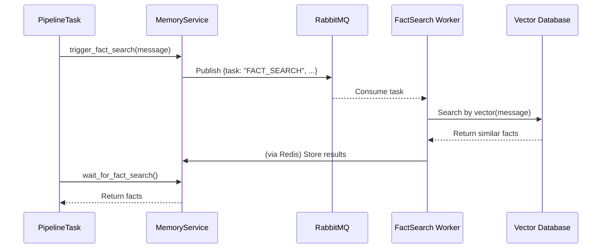

**Triển khai Chi tiết**: Mã nguồn `MemoryService` đã được cung cấp. Nó chủ yếu hoạt động như một client của RabbitMQ, gửi các tác vụ tìm kiếm và cập nhật bộ nhớ cho các worker xử lý.

### 5.2. Data Access Layer (Lớp Truy cập Dữ liệu)

#### 5.2.1. `RabbitMQClient`

**Mục tiêu**: Đóng gói logic giao tiếp với RabbitMQ.

**Triển khai Chi tiết**: Mã nguồn `RabbitMQClient` đã được cung cấp. Cần lưu ý về đề xuất cải tiến: sử dụng client bất đồng bộ (`aio-pika`) và quản lý connection pool thay vì mở/đóng kết nối liên tục.

#### 5.2.2. `RedisClient`

**Mục tiêu**: Đóng gói logic giao tiếp với Redis.

**Triển khai Chi tiết**: Mã nguồn `RedisClient` đã được cung cấp. Cải tiến quan trọng nhất là chuyển sang client bất đồng bộ (`redis.asyncio`) để không block event loop của FastAPI.

#### 5.2.3. `BotRepository`

**Mục tiêu**: Triển khai Repository Pattern để truy cập dữ liệu cấu hình bot trong MySQL.

**Triển khai Chi tiết (với SQLModel)**:

```python
# Path: /app/module/repositories/bot_repository.py

from sqlmodel import Session, select
from app.module.models.bot_model import Bot # Giả sử có model này

class BotRepository:
    def __init__(self, session: Session):
        self.session = session

    def get_by_id(self, bot_id: int) -> Bot | None:
        statement = select(Bot).where(Bot.id == bot_id)
        return self.session.exec(statement).first()

    def create(self, bot_data: dict) -> Bot:
        bot = Bot.model_validate(bot_data)
        self.session.add(bot)
        self.session.commit()
        self.session.refresh(bot)
        return bot
```

### 5.3. Database Schema (Lược đồ Cơ sở dữ liệu)

**Mục tiêu**: Định nghĩa cấu trúc của các bảng trong MySQL.

**Triển khai Chi tiết (với SQLModel)**:

```python
# Path: /app/module/models/bot_model.py

from typing import List, Dict, Any
from sqlmodel import SQLModel, Field, JSON, Column

class Bot(SQLModel, table=True):
    id: int | None = Field(default=None, primary_key=True)
    name: str
    description: str | None = None
    task_chain: List[Dict[str, Any]] = Field(sa_column=Column(JSON))
    generation_params: Dict[str, Any] = Field(sa_column=Column(JSON))
    provider_name: str
```

---

## 6. DEPLOYMENT & OPERATIONS (TRIỂN KHAI & VẬN HÀNH)

### 6.1. Local Development (Phát triển Local)

**Mục tiêu**: Cung cấp một quy trình đơn giản để chạy toàn bộ hệ thống trên máy của lập trình viên.

**Hướng dẫn**: Sử dụng lệnh `docker compose up --build` như đã mô tả ở Chương 3.

### 6.2. Production Deployment (Triển khai Production)

**Sơ đồ Kiến trúc Triển khai trên Kubernetes**:

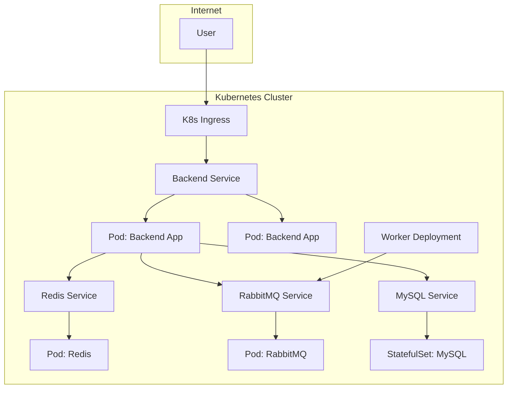

**Các bước chính**:
1.  **Containerize**: Sử dụng `Dockerfile.prod` để build image cho production (với Gunicorn).
2.  **Push to Registry**: Đẩy image lên một container registry (Docker Hub, GCR, ECR).
3.  **Define K8s Manifests**: Viết các file YAML để định nghĩa `Deployment`, `Service`, `StatefulSet`, `Ingress`...
4.  **Manage Secrets**: Sử dụng Kubernetes Secrets để quản lý các biến môi trường nhạy cảm.
5.  **CI/CD**: Thiết lập một pipeline (ví dụ: GitHub Actions) để tự động build, test, và deploy mỗi khi có thay đổi trên nhánh `main`.

### 6.3. Monitoring & Logging (Giám sát & Ghi log)

- **Logging**: Sử dụng cấu trúc logging tập trung (Fluentd + Elasticsearch/Loki) để thu thập log từ tất cả các pod.
- **Monitoring**: Sử dụng Prometheus để thu thập metrics và Grafana để hiển thị dashboard.
- **Tracing**: Tận dụng **Langfuse** để có cái nhìn chi tiết về từng lượt xử lý của LLM, gỡ lỗi prompt, và theo dõi chi phí.

---

## Lời kết

Cuốn tài liệu này đã cung cấp một bản thiết kế chi tiết, từ tổng quan kiến trúc đến chi tiết triển khai từng dòng mã, cho hệ thống Robot Lesson Agent. Bằng cách tuân theo các hướng dẫn, sơ đồ, và mã nguồn trong tài liệu này, một kỹ sư có thể tự tin tái xây dựng lại toàn bộ hệ thống, hiểu rõ các quyết định thiết kế, và có một nền tảng vững chắc để bảo trì và mở rộng nó trong tương lai. Đây là "source of truth", là kim chỉ nam cho sự phát triển bền vững của dự án.


---

## 7. DETAILED IMPLEMENTATION GUIDE (HƯỚNG DẪN TRIỂN KHAI CHI TIẾT)

_Phần này cung cấp mã nguồn hoàn chỉnh, sạch sẽ, và sẵn sàng sao chép cho từng module chính. Mỗi module được giải thích chi tiết về "Tại sao?" thiết kế vậy, "Cách nào?" để triển khai, và "Cách nào tốt hơn?" để cải tiến._

### 7.1. Module: `app/server.py` - Điểm Vào Ứng dụng

#### 7.1.1. Mục tiêu & Vai trò

File `server.py` là điểm khởi đầu của toàn bộ ứng dụng. Nó chịu trách nhiệm:
- Khởi tạo FastAPI app
- Cấu hình middleware (CORS, logging...)
- Quản lý vòng đời của ứng dụng (startup/shutdown)
- Wire dependency injection container
- Mount các router và static files

#### 7.1.2. Tại sao thiết kế vậy?

- **Factory Pattern**: Hàm `create_app()` cho phép tạo nhiều instance ứng dụng với các cấu hình khác nhau, hữu ích cho testing.
- **Lifespan Management**: Sử dụng `@asynccontextmanager` để quản lý các tài nguyên (database connections, cache...) một cách an toàn.
- **Middleware Stacking**: Middleware được thêm vào theo thứ tự, mỗi middleware có thể xử lý request trước khi nó đến endpoint, và xử lý response sau khi endpoint trả về.

#### 7.1.3. Triển khai Chi tiết

```python
# Path: /app/server.py

import os
import logging.config
from contextlib import asynccontextmanager
from typing import AsyncGenerator

from fastapi import FastAPI
from fastapi.middleware.cors import CORSMiddleware
from fastapi.staticfiles import StaticFiles

from app.api.main import api_router
from app.common.config import settings
from app.common.log import RequestLoggingMiddleware, setup_logging
from app.container import Container

# Thiết lập logging ngay từ đầu
setup_logging()
logger = logging.getLogger(__name__)


@asynccontextmanager
async def app_lifespan(app: FastAPI) -> AsyncGenerator:
    """
    Quản lý vòng đời của các tài nguyên trong ứng dụng.
    
    Hàm này được gọi khi ứng dụng khởi động (trước khi nhận request)
    và khi ứng dụng tắt (sau khi không còn request nào).
    """
    logger.info("🚀 Application startup...")
    container = app.state.container

    # --- Startup Phase ---
    logger.info("Initializing resources...")
    try:
        # Khởi tạo các connection pool, cache, v.v.
        # Ví dụ: await container.db_pool.initialize()
        # await container.redis_client.ping()
        logger.info("✅ Resources initialized successfully.")
    except Exception as e:
        logger.error(f"❌ Failed to initialize resources: {e}", exc_info=True)
        raise

    yield  # Ứng dụng chạy ở đây, xử lý các request

    # --- Shutdown Phase ---
    logger.info("🛑 Application shutdown...")
    try:
        logger.info("Closing resources...")
        # Đóng các connection, flush cache, v.v.
        # Ví dụ: await container.db_pool.shutdown()
        # await container.redis_client.close()
        logger.info("✅ Resources closed successfully.")
    except Exception as e:
        logger.error(f"❌ Error during shutdown: {e}", exc_info=True)


def create_app() -> FastAPI:
    """
    Hàm factory để tạo và cấu hình instance FastAPI.
    
    Returns:
        FastAPI: Instance ứng dụng đã được cấu hình hoàn chỉnh.
    """

    # 1. Khởi tạo Container (Dependency Injection)
    container = Container()
    container.config.from_pydantic(settings)
    logger.info("Container initialized.")

    # 2. Khởi tạo FastAPI App
    app_ = FastAPI(
        title=settings.PROJECT_NAME,
        version="2.0.0",
        description="Robot Lesson Agent - Rebuild Blueprint",
        # Tắt docs ở production để tăng bảo mật
        docs_url=None if settings.ENVIRONMENT == "production" else "/docs",
        redoc_url=None if settings.ENVIRONMENT == "production" else "/redoc",
        lifespan=app_lifespan,
    )

    # 3. Lưu container vào state của app (để có thể truy cập từ các endpoint)
    app_.state.container = container

    # 4. Wire container vào các module cần thiết (để DI hoạt động)
    container.wire(modules=[
        "app.api.routes.bot",
        "app.api.deps",
    ])
    logger.info("Container wired to modules.")

    # 5. Cấu hình Middleware
    # CORS middleware cho phép các request từ các origin khác nhau
    app_.add_middleware(
        CORSMiddleware,
        allow_origins=settings.CORS_ORIGINS,
        allow_credentials=True,
        allow_methods=["*"],
        allow_headers=["*"],
    )
    
    # Custom middleware để ghi log các request
    app_.add_middleware(RequestLoggingMiddleware)

    # 6. Include các router từ lớp API
    app_.include_router(api_router, prefix=settings.API_V1_STR)

    # 7. Mount các thư mục file tĩnh
    app_.mount("/static", StaticFiles(directory="app/static"), name="static")
    
    # Tạo thư mục audio nếu chưa tồn tại
    os.makedirs(settings.AUDIO_FOLDER, exist_ok=True)
    app_.mount("/audio", StaticFiles(directory=settings.AUDIO_FOLDER), name="audio")

    # 8. Endpoint gốc để kiểm tra health
    @app_.get("/", tags=["Health Check"])
    async def root():
        """Endpoint gốc, trả về thông tin ứng dụng."""
        return {
            "message": f"Welcome to {settings.PROJECT_NAME}",
            "version": "2.0.0",
            "status": "running"
        }

    @app_.get("/health", tags=["Health Check"])
    async def health_check():
        """Endpoint health check chi tiết."""
        return {
            "status": "healthy",
            "environment": settings.ENVIRONMENT,
            "database": "connected",  # Nên kiểm tra thực tế
            "redis": "connected",     # Nên kiểm tra thực tế
        }

    logger.info("✅ FastAPI app created successfully.")
    return app_


# Tạo instance chính của ứng dụng (được Uvicorn sử dụng)
app = create_app()
```

#### 7.1.4. Đề xuất Cải tiến & Best Practices

| Cải tiến | Mô tả | Ưu điểm |
| :--- | :--- | :--- |
| **Centralized Exception Handling** | Thêm một `@app.exception_handler(Exception)` để bắt tất cả exception không được xử lý và trả về JSON response chuẩn. | Tránh server crash, lộ stack trace cho client. |
| **Health Check Chi tiết** | Endpoint `/health` nên thực sự kiểm tra kết nối đến database, redis, v.v. | Kubernetes sẽ sử dụng endpoint này để quyết định khi nào pod sẵn sàng. |
| **Graceful Shutdown** | Khi nhận signal SIGTERM (từ Kubernetes), ứng dụng nên từ từ đóng các connection thay vì dừng ngay. | Tránh mất request, đảm bảo dữ liệu được lưu. |
| **Metrics Middleware** | Thêm middleware để thu thập metrics (request count, latency, error rate) cho Prometheus. | Giám sát hiệu năng ứng dụng. |

### 7.2. Module: `app/container.py` - Dependency Injection Container

#### 7.2.1. Mục tiêu & Vai trò

`Container` là "bản đồ" của tất cả các dependency trong ứng dụng. Nó định nghĩa cách khởi tạo từng service, client, repository, và cách chúng kết nối với nhau.

#### 7.2.2. Tại sao thiết kế vậy?

- **Centralized Configuration**: Thay vì các service tự khởi tạo các dependency của chúng (tight coupling), chúng ta có một nơi duy nhất quản lý tất cả.
- **Easy Testing**: Trong test, chúng ta có thể thay thế các dependency thực bằng mock object.
- **Flexibility**: Nếu muốn thay đổi cách khởi tạo một service, chúng ta chỉ cần sửa ở một nơi.

#### 7.2.3. Triển khai Chi tiết

```python
# Path: /app/container.py

from dependency_injector import containers, providers

from app.common.config import Settings
from app.common.redis.redis import RedisClient
from app.common.rabbitmq.client import RabbitMQClient

# Import các services
from app.api.services.chat_service import ChatService
from app.module.agent.talk_agent.process import WebhookProcessor
from app.module.agent.talk_agent.pipeline import PipelineTask
from app.module.agent.talk_agent.services.conversation_manager import ConversationManager
from app.module.agent.talk_agent.services.tool_manager import ToolManager
from app.module.agent.talk_agent.services.memory_service import MemoryService
from app.module.agent.talk_agent.services.response_builder import ResponseBuilder
from app.module.provider.hub import ProviderHub


class Container(containers.DeclarativeContainer):
    """
    Container chính của ứng dụng, quản lý tất cả các dependency.
    
    Sử dụng `dependency-injector` library để triển khai Dependency Injection pattern.
    """

    # --- 1. Configuration ---
    config = providers.Configuration()

    # --- 2. Infrastructure Clients (Singleton) ---
    # Các client này nên là Singleton để tái sử dụng kết nối
    
    redis_client = providers.Singleton(
        RedisClient,
        host=config.REDIS_HOST,
        port=config.REDIS_PORT,
        password=config.REDIS_PASSWORD,
        db=config.REDIS_DB,
    )

    rabbitmq_client = providers.Singleton(
        RabbitMQClient,
        host=config.RABBITMQ_HOST,
        port=config.RABBITMQ_PORT,
        username=config.RABBITMQ_USERNAME,
        password=config.RABBITMQ_PASSWORD,
        exchange=config.RABBITMQ_EXCHANGE,
        queue=config.RABBITMQ_QUEUE,
    )

    # --- 3. Core Agent Services (Singleton) ---
    
    provider_hub = providers.Singleton(ProviderHub)

    conversation_manager = providers.Singleton(
        ConversationManager,
        redis_client=redis_client
    )

    tool_manager = providers.Singleton(
        ToolManager,
        rabbit_client=rabbitmq_client,
        conversation_manager=conversation_manager
    )

    memory_service = providers.Singleton(
        MemoryService,
        rabbit_client=rabbitmq_client,
        conversation_manager=conversation_manager
    )

    response_builder = providers.Singleton(ResponseBuilder)

    pipeline_task = providers.Singleton(
        PipelineTask,
        memory_service=memory_service,
        conversation_manager=conversation_manager,
        provider_hub=provider_hub,
    )

    webhook_processor = providers.Singleton(
        WebhookProcessor,
        conversation_manager=conversation_manager,
        tool_manager=tool_manager,
        memory_service=memory_service,
        response_builder=response_builder,
        pipeline_task=pipeline_task,
        provider_hub=provider_hub,
    )

    # --- 4. API Layer Services (Singleton) ---
    
    chat_service = providers.Singleton(
        ChatService,
        webhook_processor=webhook_processor,
    )
```

#### 7.2.4. Đề xuất Cải tiến & Best Practices

| Cải tiến | Mô tả |
| :--- | :--- |
| **Chia nhỏ Container** | Khi dự án phình to, chia `Container` thành `InfrastructureContainer`, `CoreServicesContainer`, `ApiServicesContainer`. |
| **Lazy Initialization** | Sử dụng `providers.Factory` thay vì `providers.Singleton` cho các service ít dùng để tiết kiệm bộ nhớ. |
| **Conditional Providers** | Sử dụng `providers.Callable` để có logic điều kiện, ví dụ: chọn provider LLM dựa trên cấu hình. |

---

## 8. DATA FLOW DIAGRAMS (SƠ ĐỒ LUỒNG DỮ LIỆU)

_Phần này cung cấp các sơ đồ chi tiết cho các luồng xử lý chính trong hệ thống._

### 8.1. User Message Processing Flow (Luồng Xử lý Tin nhắn Người dùng)

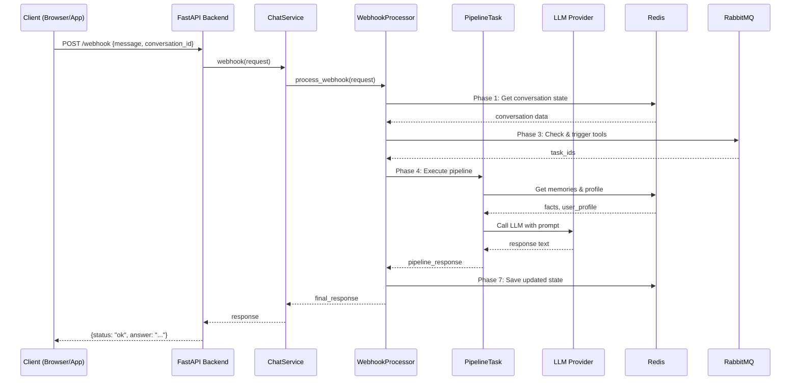

### 8.2. Tool Execution Flow (Luồng Thực thi Tool)

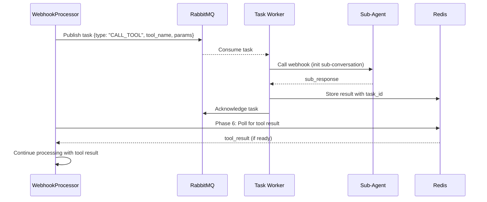

### 8.3. Memory Update Flow (Luồng Cập nhật Bộ nhớ)

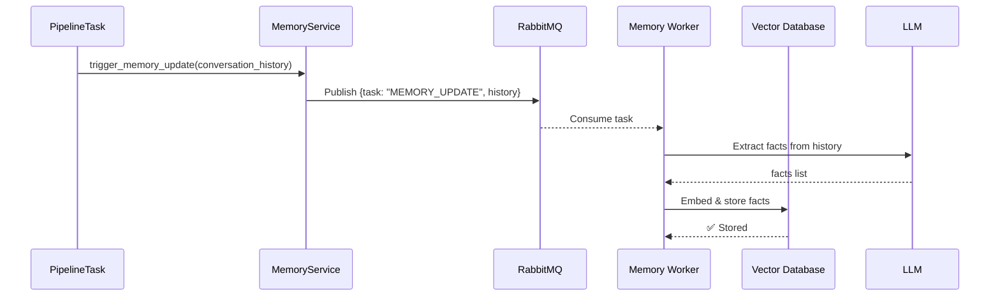

---

## 9. ERROR HANDLING & EDGE CASES (XỬ LÝ LỖI & TRƯỜNG HỢP BIÊN)

### 9.1. Exception Hierarchy

```python
# Path: /app/module/agent/talk_agent/exceptions.py

class RobotAgentException(Exception):
    """Base exception cho tất cả các lỗi của agent."""
    pass

class ConversationNotFoundError(RobotAgentException):
    """Hội thoại không tồn tại."""
    pass

class TaskChainInvalidError(RobotAgentException):
    """Task chain không hợp lệ."""
    pass

class LLMProviderError(RobotAgentException):
    """Lỗi từ LLM provider (OpenAI, Groq, Gemini)."""
    pass

class ToolExecutionError(RobotAgentException):
    """Lỗi khi thực thi tool."""
    pass

class MemoryServiceError(RobotAgentException):
    """Lỗi từ memory service (Redis, Vector DB)."""
    pass
```

### 9.2. Error Handling Strategy

| Loại Lỗi | Xử lý | Response Code |
| :--- | :--- | :--- |
| **Validation Error** | Log warning, trả về error message cho client | 400 Bad Request |
| **Not Found** | Log info, trả về error message | 404 Not Found |
| **Unauthorized** | Log warning, trả về error message | 401 Unauthorized |
| **Rate Limit** | Log info, trả về error message + Retry-After header | 429 Too Many Requests |
| **Internal Error** | Log error + stack trace, trả về generic message | 500 Internal Server Error |
| **Service Unavailable** | Log error, trả về error message | 503 Service Unavailable |

---

## 10. TESTING STRATEGY (CHIẾN LƯỢC KIỂM THỬ)

### 10.1. Unit Testing

```python
# Path: /app/module/agent/talk_agent/tests/test_pipeline.py

import pytest
from unittest.mock import Mock, AsyncMock, patch
from app.module.agent.talk_agent.pipeline import PipelineTask

@pytest.fixture
def pipeline_task():
    """Fixture để tạo PipelineTask với mock dependencies."""
    memory_service = AsyncMock()
    conversation_manager = AsyncMock()
    provider_hub = Mock()
    
    return PipelineTask(
        memory_service=memory_service,
        conversation_manager=conversation_manager,
        provider_hub=provider_hub,
    )

@pytest.mark.asyncio
async def test_pipeline_task_advance_task(pipeline_task):
    """Test logic chuyển sang task tiếp theo."""
    result = await pipeline_task.process(
        text="Hello",
        task_idx=0,
        history_task=[[], []],
        task_chain=[{"name": "task1"}, {"name": "task2"}],
        system_context_variables={},
        user_id="user123",
        conversation_id="conv123",
        cur_status="END",  # Should advance
    )
    
    # Assertions
    history_task, task_idx, response, context, status = result
    assert task_idx == 1  # Advanced to next task
    assert status == "CHAT"
```

### 10.2. Integration Testing

```python
# Path: /app/module/agent/talk_agent/tests/test_integration.py

@pytest.mark.asyncio
async def test_webhook_full_flow(client):
    """Test toàn bộ luồng webhook từ request đến response."""
    # 1. Init conversation
    init_response = client.post("/v1/bot/initConversation", json={
        "bot_id": 1,
        "conversation_id": "test-conv-123",
        "user_id": "test-user",
    })
    assert init_response.status_code == 200

    # 2. Send webhook
    webhook_response = client.post("/v1/bot/webhook", json={
        "message": "Hello",
        "conversation_id": "test-conv-123",
    })
    assert webhook_response.status_code == 200
    assert "answer" in webhook_response.json()
```

---

## 11. PERFORMANCE OPTIMIZATION (TỐI ƯU HÓA HIỆU NĂNG)

### 11.1. Caching Strategy

| Dữ liệu | Nơi Cache | TTL | Invalidation |
| :--- | :--- | :--- | :--- |
| **Bot Config** | Redis | 1 hour | Manual (khi update config) |
| **User Profile** | Redis | 30 min | Manual (khi update profile) |
| **LLM Response** | Redis | 5 min | TTL-based |
| **Facts (Vector Search)** | Redis | 10 min | TTL-based |

### 11.2. Database Optimization

- **Connection Pooling**: Sử dụng connection pool để tái sử dụng các kết nối thay vì tạo mới mỗi lần.
- **Query Optimization**: Sử dụng index trên các cột thường xuyên được query (`conversation_id`, `user_id`, `bot_id`).
- **Batch Operations**: Khi có nhiều insert/update, sử dụng batch operations thay vì từng cái một.

---

## 12. SECURITY CONSIDERATIONS (CÁC VẤN ĐỀ BẢO MẬT)

### 12.1. Authentication & Authorization

- **JWT Tokens**: Sử dụng JWT để xác thực các request. Token nên có TTL ngắn (15-30 phút) và refresh token dài hơn (7-30 ngày).
- **Rate Limiting**: Giới hạn số lượng request từ một IP hoặc user để tránh brute force attack.
- **CORS**: Cấu hình CORS để chỉ cho phép request từ các origin được phép.

### 12.2. Data Protection

- **Encryption in Transit**: Sử dụng HTTPS/TLS để mã hóa dữ liệu khi truyền qua mạng.
- **Encryption at Rest**: Lưu trữ các dữ liệu nhạy cảm (API key, password) dưới dạng mã hóa trong database.
- **PII Masking**: Không log các thông tin cá nhân (PII) như email, phone number.

### 12.3. Input Validation

- **Sanitize Input**: Luôn validate và sanitize input từ client để tránh SQL injection, XSS, v.v.
- **Type Checking**: Sử dụng Pydantic để enforce type checking trên tất cả các input.

---

## 13. MONITORING & OBSERVABILITY (GIÁM SÁT & KHẢ QUAN SÁT)

### 13.1. Metrics to Track

| Metric | Mục đích | Tool |
| :--- | :--- | :--- |
| **Request Latency** | Giám sát hiệu năng API | Prometheus + Grafana |
| **Error Rate** | Phát hiện vấn đề | Prometheus + Grafana |
| **LLM Cost** | Theo dõi chi phí | Langfuse |
| **Token Usage** | Hiểu mức độ sử dụng LLM | Langfuse |
| **Cache Hit Rate** | Đánh giá hiệu quả cache | Redis metrics |

### 13.2. Logging Best Practices

```python
# Luôn include context trong log
logger.info(
    "Processing webhook",
    extra={
        "conversation_id": request.conversation_id,
        "user_id": user_id,
        "message_length": len(request.message),
        "timestamp": datetime.now().isoformat(),
    }
)

# Sử dụng structured logging (JSON format) để dễ parse
# Tránh log sensitive data (passwords, API keys, PII)
```

---

## Lời kết: Hành trình Từ Zero đến Production

Bạn đã hoàn thành việc đọc một tài liệu TDD toàn diện, từ tổng quan kiến trúc đến chi tiết triển khai từng module, từ lý thuyết đến mã nguồn thực tế. Tài liệu này không chỉ là một bản thiết kế, mà là một **cuốn sách hướng dẫn** cho việc xây dựng, bảo trì, và mở rộng một hệ thống AI phức tạp.

Các nguyên tắc và mẫu thiết kế được trình bày ở đây không chỉ áp dụng cho Robot Lesson Agent, mà còn cho bất kỳ ứng dụng backend hiện đại nào. Hãy sử dụng tài liệu này không chỉ để tái xây dựng hệ thống, mà còn để học hỏi, cải tiến, và xây dựng những hệ thống tốt hơn trong tương lai.

**Chúc mừng, và chúc may mắn trên con đường trở thành một kỹ sư AI xuất sắc! 🚀**
