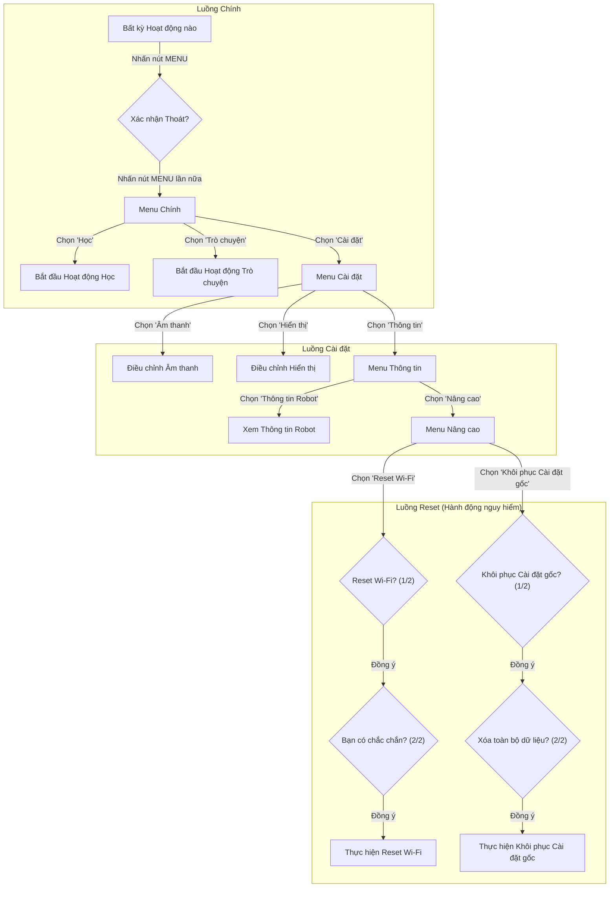
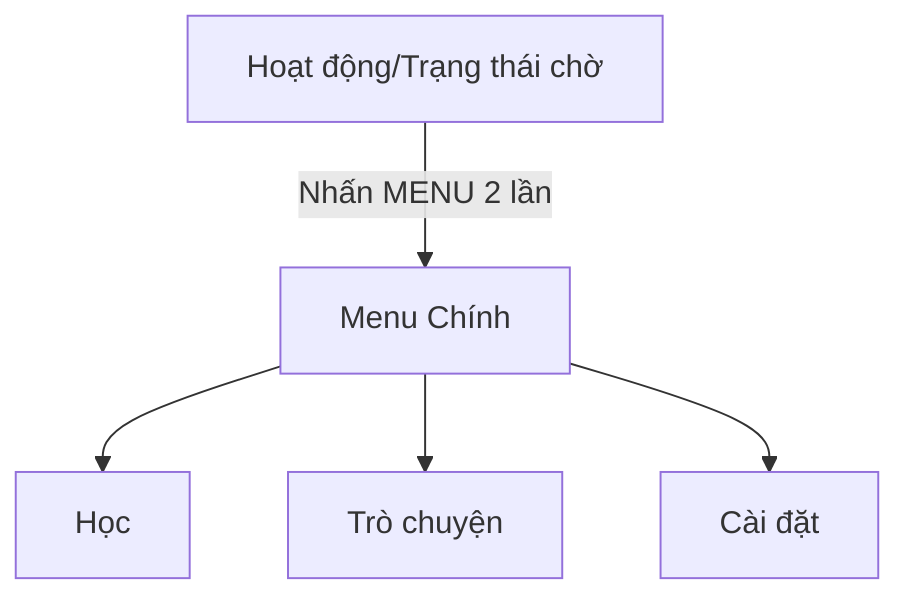
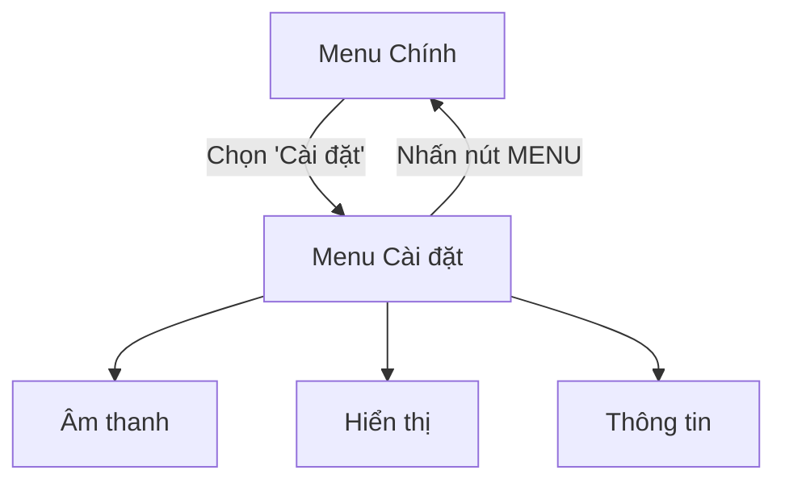

# 📘 Tài liệu Yêu cầu Sản phẩm (PRD) – Menu Chính & Cài đặt

---

## **1. Quản lý Phiên bản & Thay đổi**

| Phiên bản | Ngày         | Chi tiết Thay đổi                                         | Thực hiện |
|:----------|:-------------|:----------------------------------------------------------|:----------|
| 2.0       | 11/12/2025   | Tái cấu trúc luồng menu và thêm xác nhận chi tiết cho reset. | Manus AI  |

---

## **2. Tổng quan & Mục tiêu**

Tài liệu này xác định luồng người dùng và các yêu cầu cho **Menu Chính** và module **Cài đặt** tích hợp trên thiết bị PikaRobot. Mục tiêu chính là cung cấp một giao diện đơn giản, an toàn và trực quan cho người dùng (trẻ em) để chuyển đổi giữa các hoạt động cốt lõi (Học, Trò chuyện) và cho phụ huynh để cấu hình các cài đặt thiết yếu của thiết bị. Thiết kế được tối ưu hóa cho màn hình 4-inch và hệ thống điều khiển 5 nút, với sự nhấn mạnh vào việc ngăn ngừa mất dữ liệu vô tình thông qua các bước xác nhận đa tầng cho các hành động quan trọng.

---

## **3. Luồng Người dùng (User Flow)**

Người dùng truy cập Menu Chính bằng cách nhấn nút **MENU/SETTING**. Hành động này sẽ tạm dừng mọi hoạt động hiện tại và hiển thị một menu cấp cao nhất. Từ đây, người dùng có thể bắt đầu một hoạt động hoặc vào module Cài đặt.

### **Sơ đồ luồng tổng thể**


**Logic Điều hướng:**
- **Nút Trái/Phải:** Di chuyển giữa các mục trong menu.
- **Nút Enter:** Chọn một mục menu hoặc xác nhận một hành động.
- **Nút Menu:** Quay lại màn hình trước đó.

---

## **4. Yêu cầu**

### **4.1 Điều kiện tiên quyết (Precondition)**

- Robot đã được bật nguồn và hoàn tất chuỗi khởi động.

### **4.2 Điều kiện sau (Postcondition)**

- Các cài đặt do người dùng cấu hình (Âm thanh, Hiển thị) được lưu vào bộ nhớ cố định.
- Các hành động hệ thống (Reset Wi-Fi, Khôi phục Cài đặt gốc) được thực thi sau khi người dùng xác nhận rõ ràng qua nhiều bước.

### **4.3 Tiêu chí Chấp nhận (Acceptance Criteria - AC)**

#### **AC1 – Menu Chính**

- **Logic:** Đây là menu cấp cao nhất, được truy cập bằng cách nhấn nút **MENU/SETTING** hai lần từ một hoạt động hoặc khi robot ở trạng thái chờ.
- **Hiển thị:** Một danh sách cuộn dọc với ba tùy chọn:
    1.  **Học** (→ Bắt đầu bài học tiếp theo từ lộ trình học của người dùng)
    2.  **Trò chuyện** (→ Bắt đầu hoạt động `GENERAL_TALK`)
    3.  **Cài đặt** (→ Mở **AC2 – Menu Cài đặt**)



#### **AC2 – Menu Cài đặt**

- **Logic:** Cung cấp quyền truy cập vào các cấu hình cơ bản và mục `Thông tin`.
- **Hiển thị:** Một danh sách với ba tùy chọn:
    1.  **Âm thanh** (→ AC3)
    2.  **Hiển thị** (→ AC4)
    3.  **Thông tin** (→ AC5)
- **Tương tác:**
    - **Nút Menu:** Quay lại **AC1 – Menu Chính**.



#### **AC3 & AC4 – Cài đặt Âm thanh & Hiển thị**

- **Logic:** Cho phép điều chỉnh âm lượng loa và độ sáng màn hình.
- **Hiển thị:** Một màn hình riêng cho mỗi cài đặt với tiêu đề, thanh tiến trình ngang và giá trị số/phần trăm.
- **Tương tác:**
    - **Nút Phải:** Tăng giá trị (to hơn/sáng hơn).
    - **Nút Trái:** Giảm giá trị (nhỏ hơn/tối hơn).
    - **Phản hồi:** Phản hồi âm thanh/hình ảnh thời gian thực được cung cấp với mỗi lần điều chỉnh.
    - **Nút Enter:** Lưu cài đặt và quay lại **AC2 – Menu Cài đặt**.
    - **Nút Menu:** Hủy bỏ các thay đổi và quay lại **AC2 – Menu Cài đặt**.

#### **AC5 – Menu Thông tin**

- **Logic:** Cổng vào để xem thông tin thiết bị và truy cập các cài đặt nâng cao, nhạy cảm.
- **Hiển thị:** Một danh sách với hai tùy chọn:
    1.  **Thông tin Robot** (→ AC6)
    2.  **Nâng cao** (→ AC7)
- **Tương tác:**
    - **Nút Menu:** Quay lại **AC2 – Menu Cài đặt**.

#### **AC6 – Màn hình Thông tin Robot**

- **Logic:** Hiển thị thông tin kỹ thuật chỉ đọc về thiết bị.
- **Hiển thị:** Một màn hình tĩnh hiển thị:
    - **ID Robot:** [Mã định danh duy nhất của thiết bị]
    - **Phiên bản Phần mềm:** [Phiên bản firmware]
    - **Mạng Wi-Fi:** [SSID đã kết nối]
- **Tương tác:**
    - **Nút Enter hoặc Nút Menu:** Quay lại **AC5 – Menu Thông tin**.

#### **AC7 – Menu Nâng cao**

- **Logic:** Chứa các hành động nguy hiểm được cố tình ẩn đi để ngăn việc sử dụng vô tình.
- **Hiển thị:** Một danh sách với hai tùy chọn:
    1.  **Reset Wi-Fi** (→ AC8)
    2.  **Khôi phục Cài đặt gốc** (→ AC9)
- **Tương tác:**
    - **Nút Menu:** Quay lại **AC5 – Menu Thông tin**.

#### **AC8 – Luồng Reset Wi-Fi**

- **Logic:** Một luồng xác nhận nhiều bước để xóa tất cả các mạng Wi-Fi đã lưu.

```mermaid
graph TD
    A[Chọn 'Reset Wi-Fi'] -- Nhấn Enter --> B{Cảnh báo: "Reset Wi-Fi? Mọi mạng đã lưu sẽ bị xóa. Tiếp tục?"};
    B -- Chọn 'Không' --> A;
    B -- Chọn 'Có' & Nhấn Enter --> C{Xác nhận cuối: "Bạn có hoàn toàn chắc chắn? Hành động này không thể hoàn tác."};
    C -- Chọn 'Hủy' --> A;
    C -- Chọn 'Xác nhận Reset' & Nhấn Enter --> D[Thực hiện Reset Wi-Fi & Khởi động lại];
    D --> E[Vào luồng ghép nối Bluetooth & Cài đặt Wi-Fi];
```

#### **AC9 – Luồng Khôi phục Cài đặt gốc**

- **Logic:** Một luồng xác nhận nhiều bước để xóa tất cả dữ liệu người dùng và khôi phục thiết bị về trạng thái ban đầu.

```mermaid
graph TD
    A[Chọn 'Khôi phục Cài đặt gốc'] -- Nhấn Enter --> B{Cảnh báo nghiêm trọng: "Khôi phục Cài đặt gốc? Mọi dữ liệu người dùng, tiến trình và cài đặt sẽ bị xóa vĩnh viễn. Tiếp tục?"};
    B -- Chọn 'Không' --> A;
    B -- Chọn 'Có' & Nhấn Enter --> C{Cảnh báo cuối cùng: "Đây là cơ hội cuối cùng. Bạn có chắc muốn xóa mọi thứ không?"};
    C -- Chọn 'Hủy' --> A;
    C -- Chọn 'Xác nhận Xóa' & Nhấn Enter --> D[Thực hiện Xóa & Khởi động lại];
    D --> E[Vào luồng Onboarding ban đầu];
```

---

## **5. Các trường hợp đặc biệt (Corner Cases)**

- **Nhấn nút nhanh trong lúc Reset:** Nếu người dùng nhấn nút **Menu** ở bất kỳ giai đoạn nào của luồng xác nhận reset, hành động sẽ bị hủy ngay lập tức và màn hình quay trở lại **AC7 – Menu Nâng cao**.
- **Mất nguồn trong lúc Reset:** Nếu mất nguồn trong quá trình khôi phục cài đặt gốc, thiết bị phải cố gắng phục hồi vào lần khởi động tiếp theo. Nếu phục hồi thất bại, nó sẽ mặc định vào luồng onboarding ban đầu.

---

## **6. Yêu cầu Dữ liệu**

- **Mức Âm lượng:** `integer`, 0–21.
- **Mức Độ sáng:** `integer`, 0–10 (tương ứng 0–100%).
- **Thông tin Wi-Fi:** Chuỗi được mã hóa, có thể xóa được.
- **Phiên bản Phần mềm & ID Robot:** `string`, chỉ đọc.

---

## **7. Ý tưởng Tương lai**

- **Khóa Trẻ em:** Thêm một khóa kết hợp nút đơn giản (ví dụ: Trái-Phải-Trái-Phải) để truy cập menu `Nâng cao`, cung cấp một lớp bảo mật bổ sung chống lại việc trẻ em truy cập.
- **Cài đặt Nhanh:** Cho phép nhấn giữ nút **MENU/SETTING** để hiển thị một lớp phủ truy cập nhanh cho Âm thanh và Hiển thị, mà không cần vào menu đầy đủ.
