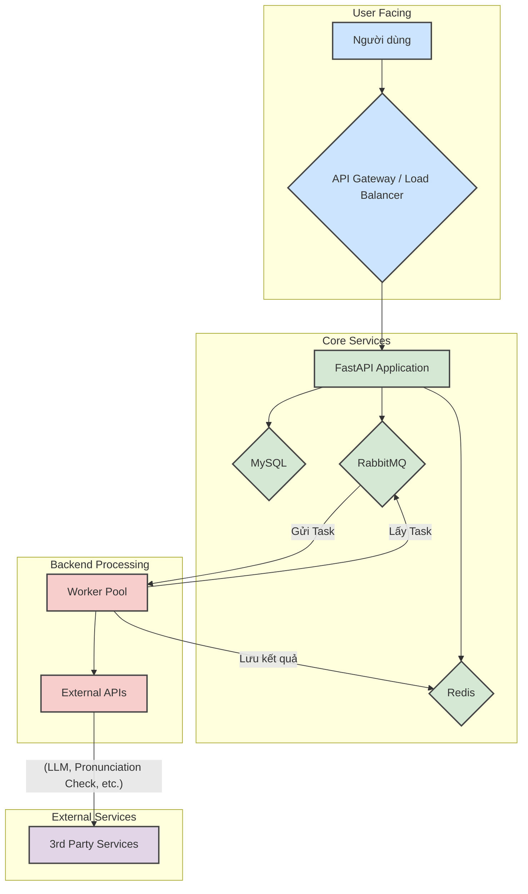

# Thiết kế Hệ thống Cấp cao (High-Level Design) - Robot AI Workflow

**Tác giả:** Manus AI
**Ngày tạo:** 12/12/2025
**Phiên bản:** 1.0

## 1. Giới thiệu

Tài liệu này trình bày thiết kế kiến trúc cấp cao cho hệ thống **Robot AI Workflow**, một nền tảng chatbot thông minh được xây dựng để hỗ trợ việc dạy và học tiếng Anh. Hệ thống tận dụng sức mạnh của các Mô hình Ngôn ngữ Lớn (LLM) và các công cụ AI chuyên biệt để tạo ra các cuộc hội thoại tự nhiên, có ngữ cảnh và tuân theo các kịch bản sư phạm được định trước.

Kiến trúc được thiết kế theo định hướng microservices, tập trung vào tính module hóa, khả năng mở rộng và bảo trì. Hệ thống bao gồm một lõi xử lý hội thoại, một hệ thống tác vụ bất đồng bộ, và các kết nối đến cơ sở dữ liệu, cache, và các dịch vụ bên ngoài.

## 2. Mục tiêu Thiết kế

Các mục tiêu chính của thiết kế kiến trúc này bao gồm:

| Mục tiêu | Mô tả | Lý do | 
| :--- | :--- | :--- | 
| **Tính Module hóa** | Phân tách hệ thống thành các thành phần độc lập, mỗi thành phần chịu trách nhiệm cho một chức năng cụ thể (ví dụ: API, xử lý logic, kết nối dữ liệu). | Dễ dàng phát triển, kiểm thử, và bảo trì. Cho phép các nhóm làm việc song song. | 
| **Khả năng Mở rộng** | Hệ thống phải có khả năng xử lý số lượng lớn người dùng và các cuộc hội thoại đồng thời thông qua việc mở rộng theo chiều ngang (horizontal scaling). | Đáp ứng nhu cầu tăng trưởng trong tương lai mà không cần thiết kế lại từ đầu. | 
| **Tính Linh hoạt** | Dễ dàng tích hợp các nhà cung cấp LLM mới, thêm các công cụ (tools) chuyên dụng, và điều chỉnh các kịch bản hội thoại mà không ảnh hưởng lớn đến hệ thống. | Thích ứng nhanh với sự phát triển của công nghệ AI và các yêu cầu nghiệp vụ mới. | 
| **Hiệu suất Cao** | Giảm thiểu độ trễ trong việc phản hồi người dùng bằng cách sử dụng cache và xử lý các tác vụ tốn thời gian (như gọi API ngoài) một cách bất đồng bộ. | Cung cấp trải nghiệm người dùng mượt mà và tự nhiên. | 
| **Độ tin cậy** | Hệ thống phải hoạt động ổn định, có cơ chế xử lý lỗi, và tự động khởi động lại khi có sự cố. | Đảm bảo tính sẵn sàng cao của dịch vụ. | 
| **Khả năng Giám sát** | Cung cấp khả năng theo dõi (tracing) và ghi log (logging) chi tiết để dễ dàng gỡ lỗi và phân tích hiệu suất. | Giúp việc vận hành và bảo trì hệ thống trở nên hiệu quả hơn. | 

## 3. Kiến trúc Tổng thể

Hệ thống được xây dựng dựa trên kiến trúc microservices, bao gồm các thành phần chính được thể hiện trong sơ đồ dưới đây.

**Mô tả các thành phần:**

- **FastAPI Application (Main API):** Là cửa ngõ chính của hệ thống, tiếp nhận các yêu cầu HTTP từ người dùng. Nó chịu trách nhiệm xác thực, khởi tạo và quản lý vòng đời của cuộc hội thoại. Các tác vụ xử lý nhanh được thực hiện tại đây, trong khi các tác vụ nặng được ủy quyền cho Worker Pool.
- **Redis (Cache & Session Store):** Được sử dụng để lưu trữ trạng thái của các cuộc hội thoại đang diễn ra, cache các cấu hình bot thường xuyên truy cập, và lưu kết quả từ các tác vụ bất đồng bộ. Việc này giúp giảm tải cho MySQL và tăng tốc độ phản hồi.
- **MySQL (Database):** Là nơi lưu trữ dữ liệu lâu dài, bao gồm cấu hình chi tiết của các bot (`llm_bot`), lịch sử các cuộc hội thoại (`llm_history`), và các dữ liệu nền tảng khác.
- **RabbitMQ (Message Queue):** Đóng vai trò là hàng đợi tin nhắn, giúp tách rời (decouple) Main API và Worker Pool. Khi có một tác vụ cần xử lý bất đồng bộ (ví dụ: kiểm tra phát âm), Main API sẽ gửi một tin nhắn vào RabbitMQ.
- **Worker Pool:** Một nhóm các tiến trình (workers) chạy nền, lắng nghe các tác vụ từ RabbitMQ. Mỗi worker sẽ lấy một tác vụ, thực thi nó (ví dụ: gọi đến API của LLM hoặc một dịch vụ bên ngoài), và sau đó lưu kết quả vào Redis.
- **External APIs:** Bao gồm các dịch vụ của bên thứ ba như các nhà cung cấp LLM (OpenAI, Groq, Gemini) và các công cụ chuyên biệt (ví dụ: API kiểm tra phát âm).

## 4. Luồng Dữ liệu (Data Flows)

### 4.1. Luồng Khởi tạo Hội thoại

1.  **Request:** Người dùng gửi yêu cầu `initConversation` đến FastAPI Application.
2.  **Load Config:** Ứng dụng đọc cấu hình của bot tương ứng từ MySQL (hoặc từ Redis nếu đã được cache).
3.  **Create Session:** Một session mới cho cuộc hội thoại được tạo và lưu vào Redis, bao gồm `bot_config`, `conversation_id`, và trạng thái ban đầu.
4.  **Response:** Ứng dụng trả về `conversation_id` cho người dùng để sử dụng trong các yêu cầu tiếp theo.

### 4.2. Luồng Xử lý Tin nhắn

1.  **Webhook:** Người dùng gửi tin nhắn, yêu cầu được chuyển đến endpoint webhook của FastAPI.
2.  **Load State:** Ứng dụng sử dụng `conversation_id` để tải trạng thái hiện tại của cuộc hội thoại từ Redis.
3.  **Core Logic:** Logic xử lý chính được thực thi:
    *   **Intent Classification:** Phân loại ý định của người dùng (sử dụng Regex hoặc LLM).
    *   **Scenario Processing:** Dựa vào ý định và trạng thái hiện tại, hệ thống xác định bước tiếp theo trong kịch bản (`ScenarioExcel`).
4.  **Action Execution:**
    *   **Synchronous Action:** Nếu hành động là sinh câu trả lời đơn giản, ứng dụng sẽ gọi trực tiếp LLM, nhận kết quả và chuẩn bị phản hồi.
    *   **Asynchronous Action:** Nếu hành động yêu cầu một `tool` (ví dụ: kiểm tra phát âm), một tác vụ sẽ được đóng gói và gửi vào RabbitMQ. Ứng dụng có thể trả về một tin nhắn tạm thời (ví dụ: "Để tôi kiểm tra một chút nhé...").
5.  **Update State:** Trạng thái cuộc hội thoại trong Redis được cập nhật.
6.  **Return Response:** Ứng dụng gửi phản hồi về cho người dùng.

### 4.3. Luồng Xử lý Tác vụ Bất đồng bộ

1.  **Consume Task:** Một worker trong Worker Pool lấy tác vụ từ RabbitMQ.
2.  **Execute:** Worker thực hiện tác vụ, ví dụ như gửi yêu cầu đến một API bên ngoài.
3.  **Store Result:** Kết quả của tác vụ được lưu vào Redis với một khóa (key) định danh duy nhất (ví dụ: `task_id`).
4.  **Retrieve Result (Optional):** Trong các lượt tương tác tiếp theo, Main API có thể kiểm tra Redis để xem kết quả của tác vụ đã có hay chưa và sử dụng nó để định hình câu trả lời.

## 5. Thiết kế Module

Hệ thống được chia thành các module chính sau:

- **`app/api`:** Chứa toàn bộ logic liên quan đến FastAPI, bao gồm định nghĩa các `routes` (endpoints), `services` (logic nghiệp vụ), và `models` (Pydantic models cho validation).
- **`app/common`:** Chứa các thành phần dùng chung và các lớp trừu tượng. Đáng chú ý là `app/common/agent`, nơi định nghĩa `BaseAgent` và tích hợp với `LangGraph`, đặt nền móng cho việc chuyển đổi sang kiến trúc agentic tiên tiến hơn.
- **`app/module`:** Chứa các module nghiệp vụ cụ thể, bao gồm các `agents` được định nghĩa sẵn, các `tools` có thể tái sử dụng, và các `workflows` xử lý logic hội thoại.
- **`src/channel`:** Quản lý kết nối đến các infrastructure services (MySQL, Redis, RabbitMQ). Nó trừu tượng hóa các thao tác kết nối và truy vấn dữ liệu.
- **`src/chatbot`:** Lõi xử lý hội thoại, bao gồm `policies` (luồng xử lý), `scenario` (quản lý kịch bản), và `llm_base` (giao tiếp với các LLM).

## 6. Hạ tầng và Triển khai

- **Containerization:** Toàn bộ hệ thống (FastAPI app, workers) được đóng gói thành các Docker image. Điều này đảm bảo tính nhất quán giữa môi trường phát triển và sản phẩm.
- **Orchestration:** `docker-compose` được sử dụng để định nghĩa và quản lý vòng đời của các services (app, worker, redis, mysql, rabbitmq) trong môi trường phát triển và có thể làm cơ sở cho các hệ thống điều phối phức tạp hơn như Kubernetes.
- **Configuration:** Cấu hình hệ thống (API keys, database credentials) được quản lý thông qua biến môi trường và file `.env`, tuân thủ theo nguyên tắc của The Twelve-Factor App.
- **Scalability:** Worker Pool được thiết kế để có thể mở rộng theo chiều ngang. Bằng cách tăng số lượng `replicas` của worker service, hệ thống có thể xử lý nhiều tác vụ bất đồng bộ hơn.

## 7. Kế hoạch Refactor và Tương lai

Kiến trúc hiện tại đang trong quá trình chuyển đổi sang một mô hình agentic mạnh mẽ hơn sử dụng **LangGraph**. Kế hoạch này được ghi nhận trong `docs2.0_refactor_to_langgraph_plan.md` và đã được bắt đầu triển khai trong `app/common/agent/base.py`.

**Lợi ích của việc chuyển đổi:**

- **Quản lý Trạng thái Tốt hơn:** LangGraph cho phép định nghĩa workflow dưới dạng đồ thị trạng thái (state graph), giúp việc theo dõi và quản lý trạng thái của các agent phức tạp trở nên tường minh và dễ gỡ lỗi.
- **Tăng tính Module và Linh hoạt:** Mỗi node trong graph là một đơn vị xử lý độc lập, giúp việc thêm, bớt hoặc thay đổi logic trở nên dễ dàng hơn.
- **Hỗ trợ các Pattern Nâng cao:** Dễ dàng triển khai các pattern agentic như reflection (tự suy ngẫm), planning (lập kế hoạch), và multi-agent collaboration.

Thiết kế cấp cao này đặt nền móng vững chắc cho việc phát triển hệ thống hiện tại và quá trình chuyển đổi sang kiến trúc LangGraph trong tương lai.

---
