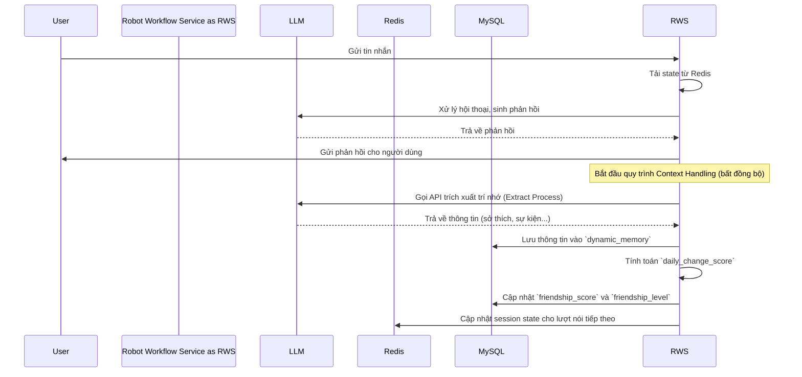

# Thiết kế Hệ thống Cấp cao (High-Level Design) - Robot AI Workflow

**Phiên bản:** 2.0 (Tái cấu trúc theo TDD v3)

---

## 📋 **METADATA**

```yaml
Title: Robot AI Workflow System
Author: Manus AI
Reviewers: Tech Lead, Product Manager
Status: In Review
Created: 2025-12-11
Last Updated: 2025-12-12
Version: 2.0
Related Docs: 
  - 1_ĐẶCTẢKIẾNTRÚCAIPLATFORM...
  - 2_ProductTeam.md
```

---

## 1. OVERVIEW & CONTEXT

### 1.1. Executive Summary (TL;DR)

- **Problem Statement:** Cần một hệ thống AI có khả năng tạo ra một người bạn đồng hành (AI Buddy) thực sự cho trẻ em, không chỉ dạy học mà còn xây dựng một mối quan hệ tình cảm, có trí nhớ và cá tính, nhằm tăng cường sự gắn bó lâu dài và hiệu quả học tập.
- **Proposed Solution:** Xây dựng một hệ thống AI hướng agent (agentic) với kiến trúc microservices, sử dụng LangGraph để quản lý trạng thái hội thoại phức tạp. Hệ thống bao gồm các module chuyên biệt cho việc quản lý trí nhớ (tĩnh và động), nhận dạng ý định linh hoạt (In-session Routing), và thể hiện cá tính (Buddy System).
- **Impact:** Tăng tỷ lệ giữ chân người dùng (retention) bằng cách tạo ra một mối quan hệ sâu sắc hơn là một công cụ học tập đơn thuần. Nâng cao hiệu quả học tập thông qua các nội dung được cá nhân hóa dựa trên sở thích và lịch sử tương tác.

### 1.2. Background & Motivation

Phiên bản trước của hệ thống đã chứng minh được khả năng xử lý các kịch bản hội thoại có cấu trúc. Tuy nhiên, để tiến tới việc tạo ra một "người bạn" thực thụ, hệ thống cần vượt qua các giới hạn của luồng kịch bản cố định. Các pain points hiện tại bao gồm:

- **Trí nhớ ngắn hạn:** Hệ thống chủ yếu dựa vào trạng thái session (Redis), khó có thể ghi nhớ các chi tiết quan trọng qua nhiều cuộc hội thoại.
- **Kém linh hoạt:** Khó đáp ứng các yêu cầu ngẫu hứng, ngoài luồng của trẻ, làm giảm tính tự nhiên của cuộc trò chuyện.
- **Thiếu cá tính:** Robot hoạt động như một cỗ máy trả lời, chưa thể hiện được cá tính riêng (tinh nghịch, vui vẻ, đồng cảm) như một người bạn.

**Why now?** Sự phát triển của các framework agentic như LangGraph cung cấp công cụ mạnh mẽ để xây dựng các hệ thống AI phức tạp, có trạng thái và khả năng suy luận, cho phép chúng ta hiện thực hóa tầm nhìn về một AI Buddy.

### 1.3. Success Criteria

- **Friendship Score:** `friendship_score` trung bình của người dùng hoạt động trong 30 ngày tăng 25%.
- **Engagement:** Tỷ lệ người dùng quay lại vào ngày hôm sau (D1 retention) tăng 15%.
- **Personalization:** Tỷ lệ các phiên hội thoại có sử dụng `dynamic_memory` (trí nhớ động) đạt trên 80%.
- **Technical:** p95 latency cho các tương tác thông thường (không có tool) dưới 500ms.

---

## 2. GOALS / SCOPE / NON-GOALS

### 2.1. Goals

- **Business Goals:** Xây dựng một sản phẩm có "hào sâu" cạnh tranh (moat) bằng cách tạo ra mối quan hệ độc nhất với mỗi người dùng. Giảm churn rate 20% trong 6 tháng.
- **Technical Goals:** Chuyển đổi thành công kiến trúc sang mô hình agentic dựa trên LangGraph. Đảm bảo hệ thống có khả năng mở rộng để hỗ trợ 10,000 người dùng đồng thời. SLA 99.9%.
- **User Experience Goals:** Người dùng cảm thấy Pika "nhớ mình" và là một người bạn thực sự, không phải một cỗ máy. Trẻ có thể tự do dẫn dắt cuộc hội thoại.

### 2.2. In-Scope (Làm)

- **Buddy System:** Triển khai logic cho Buddy Activity và Buddy Talk.
- **Context Handling:** Xây dựng quy trình cập nhật `friendship_score` và `dynamic_memory` cuối mỗi lượt nói.
- **In-session Routing:** Cho phép robot xử lý các yêu cầu ngoài luồng như chơi game, kể chuyện.
- **Learning Content System:** Tích hợp 3 pha học tập (Warm Up, Present, Practice + Produce) vào workflow.
- **Refactor to LangGraph:** Chuyển đổi lõi xử lý hội thoại sang StateGraph của LangGraph.

### 2.3. Out-of-Scope / Non-Goals (KHÔNG làm)

- Hỗ trợ đa ngôn ngữ (chỉ tập trung vào tiếng Anh).
- Giao diện cho phụ huynh quản lý chi tiết (Parent Dashboard v2).
- Tích hợp các kênh giao tiếp khác ngoài app hiện tại (VD: Zalo, Messenger).

---

## 3. USER STORIES / USE CASES

### 3.1. Primary Actors

- **Child (End-user):** Người dùng chính, tương tác trực tiếp với Pika.
- **Parent:** Người dùng phụ, quản lý tài khoản và xem báo cáo tiến độ.
- **AI System (Pika):** Robot AI, người bạn đồng hành.
- **Admin/Content Creator:** Người tạo và quản lý các kịch bản, nội dung học tập.

### 3.2. User Stories

- **As a child, I want Pika to remember my pet's name, so that I feel like Pika really listens to me.**
- **As a child, I want to suddenly ask Pika to play a game, so that the conversation is more fun and not just about learning.**
- **As a child, I want Pika to have its own personality and jokes, so that it feels like a real friend.**

---

## 4. SYSTEM ARCHITECTURE & FLOW

### 4.1. High-Level Architecture (C4 Model - Container Diagram)

Kiến trúc được cập nhật để phản ánh rõ hơn vai trò của các agent chuyên biệt và luồng dữ liệu liên quan đến trí nhớ.

```mermaid
graph TD
    subgraph User Facing
        A[User (Child/Parent)] --> B{API Gateway}
    end

    subgraph AI Platform
        B --> C[Robot Workflow Service (FastAPI)]
        C <--> D[Redis (Session State, Cache)]
        C <--> E[MySQL (Friendship Data, Bot Config)]
        C --> F{RabbitMQ (Task Queue)}

        subgraph Agent Core (within Robot Workflow Service)
            C --> AC[Agent Controller]
            AC -->|Dispatch| GameAgent
            AC -->|Dispatch| StoryAgent
            AC -->|Dispatch| EmotionAgent
            AC -->|Dispatch| LearningAgent
        end

        F -- Gửi Task --> G[Tool Worker Pool]
        G -- Lấy Task --> F
        G --> H[External APIs (LLM, Pronunciation)]
        G -- Lưu kết quả --> D
    end

    E -- Cập nhật định kỳ --> ReportDB[(Reporting DB)]

    classDef userFacing fill:#cde4ff,stroke:#444,stroke-width:2px;
    classDef aiPlatform fill:#d5e8d4,stroke:#444,stroke-width:2px;
    classDef agentCore fill:#f8cecc,stroke:#444,stroke-width:1px,stroke-dasharray: 5 5;

    class A userFacing;
    class B,C,D,E,F,G,H,ReportDB aiPlatform;
    class AC,GameAgent,StoryAgent,EmotionAgent,LearningAgent agentCore;
```

**Các thay đổi chính so với phiên bản trước:**

- **Agent Core:** Lõi xử lý hội thoại giờ đây được mô tả như một `Agent Controller` có khả năng điều phối (dispatch) đến các agent chuyên biệt (Game, Story, Emotion, Learning) dựa trên ý định của người dùng. Đây chính là hiện thực hóa của `In-session Routing`.
- **MySQL (Friendship Data):** Vai trò của MySQL được nhấn mạnh trong việc lưu trữ dữ liệu quan hệ lâu dài (`friendship_score`, `dynamic_memory`) bên cạnh cấu hình bot.

### 4.2. Data Flow: End-of-Turn Context Handling

Đây là luồng dữ liệu quan trọng nhất để hiện thực hóa "trí nhớ" của Pika, diễn ra sau mỗi lượt tương tác của người dùng.



### 4.3. Data Model: Friendship Status

Trọng tâm của việc cá nhân hóa nằm ở bản ghi `friendship_status` trong MySQL, được liên kết với mỗi `user_id`.

| Field Name | Product Purpose | Technical Description | Cập nhật |
| :--- | :--- | :--- | :--- |
| `friendship_score` | Đo lường mức độ thân thiết. | `FLOAT`, thay đổi hàng ngày. | Cuối mỗi ngày/phiên. |
| `friendship_level` | Xác định giọng điệu và hành vi của Pika. | `ENUM('STRANGER', 'ACQUAINTANCE', 'FRIEND')` | Khi `friendship_score` vượt ngưỡng. |
| `dynamic_memory` | Lưu trữ các "kỷ niệm chung" (sự kiện, sở thích). | `JSON` hoặc `TEXT` (mảng các object). | Cuối mỗi phiên hội thoại. |
| `topic_metrics` | Giúp Pika "lắng nghe" và xác định sở thích. | `JSON` (map topic -> score). | Cuối mỗi phiên hội thoại. |
| `streak_day` | Ghi nhận sự cam kết của người dùng. | `INTEGER`. | Cuối mỗi ngày. |

---

## 5. KẾ HOẠCH CHUYỂN ĐỔI VÀ RỦI RO

### 5.1. Kế hoạch Chuyển đổi (Phased Rollout)

1.  **Phase 1 (Nền tảng):** Xây dựng các bảng dữ liệu mới trong MySQL cho `friendship_status`. Triển khai luồng `Context Handling` ở chế độ "shadow mode" (chỉ ghi log, không ảnh hưởng đến phản hồi) để xác thực logic.
2.  **Phase 2 (Tung ra giới hạn):** Kích hoạt `dynamic_memory` cho một nhóm nhỏ người dùng. Pika sẽ bắt đầu sử dụng trí nhớ để cá nhân hóa lời chào và các câu hỏi thăm.
3.  **Phase 3 (Triển khai toàn bộ):** Kích hoạt đầy đủ `Buddy System` và `In-session Routing` cho toàn bộ người dùng sau khi đã tinh chỉnh logic dựa trên dữ liệu từ Phase 2.

### 5.2. Rủi ro và Giải pháp

| Rủi ro | Mức độ | Giải pháp |
| :--- | :--- | :--- |
| **Logic tính `friendship_score` không chính xác:** | Cao | A/B testing các công thức tính điểm khác nhau. Sử dụng shadow mode để quan sát sự thay đổi của điểm số trước khi áp dụng. |
| **LLM trích xuất `dynamic_memory` sai:** | Cao | Xây dựng một bộ test (golden set) để đánh giá chất lượng prompt. Sử dụng các agent chuyên biệt cho việc trích xuất để tăng độ chính xác. |
| **Tăng độ trễ do xử lý Context:** | Trung bình | Toàn bộ quy trình `Context Handling` được thiết kế để chạy bất đồng bộ, không ảnh hưởng đến thời gian phản hồi cho người dùng. |

---

## 6. YÊU CẦU PHI CHỨC NĂNG

- **Bảo mật:** Dữ liệu `dynamic_memory` có thể chứa thông tin nhạy cảm, cần được mã hóa khi lưu trữ (encryption at rest) và khi truyền (encryption in transit).
- **Khả năng giám sát:** Cần có dashboard để theo dõi sự thay đổi của `friendship_score` và số lượng `dynamic_memory` được tạo ra theo thời gian.
- **Chi phí:** Việc gọi thêm LLM để trích xuất trí nhớ sẽ làm tăng chi phí. Cần theo dõi và tối ưu hóa prompt để giảm số lượng token sử dụng.
