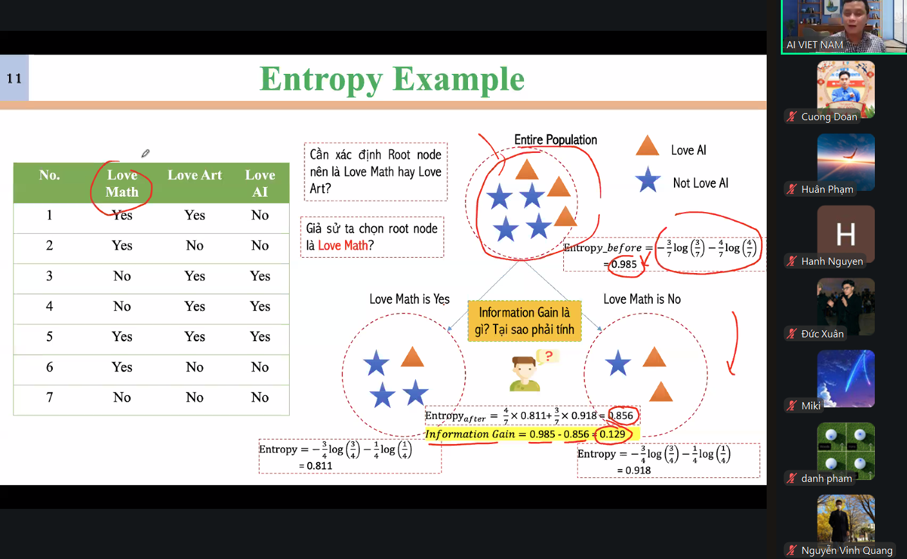

t 

Many Algorithms:

Bức ảnh nói về **Decision Tree Induction** (Quá trình xây dựng cây quyết định), và liệt kê các thuật toán phổ biến dùng để tạo cây. Dưới đây là giải thích siêu đơn giản:

1. **Hunt's Algorithm**: Một trong những thuật toán sớm nhất, như "ông tổ" của các thuật toán cây.
2. **CART** (Classification and Regression Trees): Một thuật toán giúp tạo cây để phân loại (phân nhóm) hoặc dự đoán (dự báo).
3. **ID3, C4.5**: Hai phiên bản thuật toán nâng cấp dần. ID3 giống như "người anh", còn C4.5 là "người em thông minh hơn".
4. **SLIQ, SPRINT**: Hai thuật toán nhanh và phù hợp với dữ liệu lớn. Hãy tưởng tượng chúng giống như xe đua xử lý siêu tốc!

Tất cả các thuật toán này đều có mục tiêu chung: tạo ra cây quyết định giúp chúng ta đưa ra lựa chọn hoặc dự đoán tốt nhất từ dữ liệu.

Dưới đây là bảng so sánh chi tiết nhưng dễ hiểu giữa các thuật toán trong **Decision Tree Induction**:

| **Thuật toán**     | **Đặc điểm nổi bật**                                        | **Ưu điểm**                                                | **Nhược điểm**                                                                 | **Ứng dụng phổ biến**                      |
| -------------------------- | ----------------------------------------------------------------------- | ------------------------------------------------------------------- | ---------------------------------------------------------------------------------------- | ---------------------------------------------------- |
| **Hunt's Algorithm** | Thuật toán đầu tiên, rất cơ bản                                 | Dễ hiểu, đặt nền tảng cho các thuật toán sau này          | Không tối ưu cho dữ liệu lớn, cần cải tiến                                      | Nghiên cứu lịch sử, nền tảng lý thuyết       |
| **CART**             | Phân loại và hồi quy (chia nhỏ nhánh dựa vào dữ liệu số)     | Hỗ trợ cả bài toán phân loại và dự đoán, dễ triển khai | Dễ bị quá khớp (overfitting) nếu không kiểm soát tốt                            | Xử lý dữ liệu số và phân loại                |
| **ID3**              | Dùng thông tin (Entropy) để chia nhánh                             | Dễ triển khai, nhanh với dữ liệu nhỏ                          | Không xử lý tốt dữ liệu thiếu hoặc liên tục (chỉ dùng dữ liệu phân loại) | Phân loại cơ bản, học máy trong giáo dục     |
| **C4.5**             | Phiên bản nâng cấp của ID3                                         | Xử lý dữ liệu thiếu, liên tục tốt hơn ID3                  | Tốn thời gian hơn ID3, thuật toán phức tạp hơn                                   | Ứng dụng học máy thực tế, dữ liệu phức tạp |
| **SLIQ**             | Tối ưu cho dữ liệu lớn, dùng bảng để chia dữ liệu hiệu quả | Xử lý dữ liệu lớn rất nhanh                                   | Hạn chế khi dữ liệu phức tạp hoặc có nhiều thuộc tính không quan trọng      | Hệ thống lớn như viễn thông                    |
| **SPRINT**           | Tương tự SLIQ, nhưng không giới hạn bộ nhớ                     | Linh hoạt, xử lý dữ liệu lớn mà không giới hạn bộ nhớ   | Tốn tài nguyên khi triển khai                                                        | Phân tích dữ liệu khổng lồ, Big Data           |

### **Giải thích các thuật ngữ chính:**

1. **Phân loại**: Gán dữ liệu vào các nhóm cụ thể, ví dụ: "email spam hay không spam".
2. **Hồi quy**: Dự đoán giá trị số, ví dụ: "dự đoán giá nhà".
3. **Entropy**: Đo độ hỗn loạn của dữ liệu để tìm cách chia nhánh hiệu quả nhất.
4. **Quá khớp (Overfitting)**: Khi cây học quá kỹ dữ liệu, nhưng không dự đoán tốt dữ liệu mới.

### Tóm lại:

- Nếu bạn xử lý dữ liệu nhỏ và muốn đơn giản: **ID3, C4.5** là tốt nhất.
- Nếu dữ liệu lớn: **SLIQ, SPRINT** sẽ nhanh và hiệu quả hơn.
- Nếu muốn cả phân loại và dự đoán: chọn **CART**

```
Chi tiết thuật toán Hunt's Algorithm - Nhu cầu gì mà họ lại nghĩ ra thuật toán - Cách thức tư duy nào để họ nghĩ ra thuật toán - Thuật toán là gì? -------- Giải thích 1 cách siêu dễ hiểu
```

### **Hunt's Algorithm – Giải thích siêu dễ hiểu**

#### **1. Nhu cầu gì mà họ nghĩ ra thuật toán này?**

- **Nhu cầu:**
  - Vào thời kỳ đầu, khi người ta cần một cách để **ra quyết định** từ dữ liệu, đặc biệt là để phân loại các nhóm đối tượng (ví dụ: xác định một khách hàng có nên được cấp thẻ tín dụng hay không).
  - Họ muốn một cách **tự động, rõ ràng và dễ hiểu** để giúp máy tính đưa ra các quyết định dựa trên dữ liệu.

**Ví dụ:** Một bác sĩ muốn chẩn đoán bệnh dựa trên triệu chứng. Hunt's Algorithm sẽ giúp tạo ra một "cây quyết định", nơi mỗi câu hỏi (triệu chứng) sẽ dẫn đến câu trả lời (chẩn đoán).

---

#### **2. Cách thức tư duy nào để họ nghĩ ra thuật toán?**

- **Quan sát thực tế:**

  - Khi con người ra quyết định, họ thường chia nhỏ vấn đề thành các bước.
  - Ví dụ: "Nếu sốt cao → Có thể là cúm. Nếu không sốt → Kiểm tra triệu chứng khác."
- **Ý tưởng chính:**

  - Tạo ra một cấu trúc giống như **cây**:
    - **Gốc cây**: Bắt đầu từ câu hỏi đầu tiên.
    - **Nhánh cây**: Các lựa chọn dựa trên câu trả lời ("Có" hoặc "Không").
    - **Lá cây**: Kết quả cuối cùng (phân loại nhóm hoặc chẩn đoán).

---

#### **3. Thuật toán là gì?**

Hunt's Algorithm hoạt động theo nguyên tắc **đệ quy** (giải quyết từng phần nhỏ cho đến khi xong):

1. **Bắt đầu từ toàn bộ dữ liệu**:

   - Kiểm tra xem dữ liệu có thuộc cùng một nhóm không:
     - Nếu **cùng nhóm**: Dừng lại, tạo một lá (kết quả).
     - Nếu **khác nhóm**: Chia nhỏ dữ liệu thành các nhóm con.
2. **Lặp lại với nhóm con**:

   - Xác định câu hỏi tốt nhất (thuộc tính) để chia nhóm con thành hai nhánh.
3. **Dừng lại khi**:

   - Nhóm con đã thuộc cùng một nhóm, hoặc không còn thuộc tính nào để chia.

---

#### **Ví dụ thực tế (Siêu dễ hiểu):**

**Bài toán:** Dự đoán xem ai thích xem phim hành động.

- **Bước 1 (Gốc cây):** Hỏi "Người này có dưới 30 tuổi không?"

  - Nếu **Có**: Họ thích phim hành động. (Kết quả 1)
  - Nếu **Không**: Tiếp tục hỏi.
- **Bước 2 (Nhánh):** Hỏi "Người này có thích thể thao không?"

  - Nếu **Có**: Họ thích phim hành động. (Kết quả 2)
  - Nếu **Không**: Họ không thích phim hành động. (Kết quả 3)

Kết quả: Tạo ra một cây quyết định đơn giản từ các câu hỏi.

---

#### **Tóm gọn thuật toán Hunt's Algorithm:**

- **Nhu cầu:** Ra quyết định tự động từ dữ liệu.
- **Tư duy:** Chia nhỏ vấn đề giống cách con người tư duy.
- **Hoạt động:** Chia nhỏ dữ liệu bằng các câu hỏi đến khi đạt kết quả rõ ràng.

Cây quyết định từ thuật toán Hunt's giống như một "trợ lý ảo" giúp bạn đưa ra quyết định dễ dàng từ thông tin có sẵn!

## Trest Condition for Continous Attribute

## Measute of

Bức ảnh nói về các cách đo "độ không thuần khiết" (Node Impurity) của một nút trong cây quyết định. Đây là cách để đánh giá xem dữ liệu tại nút có được phân chia tốt chưa.

### **1. Gini Index**

- **Công thức:** Gini=1−∑pi2Gini = 1 - \sum p_i^2
- **Ý nghĩa:** Nếu các lớp (nhóm) trong dữ liệu chia đều, Gini sẽ cao. Nếu chỉ có 1 lớp, Gini sẽ thấp.
- **Ví dụ dễ hiểu:** Nếu có 2 lớp, mỗi lớp 50%, Gini = 0.5. Nếu chỉ 1 lớp chiếm 100%, Gini = 0.

---

### **2. Entropy**

- **Công thức:** Entropy=−∑pilog⁡2(pi)Entropy = - \sum p_i \log_2(p_i)
- **Ý nghĩa:** Đo "độ hỗn loạn". Nếu các lớp chia đều, entropy sẽ cao (hỗn loạn). Nếu chỉ có 1 lớp, entropy = 0.
- **Ví dụ dễ hiểu:** 50% - 50% giữa 2 lớp, entropy = 1 (cao). Nếu chỉ có 1 lớp 100%, entropy = 0 (ít hỗn loạn).

---

### **3. Misclassification Error**

- **Công thức:** Error=1−max⁡(pi)Error = 1 - \max(p_i)
- **Ý nghĩa:** Tỷ lệ dữ liệu bị phân loại sai tại nút. Nếu một lớp chiếm phần lớn, lỗi sẽ thấp.
- **Ví dụ dễ hiểu:** Nếu lớp lớn nhất chiếm 70%, lỗi = 1 - 0.7 = 0.3.

---

### **Tóm lại:**

- **Gini** và **Entropy** dùng để đo độ không thuần và quyết định nên chia nhánh tiếp hay dừng lại.
- **Misclassification Error** đơn giản hóa để xem tỷ lệ sai là bao nhiêu.

Chọn cách nào tùy vào yêu cầu thuật toán (nhanh, chính xác hay dễ tính).

![[../New folder/3_Learning/attachments/Pasted image 20241127102159.png]]

### **Bức ảnh trên nói về gì và đang làm gì?**

#### **Bức ảnh nói về:**

- **Cách tính Gini Index**: Đây là một chỉ số được dùng để đo "độ lộn xộn" (impurity) của dữ liệu trong một nút (node) của cây quyết định (Decision Tree).
- **Mục tiêu:** Giúp chọn thuộc tính nào sẽ được dùng để chia dữ liệu tiếp theo.

---

#### **Bức ảnh đang làm task gì?**

- **Task:** **Tính Gini Index** cho các nút khác nhau, dựa trên tần suất dữ liệu thuộc từng lớp (C1 và C2) trong nút đó.
- **Mục đích:** So sánh Gini Index của các nút để biết nút nào "sạch" hơn (ít lộn xộn hơn). Điều này giúp cây quyết định biết nên dừng hay tiếp tục chia dữ liệu.

---

### **Cách dễ hiểu hơn:**

1. **Hiểu Gini Index như "độ lộn xộn":**

   - Gini Index = 0: Dữ liệu sạch, tức tất cả đều thuộc về một lớp duy nhất. (Ví dụ: Tất cả đều là C2, không có C1).
   - Gini Index càng cao: Dữ liệu lộn xộn hơn, nhiều lớp pha trộn lẫn nhau.
2. **Task đang thực hiện:**

   - Bước 1: Đếm số lượng dữ liệu trong mỗi lớp C1,C2C1, C2 của từng nút.
   - Bước 2: Tính Gini Index cho từng nút theo công thức.
   - Bước 3: So sánh các Gini Index để biết nút nào tốt hơn (ít lộn xộn hơn).

---

### **Ví dụ giải thích từ bức ảnh:**

- **Nút 1 (C1 = 0, C2 = 6):**
  - Tất cả dữ liệu đều thuộc lớp C2 → Không lộn xộn → Gini = 0 (hoàn hảo).
- **Nút 2 (C1 = 1, C2 = 5):**
  - Một chút lộn xộn: Có 1 dữ liệu thuộc lớp C1, 5 dữ liệu thuộc lớp C2 → Gini = 0.278.
- **Nút 3 (C1 = 2, C2 = 4):**
  - Lộn xộn hơn: Có 2 dữ liệu thuộc lớp C1 và 4 dữ liệu thuộc lớp C2 → Gini = 0.444.

**Kết luận:** Nút 1 sạch nhất (Gini = 0), nút 3 lộn xộn nhất (Gini = 0.444).

---

#### **Mục đích cuối cùng:**

- **Dùng Gini Index** để quyết định xem nên chia nút như thế nào sao cho cây quyết định "thông minh" nhất, tức là các nhóm sau khi chia càng đồng nhất (ít lộn xộn) càng tốt.

==========

### **Bức ảnh trên nói về việc tính Gini Index cho dữ liệu liên tục**

#### **1. Ý chính của bức ảnh:**

- Khi có **dữ liệu liên tục** (ví dụ: Thu nhập hàng năm), ta phải tìm giá trị tối ưu để chia dữ liệu thành hai nhóm (nhánh) dựa trên **Gini Index**.
- Task: Tìm giá trị vv tốt nhất để chia dữ liệu sao cho Gini Index nhỏ nhất (nhóm càng "sạch" càng tốt).

---

#### **2. Dữ liệu liên tục xử lý như thế nào?**

- **Dữ liệu liên tục** không thể chia thẳng thành nhóm rời rạc, nên cần tạo ngưỡng (threshold) vv.
- Mỗi giá trị vv sẽ tạo hai nhóm:
  - Nhóm 1: A≤vA \leq v
  - Nhóm 2: A>vA > v
- Ví dụ: **Annual Income (Thu nhập hàng năm)** với ngưỡng v=80v = 80:
  - Nhóm 1: Thu nhập ≤80\leq 80
  - Nhóm 2: Thu nhập >80> 80

---

#### **3. Task cụ thể trong ảnh:**

- Bức ảnh đang xét **thu nhập hàng năm** và chia nhóm theo giá trị v=80v = 80.
- **Bảng dữ liệu ví dụ:**

  - Các cột: ID, Thu nhập, Đã vỡ nợ (Defaulted: Yes/No).
  - Hàng 7-10 được chia làm 2 nhóm:
    - A≤80A \leq 80: 0 người vỡ nợ, 3 người không vỡ nợ.
    - A>80A > 80: 3 người vỡ nợ, 4 người không vỡ nợ.
- **Gini Index** được tính cho từng cách chia vv, sau đó chọn vv sao cho Gini Index nhỏ nhất.

---

#### **4. Các ý quan trọng:**

1. **Số lượng giá trị vv:** Số giá trị chia có thể = số giá trị duy nhất của thuộc tính.
2. **Quét toàn bộ dữ liệu:** Với mỗi vv, tính Gini Index, rồi chọn vv tốt nhất (Gini nhỏ nhất).
3. **Nhược điểm:**
   - Cần nhiều phép tính (scan qua tất cả giá trị vv).
   - Tốn thời gian nếu dữ liệu lớn hoặc nhiều thuộc tính.

---

#### **5. Kết luận dễ hiểu:**

- Bức ảnh minh họa cách **xử lý thuộc tính liên tục** trong cây quyết định:
  - Chia dữ liệu thành hai nhóm dựa trên ngưỡng vv.
  - Tính Gini Index cho mỗi cách chia.
  - Chọn ngưỡng tốt nhất (nhóm càng "sạch" càng tốt).
- Đây là một bước trong thuật toán để tạo ra cây quyết định hiệu quả!

### **Câu hỏi: Nếu đã có Gini, tại sao cần Entropy?**

Cả **Gini Index** và **Entropy** đều dùng để đo "độ lộn xộn" (impurity) trong dữ liệu, giúp cây quyết định (Decision Tree) biết cách chia dữ liệu sao cho các nhóm trở nên "sạch" nhất. Nhưng hai phương pháp này có **sự khác biệt** trong cách tính toán và ứng dụng. Dưới đây là lý do tại sao chúng ta vẫn cần Entropy:

---

### **1. Khác biệt chính giữa Gini và Entropy**

| **Đặc điểm**          | **Gini Index**                            | **Entropy**                                  |
| ------------------------------- | ----------------------------------------------- | -------------------------------------------------- |
| **Cách tính**           | Dễ tính hơn, công thức đơn giản hơn    | Phức tạp hơn, dùng logarit                     |
| **Ý nghĩa**             | Đo lường sự không đồng nhất trực tiếp | Đo lường mức độ "hỗn loạn" trong dữ liệu |
| **Phạm vi giá trị**    | Luôn từ 0 đến 0.5 (với 2 lớp cân bằng)  | Luôn từ 0 đến 1                                |
| **Tốc độ tính toán** | Nhanh hơn                                      | Chậm hơn do sử dụng logarit                    |

---

### **2. Tại sao vẫn cần Entropy?**

#### **a) Trong một số bài toán, Entropy có ý nghĩa logic hơn:**

- Entropy không chỉ đo mức độ lộn xộn mà còn thể hiện lượng thông tin cần để giảm sự hỗn loạn đó.
- **Ví dụ:** Trong truyền thông (Information Theory), Entropy được dùng để đo lượng thông tin trong một hệ thống. Nếu bài toán có liên quan đến việc **giảm bớt sự không chắc chắn** (uncertainty), Entropy phù hợp hơn.

#### **b) Tùy vào thuật toán học máy:**

- **C4.5** (một thuật toán cây quyết định phổ biến) sử dụng Entropy thay vì Gini Index để chọn thuộc tính, vì nó muốn tối đa hóa "thông tin đạt được" (Information Gain), vốn được tính từ Entropy.

#### **c) Gini và Entropy có kết quả khác nhau trong một số trường hợp:**

- **Gini Index** tối ưu hóa việc phân loại ngay lập tức (quick split), phù hợp khi bạn cần tốc độ.
- **Entropy** lại quan tâm nhiều hơn đến chất lượng của thông tin, phù hợp trong các bài toán phức tạp.

---

### **3. Khi nào nên dùng Gini? Khi nào nên dùng Entropy?**

#### **Dùng Gini khi:**

- Cần thuật toán nhanh, ít tính toán (như trong **CART**).
- Không cần giải thích sâu về lượng thông tin, chỉ quan tâm đến việc giảm độ lộn xộn.

#### **Dùng Entropy khi:**

- Cần đánh giá kỹ lưỡng mức độ "thông tin đạt được" của từng bước chia.
- Thuật toán cụ thể yêu cầu (như **ID3**, **C4.5**).
- Bài toán liên quan đến giảm sự không chắc chắn, cần sự chính xác cao hơn về logic thông tin.

---

### **4. Kết luận**

Gini Index thường **nhanh hơn và dễ tính toán**, nhưng Entropy có ý nghĩa **toán học sâu sắc hơn** trong các bài toán về thông tin. Vì vậy, tùy vào bài toán và thuật toán, chúng ta có thể chọn cái phù hợp. **Cả hai đều không thay thế nhau hoàn toàn, mà hỗ trợ nhau trong các ngữ cảnh khác nhau.**

Decision Tree Based
Classification
!Advantages:
– Relatively inexpensive to construct
– Extremely fast at classifying unknown records
– Easy to interpret for small-sized trees
– Robust to noise (especially when methods to avoid overfitting are
employed)
– Can easily handle redundant attributes
– Can easily handle irrelevant attributes (unless the attributes are interacting)
!Disadvantages: .
– Due to the greedy nature of splitting criterion, interacting attributes (that
can distinguish between classes together but not individually) may be
passed over in favor of other attributed that are less discriminating.
– Each decision boundary involves only a single attribute

### **Decision Tree Based Classification: Advantages and Disadvantages**

#### **Advantages (Điểm mạnh):**

1. **Relatively inexpensive to construct:**

   - Xây dựng cây quyết định không tốn quá nhiều tài nguyên hoặc thời gian.
   - **Lợi ích:** Nhanh chóng triển khai, đặc biệt với dữ liệu vừa và nhỏ.
2. **Extremely fast at classifying unknown records:**

   - Khi đã xây xong cây, việc phân loại (classification) rất nhanh vì chỉ cần đi theo các nhánh.
   - **Lợi ích:** Lý tưởng cho ứng dụng thời gian thực.
3. **Easy to interpret for small-sized trees:**

   - Cây nhỏ dễ hiểu, giống như một loạt các câu hỏi “có/không” giúp giải thích quyết định.
   - **Lợi ích:** Phù hợp khi cần giải thích rõ ràng cho con người (giáo dục, kinh doanh).
4. **Robust to noise (khi có kỹ thuật chống overfitting):**

   - Cây quyết định có thể chịu được dữ liệu nhiễu, đặc biệt khi sử dụng các biện pháp giảm overfitting (như pruning - tỉa cây).
   - **Lợi ích:** Tăng độ tin cậy khi dữ liệu không hoàn hảo.
5. **Can easily handle redundant attributes:**

   - Nếu có thuộc tính dư thừa (lặp lại), cây vẫn hoạt động tốt và tự động loại bỏ những thuộc tính không cần thiết.
   - **Lợi ích:** Không cần xử lý trước quá nhiều.
6. **Can easily handle irrelevant attributes:**

   - Các thuộc tính không liên quan (irrelevant attributes) thường không ảnh hưởng nhiều vì cây chỉ chọn những thuộc tính hữu ích nhất.

---

#### **Disadvantages (Điểm yếu):**

1. **Greedy nature of splitting criterion:**

   - Do thuật toán chia nhánh (splitting) theo phương pháp "tham lam" (greedy), cây có thể **bỏ qua các thuộc tính tương tác**.
     - Ví dụ: Hai thuộc tính AA và BB không phân loại tốt khi xem riêng lẻ, nhưng kết hợp lại thì mạnh mẽ. Cây có thể không chọn chúng.
2. **Each decision boundary involves only a single attribute:**

   - Các quyết định phân chia chỉ dựa trên **một thuộc tính tại một thời điểm** (mỗi đường biên là 1 chiều).
   - **Hạn chế:** Với dữ liệu phức tạp (đa chiều, cần kết hợp nhiều thuộc tính cùng lúc), cây có thể không đủ mạnh để phân biệt các lớp.

---

### **Khi nào nên dùng Decision Trees?**

- **Dùng khi:**

  - Dữ liệu đơn giản hoặc trung bình.
  - Cần giải thích rõ ràng cách đưa ra quyết định.
  - Có nhiều thuộc tính dư thừa hoặc không liên quan.
- **Không nên dùng khi:**

  - Dữ liệu có mối quan hệ phức tạp giữa các thuộc tính (như tương tác giữa các chiều).
  - Muốn một mô hình phức tạp hơn với độ chính xác cao hơn (khi đó có thể dùng Random Forest, XGBoost).

---

### **Tóm gọn:**

- **Ưu điểm:** Dễ dùng, nhanh, thân thiện với dữ liệu không hoàn hảo.
- **Nhược điểm:** Hạn chế trong việc xử lý thuộc tính phức tạp và tương tác.

### **Giải thích siêu đơn giản về hai hình ảnh**

#### **Hình ảnh đầu tiên: "Handling Interactions"**

1. **Ý chính:**

   - Hai thuộc tính XX và YY **tương tác với nhau** để phân biệt giữa các điểm xanh (+) và đỏ (o).
   - Nhưng nếu xét riêng XX hoặc YY, chúng đều có entropy cao (0.99) → Không giúp phân biệt rõ giữa hai lớp.
2. **Vấn đề:**

   - Quyết định dựa trên từng thuộc tính riêng lẻ (XX hoặc YY) không hiệu quả vì chúng chỉ có ý nghĩa khi kết hợp với nhau.
3. **Kết luận:**

   - Decision Tree gặp khó khăn trong việc xử lý các thuộc tính có sự tương tác phức tạp mà không phân biệt tốt nếu xét riêng rẽ.

---

#### **Hình ảnh thứ hai: "Handling Interactions Given Irrelevant Attributes"**

1. **Ý chính:**

   - Một thuộc tính mới ZZ được thêm vào (ngẫu nhiên và không liên quan).
   - ZZ có entropy thấp hơn (0.980.98) so với XX và YY (0.990.99).
   - Do đó, thuật toán cây quyết định sẽ chọn ZZ làm thuộc tính để chia, dù nó **không liên quan đến bài toán**.
2. **Vấn đề:**

   - Cây quyết định bị "lừa" bởi ZZ, chọn thuộc tính kém liên quan hơn chỉ vì entropy của ZZ thấp hơn.
3. **Kết luận:**

   - Thuật toán cây quyết định có thể **chọn sai thuộc tính** khi có thuộc tính nhiễu (không liên quan).

---

### **Tóm lại:**

- Hình 1: Cây quyết định khó xử lý các thuộc tính có tương tác phức tạp (X,YX, Y).
- Hình 2: Cây quyết định dễ bị ảnh hưởng bởi thuộc tính nhiễu (ZZ) vì không phân biệt được thuộc tính thực sự hữu ích.

Đây là hạn chế của Decision Trees khi xử lý các bài toán phức tạp hoặc có nhiều dữ liệu không liên quan.

===========

### **Giải pháp cho vấn đề của Decision Tree**

#### **1. Sử dụng Ensemble Methods (Phương pháp tập hợp nhiều cây)**

Thay vì dựa vào **một cây quyết định duy nhất**, các phương pháp **ensemble** kết hợp nhiều cây để cải thiện hiệu suất và giảm các vấn đề liên quan đến nhiễu hoặc tương tác thuộc tính.

- **Random Forest:**

  - Kết hợp nhiều cây quyết định bằng cách huấn luyện chúng trên các tập dữ liệu ngẫu nhiên.
  - Mỗi cây chỉ xem xét một tập con của các thuộc tính → giảm tác động của thuộc tính nhiễu.
  - Kết quả cuối cùng được lấy trung bình (cho hồi quy) hoặc dựa trên số phiếu (cho phân loại).
- **Gradient Boosting (e.g., XGBoost, LightGBM):**

  - Xây dựng các cây liên tiếp, mỗi cây tập trung sửa lỗi từ cây trước đó.
  - Hiệu quả cao khi xử lý thuộc tính nhiễu và tương tác phức tạp.

---

#### **2. Feature Engineering (Xử lý thuộc tính thủ công trước khi dùng cây)**

- **Tạo thuộc tính kết hợp:**

  - Nếu XX và YY tương tác với nhau, hãy tạo một thuộc tính mới, ví dụ: X×YX \times Y hoặc X+YX + Y. Điều này giúp cây hiểu được tương tác giữa các thuộc tính.
- **Loại bỏ thuộc tính nhiễu:**

  - Sử dụng các kỹ thuật lọc thuộc tính (feature selection) để loại bỏ ZZ hoặc các thuộc tính không liên quan trước khi xây dựng cây.

---

#### **3. Regularization (Phân nhánh hợp lý hơn)**

- **Giảm overfitting bằng pruning (tỉa cây):**

  - Loại bỏ các nhánh dư thừa hoặc kém quan trọng sau khi cây được xây dựng.
  - Ví dụ: Tỉa những nhánh mà thuộc tính như ZZ được chọn nhưng không đóng góp nhiều vào việc giảm lỗi.
- **Giới hạn độ sâu của cây (max depth):**

  - Đặt giới hạn cho số lượng cấp của cây để giảm tác động của các thuộc tính nhiễu.

---

#### **4. Chọn Splitting Criteria Tốt Hơn**

- **Use CART (Classification and Regression Trees):**

  - CART không chỉ sử dụng Gini Index mà còn tối ưu cách chia dữ liệu để giảm độ lộn xộn và tăng tính hữu ích của thuộc tính.
- **Consider Feature Importance Metrics:**

  - Sử dụng các chỉ số như **Information Gain Ratio** (từ C4.5) để cân nhắc thuộc tính nào thực sự hữu ích hơn.

---

#### **5. Dùng Phương pháp khác thay cho Decision Tree**

Trong các bài toán phức tạp hoặc có nhiều thuộc tính tương tác, bạn có thể thay thế Decision Tree bằng các mô hình phức tạp hơn:

- **Support Vector Machines (SVM):**
  - Xử lý tốt các thuộc tính tương tác nhờ siêu phẳng (hyperplane) phi tuyến.
- **Neural Networks:**
  - Đặc biệt hiệu quả khi có nhiều thuộc tính phức tạp và nhiễu.

---

### **Kết luận:**

Vấn đề của Decision Tree liên quan đến nhiễu hoặc thuộc tính tương tác có thể được giải quyết bằng:

1. Kết hợp nhiều cây với Random Forest hoặc Boosting.
2. Tạo thuộc tính mới và loại bỏ thuộc tính nhiễu.
3. Dùng các phương pháp tỉa cây hoặc điều chỉnh độ sâu.
4. Chuyển sang các mô hình mạnh mẽ hơn như SVM hoặc Neural Networks.

Cách chọn giải pháp tùy thuộc vào bài toán, dữ liệu và độ phức tạp bạn muốn xử lý.

![[../New folder/3_Learning/attachments/Pasted image 20241127104908.png]]

---

Trong machine learing, decision tree có 3-4 nhánh không hay chỉ 2 nhánh

![[attachments/Pasted image 20250812203541.png]]

---

Khi chọn việc biến Engineering, Tài chính thành con người mình, giống như việc lái xe
=> Mình ko còn ngại toán, biến toán thành con người mình.
=> Ko còn kiểu học nhanh chộp dật như là dùng tool nhiều, cái gì liên quan đến tiền mới học
Thay vào đó mình dành thời gian HỌC SÂU NHỮNG THỨ RA TIỀN TRONG DÀI HẠN, LIÊN TỤC.

+, Học sâu lập trình, giải thuật, toán. Thay vì chỉ học bề nổi và AI code.

![[attachments/Pasted image 20250812210550.png]]

![[attachments/Pasted image 20250812210842.png]]

1.0 = Entropy => Khó dự đoán cục gạch hay vàng.
0.46 = Entropy thấp => Dễ dự đoán. Thông tin chắc chắn hơn, ít bị nhiễu  loạn thông tin. Giá trị mang lại ít hơn vì thông tin ít bất ngờ hơn.

tại sao lại là: tổng xích ma của P(x) * log(1/P(x)) ạ

---

Ok, mình sẽ giải thích từ **gốc** hơn — tức là đi từ việc "đo lường thông tin" trong đời thường → ra công thức Shannon.
Bạn sẽ thấy vì sao lại có dạng **log⁡(1/p)\log(1/p)** chứ không phải công thức khác.

---

## 1. Bài toán gốc: đo “lượng thông tin” của một sự kiện

Claude Shannon (1948) đặt ra câu hỏi:

> Nếu một sự kiện xảy ra, làm sao đo được nó mang bao nhiêu **thông tin**?

Ông đưa ra 3 tiêu chí cho một hàm đo thông tin I(p)I(p):

1. **Xác suất càng nhỏ → thông tin càng nhiều**

   - Ví dụ: Trúng số độc đắc (xác suất 1/1,000,000) gây "bất ngờ" hơn nhiều so với trời mưa ở Hà Nội tháng 8.
   - Nghĩa là pp ↓ → I(p)I(p) ↑.
2. **Hai sự kiện độc lập → thông tin cộng lại**

   - Nếu A và B độc lập, lượng thông tin của “A **và** B” = I(pA⋅pB)=I(pA)+I(pB)I(p_A \cdot p_B) = I(p_A) + I(p_B).
   - Đây là **tính cộng** của thông tin.
3. **Liên tục và hợp lý**

   - Hàm đo thông tin phải trơn tru, không nhảy đột ngột, và logic với trực giác.

---

## 2. Giải phương trình → ra công thức log

Nếu bạn yêu cầu một hàm I(p)I(p) thỏa mãn:

I(pA⋅pB)=I(pA)+I(pB)I(p_A \cdot p_B) = I(p_A) + I(p_B)

thì **duy nhất** hàm dạng:

I(p)=k⋅log⁡1pI(p) = k \cdot \log\frac{1}{p}

thỏa mãn (theo toán học, đây là nghiệm duy nhất của phương trình hàm Cauchy trong miền dương).

- kk là hằng số quy đổi đơn vị:

  - k=1k=1 và log cơ số 2 → đơn vị **bit**.
  - k=1k=1 và log cơ số e → đơn vị **nat**.

---

## 3. Từ thông tin của một sự kiện → entropy

- I(p)I(p) là **thông tin** khi biết một sự kiện cụ thể xảy ra.
- Nhưng trong thực tế, ta không biết trước sự kiện nào xảy ra → ta cần **giá trị kỳ vọng**:

H(X)=∑xp(x)⋅I(p(x))=∑xp(x)⋅log⁡1p(x)H(X) = \sum_{x} p(x) \cdot I(p(x)) = \sum_{x} p(x) \cdot \log\frac{1}{p(x)}

- Đây chính là **entropy**: thông tin trung bình cần để mô tả một biến ngẫu nhiên.

---

## 4. Trực giác rất đời thường

- Nếu sự kiện **chắc chắn** (p=1), log⁡(1/p)=0\log(1/p)=0 → không cần thông tin gì nữa.
- Nếu sự kiện **hiếm** (p rất nhỏ), log⁡(1/p)\log(1/p) lớn → cần nhiều “bit” để mô tả nó.
- Nếu có nhiều khả năng ngang nhau, entropy cao → khó đoán, cần nhiều thông tin trung bình hơn.

---

Nếu bạn muốn, mình có thể làm **một ví dụ trực quan bằng trò chơi 20 câu hỏi** để bạn thấy vì sao lượng thông tin phải dùng log và cộng dồn.
Bạn có muốn mình làm ví dụ đó không?

---

Entropy khi theo đuổi 1 người nhiều khi = 0 mà nhiều ace vẫn cố gắng 😄

- **Entropy = 0** → kết quả đã chắc chắn 100% (người ta không thích mình hoặc đã có người yêu) → về lý thuyết thì không cần tốn thêm “bit” nào để giải mã thông tin.
- Nhưng trong **tình cảm**, “người chơi hệ niềm tin” lại override lý thuyết, coi xác suất 0 như vẫn còn “một chút hy vọng lượng tử” 🤭.
- **Entropy = 0** nghĩa là **không còn bất định**:

  - 100% chắc chắn người ta thích mình ✅
  - hoặc 100% chắc chắn người ta _không_ thích mình ❌

---

📊 **Biểu đồ cảm xúc vs. Entropy trong tình yêu**:

- Entropy cao → hồi hộp, đoán già đoán non, mọi tín hiệu đều có thể đảo ngược.
- Entropy thấp (gần 0) → khoa học bảo “bỏ đi”, trái tim bảo “cố lên”.

---

- **Entropy = 0** nghĩa là **không còn bất định**:

  - 100% chắc chắn người ta thích mình ✅
  - hoặc 100% chắc chắn người ta _không_ thích mình ❌

Vấn đề là… trong đời thật, nhiều người khi **Entropy = 0 (không thích)** vẫn behave như **Entropy cao** 😅
→ tức là bỏ qua tín hiệu chắc chắn, vẫn “explore” như đang ở giai đoạn mơ hồ.

---

![[attachments/Pasted image 20250812212327.png]]

![[attachments/Pasted image 20250812212537.png]]

---

Tính chắc chắn về quyết định đượng lượng hoá bro ạ.
-----------------------------------------------------------------

Kiểu ban đầu 5 bi đỏ, 5 bi xanh thì Entropy ban đầu = 1 (vì 50-50)

```
ậy là entropy trong bài decision tree lần này giúp xem là việc lựa chọn các ifs hãm được lại sự bất ngờ tới đâu để rồi đên leaf sẽ là kết quả mình đoán đk dễ nhất ohair ko ad ạ  
  
**Học Vẹt** 9:20 PM  
@343_Đinh Nam Khánh ý tưởng của Decision Tree là đặt các câu hỏi “hợp lý” để chia đôi tập hợp mẫu. Câu hỏi hợp lý là câu hỏi làm giảm entropy (độ bất định) cho đến khi chia ra thành các tập hợp gồm 1 giá trị nhãn (thuần nhất = purity), đó chính là leaf node
```

Lý do tại sao khi các giá trị có xác suất bằng nhau lại có Entropy lớn nhất là vì -log(x) là hàm số lõm khi x > 0, và áp dụng bất đẳng thức Jensen trong Toán với hàm lõm thì thu được Entropy lớn nhất khi tất cả các giá trị xác suất p_i bằng nhau.

Khi n giá trị có xác suất bằng nhau, độ hỗn loạn/bất định (Entropy) là lớn nhất.

---

Ok, mình sẽ viết thêm phần **Parent Entropy** (E(S)) theo đúng dữ liệu trong bảng.

---

### 1. Xác định số lượng Yes / No toàn bộ bảng

Từ cột **Play Tennis**:

- **Yes** = 9 mẫu
- **No** = 5 mẫu
  → Tổng = 14 mẫu

---

### 2. Công thức entropy của parent (E(S))

E(S)=−914log⁡2914−514log⁡2514E(S) = - \frac{9}{14} \log_2 \frac{9}{14} - \frac{5}{14} \log_2 \frac{5}{14}

---

### 3. Tính giá trị

- 914≈0.6429\frac{9}{14} \approx 0.6429
- 514≈0.3571\frac{5}{14} \approx 0.3571

E(S)=−0.6429⋅log⁡2(0.6429)−0.3571⋅log⁡2(0.3571)E(S) = - 0.6429 \cdot \log_2(0.6429) - 0.3571 \cdot \log_2(0.3571) E(S)≈−0.6429⋅(−0.6439)−0.3571⋅(−1.4854)E(S) \approx - 0.6429 \cdot (-0.6439) - 0.3571 \cdot (-1.4854) E(S)≈0.413+0.530≈0.943E(S) \approx 0.413 + 0.530 \approx 0.943

---

✅ **Parent Entropy (E(S)) ≈ 0.94** — đúng với con số ở slide của bạn.

---

Nếu bạn muốn, mình có thể viết lại **cả quy trình IG(Wind)** ở slide này, bao gồm:

1. Tính Parent Entropy.
2. Tính Entropy của Weak & Strong.
3. Tính IG.
   Bạn có muốn mình làm trọn vẹn luôn không?

---

```
Anh **@Học Vẹt**  
  
Em vừa check lại:  
  
Với f(x)=−xlogx với x > 0 thì có đạo hàm bậc 2 nhỏ hơn 0 nên lõm  
  
Nhưng hàm f(x) = -log(x) với x > 0 có đạo hàm bậc 2 lớn hơn 0 nên lồi  
  
  
---  
  
Ví dụ x^2 là hàm lồi  
+, (tính từ ngoài vào) (parabol)  
+, Đạo hàm bậc 2 của nó bằng 2 >0 nên hàm lồi
```

---

```
em thấy Overcast luôn có Play Tennis = yes, vậy tại sao ko chia thành 3 categories và 1 cái H=0 thì delete ạ? còn IG là tính cho 3 phần, còn nãy e nghe đk ad bảo nên làm binary vì sao ạ>
```

---

## 1. Câu hỏi “Overcast luôn = Yes, sao không tách 3 categories?”

Thuộc tính **Outlook** có 3 giá trị:

- Sunny
- Overcast
- Rain

Trong tập dữ liệu này:

- **Overcast** luôn có Play Tennis = Yes → entropy = 0 → pure node.

### Trả lời:

- **Nếu dùng ID3 hoặc C4.5 (multi-branch)**: bạn hoàn toàn có thể tách thành **3 nhánh** ngay ở root:

  - Sunny → xử lý tiếp.
  - Overcast → leaf node Yes (dừng).
  - Rain → xử lý tiếp.
- **Nếu dùng CART (binary split)**: phải gộp điều kiện thành các split dạng 2 nhánh (ví dụ: Outlook = Overcast **hoặc** Rain vs. còn lại) → nên sẽ không có tách 3 nhánh.

---

## 2. Câu hỏi “IG tính cho 3 phần hay binary?”

- **ID3/C4.5**: IG tính trung bình trọng số cho **tất cả các giá trị** của thuộc tính, không ép về 2 nhánh.
- **CART/XGBoost/LightGBM**: IG (thực ra gọi là Gini/Gain reduction) tính cho split nhị phân → thử tất cả cách chia dữ liệu thành 2 nhóm → chọn nhóm giảm bất định nhiều nhất.

---

```
Hình như là giai đoạn đầu người ta phát triển thuật toán này theo kiểu True/False (2 bit).  
  
Hoàn toàn có thể chia 3 categories, cơ mà nó là thuật toán phát triển mở rộng về sau từ cái Binary này :3  
  
<maybe>
```

```
em thấy Overcast luôn có Play Tennis = yes, vậy tại sao ko chia thành 3 categories và 1 cái H=0 thì delete ạ? còn IG là tính cho 3 phần, còn nãy e nghe đk ad bảo nên làm binary vì sao ạ>  
  
**Nam Khánh Đinh** 9:49 PM  
thì Overcast -> yes trong tree luôn ý ạ  
  
**You** 9:56 PM  
Hình như là giai đoạn đầu người ta phát triển thuật toán này theo kiểu True/False (2 bit).  
  
Hoàn toàn có thể chia 3 categories, cơ mà nó là thuật toán phát triển mở rộng về sau từ cái Binary này :3  
  
<maybe>  
  
**Học Vẹt** 9:59 PM (Edited)  
@Cường Đoàn Ngọc @Nam Khánh Đinh Hàm log thường khác nhau 1 hệ số, nên về mặt độ phức tạp thuật toán thì chia 2 hay chia 3, chia 4… tức là cây nhị phân, tam phân, tứ phân… có cùng độ phức tạp thuật toán.  
  
Vì vậy chia cây nhị phân là đơn giản nhất và vẫn giữ nguyên độ phức tạp.  
  
**Tuan Trinh** 10:01 PM  
1 bit thì có thể thể hiện đc 2 trạng thái rồi, 2 bit thì có thể thể hiện 4 trạng thái
```

---

Ok, mình sẽ giúp bạn phân tích và “phản biện – tự phản biện” để câu trả lời vừa chặt chẽ vừa công bằng nhé.

---

## 1. Phản biện ý của Học Vẹt

**Ý của bạn Học Vẹt**:

> “Chia 2 hay chia 3, 4… độ phức tạp thuật toán vẫn như nhau, nên chọn nhị phân cho đơn giản.”

**Phản biện**:

- Đúng là **Big-O** về lý thuyết không đổi (O(n) hoặc O(n log n) tùy cài đặt), nhưng **chi phí thực tế** khác nhau:

  - Multi-way split cần tính entropy/gain cho **tất cả giá trị của thuộc tính** → tốn thời gian hơn nếu giá trị nhiều.
  - Binary split chỉ cần duyệt các split point (hoặc nhóm giá trị) → phù hợp tối ưu hóa trong các thư viện ML lớn như XGBoost, LightGBM.
- Về **khả năng khái quát (generalization)**: multi-way split có nguy cơ overfitting cao nếu một nhánh có quá ít dữ liệu (ví dụ “Overcast” chỉ 4 mẫu).
- Nên binary split không chỉ “đơn giản” mà còn **an toàn hơn cho mô hình khi dữ liệu ít**.

---

## 2. Phản biện ý của Tuan Trinh

**Ý**:

> “1 bit = 2 trạng thái, 2 bit = 4 trạng thái”

**Phản biện**:

- Đúng ở mức mã hóa thông tin, nhưng không đồng nghĩa với việc “2 bit” lúc nào cũng cần trong decision tree.
- Decision tree không phải lúc nào cũng cố “đại diện tất cả trạng thái” tại một nút — nó ưu tiên **giảm bất định nhanh nhất**.
- Nếu 1 split binary đã loại bỏ một phần lớn bất định, việc cố chia 3-4 nhánh ngay có thể **thừa** và dẫn tới dữ liệu ở mỗi nhánh ít → giảm khả năng ước lượng chính xác.

---

## 3. Tự phản biện lại phản biện của mình

- **Multi-way split** (ID3, C4.5) có ưu điểm: cây ngắn hơn, diễn giải trực quan hơn, đặc biệt nếu có giá trị “pure” (Entropy=0) như Overcast = Yes → gán leaf ngay, tiết kiệm bước.
- Trong một số bài toán phân loại categorical thuần túy và dữ liệu đủ lớn, multi-way split cho kết quả tương đương hoặc tốt hơn binary split.
- Việc chọn binary hay multi-way **không tuyệt đối**: phụ thuộc vào thuật toán (CART vs ID3), vào dữ liệu, và vào yêu cầu triển khai.

---

## 4. Kết luận trung lập

- **Về lý thuyết**: độ phức tạp Big-O không thay đổi giữa binary và multi-way split.
- **Về thực tế**: binary split được ưa chuộng hơn trong ML hiện đại vì:

  1. Dễ tối ưu và mở rộng cho dữ liệu lớn.
  2. Tránh overfitting khi có nhiều giá trị categorical hiếm.
- **Nhưng**: Nếu bài toán có giá trị “pure” như Overcast = Yes, multi-way split vẫn là lựa chọn hợp lý trong một số thuật toán.

---

Nếu bạn muốn, mình có thể **làm một hình minh họa** cho đúng dataset “Play Tennis” này, so sánh **cây multi-way (ID3)** và **cây binary (CART)** để nhìn rõ ưu – nhược.
Bạn có muốn mình vẽ không?

---

Lý do “về độ phức tạp thuật toán” mà chia 2, 3, 4 nhánh được coi là **cùng độ phức tạp** là vì trong phân tích độ phức tạp Big-O, ta **đo theo số mẫu dữ liệu n** chứ không đo theo số nhánh k tại một nút.

---

## 1. Cách đo độ phức tạp trong decision tree

Khi xây cây quyết định:

- Tại mỗi **nút**, ta cần:

  1. Xét từng thuộc tính.
  2. Tính độ đo (Entropy, Gini, Gain…) cho mỗi cách chia.
- Độ phức tạp phụ thuộc vào **số mẫu** nn và **số thuộc tính** mm, chứ không tăng bậc khi số nhánh k lớn hơn 2.

**Ví dụ đơn giản**:

- Multi-way split: tính entropy cho **k nhóm** → O(k⋅n)O(k \cdot n), nhưng k ≤ số giá trị khác nhau của thuộc tính → k nhỏ so với n → bậc vẫn là O(n)O(n).
- Binary split: tính entropy cho **2 nhóm**, vẫn O(n)O(n).

Trong Big-O, nếu k là hằng số (không tăng cùng n), thì O(k⋅n)=O(n)O(k \cdot n) = O(n).

---

## 2. Khi nào mới khác bậc?

- Nếu k tăng theo n (ví dụ k ≈ n, như trường hợp mỗi giá trị là duy nhất), thì multi-way split sẽ phải xử lý nhiều nhóm nhỏ → chi phí có thể lên O(n2)O(n^2) nếu không tối ưu.
- Nhưng trong hầu hết các bài toán ML, số giá trị categorical là cố định hoặc nhỏ hơn rất nhiều so với số mẫu, nên k được coi là **hằng số** trong phân tích độ phức tạp.

---

## 3. Tại sao vẫn chuộng binary dù Big-O như nhau?

- Binary split dễ tối ưu trong code, đặc biệt cho dữ liệu số (chỉ cần tìm threshold).
- Phù hợp với các thuật toán boosting/bagging vì tính đồng nhất của cấu trúc cây.
- Multi-way split dễ tạo nhánh rất nhỏ → overfitting.

---

📌 **Tóm lại**:
Chia 2, 3, 4 nhánh **cùng bậc độ phức tạp** nếu số nhánh k là hằng số, vì công thức thời gian chỉ nhân thêm một hệ số k, mà hệ số này không làm đổi bậc Big-O.

---

Nếu bạn muốn, mình có thể vẽ **so sánh trực quan độ phức tạp tính toán** giữa binary split và multi-way split trong 1 nút để bạn nhìn thấy rõ tại sao Big-O không đổi. Bạn muốn mình vẽ không?

```
- Multi-way split: tính entropy cho **k nhóm** → Độ phức tạp là: O(k.n) = O(n) do k là hang số (k là số categories)  
  
- Binary split: tính entropy cho **2 nhóm**, vẫn là O(2n) = O(n)  
  

  
**Tại sao vẫn chuộng binary dù Big-O như nhau?**  

- Binary split dễ tối ưu trong code, đặc biệt cho dữ liệu số (chỉ cần tìm threshold).  
  
- Phù hợp với các thuật toán boosting/bagging vì tính đồng nhất của cấu trúc cây.  
  
- Multi-way split dễ tạo nhánh rất nhỏ → overfitting.
```

---

![[attachments/Pasted image 20250813205648.png]]

GINI CÀNG NHỎ CÀNG DỄ RA QUYẾT ĐỊNH. GINI GIẢM VỀ 0

ENTROPY=0

--

# GINI và ENTROPY

Mối quan hệ giữa **Entropy** và **Gini Impurity** trong cây quyết định khá chặt chẽ vì cả hai đều là **thước đo mức độ hỗn loạn (impurity)** của dữ liệu ở một node, nhưng cách đo có khác nhau.

---

## 1. Giống nhau

- **Đều đo impurity**: Giá trị càng thấp → node càng “thuần khiết” (pure).
- **Đều đạt 0** khi node chỉ chứa 1 class.
- **Đều đạt giá trị tối đa** khi các class phân bố đồng đều.
- **Đều được dùng để chọn feature chia nhánh trong Decision Tree** (ID3, C4.5, CART…).

---

## 2. Khác nhau

| Tiêu chí                                     | **Gini Impurity**                                             | **Entropy**                                                        |
| ---------------------------------------------- | ------------------------------------------------------------------- | ------------------------------------------------------------------------ |
| **Công thức**                          | Gini=1−∑pi2Gini = 1 - \sum p_i^2                                  | Entropy=−∑pilog⁡2piEntropy = -\sum p_i \log_2 p_i                     |
| **Gốc lý thuyết**                     | Đơn giản, dựa trên xác suất sai khi phân loại ngẫu nhiên | Thông tin học (Information Theory), đo lượng thông tin cần thiết |
| **Phạm vi giá trị (2 class)**         | 0 → 0.5                                                            | 0 → 1                                                                   |
| **Tính toán**                          | Nhanh hơn (không log)                                             | Chậm hơn (có log)                                                     |
| **Độ nhạy với phân bố cực đoan** | Ít nhạy hơn Entropy                                              | Nhạy hơn một chút khi các class rất mất cân bằng                |

---

## 3. Mối quan hệ dạng gần đúng

Với cùng phân bố class, **Entropy và Gini có đường cong rất giống nhau**.
Ví dụ với bài toán 2 class (pp và 1−p1-p):

| pp  | Gini           | Entropy         |
| --- | -------------- | --------------- |
| 0.0 | 0.00           | 0.000           |
| 0.1 | 0.18           | 0.469           |
| 0.2 | 0.32           | 0.722           |
| 0.3 | 0.42           | 0.881           |
| 0.4 | 0.48           | 0.971           |
| 0.5 | **0.50** | **1.000** |

➡ Khi chọn feature để chia, **Entropy và Gini thường chọn cùng một feature** vì thứ tự mức độ “hỗn loạn” giữa các chia không thay đổi nhiều.

---

## 4. Kết luận ngắn gọn

- **Gini**: nhanh, đơn giản, dùng mặc định trong **CART**.
- **Entropy**: có ý nghĩa lý thuyết thông tin, dùng trong **ID3, C4.5**.
- Kết quả thực tế thường giống nhau, khác biệt chủ yếu là tốc độ tính và ý nghĩa lý thuyết.

---

Nếu bạn muốn, mình có thể **vẽ biểu đồ so sánh đường cong Entropy và Gini** để thấy rõ quan hệ của chúng.
Bạn có muốn mình vẽ luôn không?

Entropy và Gini Impurity đều là thước đo “độ hỗn loạn” (impurity) trong một node của cây quyết định, nhưng cách tính khác nhau:

**Giống nhau**

- Cùng đạt 0 khi node hoàn toàn thuần khiết.
- Cùng đạt cực đại khi các lớp phân bố đều.
- Dùng để chọn cách chia dữ liệu tốt nhất trong Decision Tree.

**Khác nhau**

| Tiêu chí        | Gini Impurity                                              | Entropy                                              |
| ----------------- | ---------------------------------------------------------- | ---------------------------------------------------- |
| Công thức       | Gini=1−∑pi2Gini = 1 - \sum p_i^2                         | Entropy=−∑pilog⁡2piEntropy = -\sum p_i \log_2 p_i |
| Ý nghĩa         | Xác suất sai nếu gán nhãn ngẫu nhiên theo phân bố | Lượng thông tin cần để mô tả phân bố       |
| Phạm vi (2 lớp) | 0 → 0.5                                                   | 0 → 1                                               |
| Tính toán       | Nhanh hơn (không log)                                    | Chậm hơn (có log)                                 |
| Độ nhạy        | Ít nhạy hơn với phân bố cực đoan                   | Nhạy hơn một chút                                |

**Mối quan hệ**

- Với cùng phân bố, giá trị của hai chỉ số này biến thiên gần như cùng dạng; thường dẫn đến chọn cùng feature để chia.
- Với bài toán 2 lớp, cả hai đều đạt giá trị lớn nhất ở p=0.5p = 0.5 và giảm dần về 0 khi phân bố lệch hẳn về một lớp.

---

```
Entropy & Gini khi theo đuổi 1 người:

- **Entropy = 0** → Kết quả đã chắc chắn 100% (người ta thích mình hoặc _không_ thích mình) → về lý thuyết thì không cần tốn thêm “bit” nào để giải mã thông tin.
  
- **Gini = 0** → Node “thuần khiết” tuyệt đối, không có sự “lẫn lộn” giữa các khả năng → xác suất bị đoán sai là 0%.
  
- Nhưng trong **tình cảm**, “người chơi hệ niềm tin” lại override lý thuyết: dù xác suất = 0 thì vẫn coi như còn “một chút hy vọng lượng tử” 🤭.
  

**Tóm gọn:**

- Entropy = 0 và Gini = 0 → Không còn bất định, mọi thứ đã rõ như ban ngày:
  
    - ✅ 100% chắc chắn người ta thích mình
  
    - ❌ 100% chắc chắn người ta _không_ thích mình
```

Entropy & Gini khi theo đuổi 1 người:

- **Entropy = 0** → Kết quả đã chắc chắn 100% (người ta thích mình hoặc _không_ thích mình) → về lý thuyết thì không cần tốn thêm “bit” nào để giải mã thông tin.
- **Gini = 0** → Node “thuần khiết” tuyệt đối, không có sự “lẫn lộn” giữa các khả năng → xác suất bị đoán sai là 0%.
- Nhưng trong **tình cảm**, “người chơi hệ niềm tin” lại override lý thuyết: dù xác suất = 0 thì vẫn coi như còn “một chút hy vọng lượng tử” 🤭.

**Tóm gọn:**

- Entropy = 0 và Gini = 0 → Không còn bất định, mọi thứ đã rõ như ban ngày:
  - ✅ 100% chắc chắn người ta thích mình
  - ❌ 100% chắc chắn người ta _không_ thích mình

**25082025: SAI NGU 1 CÂU INFORMATION GAIN VÌ NHỚ NHẦM CÁI VÍ DỤ CUTE :3**

![[attachments/Pasted image 20250825022108.png]]

25082025 - sai 1 câu ngu ngốc về INFORMATION GAIN.

## 2. Khi nào dùng?

**Dùng Gini khi:**

- Bạn cần **tốc độ** (dataset lớn, huấn luyện nhiều lần).
- Muốn thuật toán **đơn giản, tính nhanh** mà vẫn ra kết quả gần giống Entropy.
- Sử dụng **CART (Classification and Regression Trees)** – mặc định dùng Gini.

**Dùng Entropy khi:**

- Bạn muốn giải thích theo **lý thuyết thông tin** (đo bit thông tin).
- Muốn mô hình **nhạy hơn** với các thay đổi nhỏ trong phân bố class (đặc biệt khi phân bố rất lệch).
- Sử dụng các thuật toán như **ID3, C4.5** – mặc định dùng Entropy.

---

## 3. Thực tế

- Với đa số bài toán classification, **Gini và Entropy thường chọn cùng feature để chia** → kết quả mô hình gần như nhau.
- Nhiều người chọn Gini vì **tốc độ tính toán** và kết quả tương đương.
- Entropy được chọn khi muốn **diễn giải mô hình** dưới góc nhìn “lượng thông tin thu được” (information gain).

# Cái bài mà rẽ nhánh multi thay vì biary thì dùng cái nào

## Nên dùng cái nào cho multi-way?

- **Gini**: tính nhanh hơn, phù hợp nếu dataset lớn hoặc cần train nhiều lần.
- **Entropy**: có ý nghĩa lý thuyết thông tin, nhưng tính chậm hơn một chút do dùng log.
- Với multi-way split, kết quả xếp hạng feature thường **rất giống nhau** giữa Gini và Entropy → chọn cái nào phụ thuộc vào:

  - Yêu cầu giải thích (chọn Entropy)
  - Tốc độ (chọn Gini)

--

@Cường Đoàn Ngọc Không khác biệt nhiều lắm, Gini chạy nhanh hơn chút xíu. Tuy nhiên thường dùng Gini trước, Entropy dùng dự phòng khi có tình huống nào đó Gini không hiệu quả, tạo ra các nhánh không tối ưu

![[attachments/Pasted image 20250813212312.png]]

![[attachments/Pasted image 20250813212526.png]]

![[attachments/Pasted image 20250813212617.png]]

![[attachments/Pasted image 20250813214359.png]]

![[attachments/Pasted image 20250813214528.png]]

![[attachments/Pasted image 20250813214914.png]]

![[attachments/Pasted image 20250813221241.png]]

Mình sẽ phân biệt rõ từng khái niệm, công thức và mối liên hệ, rồi cuối cùng sẽ lấy ví dụ “tình yêu” cho dễ nhớ nhé.

---

Ok, mình sẽ giải thích **tại sao lại có các công thức** cho Surprise, Entropy, Information Gain và Gini Impurity, từ nền tảng toán và logic, để bạn thấy rõ mối liên kết giữa chúng.

---

## 1. **Surprise** – Công thức từ xác suất

**Ý tưởng:**

- Sự kiện hiếm → nhiều thông tin → bất ngờ cao.
- Ta muốn một hàm f(p)f(p) thoả:

  1. f(p)f(p) giảm khi pp tăng (xác suất cao thì ít bất ngờ).
  2. Nếu 2 sự kiện độc lập, độ bất ngờ cộng lại:
     f(p1⋅p2)=f(p1)+f(p2)f(p_1 \cdot p_2) = f(p_1) + f(p_2).

**Giải:**

- Điều kiện (2) là tính chất log:

  log⁡(a⋅b)=log⁡a+log⁡b\log(a \cdot b) = \log a + \log b
- Đảo dấu để bất ngờ giảm khi p tăng →

  Surprise(x)=−log⁡2p(x)Surprise(x) = -\log_2 p(x)
- Cơ số 2 → đơn vị đo là **bit**.

---

## 2. **Entropy** – Trung bình Surprise

**Ý tưởng:**

- Ta muốn đo mức **bất định trung bình** của một biến ngẫu nhiên X.
- Nếu X có các giá trị xix_i với xác suất pip_i, thì Entropy là kỳ vọng của Surprise:

  $Entropy(X)=E[−log⁡2p(X)]Entropy(X)$ = $\mathbb{E}[-\log_2 p(X)]$ =$∑i=1npi⋅(−log⁡2pi)$= $\sum_{i=1}^n p_i \cdot (-\log_2 p_i)$
- Đây là công thức Shannon Entropy:

  Entropy=−∑i=1npilog⁡2piEntropy = -\sum_{i=1}^n p_i \log_2 p_i
- Ý nghĩa: Số **bit trung bình** cần để mô tả kết quả nếu ta mã hoá tối ưu.

---

## 3. **Information Gain** – Giảm bất định

**Ý tưởng:**

- Khi ta biết thêm một feature, bất định giảm → thu được **lợi ích thông tin**.
- Đo bằng:

  IG=Entropy(Parent)−∑knkn×Entropy(Childk)IG = Entropy(\text{Parent}) - \sum_{k} \frac{n_k}{n} \times Entropy(\text{Child}_k)
- Phần thứ hai là **Entropy sau khi chia**, tính trung bình gia quyền theo số mẫu.
- Tại sao trừ? → Vì “thông tin mới” = “bất định ban đầu” – “bất định còn lại”.

---

## 4. **Gini Impurity** – Công thức từ xác suất sai

**Ý tưởng:**

- Gini đo xác suất **chọn sai** nếu gán nhãn ngẫu nhiên theo phân bố trong node.
- Nếu xác suất chọn đúng = $∑pi2\sum p_i^2$ (xác suất rút được 2 mẫu cùng class), thì:

  Gini= $1 - \sum_{i=1}^n p_i^2$
- Giải thích: ∑pi2\sum p_i^2 là độ “thuần” của node, nên 1 – giá trị đó là “độ lẫn lộn”.

---

## 5. **Mối quan hệ chuỗi logic**

1. **Surprise**: đo độ bất ngờ của 1 sự kiện.
2. **Entropy**: trung bình Surprise → đo bất định tổng thể.
3. **Information Gain**: so sánh Entropy trước và sau khi biết thông tin → đo lợi ích của việc chia node.
4. **Gini Impurity**: một thước đo bất định khác, không dựa trên log, đo trực tiếp xác suất sai → cũng dùng để chọn cách chia tốt nhất.

---

## 6. **Ví dụ tình yêu – giải thích công thức**

Giả sử bạn nhắn tin cho crush:

- **Surprise**:Nếu xác suất nhận được icon ❤️ chỉ 5%, Surprise = −log⁡20.05-\log_2 0.05 ≈ 4.32 bits → rất bất ngờ.
- **Entropy**:Nếu 50% _seen_, 30% _like_, 20% _reply_:

  Entropy=−(0.5log⁡20.5+0.3log⁡20.3+0.2log⁡20.2)≈1.49 bitsEntropy = -(0.5\log_2 0.5 + 0.3\log_2 0.3 + 0.2\log_2 0.2) \approx 1.49\ \text{bits}

  → trung bình mỗi lần nhắn, bạn “bất ngờ” ở mức 1.49 bits.
- **Information Gain**:Biết “crush vừa chia tay” → phân bố hành vi thay đổi, Entropy giảm → IG = phần giảm đó.
- **Gini**:
  Với cùng phân bố:

  Gini=1−(0.52+0.32+0.22)=0.62Gini = 1 - (0.5^2 + 0.3^2 + 0.2^2) = 0.62

  → Nếu đoán theo hành vi phổ biến nhất (_seen_), xác suất đoán sai là 62%.

---

Nếu bạn muốn, mình có thể vẽ một **sơ đồ tư duy nối 4 khái niệm này** từ nền tảng toán tới ứng dụng, vừa dễ nhớ vừa logic.
Bạn có muốn mình làm sơ đồ này không?

![[attachments/Pasted image 20250813222501.png]]

---

Cho em hỏi là nếu cây quyết định phải phân 3 nhóm (node) numerical feature ( vd như tuổi) thì làm ntn ah

```
Có bro ạ, nó là dạng mở rộng của 2 nhóm.  

- bro chia làm 2 lần, mỗi lần 2 nhóm. Ví dụ tuổi >40, tuổi < 40, sau đó lại so tiếp tuổi > 20, tuổi <20, xong lại so tiếp.    
  
- Hoặc là 1 phát 3 nhóm
```

**Trả lời gợi ý:**

Có hai cách để chia numerical feature thành 3 nhóm trong cây quyết định:

1. **Chia nhị phân nhiều lần** (mở rộng từ 2 nhóm):

* Bước 1: Chia lần đầu, ví dụ: `Age ≤ 40` và `Age > 40`.
* Bước 2: Ở nhánh `Age ≤ 40`, chia tiếp `Age ≤ 20` và `Age > 20`.
* Kết quả: 3 nhóm tuổi `< 20`, `20–40`, và `> 40`.

→ Đây là cách các thuật toán như CART thực hiện vì mặc định chỉ hỗ trợ binary split.

2. **Chia một lần ra 3 nhóm** (multi-way split):

* Áp dụng được nếu chuyển numerical thành categorical bins trước khi huấn luyện, hoặc dùng thuật toán hỗ trợ multi-way split trực tiếp (như ID3/C4.5 cho dữ liệu rời rạc).
* Ví dụ: Tạo feature `AgeGroup` = { "Young" (< 20), "Middle" (20–40), "Old" (> 40) }, rồi cho cây tách 3 nhánh một lần.

![[attachments/Pasted image 20250813224837.png]]

Minfh chonj 0
gà quá -> = - tổng xích ma của p_i * log_2(p_i)

---

Ôn tập 17/09/2025

## Gini nhỏ nhất

# Max Information Gain (khoảng cách Entropy giữa lúc đầu và lúc sau). Entropy đầu càng đa dạng thì Entropy càng lớn. 




---
- 50-400 cây trong 1 Forest. 


---


# Giải thuật Adaboost: Cứ cái sau update lỗi của cái trước đó. Các giải thuật Boosting tập trung vào tăng score của train, mà ko quan tâm đến score của test


# Gradient Boost - Khởi tạo tại điểm giá trị trung bình


---


# Overfiting 


Nếu alpha quá lớn => Hội tụ nhanh, dễ overfit, ... 
Nếu alpha nhỏ => Lâu hội tụ, 


Gradient: 
- Đạo hàm bậc 1 biết hướng dốc lên dốc xuống 
- Bậc 2 cho biết dốc ít hay dốc nhiều 

[Notion](https://www.notion.so/AIO2025-D-b-o-th-i-gian-t-i-x-n-c-a-Uber-v-i-XGBoost-26c302d8792c8074bd65fc0b4690915c?cookie_sync_completed=true)

## Thay vì dùng xác suất thì dùng log odds


