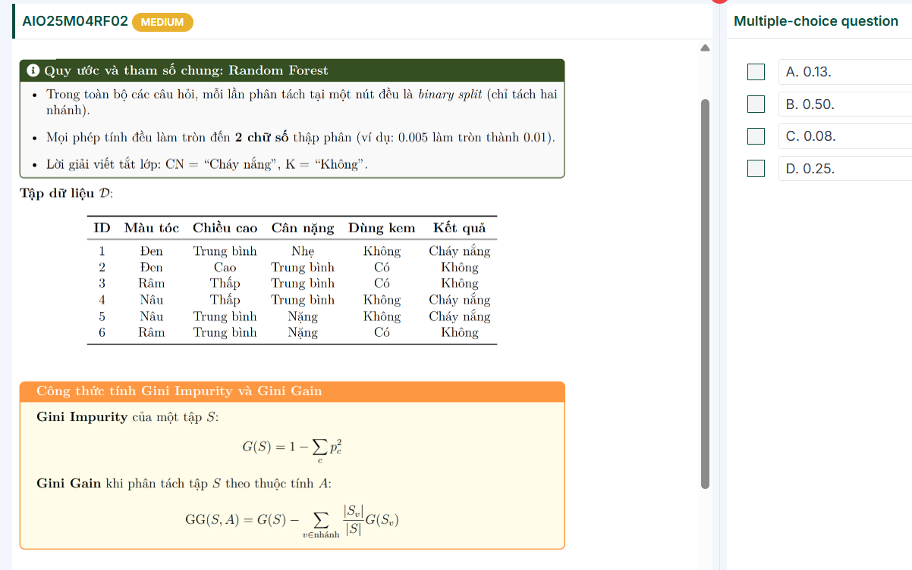
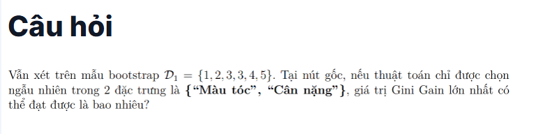
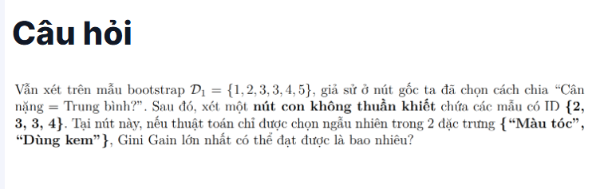
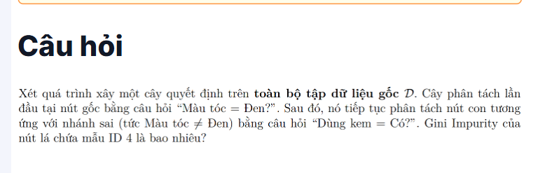
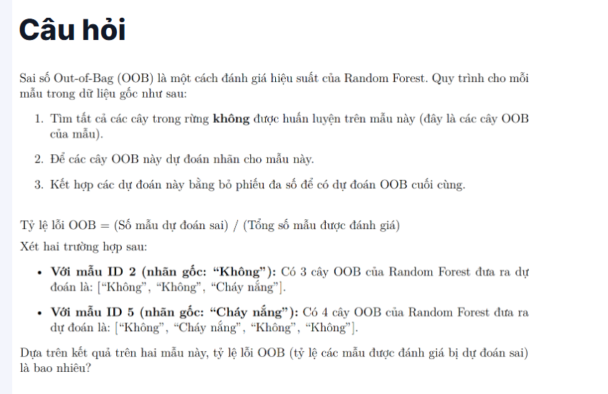
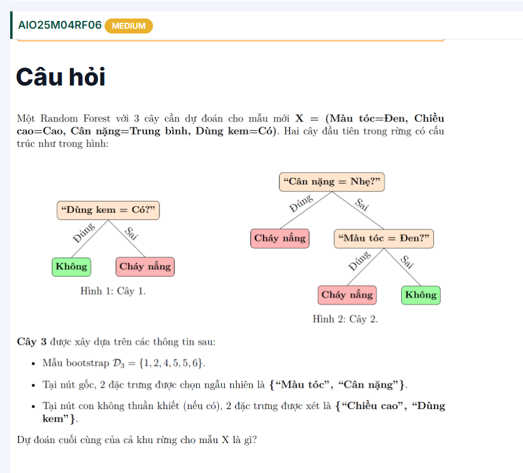
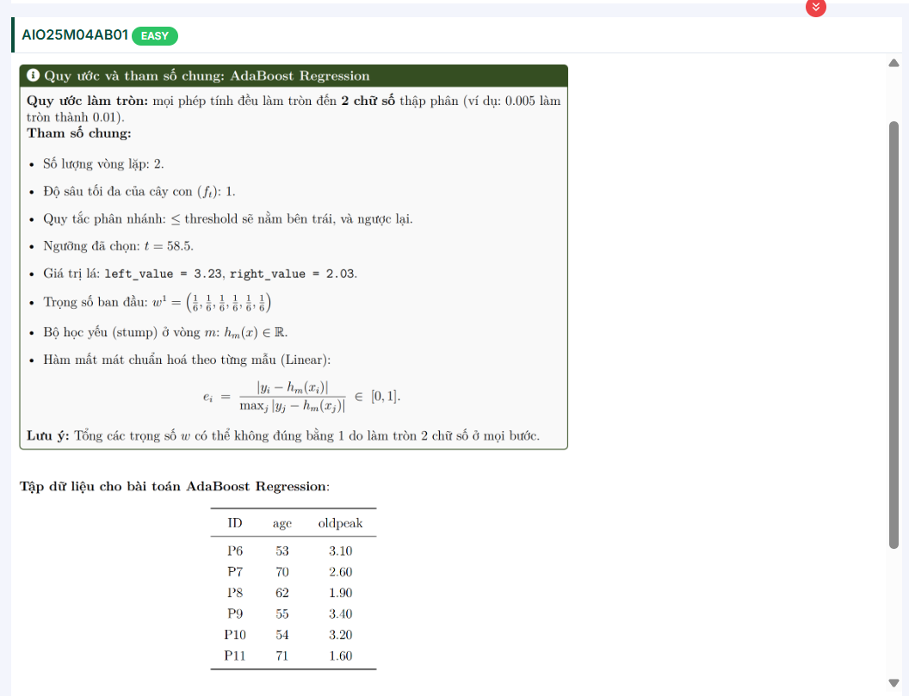
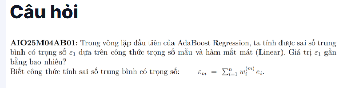
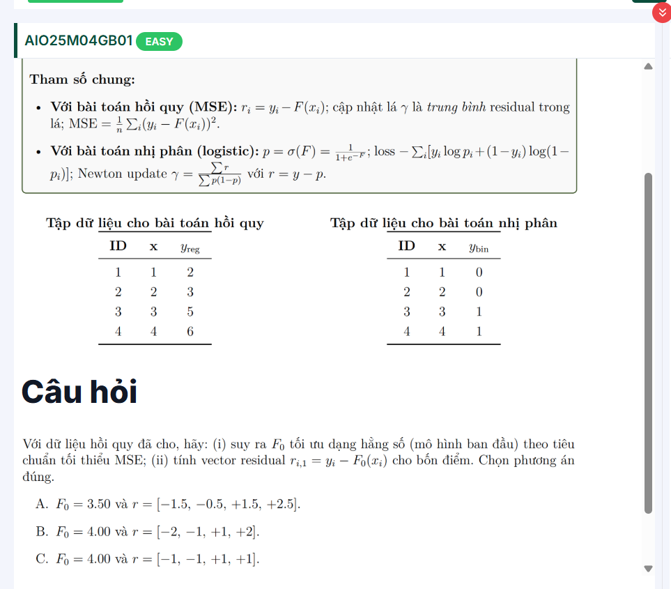
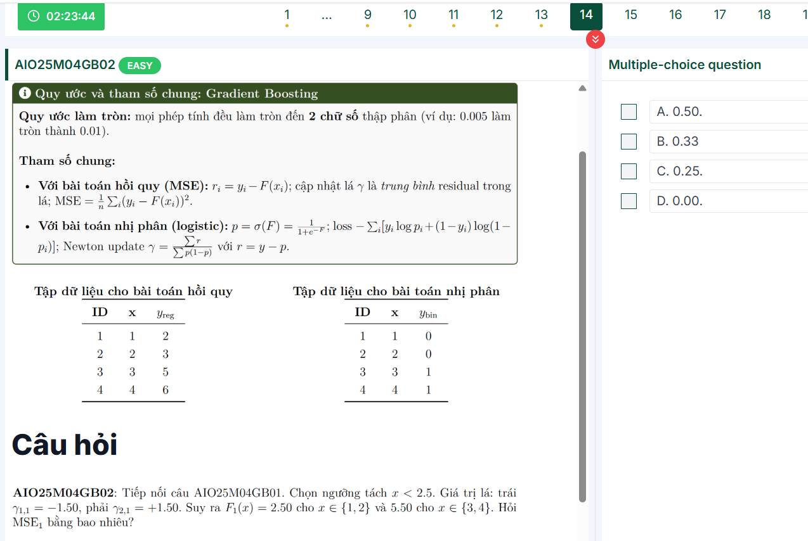

---

Ok, mình cùng giải chi tiết câu này nhé.

---

### 1. Tập bootstrap ( D_1 = )

→ tức là ta lấy 6 mẫu từ dữ liệu gốc theo bootstrap (có lặp).

Từ bảng dữ liệu gốc (ID 1–6):

| ID | Màu tóc | Chiều cao | Cân nặng  | Dùng kem | Kết quả   |
| -- | --------- | ---------- | ----------- | --------- | ----------- |
| 1  | Đen      | TB         | Nhẹ        | Không    | Cháy nắng |
| 2  | Đen      | Cao        | Trung bình | Có       | Không      |
| 3  | Rám      | Thấp      | Trung bình | Có       | Không      |
| 4  | Nâu      | Thấp      | Trung bình | Không    | Cháy nắng |
| 5  | Nâu      | TB         | Nặng       | Không    | Cháy nắng |
| 6  | Rám      | TB         | Nặng       | Có       | Không      |

Mẫu bootstrap ( D_1 ) gồm: 1, 2, 3, 3, 4, 5.

---

### 2. Phân bố nhãn trong ( D_1 )

* CN: ID 1,4,5 → 3 mẫu
* K: ID 2,3,3 → 3 mẫu

  → Tỉ lệ 50% - 50%.

Gini gốc:

[

G(S) = 1 - (0.5^2 + 0.5^2) = 0.5

]

---

### 3. Xét thuộc tính **“Màu tóc”**

Trong ( D_1 ):

* Đen: ID 1 (CN), ID 2 (K) → 2 mẫu (1–1) → Gini = 0.5
* Rám: ID 3,3 (K,K) → 2 mẫu (0–2) → Gini = 0
* Nâu: ID 4 (CN), ID 5 (CN) → 2 mẫu (2–0) → Gini = 0

Tính trung bình:

[

\sum \frac{|S_v|}{|S|} G(S_v) = \frac{2}{6}\cdot0.5 + \frac{2}{6}\cdot0 + \frac{2}{6}\cdot0 = 0.167

]

Gini Gain:

[

GG(S, \text{Màu tóc}) = 0.5 - 0.167 = 0.33

]

---

### 4. Xét thuộc tính **“Cân nặng”**

Trong ( D_1 ):

* Nhẹ: ID 1 (CN) → Gini = 0
* Trung bình: ID 2 (K), 3 (K), 3 (K), 4 (CN) → 4 mẫu (1–3)

  [

  G = 1 - \big(\left(\tfrac{1}{4}\right)^2 + \left(\tfrac{3}{4}\right)^2\big)

  = 1 - (0.0625 + 0.5625) = 0.375

  ]
* Nặng: ID 5 (CN) → Gini = 0

Tính trung bình:

[

\sum \frac{|S_v|}{|S|} G(S_v) = \frac{1}{6}\cdot0 + \frac{4}{6}\cdot0.375 + \frac{1}{6}\cdot0 = 0.25

]

Gini Gain:

[

GG(S, \text{Cân nặng}) = 0.5 - 0.25 = 0.25

]

---

### 5. Kết luận

* Gini Gain (Màu tóc) = **0.33**
* Gini Gain (Cân nặng) = **0.25**

👉 Giá trị lớn nhất = **0.33**

---

✅ Đáp án: **0.33**

Bạn có muốn mình viết luôn chi tiết cách làm tròn kết quả (2 chữ số thập phân như đề bài) không?

---

# Câu 3:

Ta làm trên mẫu bootstrap (D_1={1,2,3,3,4,5}).

Sau khi chia ở gốc theo  **“Cân nặng = Trung bình?”** , nút con đang xét có tập:

[

S={2,3,3,4}

]

Nhãn: (K={2,3,3}) (3 mẫu), (CN={4}) (1 mẫu).

[

G(S)=1-\Big(\big(\tfrac{3}{4}\big)^2+\big(\tfrac{1}{4}\big)^2\Big)=1-\tfrac{10}{16}=\tfrac{6}{16}=0.375

]

Xét hai thuộc tính được phép:

### 1) “Màu tóc”

* Đen: {2} → K (thuần) → (G=0)
* Rám: {3,3} → K (thuần) → (G=0)
* Nâu: {4} → CN (thuần) → (G=0)

Trung bình có trọng số sau tách = 0 ⇒

[

GG(S,\text{Màu tóc}) = 0.375 - 0 = 0.375

]

### 2) “Dùng kem”

* Có: {2,3,3} → K (thuần) → (G=0)
* Không: {4} → CN (thuần) → (G=0)

⇒

[

GG(S,\text{Dùng kem}) = 0.375 - 0 = 0.375

]

**Kết luận:** Gini Gain lớn nhất tại nút này là **0.375** (làm tròn 2 chữ số:  **0.38** ).

---

# Câu 4:

Kết quả là  **0.00** .

Giải nhanh:

* Từ gốc “ **Màu tóc = Đen?** ” → nhánh **sai** (≠ Đen) chứa {3,4,5,6}.
* Tách tiếp bằng “ **Dùng kem = Có?** ”:
  * Có → {3,6} → đều **Không** ⇒ Gini = 0.
  * Không → {4,5} → đều **Cháy nắng** ⇒ Gini = 0.

Mẫu **ID 4** nằm ở nhánh “Không” cùng ID 5, lá này thuần nhất ⇒  **Gini Impurity = 0** .

---

# Câu 5

Kết quả:

* **ID 2** (nhãn thật  *Không* ): dự đoán OOB = [ *Không* ,  *Không* ,  *Cháy nắng* ] → đa số *Không* →  **đúng** .
* **ID 5** (nhãn thật  *Cháy nắng* ): dự đoán OOB = [ *Không* ,  *Cháy nắng* ,  *Không* ,  *Không* ] → đa số *Không* →  **sai** .

Tỉ lệ lỗi OOB (trên hai mẫu này) = số dự đoán sai / số mẫu đánh giá =  **1 / 2 = 0.50** .

---

# Câu 6:

---

### 1. Tập bootstrap (D_3)

| ID | Màu tóc | Cân nặng | Nhãn |
| -- | --------- | ---------- | ----- |
| 1  | Đen      | Nhẹ       | CN    |
| 2  | Đen      | TB         | K     |
| 4  | Nâu      | TB         | CN    |
| 5  | Nâu      | Nặng      | CN    |
| 5  | Nâu      | Nặng      | CN    |
| 6  | Rám      | Nặng      | K     |

Đếm nhãn:

* CN = 4 (ID1, ID4, ID5, ID5)
* K = 2 (ID2, ID6)

---

### 2. Ở gốc: đặc trưng chọn ngẫu nhiên

#### Trường hợp chọn **Màu tóc**

* Đen: {1 (CN), 2 (K)} → không thuần
* Nâu: {4 (CN), 5,5 (CN,CN)} → thuần CN
* Rám: {6 (K)} → thuần K

Với X (Màu tóc = Đen, Cân nặng = TB, Dùng kem = Có):

→ rơi vào nhánh **Đen** (ID1,2).

* ID1: Không dùng kem, CN
* ID2: Có dùng kem, K

  → Nếu tiếp tục tách theo “Dùng kem”: với X (Có) →  **K** .

---

#### Trường hợp chọn **Cân nặng**

* Nhẹ: {1 (CN)} → thuần CN
* TB: {2 (K), 4 (CN)} → không thuần
* Nặng: {5,5 (CN,CN), 6 (K)} → không thuần

Với X (Cân nặng = TB):

→ rơi vào nhánh {2 (K), 4 (CN)}.

* ID2: Đen, K
* ID4: Nâu, CN

  → Nếu tiếp tục tách theo “Màu tóc”:

  * Đen → K
  * Nâu → CN

    → Với X (Đen) →  **K** .

---

### 3. Kết luận cho Cây 3

Dù chọn tách theo **Màu tóc** hay **Cân nặng** ở gốc, cuối cùng X vẫn được dự đoán  **K (Không)** .

---

### 4. Tổng hợp cả rừng

* Cây 1 → Không
* Cây 2 → Cháy nắng
* Cây 3 → Không

→ Bỏ phiếu: **Không = 2, Cháy nắng = 1**

✅  **Dự đoán cuối cùng = Không** .

---

Bạn có muốn mình vẽ lại **sơ đồ Cây 3** để thấy rõ cách X đi qua các nhánh không?

---

# ---

# Câu 7

À, chuẩn rồi 👍 — trong đề là **bootstrap (D_3 = {1,2,4,5,5,6})** (ID 5 lặp lại 2 lần).

Mình sửa lại phân tích cho **Cây 3** nhé.

---

---

Ok, mình cùng đi từng bước cho bài AdaBoost Regression này nhé 🚀

---

## 1. Thông tin đề cho

* Số vòng lặp: **2**
* Stump: độ sâu 1, chia tại **ngưỡng t = 58.5**
* Giá trị lá:

  * left_value = 3.23 (nhánh trái, age ≤ 58.5)
  * right_value = 2.03 (nhánh phải, age > 58.5)
* Trọng số ban đầu:

  [

  w^1 = \left(\tfrac{1}{6}, \tfrac{1}{6}, \tfrac{1}{6}, \tfrac{1}{6}, \tfrac{1}{6}, \tfrac{1}{6}\right)

  ]

Tập dữ liệu:

| ID  | age | oldpeak (y) |
| --- | --- | ----------- |
| P6  | 53  | 3.10        |
| P7  | 70  | 2.60        |
| P8  | 62  | 1.90        |
| P9  | 55  | 3.40        |
| P10 | 54  | 3.20        |
| P11 | 71  | 1.60        |

---

## 2. Vòng lặp 1 (m=1)

### 2.1. Dự đoán của stump (h_1(x))

* Với age ≤ 58.5: dự đoán = 3.23

  → P6, P9, P10.
* Với age > 58.5: dự đoán = 2.03

  → P7, P8, P11.

### 2.2. Sai số chuẩn hoá (e_i)

Công thức:

[

e_i = \frac{|y_i - h_m(x_i)|}{\max_j |y_j - h_m(x_j)|}

]

Tính riêng:

* P6: |3.10 - 3.23| = 0.13
* P7: |2.60 - 2.03| = 0.57
* P8: |1.90 - 2.03| = 0.13
* P9: |3.40 - 3.23| = 0.17
* P10: |3.20 - 3.23| = 0.03
* P11: |1.60 - 2.03| = 0.43

Max = 0.57.

Chia cho 0.57 →

* P6: 0.13/0.57 ≈ 0.23
* P7: 0.57/0.57 = 1.00
* P8: 0.13/0.57 ≈ 0.23
* P9: 0.17/0.57 ≈ 0.30
* P10: 0.03/0.57 ≈ 0.05
* P11: 0.43/0.57 ≈ 0.75

---

## 3. Cập nhật trọng số

Công thức chuẩn của AdaBoost.R2:

[

w_i^{(m+1)} \propto w_i^{(m)} \cdot \beta^{1-e_i}

]

với (\beta = \frac{\epsilon}{1-\epsilon}), (\epsilon = \sum w_i e_i).

### 3.1. Tính lỗi (\epsilon)

[

\epsilon = \sum w_i e_i = \tfrac{1}{6}(0.23+1+0.23+0.30+0.05+0.75) \approx 0.43

]

### 3.2. Tính (\beta)

[

\beta = \frac{0.43}{1-0.43} = \frac{0.43}{0.57} \approx 0.75

]

---

## 4. Tới đây

* Đã xong vòng lặp 1 → có dự đoán của stump 1 (h1), trọng số mới (w^2).
* Vòng lặp 2 sẽ chọn lại đặc trưng, tiếp tục xây stump.
* Cuối cùng kết hợp 2 cây theo trọng số (\alpha_m = \log(1/\beta)).

---

👉 Bạn có muốn mình làm  **tiếp vòng lặp 2 (tính toàn bộ (\alpha_1,\alpha_2) và dự đoán cuối)** , hay chỉ cần dừng ở kết quả vòng 1 như trên?

(\displaystyle \varepsilon_1 \approx 0.43).

Tính nhanh:

* Dự đoán của stump (h_1): age ≤ 58.5 → 3.23; age > 58.5 → 2.03.
* Sai số chuẩn hoá (làm tròn 2 chữ số):

  ([0.23,,1.00,,0.23,,0.30,,0.05,,0.75]).
* Trọng số ban đầu đều (= \tfrac{1}{6}).

[

\varepsilon_1=\sum_{i=1}^{6}\tfrac{1}{6} e_i

=\tfrac{1}{6}(0.23+1.00+0.23+0.30+0.05+0.75)

=\tfrac{2.56}{6}\approx 0.43.

]

---

Đáp án đúng:  **B** .

Vì mô hình khởi tạo (F_0) (hằng số) tối ưu theo MSE là **trung bình** của (y):

(\bar y=(2+3+5+6)/4=4.00 \Rightarrow F_0(x)\equiv 4.00).

Residual vòng 1: (r_{i,1}=y_i-F_0(x_i))

(\Rightarrow [-2,,-1,,+1,,+2]).

Khớp với phương án  **B** .

Bạn có muốn mình nhắc nhanh “vì sao trung bình tối ưu MSE” không?

Tuyệt—giải thích “vì sao trung bình tối ưu MSE” nè:

### Cách 1 (đạo hàm nhanh)

Mô hình hằng số (F_0(x)\equiv c).

MSE: (\frac1n\sum_{i=1}^n (y_i-c)^2).

Lấy đạo hàm theo (c):

[

\frac{d}{dc}\Big[\tfrac1n\sum (y_i-c)^2\Big]

= \tfrac{-2}{n}\sum (y_i-c).

]

Đặt bằng 0 ⇒ (\sum y_i - nc = 0 \Rightarrow c=\bar y) (trung bình).

Đạo hàm hai (= \tfrac{2}{n}>0) ⇒ đây là  **min** .

### Cách 2 (phân rã “bình phương khoảng cách”)

[

\sum (y_i-c)^2

= \sum (y_i-\bar y)^2 + n(c-\bar y)^2.

]

Vế trái bằng “phương sai quanh trung bình” (hằng số) + (n(c-\bar y)^2) (≥0).

Muốn nhỏ nhất ⇒ (c=\bar y).

### Trực giác

Trung bình là “tâm khối” của các điểm trên trục số; bình phương sai số phạt mạnh các điểm xa, nên đặt tâm tại trung bình sẽ cân bằng tổng bình phương khoảng cách tốt nhất.

(So sánh: nếu dùng MAE (\sum|y_i-c|) thì **trung vị** tối ưu.)

---

Một câu kiểm tra nhỏ:

Với (y=[2,3,5,6]), bạn thử tính (\sum (y_i-3.5)^2) rồi so với (\sum (y_i-4)^2); cái nào nhỏ hơn?

---

---

Ta làm nhanh theo đúng bước của Gradient Boosting (học quy):

**B1. Mô hình khởi tạo**

Từ câu trước: (F_0(x)=4.00) ⇒ residual (r=y-F_0=[-2,-1,+1,+2]).

**B2. Fit cây lên residual với ngưỡng (x<2.5)**

* Nhánh trái (x\in{1,2}): (r={-2,-1}) ⇒ (\gamma_{1,L}=\text{mean}=-1.50).
* Nhánh phải (x\in{3,4}): (r={+1,+2}) ⇒ (\gamma_{1,R}=+1.50).

**B3. Cập nhật mô hình** (learning rate = 1):

* (F_1(x)=4+(-1.5)=2.50) cho (x\in{1,2}).
* (F_1(x)=4+(+1.5)=5.50) cho (x\in{3,4}).

**B4. Tính MSE(_1)** với (y=[2,3,5,6]):

[

\text{MSE}_1=\frac{(2-2.5)^2+(3-2.5)^2+(5-5.5)^2+(6-5.5)^2}{4}

=\frac{0.25+0.25+0.25+0.25}{4}= \boxed{0.25}.

]

Bạn thử kiểm tra nhanh một hạng mục: ((3-2.5)^2=)?

---

# Gradient Boosting

ok — mình “mổ xẻ” **vòng 1** của Gradient Boosting (bài hồi quy) từng bước, có số cụ thể:

### Dữ liệu

[

(x,y)={(1,2),(2,3),(3,5),(4,6)}

]

### B0. Khởi tạo (F_0)

Với MSE, mô hình hằng số tối ưu là  **trung bình y** :

[

F_0(x)\equiv \bar y=\frac{2+3+5+6}{4}=4.00

]

Residual ban đầu (vòng 1):

[

r_{i,1}=y_i-F_0(x_i)=[-2,,-1,,+1,,+2].

]

### B1. Chọn tách (stump) ở vòng 1

Giả sử tách tại **(x<2.5)** ⇒ 2 lá:

* **Lá trái** ({x=1,2}) có residual ({-2,-1})
* **Lá phải** ({x=3,4}) có residual ({+1,+2})

### B2. Tính giá trị lá (\gamma)

Với MSE, mỗi lá chọn (\gamma) là **trung bình residual trong lá** (chứng minh nhanh: (\min_\gamma\sum(r-\gamma)^2\Rightarrow \gamma=\bar r)).

* Lá trái: (\gamma_{L}=\frac{-2+(-1)}{2}=-1.50)
* Lá phải: (\gamma_{R}=\frac{1+2}{2}=+1.50)

Bộ học yếu (h_1(x)) xuất **(\gamma)** theo lá:

[

h_1(x)=[-1.5,,-1.5,,+1.5,,+1.5].

]

### B3. Cập nhật mô hình

Dùng learning rate (\eta=1):

[

F_1(x)=F_0(x)+\eta,h_1(x)=4+h_1(x)

]

[

F_1=[2.5,,2.5,,5.5,,5.5].

]

### B4. Loss sau vòng 1 (MSE(_1))

Sai số từng điểm:

((2-2.5)^2=(3-2.5)^2=(5-5.5)^2=(6-5.5)^2=0.25).

[

\mathrm{MSE}_1=\frac{0.25+0.25+0.25+0.25}{4}=0.25.

]

> (Residual cho **vòng 2** sẽ là (r_{i,2}=y_i-F_1(x_i)=[-0.5,,+0.5,,-0.5,,+0.5]).)

---

**Check nhanh (1 câu):** nếu dùng  **learning rate (\eta=0.5)** , thì (F_1(3)) bằng bao nhiêu? (gợi ý: (F_0(3)=4), (h_1(3)=+1.5)).

Mình chỉ từng bước để bạn tự tính được nhé 👇

### Bài toán (vòng 2 của GB hồi quy)

* Từ vòng 1: (F_1(x)=2.50) cho (x\in{1,2}); (F_1(x)=5.50) cho (x\in{3,4}).
* Ở vòng 2 ta dùng split **(x<1.5)** ⇒ lá trái ({x_1}), lá phải ({x_2,x_3,x_4}).
* Với MSE:

  [

  r_{i,2}=y_i-F_1(x_i),\qquad

  \gamma_{\text{lá}}=\text{mean}(r \text{ trong lá}),\qquad

  F_2(x)=F_1(x)+\gamma_{\text{lá}} ;(\eta=1).

  ]

### B1) Tính residual vòng 2

Dữ liệu (y={2,3,5,6}).

[

r_{i,2}=y-F_1={-0.5,; +0.5,; -0.5,; +0.5}.

]

### B2) Giá trị lá (\gamma)

* Lá trái ({x_1}): (\gamma_{1,2}=-0.50) (đúng như đề cho).
* Lá phải ({x_2,x_3,x_4}): (\gamma_{2,2}=\frac{0.5+(-0.5)+0.5}{3}=0.1667\approx 0.17).

### B3) Cập nhật (F_2) cho (x=2)

(x=2) thuộc  **lá phải** , nên

[

F_2(2)=F_1(2)+\gamma_{2,2}=2.50+0.17=\boxed{2.67}.

]

( Nếu dùng learning rate (\eta\neq 1) thì: (F_2(2)=2.50+\eta\cdot 0.17). )

Bạn thử tính nhanh **(F_2(1))** xem ra bao nhiêu? (gợi ý: dùng (\gamma_{1,2}=-0.50)).

---
