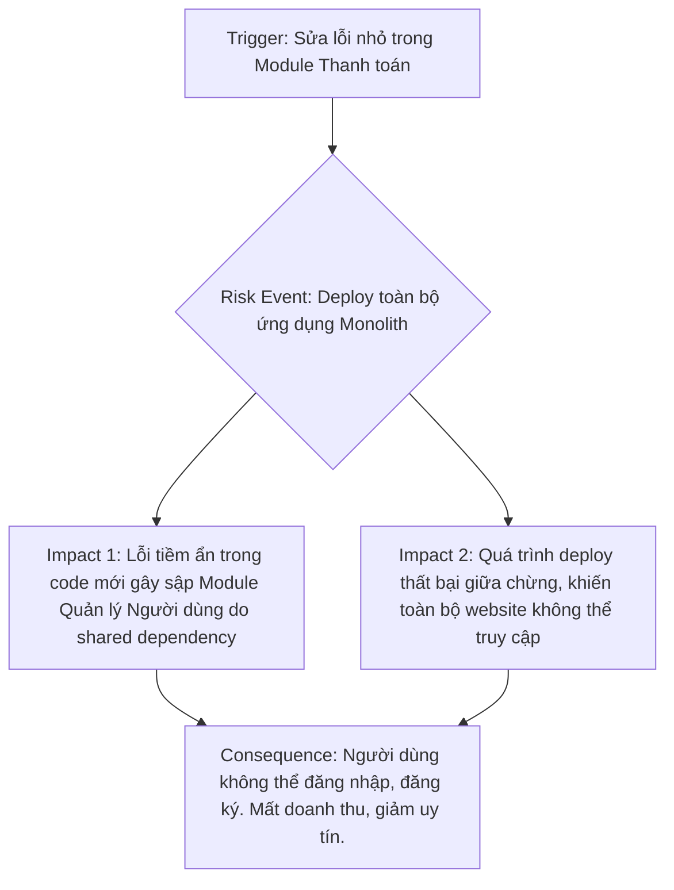
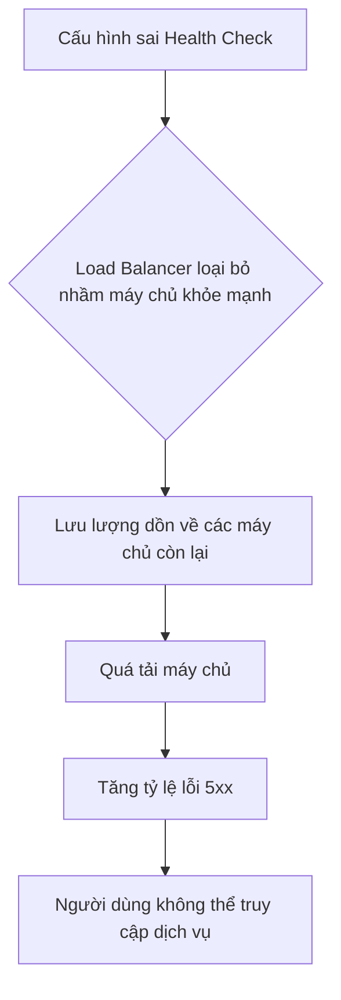
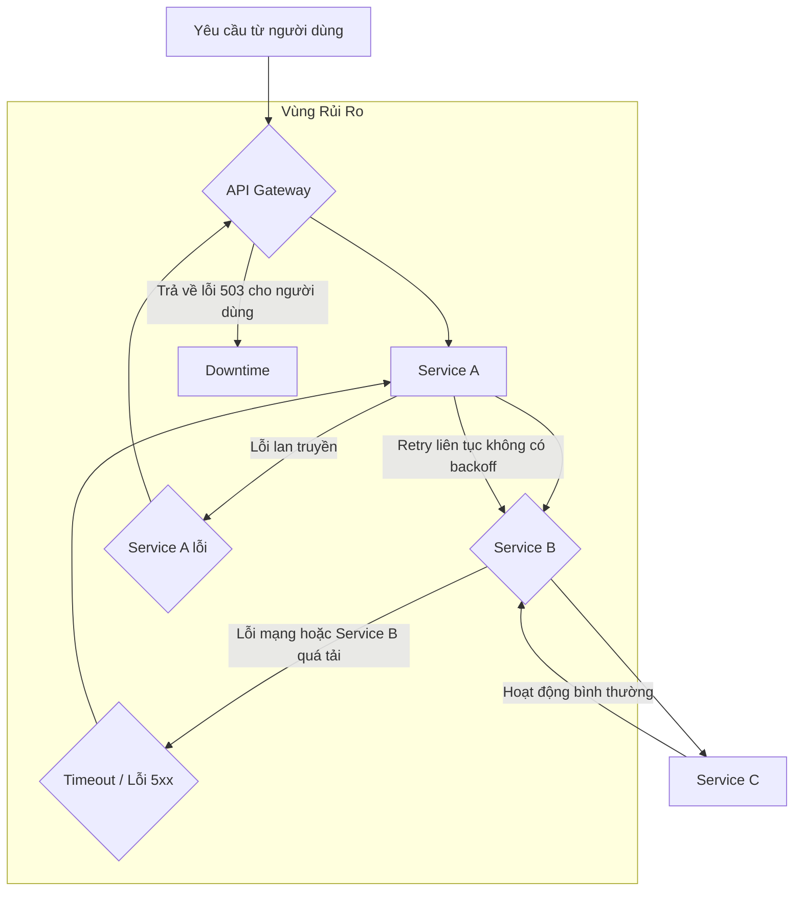

## Chương 3: Rủi Ro Architecture Không Phù Hợp

### 3.1 Rủi Ro Monolithic Architecture

#### Định Nghĩa Rủi Ro
- **Định nghĩa:** Rủi ro kiến trúc Monolithic là những nguy cơ tiềm ẩn xuất phát từ việc xây dựng và vận hành một ứng dụng dưới dạng một khối đơn nhất, không thể phân chia. Trong kiến trúc này, tất cả các thành phần chức năng (giao diện người dùng, logic nghiệp vụ, tầng truy cập dữ liệu) được liên kết chặt chẽ và triển khai như một đơn vị duy nhất. Rủi ro chính bao gồm **Deployment Coupling** (sự phụ thuộc trong triển khai) và **Scaling Inefficiencies** (tính không hiệu quả khi mở rộng), khiến cho việc cập nhật, sửa lỗi và mở rộng hệ thống trở nên khó khăn, chậm chạp và đầy rủi ro khi ứng dụng phát triển.
- **Tại sao phát sinh:** Rủi ro này phát sinh do bản chất của monolith. Khi hệ thống còn nhỏ, sự đơn giản là một lợi thế. Tuy nhiên, khi quy mô và độ phức tạp tăng lên, việc tất cả các thành phần đều nằm trong một codebase và một quy trình triển khai duy nhất tạo ra một điểm tắc nghẽn khổng lồ. Một thay đổi nhỏ ở một module có thể ảnh hưởng đến toàn bộ hệ thống, và toàn bộ ứng dụng phải được xây dựng và triển khai lại, làm tăng đáng kể khả năng xảy ra lỗi.
- **Mức độ nghiêm trọng tiềm tàng:** **High**. Các rủi ro này có thể gây ra downtime toàn hệ thống, làm chậm đáng kể tốc độ phát triển sản phẩm, lãng phí tài nguyên và cuối cùng là kìm hãm sự phát triển của doanh nghiệp.

#### Nguyên Nhân Gốc Rễ (Root Causes)
1.  **Tightly Coupled Codebase (Mã nguồn liên kết chặt chẽ):** Trong một monolith, các module thường có sự phụ thuộc lẫn nhau một cách phức tạp và khó kiểm soát. Logic nghiệp vụ của một tính năng có thể gọi trực tiếp đến các hàm hoặc chia sẻ các bảng dữ liệu với các tính năng khác, tạo ra một "mớ bòng bong" (spaghetti code). Điều này khiến việc thay đổi một thành phần mà không gây ra lỗi phụ ở nơi khác trở nên cực kỳ khó khăn.
2.  **Single Deployment Unit (Đơn vị triển khai duy nhất):** Bất kỳ thay đổi nào, từ việc sửa một lỗi chính tả nhỏ cho đến việc thêm một tính năng lớn, đều yêu cầu toàn bộ ứng dụng phải được build, test và deploy lại. Quy trình này không chỉ tốn thời gian mà còn cực kỳ rủi ro. Một lỗi nhỏ trong một module không quan trọng cũng có thể làm sập toàn bộ hệ thống, dẫn đến "nỗi sợ hãi khi deploy" (deployment paralysis).
3.  **Inflexible Technology Stack (Ngăn xếp công nghệ không linh hoạt):** Toàn bộ ứng dụng bị khóa chặt vào một bộ công nghệ (ngôn ngữ lập trình, framework, cơ sở dữ liệu) đã được chọn từ đầu. Việc áp dụng một công nghệ mới, hiệu quả hơn cho một chức năng cụ thể là gần như không thể. Điều này ngăn cản sự đổi mới và khiến hệ thống dần trở nên lỗi thời.
4.  **Cognitive Overload for Developers (Quá tải nhận thức cho lập trình viên):** Khi monolith phình to, không một cá nhân nào có thể hiểu hết toàn bộ hệ thống. Các lập trình viên mới mất hàng tháng trời để có thể đóng góp hiệu quả. Việc debug và phát triển trở nên chậm chạp vì các kỹ sư phải điều hướng trong một codebase khổng lồ và phức tạp, làm tăng khả năng gây ra lỗi mới.

#### Biểu Hiện & Triệu Chứng (Symptoms)
- **Dấu hiệu cảnh báo sớm:**
    - Thời gian build và deploy tăng lên theo cấp số nhân (từ vài phút lên đến hàng giờ).
    - Các cuộc họp về kế hoạch deploy trở nên căng thẳng, đội ngũ thường tránh deploy vào cuối tuần hoặc cuối ngày.
    - Các lỗi nhỏ ở một khu vực không liên quan lại gây ra sự cố nghiêm trọng ở khu vực khác.
- **Các metrics/logs cần theo dõi:**
    - **Lead Time for Changes:** Thời gian từ lúc code được commit đến lúc được deploy ra production ngày càng dài.
    - **Deployment Frequency:** Tần suất deploy giảm mạnh (từ nhiều lần một ngày xuống còn vài lần một tháng hoặc một quý).
    - **Mean Time To Recovery (MTTR):** Thời gian để khôi phục dịch vụ sau sự cố tăng lên do phải rollback hoặc vá lỗi cả một khối ứng dụng khổng lồ.
    - **CPU/Memory Utilization:** Biểu đồ tài nguyên cho thấy toàn bộ ứng dụng phải được scale lên, ngay cả khi chỉ một tính năng nhỏ bị quá tải.
- **Red flags trong hệ thống:**
    - Merge conflicts xảy ra thường xuyên khi nhiều team cùng làm việc trên một codebase.
    - Doanh nghiệp ngần ngại phê duyệt các tính năng mới vì sợ làm "sập" hệ thống hiện tại.
    - Việc onboarding một lập trình viên mới trở thành một quá trình đau khổ và kéo dài.

#### Sơ Đồ Phân Tích


#### Tác Động Cụ Thể (Impact Analysis)

| Khía Cạnh       | Mức Độ   | Chi Tiết                                                                                                                               |
|-----------------|----------|----------------------------------------------------------------------------------------------------------------------------------------|
| Downtime        | High     | Một lỗi ở thành phần không quan trọng có thể gây sập toàn bộ hệ thống. Thời gian rollback lâu do phải deploy lại cả khối lớn.          |
| Financial       | $10k-$100k+/hour | Ước tính dựa trên doanh thu bị mất mỗi giờ, chi phí nhân sự để khắc phục sự cố, và tổn thất do vi phạm SLA (Service Level Agreement). |
| Security        | High     | Một lỗ hổng trong một thư viện hoặc module có thể mở ra cánh cửa tấn công vào toàn bộ dữ liệu và chức năng của ứng dụng.                |
| User Experience | Severe   | Toàn bộ người dùng bị ảnh hưởng khi có sự cố. Tốc độ tải trang chậm do tất cả các tính năng đều chung một tài nguyên.                |
| Team Morale     | High     | Sự sợ hãi, căng thẳng khi deploy, và sự thất vọng do tốc độ làm việc chậm chạp làm giảm tinh thần và tăng tỷ lệ nghỉ việc của kỹ sư. |

#### Case Study Thực Tế
**SoundCloud - Hành trình phá vỡ Monolith (Bắt đầu khoảng 2011-2012)**
- **Bối cảnh:** SoundCloud ban đầu được xây dựng trên một ứng dụng Ruby on Rails monolithic duy nhất. Khi nền tảng phát triển nhanh chóng, monolith này trở nên cồng kềnh, khó bảo trì và cản trở việc phát triển các tính năng mới.
- **Diễn biến:** Đội ngũ kỹ sư đối mặt với tình trạng "deployment coupling" và "scaling inefficiencies" nghiêm trọng. Việc deploy trở nên rủi ro, và họ không thể scale riêng lẻ các thành phần chịu tải cao (như xử lý audio). Họ quyết định chuyển sang kiến trúc microservices bằng cách áp dụng "Strangler Pattern", dần dần xây dựng các service mới để thay thế chức năng của monolith cũ.
- **Nguyên nhân gốc rễ:** Monolith của SoundCloud đã trở nên quá lớn và phức tạp, mã nguồn liên kết chặt chẽ, và ngăn xếp công nghệ đã lỗi thời, không đáp ứng được nhu cầu scale linh hoạt.
- **Tác động:** Trước khi chuyển đổi, tốc độ phát triển rất chậm, và các sự cố thường xuyên ảnh hưởng đến toàn bộ nền tảng. Việc không thể scale hiệu quả đã lãng phí một lượng lớn tài nguyên máy chủ.
- **Bài học:** SoundCloud đã học được rằng việc chuyển đổi cần một kế hoạch chi tiết và sự quyết tâm. Việc áp dụng các kỹ thuật như so sánh response song song giữa hệ thống cũ và mới (parallel testing) là cực kỳ quan trọng để đảm bảo quá trình di chuyển diễn ra an toàn. Họ cũng nhấn mạnh tầm quan trọng của việc đo lường và ra quyết định dựa trên dữ liệu.
- **Nguồn:** [SoundCloud's Multi-Year Journey Breaking the Monolith](https://nordicapis.com/case-study-soundclouds-multi-year-journey-breaking-the-monolith/)

#### Risk Mitigation Strategies

**Preventive Measures (Ngăn ngừa):**
1.  **Modular Monolith:** Thiết kế monolith theo hướng module hóa ngay từ đầu. Áp dụng các nguyên tắc SOLID và thiết lập ranh giới rõ ràng giữa các module (bounded contexts). Dù vẫn là một đơn vị triển khai, nhưng mã nguồn sẽ dễ quản lý và tách biệt hơn.
2.  **Decouple with APIs:** Thay vì gọi hàm trực tiếp giữa các module, hãy cho chúng giao tiếp qua các API nội bộ (internal APIs). Điều này chuẩn bị sẵn sàng cho việc tách các module thành microservices trong tương lai.
3.  **CI/CD and Automated Testing:** Xây dựng một quy trình CI/CD mạnh mẽ với bộ test tự động bao phủ rộng (unit, integration, end-to-end tests). Điều này giúp phát hiện lỗi sớm và tăng sự tự tin khi deploy, dù vẫn phải deploy cả khối.

**Detective Measures (Phát hiện):**
1.  **Comprehensive Monitoring & Alerting:** Sử dụng các công cụ như Prometheus, Grafana, Datadog để theo dõi các chỉ số quan trọng (CPU, memory, response time, error rate) của toàn bộ ứng dụng. Thiết lập cảnh báo khi các chỉ số vượt ngưỡng bất thường.
2.  **Distributed Tracing:** Tích hợp các công cụ tracing (như Jaeger, Zipkin) ngay cả trong monolith. Điều này giúp theo dõi một request đi qua các module khác nhau như thế nào, cực kỳ hữu ích để xác định nút thắt cổ chai và nguồn gốc của lỗi.
3.  **Log Aggregation and Analysis:** Tập trung log từ toàn bộ ứng dụng vào một nơi (ví dụ: ELK Stack, Splunk). Tìm kiếm các log pattern bất thường, ví dụ như một module đột nhiên ghi ra quá nhiều lỗi sau một lần deploy.

**Corrective Measures (Khắc phục):**
1.  **Automated Rollback:** Quy trình deploy phải có khả năng rollback tự động về phiên bản ổn định trước đó ngay khi phát hiện các chỉ số sức khỏe (health checks) suy giảm hoặc tỷ lệ lỗi tăng đột biến.
2.  **Feature Flags:** Sử dụng cờ tính năng (feature flags) để bật/tắt các chức năng mới một cách độc lập với việc deploy code. Nếu một tính năng mới gây sự cố, ta có thể tắt nó đi ngay lập tức mà không cần rollback toàn bộ ứng dụng.
3.  **Strangler Fig Pattern:** Khi monolith đã trở nên quá rủi ro, hãy bắt đầu quá trình "bóp nghẹt" nó. Xây dựng một proxy phía trước monolith và dần dần chuyển hướng traffic của từng chức năng sang các microservice mới được xây dựng riêng.

#### Code Examples

**Anti-pattern (Cách làm SAI):**
```python
# ❌ ANTI-PATTERN: Các module gọi trực tiếp lẫn nhau, tạo ra liên kết chặt chẽ.

# user_service.py
class UserService:
    def get_user_profile(self, user_id):
        # ... logic lấy profile
        return {"name": "John Doe", "level": "gold"}

# order_service.py
from user_service import UserService # Phụ thuộc trực tiếp vào class của module khác

class OrderService:
    def __init__(self):
        self.user_service = UserService()

    def apply_discount(self, user_id, order_total):
        user_profile = self.user_service.get_user_profile(user_id)
        if user_profile["level"] == "gold":
            return order_total * 0.9 # Giảm 10%
        return order_total
```

**Best Practice (Cách làm ĐÚNG):**
```python
# ✅ BEST PRACTICE: Các module giao tiếp qua một lớp trừu tượng (API Gateway/Event Bus), giảm phụ thuộc.

# api_gateway.py (hoặc một event bus)
class APIGateway:
    def __init__(self):
        # Trong thực tế, gateway sẽ gọi đến các service đã đăng ký
        from user_service_decoupled import UserService
        self.services = {"user": UserService()}

    def request(self, service_name, method, **kwargs):
        service = self.services.get(service_name)
        return getattr(service, method)(**kwargs)

# user_service_decoupled.py
class UserService:
    def get_user_profile(self, user_id):
        return {"name": "John Doe", "level": "gold"}

# order_service_decoupled.py
class OrderService:
    def __init__(self, api_gateway):
        self.api_gateway = api_gateway

    def apply_discount(self, user_id, order_total):
        # Giao tiếp gián tiếp qua gateway
        user_profile = self.api_gateway.request("user", "get_user_profile", user_id=user_id)
        if user_profile["level"] == "gold":
            return order_total * 0.9
        return order_total
```

#### Risk Assessment Matrix

| Yếu Tố                | Đánh Giá | Ghi Chú                                                                                                                            |
|------------------------|----------|------------------------------------------------------------------------------------------------------------------------------------|
| Xác suất (Probability) | 5        | Gần như chắc chắn sẽ xảy ra khi ứng dụng phát triển về quy mô và độ phức tạp. Đây là một quy luật tự nhiên của các hệ thống lớn. |
| Tác động (Impact)      | 4        | Tác động rất lớn đến tốc độ phát triển, sự ổn định của hệ thống, chi phí vận hành và tinh thần của đội ngũ.                         |
| **Risk Score**         | **20**   | **Critical**                                                                                                                       |
| Ưu tiên xử lý          | P1       | Cần được giải quyết bằng các chiến lược ngăn ngừa từ sớm hoặc có kế hoạch di chuyển rõ ràng khi các triệu chứng bắt đầu xuất hiện. |

#### Checklist Đánh Giá
- [ ] Thời gian deploy của bạn có đang tăng lên không? Nó có vượt quá 30 phút không?
- [ ] Đội ngũ của bạn có cảm thấy lo lắng hay trì hoãn việc deploy không?
- [ ] Một thay đổi ở một module đã bao giờ gây ra lỗi không mong muốn ở một module khác chưa?
- [ ] Bạn có thể áp dụng một framework/ngôn ngữ mới cho một tính năng mới mà không cần viết lại phần lớn ứng dụng không?
- [ ] Một lập trình viên mới có thể hiểu và đóng góp vào codebase trong vòng 2 tuần đầu tiên không?
- [ ] Bạn có thể scale riêng một tính năng đang chịu tải cao mà không cần scale toàn bộ ứng dụng không?
- [ ] Quy trình rollback của bạn có tự động và mất dưới 5 phút không?

#### Tools & Resources
- **Docker:** Công cụ container hóa giúp đóng gói monolith và các phụ thuộc, làm cho việc deploy và scale theo chiều ngang (horizontal scaling) trở nên dễ dàng hơn một chút.
- **Jenkins/GitLab CI:** Các công cụ CI/CD giúp tự động hóa quy trình build, test và deploy, giảm thiểu sai sót của con người và tăng tốc độ triển khai.
- **Datadog/New Relic:** Các nền tảng APM (Application Performance Monitoring) cung cấp khả năng theo dõi, tracing và phân tích log toàn diện, giúp phát hiện và chẩn đoán sự cố trong monolith.

#### Nguồn Tham Khảo
1.  [Monolithic vs Microservices Architecture](https://aws.amazon.com/compare/the-difference-between-monolithic-and-microservices-architecture/) - Phân tích chi tiết về ưu và nhược điểm của hai loại kiến trúc từ Amazon Web Services.
2.  [The Strangler Fig Application](https://martinfowler.com/bliki/StranglerFigApplication.html) - Bài viết gốc của Martin Fowler định nghĩa về mẫu kiến trúc Strangler Fig, một chiến lược quan trọng để di chuyển khỏi monolith.
3.  [Scaling Monoliths: A Practical Guide](https://www.milanjovanovic.tech/blog/scaling-monoliths-a-practical-guide-for-growing-systems) - Hướng dẫn thực tế về các kỹ thuật để mở rộng một ứng dụng monolithic một cách hiệu quả.


### 3.2 Rủi Ro Scalability Bottlenecks

#### Định Nghĩa Rủi Ro
- **Định nghĩa:** Rủi ro tắc nghẽn khả năng mở rộng (Scalability Bottleneck) là tình trạng một thành phần hoặc tài nguyên trong hệ thống không thể xử lý được lượng tải (load) tăng đột biến, gây suy giảm hiệu năng toàn hệ thống hoặc dẫn đến sập dịch vụ. Điểm tắc nghẽn này giống như một nút cổ chai, giới hạn thông lượng tối đa của cả hệ thống, bất kể các thành phần khác có mạnh đến đâu.
- **Nguyên nhân phát sinh:** Rủi ro này thường phát sinh khi kiến trúc hệ thống ban đầu được thiết kế cho một quy mô nhỏ và không lường trước được sự tăng trưởng nhanh chóng của người dùng hoặc dữ liệu. Nó cũng có thể xảy ra do các quyết định thiết kế không tối ưu, lựa chọn công nghệ không phù hợp, hoặc khi đạt đến giới hạn vật lý của một phương pháp mở rộng cụ thể, chẳng hạn như mở rộng theo chiều dọc (vertical scaling).
- **Mức độ nghiêm trọng tiềm tàng:** **Critical**. Khi một bottleneck xảy ra ở quy mô lớn, nó có thể làm tê liệt hoàn toàn dịch vụ, gây ảnh hưởng đến toàn bộ người dùng và doanh thu.

#### Nguyên Nhân Gốc Rễ (Root Causes)
1.  **Đạt giới hạn của Mở rộng theo chiều dọc (Vertical Scaling Limits):** Mở rộng theo chiều dọc (tăng CPU, RAM, SSD cho một máy chủ duy nhất) luôn có giới hạn vật lý và chi phí tăng theo hàm mũ. Không thể có một máy chủ mạnh vô hạn. Khi ứng dụng phụ thuộc vào một máy chủ duy nhất (ví dụ: một database master), nó sẽ sớm đạt đến ngưỡng không thể nâng cấp thêm, trở thành điểm tắc nghẽn không thể vượt qua.
2.  **Thiết kế thuật toán không hiệu quả ở quy mô lớn:** Một thuật toán hoạt động tốt với 1,000 người dùng có thể trở thành thảm họa với 1,000,000 người dùng. Ví dụ kinh điển là chiến lược "fan-out-on-write" (nhân bản ghi) đồng bộ. Khi một hành động tạo ra hàng ngàn hoặc hàng triệu tác vụ ghi khác ngay lập tức, nó sẽ làm quá tải database và các service liên quan, như đã thấy trong trường hợp của Twitter.
3.  **Tranh chấp tài nguyên cơ sở dữ liệu (Database Contention):** Khi lượng truy cập tăng, nhiều tiến trình cố gắng đọc/ghi vào cùng một bảng hoặc hàng trong database, gây ra khóa (locking) và chờ đợi. Các truy vấn phức tạp, thiếu chỉ mục (index), hoặc thiết kế schema không tối ưu sẽ làm trầm trọng thêm vấn đề, biến database thành nút cổ chai lớn nhất.
4.  **Thiếu hoặc cấu hình sai bộ cân bằng tải (Load Balancer):** Nếu không có cơ chế phân phối lưu lượng truy cập một cách thông minh đến nhiều máy chủ, một máy chủ đơn lẻ có thể bị quá tải trong khi các máy chủ khác lại rảnh rỗi. Cấu hình sai "sticky sessions" hoặc thuật toán phân phối không phù hợp cũng có thể tạo ra điểm nóng (hotspot) trên một vài server.
5.  **Điểm lỗi đơn (Single Point of Failure - SPOF):** Bất kỳ thành phần nào trong hệ thống mà không có dự phòng (redundancy) đều là một SPOF tiềm tàng. Đó có thể là một database, một service xác thực, một message queue, hoặc thậm chí là một DNS server. Khi thành phần này gặp sự cố hoặc quá tải, toàn bộ hệ thống sẽ bị ảnh hưởng.

#### Biểu Hiện & Triệu Chứng (Symptoms)
- **Dấu hiệu cảnh báo sớm:**
    - Thời gian phản hồi (response time) của API tăng dần theo thời gian.
    - Mức sử dụng CPU hoặc RAM của một service/database liên tục ở mức cao (trên 80%).
    - Số lượng hàng đợi (queue length) trong message broker tăng đột biến và không giảm.
- **Các metrics/logs cần theo dõi:**
    - **Metrics:** P95/P99 latency, CPU/memory utilization, disk I/O, network throughput, database connection pool usage, cache hit/miss ratio.
    - **Logs:** Tìm kiếm các thông báo lỗi như "timeout", "connection refused", "deadlock detected", "out of memory".
- **Red flags trong hệ thống:**
    - Một service duy nhất có tỷ lệ lỗi cao hơn hẳn các service khác.
    - Downtime xảy ra vào những giờ cao điểm một cách có quy luật.
    - Việc thêm server mới (horizontal scaling) không cải thiện được hiệu năng tổng thể.

#### Sơ Đồ Phân Tích
```mermaid
graph TD
    A[Tăng trưởng người dùng/lưu lượng đột biến] --> B{Hệ thống đạt đến giới hạn của Vertical Scaling};
    B --> C[Tắc nghẽn tại Database Master];
    C --> D[Response Time tăng vọt];
    C --> E[Lỗi 5xx hàng loạt];
    D --> F[Trải nghiệm người dùng cực tệ];
    E --> G[Dịch vụ không khả dụng (Downtime)];
    F --> H[Mất niềm tin từ người dùng];
    G --> I[Mất doanh thu, ảnh hưởng thương hiệu];
```

#### Tác Động Cụ Thể (Impact Analysis)

| Khía Cạnh       | Mức Độ   | Chi Tiết                                                                                                |
|-----------------|----------|---------------------------------------------------------------------------------------------------------|
| Downtime        | High     | Có thể gây downtime toàn bộ hệ thống trong nhiều giờ hoặc nhiều ngày nếu không có kế hoạch khắc phục.      |
| Financial       | >$1M/hour| Ước tính dựa trên quy mô của các công ty lớn. Twitter mất hàng triệu USD cho mỗi giờ downtime trong giai đoạn đầu. |
| Security        | Medium   | Hệ thống quá tải có thể không xử lý kịp các bản vá bảo mật hoặc tạo ra các lỗ hổng do hành vi không lường trước. |
| User Experience | Severe   | Người dùng không thể truy cập dịch vụ, mất dữ liệu, trải nghiệm chậm chạp và không đáng tin cậy.             |
| Team Morale     | High     | Đội ngũ kỹ sư liên tục phải "chữa cháy", gây căng thẳng, kiệt sức và mất động lực.                       |

#### Case Study Thực Tế
**Twitter "Fail Whale" Era - (2007-2010)**
- **Bối cảnh:** Twitter trải qua giai đoạn tăng trưởng bùng nổ, từ vài nghìn người dùng lên hàng chục triệu. Kiến trúc ban đầu được xây dựng trên Ruby on Rails với một database MySQL duy nhất, được thiết kế cho quy mô nhỏ.
- **Diễn biến:** Dịch vụ thường xuyên sập, đặc biệt là trong các sự kiện lớn (ví dụ: World Cup, tin tức nóng). Hình ảnh một con cá voi được những con chim nhấc lên, được gọi là "Fail Whale", trở thành biểu tượng cho sự bất ổn của Twitter, xuất hiện mỗi khi trang web quá tải.
- **Nguyên nhân gốc rễ:** Nguyên nhân chính là kiến trúc Monolith và chiến lược **"fan-out-on-write"**. Khi một người nổi tiếng có hàng triệu người theo dõi đăng một tweet, hệ thống phải thực hiện hàng triệu lượt ghi vào database gần như đồng thời để cập nhật timeline cho tất cả mọi người. Database MySQL đơn lẻ không thể chịu nổi lượng ghi khổng lồ này, dẫn đến quá tải và sập toàn bộ hệ thống.
- **Tác động:** Downtime xảy ra liên tục, gây thiệt hại lớn về tài chính và uy tín. Trải nghiệm người dùng cực kỳ tồi tệ, nhưng do hiệu ứng mạng, người dùng vẫn ở lại.
- **Bài học:**
    1.  Kiến trúc phải được thiết kế cho khả năng mở rộng theo chiều ngang (horizontal scaling) ngay từ đầu.
    2.  Chuyển từ "fan-out-on-write" sang "fan-out-on-read" (chỉ ghi tweet một lần, người dùng tự kéo về khi đọc) để giảm tải cho hệ thống ghi.
    3.  Sử dụng caching đa tầng (Redis) và xây dựng các hệ thống lưu trữ phân tán tùy chỉnh (như Manhattan) là cần thiết cho quy mô cực lớn.
- **Nguồn:** [Scaling Up #1 — Twitter: From Fail Whale to Real-Time Global Scale](https://medium.com/@yadavmpadiyar/scaling-up-1-twitter-from-fail-whale-to-real-time-global-scale-d4af68965a70)

#### Risk Mitigation Strategies

**Preventive Measures (Ngăn ngừa):**
1.  **Thiết kế cho Horizontal Scaling:** Sử dụng kiến trúc microservices, stateless applications, và các database có khả năng phân tán (sharding) như Cassandra, CockroachDB thay vì phụ thuộc vào một database monlithic.
2.  **Sử dụng Hàng đợi và Xử lý Bất đồng bộ:** Đối với các tác vụ tốn thời gian hoặc có thể thực hiện sau (như gửi email, xử lý video, fan-out), hãy đẩy chúng vào một message queue (RabbitMQ, Kafka) để các worker xử lý bất đồng bộ, tránh block luồng chính.
3.  **Thực hiện Load Testing thường xuyên:** Mô phỏng các kịch bản tải cao và đột biến để tìm ra các điểm tắc nghẽn tiềm tàng trước khi chúng xảy ra trong môi trường production. Sử dụng các công cụ như k6, JMeter, Locust.

**Detective Measures (Phát hiện):**
1.  **Giám sát Toàn diện (Comprehensive Monitoring):** Thiết lập dashboard giám sát thời gian thực cho các metrics quan trọng (P99 latency, CPU/RAM usage, queue depth, error rate) trên các công cụ như Prometheus, Grafana, Datadog.
2.  **Cảnh báo Thông minh (Intelligent Alerting):** Cấu hình cảnh báo không chỉ dựa trên ngưỡng tĩnh (CPU > 90%) mà còn dựa trên sự thay đổi bất thường (anomaly detection), ví dụ: "Tỷ lệ lỗi tăng 50% trong 5 phút". Gửi cảnh báo đến các kênh phù hợp như PagerDuty, Slack.
3.  **Distributed Tracing:** Sử dụng các công cụ như Jaeger hoặc OpenTelemetry để theo dõi một request đi qua tất cả các microservices, giúp xác định chính xác service nào đang là bottleneck gây ra độ trễ.

**Corrective Measures (Khắc phục):**
1.  **Triển khai Auto-Scaling:** Cấu hình các nhóm auto-scaling trên cloud (AWS, GCP, Azure) để tự động thêm hoặc bớt các máy chủ ứng dụng dựa trên các metrics như CPU utilization hoặc số lượng request.
2.  **Kích hoạt Circuit Breaker:** Sử dụng các thư viện như Hystrix hoặc Resilience4j để tự động "ngắt mạch" các lời gọi đến một service đang bị quá tải hoặc lỗi, ngăn ngừa lỗi lan truyền (cascading failure) và cho service đó thời gian phục hồi.
3.  **Read Replicas và Database Failover:** Nhanh chóng chuyển hướng lưu lượng đọc sang các bản sao (read replicas) để giảm tải cho database chính. Có sẵn quy trình tự động hoặc bán tự động để chuyển đổi (failover) sang một database dự phòng nếu database chính gặp sự cố.

#### Code Examples

**Anti-pattern (Cách làm SAI):**
```python
# ❌ ANTI-PATTERN: Xử lý fan-out đồng bộ, block request chính
import time

def get_followers(user_id):
    # Giả lập lấy danh sách followers từ DB
    return [i for i in range(1000)] # 1000 followers

def push_update_to_timeline(follower_id, post):
    # Giả lập ghi vào timeline của follower, tốn 10ms
    time.sleep(0.01)

def post_new_update(user_id, post_content):
    # Lấy danh sách followers
    followers = get_followers(user_id)
    # Đẩy update đến từng follower một cách đồng bộ
    for follower_id in followers:
        push_update_to_timeline(follower_id, post_content)
    # Request này sẽ bị block 1000 * 10ms = 10 giây!
    return {"status": "posted"}
```

**Best Practice (Cách làm ĐÚNG):**
```python
# ✅ BEST PRACTICE: Sử dụng hàng đợi (Celery & Redis) để xử lý bất đồng bộ
from celery import Celery

# Giả lập Celery app kết nối với Redis
app = Celery(\'tasks\', broker=\'redis://localhost:6379/0\')

def get_followers(user_id):
    return [i for i in range(1000)]

@app.task
def push_update_to_timeline_task(follower_id, post):
    # Worker sẽ thực hiện tác vụ này ở background
    # time.sleep(0.01) # Tác vụ ghi thực tế
    print(f"Pushed to {follower_id}\'s timeline")

def post_new_update_async(user_id, post_content):
    followers = get_followers(user_id)
    # Đẩy tác vụ vào hàng đợi, không block request chính
    for follower_id in followers:
        push_update_to_timeline_task.delay(follower_id, post_content)
    # Request trả về ngay lập tức
    return {"status": "posting_in_background"}
```

#### Risk Assessment Matrix

| Yếu Tố                | Đánh Giá | Ghi Chú                                                                                                |
|------------------------|----------|--------------------------------------------------------------------------------------------------------|
| Xác suất (Probability) | 4        | Rất cao đối với các sản phẩm thành công có lượng người dùng tăng trưởng nhanh.                          |
| Tác động (Impact)      | 5        | Có thể gây sập toàn bộ dịch vụ, mất doanh thu, mất uy tín thương hiệu và làm giảm tinh thần đội ngũ. |
| **Risk Score**         | **20**   | **Critical**                                                                                           |
| Ưu tiên xử lý          | P1       | Phải được giải quyết bằng kiến trúc hệ thống và quy trình vận hành ngay từ giai đoạn thiết kế.         |

#### Checklist Đánh Giá
- [ ] Hệ thống có được thiết kế để mở rộng theo chiều ngang (horizontal scaling) không?
- [ ] Các tác vụ dài và tốn tài nguyên (ví dụ: fan-out) có được xử lý bất đồng bộ qua hàng đợi không?
- [ ] Database có được cấu hình read-replicas và có kế hoạch sharding cho tương lai không?
- [ ] Chúng ta có thực hiện load test định kỳ để xác định các điểm tắc nghẽn tiềm tàng không?
- [ ] Hệ thống giám sát có đầy đủ các metrics về latency, saturation, và error rate không?
- [ ] Có cơ chế auto-scaling và circuit breaker để tự động phản ứng với sự cố quá tải không?
- [ ] Có tồn tại bất kỳ Single Point of Failure (SPOF) nào trong kiến trúc hệ thống không?

#### Tools & Resources
- **k6/JMeter/Locust:** Các công cụ mã nguồn mở để thực hiện load testing và performance testing.
- **Prometheus & Grafana:** Bộ đôi mạnh mẽ để thu thập metrics và trực quan hóa dashboard giám sát hệ thống.
- **OpenTelemetry/Jaeger:** Các tiêu chuẩn và công cụ để triển khai distributed tracing, giúp gỡ lỗi các vấn đề hiệu năng trong kiến trúc microservices.

#### Nguồn Tham Khảo
1.  [Scaling Up #1 — Twitter: From Fail Whale to Real-Time Global Scale](https://medium.com/@yadavmpadiyar/scaling-up-1-twitter-from-fail-whale-to-real-time-global-scale-d4af68965a70) - Phân tích chi tiết về quá trình Twitter giải quyết vấn đề scalability.
2.  [System Design: Horizontal and Vertical Scaling](https.geeksforgeeks.org/system-design-horizontal-and-vertical-scaling/) - Giải thích các khái niệm cơ bản về mở rộng hệ thống.
3.  [The Twelve-Factor App](https://12factor.net/) - Một tập hợp các phương pháp hay nhất để xây dựng các ứng dụng SaaS có khả năng mở rộng và bảo trì cao.

---

### 3.3 Rủi Ro Load Balancing Failures

#### Định Nghĩa Rủi Ro
- **Định nghĩa:** Rủi ro Load Balancing Failures (Lỗi Cân Bằng Tải) là tình huống hệ thống cân bằng tải không thể phân phối lưu lượng truy cập một cách chính xác và hiệu quả đến các máy chủ backend, dẫn đến tình trạng quá tải ở một số máy chủ trong khi các máy chủ khác lại không được sử dụng. Điều này có thể gây ra suy giảm hiệu suất, mất kết nối và thậm chí là sập toàn bộ hệ thống.
- **Nguyên nhân phát sinh:** Rủi ro này thường phát sinh trong môi trường production do cấu hình sai, health check (kiểm tra sức khỏe) không chính xác, hoặc do chính bộ cân bằng tải gặp sự cố. Khi quy mô hệ thống tăng lên, sự phức tạp trong việc quản lý và duy trì hệ thống cân bằng tải cũng tăng theo, làm tăng khả năng xảy ra lỗi.
- **Mức độ nghiêm trọng tiềm tàng:** **Critical**

#### Nguyên Nhân Gốc Rễ (Root Causes)
1.  **Cấu hình sai (Misconfiguration):** Đây là nguyên nhân phổ biến nhất. Các lỗi có thể bao gồm việc trỏ sai địa chỉ IP của máy chủ, cấu hình sai thuật toán cân bằng tải (ví dụ: sử dụng round-robin cho các phiên làm việc yêu cầu "stickiness"), hoặc thiết lập sai các quy tắc định tuyến.
2.  **Health Check không hiệu quả:** Health check được thiết kế để loại bỏ các máy chủ không khỏe mạnh ra khỏi nhóm cân bằng tải. Tuy nhiên, nếu health check được cấu hình quá nhạy hoặc không đủ nhạy, nó có thể loại bỏ nhầm các máy chủ khỏe mạnh hoặc giữ lại các máy chủ đang gặp sự cố, dẫn đến việc phân phối lưu lượng không đồng đều.
3.  **Bản thân Load Balancer quá tải:** Bộ cân bằng tải cũng là một thành phần của hệ thống và có giới hạn về tài nguyên. Nếu lưu lượng truy cập tăng đột biến vượt quá khả năng xử lý của bộ cân bằng tải, nó có thể trở thành điểm nghẽn cổ chai (bottleneck) và gây ra lỗi cho toàn bộ hệ thống.
4.  **Lỗi phần cứng hoặc phần mềm của Load Balancer:** Các thiết bị cân bằng tải phần cứng có thể gặp lỗi vật lý, trong khi các giải pháp phần mềm có thể chứa bug. Những lỗi này có thể gây ra các hành vi không mong muốn, từ việc giảm hiệu suất cho đến việc ngừng hoạt động hoàn toàn.

#### Biểu Hiện & Triệu Chứng (Symptoms)
- **Dấu hiệu cảnh báo sớm:** Thời gian phản hồi của ứng dụng tăng đột ngột, tỷ lệ lỗi (HTTP 5xx) tăng cao, người dùng báo cáo không thể truy cập dịch vụ.
- **Các metrics/logs cần theo dõi:**
    -   **CPU/Memory utilization của các máy chủ backend:** Mức sử dụng tài nguyên không đồng đều giữa các máy chủ.
    -   **Latency:** Thời gian phản hồi từ phía máy chủ tăng cao.
    -   **Error rates:** Tỷ lệ lỗi HTTP 502 (Bad Gateway), 503 (Service Unavailable), 504 (Gateway Timeout).
    -   **Active connections:** Số lượng kết nối hoạt động trên mỗi máy chủ backend.
- **Red flags trong hệ thống:** Cảnh báo từ hệ thống giám sát cho thấy một hoặc nhiều máy chủ backend không vượt qua health check, hoặc bộ cân bằng tải báo cáo tài nguyên ở mức cao bất thường.

#### Sơ Đồ Phân Tích


#### Tác Động Cụ Thể (Impact Analysis)

| Khía Cạnh       | Mức Độ          | Chi Tiết                                                                                                                               |
|-----------------|-----------------|----------------------------------------------------------------------------------------------------------------------------------------|
| Downtime        | High            | Có thể gây ra downtime toàn bộ nếu tất cả các máy chủ đều bị quá tải hoặc nếu bộ cân bằng tải ngừng hoạt động.                             |
| Financial       | $10,000+/hour   | Ước tính dựa trên doanh thu bị mất, chi phí khắc phục sự cố và ảnh hưởng đến thương hiệu. Con số này có thể cao hơn nhiều với các dịch vụ lớn. |
| Security        | Medium          | Kẻ tấn công có thể lợi dụng tình trạng quá tải để thực hiện các cuộc tấn công từ chối dịch vụ (DDoS) dễ dàng hơn.                      |
| User Experience | Severe          | Người dùng sẽ gặp phải tình trạng ứng dụng chậm, không thể truy cập hoặc mất dữ liệu.                                                   |
| Team Morale     | High            | Gây áp lực lớn cho đội ngũ kỹ sư, đặc biệt là trong các sự cố kéo dài, dẫn đến căng thẳng và giảm tinh thần làm việc.                   |

#### Case Study Thực Tế
**GitHub Outage - 2018**
- **Bối cảnh:** Vào ngày 21 tháng 10 năm 2018, GitHub đã trải qua một sự cố nghiêm trọng kéo dài hơn 24 giờ. Sự cố bắt nguồn từ một vấn đề về kết nối mạng giữa hai trung tâm dữ liệu của họ.
- **Diễn biến:** Một sự cố mất kết nối mạng kéo dài 43 giây giữa trung tâm dữ liệu chính ở Bờ Đông Hoa Kỳ và các trung tâm dữ liệu khác đã kích hoạt một chuỗi các sự kiện tự động. Hệ thống cân bằng tải cơ sở dữ liệu đã tự động chuyển đổi (failover) sang một máy chủ cơ sở dữ liệu phụ. Tuy nhiên, khi kết nối mạng được khôi phục, một tình huống "split-brain" đã xảy ra, trong đó cả hai máy chủ cơ sở dữ liệu (cũ và mới) đều tự nhận mình là máy chủ chính và bắt đầu ghi dữ liệu. Điều này dẫn đến dữ liệu không nhất quán và làm cho nhiều dịch vụ của GitHub không thể hoạt động bình thường.
- **Nguyên nhân gốc rễ:** Mặc dù nguyên nhân ban đầu là do sự cố mạng, nhưng tác động của nó đã bị khuếch đại bởi cơ chế tự động của hệ thống cân bằng tải và failover cơ sở dữ liệu. Cấu hình của hệ thống đã không lường trước được trường hợp mất kết nối ngắn nhưng đủ để kích hoạt failover, sau đó kết nối lại được khôi phục nhanh chóng.
- **Tác động:** Sự cố kéo dài 24 giờ 11 phút, ảnh hưởng đến hàng triệu nhà phát triển trên toàn thế giới. Mặc dù không có dữ liệu nào bị mất vĩnh viễn, nhưng sự không nhất quán đã gây ra sự gián đoạn lớn.
- **Bài học:** Cần phải kiểm tra kỹ lưỡng các kịch bản failover tự động, đặc biệt là trong các hệ thống phân tán. Cần có các cơ chế để ngăn chặn tình trạng "split-brain" và đảm bảo rằng chỉ có một máy chủ chính duy nhất tại một thời điểm.
- **Nguồn:** [October 21 post-incident analysis](https://github.blog/news-insights/company-news/oct21-post-incident-analysis/)

#### Risk Mitigation Strategies

**Preventive Measures (Ngăn ngừa):**
1.  **Review và tự động hóa cấu hình:** Sử dụng các công cụ quản lý cấu hình như Ansible, Terraform để tự động hóa việc triển khai và cập nhật cấu hình của bộ cân bằng tải, giảm thiểu lỗi do con người.
2.  **Thiết kế hệ thống có khả năng chịu lỗi cao:** Sử dụng nhiều bộ cân bằng tải ở chế độ active-passive hoặc active-active để loại bỏ điểm lỗi đơn (single point of failure).
3.  **Thực hiện Chaos Engineering:** Chủ động "tiêm" lỗi vào hệ thống (ví dụ: tắt một máy chủ, làm chậm mạng) để kiểm tra khả năng phục hồi của hệ thống cân bằng tải và các dịch vụ liên quan.

**Detective Measures (Phát hiện):**
1.  **Giám sát toàn diện:** Thiết lập giám sát chi tiết cho cả bộ cân bằng tải và các máy chủ backend. Cảnh báo ngay lập tức khi có dấu hiệu bất thường.
2.  **Metrics cần theo dõi:** Số lượng kết nối, tỷ lệ lỗi, độ trễ, trạng thái health check, CPU/memory của bộ cân bằng tải.
3.  **Log patterns cần watch:** Tìm kiếm các log liên quan đến việc máy chủ bị loại bỏ khỏi nhóm cân bằng tải, các lỗi kết nối, hoặc các thông báo lỗi từ chính bộ cân bằng tải.

**Corrective Measures (Khắc phục):**
1.  **Quy trình phản ứng tự động:** Thiết lập các kịch bản tự động để xử lý các sự cố phổ biến, ví dụ: tự động khởi động lại máy chủ không khỏe mạnh, hoặc chuyển lưu lượng sang một trung tâm dữ liệu dự phòng.
2.  **Rollback strategy:** Luôn có kế hoạch để quay trở lại phiên bản cấu hình ổn định trước đó một cách nhanh chóng.
3.  **Can thiệp thủ công:** Trong trường hợp các biện pháp tự động thất bại, cần có quy trình rõ ràng để các kỹ sư có thể can thiệp thủ công, ví dụ: loại bỏ một máy chủ khỏi nhóm cân bằng tải hoặc điều chỉnh lại quy tắc định tuyến.

#### Code Examples

**Anti-pattern (Cách làm SAI):**
```python
# ❌ ANTI-PATTERN: Health check quá đơn giản
# Vấn đề: Health check này chỉ kiểm tra xem ứng dụng có trả về mã 200 hay không, 
# nhưng không kiểm tra các phụ thuộc quan trọng khác như kết nối cơ sở dữ liệu.
# Một máy chủ có thể trả về 200 nhưng vẫn không thể xử lý yêu cầu thực tế.

from flask import Flask, jsonify

app = Flask(__name__)

@app.route('/health')
def health_check():
    return jsonify(status='ok'), 200

```

**Best Practice (Cách làm ĐÚNG):**
```python
# ✅ BEST PRACTICE: Health check toàn diện
# Giải pháp: Health check nên kiểm tra tất cả các thành phần quan trọng của dịch vụ, 
# bao gồm cả kết nối đến cơ sở dữ liệu, cache, và các dịch vụ bên ngoài khác.

from flask import Flask, jsonify
import psycopg2
import redis

app = Flask(__name__)

# Giả sử có các hàm để kiểm tra kết nối
def check_db_connection():
    # ... logic kết nối và kiểm tra DB ...
    return True

def check_redis_connection():
    # ... logic kết nối và kiểm tra Redis ...
    return True

@app.route('/health')
def health_check():
    db_ok = check_db_connection()
    redis_ok = check_redis_connection()

    if db_ok and redis_ok:
        return jsonify(status='ok'), 200
    else:
        return jsonify(status='error', services={'database': db_ok, 'redis': redis_ok}), 503

```

#### Risk Assessment Matrix

| Yếu Tố                | Đánh Giá      | Ghi Chú                                                                                                                               |
|------------------------|---------------|---------------------------------------------------------------------------------------------------------------------------------------|
| Xác suất (Probability) | 3 (Medium)    | Với các hệ thống phức tạp, việc cấu hình sai hoặc gặp sự cố với cân bằng tải là khá phổ biến nếu không có quy trình quản lý chặt chẽ. |
| Tác động (Impact)      | 5 (Critical)  | Lỗi cân bằng tải có thể gây ra downtime toàn bộ, ảnh hưởng nghiêm trọng đến doanh thu và uy tín của công ty.                          |
| **Risk Score**         | **15**        | **Critical**                                                                                                                          |
| Ưu tiên xử lý          | P1            | Cần được ưu tiên xử lý hàng đầu với các biện pháp ngăn ngừa và phát hiện mạnh mẽ.                                                      |

#### Checklist Đánh Giá
- [ ] Cấu hình cân bằng tải có được quản lý bằng code (Infrastructure as Code) và được review cẩn thận không?
- [ ] Health check có kiểm tra tất cả các phụ thuộc quan trọng của dịch vụ không?
- [ ] Hệ thống có sử dụng nhiều bộ cân bằng tải để dự phòng không?
- [ ] Có hệ thống giám sát và cảnh báo chi tiết cho cả bộ cân bằng tải và các máy chủ backend không?
- [ ] Đã có quy trình phản ứng sự cố (incident response) rõ ràng cho các lỗi liên quan đến cân bằng tải chưa?
- [ ] Đội ngũ kỹ sư có thường xuyên thực hành các kịch bản lỗi cân bằng tải không?

#### Tools & Resources
- **HAProxy:** Một giải pháp cân bằng tải và proxy mã nguồn mở, hiệu suất cao, được sử dụng rộng rãi.
- **NGINX:** Có thể hoạt động như một web server, reverse proxy, và cả load balancer.
- **AWS Elastic Load Balancing (ELB):** Dịch vụ cân bằng tải được quản lý của Amazon Web Services, cung cấp nhiều loại hình cân bằng tải khác nhau (Application, Network, Gateway).

#### Nguồn Tham Khảo
1.  [GitHub's Post-Incident Analysis](https://github.blog/news-insights/company-news/oct21-post-incident-analysis/) - Phân tích chi tiết về sự cố của GitHub năm 2018.
2.  [Google SRE Book - Load Balancing](https://sre.google/sre-book/load-balancing-in-the-datacenter/) - Chương sách về cân bằng tải trong trung tâm dữ liệu từ các kỹ sư của Google.
3.  [The Four Golden Signals](https://sre.google/sre-book/monitoring-distributed-systems/#xref_monitoring_golden_signals) - Các chỉ số quan trọng cần giám sát trong một hệ thống phân tán, bao gồm cả các chỉ số liên quan đến cân bằng tải.


### 3.4 Rủi Ro Microservices Complexity

#### Định Nghĩa Rủi Ro
- **Định nghĩa:** Rủi ro Microservices Complexity là khả năng xảy ra sự cố nghiêm trọng trong môi trường production do sự phức tạp vốn có của kiến trúc microservice. Sự phức tạp này không chỉ đến từ số lượng lớn các dịch vụ riêng lẻ mà còn từ vô số các tương tác, phụ thuộc và các điểm lỗi tiềm ẩn giữa chúng. Khi một hệ thống phát triển, sự phức tạp này có thể tăng theo cấp số nhân, vượt qua khả năng quản lý, giám sát và gỡ lỗi của đội ngũ kỹ sư, dẫn đến các lỗi không thể lường trước và khó chẩn đoán.
- **Nguyên nhân phát sinh:** Rủi ro này phát sinh khi các nhóm áp dụng kiến trúc microservice mà không chuẩn bị đầy đủ cho những thách thức của hệ thống phân tán. Nhiều nhóm bị hấp dẫn bởi các lợi ích như khả năng mở rộng độc lập, triển khai linh hoạt và sự tự chủ của đội ngũ, nhưng lại đánh giá thấp hoặc bỏ qua các "luận điểm sai lầm của hệ thống phân tán" (distributed system fallacies). Họ xây dựng các dịch vụ như thể chúng đang chạy trong cùng một quy trình, bỏ qua độ trễ mạng, khả năng mất gói tin, và các vấn đề về bảo mật. Thống kê cho thấy khoảng 75% các dự án chuyển đổi sang microservice ban đầu gặp thất bại chính vì những lý do này.
- **Mức độ nghiêm trọng tiềm tàng:** **Critical**. Một lỗi nhỏ trong một dịch vụ "tầm thường" có thể gây ra hiệu ứng domino (cascading failure), làm sụp đổ toàn bộ hệ thống, dẫn đến downtime kéo dài, mất dữ liệu và ảnh hưởng nghiêm trọng đến doanh thu và uy tín của công ty.

#### Nguyên Nhân Gốc Rễ (Root Causes)
1.  **Bỏ qua các định luật vật lý của mạng (Ignoring the Fallacies of Distributed Computing):** Đây là nguyên nhân cốt lõi nhất. Các kỹ sư thường mặc định rằng mạng đáng tin cậy, độ trễ bằng không, băng thông vô hạn, và mạng an toàn. Trong thực tế, bất kỳ lệnh gọi mạng nào cũng có thể thất bại, chậm trễ hoặc bị tấn công. Việc xây dựng hệ thống dựa trên những giả định sai lầm này dẫn đến việc thiếu các cơ chế xử lý lỗi cần thiết như timeouts, retries với exponential backoff, và circuit breakers, khiến hệ thống trở nên cực kỳ mong manh.
2.  **Tăng vọt chi phí điều phối (Coordination Overhead):** Khi một monolith được chia thành hàng chục hoặc hàng trăm microservice, chi phí giao tiếp và điều phối giữa các dịch vụ tăng vọt. Các giao dịch đơn giản trước đây chỉ là một lệnh gọi hàm (function call) trong bộ nhớ, giờ đây trở thành một chuỗi các lệnh gọi API qua mạng. Việc đảm bảo tính nhất quán dữ liệu (data consistency) trên nhiều dịch vụ trở thành một bài toán cực kỳ phức tạp, đòi hỏi các mẫu thiết kế phức tạp như Saga pattern hoặc two-phase commit, vốn khó triển khai và gỡ lỗi.
3.  **Sự phức tạp của việc giám sát và gỡ lỗi (Observability and Debugging Complexity):** Trong một monolith, việc theo dõi một yêu cầu từ đầu đến cuối tương đối đơn giản bằng cách xem logs hoặc sử dụng một debugger. Trong kiến trúc microservice, một yêu cầu có thể đi qua hàng chục dịch vụ khác nhau. Việc xác định chính xác nơi xảy ra lỗi hoặc nút thắt cổ chai hiệu năng đòi hỏi một hệ thống giám sát tinh vi với distributed tracing, centralized logging, và metrics aggregation. Nếu không có những công cụ này, việc gỡ lỗi giống như mò kim đáy bể.
4.  **Thử nghiệm tích hợp không đầy đủ (Insufficient Integration Testing):** Việc kiểm thử một dịch vụ riêng lẻ (unit test) có thể dễ dàng, nhưng việc đảm bảo rằng tất cả các dịch vụ hoạt động chính xác với nhau lại là một thách thức lớn. Các nhóm có thể tự tin về code của mình, nhưng lại không lường hết được các vấn đề phát sinh khi tích hợp, ví dụ như sự không tương thích về phiên bản API, hiểu sai về hợp đồng (contract) giữa các dịch vụ, hoặc các lỗi chỉ xuất hiện dưới tải trọng cao.
5.  **Sự bùng nổ về hạ tầng và công cụ (Infrastructure and Tooling Explosion):** Mỗi microservice có thể yêu cầu cơ sở dữ liệu, message queue, CI/CD pipeline, và bộ quy tắc giám sát riêng. Sự gia tăng số lượng các thành phần hạ tầng này tạo ra một gánh nặng quản lý khổng lồ. Đội ngũ vận hành (Ops) phải vật lộn để duy trì, vá lỗi và bảo mật hàng trăm các thành phần khác nhau, làm tăng nguy cơ lỗi do con người và cấu hình sai.

#### Biểu Hiện & Triệu Chứng (Symptoms)
- **Dấu hiệu cảnh báo sớm:**
    - Thời gian phản hồi (response time) của các yêu cầu tăng dần một cách khó hiểu.
    - Tỷ lệ lỗi tạm thời (transient errors) tăng lên, thường được giải quyết bằng cách thử lại (retry).
    - Các đội ngũ mất nhiều thời gian hơn để chẩn đoán và khắc phục sự cố.
    - Việc triển khai một tính năng mới đòi hỏi phải thay đổi và phối hợp trên nhiều dịch vụ.
- **Các metrics/logs cần theo dõi:**
    - **Latency Percentiles (p95, p99):** Theo dõi độ trễ ở các phân vị cao để phát hiện các outlier và các vấn đề tiềm ẩn.
    - **Error Rates:** Tỷ lệ lỗi HTTP 5xx trên mỗi dịch vụ và trên toàn hệ thống.
    - **Distributed Traces:** Phân tích các trace để xác định các dịch vụ gây ra nút thắt cổ chai.
    - **Circuit Breaker Status:** Giám sát trạng thái của các circuit breaker (open, half-open, closed) để biết các dịch vụ phụ thuộc nào đang gặp sự cố.
- **Red flags trong hệ thống:**
    - Sự xuất hiện của các "thác lỗi" (cascading failures), khi lỗi của một dịch vụ lan truyền sang các dịch vụ khác.
    - Các "bản vá" tạm thời trong code để xử lý các vấn đề về mạng hoặc độ trễ.
    - Các đội ngũ đổ lỗi cho nhau khi có sự cố xảy ra ("Code của tôi chạy tốt, lỗi là do dịch vụ của bạn").

#### Sơ Đồ Phân Tích


#### Tác Động Cụ Thể (Impact Analysis)

| Khía Cạnh      | Mức Độ   | Chi Tiết                                                                                                                               |
|-----------------|----------|----------------------------------------------------------------------------------------------------------------------------------------|
| Downtime        | High     | Lỗi ở một microservice có thể gây ra cascading failure, dẫn đến downtime toàn bộ hệ thống trong vài giờ hoặc thậm chí vài ngày.          |
| Financial       | >$100k/hour | Ước tính dựa trên doanh thu bị mất, chi phí khắc phục sự cố, và ảnh hưởng đến năng suất của đội ngũ kỹ sư. Con số này có thể cao hơn nhiều. |
| Security        | High     | Bề mặt tấn công (attack surface) lớn hơn. Việc quản lý secrets, xác thực và ủy quyền trên hàng trăm dịch vụ làm tăng nguy cơ rò rỉ dữ liệu. |
| User Experience | Severe   | Người dùng gặp phải lỗi không mong muốn, thời gian tải trang chậm, hoặc không thể sử dụng các tính năng quan trọng. Gây mất niềm tin nghiêm trọng. |
| Team Morale     | High     | Các kỹ sư cảm thấy kiệt sức vì phải liên tục "chữa cháy", gỡ lỗi trong một hệ thống phức tạp và khó hiểu. Gây ra tình trạng đổ lỗi và giảm năng suất. |

#### Case Study Thực Tế
**Amazon Prime Video - 2023**
- **Bối cảnh:** Đội ngũ Prime Video đã xây dựng một công cụ giám sát chất lượng audio/video sử dụng kiến trúc microservice và serverless (sử dụng AWS Step Functions). Mục tiêu là để phân tích hàng ngàn luồng video trực tiếp và phát hiện các lỗi như block corruption, video freeze, audio/video sync problems. Về lý thuyết, kiến trúc này cho phép mở rộng từng thành phần một cách độc lập.
- **Diễn biến:** Khi hệ thống bắt đầu hoạt động ở quy mô lớn, chi phí vận hành trở nên cực kỳ đắt đỏ. Nghiêm trọng hơn, kiến trúc này gặp phải một giới hạn cứng về khả năng mở rộng (hard scaling limit) do chi phí điều phối giữa các thành phần serverless và cách dữ liệu được truyền qua lại. Hệ thống chỉ có thể xử lý được khoảng 5% tải trọng dự kiến trước khi gặp vấn đề.
- **Nguyên nhân gốc rễ:** Nguyên nhân chính là chi phí điều phối (orchestration cost) giữa các AWS Step Functions và việc truyền dữ liệu giữa các thành phần phân tán. Mỗi bước trong workflow đều phát sinh chi phí và độ trễ. Thay vì tối ưu hóa luồng dữ liệu, kiến trúc serverless đã tạo ra một nút thắt cổ chai khổng lồ.
- **Tác động:** Chi phí vận hành cao hơn 90% so với dự kiến và không thể đáp ứng yêu cầu về khả năng mở rộng của dịch vụ. Điều này đe dọa trực tiếp đến khả năng đảm bảo chất lượng cho hàng triệu người dùng Prime Video.
- **Bài học:** Đội ngũ đã quyết định tái cấu trúc hệ thống, chuyển từ kiến trúc microservice/serverless phức tạp sang một kiến trúc monolith đơn giản hơn. Họ đã kết hợp tất cả các bước xử lý vào một quy trình duy nhất, chạy trên một cụm EC2 và ECS. Kết quả là họ đã giảm được 90% chi phí vận hành và tăng đáng kể khả năng mở rộng. Bài học lớn nhất là: **"Không phải lúc nào microservice cũng là câu trả lời. Đôi khi, một monolith được thiết kế tốt lại hiệu quả hơn nhiều, đặc biệt đối với các tác vụ có trạng thái và yêu cầu hiệu năng cao."**
- **Nguồn:** [Scaling up the Prime Video audio/video monitoring service and reducing costs by 90%](https://www.wudsn.com/productions/www/site/news/2023/2023-05-08-microservices-01.pdf)

#### Risk Mitigation Strategies

**Preventive Measures (Ngăn ngừa):**
1.  **Áp dụng Domain-Driven Design (DDD):** Phân chia hệ thống thành các Bounded Context rõ ràng trước khi viết bất kỳ dòng code nào. Điều này đảm bảo rằng các microservice được chia đúng cách, có tính gắn kết cao (high cohesion) và khớp nối lỏng (low coupling).
2.  **Sử dụng Service Mesh (e.g., Istio, Linkerd):** Tự động hóa việc xử lý các vấn đề mạng như load balancing, service discovery, retries, timeouts, và circuit breaking ở tầng hạ tầng, thay vì để mỗi đội ngũ tự triển khai.
3.  **Thiết lập hợp đồng API rõ ràng (API Contracts):** Sử dụng các công cụ như OpenAPI/Swagger hoặc gRPC/Protobuf để định nghĩa và thực thi các hợp đồng API. Sử dụng Consumer-Driven Contract Testing để đảm bảo các thay đổi không phá vỡ các dịch vụ phụ thuộc.

**Detective Measures (Phát hiện):**
1.  **Triển khai Distributed Tracing:** Sử dụng các công cụ như Jaeger hoặc OpenTelemetry để theo dõi một yêu cầu qua tất cả các dịch vụ mà nó đi qua. Đây là công cụ quan trọng nhất để gỡ lỗi trong môi trường microservice.
2.  **Centralized Logging and Metrics:** Tập trung logs từ tất cả các dịch vụ vào một nơi (e.g., ELK Stack, Splunk) và sử dụng một hệ thống giám sát (e.g., Prometheus, Grafana) để theo dõi các metrics quan trọng (latency, error rate, saturation).
3.  **Thiết lập Service-Level Objectives (SLOs):** Định nghĩa các mục tiêu rõ ràng về độ tin cậy cho mỗi dịch vụ và thiết lập các cảnh báo khi các SLO này có nguy cơ bị vi phạm. Điều này giúp phát hiện sớm các vấn đề trước khi chúng ảnh hưởng đến người dùng.

**Corrective Measures (Khắc phục):**
1.  **Triển khai Circuit Breaker Pattern:** Tự động ngắt kết nối đến một dịch vụ đang gặp sự cố để ngăn ngừa cascading failures và cho phép dịch vụ đó có thời gian phục hồi.
2.  **Chiến lược Rollback tự động:** Xây dựng các pipeline CI/CD có khả năng tự động rollback một phiên bản mới nếu tỷ lệ lỗi tăng đột biến sau khi triển khai.
3.  **Xây dựng Playbooks cho sự cố:** Chuẩn bị trước các kịch bản ứng phó cho các loại sự cố phổ biến. Ai là người cần được thông báo? Các bước chẩn đoán là gì? Làm thế nào để giảm thiểu tác động một cách nhanh nhất?

#### Code Examples

**Anti-pattern (Cách làm SAI):**
```python
# ❌ ANTI-PATTERN: "Chatty I/O" - Gọi API nhiều lần cho các tác vụ liên quan
import requests

def get_user_details_bad(user_id):
    # Vấn đề: 3 lệnh gọi mạng riêng biệt để lấy thông tin người dùng.
    # Mỗi lệnh gọi đều có độ trễ và khả năng thất bại riêng.
    try:
        profile = requests.get(f"https://api.example.com/users/{user_id}/profile").json()
        orders = requests.get(f"https://api.example.com/users/{user_id}/orders").json()
        recommendations = requests.get(f"https://api.example.com/users/{user_id}/recommendations").json()
        return {"profile": profile, "orders": orders, "recommendations": recommendations}
    except requests.exceptions.RequestException as e:
        print(f"Lỗi khi gọi API: {e}")
        return None
```

**Best Practice (Cách làm ĐÚNG):**
```python
# ✅ BEST PRACTICE: "Batch API" - Gộp các yêu cầu thành một lệnh gọi duy nhất
import requests

def get_user_details_good(user_id):
    # Giải pháp: Sử dụng một endpoint API duy nhất được thiết kế để trả về tất cả thông tin cần thiết.
    # Giảm số lượng lệnh gọi mạng, giảm độ trễ và điểm lỗi.
    try:
        # Endpoint này được thiết kế để tổng hợp dữ liệu ở phía backend.
        user_data = requests.get(f"https://api.example.com/users/{user_id}/details").json()
        return user_data
    except requests.exceptions.RequestException as e:
        print(f"Lỗi khi gọi API: {e}")
        return None
```

#### Risk Assessment Matrix

| Yếu Tố              | Đánh Giá | Ghi Chú                                                                                                                               |
|----------------------|-----------|---------------------------------------------------------------------------------------------------------------------------------------|
| Xác suất (Probability) | 4         | Rất cao đối với các nhóm thiếu kinh nghiệm về hệ thống phân tán hoặc các hệ thống lớn có hàng trăm dịch vụ.                           |
| Tác động (Impact)      | 5         | Có thể gây sụp đổ toàn bộ hệ thống, mất doanh thu lớn, ảnh hưởng nghiêm trọng đến uy tín và làm giảm tinh thần đội ngũ.              |
| **Risk Score**       | **20**    | **Critical**                                                                                                                          |
| Ưu tiên xử lý        | P1        | Cần được giải quyết ngay từ giai đoạn thiết kế kiến trúc và phải được liên tục theo dõi, đánh giá trong suốt vòng đời của hệ thống. |

#### Checklist Đánh Giá
- [ ] Chúng ta đã xác định rõ các Bounded Context trước khi tạo ra các microservice chưa?
- [ ] Mỗi dịch vụ có một cơ sở dữ liệu riêng và không chia sẻ trực tiếp với các dịch vụ khác không?
- [ ] Hệ thống có triển khai distributed tracing để theo dõi các yêu cầu từ đầu đến cuối không?
- [ ] Mọi lệnh gọi mạng giữa các dịch vụ đều có timeout, retry với exponential backoff, và circuit breaker chưa?
- [ ] Chúng ta có hệ thống centralized logging và monitoring để quan sát sức khỏe toàn bộ hệ thống không?
- [ ] Quy trình CI/CD có hỗ trợ rollback tự động khi phát hiện sự cố sau khi triển khai không?
- [ ] Đội ngũ có thường xuyên thực hành các kịch bản sự cố (chaos engineering) để kiểm tra khả năng phục hồi của hệ thống không?

#### Tools & Resources
- **Istio:** Một service mesh mã nguồn mở giúp đơn giản hóa việc quản lý giao tiếp giữa các microservice, cung cấp các tính năng như traffic management, security, và observability.
- **Jaeger:** Một hệ thống distributed tracing mã nguồn mở giúp theo dõi và gỡ lỗi các giao dịch trong các hệ thống phân tán phức tạp.
- **Prometheus:** Một hệ thống monitoring và alerting mã nguồn mở, rất phổ biến trong hệ sinh thái cloud-native, được thiết kế để thu thập và truy vấn dữ liệu time series.

#### Nguồn Tham Khảo
1.  [The Eight Fallacies of Distributed Computing](https://en.wikipedia.org/wiki/Fallacies_of_distributed_computing) - Bài viết trên Wikipedia giải thích các giả định sai lầm phổ biến khi làm việc với hệ thống phân tán.
2.  [Scaling up the Prime Video audio/video monitoring service](https://www.wudsn.com/productions/www/site/news/2023/2023-05-08-microservices-01.pdf) - Case study chi tiết từ Amazon Prime Video về việc họ chuyển từ microservice sang monolith để giảm chi phí và tăng khả năng mở rộng.
3.  [Building Microservices: Designing Fine-Grained Systems](https://www.oreilly.com/library/view/building-microservices-2nd/9781492034018/) - Cuốn sách kinh điển của Sam Newman về các nguyên tắc và thực tiễn tốt nhất khi thiết kế kiến trúc microservice.


