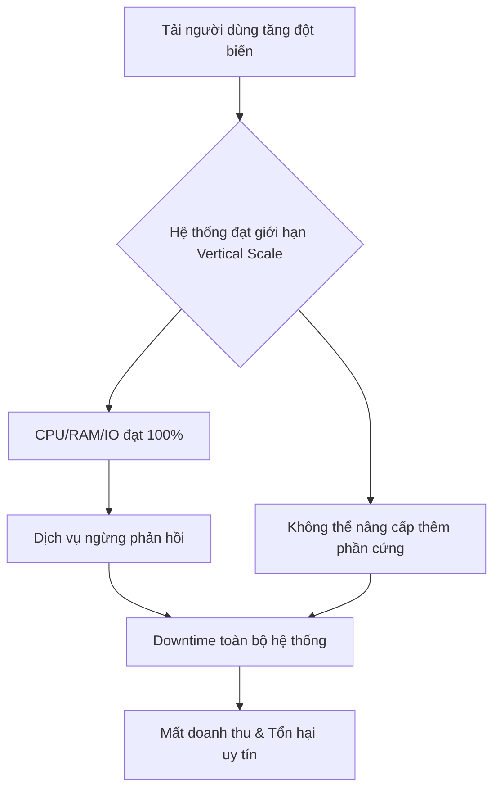
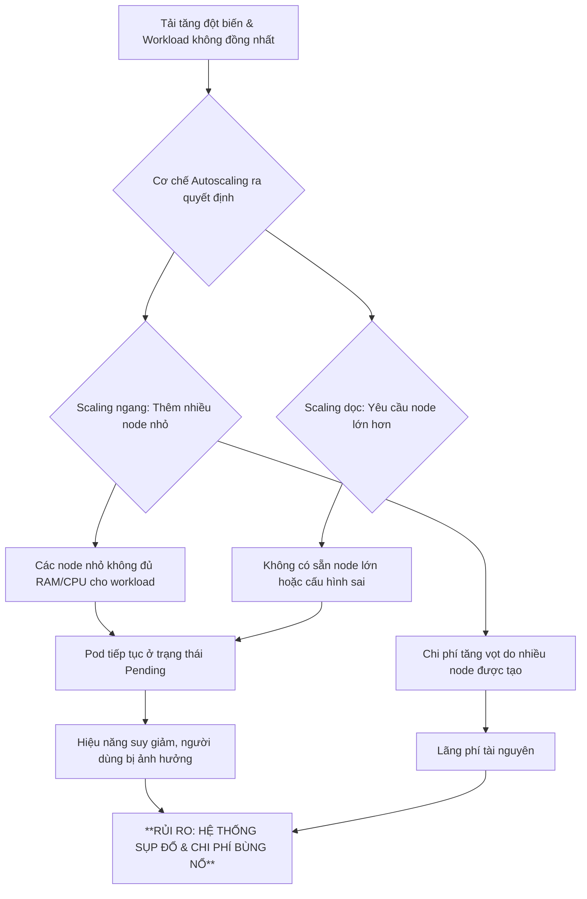

## Chương 5: Rủi Ro Scalability

### 5.1 Rủi Ro Horizontal Scaling Failures

#### Định Nghĩa Rủi Ro
- **Định nghĩa:** Rủi ro thất bại khi mở rộng theo chiều ngang (Horizontal Scaling Failures) là tình huống hệ thống không thể tăng năng lực xử lý bằng cách thêm các máy chủ hoặc container mới, dẫn đến suy giảm hiệu năng hoặc sập hoàn toàn khi tải tăng cao. Rủi ro này đặc biệt nghiêm trọng đối với các dịch vụ có trạng thái (stateful services), nơi dữ liệu phiên hoặc trạng thái người dùng cần được chia sẻ và đồng bộ hóa một cách nhất quán giữa các node.
- **Nguyên nhân phát sinh:** Rủi ro này phát sinh khi kiến trúc hệ thống không được thiết kế để phân tán tải và dữ liệu một cách hiệu quả. Các điểm nghẽn (bottlenecks) trong cơ sở dữ liệu, cơ chế đồng bộ trạng thái không hiệu quả, hoặc các dịch vụ phụ thuộc không thể mở rộng song song là những nguyên nhân phổ biến. Trong môi trường production, lưu lượng truy cập đột biến (ví dụ: chiến dịch marketing, sự kiện tin tức) có thể nhanh chóng phơi bày những yếu kém này.
- **Mức độ nghiêm trọng tiềm tàng:** **Critical**. Thất bại trong việc mở rộng quy mô có thể dẫn đến việc hệ thống ngừng hoạt động hoàn toàn (total downtime), gây mất doanh thu trực tiếp, tổn hại nghiêm trọng đến trải nghiệm người dùng và uy tín thương hiệu.

#### Nguyên Nhân Gốc Rễ (Root Causes)
1. **Thách thức của Dịch vụ có Trạng thái (Stateful Service Challenges):** Các ứng dụng stateful lưu trữ dữ liệu phiên của người dùng (ví dụ: giỏ hàng, trạng thái đăng nhập) trên máy chủ. Khi mở rộng theo chiều ngang, việc đảm bảo rằng yêu cầu từ cùng một người dùng luôn được chuyển đến đúng máy chủ (sticky sessions) hoặc trạng thái phiên được sao chép (replicate) một cách nhất quán và nhanh chóng qua tất cả các node là một thách thức lớn. Nếu cơ chế này thất bại, người dùng có thể bị mất dữ liệu phiên, dẫn đến lỗi ứng dụng và trải nghiệm tồi tệ.
2. **Điểm nghẽn ở Tầng Dữ liệu (Data Tier Bottleneck):** Ngay cả khi tầng ứng dụng (application tier) có thể mở rộng vô hạn, chúng thường phụ thuộc vào một tầng dữ liệu (ví dụ: cơ sở dữ liệu quan hệ) không dễ dàng mở rộng theo chiều ngang. Khi lưu lượng tăng, tất cả các node ứng dụng mới sẽ tạo thêm kết nối và truy vấn đến cơ sở dữ liệu, nhanh chóng làm cạn kiệt tài nguyên của nó và biến nó thành một điểm nghẽn cổ chai, làm chậm toàn bộ hệ thống.
3. **Cấu hình Sai của Bộ cân bằng tải (Load Balancer Misconfiguration):** Bộ cân bằng tải là trung tâm của việc mở rộng theo chiều ngang. Nếu nó không được cấu hình đúng cách để phân phối lưu lượng đồng đều, hoặc nếu các thuật toán cân bằng tải (ví dụ: Round Robin, Least Connections) không phù hợp với đặc điểm của ứng dụng, một số máy chủ có thể bị quá tải trong khi những máy chủ khác lại không được sử dụng. Các kiểm tra sức khỏe (health checks) không chính xác cũng có thể khiến bộ cân bằng tải không loại bỏ các node bị lỗi khỏi nhóm, tiếp tục gửi lưu lượng đến chúng và gây ra lỗi.
4. **Phụ thuộc vào các Dịch vụ Bên ngoài không thể mở rộng (Dependencies on Non-Scalable External Services):** Một hệ thống có thể phụ thuộc vào các API của bên thứ ba (ví dụ: cổng thanh toán, dịch vụ xác thực). Nếu các dịch vụ này không thể xử lý cùng một mức tải mà hệ thống của bạn đang cố gắng mở rộng, chúng sẽ trở thành điểm nghẽn. Các giới hạn về tốc độ (rate limiting) hoặc sự cố ở các dịch vụ này sẽ gây ra lỗi xếp tầng (cascading failures) trong toàn bộ hệ thống của bạn.

#### Biểu Hiện & Triệu Chứng (Symptoms)
- **Dấu hiệu cảnh báo sớm:** Thời gian phản hồi (response time) tăng dần khi lưu lượng truy cập tăng. Tỷ lệ lỗi HTTP (ví dụ: 5xx server errors) bắt đầu xuất hiện không liên tục. Mức sử dụng CPU và bộ nhớ trên các máy chủ hiện tại đạt gần đến giới hạn tối đa.
- **Các metrics/logs cần theo dõi:**
    - **Metrics:** CPU/Memory Utilization (trên 80%), Latency (p95, p99), Request Queue Length (số lượng yêu cầu đang chờ xử lý), Database Connection Pool size, Error Rate (%)
    - **Logs:** Các thông báo lỗi liên quan đến "connection timeout", "database connection limit reached", "failed to replicate session state", "downstream service unavailable".
- **Red flags trong hệ thống:** Một node mới được thêm vào nhưng không nhận được lưu lượng truy-cập. Tỷ lệ lỗi tăng đột biến ngay sau khi một node mới được thêm vào. Hệ thống phục hồi lại trạng thái bình thường sau khi giảm bớt số lượng node.

#### Sơ Đồ Phân Tích
```mermaid
graph TD
    A[Lưu lượng truy cập tăng đột biến] --> B{Hệ thống không thể mở rộng theo chiều ngang}
    B --> C{Dịch vụ có trạng thái quá tải}
    B --> D[Cơ sở dữ liệu trở thành điểm nghẽn]
    C --> E[Lỗi phiên người dùng (Session Failure)]
    D --> F[Thời gian phản hồi tăng vọt & Timeouts]
    E --> G[Trải nghiệm người dùng cực kỳ tồi tệ]
    F --> H[Tỷ lệ lỗi 5xx tăng cao]
    G --> I[Mất mát khách hàng & Doanh thu]
    H --> J[Hệ thống sập hoàn toàn (Downtime)]
    J --> I
```

#### Tác Động Cụ Thể (Impact Analysis)

| Khía Cạnh       | Mức Độ   | Chi Tiết                                                                                                                            |
|-----------------|----------|-------------------------------------------------------------------------------------------------------------------------------------|
| Downtime        | High     | Có thể dẫn đến downtime toàn bộ hệ thống trong nhiều giờ hoặc nhiều ngày nếu không có kế hoạch khắc phục và rollback hiệu quả.          |
| Financial       | >$1M/ngày | Mất doanh thu trực tiếp từ việc không thể phục vụ người dùng, chi phí khẩn cấp để khắc phục sự cố, và tổn thất uy tín thương hiệu.     |
| Security        | Medium   | Hệ thống quá tải có thể bỏ qua một số kiểm tra bảo mật hoặc ghi log không đầy đủ, tạo cơ hội cho các cuộc tấn công.                 |
| User Experience | Severe   | Người dùng không thể truy cập dịch vụ, mất dữ liệu (ví dụ: giỏ hàng), và trải qua sự thất vọng cùng cực, dẫn đến việc từ bỏ dịch vụ. |
| Team Morale     | High     | Gây áp lực cực lớn lên đội ngũ kỹ sư, dẫn đến kiệt sức, căng thẳng và giảm tinh thần khi phải đối phó với một cuộc khủng hoảng. |

#### Case Study Thực Tế
**Healthcare.gov - 2013**
- **Bối cảnh:** Healthcare.gov là cổng thông tin trực tuyến của chính phủ Hoa Kỳ cho phép công dân mua bảo hiểm y tế theo Đạo luật Chăm sóc Sức khỏe Hợp túi tiền (ACA). Sự ra mắt vào ngày 1 tháng 10 năm 2013 được kỳ vọng sẽ thu hút hàng triệu người dùng.
- **Diễn biến:** Ngay sau khi ra mắt, trang web đã sập. Người dùng không thể tạo tài khoản, đăng nhập hoặc xem các gói bảo hiểm. Hệ thống liên tục gặp lỗi, treo và cực kỳ chậm. Chỉ có 6 người đăng ký thành công trong ngày đầu tiên. Sự cố kéo dài trong nhiều tuần, trở thành một cuộc khủng hoảng quốc gia.
- **Nguyên nhân gốc rễ:** Một trong những nguyên nhân kỹ thuật chính là thất bại trong việc mở rộng quy mô. Mặc dù tầng ứng dụng web có thể mở rộng, nó lại phụ thuộc vào một dịch vụ back-end có tên là Enterprise Identity Management (EIDM) để xác thực người dùng. Dịch vụ này không được thiết kế để xử lý lưu lượng truy cập lớn và nhanh chóng trở thành một điểm nghẽn cổ chai. Nó không thể mở rộng theo chiều ngang, khiến toàn bộ quy trình đăng ký bị đình trệ.
- **Tác động:**
    - **Downtime:** Trang web gần như không thể sử dụng được trong nhiều tuần.
    - **Financial Loss:** Chi phí ban đầu của dự án là khoảng 94 triệu đô la, nhưng chi phí để sửa chữa và khắc phục sự cố đã tăng tổng chi phí lên hơn 1.7 tỷ đô la.
    - **Users Affected:** Hàng triệu người dân Mỹ đã không thể đăng ký bảo hiểm theo đúng thời hạn.
- **Bài học:** Tầm quan trọng của việc kiểm thử tải (load testing) toàn diện từ đầu đến cuối (end-to-end) trên toàn bộ hệ thống, bao gồm cả các dịch vụ phụ thuộc. Các hệ thống quan trọng phải được thiết kế để có khả năng mở rộng ở mọi tầng, không chỉ ở tầng giao diện người dùng.
- **Nguồn:** [How the HealthCare.gov Rollout Failed - The New York Times](https://www.nytimes.com/2013/10/13/us/politics/a-glitchy-debut-for-the-health-care-website.html)

#### Risk Mitigation Strategies

**Preventive Measures (Ngăn ngừa):**
1.  **Kiến trúc Microservices và Phân tách Trạng thái:** Thiết kế hệ thống theo kiến trúc microservices, tách các thành phần stateful (ví dụ: quản lý phiên, hồ sơ người dùng) ra khỏi các dịch vụ stateless. Sử dụng các giải pháp lưu trữ trạng thái tập trung và có khả năng mở rộng cao như Redis hoặc Memcached cho dữ liệu phiên.
2.  **Tự động mở rộng quy mô (Auto-scaling) dựa trên Metrics:** Cấu hình các nhóm auto-scaling trên nền tảng đám mây (ví dụ: AWS Auto Scaling Groups, Kubernetes HPA) để tự động thêm hoặc bớt các node dựa trên các chỉ số thời gian thực như CPU utilization, request latency, hoặc độ dài hàng đợi. Điều này giúp hệ thống phản ứng linh hoạt với sự thay đổi của lưu lượng.
3.  **Kiểm thử tải End-to-End:** Thực hiện các bài kiểm thử tải mô phỏng lưu lượng truy cập thực tế từ đầu đến cuối, bao gồm tất cả các dịch vụ phụ thuộc và cơ sở dữ liệu. Xác định các điểm nghẽn và giới hạn của hệ thống trước khi chúng xảy ra trong môi trường production.

**Detective Measures (Phát hiện):**
1.  **Giám sát Toàn diện (Comprehensive Monitoring):** Thiết lập dashboard giám sát chi tiết với các chỉ số quan trọng từ mọi tầng của hệ thống: cân bằng tải, máy chủ ứng dụng, cơ sở dữ liệu, và các dịch vụ bên ngoài. Các chỉ số chính bao gồm latency (p95, p99), tỷ lệ lỗi, saturation (CPU, memory, disk I/O), và số lượng kết nối.
2.  **Cảnh báo Thông minh (Intelligent Alerting):** Cấu hình các cảnh báo không chỉ dựa trên ngưỡng tĩnh (ví dụ: CPU > 90%) mà còn dựa trên sự thay đổi bất thường (anomaly detection). Ví dụ: cảnh báo khi latency p99 tăng 50% trong 5 phút, hoặc khi tỷ lệ lỗi tăng đột biến so với mức trung bình.
3.  **Ghi Log có cấu trúc và Truy vết Phân tán (Structured Logging & Distributed Tracing):** Sử dụng ghi log có cấu trúc (ví dụ: JSON) và triển khai các công cụ truy vết phân tán như Jaeger hoặc Zipkin. Điều này cho phép theo dõi một yêu cầu qua nhiều microservices, nhanh chóng xác định dịch vụ nào đang gây ra chậm trễ hoặc lỗi khi hệ thống đang chịu tải cao.

**Corrective Measures (Khắc phục):**
1.  **Quy trình Phản ứng Sự cố được xác định trước (Pre-defined Incident Response Playbook):** Có một quy trình rõ ràng về việc ai cần được thông báo, các bước chẩn đoán ban đầu, và quy trình leo thang khi xảy ra sự cố về scaling. Quy trình này cần được thực hành thường xuyên.
2.  **Chiến lược Rollback Nhanh chóng:** Đảm bảo rằng có thể rollback phiên bản mới hoặc thay đổi cấu hình một cách nhanh chóng và an toàn nếu chúng được xác định là nguyên nhân gây ra sự cố. Sử dụng các kỹ thuật triển khai như Blue-Green hoặc Canary để giảm thiểu rủi ro.
3.  **Shedding Load và Graceful Degradation:** Thiết kế hệ thống để có thể "từ chối" một phần lưu lượng truy cập (load shedding) khi quá tải thay vì sập hoàn toàn. Ví dụ, ưu tiên các yêu cầu từ người dùng đã đăng nhập hoặc các chức năng kinh doanh cốt lõi, và tạm thời vô hiệu hóa các tính năng không quan trọng (graceful degradation).

#### Code Examples

**Anti-pattern (Cách làm SAI):**
```python
# ❌ ANTI-PATTERN: Lưu trữ trạng thái phiên trong biến toàn cục của ứng dụng
# Vấn đề: Khi chạy nhiều instance của ứng dụng này sau một bộ cân bằng tải, 
# trạng thái phiên sẽ không được chia sẻ. Một yêu cầu từ người dùng có thể được chuyển đến một instance
# không chứa dữ liệu phiên của họ, gây ra lỗi hoặc hành vi không mong muốn.

from flask import Flask, session, request, jsonify
import os

app = Flask(__name__)
# Khóa bí mật chỉ dùng cho demo, không an toàn cho production
app.secret_key = os.urandom(24)

# LƯU Ý: Đây là một ví dụ tồi tệ. Dữ liệu giỏ hàng được lưu trong bộ nhớ của tiến trình server.
# Điều này sẽ thất bại hoàn toàn trong môi trường có nhiều server (horizontally scaled).
global_in_memory_carts = {}

@app.route(\'/add_item_bad\', methods=[\'POST\'])
def add_item_bad():
    user_id = request.json.get(\'user_id\')
    item = request.json.get(\'item\')

    if not user_id or not item:
        return jsonify({"error": "user_id and item are required"}), 400

    # Lấy giỏ hàng từ biến toàn cục
    user_cart = global_in_memory_carts.get(user_id, [])
    user_cart.append(item)
    
    # Lưu lại vào biến toàn cục
    global_in_memory_carts[user_id] = user_cart
    
    return jsonify(global_in_memory_carts.get(user_id))

# Khi bạn chạy 2 instance của server này, giỏ hàng của user_id=123 sẽ chỉ tồn tại trên một trong hai.
# Nếu request tiếp theo của user 123 được route đến server còn lại, giỏ hàng của họ sẽ trống rỗng.

```

**Best Practice (Cách làm ĐÚNG):**
```python
# ✅ BEST PRACTICE: Sử dụng một kho lưu trữ trạng thái bên ngoài (ví dụ: Redis)
# Giải pháp: Trạng thái phiên được lưu trữ trong một dịch vụ tập trung như Redis. 
# Tất cả các instance của ứng dụng đều kết nối đến cùng một kho lưu trữ Redis, 
# do đó trạng thái được chia sẻ và nhất quán trên toàn bộ hệ thống.

from flask import Flask, request, jsonify
import redis
import json

app = Flask(__name__)

# Kết nối đến Redis. Trong thực tế, thông tin kết nối nên được lấy từ biến môi trường.
redis_client = redis.Redis(host=\'localhost\', port=6379, db=0, decode_responses=True)

@app.route(\'/add_item_good\', methods=[\'POST\'])
def add_item_good():
    user_id = request.json.get(\'user_id\')
    item = request.json.get(\'item\')

    if not user_id or not item:
        return jsonify({"error": "user_id and item are required"}), 400

    redis_key = f"cart:{user_id}"

    # Lấy giỏ hàng từ Redis
    try:
        existing_cart_json = redis_client.get(redis_key)
        user_cart = json.loads(existing_cart_json) if existing_cart_json else []
    except redis.exceptions.RedisError as e:
        return jsonify({"error": f"Redis error: {e}"}), 500

    user_cart.append(item)

    # Lưu lại vào Redis với thời gian hết hạn (ví dụ: 24 giờ)
    try:
        redis_client.set(redis_key, json.dumps(user_cart), ex=86400)
    except redis.exceptions.RedisError as e:
        return jsonify({"error": f"Redis error: {e}"}), 500

    return jsonify(user_cart)

# Với cách tiếp cận này, bạn có thể chạy bao nhiêu instance của ứng dụng tùy ý.
# Tất cả chúng đều chia sẻ cùng một trạng thái thông qua Redis, cho phép mở rộng theo chiều ngang một cách hiệu quả.

```

#### Risk Assessment Matrix

| Yếu Tố                | Đánh Giá      | Ghi Chú                                                                                                                               |
|------------------------|---------------|---------------------------------------------------------------------------------------------------------------------------------------|
| Xác suất (Probability) | 4             | Với các hệ thống phức tạp và lưu lượng truy cập biến động, khả năng gặp phải các vấn đề về scaling là rất cao nếu không được thiết kế cẩn thận. |
| Tác động (Impact)      | 5             | Thất bại hoàn toàn có thể gây sập hệ thống, mất doanh thu lớn và tổn hại nghiêm trọng đến uy tín thương hiệu.                           |
| **Risk Score**         | **P x I = 20**| **Critical**                                                                                                                          |
| Ưu tiên xử lý          | P1            | Cần được giải quyết và xem xét ở mức ưu tiên cao nhất trong quá trình thiết kế kiến trúc và vận hành hệ thống.                        |

#### Checklist Đánh Giá
- [ ] Hệ thống có được thiết kế để phân tách các thành phần stateful và stateless không?
- [ ] Đã có giải pháp lưu trữ trạng thái tập trung, hiệu năng cao và có khả năng mở rộng (ví dụ: Redis, Memcached) chưa?
- [ ] Cơ sở dữ liệu có được cấu hình để xử lý số lượng kết nối lớn và có chiến lược scaling (ví dụ: Read Replicas, Sharding) không?
- [ ] Cấu hình auto-scaling đã được thiết lập và kiểm thử để phản ứng với các chỉ số tải thực tế chưa?
- [ ] Các bài kiểm thử tải end-to-end có được thực hiện thường xuyên và bao gồm tất cả các dịch vụ phụ thuộc không?
- [ ] Hệ thống giám sát có đầy đủ các chỉ số về latency, error rate, và saturation từ mọi thành phần không?
- [ ] Có quy trình phản ứng sự cố (playbook) rõ ràng cho các kịch bản thất bại về scaling không?

#### Tools & Resources
- **K6 (k6.io):** Một công cụ mã nguồn mở hiện đại để thực hiện kiểm thử tải. Nó cho phép các kỹ sư viết các kịch bản kiểm thử bằng JavaScript, dễ dàng tích hợp vào các quy trình CI/CD.
- **Prometheus & Grafana:** Bộ đôi công cụ tiêu chuẩn ngành để giám sát và hiển thị metrics hệ thống. Prometheus thu thập dữ liệu, và Grafana tạo ra các dashboard trực quan và mạnh mẽ.
- **Redis:** Một kho lưu trữ dữ liệu trong bộ nhớ, cực kỳ nhanh, thường được sử dụng làm cache, message broker, và đặc biệt là kho lưu trữ trạng thái phiên (session store) cho các ứng dụng cần mở rộng theo chiều ngang.

#### Nguồn Tham Khảo
1. [The Architecture of a Web 3.0 Application](https://www.preethikasireddy.com/post/the-architecture-of-a-web-3-0-application-a-k-a-how-to-build-a-decentralized-application) - Mô tả các thách thức về trạng thái trong kiến trúc hiện đại.
2. [Scaling to 100k Users](https://www.alexedwards.net/blog/scaling-to-100k-users) - Bài viết thực tế về các bước và cân nhắc khi mở rộng một ứng dụng web.
3. [HealthCare.gov's Failure: A Technical Post-Mortem](https://www.zdnet.com/article/healthCare-govs-failure-a-technical-post-mortem/) - Phân tích sâu về các lỗi kỹ thuật, bao gồm cả vấn đề scaling, đã dẫn đến sự cố ra mắt Healthcare.gov.


### 5.2 Rủi Ro Vertical Scaling Limits

#### Định Nghĩa Rủi Ro
- **Định nghĩa:** Rủi ro giới hạn quy mô theo chiều dọc (Vertical Scaling Limits) là tình huống một hệ thống không thể tiếp tục nâng cấp tài nguyên (CPU, RAM, I/O) trên một máy chủ duy nhất để đáp ứng nhu cầu tải tăng lên. Điều này xảy ra khi máy chủ đã đạt đến "trần phần cứng" (hardware ceiling) - giới hạn vật lý của phần cứng hoặc giới hạn tối đa do nhà cung cấp dịch vụ đám mây đặt ra. Nó biến máy chủ thành một điểm thất bại duy nhất (Single Point of Failure - SPOF), đe dọa sự ổn định của toàn bộ hệ thống.
- **Tại sao phát sinh:** Rủi ro này thường phát sinh từ các quyết định kiến trúc ban đầu, khi hệ thống được thiết kế để chạy trên một máy chủ mạnh duy nhất (monolithic) thay vì một cụm các máy chủ (distributed). Khi khối lượng công việc tăng trưởng vượt bậc, việc liên tục "scale-up" trở nên không bền vững, đắt đỏ và cuối cùng là bất khả thi.
- **Mức độ nghiêm trọng tiềm tàng:** **Critical**. Khi rủi ro này hiện thực hóa, nó có thể gây ra sự sụp đổ hoàn toàn của dịch vụ vì không còn phương án nào để tăng công suất một cách nhanh chóng, dẫn đến downtime kéo dài và mất mát doanh thu nghiêm trọng.

#### Nguyên Nhân Gốc Rễ (Root Causes)
1.  **Kiến trúc Monolithic và Phụ thuộc vào Database Quan hệ:** Các ứng dụng nguyên khối và database quan hệ truyền thống thường được thiết kế để dễ dàng scale-up hơn là scale-out. Việc tập trung logic và dữ liệu vào một nơi duy nhất tạo ra một "trọng tâm" hiệu năng, khiến toàn bộ hệ thống phụ thuộc vào sức mạnh của một máy chủ database duy nhất.
2.  **Ảo tưởng về "Siêu Máy chủ" (Super Server Fallacy):** Niềm tin sai lầm rằng luôn có thể mua hoặc thuê một máy chủ mạnh hơn để giải quyết mọi vấn đề về hiệu năng. Tư duy này dẫn đến việc trì hoãn các quyết định tái kiến trúc hệ thống để hỗ trợ mở rộng theo chiều ngang, cho đến khi đã quá muộn.
3.  **Chi phí và Độ phức tạp của Tái kiến trúc:** Việc chuyển đổi từ một hệ thống scale-up sang scale-out là một nỗ lực khổng lồ, đòi hỏi đầu tư lớn về thời gian, tiền bạc và nhân lực. Sự phức tạp và rủi ro của quá trình này thường khiến các đội ngũ kỹ thuật ngần ngại thực hiện cho đến khi đối mặt với sự cố.
4.  **Giới hạn của Nhà cung cấp Dịch vụ Đám mây:** Các nhà cung cấp cloud (AWS, GCP, Azure) đều có giới hạn về cấu hình tối đa cho một máy ảo (instance type). Doanh nghiệp không thể có một máy chủ mạnh hơn những gì nhà cung cấp lớn nhất có thể cung cấp, tạo ra một "trần cứng" không thể vượt qua.

#### Biểu Hiện & Triệu Chứng (Symptoms)
- **Dấu hiệu cảnh báo sớm:** Thời gian phản hồi của ứng dụng tăng tuyến tính với lượng người dùng, chi phí cho một máy chủ duy nhất tăng vọt, và việc nâng cấp kích thước máy chủ chỉ mang lại hiệu quả ngắn hạn.
- **Các metrics/logs cần theo dõi:**
    - `CPU Utilization`: Thường xuyên ở mức trên 80-90% trong giờ cao điểm.
    - `Memory Usage`: Gần chạm ngưỡng tối đa, gây ra swapping và làm chậm hệ thống.
    - `Disk I/O Wait`: Thời gian chờ đợi I/O tăng cao, cho thấy hệ thống lưu trữ đang quá tải.
    - `Database Connection Pool`: Số lượng kết nối chờ đợi (pending) tăng đột biến.
- **Red flags trong hệ thống:** Các lỗi "503 Service Unavailable" hoặc "Gateway Timeout" xuất hiện ngày càng thường xuyên. Bất kỳ cảnh báo nào liên quan đến việc "hết tài nguyên" (out of memory, out of disk space) trên máy chủ chính đều là một red flag nghiêm trọng.

#### Sơ Đồ Phân Tích


#### Tác Động Cụ Thể (Impact Analysis)

| Khía Cạnh      | Mức Độ   | Chi Tiết                                                                                                  |
|-----------------|----------|-----------------------------------------------------------------------------------------------------------|
| Downtime        | High     | Có thể kéo dài hàng giờ hoặc hàng ngày, vì việc khắc phục đòi hỏi tái kiến trúc hoặc di chuyển dữ liệu lớn. |
| Financial       | >$100k/hour | Ước tính dựa trên doanh thu bị mất, chi phí cơ hội, và chi phí khẩn cấp để khắc phục sự cố.              |
| Security        | Medium   | Hệ thống quá tải có thể không xử lý kịp các bản vá bảo mật hoặc dễ bị tấn công DDoS hơn.                     |
| User Experience | Severe   | Người dùng không thể truy cập dịch vụ, gây mất niềm tin và có thể chuyển sang đối thủ cạnh tranh.         |
| Team Morale     | High     | Gây áp lực cực lớn lên đội ngũ kỹ thuật, dẫn đến kiệt sức và giảm tinh thần làm việc.                      |

#### Case Study Thực Tế
**Stack Overflow - Những năm đầu (khoảng 2009-2013)**
- **Bối cảnh:** Stack Overflow, một trong những trang web Q&A lớn nhất cho lập trình viên, ban đầu được xây dựng trên một kiến trúc .NET với SQL Server, và họ đã chọn chiến lược "scale-up" một cách có chủ đích. Họ tin rằng việc tối ưu hóa trên một vài máy chủ cực mạnh sẽ hiệu quả hơn là quản lý một hệ thống phân tán phức tạp.
- **Diễn biến:** Họ đã đầu tư vào những máy chủ tốt nhất có thể mua được, với lượng RAM khổng lồ để có thể chứa toàn bộ database trong bộ nhớ. Chiến lược này đã hoạt động rất tốt trong nhiều năm, giúp trang web có tốc độ phản hồi cực nhanh.
- **Nguyên nhân gốc rễ:** Mặc dù thành công, kiến trúc này đã sớm bộc lộ các giới hạn của vertical scaling. Jeff Atwood, một trong những người sáng lập, đã chia sẻ rằng họ đã phải đối mặt với các vấn đề như chi phí bản quyền SQL Server tăng cao, và việc các phép `JOIN` trong database trở thành một nút thắt cổ chai hiệu năng dù toàn bộ dữ liệu đã nằm trong RAM.
- **Tác động:** Họ đã nhận ra rằng luôn có một "trần cứng" về phần cứng. Dù có thể mua máy chủ mạnh hơn, nhưng sẽ đến lúc không còn máy chủ nào mạnh hơn để mua nữa. Rủi ro về một điểm thất bại duy nhất (single point of failure) cũng luôn hiện hữu. Nếu máy chủ database chính gặp sự cố, toàn bộ trang web sẽ sập.
- **Bài học:** Case study của Stack Overflow cho thấy vertical scaling là một chiến lược hợp lệ, nhưng không phải là giải pháp vĩnh cửu. Nó phải được kết hợp với một tầm nhìn dài hạn về việc chuyển đổi sang kiến trúc lai (hybrid) hoặc scale-out khi cần thiết. Việc tối ưu hóa ở tầng ứng dụng và database (ví dụ: giảm thiểu các phép JOIN) cũng quan trọng không kém việc nâng cấp phần cứng.
- **Nguồn:** [Stack Overflow Architecture](https://highscalability.com/stack-overflow-architecture/)

#### Risk Mitigation Strategies

**Preventive Measures (Ngăn ngừa):**
1.  **Thiết kế cho Horizontal Scaling từ đầu:** Áp dụng kiến trúc microservices, sử dụng database NoSQL hoặc database quan hệ có hỗ trợ sharding (phân mảnh) như Vitess, CockroachDB.
2.  **Áp dụng Caching mạnh mẽ:** Sử dụng các lớp cache (ví dụ: Redis, Memcached) để giảm tải cho database chính, giảm sự phụ thuộc vào sức mạnh của máy chủ database.
3.  **Sử dụng Load Balancer thông minh:** Phân phối tải đều khắp các máy chủ ứng dụng và có cơ chế tự động loại bỏ các node bị lỗi.

**Detective Measures (Phát hiện):**
1.  **Giám sát Toàn diện (Comprehensive Monitoring):** Theo dõi các chỉ số vàng (latency, traffic, errors, saturation) cho tất cả các thành phần của hệ thống. Thiết lập cảnh báo khi CPU, RAM, hoặc I/O vượt ngưỡng 80% trong một khoảng thời gian dài.
2.  **Dự báo Xu hướng (Trend Forecasting):** Sử dụng các công cụ giám sát để phân tích xu hướng tăng trưởng tài nguyên. Dự báo khi nào hệ thống sẽ đạt đến giới hạn để có kế hoạch nâng cấp hoặc tái kiến trúc kịp thời.
3.  **Chaos Engineering:** Thực hiện các thử nghiệm "gameday" bằng cách giả lập tình huống máy chủ chính bị quá tải hoặc sập để kiểm tra khả năng phục hồi của hệ thống.

**Corrective Measures (Khắc phục):**
1.  **Kế hoạch Chuyển đổi sang Horizontal Scaling:** Có sẵn một kế hoạch chi tiết để di chuyển các thành phần của hệ thống sang một kiến trúc có khả năng scale-out khi cần.
2.  **Read Replicas:** Nhanh chóng tạo các bản sao chỉ đọc (read replicas) của database để giảm tải các truy vấn đọc khỏi máy chủ database chính.
3.  **Tối ưu hóa khẩn cấp:** Trong trường hợp khẩn cấp, thực hiện các biện pháp tối ưu hóa nhanh như vô hiệu hóa các tính năng không cần thiết, tối ưu hóa các truy vấn tốn kém nhất, hoặc tăng cường lớp cache.

#### Code Examples

**Anti-pattern (Cách làm SAI):**
```python
# ❌ ANTI-PATTERN: Tất cả các truy vấn đều dồn vào một database duy nhất
import psycopg2

# Kết nối luôn trỏ đến cùng một master database cho cả đọc và ghi
DB_HOST = "master-db.production.internal"

def get_user_data(user_id):
    # Truy vấn đọc nặng cũng được gửi đến master
    conn = psycopg2.connect(host=DB_HOST, dbname="app", user="prod", password="...")
    # ... thực hiện truy vấn ...
    pass

def write_user_data(user_id, data):
    # Truy vấn ghi cũng gửi đến master
    conn = psycopg2.connect(host=DB_HOST, dbname="app", user="prod", password="...")
    # ... thực hiện truy vấn ...
    pass
```

**Best Practice (Cách làm ĐÚNG):**
```python
# ✅ BEST PRACTICE: Phân tách truy vấn đọc/ghi sử dụng Read Replicas
import psycopg2
import random

# Danh sách các máy chủ, bao gồm master và các read replicas
DB_MASTER_HOST = "master-db.production.internal"
DB_REPLICA_HOSTS = [
    "replica-1.production.internal",
    "replica-2.production.internal",
    "replica-3.production.internal",
]

def get_user_data(user_id):
    # Chọn ngẫu nhiên một read replica để giảm tải cho master
    replica_host = random.choice(DB_REPLICA_HOSTS)
    conn = psycopg2.connect(host=replica_host, dbname="app", user="prod", password="...")
    # ... thực hiện truy vấn đọc ...
    pass

def write_user_data(user_id, data):
    # Tất cả các truy vấn ghi đều phải đi qua master để đảm bảo tính nhất quán
    conn = psycopg2.connect(host=DB_MASTER_HOST, dbname="app", user="prod", password="...")
    # ... thực hiện truy vấn ghi ...
    pass
```

#### Risk Assessment Matrix

| Yếu Tố                | Đánh Giá | Ghi Chú                                                                                             |
|------------------------|----------|-----------------------------------------------------------------------------------------------------|
| Xác suất (Probability) | 3/5      | Trung bình. Hầu hết các hệ thống thành công cuối cùng sẽ đối mặt với vấn đề này nếu không có kế hoạch. |
| Tác động (Impact)      | 5/5      | Rất cao. Có thể gây sập toàn bộ dịch vụ và tổn thất tài chính nặng nề.                               |
| **Risk Score**         | **15**   | **Critical**                                                                                        |
| Ưu tiên xử lý          | P1       | Phải được giải quyết ở cấp độ kiến trúc và có kế hoạch giám sát, ngăn ngừa chủ động.                 |

#### Checklist Đánh Giá
- [ ] Hệ thống có được thiết kế để mở rộng theo chiều ngang không?
- [ ] Chúng ta có đang giám sát các chỉ số bão hòa (saturation) của máy chủ chính không?
- [ ] Có kế hoạch nào để xử lý khi máy chủ chính đạt 90% công suất không?
- [ ] Chúng ta đã thử nghiệm khả năng chịu lỗi của hệ thống nếu máy chủ chính bị sập chưa?
- [ ] Chi phí cho máy chủ mạnh nhất hiện tại có chiếm hơn 20% tổng chi phí hạ tầng không?
- [ ] Kiến trúc hiện tại có phụ thuộc vào một thành phần không thể scale-out không?

#### Tools & Resources
- **Tool 1: Vitess:** Một giải pháp clustering cho MySQL, cho phép sharding database và mở rộng theo chiều ngang.
- **Tool 2: CockroachDB/TiDB:** Các hệ quản trị cơ sở dữ liệu "NewSQL" được thiết kế từ đầu để có khả năng scale-out như NoSQL nhưng vẫn giữ lại giao diện SQL và các thuộc tính ACID.
- **Tool 3: Prometheus & Grafana:** Bộ công cụ tiêu chuẩn ngành để giám sát, thu thập metrics và cảnh báo, giúp phát hiện sớm các dấu hiệu bão hòa.

#### Nguồn Tham Khảo
1.  [Horizontal vs. Vertical Scaling: Which Should You Choose?](https://www.cloudzero.com/blog/horizontal-vs-vertical-scaling/) - Phân tích chi tiết về ưu và nhược điểm của hai phương pháp scaling.
2.  [Stack Overflow Architecture](https://highscalability.com/stack-overflow-architecture/) - Bài viết kinh điển phân tích về quyết định kiến trúc của Stack Overflow.
3.  [The Problem with Vertical Scaling](https://www.baeldung.com/cs/vertical-scaling-problems) - Một bài viết tổng quan về các vấn đề cố hữu của vertical scaling.


### 5.3 Rủi Ro Diagonal Scaling Imbalance

#### Định Nghĩa Rủi Ro
- **Định nghĩa:** Rủi ro Mất cân bằng trong Scaling theo đường chéo (Diagonal Scaling Imbalance) xảy ra khi một hệ thống áp dụng đồng thời cả hai chiến lược scaling dọc (Vertical Scaling - tăng cường sức mạnh cho một node, ví dụ: thêm CPU, RAM) và scaling ngang (Horizontal Scaling - thêm nhiều node hơn), nhưng sự phối hợp giữa chúng không đồng bộ hoặc không hiệu quả. Điều này dẫn đến tình trạng một chiều của scaling (dọc hoặc ngang) trở thành nút thắt cổ chai cho chiều còn lại, gây lãng phí tài nguyên, chi phí tăng vọt và hiệu năng không đạt như kỳ vọng. Bản chất của "diagonal scaling" là sự kết hợp thông minh của cả hai phương pháp, nhưng rủi ro phát sinh khi sự kết hợp này trở nên mất cân bằng.
- **Nguồn gốc phát sinh:** Rủi ro này thường xuất hiện trong các hệ thống microservices hoặc các ứng dụng phức tạp trên nền tảng cloud, nơi các thành phần có yêu cầu tài nguyên đa dạng và thay đổi linh hoạt. Ví dụ, một service xử lý video có thể cần nhiều CPU và RAM (scaling dọc), trong khi một service API gateway lại cần xử lý hàng nghìn request đồng thời (scaling ngang). Khi các cơ chế autoscaling cho các thành phần này không được thiết kế để "hiểu" và phối hợp với nhau, chúng có thể đưa ra các quyết định xung đột, dẫn đến sự mất cân bằng.
- **Mức độ nghiêm trọng tiềm tàng:** **High**. Rủi ro này có thể âm thầm gây thất thoát tài chính khổng lồ thông qua việc cấp phát tài nguyên không hiệu quả (cost explosion) trước khi các vấn đề về hiệu năng trở nên rõ ràng. Trong trường hợp xấu nhất, nó có thể dẫn đến downtime do một thành phần quan trọng không thể được scale đúng cách để đáp ứng tải.

#### Nguyên Nhân Gốc Rễ (Root Causes)
1.  **Chiến lược Scaling không đồng nhất (Mismatched Scaling Strategies):** Các thành phần khác nhau của ứng dụng (ví dụ: web server, database, cache, background worker) có các điểm nghẽn tài nguyên khác nhau (CPU-bound, I/O-bound, Memory-bound). Việc áp dụng một chiến lược scaling "one-size-fits-all" hoặc các chiến lược riêng lẻ không được điều phối sẽ dẫn đến việc một phần của hệ thống được scaling quá mức (over-provisioned) trong khi phần khác lại thiếu tài nguyên (under-provisioned).
2.  **Cấu hình Autoscaler phức tạp và sai lầm:** Các công cụ như Kubernetes Cluster Autoscaler hay các nhóm Auto Scaling trên cloud rất mạnh mẽ nhưng cũng phức tạp. Cấu hình sai các ngưỡng (thresholds), thời gian chờ (cooldown periods), hoặc các loại instance không phù hợp trong các nhóm instance hỗn hợp (mixed instance groups) có thể khiến cơ chế scaling đưa ra quyết định sai lầm, ví dụ như liên tục thêm các node nhỏ không đáp ứng được yêu cầu về RAM của pod, thay vì nâng cấp lên một node lớn hơn.
3.  **Phụ thuộc vào tài nguyên có giới hạn Scaling dọc:** Một số thành phần, đặc biệt là các database quan hệ truyền thống hoặc các hệ thống stateful, rất khó để scaling ngang một cách hiệu quả. Hệ thống có thể phụ thuộc vào việc scaling dọc cho các thành phần này. Khi tải tăng, chiến lược scaling ngang cho các stateless service có thể hoạt động tốt, nhưng toàn bộ hệ thống sẽ bị nghẽn lại ở database, vốn đã đạt đến giới hạn scaling dọc tối đa của nó.
4.  **Thiếu nhận thức về chi phí trong Logic Scaling (Lack of Cost-Awareness):** Các thuật toán scaling mặc định thường chỉ tập trung vào các chỉ số kỹ thuật như CPU utilization hoặc số lượng request. Chúng không được thiết kế để tối ưu chi phí. Ví dụ, một autoscaler có thể chọn thêm 10 node nhỏ thay vì 2 node lớn, mặc dù phương án 2 node lớn có thể rẻ hơn và hiệu quả hơn cho loại workload cụ thể đó.

#### Biểu Hiện & Triệu Chứng (Symptoms)
- **Dấu hiệu cảnh báo sớm:**
    - Chi phí cloud tăng nhanh hơn so với tốc độ tăng trưởng người dùng hoặc request.
    - Tỷ lệ sử dụng tài nguyên (CPU/RAM) trung bình trên toàn cluster thấp, nhưng vẫn có hiện tượng ứng dụng bị chậm hoặc quá tải cục bộ.
    - Số lượng các sự kiện scale-up và scale-down diễn ra liên tục và với tần suất cao (flapping).
- **Các metrics/logs cần theo dõi:**
    - **Cloud Provider Billing:** Theo dõi chi phí theo từng giờ/ngày. Bất kỳ sự tăng đột biến nào không giải thích được đều là một red flag.
    - **Kubernetes Metrics (nếu dùng):** `kube_pod_status_phase` với giá trị `Pending`. Số lượng pod `Pending` tăng cao cho thấy cluster không thể cấp phát tài nguyên kịp thời.
    - **Autoscaler Logs:** Tìm kiếm các thông báo lỗi, các sự kiện scaling thất bại, hoặc các thông báo về việc không tìm thấy node group phù hợp.
    - **Application Performance Monitoring (APM):** Tỷ lệ lỗi (error rate) và độ trễ (latency) tăng cao ở một số service cụ thể trong khi các service khác vẫn bình thường.
- **Red flags trong hệ thống:**
    - Một node/instance luôn hoạt động ở mức 100% CPU hoặc RAM trong khi các node khác lại "nhàn rỗi".
    - Các pod liên tục bị "evicted" (đuổi) hoặc "OOMKilled" (Out of Memory Killed).

#### Sơ Đồ Phân Tích


#### Tác Động Cụ Thể (Impact Analysis)

| Khía Cạnh       | Mức Độ | Chi Tiết                                                                                                                            |
|-----------------|--------|-------------------------------------------------------------------------------------------------------------------------------------|
| Downtime        | Medium | Có thể không gây downtime toàn bộ hệ thống, nhưng gây suy giảm dịch vụ nghiêm trọng (brownout) hoặc downtime cho các chức năng cụ thể. |
| Financial       | High   | Chi phí cloud có thể tăng gấp nhiều lần so với dự kiến. Ước tính có thể lên tới hàng chục nghìn USD/tháng cho các hệ thống lớn.       |
| Security        | Low    | Rủi ro này thường không trực tiếp tạo ra lỗ hổng bảo mật, nhưng một hệ thống không ổn định có thể làm chậm quá trình vá lỗi.          |
| User Experience | Severe | Người dùng trải nghiệm ứng dụng rất chậm, request thất bại, hoặc không thể truy cập một số tính năng quan trọng.                      |
| Team Morale     | High   | Gây căng thẳng cực độ cho đội ngũ SRE/DevOps, phải liên tục "chữa cháy" và đối mặt với áp lực từ chi phí và hiệu năng.            |

#### Case Study Thực Tế
**Freshworks - Sự cố Autoscaling trên Kubernetes - 2025**
- **Bối cảnh:** Freshworks sử dụng Amazon EKS v1.24 với Cluster Autoscaler để quản lý cluster của họ. Để đảm bảo tính sẵn sàng cao, họ cấu hình 3 Auto Scaling Groups (ASGs) trên 3 Availability Zones khác nhau, nhưng chỉ sử dụng một loại instance là `m6i.4xlarge`.
- **Diễn biến:** Đội ngũ kỹ sư quan sát thấy một hành vi bất thường: Cluster Autoscaler không scale-up node ngay lập tức khi có các pod ở trạng thái `Pending`. Trong một số trường hợp, độ trễ lên tới hơn 15 phút. Một sự cố cụ thể đã được phân tích cho thấy hệ thống mất hơn 18 phút để phục hồi, gây suy giảm dịch vụ nghiêm trọng. Autoscaler đã chờ 15 phút sau một lần scaling thất bại ở một ASG trước khi thử một ASG khác.
- **Nguyên nhân gốc rễ:** Nguyên nhân chính là do IAM role được gán cho Cluster Autoscaler thiếu quyền `autoscaling:DescribeScalingActivities`. Do đó, một cơ chế "early abort" trong phiên bản mới của autoscaler (được thiết kế để nhanh chóng phát hiện và bỏ qua các node group đang gặp sự cố) đã không được kích hoạt. Thay vào đó, autoscaler đã quay về hành vi mặc định là chờ hết thời gian `max-node-provision-time` (15 phút) trước khi hành động tiếp.
- **Tác động:** Sự chậm trễ trong việc scaling đã làm giảm khả năng đáp ứng của hệ thống trước các đợt tải tăng đột biến, dẫn đến hiệu năng kém và trải nghiệm người dùng tồi tệ. Mặc dù không có số liệu tài chính cụ thể được công bố, nhưng sự suy giảm dịch vụ kéo dài 18 phút đối với một công ty tầm cỡ Freshworks có thể gây ảnh hưởng doanh thu và uy tín đáng kể.
- **Bài học:** Sự cố này nhấn mạnh tầm quan trọng của việc cấp quyền IAM chính xác và việc phải hiểu sâu về cách hoạt động của các công cụ tự động hóa. Việc chỉ dựa vào cấu hình mặc định mà không kiểm tra log và các quyền cần thiết có thể dẫn đến hậu quả nghiêm trọng. Sau sự cố, Freshworks đã xem xét lại và khám phá các giải pháp thay thế như Karpenter để có được khả năng scaling linh hoạt và nhanh chóng hơn.
- **Nguồn:** [When Autoscaling went AWOL: Our Kubernetes wake up call](https://medium.com/freshworks-engineering-blog/when-autoscaling-went-awol-our-kubernetes-wake-up-call-61331138a210)

#### Risk Mitigation Strategies

**Preventive Measures (Ngăn ngừa):**
1.  **Sử dụng các Node Group chuyên dụng:** Thay vì dùng một loại instance cho tất cả, hãy tạo ra các node group khác nhau (ví dụ: `memory-optimized`, `cpu-optimized`, `general-purpose`) và sử dụng các cơ chế của Kubernetes như `nodeSelector` hoặc `taints/tolerations` để đảm bảo các pod được đặt vào đúng loại node cần thiết.
2.  **Triển khai các công cụ Scaling thông minh hơn:** Xem xét sử dụng các công cụ hiện đại như Karpenter (cho Kubernetes) thay vì Cluster Autoscaler truyền thống. Karpenter có khả năng cấp phát node "vừa đủ" (right-sized) theo yêu cầu cụ thể của từng pod, thay vì bị giới hạn bởi các node group định sẵn.
3.  **Thiết lập Budgets và Cost Alerts:** Sử dụng các công cụ quản lý chi phí của nhà cung cấp cloud (ví dụ: AWS Budgets, Azure Cost Management) để đặt ngưỡng chi tiêu và nhận cảnh báo ngay lập tức khi chi phí vượt ngưỡng.

**Detective Measures (Phát hiện):**
1.  **Dashboard Giám sát Toàn diện:** Xây dựng một dashboard duy nhất hiển thị các metrics quan trọng: chi phí cloud theo giờ, số lượng pod `Pending`, utilization (CPU/RAM/Disk) của từng node và toàn cluster, độ trễ và tỷ lệ lỗi của ứng dụng.
2.  **Cảnh báo về Pod `Pending` kéo dài:** Thiết lập một cảnh báo (alert) nếu có bất kỳ pod nào ở trạng thái `Pending` quá 2-3 phút. Đây là dấu hiệu rõ ràng nhất cho thấy cluster đang gặp vấn đề về tài nguyên.
3.  **Phân tích Log của Autoscaler:** Thường xuyên thu thập và phân tích log từ các thành phần autoscaler. Thiết lập cảnh báo cho các chuỗi lỗi phổ biến như "failed to scale", "no node group found", "access denied".

**Corrective Measures (Khắc phục):**
1.  **Quy trình "Scale-up thủ công khẩn cấp":** Chuẩn bị sẵn một quy trình (runbook) và các script để có thể nhanh chóng thêm các node lớn vào cluster một cách thủ công khi hệ thống scaling tự động thất bại.
2.  **Tạm thời vô hiệu hóa ASG/Node Pool có vấn đề:** Nếu một nhóm node liên tục gây ra lỗi, hãy có quy trình để tạm thời vô hiệu hóa nó khỏi autoscaler, cho phép hệ thống chuyển sang các nhóm dự phòng.
3.  **Rollback về phiên bản cấu hình ổn định:** Luôn lưu trữ các phiên bản cấu hình của autoscaler và cơ sở hạ tầng (Infrastructure as Code). Nếu một thay đổi mới gây ra sự cố, hãy nhanh chóng rollback về phiên bản ổn định gần nhất.

#### Code Examples

**Anti-pattern (Cách làm SAI):**
```python
# ❌ ANTI-PATTERN: Sử dụng một loại node duy nhất cho tất cả workload trong Kubernetes
# Đoạn mã YAML này định nghĩa một NodePool chung chung, không phân biệt workload.
# Điều này buộc các pod yêu cầu nhiều RAM và các pod yêu cầu nhiều CPU phải "tranh giành" cùng một loại tài nguyên, 
# dẫn đến lãng phí và mất cân bằng.

apiVersion: autoscaling.k8s.io/v1
kind: ClusterAutoscaler
metadata:
  name: cluster-autoscaler
# ... cấu hình khác
--- 
apiVersion: cloud.google.com/v1
kind: NodePool
metadata:
  name: default-pool
  clusterName: my-cluster
spec:
  # ...
  config:
    machineType: e2-standard-4 # Một loại máy cho tất cả
  autoscaling:
    enabled: true
    minNodeCount: 1
    maxNodeCount: 10
```

**Best Practice (Cách làm ĐÚNG):**
```python
# ✅ BEST PRACTICE: Sử dụng nhiều NodePool chuyên dụng và Node Affinity
# Đoạn mã YAML này tạo ra hai NodePool: một cho workload cần nhiều CPU và một cho workload cần nhiều RAM.
# Các pod sau đó có thể sử dụng `nodeAffinity` để yêu cầu được lên lịch vào đúng loại node, 
# giúp tối ưu hóa việc sử dụng tài nguyên và chi phí.

# --- NodePool cho CPU-intensive workloads ---
apiVersion: cloud.google.com/v1
kind: NodePool
metadata:
  name: cpu-intensive-pool
spec:
  config:
    machineType: n2-highcpu-8
    labels:
      workload-type: cpu-intensive
# ...

# --- NodePool cho Memory-intensive workloads ---
apiVersion: cloud.google.com/v1
kind: NodePool
metadata:
  name: memory-intensive-pool
spec:
  config:
    machineType: n2-highmem-8
    labels:
      workload-type: memory-intensive
# ...

# --- Pod yêu cầu node có nhiều CPU ---
apiVersion: v1
kind: Pod
metadata:
  name: video-processor
spec:
  affinity:
    nodeAffinity:
      requiredDuringSchedulingIgnoredDuringExecution:
        nodeSelectorTerms:
        - matchExpressions:
          - key: workload-type
            operator: In
            values:
            - cpu-intensive
  containers:
  - name: processor
    image: my-video-processor
```

#### Risk Assessment Matrix

| Yếu Tố                 | Đánh Giá | Ghi Chú                                                                                                                                  |
|------------------------|----------|------------------------------------------------------------------------------------------------------------------------------------------|
| Xác suất (Probability) | 3 (trên 5) | Phổ biến trong các hệ thống cloud-native phức tạp, đặc biệt khi cấu hình autoscaling không được rà soát và tối ưu thường xuyên.          |
| Tác động (Impact)       | 5 (trên 5) | Tác động tài chính có thể cực kỳ lớn và khó kiểm soát. Tác động đến hiệu năng và trải nghiệm người dùng cũng rất nghiêm trọng.          |
| **Risk Score**         | **15**   | **High**. Đây là một rủi ro cần được ưu tiên giải quyết ở mức cao.                                                                        |
| Ưu tiên xử lý          | **P1**   | Cần được đưa vào backlog của đội SRE/Platform Engineering với mức độ ưu tiên cao nhất để rà soát và cải thiện kiến trúc scaling. |

#### Checklist Đánh Giá
- [ ] Hệ thống có đang sử dụng các node pool/ASG chuyên dụng cho các loại workload khác nhau không?
- [ ] Các pod có đang sử dụng `nodeSelector` hoặc `affinity` để đảm bảo chúng được lên lịch đúng nơi không?
- [ ] Chúng ta có dashboard tập trung để theo dõi đồng thời chi phí, hiệu năng ứng dụng và trạng thái cluster không?
- [ ] Có cảnh báo được thiết lập cho các pod bị `Pending` trong thời gian dài không?
- [ ] Log của autoscaler có được thu thập, phân tích và có cảnh báo cho các lỗi quan trọng không?
- [ ] Đã có quy trình runbook cho việc scale-up thủ công trong trường hợp khẩn cấp chưa?
- [ ] Chúng ta có đang sử dụng công cụ scaling hiện đại (như Karpenter) hay vẫn dùng các giải pháp cũ có nhiều hạn chế?

#### Tools & Resources
- **Tool 1: Karpenter:** Một dự án mã nguồn mở của AWS giúp tự động cấp phát node Kubernetes một cách linh hoạt và hiệu quả hơn so với Cluster Autoscaler truyền thống. Nó có thể tạo ra các node "vừa vặn" với yêu cầu của pod.
- **Tool 2: AWS Cost Explorer / Azure Cost Management:** Các công cụ gốc của nhà cung cấp cloud để phân tích chi tiết chi phí, giúp xác định các dịch vụ hoặc tài nguyên nào đang gây tốn kém bất thường.
- **Tool 3: Prometheus & Grafana:** Bộ đôi tiêu chuẩn để thu thập metrics từ hệ thống Kubernetes (thông qua kube-state-metrics) và trực quan hóa chúng trên các dashboard mạnh mẽ, giúp phát hiện các triệu chứng sớm.

#### Nguồn Tham Khảo
1.  [When Autoscaling went AWOL: Our Kubernetes wake up call](https://medium.com/freshworks-engineering-blog/when-autoscaling-went-awol-our-kubernetes-wake-up-call-61331138a210) - Bài viết chi tiết về sự cố scaling của Freshworks, là nguồn chính cho case study.
2.  [Karpenter Documentation](https://karpenter.sh/) - Trang tài liệu chính thức của Karpenter, giải thích cách hoạt động và lợi ích so với Cluster Autoscaler.
3.  [Horizontal vs Vertical vs Diagonal Scaling in Cloud Computing](https://medium.com/@dynamogeeks/horizontal-vs-vertical-vs-diagonal-scaling-in-cloud-computing-e1900d4552f8) - Một bài viết giải thích các khái niệm cơ bản về các loại scaling, cung cấp nền tảng cho việc hiểu rủi ro. 

---
### Khi nào nên scale cái gì ? 
Tôi sẽ giải thích theo cách đơn giản và MECE hơn:

#### 🎯 **Framework Đơn Giản: 3 Câu Hỏi Quyết Định**

---

#### **Câu Hỏi 1: App của bạn giống NHÂN VIÊN hay giống CÔNG TY?**

###### 🧑 **NHÂN VIÊN (Worker trong Pod)**
```
Ví dụ thực tế:
- 1 nhà hàng có nhiều đầu bếp (workers)
- Chung 1 bếp (shared memory)
- Dùng chung nguyên liệu (shared resources)
- Làm cùng lúc nhiều món (concurrency)
```

**→ Scale WORKERS khi:**
- Cần làm nhiều việc cùng lúc
- Chia sẻ tài nguyên chung (database connection, cache)
- Khởi động chậm/tốn kém

###### 🏢 **CÔNG TY (Pod)**
```
Ví dụ thực tế:
- Nhiều nhà hàng khác nhau (pods)
- Mỗi nhà hàng độc lập
- 1 nhà hàng đóng cửa, các nhà hàng khác vẫn hoạt động
- Khách đến nhà hàng nào cũng được
```

**→ Scale PODS khi:**
- Mỗi request độc lập, không liên quan
- Cần dự phòng khi 1 pod chết
- Cần phân tán ra nhiều servers

---

#### **Câu Hỏi 2: App của bạn BẬN hay NHÀN?**

###### 💼 **BẬN = CPU-bound**
```
Ví dụ:
- Tính toán phức tạp
- Xử lý video/image
- Machine learning inference
- Mã hóa dữ liệu
```

**🔹 Đặc điểm:**
- CPU chạy 100%
- Thêm workers → tranh giành CPU → chậm hơn

**✅ Giải pháp:** **SCALE PODS**
```
Tại sao?
- Mỗi pod = 1 CPU core riêng
- Không tranh giành
- Pods chạy trên servers khác nhau
```

###### 🕐 **NHÀN = I/O-bound**
```
Ví dụ:
- Chờ database trả kết quả
- Call API bên ngoài
- Đọc/ghi file
- Chờ user nhập liệu
```

**🔹 Đặc điểm:**
- CPU chỉ dùng 20-30%
- Hầu hết thời gian là CHỜ

**✅ Giải pháp:** **SCALE WORKERS**
```
Tại sao?
- Trong lúc worker 1 chờ DB → worker 2 xử lý request khác
- Giống 1 thu ngân phục vụ nhiều khách xếp hàng
- Tận dụng thời gian chờ
```

---

#### **Câu Hỏi 3: App của bạn CÓ NHỚ hay QUÊN?**

###### 🧠 **CÓ NHỚ (Stateful)**
```
Ví dụ:
- User đang upload file (đang giữ session)
- Shopping cart
- WebSocket connections
- In-memory cache
```

**✅ Giải pháp:** **SCALE WORKERS**
```
Tại sao?
- Workers trong cùng pod chia sẻ bộ nhớ
- User request luôn đến đúng worker đang giữ data
- Không mất session khi scale
```

###### 🤖 **QUÊN (Stateless)**
```
Ví dụ:
- REST API đơn giản
- Web server tĩnh
- Microservices không giữ state
```

**✅ Giải pháp:** **SCALE PODS**
```
Tại sao?
- Request nào đến pod nào cũng được
- Dễ scale, dễ load balance
- 1 pod chết không ảnh hưởng
```

---

#### **📊 Bảng Quyết Định Đơn Giản**

| **Tình Huống** | **Scale Gì?** | **Lý Do (1 câu)** |
|---|---|---|
| Web API đơn giản | **PODS** | Mỗi request độc lập |
| Database worker | **WORKERS** | Dùng chung connection pool |
| Xử lý video | **PODS** | CPU-intensive, cần nhiều cores |
| Call API bên ngoài | **WORKERS** | Chờ nhiều, CPU rảnh |
| Cần high availability | **PODS** | 1 pod chết, còn pods khác |
| Khởi động chậm (30s+) | **WORKERS** | Tránh mất thời gian tạo pod mới |
| Cần shared cache | **WORKERS** | Workers dùng chung memory |
| Traffic không đều | **PODS** | Scale nhanh theo traffic |

---

#### **🎬 Ví Dụ Thực Tế: Restaurant Analogy**

###### **Scenario 1: Fast Food (McDonald's)**
```
Đặc điểm:
- Đơn hàng đơn giản, nhanh
- Khách đến ngẫu nhiên
- Không cần nhớ khách
```

**→ Giải pháp:** **Mở nhiều chi nhánh (SCALE PODS)**
- Peak hour: Mở 10 chi nhánh
- Off-peak: Chỉ 3 chi nhánh
- 1 chi nhánh đóng cửa → khách sang chi nhánh khác

---

###### **Scenario 2: Fine Dining Restaurant**
```
Đặc điểm:
- Món ăn phức tạp
- Bếp trưởng cần nhớ sở thích khách
- Nguyên liệu đắt tiền (shared resources)
```

**→ Giải pháp:** **Thêm đầu bếp trong cùng nhà hàng (SCALE WORKERS)**
- Peak hour: 8 đầu bếp cùng 1 bếp
- Dùng chung nguyên liệu cao cấp
- Chia sẻ kiến thức về khách VIP

---

#### **🚀 Best Practice: Chiến Lược 2 Tầng**

###### **Tầng 1: Tối ưu WORKERS trước (Nhanh, rẻ)**
```yaml
Baseline:
- 3 pods
- 2 workers/pod
- Total: 6 workers

Khi tăng tải:
- Giữ nguyên 3 pods
- Tăng lên 4 workers/pod
- Total: 12 workers (2x capacity)
- Thời gian: 5-10 giây
- Chi phí: Gần như 0
```

###### **Tầng 2: SCALE PODS sau (Chậm hơn, đắt hơn)**
```yaml
Khi workers đã max:
- Tăng từ 3 → 6 pods
- Giữ nguyên 4 workers/pod
- Total: 24 workers (4x capacity)
- Thời gian: 30-60 giây
- Chi phí: Cao hơn (resource overhead)
```

**Tại sao chiến lược này tốt?**
1. Response nhanh với worker scaling
2. Tiết kiệm chi phí
3. Tận dụng tối đa resources
4. Pod scaling là "backup plan"

---

#### **❌ Sai Lầm Thường Gặp**

###### **1. Scale sai thứ tự**
```
❌ SAI: Có 1 pod với 1 worker → tạo 10 pods với 1 worker
   (Lãng phí overhead, mỗi pod tốn 100-200MB)

✅ ĐÚNG: Có 1 pod với 1 worker → tăng lên 1 pod với 4 workers
   → Nếu vẫn không đủ → mới tăng số pods
```

###### **2. Quá nhiều workers trong 1 pod**
```
❌ SAI: 1 pod có 50 workers
   → Workers tranh giành CPU/Memory
   → Chậm hơn

✅ ĐÚNG: 1 pod có 4-8 workers
   → Sweet spot cho hầu hết apps
```

###### **3. Không set limits**
```
❌ SAI: Không giới hạn resources
   → 1 pod ăn hết tài nguyên node
   → Các pods khác bị chết

✅ ĐÚNG: Set limits rõ ràng
   cpu: 2 cores, memory: 4GB
```

---

#### **🎯 Công Thức Nhớ Nhanh**

```
SCALE WORKERS khi:
- I/O-bound (chờ nhiều)
- Shared resources (database connections, cache)
- Startup chậm
- Cần nhớ state

SCALE PODS khi:
- CPU-bound (tính toán nhiều)
- Stateless (không nhớ)
- Cần high availability
- Có nhiều servers
- Traffic spikes
```

---

#### **📈 Monitoring: Biết khi nào scale**

###### **Dấu hiệu cần SCALE WORKERS:**
```
- CPU < 50% nhưng response time cao
- Queue length tăng
- "Waiting for I/O" nhiều
```

###### **Dấu hiệu cần SCALE PODS:**
```
- CPU > 80%
- Memory > 80%
- Workers đã max (8-16)
- Latency cao liên tục
```

---

Bạn có case cụ thể nào muốn phân tích không? Ví dụ: Python Flask app, Node.js API, Celery workers, etc?


