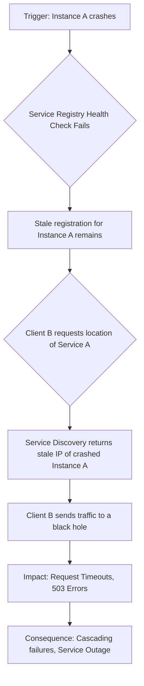
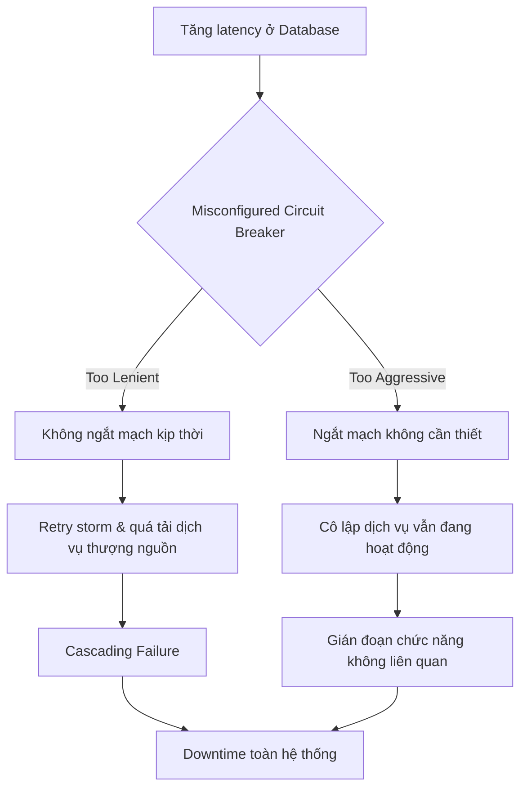
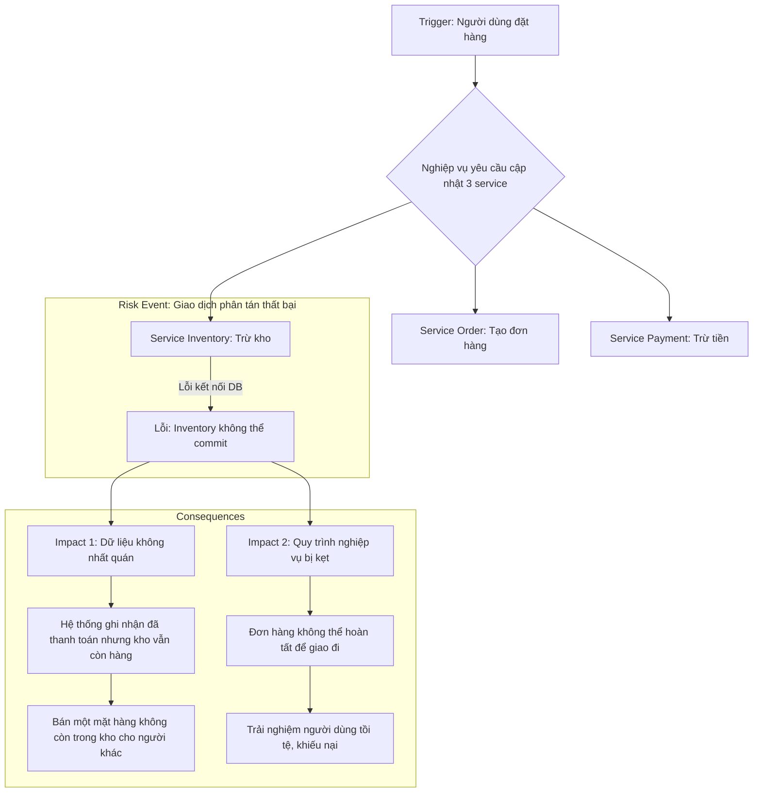

## Chương 7: Rủi Ro Microservices

### 7.1 Rủi Ro API Gateway SPOF

#### Định Nghĩa Rủi Ro
- **Định nghĩa:** Rủi ro API Gateway Single Point of Failure (SPOF) xảy ra khi toàn bộ hệ thống hoặc một phần lớn các dịch vụ phụ thuộc vào một API Gateway duy nhất bị sụp đổ. Khi API Gateway ngừng hoạt động, tất cả các yêu cầu từ client đến các microservices phía sau đều bị chặn lại, gây ra gián đoạn dịch vụ trên diện rộng.
- **Nguyên nhân phát sinh:** Rủi ro này phát sinh khi kiến trúc hệ thống không có cơ chế dự phòng hoặc cân bằng tải cho API Gateway. Trong môi trường production, với lưu lượng truy cập cao và liên tục, bất kỳ sự cố nào tại API Gateway (lỗi phần cứng, lỗi phần mềm, quá tải) đều có thể biến nó thành một điểm lỗi duy nhất.
- **Mức độ nghiêm trọng:** **Critical**. Vì API Gateway là cửa ngõ duy nhất cho mọi tương tác của người dùng, sự cố tại đây có thể làm tê liệt hoàn toàn ứng dụng.

#### Nguyên Nhân Gốc Rễ (Root Causes)
1. **Thiếu cơ chế High Availability (HA):** Chỉ triển khai một instance duy nhất của API Gateway. Nếu instance này gặp sự cố, không có instance nào khác để thay thế, dẫn đến downtime ngay lập tức.
2. **Cấu hình sai Load Balancer:** Cấu hình sai bộ cân bằng tải phía trước API Gateway có thể dẫn đến phân phối lưu lượng không đồng đều, gây quá tải cho một hoặc một vài instance trong cụm API Gateway, trong khi các instance khác lại không được sử dụng hiệu quả.
3. **Lỗi triển khai (Deployment Error):** Một bản cập nhật mới chứa lỗi nghiêm trọng (ví dụ: memory leak, bug logic) được triển khai lên tất cả các instance của API Gateway cùng một lúc mà không có chiến lược canary deployment hay blue-green deployment, khiến toàn bộ cụm gateway bị sụp đổ.
4. **Phụ thuộc vào một dịch vụ bên ngoài không ổn định:** API Gateway có thể phụ thuộc vào các dịch vụ khác như hệ thống xác thực (Authentication), logging, hoặc service discovery. Nếu một trong những dịch vụ này gặp sự cố và API Gateway không có cơ chế xử lý lỗi (ví dụ: timeout, circuit breaker), nó có thể bị treo hoặc sụp đổ theo.
5. **Tấn công DDoS:** API Gateway là mục tiêu chính của các cuộc tấn công từ chối dịch vụ (DDoS). Nếu không có các biện pháp bảo vệ hiệu quả (rate limiting, IP blacklisting, WAF), một cuộc tấn-công có thể làm cạn kiệt tài nguyên của gateway và gây ra downtime.

#### Biểu Hiện & Triệu Chứng (Symptoms)
- **Dấu hiệu cảnh báo sớm:**
  - Tăng đột biến độ trễ (latency) của các request.
  - Tỷ lệ lỗi 5xx (502 Bad Gateway, 503 Service Unavailable, 504 Gateway Timeout) tăng cao.
  - Mức sử dụng CPU hoặc memory của các instance API Gateway tăng bất thường.
- **Các metrics/logs cần theo dõi:**
  - **Metrics:** `request_latency_p99`, `http_error_rate (5xx)`, `cpu_utilization`, `memory_usage`, `active_connections`.
  - **Logs:** Log lỗi từ API Gateway cho thấy không thể kết nối đến các upstream service, lỗi timeout, hoặc các lỗi nghiêm trọng (panic, crash log).
- **Red flags trong hệ thống:**
  - Alert từ hệ thống monitoring báo động về tình trạng "unhealthy" của các instance API Gateway.
  - Khách hàng báo cáo không thể truy cập ứng dụng hoặc gặp lỗi trên diện rộng.
  - Các dịch vụ backend không nhận được request nào từ API Gateway.

#### Sơ Đồ Phân Tích
```mermaid
graph TD
    A[Cấu hình sai Load Balancer] --> B{Lưu lượng phân phối không đều}
    B --> C[Một instance API Gateway bị quá tải]
    C --> D{Sụp đổ instance}
    D --> E[Toàn bộ API Gateway ngừng hoạt động (SPOF)]
    E --> F[Tất cả dịch vụ backend không thể truy cập]
    F --> G[Downtime toàn bộ ứng dụng]
```

#### Tác Động Cụ Thể (Impact Analysis)

| Khía Cạnh       | Mức Độ   | Chi Tiết                                                                                                |
|-----------------|----------|---------------------------------------------------------------------------------------------------------|
| Downtime        | High     | Toàn bộ hoặc phần lớn các chức năng của ứng dụng ngừng hoạt động, ảnh hưởng đến 100% người dùng.             |
| Financial       | >$10,000/hour | Ước tính dựa trên doanh thu bị mất, chi phí khắc phục sự cố, và ảnh hưởng đến thương hiệu.                 |
| Security        | Medium   | Có thể tạo cơ hội cho các cuộc tấn công khác nếu cơ chế fallback không an toàn.                           |
| User Experience | Severe   | Người dùng hoàn toàn không thể sử dụng dịch vụ, gây mất niềm tin và có thể chuyển sang đối thủ cạnh tranh. |
| Team Morale     | High     | Gây áp lực lớn lên đội ngũ kỹ sư, phải làm việc dưới áp lực cao để khắc phục sự cố (war room).            |

#### Case Study Thực Tế
**Sự cố API Gateway của một công ty (giấu tên) - 2024**
- **Bối cảnh:** Một công ty công nghệ đang vận hành hệ thống microservices với một API Gateway làm điểm vào trung tâm. Đội ngũ kỹ sư đã triển khai một bản cập nhật nhỏ cho API Gateway.
- **Diễn biến:** Khoảng 15 phút sau khi triển khai, hệ thống giám sát bắt đầu cảnh báo về tỷ lệ lỗi 5xx tăng đột biến. Ngay sau đó, người dùng báo cáo không thể truy cập vào ứng dụng. Toàn bộ API Gateway đã ngừng hoạt động, gây ra downtime hoàn toàn trong 1 giờ 30 phút.
- **Nguyên nhân gốc rễ:** Phân tích postmortem cho thấy nguyên nhân là sự kết hợp của hai yếu tố: (1) Một lỗi trong bản cập nhật mới đã làm tăng tải lên API Gateway một cách bất thường. (2) Cấu hình của load balancer phía trước không chính xác, dẫn đến việc phân phối lưu lượng không đều, làm một số instance bị quá tải và sụp đổ, gây ra hiệu ứng domino.
- **Tác động:** Sự cố ảnh hưởng đến 80% người dùng, gây gián đoạn dịch vụ trong 90 phút. Thiệt hại tài chính không được công bố nhưng được cho là đáng kể.
- **Bài học:** Cần phải có quy trình triển khai an toàn hơn (canary release), giám sát chặt chẽ hơn sau mỗi lần triển khai, và thường xuyên kiểm tra lại cấu hình của các thành phần hạ tầng quan trọng như load balancer.
- **Nguồn:** [My First Postmortem: How did the API Gateway experience a complete outage?](https://medium.com/@solimanadel304/my-first-postmortem-how-did-the-api-gateway-experience-a-complete-outage-and-how-we-fixed-it-ee828576a0b4)

#### Risk Mitigation Strategies

**Preventive Measures (Ngăn ngừa):**
1. **Triển khai High Availability (HA) Cluster:** Luôn triển khai API Gateway dưới dạng một cụm (cluster) với ít nhất 3 instance ở các availability zone (AZ) khác nhau để đảm bảo tính sẵn sàng cao.
2. **Sử dụng Load Balancer hiệu quả:** Cấu hình load balancer (ví dụ: AWS ALB/NLB, NGINX) để phân phối lưu lượng đều giữa các instance gateway và tự động loại bỏ các instance "unhealthy".
3. **Áp dụng Canary/Blue-Green Deployment:** Không bao giờ triển khai phiên bản mới cho tất cả các instance cùng một lúc. Áp dụng các chiến lược triển khai an toàn để giảm thiểu rủi ro từ các bản cập nhật.

**Detective Measures (Phát hiện):**
1. **Giám sát toàn diện (Comprehensive Monitoring):** Thiết lập giám sát chi tiết cho API Gateway, bao gồm Golden Signals (Latency, Traffic, Errors, Saturation) và các chỉ số của máy chủ (CPU, memory, network).
2. **Cảnh báo thông minh (Smart Alerting):** Cấu hình cảnh báo tự động khi các chỉ số vượt ngưỡng nguy hiểm (ví dụ: tỷ lệ lỗi 5xx > 1% trong 5 phút, P99 latency > 2s). Tích hợp cảnh báo với các công cụ như PagerDuty hoặc OpsGenie.
3. **Centralized Logging:** Tập trung log từ tất cả các instance API Gateway vào một nơi (ví dụ: ELK Stack, Splunk) để dễ dàng truy vấn và phân tích khi có sự cố.

**Corrective Measures (Khắc phục):**
1. **Quy trình phản ứng sự cố (Incident Response Playbook):** Xây dựng một quy trình rõ ràng để xử lý sự cố API Gateway, bao gồm các bước chẩn đoán, liên lạc, và khắc phục.
2. **Tự động Rollback:** Thiết lập cơ chế tự động rollback về phiên bản ổn định trước đó nếu phiên bản mới gây ra tỷ lệ lỗi cao sau khi triển khai.
3. **Circuit Breaker:** Tích hợp mẫu thiết kế Circuit Breaker vào API Gateway để tự động ngắt kết nối đến các dịch vụ backend đang gặp sự cố, ngăn ngừa lỗi lan truyền và giúp gateway phục hồi nhanh hơn.

#### Code Examples

**Anti-pattern (Cách làm SAI):**
```python
# ❌ ANTI-PATTERN: Định tuyến trực tiếp đến một microservice mà không có timeout
import requests

def route_to_service(user_id):
    # Nếu service 'user-service' bị treo, request này sẽ bị treo theo
    # và giữ một worker của API Gateway, dẫn đến cạn kiệt tài nguyên.
    try:
        response = requests.get(f"http://user-service/users/{user_id}")
        return response.json()
    except requests.exceptions.RequestException as e:
        # Xử lý lỗi quá chung chung
        return {"error": "Service unavailable"}, 503
```

**Best Practice (Cách làm ĐÚNG):**
```python
# ✅ BEST PRACTICE: Sử dụng timeout và Circuit Breaker
import requests
from circuitbreaker import circuit

# Cấu hình circuit breaker: nếu có 5 lỗi trong 60s, mở circuit trong 30s
@circuit(failure_threshold=5, recovery_timeout=60, name="user_service_breaker")
def call_user_service(user_id):
    return requests.get(f"http://user-service/users/{user_id}", timeout=2.0) # Đặt timeout là 2 giây

def route_to_service_safely(user_id):
    try:
        response = call_user_service(user_id)
        response.raise_for_status() # Ném exception cho các mã lỗi 4xx/5xx
        return response.json()
    except requests.exceptions.Timeout:
        return {"error": "Request to user service timed out"}, 504
    except requests.exceptions.HTTPError as e:
        return {"error": f"User service returned an error: {e.response.status_code}"}, e.response.status_code
    except Exception as e: # Bao gồm cả lỗi từ circuit breaker
        return {"error": f"Service unavailable: {str(e)}"}, 503
```

#### Risk Assessment Matrix

| Yếu Tố                 | Đánh Giá | Ghi Chú                                                                                             |
|------------------------|----------|-----------------------------------------------------------------------------------------------------|
| Xác suất (Probability) | 3 (Medium) | Với một hệ thống phức tạp, lỗi cấu hình hoặc bug trong code là điều có thể xảy ra.                   |
| Tác động (Impact)      | 5 (Critical) | Gây downtime toàn bộ hệ thống, ảnh hưởng trực tiếp đến doanh thu và uy tín thương hiệu.             |
| **Risk Score**         | **15**   | **Critical**                                                                                        |
| Ưu tiên xử lý          | **P1**   | Phải được ưu tiên xử lý và có các biện pháp ngăn ngừa, phát hiện, khắc phục mạnh mẽ.                 |

#### Checklist Đánh Giá
- [ ] Hệ thống API Gateway có được triển khai dưới dạng cluster với ít nhất 3 nodes không?
- [ ] Các nodes của API Gateway có được phân bổ trên các Availability Zones khác nhau không?
- [ ] Có Load Balancer phía trước API Gateway cluster và được cấu hình health check đúng cách không?
- [ ] Quy trình triển khai có áp dụng Canary hoặc Blue-Green deployment không?
- [ ] Các request đến backend services có được cấu hình timeout hợp lý không?
- [ ] Có triển khai Circuit Breaker cho các dịch vụ quan trọng không?
- [ ] Hệ thống monitoring có cảnh báo tự động cho các chỉ số lỗi và độ trễ của API Gateway không?

#### Tools & Resources
- **Kong / NGINX Gateway:** Các giải pháp API Gateway mã nguồn mở và thương mại phổ biến, hỗ trợ HA và nhiều tính năng nâng cao.
- **AWS Application Load Balancer (ALB):** Dịch vụ cân bằng tải của AWS, tích hợp tốt với các dịch vụ khác và cung cấp health check tự động.
- **Prometheus & Grafana:** Bộ công cụ mạnh mẽ để thu thập metrics và trực quan hóa dashboard cho hệ thống API Gateway.
- **PagerDuty / OpsGenie:** Các công cụ quản lý sự cố và điều phối cảnh báo, giúp rút ngắn thời gian phản ứng.

#### Nguồn Tham Khảo
1. [NGINX High Availability](https://www.nginx.com/products/nginx/high-availability/) - Hướng dẫn chi tiết về cách thiết lập NGINX ở chế độ HA.
2. [The Circuit Breaker Pattern](https://martinfowler.com/bliki/CircuitBreaker.html) - Bài viết kinh điển của Martin Fowler về mẫu thiết kế Circuit Breaker.
3. [Google SRE Book - Monitoring Distributed Systems](https://sre.google/sre-book/monitoring-distributed-systems/) - Chương sách về giám sát hệ thống phân tán, bao gồm các khái niệm về Golden Signals.


### 7.2 Rủi Ro Service Discovery Failures

#### Định Nghĩa Rủi Ro
- **Định nghĩa:** Rủi ro Service Discovery Failures (Lỗi Khám Phá Dịch Vụ) xảy ra khi một service (client) không thể tìm thấy địa chỉ mạng (IP và port) chính xác và cập nhật của một service khác (provider) mà nó cần giao tiếp. Hệ thống khám phá dịch vụ, vốn hoạt động như một cuốn danh bạ động cho các microservices, trả về thông tin sai lệch, cũ, hoặc không thể truy cập, dẫn đến việc các yêu cầu (requests) bị gửi đến các đích không tồn tại hoặc không khỏe mạnh.
- **Nguyên nhân phát sinh:** Trong các kiến trúc microservices hiện đại, các service instances được tạo ra và hủy đi liên tục (auto-scaling, deployments, failures). Service discovery là cơ chế trung tâm để theo dõi trạng thái động này. Rủi ro phát sinh khi có sự không đồng bộ giữa trạng thái thực tế của các service instances và thông tin được lưu trong service registry (cơ sở dữ liệu của hệ thống discovery). Các vấn đề như network partitions, lỗi trong tiến trình health check, hoặc cấu hình sai đều có thể gây ra sự không đồng bộ này.
- **Mức độ nghiêm trọng tiềm tàng:** **Critical**. Lỗi khám phá dịch vụ có thể gây ra tình trạng mất kết nối hàng loạt giữa các service, dẫn đến downtime trên diện rộng cho toàn bộ ứng dụng hoặc các chức năng kinh doanh cốt lõi. Nó có thể gây ra hiệu ứng domino (cascading failure), khi một service lỗi làm cho các service phụ thuộc khác cũng lỗi theo.

#### Nguyên Nhân Gốc Rễ (Root Causes)
1.  **Stale Registrations (Đăng ký cũ/lỗi thời):** Khi một service instance bị crash, tắt đột ngột hoặc bị cô lập mạng, nó không thể tự hủy đăng ký (deregister) khỏi service registry. Health check của hệ thống discovery nếu không đủ nhạy hoặc cấu hình sai sẽ không kịp thời phát hiện và loại bỏ instance này. Kết quả là registry vẫn chứa thông tin về một instance không còn hoạt động, và client sẽ tiếp tục nhận được địa chỉ "ma" này, dẫn đến request failures.
2.  **Network Partitions (Phân mảnh mạng):** Hệ thống bị chia cắt thành các phân vùng mạng cô lập, khiến cho các node không thể giao tiếp với nhau. Điều này có thể khiến service registry (ví dụ: Consul, etcd cluster) mất quorum và không thể hoạt động, hoặc khiến các agent của service discovery trên các server không thể gửi heartbeat đến registry. Các instance khỏe mạnh có thể bị đánh dấu là "unhealthy" một cách sai lầm, trong khi các client ở phân vùng mạng khác không thể nhận được thông tin cập nhật.
3.  **Health Check Configuration Errors (Lỗi cấu hình Health Check):** Các cơ chế kiểm tra sức khỏe (health check) có thể được cấu hình quá lỏng lẻo (timeout quá dài, tần suất kiểm tra quá thấp) hoặc quá chặt chẽ (timeout quá ngắn, ngưỡng lỗi quá thấp). Timeout quá dài làm chậm việc phát hiện các instance đã chết. Ngược lại, timeout quá ngắn trên một mạng có độ trễ cao có thể gây ra tình trạng "flapping" (liên tục thay đổi trạng thái healthy/unhealthy), khiến các instance khỏe mạnh bị loại bỏ khỏi pool một cách không cần thiết.
4.  **Cache Poisoning ở Client-Side:** Để tăng hiệu suất, các client thường cache lại kết quả từ service discovery. Nếu có một bản ghi sai được cache lại (ví dụ, do một lỗi tạm thời của registry), client sẽ tiếp tục sử dụng thông tin sai này cho đến khi cache hết hạn (TTL - Time To Live). Nếu TTL được cấu hình quá dài, nó sẽ kéo dài thời gian tác động của một sự cố discovery đã được khắc phục ở phía server.

#### Biểu Hiện & Triệu Chứng (Symptoms)
- **Dấu hiệu cảnh báo sớm:** Tăng nhẹ tỷ lệ lỗi HTTP 5xx (đặc biệt là 503 Service Unavailable), độ trễ request trung bình (average latency) tăng đột biến ở một vài service cụ thể mà không rõ nguyên nhân.
- **Các metrics/logs cần theo dõi:** Theo dõi chặt chẽ metric `consul.health.service.passing` (số lượng instance khỏe mạnh) cho mỗi service; một sự sụt giảm đột ngột là dấu hiệu nguy hiểm. Phía client, theo dõi `client.request.latency` và `client.http.5xx_rate`. Trong logs, tìm kiếm các thông báo lỗi như "connection refused", "host unknown", "request timeout", "no healthy upstream".
- **Red flags trong hệ thống:** Số lượng instance đang đăng ký trong registry giảm mạnh mà không tương ứng với một hoạt động scale-down đã lên kế hoạch. Hệ thống monitoring phát ra cảnh báo "network partition" hoặc "cluster leader election" liên tục.

#### Sơ Đồ Phân Tích


#### Tác Động Cụ Thể (Impact Analysis)

| Khía Cạnh        | Mức Độ   | Chi Tiết                                                                                                                            |
| ----------------- | -------- | ----------------------------------------------------------------------------------------------------------------------------------- |
| **Downtime**      | High     | Có thể gây ra downtime toàn bộ hoặc một phần cho các user-facing services. Thời gian khôi phục phụ thuộc vào việc sửa chữa registry hoặc cấu hình. |
| **Financial**     | >$100k/hour | Ước tính dựa trên doanh thu bị mất, vi phạm SLA, và chi phí nhân sự để khắc phục sự cố cho một ứng dụng quy mô lớn.                 |
| **Security**      | Medium   | Trong trường hợp hiếm, request có thể bị định tuyến nhầm đến một service không liên quan, có khả năng gây rò rỉ thông tin nếu không có xác thực chéo. |
| **User Experience** | Severe   | Người dùng cuối gặp lỗi 5xx, ứng dụng không tải được, hoặc các chức năng cốt lõi không hoạt động. Gây mất niềm tin nghiêm trọng.      |
| **Team Morale**   | High     | Gây áp lực lớn cho đội ngũ SRE/DevOps, đòi hỏi phải "truy tìm" trong một hệ thống phức tạp và khó đoán. Sự cố kéo dài gây mệt mỏi và căng thẳng. |

#### Case Study Thực Tế
**Sự cố AWS US-EAST-1 - Tháng 10, 2025**
- **Bối cảnh:** Vùng US-EAST-1 là một trong những trung tâm dữ liệu lớn và lâu đời nhất của AWS, là xương sống cho hàng ngàn dịch vụ và ứng dụng toàn cầu, bao gồm Snapchat, Pinterest, và Duolingo.
- **Diễn biến:** Vào ngày 20 tháng 10 năm 2025, một sự thay đổi cấu hình trong một dịch vụ nội bộ của AWS chịu trách nhiệm về metadata và service discovery đã được triển khai một cách không nhất quán. Điều này dẫn đến lỗi xác thực và định tuyến cho các instance phụ thuộc. Lỗi ban đầu này nhanh chóng gây ra hiệu ứng domino, làm quá tải và cạn kiệt tài nguyên của các dịch vụ liên quan như EC2, Lambda, và S3, vốn phụ thuộc vào giao tiếp nội bộ có độ trễ thấp.
- **Nguyên nhân gốc rễ:** Nguyên nhân chính là một lỗi trong quá trình triển khai thay đổi cấu hình cho hệ thống service discovery nội bộ, dẫn đến sự không nhất quán trong dữ liệu định tuyến. Điều này đã làm cho các dịch vụ không thể tìm thấy hoặc xác thực lẫn nhau, gây ra một sự cố trên diện rộng.
- **Tác động:** Sự cố kéo dài nhiều giờ, ảnh hưởng đến hàng triệu người dùng cuối trên toàn cầu. Downdetector ghi nhận hơn 6.5 triệu báo cáo lỗi. Snapchat gặp sự cố đăng nhập trong gần 12 giờ, trong khi nhiều nền tảng lớn khác như Pinterest, Fortnite, và Signal cũng bị gián đoạn nghiêm trọng.
- **Bài học:** Sự cố này nhấn mạnh sự nguy hiểm của việc phụ thuộc vào một kiến trúc đơn vùng (single-region). Nó cho thấy tầm quan trọng của việc thiết kế hệ thống có khả năng phục hồi, với các cơ chế failover đa vùng tự động, và thực hành chaos engineering để chủ động tìm ra các điểm yếu trong hệ thống.
- **Nguồn:** [AWS Outage — October 20, 2025: A Case Study in Cloud Fragility and Global Impact](https://aws.plainenglish.io/aws-outage-october-20-2025-a-case-study-in-cloud-fragility-and-global-impact-ded4ce6bc4f8)

#### Risk Mitigation Strategies

**Preventive Measures (Ngăn ngừa):**
1.  **Sử dụng Time-to-Live (TTL) ngắn:** Cấu hình TTL ngắn cho các bản ghi DNS và cache phía client để đảm bảo thông tin discovery được làm mới thường xuyên, giảm thiểu thời gian ảnh hưởng của stale records.
2.  **Kiến trúc Multi-Region/Multi-Cluster:** Triển khai các service registry (ví dụ: Consul) trên nhiều availability zones hoặc regions để tránh có điểm lỗi đơn (single point of failure). Đảm bảo các client có khả năng failover sang một cluster registry khác nếu cluster chính gặp sự cố.
3.  **Cấu hình Health Check thông minh:** Sử dụng nhiều loại health check kết hợp (ví dụ: kiểm tra TCP, HTTP và kiểm tra logic nghiệp vụ) để có cái nhìn toàn diện về sức khỏe của service. Tinh chỉnh cẩn thận các tham số timeout và interval.

**Detective Measures (Phát hiện):**
1.  **Giám sát Service Discovery Layer:** Theo dõi các metrics quan trọng của service discovery như số lượng instance đăng ký, tỷ lệ health check thất bại, độ trễ của API registry. Cảnh báo ngay lập tức khi có sự thay đổi đột ngột (ví dụ: số instance giảm 50% trong 1 phút).
2.  **Giám sát Client-Side Metrics:** Theo dõi tỷ lệ lỗi kết nối (connection errors), request timeouts, và lỗi HTTP 503 từ phía client. Một sự gia tăng đột biến ở các metrics này thường là dấu hiệu sớm của vấn đề discovery.
3.  **Log Correlation:** Tập trung và phân tích log từ cả client, server và service discovery layer. Tìm kiếm các log pattern như "host not found", "connection refused" tương quan với các sự kiện thay đổi trong service registry.

**Corrective Measures (Khắc phục):**
1.  **Client-Side Resilience Patterns:** Tích hợp các cơ chế như Circuit Breaker, Retry với exponential backoff, và Load Balancing thông minh phía client. Khi một endpoint lỗi, Circuit Breaker sẽ tạm thời ngừng gửi request đến nó, cho phép hệ thống có thời gian phục hồi.
2.  **Thủ tục Flush Cache thủ công:** Cung cấp một cơ chế (ví dụ: một API endpoint) để có thể buộc các client xóa cache discovery của chúng và lấy lại thông tin mới nhất từ registry, giúp tăng tốc độ phục hồi sau sự cố.
3.  **Quy trình Rollback nhanh chóng:** Đối với các thay đổi cấu hình liên quan đến service discovery, luôn có sẵn quy trình rollback đã được kiểm thử để có thể nhanh chóng hoàn tác thay đổi nếu nó gây ra sự cố.

#### Code Examples

**Anti-pattern (Cách làm SAI):**
```python
# ❌ ANTI-PATTERN: Phụ thuộc vào một địa chỉ IP/hostname cố định và không có cơ chế retry.
import requests

SERVICE_A_HOST = "10.0.1.123:8080" # Hardcoded IP

def bad_example():
    try:
        # Nếu service A thay đổi IP, code này sẽ lỗi vĩnh viễn
        response = requests.get(f"http://{SERVICE_A_HOST}/data")
        return response.json()
    except requests.exceptions.RequestException as e:
        # Không có retry, một lỗi tạm thời sẽ làm hỏng toàn bộ hoạt động
        print(f"Error connecting to Service A: {e}")
        return None
```

**Best Practice (Cách làm ĐÚNG):**
```python
# ✅ BEST PRACTICE: Sử dụng thư viện client-side discovery và các resilience patterns.
import requests
from consul import Consul # Giả sử dùng Consul làm service discovery
from tenacity import retry, stop_after_attempt, wait_exponential

consul_client = Consul()

# Hàm này sẽ được retry 3 lần với khoảng chờ tăng dần
@retry(stop=stop_after_attempt(3), wait=wait_exponential(multiplier=1, min=2, max=10))
def good_example():
    # 1. Lấy danh sách các instance khỏe mạnh từ Consul
    _ , services = consul_client.health.service("service-a", passing=True)
    if not services:
        raise ConnectionError("No healthy instances found for service-a")

    # 2. Chọn một instance (có thể dùng round-robin hoặc random)
    service = services[0]
    address = service["Service"]["Address"]
    port = service["Service"]["Port"]
    host = f"{address}:{port}"

    # 3. Gửi request với timeout
    print(f"Attempting to connect to service-a at {host}")
    response = requests.get(f"http://{host}/data", timeout=5)
    response.raise_for_status() # Ném exception nếu gặp lỗi HTTP 4xx/5xx
    return response.json()

# good_example() sẽ tự động tìm instance khỏe mạnh và retry nếu thất bại.
```

#### Risk Assessment Matrix

| Yếu Tố                 | Đánh Giá | Ghi Chú                                                                                                                                  |
| ---------------------- | -------- | ---------------------------------------------------------------------------------------------------------------------------------------- |
| **Xác suất (Probability)** | 3 (trên 5) | Trong các hệ thống microservices phức tạp, các lỗi cấu hình nhỏ hoặc sự cố mạng là khá phổ biến. Tần suất tăng theo quy mô hệ thống. |
| **Tác động (Impact)**      | 5 (trên 5) | Có khả năng gây downtime toàn bộ hệ thống và ảnh hưởng trực tiếp đến doanh thu và uy tín thương hiệu.                                   |
| **Risk Score**         | **15**   | **Critical**                                                                                                                             |
| **Ưu tiên xử lý**      | **P1**   | Phải được ưu tiên hàng đầu trong thiết kế kiến trúc và giám sát hệ thống.                                                                 |

#### Checklist Đánh Giá
- [ ] Hệ thống service discovery của bạn có được triển khai theo mô hình high-availability (HA) không?
- [ ] Client có cache lại kết quả discovery không? Nếu có, TTL là bao nhiêu và có cơ chế để flush cache không?
- [ ] Health check có đủ tinh vi để phát hiện các instance "zombie" (chạy nhưng không hoạt động đúng) không?
- [ ] Client có được trang bị các resilience patterns như retry, timeout, và circuit breaker không?
- [ ] Bạn có dashboard giám sát riêng cho service discovery layer không?
- [ ] Quy trình triển khai thay đổi liên quan đến discovery có bao gồm kế hoạch rollback chi tiết không?
- [ ] Bạn đã từng thực hiện chaos testing bằng cách chủ động làm sập service registry hoặc các service instance chưa?

#### Tools & Resources
- **Consul:** Một giải pháp service discovery và service mesh toàn diện từ HashiCorp. Cung cấp registry, health checking, và K/V store.
- **etcd:** Một kho lưu trữ key-value phân tán, nhất quán, thường được sử dụng làm backend cho service discovery trong các hệ thống Kubernetes.
- **Zookeeper:** Một dịch vụ tập trung để duy trì thông tin cấu hình, đặt tên, cung cấp đồng bộ hóa phân tán, và cung cấp các dịch vụ nhóm. Thường được dùng trong các hệ thống dựa trên Java/JVM.

#### Nguồn Tham Khảo
1.  [Service Discovery in a Microservices Architecture](https://www.nginx.com/blog/service-discovery-in-a-microservices-architecture/) - Một bài viết tổng quan về các pattern của service discovery.
2.  [AWS Outage Postmortem - October 2025](https://aws.plainenglish.io/aws-outage-october-20-2025-a-case-study-in-cloud-fragility-and-global-impact-ded4ce6bc4f8) - Phân tích chi tiết về sự cố AWS liên quan đến service discovery.
3.  [Pattern: Service registry](https://microservices.io/patterns/service-registry.html) - Mô tả chi tiết về pattern Service Registry từ trang microservices.io của Chris Richardson.

---

### 7.3 Rủi Ro Circuit Breaker Misconfiguration

#### Định Nghĩa Rủi Ro
- **Định nghĩa:** Rủi ro Cấu hình sai Circuit Breaker (Circuit Breaker Misconfiguration) xảy ra khi các ngưỡng (thresholds) và tham số của Circuit Breaker được thiết lập không phù hợp với điều kiện hoạt động thực tế của hệ thống. Cấu hình có thể quá "hung hăng" (too aggressive), ngắt mạch quá sớm và không cần thiết, hoặc quá "khoan dung" (too lenient), không ngắt mạch kịp thời khi có sự cố, dẫn đến thất bại trong việc ngăn chặn lỗi hàng loạt (cascading failures).
- **Nguyên nhân phát sinh:** Rủi ro này phát sinh trong môi trường production do sự phức tạp của hệ thống microservices, sự thay đổi liên tục của tải (load) và sự phụ thuộc lẫn nhau giữa các dịch vụ. Việc xác định một bộ tham số "hoàn hảo" cho Circuit Breaker là cực kỳ khó khăn và thường đòi hỏi phải điều chỉnh liên tục dựa trên dữ liệu quan sát được.
- **Mức độ nghiêm trọng:** **High**. Một Circuit Breaker được cấu hình sai không chỉ thất bại trong việc bảo vệ hệ thống mà còn có thể trở thành nguồn gốc của sự cố, gây ra downtime trên diện rộng và ảnh hưởng nghiêm trọng đến hoạt động kinh doanh.

#### Nguyên Nhân Gốc Rễ (Root Causes)
1. **Thiết Lập Ngưỡng Quá Nhạy (Too Aggressive):** Các tham số như `failureRateThreshold` (ngưỡng tỉ lệ lỗi) hoặc `slowCallRateThreshold` (ngưỡng tỉ lệ cuộc gọi chậm) được đặt ở mức quá thấp. Ví dụ, đặt ngưỡng lỗi ở mức 5% trong một hệ thống thường xuyên có nhiễu (noise) hoặc lỗi tạm thời (transient errors) có thể khiến Circuit Breaker mở (open) một cách không cần thiết, cô lập một dịch vụ vẫn đang hoạt động tương đối ổn định, gây gián đoạn dịch vụ oan uổng.
2. **Thiết Lập Ngưỡng Quá Khoan Dung (Too Lenient):** Ngược lại, đặt các ngưỡng quá cao (ví dụ: `failureRateThreshold` ở mức 70%) khiến Circuit Breaker không thể phản ứng kịp thời khi một dịch vụ phụ thuộc (downstream service) bắt đầu gặp sự cố. Hệ thống sẽ tiếp tục gửi yêu cầu đến dịch vụ đang gặp vấn đề, làm tăng tải và gây ra lỗi hàng loạt (cascading failure) cho các dịch vụ gọi đến nó (upstream services).
3. **Thời Gian Chờ (Timeout) và Thời Gian Reset Không Hợp Lý:** Cấu hình `waitDurationInOpenState` (thời gian chờ ở trạng thái mở) quá ngắn có thể khiến Circuit Breaker chuyển sang trạng thái nửa-mở (half-open) và đóng lại quá nhanh, trong khi dịch vụ phụ thuộc chưa thực sự phục hồi, dẫn đến việc nó lại bị quá tải và lỗi trở lại. Ngược lại, nếu thời gian này quá dài, dịch vụ sẽ bị cô lập lâu hơn mức cần thiết, ảnh hưởng đến tính sẵn sàng (availability).
4. **Thiếu Cơ Chế Fallback Khi Mạch Mở:** Khi Circuit Breaker mở, nếu không có một cơ chế thay thế (fallback) hợp lý (ví dụ: trả về dữ liệu cache, một giá trị mặc định, hoặc gọi một dịch vụ dự phòng), các yêu cầu sẽ bị từ chối ngay lập tức. Điều này có thể gây ra trải nghiệm người dùng tồi tệ và lỗi không mong muốn ở các tầng trên của ứng dụng.
5. **Anti-pattern "Một kích thước cho tất cả" (One-size-fits-all):** Áp dụng cùng một cấu hình Circuit Breaker cho tất cả các dịch vụ mà không xem xét đến đặc thù riêng của từng dịch vụ (ví dụ: tầm quan trọng, SLA, pattern tải, sự phụ thuộc). Một dịch vụ thanh toán quan trọng cần cấu hình khác với một dịch vụ thông báo ít quan trọng hơn.

#### Biểu Hiện & Triệu Chứng (Symptoms)
- **Dấu hiệu cảnh báo sớm:**
  - Trạng thái Circuit Breaker "nhấp nháy" (flapping): liên tục chuyển đổi giữa các trạng thái Open, Half-Open và Closed.
  - Tăng đột biến số lượng lỗi `CircuitBreakerOpenException` hoặc các lỗi tương tự trong logs.
  - Latency của các yêu cầu đến một dịch vụ cụ thể tăng nhẹ nhưng ổn định ngay trước khi Circuit Breaker mở.
- **Các metrics/logs cần theo dõi:**
  - `circuit_breaker_state`: Trạng thái hiện tại của Circuit Breaker (1: Closed, 2: Open, 3: Half-Open).
  - `circuit_breaker_failure_rate`: Tỉ lệ lỗi được ghi nhận bởi Circuit Breaker.
  - `circuit_breaker_slow_call_rate`: Tỉ lệ cuộc gọi chậm.
  - `circuit_breaker_calls_succeeded`, `circuit_breaker_calls_failed`, `circuit_breaker_calls_not_permitted`: Số lượng cuộc gọi thành công, thất bại, và bị từ chối.
- **Red flags trong hệ thống:**
  - Một dịch vụ không quan trọng (non-critical) bị cô lập bởi Circuit Breaker nhưng lại gây ra lỗi trên các luồng nghiệp vụ quan trọng (critical path).
  - Toàn bộ hệ thống sụp đổ ngay sau khi một dịch vụ phụ thuộc có dấu hiệu chậm lại, cho thấy Circuit Breaker đã không hoạt động hiệu quả.

#### Sơ Đồ Phân Tích


#### Tác Động Cụ Thể (Impact Analysis)

| Khía Cạnh       | Mức Độ   | Chi Tiết                                                                                                                            |
|-----------------|----------|-------------------------------------------------------------------------------------------------------------------------------------|
| Downtime        | High     | Cấu hình sai có thể gây ra downtime trên diện rộng, từ vài phút đến vài giờ, do lỗi hàng loạt hoặc cô lập sai các dịch vụ quan trọng. |
| Financial       | >$10,000/hour | Ước tính dựa trên doanh thu bị mất, chi phí khắc phục sự cố, và ảnh hưởng đến thương hiệu. Con số có thể cao hơn nhiều với các hệ thống lớn. |
| Security        | Low      | Thường không trực tiếp tạo ra lỗ hổng bảo mật, nhưng việc hệ thống không ổn định có thể làm lộ ra các vector tấn công khác.         |
| User Experience | Severe   | Người dùng gặp lỗi, không thể hoàn thành giao dịch, mất dữ liệu. Gây mất niềm tin nghiêm trọng vào sản phẩm.                       |
| Team Morale     | High     | Gây căng thẳng cực độ cho đội ngũ kỹ sư (SRE, DevOps, Dev) khi phải "chữa cháy" một sự cố do chính công cụ bảo vệ hệ thống gây ra. |

#### Case Study Thực Tế
**DoorDash - Sự cố Cascading Failure (2020)**
- **Bối cảnh:** DoorDash đang vận hành một hệ thống microservices phức tạp. Một hoạt động bảo trì cơ sở dữ liệu định kỳ đã được thực hiện, không có gì bất thường.
- **Diễn biến:** Hoạt động bảo trì đã vô tình làm tăng độ trễ (latency) của cơ sở dữ liệu. Độ trễ này lan truyền lên các dịch vụ thượng nguồn (upstream services), gây ra lỗi timeout và cạn kiệt tài nguyên. Tỷ lệ lỗi tăng đột biến đã kích hoạt một Circuit Breaker được cấu hình sai.
- **Nguyên nhân gốc rễ:** Circuit Breaker được cấu hình quá "hung hăng" (aggressive). Thay vì chỉ cô lập dịch vụ đang gặp sự cố thực sự, nó đã ngắt kết nối giữa nhiều dịch vụ không liên quan, gây ra một sự cố trên diện rộng (wide blast radius).
- **Tác động:** Sự cố gây ra downtime cho nhiều chức năng cốt lõi của DoorDash, ảnh hưởng đến hàng triệu người dùng, đối tác nhà hàng và tài xế. Mặc dù không có số liệu tài chính cụ thể được công bố, tác động về mặt doanh thu và uy tín là rất lớn.
- **Bài học:** Cơ chế bảo vệ cục bộ như Circuit Breaker có thể không hiệu quả, thậm chí gây hại, trong các sự cố phức tạp. Cần có một cách tiếp cận toàn cục hơn để quản lý lỗi. Việc tinh chỉnh các tham số của Circuit Breaker là cực kỳ khó và quan trọng, không thể áp dụng một cách máy móc.
- **Nguồn:** [Failure Mitigation for Microservices: An Intro to Aperture](https://careersatdoordash.com/blog/failure-mitigation-for-microservices-an-intro-to-aperture/)

#### Risk Mitigation Strategies

**Preventive Measures (Ngăn ngừa):**
1. **Dynamic Configuration:** Sử dụng các nền tảng quản lý cấu hình tập trung (như Spring Cloud Config, Consul, etcd) để có thể điều chỉnh tham số Circuit Breaker một cách nhanh chóng mà không cần deploy lại code.
2. **Adaptive Circuit Breaking:** Thay vì dùng ngưỡng tĩnh, xem xét các thuật toán tự động điều chỉnh (adaptive) dựa trên điều kiện tải và tỷ lệ lỗi trong thời gian thực (ví dụ: Netflix Hystrix, Resilience4j).
3. **Chaos Engineering:** Thường xuyên thực hiện các thử nghiệm hỗn loạn (chaos testing) bằng cách chủ động "tiêm" lỗi (fault injection) vào hệ thống để kiểm tra xem Circuit Breaker có hoạt động như mong đợi trong các kịch bản khác nhau hay không.

**Detective Measures (Phát hiện):**
1. **Comprehensive Monitoring & Alerting:** Thiết lập cảnh báo (alert) ngay lập tức khi một Circuit Breaker thay đổi trạng thái (đặc biệt là khi chuyển sang Open) hoặc khi trạng thái của nó "nhấp nháy" (flapping).
2. **Key Metrics Tracking:** Xây dựng dashboard tập trung theo dõi các metrics quan trọng của Circuit Breaker trên toàn bộ hệ thống: trạng thái, tỷ lệ lỗi, tỷ lệ cuộc gọi chậm, số lượng yêu cầu bị từ chối.
3. **Log Pattern Analysis:** Phân tích logs để tìm kiếm các chuỗi lỗi `CircuitBreakerOpenException` lặp đi lặp lại hoặc xuất hiện đồng thời trên nhiều dịch vụ, đây là dấu hiệu của một vấn đề lớn hơn.

**Corrective Measures (Khắc phục):**
1. **Manual Override:** Cung cấp một cơ chế cho phép SRE hoặc người vận hành có thể can thiệp thủ công để buộc đóng (force-close) hoặc buộc mở (force-open) một Circuit Breaker trong trường hợp khẩn cấp khi cấu hình tự động gây hại.
2. **Gradual Rollback/Rollout:** Khi một cấu hình mới của Circuit Breaker được áp dụng, hãy triển khai nó một cách từ từ (canary release) cho một phần nhỏ traffic để đánh giá tác động trước khi áp dụng trên toàn bộ.
3. **Automated Recovery Playbooks:** Xây dựng các kịch bản (playbooks) tự động hóa để xử lý các sự cố phổ biến liên quan đến Circuit Breaker, ví dụ: tự động điều chỉnh ngưỡng khi phát hiện "flapping".

#### Code Examples

**Anti-pattern (Cách làm SAI):**
```python
# ❌ ANTI-PATTERN: Sử dụng cấu hình tĩnh, "one-size-fits-all" và không có fallback
import requests
from resilience import CircuitBreaker

# Cấu hình này có thể quá nhạy cảm cho một số dịch vụ
breaker = CircuitBreaker(
    failure_threshold=5, # Mở sau chỉ 5 lỗi
    recovery_timeout=30, # Reset sau 30s
    name="StaticBreaker"
)

@breaker
def call_downstream_service(service_url):
    # Không có cơ chế fallback, khi breaker mở sẽ ném ra CircuitBreakerError
    response = requests.get(service_url, timeout=1)
    response.raise_for_status()
    return response.json()

try:
    result = call_downstream_service("http://example.service/data")
except Exception as e:
    # Lỗi sẽ lan truyền lên, không được xử lý một cách nhẹ nhàng
    print(f"An unexpected error occurred: {e}")
```

**Best Practice (Cách làm ĐÚNG):**
```python
# ✅ BEST PRACTICE: Sử dụng cấu hình linh hoạt, có fallback và logging chi tiết
import requests
from resilience import CircuitBreaker, CircuitBreakerError
import logging

logging.basicConfig(level=logging.INFO)

# Cấu hình có thể được tải từ một dịch vụ cấu hình bên ngoài
# config = load_config_from_remote("payment_service_breaker")
config = {"failure_threshold": 10, "recovery_timeout": 60}

breaker = CircuitBreaker(
    failure_threshold=config["failure_threshold"],
    recovery_timeout=config["recovery_timeout"],
    name="DynamicPaymentBreaker"
)

def get_cached_data():
    logging.warning("Circuit breaker is open. Serving fallback data.")
    return {"data": "cached_or_default_value", "source": "fallback"}

@breaker(fallback=get_cached_data)
def call_payment_service(service_url):
    logging.info(f"Calling payment service: {service_url}")
    response = requests.get(service_url, timeout=2)
    response.raise_for_status()
    return response.json()

# Ngay cả khi dịch vụ lỗi, ứng dụng vẫn có thể tiếp tục với dữ liệu fallback
result = call_payment_service("http://payment.service/process")
print(f"Received result: {result}")
```

#### Risk Assessment Matrix

| Yếu Tố                 | Đánh Giá | Ghi Chú                                                                                                                            |
|------------------------|----------|------------------------------------------------------------------------------------------------------------------------------------|
| Xác suất (Probability) | 4        | Rất cao. Việc tìm ra cấu hình hoàn hảo ngay từ đầu là gần như không thể. Nhu cầu thay đổi liên tục làm tăng khả năng cấu hình sai. |
| Tác động (Impact)      | 4        | Rất cao. Có thể gây ra downtime trên diện rộng, ảnh hưởng trực tiếp đến doanh thu và trải nghiệm của tất cả người dùng.             |
| **Risk Score**         | **16**   | **Critical**                                                                                                                       |
| Ưu tiên xử lý          | P1       | Phải được giải quyết và theo dõi liên tục. Là một trong những rủi ro vận hành hàng đầu trong kiến trúc microservices.             |

#### Checklist Đánh Giá
- [ ] Cấu hình Circuit Breaker có được quản lý tập trung và có thể thay đổi mà không cần deploy lại không?
- [ ] Mỗi dịch vụ quan trọng có cấu hình Circuit Breaker riêng biệt, phù hợp với SLA và đặc thù của nó không?
- [ ] Chúng ta có dashboard để theo dõi trạng thái và các metrics chính của tất cả Circuit Breaker trong hệ thống không?
- [ ] Có cảnh báo được thiết lập cho các sự kiện quan trọng của Circuit Breaker (mở, "nhấp nháy") không?
- [ ] Kịch bản Circuit Breaker mở có được kiểm thử thường xuyên trong môi trường staging và qua chaos engineering không?
- [ ] Có cơ chế fallback rõ ràng và được kiểm thử khi một Circuit Breaker mở không?
- [ ] Đội ngũ SRE/On-call có playbook và quyền hạn để can thiệp thủ công vào Circuit Breaker khi cần thiết không?

#### Tools & Resources
- **Resilience4j (Java):** Một thư viện fault tolerance nhẹ, mạnh mẽ, lấy cảm hứng từ Netflix Hystrix, nhưng được thiết kế cho Java 8 và functional programming. Cung cấp Circuit Breaker, Rate Limiter, Bulkhead, và nhiều hơn nữa.
- **Polly (.NET):** Một thư viện resilience và transient-fault-handling cho .NET. Cho phép các nhà phát triển thể hiện các chính sách như Retry, Circuit Breaker, Timeout một cách trôi chảy và an toàn với luồng.
- **Istio (Service Mesh):** Một nền tảng service mesh mã nguồn mở cung cấp khả năng quản lý traffic, bảo mật và quan sát cho microservices. Circuit breaking là một tính năng cốt lõi, được cấu hình ở tầng hạ tầng thay vì trong code ứng dụng.

#### Nguồn Tham Khảo
1. [Martin Fowler - CircuitBreaker](https://martinfowler.com/bliki/CircuitBreaker.html) - Bài viết gốc định nghĩa về Circuit Breaker pattern, một tài liệu nền tảng phải đọc.
2. [Resilience4j Documentation](https://resilience4j.readme.io/docs/circuitbreaker) - Tài liệu chi tiết về cách triển khai và cấu hình Circuit Breaker bằng thư viện Resilience4j.
3. [DoorDash Engineering Blog - Failure Mitigation for Microservices](https://careersatdoordash.com/blog/failure-mitigation-for-microservices-an-intro-to-aperture/) - Case study thực tế về tác động của Circuit Breaker được cấu hình sai và các bài học rút ra.

### 7.4 Rủi Ro Database per Service

#### Định Nghĩa Rủi Ro

Rủi ro "Database per Service" là tập hợp các thách thức phức tạp nảy sinh từ việc áp dụng mô hình kiến trúc microservices, nơi mỗi service quản lý một database riêng biệt. Mặc dù thúc đẩy sự độc lập và khả năng mở rộng, mô hình này lại tạo ra một bài toán hóc búa: làm thế nào để duy trì **tính nhất quán dữ liệu (data consistency)** trên toàn hệ thống và quản lý các **giao dịch phân tán (distributed transactions)**. Rủi ro này phát sinh do sự phân mảnh dữ liệu, trái ngược với kiến trúc monolith nơi một database duy nhất và các giao dịch ACID đảm bảo tính toàn vẹn một cách tự nhiên. Trong microservices, một nghiệp vụ đơn lẻ như đặt hàng có thể yêu cầu cập nhật nhiều database, và việc đảm bảo tính nguyên tử (cùng thành công hoặc cùng thất bại) trở nên vô cùng khó khăn. Mức độ nghiêm trọng của rủi ro này được đánh giá là **Critical**, vì nó có thể dẫn đến dữ liệu sai lệch, tổn thất tài chính, và làm xói mòn nghiêm trọng lòng tin của người dùng.

#### Nguyên Nhân Gốc Rễ (Root Causes)

1.  **Thiếu cơ chế điều phối giao dịch đáng tin cậy:** Các giải pháp truyền thống như Two-Phase Commit (2PC) không phù hợp với microservices vì chúng gây耦合 chặt và làm giảm tính sẵn sàng. Việc tự phát triển các giải pháp thay thế như Saga Pattern đòi hỏi chuyên môn kỹ thuật cao và rất dễ mắc lỗi trong quá trình triển khai.

2.  **Áp dụng sai lầm "Tính nhất quán tức thời" (Eventual Consistency):** Nhiều hệ thống chấp nhận eventual consistency để đổi lấy hiệu năng, nhưng nếu thiết kế sai, nó có thể tạo ra một cửa sổ không nhất quán quá lớn. Các vấn đề như xử lý thông điệp sai thứ tự, mất mát hoặc trùng lặp có thể dẫn đến trạng thái dữ liệu vĩnh viễn không chính xác mà không có khả năng tự phục hồi.

3.  **Thiết kế Service Boundary không hợp lý:** Đây là nguyên nhân sâu xa nhất. Khi các service không được phân tách theo đúng Bối cảnh Nghiệp vụ (Bounded Context) của Domain-Driven Design (DDD), một nghiệp vụ vốn dĩ nguyên tử lại bị xé nhỏ thành nhiều service, tạo ra các giao dịch phân tán không cần thiết và làm tăng độ phức tạp.

4.  **Thiếu sót trong xử lý lỗi và logic bù trừ (Compensation):** Với các mẫu như Saga, khi một bước thất bại, hệ thống phải thực thi các hành động bù trừ để hoàn tác các bước đã thành công. Việc thiết kế và kiểm thử logic bù trừ cho mọi kịch bản lỗi (timeout, service sập, lỗi dữ liệu) là cực kỳ phức tạp và thường bị xem nhẹ, dẫn đến dữ liệu bị kẹt ở trạng thái không nhất quán.

#### Biểu Hiện & Triệu Chứng (Symptoms)

-   **Dấu hiệu cảnh báo sớm:** Sự gia tăng của các bản ghi "mồ côi" (ví dụ: có thanh toán nhưng không có đơn hàng), sự không khớp thường xuyên giữa các báo cáo tài chính và tồn kho, và các phàn nàn từ người dùng về trạng thái không đồng nhất (ví dụ: đã trả tiền nhưng đơn hàng vẫn chờ xử lý).
-   **Metrics và Logs cần theo dõi:** Cần giám sát số lượng thông điệp bị kẹt trong các hàng đợi (dead-letter queues), độ trễ đồng bộ dữ liệu, và tần suất các giao dịch bù trừ được kích hoạt. Trong logs, cần tìm kiếm các thông báo lỗi như "Failed to commit transaction", "Compensation logic triggered", hoặc "Data inconsistency detected".
-   **Red flags trong hệ thống:** Sự tồn tại của các công việc định kỳ (cron jobs) để "dọn dẹp" dữ liệu không nhất quán, logic nghiệp vụ phức tạp ở phía client để che giấu sự thiếu đồng bộ của backend, và việc đội ngũ kỹ sư tốn quá nhiều thời gian để điều tra sửa lỗi dữ liệu.

#### Sơ Đồ Phân Tích



#### Tác Động Cụ Thể (Impact Analysis)

| Khía Cạnh       | Mức Độ          | Chi Tiết                                                                                                                                                                     |
|------------------|-----------------|------------------------------------------------------------------------------------------------------------------------------------------------------------------------------|
| Downtime         | Medium          | Các luồng nghiệp vụ chính bị đình trệ, không thể hoàn thành, dù người dùng vẫn có thể truy cập các phần khác của hệ thống.                                                        |
| Financial        | $10k-$50k/hour  | Ước tính tổn thất từ doanh thu bị mất, chi phí nhân sự để khắc phục thủ công, và chi phí bồi thường cho khách hàng.                                                              |
| Security         | Low             | Rủi ro chủ yếu ảnh hưởng đến tính toàn vẹn dữ liệu (integrity), không trực tiếp gây ra lỗ hổng bảo mật hay rò rỉ thông tin.                                                         |
| User Experience  | Severe          | Người dùng bị trừ tiền nhưng không nhận được dịch vụ, gây ra sự thất vọng, tức giận và mất lòng tin nghiêm trọng vào thương hiệu.                                                   |
| Team Morale      | High            | Gây stress và mệt mỏi cực độ cho đội ngũ kỹ sư khi phải liên tục "chữa cháy", dẫn đến burnout và giảm năng suất.                                                                  |

#### Case Study Thực Tế

**Fintech Startup "PayForward" - 2023**

-   **Bối cảnh:** Một startup fintech sử dụng microservices và Saga pattern (dựa trên event) để xử lý nghiệp vụ nạp tiền. Quy trình bao gồm `TransactionService`, `WalletService`, và `NotificationService`.
-   **Diễn biến:** Công ty phát hiện chênh lệch giữa báo cáo tài chính và tổng số dư người dùng. Hàng nghìn giao dịch đã được xác nhận thành công bởi cổng thanh toán nhưng ví người dùng không được cập nhật.
-   **Nguyên nhân gốc rễ:** `WalletService` bị quá tải, không xử lý kịp event "TransactionApproved". Event này bị đẩy vào dead-letter queue (DLQ) sau vài lần thử lại thất bại. Vấn đề chính là **không có cơ chế giám sát và cảnh báo trên DLQ**.
-   **Tác động:** Tổn thất tài chính hơn **$43,000**, hàng nghìn người dùng bị ảnh hưởng, và đội ngũ kỹ sư mất nhiều tuần để khắc phục thủ công.
-   **Bài học:** "Eventual consistency" đòi hỏi sự đầu tư nghiêm túc vào khả năng quan sát (observability), cơ chế retry thông minh, và quy trình xử lý lỗi tự động. Bỏ qua việc giám sát DLQ là một sai lầm chí mạng.
-   **Nguồn:** Dựa trên sự cố được phân tích trong bài viết [Saga Pattern Guide: Fix Distributed Transactions 2024](https://medium.com/@noahblogwriter2025/saga-pattern-distributed-transactions-microservices-34296bd513df).

#### Risk Mitigation Strategies

**Preventive Measures (Ngăn ngừa):**

1.  **Thiết kế Bounded Context cẩn thận:** Áp dụng triệt để Domain-Driven Design (DDD) để đảm bảo các nghiệp vụ yêu cầu tính nhất quán cao nằm trong cùng một service, giảm thiểu nhu cầu giao dịch phân tán.
2.  **Sử dụng Saga Pattern có chủ đích:** Khi không thể tránh khỏi, hãy ưu tiên Saga kiểu Orchestration (điều phối tập trung) vì nó dễ quản lý và gỡ lỗi hơn. Xây dựng một Saga Execution Coordinator (SEC) mạnh mẽ.
3.  **Đảm bảo tính lũy đẳng (Idempotency):** Mọi service tham gia giao dịch phải có khả năng xử lý an toàn các thông điệp trùng lặp, tránh các lỗi nghiêm trọng như trừ tiền hai lần.

**Detective Measures (Phát hiện):**

1.  **Giám sát chặt chẽ Dead-Letter Queues (DLQ):** Thiết lập cảnh báo mức độ critical ngay khi có thông điệp bị đẩy vào DLQ. Giám sát độ trễ của message broker để phát hiện sớm các điểm nghẽn.
2.  **Triển khai Distributed Tracing:** Sử dụng các công cụ như Jaeger hoặc Datadog để gắn `Correlation ID` cho mọi request, giúp truy vết toàn bộ hành trình của một giao dịch qua nhiều service.
3.  **Xây dựng báo cáo đối soát (Reconciliation) tự động:** Chạy các job định kỳ để tự động đối soát dữ liệu giữa các service và phát cảnh báo ngay khi có sự chênh lệch nhỏ nhất.

**Corrective Measures (Khắc phục):**

1.  **Tự động hóa giao dịch bù trừ (Compensation):** Xây dựng và kiểm thử kỹ lưỡng các hành động bù trừ cho mỗi bước trong Saga. Logic này phải được coi là một phần cốt lõi của hệ thống.
2.  **Áp dụng chiến lược Roll-Forward và Retry thông minh:** Thay vì rollback ngay, hãy thử lại bước bị lỗi với cơ chế exponential backoff. Chỉ kích hoạt bù trừ sau khi retry thất bại nhiều lần.
3.  **Xây dựng công cụ quản trị (Admin Tooling):** Cung cấp một giao diện an toàn cho phép đội ngũ vận hành xem trạng thái và can thiệp thủ công vào các giao dịch bị lỗi khi cần thiết.

#### Code Examples

**Anti-pattern (Cách làm SAI):**

```python
# ❌ ANTI-PATTERN: Gọi API tuần tự không có cơ chế bù trừ
import requests

def place_order_bad(user_id: str, item_id: str, quantity: int, amount: float):
    """
    Nếu bước cuối (update_inventory) thất bại, hệ thống sẽ rơi vào trạng thái
    không nhất quán: khách hàng đã bị trừ tiền nhưng kho không được cập nhật.
    """
    try:
        requests.post("http://order-service/api/orders", json={...}).raise_for_status()
        requests.post("http://payment-service/api/payments", json={...}).raise_for_status()
        # Giả sử bước này thất bại
        requests.post("http://inventory-service/api/stock/deduct", json={...}).raise_for_status()
    except requests.exceptions.RequestException as e:
        # Không có logic hoàn tác! Tiền đã bị trừ.
        print(f"❌ Giao dịch thất bại nhưng không thể hoàn tác: {e}")
```

**Best Practice (Cách làm ĐÚNG):**

```python
# ✅ BEST PRACTICE: Sử dụng Saga Orchestrator để điều phối và bù trừ
import requests

class SagaOrchestrator:
    def __init__(self):
        self.steps = []
        self.completed_steps = []

    def add_step(self, name: str, action: callable, compensation: callable):
        self.steps.append({"name": name, "action": action, "compensation": compensation})

    def execute(self):
        for step in self.steps:
            try:
                step["action"]()
                self.completed_steps.append(step)
            except Exception as e:
                self.compensate()
                return False
        return True

    def compensate(self):
        for step in reversed(self.completed_steps):
            try:
                step["compensation"]()
            except Exception as e:
                # Cần cơ chế cảnh báo đặc biệt ở đây
                print(f"🔥 LỖI NGHIÊM TRỌNG: Bù trừ thất bại cho bước {step["name"]}")

# Cách sử dụng:
saga = SagaOrchestrator()
saga.add_step(
    name="ProcessPayment",
    action=lambda: requests.post("http://payment-service/api/charge", ...).raise_for_status(),
    compensation=lambda: requests.post("http://payment-service/api/refund", ...)
)
saga.add_step(
    name="UpdateInventory",
    action=lambda: requests.post("http://inventory-service/api/deduct", ...).raise_for_status(),
    compensation=lambda: requests.post("http://inventory-service/api/restock", ...)
)

if not saga.execute():
    print("Giao dịch đã được hoàn tác an toàn.")
```

#### Risk Assessment Matrix

| Yếu Tố              | Đánh Giá      | Ghi Chú                                                                                                                                                                     |
|-----------------------|---------------|-----------------------------------------------------------------------------------------------------------------------------------------------------------------------------|
| Xác suất (Probability) | 4 (High)      | Rất phổ biến trong các hệ thống microservices quy mô lớn. Sai sót trong thiết kế hoặc triển khai là rất dễ xảy ra.                                                              |
| Tác động (Impact)      | 5 (Critical)  | Tác động trực tiếp và nghiêm trọng đến doanh thu, lòng tin của khách hàng và hoạt động kinh doanh cốt lõi.                                                                    |
| **Risk Score**        | **P x I = 20**| **Critical**                                                                                                                                                                |
| Ưu tiên xử lý         | P1            | Phải được giải quyết ở cấp độ kiến trúc hệ thống. Yêu cầu sự đầu tư đáng kể vào nền tảng kỹ thuật và quy trình vận hành.                                                         |

#### Checklist Đánh Giá

- [ ] Các Bounded Context đã được xác định đúng để giảm thiểu giao dịch phân tán chưa?
- [ ] Hệ thống có đang sử dụng một cơ chế điều phối rõ ràng (ví dụ: Saga Orchestrator) không?
- [ ] Mọi service xử lý event có được thiết kế với tính lũy đẳng (idempotency) chưa?
- [ ] Có cảnh báo tự động cho Dead-Letter Queues (DLQ) hoặc các giao dịch bị treo không?
- [ ] Toàn bộ luồng giao dịch có được theo dõi bằng distributed tracing với Correlation ID không?
- [ ] Mỗi bước trong giao dịch có hành động bù trừ (compensation) tương ứng đã được kiểm thử không?
- [ ] Có công cụ để đội ngũ vận hành can thiệp thủ công vào các giao dịch thất bại khi cần không?

#### Tools & Resources

-   **Temporal / Cadence:** Các platform mã nguồn mở để xây dựng các ứng dụng đáng tin cậy, cung cấp sẵn mô hình lập trình Workflow để triển khai Saga một cách an toàn.
-   **NServiceBus (.NET) / Axon Framework (Java):** Các framework chuyên dụng giúp triển khai các mẫu kiến trúc phức tạp như CQRS và Saga.
-   **Debezium:** Một platform mã nguồn mở cho Change Data Capture (CDC), giúp triển khai Outbox Pattern một cách đáng tin cậy bằng cách theo dõi transaction log của database.

#### Nguồn Tham Khảo

1.  [Mastering Data Consistency Across Microservices](https://blog.bytebytego.com/p/mastering-data-consistency-across) - Tổng quan về các thách thức và giải pháp cho tính nhất quán dữ liệu.
2.  [Saga Pattern in Microservices: A Mastery Guide](https://temporal.io/blog/mastering-saga-patterns-for-distributed-transactions-in-microservices) - Hướng dẫn chi tiết về Saga pattern từ Temporal.
3.  [Data Considerations for Microservices - Azure](https://learn.microsoft.com/en-us/azure/architecture/microservices/design/data-considerations) - Tài liệu và khuyến nghị từ Microsoft Azure về thiết kế dữ liệu cho microservices.


### 7.5 Rủi Ro Saga Pattern Failures

#### Định Nghĩa Rủi Ro
- **Định nghĩa:** Rủi ro Saga Pattern Failures xảy ra khi một chuỗi giao dịch phân tán (saga) không thể hoàn thành thành công hoặc không thể khôi phục (compensate) một cách chính xác sau khi một bước trong chuỗi thất bại. Điều này dẫn đến trạng thái dữ liệu không nhất quán trên toàn bộ các microservices tham gia. Rủi ro không nằm ở việc một giao dịch đơn lẻ thất bại (đây là điều được dự kiến), mà là ở sự thất bại của chính cơ chế xử lý lỗi, cụ thể là logic bồi hoàn (compensation) hoặc các lỗi hệ thống khiến cho việc bồi hoàn không thể thực hiện được.
- **Nguyên nhân phát sinh:** Rủi ro này nảy sinh trong các kiến trúc microservices, nơi các giao dịch ACID truyền thống không thể áp dụng trên nhiều cơ sở dữ liệu khác nhau. Saga pattern được sử dụng để duy trì tính nhất quán dữ liệu cuối cùng (eventual consistency). Tuy nhiên, việc viết logic bồi hoàn hoàn hảo và đảm bảo nó luôn chạy được trong một môi trường phân tán phức tạp là một thách thức lớn, dễ dẫn đến sai sót.
- **Mức độ nghiêm trọng:** **High**. Trạng thái dữ liệu không nhất quán có thể dẫn đến các lỗi nghiêm trọng trong logic nghiệp vụ, mất mát tài chính, trải nghiệm người dùng tồi tệ và làm mất lòng tin vào hệ thống. Việc phát hiện và sửa chữa thủ công các dữ liệu không nhất quán này tốn rất nhiều thời gian và công sức.

#### Nguyên Nhân Gốc Rễ (Root Causes)
1.  **Lỗi Logic trong Giao dịch Bồi hoàn (Compensation Logic Bugs):** Đây là nguyên nhân phổ biến nhất. Logic để "hoàn tác" một hành động phức tạp hơn nhiều so với việc chỉ xóa một bản ghi. Ví dụ, việc hoàn lại tiền cho một đơn hàng đã vận chuyển một phần không đơn giản là hủy đơn hàng. Lỗi trong logic này có thể không hoàn tác đúng cách, hoặc tệ hơn, gây ra thêm các tác dụng phụ không mong muốn.
2.  **Thất bại một phần không thể khôi phục (Partial Failures without Recovery):** Một bước trong saga thất bại, và giao dịch bồi hoàn tương ứng cũng thất bại hoặc không bao giờ được kích hoạt do lỗi mạng, sập dịch vụ điều phối (orchestrator), hoặc message broker gặp sự cố. Hệ thống rơi vào trạng thái "lơ lửng" (in-limbo), nơi một số dịch vụ đã commit dữ liệu trong khi những dịch vụ khác thì chưa, và không có cách tự động nào để quay lại.
3.  **Thiếu Idempotency trong các Giao dịch:** Cả giao dịch gốc và giao dịch bồi hoàn có thể được thực thi nhiều lần do cơ chế thử lại (retry) của mạng hoặc message queue. Nếu các endpoint không được thiết kế để xử lý an toàn các yêu cầu trùng lặp (idempotent), việc này có thể dẫn đến các lỗi nghiêm trọng như trừ tiền hai lần hoặc hoàn tiền nhiều lần cho cùng một giao dịch.
4.  **Đua Điều kiện (Race Conditions) giữa các Saga:** Hai hoặc nhiều saga chạy đồng thời có thể tương tác với cùng một tài nguyên, dẫn đến trạng thái không nhất quán. Ví dụ, một saga đang cố gắng cập nhật thông tin sản phẩm trong khi một saga khác đang xử lý việc xóa sản phẩm đó. Nếu không có cơ chế khóa hoặc xử lý tương tranh phù hợp, kết quả cuối cùng sẽ không thể đoán trước.

#### Biểu Hiện & Triệu Chứng (Symptoms)
- **Dấu hiệu cảnh báo sớm:** Tăng đột biến số lượng message trong các hàng đợi lỗi (dead-letter queues) của message broker. Xuất hiện các bản ghi trong cơ sở dữ liệu ở trạng thái "đang chờ xử lý" (pending) quá lâu mà không được cập nhật.
- **Các metrics/logs cần theo dõi:**
    - **Metrics:** Số lượng saga thất bại, thời gian trung bình để hoàn thành một saga, số lượng giao dịch bồi hoàn được kích hoạt, độ trễ của các bước trong saga.
    - **Logs:** Log lỗi từ các dịch vụ tham gia, đặc biệt là các lỗi timeout, lỗi kết nối, và các lỗi logic nghiệp vụ trong quá trình xử lý. Cần có một `correlationId` duy nhất cho mỗi saga để có thể theo dõi toàn bộ luồng giao dịch qua các dịchVụ khác nhau trong logs.
- **Red flags trong hệ thống:** Dữ liệu không khớp giữa các dịch vụ (ví dụ: dịch vụ `Order` báo đơn hàng đã được thanh toán, nhưng dịch vụ `Payment` báo giao dịch thất bại). Khách hàng phàn nàn về việc bị trừ tiền nhưng không nhận được dịch vụ, hoặc nhận được thông báo mâu thuẫn.

#### Sơ Đồ Phân Tích
```mermaid
graph TD
    A[Người dùng đặt hàng] --> B{Saga Bắt đầu: Order, Payment, Inventory}
    B --> C[1. Dịch vụ Order: Tạo đơn hàng (thành công)]
    C --> D[2. Dịch vụ Payment: Trừ tiền (thất bại)]
    D --> E{Kích hoạt Compensation}
    E --> F[2a. Compensation Payment: Thất bại (lỗi logic)]
    E --> G[1a. Compensation Order: Không được gọi]
    F --> H[<font color=red><b>Rủi ro: Dữ liệu không nhất quán</b></font>]
    H --> I[Tác động: Đơn hàng tồn tại nhưng chưa thanh toán]
    H --> J[Tác động: Người dùng bối rối, support tốn effort]
```

#### Tác Động Cụ Thể (Impact Analysis)

| Khía Cạnh      | Mức Độ | Chi Tiết                                                                                                |
|-----------------|--------|---------------------------------------------------------------------------------------------------------|
| Downtime        | Low    | Hệ thống tổng thể vẫn có thể hoạt động, nhưng các giao dịch nghiệp vụ cụ thể sẽ thất bại liên tục.         |
| Financial       | High   | Mất doanh thu trực tiếp (không xử lý được đơn hàng), chi phí hoàn tiền sai, chi phí nhân sự để sửa lỗi. |
| Security        | Low    | Thường không trực tiếp tạo ra lỗ hổng bảo mật, nhưng có thể bị khai thác nếu logic lỗi liên quan đến quyền. |
| User Experience | Severe | Người dùng bị trừ tiền nhưng không nhận được hàng, nhận thông báo lỗi khó hiểu, mất lòng tin vào sản phẩm. |
| Team Morale     | High   | Gây áp lực lớn cho đội ngũ kỹ sư và hỗ trợ khách hàng, tốn nhiều giờ để debug và sửa dữ liệu thủ công.   |

#### Case Study Thực Tế
**Sự cố thanh toán của một nền tảng E-commerce lớn - ~2018**
- **Bối cảnh:** Một nền tảng thương mại điện tử lớn sử dụng kiến trúc microservices và saga pattern (dạng choreography) để xử lý luồng đặt hàng, bao gồm các dịch vụ: `Order`, `Payment`, `Inventory`, và `Shipping`.
- **Diễn biến:** Trong một đợt khuyến mãi lớn, hệ thống gặp tải cao. Dịch vụ `Payment` bắt đầu trả về lỗi timeout cho một số yêu cầu. Theo thiết kế, dịch vụ `Order` sẽ phát ra một sự kiện `PaymentFailed` để các dịch vụ khác (như `Inventory`) có thể bồi hoàn (ví dụ: trả lại số lượng sản phẩm vào kho). Tuy nhiên, do một lỗi triển khai, message broker bị quá tải và làm mất một số sự kiện `PaymentFailed` này.
- **Nguyên nhân gốc rễ:** Sự kết hợp của hai yếu tố: (1) Dịch vụ `Payment` bị quá tải và (2) Message broker không được cấu hình đủ tin cậy để xử lý việc mất message trong kịch bản tải cực lớn, dẫn đến thất bại của giao dịch bồi hoàn.
- **Tác động:** Khoảng 2% đơn hàng trong 3 giờ bị kẹt ở trạng thái không nhất quán: tiền không bị trừ, nhưng sản phẩm trong kho đã bị giữ lại và không thể bán cho người khác. Gây thất thoát doanh thu tiềm năng và đội ngũ kỹ sư đã phải mất hơn 2 ngày để viết script rà soát và sửa lại dữ liệu cho hàng nghìn đơn hàng bị ảnh hưởng.
- **Bài học:** Cần phải coi cơ sở hạ tầng messaging (message broker) là một thành phần cốt lõi và phải được giám sát, cấu hình HA (High Availability) chặt chẽ như cơ sở dữ liệu. Logic bồi hoàn phải có cơ chế "hòa giải" (reconciliation) định kỳ để phát hiện và sửa các saga bị kẹt.
- **Nguồn:** Các chi tiết kỹ thuật tương tự thường được thảo luận trong các bài postmortem nội bộ hoặc các bài blog kỹ thuật của các công ty. Một ví dụ công khai về sự phức tạp của hệ thống thanh toán và các vấn đề tương tự có thể tham khảo từ Uber: [The Saga of Sagas - Uber Engineering Blog](https://www.uber.com/en-GB/blog/engineering/saga/)

#### Risk Mitigation Strategies

**Preventive Measures (Ngăn ngừa):**
1.  **Thiết kế Idempotent APIs:** Tất cả các endpoint tham gia vào saga (cả giao dịch chính và bồi hoàn) phải được thiết kế để có thể gọi lại nhiều lần mà không gây ra tác dụng phụ. Sử dụng một `transactionId` hoặc `idempotency-key` trong header của request.
2.  **Sử dụng Orchestration thay vì Choreography:** Với các luồng nghiệp vụ phức tạp, sử dụng một dịch vụ điều phối (orchestrator) trung tâm để quản lý trạng thái của saga. Orchestrator giúp việc theo dõi, debug và triển khai logic bồi hoàn trở nên dễ dàng hơn so với việc các dịch vụ tự "nói chuyện" với nhau qua sự kiện.
3.  **Kiểm thử toàn diện (End-to-End Testing):** Viết các bài kiểm thử tự động mô phỏng tất cả các kịch bản thất bại có thể xảy ra: một dịch vụ con chết, mạng lag, logic bồi hoàn thất bại, v.v. để đảm bảo saga hoạt động đúng như mong đợi.

**Detective Measures (Phát hiện):**
1.  **Centralized Logging & Tracing:** Sử dụng một `correlationId` cho mỗi saga và truyền nó qua tất cả các lệnh gọi dịch vụ. Tập trung logs vào một nơi (ví dụ: ELK Stack, Datadog) để có thể xem toàn bộ luồng thực thi của một saga.
2.  **Saga Dashboard & Monitoring:** Xây dựng một dashboard chuyên dụng để theo dõi trạng thái của tất cả các saga đang chạy, các saga đã thất bại, và các saga đã thành công. Cảnh báo ngay lập tức khi một saga bị kẹt ở một bước quá lâu.
3.  **Dead-Letter Queue (DLQ) Alerting:** Cấu hình cảnh báo tự động khi có bất kỳ message nào được đẩy vào hàng đợi lỗi (DLQ). Đây là dấu hiệu rõ ràng nhất cho thấy một bước hoặc một giao dịch bồi hoàn đã thất bại.

**Corrective Measures (Khắc phục):**
1.  **Quy trình Phản ứng Sự cố (Incident Response Playbook):** Có một quy trình rõ ràng cho đội ngũ kỹ sư khi nhận được cảnh báo về saga failure: ai chịu trách nhiệm, làm thế nào để truy cập logs, các bước để chẩn đoán vấn đề.
2.  **Công cụ sửa dữ liệu thủ công (Manual Intervention Tools):** Xây dựng các công cụ nội bộ an toàn cho phép các kỹ sư cấp cao hoặc nhân viên vận hành có thể can thiệp thủ công: đánh dấu một saga là đã hoàn thành, buộc chạy lại một giao dịch bồi hoàn, hoặc hủy bỏ hoàn toàn một saga.
3.  **Reconciliation Jobs:** Chạy các công việc (jobs) định kỳ (ví dụ: mỗi giờ một lần) để quét cơ sở dữ liệu, tìm kiếm các trạng thái không nhất quán do saga thất bại và tự động sửa chữa hoặc báo cáo chúng.

#### Code Examples

**Anti-pattern (Cách làm SAI):**
```python
# ❌ ANTI-PATTERN: Logic bồi hoàn quá đơn giản và không xử lý lỗi mạng

def place_order_saga(order_details):
    order_id = create_order(order_details) # Bước 1: Tạo đơn hàng
    if not order_id:
        return False, "Failed to create order"

    try:
        # Bước 2: Trừ tiền
        payment_success = process_payment(order_id, order_details["amount"])
        if not payment_success:
            # Bồi hoàn: Hủy đơn hàng. Nhưng nếu lệnh hủy này thất bại thì sao?
            # Hệ thống sẽ rơi vào trạng thái không nhất quán.
            cancel_order(order_id)
            return False, "Payment failed"
    except Exception as e:
        # Lỗi mạng ở đây sẽ không được xử lý bồi hoàn
        cancel_order(order_id)
        return False, str(e)

    # ... các bước tiếp theo
    return True, "Order placed successfully"
```

**Best Practice (Cách làm ĐÚNG):**
```python
# ✅ BEST PRACTICE: Sử dụng một Saga Orchestrator để quản lý trạng thái và bồi hoàn
import uuid

class OrderSagaOrchestrator:
    def __init__(self, order_details):
        self.order_details = order_details
        self.saga_id = str(uuid.uuid4())
        self.steps = [
            {"name": "CreateOrder", "status": "Pending", "compensation": self.cancel_order},
            {"name": "ProcessPayment", "status": "Pending", "compensation": self.refund_payment},
            {"name": "UpdateInventory", "status": "Pending", "compensation": self.revert_inventory},
        ]

    def execute(self):
        for i, step in enumerate(self.steps):
            try:
                # Lưu trạng thái trước khi thực thi
                self.log_step_state(step["name"], "InProgress")
                
                # Thực thi bước hiện tại
                # Ví dụ: self.create_order(), self.process_payment(), ...
                getattr(self, step["name"].lower())()
                
                self.log_step_state(step["name"], "Completed")
            except Exception as e:
                self.log_step_state(step["name"], "Failed", error=str(e))
                self.rollback(i) # Bắt đầu bồi hoàn từ bước thất bại
                return False
        return True

    def rollback(self, failed_step_index):
        # Chạy bồi hoàn cho các bước đã hoàn thành, theo thứ tự ngược lại
        for i in range(failed_step_index, -1, -1):
            step = self.steps[i]
            if step["status"] == "Completed":
                try:
                    # Retry logic nên được tích hợp trong hàm bồi hoàn
                    step["compensation"]()
                    self.log_step_state(step["name"], "RolledBack")
                except Exception as e:
                    # Nếu bồi hoàn cũng thất bại, ghi log và cảnh báo khẩn cấp
                    self.log_step_state(step["name"], "CompensationFailed", error=str(e))
                    # Gửi cảnh báo tới PagerDuty/OpsGenie
                    alert_on_call_engineer(self.saga_id, step["name"])
                    break # Dừng quá trình bồi hoàn tự động

    # ... các hàm create_order, process_payment, cancel_order, refund_payment ...
    def create_order(self): pass
    def process_payment(self): pass
    def update_inventory(self): pass
    def cancel_order(self): pass
    def refund_payment(self): pass
    def revert_inventory(self): pass
    def log_step_state(self, step, status, error=None): pass

def alert_on_call_engineer(saga_id, step): pass
```

#### Risk Assessment Matrix

| Yếu Tố                 | Đánh Giá | Ghi Chú                                                                                             |
|------------------------|----------|-----------------------------------------------------------------------------------------------------|
| Xác suất (Probability) | 3 (Medium) | Phụ thuộc vào độ phức tạp của luồng nghiệp vụ và sự trưởng thành của đội ngũ kỹ thuật. Thường xảy ra. |
| Tác động (Impact)      | 5 (Critical) | Gây mất dữ liệu, tổn thất tài chính trực tiếp và làm suy giảm nghiêm trọng lòng tin của người dùng. |
| **Risk Score**         | **15**   | **Critical**                                                                                        |
| Ưu tiên xử lý          | P1       | Phải được giải quyết ở cấp độ thiết kế kiến trúc và là ưu tiên hàng đầu trong quá trình kiểm thử.   |

#### Checklist Đánh Giá
- [ ] Tất cả các bước trong saga và các hàm bồi hoàn tương ứng có được thiết kế để đảm bảo tính idempotent không?
- [ ] Hệ thống có sử dụng `correlationId` để theo dõi một yêu cầu qua tất cả các microservices không?
- [ ] Có dashboard để theo dõi trạng thái của các saga đang hoạt động và lịch sử các saga đã thất bại không?
- [ ] Có cảnh báo tự động được cấu hình cho các hàng đợi lỗi (dead-letter queues) không?
- [ ] Có quy trình (playbook) và công cụ để đội ngũ kỹ sư có thể can thiệp thủ công khi một saga thất bại và không thể tự động bồi hoàn không?
- [ ] Các bài kiểm thử end-to-end có bao phủ các kịch bản thất bại của từng bước trong saga không?

#### Tools & Resources
- **Temporal / Cadence:** Các nền tảng mã nguồn mở cung cấp một orchestrator mạnh mẽ để xây dựng các ứng dụng đáng tin cậy, bao gồm cả việc triển khai saga pattern một cách an toàn với các tính năng như retry, timeout và bồi hoàn được tích hợp sẵn.
- **AWS Step Functions:** Dịch vụ của Amazon Web Services cho phép điều phối các thành phần của ứng dụng phân tán dưới dạng một quy trình trực quan. Nó hỗ trợ saga pattern bằng cách cho phép định nghĩa các bước và các hành động bồi hoàn tương ứng.
- **NServiceBus / MassTransit:** Các thư viện cho .NET giúp đơn giản hóa việc xây dựng các hệ thống phân tán, dựa trên message. Chúng cung cấp các mẫu (pattern) được xây dựng sẵn để triển khai saga, quản lý trạng thái và xử lý lỗi.

#### Nguồn Tham Khảo
1.  [Pattern: Saga (microservices.io)](https://microservices.io/patterns/data/saga.html) - Bài viết gốc và chi tiết nhất về Saga pattern của Chris Richardson.
2.  [Saga design pattern - Azure Architecture Center](https://learn.microsoft.com/en-us/azure/architecture/patterns/saga) - Tài liệu chính thức từ Microsoft về cách áp dụng pattern này trên nền tảng Azure.
3.  [Mastering the Saga Pattern (Temporal Blog)](https://temporal.io/blog/mastering-saga-patterns-for-distributed-transactions-in-microservices) - Một bài viết chuyên sâu về các thách thức và giải pháp khi triển khai saga trong thực tế, đặc biệt là về vấn đề bồi hoàn và idempotency.


