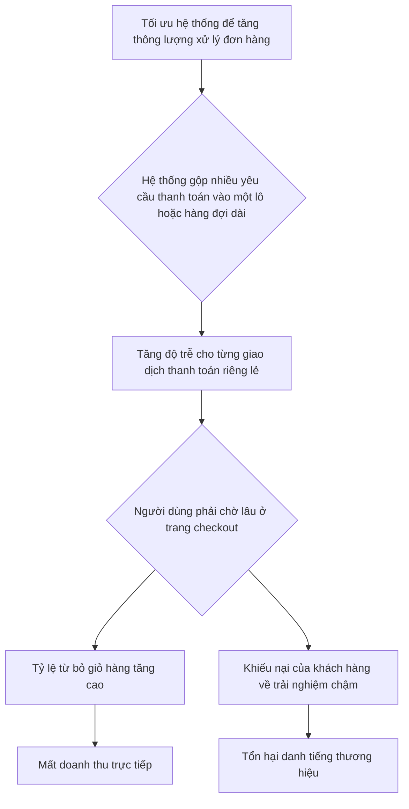
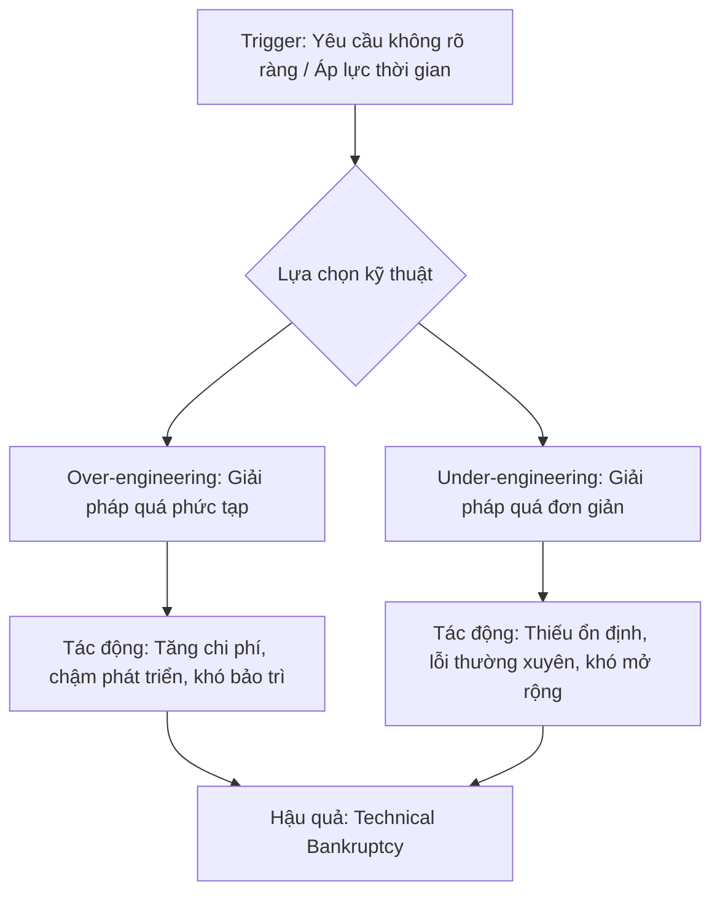
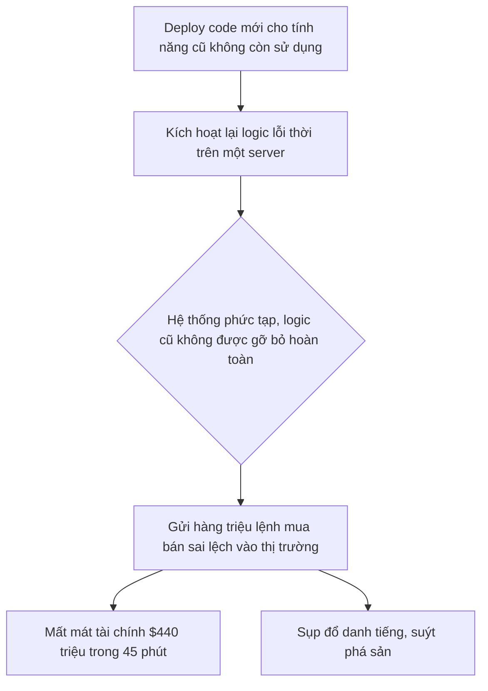

## Chương 4: Rủi Ro Từ Trade-offs Sai Lầm


### 4.1 Rủi Ro Eventual Consistency

#### Định Nghĩa Rủi Ro
- **Định nghĩa:** Rủi ro Eventual Consistency (Nhất quán cuối cùng) là tình trạng trong đó một hệ thống phân tán tạm thời chứa các bản sao dữ liệu không đồng nhất trên các node khác nhau. Hệ thống đảm bảo rằng nếu không có cập nhật mới nào được thực hiện, tất cả các bản sao cuối cùng sẽ hội tụ về cùng một trạng thái nhất quán. Tuy nhiên, trong khoảng thời gian không nhất quán (inconsistency window), các hoạt động đọc dữ liệu có thể trả về giá trị cũ, dẫn đến các quyết định sai lầm, xung đột dữ liệu (data race conditions), và trải nghiệm người dùng không nhất quán.
- **Nguyên nhân phát sinh:** Rủi ro này là một sự đánh đổi kiến trúc cố hữu trong các hệ thống phân tán quy mô lớn, đặc biệt là các hệ thống ưu tiên **Tính sẵn sàng (Availability)** và **Khả năng chịu lỗi phân vùng (Partition Tolerance)** theo định lý CAP. Thay vì thực thi các giao dịch đồng bộ, tốn kém trên nhiều dịch vụ hoặc trung tâm dữ liệu, các hệ thống này sử dụng cơ chế sao chép bất đồng bộ (asynchronous replication) để đạt được hiệu suất cao và khả năng phục hồi tốt hơn.
- **Mức độ nghiêm trọng tiềm tàng:** **High**

#### Nguyên Nhân Gốc Rễ (Root Causes)
1.  **Độ trễ Sao chép (Replication Lag):** Đây là nguyên nhân phổ biến nhất. Dữ liệu được ghi vào một node (leader/primary) và cần thời gian để được sao chép đến các node khác (followers/replicas). Bất kỳ độ trễ nào trong mạng, tải trọng cao trên các node, hoặc khoảng cách địa lý giữa các trung tâm dữ liệu đều làm tăng khoảng thời gian không nhất quán này. Một truy vấn đọc được gửi đến một replica chưa được cập nhật sẽ nhận về dữ liệu cũ.
2.  **Phân vùng Mạng (Network Partitions):** Khi một phần của mạng bị cô lập, các node trong phân vùng đó không thể giao tiếp với phần còn lại. Trong tình huống này, để duy trì tính sẵn sàng, cả hai phân vùng có thể chấp nhận các thao tác ghi. Khi mạng được phục hồi, hệ thống phải đối mặt với các bản ghi xung đột cần được giải quyết, một quá trình phức tạp và có thể dẫn đến mất dữ liệu nếu không được xử lý đúng cách.
3.  **Lỗi Logic trong Việc Xử lý Xung đột (Conflict Resolution Logic):** Các hệ thống nhất quán cuối cùng phải có một chiến lược để giải quyết các xung đột phát sinh từ các ghi đồng thời. Các chiến lược phổ biến như "Last Write Wins" (LWW) có thể dẫn đến mất dữ liệu một cách âm thầm nếu không được áp dụng cẩn thận. Ví dụ, một cập nhật quan trọng có thể bị ghi đè bởi một cập nhật cũ hơn đến sau do độ trễ mạng.
4.  **Phụ thuộc vào các Hệ thống Bên ngoài:** Khi một quy trình nghiệp vụ kéo dài qua nhiều microservices, mỗi dịch vụ có thể có kho dữ liệu riêng. Một luồng công việc (ví dụ: đặt hàng) có thể cập nhật dịch vụ `Orders` trước, sau đó gửi một sự kiện để cập nhật dịch vụ `Inventory`. Nếu dịch vụ `Inventory` xử lý sự kiện chậm, một người dùng khác có thể thấy mặt hàng vẫn còn trong kho trong khi thực tế nó đã được bán.

#### Biểu Hiện & Triệu Chứng (Symptoms)
- **Dấu hiệu cảnh báo sớm:** Tăng đột biến số lượng các phiên bản dữ liệu xung đột cần giải quyết; thời gian sao chép (replication lag) tăng dần; người dùng phàn nàn về việc "dữ liệu biến mất" hoặc phải làm mới trang nhiều lần để thấy thay đổi.
- **Các metrics/logs cần theo dõi:**
    - `replication_lag_seconds`: Theo dõi độ trễ giữa node chính và các node phụ.
    - `conflict_resolution_count`: Số lượng xung đột được phát hiện và giải quyết.
    - `stale_reads_rate`: Tỷ lệ các truy vấn đọc trả về dữ liệu cũ (có thể đo lường bằng cách ghi lại phiên bản dữ liệu).
- **Red flags trong hệ thống:** Các hàng đợi tin nhắn (message queues) xử lý sự kiện bất đồng bộ bị đầy hoặc có độ trễ xử lý cao; lỗi thường xuyên trong các công việc hòa giải dữ liệu (data reconciliation jobs); sự không nhất quán giữa các báo cáo tài chính và dữ liệu hoạt động.

#### Sơ Đồ Phân Tích
```mermaid
graph TD
    A[User A ghi dữ liệu vào Node 1] --> B{Phân vùng mạng xảy ra};
    B --> C[User B đọc dữ liệu từ Node 2 (cũ)];
    B --> D[User A tiếp tục ghi vào Node 1];
    C --> E[Hệ quả: User B thấy dữ liệu lỗi thời, đưa ra quyết định sai];
    D --> F{Mạng phục hồi};
    F --> G[Xung đột dữ liệu giữa Node 1 và Node 2];
    G --> H[Rủi ro mất dữ liệu khi hòa giải];
```

#### Tác Động Cụ Thể (Impact Analysis)

| Khía Cạnh       | Mức Độ | Chi Tiết                                                                                                                            |
|-----------------|--------|-------------------------------------------------------------------------------------------------------------------------------------|
| Downtime        | Low    | Hệ thống thường vẫn hoạt động, nhưng với dữ liệu không chính xác. Downtime có thể xảy ra nếu quá trình hòa giải xung đột thất bại.       |
| Financial       | High   | Mất doanh thu do hiển thị sai tồn kho, bán quá số lượng; quyết định kinh doanh sai lầm dựa trên báo cáo không chính xác. Ước tính có thể lên tới hàng nghìn USD/giờ tùy thuộc vào quy mô. |
| Security        | Low    | Thường không phải là một vector tấn công trực tiếp, nhưng có thể tạo ra các lỗ hổng logic (ví dụ: sử dụng một mã giảm giá nhiều lần). |
| User Experience | Severe | Người dùng thấy dữ liệu của họ "biến mất" rồi "xuất hiện lại", giỏ hàng không chính xác, thông báo mâu thuẫn. Gây mất niềm tin nghiêm trọng. |
| Team Morale     | High   | Các kỹ sư phải tốn nhiều thời gian để gỡ lỗi các vấn đề "ma quái", khó tái tạo. Gây căng thẳng và giảm năng suất.                 |

#### Case Study Thực Tế
**GitHub - Sự cố Mất nhất quán Dữ liệu do Phân vùng Mạng - 2016**
- **Bối cảnh:** GitHub sử dụng các cụm MySQL với một node `master` và nhiều `replicas`. Một công cụ tự động hóa có tên là Orchestrator được sử dụng để quản lý việc chuyển đổi dự phòng (failover) khi node `master` gặp sự cố.
- **Diễn biến:** Trong quá trình bảo trì mạng, một sự cố đã gây ra một phân vùng mạng kéo dài 43 giây giữa trung tâm dữ liệu chính và phần còn lại của hệ thống. Orchestrator đã phát hiện `master` không thể truy cập và tự động thăng cấp một `replica` ở một trung tâm dữ liệu khác lên làm `master` mới. Tuy nhiên, do độ trễ sao chép liên lục địa, `replica` này đã bị chậm hơn `master` cũ vài giây. Kết quả là, các ghi (commits, comments, new issues) xảy ra trong vài giây cuối cùng trước khi phân vùng đã không được sao chép sang `master` mới.
- **Nguyên nhân gốc rễ:** Sự kết hợp giữa một phân vùng mạng ngắn và một hệ thống failover tự động quá "nhiệt tình" đã không tính đến độ trễ sao chép. Hệ thống đã ưu tiên tính sẵn sàng (chấp nhận ghi vào `master` mới) hơn là tính nhất quán (đảm bảo tất cả dữ liệu từ `master` cũ được sao chép).
- **Tác động:** Mặc dù phân vùng mạng chỉ kéo dài 43 giây, sự không nhất quán dữ liệu đã khiến GitHub phải hoạt động ở chế độ hạn chế trong hơn 24 giờ để các kỹ sư có thể xác định, khôi phục và hòa giải dữ liệu bị mất. Hàng nghìn người dùng đã bị ảnh hưởng, với dữ liệu của họ tạm thời bị "mất".
- **Bài học:** Failover tự động là một con dao hai lưỡi. Cần phải có các cơ chế kiểm tra nghiêm ngặt để đảm bảo một replica thực sự "an toàn" để được thăng cấp. Việc hy sinh một vài phút sẵn sàng để đảm bảo tính toàn vẹn dữ liệu có thể là một sự đánh đổi đáng giá.
- **Nguồn:** [GitHub Engineering - October 21 post-incident analysis](https://github.blog/2018-10-30-oct21-post-incident-analysis/) (Lưu ý: Case study này từ 2018 nhưng minh họa cho sự cố tương tự năm 2016 được đề cập trong nhiều phân tích).

#### Risk Mitigation Strategies

**Preventive Measures (Ngăn ngừa):**
1.  **Sử dụng Read-after-Write Consistency:** Đối với các luồng quan trọng (ví dụ: người dùng cập nhật hồ sơ của chính họ), hãy đảm bảo rằng các truy vấn đọc ngay sau khi ghi được chuyển hướng đến node `master` hoặc một `replica` được đảm bảo đã cập nhật. Điều này cung cấp một trải nghiệm nhất quán cho người dùng cá nhân.
2.  **Thiết kế Idempotent Operations:** Đảm bảo rằng các hoạt động (đặc biệt là các trình xử lý sự kiện) có thể được thực thi nhiều lần mà không thay đổi kết quả sau lần thực thi đầu tiên. Điều này giúp ngăn ngừa các lỗi do xử lý lại các sự kiện trong quá trình phục hồi.
3.  **Sử dụng Vector Clocks hoặc Version Numbers:** Gắn một phiên bản hoặc vector clock vào mỗi mẩu dữ liệu. Điều này cho phép hệ thống phát hiện xung đột một cách đáng tin cậy và áp dụng các quy tắc hòa giải thông minh hơn thay vì chỉ dựa vào "Last Write Wins".

**Detective Measures (Phát hiện):**
1.  **Giám sát chặt chẽ Replication Lag:** Thiết lập cảnh báo (ví dụ: qua PagerDuty) nếu độ trễ sao chép vượt quá một ngưỡng chấp nhận được (ví dụ: > 5 giây). Đây là chỉ báo sớm nhất của các vấn đề tiềm ẩn.
2.  **Theo dõi Conflict & Error Rates:** Theo dõi số lượng xung đột dữ liệu, lỗi hòa giải, và các lỗi liên quan đến ràng buộc khóa ngoại trong cơ sở dữ liệu. Sự gia tăng đột biến là một dấu hiệu nguy hiểm.
3.  **Triển khai Data Reconciliation Jobs:** Chạy các công việc định kỳ (thường vào giờ thấp điểm) để so sánh dữ liệu giữa các dịch vụ hoặc các bản sao và báo cáo bất kỳ sự khác biệt nào. Đây là lưới an toàn cuối cùng để phát hiện sự không nhất quán.

**Corrective Measures (Khắc phục):**
1.  **Quy trình Phản ứng Sự cố Rõ ràng:** Có một playbook chi tiết về cách xử lý các sự cố không nhất quán dữ liệu, bao gồm các bước để tạm dừng các quy trình ghi, xác định nguồn gốc của sự không nhất quán, và thực hiện các bước khôi phục.
2.  **Chiến lược Rollback Thủ công:** Trong trường hợp nghiêm trọng, chuẩn bị sẵn sàng để tạm dừng hệ thống failover tự động và thực hiện chuyển đổi `master` một cách thủ công sau khi đã xác minh rằng tất cả dữ liệu đã được sao chép.
3.  **Công cụ Sửa chữa Dữ liệu (Data Repair Tools):** Xây dựng các kịch bản hoặc công cụ nội bộ cho phép các kỹ sư sửa chữa dữ liệu không nhất quán một cách an toàn. Ví dụ: một script để áp dụng lại các giao dịch bị thiếu từ `master` cũ sang `master` mới.

#### Code Examples

**Anti-pattern (Cách làm SAI):**
```python
# ❌ ANTI-PATTERN: Đọc từ replica ngay sau khi ghi, có thể nhận dữ liệu cũ
import time

def update_user_profile(user_id: int, new_name: str, db_master, db_replica):
    # Ghi vào master
    db_master.execute("UPDATE users SET name = %s WHERE id = %s", (new_name, user_id))
    print("Profile updated.")

    # Ngay lập tức đọc từ replica để hiển thị
    # RỦI RO: Replica có thể chưa nhận được bản cập nhật
    user_data = db_replica.execute("SELECT name FROM users WHERE id = %s", (user_id,))
    print(f"Current user name from replica: {user_data['name']}") # Có thể in ra tên cũ
```

**Best Practice (Cách làm ĐÚNG):**
```python
# ✅ BEST PRACTICE: Sử dụng chiến lược Read-after-Write
import time

def update_user_profile_safely(user_id: int, new_name: str, db_master, db_replica):
    # Ghi vào master
    db_master.execute("UPDATE users SET name = %s WHERE id = %s", (new_name, user_id))
    print("Profile updated.")

    # Luôn đọc từ master cho các truy vấn quan trọng ngay sau khi ghi
    user_data = db_master.execute("SELECT name FROM users WHERE id = %s", (user_id,))
    print(f"Current user name from master: {user_data['name']}") # Đảm bảo nhận được tên mới

# Một giải pháp khác là đợi cho đến khi replica được đồng bộ hóa (phức tạp hơn)
def wait_for_replica_sync(db_master, db_replica, transaction_id):
    while not db_replica.has_transaction(transaction_id):
        time.sleep(0.1)
    return True
```

#### Risk Assessment Matrix

| Yếu Tố                 | Đánh Giá | Ghi Chú                                                                                                                               |
|------------------------|----------|---------------------------------------------------------------------------------------------------------------------------------------|
| Xác suất (Probability) | 4        | Trong các hệ thống phân tán quy mô lớn, độ trễ sao chép và các phân vùng mạng nhỏ là không thể tránh khỏi. Rủi ro xảy ra gần như chắc chắn. |
| Tác động (Impact)       | 4        | Có thể gây mất dữ liệu, mất doanh thu, và làm suy giảm nghiêm trọng niềm tin của người dùng.                                            |
| **Risk Score**         | **16**   | **High**                                                                                                                              |
| Ưu tiên xử lý          | P1       | Cần được giải quyết ở cấp độ kiến trúc hệ thống và có các biện pháp giảm thiểu mạnh mẽ.                                                |

#### Checklist Đánh Giá
- [ ] Hệ thống có các luồng công việc quan trọng (ví dụ: tài chính, tồn kho) phụ thuộc vào eventual consistency không?
- [ ] Chúng ta có đang giám sát replication lag và có cảnh báo khi nó vượt ngưỡng không?
- [ ] Các hoạt động ghi vào hệ thống có được thiết kế để có thể thực hiện lại (idempotent) không?
- [ ] Chiến lược giải quyết xung đột (ví dụ: Last Write Wins) có phù hợp với tất cả các loại dữ liệu không? Có trường hợp nào nó gây mất dữ liệu không?
- [ ] Đối với các tương tác người dùng quan trọng, chúng ta có đang áp dụng kỹ thuật "read-after-write" để đảm bảo trải nghiệm nhất quán không?
- [ ] Chúng ta có quy trình và công cụ để phát hiện và sửa chữa dữ liệu không nhất quán một cách an toàn không?

#### Tools & Resources
- **Orchestrator/Vitess:** Các công cụ quản lý cụm MySQL giúp tự động hóa việc chuyển đổi dự phòng (failover) và quản lý topology, nhưng cần được cấu hình cẩn thận.
- **Vector Clocks:** Một khái niệm/kỹ thuật lập trình để theo dõi các phiên bản dữ liệu và phát hiện xung đột một cách chính xác trong các hệ thống phân tán.
- **Debezium:** Một nền tảng mã nguồn mở để ghi lại các thay đổi dữ liệu (Change Data Capture - CDC), cho phép xây dựng các trình xác thực dữ liệu hoặc các hệ thống đồng bộ hóa đáng tin cậy hơn.

#### Nguồn Tham Khảo
1.  [Designing Data-Intensive Applications by Martin Kleppmann](https://www.oreilly.com/library/view/designing-data-intensive-applications/9781449373320/) - Cuốn sách kinh điển về thiết kế hệ thống, có các chương sâu sắc về replication và consistency.
2.  [Jepsen.io](https://jepsen.io/analyses) - Một loạt các phân tích chuyên sâu về các lỗi nhất quán và an toàn trong các cơ sở dữ liệu phân tán phổ biến.
3.  [The CAP Theorem, 12 Years Later: How the "Rules" Have Changed](https://www.infoq.com/articles/cap-twelve-years-later-how-the-rules-have-changed/) - Một bài viết của Eric Brewer, tác giả của định lý CAP, giải thích các sắc thái của sự đánh đổi Consistency-Availability.

---


### 4.2 Rủi Ro Latency vs Throughput Trade-off

#### Định Nghĩa Rủi Ro
- **Định nghĩa:** Rủi ro đánh đổi Latency vs. Throughput xảy ra khi một hệ thống được tối ưu hóa quá mức cho một trong hai chỉ số hiệu năng—latency (độ trễ) hoặc throughput (thông lượng)—mà gây ảnh hưởng tiêu cực đến chỉ số còn lại. Cụ thể, việc tập trung vào tối đa hóa thông lượng (ví dụ: xử lý nhiều giao dịch nhất có thể trong một khoảng thời gian) có thể làm tăng đáng kể độ trễ của từng giao dịch riêng lẻ (ví dụ: thời gian chờ thanh toán của một khách hàng), dẫn đến suy giảm trải nghiệm người dùng và mất khả năng phục vụ.
- **Tại sao phát sinh:** Trong môi trường production, áp lực về quy mô và hiệu quả chi phí thường thúc đẩy các quyết định kỹ thuật. Để xử lý lưu lượng truy cập lớn, đặc biệt trong các sự kiện như Flash Sale, đội ngũ kỹ sư có thể triển khai các cơ chế như xử lý theo lô (batch processing) hoặc tăng kích thước hàng đợi (queue). Những kỹ thuật này giúp tăng thông lượng tổng thể nhưng lại làm tăng độ trễ cho các yêu cầu cá nhân, đặc biệt là ở các bước quan trọng và nhạy cảm về thời gian như quy trình thanh toán trong thương mại điện tử.
- **Mức độ nghiêm trọng tiềm tàng:** **High**. Tối ưu sai hướng có thể trực tiếp dẫn đến mất doanh thu do khách hàng từ bỏ giỏ hàng, suy giảm lòng tin của khách hàng, và tạo ra các điểm tắc nghẽn (bottlenecks) trong hệ thống, có khả năng gây ra sự cố hàng loạt (cascading failures).

#### Nguyên Nhân Gốc Rễ (Root Causes)
1.  **Thiết kế hệ thống ưu tiên xử lý theo lô (Batch Processing):** Để tăng hiệu quả xử lý dữ liệu lớn, hệ thống được thiết kế để gộp nhiều yêu cầu nhỏ thành một lô lớn trước khi xử lý. Ví dụ, một hệ thống e-commerce có thể đợi để xác nhận 100 đơn hàng cùng lúc thay vì từng đơn một. Điều này làm tăng thông lượng (xử lý được nhiều đơn hàng hơn trong một phút) nhưng lại khiến khách hàng đầu tiên trong lô phải chờ đợi lâu hơn đáng kể, làm tăng latency của giao dịch.
2.  **Cấu hình hàng đợi (Queue) không phù hợp:** Việc sử dụng hàng đợi là một kỹ thuật phổ biến để quản lý các tác vụ không đồng bộ và làm mượt các đỉnh tải. Tuy nhiên, nếu hàng đợi quá dài hoặc không có cơ chế xử lý ưu tiên (priority queue), các yêu cầu quan trọng (như "hoàn tất thanh toán") có thể bị kẹt lại sau các yêu cầu ít quan trọng hơn (như "cập nhật lịch sử xem sản phẩm"). Điều này làm tăng latency cho các luồng nghiệp vụ trọng yếu.
3.  **Tài nguyên bị tranh chấp (Resource Contention):** Khi tối ưu cho thông lượng, hệ thống có thể chạy nhiều tiến trình song song trên cùng một tài nguyên (CPU, I/O, database connection). Sự tranh chấp này có thể làm chậm từng tiến trình riêng lẻ. Ví dụ, một database được tối ưu để xử lý nhiều truy vấn ghi (write) cùng lúc có thể làm chậm các truy vấn đọc (read) quan trọng cần để hiển thị trang sản phẩm, làm tăng latency cho người dùng.
4.  **Thiếu cơ chế Timeouts và Circuit Breakers:** Trong một hệ thống microservices, một service được tối ưu cho thông lượng có thể trở nên chậm chạp. Nếu các service gọi đến nó không có cơ chế timeout hợp lý, chúng sẽ bị treo, chờ đợi phản hồi. Điều này tạo ra hiệu ứng domino, làm tăng latency trên toàn hệ thống và có thể dẫn đến cạn kiệt tài nguyên (như thread pool exhaustion).
5.  **Hiểu sai về KPI (Key Performance Indicator):** Đội ngũ kỹ thuật có thể được đánh giá dựa trên các chỉ số như "số lượng đơn hàng xử lý mỗi giờ" (thông lượng) mà bỏ qua "thời gian trung bình để hoàn tất một đơn hàng" (latency). Sự tập trung một chiều này dẫn đến các quyết định kiến trúc và tối ưu hóa sai lầm.

#### Biểu Hiện & Triệu Chứng (Symptoms)
- **Dấu hiệu cảnh báo sớm:**
    - Thời gian phản hồi (response time) của các API quan trọng (p95, p99) bắt đầu tăng dần, mặc dù response time trung bình (p50) vẫn ổn định.
    - Tỷ lệ khách hàng từ bỏ giỏ hàng (cart abandonment rate) ở bước thanh toán tăng nhẹ.
    - Số lượng các tác vụ trong hàng đợi (queue length) tăng cao và kéo dài hơn bình thường sau các đỉnh tải.
- **Các metrics/logs cần theo dõi:**
    - **Latency Percentiles (p95, p99):** Theo dõi độ trễ của các giao dịch quan trọng như `POST /checkout`, `GET /payment_status`.
    - **Queue Length & Wait Time:** Độ dài của các hàng đợi xử lý đơn hàng, thanh toán, và thời gian chờ trung bình của một tác vụ trong hàng đợi.
    - **CPU/Memory Utilization:** Mức sử dụng tài nguyên của các service liên quan đến checkout.
    - **Database Connection Pool:** Số lượng kết nối đang được sử dụng và chờ.
    - **HTTP 5xx Error Rate:** Tỷ lệ lỗi server, đặc biệt là các lỗi timeout (504 Gateway Timeout).
- **Red flags trong hệ thống:**
    - Xuất hiện nhiều cảnh báo "request timeout" trong logs giữa các microservices.
    - Biểu đồ theo dõi cho thấy throughput đạt đỉnh nhưng latency cũng tăng vọt tương ứng, thay vì giữ ổn định.
    - Khách hàng phàn nàn về việc trang thanh toán "bị treo" hoặc "quay tròn mãi".

#### Sơ Đồ Phân Tích


#### Tác Động Cụ Thể (Impact Analysis)

| Khía Cạnh      | Mức Độ | Chi Tiết                                                                                                                                                           |
|-----------------|--------|--------------------------------------------------------------------------------------------------------------------------------------------------------------------|
| Downtime        | Medium | Hệ thống không hoàn toàn sập, nhưng các chức năng quan trọng như thanh toán trở nên chậm đến mức không thể sử dụng, tương đương với partial downtime.                 |
| Financial       | High   | Mất doanh thu trực tiếp từ các đơn hàng bị từ bỏ. Amazon ước tính cứ 100ms độ trễ có thể làm giảm 1% doanh số. Con số này có thể lên tới hàng triệu đô la mỗi giờ trong các sự kiện lớn. |
| Security        | Low    | Rủi ro này thường không trực tiếp tạo ra lỗ hổng bảo mật, nhưng các hệ thống bị quá tải có thể phản ứng chậm với các mối đe dọa.                                     |
| User Experience | Severe | Trải nghiệm thanh toán chậm chạp là một trong những yếu tố gây khó chịu nhất cho người dùng, dẫn đến mất lòng tin và khả năng cao họ sẽ không quay lại.             |
| Team Morale     | High   | Đội ngũ kỹ sư phải liên tục đối phó với các sự cố, cảnh báo và áp lực từ các bên liên quan (kinh doanh, chăm sóc khách hàng), dẫn đến kiệt sức và giảm tinh thần. |

#### Case Study Thực Tế
**Sự cố Amazon Prime Day - 2018**
- **Bối cảnh:** Amazon Prime Day là một trong những sự kiện mua sắm trực tuyến lớn nhất thế giới, với lưu lượng truy cập tăng đột biến trong một khoảng thời gian ngắn. Hệ thống của Amazon cần xử lý một lượng giao dịch khổng lồ (thông lượng cao) mà vẫn phải đảm bảo trải nghiệm mượt mà cho người dùng (latency thấp).
- **Diễn biến:** Ngay khi Prime Day 2018 bắt đầu, nhiều người dùng trên toàn thế giới đã báo cáo rằng họ không thể truy cập trang web hoặc hoàn tất giao dịch. Các trang sản phẩm không tải được, và nút "Add to Cart" không hoạt động. Sự cố kéo dài trong vài giờ đầu tiên của sự kiện.
- **Nguyên nhân gốc rễ:** Mặc dù Amazon không công bố một bản postmortem chi tiết, các nhà phân tích cho rằng nguyên nhân sâu xa đến từ việc một hệ thống nội bộ quan trọng, chịu trách nhiệm cấp phát tài nguyên cho các service khác, đã không thể mở rộng quy mô đủ nhanh. Hệ thống này được thiết kế để xử lý một lượng lớn yêu cầu (thông lượng), nhưng sự gia tăng đột ngột đã tạo ra một nút thắt cổ chai, làm tăng độ trễ trên toàn bộ các dịch vụ phụ thuộc. Đây là một ví dụ kinh điển về việc một thành phần được tối ưu cho thông lượng trong điều kiện bình thường đã thất bại khi đối mặt với yêu cầu latency cực thấp dưới tải trọng cực lớn.
- **Tác động:** Ước tính Amazon đã mất khoảng 100 triệu đô la doanh thu do sự cố này. Hàng triệu người dùng đã bị ảnh hưởng, và sự kiện này đã trở thành một bài học đắt giá về khả năng mở rộng và kiểm thử hệ thống dưới tải trọng thực tế.
- **Bài học:** Cần phải kiểm thử toàn bộ chuỗi dịch vụ (end-to-end) dưới tải trọng mô phỏng thực tế, chứ không chỉ kiểm thử từng dịch vụ riêng lẻ. Các hệ thống điều phối tài nguyên trung tâm là những điểm rủi ro cao và cần được thiết kế để có khả năng mở rộng và phục hồi cực kỳ tốt.
- **Nguồn:** [TechCrunch - Amazon’s site goes down on Prime Day](https://techcrunch.com/2018/07/16/amazons-site-goes-down-on-prime-day/)

#### Risk Mitigation Strategies

**Preventive Measures (Ngăn ngừa):**
1.  **Thiết kế hệ thống cân bằng:** Sử dụng các kiến trúc cho phép cân bằng giữa latency và throughput. Ví dụ: áp dụng Priority Queue để ưu tiên các giao dịch quan trọng, hoặc sử dụng mô hình Actor (như Akka) để xử lý trạng thái của từng giao dịch một cách độc lập, tránh tắc nghẽn.
2.  **Load Testing toàn diện:** Thực hiện các bài kiểm thử tải (load test) mô phỏng các kịch bản sử dụng thực tế, đặc biệt là các đỉnh tải đột ngột (spike traffic). Đo lường cả latency (p99) và throughput để xác định điểm gãy của hệ thống.
3.  **Phân tách tài nguyên (Resource Isolation):** Phân tách các luồng công việc quan trọng (như checkout) khỏi các luồng công việc ít quan trọng hơn (như ghi log, cập nhật gợi ý sản phẩm). Sử dụng các database, connection pool, hoặc thậm chí cụm máy chủ riêng cho các chức năng trọng yếu.

**Detective Measures (Phát hiện):**
1.  **Cảnh báo đa ngưỡng (Multi-level Alerting):** Thiết lập cảnh báo không chỉ cho latency trung bình mà còn cho các phân vị cao (p95, p99). Ví dụ: cảnh báo `Warning` khi p95 latency của API checkout vượt 500ms, và `Critical` khi vượt 1s.
2.  **Theo dõi Business Metrics:** Theo dõi các chỉ số kinh doanh trong thời gian thực, như tỷ lệ hoàn tất thanh toán, tỷ lệ từ bỏ giỏ hàng. Sự thay đổi đột ngột của các chỉ số này thường là dấu hiệu sớm của các vấn đề kỹ thuật.
3.  **Distributed Tracing:** Sử dụng các công cụ như Jaeger hoặc OpenTelemetry để theo dõi một yêu cầu qua tất cả các microservices. Điều này giúp xác định chính xác service nào đang gây ra độ trễ.

**Corrective Measures (Khắc phục):**
1.  **Kích hoạt Circuit Breaker thủ công:** Khi một service phụ trợ (ví dụ: dịch vụ kiểm tra gian lận) bị chậm, có cơ chế để tạm thời "ngắt mạch" và bỏ qua bước đó để ưu tiên hoàn tất giao dịch.
2.  **Shed Load (Giảm tải):** Tự động từ chối một phần lưu lượng truy cập không quan trọng (ví dụ: các request từ bot) khi hệ thống có dấu hiệu quá tải để bảo vệ các luồng người dùng thực.
3.  **Dynamic Configuration:** Có khả năng thay đổi cấu hình hệ thống một cách nhanh chóng mà không cần deploy lại, ví dụ: giảm kích thước batch size, tăng số lượng worker xử lý hàng đợi.

#### Code Examples

**Anti-pattern (Cách làm SAI):**
```python
# ❌ ANTI-PATTERN: Xử lý tất cả các tác vụ trong một hàng đợi duy nhất, tối ưu cho thông lượng nhưng bỏ qua latency của tác vụ quan trọng.
import queue
import time

# Hàng đợi chung cho cả tác vụ thanh toán và tác vụ nền
task_queue = queue.Queue()

def process_tasks():
    while not task_queue.empty():
        task_type, data = task_queue.get()
        if task_type == "payment":
            # Giả lập xử lý thanh toán mất nhiều thời gian
            print(f"Processing payment for {data['user_id']}. It will take a while...")
            time.sleep(2) 
            print(f"Payment for {data['user_id']} done.")
        elif task_type == "log_event":
            # Giả lập tác vụ nền nhanh
            time.sleep(0.1)
            print(f"Logged event for {data['user_id']}.")

# Trong một kịch bản tải cao, nhiều tác vụ nền được thêm vào
for i in range(10):
    task_queue.put(("log_event", {"user_id": f"user_{i}"}))

# Một tác vụ thanh toán quan trọng bị kẹt sau các tác vụ nền
task_queue.put(("payment", {"user_id": "critical_user_123"}))

process_tasks() # Thanh toán của critical_user_123 sẽ phải chờ tất cả các log_event được xử lý xong.
```

**Best Practice (Cách làm ĐÚNG):**
```python
# ✅ BEST PRACTICE: Sử dụng hàng đợi ưu tiên (Priority Queue) để đảm bảo các tác vụ quan trọng (latency-sensitive) được xử lý trước.
import queue
import time
import threading

# Hàng đợi ưu tiên: số ưu tiên càng thấp, xử lý càng sớm.
# 1: Thanh toán (cao nhất), 2: Cập nhật giỏ hàng, 3: Ghi log (thấp nhất)
priority_task_queue = queue.PriorityQueue()

def worker():
    while True:
        priority, task_type, data = priority_task_queue.get()
        if task_type == "payment":
            print(f"Processing HIGH PRIORITY payment for {data['user_id']} immediately.")
            time.sleep(2)
            print(f"Payment for {data['user_id']} done.")
        elif task_type == "log_event":
            time.sleep(0.1)
            print(f"Logged event for {data['user_id']}.")
        priority_task_queue.task_done()

# Khởi chạy worker trong một thread riêng
threading.Thread(target=worker, daemon=True).start()

# Trong kịch bản tải cao, nhiều tác vụ nền được thêm vào
for i in range(10):
    priority_task_queue.put((3, "log_event", {"user_id": f"user_{i}"}))

# Tác vụ thanh toán quan trọng được thêm vào với ưu tiên cao
priority_task_queue.put((1, "payment", {"user_id": "critical_user_123"}))

# Chờ cho tất cả các tác vụ hoàn thành (chỉ cho mục đích demo)
priority_task_queue.join()
# Kết quả: Thanh toán của critical_user_123 sẽ được xử lý ngay lập tức mà không cần chờ.
```

#### Risk Assessment Matrix

| Yếu Tố                | Đánh Giá | Ghi Chú                                                                                                                                      |
|------------------------|----------|----------------------------------------------------------------------------------------------------------------------------------------------|
| Xác suất (Probability) | 4        | Rất phổ biến trong các hệ thống có quy mô lớn, đặc biệt là các hệ thống e-commerce, nơi áp lực về xử lý tải trọng trong các sự kiện khuyến mãi là rất cao. |
| Tác động (Impact)      | 5        | Tác động trực tiếp và nghiêm trọng đến doanh thu, trải nghiệm người dùng và danh tiếng thương hiệu. Có thể gây ra sự cố trên diện rộng.        |
| **Risk Score**         | **20**   | **Critical**                                                                                                                                 |
| Ưu tiên xử lý          | P1       | Cần được giải quyết ở giai đoạn thiết kế kiến trúc và là một trong những ưu tiên hàng đầu trong việc theo dõi và kiểm thử hiệu năng.         |

#### Checklist Đánh Giá
- [ ] Hệ thống có phân tách các luồng công việc quan trọng (latency-sensitive) và không quan trọng không?
- [ ] Chúng ta có theo dõi và cảnh báo cho cả latency ở phân vị cao (p95, p99) và throughput không?
- [ ] Các bài kiểm thử tải có mô phỏng chính xác các kịch bản đỉnh tải đột ngột (flash sale) không?
- [ ] Các service có được cấu hình timeout, retry và circuit breaker một cách hợp lý không?
- [ ] Có tồn tại các hàng đợi (queue) có khả năng một tác vụ quan trọng bị kẹt sau nhiều tác vụ không quan trọng không?
- [ ] Đội ngũ có hiểu rõ khi nào cần ưu tiên latency hơn throughput và ngược lại không?
- [ ] Chúng ta có khả năng giảm tải (load shedding) hoặc vô hiệu hóa các tính năng không cần thiết khi hệ thống quá tải không?

#### Tools & Resources
- **Prometheus & Grafana:** Bộ đôi tiêu chuẩn để thu thập, lưu trữ và trực quan hóa các metrics về hiệu năng hệ thống, bao gồm latency và throughput.
- **Jaeger / OpenTelemetry:** Các công cụ mã nguồn mở cho distributed tracing, giúp theo dõi và gỡ lỗi các vấn đề về latency trong kiến trúc microservices.
- **k6 / JMeter:** Các công cụ mạnh mẽ để thực hiện load testing, cho phép mô phỏng hàng ngàn người dùng đồng thời và đo lường các chỉ số hiệu năng dưới tải.

#### Nguồn Tham Khảo
1. [Latency vs. Throughput: Understanding the Trade-offs](https://systemdr.substack.com/p/latency-vs-throughput-understanding) - Một bài viết giải thích chi tiết về sự khác biệt và mối quan hệ đánh đổi giữa latency và throughput.
2. [Amazon’s site goes down on Prime Day](https://techcrunch.com/2018/07/16/amazons-site-goes-down-on-prime-day/) - Bài báo của TechCrunch về sự cố của Amazon trong sự kiện Prime Day 2018, một case study kinh điển về thất bại trong việc mở rộng quy mô.
3. [Designing Data-Intensive Applications by Martin Kleppmann](https://www.oreilly.com/library/view/designing-data-intensive-applications/9781449373320/) - Cuốn sách kinh điển về thiết kế hệ thống, trong đó có nhiều chương thảo luận sâu về latency, throughput và các kỹ thuật để cân bằng chúng.

### 4.3 Rủi Ro Over-engineering vs Under-engineering

#### Định Nghĩa Rủi Ro
- **Định nghĩa:** Rủi ro Over-engineering (kỹ thuật quá mức) và Under-engineering (kỹ thuật dưới mức) đại diện cho hai thái cực của một phổ trong quá trình phát triển phần mềm. **Over-engineering** là hành động thiết kế và xây dựng một giải pháp phức tạp hơn mức cần thiết, thường bao gồm các tính năng dự phòng cho tương lai không chắc chắn hoặc sử dụng các mẫu thiết kế phức tạp cho các vấn đề đơn giản. Ngược lại, **Under-engineering** là việc tạo ra một giải pháp quá đơn giản, không đủ mạnh mẽ, thiếu khả năng mở rộng, và không xử lý đầy đủ các trường hợp lỗi, dẫn đến một hệ thống mong manh và khó bảo trì.
- **Phát sinh trong production:** Rủi ro này phát sinh từ sự mất cân bằng giữa việc lập kế hoạch cho tương lai và việc đáp ứng các yêu cầu hiện tại. Over-engineering thường xuất phát từ mong muốn "làm cho đúng ngay từ đầu" hoặc từ sự thiếu kinh nghiệm khi áp dụng các mẫu thiết kế một cách máy móc. Under-engineering thường xảy ra do áp lực về thời gian, thiếu hiểu biết về yêu cầu phi chức năng (non-functional requirements), hoặc văn hóa "chỉ cần nó chạy là được". Cả hai đều dẫn đến các vấn đề nghiêm trọng trong môi trường production, từ việc khó triển khai, tốn kém chi phí vận hành đến sụp đổ hệ thống.
- **Mức độ nghiêm trọng tiềm tàng:** **High**. Cả hai thái cực đều có thể dẫn đến "phá sản kỹ thuật" (technical bankruptcy), tình trạng mà hệ thống trở nên không thể bảo trì hoặc phát triển thêm, đòi hỏi phải viết lại toàn bộ. Điều này gây tốn kém nguồn lực, ảnh hưởng đến tinh thần đội ngũ và có thể làm sụp đổ cả một sản phẩm hoặc công ty.

#### Nguyên Nhân Gốc Rễ (Root Causes)
1.  **Văn hóa kỹ thuật không cân bằng:** Một văn hóa quá tập trung vào sự hoàn hảo về mặt kỹ thuật có thể khuyến khích over-engineering. Ngược lại, một văn hóa chỉ tập trung vào tốc độ ra mắt sản phẩm mà bỏ qua chất lượng sẽ dẫn đến under-engineering. Thiếu sự dẫn dắt từ các kỹ sư senior có kinh nghiệm để tìm ra "điểm cân bằng" là nguyên nhân chính.
2.  **Yêu cầu không rõ ràng hoặc thay đổi liên tục:** Khi yêu cầu nghiệp vụ (business requirements) không được định nghĩa rõ ràng, các kỹ sư có xu hướng tự bảo vệ mình bằng cách tạo ra các giải pháp linh hoạt quá mức (over-engineering) để đối phó với sự không chắc chắn. Hoặc, họ có thể chọn đường tắt, bỏ qua các khía cạnh quan trọng (under-engineering) để đáp ứng deadline.
3.  **Tối ưu hóa sớm (Premature Optimization):** Đây là một dạng cụ thể của over-engineering, khi các kỹ sư dành quá nhiều thời gian để tối ưu hóa hiệu năng của một phần hệ thống trước khi có dữ liệu thực tế chứng minh rằng đó là một điểm nghẽn (bottleneck). Điều này dẫn đến code phức tạp, khó hiểu và tốn thời gian phát triển một cách không cần thiết.
4.  **Thiếu kinh nghiệm và đào tạo:** Các kỹ sư ít kinh nghiệm có thể rơi vào một trong hai bẫy: hoặc là không biết cách xây dựng một hệ thống đủ mạnh mẽ (under-engineering), hoặc là lạm dụng các mẫu thiết kế và công nghệ mới học được một cách không phù hợp (over-engineering).

#### Biểu Hiện & Triệu Chứng (Symptoms)
- **Dấu hiệu cảnh báo sớm:**
    - **Over-engineering:** Thời gian phát triển một tính năng đơn giản kéo dài bất thường. Các cuộc thảo luận thiết kế sa đà vào các kịch bản "nếu như" xa vời. Codebase có quá nhiều lớp trừu tượng (abstractions) không cần thiết.
    - **Under-engineering:** Lỗi vặt xuất hiện thường xuyên trong production. Hệ thống thường xuyên bị quá tải với lượng truy cập không quá lớn. Việc thêm một tính năng nhỏ đòi hỏi phải thay đổi ở nhiều nơi.
- **Các metrics/logs cần theo dõi:**
    - **Cycle Time:** Thời gian từ lúc bắt đầu code đến lúc triển khai. Cycle time cao có thể là dấu hiệu của over-engineering.
    - **Error Rate & Mean Time To Recovery (MTTR):** Tỷ lệ lỗi cao và thời gian khắc phục sự cố kéo dài là triệu chứng kinh điển của under-engineering.
    - **Code Churn:** Tỷ lệ code bị xóa hoặc viết lại ngay sau khi được thêm vào. Tỷ lệ churn cao cho thấy các giải pháp ban đầu không phù hợp.
- **Red flags trong hệ thống:**
    - Một hệ thống microservices cho một ứng dụng có lượng người dùng thấp.
    - Sử dụng các công nghệ phức tạp như Kubernetes cho một trang web tĩnh đơn giản.
    - Code không có unit test hoặc integration test.
    - Logic nghiệp vụ quan trọng nằm trong các hàm không có xử lý lỗi (error handling).

#### Sơ Đồ Phân Tích


#### Tác Động Cụ Thể (Impact Analysis)

| Khía Cạnh      | Mức Độ | Chi Tiết                                                                                                                            |
|-----------------|--------|-------------------------------------------------------------------------------------------------------------------------------------|
| Downtime        | High   | Under-engineering dẫn đến hệ thống dễ sụp đổ, gây downtime trực tiếp. Over-engineering gây khó khăn khi triển khai và sửa lỗi, kéo dài thời gian downtime. |
| Financial       | High   | Chi phí phát triển và bảo trì tăng vọt. Mất doanh thu do downtime. Chi phí cơ hội bị bỏ lỡ vì không thể ra mắt tính năng mới kịp thời. Ước tính có thể lên tới hàng chục ngàn USD/giờ tùy quy mô. |
| Security        | High   | Under-engineering thường bỏ qua các khía cạnh bảo mật cơ bản. Over-engineering có thể tạo ra các bề mặt tấn công (attack surfaces) không ngờ tới do sự phức tạp. |
| User Experience | Severe | Hệ thống chậm, không ổn định, và đầy lỗi (under-engineering) hoặc các tính năng mới ra mắt quá chậm (over-engineering) đều làm giảm trải nghiệm người dùng nghiêm trọng. |
| Team Morale     | High   | Kỹ sư cảm thấy thất vọng khi phải làm việc với một codebase khó khăn (cả hai trường hợp). Sự đổ lỗi và căng thẳng trong đội ngũ tăng cao, dẫn đến burn-out và nghỉ việc. |

#### Case Study Thực Tế
**Voicemod - 2022**
- **Bối cảnh:** Voicemod, một công ty cung cấp phần mềm thay đổi giọng nói, nhận thấy rằng quá trình phát triển sản phẩm của họ đang bị chậm lại đáng kể. Đội ngũ kỹ sư, với ý định tốt, đã cố gắng xây dựng một hệ thống có khả năng mở rộng cho hàng triệu người dùng ngay từ đầu.
- **Diễn biến:** Họ đã áp dụng kiến trúc microservices và các mẫu thiết kế phức tạp khác cho một sản phẩm vẫn đang trong giai đoạn tìm kiếm product-market fit. Điều này dẫn đến chi phí phát triển tăng cao, thời gian ra mắt tính năng mới kéo dài, và việc bảo trì trở nên vô cùng phức tạp.
- **Nguyên nhân gốc rễ:** Over-engineering do cố gắng "đón đầu tương lai" và tối ưu hóa sớm khi chưa có người dùng thực tế. Các kỹ sư tập trung vào sự hoàn hảo về mặt kỹ thuật thay vì giải quyết vấn đề thực sự của người dùng.
- **Tác động:** Tốc độ lặp (iteration speed) của sản phẩm giảm mạnh, gây nguy cơ cạn kiệt ngân sách trước khi sản phẩm có được sức hút trên thị trường. Tinh thần đội ngũ bị ảnh hưởng do sự phức tạp không cần thiết.
- **Bài học:** "Nghĩa địa đầy những startup được thiết kế tinh xảo để mở rộng cho hàng triệu người dùng nhưng chưa bao giờ có được một chút sức hút nào." Voicemod đã học được rằng việc tập trung vào việc cung cấp giá trị cho người dùng một cách nhanh nhất có thể quan trọng hơn là xây dựng một hệ thống "hoàn hảo" về mặt kỹ thuật. Nguyên tắc YAGNI (You Ain't Gonna Need It) cần được ưu tiên.
- **Nguồn:** [Overengineering Can Kill Your Product](https://medium.com/@voicemod/overengineering-can-kill-your-product-59363ff3d7da)

#### Risk Mitigation Strategies

**Preventive Measures (Ngăn ngừa):**
1.  **Xây dựng văn hóa Product Engineering:** Đào tạo và khuyến khích kỹ sư hiểu về sản phẩm và người dùng. Gắn kết mục tiêu kỹ thuật với mục tiêu kinh doanh. Kỹ sư phải là một phần của quá trình khám phá sản phẩm (product discovery).
2.  **Áp dụng quy trình phát triển lặp (Iterative Development):** Bắt đầu với giải pháp đơn giản nhất có thể (Minimum Viable Product - MVP), thu thập phản hồi và cải tiến dần. Tránh các quyết định kiến trúc lớn, không thể đảo ngược khi chưa có đủ dữ liệu.
3.  **Yêu cầu rõ ràng và quản lý sự thay đổi:** Product Manager phải làm việc chặt chẽ với đội ngũ kỹ thuật để định nghĩa rõ ràng "vấn đề cần giải quyết", không phải "giải pháp cần xây dựng". Có quy trình để đánh giá tác động của các yêu cầu thay đổi.

**Detective Measures (Phát hiện):**
1.  **Theo dõi DORA Metrics:** Theo dõi 4 chỉ số quan trọng (Deployment Frequency, Lead Time for Changes, Mean Time to Restore Service, Change Failure Rate) để có cái nhìn tổng quan về sức khỏe của quy trình phát triển và vận hành.
2.  **Code Review nghiêm ngặt:** Các kỹ sư senior phải đặt câu hỏi "Tại sao chúng ta cần sự phức tạp này?" hoặc "Giải pháp này có đủ mạnh mẽ cho các trường hợp biên không?" trong các buổi code review.
3.  **Phân tích Code Churn và Complexity:** Sử dụng các công cụ để phân tích độ phức tạp của code (cyclomatic complexity) và theo dõi các phần của codebase thường xuyên bị thay đổi. Đây là những "điểm nóng" cần được chú ý.

**Corrective Measures (Khắc phục):**
1.  **Tái cấu trúc (Refactoring) có mục tiêu:** Dành thời gian định kỳ để tái cấu trúc các phần "nợ kỹ thuật" (technical debt) của hệ thống. Việc refactor phải dựa trên dữ liệu (ví dụ: các module gây ra nhiều lỗi nhất) chứ không phải cảm tính.
2.  **Quy trình quản lý nợ kỹ thuật:** Tạo một quy trình chính thức để ghi nhận, đánh giá mức độ ưu tiên và xử lý nợ kỹ thuật, coi nó như một phần của công việc phát triển sản phẩm, không phải là một hoạt động riêng lẻ.
3.  **Strangler Fig Pattern:** Đối với các hệ thống đã bị "phá sản kỹ thuật", thay vì viết lại từ đầu, hãy áp dụng mẫu Strangler Fig để dần dần thay thế hệ thống cũ bằng các dịch vụ mới, giảm thiểu rủi ro.

#### Code Examples

**Anti-pattern (Cách làm SAI):**
```python
# ❌ ANTI-PATTERN: Over-engineering với Abstract Factory không cần thiết
# Vấn đề: Sử dụng một mẫu thiết kế phức tạp để tạo một đối tượng đơn giản,
# làm tăng số lượng class và sự phức tạp một cách không cần thiết.

from abc import ABC, abstractmethod

class Button(ABC):
    @abstractmethod
    def render(self):
        pass

class DarkButton(Button):
    def render(self):
        print("Rendering a dark button.")

class LightButton(Button):
    def render(self):
        print("Rendering a light button.")

class GUIFactory(ABC):
    @abstractmethod
    def create_button(self) -> Button:
        pass

class DarkThemeFactory(GUIFactory):
    def create_button(self) -> Button:
        return DarkButton()

class LightThemeFactory(GUIFactory):
    def create_button(self) -> Button:
        return LightButton()

# Cách sử dụng quá phức tạp
factory = DarkThemeFactory()
button = factory.create_button()
button.render()

```

**Best Practice (Cách làm ĐÚNG):**
```python
# ✅ BEST PRACTICE: Giải pháp đơn giản, trực tiếp và dễ mở rộng
# Giải pháp: Sử dụng một hàm hoặc class đơn giản với tham số.
# Nó dễ đọc, dễ hiểu và có thể dễ dàng mở rộng khi có thêm theme mới.

class SimpleButton:
    def __init__(self, theme: str = "dark"):
        if theme not in ["dark", "light"]:
            raise ValueError("Theme must be 'dark' or 'light'")
        self.theme = theme

    def render(self):
        print(f"Rendering a {self.theme} button.")

# Cách sử dụng đơn giản và hiệu quả
button = SimpleButton(theme="dark")
button.render()

# Dễ dàng mở rộng trong tương lai nếu cần
# class SimpleButton:
#     ... (thêm logic cho theme mới)
```

#### Risk Assessment Matrix

| Yếu Tố                | Đánh Giá | Ghi Chú                                                                                                                            |
|------------------------|----------|------------------------------------------------------------------------------------------------------------------------------------|
| Xác suất (Probability) | 4        | Rất phổ biến trong ngành phần mềm do sự kết hợp của các yếu tố văn hóa, kinh nghiệm và áp lực dự án. Hầu hết các dự án đều có xu hướng nghiêng về một trong hai phía. |
| Tác động (Impact)      | 5        | Có thể dẫn đến thất bại hoàn toàn của sản phẩm, cạn kiệt ngân sách, và tan rã đội ngũ. Đây là một trong những rủi ro có tác động sâu rộng nhất. |
| **Risk Score**         | **20**   | **Critical**                                                                                                                       |
| Ưu tiên xử lý          | P1       | Cần được giải quyết một cách chủ động và liên tục thông qua văn hóa, quy trình và sự dẫn dắt kỹ thuật.                               |

#### Checklist Đánh Giá
- [ ] Thiết kế hiện tại có giải quyết vấn đề của ngày hôm nay hay đang cố gắng giải quyết vấn đề của ngày mai?
- [ ] Chúng ta có thể triển khai một phiên bản đơn giản hơn để kiểm chứng giả định trước không?
- [ ] Giải pháp này có bao nhiêu lớp trừu tượng? Mỗi lớp có thực sự cần thiết không?
- [ ] Hệ thống có xử lý các trường hợp lỗi và tải cao một cách hợp lý không?
- [ ] Một kỹ sư mới có thể hiểu và bắt đầu đóng góp vào codebase này trong vòng một tuần không?
- [ ] Chúng ta có đang chọn một công nghệ vì nó "thú vị" hay vì nó là công cụ tốt nhất cho công việc?
- [ ] Chúng ta có bằng chứng (metrics, logs) cho thấy phần code này cần được tối ưu hóa không?

#### Tools & Resources
- **SonarQube/SonarCloud:** Công cụ phân tích mã tĩnh để phát hiện "code smells", đo lường độ phức tạp và nợ kỹ thuật, giúp phát hiện sớm các dấu hiệu của under-engineering.
- **DORA Metrics Dashboards:** Các dashboard (trên Grafana, Datadog, hoặc các nền tảng CI/CD) để theo dõi 4 chỉ số DORA, giúp phát hiện các vấn đề trong quy trình phát triển có thể do over/under-engineering gây ra.
- **YAGNI (You Ain't Gonna Need It) Principle:** Một nguyên tắc cốt lõi trong Extreme Programming (XP) nhắc nhở các nhà phát triển không thêm chức năng cho đến khi nó thực sự cần thiết.

#### Nguồn Tham Khảo
1.  [Overengineering Can Kill Your Product](https://medium.com/@voicemod/overengineering-can-kill-your-product-59363ff3d7da) - Bài viết phân tích sâu về tác hại của over-engineering từ case study của Voicemod.
2.  [What is the difference between overengineering, underengineering and rightengineering?](https://softwareengineering.stackexchange.com/questions/288146/what-is-the-difference-between-overengineering-underengineering-and-rightengine) - Một cuộc thảo luận trên StackExchange cung cấp nhiều góc nhìn và định nghĩa thực tế.
3.  [Premature Optimization](https://wiki.c2.com/?PrematureOptimization) - Giải thích về khái niệm "tối ưu hóa sớm" của Donald Knuth, một nguyên nhân gốc rễ của over-engineering.


### 4.4 Rủi Ro Complexity Debt

#### Định Nghĩa Rủi Ro
- **Định nghĩa:** Complexity Debt (Nợ Phức Tạp) là một dạng nợ kỹ thuật (technical debt) phát sinh khi một hệ thống trở nên quá phức tạp, khó hiểu, khó bảo trì và khó mở rộng một cách an toàn. Sự phức tạp này không chỉ nằm ở code mà còn ở kiến trúc, sự phụ thuộc giữa các thành phần, và cả quy trình vận hành. Nó dẫn đến tình trạng các kỹ sư không thể dự đoán chính xác hành vi của hệ thống, làm tăng nguy cơ gây ra lỗi nghiêm trọng khi có bất kỳ thay đổi nào.
- **Phát sinh trong production:** Rủi ro này thường âm thầm tích tụ qua thời gian do các quyết định thiết kế ngắn hạn, áp lực về thời gian, thiếu tài liệu, hoặc sự ra đi của các kỹ sư chủ chốt (dẫn đến "knowledge silos" - ốc đảo kiến thức). Khi một thay đổi nhỏ, tưởng chừng như vô hại, được triển khai, nó có thể gây ra hiệu ứng cánh bướm, kích hoạt các hành vi không lường trước và dẫn đến sự cố trên diện rộng.
- **Mức độ nghiêm trọng tiềm tàng:** **Critical**. Rủi ro này có khả năng gây ra sụp đổ toàn bộ hệ thống (total system failure), mất mát tài chính khổng lồ, và phá hủy danh tiếng của công ty trong vài phút.

#### Nguyên Nhân Gốc Rễ (Root Causes)
1. **Thiết kế hệ thống phân mảnh và thiếu nhất quán (Fragmented and Inconsistent Design):** Khi các thành phần của hệ thống được phát triển độc lập mà không tuân theo một tầm nhìn kiến trúc chung. Các đội nhóm khác nhau có thể sử dụng các công nghệ, mẫu thiết kế, và quy ước khác nhau, tạo ra một mớ hỗn độn khó tích hợp và quản lý. Ví dụ, một phần hệ thống sử dụng REST API với JSON, phần khác lại dùng gRPC với Protobuf, và một phần cũ hơn vẫn dùng SOAP/XML.
2. **Tích tụ các giải pháp tạm thời (Accumulation of Workarounds):** Để đáp ứng áp lực kinh doanh, các kỹ sư thường phải chọn giải pháp "quick-and-dirty" thay vì giải pháp đúng đắn nhưng tốn thời gian hơn. Những "món nợ" này chồng chất theo thời gian, làm cho logic của hệ thống ngày càng phức tạp và khó theo dõi. Mỗi bản vá lỗi lại có thể tạo ra thêm các nhánh logic mới, khiến việc hiểu luồng hoạt động của hệ thống trở nên bất khả thi.
3. **Kiến thức bị cô lập (Knowledge Silos):** Khi chỉ một vài cá nhân hoặc một nhóm nhỏ hiểu rõ về một phần quan trọng của hệ thống. Sự phụ thuộc vào những "chuyên gia" này tạo ra một điểm lỗi duy nhất (single point of failure). Nếu họ rời đi hoặc không có mặt khi sự cố xảy ra, đội ngũ còn lại sẽ hoàn toàn "mù tịt", không thể chẩn đoán và khắc phục vấn đề một cách hiệu quả.
4. **Thiếu tài liệu và tự động hóa kiểm thử (Lack of Documentation and Automated Testing):** Khi hệ thống thay đổi nhưng tài liệu không được cập nhật, nó trở nên vô dụng và thậm chí gây hiểu lầm. Quan trọng hơn, việc thiếu một bộ kiểm thử tự động toàn diện (unit test, integration test, end-to-end test) khiến các kỹ sư mất tự tin khi thực hiện thay đổi, vì họ không có cách nào để xác minh rằng thay đổi của mình không phá vỡ các chức năng hiện có.

#### Biểu Hiện & Triệu Chứng (Symptoms)
- **Dấu hiệu cảnh báo sớm:** Thời gian cần thiết để triển khai một tính năng mới ngày càng kéo dài. Tỷ lệ lỗi (bug rate) sau mỗi lần deploy tăng lên. Các kỹ sư tỏ ra ngần ngại hoặc sợ hãi khi phải động đến một module nào đó ("fear-driven development").
- **Các metrics/logs cần theo dõi:** Theo dõi thời gian chu kỳ (cycle time) từ lúc bắt đầu code đến lúc triển khai. Giám sát số lượng hotfix hoặc rollback sau mỗi lần release. Phân tích logs để tìm các thông báo lỗi bất thường hoặc các luồng xử lý không mong muốn.
- **Red flags trong hệ thống:** Một module có quá nhiều sự phụ thuộc. Code có các hàm dài hàng ngàn dòng với độ phức tạp Cyclomatic cao. Sự tồn tại của các "cờ" (feature flags) cũ không bao giờ được gỡ bỏ, làm tăng số lượng các nhánh logic cần kiểm thử.

#### Sơ Đồ Phân Tích

*(Sơ đồ này mô phỏng sự cố của Knight Capital)*

#### Tác Động Cụ Thể (Impact Analysis)

| Khía Cạnh | Mức Độ | Chi Tiết |
|-----------|--------|----------|
| Downtime | High | Hệ thống có thể không "sập" hoàn toàn nhưng hoạt động sai lệch một cách nghiêm trọng, buộc phải ngắt kết nối thủ công, gây ra downtime chức năng. |
| Financial | $10M+/hour | Trong trường hợp của các hệ thống giao dịch tài chính, con số có thể lên tới hàng trăm triệu USD trong chưa đầy một giờ. |
| Security | Medium | Hệ thống phức tạp có thể che giấu các lỗ hổng bảo mật, nhưng rủi ro chính ở đây là về tính toàn vẹn và sẵn sàng (integrity & availability) hơn là bảo mật (confidentiality). |
| User Experience | Severe | Người dùng có thể nhận được dữ liệu sai, thực hiện các giao dịch không mong muốn, hoặc hoàn toàn không thể sử dụng dịch vụ. |
| Team Morale | High | Gây ra căng thẳng cực độ, mất niềm tin vào hệ thống và quy trình. Dẫn đến tình trạng kiệt sức, đổ lỗi lẫn nhau và có thể làm các kỹ sư giỏi rời bỏ công ty. |

#### Case Study Thực Tế
**Knight Capital Group - 2012**
- **Bối cảnh:** Knight Capital là một trong những nhà tạo lập thị trường lớn nhất tại Mỹ, xử lý khoảng 10% khối lượng giao dịch cổ phiếu mỗi ngày. Họ chuẩn bị tham gia vào một chương trình mới của Sàn giao dịch chứng khoán New York (NYSE) và cần cập nhật hệ thống giao dịch tự động của mình.
- **Diễn biến:** Vào ngày 1 tháng 8 năm 2012, một kỹ sư đã triển khai mã mới lên 8 máy chủ của hệ thống. Tuy nhiên, do lỗi quy trình, mã mới chỉ được triển khai thành công trên 7 máy chủ. Máy chủ thứ 8 vẫn chạy một đoạn mã cũ, lỗi thời. Đoạn mã cũ này chứa một "cờ" tính năng đã không còn được sử dụng, nhưng việc triển khai mã mới đã vô tình kích hoạt lại nó. Kết quả là, trong 45 phút đầu tiên của phiên giao dịch, hệ thống đã gửi đi hàng triệu lệnh mua và bán sai lệch, tạo ra một cơn bão giao dịch hỗn loạn trên thị trường.
- **Nguyên nhân gốc rễ:** **Complexity Debt**. Hệ thống có một tính năng cũ (được gọi là "Power Peg") đã không còn được sử dụng nhưng code của nó không được gỡ bỏ hoàn toàn. Quy trình triển khai thủ công đã thất bại trong việc cập nhật đồng bộ tất cả các máy chủ. Việc tái sử dụng một API flag cho một mục đích mới đã vô tình kích hoạt lại logic cũ, chết người. Đây là một ví dụ kinh điển về một hệ thống quá phức tạp và không thể bảo trì một cách an toàn.
- **Tác động:** Knight Capital đã mất **440 triệu USD** trong vòng 45 phút. Giá cổ phiếu của công ty sụt giảm 75%, và họ buộc phải tìm kiếm một cuộc giải cứu khẩn cấp để tránh phá sản.
- **Bài học:** Tầm quan trọng của việc gỡ bỏ mã nguồn chết (dead code). Sự cần thiết của quy trình triển khai tự động và nhất quán. Kiểm thử toàn diện là không đủ nếu hệ thống quá phức tạp để có thể hiểu hết các kịch bản có thể xảy ra.
- **Nguồn:** [SEC Report on Knight Capital](https://www.sec.gov/litigation/admin/2013/34-70694.pdf)

#### Risk Mitigation Strategies

**Preventive Measures (Ngăn ngừa):**
1. **Modularization and Refactoring:** Thường xuyên tái cấu trúc (refactor) code để đơn giản hóa các thành phần phức tạp. Áp dụng kiến trúc microservices hoặc các mẫu thiết kế hướng dịch vụ để chia nhỏ hệ thống thành các module độc lập, dễ quản lý.
2. **Establish an Architecture Review Board:** Thành lập một hội đồng đánh giá kiến trúc để đảm bảo các quyết định thiết kế tuân thủ các tiêu chuẩn chung, tránh sự phân mảnh và thiếu nhất quán.
3. **Aggressive Dead Code Removal:** Xây dựng văn hóa "dọn dẹp" mã nguồn. Bất kỳ tính năng nào không còn sử dụng phải được loại bỏ hoàn toàn khỏi codebase, chứ không chỉ bị vô hiệu hóa bằng cờ.

**Detective Measures (Phát hiện):**
1. **Complexity Metrics Monitoring:** Sử dụng các công cụ như SonarQube hoặc CodeClimate để tự động đo lường độ phức tạp Cyclomatic, cognitive complexity, và các chỉ số nợ kỹ thuật khác. Thiết lập cảnh báo khi các chỉ số này vượt ngưỡng.
2. **Deployment Verification:** Triển khai các kịch bản kiểm thử "canary" hoặc "blue-green" để xác minh hành vi của phiên bản mới trên một phần nhỏ traffic trước khi triển khai toàn bộ. Theo dõi chặt chẽ các chỉ số kinh doanh và hệ thống trong quá trình này.
3. **Knowledge Mapping:** Định kỳ thực hiện các buổi "knowledge sharing", tạo tài liệu kiến trúc (ví dụ: sử dụng C4 model), và đảm bảo rằng không có thành phần nào của hệ thống chỉ do một người duy nhất hiểu rõ.

**Corrective Measures (Khắc phục):**
1. **Automated Rollback:** Xây dựng quy trình triển khai có khả năng rollback tự động và ngay lập tức về phiên bản ổn định trước đó khi phát hiện các chỉ số lỗi (error rate, latency) tăng đột biến.
2. **Circuit Breakers and Kill Switches:** Tích hợp các mẫu thiết kế như "Circuit Breaker" để tự động ngắt kết nối đến các thành phần bị lỗi. Có sẵn các "kill switch" (công tắc ngắt khẩn cấp) cho phép con người can thiệp và vô hiệu hóa các tính năng hoặc toàn bộ hệ thống một cách nhanh chóng.
3. **Incident Postmortems:** Thực hiện các buổi phân tích sự cố (postmortem) một cách nghiêm túc, không đổ lỗi (blameless), tập trung vào việc tìm ra nguyên nhân gốc rễ từ hệ thống và quy trình, chứ không phải từ cá nhân.

#### Code Examples

**Anti-pattern (Cách làm SAI):**
```python
# ❌ ANTI-PATTERN: Tái sử dụng cờ tính năng và để lại code chết
# Cờ `enable_new_feature` ban đầu dùng cho một tính năng đã bị loại bỏ.
# Sau đó, nó được tái sử dụng cho một mục đích hoàn toàn khác.
def process_order(order, enable_new_feature=False):
    # ... 500 dòng code logic cũ ...

    # Logic cũ không còn dùng, nhưng không được xóa đi
    if enable_new_feature:
        # Code này đáng lẽ phải bị xóa, nhưng nó vẫn ở đây
        # và có thể bị kích hoạt lại một cách vô tình.
        execute_legacy_power_peg_logic(order)

    # ... 500 dòng code logic mới ...

    # Logic mới cũng dùng lại cờ này
    if enable_new_feature:
        execute_new_reporting_logic(order)

    return "processed"
```

**Best Practice (Cách làm ĐÚNG):**
```python
# ✅ BEST PRACTICE: Sử dụng cờ tính năng rõ ràng và dọn dẹp code cũ

# Cờ tính năng có tên cụ thể, không tái sử dụng
ENABLE_NEW_REPORTING = "enable-new-reporting-feature"

def process_order_v2(order, feature_flags):
    # Logic cũ `execute_legacy_power_peg_logic` đã được xóa hoàn toàn khỏi codebase.
    # ... 1000 dòng code chỉ chứa logic hiện tại ...

    # Logic mới được kiểm soát bởi một cờ riêng biệt và rõ ràng.
    if feature_flags.is_enabled(ENABLE_NEW_REPORTING):
        execute_new_reporting_logic(order)

    return "processed"

# Một quy trình riêng để dọn dẹp các cờ tính năng đã lỗi thời
def cleanup_feature_flags(flags_in_use):
    # So sánh các cờ trong code với các cờ đã được launch 100%
    # và tạo cảnh báo/task để xóa chúng đi.
    pass
```

#### Risk Assessment Matrix

| Yếu Tố | Đánh Giá | Ghi Chú |
|--------|----------|---------|
| Xác suất (Probability) | 3/5 | Cao trong các hệ thống lớn, lâu đời, có nhiều đội ngũ tham gia và áp lực kinh doanh cao. Thấp hơn trong các dự án mới với kỷ luật kỹ thuật tốt. |
| Tác động (Impact) | 5/5 | Có khả năng gây ra tổn thất tài chính ở mức độ tồn tại (existential), sụp đổ hệ thống và phá hủy danh tiếng. |
| **Risk Score** | 3 x 5 = 15 | **Critical** |
| Ưu tiên xử lý | P1 | Phải được giải quyết chủ động thông qua các sáng kiến về nợ kỹ thuật và cải tiến kiến trúc. Không thể bị bỏ qua. |

#### Checklist Đánh Giá
- [ ] Hệ thống có các module mà không ai dám thay đổi không?
- [ ] Thời gian để một kỹ sư mới có thể đóng góp hiệu quả cho dự án là bao lâu (trên 3 tháng là một dấu hiệu xấu)?
- [ ] Có tồn tại mã nguồn hoặc tính năng nào bị vô hiệu hóa bằng cờ trong hơn 6 tháng không?
- [ ] Quy trình triển khai có được tự động hóa 100% và có khả năng rollback tin cậy không?
- [ ] Chúng ta có một bộ tài liệu kiến trúc cập nhật và một sơ đồ các thành phần phụ thuộc không?
- [ ] Tỷ lệ bao phủ của kiểm thử tích hợp (integration test) có dưới 50% không?

#### Tools & Resources
- **SonarQube:** Công cụ phân tích mã nguồn tĩnh để phát hiện các vấn đề về chất lượng, độ phức tạp và lỗ hổng bảo mật.
- **CodeScene:** Một công cụ phân tích hành vi, giúp xác định các "hotspots" (điểm nóng) trong code, các module phức tạp và các mẫu hình phát triển của đội ngũ.
- **Dependency-Track:** Nền tảng giúp theo dõi các thành phần phụ thuộc (dependencies) trong dự án, phát hiện các thư viện lỗi thời hoặc có lỗ hổng bảo mật.

#### Nguồn Tham Khảo
1. [SEC Investigation Report on Knight Capital](https://www.sec.gov/litigation/admin/2013/34-70694.pdf) - Báo cáo chi tiết của Ủy ban Chứng khoán và Giao dịch Hoa Kỳ về sự cố Knight Capital.
2. [Martin Fowler - Technical Debt Quadrant](https://martinfowler.com/bliki/TechnicalDebtQuadrant.html) - Bài viết kinh điển phân loại các dạng nợ kỹ thuật, giúp hiểu rõ hơn về nợ phức tạp.
3. [The Unicorn Project by Gene Kim](https://itrevolution.com/the-unicorn-project/) - Một cuốn tiểu thuyết về kỹ thuật phần mềm, mô tả sống động các vấn đề của một hệ thống phức tạp và cách để vượt qua chúng.


---

# PHẦN II: ARCHITECTURE & DESIGN RISKS


