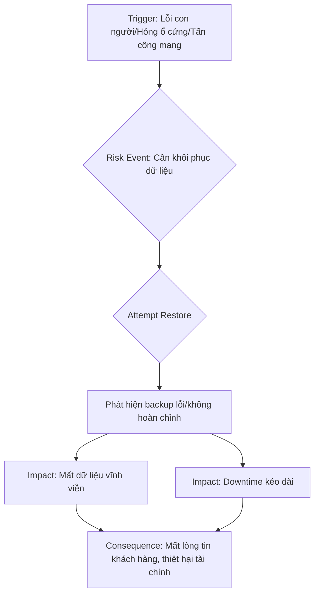
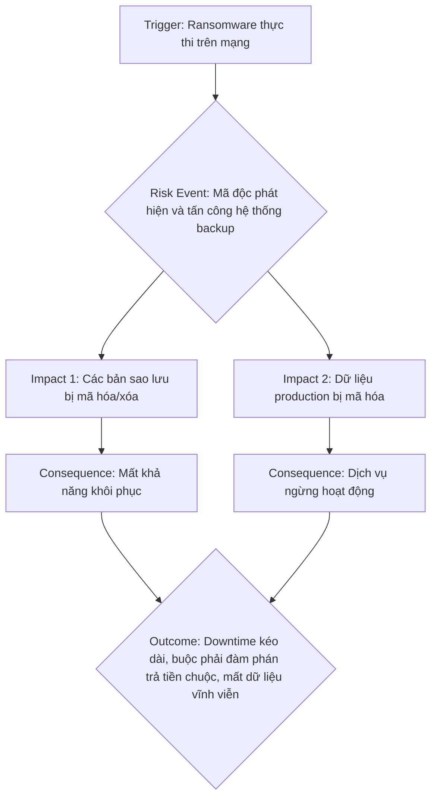

## Chương 11: Rủi Ro Disaster Recovery

### 11.1 Rủi Ro Backup Không Test

#### Định Nghĩa Rủi Ro
- **Định nghĩa:** Rủi ro Backup Không Test là tình huống một tổ chức tin rằng họ có các bản sao lưu dữ liệu an toàn, nhưng khi xảy ra sự cố và cần khôi phục, quá trình restore thất bại do các bản sao lưu này bị lỗi, không hoàn chỉnh, hoặc không thể sử dụng được. Đây là một "rủi ro tiềm ẩn" (latent risk), chỉ bộc lộ khi đã quá muộn.
- **Nguồn gốc phát sinh:** Rủi ro này phát sinh từ sự tự mãn, giả định rằng hệ thống backup hoạt động hoàn hảo mà không cần kiểm chứng. Trong môi trường production, áp lực về tính năng mới và vận hành thường khiến việc kiểm thử backup bị xem nhẹ hoặc bỏ qua, coi đó là một công việc tốn kém và không mang lại giá trị tức thì.
- **Mức độ nghiêm trọng:** **Critical**. Khi rủi ro này xảy ra, nó có thể dẫn đến mất mát dữ liệu vĩnh viễn, gây thiệt hại tài chính nặng nề, phá hủy danh tiếng công ty và làm mất lòng tin của khách hàng.

#### Nguyên Nhân Gốc Rễ (Root Causes)
1.  **Thiếu Văn Hóa & Quy Trình Kiểm Thử (Lack of Testing Culture & Process):** Nhiều đội ngũ kỹ thuật không có một quy trình chính thức và bắt buộc cho việc kiểm thử khôi phục dữ liệu. Việc test restore bị xem là "nice-to-have", không được ưu tiên và không có ai chịu trách nhiệm cụ thể. Điều này thường xuất phát từ việc lãnh đạo không nhận thức được mức độ nghiêm trọng của việc backup thất bại.
2.  **Lỗi Cấu Hình Âm Thầm (Silent Configuration Errors):** Cấu hình của các công cụ backup có thể bị lỗi một cách âm thầm. Ví dụ: một thay đổi trong cấu trúc database (thêm bảng mới) không được cập nhật trong script backup, dẫn đến các bản sao lưu không đầy đủ. Hoặc, các quyền truy cập vào nơi lưu trữ backup bị thay đổi, khiến quá trình ghi bị thất bại mà không có cảnh báo rõ ràng.
3.  **Thoái Hóa Phần Mềm và Hạ Tầng (Software & Infrastructure Rot):** Hệ thống không ngừng thay đổi. Các bản cập nhật hệ điều hành, thư viện, hoặc phần cứng có thể làm cho các bản sao lưu cũ trở nên không tương thích với môi trường hiện tại. Một bản backup được tạo trên phiên bản A của database có thể không thể khôi phục trên phiên bản B nếu có sự thay đổi lớn về định dạng dữ liệu.
4.  **Lỗi Con Người (Human Error):** Kỹ sư có thể vô tình xóa các bản backup quan trọng, cấu hình sai lịch trình sao lưu, hoặc trong lúc xử lý sự cố, thực hiện các thao tác sai lầm khiến dữ liệu gốc và cả bản sao lưu đều bị ảnh hưởng. Đây là một trong những nguyên nhân phổ biến nhất, như đã thấy trong sự cố của GitLab.

#### Biểu Hiện & Triệu Chứng (Symptoms)
- **Dấu hiệu cảnh báo sớm:** Các cảnh báo (alerts) về việc backup job thất bại hoặc hoàn thành với "warnings" thường xuyên bị bỏ qua. Kích thước của các file backup đột ngột giảm xuống đáng kể hoặc không thay đổi trong một thời gian dài.
- **Các metrics/logs cần theo dõi:**
    - `backup_job_completion_status`: Trạng thái hoàn thành của job (success, failed, with_warnings).
    - `backup_size_bytes`: Kích thước của file backup. Theo dõi sự bất thường.
    - `restore_test_last_success_timestamp`: Dấu thời gian của lần kiểm thử restore thành công gần nhất.
- **Red flags trong hệ thống:** Không có dashboard nào hiển thị trạng thái của hệ thống backup và restore. Không ai trong đội ngũ có thể trả lời câu hỏi: "Lần cuối chúng ta test restore thành công là khi nào và mất bao lâu?"

#### Sơ Đồ Phân Tích


#### Tác Động Cụ Thể (Impact Analysis)

| Khía Cạnh       | Mức Độ   | Chi Tiết                                                                                                |
|-----------------|----------|---------------------------------------------------------------------------------------------------------|
| Downtime        | High     | Hệ thống có thể offline trong nhiều ngày hoặc vĩnh viễn nếu không có dữ liệu để khôi phục.                |
| Financial       | >$100k/hour | Ước tính cho một công ty e-commerce cỡ vừa, bao gồm doanh thu mất, chi phí khắc phục và tiền phạt (nếu có). |
| Security        | Medium   | Mất dữ liệu khách hàng có thể vi phạm các quy định như GDPR, dẫn đến các vấn đề pháp lý và bảo mật.      |
| User Experience | Severe   | Người dùng mất toàn bộ dữ liệu của họ (ví dụ: các project trên GitLab), trải nghiệm tồi tệ nhất có thể. |
| Team Morale     | High     | Gây ra căng thẳng cực độ, đổ lỗi, và làm suy giảm nghiêm trọng tinh thần của đội ngũ kỹ thuật.           |

#### Case Study Thực Tế
**GitLab - 2017**
- **Bối cảnh:** GitLab.com, một nền tảng DevOps cực kỳ phổ biến, đối mặt với sự cố nghiêm trọng trên cơ sở dữ liệu production chính của họ.
- **Diễn biến:** Một kỹ sư, trong quá trình bảo trì để giải quyết vấn đề hiệu năng do spam, đã vô tình xóa một thư mục chứa 300GB dữ liệu production trên máy chủ database chính. Khi đội ngũ cố gắng khôi phục, họ phát hiện ra rằng trong 5 cơ chế backup họ có, không có cơ chế nào hoạt động như mong đợi. Các bản sao lưu thường xuyên không được thực hiện, các bản sao lưu trên S3 trống rỗng, và cơ chế snapshot LVM không hoạt động đúng cách.
- **Nguyên nhân gốc rễ:** Lỗi con người kết hợp với việc các quy trình backup và kiểm thử restore không được tự động hóa và giám sát đầy đủ. Sự phức tạp của hệ thống và sự thiếu kiểm tra định kỳ đã tạo ra một "cơn bão hoàn hảo".
- **Tác động:** GitLab.com bị offline trong gần 18 giờ. Khoảng 6 giờ dữ liệu (issues, merge requests, comments) đã bị mất vĩnh viễn. Sự cố này đã gây chấn động cộng đồng công nghệ toàn cầu.
- **Bài học:** Tự động hóa là chìa khóa. Quy trình backup và restore phải được tự động hóa và kiểm thử liên tục. Lỗi con người là không thể tránh khỏi, vì vậy hệ thống phải được thiết kế để giảm thiểu tác động của nó.
- **Nguồn:** [Postmortem of database outage of January 31](https://about.gitlab.com/blog/postmortem-of-database-outage-of-january-31/)

#### Risk Mitigation Strategies

**Preventive Measures (Ngăn ngừa):**
1.  **Tự Động Hóa Kiểm Thử Restore (Automated Restore Testing):** Thiết lập một quy trình tự động, chạy hàng ngày, để lấy bản backup mới nhất, khôi phục nó vào một môi trường staging, và chạy các bài kiểm tra (data integrity checks) để xác minh tính toàn vẹn của dữ liệu.
2.  **Sử Dụng Backup Bất Biến (Immutable Backups):** Lưu trữ các bản sao lưu trên các hệ thống hỗ trợ WORM (Write-Once-Read-Many) như AWS S3 Object Lock. Điều này ngăn chặn việc vô tình xóa hoặc sửa đổi các bản backup quan trọng.
3.  **Phân Tách Trách Nhiệm (Separation of Concerns):** Tài khoản và quyền hạn để thực hiện backup và xóa backup phải khác nhau. Không một cá nhân nào có quyền vừa tạo vừa xóa backup, giảm thiểu rủi ro từ lỗi con người hoặc tài khoản bị xâm nhập.

**Detective Measures (Phát hiện):**
1.  **Cảnh Báo Toàn Diện:** Thiết lập cảnh báo (alerting) cho mọi khía cạnh của quy trình: backup job thất bại, backup job hoàn thành nhưng có warning, restore test thất bại, kích thước backup bất thường.
2.  **Dashboard Giám Sát Backup:** Xây dựng một dashboard trung tâm hiển thị trạng thái của tất cả các hệ thống backup: thời gian của bản backup cuối cùng, trạng thái lần test restore gần nhất, kích thước backup theo thời gian.
3.  **Audit Log Phân Tích:** Thường xuyên phân tích log của hệ thống backup để phát hiện các mẫu bất thường, ví dụ như các lần truy cập hoặc cố gắng xóa file backup không được phép.

**Corrective Measures (Khắc phục):**
1.  **Kịch Bản Phản Ứng Sự Cố (Incident Response Playbook):** Có một tài liệu chi tiết, được gọi là "playbook", mô tả từng bước cần làm khi xảy ra mất mát dữ liệu. Ai là người chịu trách nhiệm? Kênh giao tiếp là gì? Các bước kỹ thuật để restore là gì?
2.  **Đa Dạng Hóa Chiến Lược Backup (Diversified Backup Strategy):** Không phụ thuộc vào một phương pháp duy nhất. Kết hợp nhiều loại backup: snapshots, logical dumps (pg_dump), và physical replication. Lưu trữ ở nhiều vị trí địa lý khác nhau (multi-region).
3.  **Công Cụ Khôi Phục "Point-in-Time" (PITR):** Sử dụng các công nghệ như Point-in-Time Recovery cho phép khôi phục database về bất kỳ thời điểm nào trong quá khứ (ví dụ, 5 phút trước khi sự cố xảy ra), giảm thiểu lượng dữ liệu bị mất.

#### Code Examples

**Anti-pattern (Cách làm SAI):**
```python
# ❌ ANTI-PATTERN: Chỉ chạy backup mà không xác minh
import os

def backup_database():
    # Giả định rằng câu lệnh này luôn thành công
    # Không kiểm tra exit code, không kiểm tra file output
    os.system("pg_dump -U user -h host my_db > /mnt/backups/db.sql")
    print("Backup job ran.")
```

**Best Practice (Cách làm ĐÚNG):**
```python
# ✅ BEST PRACTICE: Backup, xác minh và kiểm thử restore tự động
import subprocess
import os

def robust_backup_and_test_restore():
    # 1. Thực hiện backup và kiểm tra exit code
    backup_file = "/mnt/backups/db_latest.sql"
    backup_process = subprocess.run(
        ["pg_dump", "-U", "user", "-h", "host", "my_db", "-f", backup_file],
        capture_output=True
    )
    if backup_process.returncode != 0:
        print(f"Backup failed: {backup_process.stderr.decode()}")
        # Gửi cảnh báo!
        return

    # 2. Xác minh kích thước file backup không phải là 0
    if os.path.getsize(backup_file) < 1024: # Kích thước tối thiểu hợp lý
        print(f"Backup file is suspiciously small!")
        # Gửi cảnh báo!
        return

    # 3. Tự động khôi phục vào DB staging và chạy kiểm tra
    restore_process = subprocess.run(
        ["psql", "-U", "user", "-h", "staging-host", "staging_db", "-f", backup_file],
        capture_output=True
    )
    if restore_process.returncode != 0:
        print(f"Restore test failed: {restore_process.stderr.decode()}")
        # Gửi cảnh báo nghiêm trọng!
        return

    print("Backup and restore test completed successfully.")
```

#### Risk Assessment Matrix

| Yếu Tố                 | Đánh Giá | Ghi Chú                                                                                             |
|------------------------|----------|-----------------------------------------------------------------------------------------------------|
| Xác suất (Probability) | 3/5      | Phổ biến trong các tổ chức thiếu quy trình kiểm thử tự động. Lỗi con người và cấu hình là thường xuyên. |
| Tác động (Impact)       | 5/5      | Có thể gây mất dữ liệu vĩnh viễn, là một trong những sự cố tồi tệ nhất đối với một công ty công nghệ. |
| **Risk Score**         | **15**   | **Critical**                                                                                        |
| Ưu tiên xử lý          | P1       | Phải được giải quyết ngay lập tức với các biện pháp ngăn ngừa và phát hiện mạnh mẽ.                  |

#### Checklist Đánh Giá
- [ ] Chúng ta có quy trình kiểm thử restore tự động chạy hàng ngày không?
- [ ] Ai là người chịu trách nhiệm chính (owner) cho sự thành công của hệ thống backup?
- [ ] Lần cuối cùng chúng ta thực hiện một cuộc diễn tập khôi phục thảm họa (disaster recovery drill) là khi nào?
- [ ] Chúng ta có giám sát và cảnh báo cho các backup job thất bại hoặc có kích thước bất thường không?
- [ ] Các bản sao lưu có được lưu trữ ở nhiều vị trí địa lý và trên các hệ thống bất biến (immutable) không?
- [ ] Tài liệu về quy trình khôi phục (recovery playbook) có được cập nhật và dễ dàng truy cập không?

#### Tools & Resources
- **Veeam:** Một bộ công cụ mạnh mẽ cho việc backup, recovery và quản lý dữ liệu, đặc biệt phổ biến trong môi trường ảo hóa.
- **Bacula:** Một giải pháp backup mã nguồn mở, rất linh hoạt, cho phép quản lý backup/restore trên nhiều mạng và hệ điều hành khác nhau.
- **AWS Backup & Google Cloud Backup:** Các dịch vụ quản lý backup tích hợp sẵn trên nền tảng cloud, giúp tự động hóa và quản lý các bản sao lưu cho nhiều dịch vụ (EC2, RDS, GCE, etc.).

#### Nguồn Tham Khảo
1.  [Postmortem of database outage of January 31](https://about.gitlab.com/blog/postmortem-of-database-outage-of-january-31/) - Phân tích chi tiết sự cố mất dữ liệu của GitLab.
2.  [Why 60% of Data Backups Fail](https://www.wcatech.com/why-data-backups-fail/) - Thống kê và phân tích các nguyên nhân phổ biến khiến backup thất bại.
3.  [Database Backup: Best Practices](https://simplebackups.com/blog/database-backup-best-practices) - Hướng dẫn các phương pháp hay nhất để sao lưu cơ sở dữ liệu một cách an toàn và hiệu quả.

---

### 11.2 Rủi Ro RTO/RPO Không Realistic

#### Định Nghĩa Rủi Ro
- **Định nghĩa:** Rủi ro RTO/RPO không realistic là tình trạng các mục tiêu về Thời gian Phục hồi (Recovery Time Objective - RTO) và Điểm Phục hồi (Recovery Point Objective - RPO) được đặt ra bởi phía nghiệp vụ (business) hoặc ban lãnh đạo không thể đáp ứng được bởi năng lực kỹ thuật, hạ tầng và quy trình hiện tại của đội ngũ công nghệ. Điều này tạo ra một khoảng cách nguy hiểm giữa kỳ vọng và thực tế, dẫn đến hậu quả nghiêm trọng khi sự cố xảy ra.
- **Nguồn gốc phát sinh:** Rủi ro này thường nảy sinh từ sự thiếu giao tiếp và thấu hiểu giữa các bên liên quan. Phía business thường đặt ra các mục tiêu RTO/RPO dựa trên yêu cầu thị trường và tổn thất tài chính, trong khi đội ngũ kỹ thuật lại đối mặt với các giới hạn về công nghệ, ngân sách và nhân lực. Sự không tương xứng này thường chỉ được phát hiện khi một sự cố nghiêm trọng (disaster) đã xảy ra.
- **Mức độ nghiêm trọng:** **Critical**. Khi một sự cố lớn xảy ra, việc không đáp ứng được RTO/RPO đã cam kết có thể gây sụp đổ dịch vụ, mất mát dữ liệu vĩnh viễn, tổn thất tài chính khổng lồ, và hủy hoại danh tiếng thương hiệu.

#### Nguyên Nhân Gốc Rễ (Root Causes)
1. **Thiếu sự liên kết giữa Business và Kỹ thuật (Misalignment between Business and Tech):** Các quyết định về RTO/RPO thường được đưa ra ở cấp độ quản lý mà không có sự tham vấn sâu từ đội ngũ kỹ thuật. Lãnh đạo có thể tuyên bố "hệ thống phải khôi phục trong 5 phút và không mất quá 1 phút dữ liệu" mà không hiểu rằng để đạt được điều đó cần kiến trúc active-active multi-region, chi phí hạ tầng tăng gấp nhiều lần và quy trình cực kỳ phức tạp.
2. **Đánh giá thấp độ phức tạp của việc phục hồi (Underestimation of Recovery Complexity):** Quá trình phục hồi không chỉ là bật lại một server. Nó bao gồm một chuỗi các bước phức tạp: phát hiện sự cố, huy động đội ngũ, chẩn đoán vấn đề, quyết định kích hoạt quy trình DR (Disaster Recovery), khôi phục dữ liệu từ backup, kiểm tra tính toàn vẹn, cấu hình lại network, và xác thực hệ thống hoạt động đúng. Mỗi bước đều có thể gặp trở ngại không lường trước, kéo dài thời gian phục hồi thực tế so với lý thuyết.
3. **Quy trình và công cụ phục hồi không được kiểm thử thường xuyên (Untested Recovery Processes and Tools):** Nhiều tổ chức xây dựng kế hoạch DR trên giấy tờ nhưng hiếm khi hoặc không bao giờ thực hiện diễn tập (DR drill) trong điều kiện gần giống thực tế. Backup có thể bị hỏng, script phục hồi có thể đã lỗi thời sau các lần nâng cấp hệ thống, hoặc đội ngũ không còn quen thuộc với quy trình. Sự cố của GitLab năm 2017 là một minh chứng điển hình khi các bản backup đã không hoạt động trong một thời gian dài mà không ai hay biết.
4. **Ràng buộc về ngân sách và nguồn lực (Budget and Resource Constraints):** Việc đạt được RTO/RPO gần như bằng không (zero RTO/RPO) đòi hỏi đầu tư rất lớn vào hạ tầng dự phòng, công nghệ sao lưu tiên tiến và nhân sự chuyên trách. Khi ngân sách bị cắt giảm, các hạng mục liên quan đến DR và business continuity thường bị ảnh hưởng đầu tiên, dẫn đến việc chấp nhận các giải pháp rẻ hơn nhưng không đảm bảo được mục tiêu đã đề ra.
5. **"Drift" trong kiến trúc hệ thống (Architectural Drift):** Hệ thống liên tục phát triển với các dịch vụ mới, các phụ thuộc mới và các luồng dữ liệu mới. Một kế hoạch DR được thiết kế cho kiến trúc 2 năm trước có thể hoàn toàn vô dụng với hệ thống hiện tại. Nếu không có quy trình cập nhật kế hoạch DR song song với sự phát triển của sản phẩm, khoảng cách giữa RTO/RPO mục tiêu và khả năng thực tế sẽ ngày càng lớn.

#### Biểu Hiện & Triệu Chứng (Symptoms)
- **Dấu hiệu cảnh báo sớm:**
  - Thời gian chạy backup ngày càng dài hơn bình thường một cách đáng kể.
  - Xuất hiện các lỗi lẻ tẻ, không thường xuyên trong quá trình backup hoặc restore ở môi trường staging, nhưng bị bỏ qua vì cho là "không ổn định".
  - Các cuộc họp review về Kế hoạch Khôi phục Thảm họa (Disaster Recovery Plan) liên tục bị hoãn hoặc thiếu sự tham gia của các bên liên quan chính (key stakeholders).
  - Tài liệu về quy trình DR đã lỗi thời, không được cập nhật sau các thay đổi lớn về kiến trúc hệ thống.

- **Các metrics/logs cần theo dõi:**
  - **Backup Success Rate:** Tỷ lệ backup thành công. Bất kỳ chỉ số nào dưới 100% đều là một red flag nghiêm trọng cần được điều tra ngay lập tức.
  - **Backup Completion Time:** Thời gian hoàn thành một phiên backup. Sự gia tăng đột ngột hoặc xu hướng tăng dần theo thời gian có thể là dấu hiệu của vấn đề về dung lượng dữ liệu, hiệu năng mạng hoặc cấu hình sai.
  - **Restore Test Duration & Success Rate:** Thời gian và tỷ lệ thành công khi thực hiện phục hồi thử nghiệm. Nếu quá trình này mất nhiều thời gian hơn RTO dự kiến hoặc thường xuyên thất bại, đó là một cảnh báo rõ ràng.
  - **Replication Lag (đối với database replication):** Độ trễ của dữ liệu giữa máy chủ chính (primary) và máy chủ phụ (replica). Độ trễ cao có nghĩa là RPO thực tế đang lớn hơn nhiều so với lý thuyết.

- **Red flags trong hệ thống:**
  - Không có hệ thống cảnh báo (alerting) tự động khi một tiến trình backup hoặc replication thất bại.
  - Quy trình phục hồi chỉ tồn tại trên giấy tờ (hoặc trong một file README) và chưa bao giờ được chạy thử nghiệm end-to-end một cách tự động.
  - Các thành viên mới trong đội ngũ không được đào tạo hoặc không biết về sự tồn tại của quy trình DR.
  - Quyền truy cập vào các hệ thống backup và phục hồi được cấp cho quá nhiều người, làm tăng nguy cơ lỗi do con người.

#### Sơ Đồ Phân Tích
Sơ đồ dưới đây minh họa chuỗi sự kiện khi rủi ro RTO/RPO không realistic trở thành hiện thực, lấy cảm hứng từ sự cố của GitLab.

```mermaid
graph TD
    A[Sự cố nghiêm trọng xảy ra<br>(VD: Database chính bị xóa nhầm)] --> B{Kỳ vọng của Business:<br>RTO = 1 giờ, RPO = 5 phút};
    B --> C[Thực tế năng lực kỹ thuật:<br>Backup gần nhất từ 6 giờ trước,<br>Quy trình phục hồi chưa được kiểm thử];
    C --> D[Kích hoạt quy trình DR];
    D --> E{Phát hiện ra nhiều vấn đề:<br>- Backup tự động đã hỏng từ lâu<br>- Script phục hồi lỗi thời<br>- Nhân sự lúng túng, không có kinh nghiệm}; 
    E --> F[Không thể đáp ứng RTO/RPO];
    F --> G[Tác động trực tiếp:<br>- Mất mát dữ liệu vĩnh viễn (RPO thực tế > 6 giờ)<br>- Downtime kéo dài (RTO thực tế > 18 giờ)];
    G --> H[Hậu quả kinh doanh:<br>- Tổn thất tài chính hàng triệu USD<br>- Mất lòng tin của hàng ngàn khách hàng<br>- Hủy hoại danh tiếng thương hiệu];
```

#### Tác Động Cụ Thể (Impact Analysis)

| Khía Cạnh      | Mức Độ   | Chi Tiết                                                                                                                                                                                             |
|----------------|----------|------------------------------------------------------------------------------------------------------------------------------------------------------------------------------------------------------|
| **Downtime**   | **High** | Thời gian ngừng hoạt động có thể kéo dài từ vài giờ đến vài ngày, vượt xa mức độ chấp nhận được của người dùng và các cam kết trong SLA (Service Level Agreement), dẫn đến việc phải bồi thường cho khách hàng. |
| **Financial**  | **High** | Tổn thất bao gồm: doanh thu mất mát trực tiếp trong thời gian downtime, chi phí nhân sự khẩn cấp để phục hồi, tiền phạt do vi phạm SLA, và chi phí cơ hội khi đối thủ cạnh tranh có được khách hàng mới. Ước tính có thể lên tới hàng trăm nghìn đến hàng triệu USD mỗi giờ tùy thuộc vào quy mô kinh doanh. |
| **Security**   | **Medium** | Trong tình trạng hỗn loạn để khôi phục hệ thống, các quy trình bảo mật có thể bị bỏ qua, dẫn đến nguy cơ tạo ra các lỗ hổng mới. Dữ liệu từ các bản backup nếu không được quản lý và bảo vệ đúng cách trong quá trình phục hồi có thể bị truy cập trái phép. |
| **User Experience** | **Severe** | Người dùng không chỉ không thể truy cập dịch vụ mà còn có thể bị mất dữ liệu vĩnh viễn (ví dụ: các giao dịch, hình ảnh, hoặc tài liệu quan trọng). Trải nghiệm này gây ra sự thất vọng, tức giận và làm xói mòn lòng tin của người dùng vào sản phẩm một cách nghiêm trọng. |
| **Team Morale** | **High** | Đội ngũ kỹ thuật phải làm việc dưới áp lực cực lớn, đối mặt với sự chỉ trích từ ban lãnh đạo và cộng đồng. Sự thất bại trong việc phục hồi hệ thống có thể dẫn đến tình trạng kiệt sức (burnout), giảm sút tinh thần và thậm chí là sự ra đi của các nhân sự chủ chốt. |

#### Case Study Thực Tế
**Sự cố mất dữ liệu của GitLab - 2017**

- **Bối cảnh:** Vào ngày 31 tháng 1 năm 2017, GitLab.com, một trong những nền tảng quản lý mã nguồn Git lớn nhất thế giới, đã trải qua một sự cố ngừng hoạt động kéo dài và nghiêm trọng hơn là mất mát dữ liệu của người dùng. Sự cố này là một ví dụ kinh điển về rủi ro khi RTO/RPO không được đảm bảo trong thực tế.

- **Diễn biến:** Một kỹ sư hệ thống, trong quá trình xử lý sự cố lag của database phụ (secondary), đã vô tình thực hiện lệnh xóa toàn bộ thư mục dữ liệu trên database chính (primary) thay vì trên máy chủ phụ. Lỗi lầm con người này đã kích hoạt một thảm họa. Ngay lập tức, đội ngũ GitLab cố gắng phục hồi từ các bản backup, nhưng họ nhanh chóng phát hiện ra một chuỗi các thất bại còn tồi tệ hơn:
  1.  Các bản backup hàng ngày bằng `pg_dump` đã không hoạt động trong nhiều ngày do lỗi cấu hình phiên bản PostgreSQL, và không có ai nhận được cảnh báo vì email thông báo lỗi đã bị chặn.
  2.  Các phương pháp backup khác như snapshot Azure không được kích hoạt cho máy chủ database.
  3.  Replication (sao chép dữ liệu) đã bị lỗi trước đó, nên không thể dùng máy chủ phụ để phục hồi.

- **Nguyên nhân gốc rễ:**
  - **Quy trình phục hồi không được kiểm thử (Untested Recovery):** GitLab có 5 cơ chế backup khác nhau, nhưng không có cơ chế nào hoạt động như mong đợi vào thời điểm quan trọng nhất. Điều này cho thấy sự thiếu sót nghiêm trọng trong việc kiểm thử thường xuyên và tự động hóa quy trình phục hồi.
  - **Lỗi con người trong môi trường áp lực cao:** Kỹ sư đã thực hiện lệnh xóa sai máy chủ trong một bối cảnh căng thẳng để khắc phục sự cố trước đó. Giao diện dòng lệnh không có đủ các cảnh báo rõ ràng để phân biệt môi trường production và staging.
  - **Hệ thống giám sát và cảnh báo không hiệu quả:** Các cảnh báo về việc backup thất bại đã không đến được với người cần nhận, che giấu một vấn đề nghiêm trọng đang âm thầm diễn ra.

- **Tác động:**
  - **Downtime:** Dịch vụ GitLab.com ngừng hoạt động trong khoảng 18 giờ.
  - **Data Loss:** Dữ liệu của người dùng (issues, comments, merge requests,...) trong khoảng 6 giờ đã bị mất vĩnh viễn. Ước tính ảnh hưởng đến khoảng 5,000 dự án và 700 tài khoản người dùng mới.
  - **Financial Loss:** Mặc dù không công bố con số chính xác, tổn thất từ việc mất doanh thu, chi phí khắc phục và ảnh hưởng đến thương hiệu là rất lớn.

- **Bài học:** Sự cố của GitLab nhấn mạnh một sự thật phũ phàng: **"Backup chưa được kiểm thử phục hồi thì không phải là backup"**. Nó cho thấy tầm quan trọng của việc tự động hóa, kiểm thử liên tục các quy trình DR, và xây dựng một văn hóa mà ở đó các lỗi hệ thống được phát hiện và xử lý một cách chủ động, thay vì chờ đến khi thảm họa xảy ra.

- **Nguồn:** [Postmortem of database outage of January 31](https://about.gitlab.com/blog/postmortem-of-database-outage-of-january-31/)

#### Risk Mitigation Strategies

**Preventive Measures (Ngăn ngừa):**
1.  **Thiết lập RTO/RPO dựa trên phân tích tác động kinh doanh (BIA - Business Impact Analysis):** Thay vì đặt ra các mục tiêu cảm tính, hãy tiến hành một buổi làm việc chính thức giữa các bên liên quan (business, finance, tech, legal) để xác định mức độ quan trọng của từng hệ thống. Phân loại các ứng dụng thành các tier (ví dụ: Tier 1 - Critical, Tier 2 - Important, Tier 3 - Non-Essential) và gán các mục tiêu RTO/RPO phù hợp và thực tế cho từng tier. Điều này đảm bảo rằng nguồn lực được đầu tư đúng vào những nơi quan trọng nhất.
2.  **Tự động hóa và kiểm thử quy trình phục hồi (Automate and Test Recovery Procedures):** Xây dựng các kịch bản phục hồi tự động (automated recovery playbooks). Quan trọng hơn, tích hợp việc kiểm thử phục hồi vào chu trình phát triển hoặc hoạt động hàng ngày (ví dụ: hàng tuần hoặc hàng tháng). Sử dụng các kỹ thuật "Chaos Engineering" để cố tình gây ra lỗi trong môi trường staging hoặc một phần nhỏ của production để đảm bảo hệ thống và đội ngũ có thể xử lý được.
3.  **Thiết kế kiến trúc có khả năng phục hồi (Resilient Architecture Design):** Ngay từ giai đoạn thiết kế, hãy xem xét các mô hình kiến trúc giúp giảm thiểu RTO/RPO. Ví dụ: sử dụng kiến trúc multi-AZ (Availability Zone) hoặc multi-region, database có khả năng sao chép liên tục (continuous replication), và các dịch vụ stateless để có thể dễ dàng thay thế khi có sự cố.

**Detective Measures (Phát hiện):**
1.  **Giám sát toàn diện quy trình Backup và Replication:** Thiết lập các cảnh báo (alerts) chi tiết cho mọi giai đoạn của quá trình backup và replication. Cảnh báo phải được gửi ngay lập tức qua các kênh đáng tin cậy (như PagerDuty, Slack, SMS) khi có bất kỳ lỗi nào xảy ra, dù là nhỏ nhất. Đừng dựa vào email.
2.  **Theo dõi các chỉ số RTO/RPO thực tế:** Xây dựng các dashboard theo dõi các chỉ số quan trọng như **Replication Lag**, **Last Successful Backup Timestamp**, và **Restore Test Duration**. So sánh các chỉ số này với mục tiêu đã đề ra. Nếu RPO mục tiêu là 5 phút nhưng replication lag thường xuyên ở mức 20 phút, đó là một rủi ro cần được giải quyết.
3.  **Phân tích log để tìm dấu hiệu bất thường:** Sử dụng các công cụ phân tích log tập trung (như ELK Stack, Splunk, Datadog) để tìm kiếm các mẫu log (log patterns) bất thường liên quan đến database, hệ thống lưu trữ và các tiến trình backup. Ví dụ: log về lỗi kết nối, lỗi ghi file, hoặc thời gian thực thi query tăng đột biến.

**Corrective Measures (Khắc phục):**
1.  **Xây dựng một quy trình phản ứng sự cố rõ ràng (Clear Incident Response Plan):** Tài liệu hóa một quy trình từng bước, phân công vai trò và trách nhiệm rõ ràng (Incident Commander, Comms Lead, Tech Lead). Quy trình này phải dễ dàng truy cập và mọi người đều được huấn luyện để thực hiện. Trong cơn khủng hoảng, không ai có thời gian để suy nghĩ xem phải làm gì tiếp theo.
2.  **Chiến lược Rollback và Failover được xác định trước:** Đối với các sự cố khác nhau, cần có các chiến lược khắc phục khác nhau. Khi nào thì quyết định failover sang hệ thống dự phòng? Khi nào thì rollback một thay đổi? Các quyết định này phải được xác định trước dựa trên mức độ tác động và rủi ro, tránh việc tranh cãi trong lúc sự cố đang diễn ra.
3.  **Thực hiện Postmortem không đổ lỗi (Blameless Postmortems):** Sau mỗi sự cố hoặc mỗi lần diễn tập DR, hãy tổ chức một buổi postmortem để phân tích nguyên nhân gốc rễ. Mục tiêu là để học hỏi và cải tiến, không phải để tìm người đổ lỗi. Các hành động cần làm (action items) từ buổi postmortem phải được theo dõi và thực hiện một cách nghiêm túc.

#### Code Examples

Các ví dụ dưới đây minh họa sự khác biệt giữa một quy trình backup ngây thơ (dẫn đến RTO/RPO không tưởng) và một quy trình được thiết kế để đảm bảo khả năng phục hồi.

**Anti-pattern (Cách làm SAI):**
```python
# ❌ ANTI-PATTERN: Dựa vào một script backup đơn giản, không được giám sát và không có error handling
import os
import time

def run_nightly_backup():
    # Giả sử đây là lệnh backup database. Lệnh này có thể thất bại âm thầm 
    # (ví dụ: sai password, không đủ dung lượng đĩa, lỗi phiên bản) mà không có bất kỳ thông báo nào.
    # Hàm os.system không cung cấp cách nào dễ dàng để bắt lỗi hoặc lấy output.
    command = "pg_dump -U user -h host -p 5432 dbname > /mnt/backups/db_backup.sql"
    
    # Lệnh thực thi. Nếu pg_dump báo lỗi, script này không hề hay biết.
    exit_code = os.system(command)
    
    # Dòng này vẫn có thể được thực thi ngay cả khi lệnh trên thất bại, tạo cảm giác giả tạo về sự thành công.
    if exit_code == 0:
        print("Backup supposedly completed.")
    else:
        # Rất hiếm khi người ta kiểm tra exit code của os.system, và ngay cả khi có, 
        # nó cũng không cung cấp đủ thông tin chi tiết.
        print(f"Backup command failed with exit code {exit_code}")

# Khi sự cố xảy ra, bạn phát hiện ra file backup.sql là file rỗng hoặc đã cũ cả tháng trời.
# RTO/RPO của bạn trở thành vô hạn vì không có bản backup hợp lệ để phục hồi.
```

**Best Practice (Cách làm ĐÚNG):**
```python
# ✅ BEST PRACTICE: Xây dựng quy trình backup có khả năng phục hồi, được giám sát và cảnh báo
import subprocess
import logging
import os
from datetime import datetime

# Cấu hình logging chi tiết để ghi lại mọi bước
logging.basicConfig(
    level=logging.INFO, 
    filename=\'backup.log\', 
    format=\'%(asctime)s - %(levelname)s - %(message)s\'
)

# Hàm giả lập gửi cảnh báo đến các kênh quan trọng (không phải email)
def send_alert(subject, message):
    print(f"🚨 ALERT to PagerDuty/Slack: {subject} - {message}")
    logging.error(f"ALERT: {subject} - {message}")

# Hàm kiểm tra tính toàn vẹn cơ bản của file backup
def verify_backup(filepath):
    # 1. Kiểm tra file có tồn tại không
    if not os.path.exists(filepath):
        raise ValueError(f"Backup verification failed: File {filepath} does not exist.")
    # 2. Kiểm tra file có nội dung không (kích thước > 1KB)
    if os.path.getsize(filepath) < 1024:
        raise ValueError(f"Backup verification failed: File {filepath} is too small.")
    # 3. (Nâng cao) Có thể thêm bước thử restore ra một DB tạm để đảm bảo backup thực sự hoạt động.
    logging.info(f"Backup file {filepath} verified successfully.")
    return True

def run_robust_backup():
    backup_filename = f"db_backup_{datetime.now().strftime(\'%Y%m%d_%H%M%S\')}.sql.gz"
    backup_filepath = f"/mnt/backups/{backup_filename}"
    dump_command = [
        "pg_dump",
        "-U", "user",
        "-h", "host",
        "-p", "5432",
        "dbname"
    ]
    gzip_command = ["gzip"]

    try:
        logging.info(f"Starting database backup to {backup_filepath}...")
        
        # Sử dụng subprocess.Popen để pipe output, bắt lỗi và output một cách an toàn
        dump_process = subprocess.Popen(dump_command, stdout=subprocess.PIPE, stderr=subprocess.PIPE)
        gzip_process = subprocess.Popen(gzip_command, stdin=dump_process.stdout, stdout=open(backup_filepath, \'wb\'), stderr=subprocess.PIPE)

        # Đóng stdout của dump_process để gzip biết khi nào kết thúc
        dump_process.stdout.close()

        # Chờ tiến trình hoàn tất và lấy kết quả
        dump_stderr = dump_process.communicate()[1]
        gzip_stderr = gzip_process.communicate()[1]

        if dump_process.returncode != 0:
            raise RuntimeError(f"pg_dump failed: {dump_stderr.decode()}")
        if gzip_process.returncode != 0:
            raise RuntimeError(f"gzip failed: {gzip_stderr.decode()}")

        logging.info("Backup command executed successfully. Verifying backup...")
        verify_backup(backup_filepath)
        logging.info("Backup process completed and verified.")

    except (ValueError, RuntimeError, OSError) as e:
        # Nếu có bất kỳ lỗi nào trong quá trình backup hoặc kiểm thử, gửi cảnh báo ngay lập tức
        error_message = f"Backup failed for dbname. Reason: {e}"
        logging.error(error_message)
        send_alert("CRITICAL: Production Backup Failure", error_message)

# Quy trình này đảm bảo rằng mọi thất bại đều được phát hiện và báo cáo,
# giúp RTO/RPO trở nên đáng tin cậy và có thể đo lường được.
```

#### Risk Assessment Matrix

| Yếu Tố                 | Đánh Giá | Ghi Chú                                                                                                                                                                                                                                                                                                                        |
|------------------------|----------|--------------------------------------------------------------------------------------------------------------------------------------------------------------------------------------------------------------------------------------------------------------------------------------------------------------------------------|
| **Xác suất (Probability)** | **3** (Medium) | Mặc dù không xảy ra hàng ngày, nhưng xác suất một sự cố lớn (lỗi phần cứng, lỗi con người, tấn công mạng) xảy ra trong vòng đời của một hệ thống là khá cao. Sự phức tạp của hệ thống hiện đại và áp lực thay đổi liên tục làm tăng khả năng xảy ra lỗi trong quy trình DR.                                                               |
| **Tác động (Impact)**      | **5** (Critical) | Tác động của việc không đáp ứng được RTO/RPO là cực kỳ nghiêm trọng, bao gồm mất dữ liệu vĩnh viễn, ngừng hoạt động kinh doanh kéo dài, tổn thất tài chính lớn, hủy hoại danh tiếng và mất lòng tin của khách hàng. Đây là một trong những rủi ro có tác động lớn nhất đối với một công ty công nghệ. |
| **Risk Score**         | **15**   | **Critical**. Điểm số này đặt rủi ro này vào nhóm cần được quan tâm và xử lý ở mức độ cao nhất.                                                                                                                                                                                                                                   |
| **Ưu tiên xử lý**      | **P1**   | Phải được ưu tiên xử lý ngay lập tức. Cần có một kế hoạch rõ ràng và nguồn lực chuyên trách để đánh giá, kiểm thử và cải thiện liên tục năng lực phục hồi của hệ thống.                                                                                                                                                            |

#### Checklist Đánh Giá

- [ ] **Business & Tech Alignment:** Các mục tiêu RTO/RPO có được xác định dựa trên một quy trình BIA (Business Impact Analysis) chính thức và được tất cả các bên liên quan đồng thuận không?
- [ ] **Testing Frequency:** Quy trình khôi phục thảm họa (DR) có được kiểm thử (DR drill) ít nhất mỗi quý một lần không? Kết quả của các lần kiểm thử này có được ghi lại và các vấn đề phát sinh có được giải quyết không?
- [ ] **Automation:** Quy trình phục hồi có được tự động hóa ở mức độ cao nhất có thể để giảm thiểu lỗi do con người và rút ngắn thời gian phục hồi không?
- [ ] **Monitoring & Alerting:** Có hệ thống giám sát và cảnh báo tự động cho tất cả các thành phần của giải pháp backup và recovery không (ví dụ: backup job status, replication lag, disk space)?
- [ ] **Documentation & Training:** Tài liệu về quy trình DR có được cập nhật thường xuyên và đội ngũ có được đào tạo định kỳ về vai trò và trách nhiệm của họ trong một kịch bản DR không?
- [ ] **Dependency Mapping:** Bạn có hiểu rõ tất cả các phụ thuộc của ứng dụng (cả bên trong và bên ngoài) và cách chúng ảnh hưởng đến quá trình phục hồi không?
- [ ] **Data Integrity:** Quy trình phục hồi có bao gồm bước kiểm tra tính toàn vẹn của dữ liệu sau khi khôi phục để đảm bảo không có dữ liệu hỏng hoặc không nhất quán không?

#### Tools & Resources

- **Tool 1: AWS Backup / Azure Backup:** Các dịch vụ backup được quản lý bởi các nhà cung cấp đám mây lớn. Chúng cung cấp các tính năng tự động hóa, quản lý vòng đời backup, và giám sát tập trung, giúp giảm thiểu rủi ro do cấu hình sai.
- **Tool 2: Zerto / Veeam:** Các nền tảng chuyên dụng về Disaster Recovery và Business Continuity. Chúng cung cấp khả năng sao chép dữ liệu gần như liên tục (near-continuous replication) và các công cụ để tự động hóa, dàn dựng (orchestrate) và kiểm thử các kịch bản phục hồi phức tạp.
- **Tool 3: PagerDuty / Opsgenie:** Các công cụ quản lý sự cố giúp đảm bảo rằng các cảnh báo quan trọng (như backup thất bại) được gửi đến đúng người, đúng lúc thông qua nhiều kênh khác nhau và theo dõi quá trình xử lý sự cố.

#### Nguồn Tham Khảo

1.  [Postmortem of database outage of January 31](https://about.gitlab.com/blog/postmortem-of-database-outage-of-january-31/) - Phân tích chi tiết về sự cố mất dữ liệu của GitLab, một case study kinh điển về tầm quan trọng của việc kiểm thử backup.
2.  [RTO vs. RPO: Key Differences for Modern Disaster Recovery](https://launchdarkly.com/blog/rto-vs-rpo/) - Bài viết giải thích rõ ràng về hai khái niệm RTO và RPO và tầm quan trọng của chúng trong bối cảnh phát triển phần mềm hiện đại.
3.  [The 5 Whys in Postmortems](https://www.atlassian.com/incident-management/postmortem/5-whys) - Hướng dẫn về kỹ thuật "5 Whys" để tìm ra nguyên nhân gốc rễ trong các buổi phân tích sự cố (postmortem), giúp các tổ chức học hỏi từ sai lầm một cách hiệu quả.


### 11.3 Rủi Ro Ransomware trong Sao lưu (Ransomware in Backups)

#### Định Nghĩa Rủi Ro

Rủi ro Ransomware trong Sao lưu là tình huống mà mã độc tống tiền (ransomware) không chỉ mã hóa dữ liệu trên các hệ thống sản xuất (production) mà còn chủ động lây nhiễm, mã hóa, hoặc phá hủy các bản sao lưu dữ liệu. Rủi ro này phát sinh khi các cơ chế bảo vệ và cô lập của hệ thống sao lưu không đủ mạnh để chống lại các chủng ransomware tinh vi, vốn được thiết kế để vô hiệu hóa phương án khôi phục cuối cùng của nạn nhân. Việc mất khả năng khôi phục từ bản sao lưu sẽ đẩy tổ chức vào tình thế gần như không có lựa chọn nào khác ngoài việc trả tiền chuộc, làm tăng đáng kể tác động của một cuộc tấn công. Mức độ nghiêm trọng của rủi ro này được đánh giá là **Critical**, vì nó tấn công vào tuyến phòng thủ cuối cùng, có khả năng gây mất mát dữ liệu vĩnh viễn và làm sụp đổ hoạt động kinh doanh.

#### Nguyên Nhân Gốc Rễ (Root Causes)

1.  **Thiếu Phân Đoạn Mạng và Kiểm Soát Truy Cập (Lack of Network Segmentation and Access Control):** Khi hệ thống sao lưu và hệ thống production cùng tồn tại trên một mạng phẳng (flat network) hoặc không có sự phân tách nghiêm ngặt, ransomware có thể dễ dàng di chuyển từ một máy chủ bị nhiễm sang máy chủ sao lưu. Thêm vào đó, việc sử dụng các tài khoản dịch vụ (service accounts) với quyền quản trị quá mức trên cả nguồn và đích sao lưu tạo ra một điểm yếu chết người. Nếu tài khoản này bị chiếm đoạt, kẻ tấn công sẽ có toàn quyền xóa hoặc mã hóa toàn bộ kho lưu trữ sao lưu.

2.  **Sao lưu không được bảo vệ bằng tính bất biến (Lack of Immutable Backups):** Các bản sao lưu truyền thống có thể bị sửa đổi hoặc xóa. Nếu không áp dụng công nghệ sao lưu bất biến (immutability), kẻ tấn công có thể mã hóa các bản sao lưu giống như cách chúng làm với dữ liệu gốc. Sao lưu bất biến đảm bảo rằng một khi dữ liệu đã được ghi, nó không thể bị thay đổi hoặc xóa trong một khoảng thời gian định trước, ngay cả bởi quản trị viên hệ thống.

3.  **Lây nhiễm âm thầm và không được phát hiện (Dormant and Undetected Infections):** Ransomware có thể xâm nhập vào hệ thống và nằm im (dormant) trong nhiều tuần hoặc nhiều tháng trước khi kích hoạt. Trong khoảng thời gian này, mã độc được "sao lưu" cùng với dữ liệu sạch. Khi cuộc tấn công diễn ra, tổ chức có thể phát hiện ra rằng tất cả các bản sao lưu gần đây của họ đều chứa mã độc, khiến việc khôi phục trở nên vô cùng rủi ro vì có thể tái lây nhiễm cho hệ thống.

4.  **Thiếu kiểm tra và xác thực bản sao lưu (Lack of Backup Testing and Verification):** Nhiều tổ chức không thường xuyên thực hiện quy trình khôi phục thử nghiệm. Họ cho rằng việc sao lưu thành công đồng nghĩa với việc khôi phục sẽ thành công. Việc không kiểm tra định kỳ dẫn đến việc không phát hiện ra các vấn đề như sao lưu bị hỏng, không hoàn chỉnh, hoặc đã bị nhiễm mã độc cho đến khi quá muộn.

#### Biểu Hiện & Triệu Chứng (Symptoms)

-   **Dấu hiệu cảnh báo sớm:** Lưu lượng mạng bất thường đến các máy chủ hoặc thiết bị lưu trữ sao lưu, đặc biệt là các truy cập ghi hoặc xóa với khối lượng lớn. Các cảnh báo từ hệ thống giám sát về việc các tiến trình lạ đang cố gắng truy cập vào các tệp tin sao lưu hoặc dịch vụ quản lý sao lưu.
-   **Các metrics/logs cần theo dõi:** Theo dõi nhật ký truy cập (access logs) trên hệ thống lưu trữ sao lưu, đặc biệt là các sự kiện xóa tệp. Giám sát sự thay đổi đột ngột về dung lượng của các bản sao lưu (tăng đột biến do mã hóa hoặc giảm đột biến do bị xóa). Theo dõi thời gian hoàn thành và tỷ lệ thành công của các tác vụ sao lưu; sự sụt giảm đột ngột có thể là một dấu hiệu.
-   **Red flags trong hệ thống:** Các tác vụ sao lưu đột ngột thất bại hàng loạt mà không có lý do rõ ràng. Dịch vụ sao lưu (backup service) bị tắt hoặc không thể truy cập. Nhận được cảnh báo về chữ ký của ransomware được phát hiện trên máy chủ sao lưu. Không thể truy cập vào giao diện quản lý sao lưu.

#### Sơ Đồ Phân Tích



#### Tác Động Cụ Thể (Impact Analysis)

| Khía Cạnh       | Mức Độ          | Chi Tiết                                                                                                                            |
|-----------------|-----------------|-------------------------------------------------------------------------------------------------------------------------------------|
| Downtime        | High            | Không có khả năng khôi phục, downtime có thể kéo dài nhiều tuần hoặc vĩnh viễn nếu không có bản sao lưu sạch.                         |
| Financial       | > $1M/ngày      | Bao gồm chi phí tiền chuộc, chi phí khắc phục sự cố, tổn thất doanh thu do ngừng hoạt động, và các khoản phạt từ cơ quan quản lý. |
| Security        | Critical        | Toàn bộ dữ liệu của tổ chức bị khóa, và tuyến phòng thủ cuối cùng đã bị phá vỡ. Dữ liệu nhạy cảm có thể bị rò rỉ.              |
| User Experience | Severe          | Người dùng hoàn toàn không thể truy cập dịch vụ. Dữ liệu của họ có thể bị mất vĩnh viễn, làm mất lòng tin nghiêm trọng.            |
| Team Morale     | High            | Gây áp lực cực lớn, căng thẳng và đổ lỗi trong nội bộ đội ngũ kỹ thuật, an ninh và lãnh đạo.                                     |

#### Case Study Thực Tế

**Colonial Pipeline - 2021**

-   **Bối cảnh:** Colonial Pipeline là nhà vận hành đường ống dẫn nhiên liệu lớn nhất Hoa Kỳ, chịu trách nhiệm cung cấp khoảng 45% tổng lượng nhiên liệu tiêu thụ của Bờ Đông. [1]
-   **Diễn biến:** Vào ngày 7 tháng 5 năm 2021, nhóm tin tặc DarkSide đã thực hiện một cuộc tấn công ransomware vào hệ thống công nghệ thông tin (IT) của Colonial Pipeline. Để ngăn chặn nguy cơ mã độc lây lan sang hệ thống công nghệ vận hành (OT) điều khiển đường ống, công ty đã đưa ra quyết định chưa từng có là đóng cửa toàn bộ hoạt động của đường ống. Vụ tấn công đã mã hóa dữ liệu trên các máy chủ IT và tin tặc đã đánh cắp gần 100 gigabyte dữ liệu. [1]
-   **Nguyên nhân gốc rễ:** Cuộc tấn công bắt nguồn từ một tài khoản VPN không còn được sử dụng nhưng vẫn còn hiệu lực. Mật khẩu của tài khoản này đã bị rò rỉ trong một vụ vi phạm dữ liệu khác và, quan trọng hơn, tài khoản này không được bảo vệ bằng xác thực đa yếu tố (MFA). [2]
-   **Tác động:** Việc đóng cửa đường ống đã gây ra tình trạng thiếu nhiên liệu trên diện rộng, dẫn đến sự hoảng loạn trong việc mua tích trữ và đẩy giá xăng lên mức cao nhất trong nhiều năm. Colonial Pipeline đã trả khoản tiền chuộc 75 Bitcoin (tương đương 4.4 triệu USD vào thời điểm đó) để nhận công cụ giải mã. Tuy nhiên, công cụ này hoạt động quá chậm, và công ty cuối cùng đã phải dựa vào các bản sao lưu của chính mình để khôi phục hoạt động. [1]
-   **Bài học:** Vụ việc cho thấy tầm quan trọng sống còn của các biện pháp vệ sinh an ninh mạng cơ bản, như triển khai MFA trên tất cả các tài khoản truy cập từ xa. Nó cũng nhấn mạnh sự cần thiết của việc phân đoạn mạng chặt chẽ giữa môi trường IT và OT. Mặc dù bản sao lưu đã giúp Colonial Pipeline khôi phục, sự chậm trễ và quyết định trả tiền chuộc cho thấy quy trình ứng phó và khôi phục của họ chưa được chuẩn bị cho một kịch bản tồi tệ nhất.
-   **Nguồn:** [1] [CISA - The Attack on Colonial Pipeline](https://www.cisa.gov/news-events/news/attack-colonial-pipeline-what-weve-learned-what-weve-done-over-past-two-years), [2] [Wikipedia - Colonial Pipeline ransomware attack](https://en.wikipedia.org/wiki/Colonial_Pipeline_ransomware_attack)

#### Risk Mitigation Strategies

**Preventive Measures (Ngăn ngừa):**

1.  **Áp dụng Quy tắc 3-2-1-1-0:** Duy trì ít nhất **3** bản sao dữ liệu, trên **2** loại phương tiện lưu trữ khác nhau, với **1** bản sao ở ngoài công ty (off-site), **1** bản sao offline/air-gapped/immutable, và **0** lỗi sau khi kiểm tra khôi phục.
2.  **Phân đoạn mạng và Zero Trust:** Cách ly hoàn toàn mạng lưu trữ sao lưu khỏi mạng production. Áp dụng nguyên tắc "Zero Trust", không tin tưởng bất kỳ yêu cầu nào và yêu cầu xác thực nghiêm ngặt cho mọi truy cập vào hệ thống sao lưu.
3.  **Sử dụng tài khoản quyền tối thiểu (Least Privilege):** Các tài khoản được sử dụng cho tác vụ sao lưu chỉ nên có quyền cần thiết để thực hiện công việc, không có quyền xóa hoặc thay đổi các bản sao lưu đã hoàn thành.

**Detective Measures (Phát hiện):**

1.  **Giám sát các chỉ số bất thường (Honeypots & Canary Files):** Đặt các tệp tin "mồi" (canary files) trong hệ thống. Bất kỳ sự thay đổi nào đối với các tệp này sẽ kích hoạt cảnh báo ngay lập tức. Giám sát các truy cập bất thường vào cổng giao tiếp của máy chủ sao lưu.
2.  **Quét mã độc trong quá trình sao lưu và khôi phục:** Tích hợp công cụ quét mã độc vào quy trình sao lưu để phát hiện các lây nhiễm tiềm tàng. Luôn quét sạch dữ liệu từ bản sao lưu trong một môi trường cô lập trước khi khôi phục vào hệ thống production.
3.  **Phân tích nhật ký (Log Analysis):** Sử dụng các công cụ SIEM để phân tích nhật ký từ máy chủ sao lưu, tường lửa, và hệ thống phát hiện xâm nhập để tìm kiếm các dấu hiệu của một cuộc tấn công đang diễn ra.

**Corrective Measures (Khắc phục):**

1.  **Kích hoạt Kế hoạch Ứng phó Sự cố (Incident Response Plan):** Ngay lập tức cô lập các hệ thống bị ảnh hưởng, bao gồm cả hệ thống sao lưu, để ngăn chặn sự lây lan. Thông báo cho các bên liên quan theo quy trình đã định sẵn.
2.  **Khôi phục từ bản sao lưu sạch (Clean Backup Restore):** Xác định bản sao lưu sạch gần nhất từ kho lưu trữ bất biến hoặc air-gapped. Thực hiện khôi phục trong một môi trường mạng sạch, đã được xây dựng lại hoàn toàn.
3.  **Phân tích sau sự cố (Post-Mortem Analysis):** Sau khi khôi phục, tiến hành một cuộc điều tra kỹ lưỡng để xác định nguyên nhân gốc rễ, lỗ hổng đã bị khai thác, và phạm vi của cuộc tấn công để củng cố hệ thống.

#### Code Examples

**Anti-pattern (Cách làm SAI):**

```bash
# ❌ ANTI-PATTERN: Gắn trực tiếp ổ đĩa sao lưu vào máy chủ production với quyền ghi
# File /etc/fstab trên máy chủ web
//backup-server/share /mnt/backups cifs credentials=/etc/backup-creds,rw,uid=www-data,gid=www-data 0 0

# Lệnh sao lưu chạy bởi người dùng web
rsync -avz /var/www/html/ /mnt/backups/latest/
```
*Vấn đề ở đây là máy chủ web có quyền ghi trực tiếp vào thư mục sao lưu. Nếu máy chủ web bị nhiễm ransomware, mã độc sẽ có toàn quyền mã hóa hoặc xóa tất cả các bản sao lưu trong `/mnt/backups`.*

**Best Practice (Cách làm ĐÚNG):**

```bash
# ✅ BEST PRACTICE: Sử dụng cơ chế "pull" từ máy chủ sao lưu chuyên dụng

# Trên máy chủ sao lưu (backup server), chạy một script với quyền truy cập được kiểm soát
# Script này kết nối đến máy chủ web qua SSH với một key chỉ có quyền đọc

# backup_script.sh
BACKUP_SERVER_IP="10.0.0.10"
WEB_SERVER_IP="10.0.1.20"
SSH_USER="backup_ro"
SSH_KEY="/home/backup_user/.ssh/id_rsa_readonly"

# Pull dữ liệu từ máy chủ web
rsync -avz -e "ssh -i ${SSH_KEY}" ${SSH_USER}@${WEB_SERVER_IP}:/var/www/html/ /storage/immutable_backups/web_$(date +%F)

# Sau khi sao lưu xong, đặt quyền chỉ đọc (hoặc sử dụng snapshot bất biến của hệ thống file)
chmod -R a-w /storage/immutable_backups/web_$(date +%F)
```
*Giải pháp này an toàn hơn nhiều. Máy chủ sao lưu chủ động "kéo" dữ liệu về. Máy chủ web không có thông tin đăng nhập hay quyền truy cập nào vào máy chủ sao lưu. Khóa SSH được sử dụng cũng chỉ có quyền đọc, giảm thiểu rủi ro nếu nó bị lộ.* 

#### Risk Assessment Matrix

| Yếu Tố                 | Đánh Giá      | Ghi Chú                                                                                                                            |
|-------------------------|---------------|------------------------------------------------------------------------------------------------------------------------------------|
| Xác suất (Probability) | 4             | Với sự gia tăng của các cuộc tấn công ransomware có chủ đích, khả năng hệ thống sao lưu trở thành mục tiêu là rất cao.              |
| Tác động (Impact)      | 5             | Mất khả năng khôi phục đồng nghĩa với việc mất dữ liệu vĩnh viễn hoặc phải trả tiền chuộc, gây thiệt hại tài chính và uy tín tối đa. |
| **Risk Score**          | **20**        | **Critical**                                                                                                                       |
| Ưu tiên xử lý           | P1            | Phải được giải quyết và giảm thiểu ngay lập tức với các biện pháp kiểm soát mạnh mẽ nhất.                                          |

#### Checklist Đánh Giá

- [ ] Hệ thống sao lưu có được đặt trong một phân đoạn mạng riêng biệt, được cách ly hoàn toàn khỏi mạng production và người dùng cuối không?
- [ ] Chúng ta có đang sử dụng các bản sao lưu bất biến (immutable) hoặc air-gapped (vật lý/logic) không?
- [ ] Tài khoản dùng để thực hiện sao lưu có tuân thủ nguyên tắc quyền tối thiểu không? Nó có quyền xóa các bản sao lưu cũ không?
- [ ] Quy trình khôi phục dữ liệu từ bản sao lưu có được kiểm tra định kỳ (ít nhất hàng quý) không? Lần kiểm tra gần nhất là khi nào và kết quả ra sao?
- [ ] Chúng ta có giám sát các hoạt động bất thường (ví dụ: xóa file hàng loạt, thay đổi cấu hình) trên hệ thống sao lưu không?
- [ ] Các bản sao lưu có được quét mã độc trước khi đưa vào lưu trữ và trước khi thực hiện khôi phục không?
- [ ] Kế hoạch ứng phó sự cố có bao gồm một kịch bản cụ thể khi cả hệ thống chính và hệ thống sao lưu đều bị tấn công không?

#### Tools & Resources

-   **Veeam Backup & Replication:** Một trong những giải pháp sao lưu hàng đầu, cung cấp tính năng "Hardened Repository" để tạo kho lưu trữ Linux bất biến, chống lại ransomware.
-   **Cohesity / Rubrik:** Các nền tảng quản lý dữ liệu hiện đại cung cấp các bản sao lưu bất biến dựa trên snapshot và phát hiện bất thường bằng AI/ML.
-   **AWS S3 Object Lock / Google Cloud Storage Bucket Lock:** Các tính năng trên nền tảng đám mây cho phép bạn lưu trữ các đối tượng (files) theo mô hình WORM (Write-Once-Read-Many), ngăn chặn việc xóa hoặc sửa đổi trong một khoảng thời gian nhất định.

#### Nguồn Tham Khảo

1.  [The Attack on Colonial Pipeline: What We’ve Learned & What We’ve Done Over the Past Two Years](https://www.cisa.gov/news-events/news/attack-colonial-pipeline-what-weve-learned-what-weve-done-over-past-two-years) - Phân tích và bài học từ CISA về vụ tấn công Colonial Pipeline.
2.  [Colonial Pipeline ransomware attack - Wikipedia](https://en.wikipedia.org/wiki/Colonial_Pipeline_ransomware_attack) - Tổng hợp chi tiết về diễn biến, nguyên nhân và hậu quả của vụ tấn công.
3.  [Ransomware backup strategy & best practices by Bacula Systems](https://www.baculasystems.com/blog/ransomware-backup-strategy/) - Hướng dẫn chi tiết về các chiến lược sao lưu để chống lại ransomware.


