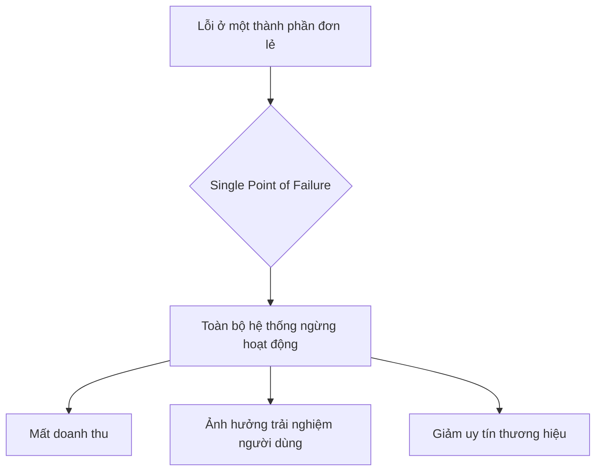
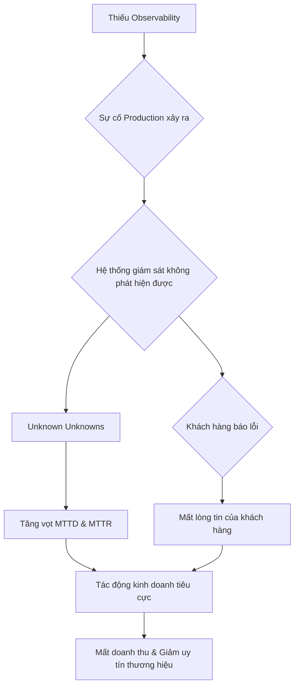
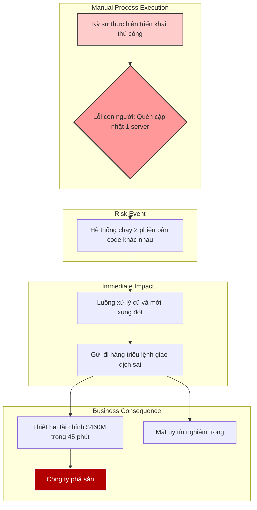
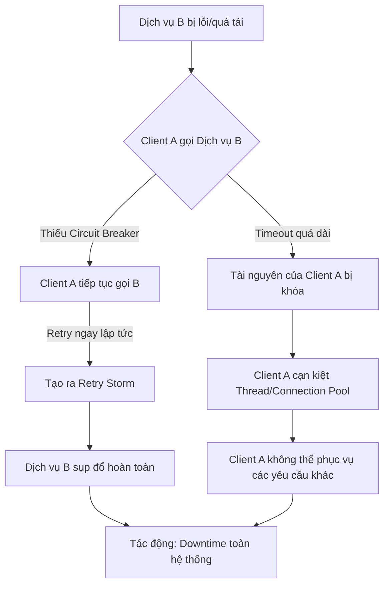
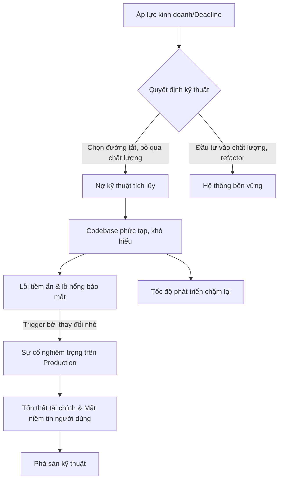

## Chương 2: Vi Phạm Core Principles và Hậu Quả

### 2.1 Rủi Ro Khi Không Fail-Safe

#### Định Nghĩa Rủi Ro
- **Định nghĩa:** Rủi ro khi không có cơ chế an toàn (fail-safe) là khả năng một thành phần hoặc hệ thống khi gặp lỗi sẽ không tự động chuyển sang một trạng thái an toàn định trước, gây ra các hậu quả nghiêm trọng và không thể lường trước. Thay vì "chết một cách an toàn" (fail gracefully), hệ thống tiếp tục hoạt động sai, khuếch đại tác động của lỗi ban đầu và dẫn đến các sự cố thảm khốc.
- **Nguồn gốc phát sinh:** Rủi ro này thường phát sinh từ việc thiết kế hệ thống phức tạp mà không lường hết các kịch bản lỗi, áp lực về thời gian ra mắt sản phẩm, hoặc đánh giá thấp tầm quan trọng của việc xử lý lỗi. Nó cũng có thể xuất phát từ việc tái sử dụng hoặc sửa đổi các thành phần cũ mà không hiểu đầy đủ về hành vi của chúng, dẫn đến các tương tác không mong muốn.
- **Mức độ nghiêm trọng:** **Critical**. Việc thiếu cơ chế fail-safe có thể gây ra sụp đổ toàn bộ hệ thống (cascading failures), tổn thất tài chính khổng lồ, mất dữ liệu không thể phục hồi, và ảnh hưởng nghiêm trọng đến uy tín thương hiệu.

#### Nguyên Nhân Gốc Rễ (Root Causes)
1.  **Thiết kế không lường trước trạng thái lỗi (Inadequate Failure State Planning):** Các kỹ sư thường tập trung vào kịch bản hoạt động thành công (happy path) và bỏ qua việc định nghĩa rõ ràng các trạng thái an toàn khi có lỗi xảy ra. Hệ thống không được lập trình để biết phải làm gì khi một thành phần bất ngờ ngừng hoạt động hoặc hoạt động sai, dẫn đến hành vi không xác định.
2.  **Quản lý cấu hình và triển khai yếu kém (Poor Configuration and Deployment Management):** Việc triển khai phần mềm một cách thủ công, không nhất quán trên các môi trường khác nhau có thể để lại các phiên bản code cũ hoặc cấu hình sai lệch. Như trong trường hợp của Knight Capital, một máy chủ không được cập nhật đã kích hoạt một đoạn code cũ không tương thích, gây ra thảm họa.
3.  **Tái sử dụng code cũ mà không kiểm tra lại (Unverified Legacy Code Re-purposing):** Việc tái sử dụng các tính năng hoặc cờ (feature flags) đã lỗi thời cho mục đích mới mà không xóa bỏ hoàn toàn logic cũ là một quả bom nổ chậm. Logic cũ có thể vô tình được kích hoạt trở lại, gây ra những hậu quả không lường trước vì nó không còn phù hợp với kiến trúc hệ thống hiện tại.
4.  **Thiếu cơ chế giám sát và ngắt tự động (Lack of Automatic Kill Switches and Monitoring):** Hệ thống không có khả năng tự động phát hiện hành vi bất thường (ví dụ: số lượng giao dịch tăng đột biến, tài nguyên bị sử dụng quá mức) và không có cơ chế "cầu dao tổng" (kill switch) để dừng ngay lập tức các quy trình nguy hiểm, cho phép sai lầm lan rộng với tốc độ chóng mặt.

#### Biểu Hiện & Triệu Chứng (Symptoms)
- **Dấu hiệu cảnh báo sớm:**
    - Tăng đột biến số lượng lỗi hoặc ngoại lệ (exceptions) trong logs.
    - Các chỉ số hiệu suất (performance metrics) như độ trễ (latency) hoặc tỷ lệ lỗi (error rate) tăng bất thường.
    - Hành vi không nhất quán giữa các server hoặc các node trong một cụm (cluster).
- **Các metrics/logs cần theo dõi:**
    - **Logs:** Theo dõi các thông báo lỗi nghiêm trọng (FATAL, ERROR), các cảnh báo (WARN) về việc sử dụng tài nguyên hoặc các kết nối không thành công.
    - **Metrics:** Số lượng giao dịch mỗi giây, mức sử dụng CPU/memory, độ dài hàng đợi (queue length), số lượng kết nối đang hoạt động.
- **Red flags trong hệ thống:**
    - Một thành phần gửi đi một lượng lớn yêu cầu lặp đi lặp lại trong một khoảng thời gian cực ngắn.
    - Dữ liệu không nhất quán giữa các bản sao (replicas) trong cơ sở dữ liệu.
    - Các quy trình con (child processes) không được dọn dẹp và trở thành "zombie processes".

#### Sơ Đồ Phân Tích
```mermaid
graph TD
    A[Triển khai lỗi: Code cũ không được xóa] --> B{Kích hoạt cờ tính năng mới}
    B --> C[Kích hoạt logic cũ trên server chưa được cập nhật]
    C --> D[Gửi hàng triệu lệnh giao dịch sai]
    D --> E{Sụp đổ dây chuyền (Cascading Failure)}
    E --> F[Tác động tài chính: Mất \$440M]
    E --> G[Tác động hoạt động: Mất khả năng giao dịch]
    F --> H[Hậu quả: Phá sản & Bị mua lại]
    G --> H
```

#### Tác Động Cụ Thể (Impact Analysis)

| Khía Cạnh       | Mức Độ   | Chi Tiết                                                                                                                            |
|-----------------|----------|-------------------------------------------------------------------------------------------------------------------------------------|
| Downtime        | High     | Hệ thống có thể phải ngừng hoạt động hoàn toàn trong nhiều giờ hoặc nhiều ngày để điều tra và khắc phục sự cố, gây gián đoạn kinh doanh. |
| Financial       | >\$10M/hour | Tổn thất có thể lên tới hàng trăm triệu đô la trong vài phút do các giao dịch tự động sai lầm hoặc mất doanh thu trực tiếp.         |
| Security        | Medium   | Mặc dù không phải là lỗ hổng bảo mật trực tiếp, việc hệ thống hoạt động ngoài tầm kiểm soát có thể tạo ra các cơ hội cho kẻ tấn công. |
| User Experience | Severe   | Người dùng mất hoàn toàn niềm tin vào sản phẩm. Dữ liệu của họ có thể bị ảnh hưởng, và dịch vụ không khả dụng.                   |
| Team Morale     | High     | Gây ra sự hoảng loạn, căng thẳng tột độ trong đội ngũ kỹ sư, dẫn đến tình trạng kiệt sức và mất niềm tin vào quy trình làm việc.      |

#### Case Study Thực Tế
**Knight Capital Group - 2012**
- **Bối cảnh:** Knight Capital là một trong những nhà tạo lập thị trường lớn nhất tại Mỹ. Họ chuẩn bị triển khai một tính năng mới có tên là Retail Liquidity Program (RLP) vào hệ thống giao dịch tự động SMARS.
- **Diễn biến:** Vào ngày 1 tháng 8 năm 2012, trong quá trình triển khai, một kỹ thuật viên đã quên cập nhật code mới lên một trong số các máy chủ. Code cũ trên máy chủ này chứa một tính năng đã lỗi thời là "Power Peg", vốn được dùng để gửi các lệnh giao dịch lặp đi lặp lại. Cờ (flag) để kích hoạt RLP lại vô tình trùng với cờ đã từng dùng cho Power Peg. Khi hệ thống mới đi vào hoạt động, máy chủ cũ đã hiểu sai tín hiệu và bắt đầu gửi đi hàng triệu lệnh mua bán không mong muốn, gây hỗn loạn thị trường.
- **Nguyên nhân gốc rễ:**
    1.  **Quy trình triển khai thủ công:** Việc cập nhật code được thực hiện bằng tay, dẫn đến sai sót khi một máy chủ bị bỏ quên.
    2.  **Tái sử dụng cờ tính năng:** Cờ "Power Peg" cũ không được vô hiệu hóa hoàn toàn và bị tái sử dụng cho RLP.
    3.  **Thiếu cơ chế fail-safe:** Hệ thống SMARS không có cơ chế kiểm tra rủi ro trước giao dịch (pre-trade risk checks) hoặc cơ chế ngắt tự động để ngăn chặn các lệnh bất thường.
- **Tác động:** Knight Capital mất **440 triệu đô la** trong vòng 45 phút, giá trị công ty gần như bốc hơi và cuối cùng phải chấp nhận bị mua lại để tránh phá sản.
- **Bài học:** Tầm quan trọng của việc tự động hóa quy trình triển khai, quản lý vòng đời của feature flags một cách cẩn thận, và sự cần thiết tuyệt đối của các cơ chế fail-safe trong các hệ thống tài chính quan trọng.
- **Nguồn:** [The Knight Capital Disaster - Speculative Branches](https://specbranch.com/posts/knight-capital/)

#### Risk Mitigation Strategies

**Preventive Measures (Ngăn ngừa):**
1.  **Thiết kế Fail-Safe từ đầu:** Mọi thành phần của hệ thống phải được thiết kế với một trạng thái an toàn mặc định. Ví dụ, nếu một dịch vụ không thể kết nối đến cơ sở dữ liệu, nó nên ngừng nhận yêu cầu mới thay vì tiếp tục hoạt động với dữ liệu cũ.
2.  **Tự động hóa hoàn toàn quy trình CI/CD:** Loại bỏ sự can thiệp của con người trong quá trình triển khai. Sử dụng các công cụ như Ansible, Chef, hoặc các pipeline của GitLab/GitHub Actions để đảm bảo tính nhất quán trên mọi môi trường.
3.  **Quản lý Feature Flags chặt chẽ:** Áp dụng quy trình nghiêm ngặt cho việc tạo, kích hoạt, và loại bỏ feature flags. Các cờ cũ phải được xóa hoàn toàn khỏi codebase, không chỉ đơn thuần là tắt đi.

**Detective Measures (Phát hiện):**
1.  **Circuit Breaker Pattern:** Implement các "cầu dao điện" (circuit breakers) để tự động ngắt kết nối đến các dịch vụ đang gặp lỗi sau một số lần thử thất bại, ngăn chặn lỗi lan truyền.
2.  **Giám sát hành vi bất thường (Anomaly Detection):** Sử dụng các công cụ giám sát thông minh (ví dụ: Prometheus kết hợp với machine learning) để phát hiện các mẫu hành vi bất thường, chẳng hạn như một service đột ngột gửi đi số lượng request gấp 100 lần bình thường.
3.  **Heartbeat & Health Checks:** Các dịch vụ phải thường xuyên gửi "nhịp tim" (heartbeat) đến một hệ thống giám sát trung tâm. Nếu không nhận được tín hiệu trong một khoảng thời gian nhất định, hệ thống sẽ tự động coi dịch vụ đó là không khỏe mạnh và loại nó ra khỏi luồng xử lý.

**Corrective Measures (Khắc phục):**
1.  **Kill Switches:** Xây dựng các "công tắc khẩn cấp" cho phép các kỹ sư dừng ngay lập tức các tính năng hoặc toàn bộ hệ thống chỉ bằng một cú nhấp chuột khi phát hiện sự cố nghiêm trọng.
2.  **Chiến lược Rollback tự động:** Nếu tỷ lệ lỗi của một phiên bản mới vượt quá ngưỡng cho phép, hệ thống phải có khả năng tự động rollback về phiên bản ổn định trước đó mà không cần can thiệp thủ công.
3.  **Quy trình phản ứng sự cố (Incident Response Playbook):** Chuẩn bị sẵn các kịch bản ứng phó chi tiết cho từng loại rủi ro, xác định rõ vai trò, trách nhiệm và các bước cần thực hiện để nhanh chóng cô lập và khắc phục sự cố.

#### Code Examples

**Anti-pattern (Cách làm SAI):**
```python
# ❌ ANTI-PATTERN: Bỏ qua lỗi kết nối và tiếp tục hoạt động
import requests

def get_payment_status(order_id):
    try:
        response = requests.get(f"https://api.payment.com/status/{order_id}", timeout=0.5)
        return response.json()["status"]
    except requests.exceptions.RequestException:
        # Dịch vụ thanh toán lỗi, nhưng lại trả về trạng thái "thành công" mặc định
        # Điều này có thể dẫn đến việc giao hàng mà không nhận được tiền.
        return "SUCCESS"
```

**Best Practice (Cách làm ĐÚNG):**
```python
# ✅ BEST PRACTICE: Sử dụng Circuit Breaker để fail-safe
from circuitbreaker import circuit
import requests

# Cầu dao sẽ mở (ngắt mạch) nếu có 5 lỗi trong 60 giây
@circuit(failure_threshold=5, recovery_timeout=60)
def get_payment_status_safe(order_id):
    try:
        response = requests.get(f"https://api.payment.com/status/{order_id}", timeout=2)
        response.raise_for_status() # Ném exception nếu status code là 4xx hoặc 5xx
        return response.json()["status"]
    except requests.exceptions.RequestException as e:
        # Ghi log lỗi và để cho circuit breaker xử lý
        print(f"Lỗi kết nối đến dịch vụ thanh toán: {e}")
        raise # Ném lại exception để circuit breaker ghi nhận là một lỗi

# Khi gọi hàm này, nếu cầu dao đang mở, nó sẽ ném ra CircuitBreakerError ngay lập tức
# thay vì cố gắng gọi API, giúp hệ thống chuyển sang trạng thái an toàn.
```

#### Risk Assessment Matrix

| Yếu Tố                | Đánh Giá | Ghi Chú                                                                                                                            |
|------------------------|----------|------------------------------------------------------------------------------------------------------------------------------------|
| Xác suất (Probability) | 2        | Với các quy trình phát triển hiện đại (CI/CD, code review), xác suất xảy ra lỗi này thấp, nhưng không bao giờ bằng không.             |
| Tác động (Impact)      | 5        | Tác động ở mức thảm họa, có thể gây phá sản công ty, mất niềm tin của khách hàng và gây hỗn loạn thị trường.                      |
| **Risk Score**         | **10**   | **Critical**                                                                                                                       |
| Ưu tiên xử lý          | P1       | Phải được ưu tiên giải quyết ở cấp độ cao nhất trong tất cả các giai đoạn từ thiết kế, phát triển đến vận hành.                    |

#### Checklist Đánh Giá
- [ ] Hệ thống có định nghĩa trạng thái an toàn (safe state) cho từng thành phần quan trọng không?
- [ ] Quy trình triển khai có được tự động hóa 100% và có cơ chế xác thực sau khi triển khai không?
- [ ] Có quy trình quản lý vòng đời cho feature flags, bao gồm việc dọn dẹp code cũ không?
- [ ] Hệ thống có được trang bị các cơ chế như Circuit Breaker, Bulkhead, và Rate Limiter không?
- [ ] Có tồn tại "kill switch" cho các tính năng có rủi ro cao không?
- [ ] Đội ngũ có thường xuyên thực hành các kịch bản ứng phó sự cố (incident response drills) không?

#### Tools & Resources
- **Hystrix/Resilience4j:** Các thư viện phổ biến (Java) để implement các mẫu thiết kế отказоустойчивости như Circuit Breaker, Bulkhead.
- **Prometheus & Grafana:** Bộ công cụ mạnh mẽ để thu thập metrics, giám sát hệ thống và thiết lập cảnh báo cho các hành vi bất thường.
- **LaunchDarkly/Flagsmith:** Các dịch vụ quản lý feature flags chuyên nghiệp, giúp kiểm soát việc bật/tắt tính năng một cách an toàn và có kiểm soát.

#### Nguồn Tham Khảo
1.  [The Knight Capital Disaster](https://specbranch.com/posts/knight-capital/) - Phân tích chi tiết về sự cố của Knight Capital.
2.  [Fail-Safe Design Principles & Examples](https://qualityinspection.org/fail-safe-design-principles-examples/) - Tổng quan về các nguyên tắc thiết kế an toàn.
3.  [Martin Fowler - Circuit Breaker](https://martinfowler.com/bliki/CircuitBreaker.html) - Bài viết kinh điển về mẫu thiết kế Circuit Breaker.


### 2.2 Rủi Ro Single Point of Failure

#### Định Nghĩa Rủi Ro
Single Point of Failure (SPOF) được định nghĩa là một thành phần, một cấu phần, hoặc một đường dẫn trong hệ thống mà nếu nó gặp sự cố, toàn bộ hệ thống sẽ ngừng hoạt động. Đây là một điểm yếu chí mạng, nơi sự cố của một thực thể đơn lẻ có thể gây ra hiệu ứng sụp đổ toàn diện. Trong môi trường production, rủi ro này thường phát sinh từ các quyết định thiết kế ban đầu không lường hết được sự phụ thuộc, việc tối ưu hóa chi phí quá mức bằng cách cắt giảm các thành phần dự phòng, hoặc do sự phức tạp của hệ thống che khuất đi các điểm phụ thuộc ngầm. SPOF có thể tồn tại ở bất kỳ lớp nào, từ phần cứng (một server, một ổ cứng), phần mềm (một database, một service), cho đến yếu tố con người (một kỹ sư duy nhất nắm giữ kiến thức then chốt). Mức độ nghiêm trọng của rủi ro này được xếp hạng **Critical**, vì một sự cố tại SPOF gần như chắc chắn sẽ dẫn đến downtime trên diện rộng, ảnh hưởng trực tiếp đến người dùng và gây thiệt hại tài chính đáng kể.

#### Nguyên Nhân Gốc Rễ (Root Causes)
Các nguyên nhân gốc rễ dẫn đến SPOF rất đa dạng, nhưng thường xoay quanh một vài chủ điểm chính. **Thiết kế tập trung (Centralized Design)** là nguyên nhân hàng đầu, khi hệ thống được xây dựng quanh một thành phần chủ chốt duy nhất mà không có cơ chế thay thế, ví dụ như một database chính cho tất cả giao dịch. Đi kèm với đó là **thiếu dự phòng (Lack of Redundancy)**, tức là không triển khai các bản sao của các thành phần quan trọng, thường do áp lực về chi phí hoặc sự phức tạp kỹ thuật. Một nguyên nhân khác là sự **phụ thuộc vào một nhà cung cấp duy nhất (Vendor Lock-in)**, khiến hệ thống dễ bị tổn thương khi nhà cung cấp đó gặp sự cố. Ngoài ra, **cấu hình sai (Misconfiguration)** có thể vô tình biến một hệ thống được thiết kế dự phòng thành một SPOF bằng cách hướng tất cả lưu lượng vào một điểm. Cuối cùng, **kiến thức tập trung (Knowledge Silos)**, nơi chỉ một cá nhân hoặc nhóm nhỏ hiểu rõ hệ thống, cũng là một dạng SPOF nguy hiểm.

#### Biểu Hiện & Triệu Chứng (Symptoms)
Việc xác định sớm các SPOF tiềm tàng đòi hỏi sự quan sát kỹ lưỡng. Các **dấu hiệu cảnh báo sớm** bao gồm một component có tỷ lệ sử dụng (utilization) cao bất thường, thời gian phản hồi tăng đột biến khi tải tăng nhẹ, hoặc các cảnh báo liên tục xuất phát từ cùng một thành phần. Để phát hiện các triệu chứng này, cần **theo dõi chặt chẽ các metrics và logs**. Về metrics, cần chú ý đến CPU/Memory/Disk I/O, network traffic, request queue length, và error rate của từng component. Về logs, sự gia tăng đột ngột của log lỗi, thông báo timeout, hoặc từ chối kết nối là những chỉ báo quan trọng. Các **red flags** rõ ràng hơn trong kiến trúc hệ thống bao gồm một node không có đường kết nối dự phòng, một service quan trọng chỉ chạy trên một instance, hoặc quy trình vận hành phụ thuộc vào một công cụ duy nhất không được quản lý chặt chẽ.

#### Sơ Đồ Phân Tích


#### Tác Động Cụ Thể (Impact Analysis)

| Khía Cạnh      | Mức Độ   | Chi Tiết                                                                                                |
|----------------|----------|---------------------------------------------------------------------------------------------------------|
| Downtime       | High     | Gần như chắc chắn gây ra downtime toàn hệ thống, thời gian khắc phục phụ thuộc vào độ phức tạp của SPOF. |
| Financial      | >$100,000/hour | Thiệt hại tài chính trực tiếp từ mất doanh thu, vi phạm SLA, và chi phí nhân sự để khắc phục.             |
| Security       | Medium   | Trong lúc hệ thống sập, các cơ chế bảo vệ khác có thể không hoạt động, tạo cơ hội cho tấn công.          |
| User Experience| Severe   | Người dùng không thể truy cập dịch vụ, gây mất lòng tin và có thể chuyển sang đối thủ cạnh tranh.        |
| Team Morale    | High     | Gây áp lực cực lớn cho đội ngũ kỹ sư, dẫn đến kiệt sức và giảm tinh thần làm việc.                      |

#### Case Study Thực Tế
**Fastly CDN Outage - 2021**

Sự cố của Fastly vào tháng 6 năm 2021 là một minh chứng điển hình cho thấy tác động thảm khốc của một Single Point of Failure, ngay cả trong một hệ thống được thiết kế để có tính phân tán cao. Fastly, một trong những nhà cung cấp Mạng phân phối nội dung (CDN) hàng đầu, đã trải qua một sự cố ngừng hoạt động trên toàn cầu kéo dài 49 phút, ảnh hưởng đến 85% mạng lưới của họ. Hàng loạt các trang web lớn như Amazon, Reddit, The New York Times và gov.uk đã không thể truy cập được.

**Nguyên nhân gốc rễ** của sự cố là một bug phần mềm không được phát hiện, đã tồn tại trong một bản cập nhật từ ngày 12 tháng 5. Bug này chỉ được kích hoạt khi một khách hàng thực hiện một thay đổi cấu hình hợp lệ nhưng theo một cách không lường trước. Hành động này đã làm cho một phần của hệ thống xử lý cấu hình trở thành một SPOF, gây ra lỗi hàng loạt trên toàn mạng lưới. **Tác động** ngay lập tức là sự gián đoạn dịch vụ trên diện rộng, gây thiệt hại tài chính và làm suy giảm lòng tin của người dùng.

**Bài học** rút ra từ sự cố này là vô giá. Thứ nhất, nó cho thấy ngay cả những hệ thống phức tạp nhất cũng có thể ẩn chứa các SPOF không lường trước. Thứ hai, nó nhấn mạnh tầm quan trọng của việc kiểm thử sâu rộng và toàn diện, bao gồm cả các kịch bản cấu hình từ phía người dùng. Cuối cùng, khả năng khôi phục nhanh chóng của Fastly (trong vòng một giờ) đã chứng minh giá trị của việc có một quy trình rollback hiệu quả và được diễn tập kỹ lưỡng. 

**Nguồn:** [Summary of June 8 outage](https://www.fastly.com/blog/summary-of-june-8-outage)

#### Risk Mitigation Strategies

**Preventive Measures (Ngăn ngừa):**

Để ngăn chặn SPOF, chiến lược cốt lõi là xây dựng kiến trúc có tính sẵn sàng cao (High Availability - HA). Điều này bao gồm việc loại bỏ mọi điểm lỗi đơn lẻ bằng cách sử dụng bộ cân bằng tải (load balancer) để phân phối lưu lượng qua nhiều máy chủ, triển khai các cụm cơ sở dữ liệu (database clusters) với cơ chế nhân bản (replication), và đảm bảo mọi thành phần quan trọng đều có bản sao dự phòng. Một chiến lược phòng ngừa hiệu quả khác là áp dụng kiến trúc đa đám mây hoặc đa CDN (Multi-Cloud/Multi-CDN), tránh phụ thuộc vào một nhà cung cấp duy nhất. Cuối cùng, việc chuyển đổi từ kiến trúc nguyên khối (monolith) sang các dịch vụ vi mô (microservices) phi tập trung giúp cô lập sự cố, ngăn chặn lỗi của một dịch vụ làm sập toàn bộ hệ thống.

**Detective Measures (Phát hiện):**

Việc phát hiện sớm các vấn đề là rất quan trọng. Cần thiết lập một hệ thống giám sát toàn diện (comprehensive monitoring) trên tất cả các lớp, từ hạ tầng đến ứng dụng, sử dụng các công cụ như Prometheus, Grafana, hoặc Datadog. Việc triển khai các điểm cuối kiểm tra sức khỏe (health check endpoints) cho mọi dịch vụ cho phép các bộ cân bằng tải tự động loại bỏ các phiên bản bị lỗi. Hơn nữa, giám sát tổng hợp (synthetic monitoring), bằng cách mô phỏng các giao dịch của người dùng, có thể liên tục xác minh tính toàn vẹn của các luồng nghiệp vụ quan trọng.

**Corrective Measures (Khắc phục):**

Khi sự cố xảy ra, các biện pháp khắc phục nhanh chóng là yếu tố sống còn. Cần phải có cơ chế chuyển đổi dự phòng tự động (automated failover), ví dụ như tự động nâng cấp một cơ sở dữ liệu phụ (replica) thành cơ sở dữ liệu chính (primary). Quy trình CI/CD phải hỗ trợ việc khôi phục phiên bản (rollback) một cách nhanh chóng và an toàn. Cuối cùng, việc chuẩn bị sẵn các kịch bản ứng phó sự cố (incident response playbooks) cho các SPOF đã biết sẽ giúp đội ngũ kỹ sư hành động một cách bình tĩnh, có tổ chức và hiệu quả.

#### Code Examples

**Anti-pattern (Cách làm SAI):**
```python
# ❌ ANTI-PATTERN: Kết nối trực tiếp đến một instance database duy nhất
import mysql.connector

def get_user_data(user_id):
    # Kết nối này là một SPOF. Nếu DB server tại 192.168.1.10 gặp sự cố,
    # toàn bộ chức năng liên quan đến dữ liệu người dùng sẽ ngừng hoạt động.
    try:
        db = mysql.connector.connect(
            host="192.168.1.10", # IP của DB chính, là một SPOF
            user="root",
            password="password",
            database="prod_db"
        )
        cursor = db.cursor()
        cursor.execute(f"SELECT * FROM users WHERE id = {user_id}")
        return cursor.fetchone()
    except mysql.connector.Error as err:
        print(f"Lỗi database: {err}")
        # Không có cơ chế dự phòng, service sẽ thất bại
        return None
```

**Best Practice (Cách làm ĐÚNG):**
```python
# ✅ BEST PRACTICE: Sử dụng danh sách kết nối dự phòng và cơ chế failover
import mysql.connector
import time

# Danh sách các DB server (1 primary, 2 replicas)
# Trong thực tế, danh sách này nên được quản lý qua service discovery hoặc file config
DB_ENDPOINTS = [
    "192.168.1.10", # Primary
    "192.168.1.11", # Replica 1
    "192.168.1.12", # Replica 2
]

def get_user_data_resilient(user_id):
    """
    Cố gắng kết nối đến các DB endpoint theo thứ tự.
    Nếu một endpoint thất bại, nó sẽ tự động thử endpoint tiếp theo.
    Điều này loại bỏ việc một DB server đơn lẻ trở thành SPOF.
    """
    last_exception = None
    for host in DB_ENDPOINTS:
        try:
            db = mysql.connector.connect(
                host=host,
                user="root",
                password="password",
                database="prod_db",
                connection_timeout=5 # Đặt timeout ngắn để fail-fast
            )
            cursor = db.cursor()
            cursor.execute(f"SELECT * FROM users WHERE id = {user_id}")
            result = cursor.fetchone()
            db.close()
            return result # Trả về kết quả ngay khi thành công
        except mysql.connector.Error as err:
            last_exception = err
            print(f"Lỗi khi kết nối đến {host}: {err}. Đang thử server tiếp theo...")
    
    # Nếu tất cả các server đều thất bại, lúc đó mới báo lỗi tổng
    print("Tất cả các database server đều không thể truy cập.")
    raise ConnectionError("Database service unavailable") from last_exception
```

#### Risk Assessment Matrix

| Yếu Tố                 | Đánh Giá      | Ghi Chú                                                                                                                            |
|------------------------|---------------|------------------------------------------------------------------------------------------------------------------------------------|
| Xác suất (Probability) | 3 (Medium)    | Mặc dù các component riêng lẻ có thể đáng tin cậy, sự tồn tại của một SPOF khiến xác suất xảy ra sự cố là đáng kể trong vòng đời của hệ thống. |
| Tác động (Impact)       | 5 (Critical)  | Theo định nghĩa, sự cố tại một SPOF sẽ gây ra sụp đổ toàn bộ hệ thống, dẫn đến tác động kinh doanh tối đa.                           |
| **Risk Score**         | **3 x 5 = 15**| **Critical**                                                                                                                       |
| Ưu tiên xử lý          | P1            | Rủi ro ở mức Critical cần được ưu tiên xử lý cao nhất, phải được giải quyết ngay lập tức.                                          |

#### Checklist Đánh Giá
- [ ] Sơ đồ kiến trúc hệ thống đã được rà soát để xác định các thành phần không có dự phòng chưa?
- [ ] Tất cả các dịch vụ quan trọng (critical services) có đang chạy trên nhiều hơn một instance không?
- [ ] Hệ thống có sử dụng cơ chế load balancing để phân phối tải và loại bỏ các node lỗi không?
- [ ] Có kế hoạch dự phòng cho các dịch vụ của bên thứ ba (third-party services) không?
- [ ] Quy trình rollback đã được kiểm thử và có thể thực hiện nhanh chóng không?
- [ ] Kiến thức về các hệ thống quan trọng có được tài liệu hóa và chia sẻ trong đội ngũ không?

#### Tools & Resources
Một số công cụ và tài nguyên hữu ích bao gồm các công cụ Chaos Engineering như Chaos Monkey, giúp chủ động tìm kiếm SPOF bằng cách cố tình gây ra lỗi trong môi trường thử nghiệm. Các giải pháp Service Mesh như Istio và Linkerd cung cấp các tính năng phục hồi tự động ở tầng mạng. Ngoài ra, việc tận dụng các Vùng sẵn sàng (Availability Zones) của các nhà cung cấp đám mây lớn như AWS, GCP, và Azure là một phương pháp hiệu quả để triển khai ứng dụng trên các cơ sở hạ tầng vật lý độc lập.

#### Nguồn Tham Khảo
1. [N+1 redundancy](https://en.wikipedia.org/wiki/N%2B1_redundancy) - Một mô hình phổ biến để đảm bảo tính dự phòng và loại bỏ SPOF.
2. [The Twelve-Factor App](https://12factor.net/) - Một tập hợp các phương pháp hay nhất để xây dựng các ứng dụng SaaS có khả năng mở rộng và phục hồi, trong đó có nhiều nguyên tắc giúp tránh SPOF.
3. [Fastly's summary of the June 8 outage](https://www.fastly.com/blog/summary-of-june-8-outage) - Phân tích chi tiết từ chính Fastly về sự cố, là một bài học quý giá về các SPOF tiềm ẩn.


### 2.3 Rủi Ro Thiếu Observability

#### Định Nghĩa Rủi Ro

Rủi ro thiếu observability (quan sát được) là tình trạng một hệ thống không cung cấp đủ dữ liệu về trạng thái nội tại của nó, khiến cho việc hiểu, gỡ lỗi, và giám sát hoạt động của hệ thống trở nên khó khăn hoặc không thể. Tình trạng này tạo ra các "unknown unknowns" – những vấn đề mà đội ngũ kỹ thuật không hề hay biết sự tồn tại của chúng cho đến khi chúng bùng phát thành sự cố. Rủi ro này thường phát sinh khi các hệ thống được phát triển mà không có sự chú trọng đầy đủ vào việc tích hợp các trụ cột của observability—**logs, metrics, và traces**—ngay từ đầu. Trong các môi trường phức tạp như kiến trúc microservices, việc thiếu một nền tảng observability tập trung sẽ làm gia tăng rủi ro theo cấp số nhân. Áp lực về thời gian ra mắt sản phẩm cũng thường khiến các nhóm phát triển bỏ qua hoặc xem nhẹ việc triển khai các công cụ giám sát. Với khả năng che giấu các vấn đề nghiêm trọng về hiệu năng, bảo mật, và độ tin cậy cho đến khi chúng ảnh hưởng trực tiếp đến người dùng và doanh thu, rủi ro thiếu observability được xếp vào mức độ **Critical**.

#### Nguyên Nhân Gốc Rễ (Root Causes)

Có bốn nguyên nhân gốc rễ chính dẫn đến tình trạng thiếu observability trong các hệ thống sản xuất:

1.  **Thiếu Văn Hóa Observability:** Nguyên nhân sâu xa nhất thường đến từ văn hóa tổ chức. Khi observability không được coi là một phần thiết yếu của vòng đời phát triển phần mềm, các kỹ sư sẽ không có động lực hay kiến thức để xây dựng các hệ thống có khả năng quan sát được. Việc giám sát thường bị đẩy cho một nhóm vận hành (Ops) riêng biệt, tạo ra một ranh giới trách nhiệm và phá vỡ nguyên tắc "you build it, you run it", vốn là nền tảng của DevOps hiện đại.

2.  **Công Cụ Phân Mảnh và Không Tương Thích:** Việc sử dụng một loạt các công cụ giám sát riêng lẻ cho logs, metrics, và traces mà không có sự tích hợp chặt chẽ sẽ tạo ra các "ốc đảo dữ liệu". Khi một sự cố xảy ra, việc điều tra trở nên cực kỳ phức tạp vì không thể tương quan (correlate) thông tin giữa các hệ thống. Ví dụ, một cảnh báo về CPU cao từ hệ thống metrics không thể dễ dàng liên kết với một truy vấn chậm được ghi lại trong logs hay một request cụ thể trong hệ thống tracing.

3.  **Logging Không Đầy Đủ hoặc Không Có Cấu Trúc:** Đây là một lỗi kỹ thuật phổ biến. Logs chỉ ghi lại các thông điệp chung chung, thiếu ngữ cảnh quan trọng như ID người dùng, ID yêu cầu, hoặc các tham số nghiệp vụ. Hơn nữa, việc ghi log ở dạng văn bản thuần túy (plain text) thay vì định dạng có cấu trúc (structured logging như JSON) khiến việc truy vấn, phân tích, và tạo cảnh báo tự động trở nên cực kỳ khó khăn và tốn thời gian.

4.  **Kiến Trúc Hệ Thống Phức Tạp:** Trong các kiến trúc hiện đại như microservices hay serverless, một yêu cầu của người dùng có thể đi qua hàng chục, thậm chí hàng trăm dịch vụ khác nhau. Nếu không có **distributed tracing**, việc xác định dịch vụ nào gây ra lỗi hoặc chậm trễ là gần như không thể. Sự phức tạp của kiến trúc làm tăng theo cấp số nhân bề mặt tấn công của các "unknown unknowns", khiến cho việc chẩn đoán sự cố trở thành một cơn ác mộng.

#### Biểu Hiện & Triệu Chứng (Symptoms)

Các dấu hiệu cho thấy một hệ thống đang mắc phải rủi ro thiếu observability bao gồm:

*   **Dấu hiệu cảnh báo sớm:** Tỷ lệ sự cố được báo cáo bởi khách hàng cao hơn đáng kể so với số được phát hiện bởi hệ thống giám sát nội bộ. Thời gian trung bình để phát hiện sự cố (Mean Time to Detect - MTTD) có xu hướng tăng dần. Các kỹ sư thường xuyên phải truy cập trực tiếp vào máy chủ sản xuất (SSH) để đọc logs thủ công khi có vấn đề.
*   **Các metrics/logs cần theo dõi:** Tỷ lệ lỗi (Error Rate) tăng đột biến mà không rõ nguyên nhân, độ trễ (Latency) ở các điểm cuối (endpoint) quan trọng tăng cao, và mức sử dụng tài nguyên (CPU, Memory) đạt ngưỡng bất thường. Một triệu chứng khác là tình trạng "alert fatigue" – có quá nhiều cảnh báo "rác" khiến các cảnh báo quan trọng bị bỏ qua.
*   **Red flags trong hệ thống:** Đội ngũ kỹ thuật không thể trả lời các câu hỏi cơ bản về hoạt động của hệ thống, ví dụ: "Tại sao người dùng X không thể đăng nhập?" hoặc "Yêu cầu này đã đi qua những dịch vụ nào?". Các báo cáo phân tích sự cố (postmortem) thường kết thúc với các hành động như "thêm logging" hoặc "cải thiện monitoring".

#### Sơ Đồ Phân Tích



#### Tác Động Cụ Thể (Impact Analysis)

| Khía Cạnh      | Mức Độ          | Chi Tiết                                                                                                                                                                                          | 
| --------------- | --------------- | ------------------------------------------------------------------------------------------------------------------------------------------------------------------------------------------------- | 
| Downtime        | High            | Khi sự cố xảy ra, việc thiếu thông tin để chẩn đoán sẽ kéo dài thời gian hệ thống ngừng hoạt động, có thể từ vài giờ đến vài ngày.                                                                    | 
| Financial       | $100,000+/hour  | Ước tính dựa trên các sự cố của các công ty lớn, downtime có thể gây thiệt hại hàng trăm nghìn đô la mỗi giờ do mất doanh thu, vi phạm SLA, và chi phí nhân sự để khắc phục. [1]                     | 
| Security        | Critical        | Không thể phát hiện các hoạt động bất thường hoặc các cuộc tấn công đang diễn ra (ví dụ: data exfiltration, brute-force attacks) cho đến khi quá muộn.                                               | 
| User Experience | Severe          | Người dùng liên tục gặp lỗi, hiệu năng chậm, hoặc không thể sử dụng dịch vụ. Thống kê cho thấy có tới **79% sự cố được phát hiện bởi khách hàng**, cho thấy trải nghiệm người dùng đã bị ảnh hưởng nghiêm trọng. | 
| Team Morale     | High            | Các kỹ sư cảm thấy bất lực, căng thẳng và kiệt sức (burnout) vì phải liên tục "chữa cháy" trong một môi trường không thể đoán trước. Việc đổ lỗi lẫn nhau giữa các nhóm (dev, ops, QA) thường xuyên xảy ra. | 

#### Case Study Thực Tế

**Knight Capital Group - 2012**

*   **Bối cảnh:** Knight Capital là một trong những nhà tạo lập thị trường lớn nhất tại Mỹ. Để chuẩn bị cho một chương trình mới của Sàn giao dịch New York (NYSE), Knight đã lên kế hoạch cập nhật phần mềm trên các máy chủ giao dịch của mình.
*   **Diễn biến:** Vào sáng ngày 1 tháng 8 năm 2012, một kỹ thuật viên đã triển khai sai mã nguồn lên 8 máy chủ. Một đoạn mã cũ, vốn đã có lỗi nhưng không được kích hoạt, đã được tái sử dụng một cách vô tình. Khi thị trường mở cửa, hệ thống bắt đầu gửi đi hàng triệu lệnh giao dịch lỗi. Trong vòng 45 phút, hệ thống đã thực hiện hơn 4 triệu giao dịch không mong muốn, tạo ra một vị thế mua trị giá hàng tỷ đô la.
*   **Nguyên nhân gốc rễ:** Nguyên nhân chính là sự thiếu hụt nghiêm trọng về observability và quy trình kiểm soát. Mặc dù hệ thống nội bộ đã gửi 97 email cảnh báo về lỗi cấu hình trước khi thị trường mở cửa, không ai chú ý hoặc hành động kịp thời. Không có hệ thống nào để giám sát và ngăn chặn một số lượng lệnh giao dịch bất thường khổng lồ như vậy.
*   **Tác động:** Công ty đã lỗ khoảng **460 triệu đô la** chỉ trong chưa đầy một giờ. Giá cổ phiếu của Knight Capital sụp đổ 75%, và công ty đứng trước nguy cơ phá sản, buộc phải bị mua lại.
*   **Bài học:** Sự cố này là một lời cảnh tỉnh đắt giá về tầm quan trọng của observability. Việc có thể "nhìn thấy" những gì đang xảy ra bên trong hệ thống không phải là một tính năng xa xỉ, mà là một yêu cầu sống còn.
*   **Nguồn:** [SEC Charges Knight Capital With Violations of Market Access Rule][1]

#### Risk Mitigation Strategies

**Preventive Measures (Ngăn ngừa):**

1.  **Thiết lập "Observability by Design":** Tích hợp logging, metrics, và tracing vào văn hóa và quy trình phát triển ngay từ đầu. Yêu cầu mỗi tính năng mới phải đi kèm với dashboard và alert tương ứng.
2.  **Chuẩn hóa Công cụ và Dữ liệu:** Sử dụng một nền tảng observability tập trung (ví dụ: Grafana, Datadog, New Relic) để thu thập và tương quan dữ liệu từ mọi nguồn. Áp dụng định dạng log có cấu trúc (structured logging) trên toàn hệ thống.
3.  **Triển khai Distributed Tracing:** Đối với các kiến trúc microservices, distributed tracing là bắt buộc. Mỗi request phải được gán một trace ID duy nhất khi đi vào hệ thống và được truyền qua tất cả các dịch vụ.

**Detective Measures (Phát hiện):**

1.  **Giám sát Golden Signals:** Theo dõi 4 tín hiệu vàng cho mọi dịch vụ: Latency (Độ trễ), Traffic (Lưu lượng), Errors (Lỗi), và Saturation (Độ bão hòa). [3]
2.  **Cảnh báo Đa chiều và Thông minh:** Thiết lập các cảnh báo không chỉ dựa trên ngưỡng tĩnh (static thresholds) mà còn dựa trên sự thay đổi bất thường (anomaly detection). Cảnh báo cần phải có đủ ngữ cảnh để người nhận có thể hành động ngay.
3.  **Service Level Objectives (SLOs):** Định nghĩa các SLO rõ ràng cho các dịch vụ quan trọng và thiết lập cảnh báo khi "error budget" (ngân sách lỗi) sắp cạn.

**Corrective Measures (Khắc phục):**

1.  **Runbook và Playbook Tự động hóa:** Xây dựng các quy trình phản ứng sự cố (runbook) chi tiết cho các loại cảnh báo phổ biến. Tự động hóa các bước khắc phục đơn giản.
2.  **Feature Flags và Rollback An toàn:** Sử dụng feature flags để có thể tắt các tính năng mới một cách an toàn mà không cần rollback toàn bộ hệ thống.
3.  **Chaos Engineering:** Chủ động "tiêm" lỗi vào hệ thống trong môi trường được kiểm soát để tìm ra các điểm yếu trong observability trước khi chúng trở thành sự cố thực sự.

#### Code Examples

**Anti-pattern (Cách làm SAI):**

```python
# ❌ ANTI-PATTERN: Logging không có ngữ cảnh
import logging

logging.basicConfig(level=logging.INFO)

def process_payment(amount, user_id):
    try:
        # Giả lập xử lý thanh toán
        if amount > 1000:
            raise ValueError("Số tiền quá lớn")
        logging.info("Thanh toán thành công")
    except Exception as e:
        # Log lỗi nhưng không có thông tin gì về user_id hay amount
        logging.error(f"Lỗi xử lý thanh toán: {e}")

# Khi có lỗi, log chỉ ghi "Lỗi xử lý thanh toán: Số tiền quá lớn"
# Rất khó để biết lỗi này của người dùng nào, với số tiền bao nhiêu.
process_payment(1500, "user-123")
```

**Best Practice (Cách làm ĐÚNG):**

```python
# ✅ BEST PRACTICE: Structured logging với đầy đủ ngữ cảnh
import logging
import json

class JsonFormatter(logging.Formatter):
    def format(self, record):
        log_record = {
            "timestamp": self.formatTime(record, self.datefmt),
            "level": record.levelname,
            "message": record.getMessage(),
            "context": record.__dict__.get("context", {})
        }
        return json.dumps(log_record)

# Cấu hình logger để sử dụng JSON formatter
logger = logging.getLogger(__name__)
logger.setLevel(logging.INFO)
handler = logging.StreamHandler()
handler.setFormatter(JsonFormatter())
logger.addHandler(handler)

def process_payment_structured(amount, user_id, order_id):
    # Thêm context vào log
    context = {"user_id": user_id, "amount": amount, "order_id": order_id}
    try:
        logger.info("Bắt đầu xử lý thanh toán", extra={"context": context})
        if amount > 1000:
            raise ValueError("Số tiền quá lớn")
        logger.info("Thanh toán thành công", extra={"context": context})
    except Exception as e:
        # Log lỗi với đầy đủ ngữ cảnh giúp truy vết dễ dàng
        context["error"] = str(e)
        logger.error("Lỗi xử lý thanh toán", extra={"context": context})

# Log output sẽ là một chuỗi JSON, có thể dễ dàng tìm kiếm và phân tích
# {"timestamp": "...", "level": "ERROR", "message": "Lỗi xử lý thanh toán", "context": {"user_id": "user-456", "amount": 2000, "order_id": "order-abc", "error": "Số tiền quá lớn"}}
process_payment_structured(2000, "user-456", "order-abc")
```

#### Risk Assessment Matrix

| Yếu Tố                | Đánh Giá     | Ghi Chú                                                                                                                                                            | 
| ---------------------- | ------------ | ------------------------------------------------------------------------------------------------------------------------------------------------------------------ | 
| Xác suất (Probability) | 4            | Rất phổ biến trong các hệ thống legacy hoặc các startup phát triển quá nhanh, bỏ qua các khâu kỹ thuật quan trọng.                                                      | 
| Tác động (Impact)      | 5            | Có thể gây ra sụp đổ toàn bộ hệ thống, mất mát tài chính khổng lồ, và tổn hại nghiêm trọng đến uy tín thương hiệu, như case study của Knight Capital đã cho thấy. [1] | 
| **Risk Score**         | 4 x 5 = 20   | **Critical**                                                                                                                                                       | 
| Ưu tiên xử lý          | P1           | Phải được giải quyết ngay lập tức. Bất kỳ hệ thống nào không có observability đều là một quả bom nổ chậm.                                                              | 

#### Checklist Đánh Giá

- [ ] Hệ thống có một trace ID duy nhất cho mỗi yêu cầu và nó có được truyền qua tất cả các dịch vụ không?
- [ ] Chúng ta có thể xem logs, metrics, và traces ở cùng một nơi và tương quan chúng với nhau không?
- [ ] Khi một dịch vụ bị lỗi, chúng ta có thể nhanh chóng xác định các dịch vụ phụ thuộc và bị ảnh hưởng không?
- [ ] Các cảnh báo có đủ thông tin để hành động hay chúng chỉ là tiếng ồn?
- [ ] Chúng ta có định nghĩa và theo dõi SLO/SLI cho các dịch vụ quan trọng không?
- [ ] Log có được ghi ở định dạng có cấu trúc (JSON) và chứa đủ ngữ cảnh (user ID, request ID, etc.) không?
- [ ] Dashboard giám sát có được tự động tạo và cập nhật khi có dịch vụ mới được triển khai không?

#### Tools & Resources

*   **Prometheus & Grafana:** Bộ đôi mã nguồn mở mạnh mẽ cho việc thu thập metrics (Prometheus) và trực quan hóa (Grafana).
*   **Datadog:** Nền tảng observability tất-cả-trong-một, cung cấp logs, metrics, APM (Application Performance Monitoring), và nhiều hơn nữa trong một giao diện hợp nhất.
*   **OpenTelemetry:** Một tiêu chuẩn mã nguồn mở (được hỗ trợ bởi CNCF) để thu thập telemetry data (traces, metrics, logs), giúp tránh việc bị khóa bởi một nhà cung cấp duy nhất (vendor lock-in).

#### Nguồn Tham Khảo

1.  [SEC Charges Knight Capital With Violations of Market Access Rule](https://www.sec.gov/news/press-release/2013-222) - Báo cáo chính thức của SEC về sự cố Knight Capital.
2.  [What Is Observability?](https://www.redhat.com/en/topics/devops/what-is-observability) - Định nghĩa và tổng quan về observability từ Red Hat.
3.  [The 4 Golden Signals](https://sre.google/sre-book/monitoring-distributed-systems/#xref_monitoring_golden-signals) - Nguyên tắc giám sát các hệ thống phân tán từ sách SRE của Google.


### 2.4 Rủi Ro Từ Quy Trình Thủ Công

#### Định Nghĩa Rủi Ro

Rủi ro từ quy trình thủ công (Manual Process Risk) được định nghĩa là khả năng xảy ra sai sót, sự cố hoặc tổn thất trong môi trường production do sự can thiệp trực tiếp của con người vào các tác vụ vận hành, thay vì sử dụng các hệ thống tự động hóa. Các quy trình này bao gồm một phổ rộng các hoạt động, từ việc triển khai mã nguồn (deployment), cấu hình hệ thống, khởi động lại dịch vụ, cho đến các tác vụ bảo trì và xử lý sự cố. Rủi ro này phát sinh khi các tổ chức phụ thuộc vào con người để thực hiện các công việc lặp đi lặp lại, có tính chất nhạy cảm và yêu cầu độ chính xác cao. Trong môi trường production phức tạp, áp lực về thời gian, sự mệt mỏi, và sự phức tạp của hệ thống làm tăng đáng kể xác suất xảy ra lỗi của con người (human error). Đây cũng là một biểu hiện của "toil" — công việc thủ công, lặp đi lặp lại, không mang lại giá trị lâu dài và có xu hướng tăng lên theo quy mô dịch vụ. Mức độ nghiêm trọng của rủi ro này được xếp hạng **Critical**, bởi các lỗi phát sinh từ quy trình thủ công có thể dẫn đến những hậu quả thảm khốc, bao gồm sập toàn bộ hệ thống (total downtime), mất mát dữ liệu không thể phục hồi, lỗ hổng bảo mật nghiêm trọng và thiệt hại tài chính khổng lồ.

#### Nguyên Nhân Gốc Rễ (Root Causes)

1.  **Thiếu Văn Hóa và Đầu Tư vào Tự Động Hóa:** Nguyên nhân sâu xa nhất là sự thiếu sót trong chiến lược và văn hóa của tổ chức. Khi lãnh đạo không coi tự động hóa là một ưu tiên chiến lược, các nhóm kỹ sư sẽ không được cung cấp đủ thời gian, ngân sách và nguồn lực để xây dựng các công cụ và quy trình tự động. Thay vào đó, họ bị cuốn vào vòng luẩn quẩn của "toil" - thực hiện các công việc thủ công để "giữ cho đèn sáng", không có thời gian để cải tiến hệ thống và giảm thiểu chính công việc thủ công đó.
2.  **Sự Phức Tạp của Hệ Thống và "Kiến Thức Bộ Lạc" (Tribal Knowledge):** Khi hệ thống phát triển, các quy trình vận hành trở nên phức tạp và đa bước. Thường thì kiến thức về cách thực hiện các quy trình này không được tài liệu hóa đầy đủ mà chỉ tồn tại trong đầu của một vài kỹ sư kỳ cựu. Việc phụ thuộc vào "kiến thức bộ lạc" này cực kỳ rủi ro, vì nó không thể nhân rộng, dễ bị sai sót khi người thực hiện bị căng thẳng hoặc mệt mỏi, và có thể mất đi khi nhân viên đó rời công ty.
3.  **Áp Lực Thời Gian và Sự Tự Tin Thái Quá (Overconfidence):** Trong các tình huống cần xử lý sự cố nhanh (incident response) hoặc các đợt triển khai gấp, các kỹ sư thường bỏ qua các bước kiểm tra an toàn để tiết kiệm thời gian. Họ có thể chạy các lệnh hoặc kịch bản trực tiếp trên production với suy nghĩ "tôi biết mình đang làm gì". Sự tự tin này, kết hợp với áp lực, là một công thức dẫn đến thảm họa. Một lỗi đánh máy nhỏ, một tham số sai, hoặc một môi trường không đúng có thể gây ra hậu quả không lường trước được.

#### Biểu Hiện & Triệu Chứng (Symptoms)

Các dấu hiệu cảnh báo sớm cho thấy sự hiện diện của rủi ro này bao gồm tần suất các sự cố nhỏ liên quan đến "lỗi con người" tăng lên, và việc các kỹ sư thường xuyên phải làm việc ngoài giờ để thực hiện các tác vụ triển khai hoặc bảo trì. Một chỉ số quan trọng là tỷ lệ "toil" trong công việc của đội SRE/Vận hành liên tục ở mức cao, ví dụ, chiếm hơn 50% thời gian làm việc. Để theo dõi, các tổ chức nên giám sát số lượng các phiên truy cập SSH/RDP trực tiếp vào máy chủ production và phân tích logs của shell history để phát hiện các lệnh nguy hiểm được thực thi thủ công. Các chỉ số như thời gian trung bình để triển khai (deployment time) và tỷ lệ triển khai thất bại (deployment failure rate) cũng thường ở mức cao trong các quy trình thủ công. Các "red flags" rõ ràng trong hệ thống bao gồm sự tồn tại của các tài liệu hướng dẫn (runbook) dài hàng chục trang mô tả các bước click-chuột hoặc gõ-lệnh, sự cần thiết phải có một "chuyên gia" duy nhất để thực hiện một tác vụ cụ thể, và sự không đồng nhất một cách khó hiểu về cấu hình giữa các môi trường như staging và production.

#### Sơ Đồ Phân Tích



#### Tác Động Cụ Thể (Impact Analysis)

| Khía Cạnh        | Mức Độ   | Chi Tiết                                                                                                                                                           |
|-------------------|----------|--------------------------------------------------------------------------------------------------------------------------------------------------------------------|
| Downtime          | High     | Có thể gây ra ngừng hoạt động toàn bộ hệ thống (full outage) nếu lỗi ảnh hưởng đến các thành phần cốt lõi. Thời gian khôi phục kéo dài do phải chẩn đoán và sửa lỗi thủ công. |
| Financial         | Critical | Thiệt hại có thể lên tới hàng triệu USD mỗi giờ, tùy thuộc vào bản chất của dịch vụ. Ví dụ: lỗi trong hệ thống giao dịch tài chính, hệ thống thanh toán.               |
| Security          | High     | Quy trình thủ công có thể vô tình tạo ra lỗ hổng bảo mật, ví dụ: mở một port không cần thiết, cấp quyền sai, hoặc để lộ thông tin nhạy cảm trong logs.                  |
| User Experience   | Severe   | Người dùng cuối có thể gặp lỗi, mất dữ liệu, hoặc không thể truy cập dịch vụ. Gây mất niềm tin và khiến khách hàng rời bỏ sản phẩm.                                    |
| Team Morale       | High     | Gây ra tình trạng mệt mỏi, căng thẳng và burnout cho đội ngũ kỹ sư. Việc liên tục phải "chữa cháy" các sự cố do quy trình thủ công làm giảm động lực và sự hài lòng trong công việc. |

#### Case Study Thực Tế

**Knight Capital Group - 2012**

- **Bối cảnh:** Knight Capital Group, một trong những nhà tạo lập thị trường lớn nhất tại Mỹ, chuẩn bị triển khai một hệ thống giao dịch tần suất cao (HFT) mới có tên là SMARS. Quy trình triển khai yêu cầu cập nhật mã nguồn trên 8 máy chủ.
- **Diễn biến:** Vào sáng ngày 1 tháng 8 năm 2012, một kỹ sư đã thực hiện quy trình triển khai thủ công. Tuy nhiên, anh ta đã mắc lỗi khi chỉ triển khai mã nguồn mới lên 7 trong số 8 máy chủ. Máy chủ thứ 8 vẫn chạy mã nguồn cũ, nhưng lại nhận được các cờ (flags) cấu hình mới dành cho SMARS. Một cờ trong số đó đã kích hoạt lại một chức năng giao dịch cũ đã không còn được sử dụng, khiến nó ngay lập tức bắt đầu gửi đi hàng triệu lệnh mua bán sai lầm vào thị trường chứng khoán New York (NYSE).
- **Nguyên nhân gốc rễ:** **Lỗi triển khai thủ công.** Việc phụ thuộc vào một quy trình thủ công để cập nhật đồng bộ nhiều máy chủ đã thất bại. Thiếu cơ chế kiểm tra tự động để xác minh rằng tất cả các máy chủ đều đang chạy cùng một phiên bản mã nguồn và cấu hình.
- **Tác động:** Trong vòng 45 phút, hệ thống đã thực hiện các giao dịch không mong muốn với tổng giá trị khoảng 7 tỷ USD, gây ra khoản lỗ trực tiếp **460 triệu USD** cho Knight Capital. Công ty gần như phá sản và phải tìm kiếm một cuộc giải cứu khẩn cấp. Sự cố đã gây ra sự hỗn loạn lớn trên thị trường chứng khoán.
- **Bài học:** Tự động hóa hoàn toàn quy trình triển khai là cực kỳ quan trọng. Cần có các cơ chế "canary release" hoặc "blue-green deployment" để giảm thiểu rủi ro. Phải có hệ thống giám sát và cảnh báo tự động để phát hiện các hành vi bất thường của hệ thống ngay lập tức và có cơ chế "kill switch" để dừng hệ thống khẩn cấp.
- **Nguồn:** [SEC Charges Knight Capital With Violations of Market Access Rule](https://www.sec.gov/news/press-release/2013-10-16-sec-charges-knight-capital-violations-market-access-rule-related)

#### Risk Mitigation Strategies

**Preventive Measures (Ngăn ngừa):**

1.  **Tự Động Hóa Toàn Diện (End-to-End Automation):** Xây dựng các đường ống CI/CD (Continuous Integration/Continuous Deployment) hoàn chỉnh để tự động hóa toàn bộ quy trình từ build, test, đến triển khai và xác thực. Loại bỏ hoàn toàn nhu cầu truy cập SSH/RDP vào máy chủ production để thực hiện các tác vụ vận hành.
2.  **Infrastructure as Code (IaC):** Quản lý toàn bộ hạ tầng (máy chủ, mạng, cơ sở dữ liệu) bằng code sử dụng các công cụ như Terraform, Ansible, hoặc Pulumi. Điều này đảm bảo tính nhất quán, lặp lại và cho phép review, kiểm tra các thay đổi về hạ tầng giống như review code.
3.  **Quy Trình Review Bắt Buộc (Mandatory Peer Review):** Mọi thay đổi, dù là code, cấu hình hay kịch bản vận hành, đều phải được review bởi ít nhất một người khác. Áp dụng quy tắc "bốn mắt" (four-eyes principle) cho các thay đổi nhạy cảm.

**Detective Measures (Phát hiện):**

1.  **Giám Sát Hành Vi Bất Thường (Behavioral Anomaly Detection):** Triển khai các hệ thống giám sát có khả năng học các mẫu hoạt động bình thường của hệ thống và cảnh báo khi có bất kỳ sai lệch nào, ví dụ: số lượng lỗi tăng đột biến, lưu lượng mạng bất thường, hoặc một tiến trình tiêu thụ CPU cao bất thường.
2.  **Audit Trail Toàn Diện:** Ghi lại tất cả các lệnh được thực thi, các thay đổi cấu hình, và các API call quan trọng vào một hệ thống log tập trung, bất biến. Điều này rất quan trọng cho việc điều tra sau sự cố (postmortem).
3.  **Cảnh Báo "Tripwire":** Đặt các cảnh báo cụ thể cho các hành động có rủi ro cao. Ví dụ: cảnh báo ngay lập tức nếu có ai đó đăng nhập bằng tài khoản `root` vào một máy chủ production, hoặc nếu một tệp cấu hình quan trọng bị thay đổi thủ công.

**Corrective Measures (Khắc phục):**

1.  **Tự Động Rollback (Automated Rollback):** Xây dựng cơ chế cho phép hệ thống tự động hoặc chỉ bằng một cú nhấp chuột quay trở lại phiên bản ổn định trước đó ngay khi phát hiện sự cố sau khi triển khai.
2.  **Playbook Xử Lý Sự Cố (Incident Response Playbooks):** Chuẩn bị sẵn các kịch bản xử lý sự cố được chuẩn hóa và tự động hóa một phần cho các loại lỗi đã biết. Điều này giúp giảm sự phụ thuộc vào quyết định của con người trong lúc căng thẳng.
3.  **Kill Switch:** Thiết kế các "công tắc ngắt khẩn cấp" cho các hệ thống quan trọng, cho phép dừng ngay lập tức các hoạt động rủi ro (ví dụ: dừng hệ thống giao dịch, vô hiệu hóa một tính năng) khi phát hiện sự cố nghiêm trọng.

#### Code Examples

**Anti-pattern (Cách làm SAI):**

```python
# ❌ ANTI-PATTERN: Dùng subprocess để SSH và triển khai thủ công
# Vấn đề: Script này vẫn là một dạng quy trình thủ công được "code hóa".
# Nó che giấu các lệnh thực thi, khó debug, yêu cầu quản lý credentials
# một cách không an toàn và không có cơ chế kiểm tra trạng thái.
import subprocess

SERVERS = ["server1.prod", "server2.prod", "server3.prod"]
APP_BINARY = "my_app.bin"

def bad_deploy():
    for server in SERVERS:
        print(f"Đang triển khai tới {server}...")
        # Dễ bị lỗi injection, không an toàn
        scp_command = f"scp ./{APP_BINARY} admin@{server}:/opt/app/"
        subprocess.run(scp_command, shell=True, check=True)
        
        # Lệnh khởi động lại không kiểm tra kết quả
        ssh_command = f"ssh admin@{server} 'sudo systemctl restart my_app'"
        subprocess.run(ssh_command, shell=True, check=True)
        print(f"Hoàn thành trên {server}.")
```

**Best Practice (Cách làm ĐÚNG):**

```python
# ✅ BEST PRACTICE: Dùng thư viện chuyên dụng như Fabric để tự động hóa
# Giải pháp: Cung cấp một API cấp cao, an toàn để thực thi lệnh từ xa.
# Quản lý kết nối, xử lý lỗi và che giấu sự phức tạp của SSH.
# (Cần cài đặt: pip install fabric)
from fabric import Connection, task

@task
def deploy(c):
    """
    Triển khai ứng dụng tới một server.
    """
    print(f"Đang triển khai tới {c.host}...")
    c.put("./build/my_app.bin", remote="/opt/app/my_app.bin")
    c.sudo("systemctl restart my_app", watch_stdout=False)
    print(f"Hoàn thành trên {c.host}.")

# Cách chạy từ command line:
# fab -H server1.prod,server2.prod deploy
```

#### Risk Assessment Matrix

| Yếu Tố                | Đánh Giá      | Ghi Chú                                                                                                                                      |
|-------------------------|---------------|----------------------------------------------------------------------------------------------------------------------------------------------|
| Xác suất (Probability) | 4 (High)      | Lỗi của con người là không thể tránh khỏi trong các quy trình thủ công, lặp đi lặp lại. Tần suất càng cao, xác suất xảy ra lỗi càng gần 100%. |
| Tác động (Impact)       | 5 (Critical)  | Có khả năng gây ra sập hệ thống toàn diện, mất mát tài chính khổng lồ, và tổn hại nghiêm trọng đến uy tín thương hiệu, như case study đã chỉ ra. |
| **Risk Score**          | **P x I = 20**| **Critical**                                                                                                                                 |
| Ưu tiên xử lý         | P1            | Phải được ưu tiên giải quyết hàng đầu. Mọi quy trình thủ công trong production cần được xem xét để tự động hóa hoặc loại bỏ.                  |

#### Checklist Đánh Giá

- [ ] Quy trình triển khai (deployment) có được tự động hóa 100% không, hay vẫn yêu cầu các bước thủ công?
- [ ] Có tồn tại bất kỳ quy trình vận hành nào yêu cầu kỹ sư phải SSH/RDP trực tiếp vào máy chủ production không?
- [ ] Toàn bộ hạ tầng và cấu hình hệ thống có được quản lý bằng Infrastructure as Code (IaC) và lưu trong Git không?
- [ ] Mọi thay đổi vào production (code, config, IaC) có bắt buộc phải qua quy trình peer review không?
- [ ] Hệ thống có cơ chế tự động rollback về phiên bản ổn định trước đó khi phát hiện lỗi sau triển khai không?
- [ ] Chúng ta có đang giám sát và cảnh báo về số lượng các phiên tương tác thủ công (interactive sessions) trên môi trường production không?
- [ ] Các runbook cho việc xử lý sự cố có được tự động hóa (dưới dạng script, playbook) thay vì chỉ là tài liệu văn bản không?

#### Tools & Resources

- **Ansible/Terraform/Pulumi:** Các công cụ Infrastructure as Code (IaC) cho phép định nghĩa, triển khai và quản lý hạ tầng một cách tự động, nhất quán và có thể lặp lại.
- **Jenkins/GitLab CI/GitHub Actions:** Các hệ thống CI/CD giúp tự động hóa hoàn toàn đường ống triển khai phần mềm, từ việc build, kiểm thử đến khi phát hành ra production.
- **PagerDuty/Opsgenie:** Các công cụ quản lý sự cố giúp tự động hóa quy trình cảnh báo, điều phối và phản ứng, tích hợp với các playbook tự động để giảm thiểu sai sót trong lúc căng thẳng.

#### Nguồn Tham Khảo

1.  [Eliminating Toil (SRE Book)](https://sre.google/sre-book/eliminating-toil/) - Chương sách kinh điển của Google định nghĩa về "toil" và các chiến lược để loại bỏ nó, là nền tảng của việc giảm thiểu rủi ro từ quy trình thủ công.
2.  [SEC Report on Knight Capital Group](https://www.sec.gov/news/press-release/2013-10-16-sec-charges-knight-capital-violations-market-access-rule-related) - Báo cáo chính thức từ Ủy ban Giao dịch và Chứng khoán Hoa Kỳ (SEC) phân tích chi tiết về nguyên nhân và hậu quả của sự cố Knight Capital, một bài học đắt giá về rủi ro triển khai thủ công.
3.  [The Phoenix Project: A Novel About IT, DevOps, and Helping Your Business Win](https://itrevolution.com/the-phoenix-project/) - Một cuốn tiểu thuyết kinh doanh kinh điển mô tả hành trình một công ty chuyển đổi từ các quy trình IT thủ công, hỗn loạn sang một mô hình DevOps hiệu quả, nhấn mạnh tầm quan trọng của việc loại bỏ công việc không có kế hoạch và tự động hóa.

---

### 2.5 Rủi Ro Khi Không Chuẩn Bị Cho Failure

#### Định Nghĩa Rủi Ro

- **Định nghĩa:** Rủi ro khi không chuẩn bị cho failure là khả năng hệ thống bị sụp đổ hoặc suy giảm hiệu suất nghiêm trọng khi một hoặc nhiều thành phần phụ thuộc (dependencies) gặp lỗi, do thiếu các cơ chế phục hồi tự động như **Retry Logic** (Logic thử lại) và **Circuit Breaker** (Bộ ngắt mạch). Thay vì cô lập và xử lý lỗi một cách duyên dáng, hệ thống khuếch đại sự cố ban đầu, dẫn đến các lỗi hàng loạt (cascading failures) và thời gian ngừng hoạt động (downtime) kéo dài.
- **Nguồn gốc phát sinh:** Rủi ro này thường phát sinh trong các hệ thống phân tán phức tạp, nơi các microservices liên tục gọi lẫn nhau. Lập trình viên có thể quá tập trung vào "happy path" (luồng xử lý thành công) và bỏ qua hoặc triển khai không đúng cách các kịch bản lỗi. Áp lực về thời gian, thiếu kinh nghiệm về kiến trúc hệ thống chịu lỗi (fault-tolerant) và sự phức tạp của việc mô phỏng lỗi trong môi trường phát triển cũng là những yếu tố góp phần.
- **Mức độ nghiêm trọng:** **Critical**. Một lỗi nhỏ ở một dịch vụ không quan trọng có thể nhanh chóng leo thang, gây sụp đổ toàn bộ hệ thống, ảnh hưởng trực tiếp đến doanh thu, uy tín thương hiệu và trải nghiệm người dùng.

#### Nguyên Nhân Gốc Rễ (Root Causes)

1.  **Tư duy "Happy Path" và Bỏ qua Kịch bản Lỗi:** Các nhà phát triển thường có xu hướng tập trung vào việc đảm bảo chức năng hoạt động trong điều kiện lý tưởng. Họ có thể không dành đủ thời gian để xem xét và xử lý các trường hợp ngoại lệ, chẳng hạn như lỗi mạng tạm thời, dịch vụ bị quá tải, hoặc phản hồi không hợp lệ. Việc thiếu các bài kiểm tra (tests) cho các kịch bản lỗi càng làm trầm trọng thêm vấn đề này.
2.  **Triển khai Logic Thử lại (Retry Logic) Ngây thơ:** Một trong những cách tiếp cận phổ biến nhưng nguy hiểm là thực hiện thử lại ngay lập tức và không giới hạn. Khi một dịch vụ bị quá tải và bắt đầu phản hồi chậm hoặc lỗi, hàng loạt các yêu cầu thử lại từ các client sẽ tạo ra một "cơn bão thử lại" (retry storm), làm tăng tải lên dịch vụ đó theo cấp số nhân và cuối cùng đánh sập nó hoàn toàn. Thiếu các chiến lược backoff (như exponential backoff) và jitter (thêm yếu tố ngẫu nhiên vào thời gian chờ) là nguyên nhân chính.
3.  **Thiếu Cơ chế Circuit Breaker:** Nếu không có Circuit Breaker, một client sẽ tiếp tục gửi yêu cầu đến một dịch vụ đang gặp sự cố. Điều này không chỉ lãng phí tài nguyên của client (threads, connections) mà còn tiếp tục gây áp lực không cần thiết lên dịch vụ bị lỗi, ngăn cản khả năng phục hồi của nó. Hệ thống không có khả năng "fail fast" (nhận biết lỗi sớm) và cô lập sự cố.
4.  **Cấu hình Timeout không phù hợp:** Việc đặt giá trị timeout quá dài cho các lệnh gọi dịch vụ có thể khiến các tài nguyên phía client bị khóa trong khi chờ đợi một dịch vụ không phản hồi. Điều này có thể dẫn đến cạn kiệt connection pool hoặc thread pool, làm cho client không thể phục vụ các yêu cầu khác và lan truyền sự cố ngược dòng.

#### Biểu Hiện & Triệu Chứng (Symptoms)

- **Dấu hiệu cảnh báo sớm:** Tăng đột biến độ trễ (latency) ở một số dịch vụ cụ thể, số lượng lỗi 5xx (Server Error) tăng nhẹ, hoặc số lượng yêu cầu đang xử lý (in-flight requests) tăng cao bất thường.
- **Các metrics/logs cần theo dõi:**
    - `service_call_latency_p99`: Độ trễ ở phân vị thứ 99 của các lệnh gọi dịch vụ.
    - `service_call_error_rate`: Tỷ lệ lỗi (đặc biệt là 502, 503, 504) trên mỗi dịch vụ.
    - `thread_pool_active_threads` / `connection_pool_active_connections`: Số lượng luồng hoặc kết nối đang hoạt động trong pool.
    - `downstream_service_retry_count`: Số lần thử lại cho mỗi dịch vụ phụ thuộc.
- **Red flags trong hệ thống:** Log messages chứa các thông báo như "Connection timed out", "Resource temporarily unavailable", "Could not get connection from pool", hoặc các stack trace cho thấy các luồng bị chặn (blocked) trong thời gian dài khi chờ đợi I/O.

#### Sơ Đồ Phân Tích



#### Tác Động Cụ Thể (Impact Analysis)

| Khía Cạnh | Mức Độ | Chi Tiết |
|-----------|--------|----------|
| Downtime | High | Lỗi có thể lan truyền nhanh chóng từ một dịch vụ phụ thuộc ra toàn bộ hệ thống, gây ra downtime kéo dài hàng giờ. Việc phục hồi rất khó khăn vì các dịch vụ liên tục gây áp lực lên nhau. |
| Financial | $100,000+/hour | Ước tính dựa trên doanh thu bị mất, chi phí khắc phục sự cố, và ảnh hưởng đến năng suất của nhân viên. Con số này có thể cao hơn nhiều đối với các công ty lớn. |
| Security | Medium | Hệ thống quá tải có thể bỏ qua một số bước kiểm tra bảo mật hoặc ghi log không đầy đủ, tạo ra các lỗ hổng tiềm tàng. Tuy nhiên, đây không phải là tác động trực tiếp. |
| User Experience | Severe | Người dùng sẽ gặp phải lỗi, thời gian tải trang cực kỳ chậm, hoặc không thể truy cập dịch vụ. Điều này gây ra sự thất vọng lớn và có thể khiến họ chuyển sang đối thủ cạnh tranh. |
| Team Morale | High | Các kỹ sư phải đối mặt với một cuộc khủng hoảng nghiêm trọng, áp lực cao, và sự mệt mỏi khi phải dò tìm nguyên nhân trong một hệ thống phức tạp đang sụp đổ. Sự đổ lỗi giữa các team có thể xảy ra. |

#### Case Study Thực Tế

**Sự cố AWS DynamoDB - Tháng 10, 2025**

- **Bối cảnh:** Một sự cố nghiêm trọng đã xảy ra với dịch vụ AWS DynamoDB, một trong những dịch vụ cơ sở dữ liệu NoSQL cốt lõi của Amazon Web Services. Sự cố này đã gây ra tác động lan truyền đến hàng chục dịch vụ khác của AWS.
- **Diễn biến:** Một quy trình tự động đã áp dụng sai một cấu hình cũ, khiến DNS của DynamoDB biến mất. Ngay lập tức, tất cả các dịch vụ phụ thuộc vào DynamoDB bắt đầu thất bại. Các client, bao gồm cả các dịch vụ nội bộ của AWS, bắt đầu thử lại các kết nối không thành công một cách dồn dập.
- **Nguyên nhân gốc rễ:** Mặc dù nguyên nhân ban đầu là một lỗi logic trong hệ thống triển khai, sự leo thang của sự cố là do **thiếu các cơ chế ngăn chặn thử lại hiệu quả** và **lỗi xếp tầng**. Các dịch vụ client không có bộ ngắt mạch hoặc logic backoff phù hợp, tạo ra một cơn bão yêu cầu khổng lồ vào một hệ thống vốn đã không thể truy cập được, làm trầm trọng thêm tình hình và cản trở nỗ lực phục hồi.
- **Tác động:** Hàng loạt dịch vụ của AWS như EC2, Lambda, S3, và nhiều dịch vụ khác đã bị ảnh hưởng. Khách hàng trên toàn thế giới không thể khởi chạy máy chủ mới, triển khai ứng dụng, hoặc truy cập dữ liệu của họ. Thời gian ngừng hoạt động kéo dài nhiều giờ, gây thiệt hại tài chính và uy tín đáng kể.
- **Bài học:** Sự cố này nhấn mạnh tầm quan trọng sống còn của việc thiết kế các hệ thống có khả năng phục hồi, không chỉ ở cấp độ dịch vụ mà còn ở cấp độ client. Client phải là một "công dân tốt" (good citizen) và có các biện pháp bảo vệ như Circuit Breaker và Exponential Backoff để không làm trầm trọng thêm sự cố của các dịch vụ phụ thuộc.
- **Nguồn:** [The AWS DynamoDB Outage of October 2025: A Story of Cascading Failures](https://navaneethsen.medium.com/the-aws-dynamodb-outage-of-october-2025-a-story-of-cascading-failures-42f4b23b6379)

#### Risk Mitigation Strategies

**Preventive Measures (Ngăn ngừa):**

1.  **Triển khai Circuit Breaker:** Sử dụng các thư viện đã được kiểm chứng như Resilience4j (Java), Polly (.NET), hoặc Hystrix (mặc dù đã ở chế độ maintenance) để bọc các lệnh gọi đến dịch vụ bên ngoài. Cấu hình ngưỡng lỗi (failure threshold) và thời gian mở (open duration) hợp lý.
2.  **Áp dụng Exponential Backoff và Jitter:** Luôn triển khai logic thử lại với thời gian chờ tăng theo cấp số nhân sau mỗi lần thất bại. Thêm một yếu tố ngẫu nhiên (jitter) vào thời gian chờ để tránh việc nhiều client thử lại cùng một lúc, gây ra các đỉnh tải đồng bộ.
3.  **Thiết lập Timeouts hợp lý:** Đặt giá trị timeout ngắn và thực tế cho tất cả các lệnh gọi mạng. Thà nhận lỗi timeout sớm còn hơn để một luồng bị treo vô thời hạn, chiếm giữ tài nguyên quý giá.

**Detective Measures (Phát hiện):**

1.  **Giám sát trạng thái Circuit Breaker:** Tạo các cảnh báo (alerts) khi một Circuit Breaker chuyển sang trạng thái "Open". Đây là một dấu hiệu rõ ràng cho thấy một dịch vụ phụ thuộc đang gặp sự cố nghiêm trọng.
2.  **Theo dõi Tỷ lệ lỗi và Độ trễ:** Thiết lập các dashboard và cảnh báo cho độ trễ (latency p95, p99) và tỷ lệ lỗi (error rate) của các lệnh gọi dịch vụ. Bất kỳ sự gia tăng đột biến nào cũng cần được điều tra ngay lập tức.
3.  **Phân tích Log về Thử lại:** Tìm kiếm các log pattern cho thấy số lần thử lại tăng cao. Một log như `Retrying request to service X (attempt 3/5)` xuất hiện với tần suất cao là một dấu hiệu nguy hiểm.

**Corrective Measures (Khắc phục):**

1.  **Quy trình Can thiệp Thủ công:** Có một quy trình rõ ràng để các kỹ sư có thể can thiệp và mở Circuit Breaker theo cách thủ công nếu cần thiết, nhằm cô lập ngay lập tức một dịch vụ đang gây sự cố.
2.  **Chiến lược Fallback:** Khi một Circuit Breaker mở, thay vì chỉ trả về lỗi, hãy xem xét việc cung cấp một trải nghiệm thay thế (fallback). Ví dụ: trả về dữ liệu từ cache, một giá trị mặc định, hoặc một phiên bản đơn giản hơn của phản hồi.
3.  **Khởi động lại theo từng giai đoạn (Staggered Restart):** Khi dịch vụ bị lỗi đã phục hồi, đảm bảo rằng các client không kết nối lại cùng một lúc. Sử dụng các cơ chế như jitter hoặc khởi động lại dần dần các client để tránh tạo ra một cơn bão yêu cầu mới vào dịch vụ vừa phục hồi.

#### Code Examples

**Anti-pattern (Cách làm SAI):**

```python
# ❌ ANTI-PATTERN: Thử lại ngay lập tức và không giới hạn
import requests
import time

def bad_fetch_data(service_url):
    retries = 5
    for i in range(retries):
        try:
            response = requests.get(service_url, timeout=30) # Timeout quá dài
            response.raise_for_status()
            return response.json()
        except requests.exceptions.RequestException as e:
            print(f"Attempt {i+1} failed: {e}")
            # Thử lại ngay lập tức, không có backoff
    raise Exception("Service is down after multiple retries")
```

**Best Practice (Cách làm ĐÚNG):**

```python
# ✅ BEST PRACTICE: Sử dụng Circuit Breaker và Exponential Backoff với Jitter
import requests
import time
import random
from circuitbreaker import circuit

# Cấu hình Circuit Breaker: mở sau 2 lỗi, reset sau 60s
@circuit(failure_threshold=2, recovery_timeout=60)
def good_fetch_data(service_url):
    # Sử dụng thư viện `requests` với `tenacity` để có retry tốt hơn
    # Hoặc tự triển khai như ví dụ dưới đây
    
    # Logic retry với exponential backoff và jitter
    base_delay = 1  # 1 giây
    max_delay = 16 # 16 giây
    retries = 5
    for i in range(retries):
        try:
            # Timeout ngắn và hợp lý
            response = requests.get(service_url, timeout=2.5)
            response.raise_for_status()
            return response.json()
        except requests.exceptions.RequestException as e:
            print(f"Attempt {i+1} failed: {e}")
            if i == retries - 1:
                raise # Ném lại exception sau lần thử cuối cùng
            
            # Exponential backoff with jitter
            delay = min(max_delay, base_delay * (2 ** i))
            jitter = random.uniform(0, delay * 0.1) # Thêm 10% jitter
            time.sleep(delay + jitter)

# Cần cài đặt: pip install requests circuitbreaker
```


#### Exponential Backoff với Jitter

##### 1. Exponential Backoff là gì?

Exponential Backoff là cách tăng dần khoảng thời gian chờ giữa các lần retry theo cấp số nhân.

Công thức: `backoff_time = base_time × (2 ^ retry_attempt)`

Ví dụ với `base_hours = 6`:

```
Retry attempt 0: 6 × (2^0) = 6 giờ
Retry attempt 1: 6 × (2^1) = 12 giờ
Retry attempt 2: 6 × (2^2) = 24 giờ
Retry attempt 3: 6 × (2^3) = 48 giờ
Retry attempt 4: 6 × (2^4) = 96 giờ → Max 48 giờ
```

Lý do:
- Giảm tải khi hệ thống đang gặp sự cố
- Tránh retry liên tục gây quá tải
- Tăng thời gian chờ giữa các lần thử

##### 2. Jitter là gì?

Jitter là thêm một lượng ngẫu nhiên vào thời gian chờ để phân tán các retry, tránh đồng loạt.

Ví dụ với jitter ±20%:

```python
# Retry attempt 0: base = 6 giờ
backoff_hours = 6 × (2^0) = 6 giờ
jitter_percent = random.uniform(-0.2, 0.2)  # -20% đến +20%
jitter_hours = 6 × (-0.2 đến 0.2) = -1.2 đến +1.2 giờ
total_hours = 6 + (-1.2 đến +1.2) = 4.8 đến 7.2 giờ
```

Kết quả: Thay vì tất cả retry sau đúng 6 giờ, chúng sẽ được phân tán trong khoảng 4.8–7.2 giờ.

##### 3. Tại sao cần kết hợp cả hai?

Vấn đề "Thundering Herd":

```
❌ KHÔNG có jitter:
T=0:00:  100 events fail → next_attempt_at = 06:00
T=06:00: 100 events retry ĐỒNG LOẠT → Server quá tải → Tất cả fail lại
T=12:00: 100 events retry ĐỒNG LOẠT → Server quá tải → Tất cả fail lại
... (lặp lại)
```

```
✅ CÓ jitter:
T=0:00:  100 events fail
         → Event 1: next_attempt_at = 05:12 (4.8h)
         → Event 2: next_attempt_at = 06:24 (6.4h)
         → Event 3: next_attempt_at = 05:48 (5.8h)
         → Event 4: next_attempt_at = 07:06 (7.1h)
         ... (phân tán trong 4.8-7.2h)

T=05:00-07:30: Events retry RẢI RÁC → Server xử lý được
```

##### 4. Ví dụ cụ thể trong code

```python
# Exponential backoff: base_hours * (2 ^ retry_attempt)
base_hours = 6  # 6 giờ
retry_attempt = 0  # Lần retry đầu tiên

backoff_hours = 6 × (2^0) = 6 giờ

# Jitter: ±20% random
jitter_percent = random.uniform(-0.2, 0.2)  # Ví dụ: 0.15 (15%)
jitter_hours = 6 × 0.15 = 0.9 giờ

# Total
total_hours = 6 + 0.9 = 6.9 giờ

# Next attempt time
next_attempt_at = now + 6.9 giờ
```

Timeline thực tế:

```
Event A: retry_attempt=0 → 6.2 giờ sau (jitter +0.2h)
Event B: retry_attempt=0 → 5.1 giờ sau (jitter -0.9h)
Event C: retry_attempt=0 → 6.8 giờ sau (jitter +0.8h)
Event D: retry_attempt=1 → 11.5 giờ sau (12h × 0.96 jitter)
Event E: retry_attempt=2 → 23.2 giờ sau (24h × 0.97 jitter)
```

##### 5. Lợi ích trong context OOM

1. Phân tán tải: Cron job chạy mỗi 6 giờ, nhưng các events retry rải rác trong khoảng 4.8–7.2 giờ
2. Giảm spike: Tránh 100 events retry cùng lúc gây OOM
3. Tăng cơ hội thành công: Server có thời gian phục hồi giữa các retry
4. Tự điều chỉnh: Nếu vẫn fail, thời gian chờ tăng dần (6h → 12h → 24h → 48h)

##### Tóm tắt

- Exponential Backoff: Tăng thời gian chờ theo cấp số nhân (6h → 12h → 24h → 48h)
- Jitter: Thêm ngẫu nhiên ±20% để phân tán retry
- Kết hợp: Giảm thundering herd, tăng khả năng thành công, giảm nguy cơ OOM

Đây là best practice cho retry mechanism trong distributed systems.

#### Risk Assessment Matrix

| Yếu Tố | Đánh Giá | Ghi Chú |
|--------|----------|---------|
| Xác suất (Probability) | 4 | Rất phổ biến trong các hệ thống phân tán nếu không được chủ động thiết kế để phòng tránh. Lỗi tạm thời của dịch vụ là điều không thể tránh khỏi. |
| Tác động (Impact) | 5 | Có khả năng gây sụp đổ toàn bộ hệ thống, dẫn đến downtime nghiêm trọng, mất doanh thu và ảnh hưởng lớn đến uy tín. |
| **Risk Score** | 4 x 5 = 20 | **Critical** |
| Ưu tiên xử lý | P1 | Phải được giải quyết ở cấp độ kiến trúc nền tảng. Đây là một trong những rủi ro kỹ thuật quan trọng nhất cần được ưu tiên. |

#### Checklist Đánh Giá

- [ ] Tất cả các lệnh gọi đến dịch vụ bên ngoài (internal & external) có được bọc trong Circuit Breaker không?
- [ ] Logic thử lại có sử dụng Exponential Backoff và Jitter không?
- [ ] Giá trị timeout cho các lệnh gọi mạng có được đặt một cách hợp lý và không quá dài không?
- [ ] Có cảnh báo (alerting) được thiết lập để theo dõi trạng thái của các Circuit Breaker không?
- [ ] Hệ thống có cơ chế fallback khi một dịch vụ phụ thuộc không khả dụng không?
- [ ] Đã thực hiện Chaos Engineering (ví dụ: bằng cách chủ động làm chậm hoặc làm lỗi các dịch vụ) để kiểm tra khả năng phục hồi của hệ thống chưa?
- [ ] Các nhà phát triển có được đào tạo về các pattern thiết kế hệ thống chịu lỗi không?

#### Tools & Resources

- **Resilience4j (Java):** Một thư viện nhẹ, được thiết kế cho Java 8 và functional programming, cung cấp các pattern chịu lỗi như Circuit Breaker, Rate Limiter, Retry, Bulkhead.
- **Polly (.NET):** Một thư viện .NET về khả năng phục hồi và xử lý lỗi tạm thời, cho phép các nhà phát triển thể hiện các chính sách như Retry, Circuit Breaker, Timeout, Bulkhead Isolation, và Fallback một cách trôi chảy và an toàn cho luồng.
- **Tenacity (Python):** Một thư viện Python đa năng giúp đơn giản hóa việc thêm hành vi thử lại vào hầu hết mọi thứ.

#### Nguồn Tham Khảo

1.  [Google SRE Book - Addressing Cascading Failures](https://sre.google/sre-book/addressing-cascading-failures/) - Phân tích sâu về nguyên nhân và cách ngăn chặn lỗi xếp tầng từ các kỹ sư của Google.
2.  [Martin Fowler - CircuitBreaker](https://martinfowler.com/bliki/CircuitBreaker.html) - Bài viết gốc định nghĩa về mẫu thiết kế Circuit Breaker.
3.  [AWS Architecture Blog - Timeouts, Retries, and Backoff with Jitter](https://aws.amazon.com/blogs/architecture/exponential-backoff-and-jitter/) - Hướng dẫn chi tiết từ AWS về cách triển khai logic thử lại một cách chính xác.

---

### 2.6 Rủi Ro Vanity Metrics

#### Định Nghĩa Rủi Ro
- **Định nghĩa:** Rủi ro Vanity Metrics (chỉ số phù phiếm) là việc tập trung đo lường, báo cáo và tối ưu hóa các chỉ số mang lại cảm giác tích cực và dễ dàng khoe thành tích, nhưng lại không phản ánh sức khỏe thực sự của sản phẩm, sự hài lòng của người dùng, hay hiệu quả kinh doanh. Các chỉ số này thường dễ đo lường (ví dụ: số lượt xem trang, tổng số người dùng đăng ký) nhưng lại thiếu chiều sâu và không thể dùng để đưa ra quyết định chiến lược quan trọng. Việc chạy theo các chỉ số này tạo ra một bức tranh sai lệch về thành công, dẫn đến việc bỏ lỡ các tín hiệu quan trọng và phân bổ sai nguồn lực.
- **Phát sinh trong production:** Rủi ro này phát sinh do áp lực phải chứng minh sự tăng trưởng nhanh chóng, văn hóa doanh nghiệp chuộng "số đẹp", sự thiếu hiểu biết về phân tích dữ liệu, hoặc do các công cụ đo lường mặc định thường ưu tiên hiển thị các chỉ số bề mặt. Trong môi trường production, áp lực ra mắt tính năng mới và chứng tỏ hiệu quả ngay lập tức khiến các đội nhóm dễ dàng bám víu vào những con số dễ tăng trưởng nhất.
- **Mức độ nghiêm trọng tiềm tàng:** **High**

#### Nguyên Nhân Gốc Rễ (Root Causes)
1.  **Áp Lực Tăng Trưởng Bề Nổi:** Ban lãnh đạo, nhà đầu tư, hoặc các bên liên quan thường yêu cầu các báo cáo tăng trưởng đơn giản, dễ hiểu. Các chỉ số như "số lượt tải", "số người dùng đăng ký" dễ dàng được trình bày và tạo cảm giác tiến triển, ngay cả khi chúng không tương quan với doanh thu hay sự gắn bó của người dùng. Điều này tạo ra một chu kỳ nguy hiểm, nơi đội ngũ sản phẩm buộc phải tối ưu hóa cho những con số này thay vì giá trị cốt lõi.
2.  **Thiếu Văn Hóa Dữ Liệu Sâu Sắc (Lack of Data Literacy):** Nhiều tổ chức thiếu chuyên môn trong việc xác định đâu là chỉ số thực sự quan trọng (Actionable Metrics). Các đội nhóm có thể không biết cách thiết lập các phễu chuyển đổi (conversion funnels), phân tích theo cohort (cohort analysis), hay đo lường giá trị vòng đời khách hàng (LTV). Do đó, họ chọn con đường dễ dàng nhất: đo những gì có sẵn và dễ hiểu.
3.  **Công Cụ Phân Tích Mặc Định:** Hầu hết các công cụ phân tích (analytics tools) đều cung cấp sẵn các dashboard với những chỉ số phù phiếm như lượt xem, người dùng mới, và số phiên truy cập. Việc thiết lập để theo dõi các sự kiện tùy chỉnh (custom events) phức tạp hơn đòi hỏi nỗ lực kỹ thuật. Nếu không có sự đầu tư ban đầu để tùy chỉnh hệ thống đo lường, các đội nhóm sẽ mặc định sử dụng những gì có sẵn.
4.  **Sự Mơ Hồ Về Chiến Lược Sản Phẩm:** Khi một công ty không có một chiến lược sản phẩm rõ ràng và mục tiêu kinh doanh cụ thể, họ sẽ không biết phải đo lường cái gì. Vanity metrics trở thành một "cứu cánh" để lấp vào khoảng trống chiến lược, tạo ra ảo tưởng rằng họ đang đi đúng hướng trong khi thực tế là đang đi lòng vòng.

#### Biểu Hiện & Triệu Chứng (Symptoms)
- **Dấu hiệu cảnh báo sớm:** Các cuộc họp và báo cáo tập trung vào các chỉ số tăng trưởng tổng (cumulative charts) thay vì các chỉ số theo giai đoạn (cohort-based metrics). Các thành tựu được công bố thường là "Đạt X triệu người dùng" thay vì "Tăng tỷ lệ giữ chân người dùng tháng thứ 2 lên Y%".
- **Các metrics/logs cần theo dõi:** Theo dõi tỷ lệ người dùng thực hiện các hành động cốt lõi (core actions) so với tổng số người dùng hoạt động. Nếu chỉ số người dùng hoạt động hàng tháng (MAU) tăng nhưng tỷ lệ kích hoạt (activation rate) hoặc tỷ lệ chuyển đổi giảm, đó là một red flag lớn.
- **Red flags trong hệ thống:**
    - Dashboard chỉ toàn biểu đồ đường đi lên một cách trơn tru (ví dụ: tổng số đăng ký).
    - Không có khả năng phân khúc người dùng (segmentation) để hiểu hành vi của các nhóm khác nhau.
    - Hệ thống alerting chỉ cảnh báo về downtime hoặc lỗi hệ thống, mà không có cảnh báo về sự sụt giảm bất thường của các chỉ số kinh doanh cốt lõi (ví dụ: tỷ lệ hoàn thành đơn hàng giảm 20% trong 1 giờ).

#### Sơ Đồ Phân Tích
```mermaid
graph TD
    A[Áp lực chứng minh tăng trưởng nhanh] --> B{Tập trung vào Vanity Metrics (ví dụ: số lượt đăng ký)}
    B --> C[Ưu tiên các tính năng "viral" để thu hút người dùng mới]
    B --> D[Bỏ qua các chỉ số quan trọng (ví dụ: tỷ lệ giữ chân, mức độ tương tác)]
    C --> E[Lãng phí nguồn lực kỹ thuật vào các tính năng giá trị thấp]
    D --> F[Không nhận ra người dùng đang rời bỏ dịch vụ hàng loạt]
    E --> G{Sản phẩm không giải quyết vấn đề cốt lõi của người dùng}
    F --> H[Tỷ lệ churn cao, LTV thấp]
    G & H --> I[Doanh thu sụt giảm, mất niềm tin từ nhà đầu tư]
    I --> J[**Thất Bại Kinh Doanh**]
```

#### Tác Động Cụ Thể (Impact Analysis)

| Khía Cạnh       | Mức Độ | Chi Tiết                                                                                                                               |
|-----------------|--------|----------------------------------------------------------------------------------------------------------------------------------------|
| Downtime        | Low    | Rủi ro này không trực tiếp gây ra downtime, nhưng việc tập trung sai có thể làm lơ là việc bảo trì các hệ thống cốt lõi.                |
| Financial       | High   | Lãng phí chi phí phát triển, chi phí marketing, và chi phí cơ sở hạ tầng cho những người dùng không mang lại giá trị, dẫn đến thua lỗ lớn. |
| Security        | Low    | Không phải là tác động trực tiếp, trừ khi các tính năng "viral" được phát triển vội vàng và bỏ qua các khía cạnh bảo mật.             |
| User Experience | Severe | Sản phẩm không được cải thiện dựa trên nhu cầu thực tế, gây ra trải nghiệm người dùng kém, khó chịu và cuối cùng là rời bỏ.         |
| Team Morale     | High   | Đội ngũ kỹ thuật và sản phẩm cảm thấy mất động lực khi công sức của họ không tạo ra tác động thực sự. Gây ra sự hoài nghi và chán nản. |

#### Case Study Thực Tế
**ReadyForce - 2014**
- **Bối cảnh:** ReadyForce là một nền tảng tuyển dụng nhắm đến sinh viên đại học. Họ chịu áp lực rất lớn từ các nhà đầu tư về việc phải tăng trưởng số lượng người dùng hoạt động hàng ngày (Daily Active Users - DAU).
- **Diễn biến:** Để thúc đẩy chỉ số DAU, ReadyForce đã triển khai một chiến lược tăng trưởng "hung hãn": sau khi một người dùng đăng ký, hệ thống sẽ tự động gửi email đến tất cả bạn bè trên Facebook của người đó. Chiến thuật này đã thành công rực rỡ trong việc tạo ra hiệu ứng lan truyền. DAU tăng vọt, giúp công ty huy động được 49 triệu USD vốn đầu tư chỉ trong vòng chưa đầy hai năm.
- **Nguyên nhân gốc rễ:** Công ty đã bị ám ảnh bởi một vanity metric duy nhất là DAU. Họ đã đánh đồng sự tăng trưởng người dùng với sự thành công của doanh nghiệp, mà không nhận ra rằng chiến thuật của họ đang gây phiền toái và làm người dùng tức giận. Họ đã đo lường sai thứ.
- **Tác động:** Mặc dù thu hút người dùng mới rất nhanh, họ cũng mất người dùng với tốc độ tương đương. Tỷ lệ churn cực kỳ cao. Người dùng cảm thấy bị "spam" và mất niềm tin vào nền tảng. Cuối cùng, mô hình kinh doanh không bền vững và công ty đã không thể phục hồi sau khi đốt hết tiền vào việc theo đuổi những người dùng không có giá trị.
- **Bài học:** Việc theo đuổi một chỉ số phù phiếm có thể mang lại thành công ngắn hạn (huy động vốn) nhưng sẽ dẫn đến thảm họa dài hạn nếu nó không gắn liền với giá trị thực mà sản phẩm mang lại cho người dùng. Phải đo lường sự gắn bó và giá trị, chứ không chỉ là sự hiện diện.
- **Nguồn:** [First Round Review - I'm Sorry, But Those Are Vanity Metrics](https://review.firstround.com/im-sorry-but-those-are-vanity-metrics/)

#### Risk Mitigation Strategies

**Preventive Measures (Ngăn ngừa):**
1.  **Thiết Lập Khung Đo Lường Đúng Đắn:** Áp dụng các khung đo lường tập trung vào hành vi và giá trị như AARRR (Acquisition, Activation, Retention, Referral, Revenue) hoặc HEART (Happiness, Engagement, Adoption, Retention, Task Success). Đảm bảo mỗi tính năng mới đều có giả thuyết về cách nó sẽ tác động đến một chỉ số quan trọng trong khung này.
2.  **Văn Hóa "Data-Informed, Not Data-Led":** Xây dựng văn hóa nơi dữ liệu được dùng để cung cấp thông tin cho quyết định, chứ không phải để mù quáng chạy theo. Khuyến khích các cuộc tranh luận lành mạnh về ý nghĩa thực sự đằng sau các con số.
3.  **Đào Tạo Liên Tục:** Tổ chức các buổi workshop nội bộ về phân tích dữ liệu, cách phân biệt vanity metrics và actionable metrics cho tất cả các thành viên, từ PM, kỹ sư đến cả ban lãnh đạo.

**Detective Measures (Phát hiện):**
1.  **Dashboard Toàn Diện:** Xây dựng các dashboard không chỉ hiển thị các chỉ số bề mặt mà còn phải có các biểu đồ về phễu chuyển đổi, phân tích cohort giữ chân, và phân khúc người dùng. Ví dụ: "Tỷ lệ người dùng mới trong tuần này quay lại vào tuần sau là bao nhiêu?"
2.  **Alerting Dựa Trên Tỷ Lệ:** Thiết lập các cảnh báo tự động khi các tỷ lệ quan trọng giảm đột ngột. Ví dụ: `alert if (daily_activated_users / daily_new_users) < 0.3 for 3 consecutive days`.
3.  **Review Metrics Hàng Tuần:** Tổ chức các buổi review metrics hàng tuần, nơi đội ngũ phải trả lời các câu hỏi sâu sắc về "tại sao" đằng sau các con số, thay vì chỉ báo cáo chúng.

**Corrective Measures (Khắc phục):**
1.  **Quy Trình "Root Cause Analysis" cho Metrics:** Khi một chỉ số quan trọng không đạt kỳ vọng, thực hiện một cuộc điều tra nguyên nhân gốc rễ tương tự như khi xử lý một sự cố kỹ thuật. Tìm hiểu xem vấn đề nằm ở sản phẩm, marketing, hay ở chính cách đo lường.
2.  **Pivot Dựa Trên Dữ Liệu:** Sẵn sàng loại bỏ các tính năng hoặc thay đổi chiến lược nếu dữ liệu cho thấy chúng chỉ đang thúc đẩy các vanity metrics mà không tạo ra giá trị thực. Quy trình này cần được xác định rõ ràng để tránh việc bám víu vào các quyết định sai lầm.
3.  **Tái Thiết Lập Hệ Thống Đo Lường:** Nếu phát hiện hệ thống đang đo lường sai, ngay lập tức phân bổ nguồn lực để sửa chữa. Ưu tiên việc đo lường đúng đắn ngang với việc sửa một bug nghiêm trọng.

#### Code Examples

**Anti-pattern (Cách làm SAI):**
```python
# ❌ ANTI-PATTERN: Chỉ theo dõi lượt xem trang, một vanity metric cổ điển.
# Điều này không cho biết người dùng có thực sự đọc nội dung hay thực hiện hành động giá trị nào không.

page_views = 0

def track_page_view(page_url: str):
    """Chỉ đơn giản tăng bộ đếm mỗi khi một trang được tải."""
    global page_views
    page_views += 1
    print(f"Page {page_url} viewed. Total views: {page_views}")

# Sử dụng:
track_page_view("/pricing")
track_page_view("/about")
# Kết quả: Các con số trông đẹp nhưng vô nghĩa.
```

**Best Practice (Cách làm ĐÚNG):**
```python
# ✅ BEST PRACTICE: Theo dõi một sự kiện kinh doanh cụ thể và có ý nghĩa.
# Ví dụ: người dùng đã xem trang giá và sau đó nhấp vào nút "Bắt đầu dùng thử".

import time

def track_event(event_name: str, properties: dict):
    """Gửi một sự kiện có ý nghĩa đến hệ thống phân tích."""
    print(f"[Analytics] Event: '{event_name}', Properties: {properties}")

def user_viewed_pricing_page(user_id: str):
    track_event("PageView", {"page": "/pricing", "user_id": user_id})

def user_started_trial(user_id: str, plan: str):
    """Đây là một Actionable Metric. Nó cho thấy sự quan tâm thực sự."""
    properties = {
        "user_id": user_id,
        "plan": plan,
        "timestamp": time.time()
    }
    track_event("TrialStarted", properties)

# Sử dụng:
user_id = "user-123"
user_viewed_pricing_page(user_id)
# ... người dùng suy nghĩ ...
user_started_trial(user_id, "Pro Plan")
# Kết quả: Chúng ta có thể tính toán tỷ lệ chuyển đổi từ xem giá -> bắt đầu dùng thử.
```

#### Risk Assessment Matrix

| Yếu Tố                 | Đánh Giá | Ghi Chú                                                                                                                            |
|------------------------|----------|------------------------------------------------------------------------------------------------------------------------------------|
| Xác suất (Probability) | 4        | Rất phổ biến trong các startup và cả các công ty lớn do áp lực tăng trưởng và sự thiếu hiểu biết về dữ liệu.                        |
| Tác động (Impact)      | 4        | Có thể dẫn đến lãng phí nguồn lực khổng lồ, đưa ra quyết định chiến lược sai lầm và cuối cùng là thất bại kinh doanh.              |
| **Risk Score**         | **16**   | **Critical**                                                                                                                       |
| Ưu tiên xử lý          | P1       | Cần được giải quyết ở cấp độ chiến lược và văn hóa công ty, không chỉ là một vấn đề kỹ thuật.                                      |

#### Checklist Đánh Giá
- [ ] Chúng ta có định nghĩa rõ ràng về "actionable metrics" (ví dụ: tỷ lệ kích hoạt, tỷ lệ giữ chân) cho sản phẩm của mình không?
- [ ] Các dashboard và báo cáo hàng tuần có tập trung vào các chỉ số theo cohort và phễu chuyển đổi thay vì các chỉ số tổng không?
- [ ] Mỗi khi một tính năng mới được đề xuất, chúng ta có đặt ra giả thuyết rõ ràng về việc nó sẽ cải thiện chỉ số quan trọng nào không?
- [ ] Đội ngũ kỹ thuật có dễ dàng truy cập và thêm các công cụ theo dõi sự kiện (event tracking) cho các hành động của người dùng không?
- [ ] Ban lãnh đạo và các nhà đầu tư có được giáo dục về sự khác biệt giữa vanity metrics và các chỉ số sức khỏe thực sự của doanh nghiệp không?
- [ ] Chúng ta có quy trình để định kỳ xem xét lại và loại bỏ các chỉ số không còn phù hợp hoặc gây hiểu lầm không?

#### Tools & Resources
- **Amplitude/Mixpanel:** Các nền tảng phân tích sản phẩm mạnh mẽ, tập trung vào phân tích hành vi, cohort và phễu, giúp vượt qua các vanity metrics.
- **Google Analytics 4 (GA4):** Phiên bản mới của GA tập trung vào mô hình dựa trên sự kiện (event-based) thay vì phiên (session-based), khuyến khích việc đo lường các hành động cụ thể của người dùng.
- **Looker/Tableau:** Các công cụ Business Intelligence (BI) cho phép kết hợp dữ liệu từ nhiều nguồn để xây dựng các dashboard tùy chỉnh, phản ánh đúng các chỉ số quan trọng nhất của doanh nghiệp.

#### Nguồn Tham Khảo
1.  [The Lean Startup by Eric Ries](https://theleanstartup.com/) - Cuốn sách kinh điển giới thiệu khái niệm về actionable metrics và vòng lặp Build-Measure-Learn.
2.  [Lean Analytics by Alistair Croll & Benjamin Yoskovitz](https://leananalyticsbook.com/) - Cung cấp các khung và case study chi tiết về cách chọn đúng chỉ số để đo lường cho từng loại hình kinh doanh.
3.  [Reforge](https://www.reforge.com/) - Cung cấp các khóa học chuyên sâu về tăng trưởng, sản phẩm và marketing, với sự nhấn mạnh đặc biệt vào việc sử dụng dữ liệu một cách chiến lược.

### 2.7 Rủi Ro Technical Debt Tích Lũy

#### Định Nghĩa Rủi Ro
- **Định nghĩa:** Rủi ro Technical Debt (Nợ kỹ thuật) tích lũy là hiện tượng các quyết định kỹ thuật chưa tối ưu hoặc các đường tắt được chọn trong quá trình phát triển phần mềm chồng chất theo thời gian, tạo ra một "lãi suất kép" tiêu cực. Giống như nợ tài chính, khoản nợ này nếu không được "trả" (thông qua refactoring, nâng cấp, và cải thiện kiến trúc) sẽ ngày càng phình to, khiến việc bảo trì, mở rộng và thậm chí vận hành hệ thống trở nên cực kỳ tốn kém, chậm chạp và rủi ro. Ở trạng thái cực đoan, nó dẫn đến "phá sản kỹ thuật" (technical bankruptcy), khi hệ thống không thể phát triển thêm hoặc không thể sửa chữa một cách kinh tế.
- **Phát sinh trong production:** Rủi ro này nảy sinh từ áp lực phải giao sản phẩm nhanh, deadline phi thực tế, thiếu nguồn lực, thay đổi yêu cầu liên tục, hoặc do đội ngũ kỹ thuật thiếu kinh nghiệm. Trong môi trường production, nó biểu hiện qua các sự cố bất ngờ, hiệu năng kém, và khả năng phục hồi sau thảm họa (disaster recovery) yếu kém do hệ thống quá phức tạp và khó hiểu.
- **Mức độ nghiêm trọng tiềm tàng:** **Critical**. Đây là một trong những rủi ro âm thầm nhưng nguy hiểm nhất, có khả năng làm tê liệt hoàn toàn hoạt động kinh doanh, gây tổn thất tài chính khổng lồ và phá hủy danh tiếng công ty.

#### Nguyên Nhân Gốc Rễ (Root Causes)
1.  **Áp lực kinh doanh và ưu tiên sai lầm:** Khi doanh thu và tốc độ ra mắt tính năng mới được đặt lên trên hết, chất lượng kỹ thuật thường bị hy sinh. Các nhà quản lý có thể không hiểu đầy đủ về tác động dài hạn của nợ kỹ thuật, dẫn đến việc liên tục thúc ép đội ngũ kỹ thuật "cứ làm cho nó chạy đi đã".
2.  **Thiếu văn hóa Ownership và trách nhiệm kỹ thuật:** Khi không có ai chịu trách nhiệm cuối cùng về sức khỏe của codebase, các quyết định mang tính "chiến thuật" ngắn hạn sẽ được ưu tiên. Các kỹ sư có thể làm việc trên các module riêng lẻ mà không có cái nhìn tổng thể, hoặc tâm lý "đây không phải là vấn đề của tôi" khiến nợ kỹ thuật không được giải quyết.
3.  **Kiến trúc hệ thống phức tạp và lỗi thời:** Các hệ thống monolithic, các thư viện cũ không được nâng cấp, và các thiết kế ban đầu không còn phù hợp với quy mô hiện tại tạo ra một môi trường mà việc thêm tính năng mới một cách "sạch sẽ" là gần như không thể. Điều này buộc các kỹ sư phải đi đường tắt, tạo ra các khớp nối tạm bợ và làm tăng sự phức tạp.
4.  **Thiếu quy trình đảm bảo chất lượng tự động:** Việc thiếu các bộ kiểm thử tự động (unit test, integration test) và quy trình CI/CD mạnh mẽ cho phép code kém chất lượng và các lỗi tiềm ẩn dễ dàng lọt vào môi trường production. Review code thủ công không thể bắt hết các vấn đề, đặc biệt là các lỗi logic phức tạp.

#### Biểu Hiện & Triệu Chứng (Symptoms)
- **Dấu hiệu cảnh báo sớm:** Thời gian để triển khai một tính năng nhỏ kéo dài bất thường. Các kỹ sư giỏi và kinh nghiệm dần rời bỏ công ty. Tỷ lệ lỗi (bug rate) trên các tính năng mới tăng đột biến. Các cuộc họp về kế hoạch sản phẩm thường xuyên có tranh cãi về "tính khả thi kỹ thuật".
- **Các metrics/logs cần theo dõi:**
    - **Code Metrics:** Cyclomatic complexity cao, độ bao phủ của test (code coverage) thấp, số lượng dòng code trong một hàm/class quá lớn.
    - **Process Metrics:** Thời gian từ lúc code được commit đến lúc được triển khai (lead time for changes) ngày càng tăng. Tỷ lệ thất bại khi triển khai (deployment failure rate) cao.
    - **System Metrics:** Thời gian phản hồi của API (API response time) tăng dần, tỷ lệ lỗi 5xx tăng, mức sử dụng CPU/memory cao bất thường.
- **Red flags trong hệ thống:** Các module "thần thánh" (God modules) mà mọi thay đổi đều phải động đến. Triển khai phải thực hiện thủ công theo một danh sách các bước phức tạp. Không ai dám động vào một phần nào đó của codebase vì sợ làm hỏng mọi thứ.

#### Sơ Đồ Phân Tích


#### Tác Động Cụ Thể (Impact Analysis)

| Khía Cạnh      | Mức Độ   | Chi Tiết                                                                                                                                      |
|-----------------|----------|-----------------------------------------------------------------------------------------------------------------------------------------------|
| Downtime        | High     | Các lỗi tiềm ẩn có thể gây ra sự cố toàn hệ thống kéo dài, khó chẩn đoán và khắc phục do sự phức tạp của code.                                  |
| Financial       | High     | Chi phí khắc phục sự cố, mất doanh thu do downtime, và cuối cùng là chi phí viết lại toàn bộ hệ thống. Có thể lên tới hàng trăm triệu USD. |
| Security        | High     | Các thư viện lỗi thời và code phức tạp là nơi ẩn chứa các lỗ hổng bảo mật nghiêm trọng, dễ bị khai thác.                                      |
| User Experience | Severe   | Hệ thống chậm, không ổn định, thường xuyên lỗi, làm mất dữ liệu người dùng, gây ra trải nghiệm tồi tệ và khiến người dùng rời bỏ.            |
| Team Morale     | High     | Kỹ sư cảm thấy bất lực, chán nản khi phải làm việc với một hệ thống mục nát. Gây ra burnout và tỷ lệ nghỉ việc cao.                      |

#### Case Study Thực Tế
**Knight Capital Group - Thảm họa 440 triệu USD (2012)**
- **Bối cảnh:** Knight Capital Group, một trong những nhà tạo lập thị trường lớn nhất tại Mỹ, chuẩn bị triển khai một tính năng mới có tên Retail Liquidity Program (RLP) vào hệ thống định tuyến lệnh tự động SMARS của họ.
- **Diễn biến:** Vào sáng ngày 1/8/2012, ngay sau khi thị trường mở cửa, hệ thống của Knight bắt đầu gửi đi hàng triệu lệnh giao dịch lỗi một cách không kiểm soát. Trong vòng 45 phút, nó đã thực hiện 4 triệu giao dịch, gây ra một khoản lỗ trước thuế lên tới 440 triệu USD, gần như xóa sổ toàn bộ vốn hóa của công ty.
- **Nguyên nhân gốc rễ:** Thảm họa này là đỉnh điểm của nhiều năm nợ kỹ thuật tích lũy:
    1.  **Deployment thủ công:** Một kỹ sư đã triển khai code mới lên 8 server nhưng đã bỏ sót một server. Không có quy trình kiểm tra tự động để phát hiện sự không nhất quán này.
    2.  **Tái sử dụng code cũ:** Code mới đã tái sử dụng một feature flag cũ. Flag này trên server chưa được cập nhật đã kích hoạt một chức năng giao dịch cũ tên là "Power Peg" vốn đã lỗi thời và không còn được sử dụng.
    3.  **"Code chết" (Dead Code):** Chức năng "Power Peg" lẽ ra phải được gỡ bỏ hoàn toàn nhưng vẫn còn tồn tại trong codebase, sẵn sàng được kích hoạt bởi sai lầm.
    4.  **Thiếu kiểm thử hồi quy:** Một thay đổi trong quá khứ đã vô tình phá vỡ logic của Power Peg, nhưng vì nó không còn được sử dụng nên không ai phát hiện ra qua các bài kiểm thử.
- **Tác động:** Công ty mất 440 triệu USD và đứng trước bờ vực phá sản. Họ phải nhận một gói cứu trợ khẩn cấp từ các đối thủ và cuối cùng bị mua lại bởi Getco LLC.
- **Bài học:** Sự nguy hiểm chết người của việc triển khai thủ công, sự cần thiết của việc loại bỏ code chết, và tầm quan trọng của các quy trình kiểm thử tự động toàn diện.
- **Nguồn:** [Case Study 4: The $440 Million Software Error at Knight Capital](https://www.henricodolfing.ch/case-study-4-the-440-million-software-error-at-knight-capital/)

#### Risk Mitigation Strategies

**Preventive Measures (Ngăn ngừa):**
1.  **Xây dựng văn hóa chất lượng:** Ban lãnh đạo phải hiểu và ủng hộ việc dành thời gian cho các hoạt động không trực tiếp tạo ra tính năng mới như refactoring, nâng cấp thư viện, và cải thiện kiến trúc. Dành 20% thời gian của mỗi sprint cho việc "trả nợ kỹ thuật".
2.  **Tự động hóa quy trình CI/CD:** Thiết lập một pipeline CI/CD hoàn chỉnh, bao gồm static code analysis, unit test, integration test, và canary deployment. Mọi thay đổi phải được tự động kiểm tra và triển khai một cách an toàn.
3.  **Thiết kế kiến trúc linh hoạt:** Áp dụng các nguyên tắc SOLID và các mẫu thiết kế như microservices hoặc kiến trúc module hóa để giảm sự phụ thuộc chéo, giúp việc thay đổi và nâng cấp trở nên dễ dàng hơn.

**Detective Measures (Phát hiện):**
1.  **Giám sát nợ kỹ thuật chủ động:** Sử dụng các công cụ như SonarQube, CodeClimate để liên tục phân tích codebase, đo lường các chỉ số như cyclomatic complexity, code coverage, và số lượng "code smells".
2.  **Theo dõi các chỉ số quy trình:** Giám sát chặt chẽ các chỉ số DORA (Deployment Frequency, Lead Time for Changes, Mean Time to Recovery, Change Failure Rate). Sự suy giảm của các chỉ số này là một dấu hiệu rõ ràng của nợ kỹ thuật đang tăng lên.
3.  **Phân tích log và APM:** Sử dụng các hệ thống Application Performance Monitoring (APM) như New Relic, Datadog để theo dõi hiệu năng ứng dụng, phát hiện các giao dịch chậm, và các pattern lỗi bất thường trong log.

**Corrective Measures (Khắc phục):**
1.  **Lên kế hoạch trả nợ chiến lược:** Tạo một backlog riêng cho các công việc liên quan đến nợ kỹ thuật. Ưu tiên các khoản nợ có "lãi suất" cao nhất (gây ra nhiều lỗi nhất hoặc làm chậm quá trình phát triển nhất) để giải quyết trước.
2.  **Quy trình Strangler Fig Pattern:** Đối với các hệ thống monolithic cũ, thay vì viết lại từ đầu, hãy áp dụng mẫu "cây đa bóp nghẹt". Dần dần xây dựng các dịch vụ mới xung quanh hệ thống cũ và chuyển hướng lưu lượng truy cập sang chúng, cho đến khi hệ thống cũ có thể được cho "nghỉ hưu" một cách an toàn.
3.  **Tổ chức các buổi "Refactoring Day":** Dành riêng một ngày hoặc một sprint để toàn bộ đội ngũ tập trung vào việc dọn dẹp code, viết thêm test, và cải thiện tài liệu. Điều này không chỉ giúp giảm nợ mà còn nâng cao nhận thức của cả team.

#### Code Examples

**Anti-pattern (Cách làm SAI):**
```python
# ❌ ANTI-PATTERN: Xử lý logic phức tạp trong một hàm duy nhất, bỏ qua test
# Vấn đề: Hàm này quá dài, làm nhiều việc, và khó để test riêng lẻ từng trường hợp.
# Theo thời gian, việc thêm các loại người dùng hoặc trạng thái mới sẽ làm hàm này phình to và trở thành một cơn ác mộng.
def process_user_order(user, order_details, payment_info):
    # Giả sử có rất nhiều logic ở đây
    if user['type'] == 'guest':
        # logic cho guest
        if not payment_info.get('credit_card'):
            raise Exception("Guest must pay with credit card")
        print("Processing guest order...")
        # ... thêm 20 dòng code xử lý
    elif user['type'] == 'member':
        # logic cho member
        if payment_info.get('use_points'):
            print("Processing member order with points...")
            # ... thêm 20 dòng code xử lý
        else:
            print("Processing member order with card...")
            # ... thêm 20 dòng code xử lý
    elif user['type'] == 'vip':
        print("Processing VIP order with special discount...")
        # ... thêm 30 dòng code xử lý
    else:
        raise Exception("Unknown user type")
    # ... thêm logic gửi email, cập nhật kho, v.v.
    return {"status": "success"}
```

**Best Practice (Cách làm ĐÚNG):**
```python
# ✅ BEST PRACTICE: Áp dụng Strategy Pattern và chia nhỏ hàm để dễ đọc, bảo trì và test
# Giải pháp: Tách mỗi logic xử lý cho từng loại người dùng ra một class riêng (Strategy).
# Hàm chính chỉ có trách nhiệm chọn đúng strategy để thực thi.

class OrderStrategy:
    def process(self, order_details, payment_info):
        raise NotImplementedError

class GuestOrderStrategy(OrderStrategy):
    def process(self, order_details, payment_info):
        if not payment_info.get('credit_card'):
            raise Exception("Guest must pay with credit card")
        print("Processing guest order...")
        return {"status": "success"}

class MemberOrderStrategy(OrderStrategy):
    def process(self, order_details, payment_info):
        if payment_info.get('use_points'):
            print("Processing member order with points...")
        else:
            print("Processing member order with card...")
        return {"status": "success"}

class VipOrderStrategy(OrderStrategy):
    def process(self, order_details, payment_info):
        print("Processing VIP order with special discount...")
        return {"status": "success"}

# Factory để chọn strategy phù hợp
STRATEGY_MAP = {
    'guest': GuestOrderStrategy(),
    'member': MemberOrderStrategy(),
    'vip': VipOrderStrategy(),
}

def process_user_order_refactored(user, order_details, payment_info):
    user_type = user.get('type')
    strategy = STRATEGY_MAP.get(user_type)
    
    if not strategy:
        raise Exception(f"Unknown user type: {user_type}")
        
    result = strategy.process(order_details, payment_info)
    # Các logic chung như gửi email có thể được đặt ở đây
    print("Sending confirmation email...")
    return result

```

#### Risk Assessment Matrix

| Yếu Tố                | Đánh Giá | Ghi Chú                                                                                                                            |
|------------------------|----------|------------------------------------------------------------------------------------------------------------------------------------|
| Xác suất (Probability) | 4/5      | Rất cao trong các môi trường phát triển nhanh, cạnh tranh, nơi tốc độ thường được ưu tiên hơn chất lượng.                             |
| Tác động (Impact)      | 5/5      | Có khả năng gây sụp đổ toàn bộ hệ thống, tổn thất tài chính nghiêm trọng, và thậm chí là phá sản công ty.                           |
| **Risk Score**         | **20**   | **Critical**                                                                                                                       |
| Ưu tiên xử lý          | P1       | Phải được coi là ưu tiên hàng đầu, cần có chiến lược quản lý và xử lý chủ động, liên tục từ cấp lãnh đạo đến từng kỹ sư. |

#### Checklist Đánh Giá
- [ ] Hệ thống CI/CD có đang tự động chạy static analysis và unit test cho mọi pull request không?
- [ ] Chúng ta có dành một phần trăm thời gian (ví dụ: 20%) trong mỗi sprint để xử lý nợ kỹ thuật không?
- [ ] Các thư viện và framework của dự án có được lên kế hoạch nâng cấp định kỳ không?
- [ ] Khi một bug nghiêm trọng xảy ra, chúng ta có quy trình phân tích để xem liệu nợ kỹ thuật có phải là nguyên nhân gốc rễ không?
- [ ] Đội ngũ có cảm thấy an toàn và được khuyến khích để đề xuất refactoring các phần code phức tạp không?
- [ ] Có tồn tại các module trong codebase mà không ai dám chỉnh sửa không? Nếu có, chúng đã được đưa vào backlog để xử lý chưa?

#### Tools & Resources
- **SonarQube:** Một nền tảng mã nguồn mở để kiểm tra chất lượng code liên tục, phát hiện bug, lỗ hổng và "code smells".
- **New Relic / Datadog:** Các công cụ APM giúp giám sát hiệu năng ứng dụng trong môi trường production, cung cấp cái nhìn sâu sắc về các điểm nghẽn và lỗi.
- **Jira / Asana:** Sử dụng các công cụ quản lý dự án này để tạo backlog riêng cho nợ kỹ thuật, giúp việc theo dõi và lên kế hoạch xử lý trở nên minh bạch.

#### Nguồn Tham Khảo
1.  [Martin Fowler - Technical Debt Quadrant](https://martinfowler.com/bliki/TechnicalDebtQuadrant.html) - Phân loại nợ kỹ thuật thành các loại khác nhau (cố ý, vô ý, thận trọng, liều lĩnh).
2.  [The True Cost of Technical Debt (Gartner)](https://www.gartner.com/smarterwithgartner/the-true-cost-of-technical-debt) - Phân tích về chi phí ẩn và tác động kinh doanh của nợ kỹ thuật.
3.  [SEC Report on Knight Capital](https://www.sec.gov/litigation/admin/2013/34-70694.pdf) - Báo cáo chi tiết của Ủy ban Chứng khoán và Giao dịch Hoa Kỳ về sự cố của Knight Capital, một tài liệu quý giá về các sai lầm trong quy trình kỹ thuật.


