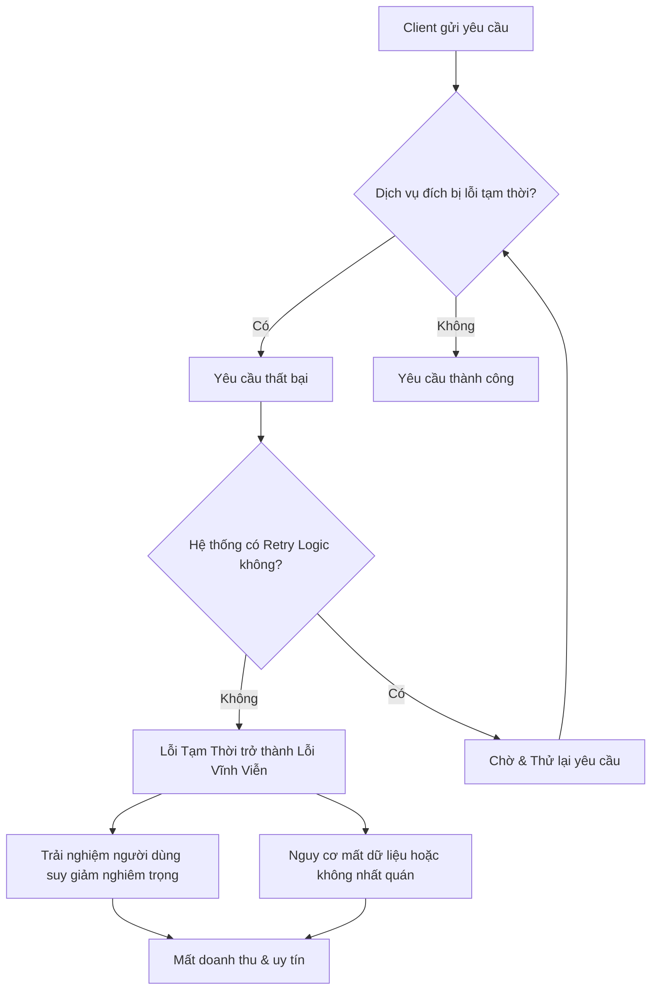
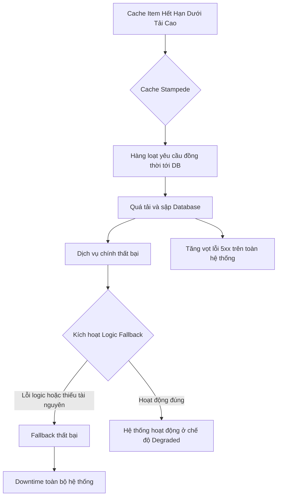

## Chương 9: Rủi Ro Khi Thiếu Resilience Patterns

### 9.1 Rủi Ro No Retry Logic

#### Định Nghĩa Rủi Ro
- **Định nghĩa:** Rủi ro không có logic thử lại (No Retry Logic) là việc hệ thống không được thiết kế để tự động thực hiện lại một thao tác đã thất bại do lỗi tạm thời (transient failure). Thay vào đó, hệ thống coi lỗi tạm thời này là một lỗi vĩnh viễn, dẫn đến việc dừng hoạt động một cách không cần thiết và làm giảm độ tin cậy cũng như tính sẵn sàng.
- **Nguồn gốc phát sinh:** Rủi ro này phát sinh do các hệ thống phân tán vốn có rất nhiều điểm có thể xảy ra lỗi tạm thời, chẳng hạn như mất gói tin mạng trong giây lát, một dịch vụ bị quá tải tạm thời, hoặc tranh chấp tài nguyên. Các nhà phát triển có thể bỏ qua việc xử lý các kịch bản này, cho rằng mọi lỗi đều là lỗi nghiêm trọng và không thể phục hồi.
- **Mức độ nghiêm trọng:** **Critical**. Như một nguyên tắc kinh nghiệm, khoảng 80% các lỗi trong hệ thống phân tán là lỗi tạm thời [1]. Việc không xử lý chúng đúng cách sẽ biến những sự cố nhỏ, có thể tự phục hồi thành các sự cố nghiêm trọng, gây ngừng hoạt động trên diện rộng.

#### Nguyên Nhân Gốc Rễ (Root Causes)
1.  **Thiếu nhận thức về lỗi tạm thời (Transient Failures):** Nhiều kỹ sư, đặc biệt là những người mới làm quen với hệ thống phân tán, có xu hướng mặc định rằng tất cả các lỗi đều mang tính vĩnh viễn (ví dụ: lỗi logic trong code, hỏng hóc phần cứng). Họ không lường trước được các lỗi chỉ tồn tại trong thời gian ngắn như tắc nghẽn mạng, dịch vụ bị khởi động lại, hoặc đạt đến giới hạn tài nguyên tạm thời. Điều này dẫn đến việc thiết kế các cơ chế xử lý lỗi không đầy đủ.
2.  **Sự phức tạp của việc triển khai Retry Logic đúng đắn:** Một logic thử lại ngây thơ (ví dụ: thử lại ngay lập tức 5 lần) có thể gây hại nhiều hơn là có lợi, tạo ra các "cơn bão thử lại" (retry storms) làm sập một dịch vụ đang gặp khó khăn. Một chiến lược retry hiệu quả đòi hỏi các kỹ thuật phức tạp hơn như **Exponential Backoff** (tăng thời gian chờ theo cấp số nhân) và **Jitter** (thêm yếu tố ngẫu nhiên vào thời gian chờ) để tránh các client cùng lúc thử lại. Sự phức tạp này có thể khiến các đội ngũ ngại triển khai.
3.  **Mặc định của Framework và Library:** Nhiều thư viện client HTTP hoặc SDK dịch vụ không bật sẵn logic retry theo mặc định, hoặc cấu hình mặc định không phù hợp với mọi trường hợp sử dụng. Nếu nhà phát triển không chủ động tìm hiểu và cấu hình một cách tường minh, ứng dụng của họ sẽ không có khả năng phục hồi sau lỗi tạm thời.
4.  **Lo ngại về các thao tác không Idempotent:** Các thao tác thay đổi trạng thái (ví dụ: xử lý thanh toán, tạo tài khoản) nếu được thử lại một cách mù quáng có thể dẫn đến việc thực hiện nhiều lần, gây ra dữ liệu không nhất quán hoặc sai sót nghiệp vụ nghiêm trọng. Việc xác định và xử lý đúng đắn các thao tác không idempotent đòi hỏi thiết kế cẩn thận ở cả phía client và server, điều này làm tăng thêm rào cản cho việc triển khai retry.

#### Biểu Hiện & Triệu Chứng (Symptoms)
- **Dấu hiệu cảnh báo sớm:** Tỷ lệ lỗi của các yêu cầu đến một dịch vụ phụ thuộc (dependency) tăng đột biến nhưng sau đó lại tự giảm xuống. Người dùng cuối báo cáo các lỗi "chập chờn" hoặc "lúc được lúc không".
- **Các metrics/logs cần theo dõi:**
    - **Tỷ lệ lỗi HTTP:** Theo dõi sự gia tăng của các mã lỗi `500 Internal Server Error`, `502 Bad Gateway`, `503 Service Unavailable`, `504 Gateway Timeout`.
    - **Connection Timeouts:** Số lượng lỗi kết nối hoặc đọc/ghi timeout tăng cao.
    - **Logs:** Các file log chứa đầy các thông báo lỗi kết nối, lỗi DNS lookup thất bại, hoặc các lỗi từ chối yêu cầu do hết tài nguyên mà không có bất kỳ nỗ lực thử lại nào được ghi nhận sau đó.
- **Red flags trong hệ thống:** Trong code review, phát hiện các khối `try...catch` xử lý exception từ các cuộc gọi mạng (network calls) mà chỉ đơn giản là ghi log và ném ra lỗi ngay lập tức mà không có bất kỳ logic thử lại nào.

#### Sơ Đồ Phân Tích


#### Tác Động Cụ Thể (Impact Analysis)

| Khía Cạnh | Mức Độ | Chi Tiết |
|---|---|---|
| Downtime | High | Một lỗi tạm thời ở một dịch vụ cốt lõi có thể gây ra hiệu ứng domino, làm sập toàn bộ hệ thống nếu các client không có khả năng thử lại. Thời gian ngừng hoạt động có thể kéo dài cho đến khi có sự can thiệp thủ công. |
| Financial | $100K - $1M+/hour | Dựa trên quy mô của dịch vụ, downtime có thể gây thiệt hại tài chính khổng lồ do mất doanh thu trực tiếp, vi phạm SLA (Service Level Agreement) và chi phí nhân sự để khắc phục sự cố. |
| Security | Low | Rủi ro này thường không trực tiếp tạo ra lỗ hổng bảo mật, nhưng trong một số trường hợp, trạng thái lỗi không được xử lý đúng cách có thể khiến hệ thống rơi vào tình trạng không an toàn. |
| User Experience | Severe | Người dùng liên tục gặp lỗi, không thể hoàn thành các tác vụ quan trọng, mất dữ liệu đã nhập. Điều này dẫn đến sự thất vọng, mất niềm tin và rời bỏ sản phẩm. |
| Team Morale | High | Các kỹ sư liên tục bị đánh thức lúc nửa đêm để xử lý các sự cố có thể dễ dàng được ngăn chặn bằng phần mềm. Điều này gây ra tình trạng kiệt sức vì cảnh báo (alert fatigue), giảm tinh thần và tăng tỷ lệ nghỉ việc. |

#### Case Study Thực Tế
**Sự cố AWS DynamoDB - Tháng 10, 2025**
- **Bối cảnh:** DynamoDB là một dịch vụ NoSQL database cốt lõi của AWS, được hàng ngàn dịch vụ khác và khách hàng sử dụng. Hệ thống DNS nội bộ của DynamoDB sử dụng một cơ chế phức tạp gọi là "DNS Enactor" để tự động cập nhật các bản ghi DNS, đảm bảo tính sẵn sàng cao.
- **Diễn biến:** Vào khoảng nửa đêm (giờ Pacific), một sự kiện mất gói tin mạng nhỏ xảy ra gần như đồng thời với một sự cố trong hệ thống DNS Enactor của DynamoDB. Một race condition (tình trạng tranh chấp) hiếm gặp giữa các tiến trình Enactor đã khiến các bản ghi DNS của DynamoDB bị xóa sạch. Do đó, mọi dịch vụ cố gắng kết nối với DynamoDB đều không thể phân giải được địa chỉ, dẫn đến lỗi hàng loạt.
- **Nguyên nhân gốc rễ:** Mặc dù nguyên nhân sâu xa là một bug race condition, tác động của nó đã bị khuếch đại vì các client gọi đến DynamoDB không thể xử lý được tình huống lỗi DNS tạm thời này. Sự cố kéo dài vì đội ngũ kỹ sư AWS chưa bao giờ phải khôi phục DNS thủ công trước đây, do hệ thống tự động hóa quá đáng tin cậy (automation paradox). Họ đã không có một kịch bản "thử lại" ở cấp độ con người cho một thất bại của hệ thống tự động hóa.
- **Tác động:** Sự cố kéo dài 15 giờ tại khu vực us-east-1, khu vực lớn nhất của AWS. Hàng ngàn ứng dụng và trang web trên toàn cầu, bao gồm cả Amazon.com, Signal, và Snapchat, bị sập hoặc suy giảm hiệu năng. Thiệt hại tài chính không được công bố nhưng ước tính lên đến hàng triệu đô la.
- **Bài học:** Sự cố này cho thấy ngay cả những hệ thống tự động hóa phức tạp nhất cũng có thể thất bại. Cần phải có các cơ chế phục hồi ở mọi cấp độ, từ logic retry trong client, cơ chế chuyển đổi dự phòng (failover) của dịch vụ, cho đến các quy trình vận hành thủ công (runbook) để xử lý các kịch bản thảm họa.
- **Nguồn:** [How AWS deals with a major outage - The Pragmatic Engineer](https://newsletter.pragmaticengineer.com/p/how-aws-deals-with-a-major-outage)

#### Risk Mitigation Strategies

**Preventive Measures (Ngăn ngừa):**
1.  **Triển khai Retry với Exponential Backoff và Jitter:** Mọi cuộc gọi mạng đến các dịch vụ bên ngoài phải được bọc trong một logic retry. Sử dụng thuật toán exponential backoff để tăng dần thời gian chờ giữa các lần thử lại và thêm jitter để tránh việc các client thử lại đồng loạt.
2.  **Sử dụng các thư viện có sẵn và đã được kiểm chứng:** Thay vì tự viết logic retry, hãy ưu tiên sử dụng các thư viện mạnh mẽ như `resilience4j` (Java), `Polly` (.NET), `tenacity` (Python) đã tích hợp sẵn các chiến lược retry phức tạp và các mẫu thiết kế phục hồi khác như Circuit Breaker.
3.  **Thiết kế các API Idempotent:** Phía server nên được thiết kế để xử lý an toàn các yêu cầu bị lặp lại. Một kỹ thuật phổ biến là yêu cầu client tạo một "khóa idempotency" (Idempotency Key) duy nhất cho mỗi giao dịch. Server sẽ lưu lại kết quả của lần xử lý đầu tiên và trả về kết quả đó cho bất kỳ yêu cầu nào sau đó có cùng khóa.

**Detective Measures (Phát hiện):**
1.  **Monitoring & Alerting:** Thiết lập cảnh báo khi tỷ lệ lỗi của một dịch vụ phụ thuộc vượt ngưỡng trong một khoảng thời gian nhất định (ví dụ: >5% trong 5 phút). Cảnh báo cũng nên được kích hoạt khi độ trễ (latency) của các yêu cầu tăng đột biến, vì đây có thể là dấu hiệu sớm của việc quá tải.
2.  **Metrics cần theo dõi:**
    - `dependency.service.request.count`: Tổng số yêu cầu.
    - `dependency.service.success.count`: Số yêu cầu thành công.
    - `dependency.service.failure.count`: Số yêu cầu thất bại (phân loại theo mã lỗi).
    - `dependency.service.retry.count`: Số lần thử lại đã được thực hiện.
3.  **Log Patterns:** Log phải ghi lại rõ ràng khi một yêu cầu thất bại, lý do thất bại, và liệu một nỗ lực thử lại có được thực hiện hay không. Ví dụ: `"Request failed, attempt 1/3, retrying in 200ms..."`.

**Corrective Measures (Khắc phục):**
1.  **Triển khai Circuit Breaker:** Kết hợp retry với mẫu Circuit Breaker. Nếu một dịch vụ liên tục thất bại, Circuit Breaker sẽ "mở", khiến các yêu cầu sau đó thất bại ngay lập tức mà không cần chờ timeout. Điều này giúp dịch vụ đang gặp sự cố có thời gian phục hồi và ngăn chặn lỗi lan truyền.
2.  **Quy trình phản ứng sự cố (Incident Response):** Có runbook rõ ràng cho các kỹ sư on-call khi một dịch vụ phụ thuộc quan trọng bị lỗi. Runbook nên bao gồm các bước để xác định xem lỗi là tạm thời hay vĩnh viễn và các phương án chuyển đổi dự phòng (failover) nếu có.
3.  **Fallback/Graceful Degradation:** Nếu một chức năng không cốt lõi bị lỗi, hệ thống nên có khả năng hoạt động ở chế độ suy giảm (graceful degradation) thay vì sập hoàn toàn. Ví dụ, nếu dịch vụ gợi ý sản phẩm bị lỗi, trang sản phẩm vẫn hiển thị được mà không có phần gợi ý.

#### Code Examples

**Anti-pattern (Cách làm SAI):**
```python
# ❌ ANTI-PATTERN: Không thử lại sau khi gặp lỗi mạng tạm thời
import requests

def get_product_details(product_id):
    try:
        response = requests.get(f"https://api.service.com/products/{product_id}", timeout=5)
        response.raise_for_status() # Ném ra exception nếu status code là 4xx hoặc 5xx
        return response.json()
    except requests.exceptions.RequestException as e:
        # Gặp lỗi mạng hoặc timeout, nhưng lại coi như lỗi vĩnh viễn và thất bại ngay lập tức
        print(f"Error fetching product {product_id}: {e}")
        return None
```

**Best Practice (Cách làm ĐÚNG):**
```python
# ✅ BEST PRACTICE: Sử dụng thư viện `tenacity` để thực hiện retry với exponential backoff và jitter
import requests
from tenacity import retry, stop_after_attempt, wait_random_exponential

# Cấu hình retry: thử lại tối đa 3 lần, thời gian chờ ban đầu là 1s, tối đa 10s, có jitter
@retry(wait=wait_random_exponential(multiplier=1, max=10), stop=stop_after_attempt(3))
def get_product_details_resilient(product_id):
    print(f"Attempting to fetch product {product_id}...")
    try:
        response = requests.get(f"https://api.service.com/products/{product_id}", timeout=5)
        response.raise_for_status()
        return response.json()
    except requests.exceptions.RequestException as e:
        print(f"An error occurred: {e}. Retrying...")
        raise # Ném lại exception để tenacity biết và thực hiện retry

# Ví dụ sử dụng
try:
    product = get_product_details_resilient("123")
    if product:
        print("Successfully fetched product:", product)
except Exception as e:
    print("Failed to fetch product after multiple retries:", e)
```

#### Risk Assessment Matrix

| Yếu Tố | Đánh Giá | Ghi Chú |
|---|---|---|
| Xác suất (Probability) | 4 | Lỗi tạm thời là điều không thể tránh khỏi trong các hệ thống phân tán. Việc bỏ sót logic retry là rất phổ biến, đặc biệt là ở các đội ngũ ít kinh nghiệm. |
| Tác động (Impact) | 5 | Tác động có thể làm ngừng hoạt động toàn bộ hệ thống, gây thiệt hại tài chính lớn, ảnh hưởng nghiêm trọng đến uy tín và trải nghiệm người dùng. |
| **Risk Score** | 4 x 5 = **20** | **Critical** |
| Ưu tiên xử lý | P1 | Đây là rủi ro có xác suất xảy ra cao và tác động cực kỳ nghiêm trọng, cần được ưu tiên giải quyết hàng đầu trong mọi dự án. |

#### Checklist Đánh Giá
- [ ] Tất cả các cuộc gọi ra bên ngoài (network calls) có được bọc trong logic retry không?
- [ ] Logic retry có sử dụng exponential backoff và jitter để tránh "retry storm" không?
- [ ] Hệ thống có phân biệt được lỗi nào nên retry (transient, 5xx) và lỗi nào không nên (permanent, 4xx) không?
- [ ] Đối với các thao tác không idempotent, có cơ chế (ví dụ: idempotency key) để ngăn chặn việc thực hiện nhiều lần không?
- [ ] Có triển khai mẫu Circuit Breaker để nhanh chóng "cắt mạch" khi một dependency liên tục thất bại không?
- [ ] Hệ thống monitoring có cảnh báo về tỷ lệ lỗi và số lần retry của các dependency không?
- [ ] Có runbook hướng dẫn kỹ sư on-call cách xử lý khi một dependency quan trọng gặp sự cố kéo dài không?

#### Tools & Resources
- **Tenacity (Python):** Một thư viện Python đa dụng giúp đơn giản hóa việc thêm logic retry vào bất kỳ tác vụ nào.
- **Polly (.NET):** Một thư viện phục hồi và xử lý lỗi tạm thời cho .NET, cung cấp các chính sách như Retry, Circuit Breaker, Timeout, Bulkhead Isolation, và Fallback.
- **Resilience4j (Java):** Một thư viện Java nhẹ, được lấy cảm hứng từ Netflix Hystrix, cung cấp các mẫu thiết kế chịu lỗi mạnh mẽ.

#### Nguồn Tham Khảo
1. [Timeouts, Retries, and Backoff with Jitter](https://aws.amazon.com/builders-library/timeouts-retries-and-backoff-with-jitter/) - Một bài viết kinh điển từ AWS giải thích chi tiết về tầm quan trọng và cách triển khai đúng các cơ chế retry.
2. [A Guide to the Retry Pattern](https://blog.bytebytego.com/p/a-guide-to-retry-pattern-in-distributed) - Bài viết của ByteByteGo cung cấp cái nhìn tổng quan về mẫu thiết kế retry trong hệ thống phân tán.
3. [How AWS deals with a major outage](https://newsletter.pragmaticengineer.com/p/how-aws-deals-with-a-major-outage) - Phân tích chi tiết về sự cố của AWS, cho thấy tác động thực tế khi các cơ chế phục hồi phức tạp gặp lỗi.

---

### 9.2 Rủi Ro Retry Storms

#### Định Nghĩa Rủi Ro
- **Định nghĩa:** Retry Storm (bão retry) là một hiện tượng nguy hiểm trong các hệ thống phân tán, xảy ra khi một lượng lớn client đồng loạt và liên tục gửi lại (retry) các yêu cầu tới một dịch vụ đang gặp sự cố, quá tải hoặc không phản hồi. Thay vì giúp hệ thống phục hồi, hành động retry dồn dập này tạo ra một làn sóng yêu cầu khổng lồ, làm trầm trọng thêm tình trạng quá tải và có thể dẫn đến sụp đổ hàng loạt (cascading failure).
- **Tại sao nó phát sinh trong production:** Rủi ro này thường phát sinh từ các cơ chế retry được thiết kế quá đơn giản và thiếu kiểm soát. Khi một dịch vụ backend chậm lại hoặc trả về lỗi (ví dụ: 503 Service Unavailable, timeout), các client được lập trình để retry ngay lập tức. Nếu có hàng ngàn client làm điều này cùng lúc, chúng sẽ tạo ra một "đám đông giận dữ" (Thundering Herd Problem) tấn công vào dịch vụ, không cho nó có cơ hội phục hồi.
- **Mức độ nghiêm trọng tiềm tàng:** **Critical**. Một cơn bão retry có thể nhanh chóng làm sụp đổ các dịch vụ cốt lõi, gây ra downtime trên diện rộng và ảnh hưởng nghiêm trọng đến toàn bộ hệ thống.

#### Nguyên Nhân Gốc Rễ (Root Causes)
1. **Thiếu cơ chế Exponential Backoff:** Client retry ngay lập tức hoặc với một khoảng thời gian chờ cố định. Khi hàng ngàn client cùng chờ một khoảng thời gian ngắn và retry, chúng sẽ tạo ra các đỉnh tải đồng bộ, liên tục dội vào service đang yếu, khiến nó không thể phục hồi.
2. **Không có Jitter trong thời gian Backoff:** Ngay cả khi đã áp dụng exponential backoff, nếu tất cả client đều tính toán thời gian chờ theo cùng một công thức, chúng vẫn có thể retry gần như cùng lúc. Jitter, tức là thêm một khoảng thời gian ngẫu nhiên vào thời gian chờ, giúp "trải đều" các yêu cầu retry theo thời gian, tránh tạo ra các đỉnh tải đột biến.
3. **Retry vô hạn hoặc số lần retry quá lớn:** Cấu hình client retry vô thời hạn hoặc với một số lần quá lớn (ví dụ: 100 lần) cho các lỗi tạm thời. Điều này khiến các yêu cầu không bao giờ từ bỏ, tiếp tục tạo gánh nặng cho hệ thống ngay cả khi dịch vụ đã không còn khả năng phục hồi trong một khoảng thời gian hợp lý.
4. **Không phân biệt loại lỗi khi retry:** Client retry cho tất cả các loại lỗi, bao gồm cả các lỗi phía client (như `400 Bad Request` hoặc `401 Unauthorized`) mà việc retry sẽ không bao giờ thành công. Điều này gây lãng phí tài nguyên và tăng tải không cần thiết lên hệ thống.
5. **Thiếu Circuit Breaker Pattern:** Client tiếp tục gửi yêu cầu đến một dịch vụ đã được xác định là đang gặp sự cố nghiêm trọng. Một Circuit Breaker sẽ "ngắt mạch", chuyển các yêu cầu sang trạng thái thất bại ngay lập tức (fail-fast) mà không cần gửi đến dịch vụ, cho phép dịch vụ có không gian để phục hồi.

#### Biểu Hiện & Triệu Chứng (Symptoms)
- **Dấu hiệu cảnh báo sớm:** Tăng đột biến tỷ lệ lỗi (error rate) của một dịch vụ cụ thể, đồng thời thời gian phản hồi trung bình (average response time) của dịch vụ đó cũng tăng dần.
- **Các metrics/logs cần theo dõi:**
    - **Client-side:** Số lượng yêu cầu retry trên mỗi client, tỷ lệ thành công của các yêu cầu retry.
    - **Server-side:** Lưu lượng truy cập (requests per second/minute) tăng đột biến, đặc biệt là từ một nhóm client cụ thể. CPU/Memory utilization đạt ngưỡng 100%.
    - **Logs:** Log lỗi dày đặc với các thông báo như `503 Service Unavailable`, `Connection Timeout`, `ECONNRESET` từ cùng một dịch vụ.
- **Red flags trong hệ thống:** Một dịch vụ vừa khởi động lại sau sự cố ngay lập tức bị quá tải trở lại. Tỷ lệ lỗi của các dịch vụ phụ thuộc (downstream services) cũng bắt đầu tăng theo.

#### Sơ Đồ Phân Tích
```mermaid
graph TD
    A[Dịch vụ B bị lỗi/quá tải] --> B{Client A retry ngay lập tức};
    B --> C{Hàng loạt client khác cũng retry};
    C --> D[Tạo ra Retry Storm];
    D --> E[Dịch vụ B sụp đổ hoàn toàn];
    D --> F[Tăng tải lên Database/Dịch vụ C];
    E --> G[Hệ thống ngừng hoạt động (Downtime)];
    F --> H[Dịch vụ C cũng sụp đổ (Cascading Failure)];
```

#### Tác Động Cụ Thể (Impact Analysis)

| Khía Cạnh | Mức Độ | Chi Tiết |
|-----------|--------|----------|
| Downtime | High | Có thể gây downtime toàn bộ hệ thống hoặc các chức năng kinh doanh cốt lõi trong nhiều giờ nếu không có cơ chế can thiệp tự động. |
| Financial | $10,000 - $500,000+/hour | Ước tính dựa trên doanh thu bị mất, chi phí khắc phục sự cố, và ảnh hưởng đến thương hiệu. Con số này thay đổi tùy quy mô công ty. |
| Security | Low | Thường không trực tiếp tạo ra lỗ hổng bảo mật, nhưng tình trạng hỗn loạn có thể làm lu mờ các dấu hiệu tấn công thực sự. |
| User Experience | Severe | Người dùng không thể truy cập dịch vụ, gặp lỗi liên tục, mất dữ liệu chưa lưu. Gây mất niềm tin nghiêm trọng vào sản phẩm. |
| Team Morale | High | Gây căng thẳng cực độ cho đội ngũ kỹ sư (SRE, DevOps, Dev) khi phải "chữa cháy" trong tình trạng hệ thống sụp đổ hàng loạt. |

#### Case Study Thực Tế
**Microsoft Azure - Sự cố lưu trữ ở South Central US (2018)**
- **Bối cảnh:** Một cơn bão sét đánh vào trung tâm dữ liệu của Microsoft ở South Central US, gây ra sự cố điện áp và làm hỏng các thiết bị làm mát. Hệ thống tự động đã tắt các thiết bị lưu trữ để tránh hư hỏng do quá nhiệt.
- **Diễn biến:** Khi các dịch vụ và máy ảo cố gắng kết nối lại với các đơn vị lưu trữ đang trong quá trình phục hồi, một cơn bão retry khổng lồ đã xảy ra. Các yêu cầu retry dồn dập từ hàng ngàn dịch vụ đã làm quá tải các thành phần đầu cuối của dịch vụ lưu trữ, vốn đã bị suy giảm năng lực.
- **Nguyên nhân gốc rễ:** Mặc dù các client có cơ chế backoff, nhưng quy mô tuyệt đối của các lần retry đồng thời từ một lượng lớn dịch vụ nội bộ đã tạo ra một kịch bản "thundering herd" kinh điển, vượt quá khả năng xử lý của hệ thống lưu trữ.
- **Tác động:** Nhiều dịch vụ Azure lớn (bao gồm Visual Studio Team Services, Azure App Service, Azure Active Directory) đã bị ảnh hưởng, gây ra downtime và gián đoạn dịch vụ cho khách hàng trên toàn cầu trong hơn 19 giờ đối với một số dịch vụ.
- **Bài học:** Sự cần thiết của việc triển khai các cơ chế Circuit Breaker ở quy mô lớn và có các chiến lược phục hồi theo từng lớp để ngăn chặn các sự cố cục bộ lan rộng thành sự cố toàn hệ thống. Phải tính đến các kịch bản lỗi tương quan (correlated failures).
- **Nguồn:** [Azure Status History - South Central US - Storage Impact](https://azure.microsoft.com/en-us/blog/update-on-azure-storage-service-interruption/)

#### Risk Mitigation Strategies

**Preventive Measures (Ngăn ngừa):**
1. **Exponential Backoff with Jitter:** Luôn triển khai cơ chế retry với thời gian chờ tăng theo hàm mũ và thêm một yếu tố ngẫu nhiên (jitter) để tránh các client retry đồng bộ.
2. **Implement Circuit Breakers:** Sử dụng các thư viện như Polly (C#), Hystrix (Java), hoặc các giải pháp service mesh (Istio, Linkerd) để tự động "ngắt mạch" các yêu cầu đến dịch vụ đang gặp sự cố.
3. **Giới hạn số lần Retry:** Đặt một giới hạn trên hợp lý cho số lần retry (ví dụ: 3-5 lần) và tổng thời gian retry tối đa để các yêu cầu có thể thất bại nhanh (fail-fast) thay vì chờ đợi vô ích.

**Detective Measures (Phát hiện):**
1. **Monitoring & Alerting:** Cài đặt cảnh báo khi tỷ lệ lỗi (error rate) và độ trễ (latency) của một dịch vụ vượt ngưỡng trong một khoảng thời gian ngắn. Cảnh báo khi số lượng yêu cầu từ một client/IP tăng đột biến.
2. **Metrics cần theo dõi:** Theo dõi `dependency_failures_total`, `http_requests_total` (phân loại theo status code), `process_cpu_seconds_total`. Xây dựng dashboard tập trung vào sức khỏe của các dependency.
3. **Log Patterns cần watch:** Tìm kiếm các chuỗi log lặp đi lặp lại với nội dung lỗi kết nối, timeout từ cùng một nguồn tới cùng một đích trong một khoảng thời gian ngắn.

**Corrective Measures (Khắc phục):**
1. **Kích hoạt Circuit Breaker thủ công:** Nếu hệ thống không tự động ngắt mạch, đội SRE cần có khả năng can thiệp để tạm thời chặn lưu lượng truy cập đến dịch vụ bị ảnh hưởng ở cấp độ gateway hoặc load balancer.
2. **Triển khai Rate Limiting/Throttling:** Áp dụng hoặc hạ thấp ngưỡng rate limiting cho các client đang tạo ra bão retry để giảm tải cho dịch vụ.
3. **Khởi động lại dịch vụ theo từng cụm (Staged Restart):** Thay vì khởi động lại toàn bộ dịch vụ cùng lúc, hãy khởi động lại từng cụm nhỏ để chúng có thời gian "làm ấm" và tránh bị quá tải ngay lập tức.

#### Code Examples

**Anti-pattern (Cách làm SAI):**
```python
# ❌ ANTI-PATTERN: Retry ngay lập tức và không có giới hạn
import requests
import time

def bad_fetch_data(url):
    while True:
        try:
            response = requests.get(url, timeout=0.5)
            response.raise_for_status() # Ném lỗi cho các HTTP status code 4xx/5xx
            return response.json()
        except requests.exceptions.RequestException as e:
            print(f"Lỗi: {e}, thử lại ngay...")
            # Không có thời gian chờ, sẽ retry liên tục gây bão
```

**Best Practice (Cách làm ĐÚNG):**
```python
# ✅ BEST PRACTICE: Exponential Backoff với Jitter và giới hạn số lần retry
import requests
import time
import random

def good_fetch_data(url, max_retries=5, base_backoff=1):
    retries = 0
    while retries < max_retries:
        try:
            response = requests.get(url, timeout=2)
            response.raise_for_status()
            return response.json()
        except requests.exceptions.RequestException as e:
            retries += 1
            if retries >= max_retries:
                print(f"Lỗi: {e}. Đã đạt số lần thử lại tối đa.")
                raise
            
            # Exponential backoff: 1s, 2s, 4s, ...
            backoff_time = base_backoff * (2 ** (retries - 1))
            # Full Jitter: thêm yếu tố ngẫu nhiên từ 0 đến backoff_time
            jitter = random.uniform(0, backoff_time * 0.5)
            sleep_time = backoff_time + jitter
            
            print(f"Lỗi: {e}. Thử lại sau {sleep_time:.2f} giây...")
            time.sleep(sleep_time)
```

#### Risk Assessment Matrix

| Yếu Tố | Đánh Giá | Ghi Chú |
|--------|----------|---------|
| Xác suất (Probability) | 4 | Rất có khả năng xảy ra trong các hệ thống microservices phức tạp nếu không có thiết kế retry đúng đắn ngay từ đầu. |
| Tác động (Impact) | 5 | Có thể gây sụp đổ toàn bộ hệ thống, ảnh hưởng tài chính và uy tín nghiêm trọng. |
| **Risk Score** | 4 x 5 = 20 | **Critical** |
| Ưu tiên xử lý | P1 | Phải được giải quyết ở cấp độ kiến trúc hệ thống và là yêu cầu bắt buộc cho mọi dịch vụ mới. |

#### Checklist Đánh Giá
- [ ] Cơ chế retry của client có áp dụng Exponential Backoff with Jitter không?
- [ ] Có giới hạn số lần retry và tổng thời gian retry tối đa không?
- [ ] Hệ thống có triển khai Circuit Breaker cho các lời gọi dịch vụ quan trọng không?
- [ ] Client có phân biệt các loại lỗi (ví dụ: 4xx vs 5xx) để quyết định có nên retry hay không?
- [ ] Dashboard giám sát có các chỉ số về số lượng và tỷ lệ thành công của các lời gọi retry không?
- [ ] Quy trình ứng phó sự cố có bao gồm các bước để xử lý một cơn bão retry không (ví dụ: chặn IP, áp dụng rate limiting)?

#### Tools & Resources
- **Polly (C#):** Thư viện resilience và transient-fault-handling cho .NET, cung cấp các chính sách Retry, Circuit Breaker, Timeout, Bulkhead mạnh mẽ.
- **Istio/Linkerd (Service Mesh):** Cung cấp khả năng quản lý retry, timeout, và circuit breaking ở cấp độ hạ tầng mạng mà không cần thay đổi code ứng dụng.
- **Amazon S3 Best Practices:** Tài liệu của AWS cung cấp các hướng dẫn chi tiết về cách xử lý lỗi và retry khi tương tác với các dịch vụ của họ, bao gồm cả việc tránh "thundering herd".

#### Nguồn Tham Khảo
1. [Retry Storm Antipattern (Microsoft Azure)](https://learn.microsoft.com/en-us/azure/architecture/antipatterns/retry-storm/) - Phân tích chi tiết về anti-pattern và các giải pháp từ Microsoft.
2. [Exponential Backoff And Jitter (AWS Architecture Blog)](https://aws.amazon.com/blogs/architecture/exponential-backoff-and-jitter/) - Giải thích sâu về tầm quan trọng của backoff và jitter.
3. [CircuitBreaker (Martin Fowler)](https://martinfowler.com/bliki/CircuitBreaker.html) - Bài viết kinh điển của Martin Fowler định nghĩa về Circuit Breaker pattern.

---

### 9.3 Rủi Ro Timeout Không Đúng

#### Định Nghĩa Rủi Ro
- **Định nghĩa:** Rủi ro Timeout Không Đúng (Incorrect Timeout Risk) là tình huống mà một khoảng thời gian chờ (timeout) được cấu hình quá ngắn hoặc quá dài cho một thao tác, dẫn đến các hành vi không mong muốn trong hệ thống. Nếu timeout quá ngắn, các thao tác hợp lệ có thể bị hủy bỏ giữa chừng. Nếu quá dài, hệ thống có thể bị treo, lãng phí tài nguyên và tạo ra các lỗi xếp tầng (cascading failures).
- **Nguồn gốc phát sinh:** Trong các hệ thống phân tán hiện đại, các dịch vụ giao tiếp với nhau qua mạng. Do tính bất định của mạng và tải của hệ thống, thời gian phản hồi có thể dao động. Timeout là một cơ chế phòng vệ bắt buộc để ngăn một dịch vụ bị "treo" vô thời hạn trong khi chờ phản hồi từ dịch vụ khác. Rủi ro này phát sinh khi các nhà phát triển đặt giá trị timeout dựa trên giả định "trường hợp tốt nhất" (happy path), không tính đến các biến động thực tế trong production, hoặc khi các giá trị mặc định của nền tảng (ví dụ: AWS Lambda) không phù hợp với ngữ cảnh cụ thể của ứng dụng.
- **Mức độ nghiêm trọng tiềm tàng:** **High**. Cấu hình sai timeout có thể trực tiếp gây ra downtime, mất dữ liệu, trải nghiệm người dùng tồi tệ và làm suy giảm nghiêm trọng độ tin cậy của toàn bộ hệ thống.

#### Nguyên Nhân Gốc Rễ (Root Causes)
1.  **Thiếu hiểu biết về chuỗi phụ thuộc (Dependency Chain):** Các hệ thống phức tạp thường có một chuỗi các lệnh gọi dịch vụ (ví dụ: A -> B -> C). Timeout của dịch vụ A phải lớn hơn tổng thời gian xử lý và timeout của B và C. Các nhà phát triển thường chỉ đặt timeout cho lệnh gọi trực tiếp (A -> B) mà không xem xét toàn bộ chuỗi, dẫn đến timeout sớm ở tầng trên cùng.
2.  **Sử dụng giá trị mặc định của nền tảng một cách mù quáng:** Nhiều nền tảng (PaaS/FaaS) cung cấp các giá trị timeout mặc định, ví dụ như 3 giây cho AWS Lambda. Các đội ngũ phát triển có thể không chủ động thay đổi giá trị này, cho rằng nó đã được "tối ưu". Tuy nhiên, giá trị mặc định này thường quá ngắn cho các tác vụ cần xử lý phức tạp, gọi đến các API bên ngoài, hoặc tương tác với cơ sở dữ liệu có thể bị chậm.
3.  **Không phân biệt các loại timeout (Connection vs. Read):** Một kết nối mạng có hai giai đoạn chính: thiết lập kết nối (connection) và đọc dữ liệu (read). Cấu hình chỉ một timeout tổng có thể che giấu vấn đề. Ví dụ, kết nối có thể được thiết lập nhanh chóng, nhưng dịch vụ đích mất nhiều thời gian để xử lý và trả về dữ liệu. Nếu read timeout quá ngắn, client sẽ hủy yêu cầu trong khi server vẫn đang xử lý, gây lãng phí tài nguyên và trạng thái không nhất quán.
4.  **Tác vụ nền (Background Tasks) được xử lý trong ngữ cảnh request-response:** Một số API trả về kết quả ngay lập tức nhưng lại kích hoạt một tác vụ nền chạy dài. Nếu client (ví dụ: API Gateway) có timeout ngắn và chờ tác vụ nền hoàn thành, nó sẽ luôn luôn thất bại. Đây là một lỗi thiết kế phổ biến khi cố gắng thực hiện các tác vụ bất đồng bộ trong một luồng đồng bộ.
5.  **"Cold Starts" trong môi trường Serverless:** Các hàm FaaS (Function as a Service) như AWS Lambda cần thời gian để khởi tạo môi trường thực thi trong lần gọi đầu tiên hoặc sau một thời gian không hoạt động (cold start). Thời gian này có thể cộng thêm vài trăm mili giây đến vài giây vào thời gian xử lý tổng thể. Nếu timeout được đặt quá sát với thời gian xử lý trung bình, các lần gọi bị "cold start" sẽ gần như chắc chắn thất bại.

#### Biểu Hiện & Triệu Chứng (Symptoms)
- **Dấu hiệu cảnh báo sớm:** Tăng đột biến tỷ lệ lỗi 504 Gateway Timeout hoặc các lỗi tương tự. Thời gian phản hồi (latency) p95, p99 của các dịch vụ tăng cao gần đến ngưỡng timeout đã cấu hình.
- **Các metrics/logs cần theo dõi:**
    - **Metrics:** `http_server_requests_seconds_max`, `lambda_duration_maximum`, `api_gateway_latency_p99`. Theo dõi tỷ lệ lỗi HTTP 5xx. Số lượng các tiến trình/threads đang hoạt động tăng cao bất thường.
    - **Logs:** Các thông báo lỗi chứa chuỗi "timeout", "deadline exceeded", "Task timed out". Log của các dịch vụ bị gọi cho thấy chúng đã hoàn thành xử lý thành công, nhưng log của dịch vụ gọi lại ghi nhận lỗi timeout.
- **Red flags trong hệ thống:** Một dịch vụ có tỷ lệ lỗi cao trong khi các dịch vụ phụ thuộc của nó trông có vẻ "khỏe mạnh". Hàng đợi (message queue) xử lý các tác vụ nền bị đầy lên không rõ nguyên nhân.

#### Sơ Đồ Phân Tích
```mermaid
graph TD
    A[Client gửi request đến API Gateway] --> B{API Gateway gọi Lambda Function (timeout 29s)}
    B --> C{Lambda Function gọi External API (có thể chậm)}
    C --> D[External API xử lý > 30s]
    B -- Timeout 29s! --> E[API Gateway trả về lỗi 504 cho Client]
    C -- Vẫn đang xử lý --> F[Lambda tiếp tục chạy cho đến khi hết timeout riêng]
    D -- Xử lý xong --> G{Trả kết quả về cho Lambda}
    G --> H[Lambda đã bị API Gateway ngắt kết nối, kết quả bị mất]
    E --> I[Impact: Người dùng nhận lỗi, dữ liệu có thể ở trạng thái không nhất quán]
```

#### Tác Động Cụ Thể (Impact Analysis)

| Khía Cạnh | Mức Độ | Chi Tiết |
|-----------|--------|----------|
| Downtime | High | Gây ra lỗi 504 trên diện rộng cho người dùng, có thể bị hiểu nhầm là toàn bộ hệ thống đã sập. |
| Financial | $1,000 - $50,000/hour | Ước tính dựa trên việc các giao dịch mua hàng, đăng ký, hoặc các chức năng kinh doanh cốt lõi bị gián đoạn. Lãng phí chi phí tính toán cho các tác vụ bị hủy bỏ giữa chừng. |
| Security | Low | Thường không trực tiếp tạo ra lỗ hổng bảo mật, nhưng các tiến trình bị treo có thể giữ tài nguyên và kết nối, làm tăng bề mặt tấn công cho các cuộc tấn công từ chối dịch vụ (DoS). |
| User Experience | Severe | Người dùng liên tục gặp lỗi, mất niềm tin vào sản phẩm. Các thao tác quan trọng như thanh toán không thể hoàn thành. |
| Team Morale | High | Gây ra các cuộc "săn ma" tốn thời gian, khi các đội ngũ đổ lỗi cho nhau vì không tìm ra nguyên nhân gốc rễ. Dev/Ops mệt mỏi vì các cảnh báo liên tục và áp lực từ phía người dùng. |

#### Case Study Thực Tế
**Sự cố API Gateway và Lambda Timeout - Nhiều công ty**
- **Bối cảnh:** Rất nhiều công ty sử dụng kiến trúc API Gateway phía trước AWS Lambda để xây dựng các API backend. API Gateway có một giới hạn timeout **cứng** là 29 giây. Trong khi đó, AWS Lambda có thể được cấu hình timeout lên đến 15 phút. Sự không tương thích này là một cái bẫy phổ biến.
- **Diễn biến:** Một đội ngũ phát triển tạo ra một Lambda function để xử lý việc tạo báo cáo, một tác vụ có thể mất đến 60 giây. Họ cấu hình timeout của Lambda là 90 giây. Khi họ tích hợp nó với API Gateway và triển khai, mọi thứ hoạt động tốt trong môi trường staging với dữ liệu nhỏ. Tuy nhiên, khi lên production, với lượng dữ liệu lớn, tác vụ thường xuyên chạy quá 30 giây. Người dùng bắt đầu nhận được lỗi `504 Gateway Timeout` một cách ngẫu nhiên.
- **Nguyên nhân gốc rễ:** Đội ngũ đã không nhận ra rằng dù Lambda có thể chạy trong 90 giây, API Gateway đã tự động ngắt kết nối sau 29 giây. Client nhận được lỗi, nhưng Lambda function vẫn tiếp tục chạy ở phía sau, xử lý và hoàn thành tác vụ mà không có cách nào trả lại kết quả. Điều này không chỉ gây ra trải nghiệm người dùng tồi tệ mà còn lãng phí tài nguyên tính toán của Lambda.
- **Tác động:** Tỷ lệ lỗi của API tăng vọt. Người dùng phàn nàn về việc tính năng không hoạt động. Chi phí AWS tăng do các Lambda function chạy mà không tạo ra giá trị. Đội ngũ mất nhiều ngày để chẩn đoán vì log của Lambda cho thấy tác vụ đã "hoàn thành thành công".
- **Bài học:** Luôn luôn hiểu rõ các giới hạn của mọi thành phần trong kiến trúc. Đối với các tác vụ chạy dài hơn 30 giây, không nên sử dụng mô hình request-response đồng bộ qua API Gateway. Thay vào đó, hãy sử dụng mô hình bất đồng bộ: API Gateway nhận request, đưa vào một hàng đợi (SQS) hoặc một state machine (Step Functions), và trả về một `202 Accepted` ngay lập tức. Một cơ chế khác (ví dụ: WebSocket, polling) sẽ được sử dụng để thông báo cho client khi tác vụ hoàn thành.
- **Nguồn:** [Stack Overflow: How can I set the AWS API Gateway timeout higher than 30 seconds](https://stackoverflow.com/questions/54299958/how-can-i-set-the-aws-api-gateway-timeout-higher-than-30-seconds)

#### Risk Mitigation Strategies

**Preventive Measures (Ngăn ngừa):**
1.  **Thiết kế Bất đồng bộ cho Tác vụ dài:** Sử dụng hàng đợi (SQS), luồng sự kiện (Kinesis), hoặc state machines (Step Functions) cho bất kỳ tác vụ nào có khả năng chạy quá vài giây. API chỉ nên chịu trách nhiệm xác thực và chấp nhận yêu cầu.
2.  **Thiết lập Timeout theo Chuỗi phụ thuộc:** Khi gọi một chuỗi dịch vụ, timeout của dịch vụ gọi phải lớn hơn tổng thời gian xử lý và timeout của các dịch vụ bị gọi. `Timeout(A) > Timeout(B) + ProcessingTime(B)`. Sử dụng thư viện client có hỗ trợ context propagation để mang theo deadline.
3.  **Sử dụng Jitter và Backoff cho Retry:** Khi một yêu cầu bị timeout, không nên retry ngay lập tức. Áp dụng thuật toán "exponential backoff with jitter" để tránh tạo ra các cơn bão retry (retry storm) làm sập hệ thống.

**Detective Measures (Phát hiện):**
1.  **Cảnh báo về Latency p99:** Thiết lập cảnh báo khi độ trễ p99 của một dịch vụ vượt quá 75% giá trị timeout đã cấu hình. Đây là dấu hiệu sớm cho thấy hệ thống đang chậm lại và sắp chạm ngưỡng.
2.  **Theo dõi lỗi 504 và "Task timed out":** Tạo dashboard và cảnh báo riêng cho các lỗi HTTP 504 và các log có chứa thông điệp timeout. Phân biệt giữa timeout do client gây ra và timeout do server gây ra.
3.  **Distributed Tracing:** Sử dụng các công cụ như AWS X-Ray, Jaeger, hoặc Datadog APM để theo dõi một yêu cầu qua nhiều dịch vụ. Điều này giúp xác định chính xác dịch vụ nào trong chuỗi đang gây ra chậm trễ.

**Corrective Measures (Khắc phục):**
1.  **Quy trình Phản ứng Nhanh:** Khi cảnh báo timeout được kích hoạt, quy trình chuẩn là kiểm tra ngay lập tức dashboard của dịch vụ bị ảnh hưởng và các dịch vụ phụ thuộc để xác định điểm nghẽn. Distributed tracing là công cụ hữu hiệu nhất lúc này.
2.  **Cấu hình lại Timeout một cách an toàn:** Nếu xác định timeout quá ngắn, việc tăng giá trị timeout có thể là một giải pháp tạm thời. Tuy nhiên, nó phải được thực hiện một cách cẩn thận và có kế hoạch rollback. Việc tăng timeout có thể làm lộ ra các vấn đề về tài nguyên (bộ nhớ, CPU).
3.  **Kích hoạt Fallback/Circuit Breaker:** Nếu một dịch vụ phụ thuộc liên tục bị timeout, cơ chế circuit breaker nên được kích hoạt để tạm thời ngừng gọi đến dịch vụ đó và trả về một phản hồi mặc định (fallback) hoặc lỗi nhanh (fail fast) để bảo vệ hệ thống tổng thể.

#### Code Examples

**Anti-pattern (Cách làm SAI):**
```python
# ❌ ANTI-PATTERN: Sử dụng một timeout duy nhất và quá ngắn cho một tác vụ phức tạp.
import requests

def fetch_user_profile_and_posts(user_id):
    try:
        # Timeout 2 giây là quá ngắn cho cả hai lệnh gọi API tuần tự
        user_data = requests.get(f"https://api.example.com/users/{user_id}", timeout=2)
        user_data.raise_for_status()

        posts_data = requests.get(f"https://api.example.com/posts?userId={user_id}", timeout=2)
        posts_data.raise_for_status()

        return {
            "user": user_data.json(),
            "posts": posts_data.json()
        }
    except requests.exceptions.Timeout:
        # Lỗi này sẽ xảy ra thường xuyên trong production
        print("Error: Request timed out.")
        return None
```

**Best Practice (Cách làm ĐÚNG):**
```python
# ✅ BEST PRACTICE: Cấu hình timeout riêng biệt và hợp lý, sử dụng session để tái sử dụng kết nối.
import requests

# Tạo một session để quản lý kết nối hiệu quả hơn
session = requests.Session()

def fetch_user_profile_and_posts_robust(user_id):
    try:
        # Connection timeout: thời gian chờ để thiết lập kết nối
        # Read timeout: thời gian chờ để nhận byte đầu tiên từ server sau khi kết nối thành công
        # Timeout tổng cho cả hai cuộc gọi là khoảng 15s
        user_data = session.get(
            f"https://api.example.com/users/{user_id}", 
            timeout=(3.05, 5) # 3.05s connect, 5s read
        )
        user_data.raise_for_status()

        posts_data = session.get(
            f"https://api.example.com/posts?userId={user_id}", 
            timeout=(3.05, 10) # Cho phép thời gian đọc dài hơn cho danh sách bài viết
        )
        posts_data.raise_for_status()

        return {
            "user": user_data.json(),
            "posts": posts_data.json()
        }
    except requests.exceptions.Timeout as e:
        print(f"Error: A timeout occurred: {e}")
        return None
    except requests.exceptions.RequestException as e:
        print(f"An error occurred: {e}")
        return None
```

#### Risk Assessment Matrix

| Yếu Tố | Đánh Giá | Ghi Chú |
|--------|----------|---------|
| Xác suất (Probability) | 4 | Rất phổ biến, đặc biệt với các đội ngũ ít kinh nghiệm về hệ thống phân tán hoặc khi sử dụng các nền tảng FaaS/PaaS mới. |
| Tác động (Impact) | 4 | Có thể gây downtime trên diện rộng, ảnh hưởng trực tiếp đến doanh thu và trải nghiệm người dùng. |
| **Risk Score** | 4 x 4 = 16 | **Critical** |
| Ưu tiên xử lý | P1 | Cần được giải quyết ngay từ giai đoạn thiết kế và review code. Phải có monitoring chặt chẽ trong production. |

#### Checklist Đánh Giá
- [ ] Timeout của client có lớn hơn timeout của tất cả các dịch vụ phụ thuộc mà nó gọi không?
- [ ] Chúng ta đã xem xét đến thời gian "cold start" khi đặt timeout cho các hàm serverless chưa?
- [ ] Các tác vụ chạy dài (ví dụ: > 5 giây) đã được thiết kế theo mô hình bất đồng bộ chưa?
- [ ] Thư viện HTTP client có phân biệt giữa `connect timeout` và `read timeout` không?
- [ ] Hệ thống có cơ chế retry với exponential backoff và jitter khi gặp lỗi timeout không?
- [ ] Chúng ta có cảnh báo khi latency p99 tiến gần đến ngưỡng timeout không?
- [ ] Chúng ta có sử dụng distributed tracing để chẩn đoán các vấn đề về latency không?

#### Tools & Resources
- **AWS X-Ray:** Dịch vụ của AWS cho phép theo dõi và phân tích các yêu cầu khi chúng đi qua các ứng dụng phân tán, giúp xác định chính xác các điểm nghẽn và lỗi timeout.
- **Jaeger / Zipkin:** Các công cụ mã nguồn mở cho distributed tracing, cung cấp khả năng hiển thị chi tiết về vòng đời của một request qua nhiều microservices.
- **Resilience4j (Java) / Polly (.NET):** Các thư viện phổ biến để xây dựng các ứng dụng có khả năng chịu lỗi, cung cấp các pattern như Retry, Circuit Breaker, Timeout, và Bulkhead.

#### Nguồn Tham Khảo
1.  [AWS Lambda function timeout](https://docs.aws.amazon.com/lambda/latest/dg/configuration-timeout.html) - Tài liệu chính thức của AWS về cấu hình timeout cho Lambda.
2.  [All you need to know about timeouts](https://engineering.zalando.com/posts/2023/07/all-you-need-to-know-about-timeouts.html) - Một bài viết phân tích sâu của Zalando Engineering về các loại timeout và cách xử lý.
3.  [AWS Lambda Timeout Best Practices](https://lumigo.io/aws-lambda-performance-optimization/aws-lambda-timeout-best-practices/) - Hướng dẫn các best practice để tối ưu hóa và xử lý timeout trong AWS Lambda từ Lumigo.

---

### 9.4 Rủi Ro Không Có Bulkhead

#### Định Nghĩa Rủi Ro
- **Định nghĩa:** Rủi ro không có Bulkhead là khả năng một lỗi cục bộ trong một thành phần của hệ thống có thể lan truyền và gây ra sự cố trên diện rộng, dẫn đến sụp đổ hàng loạt (cascading failure). Rủi ro này xảy ra khi các tài nguyên hệ thống (như connection pools, thread pools, CPU, memory) không được phân hoạch và cô lập một cách hiệu quả. Khi một dịch vụ hoặc người dùng (tenant) hoạt động sai hoặc bị quá tải, nó sẽ tiêu thụ hết tài nguyên dùng chung, làm tê liệt các dịch vụ khác vốn đang hoạt động bình thường.
- **Nguồn gốc phát sinh:** Trong môi trường production, rủi ro này phát sinh từ việc thiết kế hệ thống theo kiến trúc nguyên khối hoặc chia sẻ tài nguyên một cách không giới hạn giữa các microservices. Áp lực tối ưu hóa chi phí và sự phức tạp trong việc quản lý tài nguyên riêng biệt thường dẫn đến quyết định sử dụng chung các resource pool. Một sự cố như một dịch vụ downstream bị chậm, một client gửi quá nhiều request, hoặc một memory leak trong một service có thể nhanh chóng làm cạn kiệt tài nguyên chung này.
- **Mức độ nghiêm trọng:** **Critical**. Đây là một trong những rủi ro nghiêm trọng nhất trong hệ thống phân tán vì nó có khả năng gây ra downtime toàn bộ hệ thống từ một lỗi ban đầu rất nhỏ. Hiệu ứng domino của nó có thể làm sụp đổ cả một nền tảng phức tạp trong vài phút.

#### Nguyên Nhân Gốc Rễ (Root Causes)
1.  **Sử dụng chung Resource Pool không phân hoạch:** Đây là nguyên nhân phổ biến nhất. Các ứng dụng thường sử dụng một connection pool hoặc thread pool duy nhất để tương tác với nhiều dịch vụ downstream khác nhau. Nếu một trong các dịch vụ đó (ví dụ: Service C) bị chậm hoặc không phản hồi, các threads/connections gọi đến nó sẽ bị giữ lại. Dần dần, toàn bộ pool sẽ bị chiếm dụng bởi các yêu cầu đang chờ Service C, khiến cho các yêu cầu đến các dịch vụ khác (vốn đang khỏe mạnh) không thể có được tài nguyên để thực thi, dẫn đến đình trệ toàn bộ.
2.  **Hiệu ứng "Hàng xóm Ồn ào" (Noisy Neighbor Effect):** Trong các hệ thống đa người dùng (multi-tenant), nếu không có sự phân chia tài nguyên rõ ràng, một "hàng xóm" (tenant) sử dụng tài nguyên một cách bất thường (ví dụ: chạy một truy vấn cực nặng, hoặc gặp lỗi gây ra vòng lặp vô hạn) có thể chiếm hết CPU, memory, hoặc I/O của toàn bộ cụm máy chủ. Điều này làm giảm hiệu năng hoặc gây sập dịch vụ cho tất cả các tenant khác chia sẻ cùng hạ tầng.
3.  **Thiếu sự cô lập ở cấp độ triển khai (Deployment-Level):** Việc triển khai nhiều dịch vụ khác nhau trên cùng một máy chủ hoặc container cluster mà không thiết lập giới hạn tài nguyên (resource limits) cho từng dịch vụ. Một lỗi memory leak trong một dịch vụ không quan trọng có thể từ từ chiếm hết bộ nhớ của máy chủ, khiến cho các dịch vụ quan trọng khác bị hệ điều hành "giết" (OOM Killer) hoặc không thể hoạt động.
4.  **Phụ thuộc đồng bộ chuỗi chuyền (Synchronous Dependency Chains):** Một chuỗi các lệnh gọi dịch vụ đồng bộ (Service A -> Service B -> Service C). Nếu Service C ở cuối chuỗi bị lỗi, nó sẽ giữ các kết nối và luồng (threads) của Service B. Service B lại giữ tài nguyên của Service A, và cứ thế lan truyền ngược về dịch vụ ban đầu. Nếu không có cơ chế timeout và bulkhead hợp lý, toàn bộ chuỗi yêu cầu sẽ bị treo, làm tê liệt hệ thống.

#### Biểu Hiện & Triệu Chứng (Symptoms)
- **Dấu hiệu cảnh báo sớm:** Latency tăng đột ngột trên nhiều dịch vụ không liên quan đến nhau. Tỷ lệ lỗi timeout bắt đầu xuất hiện rải rác. Số lượng threads hoặc connections đang hoạt động (active) trong pool tăng cao bất thường.
- **Các metrics/logs cần theo dõi:**
    - `connection_pool.active_connections`, `connection_pool.pending_requests`: Theo dõi số kết nối đang được sử dụng và đang chờ. Nếu số chờ tăng liên tục, đó là red flag.
    - `thread_pool.active_threads`, `thread_pool.queue_size`: Kích thước hàng đợi của thread pool tăng đột biến là dấu hiệu các tác vụ đang bị tắc nghẽn.
    - **p99 Latency:** Latency ở phân vị thứ 99 của nhiều dịch vụ cùng tăng cao cho thấy vấn đề mang tính hệ thống, không phải lỗi đơn lẻ.
    - **Logs:** Các thông báo lỗi như `ConnectionPoolTimeoutException`, `OutOfMemoryError`, `ResourceExhaustionException` xuất hiện ngày càng nhiều.
- **Red flags trong hệ thống:** Một client IP hoặc một tenant ID chiếm phần lớn request rate. Health checks của nhiều dịch vụ bắt đầu chuyển sang trạng thái `unhealthy` gần như cùng lúc. CPU/Memory utilization của cả một cluster đạt ngưỡng 100%.

#### Sơ Đồ Phân Tích
```mermaid
graph TD
    subgraph System Without Bulkhead
        A[Client Request] --> B{Application Logic}
        B --> C{Shared Resource Pool (e.g., Connection Pool)}
        C --> D[Healthy Service A]
        C --> E[Healthy Service B]
        C --> F[Slow/Failed Service C]
    end

    subgraph Failure Scenario
        F -- Holds Resource --> C
        C -- Pool Exhausted --> G{Resource Not Available}
        B -- Fails to get resource for Service A --> G
        B -- Fails to get resource for Service B --> G
        G --> H[Calls to A & B Fail]
        H --> I[Cascading Failure: Entire Application Unresponsive]
    end

    style F fill:#f77,stroke:#333,stroke-width:2px
    style I fill:#c00,stroke:#333,stroke-width:4px,color:#fff
```

#### Tác Động Cụ Thể (Impact Analysis)

| Khía Cạnh       | Mức Độ   | Chi Tiết                                                                                                                            |
|-----------------|----------|-------------------------------------------------------------------------------------------------------------------------------------|
| Downtime        | High     | Có khả năng gây ra downtime toàn bộ hệ thống (full outage) do lỗi lan truyền làm tê liệt tất cả các dịch vụ phụ thuộc vào tài nguyên chung. |
| Financial       | >$100,000/hour | Ước tính dựa trên mất doanh thu, vi phạm SLA, và chi phí nhân sự khẩn cấp để khắc phục sự cố cho một dịch vụ quy mô vừa.                 |
| Security        | Medium   | Một kẻ tấn công có thể cố tình khai thác việc thiếu bulkhead để thực hiện tấn công từ chối dịch vụ (DoS) bằng cách làm cạn kiệt tài nguyên. |
| User Experience | Severe   | Người dùng cuối sẽ thấy hệ thống hoàn toàn không phản hồi, không thể truy cập bất kỳ tính năng nào, dẫn đến mất niềm tin nghiêm trọng.      |
| Team Morale     | High     | Gây ra căng thẳng cực độ cho đội ngũ vận hành và phát triển, phải làm việc dưới áp lực cao để tìm ra nguyên nhân trong một mớ hỗn độn.     |

#### Case Study Thực Tế
**Sự cố sập một phần của AWS - 2012**
- **Bối cảnh:** Vào đêm Giáng sinh năm 2012, một sự cố tại Amazon Web Services (AWS) đã làm ảnh hưởng đến một số dịch vụ lớn, bao gồm cả Netflix. Vấn đề bắt nguồn từ dịch vụ Elastic Load Balancing (ELB).
- **Diễn biến:** Một lỗi trong một tiến trình thu thập dữ liệu trạng thái của các ELB đã gây ra memory leak. Tiến trình này chạy trên một đội (fleet) các máy chủ điều khiển ELB. Do thiếu sự cô lập, memory leak đã lan rộng và làm cạn kiệt tài nguyên trên toàn bộ fleet, khiến các ELB không thể cập nhật thông tin định tuyến hoặc xử lý lưu lượng truy cập một cách chính xác.
- **Nguyên nhân gốc rễ:** Nguyên nhân sâu xa là do "sự tương quan không mong muốn" giữa các thành phần. Các ELB của nhiều khách hàng (bao gồm cả Netflix) chia sẻ cùng một hạ tầng điều khiển (control plane). Một lỗi trong một thành phần của control plane này đã ảnh hưởng đến tất cả các khách hàng sử dụng nó. Đây chính là một dạng của việc thiếu bulkhead ở tầng control plane.
- **Tác động:** Netflix, một trong những khách hàng lớn nhất của AWS, đã bị ngừng hoạt động ở một số khu vực trong nhiều giờ vào đúng đêm Giáng sinh, thời điểm có lưu lượng truy cập cao. Sự cố này đã ảnh hưởng đến hàng triệu người dùng.
- **Bài học:** Sự cố này đã nhấn mạnh tầm quan trọng của kiến trúc "cell-based". Sau sự cố, AWS đã đẩy mạnh việc phân chia hạ tầng của họ thành các "cell" (ô) nhỏ hơn, độc lập hơn. Mỗi cell có control plane riêng, giới hạn phạm vi ảnh hưởng của một sự cố. Nếu một cell bị lỗi, nó sẽ không làm sập các cell khác.
- **Nguồn:** [Netflix Postmortem of 2012 Christmas Eve Outage](https://netflixtechblog.com/a-post-mortem-of-the-december-24th-2012-aws-service-event-in-the-us-east-1-region-d2d1d238631c)

#### Risk Mitigation Strategies

**Preventive Measures (Ngăn ngừa):**
1.  **Áp dụng Bulkhead Pattern:** Phân hoạch các resource pool. Thay vì một pool chung, hãy tạo các thread pool/connection pool riêng biệt cho mỗi dịch vụ downstream hoặc cho mỗi nhóm dịch vụ có cùng mức độ quan trọng. Ví dụ: một pool cho các dịch vụ thanh toán, một pool cho dịch vụ đề xuất sản phẩm.
2.  **Cô lập ở cấp độ Container/VM:** Luôn đặt giới hạn tài nguyên (CPU & Memory requests/limits) cho mỗi container hoặc máy ảo. Điều này đảm bảo một dịch vụ bị lỗi không thể chiếm hết tài nguyên của máy chủ và ảnh hưởng đến các dịch vụ khác chạy cùng.
3.  **Thiết kế hệ thống bất đồng bộ:** Ưu tiên sử dụng hàng đợi tin nhắn (message queues) và các cơ chế bất đồng bộ thay vì các chuỗi gọi API đồng bộ dài. Điều này giúp "ngắt kết nối" các dịch vụ, một lỗi ở consumer sẽ không trực tiếp làm sập producer.

**Detective Measures (Phát hiện):**
1.  **Giám sát toàn diện Resource Pools:** Theo dõi chặt chẽ các metrics quan trọng của tất cả các pool: số lượng kết nối/luồng đang hoạt động, đang chờ, thời gian chờ đợi trung bình và p99. Cảnh báo ngay lập tức khi hàng đợi (queue) bắt đầu tăng hoặc thời gian chờ vượt ngưỡng.
2.  **Theo dõi tài nguyên theo từng Tenant/Service:** Xây dựng dashboard để trực quan hóa việc sử dụng tài nguyên (CPU, memory, network I/O) của từng tenant hoặc từng dịch vụ. Điều này giúp nhanh chóng xác định "hàng xóm ồn ào" khi sự cố xảy ra.
3.  **Sử dụng Distributed Tracing:** Các công cụ như Jaeger hoặc Zipkin cho phép theo dõi một yêu cầu qua nhiều dịch vụ. Khi có sự chậm trễ, bạn có thể dễ dàng xác định được "nút thắt cổ chai" đang gây ra vấn đề.

**Corrective Measures (Khắc phục):**
1.  **Triển khai Circuit Breaker:** Sử dụng mẫu Circuit Breaker để tự động "ngắt mạch" các lệnh gọi đến một dịch vụ đang bị lỗi. Khi tỷ lệ lỗi vượt ngưỡng, circuit breaker sẽ mở, các lệnh gọi sau đó sẽ thất bại ngay lập tức thay vì chờ đợi và chiếm dụng tài nguyên.
2.  **Load Shedding (Giảm tải):** Khi hệ thống bị quá tải, hãy chủ động từ chối một phần request (ví dụ: các request từ người dùng miễn phí, hoặc các tính năng không quan trọng) để bảo vệ các chức năng cốt lõi. Điều này ngăn chặn sự sụp đổ toàn diện.
3.  **Dynamic Pool Sizing & Scaling:** Thiết lập cơ chế tự động mở rộng (scale-out) cho các dịch vụ và tự động điều chỉnh kích thước resource pool dựa trên tải thực tế. Tuy nhiên, cần đặt giới hạn tối đa để tránh việc mở rộng không kiểm soát.

#### Code Examples

**Anti-pattern (Cách làm SAI):**
```python
# ❌ ANTI-PATTERN: Sử dụng một session/pool chung cho tất cả các request
import requests

# Một session duy nhất được chia sẻ trên toàn bộ ứng dụng
session = requests.Session()

def get_user_profile(user_id):
    # Giả sử dịch vụ này bị chậm
    try:
        return session.get(f"http://slow-service/users/{user_id}", timeout=30)
    except requests.exceptions.Timeout:
        return None

def get_product_recommendations(user_id):
    # Lệnh gọi này sẽ bị chặn nếu pool của session đã cạn kiệt do get_user_profile
    try:
        return session.get(f"http://fast-service/recommendations/{user_id}", timeout=1)
    except requests.exceptions.Timeout:
        return None
```

**Best Practice (Cách làm ĐÚNG):**
```python
# ✅ BEST PRACTICE: Sử dụng các session riêng biệt (bulkhead) cho các dịch vụ khác nhau
import requests

# Tạo các adapter với pool riêng cho từng loại dịch vụ
# Mỗi adapter hoạt động như một bulkhead, cô lập lỗi
profile_adapter = requests.adapters.HTTPAdapter(pool_connections=10, pool_maxsize=10)
reco_adapter = requests.adapters.HTTPAdapter(pool_connections=20, pool_maxsize=20)

profile_session = requests.Session()
profile_session.mount("http://slow-service", profile_adapter)

reco_session = requests.Session()
reco_session.mount("http://fast-service", reco_adapter)

def get_user_profile_good(user_id):
    # Lỗi timeout ở đây sẽ chỉ ảnh hưởng đến connection pool của profile_session
    try:
        return profile_session.get(f"http://slow-service/users/{user_id}", timeout=5)
    except requests.exceptions.Timeout:
        return None

def get_product_recommendations_good(user_id):
    # Lệnh gọi này vẫn hoạt động bình thường vì nó sử dụng reco_session với pool riêng
    try:
        return reco_session.get(f"http://fast-service/recommendations/{user_id}", timeout=1)
    except requests.exceptions.Timeout:
        return None
```

#### Risk Assessment Matrix

| Yếu Tố                | Đánh Giá | Ghi Chú                                                                                                                                  |
|------------------------|----------|------------------------------------------------------------------------------------------------------------------------------------------|
| Xác suất (Probability) | 4        | Rất phổ biến trong các hệ thống không được thiết kế cẩn thận về khả năng chịu lỗi. Lỗi cấu hình hoặc một bug nhỏ có thể dễ dàng kích hoạt. |
| Tác động (Impact)      | 5        | Có thể gây sập toàn bộ hệ thống, ảnh hưởng đến tất cả người dùng và gây thiệt hại tài chính, uy tín nghiêm trọng.                      |
| **Risk Score**         | **20**   | **Critical**                                                                                                                             |
| Ưu tiên xử lý          | **P1**   | Phải được giải quyết ở giai đoạn thiết kế kiến trúc và là ưu tiên hàng đầu trong các buổi đánh giá độ tin cậy của hệ thống (reliability review). |

#### Checklist Đánh Giá
- [ ] Các resource pool (connection, thread) có được phân hoạch cho từng dịch vụ downstream hoặc nhóm dịch vụ không?
- [ ] Mỗi container/VM có được thiết lập giới hạn CPU và Memory một cách hợp lý chưa?
- [ ] Hệ thống có sử dụng các mẫu chịu lỗi như Circuit Breaker và Timeout cho tất cả các lệnh gọi mạng không?
- [ ] Có dashboard giám sát riêng cho việc sử dụng tài nguyên của từng tenant trong môi trường multi-tenant không?
- [ ] Các chuỗi phụ thuộc đồng bộ có được giảm thiểu và thay thế bằng các tương tác bất đồng bộ không?
- [ ] Kịch bản một dịch vụ con bị lỗi hoặc chậm đã được kiểm thử trong môi trường staging chưa (chaos engineering)?
- [ ] Chúng ta có cảnh báo tự động khi kích thước hàng đợi của một thread pool hoặc số request chờ trong connection pool tăng đột biến không?

#### Tools & Resources
- **Resilience4j (Java) / Polly (.NET):** Các thư viện phổ biến để triển khai các mẫu chịu lỗi như Bulkhead, Circuit Breaker, Retry một cách dễ dàng.
- **Kubernetes:** Cung cấp cơ chế `requests` và `limits` để cô lập tài nguyên (CPU, Memory) ở cấp độ container, một hình thức bulkhead cơ bản nhưng rất hiệu quả.
- **Istio / Linkerd:** Các service mesh này cung cấp khả năng triển khai bulkhead ở tầng mạng, cho phép giới hạn số lượng request đồng thời đến một dịch vụ mà không cần thay đổi code ứng dụng.

#### Nguồn Tham Khảo
1.  [Microsoft Azure - Bulkhead Pattern](https://learn.microsoft.com/en-us/azure/architecture/patterns/bulkhead) - Tài liệu định nghĩa chi tiết về mẫu thiết kế Bulkhead từ Microsoft.
2.  [Netflix TechBlog - A Post-Mortem of the December 24th, 2012 AWS Service Event](https://netflixtechblog.com/a-post-mortem-of-the-december-24th-2012-aws-service-event-in-the-us-east-1-region-d2d1d238631c) - Phân tích chi tiết về sự cố đêm Giáng sinh 2012 và bài học về kiến trúc cell-based.
3.  [Google SRE Book - Addressing Cascading Failures](https://sre.google/sre-book/addressing-cascading-failures/) - Chương sách kinh điển của Google về việc phân tích và ngăn chặn các sự cố sụp đổ hàng loạt.

---

### 9.5 Rủi Ro Fallback Failures

#### Định Nghĩa Rủi Ro
- **Định nghĩa:** Rủi ro Fallback Failures xảy ra khi cơ chế dự phòng (fallback), vốn được thiết kế để duy trì hoạt động của hệ thống khi thành phần chính gặp lỗi, cũng bị thất bại. Điều này khiến hệ thống không thể chuyển sang chế độ hoạt động suy giảm (degraded mode) như dự kiến, dẫn đến gián đoạn dịch vụ nghiêm trọng hoặc sập toàn bộ hệ thống. Một biến thể nguy hiểm của rủi ro này là "Cache Stampede", nơi việc cache hết hạn đồng loạt gây quá tải cho lớp hạ nguồn (downstream layer), làm sập cơ sở dữ liệu hoặc các dịch vụ cốt lõi.
- **Tại sao nó phát sinh trong production:** Rủi ro này phát sinh trong các hệ thống phân tán phức tạp, nơi các dịch vụ phụ thuộc lẫn nhau. Khi một dịch vụ quan trọng gặp sự cố, các dịch vụ phụ thuộc được lập trình để chuyển sang một chế độ hoạt động thay thế (ví dụ: sử dụng dữ liệu cache, trả về giá trị mặc định). Tuy nhiên, logic fallback này thường là một con đường ít được thực thi và kiểm thử. Nó có thể chứa lỗi tiềm ẩn, phụ thuộc không mong muốn, hoặc không được thiết kế để xử lý tải trọng sản xuất thực tế. Cache stampede là một ví dụ điển hình, xảy ra khi một mục cache quan trọng hết hạn và hàng loạt yêu cầu đồng thời ập đến backend để tái tạo dữ liệu, gây quá tải và sập hệ thống.
- **Mức độ nghiêm trọng tiềm tàng:** **Critical**. Khi fallback thất bại, "lưới an toàn" cuối cùng của hệ thống đã bị phá vỡ. Điều này không chỉ có nghĩa là một tính năng bị lỗi, mà thường dẫn đến downtime toàn bộ, ảnh hưởng trực tiếp đến tất cả người dùng và làm mất doanh thu cũng như uy tín thương hiệu.

#### Nguyên Nhân Gốc Rễ (Root Causes)
1.  **Logic Fallback không được kiểm thử đầy đủ (Untested Fallback Logic):** Logic fallback thường được coi là một đường dẫn "hiếm khi xảy ra" và do đó không nhận được sự quan tâm đúng mức trong các chu trình kiểm thử. Các bài kiểm thử có thể bỏ qua các trường hợp biên, điều kiện tương tranh (race conditions), hoặc không mô phỏng đúng tải trọng sản xuất, dẫn đến lỗi không lường trước khi được kích hoạt trong môi trường thực tế.
2.  **Phụ thuộc vòng tròn hoặc lỗi xếp tầng trong cơ chế Fallback (Circular Dependencies or Cascading Failures in Fallback):** Cơ chế fallback có thể vô tình tạo ra một phụ thuộc mới hoặc một điểm lỗi khác. Ví dụ, một dịch vụ fallback có thể gọi một dịch vụ khác, và dịch vụ đó lại phụ thuộc ngược lại vào dịch vụ ban đầu đang bị lỗi, tạo ra một vòng lặp vô hạn hoặc một chuỗi lỗi xếp tầng mới không lường trước được.
3.  **Cấu hình sai hoặc thiếu tài nguyên cho chế độ Degraded (Misconfiguration or Under-provisioning for Degraded Mode):** Chế độ suy giảm có thể yêu cầu cấu hình riêng hoặc tài nguyên được cấp phát sẵn. Nếu cấu hình này sai, hoặc tài nguyên (CPU, memory, network bandwidth) không đủ để xử lý tải trọng ngay cả ở mức độ suy giảm, cơ chế fallback sẽ thất bại ngay khi được kích hoạt.
4.  **Cache Stampede do thiếu cơ chế kiểm soát tương tranh (Cache Stampede due to Lack of Concurrency Control):** Đây là một nguyên nhân gốc rễ kinh điển. Khi một mục cache phổ biến hết hạn, nếu không có cơ chế khóa (locking) hoặc cơ chế làm mới xác suất (probabilistic refresh), hàng ngàn yêu cầu đồng thời sẽ cùng lúc "đập" vào cơ sở dữ liệu để tính toán lại giá trị. Cơ sở dữ liệu không được thiết kế cho loại tải đột biến này và sẽ bị quá tải, dẫn đến sập.

#### Biểu Hiện & Triệu Chứng (Symptoms)
- **Dấu hiệu cảnh báo sớm:** Tăng đột biến độ trễ (latency) của các dịch vụ phụ thuộc ngay sau khi một dịch vụ khác báo lỗi. Số lượng lỗi 5xx (Server Error) tăng vọt trên diện rộng thay vì được cô lập ở một thành phần.
- **Các metrics/logs cần theo dõi:**
    - `cache_miss_rate`: Tăng đột biến và đồng thời trên nhiều máy chủ.
    - `database_connections`: Đạt đến giới hạn tối đa.
    - `database_cpu_utilization`: Tăng vọt lên 100%.
    - `service_error_rate`: Tăng cao ở cả dịch vụ chính và các dịch vụ fallback.
- **Red flags trong hệ thống:** Log ghi nhận lỗi "connection timeout" hoặc "resource unavailable" hàng loạt từ các dịch vụ kết nối đến cơ sở dữ liệu. Hệ thống giám sát báo động toàn bộ các dịch vụ cùng lúc thay vì chỉ một dịch vụ đơn lẻ.

#### Sơ Đồ Phân Tích


#### Tác Động Cụ Thể (Impact Analysis)

| Khía Cạnh       | Mức Độ   | Chi Tiết                                                                                                                            |
|-----------------|----------|-------------------------------------------------------------------------------------------------------------------------------------|
| Downtime        | High     | Có thể gây ra downtime toàn bộ hệ thống kéo dài hàng giờ, vì việc phục hồi từ một cache stampede rất phức tạp và cần can thiệp thủ công. |
| Financial       | >$1M/hour| Với các hệ thống lớn, downtime có thể gây thiệt hại hàng triệu đô la mỗi giờ từ doanh thu bị mất và chi phí khắc phục.                |
| Security        | Medium   | Trong một số trường-hợp, lỗi fallback có thể vô tình bỏ qua các bước kiểm tra bảo mật, tạo ra lỗ hổng tạm thời.                      |
| User Experience | Severe   | Người dùng không thể truy cập dịch vụ, mất dữ liệu chưa lưu, và mất niềm tin nghiêm trọng vào sản phẩm.                               |
| Team Morale     | High     | Gây áp lực cực lớn cho đội ngũ kỹ sư, làm giảm tinh thần và gây kiệt sức do phải xử lý sự cố nghiêm trọng trong thời gian dài.        |

#### Case Study Thực Tế
**Facebook Outage - 2010**
- **Bối cảnh:** Vào ngày 23 tháng 9 năm 2010, Facebook đã trải qua một trong những sự cố ngừng hoạt động nghiêm trọng nhất trong lịch sử của mình, khiến trang web không thể truy cập được trong khoảng 2.5 giờ.
- **Diễn biến:** Sự cố bắt đầu khi một thay đổi cấu hình tự động được triển khai. Thay đổi này chứa một giá trị không hợp lệ. Hệ thống client, khi nhận thấy giá trị cấu hình không hợp lệ, đã cố gắng "sửa chữa" bằng cách truy vấn một cụm cơ sở dữ liệu. Điều này đã tạo ra một cơn bão truy vấn (tương tự cache stampede) với hàng trăm ngàn truy vấn mỗi giây đổ về cụm cơ sở dữ liệu này.
- **Nguyên nhân gốc rễ:** Một hệ thống tự động kiểm tra giá trị cấu hình đã xác định sai một giá trị hợp lệ thành không hợp lệ. Logic fallback (tự sửa lỗi) đã được kích hoạt đồng loạt trên toàn bộ hệ thống, gây ra một cuộc tấn công từ chối dịch vụ (DDoS) nội bộ vào chính cơ sở dữ liệu của Facebook. Cơ sở dữ liệu nhanh chóng bị quá tải và sập, kéo theo toàn bộ trang web.
- **Tác động:** Facebook với hàng trăm triệu người dùng đã hoàn toàn ngoại tuyến trong 2.5 giờ. Sự cố đã gây ra một làn sóng thảo luận lớn trên các mạng xã hội khác và các phương tiện truyền thông, làm ảnh hưởng đến uy tín của công ty.
- **Bài học:** Sự cố này cho thấy sự nguy hiểm của các hệ thống tự động sửa lỗi (automated recovery systems) nếu chúng không được thiết kế cẩn thận. Một lỗi nhỏ trong logic có thể được khuếch đại lên quy mô toàn hệ thống và gây ra hậu quả thảm khốc. Cần phải có cơ chế "cầu chì" (circuit breaker) để ngăn chặn các hành động sửa lỗi lặp đi lặp lại một cách mất kiểm soát.
- **Nguồn:** [Facebook Engineering - More Details On Today's Outage](https://www.facebook.com/notes/facebook-engineering/more-details-on-todays-outage/431441338919)

#### Risk Mitigation Strategies

**Preventive Measures (Ngăn ngừa):**
1.  **Sử dụng cơ chế khóa phân tán (Distributed Locking):** Khi một mục cache cần được làm mới, chỉ một tiến trình được phép thực hiện việc đó bằng cách lấy một khóa. Các tiến trình khác sẽ chờ hoặc sử dụng dữ liệu cũ (stale-while-revalidate).
2.  **Làm mới cache theo xác suất (Probabilistic Early Renewal):** Thay vì chờ cache hết hạn, các tiến trình có thể quyết định làm mới cache sớm hơn dựa trên một xác suất, giảm khả năng nhiều tiến trình cùng làm mới một lúc.
3.  **Chaos Engineering for Fallbacks:** Thường xuyên và chủ động "bẻ gãy" các thành phần chính trong môi trường staging hoặc thậm chí production (trong giờ thấp điểm) để kiểm tra xem logic fallback có hoạt động như mong đợi dưới tải thực tế hay không.

**Detective Measures (Phát hiện):**
1.  **Giám sát và cảnh báo toàn diện:** Thiết lập cảnh báo cho sự tăng đột biến của cache misses, độ trễ của cơ sở dữ liệu, và số lượng kết nối cơ sở dữ liệu. Cảnh báo phải có khả năng phân biệt giữa một sự cố cục bộ và một sự kiện trên toàn hệ thống.
2.  **Metrics tương quan:** Theo dõi sự tương quan giữa tỷ lệ lỗi của một dịch vụ và việc kích hoạt cơ chế fallback ở các dịch vụ phụ thuộc. Nếu cả hai cùng tăng đột biến, đó là dấu hiệu của fallback failure.
3.  **Log patterns cần watch:** Tìm kiếm các log lỗi lặp đi lặp lại với tốc độ cao, đặc biệt là các lỗi liên quan đến timeout kết nối cơ sở dữ liệu hoặc hết tài nguyên, xuất phát từ cùng một chức năng fallback.

**Corrective Measures (Khắc phục):**
1.  **Kích hoạt Circuit Breaker thủ công:** Có một quy trình rõ ràng và công cụ để nhanh chóng vô hiệu hóa logic fallback bị lỗi trên toàn hệ thống, cho phép các yêu cầu thất bại nhanh (fail fast) thay vì tạo ra bão truy vấn.
2.  **Tạm thời tăng dung lượng cơ sở dữ liệu:** Nếu có thể, tạm thời tăng quy mô (scale up) cụm cơ sở dữ liệu để xử lý tải và cho phép hệ thống phục hồi. Đây chỉ là giải pháp tạm thời trong khi tìm ra nguyên nhân gốc rễ.
3.  **Xóa cache có chọn lọc và khởi động lại theo từng cụm:** Sau khi đã kiểm soát được nguồn gây ra stampede, cần có quy trình để xóa các mục cache bị ảnh hưởng và khởi động lại các cụm dịch vụ một cách từ từ để tránh tạo ra một làn sóng tải mới.

#### Code Examples

**Anti-pattern (Cách làm SAI):**
```python
# ❌ ANTI-PATTERN: Không có cơ chế chống Cache Stampede
import cache

def get_user_profile(user_id):
    # Nhiều request sẽ cùng vào đây khi cache hết hạn
    user_data = cache.get(f"user:{user_id}")
    if user_data is None:
        # Tất cả các tiến trình sẽ cùng lúc truy vấn DB
        user_data = db.query("SELECT * FROM users WHERE id = ?", user_id)
        cache.set(f"user:{user_id}", user_data, ttl=60)
    return user_data
```

**Best Practice (Cách làm ĐÚNG):**
```python
# ✅ BEST PRACTICE: Sử dụng khóa phân tán (distributed lock) để chống Cache Stampede
import cache
import distributed_lock

LOCK_TIMEOUT = 10  # 10 giây

def get_user_profile_safe(user_id):
    user_data = cache.get(f"user:{user_id}")
    if user_data is not None:
        return user_data

    # Cố gắng lấy khóa để chỉ một tiến trình được phép tính toán lại
    lock_key = f"lock:user:{user_id}"
    with distributed_lock.acquire(lock_key, timeout=LOCK_TIMEOUT) as acquired:
        if acquired:
            # Đã lấy được khóa, tiến hành truy vấn DB
            user_data = db.query("SELECT * FROM users WHERE id = ?", user_id)
            cache.set(f"user:{user_id}", user_data, ttl=60)
            return user_data
        else:
            # Không lấy được khóa, chờ một chút và thử lại đọc từ cache
            # Hoặc có thể trả về lỗi tạm thời để client thử lại
            time.sleep(0.1)
            return cache.get(f"user:{user_id}") # Thử đọc lại cache
```

#### Risk Assessment Matrix

| Yếu Tố                | Đánh Giá | Ghi Chú                                                                                                                            |
|------------------------|----------|------------------------------------------------------------------------------------------------------------------------------------|
| Xác suất (Probability) | 3 (Medium) | Xảy ra không thường xuyên, nhưng khả năng tồn tại lỗi trong logic fallback hoặc thiếu kiểm soát tương tranh là khá phổ biến.        |
| Tác động (Impact)      | 5 (Critical) | Gây ra downtime toàn bộ, thiệt hại tài chính lớn, và ảnh hưởng nghiêm trọng đến uy tín thương hiệu.                                |
| **Risk Score**         | **15**   | **Critical**                                                                                                                       |
| Ưu tiên xử lý          | P1       | Phải được ưu tiên xử lý hàng đầu. Cần kiểm tra và gia cố lại tất cả các cơ chế fallback quan trọng và các điểm có nguy cơ cache stampede. |

#### Checklist Đánh Giá
- [ ] Logic fallback có được kiểm thử đơn vị (unit test) và kiểm thử tích hợp (integration test) với tải mô phỏng không?
- [ ] Cơ chế fallback có phụ thuộc vào các dịch vụ có thể bị ảnh hưởng bởi sự cố ban đầu không?
- [ ] Có tồn tại các điểm nóng cache (hotspots) mà không có cơ chế chống cache stampede (locking, probabilistic refresh) không?
- [ ] Hệ thống giám sát có khả năng phân biệt và cảnh báo về một sự kiện fallback failure trên diện rộng không?
- [ ] Có quy trình và công cụ (runbook) để nhanh chóng vô hiệu hóa một cơ chế fallback bị lỗi không?
- [ ] Đội ngũ kỹ sư có được đào tạo về cách nhận biết và phản ứng với một sự cố cache stampede không?

#### Tools & Resources
- **Tool 1: Redis/Memcached:** Các hệ thống cache phổ biến. Cần sử dụng các tính năng nâng cao như Redlock cho Redis để triển khai khóa phân tán.
- **Tool 2: ChaosBlade/Gremlin:** Các công cụ Chaos Engineering giúp mô phỏng lỗi của các thành phần hệ thống để kiểm thử độ bền của cơ chế fallback.
- **Tool 3: Prometheus/Grafana:** Bộ công cụ giám sát và cảnh báo mạnh mẽ, cho phép xây dựng các dashboard phức tạp để theo dõi các metrics liên quan đến cache, database và service health.

#### Nguồn Tham Khảo
1.  [Facebook Engineering: More Details On Today's Outage](https://www.facebook.com/notes/facebook-engineering/more-details-on-todays-outage/431441338919) - Phân tích chi tiết về sự cố sập Facebook năm 2010 do lỗi hệ thống cấu hình.
2.  [Wikipedia: Cache Stampede](https://en.wikipedia.org/wiki/Cache_stampede) - Giải thích chi tiết về hiện tượng Cache Stampede và các kỹ thuật giảm thiểu.
3.  [Google SRE Book: Addressing Cascading Failures](https://sre.google/sre-book/addressing-cascading-failures/) - Mô tả các chiến lược để ngăn chặn và xử lý các lỗi xếp tầng trong các hệ thống quy mô lớn.


