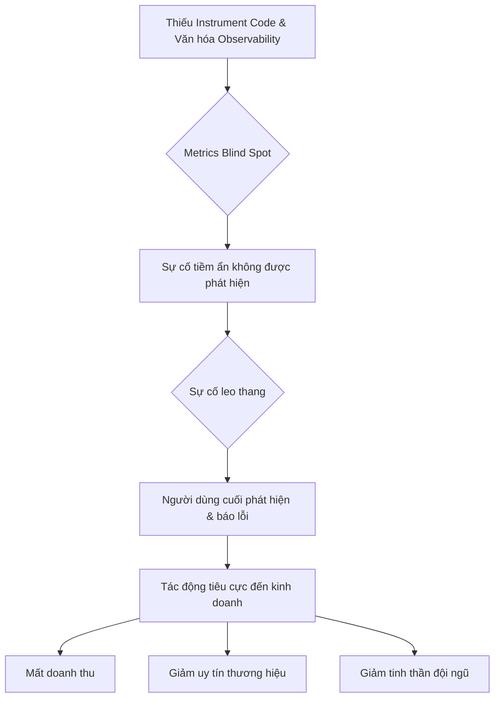
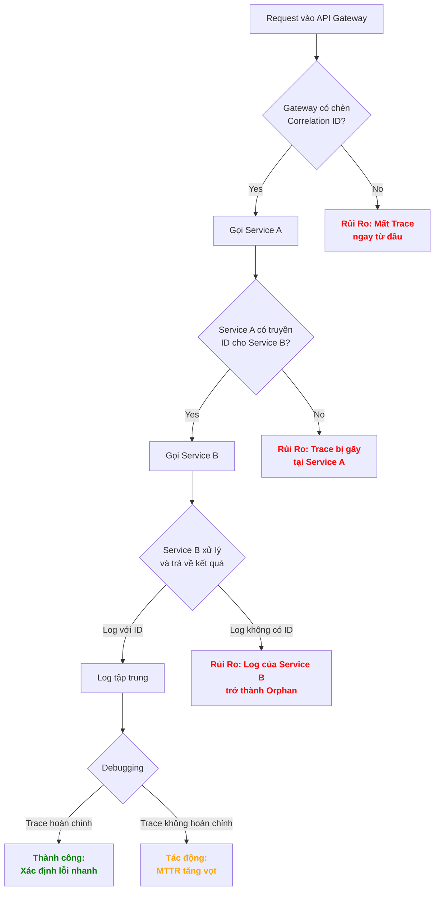
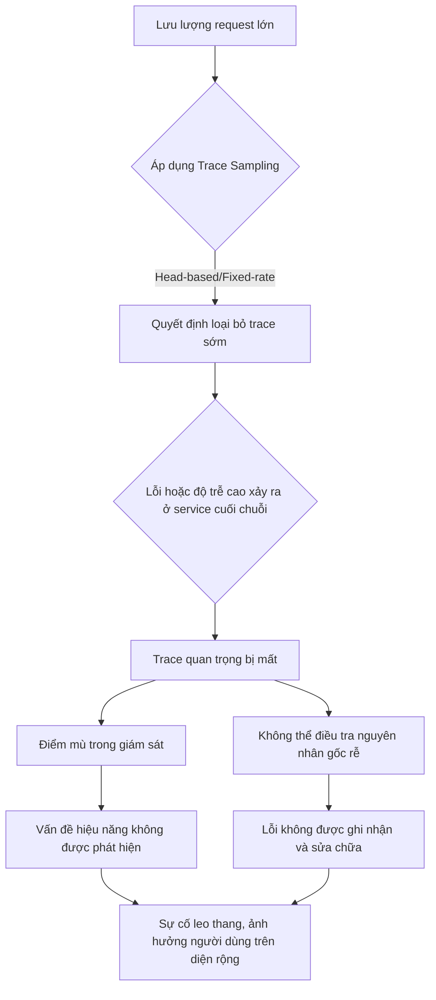

## Chương 13: Rủi Ro Khi Thiếu Observability

### 13.1 Rủi Ro Metrics Blind Spots

#### Định Nghĩa Rủi Ro
- **Định nghĩa:** Rủi ro "Metrics Blind Spots" (Điểm mù về Metrics) xảy ra khi hệ thống giám sát (monitoring) và observability thiếu hoặc không thu thập được các chỉ số (metrics) quan trọng. Điều này tạo ra những "vùng mù" trong môi trường production, nơi các vấn đề tiềm tàng có thể phát triển, leo thang thành sự cố nghiêm trọng mà không bị đội ngũ kỹ thuật phát hiện kịp thời. Hậu quả là, như mô tả của rủi ro, có đến 70% sự cố được phát hiện bởi người dùng cuối thay vì hệ thống giám sát nội bộ.
- **Nguyên nhân phát sinh:** Rủi ro này thường nảy sinh trong các hệ thống phức tạp, phân tán (microservices, cloud-native) nơi các tương tác trở nên khó lường. Nó cũng xuất phát từ sự thay đổi liên tục của mã nguồn và kiến trúc, sự thiếu sót trong quá trình thiết kế observability từ đầu, hoặc sự chủ quan của đội ngũ phát triển khi cho rằng một thành phần nào đó "không thể thất bại" và không cần đo lường chi tiết.
- **Mức độ nghiêm trọng:** **Critical**. Việc phát hiện sự cố muộn màng không chỉ làm tăng thời gian khắc phục (MTTR) mà còn gây tổn hại nghiêm trọng đến trải nghiệm người dùng, doanh thu và uy tín thương hiệu.

#### Nguyên Nhân Gốc Rễ (Root Causes)
1.  **Thiếu Văn Hóa Observability (Lack of Observability Culture):** Các nhóm kỹ thuật quá tập trung vào việc phát triển và ra mắt tính năng mới mà xem nhẹ việc đo lường và giám sát. Metrics, logs, và traces không được coi là một phần thiết yếu, bắt buộc của chu trình phát triển phần mềm. Việc "instrument" code để phát ra các tín hiệu cần thiết bị bỏ qua hoặc thực hiện một cách hời hợt.
2.  **"Unknown Unknowns" trong Hệ Thống Phức Tạp:** Trong kiến trúc microservices, serverless, hoặc khi tích hợp nhiều dịch vụ của bên thứ ba, cácรูปแบบ tương tác và các trạng thái lỗi có thể xảy ra trở nên vô cùng phức tạp. Rất khó để dự đoán trước tất cả các kịch bản lỗi để định nghĩa metrics cho chúng, tạo ra các "unknown unknowns" – những rủi ro mà chúng ta không hề biết là nó tồn tại.
3.  **Quá Phụ Thuộc vào "Golden Signals" Cấp Cao:** Nhiều đội ngũ chỉ dừng lại ở việc theo dõi 4 "Golden Signals" (Latency, Traffic, Errors, Saturation) ở mức độ tổng thể của dịch vụ (ví dụ: P99 latency của cả API gateway). Họ bỏ qua việc phân tích các chỉ số này theo các chiều dữ liệu chi tiết hơn (high cardinality) như theo từng khách hàng, từng khu vực địa lý, hoặc từng phiên bản ứng dụng, dẫn đến việc bỏ lọt các vấn đề chỉ ảnh hưởng đến một nhóm nhỏ người dùng.
4.  **Công Cụ Giám Sát Không Phù Hợp hoặc Cấu Hình Sai:** Sử dụng các công cụ giám sát không có khả năng xử lý dữ liệu với "high cardinality" (số lượng lớn các cặp key-value độc nhất) hoặc không hỗ trợ các loại metrics phức tạp. Ngoài ra, việc cấu hình sai các agent thu thập, thiết lập sai các quy tắc sampling, hoặc giới hạn lưu trữ quá thấp cũng có thể làm mất mát dữ liệu metrics quan trọng.
5.  **Code Không Được "Instrumented" Đúng Cách:** Lập trình viên không chủ động thêm mã nguồn để tạo ra (emit) các custom metrics cần thiết cho việc theo dõi business logic hoặc các trạng thái nội tại quan trọng của ứng dụng. Ví dụ, không có metric đếm số lượng công việc trong một hàng đợi (queue), hoặc số lượng kết nối đang hoạt động đến một dịch vụ khác.

#### Biểu Hiện & Triệu Chứng (Symptoms)
- **Dấu hiệu cảnh báo sớm:** Tỷ lệ người dùng báo lỗi (customer support tickets) tăng đột biến mà không có bất kỳ cảnh báo (alert) nào tương ứng từ hệ thống giám sát. Đội ngũ vận hành (Ops) và hỗ trợ khách hàng (Support) thường xuyên bị bất ngờ bởi các sự cố. Thời gian để xác định nguyên nhân gốc rễ (MTTR - Mean Time To Resolution) kéo dài một cách bất thường do thiếu dữ liệu để phân tích.
- **Các metrics/logs cần theo dõi:** Theo dõi tỷ lệ "user-reported issues" so với "system-alerted issues". Nếu tỷ lệ này cao, đó là một red flag rõ ràng. Phân tích logs tìm kiếm các lỗi hoặc cảnh báo không được theo dõi (un-monitored errors/warnings). Sự gia tăng của các lỗi chung chung như `500 Internal Server Error` mà không có thông tin chi tiết cũng là một triệu chứng.
- **Red flags trong hệ thống:** Một dịch vụ mới được triển khai mà không có dashboard giám sát đi kèm. Một thành phần quan trọng của hệ thống (ví dụ: database, message queue) chỉ được giám sát ở mức độ cơ bản (CPU, RAM) mà thiếu các metrics chuyên sâu (ví dụ: replication lag, queue depth).

#### Sơ Đồ Phân Tích


#### Tác Động Cụ Thể (Impact Analysis)

| Khía Cạnh       | Mức Độ   | Chi Tiết                                                                                                                            |
|-----------------|----------|-------------------------------------------------------------------------------------------------------------------------------------|
| Downtime        | High     | Thời gian ngừng hoạt động kéo dài do đội ngũ phải "mò mẫm" trong bóng tối để tìm nguyên nhân, làm tăng đáng kể MTTR.                    |
| Financial       | >$100k/hr| Ước tính dựa trên các sự cố lớn, mất mát có thể từ hàng chục ngàn đến hàng triệu USD mỗi giờ tùy thuộc vào quy mô kinh doanh.         |
| Security        | Medium   | Điểm mù có thể che giấu các hoạt động bất thường hoặc các cuộc tấn công âm thầm, ví dụ như data exfiltration ở mức độ thấp.         |
| User Experience | Severe   | Người dùng trở thành "hệ thống giám sát" bất đắc dĩ, gây mất lòng tin nghiêm trọng và tỷ lệ rời bỏ (churn rate) cao.             |
| Team Morale     | High     | Gây căng thẳng, mệt mỏi và mất tinh thần cho đội ngũ kỹ thuật khi phải liên tục đối phó với các sự cố bất ngờ và áp lực từ người dùng. |

#### Case Study Thực Tế
**Sự cố mất dữ liệu của GitLab - 2017**
- **Bối cảnh:** GitLab.com đang gặp vấn đề về hiệu năng và database load cao. Một kỹ sư hệ thống đã cố gắng khắc phục sự cố sao chép (replication) giữa primary và secondary database.
- **Diễn biến:** Do áp lực và sự mệt mỏi, kỹ sư đã vô tình chạy lệnh `rm -rf` trên primary database thay vì secondary. Thảm họa xảy ra khi họ nhận ra sai lầm và cố gắng khôi phục từ backup. Tuy nhiên, 5 cơ chế backup khác nhau đều thất bại hoặc không hiệu quả. Một trong những nguyên nhân sâu xa là hệ thống giám sát không cung cấp đủ thông tin về tình trạng của quá trình replication và các tiến trình backup.
- **Nguyên nhân gốc rễ:** Mặc dù lỗi con người là tác nhân trực tiếp, nguyên nhân gốc rễ là **metrics blind spot**. Không có cảnh báo rõ ràng về việc replication bị lag nghiêm trọng. Không có metrics theo dõi sự thành công/thất bại của các job backup một cách tường minh. Đội ngũ đã "mù" về tình trạng sức khỏe thực sự của hệ thống database backup và recovery.
- **Tác động:** GitLab.com ngừng hoạt động trong nhiều giờ và **mất khoảng 6 giờ dữ liệu** của người dùng (issues, merge requests, comments). Sự cố này gây tổn hại lớn đến uy tín của GitLab vào thời điểm đó.
- **Bài học:** Sự cố này đã buộc GitLab phải tái cấu trúc toàn bộ quy trình vận hành, ưu tiên xây dựng một văn hóa minh bạch và observability. Họ đã đầu tư mạnh mẽ vào việc giám sát mọi thứ, từ hạ tầng đến ứng dụng, và công khai toàn bộ quá trình xử lý sự cố.
- **Nguồn:** [Postmortem of database outage of January 31](https://about.gitlab.com/blog/postmortem-of-database-outage-of-january-31/)

#### Risk Mitigation Strategies

**Preventive Measures (Ngăn ngừa):**
1.  **Xây dựng Văn hóa Observability:** Đào tạo và yêu cầu các nhóm phát triển phải coi việc instrument code (metrics, logs, traces) là một phần không thể thiếu của "Definition of Done" cho mỗi tính năng.
2.  **"Shift-Left" Observability:** Thiết kế và thảo luận về các metrics cần thiết ngay trong giai đoạn thiết kế kiến trúc, không phải đợi đến khi hệ thống đã lên production.
3.  **Sử dụng Thư viện và Framework Chuẩn:** Áp dụng các thư viện chuẩn (ví dụ: OpenTelemetry) để việc thu thập metrics trở nên nhất quán và dễ dàng trên toàn bộ các dịch vụ.

**Detective Measures (Phát hiện):**
1.  **Giám sát "The Four Golden Signals" ở mọi cấp độ:** Theo dõi Latency, Traffic, Errors, Saturation không chỉ ở cấp độ tổng thể mà còn phân rã theo các chiều dữ liệu quan trọng (per-customer, per-endpoint, per-region).
2.  **Cảnh báo về sự "im lặng" (Absence of Signal):** Thiết lập các cảnh báo "dead man's switch" để phát hiện khi một dịch vụ hoặc một job quan trọng (ví dụ: backup job) không gửi metrics trong một khoảng thời gian nhất định.
3.  **Phân tích Log Bất Thường:** Sử dụng các công cụ phân tích log để tự động phát hiện các mẫu (pattern) lỗi mới hoặc sự gia tăng đột biến của các thông điệp log chưa từng được giám sát.

**Corrective Measures (Khắc phục):**
1.  **Xây dựng "Playbook" cho "Unknown Issues":** Chuẩn bị sẵn quy trình phản ứng sự cố ngay cả khi không biết nguyên nhân, tập trung vào việc nhanh chóng thu thập thêm dữ liệu (tăng level log, bật debug mode, tạo memory dump).
2.  **Dynamic Instrumentation:** Sử dụng các công cụ cho phép thêm các điểm đo lường (metrics, logs) vào ứng dụng đang chạy trên production mà không cần deploy lại code, giúp soi sáng các điểm mù ngay khi sự cố xảy ra.
3.  **Chaos Engineering:** Chủ động "gây sự cố" trong môi trường được kiểm soát để tìm ra các điểm mù trong hệ thống giám sát trước khi chúng trở thành sự cố thực sự.

#### Code Examples

**Anti-pattern (Cách làm SAI):**
```python
# ❌ ANTI-PATTERN: Bỏ qua việc đo lường các bước quan trọng trong một quy trình
import time

def process_payment(user_id, amount):
    try:
        # Bước 1: Gọi dịch vụ xác thực người dùng
        auth_success = external_auth_service.verify(user_id)
        if not auth_success:
            return {"status": "failed", "reason": "auth_failed"}

        # Bước 2: Gọi cổng thanh toán
        payment_gateway_response = payment_gateway.charge(amount)
        if payment_gateway_response.status != "success":
            return {"status": "failed", "reason": "gateway_declined"}

        # Bước 3: Ghi nhận giao dịch vào database
        database.save_transaction(user_id, amount)

        return {"status": "success"}
    except Exception as e:
        # Lỗi chung chung, không có context
        return {"status": "error", "reason": str(e)}

# Vấn đề: Nếu quy trình thất bại, chúng ta không biết nó thất bại ở bước nào,
# và không có metric để cảnh báo về tỷ lệ lỗi của từng bước.
```

**Best Practice (Cách làm ĐÚNG):**
```python
# ✅ BEST PRACTICE: Sử dụng custom metrics để có visibility chi tiết
from prometheus_client import Counter, Histogram
import time

# Định nghĩa các metrics
PAYMENT_ATTEMPTS = Counter('payment_process_attempts_total', 'Total payment processing attempts')
PAYMENT_SUCCESS = Counter('payment_process_success_total', 'Total successful payment processes')
PAYMENT_FAILURES = Counter('payment_process_failures_total', 'Total failed payment processes', ['step'])
PAYMENT_LATENCY = Histogram('payment_process_latency_seconds', 'Latency of the payment process')

@PAYMENT_LATENCY.time()
def process_payment_instrumented(user_id, amount):
    PAYMENT_ATTEMPTS.inc()
    try:
        # Bước 1: Gọi dịch vụ xác thực người dùng
        auth_success = external_auth_service.verify(user_id)
        if not auth_success:
            PAYMENT_FAILURES.labels(step='authentication').inc()
            return {"status": "failed", "reason": "auth_failed"}

        # Bước 2: Gọi cổng thanh toán
        payment_gateway_response = payment_gateway.charge(amount)
        if payment_gateway_response.status != "success":
            PAYMENT_FAILURES.labels(step='payment_gateway').inc()
            return {"status": "failed", "reason": "gateway_declined"}

        # Bước 3: Ghi nhận giao dịch vào database
        database.save_transaction(user_id, amount)

        PAYMENT_SUCCESS.inc()
        return {"status": "success"}
    except Exception as e:
        PAYMENT_FAILURES.labels(step='unknown_exception').inc()
        return {"status": "error", "reason": str(e)}

# Giải pháp: Giờ đây chúng ta có thể theo dõi và cảnh báo về:
# - Tổng thời gian xử lý (latency).
# - Tỷ lệ lỗi chung.
# - Tỷ lệ lỗi của từng bước cụ thể (xác thực, cổng thanh toán, database).
```

#### Risk Assessment Matrix

| Yếu Tố                 | Đánh Giá | Ghi Chú                                                                                                                            |
|------------------------|----------|------------------------------------------------------------------------------------------------------------------------------------|
| Xác suất (Probability) | 4 (High) | Rất phổ biến trong các hệ thống phức tạp, thay đổi thường xuyên và thiếu văn hóa observability mạnh mẽ.                              |
| Tác động (Impact)      | 5 (Critical) | Có thể dẫn đến downtime kéo dài, mất dữ liệu, tổn thất tài chính lớn và suy giảm nghiêm trọng uy tín thương hiệu.                   |
| **Risk Score**         | **20**   | **Critical**                                                                                                                       |
| Ưu tiên xử lý          | **P1**   | Phải được giải quyết và ưu tiên hàng đầu trong các hoạt động đảm bảo độ tin cậy của hệ thống (Site Reliability Engineering - SRE). |

#### Checklist Đánh Giá
- [ ] Mỗi microservice mới có đi kèm một dashboard giám sát các "Golden Signals" không?
- [ ] Chúng ta có đang theo dõi tỷ lệ lỗi của các phụ thuộc bên ngoài (external dependencies) không?
- [ ] Các quy trình nền quan trọng (ví dụ: backup, data processing) có phát ra metric "heartbeat" để xác nhận chúng vẫn đang chạy không?
- [ ] Khi một cảnh báo được kích hoạt, nó có cung cấp đủ context (logs, traces) để đội ngũ có thể bắt đầu điều tra ngay lập tức không?
- [ ] Liệu chúng ta có đang giám sát các chỉ số kinh doanh quan trọng (ví dụ: số lượng đơn hàng, doanh thu mỗi phút) và tương quan chúng với các metrics hệ thống không?
- [ ] Đội ngũ có thường xuyên review và cập nhật các dashboard và cảnh báo để loại bỏ những thứ không còn phù hợp không?

#### Tools & Resources
- **Prometheus & Grafana:** Bộ đôi mã nguồn mở tiêu chuẩn công nghiệp để thu thập, lưu trữ và trực quan hóa time-series data. Rất mạnh mẽ cho việc giám sát hệ thống và ứng dụng.
- **OpenTelemetry:** Một framework mã nguồn mở, chuẩn hóa việc instrument code để thu thập cả metrics, logs và traces, giúp tránh vendor lock-in và tạo ra một hệ thống observability nhất quán.
- **Lightstep, Honeycomb, Datadog:** Các nền tảng observability thương mại mạnh mẽ, cung cấp các công cụ phân tích dữ liệu high-cardinality, giúp dễ dàng "lặn sâu" vào dữ liệu để tìm nguyên nhân gốc rễ.

#### Nguồn Tham Khảo
1.  [Google SRE Book - Monitoring Distributed Systems](https://sre.google/sre-book/monitoring-distributed-systems/) - Nguồn gốc của khái niệm "The Four Golden Signals".
2.  [Postmortem of database outage of January 31](https://about.gitlab.com/blog/postmortem-of-database-outage-of-january-31/) - Phân tích chi tiết về sự cố của GitLab, một case study kinh điển về tầm quan trọng của observability.
3.  [OpenTelemetry Documentation](https://opentelemetry.io/docs/) - Tài liệu chính thức về chuẩn OpenTelemetry, hướng dẫn cách instrument ứng dụng để thu thập dữ liệu observability.


### 13.2 Rủi Ro Log Correlation Failures

#### Định Nghĩa Rủi Ro
- **Định nghĩa:** Rủi ro Log Correlation Failures (Thất bại trong tương quan log) là tình huống không thể liên kết các bản ghi log (log entries) từ nhiều dịch vụ (services) hoặc thành phần (components) khác nhau trong một hệ thống phân tán để tái tạo lại một chuỗi sự kiện hoặc một giao dịch (transaction) hoàn chỉnh. Khi một yêu cầu của người dùng đi qua nhiều microservices, mỗi service sẽ tạo ra log riêng. Nếu không có một mã định danh duy nhất (correlation ID) được truyền xuyên suốt, việc xâu chuỗi các log này lại để hiểu luồng xử lý trở nên bất khả thi, dẫn đến tình trạng "mò kim đáy bể" (Needle in a Haystack Debugging) khi có sự cố.
- **Nguyên nhân phát sinh:** Rủi ro này là hệ quả tất yếu của kiến trúc microservices và hệ thống phân tán. Khi một hệ thống nguyên khối (monolith) được chia nhỏ thành nhiều dịch vụ độc lập, luồng xử lý một yêu cầu bị phân tán qua nhiều tiến trình, máy chủ, thậm chí là nhiều trung tâm dữ liệu. Sự phức tạp này, nếu không được quản lý bằng các cơ chế tracing và logging nhất quán, sẽ tạo ra các "điểm mù" trong khả năng quan sát (observability) của hệ thống.
- **Mức độ nghiêm trọng:** **High**. Mặc dù không trực tiếp gây sập hệ thống, nhưng thất bại trong việc tương quan log làm tăng đáng kể Thời gian Trung bình để Khắc phục (Mean Time To Resolution - MTTR). Trong các sự cố nghiêm trọng, việc không thể nhanh chóng xác định nguyên nhân gốc rễ có thể kéo dài thời gian downtime, gây ảnh hưởng tài chính và làm suy giảm nghiêm trọng trải nghiệm người dùng.

#### Nguyên Nhân Gốc Rễ (Root Causes)
1. **Thiếu hoặc mất Correlation ID:** Đây là nguyên nhân phổ biến nhất. Một `correlation ID` (còn gọi là `trace ID` hoặc `request ID`) không được tạo ra ở điểm vào của hệ thống (ví dụ: API Gateway, Load Balancer) hoặc bị mất/thay đổi khi đi qua một service nào đó. Điều này thường xảy ra khi một service không được lập trình để nhận, xử lý và truyền tiếp `correlation ID` trong header của các lời gọi HTTP/RPC hoặc trong message của các hệ thống hàng đợi (message queue).
2. **Sử dụng các thư viện/framework không tương thích:** Các service trong hệ thống có thể được viết bằng nhiều ngôn ngữ, sử dụng các thư viện logging và tracing khác nhau. Nếu các thư viện này không tuân thủ một chuẩn chung (như OpenTelemetry, W3C Trace Context), chúng sẽ tạo ra các định dạng trace và span khác nhau, không thể tự động liên kết với nhau bởi các công cụ thu thập log và tracing.
3. **Cấu hình sai ở tầng hạ tầng:** Các thành phần hạ tầng như service mesh (ví dụ: Istio, Linkerd), API gateway, hoặc load balancer có trách nhiệm tự động chèn và truyền bá (propagate) `correlation ID`. Cấu hình sai ở các lớp này (ví dụ: tắt tính năng tracing, cấu hình rule không đúng) có thể làm gián đoạn chuỗi trace.
4. **Lỗi trong các lời gọi bất đồng bộ (Asynchronous Calls):** Trong các hệ thống sử dụng message queue (Kafka, RabbitMQ) hoặc các lời gọi bất đồng bộ, việc truyền `correlation ID` phức tạp hơn. Nếu `correlation ID` không được đính kèm vào message payload hoặc message headers một cách nhất quán, luồng xử lý sẽ bị "gãy" tại điểm này, và các service xử lý message sẽ không thể liên kết log của chúng với yêu cầu ban đầu.
5. **Sampling quá mức hoặc không nhất quán:** Để giảm chi phí và khối lượng dữ liệu, các hệ thống tracing thường áp dụng cơ chế lấy mẫu (sampling), tức là chỉ ghi lại một tỷ lệ phần trăm nhất định của các trace. Nếu việc sampling không được thực hiện một cách nhất quán trên tất cả các service (ví dụ: service A sample 10%, service B sample 1%), rất có thể một phần của chuỗi trace sẽ bị thiếu, làm cho toàn bộ trace trở nên vô dụng.

#### Biểu Hiện & Triệu Chứng (Symptoms)
- **Dấu hiệu cảnh báo sớm:**
    - Thời gian điều tra sự cố (investigation time) kéo dài bất thường, đặc biệt với các lỗi liên quan đến nhiều service.
    - Các lập trình viên thường xuyên phải truy cập vào nhiều hệ thống logging khác nhau và tìm kiếm thủ công bằng timestamp hoặc user ID.
    - Báo cáo lỗi từ người dùng không thể tái hiện hoặc không tìm thấy log tương ứng.
- **Các metrics/logs cần theo dõi:**
    - **Trace Completeness Rate:** Tỷ lệ phần trăm các trace có đầy đủ tất cả các span từ đầu đến cuối. Một tỷ lệ thấp là dấu hiệu rõ ràng của vấn đề.
    - **Orphan Spans:** Số lượng các span không thể liên kết với một trace cha nào. Sự gia tăng của chỉ số này cho thấy `correlation ID` đang bị mất ở đâu đó.
    - **Log Volume by Service:** Sự chênh lệch lớn về khối lượng log có chứa `correlation ID` giữa các service có thể chỉ ra service nào đang gặp vấn đề.
- **Red flags trong hệ thống:**
    - Khi xem một trace trong công cụ (như Jaeger, Datadog), thấy trace bị đứt đoạn, không thể hiện toàn bộ vòng đời của một request.
    - Tìm kiếm một `correlation ID` trong hệ thống quản lý log tập trung (như ELK, Splunk) nhưng chỉ thấy kết quả từ một vài service, thiếu các service quan trọng khác trong luồng xử lý.

#### Sơ Đồ Phân Tích


#### Tác Động Cụ Thể (Impact Analysis)

| Khía Cạnh | Mức Độ | Chi Tiết |
|---|---|---|
| Downtime | Medium | Không trực tiếp gây downtime, nhưng kéo dài thời gian khắc phục sự cố từ vài phút lên vài giờ hoặc vài ngày, làm tăng thời gian hệ thống bị ảnh hưởng (service degradation). |
| Financial | $10,000 - $50,000/hour | Ước tính dựa trên chi phí nhân sự (kỹ sư SRE, dev) tham gia xử lý sự cố kéo dài, cộng với tổn thất doanh thu do trải nghiệm người dùng kém và khả năng mất khách hàng. |
| Security | Medium | Khó khăn trong việc truy vết các hành vi bất thường hoặc các cuộc tấn công đa bước (multi-step attacks) khi không thể xâu chuỗi các hành động của kẻ tấn công qua các service. |
| User Experience | Severe | Người dùng gặp lỗi lặp đi lặp lại mà không được khắc phục. Thời gian chờ đợi hỗ trợ kéo dài vì đội ngũ kỹ thuật không thể tìm ra nguyên nhân. |
| Team Morale | High | Gây ra sự mệt mỏi, chán nản và đổ lỗi lẫn nhau trong đội ngũ kỹ sư khi phải đối mặt với các sự cố "ma" không thể debug. Giảm năng suất và sự tự tin của team. |

#### Case Study Thực Tế
**Uber - Thất bại trong việc xây dựng hệ thống tracing tự thân - 2016**
- **Bối cảnh:** Uber có một kiến trúc microservices khổng lồ với hàng ngàn dịch vụ. Việc debug các sự cố trở nên cực kỳ khó khăn. Họ đã tự xây dựng một giải pháp tracing có tên là M3.
- **Diễn biến:** Mặc dù đã đầu tư rất nhiều, giải pháp ban đầu của Uber gặp nhiều vấn đề: khó khăn trong việc tích hợp (instrumentation), chi phí vận hành cao, và không cung cấp được bức tranh toàn cảnh một cách đáng tin cậy. Các kỹ sư vẫn mất rất nhiều thời gian để chẩn đoán lỗi.
- **Nguyên nhân gốc rễ:** Việc tự xây dựng một hệ thống tracing phức tạp từ đầu mà không dựa trên các tiêu chuẩn mở đã dẫn đến một hệ thống cồng kềnh, khó bảo trì và không tương thích với các công cụ của bên thứ ba. Việc truyền bá context (bao gồm correlation ID) qua các giao thức và ngôn ngữ khác nhau là một thách thức lớn mà họ đã đánh giá thấp.
- **Tác động:** MTTR của các sự cố vẫn ở mức cao. Chi phí phát triển và duy trì hệ thống M3 rất tốn kém. Các kỹ sư không tin tưởng vào công cụ, dẫn đến việc áp dụng thấp.
- **Bài học:** Uber sau đó đã chuyển hướng, đóng góp và tuân thủ các tiêu chuẩn mở như OpenTracing (sau này là OpenTelemetry). Họ nhận ra rằng việc xây dựng và duy trì một hệ thống tracing độc quyền là không bền vững. Thay vào đó, nên đóng góp vào một tiêu chuẩn chung của ngành và tận dụng các công cụ tương thích.
- **Nguồn:** [Jaeger, a Distributed Tracing System](https://eng.uber.com/jaeger-distributed-tracing-system/)

#### Risk Mitigation Strategies

**Preventive Measures (Ngăn ngừa):**
1. **Áp dụng chuẩn OpenTelemetry (OTel):** Sử dụng OTel SDK cho tất cả các service mới. OTel cung cấp một bộ API và thư viện chuẩn hóa cho việc instrument code để tạo và truyền bá trace, metrics, và logs, đảm bảo tính tương thích giữa các ngôn ngữ và framework.
2. **Tự động chèn Trace Context ở Edge:** Cấu hình API Gateway, Ingress Controller hoặc Service Mesh (Istio, Linkerd) để tự động khởi tạo một `trace ID` cho mỗi request đến và truyền nó vào header (sử dụng chuẩn W3C Trace Context) cho các service bên trong.
3. **Thư viện Logging tập trung:** Xây dựng (hoặc sử dụng) một thư viện logging chung cho toàn công ty. Thư viện này tự động trích xuất `trace ID` từ context và thêm nó vào mọi bản ghi log dưới dạng một trường có cấu trúc (ví dụ: `json_log.trace_id`).

**Detective Measures (Phát hiện):**
1. **Alert về Orphan Spans:** Thiết lập cảnh báo trong hệ thống observability (Datadog, New Relic, Jaeger) khi tỷ lệ "orphan spans" (các span không có trace cha) vượt quá một ngưỡng nhất định (ví dụ: 1%).
2. **Dashboard về Trace Completeness:** Xây dựng một dashboard theo dõi tỷ lệ hoàn thành của các trace cho các luồng nghiệp vụ quan trọng. Nếu tỷ lệ này giảm, đó là dấu hiệu cho thấy có một service nào đó đang làm "gãy" trace.
3. **Kiểm tra định kỳ (Audit):** Viết các script tự động để định kỳ gọi các endpoint quan trọng và kiểm tra xem `correlation ID` có được ghi lại ở tất cả các điểm dừng (hop) trong chuỗi xử lý hay không.

**Corrective Measures (Khắc phục):**
1. **Quy trình phản ứng sự cố "Broken Trace":** Khi nhận được cảnh báo về trace bị gãy, SRE sẽ ngay lập tức mở một sự cố, xác định service nghi ngờ (dựa trên điểm gãy) và thông báo cho team phát triển chịu trách nhiệm.
2. **Rollback an toàn:** Nếu một deployment mới bị nghi ngờ là nguyên nhân gây ra lỗi tương quan log, thực hiện rollback ngay lập tức về phiên bản ổn định trước đó.
3. **Hotfix và ưu tiên cao:** Các bug liên quan đến việc làm mất `correlation ID` phải được coi là lỗi có độ ưu tiên cao (P0/P1) và cần được khắc phục ngay trong một bản hotfix, thay vì chờ đợi chu kỳ release tiếp theo.

#### Code Examples

**Anti-pattern (Cách làm SAI):**
```python
# ❌ ANTI-PATTERN: Gọi service khác mà không truyền header
import requests

# Giả sử service này nhận được một request với header 'X-Request-ID'
def process_request(request_headers):
    # Lấy ID từ request đến
    correlation_id = request_headers.get("X-Request-ID")
    print(f"Service A processing request with ID: {correlation_id}")

    # Lỗi: Khi gọi service B, không truyền correlation_id đi
    # Điều này làm cho trace bị gãy tại đây.
    response = requests.get("http://service-b/api/data")
    
    return response.json()
```

**Best Practice (Cách làm ĐÚNG):**
```python
# ✅ BEST PRACTICE: Sử dụng OpenTelemetry để tự động truyền context
import requests
from opentelemetry import trace

# OpenTelemetry sẽ tự động chèn các header cần thiết (traceparent, tracestate)
# vào các lời gọi requests nếu thư viện requests đã được instrument.

# Lấy tracer cho module hiện tại
tracer = trace.get_tracer(__name__)

def good_process_request(request_headers):
    # OTel tự động tạo span và quản lý context
    with tracer.start_as_current_span("process_request_span") as span:
        current_context = span.get_span_context()
        print(f"Service A processing with Trace ID: {current_context.trace_id}")

        # Khi gọi service B, OTel instrumentation cho `requests` sẽ tự động
        # chèn tracing headers vào lời gọi.
        # Service B (nếu cũng dùng OTel) sẽ nhận được và tiếp tục trace.
        response = requests.get("http://service-b/api/data")

        span.set_attribute("http.status_code", response.status_code)
        return response.json()
```

#### Risk Assessment Matrix

| Yếu Tố | Đánh Giá | Ghi Chú |
|---|---|---|
| Xác suất (Probability) | 4 | Rất phổ biến trong các hệ thống microservices đang phát triển hoặc thiếu các tiêu chuẩn observability thống nhất. Dễ xảy ra khi thêm service mới hoặc thay đổi công nghệ. |
| Tác động (Impact) | 4 | Gây tăng vọt MTTR, ảnh hưởng nghiêm trọng đến khả năng vận hành và bảo trì hệ thống, làm giảm năng suất của đội ngũ kỹ sư và gây mệt mỏi khi xử lý sự cố. |
| **Risk Score** | **16** | **High** |
| Ưu tiên xử lý | P1 | Cần được giải quyết một cách chiến lược bằng cách đầu tư vào nền tảng observability chung và áp đặt các tiêu chuẩn logging/tracing cho toàn bộ hệ thống. |

#### Checklist Đánh Giá
- [ ] Hệ thống có cơ chế tự động sinh `correlation ID` tại điểm vào (edge) cho mọi request không?
- [ ] Tất cả các service có được instrument để tự động nhận và truyền `correlation ID` trong các lời gọi (HTTP, gRPC, message queue) không?
- [ ] Có sử dụng một chuẩn tracing chung (ví dụ: OpenTelemetry, W3C Trace Context) cho toàn bộ hệ thống không?
- [ ] Hệ thống logging tập trung có index và cho phép tìm kiếm dễ dàng theo `correlation ID` không?
- [ ] Có cảnh báo tự động khi phát hiện trace bị gãy hoặc có "orphan spans" không?
- [ ] Quy trình xử lý sự cố có bao gồm bước kiểm tra trace hoàn chỉnh để chẩn đoán lỗi không?

#### Tools & Resources
- **OpenTelemetry:** Bộ công cụ và tiêu chuẩn mã nguồn mở để thu thập dữ liệu telemetry (traces, metrics, logs). Là nền tảng để xây dựng một hệ thống observability nhất quán.
- **Jaeger:** Một hệ thống distributed tracing mã nguồn mở, ban đầu được phát triển bởi Uber. Giúp trực quan hóa các chuỗi giao dịch và gỡ lỗi các vấn đề về hiệu năng.
- **Datadog / New Relic:** Các nền tảng observability thương mại, cung cấp giải pháp APM (Application Performance Monitoring) toàn diện, bao gồm distributed tracing, log management, và metrics monitoring với khả năng tương quan tự động.

#### Nguồn Tham Khảo
1. [W3C Trace Context](https://www.w3.org/TR/trace-context/) - Đặc tả chính thức của W3C về chuẩn truyền bá context cho distributed tracing.
2. [OpenTelemetry Documentation](https://opentelemetry.io/docs/) - Tài liệu chính thức về OpenTelemetry, hướng dẫn cách instrument và cấu hình cho nhiều ngôn ngữ khác nhau.
3. [Distributed Tracing — we've been doing it wrong](https://copyconstruct.medium.com/distributed-tracing-weve-been-doing-it-wrong-39fc92a857df) - Một bài viết phân tích sâu sắc về những thách thức và hiểu lầm phổ biến khi triển khai distributed tracing.


### 13.3 Rủi Ro Mất Mát Dữ Liệu do Trace Sampling (Trace Sampling Losses)

#### Định Nghĩa Rủi Ro
- **Định nghĩa:** Rủi ro mất mát dữ liệu do Trace Sampling là khả năng không ghi nhận được các giao dịch (traces) quan trọng, đặc biệt là các trace chứa lỗi hoặc có độ trễ bất thường, do cơ chế lấy mẫu chỉ chọn một tỷ lệ phần trăm nhất định của tổng số trace để phân tích. Điều này tạo ra những "điểm mù" (blind spots) trong khả năng quan sát hệ thống, khiến việc chẩn đoán và khắc phục sự cố trở nên khó khăn hoặc không thể thực hiện được.
- **Nguồn gốc phát sinh:** Trong các hệ thống phân tán hiện đại, việc ghi lại 100% các trace sẽ tạo ra một khối lượng dữ liệu khổng lồ, gây tốn kém chi phí lưu trữ, xử lý và ảnh hưởng đến hiệu năng của chính hệ thống. Do đó, trace sampling được áp dụng như một giải pháp cân bằng giữa chi phí và mức độ quan sát. Rủi ro nảy sinh khi chiến lược sampling không đủ thông minh để giữ lại những trace có giá trị nhất.
- **Mức độ nghiêm trọng tiềm tàng:** **High**. Mặc dù không trực tiếp gây ra downtime, việc bỏ lỡ các trace lỗi hoặc có vấn đề về hiệu năng có thể che giấu các vấn đề nghiêm trọng đang âm ỉ trong hệ thống. Khi các vấn đề này leo thang, chúng có thể dẫn đến sự cố lớn, ảnh hưởng đến trải nghiệm người dùng và gây thiệt hại tài chính đáng kể.

#### Nguyên Nhân Gốc Rễ (Root Causes)
1.  **Chiến lược Sampling quá đơn giản (Naive Sampling Strategy):** Sử dụng các phương pháp lấy mẫu dựa trên xác suất cố định (fixed-rate probabilistic sampling) hoặc head-based sampling. Với head-based sampling, quyết định giữ lại hay loại bỏ một trace được đưa ra ngay tại service đầu tiên của chuỗi request. Nếu một lỗi hoặc độ trễ cao xảy ra ở một service phía sau trong chuỗi, quyết định loại bỏ trace đã được đưa ra và thông tin quan trọng này sẽ bị mất vĩnh viễn.
2.  **Cấu hình Sampling không phù hợp với đặc thù traffic:** Áp dụng một tỷ lệ sampling đồng nhất trên toàn bộ hệ thống. Các endpoint quan trọng nhưng có lưu lượng thấp (ví dụ: chức năng thanh toán, quản trị hệ thống) sẽ có rất ít hoặc không có trace nào được ghi lại. Điều này cực kỳ nguy hiểm vì lỗi trên các luồng này thường có tác động kinh doanh lớn.
3.  **Không có cơ chế ưu tiên cho trace lỗi hoặc có độ trễ cao:** Hệ thống sampling mặc định không phân biệt giữa một trace thành công và một trace bị lỗi 500 hoặc có thời gian phản hồi 10 giây. Chúng có cùng xác suất bị loại bỏ, trong khi trace lỗi và chậm lại là những thông tin quý giá nhất cho việc gỡ lỗi.
4.  **Sự kiện "Black Swan" hoặc lỗi hiếm gặp:** Các lỗi chỉ xảy ra dưới những điều kiện rất đặc biệt (ví dụ: race condition, memory leak chỉ biểu hiện sau một thời gian dài hoạt động) sẽ tạo ra số lượng trace lỗi rất nhỏ. Với tỷ lệ sampling thấp, xác suất bắt được những trace này gần như bằng không.

#### Biểu Hiện & Triệu Chứng (Symptoms)
- **Dấu hiệu cảnh báo sớm:** Người dùng báo cáo về lỗi nhưng không tìm thấy bất kỳ trace lỗi nào tương ứng trong hệ thống observability. Các chỉ số tổng hợp (aggregate metrics) như tỷ lệ lỗi (error rate) tăng nhẹ nhưng không thể truy ra được các request cụ thể gây ra lỗi.
- **Các metrics/logs cần theo dõi:**
    - **`sampling_rate`:** Theo dõi tỷ lệ sampling đang được áp dụng trên từng service.
    - **`traces_dropped_count`:** Số lượng trace đã bị loại bỏ bởi agent hoặc collector. Nếu con số này quá lớn so với `traces_ingested_count`, đó là một dấu hiệu đáng báo động.
    - **So sánh giữa Metrics và Traces:** Có sự không nhất quán giữa số liệu từ metrics (ví dụ: metric `http_requests_total{status="500"}` tăng) và số lượng trace có lỗi thực tế tìm được.
- **Red flags trong hệ thống:** "Không tìm thấy dữ liệu" (No data found) khi tìm kiếm các trace cho một user ID hoặc transaction ID cụ thể được báo cáo là có sự cố. Dashboard về hiệu năng không hiển thị bất kỳ outlier nào mặc dù có phản ánh về hệ thống chậm.

#### Sơ Đồ Phân Tích


#### Tác Động Cụ Thể (Impact Analysis)

| Khía Cạnh | Mức Độ | Chi Tiết |
|---|---|---|
| Downtime | Medium | Rủi ro này không trực tiếp gây downtime, nhưng nó che giấu các nguyên nhân có thể dẫn đến downtime. Thời gian khắc phục sự cố (MTTR) tăng vọt vì không có dữ liệu để phân tích, gián tiếp kéo dài thời gian hệ thống bị ảnh hưởng. |
| Financial | $5k - $50k/hour | Chi phí phát sinh từ việc kéo dài thời gian sự cố, chi phí nhân sự để "mò mẫm" tìm lỗi trong bóng tối, và tổn thất doanh thu do trải nghiệm người dùng kém đi mà không được khắc phục kịp thời. |
| Security | Medium | Các cuộc tấn công thăm dò hoặc các hành vi bất thường có thể không được ghi lại. Ví dụ, một cuộc tấn công brute-force với lưu lượng thấp có thể hoàn toàn bị bỏ qua bởi cơ chế sampling. |
| User Experience | Severe | Người dùng gặp lỗi lặp đi lặp lại nhưng đội ngũ hỗ trợ và kỹ sư không thể tái hiện hoặc tìm ra bằng chứng. Điều này gây mất niềm tin nghiêm trọng vào sản phẩm và thương hiệu. |
| Team Morale | High | Kỹ sư cảm thấy bất lực và căng thẳng khi phải đối mặt với các sự cố "ma" (ghost issues). Việc thiếu dữ liệu gây ra sự đổ lỗi nội bộ và làm giảm hiệu suất làm việc của cả đội. |

#### Case Study Thực Tế
**Cloudflare - Sự cố mất mát log và phân tích do kiến trúc `journald` - 2023**
- **Bối cảnh:** Cloudflare sử dụng một hệ thống logging tập trung phức tạp để xử lý hàng chục triệu log mỗi giây. Một phần quan trọng của kiến trúc này dựa trên `systemd-journald` để thu thập log tại biên (edge). Mặc dù đây là case study về logging, nguyên tắc mất mát dữ liệu do quá tải và sampling có thể áp dụng tương tự cho tracing.
- **Diễn biến:** Một bản cập nhật kernel mới vô tình gây ra tình trạng `journald` bị quá tải và bắt đầu "drop" (loại bỏ) log messages một cách âm thầm để tự bảo vệ. Vì không có cảnh báo rõ ràng về việc log bị drop, hệ thống phân tích phía sau không hề hay biết rằng nó đang làm việc trên một tập dữ liệu không đầy đủ. Điều này dẫn đến các báo cáo và cảnh báo không chính xác.
- **Nguyên nhân gốc rễ:** Tương tự như trace sampling, hệ thống đã tự động loại bỏ dữ liệu khi gặp áp lực cao (một dạng "implicit sampling" không mong muốn). Sự tin tưởng tuyệt đối vào agent thu thập dữ liệu mà không có cơ chế xác minh chéo (cross-validation) đã tạo ra một điểm mù lớn.
- **Tác động:** Mặc dù không có số liệu tài chính cụ thể được công bố, tác động chính là sự mất mát niềm tin vào hệ thống giám sát và phân tích nội bộ. Các quyết định kinh doanh và kỹ thuật có thể đã được đưa ra dựa trên dữ liệu sai lệch.
- **Bài học:** Cần phải có cơ chế giám sát chính các agent thu thập dữ liệu (agent-of-the-agent monitoring). Phải có cảnh báo khi dữ liệu bị loại bỏ ở bất kỳ giai đoạn nào của pipeline. Không bao giờ cho rằng dữ liệu bạn nhận được là 100% đầy đủ.
- **Nguồn:** [Cloudflare Blog: How we wound up with surprising behavior from systemd-journald](https://blog.cloudflare.com/how-we-wound-up-with-surprising-behavior-from-systemd-journald)

#### Risk Mitigation Strategies

**Preventive Measures (Ngăn ngừa):**
1.  **Áp dụng Tail-Based Sampling:** Thay vì quyết định ở đầu, đợi cho đến khi tất cả các span trong một trace hoàn thành rồi mới quyết định lấy mẫu. Điều này đảm bảo 100% các trace có lỗi hoặc có độ trễ vượt ngưỡng sẽ được giữ lại.
2.  **Sử dụng Adaptive Sampling:** Tự động điều chỉnh tỷ lệ sampling dựa trên lưu lượng của từng service/endpoint. Các endpoint quan trọng, lưu lượng thấp sẽ được đặt tỷ lệ sampling cao hơn (thậm chí 100%), trong khi các endpoint lưu lượng cao, ít quan trọng hơn có thể có tỷ lệ thấp hơn.
3.  **Thiết lập quy tắc Sampling dựa trên thuộc tính (Attribute-based Sampling):** Tạo các quy tắc để luôn luôn giữ lại các trace dựa trên các thuộc tính kinh doanh quan trọng, ví dụ: `customer_tier="platinum"`, `payment_flow=true`, hoặc khi có một header đặc biệt như `x-debug-trace=true`.

**Detective Measures (Phát hiện):**
1.  **Giám sát tỷ lệ loại bỏ (Drop Rate):** Thiết lập cảnh báo khi tỷ lệ `traces_dropped_count` trên một agent/collector vượt quá một ngưỡng chấp nhận được. Cảnh báo này phải được gửi đến kênh ưu tiên cao nhất.
2.  **Metrics đối chiếu (Cross-Validation Metrics):** Tạo dashboard so sánh số liệu từ hai nguồn khác nhau. Ví dụ: một panel hiển thị số lỗi 5xx từ metrics của load balancer và một panel khác hiển thị số trace có `http.status_code >= 500`. Sự chênh lệch lớn giữa hai số liệu này là một dấu hiệu rõ ràng của việc mất mát trace.
3.  **Triển khai "Canary" Traces:** Chạy các giao dịch tổng hợp (synthetic transactions) định kỳ qua các luồng quan trọng với một ID đặc biệt, và thiết lập cảnh báo nếu trace của giao dịch này không xuất hiện trong hệ thống observability trong một khoảng thời gian nhất định.

**Corrective Measures (Khắc phục):**
1.  **Quy trình tăng tỷ lệ Sampling động:** Khi một sự cố xảy ra, kỹ sư trực sự cố (on-call engineer) phải có quyền và công cụ để tạm thời tăng tỷ lệ sampling lên 100% cho các service bị ảnh hưởng, hoặc kích hoạt chế độ ghi lại toàn bộ cho một `user_id` cụ thể để bắt được lỗi.
2.  **Kích hoạt chế độ Debugging theo yêu cầu:** Cho phép các nhà phát triển thêm một header đặc biệt vào request của họ (ví dụ: `X-Force-Trace: true`) để buộc hệ thống ghi lại toàn bộ trace cho request đó, giúp gỡ lỗi trong môi trường production một cách có kiểm soát.
3.  **Phân tích Log như một phương án dự phòng:** Nếu trace bị mất, quy trình phản ứng sự cố phải hướng dẫn kỹ sư chuyển sang phân tích log chi tiết từ các service liên quan. Mặc dù khó khăn hơn, log vẫn có thể chứa thông tin về lỗi.

#### Code Examples

**Anti-pattern (Cách làm SAI):**
```python
# ❌ ANTI-PATTERN: Sử dụng fixed-rate sampler, không ưu tiên lỗi
# Vấn đề: Một sampler với tỷ lệ 1% sẽ loại bỏ 99% các trace, bao gồm cả các trace lỗi hiếm gặp.

from opentelemetry import trace
from opentelemetry.sdk.trace import TracerProvider
from opentelemetry.sdk.trace.export import ConsoleSpanExporter, SimpleSpanProcessor
from opentelemetry.sdk.trace.sampling import TraceIdRatioBased

# Cấu hình sampler chỉ giữ lại 1% số trace, không phân biệt nội dung
sampler = TraceIdRatioBased(0.01)

trace.set_tracer_provider(TracerProvider(sampler=sampler))
provider = trace.get_tracer_provider()
provider.add_span_processor(SimpleSpanProcessor(ConsoleSpanExporter()))

tracer = trace.get_tracer(__name__)

def bad_example_process_request():
    with tracer.start_as_current_span("process_request") as span:
        # Giả sử 99.9% request thành công
        import random
        if random.random() < 0.001: # Lỗi hiếm gặp
            span.set_status(trace.Status(trace.StatusCode.ERROR, "A rare error occurred"))
            print("Một lỗi hiếm gặp đã xảy ra, nhưng có thể không được trace.")
        else:
            span.set_status(trace.Status(trace.StatusCode.OK))
            # print("Request thành công.")

# Khi chạy 1000 lần, có thể không có trace lỗi nào được ghi lại
# for _ in range(1000):
#     bad_example_process_request()
```

**Best Practice (Cách làm ĐÚNG):**
```python
# ✅ BEST PRACTICE: Sử dụng sampler kết hợp, ưu tiên trace lỗi và các endpoint quan trọng
# Giải pháp: Kết hợp ParentBased sampler với một sampler tùy chỉnh để luôn giữ lại trace lỗi
# và các trace có thuộc tính đặc biệt, trong khi vẫn lấy mẫu các trace còn lại.

from opentelemetry import trace
from opentelemetry.sdk.trace import TracerProvider
from opentelemetry.sdk.trace.export import ConsoleSpanExporter, SimpleSpanProcessor
from opentelemetry.sdk.trace.sampling import Sampler, SamplingResult, ParentBased, TraceIdRatioBased
from opentelemetry.trace.span import TraceState
from typing import Optional, Sequence

# Sampler tùy chỉnh luôn giữ lại trace lỗi
class ErrorAndHealthCheckSampler(Sampler):
    def should_sample(
        self,
        parent_context: Optional[trace.Context],
        trace_id: int,
        name: str,
        kind: trace.SpanKind = None,
        attributes: dict = None,
        links: Sequence[trace.Link] = None,
        trace_state: TraceState = None,
    ) -> SamplingResult:
        # Luôn sample các health check để giám sát
        if name == "health-check":
            return SamplingResult(trace.Decision.RECORD_AND_SAMPLE, attributes, trace_state)
        
        # Quyết định dựa trên sampler con (ví dụ: tỷ lệ 10%)
        return TraceIdRatioBased(0.1).should_sample(parent_context, trace_id, name, kind, attributes, links, trace_state)

    def get_description(self) -> str:
        return "ErrorAndHealthCheckSampler"

# Kết hợp: Luôn tuân theo quyết định của parent span (nếu có).
# Nếu là root span, sử dụng sampler tùy chỉnh cho trace lỗi/quan trọng,
# và một sampler tỷ lệ thấp cho các trace thông thường.
sampler = ParentBased(
    root=ErrorAndHealthCheckSampler()
)

trace.set_tracer_provider(TracerProvider(sampler=sampler))
provider = trace.get_tracer_provider()
provider.add_span_processor(SimpleSpanProcessor(ConsoleSpanExporter()))

tracer = trace.get_tracer(__name__)

def good_example_process_request():
    with tracer.start_as_current_span("process_request_good") as span:
        import random
        if random.random() < 0.05: # Lỗi xảy ra với tỷ lệ 5%
            span.set_status(trace.Status(trace.StatusCode.ERROR, "An error that will be captured"))
            print("Một lỗi đã xảy ra và chắc chắn sẽ được trace.")
        else:
            span.set_status(trace.Status(trace.StatusCode.OK))

# good_example_process_request()

# Mặc dù không thể trực tiếp "luôn luôn" sample lỗi từ sampler vì trạng thái lỗi
# chỉ được set sau khi span bắt đầu, tail-based sampling là giải pháp triệt để.
# Code này minh họa cách tiếp cận tốt hơn trong giới hạn của head-based sampling.
```

#### Risk Assessment Matrix

| Yếu Tố | Đánh Giá | Ghi Chú |
|---|---|---|
| Xác suất (Probability) | 4 | Với các hệ thống sử dụng head-based sampling mặc định, xác suất bỏ lỡ trace quan trọng là rất cao. Hầu hết các hệ thống lớn đều phải đối mặt với vấn đề này. |
| Tác động (Impact) | 4 | Tác động trực tiếp lên khả năng bảo trì và độ tin cậy của hệ thống. Kéo dài MTTR, gây ảnh hưởng tài chính và làm suy giảm tinh thần đội ngũ. |
| **Risk Score** | **16** | **High** |
| Ưu tiên xử lý | P1 | Đây là một rủi ro kỹ thuật cơ bản cần được giải quyết sớm trong quá trình xây dựng hệ thống observability để đảm bảo nền tảng vững chắc. |

#### Checklist Đánh Giá
- [ ] Hệ thống có đang sử dụng head-based sampling không? Tỷ lệ là bao nhiêu?
- [ ] Chúng ta có cơ chế tail-based sampling hoặc adaptive sampling không?
- [ ] Có quy tắc nào để đảm bảo 100% trace lỗi hoặc trace từ các luồng kinh doanh quan trọng được giữ lại không?
- [ ] Chúng ta có giám sát và cảnh báo khi có sự chênh lệch lớn giữa số liệu lỗi từ metrics và từ traces không?
- [ ] Kỹ sư có công cụ để tạm thời tăng tỷ lệ sampling hoặc buộc ghi lại trace cho một request cụ thể khi đang xử lý sự cố không?
- [ ] Tỷ lệ sampling cho các endpoint quan trọng (ví dụ: `/api/v1/payment`) có cao hơn các endpoint thông thường không?
- [ ] Chúng ta có đang giám sát số lượng trace bị agent loại bỏ (`traces_dropped`) không?

#### Tools & Resources
- **OpenTelemetry Collector:** Cung cấp các bộ xử lý (processors) cho phép thực hiện tail-based sampling và attribute-based sampling một cách linh hoạt trước khi gửi dữ liệu đến backend.
- **Datadog (Intelligent Retention & Data Scanner):** Sử dụng cơ chế tail-based sampling ở phía backend để tự động giữ lại các trace quan trọng, bao gồm lỗi, độ trễ cao và các mẫu trace đa dạng.
- **Honeycomb (Refinery):** Một proxy có thể triển khai trong hạ tầng của bạn để thực hiện tail-based sampling, cho phép bạn kiểm soát chi phí và quyết định sampling một cách thông minh.

#### Nguồn Tham Khảo
1.  [Mastering Distributed Tracing: Data Volume Challenges and Datadog’s Approach](https://www.datadoghq.com/architecture/mastering-distributed-tracing-data-volume-challenges-and-datadogs-approach-to-efficient-sampling/) - Phân tích sâu về thách thức của khối lượng dữ liệu trace và các chiến lược sampling.
2.  [OpenTelemetry Sampling Documentation](https://opentelemetry.io/docs/concepts/sampling/) - Tài liệu chính thức về các khái niệm và các loại sampler có sẵn trong OpenTelemetry.
3.  [The danger of sampled RUM data: what you don’t see can hurt you](https://blog.bitdrift.io/post/danger-of-sampled-rum-data) - Một bài viết phân tích về những nguy hiểm tiềm tàng của việc sampling dữ liệu, áp dụng cho cả Real User Monitoring và tracing.


