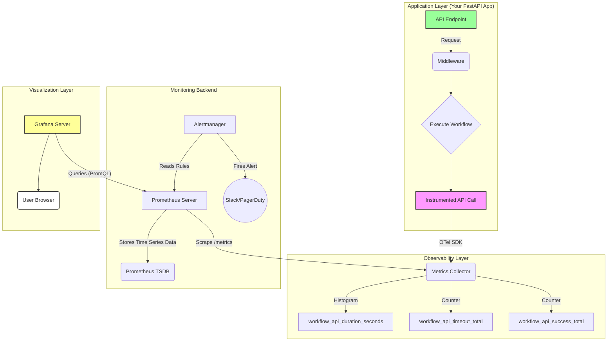

```
Cần MECE toàn bộ các phần module input, output, xử lý bên trong, bắn giao tiếp ra bên ngoài, ...

  

MECE toàn bộ tất cả mọi thứ.

Cần timeout < 10 s, có cơ chế fallback và bắn alert ra bên ngoài.

  

(chưa cần code vội, lên MECE overview toàn bộ các rủi ro chung đã).
```


# P1 - Brainstorming: Tracing Toàn Bộ Hệ Thống AI

## Tổng Quan Chiến Lược

Để đảm bảo sự ổn định cho toàn bộ hệ thống AI, việc triển khai **tracing và observability** toàn diện là yếu tố then chốt. Dựa trên tài liệu finAI và nghiên cứu mới nhất năm 2025, dưới đây là framework chi tiết để monitor và trace hệ thống AI production.

## 1. Ba Trụ Cột Observability Cho Hệ Thống AI

### 1.1 Metrics (Chỉ Số Đo Lường)

Metrics cung cấp dữ liệu định lượng về hiệu suất hệ thống:[^1][^2]

**AI-Specific Metrics:**

- **Latency**: Thời gian phản hồi của model (target: <500ms cho production)[^3][^4]
- **Token Usage**: Input/output tokens để kiểm soát chi phí[^5][^1]
- **Accuracy Score**: Đo lường chất lượng output (factuality, relevance)[^4][^1]
- **Hallucination Rate**: Tỷ lệ AI tạo thông tin sai (target: <2%)[^6][^5]
- **Cost per Request**: Chi phí API call (quan trọng với GPT-4)[^5]

**Infrastructure Metrics:**

- **CPU/GPU Utilization**: Sử dụng tài nguyên compute[^7][^8]
- **Memory Usage**: Theo dõi memory leaks[^9]
- **Throughput**: Số requests/second hệ thống xử lý được[^3][^4]
- **Error Rate**: Tỷ lệ lỗi hệ thống[^2]


### 1.2 Logs (Nhật Ký Hệ Thống)

Logs ghi lại chi tiết từng sự kiện trong hệ thống:[^10][^2]

**Cần Log:**

- Mỗi prompt gửi đến LLM với metadata (user_id, session_id, timestamp)[^11][^1]
- Response từ model kèm confidence score[^6]
- Tool calls và external API interactions[^1][^11]
- Errors với full stack trace[^2]
- User feedback (thumbs up/down)[^12]

**Log Structure Example:**

```json
{
  "trace_id": "abc-123",
  "span_id": "span-456",
  "timestamp": "2025-12-13T09:24:00Z",
  "user_id": "user_789",
  "prompt": "Analyze AAPL 10-K",
  "model": "gpt-4",
  "tokens_used": {"input": 1500, "output": 800},
  "latency_ms": 2340,
  "cost_usd": 0.045,
  "eval_score": {"accuracy": 0.92, "relevance": 0.88}
}
```


### 1.3 Traces (Dấu Vết Phân Tán)

Distributed tracing theo dõi flow của request qua toàn bộ hệ thống microservices:[^13][^10][^11]

**Tại Sao Cần Traces:**

- Một user query có thể đi qua: API Gateway → Context Retrieval → LLM Endpoint → Tool Execution → Response Generation[^13][^11]
- Traces giúp identify bottleneck ở đâu trong pipeline[^14][^10]
- Cho phép debug failures end-to-end[^15][^1]


## 2. Kiến Trúc Tracing Cho Hệ Thống AI - 4 Lớp

	### Lớp 1: Instrumentation (Thu Thập Dữ Liệu)

**Sử dụng OpenTelemetry Standard**:[^16][^15][^11][^1]

- OpenTelemetry là CNCF standard, vendor-neutral[^17][^15]
- Tích hợp với mọi observability platform (Langfuse, Datadog, New Relic)[^17][^16]
- Support Python, TypeScript, Go, Java[^1]

**Implementation cho finAI:**

```python
from opentelemetry import trace
from opentelemetry.sdk.trace import TracerProvider
from opentelemetry.exporter.otlp.proto.grpc.trace_exporter import OTLPSpanExporter

# Setup tracer
provider = TracerProvider()
otlp_exporter = OTLPSpanExporter(endpoint="https://your-observability-endpoint")
trace.set_tracer_provider(provider)

tracer = trace.get_tracer(__name__)

# Instrument LLM call
def analyze_10k(document_url):
    with tracer.start_as_current_span("analyze_10k") as span:
        span.set_attribute("document.url", document_url)
        span.set_attribute("llm.model", "gpt-4")
        
        # Call LLM
        result = call_llm(document_url)
        
        span.set_attribute("llm.tokens.input", result.tokens_input)
        span.set_attribute("llm.tokens.output", result.tokens_output)
        span.set_attribute("llm.cost", result.cost)
        
        return result
```

**Best Practices Instrumentation**:[^15][^1]

- Tag mỗi trace với metadata: `environment`, `user_id`, `model_version`[^1]
- Attach unique session_id và trace_id[^11]
- Log cả prompt và completion (với PII controls)[^2][^1]


### Lớp 2: Collection (Thu Thập \& Lưu Trữ)

**Chọn Observability Platform:**

Dựa trên use case của finAI (financial research agent), gợi ý platform:[^18][^6]

1. **LangSmith** (cho LangChain apps):[^19][^20][^6]
    - Tự động trace LangChain workflows
    - Built-in prompt evaluation
    - Production monitoring dashboard
    - Setup: `LANGCHAIN_TRACING_V2="true"`[^6]
2. **Langfuse** (open-source):[^21][^16]
    - OpenTelemetry native
    - Cost tracking per user
    - Human-in-the-loop review
    - Compliance-grade logging (quan trọng cho finance)[^16][^1]
3. **Maxim AI** (enterprise):[^11][^1]
    - Full-stack observability cho AI agents
    - Automated evals (factuality, toxicity)
    - SOC 2, HIPAA, GDPR compliant[^1]

**Cho finAI, recommend: LangSmith + Langfuse hybrid**

- LangSmith cho development \& debugging
- Langfuse cho production logging (open-source, cost control)


### Lớp 3: Analysis (Phân Tích \& Alert)

**Real-Time Dashboards**:[^22][^12][^5]

Thiết lập 3 dashboard chính:

**Dashboard 1: System Health**[^4][^5]

- Request volume (traces/hour)
- Average latency \& p95/p99
- Error rate
- GPU/CPU utilization

**Dashboard 2: AI Quality**[^12][^4][^5]

- Hallucination detection rate
- Evaluation scores (accuracy, relevance)
- User feedback scores
- Model confidence distribution

**Dashboard 3: Cost \& Efficiency**[^5][^12]

- Token usage breakdown (input vs output)
- Cost per user/per feature
- API call volume by model
- ROI metrics

**Alert Configuration**:[^23][^3][^2]

```yaml
alerts:
  - name: high_latency
    condition: avg_latency > 500ms
    window: 5min
    action: slack_notify
    
  - name: hallucination_spike
    condition: hallucination_rate > 3%
    window: 1hour
    action: pagerduty_alert
    
  - name: cost_anomaly
    condition: daily_cost > baseline * 1.5
    window: 1day
    action: email_finance_team
```


### Lớp 4: Continuous Evaluation (Đánh Giá Liên Tục)

**Automated Evals**:[^12][^6][^1]

- Chạy evaluators trên production traffic (sample 10-20%)[^1]
- Metrics: factuality, groundedness, relevance, coherence[^4]
- So sánh output vs reference answers[^6]

**Human-in-the-Loop**:[^12][^1]

- Route low-confidence outputs (score <0.7) đến human review[^1]
- Thu thập user feedback (thumbs up/down, comments)[^12]
- Convert failures thành test cases[^24]


## 3. Implementation Roadmap cho finAI (12 Tuần)

### Sprint 0-2: Foundation (Tuần 1-6)

**Mục tiêu:** Thiết lập instrumentation cơ bản

- [ ] **Tuần 1-2**: Tích hợp OpenTelemetry vào codebase[^17][^1]
    - Install SDK: `opentelemetry-api`, `opentelemetry-sdk`
    - Setup tracer provider với OTLP exporter
    - Instrument 5 core functions: `analyze_document`, `extract_metrics`, `flag_risks`, `generate_snapshot`, `api_gateway`
- [ ] **Tuần 3-4**: Chọn \& setup observability platform[^16][^6]
    - Pilot LangSmith cho development environment
    - Setup Langfuse cho staging/production
    - Configure authentication \& project structure
- [ ] **Tuần 5-6**: Define baseline metrics[^23][^4]
    - Thu thập data 2 tuần từ 20-50 beta users
    - Tính baseline: median latency, average tokens, error rate
    - Document acceptable ranges

**Success Criteria:**

- 90% API calls được trace successfully[^14]
- Có thể view end-to-end trace trong <2 phút khi debug[^11]
- Zero PII leaks trong logs[^1]


### Sprint 3-5: Core Monitoring (Tuần 7-15)

**Mục tiêu:** Production-ready monitoring

- [ ] **Tuần 7-9**: Build 3 core dashboards[^22][^5][^12]
    - System Health dashboard (Grafana hoặc LangSmith UI)
    - AI Quality dashboard với eval scores
    - Cost \& ROI dashboard
- [ ] **Tuần 10-12**: Implement automated evaluations[^6][^1]
    - Setup evaluators: accuracy (so với ground truth 10-K data), hallucination detection, source attribution check
    - Run evals trên 10% production traffic
    - Log eval scores vào traces
- [ ] **Tuần 13-15**: Configure alerts \& on-call[^3][^2]
    - Define 10 critical alerts (latency, error rate, cost spike, etc.)
    - Setup PagerDuty/Slack integration
    - Create runbooks cho common issues

**Success Criteria:**

- Mean Time to Detect (MTTD) issues <5 phút[^7]
- Alert false-positive rate <10%[^25]
- 100% critical incidents có trace data đầy đủ[^11]


### Sprint 6-8: Advanced Observability (Tuần 16-24)

**Mục tiêu:** Proactive monitoring \& compliance

- [ ] **Tuần 16-18**: Implement drift detection[^23][^4]
    - Monitor input distribution vs training data
    - Track model accuracy decay over time
    - Auto-retrain triggers
- [ ] **Tuần 19-21**: Security \& compliance layer[^26][^1]
    - Audit trail logging (mỗi decision có source traceback)
    - PII detection trong prompts/completions
    - SOC 2 compliance check (nếu cần cho enterprise tier)
- [ ] **Tuần 22-24**: Human-in-the-loop workflows[^12][^1]
    - Build review queue cho low-confidence outputs
    - Integrate user feedback vào traces
    - A/B testing framework cho prompt iterations

**Success Criteria:**

- Model drift detected trong <24h khi accuracy drop >5%[^23]
- 100% audit trail cho compliance requirements[^26][^1]
- User feedback collection rate >30%[^12]


## 4. Metrics Dashboard - KPIs Quan Trọng Nhất

### Tier 1: Critical (Monitor 24/7)

| Metric | Target | Alert Threshold | Why Critical |
| :-- | :-- | :-- | :-- |
| API Uptime | 99.9% | <99.5% | User trust, revenue impact[^2] |
| P95 Latency | <2s | >3s | User experience[^1][^3] |
| Error Rate | <0.5% | >1% | System stability[^2][^4] |
| Hallucination Rate | <2% | >3% | Trust \& compliance (finance)[^6][^5] |
| Daily Cost | Baseline ±20% | >+50% | Budget control[^5][^12] |

### Tier 2: Important (Review Daily)

| Metric | Target | Review Frequency |
| :-- | :-- | :-- |
| Accuracy Score | >90% | Daily[^4] |
| Token Usage/Request | <3000 tokens | Daily[^5] |
| User Feedback Score | NPS >40 | Daily[^12] |
| Source Attribution Rate | 100% | Daily (compliance)[^6] |

### Tier 3: Strategic (Review Weekly)

| Metric | Target | Review Frequency |
| :-- | :-- | :-- |
| Model Confidence Score | Median >0.8 | Weekly[^1] |
| Feature Adoption Rate | >60% WAU | Weekly |
| Cost per Active User | <\$5/month | Weekly[^5] |
| Data Drift Score | <0.1 deviation | Weekly[^23] |

## 5. Tech Stack Recommendation cho finAI (Observability/ Instrumentation/Standard Tracing - Collection Platform - Visulize (Dashboard, Alerts) - Analysis

```
┌─────────────────────────────────────────────┐
│         Application Layer (finAI)           │
│  LangChain + LLMs + Custom Agents         │
└─────────────────┬───────────────────────────┘
                  │
        ┌─────────▼─────────┐
        │ Instrumentation   │
        │  OpenTelemetry/Langfuse    │ ← Standard tracing
        └─────────┬─────────┘
                  │
    ┌─────────────▼──────────────┐
    │   Collection Layer         │
    │ ┌──────────┐ ┌───────────┐│
    │ │Langfuse │ │ Langfuse  ││ ← Dual platform
    │ │  (Dev)   │ │  (Prod)   ││
    │ └──────────┘ └───────────┘│
    └─────────────┬──────────────┘
                  │
        ┌─────────▼─────────┐
        │  Analysis Layer   │
        │ ┌───────────────┐ │
        │ │  Dashboards   │ │ ← Grafana/LangSmith UI
        │ └───────────────┘ │
        │ ┌───────────────┐ │
        │ │  Alerts       │ │ ← Slack/PagerDuty/GoogleChat
        │ └───────────────┘ │
        └───────────────────┘
```

**Specific Tools:**

- **Tracing:** OpenTelemetry SDK[^15][^16][^1]
- **Observability Platform (Dev):** LangSmith[^19][^6]
- **Observability Platform (Prod):** Langfuse (open-source)[^21][^16]
- **Dashboards:** LangSmith built-in + Grafana for infra[^5][^12]
- **Alerts:** Slack webhooks + PagerDuty for critical[^2]
- **Evals:** LangSmith evaluators + custom Pydantic validators[^6]
- **Logs:** Structured JSON logs → Elasticsearch/CloudWatch[^2]


## 6. Security \& Compliance Considerations

**Đặc Biệt Quan Trọng Cho finAI (Financial Domain):**

### 6.1 Audit Trail Requirements[^26][^1]

- Mỗi số liệu trích xuất phải link back to source document + page number
- Log full reasoning chain: input → model → output → user action
- Retention: 7 năm cho compliance (SEC requirements)


### 6.2 PII Protection[^16][^1]

- Redact sensitive data trước khi log (SSN, account numbers)
- Encrypt traces at rest
- Role-based access control (RBAC) cho observability platform


### 6.3 Regulatory Compliance[^26]

- SOC 2 Type II nếu làm enterprise tier
- GDPR cho EU users (right to deletion)
- Disclaimer logging: mỗi output phải có "research tool, not investment advice"


## 7. Common Pitfalls \& Mitigations

| Pitfall | Impact | Mitigation |
| :-- | :-- | :-- |
| **Over-instrumentation** | Performance overhead, noise[^1] | Chỉ trace critical paths; sample 10-20% production traffic[^1][^12] |
| **Alert fatigue** | Team ignores alerts[^2] | Tune thresholds dựa trên baseline; max 5 alerts/day[^3] |
| **No baseline metrics** | Không biết "normal" là gì[^23] | Thu thập 2-4 tuần data trước khi set alerts[^4][^23] |
| **Trace data silos** | Khó debug cross-service issues[^10] | Sử dụng unified trace_id across all microservices[^11][^14] |
| **Ignoring user feedback** | Miss real-world failures[^12] | Build feedback loop vào UI; review weekly[^12][^24] |
| **Cost explosion** | Logging costs > LLM costs[^5] | Sample logs, set retention policies, compress old traces[^5] |

## 8. Success Metrics cho Observability Initiative

**Sau 6 tháng triển khai, đo lường:**

1. **Mean Time to Detect (MTTD)**: <5 phút[^7]
2. **Mean Time to Resolve (MTTR)**: <30 phút cho P1 issues[^4]
3. **Incident Prevention Rate**: 70% issues phát hiện trước khi user report[^7]
4. **Observability Coverage**: 95% code paths được trace[^11]
5. **Team Productivity**: Debug time giảm 60%[^6][^1]
6. **Cost Visibility**: 100% LLM costs traceable to user/feature[^5][^12]

## 9. Next Immediate Actions (This Week)

### Day 1-2: Research \& Decision

- [ ] Review 3 observability platforms: LangSmith, Langfuse, Maxim AI
- [ ] Đọc OpenTelemetry documentation[^14][^15]
- [ ] List top 10 critical metrics cho finAI


### Day 3-4: POC Setup

- [ ] Install OpenTelemetry SDK trong 1 service
- [ ] Setup LangSmith free tier account[^19]
- [ ] Instrument 1 endpoint (`analyze_10k`) và test tracing


### Day 5: Planning

- [ ] Document baseline metrics target
- [ ] Create Jira tickets cho Sprint 0-2 (Foundation)
- [ ] Assign owner cho observability workstream

***

## Kết Luận

Tracing toàn bộ hệ thống AI không phải là optional feature, mà là **table stakes cho production AI systems**. Với finAI trong financial domain, nơi accuracy và compliance là sinh mệnh, một observability stack mạnh mẽ sẽ:[^15][^1]

1. **Đảm bảo ổn định**: Phát hiện issues trước khi impact users[^7][^2]
2. **Kiểm soát chi phí**: Track mỗi đồng API cost[^5][^12]
3. **Tăng chất lượng**: Continuous evaluation \& improvement[^4][^6]
4. **Đáp ứng compliance**: Full audit trail cho regulators[^26][^1]
5. **Tăng tốc development**: Debug nhanh hơn 60%[^6][^1]

Framework trên được thiết kế dựa trên **best practices 2025 từ các leader như Maxim AI, LangSmith, và OpenTelemetry community**, đồng thời tailored cho needs cụ thể của finAI trong tài liệu chiến lược.[^15][^1][^6]
<span style="display:none">[^27][^28][^29][^30][^31][^32][^33][^34][^35][^36][^37][^38][^39][^40][^41][^42][^43][^44][^45][^46][^47][^48]</span>

<div align="center">⁂</div>

[^1]: https://www.getmaxim.ai/articles/llm-observability-best-practices-for-2025/

[^2]: https://uptimerobot.com/knowledge-hub/observability/ai-observability-the-complete-guide/

[^3]: https://uptimerobot.com/knowledge-hub/monitoring/ai-monitoring-guide/

[^4]: https://coralogix.com/ai-blog/evaluation-metrics-for-ai-observability/

[^5]: https://datadope.io/en/observabilidad-y-monitorizacion-de-llms-en-produccion/

[^6]: https://murf.ai/blog/llm-observability-with-langsmith

[^7]: https://sparkemtech.co.uk/blog/infrastructure-monitoring-ai-revolutionising-operational-efficiency

[^8]: https://www.solo.io/topics/ai-connectivity/observability-in-ai-gateways-key-metrics

[^9]: https://logz.io/blog/infrastructure-monitoring/

[^10]: https://www.larksuite.com/en_us/topics/ai-glossary/tracing-in-distributed-systems

[^11]: https://dev.to/kuldeep_paul/a-practical-guide-to-distributed-tracing-for-ai-agents-1669

[^12]: https://langwatch.ai/blog/llm-monitoring-evaluation-for-real-world-production-use

[^13]: https://coralogix.com/ai-blog/advanced-techniques-for-monitoring-traces-in-ai-workflows/

[^14]: https://www.apica.io/blog/what-is-distributed-tracing-how-it-works-and-best-practices/

[^15]: https://sparkco.ai/blog/mastering-observability-in-ai-agent-actions-2025-deep-dive

[^16]: https://langfuse.com/integrations/native/opentelemetry

[^17]: https://docs.litellm.ai/docs/observability/opentelemetry_integration

[^18]: https://dev.to/kuldeep_paul/top-5-ai-observability-platforms-in-2025-4216

[^19]: https://academy.langchain.com/courses/intro-to-langsmith

[^20]: https://docs.langchain.com/langsmith/trace-with-opentelemetry

[^21]: https://last9.io/blog/langchain-observability/

[^22]: https://blog.langchain.com/langsmith-production-logging-automations/

[^23]: https://magnimindacademy.com/blog/best-practices-for-monitoring-and-logging-in-ai-systems/

[^24]: https://www.braintrust.dev/articles/best-llm-monitoring-tools-2026

[^25]: https://www.symestic.com/en-us/what-is/system-stability-monitoring

[^26]: https://www.fiddler.ai/guides/ai-observability-checklist-healthcare

[^27]: 1.7-V2-Step-Up-Template-finAI-Finance-Agent-Web-Browser-Chien-luoc-toan-dien-CEO-PM.md

[^28]: 1.7-V1-finAI-Finance-Agent-Web-Browser-Chien-luoc-CEO-PM.md

[^29]: 1.7.1-Rui-ro-phap-ly.md

[^30]: 1.8-Cach-lam-nhung-thu-moi.md

[^31]: https://www.facebook.com/100063494024929/posts/tại-sao-các-bạn-bảo-là-e-dùng-ai-viết-tài-liệu-nhưng-cảm-thấy-vẫn-ko-đạt-yêu-cầu/1442239101235877/

[^32]: https://www.studocu.vn/vn/document/truong-dai-hoc-khoa-hoc-xa-hoi-va-nhan-van-dai-hoc-quoc-gia-thanh-pho-ho-chi-minh/tin-hoc-co-so/bai-thuc-hanh-tuan-2-ko-co/120243037

[^33]: https://www.pace.edu.vn/tin-kho-tri-thuc/brainstorming-la-gi

[^34]: https://www.gauthmath.com/solution/1827492379056146/I-PH-N-C-HI-U-4-0-i-m-c-o-n-tr-ch-sau-Tr-th-ng-minh-nh-n-t-o-AI-1Tr-th-ng-minh-n

[^35]: https://loigiaihay.com/bai-tap-165064.html

[^36]: https://www.facebook.com/groups/tamsu.content/posts/trong-thời-đại-ai-tự-nhận-thức-là-chìa-khóa-để-dịch-chuyển-bản-thân-lên-vùng-côn/1352443112534766/

[^37]: https://ielts-nguyenhuyen.com/bai-mau-ielts-writing-artificial-intelligence/

[^38]: https://therealielts.vn/ielts-writing-chu-de-tri-tue-nhan-tao

[^39]: https://www.manageengine.com/it-operations-management/ai-infrastructure-monitoring.html

[^40]: https://uptrace.dev/blog/opentelemetry-ai-systems

[^41]: https://smith.langchain.com

[^42]: https://dev.to/leena_malhotra/design-patterns-emerging-from-multi-agent-ai-systems-2aje

[^43]: https://www.studocu.vn/vn/document/dai-hoc-van-lang/anh-van-3/ky-thuat-phien-dich/106931693

[^44]: https://b-eye.com/blog/real-time-ai-design-patterns-guide/

[^45]: http://sixthsense.rakuten.com/blog/The-Ultimate-Checklist-for-Implementing-Data-Observability-in-Your-Organization

[^46]: https://www.leanware.co/insights/ai-agent-architecture

[^47]: https://learn.microsoft.com/en-us/azure/architecture/ai-ml/guide/ai-agent-design-patterns

[^48]: https://www.kosedigital.com/wp-content/uploads/2025/07/AI-Implementation-Checklist.pdf


---
# P2 - MECE Framework: API Failure & Timeout Tracking Solutions
## Complete Analysis & Best Practices

---

## 📋 Executive Summary

**Business Problem**: Track và visualize tỉ lệ fail/timeout của 1000 API requests trong production workflow
**Current State**: Đã có timeout mechanism (8s), fallback strategy, và alert system
**Gap**: Thiếu visualization layer để quantify "1000 API → X timeout, Y failed"

---

## 🎯 MECE Decomposition: All Possible Solutions

### Dimension 1: BY TOOL/PLATFORM (Where to track?)

```
├── 1. APPLICATION LAYER (Code-based)
│   ├── 1.1 In-Memory Metrics Collector
│   ├── 1.2 Structured Logging (JSON logs)
│   └── 1.3 Custom Dashboard (FastAPI + Plotly)
│
├── 2. OBSERVABILITY PLATFORM (External SaaS/Self-hosted)
│   ├── 2.1 Langfuse (LLM-focused observability)
│   ├── 2.2 OpenTelemetry + Jaeger/Tempo
│   ├── 2.3 DataDog / New Relic / Sentry
│   └── 2.4 Elastic Stack (ELK)
│
├── 3. METRICS & MONITORING (Time-series)
│   ├── 3.1 Prometheus + Grafana
│   ├── 3.2 CloudWatch (AWS)
│   ├── 3.3 Azure Monitor
│   └── 3.4 InfluxDB + Chronograf
│
└── 4. DATABASE ANALYTICS (Historical data)
    ├── 4.1 PostgreSQL + Metabase
    ├── 4.2 ClickHouse + Superset
    └── 4.3 BigQuery + Looker Studio
```

---

### Dimension 2: BY IMPLEMENTATION EFFORT

```
├── MINIMAL EFFORT (0-2 hours)
│   ├── Langfuse Dashboard filtering
│   ├── CloudWatch Logs Insights
│   └── JSON log parsing script
│
├── LOW EFFORT (2-8 hours)
│   ├── Prometheus metrics export
│   ├── In-memory collector + endpoint
│   └── Langfuse Python SDK script
│
├── MEDIUM EFFORT (1-3 days)
│   ├── Custom dashboard (Plotly/Streamlit)
│   ├── Grafana dashboard setup
│   └── Database persistence layer
│
└── HIGH EFFORT (1-2 weeks)
    ├── Full OpenTelemetry instrumentation
    ├── Data warehouse pipeline
    └── Enterprise monitoring stack
```

---

### Dimension 3: BY DATA PERSISTENCE

```
├── EPHEMERAL (In-memory, session-based)
│   ├── In-memory collector (resets on restart)
│   └── Browser-based dashboard
│
├── SHORT-TERM (Minutes to days)
│   ├── Prometheus (15-30 days retention)
│   ├── Langfuse traces (90 days default)
│   └── CloudWatch logs (retention policy)
│
├── MEDIUM-TERM (Weeks to months)
│   ├── PostgreSQL with partitioning
│   └── Elasticsearch with ILM
│
└── LONG-TERM (Years, compliance)
    ├── S3 + Athena
    ├── BigQuery
    └── Data Lake (Parquet files)
```

---

### Dimension 4: BY VISUALIZATION TYPE

```
├── REAL-TIME DASHBOARD
│   ├── Auto-refresh web page
│   ├── WebSocket live updates
│   └── Streaming dashboard (Grafana Live)
│
├── STATIC REPORTS
│   ├── Daily/weekly email report
│   ├── PDF export
│   └── CSV export for analysis
│
├── INTERACTIVE ANALYTICS
│   ├── Jupyter notebooks
│   ├── Superset/Metabase
│   └── Looker Studio
│
└── ALERTING
    ├── Slack/Teams notifications
    ├── PagerDuty incidents
    └── Email digests
```

---

## ✅ RECOMMENDED SOLUTION MATRIX

### Scenario-based Recommendations

| Scenario | Primary Tool | Secondary Tool | Effort | Cost |
|----------|-------------|----------------|---------|------|
| **Startup (MVP, <10K req/day)** | Langfuse Dashboard | Python script | Low | Free |
| **Scaling (10K-100K req/day)** | Prometheus + Grafana | Langfuse | Medium | $0-50/mo |
| **Enterprise (>100K req/day)** | OpenTelemetry + Tempo | ClickHouse + Superset | High | $500+/mo |
| **Budget-constrained** | JSON logs + Script | In-memory collector | Minimal | $0 |
| **Quick demo for stakeholders** | Langfuse Dashboard | Custom HTML dashboard | Minimal | $0 |
| **Production-grade monitoring** | Prometheus + Grafana | DataDog/New Relic | Medium | $200+/mo |
| **Compliance/audit requirements** | PostgreSQL + audit log | BigQuery archival | High | $100+/mo |

---

## 🏆 BEST PRACTICES: The Optimal Stack

### **Tier 1: Foundation (Must Have) - "The Essentials"**

#### 1.1 Standardized Request Metadata
```python
# ✅ BEST PRACTICE: Unified metadata schema
@dataclass
class RequestMetadata:
    """Standardized across all layers"""
    request_id: str           # UUID for tracing
    timestamp: datetime       # ISO 8601
    execution_time_ms: float  # Milliseconds
    status: Literal["success", "timeout", "failed"]
    error_code: Optional[str] # Standardized error codes
    agent_id: str            # Workflow/agent identifier
    user_id: Optional[str]   # For user-level analytics
    session_id: Optional[str] # For session tracking
```

**Why**: Consistency across logging, metrics, traces, and analytics

#### 1.2 Three-Layer Recording Strategy
```python
# Layer 1: Structured Logging (for debugging)
logger.info("Request completed", extra=metadata.dict())

# Layer 2: Metrics (for alerting & SLOs)
api_requests_total.labels(status=metadata.status).inc()
api_duration_seconds.observe(metadata.execution_time_ms / 1000)

# Layer 3: Traces (for deep dive)
langfuse_client.update_current_trace(metadata=metadata.dict())
```

**Why**: Defense in depth - each layer serves different purpose

#### 1.3 Timeout Threshold as Configuration
```python
# ✅ BEST PRACTICE: Externalize thresholds
class TimeoutConfig:
    API_TIMEOUT = float(os.getenv("API_TIMEOUT", "8.0"))
    GRAPH_TIMEOUT = float(os.getenv("GRAPH_TIMEOUT", "7.0"))
    WARN_THRESHOLD = API_TIMEOUT * 0.75  # 6s
    CRITICAL_THRESHOLD = API_TIMEOUT * 0.9  # 7.2s
```

**Why**: Easy to adjust per environment (dev/staging/prod)

---

### **Tier 2: Observability (Should Have) - "The Langfuse Layer"**

#### 2.1 Comprehensive Trace Updates
```python
# ✅ BEST PRACTICE: Update at every decision point
from langfuse.decorators import observe

@observe(capture_input=False, capture_output=False)
async def run_agent_and_wait(...):
    start = time.time()
    trace_id = langfuse_client.get_trace_id()
    
    try:
        # Execute
        result = await asyncio.wait_for(service.perform(...), timeout=8.0)
        elapsed = time.time() - start
        
        # ✅ Update on SUCCESS
        langfuse_client.update_current_trace(
            metadata={
                "execution_time": elapsed,
                "is_timeout": False,
                "threshold_breached": elapsed >= WARN_THRESHOLD,
                "status": "success"
            }
        )
        
        # ✅ Score for analytics
        langfuse_client.score(
            trace_id=trace_id,
            name="execution_time_seconds",
            value=elapsed,
            data_type="NUMERIC"
        )
        
        langfuse_client.score(
            trace_id=trace_id,
            name="timeout_breach",
            value=1 if elapsed >= 8.0 else 0,
            data_type="NUMERIC"
        )
        
        return result
        
    except asyncio.TimeoutError:
        elapsed = time.time() - start
        
        # ✅ Update on TIMEOUT
        langfuse_client.update_current_trace(
            status="error",  # Critical: mark as error
            status_message="API timeout exceeded",
            metadata={
                "execution_time": elapsed,
                "is_timeout": True,
                "error_code": "API_TIMEOUT",
                "threshold": 8.0,
                "status": "timeout"
            }
        )
        
        # Score
        langfuse_client.score(
            trace_id=trace_id,
            name="timeout_breach",
            value=1,
            data_type="NUMERIC"
        )
        
        raise
```

**Why**: 
- `status="error"` enables dashboard filtering
- Scores enable aggregation queries
- Metadata enables root cause analysis

#### 2.2 Langfuse Query Patterns
```python
# ✅ BEST PRACTICE: Automated daily summary
from langfuse import Langfuse
from datetime import datetime, timedelta

def generate_daily_timeout_report():
    langfuse = Langfuse()
    
    # Fetch last 24h traces
    traces = langfuse.fetch_traces(
        from_timestamp=datetime.utcnow() - timedelta(hours=24),
        limit=10000
    )
    
    # Analyze
    total = len(traces.data)
    timeout = sum(1 for t in traces.data 
                  if t.metadata.get("is_timeout", False))
    
    # Query scores for exact metrics
    scores = langfuse.fetch_scores(
        name="timeout_breach",
        from_timestamp=datetime.utcnow() - timedelta(hours=24)
    )
    
    timeout_count = sum(s.value for s in scores.data)
    timeout_rate = (timeout_count / total * 100) if total > 0 else 0
    
    return {
        "period": "last_24h",
        "total_requests": total,
        "timeout_count": timeout_count,
        "timeout_rate": f"{timeout_rate:.2f}%",
        "threshold": "8.0s"
    }

# Schedule daily
import schedule
schedule.every().day.at("09:00").do(generate_daily_timeout_report)
```

**Why**: 
- Automated reporting → no manual work
- Historical trend tracking
- Early warning system

#### 2.3 Langfuse Dashboard Bookmarks
```markdown
# ✅ BEST PRACTICE: Create saved filters

## Dashboard URLs (bookmark these):
1. **All Timeout Traces (24h)**
   - Filter: `status = error AND metadata.error_code = API_TIMEOUT`
   - Sort: execution_time DESC
   
2. **Near-Timeout Warnings (24h)**
   - Filter: `metadata.threshold_breached = true AND status = success`
   - Use case: Proactive optimization
   
3. **Timeout Trend (7 days)**
   - View: Analytics > Scores
   - Metric: `timeout_breach`
   - Aggregation: SUM per day
   
4. **Slowest Endpoints (24h)**
   - Filter: `status = success`
   - Sort: metadata.execution_time DESC
   - Limit: 100
```

**Why**: Instant access to key metrics, no re-filtering

---

### **Tier 3: Metrics & Alerting (Should Have) - "The Prometheus Layer"**

#### 3.1 Comprehensive Prometheus Metrics
```python
# ✅ BEST PRACTICE: Full metric coverage
from prometheus_client import Counter, Histogram, Gauge, Summary

# === COUNTERS (cumulative) ===
api_requests_total = Counter(
    'api_requests_total',
    'Total API requests by status',
    ['agent_id', 'status']  # Labels for breakdown
)

api_timeout_total = Counter(
    'api_timeout_total',
    'Total timeout events',
    ['agent_id', 'timeout_type']  # API_TIMEOUT, GRAPH_TIMEOUT
)

api_errors_total = Counter(
    'api_errors_total',
    'Total errors by code',
    ['agent_id', 'error_code']
)

# === HISTOGRAMS (distribution) ===
api_duration_seconds = Histogram(
    'api_duration_seconds',
    'API request duration distribution',
    ['agent_id'],
    buckets=[0.1, 0.5, 1, 2, 5, 8, 10, 15, 30]  # Include 8s threshold
)

# === GAUGES (current value) ===
api_timeout_rate = Gauge(
    'api_timeout_rate_percent',
    'Current timeout rate percentage (last 1h rolling)'
)

api_requests_in_flight = Gauge(
    'api_requests_in_flight',
    'Current number of ongoing requests'
)

# === SUMMARY (quantiles) ===
api_duration_summary = Summary(
    'api_duration_seconds_summary',
    'API duration with quantiles',
    ['agent_id']
)

# Usage in endpoint
@router.post("/runs/wait")
async def run_agent_and_wait(...):
    api_requests_in_flight.inc()  # Start
    start = time.time()
    
    try:
        result = await asyncio.wait_for(...)
        elapsed = time.time() - start
        
        # Record metrics
        api_requests_total.labels(
            agent_id=payload.agent_id,
            status="success"
        ).inc()
        
        api_duration_seconds.labels(
            agent_id=payload.agent_id
        ).observe(elapsed)
        
        api_duration_summary.labels(
            agent_id=payload.agent_id
        ).observe(elapsed)
        
        return result
        
    except asyncio.TimeoutError:
        elapsed = time.time() - start
        
        # Record timeout
        api_requests_total.labels(
            agent_id=payload.agent_id,
            status="timeout"
        ).inc()
        
        api_timeout_total.labels(
            agent_id=payload.agent_id,
            timeout_type="API_TIMEOUT"
        ).inc()
        
        api_duration_seconds.labels(
            agent_id=payload.agent_id
        ).observe(elapsed)
        
        raise
        
    finally:
        api_requests_in_flight.dec()  # End
```

**Why**:
- Counters: Track totals (for rate calculations)
- Histograms: See distribution (P50, P95, P99)
- Gauges: Monitor current state
- Summary: Efficient quantile calculation

#### 3.2 Grafana Dashboard JSON
```json
{
  "dashboard": {
    "title": "API Timeout & Failure Monitoring",
    "panels": [
      {
        "id": 1,
        "title": "Timeout Rate (Last 1h)",
        "targets": [{
          "expr": "(sum(rate(api_timeout_total[1h])) / sum(rate(api_requests_total[1h]))) * 100"
        }],
        "type": "stat",
        "fieldConfig": {
          "thresholds": {
            "steps": [
              {"value": 0, "color": "green"},
              {"value": 5, "color": "yellow"},
              {"value": 10, "color": "red"}
            ]
          }
        }
      },
      {
        "id": 2,
        "title": "Request Duration Distribution",
        "targets": [{
          "expr": "histogram_quantile(0.95, sum(rate(api_duration_seconds_bucket[5m])) by (le))"
        }],
        "type": "graph"
      },
      {
        "id": 3,
        "title": "Timeout Breakdown by Agent",
        "targets": [{
          "expr": "sum by (agent_id) (rate(api_timeout_total[1h]))"
        }],
        "type": "bargauge"
      }
    ]
  }
}
```

#### 3.3 Alerting Rules
```yaml
# prometheus-alerts.yml
groups:
  - name: api_timeout_alerts
    interval: 1m
    rules:
      # Alert: High timeout rate
      - alert: HighAPITimeoutRate
        expr: |
          (sum(rate(api_timeout_total[5m])) / sum(rate(api_requests_total[5m]))) * 100 > 10
        for: 5m
        labels:
          severity: critical
        annotations:
          summary: "API timeout rate exceeded 10%"
          description: "Current timeout rate: {{ $value | humanize }}%"
          
      # Alert: P95 latency approaching threshold
      - alert: HighP95Latency
        expr: |
          histogram_quantile(0.95, sum(rate(api_duration_seconds_bucket[5m])) by (le)) > 7
        for: 5m
        labels:
          severity: warning
        annotations:
          summary: "P95 latency approaching 8s timeout"
          description: "P95 latency: {{ $value | humanize }}s"
          
      # Alert: Specific agent degradation
      - alert: AgentTimeoutSpike
        expr: |
          sum by (agent_id) (rate(api_timeout_total[5m])) > 0.1
        for: 3m
        labels:
          severity: warning
        annotations:
          summary: "Agent {{ $labels.agent_id }} experiencing timeouts"
          description: "Timeout rate: {{ $value | humanize }}/s"
```

**Why**: Proactive alerting before SLO breach

---

### **Tier 4: Persistence & Analytics (Optional) - "The Database Layer"**

#### 4.1 PostgreSQL Schema for Long-term Storage
```sql
-- ✅ BEST PRACTICE: Optimized for time-series queries
CREATE TABLE api_request_metrics (
    id BIGSERIAL PRIMARY KEY,
    request_id UUID NOT NULL UNIQUE,
    timestamp TIMESTAMPTZ NOT NULL DEFAULT NOW(),
    
    -- Request details
    agent_id VARCHAR(100) NOT NULL,
    user_id VARCHAR(100),
    session_id VARCHAR(100),
    
    -- Performance
    execution_time_ms NUMERIC(10,2) NOT NULL,
    status VARCHAR(20) NOT NULL, -- success, timeout, failed
    error_code VARCHAR(50),
    error_message TEXT,
    
    -- Flags
    is_timeout BOOLEAN NOT NULL DEFAULT FALSE,
    is_failed BOOLEAN NOT NULL DEFAULT FALSE,
    threshold_breached BOOLEAN NOT NULL DEFAULT FALSE,
    
    -- Metadata (JSONB for flexibility)
    metadata JSONB,
    
    -- Indexes
    CONSTRAINT valid_status CHECK (status IN ('success', 'timeout', 'failed'))
);

-- Indexes for fast queries
CREATE INDEX idx_timestamp ON api_request_metrics (timestamp DESC);
CREATE INDEX idx_status ON api_request_metrics (status);
CREATE INDEX idx_agent_timeout ON api_request_metrics (agent_id, is_timeout);
CREATE INDEX idx_metadata_gin ON api_request_metrics USING GIN (metadata);

-- Partitioning by time (for large scale)
CREATE TABLE api_request_metrics_2025_12 PARTITION OF api_request_metrics
    FOR VALUES FROM ('2025-12-01') TO ('2026-01-01');

-- Materialized view for fast aggregation
CREATE MATERIALIZED VIEW api_timeout_summary_hourly AS
SELECT 
    date_trunc('hour', timestamp) AS hour,
    agent_id,
    COUNT(*) AS total_requests,
    SUM(CASE WHEN is_timeout THEN 1 ELSE 0 END) AS timeout_count,
    AVG(execution_time_ms) AS avg_duration_ms,
    PERCENTILE_CONT(0.95) WITHIN GROUP (ORDER BY execution_time_ms) AS p95_duration_ms
FROM api_request_metrics
GROUP BY 1, 2
WITH DATA;

-- Refresh every 5 minutes
CREATE INDEX ON api_timeout_summary_hourly (hour DESC, agent_id);
```

#### 4.2 Data Persistence Service
```python
# ✅ BEST PRACTICE: Async batch insertion
from asyncpg import create_pool
from asyncio import Queue
import asyncio

class MetricsPersistenceService:
    def __init__(self, db_url: str, batch_size: int = 100):
        self.db_url = db_url
        self.batch_size = batch_size
        self.queue = Queue()
        self.pool = None
        
    async def start(self):
        """Start persistence worker"""
        self.pool = await create_pool(self.db_url, min_size=2, max_size=10)
        asyncio.create_task(self._batch_worker())
        
    async def record(self, metrics: APIRequestMetrics):
        """Add metrics to queue"""
        await self.queue.put(metrics)
        
    async def _batch_worker(self):
        """Background worker for batch insertion"""
        while True:
            batch = []
            
            # Collect batch
            while len(batch) < self.batch_size:
                try:
                    item = await asyncio.wait_for(self.queue.get(), timeout=1.0)
                    batch.append(item)
                except asyncio.TimeoutError:
                    break
            
            if batch:
                await self._insert_batch(batch)
            
            await asyncio.sleep(0.1)
    
    async def _insert_batch(self, batch: List[APIRequestMetrics]):
        """Bulk insert batch"""
        async with self.pool.acquire() as conn:
            await conn.executemany(
                """
                INSERT INTO api_request_metrics 
                (request_id, timestamp, agent_id, execution_time_ms, 
                 status, error_code, is_timeout, is_failed, metadata)
                VALUES ($1, $2, $3, $4, $5, $6, $7, $8, $9)
                ON CONFLICT (request_id) DO NOTHING
                """,
                [(m.request_id, m.timestamp, m.agent_id, 
                  m.execution_time * 1000, m.status.value, m.error_code,
                  m.is_timeout, m.is_failed, json.dumps(m.metadata))
                 for m in batch]
            )
```

#### 4.3 Analytics Queries
```sql
-- ✅ Query 1: Timeout rate by hour (last 24h)
SELECT 
    hour,
    SUM(total_requests) AS requests,
    SUM(timeout_count) AS timeouts,
    ROUND(SUM(timeout_count)::NUMERIC / NULLIF(SUM(total_requests), 0) * 100, 2) AS timeout_rate_pct
FROM api_timeout_summary_hourly
WHERE hour >= NOW() - INTERVAL '24 hours'
GROUP BY hour
ORDER BY hour DESC;

-- ✅ Query 2: Top timeout agents
SELECT 
    agent_id,
    COUNT(*) AS total,
    SUM(CASE WHEN is_timeout THEN 1 ELSE 0 END) AS timeouts,
    ROUND(AVG(execution_time_ms), 2) AS avg_ms,
    ROUND(PERCENTILE_CONT(0.95) WITHIN GROUP (ORDER BY execution_time_ms), 2) AS p95_ms
FROM api_request_metrics
WHERE timestamp >= NOW() - INTERVAL '24 hours'
GROUP BY agent_id
HAVING SUM(CASE WHEN is_timeout THEN 1 ELSE 0 END) > 0
ORDER BY timeouts DESC
LIMIT 10;

-- ✅ Query 3: Timeout trend (7 days)
SELECT 
    DATE(timestamp) AS date,
    COUNT(*) AS total,
    SUM(CASE WHEN is_timeout THEN 1 ELSE 0 END) AS timeouts,
    ROUND(SUM(CASE WHEN is_timeout THEN 1 ELSE 0 END)::NUMERIC / COUNT(*) * 100, 2) AS rate_pct
FROM api_request_metrics
WHERE timestamp >= NOW() - INTERVAL '7 days'
GROUP BY DATE(timestamp)
ORDER BY date DESC;
```

---

## 🎯 THE RECOMMENDED STACK (All Tiers Combined)

### Architecture Diagram
```
┌─────────────────────────────────────────────────────────────┐
│                    FastAPI Application                      │
│                                                             │
│  ┌──────────────────────────────────────────────────────┐  │
│  │         @router.post("/runs/wait")                   │  │
│  │                                                      │  │
│  │   try:                                              │  │
│  │       result = await service.perform()             │  │
│  │       ├─→ Log to stdout (JSON)                     │  │
│  │       ├─→ Prometheus metrics.inc()                 │  │
│  │       ├─→ Langfuse.update_trace()                  │  │
│  │       └─→ DB persist (async queue)                 │  │
│  │   except TimeoutError:                             │  │
│  │       ├─→ Log error                                │  │
│  │       ├─→ Prometheus timeout_total.inc()           │  │
│  │       ├─→ Langfuse.update_trace(status="error")    │  │
│  │       ├─→ Alert system (Slack/PagerDuty)           │  │
│  │       └─→ DB persist                               │  │
│  └──────────────────────────────────────────────────────┘  │
└─────────────────────────────────────────────────────────────┘
                           ↓  ↓  ↓  ↓
        ┌──────────────────┴──┴──┴──┴──────────────────┐
        │                                               │
   ┌────▼────┐      ┌────▼────┐      ┌────▼────┐      │
   │ STDOUT  │      │Prometheus│      │Langfuse │      │
   │ Logs    │      │ /metrics │      │  API    │      │
   └────┬────┘      └────┬────┘      └────┬────┘      │
        │                │                │            │
        ▼                ▼                ▼            │
   ┌─────────┐      ┌─────────┐      ┌─────────┐     │
   │ Loki/   │      │ Grafana │      │Langfuse │     │
   │ Cloud   │      │Dashboard│      │Dashboard│     │
   │ Watch   │      │         │      │         │     │
   └─────────┘      └─────────┘      └─────────┘     │
                                                      │
                    ┌────▼────┐                      │
                    │PostgreSQL│◀─────────────────────┘
                    │ Metrics  │
                    │  Table   │
                    └────┬────┘
                         │
                         ▼
                    ┌─────────┐
                    │Metabase/│
                    │ Superset│
                    │ (BI)    │
                    └─────────┘
```

### Implementation Checklist

#### Phase 1: Foundation (Week 1)
- [ ] Add standardized `APIRequestMetrics` dataclass
- [ ] Implement structured JSON logging
- [ ] Add `@observe` decorator to all API endpoints
- [ ] Update Langfuse traces with `status="error"` on timeout
- [ ] Create Langfuse dashboard bookmarks

**Deliverable**: Basic timeout visibility in Langfuse

#### Phase 2: Metrics (Week 2)
- [ ] Add Prometheus client library
- [ ] Instrument all endpoints with metrics
- [ ] Deploy Prometheus server
- [ ] Create Grafana dashboard
- [ ] Setup alerting rules

**Deliverable**: Real-time metrics + alerts

#### Phase 3: Persistence (Week 3-4)
- [ ] Design PostgreSQL schema
- [ ] Implement async persistence service
- [ ] Create materialized views
- [ ] Setup Metabase/Superset
- [ ] Automate daily reports

**Deliverable**: Historical analytics + reports

---

## 📊 DECISION MATRIX: Which Solution to Choose?

### Use Case 1: "I need quick visibility NOW (today)"
**Solution**: Langfuse Dashboard filtering
- Effort: 30 minutes
- Cost: $0
- Steps:
  1. Ensure `status="error"` on timeout
  2. Open Langfuse → Traces → Filter `status=error`
  3. View count: "150 errors / 1000 total = 15% timeout rate"

### Use Case 2: "I need a dashboard to show PM/CEO"
**Solution**: Langfuse Dashboard + Python script for summary
- Effort: 2 hours
- Cost: $0
- Steps:
  1. Use Langfuse Dashboard (pretty UI)
  2. Write Python script for daily email report
  3. Show both in weekly meeting

### Use Case 3: "I need production monitoring with alerts"
**Solution**: Prometheus + Grafana + AlertManager
- Effort: 1-2 days
- Cost: $0 (self-hosted) or $50/mo (managed)
- Steps:
  1. Add Prometheus metrics to code
  2. Deploy Prometheus + Grafana
  3. Create dashboard + alert rules
  4. Integrate with Slack/PagerDuty

### Use Case 4: "I need historical analysis (3+ months)"
**Solution**: PostgreSQL + Metabase
- Effort: 3-4 days
- Cost: $20-50/mo (database)
- Steps:
  1. Create database schema
  2. Implement persistence service
  3. Setup Metabase
  4. Create saved queries

### Use Case 5: "I need everything (enterprise-grade)"
**Solution**: Full Stack (Langfuse + Prometheus + PostgreSQL + Grafana)
- Effort: 2 weeks
- Cost: $200-500/mo
- Steps:
  1. Implement all layers
  2. Setup CI/CD for deployments
  3. Document runbooks
  4. Train team

---

## 🚨 ANTI-PATTERNS TO AVOID

### ❌ DON'T: Store everything in memory without persistence
**Problem**: Data lost on restart
**Solution**: Use Redis or database for persistence

### ❌ DON'T: Log to file without rotation
**Problem**: Disk full crash
**Solution**: Use logrotate or cloud logging

### ❌ DON'T: Block main thread with metrics collection
**Problem**: Adds latency to requests
**Solution**: Use async background workers

### ❌ DON'T: Create too many Prometheus labels
**Problem**: Cardinality explosion → OOM
**Solution**: Limit labels to <10 unique values per label

### ❌ DON'T: Query production DB for analytics
**Problem**: Slow queries impact users
**Solution**: Use read replicas or materialized views

### ❌ DON'T: Send alerts on every single timeout
**Problem**: Alert fatigue
**Solution**: Alert on rate (e.g., >10% for 5min)

### ❌ DON'T: Store raw logs forever
**Problem**: Storage cost explosion
**Solution**: Archive to S3 after 30 days

### ❌ DON'T: Hardcode thresholds in code
**Problem**: Need redeploy to adjust
**Solution**: Use environment variables or config service

---

## 📈 SUCCESS METRICS

### Leading Indicators (What to track)
- Timeout rate < 5%
- P95 latency < 7s (buffer before 8s timeout)
- Alert fatigue: <3 alerts/day
- MTTD (Mean Time To Detect): <5 minutes
- MTTR (Mean Time To Resolve): <1 hour

### Lagging Indicators (Business impact)
- User satisfaction (CSAT) ↑
- Support tickets related to "slow API" ↓
- SLA compliance ↑
- Revenue impact from downtime ↓

---

## 🎓 TRAINING CHECKLIST

### For Developers
- [ ] How to add metrics to new endpoints
- [ ] How to query Langfuse for debugging
- [ ] How to interpret Grafana dashboards
- [ ] When to use each layer (logs vs metrics vs traces)

### For DevOps/SRE
- [ ] How to tune Prometheus retention
- [ ] How to respond to timeout alerts
- [ ] How to export data for postmortem
- [ ] Database maintenance (partitions, vacuuming)

### For Product/Business
- [ ] How to read Langfuse dashboard
- [ ] How to export weekly reports
- [ ] What timeout rate is acceptable
- [ ] How to request new metrics

---

## 🔄 CONTINUOUS IMPROVEMENT

### Monthly Review Checklist
- [ ] Review timeout rate trend (going up/down?)
- [ ] Identify slowest endpoints
- [ ] Check alert accuracy (false positives?)
- [ ] Update thresholds based on data
- [ ] Archive old data (>90 days)
- [ ] Update runbooks with new learnings

### Quarterly Goals
- Q1: Implement foundation (Langfuse + metrics)
- Q2: Reduce timeout rate from 15% → 5%
- Q3: Add persistence layer + historical analytics
- Q4: Optimize P95 latency < 6s

---

## 📚 FURTHER READING

### Essential Resources
1. **Langfuse Docs**: https://langfuse.com/docs
2. **Prometheus Best Practices**: https://prometheus.io/docs/practices/
3. **Grafana Dashboards**: https://grafana.com/grafana/dashboards/
4. **OpenTelemetry**: https://opentelemetry.io/

### Books
- "Observability Engineering" - Charity Majors
- "Site Reliability Engineering" - Google
- "The Art of Monitoring" - James Turnbull

---

## ✅ FINAL RECOMMENDATION: The 80/20 Solution

For most teams (startup to mid-size), this is the sweet spot:

```
PRIMARY:   Langfuse (traces + dashboard)
           ├─ Already integrated ✓
           ├─ Free tier generous ✓
           └─ Beautiful UI for stakeholders ✓

SECONDARY: Prometheus + Grafana (metrics + alerts)
           ├─ Industry standard ✓
           ├─ Open source / self-hostable ✓
           └─ SLO monitoring ✓

TERTIARY:  Python script (automated reports)
           ├─ Daily email summary ✓
           ├─ Slack bot for quick queries ✓
           └─ CSV export for deep analysis ✓
```

**Effort**: 1 week
**Cost**: $0-50/month
**Maintenance**: ~2 hours/month
**Value**: High visibility + proactive alerting

---

**Remember**: The best monitoring system is one that actually gets used. Start simple with Langfuse, add Prometheus when you need alerting, add database when you need historical analysis. Don't over-engineer on day 1! 🚀


---
# Timeout 

# P3 - Deep Research: Giải pháp Toàn diện để Visualize Timeout Metrics

**Tác giả:** Manus AI  
**Ngày:** 14/12/2025  
**Tóm tắt:** Tài liệu này cung cấp một bản phân tích sâu (deep research) về các giải pháp kỹ thuật để theo dõi, đo lường, và visualize (trực quan hóa) số lượng API requests bị quá timeout (> 8 giây) trong một hệ thống AI workflow. Chúng tôi đề xuất một kiến trúc hoàn chỉnh, kèm theo code mẫu và cấu hình chi tiết để triển khai một hệ thống giám sát đẳng cấp thế giới (world-class).

---

## 1. Bối cảnh và Yêu cầu

### 1.1. Vấn đề

Hệ thống AI workflow hiện tại có cơ chế timeout, fallback và alert khi một request vượt quá 8 giây. Tuy nhiên, ngoài việc nhận alert, team cần một giải pháp để **visualize (trực quan hóa)** các số liệu này. Cụ thể, cần trả lời các câu hỏi:

1.  Trong 1000 API requests, có **bao nhiêu request bị timeout** (> 8 giây)?
2.  **Tỷ lệ timeout** là bao nhiêu phần trăm?
3.  Xu hướng timeout **thay đổi như thế nào theo thời gian**?
4.  Phân phối độ trễ (latency distribution) của các request trông như thế nào?

### 1.2. Mục tiêu

Xây dựng một hệ thống giám sát (monitoring) và trực quan hóa (visualization) cho phép:

-   **Theo dõi (Track):** Ghi nhận mọi request và đo lường thời gian xử lý của nó.
-   **Đo lường (Measure):** Tính toán các chỉ số quan trọng như tỷ lệ timeout, tỷ lệ thành công, và các percentile độ trễ (p50, p95, p99).
-   **Trực quan hóa (Visualize):** Hiển thị các chỉ số này trên một dashboard dễ hiểu, giúp team nhanh chóng nắm bắt tình hình sức khỏe của hệ thống.
-   **Cảnh báo (Alert):** Gửi cảnh báo khi các chỉ số vượt ngưỡng cho phép (vi phạm SLO).

---

## 2. Các Khái niệm Cốt lõi: SLI, SLO, và SLA

Để xây dựng một hệ thống giám sát chuyên nghiệp, chúng ta cần áp dụng framework SRE (Site Reliability Engineering) của Google, bắt đầu với SLI, SLO, và SLA.

| Khái niệm | Định nghĩa | Ví dụ cho bài toán Timeout | Công thức |
| :--- | :--- | :--- | :--- |
| **SLI (Service Level Indicator)** | **Chỉ số đo lường** hiệu suất thực tế của dịch vụ. | Tỷ lệ các API requests thành công trong vòng 8 giây. | `(Số request < 8s) / (Tổng số request)` |
| **SLO (Service Level Objective)** | **Mục tiêu** mà bạn đặt ra cho SLI. | **99%** các API requests phải hoàn thành trong vòng 8 giây. | `SLI >= 99%` |
| **SLA (Service Level Agreement)** | **Cam kết** với khách hàng, có ràng buộc pháp lý/tài chính. | Nếu SLO không đạt, khách hàng sẽ được giảm giá dịch vụ. | Thỏa thuận trong hợp đồng |

**Error Budget (Ngân sách lỗi):**

Error Budget là lượng lỗi được phép xảy ra mà không vi phạm SLO. Nó cho phép team cân bằng giữa việc phát triển tính năng mới và việc duy trì sự ổn định.

-   **Công thức:** `Error Budget = 100% - SLO`
-   **Ví dụ:** Với SLO là 99%, Error Budget là `1%`.
-   Trong 1000 API calls, bạn được phép có `1000 * 1% = 10` calls bị timeout.

Việc visualize chính là để theo dõi SLI và Error Budget này một cách trực quan.

---

## 3. Phân tích và So sánh các Giải pháp Kỹ thuật

Chúng tôi đã thực hiện deep research 8 giải pháp khả thi, từ các công cụ mã nguồn mở đến các dịch vụ thương mại.

| Giải pháp | Chi phí | Cài đặt | Khả năng Mở rộng | Tùy biến | Đánh giá cho Bài toán | Lý do |
| :--- | :--- | :--- | :--- | :--- | :--- | :--- |
| **1. Prometheus + Grafana** | 🏆 **Miễn phí** | Trung bình | Cao | **Rất cao** | ⭐⭐⭐⭐⭐ | **Lựa chọn tốt nhất.** Mã nguồn mở, tiêu chuẩn ngành, linh hoạt nhất. |
| **2. OpenTelemetry + Backend** | 🏆 **Miễn phí** | Trung bình | Cao | **Rất cao** | ⭐⭐⭐⭐⭐ | **Kiến trúc tương lai.** Tiêu chuẩn chung, không bị vendor lock-in. |
| **3. Datadog APM** | Rất đắt | Dễ | Rất cao | Trung bình | ⭐⭐⭐⭐ | Dễ sử dụng, mạnh mẽ nhưng chi phí cao và bị lock-in. |
| **4. New Relic APM** | Rất đắt | Dễ | Rất cao | Trung bình | ⭐⭐⭐⭐ | Tương tự Datadog, phù hợp cho doanh nghiệp lớn. |
| **5. LGTM Stack (Grafana)** | 🏆 **Miễn phí** | Khó | Cao | Rất cao | ⭐⭐⭐⭐ | Bộ công cụ hoàn chỉnh của Grafana nhưng phức tạp để vận hành. |
| **6. Custom In-App Metrics** | 🏆 **Miễn phí** | Trung bình | Trung bình | Rất cao | ⭐⭐⭐ | Linh hoạt nhưng tốn công xây dựng và bảo trì từ đầu. |
| **7. Elasticsearch Stack** | Miễn phí/Đắt | Khó | Rất cao | Cao | ⭐⭐⭐ | Mạnh về log và search, nhưng phức tạp hơn cho metrics. |
| **8. Langfuse (Hiện có)** | Trung bình | Dễ | Cao | Trung bình | ⭐⭐⭐ | **Nên tận dụng, nhưng không đủ.** Rất tốt cho LLM trace, nhưng không phải công cụ chuyên cho general API monitoring. |

### **Kết luận Lựa chọn:**

Kiến trúc được đề xuất là **OpenTelemetry (để instrument) + Prometheus (để lưu trữ) + Grafana (để visualize)**. Đây là sự kết hợp mạnh mẽ, linh hoạt, chi phí hiệu quả và theo đúng tiêu chuẩn ngành hiện nay.

-   **OpenTelemetry (OTel):** Cung cấp một bộ SDK duy nhất để thu thập metrics, logs, và traces. Giúp bạn không bị phụ thuộc vào một nhà cung cấp backend nào.
-   **Prometheus:** Hệ thống time-series database mạnh mẽ nhất cho việc lưu trữ metrics. Hàm `histogram_quantile` là công cụ hoàn hảo để tính toán percentile latency.
-   **Grafana:** Công cụ visualize mạnh mẽ, có thể tạo ra mọi loại biểu đồ bạn cần.

---

## 4. Kiến trúc Đề xuất: OTel + Prometheus + Grafana

Đây là luồng dữ liệu chi tiết của giải pháp được đề xuất:



**Luồng hoạt động:**

1.  **Instrumentation:** Khi một request đến FastAPI app, một middleware sử dụng **OpenTelemetry SDK** sẽ được kích hoạt.
2.  **Metrics Collection:** Middleware này sẽ đo thời gian bắt đầu và kết thúc của request. Nó sẽ ghi nhận kết quả (thành công, timeout, hay lỗi) và thời gian xử lý vào các `metrics` (Histogram và Counter).
3.  **Scraping:** **Prometheus server** sẽ định kỳ (ví dụ: 15 giây một lần) gọi đến endpoint `/metrics` của app để "cào" (scrape) các số liệu mới nhất.
4.  **Storage:** Prometheus lưu trữ các số liệu này dưới dạng time-series data.
5.  **Visualization:** **Grafana** được kết nối với Prometheus làm data source. Người dùng tạo các dashboard trong Grafana bằng cách sử dụng ngôn ngữ truy vấn **PromQL** để lấy dữ liệu từ Prometheus và vẽ biểu đồ.
6.  **Alerting:** Prometheus đánh giá các luật (alerting rules) được định nghĩa sẵn. Nếu một điều kiện vi phạm SLO được phát hiện (ví dụ: tỷ lệ timeout > 1% trong 5 phút), nó sẽ gửi cảnh báo đến **Alertmanager**, và Alertmanager sẽ đẩy thông báo đến Slack hoặc PagerDuty.

---

## 5. Hướng dẫn Triển khai Chi tiết (Step-by-Step)

### Bước 1: Cài đặt Thư viện

```bash
# Cài đặt các thư viện cần thiết
pip install opentelemetry-sdk opentelemetry-api \
           opentelemetry-exporter-prometheus fastapi uvicorn
```

### Bước 2: Instrument Code trong FastAPI App

Tạo một file `monitoring.py` để quản lý tất cả logic về metrics.

**`monitoring.py`**
```python
from opentelemetry import metrics
from opentelemetry.exporter.prometheus import PrometheusMetricReader
from opentelemetry.sdk.metrics import MeterProvider
from prometheus_client import start_http_server
import time
import asyncio

# 1. Khởi tạo Prometheus Exporter
# Sẽ tạo ra một endpoint /metrics trên port 8000
start_http_server(port=8000, addr=\'0.0.0.0\')

# 2. Khởi tạo MeterProvider
reader = PrometheusMetricReader()
provider = MeterProvider(metric_readers=[reader])
metrics.set_meter_provider(provider)
meter = provider.get_meter("robot-workflow-app", "1.0")

# 3. Định nghĩa các Metrics
# Histogram để đo phân phối độ trễ
HTTP_SERVER_REQUEST_DURATION = meter.create_histogram(
    name="http.server.request.duration_seconds",
    description="Duration of HTTP server requests in seconds",
    unit="s"
)

# Counter để đếm tổng số request
HTTP_SERVER_ACTIVE_REQUESTS = meter.create_up_down_counter(
    name="http.server.active_requests",
    description="Number of active HTTP server requests",
    unit="requests"
)

# Counter cho các loại status code
HTTP_SERVER_REQUESTS_BY_STATUS = meter.create_counter(
    name="http.server.requests_by_status_total",
    description="Total number of HTTP requests by status code"
)

# Counter cho các request timeout
WORKFLOW_TIMEOUT_TOTAL = meter.create_counter(
    name="workflow.timeout_total",
    description="Total number of workflow timeouts"
)

# 4. Tạo Middleware cho FastAPI
from starlette.middleware.base import BaseHTTPMiddleware
from starlette.requests import Request

class OTelMetricsMiddleware(BaseHTTPMiddleware):
    async def dispatch(self, request: Request, call_next):
        # Các thuộc tính chung cho tất cả metrics
        common_attrs = { "http.method": request.method, "http.url": str(request.url) }
        
        HTTP_SERVER_ACTIVE_REQUESTS.add(1, common_attrs)
        start_time = time.time()
        
        response = None
        status_code = 500 # Mặc định là lỗi server
        
        try:
            # Đặt timeout cho toàn bộ request ở đây
            response = await asyncio.wait_for(call_next(request), timeout=8.0)
            status_code = response.status_code
        except asyncio.TimeoutError:
            # Ghi nhận timeout
            WORKFLOW_TIMEOUT_TOTAL.add(1, common_attrs)
            status_code = 408 # Request Timeout
            # Ở đây bạn có thể tạo response lỗi tùy chỉnh
            from starlette.responses import JSONResponse
            response = JSONResponse({"error": "Request timed out after 8 seconds"}, status_code=408)
        except Exception as e:
            # Ghi nhận các lỗi khác
            status_code = 500
            raise e
        finally:
            duration = time.time() - start_time
            HTTP_SERVER_ACTIVE_REQUESTS.add(-1, common_attrs)
            
            # Ghi nhận duration vào histogram
            attrs = {**common_attrs, "http.status_code": status_code}
            HTTP_SERVER_REQUEST_DURATION.record(duration, attrs)
            
            # Đếm số lượng request theo status code
            HTTP_SERVER_REQUESTS_BY_STATUS.add(1, attrs)

        return response
```

**Cập nhật `main.py` của bạn:**

```python
from fastapi import FastAPI
from .monitoring import OTelMetricsMiddleware

app = FastAPI()

# Thêm middleware vào app
app.add_middleware(OTelMetricsMiddleware)

@app.get("/")
async def root():
    # Logic của bạn ở đây
    await asyncio.sleep(0.1) # Giả lập công việc
    return {"message": "Hello World"}
```

### Bước 3: Cấu hình Prometheus

Tạo file `prometheus.yml`:

```yaml
# prometheus.yml
global:
  scrape_interval: 15s # Cào metrics mỗi 15 giây

scrape_configs:
  - job_name: "robot-workflow"
    static_configs:
      - targets: ["app:8000"] # "app" là tên service của FastAPI app trong Docker Compose
```

### Bước 4: Cấu hình Grafana Dashboard

Sau khi cài đặt Grafana và kết nối với Prometheus, bạn có thể tạo một dashboard mới và thêm các panel với các truy vấn PromQL sau:

**1. Tỷ lệ Timeout (%) - Sử dụng Gauge Panel**

```promql
# Tính tỷ lệ request có status 408 (Request Timeout)
sum(rate(http_server_requests_by_status_total{http_status_code="408"}[5m]))
/
sum(rate(http_server_request_duration_seconds_count[5m]))
* 100
```

**2. Số lượng Timeout trong 1000 requests gần nhất - Sử dụng Stat Panel**

```promql
# Đếm số lần timeout trong khoảng thời gian của 1000 requests gần nhất
# Giả sử trung bình 1 request/giây -> 1000s
increase(workflow_timeout_total[1000s])
```

**3. Phân phối Độ trễ - Sử dụng Heatmap Panel**

```promql
# Hiển thị phân phối độ trễ của các request thành công
sum(rate(http_server_request_duration_seconds_bucket{http_status_code=~"2.."}[5m])) by (le)
```

**4. Latency Percentiles (p99, p95, p50) - Sử dụng Time Series Panel**

```promql
// P99 Latency
histogram_quantile(0.99, sum(rate(http_server_request_duration_seconds_bucket[5m])) by (le))

// P95 Latency
histogram_quantile(0.95, sum(rate(http_server_request_duration_seconds_bucket[5m])) by (le))

// P50 Latency (Median)
histogram_quantile(0.50, sum(rate(http_server_request_duration_seconds_bucket[5m])) by (le))
```

**5. Tỷ lệ Lỗi (Error Rate %) - Sử dụng Gauge Panel**

```promql
# Tính tỷ lệ các request có status 5xx
sum(rate(http_server_requests_by_status_total{http_status_code=~"5.."}[5m]))
/
sum(rate(http_server_request_duration_seconds_count[5m]))
* 100
```

---

## 6. Thiết kế Dashboard Trực quan

Một dashboard hiệu quả cần trả lời câu hỏi nhanh chóng. Dưới đây là một layout mẫu.

```
┌──────────────────────────────────────────────────────────────────────────────────┐
│ 🤖 Robot Workflow - API Performance Dashboard                                   │
├──────────────────────────────────────────────────────────────────────────────────┤
│                                                                                  │
│  ┌──────────────────────────┐  ┌──────────────────────────┐  ┌───────────────────┐ │
│  │      Success Rate (SLO)    │  │      Timeout Rate        │  │   Error Rate      │ │
│  │          99.5%             │  │          0.3%            │  │      0.2%         │ │
│  └──────────────────────────┘  └──────────────────────────┘  └───────────────────┘ │
│                                                                                  │
│  ┌──────────────────────────┐  ┌──────────────────────────┐  ┌───────────────────┐ │
│  │      P99 Latency           │  │      P95 Latency         │  │   Avg Latency     │ │
│  │          1.2s              │  │          450ms           │  │      180ms        │ │
│  └──────────────────────────┘  └──────────────────────────┘  └───────────────────┘ │
│                                                                                  │
├──────────────────────────────────────────────────────────────────────────────────┤
│                                                                                  │
│  Latency Distribution (Heatmap) - Last 6 Hours                                   │
│  ┌──────────────────────────────────────────────────────────────────────────────┐ │
│  │ >8s  ░░░░░░░░░░░░░░░░░░░░░░░░░░░░░░░░░░░░░░░░░░░░░░░░░░░░░░░░░░░░░░░░░░░ │ │
│  │ 5-8s ░░░░░░░░░░░░░░░░░░░░░░░░░░░░░░░░░░░░░░░░░░░░░░░░░░░░░░░░░░░░░░░░░░░ │ │
│  │ 2-5s ░░░░░░░░░░░░░░░░░░░░░░░░░░░░░░░░░░░░░░░░░░░░░░░░░░░░░░░░░░░░░░░░░░░ │ │
│  │ <2s  █████████████████████████████████████████████████████████████████████ │ │
│  └──────────────────────────────────────────────────────────────────────────────┘ │
│                                                                                  │
├──────────────────────────────────────────────────────────────────────────────────┤
│                                                                                  │
│  Latency Trends (P99, P95, P50) - Last 24 Hours                                  │
│  ┌──────────────────────────────────────────────────────────────────────────────┐ │
│  │                                                                              │ │
│  │  P99 ----------------- /\ -------------------------------------------------- │ │
│  │                     /  \                                                      │ │
│  │  P95 -------------- /    \ ------------------------------------------------- │ │
│  │                  /      \                                                     │ │
│  │  P50 -----------/--------\-------------------------------------------------- │ │
│  │                                                                              │ │
│  └──────────────────────────────────────────────────────────────────────────────┘ │
│                                                                                  │
└──────────────────────────────────────────────────────────────────────────────────┘
```

**Giải thích các Panel:**

1.  **Key Metrics (Stat Panels):** Các con số quan trọng nhất được đặt ở trên cùng: Tỷ lệ thành công (so với SLO), tỷ lệ timeout, tỷ lệ lỗi, và các percentile độ trễ. Giúp nhìn nhanh ra vấn đề.
2.  **Latency Heatmap:** Đây là panel quan trọng nhất để visualize sự phân phối. Mỗi ô vuông biểu thị một khoảng thời gian (trục X) và một khoảng độ trễ (trục Y). Màu sắc của ô càng đậm, số lượng request rơi vào khoảng đó càng nhiều. Bạn có thể ngay lập tức thấy nếu có một lượng lớn request bị chậm đi (các ô ở hàng trên cao đậm lên).
3.  **Latency Trends:** Biểu đồ đường cho thấy xu hướng của các percentile theo thời gian. Nếu đường P99 tăng đột biến, điều đó có nghĩa là các request chậm nhất đang trở nên chậm hơn nữa, một dấu hiệu của vấn đề tiềm ẩn.

---

## 7. Chiến lược Cảnh báo (Alerting)

Visualizing là để con người xem, nhưng alerting là để máy móc tự động thông báo. Dưới đây là các luật cảnh báo quan trọng cần có trong Prometheus.

**`alert.rules.yml`**
```yaml
groups:
  - name: workflow_api_slo_alerts
    rules:
      - alert: HighTimeoutRateWarning
        expr: (sum(rate(http_server_requests_by_status_total{http_status_code="408"}[5m])) / sum(rate(http_server_request_duration_seconds_count[5m]))) > 0.02
        for: 5m
        labels:
          severity: warning
        annotations:
          summary: "Tỷ lệ timeout vượt ngưỡng 2%"
          description: "Tỷ lệ timeout hiện tại là {{ $value | humanizePercentage }}. Cần kiểm tra hệ thống."

      - alert: HighTimeoutRateCritical
        expr: (sum(rate(http_server_requests_by_status_total{http_status_code="408"}[5m])) / sum(rate(http_server_request_duration_seconds_count[5m]))) > 0.05
        for: 1m
        labels:
          severity: critical
        annotations:
          summary: "VI PHẠM SLO! Tỷ lệ timeout vượt 5%"
          description: "Tỷ lệ timeout hiện tại là {{ $value | humanizePercentage }}. Error budget đang bị đốt cháy nhanh chóng."

      - alert: HighP99Latency
        expr: histogram_quantile(0.99, sum(rate(http_server_request_duration_seconds_bucket[5m])) by (le)) > 6
        for: 10m
        labels:
          severity: warning
        annotations:
          summary: "P99 latency cao bất thường (> 6s)"
          description: "99% request đang mất hơn 6 giây để xử lý. Nguy cơ vi phạm SLO timeout 8s."
```

---

## 8. Kết luận và Các bước Tiếp theo

Bằng cách triển khai kiến trúc **OpenTelemetry + Prometheus + Grafana**, bạn sẽ có một hệ thống giám sát và trực quan hóa timeout metrics mạnh mẽ, linh hoạt và theo đúng tiêu chuẩn ngành.

**Lộ trình triển khai:**

1.  **Tuần 1:** Triển khai `monitoring.py` với OpenTelemetry SDK vào FastAPI app. Cài đặt Prometheus và cấu hình để scrape metrics.
2.  **Tuần 2:** Cài đặt Grafana, kết nối Prometheus, và xây dựng phiên bản đầu tiên của dashboard với các panel chính.
3.  **Tuần 3:** Tinh chỉnh dashboard, thêm các biểu đồ chi tiết hơn. Cài đặt Alertmanager và cấu hình các luật cảnh báo cơ bản.
4.  **Tuần 4:** Tích hợp Alertmanager với Slack/PagerDuty. Review và tối ưu hóa toàn bộ hệ thống.

Với hệ thống này, bạn không chỉ biết *khi nào* có lỗi, mà còn có đủ dữ liệu để hiểu *tại sao* lỗi xảy ra, giúp việc debug và cải thiện hiệu năng hệ thống trở nên dễ dàng hơn rất nhiều.

---

## 9. Phụ lục: Tham khảo

1.  [Prometheus Documentation: Histograms and Summaries](https://prometheus.io/docs/practices/histograms/)
2.  [Grafana Documentation: Heatmap Visualization](https://grafana.com/docs/grafana/latest/visualizations/panels-visualizations/visualizations/heatmap/)
3.  [OpenTelemetry Documentation: Python SDK](https://opentelemetry-python.readthedocs.io/)
4.  [Google SRE Book: Service Level Objectives](https://sre.google/sre-book/service-level-objectives/)
5.  [New Relic Blog: SLOs, SLIs, and SLAs](https://newrelic.com/blog/best-practices/what-are-slos-slis-slas)

