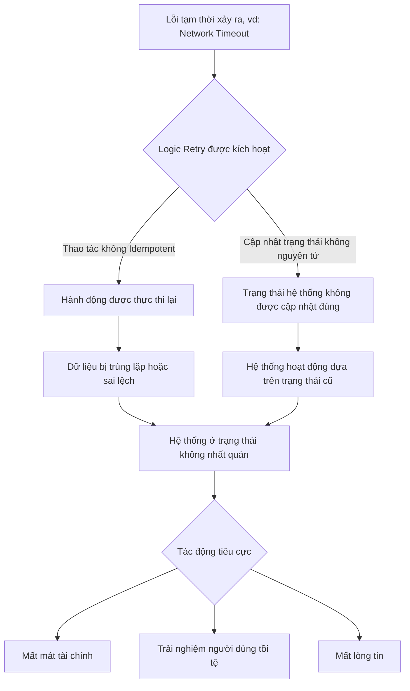

## Chương 10: Rủi Ro Error Handling

### 10.1 Rủi Ro Silent Failures

#### Định Nghĩa Rủi Ro
- **Định nghĩa:** Rủi ro Silent Failures (Lỗi thầm lặng) là các lỗi xảy ra trong hệ thống phần mềm mà không tạo ra bất kỳ cảnh báo, thông báo lỗi rõ ràng, hoặc làm sập hệ thống. Hệ thống tiếp tục hoạt động như bình thường, nhưng lại tạo ra kết quả sai, làm hỏng dữ liệu, hoặc thực hiện các hành vi không mong muốn một cách âm thầm. Đây là một trong những loại lỗi nguy hiểm nhất vì chúng không được phát hiện ngay lập tức.
- **Nguồn gốc phát sinh:** Chúng thường phát sinh từ các đoạn mã "nuốt" ngoại lệ (swallowed exceptions), lỗi logic tinh vi, cấu hình sai trong hệ thống giám sát, hoặc thậm chí là lỗi ở tầng phần cứng. Trong môi trường production, với áp lực về hiệu năng và sự phức tạp của hệ thống, các nhà phát triển có thể vô tình bỏ qua việc xử lý lỗi một cách đầy đủ, dẫn đến các lỗi thầm lặng.
- **Mức độ nghiêm trọng:** **Critical**. Do tính chất khó phát hiện, các lỗi thầm lặng có thể tồn tại trong một thời gian dài, gây ra thiệt hại tích lũy và lan rộng. Khi được phát hiện, hậu quả thường đã rất nghiêm trọng, từ việc làm hỏng một lượng lớn dữ liệu, gây thiệt hại tài chính khổng lồ, đến việc làm mất hoàn toàn niềm tin của người dùng.

#### Nguyên Nhân Gốc Rễ (Root Causes)
1.  **Swallowed Exceptions (Nuốt ngoại lệ):** Đây là nguyên nhân phổ biến nhất. Lập trình viên sử dụng các khối `try-catch` để bắt ngoại lệ nhưng lại không xử lý chúng một cách đúng đắn (ví dụ: không ghi log, không gửi cảnh báo, hoặc khối `catch` hoàn toàn trống). Điều này khiến cho các vấn đề tiềm ẩn bị che giấu, và hệ thống tiếp tục chạy như thể không có gì sai sót xảy ra.
2.  **Lỗi Logic Dẫn Đến Dữ Liệu Sai Lệch (Logical Errors Leading to Data Corruption):** Các thuật toán hoặc logic nghiệp vụ có thể chứa các sai sót tinh vi. Chương trình vẫn chạy mà không gặp lỗi, nhưng kết quả tính toán lại không chính xác. Dữ liệu sai này sau đó được lưu vào cơ sở dữ liệu và lan truyền sang các hệ thống khác, tạo ra một "hiệu ứng domino" về sự sai lệch dữ liệu.
3.  **Cấu Hình Sai Hệ Thống Giám Sát và Cảnh Báo (Monitoring/Alerting Misconfiguration):** Hệ thống có thể đang tạo ra các dấu hiệu về lỗi, nhưng hệ thống giám sát và cảnh báo lại không được cấu hình để phát hiện chúng. Ví dụ, mức độ ghi log (log level) được đặt quá cao (ví dụ: `ERROR` thay vì `WARN` hoặc `INFO`), hoặc các ngưỡng cảnh báo (alert thresholds) được đặt quá lỏng lẻo, khiến cho các dấu hiệu bất thường không được chú ý.
4.  **Lỗi Quy Trình Triển Khai (Deployment Process Failures):** Các kịch bản (scripts) hoặc quy trình triển khai thủ công có thể gặp lỗi mà không thông báo. Ví dụ, một script triển khai không thành công trên một trong số nhiều máy chủ nhưng lại báo cáo là đã hoàn tất. Điều này dẫn đến một môi trường không đồng nhất, nơi các phiên bản mã khác nhau cùng tồn tại, gây ra các hành vi không thể đoán trước và thường là thầm lặng.
5.  **Lỗi Phần Cứng Thầm Lặng (Silent Hardware Errors):** Mặc dù hiếm gặp hơn, các thành phần phần cứng như CPU, RAM, hoặc ổ đĩa có thể tạo ra lỗi mà không báo cáo cho hệ điều hành. Ví dụ, một bit flip do tia vũ trụ có thể làm thay đổi một giá trị trong bộ nhớ, dẫn đến tính toán sai mà không có bất kỳ dấu hiệu lỗi nào từ phần cứng.

#### Biểu Hiện & Triệu Chứng (Symptoms)
- **Dấu hiệu cảnh báo sớm:** Khách hàng phàn nàn về dữ liệu không chính xác trên tài khoản của họ; các báo cáo tài chính nội bộ không khớp với số liệu từ các đối tác bên ngoài (ví dụ: cổng thanh toán); hành vi người dùng bất thường không giải thích được.
- **Các metrics/logs cần theo dõi:** Sự sụt giảm đột ngột và không giải thích được của tỷ lệ lỗi (error rate) có thể là một dấu hiệu cho thấy lỗi đang bị "nuốt" đi thay vì được báo cáo. Cần theo dõi chặt chẽ các chỉ số kinh doanh quan trọng (KPIs) và thực hiện các quy trình đối chiếu dữ liệu (data reconciliation) định kỳ giữa các hệ thống liên quan.
- **Red flags trong hệ thống:** Dữ liệu không nhất quán giữa các bảng trong cơ sở dữ liệu hoặc giữa các microservices; các tác vụ nền (background jobs) hoàn thành quá nhanh hoặc không tạo ra kết quả như mong đợi; các giá trị `null` hoặc mặc định xuất hiện ở những nơi không mong muốn trong dữ liệu.

#### Sơ Đồ Phân Tích
```mermaid
graph TD
    A[Trigger: Mã nguồn nuốt ngoại lệ (try-catch rỗng)] --> B[Risk Event: Lỗi xử lý thanh toán bị bỏ qua âm thầm]
    B --> C[Impact 1: Giao dịch không được ghi nhận trong CSDL]
    B --> D[Impact 2: Hệ thống báo cáo giao dịch thành công cho người dùng]
    C --> E[Consequence: Mất doanh thu, dữ liệu tài chính sai lệch]
    D --> F[Consequence: Mất niềm tin của khách hàng, khủng hoảng truyền thông]
```

#### Tác Động Cụ Thể (Impact Analysis)

| Khía Cạnh | Mức Độ | Chi Tiết |
|---|---|---|
| Downtime | Low | Hệ thống không bị sập, đây chính là phần nguy hiểm nhất của lỗi thầm lặng. Nó tạo ra một cảm giác an toàn giả tạo trong khi thiệt hại đang âm thầm tích lũy. |
| Financial | High | Có thể gây ra thiệt hại tài chính khổng lồ. Ví dụ, một lỗi tính toán giá sai có thể dẫn đến việc bán sản phẩm dưới giá vốn trong một thời gian dài, hoặc một lỗi giao dịch có thể làm mất hàng triệu đô la. |
| Security | Medium | Dữ liệu bị hỏng có thể dẫn đến các lỗ hổng bảo mật. Ví dụ, một lỗi trong logic kiểm tra quyền có thể âm thầm cấp quyền truy cập không hợp lệ cho người dùng, dẫn đến rò rỉ dữ liệu. |
| User Experience | Severe | Người dùng mất niềm tin vào sản phẩm khi họ thấy dữ liệu của mình bị sai, các giao dịch không được xử lý đúng cách, hoặc các tính năng hoạt động không như mong đợi. |
| Team Morale | High | Việc truy tìm và khắc phục các lỗi thầm lặng cực kỳ căng thẳng và tốn thời gian. Nó làm xói mòn sự tự tin của đội ngũ kỹ sư vào chất lượng của hệ thống và có thể dẫn đến văn hóa đổ lỗi. |

#### Case Study Thực Tế
**Knight Capital Group - Thảm họa giao dịch 440 triệu đô la (2012)**
- **Bối cảnh:** Knight Capital, một trong những công ty giao dịch tần suất cao (HFT) lớn nhất tại Mỹ, chuẩn bị triển khai một tính năng mới có tên là Retail Liquidity Program (RLP) trên hệ thống định tuyến lệnh SMARS của họ.
- **Diễn biến:** Vào ngày 1 tháng 8 năm 2012, một kỹ sư đã thực hiện triển khai mã nguồn mới cho RLP lên 8 máy chủ của hệ thống SMARS. Tuy nhiên, quy trình triển khai này là thủ công và đã thất bại trên một trong các máy chủ mà không có bất kỳ thông báo lỗi nào. Máy chủ này vẫn chạy mã nguồn cũ. Mã nguồn cũ chứa một tính năng đã lỗi thời có tên "Power Peg", vốn được thiết kế để gửi và rút lại các lệnh nhỏ liên tục. Thật không may, cờ (flag) để kích hoạt tính năng RLP mới lại tái sử dụng vị trí của cờ đã dùng cho "Power Peg". Khi thị trường mở cửa, các lệnh RLP mới đã vô tình kích hoạt logic "Power Peg" cũ trên máy chủ chưa được cập nhật, khiến nó gửi đi hàng triệu lệnh giao dịch sai lầm vào thị trường trong vòng 45 phút.
- **Nguyên nhân gốc rễ:** Một chuỗi các sai lầm: (1) Quy trình triển khai thủ công và thiếu cơ chế xác minh, dẫn đến lỗi triển khai thầm lặng. (2) Tái sử dụng một cờ tính năng (feature flag) đã cũ cho một mục đích mới. (3) Không gỡ bỏ mã nguồn đã lỗi thời (dead code) khỏi hệ thống. (4) Thiếu các lớp kiểm soát rủi ro cuối cùng trước khi gửi lệnh ra thị trường.
- **Tác động:** Knight Capital đã lỗ khoảng **440 triệu đô la** chỉ trong 45 phút, đẩy công ty đến bờ vực phá sản và buộc phải nhận một gói cứu trợ khẩn cấp. Vụ việc đã làm rung chuyển Phố Wall và trở thành một trong những ví dụ điển hình nhất về thảm họa do lỗi phần mềm.
- **Bài học:** Tự động hóa và xác minh quy trình triển khai là tối quan trọng. Không bao giờ được tái sử dụng các cờ tính năng. Phải có chính sách dọn dẹp mã nguồn cũ một cách nghiêm ngặt. Các hệ thống tài chính phải có nhiều lớp kiểm soát rủi ro độc lập.
- **Nguồn:** [The Knight Capital Disaster - Speculative Branches](https://specbranch.com/posts/knight-capital/)

#### Risk Mitigation Strategies

**Preventive Measures (Ngăn ngừa):**
1.  **Chính sách "Zero-Tolerance" với Swallowed Exceptions:** Áp dụng các công cụ phân tích mã tĩnh (static analysis) và quy tắc trong quá trình code review để cấm tuyệt đối các khối `catch` trống hoặc chỉ ghi log mà không có hành động xử lý (re-throw, gửi cảnh báo).
2.  **Tự động hóa và xác minh việc triển khai (Automated & Verified Deployments):** Sử dụng các quy trình CI/CD hoàn toàn tự động. Sau mỗi lần triển khai, phải có một bước xác minh tự động để kiểm tra xem tất cả các máy chủ đã được cập nhật đúng phiên bản và đang ở trạng thái khỏe mạnh.
3.  **Immutable Feature Flags:** Không bao giờ tái sử dụng các cờ tính năng. Mỗi tính năng mới phải có một cờ duy nhất. Các cờ cũ phải được gỡ bỏ cùng với mã nguồn liên quan sau khi tính năng không còn được sử dụng.

**Detective Measures (Phát hiện):**
1.  **Giám sát dựa trên Business Metrics:** Thay vì chỉ giám sát các chỉ số kỹ thuật (CPU, RAM), hãy tạo các dashboard và cảnh báo dựa trên các chỉ số kinh doanh cốt lõi (ví dụ: số lượng đơn hàng mỗi phút, tổng doanh thu, tỷ lệ chuyển đổi). Bất kỳ sự sụt giảm bất thường nào cũng phải được điều tra ngay lập tức.
2.  **Hệ thống đối chiếu dữ liệu (Data Reconciliation):** Xây dựng các tác vụ tự động chạy định kỳ để so sánh và đối chiếu dữ liệu giữa các hệ thống quan trọng (ví dụ: giữa hệ thống đơn hàng và hệ thống thanh toán). Bất kỳ sự khác biệt nào cũng phải tạo ra một cảnh báo ở mức độ nghiêm trọng cao.
3.  **Shadow Processing & Canaries:** Chạy phiên bản mã mới song song với phiên bản cũ (shadowing), so sánh kết quả của chúng nhưng chỉ sử dụng kết quả từ phiên bản cũ. Hoặc triển khai phiên bản mới cho một nhóm nhỏ người dùng (canary release) và theo dõi chặt chẽ các chỉ số để phát hiện sớm các hành vi bất thường.

**Corrective Measures (Khắc phục):**
1.  **Quy trình phản ứng sự cố được diễn tập:** Có một quy trình rõ ràng để xử lý các sự cố liên quan đến dữ liệu sai lệch, bao gồm các bước để xác định phạm vi ảnh hưởng, tìm nguyên nhân gốc rễ, và liên lạc với các bên liên quan. Phải diễn tập quy trình này thường xuyên.
2.  **Khả năng Rollback nhanh chóng và an toàn:** Đảm bảo rằng bạn có thể rollback về phiên bản trước đó một cách nhanh chóng. Quan trọng hơn, quy trình rollback cũng phải được tự động hóa và kiểm thử để đảm bảo nó không gây ra thêm lỗi.
3.  **Công cụ sửa lỗi dữ liệu (Data Correction Tooling):** Chuẩn bị sẵn các công cụ và kịch bản để có thể sửa chữa dữ liệu bị hỏng một cách an toàn và có kiểm soát. Mọi hành động sửa dữ liệu trên production phải được ghi lại và có thể kiểm tra lại được.

#### Code Examples

**Anti-pattern (Cách làm SAI):**
```python
# ❌ ANTI-PATTERN: Nuốt ngoại lệ một cách thầm lặng
def process_payment(amount, user_id):
    try:
        # Giả sử hàm này có thể ném ra một ngoại lệ
        third_party_api.charge(amount, user_id)
        db.record_transaction(user_id, amount, 'SUCCESS')
    except Exception as e:
        # Lỗi bị bỏ qua. Hệ thống không ghi nhận giao dịch thất bại,
        # nhưng cũng không thông báo cho bất kỳ ai. Người dùng có thể đã bị trừ tiền.
        pass
```

**Best Practice (Cách làm ĐÚNG):**
```python
# ✅ BEST PRACTICE: Ghi log chi tiết và ném lại ngoại lệ hoặc gửi cảnh báo
import logging

logger = logging.getLogger(__name__)

def process_payment_safely(amount, user_id):
    try:
        third_party_api.charge(amount, user_id)
        db.record_transaction(user_id, amount, 'SUCCESS')
    except Exception as e:
        # Ghi lại thông tin lỗi chi tiết để điều tra
        logger.error(
            f"Payment processing failed for user {user_id} with amount {amount}. Error: {str(e)}",
            exc_info=True  # Bao gồm cả stack trace
        )
        # Cân nhắc việc ghi nhận giao dịch thất bại vào DB
        db.record_transaction(user_id, amount, 'FAILED')
        # Ném lại một ngoại lệ cụ thể hơn để lớp gọi nó có thể xử lý
        raise PaymentProcessingError(f"Failed to process payment for user {user_id}") from e

class PaymentProcessingError(Exception):
    pass
```

#### Risk Assessment Matrix

| Yếu Tố | Đánh Giá | Ghi Chú |
|---|---|---|
| Xác suất (Probability) | 3/5 | Các lỗi như nuốt ngoại lệ khá phổ biến trong các hệ thống lớn và phức tạp, đặc biệt là trong các mã nguồn cũ (legacy code). Áp lực thời gian cũng làm tăng khả năng mắc lỗi này. |
| Tác động (Impact) | 5/5 | Tác động có thể ở mức thảm họa, gây thiệt hại tài chính nghiêm trọng, mất dữ liệu vĩnh viễn và làm sụp đổ niềm tin của khách hàng, như đã thấy trong case study của Knight Capital. |
| **Risk Score** | **15** | **Critical** |
| Ưu tiên xử lý | P1 | Phải được ưu tiên xử lý hàng đầu. Cần có các biện pháp ngăn chặn và phát hiện chủ động, không thể chỉ dựa vào việc phản ứng sau khi sự cố đã xảy ra. |

#### Checklist Đánh Giá
- [ ] Quy trình code review của bạn có quy tắc cấm các khối `try-catch` trống không?
- [ ] Hệ thống giám sát của bạn có cảnh báo cho các chỉ số kinh doanh quan trọng (ví dụ: doanh thu, số lượng đăng ký) chứ không chỉ các chỉ số kỹ thuật?
- [ ] Bạn có quy trình đối chiếu dữ liệu tự động giữa các hệ thống quan trọng không?
- [ ] Quy trình triển khai của bạn có hoàn toàn tự động và có bước xác minh trạng thái sau khi hoàn tất không?
- [ ] Bạn có chính sách rõ ràng về việc gỡ bỏ mã nguồn và cờ tính năng cũ không?
- [ ] Khi một ngoại lệ xảy ra, bạn có ghi lại đầy đủ thông tin (stack trace, context) để phục vụ việc điều tra không?

#### Tools & Resources
- **SonarQube / Snyk Code:** Các công cụ phân tích mã tĩnh có thể tự động phát hiện các đoạn mã nuốt ngoại lệ và các anti-pattern khác trong mã nguồn của bạn.
- **Datadog / New Relic:** Các nền tảng giám sát hiệu suất ứng dụng (APM) cho phép bạn tạo các cảnh báo phức tạp dựa trên cả chỉ số kỹ thuật và log, cũng như theo dõi các chỉ số kinh doanh.
- **Spinnaker / Harness:** Các nền tảng triển khai liên tục (Continuous Delivery) tiên tiến hỗ trợ các chiến lược triển khai an toàn như canary, blue-green và cung cấp khả năng rollback tự động.

#### Nguồn Tham Khảo
1.  [Silent Failures: The Most Dangerous Bugs Are the Ones You Don't See](https://medium.com/@hadiyolworld007/silent-failures-the-most-dangerous-bugs-are-the-ones-you-dont-see-68e481a09a1e) - Một bài viết tổng quan về các loại lỗi thầm lặng và nguyên nhân của chúng.
2.  [Detecting silent errors in the wild (Facebook Engineering)](https://engineering.fb.com/2022/03/17/production-engineering/silent-errors/) - Facebook chia sẻ về các chiến lược của họ để phát hiện và giảm thiểu lỗi hỏng dữ liệu thầm lặng trong một cơ sở hạ tầng quy mô lớn.
3.  [SEC Report on Knight Capital](https://www.sec.gov/litigation/admin/2013/34-70694.pdf) - Báo cáo chi tiết của Ủy ban Giao dịch và Chứng khoán Hoa Kỳ (SEC) về vụ việc của Knight Capital, phân tích các sai phạm về mặt kỹ thuật và quy trình.

### 10.2 Rủi Ro Từ Phản Hồi Lỗi Chung Chung (Generic Error Responses)

#### Định Nghĩa Rủi Ro
- **Định nghĩa:** Rủi ro từ phản hồi lỗi chung chung (Generic Error Responses) thực chất là một con dao hai lưỡi. Một mặt, nó đề cập đến việc hiển thị các thông báo lỗi quá chi tiết, chứa thông tin nhạy cảm của hệ thống cho người dùng cuối (ví dụ: stack trace, chuỗi kết nối database, phiên bản phần mềm). Mặt khác, nó cũng bao gồm các thông báo lỗi quá chung chung, không cung cấp đủ thông tin trong hệ thống ghi log nội bộ, khiến cho việc gỡ lỗi (debugging) trở thành một cơn ác mộng. Rủi ro này mô tả sự cân bằng mong manh giữa việc che giấu thông tin nhạy cảm khỏi kẻ tấn công và việc cung cấp đủ chi tiết cho đội ngũ kỹ sư để nhanh chóng xác định và khắc phục sự cố.
- **Nguyên nhân phát sinh:** Rủi ro này thường phát sinh từ việc thiếu một chiến lược xử lý lỗi (error handling) nhất quán trên toàn bộ ứng dụng. Các nhà phát triển có thể để lại các đoạn mã gỡ lỗi trong môi trường production, các framework được cấu hình mặc định để hiển thị lỗi chi tiết, hoặc các quy trình ghi log không được chuẩn hóa, dẫn đến việc thông tin bị rò rỉ ra bên ngoài hoặc bị thiếu hụt ở bên trong.
- **Mức độ nghiêm trọng tiềm tàng:** **Critical (Cực kỳ nghiêm trọng)**. Rò rỉ thông tin chi tiết có thể là bước đệm cho các cuộc tấn công nghiêm trọng hơn như SQL injection, tấn công vào các lỗ hổng đã biết của framework, trong khi việc thiếu thông tin gỡ lỗi có thể kéo dài thời gian hệ thống ngừng hoạt động (downtime) và tăng chi phí khắc phục.

#### Nguyên Nhân Gốc Rễ (Root Causes)
1.  **Cấu hình mặc định không an toàn của Framework:** Nhiều framework phát triển web (ví dụ: ASP.NET cũ, Django với `DEBUG=True`) có cấu hình mặc định là hiển thị trang lỗi chi tiết (verbose error pages) để hỗ trợ nhà phát triển trong quá trình xây dựng. Nếu các cấu hình này không được tắt một cách tường minh khi triển khai lên môi trường production, chúng sẽ vô tình làm lộ thông tin nhạy cảm.
2.  **Thiếu một cơ chế xử lý ngoại lệ tập trung (Centralized Exception Handling):** Khi không có một trình xử lý lỗi toàn cục, mỗi nhà phát triển hoặc mỗi module sẽ tự xử lý ngoại lệ theo cách riêng. Điều này dẫn đến sự không nhất quán: một số nơi có thể trả về lỗi chung chung an toàn, trong khi những nơi khác lại in ra toàn bộ stack trace, tạo ra những điểm yếu có thể bị khai thác.
3.  **Ghi log không đủ ngữ cảnh:** Ngược lại với việc lộ thông tin, một số hệ thống lại đi theo hướng quá cực đoan là chỉ ghi lại những thông báo rất chung chung như "An error occurred" vào log mà không kèm theo bất kỳ ngữ cảnh nào (request ID, user ID, tham số đầu vào). Điều này khiến đội ngũ vận hành không thể tái tạo lỗi và tìm ra nguyên nhân gốc rễ, đặc biệt trong các hệ thống microservices phức tạp.
4.  **Nỗ lực "hữu ích" sai cách:** Một số nhà phát triển có ý định tốt khi cố gắng cung cấp thông tin chi tiết cho người dùng cuối để họ có thể báo lỗi chính xác hơn. Tuy nhiên, họ không nhận ra rằng những thông tin như "Invalid column name 'user_id'" hay "Connection to database 'prod_db' failed" chính là những manh mối vàng cho kẻ tấn công.

#### Biểu Hiện & Triệu Chứng (Symptoms)
- **Dấu hiệu cảnh báo sớm:** Người dùng cuối báo cáo nhận được các thông báo lỗi "trông lạ" hoặc chứa đầy thuật ngữ kỹ thuật. Các báo cáo từ công cụ quét lỗ hổng hoặc kiểm thử xâm nhập (penetration testing) chỉ ra các lỗ hổng "Information Disclosure".
- **Các metrics/logs cần theo dõi:** Theo dõi sự gia tăng đột biến của các lỗi HTTP 5xx (Internal Server Error). Thiết lập cảnh báo cho các log có chứa các từ khóa nhạy cảm như `Exception`, `Traceback`, `SQL`, `ODBC error`, `password`, `key` được ghi lại trong các phản hồi gửi cho client.
- **Red flags trong hệ thống:** Bất kỳ thông báo lỗi nào hiển thị cho người dùng mà chứa: phiên bản phần mềm (`Apache/2.4.29`), đường dẫn tệp tin trên máy chủ (`/var/www/html/app/models/user.php`), tên biến nội bộ, các đoạn truy vấn SQL, hoặc chi tiết về cấu trúc hệ thống.

#### Sơ Đồ Phân Tích
```mermaid
graph TD
    A[Hành động không mong muốn của người dùng hoặc lỗi hệ thống] --> B{Ứng dụng ném ra ngoại lệ}
    B --> C{Xử lý lỗi không đúng cách}
    C --> D[Rò rỉ thông tin chi tiết ra bên ngoài]
    C --> E[Ghi log nội bộ quá chung chung]
    D --> F[Kẻ tấn công thu thập thông tin]
    F --> G[Thực hiện tấn công nâng cao (SQLi, RCE...)]
    E --> H[Kỹ sư không đủ thông tin để gỡ lỗi]
    H --> I[Thời gian khắc phục sự cố kéo dài (MTTR tăng)]
    G --> J[Hệ thống bị xâm nhập, mất dữ liệu]
    I --> K[Tổn thất tài chính, giảm uy tín]
```

#### Tác Động Cụ Thể (Impact Analysis)

| Khía Cạnh | Mức Độ | Chi Tiết |
|---|---|---|
| Downtime | Medium | Bản thân việc rò rỉ thông tin không gây downtime, nhưng các cuộc tấn công tiếp theo dựa trên thông tin đó có thể gây downtime nghiêm trọng. Việc gỡ lỗi chậm cũng làm tăng thời gian downtime. |
| Financial | High | Chi phí có thể rất lớn, bao gồm chi phí khắc phục sự cố, chi phí điều tra vi phạm dữ liệu, tiền phạt (ví dụ: GDPR), mất doanh thu do downtime và tổn thất uy tín thương hiệu. |
| Security | Critical | Đây là một lỗ hổng bảo mật nghiêm trọng (CWE-209), cung cấp thông tin cho kẻ tấn công để do thám và chuẩn bị cho các cuộc tấn công phá hoại khác. |
| User Experience | Moderate | Người dùng bị hoang mang bởi các lỗi kỹ thuật, làm mất lòng tin vào tính chuyên nghiệp và an toàn của sản phẩm. |
| Team Morale | High | Việc phải "săn lùng" các lỗi không rõ ràng gây ra sự mệt mỏi và thất vọng cho đội ngũ kỹ sư. Một sự cố bảo mật lớn có thể gây ra căng thẳng và đổ lỗi nội bộ. |

#### Case Study Thực Tế
**Sự cố rò rỉ dữ liệu của Panera Bread - 2018**
- **Bối cảnh:** Panera Bread, một chuỗi cửa hàng bánh và cà phê lớn của Mỹ, có một cổng thông tin khách hàng thân thiết cho phép đặt hàng trực tuyến.
- **Diễn biến:** Một nhà nghiên cứu bảo mật đã phát hiện ra một API endpoint của trang web `panerabread.com` cho phép truy cập vào dữ liệu khách hàng dưới dạng văn bản thuần túy mà không cần bất kỳ hình thức xác thực nào. API này làm rò rỉ hàng triệu hồ sơ khách hàng, bao gồm tên, email, địa chỉ, ngày sinh và bốn chữ số cuối của thẻ tín dụng.
- **Nguyên nhân gốc rễ:** Lỗ hổng nằm ở một API trả về quá nhiều thông tin và không được bảo vệ đúng cách. Mặc dù không phải là một "error response" truyền thống, nó minh họa cho nguyên tắc cốt lõi của rủi ro này: **hệ thống trả về thông tin nhạy cảm mà lẽ ra phải được giữ kín**. Panera Bread đã được thông báo về lỗ hổng này 8 tháng trước khi nó bị công khai, nhưng đã không khắc phục kịp thời.
- **Tác động:** Ước tính có tới 37 triệu hồ sơ khách hàng đã bị phơi bày trong ít nhất 8 tháng. Sự cố đã gây tổn hại nghiêm trọng đến danh tiếng của Panera Bread và khiến họ phải đối mặt với các vụ kiện tập thể.
- **Bài học:** Phải kiểm tra và xác thực tất cả các endpoint của API, đảm bảo chúng không trả về dữ liệu không cần thiết. Phản ứng chậm chạp với các báo cáo bảo mật có thể biến một lỗ hổng kỹ thuật thành một thảm họa quan hệ công chúng.
- **Nguồn:** [Krebs on Security - Panera Bread Leaks Millions of Customer Records](https://krebsonsecurity.com/2018/04/panerabread-com-leaks-millions-of-customer-records/)

#### Risk Mitigation Strategies

**Preventive Measures (Ngăn ngừa):**
1.  **Triển khai Trình xử lý lỗi toàn cục (Global Error Handler):** Thiết lập một cơ chế duy nhất, tập trung để bắt tất cả các ngoại lệ không được xử lý. Trình xử lý này sẽ ghi lại chi tiết lỗi vào hệ thống log nội bộ và trả về một thông báo lỗi chung chung, không chứa thông tin nhạy cảm cho người dùng.
2.  **Tắt chế độ Debug trong môi trường Production:** Luôn đảm bảo rằng các biến môi trường hoặc cờ cấu hình như `DEBUG=False` (Django), `ASPNETCORE_ENVIRONMENT=Production` (ASP.NET Core) được thiết lập chính xác trong môi trường production để tắt các trang lỗi chi tiết.
3.  **Sử dụng Data Transfer Objects (DTOs) cho các phản hồi API:** Thay vì trả về trực tiếp các đối tượng của cơ sở dữ liệu (database entities), hãy ánh xạ chúng sang các DTO chỉ chứa những trường thông tin cần thiết cho client, tránh vô tình làm lộ các trường nội bộ.

**Detective Measures (Phát hiện):**
1.  **Giám sát và Cảnh báo Log tập trung:** Sử dụng các công cụ như ELK Stack (Elasticsearch, Logstash, Kibana) hoặc Splunk để tập trung log từ tất cả các dịch vụ. Thiết lập các cảnh báo (alerts) tự động khi phát hiện các chuỗi đáng ngờ (ví dụ: `stack trace`, `SQL syntax error`) trong các log truy cập hoặc log ứng dụng.
2.  **Theo dõi tỷ lệ lỗi HTTP 5xx:** Một sự gia tăng đột biến trong số lượng lỗi 5xx có thể chỉ ra một vấn đề tiềm ẩn hoặc một cuộc tấn công đang diễn ra. Giám sát tỷ lệ này và thiết lập ngưỡng cảnh báo.
3.  **Quét lỗ hổng tự động (DAST):** Tích hợp các công cụ Dynamic Application Security Testing (DAST) vào quy trình CI/CD để tự động quét ứng dụng đang chạy và phát hiện các lỗ hổng rò rỉ thông tin trong các phản hồi lỗi.

**Corrective Measures (Khắc phục):**
1.  **Quy trình phản ứng sự cố (Incident Response Playbook):** Có một quy trình rõ ràng để xử lý các sự cố rò rỉ thông tin. Quy trình này nên bao gồm các bước để xác định phạm vi ảnh hưởng, vá lỗ hổng, và giao tiếp với các bên liên quan.
2.  **Sử dụng Feature Flags để nhanh chóng vô hiệu hóa tính năng:** Nếu một tính năng cụ thể gây ra lỗi, hãy sử dụng cờ tính năng (feature flags) để có thể tắt nó ngay lập tức mà không cần triển khai lại toàn bộ ứng dụng.
3.  **Cung cấp mã lỗi duy nhất (Unique Error ID):** Trong thông báo lỗi chung chung trả về cho người dùng, hãy bao gồm một mã định danh lỗi duy nhất (ví dụ: `Error ID: 5c2b9a1f-3a2d-4b3f-8e1a-9c8d7e6f5a4b`). Người dùng có thể cung cấp mã này cho bộ phận hỗ trợ, giúp đội ngũ kỹ sư nhanh chóng tìm thấy chính xác log chi tiết tương ứng trong hệ thống nội bộ.

#### Code Examples

**Anti-pattern (Cách làm SAI):**
```python
# ❌ ANTI-PATTERN: Bắt ngoại lệ và trả về thông báo lỗi chi tiết trực tiếp.
import flask

app = flask.Flask(__name__)

@app.route('/user/<id>')
def get_user(id):
    try:
        # Giả sử một hàm có thể ném ra lỗi chi tiết
        if not id.isdigit():
            raise ValueError(f"User ID '{id}' is not a valid integer.")
        # ... logic lấy user
        return {"user_id": id, "name": "Test User"}
    except Exception as e:
        # Rò rỉ thông tin chi tiết về lỗi và loại lỗi
        return {"error": str(e)}, 500
```

**Best Practice (Cách làm ĐÚNG):**
```python
# ✅ BEST PRACTICE: Sử dụng trình xử lý lỗi toàn cục và ghi log chi tiết.
import flask
import logging
import uuid

app = flask.Flask(__name__)
logging.basicConfig(level=logging.INFO)

# Trình xử lý lỗi toàn cục
@app.errorhandler(Exception)
def handle_exception(e):
    # Tạo một mã lỗi duy nhất
    error_id = str(uuid.uuid4())
    # Ghi log chi tiết vào hệ thống nội bộ với mã lỗi
    logging.error(f"Error ID: {error_id} - Unhandled exception: {e}", exc_info=True)
    # Trả về một phản hồi chung chung và an toàn cho người dùng
    response = {
        "error": "An unexpected error occurred. Please contact support.",
        "error_id": error_id
    }
    return response, 500

@app.route('/user/<id>')
def get_user(id):
    # Logic nghiệp vụ không cần tự xử lý ngoại lệ chung
    if not id.isdigit():
        raise ValueError(f"User ID '{id}' is not a valid integer.")
    # ... logic lấy user
    return {"user_id": id, "name": "Test User"}
```

#### Risk Assessment Matrix

| Yếu Tố | Đánh Giá | Ghi Chú |
|---|---|---|
| Xác suất (Probability) | 4 | Rất phổ biến do cấu hình mặc định, lỗi của con người và sự phức tạp của hệ thống. Dễ xảy ra nếu không có quy trình review code và kiểm tra bảo mật chặt chẽ. |
| Tác động (Impact) | 5 | Tác động có thể ở mức thảm họa, dẫn đến vi phạm dữ liệu toàn diện, tổn thất tài chính nặng nề và mất hoàn toàn lòng tin của khách hàng. |
| **Risk Score** | 4 x 5 = 20 | **Critical** |
| Ưu tiên xử lý | P1 | Phải được ưu tiên xử lý hàng đầu. Đây là một lỗ hổng cơ bản nhưng có thể mở đường cho các cuộc tấn công thảm khốc. |

#### Checklist Đánh Giá
- [ ] Chế độ debug hoặc development có được tắt hoàn toàn trong môi trường production không?
- [ ] Hệ thống có một trình xử lý ngoại lệ toàn cục (global exception handler) để bắt các lỗi không mong muốn không?
- [ ] Các thông báo lỗi trả về cho người dùng có chung chung và không chứa bất kỳ thông tin kỹ thuật nào (stack traces, SQL queries, file paths) không?
- [ ] Khi một lỗi xảy ra, hệ thống có ghi lại đầy đủ thông tin chi tiết (stack trace, request context, user ID) vào một hệ thống log nội bộ, an toàn không?
- [ ] Các thông tin nhạy cảm như API keys, mật khẩu, chuỗi kết nối có được lọc ra khỏi log trước khi lưu trữ không?
- [ ] Phản hồi lỗi cho người dùng có bao gồm một mã định danh lỗi duy nhất (correlation ID) để dễ dàng tra cứu trong log không?

#### Tools & Resources
- **OWASP ZAP (Zed Attack Proxy):** Một công cụ mã nguồn mở miễn phí để tìm kiếm các lỗ hổng bảo mật web, bao gồm cả việc phát hiện rò rỉ thông tin qua các thông báo lỗi.
- **Sentry.io:** Một dịch vụ giám sát lỗi giúp bắt, chẩn đoán và khắc phục lỗi trong ứng dụng. Nó tự động nhóm các lỗi và cung cấp ngữ cảnh phong phú để gỡ lỗi nhanh hơn.
- **ELK Stack (Elasticsearch, Logstash, Kibana):** Một bộ công cụ mạnh mẽ để thu thập, xử lý, tìm kiếm và trực quan hóa log, giúp phát hiện và phân tích các mẫu lỗi đáng ngờ.

#### Nguồn Tham Khảo
1.  [OWASP - Improper Error Handling](https://owasp.org/www-community/Improper_Error_Handling) - Cung cấp một cái nhìn tổng quan về các vấn đề bảo mật liên quan đến việc xử lý lỗi không đúng cách.
2.  [CWE-209: Generation of Error Message Containing Sensitive Information](https://cwe.mitre.org/data/definitions/209.html) - Định nghĩa chuẩn về lỗ hổng rò rỉ thông tin nhạy cảm trong thông báo lỗi từ MITRE.
3.  [Krebs on Security - Panera Bread Leaks Millions of Customer Records](https://krebsonsecurity.com/2018/04/panerabread-com-leaks-millions-of-customer-records/) - Bài phân tích chi tiết về sự cố rò rỉ dữ liệu của Panera Bread.

### 10.3 Rủi Ro Log Overflow/Underflow

#### Định Nghĩa Rủi Ro
- **Log Overflow (Tràn ngập Log):** Là tình huống hệ thống tạo ra một khối lượng log lớn hơn khả năng xử lý, truyền tải, hoặc lưu trữ của hạ tầng logging. Điều này dẫn đến việc mất mát log, khiến các thông tin quan trọng về vận hành và bảo mật bị bỏ sót. Giống như có quá nhiều tín hiệu cùng lúc, gây nhiễu và làm mất đi những tín hiệu quan trọng nhất.
- **Log Underflow (Thiếu hụt Log):** Là tình huống ngược lại, khi một sự kiện hoặc lỗi nghiêm trọng xảy ra trong hệ thống nhưng không tạo ra bất kỳ bản ghi log nào. Điều này tạo ra một "điểm mù" hoàn toàn, khiến việc gỡ lỗi (debugging) và giám sát trở nên bất khả thi. Đây là trạng thái nguy hiểm nhất khi vận hành, vì đội ngũ kỹ sư không có bất kỳ thông tin nào để phân tích và khắc phục sự cố.
- **Nguyên nhân phát sinh:** Trong môi trường production, rủi ro này thường phát sinh do lưu lượng truy cập tăng đột biến, cấu hình logging quá chi tiết (verbose), lỗi phần mềm (ví dụ: vòng lặp vô hạn), hoặc do chính hạ tầng logging gặp sự cố.
- **Mức độ nghiêm trọng tiềm tàng:**
    - **Log Overflow:** **High**. Mất log có thể che giấu các cuộc tấn công an ninh hoặc làm chậm quá trình khắc phục sự cố, gây ảnh hưởng trực tiếp đến tính sẵn sàng của dịch vụ.
    - **Log Underflow:** **Critical**. Việc hoàn toàn không có thông tin khi sự cố xảy ra có thể biến một vấn đề nhỏ thành một thảm họa, kéo dài thời gian downtime và gây thiệt hại tài chính nặng nề.

#### Nguyên Nhân Gốc Rễ (Root Causes)
1.  **Cấu hình Logging quá chi tiết (Verbose Logging):** Việc bật các cấp độ log chi tiết như `DEBUG` hoặc `INFO` trên môi trường production cho tất cả các request sẽ tạo ra một lượng dữ liệu khổng lồ. Dưới tải trọng cao, khối lượng này có thể dễ dàng làm quá tải đường ống xử lý log, từ agent thu thập tại chỗ cho đến hệ thống lưu trữ tập trung.
2.  **Lỗi Vòng lặp hoặc Đệ quy không kiểm soát:** Một lỗi logic trong mã nguồn, chẳng hạn như một vòng lặp vô hạn hoặc một hàm đệ quy không có điểm dừng, có thể ghi ra hàng triệu dòng log trong vài giây. Đây là một trong những nguyên nhân phổ biến nhất gây ra tình trạng log overflow đột ngột và khó kiểm soát.
3.  **Lưu lượng truy cập tăng đột biến (Traffic Spikes):** Một chiến dịch marketing thành công, một sự kiện viral, hoặc một cuộc tấn-công từ chối dịch vụ (DDoS) đều có thể làm tăng lưu lượng truy cập lên gấp nhiều lần. Nếu hệ thống logging không được thiết kế để co giãn tương ứng, nó sẽ nhanh chóng bị quá tải và bắt đầu loại bỏ (drop) log.
4.  **Lỗi trong cơ chế xử lý lỗi (Errors in Error Handling):** Một anti-pattern phổ biến là khi một khối `catch` bắt được một ngoại lệ, nó cố gắng ghi lại lỗi đó. Tuy nhiên, nếu chính hành động ghi log lại gây ra một ngoại lệ khác (ví dụ: do kết nối đến dịch vụ log bị mất), nó có thể tạo ra một vòng lặp ghi log lỗi, dẫn đến tràn ngập log.
5.  **Hạ tầng Logging không đủ năng lực (Under-provisioned Infrastructure):** Toàn bộ đường ống logging — bao gồm agents (Fluentd, Logstash), message brokers (Kafka, RabbitMQ), và hệ thống lưu trữ (Elasticsearch, Loki) — không được cấp đủ tài nguyên (CPU, memory, disk I/O, network bandwidth) để xử lý tải trọng ở mức đỉnh, gây ra tình trạng "tắc nghẽn" và mất mát dữ liệu.

#### Biểu Hiện & Triệu Chứng (Symptoms)
- **Dấu hiệu cảnh báo sớm:**
    - Độ trễ (latency) từ lúc log được tạo ra đến lúc xuất hiện trên hệ thống giám sát ngày càng tăng.
    - Kích thước hàng đợi (queue size) trên các message broker hoặc buffer của log agent liên tục ở mức cao.
    - Mức sử dụng CPU và bộ nhớ của các tiến trình thu thập log trên máy chủ ứng dụng tăng bất thường.
- **Các metrics/logs cần theo dõi:**
    - `log_records_dropped_total`: Một bộ đếm (counter) ghi nhận số lượng log đã bị loại bỏ ở agent hoặc aggregator. Đây là chỉ số quan trọng nhất.
    - `log_buffer_usage_percent`: Tỷ lệ phần trăm sử dụng bộ đệm của agent. Nếu chỉ số này thường xuyên gần 100%, đó là dấu hiệu của áp lực ngược (backpressure).
    - `log_output_latency_seconds`: Biểu đồ độ trễ của việc gửi log. Sự tăng đột biến là dấu hiệu của sự tắc nghẽn.
- **Red flags trong hệ thống:**
    - Có những khoảng trống thời gian không có log từ một dịch vụ cụ thể, đặc biệt là khi các chỉ số khác cho thấy dịch vụ đang hoạt động.
    - Hệ thống cảnh báo (alerting) kích hoạt một vấn đề của ứng dụng (ví dụ: tỷ lệ lỗi 5xx tăng cao) nhưng không có bất kỳ log lỗi nào tương ứng trong hệ thống tìm kiếm log.
    - Cảnh báo về dung lượng đĩa (disk space) trên các máy chủ ứng dụng, do log không được gửi đi và tích tụ lại trên file system cục bộ.

#### Sơ Đồ Phân Tích
```mermaid
graph TD
    subgraph Trigger
        A1[Lỗi Vòng lặp Vô hạn]
        A2[Lưu lượng tăng đột biến]
        A3[Lỗi trong khối try-catch]
    end

    subgraph Risk Event
        B1[Log Overflow: Lượng log > Năng lực xử lý]
        B2[Log Underflow: Nuốt ngoại lệ, không ghi log]
    end

    subgraph Impact
        C1[Mất mát Log Quan trọng]
        C2[Hoàn toàn không có Dữ liệu Vận hành]
    end

    subgraph Consequence
        D1[Không thể Debug & Phân tích Nguyên nhân]
        D2[Phát hiện Sự cố An ninh Bị trì hoãn]
        D3[Thời gian Khắc phục Sự cố (MTTR) Tăng vọt]
        D4[Quyết định Kinh doanh Dựa trên Dữ liệu Sai lệch]
    end

    A1 --> B1
    A2 --> B1
    A3 --> B2
    B1 --> C1
    B2 --> C2
    C1 --> D1
    C1 --> D2
    C2 --> D1
    D1 --> D3
    D2 --> D3
    C1 --> D4
```

#### Tác Động Cụ Thể (Impact Analysis)

| Khía Cạnh       | Mức Độ   | Chi Tiết                                                                                                                                      |
|-----------------|----------|-----------------------------------------------------------------------------------------------------------------------------------------------|
| Downtime        | High     | Việc không có log để gỡ lỗi có thể biến một sự cố 5 phút thành một cuộc khủng hoảng kéo dài nhiều giờ, làm tăng đáng kể thời gian ngừng hoạt động. |
| Financial       | >$100k/hr| Ước tính dựa trên doanh thu bị mất mỗi giờ của một trang thương mại điện tử lớn. Con số này có thể cao hơn nhiều tùy thuộc vào quy mô kinh doanh. |
| Security        | Critical | Log overflow có thể được kẻ tấn công lợi dụng để che giấu dấu vết. Log underflow có nghĩa là một cuộc xâm nhập có thể không bao giờ bị phát hiện.     |
| User Experience | Severe   | Nếu sự cố gốc ảnh hưởng đến người dùng, việc không thể khắc phục nhanh chóng sẽ kéo dài trải nghiệm tiêu cực và làm mất lòng tin của khách hàng. |
| Team Morale     | High     | Áp lực cực lớn đè nặng lên đội ngũ kỹ sư khi họ phải "mò mẫm trong bóng tối" để sửa lỗi, gây ra căng thẳng, kiệt sức và giảm tinh thần. |

#### Case Study Thực Tế
**Cloudflare Control Plane and Analytics Outage - 2023**
- **Bối cảnh:** Cloudflare sử dụng ba trung tâm dữ liệu (data center - DC) tại Oregon cho các hệ thống control plane và analytics. Kiến trúc được thiết kế để có tính sẵn sàng cao (High Availability - HA), có thể chịu được sự cố của một DC. Hệ thống logging được đặt bên ngoài cụm HA này, với giả định rằng việc log bị trễ là chấp nhận được.
- **Diễn biến:** Vào ngày 2 tháng 11 năm 2023, một loạt các sự kiện thảm khốc tại một trong các DC của nhà cung cấp Flexential đã xảy ra: mất điện lưới, máy phát điện được bật lên nhưng không thông báo, sau đó là một sự cố chập đất làm ngắt toàn bộ nguồn điện, kể cả máy phát. Hệ thống pin dự phòng (UPS) cũng hỏng sớm hơn dự kiến, dẫn đến việc toàn bộ DC bị mất điện đột ngột.
- **Nguyên nhân gốc rễ:** Mặc dù sự cố chính là do mất điện, rủi ro về logging lại đến từ một quyết định thiết kế: hệ thống logging và analytics lớn nhất được đặt tại DC này và không được bảo vệ bởi cơ chế HA. Khi DC sập, dịch vụ raw log của Cloudflare đã không khả dụng trong suốt thời gian sự cố, tạo ra một "điểm mù" khổng lồ.
- **Tác động:** Khách hàng không thể truy cập vào log của họ. Đội ngũ Cloudflare cũng mất đi một phần khả năng quan sát quan trọng trong quá trình khắc phục sự cố. Sự cố kéo dài từ ngày 2 đến ngày 4 tháng 11, gây ảnh hưởng lớn đến niềm tin của khách hàng.
- **Bài học:** Sự phụ thuộc "không rõ ràng" (non-obvious dependencies) có thể phá vỡ các mô hình HA phức tạp nhất. Việc cho rằng một dịch vụ như logging là "không quan trọng" và có thể bị trì hoãn là một giả định nguy hiểm. Khả năng quan sát (observability) là một phần cốt lõi của tính sẵn sàng, không phải là một dịch vụ phụ trợ.
- **Nguồn:** [Post mortem on the Cloudflare Control Plane and Analytics Outage](https://blog.cloudflare.com/post-mortem-on-cloudflare-control-plane-and-analytics-outage/)

#### Risk Mitigation Strategies

**Preventive Measures (Ngăn ngừa):**
1.  **Adaptive Logging Level:** Triển khai cơ chế cho phép thay đổi log level (ví dụ: từ `INFO` sang `WARN`) một cách linh hoạt trong runtime mà không cần khởi động lại ứng dụng. Điều này cho phép giảm nhanh khối lượng log khi có dấu hiệu quá tải.
2.  **Rate Limiting & Sampling:** Áp dụng rate limiting trên các log agent để giới hạn số lượng log được gửi đi mỗi giây từ một nguồn. Đối với các log không quá quan trọng (ví dụ: log truy cập), áp dụng cơ chế sampling (chỉ ghi lại một tỷ lệ phần trăm nhất định).
3.  **Cấu trúc Log (Structured Logging):** Sử dụng định dạng log có cấu trúc (JSON, key-value) thay vì text thuần. Điều này giúp việc xử lý, lọc và phân tích ở các bước sau hiệu quả hơn, giảm tải cho hệ thống parsing.

**Detective Measures (Phát hiện):**
1.  **Giám sát Áp lực ngược (Backpressure Monitoring):** Cảnh báo ngay lập tức khi buffer của log agent đầy hoặc khi độ trễ của message broker vượt ngưỡng. Đây là dấu hiệu sớm nhất của sự tắc nghẽn.
2.  **Giám sát Log Bị Mất (Dropped Log Monitoring):** Tạo cảnh báo mức độ CRITICAL khi metric `log_records_dropped_total` lớn hơn 0. Bất kỳ log nào bị mất đều là một sự cố tiềm tàng.
3.  **Canary Logging / Heartbeat:** Tạo ra một loại log "heartbeat" đặc biệt được ghi lại định kỳ (ví dụ: mỗi phút) từ mỗi dịch vụ. Thiết lập một cảnh báo nếu log heartbeat này không xuất hiện trong một khoảng thời gian nhất định. Đây là cách hiệu quả để phát hiện Log Underflow.

**Corrective Measures (Khắc phục):**
1.  **Quy trình "Shed Load":** Khi phát hiện log overflow, quy trình phản ứng đầu tiên là "xả tải". Tự động hoặc thủ công tăng mức độ log lên (ví dụ: chỉ ghi `ERROR`), tắt logging cho các endpoint không quan trọng, hoặc tăng tỷ lệ sampling.
2.  **Định tuyến Log Khẩn cấp (Emergency Routing):** Thiết lập một đường ống logging dự phòng, tối giản hơn (ví dụ: ghi trực tiếp vào một S3 bucket đơn giản) để có thể chuyển hướng log sang khi đường ống chính gặp sự cố, đảm bảo không bị mất dữ liệu quan trọng.
3.  **Phân vùng Lỗi (Fault Isolation):** Thiết kế hệ thống logging sao cho sự cố của một tenant hoặc một ứng dụng không làm ảnh hưởng đến toàn bộ hệ thống. Sử dụng các hàng đợi riêng biệt hoặc áp dụng quota tài nguyên cho từng nguồn log.

#### Code Examples

**Anti-pattern (Cách làm SAI):**
```python
# ❌ ANTI-PATTERN: Nuốt ngoại lệ và không ghi log, gây ra Log Underflow
import requests

def bad_example_fetch_data(url):
    try:
        response = requests.get(url, timeout=5)
        response.raise_for_status() # Gây ra HTTPError nếu status code là 4xx/5xx
        return response.json()
    except requests.exceptions.RequestException:
        # Ngoại lệ bị bắt nhưng không có hành động ghi log nào được thực hiện.
        # Hệ thống sẽ âm thầm thất bại, không ai biết chuyện gì đã xảy ra.
        return None
```

**Best Practice (Cách làm ĐÚNG):**
```python
# ✅ BEST PRACTICE: Ghi log chi tiết với context và sử dụng structured logging
import logging
import requests
import sys

# Cấu hình logger để output ra JSON
# Trong thực tế, nên dùng thư viện như python-json-logger
logging.basicConfig(level=logging.INFO, stream=sys.stdout)
logger = logging.getLogger(__name__)

def good_example_fetch_data(url: str, request_id: str):
    log_extra = {"url": url, "request_id": request_id}
    logger.info("Fetching data from URL", extra=log_extra)
    try:
        response = requests.get(url, timeout=5)
        response.raise_for_status()
        logger.info(
            "Successfully fetched data",
            extra={"status_code": response.status_code, **log_extra}
        )
        return response.json()
    except requests.exceptions.RequestException as e:
        # Ghi log lỗi với đầy đủ thông tin ngữ cảnh
        logger.error(
            "Failed to fetch data",
            exc_info=True, # Bao gồm cả traceback của exception
            extra={"error_class": e.__class__.__name__, **log_extra}
        )
        return None
```

#### Risk Assessment Matrix

| Yếu Tố                | Đánh Giá | Ghi Chú                                                                                                                            |
|-----------------------|----------|------------------------------------------------------------------------------------------------------------------------------------|
| Xác suất (Probability) | 4        | Rất có khả năng xảy ra trong các hệ thống phức tạp, đặc biệt là khi có sự kiện ra mắt sản phẩm mới, khuyến mãi hoặc bị tấn công. |
| Tác động (Impact)      | 5        | Tác động ở mức thảm họa, có thể dẫn đến downtime kéo dài, mất dữ liệu khách hàng và tổn thất tài chính nghiêm trọng.              |
| **Risk Score**        | **20**   | **Critical**                                                                                                                       |
| Ưu tiên xử lý         | P1       | Phải được ưu tiên xử lý hàng đầu, với các biện pháp ngăn chặn và phát hiện tự động được tích hợp sâu vào vòng đời phát triển phần mềm. |

#### Checklist Đánh Giá
- [ ] Hệ thống có cơ chế tự động giảm bớt khối lượng log (log shedding/adaptive logging) khi có áp lực cao không?
- [ ] Có cảnh báo (alert) được thiết lập để phát hiện log bị mất (dropped logs) không?
- [ ] Chúng ta có đang sử dụng structured logging (ví dụ: JSON) cho tất cả các ứng dụng không?
- [ ] Có tồn tại các khối `try...except` trống hoặc chỉ ghi log ra `print()` trong mã nguồn không?
- [ ] Hệ thống logging có được kiểm tra tải (load testing) với kịch bản tải gấp 10 lần mức trung bình không?
- [ ] Có cơ chế "heartbeat" để phát hiện một dịch vụ đang "chết lặng" (log underflow) không?
- [ ] Quy trình ứng phó sự cố có bao gồm các bước cụ thể để xử lý khi hệ thống logging bị sập không?

#### Tools & Resources
- **Vector:** Một công cụ thu thập, chuyển đổi và định tuyến log hiệu suất cực cao, được viết bằng Rust, được thiết kế để xử lý các kịch bản tải nặng và áp lực ngược một cách an toàn.
- **Grafana Loki:** Một hệ thống tổng hợp log được tối ưu hóa về chi phí, lấy cảm hứng từ Prometheus. Nó không index toàn bộ nội dung log mà chỉ index các metadata (labels), giúp giảm đáng kể chi phí lưu trữ.
- **OpenTelemetry:** Một bộ tiêu chuẩn và công cụ mã nguồn mở để tạo và quản lý telemetry data (logs, metrics, traces). Việc tuân thủ OpenTelemetry giúp tránh bị phụ thuộc vào một nhà cung cấp cụ thể.

#### Nguồn Tham Khảo
1.  [Cloudflare Post-Mortem: November 2023 Outage](https://blog.cloudflare.com/post-mortem-on-cloudflare-control-plane-and-analytics-outage/) - Phân tích chi tiết về sự cố mất điện dẫn đến sập hệ thống control plane và analytics, làm nổi bật rủi ro của các phụ thuộc ẩn trong hệ thống logging.
2.  [Google SRE Book - Monitoring Distributed Systems](https://sre.google/sre-book/monitoring-distributed-systems/) - Chương sách về giám sát từ Google, định nghĩa 4 tín hiệu vàng (Golden Signals) và thảo luận về tầm quan trọng của logging như một trụ cột của khả năng quan sát.
3.  [Logging v. instrumentation v. monitoring](https://peter.bourgon.org/blog/2017/02/21/metrics-tracing-and-logging.html) - Một bài viết kinh điển phân biệt rõ ràng giữa Metrics, Tracing và Logging, và vai trò không thể thay thế của logging trong việc ghi lại các sự kiện riêng lẻ, giàu ngữ cảnh.

### 10.4 Rủi Ro Error Recovery Bugs

#### Định Nghĩa Rủi Ro
- **Định nghĩa:** Rủi Ro Error Recovery Bugs là các lỗi trong logic xử lý hoặc phục hồi sau sự cố, đặc biệt là trong các cơ chế thử lại (retry), dẫn đến việc hệ thống rơi vào trạng thái không nhất quán (inconsistent state). Thay vì khôi phục hệ thống về trạng thái ổn định, logic phục hồi sai lầm lại gây ra sự sai lệch dữ liệu, xung đột trạng thái hoặc thực thi các hành động trùng lặp một cách không mong muốn.
- **Nguồn gốc phát sinh:** Trong các hệ thống phân tán hiện đại, lỗi tạm thời (transient errors) như mất kết nối mạng, dịch vụ quá tải tạm thời, hoặc timeout là điều không thể tránh khỏi. Một phương pháp phổ biến để xử lý chúng là thực hiện lại thao tác. Tuy nhiên, nếu logic retry không được thiết kế cẩn thận, ví dụ như thực hiện lại một hành động không có tính bất biến (non-idempotent), nó sẽ làm hỏng dữ liệu hoặc trạng thái của hệ thống.
- **Mức độ nghiêm trọng:** **Critical**. Đây là một trong những loại rủi ro nguy hiểm nhất vì nó thường xảy ra một cách âm thầm. Hệ thống có vẻ vẫn hoạt động bình thường, nhưng dữ liệu bên trong đã bị hỏng. Việc phát hiện và khắc phục những sai lệch này thường rất khó khăn, tốn kém và đôi khi là không thể, gây mất mát tài chính và lòng tin của người dùng.

#### Nguyên Nhân Gốc Rễ (Root Causes)
1.  **Thực thi lại các thao tác không có tính bất biến (Non-Idempotent Operations):** Đây là nguyên nhân phổ biến nhất. Một thao tác được gọi là idempotent nếu việc thực hiện nó nhiều lần cho cùng một kết quả như thực hiện một lần. Khi một thao tác không idempotent (ví dụ: "trừ 100.000 VNĐ từ tài khoản X", "tạo một người dùng mới") được thử lại sau một lỗi tạm thời (ví dụ: client không nhận được phản hồi dù server đã xử lý), nó sẽ dẫn đến việc thực thi hành động đó nhiều lần, gây ra trạng thái sai (trừ tiền nhiều lần, tạo nhiều user trùng lặp).
2.  **Cập nhật trạng thái không nguyên tử (Non-Atomic State Updates):** Logic phục hồi thường bao gồm nhiều bước, ví dụ: thực hiện một hành động (gọi API) và sau đó cập nhật trạng thái nội bộ (ghi vào database). Nếu hai bước này không được gói trong một giao dịch nguyên tử (atomic transaction), hệ thống có thể gặp sự cố sau khi hoàn thành bước một nhưng trước khi hoàn thành bước hai. Khi thử lại, hệ thống có thể dựa trên trạng thái cũ và thực hiện lại hành động đã thành công, dẫn đến sự không nhất quán.
3.  **Logic máy trạng thái (State Machine) không chính xác:** Nhiều quy trình phức tạp được mô hình hóa như một máy trạng thái. Một lỗi trong quá trình chuyển đổi trạng thái có thể khiến một thực thể bị kẹt ở trạng thái trung gian. Logic phục hồi lỗi phải có khả năng xác định chính xác trạng thái cuối cùng trước khi xảy ra lỗi và tiếp tục từ đó. Nếu logic này sai, nó có thể đưa hệ thống về một trạng thái không hợp lệ hoặc thực hiện lại các bước chuyển đổi đã hoàn tất.
4.  **Thiếu cơ chế khóa bi quan (Pessimistic Locking) cho các quy trình quan trọng:** Đối với các quy trình kinh doanh quan trọng và kéo dài, nhiều tiến trình có thể cố gắng xử lý cùng một thực thể dữ liệu. Nếu không có một cơ chế khóa (locking) hiệu quả để đảm bảo chỉ một tiến trình được phép sửa đổi thực thể tại một thời điểm, các cơ chế retry từ nhiều phía có thể cùng lúc can thiệp, dẫn đến "race conditions" và làm hỏng dữ liệu.

#### Biểu Hiện & Triệu Chứng (Symptoms)
- **Dấu hiệu cảnh báo sớm:** Người dùng phàn nàn về các hiện tượng lạ như "tôi chỉ nhấn nút một lần nhưng đơn hàng được tạo hai lần", hoặc thấy dữ liệu trên hồ sơ của họ bị trùng lặp hoặc hiển thị không nhất quán giữa các lần xem.
- **Các metrics/logs cần theo dõi:**
    - Tỷ lệ retry cao bất thường cho một số API endpoint hoặc background job cụ thể.
    - Cảnh báo (alert) về vi phạm ràng buộc toàn vẹn dữ liệu trong database (ví dụ: lỗi `UNIQUE constraint failed`).
    - Logs cho thấy cùng một ID giao dịch (transaction ID) hoặc ID yêu cầu (request ID) được xử lý thành công nhiều lần.
    - Sự gia tăng đột ngột của các bản ghi trùng lặp trong các bảng dữ liệu quan trọng.
- **Red flags trong hệ thống:** Các báo cáo từ bộ phận hỗ trợ khách hàng (Customer Support) về các giao dịch bị tính phí hai lần, các đơn hàng bị nhân đôi, hoặc tài khoản người dùng bị khóa một cách vô lý. Sự xuất hiện của các "orphan records" (bản ghi mồ côi) trong database, nơi một bản ghi tham chiếu đến một bản ghi khác đã không còn tồn tại.

#### Sơ Đồ Phân Tích


#### Tác Động Cụ Thể (Impact Analysis)

| Khía Cạnh       | Mức Độ   | Chi Tiết                                                                                                                            |
|-----------------|----------|-------------------------------------------------------------------------------------------------------------------------------------|
| Downtime        | Low      | Hệ thống có thể vẫn hoạt động, nhưng tạo ra dữ liệu sai. Downtime thực sự chỉ xảy ra khi cần phải dừng hệ thống để sửa dữ liệu.     |
| Financial       | High     | Có thể gây thất thoát tài chính trực tiếp (tính phí hai lần, chuyển sai số dư) hoặc gián tiếp (mất khách hàng, chi phí khắc phục). |
| Security        | Medium   | Trong một số trường hợp, trạng thái không nhất quán có thể dẫn đến lỗ hổng bảo mật, ví dụ như cấp quyền truy cập sai.               |
| User Experience | Severe   | Người dùng mất hoàn toàn niềm tin vào sản phẩm khi dữ liệu của họ (tiền bạc, đơn hàng, thông tin cá nhân) bị xử lý sai.           |
| Team Morale     | High     | Việc truy vết và sửa chữa các lỗi dữ liệu âm thầm là một cơn ác mộng, gây căng thẳng và làm giảm tinh thần của đội ngũ kỹ sư.      |

#### Case Study Thực Tế
**Mars Climate Orbiter - 1999**
- **Bối cảnh:** Mars Climate Orbiter (MCO) là một tàu vũ trụ robot trị giá 125 triệu USD do NASA phóng lên để nghiên cứu khí hậu, khí quyển và bề mặt sao Hỏa, đồng thời đóng vai trò là một trạm chuyển tiếp liên lạc cho tàu Mars Polar Lander.
- **Diễn biến:** Trong suốt 9 tháng hành trình, các lệnh điều chỉnh quỹ đạo (trajectory correction maneuvers) được gửi từ mặt đất lên tàu. Mỗi lệnh này là một "hành động" dựa trên các tính toán phức tạp. Tuy nhiên, do một lỗi hệ thống tiềm ẩn, mỗi lần "phục hồi" và điều chỉnh quỹ đạo, con tàu lại bị đẩy lệch một chút so với đường đi đúng. Sự sai lệch này tích tụ dần. Vào ngày 23 tháng 9 năm 1999, khi MCO cố gắng đi vào quỹ đạo sao Hỏa, nó đã bay quá gần bề mặt hành tinh (ở độ cao 57 km thay vì 140-150 km như kế hoạch) và bị phá hủy bởi ma sát và áp suất khí quyển.
- **Nguyên nhân gốc rễ:** Nguyên nhân trực tiếp là một lỗi chuyển đổi đơn vị. Phần mềm trên mặt đất do Lockheed Martin phát triển tạo ra kết quả bằng đơn vị đo lường của Anh (pound-force seconds), trong khi phần mềm điều hướng trên tàu được lập trình để nhận dữ liệu theo đơn vị mét (newton-seconds). Hệ thống đã không "phục hồi" từ sự không nhất quán dữ liệu này; thay vào đó, nó liên tục "thử lại" việc điều chỉnh quỹ đạo với dữ liệu sai, dẫn đến một trạng thái vật lý (quỹ đạo) hoàn toàn sai lệch.
- **Tác động:** Mất hoàn toàn tàu vũ trụ trị giá 125 triệu USD và toàn bộ sứ mệnh khoa học. Gây tổn hại nghiêm trọng đến uy tín của NASA.
- **Bài học:** Tầm quan trọng của việc kiểm thử end-to-end trên toàn bộ hệ thống, đặc biệt là tại các điểm giao tiếp (interface) giữa các module do các đội khác nhau phát triển. Cần phải có quy trình xác thực và xác minh (Verification & Validation) nghiêm ngặt cho tất cả các dữ liệu đầu vào quan trọng.
- **Nguồn:** [NASA: Mars Climate Orbiter Mishap Investigation Board Phase I Report](https://llis.nasa.gov/lesson/641)

#### Risk Mitigation Strategies

**Preventive Measures (Ngăn ngừa):**
1.  **Thiết kế Idempotent APIs:** Sử dụng các kỹ thuật như "Idempotency-Key" trong HTTP header. Client tạo một khóa duy nhất cho mỗi yêu cầu. Nếu server nhận được yêu cầu với khóa đã xử lý, nó sẽ không thực thi lại mà trả về kết quả đã lưu.
2.  **Sử dụng Giao dịch Nguyên tử (Atomic Transactions):** Đối với các hoạt động gồm nhiều bước, hãy bao bọc chúng trong một giao dịch database. Nếu bất kỳ bước nào thất bại, toàn bộ giao dịch sẽ được rollback, đảm bảo trạng thái hệ thống không bị thay đổi nửa vời.
3.  **Áp dụng State Machines một cách nghiêm ngặt:** Định nghĩa rõ ràng tất cả các trạng thái và các bước chuyển đổi hợp lệ. Lưu trữ trạng thái hiện tại một cách bền bỉ. Logic retry phải luôn kiểm tra trạng thái hiện tại trước khi quyết định hành động tiếp theo.

**Detective Measures (Phát hiện):**
1.  **Monitoring & Alerting:** Thiết lập cảnh báo khi tỷ lệ lỗi hoặc tỷ lệ retry của một dịch vụ vượt ngưỡng. Tạo dashboard để theo dõi các chỉ số này theo thời gian thực.
2.  **Data Integrity Audits:** Chạy các công việc (jobs) định kỳ để quét database và tìm kiếm các dấu hiệu của sự không nhất quán (ví dụ: đơn hàng không có người dùng, các bản ghi trùng lặp logic). Cảnh báo ngay lập tức khi phát hiện sai lệch.
3.  **Log Correlation:** Sử dụng các ID tương quan (correlation IDs) trên toàn bộ hệ thống. Tập trung logs vào một nơi và thiết lập các truy vấn để tìm kiếm các kịch bản đáng ngờ, chẳng hạn như một yêu cầu được xử lý thành công nhiều lần.

**Corrective Measures (Khắc phục):**
1.  **Quy trình "Circuit Breaker":** Tự động ngắt kết nối đến một dịch vụ đang gặp sự cố. Khi một thao tác liên tục thất bại, "cầu dao" sẽ mở, ngăn chặn các lần thử lại và cho phép hệ thống hạ cấp một cách duyên dáng (graceful degradation) thay vì tạo ra bão retry.
2.  **Công cụ sửa dữ liệu thủ công (Manual Reconciliation Tools):** Xây dựng các công cụ nội bộ an toàn cho phép các kỹ sư hoặc nhân viên vận hành có thể xem xét và sửa chữa dữ liệu không nhất quán một cách thủ công khi cần thiết.
3.  **Chiến lược Rollback rõ ràng:** Phải có một kế hoạch chi tiết để rollback code hoặc dữ liệu về trạng thái ổn định trước đó nếu một bản phát hành mới gây ra lỗi phục hồi nghiêm trọng.

#### Code Examples

**Anti-pattern (Cách làm SAI):**
```python
# ❌ ANTI-PATTERN: Thử lại một hàm không idempotent
import random

processed_payments = set()

def charge_customer(payment_id, amount):
    # Giả sử đây là lúc gọi API của cổng thanh toán
    print(f"Attempting to charge payment {payment_id} for ${amount}")
    if random.random() < 0.5: # Giả lập lỗi mạng tạm thời
        raise ConnectionError("Failed to connect to payment gateway")
    
    # Ghi nhận thanh toán (sai lầm khi đặt sau khi có thể xảy ra lỗi)
    if payment_id in processed_payments:
        print(f"WARNING: Payment {payment_id} already processed!")
    processed_payments.add(payment_id)
    print(f"Successfully charged payment {payment_id}")

def attempt_payment(payment_id, amount, retries=3):
    for i in range(retries):
        try:
            # Vấn đề: charge_customer không idempotent. Nếu nó thành công 
            # nhưng client gặp lỗi ConnectionError khi nhận response,
            # lần retry tiếp theo sẽ tính phí lần nữa.
            charge_customer(payment_id, amount)
            return
        except ConnectionError as e:
            print(f"Attempt {i+1} failed: {e}. Retrying...")
    print("Failed to process payment after multiple retries.")

# attempt_payment("order-123", 100)
```

**Best Practice (Cách làm ĐÚNG):**
```python
# ✅ BEST PRACTICE: Sử dụng Idempotency Key để đảm bảo an toàn khi retry
import random

# Server-side state
server_processed_requests = {}

def safe_charge_customer(idempotency_key, payment_id, amount):
    # 1. Server kiểm tra idempotency key trước khi thực hiện hành động
    if idempotency_key in server_processed_requests:
        print(f"Idempotency key '{idempotency_key}' already seen. Returning stored result.")
        return server_processed_requests[idempotency_key]

    print(f"Processing payment {payment_id} for ${amount} with key '{idempotency_key}'")
    
    # 2. Thực hiện hành động nghiệp vụ
    if random.random() < 0.5: # Giả lập lỗi mạng tạm thời
        raise ConnectionError("Failed to connect to payment gateway")
    
    result = {"status": "success", "payment_id": payment_id, "amount_charged": amount}
    
    # 3. Lưu kết quả và key trước khi trả về cho client
    server_processed_requests[idempotency_key] = result
    print(f"Successfully charged payment {payment_id}")
    return result

def attempt_safe_payment(payment_id, amount, retries=3):
    # Client tạo một key duy nhất cho mỗi "hành động" muốn thực hiện
    idempotency_key = f"charge-{payment_id}" 
    for i in range(retries):
        try:
            # Gửi key cùng với mỗi yêu cầu
            result = safe_charge_customer(idempotency_key, payment_id, amount)
            print(f"Payment successful: {result}")
            return
        except ConnectionError as e:
            print(f"Attempt {i+1} failed: {e}. Retrying with the same idempotency key...")
    print("Failed to process payment after multiple retries.")

# attempt_safe_payment("order-456", 250)
```

#### Risk Assessment Matrix

| Yếu Tố                | Đánh Giá | Ghi Chú                                                                                                                            |
|------------------------|----------|------------------------------------------------------------------------------------------------------------------------------------|
| Xác suất (Probability) | 3 (trên 5) | Lỗi tạm thời là phổ biến. Nếu không có kỷ luật nghiêm ngặt về idempotency, việc mắc phải lỗi này là khá cao trong các hệ thống phức tạp. |
| Tác động (Impact)      | 5 (trên 5) | Có thể gây mất dữ liệu, mất tiền, phá hủy trải nghiệm người dùng và uy tín thương hiệu. Tác động ở mức cao nhất.                  |
| **Risk Score**         | **15**   | **Critical**                                                                                                                       |
| Ưu tiên xử lý          | **P1**   | Phải được ưu tiên xử lý ở cấp độ kiến trúc hệ thống. Không thể xem nhẹ hoặc để xử lý sau.                                         |

#### Checklist Đánh Giá
- [ ] Tất cả các API endpoint có khả năng được client retry (đặc biệt là các lệnh `POST`, `PUT`, `PATCH`) có được thiết kế để idempotent không?
- [ ] Các quy trình nghiệp vụ gồm nhiều bước có được bao bọc trong các giao dịch nguyên tử hoặc có cơ chế bù trừ (compensation) tin cậy không?
- [ ] Logic retry có sử dụng chiến lược exponential backoff with jitter để tránh tạo ra bão retry không?
- [ ] Hệ thống có ghi log chi tiết về các lần retry, bao gồm cả lý do retry và ID tương quan không?
- [ ] Có tồn tại các công cụ và quy trình để phát hiện và sửa chữa dữ liệu không nhất quán một cách an toàn không?
- [ ] Đội ngũ kỹ sư có được đào tạo về tầm quan trọng của idempotency và các rủi ro của việc retry không đúng cách không?

#### Tools & Resources
- **Polly (.NET):** Một thư viện resilience và xử lý lỗi tạm thời cho .NET, cung cấp các chính sách retry, circuit breaker, timeout một cách linh hoạt.
- **Resilience4j (Java):** Một thư viện nhẹ, được thiết kế cho Java 8 và functional programming, cung cấp các module cho retry, circuit breaker, rate limiter, và bulkhead.
- **Idempotency-Key HTTP Header:** Một tiêu chuẩn IETF draft đề xuất một mẫu thiết kế chung để client có thể gửi một khóa duy nhất, giúp server thực hiện các yêu cầu POST một cách idempotent.

#### Nguồn Tham Khảo
1.  [Designing Idempotent APIs](https://stripe.com/blog/idempotency) - Một bài viết chi tiết từ Stripe về cách họ triển khai idempotency trong API của mình.
2.  [Retry Pattern - Azure Architecture Center](https://learn.microsoft.com/en-us/azure/architecture/patterns/retry) - Tài liệu từ Microsoft về mẫu thiết kế Retry cho các ứng dụng đám mây.
3.  [NASA: Mars Climate Orbiter Mishap Investigation Board Report](https://llis.nasa.gov/lesson/641) - Báo cáo chính thức về nguyên nhân của sự cố tàu Mars Climate Orbiter.

---


