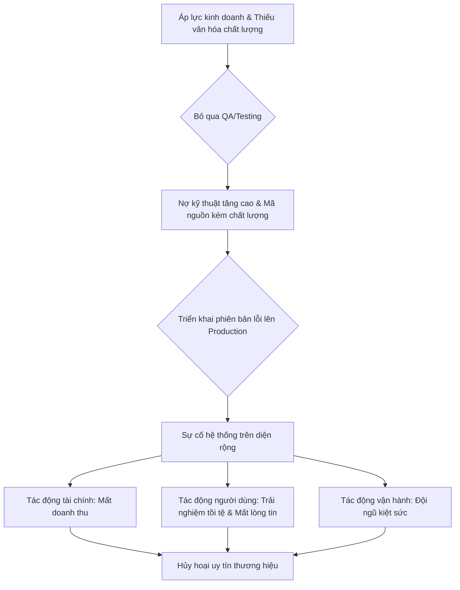
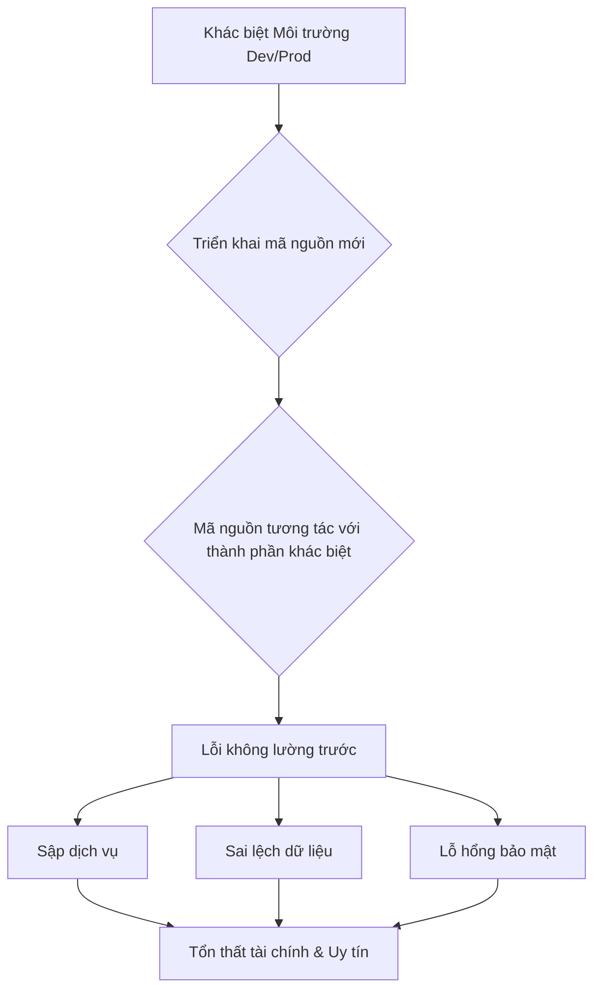

## Chương 1: Rủi Ro Khi Thiếu Production Quality

### 1.1 Định Nghĩa và Phân Loại Rủi Ro Production

#### Định Nghĩa Rủi Ro
- **Định nghĩa:** Rủi ro production là bất kỳ sự kiện hoặc điều kiện không chắc chắn nào có thể xảy ra trong môi trường hoạt động (production) và gây tác động tiêu cực đến dịch vụ, dữ liệu, người dùng, hoặc mục tiêu kinh doanh của tổ chức. Nó không chỉ giới hạn ở lỗi phần mềm, mà còn bao gồm các vấn đề về hạ tầng, quy trình vận hành, bảo mật, và cả yếu tố con người.
- **Tại sao phát sinh:** Rủi ro production phát sinh do sự phức tạp vốn có của các hệ thống hiện đại. Sự tương tác giữa hàng triệu dòng code, các dịch vụ của bên thứ ba, sự biến đổi của tải hệ thống, và các cuộc tấn công tiềm tàng tạo ra một bề mặt tấn công (attack surface) và bề mặt lỗi (failure surface) rộng lớn. Thêm vào đó, áp lực phải liên tục đổi mới và triển khai tính năng mới làm tăng khả năng đưa lỗi vào production.
- **Mức độ nghiêm trọng tiềm tàng:** Critical. Một rủi ro production khi xảy ra có thể dẫn đến ngừng hoạt động toàn bộ hệ thống (total downtime), mất mát dữ liệu không thể phục hồi, vi phạm bảo mật nghiêm trọng, thiệt hại tài chính khổng lồ và làm suy giảm nghiêm trọng uy tín thương hiệu.

#### Nguyên Nhân Gốc Rễ (Root Causes)
1.  **Lỗi Cấu Hình (Configuration Errors):** Đây là một trong những nguyên nhân phổ biến nhất gây ra sự cố. Một thay đổi cấu hình sai, dù là nhỏ nhất (ví dụ: một giá trị timeout, một biến môi trường, một quy tắc firewall), có thể gây ra hiệu ứng gợn sóng và làm sụp đổ cả một hệ thống. Những lỗi này thường khó phát hiện trong môi trường staging vì sự khác biệt về cấu hình so với production.
2.  **Phụ Thuộc Vào Bên Thứ Ba (Third-party Dependencies):** Các hệ thống hiện đại phụ thuộc rất nhiều vào các dịch vụ bên ngoài (API, thư viện, managed services). Khi một dịch vụ của bên thứ ba gặp sự cố, bị suy giảm hiệu năng hoặc thay đổi API mà không thông báo, nó có thể gây ra lỗi xếp chồng (cascading failure) trong hệ thống của bạn. Việc quản lý và giám sát các phụ thuộc này là một thách thức lớn.
3.  **Lỗi Logic Trong Code (Bugs):** Lỗi logic trong mã nguồn, đặc biệt là các trường hợp biên (edge cases) chưa được kiểm thử đầy đủ, là nguyên nhân kinh điển. Một bug có thể tồn tại tiềm ẩn trong hệ thống hàng tháng trời và chỉ được kích hoạt dưới một điều kiện tải hoặc dữ liệu đầu vào rất cụ thể, gây ra các hành vi không mong muốn.
4.  **Cạn Kiệt Tài Nguyên (Resource Exhaustion):** Rò rỉ bộ nhớ (memory leaks), rò rỉ file descriptors, hoặc việc sử dụng CPU/disk quá mức có thể làm cho một máy chủ hoặc dịch vụ trở nên không phản hồi. Những vấn đề này thường tích tụ theo thời gian và khó bị phát hiện bởi các bài kiểm tra ngắn hạn, cho đến khi chúng đạt đến ngưỡng giới hạn của hệ thống.
5.  **Yếu Tố Con Người và Quy Trình (Human and Process Factors):** Các quy trình triển khai không an toàn, việc thiếu các playbook ứng phó sự cố, hoặc sự mệt mỏi của kỹ sư on-call có thể dẫn đến sai lầm. Một kỹ sư có thể chạy nhầm một câu lệnh trên production thay vì staging, hoặc một quy trình phê duyệt thay đổi lỏng lẻo có thể cho phép một thay đổi rủi ro được triển khai.

#### Biểu Hiện & Triệu Chứng (Symptoms)
- **Dấu hiệu cảnh báo sớm:** Tăng đột biến số lượng lỗi HTTP 5xx, độ trễ (latency) của các request tăng dần, tỷ lệ cache-hit giảm, số lượng kết nối cơ sở dữ liệu tăng cao bất thường.
- **Các metrics/logs cần theo dõi:**
    - **Metrics:** Tỷ lệ lỗi (error rate), độ trễ (p95, p99 latency), độ bão hòa (saturation) của CPU/memory/disk, số lượng request mỗi giây (RPS).
    - **Logs:** Tìm kiếm các log entry có level `ERROR`, `FATAL`, `CRITICAL`. Chú ý đến các thông báo về `timeout`, `connection refused`, `out of memory`, `file descriptor limit reached`.
- **Red flags trong hệ thống:** Cảnh báo (alert) liên tục từ cùng một dịch vụ, các tiến trình tự động khởi động lại liên tục (crash loop), hàng đợi (message queue) bị lấp đầy mà không được xử lý.

#### Sơ Đồ Phân Tích
```mermaid
graph TD
    A[Trigger: Lỗi cấu hình triển khai sai một giá trị timeout] --> B[Risk Event: Dịch vụ A gọi đến dịch vụ B bị treo]
    B --> C[Impact 1: Các request đến A bị dồn ứ, tăng latency]
    B --> D[Impact 2: Dịch vụ A mở quá nhiều kết nối chờ, cạn kiệt connection pool]
    C --> E[Consequence: Người dùng cuối trải nghiệm time-out, dịch vụ không khả dụng]
    D --> F[Consequence: Dịch vụ A sụp đổ (cascading failure)]
```

#### Tác Động Cụ Thể (Impact Analysis)

| Khía Cạnh | Mức Độ | Chi Tiết |
|-----------|--------|----------|
| Downtime | High | Có thể gây ra downtime toàn bộ hoặc một phần dịch vụ, kéo dài từ vài phút đến vài giờ. |
| Financial | $10,000 - $1,000,000+/hour | Thiệt hại phụ thuộc vào quy mô kinh doanh. Ví dụ, một trang thương mại điện tử lớn có thể mất hàng triệu USD mỗi giờ. |
| Security | Medium | Một số rủi ro (ví dụ: lỗi cấu hình) có thể vô tình mở ra lỗ hổng bảo mật, nhưng không phải là mục tiêu chính. |
| User Experience | Severe | Người dùng không thể truy cập dịch vụ, mất dữ liệu, hoặc trải nghiệm hiệu năng cực kỳ chậm. Gây mất lòng tin. |
| Team Morale | High | Gây căng thẳng cực độ cho đội ngũ on-call, dẫn đến kiệt sức (burnout) và ảnh hưởng đến tinh thần làm việc lâu dài. |

#### Case Study Thực Tế
**Google Search - Sự cố Shakespeare Sonnet++ - 2015**
- **Bối cảnh:** Một sonnet mới của Shakespeare được phát hiện, tạo ra một làn sóng quan tâm và tìm kiếm khổng lồ trên toàn cầu. Người dùng đổ xô vào Google Search để tìm kiếm nội dung bài thơ mới này.
- **Diễn biến:** Hệ thống Shakespeare Search của Google bắt đầu nhận một lượng truy cập cao gấp 88 lần bình thường. Các máy chủ backend bắt đầu quá tải và sụp đổ, dẫn đến tỷ lệ lỗi HTTP 500 tăng vọt đến gần 100%. Dịch vụ gần như không thể truy cập trong 66 phút.
- **Nguyên nhân gốc rễ:** Một sự kết hợp chết người giữa hai yếu tố: (1) Lượng tải tăng đột biến chưa từng có và (2) Một bug tiềm ẩn gây rò rỉ file descriptor mỗi khi người dùng tìm kiếm một thuật ngữ không có trong kho dữ liệu (corpus). Vì bài thơ mới chưa được cập nhật vào index, hầu hết các truy vấn đều kích hoạt bug này, gây ra lỗi xếp chồng (cascading failure).
- **Tác động:** Ước tính 1.21 tỷ lượt truy vấn bị mất. May mắn là không có tác động trực tiếp đến doanh thu.
- **Bài học:** Sự cố này nhấn mạnh tầm quan trọng của việc chuẩn bị cho các lỗi xếp chồng, sự cần thiết của việc kiểm thử tải và khả năng chống chịu của hệ thống trước các "truy vấn chết người" (queries of death). Nó cũng cho thấy một bug nhỏ, tưởng như vô hại trong điều kiện bình thường, có thể trở thành thảm họa khi kết hợp với một sự kiện không lường trước.
- **Nguồn:** [Google SRE Book - Example Postmortem](https://sre.google/sre-book/example-postmortem/)

#### Risk Mitigation Strategies

**Preventive Measures (Ngăn ngừa):**
1.  **Canary Deployment & Blue-Green Deployment:** Triển khai thay đổi cho một tập người dùng nhỏ trước khi triển khai toàn bộ để giới hạn bán kính ảnh hưởng nếu có lỗi.
2.  **Static Analysis & Code Review:** Sử dụng các công cụ tự động để phát hiện các vấn đề tiềm ẩn (như rò rỉ tài nguyên) và thực hiện quy trình code review nghiêm ngặt để bắt lỗi logic.
3.  **Chaos Engineering:** Chủ động đưa các điều kiện lỗi (như latency cao, lỗi mạng) vào môi trường staging hoặc production (có kiểm soát) để tìm ra các điểm yếu trước khi chúng xảy ra thật.

**Detective Measures (Phát hiện):**
1.  **Comprehensive Monitoring & Alerting:** Thiết lập giám sát chi tiết trên 4 "Golden Signals" (Latency, Traffic, Errors, Saturation). Cài đặt cảnh báo (alerting) có ngưỡng động và tránh gây mệt mỏi cho người nhận (alert fatigue).
2.  **Centralized Logging:** Tập trung hóa log từ tất cả các dịch vụ vào một nơi duy nhất (ví dụ: ELK Stack, Splunk) để có thể truy vấn và phân tích nhanh chóng khi sự cố xảy ra.
3.  **Distributed Tracing:** Sử dụng các công cụ như Jaeger hoặc Zipkin để theo dõi một request qua nhiều dịch vụ, giúp xác định chính xác nơi xảy ra lỗi hoặc nghẽn cổ chai.

**Corrective Measures (Khắc phục):**
1.  **Automated Rollback:** Xây dựng cơ chế tự động hoặc bán tự động để nhanh chóng quay trở lại phiên bản ổn định trước đó khi phát hiện tỷ lệ lỗi tăng đột biến sau khi triển khai.
2.  **Incident Management Playbooks:** Soạn thảo trước các tài liệu hướng dẫn (playbooks) chi tiết cho các loại sự cố thường gặp, giúp đội ngũ on-call phản ứng nhanh và nhất quán.
3.  **Circuit Breaker Pattern:** Implement mẫu thiết kế này để tự động "ngắt mạch" các cuộc gọi đến một dịch vụ đang gặp sự cố, ngăn chặn lỗi xếp chồng và cho phép dịch vụ đó có thời gian phục hồi.

#### Code Examples

**Anti-pattern (Cách làm SAI):**
```python
# ❌ ANTI-PATTERN: Gọi API bên ngoài mà không có timeout
import requests

def get_external_data(url):
    # Nếu dịch vụ bên ngoài bị treo, request này sẽ bị treo vô thời hạn,
    # giữ một worker process và có thể làm cạn kiệt connection pool.
    try:
        response = requests.get(url)
        return response.json()
    except requests.exceptions.RequestException as e:
        print(f"An error occurred: {e}")
        return None
```

**Best Practice (Cách làm ĐÚNG):**
```python
# ✅ BEST PRACTICE: Sử dụng timeout và retry với exponential backoff
import requests
from requests.adapters import HTTPAdapter
from urllib3.util.retry import Retry

def requests_session_with_retries(retries=3, backoff_factor=0.3, status_forcelist=(500, 502, 504)):
    session = requests.Session()
    retry = Retry(
        total=retries,
        read=retries,
        connect=retries,
        backoff_factor=backoff_factor,
        status_forcelist=status_forcelist,
    )
    adapter = HTTPAdapter(max_retries=retry)
    session.mount("http://", adapter)
    session.mount("https://", adapter)
    return session

def get_external_data_safely(url):
    # Thiết lập timeout rõ ràng (ví dụ: 5 giây) và cơ chế retry
    # để xử lý các sự cố tạm thời của dịch vụ bên ngoài một cách linh hoạt.
    try:
        session = requests_session_with_retries()
        response = session.get(url, timeout=5)
        response.raise_for_status() # Ném exception cho các mã lỗi HTTP 4xx/5xx
        return response.json()
    except requests.exceptions.RequestException as e:
        print(f"An error occurred after retries: {e}")
        return None
```

#### Risk Assessment Matrix

| Yếu Tố | Đánh Giá | Ghi Chú |
|--------|----------|---------|
| Xác suất (Probability) | 4 | Với sự phức tạp của hệ thống và tần suất thay đổi, khả năng xảy ra một sự cố production trong một quý là rất cao. |
| Tác động (Impact) | 5 | Một sự cố nghiêm trọng có thể gây downtime, mất doanh thu, và tổn hại uy tín, là tác động ở mức cao nhất. |
| **Risk Score** | 4 x 5 = 20 | **Critical** |
| Ưu tiên xử lý | P1 | Phải được ưu tiên hàng đầu trong mọi kế hoạch kỹ thuật, bao gồm cả việc dành thời gian để cải thiện độ tin cậy. |

#### Checklist Đánh Giá
- [ ] Hệ thống có triển khai giám sát đầy đủ cho 4 Golden Signals không?
- [ ] Có cảnh báo (alerting) cho các chỉ số bất thường và chúng có được rà soát định kỳ để tránh "alert fatigue" không?
- [ ] Quy trình triển khai có bao gồm các bước an toàn như canary hoặc blue-green không?
- [ ] Có cơ chế rollback tự động hoặc bán tự động khi phát hiện sự cố sau triển khai không?
- [ ] Các phụ thuộc vào bên thứ ba có được giám sát và có cơ chế fallback/circuit breaker không?
- [ ] Đội ngũ có các playbook ứng phó sự cố được định nghĩa rõ ràng và dễ tiếp cận không?
- [ ] Có thực hiện các buổi diễn tập (fire drill) hoặc Chaos Engineering để kiểm tra khả năng ứng phó của hệ thống và con người không?

#### Tools & Resources
- **Prometheus & Grafana:** Bộ đôi mạnh mẽ để thu thập metrics và trực quan hóa dashboard, là tiêu chuẩn de-facto trong thế giới cloud-native.
- **Sentry / Bugsnag:** Dịch vụ theo dõi lỗi (error tracking) giúp nhóm phát triển nhận được thông báo ngay lập tức về các exception xảy ra trong production với đầy đủ context.
- **PagerDuty / Opsgenie:** Công cụ quản lý sự cố và điều phối on-call, đảm bảo đúng người được thông báo qua nhiều kênh (SMS, call, push notification) khi có sự cố quan trọng.

#### Nguồn Tham Khảo
1.  [Google SRE Book](https://sre.google/sre-book/landing/) - Cuốn sách nền tảng định nghĩa về Site Reliability Engineering, bao gồm các chương về quản lý rủi ro và ứng phó sự cố.
2.  [The Twelve-Factor App](https://12factor.net/) - Một tập hợp các phương pháp hay nhất để xây dựng các ứng dụng SaaS hiện đại, đặc biệt là các yếu tố liên quan đến cấu hình, logs, và dependencies.
3.  [Awesome Chaos Engineering](https://github.com/dastergon/awesome-chaos-engineering) - Một danh sách tổng hợp các công cụ, tài nguyên và bài viết về Chaos Engineering.

---

### 1.2 Hậu Quả Business Khi Bỏ Qua Quality

#### Định Nghĩa Rủi Ro
- **Định nghĩa:** Rủi ro từ việc bỏ qua chất lượng là khả năng xảy ra các tác động tiêu cực trực tiếp đến hoạt động kinh doanh, tài chính và uy tín thương hiệu do không đầu tư đủ hoặc phớt lờ các tiêu chuẩn, quy trình đảm bảo chất lượng (Quality Assurance - QA) và kiểm thử (Testing) trong suốt vòng đời phát triển phần mềm. Đây không chỉ là rủi ro kỹ thuật mà là một rủi ro kinh doanh nghiêm trọng.
- **Tại sao phát sinh:** Rủi ro này thường phát sinh khi có áp lực cực lớn về thời gian ra mắt sản phẩm (time-to-market), nỗ lực cắt giảm chi phí ngắn hạn, sự thiếu nhận thức về ROI (Return on Investment) của chất lượng, hoặc do văn hóa "move fast and break things" được áp dụng một cách thiếu kiểm soát và không có lưới an toàn.
- **Mức độ nghiêm trọng:** **Critical**. Bỏ qua chất lượng có thể dẫn đến sụp đổ hệ thống trên diện rộng, mất mát dữ liệu không thể phục hồi, tổn thất tài chính khổng lồ và hủy hoại lòng tin của khách hàng một cách vĩnh viễn.

#### Nguyên Nhân Gốc Rễ (Root Causes)
1.  **Áp lực về tốc độ và deadline (Pressure for Speed and Deadlines):** Trong một thị trường cạnh tranh khốc liệt, các đội ngũ phát triển thường bị thúc ép phải giao sản phẩm nhanh nhất có thể. Áp lực này dẫn đến việc cắt bớt hoặc bỏ qua các giai đoạn kiểm thử quan trọng như unit test, integration test, và end-to-end test. Các "lối tắt" kỹ thuật được thực hiện để đáp ứng deadline, tạo ra một khoản nợ kỹ thuật (technical debt) khổng lồ và khó quản lý.
2.  **Thiếu văn hóa chất lượng (Lack of Quality Culture):** Khi chất lượng không được coi là trách nhiệm chung của toàn bộ đội ngũ (từ Product Manager, developer, đến operations) mà bị coi là nhiệm vụ của một nhóm QA riêng biệt, các vấn đề sẽ không được phát hiện và xử lý sớm. Văn hóa này thường xem QA là một "nút cổ chai" cản trở tốc độ, thay vì là một phần cốt lõi không thể thiếu của quy trình phát triển để đảm bảo sự bền vững.
3.  **Tư duy "Sửa lỗi trong production rẻ hơn" (Mindset that "Fixing Bugs in Production is Cheaper"):** Một số tổ chức có thể lầm tưởng rằng việc phát hiện và sửa lỗi sau khi sản phẩm đã đến tay người dùng sẽ tốn ít công sức và chi phí hơn là đầu tư vào một quy trình QA bài bản ngay từ đầu. Họ đã không tính đến các chi phí ẩn nhưng cực kỳ đắt đỏ như: chi phí cơ hội bị mất, tổn thất doanh thu trực tiếp, sự suy giảm uy tín thương hiệu, và sự kiệt sức, giảm sút tinh thần của đội ngũ kỹ thuật khi phải liên tục "chữa cháy".
4.  **Thiếu hệ thống kiểm thử tự động toàn diện (Lack of Comprehensive Automated Testing):** Việc dựa dẫm quá nhiều vào kiểm thử thủ công (manual testing) là một chiến lược không bền vững, chậm chạp, tốn kém và dễ xảy ra lỗi do con người. Việc thiếu một bộ kiểm thử tự động vững chắc (bao gồm unit, integration, E2E tests) khiến cho việc kiểm thử hồi quy (regression testing) trở nên cực kỳ rủi ro và tốn thời gian mỗi khi có một thay đổi nhỏ trong mã nguồn.

#### Biểu Hiện & Triệu Chứng (Symptoms)
- **Dấu hiệu cảnh báo sớm:** Tỷ lệ lỗi (bug) trên môi trường production tăng đột biến sau mỗi lần triển khai. Thời gian trung bình để khắc phục sự cố (MTTR - Mean Time to Resolution) ngày càng kéo dài. Đội ngũ phát triển dành phần lớn thời gian để "chữa cháy" và sửa lỗi thay vì phát triển các tính năng mới mang lại giá trị kinh doanh.
- **Các metrics/logs cần theo dõi:** Tỷ lệ lỗi của ứng dụng (Application error rate), độ trễ (latency) ở percentile 95 và 99, tỷ lệ khách hàng rời bỏ (customer churn rate), số lượng ticket hỗ trợ liên quan đến lỗi kỹ thuật. Trong logs, cần chú ý đến sự gia tăng bất thường của các log ở mức `ERROR` và `FATAL`.
- **Red flags trong hệ thống:** Một hệ thống có quá nhiều "red flags" thường có các đặc điểm: mã nguồn phức tạp và khó hiểu (high cyclomatic complexity), độ bao phủ của test (test coverage) thấp một cách đáng báo động, quy trình triển khai thủ công và dễ gây lỗi, không có khả năng rollback nhanh chóng khi sự cố xảy ra.

#### Sơ Đồ Phân Tích


#### Tác Động Cụ Thể (Impact Analysis)

| Khía Cạnh      | Mức Độ   | Chi Tiết                                                                                                                                                              |
| --------------- | -------- | --------------------------------------------------------------------------------------------------------------------------------------------------------------------- |
| **Downtime**    | High     | Có thể gây ra downtime toàn bộ hệ thống trong nhiều giờ hoặc nhiều ngày, tùy thuộc vào mức độ nghiêm trọng của lỗi và thời gian cần thiết để vá lỗi và khôi phục dữ liệu. |
| **Financial**   | >$1M/hour | Đối với các công ty lớn, một giờ downtime có thể gây thiệt hại hàng triệu USD doanh thu trực tiếp. Chi phí khắc phục, bồi thường và mất khách hàng còn lớn hơn nhiều. |
| **Security**    | High     | Lỗ hổng chất lượng có thể trở thành lỗ hổng bảo mật, cho phép kẻ tấn công truy cập trái phép, đánh cắp dữ liệu nhạy cảm của khách hàng và công ty.                  |
| **User Experience** | Severe   | Trải nghiệm người dùng bị phá hủy hoàn toàn. Khách hàng không thể sử dụng dịch vụ, mất dữ liệu, và cảm thấy thất vọng, tức giận. Lòng tin bị xói mòn nghiêm trọng.      |
| **Team Morale** | High     | Đội ngũ kỹ thuật liên tục phải làm việc ngoài giờ để "chữa cháy", dẫn đến kiệt sức, căng thẳng và mất tinh thần. Tỷ lệ nghỉ việc tăng cao.                      |

#### Case Study Thực Tế
**Sự cố AWS S3 - 2017**
- **Bối cảnh:** Vào ngày 28 tháng 2 năm 2017, một phần đáng kể của Internet toàn cầu đã ngừng hoạt động. Nguyên nhân là do sự cố nghiêm trọng của dịch vụ lưu trữ Amazon S3 (Simple Storage Service) tại khu vực US-EAST-1, một trong những trung tâm dữ liệu quan trọng và được sử dụng rộng rãi nhất của AWS.
- **Diễn biến:** Trong quá trình gỡ lỗi một vấn đề nhỏ của hệ thống thanh toán (billing), một kỹ sư của Amazon đã thực thi một câu lệnh để gỡ bỏ một số lượng nhỏ các máy chủ. Tuy nhiên, một lỗi chính tả (typo) trong tham số đầu vào đã khiến câu lệnh này gỡ bỏ một số lượng máy chủ lớn hơn rất nhiều so với dự định. Hành động này đã vô tình kích hoạt một hiệu ứng domino, làm sụp đổ hai hệ thống con cốt lõi của S3: hệ thống chỉ mục (index subsystem - quản lý metadata và vị trí của object) và hệ thống sắp xếp (placement subsystem - quản lý việc cấp phát bộ nhớ mới). Toàn bộ dịch vụ S3 tại khu vực US-EAST-1 trở nên không khả dụng. Do có quá nhiều dịch vụ khác của AWS (như EC2, Lambda, và ngay cả trang tổng quan trạng thái dịch vụ - AWS Service Health Dashboard) phụ thuộc vào S3, chúng cũng đồng loạt gặp sự cố. Sự gián đoạn kéo dài khoảng bốn giờ.
- **Nguyên nhân gốc rễ:**
    1.  **Lỗi con người (Human Error):** Một lỗi đánh máy đơn giản trong một câu lệnh đã khởi đầu cho toàn bộ sự cố.
    2.  **Công cụ nội bộ thiếu cơ chế bảo vệ (Insufficient Tool Safeguards):** Công cụ được sử dụng để gỡ bỏ máy chủ không có các rào cản an toàn đủ mạnh để ngăn chặn một kỹ sư vô tình xóa một lượng lớn tài nguyên hệ thống.
    3.  **Quy trình phục hồi chậm chạp:** Các hệ thống con cốt lõi đã không được khởi động lại hoàn toàn trong nhiều năm. Theo thời gian, chúng đã phát triển phức tạp hơn và chứa nhiều dữ liệu hơn, khiến quá trình khởi động lại mất nhiều thời gian hơn đáng kể so với dự tính.
    4.  **Kiến trúc phụ thuộc chéo:** Trớ trêu thay, chính trang tổng quan trạng thái dịch vụ của AWS lại phụ thuộc vào S3 tại khu vực đang gặp sự cố, khiến cho kênh giao tiếp chính với khách hàng cũng bị tê liệt.
- **Tác động:**
    - **Downtime:** Khoảng 4 giờ gián đoạn cho S3 và các dịch vụ phụ thuộc tại khu vực US-EAST-1.
    - **Financial Loss:** Ước tính thiệt hại cho các công ty trong danh sách S&P 500 là khoảng 150 triệu USD. Hàng ngàn doanh nghiệp nhỏ hơn cũng bị ảnh hưởng nặng nề.
    - **Users Affected:** Hàng triệu người dùng cuối bị ảnh hưởng khi hàng loạt trang web và ứng dụng lớn như Quora, Trello, Slack, Giphy, Medium... ngừng hoạt động.
- **Bài học:**
    1.  **Tự động hóa và bảo vệ công cụ vận hành:** Cần tích hợp các cơ chế kiểm tra và xác thực nghiêm ngặt vào các công cụ nội bộ để giới hạn "bán kính ảnh hưởng" (blast radius) của bất kỳ hành động nào.
    2.  **Thực hành quy trình phục hồi:** Thường xuyên tổ chức các buổi diễn tập khắc phục sự cố (GameDay) cho các hệ thống quan trọng, bao gồm cả việc khởi động lại toàn bộ, để đảm bảo quy trình hoạt động như mong đợi và nắm rõ thời gian phục hồi thực tế (Recovery Time Objective - RTO).
    3.  **Tách rời các thành phần phụ thuộc:** Các công cụ giám sát và giao tiếp quan trọng (như status page) phải được thiết kế để hoạt động độc lập với hạ tầng mà chúng đang theo dõi.
    4.  **Tầm quan trọng của kiến trúc đa vùng (Multi-Region):** Sự cố này là một lời cảnh tỉnh cho toàn ngành công nghiệp về sự cần thiết phải thiết kế các ứng dụng có khả năng chịu lỗi và chuyển đổi dự phòng (failover) giữa các khu vực địa lý khác nhau.
- **Nguồn:** [After the Retrospective: The 2017 Amazon S3 Outage - Gremlin](https://www.gremlin.com/blog/the-2017-amazon-s-3-outage)

#### Risk Mitigation Strategies

**Preventive Measures (Ngăn ngừa):**
1.  **Xây dựng văn hóa chất lượng toàn diện (Build a Comprehensive Quality Culture):** Chất lượng phải là trách nhiệm của tất cả mọi người, không chỉ của riêng đội ngũ QA. Tích hợp các tiêu chuẩn chất lượng vào "Definition of Done" của mỗi user story. Khuyến khích developer viết unit test và integration test như một phần không thể thiếu của quá trình code.
2.  **Đầu tư mạnh mẽ vào kiểm thử tự động (Invest Heavily in Automated Testing):** Xây dựng một bộ kiểm thử tự động đa tầng (unit, integration, end-to-end) và tích hợp chúng vào quy trình CI/CD. Đảm bảo rằng không có mã nguồn nào được merge vào nhánh chính mà không vượt qua tất cả các bài kiểm thử. Đặt ra các mục tiêu cụ thể về độ bao phủ của test (test coverage).
3.  **Áp dụng quy trình đánh giá mã nguồn nghiêm ngặt (Enforce Strict Code Review Processes):** Mọi thay đổi về mã nguồn đều phải được ít nhất một kỹ sư khác xem xét và phê duyệt. Quy trình này giúp phát hiện sớm các lỗi logic, các vấn đề về hiệu năng và các đoạn mã không tuân thủ tiêu chuẩn chung.

**Detective Measures (Phát hiện):**
1.  **Giám sát và cảnh báo toàn diện (Comprehensive Monitoring and Alerting):** Sử dụng các công cụ như Prometheus, Grafana, Datadog để theo dõi các chỉ số vàng (Golden Signals): Latency, Traffic, Errors, và Saturation. Thiết lập các cảnh báo (alerts) thông minh, có khả năng tự động leo thang (escalate) dựa trên mức độ nghiêm trọng và gửi đến đúng người, đúng kênh (ví dụ: PagerDuty, Slack).
2.  **Phân tích log tập trung (Centralized Log Analysis):** Tập trung log từ tất cả các dịch vụ vào một nơi duy nhất (ví dụ: ELK Stack, Splunk, Logz.io). Thiết lập các pattern để phát hiện các chuỗi log bất thường, sự gia tăng đột biến của các lỗi, hoặc các dấu hiệu của một cuộc tấn-công.
3.  **Triển khai theo Canary (Canary Deployments):** Thay vì triển khai phiên bản mới cho 100% người dùng cùng một lúc, hãy triển khai cho một nhóm nhỏ người dùng trước (ví dụ: 1%, 5%). Theo dõi chặt chẽ các chỉ số sức khỏe của hệ thống trong nhóm này. Nếu không có vấn đề gì, từ từ tăng tỷ lệ người dùng được tiếp cận phiên bản mới. Nếu có vấn đề, rollback ngay lập tức.

**Corrective Measures (Khắc phục):**
1.  **Quy trình phản ứng sự cố được xác định rõ (Well-Defined Incident Response Process):** Xây dựng một quy trình rõ ràng về cách xử lý sự cố: ai là người chỉ huy (incident commander), các kênh giao tiếp, cách leo thang vấn đề, và cách thực hiện postmortem sau sự cố.
2.  **Khả năng Rollback tức thì (Instant Rollback Capability):** Hệ thống CI/CD phải được thiết kế để có thể rollback về phiên bản ổn định trước đó chỉ bằng một cú nhấp chuột hoặc một câu lệnh. Đây là lưới an toàn cuối cùng và quan trọng nhất.
3.  **Playbook khắc phục sự cố (Incident Recovery Playbooks):** Chuẩn bị sẵn các "playbook" chi tiết hướng dẫn từng bước cách khắc phục các loại sự cố thường gặp. Điều này giúp giảm thiểu sự hoảng loạn và sai sót khi sự cố thực sự xảy ra.

#### Code Examples

**Anti-pattern (Cách làm SAI):**
```python
# ❌ ANTI-PATTERN: Bỏ qua validation và xử lý lỗi
# Mô tả: Hàm này xử lý một giao dịch mà không kiểm tra xem người dùng có đủ số dư hay không,
# và cũng không có bất kỳ cơ chế xử lý lỗi nào nếu giao dịch thất bại ở tầng database.
# Điều này có thể dẫn đến dữ liệu không nhất quán và trải nghiệm người dùng tồi tệ.
def process_payment_bad(user_id, amount):
    # Giả sử lấy dữ liệu từ database
    user_balance = 100 # get_user_balance_from_db(user_id)

    # Không có kiểm tra số dư
    new_balance = user_balance - amount

    # Giả sử ghi dữ liệu vào database
    # Nếu thao tác này thất bại, không có gì được xử lý
    print(f"Attempting to set balance to {new_balance}")
    # update_balance_in_db(user_id, new_balance)
    print("Payment processed... maybe?")

# Ví dụ sử dụng
process_payment_bad("user-123", 150) # Giao dịch với số tiền lớn hơn số dư
```

**Best Practice (Cách làm ĐÚNG):**
```python
# ✅ BEST PRACTICE: Implement validation, exception handling, và logging
# Mô tả: Hàm này được thiết kế với các cơ chế phòng vệ vững chắc.
# Nó kiểm tra các điều kiện tiên quyết (số dư), xử lý các lỗi có thể xảy ra trong quá trình
# tương tác với database, và ghi lại log chi tiết để dễ dàng gỡ lỗi.

class InsufficientFundsError(Exception):
    """Custom exception for handling insufficient funds."""
    pass

class DatabaseError(Exception):
    """Custom exception for simulating database failures."""
    pass

def process_payment_good(user_id, amount):
    try:
        # 1. Validation đầu vào
        if amount <= 0:
            raise ValueError("Payment amount must be positive.")

        # 2. Lấy dữ liệu và kiểm tra điều kiện kinh doanh
        user_balance = 100 # get_user_balance_from_db(user_id)
        if user_balance < amount:
            raise InsufficientFundsError(f"User {user_id} has insufficient funds for payment of {amount}.")

        # 3. Thực hiện thao tác trong một transaction (giả lập)
        print("Starting database transaction.")
        new_balance = user_balance - amount

        # Giả sử có thể có lỗi ở đây
        # update_balance_in_db(user_id, new_balance)
        # if random.random() < 0.5:
        #     raise DatabaseError("Failed to update database.")

        print("Database transaction committed.")
        print(f"Payment of {amount} for user {user_id} processed successfully.")
        return True

    except ValueError as e:
        print(f"[Validation Error] {e}")
        return False
    except InsufficientFundsError as e:
        print(f"[Business Logic Error] {e}")
        return False
    except DatabaseError as e:
        print("Rolling back database transaction.")
        print(f"[Critical Error] {e}")
        # Gửi cảnh báo đến đội ngũ kỹ thuật
        # alert_on_call_team("Database failure during payment processing")
        return False
    except Exception as e:
        print(f"[Unknown Error] An unexpected error occurred: {e}")
        return False

# Ví dụ sử dụng
process_payment_good("user-123", 50)  # Giao dịch thành công
process_payment_good("user-123", 150) # Giao dịch thất bại do không đủ tiền
process_payment_good("user-123", -10) # Giao dịch thất bại do validation
```

#### Risk Assessment Matrix

| Yếu Tố                | Đánh Giá | Ghi Chú                                                                                                                                                           |
| ---------------------- | -------- | ----------------------------------------------------------------------------------------------------------------------------------------------------------------- |
| **Xác suất (Probability)** | 5/5      | Trong môi trường phát triển phần mềm hiện đại, áp lực về tốc độ là rất lớn, khiến việc bỏ qua hoặc xem nhẹ chất lượng là một cám dỗ và rủi ro thường trực.         |
| **Tác động (Impact)**      | 5/5      | Tác động có thể ở mức thảm họa, gây sụp đổ dịch vụ, mất mát tài chính khổng lồ, hủy hoại uy tín thương hiệu và làm tan rã đội ngũ.                             |
| **Risk Score**         | **25**   | **Critical**. Đây là một trong những rủi ro có điểm số cao nhất trong quản trị sản xuất.                                                                      |
| **Ưu tiên xử lý**      | P1       | Phải được ưu tiên xử lý ở mức cao nhất, thông qua các chiến lược phòng ngừa mang tính văn hóa và quy trình, không chỉ là các giải pháp kỹ thuật đơn lẻ. |

#### Checklist Đánh Giá
- [ ] Quy trình CI/CD của bạn có tích hợp một bộ kiểm thử tự động (unit, integration) bắt buộc phải vượt qua trước khi merge code không?
- [ ] Độ bao phủ của test (test coverage) có được đo lường, theo dõi và đặt mục tiêu cải thiện liên tục không?
- [ ] Mọi thay đổi về mã nguồn có yêu cầu ít nhất một người khác review (pull request/merge request) trước khi được chấp nhận không?
- [ ] Bạn có một quy trình rõ ràng để rollback về phiên bản trước một cách nhanh chóng và an toàn khi sự cố xảy ra không?
- [ ] Hệ thống giám sát của bạn có đủ khả năng phát hiện sớm các triệu chứng của sự cố (tăng tỷ lệ lỗi, độ trễ cao) và gửi cảnh báo tự động không?
- [ ] Đội ngũ của bạn có thường xuyên thực hiện các buổi "postmortem" sau sự cố để tìm ra nguyên nhân gốc rễ và đưa ra các hành động khắc phục cụ thể không?
- [ ] Có một "Definition of Done" rõ ràng cho các tính năng, trong đó bao gồm các yêu cầu về chất lượng và kiểm thử không?

#### Tools & Resources
- **SonarQube/SonarCloud:** Công cụ phân tích mã nguồn tĩnh (static code analysis) giúp tự động phát hiện bugs, lỗ hổng bảo mật và "code smells" ngay trong quá trình phát triển.
- **Jest / Pytest / JUnit:** Các framework phổ biến để viết và chạy unit test cho JavaScript, Python và Java, giúp xây dựng nền tảng chất lượng từ cấp độ đơn vị mã nguồn.
- **Selenium / Cypress / Playwright:** Các công cụ mạnh mẽ để tự động hóa kiểm thử end-to-end (E2E), giả lập hành vi của người dùng trên trình duyệt để đảm bảo các luồng nghiệp vụ quan trọng hoạt động chính xác.
- **PagerDuty / Opsgenie:** Các nền tảng quản lý sự cố giúp tự động hóa việc gửi cảnh báo, leo thang và điều phối đội ngũ phản ứng khi có sự cố xảy ra.

#### Nguồn Tham Khảo
1.  [After the Retrospective: The 2017 Amazon S3 Outage](https://www.gremlin.com/blog/the-2017-amazon-s-3-outage) - Phân tích chi tiết về nguyên nhân, tác động và bài học từ sự cố S3 năm 2017.
2.  [The Cost of Poor Software Quality](https://www.synopsys.com/blogs/software-security/cost-of-poor-software-quality-cpsc-report/) - Báo cáo về chi phí khổng lồ mà các tổ chức phải gánh chịu do chất lượng phần mềm kém.
3.  [Google SRE Book - Chapter 4: Service Level Objectives](https://sre.google/sre-book/service-level-objectives/) - Hướng dẫn của Google về cách định nghĩa và sử dụng các mục tiêu cấp độ dịch vụ (SLOs) để cân bằng giữa tốc độ phát triển và độ tin cậy.


### 1.3 Gap Analysis: Development vs Production

#### Định Nghĩa Rủi Ro
- **Định nghĩa:** Rủi ro "Gap Analysis: Development vs Production" là tập hợp các sự cố, lỗi, và hành vi không mong muốn của ứng dụng chỉ xảy ra trong môi trường production mà không thể tái hiện được trong môi trường development. Hiện tượng này thường được biết đến với tên gọi "Hội chứng Works on my machine" (Nó chạy trên máy tôi), khi các nhà phát triển không thể tìm thấy lỗi trên môi trường lập trình của họ, nhưng người dùng cuối lại gặp phải sự cố nghiêm trọng.
- **Nguyên nhân phát sinh:** Rủi ro này phát sinh từ sự thiếu tương đồng (lack of parity) giữa môi trường development, staging và production. Sự khác biệt về cấu hình phần cứng, phiên bản phần mềm, hệ điều hành, biến môi trường, dữ liệu, và kiến trúc mạng là những nguyên nhân chính tạo ra một "khoảng trống" (gap) khiến cho mã nguồn hoạt động đúng ở nơi này nhưng lại thất bại ở nơi khác.
- **Mức độ nghiêm trọng tiềm tàng:** **Critical/High**. Tùy thuộc vào chức năng bị ảnh hưởng, rủi ro này có thể gây ra từ những lỗi nhỏ về giao diện người dùng cho đến sập toàn bộ hệ thống, mất dữ liệu, hoặc lỗ hổng bảo mật nghiêm trọng, dẫn đến tổn thất tài chính và uy tín lớn.

#### Nguyên Nhân Gốc Rễ (Root Causes)
1.  **Khác biệt về Cấu hình Môi trường (Environment Configuration Drift):** Đây là nguyên nhân phổ biến nhất. Các biến môi trường (environment variables), API keys, chuỗi kết nối cơ sở dữ liệu, hoặc cấu hình dịch vụ (như timeout, retry policy) không được quản lý đồng bộ. Môi trường development thường có cấu hình "lỏng lẻo" hơn (ví dụ: tắt firewall, cấp quyền admin cho database user) trong khi production lại cực kỳ nghiêm ngặt.
2.  **Phiên bản Phụ thuộc không đồng nhất (Inconsistent Dependency Versions):** Một thư viện hoặc framework có thể được sử dụng với phiên bản `1.2.1` ở development nhưng lại là `1.2.5` ở production. Một thay đổi nhỏ (patch version) trong thư viện cũng có thể chứa breaking change hoặc sửa một lỗi mà logic của ứng dụng đang vô tình dựa vào, gây ra hành vi không đoán trước.
3.  **Sự khác biệt về Dữ liệu (Data Discrepancies):** Môi trường development thường sử dụng dữ liệu giả (mock data) hoặc một tập dữ liệu rất nhỏ, sạch sẽ. Ngược lại, production phải xử lý hàng terabytes dữ liệu thực tế với đủ loại trường hợp biên (edge cases), ký tự đặc biệt, và dữ liệu không nhất quán do người dùng nhập vào qua nhiều năm.
4.  **Kiến trúc Hạ tầng và Mạng khác biệt (Infrastructure and Network Architecture Differences):** Development có thể chạy trên một máy đơn (localhost), trong khi production chạy trên một cụm Kubernetes phức tạp với load balancer, firewall, CDN, và nhiều lớp mạng khác nhau. Các vấn đề về độ trễ mạng (latency), giới hạn kết nối, hoặc các quy tắc của firewall chỉ xuất hiện trong môi trường phức tạp này.
5.  **Hệ điều hành và Phần cứng không tương thích (OS and Hardware Incompatibility):** Lập trình viên có thể phát triển trên macOS (với hệ thống file không phân biệt chữ hoa/thường) trong khi production chạy trên Linux (phân biệt chữ hoa/thường). Điều này có thể gây ra lỗi `FileNotFound` khi gọi đến một tệp tin có tên `Config.json` thay vì `config.json`. Sự khác biệt về kiến trúc CPU (ARM vs. x86) cũng có thể gây ra các vấn đề tương tự.

#### Biểu Hiện & Triệu Chứng (Symptoms)
- **Dấu hiệu cảnh báo sớm:**
    - Các bản vá lỗi (hotfix) cho production ngày càng thường xuyên.
    - Tỷ lệ rollback các bản triển khai (deployment) tăng cao.
    - Phàn nàn từ người dùng về các lỗi "kỳ lạ", không thể tái hiện một cách nhất quán.
- **Các metrics/logs cần theo dõi:**
    - **Error Rate:** Tỷ lệ lỗi (HTTP 5xx, unhandled exceptions) tăng đột biến sau mỗi lần deploy.
    - **Latency:** Độ trễ của ứng dụng tăng cao ở một số endpoint nhất định.
    - **Resource Utilization:** Mức sử dụng CPU, Memory, hoặc I/O tăng bất thường.
    - **Log Analysis:** Sự xuất hiện của các log lỗi mới, đặc biệt là `FileNotFoundException`, `ConfigurationErrors`, `ConnectionTimeout`, `AccessDeniedException`.
- **Red flags trong hệ thống:**
    - "Nó chạy trên máy tôi" trở thành câu trả lời thường xuyên trong các cuộc họp về sự cố.
    - Quy trình deploy lên production là một công việc thủ công, căng thẳng và dễ xảy ra lỗi.
    - Không có môi trường staging nào mô phỏng chính xác 100% môi trường production.

#### Sơ Đồ Phân Tích


#### Tác Động Cụ Thể (Impact Analysis)

| Khía Cạnh        | Mức Độ   | Chi Tiết                                                                                                                            |
|-------------------|----------|-------------------------------------------------------------------------------------------------------------------------------------|
| Downtime          | High     | Có thể gây ra downtime toàn bộ hoặc một phần hệ thống trong nhiều giờ, ảnh hưởng trực tiếp đến khả năng truy cập của người dùng.      |
| Financial         | >$1M/hour| Với các hệ thống tài chính hoặc e-commerce lớn, một giờ downtime có thể gây thiệt hại hàng triệu đô la từ doanh thu bị mất và chi phí khắc phục. |
| Security          | Critical | Sự khác biệt cấu hình có thể vô tình mở ra các lỗ hổng bảo mật, ví dụ như để lộ API key hoặc cho phép truy cập trái phép vào dữ liệu nhạy cảm. |
| User Experience   | Severe   | Người dùng mất niềm tin vào sản phẩm khi liên tục gặp lỗi, không thể hoàn thành các tác vụ quan trọng, dẫn đến việc họ rời bỏ nền tảng. |
| Team Morale       | High     | Gây ra căng thẳng, đổ lỗi và mệt mỏi cho đội ngũ phát triển và vận hành khi phải liên tục "chữa cháy" các sự cố trên production. |

#### Case Study Thực Tế
**Knight Capital Group - 2012**
- **Bối cảnh:** Knight Capital là một trong những nhà tạo lập thị trường lớn nhất tại Mỹ. Họ chuẩn bị triển khai một hệ thống giao dịch thuật toán mới có tên là SMARS để tham gia vào chương trình Retail Liquidity Program của Sàn giao dịch Chứng khoán New York (NYSE).
- **Diễn biến:** Vào ngày 1 tháng 8 năm 2012, trong quá trình triển khai, một kỹ thuật viên đã quên cập nhật mã nguồn mới lên một trong tám máy chủ của hệ thống SMARS. Mã nguồn cũ trên máy chủ này chứa một chức năng đã lỗi thời, được kích hoạt bởi một "cờ" (flag) mà hệ thống mới lại tái sử dụng cho một mục đích khác. Trong vòng 45 phút, máy chủ lỗi này đã gửi đi hàng triệu lệnh giao dịch sai, mua và bán cổ phiếu một cách không kiểm soát.
- **Nguyên nhân gốc rễ:** Sự cố là một ví dụ kinh điển về rủi ro "Gap Analysis". Một máy chủ trong môi trường production không đồng bộ với các máy chủ còn lại, tạo ra một "khoảng trống" chết người. Việc tái sử dụng flag và không loại bỏ mã nguồn cũ (dead code) đã kết hợp với lỗi triển khai thủ công để tạo ra thảm họa.
- **Tác động:** Knight Capital đã lỗ khoảng **440 triệu USD** chỉ trong chưa đầy một giờ. Công ty đứng trước nguy cơ phá sản và phải nhận một gói cứu trợ khẩn cấp, dẫn đến việc bị mua lại sau đó. Sự cố gây chấn động toàn bộ Phố Wall.
- **Bài học:** Tầm quan trọng của việc tự động hóa quy trình triển khai, đảm bảo tính nhất quán tuyệt đối trên tất cả các máy chủ production, và quản lý mã nguồn cẩn thận (loại bỏ dead code) là những bài học đắt giá.
- **Nguồn:** [SEC Administrative Proceeding File No. 3-15570](https://www.sec.gov/litigation/admin/2013/34-70694.pdf)

#### Risk Mitigation Strategies

**Preventive Measures (Ngăn ngừa):**
1.  **Dev/Prod Parity (Tính tương đồng Dev/Prod):** Áp dụng nguyên tắc "Twelve-Factor App". Giữ cho môi trường development, staging, và production càng giống nhau càng tốt. Sử dụng các công cụ như Docker và Terraform để định nghĩa và quản lý hạ tầng dưới dạng mã (Infrastructure as Code), đảm bảo tính nhất quán.
2.  **Quản lý Cấu hình Tập trung (Centralized Configuration Management):** Sử dụng các dịch vụ như AWS Parameter Store, HashiCorp Vault, hoặc Azure App Configuration để lưu trữ và quản lý tất cả các cấu hình. Ứng dụng sẽ tải cấu hình từ một nguồn duy nhất khi khởi động, thay vì dựa vào các tệp tin `.env` nằm rải rác.
3.  **Tự động hóa Triển khai (Automated Deployment Pipeline):** Xây dựng một quy trình CI/CD hoàn toàn tự động. Mọi thay đổi phải đi qua các bước build, test, và deploy tự động. Loại bỏ hoàn toàn việc can thiệp thủ công vào các máy chủ production.

**Detective Measures (Phát hiện):**
1.  **Giám sát Toàn diện (Comprehensive Monitoring):** Sử dụng các công cụ như Prometheus, Grafana, Datadog để giám sát các chỉ số vàng: Latency, Traffic, Errors, và Saturation. Thiết lập cảnh báo (alerting) khi các chỉ số này vượt ngưỡng bất thường, đặc biệt là sau khi triển khai.
2.  **Ghi log có cấu trúc và Phân tích (Structured Logging and Analysis):** Ghi log dưới dạng JSON và đưa vào một hệ thống quản lý log tập trung như ELK Stack hoặc Splunk. Điều này cho phép tìm kiếm, phân tích và cảnh báo dựa trên các pattern log lỗi một cách hiệu quả.
3.  **Canary Deployments / Blue-Green Deployments:** Triển khai phiên bản mới cho một nhóm nhỏ người dùng (canary) hoặc một môi trường song song (blue) trước khi chuyển toàn bộ traffic. Điều này giúp phát hiện sớm các vấn đề trong một môi trường có kiểm soát trước khi ảnh hưởng đến tất cả người dùng.

**Corrective Measures (Khắc phục):**
1.  **Quy trình Phản ứng Sự cố (Incident Response Playbook):** Có một quy trình rõ ràng về việc ai làm gì khi sự cố xảy ra. Xác định người chỉ huy sự cố (incident commander), các kênh liên lạc, và các bước cần thực hiện để chẩn đoán vấn đề.
2.  **Rollback tự động (Automated Rollback Strategy):** Quy trình CI/CD phải có khả năng rollback về phiên bản ổn định trước đó chỉ bằng một cú nhấp chuột hoặc một lệnh. Nếu các chỉ số sức khỏe của phiên bản mới xấu đi, hệ thống có thể tự động kích hoạt rollback.
3.  **Feature Flags (Cờ tính năng):** Bao bọc các tính năng mới trong các feature flag. Nếu một tính năng gây ra lỗi trên production, ta có thể tắt nó đi ngay lập tức từ một giao diện quản lý mà không cần phải rollback toàn bộ bản triển khai.

#### Code Examples

**Anti-pattern (Cách làm SAI):**
```python
# ❌ ANTI-PATTERN: Hardcode cấu hình hoặc dựa vào các tệp tin cục bộ không được quản lý
import os

def get_database_connection():
    # Cấu hình được hardcode, rất khác biệt giữa dev và prod
    if os.getenv("ENV") == "prod":
        db_host = "prod.db.internal"
        db_user = "prod_user"
    else:
        db_host = "localhost"
        db_user = "dev_user"

    # Logic phức tạp và dễ lỗi nằm trong code
    print(f"Connecting to {db_host} as {db_user}")
    # ... logic kết nối
    return True

get_database_connection()
```

**Best Practice (Cách làm ĐÚNG):**
```python
# ✅ BEST PRACTICE: Tải cấu hình từ biến môi trường, được quản lý bởi một hệ thống bên ngoài (IaC, Vault, etc.)
import os

class Config:
    def __init__(self):
        # Đọc cấu hình từ biến môi trường. Các biến này được inject vào môi trường chạy (container, VM)
        # một cách nhất quán bởi Terraform hoặc Kubernetes.
        self.db_host = os.environ["DB_HOST"]
        self.db_user = os.environ["DB_USER"]
        self.db_password = os.environ["DB_PASSWORD"]

def get_database_connection(config: Config):
    # Code không cần biết nó đang chạy ở môi trường nào. Nó chỉ đơn giản là sử dụng cấu hình được cung cấp.
    print(f"Connecting to {config.db_host} as {config.db_user}")
    # ... logic kết nối
    return True

# Trong môi trường thực tế, các biến môi trường sẽ được thiết lập bởi hệ thống triển khai
# Ví dụ cho development:
# export DB_HOST=localhost
# export DB_USER=dev_user
# export DB_PASSWORD=dev_pass

# Ví dụ cho production:
# export DB_HOST=prod.db.internal
# export DB_USER=prod_user
# export DB_PASSWORD=$(aws ssm get-parameter --name /prod/db/password --with-decryption --query Parameter.Value --output text)

if __name__ == "__main__":
    try:
        app_config = Config()
        get_database_connection(app_config)
    except KeyError as e:
        print(f"❌ Lỗi: Biến môi trường {e} chưa được thiết lập.")

```

#### Risk Assessment Matrix

| Yếu Tố                | Đánh Giá | Ghi Chú                                                                                                                               |
|------------------------|----------|---------------------------------------------------------------------------------------------------------------------------------------|
| Xác suất (Probability)  | 4        | Rất cao trong các hệ thống không có quy trình CI/CD trưởng thành và quản lý cấu hình tự động. Sự phức tạp của hệ thống càng tăng, xác suất càng cao. |
| Tác động (Impact)       | 5        | Có thể gây ra tổn thất tài chính thảm khốc, mất dữ liệu vĩnh viễn, và phá hủy hoàn toàn uy tín của công ty, như case study của Knight Capital. |
| **Risk Score**         | **20**   | **Critical**                                                                                                                          |
| Ưu tiên xử lý          | P1       | Phải được ưu tiên giải quyết hàng đầu. Đầu tư vào Dev/Prod Parity là một khoản đầu tư nền tảng cho sự ổn định và tăng trưởng của hệ thống. |

#### Checklist Đánh Giá
- [ ] Toàn bộ hạ tầng (VMs, containers, network rules) có được định nghĩa bằng Infrastructure as Code (Terraform, CloudFormation) không?
- [ ] Tất cả các cấu hình, secrets, và feature flags có được quản lý bởi một dịch vụ tập trung và được inject vào ứng dụng lúc runtime không?
- [ ] Quy trình triển khai lên mọi môi trường (staging, production) có được tự động hóa 100% và không yêu cầu SSH thủ công không?
- [ ] Môi trường staging có sử dụng một bản sao (sanitized) của cơ sở dữ liệu production và có kiến trúc mạng tương tự production không?
- [ ] Tất cả các phiên bản của hệ điều hành, thư viện hệ thống, và các phụ thuộc của ứng dụng có được chốt phiên bản (pinning) và giống hệt nhau trên tất cả các môi trường không?
- [ ] Đội ngũ có thể thực hiện rollback về phiên bản trước một cách nhanh chóng và tự động không?
- [ ] Có hệ thống giám sát và cảnh báo để phát hiện sự bất thường về hiệu suất hoặc tỷ lệ lỗi ngay sau khi triển khai không?

#### Tools & Resources
- **Docker:** Công cụ container hóa hàng đầu, giúp đóng gói ứng dụng và các phụ thuộc của nó vào một image duy nhất, đảm bảo chạy nhất quán trên mọi môi trường.
- **Terraform:** Công cụ Infrastructure as Code (IaC) của HashiCorp, cho phép định nghĩa và cung cấp hạ tầng trung tâm dữ liệu bằng ngôn ngữ cấu hình khai báo.
- **HashiCorp Vault / AWS Secrets Manager:** Các công cụ chuyên dụng để quản lý secrets (API keys, passwords, certificates) một cách an toàn và tập trung.

#### Nguồn Tham Khảo
1.  [The Twelve-Factor App - Dev/Prod Parity](https://12factor.net/dev-prod-parity) - Nguyên tắc vàng về việc giữ các môi trường giống nhau.
2.  [SEC Investigation Report on Knight Capital](https://www.sec.gov/litigation/admin/2013/34-70694.pdf) - Báo cáo chi tiết về sự cố của Knight Capital, một case study kinh điển.
3.  [Production vs Development Environment: Key Differences Explained](https://www.graphapp.ai/blog/production-vs-development-environment-key-differences-explained) - Bài viết phân tích sâu về sự khác biệt giữa hai môi trường.

---

### 1.4 Mức Độ Phơi Nhiễm Rủi Ro Trên 7 Trụ Cột

#### Định Nghĩa Rủi Ro
- **Định nghĩa:** Mức Độ Phơi Nhiễm Rủi Ro (Risk Exposure) là một thước đo định lượng, thể hiện mức độ tổn thất tiềm tàng mà một tổ chức có thể phải đối mặt từ các rủi ro trong môi trường production. Nó không chỉ xác định sự tồn tại của một rủi ro, mà còn tính toán tích hợp giữa **xác suất xảy ra (Probability)** và **mức độ tác động (Impact)** của rủi ro đó. Công thức cơ bản là: `Risk Exposure = Probability x Impact`. Việc đánh giá này được áp dụng trên 7 trụ cột cốt lõi của hệ thống: **Reliability (Độ tin cậy), Scalability (Khả năng mở rộng), Security (Bảo mật), Performance (Hiệu năng), Cost (Chi phí), Operability (Khả năng vận hành), và Maintainability (Khả năng bảo trì)**.
- **Nguồn gốc phát sinh:** Rủi ro phơi nhiễm phát sinh do sự phức tạp vốn có của các hệ thống phần mềm hiện đại, sự thay đổi liên tục (code, infrastructure, user load), và sự tồn tại của các yếu tố không chắc chắn. Việc không nhận diện, đánh giá và quản lý một cách có hệ thống các rủi ro này dẫn đến tình trạng "phơi nhiễm" - tức là tổ chức đang mở cửa cho các sự cố không lường trước.
- **Mức độ nghiêm trọng tiềm tàng:** **Critical**. Việc thiếu hiểu biết hoặc đánh giá sai về mức độ phơi nhiễm rủi ro là một thất bại ở cấp độ chiến lược. Nó có thể dẫn đến các quyết định sai lầm trong việc phân bổ nguồn lực, ưu tiên công việc và kiến trúc hệ thống, cuối cùng gây ra các sự cố nghiêm trọng, ảnh hưởng trực tiếp đến sự sống còn của sản phẩm và uy tín công ty.

#### Nguyên Nhân Gốc Rễ (Root Causes)

1.  **Thiếu Văn Hóa Nhận Diện Rủi Ro (Lack of Risk-Aware Culture):** Các đội nhóm quá tập trung vào việc phát triển tính năng mới (feature-first) mà xem nhẹ các công việc nền tảng như refactoring, tối ưu hóa, và củng cố bảo mật. Áp lực về tốc độ ra mắt sản phẩm khiến việc đánh giá rủi ro bị coi là một gánh nặng, dẫn đến việc "đi đường tắt" và tích tụ nợ kỹ thuật.
2.  **Nợ Kỹ Thuật Tích Tụ Không Được Quản Lý (Unmanaged Technical Debt):** Các quyết định kiến trúc vội vàng, code không được tối ưu, thư viện lỗi thời, và thiếu tài liệu kỹ thuật tạo ra một nền tảng không ổn định. Mỗi khoản nợ kỹ thuật là một quả bom hẹn giờ, làm tăng xác suất xảy ra lỗi và khuếch đại tác động khi sự cố xảy ra.
3.  **Hệ Thống Giám Sát và Cảnh Báo Kém Hiệu Quả (Ineffective Monitoring & Alerting):** Tổ chức không đầu tư đủ vào việc xây dựng một hệ thống observability toàn diện. Các chỉ số (metrics) quan trọng không được theo dõi, logs không được tập trung và phân tích, cảnh báo thì quá nhiễu (noisy) hoặc quá im lặng (silent). Điều này khiến đội ngũ vận hành bị "mù" trước các dấu hiệu sớm của sự cố.
4.  **Quy Trình Phản Ứng Sự Cố Ad-hoc (Ad-hoc Incident Response):** Khi sự cố xảy ra, không có một quy trình rõ ràng, được luyện tập từ trước. Mọi người phản ứng một cách hỗn loạn, thiếu sự phối hợp, dẫn đến thời gian khắc phục kéo dài (MTTR - Mean Time To Resolve) và làm trầm trọng thêm tác động.

#### Biểu Hiện & Triệu Chứng (Symptoms)
- **Dấu hiệu cảnh báo sớm:** Tần suất xảy ra các sự cố nhỏ, không nghiêm trọng (minor incidents) ngày càng tăng. Thời gian deploy một thay đổi mới ngày càng kéo dài. Các kỹ sư thường xuyên phàn nàn về sự phức tạp và khó hiểu của một module nào đó trong hệ thống.
- **Các metrics/logs cần theo dõi:** Tỷ lệ lỗi (error rate) tăng đột biến không rõ nguyên nhân, độ trễ (latency) ở các percentile cao (p95, p99) leo thang, mức sử dụng CPU/memory/disk đạt ngưỡng bất thường, số lượng cảnh báo "flapping" (liên tục chuyển giữa OK và ALARM) tăng.
- **Red flags trong hệ thống:** Sự tồn tại của các Điểm Lỗi Đơn (Single Points of Failure - SPOF). Các service quan trọng thiếu cơ chế fallback. Dữ liệu backup không được kiểm tra định kỳ. Các bí mật (secrets) như API keys được hardcode trực tiếp trong mã nguồn.

#### Sơ Đồ Phân Tích
Sơ đồ này minh họa cách việc thiếu nhận thức về rủi ro dẫn đến phơi nhiễm và cuối cùng là sự cố production.
```mermaid
graph TD
    A[Thiếu văn hóa nhận diện rủi ro & Nợ kỹ thuật] --> B{Mức độ phơi nhiễm rủi ro cao không được quản lý};
    B --> C[Trigger: Tải tăng đột biến / Deploy lỗi / Lỗ hổng bảo mật];
    C --> D{Sự kiện Rủi Ro Hiện Thực Hóa (Risk Event Materializes)};
    D --> E[Tác động: Mất ổn định hệ thống (Reliability)];
    D --> F[Tác động: Quá tải, không đáp ứng (Scalability)];
    D --> G[Tác động: Dữ liệu bị xâm phạm (Security)];
    E & F & G --> H[Hậu quả: Downtime, Mất doanh thu, Mất niềm tin người dùng];
```

#### Tác Động Cụ Thể (Impact Analysis)

| Khía Cạnh | Mức Độ | Chi Tiết |
|---|---|---|
| Downtime | High | Phơi nhiễm rủi ro cao trên các trụ cột Reliability và Scalability có thể dẫn đến downtime toàn hệ thống, ảnh hưởng đến 100% người dùng. |
| Financial | >$100,000/hour | Với một dịch vụ SaaS lớn, mỗi giờ downtime có thể gây thiệt hại hàng trăm nghìn đô la từ mất doanh thu trực tiếp, vi phạm SLA, và chi phí khắc phục. |
| Security | Critical | Phơi nhiễm rủi ro bảo mật có thể dẫn đến rò rỉ dữ liệu khách hàng, gây tổn thất tài chính và pháp lý khổng lồ, hủy hoại danh tiếng thương hiệu. |
| User Experience | Severe | Người dùng không thể truy cập dịch vụ, mất dữ liệu, hoặc trải nghiệm hiệu năng chậm chạp, dẫn đến sự thất vọng và rời bỏ sản phẩm. |
| Team Morale | High | Các kỹ sư liên tục phải "chữa cháy" trong các cuộc họp xử lý sự cố (war room), dẫn đến kiệt sức, căng thẳng và giảm năng suất làm việc. |

#### Case Study Thực Tế
**Sự cố Fastly - Tháng 6, 2021**
- **Bối cảnh:** Fastly là một trong những nhà cung cấp mạng phân phối nội dung (CDN) lớn nhất thế giới, phục vụ cho các trang web hàng đầu như Amazon, Reddit, The New York Times, và chính phủ Anh.
- **Diễn biến:** Vào ngày 8 tháng 6 năm 2021, một khách hàng của Fastly đã thực hiện một thay đổi cấu hình hợp lệ. Tuy nhiên, thay đổi này đã vô tình kích hoạt một bug tiềm ẩn trong phần mềm của Fastly từ tháng 5, gây ra sự cố trên 85% mạng lưới của họ. Hàng loạt trang web lớn trên toàn cầu đã bị sập, hiển thị lỗi "503 Service Unavailable".
- **Nguyên nhân gốc rễ:** Nguyên nhân trực tiếp là một bug phần mềm. Tuy nhiên, nguyên nhân sâu xa hơn là **mức độ phơi nhiễm rủi ro cao từ một thay đổi tưởng chừng như vô hại**. Một thay đổi cấu hình từ một khách hàng duy nhất lại có khả năng gây sập toàn bộ mạng lưới cho thấy một điểm yếu trong kiến trúc, nơi tác động của một thay đổi không được cô lập hoàn toàn.
- **Tác động:** Hàng loạt trang web lớn nhất thế giới ngoại tuyến trong khoảng một giờ. Chỉ số chứng khoán của Fastly giảm. Hàng triệu người dùng cuối bị ảnh hưởng. Sự cố này cho thấy sự phụ thuộc lẫn nhau và rủi ro mang tính hệ thống trong cơ sở hạ tầng internet hiện đại.
- **Bài học:** Cần phải có các cơ chế kiểm tra và triển khai an toàn hơn cho các thay đổi cấu hình, ngay cả khi chúng có vẻ hợp lệ. Tầm quan trọng của việc cô lập tác động (blast radius reduction) để một lỗi ở một thành phần không thể gây ra sụp đổ toàn hệ thống.
- **Nguồn:** [Summary of June 8 outage - Fastly](https://www.fastly.com/blog/summary-of-june-8-outage)

#### Risk Mitigation Strategies

**Preventive Measures (Ngăn ngừa):**
1.  **Xây dựng Risk Registry:** Tạo và duy trì một danh sách các rủi ro đã biết, đánh giá xác suất và tác động, và chỉ định người chịu trách nhiệm theo dõi cho từng rủi ro.
2.  **Kiến trúc hệ thống có khả năng phục hồi (Resilient Architecture):** Thiết kế hệ thống không có Điểm Lỗi Đơn (SPOF), áp dụng các mẫu như circuit breaker, bulkhead, và retry với exponential backoff.
3.  **Thực hiện "Blameless Postmortems":** Xây dựng văn hóa phân tích sự cố không nhằm mục đích đổ lỗi, mà để tìm ra nguyên nhân gốc rễ ở cấp độ hệ thống và quy trình, từ đó đưa ra các hành động khắc phục cụ thể.

**Detective Measures (Phát hiện):**
1.  **Golden Signals Monitoring:** Theo dõi 4 chỉ số vàng cho mọi service: Latency, Traffic, Errors, và Saturation. Thiết lập các cảnh báo thông minh dựa trên độ lệch so với trạng thái bình thường (anomaly detection).
2.  **Distributed Tracing:** Sử dụng các công cụ như Jaeger hoặc OpenTelemetry để theo dõi một request qua nhiều service, giúp xác định nhanh chóng nút thắt cổ chai hoặc điểm gây lỗi.
3.  **Log Aggregation and Analysis:** Tập trung logs từ tất cả các thành phần của hệ thống vào một nơi (ví dụ: ELK Stack, Splunk) và thiết lập các cảnh báo dựa trên các pattern log bất thường (ví dụ: số lượng log lỗi tăng đột biến).

**Corrective Measures (Khắc phục):**
1.  **Tự động hóa Rollback:** Xây dựng quy trình CI/CD có khả năng tự động rollback về phiên bản ổn định trước đó ngay khi phát hiện các chỉ số sức khỏe (health metrics) suy giảm sau khi deploy.
2.  **Playbooks và Game Days:** Chuẩn bị sẵn các kịch bản xử lý sự cố (playbooks) cho các loại rủi ro đã biết. Thường xuyên tổ chức các buổi diễn tập "Game Days" để đội ngũ thực hành các quy trình này trong một môi trường giả lập.
3.  **Feature Flags:** Sử dụng cờ tính năng để có thể bật/tắt các tính năng mới trong production mà không cần deploy lại code, cho phép vô hiệu hóa nhanh chóng một tính năng gây lỗi.

#### Code Examples

**Anti-pattern (Cách làm SAI):**
```python
# ❌ ANTI-PATTERN: Gọi service khác mà không có timeout
# Vấn đề: Nếu 'other_service' bị chậm hoặc treo, service hiện tại cũng sẽ bị treo theo,
# gây ra lỗi xếp tầng (cascading failure).
import requests

def bad_example_get_data():
    try:
        # Không có timeout được thiết lập
        response = requests.get("https://api.otherservice.com/data")
        return response.json()
    except requests.exceptions.RequestException as e:
        print(f"Error: {e}")
        return None
```

**Best Practice (Cách làm ĐÚNG):**
```python
# ✅ BEST PRACTICE: Luôn đặt timeout và có cơ chế fallback
# Giải pháp: Thiết lập timeout hợp lý cho các cuộc gọi mạng và trả về một giá trị mặc định
# (fallback) hoặc ném ra một lỗi có kiểm soát khi có sự cố.
import requests

def good_example_get_data():
    try:
        # Thiết lập timeout là 5 giây (3s cho connect, 2s cho read)
        response = requests.get("https://api.otherservice.com/data", timeout=(3, 2))
        response.raise_for_status() # Ném lỗi cho các HTTP status code 4xx/5xx
        return response.json()
    except requests.exceptions.Timeout:
        print("Error: Request timed out. Using cached data as fallback.")
        return {"data": "cached_value"} # Fallback logic
    except requests.exceptions.RequestException as e:
        print(f"An error occurred: {e}")
        return None
```

#### Risk Assessment Matrix

| Yếu Tố | Đánh Giá | Ghi Chú |
|---|---|---|
| Xác suất (Probability) | 3 (Medium) | Với một hệ thống phức tạp và thay đổi liên tục, xác suất một rủi ro chưa được biết đến bị kích hoạt là có thể xảy ra. |
| Tác động (Impact) | 5 (Critical) | Việc không quản lý rủi ro phơi nhiễm có thể dẫn đến sụp đổ hệ thống, mất dữ liệu, ảnh hưởng toàn bộ người dùng và doanh thu. |
| **Risk Score** | P x I = 15 | **Critical** |
| Ưu tiên xử lý | P1 | Phải được xem là ưu tiên hàng đầu. Cần xây dựng một chương trình quản lý rủi ro toàn diện và liên tục. |

#### Checklist Đánh Giá
- [ ] Hệ thống có đang theo dõi đủ 4 "Golden Signals" cho các service quan trọng không?
- [ ] Tất cả các cuộc gọi ra bên ngoài (network calls) đều có timeout và cơ chế retry hợp lý chưa?
- [ ] Có tồn tại Điểm Lỗi Đơn (SPOF) nào trong kiến trúc hệ thống không?
- [ ] Quy trình deploy có cơ chế rollback tự động hoặc thủ công nhanh chóng (dưới 5 phút) không?
- [ ] Dữ liệu backup có được kiểm tra khả năng phục hồi (restore) định kỳ ít nhất mỗi quý không?
- [ ] Đội ngũ có thường xuyên thực hành quy trình xử lý sự cố thông qua các buổi "Game Days" không?
- [ ] Toàn bộ secrets (API keys, passwords) có được quản lý an toàn qua một hệ thống quản lý bí mật (secret manager) thay vì hardcode không?

#### Tools & Resources
- **Prometheus & Grafana:** Bộ đôi mã nguồn mở mạnh mẽ để thu thập metrics (Prometheus) và trực quan hóa, tạo dashboard, cảnh báo (Grafana).
- **Sentry / Bugsnag:** Các dịch vụ theo dõi lỗi (error tracking) giúp tự động bắt, nhóm và thông báo về các lỗi xảy ra trong ứng dụng theo thời gian thực.
- **PagerDuty / Opsgenie:** Các nền tảng quản lý sự cố và điều phối cảnh báo, đảm bảo đúng người được thông báo vào đúng thời điểm thông qua nhiều kênh (SMS, call, push notification).

#### Nguồn Tham Khảo
1. [Google SRE Book - Addressing Cascading Failures](https://sre.google/sre-book/addressing-cascading-failures/) - Phân tích sâu về nguyên nhân và cách phòng chống lỗi xếp tầng.
2. [The Thundering Herd Problem](https://en.wikipedia.org/wiki/Thundering_herd_problem) - Mô tả một vấn đề kinh điển về khả năng mở rộng khi nhiều tiến trình cùng chờ đợi một sự kiện.
3. [Blameless PostMortems and a Just Culture](https://codeascraft.com/2012/05/22/blameless-postmortems/) - Bài viết kinh điển của Etsy về việc xây dựng văn hóa học hỏi từ sai lầm lỗi một cách công bằng và và hiệu quả.


