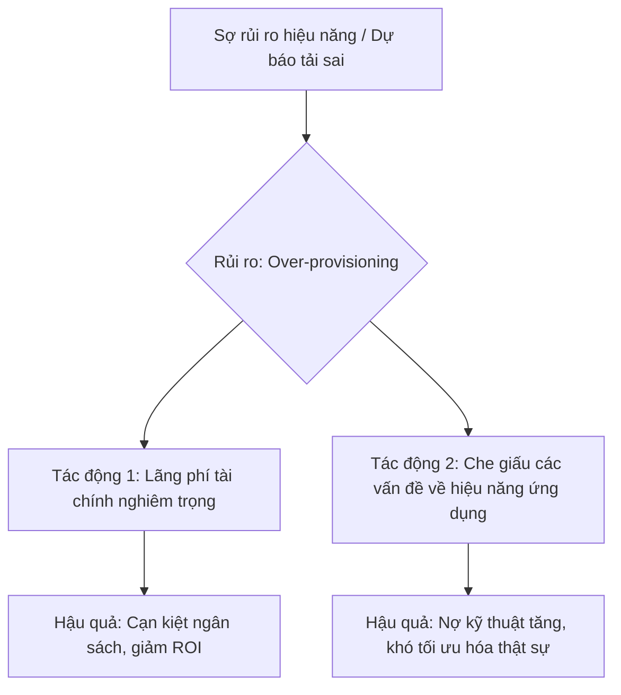

## Chương 12: Rủi Ro Capacity Planning

### 12.1 Rủi Ro Under-provisioning

#### Định Nghĩa Rủi Ro
- **Định nghĩa:** Rủi ro Under-provisioning (cung cấp dưới mức) xảy ra khi một hệ thống hoặc ứng dụng được cấp phát ít tài nguyên tính toán (CPU, RAM, I/O, network bandwidth) hơn mức cần thiết để hoạt động hiệu quả dưới tải trọng thực tế. Điều này dẫn đến suy giảm hiệu năng, tăng độ trễ, và có thể gây ra tình trạng mất dịch vụ (downtime) khi tải đạt đỉnh.
- **Tại sao phát sinh:** Rủi ro này thường phát sinh từ việc đánh giá sai nhu cầu tài nguyên, lập kế hoạch capacity planning không chính xác, hoặc do áp lực cắt giảm chi phí hạ tầng quá mức mà không cân nhắc đến các kịch bản tải cao. Nó cũng có thể là hệ quả của việc thiếu các cơ chế co giãn tự động (auto-scaling) hoặc cấu hình chúng không hiệu quả.
- **Mức độ nghiêm trọng tiềm tàng:** **Critical**. Rủi ro này ảnh hưởng trực tiếp đến hiệu năng và tính sẵn sàng của dịch vụ, gây tác động tiêu cực ngay lập tức đến trải nghiệm người dùng, uy tín thương hiệu và có thể dẫn đến tổn thất tài chính đáng kể.

#### Nguyên Nhân Gốc Rễ (Root Causes)
1.  **Dự báo tải trọng không chính xác (Inaccurate Load Forecasting):** Đây là nguyên nhân phổ biến nhất. Các đội ngũ kỹ thuật không lường trước được các đợt tăng đột biến về lưu lượng truy cập, ví dụ như các chiến dịch marketing lớn, sự kiện mua sắm (Black Friday, Cyber Monday), hoặc các xu hướng lan truyền đột ngột trên mạng xã hội. Việc chỉ dựa vào dữ liệu lịch sử mà không mô hình hóa các sự kiện tương lai sẽ dẫn đến một kế hoạch tài nguyên không đầy đủ.
2.  **Capacity Planning tĩnh và lỗi thời (Static and Outdated Capacity Planning):** Trong nhiều môi trường, việc cấp phát tài nguyên được thực hiện một lần và hiếm khi được xem xét lại. Khi cơ sở người dùng và nhu cầu sử dụng sản phẩm tăng trưởng tự nhiên theo thời gian, hệ thống sẽ dần trở nên thiếu hụt tài nguyên. Quy trình đánh giá và điều chỉnh tài nguyên định kỳ không tồn tại hoặc không được tuân thủ.
3.  **Tối ưu chi phí quá mức (Aggressive Cost Optimization):** Trong nỗ lực giảm thiểu chi phí vận hành trên nền tảng đám mây, các tổ chức có thể cắt giảm tài nguyên xuống dưới mức an toàn. Họ có thể bỏ qua việc duy trì các vùng đệm (buffer) cần thiết để xử lý các đỉnh tải đột xuất, hoặc chọn các loại máy ảo (instance type) quá yếu cho workload, dẫn đến hệ thống không có khả năng chống chịu khi có biến động.
4.  **Thiếu cơ chế Auto-Scaling hiệu quả (Ineffective Auto-Scaling Mechanisms):** Mặc dù đã triển khai auto-scaling, nhưng cấu hình có thể không tối ưu. Ví dụ: ngưỡng kích hoạt (trigger threshold) quá cao, thời gian khởi động máy ảo mới (cooldown period) quá lâu, hoặc giới hạn số lượng máy ảo tối đa (max instances) quá thấp. Điều này khiến hệ thống không kịp thời mở rộng quy mô để đáp ứng nhu cầu tăng vọt.
5.  **Lỗi ứng dụng gây lãng phí tài nguyên (Application-level Resource Inefficiency):** Các vấn đề như rò rỉ bộ nhớ (memory leaks), các vòng lặp vô tận, hoặc các truy vấn cơ sở dữ liệu không hiệu quả có thể tiêu thụ tài nguyên một cách bất thường. Ngay cả với một kế hoạch capacity planning tốt, những lỗi này có thể nhanh chóng làm cạn kiệt tài nguyên đã được cấp phát và gây ra các triệu chứng của under-provisioning.

#### Biểu Hiện & Triệu Chứng (Symptoms)
- **Dấu hiệu cảnh báo sớm:**
    - Thời gian phản hồi trung bình (average response time) của các API và trang web bắt đầu tăng dần.
    - Tỷ lệ lỗi (error rate), đặc biệt là các lỗi HTTP 5xx (502, 503, 504), bắt đầu xuất hiện lác đác và tăng dần về tần suất.
    - Chỉ số sử dụng CPU (CPU utilization) và bộ nhớ (Memory usage) liên tục ở mức cao (ví dụ > 80%) trong thời gian dài, ngay cả ngoài giờ cao điểm.
- **Các metrics/logs cần theo dõi:**
    - **Host-level Metrics:** `CPU Utilization`, `Memory Usage`, `Disk I/O`, `Network I/O`.
    - **Application-level Metrics:** `HTTP 5xx Error Rate`, `Request Latency` (p95, p99), `Garbage Collection (GC) Pause Times`.
    - **Queue-level Metrics:** `Queue Length` của các message broker (RabbitMQ, Kafka) hoặc hàng đợi của load balancer.
- **Red flags trong hệ thống:**
    - Cảnh báo "CPU/Memory Throttling" từ các hệ thống điều phối container như Kubernetes hoặc Amazon ECS.
    - Số lượng kết nối đến cơ sở dữ liệu đạt mức tối đa.
    - Load balancer trả về lỗi "no healthy upstream" hoặc "503 Service Unavailable".

#### Sơ Đồ Phân Tích
```mermaid
graph TD
    A[Tăng đột biến lưu lượng truy cập] --> B{Hệ thống bị Under-provisioned};
    C[Dự báo sai] --> B;
    D[Auto-scaling không hiệu quả] --> B;
    B --> E[Tài nguyên cạn kiệt (CPU, RAM)];
    E --> F[Tăng độ trễ & lỗi 5xx];
    F --> G[Suy giảm trải nghiệm người dùng];
    F --> H[Mất dịch vụ (Downtime)];
    G --> I[Tổn thất doanh thu & uy tín];
    H --> I;
```

#### Tác Động Cụ Thể (Impact Analysis)

| Khía Cạnh       | Mức Độ   | Chi Tiết                                                                                                                            |
|-----------------|----------|-------------------------------------------------------------------------------------------------------------------------------------|
| Downtime        | High     | Hệ thống có thể ngừng hoạt động hoàn toàn trong các giờ cao điểm, gây gián đoạn dịch vụ nghiêm trọng.                                 |
| Financial       | >$100k/hour | Mất doanh thu trực tiếp từ các giao dịch không thể thực hiện, chi phí cơ hội, và chi phí khắc phục sự cố khẩn cấp.                 |
| Security        | Medium   | Hệ thống quá tải có thể không xử lý kịp các bản ghi bảo mật, tạo ra điểm mù. Các cơ chế phòng thủ có thể bị suy giảm hiệu năng.     |
| User Experience | Severe   | Người dùng gặp phải tình trạng trang web cực kỳ chậm, không thể tải, hoặc các giao dịch bị lỗi, dẫn đến sự thất vọng và rời bỏ. |
| Team Morale     | High     | Gây áp lực cực lớn lên đội ngũ kỹ thuật (SRE, DevOps) phải làm việc ngoài giờ để khắc phục sự cố, dẫn đến kiệt sức và giảm tinh thần. |

#### Case Study Thực Tế
**Target.com - Cyber Monday 2015**
- **Bối cảnh:** Target đã quảng cáo một chương trình giảm giá lớn chưa từng có: 15% cho tất cả các mặt hàng trực tuyến vào ngày Cyber Monday 2015. Họ đã chuẩn bị cho một lượng truy cập lớn, nhưng không lường hết được sức hút khổng lồ của chương trình này. [1]
- **Diễn biến:** Ngay từ buổi sáng, lưu lượng truy cập vào Target.com đã tăng vọt, vượt qua cả ngày Black Friday trước đó - vốn là ngày kỷ lục của họ. Hệ thống nhanh chóng bị quá tải. Thay vì sập hoàn toàn, Target đã triển khai một cơ chế "xếp hàng" (queueing), yêu cầu người dùng chờ và tự động làm mới trang. Tuy nhiên, nhiều người dùng vẫn không thể truy cập được trong nhiều giờ.
- **Nguyên nhân gốc rễ:** Rõ ràng là **under-provisioning**. Mặc dù Target tuyên bố rằng họ đã "đo lường" (metering) lưu lượng truy cập để giữ cho trang web hoạt động, nhưng thực tế là cơ sở hạ tầng của họ không được cấp phát đủ tài nguyên để xử lý một lượng truy cập lớn gấp đôi so với ngày bận rộn nhất từ trước đến nay. Kế hoạch capacity planning đã đánh giá quá thấp tác động của một chương trình khuyến mãi hấp dẫn.
- **Tác động:** Mặc dù không có số liệu chính thức về tổn thất tài chính, nhưng sự cố đã gây ra sự phẫn nộ lớn trên mạng xã hội, làm tổn hại đến uy tín thương hiệu và khiến hàng triệu khách hàng tiềm năng không thể mua sắm. Chi phí cơ hội là rất lớn.
- **Bài học:** Các sự kiện kinh doanh lớn đòi hỏi một kế hoạch capacity planning cực kỳ chi tiết và bi quan. Cần phải thực hiện các bài kiểm tra tải (load testing) với các kịch bản vượt xa dự đoán thông thường. Việc chỉ dựa vào các cơ chế phòng thủ như queueing là không đủ nếu tài nguyên cơ bản quá thiếu hụt.
- **Nguồn:** [Target.com Sees Cyber Monday Outages - TechCrunch (2015)](https://techcrunch.com/2015/11/30/target-com-latest-to-crash-from-increased-online-traffic/)

#### Risk Mitigation Strategies

**Preventive Measures (Ngăn ngừa):**
1.  **Capacity Planning dựa trên sự kiện (Event-driven Capacity Planning):** Tích hợp kế hoạch marketing và kinh doanh vào quy trình capacity planning. Trước mỗi sự kiện lớn, thực hiện phân tích và cấp phát trước tài nguyên (pre-provisioning).
2.  **Load Testing và Stress Testing định kỳ:** Thường xuyên thực hiện các bài kiểm tra tải để xác định điểm giới hạn của hệ thống. Sử dụng kết quả để điều chỉnh cấu hình auto-scaling và xác định các điểm nghẽn cổ chai (bottlenecks).
3.  **Triển khai Auto-Scaling chủ động (Proactive Auto-Scaling):** Sử dụng các công cụ dự báo (predictive scaling) dựa trên machine learning để mở rộng quy mô hệ thống trước khi các đỉnh tải thực sự xảy ra, thay vì chỉ phản ứng với các chỉ số hiện tại.

**Detective Measures (Phát hiện):**
1.  **Thiết lập Cảnh báo đa ngưỡng (Multi-threshold Alerting):** Cấu hình cảnh báo ở nhiều cấp độ. Ví dụ: cảnh báo `Warning` khi CPU đạt 70% trong 5 phút và cảnh báo `Critical` khi đạt 90% trong 1 phút. Điều này cho phép đội ngũ có thời gian phản ứng trước khi sự cố trở nên nghiêm trọng.
2.  **Theo dõi các chỉ số độ trễ phía người dùng (Client-side Latency Metrics):** Ngoài việc theo dõi hiệu năng server, hãy thu thập dữ liệu về thời gian tải trang thực tế từ trình duyệt của người dùng (Real User Monitoring - RUM) để có cái nhìn chính xác nhất về trải nghiệm của họ.
3.  **Phân tích Log Pattern bất thường:** Sử dụng các công cụ phân tích log để tự động phát hiện sự gia tăng đột biến của các thông báo lỗi (ví dụ: `database connection timeout`, `thread pool exhausted`) mà có thể là dấu hiệu sớm của việc cạn kiệt tài nguyên.

**Corrective Measures (Khắc phục):**
1.  **Quy trình phản ứng sự cố tự động (Automated Incident Response):** Xây dựng các playbook tự động (ví dụ: sử dụng Ansible hoặc Lambda functions) để thực hiện các hành động khắc phục cơ bản như tăng giới hạn `max instances` của auto-scaling group hoặc khởi động lại các tiến trình bị rò rỉ bộ nhớ.
2.  **Graceful Degradation:** Thiết kế hệ thống để có thể tạm thời vô hiệu hóa các tính năng không cốt lõi (ví dụ: hệ thống gợi ý sản phẩm) khi tải quá cao, nhằm ưu tiên tài nguyên cho các chức năng quan trọng như thanh toán.
3.  **Can thiệp thủ công khẩn cấp (Emergency Manual Intervention):** Có một quy trình rõ ràng cho phép các kỹ sư cấp cao có quyền truy cập để tăng tài nguyên hệ thống một cách thủ công ngay lập tức khi các cơ chế tự động thất bại.

#### Code Examples

**Anti-pattern (Cách làm SAI):**
```python
# ❌ ANTI-PATTERN: Cấp phát tài nguyên tĩnh và không có auto-scaling
# Mô tả: Cấu hình một web server với số lượng worker cố định, không thể thích ứng với tải.
# gunicorn_config.py

# Số lượng worker được đặt cứng, không thay đổi theo tải
workers = 2
threads = 4
bind = '0.0.0.0:8000'

# Khi có 1000 yêu cầu đồng thời, hàng đợi sẽ bị tắc nghẽn và gây ra timeout.
def bad_example_app(environ, start_response):
    # Giả lập một tác vụ tốn thời gian
    import time
    time.sleep(0.5)
    status = '200 OK'
    output = b"Hello World!"
    start_response(status, [("Content-Type", "text/plain")])
    return [output]
```

**Best Practice (Cách làm ĐÚNG):**
```python
# ✅ BEST PRACTICE: Sử dụng Auto-Scaling Group với chính sách co giãn động
# Mô tả: Cấu hình một Auto-Scaling Group trên AWS để tự động tăng/giảm số lượng máy chủ dựa trên CPU.

# Terraform configuration for an autoscaling group
resource "aws_autoscaling_group" "example" {
  name                      = "example-asg"
  max_size                  = 10 # Có thể mở rộng lên đến 10 máy chủ
  min_size                  = 2  # Luôn duy trì ít nhất 2 máy chủ
  desired_capacity          = 2
  health_check_type         = "ELB"
  launch_configuration      = aws_launch_configuration.example.name
  vpc_zone_identifier       = [aws_subnet.example.id]
}

resource "aws_autoscaling_policy" "scale_up" {
  name                      = "scale-up-policy"
  scaling_adjustment      = 2
  adjustment_type           = "ChangeInCapacity"
  cooldown                  = 300
  autoscaling_group_name    = aws_autoscaling_group.example.name
}

resource "aws_cloudwatch_metric_alarm" "cpu_alarm_high" {
  alarm_name                = "cpu-high-alarm"
  comparison_operator       = "GreaterThanOrEqualToThreshold"
  evaluation_periods        = "2"
  metric_name               = "CPUUtilization"
  namespace                 = "AWS/EC2"
  period                    = "120"
  statistic                 = "Average"
  threshold                 = "75" # Nếu CPU trung bình > 75% trong 2 phút
  alarm_actions             = [aws_autoscaling_policy.scale_up.arn]
  dimensions = {
    AutoScalingGroupName = aws_autoscaling_group.example.name
  }
}
```

#### Risk Assessment Matrix

| Yếu Tố                 | Đánh Giá | Ghi Chú                                                                                                                            |
|------------------------|----------|------------------------------------------------------------------------------------------------------------------------------------|
| Xác suất (Probability) | 4        | Rất có khả năng xảy ra nếu không có quy trình capacity planning chủ động, đặc biệt trong các hệ thống có tốc độ tăng trưởng nhanh. |
| Tác động (Impact)       | 5        | Gây mất dịch vụ, tổn thất doanh thu trực tiếp, và làm suy giảm nghiêm trọng uy tín thương hiệu. Tác động ở mức độ cao nhất.        |
| **Risk Score**         | **20**   | **Critical**                                                                                                                       |
| Ưu tiên xử lý          | P1       | Phải được ưu tiên xử lý hàng đầu. Cần có các biện pháp ngăn ngừa và phát hiện mạnh mẽ.                                            |

#### Checklist Đánh Giá
- [ ] Hệ thống có được triển khai với cơ chế auto-scaling không? Cấu hình (min/max/thresholds) có hợp lý không?
- [ ] Quy trình capacity planning có được thực hiện định kỳ và trước các sự kiện lớn không?
- [ ] Chúng ta đã thực hiện load testing để biết giới hạn của hệ thống trong 6 tháng qua chưa?
- [ ] Có cảnh báo cho các chỉ số chính (CPU, Memory, Latency, Error Rate) không? Ngưỡng cảnh báo có phù hợp không?
- [ ] Ứng dụng có được theo dõi về memory leaks hoặc các vấn đề hiệu năng khác không?
- [ ] Chúng ta có playbook để phản ứng khi xảy ra sự cố under-provisioning không?
- [ ] Hệ thống có khả năng graceful degradation để bảo vệ các chức năng cốt lõi khi quá tải không?

#### Tools & Resources
- **Tool 1: AWS Auto Scaling:** Cung cấp khả năng tự động điều chỉnh quy mô tài nguyên EC2 để đáp ứng nhu cầu.
- **Tool 2: Grafana + Prometheus:** Bộ đôi mạnh mẽ để thu thập, trực quan hóa và cảnh báo về các chỉ số hệ thống và ứng dụng theo thời gian thực.
- **Tool 3: Locust / k6:** Các công cụ mã nguồn mở để thực hiện các bài kiểm tra tải (load testing) hiệu năng cao, giúp xác định các điểm nghẽn của hệ thống.

#### Nguồn Tham Khảo
1.  [Target.com Sees Cyber Monday Outages (2015)](https://techcrunch.com/2015/11/30/target-com-latest-to-crash-from-increased-online-traffic/) - Bài báo của TechCrunch phân tích về sự cố của Target trong ngày Cyber Monday 2015.
2.  [What is Under-provisioned? (Virtana)](https://www.virtana.com/glossary/what-is-under-provisioned/) - Định nghĩa và giải thích các tác động của việc under-provisioning.
3.  [7 Proven Strategies to Reduce Cloud Costs without Under-Provisioning (Zesty)](https://zesty.co/blog/cutting-cloud-costs-without-under-provisioning/) - Cung cấp các chiến lược thực tế để cân bằng giữa tối ưu chi phí và đảm bảo hiệu năng.


### 12.2 Rủi Ro Over-provisioning

#### Định Nghĩa Rủi Ro
- **Định nghĩa:** Rủi ro Over-provisioning (cấp phát thừa) là tình trạng cấp phát và duy trì tài nguyên hạ tầng kỹ thuật (như CPU, RAM, dung lượng lưu trữ, băng thông mạng) ở mức độ vượt xa nhu cầu thực tế cần thiết để ứng dụng hoạt động ổn định và hiệu quả. Thay vì co giãn linh hoạt theo tải, hệ thống được cấu hình tĩnh cho mức tải đỉnh hoặc một kịch bản giả định tệ nhất.
- **Nguyên nhân phát sinh:** Rủi ro này thường nảy sinh từ tâm lý "thà thừa còn hơn thiếu" để phòng tránh các sự cố về hiệu năng. Nó cũng xuất phát từ việc dự báo tải không chính xác, thiếu các công cụ giám sát và phân tích tài nguyên hiệu quả, quy trình cấp phát thủ công, và sự phức tạp trong việc xác định nhu cầu chính xác của các ứng dụng microservices.
- **Mức độ nghiêm trọng tiềm tàng:** **High**. Mặc dù không trực tiếp gây ra downtime, tác động tài chính của nó cực kỳ lớn, có thể làm lãng phí đến 40-70% ngân sách đám mây [1]. Sự lãng phí này làm cạn kiệt ngân sách cho các dự án đổi mới khác và có thể che giấu các vấn đề tiềm ẩn về hiệu năng và kiến trúc hệ thống.

#### Nguyên Nhân Gốc Rễ (Root Causes)
1.  **Dự báo tải không chính xác (Inaccurate Load Forecasting):** Các nhóm phát triển thường ước tính nhu cầu tài nguyên dựa trên các kịch bản tải đỉnh (peak load) hoặc "ngày tận thế" (worst-case scenario) mà hiếm khi xảy ra trong thực tế. Việc thiếu dữ liệu lịch sử hoặc các mô hình dự báo đáng tin cậy dẫn đến việc lựa chọn các cấu hình tài nguyên quá lớn một cách an toàn.
2.  **Thiếu cơ chế tự động co giãn (Lack of Autoscaling):** Nhiều hệ thống vẫn được cấu hình với tài nguyên tĩnh. Chúng không tận dụng các tính năng co giãn tự động (autoscaling) mà các nhà cung cấp đám mây (AWS, GCP, Azure) cung cấp. Do đó, tài nguyên được cấp phát để xử lý tải đỉnh 24/7, ngay cả trong những giờ thấp điểm, dẫn đến lãng phí lớn.
3.  **Sợ rủi ro hiệu năng và văn hóa đổ lỗi (Fear of Performance Risk & Blame Culture):** Trong một môi trường mà sự cố hiệu năng hoặc downtime bị trừng phạt nặng nề, các kỹ sư có xu hướng cấp phát thừa tài nguyên như một "bảo hiểm". Họ muốn đảm bảo rằng hạ tầng không bao giờ là nguyên nhân của sự cố, dẫn đến việc yêu cầu tài nguyên nhiều hơn mức cần thiết.
4.  **Tài nguyên "mồ côi" và "rác" (Orphaned & Zombie Resources):** Các tài nguyên được tạo ra cho các môi trường phát triển, thử nghiệm, hoặc cho các PoC (Proof of Concept) nhưng không bao giờ được thu hồi sau khi hoàn thành. Các máy ảo, ổ đĩa, và các tài nguyên khác bị "bỏ quên" vẫn tiếp tục phát sinh chi phí mà không mang lại giá trị gì.
5.  **Cấu hình mặc định không tối ưu (Non-Optimal Default Configurations):** Các nhà phát triển thường chấp nhận các loại máy ảo hoặc cấu hình container mặc định do nền tảng đề xuất mà không thực hiện phân tích "right-sizing". Việc này dẫn đến việc chọn các cấu hình quá mạnh hoặc không phù hợp với đặc tính của workload (ví dụ: dùng máy ảo tối ưu cho CPU cho một workload cần nhiều RAM).

#### Biểu Hiện & Triệu Chứng (Symptoms)
- **Dấu hiệu cảnh báo sớm:** Chi phí đám mây tăng đều đặn hoặc tăng đột biến không tương xứng với sự tăng trưởng về người dùng, doanh thu hay số lượng yêu cầu. Ngân sách cho hạ tầng bị cạn kiệt nhanh hơn dự kiến.
- **Các metrics/logs cần theo dõi:**
    - **CPU/Memory Utilization:** Chỉ số sử dụng CPU và RAM trung bình của các máy ảo hoặc container liên tục ở mức rất thấp (ví dụ: dưới 20% trong thời gian dài).
    - **Idle Resources:** Số lượng lớn các máy ảo hoặc tài nguyên có CPU utilization dưới 5%.
    - **Network/Disk I/O:** Các chỉ số về đọc/ghi đĩa và lưu lượng mạng thấp hơn nhiều so với giới hạn được cấp phát.
    - **Kubernetes Metrics:** Sự chênh lệch lớn giữa `resources.requests` và `resources.limits` so với `usage` thực tế trong các pod.
- **Red flags trong hệ thống:** Báo cáo từ các công cụ quản lý chi phí đám mây (Cloud Cost Management) liên tục chỉ ra các cơ hội "right-sizing". Các nhóm vận hành phàn nàn về việc khó theo dõi và quản lý tài nguyên.

#### Sơ Đồ Phân Tích


#### Tác Động Cụ Thể (Impact Analysis)

| Khía Cạnh       | Mức Độ | Chi Tiết                                                                                                                            |
|-----------------|--------|-------------------------------------------------------------------------------------------------------------------------------------|
| Downtime        | Low    | Over-provisioning thường không gây downtime; ngược lại, nó có thể tạm thời che giấu các vấn đề có thể dẫn đến downtime.             |
| Financial       | High   | Lãng phí trực tiếp từ 40-70% ngân sách đám mây. Ví dụ, một công ty chi $1M/tháng có thể đang lãng phí $400k-$700k mỗi tháng. |
| Security        | Low    | Không phải là một rủi ro bảo mật trực tiếp, nhưng các tài nguyên "mồ côi" không được vá lỗi có thể trở thành một vector tấn công. |
| User Experience | Minor  | Trải nghiệm người dùng có thể tốt một cách giả tạo do tài nguyên dồi dào, nhưng điều này không bền vững và không hiệu quả về chi phí. |
| Team Morale     | Medium | Gây ra căng thẳng giữa các nhóm FinOps/Finance và Engineering. Áp lực liên tục về việc cắt giảm chi phí có thể làm giảm tinh thần. |

#### Case Study Thực Tế
**Dropbox - Tối ưu hóa chi phí hạ tầng (Trước 2016)**
- **Bối cảnh:** Trước năm 2016, Dropbox là một trong những khách hàng lớn nhất của Amazon Web Services (AWS), chi trả khoảng 75 triệu USD mỗi năm cho dịch vụ lưu trữ S3. Khi quy mô tăng lên, chi phí đám mây trở thành một trong những khoản chi lớn nhất của công ty.
- **Diễn biến:** Công ty nhận thấy rằng với quy mô của mình, việc tiếp tục phụ thuộc hoàn toàn vào đám mây công cộng không còn hiệu quả về mặt tài chính. Họ đã đưa ra một quyết định táo bạo: xây dựng hạ tầng lưu trữ của riêng mình, được tối ưu hóa cho chính workload của họ.
- **Nguyên nhân gốc rễ:** Mặc dù không hoàn toàn là "over-provisioning" theo nghĩa hẹp, nhưng đây là một ví dụ điển hình về việc sử dụng tài nguyên đám mây "one-size-fits-all" không hiệu quả ở quy mô lớn. Dropbox đã trả tiền cho các tính năng và sự linh hoạt của S3 mà họ không cần, trong khi có thể xây dựng một giải pháp rẻ hơn nhiều.
- **Tác động:** Bằng cách chuyển phần lớn dữ liệu của mình ra khỏi AWS và vào các trung tâm dữ liệu tự xây dựng, Dropbox đã tiết kiệm được gần 75 triệu USD trong hai năm. Đây là một minh chứng mạnh mẽ cho thấy việc "right-sizing" ở cấp độ chiến lược có thể mang lại lợi ích tài chính khổng lồ.
- **Bài học:** Ở một quy mô nhất định, việc đánh giá lại chiến lược đám mây và xem xét các mô hình hybrid hoặc tự vận hành là rất quan trọng. Việc "right-sizing" không chỉ ở cấp độ máy ảo mà còn ở cấp độ toàn bộ kiến trúc hạ tầng.
- **Nguồn:** [Wired: The Epic Story of Dropbox\'s Exodus From the Amazon Cloud Empire](https://www.wired.com/2016/03/epic-story-dropboxs-exodus-amazon-cloud-empire/)

#### Risk Mitigation Strategies

**Preventive Measures (Ngăn ngừa):**
1.  **Triển khai Autoscaling:** Cấu hình các nhóm Auto Scaling Group (ASG) cho máy ảo và Horizontal Pod Autoscaler (HPA) cho container. Đặt các chính sách co giãn dựa trên các chỉ số thực tế như CPU/RAM utilization hoặc số lượng yêu cầu trên mỗi instance.
2.  **Quy trình Right-Sizing định kỳ:** Tích hợp các công cụ phân tích chi phí và hiệu năng (như AWS Cost Explorer, CloudZero, nOps) vào quy trình vận hành. Thực hiện đánh giá right-sizing hàng quý để điều chỉnh cấu hình tài nguyên.
3.  **Văn hóa FinOps:** Xây dựng một văn hóa hợp tác giữa các nhóm Tài chính, Vận hành và Phát triển để cùng chịu trách nhiệm về chi phí đám mây. Cung cấp cho các nhà phát triển khả năng hiển thị về chi phí của các tài nguyên họ sử dụng.

**Detective Measures (Phát hiện):**
1.  **Giám sát và Cảnh báo Chi phí:** Thiết lập cảnh báo ngân sách (budget alerts) trong AWS/GCP/Azure để thông báo khi chi phí vượt ngưỡng. Sử dụng các công cụ như AWS Cost Anomaly Detection để phát hiện các đột biến chi phí bất thường.
2.  **Dashboard Hiệu năng và Chi phí:** Xây dựng các dashboard tập trung, hiển thị đồng thời các chỉ số về hiệu năng (CPU/RAM usage, latency) và chi phí tương ứng của các dịch vụ. Điều này giúp trực quan hóa mối liên hệ giữa việc sử dụng và chi phí.
3.  **Gắn thẻ (Tagging) Tài nguyên:** Thực thi một chính sách gắn thẻ (tagging) nghiêm ngặt cho tất cả các tài nguyên. Các thẻ nên bao gồm thông tin về dự án, chủ sở hữu, môi trường (prod/dev/test) để dễ dàng xác định các tài nguyên lãng phí hoặc mồ côi.

**Corrective Measures (Khắc phục):**
1.  **Quy trình "Cloud Janitor":** Tự động hóa việc tìm kiếm và xóa các tài nguyên không sử dụng hoặc "mồ côi". Ví dụ, chạy một script hàng tuần để xóa các ổ đĩa EBS không được gắn vào máy ảo nào, hoặc các máy ảo dev đã chạy quá 48 giờ.
2.  **Áp dụng khuyến nghị Right-Sizing:** Các công cụ quản lý chi phí thường cung cấp các khuyến nghị cụ thể (ví dụ: "thay đổi instance type từ m5.2xlarge sang r6g.xlarge để tiết kiệm $200/tháng"). Xây dựng quy trình để đánh giá và áp dụng các khuyến nghị này một cách an toàn.
3.  **Tái kiến trúc ứng dụng:** Đối với các ứng dụng lãng phí kinh niên, cần xem xét tái kiến trúc để chúng hoạt động hiệu quả hơn trên đám mây, ví dụ như chuyển từ kiến trúc monolithic sang microservices hoặc sử dụng các dịch vụ serverless.

#### Code Examples

**Anti-pattern (Cách làm SAI):**
```terraform
# ❌ ANTI-PATTERN: Cấu hình tài nguyên tĩnh, lớn trong Terraform
# Vấn đề: Cấu hình một cụm máy chủ với số lượng lớn, cố định, không có khả năng co giãn.
# Điều này đảm bảo hiệu năng lúc tải đỉnh nhưng cực kỳ lãng phí trong hầu hết thời gian.

resource "aws_instance" "web_server" {
  count         = 10  # Luôn chạy 10 máy chủ, bất kể tải
  ami           = "ami-0c55b159cbfafe1f0"
  instance_type = "t2.2xlarge" # Chọn một loại instance rất lớn "cho chắc"

  tags = {
    Name = "WebServer-Static"
  }
}
```

**Best Practice (Cách làm ĐÚNG):**
```terraform
# ✅ BEST PRACTICE: Sử dụng Auto Scaling Group (ASG) trong Terraform
# Giải pháp: Định nghĩa một nhóm co giãn tự động. Hệ thống sẽ tự động thêm/bớt máy chủ
# dựa trên tải CPU thực tế, giúp tối ưu chi phí mà vẫn đảm bảo hiệu năng.

resource "aws_launch_configuration" "web_lc" {
  name_prefix   = "web-lc-"
  image_id      = "ami-0c55b159cbfafe1f0"
  instance_type = "t3.large" # Bắt đầu với một instance type hợp lý hơn
}

resource "aws_autoscaling_group" "web_asg" {
  name                 = "web-asg"
  launch_configuration = aws_launch_configuration.web_lc.name
  min_size             = 2      # Tối thiểu 2 máy chủ để đảm bảo tính sẵn sàng cao
  max_size             = 20     # Tối đa 20 máy chủ để xử lý tải đỉnh
  desired_capacity     = 2      # Bắt đầu với 2 máy chủ

  vpc_zone_identifier = ["subnet-abcde012", "subnet-fghij345"]
}

resource "aws_autoscaling_policy" "cpu_policy" {
  name                   = "cpu-utilization-policy"
  autoscaling_group_name = aws_autoscaling_group.web_asg.name
  policy_type            = "TargetTrackingScaling"

  target_tracking_configuration {
    predefined_metric_specification {
      predefined_metric_type = "ASGAverageCPUUtilization"
    }
    target_value = 60.0 # Mục tiêu duy trì CPU trung bình ở mức 60%
  }
}
```

#### Risk Assessment Matrix

| Yếu Tố                 | Đánh Giá | Ghi Chú                                                                                                    |
|------------------------|----------|------------------------------------------------------------------------------------------------------------|
| Xác suất (Probability) | 5        | Rất phổ biến. Hầu hết các tổ chức không có kỷ luật FinOps chặt chẽ đều mắc phải ở một mức độ nào đó.        |
| Tác động (Impact)      | 4        | Tác động tài chính rất lớn. Không gây downtime nhưng làm xói mòn nghiêm trọng lợi nhuận và ngân sách R&D. |
| **Risk Score**         | **20**   | **Critical**                                                                                               |
| Ưu tiên xử lý          | P1       | Cần được giải quyết ngay lập tức thông qua việc thiết lập các biện pháp giám sát và tối ưu hóa liên tục.   |

#### Checklist Đánh Giá
- [ ] Hệ thống của chúng ta có đang sử dụng Auto Scaling cho các workload có tải biến thiên không?
- [ ] Chúng ta có quy trình định kỳ (hàng tháng/quý) để rà soát và thực hiện "right-sizing" tài nguyên không?
- [ ] Tất cả tài nguyên trên đám mây có được gắn thẻ (tag) với thông tin chủ sở hữu và dự án không?
- [ ] Chúng ta có thiết lập cảnh báo khi chi phí của một dịch vụ hoặc toàn bộ tài khoản tăng đột biến không?
- [ ] Tỷ lệ sử dụng CPU/RAM trung bình của các máy chủ production có đang ở mức hợp lý (ví dụ: 40-60%) không, hay đang quá thấp (<20%)?
- [ ] Chúng ta có công cụ tự động để dọn dẹp các tài nguyên không sử dụng (unattached disks, old snapshots, idle VMs) không?

#### Tools & Resources
- **AWS Cost Explorer (Right Sizing Recommendations):** Công cụ tích hợp của AWS, cung cấp các khuyến nghị cụ thể để giảm chi phí bằng cách thay đổi loại hoặc kích thước instance.
- **CloudZero / nOps / Apptio Cloudability:** Các nền tảng quản lý chi phí đám mây (Cloud Cost Management Platform) chuyên dụng, cung cấp khả năng hiển thị chi tiết, phân tích và tối ưu hóa chi phí.
- **Karpenter / Cluster Autoscaler:** Các công cụ mã nguồn mở cho Kubernetes giúp tự động hóa việc co giãn node một cách hiệu quả, giảm lãng phí trong các cụm container.

#### Nguồn Tham Khảo
1.  [The Cost of Cloud, a Trillion Dollar Paradox](https://a16z.com/the-cost-of-cloud-a-trillion-dollar-paradox/) - Bài phân tích sâu sắc từ Andreessen Horowitz (a16z) về chi phí tiềm ẩn của đám mây ở quy mô lớn.
2.  [Right Sizing Your Resources](https://aws.amazon.com/aws-cost-management/aws-cost-optimization/right-sizing/) - Hướng dẫn chính thức từ AWS về quy trình và các phương pháp tốt nhất để "right-sizing".
3.  [Wired: The Epic Story of Dropbox\'s Exodus From the Amazon Cloud Empire](https://www.wired.com/2016/03/epic-story-dropboxs-exodus-amazon-cloud-empire/) - Case study thực tế về việc Dropbox tiết kiệm hàng chục triệu USD bằng cách tối ưu hóa hạ tầng lưu trữ.

---


### 12.3 Rủi Ro Forecasting Sai

#### Định Nghĩa Rủi Ro
- **Định nghĩa:** Rủi ro Forecasting Sai là tình huống mà lưu lượng truy cập (traffic), nhu cầu tài nguyên (resource demand), hoặc hành vi người dùng (user behavior) trong thực tế khác biệt một cách đáng kể so với các dự báo đã được đưa ra trong giai đoạn lập kế hoạch. Sự sai lệch này có thể là dự báo quá thấp (under-forecasting), dẫn đến quá tải hệ thống, hoặc dự báo quá cao (over-forecasting), gây lãng phí tài nguyên.
- **Nguồn gốc trong production:** Rủi ro này phát sinh do sự phức tạp và khó đoán định của hành vi người dùng, các sự kiện không lường trước (ví dụ: một chiến dịch marketing lan truyền đột ngột, được người nổi tiếng đề cập), hoặc các yếu tố bên ngoài (ví dụ: sự kiện toàn cầu, đối thủ cạnh tranh gặp sự cố). Đối với các sản phẩm mới hoặc các tính năng đột phá, việc dự báo càng trở nên thách thức do thiếu dữ liệu lịch sử.
- **Mức độ nghiêm trọng tiềm tàng:** **Critical**. Một sai lầm nghiêm trọng trong dự báo, đặc biệt là under-forecasting, có thể dẫn đến sụp đổ toàn bộ hệ thống (total system collapse), gây downtime kéo dài, mất doanh thu và tổn hại nghiêm trọng đến uy tín thương hiệu.

#### Nguyên Nhân Gốc Rễ (Root Causes)
1.  **Dữ liệu lịch sử không đủ hoặc không liên quan:** Đối với sản phẩm mới ra mắt như Pokémon Go, không có dữ liệu nào trong quá khứ để làm cơ sở dự báo. Việc dựa vào dữ liệu từ các sản phẩm tương tự có thể gây sai lệch lớn vì bối cảnh và sức hút của mỗi sản phẩm là khác nhau.
2.  **Thiếu sót trong mô hình dự báo:** Các mô hình có thể quá đơn giản, không tính đến các yếu tố phức tạp như tính lan truyền (virality), yếu tố mùa vụ (seasonality), hoặc các sự kiện đặc biệt. Ví dụ, một mô hình tuyến tính sẽ hoàn toàn thất bại trong việc dự đoán sự tăng trưởng theo cấp số nhân của một sản phẩm game.
3.  **Hiệu ứng "Thiên nga đen" (Black Swan Events):** Đây là những sự kiện cực kỳ hiếm gặp, khó dự đoán nhưng lại có tác động khổng lồ. Việc Pokémon Go trở thành một hiện tượng văn hóa toàn cầu chỉ trong vài ngày là một ví dụ điển hình. Kế hoạch capacity planning thông thường không được thiết kế để đối phó với những kịch bản cực đoan như vậy.
4.  **Lập kế hoạch dựa trên "kịch bản tốt nhất" (Happy Path):** Các nhóm phát triển có thể quá lạc quan, chỉ lập kế hoạch cho mức tăng trưởng dự kiến hoặc kịch bản "worst-case" không đủ bi quan. Niantic đã lên kế hoạch cho kịch bản xấu nhất là gấp 5 lần dự kiến, nhưng thực tế đã gấp 50 lần [1].
5.  **Phản ứng dây chuyền từ các hệ thống phụ thuộc:** Một dự báo sai không chỉ ảnh hưởng đến frontend servers. Nó có thể gây quá tải cho database, hệ thống authentication, logging, payment gateways, và các microservices khác, tạo ra một sự sụp đổ hàng loạt.

#### Biểu Hiện & Triệu Chứng (Symptoms)
- **Dấu hiệu cảnh báo sớm:**
    - Tỷ lệ lỗi (error rate) bắt đầu tăng nhẹ nhưng đều đặn.
    - Độ trễ (latency) của các API endpoint quan trọng tăng dần.
    - Số lượng session người dùng mới hoặc request mỗi giây tăng vọt bất thường so với đường cơ sở (baseline).
- **Các metrics/logs cần theo dõi:**
    - **CPU Utilization & Memory Usage:** Tăng đột biến và chạm ngưỡng 80-90% trên nhiều nodes.
    - **Database Connections:** Số lượng kết nối đạt đến giới hạn tối đa (max connections).
    - **API Gateway (5xx Error Rate):** Tỷ lệ lỗi server (502, 503, 504) tăng cao.
    - **Active Users / Requests Per Second (RPS):** Theo dõi sự tăng trưởng thực tế so với dự báo theo thời gian thực.
- **Red flags trong hệ thống:**
    - Hàng đợi (message queues) bị đầy và không được xử lý kịp.
    - Health checks của các service bắt đầu thất bại (fail), dẫn đến việc container orchestrator (như Kubernetes) liên tục khởi động lại các pod.
    - Hệ thống auto-scaling không thể tạo thêm tài nguyên đủ nhanh hoặc đạt đến giới hạn quota của nhà cung cấp đám mây.

#### Sơ Đồ Phân Tích
```mermaid
graph TD
    A[Sự kiện viral / Black Friday] --> B{Lưu lượng truy cập thực tế >> Dự báo};
    B --> C[Quá tải Application Servers];
    B --> D[Quá tải Database];
    C --> E{Tăng đột biến Error Rate (5xx)};
    D --> F{Tăng vọt DB Connection Timeout};
    E --> G[Hệ thống không phản hồi];
    F --> G;
    G --> H[Downtime toàn bộ dịch vụ];
    H --> I[Mất doanh thu & Tổn hại uy tín];
```

#### Tác Động Cụ Thể (Impact Analysis)

| Khía Cạnh      | Mức Độ   | Chi Tiết                                                                                                |
|-----------------|----------|---------------------------------------------------------------------------------------------------------|
| Downtime        | High     | Có thể gây downtime toàn bộ hoặc một phần trong nhiều giờ hoặc thậm chí nhiều ngày cho đến khi có đủ tài nguyên. |
| Financial       | >$1M/ngày | Ước tính Pokémon Go có thể mất hàng triệu USD doanh thu mỗi ngày từ in-app purchases trong thời gian gián đoạn. |
| Security        | Medium   | Kẻ tấn công có thể lợi dụng tình trạng hỗn loạn để thực hiện các cuộc tấn công DDoS khuếch đại hoặc tìm lỗ hổng. |
| User Experience | Severe   | Người dùng không thể đăng nhập, không thể sử dụng dịch vụ, mất dữ liệu trong game, gây ra sự thất vọng và tức giận. |
| Team Morale     | High     | Các kỹ sư phải làm việc dưới áp lực cực lớn, liên tục trong nhiều ngày để khắc phục sự cố, dẫn đến kiệt sức (burnout). |

#### Case Study Thực Tế
**Pokémon Go Launch - 2016**
- **Bối cảnh:** Niantic, một công ty được tách ra từ Google, ra mắt Pokémon Go, một game thực tế tăng cường trên di động. Dựa trên thương hiệu Pokémon nổi tiếng toàn cầu, game được kỳ vọng sẽ thành công, nhưng không ai lường trước được quy mô của nó.
- **Diễn biến:** Game ra mắt lần đầu ở Úc và New Zealand, sau đó là Mỹ. Chỉ trong vài ngày, nó đã trở thành ứng dụng được tải xuống nhiều nhất và tạo ra một cơn sốt toàn cầu. Lưu lượng truy cập thực tế đã vượt **gấp 50 lần** so với dự báo ban đầu của Niantic và **gấp 10 lần** so với kịch bản "trường hợp xấu nhất" mà họ và các kỹ sư của Google đã chuẩn bị [1].
- **Nguyên nhân gốc rễ:** Nguyên nhân chính là sự kết hợp của một thương hiệu quá mạnh, một lối chơi mới lạ và hiệu ứng lan truyền trên mạng xã hội, tạo ra một sự kiện "Thiên nga đen" mà các mô hình dự báo truyền thống không thể lường trước. Kiến trúc ban đầu sử dụng Google Datastore không được thiết kế để xử lý mức độ giao dịch và tính nhất quán phức tạp ở quy mô này.
- **Tác động:** Hệ thống liên tục sập, người dùng trên toàn thế giới không thể đăng nhập hoặc chơi game. Các kỹ sư của Niantic và Google đã phải làm việc không ngừng nghỉ để triển khai thêm hàng chục ngàn core CPU nhằm ổn định dịch vụ. Sự cố này trở thành một trong những ví dụ kinh điển nhất về thách thức của capacity planning.
- **Bài học:** Cần phải chuẩn bị cho những kịch bản tăng trưởng "không tưởng" (absurd scale). Kiến trúc hệ thống phải có khả năng mở rộng quy mô cực lớn và nhanh chóng. Việc hợp tác chặt chẽ với nhà cung cấp đám mây là rất quan trọng.
- **Nguồn:** [Google Cloud Blog: How Pokémon GO scales to millions of requests](https://cloud.google.com/blog/topics/developers-practitioners/how-pok%C3%A9mon-go-scales-millions-requests)

#### Risk Mitigation Strategies

**Preventive Measures (Ngăn ngừa):**
1.  **Load Testing ở quy mô lớn:** Thực hiện các bài kiểm tra tải trọng (load test) không chỉ ở mức 2x, 5x mà còn ở 10x, 50x lưu lượng dự kiến để xác định điểm gãy (breaking point) của hệ thống và các nút thắt cổ chai (bottlenecks).
2.  **Thiết kế kiến trúc có khả năng mở rộng linh hoạt (Scalable Architecture):** Sử dụng các dịch vụ managed services (như GKE, AWS Fargate), database có khả năng mở rộng toàn cầu (như Google Spanner, Amazon Aurora Global), và kiến trúc microservices để có thể mở rộng từng thành phần một cách độc lập.
3.  **Dự phòng tài nguyên và Quota:** Làm việc trước với nhà cung cấp đám mây để đảm bảo có đủ quota tài nguyên (CPU, IP addresses, etc.) cho các kịch bản tăng trưởng đột biến. Thiết lập sẵn các "dark capacity" (tài nguyên dự phòng không sử dụng).

**Detective Measures (Phát hiện):**
1.  **Real-time Anomaly Detection Alerts:** Thiết lập cảnh báo tự động khi các metrics chính (latency, error rate, RPS) vượt ra ngoài ngưỡng dự đoán (ví dụ: tăng 50% trong 5 phút). Sử dụng các công cụ phát hiện bất thường thay vì ngưỡng tĩnh.
2.  **Business Metrics Monitoring:** Theo dõi các chỉ số kinh doanh như "Số lượt đăng ký mới mỗi phút", "Số giao dịch đang hoạt động". Sự tăng vọt của các chỉ số này thường là dấu hiệu sớm nhất của một đợt sóng traffic.
3.  **Log Pattern Analysis:** Theo dõi các log báo lỗi "connection timeout", "resource exhausted", "max connections reached" từ database, load balancer và application servers.

**Corrective Measures (Khắc phục):**
1.  **Implement Circuit Breakers & Rate Limiting:** Tự động ngắt kết nối đến các service phụ thuộc đang bị quá tải (circuit breaking) và giới hạn số lượng request từ người dùng hoặc IP (rate limiting) để bảo vệ lõi hệ thống.
2.  **Graceful Degradation (Feature Flags):** Tạm thời tắt các tính năng không cốt lõi (ví dụ: gợi ý bạn bè, cập nhật timeline) thông qua feature flags để giảm tải cho hệ thống, ưu tiên tài nguyên cho các chức năng sống còn (đăng nhập, thanh toán).
3.  **Pre-configured Scaling Playbooks:** Chuẩn bị sẵn các kịch bản (playbooks) và script tự động để mở rộng quy mô hệ thống một cách nhanh chóng khi sự cố xảy ra, thay vì phải thao tác thủ công trong tình trạng khẩn cấp.

#### Code Examples

**Anti-pattern (Cách làm SAI):**
```python
# ❌ ANTI-PATTERN: Dựa vào một con số capacity cố định và không có cơ chế fallback.
import time

MAX_CONNECTIONS = 1000
current_connections = 0

def handle_request():
    global current_connections
    if current_connections >= MAX_CONNECTIONS:
        # Khi traffic vượt ngưỡng, hệ thống sẽ từ chối toàn bộ request mới.
        raise Exception("Service Unavailable: Max connections reached")
    
    current_connections += 1
    try:
        # Xử lý request tốn thời gian
        time.sleep(0.5)
    finally:
        current_connections -= 1

```

**Best Practice (Cách làm ĐÚNG):**
```python
# ✅ BEST PRACTICE: Sử dụng hàng đợi (queue) để làm phẳng các đỉnh traffic và xử lý bất đồng bộ.
import queue
import threading
import time

request_queue = queue.Queue(maxsize=10000) # Hàng đợi có giới hạn để tránh cạn kiệt bộ nhớ

# Worker threads xử lý request từ queue với một tốc độ ổn định
def worker():
    while True:
        try:
            request = request_queue.get(timeout=1)
            # Xử lý request thực tế ở đây
            time.sleep(0.1) 
            request_queue.task_done()
        except queue.Empty:
            continue

# Khởi tạo worker pool
for i in range(10): # 10 workers
    threading.Thread(target=worker, daemon=True).start()

def handle_request_async(request_data):
    try:
        # Thay vì xử lý ngay, đưa request vào hàng đợi.
        # Nếu hàng đợi đầy, client sẽ nhận lỗi "Too Many Requests" và có thể thử lại sau.
        request_queue.put_nowait(request_data)
        return {"status": "accepted"}, 202
    except queue.Full:
        return {"error": "Too Many Requests"}, 429

```

#### Risk Assessment Matrix

| Yếu Tố                | Đánh Giá | Ghi Chú                                                                                             |
|------------------------|-----------|-----------------------------------------------------------------------------------------------------|
| Xác suất (Probability)  | 2 (Rare)  | Xảy ra không thường xuyên, nhưng gần như chắc chắn sẽ xảy ra với một sản phẩm thành công vượt bậc.      |
| Tác động (Impact)       | 5 (Extreme) | Có thể gây sụp đổ toàn bộ dịch vụ, mất doanh thu hàng triệu USD và tổn hại uy tín không thể khắc phục. |
| **Risk Score**         | **10**    | **Critical**                                                                                        |
| Ưu tiên xử lý          | P1        | Phải được giải quyết bằng kiến trúc hệ thống và quy trình vận hành ngay từ giai đoạn thiết kế.        |

#### Checklist Đánh Giá
- [ ] Hệ thống có được kiểm tra tải trọng (load test) với kịch bản 10x lưu lượng dự kiến không?
- [ ] Kiến trúc có sử dụng các thành phần có khả năng mở rộng linh hoạt (auto-scaling groups, managed databases) không?
- [ ] Chúng ta đã thảo luận và xin cấp quota tài nguyên dự phòng từ nhà cung cấp đám mây chưa?
- [ ] Có cơ chế Graceful Degradation (tắt tính năng qua feature flags) để giảm tải khi cần thiết không?
- [ ] Có các playbook được định nghĩa trước để phản ứng với sự cố tăng traffic đột biến không?
- [ ] Các cảnh báo (alerts) được thiết lập dựa trên phát hiện bất thường (anomaly detection) thay vì ngưỡng tĩnh không?
- [ ] Hệ thống có sử dụng hàng đợi (queues) để xử lý các tác vụ không đồng bộ và làm phẳng các đỉnh traffic không?

#### Tools & Resources
- **K6 / JMeter:** Các công cụ mã nguồn mở mạnh mẽ để thực hiện load testing, giả lập hàng ngàn đến hàng triệu người dùng ảo.
- **Prometheus & Grafana:** Bộ đôi tiêu chuẩn ngành để thu thập metrics thời gian thực và xây dựng các dashboard theo dõi chi tiết tình trạng hệ thống.
- **LaunchDarkly / Optimizely:** Các nền tảng quản lý feature flags, cho phép bật/tắt tính năng trong production mà không cần deploy lại code, rất quan trọng cho graceful degradation.

#### Nguồn Tham Khảo
1.  [How Pokémon GO scales to millions of requests](https://cloud.google.com/blog/topics/developers-practitioners/how-pok%C3%A9mon-go-scales-millions-requests) - Bài viết chi tiết từ Google Cloud về kiến trúc và quá trình mở rộng quy mô của Pokémon Go.
2.  [The Art of Scalability](https://www.amazon.com/Art-Scalability-Architecture-Organizations-Addison-Wesley/dp/0134032802) - Cuốn sách kinh điển về các nguyên tắc thiết kế và xây dựng hệ thống có khả năng mở rộng.
3.  [Black Swan Events](https://en.wikipedia.org/wiki/Black_swan_theory) - Lý thuyết về các sự kiện khó dự đoán nhưng có tác động cực lớn, là nền tảng để hiểu về rủi ro forecasting.

---


---

# PHẦN IV: OBSERVABILITY & MONITORING RISKS


