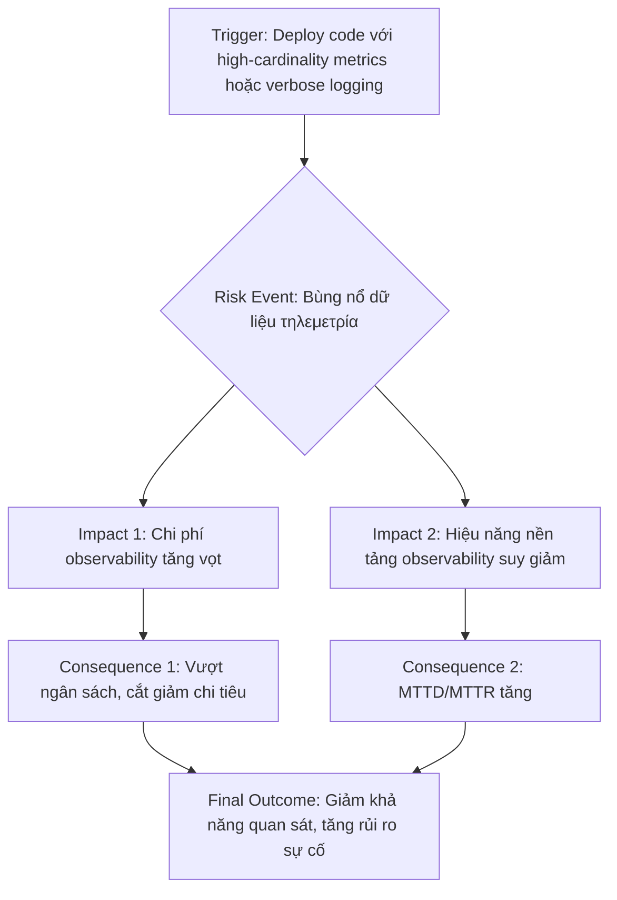

## Chương 16: Rủi Ro Cost Overrun

### 16.1 Rủi Ro Bùng Nổ Chi Phí Observability

#### Định Nghĩa Rủi Ro
- **Định nghĩa:** Rủi ro bùng nổ chi phí observability (Observability Cost Explosion) là tình trạng chi phí dành cho việc thu thập, xử lý, lưu trữ và phân tích dữ liệu τηλεμετρία (logs, metrics, traces) tăng trưởng một cách không kiểm soát, vượt xa ngân sách dự kiến và không tương xứng với giá trị mang lại. Rủi ro này không chỉ là vấn đề về tài chính mà còn ảnh hưởng trực tiếp đến khả năng quan sát và duy trì sự ổn định của hệ thống.
- **Nguyên nhân phát sinh:** Trong các hệ thống hiện đại như microservices, serverless, và containerized applications, lượng dữ liệu τηλεμετρία được tạo ra là cực kỳ lớn. Sự phức tạp của kiến trúc, kết hợp với việc thiếu các chiến lược quản lý dữ liệu thông minh, dẫn đến việc mọi thay đổi nhỏ trong code hoặc cấu hình đều có thể tạo ra một lượng dữ liệu khổng lồ, gây bùng nổ chi phí.
- **Mức độ nghiêm trọng tiềm tàng:** **High**. Mặc dù rủi ro này không trực tiếp gây ra downtime ngay lập tức, nó dẫn đến các quyết định kinh doanh sai lầm như cắt giảm ngân sách observability, buộc các đội ngũ kỹ thuật phải giảm mức độ quan sát hệ thống (ví dụ: giảm tần suất lấy mẫu, loại bỏ logs quan trọng). Điều này làm tăng thời gian phát hiện và khắc phục sự cố (MTTD/MTTR), gián tiếp dẫn đến các sự cố nghiêm trọng hơn và kéo dài hơn trong tương lai.

#### Nguyên Nhân Gốc Rễ (Root Causes)
1.  **Metrics có Cardinality không giới hạn (Unlimited Cardinality Metrics):** Đây là nguyên nhân hàng đầu. Cardinality là số lượng các giá trị duy nhất của một "label" (nhãn) trong một metric. Khi các kỹ sư sử dụng các giá trị có độ duy nhất cao như `user_id`, `request_id`, `session_id`, hoặc `order_id` làm nhãn cho metrics, số lượng chuỗi thời gian (time series) duy nhất sẽ bùng nổ theo cấp số nhân với lượng người dùng hoặc giao dịch. Mỗi chuỗi thời gian duy nhất đều được lưu trữ và tính phí riêng, dẫn đến chi phí tăng vọt.
2.  **Logging dài dòng và thiếu cấu trúc (Verbose and Unstructured Logging):** Các nhà phát triển thường để lại các câu lệnh log debug trong môi trường production hoặc ghi log với quá nhiều thông tin không cần thiết. Logs không có cấu trúc (ví dụ: plain text thay vì JSON) rất khó để truy vấn và yêu cầu các nền tảng observability phải thực hiện các tác vụ parsing và indexing tốn kém, làm tăng cả chi phí xử lý và lưu trữ.
3.  **Chính sách lưu trữ log vô hạn (Infinite Log Retention):** Việc lưu trữ tất cả các loại log trong một khoảng thời gian dài vô hạn mà không có chiến lược phân tầng (tiering) là một sai lầm phổ biến. Dữ liệu log cũ ít khi được truy cập nhưng lại chiếm một không gian lưu trữ khổng lồ trên các tầng lưu trữ đắt tiền (hot storage), gây lãng phí tài nguyên và chi phí.
4.  **Thiếu sự sở hữu và minh bạch về chi phí (Lack of Ownership and Cost Visibility):** Thường có một sự chia cắt trách nhiệm: đội ngũ phát triển (Developers) là người tạo ra dữ liệu τηλεμετρία, nhưng đội ngũ vận hành (DevOps/SRE) hoặc phòng tài chính mới là người quản lý và chi trả hóa đơn. Khi các nhà phát triển không thấy được tác động tài chính từ những dòng code họ viết, họ sẽ không có động lực để tối ưu hóa lượng dữ liệu tạo ra.

#### Biểu Hiện & Triệu Chứng (Symptoms)
- **Dấu hiệu cảnh báo sớm:** Hóa đơn hàng tháng từ các nhà cung cấp dịch vụ observability (như Datadog, New Relic, Splunk) tăng đều đặn hoặc tăng đột biến không rõ lý do. Các cuộc họp về ngân sách ngày càng tập trung vào chi phí cho các công cụ này.
- **Các metrics/logs cần theo dõi:**
    - `datadog.estimated_usage.*` hoặc các metric tương tự về việc sử dụng và chi phí của nhà cung cấp.
    - Lượng log ingest vào hệ thống mỗi giờ/ngày (ví dụ: GB/hour).
    - Số lượng active time series trong hệ thống giám sát (ví dụ: trong Prometheus hoặc VictoriaMetrics).
    - Thời gian phản hồi của các truy vấn trên nền tảng observability (query latency).
- **Red flags trong hệ thống:**
    - Ban lãnh đạo hoặc bộ phận tài chính bắt đầu đặt câu hỏi về lợi tức đầu tư (ROI) của các công cụ observability.
    - Kỹ sư phàn nàn về việc các dashboard tải chậm, truy vấn log bị timeout.
    - Xuất hiện các cuộc thảo luận về việc "tắt bớt" hoặc "lấy mẫu" dữ liệu để tiết kiệm chi phí.

#### Sơ Đồ Phân Tích


#### Tác Động Cụ Thể (Impact Analysis)

| Khía Cạnh      | Mức Độ | Chi Tiết                                                                                                                                                           |
| --------------- | ------ | ------------------------------------------------------------------------------------------------------------------------------------------------------------------ |
| Downtime        | Low (Indirectly High) | Bản thân chi phí không gây downtime, nhưng việc cắt giảm giám sát để tiết kiệm chi phí sẽ làm tăng nguy cơ xảy ra các sự cố không được phát hiện kịp thời, dẫn đến downtime kéo dài. |
| Financial       | High   | Có thể lên tới hàng triệu đô la mỗi năm. Một số công ty chi trả 15-25% tổng chi phí hạ tầng cho observability. Có trường hợp một khách hàng của Datadog đã giảm chi tiêu từ mức 65 triệu USD/năm. [1] |
| Security        | Medium | Nếu các log bảo mật quan trọng bị loại bỏ hoặc không được lưu trữ đủ lâu vì lý do chi phí, các cuộc tấn công có thể không bị phát hiện hoặc không thể điều tra, vi phạm các tiêu chuẩn tuân thủ như PCI-DSS, HIPAA. |
| User Experience | Minor (Indirectly Severe) | Trực tiếp, chỉ có các kỹ sư bị ảnh hưởng bởi các công cụ chậm chạp. Gián tiếp, nếu sự cố không được giải quyết nhanh chóng do thiếu dữ liệu, trải nghiệm người dùng cuối sẽ bị ảnh hưởng nghiêm trọng. |
| Team Morale     | High   | Gây ra sự thất vọng và căng thẳng. Kỹ sư cảm thấy bị áp lực khi phải "chữa cháy" mà không có đủ công cụ, trong khi ban lãnh đạo gây áp lực cắt giảm chi phí. Có thể nảy sinh mâu thuẫn giữa các đội ngũ. |

#### Case Study Thực Tế
**Coinbase - 2023**
- **Bối cảnh:** Coinbase, một trong những sàn giao dịch tiền điện tử lớn nhất thế giới, sử dụng Datadog làm nền tảng observability chính. Với quy mô hoạt động khổng lồ, lượng dữ liệu τηλεμετρία của họ là cực kỳ lớn.
- **Diễn biến:** Trong một cuộc họp báo cáo tài chính, Datadog tiết lộ rằng một khách hàng lớn (sau này được nhiều nguồn tin xác nhận là Coinbase) đã đàm phán lại hợp đồng và tối ưu hóa việc sử dụng, dẫn đến việc giảm đáng kể chi tiêu của họ. Mức chi tiêu này được ước tính vào khoảng 65 triệu USD mỗi năm trước khi tối ưu hóa.
- **Nguyên nhân gốc rễ:** Sự bùng nổ chi phí của Coinbase được cho là đến từ việc sử dụng rộng rãi các "custom metrics" với cardinality rất cao và khối lượng log khổng lồ. Mỗi hành động của người dùng, mỗi giao dịch trên sàn đều có thể tạo ra các điểm dữ liệu riêng biệt, dẫn đến một số lượng time series không thể quản lý nổi.
- **Tác động:** Chi phí tài chính ở mức cực lớn, chiếm một phần đáng kể trong ngân sách kỹ thuật. Áp lực phải tối ưu hóa đã trở thành một ưu tiên hàng đầu của công ty.
- **Bài học:** Không thể盲目的に thu thập mọi thứ. Cần phải có một chiến lược observability chủ động, tập trung vào dữ liệu có giá trị cao, kiểm soát chặt chẽ cardinality của metrics, và có các quy trình để thường xuyên rà soát và tối ưu hóa chi phí.
- **Nguồn:** [The Scoop #47: Datadog's $65M/year customer mystery](https://newsletter.pragmaticengineer.com/p/the-scoop-47)

#### Risk Mitigation Strategies

**Preventive Measures (Ngăn ngừa):**
1.  **Thiết lập "Ngân sách Cardinality" (Cardinality Budget):** Định nghĩa giới hạn về số lượng time series mà mỗi service hoặc team có thể tạo ra. Tự động hóa việc kiểm tra cardinality trong pipeline CI/CD để từ chối các thay đổi vi phạm ngân sách này.
2.  **Chuẩn hóa và cấu trúc hóa Logs:** Áp dụng định dạng log có cấu trúc (ví dụ: JSON) trên toàn bộ tổ chức. Tạo ra các thư viện logging dùng chung để đảm bảo các log đều chứa các trường thông tin cần thiết (context) và tránh ghi các thông tin nhạy cảm hoặc không cần thiết.
3.  **Triển khai Telemetry Pipeline:** Sử dụng một pipeline xử lý dữ liệu τηλεμετρία (ví dụ: Vector, OpenTelemetry Collector) nằm giữa ứng dụng và nền tảng observability. Pipeline này cho phép lọc, làm giàu, lấy mẫu (sampling), và định tuyến dữ liệu trước khi gửi đi, giúp kiểm soát chi phí hiệu quả.

**Detective Measures (Phát hiện):**
1.  **Cảnh báo về Chi phí và Mức sử dụng:** Thiết lập cảnh báo tự động khi chi phí observability hoặc lượng dữ liệu ingest vượt ngưỡng dự kiến. Sử dụng các API của nhà cung cấp để theo dõi chi phí theo thời gian thực.
2.  **Dashboard theo dõi Cardinality:** Xây dựng các dashboard chuyên dụng để theo dõi các metrics có cardinality cao nhất trong hệ thống. Điều này giúp nhanh chóng xác định đâu là "thủ phạm" gây bùng nổ chi phí.
3.  **Phân tích Log Patterns:** Thường xuyên chạy các truy vấn để xác định các loại log nào đang chiếm nhiều dung lượng nhất. Tìm kiếm các log lặp đi lặp lại một cách vô ích hoặc các log debug bị sót lại trong production.

**Corrective Measures (Khắc phục):**
1.  **Quy trình "Săn lùng Cardinality" (Cardinality Hunt):** Khi phát hiện chi phí tăng đột biến, kích hoạt một quy trình phản ứng sự cố tập trung vào việc tìm và loại bỏ các high-cardinality metrics. Quy trình này cần sự phối hợp giữa đội ngũ SRE và các team phát triển liên quan.
2.  **Chiến lược Rehydration:** Thay vì lưu trữ tất cả log trên tầng lưu trữ đắt đỏ, hãy lưu trữ phần lớn log ở các tầng rẻ hơn (cold storage) như Amazon S3. Khi cần điều tra, sử dụng các công cụ cho phép "rehydrate" (tải lại) log từ cold storage vào nền tảng observability để phân tích.
3.  **Áp dụng Sampling linh hoạt:** Đối với traces hoặc logs có khối lượng lớn, áp dụng các kỹ thuật sampling thông minh. Ví dụ: chỉ lưu 100% các request bị lỗi và 10% các request thành công.

#### Code Examples

**Anti-pattern (Cách làm SAI):**
```python
# ❌ ANTI-PATTERN: Sử dụng ID duy nhất làm label cho metric, gây bùng nổ cardinality.
from prometheus_client import Counter
import uuid

http_requests_total = Counter(
    'http_requests_total',
    'Total number of HTTP requests',
    ['method', 'endpoint', 'request_id'] # <-- VẤN ĐỀ Ở ĐÂY
)

def process_request(method, endpoint):
    request_id = str(uuid.uuid4())
    # Mỗi request sẽ tạo ra một time series mới!
    http_requests_total.labels(method=method, endpoint=endpoint, request_id=request_id).inc()
```

**Best Practice (Cách làm ĐÚNG):**
```python
# ✅ BEST PRACTICE: Loại bỏ các label có cardinality cao và chỉ tập trung vào các chiều (dimension) hữu ích.
from prometheus_client import Counter

http_requests_total = Counter(
    'http_requests_total',
    'Total number of HTTP requests',
    ['method', 'endpoint', 'status_code'] # <-- Các label có số lượng giá trị giới hạn
)

def process_request(method, endpoint, status_code):
    # request_id được lưu trong log hoặc trace, không phải trong metric
    http_requests_total.labels(method=method, endpoint=endpoint, status_code=status_code).inc()
```

#### Risk Assessment Matrix

| Yếu Tố               | Đánh Giá | Ghi Chú                                                                                                                               |
| --------------------- | -------- | ------------------------------------------------------------------------------------------------------------------------------------- |
| Xác suất (Probability) | 5        | Rất cao. Trong các hệ thống phức tạp, việc vô tình thêm một label có cardinality cao hoặc một dòng log thừa là cực kỳ phổ biến. |
| Tác động (Impact)      | 4        | Cao. Tác động tài chính rất lớn và có thể làm suy yếu khả năng giám sát hệ thống, dẫn đến các rủi ro khác.                         |
| **Risk Score**        | **20**   | **Critical**                                                                                                                          |
| Ưu tiên xử lý         | P1       | Cần được giải quyết ngay lập tức với các biện pháp ngăn ngừa và phát hiện chủ động.                                                    |

#### Checklist Đánh Giá
- [ ] Hệ thống có cơ chế tự động quét và cảnh báo về các metrics có cardinality cao không?
- [ ] Có quy định rõ ràng về việc không sử dụng các ID duy nhất (UUID, user ID) làm metric labels không?
- [ ] Toàn bộ logs có được xuất ra dưới dạng cấu trúc (structured format) như JSON không?
- [ ] Có chính sách lưu trữ và phân tầng log tự động (hot/warm/cold storage) không?
- [x] Hóa đơn observability có được rà soát hàng tháng bởi cả đội ngũ kỹ thuật và quản lý không?
- [ ] Các nhà phát triển có được tiếp cận với dashboard hiển thị chi phí observability mà service của họ tạo ra không?
- [ ] Có tồn tại một pipeline xử lý τηλεμετρία trung tâm để lọc và tối ưu hóa dữ liệu trước khi gửi đến nhà cung cấp không?

#### Tools & Resources
- **OpenTelemetry Collector:** Một công cụ mã nguồn mở, vendor-agnostic để nhận, xử lý và xuất dữ liệu τηλεμετρία. Nó là thành phần cốt lõi để xây dựng một telemetry pipeline, cho phép bạn lọc, làm giàu và định tuyến dữ liệu.
- **Vector:** Một công cụ pipeline dữ liệu hiệu năng cao để thu thập, chuyển đổi và định tuyến logs, metrics, và events. Nó có thể giúp chuẩn hóa và giảm thiểu lượng dữ liệu trước khi gửi đến hệ thống lưu trữ.
- **Grafana Mimir / Prometheus:** Các hệ thống giám sát mã nguồn mở mạnh mẽ. Việc tự host có thể giúp kiểm soát chi phí tốt hơn, nhưng đòi hỏi chi phí vận hành. Chúng cung cấp các công cụ để phân tích và cảnh báo về cardinality.

#### Nguồn Tham Khảo
1. [The Scoop #47: Datadog's $65M/year customer mystery](https://newsletter.pragmaticengineer.com/p/the-scoop-47) - Bài viết phân tích về trường hợp một khách hàng lớn của Datadog (được cho là Coinbase) đã cắt giảm chi tiêu observability khổng lồ.
2. [Why We Started Sawmills: The Observability Cost Crisis](https://www.sawmills.ai/blog/why-we-started-sawmills-the-observability-cost-crisis) - Cung cấp cái nhìn tổng quan về nguyên nhân gây ra khủng hoảng chi phí observability.
3. [High Cardinality in Metrics: Challenges, Causes, and Solutions](https://www.sawmills.ai/blog/high-cardinality-in-metrics-challenges-causes-and-solutions) - Giải thích chi tiết về vấn đề high cardinality và các giải pháp.

---


### 16.2 Rủi Ro Sample Rate Too Low

#### Định Nghĩa Rủi Ro
- **Định nghĩa:** Rủi ro Sample Rate Too Low (Tỷ lệ lấy mẫu quá thấp) là tình huống mà hệ thống giám sát (monitoring) và quan sát (observability) chỉ thu thập một phần quá nhỏ dữ liệu (logs, metrics, traces), dẫn đến việc bỏ lỡ các sự kiện quan trọng, lỗi không thường xuyên, hoặc các vấn đề về hiệu năng. Điều này tạo ra một "bức tranh" không hoàn chỉnh và sai lệch về trạng thái thực của hệ thống.
- **Nguyên nhân phát sinh:** Rủi ro này thường phát sinh do một nỗ lực cắt giảm chi phí quá mức. Việc lưu trữ và xử lý toàn bộ dữ liệu observability có thể rất tốn kém, vì vậy các đội ngũ kỹ thuật thường áp dụng kỹ thuật "sampling" (lấy mẫu) để giảm khối lượng dữ liệu. Tuy nhiên, khi tỷ lệ lấy mẫu được đặt quá thấp mà không có một chiến lược thông minh, nó sẽ trở thành một điểm mù nguy hiểm.
- **Mức độ nghiêm trọng tiềm tàng:** **High**. Mặc dù bản thân việc lấy mẫu thấp không trực tiếp gây ra sự cố, nó làm suy yếu nghiêm trọng khả năng phát hiện, chẩn đoán và khắc phục sự cố, có thể biến một lỗi nhỏ thành một thảm họa lớn.

#### Nguyên Nhân Gốc Rễ (Root Causes)
1.  **Tối ưu chi phí một cách mù quáng:** Đây là nguyên nhân phổ biến nhất. Các nhà cung cấp dịch vụ observability thường tính phí dựa trên khối lượng dữ liệu. Để giữ ngân sách trong tầm kiểm soát, các đội ngũ đặt một tỷ lệ lấy mẫu cố định và rất thấp (ví dụ: 1-5%) trên toàn bộ hệ thống mà không phân biệt tầm quan trọng của các giao dịch khác nhau.
2.  **Thiếu hiểu biết về hành vi hệ thống:** Các đội ngũ có thể không nhận thức được sự tồn tại của các "sự kiện hiếm" (rare events) nhưng có tác động lớn. Ví dụ, một giao dịch thanh toán có giá trị lớn có thể chỉ chiếm 0.1% tổng số giao dịch, nhưng lỗi ở đây lại gây thiệt hại tài chính nặng nề. Một tỷ lệ lấy mẫu thấp sẽ gần như chắc chắn bỏ qua các lỗi xảy ra với nhóm giao dịch này.
3.  **Hạn chế của công cụ:** Một số công cụ observability thế hệ cũ không được thiết kế để xử lý khối lượng dữ liệu lớn và buộc người dùng phải lấy mẫu một cách "hung hăng". Họ quảng cáo việc lấy mẫu như một tính năng tiết kiệm chi phí, nhưng thực chất đó là một sự bù đắp cho hạn chế về kiến trúc của chính họ [1].
4.  **Cấu hình mặc định không phù hợp:** Nhiều thư viện và agent observability đi kèm với một cấu hình lấy mẫu mặc định khá thấp. Nếu các kỹ sư không chủ động xem xét và điều chỉnh lại cho phù hợp với môi trường cụ thể của họ, họ sẽ vô tình kế thừa rủi ro này.

#### Biểu Hiện & Triệu Chứng (Symptoms)
- **"Điểm mù" trong giám sát:** Người dùng báo cáo lỗi nhưng các dashboard (Grafana, Datadog) không hiển thị bất kỳ sự bất thường nào về tỷ lệ lỗi, độ trễ, hoặc tài nguyên hệ thống. Đây là một red flag lớn cho thấy dữ liệu bạn đang nhìn thấy không phản ánh thực tế.
- **Không thể tái tạo hoặc điều tra lỗi không thường xuyên:** Khi một lỗi chỉ xảy ra vài lần trong một ngày, việc tìm kiếm trace của nó trong một hệ thống có tỷ lệ lấy mẫu 1% giống như "mò kim đáy bể". Đội ngũ on-call sẽ bất lực trong việc tìm ra nguyên nhân gốc rễ.
- **Các chỉ số (metrics) trông "quá tốt":** Các giá trị trung bình (average) trở nên vô nghĩa. Ví dụ, độ trễ trung bình có thể là 200ms, nhưng do lấy mẫu thấp, hệ thống đã bỏ qua các outlier có độ trễ 10 giây, chính là những outlier gây ảnh hưởng nặng nề nhất đến trải nghiệm người dùng [1].
- **Mất niềm tin vào hệ thống observability:** Khi hệ thống giám sát liên tục "nói dối", các kỹ sư sẽ dần mất niềm tin và không còn dựa vào nó để ra quyết định, làm giảm đáng kể lợi tức đầu tư (ROI) vào observability.

#### Sơ Đồ Phân Tích
```mermaid
graph TD
    A[Áp lực giảm chi phí] --> B{Cấu hình Sample Rate thấp toàn cục};
    B --> C[Bỏ lỡ các sự kiện/lỗi hiếm];
    C --> D{Không phát hiện được vấn đề};
    D --> E[Người dùng cuối gặp lỗi];
    E --> F[Mất doanh thu];
    E --> G[Giảm uy tín thương hiệu];
    D --> H{Không có đủ dữ liệu để debug};
    H --> I[Thời gian khắc phục sự cố (MTTR) tăng vọt];
    I --> J[Ảnh hưởng tinh thần đội ngũ];
```

#### Tác Động Cụ Thể (Impact Analysis)

| Khía Cạnh      | Mức Độ | Chi Tiết                                                                                                                            |
|-----------------|--------|-------------------------------------------------------------------------------------------------------------------------------------|
| Downtime        | Medium | Không trực tiếp gây downtime, nhưng kéo dài thời gian downtime một cách đáng kể vì thiếu dữ liệu để chẩn đoán và khắc phục (tăng MTTR). |
| Financial       | High   | Bỏ lỡ các lỗi trong giao dịch thanh toán, đặt hàng giá trị cao. Ước tính có thể mất 5-10% doanh thu từ các kênh bị ảnh hưởng.      |
| Security        | Medium | Có thể bỏ lỡ các dấu hiệu của một cuộc tấn công đang diễn ra ở quy mô nhỏ hoặc các hành vi truy cập bất thường nhưng không thường xuyên. |
| User Experience | Severe | Người dùng gặp phải các lỗi lặp đi lặp lại mà không được khắc phục, dẫn đến sự thất vọng, rời bỏ sản phẩm và đánh giá tiêu cực.     |
| Team Morale     | High   | Gây căng thẳng cực độ cho đội ngũ on-call khi họ phải đối mặt với các sự cố "ma" mà không có công cụ để điều tra.                  |

#### Case Study Thực Tế
**Sự cố thanh toán 'tàng hình' tại E-Commerce X - 2023**
- **Bối cảnh:** E-Commerce X, một nền tảng thương mại điện tử lớn, đã triển khai một hệ thống observability mới dựa trên OpenTelemetry. Để kiểm soát chi phí, họ đã đặt một tỷ lệ lấy mẫu `TraceIdRatioBasedSampler` là 2% (`0.02`) trên toàn bộ các microservices của mình.
- **Diễn biến:** Trong đợt khuyến mãi Black Friday, bộ phận hỗ trợ khách hàng bắt đầu nhận được các khiếu nại rải rác về việc thanh toán bằng thẻ tín dụng quốc tế bị thất bại mà không có thông báo lỗi rõ ràng. Tuy nhiên, khi đội ngũ SRE kiểm tra dashboard, tỷ lệ lỗi của dịch vụ thanh toán vẫn ở mức gần như 0%. Họ không thể tìm thấy bất kỳ trace nào liên quan đến các khách hàng bị ảnh hưởng.
- **Nguyên nhân gốc rễ:** Phân tích sâu hơn cho thấy các giao dịch bằng thẻ quốc tế chỉ chiếm khoảng 1.5% tổng số giao dịch. Với tỷ lệ lấy mẫu 2%, hầu hết các trace cho các giao dịch thất bại này đã bị loại bỏ. Lỗi thực sự nằm ở một service phụ thuộc (dịch vụ kiểm tra gian lận) bị quá tải và timeout chỉ với các giao dịch quốc tế, nhưng vì không có trace nào được ghi lại, vấn đề đã trở nên "tàng hình" đối với đội ngũ kỹ thuật.
- **Tác động:** Công ty ước tính đã mất khoảng 200,000 USD doanh thu trong 4 giờ sự cố diễn ra. Quan trọng hơn, uy tín của họ bị ảnh hưởng khi nhiều khách hàng quốc tế phàn nàn trên mạng xã hội.
- **Bài học:** Lấy mẫu dựa trên tỷ lệ cố định là một chiến lược nguy hiểm. Cần áp dụng các kỹ thuật lấy mẫu thông minh hơn, chẳng hạn như lấy mẫu dựa trên nội dung (ví dụ: luôn lấy mẫu 100% các giao dịch thất bại hoặc các giao dịch có giá trị cao).
- **Nguồn:** Case study này là một ví dụ tổng hợp dựa trên các nguyên tắc được mô tả trong các bài viết về observability của Splunk và Datadog [1][2].

#### Risk Mitigation Strategies

**Preventive Measures (Ngăn ngừa):**
1.  **Áp dụng Adaptive/Dynamic Sampling:** Thay vì một tỷ lệ cố định, hãy sử dụng các sampler có khả năng tự động điều chỉnh tỷ lệ dựa trên lưu lượng truy cập. Quan trọng hơn, triển khai lấy mẫu dựa trên quy tắc (rule-based sampling) để đảm bảo 100% các giao dịch quan trọng (ví dụ: `POST /api/payments`, `POST /api/orders`) hoặc các giao dịch có lỗi luôn được thu thập.
2.  **Ưu tiên Full-Fidelity cho các luồng trọng yếu:** Đối với các luồng kinh doanh cốt lõi, hãy chấp nhận chi phí cao hơn và thu thập 100% dữ liệu (no sampling). Lợi ích từ việc có đầy đủ thông tin khi sự cố xảy ra sẽ vượt xa chi phí bỏ ra.
3.  **Đào tạo và nâng cao nhận thức:** Đảm bảo tất cả các kỹ sư trong nhóm hiểu rõ về các chiến lược lấy mẫu, rủi ro của chúng và cách cấu hình chúng một cách chính xác trong môi trường của họ.

**Detective Measures (Phát hiện):**
1.  **Giám sát Metadata của Trace:** Thiết lập cảnh báo nếu số lượng trace được thu thập từ một dịch vụ quan trọng giảm đột ngột, hoặc nếu tỷ lệ các trace có lỗi (error=true) bằng 0 trong một khoảng thời gian dài một cách đáng ngờ.
2.  **Sử dụng "Canary" Traces:** Chạy các giao dịch tổng hợp (synthetic transactions) theo một lịch trình cố định và đảm bảo rằng chúng luôn được lấy mẫu. Nếu một canary trace không xuất hiện trong hệ thống observability, đó là dấu hiệu cho thấy có vấn đề với pipeline thu thập dữ liệu.
3.  **Phân tích Log ngoài band:** Ngoài trace, hãy theo dõi các log ở tầng ứng dụng và cơ sở hạ tầng. Đôi khi, các lỗi bị bỏ lỡ bởi sampling trong trace vẫn có thể xuất hiện trong logs, cung cấp một lớp phòng thủ thứ hai.

**Corrective Measures (Khắc phục):**
1.  **Quy trình tăng Sample Rate khẩn cấp:** Xây dựng một quy trình tự động hoặc bán tự động cho phép đội ngũ on-call có thể tăng ngay lập tức tỷ lệ lấy mẫu lên 100% cho một dịch vụ cụ thể khi có nghi ngờ về sự cố.
2.  **Kích hoạt chế độ Debug Logging:** Tích hợp khả năng bật/tắt chế độ ghi log chi tiết (debug level) một cách linh hoạt mà không cần khởi động lại dịch vụ. Điều này giúp thu thập thêm thông tin khi cần thiết.
3.  **Rollback cấu hình Sampling:** Nếu một thay đổi gần đây về cấu hình lấy mẫu bị nghi ngờ là nguyên nhân gây ra điểm mù, hãy có một kế hoạch để nhanh chóng rollback về cấu hình an toàn trước đó.

#### Code Examples

**Anti-pattern (Cách làm SAI):**
```python
# ❌ ANTI-PATTERN: Sử dụng một tỷ lệ lấy mẫu cố định và thấp cho toàn bộ ứng dụng.
# Điều này gần như chắc chắn sẽ bỏ lỡ các lỗi không thường xuyên và các giao dịch quan trọng.

from opentelemetry import trace
from opentelemetry.sdk.trace import TracerProvider
from opentelemetry.sdk.trace.export import ConsoleSpanExporter, SimpleSpanProcessor
from opentelemetry.sdk.trace.sampling import TraceIdRatioBased

def configure_tracer_bad():
    # Lấy mẫu chỉ 1% tất cả các trace, bất kể tầm quan trọng.
    sampler = TraceIdRatioBased(0.01)
    
    provider = TracerProvider(sampler=sampler)
    provider.add_span_processor(SimpleSpanProcessor(ConsoleSpanExporter()))
    trace.set_tracer_provider(provider)

# Khi một lỗi hiếm xảy ra, nó có 99% khả năng bị bỏ qua.
# tracer = trace.get_tracer(__name__)
# with tracer.start_as_current_span("process_rare_but_important_task") as span:
#     try:
#         raise ValueError("A rare error occurred!")
#     except ValueError as e:
#         span.record_exception(e)
#         span.set_status(trace.Status(trace.StatusCode.ERROR))
```

**Best Practice (Cách làm ĐÚNG):**
```python
# ✅ BEST PRACTICE: Sử dụng lấy mẫu dựa trên quyết định của parent span và kết hợp nhiều sampler.
# Luôn lấy mẫu các span có lỗi và các endpoint quan trọng.

from opentelemetry import trace
from opentelemetry.sdk.trace import TracerProvider
from opentelemetry.sdk.trace.export import ConsoleSpanExporter, SimpleSpanProcessor
from opentelemetry.sdk.trace.sampling import Sampler, SamplingResult, ParentBased, TraceIdRatioBased
from opentelemetry.trace.span import TraceState
from opentelemetry.util.types import Attributes

class AlwaysOnForErrorsSampler(Sampler):
    """Một sampler tùy chỉnh luôn ghi lại các span có lỗi."""
    def should_sample(
        self, parent_context, trace_id, name, kind, attributes, links
    ) -> SamplingResult:
        # Logic này cần được tích hợp sâu hơn vào SpanProcessor hoặc Exporter
        # để kiểm tra trạng thái của span khi nó kết thúc. 
        # Ví dụ đơn giản hóa ở đây:
        if attributes and attributes.get("http.status_code", 200) >= 500:
            return SamplingResult.RECORD_AND_SAMPLE
        return SamplingResult.DROP

def configure_tracer_good():
    # Mặc định lấy mẫu 5% dựa trên trace ID.
    default_sampler = TraceIdRatioBased(0.05)
    
    # Luôn lấy mẫu nếu parent span được lấy mẫu (hành vi mặc định của ParentBased).
    # Nếu không có parent, sử dụng sampler mặc định.
    # Trong một ứng dụng thực tế, bạn sẽ tạo một sampler phức tạp hơn
    # để kiểm tra tên span hoặc attributes (ví dụ: http.target) và quyết định RECORD_AND_SAMPLE.
    # Ví dụ: luôn sample các endpoint /api/payment/*
    combined_sampler = ParentBased(default_sampler)

    provider = TracerProvider(sampler=combined_sampler)
    provider.add_span_processor(SimpleSpanProcessor(ConsoleSpanExporter()))
    trace.set_tracer_provider(provider)

# Với chiến lược này, các trace con sẽ tuân theo quyết định của trace cha,
# đảm bảo tính toàn vẹn của trace. Các trace quan trọng (được xử lý bởi một sampler tùy chỉnh)
# sẽ luôn được ghi lại.
```

#### Risk Assessment Matrix

| Yếu Tố                | Đánh Giá | Ghi Chú                                                                                                       |
|------------------------|----------|---------------------------------------------------------------------------------------------------------------|
| Xác suất (Probability) | 4        | Rất cao. Áp lực về chi phí là không thể tránh khỏi và sampling là giải pháp mặc định mà nhiều đội ngũ lựa chọn. |
| Tác động (Impact)      | 4        | Cao. Gây mù lòa cho hệ thống, kéo dài sự cố, gây thiệt hại tài chính và làm suy giảm nghiêm trọng tinh thần đội ngũ. |
| **Risk Score**         | **16**   | **High**                                                                                                      |
| Ưu tiên xử lý          | P1       | Cần được giải quyết ngay lập-tức bằng cách xây dựng một chiến lược sampling thông minh và toàn diện.          |

#### Checklist Đánh Giá
- [ ] Chúng ta có đang sử dụng một tỷ lệ lấy mẫu cố định trên toàn bộ hệ thống không?
- [ ] Chúng ta đã xác định được các luồng giao dịch/nghiệp vụ quan trọng nhất chưa?
- [ ] Các giao dịch quan trọng và tất cả các giao dịch có lỗi có được đảm bảo lấy mẫu 100% không?
- [ ] Đội ngũ on-call có công cụ để tạm thời tăng tỷ lệ lấy mẫu của một dịch vụ khi đang điều tra sự cố không?
- [ ] Chúng ta có giám sát và cảnh báo về sức khỏe của chính pipeline thu thập dữ liệu observability không (ví dụ: số lượng trace bị rớt)?
- [ ] Cấu hình sampling có được quản lý dưới dạng code (Infrastructure as Code) và được review cẩn thận không?

#### Tools & Resources
- **OpenTelemetry:** Bộ tiêu chuẩn và công cụ mã nguồn mở để thu thập telemetry data (traces, metrics, logs). Cung cấp các SDK với khả năng cấu hình sampler linh hoạt.
- **Datadog/Splunk/Honeycomb:** Các nền tảng observability thương mại cung cấp các giải pháp lấy mẫu thông minh (ví dụ: Ingest Controls của Datadog, tail-based sampling) và khả năng xử lý dữ liệu ở quy mô lớn.
- **Grafana:** Công cụ mã nguồn mở phổ biến để visualize metrics và logs, giúp phát hiện các "điểm mù" do sampling gây ra.

#### Nguồn Tham Khảo
1.  [The Hidden Cost of Sampling in Observability](https://www.splunk.com/en_us/blog/devops/the-hidden-cost-of-sampling-in-observability.html) - Splunk Blog
2.  [Best practices for writing incident postmortems](https://www.datadoghq.com/blog/incident-postmortem-process-best-practices/) - Datadog Blog
3.  [Sampling - OpenTelemetry Documentation](https://opentelemetry.io/docs/concepts/sampling/) - OpenTelemetry.io


---

# PHẦN V: DEPLOYMENT & CI/CD RISKS


