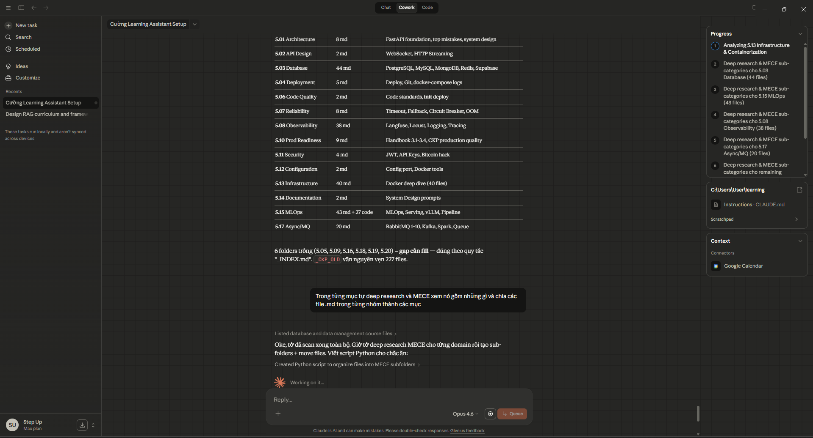

# 5 - Production Systems & MLOps

> **Best Practices · Production Quality · Production Engineering**
> 20 Domains MECE | Grouped by Lifecycle | Owner: Cường Learning | Updated: 2026-03-13

---

## Cấu trúc: 20 Domains + Sub-categories

```
5 - Production Systems & MLOps/
│
├── _INDEX.md                                              ← BẠN ĐANG Ở ĐÂY
├── _CKP_OLD/                                              ← ~301 files cũ (backup)
│
│   ── DESIGN TIME ──────────────────────────────────────
├── 5.01 - DESIGN - Architecture & Design/
│   ├── 5.01.0 - Resources & Notes/
│   ├── 5.01.1 - Service Foundation/                       (FastAPI, Docker basics)
│   └── 5.01.2 - System Design & Patterns/
│
├── 5.02 - DESIGN - API Design/                            (flat — 2 files)
├── 5.03 - DESIGN - Database & Data Management/
│   ├── 5.03.0 - DB Fundamentals & Theory/                 (SQL, nguyên lý, tổng quan)
│   ├── 5.03.1 - PostgreSQL/
│   ├── 5.03.2 - MySQL/
│   ├── 5.03.3 - NoSQL & Others/                           (MongoDB, Redis, Supabase)
│   ├── 5.03.4 - Transactions & Concurrency/               (lock, leak, parallel)
│   ├── 5.03.5 - Data Types & Schema/                      (JSONB, partition)
│   ├── 5.03.6 - DB Operations/                            (deploy, move, init)
│   └── 5.03.7 - Data Visualization/
│
│   ── BUILD TIME ───────────────────────────────────────
├── 5.04 - BUILD - Deployment & CI-CD/                     (flat — 5 files)
├── 5.05 - BUILD - Testing/                                (empty — gap to fill)
├── 5.06 - BUILD - Code Quality & Maintainability/         (flat — 2 files)
│
│   ── RUN TIME ─────────────────────────────────────────
├── 5.07 - RUN - Reliability & Resilience/
│   ├── 5.07.0 - General/
│   ├── 5.07.1 - Circuit Breaker & Rate Limit/
│   ├── 5.07.2 - Timeout & Fallback/
│   └── 5.07.3 - OOM & Context Handling/
│
├── 5.08 - RUN - Observability & Monitoring/
│   ├── 5.08.0 - General/
│   ├── 5.08.1 - Structured Logging/
│   ├── 5.08.2 - Log Aggregation/
│   ├── 5.08.3 - Distributed Tracing - Langfuse/           (19 files — largest)
│   ├── 5.08.4 - Performance Testing - Locust/
│   └── 5.08.5 - Monitoring Stack & Templates/
│
├── 5.09 - RUN - Error Handling/                           (empty — gap to fill)
├── 5.10 - RUN - Production Readiness/
│   ├── 5.10.1 - Handbooks & References/                   (3.1-3.4 master docs)
│   └── 5.10.2 - Checkpoints & Checklists/
│
│   ── CROSS-CUTTING ────────────────────────────────────
├── 5.11 - CROSS - Security/                               (flat — 4 files)
├── 5.12 - CROSS - Configuration & Secrets/                (flat — 2 files)
├── 5.13 - CROSS - Infrastructure & Containerization/
│   ├── 5.13.0 - Docker Fundamentals/
│   ├── 5.13.1 - Docker Networking/                        (bridge, subnet, port)
│   ├── 5.13.2 - Docker Config & Environment/              (.env, port, volume)
│   ├── 5.13.3 - Docker Architecture Patterns/             (hybrid, multi-service)
│   ├── 5.13.4 - Docker Operations & Cleanup/              (disk, logs, hub)
│   ├── 5.13.5 - Docker Troubleshooting/                   (Vấn đề 9-17)
│   └── 5.13.6 - Server & Cloud/                           (Azure, Nginx, k8s)
│
├── 5.14 - CROSS - Documentation & Runbooks/               (flat — 2 files)
│
│   ── SPECIALIZED ──────────────────────────────────────
├── 5.15 - SPECIALIZED - MLOps & AI Systems/
│   ├── 5.15.0 - MLOps Fundamentals & Course Notes/
│   ├── 5.15.1 - Model Serving/                            (vLLM, SLM, streaming)
│   ├── 5.15.2 - ML Pipeline & Tools/                      (Airflow, Makefile, Bash)
│   ├── 5.15.3 - RAG & Retrieval/                          (Langflow, Bedrock)
│   ├── 5.15.4 - AI Agent & Workflow/                      (Playwright, Mermaid)
│   ├── 5.15.5 - Deep Research Reports/
│   └── 5.15.6 - Code Examples/                            (.py, .yaml, Dockerfile)
│
├── 5.16 - SPECIALIZED - Caching & Performance Optimization/ (empty — gap to fill)
├── 5.17 - SPECIALIZED - Async Processing & Message Queues/
│   ├── 5.17.0 - Queue Architecture & Patterns/
│   ├── 5.17.1 - RabbitMQ/                                 (12 files — series 1-11)
│   ├── 5.17.2 - Kafka & Stream Processing/                (Spark, PySpark)
│   └── 5.17.3 - Big Data & Distributed Systems/
│
├── 5.18 - SPECIALIZED - Compliance & Data Protection/     (empty — gap to fill)
├── 5.19 - SPECIALIZED - Chaos Engineering & Resilience Testing/ (empty — gap to fill)
└── 5.20 - SPECIALIZED - Cost Optimization/                (empty — gap to fill)
```

---

## View 1: Master Table

| # | Group | Domain | Sub-categories | Files |
|---|-------|--------|----------------|-------|
| 5.01 | DESIGN | Architecture & Design | Foundation, System Design, Resources | 9 |
| 5.02 | DESIGN | API Design | — (flat) | 2 |
| 5.03 | DESIGN | Database & Data Management | Fundamentals, PostgreSQL, MySQL, NoSQL, Transactions, Data Types, Operations, Viz | 44 |
| 5.04 | BUILD | Deployment & CI-CD | — (flat) | 5 |
| 5.05 | BUILD | Testing | — (empty) | 0 |
| 5.06 | BUILD | Code Quality & Maintainability | — (flat) | 2 |
| 5.07 | RUN | Reliability & Resilience | Circuit Breaker, Timeout/Fallback, OOM/Context | 8 |
| 5.08 | RUN | Observability & Monitoring | Logging, Log Aggregation, Tracing/Langfuse, Locust, Templates | 38 |
| 5.09 | RUN | Error Handling | — (empty) | 0 |
| 5.10 | RUN | Production Readiness | Handbooks, Checklists | 9 |
| 5.11 | CROSS | Security | — (flat) | 4 |
| 5.12 | CROSS | Configuration & Secrets | — (flat) | 2 |
| 5.13 | CROSS | Infrastructure & Containerization | Fundamentals, Networking, Config, Architecture, Operations, Troubleshooting, Cloud | 40 |
| 5.14 | CROSS | Documentation & Runbooks | — (flat) | 2 |
| 5.15 | SPECIALIZED | MLOps & AI Systems | Fundamentals, Serving, Pipeline, RAG, Agent, Research, Code | 43 |
| 5.16 | SPECIALIZED | Caching & Performance Optimization | — (empty) | 0 |
| 5.17 | SPECIALIZED | Async Processing & Message Queues | RabbitMQ, Kafka/Stream, Big Data | 20 |
| 5.18 | SPECIALIZED | Compliance & Data Protection | — (empty) | 0 |
| 5.19 | SPECIALIZED | Chaos Engineering & Resilience Testing | — (empty) | 0 |
| **5.20** | **SPECIALIZED** | **Cost Optimization** | — (empty) | 0 |

**Tổng: 227 .md files phân loại + 6 domains trống (gap to fill)**

---

## View 2: Mapping với file 3.4 (La Mã → Arabic mới)

| File 3.4 | Folder mới | Group | Domain |
|----------|------------|-------|--------|
| I | 5.01 | DESIGN | Architecture & Design |
| IX | 5.02 | DESIGN | API Design |
| VIII | 5.03 | DESIGN | Database & Data Management |
| IV | 5.04 | BUILD | Deployment & CI-CD |
| VI | 5.05 | BUILD | Testing |
| XI | 5.06 | BUILD | Code Quality & Maintainability |
| II | 5.07 | RUN | Reliability & Resilience |
| III | 5.08 | RUN | Observability & Monitoring |
| VII | 5.09 | RUN | Error Handling |
| XIV | 5.10 | RUN | Production Readiness |
| V | 5.11 | CROSS | Security |
| X | 5.12 | CROSS | Configuration & Secrets |
| XII | 5.13 | CROSS | Infrastructure & Containerization |
| XIII | 5.14 | CROSS | Documentation & Runbooks |
| XV | 5.15 | SPECIALIZED | MLOps & AI Systems |
| XVI | 5.16 | SPECIALIZED | Caching & Performance Optimization |
| XVII | 5.17 | SPECIALIZED | Async Processing & Message Queues |
| XVIII | 5.18 | SPECIALIZED | Compliance & Data Protection |
| XIX | 5.19 | SPECIALIZED | Chaos Engineering & Resilience Testing |
| ★ NEW | 5.20 | SPECIALIZED | Cost Optimization |

**Tổng: 72 best practices across 19 domains gốc + 1 domain mở rộng (5.20)**

---

## View 3: Mapping _CKP_OLD → Folders mới

| Folder cũ (PHAN_*) | Content chính | → Folder mới |
|---------------------|---------------|-------------|
| PHAN_I_Foundation_Risks | FastAPI, Docker basics | 5.01, 5.13 |
| PHAN_II_Architecture_Design_Risks | Docker deep dive (40 files) | 5.13 |
| PHAN_III_Reliability_Resilience | Timeout, Fallback, OOM | 5.07 |
| PHAN_IV_Observability_Monitoring | Langfuse, Locust, Logging (49 files) | 5.08 |
| PHAN_V_Deployment_CI_CD | Deploy, SSH, Git | 5.04 |
| PHAN_VI_Security | API Keys, JWT, Bitcoin hack | 5.11 |
| PHAN_VIII_Code_Quality | Code standards | 5.06 |
| PHAN_IX_Infrastructure | Server, Azure | 5.13 |
| PHAN_X_Database | PostgreSQL, Redis, RabbitMQ (76 files) | 5.03, 5.17 |
| PHAN_XI_API_Design | WebSocket, HTTP Streaming | 5.02 |
| PHAN_XII_Configuration | Docker tools, commands | 5.12 |
| PHAN_XIII_Documentation | System Design prompts | 5.14 |
| PHAN_XV_MLOps | MLOps, Serving, Pipeline (92 files) | 5.15 |

---

## View 4: 5.20 Cost Optimization — Chi tiết

> Source: File 3.2 Deep Research + AWS Well-Architected Cost Optimization Pillar

| # | Best Practice | Mô tả |
|---|---------------|--------|
| 1 | Right-sizing & Resource Planning | Chọn đúng instance type, auto-scaling thresholds, không over-provision |
| 2 | Spot/Reserved/Savings Plans | Tối ưu pricing model cho workload (on-demand vs reserved vs spot) |
| 3 | Cost Observability & Tagging | Tag resources theo team/project/env, cost dashboards, anomaly alerts |
| 4 | Idle Resource Cleanup | Tự động detect & terminate unused resources (zombie instances, unattached volumes) |
| 5 | FinOps Culture & Accountability | Mỗi team own cost metrics, budget alerts, cost review trong sprint |

---

## Quy tắc đặt tên file

```
[Ngày] - [Loại] - [Tên ngắn gọn].md

Ví dụ:
20260313 - Note - Circuit Breaker Config Production.md
20260313 - UseCase - Langfuse RAM Overflow 50GB Fix.md
20260313 - Bug - RabbitMQ Infinite Loop Worker.md
20260313 - Checklist - Pre-Deploy Verification.md
20260313 - Template - Incident Report.md
```

Loại: `Note` · `Summary` · `UseCase` · `Bug` · `Template` · `Checklist` · `DeepResearch`

---

## Quy tắc mở rộng

- **Folder trống = gap cần fill.** Không xoá folder trống.
- **Khi 1 domain > 50 files** → tạo sub-folder lúc đó (flat until painful).
- **Domain mới** → thêm 5.21, 5.22... không phá cấu trúc cũ.
- **Mỗi folder có _CKP/** cho bản nháp/checkpoint.
- **Format tên folder:** `5.XX - GROUP - Domain Name`
- **Sub-folder format:** `5.XX.Y - Tên sub-category`

---


