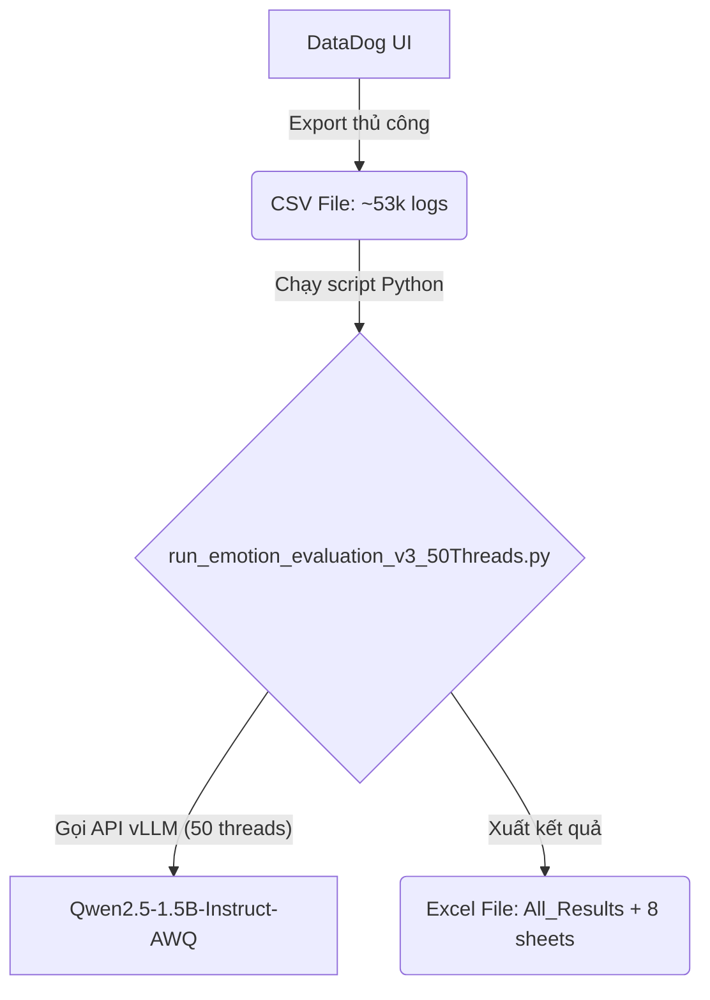
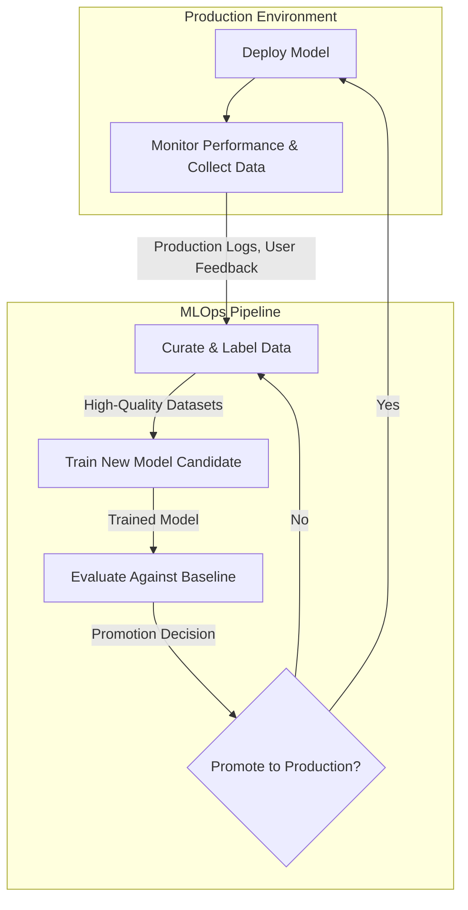

# Tài liệu Kỹ thuật: Xây dựng Pipeline Huấn luyện Liên tục (Continuous Training) cho Tinh chỉnh Small Language Model (SLM)

**Tác giả:** Manus AI (Technical Writer: Claude 3 Opus)
**Ngày:** 2026-03-02
**Phiên bản:** 1.0

---

## Giới thiệu

Tài liệu này trình bày một cách tiếp cận chi tiết và có hệ thống để thiết kế và triển khai một pipeline huấn luyện liên tục (Continuous Training - CT) cho việc tinh chỉnh (fine-tuning) các mô hình ngôn ngữ nhỏ (Small Language Models - SLMs). Bối cảnh cụ thể của tài liệu này là bài toán phân loại cảm xúc cho trợ lý AI Pika, với mục tiêu chuyển đổi từ một quy trình thủ công, rời rạc sang một hệ thống MLOps (Machine Learning Operations) tự động, hiệu quả và có khả năng tự cải thiện theo thời gian.

Nội dung tài liệu được cấu trúc thành ba phần chính:

1.  **Đặt vấn đề:** Phân tích những thách thức và giới hạn của quy trình hiện tại, từ đó làm nổi bật nhu cầu cấp thiết phải có một pipeline huấn luyện tự động để nâng cao chất lượng mô hình và tối ưu hóa quy trình vận hành.
2.  **Nghiên cứu chuyên sâu về Continuous Training Pipeline:** Đi sâu vào các khái niệm, kiến trúc và các phương pháp thực hành tốt nhất (best practices) trong ngành để xây dựng một pipeline CT hiện đại. Phần này tổng hợp các kiến thức từ các mô hình trưởng thành MLOps của Google, kiến trúc Data Flywheel của NVIDIA, và các nghiên cứu học thuật mới nhất về fine-tuning và đánh giá LLM.
3.  **Ứng dụng vào dự án:** Đề xuất một thiết kế kiến trúc và lộ trình triển khai chi tiết để áp dụng các nguyên tắc của pipeline CT vào dự án Pika Emotion, tận dụng các công cụ và công nghệ tiên tiến như Unsloth, Distilabel, Argilla, và MLflow.

Mục tiêu của tài liệu là cung cấp một bản thiết kế (blueprint) toàn diện, vừa có chiều sâu về mặt kỹ thuật, vừa có tính thực tiễn cao, giúp đội ngũ kỹ sư máy học (ML Engineer) và nhà khoa học dữ liệu (Data Scientist) xây dựng một hệ thống mạnh mẽ, có khả năng mở rộng và mang lại giá trị bền vững.

## 1. Đặt vấn đề: Tinh chỉnh Mô hình Ngôn ngữ Nhỏ cho Bài toán Phân loại Cảm xúc

### 1.1. Bối cảnh Dự án Pika Emotion

Dự án Pika Emotion có mục tiêu cốt lõi là xác định chính xác 1 of 13 nhóm cảm xúc từ các đoạn hội thoại của người dùng với trợ lý AI. Hiện tại, hệ thống đang sử dụng một mô hình ngôn ngữ nền tảng (base model) là `Qwen/Qwen2.5-1.5B-Instruct-AWQ` được phục vụ (serve) thông qua vLLM. Mặc dù mô hình này có khả năng ngôn ngữ tổng quát tốt, hiệu suất của nó trên tác vụ phân loại cảm xúc chuyên biệt của Pika vẫn chưa đạt được độ chính xác và sắc thái như kỳ vọng. Các phản hồi của mô hình đôi khi sai lệch, không nắm bắt được các sắc thái tinh tế hoặc các từ lóng đặc trưng trong các cuộc hội thoại, dẫn đến trải nghiệm người dùng chưa tối ưu.

Để giải quyết vấn đề này, chiến lược được đề ra là **tinh chỉnh (fine-tuning)** mô hình `Qwen2.5-1.5B-Instruct` trên một tập dữ liệu chuyên biệt, được thu thập và gán nhãn từ chính các tương tác trong thực tế của sản phẩm. Việc này sẽ giúp mô hình "học" được các đặc trưng và sắc thái riêng của bài toán phân loại cảm xúc Pika, từ đó cải thiện đáng kể độ chính xác.

### 1.2. Quy trình Hiện tại: Một Quy trình Thủ công và Rời rạc

Quy trình thu thập dữ liệu và đánh giá mô hình hiện tại (Phase 0) đang được thực hiện một cách hoàn toàn thủ công, bao gồm các bước sau:

1.  **Thu thập Dữ liệu:** Dữ liệu log tương tác của người dùng được export thủ công từ DataDog thành một file CSV lớn (khoảng 53,000 dòng).
2.  **Gán nhãn:** Một script Python (`run_emotion_evaluation_v3_50Threads.py`) được chạy để gửi các đoạn văn bản trong file CSV đến API của mô hình `Qwen2.5-1.5B-Instruct-AWQ` hiện tại để gán nhãn cảm xúc tự động.
3.  **Phân tích Kết quả:** Kết quả gán nhãn được xuất ra một file Excel với nhiều sheet khác nhau để các chuyên gia (domain experts) phân tích và đánh giá thủ công.

Sơ đồ quy trình hiện tại có thể được mô tả như sau:

### 1.3. Những Thách thức và Hạn chế

Quy trình thủ công hiện tại, mặc dù hữu ích cho giai đoạn đầu, nhưng lại bộc lộ nhiều hạn chế nghiêm trọng khi xét đến việc vận hành và cải tiến liên tục trong môi trường sản phẩm:

| Thách thức | Mô tả chi tiết |
| :--- | :--- |
| **Thiếu tính Tự động** | Toàn bộ quy trình từ export dữ liệu, chạy script, đến phân tích kết quả đều phụ thuộc vào sự can thiệp của con người. Điều này tốn thời gian, công sức và dễ phát sinh lỗi. |
| **Vòng lặp Phản hồi Chậm** | Quá trình từ khi có dữ liệu mới đến khi mô hình được cải thiện và triển khai mất rất nhiều thời gian. Điều này làm chậm khả năng thích ứng của mô hình với các xu hướng và hành vi mới của người dùng. |
| **Không có Khả năng Tái lập (Reproducibility)** | Việc thực hiện các bước một cách thủ công khiến rất khó để đảm bảo tính nhất quán và tái lập lại một kết quả huấn luyện cụ thể. Các phiên bản script, môi trường, và dữ liệu có thể thay đổi không được kiểm soát. |
| **Thiếu Giám sát và Đánh giá Hệ thống** | Không có một hệ thống giám sát tự động để theo dõi hiệu suất mô hình theo thời gian (model drift), chất lượng dữ liệu đầu vào (data drift), hay tự động kích hoạt quy trình huấn luyện lại khi cần thiết. |
| **Rủi ro "Kiến thức Bộ lạc" (Tribal Knowledge)** | Quy trình vận hành phụ thuộc nhiều vào kiến thức và kinh nghiệm của một vài cá nhân cụ thể. Khi có sự thay đổi về nhân sự, hệ thống có nguy cơ bị gián đoạn. |

Những hạn chế này cho thấy một nhu cầu cấp thiết phải chuyển đổi sang một mô hình vận hành chuyên nghiệp và tự động hơn. Đó chính là lý do cần phải thiết kế và xây dựng một **pipeline huấn luyện liên tục (Continuous Training Pipeline)**, một thành phần cốt lõi của MLOps.

## 2. Nghiên cứu Chuyên sâu: Thiết kế một Pipeline Huấn luyện Liên tục Hiện đại

Để giải quyết những thách thức đã nêu, chúng ta cần một cách tiếp cận có hệ thống và tự động, được biết đến trong ngành với tên gọi MLOps. Chương này sẽ đi sâu vào các nguyên tắc và kiến trúc nền tảng để xây dựng một pipeline huấn luyện liên tục (CT) mạnh mẽ, dựa trên các phương pháp thực hành tốt nhất (best practices) từ các công ty hàng đầu như Google và NVIDIA, cùng với các nghiên cứu học thuật mới nhất.

### 2.1. Từ DevOps đến MLOps: Một Sự thay đổi trong Tư duy

Trong khi DevOps tập trung vào việc tự động hóa vòng đời của các ứng dụng phần mềm truyền thống, MLOps mở rộng các nguyên tắc này để giải quyết những thách thức đặc thù của các hệ thống học máy. Sự khác biệt cốt lõi không chỉ nằm ở code, mà còn ở dữ liệu và mô hình—cả hai đều là các thành phần động và có thể "xuống cấp" theo thời gian [1].

Một hệ thống MLOps trưởng thành bao gồm ba khái niệm chính:

*   **Tích hợp Liên tục (Continuous Integration - CI):** Không chỉ kiểm thử code, mà còn xác thực dữ liệu, lược đồ (schemas) và các thành phần của mô hình.
*   **Phân phối Liên tục (Continuous Delivery - CD):** Tự động triển khai không chỉ một dịch vụ, mà là cả một pipeline huấn luyện có khả năng tự động tạo ra các mô hình mới.
*   **Huấn luyện Liên tục (Continuous Training - CT):** Một khái niệm đặc thù của MLOps, cho phép tự động huấn luyện lại các mô hình để phản ứng với dữ liệu mới hoặc sự suy giảm hiệu suất.

### 2.2. Các Mức độ Trưởng thành MLOps: Lộ trình từ Thủ công đến Tự động

Google đã định nghĩa một mô hình trưởng thành cho MLOps, chia quy trình thành ba cấp độ. Mô hình này cung cấp một lộ trình rõ ràng để các tổ chức phát triển khả năng ML của mình [1]. Dự án Pika Emotion hiện đang ở Cấp 0 và mục tiêu của tài liệu này là thiết kế một hệ thống để đạt đến Cấp 1 và tiến tới Cấp 2.

| Cấp độ | Đặc điểm chính | Thách thức | Áp dụng cho Pika Emotion |
| :--- | :--- | :--- | :--- |
| **Cấp 0: Thủ công** | - Quy trình thủ công, do data scientist điều khiển. - Các bước rời rạc: chuẩn bị dữ liệu, huấn luyện, đánh giá, triển khai. - Không có CI/CD. Vòng lặp phản hồi rất chậm. | - Thiếu tính nhất quán và khả năng tái lập. - Rủi ro lỗi do con người. - Khó theo dõi và quản lý các phiên bản mô hình. | **Đây là trạng thái hiện tại của dự án.** Mọi thứ từ export dữ liệu đến đánh giá đều được làm bằng tay. |
| **Cấp 1: Tự động hóa Pipeline ML** | - **Mục tiêu chính: Continuous Training (CT).** - Tự động hóa pipeline để huấn luyện và triển khai mô hình mới. - Quản lý metadata của các thử nghiệm. - Tự động kích hoạt pipeline (theo lịch, khi có dữ liệu mới, hoặc khi hiệu suất giảm). | - Cần xây dựng và duy trì pipeline phức tạp. - Yêu cầu các kỹ năng về kỹ thuật phần mềm và MLOps. - Vẫn cần sự can thiệp của con người để kiểm tra và duyệt mô hình. | **Đây là mục tiêu trước mắt của dự án.** Xây dựng một pipeline tự động từ việc thu thập dữ liệu đến huấn luyện và đánh giá mô hình. |
| **Cấp 2: Tự động hóa Pipeline CI/CD** | - **Mục tiêu chính: CI/CD/CT toàn diện.** - Pipeline CI/CD mạnh mẽ để tự động build, test và deploy các thành phần của pipeline ML. - Phân tích và xác thực dữ liệu tự động. - Giám sát hiệu suất mô hình trong môi trường production một cách chủ động. | - Yêu cầu đầu tư lớn về hạ tầng và văn hóa. - Mức độ phức tạp cao nhất trong quản lý và vận hành. | **Đây là mục tiêu dài hạn.** Một hệ thống hoàn toàn tự động, có khả năng tự cải thiện với sự giám sát tối thiểu từ con người. |

### 2.3. Kiến trúc "Data Flywheel": Vòng lặp Tự cải tiến

Khái niệm **"Data Flywheel"** (Bánh đà Dữ liệu), được tiên phong bởi NVIDIA, là một kiến trúc mạnh mẽ để hiện thực hóa Continuous Training [2, 3]. Nó tạo ra một vòng lặp tự củng cố, nơi hệ thống liên tục học hỏi và cải thiện từ chính dữ liệu mà nó tạo ra trong môi trường production.

> Một Data Flywheel là một quy trình sử dụng "khí thải dữ liệu" (data exhaust) từ các ứng dụng production (ví dụ: logs prompt/response của LLM, phản hồi của người dùng, gán nhãn của chuyên gia) để tăng độ chính xác tổng thể và giảm độ trễ/chi phí của các hệ thống Generative AI. [4]

Kiến trúc này chuyển đổi việc cải tiến mô hình từ một hoạt động rời rạc, theo dự án, thành một quy trình liên tục, tự động và được tích hợp sâu vào vòng đời sản phẩm. Sơ đồ vòng lặp Data Flywheel có thể được hình dung như sau:

NVIDIA Data Flywheel Blueprint cung cấp một bản thiết kế tham chiếu để xây dựng hệ thống này trên nền tảng NeMo Microservices, bao gồm các thành phần chính như NeMo Customizer (để fine-tuning), NeMo Evaluator (để đánh giá), và NeMo Datastore (để quản lý dữ liệu) [2]. Mặc dù dự án của chúng ta không sử dụng NeMo, các nguyên tắc kiến trúc này là hoàn toàn có thể áp dụng.

### 2.4. Các Thành phần Cốt lõi của một Pipeline Huấn luyện Liên tục

Dựa trên các nghiên cứu và thực tiễn tốt nhất, một pipeline CT hiện đại cho bài toán fine-tuning SLM bao gồm các giai đoạn sau:

**Giai đoạn 1: Thu thập và Phiên bản hóa Dữ liệu (Data Ingestion & Versioning)**
Đây là điểm khởi đầu của vòng lặp. Dữ liệu được thu thập từ nhiều nguồn khác nhau:
*   **Production Logs:** Các cặp (input, output) từ mô hình đang chạy trên production, được lưu trữ trên các hệ thống như Langfuse hoặc Datadog.
*   **Phản hồi của Người dùng:** Các phản hồi trực tiếp (ví dụ: nút like/dislike) hoặc gián tiếp (ví dụ: người dùng sửa lại câu trả lời của bot).
*   **Gán nhãn từ Chuyên gia:** Dữ liệu được các chuyên gia gán nhãn hoặc sửa lỗi trên các nền tảng như Argilla.

**Thực hành tốt nhất:** Tất cả dữ liệu đầu vào phải được phiên bản hóa (versioned) bằng các công cụ như DVC (Data Version Control) để đảm bảo tính tái lập.

**Giai đoạn 2: Tuyển chọn và Gán nhãn Dữ liệu (Data Curation & Labeling)**
Đây là trái tim của Data Flywheel, nơi dữ liệu thô được chuyển thành các tập dữ liệu chất lượng cao cho việc huấn luyện. Quy trình này thường kết hợp sức mạnh của AI và con người (Human-in-the-Loop) [5]:
1.  **Lọc và Khử trùng lặp:** Loại bỏ các mẫu dữ liệu nhiễu, không liên quan hoặc trùng lặp.
2.  **Gán nhãn bằng AI (AI-assisted Labeling):** Sử dụng một mô hình "thầy" (teacher model) mạnh mẽ (ví dụ: GPT-4.1-mini) để tự động gán nhãn cho một lượng lớn dữ liệu. Các công cụ như `distilabel` rất hiệu quả cho việc này [6].
3.  **Đánh giá và Sửa lỗi bởi Con người (Human Review):** Các mẫu dữ liệu có độ tin cậy thấp hoặc các trường hợp xung đột (ví dụ: model production, teacher model, và nhãn của người dùng không khớp nhau) sẽ được đẩy lên một nền tảng như Argilla để các chuyên gia xem xét và đưa ra quyết định cuối cùng.
4.  **Học chủ động (Active Learning):** Thay vì gán nhãn ngẫu nhiên, hệ thống có thể tự động xác định các mẫu dữ liệu "thú vị" nhất (ví dụ: những mẫu mà mô hình hiện tại không chắc chắn nhất) để ưu tiên gửi cho con người gán nhãn, giúp tối ưu hóa hiệu quả của quá trình này.

**Giai đoạn 3: Xây dựng Tập dữ liệu (Dataset Construction)**
Từ các dữ liệu đã được gán nhãn và xác thực, pipeline sẽ tự động xây dựng các tập dữ liệu cần thiết:
*   **Training Set:** Dữ liệu dùng để huấn luyện mô hình.
*   **Validation Set:** Dữ liệu dùng để theo dõi quá trình huấn luyện và tinh chỉnh siêu tham số.
*   **Evaluation (Test) Sets:** Các tập dữ liệu cố định dùng để đánh giá chất lượng cuối cùng của mô hình. Cần có nhiều tập test khác nhau để đo lường các khía cạnh khác nhau:
    *   **Benchmark Set:** Một tập dữ liệu lớn, đại diện cho phân phối dữ liệu chung.
    *   **Regression Set:** Một tập hợp các trường hợp lỗi (edge cases) mà các phiên bản mô hình trước đây đã xử lý sai. Mô hình mới phải vượt qua 100% các trường hợp này.
    *   **Golden Set:** Một tập dữ liệu nhỏ, chất lượng cực cao, được gán nhãn bởi các chuyên gia hàng đầu, dùng để kiểm tra các sắc thái tinh vi nhất.

**Giai đoạn 4: Huấn luyện Mô hình (Model Training)**
Đây là giai đoạn fine-tuning mô hình SLM. Các kỹ thuật và công cụ hiện đại đóng vai trò quan trọng để đạt hiệu quả cao:
*   **Parameter-Efficient Fine-Tuning (PEFT):** Thay vì huấn luyện lại toàn bộ hàng tỷ tham số của mô hình, các phương pháp như LoRA (Low-Rank Adaptation) chỉ huấn luyện một phần rất nhỏ (1-5%) các tham số được thêm vào, giúp tiết kiệm đáng kể tài nguyên tính toán và bộ nhớ [7].
*   **Tối ưu hóa Huấn luyện:** Các thư viện như `Unsloth` có thể tăng tốc độ huấn luyện LoRA lên gấp 2 lần và giảm 70% lượng VRAM sử dụng so với các phương pháp tiêu chuẩn, giúp việc fine-tuning các mô hình 7B-8B trở nên khả thi trên các GPU phổ thông [8].
*   **Chiến lược Chống lại Catastrophic Forgetting:** Một rủi ro lớn của việc huấn luyện liên tục là mô hình "quên" đi kiến thức cũ khi học kiến thức mới. Chiến lược an toàn và hiệu quả nhất là **luôn luôn bắt đầu fine-tuning từ mô hình nền tảng (base model) ban đầu**, thay vì tiếp tục huấn luyện từ một phiên bản đã được fine-tune trước đó. Cách tiếp cận này đảm bảo tính tái lập 100% và dễ dàng gỡ lỗi hơn, vì chỉ có dữ liệu là biến số thay đổi giữa các lần chạy [9].

**Giai đoạn 5: Đánh giá và Thúc đẩy Mô hình (Model Evaluation & Promotion)**
Sau khi huấn luyện, mô hình ứng viên (candidate model) phải trải qua một cổng đánh giá (evaluation gate) nghiêm ngặt trước khi được xem xét triển khai:
1.  **Đánh giá Tự động:** Mô hình ứng viên được đánh giá trên các tập test set (Benchmark, Regression, Golden). Các chỉ số chính bao gồm Accuracy, F1-Macro, F1 cho từng lớp, và độ trễ (latency).
2.  **Đánh giá bằng LLM (LLM-as-a-Judge):** Thay vì chỉ dựa vào các chỉ số cứng nhắc, một LLM mạnh khác có thể được sử dụng để so sánh song song câu trả lời của mô hình ứng viên và mô hình baseline, sau đó đưa ra đánh giá về chất lượng một cách linh hoạt hơn (ví dụ: câu trả lời nào tự nhiên hơn, hữu ích hơn) [10].
3.  **Quyết định Thúc đẩy (Promotion Decision):** Một bộ quy tắc (policy) được định nghĩa trước sẽ tự động quyết định xem mô hình ứng viên có đủ tốt để được "thúc đẩy" (promote) hay không. Ví dụ về một quy tắc:
    > *Accuracy phải tăng ít nhất 0.5% so với baseline, F1-Macro phải tăng ít nhất 0.3%, không có lớp nào bị giảm F1 quá 2%, và phải vượt qua 100% regression test.* 
4.  **Đăng ký Mô hình (Model Registry):** Nếu được thúc đẩy, mô hình ứng viên cùng với các metadata (phiên bản, chỉ số đánh giá, liên kết đến tập dữ liệu) sẽ được đăng ký vào một hệ thống quản lý như MLflow Model Registry. MLflow cho phép quản lý vòng đời của mô hình, chuyển đổi giữa các giai đoạn (Staging, Production, Archived) một cách có kiểm soát [11].

**Giai đoạn 6: Triển khai và Giám sát (Deployment & Monitoring)**
1.  **Đóng gói Mô hình:** Trước khi triển khai, các adapter LoRA được hợp nhất (merge) vào base model. Sau đó, mô hình đầy đủ có thể được lượng tử hóa (quantized) xuống các định dạng tối ưu cho inference như AWQ 4-bit để giảm yêu cầu bộ nhớ và tăng tốc độ.
2.  **Triển khai Liên tục (CD):** Pipeline sẽ tự động cập nhật cấu hình của dịch vụ serving (ví dụ: `docker-compose.yml` hoặc biểu đồ Helm) để trỏ đến phiên bản mô hình mới trong Model Registry và khởi động lại dịch vụ.
3.  **Giám sát Liên tục (Continuous Monitoring):** Sau khi triển khai, hệ thống phải liên tục giám sát:
    *   **Hiệu suất Vận hành:** Độ trễ, tỷ lệ lỗi, mức sử dụng tài nguyên.
    *   **Hiệu suất Mô hình:** Độ chính xác, F1, và các chỉ số nghiệp vụ khác.
    *   **Trôi dạt Dữ liệu và Khái niệm (Data & Concept Drift):** Theo dõi sự thay đổi trong phân phối thống kê của dữ liệu đầu vào và mối quan hệ giữa đầu vào và đầu ra. Khi phát hiện sự trôi dạt đáng kể, hệ thống có thể tự động kích hoạt lại toàn bộ pipeline huấn luyện.

Bằng cách kết hợp các thành phần này, chúng ta tạo ra một hệ thống MLOps mạnh mẽ, có khả năng tự động hóa gần như toàn bộ vòng đời của mô hình ML, cho phép các nhóm tập trung vào việc thử nghiệm và tạo ra giá trị kinh doanh thay vì bị sa lầy vào các công việc vận hành thủ công.

## 3. Ứng dụng: Xây dựng Pipeline Huấn luyện Liên tục cho Dự án Pika Emotion

Chương này trình bày một bản thiết kế chi tiết để áp dụng các nguyên tắc và kiến trúc đã nghiên cứu vào bối cảnh cụ thể của dự án Pika Emotion. Mục tiêu là xây dựng một pipeline MLOps Cấp 1, tự động hóa quy trình từ thu thập dữ liệu đến triển khai mô hình, đặt nền móng cho việc tiến tới Cấp 2 trong tương lai.

### 3.1. Tổng quan Kiến trúc Đề xuất

Kiến trúc được đề xuất dựa trên mô hình Data Flywheel, tách biệt rõ ràng giữa hai hệ thống chính: **Hệ thống Huấn luyện (Training System)** và **Hệ thống Phục vụ (Serving System)**. Hai hệ thống này hoạt động trong hai kho mã nguồn (repositories) riêng biệt và chỉ tương tác với nhau thông qua một Model Registry trung gian.

*   **Repo `VeryFastMoodEmotion` (Hiện tại):** Đóng vai trò là **Serving System**. Nhiệm vụ duy nhất của nó là kéo một phiên bản mô hình đã được huấn luyện và lượng tử hóa từ Model Registry, sau đó phục vụ các yêu cầu dự đoán qua API với độ trễ thấp.
*   **Repo `EmotionFinetune` (Mới):** Đóng vai trò là **Training System**. Đây là nơi chứa toàn bộ pipeline huấn luyện liên tục, chịu trách nhiệm thực hiện vòng lặp Data Flywheel: thu thập dữ liệu, huấn luyện, đánh giá, và đăng ký các mô hình mới.

Sơ đồ kiến trúc tổng thể được đề xuất như sau:

```mermaid
graph TD
    subgraph id1["Serving System (Repo: VeryFastMoodEmotion)"]
        A[User Interaction] --> B[FastAPI Service]
        B --> C["vLLM Serving Qwen2.5-1.5B-Emotion-vX.Y-AWQ"]
        C --> D[Emotion Prediction]
        B -->|"Log &#40;Input&#44; Output&#44; Feedback&#41;"| E["Langfuse / Datadog"]
    end

    subgraph id2["Training System (Repo: EmotionFinetune)"]
        F["MLflow Server"]
        G["Argilla Server"]
    end

    %% Flat pipeline - tránh nested gây unsupported list
    H["1. Data Ingestion"] -->|"Raw Data"| I["2. Curation & Labeling"]
    I -->|"AI Labeling"| J["distilabel + GPT-4o-mini"]
    I -->|"Human Review"| G
    I -->|"Curated Data"| K["3. Dataset Construction"]
    K -->|"Train/Val/Test Sets"| L["4. Model Training"]
    L -->|"Use"| M["Unsloth + LoRA"]
    L -->|"Log Experiments"| F
    L -->|"Candidate Model"| N["5. Evaluation & Promotion"]
    N -->|"Metrics"| F
    N -->|"Promotion Decision"| O{Promote?}

    subgraph id4["Model & Artifact Registry"]
        P["MLflow Model Registry"]
        Q["Hugging Face Hub"]
    end

    E -->|"Pull Data"| H
    O -->|"Yes"| P
    P -->|"Approved Model"| Q
    Q -->|"Pull New Model Version"| C

```

### 3.2. Thiết kế Chi tiết các Giai đoạn của Pipeline

Dựa trên kiến trúc Clean Architecture và DDD (Domain-Driven Design) đã được phác thảo trong tài liệu `LLD.md`, chúng ta sẽ đi vào chi tiết từng giai đoạn của pipeline.

**Giai đoạn 1: Thu thập và Phiên bản hóa Dữ liệu (Data Ingestion)**
*   **Mục tiêu:** Tự động thu thập dữ liệu thô từ các nguồn production.
*   **Input:** Dữ liệu log từ Langfuse (qua API) và/hoặc Datadog (export CSV).
*   **Thực thi (`collect_data.py`):**
    1.  Một use case sẽ được kích hoạt, gọi đến các implementation trong lớp `infrastructure` (ví dụ: `LangfuseExtractor`, `DatadogExtractor`).
    2.  Dữ liệu thô (chủ yếu là `user_input`) được kéo về và làm sạch sơ bộ (ví dụ: loại bỏ các tiền tố không cần thiết).
    3.  Dữ liệu được lưu vào thư mục `data/raw/` dưới dạng file `jsonl` với tên file chứa ngày tháng thu thập (ví dụ: `2026-03-02_raw_logs.jsonl`) để dễ dàng theo dõi.
*   **Output:** Các file dữ liệu thô đã được phiên bản hóa.

**Giai đoạn 2: Tuyển chọn và Gán nhãn Dữ liệu (Data Curation & Labeling)**
*   **Mục tiêu:** Biến dữ liệu thô thành dữ liệu có nhãn chất lượng cao, kết hợp giữa AI và con người.
*   **Thực thi (`label_data.py`):**
    1.  **AI Labeling:** Dữ liệu thô được đưa qua `DistilabelLabeler`, sử dụng `distilabel` và `gpt-4o-mini` để gán nhãn cảm xúc ban đầu (`ai_label`).
    2.  **Agreement Logic:** Dịch vụ `LabelAgreementService` trong lớp `domain` sẽ áp dụng logic 3-way agreement:
        *   So sánh nhãn từ mô hình production (nếu có trong log), `ai_label`, và nhãn từ người dùng (nếu có).
        *   Các trường hợp đồng thuận (ví dụ: AI và người dùng cùng đồng ý) sẽ được tự động phê duyệt (`AUTO_APPROVED`).
        *   Các trường hợp xung đột sẽ bị đánh dấu (`FLAGGED`).
    3.  **Human Review:** Các mẫu bị `FLAGGED` sẽ được đẩy lên `Argilla` thông qua `ArgillaReviewer`. Các chuyên gia sẽ đăng nhập vào Argilla UI để xem xét, sửa lỗi và xác nhận nhãn cuối cùng (`human_label`).
*   **Output:** Dữ liệu đã được gán nhãn và phân loại (approved, flagged), lưu tại `data/labeled/`.

**Giai đoạn 3: Xây dựng Tập dữ liệu (Dataset Construction)**
*   **Mục tiêu:** Tạo ra các tập dữ liệu có cấu trúc, sẵn sàng cho việc huấn luyện và đánh giá.
*   **Thực thi (`build_datasets.py`):**
    1.  Dịch vụ `DatasetBuilderService` sẽ lấy toàn bộ dữ liệu đã được `approved`.
    2.  Thực hiện chia tập dữ liệu theo phương pháp `stratified split` dựa trên nhãn cảm xúc để đảm bảo phân phối các lớp là đồng đều trong cả ba tập: `train`, `validation`, và `test` (ví dụ: 70% - 15% - 15%).
    3.  Định dạng lại dữ liệu theo cấu trúc ChatML mà `Unsloth` và `Qwen2.5` yêu cầu.
    4.  Lưu các tập dữ liệu đã chia vào một thư mục có phiên bản, ví dụ: `data/datasets/v1.1.0/`.
*   **Output:** Các file `train.jsonl`, `val.jsonl`, `test.jsonl`.

**Giai đoạn 4: Huấn luyện Mô hình (Model Training)**
*   **Mục tiêu:** Fine-tune mô hình SLM trên tập dữ liệu mới.
*   **Thực thi (`run_training.py`):**
    1.  Luôn bắt đầu từ base model gốc: `Qwen/Qwen2.5-1.5B-Instruct`.
    2.  Sử dụng `UnslothTrainer`, một implementation của `ITrainerRepository`, để tận dụng tốc độ và hiệu quả bộ nhớ của Unsloth.
    3.  Tải cấu hình huấn luyện LoRA từ file `configs/training/qwen2.5_1.5b_lora.yml` (bao gồm learning rate, số epochs, các module target của LoRA, v.v.).
    4.  Bắt đầu quá trình huấn luyện trên tập `train.jsonl` và `val.jsonl`.
    5.  Toàn bộ quá trình, bao gồm các siêu tham số, metrics (loss, accuracy) qua từng epoch, sẽ được tự động log vào **MLflow Tracking Server**.
*   **Output:** Các trọng số của LoRA adapter và một bản ghi thử nghiệm (run) trong MLflow.

**Giai đoạn 5: Đánh giá và Thúc đẩy Mô hình (Model Evaluation & Promotion)**
*   **Mục tiêu:** Đánh giá khách quan mô hình ứng viên và quyết định có nên triển khai hay không.
*   **Thực thi (`run_evaluation.py` và `decide_promotion.py`):**
    1.  Tải mô hình ứng viên (base model + LoRA adapter) và mô hình baseline (phiên bản đang chạy production).
    2.  Sử dụng `SklearnEvaluator` để chạy đánh giá trên các tập test: `benchmark`, `regression`, và `golden`.
    3.  Tính toán các chỉ số: Accuracy, F1-Macro, F1 cho từng lớp, latency, và tỷ lệ pass của regression test.
    4.  Log tất cả các kết quả đánh giá vào run MLflow tương ứng.
    5.  Dịch vụ `PromotionDeciderService` sẽ so sánh các chỉ số của mô hình ứng viên với baseline dựa trên các ngưỡng đã định nghĩa trong `configs/evaluation/promotion_rules.yml`.
    6.  Nếu tất cả các tiêu chí đều đạt, mô hình sẽ được "thúc đẩy" bằng cách chuyển trạng thái trong **MLflow Model Registry** từ `None` sang `Staging`.
*   **Output:** Một quyết định `True/False` về việc thúc đẩy và một phiên bản mô hình được đăng ký trong MLflow Registry.

**Giai đoạn 6: Triển khai và Giám sát (Deployment & Monitoring)**
*   **Mục tiêu:** Tự động hóa việc triển khai mô hình đã được phê duyệt và theo dõi hoạt động của nó.
*   **Thực thi (`publish_model.py` và quy trình CI/CD):**
    1.  **Phê duyệt Thủ công:** Một ML Engineer sẽ review các kết quả trong MLflow UI và chuyển mô hình từ `Staging` sang `Production`. Đây là bước "human-in-the-loop" quan trọng để đảm bảo an toàn.
    2.  **Đóng gói và Xuất bản:** Việc chuyển sang `Production` sẽ kích hoạt một webhook hoặc một job CI/CD:
        *   Tải base model và LoRA adapter từ MLflow.
        *   Hợp nhất (merge) chúng lại thành một mô hình hoàn chỉnh.
        *   Sử dụng `autoawq` để lượng tử hóa mô hình thành định dạng AWQ 4-bit.
        *   Push toàn bộ thư mục mô hình đã được lượng tử hóa lên Hugging Face Hub với một tag phiên bản mới (ví dụ: `pika-ai/Qwen2.5-1.5B-Emotion-v1.1-AWQ`).
    3.  **Triển khai:** Một job CI/CD khác trong repo `VeryFastMoodEmotion` sẽ được kích hoạt. Nó sẽ cập nhật file `docker-compose.yml` (hoặc biến môi trường) để trỏ đến tên model mới trên Hugging Face Hub và khởi động lại dịch vụ vLLM.
    4.  **Giám sát:** Hệ thống Langfuse/Datadog tiếp tục thu thập log từ mô hình mới, và vòng lặp Data Flywheel lại bắt đầu.

### 3.3. Lộ trình Triển khai

Việc xây dựng một pipeline hoàn chỉnh như trên là một nỗ lực lớn. Chúng ta sẽ tiếp cận theo từng giai đoạn, ưu tiên các thành phần mang lại giá trị cao nhất trước.

| Giai đoạn | Tuần | Công việc Chính | Mục tiêu |
| :--- | :--- | :--- | :--- |
| **Phase 1: Nền tảng Pipeline** | 1-2 | - Thiết lập repo `EmotionFinetune` với cấu trúc thư mục theo LLD. - Hoàn thiện các Giai đoạn 1, 3, 4: `collect_data` (từ CSV), `build_datasets`, `run_training` với Unsloth. - Chạy thành công pipeline từ CSV đến huấn luyện ra LoRA adapter. | Có được một mô hình fine-tuned đầu tiên một cách tự động từ dữ liệu có sẵn. |
| **Phase 2: Tích hợp Đánh giá & MLflow** | 3-4 | - Hoàn thiện Giai đoạn 5: `run_evaluation` và `decide_promotion`. - Cài đặt và tích hợp MLflow Tracking & Registry (qua `docker-compose`). - Log các thử nghiệm và đăng ký mô hình lên MLflow. | Tự động hóa hoàn toàn việc huấn luyện và đánh giá, có một nơi trung tâm để quản lý mô hình. |
| **Phase 3: Hoàn thiện Vòng lặp Dữ liệu** | 5-6 | - Hoàn thiện Giai đoạn 2: Tích hợp `distilabel` và `Argilla` (qua `docker-compose`). - Xây dựng luồng đẩy dữ liệu cần review lên Argilla. - Tự động hóa việc kéo dữ liệu từ Langfuse/Datadog. | Hoàn thiện vòng lặp Human-in-the-Loop, tạo ra một Data Flywheel thực sự. |
| **Phase 4: Tự động hóa Triển khai** | 7-8 | - Hoàn thiện Giai đoạn 6: Xây dựng các job CI/CD để tự động đóng gói, lượng tử hóa, và publish mô hình lên Hugging Face Hub. - Thiết lập webhook từ MLflow để kích hoạt CI/CD. | Đạt được MLOps Cấp 1 đầy đủ, với khả năng Continuous Training và Continuous Delivery. |

Bằng cách tuân theo lộ trình này, dự án Pika Emotion sẽ chuyển đổi từ một quy trình thủ công sang một hệ thống MLOps hiện đại, có khả năng tự cải thiện và mang lại các mô hình ngày càng chính xác hơn cho người dùng.

## 4. Kết luận

Tài liệu này đã trình bày một lộ trình toàn diện để chuyển đổi quy trình fine-tuning mô hình SLM cho dự án Pika Emotion từ một hoạt động thủ công, rời rạc sang một hệ thống MLOps tự động, mạnh mẽ và có khả năng tự cải tiến. Bằng cách áp dụng các nguyên tắc từ mô hình trưởng thành MLOps của Google và kiến trúc Data Flywheel của NVIDIA, chúng ta đã thiết kế một pipeline huấn luyện liên tục (Continuous Training) không chỉ giải quyết các vấn đề trước mắt về hiệu suất và chi phí vận hành mà còn đặt nền móng cho sự phát triển bền vững trong tương lai.

Kiến trúc được đề xuất, với sự tách biệt rõ ràng giữa **Hệ thống Huấn luyện** và **Hệ thống Phục vụ**, cùng với việc sử dụng các công cụ chuyên biệt như MLflow, Argilla, Distilabel và Unsloth, tạo ra một hệ sinh thái linh hoạt và có khả năng mở rộng. Vòng lặp phản hồi khép kín, từ việc thu thập dữ liệu production đến việc triển khai các mô hình đã được cải thiện, đảm bảo rằng hệ thống sẽ ngày càng trở nên thông minh và chính xác hơn theo thời gian.

Việc triển khai thành công pipeline này sẽ mang lại những lợi ích chiến lược:

*   **Tăng tốc độ Cải tiến:** Rút ngắn đáng kể thời gian từ khi có dữ liệu mới đến khi mô hình được cập nhật trên production.
*   **Nâng cao Chất lượng Mô hình:** Đảm bảo các mô hình luôn được huấn luyện trên dữ liệu mới nhất và được đánh giá một cách nhất quán, có hệ thống.
*   **Tối ưu hóa Chi phí:** Giảm thiểu công sức vận hành thủ công và tối ưu hóa việc sử dụng tài nguyên tính toán.
*   **Đảm bảo Tính Tái lập và Quản trị:** Cung cấp một hệ thống trung tâm để theo dõi các thử nghiệm, quản lý phiên bản mô hình và đảm bảo toàn bộ quy trình có thể được kiểm tra và tái lập.

Đây là một sự đầu tư chiến lược vào nền tảng kỹ thuật, giúp đội ngũ Pika tập trung vào những gì quan trọng nhất: xây dựng một trợ lý AI thực sự thấu hiểu và tương tác một cách tự nhiên với người dùng.

---

## Tài liệu tham khảo

[1] Google Cloud. (2024). *MLOps: Continuous delivery and automation pipelines in machine learning*. [https://docs.cloud.google.com/architecture/mlops-continuous-delivery-and-automation-pipelines-in-machine-learning](https://docs.cloud.google.com/architecture/mlops-continuous-delivery-and-automation-pipelines-in-machine-learning)

[2] Glogowski, D., & Arunagiri, S. (2025). *Build Efficient AI Agents Through Model Distillation With the NVIDIA Data Flywheel Blueprint*. NVIDIA Technical Blog. [https://developer.nvidia.com/blog/build-efficient-ai-agents-through-model-distillation-with-nvidias-data-flywheel-blueprint/](https://developer.nvidia.com/blog/build-efficient-ai-agents-through-model-distillation-with-nvidias-data-flywheel-blueprint/)

[3] Shukla, A., et al. (2025). *Adaptive Data Flywheel: Applying MAPE Control Loops to AI Agent Improvement*. arXiv:2510.27051. [https://arxiv.org/abs/2510.27051](https://arxiv.org/abs/2510.27051)

[4] NVIDIA. (2025). *NVIDIA-AI-Blueprints/data-flywheel*. GitHub. [https://github.com/NVIDIA-AI-Blueprints/data-flywheel](https://github.com/NVIDIA-AI-Blueprints/data-flywheel)

[5] Google Cloud. (n.d.). *What is Human-in-the-Loop (HITL) in AI & ML?*. [https://cloud.google.com/discover/human-in-the-loop](https://cloud.google.com/discover/human-in-the-loop)

[6] Argilla AI. (2025). *distilabel Documentation*. [https://argilla-io.github.io/distilabel/](https://argilla-io.github.io/distilabel/)

[7] Hu, E. J., et al. (2021). *LoRA: Low-Rank Adaptation of Large Language Models*. arXiv:2106.09685. [https://arxiv.org/abs/2106.09685](https://arxiv.org/abs/2106.09685)

[8] Unsloth AI. (2025). *Qwen2 Fine-tuning now in Unsloth - 2x faster with 70% less VRAM*. Reddit. [https://www.reddit.com/r/LocalLLaMA/comments/1fca2f7/qwen2_finetuning_now_in_unsloth_2x_faster_with/](https://www.reddit.com/r/LocalLLaMA/comments/1fca2f7/qwen2_finetuning_now_in_unsloth_2x_faster_with/)

[9] Song, S., et al. (2025). *How to Alleviate Catastrophic Forgetting in LLMs Finetuning? Hierarchical Layer-Wise and Element-Wise Regularization*. arXiv:2501.13669. [https://arxiv.org/abs/2501.13669](https://arxiv.org/abs/2501.13669)

[10] Langfuse. (2026). *LLM-as-a-Judge Evaluation: Complete Guide*. [https://langfuse.com/docs/evaluation/evaluation-methods/llm-as-a-judge](https://langfuse.com/docs/evaluation/evaluation-methods/llm-as-a-judge)

[11] MLflow. (2025). *MLflow Model Registry*. [https://mlflow.org/docs/latest/model-registry.html](https://mlflow.org/docs/latest/model-registry.html)
