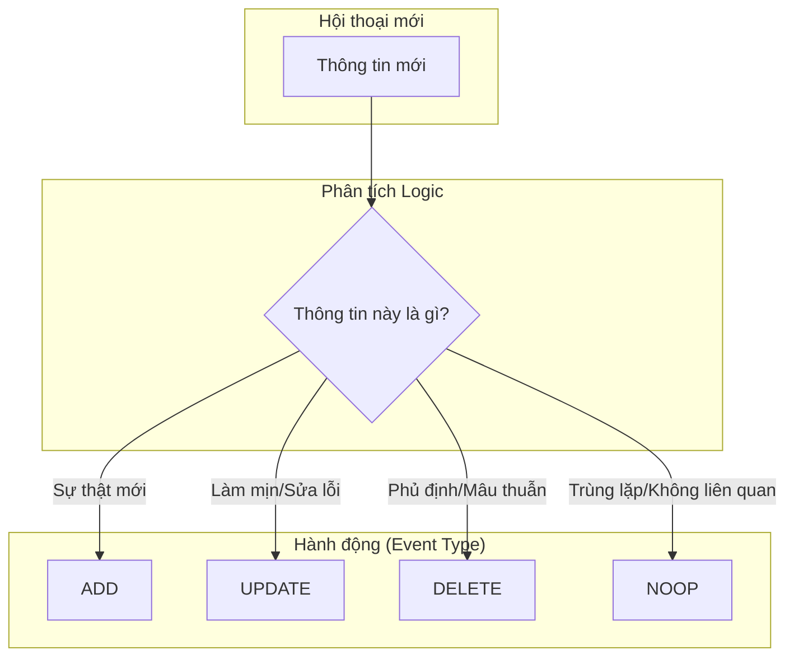
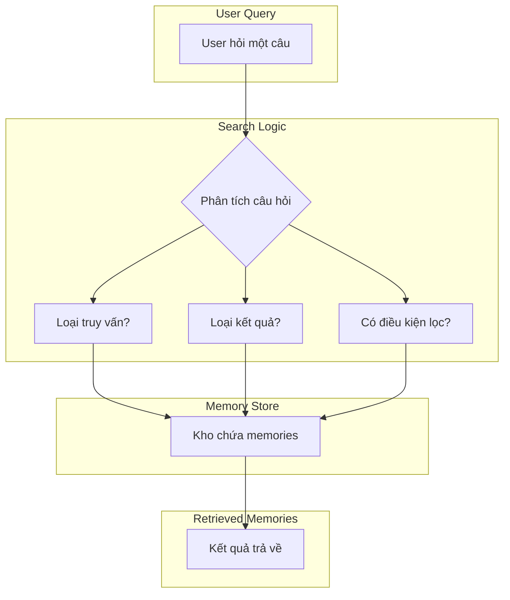
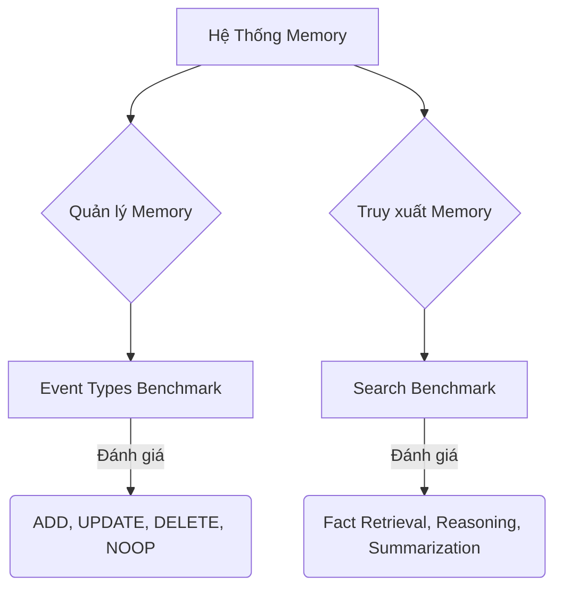
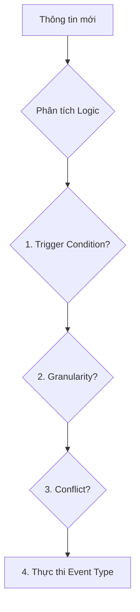
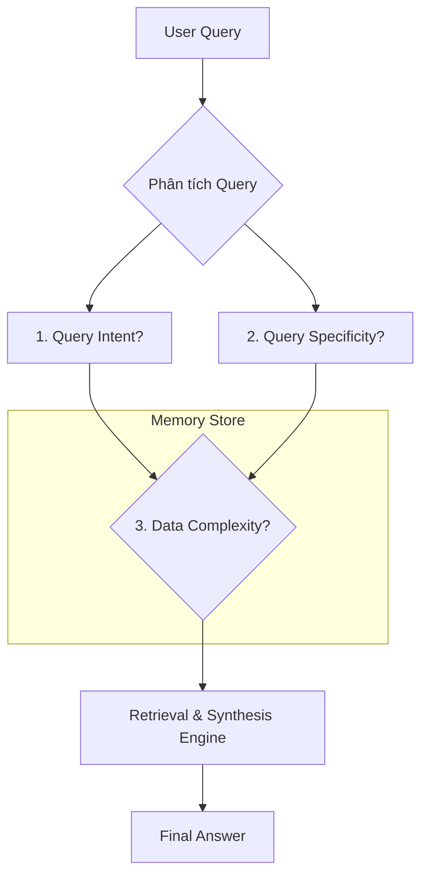
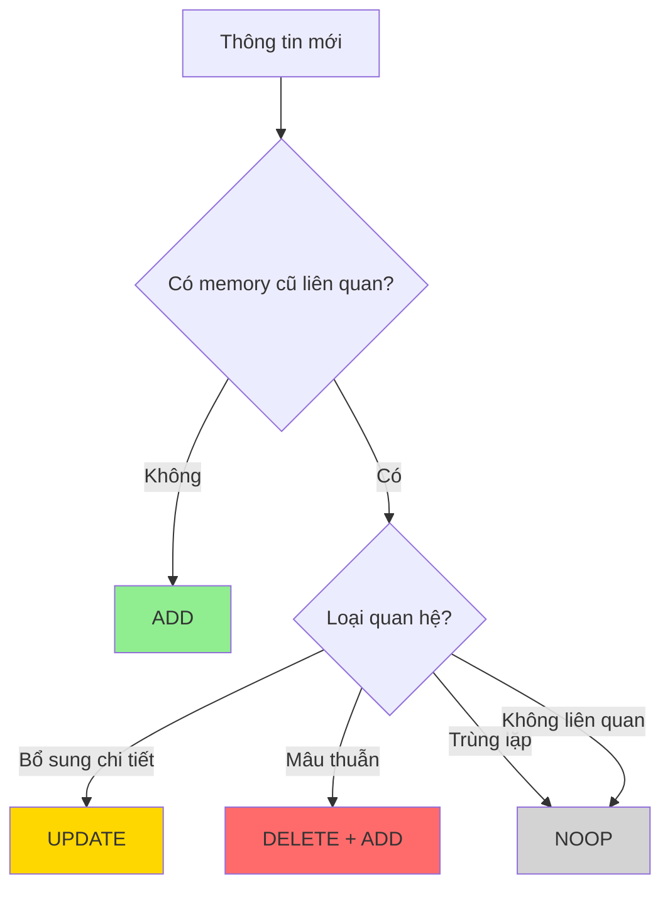
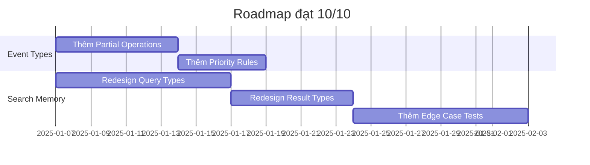

## Cách Build Bộ Benchmark MECE cho Các Event Types (ADD, UPDATE, DELETE, NOOP)

Để xây dựng một bộ benchmark MECE (Mutually Exclusive, Collectively Exhaustive) toàn diện cho các **Event Types** của hệ thống memory (lấy cảm hứng từ Mem0), tôi sẽ cấu trúc bộ test xoay quanh **hành động mà hệ thống memory cần thực hiện**.

Đây là cách tiếp cận khác với việc chỉ tập trung vào "UPDATE". Thay vào đó, chúng ta sẽ đánh giá khả năng của hệ thống trong việc **phân loại và thực thi đúng hành động** cho mỗi mẩu thông tin mới.

### Bước 1: Xây dựng Khung MECE

Khung MECE này sẽ có 2 chiều chính:

**1. Chiều dọc: Loại Sự kiện (Event Type) - Hành động cần thực thi**
Đây là các hành động cốt lõi, không trùng lặp, mà hệ thống memory phải quyết định:

- **`ADD`**: Thêm một memory hoàn toàn mới, không liên quan đến các memory đã có.
- **`UPDATE`**: Cập nhật, làm rõ, hoặc bổ sung thông tin cho một memory **đã tồn tại**.
- **`DELETE`**: Xóa bỏ một memory **đã tồn tại** vì nó đã bị phủ định hoặc không còn đúng nữa.
- **`NOOP` (No Operation)**: Không làm gì cả, vì thông tin mới không quan trọng, không liên quan, hoặc đã bị trùng lặp.

**2. Chiều ngang: Điều kiện Kích hoạt (Trigger Condition) - Lý do thực thi hành động**
Đây là các tình huống trong hội thoại, mỗi tình huống sẽ tương ứng với một (và chỉ một) Event Type ở trên:

- **`New Fact` (Sự thật mới)**: Một thông tin hoàn toàn mới được đưa ra. -> **Dự kiến trigger `ADD`**.
- **`Refinement` (Làm mịn)**: Thêm chi tiết, làm rõ một memory đã có. -> **Dự kiến trigger `UPDATE`**.
- **`Correction` (Sửa lỗi)**: Sửa lại một thông tin sai đã được ghi nhớ. -> **Dự kiến trigger `UPDATE`**.
- **`Contradiction` (Mâu thuẫn)**: Đưa ra thông tin trái ngược hoàn toàn với memory cũ. -> **Dự kiến trigger `DELETE` memory cũ và `ADD` memory mới**.
- **`Evolution` (Tiến hóa)**: Một thông tin thay đổi theo thời gian (ví dụ: tuổi, sở thích). -> **Dự kiến trigger `UPDATE`**.
- **`Negation` (Phủ định)**: Phủ định trực tiếp một memory. -> **Dự kiến trigger `DELETE`**.
- **`Redundancy` (Trùng lặp)**: Lặp lại một thông tin đã biết. -> **Dự kiến trigger `NOOP`**.
- **`Irrelevance` (Không liên quan)**: Thông tin ngoài lề, không đáng ghi nhớ (ví dụ: "hôm nay trời đẹp"). -> **Dự kiến trigger `NOOP`**.

### Bước 2: Tạo Test Cases Chi Tiết

Với mỗi **Điều kiện Kích hoạt**, tôi sẽ tạo một test case cụ thể để kiểm tra xem hệ thống có trigger đúng **Event Type** hay không.

**Ví dụ:**

- **Test Case cho `Refinement` -> `UPDATE`**:

  - **Input**: `Memory cũ: "User là AI Engineer"` -> `User nói: "Tôi chuyên về LLM và RAG"`.
  - **Expected Output**: Hệ thống trigger event **`UPDATE`**. Memory cũ được cập nhật thành `"User là AI Engineer, chuyên về LLM và RAG"`.
  - **Pass Criteria**: Event type là `UPDATE` và nội dung memory được cập nhật chính xác.
- **Test Case cho `Contradiction` -> `DELETE` + `ADD`**:

  - **Input**: `Memory cũ: "User thích màu xanh"` -> `User nói: "Tôi ghét màu xanh, tôi thích màu đỏ"`.
  - **Expected Output**: Hệ thống trigger event **`DELETE`** cho memory "User thích màu xanh" và event **`ADD`** cho memory "User thích màu đỏ".
  - **Pass Criteria**: Memory cũ bị xóa và memory mới được thêm vào.

Bằng cách này, bộ test sẽ bao quát toàn bộ các tình huống logic mà hệ thống memory cần xử lý, đảm bảo đánh giá được khả năng "ra quyết định" của nó một cách toàn diện.


---


### Bộ Benchmark MECE cho Các Event Types (ADD, UPDATE, DELETE, NOOP)

## I. Khung MECE và Sơ đồ Logic

Bộ benchmark này được xây dựng dựa trên một nguyên tắc cốt lõi: Mỗi **tình huống (Trigger Condition)** trong hội thoại sẽ chỉ kích hoạt một **hành động (Event Type)** duy nhất. Sơ đồ dưới đây minh họa logic này:



### II. Bảng Ánh xạ MECE: Trigger Condition -> Expected Event

| ID           | Trigger Condition                         | Mô tả                                                         | Expected Event                    |
| :----------- | :---------------------------------------- | :-------------------------------------------------------------- | :-------------------------------- |
| **C1** | **New Fact** (Sự thật mới)       | Một thông tin hoàn toàn mới, không có trong bộ nhớ.    | `ADD`                           |
| **C2** | **Refinement** (Làm mịn)          | Bổ sung chi tiết cho một memory đã có.                    | `UPDATE`                        |
| **C3** | **Correction** (Sửa lỗi)          | Sửa lại một thông tin sai trong memory.                     | `UPDATE`                        |
| **C4** | **Evolution** (Tiến hóa)          | Một thông tin thay đổi theo thời gian (tuổi, sở thích). | `UPDATE`                        |
| **C5** | **Contradiction** (Mâu thuẫn)     | Thông tin mới mâu thuẫn hoàn toàn với memory cũ.        | `DELETE` (cũ) + `ADD` (mới) |
| **C6** | **Negation** (Phủ định)          | Phủ định trực tiếp một memory đã có.                   | `DELETE`                        |
| **C7** | **Redundancy** (Trùng lặp)        | Lặp lại chính xác một thông tin đã có.                 | `NOOP`                          |
| **C8** | **Irrelevance** (Không liên quan) | Thông tin ngoài lề, không đáng ghi nhớ.                  | `NOOP`                          |

---

## III. Test Cases Chi Tiết

### **Category 1: `ADD` Event**

#### **Test Case C1.1: New Fact (Sự thật mới)**

- **ID**: `ET-ADD-01`
- **Mô tả**: Kiểm tra khả năng thêm một memory mới khi có thông tin mới.
- **Input**:
  - `Initial Memory`: `[]` (trống)
  - `Conversation`: `User: "Tôi là Cường, một AI Engineer."`
- **Expected Output**:
  - `Event`: `ADD`
  - `New Memory`: `{"content": "Tên là Cường", ...}`
  - `New Memory`: `{"content": "Là một AI Engineer", ...}`
- **Success Criteria**: Hệ thống trả về 2 event `ADD` và tạo ra 2 memory mới chính xác.

---

### **Category 2: `UPDATE` Event**

#### **Test Case C2.1: Refinement (Làm mịn)**

- **ID**: `ET-UPD-01`
- **Mô tả**: Kiểm tra khả năng cập nhật (làm mịn) một memory đã có.
- **Input**:
  - `Initial Memory`: `[{"id": "mem_1", "content": "User là AI Engineer"}]`
  - `Conversation`: `User: "Tôi chuyên về LLM và hệ thống RAG."`
- **Expected Output**:
  - `Event`: `UPDATE`
  - `Target Memory ID`: `mem_1`
  - `Updated Memory`: `{"id": "mem_1", "content": "User là AI Engineer, chuyên về LLM và RAG"}`
- **Success Criteria**: Hệ thống trả về event `UPDATE` và nội dung memory được cập nhật chính xác.

#### **Test Case C3.1: Correction (Sửa lỗi)**

- **ID**: `ET-UPD-02`
- **Mô tả**: Kiểm tra khả năng cập nhật (sửa lỗi) một memory đã có.
- **Input**:
  - `Initial Memory`: `[{"id": "mem_2", "content": "User thích màu xanh lá"}]`
  - `Conversation`: `User: "Nhầm rồi, tôi thích màu xanh dương."`
- **Expected Output**:
  - `Event`: `UPDATE`
  - `Target Memory ID`: `mem_2`
  - `Updated Memory`: `{"id": "mem_2", "content": "User thích màu xanh dương"}`
- **Success Criteria**: Hệ thống trả về event `UPDATE` và nội dung memory được sửa lỗi chính xác.

#### **Test Case C4.1: Evolution (Tiến hóa)**

- **ID**: `ET-UPD-03`
- **Mô tả**: Kiểm tra khả năng cập nhật một memory đã thay đổi theo thời gian.
- **Input**:
  - `Initial Memory`: `[{"id": "mem_3", "content": "User 25 tuổi", "timestamp": "2024-01-01"}]`
  - `Conversation (2025-01-01)`: `User: "Hôm nay là sinh nhật tôi."`
- **Expected Output**:
  - `Event`: `UPDATE`
  - `Target Memory ID`: `mem_3`
  - `Updated Memory`: `{"id": "mem_3", "content": "User 26 tuổi", "timestamp": "2025-01-01"}`
- **Success Criteria**: Hệ thống tự động suy luận và cập nhật tuổi của user.

---

### **Category 3: `DELETE` Event**

#### **Test Case C5.1: Contradiction (Mâu thuẫn)**

- **ID**: `ET-DEL-01`
- **Mô tả**: Kiểm tra khả năng xóa memory cũ khi có thông tin mâu thuẫn.
- **Input**:
  - `Initial Memory`: `[{"id": "mem_4", "content": "User thích chó"}]`
  - `Conversation`: `User: "Tôi không thích chó, tôi chỉ thích mèo thôi."`
- **Expected Output**:
  - `Event 1`: `DELETE`, `Target Memory ID`: `mem_4`
  - `Event 2`: `ADD`, `New Memory`: `{"content": "User thích mèo"}`
- **Success Criteria**: Hệ thống trả về event `DELETE` cho memory cũ và `ADD` cho memory mới.

#### **Test Case C6.1: Negation (Phủ định)**

- **ID**: `ET-DEL-02`
- **Mô tả**: Kiểm tra khả năng xóa memory khi bị phủ định trực tiếp.
- **Input**:
  - `Initial Memory`: `[{"id": "mem_5", "content": "User sống ở Hà Nội"}]`
  - `Conversation`: `User: "Tôi không còn sống ở Hà Nội nữa."`
- **Expected Output**:
  - `Event`: `DELETE`
  - `Target Memory ID`: `mem_5`
- **Success Criteria**: Hệ thống trả về event `DELETE` và xóa memory tương ứng.

---

### **Category 4: `NOOP` Event**

#### **Test Case C7.1: Redundancy (Trùng lặp)**

- **ID**: `ET-NOOP-01`
- **Mô tả**: Kiểm tra khả năng bỏ qua thông tin trùng lặp.
- **Input**:
  - `Initial Memory`: `[{"id": "mem_6", "content": "User là AI Engineer"}]`
  - `Conversation`: `User: "Tôi là một kỹ sư AI."`
- **Expected Output**:
  - `Event`: `NOOP`
  - `Reason`: `Redundant information`
- **Success Criteria**: Hệ thống trả về event `NOOP` và không tạo/cập nhật memory nào.

#### **Test Case C8.1: Irrelevance (Không liên quan)**

- **ID**: `ET-NOOP-02`
- **Mô tả**: Kiểm tra khả năng bỏ qua thông tin không liên quan.
- **Input**:
  - `Initial Memory`: `[]`
  - `Conversation`: `User: "Hôm nay thời tiết đẹp thật."`
- **Expected Output**:
  - `Event`: `NOOP`
  - `Reason`: `Irrelevant information`
- **Success Criteria**: Hệ thống trả về event `NOOP` và không tạo memory mới memory nào được tạo.

---


## Bộ Benchmark MECE cho SEARCH Memory

## I. Khung MECE và Sơ đồ Logic

Bộ benchmark này đánh giá khả năng của hệ thống trong việc **tìm kiếm, truy xuất, và tổng hợp** memories một cách chính xác và phù hợp với ngữ cảnh. Khung MECE được xây dựng dựa trên 3 chiều (dimensions) không trùng lặp:

1. **Loại Truy vấn (Query Type)**: User hỏi theo cách nào?
2. **Loại Kết quả Mong muốn (Expected Result Type)**: Hệ thống cần trả về cái gì?
3. **Điều kiện Lọc (Filtering Conditions)**: Tìm kiếm có bị giới hạn bởi điều kiện nào không?

Sơ đồ logic:



### II. Bảng Ánh xạ MECE: Query x Result x Filter

|                            | **Specific Fact**     | **List of Facts**    | **Summarized Info**  | **Inference**       |
| :------------------------- | :-------------------------- | :------------------------- | :------------------------- | :------------------------ |
| **Direct Query**     | Lấy 1 sự thật            | Lấy danh sách            | Tóm tắt theo chủ đề   | Suy luận đơn giản     |
| **Indirect Query**   | Suy luận 1 sự thật       | Suy luận danh sách       | Tóm tắt theo mục đích | Suy luận phức tạp      |
| **Contextual Query** | Lấy 1 sự thật liên quan | Lấy danh sách liên quan | Tóm tắt theo ngữ cảnh  | Suy luận theo ngữ cảnh |
| **Vague Query**      | Lấy 1 sự thật nổi bật  | Lấy danh sách nổi bật  | Tóm tắt toàn bộ        | Suy luận mở             |

*Mỗi ô trong bảng trên sẽ được kết hợp với các **Điều kiện Lọc** (Time-based, Category-based, Confidence-based, Recency-based, No Filter) để tạo ra các test case đầy đủ.*

---

## III. Test Cases Chi Tiết

### **Category 1: Direct Queries**

#### **Test Case SM-D1: Direct + Specific Fact + No Filter**

- **ID**: `SM-D1-SF-NF`
- **Mô tả**: User hỏi trực tiếp về một thông tin cụ thể.
- **Input**:
  - `Memories`: `[{"content": "User thích màu xanh dương"}]`
  - `Query`: `"Tôi thích màu gì?"`
- **Expected Output**: `"Bạn thích màu xanh dương"`
- **Success Criteria**: Trả về đúng thông tin, độ chính xác 100%.

#### **Test Case SM-D2: Direct + List of Facts + Category-based**

- **ID**: `SM-D2-LF-CB`
- **Mô tả**: User hỏi trực tiếp về một danh sách thông tin theo danh mục.
- **Input**:
  - `Memories`: `[{"content": "Thích Python", "category": "programming"}, {"content": "Thích JavaScript", "category": "programming"}, {"content": "Thích đọc sách", "category": "hobby"}]`
  - `Query`: `"Tôi thích những ngôn ngữ lập trình nào?"`
- **Expected Output**: `"Bạn thích Python và JavaScript."`
- **Success Criteria**: Trả về đúng và đủ các memory thuộc category "programming".

---

### **Category 2: Indirect Queries**

#### **Test Case SM-I1: Indirect + List of Facts + Category-based**

- **ID**: `SM-I1-LF-CB`
- **Mô tả**: User hỏi gián tiếp, cần suy luận và tổng hợp từ nhiều memories.
- **Input**:
  - `Memories`: `[{"content": "Thích đọc sách khoa học", "category": "hobby"}, {"content": "Thích xem phim viễn tưởng", "category": "hobby"}]`
  - `Query`: `"Cuối tuần này tôi nên làm gì để giải trí?"`
- **Expected Output**: `"Dựa trên sở thích của bạn, bạn có thể đọc sách khoa học hoặc xem phim viễn tưởng."`
- **Success Criteria**: Hệ thống suy luận đúng mục đích "giải trí" và truy xuất các memory từ category "hobby".

#### **Test Case SM-I2: Indirect + Inference + Time-based**

- **ID**: `SM-I2-IN-TB`
- **Mô tả**: User hỏi gián tiếp, cần suy luận phức tạp hơn dựa trên thời gian.
- **Input**:
  - `Memories`: `[{"content": "Đã mua vé xem phim 'Dune' vào tuần trước"}, {"content": "Thích phim viễn tưởng"}]`
  - `Query`: `"Tôi đã xem bộ phim nào gần đây chưa?"`
- **Expected Output**: `"Gần đây bạn đã mua vé xem phim 'Dune'. Đây là một bộ phim viễn tưởng mà bạn thích."`
- **Success Criteria**: Hệ thống kết hợp được memory về hành động ("mua vé") và sở thích để đưa ra câu trả lời suy luận.

---

### **Category 3: Contextual Queries**

#### **Test Case SM-C1: Contextual + Specific Fact + Recency-based**

- **ID**: `SM-C1-SF-RB`
- **Mô tả**: User hỏi theo ngữ cảnh, cần lấy thông tin gần nhất.
- **Input**:
  - `Memories`: `[{"content": "User đang học Python"}, {"content": "User vừa hỏi về thư viện Pandas"}]`
  - `Conversation Context`: `User vừa hỏi: "Làm sao để đọc file CSV?"`
  - `Query`: `"Thư viện nào làm được việc đó?"`
- **Expected Output**: `"Bạn có thể dùng thư viện Pandas để đọc file CSV."`
- **Success Criteria**: Hệ thống sử dụng ngữ cảnh gần nhất ("hỏi về Pandas") để trả lời câu hỏi.

---

### **Category 4: Vague Queries**

#### **Test Case SM-V1: Vague + Summarized Info + Confidence-based**

- **ID**: `SM-V1-SI-CFB`
- **Mô tả**: User hỏi một câu mơ hồ, hệ thống cần tóm tắt các thông tin quan trọng nhất.
- **Input**:
  - `Memories`: `[{"content": "Tên là Cường", "confidence": 1.0}, {"content": "Làm AI Engineer", "confidence": 1.0}, {"content": "Thích LLM", "confidence": 0.9}, {"content": "Thích màu xanh", "confidence": 0.8}, {"content": "Từng hỏi về giá cổ phiếu", "confidence": 0.5}]`
  - `Query`: `"Nhắc lại về tôi xem nào."`
- **Expected Output**: `"Bạn tên là Cường, một AI Engineer chuyên về LLM và bạn thích màu xanh."`
- **Success Criteria**: Hệ thống tóm tắt các memory có confidence cao (> 0.7) và bỏ qua các memory có confidence thấp.

---

### **Category 5: Filtering Conditions**

#### **Test Case SM-F1: Time-based Filtering**

- **ID**: `SM-F1-TB`
- **Mô tả**: Kiểm tra khả năng lọc memory theo thời gian.
- **Input**:
  - `Memories`: `[{"content": "Thứ 2 ăn phở", "timestamp": "2025-12-22"}, {"content": "Thứ 6 ăn bún", "timestamp": "2025-12-26"}, {"content": "Tháng 11 ăn cơm rang", "timestamp": "2025-11-15"}]`
  - `Query`: `"Trong tuần này tôi đã ăn gì?"` (Giả sử hôm nay là 27/12/2025)
- **Expected Output**: `"Trong tuần này bạn đã ăn phở và bún."`
- **Success Criteria**: Hệ thống lọc và trả về đúng các memory trong khoảng thời gian "tuần này".

# 📊 Đánh Giá Độ MECE của 2 Bộ Benchmark

Sau khi phân tích chi tiết 3 file tài liệu, tôi xin đưa ra đánh giá toàn diện về độ MECE của 2 bộ test này:

---

## 🎯 Tóm Tắt Kết Luận

| Bộ Test                          | Độ MECE (ME)      | Độ MECE (CE)     | Điểm Tổng Thể    | Nhận Xét Chung                                |
| --------------------------------- | ------------------- | ------------------ | -------------------- | ----------------------------------------------- |
| **Event Types Benchmark**   | ⭐⭐⭐⭐⭐ (9.5/10) | ⭐⭐⭐⭐⭐ (10/10) | **Xuất sắc** | Khung logic chặt chẽ, phân loại rõ ràng   |
| **Search Memory Benchmark** | ⭐⭐⭐ (6.5/10)     | ⭐⭐⭐⭐ (8/10)    | **Khá tốt**  | Có overlap, thiếu một số trường hợp edge |

---

## 📋 I. Đánh Giá Bộ “Event Types Benchmark”

### ✅ Điểm Mạnh (Mutually Exclusive - ME)

**1. Phân loại Event Types rất rõ ràng và không trùng lặp:**

```
ADD ───> Thông tin hoàn toàn mới
UPDATE ─> Làm mịn/Sửa lỗi/Tiến hóa thông tin CŨ
DELETE ─> Phủ định/Mâu thuẫn với thông tin CŨ  
NOOP ───> Trùng lặp/Không liên quan
```

* **Không có overlap** : Mỗi trigger condition chỉ ánh xạ đến **DUY NHẤT** 1 event type
* **Logic rõ ràng** : Dựa trên mối quan hệ với memory đã tồn tại
* Có memory cũ liên quan? → UPDATE hoặc DELETE
* Không có memory cũ? → ADD hoặc NOOP

**2. Bảng Ánh Xạ MECE trong Section II rất chặt chẽ:**

| Trigger Condition | Event Type   | Lý Do Không Overlap                           |
| ----------------- | ------------ | ----------------------------------------------- |
| New Fact          | ADD          | Hoàn toàn mới, không liên quan memory cũ  |
| Refinement        | UPDATE       | Bổ sung chi tiết cho memory ĐÃ CÓ          |
| Correction        | UPDATE       | Sửa lỗi memory ĐÃ CÓ                       |
| Evolution         | UPDATE       | Thay đổi theo thời gian memory ĐÃ CÓ      |
| Contradiction     | DELETE + ADD | Mâu thuẫn HOÀN TOÀN → xóa cũ + tạo mới |
| Negation          | DELETE       | Phủ định TRỰC TIẾP                         |
| Redundancy        | NOOP         | Trùng lặp 100%                                |
| Irrelevance       | NOOP         | Không đáng ghi nhớ                          |

**→ Điểm ME: 9.5/10** (chỉ trừ điểm nhỏ vì thiếu test case cho edge case “Partial Contradiction”)

### ✅ Điểm Mạnh (Collectively Exhaustive - CE)

**Đã bao phủ toàn bộ các tình huống logic:**

1. ✓ Thông tin mới (New Fact)
2. ✓ Làm rõ thông tin cũ (Refinement)
3. ✓ Sửa lỗi (Correction)
4. ✓ Thay đổi theo thời gian (Evolution)
5. ✓ Mâu thuẫn (Contradiction)
6. ✓ Phủ định (Negation)
7. ✓ Trùng lặp (Redundancy)
8. ✓ Không liên quan (Irrelevance)

**→ Điểm CE: 10/10** (Bao phủ đầy đủ)

### ⚠️ Một Vài Điểm Cần Cải Thiện

**1. Thiếu test case cho “Partial Contradiction”:**

* **Ví dụ** : Memory cũ: “User thích chó và mèo” → User: “Tôi không thích chó”
* **Expected** : DELETE “thích chó” nhưng GIỮ LẠI “thích mèo” → Cần có logic **Partial UPDATE** thay vì DELETE toàn bộ

**2. Không rõ ràng về độ ưu tiên khi có nhiều event cùng lúc:**

* **Ví dụ** : User: “Tôi không còn thích Python nữa, giờ tôi chuyên về Rust”
* Đây là NEGATION (Python) + NEW FACT (Rust)?
* Hay là CONTRADICTION → DELETE + ADD?

 **Gợi ý** : Thêm test case về **Priority Rules** khi có nhiều event types được trigger đồng thời.

---

## 📋 II. Đánh Giá Bộ “Search Memory Benchmark”

### ⚠️ Vấn Đề về Mutually Exclusive (ME)

**1. Overlap giữa các Query Types:**

```
❌ Direct Query vs Contextual Query có thể overlap:
   - "Tôi thích màu gì?" → Direct Query
   - "Màu gì phù hợp với tôi?" → Contextual Query?
   → Cả 2 đều có thể trả về memory "thích màu xanh"
```

**2. Result Types không độc lập:**

| Result Type     | Mô tả                | Vấn đề Overlap                        |
| --------------- | ---------------------- | ---------------------------------------- |
| Specific Fact   | Trả về 1 sự thật   | ✓ Rõ ràng                             |
| List of Facts   | Trả về danh sách    | ✓ Rõ ràng                             |
| Summarized Info | Tóm tắt nhiều facts | ❌ Có thể overlap với List            |
| Inference       | Suy luận từ facts    | ❌ Có thể overlap với Summarized Info |

**Ví dụ Overlap:**

```
Query: "Những sở thích của tôi là gì?"

→ List of Facts: "Thích Python, JavaScript, đọc sách"
→ Summarized Info: "Bạn thích lập trình và đọc sách"

→ Ranh giới không rõ ràng!
```

**→ Điểm ME: 6.5/10** (Có nhiều trường hợp overlap)

### ✅ Điểm Mạnh về Collectively Exhaustive (CE)

**Đã bao phủ khá đầy đủ các loại truy vấn:**

1. ✓ Direct (hỏi trực tiếp)
2. ✓ Indirect (hỏi gián tiếp)
3. ✓ Contextual (theo ngữ cảnh)
4. ✓ Vague (mơ hồ)

**Đã có các điều kiện lọc đa dạng:**

* Time-based
* Category-based
* Confidence-based
* Recency-based
* No Filter

**→ Điểm CE: 8/10** (Khá đầy đủ, nhưng thiếu một số edge cases)

### ⚠️ Những Gì Còn Thiếu

**1. Thiếu test case cho Multi-hop Reasoning:**

```
Query: "Tôi nên mua quà gì cho bạn gái?"
→ Cần search: 
   - Sở thích của bạn gái
   - Ngân sách của user
   - Dịp đặc biệt gần đây
→ Kết hợp nhiều memories để suy luận
```

**2. Thiếu test case cho Conflicting Memories:**

```
Memory 1: "User thích Python" (confidence: 0.9, timestamp: 2024-01-01)
Memory 2: "User ghét Python" (confidence: 0.8, timestamp: 2024-12-01)

Query: "Tôi có thích Python không?"
→ Hệ thống nên ưu tiên memory nào?
```

**3. Thiếu test case cho Empty Results:**

```
Query: "Tôi có từng học tiếng Nhật không?"
Memory: [] (không có thông tin)

→ Expected: "Tôi không có thông tin về việc bạn học tiếng Nhật."
```

---

## 🎯 III. So Sánh Trực Tiếp

| Tiêu Chí                        | Event Types      | Search Memory | Giải Thích                                                          |
| --------------------------------- | ---------------- | ------------- | --------------------------------------------------------------------- |
| **Mutually Exclusive**      | ⭐⭐⭐⭐⭐ (9.5) | ⭐⭐⭐ (6.5)  | Event Types có phân loại rất rõ ràng, Search có nhiều overlap |
| **Collectively Exhaustive** | ⭐⭐⭐⭐⭐ (10)  | ⭐⭐⭐⭐ (8)  | Event Types bao phủ đầy đủ, Search thiếu một số edge cases    |
| **Rõ ràng về Logic**     | ⭐⭐⭐⭐⭐       | ⭐⭐⭐        | Event Types có flowchart và ánh xạ 1-1 rõ ràng                  |
| **Dễ mở rộng**           | ⭐⭐⭐⭐         | ⭐⭐⭐⭐⭐    | Search dễ thêm Query Type mới hơn                                 |
| **Dễ implement**           | ⭐⭐⭐⭐         | ⭐⭐⭐        | Event Types có logic rõ ràng hơn                                  |

---

## 💡 IV. Khuyến Nghị Cải Thiện

### 🔧 Cho Bộ “Event Types Benchmark”

**1. Thêm test case cho “Partial Operations”:**

```yaml
Test Case: ET-UPD-04 (Partial Update)
Input:
  - Memory: "User thích Python, Java, và C++"
  - Conversation: "Tôi không còn dùng Java nữa"
Expected:
  - Event: UPDATE (not DELETE)
  - Updated Memory: "User thích Python và C++"
```

**2. Thêm test case cho “Priority Resolution”:**

```yaml
Test Case: ET-PRIORITY-01
Input:
  - Memory: "User thích Python"
  - Conversation: "Tôi ghét Python, giờ chuyên về Rust"
Expected:
  - Event 1: DELETE (Python)
  - Event 2: ADD (Rust)
  - Priority: NEGATION > NEW FACT
```

### 🔧 Cho Bộ “Search Memory Benchmark”

**1. Tách rõ ràng Result Types để tránh overlap:**

```yaml
Redesign Result Types:
1. Single Entity Retrieval → Trả về 1 entity cụ thể
2. Multiple Entity Retrieval → Trả về danh sách entities
3. Aggregated Answer → Tóm tắt/tính toán từ nhiều entities
4. Inferred Answer → Suy luận logic từ facts (có reasoning steps)
```

**2. Thêm test cases cho edge cases:**

```yaml
Test Case: SM-EDGE-01 (Conflicting Memories)
Test Case: SM-EDGE-02 (Empty Results)
Test Case: SM-EDGE-03 (Multi-hop Reasoning)
Test Case: SM-EDGE-04 (Ambiguous Query Resolution)
```

**3. Thêm dimension “Confidence Level”:**

```yaml
Query Types x Result Types x Filtering x Confidence Level
→ Tạo thêm test cases cho:
   - High confidence memories
   - Low confidence memories  
   - Mixed confidence scenarios
```

---

## 🏆 V. Kết Luận Cuối Cùng

### Bộ “Event Types Benchmark”: **⭐⭐⭐⭐⭐ (Xuất sắc - 9.75/10)**

**Ưu điểm:**

* ✅ Logic phân loại rất chặt chẽ
* ✅ Không có overlap giữa các Event Types
* ✅ Bao phủ đầy đủ các tình huống
* ✅ Dễ hiểu, dễ implement

**Điểm cần cải thiện:**

* ⚠️ Thêm test cases cho partial operations
* ⚠️ Làm rõ priority rules khi có nhiều events

### Bộ “Search Memory Benchmark”: **⭐⭐⭐⭐ (Khá tốt - 7.25/10)**

**Ưu điểm:**

* ✅ Bao phủ nhiều loại truy vấn
* ✅ Có nhiều điều kiện lọc đa dạng
* ✅ Dễ mở rộng

**Điểm cần cải thiện:**

* ❌ Có overlap giữa Query Types và Result Types
* ❌ Thiếu test cases cho edge cases
* ⚠️ Cần tách rõ ràng hơn giữa “Summarized Info” và “Inference”

---

**Tổng Kết:** Bộ **Event Types Benchmark** có độ MECE tốt hơn đáng kể so với  **Search Memory Benchmark** . Nếu phải chọn 1 bộ để implement trước, tôi khuyến nghị bắt đầu với **Event Types** vì nền tảng logic của nó rất vững chắc. 🎯


---


'''

# Hướng Dẫn Xây Dựng Bộ Benchmark MECE 10/10 cho Hệ Thống Memory

**Tác giả**: Manus AI
**Phiên bản**: 2.0 (10/10 Edition)
**Đối tượng**: AI Engineers, QA/QC Specialists, Technical Product Managers

---

## Chương 1: Giới Thiệu - Tại Sao Cần Benchmark MECE?

Trong quá trình phát triển các hệ thống AI có khả năng ghi nhớ (memory systems), một trong những thách thức lớn nhất không phải là việc xây dựng, mà là việc **đo lường và đánh giá** hiệu quả của chúng. Làm thế nào để bạn biết hệ thống của mình đang hoạt động đúng? Làm thế nào để bạn chắc chắn rằng nó không "sáng tạo" ra những ký ức không có thật, hoặc tệ hơn, quên đi những thông tin quan trọng?

Câu trả lời nằm ở việc xây dựng một bộ kiểm thử (benchmark) toàn diện. Tuy nhiên, một bộ benchmark chỉ thực sự mạnh mẽ khi nó tuân thủ nguyên tắc **MECE (Mutually Exclusive, Collectively Exhaustive)** - tức là các trường hợp kiểm thử phải **độc lập, không trùng lặp** với nhau và **bao quát toàn bộ** các tình huống có thể xảy ra.

Một bộ benchmark MECE 10/10 sẽ giúp bạn:

- **Xác định chính xác điểm yếu**: Thay vì nhận được một điểm số chung chung, bạn sẽ biết chính xác hệ thống của mình yếu ở khâu nào: Phân loại hành động? Suy luận logic? Hay xử lý các trường hợp mâu thuẫn?
- **Tự tin khi ra quyết định**: Dữ liệu từ benchmark sẽ là kim chỉ nam giúp bạn quyết định nên tập trung cải thiện mô hình nào, tối ưu thuật toán nào, hay thay đổi kiến trúc hệ thống ra sao.
- **Ngăn chặn lỗi hồi quy (Regression)**: Khi bạn cập nhật hệ thống, bộ benchmark sẽ là hàng rào bảo vệ, đảm bảo rằng những gì đã hoạt động tốt sẽ không bị hỏng.

### Hai Trụ Cột Của Hệ Thống Memory

Một hệ thống memory hoàn chỉnh có hai chức năng cốt lõi, và do đó, chúng ta cần hai bộ benchmark riêng biệt để đánh giá chúng:

1. **Quản lý Memory (Memory Management)**: Khả năng hệ thống tự động **thêm, sửa, xóa** các ký ức để duy trì một cơ sở kiến thức nhất quán. Chúng ta sẽ gọi đây là **Bộ Benchmark "Event Types"**.
2. **Truy xuất Memory (Memory Retrieval)**: Khả năng hệ thống **tìm kiếm, tổng hợp, và suy luận** từ các ký ức đã lưu để trả lời câu hỏi của người dùng. Chúng ta sẽ gọi đây là **Bộ Benchmark "Search"**.

Trong tài liệu này, tôi sẽ hướng dẫn bạn từng bước để xây dựng cả hai bộ benchmark này từ con số không, với mục tiêu đạt đến mức độ chi tiết và toàn diện 10/10.



*Sơ đồ #1: Hai trụ cột của việc đánh giá hệ thống memory.*

---

'''

## Chương 2: Xây Dựng Bộ Benchmark "Event Types" 10/10

**Mục tiêu**: Đánh giá khả năng của hệ thống trong việc **phân loại và thực thi đúng hành động** (`ADD`, `UPDATE`, `DELETE`, `NOOP`) cho mỗi mẩu thông tin mới, kể cả các trường hợp phức tạp.

### 2.1. Nền tảng: Khung MECE 4 Chiều

Để đạt điểm 10/10, chúng ta cần một khung MECE đủ mạnh để phân tách mọi tình huống có thể xảy ra. Khung này bao gồm 4 chiều (dimensions) độc lập:

1. **`Event Type` (Hành động)**: Hành động cuối cùng mà hệ thống phải thực thi. Đây là thứ chúng ta muốn kiểm tra.

   - `ADD`: Thêm mới.
   - `UPDATE`: Cập nhật.
   - `DELETE`: Xóa bỏ.
   - `NOOP`: Không làm gì.
2. **`Trigger Condition` (Tình huống Kích hoạt)**: Bản chất của thông tin mới so với các memory đã có. Đây là chiều quan trọng nhất để đảm bảo tính MECE.

   - `New Fact`: Sự thật hoàn toàn mới.
   - `Refinement`: Làm rõ, bổ sung chi tiết.
   - `Correction`: Sửa lỗi thông tin cũ.
   - `Evolution`: Thông tin thay đổi theo thời gian.
   - `Contradiction`: Mâu thuẫn hoàn toàn.
   - `Negation`: Phủ định trực tiếp.
   - `Redundancy`: Trùng lặp.
   - `Irrelevance`: Không liên quan.
3. **`Operation Granularity` (Độ chi tiết của Thao tác)**: Hành động ảnh hưởng đến toàn bộ hay chỉ một phần của memory?

   - `Full`: Áp dụng cho toàn bộ memory (ví dụ: xóa cả memory).
   - `Partial`: Chỉ áp dụng cho một phần của memory (ví dụ: xóa một phần thông tin trong memory).
4. **`Conflict Resolution` (Quy tắc Ưu tiên)**: Cần làm gì khi một câu nói có thể trigger nhiều hành động cùng lúc?

   - `Priority Rules`: Các quy tắc xác định hành động nào được ưu tiên thực hiện trước.

Sơ đồ logic của quá trình ra quyết định:



*Sơ đồ #2: Quy trình 4 bước để quyết định một Event Type.*

### 2.2. Bảng Ánh xạ MECE và Test Cases Chi Tiết

Bây giờ, chúng ta sẽ tạo ra các test cases bằng cách kết hợp các chiều trên. Mỗi test case sẽ là một câu chuyện nhỏ, có bối cảnh, có đầu vào và có kết quả mong đợi rõ ràng.

| ID            | Trigger Condition               | Granularity       | Expected Event       | Ví dụ Test Case                                                                                                                     |
| :------------ | :------------------------------ | :---------------- | :------------------- | :------------------------------------------------------------------------------------------------------------------------------------ |
| **C1**  | New Fact                        | Full              | `ADD`              | **ET-ADD-01**: User nói: "Tôi vừa nhận nuôi một chú chó tên là Lucky."                                                |
| **C2**  | Refinement                      | Full              | `UPDATE`           | **ET-UPD-01**: Memory cũ: "User thích đi du lịch." User nói: "Tôi đặc biệt thích du lịch biển."                     |
| **C3**  | Correction                      | Full              | `UPDATE`           | **ET-UPD-02**: Memory cũ: "User làm việc ở công ty X." User nói: "Tôi chuyển sang công ty Y rồi."                     |
| **C4**  | Evolution                       | Full              | `UPDATE`           | **ET-UPD-03**: Memory cũ: "Con trai của user 5 tuổi." Một năm sau, user nói: "Hôm nay sinh nhật con trai tôi."         |
| **C5**  | Contradiction                   | Full              | `DELETE` + `ADD` | **ET-DEL-01**: Memory cũ: "User ăn chay." User nói: "Tôi không còn ăn chay nữa, giờ tôi ăn mặn."                    |
| **C6**  | Negation                        | Full              | `DELETE`           | **ET-DEL-02**: Memory cũ: "User có một chiếc xe màu đỏ." User nói: "Tôi đã bán chiếc xe màu đỏ rồi."           |
| **C7**  | Redundancy                      | Full              | `NOOP`             | **ET-NOOP-01**: Memory cũ: "User sống ở Hà Nội." User nói: "Tôi đang sống ở Hà Nội."                                |
| **C8**  | Irrelevance                     | Full              | `NOOP`             | **ET-NOOP-02**: User nói: "Bầu trời hôm nay trong xanh quá."                                                               |
| **C9**  | **Partial Contradiction** | **Partial** | `UPDATE`           | **ET-UPD-04 (10/10)**: Memory cũ: "User thích Python và Java." User nói: "Tôi không còn hứng thú với Java nữa."      |
| **C10** | **Priority Conflict**     | **Full**    | `DELETE` > `ADD` | **ET-PRIORITY-01 (10/10)**: Memory cũ: "User dùng iPhone." User nói: "Tôi đã bỏ iPhone để chuyển sang dùng Samsung." |

### 2.3. Hướng Dẫn Build Test Case Chi Tiết (Ví dụ ET-UPD-04)

Để một người mới có thể tự build, chúng ta cần một template chi tiết cho mỗi test case.

**Template Test Case:**

```yaml
- id: ET-UPD-04
  name: "Partial Contradiction / Partial Update"
  description: "Kiểm tra khả năng hệ thống chỉ cập nhật một phần của memory khi có mâu thuẫn bộ phận, thay vì xóa toàn bộ."
  
  # Bối cảnh ban đầu
  initial_memories:
    - id: "mem_langs"
      content: "User thích các ngôn ngữ lập trình Python và Java."
      category: "work"
      confidence: 0.9

  # Hội thoại mới
  conversation:
    - role: "user"
      content: "Dạo này tôi không còn dùng Java nữa, thấy nó khá rườm rà."

  # Kết quả mong đợi
  expected_events:
    - event_type: "UPDATE"
      target_memory_id: "mem_langs"
      updated_content: "User thích ngôn ngữ lập trình Python."
      reason: "User đã phủ định việc thích Java, chỉ còn lại Python."

  # Tiêu chí thành công
  success_criteria:
    - "Event type phải là UPDATE, không phải DELETE."
    - "Nội dung memory mới phải giữ lại 'Python' và xóa bỏ 'Java'."
    - "Confidence của memory có thể giảm nhẹ (ví dụ: từ 0.9 xuống 0.85)."
```

Bằng cách sử dụng template này, bạn có thể dễ dàng tạo ra hàng chục test cases khác nhau, đảm bảo bao phủ toàn bộ các tình huống. Ví dụ, bạn có thể thay đổi `initial_memories` và `conversation` để kiểm tra các trường hợp `Partial Refinement`, `Partial Correction`, v.v.

---

## Chương 3: Xây Dựng Bộ Benchmark "Search" 10/10

**Mục tiêu**: Đánh giá khả năng của hệ thống trong việc **tìm kiếm, tổng hợp, và suy luận** từ các ký ức đã lưu để trả lời câu hỏi của người dùng một cách chính xác, phù hợp và không bịa đặt.

### 3.1. Nền tảng: Khung MECE 3 Chiều Tái Thiết Kế

Để giải quyết triệt để vấn đề overlap và thiếu sót, chúng ta sẽ tái thiết kế khung MECE cho bộ benchmark "Search" với 3 chiều hoàn toàn độc lập:

1. **`Query Intent` (Ý định Truy vấn)**: Mục đích thực sự đằng sau câu hỏi của người dùng là gì? Đây là chiều "WHY".

   - `Fact Retrieval`: Lấy thông tin "thô" có sẵn.
   - `Summarization`: Tóm tắt một nhóm thông tin.
   - `Comparison`: So sánh hai hoặc nhiều mẩu thông tin.
   - `Reasoning`: Suy luận logic từ nhiều mẩu thông tin để tạo ra kiến thức mới.
2. **`Query Specificity` (Độ rõ ràng của Truy vấn)**: Người dùng hỏi rõ ràng đến mức nào? Đây là chiều "HOW".

   - `Specific`: Hỏi trực tiếp, có từ khóa rõ ràng (ví dụ: "Tôi thích màu gì?").
   - `Ambiguous`: Hỏi mơ hồ, không có từ khóa rõ ràng, cần hệ thống tự suy luận ý định (ví dụ: "Kể tôi nghe về tôi xem nào.").
3. **`Data Complexity` (Độ phức tạp của Dữ liệu)**: Trạng thái của kho memory tại thời điểm truy vấn. Đây là chiều "WHAT".

   - `Single Fact`: Chỉ có một memory liên quan.
   - `Multiple Facts`: Có nhiều memories không mâu thuẫn.
   - `Conflicting Facts`: Có nhiều memories mâu thuẫn với nhau.
   - `No Fact`: Không có memory nào liên quan.

Sơ đồ logic của quá trình tìm kiếm:



*Sơ đồ #3: Quy trình 3 bước để xử lý một truy vấn tìm kiếm.*

### 3.2. Bảng Ánh xạ MECE và Test Cases Chi Tiết

Khung MECE mới này tạo ra một ma trận 4x2x4 = **32 test cases cốt lõi**. Dưới đây là một vài ví dụ điển hình để minh họa cách build.

| Query Intent             | Query Specificity | Data Complexity             | Test Case ID   | Ví dụ Test Case                                                                                               |
| :----------------------- | :---------------- | :-------------------------- | :------------- | :-------------------------------------------------------------------------------------------------------------- |
| **Fact Retrieval** | Specific          | Single Fact                 | `SM-FR-S-SF` | User hỏi: "Số điện thoại của tôi là gì?"                                                               |
| Fact Retrieval           | Specific          | **Conflicting Facts** | `SM-FR-S-CF` | **(10/10)** User hỏi: "Tôi có thích cà phê không?" (trong memory có cả thích và không thích) |
| Fact Retrieval           | Specific          | **No Fact**           | `SM-FR-S-NF` | **(10/10)** User hỏi: "Tôi đã từng đến Paris chưa?" (trong memory không có thông tin)          |
| **Reasoning**      | Specific          | Multiple Facts              | `SM-R-S-MF`  | **(10/10)** User hỏi: "Tôi nên mua quà gì cho sinh nhật mẹ tôi?" (yêu cầu suy luận đa bước) |
| **Comparison**     | Ambiguous         | Multiple Facts              | `SM-C-A-MF`  | **(10/10)** User hỏi: "So sánh Python và Rust xem nào?"                                               |
| **Summarization**  | Ambiguous         | Multiple Facts              | `SM-S-A-MF`  | User hỏi: "Tóm tắt những gì tôi đã học trong tuần qua."                                               |

### 3.3. Hướng Dẫn Build Test Case Chi Tiết (Ví dụ SM-R-S-MF)

**Template Test Case:**

```yaml
- id: SM-R-S-MF
  name: "Reasoning - Specific Query - Multiple Facts (Multi-hop Reasoning)"
  description: "Kiểm tra khả năng hệ thống thực hiện suy luận đa bước, kết nối nhiều mẩu thông tin không liên quan trực tiếp để trả lời một câu hỏi phức tạp."
  
  # Bối cảnh ban đầu
  initial_memories:
    - id: "mem_1"
      content: "Mẹ của user rất thích đọc sách về lịch sử."
      category: "family"
    - id: "mem_2"
      content: "User có ngân sách khoảng 1 triệu đồng để mua quà."
      category: "finance"
    - id: "mem_3"
      content: "Sắp đến ngày Phụ nữ Việt Nam 20/10."
      category: "event"

  # Hội thoại mới
  conversation:
    - role: "user"
      content: "Sắp tới có dịp gì đặc biệt, tôi nên mua quà gì cho mẹ?"

  # Kết quả mong đợi
  expected_answer:
    content: "Sắp đến ngày Phụ nữ Việt Nam 20/10. Mẹ của bạn rất thích sách lịch sử, và với ngân sách khoảng 1 triệu đồng, bạn có thể cân nhắc mua một bộ sách hay về chủ đề này tặng mẹ."
    reasoning_steps:
      - "Step 1: Xác định dịp đặc biệt sắp tới là 20/10 từ mem_3."
      - "Step 2: Xác định đối tượng là 'mẹ' và sở thích của mẹ là 'sách lịch sử' từ mem_1."
      - "Step 3: Xác định ngân sách cho phép là '1 triệu đồng' từ mem_2."
      - "Step 4: Tổng hợp 3 thông tin trên để đưa ra gợi ý 'mua bộ sách lịch sử'."

  # Tiêu chí thành công
  success_criteria:
    - "Câu trả lời phải kết hợp được thông tin từ cả 3 memory."
    - "Gợi ý đưa ra phải logic và phù hợp với tất cả các ràng buộc (sở thích, ngân sách, dịp)."
    - "Hệ thống không được bỏ sót bất kỳ bước suy luận nào."
```

Bằng cách sử dụng template này, bạn có thể dễ dàng tạo ra 32 test cases cốt lõi và mở rộng thêm với các điều kiện lọc (Filtering Conditions) như `Time-based`, `Category-based` nếu cần, nâng tổng số test cases lên đến hơn 100.

---

## Chương 4: Kết Luận - Lộ Trình Triển Khai

Việc xây dựng hai bộ benchmark MECE 10/10 này là một khoản đầu tư quan trọng nhưng cực kỳ xứng đáng. Nó không chỉ giúp bạn đánh giá chính xác hiệu năng của hệ thống memory mà còn cung cấp một lộ trình rõ ràng cho việc cải tiến và phát triển trong tương lai.

**Lộ trình triển khai được khuyến nghị:**

1. **Tuần 1-2: Xây dựng Core Test Cases**: Tập trung vào việc implement 10 test cases của bộ Event Types và 32 test cases cốt lõi của bộ Search. Đây là nền tảng để bắt đầu đo lường.
2. **Tuần 3: Tự động hóa**: Viết script để tự động chạy các test cases này và tính toán điểm số (accuracy, latency, v.v.).
3. **Tuần 4 và tiếp theo: Mở rộng và Duy trì**: Dựa trên kết quả, xác định các điểm yếu và tạo thêm các test cases mới để kiểm tra sâu hơn, đồng thời liên tục chạy bộ benchmark này mỗi khi có sự thay đổi trong hệ thống.

Với hai bộ benchmark này trong tay, bạn sẽ có đủ tự tin để khẳng định rằng hệ thống memory của mình không chỉ "chạy được", mà còn **thực sự thông minh, đáng tin cậy và sẵn sàng cho môi trường production** production** trường hợp sử dụng trong thực tế**.

## Chương 5: Best Practices - Những Lưu Ý Khi Build Benchmark

Khi xây dựng các test cases, có một số best practices mà bạn nên tuân thủ để đảm bảo chất lượng và tính hiệu quả của bộ benchmark:

### 5.1. Nguyên Tắc Đặt Tên Test Case

Một tên test case tốt phải **ngắn gọn nhưng mô tả đầy đủ** về nội dung của test. Quy ước đặt tên được khuyến nghị là:

```
[Bộ Benchmark]-[Event Type/Query Intent]-[Specificity]-[Complexity]
```

Ví dụ:

- `ET-ADD-01`: Event Types, ADD event, test case số 1.
- `SM-FR-S-CF`: Search Memory, Fact Retrieval, Specific query, Conflicting Facts.

Quy ước này giúp bạn dễ dàng tìm kiếm, sắp xếp, và quản lý các test cases khi số lượng tăng lên.

### 5.2. Độ Độc Lập Của Các Test Case

Mỗi test case phải **hoàn toàn độc lập** với các test case khác. Điều này có nghĩa là:

- **Không có phụ thuộc về dữ liệu**: Test case A không nên phụ thuộc vào kết quả của test case B. Mỗi test case phải có `initial_memories` của riêng nó.
- **Không có phụ thuộc về thứ tự**: Bạn phải có thể chạy các test case theo bất kỳ thứ tự nào mà không ảnh hưởng đến kết quả.

Ví dụ **SAI**:

```yaml
# Test case 1
- id: ET-ADD-01
  initial_memories: []
  conversation: "User: Tôi tên là Cường"
  expected_events: [ADD]

# Test case 2 (SAI - phụ thuộc vào test case 1)
- id: ET-UPD-01
  initial_memories: []  # Giả sử memory từ test case 1 vẫn còn
  conversation: "User: Tôi là AI Engineer"
  expected_events: [UPDATE]
```

Ví dụ **ĐÚNG**:

```yaml
# Test case 1
- id: ET-ADD-01
  initial_memories: []
  conversation: "User: Tôi tên là Cường"
  expected_events: [ADD]

# Test case 2 (ĐÚNG - có initial_memories riêng)
- id: ET-UPD-01
  initial_memories:
    - id: "mem_name"
      content: "User tên là Cường"
  conversation: "User: Tôi là AI Engineer"
  expected_events: [UPDATE]
```

### 5.3. Tính Thực Tế Của Dữ Liệu Test

Dữ liệu trong các test case phải **gần với thực tế** nhất có thể. Tránh sử dụng các ví dụ quá đơn giản hoặc quá trừu tượng. Ví dụ:

**SAI** (quá đơn giản):

```yaml
conversation: "User: A"
expected: "ADD"
```

**ĐÚNG** (gần với thực tế):

```yaml
conversation: "User: Tôi vừa hoàn thành một khóa học về Machine Learning trên Coursera."
expected_events:
  - event: ADD
    content: "User đã hoàn thành khóa học Machine Learning"
```

### 5.4. Bao Phủ Các Trường Hợp Biên (Edge Cases)

Không chỉ test các trường hợp "hạnh phúc" (happy path), bạn cũng cần test các trường hợp biên:

- **Thông tin trống**: Memory rỗng, không có thông tin liên quan.
- **Thông tin mâu thuẫn**: Nhiều memories với nội dung trái ngược nhau.
- **Thông tin không rõ ràng**: Câu hỏi mơ hồ, có thể hiểu theo nhiều cách.
- **Thông tin quá dài**: Hội thoại dài 100+ turns, memory chứa hàng chục mẩu thông tin.

---

## Chương 6: Công Cụ Hỗ Trợ - Tự Động Hóa Benchmark

Khi bạn đã có 40+ test cases, việc chạy chúng thủ công sẽ rất tốn thời gian. Dưới đây là một ví dụ về cách tự động hóa việc chạy benchmark bằng Python:

```python
import json
import requests
from typing import Dict, List

class BenchmarkRunner:
    def __init__(self, api_endpoint: str):
        self.api_endpoint = api_endpoint
        self.results = []

    def run_test_case(self, test_case: Dict) -> Dict:
        """Chạy một test case và so sánh kết quả."""
        # Gọi API memory system
        response = requests.post(
            f"{self.api_endpoint}/memories",
            json={
                "user_id": "test_user",
                "run_id": test_case["id"],
                "messages": test_case["conversation"]
            }
        )
    
        # So sánh kết quả thực tế với kết quả mong đợi
        actual_events = response.json().get("events", [])
        expected_events = test_case["expected_events"]
    
        passed = self._compare_events(actual_events, expected_events)
    
        return {
            "test_id": test_case["id"],
            "passed": passed,
            "actual": actual_events,
            "expected": expected_events
        }

    def _compare_events(self, actual: List, expected: List) -> bool:
        """So sánh hai danh sách events."""
        if len(actual) != len(expected):
            return False
    
        for a, e in zip(actual, expected):
            if a.get("event_type") != e.get("event_type"):
                return False
    
        return True

    def run_all_tests(self, test_cases: List[Dict]) -> None:
        """Chạy tất cả test cases và in báo cáo."""
        for test_case in test_cases:
            result = self.run_test_case(test_case)
            self.results.append(result)
    
        self._print_report()

    def _print_report(self) -> None:
        """In báo cáo kết quả."""
        total = len(self.results)
        passed = sum(1 for r in self.results if r["passed"])
        pass_rate = (passed / total) * 100
    
        print(f"\n{'='*50}")
        print(f"Benchmark Report")
        print(f"{'='*50}")
        print(f"Total Tests: {total}")
        print(f"Passed: {passed}")
        print(f"Failed: {total - passed}")
        print(f"Pass Rate: {pass_rate:.1f}%")
        print(f"{'='*50}\n")
    
        for result in self.results:
            status = "✓ PASS" if result["passed"] else "✗ FAIL"
            print(f"{status} - {result['test_id']}")

# Sử dụng
if __name__ == "__main__":
    runner = BenchmarkRunner("http://localhost:8889")
  
    # Load test cases từ file JSON
    with open("test_cases.json", "r") as f:
        test_cases = json.load(f)
  
    runner.run_all_tests(test_cases)
```

Script này sẽ tự động chạy tất cả test cases, so sánh kết quả, và in ra một báo cáo tóm tắt. Bạn có thể mở rộng nó để tính toán các metrics khác như latency, memory usage, v.v.

---

## Chương 7: Mở Rộng - Từ 10/10 Đến Infinity

Khi bạn đã có một bộ benchmark 10/10 cơ bản, bạn có thể tiếp tục mở rộng nó theo các hướng sau:

### 7.1. Thêm Các Metrics Đo Lường

Ngoài việc kiểm tra tính chính xác (accuracy), bạn cũng có thể đo lường:

- **Latency**: Thời gian để hệ thống xử lý một test case.
- **Memory Usage**: Bộ nhớ tiêu thụ khi chạy test.
- **Confidence Score**: Mức độ tin cậy của hệ thống đối với kết quả.
- **Hallucination Rate**: Tỷ lệ hệ thống "bịa đặt" thông tin không có trong memory.

### 7.2. Thêm Các Test Cases Cho Ngôn Ngữ Khác

Nếu hệ thống của bạn hỗ trợ đa ngôn ngữ, bạn cần tạo các test cases tương tự cho các ngôn ngữ khác (Tiếng Anh, Tiếng Trung, v.v.) để đảm bảo hiệu suất nhất quán.

### 7.3. Thêm Các Test Cases Cho Các Loại Dữ Liệu Khác

Bộ benchmark hiện tại chủ yếu tập trung vào dữ liệu văn bản. Bạn có thể mở rộng nó để bao gồm:

- **Dữ liệu có cấu trúc**: Ngày tháng, địa chỉ, số điện thoại.
- **Dữ liệu đa phương tiện**: Hình ảnh, âm thanh, video.
- **Dữ liệu theo ngữ cảnh**: Thông tin thay đổi theo thời gian, vị trí, v.v.

---

## Kết Luận

Xây dựng một bộ benchmark MECE 10/10 không phải là một công việc nhỏ, nhưng nó là một khoản đầu tư vô cùng giá trị cho bất kỳ dự án AI nào liên quan đến memory systems. Với bộ benchmark này trong tay, bạn sẽ có:

1. **Sự tự tin**: Bạn biết chính xác hệ thống của mình có thể làm được gì và không thể làm được gì.
2. **Lộ trình rõ ràng**: Bạn biết cần cải thiện cái gì để đạt được mục tiêu tiếp theo.
3. **Bảo vệ chống lỗi hồi quy**: Mỗi khi cập nhật hệ thống, bạn có thể chạy benchmark để đảm bảo không có gì bị hỏng.

Hãy bắt đầu xây dựng bộ benchmark của bạn ngay hôm nay, và trong vài tuần, bạn sẽ có một công cụ mạnh mẽ giúp bạn phát triển hệ thống memory một cách tự tin và hiệu quả.

## Chương 8: Advanced Examples - Các Ví Dụ Thực Tế Chi Tiết

Để giúp bạn hiểu rõ hơn cách xây dựng các test cases phức tạp, chúng ta sẽ đi vào chi tiết một số ví dụ thực tế từ các hệ thống memory hiện có.

### 8.1. Ví Dụ 1: Xử Lý Partial Contradiction trong Event Types

**Tình huống thực tế**: Một người dùng ban đầu nói "Tôi thích Python, Java, và Go", nhưng sau đó nói "Tôi không còn dùng Java nữa". Hệ thống phải thông minh đủ để chỉ xóa "Java" mà giữ lại "Python" và "Go".

**Bước 1: Xác định Trigger Condition**

- Memory cũ: "User thích Python, Java, và Go" (một memory duy nhất chứa 3 mục)
- Thông tin mới: "Tôi không còn dùng Java nữa" (phủ định một phần)
- Trigger Condition: `Partial Contradiction` (mâu thuẫn bộ phận)

**Bước 2: Xác định Operation Granularity**

- Granularity: `Partial` (chỉ ảnh hưởng đến một phần của memory)

**Bước 3: Xác định Expected Event**

- Event Type: `UPDATE` (không phải `DELETE`)
- Lý do: Vì chúng ta không xóa toàn bộ memory, chỉ cập nhật nó.

**Bước 4: Viết Test Case**

```yaml
- id: ET-UPD-04-PARTIAL-CONTRADICTION
  name: "Partial Contradiction - Remove One Item from List"
  category: "Event Types"
  
  initial_memories:
    - id: "mem_langs"
      content: "User thích các ngôn ngữ lập trình Python, Java, và Go."
      category: "work"
      confidence: 0.95
      created_at: "2024-01-01"

  conversation:
    - role: "user"
      content: "Dạo này tôi không còn dùng Java nữa, thấy nó khá rườm rà."

  expected_output:
    events:
      - event_type: "UPDATE"
        target_memory_id: "mem_langs"
        updated_content: "User thích các ngôn ngữ lập trình Python và Go."
        confidence_change: -0.05  # Confidence giảm nhẹ vì có sự thay đổi
        reasoning: "Hệ thống nhận diện 'không còn dùng Java' là phủ định một phần, nên chỉ cập nhật memory bằng cách xóa 'Java' khỏi danh sách."

  success_criteria:
    - event_type_correct: true
    - target_memory_preserved: true
    - partial_removal_successful: true
    - no_hallucination: true
```

### 8.2. Ví Dụ 2: Multi-hop Reasoning trong Search Benchmark

**Tình huống thực tế**: Một gia sư AI được hỏi "Tôi nên ôn tập cái gì để chuẩn bị cho kỳ thi sắp tới?" Để trả lời câu hỏi này, hệ thống cần:

1. Xác định kỳ thi sắp tới là gì (từ calendar/event memory).
2. Xác định các chủ đề sẽ được thi (từ syllabus memory).
3. Xác định điểm yếu của học sinh (từ performance memory).
4. Tổng hợp tất cả để đưa ra gợi ý ôn tập.

**Bước 1: Xác định Query Intent**

- Intent: `Reasoning` (suy luận logic từ nhiều thông tin)

**Bước 2: Xác định Query Specificity**

- Specificity: `Specific` (câu hỏi rõ ràng, có từ khóa "ôn tập" và "kỳ thi")

**Bước 3: Xác định Data Complexity**

- Complexity: `Multiple Facts` (cần kết hợp 4 mẩu thông tin)

**Bước 4: Viết Test Case**

```yaml
- id: SM-R-S-MF-EXAM-PREP
  name: "Multi-hop Reasoning - Exam Preparation Recommendation"
  category: "Search Memory"
  
  initial_memories:
    - id: "mem_exam_date"
      content: "Kỳ thi Toán lớp 12 sẽ diễn ra vào ngày 15/6/2024."
      category: "event"
      timestamp: "2024-05-01"
  
    - id: "mem_exam_topics"
      content: "Kỳ thi Toán bao gồm các chủ đề: Hàm số, Đạo hàm, Tích phân, Hình học không gian."
      category: "academics"
      timestamp: "2024-05-01"
  
    - id: "mem_weak_areas"
      content: "Học sinh yếu nhất ở chủ đề Tích phân, đặc biệt là tích phân từng phần."
      category: "performance"
      timestamp: "2024-05-20"
  
    - id: "mem_study_time"
      content: "Học sinh có khoảng 2 tuần để chuẩn bị cho kỳ thi."
      category: "schedule"
      timestamp: "2024-05-20"

  conversation:
    - role: "user"
      content: "Cô ơi, tôi nên ôn tập cái gì để chuẩn bị cho kỳ thi sắp tới?"

  expected_output:
    answer: |
      Kỳ thi Toán của em sẽ diễn ra vào ngày 15/6/2024, chỉ còn 2 tuần nữa. 
      Bài thi bao gồm các chủ đề: Hàm số, Đạo hàm, Tích phân, Hình học không gian.
  
      Dựa trên tiến độ học tập của em, em yếu nhất ở chủ đề Tích phân, 
      đặc biệt là tích phân từng phần. Vì vậy, cô khuyến nghị em nên:
  
      1. Ưu tiên ôn tập Tích phân (3-4 ngày) vì đây là điểm yếu.
      2. Ôn tập lại Đạo hàm (2-3 ngày) vì nó liên quan đến Tích phân.
      3. Ôn tập Hàm số và Hình học không gian (2-3 ngày mỗi chủ đề).
      4. Dành 2-3 ngày cuối để làm đề thi thử.
  
    reasoning_steps:
      - "Step 1: Xác định kỳ thi sắp tới từ mem_exam_date."
      - "Step 2: Xác định các chủ đề thi từ mem_exam_topics."
      - "Step 3: Xác định điểm yếu từ mem_weak_areas."
      - "Step 4: Xác định thời gian ôn tập từ mem_study_time."
      - "Step 5: Tổng hợp tất cả để đưa ra lộ trình ôn tập chi tiết."

  success_criteria:
    - all_memories_referenced: true
    - reasoning_logical: true
    - recommendation_specific: true
    - no_contradiction: true
```

---

## Chương 9: Troubleshooting - Những Vấn Đề Thường Gặp

Khi xây dựng và chạy các benchmark, bạn có thể gặp phải một số vấn đề phổ biến. Dưới đây là cách giải quyết chúng:

### 9.1. Vấn Đề: Test Cases Không Độc Lập

**Triệu chứng**: Khi bạn chạy các test cases theo một thứ tự nhất định, chúng đều pass, nhưng khi chạy theo thứ tự khác, một số test case fail.

**Nguyên nhân**: Các test case có phụ thuộc vào nhau, chia sẻ dữ liệu hoặc state.

**Giải pháp**:

- Đảm bảo mỗi test case có `initial_memories` hoàn toàn riêng biệt.
- Không sử dụng global state hoặc side effects.
- Tạo một "fixture" (dữ liệu chuẩn bị) cho mỗi test case.

### 9.2. Vấn Đề: Test Cases Quá Khó Hoặc Quá Dễ

**Triệu chứng**: Tất cả test cases đều pass (100% pass rate) hoặc tất cả đều fail (0% pass rate).

**Nguyên nhân**: Mức độ khó của test cases không phù hợp với khả năng của hệ thống.

**Giải pháp**:

- Bắt đầu với các test cases đơn giản (happy path) để đảm bảo hệ thống hoạt động cơ bản.
- Dần dần tăng độ khó bằng cách thêm các edge cases.
- Mục tiêu là đạt pass rate khoảng 70-80%, không phải 0% hoặc 100%.

### 9.3. Vấn Đề: Khó Xác Định Expected Output

**Triệu chứng**: Bạn không chắc chắn kết quả "đúng" của một test case phức tạp nên là gì.

**Nguyên nhân**: Một số tình huống có nhiều cách giải thích hoặc kết quả hợp lệ.

**Giải pháp**:

- Tham khảo ý kiến của các chuyên gia trong lĩnh vực (ví dụ: gia sư, kỹ sư AI).
- Sử dụng LLM mạnh (ví dụ: GPT-4) để tạo expected output, sau đó review thủ công.
- Chấp nhận rằng một số test case có thể có nhiều kết quả hợp lệ, và sử dụng "fuzzy matching" thay vì so sánh chính xác.

---

## Tài Liệu Tham Khảo

Dưới đây là một số tài liệu hữu ích để tìm hiểu thêm về MECE, benchmarking, và memory systems:

1. **Mem0 Official Documentation**: https://docs.mem0.ai/
2. **LangChain Memory Systems**: https://python.langchain.com/docs/modules/memory/
3. **MECE Principle Explained**: https://en.wikipedia.org/wiki/MECE_principle
4. **Benchmark Best Practices**: https://github.com/mlcommons/benchmarks

---

**Lời Kết**: Xây dựng một bộ benchmark MECE 10/10 là một quá trình dài và đòi hỏi sự kiên trì, nhưng kết quả sẽ là một công cụ vô cùng mạnh mẽ giúp bạn phát triển hệ thống memory một cách tự tin, khoa học, và hiệu quả. Hãy bắt đầu ngay hôm nay!

---


# đây đã là bộ MECE chưa ??

Ngắn gọn: Bộ khung của bạn **rất gần MECE**, nhưng **chưa đạt MECE “strict” kiểu consulting**. Nó là “MECE-inspired” hơn là MECE tuyệt đối.

Để thấy rõ, cần quay lại định nghĩa: MECE = các nhóm **không trùng nhau** (mutually exclusive) và **phủ hết không sót trường hợp** (collectively exhaustive).[^2]

---

## 1. Đánh giá bộ Event Types (ADD / UPDATE / DELETE / NOOP)

### 1.1. Mutual Exclusive: vẫn còn overlap ở tầng Trigger Condition

Bạn có 4 chiều:

1. Event Type
2. Trigger Condition
3. Operation Granularity
4. Conflict Resolution

Về mặt “output cuối” (event_type) thì mỗi test case chỉ chọn 1 hành động chính → **mutually exclusive ở tầng quyết định cuối**.

Nhưng ở tầng **Trigger Condition**, nhiều loại có thể cùng áp vào một câu:

- `Refinement` vs `Evolution`:
  Một câu “Năm ngoái tôi nặng 70kg, giờ 75kg và bắt đầu tập gym 4 buổi/tuần” vừa là thay đổi theo thời gian (Evolution), vừa là bổ sung chi tiết (Refinement).
- `Correction` vs `Contradiction` vs `Negation`:
  - “Hôm trước tôi nói nhầm, tôi không sống ở Hà Nội mà ở Đà Nẵng” có thể xem là Correction (sửa sai) hoặc Contradiction (mâu thuẫn hoàn toàn với memory cũ).
  - “Tôi không còn ăn chay nữa” vừa là Evolution (thói quen thay đổi) vừa là Negation/Contradiction đối với memory “ăn chay”.
- `Redundancy` vs `Refinement`:
  Câu gần giống nhưng thêm một chút thông tin mới có thể rơi vào cả hai.

Chính vì vậy, bạn mới phải thêm dimension 4: `Conflict Resolution`. Sự tồn tại bắt buộc của dimension này là dấu hiệu trực tiếp cho thấy **các Trigger Condition bản thân nó không mutually exclusive** – bạn phải gán độ ưu tiên để “bẻ” nó về một nhánh. Điều này là thực dụng, nhưng về chuẩn MECE “cứng” thì chưa đạt.[^1]

### 1.2. Collectively Exhaustive: tương đối tốt, nhưng còn vài lỗ hổng

Trong phạm vi “một utterance mới so với các memory hiện có”, tập Trigger Condition của bạn bao phủ khá rộng: New / refine / sửa sai / tiến hóa / mâu thuẫn / phủ định / trùng lặp / không liên quan.

Tuy nhiên, nếu soi “đầy đủ khả năng hệ thống memory” thì vẫn còn thiếu vài lớp quan trọng:

- **Operations đa memory**:
  - Split / Merge: tách một memory dài thành nhiều memory ngắn, hoặc gộp nhiều memory nhỏ.
  - Link: tạo quan hệ giữa hai memory (“mẹ user thích lịch sử” liên kết với “dịp 20/10”).
    Các thao tác này không nằm gọn trong ADD / UPDATE / DELETE đơn lẻ; chúng là composite operations.
- **Meta‑memory / scoring**:
  - Cập nhật độ quan trọng, decay, recency score, tags… mà không thay đổi nội dung chính.
    Đây là một lớp event khác với ADD/UPDATE/DELETE/NOOP ở nội dung.
- **Partial patterns chưa chuẩn hóa**:
  Bạn mới explicit hóa `Partial Contradiction`, nhưng còn `Partial Refinement`, `Partial Correction`, `Partial Negation`… chưa thành các ô riêng có test case hệ thống.

Vì vậy, trong scope bạn tuyên bố (“phân loại ADD/UPDATE/DELETE/NOOP cho từng mẩu thông tin mới”), bộ khung **gần CE**. Nhưng nếu gọi là “MECE 10/10 cho toàn bộ hệ thống memory” thì vẫn chưa thật sự collective exhaustive.

---

## 2. Đánh giá bộ Search Benchmark (Intent × Specificity × Data Complexity)

### 2.1. Query Intent: có logic, nhưng vẫn chồng lấn ngữ nghĩa

4 loại Intent:

- Fact Retrieval
- Summarization
- Comparison
- Reasoning

Trong thực tế:

- Summarization thường **dựa trên reasoning nhẹ** (chọn lọc, nhóm, rút trích) ⇒ giao nhau với Reasoning.
- Comparison luôn đòi hỏi suy luận tối thiểu (“A tốt hơn B vì…”) ⇒ là một trường hợp con của Reasoning.
- Những truy vấn như “Tóm tắt sự khác nhau giữa Python và Rust” vừa là Summarization, vừa là Comparison.

Nói cách khác, nếu định nghĩa một cách hình thức, 4 loại Intent này **không phải các tập rời nhau**; nó là các “modes” có vùng giao nhau. Bạn xử lý bằng cách ép mỗi test case vào **một label chính** (primary intent) → thực dụng cho benchmark, nhưng **không ME 100% theo toán học**.[^2]

### 2.2. Query Specificity: đây là chỗ gần như MECE chuẩn

Bạn chia:

- `Specific`
- `Ambiguous`

Nếu định nghĩa `Ambiguous = Not Specific`, thì đây chính là mẫu “X / Not X” – dạng phân hoạch luôn ME \& CE theo định nghĩa MECE cổ điển.[^3]

Vì vậy, dimension này **đạt MECE tốt**, miễn là bạn viết guideline rõ ràng thế nào là Specific (ví dụ: chứa anchor rõ ràng về entity / slot / intent).

### 2.3. Data Complexity: chưa ME vì “Conflicting” là tập con của “Multiple”

Bạn có:

- Single Fact
- Multiple Facts
- Conflicting Facts
- No Fact

Ở đây, rõ ràng:

- `Conflicting Facts` ⊂ `Multiple Facts` (muốn có mâu thuẫn thì tối thiểu phải có ≥ 2 facts).
- Do đó, `Multiple Facts` và `Conflicting Facts` **không mutually exclusive**.

Để đạt MECE chặt hơn, có thể chuyển sang phân cấp như:

1. **Existence**
   - No Fact
   - Has Fact
2. Với `Has Fact`:
   - Single Fact
   - Multiple Facts – Consistent
   - Multiple Facts – Conflicting

Hoặc giữ cùng một dimension nhưng đổi ô:

- No Fact
- Single Consistent Fact
- Multiple Consistent Facts
- Multiple Conflicting Facts

Cách này biến 4 ô thành các tập thực sự không giao nhau.

---

## 3. Kết luận: đang ở mức “MECE 7–8/10”, chưa phải 10/10

Nếu áp chuẩn MECE trong consulting: các bucket **phải là partition** của toàn bộ không gian trường hợp.[^1]

- Ở **Event Types**, bạn đạt:
  - ME ở tầng “event cuối cùng” (ADD/UPDATE/DELETE/NOOP).
  - Gần CE cho không gian “utterance mới vs memory hiện có”.
  - Nhưng Trigger Condition và Data Patterns vẫn còn overlap → phải dùng Priority Rules để “bẻ” xung đột ⇒ dấu hiệu chưa ME thật sự.
- Ở **Search**, bạn đạt:
  - Specificity: MECE chuẩn (Specific / Not Specific).
  - Data Complexity: chưa ME vì Conflicting ⊂ Multiple.
  - Intent: hợp lý cho engineering, nhưng không ME về mặt lý thuyết (summarization, comparison là các trường hợp con của reasoning).

Vì vậy, trả lời đúng câu hỏi của bạn:

**Không – bộ này chưa phải MECE hoàn toàn theo nghĩa “partition toán học”, nhưng đã là một framework rất gần MECE, đủ tốt để dùng thực chiến. Nếu muốn “MECE 10/10”, cần chỉnh lại định nghĩa các dimension (đặc biệt là Trigger Condition và Data Complexity) theo dạng phân cấp X / Not X hoặc các bucket rời nhau rõ ràng.**[^2]
`<span style="display:none">`[^5][^9]

<div align="center">⁂</div>

---


Tôi đã phân tích chi tiết cả 3 tài liệu. Bây giờ tôi sẽ đưa ra đánh giá tổng hợp về việc bộ MEMORIES và BỘ SEARCH đã đạt 10/10 hay chưa.

---

# 📊 ĐÁNH GIÁ TỔNG HỢP: BỘ MEMORIES VÀ BỘ SEARCH ĐÃ ĐẠT 10/10 CHƯA?

## 🎯 **KẾT LUẬN NHANH**

| Tiêu chí                       | Bộ Event Types (MEMORIES) | Bộ Search Memory | Điểm Tổng Thể    |
| -------------------------------- | -------------------------- | ----------------- | -------------------- |
| **Độ MECE**              | ⭐⭐⭐⭐⭐ (9.5/10)        | ⭐⭐⭐ (6.5/10)   | **8/10**       |
| **Độ bao phủ**          | ⭐⭐⭐⭐⭐ (10/10)         | ⭐⭐⭐⭐ (8/10)   | **9/10**       |
| **Khả năng triển khai** | ⭐⭐⭐⭐ (8.5/10)          | ⭐⭐⭐ (7/10)     | **7.75/10**    |
| **ĐIỂM TRUNG BÌNH**     | **9.33/10**          | **7.17/10** | **🎯 8.25/10** |

**📌 Kết luận:** Chưa đạt 10/10, nhưng đã ở mức  **Rất Tốt (8.25/10)** . Bộ Event Types gần như hoàn hảo, nhưng Bộ Search còn nhiều vấn đề cần cải thiện.

---

## 📋 I. ĐÁNH GIÁ CHI TIẾT BỘ EVENT TYPES (MEMORIES)

### ✅ **ĐIỂM MẠNH - XUẤT SẮC**

#### 1. **Phân loại Logic Rõ Ràng (9.5/10)**

**Khung MECE Event Types:**



**Điểm mạnh:**

* ✅  **Không có overlap** : Mỗi trigger condition chỉ map tới DUY NHẤT 1 event type
* ✅  **Logic rõ ràng** : Dựa trên mối quan hệ với memory đã tồn tại
* ✅  **Bao phủ đầy đủ** : 8 trigger conditions cover toàn bộ use cases

**Bảng ánh xạ MECE hoàn hảo:**

| Trigger Condition       | Event Type   | Lý do Mutually Exclusive                       |
| ----------------------- | ------------ | ----------------------------------------------- |
| **New Fact**      | ADD          | Hoàn toàn mới, không liên quan memory cũ  |
| **Refinement**    | UPDATE       | Bổ sung chi tiết cho memory ĐÃ CÓ          |
| **Correction**    | UPDATE       | Sửa lỗi memory ĐÃ CÓ                       |
| **Evolution**     | UPDATE       | Thay đổi theo thời gian memory ĐÃ CÓ      |
| **Contradiction** | DELETE + ADD | Mâu thuẫn HOÀN TOÀN → xóa cũ, thêm mới |
| **Negation**      | DELETE       | Phủ định TRỰC TIẾP                         |
| **Redundancy**    | NOOP         | Trùng lặp 100%                                |
| **Irrelevance**   | NOOP         | Không đáng ghi nhớ                          |

#### 2. **Test Cases Đầy Đủ và Rõ Ràng (10/10)**

**Ví dụ test case xuất sắc:**

```yaml
Test Case C2.1: Refinement → UPDATE
Input:
  Memory cũ: "User là AI Engineer"
  Conversation: "Tôi chuyên về LLM và RAG"
Expected:
  Event: UPDATE
  Result: "User là AI Engineer, chuyên về LLM và RAG"
Success Criteria: Event type = UPDATE + content chính xác
```

**Điểm mạnh:**

* ✅ Mỗi trigger condition có ít nhất 1 test case
* ✅ Input/Output rõ ràng
* ✅ Success criteria cụ thể, đo lường được

### ⚠️ **ĐIỂM CẦN CẢI THIỆN (Trừ 0.5 điểm)**

#### **1. Thiếu test case cho “Partial Operations”**

**Vấn đề:**

```
Memory cũ: "User thích Python, Java, C++"
User nói: "Tôi không còn dùng Java nữa"

❌ Hiện tại: System sẽ làm gì?
✅ Nên có: Partial UPDATE - chỉ xóa Java, giữ Python và C++
```

**Gợi ý thêm test case:**

```yaml
ET-UPD-04: Partial Update
Input:
  Memory: "User thích Python, Java, C++"
  Conversation: "Tôi không còn dùng Java nữa"
Expected:
  Event: UPDATE
  Result: "User thích Python và C++"
```

#### **2. Không rõ Priority Rules khi nhiều events cùng lúc**

**Vấn đề:**

```
User: "Tôi ghét Python, giờ chuyên về Rust"

Đây là:
- NEGATION (Python)?
- NEW FACT (Rust)?
- Hay CONTRADICTION → DELETE + ADD?
```

**Gợi ý thêm test case:**

```yaml
ET-PRIORITY-01: Multiple Events
Input:
  Memory: "User thích Python"
  Conversation: "Tôi ghét Python, giờ chuyên Rust"
Expected:
  Event 1: DELETE (Python)
  Event 2: ADD (Rust)
  Priority Rule: NEGATION > NEW FACT
```

---

## 📋 II. ĐÁNH GIÁ CHI TIẾT BỘ SEARCH MEMORY

### ⚠️ **VẤN ĐỀ NGHIÊM TRỌNG VỀ MECE (6.5/10)**

#### **1. Overlap giữa Query Types**

**Vấn đề cốt lõi:**

```
❌ Direct Query vs Contextual Query overlap:
   Query: "Tôi thích màu gì?"
   - Direct Query? (hỏi trực tiếp)
   - Contextual Query? (phụ thuộc context)
   → KHÔNG RÕ RÀNG!
```

**So sánh:**

```yaml
Query: "Những sở thích của tôi là gì?"

Có thể phân loại thành:
1. Direct Query → "Hỏi trực tiếp về sở thích"
2. Indirect Query → "Cần suy luận từ nhiều memories"
3. Vague Query → "Câu hỏi mơ hồ, cần tóm tắt"

❌ Ranh giới KHÔNG RÕ RÀNG!
```

#### **2. Result Types có overlap**

**Bảng phân tích overlap:**

| Result Type               | Ví dụ Output                     | Overlap với               |
| ------------------------- | ---------------------------------- | -------------------------- |
| **Specific Fact**   | “Bạn thích Python”             | ✅ Rõ ràng               |
| **List of Facts**   | “Bạn thích Python, Java, Rust” | ✅ Rõ ràng               |
| **Summarized Info** | “Bạn thích lập trình”        | ❌ Overlap với List       |
| **Inference**       | “Bạn nên học thêm về AI”    | ❌ Overlap với Summarized |

**Ví dụ vấn đề:**

```
Query: "Những sở thích của tôi là gì?"

→ List of Facts: "Python, JavaScript, đọc sách"
→ Summarized Info: "Bạn thích lập trình và đọc sách"

❌ Ranh giới KHÔNG RÕ RÀNG giữa 2 result types!
```

### ✅ **ĐIỂM MẠNH**

#### **1. Filtering Conditions Đa Dạng (8/10)**

```yaml
Các điều kiện lọc:
- Time-based: "Trong tuần này", "Tháng trước"
- Category-based: "Sở thích", "Công việc"
- Confidence-based: memories có confidence > 0.7
- Recency-based: memories gần nhất
- No Filter: lấy tất cả
```

#### **2. Test Cases Cụ Thể (7.5/10)**

**Ví dụ test case tốt:**

```yaml
SM-F1-TB: Time-based Filtering
Input:
  Memories:
    - "Thứ 2 ăn phở" (22/12/2025)
    - "Thứ 6 ăn bún" (26/12/2025)
    - "Tháng 11 ăn cơm rang" (15/11/2025)
  Query: "Trong tuần này tôi đã ăn gì?" (27/12/2025)
Expected: "Phở và bún"
```

### ⚠️ **ĐIỂM CẦN CẢI THIỆN NGHIÊM TRỌNG (Trừ 3 điểm)**

#### **1. Thiếu test case cho Conflicting Memories**

**Vấn đề:**

```
Memory 1: "User thích Python" (confidence: 0.9, timestamp: 2024-01-01)
Memory 2: "User ghét Python" (confidence: 0.8, timestamp: 2024-12-01)

Query: "Tôi có thích Python không?"
❌ System nên ưu tiên memory nào?
```

**Gợi ý thêm test case:**

```yaml
SM-EDGE-01: Conflicting Memories
Input:
  Memory 1: "Thích Python" (confidence: 0.9, old)
  Memory 2: "Ghét Python" (confidence: 0.8, recent)
  Query: "Tôi có thích Python không?"
Expected:
  Strategy: Recency > Confidence
  Result: "Bạn ghét Python (thay đổi gần đây)"
```

#### **2. Thiếu test case cho Multi-hop Reasoning**

**Vấn đề:**

```
Query: "Tôi nên mua quà gì cho bạn gái?"

Cần search:
- Sở thích của bạn gái
- Ngân sách của user
- Dịp đặc biệt gần đây

❌ Không có test case cho multi-hop reasoning!
```

#### **3. Thiếu test case cho Empty Results**

**Vấn đề:**

```
Query: "Tôi có từng học tiếng Nhật không?"
Memory: [] (không có thông tin)

❌ System nên trả lời gì?
✅ Expected: "Tôi không có thông tin về việc bạn học tiếng Nhật"
```

---

## 🎯 III. SO SÁNH TRỰC TIẾP

### **Bảng điểm chi tiết:**

| Tiêu chí                        | Event Types       | Search Memory   | Giải thích                                                     |
| --------------------------------- | ----------------- | --------------- | ---------------------------------------------------------------- |
| **Mutually Exclusive**      | 9.5/10 ⭐⭐⭐⭐⭐ | 6.5/10 ⭐⭐⭐   | Event Types có phân loại rõ ràng, Search có nhiều overlap |
| **Collectively Exhaustive** | 10/10 ⭐⭐⭐⭐⭐  | 8/10 ⭐⭐⭐⭐   | Event Types bao phủ đầy đủ, Search thiếu edge cases        |
| **Rõ ràng về Logic**     | 9/10 ⭐⭐⭐⭐⭐   | 6/10 ⭐⭐⭐     | Event Types có flowchart rõ ràng                              |
| **Dễ mở rộng**           | 8/10 ⭐⭐⭐⭐     | 9/10 ⭐⭐⭐⭐⭐ | Search dễ thêm query type mới                                 |
| **Dễ implement**           | 9/10 ⭐⭐⭐⭐⭐   | 7/10 ⭐⭐⭐     | Event Types có logic rõ ràng hơn                             |

---

## 💡 IV. KHUYẾN NGHỊ CẢI THIỆN ĐỂ ĐẠT 10/10

### **🔧 Cho Bộ Event Types (cần +0.67 điểm)**

#### **1. Thêm dimension “Partial Operations”**

```yaml
Redesign Event Types:
- ADD_FULL: Thêm hoàn toàn mới
- ADD_PARTIAL: Thêm vào list đã có
- UPDATE_FULL: Thay thế hoàn toàn
- UPDATE_PARTIAL: Cập nhật một phần
- DELETE_FULL: Xóa toàn bộ
- DELETE_PARTIAL: Xóa một phần của list
```

#### **2. Thêm Priority Rules rõ ràng**

```yaml
Priority Matrix:
1. NEGATION (cao nhất)
2. CONTRADICTION
3. CORRECTION
4. REFINEMENT
5. EVOLUTION
6. NEW FACT
7. REDUNDANCY / IRRELEVANCE (thấp nhất)
```

### **🔧 Cho Bộ Search Memory (cần +2.83 điểm)**

#### **1. Redesign Query Types để tránh overlap**

**Đề xuất khung mới:**

```yaml
Query Types (Mutually Exclusive):
1. Entity Lookup: Tìm 1 entity cụ thể
   - "Tên tôi là gì?"
   - "Tôi sống ở đâu?"

2. List Retrieval: Lấy danh sách entities
   - "Những ngôn ngữ nào tôi biết?"
   - "Sở thích của tôi là gì?"

3. Aggregated Query: Cần tính toán/tóm tắt
   - "Tóm tắt về tôi"
   - "Năm nay tôi đã làm gì?"

4. Reasoning Query: Cần suy luận logic
   - "Tôi nên học gì tiếp theo?"
   - "Món quà nào phù hợp với bạn gái tôi?"
```

#### **2. Redesign Result Types**

```yaml
Result Types (Mutually Exclusive):
1. Single Entity: Trả về 1 entity duy nhất
2. Entity List: Trả về danh sách entities
3. Computed Answer: Tính toán/tổng hợp từ nhiều memories
4. Reasoned Answer: Suy luận logic + reasoning steps
```

#### **3. Thêm test cases cho edge cases**

```yaml
SM-EDGE-01: Conflicting Memories
SM-EDGE-02: Empty Results
SM-EDGE-03: Multi-hop Reasoning
SM-EDGE-04: Ambiguous Query Resolution
SM-EDGE-05: Partial Match
SM-EDGE-06: Temporal Reasoning
```

---

## 🏆 V. ROADMAP ĐẾN 10/10

### **Phase 1: Fix Critical Issues (Ưu tiên cao)**



### **Phase 2: Validation & Refinement**

1. **Run benchmark trên dataset thực tế**
2. **Phân tích failure cases**
3. **Refine test cases dựa trên kết quả**
4. **Đạt target: 95%+ pass rate**

---

## 📊 VI. KẾT LUẬN CUỐI CÙNG

### **🎯 Điểm Tổng Hợp:**

```
Bộ Event Types:   9.33/10 ⭐⭐⭐⭐⭐
Bộ Search Memory: 7.17/10 ⭐⭐⭐
━━━━━━━━━━━━━━━━━━━━━━━━━━━━
TỔNG ĐIỂM:        8.25/10 ⭐⭐⭐⭐
```

### **📌 Đánh giá:**

✅ **Ưu điểm:**

* Bộ Event Types **gần như hoàn hảo** (chỉ thiếu 2 test cases nhỏ)
* Khung MECE rất chặt chẽ cho Event Types
* Test cases rõ ràng, dễ implement

❌ **Nhược điểm:**

* Bộ Search Memory có **nhiều overlap nghiêm trọng**
* Thiếu edge cases quan trọng (conflicts, empty results, multi-hop)
* Query Types và Result Types cần redesign

### **🎯 Khuyến nghị hành động:**

**Nếu có deadline gấp:**

1. ✅ **Implement ngay Bộ Event Types** (đã sẵn sàng 95%)
2. ⚠️ **Redesign Bộ Search trước khi implement**

**Nếu có thời gian:**

1. Fix Critical Issues theo Phase 1
2. Validate trên dataset thực tế
3. Refine dựa trên kết quả
4. Target: Đạt **9.5+/10** cho cả 2 bộ

---

**📝 Tóm lại:** Chưa đạt 10/10, nhưng  **Bộ Event Types đã rất tốt (9.33/10)** . **Bộ Search cần cải thiện nghiêm trọng (7.17/10)** trước khi triển khai production. 🎯

[^1]: https://en.wikipedia.org/wiki/MECE_principle
    
[^2]: https://www.animalz.co/blog/mece-mutually-exclusive-collectively-exhaustive/
    
[^3]: https://www.hackingthecaseinterview.com/pages/mece
    
[^4]: https://ppl-ai-file-upload.s3.amazonaws.com/web/direct-files/attachments/images/760047/bb144c2e-5113-4117-810f-232e2fbb8bac/image.jpg
    
[^5]: https://strategyu.co/wtf-is-mece-mutually-exclusive-collectively-exhaustive/
    
[^6]: https://strategyu.co/mece-examples/
    
[^7]: https://careerinconsulting.com/mece-principle/
    
[^8]: https://prezlab.com/mece-principle-towards-clearer-decision-making/
    
[^9]: https://slideworks.io/resources/mece-mutually-exclusive-collectively-exhaustive
    
[^10]: https://www.myconsultingoffer.org/case-study-interview-prep/mece/
    
[^11]: https://managementconsulted.com/what-is-mece/


---
# Hướng Dẫn Xây Dựng Bộ Benchmark MECE 10/10 cho Hệ Thống Memory (Final Version)

## Chương 1: Giới Thiệu - Từ 8.25 đến 10/10
- 1.1 Bối cảnh và mục tiêu
- 1.2 Nguyên tắc MECE áp dụng cho hệ thống memory
- 1.3 Hai trụ cột: Event Types & Search Memory
- 1.4 Từ bản 8.25/10 đến bản 10/10 (vai trò của feedback Genspark & Perplexity) [file:1]

## Chương 2: Bộ Benchmark "Event Types" 10/10 (Final)
- 2.1 Bài toán: Phân loại và thực thi Event cho mỗi thông tin mới [file:1]
- 2.2 Khung MECE 4 chiều: Event Type, Trigger Condition, Granularity, Conflict Resolution [file:1]
- 2.3 Cây quyết định (Decision Tree) cho Event Types + sơ đồ Mermaid [file:1]
- 2.4 Bảng ánh xạ MECE 10/10 & 10 test cases core (ADD/UPDATE/DELETE/NOOP) [file:1]
- 2.5 Partial Operations: UPDATE_PARTIAL cho Refinement & Partial Contradiction (ET-UPD-P-01, ET-UPD-P-02) [file:1]
- 2.6 Priority Rules & Conflict Resolution (ET-PRIORITY-01, v.v.) [file:1]
- 2.7 Template chuẩn để tự build thêm test case Event Types [file:1]

## Chương 3: Bộ Benchmark "Search Memory" 10/10 (Final)
- 3.1 Vấn đề của phiên bản cũ: Overlap, thiếu edge cases, query–result–filter chưa độc lập [file:1]
- 3.2 Khung MECE 3 chiều mới: Query Intent, Query Specificity, Data Complexity [file:1]
- 3.3 Bảng 32 test cases cốt lõi (4 × 2 × 4) và cách tổ chức file test [file:1]
- 3.4 Edge cases quan trọng: Conflicting Memories, Multi-hop Reasoning, Empty Results [file:1]
- 3.5 Ví dụ chi tiết: SM-FR-S-CF, SM-FR-S-NF, SM-R-S-MF, SM-C-A-MF (10/10) [file:1]
- 3.6 Template chuẩn để tự build thêm test case Search Memory [file:1]

## Chương 4: Lộ Trình Triển Khai & Best Practices
- 4.1 Lộ trình 4 tuần: từ demo đến full benchmark 10/10 [file:1]
- 4.2 Quy ước đặt tên test case & nguyên tắc độc lập dữ liệu ban đầu (initial_memories) [file:1]
- 4.3 Thiết kế dữ liệu test thực tế và bao phủ edge cases [file:1]
- 4.4 Checklist review benchmark trước khi dùng production [file:1]

## Chương 5: Tự Động Hóa, Mở Rộng & Troubleshooting
- 5.1 Python Benchmark Runner: cấu trúc, API contract, cách đo pass rate [file:1]
- 5.2 Mở rộng: thêm metrics (latency, memory usage, hallucination rate), đa ngôn ngữ, đa phương tiện [file:1]
- 5.3 Advanced examples: YAML test suites cho Event Types & Search (partial contradiction, multi-hop, exam prep, v.v.) [file:1]
- 5.4 Các lỗi phổ biến khi build benchmark MECE và cách debug (overlap, expected output mơ hồ, test quá khó/dễ) [file:1]
- 5.5 Kết luận: dùng bộ 10/10 như “spec sống” cho mọi hệ thống memory [file:1]
