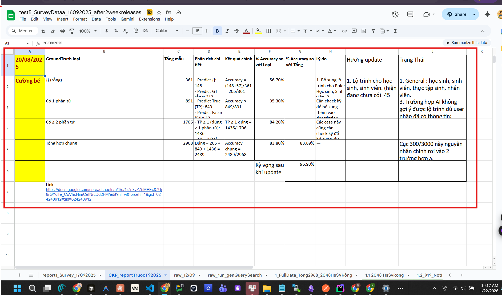

# 1. Chạy API qua từng dòng để add từng dòng vào memory nhé. ---- Output 1. File excel output: 1 cột là id, cột 2 là kết quả khi chạy API add memories


# 2. tự đánh giá kết quả. 1. ĐI qua từng dòng của file input 2. Đi qua từng dòng của file output 3. Tự đánh giá về kết quả add memories bằng cách sử dụng model LLMs mạnh


---

| Cột                          | Mô tả                                                          |
| ---------------------------- | -------------------------------------------------------------- |
| **id**                       | ID của dòng dữ liệu                                            |
| **overall\_score**           | Điểm tổng thể (1-10)                                           |
| **accuracy\_score**          | Điểm Độ chính xác (1-10)                                       |
| **completeness\_score**      | Điểm Độ đầy đủ (1-10)                                          |
| **relevance\_score**         | Điểm Độ liên quan (1-10)                                       |
| **clarity\_score**           | Điểm Độ rõ ràng (1-10)                                         |
| **no\_hallucination\_score** | Điểm Không bịa đặt (1-10)                                      |
| **summary**                  | Tóm tắt đánh giá của LLM cho dòng đó                           |
| **memories\_extracted**      | **JSON string** chứa danh sách các memories đã được trích xuất |


---

Đây là phương pháp đánh giá gì ?

Đây là một dạng **LLM-as-a-judge evaluation** (LLM làm “giám khảo”), dùng bộ tiêu chí thủ công (rubric) như trong các framework đánh giá LLM hiện nay.[^1][^2][^3]

## Bản chất phương pháp

- Hệ thống lấy từng mẫu: input gốc (hội thoại), output (memory trích xuất), rồi đưa cho một LLM mạnh để chấm điểm theo tiêu chí định nghĩa trước (accuracy, completeness, relevance, clarity, no hallucination, overall).[^2][^3]
- Mỗi tiêu chí được chấm trên thang 1–10, sau đó tổng hợp thành **overall score** và summary cho từng dòng, rồi tính thống kê tổng thể (average per metric, phân phối 9–10 / 7–8, v.v.).[^3][^4]


## Vì sao gọi là LLM-as-a-judge?

- Thay vì dùng metric tự động cổ điển (BLEU, ROUGE…), hệ thống dùng chính một LLM khác làm “giám khảo” để đánh giá chất lượng, giống các framework eval hiện đại cho RAG, memory, tool-using agent.[^5][^6][^7]
- Cách làm này phổ biến trong các bài toán khó có ground truth mơ hồ như: “memory trích xuất đã đủ, đúng, không bịa, có rõ ràng không?”.[^1][^2]


## Gần với các nghiên cứu nào?

- Rất giống các framework đánh giá memory như HaluMem, nơi người ta chấm **Memory Accuracy**, **Memory Completeness**, **False Memory Resistance** để đo hallucination trong hệ thống memory.[^8][^9]
- Các tiêu chí bạn dùng (accuracy, completeness, relevance, clarity, no hallucination) cũng trùng với bộ tiêu chí thường gặp trong hướng dẫn đánh giá LLM (faithfulness / hallucination, relevance, clarity).[^4][^3][^1]

Tóm lại: đây là một quy trình **human-style rubric + LLM judge** dùng cho bài toán **memory extraction evaluation**, chứ không phải metric thuần tự động (như precision/recall) hay benchmark chuẩn hóa.
<span style="display:none">[^10][^11][^12][^13][^14][^15][^16][^17][^18][^19][^20][^21]</span>

<div align="center">⁂</div>

[^1]: https://nexla.com/ai-readiness/llm-evaluation/

[^2]: https://toloka.ai/blog/llm-evaluation-framework-principles-practices-and-tools/

[^3]: https://beam.ai/agentic-insights/mastering-llm-evaluation-techniques-tools-and-best-practices

[^4]: https://www.confident-ai.com/blog/llm-evaluation-metrics-everything-you-need-for-llm-evaluation

[^5]: https://wandb.ai/onlineinference/genai-research/reports/LLM-evaluation-metrics-A-comprehensive-guide-for-large-language-models--VmlldzoxMjU5ODA4NA

[^6]: https://www.evidentlyai.com/blog/llm-evaluation-framework

[^7]: https://arize.com/llm-evaluation/

[^8]: https://arxiv.org/html/2511.03506v1

[^9]: https://arxiv.org/abs/2511.03506

[^10]: https://manus.im/docs

[^11]: https://jina.ai/models/jina-embeddings-v3/

[^12]: https://aws.amazon.com/marketplace/pp/prodview-kdi3xkt62lo32

[^13]: https://github.com/jina-ai/jina-sagemaker

[^14]: https://jina.ai/en-US/embeddings/

[^15]: https://aws.amazon.com/blogs/machine-learning/build-rag-applications-using-jina-embeddings-v2-on-amazon-sagemaker-jumpstart/

[^16]: https://jina.ai/news/next-level-cloud-ai-jina-embeddings-and-rerankers-on-amazon-sagemaker/

[^17]: https://aws.amazon.com/marketplace/seller-profile?id=seller-stch2ludm6vgy

[^18]: https://aclanthology.org/2025.findings-acl.322.pdf

[^19]: https://github.com/jina-ai/csp-examples/blob/main/azure/Deploy and inference with Embedding V3 VM.ipynb

[^20]: https://openreview.net/pdf?id=t4mlcyH9l0

[^21]: https://www.datadoghq.com/blog/llm-evaluation-framework-best-practices/


---
# Use case - 16 dòng - Kết quả mem0 - OSS 

### 📊 THỐNG KÊ TỔNG HỢP

|Tiêu chí|Điểm Trung bình (Thang 10)|
|---|---|
|**Accuracy (Độ chính xác)**|**8.56**|
|**Completeness (Độ đầy đủ)**|**7.81**|
|**Relevance (Độ liên quan)**|**8.69**|
|**Clarity (Độ rõ ràng)**|**9.00**|
|**No Hallucination (Không bịa đặt)**|**9.50**|
|**Overall Score (Tổng thể)**|**8.63**|

### 📈 PHÂN PHỐI ĐIỂM TỔNG THỂ

|Mức độ|Điểm|Số lượng|
|---|---|---|
|**Excellent**|9-10|6|
|**Good**|7-8|10|
|**Average**|5-6|0|
|**Poor**|< 5|0|

### 📝 BÁO CÁO ĐÁNH GIÁ CHI TIẾT

#### **Điểm Mạnh (Good Points):**

1. **Độ rõ ràng (Clarity)** và **Không bịa đặt (No Hallucination)** đạt điểm rất cao (9.00 và 9.50). Memories được trích xuất thường ngắn gọn, dễ hiểu và **hoàn toàn dựa trên nội dung hội thoại**.
2. **Độ liên quan (Relevance)** cao (8.69), cho thấy hệ thống đã lọc tốt các thông tin cá nhân, sở thích, thói quen (ví dụ: thích màu vàng, thích sách về động vật, thích chơi bóng đá) và bỏ qua các đoạn hội thoại không liên quan (ví dụ: các đoạn hội thoại về lỗi kỹ thuật, lỗi kết nối).
3. **Trích xuất cảm xúc (Emotion)**: Hệ thống đã trích xuất thành công các thông tin về cảm xúc của người dùng (ví dụ: `[ADD] Thích nhân vật hoạt hình Doraemon` từ một đoạn hội thoại có cảm xúc tích cực).

#### **Vấn đề cần cải thiện (Issues):**

1. **Độ đầy đủ (Completeness)** là điểm yếu nhất (7.81). Hệ thống có xu hướng **bỏ sót các chi tiết nhỏ** hoặc **các thông tin không phải là sở thích/thông tin cá nhân rõ ràng** (ví dụ: bỏ sót thông tin về việc "thầy chê cáo nhiều" hoặc "đang bị lặp lại audio" - những thông tin này có thể quan trọng cho ngữ cảnh hội thoại tiếp theo).
2. **Xử lý hội thoại nhiễu:** Trong một số trường hợp, hệ thống vẫn trích xuất các thông tin không cần thiết (ví dụ: `[ADD] Không cần xét luồng, cứ xét một bài thì được` - đây là thông tin về cách thức tương tác, không phải memory về user).

### 🔍 KẾT QUẢ ĐÁNH GIÁ CHI TIẾT (Đính kèm)

Tôi đã đính kèm file **memory_evaluation_results.xlsx** chứa kết quả đánh giá chi tiết cho từng dòng, bao gồm:

- **id**: ID của dòng
- **overall_score**: Điểm tổng thể
- **accuracy_score, completeness_score, relevance_score, clarity_score, no_hallucination_score**: Điểm chi tiết theo từng tiêu chí
- **summary**: Tóm tắt đánh giá của LLM
- **memories_extracted**: Các memories đã được trích xuất

Bạn có thể xem chi tiết trong file đính kèm để phân tích sâu hơn.


# PHẦN 1: LÀM THẾ NÀO ĐỂ ĐÁNH GIÁ ĐỂ MEM0 - OSS được đồng ý để lên PRODUCTION (Thay cho cái Mem0 - Platform bản Enterprise)

```
+, Đoạn extract em cũng test trên bản mem0 mới so với mem0 cũ rùi ạ.  
(1000 log conversation real ạ)  
+, Đoạn search thì cũng đã test trên mem0 mới và cũ.  
(bằng cách migrate data và chạy search trên 2803 data user thực tế trên Production ạ)
```

Tiêu chí quan trọng: 
+, Trước và sau của 2 đầu API extract memories và search. 
+, Response time P95, P99 và Độ chính xác tổng quát. 

Cách đã làm: 
1. Lấy 1000 real conversation và cho chạy qua API extract mới và API extract cũ. 
   1.1 So sánh và tính điểm overall score cho cả 2 loại. 
   +, Chia MECE nhỏ ra thành các thành phần: 

+, Mỗi thành phần có cách đánh giá riêng. => Sau đó tính độ chính xác. 
(CÓ thành phần sẽ dùng Prompt, ...)

Prompt 
```bash
# PROMPT ĐÁNH GIÁ CHẤT LƯỢNG MEMORY EXTRACTION

## NGỮ CẢNH
Bạn là một AI Evaluator chuyên nghiệp, nhiệm vụ của bạn là đánh giá chất lượng của một hệ thống trích xuất "memories" (ký ức) từ các đoạn hội thoại (conversation logs). Mục tiêu của hệ thống memory là để cá nhân hóa (personalization) các tương tác trong tương lai.

## INPUT
- **Conversation Log**: Toàn bộ cuộc trò chuyện giữa `user` và `assistant`.
- **Extracted Memories**: Danh sách các memories mà hệ thống đã trích xuất được từ cuộc trò chuyện đó (định dạng JSON).

## QUY TRÌNH ĐÁNH GIÁ
1.  **Phân tích Conversation Log**: Đọc kỹ để xác định xem có thông tin nào quan trọng đáng để trích xuất không (dựa vào danh sách "Các loại thông tin quan trọng").
2.  **Đối chiếu với Extracted Memories**: So sánh những gì *nên* được trích xuất với những gì *đã* được trích xuất.
3.  **Áp dụng Logic Tính điểm**: Chấm điểm dựa trên logic và công thức được định nghĩa chặt chẽ bên dưới.
4.  **Viết Feedback**: Cung cấp phản hồi chi tiết, mang tính xây dựng theo định dạng output được yêu cầu.

---

## LOGIC TÍNH ĐIỂM (QUAN TRỌNG)

Bạn **PHẢI** tuân theo logic này để đảm bảo điểm số phản ánh đúng chất lượng.

### Trường hợp 1: `Extracted Memories` BỊ RỖNG (`num_memories: 0`)

1.  **Kiểm tra `Conversation Log`**: Có thông tin nào quan trọng bị bỏ lỡ không (`missing_insights`)?
    *   **A) RỖNG NHƯNG SAI (Có `missing_insights`)**: Hệ thống đã bỏ lỡ thông tin quan trọng.
        *   `completeness_score`: **0** (Đây là lỗi nghiêm trọng nhất)
        *   `accuracy_score`, `relevance_score`, `clarity_score`: **0** (Không có gì để đánh giá các tiêu chí này)
        *   `no_hallucination_score`: **10** (Vì không có memory nào được tạo ra)
        *   `overall_score`: **0** (Phản ánh lỗi nghiêm trọng của việc bỏ sót)

    *   **B) RỖNG VÀ ĐÚNG (Không có `missing_insights`)**: Cuộc hội thoại không có gì đáng để lưu.
        *   `completeness_score`: **10**
        *   `accuracy_score`, `relevance_score`, `clarity_score`: **10** (Vì không có lỗi nào)
        *   `no_hallucination_score`: **10**
        *   `overall_score`: **10** (Kết quả hoàn hảo)

### Trường hợp 2: `Extracted Memories` KHÔNG BỊ RỖNG (`num_memories > 0`)

Chấm điểm từng tiêu chí (Accuracy, Completeness, Relevance, Clarity, No Hallucination) theo thang 0-10. Sau đó, tính `overall_score` bằng **công thức trung bình có trọng số** sau:

`overall_score = (0.35 * completeness_score) + (0.35 * accuracy_score) + (0.1 * relevance_score) + (0.1 * clarity_score) + (0.1 * no_hallucination_score)`

**Lý do**: `Completeness` (không bỏ sót) và `Accuracy` (không sai) là hai yếu tố quan trọng nhất.

---

## CÁC LOẠI THÔNG TIN QUAN TRỌNG CẦN TRÍCH XUẤT

Danh sách này được chia thành hai phần: từ **User** và từ **Assistant**. Hãy kiểm tra cẩn thận cả hai phía.

### Từ User:
- **Thông tin cá nhân (User Profile)**: Tên, tuổi, sở thích, tính cách, những điều không thích.
- **Trạng thái & Cảm xúc (User State & Emotions)**: Cảm xúc hiện tại (vui, buồn, mệt mỏi), trạng thái năng lượng, ý định (muốn đi ngủ, muốn chơi tiếp).
- **Kiến thức & Sự kiện (Facts & Events)**: Các sự thật, sự kiện đã xảy ra, hoặc kiến thức mà user chia sẻ.
- **Sở thích & Lựa chọn (Preferences & Choices)**: Lựa chọn giữa các phương án (thích vẽ hơn hát), sở thích về đồ ăn, hoạt động.
- **Sáng tạo & Tưởng tượng (Creative Inputs)**: Các câu chuyện, nhân vật, ý tưởng do user sáng tạo ra.
- **Hành động & Yêu cầu (Actions & Requests)**: Các yêu cầu user đưa ra cho assistant.

### Từ Assistant:
- **Mối quan hệ (Relationships)**: Thông tin về mối quan hệ giữa user và assistant (ví dụ: lần đầu gặp, đã biết nhau bao lâu).
- **Thông tin về Assistant**: Tên, vai trò, nguồn gốc, mục đích của assistant.
- **Hành động & Đề xuất (Actions & Proposals)**: Các đề xuất, yêu cầu, hoặc hành động mà assistant đưa ra (ví dụ: "chúng ta cùng chụp ảnh nhé", "bạn nhờ bố mẹ giúp được không").
- **Thông tin về User (inferred)**: Những gì assistant suy luận hoặc nhận xét về user (ví dụ: "cậu thích vẽ", "cậu rất thông minh").

---

## TIÊU CHÍ ĐÁNH GIÁ CHI TIẾT (Thang điểm 0-10)

### 1. Accuracy (Độ chính xác)
- **Định nghĩa**: Memory có phản ánh chính xác 100% thông tin trong hội thoại không?
- **Checklist**:
    - Mỗi chi tiết trong memory có khớp với lời nói gốc không?
    - Có sai lệch về fact, con số, tên riêng, hay hành động không?

### 2. Completeness (Độ đầy đủ)
- **Định nghĩa**: Hệ thống có bỏ sót thông tin quan trọng nào không?
- **Checklist**:
    - Kiểm tra danh sách "Các loại thông tin quan trọng" ở trên.
    - Có thông tin nào về sở thích, trạng thái, mối quan hệ bị bỏ lỡ không?
    - **Đặc biệt**: Kiểm tra cả thông tin từ assistant, không chỉ từ user.

### 3. Relevance (Độ liên quan)
- **Định nghĩa**: Memory có thực sự hữu ích cho việc cá nhân hóa trong tương lai không?
- **Checklist**:
    - Memory này có giúp assistant đưa ra câu trả lời tốt hơn trong tương lai không?
    - Nó có phải là một chi tiết "đắt giá" về user hoặc mối quan hệ, hay chỉ là một câu nói thông thường, vô nghĩa?

### 4. Clarity (Độ rõ ràng)
- **Định nghĩa**: Memory có được viết một cách rõ ràng, độc lập và dễ hiểu không?
- **Checklist**:
    - Memory có đầy đủ chủ ngữ, vị ngữ không?
    - Có chứa các đại từ mơ hồ như "nó", "cái đó", "việc này" không?

### 5. No Hallucination (Không bịa đặt)
- **Định nghĩa**: Memory có chứa thông tin nào hoàn toàn không có trong hội thoại không?
- **Checklist**:
    - Mọi thông tin trong memory phải có nguồn gốc rõ ràng từ `Conversation Log`.
    - Cảnh giác với những suy diễn quá xa.

---

## ĐỊNH DẠNG OUTPUT (JSON)

Vui lòng cung cấp đánh giá của bạn theo đúng định dạng JSON dưới đây.

```json
{
  "num_memories": <số lượng memories được trích xuất>,
  "accuracy_score": <điểm 0-10>,
  "completeness_score": <điểm 0-10>,
  "relevance_score": <điểm 0-10>,
  "clarity_score": <điểm 0-10>,
  "no_hallucination_score": <điểm 0-10>,
  "overall_score": <tính theo logic và công thức đã cho>,
  "good_points": [
    "✓ [Điểm mạnh 1]"
  ],
  "issues": [
    "✗ [Vấn đề 1]: [Giải thích ngắn gọn]"
  ],
  "missing_insights": [
    "• [Thông tin quan trọng bị bỏ lỡ 1]"
  ],
  "hallucination_examples": [
    "🚨 [Memory bịa đặt]: [Giải thích]"
  ],
  "recommendations": [
    "→ [Đề xuất cải thiện 1]"
  ]
}
```

1.2 So sánh response time trước với sau. P95, P99

2. Search 
   1.1 Độ chính xác. 
   +, 1 cách đơn giản là dùng Prompt để so sánh độ tương đồng của 2 API trước và sau. => Độ chính xác > 95 % => oke luôn 
1.2 Response time P95, P99 chạy stress test 
+, trên dev P95 400ms, P99 700ms 
+, trên Production P99 là 400ms. 


---

# Dẫn chứng, feedback: 


---
# Đánh giá sau khi đã lên Production. 

- Check lấy > 3000 user_id từ production 
- Check có 231 có memories từ 3000 user_id (bằng cách sử dụng API search memories top 20)  
- Check ra có 71 user là mới hoàn toàn từ khi mem0 mới lên production. (Do chỉ có 71 user này là có log full trên minIO)  
- Lấy 20 user này để check: lấy 1203 conversation của 20 user này để check memoriesextracted của nó + Check kết quả get all memories của 20 user này. 
  (Tập 20 user là đủ rộng để đánh giá). 

1. Extract memories: 
   +, Response Time: P95 12.4s, P99 23.7s (Số turns: P95 21 turns, P99 58.96s)
   +, Độ chính xác tổng quan. 
   Đánh giá dựa trên 5 tiêu chí 
+, 1. Accuracy (Độ chính xác): Memory có khớp 100% với thông tin gốc trong hội thoại không? Không sai lệch về fact, con số, tên riêng, mức độ chắc chắn, hay chủ thể.[^1][^2]
+, 2. Completeness (Độ đầy đủ): Có bỏ sót thông tin quan trọng không? Cần capture đủ: sở thích, mục tiêu, trạng thái hiện tại, kỹ năng, mối quan hệ, constraints, và cả thông tin từ assistant.[^3][^1]
+, 3. Relevance (Độ liên quan): Memory có thực sự hữu ích cho cá nhân hóa trong tương lai không? Phải là chi tiết "đắt giá", không phải câu xã giao vô nghĩa.[^2][^4][^5]
+, 4. Clarity (Độ rõ ràng): Memory có rõ ràng, độc lập, đầy đủ chủ-vị-tân không? Không chứa đại từ mơ hồ ("nó", "cái đó"), tự giải thích được khi đọc đơn lẻ.[^1][^2]
+, 5. No Hallucination (Không bịa đặt): Mọi thông tin phải có nguồn gốc rõ ràng từ conversation log, không suy diễn quá xa hay thêm thắt ý kiến của hệ thống.[^2][^3][^1]
)
   
   Cách làm: Cho đi qua 1 prompt và đánh giá từng dòng extract. 
   (Nếu cẩn thận hơn thì phân loại thành các nhóm rồi xử lý: ví dụ nhóm memories bị rỗng đúng, rỗng sai. memories ko bị rỗng thì dùng prompt đánh giá), .... 
   
> +, Ngoài chỉ số đánh giá bằng LLM, có thể sử dụng các chỉ số truyền thống khác của NLP 
>  +, Đẹp nhất thì vẫn nên có ground truth, cơ mà ko có ground truth thì cho nhiều LLMs đánh giá xong vote (hoặc dùng LLMs mạnh hơn để tạo ra ground truth).
   


3. Search: 
   +, Response Time: P95 0.323 s, P99 0.383 s
   +, Độ chính xác: 
   Hiện tại toàn bộ QUERY đều là : `user favorite (movie, character, pet, activity, friend, music, travel, toy)...`
=> Dùng Prompt để đánh giá kết quả của việc search

Chuẩn xác hơn, riêng phần này 

---


Cách 1: Tạo ra ground truth trước bằng human.  
So sánh kết quả chạy được với ground truth bằng NLP truyền thống/LLM/human

Cách 2: Đem kết quả chạy được -> đánh giá trực tiếp với input bằng LLM
(ở cách 1: nếu dùng LLM để gen ground truth, xong sau đó đem so sánh ground truth đó với kết quả chạy được thì thà rằng đem kết quả chạy được so sánh với input gốc còn hơn, vì đỡ bị 2 lần LLM) 


---


Tham khảo đợt đánh giá bài Search Recommendation 

https://docs.google.com/spreadsheets/d/1oeyyZmxuy0FahB-yda51YPeK982qZZ65blqJkRFzmsA/edit?gid=229484428#gid=229484428

---


# Trước khi lên Production: 



# Sau khi lên production: 


---


---

# Đánh giá sau khi lên production 


