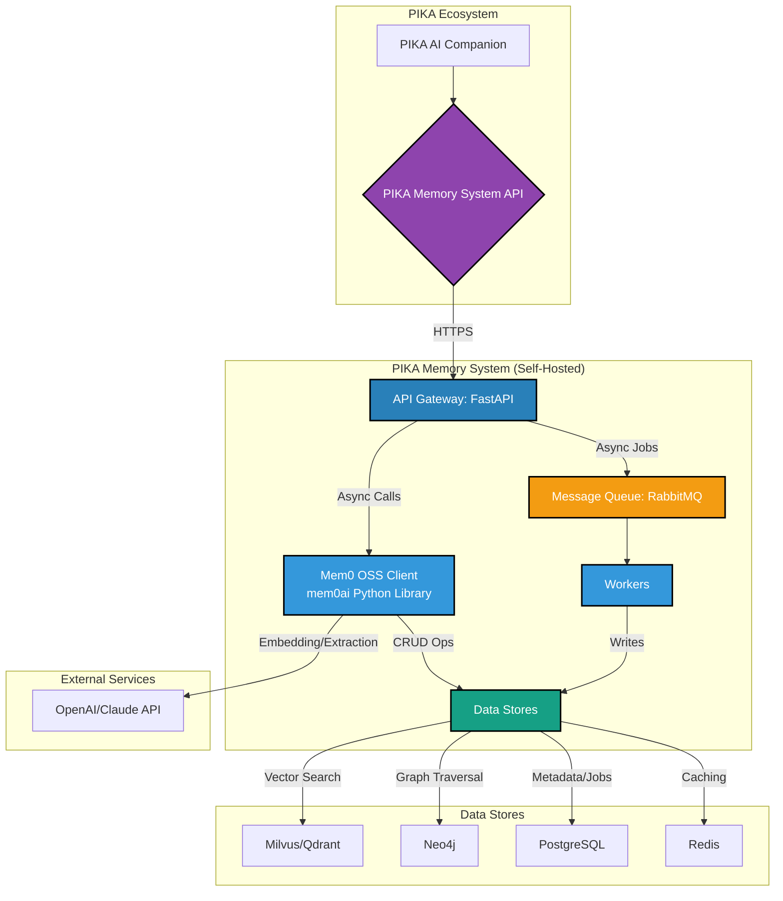
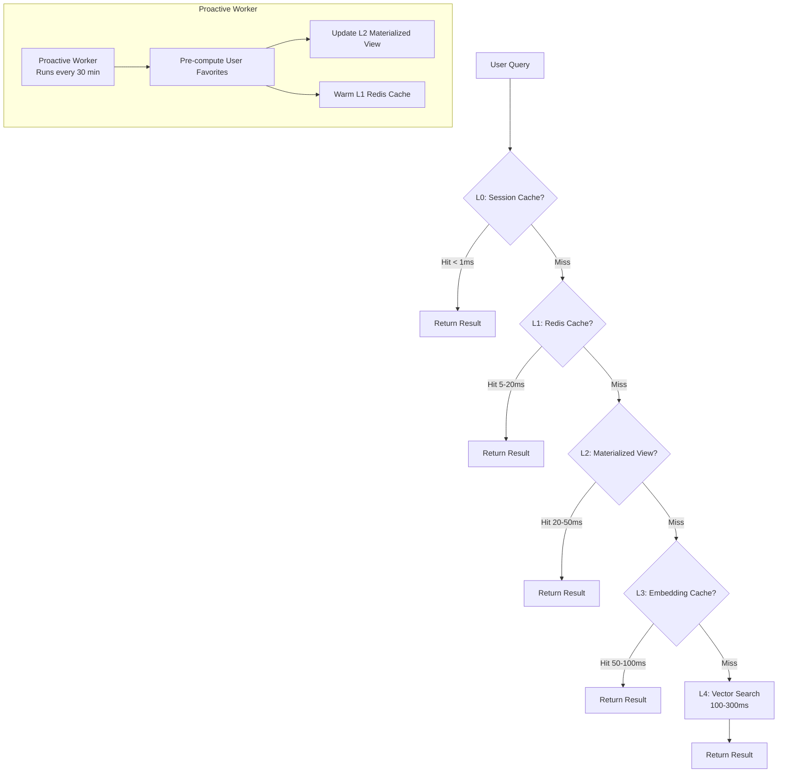

# PIKA MEMORY SYSTEM - TECHNICAL REPORT

**Version:** 1.0.0
**Date:** 2025-01-21
**Author:** PIKA Engineering Team

---

## 📋 EXECUTIVE SUMMARY

PIKA Memory System là hệ thống memory tự chủ (self-hosted) dựa trên **Mem0 Open Source (OSS)** - thư viện Python `mem0ai`. Hệ thống thay thế Mem0 Enterprise với chi phí cao, cung cấp khả năng ghi nhớ và truy xuất thông tin theo ngữ cảnh từ các cuộc hội thoại.

**⚠️ Lưu ý:** Sử dụng **Mem0 OSS** (`mem0ai`), không phải Enterprise SDK. Self-hosted hoàn toàn, không cần API key.

---

## 1. MỤC TIÊU & GOALS

### 1.1 Technical Goals

| Goal ID | Goal Description             | Metric                               | Target                        |
| ------- | ---------------------------- | ------------------------------------ | ----------------------------- |
| TG-01   | **Low-Latency Search** | P95 latency for `search_facts` API | **< 100ms**             |
| TG-02   | **High Throughput**    | Request handling capacity            | 1,000 read QPS, 100 write QPS |
| TG-03   | **High Availability**  | System uptime                        | **99.9%**               |
| TG-04   | **Search Accuracy**    | Search relevance (NDCG@10)           | > 0.85                        |
| TG-05   | **Extraction Quality** | Fact extraction F1-score             | > 0.90                        |

### 1.2 Key Performance Indicators (KPIs)

| KPI                                  | Baseline | Target            | Measurement          |
| ------------------------------------ | -------- | ----------------- | -------------------- |
| **Search Latency (P95)**       | ~150ms   | **< 100ms** | Prometheus Histogram |
| **Search Latency (P99)**       | ~300ms   | **< 200ms** | Prometheus Histogram |
| **Extract Job Duration (P95)** | ~2.5s    | **< 2s**    | Prometheus Histogram |
| **System Uptime**              | 99.5%    | **99.9%**   | Uptime monitoring    |
| **Cache Hit Rate**             | N/A      | **> 40%**   | Redis Monitoring     |
| **Error Rate**                 | 0.5%     | **< 0.1%**  | Error tracking       |
| **Search Accuracy (NDCG@10)**  | N/A      | **> 0.85**  | Offline evaluation   |
| **Extraction F1-Score**        | N/A      | **> 0.90**  | Manual evaluation    |

### 1.3 Business Goals

| Goal ID | Goal Description                  | Metric                                    | Target        |
| ------- | --------------------------------- | ----------------------------------------- | ------------- |
| BG-01   | **Reduce Operational Cost** | Monthly infrastructure cost               | < $200/month  |
| BG-02   | **Enable Scalability**      | Support for active users                  | 1 Million MAU |
| BG-03   | **Full Data Ownership**     | Data stored in self-hosted infrastructure | 100%          |

---

## 2. HIGH-LEVEL DESIGN (HLD)

### 2.1 System Architecture Overview

Hệ thống được thiết kế theo **Clean Architecture** với **Domain-Driven Design (DDD)**, tuân thủ nguyên tắc **SOLID**.



### 2.2 Component Responsibilities

| Container                        | Technology       | Responsibilities                                                |
| -------------------------------- | ---------------- | --------------------------------------------------------------- |
| **API Gateway**            | FastAPI (Python) | Handle API requests, authentication, validation, job enqueueing |
| **Mem0 OSS Client**        | mem0ai library   | Memory extraction, embedding generation, vector operations      |
| **Message Queue**          | RabbitMQ         | Decouple API from workers, persist jobs                         |
| **Fact Extraction Worker** | Python           | Consume jobs, call LLM, generate embeddings, write to stores    |
| **Vector DB**              | Milvus/Qdrant    | Store embeddings, perform semantic search (ANN)                 |
| **Graph DB**               | Neo4j            | Store entities and relationships, enable graph queries          |
| **Relational DB**          | PostgreSQL       | Store metadata, job status, audit logs                          |
| **Cache**                  | Redis            | Cache search results, reduce DB load                            |

### 2.3 Technology Stack

| Component                  | Technology                  | Justification                                    |
| -------------------------- | --------------------------- | ------------------------------------------------ |
| **Memory Framework** | **Mem0 OSS (mem0ai)** | Open source, self-hosted, no API key required    |
| **API Framework**    | **FastAPI**           | Native `asyncio` support, excellent validation |
| **Vector Database**  | **Milvus/Qdrant**     | Superior performance, simple deployment          |
| **Graph Database**   | **Neo4j**             | Mature, rich ecosystem, powerful Cypher language |
| **Message Queue**    | **RabbitMQ**          | Robust, mature, simpler than Kafka               |
| **Orchestration**    | **Kubernetes (EKS)**  | Industry standard, scalability, resilience       |

### 2.4 Data Flow

#### Search Facts (Synchronous)

```
Client → API Gateway → Cache Check → Mem0 OSS (embedding) → Vector DB → Graph DB → Response
```

#### Extract Facts (Asynchronous)

```
Client → API Gateway → Create Job → RabbitMQ → Worker → Mem0 OSS (extraction) → Data Stores → Update Job
```

---

## 3. CHIẾN LƯỢC CACHING

### 3.1 Overview: 5-Layer Caching Strategy

Hệ thống triển khai **5 lớp caching** kết hợp **reactive** (cache khi có request) và **proactive** (tính toán trước cho query thường xuyên).



### 3.2 Layer Details

| Layer                           | Technology               | Latency             | TTL               | Hit Rate Target | Use Case                  |
| ------------------------------- | ------------------------ | ------------------- | ----------------- | --------------- | ------------------------- |
| **L0: Session Cache**     | Python `@lru_cache`    | **< 1ms**     | Request lifetime  | 10-20%          | Cache within same request |
| **L1: Redis Cache**       | Redis 7.x                | **5-20ms**    | 1 hour            | 30-40%          | Cache search results      |
| **L2: Materialized View** | PostgreSQL JSONB         | **20-50ms**   | Updated by worker | 20-30%          | Pre-computed summaries    |
| **L3: Embedding Cache**   | Redis 7.x                | **50-100ms**  | 24 hours          | 60-70%          | Cache query embeddings    |
| **L4: Vector Search**     | Milvus/Qdrant + Mem0 OSS | **100-300ms** | N/A               | N/A             | Primary data source       |

### 3.3 Proactive Caching

**Mục đích:** Tính toán trước kết quả cho query có thể dự đoán (ví dụ: "user favorite").

**Cách hoạt động:**

1. Proactive Worker chạy định kỳ (mỗi 30 phút)
2. Query Mem0 OSS để lấy "sở thích" của mỗi user
3. Tổng hợp thành JSON summary
4. Lưu vào **L2 Materialized View** (PostgreSQL)
5. "Warm up" **L1 Redis Cache**

**Lợi ích:**

- **99% hit rate** cho "user favorite" queries → **< 50ms response time**
- Giảm load trên Vector DB và LLM APIs
- Cost-effective: tính toán một lần, sử dụng nhiều lần

### 3.4 Cache Invalidation Strategy

**Tag-Based Invalidation:**

- Mỗi `user_id` có một `version_tag` trong Redis
- Cache key: `search:{user_id}:{version_tag}:{hash(query)}`
- Khi extract facts mới → increment `version_tag` → tất cả cache cũ tự động stale
- Không cần manually delete cache entries

**Implementation:**

```python
# On cache read
version_tag = redis.get(f"user_version:{user_id}")
cache_key = f"search:{user_id}:{version_tag}:{hash(query)}"

# On cache invalidation (after extraction)
new_version = datetime.utcnow().isoformat()
redis.set(f"user_version:{user_id}", new_version)
```

### 3.5 Cache Performance Targets

| Metric                                     | Target  | Status     |
| ------------------------------------------ | ------- | ---------- |
| **L0 Hit Rate**                      | 10-20%  | 🟡 Pending |
| **L1 Hit Rate**                      | 30-40%  | 🟡 Pending |
| **L2 Hit Rate**                      | 20-30%  | 🟡 Pending |
| **L3 Hit Rate**                      | 60-70%  | 🟡 Pending |
| **Overall Cache Hit Rate**           | > 40%   | 🟡 Pending |
| **Average Response Time (Cached)**   | < 50ms  | 🟡 Pending |
| **Average Response Time (Uncached)** | < 200ms | 🟡 Pending |

---

## APPENDICES

### A. References

- [Mem0 OSS Documentation](https://docs.mem0.ai)
- [Milvus Documentation](https://milvus.io/docs)
- [Neo4j Documentation](https://neo4j.com/docs)
- [FastAPI Documentation](https://fastapi.tiangolo.com)

### B. Related Documents

- `docs/Step 2 - Output 1 - SDD.md` - Full Software Design Document
- `docs/Step 2 - Output 2 - SDD - HLD - LLD có cả Optimize Response Time.md` - Low-Level Design
- `docs/Step 2 - Output 3 - Caching 5 lớp.md` - Caching Strategy Details

---

**Document Version:** 1.0.0
**Last Updated:** 2025-01-21