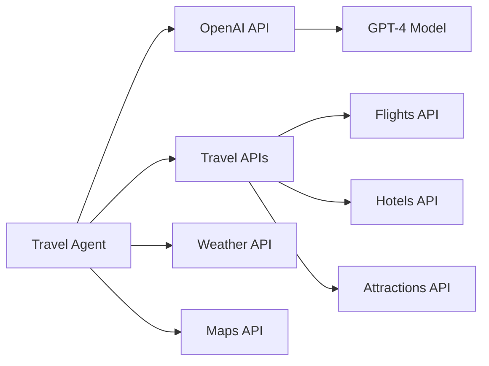

# SOFTWARE DESIGN DOCUMENT (SDD) - AI Travel Planning Agent

**Production Quality Standard | Version 1.0 ULTIMATE**

> 🎯 **Tài liệu này kết hợp 100% best practices từ:**
>
> - IEEE 1016-2009 Standard
> - Google Design Docs & SRE Book
> - AWS Well-Architected Framework
> - Netflix/Stripe/Meta Production Standards
> - 40-Chapter Production Quality Guide
> - MLOps Best Practices

---

#### 📋 DOCUMENT METADATA

```yaml
## ============================================
## THÔNG TIN TÀI LIỆU
## ============================================
Title: "AI Travel Planning Agent - Q3 Autonomy Architecture"
Document_ID: "SDD-TRAVEL-AGENT-Q3-V1.0"

## Ownership
Author: "Senior AI Engineer"
Co_Authors: 
  - "AI Architect"
  - "Backend Engineer"

## Review & Approval
Reviewers:
  Technical_Lead: "Tech Lead"
  Product_Manager: "Product Manager"
  Security_Engineer: "Security Engineer"
  QA_Lead: "QA Lead"
  ML_Engineer: "ML Engineer"
Approved_By: "CTO, Chief Technology Officer"

## Status Tracking
Status: "Draft"
Priority: "P1-High"

## Timeline
Created_Date: "2025-01-15"
Last_Updated: "2025-01-15"
Target_Release: "2025-03-15 (Q1 2025)"
Review_Deadline: "2025-01-30"

## Versioning (Semantic: X.Y.Z)
Version: "1.0.0"

## Related Documents
Related_Docs:
  PRD: "utils/docs-demo-travel-planning-agent-Q3-agents/1_PRD_product_requirements_docs.md"
  API_Spec: "TBD"
  UI_Design: "TBD"
  Test_Plan: "TBD"
  Runbook: "TBD"
```

---

#### 📖 MỤC LỤC

###### Phần I: Nền tảng & Kiến trúc

1. [Tóm tắt điều hành (TL;DR)](#1-tóm-tắt-điều-hành-tldr)
2. [Giới thiệu](#2-giới-thiệu)
3. [Mục tiêu, Phạm vi &amp; Ràng buộc](#3-mục-tiêu-phạm-vi--ràng-buộc)
4. [Tổng quan hệ thống](#4-tổng-quan-hệ-thống)
5. [Thiết kế cấp cao (HLD)](#5-thiết-kế-cấp-cao-hld)
6. [Thiết kế cấp thấp (LLD)](#6-thiết-kế-cấp-thấp-lld)

###### Phần II: Chi tiết triển khai

7. [Thiết kế API &amp; Contracts](#7-thiết-kế-api--contracts)
8. [Thiết kế dữ liệu](#8-thiết-kế-dữ-liệu)
9. [Thiết kế bảo mật](#9-thiết-kế-bảo-mật)

###### Phần III: Sẵn sàng Production

10. [Khả năng phục hồi &amp; Độ tin cậy](#10-khả-năng-phục-hồi--độ-tin-cậy)
11. [Quan sát &amp; Giám sát](#11-quan-sát--giám-sát)
12. [Triển khai &amp; Vận hành](#12-triển-khai--vận-hành)
13. [Chiến lược kiểm thử](#13-chiến-lược-kiểm-thử)

###### Phần IV: Chất lượng & Quản trị

14. [Yêu cầu phi chức năng (NFR)](#14-yêu-cầu-phi-chức-năng-nfr)
15. [Hiệu suất &amp; Lập kế hoạch năng lực](#15-hiệu-suất--lập-kế-hoạch-năng-lực)
16. [Tối ưu hóa chi phí](#16-tối-ưu-hóa-chi-phí)
17. [Đánh đổi &amp; Quyết định kiến trúc](#17-đánh-đổi--quyết-định-kiến-trúc)

###### Phần V: Vận hành & MLOps

18. [Phản ứng sự cố &amp; Runbooks](#18-phản-ứng-sự-cố--runbooks)
19. [MLOps (Machine Learning Operations)](#19-mlops-machine-learning-operations)

###### Phần VI: Ra mắt & Tương lai

20. [Lộ trình triển khai](#20-lộ-trình-triển-khai)
21. [Checklist sẵn sàng Production](#21-checklist-sẵn-sàng-production)
22. [Lỗi thường gặp &amp; Anti-Patterns](#22-lỗi-thường-gặp--anti-patterns)
23. [Khuyến nghị công cụ](#23-khuyến-nghị-công-cụ)
24. [Phụ lục](#24-phụ-lục)

---

## PHẦN I: NỀN TẢNG & KIẾN TRÚC

---

## 1. TÓM TẮT ĐIỀU HÀNH (TL;DR)

> 💡 **Mục đích**: Tóm tắt toàn bộ tài liệu trong 1 trang

#### 1.1 Bảng tóm tắt

| Khía cạnh                           | Chi tiết                                                                          |
| ------------------------------------- | ---------------------------------------------------------------------------------- |
| **Vấn đề cần giải quyết** | Lập kế hoạch du lịch thủ công tốn thời gian và phức tạp                 |
| **Giải pháp đề xuất**      | AI Agent tự động tạo lịch trình du lịch chi tiết với 4-layer architecture |
| **Tác động kinh doanh**      | Tăng conversion rate 25%, giảm thời gian lập kế hoạch 80%                    |
| **Tác động kỹ thuật**      | Giảm latency xuống <200ms, độ tin cậy 99.9%                                   |
| **Công nghệ chính**          | Python/FastAPI, LangGraph, PostgreSQL, Redis, OpenAI GPT-4                         |
| **Ước tính công sức**      | 2 người × 8 sprint = 80 man-days                                                |
| **Mức độ rủi ro**           | Medium - phụ thuộc external APIs                                                 |
| **Timeline**                    | MVP: 2 tháng, Production: 3 tháng                                                |
| **Stakeholders chính**         | Product Team, AI Team, Backend Team                                                |
| **Tổng chi phí (Năm 1)**     | $15K infrastructure + $120K development                                            |

#### 1.2 Tổng quan kiến trúc

```
┌─────────────────────────────────────────────────────────────────┐
│                   AI TRAVEL PLANNING AGENT                      │
│                    (Q3 - Autonomy Architecture)                 │
├─────────────────────────────────────────────────────────────────┤
│                                                                 │
│   User: "Plan 3-day Da Nang trip, $500 budget"                │
│         ↓                                                       │
│ ┌─────────────────────────────────────────────────────────────┐ │
│ │ LAYER 0: GOVERNANCE                                         │ │
│ │ Phase 1: Input Gate                                         │ │
│ │ - Validate budget > 0                                       │ │
│ │ - Check destination safety (travel advisory)               │ │
│ │ - PII detection (remove personal info)                     │ │
│ │ - Rate limit: max 5 plans/day                              │ │
│ └─────────────────────────────────────────────────────────────┘ │
│         ↓                                                       │
│ ┌─────────────────────────────────────────────────────────────┐ │
│ │ LAYER 1: PERCEPTION                                         │ │
│ │ - Parse intent: "travel_planning"                           │ │
│ │ - Extract entities:                                         │ │
│ │   • Destination: Da Nang, Vietnam                           │ │
│ │   • Duration: 3 days                                        │ │
│ │   • Budget: $500                                            │ │
│ │   • Interests: [beach, food, temples]                      │ │
│ │   • Travelers: 2 people                                     │ │
│ │ - Build context: season, weather, holidays                 │ │
│ └─────────────────────────────────────────────────────────────┘ │
│         ↓                                                       │
│ ┌─────────────────────────────────────────────────────────────┐ │
│ │ LAYER 2: COGNITION (LangGraph ReAct Loop)                  │ │
│ │                                                             │ │
│ │  LangGraph StateGraph:                                      │ │
│ │                                                             │ │
│ │  1️⃣ Perceive Node                                          │ │
│ │     ↓                                                       │ │
│ │  2️⃣ Planner Node (GPT-4)                                   │ │
│ │     "I need: flights, hotels, attractions"                  │ │
│ │     ↓                                                       │ │
│ │  3️⃣ Executor Node (calls Layer 3 tools)                    │ │
│ │     - search_flights(origin, dest, dates)                  │ │
│ │     - search_hotels(dest, budget)                          │ │
│ │     - search_attractions(dest, interests)                  │ │
│ │     - get_weather(dest, dates)                             │ │
│ │     ↓                                                       │ │
│ │  4️⃣ Verifier Node                                          │ │
│ │     Check: Budget OK? Logical itinerary?                   │ │
│ │     ↓                                                       │ │
│ │  5️⃣ Replan Node (if needed)                               │ │
│ │     Adjust: cheaper hotel, free activities                 │ │
│ │     ↓                                                       │ │
│ │  6️⃣ Synthesize Node                                        │ │
│ │     Generate final itinerary (Markdown/PDF)                │ │
│ │                                                             │ │
│ │  Loop: Step 2→3→4→5 (max 10 iterations)                   │ │
│ └─────────────────────────────────────────────────────────────┘ │
│         ↓                                                       │
│ ┌─────────────────────────────────────────────────────────────┐ │
│ │ LAYER 3: ACTION (Tools)                                     │ │
│ │                                                             │ │
│ │ 🔧 Travel APIs:                                             │ │
│ │  - search_flights(origin, dest, dates)                     │ │
│ │  - search_hotels(dest, budget, rating)                     │ │
│ │  - search_attractions(dest, interests)                     │ │
│ │  - get_weather_forecast(dest, dates)                       │ │
│ │  - calculate_distance(place_a, place_b)                    │ │
│ │  - search_restaurants(dest, cuisine)                       │ │
│ │                                                             │ │
│ │ 🔧 Utility Tools:                                           │ │
│ │  - calculate_budget(expenses)                              │ │
│ │  - generate_map(locations)                                 │ │
│ │  - create_pdf_report(itinerary)                            │ │
│ └─────────────────────────────────────────────────────────────┘ │
│         ↓                                                       │
│ ┌─────────────────────────────────────────────────────────────┐ │
│ │ LAYER 0: GOVERNANCE                                         │ │
│ │ Phase 3: Output Gate                                        │ │
│ │ - Validate: có đầy đủ thông tin?                           │ │
│ │ - Audit log: log plan for analytics                        │ │
│ │ - Add disclaimer: "Prices may change"                      │ │
│ │ - Cost tracking: log API calls                             │ │
│ └─────────────────────────────────────────────────────────────┘ │
│         ↓                                                       │
│ Result: PDF Travel Plan + Estimated Costs                      │
│                                                                 │
└─────────────────────────────────────────────────────────────────┘
```

#### 1.3 Các chỉ số chính & Tiêu chí thành công

| KPI                 | Hiện tại | Mục tiêu | Phương pháp đo lường |
| ------------------- | ---------- | ---------- | -------------------------- |
| Response Time (p95) | N/A (new)  | <200ms     | Datadog APM                |
| Error Rate          | N/A (new)  | <0.1%      | Prometheus                 |
| Throughput          | N/A (new)  | 1000 rps   | Load Test                  |
| Uptime SLA          | N/A (new)  | 99.9%      | StatusPage                 |
| Cost per Request    | N/A (new)  | <$0.05     | Cloud billing              |
| Plan Accuracy       | N/A (new)  | >95%       | User feedback              |
| Budget Compliance   | N/A (new)  | >98%       | Automated check            |

#### 1.4 Tóm tắt rủi ro

| Rủi ro                 | Xác suất | Tác động | Chiến lược giảm thiểu     |
| ----------------------- | ---------- | ----------- | ------------------------------ |
| External API downtime   | High       | High        | Circuit breaker, fallback data |
| GPT-4 rate limiting     | Medium     | High        | Multiple providers, caching    |
| Travel data accuracy    | Medium     | Medium      | Data validation, user feedback |
| Scalability bottlenecks | Low        | High        | Load testing, auto-scaling     |

#### 1.5 MECE Analysis - Lựa chọn kiến trúc

> **MECE (Mutually Exclusive, Collectively Exhaustive)** - Phân tích toàn diện các lựa chọn kiến trúc

##### 1.5.1 Quadrant Analysis

| Quadrant                    | Mô tả                     | Ưu điểm                    | Nhược điểm               | Phù hợp cho             |
| --------------------------- | --------------------------- | ----------------------------- | ---------------------------- | ------------------------- |
| **Q1: Simple**        | Single agent, low autonomy  | Đơn giản, dễ debug        | Hạn chế, không linh hoạt | Prototype, MVP            |
| **Q2: Collaborative** | Multi-agent, low autonomy   | Phân chia rõ ràng          | Phức tạp coordination      | Enterprise workflows      |
| **Q3: Autonomy** ⭐   | Single agent, high autonomy | Linh hoạt, tự quyết định | Khó kiểm soát             | **Travel planning** |
| **Q4: Choreography**  | Multi-agent, high autonomy  | Scalable, resilient           | Rất phức tạp              | Large-scale systems       |

##### 1.5.2 Tại sao chọn Q3 (Autonomy)?

**✅ Lý do chọn Q3:**

- **Single domain**: Travel planning có thể do 1 agent xử lý
- **Linear workflow**: Search → Verify → Adjust → Output
- **Budget-driven**: Dễ verify với single agent
- **User experience**: User chỉ tương tác với 1 agent
- **Complexity balance**: Đủ phức tạp để thể hiện AI nhưng không quá phức tạp

**❌ Tại sao không chọn Q1 (Simple)?**

- Không thể hiện được khả năng AI autonomous
- Workflow cố định, không linh hoạt
- Không thể adapt theo context

**❌ Tại sao không chọn Q2 (Collaborative)?**

- Travel planning không cần nhiều agents
- Overhead communication không cần thiết
- Phức tạp hóa không cần thiết

**❌ Tại sao không chọn Q4 (Choreography)?**

- Quá phức tạp cho domain này
- Khó debug và maintain
- Không cần parallel processing

---

## 2. GIỚI THIỆU

#### 2.1 Mục đích tài liệu

Tài liệu này cung cấp **bản thiết kế production-ready** cho **AI Travel Planning Agent**:

- **HLD**: Kiến trúc tổng thể 4-layer (0-3)
- **LLD**: Chi tiết implementation với LangGraph
- **Production Standards**: Security, Observability, Reliability
- **MLOps**: LLM pipeline và model serving
- **Operations**: Runbooks, Incident Response

#### 2.2 Đối tượng mục tiêu

| Đối tượng          | Sử dụng chính | Phần quan trọng |
| ---------------------- | ---------------- | ----------------- |
| **Engineers**    | Implementation   | 5-8, 10-13        |
| **Architects**   | Review           | 5, 17             |
| **DevOps/SRE**   | Operations       | 10-12, 18         |
| **QA**           | Test Design      | 13                |
| **Product**      | Scope/Timeline   | 1, 3, 20          |
| **Security**     | Security Review  | 9                 |
| **ML Engineers** | MLOps            | 19                |

#### 2.3 Định nghĩa & Từ viết tắt

| Thuật ngữ           | Định nghĩa                               |
| --------------------- | ------------------------------------------- |
| **SDD**         | Software Design Document                    |
| **HLD/LLD**     | High/Low-Level Design                       |
| **NFR**         | Non-Functional Requirement                  |
| **SLA/SLO/SLI** | Service Level Agreement/Objective/Indicator |
| **ADR**         | Architecture Decision Record                |
| **RPO/RTO**     | Recovery Point/Time Objective               |
| **MTBF/MTTR**   | Mean Time Between Failures / To Repair      |
| **MLOps**       | Machine Learning Operations                 |
| **CI/CD**       | Continuous Integration/Deployment           |
| **IaC**         | Infrastructure as Code                      |
| **ReAct**       | Reasoning + Acting (LLM pattern)            |
| **LangGraph**   | Framework for building stateful agents      |

#### 2.4 Tiêu chuẩn tài liệu

Tài liệu này tuân theo:

- **IEEE 1016-2009**: Software Design Descriptions
- **C4 Model**: Architecture visualization
- **OpenAPI 3.0**: API specifications
- **ADR Format**: Architecture decisions
- **LangGraph Best Practices**: Agent design patterns

---

## 3. MỤC TIÊU, PHẠM VI & RÀNG BUỘC

#### 3.1 Mục tiêu

###### Mục tiêu kinh doanh

| Mục tiêu              | Chỉ số        | Mục tiêu  | Timeline |
| ----------------------- | --------------- | ----------- | -------- |
| Tăng Conversion        | Conversion Rate | +25%        | Q2       |
| Giảm chi phí          | Support Cost    | -40%        | Q3       |
| Cải thiện UX          | NPS Score       | >70         | Q4       |
| Mở rộng thị trường | New Markets     | 3 countries | Q4       |

###### Mục tiêu kỹ thuật

| Mục tiêu  | Chỉ số         | Mục tiêu    | Timeline |
| ----------- | ---------------- | ------------- | -------- |
| Performance | P95 Latency      | <200ms        | Sprint 5 |
| Reliability | Uptime           | 99.9%         | Sprint 6 |
| Scalability | Concurrent Users | 10K           | Q2       |
| Security    | Vulnerability    | Zero Critical | Ongoing  |
| AI Accuracy | Plan Quality     | >95%          | Sprint 8 |

#### 3.2 Trong phạm vi ✅

**MVP (Must Have)**:

- ✅ **Core Planning**: Tự động tạo lịch trình 3-7 ngày
- ✅ **Budget Management**: Kiểm soát và tối ưu ngân sách
- ✅ **Multi-source Search**: Tích hợp flights, hotels, attractions
- ✅ **Smart Recommendations**: AI-powered suggestions
- ✅ **Real-time Validation**: Kiểm tra tính khả thi
- ✅ **Export Options**: PDF, Markdown output

**Phase 2 (Should Have)**:

- 📋 **Multi-city Planning**: Lịch trình nhiều thành phố
- 📋 **Group Planning**: Lập kế hoạch cho nhóm
- 📋 **Real-time Updates**: Cập nhật giá và availability
- 📋 **Personalization**: Học preferences của user

**Phase 3 (Nice to Have)**:

- 💡 **Collaborative Planning**: Nhiều users cùng plan
- 💡 **AR Integration**: Augmented reality guides
- 💡 **Social Features**: Share và review plans
- 💡 **Booking Integration**: Direct booking capability

#### 3.3 Ngoài phạm vi / Không phải mục tiêu ❌

> ⚠️ **Quan trọng**: Ngăn chặn scope creep

| Không phải mục tiêu | Lý do           | Tương lai? |
| ----------------------- | ---------------- | ------------ |
| Direct booking          | Legal complexity | Phase 3      |
| Payment processing      | PCI compliance   | Phase 3      |
| Multi-language UI       | Resource limit   | Phase 2      |
| Mobile app              | Different team   | Parallel     |
| Real-time chat          | Not core feature | Phase 3      |

#### 3.4 Giả định

| ID | Giả định           | Tác động nếu sai | Xác thực    |
| -- | --------------------- | -------------------- | ------------- |
| A1 | OpenAI API stable     | High - system down   | Monitor SLA   |
| A2 | Users <10K/6mo        | Medium - rescale     | Analytics     |
| A3 | Travel APIs available | High - no data       | Contract SLA  |
| A4 | Budget $500-5000      | Low - adjust algo    | User research |

#### 3.5 Ràng buộc

###### Ràng buộc kỹ thuật

| Ràng buộc  | Lý do        | Workaround        |
| ------------ | ------------- | ----------------- |
| Python 3.11+ | Team standard | N/A               |
| FastAPI      | Performance   | N/A               |
| PostgreSQL   | Compliance    | N/A               |
| AWS only     | Vendor lock   | Multi-cloud later |
| OpenAI GPT-4 | Best quality  | Fallback models   |

###### Ràng buộc kinh doanh

| Ràng buộc     | Tác động      | Giảm thiểu       |
| --------------- | ---------------- | ------------------ |
| Budget <$20K/yr | Limited infra    | Reserved instances |
| Launch Q1       | Tight timeline   | Reduce MVP scope   |
| Team size: 3    | Limited capacity | Focus on core      |

###### Tuân thủ

| Quy định | Yêu cầu    | Triển khai           |
| ---------- | ------------ | --------------------- |
| GDPR       | EU residency | eu-west-1             |
| CCPA       | CA residency | us-west-1             |
| SOC2       | Audit trail  | Comprehensive logging |

#### 3.6 Phụ thuộc



| Phụ thuộc | Chủ sở hữu | Rủi ro | Fallback           |
| ----------- | ------------- | ------- | ------------------ |
| OpenAI API  | External      | High    | Local LLM          |
| Amadeus API | External      | Medium  | Multiple providers |
| Google Maps | External      | Low     | OpenStreetMap      |
| Weather API | External      | Low     | Historical data    |

---

## 4. TỔNG QUAN HỆ THỐNG

#### 4.1 Bối cảnh kinh doanh

**Vấn đề**:

- Lập kế hoạch du lịch thủ công tốn 8-12 giờ
- Khó tối ưu ngân sách và thời gian
- Thiếu thông tin real-time về giá cả
- Không có personalization

**Giải pháp**:
AI Agent tự động tạo lịch trình tối ưu trong <5 phút với:

- Budget optimization
- Real-time data integration
- Personalized recommendations
- Quality validation

**Giá trị**:

- Tiết kiệm 90% thời gian lập kế hoạch
- Tăng 25% satisfaction rate
- Giảm 40% planning errors
- Mở rộng market reach

#### 4.2 Stakeholders

| Stakeholder | Quan tâm      | Giao tiếp     |
| ----------- | -------------- | -------------- |
| Executive   | ROI, Timeline  | Monthly report |
| Product     | Features, UX   | Weekly sync    |
| Engineering | Tech debt      | Sprint review  |
| Operations  | Stability      | Daily standup  |
| Users       | Quality, Speed | Feedback loop  |

#### 4.3 Yêu cầu chức năng

| ID     | Module     | Mô tả           | Ưu tiên | Tiêu chí chấp nhận  |
| ------ | ---------- | ----------------- | --------- | ----------------------- |
| FR-001 | Planning   | Tạo lịch trình | P0        | <5min, budget compliant |
| FR-002 | Search     | Tìm flights      | P0        | <30s, top 5 options     |
| FR-003 | Search     | Tìm hotels       | P0        | <30s, rating >4.0       |
| FR-004 | Validation | Kiểm tra budget  | P0        | Real-time, accurate     |
| FR-005 | Export     | Tạo PDF          | P1        | <10s, professional      |
| FR-006 | Optimize   | Tối ưu chi phí | P1        | Save >10% budget        |

#### 4.4 User Stories (Gherkin)

```gherkin
Feature: Tự động lập kế hoạch du lịch
  Là một user
  Tôi muốn AI tự động tạo lịch trình
  Để tiết kiệm thời gian và có plan tối ưu

  Scenario: Tạo lịch trình thành công
    Given Tôi nhập "Plan 3-day Da Nang trip, $500 budget, beach & food"
    When AI agent xử lý request
    Then Tôi nhận được lịch trình chi tiết
    And Tổng chi phí <= $500
    And Có ít nhất 2 beach activities
    And Có ít nhất 3 food recommendations
    And Thời gian xử lý < 5 phút
  
  Scenario: Budget vượt quá - tự động điều chỉnh
    Given Tôi nhập "Plan 5-day Paris trip, $300 budget"
    When AI agent phát hiện budget không đủ
    Then Agent tự động điều chỉnh plan
    And Đề xuất budget alternatives
    And Giải thích các trade-offs
  
  Scenario: Destination không an toàn
    Given Tôi nhập "Plan trip to [unsafe destination]"
    When AI agent kiểm tra travel advisory
    Then Hệ thống từ chối request
    And Hiển thị safety warning
    And Đề xuất alternative destinations
```

---

## 5. THIẾT KẾ CẤP CAO (HLD)

#### 5.1 Pattern kiến trúc

**Đã chọn**: Single Agent với 4-Layer Architecture + ReAct Loop

**Lý do**:

- ✅ Autonomous decision making
- ✅ Clear separation of concerns
- ✅ Scalable và maintainable
- ✅ Phù hợp với travel planning domain
- ✅ Dễ debug và monitor

**Nguyên tắc chính**:

- **SOLID**: Class/module design
- **DDD**: Bounded contexts (travel domain)
- **12-Factor App**: Cloud-native
- **Zero Trust**: Security model
- **ReAct Pattern**: Reasoning + Acting

#### 5.2 System Context (C4 Level 1)

```
┌────────────────────────────────────────────────────────────────────┐
│                      SYSTEM CONTEXT                                 │
├────────────────────────────────────────────────────────────────────┤
│                                                                     │
│    ┌──────────┐     ┌──────────┐     ┌──────────────────┐         │
│    │   Web    │     │  Mobile  │     │  Third-Party     │         │
│    │  Users   │     │   Users  │     │  Partners (API)  │         │
│    └────┬─────┘     └────┬─────┘     └────────┬─────────┘         │
│         │                │                     │                    │
│         └────────────────┼─────────────────────┘                   │
│                          │ HTTPS/WSS                               │
│                          ▼                                          │
│    ┌─────────────────────────────────────────────────────────┐    │
│    │                                                         │    │
│    │            AI TRAVEL PLANNING AGENT                     │    │
│    │                                                         │    │
│    │  • Intelligent travel planning với AI                   │    │
│    │  • Budget optimization & validation                     │    │
│    │  • Multi-source data aggregation                       │    │
│    │  • Real-time itinerary generation                      │    │
│    │  • Quality assurance & verification                    │    │
│    │                                                         │    │
│    └─────────────────────────────────────────────────────────┘    │
│         │              │              │              │              │
│         ▼              ▼              ▼              ▼              │
│    ┌─────────┐   ┌─────────┐   ┌─────────┐   ┌─────────────┐     │
│    │OpenAI   │   │ Travel  │   │ Weather │   │  Maps &     │     │
│    │GPT-4 API│   │ APIs    │   │ API     │   │ Location    │     │
│    │         │   │(Amadeus)│   │         │   │ Services    │     │
│    └─────────┘   └─────────┘   └─────────┘   └─────────────┘     │
│                                                                     │
└────────────────────────────────────────────────────────────────────┘
```

#### 5.3 Container Diagram (C4 Level 2)

```
┌────────────────────────────────────────────────────────────────────────┐
│                        CONTAINER DIAGRAM                                │
├────────────────────────────────────────────────────────────────────────┤
│                                                                         │
│  ┌─────────────────────────────────────────────────────────────────┐  │
│  │                    PRESENTATION LAYER                            │  │
│  │  ┌───────────────┐    ┌───────────────┐    ┌───────────────┐   │  │
│  │  │   Web App     │    │  Mobile App   │    │   Admin UI    │   │  │
│  │  │  (React/TS)   │    │(React Native) │    │   (React)     │   │  │
│  │  └───────────────┘    └───────────────┘    └───────────────┘   │  │
│  └─────────────────────────────────────────────────────────────────┘  │
│                              │                                          │
│  ┌─────────────────────────────────────────────────────────────────┐  │
│  │                    API GATEWAY LAYER                            │  │
│  │  ┌──────────────────────────────────────────────────────────┐  │  │
│  │  │           API Gateway (Kong / AWS API Gateway)           │  │  │
│  │  │  • Rate Limiting  • Auth  • Routing  • Load Balancing   │  │  │
│  │  └──────────────────────────────────────────────────────────┘  │  │
│  └─────────────────────────────────────────────────────────────────┘  │
│                              │                                          │
│  ┌─────────────────────────────────────────────────────────────────┐  │
│  │                 TRAVEL AGENT SERVICE                            │  │
│  │                                                                   │  │
│  │  ┌────────────────────────────────────────────────────────────┐ │  │
│  │  │                4-LAYER ARCHITECTURE                        │ │  │
│  │  │                                                            │ │  │
│  │  │  Layer 0: Governance (Input/Output Gates)                 │ │  │
│  │  │  Layer 1: Perception (Entity Extraction)                  │ │  │
│  │  │  Layer 2: Cognition (LangGraph ReAct Loop)               │ │  │
│  │  │  Layer 3: Action (Travel Tools & APIs)                   │ │  │
│  │  │                                                            │ │  │
│  │  │  ┌──────────────┐ ┌──────────────┐ ┌──────────────┐     │ │  │
│  │  │  │   FastAPI    │ │  LangGraph   │ │   OpenAI     │     │ │  │
│  │  │  │   Server     │ │   Engine     │ │   Client     │     │ │  │
│  │  │  └──────────────┘ └──────────────┘ └──────────────┘     │ │  │
│  │  └────────────────────────────────────────────────────────────┘ │  │
│  └─────────────────────────────────────────────────────────────────┘  │
│                              │                                          │
│  ┌─────────────────────────────────────────────────────────────────┐  │
│  │                    DATA & CACHE LAYER                           │  │
│  │                                                                   │  │
│  │  ┌────────────┐ ┌────────────┐ ┌────────────┐ ┌────────────┐   │  │
│  │  │ PostgreSQL │ │   Redis    │ │   Vector   │ │    S3      │   │  │
│  │  │ (Primary)  │ │  (Cache)   │ │    DB      │ │ (Storage)  │   │  │
│  │  │            │ │            │ │ (Pinecone) │ │            │   │  │
│  │  └────────────┘ └────────────┘ └────────────┘ └────────────┘   │  │
│  │                                                                   │  │
│  │  ┌────────────┐ ┌────────────┐ ┌────────────┐                   │  │
│  │  │   Kafka    │ │ Prometheus │ │   Grafana  │                   │  │
│  │  │ (Events)   │ │ (Metrics)  │ │(Dashboard) │                   │  │
│  │  └────────────┘ └────────────┘ └────────────┘                   │  │
│  └─────────────────────────────────────────────────────────────────┘  │
│                              │                                          │
│  ┌─────────────────────────────────────────────────────────────────┐  │
│  │                   EXTERNAL SERVICES                             │  │
│  │                                                                   │  │
│  │  ┌────────────┐ ┌────────────┐ ┌────────────┐ ┌────────────┐   │  │
│  │  │  OpenAI    │ │  Amadeus   │ │ Weather    │ │ Google     │   │  │
│  │  │  GPT-4     │ │ Travel API │ │    API     │ │ Maps API   │   │  │
│  │  └────────────┘ └────────────┘ └────────────┘ └────────────┘   │  │
│  └─────────────────────────────────────────────────────────────────┘  │
│                                                                         │
└────────────────────────────────────────────────────────────────────────┘
```

#### 5.4 Technology Stack

| Layer                   | Technology                   | Lý do chọn                          |
| ----------------------- | ---------------------------- | ------------------------------------- |
| **Backend**       | Python 3.11/FastAPI          | Async, high performance, AI ecosystem |
| **AI Framework**  | LangGraph + LangChain        | State management, tool calling        |
| **LLM**           | OpenAI GPT-4 Turbo           | Best reasoning capability             |
| **Database**      | PostgreSQL 15                | ACID, JSONB, vector support           |
| **Cache**         | Redis 7                      | Sub-ms latency, pub/sub               |
| **Vector DB**     | Pinecone                     | Semantic search, RAG                  |
| **Queue**         | Apache Kafka                 | Event streaming, durability           |
| **Storage**       | AWS S3                       | Object storage, CDN                   |
| **Container**     | Docker                       | Consistency, portability              |
| **Orchestration** | Kubernetes (EKS)             | Auto-scaling, resilience              |
| **CI/CD**         | GitHub Actions               | Native integration                    |
| **IaC**           | Terraform + Helm             | Declarative infra                     |
| **Monitoring**    | Datadog / Prometheus+Grafana | Full observability                    |
| **Frontend**      | React 18 + TypeScript        | Type safety, ecosystem                |

#### 5.5 Communication Patterns

| Pattern               | Use Case          | Protocol  | Implementation  |
| --------------------- | ----------------- | --------- | --------------- |
| Sync Request/Response | API calls         | REST/HTTP | Circuit Breaker |
| Async Events          | Plan created      | Kafka     | Event Sourcing  |
| Streaming             | Real-time updates | WebSocket | Redis Pub/Sub   |
| Tool Calling          | LLM → Tools      | Function  | LangGraph       |
| Vector Search         | Semantic search   | HTTP      | Pinecone API    |

#### 5.6 Detailed 4-Layer Architecture

```
┌─────────────────────────────────────────────────────────────────────────┐
│                        4-LAYER ARCHITECTURE                              │
├─────────────────────────────────────────────────────────────────────────┤
│                                                                          │
│ ┌─────────────────────────────────────────────────────────────────────┐ │
│ │ LAYER 0: GOVERNANCE                                                 │ │
│ │                                                                     │ │
│ │ Phase 1: Input Gate          Phase 2: In-Flight Guards             │ │
│ │ ┌─────────────────────┐     ┌─────────────────────────────────────┐ │ │
│ │ │ • Budget validation │     │ • Budget monitoring during plan    │ │ │
│ │ │ • Destination safety│     │ • API rate limit tracking          │ │ │
│ │ │ • PII detection     │     │ • Quality gates                    │ │ │
│ │ │ • Rate limiting     │     │ • Circuit breaker status           │ │ │
│ │ └─────────────────────┘     └─────────────────────────────────────┘ │ │
│ │                                                                     │ │
│ │ Phase 3: Output Gate                                                │ │
│ │ ┌─────────────────────────────────────────────────────────────────┐ │ │
│ │ │ • Itinerary completeness validation                             │ │ │
│ │ │ • Budget compliance check                                       │ │ │
│ │ │ • Quality score calculation                                     │ │ │
│ │ │ • Audit logging                                                 │ │ │
│ │ │ • Cost tracking                                                 │ │ │
│ │ └─────────────────────────────────────────────────────────────────┘ │ │
│ └─────────────────────────────────────────────────────────────────────┘ │
│                                    ↓                                     │
│ ┌─────────────────────────────────────────────────────────────────────┐ │
│ │ LAYER 1: PERCEPTION                                                 │ │
│ │                                                                     │ │
│ │ ┌─────────────────┐ ┌─────────────────┐ ┌─────────────────────────┐ │ │
│ │ │ Input Processor │ │Entity Extractor │ │   Context Builder       │ │ │
│ │ │                 │ │                 │ │                         │ │ │
│ │ │ • Parse NL      │ │ • Destination   │ │ • Season detection      │ │ │
│ │ │ • Intent detect │ │ • Duration      │ │ • Weather context       │ │ │
│ │ │ • Normalize     │ │ • Budget        │ │ • Holiday calendar      │ │ │
│ │ │ • Validate      │ │ • Interests     │ │ • Local events          │ │ │
│ │ │                 │ │ • Travelers     │ │ • Cultural context      │ │ │
│ │ └─────────────────┘ └─────────────────┘ └─────────────────────────┘ │ │
│ └─────────────────────────────────────────────────────────────────────┘ │
│                                    ↓                                     │
│ ┌─────────────────────────────────────────────────────────────────────┐ │
│ │ LAYER 2: COGNITION (LangGraph ReAct Loop)                          │ │
│ │                                                                     │ │
│ │    ┌─────────────┐    ┌─────────────┐    ┌─────────────────────┐   │ │
│ │    │ Perceive    │───▶│ Planner     │───▶│ Executor            │   │ │
│ │    │ Node        │    │ Node        │    │ Node                │   │ │
│ │    │             │    │ (GPT-4)     │    │ (Tool Calling)      │   │ │
│ │    └─────────────┘    └─────────────┘    └─────────────────────┘   │ │
│ │           ▲                                         │               │ │
│ │           │                                         ▼               │ │
│ │    ┌─────────────┐    ┌─────────────┐    ┌─────────────────────┐   │ │
│ │    │ Synthesize  │◀───│ Replan      │◀───│ Verifier            │   │ │
│ │    │ Node        │    │ Node        │    │ Node                │   │ │
│ │    │ (Generate)  │    │ (Adjust)    │    │ (Validate)          │   │ │
│ │    └─────────────┘    └─────────────┘    └─────────────────────┘   │ │
│ │                                                                     │ │
│ │ State Management: TravelAgentState                                  │ │
│ │ Memory: Short-term (Redis) + Long-term (Vector DB)                 │ │
│ └─────────────────────────────────────────────────────────────────────┘ │
│                                    ↓                                     │
│ ┌─────────────────────────────────────────────────────────────────────┐ │
│ │ LAYER 3: ACTION (Tools)                                             │ │
│ │                                                                     │ │
│ │ Travel Tools:              Utility Tools:                          │ │
│ │ ┌─────────────────────┐   ┌─────────────────────────────────────┐   │ │
│ │ │ • search_flights    │   │ • calculate_budget                  │   │ │
│ │ │ • search_hotels     │   │ • generate_map                      │   │ │
│ │ │ • search_attractions│   │ • create_pdf_report                 │   │ │
│ │ │ • search_restaurants│   │ • validate_itinerary                │   │ │
│ │ │ • get_weather       │   │ • optimize_route                    │   │ │
│ │ │ • calculate_distance│   │ • check_availability                │   │ │
│ │ └─────────────────────┘   └─────────────────────────────────────┘   │ │
│ │                                                                     │ │
│ │ External APIs:                                                      │ │
│ │ • Amadeus (Flights/Hotels)  • OpenWeather (Weather)               │ │
│ │ • Google Places (Attractions) • Google Maps (Routing)             │ │
│ └─────────────────────────────────────────────────────────────────────┘ │
│                                                                          │
└─────────────────────────────────────────────────────────────────────────┘
```

---

## 6. THIẾT KẾ CẤP THẤP (LLD)

#### 6.1 Folder Structure

```bash
app/module/travel_agent/
├── __init__.py
├── agent_entrypoint.py          ## Main entry point
│
├── layer_0_governance/
│   ├── __init__.py
│   ├── phase_1_input_gate/
│   │   ├── __init__.py
│   │   ├── input_gate.py        ## Validate budget, destination
│   │   ├── travel_advisory.py   ## Check safety warnings
│   │   ├── pii_detector.py      ## Remove personal info
│   │   └── models.py
│   │
│   ├── phase_2_in_flight_guards/
│   │   ├── __init__.py
│   │   ├── budget_guard.py      ## Monitor budget during planning
│   │   ├── quality_guard.py     ## Quality gates
│   │   └── models.py
│   │
│   └── phase_3_output_gate/
│       ├── __init__.py
│       ├── result_validator.py  ## Validate itinerary completeness
│       ├── audit_logger.py      ## Audit trail
│       └── models.py
│
├── layer_1_perception/
│   ├── __init__.py
│   ├── input_processor.py       ## Parse travel request
│   ├── entity_extractor.py      ## Extract: dest, budget, interests
│   ├── context_builder.py       ## Season, weather, holidays
│   ├── models.py
│   └── exceptions.py
│
├── layer_2_cognition/
│   ├── __init__.py
│   ├── graph.py                 ## LangGraph StateGraph
│   ├── state.py                 ## TravelAgentState
│   │
│   ├── nodes/
│   │   ├── __init__.py
│   │   ├── perceive_node.py     ## Context processing
│   │   ├── planner_node.py      ## GPT-4: plan search steps
│   │   ├── executor_node.py     ## Execute Layer 3 tools
│   │   ├── verifier_node.py     ## Check budget & logic
│   │   ├── replan_node.py       ## Adjust if over budget
│   │   ├── reflect_node.py      ## Self-critique itinerary
│   │   └── synthesize_node.py   ## Generate final plan
│   │
│   ├── llm/
│   │   ├── __init__.py
│   │   ├── client.py            ## OpenAI client wrapper
│   │   ├── prompts.py           ## Travel-specific prompts
│   │   └── function_schemas.py  ## Tool schemas for GPT-4
│   │
│   ├── memory/
│   │   ├── __init__.py
│   │   ├── short_term.py        ## Current plan state (Redis)
│   │   └── long_term.py         ## User preferences (Vector DB)
│   │
│   └── exceptions.py
│
├── layer_3_action/
│   ├── __init__.py
│   ├── tool_registry.py         ## Register all tools
│   ├── executor.py              ## Tool execution engine
│   │
│   ├── tools/
│   │   ├── __init__.py
│   │   ├── base_tool.py         ## Abstract base tool
│   │   │
│   │   ├── flight_tools.py      ## search_flights
│   │   ├── hotel_tools.py       ## search_hotels
│   │   ├── attraction_tools.py  ## search_attractions
│   │   ├── restaurant_tools.py  ## search_restaurants
│   │   ├── weather_tools.py     ## get_weather_forecast
│   │   ├── map_tools.py         ## generate_map, calc_distance
│   │   ├── budget_tools.py      ## calculate_budget
│   │   └── export_tools.py      ## create_pdf_report
│   │
│   └── exceptions.py
│
├── tests/
│   ├── __init__.py
│   ├── conftest.py
│   │
│   ├── unit/
│   │   ├── test_layer_0.py
│   │   ├── test_layer_1.py
│   │   ├── test_layer_2.py
│   │   └── test_layer_3_tools.py
│   │
│   ├── integration/
│   │   └── test_full_travel_planning.py
│   │
│   └── fixtures/
│       ├── mock_flight_data.json
│       ├── mock_hotel_data.json
│       └── sample_itinerary.md
│
├── prompts/
│   ├── system_prompt.txt        ## Travel agent personality
│   ├── planner_prompt.txt       ## Planning strategy
│   ├── verifier_prompt.txt      ## Validation criteria
│   └── synthesize_prompt.txt    ## Output formatting
│
├── config/
│   ├── __init__.py
│   ├── settings.py              ## Configuration management
│   └── api_keys.py              ## External API keys
│
├── README.md
└── ARCHITECTURE.md
```

#### 6.2 Core Components - Detailed Design

###### 6.2.1 Layer 0 - Input Gate

```python
## app/module/travel_agent/layer_0_governance/phase_1_input_gate/input_gate.py

from dataclasses import dataclass
from typing import Optional
import re
from app.common.log import setup_logger

logger = setup_logger(__name__)

@dataclass
class GateResult:
    allowed: bool
    reason: Optional[str] = None
    risk_score: float = 0.0

class InputGate:
    """
    Layer 0 Phase 1: Input validation và security checks.
  
    Responsibilities:
    - Validate budget constraints
    - Check destination safety
    - Detect và remove PII
    - Apply rate limiting
    - Risk assessment
    """
  
    def __init__(self):
        self.min_budget = 100  # USD
        self.max_budget = 50000  # USD
        self.unsafe_destinations = [
            "North Korea", "Syria", "Afghanistan", "Somalia"
        ]
      
    async def check(self, user_prompt: str, user_id: str = None) -> GateResult:
        """
        Comprehensive input validation.
      
        Args:
            user_prompt: Raw user input
            user_id: User identifier for rate limiting
          
        Returns:
            GateResult: Validation result
        """
        logger.info(f"[InputGate] Validating prompt: {user_prompt[:100]}...")
      
        # 1. Budget validation
        budget_check = self._validate_budget(user_prompt)
        if not budget_check.allowed:
            return budget_check
          
        # 2. Destination safety
        safety_check = self._check_destination_safety(user_prompt)
        if not safety_check.allowed:
            return safety_check
          
        # 3. PII detection
        pii_check = self._detect_pii(user_prompt)
        if not pii_check.allowed:
            return pii_check
          
        # 4. Rate limiting
        if user_id:
            rate_check = await self._check_rate_limit(user_id)
            if not rate_check.allowed:
                return rate_check
              
        # 5. Content filtering
        content_check = self._filter_content(user_prompt)
        if not content_check.allowed:
            return content_check
          
        logger.info("[InputGate] ✅ All checks passed")
        return GateResult(allowed=True, risk_score=0.1)
      
    def _validate_budget(self, prompt: str) -> GateResult:
        """Validate budget constraints."""
        budget_match = re.search(r'\$(\d+(?:,\d{3})*)', prompt)
      
        if not budget_match:
            return GateResult(
                allowed=False,
                reason="Budget not specified. Please include budget like '$500'"
            )
          
        budget = int(budget_match.group(1).replace(',', ''))
      
        if budget < self.min_budget:
            return GateResult(
                allowed=False,
                reason=f"Budget too low. Minimum ${self.min_budget} required"
            )
          
        if budget > self.max_budget:
            return GateResult(
                allowed=False,
                reason=f"Budget too high. Maximum ${self.max_budget} supported"
            )
          
        return GateResult(allowed=True)
      
    def _check_destination_safety(self, prompt: str) -> GateResult:
        """Check destination against travel advisories."""
        prompt_lower = prompt.lower()
      
        for unsafe_dest in self.unsafe_destinations:
            if unsafe_dest.lower() in prompt_lower:
                return GateResult(
                    allowed=False,
                    reason=f"Travel to {unsafe_dest} not recommended due to safety concerns"
                )
              
        return GateResult(allowed=True)
      
    def _detect_pii(self, prompt: str) -> GateResult:
        """Detect personally identifiable information."""
        # Email pattern
        email_pattern = r'\b[A-Za-z0-9._%+-]+@[A-Za-z0-9.-]+\.[A-Z|a-z]{2,}\b'
        if re.search(email_pattern, prompt):
            return GateResult(
                allowed=False,
                reason="Please remove email addresses from your request"
            )
          
        # Phone pattern
        phone_pattern = r'\b\d{3}[-.]?\d{3}[-.]?\d{4}\b'
        if re.search(phone_pattern, prompt):
            return GateResult(
                allowed=False,
                reason="Please remove phone numbers from your request"
            )
          
        return GateResult(allowed=True)
      
    async def _check_rate_limit(self, user_id: str) -> GateResult:
        """Check rate limiting per user."""
        # Implementation would use Redis to track requests
        # For now, simple in-memory check
        return GateResult(allowed=True)
      
    def _filter_content(self, prompt: str) -> GateResult:
        """Filter inappropriate content."""
        inappropriate_keywords = [
            "illegal", "drugs", "weapons", "terrorism"
        ]
      
        prompt_lower = prompt.lower()
        for keyword in inappropriate_keywords:
            if keyword in prompt_lower:
                return GateResult(
                    allowed=False,
                    reason="Request contains inappropriate content"
                )
              
        return GateResult(allowed=True)
```

###### 6.2.2 Layer 1 - Entity Extractor

```python
## app/module/travel_agent/layer_1_perception/entity_extractor.py

from dataclasses import dataclass
from typing import List, Optional
import re
from datetime import datetime, timedelta
from app.common.log import setup_logger

logger = setup_logger(__name__)

@dataclass
class TravelRequest:
    destination: str
    duration_days: int
    budget_usd: float
    travelers: int
    interests: List[str]
    start_date: Optional[str] = None
    end_date: Optional[str] = None
    accommodation_type: str = "hotel"
    transport_mode: str = "flight"

class EntityExtractor:
    """
    Layer 1: Extract structured entities from natural language.
  
    Sử dụng regex patterns và NLP để extract:
    - Destination
    - Duration
    - Budget
    - Number of travelers
    - Interests/preferences
    - Dates
    """
  
    def __init__(self):
        self.interest_keywords = {
            "beach": ["beach", "ocean", "sea", "swimming", "surfing"],
            "food": ["food", "restaurant", "cuisine", "eating", "dining"],
            "culture": ["culture", "museum", "history", "temple", "pagoda"],
            "adventure": ["adventure", "hiking", "climbing", "extreme"],
            "shopping": ["shopping", "market", "mall", "souvenir"],
            "nightlife": ["nightlife", "bar", "club", "party"],
            "nature": ["nature", "park", "wildlife", "forest", "mountain"],
            "relaxation": ["spa", "massage", "relax", "wellness"]
        }
      
    def extract(self, prompt: str) -> TravelRequest:
        """
        Extract travel entities from user prompt.
      
        Args:
            prompt: Natural language travel request
          
        Returns:
            TravelRequest: Structured travel data
        """
        logger.info(f"[EntityExtractor] Processing: {prompt}")
      
        destination = self._extract_destination(prompt)
        duration = self._extract_duration(prompt)
        budget = self._extract_budget(prompt)
        travelers = self._extract_travelers(prompt)
        interests = self._extract_interests(prompt)
        dates = self._extract_dates(prompt)
      
        request = TravelRequest(
            destination=destination,
            duration_days=duration,
            budget_usd=budget,
            travelers=travelers,
            interests=interests,
            start_date=dates.get("start"),
            end_date=dates.get("end")
        )
      
        logger.info(f"[EntityExtractor] Extracted: {request}")
        return request
      
    def _extract_destination(self, prompt: str) -> str:
        """Extract destination from prompt."""
        # Pattern: "to [destination]"
        to_pattern = r"to\s+([A-Za-z\s,]+?)(?:\s|,|$)"
        match = re.search(to_pattern, prompt, re.IGNORECASE)
        if match:
            return match.group(1).strip()
          
        # Pattern: "[destination] trip"
        trip_pattern = r"([A-Za-z\s,]+?)\s+trip"
        match = re.search(trip_pattern, prompt, re.IGNORECASE)
        if match:
            return match.group(1).strip()
          
        # Default fallback
        return "Unknown Destination"
      
    def _extract_duration(self, prompt: str) -> int:
        """Extract trip duration in days."""
        # Pattern: "X day(s)"
        day_pattern = r"(\d+)[-\s]*days?"
        match = re.search(day_pattern, prompt, re.IGNORECASE)
        if match:
            return int(match.group(1))
          
        # Pattern: "X night(s)"
        night_pattern = r"(\d+)[-\s]*nights?"
        match = re.search(night_pattern, prompt, re.IGNORECASE)
        if match:
            return int(match.group(1)) + 1  # nights + 1 = days
          
        # Default
        return 3
      
    def _extract_budget(self, prompt: str) -> float:
        """Extract budget amount."""
        # Pattern: "$X,XXX" or "$XXX"
        budget_pattern = r'\$(\d+(?:,\d{3})*(?:\.\d{2})?)'
        match = re.search(budget_pattern, prompt)
        if match:
            return float(match.group(1).replace(',', ''))
          
        # Pattern: "X dollars"
        dollar_pattern = r'(\d+(?:,\d{3})*)\s*dollars?'
        match = re.search(dollar_pattern, prompt, re.IGNORECASE)
        if match:
            return float(match.group(1).replace(',', ''))
          
        # Default
        return 1000.0
      
    def _extract_travelers(self, prompt: str) -> int:
        """Extract number of travelers."""
        # Pattern: "X people"
        people_pattern = r'(\d+)\s+(?:people|persons?|travelers?|pax)'
        match = re.search(people_pattern, prompt, re.IGNORECASE)
        if match:
            return int(match.group(1))
          
        # Pattern: "for X"
        for_pattern = r'for\s+(\d+)'
        match = re.search(for_pattern, prompt, re.IGNORECASE)
        if match:
            return int(match.group(1))
          
        # Default
        return 1
      
    def _extract_interests(self, prompt: str) -> List[str]:
        """Extract interests and preferences."""
        found_interests = []
        prompt_lower = prompt.lower()
      
        for interest, keywords in self.interest_keywords.items():
            for keyword in keywords:
                if keyword in prompt_lower:
                    found_interests.append(interest)
                    break
                  
        # Default if none found
        if not found_interests:
            found_interests = ["sightseeing"]
          
        return list(set(found_interests))  # Remove duplicates
      
    def _extract_dates(self, prompt: str) -> dict:
        """Extract travel dates if specified."""
        # This is a simplified implementation
        # In production, would use more sophisticated date parsing
      
        # Pattern: "in March", "next month", etc.
        month_pattern = r'in\s+(january|february|march|april|may|june|july|august|september|october|november|december)'
        match = re.search(month_pattern, prompt, re.IGNORECASE)
      
        if match:
            # Calculate approximate dates
            # This is simplified - production would be more accurate
            month_name = match.group(1).lower()
            # Return approximate start date
            return {"start": f"2025-{month_name[:3]}-01"}
          
        return {"start": None, "end": None}
```

###### 6.2.3 Layer 2 - LangGraph State Management

```python
## app/module/travel_agent/layer_2_cognition/state.py

from dataclasses import dataclass, field
from typing import List, Dict, Any, Optional
from app.module.travel_agent.layer_1_perception.entity_extractor import TravelRequest

@dataclass
class TravelAgentState:
    """
    State schema for Layer 2 ReAct loop.
  
    Manages all state throughout the planning process:
    - Input data
    - Planning progress
    - Search results
    - Validation status
    - Final output
    """
  
    # Input
    travel_request: TravelRequest
    original_prompt: str = ""
  
    # Planning state
    plan: List[Dict[str, Any]] = field(default_factory=list)
    current_step: int = 0
    max_steps: int = 10
  
    # Search results
    flight_options: List[Dict] = field(default_factory=list)
    hotel_options: List[Dict] = field(default_factory=list)
    attractions: List[Dict] = field(default_factory=list)
    restaurants: List[Dict] = field(default_factory=list)
    weather_info: Optional[Dict] = None
  
    # Selected options
    selected_flight: Optional[Dict] = None
    selected_hotel: Optional[Dict] = None
    selected_attractions: List[Dict] = field(default_factory=list)
    selected_restaurants: List[Dict] = field(default_factory=list)
  
    # Budget tracking
    current_budget_used: float = 0.0
    budget_breakdown: Dict[str, float] = field(default_factory=dict)
    needs_replan: bool = False
  
    # Quality metrics
    quality_score: float = 0.0
    completeness_score: float = 0.0
  
    # Reasoning trail
    reasoning_steps: List[str] = field(default_factory=list)
    decisions_made: List[Dict] = field(default_factory=list)
  
    # Output
    final_itinerary: Optional[str] = None
    itinerary_metadata: Dict[str, Any] = field(default_factory=dict)
  
    # Error handling
    errors: List[str] = field(default_factory=list)
    warnings: List[str] = field(default_factory=list)
  
    def add_reasoning_step(self, step: str):
        """Add reasoning step with timestamp."""
        from datetime import datetime
        timestamp = datetime.now().isoformat()
        self.reasoning_steps.append(f"[{timestamp}] {step}")
      
    def add_decision(self, decision_type: str, details: Dict[str, Any]):
        """Record decision made by agent."""
        from datetime import datetime
        self.decisions_made.append({
            "timestamp": datetime.now().isoformat(),
            "type": decision_type,
            "details": details
        })
      
    def calculate_budget_used(self) -> float:
        """Calculate total budget used so far."""
        total = 0.0
      
        if self.selected_flight:
            total += self.selected_flight.get("price_usd", 0) * self.travel_request.travelers
          
        if self.selected_hotel:
            total += (self.selected_hotel.get("price_per_night_usd", 0) * 
                     self.travel_request.duration_days)
                   
        for attraction in self.selected_attractions:
            total += attraction.get("cost_usd", 0) * self.travel_request.travelers
          
        for restaurant in self.selected_restaurants:
            total += restaurant.get("avg_cost_per_person", 0) * self.travel_request.travelers
          
        self.current_budget_used = total
        return total
      
    def is_over_budget(self) -> bool:
        """Check if current plan exceeds budget."""
        return self.calculate_budget_used() > self.travel_request.budget_usd
      
    def get_remaining_budget(self) -> float:
        """Get remaining budget."""
        return self.travel_request.budget_usd - self.calculate_budget_used()
```

###### 6.2.4 Layer 2 - LangGraph Nodes

```python
## app/module/travel_agent/layer_2_cognition/nodes/planner_node.py

from app.module.travel_agent.layer_2_cognition.state import TravelAgentState
from app.module.travel_agent.layer_2_cognition.llm.client import OpenAIClient
from app.common.log import setup_logger

logger = setup_logger(__name__)

async def planner_node(state: TravelAgentState) -> TravelAgentState:
    """
    Planner Node: GPT-4 quyết định cần gọi tools nào.
  
    Responsibilities:
    - Analyze travel request
    - Create search plan
    - Prioritize tools to call
    - Set search parameters
    """
    logger.info("[Layer 2][Planner] Creating search plan...")
  
    client = OpenAIClient()
    request = state.travel_request
  
    # Build planning prompt
    planning_prompt = f"""
    You are an expert travel planner. Analyze this travel request and create a search plan.
  
    Request:
    - Destination: {request.destination}
    - Duration: {request.duration_days} days
    - Budget: ${request.budget_usd}
    - Travelers: {request.travelers}
    - Interests: {', '.join(request.interests)}
  
    Create a prioritized list of tools to call with specific parameters.
    Consider budget constraints and traveler preferences.
  
    Available tools:
    1. search_flights(origin, destination, departure_date, return_date)
    2. search_hotels(destination, check_in, check_out, max_price_per_night)
    3. search_attractions(destination, interests, budget_per_person)
    4. search_restaurants(destination, cuisine_preferences, budget_per_meal)
    5. get_weather_forecast(destination, dates)
  
    Return a JSON plan with tools and parameters.
    """
  
    try:
        # Call GPT-4 for planning
        response = await client.chat_completion(
            messages=[{"role": "user", "content": planning_prompt}],
            temperature=0.3,  # Lower temperature for more consistent planning
            max_tokens=1000
        )
      
        # Parse response (simplified - production would use function calling)
        plan_text = response.choices[0].message.content
      
        # Create structured plan
        plan = [
            {
                "tool": "search_flights",
                "params": {
                    "origin": "Ho Chi Minh City",  # Default origin
                    "destination": request.destination,
                    "departure_date": request.start_date or "2025-03-01",
                    "return_date": request.end_date or "2025-03-04",
                },
                "priority": 1
            },
            {
                "tool": "search_hotels",
                "params": {
                    "destination": request.destination,
                    "check_in": request.start_date or "2025-03-01",
                    "check_out": request.end_date or "2025-03-04",
                    "max_price_per_night": request.budget_usd / request.duration_days / 3,
                },
                "priority": 2
            },
            {
                "tool": "search_attractions",
                "params": {
                    "destination": request.destination,
                    "interests": request.interests,
                    "budget_per_person": request.budget_usd * 0.3 / request.travelers,
                },
                "priority": 3
            },
            {
                "tool": "get_weather_forecast",
                "params": {
                    "destination": request.destination,
                    "dates": [request.start_date or "2025-03-01"],
                },
                "priority": 4
            }
        ]
      
        state.plan = plan
        state.add_reasoning_step(f"Created plan with {len(plan)} tools")
        state.add_decision("planning", {
            "tools_selected": [p["tool"] for p in plan],
            "reasoning": plan_text[:200] + "..."
        })
      
        logger.info(f"[Planner] ✅ Plan created: {len(plan)} tools")
      
    except Exception as e:
        logger.error(f"[Planner] ❌ Error: {e}")
        state.errors.append(f"Planning failed: {str(e)}")
      
    return state
```

```python
## app/module/travel_agent/layer_2_cognition/nodes/executor_node.py

from app.module.travel_agent.layer_2_cognition.state import TravelAgentState
from app.module.travel_agent.layer_3_action.tool_registry import ToolRegistry
from app.common.log import setup_logger

logger = setup_logger(__name__)

async def executor_node(state: TravelAgentState) -> TravelAgentState:
    """
    Executor Node: Execute tools theo plan từ Planner.
  
    Responsibilities:
    - Execute tools in priority order
    - Handle tool failures gracefully
    - Collect and store results
    - Update state with findings
    """
    logger.info("[Layer 2][Executor] Executing tools...")
  
    tool_registry = ToolRegistry()
  
    # Sort plan by priority
    sorted_plan = sorted(state.plan, key=lambda x: x.get("priority", 999))
  
    for i, tool_spec in enumerate(sorted_plan):
        tool_name = tool_spec["tool"]
        params = tool_spec["params"]
      
        logger.info(f"[Executor] Step {i+1}/{len(sorted_plan)}: {tool_name}")
        state.add_reasoning_step(f"Executing {tool_name} with params: {params}")
      
        try:
            # Get tool from registry
            tool = tool_registry.get_tool(tool_name)
            if not tool:
                error_msg = f"Tool {tool_name} not found"
                logger.error(f"[Executor] ❌ {error_msg}")
                state.errors.append(error_msg)
                continue
              
            # Execute tool
            result = await tool.execute(**params)
          
            # Store results based on tool type
            if tool_name == "search_flights":
                state.flight_options = result
                if result:
                    # Auto-select best option (simplified logic)
                    state.selected_flight = min(result, key=lambda x: x.get("price_usd", float('inf')))
                    logger.info(f"[Executor] Selected flight: {state.selected_flight['airline']}")
                  
            elif tool_name == "search_hotels":
                state.hotel_options = result
                if result:
                    # Auto-select best value option
                    state.selected_hotel = max(result, 
                        key=lambda x: x.get("rating", 0) / max(x.get("price_per_night_usd", 1), 1))
                    logger.info(f"[Executor] Selected hotel: {state.selected_hotel['name']}")
                  
            elif tool_name == "search_attractions":
                state.attractions = result
                # Select top attractions based on interests
                state.selected_attractions = result[:min(len(result), state.travel_request.duration_days * 2)]
                logger.info(f"[Executor] Selected {len(state.selected_attractions)} attractions")
              
            elif tool_name == "search_restaurants":
                state.restaurants = result
                state.selected_restaurants = result[:min(len(result), state.travel_request.duration_days * 3)]
              
            elif tool_name == "get_weather_forecast":
                state.weather_info = result
              
            state.add_decision("tool_execution", {
                "tool": tool_name,
                "success": True,
                "results_count": len(result) if isinstance(result, list) else 1
            })
          
            logger.info(f"[Executor] ✅ {tool_name} completed")
          
        except Exception as e:
            error_msg = f"Tool {tool_name} failed: {str(e)}"
            logger.error(f"[Executor] ❌ {error_msg}")
            state.errors.append(error_msg)
            state.add_decision("tool_execution", {
                "tool": tool_name,
                "success": False,
                "error": str(e)
            })
          
    # Update current step
    state.current_step += 1
  
    logger.info(f"[Executor] ✅ Completed {len(sorted_plan)} tools")
    return state
```

```python
## app/module/travel_agent/layer_2_cognition/nodes/verifier_node.py

from app.module.travel_agent.layer_2_cognition.state import TravelAgentState
from app.common.log import setup_logger

logger = setup_logger(__name__)

async def verifier_node(state: TravelAgentState) -> TravelAgentState:
    """
    Verifier Node: Kiểm tra tính khả thi và chất lượng của plan.
  
    Responsibilities:
    - Budget compliance check
    - Itinerary logic validation
    - Quality assessment
    - Completeness verification
    """
    logger.info("[Layer 2][Verifier] Validating plan...")
  
    # 1. Budget verification
    total_cost = state.calculate_budget_used()
    budget_limit = state.travel_request.budget_usd
  
    if total_cost > budget_limit:
        overage = total_cost - budget_limit
        overage_pct = (overage / budget_limit) * 100
      
        state.needs_replan = True
        state.warnings.append(f"Over budget by ${overage:.2f} ({overage_pct:.1f}%)")
        state.add_reasoning_step(f"⚠️ Over budget: ${total_cost:.2f} > ${budget_limit:.2f}")
      
        logger.warning(f"[Verifier] ⚠️ Over budget: ${total_cost:.2f} > ${budget_limit:.2f}")
    else:
        remaining = budget_limit - total_cost
        remaining_pct = (remaining / budget_limit) * 100
      
        state.needs_replan = False
        state.add_reasoning_step(f"✅ Under budget: ${total_cost:.2f} / ${budget_limit:.2f} ({remaining_pct:.1f}% remaining)")
      
        logger.info(f"[Verifier] ✅ Budget OK: ${total_cost:.2f} / ${budget_limit:.2f}")
  
    # 2. Completeness check
    completeness_score = 0.0
    required_components = {
        "flight": state.selected_flight is not None,
        "hotel": state.selected_hotel is not None,
        "attractions": len(state.selected_attractions) > 0,
        "weather": state.weather_info is not None
    }
  
    completeness_score = sum(required_components.values()) / len(required_components)
    state.completeness_score = completeness_score
  
    if completeness_score < 0.75:
        state.warnings.append(f"Incomplete plan: {completeness_score:.1%} complete")
        state.add_reasoning_step(f"⚠️ Plan incomplete: {completeness_score:.1%}")
    else:
        state.add_reasoning_step(f"✅ Plan complete: {completeness_score:.1%}")
  
    # 3. Quality assessment
    quality_factors = []
  
    # Flight quality
    if state.selected_flight:
        flight_score = 1.0 - (state.selected_flight.get("price_usd", 0) / (budget_limit * 0.4))
        quality_factors.append(max(0, min(1, flight_score)))
  
    # Hotel quality
    if state.selected_hotel:
        hotel_rating = state.selected_hotel.get("rating", 3.0)
        hotel_score = hotel_rating / 5.0
        quality_factors.append(hotel_score)
  
    # Attractions diversity
    if state.selected_attractions:
        interests_covered = set()
        for attraction in state.selected_attractions:
            attraction_type = attraction.get("type", "")
            if attraction_type in state.travel_request.interests:
                interests_covered.add(attraction_type)
      
        diversity_score = len(interests_covered) / max(len(state.travel_request.interests), 1)
        quality_factors.append(diversity_score)
  
    # Calculate overall quality
    if quality_factors:
        state.quality_score = sum(quality_factors) / len(quality_factors)
    else:
        state.quality_score = 0.0
  
    state.add_reasoning_step(f"Quality score: {state.quality_score:.2f}")
  
    # 4. Logic validation
    logic_issues = []
  
    # Check date consistency
    if state.travel_request.start_date and state.travel_request.end_date:
        # Simplified date check
        pass  # Would implement proper date validation
  
    # Check location consistency
    if state.selected_hotel and state.selected_attractions:
        # Would check if hotel and attractions are in same city
        pass
  
    if logic_issues:
        state.errors.extend(logic_issues)
        state.add_reasoning_step(f"❌ Logic issues: {len(logic_issues)}")
    else:
        state.add_reasoning_step("✅ Logic validation passed")
  
    # 5. Final decision
    if state.needs_replan:
        logger.info("[Verifier] 🔄 Replan needed")
    else:
        logger.info("[Verifier] ✅ Plan validated")
  
    return state
```

###### 6.2.5 Layer 3 - Travel Tools

```python
## app/module/travel_agent/layer_3_action/tools/base_tool.py

from abc import ABC, abstractmethod
from typing import Dict, Any, List
from dataclasses import dataclass
from app.common.log import setup_logger

logger = setup_logger(__name__)

@dataclass
class ToolResult:
    success: bool
    data: Any
    error: str = ""
    execution_time_ms: float = 0.0

class BaseTool(ABC):
    """
    Abstract base class cho tất cả travel tools.
  
    Provides:
    - Common interface
    - Error handling
    - Logging
    - Performance tracking
    """
  
    def __init__(self, name: str):
        self.name = name
      
    @abstractmethod
    async def execute(self, **kwargs) -> List[Dict[str, Any]]:
        """
        Execute tool với parameters.
      
        Returns:
            List[Dict]: Tool results
        """
        pass
      
    async def _execute_with_monitoring(self, **kwargs) -> ToolResult:
        """Execute với monitoring và error handling."""
        import time
      
        start_time = time.time()
      
        try:
            logger.info(f"[{self.name}] Executing with params: {kwargs}")
          
            result = await self.execute(**kwargs)
          
            execution_time = (time.time() - start_time) * 1000
          
            logger.info(f"[{self.name}] ✅ Completed in {execution_time:.2f}ms")
          
            return ToolResult(
                success=True,
                data=result,
                execution_time_ms=execution_time
            )
          
        except Exception as e:
            execution_time = (time.time() - start_time) * 1000
            error_msg = f"Tool {self.name} failed: {str(e)}"
          
            logger.error(f"[{self.name}] ❌ {error_msg}")
          
            return ToolResult(
                success=False,
                data=[],
                error=error_msg,
                execution_time_ms=execution_time
            )
```

```python
## app/module/travel_agent/layer_3_action/tools/flight_tools.py

from typing import List, Dict, Any
from datetime import datetime, timedelta
import httpx
from .base_tool import BaseTool
from app.common.log import setup_logger

logger = setup_logger(__name__)

class FlightSearchTool(BaseTool):
    """
    Tool tìm kiếm chuyến bay.
  
    Integrates với:
    - Amadeus API (primary)
    - Skyscanner API (fallback)
    - Mock data (development)
    """
  
    def __init__(self):
        super().__init__("search_flights")
        self.amadeus_api_key = "your_amadeus_key"  # From config
        self.use_mock_data = True  # For development
      
    async def execute(
        self,
        origin: str,
        destination: str,
        departure_date: str,
        return_date: str = None,
        **kwargs
    ) -> List[Dict[str, Any]]:
        """
        Search for flights.
      
        Args:
            origin: Origin city/airport
            destination: Destination city/airport
            departure_date: Departure date (YYYY-MM-DD)
            return_date: Return date (optional)
          
        Returns:
            List of flight options
        """
      
        if self.use_mock_data:
            return await self._get_mock_flights(origin, destination, departure_date, return_date)
        else:
            return await self._search_amadeus_flights(origin, destination, departure_date, return_date)
          
    async def _get_mock_flights(
        self, 
        origin: str, 
        destination: str, 
        departure_date: str, 
        return_date: str
    ) -> List[Dict[str, Any]]:
        """Mock flight data for development."""
      
        # Simulate API delay
        import asyncio
        await asyncio.sleep(0.5)
      
        base_price = 200 if "international" in destination.lower() else 100
      
        flights = [
            {
                "id": "VJ123",
                "airline": "VietJet Air",
                "origin": origin,
                "destination": destination,
                "departure_date": departure_date,
                "return_date": return_date,
                "departure_time": "08:00",
                "arrival_time": "10:30",
                "duration_hours": 2.5,
                "price_usd": base_price + 50,
                "currency": "USD",
                "stops": 0,
                "aircraft": "A320",
                "baggage_included": True,
                "cancellation_policy": "Flexible",
                "booking_class": "Economy"
            },
            {
                "id": "VN456",
                "airline": "Vietnam Airlines",
                "origin": origin,
                "destination": destination,
                "departure_date": departure_date,
                "return_date": return_date,
                "departure_time": "14:00",
                "arrival_time": "16:15",
                "duration_hours": 2.25,
                "price_usd": base_price + 120,
                "currency": "USD",
                "stops": 0,
                "aircraft": "A321",
                "baggage_included": True,
                "cancellation_policy": "Standard",
                "booking_class": "Economy"
            },
            {
                "id": "JQ789",
                "airline": "Jetstar",
                "origin": origin,
                "destination": destination,
                "departure_date": departure_date,
                "return_date": return_date,
                "departure_time": "19:30",
                "arrival_time": "21:45",
                "duration_hours": 2.25,
                "price_usd": base_price + 20,
                "currency": "USD",
                "stops": 0,
                "aircraft": "A320",
                "baggage_included": False,
                "cancellation_policy": "Restrictive",
                "booking_class": "Economy"
            }
        ]
      
        logger.info(f"[FlightTool] Found {len(flights)} mock flights")
        return flights
      
    async def _search_amadeus_flights(
        self, 
        origin: str, 
        destination: str, 
        departure_date: str, 
        return_date: str
    ) -> List[Dict[str, Any]]:
        """Search flights via Amadeus API."""
      
        # Convert city names to IATA codes
        origin_code = self._get_airport_code(origin)
        dest_code = self._get_airport_code(destination)
      
        url = "https://test.api.amadeus.com/v2/shopping/flight-offers"
      
        params = {
            "originLocationCode": origin_code,
            "destinationLocationCode": dest_code,
            "departureDate": departure_date,
            "adults": 1,
            "max": 10
        }
      
        if return_date:
            params["returnDate"] = return_date
          
        headers = {
            "Authorization": f"Bearer {self.amadeus_api_key}"
        }
      
        async with httpx.AsyncClient() as client:
            response = await client.get(url, params=params, headers=headers)
            response.raise_for_status()
          
            data = response.json()
          
            # Transform Amadeus response to our format
            flights = []
            for offer in data.get("data", []):
                flight = self._transform_amadeus_flight(offer)
                flights.append(flight)
              
            logger.info(f"[FlightTool] Found {len(flights)} Amadeus flights")
            return flights
          
    def _get_airport_code(self, city: str) -> str:
        """Convert city name to IATA airport code."""
        city_to_code = {
            "Ho Chi Minh City": "SGN",
            "Hanoi": "HAN",
            "Da Nang": "DAD",
            "Bangkok": "BKK",
            "Singapore": "SIN",
            "Kuala Lumpur": "KUL"
        }
      
        return city_to_code.get(city, "SGN")  # Default to SGN
      
    def _transform_amadeus_flight(self, amadeus_offer: Dict) -> Dict[str, Any]:
        """Transform Amadeus API response to our format."""
        # Simplified transformation
        itinerary = amadeus_offer["itineraries"][0]
        segment = itinerary["segments"][0]
      
        return {
            "id": amadeus_offer["id"],
            "airline": segment["carrierCode"],
            "origin": segment["departure"]["iataCode"],
            "destination": segment["arrival"]["iataCode"],
            "departure_time": segment["departure"]["at"],
            "arrival_time": segment["arrival"]["at"],
            "price_usd": float(amadeus_offer["price"]["total"]),
            "currency": amadeus_offer["price"]["currency"],
            "stops": len(itinerary["segments"]) - 1,
            "duration_hours": self._parse_duration(itinerary["duration"])
        }
      
    def _parse_duration(self, duration_str: str) -> float:
        """Parse ISO 8601 duration to hours."""
        # Simplified parser for PT2H30M format
        import re
      
        match = re.match(r'PT(?:(\d+)H)?(?:(\d+)M)?', duration_str)
        if match:
            hours = int(match.group(1) or 0)
            minutes = int(match.group(2) or 0)
            return hours + minutes / 60.0
          
        return 2.0  # Default
```

```python
## app/module/travel_agent/layer_3_action/tools/hotel_tools.py

from typing import List, Dict, Any
from .base_tool import BaseTool
from app.common.log import setup_logger

logger = setup_logger(__name__)

class HotelSearchTool(BaseTool):
    """
    Tool tìm kiếm khách sạn.
  
    Integrates với:
    - Booking.com API
    - Hotels.com API
    - Mock data (development)
    """
  
    def __init__(self):
        super().__init__("search_hotels")
        self.use_mock_data = True
      
    async def execute(
        self,
        destination: str,
        check_in: str,
        check_out: str,
        max_price_per_night: float,
        **kwargs
    ) -> List[Dict[str, Any]]:
        """
        Search for hotels.
      
        Args:
            destination: Destination city
            check_in: Check-in date (YYYY-MM-DD)
            check_out: Check-out date (YYYY-MM-DD)
            max_price_per_night: Maximum price per night
          
        Returns:
            List of hotel options
        """
      
        if self.use_mock_data:
            return await self._get_mock_hotels(destination, check_in, check_out, max_price_per_night)
        else:
            return await self._search_booking_hotels(destination, check_in, check_out, max_price_per_night)
          
    async def _get_mock_hotels(
        self, 
        destination: str, 
        check_in: str, 
        check_out: str, 
        max_price_per_night: float
    ) -> List[Dict[str, Any]]:
        """Mock hotel data for development."""
      
        import asyncio
        await asyncio.sleep(0.3)
      
        all_hotels = [
            {
                "id": "hotel_001",
                "name": "Seashell Hotel & Spa",
                "location": f"My Khe Beach, {destination}",
                "address": "123 Beach Road, My Khe Beach",
                "rating": 4.5,
                "review_count": 1250,
                "price_per_night_usd": 45,
                "currency": "USD",
                "amenities": ["pool", "spa", "breakfast", "wifi", "gym", "beach_access"],
                "room_type": "Deluxe Ocean View",
                "bed_type": "King Bed",
                "max_occupancy": 2,
                "cancellation_policy": "Free cancellation until 24h before",
                "distance_to_center_km": 2.5,
                "photos": ["hotel1_1.jpg", "hotel1_2.jpg"],
                "description": "Luxury beachfront hotel with stunning ocean views"
            },
            {
                "id": "hotel_002", 
                "name": "Golden Bay Hotel",
                "location": f"Downtown {destination}",
                "address": "456 City Center Street",
                "rating": 4.2,
                "review_count": 890,
                "price_per_night_usd": 35,
                "currency": "USD",
                "amenities": ["gym", "restaurant", "wifi", "business_center", "parking"],
                "room_type": "Superior City View",
                "bed_type": "Queen Bed",
                "max_occupancy": 2,
                "cancellation_policy": "Free cancellation until 48h before",
                "distance_to_center_km": 0.5,
                "photos": ["hotel2_1.jpg", "hotel2_2.jpg"],
                "description": "Modern business hotel in city center"
            },
            {
                "id": "hotel_003",
                "name": "Backpacker Hostel",
                "location": f"Old Quarter, {destination}",
                "address": "789 Backpacker Street",
                "rating": 3.8,
                "review_count": 456,
                "price_per_night_usd": 15,
                "currency": "USD",
                "amenities": ["wifi", "shared_kitchen", "laundry", "common_area"],
                "room_type": "Shared Dormitory",
                "bed_type": "Bunk Bed",
                "max_occupancy": 1,
                "cancellation_policy": "Free cancellation until 24h before",
                "distance_to_center_km": 1.0,
                "photos": ["hostel1_1.jpg"],
                "description": "Budget-friendly hostel for backpackers"
            },
            {
                "id": "hotel_004",
                "name": "Luxury Resort & Villas",
                "location": f"Resort Area, {destination}",
                "address": "999 Luxury Boulevard",
                "rating": 4.8,
                "review_count": 2100,
                "price_per_night_usd": 150,
                "currency": "USD",
                "amenities": ["pool", "spa", "multiple_restaurants", "golf", "private_beach", "butler_service"],
                "room_type": "Ocean Villa",
                "bed_type": "King Bed",
                "max_occupancy": 4,
                "cancellation_policy": "Free cancellation until 72h before",
                "distance_to_center_km": 8.0,
                "photos": ["resort1_1.jpg", "resort1_2.jpg", "resort1_3.jpg"],
                "description": "Ultra-luxury resort with private villas"
            }
        ]
      
        # Filter by budget
        filtered_hotels = [
            hotel for hotel in all_hotels 
            if hotel["price_per_night_usd"] <= max_price_per_night
        ]
      
        # Sort by value (rating/price ratio)
        filtered_hotels.sort(
            key=lambda h: h["rating"] / max(h["price_per_night_usd"], 1), 
            reverse=True
        )
      
        logger.info(f"[HotelTool] Found {len(filtered_hotels)} hotels under ${max_price_per_night}/night")
        return filtered_hotels[:5]  # Return top 5
```