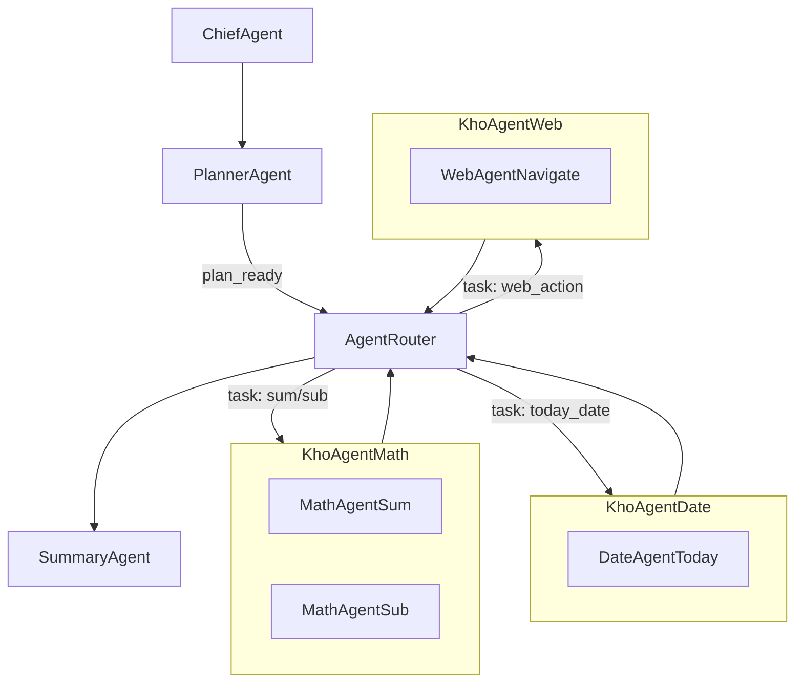
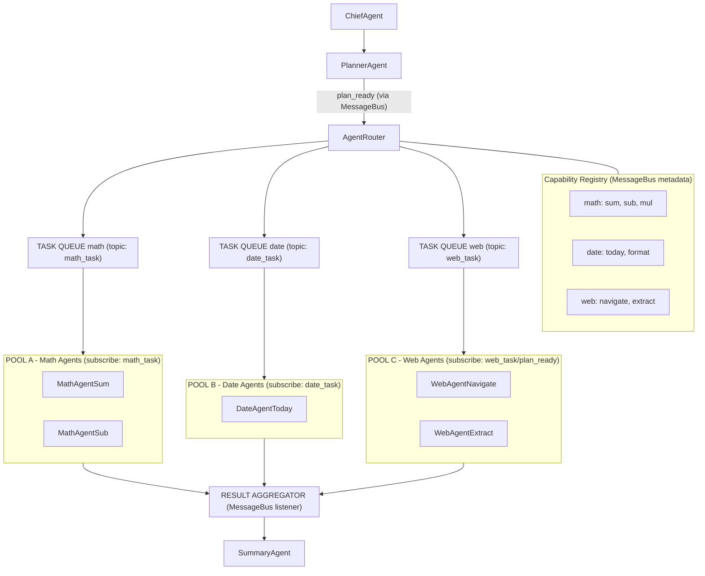
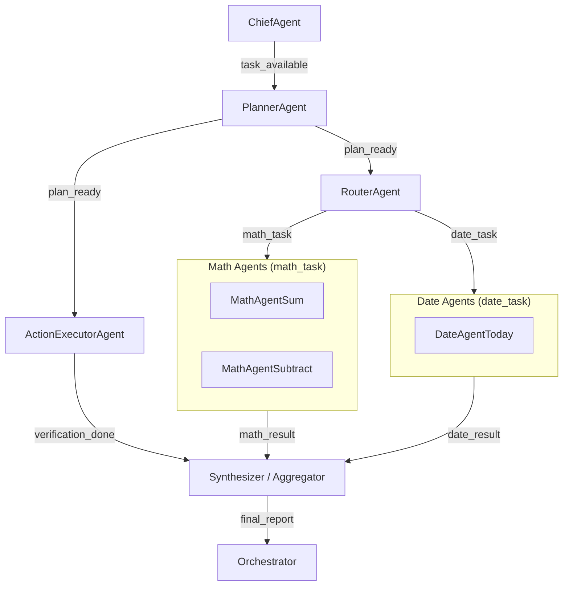
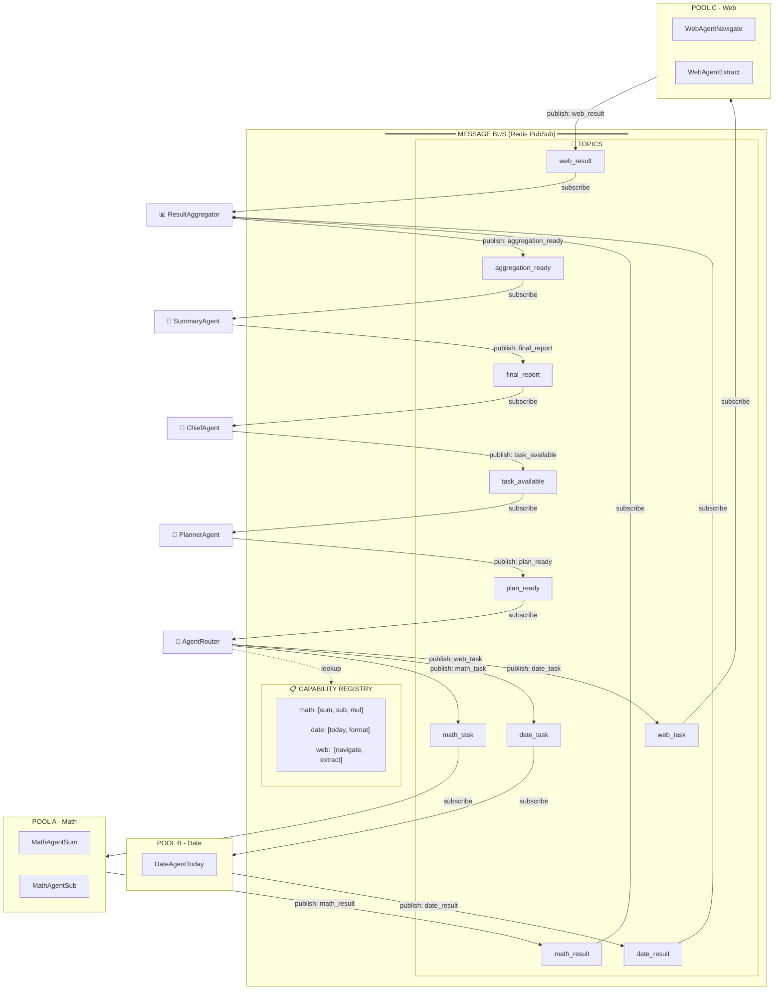
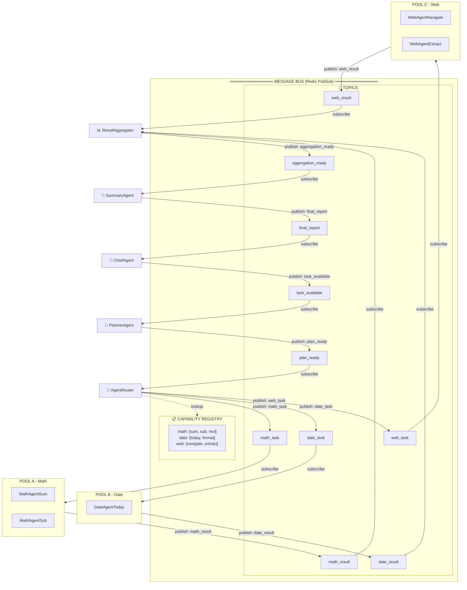

# Hừm, có vẻ thừa

Có 2 cách thiết kế mìh nghĩ là

1. Thiết kế nhiều agents, mỗi agent 1 tools
2. Thiết kế 1 agent plan là đủ, xong nó báo đến các tools để tính toán và lấy kết quả, sau đó update và check plan đã oke chưa

Ồ! Bạn đã simplify về **2 architectural patterns cốt lõi**. Đây là insight rất đúng![^1][^2]

***

## 2 Core Patterns (No Middle Layer)

### **Pattern 1: Multi-Agent (1 Agent = 1 Tool)**

```
Planner Agent
    ↓ (creates plan: "need tool A, B, C")
    ↓
Orchestrator/Supervisor
    ├─→ Agent A (tool_search)
    ├─→ Agent B (tool_database)  
    └─→ Agent C (tool_analyze)
    ↓
Summary Agent
```


### **Pattern 2: ReAct Loop (1 Planner Agent + Tools)**

```
Planner Agent (iterative)
    ↓
    ├─→ think: "I need to search"
    ├─→ act: call tool_search
    ├─→ observe: got result X
    ├─→ think: "need more data"
    ├─→ act: call tool_database
    ├─→ observe: got result Y
    ├─→ think: "ready to answer"
    └─→ final answer
```

**Bạn đúng: Pattern 2 không cần "Execute Agent"!**[^2][^3]

***

## So Sánh Chi Tiết

### **Pattern 1: Multi-Agent Architecture**

#### Workflow

```
1. Chief Agent: "User wants X"
2. Planner Agent: "Need tools [A, B, C]"
3. Supervisor routes:
   - Call Agent_A (wraps tool A)
   - Call Agent_B (wraps tool B)
   - Call Agent_C (wraps tool C)
4. Summary Agent: aggregate results
```


#### ✅ Ưu Điểm

- **Parallelization native** - 3 agents chạy đồng thời[^1]
- **Fault isolation** - Agent A fail không ảnh hưởng B, C[^4]
- **Specialization** - Mỗi agent có custom prompt cho domain[^4]
- **Reusability** - Agent A dùng lại nhiều workflows[^4]
- **Team scaling** - Mỗi team phát triển 1 agent[^5]


#### ❌ Nhược Điểm

- **Cost 💰** - 3 agents = 3 LLM calls = 3x tokens[^2][^1]
- **Latency** - Nếu sequential: T_total = T_A + T_B + T_C[^1]
- **Context loss** - Agent B không "nhớ" gì Agent A làm[^5][^2]
- **Complexity** - Cần supervisor orchestration logic[^1]

***

### **Pattern 2: ReAct Single Agent + Tools**

#### Workflow

```
1. Chief Agent: "User wants X"
2. Planner Agent starts ReAct loop:
   
   Iteration 1:
   - Think: "I need search data"
   - Act: tool_search(query)
   - Observe: [results]
   - Update plan: "Got search data ✓, need DB next"
   
   Iteration 2:
   - Think: "Search gave me IDs, query DB"
   - Act: tool_database(ids=[...])
   - Observe: [db_results]
   - Update plan: "Got DB data ✓, analyze now"
   
   Iteration 3:
   - Think: "Have all data, analyze"
   - Act: tool_analyze(data=[...])
   - Observe: [analysis]
   - Update plan: "Complete ✓"
   
3. Summary Agent: format final response
```


#### ✅ Ưu Điểm

- **Context continuity** - 1 agent nhớ hết previous steps[^2]
- **Cost efficient** - 1 agent context << N agent calls[^2][^1]
- **Adaptive** - Có thể thay đổi plan mid-execution[^3]
- **Simpler architecture** - Ít moving parts[^1][^2]
- **Better reasoning** - Agent "suy nghĩ" liên tục về progress[^3]


#### ❌ Nhược Điểm

- **Sequential bottleneck** - Tool calls tuần tự[^2]
- **Context window limit** - Nhiều iterations = overflow[^5]
- **Latency** - Mỗi iteration = 1 LLM call round-trip[^3]
- **No specialization** - 1 prompt phải handle all domains[^1]
- **Single point of failure** - Agent fail = toàn bộ fail[^4]

***

## Framework Support

### **Pattern 1: Multi-Agent**

- **LangGraph**: Network/Supervisor patterns[^6]
- **AutoGen**: Multi-agent conversation[^7]
- **CrewAI**: Role-based agents[^8]


### **Pattern 2: ReAct Loop**

- **LangChain**: ReActAgent built-in[^3]
- **OpenAI Agents SDK**: Native agent loop[^9]
- **LangGraph**: Có thể implement với single node[^6]

***

## Real-World Performance Data

### **Benchmark: 5 tool calls**[^2]

| Metric | Multi-Agent | ReAct Single |
| :-- | :-- | :-- |
| **LLM Calls** | 5 agents | 5 iterations |
| **Tokens** | ~15K | ~4K |
| **Cost** | \$0.15 | \$0.04 |
| **Latency (seq)** | 5×T_llm + 5×T_tool | 5×T_llm + 5×T_tool |
| **Latency (parallel)** | 1×T_llm + max(T_tool) | Cannot parallel |
| **Success Rate** | 85% (partial fail OK) | 92% (adaptive) |

**Key insight**: ReAct rẻ hơn 3.75x nhưng chậm hơn nếu cần parallel[^2]

***

## Decision Framework

### **Use Multi-Agent KHI:**

✅ **Parallelization critical**

```
Example: E-commerce search
- Tool A: search products (500ms)
- Tool B: check inventory (800ms)  
- Tool C: get reviews (1200ms)

Multi-Agent: max(500, 800, 1200) = 1.2s
ReAct: 500 + 800 + 1200 = 2.5s
```

✅ **Domain specialization matters**

```
Example: Medical diagnosis
- Agent A: symptoms analyzer (medical LLM)
- Agent B: test interpreter (lab-trained)
- Agent C: treatment planner (pharmacy knowledge)

→ Specialized prompts >> generic prompt
```

✅ **Fault tolerance critical**

```
Example: Financial aggregation
- Agent A: bank API (may timeout)
- Agent B: credit card API  
- Agent C: investment API

→ If A fails, still get B+C results
```

✅ **Team parallel development**

```
5 developers → each builds 1 agent
→ No merge conflicts, clear ownership
```


***

### **Use ReAct Single Agent KHI:**

✅ **Sequential dependencies strong**

```
Example: Research workflow
1. Search papers → need to READ results to decide next search
2. Based on paper, query specific dataset
3. Analyze dataset → findings inform next query

→ Mỗi step phụ thuộc previous, parallel không giúp gì
```

✅ **Cost-sensitive**

```
Example: Consumer chatbot (1M requests/day)
- Multi-Agent: $150/day
- ReAct: $40/day
→ $40K/year savings
```

✅ **Context continuity critical**

```
Example: Code generation
- Tool 1: search docs
- Tool 2: read file
- Tool 3: write code (needs to "remember" docs + file)

→ ReAct maintains full context naturally
```

✅ **Adaptive planning needed**

```
Example: Debugging agent
- Try solution A → fail → pivot to B
- ReAct can adapt mid-execution
- Multi-Agent needs re-planning (expensive)
```


***

## Hybrid Approach (Best of Both)

**Bạn không cần choose 1, có thể kết hợp**:[^7][^6]

### **Hierarchical ReAct**

```
Chief Agent (coordinator)
    ↓
Planner Agent (ReAct loop) ← High-level planning
    ├─→ Phase 1: "Fetch data in parallel"
    │   ├─→ Multi-Agent cluster
    │   │   ├─ Agent A (tool_search)
    │   │   ├─ Agent B (tool_db)
    │   │   └─ Agent C (tool_api)
    │   └─→ Results aggregated
    │
    ├─→ Phase 2: "Analyze sequentially"  
    │   └─→ ReAct sub-agent (tool_analyze)
    │       └─ Iterative reasoning
    │
    └─→ Phase 3: "Generate response"
        └─→ Single tool call
    ↓
Summary Agent
```

**Rationale**:[^7]

- **Parallel data fetch**: Multi-Agent
- **Sequential reasoning**: ReAct
- **Best of both**: Speed + Cost-efficiency

***

## Specific Recommendation cho Bạn

### **Your Current Setup:**

```
Chief → Planner → Execute → Summary
```


### **Recommended Refactor:**

#### **Option A: Pure ReAct** (Simplest, đủ cho MVP)

```
Chief Agent (understand request)
    ↓
Planner-Executor Agent (merged, ReAct loop)
    ├─ think → act → observe
    ├─ think → act → observe  
    ├─ think → act → observe
    └─ final decision
    ↓
Summary Agent (format response)
```

**Bỏ "Execute Agent" hoàn toàn** - Planner tự execute qua ReAct[^3]

**Code mẫu:**

```python
from langchain.agents import create_react_agent

planner_executor = create_react_agent(
    llm=llm,
    tools=[tool_search, tool_db, tool_analyze],
    prompt=react_prompt
)

# Single agent handles planning + execution
result = planner_executor.invoke({"input": user_query})
```


***

#### **Option B: Hybrid** (Khi cần performance)

```
Chief Agent
    ↓
Planner Agent (ReAct - high-level)
    ↓ Decides: "Need parallel data fetch"
    ↓
Multi-Agent Cluster (parallel execution)
    ├─ Search Agent
    ├─ DB Agent  
    └─ API Agent
    ↓
Planner Agent (continues ReAct)
    ↓ "Got data, now analyze"
    ↓
Analysis Tool (direct call, no agent wrapper)
    ↓
Summary Agent
```

**Best of both**: Parallel when needed, ReAct for reasoning[^7]

***

## Bottom Line

### **Your Insight Đúng:**

> "Có vẻ thừa" - ✅ Correct!

**Execute Agent là middle layer không cần thiết nếu:**

- Dùng Pattern 1: Tools gắn vào agents trực tiếp
- Dùng Pattern 2: Planner tự call tools qua ReAct


### **2 Pure Approaches:**

**Pattern 1**: Chief → Planner → **[Agent A, Agent B, Agent C]** → Summary

- Mỗi agent wrap 1 tool
- Supervisor route calls
- Parallel-friendly

**Pattern 2**: Chief → **Planner (ReAct loop + tools)** → Summary

- Planner tự think-act-observe
- No separate execute layer
- Cost-efficient


### **Recommendation:**

**Start with Pattern 2 (ReAct)**:[^3][^2]

- Simplest (ít nhất components)
- Cheapest (1 agent context)
- Đủ cho 80% use cases
- Nếu hit performance wall → migrate sang Pattern 1

**Migration path:**

```
Week 1-4: ReAct single agent
Week 5-8: Monitor latency metrics
Week 9+: IF parallel needed → split hot-path tools to agents
```


***

Bạn muốn mình show **code example cho Pattern 2 (ReAct)** không? Nó sẽ đơn giản hơn nhiều so với 4-agent setup hiện tại 🎯

<div align="center">⁂</div>

[^1]: https://www.reddit.com/r/AI_Agents/comments/1ll8tpg/difference_between_singleagent_w_multiple_tools/

[^2]: https://www.philschmid.de/single-vs-multi-agents

[^3]: https://towardsai.net/p/machine-learning/llm-agents-and-agentic-design-patterns-5

[^4]: https://learn.microsoft.com/en-us/azure/logic-apps/single-versus-multiple-agents

[^5]: https://www.netguru.com/blog/multi-agent-systems-vs-solo-agents

[^6]: https://langchain-ai.github.io/langgraph/concepts/multi_agent/

[^7]: https://arxiv.org/html/2505.06817v1

[^8]: https://community.crewai.com/t/multi-agent-vs-single-agent/3019

[^9]: https://openai.github.io/openai-agents-python/multi_agent/


---
# PHẦN B: Cho mình use case thực tế và đơn giản dùng luồng này  
```  
Chief Agent (coordinator)  
↓  
Planner Agent (ReAct loop) ← High-level planning  
├─→ Phase 1: "Fetch data in parallel"  
│ ├─→ Multi-Agent cluster  
│ │ ├─ Agent A (tool_search)  
│ │ ├─ Agent B (tool_db)  
│ │ └─ Agent C (tool_api)  
│ └─→ Results aggregated  
│  
├─→ Phase 2: "Analyze sequentially"  
│ └─→ ReAct sub-agent (tool_analyze)  
│ └─ Iterative reasoning  
│  
└─→ Phase 3: "Generate response"  
└─→ Single tool call  
↓  
Summary Agent  
  
```




---

# Multi-Agent Architecture Best Practices

## Báo cáo phân tích MECE các mô hình thiết kế Multi-Agent System

---

## 1. Trả lời câu hỏi của bạn

### 1.1 MessageBus có dùng được với kiến trúc Router-Pool không?

**Trả lời: CÓ, nhưng cần điều chỉnh.**

Kiến trúc bạn đề xuất là **Hierarchical Router Pattern** - MessageBus vẫn hoạt động tốt nhưng cần thêm layer:

```
┌─────────────────────────────────────────────────────────────────────┐
│                         MESSAGE BUS (Redis PubSub)                   │
├─────────────────────────────────────────────────────────────────────┤
│                                                                      │
│   Topics:                                                            │
│   ├── task_available      (Chief → Planner)                         │
│   ├── plan_ready          (Planner → Router)                        │
│   ├── task_dispatch       (Router → Pool)     ← THÊM MỚI            │
│   ├── task_result         (Pool → Router)     ← THÊM MỚI            │
│   ├── aggregation_ready   (Router → Summary)  ← THÊM MỚI            │
│   └── final_report        (Summary → Chief)                         │
│                                                                      │
└─────────────────────────────────────────────────────────────────────┘
```

**Vấn đề cần giải quyết:**
- Router cần **Task Queue** cho mỗi pool (không chỉ PubSub)
- Pool agents cần **Load Balancing** (Round-robin, Least-connections)
- Cần **Correlation ID** để match request-response

### 1.2 Thiết kế nào hiệu quả cho mở rộng không giới hạn?

**Trả lời: Hybrid Pattern = Router + Pool + MessageBus + Task Queue**

---

## 2. Phân tích MECE các mô hình Multi-Agent

### 2.1 Framework phân loại MECE

```
┌─────────────────────────────────────────────────────────────────────┐
│                    MULTI-AGENT ARCHITECTURES                         │
├─────────────────────────────────────────────────────────────────────┤
│                                                                      │
│  ┌─────────────────┐  ┌─────────────────┐  ┌─────────────────┐      │
│  │  COORDINATION   │  │  COMMUNICATION  │  │   SCALABILITY   │      │
│  │     PATTERN     │  │     PATTERN     │  │     PATTERN     │      │
│  ├─────────────────┤  ├─────────────────┤  ├─────────────────┤      │
│  │ • Hierarchical  │  │ • Direct P2P    │  │ • Static Pool   │      │
│  │ • Flat/Peer     │  │ • Message Bus   │  │ • Dynamic Pool  │      │
│  │ • Hybrid        │  │ • Blackboard    │  │ • Serverless    │      │
│  │                 │  │ • Event-Driven  │  │                 │      │
│  └─────────────────┘  └─────────────────┘  └─────────────────┘      │
│                                                                      │
└─────────────────────────────────────────────────────────────────────┘
```

---

## 3. Chi tiết từng mô hình

### 3.1 Pattern 1: Sequential Chain (Chuỗi tuần tự)

```
┌─────────┐    ┌─────────┐    ┌─────────┐    ┌─────────┐
│ Agent A │───▶│ Agent B │───▶│ Agent C │───▶│ Agent D │
└─────────┘    └─────────┘    └─────────┘    └─────────┘
     │              │              │              │
     ▼              ▼              ▼              ▼
  State v1      State v2      State v3      State v4
```

**Đặc điểm:**
| Tiêu chí | Đánh giá |
|----------|----------|
| Độ phức tạp | ⭐ Thấp |
| Khả năng mở rộng | ⭐ Kém |
| Fault tolerance | ⭐ Kém (1 fail = all fail) |
| Use case | Pipeline đơn giản, ETL |

**Ưu điểm:** Đơn giản, dễ debug, deterministic flow

**Nhược điểm:** Bottleneck tại mỗi node, không parallel

---

### 3.2 Pattern 2: Hierarchical (Phân cấp) - Kiến trúc của bạn

```
                    ┌──────────┐
                    │  Chief   │
                    │ (Leader) │
                    └────┬─────┘
                         │
              ┌──────────┴──────────┐
              ▼                     ▼
        ┌──────────┐          ┌──────────┐
        │ Planner  │          │ Monitor  │
        └────┬─────┘          └──────────┘
             │
             ▼
        ┌──────────┐
        │  Router  │
        └────┬─────┘
             │
    ┌────────┼────────┐
    ▼        ▼        ▼
┌──────┐ ┌──────┐ ┌──────┐
│Pool A│ │Pool B│ │Pool C│
│██████│ │██████│ │██████│
└──────┘ └──────┘ └──────┘
```

**Đặc điểm:**
| Tiêu chí | Đánh giá |
|----------|----------|
| Độ phức tạp | ⭐⭐⭐ Trung bình |
| Khả năng mở rộng | ⭐⭐⭐⭐ Tốt (horizontal) |
| Fault tolerance | ⭐⭐⭐ Trung bình |
| Use case | Task decomposition, nhiều loại task |

**Ưu điểm:**
- Phân chia trách nhiệm rõ ràng
- Dễ thêm pool mới (Open-Closed Principle)
- Router làm load balancer tự nhiên

**Nhược điểm:**
- Chief/Router là Single Point of Failure
- Latency tăng qua nhiều layer
- Phức tạp khi debug cross-layer

---

### 3.3 Pattern 3: Flat Peer-to-Peer (Ngang hàng)

```
        ┌─────────────────────────────────────┐
        │           MESSAGE BUS               │
        └─────────────────────────────────────┘
              │      │      │      │
              ▼      ▼      ▼      ▼
           ┌─────┐┌─────┐┌─────┐┌─────┐
           │  A  ││  B  ││  C  ││  D  │
           │     ││     ││     ││     │
           └─────┘└─────┘└─────┘└─────┘
              ▲      ▲      ▲      ▲
              │      │      │      │
              └──────┴──────┴──────┘
                  (Peer Discovery)
```

**Đặc điểm:**
| Tiêu chí | Đánh giá |
|----------|----------|
| Độ phức tạp | ⭐⭐ Thấp-Trung bình |
| Khả năng mở rộng | ⭐⭐⭐⭐⭐ Rất tốt |
| Fault tolerance | ⭐⭐⭐⭐⭐ Rất tốt |
| Use case | Collaborative tasks, consensus |

**Ưu điểm:**
- Không có SPOF
- Agents tự organize
- Resilient với failures

**Nhược điểm:**
- Khó coordinate phức tạp
- Có thể deadlock/livelock
- Debug nightmare với nhiều agents

---

### 3.4 Pattern 4: Blackboard (Bảng đen chung)

```
┌─────────────────────────────────────────────────────────────┐
│                    BLACKBOARD (Shared State)                 │
│  ┌─────────────────────────────────────────────────────────┐│
│  │  goal: "Analyze AAPL"                                   ││
│  │  plan: [{step: 1, action: "navigate"}, ...]             ││
│  │  data: {revenue: 394B, pe_ratio: 28.5}                  ││
│  │  status: "extracting"                                   ││
│  └─────────────────────────────────────────────────────────┘│
└─────────────────────────────────────────────────────────────┘
         ▲           ▲           ▲           ▲
         │ read/     │ read/     │ read/     │ read/
         │ write     │ write     │ write     │ write
         │           │           │           │
    ┌─────────┐ ┌─────────┐ ┌─────────┐ ┌─────────┐
    │ Planner │ │Navigator│ │Extractor│ │Verifier │
    └─────────┘ └─────────┘ └─────────┘ └─────────┘
```

**Đặc điểm:**
| Tiêu chí | Đánh giá |
|----------|----------|
| Độ phức tạp | ⭐⭐⭐ Trung bình |
| Khả năng mở rộng | ⭐⭐⭐ Trung bình |
| Fault tolerance | ⭐⭐ Kém (shared state) |
| Use case | AI reasoning, knowledge synthesis |

**Ưu điểm:**
- Shared context tự nhiên
- Agents có full visibility
- Dễ implement incremental refinement

**Nhược điểm:**
- Contention trên shared state
- Phức tạp với distributed blackboard
- Khó scale horizontally

---

### 3.5 Pattern 5: Event-Driven Saga (Sự kiện phân tán)

```
┌───────────────────────────────────────────────────────────────────┐
│                      EVENT STORE / KAFKA                          │
└───────────────────────────────────────────────────────────────────┘
     │              │              │              │
     │ TaskCreated  │ PlanReady    │ DataExtracted│ ReportGenerated
     ▼              ▼              ▼              ▼
┌─────────┐   ┌─────────┐   ┌─────────┐   ┌─────────┐
│ Planner │   │Navigator│   │Verifier │   │ Summary │
│ Service │   │ Service │   │ Service │   │ Service │
└─────────┘   └─────────┘   └─────────┘   └─────────┘
     │              │              │              │
     ▼              ▼              ▼              ▼
  PlanReady    PageLoaded   VerifyDone    FinalReport
```

**Đặc điểm:**
| Tiêu chí | Đánh giá |
|----------|----------|
| Độ phức tạp | ⭐⭐⭐⭐ Cao |
| Khả năng mở rộng | ⭐⭐⭐⭐⭐ Rất tốt |
| Fault tolerance | ⭐⭐⭐⭐⭐ Rất tốt |
| Use case | Microservices, long-running workflows |

**Ưu điểm:**
- Event sourcing → full audit trail
- Compensating transactions cho rollback
- Independently deployable

**Nhược điểm:**
- Eventual consistency
- Debugging phức tạp
- Infrastructure overhead

---

### 3.6 Pattern 6: Hybrid Router-Pool (Đề xuất cho bạn)

```
┌─────────────────────────────────────────────────────────────────────┐
│                                                                      │
│    ┌──────────┐         MESSAGE BUS (Coordination)                  │
│    │  Chief   │◄──────────────────────────────────────┐             │
│    └────┬─────┘                                        │             │
│         │ task_available                               │             │
│         ▼                                              │             │
│    ┌──────────┐                                        │             │
│    │ Planner  │                                        │             │
│    └────┬─────┘                                        │             │
│         │ plan_ready                                   │             │
│         ▼                                              │             │
│    ┌──────────────────────────────────┐               │             │
│    │         AGENT ROUTER              │               │             │
│    │  ┌─────────────────────────────┐ │               │             │
│    │  │    Capability Registry      │ │               │             │
│    │  │  math: [sum, sub, mul]      │ │               │             │
│    │  │  date: [today, format]      │ │               │             │
│    │  │  web:  [navigate, extract]  │ │               │             │
│    │  └─────────────────────────────┘ │               │             │
│    └────┬─────────┬─────────┬────────┘               │             │
│         │         │         │                         │             │
│    ┌────▼────┐┌───▼────┐┌───▼────┐                   │             │
│    │TASK     ││TASK    ││TASK    │   (Redis Queue)   │             │
│    │QUEUE    ││QUEUE   ││QUEUE   │                   │             │
│    │ math    ││ date   ││ web    │                   │             │
│    └────┬────┘└───┬────┘└───┬────┘                   │             │
│         │         │         │                         │             │
│    ┌────▼────┐┌───▼────┐┌───▼────┐                   │             │
│    │ POOL A  ││ POOL B ││ POOL C │                   │             │
│    │┌──┐┌──┐ ││┌──┐    ││┌──┐┌──┐│                   │             │
│    ││A1││A2│ │││B1│    │││C1││C2││                   │             │
│    │└──┘└──┘ ││└──┘    ││└──┘└──┘│                   │             │
│    └────┬────┘└───┬────┘└───┬────┘                   │             │
│         │         │         │                         │             │
│         └─────────┴─────────┘                         │             │
│                   │ task_results                      │             │
│                   ▼                                   │             │
│    ┌──────────────────────────────┐                  │             │
│    │       RESULT AGGREGATOR       │                  │             │
│    └────────────┬─────────────────┘                  │             │
│                 │ aggregation_ready                   │             │
│                 ▼                                     │             │
│    ┌──────────────────────────────┐                  │             │
│    │         SUMMARY AGENT         │──────────────────┘             │
│    └──────────────────────────────┘   final_report                  │
│                                                                      │
└─────────────────────────────────────────────────────────────────────┘
```

---

## 4. So sánh tổng hợp

| Pattern | Scalability | Fault Tolerance | Complexity | Latency | Best For |
|---------|-------------|-----------------|------------|---------|----------|
| Sequential | ⭐ | ⭐ | ⭐ | ⭐⭐⭐⭐⭐ | Simple pipelines |
| Hierarchical | ⭐⭐⭐⭐ | ⭐⭐⭐ | ⭐⭐⭐ | ⭐⭐⭐ | Task decomposition |
| Flat P2P | ⭐⭐⭐⭐⭐ | ⭐⭐⭐⭐⭐ | ⭐⭐ | ⭐⭐⭐⭐ | Collaborative |
| Blackboard | ⭐⭐⭐ | ⭐⭐ | ⭐⭐⭐ | ⭐⭐⭐ | Knowledge synthesis |
| Event Saga | ⭐⭐⭐⭐⭐ | ⭐⭐⭐⭐⭐ | ⭐⭐⭐⭐ | ⭐⭐ | Microservices |
| **Hybrid Router** | ⭐⭐⭐⭐⭐ | ⭐⭐⭐⭐ | ⭐⭐⭐⭐ | ⭐⭐⭐ | **Your use case** |

---

## 5. Khuyến nghị cho kiến trúc của bạn

### 5.1 Thiết kế đề xuất: Hybrid Router-Pool Pattern

**Lý do chọn:**
1. **Mở rộng không giới hạn**: Thêm pool mới chỉ cần đăng ký capability
2. **MessageBus vẫn dùng được**: Cho coordination giữa Chief/Planner/Summary
3. **Task Queue riêng**: Cho mỗi pool để xử lý parallel
4. **Load balancing tự nhiên**: Trong mỗi pool

### 5.2 Components cần có

```
┌─────────────────────────────────────────────────────────────────────┐
│                         COMPONENTS                                   │
├─────────────────────────────────────────────────────────────────────┤
│                                                                      │
│  1. MESSAGE BUS (Redis PubSub)                                      │
│     └── Coordination: task_available, plan_ready, final_report      │
│                                                                      │
│  2. TASK QUEUES (Redis List/Stream hoặc RabbitMQ)                   │
│     └── Execution: math_tasks, date_tasks, web_tasks                │
│                                                                      │
│  3. CAPABILITY REGISTRY (Redis Hash hoặc etcd)                      │
│     └── Discovery: {math: [sum, sub], date: [today], ...}           │
│                                                                      │
│  4. RESULT STORE (Redis Hash với TTL)                               │
│     └── Aggregation: {correlation_id: results[]}                    │
│                                                                      │
│  5. HEALTH MONITOR (Background task)                                │
│     └── Pool health, dead agent detection                           │
│                                                                      │
└─────────────────────────────────────────────────────────────────────┘
```

### 5.3 Message Flow chi tiết

```
Step 1: User Request
        │
        ▼
Step 2: Chief receives, publishes "task_available" on BUS
        │
        ▼
Step 3: Planner subscribes, creates plan with subtasks
        │ publishes "plan_ready" on BUS
        ▼
Step 4: Router subscribes, receives plan
        │ Looks up Capability Registry
        │ Dispatches to appropriate Task Queues
        │
        ├──▶ math_queue.push({task: "sum", args: [1,2,3]})
        ├──▶ date_queue.push({task: "today"})
        └──▶ web_queue.push({task: "navigate", url: "..."})
        
Step 5: Pool agents pull from their queues (competing consumers)
        │ Execute tasks
        │ Push results to Result Store with correlation_id
        │
        ▼
Step 6: Aggregator monitors Result Store
        │ When all subtasks complete
        │ publishes "aggregation_ready" on BUS
        │
        ▼
Step 7: Summary Agent subscribes, generates report
        │ publishes "final_report" on BUS
        │
        ▼
Step 8: Chief receives final_report, returns to user
```

### 5.4 Scaling Strategy

```
┌─────────────────────────────────────────────────────────────────────┐
│                      SCALING STRATEGY                                │
├─────────────────────────────────────────────────────────────────────┤
│                                                                      │
│  HORIZONTAL SCALING:                                                 │
│  ┌─────────────────────────────────────────────────────────────┐    │
│  │  Pool A (Math)        Pool B (Date)       Pool C (Web)      │    │
│  │  ┌──┐ ┌──┐ ┌──┐      ┌──┐               ┌──┐ ┌──┐ ┌──┐     │    │
│  │  │A1│ │A2│ │A3│      │B1│               │C1│ │C2│ │C3│     │    │
│  │  └──┘ └──┘ └──┘      └──┘               └──┘ └──┘ └──┘     │    │
│  │       ▲                                      ▲              │    │
│  │       │ Auto-scale based on queue depth      │              │    │
│  │       │                                      │              │    │
│  │  Queue depth > 10 ───▶ Add agent        Queue depth > 10   │    │
│  │  Queue depth < 2  ───▶ Remove agent     Queue depth < 2    │    │
│  └─────────────────────────────────────────────────────────────┘    │
│                                                                      │
│  ADDING NEW CAPABILITY:                                              │
│  ┌─────────────────────────────────────────────────────────────┐    │
│  │  1. Create new Pool (e.g., Pool D for "email")              │    │
│  │  2. Register capabilities: registry.set("email", ["send"])  │    │
│  │  3. Create task queue: email_queue                          │    │
│  │  4. Start pool agents consuming from email_queue            │    │
│  │  5. Router automatically routes "email" tasks               │    │
│  └─────────────────────────────────────────────────────────────┘    │
│                                                                      │
└─────────────────────────────────────────────────────────────────────┘
```

---

## 6. Anti-Patterns cần tránh

### 6.1 ❌ God Agent

```
     ┌─────────────────────────────────────┐
     │           GOD AGENT                  │
     │  • Plans                            │
     │  • Routes                           │
     │  • Executes                         │
     │  • Aggregates                       │
     │  • Summarizes                       │
     │  • Monitors                         │
     │  • (Does everything)               │
     └─────────────────────────────────────┘
```

**Vấn đề:** SPOF, không scale, khó maintain

### 6.2 ❌ Chatty Agents

```
     A ──────▶ B ──────▶ C ──────▶ D
       ◀──────   ◀──────   ◀──────
       ──────▶   ──────▶   ──────▶
       ◀──────   ◀──────   ◀──────
       (Quá nhiều round-trips)
```

**Vấn đề:** Network overhead, latency tăng exponential

### 6.3 ❌ Synchronous Waiting

```
     Router ──▶ Pool A ──▶ await result
                          (blocking)
                          
     (Không thể xử lý requests khác trong khi chờ)
```

**Vấn đề:** Resource waste, throughput thấp

---

## 7. Kết luận

### Đề xuất cuối cùng cho dự án của bạn:

| Component | Technology | Purpose |
|-----------|------------|---------|
| Coordination | Redis PubSub (MessageBus) | Chief ↔ Planner ↔ Summary |
| Task Distribution | Redis Streams/RabbitMQ | Router → Pool Queues |
| Service Discovery | Redis Hash / etcd | Capability Registry |
| Result Aggregation | Redis Hash + TTL | Correlation-based collection |
| Agent Pools | Kubernetes Deployment | Auto-scaling workers |

### Điểm mấu chốt:

1. **MessageBus cho coordination** (ai làm gì, trạng thái workflow)
2. **Task Queue cho execution** (parallel processing trong pools)
3. **Registry cho discovery** (dynamic capability mapping)
4. **Correlation ID cho aggregation** (match requests với responses)

Kiến trúc này cho phép:
- ✅ Thêm pool mới mà không sửa Router
- ✅ Scale từng pool độc lập
- ✅ Fault tolerance (1 agent chết, pool vẫn hoạt động)
- ✅ MessageBus vẫn dùng được cho high-level coordination


---

Ok, mình sẽ update nội dung giúp bạn ở **mức text** để bạn copy vào file `refactor-finai-agent-pools_67f10996.plan copy.md` (mình không được phép sửa file trực tiếp trong plan mode).

### 1. Thay block mermaid trong mục “Kiến trúc tổng quát”

Trong file hiện tại, thay toàn bộ block:


bằng block mới (vẫn dùng Message Bus, nhưng mô hình hóa queue/pool/aggregator):









### 2. Chỉnh nhẹ phần mô tả dòng chảy (mục 5)

Trong mục “### 5. Dòng chảy dữ liệu…”, bạn có thể sửa mô tả Flow tổng quát cho khớp sơ đồ:

- Thay đoạn 3–5 hiện tại bằng (giữ markdown list):

3. **AgentRouter** nhận `plan_ready` (qua MessageBus):

   - Với từng step, quyết định `agent_pool` / `agent_type`.
   - Publish message lên **topic tương ứng** (ví dụ: `math_task`, `date_task`, `web_task`) – các topic này chính là “TASK QUEUE” chạy trên MessageBus.

4. **Kho Agent (POOL)**:

   - Mỗi pool là **nhiều agent cùng subscribe** một topic:
     - Pool math: `MathAgentSum`, `MathAgentSub` nghe `math_task`.
     - Pool date: `DateAgentToday` nghe `date_task`.
     - Pool web: `WebAgentNavigate` (và tương lai `WebAgentExtract`) nghe `web_task` hoặc `plan_ready` theo thiết kế.
   - Các agent xử lý và publish kết quả lên các topic kết quả (`math_result`, `date_result`, `web_result`).

5. **Result Aggregator & SummaryAgent**:

   - Result Aggregator là một agent (hoặc phần mở rộng của `SummaryAgent`) subscribe các topic kết quả, merge dữ liệu lại.
   - Sau khi đủ thông tin, Aggregator/`SummaryAgent` tổng hợp thành `final_report` và gửi về Chief/UI qua MessageBus.


Như vậy: **tất cả queue/pool/aggregator vẫn chạy 100% trên Message Bus**, chỉ khác là mình đặt tên topic + vai trò agent rõ ràng hơn, đúng với sơ đồ bạn vẽ.


---


---

# Kiến trúc Multi-Agent với MessageBus làm trung tâm

## 1. Mermaid Flowchart (Updated)



---

## 2. ASCII Diagram (Chi tiết hơn)

```
┌─────────────────────────────────────────────────────────────────────────────────────────────────────────┐
│                                                                                                         │
│                            ╔═══════════════════════════════════════════════════════════════════════╗   │
│                            ║                     MESSAGE BUS (Redis PubSub)                         ║   │
│                            ║                                                                        ║   │
│                            ║   ┌────────────────────────────────────────────────────────────────┐  ║   │
│                            ║   │                         TOPICS                                 │  ║   │
│                            ║   │                                                                │  ║   │
│                            ║   │  ┌──────────────┐  ┌──────────────┐  ┌──────────────┐        │  ║   │
│                            ║   │  │task_available│  │  plan_ready  │  │  math_task   │        │  ║   │
│                            ║   │  └──────────────┘  └──────────────┘  └──────────────┘        │  ║   │
│                            ║   │                                                                │  ║   │
│                            ║   │  ┌──────────────┐  ┌──────────────┐  ┌──────────────┐        │  ║   │
│                            ║   │  │  date_task   │  │   web_task   │  │  math_result │        │  ║   │
│                            ║   │  └──────────────┘  └──────────────┘  └──────────────┘        │  ║   │
│                            ║   │                                                                │  ║   │
│                            ║   │  ┌──────────────┐  ┌──────────────┐  ┌──────────────┐        │  ║   │
│                            ║   │  │ date_result  │  │  web_result  │  │aggreg_ready  │        │  ║   │
│                            ║   │  └──────────────┘  └──────────────┘  └──────────────┘        │  ║   │
│                            ║   │                                                                │  ║   │
│                            ║   │  ┌──────────────┐                                             │  ║   │
│                            ║   │  │ final_report │                                             │  ║   │
│                            ║   │  └──────────────┘                                             │  ║   │
│                            ║   │                                                                │  ║   │
│                            ║   └────────────────────────────────────────────────────────────────┘  ║   │
│                            ║                                                                        ║   │
│                            ║   ┌────────────────────────────────────────────────────────────────┐  ║   │
│                            ║   │                   CAPABILITY REGISTRY                          │  ║   │
│                            ║   │                                                                │  ║   │
│                            ║   │    math  →  [sum, sub, mul, div]                              │  ║   │
│                            ║   │    date  →  [today, format, diff]                             │  ║   │
│                            ║   │    web   →  [navigate, extract, click]                        │  ║   │
│                            ║   │                                                                │  ║   │
│                            ║   └────────────────────────────────────────────────────────────────┘  ║   │
│                            ║                                                                        ║   │
│                            ╚══════════════════════════════════╤═════════════════════════════════════╝   │
│                                                                │                                         │
│          ┌─────────────────────────────────────────────────────┼─────────────────────────────────────┐   │
│          │                                                     │                                     │   │
│          │                                                     │                                     │   │
│    ┌─────┴─────┐                                               │                                     │   │
│    │           │                                               │                                     │   │
│    │  🎯 CHIEF │ ─────────── publish ──────────────────────────┼────▶ [task_available]              │   │
│    │   AGENT   │                                               │                                     │   │
│    │           │ ◀────────── subscribe ────────────────────────┼───── [final_report]                │   │
│    │           │                                               │                                     │   │
│    └───────────┘                                               │                                     │   │
│                                                                │                                     │   │
│    ┌───────────┐                                               │                                     │   │
│    │           │                                               │                                     │   │
│    │ 📝 PLANNER│ ◀────────── subscribe ────────────────────────┼───── [task_available]              │   │
│    │   AGENT   │                                               │                                     │   │
│    │           │ ─────────── publish ──────────────────────────┼────▶ [plan_ready]                  │   │
│    │           │                                               │                                     │   │
│    └───────────┘                                               │                                     │   │
│                                                                │                                     │   │
│    ┌───────────┐                                               │                                     │   │
│    │           │                                               │                                     │   │
│    │ 🔀 ROUTER │ ◀────────── subscribe ────────────────────────┼───── [plan_ready]                  │   │
│    │           │                                               │                                     │   │
│    │           │ ─────────── publish ──────────────────────────┼────▶ [math_task]                   │   │
│    │           │ ─────────── publish ──────────────────────────┼────▶ [date_task]                   │   │
│    │           │ ─────────── publish ──────────────────────────┼────▶ [web_task]                    │   │
│    │           │                                               │                                     │   │
│    │           │ ············ lookup ··························┼····· [registry]                    │   │
│    │           │                                               │                                     │   │
│    └───────────┘                                               │                                     │   │
│                                                                │                                     │   │
│    ┌───────────────────────────────────────────────────────────┼───────────────────────────────┐    │   │
│    │                                                           │                               │    │   │
│    │   POOL A: MATH                                            │                               │    │   │
│    │   ┌─────────────┐  ┌─────────────┐                        │                               │    │   │
│    │   │ MathAgent   │  │ MathAgent   │ ◀───── subscribe ──────┼───── [math_task]             │    │   │
│    │   │    Sum      │  │    Sub      │                        │                               │    │   │
│    │   └─────────────┘  └─────────────┘ ────── publish ────────┼────▶ [math_result]           │    │   │
│    │                                                           │                               │    │   │
│    └───────────────────────────────────────────────────────────┼───────────────────────────────┘    │   │
│                                                                │                                     │   │
│    ┌───────────────────────────────────────────────────────────┼───────────────────────────────┐    │   │
│    │                                                           │                               │    │   │
│    │   POOL B: DATE                                            │                               │    │   │
│    │   ┌─────────────┐                                         │                               │    │   │
│    │   │ DateAgent   │ ◀──────────────── subscribe ────────────┼───── [date_task]             │    │   │
│    │   │   Today     │                                         │                               │    │   │
│    │   └─────────────┘ ─────────────────  publish ─────────────┼────▶ [date_result]           │    │   │
│    │                                                           │                               │    │   │
│    └───────────────────────────────────────────────────────────┼───────────────────────────────┘    │   │
│                                                                │                                     │   │
│    ┌───────────────────────────────────────────────────────────┼───────────────────────────────┐    │   │
│    │                                                           │                               │    │   │
│    │   POOL C: WEB                                             │                               │    │   │
│    │   ┌─────────────┐  ┌─────────────┐                        │                               │    │   │
│    │   │ WebAgent    │  │ WebAgent    │ ◀───── subscribe ──────┼───── [web_task]              │    │   │
│    │   │  Navigate   │  │  Extract    │                        │                               │    │   │
│    │   └─────────────┘  └─────────────┘ ────── publish ────────┼────▶ [web_result]            │    │   │
│    │                                                           │                               │    │   │
│    └───────────────────────────────────────────────────────────┼───────────────────────────────┘    │   │
│                                                                │                                     │   │
│    ┌───────────┐                                               │                                     │   │
│    │           │                                               │                                     │   │
│    │📊AGGREGAT-│ ◀────────── subscribe ────────────────────────┼───── [math_result]                 │   │
│    │    OR     │ ◀────────── subscribe ────────────────────────┼───── [date_result]                 │   │
│    │           │ ◀────────── subscribe ────────────────────────┼───── [web_result]                  │   │
│    │           │                                               │                                     │   │
│    │           │ ─────────── publish ──────────────────────────┼────▶ [aggregation_ready]           │   │
│    │           │                                               │                                     │   │
│    └───────────┘                                               │                                     │   │
│                                                                │                                     │   │
│    ┌───────────┐                                               │                                     │   │
│    │           │                                               │                                     │   │
│    │📄 SUMMARY │ ◀────────── subscribe ────────────────────────┼───── [aggregation_ready]           │   │
│    │   AGENT   │                                               │                                     │   │
│    │           │ ─────────── publish ──────────────────────────┼────▶ [final_report]                │   │
│    │           │                                               │                                     │   │
│    └───────────┘                                               │                                     │   │
│                                                                │                                     │   │
│          └─────────────────────────────────────────────────────┼─────────────────────────────────────┘   │
│                                                                │                                         │
│                                                                                                         │
└─────────────────────────────────────────────────────────────────────────────────────────────────────────┘
```

---

## 3. Sequence Diagram với MessageBus

```
┌─────────────────────────────────────────────────────────────────────────────────────────────────────────┐
│                                                                                                         │
│    User      Chief       MESSAGE BUS        Planner    Router    Pools     Aggregator   Summary        │
│      │         │              │                │          │         │           │           │           │
│      │         │              │                │          │         │           │           │           │
│      │ request │              │                │          │         │           │           │           │
│      │────────▶│              │                │          │         │           │           │           │
│      │         │              │                │          │         │           │           │           │
│      │         │   publish    │                │          │         │           │           │           │
│      │         │─────────────▶│                │          │         │           │           │           │
│      │         │ [task_available]              │          │         │           │           │           │
│      │         │              │                │          │         │           │           │           │
│      │         │              │   subscribe    │          │         │           │           │           │
│      │         │              │───────────────▶│          │         │           │           │           │
│      │         │              │ [task_available]          │         │           │           │           │
│      │         │              │                │          │         │           │           │           │
│      │         │              │                │ create   │         │           │           │           │
│      │         │              │                │  plan    │         │           │           │           │
│      │         │              │                │──────────┤         │           │           │           │
│      │         │              │                │          │         │           │           │           │
│      │         │              │   publish      │          │         │           │           │           │
│      │         │              │◀───────────────│          │         │           │           │           │
│      │         │              │  [plan_ready]  │          │         │           │           │           │
│      │         │              │                │          │         │           │           │           │
│      │         │              │   subscribe    │          │         │           │           │           │
│      │         │              │───────────────────────────▶         │           │           │           │
│      │         │              │  [plan_ready]  │          │         │           │           │           │
│      │         │              │                │          │         │           │           │           │
│      │         │              │                │          │ lookup  │           │           │           │
│      │         │              │◀ ─ ─ ─ ─ ─ ─ ─ ─ ─ ─ ─ ─ ─│registry │           │           │           │
│      │         │              │                │          │─ ─ ─ ─ ─▶           │           │           │
│      │         │              │                │          │         │           │           │           │
│      │         │              │   publish      │          │         │           │           │           │
│      │         │              │◀───────────────────────────│         │           │           │           │
│      │         │              │ [math_task]    │          │         │           │           │           │
│      │         │              │ [date_task]    │          │         │           │           │           │
│      │         │              │ [web_task]     │          │         │           │           │           │
│      │         │              │                │          │         │           │           │           │
│      │         │              │   subscribe    │          │         │           │           │           │
│      │         │              │───────────────────────────────────▶│           │           │           │
│      │         │              │ [*_task]       │          │         │           │           │           │
│      │         │              │                │          │         │           │           │           │
│      │         │              │                │          │         │ execute   │           │           │
│      │         │              │                │          │         │──────────┤│           │           │
│      │         │              │                │          │         │          ││           │           │
│      │         │              │   publish      │          │         │          ││           │           │
│      │         │              │◀─────────────────────────────────────│          ││           │           │
│      │         │              │ [*_result]     │          │         │          ││           │           │
│      │         │              │                │          │         │          ││           │           │
│      │         │              │   subscribe    │          │         │          ││           │           │
│      │         │              │──────────────────────────────────────────────────▶           │           │
│      │         │              │ [*_result]     │          │         │           │           │           │
│      │         │              │                │          │         │           │           │           │
│      │         │              │                │          │         │           │ check     │           │
│      │         │              │                │          │         │           │ complete  │           │
│      │         │              │                │          │         │           │──────────┤│           │
│      │         │              │                │          │         │           │          ││           │
│      │         │              │   publish      │          │         │           │          ││           │
│      │         │              │◀──────────────────────────────────────────────────│          ││           │
│      │         │              │ [aggregation_ready]       │         │           │          ││           │
│      │         │              │                │          │         │           │          ││           │
│      │         │              │   subscribe    │          │         │           │          ││           │
│      │         │              │────────────────────────────────────────────────────────────────▶         │
│      │         │              │ [aggregation_ready]       │         │           │           │           │
│      │         │              │                │          │         │           │           │           │
│      │         │              │                │          │         │           │           │ generate  │
│      │         │              │                │          │         │           │           │──────────┤│
│      │         │              │                │          │         │           │           │          ││
│      │         │              │   publish      │          │         │           │           │          ││
│      │         │              │◀───────────────────────────────────────────────────────────────│          │
│      │         │              │ [final_report] │          │         │           │           │           │
│      │         │              │                │          │         │           │           │           │
│      │         │   subscribe  │                │          │         │           │           │           │
│      │         │◀─────────────│                │          │         │           │           │           │
│      │         │ [final_report]                │          │         │           │           │           │
│      │         │              │                │          │         │           │           │           │
│      │◀────────│              │                │          │         │           │           │           │
│      │ response│              │                │          │         │           │           │           │
│      │         │              │                │          │         │           │           │           │
│                                                                                                         │
│   Legend:                                                                                               │
│   ─────────▶  publish to MessageBus                                                                    │
│   ─ ─ ─ ─ ─▶  lookup (không qua bus)                                                                   │
│   ──────────┤ internal processing                                                                       │
│                                                                                                         │
└─────────────────────────────────────────────────────────────────────────────────────────────────────────┘
```

---

## 4. Topic Subscription Matrix

```
┌─────────────────────────────────────────────────────────────────────────────────────────────────────────┐
│                                    TOPIC SUBSCRIPTION MATRIX                                            │
│                                                                                                         │
│   ┌────────────────────┬────────┬─────────┬────────┬────────┬───────────┬─────────┐                   │
│   │                    │ Chief  │ Planner │ Router │ Pools  │Aggregator │ Summary │                   │
│   │      TOPIC         │        │         │        │        │           │         │                   │
│   ├────────────────────┼────────┼─────────┼────────┼────────┼───────────┼─────────┤                   │
│   │ task_available     │  PUB   │   SUB   │   -    │   -    │     -     │    -    │                   │
│   ├────────────────────┼────────┼─────────┼────────┼────────┼───────────┼─────────┤                   │
│   │ plan_ready         │   -    │   PUB   │  SUB   │   -    │     -     │    -    │                   │
│   ├────────────────────┼────────┼─────────┼────────┼────────┼───────────┼─────────┤                   │
│   │ math_task          │   -    │    -    │  PUB   │  SUB   │     -     │    -    │                   │
│   │                    │        │         │        │(Pool A)│           │         │                   │
│   ├────────────────────┼────────┼─────────┼────────┼────────┼───────────┼─────────┤                   │
│   │ date_task          │   -    │    -    │  PUB   │  SUB   │     -     │    -    │                   │
│   │                    │        │         │        │(Pool B)│           │         │                   │
│   ├────────────────────┼────────┼─────────┼────────┼────────┼───────────┼─────────┤                   │
│   │ web_task           │   -    │    -    │  PUB   │  SUB   │     -     │    -    │                   │
│   │                    │        │         │        │(Pool C)│           │         │                   │
│   ├────────────────────┼────────┼─────────┼────────┼────────┼───────────┼─────────┤                   │
│   │ math_result        │   -    │    -    │   -    │  PUB   │    SUB    │    -    │                   │
│   │                    │        │         │        │(Pool A)│           │         │                   │
│   ├────────────────────┼────────┼─────────┼────────┼────────┼───────────┼─────────┤                   │
│   │ date_result        │   -    │    -    │   -    │  PUB   │    SUB    │    -    │                   │
│   │                    │        │         │        │(Pool B)│           │         │                   │
│   ├────────────────────┼────────┼─────────┼────────┼────────┼───────────┼─────────┤                   │
│   │ web_result         │   -    │    -    │   -    │  PUB   │    SUB    │    -    │                   │
│   │                    │        │         │        │(Pool C)│           │         │                   │
│   ├────────────────────┼────────┼─────────┼────────┼────────┼───────────┼─────────┤                   │
│   │ aggregation_ready  │   -    │    -    │   -    │   -    │    PUB    │   SUB   │                   │
│   ├────────────────────┼────────┼─────────┼────────┼────────┼───────────┼─────────┤                   │
│   │ final_report       │  SUB   │    -    │   -    │   -    │     -     │   PUB   │                   │
│   └────────────────────┴────────┴─────────┴────────┴────────┴───────────┴─────────┘                   │
│                                                                                                         │
│   PUB = Publisher (gửi message)                                                                        │
│   SUB = Subscriber (nhận message)                                                                      │
│                                                                                                         │
└─────────────────────────────────────────────────────────────────────────────────────────────────────────┘
```

---

## 5. Message Flow qua Bus (Step by Step)

```
┌─────────────────────────────────────────────────────────────────────────────────────────────────────────┐
│                                                                                                         │
│   STEP 1: User Request                                                                                  │
│   ══════════════════════════════════════════════════════════════════════════════════════════════════   │
│                                                                                                         │
│   User ─────▶ Chief                                                                                     │
│                 │                                                                                       │
│                 │  bus.publish("task_available", {                                                      │
│                 │      "query": "Tính tổng 1+2+3 và cho biết hôm nay ngày mấy",                        │
│                 │      "correlation_id": "req_abc123"                                                   │
│                 │  })                                                                                   │
│                 │                                                                                       │
│                 ▼                                                                                       │
│   ╔═══════════════════════════════════════════════════════════════════════════════════════════════╗   │
│   ║  MESSAGE BUS                                                                                   ║   │
│   ║  ┌────────────────────────────────────────────────────────────────────────────────────────┐   ║   │
│   ║  │  topic: "task_available"                                                               │   ║   │
│   ║  │  payload: {query: "...", correlation_id: "req_abc123"}                                 │   ║   │
│   ║  └────────────────────────────────────────────────────────────────────────────────────────┘   ║   │
│   ╚════════════════════════════════════════════════╤══════════════════════════════════════════════╝   │
│                                                     │                                                   │
│                                                     │ delivered to subscriber                           │
│                                                     ▼                                                   │
│                                                  Planner                                                │
│                                                                                                         │
│   ══════════════════════════════════════════════════════════════════════════════════════════════════   │
│   STEP 2: Planner Creates Plan                                                                          │
│   ══════════════════════════════════════════════════════════════════════════════════════════════════   │
│                                                                                                         │
│   Planner ─────▶ bus.publish("plan_ready", {                                                           │
│                     "correlation_id": "req_abc123",                                                     │
│                     "subtasks": [                                                                       │
│                         {"id": "t1", "type": "math", "action": "sum", "args": [1,2,3]},                │
│                         {"id": "t2", "type": "date", "action": "today"}                                │
│                     ]                                                                                   │
│                 })                                                                                      │
│                 │                                                                                       │
│                 ▼                                                                                       │
│   ╔═══════════════════════════════════════════════════════════════════════════════════════════════╗   │
│   ║  MESSAGE BUS                                                                                   ║   │
│   ║  ┌────────────────────────────────────────────────────────────────────────────────────────┐   ║   │
│   ║  │  topic: "plan_ready"                                                                   │   ║   │
│   ║  │  payload: {correlation_id: "...", subtasks: [...]}                                     │   ║   │
│   ║  └────────────────────────────────────────────────────────────────────────────────────────┘   ║   │
│   ╚════════════════════════════════════════════════╤══════════════════════════════════════════════╝   │
│                                                     │                                                   │
│                                                     ▼                                                   │
│                                                  Router                                                 │
│                                                                                                         │
│   ══════════════════════════════════════════════════════════════════════════════════════════════════   │
│   STEP 3: Router Dispatches to Pools                                                                    │
│   ══════════════════════════════════════════════════════════════════════════════════════════════════   │
│                                                                                                         │
│   Router ─────▶ bus.publish("math_task", {                                                             │
│         │          "correlation_id": "req_abc123",                                                      │
│         │          "task_id": "t1",                                                                     │
│         │          "action": "sum",                                                                     │
│         │          "args": [1,2,3]                                                                      │
│         │       })                                                                                      │
│         │                                                                                               │
│         └─────▶ bus.publish("date_task", {                                                             │
│                    "correlation_id": "req_abc123",                                                      │
│                    "task_id": "t2",                                                                     │
│                    "action": "today"                                                                    │
│                 })                                                                                      │
│                 │                                                                                       │
│                 ▼                                                                                       │
│   ╔═══════════════════════════════════════════════════════════════════════════════════════════════╗   │
│   ║  MESSAGE BUS                                                                                   ║   │
│   ║  ┌─────────────────────────────────┐  ┌─────────────────────────────────┐                     ║   │
│   ║  │  topic: "math_task"             │  │  topic: "date_task"             │                     ║   │
│   ║  │  payload: {task_id: "t1", ...}  │  │  payload: {task_id: "t2", ...}  │                     ║   │
│   ║  └─────────────────────────────────┘  └─────────────────────────────────┘                     ║   │
│   ╚═════════════════╤═══════════════════════════════════╤═════════════════════════════════════════╝   │
│                     │                                   │                                               │
│                     ▼                                   ▼                                               │
│                  Pool A                              Pool B                                             │
│                  (Math)                              (Date)                                             │
│                                                                                                         │
│   ══════════════════════════════════════════════════════════════════════════════════════════════════   │
│   STEP 4: Pools Execute & Return Results                                                                │
│   ══════════════════════════════════════════════════════════════════════════════════════════════════   │
│                                                                                                         │
│   Pool A ─────▶ bus.publish("math_result", {                                                           │
│                    "correlation_id": "req_abc123",                                                      │
│                    "task_id": "t1",                                                                     │
│                    "result": 6,                                                                         │
│                    "status": "success"                                                                  │
│                 })                                                                                      │
│                                                                                                         │
│   Pool B ─────▶ bus.publish("date_result", {                                                           │
│                    "correlation_id": "req_abc123",                                                      │
│                    "task_id": "t2",                                                                     │
│                    "result": "2024-01-15",                                                              │
│                    "status": "success"                                                                  │
│                 })                                                                                      │
│                 │                                                                                       │
│                 ▼                                                                                       │
│   ╔═══════════════════════════════════════════════════════════════════════════════════════════════╗   │
│   ║  MESSAGE BUS                                                                                   ║   │
│   ║  ┌─────────────────────────────────┐  ┌─────────────────────────────────┐                     ║   │
│   ║  │  topic: "math_result"           │  │  topic: "date_result"           │                     ║   │
│   ║  │  payload: {result: 6, ...}      │  │  payload: {result: "2024-.."}   │                     ║   │
│   ║  └─────────────────────────────────┘  └─────────────────────────────────┘                     ║   │
│   ╚═════════════════════════════════════════════════╤═════════════════════════════════════════════╝   │
│                                                      │                                                  │
│                                                      ▼                                                  │
│                                                  Aggregator                                             │
│                                                                                                         │
│   ══════════════════════════════════════════════════════════════════════════════════════════════════   │
│   STEP 5: Aggregator Collects & Signals Completion                                                      │
│   ══════════════════════════════════════════════════════════════════════════════════════════════════   │
│                                                                                                         │
│   Aggregator ─────▶ bus.publish("aggregation_ready", {                                                 │
│                        "correlation_id": "req_abc123",                                                  │
│                        "results": {                                                                     │
│                            "t1": {"result": 6, "status": "success"},                                   │
│                            "t2": {"result": "2024-01-15", "status": "success"}                         │
│                        },                                                                               │
│                        "completed": 2,                                                                  │
│                        "total": 2                                                                       │
│                     })                                                                                  │
│                     │                                                                                   │
│                     ▼                                                                                   │
│   ╔═══════════════════════════════════════════════════════════════════════════════════════════════╗   │
│   ║  MESSAGE BUS                                                                                   ║   │
│   ║  ┌────────────────────────────────────────────────────────────────────────────────────────┐   ║   │
│   ║  │  topic: "aggregation_ready"                                                            │   ║   │
│   ║  │  payload: {correlation_id: "...", results: {...}, completed: 2, total: 2}              │   ║   │
│   ║  └────────────────────────────────────────────────────────────────────────────────────────┘   ║   │
│   ╚════════════════════════════════════════════════╤══════════════════════════════════════════════╝   │
│                                                     │                                                   │
│                                                     ▼                                                   │
│                                                  Summary                                                │
│                                                                                                         │
│   ══════════════════════════════════════════════════════════════════════════════════════════════════   │
│   STEP 6: Summary Generates Final Report                                                                │
│   ══════════════════════════════════════════════════════════════════════════════════════════════════   │
│                                                                                                         │
│   Summary ─────▶ bus.publish("final_report", {                                                         │
│                     "correlation_id": "req_abc123",                                                     │
│                     "report": "Tổng của 1+2+3 = 6. Hôm nay là ngày 15/01/2024.",                       │
│                     "metadata": {...}                                                                   │
│                  })                                                                                     │
│                  │                                                                                      │
│                  ▼                                                                                      │
│   ╔═══════════════════════════════════════════════════════════════════════════════════════════════╗   │
│   ║  MESSAGE BUS                                                                                   ║   │
│   ║  ┌────────────────────────────────────────────────────────────────────────────────────────┐   ║   │
│   ║  │  topic: "final_report"                                                                 │   ║   │
│   ║  │  payload: {correlation_id: "...", report: "Tổng của 1+2+3 = 6..."}                     │   ║   │
│   ║  └────────────────────────────────────────────────────────────────────────────────────────┘   ║   │
│   ╚════════════════════════════════════════════════╤══════════════════════════════════════════════╝   │
│                                                     │                                                   │
│                                                     ▼                                                   │
│                                                  Chief ─────▶ User                                     │
│                                                                                                         │
└─────────────────────────────────────────────────────────────────────────────────────────────────────────┘
```

---

## 6. Key Points

```
┌─────────────────────────────────────────────────────────────────────────────────────────────────────────┐
│                                         KEY POINTS                                                      │
│                                                                                                         │
│   ✅ TẤT CẢ communication đều qua MESSAGE BUS                                                          │
│                                                                                                         │
│   ✅ Agents KHÔNG gọi trực tiếp nhau                                                                   │
│                                                                                                         │
│   ✅ Mỗi Agent chỉ biết:                                                                               │
│      • Topics mình subscribe (nhận)                                                                     │
│      • Topics mình publish (gửi)                                                                        │
│                                                                                                         │
│   ✅ Correlation ID để track request xuyên suốt flow                                                   │
│                                                                                                         │
│   ✅ Registry là metadata TRONG MessageBus (hoặc Redis Hash riêng)                                     │
│                                                                                                         │
│   ✅ Pool agents subscribe CÙNG topic → competing consumers                                            │
│      (chỉ 1 agent trong pool xử lý mỗi message)                                                        │
│                                                                                                         │
│   ✅ Aggregator subscribe TẤT CẢ *_result topics                                                       │
│                                                                                                         │
└─────────────────────────────────────────────────────────────────────────────────────────────────────────┘
```

Đã update! Document bao gồm các diagram thể hiện rõ **MessageBus là trung tâm**:

## Tóm tắt nhanh

### Topic Subscription Matrix

|Topic|Chief|Planner|Router|Pools|Aggregator|Summary|
|---|---|---|---|---|---|---|
|task_available|**PUB**|SUB|-|-|-|-|
|plan_ready|-|**PUB**|SUB|-|-|-|
|math_task|-|-|**PUB**|SUB|-|-|
|date_task|-|-|**PUB**|SUB|-|-|
|web_task|-|-|**PUB**|SUB|-|-|
|*_result|-|-|-|**PUB**|SUB|-|
|aggregation_ready|-|-|-|-|**PUB**|SUB|
|final_report|SUB|-|-|-|-|**PUB**|

### Key Points

```
╔═════════════════════════════════════════════════════════════════╗
║                      MESSAGE BUS                                 ║
║                                                                  ║
║   [task_available] [plan_ready] [math_task] [date_task]         ║
║   [web_task] [math_result] [date_result] [web_result]           ║
║   [aggregation_ready] [final_report]                            ║
║                                                                  ║
║   + CAPABILITY REGISTRY                                          ║
║                                                                  ║
╚═══════════════════════════════╤══════════════════════════════════╝
                                │
       ┌────────────────────────┼────────────────────────┐
       │                        │                        │
       ▼                        ▼                        ▼
    Agents                   Pools                  Aggregator
  (pub/sub)              (pub/sub)                 (pub/sub)
```

**Nguyên tắc:**

- ✅ TẤT CẢ communication đều qua MESSAGE BUS
- ✅ Agents KHÔNG gọi trực tiếp nhau
- ✅ Pool agents subscribe CÙNG topic → competing consumers
- ✅ Correlation ID để track request xuyên suốt flow

# Khác
### 1. Sơ đồ tổng quan (MessageBus là hub)


```mermaid
flowchart TD
  Chief[ChiefAgent]
  Planner[PlannerAgent]
  Router[AgentRouter]
  MathPool["Math Pool\n(MathAgentSum, MathAgentSub)"]
  DatePool["Date Pool\n(DateAgentToday)"]
  WebPool["Web Pool\n(WebAgentNavigate, WebAgentExtract)"]
  Aggregator["Result Aggregator"]
  Summary[SummaryAgent]

  Bus[MessageBus\n(Pub/Sub Hub)]

  Chief     <---> Bus
  Planner   <---> Bus
  Router    <---> Bus
  MathPool  <---> Bus
  DatePool  <---> Bus
  WebPool   <---> Bus
  Aggregator<---> Bus
  Summary   <---> Bus
```


### 2. Sơ đồ chi tiết (topic như “queue” quanh Bus)

```mermaid
flowchart TD
  Chief[ChiefAgent]
  Planner[PlannerAgent]
  Router[AgentRouter]
  Summary[SummaryAgent]

  Bus[MessageBus\n(topics: task_available,\nplan_ready, math_task, date_task,\nweb_task, math_result, date_result,\nweb_result)]

  Chief   -->|task_available| Bus
  Planner <-->|plan_ready| Bus
  Router  <-->|plan_ready, math_task,\ndate_task, web_task| Bus
  Summary <-->|final_report,\naggregation_ready| Bus

  subgraph MathPool["POOL A - Math Agents"]
    A1[MathAgentSum]
    A2[MathAgentSub]
  end

  subgraph DatePool["POOL B - Date Agents"]
    B1[DateAgentToday]
  end

  subgraph WebPool["POOL C - Web Agents"]
    C1[WebAgentNavigate]
    C2[WebAgentExtract]
  end

  MathPool <-->|math_task, math_result| Bus
  DatePool <-->|date_task, date_result| Bus
  WebPool  <-->|web_task, web_result| Bus
```
