# P2 : MANUS - Lộ Trình Toàn Diện Để Làm Chủ Thiết Kế Hệ Thống Agent

**Tác giả:** Manus AI
**Phiên bản:** 1.0
**Ngày cập nhật:** 13/12/2025
**Đối tượng:** Lập trình viên, kiến trúc sư phần mềm, và các nhà lãnh đạo sản phẩm tại Việt Nam.

---

## Lời Mở Đầu

Năm 2025 đánh dấu một bước ngoặt trong ngành công nghiệp phần mềm: sự trỗi dậy của **Agentic AI** - các hệ thống Trí tuệ Nhân tạo có khả năng tự chủ. Không còn là những công cụ thụ động chỉ phản hồi theo lệnh, các agent AI có thể nhận thức môi trường, tự lập kế hoạch, và thực thi các hành động phức tạp để đạt được mục tiêu. Chúng đại diện cho một mô hình mới về cách con người và máy móc tương tác, hứa hẹn tự động hóa các quy trình nhận thức và giải quyết vấn đề ở một quy mô chưa từng có.

Tuy nhiên, sự bùng nổ của các thuật ngữ như "autonomous agents", "AI swarms", và các framework như LangGraph, CrewAI đã tạo ra một bối cảnh vừa thú vị vừa hỗn loạn. Đối với các lập trình viên và kỹ sư tại Việt Nam, việc nắm bắt được bản chất của những hệ thống này, phân biệt giữa cường điệu và thực tế, và xây dựng một lộ trình học tập có hệ thống là một thách thức lớn.

Tài liệu này được tạo ra để giải quyết chính xác thách thức đó. Với cấu trúc **MECE (Mutually Exclusive, Collectively Exhaustive - Loại trừ lẫn nhau, Bao hàm toàn diện)**, chúng tôi sẽ "mổ xẻ" toàn bộ các khía cạnh của thiết kế hệ thống agent, từ những thành phần cơ bản nhất đến các kiến trúc đa agent phức tạp được sử dụng bởi các công ty công nghệ hàng đầu. Mục tiêu của chúng tôi không chỉ là cung cấp kiến thức, mà là một **bản đồ chi tiết**—một lộ trình 40 trang—để bất kỳ nhà phát triển nào cũng có thể tự tin bước vào lĩnh vực đầy tiềm năng này, xây dựng các ứng dụng agentic mạnh mẽ, và trở thành người dẫn đầu trong cuộc cách mạng AI tiếp theo.

---

## PHẦN I: NỀN TẢNG CỦA HỆ THỐNG AGENT

### Chương 1: Giới thiệu về Tư duy Agentic (Agentic Thinking)

#### 1.1. Agentic AI là gì?

Để hiểu về Agentic AI, chúng ta cần phân biệt nó với hai làn sóng AI trước đó:

| Loại AI | Mô tả | Ví dụ | Vai trò |
| :--- | :--- | :--- | :--- |
| **AI Phân tích (Analytical AI)** | Học các mẫu từ dữ liệu lịch sử để đưa ra dự đoán về tương lai. | Mô hình dự đoán giá cổ phiếu, hệ thống gợi ý sản phẩm. | **Nhà phân tích dữ liệu.** |
| **AI Tạo sinh (Generative AI)** | Tạo ra nội dung mới (văn bản, hình ảnh, âm thanh) dựa trên các mẫu đã học. | ChatGPT, Midjourney, Sora. | **Người sáng tạo nội dung.** |
| **AI Agentic (Agentic AI)** | Tự chủ hành động trong một môi trường để đạt được mục tiêu. Nó sử dụng AI tạo sinh để suy luận và lập kế hoạch. | Agent tự động đặt vé máy bay, agent quản lý chuỗi cung ứng. | **Người thực thi công việc.** |

**Agentic AI** là một hệ thống phần mềm có khả năng **nhận thức (perceive)** môi trường của nó, **lập kế hoạch (plan)** một chuỗi các hành động để đạt được một mục tiêu cụ thể, và **thực thi (execute)** những hành động đó bằng cách sử dụng một tập hợp các công cụ (tools). Nó là sự kết hợp giữa khả năng suy luận của AI tạo sinh và khả năng tương tác với thế giới thực (hoặc thế giới số) thông qua các API và hành động.

Sự thay đổi cốt lõi từ Generative AI sang Agentic AI là sự chuyển đổi từ **phản hồi (response)** sang **hành động (action)**. Một mô hình ngôn ngữ lớn (LLM) chỉ có thể cung cấp cho bạn một câu trả lời, nhưng một agent có thể lấy câu trả lời đó và thực hiện một điều gì đó với nó.

#### 1.2. Tại sao 2025 là năm của Agent?

Sự hội tụ của ba yếu tố chính đã tạo nên một "cơn bão hoàn hảo" cho sự bùng nổ của agent:

1.  **Sự trưởng thành của LLM:** Các mô hình như GPT-4, Claude 3, và Gemini đã đạt đến một ngưỡng đủ mạnh mẽ để thực hiện các tác vụ suy luận và lập kế hoạch phức tạp, vốn là "bộ não" của agent.
2.  **Sự phổ biến của API:** Hầu hết mọi dịch vụ kỹ thuật số ngày nay đều cung cấp API, tạo ra một "sân chơi" rộng lớn để các agent có thể tương tác và hành động.
3.  **Sự phát triển của các Framework Agentic:** Các công cụ mã nguồn mở như LangChain, LangGraph, và CrewAI đã trừu tượng hóa phần lớn sự phức tạp trong việc xây dựng agent, cho phép các nhà phát triển tập trung vào logic nghiệp vụ thay vì các chi tiết kỹ thuật cấp thấp.

Tác động của xu hướng này đối với ngành công nghiệp phần mềm là vô cùng to lớn. Nó báo trước một sự thay đổi từ việc xây dựng các ứng dụng có giao diện người dùng đồ họa (GUI) sang việc xây dựng các "giao diện người dùng ngôn ngữ" (LUI - Language User Interfaces), nơi người dùng chỉ cần nêu ra mục tiêu của họ bằng ngôn ngữ tự nhiên, và một đội quân các agent sẽ làm phần còn lại.

#### 1.3. Cấu trúc tài liệu và Lộ trình học tập

Tài liệu này được cấu trúc thành bốn phần chính, tạo thành một lộ trình học tập lũy tiến:

*   **Phần I: Nền tảng của Hệ thống Agent:** Chúng ta sẽ bắt đầu bằng cách phân tích cấu trúc cơ bản của một agent, xác định các thành phần cốt lõi theo nguyên tắc MECE.
*   **Phần II: Phân loại các Kiến trúc và Ứng dụng:** Chúng ta sẽ khám phá các loại kiến trúc agent khác nhau, từ đơn giản đến phức tạp, và các trường hợp sử dụng thực tế của chúng.
*   **Phần III: Lộ trình Làm chủ Thiết kế Hệ thống Agent:** Đây là phần cốt lõi của tài liệu, cung cấp một lộ trình 5 cấp độ chi tiết, kèm theo các dự án thực hành có code mẫu để bạn có thể xây dựng và học hỏi.
*   **Phần IV: Chuyên sâu và Tương lai:** Chúng ta sẽ thảo luận về các chủ đề nâng cao và nhìn về tương lai của lĩnh vực agentic AI.

Bằng cách đi theo lộ trình này, bạn sẽ xây dựng được một nền tảng kiến thức vững chắc và có hệ thống, sẵn sàng để chinh phục những thách thức phức tạp nhất trong lĩnh vực thiết kế hệ thống agent.

### Chương 2: Phân tích MECE các Thành phần của một Agent

Để xây dựng một hệ thống agent mạnh mẽ và có thể bảo trì, chúng ta không thể xem nó như một "hộp đen" bí ẩn. Thay vào đó, chúng ta phải áp dụng tư duy kỹ thuật hệ thống, phân rã nó thành các thành phần chức năng riêng biệt, không chồng chéo. Khung MECE dưới đây cung cấp một "bản thiết kế" tiêu chuẩn cho mọi agent, bất kể mức độ phức tạp.

Một agent có thể được chia thành bốn lớp (Layer) chính, mỗi lớp chứa các thành phần (Component) cụ thể. Bốn lớp này đại diện cho chu trình xử lý hoàn chỉnh của một agent: từ việc nhận thông tin đến việc thực hiện hành động.

**Sơ đồ tổng quan các lớp MECE của một Agent:**

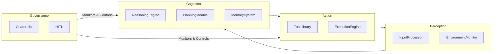

```mermaid
%%{init: {'theme':'base', 'themeVariables': { 'primaryColor':'#e3f2fd','primaryTextColor':'#000','primaryBorderColor':'#1976d2','lineColor':'#546e7a','secondaryColor':'#fff9c4','tertiaryColor':'#c8e6c9','fontSize':'14px'}}}%%
flowchart TB
    %% External entities
    User(["👨‍💻 USER INPUT<br/>Text | Voice | Image | Video"])
    
    %% ========== PERCEPTION LAYER ==========
    subgraph PERCEPTION["🔍 PERCEPTION LAYER - Thu thập & Chuẩn hóa Context"]
        direction TB
        
        subgraph IP["📥 INPUT PROCESSOR"]
            direction TB
            IP1["🎭 Modality Handler<br/>────────<br/>• Speech-to-Text<br/>• Vision Model<br/>• File Parser"]
            IP2["🛡️ Validation & Sanitization<br/>────────<br/>• Format Check<br/>• Prompt Injection Defense<br/>• Malicious Code Filter"]
            IP3["⚙️ Normalization<br/>────────<br/>• Unified Format<br/>• ISO Standards<br/>• JSON Structure"]
            IP1 --> IP2 --> IP3
        end
        
        subgraph EM["🌍 ENVIRONMENT MONITOR"]
            direction TB
            EM1["📊 State Tracking<br/>────────<br/>• Time & Location<br/>• Order Status<br/>• API States"]
            EM2["🔄 Update Mechanism<br/>────────<br/>• Real-time (WebSocket)<br/>• Periodic (Polling)<br/>• Event-driven"]
            EM3["🚨 Event Detection<br/>────────<br/>• Change Detection<br/>• Trigger System<br/>• Alert Generation"]
            EM1 --> EM2 --> EM3
        end
        
        IP ~~~ EM
    end
    
    %% ========== COGNITION LAYER ==========
    subgraph COGNITION["🧠 COGNITION LAYER - Suy luận, Lập kế hoạch & Ghi nhớ"]
        direction TB
        
        subgraph RE["💡 REASONING ENGINE"]
            direction TB
            RE1["🎯 Model Selection<br/>────────<br/>• GPT-4o (Complex)<br/>• GPT-4o-mini (Simple)<br/>• Fine-tuned Models"]
            RE2["📝 Prompt Architecture<br/>────────<br/>• System Prompt<br/>• Few-Shot Examples<br/>• Context Injection"]
            RE3["🔗 Reasoning Patterns<br/>────────<br/>• Chain-of-Thought<br/>• ReAct (Reason+Act)<br/>• Tree of Thoughts"]
            RE1 --> RE2 --> RE3
        end
        
        subgraph PM["📋 PLANNING MODULE"]
            direction TB
            PM1["🧩 Task Decomposition<br/>────────<br/>• Break into Subtasks<br/>• Define Dependencies<br/>• Set Priorities"]
            PM2["📐 Plan Representation<br/>────────<br/>• Sequential List<br/>• DAG (Parallel)<br/>• State Machine"]
            PM3["🔄 Dynamic Replanning<br/>────────<br/>• Failure Detection<br/>• Alternative Routes<br/>• Adaptive Strategy"]
            PM1 --> PM2 --> PM3
        end
        
        subgraph MS["💾 MEMORY SYSTEM"]
            direction TB
            MS1["⚡ Short-Term Memory<br/>────────<br/>• Context Window<br/>• Current Session<br/>• Redis Cache"]
            MS2["🗄️ Long-Term Memory<br/>────────<br/>• Vector DB (RAG)<br/>• User Preferences<br/>• Knowledge Base"]
            MS1 -.->|Session Data| MS2
        end
        
        RE --> PM
        PM -.->|Query| MS
        MS -.->|Context| RE
    end
    
    %% ========== ACTION LAYER ==========
    subgraph ACTION["⚡ ACTION LAYER - Thực thi & Quan sát"]
        direction TB
        
        subgraph TL["🔧 TOOL & FUNCTION LIBRARY"]
            direction TB
            TL1["📚 Tool Definition<br/>────────<br/>• Function Name<br/>• Docstring<br/>• Pydantic Schema"]
            TL2["🔨 Tool Types<br/>────────<br/>• Python Functions<br/>• External APIs<br/>• Sub-Agents"]
            TL3["📦 Versioning & Management<br/>────────<br/>• Version Control<br/>• API Compatibility<br/>• Registry System"]
            TL1 --> TL2 --> TL3
        end
        
        subgraph EE["🚀 EXECUTION ENGINE"]
            direction TB
            EE1["📞 Tool Invocation<br/>────────<br/>• Function Calls<br/>• API Requests<br/>• Parameter Binding"]
            EE2["🔧 Error Handling<br/>────────<br/>• Try-Catch Logic<br/>• Exponential Backoff<br/>• Circuit Breaker"]
            EE3["⚙️ Advanced Features<br/>────────<br/>• Timeout Control<br/>• Concurrent Execution<br/>• Result Parsing"]
            EE1 --> EE2 --> EE3
        end
        
        TL -.->|Provide Tools| EE
    end
    
    %% ========== GOVERNANCE LAYER ==========
    subgraph GOVERNANCE["🛡️ GOVERNANCE LAYER - Giám sát, Kiểm soát & An toàn"]
        direction TB
        
        subgraph GR["⚖️ GUARDRAILS & SAFETY"]
            direction TB
            GR1["🛡️ Input/Output Filtering<br/>────────<br/>• Prompt Injection Defense<br/>• PII Protection<br/>• Content Moderation"]
            GR2["🔐 Access Control<br/>────────<br/>• RBAC (Role-Based)<br/>• Tool Permissions<br/>• Privilege Management"]
            GR3["💰 Resource Monitoring<br/>────────<br/>• Token Budget<br/>• API Rate Limits<br/>• Cost Tracking"]
            GR1 --> GR2 --> GR3
        end
        
        subgraph HITL["👤 HUMAN-IN-THE-LOOP"]
            direction TB
            HITL1["🛑 Checkpoint Definition<br/>────────<br/>• Critical Actions<br/>• Low Confidence<br/>• High Cost"]
            HITL2["🖥️ Review Interface<br/>────────<br/>• Approve/Reject UI<br/>• Plan Visualization<br/>• Edit Parameters"]
            HITL3["🔺 Escalation Paths<br/>────────<br/>• Expert Routing<br/>• Failure Handling<br/>• Manual Override"]
            HITL1 --> HITL2 --> HITL3
        end
        
        GR ~~~ HITL
    end
    
    %% Final output
    Output(["📤 FINAL OUTPUT<br/>Action Results | Response"])
    
    %% ========== MAIN FLOW ==========
    User -->|Raw Input| PERCEPTION
    PERCEPTION -->|Normalized Context<br/>+ Environment State| COGNITION
    COGNITION -->|Action Plan<br/>+ Tool Selection| ACTION
    ACTION -->|Execution Results<br/>+ Observations| PERCEPTION
    ACTION -->|Preliminary Output| GOVERNANCE
    GOVERNANCE -->|Validated Output| Output
    
    %% ========== GOVERNANCE MONITORING ==========
    GOVERNANCE -.->|Monitor Reasoning<br/>& Planning| COGNITION
    GOVERNANCE -.->|Control Execution<br/>& Tool Access| ACTION
    HITL -.->|Human Approval<br/>for Critical Actions| Output
    
    %% ========== STYLING ==========
    
    %% Layer styling
    style PERCEPTION fill:#e3f2fd,stroke:#1976d2,stroke-width:4px,color:#000
    style COGNITION fill:#fff9c4,stroke:#f57f00,stroke-width:4px,color:#000
    style ACTION fill:#c8e6c9,stroke:#388e3c,stroke-width:4px,color:#000
    style GOVERNANCE fill:#ffccbc,stroke:#d84315,stroke-width:4px,color:#000
    
    %% Perception components
    style IP fill:#bbdefb,stroke:#1565c0,stroke-width:3px,color:#000
    style EM fill:#bbdefb,stroke:#1565c0,stroke-width:3px,color:#000
    style IP1 fill:#90caf9,stroke:#0d47a1,stroke-width:2px
    style IP2 fill:#90caf9,stroke:#0d47a1,stroke-width:2px
    style IP3 fill:#90caf9,stroke:#0d47a1,stroke-width:2px
    style EM1 fill:#90caf9,stroke:#0d47a1,stroke-width:2px
    style EM2 fill:#90caf9,stroke:#0d47a1,stroke-width:2px
    style EM3 fill:#90caf9,stroke:#0d47a1,stroke-width:2px
    
    %% Cognition components
    style RE fill:#fff59d,stroke:#f57c00,stroke-width:3px,color:#000
    style PM fill:#fff59d,stroke:#f57c00,stroke-width:3px,color:#000
    style MS fill:#fff59d,stroke:#f57c00,stroke-width:3px,color:#000
    style RE1 fill:#fff176,stroke:#e65100,stroke-width:2px
    style RE2 fill:#fff176,stroke:#e65100,stroke-width:2px
    style RE3 fill:#fff176,stroke:#e65100,stroke-width:2px
    style PM1 fill:#fff176,stroke:#e65100,stroke-width:2px
    style PM2 fill:#fff176,stroke:#e65100,stroke-width:2px
    style PM3 fill:#fff176,stroke:#e65100,stroke-width:2px
    style MS1 fill:#fff176,stroke:#e65100,stroke-width:2px
    style MS2 fill:#fff176,stroke:#e65100,stroke-width:2px
    
    %% Action components
    style TL fill:#a5d6a7,stroke:#2e7d32,stroke-width:3px,color:#000
    style EE fill:#a5d6a7,stroke:#2e7d32,stroke-width:3px,color:#000
    style TL1 fill:#81c784,stroke:#1b5e20,stroke-width:2px
    style TL2 fill:#81c784,stroke:#1b5e20,stroke-width:2px
    style TL3 fill:#81c784,stroke:#1b5e20,stroke-width:2px
    style EE1 fill:#81c784,stroke:#1b5e20,stroke-width:2px
    style EE2 fill:#81c784,stroke:#1b5e20,stroke-width:2px
    style EE3 fill:#81c784,stroke:#1b5e20,stroke-width:2px
    
    %% Governance components
    style GR fill:#ffab91,stroke:#bf360c,stroke-width:3px,color:#000
    style HITL fill:#ffab91,stroke:#bf360c,stroke-width:3px,color:#000
    style GR1 fill:#ff8a65,stroke:#bf360c,stroke-width:2px
    style GR2 fill:#ff8a65,stroke:#bf360c,stroke-width:2px
    style GR3 fill:#ff8a65,stroke:#bf360c,stroke-width:2px
    style HITL1 fill:#ff8a65,stroke:#bf360c,stroke-width:2px
    style HITL2 fill:#ff8a65,stroke:#bf360c,stroke-width:2px
    style HITL3 fill:#ff8a65,stroke:#bf360c,stroke-width:2px
    
    %% External entities
    style User fill:#e1bee7,stroke:#6a1b9a,stroke-width:3px,color:#000
    style Output fill:#aed581,stroke:#33691e,stroke-width:3px,color:#000
```

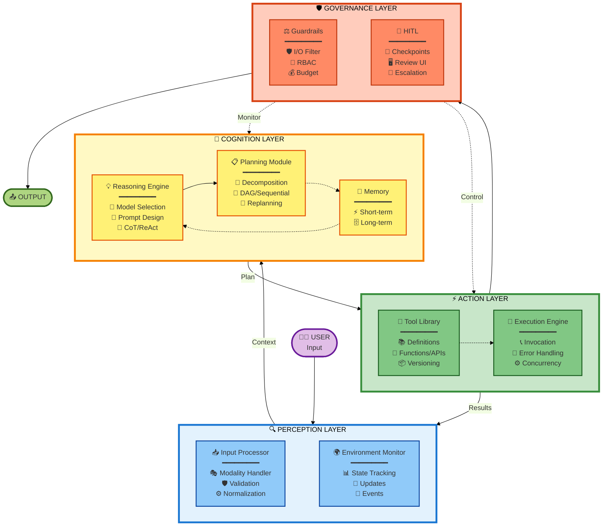

Bây giờ, chúng ta sẽ đi sâu vào từng thành phần trong mỗi lớp.

#### 2.1. Lớp 1: Nhận thức (Perception Layer)

Đây là lớp chịu trách nhiệm thu thập thông tin từ thế giới bên ngoài và chuyển đổi nó thành một định dạng mà "bộ não" của agent có thể hiểu được. Nếu không có lớp nhận thức hiệu quả, agent sẽ bị "mù" và "điếc".

**2.1.1. Thành phần: Bộ xử lý đầu vào (Input Processor)**

*   **Chức năng:** Là cửa ngõ đầu tiên của agent, chịu trách nhiệm tiếp nhận, làm sạch và chuẩn hóa tất cả các loại dữ liệu đầu vào.
*   **Chi tiết hoạt động:**
    *   **Xử lý đa phương thức (Modality Handling):** Agent không chỉ nhận văn bản. Nó có thể nhận hình ảnh (từ file upload), giọng nói (từ microphone), video, hoặc dữ liệu có cấu trúc (từ một API call). Input Processor phải xác định loại dữ liệu và sử dụng các mô hình chuyên biệt (ví dụ: mô hình Speech-to-Text như Whisper cho âm thanh, mô hình Vision cho hình ảnh) để chuyển đổi tất cả về một định dạng chung, thường là văn bản hoặc JSON.
    *   **Xác thực và làm sạch (Validation & Sanitization):** Dữ liệu đầu vào từ người dùng hoặc hệ thống bên ngoài không bao giờ đáng tin cậy 100%. Thành phần này phải kiểm tra xem dữ liệu có hợp lệ không (ví dụ: một địa chỉ email có đúng định dạng không?), và quan trọng hơn, loại bỏ các mã độc hại hoặc các kỹ thuật tấn công như **Prompt Injection**.
    *   **Chuẩn hóa (Normalization):** Dữ liệu từ các nguồn khác nhau có thể có định dạng khác nhau. Ví dụ, ngày tháng có thể là `DD/MM/YYYY` hoặc `MM-DD-YY`. Input Processor sẽ chuyển đổi tất cả về một định dạng thống nhất (ví dụ: ISO 8601) để các lớp sau có thể xử lý một cách nhất quán.
*   **Tầm quan trọng:** Một Input Processor yếu kém sẽ dẫn đến việc agent hiểu sai yêu cầu, dễ bị tấn công, hoặc không thể xử lý các loại thông tin đa dạng, làm giảm đáng kể tính hữu dụng của nó.

**2.1.2. Thành phần: Bộ giám sát môi trường (Environment Monitor)**

*   **Chức năng:** Duy trì một mô hình nội tại (internal model) về trạng thái của thế giới bên ngoài mà agent cần quan tâm. Nó trả lời câu hỏi: "Chuyện gì đang xảy ra xung quanh tôi?"
*   **Chi tiết hoạt động:**
    *   **Theo dõi trạng thái (State Tracking):** Thành phần này có thể theo dõi các thông tin như: thời gian hiện tại, vị trí của người dùng, trạng thái của một đơn hàng, giá cổ phiếu hiện tại, hoặc nội dung của một trang web. Nó không chỉ là dữ liệu tĩnh mà là một bức tranh động về môi trường.
    *   **Cập nhật theo thời gian thực hoặc định kỳ (Real-time vs. Periodic Updates):** Tùy thuộc vào yêu cầu, việc cập nhật có thể diễn ra liên tục (ví dụ: qua WebSockets để theo dõi giá tiền điện tử) hoặc theo chu kỳ (ví dụ: kiểm tra email mới mỗi 5 phút).
    *   **Phát hiện sự kiện (Event Detection):** Đây là một chức năng quan trọng. Thay vì chỉ đọc trạng thái, Environment Monitor có thể phát hiện những *thay đổi* quan trọng và kích hoạt agent hành động. Ví dụ: "Khi trạng thái đơn hàng chuyển từ 'Đang giao' sang 'Đã giao', hãy kích hoạt agent gửi email cảm ơn cho khách hàng."
*   **Tầm quan trọng:** Nếu không có Environment Monitor, agent chỉ có thể phản ứng với các yêu cầu trực tiếp của người dùng. Với nó, agent có thể trở nên **chủ động (proactive)**, tự động hành động khi có sự thay đổi trong môi trường, mở ra vô số ứng dụng tự động hóa thông minh.

#### 2.2. Lớp 2: Nhận thức (Cognition Layer)

Đây là "bộ não" của agent, nơi diễn ra các quá trình suy luận, lập kế hoạch và ghi nhớ. Chất lượng của lớp này quyết định mức độ "thông minh" của agent.

**2.2.1. Thành phần: Động cơ suy luận (Reasoning Engine)**

*   **Chức năng:** Là hạt nhân của lớp nhận thức, thường là một Mô hình Ngôn ngữ Lớn (LLM), chịu trách nhiệm hiểu yêu cầu, suy luận logic, và đưa ra các quyết định cấp cao.
*   **Chi tiết hoạt động:**
    *   **Lựa chọn Mô hình (Model Selection):** Không phải lúc nào cũng cần mô hình mạnh nhất (và đắt nhất). Một quyết định kiến trúc quan trọng là chọn đúng LLM cho đúng công việc. Ví dụ: dùng GPT-4o cho các tác vụ lập kế hoạch phức tạp, nhưng dùng GPT-4o-mini hoặc một mô hình được fine-tune cho các tác vụ phân loại đơn giản để tiết kiệm chi phí và giảm độ trễ.
    *   **Kiến trúc Prompt (Prompt Architecture):** Đây là nghệ thuật và khoa học của việc "lập trình" LLM. Một prompt tốt không chỉ là một câu hỏi. Nó bao gồm:
        *   **System Prompt:** Định nghĩa vai trò, tính cách, và các quy tắc bất biến của agent (ví dụ: "Bạn là một trợ lý du lịch chuyên nghiệp, luôn trả lời một cách lịch sự và chi tiết.").
        *   **Few-Shot Examples:** Cung cấp một vài ví dụ về đầu vào và đầu ra mong muốn để hướng dẫn LLM hoạt động đúng cách.
        *   **Context:** Cung cấp thông tin liên quan từ Bộ nhớ (Memory System) để agent có thể đưa ra quyết định dựa trên ngữ cảnh.
    *   **Các Mẫu Suy luận (Reasoning Patterns):** Để giải quyết các vấn đề phức tạp, agent cần các kỹ thuật suy luận có cấu trúc. Các mẫu phổ biến bao gồm:
        *   **Chain-of-Thought (CoT):** Hướng dẫn LLM "suy nghĩ từng bước" trước khi đưa ra câu trả lời cuối cùng, giúp cải thiện độ chính xác của các bài toán logic.
        *   **ReAct (Reason + Act):** Một mẫu cực kỳ quan trọng cho agent. LLM sẽ lặp đi lặp lại chu trình: **Suy luận (Reason)** về bước tiếp theo cần làm -> **Hành động (Act)** bằng cách gọi một công cụ -> **Quan sát (Observe)** kết quả của công cụ đó. Chu trình này cho phép agent tương tác với môi trường và điều chỉnh kế hoạch của mình.
*   **Tầm quan trọng:** Đây là thành phần quyết định khả năng giải quyết vấn đề của agent. Một Reasoning Engine mạnh mẽ có thể hiểu được các yêu cầu mơ hồ, phá vỡ các vấn đề phức tạp, và đưa ra các quyết định thông minh.

**2.2.2. Thành phần: Module lập kế hoạch (Planning Module)**

*   **Chức năng:** Chuyển đổi một mục tiêu cấp cao, thường mơ hồ của người dùng (ví dụ: "lên kế hoạch cho một chuyến đi") thành một chuỗi các bước cụ thể, có thể thực thi được.
*   **Chi tiết hoạt động:**
    *   **Phân rã nhiệm vụ (Task Decomposition):** Đây là chức năng cốt lõi. Module này sẽ chia một nhiệm vụ lớn thành các nhiệm vụ con nhỏ hơn. Ví dụ, "lên kế hoạch chuyến đi" được chia thành: (1) Tìm vé máy bay, (2) Tìm khách sạn, (3) Tìm các địa điểm tham quan, (4) Lập lịch trình chi tiết.
    *   **Biểu diễn Kế hoạch (Plan Representation):** Kế hoạch có thể được biểu diễn dưới dạng một danh sách các bước tuần tự, hoặc phức tạp hơn, là một **Đồ thị có hướng không chu trình (DAG - Directed Acyclic Graph)**, cho phép thực hiện các bước song song.
    *   **Tái lập kế hoạch động (Dynamic Replanning):** Thế giới thực không thể đoán trước. Một công cụ có thể thất bại, một API có thể không trả về dữ liệu. Planning Module phải có khả năng nhận biết thất bại từ Lớp Hành động (Action Layer) và tự động điều chỉnh kế hoạch. Ví dụ: "Không tìm thấy chuyến bay vào ngày X, thử tìm vào ngày Y."
    *   **Các kỹ thuật nâng cao:** Các hệ thống phức tạp có thể sử dụng các kỹ thuật như **Tree of Thoughts (ToT)**, nơi agent khám phá nhiều nhánh kế hoạch khác nhau và đánh giá chúng trước khi chọn ra nhánh tốt nhất.
*   **Tầm quan trọng:** Nếu Reasoning Engine là bộ não chiến lược, thì Planning Module là bộ não chiến thuật. Nó biến ý định thành một kế hoạch hành động cụ thể, là cầu nối giữa suy nghĩ và thực thi. Các agent không có Planning Module chỉ có thể thực hiện các tác vụ một bước đơn giản.

**2.2.3. Thành phần: Hệ thống bộ nhớ (Memory System)**

*   **Chức năng:** Cung cấp cho agent khả năng ghi nhớ và truy xuất thông tin, cho phép nó duy trì ngữ cảnh, học hỏi từ các tương tác trong quá khứ, và cá nhân hóa trải nghiệm.
*   **Chi tiết hoạt động:** Bộ nhớ của agent được chia thành hai loại chính:
    *   **Bộ nhớ Ngắn hạn (Short-Term / Working Memory):**
        *   **Mục đích:** Lưu trữ thông tin liên quan đến phiên tương tác hiện tại.
        *   **Ví dụ:** Lịch sử cuộc trò chuyện, các kết quả trung gian từ các lệnh gọi công cụ, kế hoạch hiện tại.
        *   **Công nghệ:** Thường được lưu trữ trong bộ nhớ (in-memory) của ứng dụng hoặc trong các hệ thống cache nhanh như Redis. Đây chính là "context window" được đưa vào prompt của LLM trong mỗi lượt tương tác.
    *   **Bộ nhớ Dài hạn (Long-Term / Knowledge Base):**
        *   **Mục đích:** Lưu trữ thông tin một cách bền vững qua nhiều phiên, cho phép agent học hỏi và phát triển theo thời gian.
        *   **Ví dụ:** Sở thích của người dùng ("Tôi thích các chuyến bay buổi sáng"), các sự kiện quan trọng trong quá khứ, một kho tài liệu kiến thức lớn.
        *   **Công nghệ:**
            *   **Cơ sở dữ liệu Vector (Vector Database - vd: Pinecone, Chroma):** Dùng cho **tìm kiếm ngữ nghĩa (semantic search)**. Các đoạn văn bản được chuyển thành các vector số học. Khi cần truy xuất, câu truy vấn cũng được chuyển thành vector và hệ thống sẽ tìm các vector gần nhất (tương đồng nhất về mặt ngữ nghĩa). Đây là công nghệ nền tảng của **Retrieval-Augmented Generation (RAG)**.
            *   **Cơ sở dữ liệu Quan hệ/NoSQL (Relational/NoSQL DB):** Dùng để lưu trữ dữ liệu có cấu trúc như thông tin người dùng, lịch sử đơn hàng, v.v.
*   **Tầm quan trọng:** Bộ nhớ là thứ biến một chatbot vô hồn thành một trợ lý cá nhân thực thụ. Nó cho phép agent nhớ bạn là ai, bạn thích gì, và những gì bạn đã làm, tạo ra một trải nghiệm liền mạch và thông minh hơn nhiều.

*(Tiếp tục các Lớp 3 và 4 trong các phần sau...)*

#### 2.3. Lớp 3: Hành động (Action Layer)

Nếu Lớp Nhận thức là tai và mắt, Lớp Nhận thức là bộ não, thì Lớp Hành động chính là tay và chân của agent. Đây là nơi các quyết định và kế hoạch được chuyển thành các hành động cụ thể, có tác động đến thế giới bên ngoài.

**2.3.1. Thành phần: Thư viện Công cụ & Hàm (Tool & Function Library)**

*   **Chức năng:** Cung cấp một bộ sưu tập các "siêu năng lực" mà agent có thể sử dụng. Mỗi công cụ là một hành động cụ thể mà agent có thể thực hiện.
*   **Chi tiết hoạt động:**
    *   **Định nghĩa Công cụ (Tool Definition):** Một công cụ không chỉ là một hàm code. Để LLM có thể hiểu và sử dụng được, một công cụ phải được định nghĩa một cách rõ ràng, thường bao gồm:
        *   **Tên hàm:** Một cái tên mang tính mô tả cao (ví dụ: `search_flights` thay vì `f1`).
        *   **Mô tả (Docstring):** Một câu giải thích rõ ràng về chức năng của công cụ (ví dụ: "Tìm kiếm các chuyến bay giữa hai thành phố vào một ngày cụ thể."). Đây là thông tin quan trọng nhất mà LLM sẽ dựa vào để quyết định có chọn công cụ này hay không.
        *   **Định nghĩa Tham số (Parameter Definition):** Các tham số đầu vào phải được định nghĩa rõ ràng với kiểu dữ liệu (ví dụ: `origin: str`, `destination: str`, `date: date`). Các framework hiện đại thường sử dụng Pydantic model để làm việc này.
    *   **Các loại công cụ:** Thư viện công cụ có thể bao gồm:
        *   **Các hàm Python nội bộ:** Để thực hiện các phép tính, xử lý dữ liệu.
        *   **Các lệnh gọi API bên ngoài:** Để tương tác với các dịch vụ của bên thứ ba (Google Maps, Stripe, Jira).
        *   **Các agent khác:** Trong kiến trúc đa agent, một agent có thể là một công cụ của một agent khác.
    *   **Quản lý và Phiên bản (Versioning & Management):** Khi số lượng công cụ tăng lên, việc quản lý chúng trở nên quan trọng. Cần có cơ chế để theo dõi phiên bản của các công cụ, xử lý các thay đổi (ví dụ: một API thay đổi tham số), và đảm bảo tính tương thích.
*   **Tầm quan trọng:** Công cụ là thứ mang lại sức mạnh thực sự cho agent. Một agent không có công cụ chỉ là một chatbot. Một agent với một thư viện công cụ phong phú có thể trở thành một nhân viên tự động hóa mạnh mẽ.

**2.3.2. Thành phần: Động cơ thực thi (Execution Engine)**

*   **Chức năng:** Chịu trách nhiệm gọi các công cụ đã được Lớp Nhận thức lựa chọn một cách đáng tin cậy, xử lý kết quả trả về, và báo cáo lại cho Lớp Nhận thức.
*   **Chi tiết hoạt động:**
    *   **Gọi công cụ (Tool Invocation):** Sau khi Planning Module quyết định gọi công cụ `search_flights(origin="Hanoi", destination="Saigon")`, Execution Engine sẽ thực sự thực hiện lệnh gọi hàm hoặc API call này.
    *   **Xử lý lỗi và Thử lại (Error Handling & Retry Logic):** Các lệnh gọi mạng thường không đáng tin cậy. API có thể bị lỗi, mạng có thể bị ngắt. Execution Engine phải được trang bị các cơ chế mạnh mẽ để xử lý những tình huống này, ví dụ như **thử lại theo cấp số nhân (exponential backoff)** - thử lại sau 1s, rồi 2s, rồi 4s,...
    *   **Quản lý Timeout và Song song (Timeout & Concurrency Management):** Một công cụ không nên được phép chạy vô thời hạn. Execution Engine phải đặt ra một khoảng thời gian chờ (timeout) và hủy bỏ công cụ nếu nó không phản hồi. Trong các hệ thống nâng cao, nó cũng có thể quản lý việc thực thi nhiều công cụ cùng một lúc (song song) để tăng tốc độ.
    *   **Phân tích và Chuẩn hóa Kết quả (Result Parsing & Normalization):** Kết quả trả về từ một công cụ (ví dụ: một chuỗi JSON lớn từ API của hãng hàng không) cần được phân tích, trích xuất thông tin quan trọng, và chuyển đổi thành một định dạng đơn giản để Lớp Nhận thức có thể "tiêu hóa" và sử dụng cho bước lập kế hoạch tiếp theo.
*   **Tầm quan trọng:** Execution Engine đảm bảo rằng các hành động của agent được thực hiện một cách đáng tin cậy và hiệu quả. Nó là cầu nối vững chắc giữa thế giới trừu tượng của việc lập kế hoạch và thế giới hỗn loạn của việc thực thi trong thực tế.

#### 2.4. Lớp 4: Quản trị (Governance Layer)

Đây là lớp giám sát và kiểm soát, đảm bảo rằng agent hoạt động trong các giới hạn an toàn, có đạo đức, và có thể kiểm soát được. Trong các hệ thống sản xuất, đây là lớp quan trọng nhất để xây dựng lòng tin và tránh các hậu quả không mong muốn.

**2.4.1. Thành phần: Rào chắn & Module an toàn (Guardrails & Safety Module)**

*   **Chức năng:** Hoạt động như một "lương tâm" và "bộ phận quản lý rủi ro" của agent, áp đặt các quy tắc và ràng buộc lên hành vi của nó.
*   **Chi tiết hoạt động:**
    *   **Lọc Đầu vào/Đầu ra (Input/Output Filtering):**
        *   **Ngăn chặn Prompt Injection:** Phát hiện và vô hiệu hóa các nỗ lực của người dùng nhằm ghi đè lên system prompt của agent.
        *   **Bảo vệ Dữ liệu Cá nhân (PII Protection):** Tự động phát hiện và che giấu các thông tin nhạy cảm như số điện thoại, email, số thẻ tín dụng trong cả log và các lệnh gọi công cụ.
        *   **Kiểm duyệt nội dung độc hại:** Ngăn chặn agent tạo ra hoặc xử lý các nội dung không phù hợp.
    *   **Kiểm soát Truy cập Công cụ (Tool Access Control):** Không phải agent nào cũng được phép sử dụng mọi công cụ. Module này thực thi các quy tắc **Kiểm soát Truy cập Dựa trên Vai trò (RBAC - Role-Based Access Control)**. Ví dụ: chỉ có "Financial Agent" mới được phép gọi công cụ `execute_payment`.
    *   **Giám sát Ngân sách và Tài nguyên (Budget & Resource Monitoring):** Mỗi lệnh gọi LLM đều tốn tiền. Guardrails sẽ theo dõi tổng chi phí token và có thể dừng agent nếu nó vượt quá một ngân sách đã định trước để tránh các hóa đơn "trên trời".
*   **Tầm quan trọng:** Trong môi trường doanh nghiệp, một agent không có Guardrails là một rủi ro không thể chấp nhận. Lớp này đảm bảo agent hoạt động một cách có trách nhiệm, an toàn và tuân thủ các quy định.

**2.4.2. Thành phần: Giao diện Con người trong vòng lặp (Human-in-the-Loop - HITL Interface)**

*   **Chức năng:** Cung cấp một cơ chế để con người có thể giám sát, can thiệp, và phê duyệt các hành động của agent tại các thời điểm quan trọng.
*   **Chi tiết hoạt động:**
    *   **Định nghĩa Điểm dừng (Checkpoint Definition):** Đây là quyết định thiết kế quan trọng: khi nào agent nên dừng lại và hỏi ý kiến con người? Các điểm dừng phổ biến bao gồm:
        *   Trước khi thực hiện một hành động không thể đảo ngược (ví dụ: xóa file, gửi tiền).
        *   Khi agent có độ tin cậy thấp về bước đi tiếp theo.
        *   Khi chi phí của hành động tiếp theo vượt quá một ngưỡng nhất định.
    *   **Giao diện Người dùng (UI/UX) cho Tương tác:** Cần có một giao diện rõ ràng để con người có thể xem xét kế hoạch của agent, các tham số của công cụ sắp được gọi, và sau đó đưa ra quyết định: **Phê duyệt (Approve)**, **Từ chối (Reject)**, hoặc **Chỉnh sửa (Edit)**.
    *   **Cơ chế leo thang (Escalation Paths):** Nếu agent thất bại nhiều lần hoặc gặp phải một vấn đề mà nó không thể giải quyết, hệ thống HITL phải có một quy trình để "leo thang" vấn đề đó đến một chuyên gia con người phù hợp.
*   **Tầm quan trọng:** HITL là cầu nối giữa tự động hóa hoàn toàn và sự kiểm soát của con người. Nó cho phép các doanh nghiệp tận dụng sức mạnh của agent cho các tác vụ rủi ro cao, trong khi vẫn đảm bảo rằng quyết định cuối cùng luôn nằm trong tay con người. Đây là một thành phần không thể thiếu để triển khai agent một cách có trách nhiệm trong các ứng dụng thực tế.

---

*Kết thúc Phần I. Chúng ta đã hoàn thành việc phân tích MECE toàn bộ các thành phần cấu tạo nên một hệ thống agent. Với nền tảng vững chắc này, trong Phần II, chúng ta sẽ khám phá các cách khác nhau để lắp ráp các thành phần này thành các loại kiến trúc agent khác nhau để giải quyết các bài toán thực tế.*

## PHẦN II: PHÂN LOẠI MECE CÁC KIẾN TRÚC VÀ ỨNG DỤNG AGENT

Sau khi đã hiểu rõ các thành phần cấu tạo nên một agent, bước tiếp theo là tìm hiểu cách lắp ráp chúng thành các **kiến trúc (architectures)** khác nhau. Không phải tất cả các agent đều được tạo ra như nhau. Việc lựa chọn kiến trúc phù hợp là một trong những quyết định quan trọng nhất, ảnh hưởng trực tiếp đến độ phức tạp, chi phí, và khả năng của hệ thống.

Trong phần này, chúng ta sẽ giới thiệu một khung phân loại MECE, giúp bạn định vị được bài toán của mình và lựa chọn kiến trúc agent phù hợp nhất.

### Chương 3: Sơ đồ Phân loại Ứng dụng Agent

#### 3.1. Hai trục phân loại: Agency và Coordination

Dựa trên các nghiên cứu và thực tiễn từ các công ty hàng đầu như Google, Anthropic, và Databricks, chúng ta có thể phân loại hầu hết mọi ứng dụng agentic theo hai trục chính, trực giao với nhau:

1.  **Mức độ Tự chủ (Agency):** Trục này đo lường mức độ tự do ra quyết định của agent. Nó trải dài từ **Thụ động/Xác định (Deterministic)**, nơi agent chỉ tuân theo một kịch bản được lập trình sẵn, đến **Tự chủ/Hướng mục tiêu (Autonomous/Goal-Oriented)**, nơi agent có thể tự lập kế hoạch và thích ứng để đạt được một mục tiêu cấp cao.

2.  **Mức độ Phối hợp (Coordination):** Trục này đo lường số lượng agent tham gia và cách chúng tương tác. Nó trải dài từ **Đơn lẻ (Single)**, nơi chỉ có một agent hoạt động độc lập, đến **Đa agent/Phối hợp (Multi-Agent)**, nơi nhiều agent làm việc cùng nhau.

#### 3.2. Ma trận 4 Quadrant

Khi kết hợp hai trục này, chúng ta có một ma trận 2x2 mạnh mẽ, tạo ra bốn loại kiến trúc agent cơ bản. Ma trận này là một công cụ tư duy cực kỳ hữu ích để phân tích và thiết kế hệ thống.

| | **Thấp Agency** (Xác định, Hướng tác vụ) | **Cao Agency** (Tự chủ, Hướng mục tiêu) |
| :--- | :--- | :--- |
| **Thấp Coordination** (Đơn agent) | **Quadrant 1: Instruction** _"RPA được tăng cường LLM"_ | **Quadrant 3: Autonomy** _"Người giải quyết vấn đề độc lập"_ |
| **Cao Coordination** (Đa agent) | **Quadrant 2: Orchestration** _"Dây chuyền lắp ráp thông minh"_ | **Quadrant 4: Choreography** _"Đội ngũ chuyên gia tự quản"_ |

Bốn quadrant này không chỉ là lý thuyết. Chúng đại diện cho các mẫu kiến trúc (architectural patterns) phổ biến nhất trong thực tế. Trong các chương tiếp theo, chúng ta sẽ đi sâu vào từng quadrant, phân tích kiến trúc, ví dụ, và các trường hợp nên/không nên sử dụng.

### Chương 4: Phân tích sâu Quadrant 1: Instruction

Đây là điểm khởi đầu cho hầu hết các ứng dụng agentic trong doanh nghiệp. Nó đơn giản, đáng tin cậy, và mang lại giá trị ngay lập tức.

#### 4.1. Kiến trúc và Luồng hoạt động

Một agent "Instruction" hoạt động giống như một quy trình Tự động hóa Quy trình Robot (RPA) được tăng cường bởi khả năng hiểu ngôn ngữ tự nhiên của LLM. Luồng hoạt động của nó là tuyến tính và có thể dự đoán được.

**Sơ đồ luồng hoạt động (Ví dụ: Agent Phân loại Ticket Hỗ trợ):**

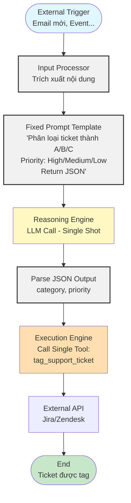

> Agent chỉ làm một việc tuyến tính: nhận input, gọi LLM 1 lần để phân loại, rồi gọi đúng 1 tool. Không có vòng lặp, không lập kế hoạch nhiều bước, không nhớ lịch sử.

*   **Luồng hoạt động:**
    1.  **Đầu vào:** Một sự kiện bên ngoài kích hoạt agent (ví dụ: email mới được gửi đến hòm thư hỗ trợ).
    2.  **Xử lý:** Input Processor nhận email và trích xuất nội dung.
    3.  **Suy luận:** Reasoning Engine (LLM) được gọi với một prompt rất cụ thể: "Dựa trên nội dung sau, hãy phân loại ticket thành một trong các loại [A, B, C] và xác định mức độ ưu tiên là [Cao, Trung bình, Thấp]. Trả về kết quả dưới dạng JSON."
    4.  **Hành động:** Execution Engine nhận kết quả JSON và gọi một công cụ duy nhất, `tag_support_ticket`, với các tham số đã được phân loại.
    5.  **Kết thúc:** Công cụ tương tác với API của Jira/Zendesk. Quy trình kết thúc.

*   **Đặc điểm kiến trúc:**
    *   **Tuyến tính:** Không có vòng lặp phức tạp hay tái lập kế hoạch.
    *   **Trạng thái tối thiểu:** Agent không cần nhớ các tương tác trước đó.
    *   **Công cụ chuyên biệt:** Thường chỉ có một hoặc một vài công cụ rất cụ thể.
    *   **Prompt được kiểm soát chặt chẽ:** System prompt và user prompt được thiết kế để hạn chế tối đa sự "sáng tạo" của LLM.

#### 4.2. Ví dụ thực tế

*   **Chatbot Hỏi-Đáp trên tài liệu (Simple RAG):** Người dùng hỏi một câu, agent tìm kiếm trong cơ sở dữ liệu vector, lấy ngữ cảnh liên quan, và kết hợp với câu hỏi để LLM trả lời. Toàn bộ quy trình là một chuỗi các bước xác định.
*   **Tóm tắt cuộc họp:** Agent nhận bản ghi âm cuộc họp, sử dụng công cụ Speech-to-Text, sau đó gửi văn bản cho LLM với prompt "Tóm tắt các điểm chính và các mục hành động."
*   **Phân loại cảm xúc khách hàng:** Agent đọc các bài đánh giá sản phẩm và gắn thẻ cảm xúc (Tích cực, Tiêu cực, Trung tính).

#### 4.3. Khi nào nên sử dụng và giới hạn

*   **Nên sử dụng khi:**
    *   Quy trình nghiệp vụ rõ ràng, có tính lặp lại.
    *   Yêu cầu độ tin cậy và tính nhất quán cao.
    *   Rủi ro từ các hành động sai lầm là đáng kể, cần sự kiểm soát chặt chẽ.
    *   Bạn mới bắt đầu với agent và muốn có một "chiến thắng" nhanh chóng, dễ dàng.
*   **Giới hạn:**
    *   Không thể xử lý các yêu cầu mơ hồ hoặc các tác vụ đòi hỏi sự linh hoạt.
    *   Không thể thích ứng với các tình huống không lường trước.
    *   Kém hiệu quả đối với các vấn đề cần nhiều bước hoặc nhiều nguồn dữ liệu khác nhau.

### Chương 5: Phân tích sâu Quadrant 2: Orchestration

Khi một quy trình nghiệp vụ trở nên quá phức tạp cho một agent đơn lẻ, nhưng vẫn có thể được xác định trước, chúng ta bước vào Quadrant 2.

#### 5.1. Kiến trúc và Luồng hoạt động

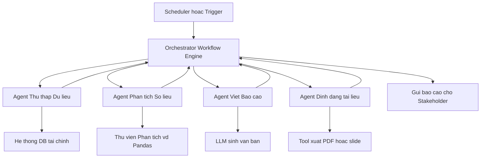

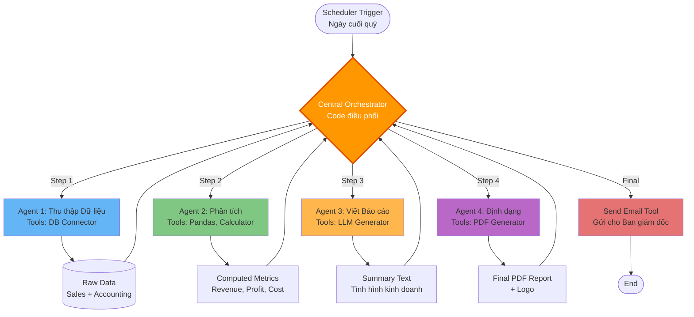

> Orchestrator (code) điều phối lần lượt nhiều agent chuyên biệt. Mỗi agent làm phần việc của mình rồi trả kết quả về. Luồng công việc cố định, ít hoặc không có tự chủ ở từng agent.

Kiến trúc "Orchestration" giống như một dây chuyền lắp ráp thông minh, nơi mỗi "trạm" là một agent chuyên biệt (hoặc một LLM call). Một "nhà điều phối" (Orchestrator), thường là code cứng chứ không phải LLM, sẽ điều hướng công việc qua các trạm theo một luồng đã định.

*   **Luồng hoạt động (Ví dụ: Quy trình tạo báo cáo tài chính hàng quý):**
    1.  **Kích hoạt:** Đúng ngày cuối cùng của quý, một bộ lập lịch (scheduler) kích hoạt quy trình.
    2.  **Trạm 1 (Agent Thu thập Dữ liệu):** Orchestrator gọi agent này. Nó có công cụ để kết nối vào cơ sở dữ liệu bán hàng và kế toán, trích xuất dữ liệu thô.
    3.  **Trạm 2 (Agent Phân tích):** Orchestrator nhận dữ liệu thô và chuyển cho agent này. Nó sử dụng các công cụ phân tích (vd: thư viện Pandas) để tính toán các chỉ số quan trọng (doanh thu, lợi nhuận, chi phí).
    4.  **Trạm 3 (Agent Viết Báo cáo):** Orchestrator nhận các chỉ số và chuyển cho agent này. Nó sử dụng LLM với prompt "Viết một bản tóm tắt tình hình kinh doanh dựa trên các số liệu sau."
    5.  **Trạm 4 (Agent Định dạng):** Orchestrator nhận bản tóm tắt và chuyển cho agent này để định dạng thành file PDF với logo công ty.
    6.  **Kết thúc:** Orchestrator gửi email file PDF cho ban giám đốc.

*   **Đặc điểm kiến trúc:**
    *   **Dựa trên quy trình (Process-driven):** Trọng tâm là luồng công việc, không phải một agent đơn lẻ.
    *   **Chuyên môn hóa:** Mỗi agent/trạm có một bộ công cụ và trách nhiệm riêng biệt.
    *   **Điều phối tập trung:** Orchestrator (code) kiểm soát hoàn toàn luồng đi của dữ liệu.
    *   **Agency thấp:** Các agent riêng lẻ vẫn chỉ thực hiện các tác vụ được giao, không tự ra quyết định.

#### 5.2. Ví dụ thực tế

*   **Quy trình tuyển dụng tự động:** Một agent quét hồ sơ ứng viên, một agent khác lên lịch phỏng vấn, một agent thứ ba gửi email xác nhận.
*   **Tự động hóa Marketing:** Một agent theo dõi các đề cập trên mạng xã hội, một agent khác tạo nội dung trả lời, và một agent thứ ba đăng bài.

#### 5.3. So sánh với microservices truyền thống

Kiến trúc Orchestration rất giống với kiến trúc Microservices. Mỗi agent chuyên biệt có thể được xem như một microservice. Điểm khác biệt chính là các "microservice" này được tăng cường bởi LLM, cho phép chúng xử lý các đầu vào/đầu ra bằng ngôn ngữ tự nhiên và thực hiện các tác vụ suy luận mà microservice truyền thống không thể.

### Chương 6: Phân tích sâu Quadrant 3: Autonomy

Đây là nơi sự "thông minh" thực sự của agent bắt đầu tỏa sáng. Thay vì chỉ làm theo kịch bản, agent được trao quyền tự chủ để đạt được mục tiêu.

#### 6.1. Kiến trúc và Luồng hoạt động

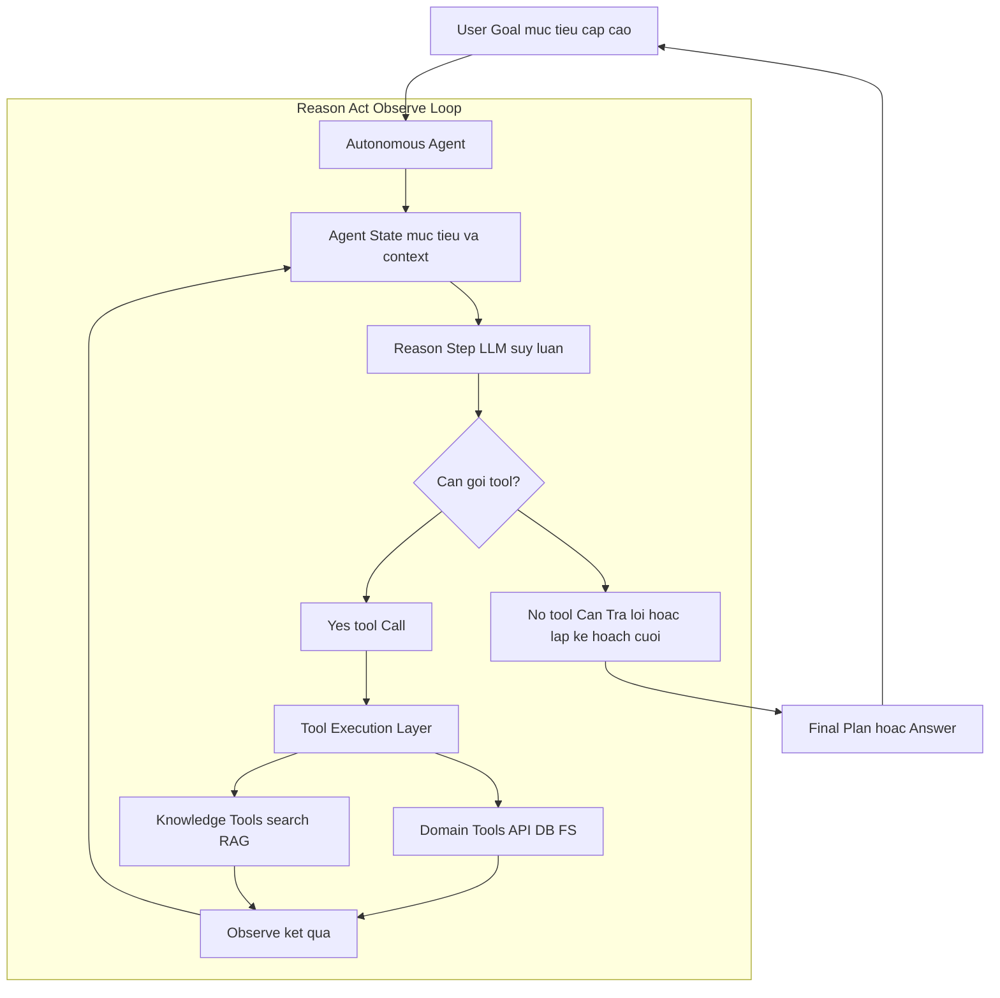

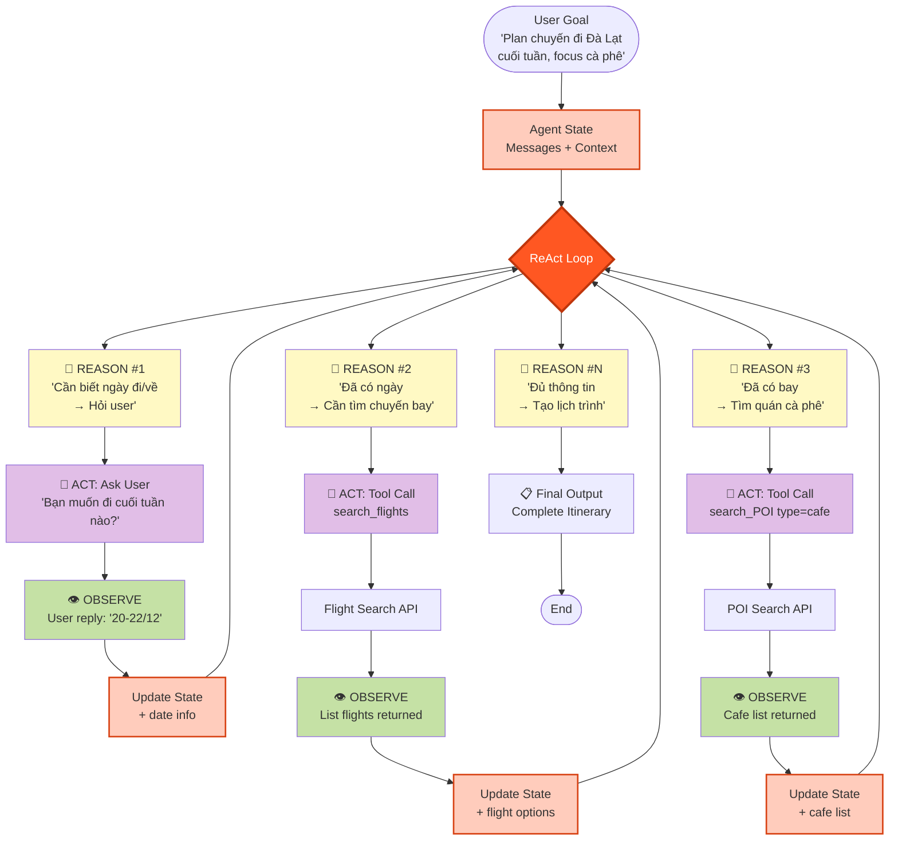

> Một agent duy nhất lặp vòng ReAct: Reason → Act (tool) → Observe → Reason… cho đến khi đạt mục tiêu. Nó tự quyết định cần tool nào, bao nhiêu bước, kế hoạch thế nào.

Agent "Autonomy" hoạt động theo một vòng lặp liên tục, nổi tiếng nhất là mẫu **ReAct (Reason + Act)**. Nó không đi theo một đường thẳng mà là một chu trình khám phá và điều chỉnh.

*   **Luồng hoạt động (Ví dụ: Agent Lập kế hoạch Du lịch):**
    1.  **Mục tiêu:** Người dùng đưa ra một mục tiêu cấp cao: "Tìm cho tôi một chuyến đi cuối tuần đến Đà Lạt, tập trung vào cà phê và thiên nhiên."
    2.  **Vòng lặp 1:**
        *   **Reason (Suy luận):** LLM nghĩ: "Để lên kế hoạch, trước hết tôi cần biết ngày đi và ngày về. Tôi sẽ hỏi người dùng."
        *   **Act (Hành động):** Agent không có công cụ để hỏi, nó chỉ trả lời người dùng: "Tuyệt vời! Bạn muốn đi vào cuối tuần nào?"
    3.  **Vòng lặp 2 (Sau khi người dùng trả lời):**
        *   **Reason:** "OK, đã có ngày. Giờ tôi cần tìm chuyến bay. Tôi sẽ dùng công cụ `search_flights`."
        *   **Act:** Execution Engine gọi `search_flights(origin="SGN", destination="DLI", date="...")`.
        *   **Observe (Quan sát):** Công cụ trả về một danh sách các chuyến bay.
    4.  **Vòng lặp 3:**
        *   **Reason:** "Đã có chuyến bay. Giờ tôi cần tìm các quán cà phê đẹp. Tôi sẽ dùng công cụ `search_points_of_interest`."
        *   **Act:** Execution Engine gọi `search_points_of_interest(location="Dalat", type="cafe")`.
        *   **Observe:** Công cụ trả về một danh sách các quán cà phê.
    5.  **...Vòng lặp tiếp tục...** cho đến khi agent thu thập đủ thông tin và tạo ra một lịch trình hoàn chỉnh.

*   **Đặc điểm kiến trúc:**
    *   **Hướng mục tiêu (Goal-oriented):** Agent chỉ cần biết đích đến, không cần biết đường đi.
    *   **Vòng lặp suy luận:** Cốt lõi là chu trình Reason-Act-Observe.
    *   **Lựa chọn công cụ động:** Agent tự quyết định dùng công cụ nào và khi nào.
    *   **Quản lý trạng thái:** Agent phải có bộ nhớ (ngắn hạn) để lưu trữ kết quả của các bước trước đó.

#### 6.2. Ví dụ thực tế

*   **Agent Nghiên cứu:** Người dùng yêu cầu "Viết một báo cáo về thị trường xe điện tại Việt Nam." Agent sẽ tự tìm kiếm Google, đọc các bài báo, tổng hợp thông tin, và viết báo cáo.
*   **Agent Gỡ lỗi Code:** Lập trình viên đưa ra một đoạn code lỗi. Agent sẽ tự đọc lỗi, đề xuất các giả thuyết, áp dụng các thay đổi, chạy lại code, và lặp lại cho đến khi sửa được lỗi.

#### 6.3. Thách thức: Sai sốทบวก và Kiểm soát

Sự tự do của agent tự chủ cũng là con dao hai lưỡi. Một sai lầm nhỏ ở bước đầu (ví dụ: hiểu sai một kết quả tìm kiếm) có thể dẫn đến các quyết định sai lầm ở các bước sau, tạo ra một **sai sốทบวก (compounding error)**. Hơn nữa, việc để agent tự do hành động có thể dẫn đến các kết quả không mong muốn hoặc chi phí API tăng vọt. Do đó, các agent này đòi hỏi phải có **sandboxing** (chạy trong môi trường bị cô lập) và các **Guardrails** (Lớp Quản trị) cực kỳ mạnh mẽ.

### Chương 7: Phân tích sâu Quadrant 4: Choreography

Đây là biên giới của công nghệ agentic, nơi các hệ thống phức tạp nhất được xây dựng bằng cách cho nhiều agent tự chủ hợp tác với nhau.

#### 7.1. Kiến trúc và Luồng hoạt động

Kiến trúc "Choreography" không có một nhà điều phối trung tâm. Thay vào đó, nó giống như một đội ngũ chuyên gia, mỗi người có chuyên môn riêng, tự giao tiếp và phối hợp với nhau để giải quyết một vấn đề lớn. Hành vi của toàn bộ hệ thống là **nổi hiện (emergent)** từ sự tương tác của các cá nhân.

**Sơ đồ luồng hoạt động (Ví dụ: Đội Agent Nghiên cứu Thị trường):**

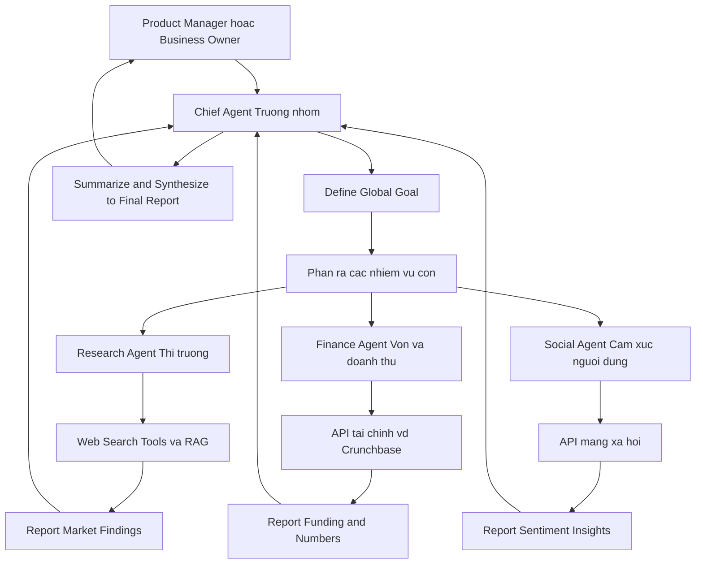

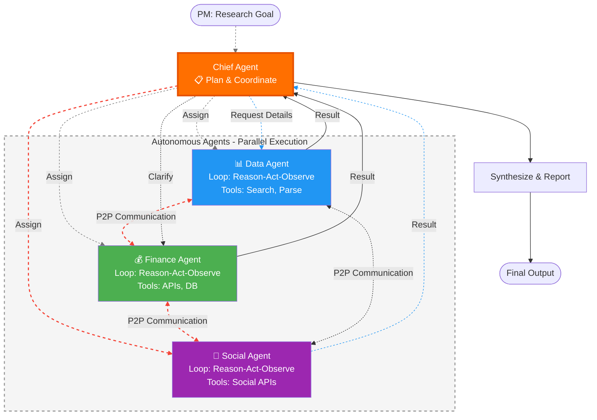

*   **Luồng hoạt động:**
    1.  **Mục tiêu:** Một Product Manager đưa ra yêu cầu cho **Agent Trưởng nhóm (Chief Researcher)**: "Phân tích thị trường protein thực vật ở Đông Nam Á."
    2.  **Phân rã & Giao việc:** Agent Trưởng nhóm không tự làm. Nó phân rã mục tiêu thành các nhiệm vụ con và giao cho các agent chuyên biệt:
        *   Giao cho **Agent Phân tích Dữ liệu**: "Tìm các bài báo, tin tức, và báo cáo thị trường."
        *   Giao cho **Agent Phân tích Tài chính**: "Tìm thông tin về các vòng gọi vốn của các công ty chủ chốt."
        *   Giao cho **Agent Phân tích Mạng xã hội**: "Phân tích cảm xúc của người tiêu dùng trên Twitter và Reddit."
    3.  **Thực thi song song:** Cả ba agent chuyên biệt bắt đầu làm việc cùng một lúc, sử dụng các công cụ riêng của chúng (Web Search, Crunchbase API, Social Media API).
    4.  **Tổng hợp:** Khi các agent chuyên biệt hoàn thành, chúng gửi kết quả trở lại cho Agent Trưởng nhóm.
    5.  **Hoàn thành:** Agent Trưởng nhóm nhận tất cả các mảnh thông tin, đọc, hiểu, và viết thành một báo cáo tổng hợp duy nhất, mạch lạc.

*   **Đặc điểm kiến trúc:**
    *   **Phân tán:** Không có điểm kiểm soát trung tâm duy nhất.
    *   **Chuyên môn hóa cao:** Mỗi agent là một chuyên gia trong lĩnh vực của mình.
    *   **Giao tiếp ngang hàng:** Các agent có thể giao tiếp trực tiếp với nhau (ví dụ: Agent Phân tích Dữ liệu có thể hỏi Agent Phân tích Tài chính về một công ty mà nó tìm thấy).
    *   **Hành vi nổi hiện:** Kết quả cuối cùng là sản phẩm của sự hợp tác, không phải là một kịch bản được định trước.

#### 7.2. Ví dụ thực tế

*   **Tối ưu hóa chuỗi cung ứng (Uber/Grab):** Một agent đại diện cho mỗi tài xế, một agent đại diện cho mỗi hành khách. Các agent này liên tục giao tiếp để tìm ra sự kết hợp tối ưu nhất giữa cung và cầu trong thời gian thực.
*   **Mô phỏng thị trường tài chính:** Mỗi agent đóng vai một nhà đầu tư với một chiến lược riêng. Hệ thống chạy mô phỏng để xem các chiến lược này tương tác với nhau như thế nào và tác động đến thị trường ra sao.
*   **Phát triển phần mềm tự động:** Một agent "Product Manager" viết yêu cầu, một agent "Developer" viết code, một agent "QA" viết và chạy test. Chúng làm việc cùng nhau trong một vòng lặp để tạo ra phần mềm.

#### 7.3. Thách thức: Phức tạp ở quy mô lớn

Kiến trúc Choreography cực kỳ mạnh mẽ nhưng cũng vô cùng phức tạp để thiết kế và gỡ lỗi. Các thách thức chính bao gồm:

*   **Giao tiếp:** Làm thế nào để các agent giao tiếp hiệu quả và không bị "nhiễu" thông tin?
*   **Giải quyết xung đột:** Điều gì xảy ra khi hai agent có ý kiến trái ngược nhau?
*   **Ghi nhận công lao (Credit Assignment):** Khi hệ thống thành công, làm thế nào để biết agent nào đã đóng góp nhiều nhất?
*   **Khả năng quan sát:** Việc theo dõi và hiểu được luồng suy nghĩ của một hệ thống phân tán như vậy là một bài toán cực kỳ khó.

Do đó, kiến trúc này hiện chủ yếu được sử dụng trong các môi trường nghiên cứu hoặc các ứng dụng rất chuyên biệt, có giá trị cực cao của các công ty công nghệ lớn.

---

*Kết thúc Phần II. Chúng ta đã khám phá bốn loại kiến trúc agent chính. Giờ đây, bạn đã có một "la bàn" để định vị các loại bài toán khác nhau. Trong Phần III, chúng ta sẽ bắt đầu hành trình thực tế: xây dựng các agent thuộc các quadrant này thông qua một lộ trình chi tiết với code mẫu.*

```mermaid
graph TB
    subgraph Q1[QUADRANT 1: INSTRUCTION]
        Q1_Input[Input] --> Q1_LLM[LLM<br/>Single Shot]
        Q1_LLM --> Q1_Tool[1 Tool]
        Q1_Tool --> Q1_Output[Output]
    end
    
    subgraph Q2[QUADRANT 2: ORCHESTRATION]
        Q2_Orch{Orchestrator}
        Q2_Orch --> Q2_A1[Agent 1]
        Q2_Orch --> Q2_A2[Agent 2]
        Q2_Orch --> Q2_A3[Agent 3]
        Q2_A1 --> Q2_Orch
        Q2_A2 --> Q2_Orch
        Q2_A3 --> Q2_Orch
    end
    
    subgraph Q3[QUADRANT 3: AUTONOMY]
        Q3_Goal[Goal] --> Q3_Loop((ReAct<br/>Loop))
        Q3_Loop --> Q3_Reason[Reason]
        Q3_Reason --> Q3_Act[Act]
        Q3_Act --> Q3_Observe[Observe]
        Q3_Observe --> Q3_Loop
        Q3_Loop --> Q3_Output[Output]
    end
    
    subgraph Q4[QUADRANT 4: CHOREOGRAPHY]
        Q4_Chief[Chief Agent]
        Q4_Chief -.-> Q4_A1[Agent 1]
        Q4_Chief -.-> Q4_A2[Agent 2]
        Q4_Chief -.-> Q4_A3[Agent 3]
        Q4_A1 -.-> Q4_A2
        Q4_A2 -.-> Q4_A3
        Q4_A1 --> Q4_Chief
        Q4_A2 --> Q4_Chief
        Q4_A3 --> Q4_Chief
    end
    
    style Q1 fill:#e3f2fd,stroke:#1976d2,stroke-width:2px
    style Q2 fill:#f3e5f5,stroke:#7b1fa2,stroke-width:2px
    style Q3 fill:#fff3e0,stroke:#f57c00,stroke-width:2px
    style Q4 fill:#fce4ec,stroke:#c2185b,stroke-width:2px
    
    style Q1_LLM fill:#fff9c4
    style Q2_Orch fill:#ff9800,color:#fff
    style Q3_Loop fill:#ff5722,color:#fff
    style Q4_Chief fill:#e91e63,color:#fff
```

---

# Demo Cursor 

## 3.1 Luồng đơn giản

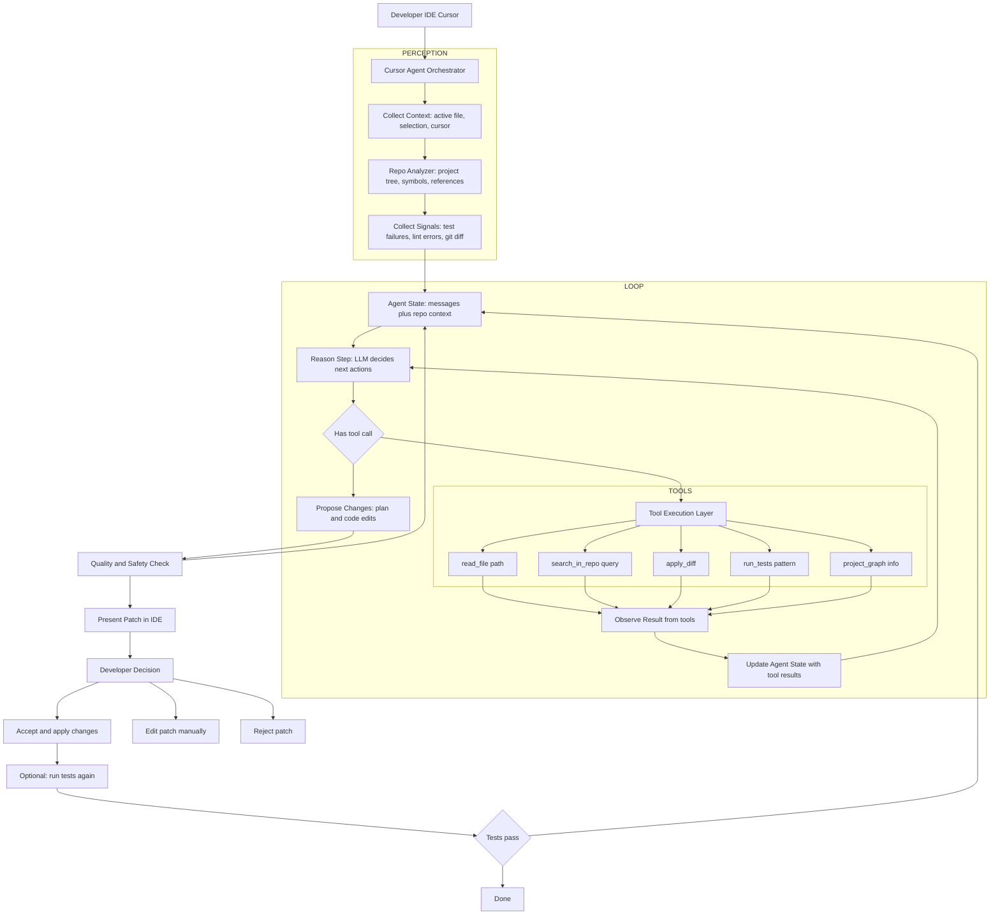

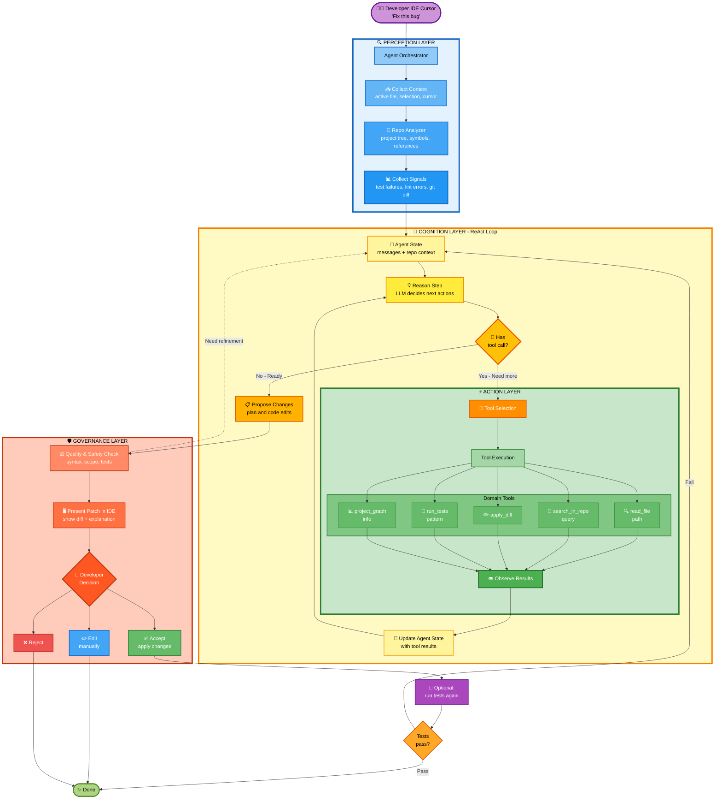

### 1. Luồng trên đã “chuẩn thực tế” chưa?

Ở mức **khái niệm kiến trúc (high‑level)**, luồng đó khá sát với cách một **coding agent kiểu Cursor** vận hành:

- Có **Orchestrator** ở giữa.
- Có bước **thu thập context** (file hiện tại, selection, repo info, test/log).
- Có vòng **Reason → Tool → Observe → Reason** (ReAct).
- Có lớp **tools**: đọc file, search repo, apply diff, chạy test, đọc project graph.
- Có lớp **Quality/Safety check** trước khi hiển thị kết quả.
- Có **Human‑in‑the‑loop**: dev xem diff → accept/edit/reject.
- Có tùy chọn **chạy test lại và lặp** nếu test fail.

Điểm cần lưu ý:

- Cursor thực tế có thể:
    - Thêm nhiều loại tool hơn (LLM chuyên code, model khác cho test, embedding index cho repo).
    - Có **multi‑turn planning** “ẩn” hơn (nhiều reasoning step bên trong một command).
    - Có thêm **telemetry, ranking, học từ history**, không thể hiện trong diagram.
- Nhưng với mục tiêu: **dùng như khung tham chiếu cho kiến trúc agent code/self‑healing của bạn**, thì luồng này **đủ đúng và hữu ích**.

Tóm lại:

- Không phải “spec nội bộ chính thức của Cursor”, nhưng **phù hợp với pattern SOTA của coding agent trong IDE** và có thể coi là **chuẩn thực tế ở mức kiến trúc** để dùng trong tài liệu.

***

### 2. Mô tả chi tiết luồng trên bằng lời

Đi theo từng khối trong diagram.

#### 2.1. Developer IDE Cursor → Orchestrator

- Developer đang ở trong IDE (Cursor) thực hiện một hành động:
    - Gõ lệnh trong command palette: “Fix this error”, “Refactor this function”, “Add logging”, “Explain this code”.
    - Hoặc chọn đoạn code rồi bấm một phím tắt (ví dụ: “Cmd+K”).
- IDE gửi yêu cầu đó (command + context cơ bản: file hiện tại, selection) tới **Cursor Agent Orchestrator**.

#### 2.2. Khối PERCEPTION – Thu thập và xây context

1) **Collect Context (B1)**
Orchestrator thu thập context trực tiếp từ IDE:
    - File hiện tại mà developer đang mở.
    - Đoạn code đang được chọn (selection), nếu có.
    - Vị trí con trỏ (cursor position).
    - Có thể kèm theo: ngôn ngữ, framework, v.v.
2) **Repo Analyzer (B2)**
Orchestrator sử dụng một lớp phân tích repo để:
    - Đọc **cây project**: thư mục, file, module.
    - Phân tích **symbols \& references**: hàm/class được gọi ở đâu, định nghĩa ở đâu.
    - Xác định các **file liên quan** đến đoạn code bug/feature (ví dụ: interface, implementation, test tương ứng).
3) **Collect Signals (B3)**
Orchestrator có thể gom thêm tín hiệu phụ:
    - Kết quả test/linter mới nhất (failures).
    - Lỗi compile vừa xảy ra.
    - Git diff (những thay đổi chưa commit).
    - Thông tin branch hiện tại.

Tất cả được gom thành **Agent State ban đầu** (C): một object chứa:

- messages khởi tạo (system message + user command + context).
- repo metadata (file, project graph, signals).

#### 2.3. Khối LOOP – Reason – Act – Observe

Đây là “trái tim” của Cursor‑style agent.

1) **Reason Step (D)**
    - Orchestrator gọi LLM với:
        - System prompt (vai trò: coding agent).
        - Messages (user command + context + history).
        - Danh sách tools khả dụng (read_file, search_in_repo, apply_diff, run_tests, project_graph).
    - LLM:
        - Hiểu mục tiêu của dev.
        - Suy nghĩ (thought) về nguyên nhân bug, vị trí cần xem.
        - Quyết định:
            - Có cần thêm thông tin từ repo không?
            - Có thể đề xuất patch ngay không?
        - Nếu cần tool → tạo `tool_calls`.
2) **Branch quyết định (E)**
    - Nếu **không có tool_call**:
        - Agent cho rằng đã đủ hiểu, có thể **đề xuất patch / giải pháp** ngay → sang F.
    - Nếu **có tool_call**:
        - Agent muốn **hành động**: đọc file khác, search, apply diff, chạy test → sang G.
3) **Tool Execution Layer (G + TOOLS)**
Orchestrator đọc danh sách tool_call và thực thi:
    - `read_file(path)`: lấy nội dung file trong repo (thường dùng nhiều để “mở rộng context” cho LLM).
    - `search_in_repo(query)`: tìm nơi function/class được dùng/định nghĩa; tìm pattern code; locate bug.
    - `apply_diff`: áp dụng một unified diff mà LLM đề xuất vào file (thường trong **buffer tạm/sandbox**, không commit ngay).
    - `run_tests(pattern)`: chạy test liên quan hoặc toàn bộ suite tùy config.
    - `project_graph`: lấy thông tin cấu trúc project, dependency, entrypoint.
4) **Observe Result (H)**
    - Mỗi tool trả về kết quả:
        - Nội dung file, snippet.
        - Vị trí tìm thấy, các match trong repo.
        - Kết quả test (pass/fail, error message).
        - Kết quả áp dụng diff (thành công hay xung đột).
    - Các kết quả này được encode thành **tool messages** và thêm vào Agent State.
5) **Update Agent State (I)**
    - Agent State được cập nhật:
        - Thêm messages kiểu `role=tool` chứa kết quả từ các tool.
        - Có thể cập nhật thêm metadata: test đã chạy, file đã chỉnh, vv.
    - Sau đó quay lại **Reason Step D**:
        - Lần gọi LLM tiếp theo sẽ “nhìn thấy” toàn bộ lịch sử:
            - Command ban đầu.
            - Thought trước.
            - Tool đã gọi.
            - Kết quả tool.
        - Dùng đó để:
            - Điều chỉnh “giả thuyết” bug.
            - Đề xuất patch mới hoặc đọc thêm file.
    - Vòng này lặp **nhiều lần** cho đến khi agent cảm thấy đủ để đề xuất solution.

#### 2.4. Khối F – Quality \& Safety Check

Khi branch ở E đi vào **F (Propose Changes)**:

- LLM sinh output ở dạng:
    - Mô tả plain‑text:
        - Nguyên nhân bug.
        - Chiến lược sửa.
    - Code edits / diff:
        - Có thể là patch một file.
        - Hoặc nhiều file liên quan.
- Trước khi hiển thị cho dev, Orchestrator chạy một **layer đánh giá**:
    - Patch có hợp lệ về syntax, compile được không? (option).
    - Patch có vượt quá scope (sửa quá nhiều file, thay đổi interface lớn) không?
    - Có vi phạm policy/guardrail (xóa file, chạm vào vùng nhạy cảm) không?

Nếu thấy cần refine, Orchestrator có thể:

- Thêm message kiểu “system/user feedback” vào state:
“Patch quá lớn, hãy đề xuất chỉnh nhỏ hơn, tập trung vào function X.”
- Quay lại **C (Agent State)** → vòng Reason–Act–Observe lặp thêm một/ vài lượt.

Nếu acceptable → sang K.

#### 2.5. Khối K – Present Patch in IDE

- Orchestrator gửi patch/diff + explanation về IDE (Cursor).
- IDE hiển thị:
    - Inline diff trong file.
    - Danh sách file thay đổi.
    - Cửa sổ giải thích (Agent Panel / Chat Panel).

Dev thấy được:

- Sự khác biệt trước/sau (diff).
- Lý do agent sửa như vậy.

#### 2.6. Human-in-the-loop – Developer Decision (L)

Developer có 3 lựa chọn chính:

1) **Accept (M)**
    - IDE áp dụng patch vào filesystem:
        - Ghi file mới.
        - Có thể stage vào git (tuỳ config).
    - Đây là điểm mà code thực sự được thay đổi.
2) **Edit patch (N)**
    - Dev tự chỉnh sửa patch theo ý.
    - Sau đó:
        - Có thể gọi lại agent để “tiếp tục” từ trạng thái mới.
        - Hoặc chạy test thủ công.
3) **Reject (O)**
    - Patch bị bỏ.
    - History agent vẫn được giữ (telemetry, log) để cải thiện model trong tương lai.

#### 2.7. Optional: chạy test lại và lặp (M → P → Q → C/S)

Nếu bật chế độ “auto test”:

- Sau khi patch được **accept**:
    - Orchestrator hoặc IDE kích hoạt tool `run_tests(pattern)` (P).
- Dựa vào kết quả test (Q):
    - Nếu **fail**:
        - Gửi error/test output trở lại Agent State (C).
        - Vòng Reason–Act–Observe lặp lại:
            - Agent phân tích vì sao patch fail,
            - Đề xuất chỉnh sửa tiếp.
    - Nếu **pass**:
        - Flow kết thúc ở **S (Done)**:
            - Bug được fix và test pass.

***

Nếu bạn muốn, bước tiếp theo có thể:

- Đưa luồng này vào tài liệu của bạn như **“Cursor-style Coding Agent Architecture”**.
- Rồi bên cạnh là **“Self-Healing Infra Agent Architecture”**, để so sánh hai loại agent code: một chạy trong IDE (Cursor), một chạy trong production (self-healing platform).

---

