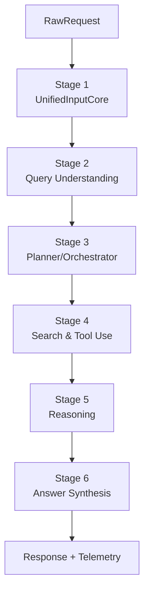

# AI-Native Browser (Comet-like) — Spec MVP chuẩn enterprise (v1, tiếng Việt)

> **Phạm vi MVP:** Text + Web HTML. Voice/YouTube = **future hooks** (interface-ready, not implemented heavy).

---

## A. Tóm tắt điều hành (Executive Summary)

- MVP triển khai pipeline **agentic** theo mô hình **single orchestrator**: 1 bộ điều phối trung tâm lập kế hoạch + giám sát thực thi tool, tối ưu latency/cost bằng cách “để model lớn chỉ bật ở vài điểm”.  
- Stage 1–2 chạy **sync** để trả **TaskSpecV1** nhanh, deterministic và dễ debug; Stage 3–6 chạy **async** (khuyến nghị mặc định) để mở rộng dần mà không phá API.
- Stage 3 tạo **ActionPlan** tuyến tính (steps có goal/tool/constraints/expected_output) và áp **budget & safety gates** trước khi cho phép browse/tool actions.
- Stage 4 thực thi plan: retrieval → rerank → fetch HTML → extract main content/tables → build **EvidencePack** (đã lọc + trace + safety trace).
- Stage 5 suy luận trên EvidencePack (không nhét web thô): tạo **AnswerSkeleton** (claims + structure) + **CitationMap** + **OpenQuestions**.
- Stage 6 tổng hợp AnswerSkeleton thành **Final Answer** (markdown/blocks), chèn citations, cá nhân hoá theo profile, chạy output-safety check.
- NFR (yêu cầu phi chức năng): p95 latency (Stage 1–2) < 1.5s; full run (Stage 3–6) < 8–12s (tuỳ allow_browse), có budget guardrails, retries + idempotency, rate-limit, privacy by design.
- Repo monorepo khuyến nghị: `packages/shared` (types/schemas), `services/orchestrator`, `services/retrieval`, `services/web-worker`, `services/model-gateway`, `apps/extension` (optional).
- What’s next: headless browsing (Playwright), VLM/PDF pipeline, interactive actions (click/fill) với sandbox + human approval, personalization ranking, on-device lite models (optional).

---

## B. Mục tiêu / Không làm (Goals / Non-goals)

### Goals (MVP)
- Chuẩn hoá input về **NormalizedInput** (text + optional URL/tab context).
- Sinh **TaskSpecV1** (intent/slots/routing/constraints) ổn định schema.
- Lập **ActionPlan** + chạy retrieval/fetch/extract để tạo **EvidencePack**.
- Trả lời có cấu trúc + citations + error model chuẩn.
- Có security/privacy/ops đủ để team **build/run/observe**.

### Non-goals (MVP)
- Không build multi-agent swarm song song; không tối ưu mọi website “khó”.
- Không thực hiện hành động nguy hiểm (submit/payment/login); chỉ duyệt web read-only mặc định.
- Không cam kết vendor/model cụ thể; mọi model/tool là **config-driven**.

### Assumptions
- Backend chạy server-side; FE/extension optional.
- Có 1 state store (Redis) + optional DB (Postgres).
- Có khả năng fetch HTML (HTTP client) và parse DOM; headless browsing là P1.

---


## Thuật ngữ (Glossary)

- **Stage**: giai đoạn trong pipeline (Stage 1→6).
- **Module**: thành phần triển khai trong một Stage.
- **Orchestrator**: bộ điều phối trung tâm (single orchestrator) lập kế hoạch và giám sát thực thi.
- **TaskSpecV1 / ActionPlan / EvidencePack**: các đối tượng canonical dùng xuyên suốt pipeline.

## C. Tổng quan hệ thống (System Overview, C4 Level 1–2)

### C1 — Ngữ cảnh (Context, Level 1)

```mermaid
flowchart LR
  U[User] --> FE[Browser UI / Extension (optional)]
  FE --> GW[API Gateway + WAF + Rate Limit]
  GW --> ORCH[Orchestrator API (Stages 1-6)]
  ORCH --> MG[Model Gateway]
  ORCH --> RET[Retrieval Service]
  ORCH --> WW[Web Worker (Fetch/Parse/Extract)]
  ORCH --> ST[(State Store)]
  ORCH --> OBS[Observability (OTel)]
  MG --> OBS
  RET --> OBS
  WW --> OBS
```

### C2 — Các khối dịch vụ (Containers, Level 2)

**API Gateway / WAF**
- AuthN/AuthZ, rate-limit, request size limit, header normalization, WAF rules.

**Orchestrator Service**
- Chịu trách nhiệm điều phối workflow Stage 1–6, state machine trạng thái task, budgets, safety gates, orchestration.

**Model Gateway**
- Adapters: SLM/LLM/Embeddings/Reranker/VLM (optional), retry/backoff, enforce budget.

**Retrieval Service**
- Query expansion, vector search (cache/session/index), BM25/search provider (optional), khử trùng lặp (dedupe), candidate scoring.

**Web Worker**
- HTTP fetch + sanitize + main-content extraction + table extraction; (P1) headless browsing & screenshots.

**State Store**
- Idempotency cache, task status, artifacts (TaskSpec/Evidence/Answer), session snippets.

---

## D. Pipeline end-to-end (End-to-End Pipeline)

### ASCII (one-way)

```
RawRequest
   |
   v
Stage 1: UnifiedInputCore  --> NormalizedInput + TraceContext
   |
   v
Stage 2: Query Understanding --> TaskSpecV1 (intent/slots/routing/constraints)
   |
   v
Stage 3: Planner/Orchestrator --> ActionPlan (steps + budgets + guards)
   |
   v
Stage 4: Search & Tool Use --> EvidencePack (filtered evidence + traces)
   |
   v
Stage 5: Reasoning --> AnswerSkeleton + CitationMap + OpenQuestions
   |
   v
Stage 6: Answer Synthesis --> FinalAnswer (+ optional audio later)
```

### Mermaid (flowchart)



---

## E. Phân rã module theo stage (Module Breakdown)

> Format per module: **Purpose / Inputs / Outputs / Responsibilities / Dependencies / Failure modes**

### Stage 1 — UnifiedInputCore (Normalize Input)

#### 1.1 InputAdapter
- **Purpose:** nhận request từ FE/API, validate schema, attach trace, enforce idempotency.
- **Inputs:** RawRequest, headers (Auth, Idempotency-Key, Correlation-Id).
- **Outputs:** Validated RawRequest + TraceContext.
- **Responsibilities:** schema validation, size limit, payload hash, idempotency lookup.
- **Dependencies:** state store (idempotency), auth context.
- **Failure modes:** 400 invalid schema; 413 too large; 409 idempotency conflict.

#### 1.2 ContextCollector (MVP-lite)
- **Purpose:** gom context tối thiểu: current_url, tab_title, selected_text, locale.
- **Inputs:** RawRequest.context.
- **Outputs:** ContextBundle.
- **Failure modes:** thiếu context → giảm cấp (degrade gracefully) to text-only.

#### 1.3 Normalizer
- **Purpose:** chuẩn hoá về NormalizedInput.
- **Inputs:** Validated RawRequest + ContextBundle.
- **Outputs:** NormalizedInput.
- **Responsibilities:** normalize whitespace, detect language, URL parse, create fetch intent (không fetch ngay nếu async).
- **Failure modes:** 422 unsupported input type; 400 invalid URL.

#### 1.4 SafetyPrecheck (fast gate)
- **Purpose:** chặn sớm prompt-injection/SSRF obvious trước khi tốn model.
- **Inputs:** NormalizedInput.
- **Outputs:** safety baseline flags.
- **Failure modes:** mark blocked/sanitize; allow with warnings.

---

### Stage 2 — Query Understanding (TaskSpec skeleton)

#### 2.1 Policy Classifiers
- **Purpose:** toxicity/illegal/self-harm, prompt-injection, PII.
- **Inputs:** NormalizedInput + ContextBundle.
- **Outputs:** safety_flags, pii_spans, injection_score.
- **Failure modes:** timeout → “cautious” default, log.

#### 2.2 Intent & Slot Extractor (SLM)
- **Purpose:** intent classification + slot filling + query normalization.
- **Inputs:** sanitized query + optional related_history_snippets.
- **Outputs:** intent, slots, normalized_query, routing_hints.
- **Failure modes:** malformed JSON → retry once; phương án dự phòng (fallback) rules.

#### 2.3 Rule Engine (deterministic router)
- **Purpose:** quyết định routing ổn định: quick_path vs browse vs extract vs summarize.
- **Inputs:** intent/slots/routing_hints + safety_flags + options.
- **Outputs:** TaskSpecV1.
- **Failure modes:** rule conflict → choose safest path.

#### 2.4 Embedding Prep
- **Purpose:** tạo query embedding + retrieve session history snippets.
- **Inputs:** normalized_query.
- **Outputs:** query_embedding_ref, related_history_snippets.
- **Failure modes:** embedding unavailable → disable retrieval (giảm cấp (degrade gracefully)).

---

### Stage 3 — Planner / Orchestrator (Single Orchestrator)

> **Mục tiêu:** tạo plan tuyến tính + giám sát thực thi tool-use; model lớn chỉ “bật” khi cần.

#### 3.0 Khái niệm chính (Key Concepts) (Stage 3)

**ActionPlan** là danh sách step *tuyến tính* (có thể có nhánh “early stop” theo condition).  
Mỗi step có: `goal`, `tool`, `input`, `constraints`, `expected_output`, `stop_condition`, `budget`.

**Chiến lược mặc định (MVP):**
- Nếu `quick_path=true` và `needs_browse=false` → skip Stage 4, sang Stage 5/6 với minimal evidence (history + user text).
- Nếu `needs_browse=true` → Stage 4 chạy duyệt web read-only: search → fetch HTML → extract.

#### 3.1 PlanBuilder (Planner LLM/LAM in planning mode)
- **Purpose:** chuyển TaskSpecV1 thành ActionPlan hợp lệ.
- **Inputs:** TaskSpecV1, user_profile_features (optional), policy_context.
- **Outputs:** ActionPlan (draft).
- **Responsibilities:**
  - Query decomposition: tạo sub-queries (nếu cần).
  - Decide tool sequence: `search → fetch → extract → khử trùng lặp (dedupe) → synth`.
  - Define success criteria & stop conditions.
- **Dependencies:** Model Gateway (planner model), Tool Registry (capabilities).
- **Failure modes:** plan invalid schema → retry; fail → phương án dự phòng (fallback) plan template.

#### 3.2 PlanValidator (deterministic)
- **Purpose:** đảm bảo plan tuân policy + budget + capability constraints.
- **Inputs:** draft ActionPlan + safety_flags + tenant policies.
- **Outputs:** validated ActionPlan hoặc blocked.
- **Responsibilities:**
  - Remove forbidden tools/actions (e.g., fill_form in MVP).
  - Enforce max_steps, max_domains, deny SSRF ranges, safe browsing.
  - Enforce budget: max model calls, max fetches, max tokens.
- **Failure modes:** policy violation → return POLICY_BLOCKED; budget exceed → downgrade plan (less steps).

#### 3.3 BudgetManager
- **Purpose:** quản lý “cost envelope” theo request.
- **Inputs:** options (max_latency_ms), tenant budget policy, historical cost signals.
- **Outputs:** per-stage budgets (time/token/fetch count).
- **Responsibilities:** dynamic throttling (reduce evidence count, skip reranker, smaller model).
- **Failure modes:** no budget config → conservative defaults.

#### 3.4 StateManager (Task State Machine)
- **Purpose:** lưu trạng thái task, artifacts, retries, idempotency mapping.
- **Inputs:** Task events (PLAN_BUILT, STEP_DONE, FAILED…).
- **Outputs:** persistent state, progress snapshots.
- **Dependencies:** state-store/DB.
- **Failure modes:** store unavailable → fail fast 503 (idempotency risk).

#### 3.5 Orchestrator Runtime (StepExecutor)
- **Purpose:** chạy ActionPlan step-by-step, ghi trace, handle retries.
- **Inputs:** validated ActionPlan, TraceContext.
- **Outputs:** EvidencePack (from Stage 4), intermediate artifacts, execution_trace.
- **Responsibilities:**
  - Dispatch tool calls (search/fetch/extract).
  - Run steps in parallel when safe (e.g., multi-fetch fan-out) nhưng vẫn “single orchestrator” quyết định.
  - Apply retry policy per tool (with backoff), and **idempotent tool calls** (tool-level keys).
  - Early stop when sufficient evidence (confidence threshold).
- **Failure modes:** repeated tool failure → giảm cấp (degrade gracefully) (partial answer) or fail with retryable flag.

#### 3.6 Personalization Hook (optional, MVP-lite)
- **Purpose:** adjust depth/style/source preferences.
- **Inputs:** session signals, user profile features.
- **Outputs:** plan modifiers (depth=quick/deep, source priorities).
- **Failure modes:** missing profile → default “balanced”.

---

### Stage 4 — Search & Tool Use

> **Mục tiêu:** thực thi plan để tạo **EvidencePack đã lọc**; tách “tool execution” khỏi reasoning để tiết kiệm token.

#### 4.0 Chế độ thực thi (Execution Modes)
- **Mode A (MVP default): Read-only Web**  
  search → HTTP fetch → DOM parse → content extract → evidence pack.
- **Mode B (P1): Headless / Interactive**  
  open_tab/click/scroll với sandbox + allowlist + human approval for dangerous actions.

#### 4.1 RetrievalEngine
- **Purpose:** lấy candidates từ session cache + web search/index.
- **Inputs:** query_embedding_ref, normalized_query, sub_queries.
- **Outputs:** CandidateList (50–100).
- **Responsibilities:**
  - Hybrid retrieval: vector + keyword (configurable).
  - Dedupe by URL + near-duplicate text hash.
  - Domain scoring (trusted sources bias) theo tenant policy.
- **Dependencies:** vector store, optional search provider.
- **Failure modes:** retrieval unavailable → phương án dự phòng (fallback) to direct fetch (if URL provided) hoặc no-browse.

#### 4.2 Reranker
- **Purpose:** rerank candidates → chọn top evidence chất lượng.
- **Inputs:** CandidateList, query.
- **Outputs:** TopEvidence (5–10).
- **Responsibilities:** cross-encoder rerank; enforce diversity by domain.
- **Failure modes:** reranker unavailable → phương án dự phòng (fallback) to similarity score.

#### 4.3 WebFetch (HTTP) + SSRF Guard
- **Purpose:** tải HTML an toàn.
- **Inputs:** URL list, fetch policy.
- **Outputs:** FetchResult (status, headers, html_bytes).
- **Responsibilities:**
  - SSRF block (private IPs, metadata IPs).
  - Respect robots/timeout/size; retries with backoff.
  - Content-type guard (only html/text in MVP).
- **Failure modes:** 404/403/timeout; blocked by policy; returns typed errors.

#### 4.4 DOMParser & MainContentExtractor
- **Purpose:** parse DOM và trích xuất main content vs nav/ads/sidebar.
- **Inputs:** html_bytes, base_url.
- **Outputs:** StructuredPageView: title, headings, paragraphs, links, tables (basic).
- **Responsibilities:** boilerplate removal, readability extraction, normalize whitespace, language detect.
- **Failure modes:** malformed HTML → best-effort parse; empty main content → phương án dự phòng (fallback) to snippet-based evidence.

#### 4.5 TableExtractor (MVP-basic)
- **Purpose:** extract tables (HTML) thành structured rows.
- **Inputs:** DOM tree.
- **Outputs:** table artifacts (csv/json).
- **Failure modes:** complex tables → include as raw html fragment + warning.

#### 4.6 VLM/OCR Hook (P1+)
- **Purpose:** xử lý PDF/chart/layout lạ bằng screenshot → structured view.
- **Inputs:** screenshot/pdf bytes.
- **Outputs:** structured_page_views, extracted tables/charts.
- **Note:** not required in MVP; interface only.

#### 4.7 Tool Sandbox / ActionPolicy (for agentic browsing)
- **Purpose:** enforce allowed actions & safe execution.
- **Inputs:** tool call request (tool_name, args), policy.
- **Outputs:** tool call result or block.
- **Responsibilities:** allowlist tools, domain allowlist, redact secrets, no credential entry in MVP.
- **Failure modes:** blocked tool call with POLICY_BLOCKED (not retryable).

#### 4.8 EvidenceBuilder
- **Purpose:** build EvidencePack đã lọc để Stage 5 reasoning.
- **Inputs:** TopEvidence + StructuredPageViews + tables.
- **Outputs:** EvidencePack.
- **Responsibilities:**
  - Chunking & citation anchors (url + offsets + hashes).
  - Keep only relevant spans (reduce token).
  - Safety sanitize: remove PII spans, strip prompt-injection text patterns.
- **Failure modes:** empty evidence → return EvidencePack with warnings.

#### 4.9 ExecutionTraceCollector
- **Purpose:** capture `execution_trace` và `safety_trace`.
- **Inputs:** all tool events.
- **Outputs:** trace artifacts.
- **Responsibilities:** correlation_id propagation, sampling, redaction.
- **Failure modes:** trace sink down → drop non-critical traces.

---

### Stage 5 — Reasoning

> **Mục tiêu:** suy luận đa bước dựa trên evidence **đã nén**, giải quyết mâu thuẫn, tạo skeleton + citations map.

#### 5.1 EvidenceSummarizer (token reducer)
- **Purpose:** nén EvidencePack thành “evidence digest” theo schema.
- **Inputs:** EvidencePack.
- **Outputs:** EvidenceDigest (facts list, key quotes, table summaries).
- **Responsibilities:** minimize tokens, keep provenance pointers.
- **Failure modes:** summarizer fail → phương án dự phòng (fallback) to truncated raw snippets.

#### 5.2 ReasoningCore (Reasoning LLM/LAM)
- **Purpose:** tạo AnswerSkeleton + claim graph.
- **Inputs:** TaskSpecV1, EvidenceDigest, constraints (style/depth).
- **Outputs:** AnswerSkeleton, ClaimList, OpenQuestions.
- **Responsibilities:**
  - Build answer outline (sections).
  - Extract atomic claims (each claim must be backed by ≥1 evidence item OR marked as assumption).
  - Resolve contradictions: prefer higher-trust sources; flag uncertain areas.
- **Failure modes:** low confidence / insufficient evidence → produce partial answer + OpenQuestions (không hỏi ngược người dùng trong MVP response; chỉ báo “thiếu dữ liệu”).

#### 5.3 CitationMapper (claim → evidence)
- **Purpose:** map claim IDs to evidence anchors.
- **Inputs:** ClaimList, EvidencePack.
- **Outputs:** CitationMap.
- **Responsibilities:** ensure no claim without mapping unless labeled assumption.
- **Failure modes:** missing mapping → downgrade claim to “uncertain” + warning.

#### 5.4 OutputSafetyCheck (draft-level)
- **Purpose:** safety check cho intermediate drafts.
- **Inputs:** AnswerSkeleton + claims.
- **Outputs:** allow / sanitize / block.
- **Failure modes:** false positive → sanitize minimally, log.

---

### Stage 6 — Answer Synthesis

> **Mục tiêu:** biến skeleton thành câu trả lời rõ ràng + định dạng + citations; quick path bằng SLM khi task đơn giản.

#### 6.1 SynthesisComposer (LLM)
- **Purpose:** generate final answer text from skeleton.
- **Inputs:** AnswerSkeleton, CitationMap, style options.
- **Outputs:** FinalAnswer (markdown blocks), AnswerMetadata.
- **Responsibilities:**
  - Rendering policy: headings/bullets/tables.
  - Insert citations inline (e.g., [1], [2]) + reference list.
  - Respect length/depth constraints and user profile.
- **Failure modes:** model timeout → phương án dự phòng (fallback) “short answer” template + skeleton.

#### 6.2 QuickPathSynth (SLM)
- **Purpose:** answer nhanh khi không browse / ít evidence.
- **Inputs:** TaskSpecV1 + minimal evidence.
- **Outputs:** FinalAnswer.
- **Failure modes:** escalate to 6.1 if quality < threshold.

#### 6.3 PersonalizationFormatter
- **Purpose:** adjust tone/depth/verbosity based on profile features.
- **Inputs:** user_profile_features.
- **Outputs:** formatting parameters (verbosity, style).
- **Failure modes:** missing profile → default.

#### 6.4 PostProcessor
- **Purpose:** deterministic cleanup.
- **Inputs:** FinalAnswer draft.
- **Outputs:** FinalAnswer sanitized.
- **Responsibilities:** strip leaked system prompts, redact PII, normalize markdown, enforce max length.
- **Failure modes:** if violation persists → block with safe message.

#### 6.5 ResponsePackaging
- **Purpose:** package for FE: answer blocks + citations + artifacts.
- **Inputs:** FinalAnswer + EvidencePack.
- **Outputs:** API response body (ResponseV1).
- **Failure modes:** artifacts too large → return truncated artifacts + link refs.

---

## F. Mô hình dữ liệu (Data Model)

### Canonical Objects
- **RawRequest**: input từ FE/API.
- **NormalizedInput**: canonical normalized query + context.
- **TaskSpecV1**: intent/slots/routing/constraints/budget hints.
- **ActionPlan**: list of steps (tool calls & success conditions).
- **EvidencePack**: filtered evidence + provenance + traces.
- **AnswerSkeleton**: structured outline + claims.
- **FinalAnswer**: user-facing content blocks + citations.
- **TraceContext**: request_id/correlation_id/session_id.

### Mini JSON Schemas (core fields)

#### RawRequest
```json
{
  "request_id": "req_...",
  "idempotency_key": "idem_...",
  "user": { "user_id": "u_123", "session_id": "s_456" },
  "input": {
    "type": "text|web_url|html_snapshot",
    "text": "…",
    "url": "https://…",
    "html": "<html>…</html>"
  },
  "context": {
    "current_url": "https://…",
    "tab_title": "…",
    "selected_text": "…",
    "locale": "vi-VN",
    "timezone": "Asia/Bangkok"
  },
  "options": {
    "mode": "auto|quick|deep",
    "allow_browse": true,
    "max_latency_ms": 8000
  },
  "trace": { "correlation_id": "corr_..." }
}
```

#### TaskSpecV1
```json
{
  "task_id": "task_...",
  "request_id": "req_...",
  "intent": "qa|summarize|extract|compare|navigate",
  "slots": { "entities": ["..."], "timeframe": "..." },
  "routing": {
    "quick_path": false,
    "needs_browse": true,
    "needs_citations": true
  },
  "constraints": {
    "allow_domains": ["*"],
    "deny_domains": ["localhost", "169.254.169.254"],
    "max_steps": 6,
    "max_fetch": 8
  },
  "budget": {
    "max_model_calls": 6,
    "max_tokens_total": 12000
  },
  "trace": { "correlation_id": "corr_..." }
}
```

#### ActionPlan
```json
{
  "task_id": "task_...",
  "steps": [
    {
      "step_id": "s1",
      "goal": "Find authoritative sources",
      "tool": "retrieval.search",
      "input": { "query": "..." },
      "constraints": { "max_candidates": 80 },
      "expected_output": { "type": "CandidateList" },
      "stop_condition": { "type": "always" }
    },
    {
      "step_id": "s2",
      "goal": "Fetch top pages",
      "tool": "web.fetch",
      "input": { "urls_ref": "cand_top10" },
      "constraints": { "timeout_ms": 2500, "max_bytes": 2000000 },
      "expected_output": { "type": "FetchResults" },
      "stop_condition": { "type": "on_error_budget", "max_errors": 3 }
    }
  ],
  "global_constraints": { "max_steps": 6, "allow_actions": ["read_only"] }
}
```

#### EvidencePack
```json
{
  "task_id": "task_...",
  "items": [
    {
      "evidence_id": "e1",
      "source_url": "https://...",
      "title": "...",
      "type": "snippet|table|structured_view",
      "content": "…",
      "anchors": { "hash": "sha256(...)", "offsets": [120, 420] },
      "score": 0.92
    }
  ],
  "execution_trace": [{ "tool": "web.fetch", "url": "...", "status": 200 }],
  "safety_trace": [{ "check": "pii", "result": "redacted" }]
}
```

#### AnswerSkeleton + CitationMap
```json
{
  "outline": [
    { "section": "Overview", "bullets": ["..."] }
  ],
  "claims": [
    { "claim_id": "c1", "text": "...", "confidence": 0.8, "assumption": false }
  ],
  "citation_map": {
    "c1": ["e1", "e3"]
  },
  "open_questions": ["Missing ... from authoritative sources"]
}
```

### Idempotency / request_id / session_id / user_id
- `Idempotency-Key` bắt buộc cho `/tasks:execute`.  
- Không log `user_id` raw; dùng hash/pseudonymous trong logs/traces.  
- `session_id` dùng để truy xuất history snippets (retention ngắn).

---

## G. Đặc tả API (API Spec)

### Endpoints (REST)

#### `POST /v1/tasks:execute`
- **Purpose:** execute Stage 1–6 (default async), hoặc sync-only Stage 1–2 (config).
- **Headers:**
  - `Authorization: Bearer <token>`
  - `Idempotency-Key: <string>`
  - `X-Correlation-Id: <string>` (optional)
- **Request:** RawRequest
- **Responses:**
  - `202 Accepted` (recommended): returns task_id
  - `200 OK` (sync mode): returns ResponseV1 (final)
- **Example (202):**
```json
{ "task_id": "task_123", "status": "RUNNING", "correlation_id": "corr_..." }
```

#### `GET /v1/tasks/{task_id}`
- **Purpose:** poll status + fetch artifacts.
- **Response:**
```json
{
  "task_id": "task_123",
  "status": "RUNNING|SUCCEEDED|FAILED",
  "artifacts": {
    "task_spec": { },
    "evidence_pack": null,
    "final_answer": null
  },
  "correlation_id": "corr_..."
}
```

#### `GET /healthz`, `GET /readyz`

### Status Model
- `RUNNING`: executing plan steps
- `SUCCEEDED`: final_answer ready
- `FAILED`: failed with error (retryable?)

### Standard Error Model
```json
{
  "error_code": "INVALID_ARGUMENT|UNAUTHORIZED|RATE_LIMITED|MODEL_TIMEOUT|FETCH_FAILED|POLICY_BLOCKED|INTERNAL",
  "message": "human readable",
  "retryable": true,
  "correlation_id": "corr_...",
  "details": { "stage": 4, "tool": "web.fetch" }
}
```

### Rate Limit + Auth
- Gateway enforced: per-user + per-IP. Default: 60 rpm/user (config).
- Auth: JWT/OAuth2 recommended; API keys allowed for MVP internal.

---

## H. Bảo mật & Quyền riêng tư (Security & Privacy)

### Threat Model (short)
- Prompt-injection từ web content.
- SSRF via URL fetch.
- Data exfiltration (secrets/system prompt).
- Abuse/cost blow-up (spam).
- PII leakage in logs/artifacts.

### Controls
- **Network boundary:** GW/WAF at edge; services in private network; egress proxy for web-worker.
- **SSRF guard:** block RFC1918, link-local, metadata, localhost, non-HTTP(s).
- **Secrets management:** Vault/KMS; rotate; no secrets in logs.
- **PII handling:** detect + redact in logs and EvidencePack (config).
- **Action sandbox:** MVP allowlist read-only; interactive actions require P1 human approval.

### Data Retention (default suggestions)
- Traces/logs: 7–14 days.
- Artifacts (TaskSpec/Evidence/Answer): 1–7 days.
- Tenant-configurable; “no-store” mode for enterprise.

---

## I. Quan sát hệ thống & Vận hành (Observability & Ops)

### Logging
- JSON logs: request_id, correlation_id, user_hash, stage, step_id, tool, latency_ms, retry_count, cost_estimate.

### Tracing
- OpenTelemetry spans per stage and per tool call.

### Metrics
- request_count/status
- latency p50/p95/p99 per stage
- model_calls + token_in/out
- fetch_success_rate + ssrf_block_count
- policy_block_rate
- cache_hit_rate (idempotency, retrieval)

### SLO (suggested)
- Stage 1–2 p95 < 1500ms
- Full pipeline p95 < 8–12s (browse on)
- Availability 99.9% for core API

---

## J. Cấu trúc repo / thư mục (Repo / Folder Structure)

```
repo/
  docs/
    spec.md
    api.md
    threat-model.md
    runbook.md
  packages/
    shared/
      src/
        types/
        schemas/
        utils/
  services/
    orchestrator/
      src/
        api/
        stages/
        runtime/
        policies/
        observability/
      tests/
    model-gateway/
      src/
        adapters/
        policies/
      tests/
    retrieval/
      src/
        hybrid/
        rerank/
        cache/
      tests/
    web-worker/
      src/
        fetch/
        extract/
        sandbox/
      tests/
  apps/
    extension/   # optional
    web-ui/      # optional
  infra/
    k8s/
    terraform/
    ci/
```

---

## K. Kế hoạch kiểm thử (Test Plan)

### Unit
- PlanValidator rules: forbid interactive actions in MVP.
- SSRF guard: block private ranges.
- EvidenceBuilder: khử trùng lặp (dedupe) + anchors.
- CitationMapper: no claim without evidence unless assumption.

### Integration
- Orchestrator ↔ retrieval ↔ web-worker ↔ model-gateway happy path.
- Retries/backoff for web.fetch and model calls.
- Idempotency: same key returns same task_id/result.

### E2E
- Text-only: quick path.
- Text + URL: fetch/extract → answer with citations.
- Prompt injection page: sanitize/skip, still answer safely.

### Golden Tests
- Deterministic TaskSpecV1 output for given inputs.
- Deterministic plan template outputs (when planner disabled).

### Edge Cases Checklist
- Empty/very long text; mixed languages.
- 403/404/timeout; redirect loops.
- Paywall/login pages.
- Duplicated sources; contradictory sources.
- Evidence too large → truncation path.

---

## L. Tiêu chí nghiệm thu (Acceptance Criteria)

### P0 (must)
- Stage 1–6 chạy end-to-end (at least Mode A read-only browse).
- Idempotency works; error model includes correlation_id.
- SSRF protection + rate limit + auth in place.
- EvidencePack built and citations inserted for evidence-backed claims.
- Observability: logs + traces + metrics minimal dashboards.

### P1 (should)
- Async tasks with progress events; streaming answer blocks.
- Headless browsing (Playwright) for JS-heavy sites.
- Reranker + diversity enforcement; better citation anchors.
- Tenant-configurable retention + no-store mode.

### P2 (nice)
- VLM/PDF pipeline; OCR for scanned docs.
- Interactive actions with sandbox + human approval.
- Strong personalization (source ranking + style).

---

## M. Câu hỏi mở / Future hooks (Open Questions / Future Hooks)

1) Sync vs Async default: MVP recommended async for Stage 3–6 to avoid gateway timeouts; keep sync for internal/dev mode.
2) Retrieval strategy: external search API vs self-index. Default: external search for MVP; keep interface for self-index.
3) Headless browsing: enable P1; keep HTTP fetch path as phương án dự phòng (fallback).
4) Citation UX format: inline numeric vs hover cards. Keep metadata in ResponseV1 for FE rendering.
5) Multi-tenant policy: domain allowlist/denylist, retention, budgets.

---
# 6 Modules Quick Reference Guide
## Comet AI Browser - MVP Enterprise Architecture

---

## 📦 Module Stack Overview

```
┌─────────────────────────────────────────────────────────────┐
│ USER INPUT (Text, URL, Page Context)                        │
└────────────────────────┬────────────────────────────────────┘
                         │
        ┌────────────────▼───────────────┐
        │  STAGE 1: UnifiedInputCore     │
        │  ├─ Validate input             │
        │  ├─ Normalize text             │
        │  ├─ Extract URLs               │
        │  ├─ Detect language            │
        │  ├─ Safety precheck            │
        │  └─ Attach context             │
        └────────────────┬────────────────┘
                         │
                    NormalizedInput
                         │
        ┌────────────────▼──────────────────┐
        │  STAGE 2: QueryUnderstanding      │
        │  ├─ Intent classification         │
        │  ├─ Slot filling                 │
        │  ├─ Entity extraction            │
        │  ├─ Policy checks (PII/injection)│
        │  ├─ SLM fallback (optional)      │
        │  └─ Task specification           │
        └────────────────┬──────────────────┘
                         │
                      TaskSpecV1
                         │
        ┌────────────────▼───────────────┐
        │  STAGE 3: RouterPlanner        │
        │  ├─ Extract signals            │
        │  ├─ Select mode (A/B/C/D)     │
        │  ├─ Generate ActionPlan        │
        │  ├─ Validate constraints       │
        │  ├─ Budget management          │
        │  └─ State persistence          │
        └────────────────┬───────────────┘
                         │
                     ActionPlan
                         │
        ┌────────────────▼──────────────────┐
        │  STAGE 4: UnifiedExecutor (4 Modes)
        │                                   │
        │  ┌─ 4.1 Retrieve:                │
        │  │   Hybrid search (BM25+Vector) │
        │  │   Rerank & dedupe             │
        │  │                               │
        │  ├─ 4.2 FetchData:               │
        │  │   HTTP fetch (SSRF guard)     │
        │  │   Parse tables & metadata     │
        │  │                               │
        │  ├─ 4.3 Compute:                 │
        │  │   Score & transform data      │
        │  │   Reasoning (no UI actions)   │
        │  │                               │
        │  └─ 4.4 Act:                     │
        │      Headless browser            │
        │      Click/type/fill (no submit) │
        │      Policy gates & approval     │
        │      Receipt generation          │
        │                                   │
        └────────────────┬──────────────────┘
                         │
               EvidencePack + Receipt
                         │
        ┌────────────────▼──────────────────┐
        │  STAGE 5: Reasoning               │
        │  ├─ Compress evidence            │
        │  ├─ Extract atomic claims        │
        │  ├─ Map citations                │
        │  ├─ Resolve contradictions       │
        │  ├─ Safety validation            │
        │  └─ Open questions               │
        └────────────────┬──────────────────┘
                         │
         AnswerSkeleton + CitationMap
                         │
        ┌────────────────▼──────────────────┐
        │  STAGE 6: AnswerSynthesis         │
        │  ├─ Compose final answer         │
        │  ├─ Insert citations             │
        │  ├─ Personalize format           │
        │  ├─ Post-process (redact, etc)   │
        │  ├─ Safety check                 │
        │  └─ Package response             │
        └────────────────┬──────────────────┘
                         │
                    FinalAnswer
                         │
        ┌────────────────▼──────────────────┐
        │ USER RESPONSE (Markdown + Citations)
        └───────────────────────────────────┘
```

---

## 🎯 Each Module's Responsibility

### Stage 1: UnifiedInputCore
**Input**: RawRequest (text, URL, page context)  
**Output**: NormalizedInput (validated, normalized)  
**Key Modules**:
- `InputAdapter` - Schema validation, idempotency
- `ContextCollector` - Gather browser context
- `Normalizer` - Whitespace, language detection
- `SafetyPrecheck` - Block obvious injection/SSRF

**Latency Target**: <200ms (p95)

---

### Stage 2: QueryUnderstanding
**Input**: NormalizedInput  
**Output**: TaskSpecV1 (intent, slots, constraints)  
**Key Modules**:
- `RuleEngine` - Fast path (A/B/C/D classification)
- `IntentExtractor` - Intent + slot extraction
- `EntityParser` - Budget, time, travel, quantity parsing
- `PolicyEngine` - PII risk, injection, confirmation logic
- `SLMModule` - Fallback for ambiguous cases

**Execution Path**:
- Fast path (>85% confidence): Rule-only
- Slow path (<85% confidence): Rule + SLM call

**Latency Target**: <500ms with rule-only path

---

### Stage 3: RouterPlanner
**Input**: TaskSpecV1  
**Output**: ActionPlan (mode, steps, budgets, policies)  
**Key Modules**:
- `SignalExtractor` - Extract routing hints from TaskSpec
- `ModeSelector` - Choose A/B/C/D mode
- `PlanBuilder` - LLM-powered plan generation
- `PlanValidator` - Policy & capability validation
- `BudgetManager` - Dynamic cost envelope
- `StateManager` - Task FSM & idempotency

**4 Execution Modes**:
- **Mode A (Research-only)**: Perplexity-like, no actions
- **Mode B (Action-only)**: Known workflow, no research
- **Mode C (Research→Action)**: Find info, then execute
- **Mode D (Action→Research)**: Check state, then explain

---

### Stage 4: UnifiedExecutor
**Input**: ActionPlan  
**Output**: EvidencePack + Receipt (if action)  
**Key Modules**:
- `RetrievalEngine` - BM25 + vector hybrid search
- `Reranker` - Cross-encoder ranking & diversity
- `WebFetch` - HTTP client with retry/backoff
- `SSRFGuard` - Block private IP ranges
- `DOMParser` - HTML parsing & extraction
- `TableExtractor` - Structured table parsing
- `ToolSandbox` - Policy enforcement
- `EvidenceBuilder` - Package evidence with citations
- `ExecutionTrace` - Audit trail

**Execution Substeps**:
1. **4.1 Retrieve**: Search for candidates
2. **4.2 FetchData**: Load & parse URLs
3. **4.3 Compute**: Transform/score data
4. **4.4 Act**: Browser automation (optional)

---

### Stage 5: Reasoning
**Input**: EvidencePack + Receipt  
**Output**: AnswerSkeleton + CitationMap  
**Key Modules**:
- `EvidenceSummarizer` - Token reduction
- `ReasoningCore` - LLM-powered reasoning
- `CitationMapper` - Claim ↔ evidence mapping
- `SafetyCheck` - Output validation

**Outputs**:
- Structured answer outline (sections, bullets)
- Atomic claims (each backed by evidence)
- Citation references (url + offset)
- Open questions (missing data indicators)

---

### Stage 6: AnswerSynthesis
**Input**: AnswerSkeleton + CitationMap  
**Output**: FinalAnswer (markdown + citations)  
**Key Modules**:
- `SynthesisComposer` - LLM renders skeleton → text
- `QuickPathSynth` - SLM for simple queries
- `PersonalizationFormatter` - User preference styling
- `PostProcessor` - Cleanup & redaction
- `ResponseBuilder` - API response construction

**Final Checks**:
- Citation format validation
- PII redaction
- Markdown validity
- Length constraints

---

## 🏗️ Directory Structure Map

```
comet-ai-browser/
├── packages/shared/
│   └── src/
│       ├── types/          ← Canonical types across all stages
│       ├── schemas/        ← JSON validation schemas
│       └── utils/          ← Shared utilities (logging, hashing, etc.)
│
├── services/
│   ├── STAGE-1-unified-input-core/     ← 8 sub-modules
│   ├── STAGE-2-query-understanding/    ← 5 sub-modules
│   ├── STAGE-3-router-planner/         ← 7 sub-modules
│   ├── STAGE-4-unified-executor/       ← 9 sub-modules
│   ├── STAGE-5-reasoning/              ← 4 sub-modules
│   ├── STAGE-6-answer-synthesis/       ← 5 sub-modules
│   ├── model-gateway/                  ← LLM/SLM/embeddings adapter
│   ├── retrieval-service/              ← Hybrid search engine
│   └── web-worker/                     ← HTTP fetch + headless browser
│
├── apps/
│   ├── extension/                       ← Browser extension (optional)
│   └── web-ui/                          ← Web interface (optional)
│
├── infra/
│   ├── k8s/                             ← Kubernetes manifests (6 stage deployments)
│   ├── terraform/                       ← Infrastructure as Code
│   └── ci/                              ← GitHub Actions / GitLab CI
│
└── docs/
    ├── ARCHITECTURE.md                  ← System design
    ├── API.md                           ← API specifications
    ├── THREAT-MODEL.md                  ← Security analysis
    ├── RUNBOOK.md                       ← Operations guide
    └── GLOSSARY.md                      ← Terminology
```

---

## 🔄 Data Flow: Types & Objects

| Stage | Input Type | Output Type | Key Decisions |
|-------|-----------|------------|---|
| **1** | RawRequest | UnifiedInputCore | Normalize, validate, language detect |
| **2** | UnifiedInputCore | TaskSpecV1 | Intent, slots, risk, routing |
| **3** | TaskSpecV1 | ActionPlan | Mode (A/B/C/D), steps, budget |
| **4** | ActionPlan | EvidencePack + Receipt | Search, fetch, compute, act |
| **5** | EvidencePack | AnswerSkeleton + CitationMap | Claims, evidence mapping |
| **6** | AnswerSkeleton | FinalAnswer | Render, personalize, package |

---

## 🚀 Deployment Strategy

### Development
- `docker-compose.yml` spins up all 6 stages + Redis + Postgres
- `.env.example` provides defaults

### Staging / Production
- Kubernetes manifests (separate deployment per stage)
- Terraform for cloud infrastructure (AWS/GCP/Azure)
- Persistent state in Redis + Postgres
- Observability: Prometheus + Grafana + OpenTelemetry

---

## 📊 Key Metrics per Stage

| Stage | P95 Latency | Key Metrics |
|-------|------------|---|
| **1** | <200ms | Input length, URL count, language detection |
| **2** | <500ms | Intent confidence, SLM call rate |
| **3** | <1s | Plan validity, policy violations |
| **4** | <5s | Retrieve success rate, fetch latency, action success |
| **5** | <2s | Evidence compression ratio, claim extraction rate |
| **6** | <2s | Citation coverage, synthesis latency |
| **Full** | <12s | End-to-end latency, error rate, cost/request |

---

## 🔐 Security Checkpoints

- **Stage 1**: Input size, URL format, language safety
- **Stage 2**: PII detection, injection pattern filtering
- **Stage 3**: Policy enforcement (no delete/submit in MVP)
- **Stage 4**: SSRF blocking, robots.txt respect, content sanitization
- **Stage 5**: Claim validation, evidence quality checks
- **Stage 6**: PII redaction, system prompt leak prevention

---

## ⚙️ Supporting Services

### model-gateway/
- Abstraction over LLM providers (GPT-4, Claude, Llama, etc.)
- Token budgeting & cost tracking
- Retry policies with exponential backoff
- Model fallback chains (primary → secondary → tertiary)
- Embedding service integration
- Reranking service integration

### retrieval-service/
- Hybrid search combining BM25 (keyword) + vector (semantic)
- Deduplication (URL-based + content-hash)
- Domain scoring (trusted sources prioritization)
- Result caching (session-based)
- Diversity enforcement (avoid monotone results)

### web-worker/
- HTTP client with timeout/retry/size limits
- SSRF protection (blocklist private IPs)
- HTML parsing (jsdom, cheerio, readability)
- Table structure extraction
- Headless browser pool (Playwright/Puppeteer) - P1
- Screenshot & state capture
- Action sandbox with policy gates

---

## 🧪 Testing Strategy

### Per Stage
- **Unit Tests**: Individual module behavior (validators, parsers, extractors)
- **Integration Tests**: Module interactions within stage
- **Golden Tests**: Deterministic outputs for regression prevention
- **E2E Tests**: Full pipeline with test data

### Cross-Stage
- **Contract Tests**: Type compatibility between stages
- **Scenario Tests**: Mode A/B/C/D workflows
- **Security Tests**: SSRF, injection, PII handling
- **Load Tests**: Throughput & latency under stress

---

## 🎓 Implementation Sequence

**Phase 1 (MVP Core)**
1. Stages 1-2 (sync path)
2. Stages 3-4-5-6 (async completion)
3. model-gateway + retrieval + web-worker
4. Local docker-compose setup

**Phase 2 (Production)**
5. Kubernetes manifests
6. Terraform infrastructure
7. CI/CD pipelines
8. Monitoring & observability

**Phase 3 (Advanced)**
9. Headless browser (Stage 4 interactive actions)
10. VLM/PDF pipeline (OCR for documents)
11. Personalization ranking
12. On-device lite models

---

## 📚 Key Documentation Files

Each service has:
- `README.md` - Service overview & quick start
- `src/config.ts` - Configuration schema
- `tests/` - Unit, integration, E2E test suites

Root-level docs:
- `docs/ARCHITECTURE.md` - C4 diagrams, data model
- `docs/API.md` - OpenAPI spec, endpoint schemas
- `docs/THREAT-MODEL.md` - Security analysis
- `docs/RUNBOOK.md` - Deployment, troubleshooting

---

## 🔗 Service Communication

```
API Gateway (WAF, Auth, Rate Limit)
    ↓
Orchestrator Service (Stage 3 router)
    ├── → Stage 1 Service
    ├── → Stage 2 Service
    ├── → Stage 4 Service
    │   ├── → Retrieval Service
    │   ├── → Web Worker Service
    │   └── → Model Gateway
    ├── → Stage 5 Service
    └── → Stage 6 Service
    
All stages ↔ Redis (idempotency, state)
All stages ↔ Postgres (artifacts storage)
All stages → OpenTelemetry (traces/metrics)
```

---

**Status**: Implementation Ready ✅  
**Version**: 1.0 MVP Enterprise  
**Last Updated**: December 2025


---


# AI-Native Browser (Comet-like) - Complete Folder Structure
## 6 Modules Enterprise MVP Architecture

```
comet-ai-browser/
│
├── 📁 docs/
│   ├── README.md                           # Main project documentation
│   ├── ARCHITECTURE.md                     # System architecture overview
│   ├── API.md                              # API specifications (endpoints, schemas)
│   ├── THREAT-MODEL.md                     # Security threat model & mitigations
│   ├── RUNBOOK.md                          # Operations & troubleshooting guide
│   ├── ROADMAP.md                          # Future features & milestones
│   └── GLOSSARY.md                         # Terminology & definitions
│
├── 📁 packages/
│   └── shared/
│       ├── tsconfig.json
│       ├── package.json
│       └── src/
│           ├── types/                      # Shared TypeScript types
│           │   ├── common.ts               # RawRequest, NormalizedInput
│           │   ├── task-spec.ts            # TaskSpecV1, ActionPlan
│           │   ├── evidence.ts             # EvidencePack, EvidenceItem
│           │   ├── answer.ts               # AnswerSkeleton, FinalAnswer
│           │   └── errors.ts               # Error types, exception classes
│           ├── schemas/                    # Validation schemas & serializers
│           │   ├── input.schema.ts         # RawRequestV1 validation
│           │   ├── task.schema.ts          # TaskSpecV1 validation
│           │   ├── evidence.schema.ts      # EvidencePack validation
│           │   ├── answer.schema.ts        # FinalAnswer validation
│           │   └── api.schema.ts           # API response/request schemas
│           └── utils/
│               ├── logger.ts               # Structured logging setup
│               ├── tracer.ts               # OpenTelemetry tracing
│               ├── hashing.ts              # SHA256, payload hashing
│               ├── url-parser.ts           # URL parsing & validation
│               ├── validators.ts           # Common validators
│               └── constants.ts            # Global constants, limits
│
├── 📁 services/
│   │
│   ├── 🔷 STAGE-1-unified-input-core/
│   │   ├── Dockerfile
│   │   ├── docker-compose.yml
│   │   ├── .env.example
│   │   ├── tsconfig.json
│   │   ├── package.json
│   │   ├── README.md
│   │   └── src/
│   │       ├── index.ts                    # Service entrypoint
│   │       ├── config.ts                   # Configuration & env vars
│   │       ├── constants.ts                # Local constants (MAX_INPUT_LENGTH, etc.)
│   │       ├── exceptions.ts               # Custom exception classes
│   │       ├── api/
│   │       │   ├── routes.ts               # FastAPI/Express route handlers
│   │       │   ├── handlers.ts             # Request/response handlers
│   │       │   ├── middleware.ts           # Auth, CORS, logging middleware
│   │       │   └── schemas.ts              # API request/response schemas
│   │       ├── stages/
│   │       │   └── stage1/                 # Stage 1 pipeline logic
│   │       │       ├── validator.ts        # 1.1 validateRawRequest
│   │       │       ├── env-builder.ts      # 1.2 buildEnv
│   │       │       ├── envelope.ts         # 1.3 initEnvelope
│   │       │       ├── classifier.ts       # 1.4 runInputClassifier
│   │       │       ├── normalizer.ts       # 1.5 runTextNormalizer
│   │       │       ├── context.ts          # 1.6 attachPageContext
│   │       │       ├── safety.ts           # 1.7 computeSafetyFlags
│   │       │       └── telemetry.ts        # 1.8 buildTelemetry
│   │       ├── modules/
│   │       │   ├── input-adapter.ts        # InputAdapter component
│   │       │   ├── context-collector.ts    # ContextCollector component
│   │       │   └── normalizer.ts           # Normalizer component
│   │       ├── integrations/
│   │       │   ├── redis.ts                # Redis client for idempotency
│   │       │   ├── cache.ts                # Caching layer
│   │       │   └── vault.ts                # Secrets management
│   │       └── observability/
│   │           ├── logging.ts              # Structured JSON logging
│   │           ├── metrics.ts              # Prometheus metrics
│   │           └── tracing.ts              # OpenTelemetry spans
│   │   └── tests/
│   │       ├── unit/
│   │       │   ├── normalizer.test.ts
│   │       │   ├── classifier.test.ts
│   │       │   ├── safety.test.ts
│   │       │   └── validator.test.ts
│   │       ├── integration/
│   │       │   ├── api.test.ts
│   │       │   ├── redis.test.ts
│   │       │   └── pipeline.test.ts
│   │       └── e2e/
│   │           ├── full-flow.test.ts
│   │           └── idempotency.test.ts
│   │
│   ├── 🔷 STAGE-2-query-understanding/
│   │   ├── Dockerfile
│   │   ├── docker-compose.yml
│   │   ├── .env.example
│   │   ├── tsconfig.json
│   │   ├── package.json
│   │   ├── README.md
│   │   └── src/
│   │       ├── index.ts
│   │       ├── config.ts
│   │       ├── constants.ts
│   │       ├── exceptions.ts
│   │       ├── api/
│   │       │   ├── routes.ts
│   │       │   ├── handlers.ts
│   │       │   └── schemas.ts
│   │       ├── stages/
│   │       │   └── stage2/
│   │       │       ├── orchestrator.ts     # runQueryUnderstanding entrypoint
│   │       │       ├── rule-engine.ts      # 2.1 Rule-based classification (A, B, C, D)
│   │       │       ├── intent-extractor.ts # Intent & Slot extraction
│   │       │       ├── entity-parser.ts    # Parse budget, time, travel, quantity
│   │       │       ├── policy-engine.ts    # 2.2 Policy overrides & safety checks
│   │       │       └── slm-module.ts       # 2.3 SLM call for slow path
│   │       ├── modules/
│   │       │   ├── policy-classifier.ts    # Toxicity, PII, injection detection
│   │       │   └── embedding-prep.ts       # Query embedding generation
│   │       ├── rules/
│   │       │   ├── intent-rules.ts         # Intent classification rules
│   │       │   ├── entity-rules.ts         # Entity extraction rules
│   │       │   └── policy-rules.ts         # Policy & safety rules
│   │       ├── integrations/
│   │       │   ├── model-gateway.ts        # SLM model calls
│   │       │   └── embeddings.ts           # Embedding service
│   │       └── observability/
│   │           ├── logging.ts
│   │           ├── metrics.ts
│   │           └── tracing.ts
│   │   └── tests/
│   │       ├── unit/
│   │       │   ├── rule-engine.test.ts
│   │       │   ├── entity-parser.test.ts
│   │       │   └── policy-engine.test.ts
│   │       ├── integration/
│   │       │   ├── slm-call.test.ts
│   │       │   └── end-to-end.test.ts
│   │       └── golden/
│   │           └── golden-tests.ts         # Deterministic outputs
│   │
│   ├── 🔷 STAGE-3-router-planner/
│   │   ├── Dockerfile
│   │   ├── docker-compose.yml
│   │   ├── .env.example
│   │   ├── tsconfig.json
│   │   ├── package.json
│   │   ├── README.md
│   │   └── src/
│   │       ├── index.ts
│   │       ├── config.ts
│   │       ├── constants.ts
│   │       ├── exceptions.ts
│   │       ├── api/
│   │       │   ├── routes.ts
│   │       │   ├── handlers.ts
│   │       │   └── schemas.ts
│   │       ├── stages/
│   │       │   └── stage3/
│   │       │       ├── orchestrator.ts     # Main Stage 3 orchestrator
│   │       │       ├── signal-extractor.ts # 3.1 Extract routing signals
│   │       │       ├── mode-selector.ts    # 3.2 Mode selection (A, B, C, D)
│   │       │       ├── plan-builder.ts     # 3.3 PlanBuilder (Planner LLM)
│   │       │       ├── plan-validator.ts   # 3.4 PlanValidator
│   │       │       ├── budget-manager.ts   # 3.5 BudgetManager
│   │       │       ├── state-manager.ts    # 3.6 StateManager & task FSM
│   │       │       └── step-executor.ts    # 3.7 Runtime step execution
│   │       ├── modules/
│   │       │   ├── plan-generator.ts       # ActionPlan generation
│   │       │   ├── policy-enforcer.ts      # Policy constraints enforcement
│   │       │   └── personalization.ts      # User preference adjustments
│   │       ├── integrations/
│   │       │   ├── model-gateway.ts        # LLM/Planner calls
│   │       │   ├── state-store.ts          # Redis/DB state persistence
│   │       │   └── tool-registry.ts        # Capability registry
│   │       └── observability/
│   │           ├── logging.ts
│   │           ├── metrics.ts
│   │           └── tracing.ts
│   │   └── tests/
│   │       ├── unit/
│   │       │   ├── plan-validator.test.ts
│   │       │   ├── budget-manager.test.ts
│   │       │   └── state-manager.test.ts
│   │       ├── integration/
│   │       │   ├── mode-selection.test.ts
│   │       │   └── plan-generation.test.ts
│   │       └── scenario/
│   │           ├── mode-a.scenario.ts
│   │           ├── mode-b.scenario.ts
│   │           ├── mode-c.scenario.ts
│   │           └── mode-d.scenario.ts
│   │
│   ├── 🔷 STAGE-4-unified-executor/
│   │   ├── Dockerfile
│   │   ├── docker-compose.yml
│   │   ├── .env.example
│   │   ├── tsconfig.json
│   │   ├── package.json
│   │   ├── README.md
│   │   └── src/
│   │       ├── index.ts
│   │       ├── config.ts
│   │       ├── constants.ts
│   │       ├── exceptions.ts
│   │       ├── api/
│   │       │   ├── routes.ts
│   │       │   ├── handlers.ts
│   │       │   └── schemas.ts
│   │       ├── stages/
│   │       │   └── stage4/
│   │       │       ├── orchestrator.ts     # Stage 4 main executor
│   │       │       ├── 4.1-retrieval.ts    # 4.1 RetrievalEngine
│   │       │       ├── 4.2-fetch.ts        # 4.2 WebFetch & SSRF Guard
│   │       │       ├── 4.3-extract.ts      # 4.3 DOM parsing & extraction
│   │       │       ├── 4.4-action.ts       # 4.4 Action execution
│   │       │       └── evidence-builder.ts # EvidenceBuilder & packaging
│   │       ├── modules/
│   │       │   ├── retrieval-engine.ts     # Hybrid search (BM25 + vector)
│   │       │   ├── reranker.ts             # Cross-encoder reranking
│   │       │   ├── web-fetch.ts            # HTTP client with retries
│   │       │   ├── ssrf-guard.ts           # SSRF protection
│   │       │   ├── dom-parser.ts           # HTML parsing & extraction
│   │       │   ├── table-extractor.ts      # Table structure extraction
│   │       │   ├── content-extractor.ts    # Main content extraction
│   │       │   ├── tool-sandbox.ts         # Tool execution sandbox
│   │       │   ├── action-policy.ts        # Action allowlisting
│   │       │   └── execution-trace.ts      # Trace collection
│   │       ├── integrations/
│   │       │   ├── model-gateway.ts        # VLM/OCR calls
│   │       │   ├── vector-store.ts         # Embedding search
│   │       │   ├── search-provider.ts      # External search API (optional)
│   │       │   ├── headless-browser.ts     # Playwright/Puppeteer
│   │       │   └── http-client.ts          # HTTP fetching
│   │       └── observability/
│   │           ├── logging.ts
│   │           ├── metrics.ts
│   │           └── tracing.ts
│   │   └── tests/
│   │       ├── unit/
│   │       │   ├── ssrf-guard.test.ts
│   │       │   ├── dom-parser.test.ts
│   │       │   └── retrieval.test.ts
│   │       ├── integration/
│   │       │   ├── web-fetch.test.ts
│   │       │   ├── action-execution.test.ts
│   │       │   └── end-to-end.test.ts
│   │       └── security/
│   │           ├── ssrf.test.ts
│   │           └── injection.test.ts
│   │
│   ├── 🔷 STAGE-5-reasoning/
│   │   ├── Dockerfile
│   │   ├── docker-compose.yml
│   │   ├── .env.example
│   │   ├── tsconfig.json
│   │   ├── package.json
│   │   ├── README.md
│   │   └── src/
│   │       ├── index.ts
│   │       ├── config.ts
│   │       ├── constants.ts
│   │       ├── exceptions.ts
│   │       ├── api/
│   │       │   ├── routes.ts
│   │       │   ├── handlers.ts
│   │       │   └── schemas.ts
│   │       ├── stages/
│   │       │   └── stage5/
│   │       │       ├── orchestrator.ts     # Stage 5 reasoning orchestrator
│   │       │       ├── 5.1-summarizer.ts   # 5.1 EvidenceSummarizer
│   │       │       ├── 5.2-reasoning.ts    # 5.2 ReasoningCore (Reasoning LLM)
│   │       │       ├── 5.3-citation.ts     # 5.3 CitationMapper
│   │       │       └── 5.4-safety.ts       # 5.4 OutputSafetyCheck
│   │       ├── modules/
│   │       │   ├── evidence-summarizer.ts  # Token reduction & compression
│   │       │   ├── claim-extractor.ts      # Atomic claim extraction
│   │       │   ├── citation-mapper.ts      # Claim-to-evidence mapping
│   │       │   ├── contradiction-resolver.ts # Handle conflicting sources
│   │       │   └── safety-checker.ts       # Output safety validation
│   │       ├── integrations/
│   │       │   ├── model-gateway.ts        # Reasoning LLM calls
│   │       │   └── state-store.ts          # Evidence retrieval
│   │       └── observability/
│   │           ├── logging.ts
│   │           ├── metrics.ts
│   │           └── tracing.ts
│   │   └── tests/
│   │       ├── unit/
│   │       │   ├── claim-extractor.test.ts
│   │       │   └── citation-mapper.test.ts
│   │       ├── integration/
│   │       │   ├── reasoning-flow.test.ts
│   │       │   └── safety-check.test.ts
│   │       └── quality/
│   │           └── citation-quality.test.ts
│   │
│   ├── 🔷 STAGE-6-answer-synthesis/
│   │   ├── Dockerfile
│   │   ├── docker-compose.yml
│   │   ├── .env.example
│   │   ├── tsconfig.json
│   │   ├── package.json
│   │   ├── README.md
│   │   └── src/
│   │       ├── index.ts
│   │       ├── config.ts
│   │       ├── constants.ts
│   │       ├── exceptions.ts
│   │       ├── api/
│   │       │   ├── routes.ts
│   │       │   ├── handlers.ts
│   │       │   └── schemas.ts
│   │       ├── stages/
│   │       │   └── stage6/
│   │       │       ├── orchestrator.ts     # Stage 6 main orchestrator
│   │       │       ├── 6.1-composer.ts     # 6.1 SynthesisComposer (LLM)
│   │       │       ├── 6.2-quick.ts        # 6.2 QuickPathSynth (SLM)
│   │       │       ├── 6.3-format.ts       # 6.3 PersonalizationFormatter
│   │       │       ├── 6.4-postproc.ts     # 6.4 PostProcessor
│   │       │       └── 6.5-package.ts      # 6.5 ResponsePackaging
│   │       ├── modules/
│   │       │   ├── composer.ts             # Answer composition
│   │       │   ├── formatter.ts            # Markdown/block formatting
│   │       │   ├── personalizer.ts         # User preference application
│   │       │   ├── post-processor.ts       # Cleanup & validation
│   │       │   └── response-builder.ts     # API response construction
│   │       ├── templates/
│   │       │   ├── answer-template.ts      # Answer structure templates
│   │       │   ├── citation-format.ts      # Citation rendering
│   │       │   └── error-messages.ts       # Standard error responses
│   │       ├── integrations/
│   │       │   ├── model-gateway.ts        # LLM calls (composer)
│   │       │   └── state-store.ts          # Evidence & skeleton retrieval
│   │       └── observability/
│   │           ├── logging.ts
│   │           ├── metrics.ts
│   │           └── tracing.ts
│   │   └── tests/
│   │       ├── unit/
│   │       │   ├── composer.test.ts
│   │       │   ├── formatter.test.ts
│   │       │   └── post-processor.test.ts
│   │       ├── integration/
│   │       │   ├── synthesis-flow.test.ts
│   │       │   └── response-build.test.ts
│   │       └── output-quality/
│   │           ├── citation-format.test.ts
│   │           └── markdown-validity.test.ts
│   │
│   ├── 🔷 model-gateway/
│   │   ├── Dockerfile
│   │   ├── docker-compose.yml
│   │   ├── .env.example
│   │   ├── tsconfig.json
│   │   ├── package.json
│   │   ├── README.md
│   │   └── src/
│   │       ├── index.ts
│   │       ├── config.ts
│   │       ├── adapters/
│   │       │   ├── llm-adapter.ts          # LLM (GPT-4, Claude, etc.)
│   │       │   ├── slm-adapter.ts          # Small LM (Llama, Phi, etc.)
│   │       │   ├── embeddings-adapter.ts   # Embeddings (OpenAI, local)
│   │       │   ├── reranker-adapter.ts     # Cross-encoder reranking
│   │       │   └── vlm-adapter.ts          # Vision-Language Model
│   │       ├── policies/
│   │       │   ├── retry-policy.ts         # Exponential backoff
│   │       │   ├── budget-policy.ts        # Token/cost enforcement
│   │       │   ├── timeout-policy.ts       # Request timeouts
│   │       │   └── fallback-policy.ts      # Model fallback chains
│   │       ├── cache/
│   │       │   ├── embedding-cache.ts
│   │       │   ├── model-response-cache.ts
│   │       │   └── cache-invalidation.ts
│   │       └── observability/
│   │           ├── logging.ts
│   │           ├── metrics.ts
│   │           └── cost-tracking.ts
│   │   └── tests/
│   │       ├── unit/
│   │       └── integration/
│   │
│   ├── 🔷 retrieval-service/
│   │   ├── Dockerfile
│   │   ├── docker-compose.yml
│   │   ├── .env.example
│   │   ├── tsconfig.json
│   │   ├── package.json
│   │   ├── README.md
│   │   └── src/
│   │       ├── index.ts
│   │       ├── config.ts
│   │       ├── hybrid/
│   │       │   ├── hybrid-search.ts        # BM25 + Vector hybrid
│   │       │   ├── bm25-engine.ts
│   │       │   └── vector-engine.ts
│   │       ├── rerank/
│   │       │   ├── cross-encoder.ts
│   │       │   └── diversity-ranker.ts
│   │       ├── cache/
│   │       │   ├── session-cache.ts        # Session-based caching
│   │       │   └── result-cache.ts
│   │       ├── dedup/
│   │       │   ├── url-dedup.ts
│   │       │   └── content-dedup.ts
│   │       └── observability/
│   │           ├── logging.ts
│   │           └── metrics.ts
│   │   └── tests/
│   │
│   └── 🔷 web-worker/
│       ├── Dockerfile
│       ├── docker-compose.yml
│       ├── .env.example
│       ├── tsconfig.json
│       ├── package.json
│       ├── README.md
│       └── src/
│           ├── index.ts
│           ├── config.ts
│           ├── fetch/
│           │   ├── http-client.ts          # HTTP fetching with retries
│           │   ├── ssrf-guard.ts           # SSRF protection
│           │   └── robots-checker.ts       # robots.txt compliance
│           ├── extract/
│           │   ├── dom-parser.ts           # HTML parsing
│           │   ├── content-extractor.ts    # Main content extraction
│           │   ├── table-extractor.ts      # Table structure extraction
│           │   └── metadata-extractor.ts   # Title, author, date, etc.
│           ├── sanitize/
│           │   ├── html-sanitizer.ts       # XSS protection
│           │   ├── pii-redactor.ts         # PII redaction
│           │   └── injection-filter.ts     # Prompt injection filtering
│           ├── sandbox/
│           │   ├── action-sandbox.ts       # Action execution sandbox
│           │   ├── allowlist-manager.ts    # Tool/domain allowlisting
│           │   └── approval-handler.ts     # Human approval workflow
│           ├── headless/
│           │   ├── browser-pool.ts         # Playwright/Puppeteer pool
│           │   ├── screenshot-engine.ts    # Screenshot capture
│           │   └── interaction-handler.ts  # Click, type, fill, submit
│           └── observability/
│               ├── logging.ts
│               └── metrics.ts
│       └── tests/
│
├── 📁 apps/
│   │
│   ├── extension/
│   │   ├── manifest.json
│   │   ├── package.json
│   │   ├── src/
│   │   │   ├── popup.html / popup.ts
│   │   │   ├── background.ts               # Service worker
│   │   │   ├── content-script.ts           # Page context capture
│   │   │   └── api-client.ts               # Backend API calls
│   │   └── tests/
│   │
│   └── web-ui/
│       ├── package.json
│       ├── vite.config.ts / next.config.js # Build config
│       ├── public/
│       ├── src/
│       │   ├── pages/
│       │   │   ├── home.tsx
│       │   │   ├── chat.tsx
│       │   │   └── results.tsx
│       │   ├── components/
│       │   │   ├── query-input.tsx
│       │   │   ├── answer-display.tsx
│       │   │   ├── citations.tsx
│       │   │   └── progress.tsx
│       │   ├── api-client.ts
│       │   └── styles/
│       └── tests/
│
├── 📁 infra/
│   ├── k8s/
│   │   ├── namespace.yaml
│   │   ├── stage1-deployment.yaml
│   │   ├── stage2-deployment.yaml
│   │   ├── stage3-deployment.yaml
│   │   ├── stage4-deployment.yaml
│   │   ├── stage5-deployment.yaml
│   │   ├── stage6-deployment.yaml
│   │   ├── model-gateway-deployment.yaml
│   │   ├── retrieval-deployment.yaml
│   │   ├── web-worker-deployment.yaml
│   │   ├── services/
│   │   │   └── *.yaml
│   │   ├── configmaps/
│   │   │   └── *.yaml
│   │   ├── secrets/
│   │   │   └── *.yaml
│   │   └── ingress/
│   │       └── *.yaml
│   ├── terraform/
│   │   ├── main.tf
│   │   ├── variables.tf
│   │   ├── outputs.tf
│   │   ├── redis.tf                       # Redis infrastructure
│   │   ├── postgres.tf                    # PostgreSQL for artifacts
│   │   ├── kubernetes.tf                  # K8s cluster
│   │   └── monitoring.tf                  # Prometheus, Grafana
│   ├── docker-compose.yml                 # Local development
│   ├── .env.example
│   └── ci/
│       ├── .github/
│       │   └── workflows/
│       │       ├── test.yml               # Unit & integration tests
│       │       ├── lint.yml               # Code quality checks
│       │       ├── security.yml           # Security scanning
│       │       └── deploy.yml             # CD pipeline
│       └── gitlab-ci.yml                  # Alternative CI/CD
│
├── 📄 .gitignore
├── 📄 .env.example
├── 📄 docker-compose.yml                  # Full stack local dev
├── 📄 package.json                        # Root monorepo config
├── 📄 pnpm-workspace.yaml                 # pnpm monorepo setup
├── 📄 tsconfig.json                       # Root TS config
├── 📄 README.md                           # Project overview
├── 📄 CONTRIBUTING.md                     # Development guidelines
├── 📄 LICENSE                             # License file
└── 📄 CHANGELOG.md                        # Version history
```

---

## 📊 Module Overview

### 🔷 STAGE 1: UnifiedInputCore
**Purpose**: Normalize and validate user input
- **Components**: InputAdapter, ContextCollector, Normalizer, SafetyPrecheck
- **Key Tasks**: 
  - Validate RawRequest schema
  - Normalize text & URL extraction
  - Detect language
  - Attach page context
  - Compute safety flags
- **Output**: `UnifiedInputCoreV1`

### 🔷 STAGE 2: QueryUnderstanding  
**Purpose**: Intent classification and task specification
- **Components**: PolicyClassifiers, IntentExtractor, RuleEngine, EmbeddingPrep
- **Key Tasks**:
  - Classify intent (qa, summarize, extract, etc.)
  - Extract slots & entities (budget, time, travel, etc.)
  - Apply policy overrides (PII, injection, confirmation)
  - Optional SLM call for complex queries
- **Output**: `TaskSpecV1`

### 🔷 STAGE 3: RouterPlanner
**Purpose**: Plan generation and orchestration strategy
- **Components**: SignalExtractor, ModeSelector, PlanBuilder, PlanValidator, BudgetManager, StateManager
- **Key Tasks**:
  - Extract routing signals from TaskSpec
  - Select execution mode (A=Research, B=Action, C=Research+Action, D=Action+Research)
  - Generate ActionPlan with steps, budgets, policy gates
  - Validate against policies & constraints
- **Output**: `ActionPlan` (with mode, steps, budgets)

### 🔷 STAGE 4: UnifiedExecutor
**Purpose**: Execute plan steps (retrieval, fetch, compute, action)
- **Components**: RetrievalEngine, Reranker, WebFetch, DOMParser, TableExtractor, ToolSandbox, EvidenceBuilder
- **Key Tasks**:
  - **4.1 Retrieve**: Hybrid search (BM25 + vector) with dedup
  - **4.2 FetchData**: HTTP fetch with SSRF protection, parse tables
  - **4.3 Compute**: Structured reasoning without UI actions (scoring, recommendations)
  - **4.4 Act**: Headless browser automation with policy gates & receipts
- **Output**: `EvidencePack` + `Receipt` (for actions)

### 🔷 STAGE 5: Reasoning
**Purpose**: Multi-step reasoning over evidence
- **Components**: EvidenceSummarizer, ReasoningCore, CitationMapper, OutputSafetyCheck
- **Key Tasks**:
  - Compress EvidencePack into digest
  - Extract atomic claims (each with evidence backing)
  - Resolve contradictions, flag uncertainties
  - Map claims to evidence (citations)
  - Safety validation
- **Output**: `AnswerSkeleton` + `CitationMap` + `OpenQuestions`

### 🔷 STAGE 6: AnswerSynthesis
**Purpose**: Generate final user-facing answer
- **Components**: SynthesisComposer, QuickPathSynth, PersonalizationFormatter, PostProcessor, ResponsePackaging
- **Key Tasks**:
  - Compose answer from AnswerSkeleton
  - Insert citations (inline + reference list)
  - Apply user personalization (tone, depth)
  - Post-processing (strip leaked system prompts, PII redaction)
  - Package response for FE
- **Output**: `FinalAnswer` + `ResponseV1`

---

## 🔧 Supporting Services

### model-gateway/
- Adapters for LLM, SLM, embeddings, reranker, VLM
- Retry policies, budget enforcement, caching
- Cost tracking & model fallback chains

### retrieval-service/
- Hybrid search engine (BM25 + vector)
- Reranking & diversity enforcement
- Session-based result caching
- URL & content deduplication

### web-worker/
- HTTP fetching with retries & SSRF protection
- HTML parsing & content extraction
- Table structure extraction
- Headless browser automation (P1)
- Sandbox for action execution
- PII redaction & injection filtering

---

## 🚀 Infrastructure & DevOps

### K8s (Kubernetes)
- Separate deployments for each stage service
- ConfigMaps for environment config
- Secrets for API keys & credentials
- Ingress for API Gateway
- Service mesh optional (Istio)

### Terraform
- Infrastructure as Code
- Redis cluster setup
- PostgreSQL database
- K8s cluster provisioning
- Monitoring stack (Prometheus, Grafana)

### CI/CD
- GitHub Actions workflows (test, lint, security, deploy)
- Automated testing on PR
- Security scanning (SAST/dependency)
- Containerized builds & registry push

### Local Development
- `docker-compose.yml` for full stack setup
- `.env.example` for configuration template

---

## 📚 Documentation

- **ARCHITECTURE.md**: System design overview
- **API.md**: Endpoint specs, request/response schemas
- **THREAT-MODEL.md**: Security considerations & mitigations
- **RUNBOOK.md**: Operational procedures, troubleshooting
- **GLOSSARY.md**: Terminology definitions

---

## 🔐 Security & Observability

### Security
- SSRF protection (private IP blocklist)
- Prompt injection filtering
- PII detection & redaction
- Input validation & sanitization
- Action sandbox with policy gates
- Rate limiting & auth

### Observability
- **Logging**: Structured JSON logs (no sensitive data)
- **Metrics**: Prometheus (request count, latency, errors)
- **Tracing**: OpenTelemetry (distributed tracing)
- **Dashboards**: Grafana for monitoring

---

## 📋 Key Files Reference

| File | Purpose |
|------|---------|
| `packages/shared/types/` | Canonical types (TaskSpec, Evidence, Answer) |
| `packages/shared/schemas/` | Validation schemas & serializers |
| `services/*/src/stages/` | Core stage logic (1-6) |
| `services/*/src/modules/` | Individual components per stage |
| `services/*/tests/` | Unit, integration, E2E tests |
| `infra/k8s/*.yaml` | Kubernetes manifests |
| `infra/terraform/` | IaC for cloud infrastructure |
| `docs/*.md` | Architecture, API, operations guides |

---

## 🔄 Data Flow Summary

```
User Input
    ↓
Stage 1: UnifiedInputCore
    ↓ NormalizedInput
Stage 2: QueryUnderstanding
    ↓ TaskSpecV1
Stage 3: RouterPlanner
    ↓ ActionPlan
Stage 4: UnifiedExecutor
    ↓ EvidencePack + Receipt
Stage 5: Reasoning
    ↓ AnswerSkeleton + CitationMap
Stage 6: AnswerSynthesis
    ↓ FinalAnswer (Markdown + Citations)
```

---

**Created**: December 2025  
**Version**: 1.0 (MVP Enterprise)  
**Status**: Implementation Ready

---


