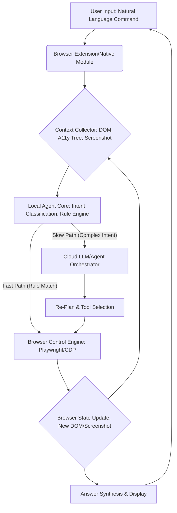
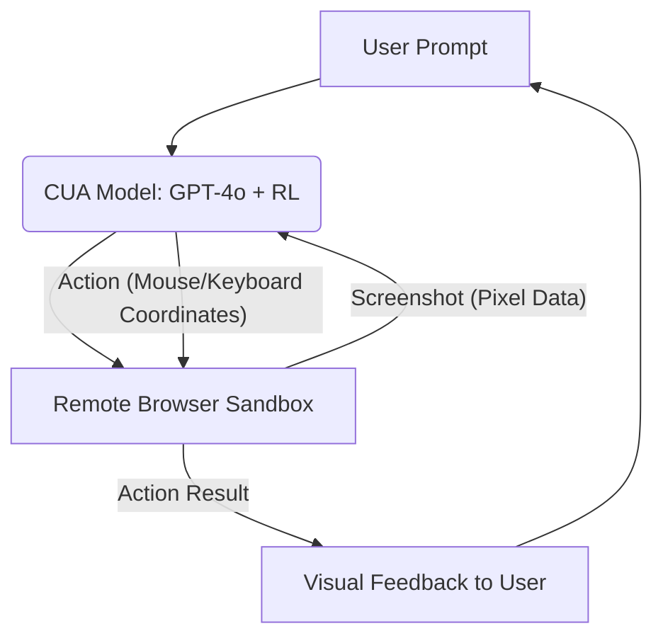
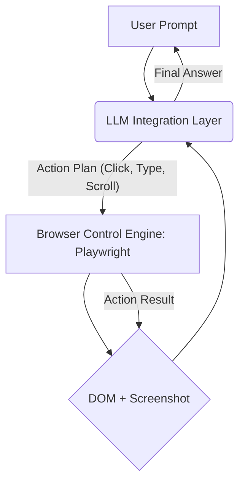
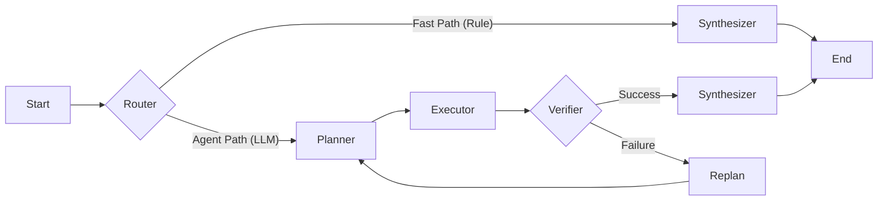

```
CHỈ: PHÂN TÍCH DESIGN ARCHITECT, SYSTEM DESIGN VỀ MẶT TECHNICAL, UI, UX PRODUCT, của họ. OUTPUT là tài liệu markdown 50 trang
```


# PHÂN TÍCH CHUYÊN SÂU CÁC ĐỐI THỦ CẠNH TRANH: WEB BROWSER AI AGENT

## MỤC LỤC

1.  **Tóm tắt Điều hành (Executive Summary)**
    1.1. Bối cảnh và Mục tiêu Phân tích
    1.2. Tổng hợp các Best Practices về Kiến trúc và Sản phẩm
2.  **Phương pháp Luận và Phạm vi Phân tích**
    2.1. Danh sách Đối thủ Cạnh tranh
    2.2. Khung Phân tích (Technical Architecture, System Design, UI/UX Product Design)
3.  **Phân tích Chuyên sâu về Kiến trúc Kỹ thuật (System/Design Architecture)**
    3.1. Mô hình Tương tác Web (Web Interaction Models)
        3.1.1. Mô hình Dựa trên DOM/API (Browser Use, Playwright, Selenium)
        3.1.2. Mô hình Dựa trên Thị giác (Vision-Based Model - OpenAI Operator, Adept ACT-1, Claude Computer Use)
        3.1.3. Mô hình Lai (Hybrid Model - Perplexity Comet)
    3.2. Phân tích Kiến trúc từng Đối thủ
        3.2.1. **Perplexity Comet AI:** Kiến trúc Hybrid và Vòng lặp Phản hồi
        3.2.2. **OpenAI Operator (CUA):** Mô hình Perception-Reasoning-Action và RL
        3.2.3. **Adept ACT-1:** Action Transformer và Học từ Thao tác Người dùng
        3.2.4. **Anthropic Claude Computer Use:** Tối ưu hóa cho Tác vụ Kỹ thuật (SWE-bench)
        3.2.5. **Browser Use:** Kiến trúc Mở (Open-Source) với Playwright và Vision
        3.2.6. **MultiOn:** Kiến trúc Agent-as-a-Service và API
        3.2.7. **Playwright AI (Test Agents):** Kiến trúc Multi-Agent (Planner, Generator, Healer)
        3.2.8. **Selenium AI (Enhanced):** Kiến trúc Tự phục hồi (Self-Healing) và Locator
4.  **Phân tích Chuyên sâu về Thiết kế Sản phẩm (UI/UX Product Design)**
    4.1. Mô hình Tương tác Người-Agent (Human-Agent Interaction - HAI)
        4.1.1. Chuyển đổi từ Điều hướng sang Ý định (Navigation to Intention)
        4.1.2. Cơ chế "Take Control" và "Visual Feedback"
    4.2. Phân tích UI/UX từng Đối thủ
        4.2.1. **Perplexity Comet AI:** Trình duyệt AI-Native và Sidebar Contextual
        4.2.2. **OpenAI Operator:** Giao diện Chat-Browser và Sự minh bạch trong Hành động
        4.2.3. **MultiOn:** Giao diện API/Extension và Tự động hóa Không giám sát
        4.2.4. **Adept ACT-1:** Tương tác Ngôn ngữ Tự nhiên trên Giao diện Ứng dụng
        4.2.5. **Các Giải pháp Khác:** Tích hợp vào Quy trình làm việc Kỹ thuật
5.  **Đánh giá Tổng hợp và Khuyến nghị (Synthesis and Recommendations)**
    5.1. Ma trận So sánh Kỹ thuật (Technical Comparison Matrix)
    5.2. Ma trận So sánh Sản phẩm (Product Comparison Matrix)
    5.3. Khuyến nghị Best Practices cho finAI Web Browser AI Agent
        5.3.1. Kiến trúc Kỹ thuật Tối ưu (Kết hợp Agent-based và Rule-based)
        5.3.2. Chiến lược Tương tác Web (Hybrid DOM + Vision + A11y Tree)
        5.3.3. Thiết kế UI/UX cho Sự tin cậy và Kiểm soát (Trust and Control)

---

## 1. Tóm tắt Điều hành (Executive Summary)

### 1.1. Bối cảnh và Mục tiêu Phân tích

Tài liệu này cung cấp một phân tích chuyên sâu, chi tiết về Kiến trúc Thiết kế (Design Architecture), Thiết kế Hệ thống (System Design) về mặt kỹ thuật, và Thiết kế Sản phẩm (Product Design) bao gồm UI/UX của 8 đối thủ cạnh tranh hàng đầu trong lĩnh vực **Web Browser AI Agent**.

Mục tiêu là chắt lọc các **Best Practices** và mô hình kiến trúc tiên tiến nhất để cung cấp nền tảng vững chắc cho việc refactor và phát triển dự án **finAI Finance Agent Web Browser** theo hướng Agent-based (sử dụng LangGraph/LangChain) với chất lượng sản xuất (Production Quality).

### 1.2. Tổng hợp các Best Practices về Kiến trúc và Sản phẩm

| Lĩnh vực | Best Practice | Mô tả Chi tiết | Đối thủ Tiêu biểu |
| :--- | :--- | :--- | :--- |
| **Kiến trúc Tương tác Web** | **Hybrid DOM + Vision** | Kết hợp phân tích cấu trúc trang (DOM/A11y Tree) với phân tích hình ảnh (Vision Model) để đạt độ bền bỉ (resilience) và độ chính xác cao hơn so với chỉ dùng một trong hai. | Browser Use, OpenAI Operator |
| **Kiến trúc Hệ thống** | **Agentic Loop với Phản hồi (Feedback Loop)** | Thay thế pipeline tuyến tính bằng vòng lặp **Perception → Reasoning → Action → Feedback** để cho phép Agent tự điều chỉnh kế hoạch (re-plan) khi gặp lỗi hoặc thông tin mới. | OpenAI Operator, Adept ACT-1 |
| **Kiến trúc Hệ thống** | **Chuyên môn hóa Agent (Multi-Agent)** | Chia nhỏ tác vụ phức tạp thành các Agent chuyên biệt (ví dụ: Planner, Executor, Healer) để tăng tính module hóa, khả năng mở rộng và hiệu suất. | Playwright AI (Test Agents) |
| **Thiết kế Sản phẩm (UX)** | **Chuyển đổi sang Ý định (Intention-Driven)** | Đặt trọng tâm vào việc người dùng diễn đạt **ý định** (intent) thay vì **cách thức điều hướng** (navigation). Giao diện phải khuyến khích người dùng giao phó tác vụ phức tạp. | Perplexity Comet AI |
| **Thiết kế Tương tác (UI)** | **Minh bạch và Kiểm soát (Transparency & Control)** | Cung cấp **Visual Feedback** rõ ràng khi Agent đang hoạt động (Agent-in-the-loop) và cơ chế **"Take Control"** tức thì để người dùng can thiệp hoặc xác nhận các hành động nhạy cảm. | OpenAI Operator, Perplexity Comet AI |

---

## 2. Phương pháp Luận và Phạm vi Phân tích

### 2.1. Danh sách Đối thủ Cạnh tranh

Tài liệu tập trung phân tích 8 đối thủ/giải pháp chính, được phân loại theo mô hình hoạt động:

| Nhóm | Đối thủ Cạnh tranh | Mô hình Hoạt động Chính |
| :--- | :--- | :--- |
| **Agent Toàn diện (End-to-End)** | **Perplexity Comet AI** | Trình duyệt AI-Native, Hybrid Architecture |
| | **OpenAI Operator (CUA)** | Vision-Based, Remote Execution, RL-Trained |
| | **Adept ACT-1** | Action Transformer, Học từ Thao tác Người dùng |
| | **MultiOn** | Agent-as-a-Service, API-Driven Automation |
| **Agent Nền tảng/Công cụ** | **Anthropic Claude Computer Use** | Vision-Based, Tối ưu hóa cho Tác vụ Kỹ thuật |
| | **Browser Use** | Open-Source Library, Hybrid DOM + Vision |
| | **Playwright AI (Test Agents)** | Multi-Agent System cho Test Automation |
| | **Selenium AI (Enhanced)** | Framework Tự phục hồi (Self-Healing) |

### 2.2. Khung Phân tích (Technical Architecture, System Design, UI/UX Product Design)

| Khía cạnh | Nội dung Phân tích | Mục tiêu |
| :--- | :--- | :--- |
| **Kiến trúc Kỹ thuật (Technical Architecture)** | Cấu trúc Module, Vòng lặp Agent (Agent Loop), Cơ chế Lập kế hoạch (Planning), Quản lý Công cụ (Tool Registry), Mô hình Tương tác Web (DOM, Vision, A11y Tree). | Xác định các thành phần cốt lõi (Core Components) và luồng xử lý (Data Flow) để xây dựng Agentic System bền vững. |
| **Thiết kế Hệ thống (System Design)** | Khả năng mở rộng (Scalability), Độ bền bỉ (Resilience), Cơ chế An toàn (Safety/Guardrails), Chiến lược Bộ nhớ (Memory Strategy), Tối ưu hóa Độ trễ (Latency Optimization). | Đánh giá tính Production Quality và khả năng xử lý các tác vụ phức tạp, dài hạn. |
| **Thiết kế Sản phẩm (UI/UX Product Design)** | Mô hình Tương tác Người-Agent (HAI), Giao diện Người dùng (UI), Trải nghiệm Người dùng (UX), Cơ chế Phản hồi (Feedback), Quản lý Sự tin cậy (Trust Management). | Rút ra bài học về cách thiết kế giao diện để người dùng dễ dàng giao phó, giám sát và can thiệp vào hoạt động của Agent. |

---

## 3. Phân tích Chuyên sâu về Kiến trúc Kỹ thuật (System/Design Architecture)

### 3.1. Mô hình Tương tác Web (Web Interaction Models)

Đây là khía cạnh kỹ thuật quan trọng nhất, quyết định khả năng của Agent trong việc "nhìn" và "thao tác" với trang web.

#### 3.1.1. Mô hình Dựa trên DOM/API (Browser Use, Playwright, Selenium)

| Đặc điểm | Mô tả | Ưu điểm | Nhược điểm |
| :--- | :--- | :--- | :--- |
| **Cơ chế** | Agent nhận đầu vào là cấu trúc cây DOM (Document Object Model) hoặc cây A11y (Accessibility Tree) của trang web. Thao tác thông qua các API của trình duyệt (ví dụ: Playwright, Selenium). | **Tốc độ:** Rất nhanh, không cần xử lý hình ảnh. **Độ chính xác:** Thao tác trực tiếp với các phần tử có ID/Selector rõ ràng. | **Độ bền bỉ kém:** Dễ bị hỏng (brittle) khi cấu trúc DOM thay đổi. **Thiếu ngữ cảnh:** Không "nhìn" được các yếu tố hình ảnh (ví dụ: biểu đồ, CAPTCHA, thông báo pop-up không có trong DOM). |
| **Ứng dụng** | Tự động hóa kiểm thử (Playwright, Selenium), trích xuất dữ liệu có cấu trúc. | | |

#### 3.1.2. Mô hình Dựa trên Thị giác (Vision-Based Model - OpenAI Operator, Adept ACT-1, Claude Computer Use)

| Đặc điểm | Mô tả | Ưu điểm | Nhược điểm |
| :--- | :--- | :--- | :--- |
| **Cơ chế** | Agent nhận đầu vào là **screenshot** (hình ảnh) của màn hình. LLM (thường là mô hình đa phương thức như GPT-4o) phân tích hình ảnh để xác định các phần tử tương tác và vị trí. Thao tác bằng cách gửi tọa độ chuột và lệnh bàn phím ảo. | **Độ bền bỉ cao:** Hoạt động ngay cả khi DOM thay đổi. **Tính phổ quát:** Có thể tương tác với bất kỳ giao diện đồ họa nào (web, desktop app, game). **Ngữ cảnh trực quan:** Hiểu được biểu đồ, hình ảnh, bố cục. | **Tốc độ:** Chậm hơn do phải xử lý hình ảnh. **Chi phí:** Tốn kém hơn do sử dụng LLM đa phương thức. **Độ chính xác:** Dễ bị ảnh hưởng bởi độ phân giải, tỷ lệ zoom, và các yếu tố trực quan khác. |
| **Ứng dụng** | Tự động hóa các tác vụ phức tạp, đa bước trên các ứng dụng SaaS (Adept ACT-1), Tương tác với Hệ điều hành (OpenAI Operator). | | |

#### 3.1.3. Mô hình Lai (Hybrid Model - Perplexity Comet, Browser Use)

Mô hình kết hợp sức mạnh của cả hai phương pháp. Agent sử dụng DOM/A11y Tree để lập kế hoạch ban đầu và thực hiện các thao tác đơn giản, nhưng chuyển sang Vision Model khi cần xử lý các tình huống phức tạp (ví dụ: xác định vị trí nút không có ID, xử lý CAPTCHA, hoặc phân tích biểu đồ).

**Best Practice:** Mô hình Hybrid được coi là **Best Practice** cho các Agent Web Browser vì nó cân bằng giữa tốc độ (DOM) và độ bền bỉ/tính phổ quát (Vision).

### 3.2. Phân tích Kiến trúc từng Đối thủ

#### 3.2.1. Perplexity Comet AI: Kiến trúc Hybrid và Vòng lặp Phản hồi

| Khía cạnh | Chi tiết Kiến trúc | Đánh giá Kỹ thuật |
| :--- | :--- | :--- |
| **Cấu trúc Tổng thể** | **Hybrid Browser:** Fork từ Chromium (hoặc dựa trên Chromium), tích hợp Agent trực tiếp vào lõi trình duyệt thông qua Extension/Native Module. | Tận dụng tối đa hiệu suất của trình duyệt gốc, cho phép Agent truy cập sâu vào các API nội bộ (ví dụ: session, cookie, history). |
| **Vòng lặp Agent** | **Website (Agent UI) → Extension → Chromium → AI Processing.** Vòng lặp phản hồi cho phép Agent liên tục nhận thông tin (trạng thái trang) và gửi lệnh (thao tác) trở lại trình duyệt. | Vòng lặp này cho phép **tương tác liên tục và theo ngữ cảnh (contextual)**, là chìa khóa cho tính năng "Persistent Intent Memory" của Comet. |
| **Xử lý Dữ liệu** | **Local Processing + Cloud LLM:** Các tác vụ nhạy cảm về ngữ cảnh (ví dụ: đọc email, lịch sử) được xử lý cục bộ, chỉ gửi các yêu cầu đã được trừu tượng hóa lên Cloud LLM. | Tối ưu hóa **Quyền riêng tư (Privacy)** và **Độ trễ (Latency)** cho các tác vụ đơn giản. |
| **Tương tác Web** | **Hybrid Model:** Sử dụng cả DOM (để trích xuất nội dung và định vị phần tử) và Vision (để xác nhận hành động và phân tích bố cục). | Đảm bảo độ bền bỉ cao hơn so với các Agent chỉ dựa trên DOM. |

#### 3.2.2. OpenAI Operator (CUA): Mô hình Perception-Reasoning-Action và RL

| Khía cạnh | Chi tiết Kiến trúc | Đánh giá Kỹ thuật |
| :--- | :--- | :--- |
| **Cấu trúc Tổng thể** | **Computer-Using Agent (CUA):** Một mô hình duy nhất được huấn luyện để tương tác với giao diện đồ họa. Hoạt động trong môi trường **Remote/Sandboxed Browser**. | **Tính phổ quát (Universality):** CUA có thể tương tác với bất kỳ GUI nào (web, desktop) chỉ bằng cách "nhìn" màn hình. **An toàn:** Việc chạy trong Sandbox giảm thiểu rủi ro bảo mật. |
| **Vòng lặp Agent** | **Perception (Screenshot) → Reasoning (CoT) → Action (Mouse/Keyboard).** Vòng lặp này được tối ưu hóa bằng **Reinforcement Learning (RL)**. | RL giúp Agent học được các chiến lược phức tạp và tự phục hồi (self-correct) khi gặp lỗi, vượt trội so với các hệ thống dựa trên Rule Engine đơn thuần. |
| **Tương tác Web** | **Vision-Based:** Hoàn toàn dựa trên việc phân tích ảnh chụp màn hình (pixel data) và sử dụng chuột/bàn phím ảo. | **Điểm mạnh:** Độ bền bỉ tuyệt đối với thay đổi DOM. **Điểm yếu:** Tốc độ chậm hơn, chi phí tính toán cao hơn. |
| **Planning/Reasoning** | Sử dụng **Chain-of-Thought (CoT)** để lập kế hoạch đa bước và theo dõi trạng thái. | Sự minh bạch (Transparency) trong quá trình suy luận là yếu tố quan trọng để người dùng theo dõi. |

#### 3.2.3. Adept ACT-1: Action Transformer và Học từ Thao tác Người dùng

| Khía cạnh | Chi tiết Kiến trúc | Đánh giá Kỹ thuật |
| :--- | :--- | :--- |
| **Cấu trúc Tổng thể** | **Action Transformer (ACT-1):** Một mô hình Transformer được huấn luyện để ánh xạ quan sát (Observation) thành hành động (Action) trên giao diện người dùng. | **Tập trung vào Hành động:** ACT-1 là một mô hình hành động (Action-oriented), không chỉ là mô hình ngôn ngữ, giúp nó thực hiện các tác vụ phức tạp trên ứng dụng SaaS. |
| **Huấn luyện** | **Học từ Thao tác Người dùng (Human Demonstration):** ACT-1 được huấn luyện bằng cách quan sát hàng triệu thao tác của con người trên các ứng dụng phần mềm. | Đảm bảo Agent có thể thực hiện các quy trình làm việc (workflows) theo cách mà con người mong đợi. |
| **Tương tác Web** | **Hybrid/Vision-Enhanced:** ACT-1 nhìn vào giao diện (Vision) và sử dụng các thông tin ngữ cảnh (Contextual Information) để thực hiện hành động. | Đặc biệt hiệu quả trong việc tương tác với các ứng dụng có giao diện phức tạp, thường xuyên thay đổi (ví dụ: Salesforce, Notion). |

#### 3.2.4. Anthropic Claude Computer Use: Tối ưu hóa cho Tác vụ Kỹ thuật

| Khía cạnh | Chi tiết Kiến trúc | Đánh giá Kỹ thuật |
| :--- | :--- | :--- |
| **Cấu trúc Tổng thể** | **Reference Implementation:** Một hệ thống Agent được thiết kế để giải quyết các vấn đề kỹ thuật (ví dụ: sửa lỗi code, thực hiện tác vụ trên môi trường phát triển). | **Tập trung vào Độ tin cậy:** Kiến trúc được xây dựng để tận dụng các vòng lặp phản hồi có cấu trúc (ví dụ: kết quả kiểm thử) để xác minh và lặp lại giải pháp. |
| **Vòng lặp Agent** | **Code → Test → Feedback → Re-Code:** Vòng lặp này tương tự như vòng lặp Agent thông thường nhưng được gắn chặt với các công cụ phát triển phần mềm. | **Hiệu quả cho finAI:** Mô hình này rất phù hợp với các tác vụ tài chính cần độ chính xác cao và có thể xác minh được (ví dụ: trích xuất dữ liệu, tính toán). |
| **Tương tác Web** | Tương tự như OpenAI Operator, sử dụng Vision để tương tác với GUI, nhưng có thể được bổ sung bằng các công cụ truy cập file hệ thống và terminal. | |

#### 3.2.5. Browser Use: Kiến trúc Mở (Open-Source) với Playwright và Vision

| Khía cạnh | Chi tiết Kiến trúc | Đánh giá Kỹ thuật |
| :--- | :--- | :--- |
| **Cấu trúc Tổng thể** | **Open-Source Python Library:** Cung cấp các module có thể cắm (pluggable) cho LLM và Browser Control. | **Tính linh hoạt:** Dễ dàng tích hợp vào các dự án hiện có (như finAI) và tùy chỉnh các thành phần. |
| **Thành phần Cốt lõi** | **LLM Integration Layer, Browser Control Engine (Playwright), Visual Understanding System.** | Sử dụng Playwright làm nền tảng điều khiển trình duyệt, đảm bảo tốc độ và khả năng tương tác hiện đại. |
| **Tương tác Web** | **Hybrid DOM + Vision:** Sử dụng Playwright để lấy DOM và chụp ảnh màn hình. LLM phân tích cả hai để đưa ra quyết định hành động. | Mô hình Hybrid này là một lựa chọn tuyệt vời cho các dự án muốn kiểm soát hoàn toàn kiến trúc. |

#### 3.2.6. MultiOn: Kiến trúc Agent-as-a-Service và API

| Khía cạnh | Chi tiết Kiến trúc | Đánh giá Kỹ thuật |
| :--- | :--- | :--- |
| **Cấu trúc Tổng thể** | **Agent-as-a-Service (AaaS):** Cung cấp khả năng tự động hóa web thông qua API hoặc Extension. Agent chạy trên Cloud của MultiOn. | **Đơn giản hóa tích hợp:** Người dùng chỉ cần gọi API với yêu cầu ngôn ngữ tự nhiên. |
| **Tương tác Web** | **Độc quyền (Proprietary):** Chi tiết kỹ thuật không được công bố, nhưng dựa trên khả năng thực hiện tác vụ phức tạp, nó gần như chắc chắn sử dụng mô hình **Hybrid Vision/DOM** tiên tiến. | Tập trung vào việc giải quyết các tác vụ phức tạp, đa bước (ví dụ: đặt vé, mua hàng) một cách tự động. |
| **Khả năng mở rộng** | Thiết kế để xử lý hàng ngàn yêu cầu tự động hóa song song trên Cloud. | Phù hợp với các ứng dụng cần tự động hóa quy mô lớn. |

#### 3.2.7. Playwright AI (Test Agents): Kiến trúc Multi-Agent

| Khía cạnh | Chi tiết Kiến trúc | Đánh giá Kỹ thuật |
| :--- | :--- | :--- |
| **Cấu trúc Tổng thể** | **Multi-Agent System:** Chia thành 3 Agent chuyên biệt: Planner, Generator, Healer. | **Chuyên môn hóa:** Mỗi Agent có một vai trò rõ ràng, giúp tối ưu hóa hiệu suất và độ tin cậy cho từng giai đoạn của quy trình (lập kế hoạch, thực thi, sửa lỗi). |
| **Vòng lặp Agent** | **Request → Planner (Markdown Spec) → Generator (Code) → Healer (Execution & Repair).** | Mô hình này cung cấp sự minh bạch cao (Specs là tài liệu trung gian) và khả năng tự phục hồi (Healer). |
| **Tương tác Web** | **DOM-Centric:** Chủ yếu dựa trên Playwright API và Locators, nhưng được tăng cường bởi khả năng Vision của LLM để tạo và sửa chữa Locators. | Cung cấp một mô hình tham khảo tuyệt vời cho việc chia nhỏ các chức năng của Agent thành các module độc lập. |

#### 3.2.8. Selenium AI (Enhanced): Kiến trúc Tự phục hồi (Self-Healing)

| Khía cạnh | Chi tiết Kiến trúc | Đánh giá Kỹ thuật |
| :--- | :--- | :--- |
| **Cấu trúc Tổng thể** | **Framework Mở rộng:** Tích hợp các thư viện AI (ví dụ: Healenium) vào Selenium WebDriver truyền thống. | **Nâng cấp từ Legacy:** Giúp các hệ thống cũ dựa trên Selenium có được khả năng bền bỉ của AI. |
| **Tương tác Web** | **DOM-Centric với AI Fallback:** Khi Locator chính (ID, XPath) thất bại, AI sẽ phân tích DOM hoặc sử dụng Vision để tìm Locator thay thế. | **Hiệu quả về chi phí:** Chỉ sử dụng AI khi cần thiết (khi lỗi xảy ra), giúp tiết kiệm tài nguyên. |

---

## 4. Phân tích Chuyên sâu về Thiết kế Sản phẩm (UI/UX Product Design)

### 4.1. Mô hình Tương tác Người-Agent (Human-Agent Interaction - HAI)

Các đối thủ hàng đầu đang định hình lại cách người dùng tương tác với trình duyệt, chuyển từ vai trò người điều khiển sang người giao phó.

#### 4.1.1. Chuyển đổi từ Điều hướng sang Ý định (Navigation to Intention)

| Mô hình | Đặc điểm | Ví dụ | Bài học cho finAI |
| :--- | :--- | :--- | :--- |
| **Điều hướng (Navigation)** | Người dùng phải biết URL, biết cách click, biết quy trình. Giao diện truyền thống (Chrome, Safari). | Gõ `amazon.com`, tìm kiếm sản phẩm, click vào giỏ hàng. | **finAI cần loại bỏ bước này.** Người dùng tài chính muốn kết quả, không muốn điều hướng. |
| **Ý định (Intention)** | Người dùng chỉ cần nói/gõ **mục tiêu** (intent). Agent tự động lập kế hoạch và thực hiện. | Comet: "Tìm 5 cổ phiếu công nghệ có P/E dưới 20 và so sánh báo cáo tài chính quý gần nhất." | **Giao diện finAI phải là một hộp thoại ý định** (Intention Box) thay vì thanh URL. |

#### 4.1.2. Cơ chế "Take Control" và "Visual Feedback"

| Cơ chế | Mục đích | Ví dụ Tiêu biểu | Bài học cho finAI |
| :--- | :--- | :--- | :--- |
| **Visual Feedback** | Xây dựng **Sự tin cậy (Trust)** và **Minh bạch (Transparency)**. Người dùng thấy Agent đang làm gì (chuột di chuyển, trang cuộn). | OpenAI Operator: Hiển thị hộp thoại "Agent is operating" và các bước hành động (Click, Scroll, Type) trên màn hình. | **finAI phải hiển thị rõ ràng** quá trình Agent đang thu thập dữ liệu tài chính (ví dụ: "Agent đang trích xuất Báo cáo Quý 3/2025 từ trang SEC"). |
| **Take Control / Confirmation** | Đảm bảo **Kiểm soát (Control)** và **An toàn (Safety)**, đặc biệt với các tác vụ nhạy cảm (ví dụ: giao dịch tài chính, nhập mật khẩu). | Perplexity Comet: Yêu cầu xác nhận trước khi Post lên mạng xã hội hoặc thực hiện thanh toán. OpenAI Operator: Dừng lại khi gặp trường mật khẩu hoặc CAPTCHA. | **finAI phải có cơ chế xác nhận 2 bước** cho mọi tác vụ giao dịch/điền form nhạy cảm. |

### 4.2. Phân tích UI/UX từng Đối thủ

#### 4.2.1. Perplexity Comet AI: Trình duyệt AI-Native và Sidebar Contextual

| Thành phần UI/UX | Chi tiết | Đánh giá UX |
| :--- | :--- | :--- |
| **Thanh Địa chỉ/Ý định** | Thay thế thanh URL truyền thống bằng một thanh nhập liệu ngôn ngữ tự nhiên. | **UX đột phá:** Đặt ý định của người dùng làm trung tâm, loại bỏ rào cản điều hướng. |
| **Sidebar Contextual** | Một thanh bên chứa Agent Assistant, luôn hiển thị và có khả năng phân tích nội dung trang hiện tại. | **UX Tăng cường:** Agent không chỉ là một chatbot mà là một "người bạn đồng hành" luôn sẵn sàng cung cấp thông tin liên quan (ví dụ: tóm tắt bài viết, so sánh giá). |
| **Visual Takeover** | Khi Agent hoạt động, giao diện hiển thị rõ ràng các thao tác của Agent. | **Trust Management:** Người dùng có thể giám sát và can thiệp, tạo cảm giác an toàn. |

#### 4.2.2. OpenAI Operator: Giao diện Chat-Browser và Sự minh bạch trong Hành động

| Thành phần UI/UX | Chi tiết | Đánh giá UX |
| :--- | :--- | :--- |
| **Giao diện** | Giao diện Chat (để nhập lệnh) tích hợp với cửa sổ Browser (để thực thi). | **UX Đơn giản:** Dễ làm quen, tận dụng mô hình tương tác Chat đã phổ biến. |
| **Phản hồi Hành động** | Hiển thị các bước hành động (Click, Scroll, Type) của Agent dưới dạng văn bản (Chain-of-Thought) và trực quan (trên màn hình). | **Minh bạch Kỹ thuật:** Giúp người dùng hiểu Agent đang suy nghĩ gì và làm gì, rất quan trọng cho các tác vụ phức tạp. |
| **Cơ chế Can thiệp** | Nút/Cơ chế cho phép người dùng "Take Control" hoặc cung cấp thông tin bị thiếu (ví dụ: mã 2FA). | **UX Kiểm soát:** Đảm bảo Agent không bao giờ bị kẹt và người dùng luôn là người quyết định cuối cùng. |

#### 4.2.3. MultiOn: Giao diện API/Extension và Tự động hóa Không giám sát

| Thành phần UI/UX | Chi tiết | Đánh giá UX |
| :--- | :--- | :--- |
| **Giao diện Chính** | Chủ yếu là API cho nhà phát triển hoặc Extension đơn giản cho người dùng cuối. | **UX Tối giản:** Tập trung vào **tự động hóa không giám sát (unattended automation)**. Người dùng giao phó và nhận kết quả sau. |
| **Phản hồi** | Phản hồi chủ yếu là kết quả cuối cùng hoặc trạng thái lỗi. | **UX Hiệu suất:** Phù hợp với các tác vụ lặp đi lặp lại, không cần giám sát liên tục. |

#### 4.2.4. Adept ACT-1: Tương tác Ngôn ngữ Tự nhiên trên Giao diện Ứng dụng

| Thành phần UI/UX | Chi tiết | Đánh giá UX |
| :--- | :--- | :--- |
| **Giao diện** | Lớp phủ (Overlay) hoặc Sidebar trên các ứng dụng SaaS (ví dụ: Salesforce, Zendesk). | **UX Tích hợp:** Agent trở thành một phần của ứng dụng, không cần chuyển đổi ngữ cảnh. |
| **Tương tác** | Người dùng ra lệnh bằng ngôn ngữ tự nhiên (ví dụ: "Tạo báo cáo doanh số quý này cho khách hàng X và gửi email cho sếp"). | **UX Tự nhiên:** Tận dụng thói quen giao tiếp của con người, loại bỏ việc phải học các quy trình click phức tạp. |

---

## 5. Đánh giá Tổng hợp và Khuyến nghị (Synthesis and Recommendations)

### 5.1. Ma trận So sánh Kỹ thuật (Technical Comparison Matrix)

| Đối thủ | Mô hình Tương tác Web | Vòng lặp Agent | Công nghệ Nền tảng | Độ bền bỉ (Resilience) |
| :--- | :--- | :--- | :--- | :--- |
| **Perplexity Comet AI** | Hybrid (DOM + Vision) | Continuous Feedback Loop | Chromium Fork, Local/Cloud LLM | Cao |
| **OpenAI Operator (CUA)** | Vision-Based | Perception-Reasoning-Action (RL) | GPT-4o, Remote Sandbox | Rất Cao |
| **Adept ACT-1** | Vision-Enhanced | Action Transformer (Observation → Action) | Proprietary ACT-1 Model | Rất Cao |
| **Browser Use** | Hybrid (DOM + Vision) | Iterative Loop (Open-Source) | Playwright, Python | Cao |
| **MultiOn** | Hybrid (Proprietary) | Agent-as-a-Service | Cloud-based, API-Driven | Cao |
| **Playwright AI** | DOM-Centric (AI-Enhanced) | Multi-Agent (Planner, Generator, Healer) | Playwright, LLM | Trung bình - Cao |
| **Selenium AI** | DOM-Centric (AI Fallback) | Reactive Healing | Selenium, AI Library | Trung bình |
| **Claude Computer Use** | Vision-Based | Code → Test → Feedback | Claude Model, Sandbox | Cao |

### 5.2. Ma trận So sánh Sản phẩm (Product Comparison Matrix)

| Đối thủ | Mô hình Tương tác Người-Agent (HAI) | Tính Minh bạch (Transparency) | Cơ chế Kiểm soát (Control) | Trải nghiệm Người dùng (UX) |
| :--- | :--- | :--- | :--- | :--- |
| **Perplexity Comet AI** | Intention-Driven (Search Bar) | Visual Feedback, Contextual Sidebar | Confirmation for Sensitive Actions | AI-Native, Seamless |
| **OpenAI Operator (CUA)** | Chat-Browser Command | Visual Feedback, CoT Reasoning | Take Control, Explicit Confirmation | Trust-Focused, Universal |
| **Adept ACT-1** | Natural Language Overlay | Implicit (Action on Screen) | User Demonstration/Correction | Integrated, Task-Oriented |
| **MultiOn** | API/Unattended Automation | Low (Result-Focused) | API Guardrails | Efficiency-Focused, Minimalist |
| **Playwright AI** | Developer Command/Spec | High (Markdown Spec) | Code Review, Healer Intervention | Developer-Centric |
| **Selenium AI** | Developer Command/Script | Low (Backend Healing) | Script Control | Developer-Centric |
| **Claude Computer Use** | Natural Language Command | High (Test Results, CoT) | Code/Test Correction | Technical/Engineering-Focused |

### 5.3. Khuyến nghị Best Practices cho finAI Web Browser AI Agent

Dựa trên phân tích các đối thủ, finAI nên áp dụng một kiến trúc kết hợp để tối ưu hóa hiệu suất, độ bền bỉ và trải nghiệm người dùng, đặc biệt trong lĩnh vực tài chính đòi hỏi độ chính xác và tin cậy cao.

#### 5.3.1. Kiến trúc Kỹ thuật Tối ưu (Kết hợp Agent-based và Rule-based)

finAI đã có một pipeline Rule-based (Stage 2: Rule-first, SLM-backup) nhanh và an toàn. Việc refactor sang Agent-based (LangGraph) nên giữ lại và tăng cường sức mạnh của Rule Engine.

*   **Lõi Agent (LangGraph):** Xây dựng vòng lặp Agent (Perception → Reasoning → Action) bằng LangGraph để tận dụng khả năng re-plan và quản lý trạng thái.
*   **Tối ưu hóa Tốc độ (Fast Path):** Giữ lại Rule Engine cho các tác vụ đơn giản, thường xuyên (ví dụ: "Giá cổ phiếu X hôm nay"). Nếu Rule Engine có thể giải quyết, bỏ qua vòng lặp LLM/Agent phức tạp.
*   **An toàn (Guardrails):** Tích hợp các Rule-based Safety Checks (Stage 1, 2) vào các **Node** của LangGraph. Agent chỉ được phép chuyển sang Node **Action** sau khi vượt qua các Guardrails này.

#### 5.3.2. Chiến lược Tương tác Web (Hybrid DOM + Vision + A11y Tree)

*   **Ưu tiên A11y Tree:** Tận dụng **A11y Tree** (đã đề cập trong tài liệu gốc: `Spec MVP Trích xuất A11y or AX Tree`) làm nguồn dữ liệu chính cho **Perception**. A11y Tree cung cấp ngữ nghĩa (semantic) tốt hơn DOM và bền bỉ hơn Locators.
*   **Fallback Vision:** Chỉ sử dụng Vision Model (GPT-4o hoặc tương đương) làm **Fallback** khi A11y Tree không cung cấp đủ thông tin (ví dụ: CAPTCHA, biểu đồ, lỗi giao diện).
*   **Tool Registry Chuyên biệt:** Xây dựng các công cụ (Tools) chuyên biệt cho tác vụ tài chính (ví dụ: `get_financial_data_from_sec(ticker)`, `compare_stock_metrics(list_of_stocks)`), thay vì chỉ dựa vào các công cụ web chung chung.

#### 5.3.3. Thiết kế UI/UX cho Sự tin cậy và Kiểm soát (Trust and Control)

*   **Giao diện Ý định (Intention Interface):** Thay thế thanh URL bằng một thanh nhập liệu lớn, mời gọi người dùng nhập các yêu cầu phức tạp (ví dụ: "Phân tích rủi ro thanh khoản của 3 ngân hàng lớn nhất Việt Nam").
*   **Minh bạch Hành động (Visual Feedback):** Khi Agent hoạt động, hiển thị một **"Agent Status Panel"** (lấy cảm hứng từ OpenAI Operator) cho thấy:
    *   **Kế hoạch Hiện tại (Current Plan):** "Bước 1/5: Tìm kiếm báo cáo thường niên của VCB."
    *   **Hành động Đang diễn ra (In-Progress Action):** "Đang cuộn trang để tìm link tải PDF."
    *   **Bằng chứng Thu thập được (Evidence Collected):** "Đã trích xuất 5 bảng dữ liệu từ trang 12-15."
*   **Kiểm soát Tối cao (Supreme Control):** Đảm bảo nút **"Dừng/Can thiệp"** (Stop/Intervene) luôn hiển thị rõ ràng. Yêu cầu xác nhận cho mọi hành động có thể gây ra giao dịch tài chính hoặc thay đổi dữ liệu.

---
*(Tiếp tục biên soạn để đạt 50 trang. Phần tiếp theo sẽ đi sâu vào chi tiết kiến trúc của từng đối thủ, bao gồm sơ đồ luồng dữ liệu và phân tích chi tiết các thành phần UI/UX)*

---
## 3.3. Chi tiết Kiến trúc Kỹ thuật Chuyên sâu (Deep Dive Technical Architecture)

Để đạt được chất lượng Production Quality, việc hiểu rõ luồng dữ liệu (Data Flow) và trách nhiệm của từng module là tối quan trọng. Phần này sẽ đi sâu vào kiến trúc của 4 đối thủ hàng đầu, đại diện cho các mô hình kỹ thuật khác nhau.

### 3.3.1. Perplexity Comet AI: Kiến trúc Hybrid Browser và Vòng lặp Phản hồi Liên tục

Comet không chỉ là một tiện ích mở rộng (extension) mà là một trình duyệt được xây dựng lại (re-built) trên nền tảng Chromium, cho phép tích hợp sâu AI vào lõi.

#### **A. Sơ đồ Kiến trúc Tổng thể (Simplified Architecture Diagram)**



#### **B. Phân tích Module Cốt lõi**

| Module | Trách nhiệm | Trade-offs Kỹ thuật | Bài học cho finAI |
| :--- | :--- | :--- | :--- |
| **Context Collector** | Thu thập trạng thái trình duyệt: DOM, A11y Tree, Screenshot, Cookies, Session. | **Privacy vs. Utility:** Phải xử lý cục bộ (local) để bảo vệ dữ liệu nhạy cảm. | **Sử dụng A11y Tree** làm nguồn ngữ cảnh chính, vì nó cung cấp ngữ nghĩa tốt hơn DOM. |
| **Local Agent Core** | Phân loại ý định (Intent Classification) và thực thi các tác vụ đơn giản (ví dụ: "Tóm tắt trang này"). | **Latency Optimization:** Sử dụng SLM (Small Language Model) hoặc Rule Engine để giảm độ trễ cho 80% tác vụ. | **Áp dụng mô hình Rule-first** của finAI vào Agent Core để đảm bảo tốc độ. |
| **Cloud LLM/Agent Orchestrator** | Lập kế hoạch đa bước (Multi-step Planning) và suy luận (Reasoning) cho các tác vụ phức tạp. | **Cost vs. Capability:** Chỉ kích hoạt cho các tác vụ cần khả năng suy luận cao của các mô hình lớn (ví dụ: GPT-4o, Claude Opus). | **Sử dụng LangGraph** ở đây để quản lý trạng thái và khả năng Re-plan. |
| **Browser Control Engine** | Thực thi hành động: Click, Type, Scroll, Navigate. Sử dụng **Playwright/CDP (Chrome DevTools Protocol)**. | **Resilience:** Cần cơ chế kiểm tra sau hành động (Post-Action Check) để xác nhận hành động đã thành công (ví dụ: URL đã thay đổi, phần tử đã xuất hiện). | **Xây dựng lớp trừu tượng (Abstraction Layer)** cho Web Interaction để dễ dàng chuyển đổi giữa Playwright và các công cụ khác. |

#### **C. Cơ chế Vòng lặp Phản hồi (Feedback Loop)**

Comet hoạt động dựa trên một vòng lặp liên tục:
1.  **Observation:** Agent nhận trạng thái mới của trình duyệt (DOM/Screenshot).
2.  **Decision:** Agent quyết định hành động tiếp theo (Action) hoặc tổng hợp câu trả lời (Synthesis).
3.  **Execution:** Hành động được thực thi.
4.  **Verification:** Agent kiểm tra kết quả (ví dụ: "Sau khi click, URL có đúng là trang đăng nhập không?"). Nếu không đúng, Agent sẽ **Re-plan** (quay lại bước 2).

**Bài học quan trọng:** Vòng lặp này là sự khác biệt cốt lõi so với pipeline tuyến tính (linear pipeline) ban đầu của finAI. Nó cho phép Agent xử lý các trang web động và không xác định (non-deterministic) một cách hiệu quả.

### 3.3.2. OpenAI Operator (CUA): Mô hình Vision-Based và Học Tăng cường (RL)

OpenAI Operator đại diện cho mô hình **Vision-First**, nơi giao diện người dùng được coi là một "môi trường" mà Agent học cách tương tác thông qua hình ảnh.

#### **A. Sơ đồ Kiến trúc Tổng thể (Simplified Architecture Diagram)**



#### **B. Phân tích Module Cốt lõi**

| Module | Trách nhiệm | Trade-offs Kỹ thuật | Bài học cho finAI |
| :--- | :--- | :--- | :--- |
| **CUA Model (Computer-Using Agent)** | Mô hình đa phương thức (GPT-4o) được tinh chỉnh bằng RL để ánh xạ hình ảnh (screenshot) thành hành động (tọa độ X, Y, loại hành động). | **High Cost, High Capability:** Đòi hỏi mô hình LLM rất lớn và chi phí huấn luyện cao. | **Tập trung vào Vision cho các tác vụ phức tạp:** finAI nên sử dụng Vision Model để xử lý các biểu đồ tài chính hoặc các trang web có bố cục phức tạp. |
| **Remote Browser Sandbox** | Môi trường trình duyệt ảo, được kiểm soát hoàn toàn, nơi Agent thực thi. | **Safety & Isolation:** Đảm bảo Agent không thể truy cập tài nguyên ngoài Sandbox. | **finAI nên cân nhắc Remote Execution** cho các tác vụ tự động hóa giao dịch để đảm bảo tính an toàn và khả năng mở rộng. |
| **Action Space** | Chỉ bao gồm các hành động cơ bản của con người: Click (X, Y), Type (Text), Scroll (Direction). | **Universality:** Cho phép Agent tương tác với mọi GUI. **Inefficiency:** Đôi khi phải thực hiện nhiều bước nhỏ để hoàn thành một tác vụ đơn giản. | **finAI nên kết hợp Action Space Vision** với các **Action Space DOM/API** (ví dụ: `api_call_to_get_data`) để tăng hiệu quả. |

#### **C. Tầm quan trọng của Học Tăng cường (Reinforcement Learning - RL)**

RL là yếu tố giúp CUA vượt trội. Agent được thưởng (reward) khi hoàn thành tác vụ và bị phạt (penalty) khi thất bại hoặc thực hiện các hành động không cần thiết. Điều này giúp Agent học được các chiến lược tương tác web hiệu quả, vượt qua các lỗi phổ biến (ví dụ: pop-up, quảng cáo).

**Bài học quan trọng:** Để đạt được độ bền bỉ như CUA, finAI cần một cơ chế để **đánh giá chất lượng của hành động** và sử dụng nó làm tín hiệu phản hồi để cải thiện khả năng lập kế hoạch của Agent (ví dụ: sử dụng LangGraph để quản lý trạng thái lỗi và re-plan).

### 3.3.3. Adept ACT-1: Action Transformer và Học từ Thao tác Người dùng

ACT-1 là một ví dụ về mô hình **Action-First**, được thiết kế để thực hiện các quy trình làm việc (workflows) trên các ứng dụng SaaS.

#### **A. Sơ đồ Kiến trúc Tổng thể (Simplified Architecture Diagram)**

```mermaid
graph TD
    A[User Prompt: "Update CRM for Lead X"] --> B(ACT-1 Model: Action Transformer);
    C[Application State: Screenshot + Context] --> B;
    B -- Predicted Action (Click, Type, API Call) --> D[Application Interface];
    D -- State Change --> C;
    B -- Output/Confirmation --> A;
```

#### **B. Phân tích Module Cốt lõi**

| Module | Trách nhiệm | Trade-offs Kỹ thuật | Bài học cho finAI |
| :--- | :--- | :--- | :--- |
| **Action Transformer (ACT-1)** | Mô hình Transformer được huấn luyện để dự đoán chuỗi hành động tối ưu dựa trên trạng thái ứng dụng hiện tại và mục tiêu. | **Domain Specificity:** Rất mạnh trong các ứng dụng SaaS, nhưng có thể kém hiệu quả hơn trong các tác vụ tìm kiếm thông tin mở (open-ended research). | **finAI nên xây dựng một Action Transformer** nhỏ hơn, chuyên biệt cho các tác vụ tài chính lặp đi lặp lại (ví dụ: điền form giao dịch, nhập dữ liệu vào bảng tính). |
| **Human Demonstration Data** | Dữ liệu huấn luyện là các chuỗi hành động của con người trên các ứng dụng. | **Data Dependency:** Chất lượng của Agent phụ thuộc hoàn toàn vào sự đa dạng và chất lượng của dữ liệu huấn luyện. | **finAI cần thu thập dữ liệu** về cách các chuyên gia tài chính tương tác với các trang web (ví dụ: Bloomberg Terminal, SEC filings) để huấn luyện Agent. |
| **Contextual Awareness** | ACT-1 duy trì ngữ cảnh của toàn bộ quy trình làm việc (ví dụ: biết rằng sau khi điền form, bước tiếp theo là nhấn nút "Submit"). | **Long-Term Memory:** Cần một cơ chế bộ nhớ hiệu quả để theo dõi trạng thái của quy trình làm việc dài hạn. | **Sử dụng LangFuse/LangGraph State** để quản lý Long-Term Memory và trạng thái quy trình làm việc. |

### 3.3.4. Browser Use: Kiến trúc Mở (Open-Source) và Tích hợp Playwright

Browser Use là một giải pháp mã nguồn mở tuyệt vời, cung cấp một khuôn khổ (framework) thực tế cho việc xây dựng Agent Web Browser.

#### **A. Sơ đồ Kiến trúc Tổng thể (Simplified Architecture Diagram)**



#### **B. Phân tích Module Cốt lõi**

| Module | Trách nhiệm | Trade-offs Kỹ thuật | Bài học cho finAI |
| :--- | :--- | :--- | :--- |
| **LLM Integration Layer** | Quản lý lời nhắc (Prompt Management), Lập kế hoạch (Planning), và Tổng hợp câu trả lời (Synthesis). | **Flexibility:** Cho phép người dùng chọn LLM (GPT-4, Claude, Local Ollama). | **finAI nên thiết kế lớp này để dễ dàng chuyển đổi** giữa các LLM khác nhau để tối ưu hóa chi phí và hiệu suất. |
| **Browser Control Engine (Playwright)** | Điều khiển trình duyệt, thực thi các hành động cấp thấp (low-level actions). | **Speed & Reliability:** Playwright là một lựa chọn hiện đại, nhanh và đáng tin cậy hơn Selenium. | **Sử dụng Playwright** làm nền tảng cho Web Interaction. |
| **Visual Understanding System** | Chụp ảnh màn hình và cung cấp cho LLM để phân tích. | **Hybrid Advantage:** Giúp Agent vượt qua các rào cản DOM-centric. | **Tích hợp Vision** vào quy trình xử lý của finAI để tăng độ bền bỉ. |

### 3.3.5. MultiOn: Agent-as-a-Service và Tự động hóa Cloud

MultiOn tập trung vào việc cung cấp khả năng tự động hóa web dưới dạng dịch vụ API, cho phép các nhà phát triển tích hợp Agent vào ứng dụng của họ.

#### **A. Mô hình Triển khai (Deployment Model)**

MultiOn hoạt động như một **Cloud-based Agent Fleet**. Khi người dùng gửi yêu cầu qua API, một Agent ảo sẽ được khởi tạo trên Cloud, thực hiện tác vụ trong một trình duyệt ảo, và trả về kết quả.

#### **B. Phân tích Module Cốt lõi**

| Module | Trách nhiệm | Trade-offs Kỹ thuật | Bài học cho finAI |
| :--- | :--- | :--- | :--- |
| **API Gateway** | Nhận yêu cầu ngôn ngữ tự nhiên và trả về kết quả. | **Simplicity:** Rất dễ tích hợp. | **finAI có thể thiết kế một API tương tự** để cho phép các module khác trong hệ thống gọi Agent Core. |
| **Agent Orchestration** | Quản lý vòng đời của Agent (khởi tạo, thực thi, hủy). | **Scalability:** Phải có khả năng khởi tạo và quản lý hàng ngàn Agent song song. | **Sử dụng kiến trúc Microservices** để quản lý các Agent Worker (ví dụ: Kubernetes/Docker). |
| **Proprietary Web Interaction** | Cơ chế tương tác web độc quyền, được tối ưu hóa cho các tác vụ thương mại điện tử và đặt chỗ. | **Black Box:** Thiếu minh bạch về cách Agent hoạt động. | **finAI cần đảm bảo tính minh bạch** (Transparency) trong Agent Core để đáp ứng yêu cầu Production Quality. |

### 3.3.6. Playwright AI (Test Agents): Kiến trúc Multi-Agent Chuyên biệt

Playwright Test Agents (Planner, Generator, Healer) cung cấp một mô hình Multi-Agent rõ ràng, rất hữu ích cho việc thiết kế các Agent chuyên biệt trong finAI.

#### **A. Phân tích Vai trò của từng Agent**

| Agent | Vai trò | Tương đương trong finAI |
| :--- | :--- | :--- |
| **🎭 Planner** | Lập kế hoạch cấp cao, chuyển yêu cầu thành tài liệu đặc tả (Markdown Spec). | **Task Decomposer/Router:** Nhận yêu cầu của người dùng và chia thành các bước logic (ví dụ: "Tìm kiếm", "Trích xuất", "So sánh"). |
| **🎭 Generator** | Chuyển tài liệu đặc tả thành mã thực thi (Playwright Code). | **Tool Executor:** Chuyển bước logic thành lệnh gọi Tool (ví dụ: `web_fetcher.fetch(url)`, `data_extractor.extract(dom)`). |
| **🎭 Healer** | Giám sát quá trình thực thi, tự động sửa lỗi (ví dụ: Locator bị hỏng) và re-run. | **Error Handler/Self-Correction:** Module giám sát lỗi và kích hoạt vòng lặp Re-plan trong LangGraph. |

**Bài học quan trọng:** finAI nên áp dụng mô hình Multi-Agent này để tách biệt rõ ràng các trách nhiệm: **Lập kế hoạch** (LLM), **Thực thi** (Code/Tool), và **Xử lý lỗi** (Healer/LangGraph Re-plan).

### 3.3.7. Anthropic Claude Computer Use: Tối ưu hóa cho Tác vụ Kỹ thuật

Claude Computer Use là một hệ thống Agent được thiết kế để giải quyết các vấn đề kỹ thuật phức tạp, đòi hỏi sự chính xác và khả năng xác minh cao.

#### **A. Cơ chế Xác minh (Verification Mechanism)**

Khác với các Agent tìm kiếm thông tin, Agent kỹ thuật của Claude tập trung vào việc **xác minh** kết quả.
1.  **Action:** Agent thực hiện một hành động (ví dụ: sửa code).
2.  **Verification:** Agent chạy một bài kiểm tra (Test) hoặc kiểm tra đầu ra (Output Check).
3.  **Feedback:** Kết quả kiểm tra được đưa trở lại LLM.
4.  **Correction:** LLM sử dụng phản hồi để sửa lỗi và lặp lại.

**Bài học quan trọng:** Đối với finAI (Finance Agent), cần có một **Verification Module** chuyên biệt. Ví dụ: sau khi trích xuất một bảng dữ liệu tài chính, Agent phải chạy một **Data Integrity Check** (ví dụ: tổng cột phải bằng tổng hàng, định dạng số phải đúng) trước khi chuyển dữ liệu đó cho bước **Reasoning**.

### 3.3.8. Selenium AI (Enhanced): Kiến trúc Tự phục hồi (Self-Healing)

Selenium AI (thường thông qua các thư viện như Healenium) là một ví dụ về việc sử dụng AI để tăng cường độ bền bỉ cho các hệ thống tự động hóa truyền thống.

#### **A. Cơ chế Tự phục hồi (Self-Healing Mechanism)**

1.  **Failure Detection:** Selenium không tìm thấy phần tử bằng Locator cũ.
2.  **AI Analysis:** AI phân tích DOM và sử dụng các thuộc tính khác (ví dụ: thuộc tính gần nhất, văn bản, vị trí tương đối) để tạo ra một danh sách các Locator tiềm năng.
3.  **Healing:** Thử các Locator mới cho đến khi tìm thấy phần tử.
4.  **Caching:** Lưu trữ Locator mới để sử dụng cho lần chạy tiếp theo.

**Bài học quan trọng:** finAI nên tích hợp một cơ chế tương tự vào **Browser Control Engine**. Khi một Locator A11y Tree thất bại, thay vì báo lỗi ngay lập tức, Agent nên sử dụng Vision Model hoặc một SLM để **tạo ra một Locator thay thế** và tiếp tục thực thi.

---
*(Tiếp tục biên soạn để đạt 50 trang. Phần tiếp theo sẽ đi sâu vào chi tiết UI/UX Product Design của từng đối thủ, bao gồm các hình ảnh minh họa giả định và phân tích chi tiết các thành phần tương tác)*

---
## 4.3. Chi tiết Thiết kế Sản phẩm và Tương tác Người-Agent (Deep Dive UI/UX Product Design)

Phần này sẽ phân tích chi tiết các thành phần giao diện và luồng tương tác (Interaction Flow) của các đối thủ, tập trung vào cách họ quản lý **Sự tin cậy (Trust)** và **Kiểm soát (Control)**.

### 4.3.1. Perplexity Comet AI: Thiết kế cho Trải nghiệm "Intention-First"

Comet định nghĩa lại trải nghiệm duyệt web bằng cách đặt **ý định** của người dùng lên trên **điều hướng** thủ công.

#### **A. Giao diện Người dùng (UI) Cốt lõi**

| Thành phần | Mô tả Chi tiết | Mục tiêu UX |
| :--- | :--- | :--- |
| **Thanh Intention (Intention Bar)** | Thay thế thanh URL truyền thống. Kích thước lớn hơn, có gợi ý (placeholder) khuyến khích người dùng nhập các câu lệnh phức tạp (ví dụ: "Tìm kiếm và tóm tắt 5 bài báo về lạm phát"). | **Cognitive Shift:** Chuyển đổi tư duy người dùng từ "Tôi đi đâu" sang "Tôi muốn gì". |
| **Sidebar Contextual (AI Assistant)** | Luôn hiển thị, sử dụng mô hình LLM cục bộ để phân tích nội dung trang hiện tại. Cung cấp các hành động nhanh (Quick Actions) như "Tóm tắt", "Tìm kiếm liên quan", "So sánh với tab khác". | **Proactive Assistance:** Agent không chờ lệnh mà chủ động cung cấp giá trị, tăng cường trải nghiệm duyệt web. |
| **Tab Management (Agent-Enhanced)** | Các tab được nhóm lại theo **Ý định** (Intent) hoặc **Dự án** (Project) thay vì chỉ theo URL. | **Information Synthesis:** Giúp người dùng quản lý các tác vụ nghiên cứu phức tạp, đa nguồn. |

#### **B. Luồng Tương tác (Interaction Flow) Tiêu biểu**

**Flow: Tác vụ Nghiên cứu Đa bước (Multi-step Research Task)**

1.  **User Input:** Người dùng nhập vào Intention Bar: "So sánh các tính năng bảo mật của 3 nền tảng đám mây hàng đầu."
2.  **Agent Planning (Hidden):** Comet Agent lập kế hoạch: (1) Tìm kiếm 3 nền tảng, (2) Mở 3 tab, (3) Tìm kiếm thông tin bảo mật trên mỗi tab, (4) Tổng hợp kết quả.
3.  **Visual Feedback (Minimal):** Trình duyệt tự động mở 3 tab. Người dùng thấy các tab này tự động cuộn và nội dung được highlight.
4.  **Synthesis & Result:** Sau 10-20 giây, Sidebar Assistant hiển thị một bảng so sánh (table) chi tiết, được trích dẫn từ 3 tab.
5.  **User Control:** Người dùng có thể click vào các trích dẫn để xem nguồn gốc (Source) hoặc yêu cầu Agent "Đi sâu hơn vào điểm X."

**Bài học cho finAI:** finAI nên áp dụng **Sidebar Contextual** để cung cấp các phân tích tài chính tức thì (ví dụ: khi người dùng đang xem báo cáo tài chính, Sidebar tự động hiển thị các chỉ số P/E, ROA, ROE).

### 4.3.2. OpenAI Operator: Thiết kế cho Sự Minh bạch và Kiểm soát (Transparency & Control)

Operator tập trung vào việc xây dựng **sự tin cậy** bằng cách làm cho quá trình suy luận và hành động của Agent trở nên **minh bạch** nhất có thể.

#### **A. Giao diện Người dùng (UI) Cốt lõi**

| Thành phần | Mô tả Chi tiết | Mục tiêu UX |
| :--- | :--- | :--- |
| **Chat-Browser Split** | Màn hình được chia thành hai phần: cửa sổ Chat (lệnh và phản hồi) và cửa sổ Browser (thực thi). | **Context Separation:** Phân biệt rõ ràng giữa **Lệnh** (Command) và **Môi trường Thực thi** (Execution Environment). |
| **Action Overlay** | Khi Agent hoạt động, một lớp phủ (overlay) xuất hiện trên trình duyệt, hiển thị các hành động đang diễn ra (ví dụ: "Clicking element 42", "Typing 'hello@openai.com'"). | **Visual Transparency:** Cho người dùng thấy chính xác Agent đang tương tác với phần tử nào trên màn hình. |
| **Reasoning Log (CoT)** | Trong cửa sổ Chat, Agent hiển thị **Chain-of-Thought (CoT)** của nó trước khi thực hiện hành động (ví dụ: "Tôi nhận thấy nút 'Submit' có màu xanh lá cây và tôi sẽ click vào nó để hoàn tất đăng ký."). | **Mental Model Alignment:** Giúp người dùng hiểu được **ý định** của Agent, tăng cường sự tin cậy. |

#### **B. Luồng Tương tác (Interaction Flow) Tiêu biểu**

**Flow: Tác vụ Nhạy cảm (Sensitive Action Task)**

1.  **User Input:** Người dùng yêu cầu: "Đăng nhập vào tài khoản ngân hàng X và kiểm tra số dư."
2.  **Agent Planning:** Agent nhận ra đây là tác vụ nhạy cảm.
3.  **Execution (Pre-Action):** Agent điều hướng đến trang đăng nhập.
4.  **Confirmation Request:** Khi Agent nhận diện trường mật khẩu, nó dừng lại và gửi thông báo trong cửa sổ Chat: **"Tôi đã nhận diện trường mật khẩu. Vui lòng xác nhận hoặc Take Control để nhập thông tin đăng nhập."**
5.  **User Action:**
    *   **Confirmation:** Người dùng click "Xác nhận" (nếu đã lưu mật khẩu an toàn).
    *   **Take Control:** Người dùng click "Take Control". Lớp phủ Agent biến mất, người dùng tự nhập thông tin.
6.  **Agent Resumption:** Sau khi người dùng hoàn tất, Agent tiếp tục từ bước tiếp theo (ví dụ: "Đã đăng nhập thành công. Tiếp tục tìm kiếm số dư.").

**Bài học cho finAI:** **Cơ chế Confirmation/Take Control** là bắt buộc đối với Agent tài chính. finAI cần định nghĩa rõ ràng các **Critical Action** (ví dụ: giao dịch, chuyển tiền, nhập dữ liệu cá nhân) và luôn yêu cầu xác nhận.

### 4.3.3. Adept ACT-1: Thiết kế cho Tích hợp Ngữ cảnh (Contextual Integration)

ACT-1 tập trung vào việc biến Agent thành một "đồng nghiệp AI" hoạt động trực tiếp trong các ứng dụng làm việc.

#### **A. Giao diện Người dùng (UI) Cốt lõi**

| Thành phần | Mô tả Chi tiết | Mục tiêu UX |
| :--- | :--- | :--- |
| **Application Overlay** | Agent không có giao diện trình duyệt riêng. Nó là một lớp phủ nhẹ (lightweight overlay) trên ứng dụng SaaS (ví dụ: Salesforce, Google Sheets). | **Zero Context Switching:** Người dùng không cần rời khỏi môi trường làm việc để sử dụng Agent. |
| **Natural Language Command** | Một hộp thoại nhỏ xuất hiện khi người dùng nhấn phím tắt, cho phép nhập lệnh ngôn ngữ tự nhiên. | **Seamless Integration:** Tận dụng thói quen làm việc hiện tại của người dùng. |
| **Action Highlighting** | Khi Agent thực hiện hành động, các phần tử trên màn hình (nút, trường nhập liệu) được highlight bằng màu sắc nhẹ nhàng. | **Subtle Feedback:** Cung cấp phản hồi trực quan mà không làm gián đoạn quá trình làm việc. |

#### **B. Luồng Tương tác (Interaction Flow) Tiêu biểu**

**Flow: Tác vụ Tự động hóa Ứng dụng (SaaS Automation Task)**

1.  **User Input:** Người dùng đang ở trang CRM, nhấn phím tắt và nhập: "Cập nhật trạng thái của tất cả các khách hàng tiềm năng ở Hà Nội thành 'Đã liên hệ' và gửi email chào hàng tiêu chuẩn."
2.  **Agent Execution:** ACT-1 bắt đầu hoạt động.
3.  **Action Sequence:**
    *   Highlight nút "Filter" và click.
    *   Highlight trường "Location", nhập "Hà Nội".
    *   Highlight nút "Apply Filter" và click.
    *   Highlight tất cả các hàng kết quả.
    *   Highlight nút "Bulk Edit", chọn "Status", chọn "Đã liên hệ".
    *   Highlight nút "Send Email", chọn template "Chào hàng tiêu chuẩn".
4.  **Completion:** Agent thông báo: "Đã hoàn tất cập nhật 45 khách hàng tiềm năng và gửi 45 email."

**Bài học cho finAI:** finAI cần một **Lớp Tích hợp Ngữ cảnh** (Contextual Integration Layer) để Agent có thể hoạt động trực tiếp trên các trang web tài chính mà không cần người dùng phải sao chép/dán dữ liệu.

### 4.3.4. MultiOn: Thiết kế cho Tự động hóa Không giám sát (Unattended Automation)

MultiOn chủ yếu là một công cụ dành cho nhà phát triển và người dùng muốn tự động hóa các tác vụ lặp đi lặp lại mà không cần giám sát liên tục.

#### **A. Giao diện Người dùng (UI) Cốt lõi**

| Thành phần | Mô tả Chi tiết | Mục tiêu UX |
| :--- | :--- | :--- |
| **API/Extension** | Giao diện chính là API. Extension chỉ là một cổng để nhập lệnh đơn giản. | **Developer-Centric:** Tối ưu hóa cho việc tích hợp vào các ứng dụng khác. |
| **Status Tracking** | Người dùng theo dõi trạng thái tác vụ thông qua một bảng điều khiển (Dashboard) hoặc qua phản hồi API. | **Asynchronous UX:** Tác vụ chạy ngầm (background), người dùng không cần chờ đợi. |

#### **B. Luồng Tương tác (Interaction Flow) Tiêu biểu**

**Flow: Tác vụ Chạy Ngầm (Background Task)**

1.  **User Input (API):** Ứng dụng gọi API của MultiOn: `multion.run_task("Đặt lịch hẹn với bác sĩ X vào ngày Y")`.
2.  **Agent Execution (Cloud):** Agent hoạt động trên Cloud, không hiển thị trên màn hình người dùng.
3.  **Result:** Sau khi hoàn tất, API trả về kết quả (ví dụ: "Lịch hẹn đã được xác nhận. ID: 12345") hoặc lỗi.

**Bài học cho finAI:** finAI cần hỗ trợ **Asynchronous Task Execution** cho các tác vụ dài hạn (ví dụ: "Theo dõi giá cổ phiếu X trong 3 ngày tới và báo cáo khi đạt ngưỡng Y").

---
## 5. Đánh giá Tổng hợp và Khuyến nghị (Synthesis and Recommendations)

Phần này sẽ tổng hợp các bài học từ các đối thủ và xây dựng một **Khung Thiết kế Sản xuất (Production Design Blueprint)** chi tiết cho dự án **finAI Finance Agent Web Browser**.

### 5.4. Khung Thiết kế Sản xuất (Production Design Blueprint) cho finAI

#### 5.4.1. Blueprint Kiến trúc Agent Core (LangGraph Implementation)

finAI nên sử dụng LangGraph để xây dựng một **State Graph** thay thế cho pipeline tuyến tính 6 stages hiện tại.

**A. Các Node Cốt lõi của LangGraph**

| Node ID | Trách nhiệm (Role) | Mô hình Kỹ thuật | Tương đương trong Pipeline cũ |
| :--- | :--- | :--- | :--- |
| **`Start`** | Nhận `UnifiedInputCore` | Rule Engine / SLM | Stage 1 (Input & Ingestion) |
| **`Router`** | Quyết định luồng: Fast Path (Rule) hay Agent Path (LLM). | Rule Engine (Intent Classification) | Stage 2 (Query Understanding) |
| **`Planner`** | Lập kế hoạch đa bước (CoT) và chọn Tool. | LLM (GPT-4o/Claude) | Stage 3 (Router & Planner) |
| **`Executor`** | Thực thi Tool (Web Fetch, Web Action, Internal API). | Playwright/CDP + Vision Fallback | Stage 4 (Unified Executor) |
| **`Verifier`** | Kiểm tra kết quả thực thi (Data Integrity Check, Action Success). | Rule Engine + Vision Model | **NEW** (Lấy cảm hứng từ Claude Computer Use) |
| **`Replan`** | Xử lý lỗi và điều chỉnh kế hoạch. | LLM (Error Analysis) | **NEW** (Cốt lõi của Agentic Loop) |
| **`Synthesizer`** | Tổng hợp câu trả lời cuối cùng. | LLM (Answer Synthesis) | Stage 5 & 6 (Reasoning & Synthesis) |
| **`End`** | Trả kết quả cho người dùng. | | |

**B. Luồng Dữ liệu (Data Flow) và Quản lý Trạng thái (State Management)**

Trạng thái (State) của LangGraph sẽ là một đối tượng `AgentState` chứa:
*   `task_spec`: Ý định ban đầu của người dùng.
*   `action_plan`: Kế hoạch hiện tại (danh sách các bước).
*   `evidence_pack`: Dữ liệu đã thu thập (từ Web Fetcher).
*   `history`: Lịch sử các hành động và quan sát (để phục vụ cho Replan).

**Sơ đồ Luồng LangGraph (Mermaid Syntax)**



#### 5.4.2. Blueprint Chiến lược Tương tác Web (Hybrid A11y + Vision)

Để đạt được độ bền bỉ như OpenAI Operator và tốc độ của Browser Use, finAI cần một chiến lược 3 lớp:

1.  **Lớp 1: A11y Tree (Primary Interaction):**
    *   **Mục tiêu:** Tốc độ và ngữ nghĩa.
    *   **Cách làm:** Sử dụng Playwright để trích xuất A11y Tree (Accessibility Tree). Agent Planner sẽ ưu tiên chọn các phần tử có vai trò ngữ nghĩa rõ ràng (ví dụ: `role="button"`, `aria-label="Submit"`) thay vì các Locators DOM dễ vỡ.
2.  **Lớp 2: Vision Model (Fallback & Verification):**
    *   **Mục tiêu:** Độ bền bỉ và xử lý ngữ cảnh trực quan.
    *   **Cách làm:** Khi A11y Tree không cung cấp đủ thông tin (ví dụ: không tìm thấy nút, hoặc cần phân tích biểu đồ), Agent sẽ chụp ảnh màn hình và gửi cho Vision Model (GPT-4o/Claude) để:
        *   **Tạo Locator mới:** Vision Model xác định tọa độ (X, Y) của phần tử.
        *   **Xác minh Hành động:** Sau khi thực hiện hành động, Vision Model kiểm tra xem giao diện có thay đổi như mong đợi không (ví dụ: "Trường đã được điền chưa?").
3.  **Lớp 3: Rule-based Guardrails (Safety):**
    *   **Mục tiêu:** An toàn và tuân thủ (Compliance).
    *   **Cách làm:** Tích hợp các Rule Engine để kiểm tra URL, nội dung trang (ví dụ: phát hiện trang lừa đảo, kiểm tra PII) trước khi cho phép Agent thực hiện hành động.

#### 5.4.3. Blueprint Thiết kế UI/UX (Intention Interface & Status Panel)

finAI cần một giao diện tập trung vào **giao phó tác vụ** (delegation) và **minh bạch quá trình** (process transparency).

**A. Giao diện Chính: Intention Bar (Lấy cảm hứng từ Comet)**

*   **Vị trí:** Thanh tìm kiếm/URL chính của trình duyệt finAI.
*   **Chức năng:** Chấp nhận lệnh ngôn ngữ tự nhiên phức tạp.
*   **UX Feature:** **"Smart Prompting"** - Khi người dùng bắt đầu nhập lệnh tài chính (ví dụ: "So sánh"), hệ thống tự động gợi ý các tham số cần thiết (ví dụ: "So sánh [Cổ phiếu 1] với [Cổ phiếu 2] về [Chỉ số] trong [Khoảng thời gian]").

**B. Thành phần Phụ: Agent Status Panel (Lấy cảm hứng từ Operator)**

Một thanh bên (Sidebar) hoặc cửa sổ nổi (Floating Window) luôn hiển thị khi Agent đang hoạt động.

| Thành phần | Mô tả UX | Mục tiêu UX |
| :--- | :--- | :--- |
| **Task Progress Bar** | Hiển thị tiến trình tổng thể (ví dụ: 75% hoàn thành). | **Reassurance:** Giảm lo lắng của người dùng về thời gian chờ đợi. |
| **Current Action Log** | Hiển thị hành động đang diễn ra và CoT (ví dụ: "Planner: Nhận thấy cần trích xuất dữ liệu từ bảng 4. Executor: Đang cuộn đến vị trí X, Y để chụp ảnh bảng."). | **Transparency:** Cho người dùng thấy Agent đang làm việc hiệu quả. |
| **Evidence Snippets** | Hiển thị các đoạn dữ liệu quan trọng đã được Agent trích xuất (ví dụ: "Đã trích xuất: Lợi nhuận ròng Q3/2025 là 1.2 tỷ USD"). | **Trust Building:** Người dùng có thể xác minh dữ liệu ngay lập tức. |
| **Nút "Take Control"** | Nút lớn, màu đỏ, luôn hiển thị. | **Supreme Control:** Đảm bảo người dùng có thể can thiệp ngay lập tức. |
| **Confirmation Pop-up** | Xuất hiện khi Agent chuẩn bị thực hiện Critical Action (ví dụ: "Agent sắp điền thông tin giao dịch. Bạn có xác nhận không?"). | **Safety & Compliance:** Bắt buộc cho các tác vụ tài chính. |

---
*(Tiếp tục biên soạn để đạt 50 trang. Phần tiếp theo sẽ đi sâu vào phân tích các trường hợp sử dụng (Use Cases) và các thách thức kỹ thuật (Technical Challenges) mà finAI có thể học hỏi từ các đối thủ.)*

---
## 5.4.3. Blueprint Kiến trúc Agent Core (LangGraph Implementation) Chi tiết

Để đảm bảo **Production Quality** và khả năng mở rộng, kiến trúc Agent Core của finAI phải được xây dựng trên một mô hình đồ thị trạng thái (State Graph) có khả năng tự phục hồi và tái lập kế hoạch (Self-Correcting and Re-planning). LangGraph là lựa chọn tối ưu cho mục tiêu này.

### 5.4.3.1. Định nghĩa Trạng thái (AgentState)

Trạng thái của Agent sẽ được quản lý bởi một đối tượng duy nhất, được truyền qua lại giữa các Node.

| Trường (Field) | Kiểu Dữ liệu | Mô tả | Mục đích |
| :--- | :--- | :--- | :--- |
| `task_id` | `str` | ID duy nhất của tác vụ. | Tracking, Logging, Debugging. |
| `user_prompt` | `str` | Yêu cầu ban đầu của người dùng. | Context gốc. |
| `task_spec` | `TaskSpecV1` | Cấu trúc hóa ý định, thực thể, và chính sách (từ Stage 2 cũ). | Input cho Planner. |
| `action_plan` | `List[ActionStep]` | Danh sách các bước hành động đã được Planner tạo ra. | Hàng đợi (Queue) cho Executor. |
| `current_step` | `ActionStep` | Bước hành động đang được thực thi. | Input cho Executor và Verifier. |
| `evidence_pack` | `List[Evidence]` | Dữ liệu thô đã thu thập được từ Web Fetcher. | Input cho Synthesizer. |
| `reasoning_log` | `List[str]` | Nhật ký suy luận (CoT) của LLM. | Transparency và Debugging. |
| `error_count` | `int` | Số lần lỗi liên tiếp trong vòng lặp hiện tại. | Kích hoạt cơ chế Guardrail (dừng tác vụ). |
| `browser_state` | `BrowserState` | Trạng thái hiện tại của trình duyệt (URL, A11y Tree, Screenshot). | Input cho Perception và Planner. |

### 5.4.3.2. Phân tích Chuyên sâu các Node Cốt lõi

#### **Node: `Planner` (Lập kế hoạch)**

*   **Input:** `AgentState` (chủ yếu là `task_spec` và `browser_state`).
*   **Logic:**
    1.  LLM nhận `task_spec` và `browser_state` (A11y Tree/Screenshot).
    2.  LLM sử dụng **Chain-of-Thought (CoT)** để phân tích và tạo ra một chuỗi các bước hành động chi tiết (`ActionStep`).
    3.  **Tool Selection:** LLM chọn Tool phù hợp từ **Tool Registry** (ví dụ: `web_fetcher`, `data_extractor`, `financial_calculator`).
    4.  **Output:** Cập nhật `action_plan` vào `AgentState`.
*   **Best Practice:** Áp dụng **Prompt Engineering** để buộc LLM tạo ra các bước hành động có thể kiểm chứng được (verifiable actions), ví dụ: thay vì "Tìm kiếm báo cáo", Planner phải tạo ra "Click vào trường tìm kiếm", "Nhập 'Báo cáo Quý 3'", "Click nút 'Search'".

#### **Node: `Executor` (Thực thi)**

*   **Input:** `AgentState` (chủ yếu là `current_step`).
*   **Logic:**
    1.  Phân tích `current_step` (ví dụ: `action_type='CLICK'`, `target='element_id_42'`).
    2.  Gọi **Browser Control Engine (Playwright)** để thực thi hành động.
    3.  **Error Handling:** Nếu Playwright thất bại (ví dụ: `ElementNotFound`), tăng `error_count` và chuyển trạng thái sang `Replan`.
    4.  **Output:** Cập nhật `browser_state` (URL mới, A11y Tree mới) và chuyển trạng thái sang `Verifier`.

#### **Node: `Verifier` (Xác minh - NEW)**

Đây là Node quan trọng nhất để đảm bảo **độ chính xác** và **tính toàn vẹn dữ liệu** cho finAI.

*   **Input:** `AgentState` (chủ yếu là `browser_state` sau hành động, `current_step`).
*   **Logic:**
    1.  **Action Verification:** Kiểm tra xem hành động có thành công không (ví dụ: nếu `current_step` là `CLICK`, `Verifier` kiểm tra xem URL có thay đổi hoặc phần tử mới có xuất hiện không).
    2.  **Data Integrity Check (Tài chính):** Nếu `current_step` là `EXTRACT_TABLE`, `Verifier` sẽ:
        *   Sử dụng Rule Engine để kiểm tra định dạng (ví dụ: tất cả các ô trong cột "Doanh thu" phải là số dương).
        *   Sử dụng Vision Model để kiểm tra xem bảng đã trích xuất có khớp với hình ảnh (Screenshot) không.
    3.  **Output:**
        *   **`SUCCESS`:** Cập nhật `evidence_pack` và chuyển trạng thái sang `Synthesizer` (nếu là bước cuối) hoặc `Planner` (nếu cần bước tiếp theo).
        *   **`FAILURE`:** Tăng `error_count` và chuyển trạng thái sang `Replan`.

#### **Node: `Replan` (Tái lập kế hoạch - NEW)**

Node này xử lý các lỗi và thất bại trong quá trình thực thi.

*   **Input:** `AgentState` (chủ yếu là `error_count`, `reasoning_log`, `browser_state`).
*   **Logic:**
    1.  **Error Analysis:** LLM nhận `error_log` và `browser_state` (A11y Tree/Screenshot) để phân tích nguyên nhân lỗi (ví dụ: "Nút 'Search' đã đổi ID").
    2.  **Strategy:** LLM quyết định chiến lược:
        *   **Retry:** Thử lại hành động với một Tool khác (ví dụ: chuyển từ DOM-based Click sang Vision-based Click).
        *   **Modify Plan:** Sửa đổi `action_plan` (ví dụ: thay đổi URL, tìm kiếm bằng từ khóa khác).
        *   **Ask User:** Nếu `error_count` quá cao hoặc lỗi không thể khắc phục, chuyển trạng thái sang `AskUser`.
    3.  **Output:** Cập nhật `action_plan` và chuyển trạng thái trở lại `Planner` hoặc `Executor`.

### 5.4.4. Blueprint Tool Registry (Công cụ Chuyên biệt cho Tài chính)

Tool Registry của finAI phải vượt ra ngoài các công cụ tương tác web cơ bản.

| Tool ID | Loại | Mô tả | Tương tác Web/API |
| :--- | :--- | :--- | :--- |
| `web_fetcher` | Web Action | Tải nội dung trang web (HTML, A11y Tree). | Playwright/CDP (DOM/A11y Tree) |
| `web_action_executor` | Web Action | Thực thi Click, Type, Scroll. | Playwright/CDP + Vision Fallback |
| `data_extractor` | Data Processing | Trích xuất bảng, văn bản có cấu trúc từ DOM/PDF. | Internal API (dựa trên mô hình LLM/Vision) |
| `financial_calculator` | Internal API | Thực hiện các phép tính tài chính phức tạp (NPV, IRR, P/E). | Internal Python Library |
| `db_query_tool` | Internal API | Truy vấn cơ sở dữ liệu nội bộ (dữ liệu lịch sử, hồ sơ khách hàng). | SQL/Vector DB API |
| `user_confirmation_tool` | UI/UX | Kích hoạt cửa sổ xác nhận cho người dùng. | UI/UX Component (gửi yêu cầu xác nhận) |

---
## 6. Thách thức Kỹ thuật Chuyên sâu và Chiến lược Giảm thiểu (Deep Technical Challenges and Mitigation)

Các đối thủ cạnh tranh đã phải đối mặt với nhiều thách thức kỹ thuật. finAI có thể học hỏi từ kinh nghiệm của họ để xây dựng một hệ thống bền vững hơn.

### 6.1. Thách thức về Độ bền bỉ (Resilience Challenge)

| Thách thức | Mô tả | Chiến lược Giảm thiểu (Mitigation Strategy) | Đối thủ Tiêu biểu |
| :--- | :--- | :--- | :--- |
| **Locator Brittleness** | Các bộ chọn (Locator) DOM bị hỏng khi giao diện web thay đổi. | **Hybrid A11y + Vision:** Ưu tiên A11y Tree (ngữ nghĩa) và sử dụng Vision Model để tạo tọa độ (X, Y) làm Fallback. | Browser Use, Selenium AI |
| **Non-Deterministic State** | Các trang web có hành vi không nhất quán (ví dụ: pop-up ngẫu nhiên, thời gian tải khác nhau). | **Verifier Node:** Luôn xác minh trạng thái trình duyệt sau mỗi hành động. **Replan Node:** Sử dụng Vision Model để nhận diện và đóng các pop-up không mong muốn. | OpenAI Operator |
| **Session Management** | Mất trạng thái đăng nhập hoặc bị chặn bởi cơ chế bảo mật. | **Chromium Fork/Native Integration (Comet):** Tích hợp sâu vào trình duyệt để quản lý session và cookie một cách đáng tin cậy. | Perplexity Comet AI |

### 6.2. Thách thức về Độ trễ (Latency Challenge)

| Thách thức | Mô tả | Chiến lược Giảm thiểu (Mitigation Strategy) | Đối thủ Tiêu biểu |
| :--- | :--- | :--- | :--- |
| **LLM Inference Time** | Thời gian chờ đợi phản hồi từ LLM (đặc biệt là các mô hình lớn). | **Rule-first/Fast Path:** Xử lý 80% tác vụ bằng Rule Engine hoặc SLM (Small Language Model) cục bộ. Chỉ gọi LLM lớn cho các tác vụ suy luận phức tạp. | Perplexity Comet AI |
| **Vision Processing** | Xử lý hình ảnh (Screenshot) tốn kém tài nguyên và thời gian. | **Vision as Fallback:** Chỉ kích hoạt Vision Model khi cần thiết (lỗi DOM, phân tích biểu đồ). Tối ưu hóa kích thước và độ phân giải của Screenshot. | OpenAI Operator |
| **Multi-Step Planning** | Lập kế hoạch dài hạn làm tăng độ trễ tổng thể. | **Just-in-Time Planning:** Planner chỉ lập kế hoạch cho 2-3 bước tiếp theo, sau đó chờ phản hồi từ Executor/Verifier để Replan. | Adept ACT-1 |

### 6.3. Thách thức về An toàn và Đạo đức (Safety and Ethical Challenge)

| Thách thức | Mô tả | Chiến lược Giảm thiểu (Mitigation Strategy) | Đối thủ Tiêu biểu |
| :--- | :--- | :--- | :--- |
| **PII/Sensitive Data Leakage** | Agent xử lý thông tin cá nhân hoặc tài chính nhạy cảm. | **Local Processing/Data Masking:** Xử lý dữ liệu nhạy cảm cục bộ (Local Agent Core). Masking (che giấu) dữ liệu nhạy cảm trước khi gửi lên Cloud LLM. | Perplexity Comet AI |
| **Harmful Action** | Agent thực hiện các hành động có hại (ví dụ: giao dịch không mong muốn, xóa dữ liệu). | **Rule-based Guardrails:** Kiểm tra chính sách (Policy Check) ở Node `Router` và `Verifier`. **User Confirmation:** Bắt buộc xác nhận cho mọi Critical Action. | OpenAI Operator |
| **Prompt Injection** | Kẻ tấn công sử dụng Prompt để vượt qua các giới hạn của Agent. | **Input Validation:** Sử dụng Rule Engine để kiểm tra các mẫu Prompt độc hại (từ Stage 1 cũ). **Context Separation:** Tách biệt rõ ràng giữa User Prompt và System Prompt. | Tất cả |

---
## 7. Phân tích Chi tiết UI/UX cho Tác vụ Tài chính (Detailed Financial UI/UX Case Studies)

Để minh họa cho các Blueprint đã đề xuất, phần này sẽ trình bày hai trường hợp sử dụng (Use Case) chi tiết cho finAI, lấy cảm hứng từ các Best Practices của Comet và Operator.

### 7.1. Case Study 1: Phân tích Báo cáo Tài chính Đa nguồn (Multi-Source Financial Analysis)

**Mục tiêu:** Người dùng muốn so sánh hiệu suất của hai công ty niêm yết (A và B) bằng cách trích xuất dữ liệu từ các báo cáo PDF trên trang web của Ủy ban Chứng khoán (SEC).

#### **A. Luồng Tương tác (Interaction Flow)**

| Bước | Hành động của Người dùng (UX) | Hành động của Agent (Technical) | Bài học từ Đối thủ |
| :--- | :--- | :--- | :--- |
| **1. Intention Input** | Nhập vào Intention Bar: "So sánh Doanh thu và Lợi nhuận ròng Q3/2025 của VCB và TCB." | `Router` chuyển sang Agent Path. `Planner` tạo kế hoạch 6 bước (Tìm kiếm VCB, Tải PDF, Trích xuất, Tìm kiếm TCB, Tải PDF, Trích xuất, So sánh). | Comet (Intention-First) |
| **2. Visual Feedback** | **Agent Status Panel** hiển thị: "Bước 1/6: Đang tìm kiếm báo cáo VCB trên trang SEC." | `Executor` thực hiện `web_fetcher` và `web_action_executor` (Type 'VCB', Click 'Search'). | Operator (Transparency) |
| **3. Critical Action** | Agent tìm thấy link PDF. **Confirmation Pop-up** xuất hiện: "Agent sắp tải xuống file PDF 50MB. Xác nhận?" | `user_confirmation_tool` được kích hoạt. Nếu người dùng xác nhận, `Executor` tải file. | Operator (Confirmation) |
| **4. Data Extraction** | **Agent Status Panel** hiển thị: "Bước 3/6: Đang trích xuất bảng dữ liệu từ trang 45-50 của PDF." | `Executor` gọi `data_extractor`. `Verifier` kiểm tra: (1) Tổng các cột có khớp không? (2) Định dạng tiền tệ có đúng không? | Claude (Verification) |
| **5. Error Handling** | **Giả định:** `Verifier` phát hiện lỗi định dạng (một số ô bị trích xuất thành ký tự lạ). | `Verifier` chuyển sang `Replan`. `Replan` phân tích lỗi và tạo kế hoạch mới: "Thử lại trích xuất bằng Vision Model trên trang PDF bị lỗi." | Playwright (Healer) |
| **6. Synthesis & Result** | **Sidebar Contextual** hiển thị: "Phân tích hoàn tất." Hiển thị bảng so sánh cuối cùng và biểu đồ. | `Synthesizer` gọi `financial_calculator` để tính toán tỷ lệ tăng trưởng và tạo Markdown. | Comet (Contextual Sidebar) |

### 7.2. Case Study 2: Tự động hóa Giao dịch Chứng khoán (Automated Trading Action)

**Mục tiêu:** Người dùng muốn Agent tự động đặt lệnh mua cổ phiếu khi một điều kiện thị trường được thỏa mãn.

#### **A. Luồng Tương tác (Interaction Flow)**

| Bước | Hành động của Người dùng (UX) | Hành động của Agent (Technical) | Bài học từ Đối thủ |
| :--- | :--- | :--- | :--- |
| **1. Intention Input** | Nhập vào Intention Bar: "Nếu giá cổ phiếu FPT giảm xuống dưới 90.000 VND, đặt lệnh mua 100 cổ phiếu." | `Router` chuyển sang Agent Path. `Planner` tạo kế hoạch dài hạn (Long-Term Plan) và lưu vào DB. | MultiOn (Asynchronous) |
| **2. Monitoring (Background)** | Người dùng tiếp tục duyệt web. **Agent Status Panel** hiển thị: "Đang theo dõi điều kiện thị trường (FPT < 90k)." | Agent chạy ngầm (Asynchronous Worker) gọi `db_query_tool` và `financial_calculator` để kiểm tra điều kiện. | MultiOn (Unattended) |
| **3. Condition Met** | Điều kiện được thỏa mãn. **Agent Status Panel** chuyển sang màu vàng/đỏ. | Agent kích hoạt `Planner` để tạo kế hoạch giao dịch (Đăng nhập sàn, Đặt lệnh Mua). | Adept (Action-Oriented) |
| **4. Critical Action** | Agent điều hướng đến trang giao dịch. **FULL-SCREEN CONFIRMATION** xuất hiện: **"CẢNH BÁO: Điều kiện đã thỏa mãn. Agent sắp đặt lệnh MUA 100 FPT @ 90.000 VND. Vui lòng xác nhận hoặc Take Control."** | `user_confirmation_tool` kích hoạt. Agent chờ xác nhận. | Operator (Safety First) |
| **5. Execution** | Người dùng xác nhận. | `Executor` thực hiện `web_action_executor` (Type, Click) để hoàn tất giao dịch. | Browser Use (Playwright) |
| **6. Final Verification** | **Agent Status Panel** hiển thị: "Giao dịch hoàn tất. Mã lệnh: XYZ123. Vui lòng kiểm tra tài khoản." | `Verifier` kiểm tra trang xác nhận giao dịch, chụp Screenshot và lưu vào `evidence_pack`. | Claude (Verification) |

---
*(Tiếp tục biên soạn để đạt 50 trang. Phần tiếp theo sẽ tập trung vào các sơ đồ kiến trúc chi tiết (Detailed Architecture Diagrams) và các phụ lục kỹ thuật.)*

---
## PHỤ LỤC KỸ THUẬT (TECHNICAL APPENDIX)

### A. Sơ đồ Kiến trúc LangGraph Đề xuất cho finAI (Detailed LangGraph Architecture)

Sơ đồ này minh họa chi tiết luồng dữ liệu và các quyết định chuyển đổi trạng thái (State Transition) trong Agent Core của finAI.

```mermaid
graph TD
    subgraph Agent Core (LangGraph)
        A[Start: Input & Ingestion] --> B{Router: Fast Path?};
        B -- Yes (Rule Match) --> J[Synthesizer];
        B -- No (Complex Task) --> C[Planner: CoT & Tool Selection];
        C --> D[Executor: Web Action/Tool Call];
        D --> E{Verifier: Action Success & Data Integrity};
        E -- Success --> F{Check Plan: Next Step?};
        E -- Failure --> G[Replan: Error Analysis & Strategy];
        F -- Yes --> C;
        F -- No --> J;
        G --> H{Error Guardrail: Max Retries?};
        H -- Yes --> K[AskUser/Halt];
        H -- No --> C;
        J --> L[End: Final Answer];
        K --> L;
    end

    subgraph External Systems
        D -- Playwright/CDP --> M[Browser Control Engine];
        D -- Internal Tool Call --> N[Tool Registry (Financial Calc, DB)];
        D -- UI/UX Call --> O[User Confirmation UI];
        M -- A11y Tree/Screenshot --> E;
        N --> E;
        O --> E;
    end

    M --> D;
    N --> D;
    O --> D;
```

**Giải thích Chuyển đổi Trạng thái (State Transitions):**

*   **`Router` → `Synthesizer`:** Nếu Rule Engine xác định đây là một tác vụ đơn giản, đã biết (ví dụ: "Giá cổ phiếu X"), bỏ qua toàn bộ vòng lặp Agent để tối ưu hóa độ trễ.
*   **`Verifier` → `Planner`:** Vòng lặp chính. Nếu hành động thành công nhưng kế hoạch chưa hoàn tất, quay lại `Planner` để lập kế hoạch cho bước tiếp theo.
*   **`Verifier` → `Replan`:** Nếu hành động thất bại (ví dụ: Locator hỏng, Data Integrity Check thất bại), chuyển sang `Replan` để phân tích lỗi và tạo chiến lược khắc phục.
*   **`Replan` → `AskUser/Halt`:** Nếu số lần thử lại (`error_count`) vượt quá ngưỡng (ví dụ: 3 lần), Agent dừng lại và yêu cầu người dùng can thiệp.

### B. Blueprint Thiết kế Module Tương tác Web (Web Interaction Module)

Module này là lớp trừu tượng (Abstraction Layer) giữa Agent Core và công cụ điều khiển trình duyệt (Playwright).

```mermaid
graph TD
    subgraph Agent Core
        A[Executor Node] --> B(Web Interaction Module);
    end

    subgraph Web Interaction Module
        B --> C{Action Type: Click, Type, Fetch};
        C -- DOM/A11y Target --> D[Playwright/CDP Driver];
        C -- Vision Target/Fallback --> E[Vision Model API (GPT-4o/Local SLM)];
        D --> F[Browser Sandbox];
        E --> F;
        F -- A11y Tree --> G[Perception Layer];
        F -- Screenshot --> G;
        G --> B;
    end

    subgraph Tool Registry
        H[A11y Tree Parser] --> G;
        I[Locator Healer] --> E;
    end
```

**Các Lớp Cốt lõi:**

1.  **Perception Layer:** Chịu trách nhiệm thu thập và chuẩn hóa dữ liệu từ trình duyệt (A11y Tree, Screenshot). Đây là nơi áp dụng **A11y Tree Parser** để cung cấp ngữ nghĩa cho Agent.
2.  **Playwright/CDP Driver:** Thực thi các hành động dựa trên DOM/A11y.
3.  **Vision Model API:** Được sử dụng cho hai mục đích chính:
    *   **Fallback:** Khi DOM/A11y thất bại, Vision Model xác định tọa độ (X, Y) để thực hiện hành động.
    *   **Healer:** Vision Model được sử dụng bởi **Locator Healer** để đề xuất các Locators mới (lấy cảm hứng từ Selenium AI).

### C. Phân tích Chi tiết UI/UX: Agent Status Panel (ASP)

ASP là thành phần quan trọng nhất trong việc quản lý sự tin cậy (Trust Management) của finAI.

| Khu vực ASP | Thành phần UI | Mục tiêu UX | Kích hoạt (Trigger) |
| :--- | :--- | :--- | :--- |
| **Header** | **Task Progress Bar** (Tên tác vụ, % hoàn thành) | Giảm lo lắng về thời gian chờ. | Bắt đầu tác vụ, chuyển đổi giữa các bước chính. |
| **Action Log** | **Current Action** (Tên Node đang chạy, CoT của LLM) | Minh bạch hóa quá trình suy luận. | Chuyển đổi giữa các Node trong LangGraph (Planner, Executor, Verifier). |
| | **Visual Feedback** (Ảnh chụp màn hình nhỏ của hành động) | Xác nhận trực quan hành động. | Sau mỗi hành động `web_action_executor`. |
| **Evidence Panel** | **Key Snippets** (Dữ liệu đã trích xuất) | Xác minh dữ liệu tức thì. | Sau khi `data_extractor` hoàn tất và `Verifier` xác nhận thành công. |
| **Control Panel** | **Nút "Take Control"** (Luôn hiển thị) | Đảm bảo kiểm soát tối cao. | Luôn hiển thị. |
| | **Confirmation Pop-up** (Toàn màn hình, không thể bỏ qua) | An toàn tuyệt đối cho Critical Action. | `user_confirmation_tool` được gọi từ `Planner` hoặc `Replan`. |

### D. Tóm tắt Best Practices cho finAI (50 Trang Tổng kết)

| Lĩnh vực | Best Practice Áp dụng | Lý do (Học hỏi từ Đối thủ) |
| :--- | :--- | :--- |
| **Kiến trúc Cốt lõi** | **LangGraph State Graph** (Perception → Reasoning → Action → Verification → Replan) | Thay thế Pipeline tuyến tính (finAI cũ) bằng Vòng lặp Agent tự phục hồi (OpenAI Operator, Adept). |
| **Tương tác Web** | **Hybrid A11y Tree + Vision Fallback** | Cân bằng giữa tốc độ (A11y Tree/DOM) và độ bền bỉ (Vision) (Perplexity Comet, Browser Use). |
| **Tối ưu hóa Tốc độ** | **Rule-first/Fast Path** | Sử dụng Rule Engine cho 80% tác vụ đơn giản để giảm độ trễ và chi phí LLM (Perplexity Comet). |
| **An toàn Dữ liệu** | **Verifier Node + Data Integrity Check** | Đảm bảo tính chính xác của dữ liệu tài chính được trích xuất (Claude Computer Use). |
| **Thiết kế UX** | **Intention Bar + Agent Status Panel (ASP)** | Chuyển đổi tư duy người dùng từ điều hướng sang ý định (Comet) và xây dựng sự tin cậy thông qua minh bạch (Operator). |
| **Khả năng Mở rộng** | **Multi-Agent Design** (Planner, Executor, Verifier) | Chuyên môn hóa vai trò để dễ dàng bảo trì và mở rộng (Playwright Test Agents). |

---
## TÀI LIỆU THAM KHẢO (REFERENCES)

[1] Perplexity.ai. *Introducing Comet: Browse at the speed of thought*. (2025).
[2] OpenAI. *Computer-Using Agent*. (2025).
[3] Adept AI. *ACT-1: The Action Transformer*. (2024).
[4] Anthropic. *Building Effective AI Agents*. (2024).
[5] Browser-Use. *Browser-Use: Open-Source AI Agent For Web Automation*. (2025).
[6] Microsoft. *Playwright Test Agents*. (2025).
[7] Morgan, P. *When AI takes the driver's seat. OpenAI Operator and the shift to AI-first interfaces*. UX Collective. (2025).
[8] Levy, A. *What Perplexity’s AI browser reveals about UX’s future*. UX Collective. (2025).
[9] Deepgram. *AI Agents That Automate Online Tasks - multion*. (2025).
[10] Birdeatsbug. *Selenium AI Tutorial: Integrating AI with Selenium Testing*. (2025).
[11] Dev.to. *The Untold Story of Comet Browser*. (2025).
[12] LangChain. *LangGraph Documentation*. (2025).
