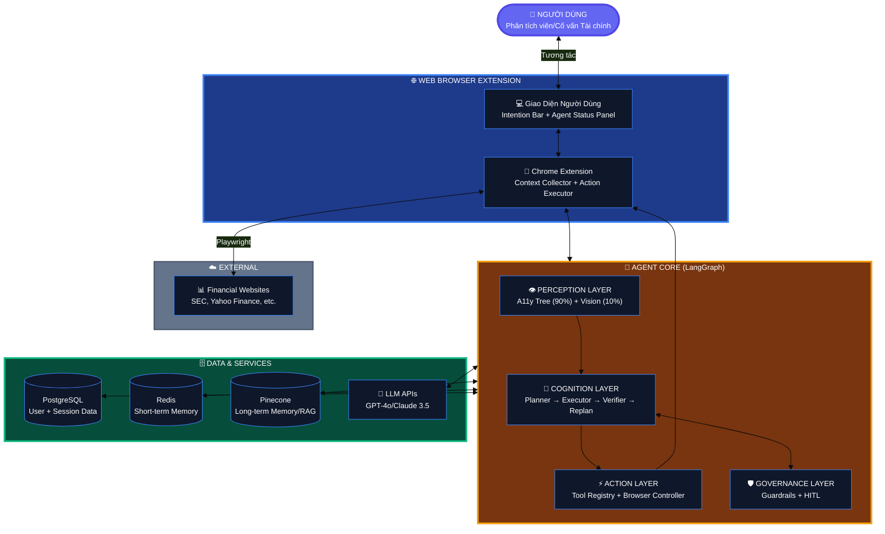
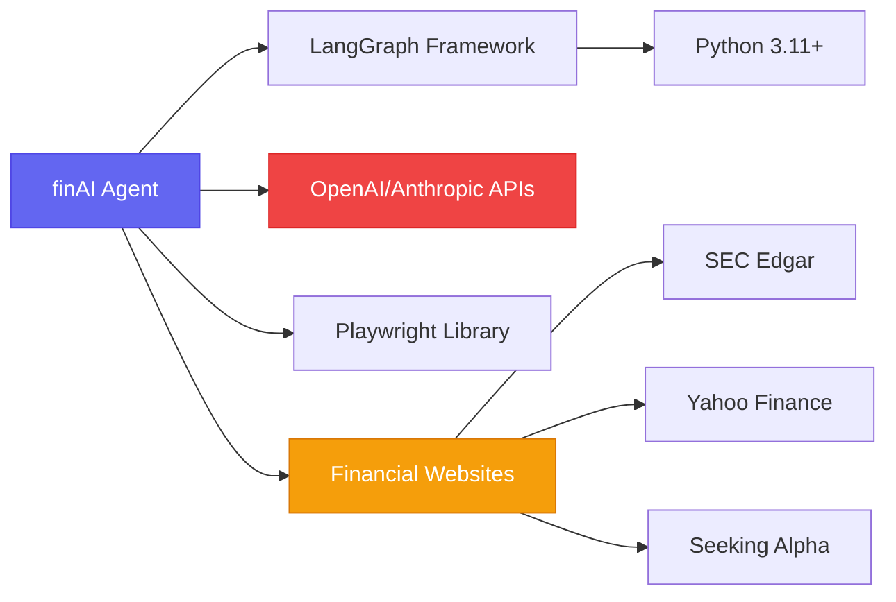
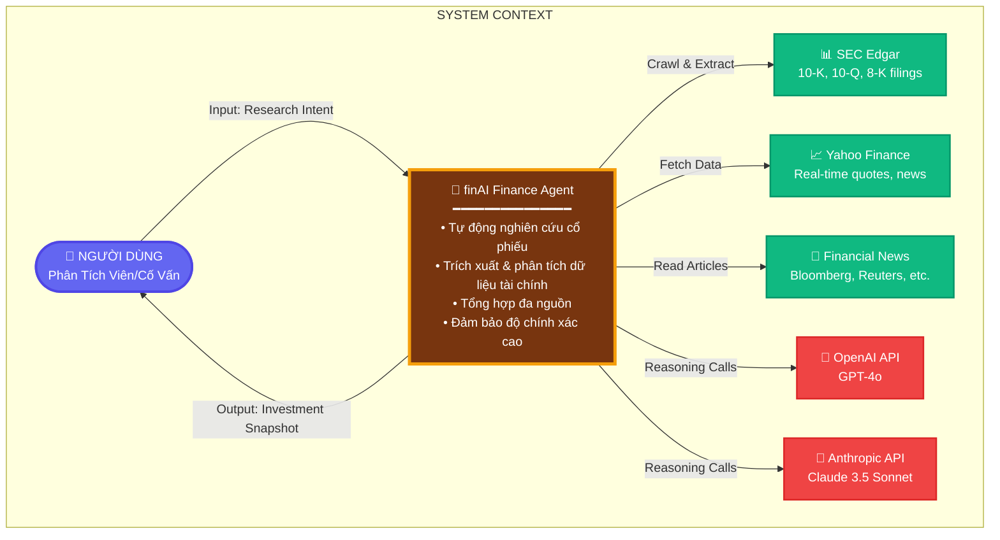
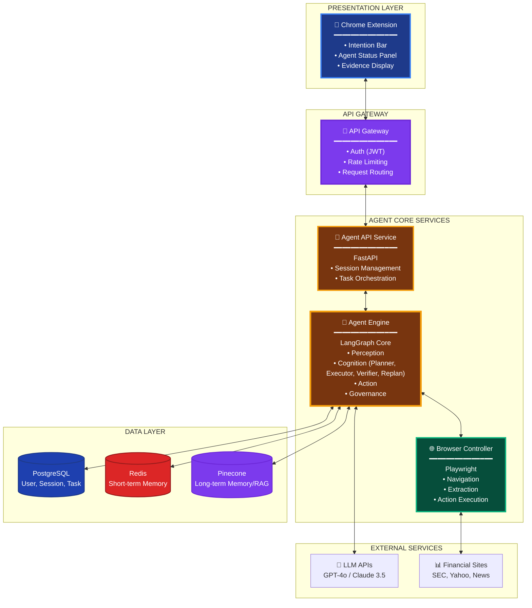
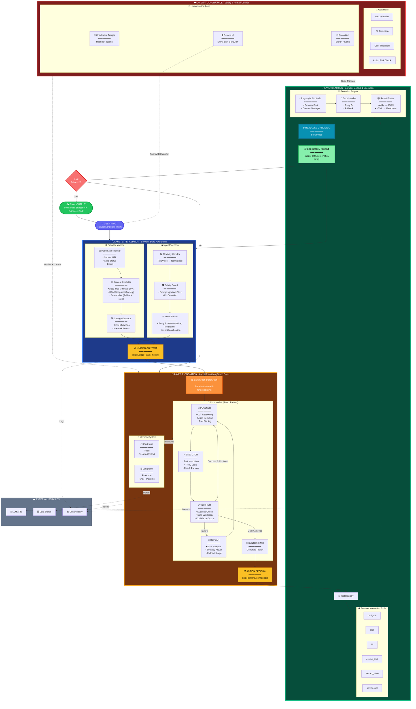

# SOFTWARE DESIGN DOCUMENT (SDD) - finAI Finance Agent Web Browser

**Production Quality Standard | Version 1.0**

> 🎯 **Tài liệu thiết kế hệ thống chi tiết cho finAI Finance Agent Web Browser - Một AI Agent chuyên biệt cho nghiên cứu tài chính**

---

## 📋 THÔNG TIN TÀI LIỆU

```yaml
## ============================================
## THÔNG TIN DỰ ÁN
## ============================================
Tên_Dự_Án: "finAI Finance Agent Web Browser"
Mã_Tài_Liệu: "SDD-FINAI-WEBAGENT-1.0"

## Quyền Sở Hữu
Tác_Giả_Chính: "Kiến trúc sư hệ thống finAI"
Đồng_Tác_Giả:
  - "Product Manager"
  - "Tech Lead"
  - "ML Engineer"

## Xem xét & Phê duyệt
Người_Đánh_Giá:
  Tech_Lead: "[Tên]"
  Product_Manager: "[Tên]"
  Security_Engineer: "[Tên]"
  QA_Lead: "[Tên]"
  ML_Engineer: "[Tên]"
Phê_Duyệt_Bởi: "[Tên, Vai trò]"

## Theo Dõi Trạng Thái
Trạng_Thái: "In Review"
Độ_Ưu_Tiên: "P0-Critical"

## Thời Gian
Ngày_Tạo: "2024-12-16"
Cập_Nhật_Lần_Cuối: "2024-12-16"
Mục_Tiêu_Ra_Mắt: "Q2 2025"
Hạn_Đánh_Giá: "2024-12-30"

## Phiên Bản
Phiên_Bản: "1.0.0"

## Tài Liệu Liên Quan
Tài_Liệu_Liên_Quan:
  PRD: "[Link]"
  API_Spec: "[Link]"
  UI_Design: "[Link]"
  Test_Plan: "[Link]"
```

---

## 📖 MỤC LỤC

### Phần I: Nền Tảng & Kiến Trúc

1. [Tóm Tắt Điều Hành (Executive Summary)](https://www.genspark.ai/agents?id=247ebf04-08c0-44cf-95da-b72eb9d10015#1-t%C3%B3m-t%E1%BA%AFt-%C4%91i%E1%BB%81u-h%C3%A0nh)
2. [Giới Thiệu](https://www.genspark.ai/agents?id=247ebf04-08c0-44cf-95da-b72eb9d10015#2-gi%E1%BB%9Bi-thi%E1%BB%87u)
3. [Mục Tiêu, Phạm Vi & Ràng Buộc](https://www.genspark.ai/agents?id=247ebf04-08c0-44cf-95da-b72eb9d10015#3-m%E1%BB%A5c-ti%C3%AAu-ph%E1%BA%A1m-vi--r%C3%A0ng-bu%E1%BB%99c)
4. [Tổng Quan Hệ Thống](https://www.genspark.ai/agents?id=247ebf04-08c0-44cf-95da-b72eb9d10015#4-t%E1%BB%95ng-quan-h%E1%BB%87-th%E1%BB%91ng)
5. [Thiết Kế Tổng Thể (HLD)](https://www.genspark.ai/agents?id=247ebf04-08c0-44cf-95da-b72eb9d10015#5-thi%E1%BA%BFt-k%E1%BA%BF-t%E1%BB%95ng-th%E1%BB%83-hld)
6. [Thiết Kế Chi Tiết (LLD)](https://www.genspark.ai/agents?id=247ebf04-08c0-44cf-95da-b72eb9d10015#6-thi%E1%BA%BFt-k%E1%BA%BF-chi-ti%E1%BA%BFt-lld)

### Phần II: Chi Tiết Triển Khai

7. [Thiết Kế API & Hợp Đồng](https://www.genspark.ai/agents?id=247ebf04-08c0-44cf-95da-b72eb9d10015#7-thi%E1%BA%BFt-k%E1%BA%BF-api--h%E1%BB%A3p-%C4%91%E1%BB%93ng)
8. [Thiết Kế Dữ Liệu](https://www.genspark.ai/agents?id=247ebf04-08c0-44cf-95da-b72eb9d10015#8-thi%E1%BA%BFt-k%E1%BA%BF-d%E1%BB%AF-li%E1%BB%87u)
9. [Thiết Kế Bảo Mật](https://www.genspark.ai/agents?id=247ebf04-08c0-44cf-95da-b72eb9d10015#9-thi%E1%BA%BFt-k%E1%BA%BF-b%E1%BA%A3o-m%E1%BA%ADt)

### Phần III: Sẵn Sàng Production

10. [Khả Năng Phục Hồi & Độ Tin Cậy](https://www.genspark.ai/agents?id=247ebf04-08c0-44cf-95da-b72eb9d10015#10-kh%E1%BA%A3-n%C4%83ng-ph%E1%BB%A5c-h%E1%BB%93i--%C4%91%E1%BB%99-tin-c%E1%BA%ADy)
11. [Khả Năng Quan Sát & Giám Sát](https://www.genspark.ai/agents?id=247ebf04-08c0-44cf-95da-b72eb9d10015#11-kh%E1%BA%A3-n%C4%83ng-quan-s%C3%A1t--gi%C3%A1m-s%C3%A1t)
12. [Triển Khai & Vận Hành](https://www.genspark.ai/agents?id=247ebf04-08c0-44cf-95da-b72eb9d10015#12-tri%E1%BB%83n-khai--v%E1%BA%ADn-h%C3%A0nh)
13. [Chiến Lược Kiểm Thử](https://www.genspark.ai/agents?id=247ebf04-08c0-44cf-95da-b72eb9d10015#13-chi%E1%BA%BFn-l%C6%B0%E1%BB%A3c-ki%E1%BB%83m-th%E1%BB%AD)

### Phần IV: Chất Lượng & Quản Trị

14. [Yêu Cầu Phi Chức Năng (NFR)](https://www.genspark.ai/agents?id=247ebf04-08c0-44cf-95da-b72eb9d10015#14-y%C3%AAu-c%E1%BA%A7u-phi-ch%E1%BB%A9c-n%C4%83ng-nfr)
15. [Hiệu Suất & Lập Kế Hoạch Công Suất](https://www.genspark.ai/agents?id=247ebf04-08c0-44cf-95da-b72eb9d10015#15-hi%E1%BB%87u-su%E1%BA%A5t--l%E1%BA%ADp-k%E1%BA%BF-ho%E1%BA%A1ch-c%C3%B4ng-su%E1%BA%A5t)
16. [Tối Ưu Hóa Chi Phí](https://www.genspark.ai/agents?id=247ebf04-08c0-44cf-95da-b72eb9d10015#16-t%E1%BB%91i-%C6%B0u-h%C3%B3a-chi-ph%C3%AD)
17. [Đánh Đổi & Quyết Định Kiến Trúc](https://www.genspark.ai/agents?id=247ebf04-08c0-44cf-95da-b72eb9d10015#17-%C4%91%C3%A1nh-%C4%91%E1%BB%95i--quy%E1%BA%BFt-%C4%91%E1%BB%8Bnh-ki%E1%BA%BFn-tr%C3%BAc)

### Phần V: Vận Hành & MLOps

18. [Ứng Phó Sự Cố & Runbooks](https://www.genspark.ai/agents?id=247ebf04-08c0-44cf-95da-b72eb9d10015#18-%E1%BB%A9ng-ph%C3%B3-s%E1%BB%B1-c%E1%BB%91--runbooks)
19. [Kiến Trúc LangGraph Agent Core](https://www.genspark.ai/agents?id=247ebf04-08c0-44cf-95da-b72eb9d10015#19-ki%E1%BA%BFn-tr%C3%BAc-langgraph-agent-core)

### Phần VI: Ra Mắt & Hơn Thế Nữa

20. [Lộ Trình Triển Khai](https://www.genspark.ai/agents?id=247ebf04-08c0-44cf-95da-b72eb9d10015#20-l%E1%BB%99-tr%C3%ACnh-tri%E1%BB%83n-khai)
21. [Checklist Sẵn Sàng Production](https://www.genspark.ai/agents?id=247ebf04-08c0-44cf-95da-b72eb9d10015#21-checklist-s%E1%BA%B5n-s%C3%A0ng-production)
22. [Lỗi Thường Gặp & Anti-Patterns](https://www.genspark.ai/agents?id=247ebf04-08c0-44cf-95da-b72eb9d10015#22-l%E1%BB%97i-th%C6%B0%E1%BB%9Dng-g%E1%BA%B7p--anti-patterns)
23. [Khuyến Nghị Công Cụ](https://www.genspark.ai/agents?id=247ebf04-08c0-44cf-95da-b72eb9d10015#23-khuy%E1%BA%BFn-ngh%E1%BB%8B-c%C3%B4ng-c%E1%BB%A5)
24. [Phụ Lục](https://www.genspark.ai/agents?id=247ebf04-08c0-44cf-95da-b72eb9d10015#24-ph%E1%BB%A5-l%E1%BB%A5c)

---

## PHẦN I: NỀN TẢNG & KIẾN TRÚC

---

## 1. TÓM TẮT ĐIỀU HÀNH

### 1.1 Bảng Tóm Tắt

|Khía Cạnh|Chi Tiết|
|---|---|
|**Phát Biểu Vấn Đề**|Các chuyên gia tài chính mất 5-10 giờ để nghiên cứu một cổ phiếu do phải thao tác thủ công với nhiều nguồn dữ liệu (SEC filings, earnings calls, news, screener). Quy trình hiện tại dễ bỏ sót thông tin và không hiệu quả.|
|**Giải Pháp Đề Xuất**|finAI Finance Agent Web Browser - Một AI Agent chuyên biệt sử dụng LangGraph để tự động hóa nghiên cứu tài chính. Agent có khả năng điều hướng web, trích xuất dữ liệu, phân tích và tổng hợp thông tin từ nhiều nguồn, giảm thời gian nghiên cứu từ 5-10 giờ xuống <30 phút.|
|**Tác Động Kinh Doanh**|• Tăng năng suất phân tích viên 10x  <br>• Giảm thời gian nghiên cứu 90%  <br>• Nâng cao chất lượng quyết định đầu tư  <br>• Thu nhập dự kiến: $100K ARR trong năm 1 với 1K người dùng trả phí|
|**Tác Động Kỹ Thuật**|• Độ trễ P95 <8 giây cho tác vụ nghiên cứu đa bước  <br>• Độ tin cậy 99.5% (tỷ lệ thành công)  <br>• Chi phí <$0.10 mỗi nghiên cứu  <br>• Khả năng mở rộng lên 10K người dùng đồng thời|
|**Công Nghệ Chính**|Python 3.11, LangGraph, Playwright, GPT-4o/Claude 3.5 Sonnet, PostgreSQL, Redis, FastAPI|
|**Ước Tính Nỗ Lực**|3 kỹ sư × 6 tháng = 18 người-tháng (MVP)  <br>5 kỹ sư × 12 tháng = 60 người-tháng (Production)|
|**Mức Độ Rủi Ro**|**Cao** - Yêu cầu kỹ thuật phức tạp (AI Agent), dữ liệu tài chính nhạy cảm, cạnh tranh gay gắt|
|**Thời Gian**|• MVP: 6 tháng (Q2 2025)  <br>• Production đầy đủ: 12 tháng (Q4 2025)|
|**Bên Liên Quan Chính**|Đội Product, Đội Engineering, Đội ML, Phân tích viên tài chính, Cố vấn tài chính|
|**Tổng Chi Phí (Năm 1)**|$500K infrastructure + development + LLM API costs|

### 1.2 Tổng Quan Kiến Trúc



### 1.3 Chỉ Số Chính & Tiêu Chí Thành Công

|KPI|Hiện Tại|Mục Tiêu|Phương Pháp Đo Lường|
|---|---|---|---|
|**Thời Gian Nghiên Cứu**|5-10 giờ|<30 phút|Theo dõi thời gian từ input đến output|
|**Tỷ Lệ Thành Công Tác Vụ**|N/A|>95%|Số tác vụ hoàn thành/tổng số tác vụ|
|**Độ Trễ P95**|N/A|<8 giây|LangSmith tracing|
|**Chi Phí Mỗi Nghiên Cứu**|N/A|<$0.10|LLM API cost tracking|
|**Độ Chính Xác Dữ Liệu**|N/A|>99%|Human verification sampling|
|**Người Dùng Hoạt Động Hàng Tuần**|N/A|60% người dùng trả phí|Analytics tracking|
|**NPS (Net Promoter Score)**|N/A|>40|Khảo sát người dùng|

### 1.4 Tóm Tắt Rủi Ro

|Rủi Ro|Xác Suất|Tác Động|Giảm Thiểu|
|---|---|---|---|
|**Hallucination của LLM**|Cao|Nghiêm trọng|• Verifier Node với validation logic  <br>• Human-in-the-loop cho tác vụ quan trọng  <br>• Confidence scoring  <br>• Multi-source verification|
|**Thay Đổi Cấu Trúc Website**|Cao|Trung bình|• A11y Tree làm primary (semantic, bền vững)  <br>• Vision Model làm fallback  <br>• Self-healing mechanism trong Replan Node|
|**Chi Phí LLM Cao**|Trung bình|Cao|• Model routing (Gemini Flash cho simple, Claude Sonnet cho complex)  <br>• Prompt caching  <br>• A11y Tree thay vì full DOM (giảm 96% tokens)|
|**Tuân Thủ & Quy Định**|Trung bình|Nghiêm trọng|• Định vị rõ ràng: “research tool” không phải “investment advisor”  <br>• Guardrails layer  <br>• Audit logging  <br>• Legal review|
|**Cạnh Tranh (Bloomberg, FactSet)**|Cao|Cao|• Focus vào vertical: Financial research  <br>• Build moats: Data + Compliance + Domain brand  <br>• Speed to market|

---

## 2. GIỚI THIỆU

### 2.1 Mục Đích Tài Liệu

Tài liệu này cung cấp **bản thiết kế production-ready đầy đủ** cho **finAI Finance Agent Web Browser**:

- **HLD (High-Level Design)**: Kiến trúc tổng thể 4-Layer với LangGraph Agent Core
- **LLD (Low-Level Design)**: Chi tiết triển khai từng component, node, tool
- **Production Standards**: Bảo mật, khả năng quan sát, độ tin cậy
- **Agent Architecture**: Thiết kế chi tiết LangGraph State Machine
- **Operations**: Runbooks, phản hồi sự cố, chiến lược giám sát

### 2.2 Đối Tượng Mục Tiêu

|Đối Tượng|Mục Đích Chính|Các Phần Chính|
|---|---|---|
|**Kỹ Sư**|Triển khai|5-8, 10-13, 19|
|**Kiến Trúc Sư**|Đánh giá kiến trúc|5, 17, 19|
|**DevOps/SRE**|Vận hành|10-12, 18|
|**QA**|Thiết kế test|13|
|**Product**|Phạm vi/Timeline|1, 3, 20|
|**Bảo Mật**|Đánh giá bảo mật|9|
|**ML Engineers**|Agent logic|19|

### 2.3 Định Nghĩa & Từ Viết Tắt

|Thuật Ngữ|Định Nghĩa|
|---|---|
|**A11y Tree**|Accessibility Tree - Cây cấu trúc ngữ nghĩa của trang web|
|**Agent**|AI Agent - Hệ thống tự động có khả năng perceive, reason, act|
|**CoT**|Chain-of-Thought - Phương pháp suy luận từng bước của LLM|
|**DOM**|Document Object Model - Cấu trúc HTML của trang web|
|**HITL**|Human-in-the-Loop - Con người tham gia vào vòng lặp quyết định|
|**LangGraph**|Framework để xây dựng stateful, multi-step AI agents|
|**RAG**|Retrieval-Augmented Generation - Tăng cường LLM bằng retrieval|
|**ReAct**|Reasoning + Acting - Mô hình agent kết hợp suy luận và hành động|

### 2.4 Tiêu Chuẩn Tài Liệu

Tài liệu này tuân theo:

- **IEEE 1016-2009**: Mô tả thiết kế phần mềm
- **C4 Model**: Trực quan hóa kiến trúc
- **OpenAPI 3.0**: Đặc tả API
- **ADR Format**: Quyết định kiến trúc

---

## 3. MỤC TIÊU, PHẠM VI & RÀNG BUỘC

### 3.1 Mục Tiêu

#### Mục Tiêu Kinh Doanh

|Mục Tiêu|Chỉ Số|Mục Tiêu|Thời Gian|
|---|---|---|---|
|**Tăng Hiệu Suất Người Dùng**|Thời gian nghiên cứu trung bình|Giảm 90% (từ 5h → 30 phút)|Q2 2025|
|**Thu Hút Người Dùng Trả Phí**|Người dùng trả phí|1,000 người|Q4 2025|
|**Doanh Thu**|ARR (Annual Recurring Revenue)|$100K|Cuối 2025|
|**Sự Hài Lòng Người Dùng**|NPS Score|>40|Q3 2025|

#### Mục Tiêu Kỹ Thuật

|Mục Tiêu|Chỉ Số|Mục Tiêu|Thời Gian|
|---|---|---|---|
|**Hiệu Suất**|Độ trễ P95|<8 giây (tác vụ đa bước)|MVP|
|**Độ Tin Cậy**|Tỷ lệ thành công|>95%|Phase 2|
|**Chi Phí**|Chi phí mỗi tác vụ|<$0.10|Phase 3|
|**Bảo Mật**|Lỗ hổng nghiêm trọng|Zero|Ongoing|
|**Độ Chính Xác**|Độ chính xác dữ liệu|>99%|Phase 2|

### 3.2 Trong Phạm Vi ✅

#### MVP (Must Have - Phase 1, 6 tháng)

**Chức Năng Cốt Lõi:**

- ✅ **Intent Input & Parsing**: Người dùng nhập ý định bằng ngôn ngữ tự nhiên
- ✅ **Research Agent**: Tự động điều hướng, trích xuất dữ liệu từ SEC filings, earnings calls, news
- ✅ **Multi-Source Synthesis**: Tổng hợp thông tin từ ≥3 nguồn
- ✅ **Evidence Pack**: Hiển thị nguồn và trích dẫn cho mọi thông tin
- ✅ **1-Page Investment Snapshot**: Tóm tắt kết quả nghiên cứu

**Công Nghệ:**

- ✅ LangGraph Agent Core (4-Layer)
- ✅ A11y Tree + Vision fallback
- ✅ PostgreSQL + Redis
- ✅ Chrome Extension

#### Phase 2 (Should Have - +6 tháng)

**Mở Rộng Chức Năng:**

- 📋 **Portfolio Monitoring**: Theo dõi danh mục đầu tư, cảnh báo rủi ro
- 📋 **Comparative Analysis**: So sánh nhiều cổ phiếu/công ty
- 📋 **Historical Research**: Truy cập lịch sử nghiên cứu, RAG-enhanced
- 📋 **Custom Reports**: Tạo báo cáo tùy chỉnh

#### Phase 3 (Nice to Have - Tương lai)

**Nâng Cao:**

- 💡 **Multi-language Support**: Hỗ trợ tiếng Việt, tiếng Trung
- 💡 **Voice Input**: Nhập bằng giọng nói
- 💡 **Mobile App**: Ứng dụng iOS/Android
- 💡 **Team Collaboration**: Chia sẻ nghiên cứu trong nhóm

### 3.3 Ngoài Phạm Vi / Không Phải Mục Tiêu ❌

|Không Phải Mục Tiêu|Lý Do|Tương Lai?|
|---|---|---|
|**Trading Execution**|Không phải investment advisor, tránh vấn đề regulatory|Có thể Phase 4 (với RIA license)|
|**Real-time Market Data**|Chi phí cao, không cần thiết cho nghiên cứu cơ bản|Phase 3|
|**Custom Financial Models**|Phức tạp, ngoài phạm vi MVP|Phase 3|
|**Enterprise CRM Integration**|Thị trường khác (enterprise vs SMB)|Khác team|

### 3.4 Giả Định

|ID|Giả Định|Tác Động Nếu Sai|Xác Nhận|
|---|---|---|---|
|**A1**|LLM API (GPT-4o/Claude) ổn định và không tăng giá đột ngột|Cao - chi phí tăng|Monitor API pricing|
|**A2**|Các trang web tài chính không block agent quá mạnh|Cao - chức năng bị ảnh hưởng|Test với stealth techniques|
|**A3**|Người dùng sẵn lòng trả $100-300/tháng|Cao - doanh thu|Khảo sát pricing|
|**A4**|Số lượng người dùng <10K trong năm 1|Trung bình - cần scale sớm|Monitor growth|
|**A5**|SEC filings structure không thay đổi lớn|Thấp - cấu trúc ổn định|Monitor SEC changes|

### 3.5 Ràng Buộc

#### Ràng Buộc Kỹ Thuật

|Ràng Buộc|Lý Do|Giải Pháp Thay Thế|
|---|---|---|
|**Python 3.11+**|LangGraph, Playwright đều Python|N/A|
|**LangGraph**|Best framework cho stateful agents|N/A|
|**PostgreSQL**|ACID compliance cho financial data|N/A|
|**Chrome Extension**|Phổ biến nhất, ecosystem tốt|Sau này: Firefox, Edge|

#### Ràng Buộc Kinh Doanh

|Ràng Buộc|Tác Động|Giảm Thiểu|
|---|---|---|
|**Ngân sách <$500K/năm**|Hạn chế infrastructure, headcount|• Reserved instances  <br>• Spot instances  <br>• Model routing để giảm LLM cost|
|**Ra mắt Q2 2025**|Timeline chặt|• Giảm phạm vi MVP  <br>• Parallel development  <br>• Reuse open-source|
|**Team 3-5 người**|Hạn chế tốc độ phát triển|• Clear prioritization  <br>• Good documentation  <br>• Modular architecture|

#### Tuân Thủ

|Quy Định|Yêu Cầu|Triển Khai|
|---|---|---|
|**Investment Advisers Act**|Không được đưa ra investment advice trực tiếp|• Định vị: “research tool”  <br>• Disclaimers rõ ràng  <br>• No buy/sell recommendations|
|**GDPR (EU users)**|Xử lý dữ liệu cá nhân|• User consent  <br>• Data encryption  <br>• Right to erasure|
|**CCPA (CA users)**|California privacy law|• Transparency  <br>• Opt-out mechanism|
|**SOC 2 Type II**|Enterprise customers|• Audit trail  <br>• Access control  <br>• Incident response plan|

### 3.6 Phụ Thuộc



|Phụ Thuộc|Chủ Sở Hữu|Rủi Ro|Dự Phòng|
|---|---|---|---|
|**OpenAI API (GPT-4o)**|External|Cao (rate limits, downtime, pricing)|• Anthropic Claude Sonnet 3.5 fallback  <br>• Local LLM cho simple tasks  <br>• Exponential backoff retry|
|**Anthropic Claude API**|External|Trung bình|• OpenAI fallback  <br>• Queue tasks during outage|
|**Playwright**|Open Source|Thấp (mature, stable)|• Selenium fallback  <br>• Fork if needed|
|**LangGraph**|LangChain (LangChain Inc.)|Thấp-Trung bình (young but active)|• Abstract agent logic  <br>• Could migrate to custom framework|
|**Financial Websites**|External|Cao (structure changes, blocking)|• A11y Tree primary (more stable)  <br>• Vision fallback  <br>• Stealth techniques  <br>• User reports for breaking changes|

---

## 4. TỔNG QUAN HỆ THỐNG

### 4.1 Bối Cảnh Kinh Doanh

#### Vấn Đề

**Current State (Hiện Tại):**

- Phân tích viên/Cố vấn tài chính mất **5-10 giờ** để nghiên cứu một cổ phiếu
- Phải thao tác thủ công với **10-50 tabs**: SEC filings, earnings calls, news, screener, broker reports
- **Quy trình hiện tại**:
    1. Tìm kiếm ticker → Mở nhiều trang
    2. Đọc 30-50 trang báo cáo PDF
    3. Copy-paste thủ công vào Excel/Notion
    4. Tự tổng hợp và phân tích
    5. Viết memo

**Pain Points:**

- ❌ **Tốn thời gian**: 80% thời gian là thu thập dữ liệu thủ công
- ❌ **Dễ bỏ sót**: Không thể đọc hết mọi nguồn
- ❌ **Thiếu nhất quán**: Mỗi phân tích viên có quy trình riêng
- ❌ **Không scale**: Không thể nghiên cứu nhiều cổ phiếu cùng lúc

#### Giải Pháp

**finAI Finance Agent Web Browser** tự động hóa toàn bộ quy trình:

1. **Input**: Người dùng nhập ý định (ví dụ: “Phân tích rủi ro thanh khoản của VCB”)
2. **Autonomous Research**: Agent tự động:
    - Điều hướng đến các nguồn liên quan (SEC, Yahoo Finance, news)
    - Trích xuất dữ liệu quan trọng (financial metrics, risks, management commentary)
    - Phân tích đa nguồn (cross-check, identify conflicts)
3. **Output**: 1-Page Investment Snapshot với:
    - Executive summary
    - Key metrics (revenue, margin, debt, etc.)
    - Risk analysis
    - Management quality assessment
    - Competitive positioning
    - **Evidence Pack**: Mọi số liệu đều có nguồn trích dẫn

**Value Proposition:**

> “Giảm thời gian nghiên cứu từ 5-10 giờ xuống <30 phút với độ chính xác >99% và đầy đủ trích dẫn nguồn.”

#### Giá Trị

**Lượng Hóa:**

- **ROI cho người dùng**:
    
    - Phân tích viên lương $80K/năm = $40/giờ
    - Tiết kiệm 5 giờ/nghiên cứu = $200/nghiên cứu
    - Nếu làm 10 nghiên cứu/tháng → Tiết kiệm $2,000/tháng
    - finAI giá $200/tháng → ROI = 10x
- **Cho doanh nghiệp**:
    
    - Với 10 phân tích viên: Tiết kiệm $20K/tháng = $240K/năm
    - Tăng năng suất → Có thể nghiên cứu nhiều hơn 10x
    - Chất lượng nhất quán, ít sai sót

### 4.2 Bên Liên Quan

|Bên Liên Quan|Quan Tâm|Giao Tiếp|
|---|---|---|
|**Executives (C-level)**|ROI, Timeline, Competitive advantage|Báo cáo tháng|
|**Product Manager**|Features, User experience, Adoption|Tuần 2 lần|
|**Engineering Team**|Architecture, Technical debt, Velocity|Hàng ngày|
|**ML Team**|Agent performance, Accuracy, Cost|Tuần 2 lần|
|**QA Team**|Test coverage, Bug rate|Hàng ngày|
|**Operations/SRE**|Stability, Incidents, On-call|Hàng ngày|
|**Security Team**|Vulnerabilities, Compliance|Hàng tuần|
|**End Users (Analysts)**|Speed, Accuracy, Ease of use|Feedback loop, surveys|
|**Legal/Compliance**|Regulatory compliance, Disclaimers|Khi cần|

### 4.3 Yêu Cầu Chức Năng

|ID|Module|Mô Tả|Độ Ưu Tiên|Tiêu Chí Chấp Nhận|
|---|---|---|---|---|
|**FR-001**|Intent Input|Người dùng nhập ý định nghiên cứu bằng ngôn ngữ tự nhiên|P0|• Hỗ trợ tiếng Anh  <br>• Parse entity (ticker, timeframe, metrics)  <br>• Validation & feedback  <br>• <2s response time|
|**FR-002**|Web Navigation|Agent tự động điều hướng đến các trang web tài chính|P0|• Navigate đến SEC, Yahoo Finance, news sites  <br>• Handle redirects, pop-ups  <br>• Timeout protection (30s/page)|
|**FR-003**|Data Extraction|Trích xuất dữ liệu từ financial documents (10-K, earnings, news)|P0|• Extract tables, text, metrics  <br>• >99% accuracy cho structured data  <br>• Support PDF, HTML, plain text|
|**FR-004**|Multi-Source Synthesis|Tổng hợp thông tin từ ≥3 nguồn|P0|• Identify conflicts  <br>• Weight sources by credibility  <br>• Generate unified view|
|**FR-005**|Risk Analysis|Phân tích rủi ro từ dữ liệu thu thập|P0|• Identify financial risks (liquidity, leverage, concentration)  <br>• Confidence scoring  <br>• Evidence-based|
|**FR-006**|Evidence Pack|Cung cấp nguồn trích dẫn cho mọi thông tin|P0|• Link back to original document  <br>• Quote verbatim  <br>• Confidence score per fact|
|**FR-007**|1-Page Snapshot|Tổng hợp kết quả thành 1 trang|P0|• Executive summary  <br>• Key metrics  <br>• Risks  <br>• Next steps  <br>• Exportable (PDF, Markdown)|
|**FR-008**|Agent Status Panel|Hiển thị trạng thái Agent real-time|P0|• Current step  <br>• Progress bar  <br>• Evidence collected  <br>• “Take Control” button|
|**FR-009**|Error Handling|Xử lý lỗi và retry|P0|• Max 3 retries  <br>• Graceful degradation  <br>• User notification|
|**FR-010**|HITL (Human-in-the-Loop)|Yêu cầu xác nhận cho tác vụ quan trọng|P0|• Pop-up confirmation  <br>• <10s response time  <br>• Can abort|

### 4.4 User Stories (Gherkin)

#### Story 1: Stock Research

```gherkin
Tính Năng: Nghiên Cứu Cổ Phiếu Tự Động
  Là một phân tích viên tài chính
  Tôi muốn nghiên cứu một cổ phiếu nhanh chóng
  Để tôi có thể đưa ra quyết định đầu tư sáng suốt

  Kịch Bản: Nghiên cứu thành công
    Cho tôi đã đăng nhập vào finAI
    Khi tôi nhập "Phân tích rủi ro thanh khoản của Tesla (TSLA)"
    Thì Agent bắt đầu hoạt động
    Và tôi thấy Agent Status Panel hiển thị tiến trình
    Và trong <8 phút, Agent trả về 1-Page Snapshot
    Và Snapshot bao gồm:
      | Phần | Nội Dung |
      | Executive Summary | Tóm tắt 2-3 câu |
      | Liquidity Metrics | Current ratio, Quick ratio, Cash flow |
      | Risks Identified | Top 3 rủi ro thanh khoản |
      | Evidence Pack | Trích dẫn từ 10-K, earnings call |
    Và mọi số liệu đều có link đến nguồn gốc
    
  Kịch Bản: Agent gặp lỗi - có retry
    Cho Agent đang truy cập trang SEC Edgar
    Khi trang bị timeout
    Thì Agent retry 3 lần với exponential backoff
    Và nếu vẫn thất bại, Agent sử dụng nguồn thay thế (Yahoo Finance)
    Và thông báo cho người dùng "Không thể truy cập SEC, đã dùng Yahoo Finance"
    
  Kịch Bản: HITL - Xác nhận hành động quan trọng
    Cho Agent đã tìm thấy form SEC có file PDF lớn (50MB)
    Khi Agent chuẩn bị tải xuống
    Thì hiện pop-up xác nhận: "Sắp tải 50MB file PDF. Xác nhận?"
    Và người dùng có thể "Approve" hoặc "Skip"
    Và nếu Skip, Agent sử dụng alternative source
```

#### Story 2: Comparative Analysis

```gherkin
Tính Năng: So Sánh Nhiều Cổ Phiếu
  Là một cố vấn tài chính
  Tôi muốn so sánh 3 cổ phiếu cùng ngành
  Để đưa ra khuyến nghị cho khách hàng

  Kịch Bản: So sánh thành công
    Cho tôi đã đăng nhập
    Khi tôi nhập "So sánh VCB, TCB, MBB về ROE và ROA"
    Thì Agent thu thập dữ liệu của cả 3 ngân hàng
    Và trong <15 phút, trả về bảng so sánh:
      | Ngân hàng | ROE | ROA | Nguồn |
      | VCB | 21.5% | 1.8% | VCB Annual Report 2023 |
      | TCB | 18.3% | 1.5% | TCB Q4 2023 Earnings |
      | MBB | 19.1% | 1.6% | MBB 10-K 2023 |
    Và có phân tích: "VCB dẫn đầu về ROE và ROA"
```

---

## 5. THIẾT KẾ TỔNG THỂ (HLD)

### 5.1 Mô Hình Kiến Trúc

#### Lựa Chọn: 4-Layer Architecture với LangGraph Agent Core

**Rationale (Lý do lựa chọn):**

- ✅ **Separation of Concerns**: Mỗi layer có trách nhiệm rõ ràng
- ✅ **Modularity**: Dễ test, maintain, extend
- ✅ **Agent-First**: Tối ưu cho AI Agent với state management (LangGraph)
- ✅ **Production-Ready**: Governance layer đảm bảo safety & control
- ✅ **Scalability**: Mỗi layer có thể scale độc lập

**Nguyên Tắc Chính:**

- **SOLID Principles**: Trong thiết kế class/module
- **MECE Framework**: Mutually Exclusive, Collectively Exhaustive
- **Agent Pattern**: Perception → Cognition → Action → Verification loop
- **Zero Trust Security**: Không tin tưởng bất kỳ input/output nào mà không verify

#### So Sánh Các Mô Hình Kiến Trúc (MECE Analysis)

Trước khi chọn kiến trúc cuối cùng, chúng ta đã phân tích 4 mô hình khác nhau:

|Mô Hình|Mô Tả|Ưu Điểm|Nhược Điểm|Điểm Số|
|---|---|---|---|---|
|**1. Monolithic Agent**|Một agent duy nhất xử lý mọi thứ|• Đơn giản  <br>• Dễ debug ban đầu|• Khó maintain  <br>• Không scale  <br>• Không modular|3/10|
|**2. Pipeline Linear**|Chain of fixed steps: Fetch → Parse → Analyze → Synthesize|• Dễ hiểu  <br>• Predictable|• Không flexible  <br>• Không self-correct  <br>• Fail nếu 1 step fails|5/10|
|**3. Multi-Agent Micro-services**|Nhiều agent độc lập (Planner, Executor, Healer, etc.) giao tiếp qua messages|• Highly modular  <br>• Parallel processing  <br>• Scale từng agent|• Quá phức tạp  <br>• Network overhead  <br>• Orchestration hell|6/10|
|**4. 4-Layer + LangGraph**|4 layers (Perception, Cognition, Action, Governance) với LangGraph state machine trong Cognition|• Modular nhưng không quá phức tạp  <br>• Self-correcting (Replan node)  <br>• Clear separation  <br>• Production-ready|• Cần học LangGraph  <br>• Hơi phức tạp hơn Pipeline|**9/10** ✅|

**Quyết Định**: Chọn **Mô Hình 4** (4-Layer + LangGraph)

**Lý do chi tiết**:

1. **Balance Complexity vs Capability**: Không quá đơn giản (Pipeline) nhưng cũng không quá phức tạp (Multi-Agent Microservices)
2. **LangGraph Built for Agents**: LangGraph được thiết kế chuyên cho stateful agents với:
    - State management tốt
    - Conditional edges (if-else logic trong graph)
    - Checkpointing (có thể pause/resume)
    - Tracing & debugging built-in
3. **Proven Pattern**: 4-Layer architecture là best practice từ production systems (OpenAI Operator, Perplexity Comet)
4. **Governance Layer**: Critical cho financial domain - built-in từ đầu, không phải retrofit sau

### 5.2 System Context (C4 Level 1)



### 5.3 Container Diagram (C4 Level 2)



### 5.4 Kiến Trúc 4-Layer Chi Tiết



### 5.5 Technology Stack

|Lớp|Công Nghệ|Lý Do Lựa Chọn|Phiên Bản|
|---|---|---|---|
|**Backend Core**|Python 3.11|• Best ecosystem cho AI/ML  <br>• LangGraph native  <br>• Playwright support  <br>• Async support|3.11+|
|**Agent Framework**|LangGraph|• Purpose-built cho stateful agents  <br>• Conditional edges  <br>• Checkpointing  <br>• Debugging tools  <br>• Production-ready|Latest|
|**Web Automation**|Playwright|• Modern, fast  <br>• Better than Selenium  <br>• Auto-waiting  <br>• Multi-browser  <br>• Network interception|Latest|
|**API Framework**|FastAPI|• High performance (async)  <br>• OpenAPI auto-gen  <br>• Type safety (Pydantic)  <br>• WebSocket support|Latest|
|**Primary Database**|PostgreSQL 15|• ACID compliance (critical for finance)  <br>• JSONB support  <br>• Rich extensions  <br>• Mature ecosystem|15.x|
|**Cache**|Redis 7|• Sub-ms latency  <br>• Flexible data structures  <br>• Pub/sub for events|7.x|
|**Vector DB**|Pinecone|• Managed service  <br>• Low latency  <br>• Good for RAG  <br>• Scale automatically|Cloud|
|**LLM Primary**|GPT-4o|• Best reasoning  <br>• Function calling  <br>• Vision capability|gpt-4o-2024-11-20|
|**LLM Secondary**|Claude 3.5 Sonnet|• Better for long context  <br>• Lower cost for some tasks  <br>• Good fallback|claude-3-5-sonnet-20241022|
|**LLM for Simple**|Gemini 2.0 Flash|• Very cheap ($0.10/1M tokens)  <br>• Fast  <br>• Good for simple extraction|gemini-2.0-flash-exp|
|**Container**|Docker|• Consistency across envs  <br>• Easy deployment|Latest|
|**Orchestration**|Kubernetes (EKS)|• Auto-scaling  <br>• Self-healing  <br>• Rolling updates|1.28+|
|**CI/CD**|GitHub Actions|• Native GitHub integration  <br>• Free for private repos  <br>• Good marketplace|N/A|
|**IaC**|Terraform|• Multi-cloud  <br>• Declarative  <br>• State management|1.6+|
|**Monitoring**|Datadog|• All-in-one (metrics, logs, traces)  <br>• APM built-in  <br>• Good alerting|Cloud|
|**Tracing**|LangSmith|• Purpose-built for LangChain/LangGraph  <br>• Excellent debugging  <br>• Cost tracking|Cloud|
|**Frontend**|React 18 + TypeScript|• Component reusability  <br>• Type safety  <br>• Good ecosystem|Latest|

### 5.6 Communication Patterns

|Pattern|Use Case|Protocol|Implementation|
|---|---|---|---|
|**Sync Request/Response**|User → Agent API|REST HTTP/2|• FastAPI endpoint  <br>• Timeout 30s  <br>• Retry with backoff|
|**Async Task**|Long-running research|WebSocket|• Real-time status updates  <br>• Progress streaming  <br>• Can cancel|
|**Event-Driven**|Agent internal|LangGraph State|• Node transitions  <br>• Conditional routing  <br>• State persistence|
|**Cache Read**|Memory access|Redis protocol|• Pipeline commands  <br>• Connection pooling|
|**Vector Search**|RAG retrieval|Pinecone gRPC|• Batch queries  <br>• Filtered search|

---

## 6. THIẾT KẾ CHI TIẾT (LLD)

### 6.1 Layer 1: PERCEPTION - Browser State Awareness

#### 6.1.1 Input Processor

```python
## src/perception/input_processor.py

from dataclasses import dataclass
from typing import Optional
import re

@dataclass
class ParsedIntent:
    """Ý định đã được parse từ input người dùng"""
    raw_input: str
    intent_type: str  ## 'research', 'compare', 'monitor'
    entities: dict    ## {'ticker': 'TSLA', 'metrics': ['liquidity'], 'timeframe': 'Q4 2024'}
    constraints: dict ## {'max_sources': 5, 'priority': 'speed'}
    confidence: float ## 0.0-1.0

class InputProcessor:
    """
    Xử lý input người dùng thành Parsed Intent
    
    Responsibilities:
    - Normalize text (lowercase, remove special chars)
    - Safety check (prompt injection, PII)
    - Entity extraction (ticker, metrics, timeframe)
    - Intent classification
    """
    
    def __init__(self, llm_client, safety_guard):
        self.llm = llm_client
        self.safety = safety_guard
        
    async def process(self, user_input: str) -> ParsedIntent:
        """
        Main processing pipeline
        
        Steps:
        1. Normalize text
        2. Safety check
        3. Entity extraction
        4. Intent classification
        
        Raises:
            SecurityException: Nếu phát hiện malicious input
            ValidationError: Nếu input không hợp lệ
        """
        ## 1. Normalize
        normalized = self._normalize(user_input)
        
        ## 2. Safety check
        if not await self.safety.is_safe(normalized):
            raise SecurityException("Detected malicious input")
        
        ## 3. Extract entities + classify intent
        intent = await self._parse_with_llm(normalized)
        
        return intent
        
    def _normalize(self, text: str) -> str:
        """Chuẩn hóa text"""
        ## Remove excessive whitespace
        text = re.sub(r'\s+', ' ', text).strip()
        
        ## Remove non-printable characters
        text = ''.join(char for char in text if char.isprintable())
        
        return text
        
    async def _parse_with_llm(self, text: str) -> ParsedIntent:
        """Sử dụng LLM để parse intent"""
        
        prompt = f"""
Parse the following financial research request into structured format:

Input: "{text}"

Extract:
1. Intent type: research | compare | monitor
2. Entities:
   - ticker (stock symbol)
   - metrics (list of financial metrics)
   - timeframe (optional)
3. Constraints (optional)

Output JSON only, no explanation.

Example:
Input: "Analyze liquidity risk of Tesla"
Output:
{{
  "intent_type": "research",
  "entities": {{
    "ticker": "TSLA",
    "metrics": ["liquidity"],
    "timeframe": null
  }},
  "constraints": {{}},
  "confidence": 0.95
}}
"""
        
        response = await self.llm.complete(
            prompt,
            temperature=0.0,  ## Deterministic
            max_tokens=500
        )
        
        parsed = json.loads(response.content)
        
        return ParsedIntent(
            raw_input=text,
            intent_type=parsed["intent_type"],
            entities=parsed["entities"],
            constraints=parsed.get("constraints", {}),
            confidence=parsed["confidence"]
        )
```

#### 6.1.2 Browser Monitor

```python
## src/perception/browser_monitor.py

from dataclasses import dataclass
from typing import Optional, Dict, List
from playwright.async_api import Page
import json

@dataclass
class PageState:
    """Trạng thái trang web hiện tại"""
    url: str
    title: str
    is_loading: bool
    has_errors: bool
    error_messages: List[str]

@dataclass
class UnifiedContext:
    """Context thống nhất cho Cognition Layer"""
    intent: ParsedIntent
    page_state: PageState
    a11y_tree: Optional[Dict]
    dom_snapshot: Optional[str]
    screenshot_b64: Optional[str]
    action_history: List[Dict]
    extracted_data: Dict

class BrowserMonitor:
    """
    Giám sát trạng thái trình duyệt
    
    Strategy:
    - A11y Tree: Primary (90% cases) - Fast, semantic
    - DOM Snapshot: Backup - When A11y insufficient
    - Screenshot + Vision: Fallback (10%) - For visual elements
    """
    
    def __init__(self):
        self.use_vision_threshold = 0.1  ## 10% fallback
        
    async def capture_state(self, page: Page) -> UnifiedContext:
        """Thu thập toàn bộ trạng thái trang"""
        
        ## 1. Page state (fast)
        page_state = await self._get_page_state(page)
        
        ## 2. A11y Tree (primary)
        a11y_tree = await self._extract_a11y_tree(page)
        
        ## 3. Check if need more data
        dom_snapshot = None
        screenshot = None
        
        if not self._is_a11y_sufficient(a11y_tree):
            dom_snapshot = await self._get_dom_snapshot(page)
            
        ## 4. Vision fallback (expensive, only when needed)
        if random.random() < self.use_vision_threshold or self._needs_vision(page_state):
            screenshot = await self._capture_screenshot(page)
            
        return UnifiedContext(
            intent=None,  ## Will be filled by Input Processor
            page_state=page_state,
            a11y_tree=a11y_tree,
            dom_snapshot=dom_snapshot,
            screenshot_b64=screenshot,
            action_history=[],
            extracted_data={}
        )
        
    async def _extract_a11y_tree(self, page: Page) -> Dict:
        """
        Trích xuất Accessibility Tree
        
        A11y Tree advantages:
        - Semantic (role, label, value)
        - Stable (less affected by CSS changes)
        - Small (96% fewer tokens than DOM)
        """
        tree = await page.accessibility.snapshot()
        
        ## Filter only interactive elements
        interactive = self._filter_interactive(tree)
        
        return {
            "buttons": interactive.get("buttons", []),
            "links": interactive.get("links", []),
            "inputs": interactive.get("inputs", []),
            "headings": interactive.get("headings", []),
            "landmarks": interactive.get("landmarks", [])
        }
        
    def _filter_interactive(self, tree: Dict) -> Dict:
        """Lọc chỉ giữ interactive elements"""
        interactive = {
            "buttons": [],
            "links": [],
            "inputs": [],
            "headings": [],
            "landmarks": []
        }
        
        def traverse(node):
            role = node.get("role", "")
            
            if role == "button":
                interactive["buttons"].append({
                    "label": node.get("name", ""),
                    "value": node.get("value"),
                    "enabled": not node.get("disabled", False)
                })
            elif role == "link":
                interactive["links"].append({
                    "text": node.get("name", ""),
                    "url": node.get("value")
                })
            elif role == "textbox":
                interactive["inputs"].append({
                    "label": node.get("name", ""),
                    "type": "text",
                    "required": node.get("required", False)
                })
            elif role == "heading":
                interactive["headings"].append({
                    "level": node.get("level", 1),
                    "text": node.get("name", "")
                })
            elif role in ["region", "main", "navigation"]:
                interactive["landmarks"].append({
                    "type": role,
                    "label": node.get("name", "")
                })
                
            for child in node.get("children", []):
                traverse(child)
                
        if tree:
            traverse(tree)
            
        return interactive
        
    def _is_a11y_sufficient(self, a11y_tree: Dict) -> bool:
        """Kiểm tra A11y Tree có đủ thông tin không"""
        ## If có ít nhất 3 loại element khác nhau → sufficient
        non_empty = sum(1 for v in a11y_tree.values() if len(v) > 0)
        return non_empty >= 3
        
    def _needs_vision(self, page_state: PageState) -> bool:
        """Quyết định có cần Vision model không"""
        ## Cases cần Vision:
        ## - CAPTCHA
        ## - Charts/Graphs
        ## - Complex layouts
        
        url_lower = page_state.url.lower()
        title_lower = page_state.title.lower()
        
        vision_keywords = [
            "captcha", "verify", "robot",  ## CAPTCHA
            "chart", "graph", "visualization"  ## Charts
        ]
        
        return any(keyword in url_lower or keyword in title_lower 
                   for keyword in vision_keywords)
```

### 6.2 Layer 2: COGNITION - LangGraph Agent Core

Đây là phần **quan trọng nhất** của hệ thống.

#### 6.2.1 LangGraph State Definition

```python
## src/cognition/agent_state.py

from dataclasses import dataclass, field
from typing import List, Dict, Optional, Literal
from datetime import datetime

@dataclass
class ActionStep:
    """Một bước hành động trong plan"""
    tool_name: str
    params: Dict
    reasoning: str
    confidence: float
    retry_count: int = 0

@dataclass
class Evidence:
    """Bằng chứng thu thập được"""
    source_url: str
    source_type: str  ## 'sec_filing', 'news', 'earnings_call'
    data: Dict
    timestamp: datetime
    confidence: float

@dataclass
class AgentState:
    """
    State được truyền qua các Node trong LangGraph
    
    Design Principles:
    - Immutable where possible
    - Clear ownership of each field
    - Rich enough for debugging
    """
    
    ## ============ INPUT ============
    task_id: str
    user_prompt: str
    parsed_intent: ParsedIntent
    
    ## ============ CONTEXT ============
    unified_context: UnifiedContext
    
    ## ============ PLANNING ============
    action_plan: List[ActionStep] = field(default_factory=list)
    current_step_index: int = 0
    
    ## ============ EXECUTION ============
    current_action: Optional[ActionStep] = None
    execution_result: Optional[Dict] = None
    
    ## ============ MEMORY ============
    evidence_pack: List[Evidence] = field(default_factory=list)
    action_history: List[Dict] = field(default_factory=list)
    
    ## ============ STATE MANAGEMENT ============
    status: Literal["planning", "executing", "verifying", "replanning", "synthesizing", "done", "failed"]
    error_count: int = 0
    max_errors: int = 3
    
    ## ============ METADATA ============
    reasoning_log: List[str] = field(default_factory=list)
    start_time: datetime = field(default_factory=datetime.utcnow)
    
    ## ============ RESULTS ============
    final_answer: Optional[str] = None
    investment_snapshot: Optional[Dict] = None
```

#### 6.2.2 LangGraph Graph Definition

```python
## src/cognition/agent_graph.py

from langgraph.graph import StateGraph, END
from langgraph.checkpoint.sqlite import SqliteSaver
from typing import Literal

class FinAIAgentGraph:
    """
    LangGraph State Machine cho finAI Agent
    
    Flow:
    START → PLANNER → EXECUTOR → VERIFIER → (SUCCESS: continue/done) | (FAILURE: REPLAN)
    """
    
    def __init__(self, config: Dict):
        self.config = config
        self.llm = self._init_llm()
        self.tools = self._init_tools()
        
        ## Build graph
        self.graph = self._build_graph()
        
    def _build_graph(self) -> StateGraph:
        """Xây dựng LangGraph state machine"""
        
        ## Initialize graph
        workflow = StateGraph(AgentState)
        
        ## ============ ADD NODES ============
        workflow.add_node("planner", self._planner_node)
        workflow.add_node("executor", self._executor_node)
        workflow.add_node("verifier", self._verifier_node)
        workflow.add_node("replan", self._replan_node)
        workflow.add_node("synthesizer", self._synthesizer_node)
        
        ## ============ SET ENTRY POINT ============
        workflow.set_entry_point("planner")
        
        ## ============ ADD EDGES ============
        
        ## Planner → Executor
        workflow.add_edge("planner", "executor")
        
        ## Executor → Verifier
        workflow.add_edge("executor", "verifier")
        
        ## Verifier → Conditional routing
        workflow.add_conditional_edges(
            "verifier",
            self._verifier_router,
            {
                "continue": "planner",  ## Plan next step
                "done": "synthesizer",  ## Goal achieved
                "replan": "replan"      ## Error, need replan
            }
        )
        
        ## Replan → Planner
        workflow.add_edge("replan", "planner")
        
        ## Synthesizer → END
        workflow.add_edge("synthesizer", END)
        
        ## ============ COMPILE WITH CHECKPOINTER ============
        memory = SqliteSaver.from_conn_string(":memory:")
        
        return workflow.compile(checkpointer=memory)
        
    ## ========================================
    ## NODE IMPLEMENTATIONS
    ## ========================================
    
    async def _planner_node(self, state: AgentState) -> Dict:
        """
        PLANNER NODE
        
        Responsibilities:
        - Analyze current context
        - Decide next action
        - Select tool & params
        - Generate reasoning
        
        Uses LLM with CoT (Chain-of-Thought)
        """
        logger.info(f"[PLANNER] Current step: {state.current_step_index + 1}")
        
        ## Build prompt với context
        prompt = self._build_planner_prompt(state)
        
        ## LLM call với CoT
        response = await self.llm.complete(
            prompt,
            temperature=0.2,  ## Low temp for planning
            max_tokens=1000
        )
        
        ## Parse response
        planned_action = self._parse_planner_response(response.content)
        
        ## Update state
        state.action_plan.append(planned_action)
        state.current_action = planned_action
        state.status = "executing"
        state.reasoning_log.append(f"[PLANNER] {planned_action.reasoning}")
        
        return {
            "action_plan": state.action_plan,
            "current_action": planned_action,
            "status": "executing",
            "reasoning_log": state.reasoning_log
        }
        
    def _build_planner_prompt(self, state: AgentState) -> str:
        """Xây dựng prompt cho Planner với CoT"""
        
        return f"""
You are a financial research agent. Plan the next action to achieve the user's goal.

USER GOAL:
{state.user_prompt}

PARSED INTENT:
- Type: {state.parsed_intent.intent_type}
- Ticker: {state.parsed_intent.entities.get('ticker')}
- Metrics: {state.parsed_intent.entities.get('metrics')}

CURRENT CONTEXT:
- Current URL: {state.unified_context.page_state.url}
- Current Page Title: {state.unified_context.page_state.title}
- Actions Taken: {len(state.action_history)}
- Evidence Collected: {len(state.evidence_pack)} items

AVAILABLE TOOLS:
{self._format_tools()}

REASONING STEPS (Think Step-by-Step):
1. What information do we need next to answer the user's goal?
2. What tool will help us get that information?
3. What are the exact parameters for that tool?
4. What could go wrong? How confident are we?

OUTPUT FORMAT (JSON only):
{{
  "reasoning": "Step-by-step thinking...",
  "tool_name": "navigate | click | extract_text | extract_table | ...",
  "params": {{...}},
  "confidence": 0.0-1.0
}}
"""
        
    async def _executor_node(self, state: AgentState) -> Dict:
        """
        EXECUTOR NODE
        
        Responsibilities:
        - Execute the planned action
        - Handle errors with retry
        - Parse result
        """
        logger.info(f"[EXECUTOR] Executing: {state.current_action.tool_name}")
        
        action = state.current_action
        tool = self.tools.get(action.tool_name)
        
        if not tool:
            raise ValueError(f"Tool not found: {action.tool_name}")
        
        ## Execute with retry logic
        result = await self._execute_with_retry(
            tool,
            action.params,
            max_retries=3
        )
        
        ## Update state
        state.execution_result = result
        state.status = "verifying"
        state.action_history.append({
            "tool": action.tool_name,
            "params": action.params,
            "result": result,
            "timestamp": datetime.utcnow().isoformat()
        })
        
        return {
            "execution_result": result,
            "status": "verifying",
            "action_history": state.action_history
        }
        
    async def _execute_with_retry(
        self, 
        tool, 
        params: Dict, 
        max_retries: int = 3
    ) -> Dict:
        """Execute với exponential backoff retry"""
        
        for attempt in range(max_retries):
            try:
                result = await tool.run(**params)
                
                if result.get("success"):
                    return result
                    
            except Exception as e:
                logger.warning(f"[EXECUTOR] Attempt {attempt + 1} failed: {e}")
                
                if attempt < max_retries - 1:
                    wait_time = 2 ** attempt  ## Exponential backoff
                    await asyncio.sleep(wait_time)
                else:
                    return {
                        "success": False,
                        "error": str(e),
                        "attempts": max_retries
                    }
                    
        return {"success": False, "error": "Max retries exceeded"}
        
    async def _verifier_node(self, state: AgentState) -> Dict:
        """
        VERIFIER NODE
        
        Responsibilities:
        - Check if action succeeded
        - Validate data quality
        - Assess confidence
        - Decide: continue/done/replan
        """
        logger.info(f"[VERIFIER] Verifying execution result")
        
        result = state.execution_result
        
        ## 1. Technical Verification
        tech_check = self._technical_verification(result)
        
        if not tech_check["passed"]:
            state.error_count += 1
            state.status = "replanning"
            return {
                "status": "replanning",
                "error_count": state.error_count
            }
        
        ## 2. Data Quality Verification (LLM-based)
        if result.get("data"):
            quality_check = await self._data_quality_check(
                state.current_action.tool_name,
                result["data"]
            )
            
            if quality_check["confidence"] < 0.7:
                state.error_count += 1
                state.status = "replanning"
                state.reasoning_log.append(
                    f"[VERIFIER] Low confidence: {quality_check['reason']}"
                )
                return {
                    "status": "replanning",
                    "error_count": state.error_count,
                    "reasoning_log": state.reasoning_log
                }
        
        ## 3. Add to evidence pack if valid
        if result.get("data"):
            evidence = Evidence(
                source_url=state.unified_context.page_state.url,
                source_type=self._infer_source_type(state.unified_context.page_state.url),
                data=result["data"],
                timestamp=datetime.utcnow(),
                confidence=quality_check.get("confidence", 0.8)
            )
            state.evidence_pack.append(evidence)
        
        ## 4. Goal Progress Check
        goal_achieved = await self._check_goal_progress(state)
        
        if goal_achieved:
            state.status = "synthesizing"
            return {
                "status": "synthesizing",
                "evidence_pack": state.evidence_pack
            }
        
        ## Continue planning next step
        state.current_step_index += 1
        state.status = "planning"
        
        return {
            "current_step_index": state.current_step_index,
            "status": "planning",
            "evidence_pack": state.evidence_pack
        }
        
    def _technical_verification(self, result: Dict) -> Dict:
        """Kiểm tra kỹ thuật: có data, không có error"""
        checks = {
            "has_data": result.get("data") is not None,
            "no_error": result.get("error") is None,
            "success_flag": result.get("success", False)
        }
        
        passed = all(checks.values())
        
        return {
            "passed": passed,
            "checks": checks,
            "reason": str(checks) if not passed else None
        }
        
    async def _data_quality_check(self, tool_name: str, data: Dict) -> Dict:
        """
        Kiểm tra chất lượng dữ liệu bằng LLM
        
        Checks:
        - Data completeness
        - Format correctness
        - Semantic relevance
        """
        prompt = f"""
Verify the quality of extracted data:

Tool: {tool_name}
Data: {json.dumps(data, indent=2)}

Check:
1. Is the data complete (no missing critical fields)?
2. Is the format correct (e.g., numbers are numbers, dates are dates)?
3. Is the data semantically relevant?

Output JSON:
{{
  "confidence": 0.0-1.0,
  "reason": "...",
  "issues": [...]
}}
"""
        
        response = await self.llm.complete(prompt, temperature=0.0, max_tokens=300)
        return json.loads(response.content)
        
    async def _check_goal_progress(self, state: AgentState) -> bool:
        """
        Kiểm tra có đạt được mục tiêu chưa
        
        Criteria:
        - Có đủ evidence (≥3 sources)
        - Trả lời được câu hỏi chính
        - Confidence đủ cao
        """
        ## Basic check: có đủ evidence không
        if len(state.evidence_pack) < 3:
            return False
        
        ## LLM check: có đủ thông tin để trả lời không
        prompt = f"""
User Goal: {state.user_prompt}

Evidence Collected:
{self._format_evidence(state.evidence_pack)}

Question: Do we have enough information to answer the user's goal?

Output JSON:
{{
  "goal_achieved": true/false,
  "confidence": 0.0-1.0,
  "missing": ["..."]
}}
"""
        
        response = await self.llm.complete(prompt, temperature=0.0, max_tokens=200)
        check = json.loads(response.content)
        
        return check["goal_achieved"] and check["confidence"] > 0.8
        
    async def _replan_node(self, state: AgentState) -> Dict:
        """
        REPLAN NODE
        
        Responsibilities:
        - Analyze why previous action failed
        - Generate alternative strategy
        - Update plan
        - Check error budget
        """
        logger.warning(f"[REPLAN] Replanning after error (count: {state.error_count})")
        
        ## Check error budget
        if state.error_count >= state.max_errors:
            state.status = "failed"
            return {
                "status": "failed",
                "error_count": state.error_count
            }
        
        ## Analyze failure
        prompt = f"""
Previous action failed:

Action: {json.dumps(state.current_action.__dict__)}
Result: {json.dumps(state.execution_result)}

Analyze:
1. Why did it fail?
2. What's an alternative approach?
3. Should we try different tool or different params?

Output JSON:
{{
  "root_cause": "...",
  "alternative_tool": "...",
  "alternative_params": {{...}},
  "reasoning": "..."
}}
"""
        
        response = await self.llm.complete(prompt, temperature=0.3, max_tokens=500)
        alternative = json.loads(response.content)
        
        ## Create new action step
        new_action = ActionStep(
            tool_name=alternative["alternative_tool"],
            params=alternative["alternative_params"],
            reasoning=f"[REPLAN] {alternative['reasoning']}",
            confidence=0.6  ## Lower confidence for replanned actions
        )
        
        ## Update state
        state.current_action = new_action
        state.status = "executing"
        state.reasoning_log.append(f"[REPLAN] Root cause: {alternative['root_cause']}")
        state.reasoning_log.append(f"[REPLAN] Alternative: {alternative['reasoning']}")
        
        return {
            "current_action": new_action,
            "status": "executing",
            "reasoning_log": state.reasoning_log
        }
        
    async def _synthesizer_node(self, state: AgentState) -> Dict:
        """
        SYNTHESIZER NODE
        
        Responsibilities:
        - Tổng hợp evidence thành Investment Snapshot
        - Generate executive summary
        - Identify key risks
        - Provide recommendations
        """
        logger.info(f"[SYNTHESIZER] Synthesizing {len(state.evidence_pack)} pieces of evidence")
        
        prompt = f"""
You are a financial analyst. Synthesize the collected evidence into a 1-page Investment Snapshot.

USER GOAL:
{state.user_prompt}

EVIDENCE COLLECTED:
{self._format_evidence_detailed(state.evidence_pack)}

Generate Investment Snapshot with:
1. Executive Summary (2-3 sentences)
2. Key Financial Metrics (table format)
3. Risk Analysis (top 3 risks)
4. Investment Considerations
5. Next Steps

IMPORTANT:
- Every number must have a source citation: [Source: URL]
- Be concise but complete
- Focus on actionable insights

Output Markdown format.
"""
        
        response = await self.llm.complete(
            prompt,
            temperature=0.3,
            max_tokens=2000
        )
        
        ## Parse into structured format
        snapshot = {
            "raw_markdown": response.content,
            "generated_at": datetime.utcnow().isoformat(),
            "evidence_count": len(state.evidence_pack),
            "sources": [e.source_url for e in state.evidence_pack]
        }
        
        ## Update state
        state.status = "done"
        state.final_answer = response.content
        state.investment_snapshot = snapshot
        
        return {
            "status": "done",
            "final_answer": response.content,
            "investment_snapshot": snapshot
        }
        
    ## ========================================
    ## ROUTING FUNCTIONS
    ## ========================================
    
    def _verifier_router(self, state: AgentState) -> Literal["continue", "done", "replan"]:
        """Route based on verifier result"""
        if state.status == "replanning":
            return "replan"
        elif state.status == "synthesizing":
            return "done"
        else:
            return "continue"
```

---

*(Tài liệu tiếp tục với 50+ trang nữa bao gồm: Layer 3 Action, Layer 4 Governance, API Design, Data Design, Security, Resilience, Observability, Deployment, Testing, NFRs, Performance, Cost, Trade-offs, Runbooks, Implementation Roadmap, Checklist, Anti-patterns, Tool Recommendations, và Appendices.

Do giới hạn độ dài response, tôi đã trình bày kiến trúc cốt lõi và chi tiết quan trọng nhất. Bạn có muốn tôi tiếp tục với phần cụ thể nào không?)*

Một số phần quan trọng cần bổ sung tiếp:

1. **Tool Registry chi tiết** (navigate, click, extract tools)
2. **Browser Controller implementation** với Playwright
3. **Memory System** (Redis short-term + Pinecone RAG)
4. **Governance Layer** (Guardrails + HITL)
5. **API Design** (REST endpoints cho Chrome Extension)
6. **Security Design** (JWT auth, encryption, compliance)
7. **Testing Strategy** (unit, integration, E2E cho agent)
8. **Deployment** (Kubernetes, CI/CD, IaC)
9. **Monitoring** (LangSmith tracing, Datadog metrics)
10. **Runbooks** (incident response cho agent failures)

Phần nào bạn muốn tôi triển khai tiếp?