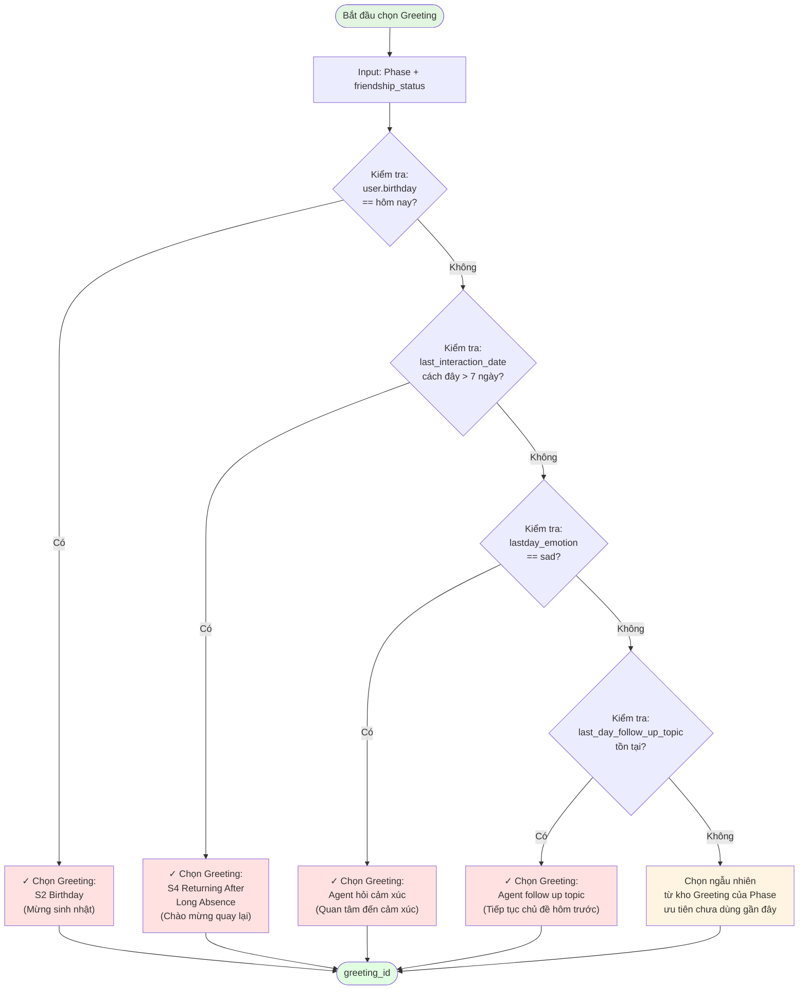
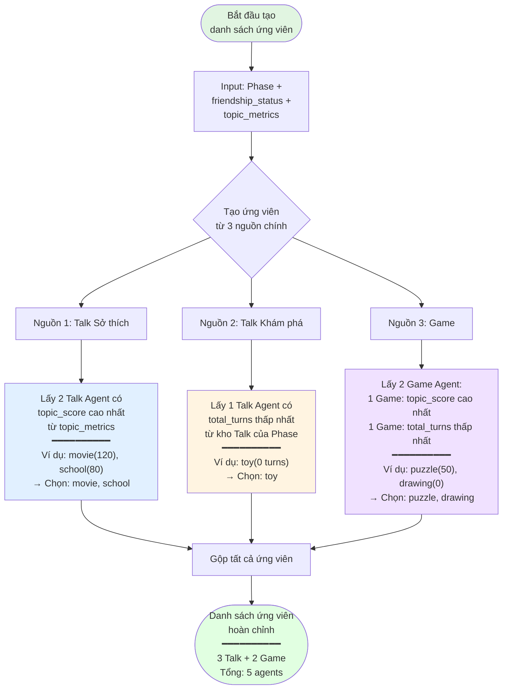

# Slide 1: Thời khắc nhạy cảm

Bối cảnh: Tuần trước (23/11-cuối T12) team AI nói riêng và phòng Product nói chung có bước vào 1 trong những thời điểm quan trọng và nhạy cảm. 
Vì còn chưa đầy 3 tuần là Robot lên đường mà 2/3 các đầu mục của Product vẫn đang đỏ từ Buddy Talk, Navigation, Memory, In session Routing, Out session Routing, ... 

Trước đó thì vào tuần trước nữa, thật may anh Hiệp đã có buổi họp với toàn toà D9 về việc phổ cập Manus => Em quay lại dùng Manus sau 1 thời gian gác kiếm vì nó hơi đau ví tiền. 

# 1. TEAM AI lên plan chiến dịch OT và EST THEO NGÀY - TUY NHIÊN MAY QUÁ OT ĐÚNG 1 BUỔI 

Đây là các đoạn tin nhắn a Cường báo từ trong tuần trước tuần diễn ra Hackathon để ae trong team chuẩn bị tâm thế. 

# 2. CON ĐƯỜNG MỊT MÙ KHI BƯỚC VÀO HACKATHON 

Tối chủ nhật a Cường nhắn cho tụi em trên nhóm, 1 loạt các tasks đầu việc, em đọc không hiểu gì cả. 

https://www.figma.com/board/HrpkNTDvHe1QyGTK2Zq85M/AI-platform?node-id=1084-3147&t=lEBmBUmgBUhBg2rS-0

## 2.1 Ngày thứ 2 (24/11) - cả team có 1 ngày họp lên các đầu việc và chia. 

Sau 1 ngày dài họp lên họp xuống, đây là cái cả team chốt lại được 1 cái ảnh figma nhìn cũng okela, nhưng mọi thứ quá rối rắm. 

Và em nhận được 3 thứ 
1. 1 buổi họp để define các phần
2. Là sơ đồ figma khá rối :; https://www.figma.com/board/HrpkNTDvHe1QyGTK2Zq85M/AI-platform?node-id=1084-3147&t=lEBmBUmgBUhBg2rS-0
3. 2 tasks a Cường assign
4. Kèm thêm 3 file logic luồng dài ơi là dài của a Minh đọc xong ngất luôn ạ: https://drive.google.com/drive/folders/15ryRPPtLNj3xHuReyePwemn8hYWqLOMl?usp=sharing

## 2.2 Giải quyết thế nào? (Tôi cần làm gì?) - Không dám estimate vì không rõ con đường - Cảm giác như cục này code chắc phải mất khoảng 2 tuần để lên được 1 bản => cảm giác này ko dám estimate luôn. 

Mô tả lại bài toán cho ae cùng nắm: 

 ‘Context Handling’ đứng giữa hệ thống On Conversation và hệ thống Orchestration, nhiệm vụ là mỗi khi kết thúc một cuộc hội thoại trong ngày thì phải:

- Thu thập đúng dữ liệu cần thiết từ các hệ thống (conversation, metrics, cảm xúc, topics…),
    
- Lưu và cập nhật vào các cấu trúc dữ liệu dài hạn như friendship status, topic metrics, dynamic memory,
    
- Chuẩn bị đúng context để ngày hôm sau các agent khác (Learn, Talk, Game, Orchestration) có thể dùng được để lên Daily Plan và chọn đúng agent cho user đó.

Tự define logic trong đầu 

1. Gồm những việc gì đã được assign ? Có 2 cục là gì ? 
2. Logic chấm điểm đọc rối cả đầu, logic chọn agent phức tạp loằng ngoằng 
3. Logic cục Context Handling như nào (khi kết thúc cuộc hội thoại thì làm sao gửi data sang bên mình, mình tự call tới BE lấy conversation_id hay gì, ...)
4. Cục context handling nối với cục AI của a Hưng như nào, lúc 3h thì mình tự động đi qua lần lượt từng conversation_id xong xử lý ở chỗ mình hay là lúc 3h bên BE sẽ call hàng loạt sang DB bên mình => thế thì DB có tèo ko? Hay là mình tự call luôn mỗi 6h. 
5. Anh Hưng bảo gửi format API đi, a Cường bảo estimate cho anh đi. 
6. Thiết kế DB như nào 

Tiện đây em sẽ mô tả lại bài toán để ace cùng tư duy ? 

# 3. Sang ngày T3 (25/11) - Dành nguyên 1 ngày để dựng kiến trúc => Cuối ngày tự tin trả EST cho a Cường là 1 ngày có demo (a Cường : 1 ngày thôi á).

Mang vào Manus define mọi thứ. 

1. Gom lại chỉ còn 1 việc là module context handing (thay vì 2 việc assign thật ra chỉ có 1 module )
2. Logic chấm điểm, chọn agent dài loằng ngoằng => Manus vẽ diagram hiểu ngay trong 1 nốt nhạc 
3. Tự define cơ chế khi end thì BE gửi trigger, 
4. Tự define được cơ chế tự xử lý conversation luôn bằng worker RabbitMQ 
5. Tự tin estimate 
6. Tự manus define kiến trúc code => đóng lại thành tài liệu chuẩn từ đầu đến cuối 

+, 1 ngày (sang T4) = 70-80% 
+, T5: Có thể demo luôn và xong 95%

### Chi tiết hơn luồng sử dụng: https://manus.im/share/e6qGLhxx4QzoIGiYLyk7qp?replay=1

#### 3️⃣ Flowchart Chi Tiết - Chọn Greeting (Priority-Based)

---

#### 4️⃣ Flowchart Chi Tiết - Tạo Danh Sách Ứng Viên

---

# 4. Thực tế khi có tấm bản đồ 

1. Tự tin trong thứ 4 đã thông được hết các phần chính trong context Handling gồm có : API cho BE, API cho anh Hưng, lên xong logic chấm điểm và logic chọn Agent = cursor => thông hết các luồng có thể demo và chỉ cần chỉnh lại logic chấm điểm là ngon 

2. Sang sáng thứ 5: bị chậm hơn dự kiến do 
   +, Phía team Product chốt và order sửa cách lưu Prompt => Sửa lại cục DB hết nguyên buổi sáng. 
   +, Tối thứ 5 vẫn kịp demo cơ mà phía BE a Việt chưa ghép thông sang (do đúng ra là cứ end 1 conversation thì bắn data sang AI, cơ mà a Việt lại bắn khi END trong workflow => Hiểu nhầm đáng tiếc). 

3. OT xuyên đêm thứ 5 để hoàn thiện các phần logic cho thứ 6 demo lúc 10h. 
- Các logic bug tính điểm tình bạn, chọn agent được update vào đêm thứ 5 đến tận 5h sáng. 
4. .....

# 5. Manus support giải các bài khác khi tự bơi trong xương mù: 

1. MECE toàn bộ các giải pháp để xử lý conversation (từ việc code cron job 6h chạy 1 lần, 3min chạy 1 lần, so với việc BE call tới chạy luôn mới trả, so với cách triển khai RabbitMQ Worker, so với khi tự code worker với việc dùng Clery có sẵn của python) ? (tự dùng Manus để brainstorm giải quyết),
2. Tiêu chuẩn Production ? Risk Production và Security (Claude + Manus)

Link Manus : https://manus.im/share/e6qGLhxx4QzoIGiYLyk7qp?replay=1

Output cuối đạt được: https://stepup-english.atlassian.net/wiki/spaces/RP/pages/1565917188/CONTEXT+HANDLING+Stress+Test+Risk+Security+-+Production

## 5.1 Kết quả đạt được: chỉ số và các phần Optimize đã có

|                      |               |               |                |              |                             |
| -------------------- | ------------- | ------------- | -------------- | ------------ | --------------------------- |
| **Metric**           | **100 Users** | **200 Users** | **Difference** | **% Change** | **Analysis**                |
| **Concurrent Users** | 100           | 200           | +100           | +100%        | Double load                 |
| **Total Requests**   | 10,294        | 11,276        | +982           | +9.5%        | Similar volume              |
| **RPS**              | 48.8 req/s    | 57.6 req/s    | +8.8           | +18%         | RPS tăng nhưng không linear |
| **95th Percentile**  | **200 ms**    | **1,700 ms**  | **+1,500**     | **+750%**    | **⚠️Major issue**           |
| **99th Percentile**  | **340 ms**    | **1,900 ms**  | **+1,560**     | **+459%**    | **⚠️Major issue**           |

|                                                                                                                                                                          |                                                                                                                                                                                                                                                                                                                                                                                                                                                                                                                                                                                                                                                                        |
| ------------------------------------------------------------------------------------------------------------------------------------------------------------------------ | ---------------------------------------------------------------------------------------------------------------------------------------------------------------------------------------------------------------------------------------------------------------------------------------------------------------------------------------------------------------------------------------------------------------------------------------------------------------------------------------------------------------------------------------------------------------------------------------------------------------------------------------------------------------------- |
| **Trước**                                                                                                                                                                | **Sau**                                                                                                                                                                                                                                                                                                                                                                                                                                                                                                                                                                                                                                                                |
| 1. **3h sáng hàng ngày call để chạy hàng loạt cron job**                                                                                                                 | **Có 2 cơ chế.**   **1. Khi BE gửi data đến, ngay lập tức trả 202 cho BE .**   **=> Chạy 1 luồng RabbitMQ bên dưới để xử lý conversation ngay lập tức. (99% API)**  2. **Vẫn có cơ chế 6h 1 lần quét các conversation ở trạng thái PENDING, FAIL => Xử lý lại. (1% API)**                                                                                                                                                                                                                                                                                                                                                                                  |
| 2. Chịu tải khi BE bắn thông tin và khi BE query lấy list bài học Agent.                                                                                                 | Hiện tại: 100 user cùng lúc với response time P95, P99 340ms   => Khi scaling có 2 cách.   C1. Tăng max_connections từ 100 → 300 trong DB qua việc chạy 1 câu lệnh (việc tăng max_connections có thể gây lãng phí tài nguyên)   C2. Scaling server load balance (DevOps xử lý)                                                                                                                                                                                                                                                                                                                                                                                |
| 3. Tốc độ và luồng xử lý CONVERSATION       Trước: 1 conversation 1 lúc => Điều gì xảy ra khi 200 user cùg xài, 1000 user cùng xài => Việc xử lý conversation kéo dài | Update   1. Update để cho phép multiple worker: WORKER_REPLICAS=10   (Với CPU 96 cores => Số lượng workers có thể lên tới N - 2N (N là số cores).      2. Update để 1 worker xử lý song song 1 message   WORKER_CONCURRENCY_PER_WORKER=10   - Vấn đề ban đầu 1 worker chỉ xử lý được 1 message (vì vấn đề code tuần tự + vấn đề nếu code song song thì bị ghi đè DB nếu 2 thread/2 message cùng xử lý 1 user_id)   +, Lost update trong update_topic_metrics (HIGH — 70–80% khi nhiều threads)  +, Lost update trong apply_score_change (MEDIUM — 30–50%)  ---  Đã xử lý: SELECT FOR UPDATE để lock row khi update cùng user_id |

---

# **How Manus Saved It (Tác động)**

**Title:** "Tại sao Manus là game-changer?"

| Vấn đề               | Traditional Approach                     | Với Manus                                                       |
| -------------------- | ---------------------------------------- | --------------------------------------------------------------- |
| Hiểu logic phức tạp  | Đọc doc 30p, vẫn bối rối                 | Vẽ diagram, hiểu ngay                                           |
| Estimate timeline    | Đoán mò, "mơ hồ", ko rõ đường đi, tự bơi | Chắc chắn 70-80-95%                                             |
| Define API contracts | Vừa làm vừa viết docs, code xong lại sửa | Define + validate giải pháp kiến trúc 1 lèo => xong code tự tin |

---

