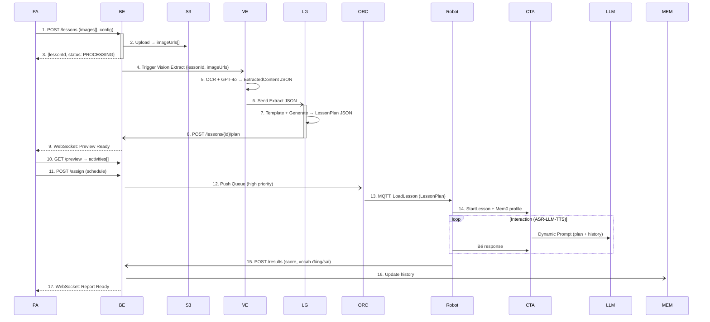

```mermaid
sequenceDiagram
    PA->>+BE: 1. POST /lessons (images[], config)
    BE->>+S3: 2. Upload → imageUrls[]
    BE-->>-PA: 3. {lessonId, status: PROCESSING}
    BE-)+VE: 4. Trigger Vision Extract (lessonId, imageUrls)
    VE->>VE: 5. OCR + GPT-4o → ExtractedContent JSON
    VE-)+LG: 6. Send Extract JSON
    LG->>LG: 7. Template + Generate → LessonPlan JSON
    LG-)-BE: 8. POST /lessons/{id}/plan
    BE-->>PA: 9. WebSocket: Preview Ready
    PA->>+BE: 10. GET /preview → activities[]
    PA->>+BE: 11. POST /assign (schedule)
    BE-)+ORC: 12. Push Queue (high priority)
    ORC->>Robot: 13. MQTT: LoadLesson (LessonPlan)
    Robot->>+CTA: 14. StartLesson + Mem0 profile
    loop Interaction (ASR-LLM-TTS)
        CTA->>LLM: Dynamic Prompt (plan + history)
        Robot->>CTA: Bé response
    end
    Robot-)+BE: 15. POST /results (score, vocab đúng/sai)
    BE-)+MEM: 16. Update history
    BE-->>PA: 17. WebSocket: Report Ready

```

