**P1 NHẤT HƯỚNG - ĐƯỜNG NÀY ĐẾN THẾ GIAN, ĐƯỜNG KIA ĐẾN NIẾT BÀN! TỲ KHEO ĐỆ TỬ PHẬT, PHẢI HIỂU BIẾT RÕ RÀNG! + TIỀN.**

**Đường này đến thế gian. Đường kia đến niết bàn, tỳ kheo đệ tử Phật, phải hiểu biết rõ ràng.**

**0. Các trường phái:**

**0.1 Cách chia hồi cấp 3 - Lớp 9-Lớp 12: Học tập (Đầu óc, chiến thuật, thời gian, hiệu suất) + PTBT (niềm tin giới hạn) + MQH (Ny và MQH với mn) + Sức khoẻ, chiều cao.**

**0.2 Khi học BKE thì chia: Thân Tâm Trí. Đạo Đức - Trí Tuệ - Nghị Lực (cũng là cách chia thời gian đầu của các kênh Youtube của mình).**

1.                   Kênh Trí Tuệ => Sau này thành: Rèn Trí + GOSINGA + Nhân sự kế thừa

2.                   Kênh Nghị Lực => Sau thành: Tự học Rèn Nghị Lực: Gồm X3 năng suất + kỷ luật +

3.                   Kênh Đạo Đức => Sau thành: Team (Xây dựng đội ngũ, TYHN là 1 đội ngũ, nuôi dạy con là 1 đội ngũ). 

4.                   Tâm lý học và Huyền học

5.                   Thân => Sức khoẻ

|   |
|---|
|2 năm đầu theo BKE, các kênh youtube <=> Chia các học phần các kênh, thành ra là: đập đi xây lại rất nhiều lần. Đi GOSINGA về lại đập đi 1 lần nữa và đập cực lớn.  <br>+, Sau khi đi GOSINGA được 1 năm thì mình tu tập rốt ráo và xây các kho ở kênh: Đạo Phật Thật (là kênh Rèn Trí Tuệ trước đây) (tức T4/2023 - T6/2024).  <br>+, Sau đó đi làm từ T6/2024 - Hiện tại T2/2026 (Sau 1 năm rưỡi đi làm).|

**0.3 Hệ thống các trường phái: Pháp + Tâm lý học (Growth mindset, selfhelp, NLP) - 21/02/2026**

|   |   |   |   |   |   |
|---|---|---|---|---|---|
|Nhóm MECE|Trường Phái|Định Nghĩa & Nền Tảng Chính|Phương Pháp Tiêu Biểu|Tính Khoa Học & Bằng Chứng|Chứng Minh "10x Dễ Hơn 2x"|
|**Khoa học Nền tảng**|**Tâm lý học**|Nghiên cứu hành vi và tâm trí con người dựa trên bằng chứng thực nghiệm. Bao gồm các trường phái như hành vi, nhận thức, nhân văn [2].|Phân tích, liệu pháp có kiểm chứng (CBT, Goal Setting Theory) [3].|Cao, peer-reviewed, hàng trăm nghiên cứu [3].|**Goal Setting Theory:** Mục tiêu 10x đủ lớn để kích hoạt toàn bộ tiềm năng, giảm "cognitive load" do ít lựa chọn, và tạo ra "intrinsic motivation" mạnh mẽ hơn 2x [3].|
||**Growth Mindset**|Tư duy hoặc khung suy nghĩ cá nhân (fixed vs growth), ảnh hưởng đến cách tiếp cận thử thách [2]. Phát triển bởi Carol Dweck, dựa trên nghiên cứu thực nghiệm về khả năng phát triển của não bộ [4].|Thay đổi nhận thức dài hạn, tập trung vào nỗ lực và học hỏi từ thất bại [4].|Có nghiên cứu hỗ trợ (RCT GPA+30%), nhưng hiệu quả replication hạn chế ở quy mô lớn [4].|**Neuroplasticity:** 10x tạo đủ thách thức để kích hoạt sự phát triển của não bộ, biến thất bại thành bài học quý giá, trong khi 2x quá dễ để học hỏi [1].|
|**Phương pháp Ứng dụng**|**NLP (Lập trình Ngôn ngữ Tư duy)**|Phương pháp giả khoa học do Richard Bandler và John Grinder sáng lập, dựa trên thần kinh học, ngôn ngữ học và lập trình hành vi để thay đổi tư duy nhanh chóng [2].|Kỹ thuật nhanh (neo cảm xúc, reframing, Disney Strategy) [1].|Giả khoa học, tranh cãi, hiệu quả mờ dài hạn [2].|**Tái lập trình vô thức:** 10x buộc phải phá vỡ "limiting beliefs" (niềm tin giới hạn) rằng chỉ có thể đạt 2x, tạo ra một "bản đồ" tư duy mới, kích hoạt tiềm năng vô thức [1].|
||**Self-help**|Phong trào sách vở, hội thảo hướng dẫn tự cải thiện qua lời khuyên thực tiễn, kinh nghiệm cá nhân [2].|Lời khuyên, sách vở, hội thảo, quy tắc hành động (10x Rule của Grant Cardone) [1].|Ít bằng chứng khoa học, dựa trên giai thoại và kinh nghiệm cá nhân [2].|**Loại bỏ 80% nhiễu:** 10x buộc phải cắt bỏ 80% những việc kém hiệu quả, chỉ giữ lại 20% cốt lõi mang lại đòn bẩy cao, đơn giản hóa hành động [1].|
|**Triết lý & Tâm linh**|**Đạo học (BKE/GNH)**|Kết hợp đạo đức-trí tuệ-nghị lực, đưa đạo vào đời qua 3 gốc rễ, xây dựng cộng đồng tử tế [1].|Hành trình thấu hiểu bản thân, xây dựng giá trị cốt lõi, phát triển cộng đồng [1].|Triết lý cá nhân, kết hợp khoa học và đạo đức [1].|**Sức mạnh nội tại & Cộng đồng:** 10x được hỗ trợ bởi đạo đức, trí tuệ, nghị lực và cộng đồng tử tế, tạo ra sức mạnh tổng hợp bền vững hơn nỗ lực cá nhân 2x [1].|
||**Pháp (Gosinga)**|Thiền Tứ Niệm Xứ Phật giáo, chấm dứt khổ tâm, chú tâm liên tục  [1].|Bát chánh đạo, làm mọi việc với không thích, không chán ghét, không khổ [1].|Truyền thống Phật giáo, kinh điển [1].|**Buông bỏ & Chú tâm:** 10x trở nên dễ dàng hơn khi buông bỏ 80% phiền não, dồn 100% chú tâm vào 20% cốt lõi, đạt năng suất tự nhiên và an lạc, tránh kiệt sức như khi cố gắng 2x [1].|
||**Huyền học (Law of Attraction)**|Vũ trụ rung động theo tần số: Visualize 10x như đã có → thu hút cơ hội, tiền bạc [1].|Visualize, vision board, cảm ơn trước, cảm nhận 5 giác quan [1].|Không có bằng chứng khoa học, thiếu hành động cụ thể [1].|**Kích hoạt tiềm năng vũ trụ:** 10x dễ hơn vì tạo ra cảm xúc tích cực, thu hút nguồn lực và cơ hội từ vũ trụ, trong khi 2x chỉ dựa vào nỗ lực cá nhân [1].|

**So Sánh NLP với Tâm Lý Học Evidence-Based**

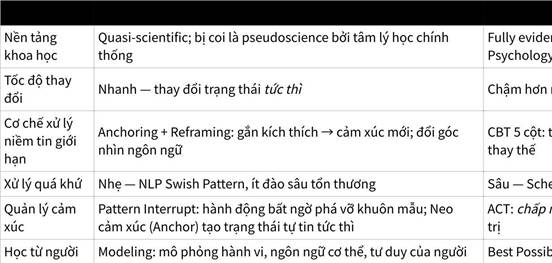

**Click the image to view the sheet.**

|   |   |   |
|---|---|---|
|Điểm chung|NLP (Adam Khoo)|P2/P3/P5 (Evidence-Based)|
|**Niềm tin giới hạn là rào cản chính**|Không phải thiếu kỹ năng hay may mắn — cần tái lập trình tư duy|Nhiệt kế tài chính, niềm tin cốt lõi kìm hãm tiềm năng|
|**Visualization**|Lập trình não bộ qua hình ảnh & giác quan|Kỹ thuật _Best Possible Self_ kiến tạo nhân dạng tương lai|
|**Trạng thái tâm lý quyết định hành vi**|Gọi là **"State"** — quản lý trạng thái tức thì|Gọi là **"Cognitive-Emotional State"** trong mô hình ABC|
|**Hành động kiên trì > Cảm hứng nhất thời**|Phê phán motivation bề mặt, nhấn mạnh hệ thống|Phân biệt rõ Coaching vs Motivation ngay Chương 1|

**Phân loại MECE về Tâm lý học**

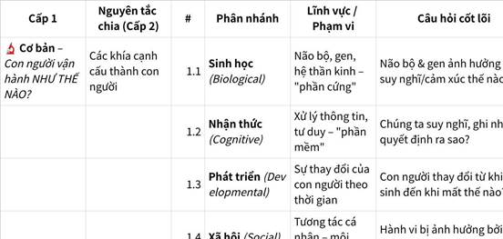

**Click the image to view the sheet.**

**0.4 1 cách chia khác (ma trận phát triển con người) theo KIẾN TẠO - SỬA CHỮA và NỘI - NGOẠI**

|   |
|---|
|1.                   **Không Trùng Lặp (Mutually Exclusive):** Mỗi góc phần tư có một cặp (Focus, Objective) độc nhất.<br><br>￮      Góc 1: (Nội tại, Kiến tạo)<br><br>￮      Góc 2: (Ngoại vi, Kiến tạo)<br><br>￮      Góc 3: (Nội tại, Sửa chữa)<br><br>￮      Góc 4: (Ngoại vi, Sửa chữa)<br><br>Bạn không thể vừa "Nội tại" vừa "Ngoại vi" tại cùng một điểm, cũng không thể vừa "Sửa chữa" vừa "Kiến tạo" cho cùng một mục tiêu. Các ranh giới rất rõ ràng.|

|   |   |   |
|---|---|---|
||**NỘI TẠI (Internal Focus)** _(Tập trung vào thế giới bên trong: suy nghĩ, cảm xúc, niềm tin)_|**NGOẠI VI (External Focus)** _(Tập trung vào thế giới bên ngoài: hành vi, kỹ năng, mối quan hệ)_|
|**KIẾN TẠO (Building)** _(Từ 0 → +5)_|**Góc 1: Tối Ưu Hóa Nội Lực**  <br>  <br>**Mục tiêu:** Khai phá và phát huy tiềm năng sẵn có.  <br>**Câu hỏi cốt lõi:** "Làm sao để tôi trở thành phiên bản tốt nhất của chính mình?"  <br> **Lĩnh vực:** Tâm lý học Tích cực, Khám phá Điểm mạnh, Hệ giá trị, Lý tưởng sống, Trạng thái "Dòng chảy" (Flow).  <br>**Giải quyết:** Mất phương hướng, cảm giác trống rỗng, muốn tìm ra "vùng thiên tài".|**Góc 2: Mở Rộng Tầm Ảnh Hưởng**  <br>  <br>**Mục tiêu:** Xây dựng và thể hiện giá trị ra bên ngoài. **Câu hỏi cốt lõi:** "Làm sao để tôi tạo ra tác động và dẫn dắt người khác?"  <br>**Lĩnh vực:** Tâm lý học Lãnh đạo, Xây dựng Thương hiệu cá nhân, Nghệ thuật Giao tiếp & Thuyết phục, Đàm phán.  <br>**Giải quyết:** Thiếu kỹ năng lãnh đạo, sợ bán hàng, muốn xây dựng sức ảnh hưởng.|
|**SỬA CHỮA (Fixing)** _(Từ -5 → 0)_|**Góc 3: Tái Lập Cân Bằng** **Mục tiêu:** Chữa lành và ổn định thế giới nội tâm.  <br>**Câu hỏi cốt lõi:** "Điều gì bên trong đang ngăn cản tôi?"  <br>**Lĩnh vực:** Tâm lý học Phân tâm (hiểu gốc rễ), Liệu pháp Nhận thức-Hành vi (CBT - thay đổi suy nghĩ), Chánh niệm (Mindfulness).  <br>**Giải quyết:** Overthinking, lo âu, tự ti, niềm tin giới hạn, tổn thương quá khứ.|**Góc 4: Điều Chỉnh Hành Vi** **Mục tiêu:** Thay đổi các hành vi không hiệu quả.  <br>**Câu hỏi cốt lõi:** "Tôi cần làm gì khác đi để có kết quả tốt hơn?"  <br>**Lĩnh vực:** Tâm lý học Hành vi, Kỹ thuật tạo & bỏ thói quen, Quản lý thời gian, Kỹ năng giải quyết xung đột.  <br>**Giải quyết:** Trì hoãn, thói quen xấu, mâu thuẫn với người khác, quản lý công việc kém.|

|   |   |   |
|---|---|---|
||THẾ GIỚI NỘI TẠI (Internal)|THẾ GIỚI NGOẠI VI (External)|
|QUÁ KHỨ  <br>Hành động: Phân Tích & Giải Mã<br><br>Phân tích (Quá khứ): Dọn dẹp "mảnh đất" tâm hồn khỏi cỏ dại và sỏi đá của niềm tin cũ.<br><br>**Giai đoạn 1: CLARITY (Sáng tỏ) - Giải Mã & Chữa Lành**<br><br>**Quá khứ (Góc 1 & 4):** Nhận diện niềm tin giới hạn, vết thương tiềm thức, mô thức hành vi cũ.<br><br>•                     **Công cụ:** Ghi chép Suy nghĩ Tự động, Đối thoại với Đứa trẻ bên trong, Phân tích Giao dịch.<br><br>•                     **Kết quả:** Sự bình an, tự do khỏi gánh nặng của quá khứ.|Góc 1: Giải Mã Niềm Tin Gốc & Vết Thương Tiềm Thức  <br>  <br>Mục tiêu & Câu hỏi cốt lõi:  <br>• Mục tiêu: Nhận diện những niềm tin giới hạn sâu sắc (Limiting Beliefs) đang chi phối hành vi và cảm xúc.  <br>• Câu hỏi: "Niềm tin nào về bản thân/người khác/thế giới đang kìm hãm mình?", "Lần đầu tiên mình hình thành niềm tin này là khi nào?", "Niềm tin này tạo ra lời tiên tri tự ứng nghiệm nào trong cuộc sống mình?"  <br>  <br>Công cụ & Lý thuyết:  <br>• Phân tâm học (Psychoanalysis): Khám phá những mô thức vô thức từ quá khứ.  <br>• Lý thuyết Gắn bó (Attachment Theory - Bowlby): Hiểu cách các mối quan hệ sơ khai định hình mô hình làm việc nội tại.  <br>• Schema Therapy: Xác định các "lược đồ sớm thích nghi" (early maladaptive schemas) hình thành từ tuổi thơ.  <br>• Khái niệm "Đứa trẻ bên trong" (Inner Child): Kết nối với những nhu cầu chưa được đáp ứng từ quá khứ.  <br>  <br>Ví dụ & Dẫn chứng:  <br>• VD1 (Tài chính): Người luôn giữ thu nhập ở mức 150 triệu/năm vì gia đình có niềm tin "Người giàu là tham lam". Lời tiên tri: Mỗi khi có cơ hội tăng thu nhập, họ vô thức tự hủy hoại nó để giữ "vùng an toàn".  <br>• VD2 (Lãnh đạo): Quản lý ôm đồm tất cả việc vì niềm tin gốc "Mình chỉ có giá trị khi mình bận rộn liên tục" (từ cha mẹ luôn khen khi làm việc chăm chỉ).  <br>• VD3 (Mối quan hệ): Người sợ bị từ chối trong các mối quan hệ vì gắn bó lo âu từ thời thơ ấu (cha mẹ không ổn định). Niềm tin: "Nếu mình yêu ai, họ sẽ bỏ mình".  <br>• VD4 (Sự nghiệp): Người không dám nói lên ý kiến trong cuộc họp vì niềm tin "Ý kiến của mình không quan trọng" (từ việc bị phớt lờ khi còn nhỏ).  <br>• VD5 (Sức khỏe): Người không thể duy trì thói quen tập thể dục vì niềm tin "Mình thiếu kỷ luật" (từ việc bị chỉ trích khi không hoàn thành việc).  <br>• VD6 (Sáng tạo): Người không dám chia sẻ tác phẩm của mình vì niềm tin "Tôi không có khả năng sáng tạo" (từ việc bị chê bai trong quá khứ).  <br>  <br>Bằng chứng khoa học:  <br>Lý thuyết Gắn bó của Bowlby (1988) chỉ ra rằng chất lượng mối quan hệ sơ khai tạo ra "mô hình làm việc nội tại" định hình cách chúng ta kết nối với người khác và bản thân suốt đời. Schema Therapy (Young) chứng minh rằng các "lược đồ sớm thích nghi" hình thành từ tuổi thơ có thể được xác định và sửa chữa thông qua can thiệp tâm lý.|Góc 4: Phân Tích Mô Thức Tương Tác & Hành vi Học Hỏi Từ Quá Khứ  <br>  <br>Mục tiêu & Câu hỏi cốt lõi:  <br>• Mục tiêu: Hiểu cách vận hành các mô thức hành vi, giao tiếp và tương tác được học hỏi từ quá khứ.  <br>• Câu hỏi: "Mô thức giao tiếp của mình là gì (Thụ động, Tích cực, Xâm lấn)?", "Tôi đóng vai trò gì trong các mối quan hệ (Nạn nhân, Kẻ cứu rỗi, Kẻ bức hại)?", "Cách mình phản ứng khi bị từ chối/thất bại là gì?"  <br>  <br>Công cụ & Lý thuyết:  <br>• Phân tích Giao dịch (Transactional Analysis - TA): Nhận diện các "trạng thái tự ta" (Cha/Mẹ, Người lớn, Đứa trẻ) mình đang sử dụng.  <br>• Lý thuyết Học hỏi Xã hội (Social Learning Theory): Hiểu cách mình học hỏi hành vi từ mô hình và môi trường xung quanh.  <br>• Mô hình Giao tiếp Assertiveness: Phân biệt giữa giao tiếp thụ động, tích cực và xâm lấn.  <br>• Tam giác Karpman (Karpman Drama Triangle): Nhận diện các vai trò độc hại trong mối quan hệ.  <br>  <br>Ví dụ & Dẫn chứng:  <br>• VD1 (Công việc): Nhân viên luôn đóng vai "Đứa trẻ ngoan" (Adapted Child) trước sếp, chỉ biết vâng lời. Kết quả: Không dám đề xuất ý tưởng, không tạo ra giá trị đột phá.  <br>• VD2 (Mối quan hệ): Người đóng vai "Kẻ cứu rỗi" (Rescuer) trong tam giác Karpman, luôn làm thay việc cho đối phương. Kết quả: Kiệt sức, cảm thấy không được đánh giá.  <br>• VD3 (Lãnh đạo): Quản lý sử dụng giao tiếp xâm lấn (Aggressive) vì học hỏi từ cha mẹ cũng như vậy. Kết quả: Đội nhóm sợ hãi, không dám chia sẻ ý kiến.  <br>• VD4 (Tài chính): Người sử dụng giao tiếp thụ động khi đàm phán lương. Kết quả: Luôn nhận mức lương thấp hơn thị trường.  <br>• VD5 (Sáng tạo): Người học hỏi từ gia đình rằng "Thất bại là xấu hổ". Kết quả: Không dám thử cái gì mới, không có sáng tạo.  <br>• VD6 (Sức khỏe): Người học hỏi mô thức "Tự chăm sóc là ích kỷ" từ gia đình. Kết quả: Luôn ưu tiên người khác, bỏ qua sức khỏe của chính mình.  <br>  <br>Bằng chứng khoa học:  <br>Lý thuyết Học hỏi Xã hội (Bandura) chỉ ra rằng con người học hỏi hành vi chủ yếu thông qua quan sát và mô phỏng các mô hình. Phân tích Giao dịch (Harris) chứng minh rằng chúng ta có thể nhận diện và thay đổi các "trạng thái tự ta" để cải thiện giao tiếp.|
|HIỆN TẠI  <br>Hành động: Can Thiệp & Tái Cấu Trúc<br><br>Can thiệp (Hiện tại): Vun xới, bón phân bằng cách thay đổi nhận thức và thiết kế công cụ tạo giá trị mới.<br><br>**Giai đoạn 2: CONFIDENCE (Tự tin) - Tái Cấu Trúc & Kiến Tạo**<br><br>**Hiện tại (Góc 2 & 5):** Thay đổi suy nghĩ tiêu cực, xây dựng kỹ năng mới, tạo thói quen tích cực.<br><br>•                     **Công cụ:** CBT, ACT, Exposure Therapy, Habit Building, Lắng nghe Chủ động.<br><br>•                     **Kết quả:** Sự tự tin dựa trên hành động cụ thể, không phải tự tin mù quáng.|Góc 2: Tái Cấu Trúc Nhận Thức & Quản Lý Cảm Xúc Hiện Tại  <br>  <br>Mục tiêu & Câu hỏi cốt lõi:  <br>• Mục tiêu: Thay đổi các suy nghĩ tiêu cực tự động (Automatic Negative Thoughts) và quản lý cảm xúc ngay lúc này.  <br>• Câu hỏi: "Suy nghĩ tự động nào đang ngăn cản mình?", "Suy nghĩ này có dựa trên bằng chứng thực tế không?", "Nếu một người bạn thân gặp tình huống này, mình sẽ nói gì với họ?"  <br>  <br>Công cụ & Lý thuyết:  <br>• CBT (Cognitive Behavioral Therapy): Mô hình ABC - Sự kiện → Suy nghĩ → Cảm xúc → Hành vi.  <br>• Kỹ thuật Ghi chép Suy nghĩ Tự động (Thought Record): Bắt giữ, thách thức và tái cấu trúc suy nghĩ tiêu cực.  <br>• ACT (Acceptance & Commitment Therapy): Chấp nhận cảm xúc tiêu cực nhưng vẫn hành động theo giá trị.  <br>• Chánh niệm (Mindfulness): Quan sát suy nghĩ và cảm xúc mà không bị chúng cuốn đi.  <br>• Kỹ thuật "Trở thành Thám tử": Tìm kiếm bằng chứng ủng hộ và chống lại suy nghĩ tự động.  <br>  <br>Ví dụ & Dẫn chứng:  <br>• VD1 (Công việc): Sếp chau mày khi bạn trình bày → Suy nghĩ: "Ý tưởng của mình tệ" → Cảm xúc: Xấu hổ (90/100). Can thiệp: Tìm bằng chứng chống lại (Sếp vừa có cuộc gọi gấp, tuần trước khen ý tưởng của bạn) → Suy nghĩ mới: "Sếp có thể bận, không nhất thiết là ý tưởng tệ" → Cảm xúc: Bớt xấu hổ (40/100).  <br>• VD2 (Mối quan hệ): Bạn không nhắn tin → Suy nghĩ: "Họ không quan tâm đến mình" → Cảm xúc: Lo lắng, cô đơn. Can thiệp: Bằng chứng chống lại (Họ rất bận, tuần trước vừa nhắn tin cho bạn) → Suy nghĩ mới: "Họ có thể bận, không phải không quan tâm".  <br>• VD3 (Sự nghiệp): Bị từ chối một dự án → Suy nghĩ: "Mình không đủ giỏi" → Cảm xúc: Tuyệt vọng. Can thiệp: Bằng chứng chống lại (Đã hoàn thành 10 dự án thành công, lần này chỉ là dự án không phù hợp) → Suy nghĩ mới: "Đây không phải là dự án phù hợp, không phải là lỗi của mình".  <br>• VD4 (Sức khỏe): Bỏ tập thể dục một ngày → Suy nghĩ: "Mình thiếu kỷ luật, sẽ không bao giờ thay đổi" → Cảm xúc: Bất lực. Can thiệp: ACT - Chấp nhận cảm xúc bất lực nhưng vẫn tập thể dục ngày hôm sau. Suy nghĩ mới: "Một ngày bỏ không có nghĩa là thất bại toàn bộ".  <br>• VD5 (Tài chính): Nghĩ về mục tiêu 1.5 tỷ → Suy nghĩ: "Không thể nào, mình không xứng đáng" → Cảm xúc: Sợ hãi, choáng ngợp. Can thiệp: Tìm bằng chứng (Có người từ hoàn cảnh tương tự đã thành công, mình đã đạt được những mục tiêu khác trước đây) → Suy nghĩ mới: "Nó khó nhưng hoàn toàn có thể nếu có kế hoạch đúng".  <br>• VD6 (Sáng tạo): Hoàn thành một bài viết → Suy nghĩ: "Nó không tốt, mọi người sẽ chế cười" → Cảm xúc: Xấu hổ, sợ. Can thiệp: ACT - Chấp nhận nỗi sợ nhưng vẫn chia sẻ. Suy nghĩ mới: "Hoàn thành hơn hoàn hảo, phản hồi sẽ giúp mình cải thiện".  <br>  <br>Bằng chứng khoa học:  <br>Meta-analysis của Hofmann et al. (2012) tổng hợp hơn 300 nghiên cứu chỉ ra rằng CBT có hiệu quả rất cao (Cohen's d = 0.95) cho các rối loạn lo âu, trầm cảm và các vấn đề tâm lý khác. ACT cũng được chứng minh hiệu quả trong việc giúp con người chấp nhận cảm xúc tiêu cực nhưng vẫn hành động theo giá trị (Hayes et al., 2012).|Góc 5: Tái Cấu Trúc Hành Vi & Xây Dựng Kỹ Năng Sống Mới  <br>  <br>Mục tiêu & Câu hỏi cốt lõi:  <br>• Mục tiêu: Thay đổi hành vi cụ thể, xây dựng kỹ năng mới và tạo ra các thói quen tích cực để hỗ trợ mục tiêu.  <br>• Câu hỏi: "Hành động nhỏ nào mình có thể làm ngay bây giờ để thay đổi tình huống?", "Kỹ năng nào mình cần học để vượt qua vấn đề này?", "Thói quen nào mình cần xây dựng để duy trì tiến bộ?"  <br>  <br>Công cụ & Lý thuyết:  <br>• Tâm lý học Hành vi (Behavioral Psychology): Sử dụng nguyên tắc tăng cường (Reinforcement) và hình thành thói quen.  <br>• Kỹ thuật Tiếp cận từng bước (Exposure Therapy): Đối mặt dần dần với nỗi sợ thay vì tránh né.  <br>• Mô hình Thói quen (Habit Loop): Cue → Routine → Reward. Xác định và thay đổi các thói quen tiêu cực.  <br>• Kỹ thuật SMART Goals: Đặt mục tiêu cụ thể, đo lường được, có thể đạt được, liên quan, có thời hạn.  <br>• Lắng nghe Chủ động (Active Listening): Kỹ năng giao tiếp để xây dựng mối quan hệ tốt hơn.  <br>  <br>Ví dụ & Dẫn chứng:  <br>• VD1 (Sợ nói trước công chúng): Thay vì tránh né, bắt đầu với các nhóm nhỏ (5 người), sau đó tăng dần (20 người), cuối cùng là 100 người. Mỗi lần thành công, não bộ sẽ giảm nỗi sợ hãi (Exposure Therapy).  <br>• VD2 (Mối quan hệ): Xây dựng kỹ năng Lắng nghe Chủ động - Thay vì ngắt lời, hãy lắng nghe đầy đủ, phản hồi bằng cách paraphrase lại điều họ vừa nói. Kết quả: Mối quan hệ sâu sắc hơn, người khác cảm thấy được hiểu.  <br>• VD3 (Quản lý thời gian): Thay vì ôm đồm tất cả, bắt đầu với một nhiệm vụ quan trọng nhất mỗi ngày (Pareto Principle - 80/20). Xây dựng thói quen "Deep Work" 90 phút mỗi sáng.  <br>• VD4 (Tài chính): Thay vì chỉ làm việc lương, bắt đầu tạo ra một sản phẩm phụ (Side project) vào cuối tuần. Sau 3 tháng, nó có thể tạo ra thu nhập bổ sung. Đây là bước đầu tiên để chuyển từ "thời gian đổi tiền" sang "giá trị đổi tiền".  <br>• VD5 (Sức khỏe): Thay vì đặt mục tiêu "Tập thể dục mỗi ngày", hãy đặt mục tiêu SMART: "Tập thể dục 30 phút vào 6h30 sáng, 3 ngày/tuần (Thứ 2, 4, 6) trong 12 tuần tới". Gắn nó vào một thói quen hiện tại (Habit Stacking): Sau khi uống cà phê, tôi sẽ tập thể dục.  <br>• VD6 (Sáng tạo): Xây dựng thói quen viết/vẽ/sáng tạo 30 phút mỗi ngày. Bắt đầu nhỏ (30 phút), không cần hoàn hảo. Sau 21 ngày, nó sẽ trở thành một phần của bạn.  <br>  <br>Bằng chứng khoa học:  <br>Lý thuyết Thói quen (Duhigg, 2012) chỉ ra rằng thói quen được hình thành thông qua Habit Loop (Cue-Routine-Reward). Exposure Therapy được chứng minh hiệu quả cao trong việc giảm phobia và lo âu (Barlow et al., 2004). Nghiên cứu của Lally et al. (2009) chỉ ra rằng cần trung bình 66 ngày để hình thành một thói quen mới.|
|TƯƠNG LAI  <br>Hành động: Kiến Tạo & Cống Hiến<br><br>Kiến tạo (Tương lai): Gieo hạt giống nhân dạng mới và xây dựng "khu vườn" tầm ảnh hưởng rực rỡ.<br><br>**Giai đoạn 3: CONTRIBUTION (Cống Hiến) - Xây Dựng Tầm Ảnh Hưởng**<br><br>**Tương lai (Góc 3 & 6):** Xây dựng nhân dạng mới, tầm nhìn rõ ràng, tạo ra tác động cho cộng đồng.<br><br>•                     **Công cụ:** Best Possible Self, Visualization, Personal Branding, Circle of Influence, Active Listening.<br><br>•                     **Kết quả:** Ý nghĩa sâu sắc, ảnh hưởng bền vững, hạnh phúc thực sự.|Góc 3: Kiến Tạo Tầm Nhìn & Nhân Dạng Mới Tương Lai  <br>  <br>Mục tiêu & Câu hỏi cốt lõi:  <br>• Mục tiêu: Xây dựng một bản sắc cá nhân mới, một tầm nhìn rõ ràng về con người bạn muốn trở thành.  <br>• Câu hỏi: "Nếu đã vượt qua vấn đề này, mình sẽ trở thành ai?", "Giá trị cốt lõi nào sẽ dẫn dắt mình?", "Phiên bản tốt nhất của mình trông ra sao?"  <br>  <br>Công cụ & Lý thuyết:  <br>• Tâm lý học Tích cực (Positive Psychology - Seligman): Từ "sửa chữa vấn đề" sang "xây dựng điểm mạnh".  <br>• Bài tập "Bản thân Tốt nhất Có thể" (Best Possible Self): Hình dung chi tiết tương lai mong muốn.  <br>• Kỹ thuật Hình dung (Visualization): Sử dụng tưởng tượng để lập trình não bộ cho thành công.  <br>• Xác định Giá trị Cốt lõi (Core Values): Tìm ra 5 giá trị nền tảng để làm la bàn.  <br>• Tuyên ngôn Nhân dạng (Identity Affirmations): Viết những khẳng định về con người bạn muốn trở thành ở thì hiện tại.  <br>  <br>Ví dụ & Dẫn chứng:  <br>• VD1 (Lãnh đạo): Hình dung chi tiết cảm giác tự tin khi dẫn dắt một cuộc họp, cảm nhận sự tôn trọng từ đội nhóm. Viết tuyên ngôn: "Tôi là một nhà lãnh đạo dám chấp nhận rủi ro, lắng nghe chân thành và xây dựng môi trường an toàn cho đội nhóm".  <br>• VD2 (Mối quan hệ): Hình dung một mối quan hệ sâu sắc, nơi cả hai người đều cảm thấy được hiểu và chấp nhận. Xác định giá trị: "Sự chân thành", "Sự kết nối", "Sự tôn trọng".  <br>• VD3 (Sự nghiệp): Hình dung bản thân 5 năm nữa, đang làm công việc có ý nghĩa, được công nhận về chuyên môn. Viết tuyên ngôn: "Tôi là một chuyên gia được tin tưởng, luôn học hỏi và chia sẻ kiến thức".  <br>• VD4 (Tài chính): Hình dung chi tiết cảm giác khi đạt 1.5 tỷ - không chỉ con số, mà là tự do, khả năng giúp đỡ gia đình, sự tự tin. Viết tuyên ngôn: "Tôi là người tạo ra giá trị đột phá, xứng đáng với sự thịnh vượng".  <br>• VD5 (Sức khỏe): Hình dung bản thân khỏe mạnh, đầy năng lượng, có thể chơi với con em mà không mệt. Giá trị: "Sức khỏe", "Sự chủ động", "Tình yêu gia đình".  <br>• VD6 (Sáng tạo): Hình dung bản thân đang chia sẻ tác phẩm của mình trước 500 người, nhận được phản hồi tích cực. Tuyên ngôn: "Tôi là một người sáng tạo dũng cảm, chia sẻ công việc của mình mà không sợ hãi".  <br>  <br>Bằng chứng khoa học:  <br>Nghiên cứu của Sheldon & Lyubomirsky (2006) chỉ ra rằng bài tập "Bản thân Tốt nhất Có thể" tăng cường lạc quan và hạnh phúc đáng kể. Visualization được chứng minh hiệu quả trong thể thao (Athletes sử dụng nó để cải thiện hiệu suất). Seligman (2011) chỉ ra rằng sống theo giá trị cốt lõi tạo ra hạnh phúc bền vững hơn so với đạt được các mục tiêu vật chất.|Góc 6: Thiết Kế Tầm Ảnh Hưởng & Cống Hiến Cho Cộng Đồng  <br>  <br>Mục tiêu & Câu hỏi cốt lõi:  <br>• Mục tiêu: Xây dựng vị thế, mạng lưới quan hệ và khả năng tạo ra tác động tích cực cho người khác và cộng đồng.  <br>• Câu hỏi: "Mình muốn được biết đến vì điều gì?", "Ai là những người mình muốn kết nối?", "Làm sao mình có thể giúp đỡ người khác vượt qua vấn đề tương tự?"  <br>  <br>Công cụ & Lý thuyết:  <br>• Xây dựng Thương hiệu Cá nhân (Personal Branding): Định vị độc bản, tạo giá trị, xây dựng lòng tin.  <br>• Lãnh đạo dựa trên Giá trị (Values-Based Leadership): Ảnh hưởng người khác thông qua sự chân thành và giá trị.  <br>• Vòng tròn Ảnh hưởng (Circle of Influence - Covey): Tập trung vào những gì bạn có thể kiểm soát để mở rộng ảnh hưởng.  <br>• Kỹ thuật Lắng nghe Chủ động (Active Listening): Xây dựng mối quan hệ sâu sắc, tạo ra lòng tin.  <br>• Cỗ máy Nội dung (Content Machine): Chia sẻ kiến thức, tạo giá trị cho cộng đồng.  <br>  <br>Ví dụ & Dẫn chứng:  <br>• VD1 (Lãnh đạo): Thay vì chỉ quản lý, bắt đầu đầu tư vào sự phát triển của từng nhân viên. Tổ chức các buổi mentoring, chia sẻ kiến thức. Kết quả: Đội nhóm trở thành những lãnh đạo tương lai, công ty phát triển bền vững.  <br>• VD2 (Mối quan hệ): Từ việc chỉ quan tâm đến bản thân, bắt đầu thực hành Lắng nghe Chủ động với đối phương, hỏi về nhu cầu và mong muốn của họ. Kết quả: Mối quan hệ sâu sắc, cả hai cảm thấy được hiểu.  <br>• VD3 (Sự nghiệp): Viết một cuốn sách hoặc Ebook về chuyên môn của mình. Chia sẻ trên LinkedIn, tổ chức các buổi workshop miễn phí. Kết quả: Trở thành chuyên gia được công nhận, thu hút các cơ hội tốt hơn.  <br>• VD4 (Tài chính): Khi đạt được 1.5 tỷ, bắt đầu mentoring cho những người muốn tăng thu nhập. Chia sẻ lộ trình, kỹ năng, kinh nghiệm. Kết quả: Tạo ra ảnh hưởng lớn, xây dựng cộng đồng, tìm thấy ý nghĩa sâu sắc.  <br>• VD5 (Sức khỏe): Từ việc chỉ tập thể dục cho bản thân, bắt đầu chia sẻ lộ trình tập luyện, kết bạn với những người cùng mục tiêu, tạo một nhóm hỗ trợ. Kết quả: Cộng đồng khỏe mạnh hơn, bạn có động lực bền vững hơn.  <br>• VD6 (Sáng tạo): Chia sẻ tác phẩm trên các nền tảng, tạo một cộng đồng những người sáng tạo. Mentoring những người mới bắt đầu. Kết quả: Tạo ra một phong trào sáng tạo, tìm thấy ý nghĩa trong việc giúp đỡ người khác.  <br>  <br>Bằng chứng khoa học:  <br>Covey (1989) chỉ ra rằng những người tập trung vào Vòng tròn Ảnh hưởng của họ sẽ mở rộng ảnh hưởng và tạo ra sự thay đổi tích cực. Seligman (2011) chứng minh rằng việc cống hiến cho cộng đồng tạo ra hạnh phúc và ý nghĩa sâu sắc hơn so với việc chỉ tập trung vào lợi ích cá nhân. Các nghiên cứu về "Giver's Gain" chỉ ra rằng những người chia sẻ kiến thức và giúp đỡ người khác thường nhận được nhiều cơ hội và mối quan hệ tốt hơn.|

Phân Biệt Các Phương Pháp: Coaching, Therapy, và Motivation**

Để bắt đầu, chúng ta cần làm rõ sự khác biệt cốt lõi giữa ba người bạn đồng hành phổ biến nhất trên con đường phát triển bản thân. Hãy tưởng tượng hành trình cuộc đời bạn là một chuyến đi bằng ô tô.

•                     **Trị liệu (Therapy):** Bạn tìm đến nhà trị liệu khi chiếc xe của bạn bị hỏng nặng. Động cơ không hoạt động, bánh xe bị xịt lốp, hoặc có một tiếng động lạ mà bạn không thể xác định. Nhà trị liệu, giống như một người thợ cơ khí lành nghề, sẽ giúp bạn **chẩn đoán vấn đề** (ví dụ: trầm cảm, rối loạn lo âu, sang chấn tâm lý), **tìm ra nguyên nhân gốc rễ** (thường là những sự kiện trong quá khứ), và **sửa chữa** chiếc xe để nó có thể hoạt động trở lại một cách bình thường. Mục tiêu của trị liệu là đưa bạn từ trạng thái tiêu cực (-5) về trạng thái ổn định (0).

•                     **Truyền động lực (Motivation):** Bạn tìm đến một diễn giả truyền động lực khi chiếc xe của bạn vẫn chạy tốt, nhưng bạn cảm thấy hết xăng, mất phương hướng và không có động lực để đi tiếp. Diễn giả, giống như một người bạn ngồi ở ghế phụ, sẽ mở một bản nhạc sôi động, hò hét cổ vũ, kể những câu chuyện đầy cảm hứng về những tay đua vô địch. Họ sẽ **bơm đầy bình xăng cảm xúc** của bạn, khiến bạn cảm thấy hưng phấn và muốn nhấn ga lao về phía trước ngay lập tức. Tuy nhiên, khi bản nhạc kết thúc và bình xăng cảm xúc cạn dần, bạn có thể lại thấy mình dừng lại giữa đường. Mục tiêu của truyền động lực là tạo ra một cú hích năng lượng tức thời.

•                     **Khai vấn (Coaching):** Bạn tìm đến một chuyên gia khai vấn (coach) khi chiếc xe của bạn đang hoạt động tốt, nhưng bạn muốn nâng cấp nó thành một chiếc xe đua, hoặc bạn muốn tìm ra một con đường mới, một đích đến mới mà bạn chưa từng nghĩ tới. Người coach không phải là thợ sửa xe, cũng không phải người cổ vũ. Họ là một **hoa tiêu chuyên nghiệp (navigator)** ngồi bên cạnh bạn. Họ không cầm lái, mà họ cầm một tấm bản đồ và một chiếc la bàn. Họ sẽ hỏi bạn: “Bạn thực sự muốn đi đâu?”, “Điều gì là quan trọng nhất với bạn trên hành trình này?”, “Có những con đường nào khác mà chúng ta chưa xem xét?”, “Bạn nghĩ kỹ năng lái xe nào bạn cần cải thiện để đi qua đoạn đường đèo sắp tới?”. Người coach giúp bạn **tối ưu hóa tiềm năng**, **làm rõ mục tiêu** và **tự tìm ra con đường** tốt nhất cho mình. Mục tiêu của khai vấn là đưa bạn từ trạng thái tốt (0) đến trạng thái xuất sắc (+5).

**Khai vấn Dựa trên Bằng chứng** chính là hình thức khai vấn sử dụng những tấm bản đồ và la bàn đã được khoa học kiểm chứng, thay vì chỉ dựa vào kinh nghiệm cá nhân hay những lý thuyết mơ hồ. Nó là sự kết hợp giữa định hướng tương lai của khai vấn và sự tin cậy của khoa học tâm lý.

 

**0.5 SIÊU ĐÚC KẾT: ĐỘNG LỰC NỘI LỰC VÀ ĐỘNG LỰC NGOẠI LỰC - 16082025** 

Mình là Cường. Mình tu tập theo Pháp GOSINGA, những điều ghi chú dưới đây không hoàn toàn đúng ý với Đức Phật và Thiền Sư đã thuyết giảng. Các bạn nên tìm đến giáo Pháp Gốc để đạt được hiểu biết đúng đắn hơn.

|   |
|---|
|•                     Từ 6 động lực hành động của X3 + Thiền học + Trải nghiệm (từ việc ngoại lực, đến việc rèn nội lực bỏ ngoại lực kể cả môi trường bạn bè, ... đến việc kết hợp cả tam bảo và nội lực, đến việc dùng cả các đòn bẩy Tham Sân Si những lúc đuối + Thiền, ... Đúc kết lại thành 4 Đòn Bẩy bên dưới. Điều đặc biệt là nó ko chỉ ứng dụng trong ĐỘNG LỰC LÀM VIỆC -> NÓ VƯỢT XA HƠN VÀ TRỞ THÀNH 4 TẦNG NĂNG LƯỢNG CẦN CỎ TRONG CẢ NGƯỜI (giống như DISC full ko giới hạn và Nội Ngoại kết hợp)<br><br>•                     -> KO CHỈ CÒN LÀ ĐỘNG LỰC HÀNH ĐỘNG, MÀ CÒN LÀ CON ĐƯỜNG TU TẬP THEO ĐẤU LA ĐẠI LỤC, CÁCH CHỌN NGƯỜI (map độc đáo, vì lúc trước Chọn người chỉ chọn dựa trên môi trường và tình yêu, ... -> Sau nhận ra chọn người, hiểu người, PT bản thân là 1).|

|   |
|---|
|**1.0 TỨ NIỆM XỨ: NHẤT HƯỚNG LY THAM ĐOẠN DIỆT, AN TỊNH, THẮNG TRÍ, GIÁC NGỘ, NIẾT BÀN >< SÂN SI SỢ**<br><br>**1.1 ĐÒN BẨY - MÔI TRƯỜNG SỐNG, THÓI QUEN + BỨT PHÁ SỢ, NGẠI, NIỀM TIN GIỚI HẠN BẰNG CHÁNH KIẾN, KO CÓ GIỚI HẠN VÀ CHẶN TRÊN - TULA THẦN LĨNH VỰC**<br><br>**1.2 SI - TÌNH YÊU: TÌNH DỤC - YÊU THƯƠNG KẾT NỐI NETWORKING PHỤNG SỰ - BIẾT ƠN: TIỀN - Ý NGHĨA, GIÁ TRỊ - CỘNG ĐỒNG, Ý NGHĨA**<br><br>**1.2 DC+THE ROAD - SÁT THẦN LĨNH VỰC: TIỀN, TỰ CHỦ, KẺ CHIẾN THẮNG, TOP 1, TỰ TẨY NÃO MÌNH = TÌM KIẾM KHAO KHÁT ĂN SỐNG CẢM GIÁC KHÓ CHỊU, CHINH PHỤC, TÁN TỈNH BẰNG SỰ TRUNG THỰC KO CÓ LÝ DO CŨNG CHÍNH LÀ LÝ DO, ĐOÁNH NHAU, TIỀN, KINH NGHIỆM, CHÁNH KIẾN MẶT DÀY TÂM ĐEN, THE ROAD  CON ĐƯỜNG TÔI CHỌN  >< SÂN SI SỢ**|

|   |
|---|
|Sau hơn 3 ngày đúc kết với sự support của nhiều Agents. Trả lời câu hỏi:  <br>- Động lực là nội lực hay ngoại lực hay là cả 2.  <br>- 4 loại động lực DISC được chính mình đúc kết dựa trên nhiều loại động lực trong cuốn Động Lực Chèo Lái Hành Vi được team X3 Năng suất dạy 2023-2024  <br>- Growth Mindset theo trường phái Phương Tây, Thiền Định theo trường phái Phương Đông được xếp chung vào Nội lực thì có đúng không?  <br>- Hormone Dopamine, Testosterone ảnh hưởng đến Động Lực, vậy bản chất nó là cái gì và nó được xếp vào Nội Lực hay Ngoại Lực không???  <br>- Định nghĩa thế nào về Nội Lực và Ngoại Lực?  <br>- Lộ trình tâm Bát Chánh Đạo và Lộ trình tâm Bát Tà Đạo (Đức Phật, GOSINGA) móc nối như nào trong đây.  <br>- Các khái niệm Tiềm thức, Tâm thức, ... gì đó ảnh hưởng đến Động Lực, Nội Lực như nào?  <br>- Lập trình não bộ NLP, Tự kỉ ám thị, Niềm tin ảnh hưởng như nào đến Động Lực và liệu nó có bền vững và được xếp vào Nội Lực không?  <br>- Tham Sân Si (Phật Giáo) ảnh hưởng tích cực và tiêu cực đến Động Lực như nào và vì sao đôi khi vẫn dùng nó làm Đòn bẩy, liệu có nên dùng đòn bẩy không?  <br>- Con đường Trung Đạo (Đức Phât), The Road - The Impact - The Power (Con đường tôi chọn, Hạnh phúc tự thân) (X3 Năng Suất 2025) ảnh hưởng mạnh tới Nội Lực tự thân mạnh mẽ mà chính mình đã cảm nhận được.|

**ĐỘNG LỰC NGOẠI LỰC**

|   |   |   |   |   |
|---|---|---|---|---|
|Thành phần|**NGOẠI LỰC (Kích hoạt từ bên ngoài)**|**NỘI LỰC (Sức mạnh từ bên trong)**|Habit|**KHI PHỐI HỢP → SỨC MẠNH TỔNG HỢP**|
|**THÂN** _(Nhiên liệu)_|**5 TRẦN + 5 CĂN**  <br>- **Sắc trần** – hình ảnh, màu sắc, cảnh vật, thân thể + 👁  **Mắt (Nhãn căn)**<br><br>- **Thanh trần** – âm thanh, tiếng nói, nhạc, ồn ào + 👂 **Tai (Nhĩ căn)**<br><br>- **Hương trần** – mùi (thơm, hôi, dễ chịu, khó chịu) +  👃 **Mũi (Tỵ căn)** <br><br>- **Vị trần** – vị (ngọt, mặn, đắng, chua…) + 👅 **Lưỡi (Thiệt căn)**  <br><br>- **Xúc trần** – cảm giác chạm (êm ái, đau nhức, khoan khoái, lạnh nóng)<br><br>+ 🖐 **Thân (Thân căn)**|- **Nền tảng:** DINH DƯỠNG, GIẤC NGỦ, VẬN ĐỘNG, HƠI THỞ  <br>**- Năng lượng Sinh học & Thể chất: Hormone**<br><br>+ **Dopamine** (“Nhiên liệu phần thưởng”)  <br>*** The Molecule of More  <br>*** The Soft Addiction Solution  <br>*** Dopamine Nation  <br>*** The Craving Mind  <br>  <br><br>+ **Testosterone** (“Chiến binh TOP 1”) <br><br>+ **Adrenaline / Noradrenaline** (“Công tắc chiến đấu”) <br><br>+ **Cortisol** (“Thanh gươm Stress”) <br><br>+ **Endorphin** (“Thuốc giảm đau tự nhiên”) <br><br>+ **Serotonin** (“Chất an định & niềm tin”) <br><br>+ **Oxytocin** (“Hormone yêu thương”) <br><br>+ **Estrogen & Progesterone** (“Hormone cảm xúc & trực giác”) <br><br>+ **Melatonin** (“Đồng hồ sinh học”) <br><br>+ **Growth Hormone (GH)** (“Kiến trúc sư phục hồi”)|- Ngủ đủ 4h rưỡi/6h.  <br>- Tập 30 phút/ngày (chạy, gym, yoga)  <br>- Thực hành thở 3 phút (box breathing)  <br>- Thay thế “dopamine nhanh” (lướt TikTok, ăn snack) bằng “dopamine chậm” (học kỹ năng, tập thể dục, thiền).  <br>- Thiền hàng ngày|**Năng lượng Vật chất:**Khả năng duy trì sự bền bỉ, dẻo dai và sức khỏe để theo đuổi mục tiêu dài hạn.|
|**TÂM** _(Động cơ)_|**Pháp trần – ý niệm, khái niệm, tư tưởng, ký ức, tin tức +🧠 Ý (Ý căn)**<br><br>  <br>- Ý niệm, khái niệm, tư tưởng, ký ức, thông tin từ bên ngoài (sách vở, mentor, xã hội).  <br>  <br>- **4 Đòn bẩy ngoại lực (DISC):**   <br>- **(D) Chiến thắng:** Phần thưởng, xếp hạng, sự công nhận.  (Đạt được sao, tăng level, streak, ... ) ><THAM SÂN  <br>- **(I) Kết nối:** Tương tác với đội nhóm, cộng đồng, mentor. (Community, học cùng đồng đội, ...)  <br>><THAM, SI  <br>- **(S) Ý nghĩa:** Phụng sự, giúp đỡ, tạo giá trị cho người khác. (Tôi học 1 bài này tôi góp được 100 đ cho trẻ em vùng cao, ý nghĩa)  <br>>< THAM  <br>- **(C) Chinh phục:** Giải quyết vấn đề khó, vượt qua thử thách. (giải quyết vấn đề level A=A+1, Áp suất, Flow) >< THAM, SÂN, SI  <br> ---  THAM SÂN SI<br><br>===<br><br>2.                   ĐỘNG LỰC KẾT NỐI IS/DISC.<br><br>3.                   ĐỘNG LỰC SÁT THẦN LĨNH VỰC DC/DISC|**Sức mạnh Ý chí & Tâm thức:**  <br>- **Mindset:** Niềm tin (giới hạn/vô hạn), tư duy phát triển, THE ROAD THE IMPACT THE POWER - KO AI ĐI TÔI CŨNG ĐI.  <br>- **Ý chí & Nghị lực:** "Mặt dày tâm đen", tìm kiếm cảm giác khó chịu, sự kiên trì. SỬ DỤNG CỨNG RẮN  <br>- LẬP TRÌNH NÃO NLP: TỰ TẨY NÃO MÌNH ĐỂ ...<br><br>===<br><br> **1. Mindset về Định hướng và Tự chủ**<br><br>•THE ROAD - CON ĐƯỜNG TÔI CHỌN: Sự tự chủ, kiên định với con đường của mình ngay cả khi không có sự hỗ trợ từ người khác<br><br>•PHÂN BIỆT THÀNH CÔNG VỚI HẠNH PHÚC: Hiểu rõ mục đích cuộc sống là "Chấm Dứt Khổ", hạnh phúc là trạng thái bên trong<br><br>•TRỞ THÀNH HAY TRẢI NGHIỆM: Phân biệt giữa việc chỉ muốn trải nghiệm cảm giác và việc thực sự "trở thành"<br><br>**2. Mindset về Hành động và Thử thách**<br><br>•XUỐNG SÂN CỎ HAY TRÊN KHÁN ĐÀI: Bước ra ngoài vùng an toàn, đối mặt với nỗi sợ hãi<br><br>•KHÔNG CÓ LÝ DO CŨNG LÀ LÝ DO: Hành động không cần lý do cụ thể khi đối mặt với sự ngại ngùng<br><br>•TỰ TẨY NÃO MÌNH ĐỂ TÌM KIẾM CẢM GIÁC KHÓ CHỊU: Ưa thích giải quyết các vấn đề khó<br><br>**3. Mindset về Kiên trì và Phát triển**<br><br>•XỔ SỐ HAY LÃI KÉP: Nhấn mạnh "SYSTEM + NHẤT QUÁN + TIME", đào sâu không đào rộng<br><br>•TOP TRÊN HAY TOP DƯỚI: Lựa chọn làm việc với những người ở "top trên"<br><br>•THE ROAD - THE IMPACT - THE POWER: Phụng sự vô điều kiện, mindset chịu trách nhiệm<br><br>==<br><br>1.                   MÔI TRƯỜNG MẠNH HƠN Ý CHÍ + THE ROAD.|1.                   Động lực DISC:  <br>- Nhạc về tình yêu gia đình, nổi da gà  <br>- Chuyện về lịch sử, các vị tướng, Bác Hồ, ... Giọng hào hủng nổi da gà.  <br>-  <br>  <br><br>2.                   Tình dục dễ kích hoạt nhất khi nào:<br><br>•                     Khi liên quan đến những thứ đã từng xem: Sự kiện ngoài đời mà liên quan đến phim ảnh  <br>Ở 1 mình, khi gặp vấn đề khó, khi không làm gì (tâm Si)<br><br>Viết “The Road” 3 câu mỗi sáng<br><br>•                     Mỗi ngày làm 1 việc “khó chịu có chủ đích” (cold shower, call quan trọng)<br><br>•                     Viết 3 câu self-talk tích cực<br><br>•                     Mỗi tối log lại: mình kích hoạt D/I/S/C hôm nay chưa?|**Động cơ Cảm xúc & Ý chí:**Sức mạnh tinh thần để khởi sự, duy trì hành động và vượt qua trở ngại tâm lý.|
|**TRÍ** _(Người lái & Bản đồ)_|**Tam Bảo (Bên ngoài):**  <br>- **Pháp:** Giáo pháp, tri thức, sách vở, hệ thống (Gosinga, X3).  <br>- **Thầy hiền trí:** Mentor, người dẫn đường.  <br>- **Nhóm bạn tốt:** Cộng đồng, đội nhóm cùng phát triển.<br><br>===<br><br>1.                   MÔI TRƯỜNG MẠNH HƠN Ý CHÍ + THE ROAD.|**Trí tuệ Nội tâm (Tuệ): NHẤT HƯỚNG + THE ROAD**  <br>  <br>1. **Văn - Tư - Tu:** Văn (nghe giảng, nghiên cứu kinh điển để có hiểu biết đúng), Tư (tư duy, suy xét để hiểu sâu sắc hơn), và Tu (thực hành để thân chứng, đạt được trí tuệ thực sự)  <br>  <br>2. **Chánh Niệm**: Trí nhớ đúng đắnNiệm (Sati) được Thiền Sư Nguyên Tuệ định nghĩa là "Trí Nhớ", "Nhớ Đến" điều đã học, đã tích lũy. Nó là một tâm hành vi tế, không phải Tâm Biết Ý thức. Có hai loại Niệm:  <br>*   **Tà Niệm (Micchā Sati):** Là sự nhớ đến thông tin Vô minh, chấp ngã đã tích lũy từ vô thủy. Tà niệm dẫn đến việc tâm luôn hỏi "cái này là gì? đặc tính thế nào? dễ chịu, khó chịu hay trung tính?", từ đó phát sinh Tham, Sân, Si và lộ trình tâm Bát Tà Đạo.  <br>*   **Chánh Niệm (Sammā Sati):** Là sự nhớ đến thông tin Minh, Trí Tuệ (hiểu biết đúng như thật các pháp, đặc biệt là Khổ Tập Diệt Đạo thuộc về NỘI TÂM, không phải THẾ GIỚI ngoại cảnh). Chánh Niệm là sự nhớ đến chú tâm các cảm giác khi nó xảy ra, không phân biệt, không phán xét. Khi Chánh Niệm khởi lên, nó là duyên cho Chánh Tinh tấn, Chánh Định, và các chi phần khác của Bát Chánh Đạo tự động phát sinh (cuốn "Niệm Định Tuệ").  <br>  <br>3. **LỘ TRÌNH TÂM: BÁT TÀ ĐẠO VÀ BÁT CHÁNH ĐẠO**Trong giáo lý của Thiền Sư Nguyên Tuệ, sự phân biệt giữa hai lộ trình tâm – Bát Tà Đạo và Bát Chánh Đạo – là cực kỳ quan trọng. Đây là hai con đường đối lập, một dẫn đến khổ đau và luân hồi (Bát Tà Đạo), một dẫn đến giải thoát và Niết Bàn (Bát Chánh Đạo). Các cuốn sách như "Bát Chánh Đạo - Con đường vắng mặt khổ đau", "Đến để mà thấy", "Vô Minh và Minh", và "Đúc kết Pháp học" đều phân tích rất chi tiết về hai lộ trình này.  <br>  <br>4. NHẤT HƯỚNG:<br><br>===<br><br>1.                   NHẤT HƯỚNG|•                     5 phút “Mini-check Chánh Niệm” (Thân – Thọ – Tâm – Pháp)<br><br>•                     1 trang sách Pháp/ngày + ghi chú + chia sẻ<br><br>•                     Tuần 1 lần review: Mình đang đi theo Bát Chánh hay Bát Tà?<br><br>•                     Viết gratitude journal (3 điều biết ơn/ngày)|**Trí tuệ Dẫn đường:**Khả năng định hướng, đưa ra quyết định sáng suốt và giữ vững con đường đúng đắn (The Road).|

|   |   |
|---|---|
||1.                   Tự nhiên mất động lực, năng lượng => KO SUY NGHĨ / NGHĨ ĐÚNG SỰ THẬT = cách nghe và sử dụng SI. https://youtube.com/playlist?list=PLfFdoGwLbh5XSIVtGRibB_cZxSDoB1itF&feature=shared|
||1.                   **Xử lý = P1 - Tâm Si - TUỆ TRI VỊ NGỌT - TUỆ TRI SỰ XUẤT LY**<br><br>•                     **+, 1. CHUYỂN CẢM GIÁC NỔI TRỘI:** [**3. P2.1 MUSIC [THỰC TẠI LÀ CẢM GIÁC, LÀ TÂM - CẢM GIÁC HẠNH PHÚC, CẢM GIÁC VỊ NGỌT SỰ NGUY HIỂM**](https://www.youtube.com/playlist?list=PLfFdoGwLbh5VIFkxyMnXB_9-IOPyI7jL0)**+, 2. DÙNG TÂM ĐÁNH BẠI TÂM:** [**3. P2.1 [THỰC TẠI LÀ CẢM GIÁC, LÀ TÂM - CẢM GIÁC HẠNH PHÚC, CẢM GIÁC VỊ NGỌT SỰ NGUY HIỂM - TỨ DIỆU**](https://www.youtube.com/playlist?list=PLfFdoGwLbh5WwKjz01Y-fnXt62mDO087n)  <br>+, 0:05:00 Khi biết cốc nước này có vị ngọt, nhưng uống vào bị bỏng cổ, rát cổ. Thì quý vị sẽ dần dần từ bỏ|
|Tần số|Tên (Tiếng Việt/Tiếng Anh) + Đặc trưng|
|<= 100|20 - Nhục nhã/Shame: Hèn mạt, tự hủy<br><br>30 - Dằn vặt/Guilt: Tội lỗi, tự trách<br><br>50 - Thờ ơ/Apathy: Vô vọng, tuyệt vọng<br><br>75 - Đau khổ/Grief: Buồn bã, mất mát<br><br>100 - Sợ hãi/Fear: Lo lắng, bất an|
|125|Khát khao/Desire: Thèm muốn, nghiện|
|150|Giận dữ/Anger: Thù hận, bạo lực|
|175|Kiêu hãnh/Pride: Kiêu căng, coi thường|
|200|Can đảm/Courage: Trung thực, ngưỡng tích cực|
|250|Trung tính/Neutrality: Linh hoạt, không phán xét|
|310|Sẵn sàng/Willingness: Lạc quan, tích cực|
|350|Chấp nhận/Acceptance: Hòa hợp, hài lòng|
|400|Lý trí/Reason: Phân tích, khoa học|
|500|Tình yêu/Love: Vô điều kiện, biết ơn|
|540|Vui vẻ/Joy: Hân hoan, bình an|
|600|An bình/Peace: Siêu việt, tĩnh lặng  <br>Người giác ngộ không khác gì người bình thường, vẫn ăn cơm, nấu nước, vẫn đi tập ko khác gì => Người giác ngộ không trách mình, không trách người  <br>  <br><br>Họ làm vì họ.<br><br>Không diễn cho ai xem.<br><br>Không cần khán giả.<br><br>Không cần chứng nhận.<br><br>Dù không ai nhìn, họ vẫn làm.<br><br>Tôi tự hỏi mình: nếu không ai biết tôi là ai, tôi còn làm điều mình đang làm không?<br><br>Nếu câu trả lời là “không”, thì có lẽ tôi đang sống cho ánh mắt người khác.|
|700-1000|Khai ngộ/Enlightenment: Giác ngộ cao nhất|

**0. TỔNG QUAN 5 PHẦN BÓC TÁCH LỚP CUỘC SỐNG: Gồm có Game Tâm trí, game mối quan hệ, game tài chính, game sức khoẻ**

 

|   |   |
|---|---|
|Trước T7, T8/2025 (ở với Đức) => 05/10/2025 (Trình bày tại buổi offer thử việc: 01/08/2025) - 12 GROSSc|Mục đích cuối cùng Begin with the end X10 in Mind and The end with the number: Tự do Tâm Trí - X3+GOSINGA. Bonus: Tài chính, Mối quan hệ, Sức khỏe<br><br>Điểm giao mình chọn cho sự nghiệp với Chiến lược đại dương xanh, Tích lũy có system, nhất quán, dài hạn; Tái sử dụng siêu cao :<br><br>1.                   AI Engineering (NLP, LLM, MLOps, System Desgin, ... = 10 % Research Model (NLP, LLMs, RAG) + 70% Engineering (MLOps, System Design) + 10 % AI Application (Prompting, AI Workflow, Tools, ...) + 10% Product. ) +<br><br>2.                   Creator - KOL Leader Community<br><br>3.                   Global<br><br>4.                   Investor trường phái đầu tư cơ bản (đầu tư giá trị)<br><br>Optional:<br><br>•                     Academy: Kết hợp với AI Việt Nam Academy, Full Stack Data Science Academy<br><br>•                     Product & Business Model & Consulting AI, Edu, Finance.|
|Sau 05/10/2025|Đi từ: HSG Quốc Gia - chuyên Toán chuyên Thái Bình + Data Science and AI - Hanoi University of Science and Technology + AI Engineer<br><br>1.                   Mục đích cuối cùng Begin with the end X10 in Mind and The end with the number: Tự do Tâm Trí - X3+GOSINGA. Bonus: Tài chính, Mối quan hệ, Sức khỏe<br><br>2.                   Điểm giao mình chọn cho sự nghiệp với Chiến lược đại dương xanh, Tích lũy có system, nhất quán, dài hạn; Tái sử dụng siêu cao :<br><br>+, Giai đoạn 1: <br><br>￮      AI Engineering (NLP, LLM, MLOps, System Desgin, ... = 10 % Research Model (NLP, LLMs, RAG) + 70% Engineering (MLOps, System Design) + 10 % AI Application (Prompting, AI Workflow, Tools, ...) + 10% Product. )<br><br>￮      Creator - KOL Leader Community<br><br>+, Giai đoạn 2:<br><br>￮      FinTech - Investor trường phái đầu tư cơ bản (đầu tư giá trị)<br><br>￮      Product - Business Model - Consulting AI, Finance.<br><br>+, Giai đoạn 3:<br><br>￮      Global<br><br>￮      Academy: Kết hợp với AI Việt Nam Academy, Full Stack Data Science Academy<br><br>3.                   Trên con đường sự nghiệp, em chọn 1 thứ mà mình có thể đi dài hạn với nó 20, 30, 50 năm. Để lãi kép làm việc của nó.<br><br>Và thứ em chọn là: AI Engineer trong Finance hướng tới Global<br><br>•                     Khi 1 doanh nghiệp phát triển mạnh => Đóng thuế nhiều cho nhà nước => Sẽ giúp nước mình phát triển rất nhiều<br><br>•                     Tạo được công ăn việc làm cho nhiều người hơn.<br><br>•                     Và không phải mình giàu hơn là người khác nghèo đi. Mà là cùng nhau giàu có lên. (Positive Sum Game, không phải Zero Sum Game).<br><br>\|   \|<br>\|---\|<br>\|Em chào sếp Khôi và các anh chị.<br><br>Em là Cường,<br><br>AI Engineer - hơn 1 năm kinh nghiệm. Từ cuối năm 3 đến khi ra trường, em vẫn cắm rễ tại duy nhất 1 công ty. Công ty em làm về EduTech với lõi chính là AI.<br><br>(App luyện tiếng anh với AI, Robot học tiếng anh).<br><br>Trên con đường sự nghiệp, em chọn 1 thứ mà mình có thể đi dài hạn với nó 20, 30, 50 năm. Càng về sau nó càng trở thành lợi thế tích luỹ dài hạn của mình, mà các đối thủ bên ngoài không thể cạnh tranh được. <br><br>+, Chiến lược đại dương xanh,<br><br>+, Tích lũy có hệ thống (system),<br><br>+, Nhất quán, dài hạn, tái sử dụng siêu cao,<br><br>+, và để THỜI GIAN làm phần còn lại của nó.<br><br>Và thứ em chọn là: AI Engineer trong Finance hướng tới Global<br><br>•                     AI Engineering (NLP, LLM, MLOps, System Desgin, Workflow, AI Agents)<br><br>•                     Creator - KOL Leader Community<br><br>•                     FinTech - Investor trường phái đầu tư cơ bản (đầu tư giá trị)<br><br>•                     Product - Business Model - Consulting AI, Finance.<br><br>•                     Global<br><br>•                     Academy: Kết hợp với AI Việt Nam Academy, Full Stack Data Science Academy<br><br>=> Mang trong mình câu hỏi: làm doanh nghiệp để làm gì? (nếu mà làm EduTech thì dễ thấy ý nghĩa ngay, thế còn làm Fintech thì chỉ tiền thôi à. Em đi hỏi nhiều nơi và có câu trả lời cho mình). Làm fintech để:<br><br>1.                   Khi 1 doanh nghiệp phát triển mạnh => Đóng thuế nhiều cho nhà nước => Sẽ giúp nước mình phát triển rất nhiều<br><br>2.                   Tạo được công ăn việc làm cho nhiều người hơn.<br><br>3.                   Và không phải mình giàu hơn là người khác nghèo đi. Mà là cùng nhau giàu có lên. (Positive Sum Game, không phải Zero Sum Game).<br><br>Nguồn lực hiện tại của em và các bài toán đang giải:<br><br>4.                   AI Agents cho bài Robot thương hiệu Việt (chỉ 3 triệu, sản phẩm giải quyết bài toán muốn con tiếp cận công nghệ từ sớm mà ko bị ảnh hưởng nhiều bởi điện thoại, smartphone. 1 người bạn đồng hành kết nối với con như 1 người bạn từ bé đến lớn).<br><br>-> em đang làm tại công ty<br><br>5.                   AI Agents cho bài toán Banking, Finance (1 trong số đó là bài toán: Stock and Business Valuation : Định giá doanh nghiệp trên thị trường chứng khoán, tài chính, đầu tư. Giúp nhà đầu tư có những quyết định dài hạn rất nhanh chóng)-> em đang làm với 1 team nhỏ 3 người ngoài HN<br><br>6.                   CFO AI Agents (thị trường Mỹ, start up của 1 người anh bên Mỹ. Bài toán B2B, CFO AI Agents giúp các nhà hoạch định tài chính CFO có được trợ thủ đắc lực trong việc ra quyết định tối ưu dòng tiền, chi phí, quản lý rủi ro, ra quyết định đầu tư hay mở rộng, ...)<br><br>=> Chốt lại các keywords chính em hướng tới: AI Engineer, FinTech-EduTech, Global<br><br>Em cảm ơn và rất vui được đồng hành cùng các anh chị với mục tiêu giàu có: Postivite Sum Game! Cảm ơn sếp Khôi, ace BTC và mn ạ!\||
|Giai đoạn 12/10/2025 - Thay vì: Từ Employee -> Product (PO, PM) -> CEO -> Nhà đầu tư. Chuyển thành: Employee AI Engineer FinTech X4 lương -> Nhà đầu tư giá trị Stock and Business Valuation -> Product với chi phí 0 đồng, tạo giá trị dần dần Product từ thu phí xuống free vì Nhà đầu tư đủ tiền rồi.|\|   \|<br>\|---\|<br>\|1 đêm nọ 3h sáng, khi mình bóc tách các mảng của FinTech  <br>1. Mình nhớ đến câu chuyện X4 lương (X2 lương giảm thời gian làm đi 1/2 của ông anh Đức Anh) - Link:  <br>2. Nhớ câu chuyện từ Employee lên luôn Investor (NQT bỏ IT theo học ngành Tài chính tại nước ngoài). - Điểm chung của NQT với anh Nguyễn Hoàng An đều là những người học Finance bên ngoài về đều theo trường phái đầu tư cơ bản - đầu tư giá trị.  <br>3. Anh Phúc đang làm marketing 0 đồng, Cursor 300k và nền tảng hạ tầng 300k. Mô hình doanh nghiệp cực nhỏ, sản phẩm giá trị.   <br>=> Mình bắt đầu hình dung con đường: Thay vì: Từ Employee -> Product (PO, PM) -> CEO -> Nhà đầu tư. Chuyển thành: Employee AI Engineer FinTech X4 lương -> Nhà đầu tư giá trị Stock and Business Valuation -> Product với chi phí 0 đồng, tạo giá trị dần dần Product từ thu phí xuống free vì Nhà đầu tư đủ tiền rồi.\|<br><br>YOU ARE BEST TOP 1% TRAINER ABOUT MINDSET, LỐI SỐNG CỦA NGƯỜI HẠNH PHÚC, TRIỆU PHÚ TỈ ĐÔ LA,<br><br>1.                   Mục đích cuối cùng Begin with the end X10 in Mind and The end with the number: Tự do Tâm Trí - X3+GOSINGA. Bonus: Tài chính, Mối quan hệ, Sức khỏe<br><br>2.                   Điểm giao mình chọn cho sự nghiệp với Chiến lược đại dương xanh, Tích lũy có system, nhất quán, dài hạn; Tái sử dụng siêu cao :<br><br>+, Giai đoạn 1: <br><br>￮      AI Engineering (NLP, LLM, MLOps, System Design, ... = 10 % Research Model (NLP, LLMs, RAG) + 70% Engineering (MLOps, System Design) + 10 % AI Application (Prompting, AI Workflow, Tools, ...) + 10% Product. )<br><br>￮      Creator - KOL Leader Community<br><br>+, Giai đoạn 2:<br><br>￮      Chuyên môn chính: FinTech - AI Engineer - Banking<br><br>￮      Investor trường phái đầu tư cơ bản (đầu tư giá trị)<br><br>￮      Product - Business Model - Consulting AI, Finance. (Với Marketing 0 đồng).<br><br>▪                 Quản lý kho bạc & Doanh nghiệp(Treasury/Corporate Finance)<br><br>▪                 Quản lý tài sản & Định giá(Asset Management & Valuation)<br><br>▪                 RegTech & Quản trị rủi ro(RegTech & Risk Management)<br><br>▪                 Tài chính cá nhân(Personal Finance)                       <br><br>+, Giai đoạn 3:<br><br>￮      Global<br><br>￮      Academy: Kết hợp với AI Việt Nam Academy, Full Stack Data Science Academy<br><br>3.                   Trên con đường sự nghiệp, em chọn 1 thứ mà mình có thể đi dài hạn với nó 20, 30, 50 năm. Để lãi kép làm việc của nó.<br><br>Và thứ em chọn là: AI Engineer trong Finance hướng tới Global<br><br>•                     Khi 1 doanh nghiệp phát triển mạnh => Đóng thuế nhiều cho nhà nước => Sẽ giúp nước mình phát triển rất nhiều<br><br>•                     Tạo được công ăn việc làm cho nhiều người hơn.<br><br>•                     Và không phải mình giàu hơn là người khác nghèo đi. Mà là cùng nhau giàu có lên. (Positive Sum Game, không phải Zero Sum Game).<br><br>**Các câu chuyện và châm ngôn dễ nhớ và dễ note hơn nhiều so với các đoạn dài**<br><br>1.                   NHẤT HƯỚNG  <br>- MỤC ĐÍCH CUỘC SỐNG: CHẤM DỨT KHỔ. Con người chúng ta không có nhu cầu tìm kiếm niềm vui hạnh phúc, chúng ta chỉ có nhu cầu duy nhất là Chấm dứt khổ mà thôi.  <br>- Hạnh phúc không phải nguyên nhân khổ. Tham ái hạnh phúc mới là nguyên nhân khổ.  <br>Như Lai nhờ tuệ tri sự sinh diệt của thọ, vị ngọ, sự nguy hiểm, sự xuất ly. Mà Như Lai được giải thoát hoàn toàn ko còn chấp thủ.  <br>- Chánh niệm: Giữ cho Chánh Niệm liên tục 7 ngày, 7 đêm không ngừng nghỉ, ko có tà niệm xen vào thì lúc đó ĐỘT CHUYỂN xuất hiện.  <br>- **Tu Tập là: Đổi Tâm chứ không Đổi Cảnh**<br><br>1.                   The Road (DC) - The Impact (SI) - The Power (SI):<br><br>\|   \|<br>\|---\|<br>\|THE ROAD:<br><br>1.                   Designer<br><br>•                     Điểm A<br><br>•                     Điểm B<br><br>•                     Milestones<br><br>•                     Structures: cấu trúc theo chiều ngang (Chẳng hạn cấu trúc cuộc đời thì gồm: TÂM TRÍ, Tài chính, sức khoẻ, MQH. Cấu trúc tài chính thì gồm: Kiếm, giữ, nhân, ....)<br><br>+, SIGNATURE: Khi nhắc đến tôi, đâu là điều khiến tôi khác biệt và nổi bật<br><br>+, TÂM TRÍ, Tài chính, sức khoẻ, MQH: điểm A, B, các mốc của bạn?<br><br>+, Trong các mục lại chẻ nhỏ ra.<br><br>•                     ACTION => Chẻ nhỏ ra thói quen lõi<br><br>2.                   Engineer:<br><br>•                     Mentor, ai là người mình muốn trở thành - gọi tên cụ thể và gặp họ hàng tuần được chưa? Đã phụng sự vị thầy và hết lòng để vị thầy cũng support bạn hết lực chưa? Đã tận dụng được hết mối quan hệ của mentor chưa?<br><br>•                     Cộng đồng: tôi đã có cộng đồng cùng chung The Road, mục tiêu, thói quen sinh hoạt hàng ngày, hàng tuần chưa?<br><br>3.                   Investor (Nguồn lực bên trong, bên ngoài - vũ khí bí mật - lợi thế bất công của mình) (cách nào dể tôi có nhiều nguồn lực)?<br><br>•                     Tài sản hữu hình: tiền,<br><br>•                     Vô hình: kiến thức kinh nghiệm chuyên môn tuyệt chiêu, uy tín thương hiệu, mạng lưới mối quan hệ, ...\|<br><br>•                     **DIARY Soi Gương Trách Nhiệm** ( DIARY Accountability Mirror) - **Căn Phòng Tối** (The Dark Room)<br><br>•                     PROBLEM SOLVING Rèn Luyện Tâm Trí Chai Sần (Callousing the Mind) ưa thích việc giải quyết vấn đề đặc biệt là vấn đề khó TỰ TẨY NÃO MÌNH ĐỂ TÌM KIẾM CẢM GIÁC KHÓ CHỊU - Can't hurt me - Never Finished. - **Tái Lập Hệ Thống Tư Duy** (Mental Rewiring)<br><br>+, **"Từ sự đau khổ, chúng ta có thể nhận ra tiềm năng thực sự của mình... Bạn phải xây dựng sự chai sạn cho tâm trí, cũng giống như cách bạn làm chai sạn đôi tay mình."** _"From suffering, we can emerge to see our own true potential... You have to build calluses on your brain just like you build calluses on your hands."_<br><br>+, **"Bạn phải lập trình lại bộ não của mình bằng cách liên tục làm những điều bạn không muốn làm. Bạn phải đảo ngược cái công tắc mặc định đó."** _"You have to rewire your brain by constantly doing the things you don't want to do. You have to reverse that default switch."_<br><br>•                     **Hũ Bánh Quy** (The Cookie Jar) tích luỹ SYSTEM  <br>Xây dựng mọi thứ 1 cách có hệ thống, có chiến lược dài hạn<br><br>•                     **Quyết Định 1 Giây** (The One-Second Decision) - **Phá Vỡ Ngưỡng 40%** (The 40% Rule) - TRỞ THÀNH hay TRẢI NGHIỆM - XUỐNG SÂN CỎ HÀNH ĐỘNG KHÔNG LÝ DO - KHÔNG LÝ DO CŨNG LÀ LÝ DO.<br><br>2.                   MÔI TRƯỜNG  <br>**Tam Bảo (Bên ngoài):**  <br>- **Pháp:** Giáo pháp, tri thức, sách vở, hệ thống (Gosinga, X3).  <br>- **Thầy hiền trí:** Mentor, người dẫn đường.  <br>- **Nhóm bạn tốt:** Cộng đồng, đội nhóm cùng phát triển.  <br>  <br>**SỰ MẤT NĂNG LƯỢNG TINH KHÍ THẦN**: Những thứ bạn tưởng chừng vô hại đang nuốt chửng làm bào mòn TINH KHÍ THẦN của bạn. (Sex).  <br>- Làm tốt việc của mình, không lo chuyện của trời đất của thiên lạ. (Ý là ko bận tâm, nhưng vẫn giúp đỡ nếu cần với Chánh niệm ko có tham sân si xen vào).<br><br>3.                   Networking - TRÒ CHƠI NGƯỜI VỚI NGƯỜI:  <br>- Không ai đi tôi cũng đi "Cậu bé mù và cây đèn dầu"  <br>- Phục vụ ae trở thành NHÂN DẠNG mà ae mong muốn.  <br>  <br><br>3.                   Sleep|

Bro thấy sao về phiên bản nâng cấp này?

|   |
|---|
|1.1 WHY? MỤC ĐÍCH TỐI HẬU  <br>1.2 WHO? NHÂN DẠNG CÁ NHÂN?  <br>1.3 THE ROAD (NỖI SỢ VÀ NIỀM TIN GIỚI HẠN TÂM TRÍ, ĐÍCH ĐẾN ĐIỂM B, CẤU TRÚC, MILESTONES)  <br>1.4 THE MENTOR, THE COMMUNITY, THE INVESTOR của GAME TÀI CHÍNH.  <br>1.5 THE IMPACT - THE POWER - THE SHARING<br><br>\|   \|<br>\|---\|<br>\|**(Tâm lý học + Pháp) x (Growth Mindset + NLP + Self-help kỹ thuật)**\||

|   |   |
|---|---|
||Tôn tử dạy một thứ, cắt bỏ.<br><br>Muốn mạnh lên, đừng làm nhiều hơn, hãy loại bớt.<br><br>1.                   Chỉ làm ba việc:<br><br>•                     Kiếm tiền để nuôi lực<br><br>•                     Rèn luyện để giữ thân<br><br>•                     Cầu học để giữ đầu óc sắc bén.<br><br>Mọi thứ khác là nhiễu, nhiếu thì cắt.<br><br>2.                   Chỉ đọc 3 loại sách:<br><br>•                     Lịch sử để thấy kẻ mạnh thắng bằng cách nào.<br><br>•                     Kinh doanh để hiểu dòng tiên chảy về đâu.<br><br>•                     Triết học để đầu không loạn khi thế cục đổi chiều.<br><br>Còn lại chỉ là thuốc mê cho kẻ yếu.<br><br>3.                   Chỉ kết giao 3 loại người<br><br>•                     Người có tài để mượn lực.<br><br>•                     Người sáng tạo để phá thế cũ.<br><br>•                     Người thực thi, để biến lời nói thành kết quả.<br><br>Kẻ thàn vãn và tiêu cực là gánh nặng của chiến trường.<br><br>4.                   Chỉ nạp thứ làm đầu óc sắc hơn, thứ mở rộng tầm nhìn, thứ rèn tư duy, thứ cho bạn lợi thế. Mỗi phút nạp giác là một bước lui trong cuộc chơi vô hình, binh pháp không dạy bạn sống dễ.<br><br>Nó dạy bạn sống sót khi kẻ khác bị loại, kẻ mạnh không nạp nhiều. Kẻ mạnh biết cắt bỏ.|
|||

**0.1 Tổng quan The Road**

|   |
|---|
|THE ROAD:<br><br>1.                   Designer<br><br>•                     Điểm A<br><br>•                     Điểm B<br><br>•                     Milestones<br><br>•                     Structures: cấu trúc theo chiều ngang (Chẳng hạn cấu trúc cuộc đời thì gồm: TÂM TRÍ, Tài chính, sức khoẻ, MQH. Cấu trúc tài chính thì gồm: Kiếm, giữ, nhân, ....)<br><br>+, SIGNATURE: Khi nhắc đến tôi, đâu là điều khiến tôi khác biệt và nổi bật<br><br>+, TÂM TRÍ, Tài chính, sức khoẻ, MQH: điểm A, B, các mốc của bạn?<br><br>+, Trong các mục lại chẻ nhỏ ra.<br><br>•                     ACTION => Chẻ nhỏ ra thói quen lõi<br><br>2.                   Engineer:<br><br>•                     Mentor, ai là người mình muốn trở thành - gọi tên cụ thể và gặp họ hàng tuần được chưa? Đã phụng sự vị thầy và hết lòng để vị thầy cũng support bạn hết lực chưa? Đã tận dụng được hết mối quan hệ của mentor chưa?<br><br>•                     Cộng đồng: tôi đã có cộng đồng cùng chung The Road, mục tiêu, thói quen sinh hoạt hàng ngày, hàng tuần chưa?<br><br>3.                   Investor (Nguồn lực bên trong, bên ngoài - vũ khí bí mật - lợi thế bất công của mình) (cách nào dể tôi có nhiều nguồn lực)?<br><br>•                     Tài sản hữu hình: tiền,<br><br>•                     Vô hình: kiến thức kinh nghiệm chuyên môn tuyệt chiêu, uy tín thương hiệu, mạng lưới mối quan hệ, ...|

**0.2 SỨC MẠNH CỦA HÌNH MẪU TRONG TÂM TRÍ**

|   |
|---|
|1.                   Link Youtube - The Road - BÍ MẬT CỦA DEEP WORK PHƯƠNG ĐÔNG : https://youtu.be/2nd5rj1pUG8?feature=shared<br><br>2.                   Sẽ thế nào nếu từ nhỏ trẻ đã được đọc các HÌNH MẪU, các VĨ NHÂN: https://doanngoccuong.substack.com/p/se-the-nao-neu-tu-nho-tre-a-uoc-oc|

1. **[WHY? MỤC ĐÍCH SỐNG TỐI HẬU: CHẤM DỨT KHỔ] TỨ NIỆM XỨ: NHẤT HƯỚNG LY THAM ĐOẠN DIỆT, AN TỊNH, THẮNG TRÍ, GIÁC NGỘ, NIẾT BÀN >< SÂN SI SỢ**


**Click the image to view the sheet.**

1.1 **WHY - MỤC ĐÍCH GAME TÂM TRÍ**

|   |
|---|
|CHẠM PHÁP THÁNG 4/2023 (Đi Thiền vào năm 2 đại học) - Giải quyết được vấn đề MỤC ĐÍCH CUỘC SỐNG sau 1 năm rưỡi theo học BKE|

**CẤU TRÚC + MILESTONES TÁCH THEO VĂN TƯ TU**

**1.2.1 VĂN TUỆ: MỤC ĐÍCH CUỘC SỐNG => Chấm dứt việc băn khoăn - Không bao giờ chủ quan trong tu tập**

|   |
|---|
|[3. P1.1 [MỤC ĐÍCH CUỘC SỐNG]_TsTỳ Kheo Nguyên Tuệ-Gosinga.](https://youtube.com/playlist?list=PLfFdoGwLbh5UvpnaQ3Pk6EUoYhdzS_JyX&feature=shared)<br><br>\|   \|<br>\|---\|<br>\|May mắn thay khi biết đến Pháp này. T10/2021-T4/2023 (năm 1 và kì 1 năm 2, mình đã rất đau và khổ khi đi tìm câu hỏi Mục đích cuộc đời. Với mình lúc đó Mục đích cuộc sống là phụng sự, chứ đi học AI làm gì rồi cũng kiếm tiền cũng chết mà thôi => có ý định bỏ ngành đang học để về BKE phụng sự)\|<br><br>MỤC ĐÍCH CUỘC SỐNG: CHẤM DỨT KHỔ(Con người không có mong muốn ĐI TÌM KIẾM HẠNH PHÚC, họ chỉ mong muốn CHẤM DỨT KHỔ MÀ THÔI. Vô Minh: TÌM KIẾM niềm vui hạnh phúc chỉ ĐỔI KHỔ NÀY LẤY KHỔ KHÁC, KO BAO GIỜ chấm dứt được khổ. THỰC TẠI LÀ CẢM THỌ: NIỀM VUI HẠNH PHÚC LÀ CẢM GIÁC, là tâm, có vị ngọt, VỊ NGỌT không nguy hiểm, THAM ÁI VỊ NGỌT thì nguy hiểm, ĐẶT ĐẦU HẠNH PHÚC XUỐNG tức là "KO THAM ÁI VỚI LẠC THỌ", chứ không phải "TỪ BỎ LẠC THỌ").<br><br>---<br><br>1.                   **Dẫn chứng: Khi lên cơn nghiện chúng ta chỉ dùng tình dục để chấm dứt khổ chứ chẳng ai lúc ko bị cảm giác khó chịu mà đem tình dục ra làm suốt ngày cả.**|

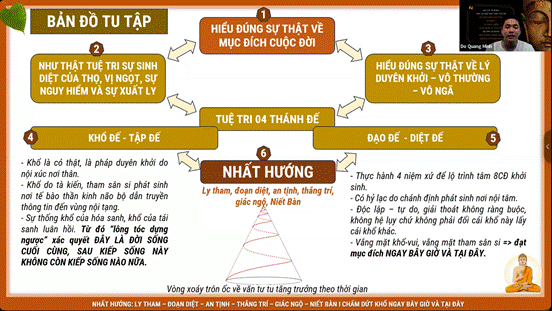

**1.2.2. TƯ TUỆ - TRẠCH PHÁP:**

[3. P1.2 Tư Tuệ Trạch Pháp_TsTỳ Kheo Nguyên Tuệ-Gosinga.](https://www.youtube.com/playlist?list=PLfFdoGwLbh5VJth0HzZd0aSSLpD-vKduK)

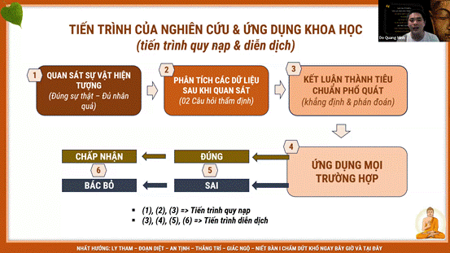

|   |
|---|
|[LẶP ĐI LẶP LẠI TIẾN TRÌNH QUY NẠP - DIỄN DỊCH - KAIZEN]<br><br>1.                   QUY NẠP: QUAN SÁT - PHÂN TÍCH - ĐÚC KẾT<br><br>2.                   DIỄN DỊCH: KẾT LUẬN được ỨNG DỤNG MỌI TRƯỜNG HỢP => ĐÚNG/SAI<br><br>3.                   KẾT LUẬN: DO CÁI GÌ CÓ MẶT MÀ CÁI KIA CÓ MẶT, DO CÁI GÌ KHÔNG CÓ MẶT MÀ CÁI KIA KHÔNG CÓ MẶT<br><br>---<br><br>Mối quan hệ với các thành phần:<br><br>1.                   TIẾN TRÌNH HỌC: MENTOR - VĂN TƯ TU (HỌC HIỂU HÀNH) - DỰ ÁN THẬT - CHIA SẺ LẠI.<br><br>2.                    Học tập có HƯỚNG, TUẦN TỰ, LIÊN TỤC, NHẤT QUÁN.<br><br>3.                   GIẢI QUYẾT VẤN ĐỀ: QUAN SÁT PHÂN TÍCH ĐÚC KẾT để tìm ra: VẤN ĐỀ NGUYÊN NHÂN GIẢI PHÁP BÀI HỌC. Để làm toàn bộ các tasks được hiệu quả.|

https://csg2ej4iz2hz.sg.larksuite.com/sync/E7nGdmPvMsPx48bItnxlyIJ3gCg

**CÔNG THỨC TRẠCH PHÁP**

|   |
|---|
|ĐỀ MỤC 0. CÔNG THỨC: LIỄU TRI VẤN ĐỀ VÔ MINH VÀ MINH  <br>- Hiểu đúng TÊN GỌI VÀ NỘI HÀM  <br>- Một việc không có Vô Minh hay Minh, chỉ có HIỂU BIẾT VỀ VIỆC ĐÓ mới có Vô Minh hay Minh.  <br>1. Tuệ Tri Vấn Đề chưa? (1.Vô Minh 2.Minh (TRÍ TUỆ, CHÁNH KIẾN) 3. Lưu ý + Ví dụ.)  <br>2. Tuệ Tri 3 Nguyên Nhân chưa? (Từ góc độ Vô Minh).  <br>3. 3 Giải Pháp chưa? (Theo LÝ DUYÊN KHỞI, TRÍ TUỆ, CHÁNH KIẾN)  <br>4. Con Đường Đoạn Diệt chưa?: Lộ trình tâm, tứ niệm xứ, bát chánh đạo.|

**1.2.3. TU TUỆ: THÂN - THỌ - TÂM - PHÁP - TUẦN TỰ, LIÊN TỤC.**

**3.1 KHỔ THỌ TÌNH DỤC và TÂM SI (Trở ngại lớn nhất) VẤN ĐỀ LỚN NHẤT: CẢM GIÁC TÌNH DỤC KHỔ THỌ TRÊN THÂN - THẤT THOÁT TINH KHÍ THẦN - HỶ LẠC NỘI TÂM - NỘI LỰC HẠNH PHÚC BÊN TRONG, ĐỘNG LỰC BỀN VỮNG => dùng TD hoặc dùng TÂM ĐÁNH BẠI TÂM.  
  
+, 1. CHUYỂN CẢM GIÁC NỔI TRỘI:** [**3. P2.1 MUSIC [THỰC TẠI LÀ CẢM GIÁC, LÀ TÂM - CẢM GIÁC HẠNH PHÚC, CẢM GIÁC VỊ NGỌT SỰ NGUY HIỂM**](https://www.youtube.com/playlist?list=PLfFdoGwLbh5VIFkxyMnXB_9-IOPyI7jL0)**+, 2. DÙNG TÂM ĐÁNH BẠI TÂM:** [**3. P2.1 [THỰC TẠI LÀ CẢM GIÁC, LÀ TÂM - CẢM GIÁC HẠNH PHÚC, CẢM GIÁC VỊ NGỌT SỰ NGUY HIỂM - TỨ DIỆU**](https://www.youtube.com/playlist?list=PLfFdoGwLbh5WwKjz01Y-fnXt62mDO087n)

|   |
|---|
|1. CẢM GIÁC NỔI TRỘI. **(Có thể dùng 4 loại động lực chính để tạo).**<br><br>3. TOẠ THIỀN THƯỜNG XUYÊN => để khắc sâu bộ nhớ, từ đó lúc BUỒN KHỔ, TÂM SI khởi lên mới đối trọi được.|

|   |
|---|
|**THỰC HÀNH THÂN THỌ TÂM PHÁP**  <br>  <br>1. QUÁN THÂN: NHẮC THẦM THẤY RÕ CẢM GIÁC NỔI TRỘI, Có Tầm Có Tứ - Automatic, ĐỂ TỰ NHIÊN, Ko Tầm Ko Tứ.  <br>- BẮT ĐẦU: THƯ GIÃN THẢ LỎNG, "BUÔNG BUÔNG".   <br>- CẢM GIÁC NỔI TRỘI NƠI THÂN: cảm giác Nín thở, Ngậm chặt răng lưỡi, Nghe nhạc nơi tai, cảm giác nắm nắm bàn tay xoa tay.  <br>CẢM GIÁC PHÁP TRẦN, THAM SÂN SI - BUÔNG BUÔNG. ()<br><br>**Bổ sung thêm:**<br><br>\|   \|<br>\|---\|<br>\|- NHẮC THẦM: "Nhớ đến tích cực chú tâm thấy rõ CẢM GIÁC NỔI TRỘI" đan xen: 1. cảm giác NGƯNG THỞ, 2. Cảm giác Chuyểnđộng TOÀN THÂN <gồm cảm giác nơi 6 xúc xứ: cảm giác hình ảnh, cảm giác âm thanh>, 3. ĐỂ TỰ NHIÊN (theo nhịp thở đi làm việc, bút vẽ lên xuống, xoay tròn sang ngang. VÔ NGƯNG RA NGƯNG).  <br>- TUỆ TRI: 7-9 đề mục Quán Thân: 1. Tuệ tri CHÚ TÂM LIÊN TỤC ; 2. Tuệ tri TÂM TRẠNG TÍCH CỰC VUI THOẢI MÁI\|<br><br>\|   \|<br>\|---\|<br>\|THỰC HÀNH:<br><br>1.                   Tuệ tri CẢM GIÁC NỔI TRỘI và sự CHÚ TÂM LIÊN TỤC.  <br>- Case: khi mình nắm nắm bàn tay để tạo cảm giác nổi trội nơi tay<br><br>2.                   Tuệ tri TÂM TRẠNG TÍCH CỰC VUI THOẢI MÁI\|<br><br>- Lời nhắc - Nhạc: Phải nhớ phải nhớ: An trú chánh định,chín mươi phần trăm, NỔI TRỘI trên thân, các cảm giác khác, nơi mắt nơi tai, không tầm không tứ. CHỈ THẤY THÔI, THẤY MÀ KO NHẬN XÉT ĐÁNH GIÁ ĐỐI TƯỢNG. (Quên định trên thân, như sống chuồng ngựa, ăn cức cả đời).<br><br>**BÀI TOÁN GẶP NHIỀU: KHỔ THỌ TÌNH DỤC. ? LỜI GIẢI NHƯ NÀO.**<br><br>**1. Là có thông tin tác động tới THÔNG TIN PHÁP TRẦN TÌNH DỤC**<br><br>**2. Là TÂM SI - CHÁN NẢN - theo thói quen tìm THAM, tìm đến CẢM GIÁC PHÁP TRẦN TD. ĐẨY CẢM GIÁC SỢ, CÓ RỒI LẠI MUỐN CÓ THÊM; CHỈ ĐỔI KHỔ NÀY LẤY KHỔ KHÁC:** <br><br>\|   \|<br>\|---\|<br>\|- KHÓ QUÁ: (cùng đường, gặp bài toán khó, stress ko hướng giải quyết, rối ngợp vì quá nhiều thứ) => NGỦ 1 GIẤC SÂU SẠC 300% PIN LOẠI BỎ HẾT NGỔN NGANG ĐẦU ĐƯỢC LÀM MỚI , khoảng lặng, nghỉ ngơi, thể thao, đọc sách, chạy bộ,thiền gosinga 9 ngày,...  <br>Case: Làm đồ án đến đoạn bi bí, hoặc giải 1 đề đến đoạn bi bí => TÌM KIẾM CẢM GIÁC KHÓ CHỊU, BEGIN WITH THE END X3 IN MIND.<br><br>- NHÀN QUÁ:<br><br>+, Case: Sau bao ngày cày cuốc với mindset KẺ CHIẾN THẮNG => Tự nhiên dự án gần thành công thì mất đi cảm giác KẺ CHIẾN THẮNG => Tâm Si: KO THÍCH KO GHÉT NHƯNG TÌM KIẾM CẢM GIÁC DỄ CHỊU (Kẻ chiến thắng).  <br>+, Case: Không có việc gì làm => Mong muốn chuẩn bị cho tương lai => TÂM SI.  <br>+, Case: Không có việc gì quá gấp, ở nhà 1 mình => Cảm giác thói quen cũ ùa về, 1 cách vô thức xem đ đ đ.\|<br><br>**3. THÔNG TIN PHÁP TRẦN TRONG QUÁ KHỨ -> RẤT DỄ THÍCH CON GÁI (các chị hơn 1-chục tuổi mà chưa gia đình, xinh xắn, mình vẫn có sự giao động. Đặc biệt là chị hơn 1-3 tuổi, 1-7 tuổi giao động vẫn rất mạnh, ... chưa nói đến em).**<br><br>**4. VẤN ĐỀ THỜI GIAN: Thói quen này đã lặp lại gần 10 năm => Tiêu tốn rất nhiều thời gian, năng lượng, cơ hội của mình? => BẮT BUỘC PHẢI CHẤM DỨT ĐI!** <br><br>---<br><br>**GIẢI PHÁP CÀNH LÁ:**<br><br>1.                   BTĐ XẤU HỔ SỢ HÃI với BÊN NGOÀI => chuyển dần sang BCĐ HIỆP THẾ: xấu hổ sợ hãi với THAM SÂN SI của chính mình<br><br>\|   \|<br>\|---\|<br>\|Ăn được bát cơm phở 50k LÀM 1 CÁI lại ra hết, mặt mụn như gẻ, mồm hôi người hôi thối như CỨT => Cơ thể bạc nhược yếu ớt, GẦY GÒ ngủ suốt ngày, phải ngủ bù năng lượng 3h, mất hết THẦN KHÍ ÁNH MẮT GIỌNG NÓI: LỜ ĐỜ LÈ NHÈ KO RA HƠI. => Yếu sl vợ nó bỏ, lục đục đủ điều CHIA TAY  => NGHIỆN MA TUÝ, GÁI GÚ CỜ BẠC: gầy dơ xương MA TUÝ ĐÁ ĐI TÙ bị đánh như chó CHẾT BỜ BỤI => Dễ NHẠY CẢM, ĐÀO HOA trước vẻ ngoài da thịt con gái => Mất thời gian, mất năng lượng, CẢM GIÁC TÌNH DỤC QUÁ DỄ SINH KHỞI.  <br>(Tổn thương cơ quan sinh dục: Gây viêm nhiễm, sẹo và tổn thương mô. => CẮT CHIM KO LÀ TOÀN THÂN BỊ NHIỄM TRÙNG.  <br>Suy giảm sức khỏe tổng thể: Mệt mỏi, suy nhược và giảm khả năng miễn dịch. => LIỆT DƯƠNG, CƠ THỂ NẰM LA LIỆT NHƯ NGƯỜI THỰC VẬT KO CÓ SỨC ĐỀ KHÁNG.  <br>Tác hại tinh thần: Gây trầm cảm, lo âu, cảm giác tội lỗi, lệ thuộc và ám ảnh. => KO DÁM GẶP AI, NGƯỜI HÔI THỐI, MẮT THÂM QUẦNG CỦA NGƯỜI THỦ.  <br>Tác hại xã hội: Ảnh hưởng đến công việc, học tập, cô lập xã hội, giảm chất lượng mối quan hệ. => CÔ LẬP, THẤT NGHIỆP, KO TIỀN KO MỐI QUAN HỆ, BỐ MẸ ACE HỌ HÀNG COI THƯỜNG).  <br>- Lên group18+ tìm bạn chat, show, KO BỀN DỄ TAN vì môi trường tìm bạn QUÁ THAM ĐẮM tỉ lệ độc hại cao(chat mình dám, còn gặp mình KO DÁM), FWB BỊ CẮT RỤNG CON CHIM, HIV-AIDS, FWB quen ny ĂN CỨT mãi ko có ny, Dính bầu với gái giang hồ về nó xiên chết cả nhà. <Content địa ngục>. Tình dục chỉ là 1 phần, 1 khía cạnh, ko nên là TOÀN BỘ cuộc sống. Có những giai đoạn như 95 tuổi bạn chỉ có thể nghĩ về nó hoặc nói về nó chứ ko thể làm, có giai đoạn trẻ bạn có thể sẽ rất say đắm. Tình dục THƯỚC ĐO SỰ KIỀM CHẾ, BÁT CHÁNH ĐẠO. Không chỉ tinh trùng mà tất cả tế bào đều là những nguyên liệu khác nhau tạo nên món súp khác nhau, TIỀM NĂNG TO LỚN.\|<br><br>2.                   **BƯỚC VÀO TÌNH YÊU HÔN NHÂN - CÁC DỤC VUI ÍT KHỔ NHIỀU, NÃO NHIỀU, NGUY HIỂM CÀNG NHIỀU [NGỌT KO KHỔ, THAM ÁI VỊ NGỌT MỚI KHỔ] => MỞ RỘNG RA ĐỘI NHÓM****=> dùng TD vợ chồng - phương tiện để chấm dứt khổ (như đồng tiền): Có vị ngọt. Tham Ái Vị Ngọt thì khổ.**  <br>**=> Nếu chọn TYHN: nên chọn người cùng Pháp là tốt nhất.** <br><br>\|   \|<br>\|---\|<br>\|1.                   MỞ PHỄU ĐÚNG THỊ TRƯỜNG: VẪN CHỌN NGƯỜI PHÙ HỢP NHẤT, XINH NHẤT ĐẸP NHẤT. NHƯNG: NẾU KHÔNG ĐỔI TÂM TỪ BÁT TÀ ĐẠO SANG BÁT CHÁNH ĐẠO, thì KHÔNG CHẠY ĐÂU CHO THOÁT KHỔ (chỉ đổi khổ này lấy khổ khác). <br><br>2.                   SỰ THẬT VỀ CHUNG THUỶ - thực hành đúng KO CÓ CHÁN NẢN, MÀ HOÀN TOÀN BÌNH THẢN:  <br>- Khi gặp người khác giới, nếu LỘ TRÌNH TÂM là BÁT TÀ ĐẠO thì quý vị khởi lên THÍCH CHÁN GHÉT so sánh người đó với ny/vợ mình.  <br>- Còn nếu LỘ TRÌNH TÂM là BÁT CHÁNH ĐẠO, quý vị KHÔNG THÍCH KHÔNG CHÁN KHÔNG GHÉT, thì KHÔNG CÓ CHUNG THUỶ, cũng CHẲNG CÓ NGOẠI TÌNH, quý vị HOÀN TOÀN BÌNH THẢN, VUI, THOẢI MÁI.\||

**Use cases Khổ thọ được ghi ở bên dưới sau khi học thêm MINDSET của ph Tây:**

**3.2 THỰC HÀNH THÂN THỌ TÂM PHÁP :**

•                     https://www.youtube.com/playlist?list=PLfFdoGwLbh5X1rtIKley3_3uEXzXdZ8-i

|   |
|---|
|2. QUÁN THỌ: THỰC TẠI LÀ CẢM GIÁC - Tương tác căn trần đều là TƯƠNG TÁC THÔNG TIN, LÀ TÂM - CẢM GIÁC HẠNH PHÚC CẢM GIÁC VỊ NGỌT - NGUYÊN NHÂN CỦA KHỔ THAM SÂN SI]  <br>(Thấy, Nghe, Cảm nhận mọi thứ đều biết nó là Cảm Giác)  <br>-<br><br>Dịch sát nghĩa: "Này A-nan, hãy tự mình là ngọn đuốc cho chính mình, tự mình nương tựa chính mình, không nương tựa gì khác. Hãy lấy Chánh pháp làm ngọn đuốc, lấy Chánh pháp làm chỗ nương tựa, không nương tựa gì khác."  <br>"Các ông hãy tự làm hòn đảo, tự nương tựa chính mình; hãy lấy pháp làm hòn đảo, lấy pháp làm nơi nương tựa; không lấy chỗ nào khác làm hòn đảo, không nương tựa chỗ nào khác."  <br>+, Hiểu sai: ràng buộc nơi chính mình, nương tựa vào tiền bạc, sức khoẻ, sắc đẹp, giàu có, danh tiếng, ... đưa đến ràng buộc<br><br>+, Hiểu đúng:<br><br>Vị tỳ kheo sống trú quán Thân nơi Thân, sống trú quán Thọ nơi Thọ, sống trú quán Tâm nơi Tâm, sống trú quán Pháp nơi Pháp, nhiệt tâm tỉnh giác chánh niệm để nhiếp phục tham ưu ở đời.<br><br>Là vị nương tựa nơi chính mình, nương tựa nơi chánh pháp, không nương tựa nơi nào khác.  <br>  <br><br>- Khi chọn thái độ Nhất Hướng, Nhàm Chán, Ly Tham, Đoạn Diệt là chúng ta đối xử với Tâm, cụ thể là các Cảm giác chứ không phải với Cảnh, với hoàn cảnh sống. Có 2 loại thực tại là Thực Tại Thế Gian (Bất Tịnh), và Thực Tại Xuất Thế Gian(Thanh Tịnh) thì cũng đều là các khái niệm của Tâm, chứ ko phải Cảnh. Chỉ có Tâm Bất Tịnh và Tâm Thanh Tịnh, chứ không có Cảnh Bất Tịnh và Cảnh Thanh Tịnh.  <br>- Không có việc làm là MINH hay VÔ MINH, chỉ có HIỂU BIẾT VỀ VIỆC ĐÓ mới có MINH hay VÔ MINH.  <br>- Mỗi người trong hoàn cảnh khác nhau, tình trạng, mức độ tu tập khác nhau, sẽ có những lựa chọn chánh kiến khác nhau, cho dù đổi cảnh hay không đổi cảnh. Miễn đổi được lộ trình tâm BTD sang BCD là Nhất Hướng- Ly Tham.  <br>- "Buông" là BUÔNG TƯ TƯỞNG làm chủ, tư tưởng sở hữu; Không phải "Buông bỏ", vứt bỏ đi thế giới vật chất. "Sử dụng mà không sở hữu". **Lưu ý:** Không ràng buộc vào kết quả là không khổ vui với kết quả chứ không phải không quan tâm và không cần cải thiện dù kết quả không đi đúng hướng.  <br>- BUÔNG = "GIEO NHÂN" * "BUÔNG KỲ VỌNG" = "LÀM TỐT NHẤT" * "SẴN SÀNG CHO ĐIỀU TỆ NHẤT" =  CÙNG LẮM THÌ, TÔI VẪN CỨ NỖ LỰC   <br>= "BẠN ĐƯỢC QUYỀN BẬT CÔNG TẮC" * "NHƯNG SÁNG HAY KHÔNG LÀ CHUYỆN BÓNG ĐÈN".  <br>  <br><br>3.                   XỬ LÝ CẢM GIÁC KHỔ THỌ TÌNH DỤC:<br><br>  <br>3. Quán Thọ Tâm Pháp (Xoá Vô Minh, Đoạn diệt dục tưởng)  <br>- NÍN THỞ QUÁN THÂN: Tùy vào cường độ của dục tưởng, nếu nhẹ thì có thể quán luôn, còn nếu mãnh liệt thì nên sử dụng pháp đối trị NÍN THỞ như ở mục 01 trước. Sau khi lắng dịu hơn thì thực hành quán như ở dưới đây để xóa dần đi thông tin về tham ái tình dục.  <br>- Quán Thọ: Bản chất dục tưởng chính là tư tưởng về tình dục, xuất hiện với sự nối dài của cảm giác pháp trần liên tục đan xen với cảm giác xúc chạm do nội xúc từ tâm hành tham, nên mình cần quán đây là cảm thọ, thuộc phạm trù tâm, là cảnh ảo, vô minh thì cho rằng đây là thế giới vật chất, có cô gái A, chàng trai B là chủ nhân chủ sở hữu của hình tướng kia,...  <br>- Quán Tâm: Quán tâm biết ý thức tà tri kiến với nội dung vô minh - chấp ngã. Quán tâm hành tham, dục, khổ đang khởi sinh. Hiểu biết đúng sự thật về các tâm hành này trên 8TĐ, có tính chất duyên khởi, vô thường, vô ngã.  <br>- Quán Pháp: Nhân loại khát ái tìm cầu hỷ lạc chỗ này chỗ nọ, như dục ái, hữu ái, phi hữu ái.. Nơi nào có tham dục, nơi đó có chấp thủ, nơi nào có chấp thủ, nơi đó có khổ-vui.  Các dục vui ít, khổ nhiều, não nhiều, nguy hiểm các nhiều hơn. Bao lâu nay, mình đã bị dục đanh vây, tàn phá, trấn áp như thế này đây. Phải giải thoát khỏi chướng ngại đã đầy ải nhân loại từ vô thủy đến nay.  <br>- NÍN THỞ QUÁN THÂN: Sau khi quán thì hãy ngưng thở một đoạn để hoàn toàn yên lặng, ghi nhận cảm giác toàn thân, sau đó thở mạnh theo nhịp rồi tác ý nhè nhẹ dần, nếu hết dục tưởng thì quay trở lại thực hành Định-Tuệ bình thường.  <br>  <br>  <br>3.1 PHẢI NHỚ PHẢI NHỚ: HIỂU ĐÚNG VỊ NGỌT, VỊ NGỌT - LY THAM.  <br>- Phải nhớ phải nhớ:  <br>VỊ NGỌT - CẢM GIÁC HẠNH PHÚC (do Chánh Niệm sinh, hoặc, duyên xúc bên ngoài). THÍCH CHÁN RỒI GHÉT, NGỌT NHẠT RỒI ĐẮNG. SINH DIỆT liên tục, lặp đi lặp lại. CHẲNG ĐÁNG LÀ BAO, tà niệm kích hoạt, mà ta làm quá.<br><br>\|   \|<br>\|---\|<br>\|"Gánh nặng 2 đầu: hạnh phúc và khổ đau. Muốn đặt đầu khổ đau xuống thì phải đặt cả đầu hạnh phúc xuống. Thực tại này là cảm thọ, vị ngọt, sự nguy hiểm, sự xuất ly. Tình yêu, hạnh phúc là vị ngọt, nó có thật. Nhưng tham đắm vào nó, bởi nó vô thường sẽ có lúc sinh cảm giác chán, ghét, khi mất đi thì sầu bi khổ ưu não."  <br>+, Giống như 1 ông thầy được học trò trồng cho cây quý ăn 3 năm liền chán luôn.  <br>+, Mất cây đó đi thì lại ko được ăn lại thèm  <br>+, Còn như ăn cơm, nó ko có vị gì cả, nó đủ no, nó là tinh bột.  <br>=> Giống như ny gặp nhau tuần 2 buổi là oke, còn với vợ 1 tuần quan hệ 2 lần là oke. Nhiều hơn hoặc ít hơn đều gây khổ. Vị ngọt ko khổ, tham ái vị ngọt là khổ.\|<br><br>  <br>- Chỉ khi thực nếm, vị ngọt chánh niệm, đến để mà thấy, siêu thế khởi lên.  <br>DÙ THẤY GÁI XINH, NHỚ PHIM 18, TÂM SI SINH KHỞI:  <br>Vị ấy ly tham, nhìn ngắm vẻ đẹp, ko có tư tưởng làm chủ sở hữu, ko nhảy tìm trăng, không khổ vô ích.   <br>  <br>- Phải nhớ phải nhớ: Cảm thọ Căn Trần, tiếp xúc với nhau. Thông tin pháp trần, tế bào thần kinh, tồn tại đồng thời, độc lập với nhau,  <br>(y như máy móc, chạy theo lập trình, trong cái gọi là, đồng hồ quả lắc).  <br>chứ không phải là…  <br>- CHẤP CÓ DUY VẬT, CHẤP KHÔNG DUY TÂM, chấp ngọt sẵn có, chấp do tâm tạo.  <br>VỊ NGỌT CÓ ĐÓ, DO DUYÊN MÀ SANH, Thọ Tưởng đồng sinh, Tưởng đọc Vị ngọt, của đối tượng thấy,  <br>chứ không phải là, cần niệm kích hoạt, mới có vị ngọt,  <br>  <br>- Trong TÌNH YÊU: Được chọn VẪN CHỌN NGƯỜI PHÙ HỢP NHẤT, XINH NHẤT ĐẸP NHẤT. NHƯNG: NẾU KHÔNG ĐỔI TÂM TỪ BÁT TÀ ĐẠO SANG BÁT CHÁNH ĐẠO, thì KHÔNG CHẠY ĐÂU CHO THOÁT KHỔ (chỉ đổi khổ này lấy khổ khác).   <br>- Chúng ta tu tập để đổi tâm và có thể cải thiện hoàn cảnh (nếu cần thiết), chứ không phải tìm cách thay đổi hoàn cảnh để nghĩ rằng sẽ tu tập thuận lợi hơn. Tránh tình trạng đi học về, Tâm thì ko thấy đổi, lại đi thay đổi ngay hoàn cảnh sống khiến cho người thân, bạn bè thấy bất an, lo lắng.  <br>- Nhàm chán, Ly Tham là ly tham với thọ khi tiếp xúc với các trần cảnh, chứ không phải ly tham với các trần cảnh đó. Chúng ta không ghét bỏ, xua đuổi chúng, mà để chúng tự đến và tự đi.  <br>- Như vậy cho dù đổi cảnh hay không đổi cảnh, miễn đổi được tâm từ BTD sang BCD thì sẽ không có khổ và là tu đúng.  <br>  <br>Còn trường hợp được quyền đổi cảnh để có lạc thọ hợp pháp thì đổi chứ đâu có dại gì mà phải để im để kham nhẫn với khổ thọ.  <br>- TRUNG ĐẠO: ko chối bỏ, không tham đắm lạc thọ.  <br>Mỗi người trong hoàn cảnh khác nhau, tình trạng, mức độ tu tập khác nhau, sẽ có những lựa chọn chánh kiến khác nhau. Miễn đổi được lộ trình tâm BTD sang BCD là Nhất Hướng- Ly Tham.  <br>  <br>3.2 PHẢI NHỚ PHẢI NHỚ  <br>CẢM THỌ VÔ THƯỜNG  <br>- Đối tượng thấy..., là tâm cảm thọ, đặt tên: danh từ, là cô con gái, cái con người thấy, chính là thông tin  <br>chứ không phải là thế giới vật chất, như hiểu biết sai, lầm tưởng trước đây.  <br>- Cảm giác vị ngọt, hoặc nhạt hoặc đắng,  <br>được Tưởng ghi nhận, mới tinh cứng coong, xuất hiện 1 lần, sinh diệt tức khắc, sinh diệt kéo dài mà ta làm quá,  <br>chứ không phải là, thường hằng thường trú, biến đổi vật chất, như hiểu biết sai, lầm tưởng trước đây.  <br>  <br>3.3 PHẢI NHỚ PHẢI NHỚ: DUYÊN KHỞI - VÔ NGÃ  <br>- Phải nhớ phải nhớ: Duyên người thế giới, đặt tên: động từ, là quét là chạy,  <br>chứ không có cái, điều khiển cái kia, ko có linh hồn, không sinh không diệt, điều khiển thân xác!  <br>- Tất cả các sự vật hiện tượng (tất cả các pháp) đều là do Duyên Khởi (2 nhân bình đẳng tương tác/tiếp xúc cùng diệt mới phát sinh quả).  <br>= Tất cả các pháp đều vô thường (Sinh diệt), đều vô chủ vô sở hữu (vô ngã).|

**Use cases 3. Tu Tuệ:**

https://csg2ej4iz2hz.sg.larksuite.com/sync/AmYzdmBzosNhhpbRk60lOTvZgDb

**1.2.4 Lan toả chánh pháp (Đừng bao giờ đàn cho Trâu nghe rồi trách nó chỉ biết cắm mặt ăn cỏ)**

**3. KHỔ THỌ TÌNH DỤC và TÂM SI (Trở ngại lớn nhất)**

+, 1. CẢM GIÁC NỔI TRỘI.

+, 2. NHẮC THẦM : THẤY THẤY, NHỚ ĐẾN TÍCH CỰC CHÚ TÂM THẤY RÕ CẢM GIÁC CHUYỂN ĐỘNG CẢM GIÁC XÚC CHẠM TOÀN THÂN, THEO NHỊP THỞ ĐI LÀM VIỆC.  
+, 3. TOẠ THIỀN THƯỜNG XUYÊN => để khắc sâu bộ nhớ, từ đó lúc BUỒN KHỔ, TÂM SI khởi lên mới đối trọi được.

|   |
|---|
|SQL  <br>Mục 1.2. KHỔ THỌ TÌNH DỤC - NỘI LỰC - BÁT CHÁNH ĐẠO. [LÝ DUYÊN KHỞI - CẢM THỌ - KHỔ NGUYÊN NHÂN KHỔ - NHẤT HƯỚNG]  <br>  <br>VẤN ĐỀ LỚN NHẤT: CẢM GIÁC TÌNH DỤC KHỔ THỌ TRÊN THÂN - THẤT THOÁT TINH KHÍ THẦN - HỶ LẠC NỘI TÂM - NỘI LỰC HẠNH PHÚC BÊN TRONG, ĐỘNG LỰC BỀN VỮNG => dùng TD hoặc dùng TÂM ĐÁNH BẠI TÂM.  <br>Thường xảy ra khi: 1. Là có thông tin tác động tới THÔNG TIN PHÁP TRẦN TÌNH DỤC 2. Là TÂM SI - CHÁN NẢN - theo thói quen tìm THAM, tìm đến CẢM GIÁC PHÁP TRẦN TD. ĐẨY CẢM GIÁC SỢ, CÓ RỒI LẠI MUỐN CÓ THÊM; CHỈ ĐỔI KHỔ NÀY LẤY KHỔ KHÁC:   <br>- Ăn được bát cơm phở 50k LÀM 1 CÁI lại ra hết, mặt mụn như gẻ, mồm hôi người hôi thối như CỨT => Cơ thể bạc nhược yếu ớt, GẦY GÒ ngủ suốt ngày, phải ngủ bù năng lượng 3h, mất hết THẦN KHÍ ÁNH MẮT GIỌNG NÓI: LỜ ĐỜ LÈ NHÈ KO RA HƠI. => Yếu sl vợ nó bỏ, lục đục đủ điều CHIA TAY  => NGHIỆN MA TUÝ, GÁI GÚ CỜ BẠC: gầy dơ xương MA TUÝ ĐÁ ĐI TÙ bị đánh như chó CHẾT BỜ BỤI => Dễ NHẠY CẢM, ĐÀO HOA trước vẻ ngoài da thịt con gái => Mất thời gian, mất năng lượng, CẢM GIÁC TÌNH DỤC QUÁ DỄ SINH KHỞI.  <br>(Tổn thương cơ quan sinh dục: Gây viêm nhiễm, sẹo và tổn thương mô. => CẮT CHIM KO LÀ TOÀN THÂN BỊ NHIỄM TRÙNG.  <br>Suy giảm sức khỏe tổng thể: Mệt mỏi, suy nhược và giảm khả năng miễn dịch. => LIỆT DƯƠNG, CƠ THỂ NẰM LA LIỆT NHƯ NGƯỜI THỰC VẬT KO CÓ SỨC ĐỀ KHÁNG.  <br>Tác hại tinh thần: Gây trầm cảm, lo âu, cảm giác tội lỗi, lệ thuộc và ám ảnh. => KO DÁM GẶP AI, NGƯỜI HÔI THỐI, MẮT THÂM QUẦNG CỦA NGƯỜI THỦ.  <br>Tác hại xã hội: Ảnh hưởng đến công việc, học tập, cô lập xã hội, giảm chất lượng mối quan hệ. => CÔ LẬP, THẤT NGHIỆP, KO TIỀN KO MỐI QUAN HỆ, BỐ MẸ ACE HỌ HÀNG COI THƯỜNG).  <br>- Lên group18+ tìm bạn chat, show, KO BỀN DỄ TAN vì môi trường tìm bạn QUÁ THAM ĐẮM tỉ lệ độc hại cao(chat mình dám, còn gặp mình KO DÁM), FWB BỊ CẮT RỤNG CON CHIM, HIV-AIDS, FWB quen ny ĂN CỨT mãi ko có ny, Dính bầu với gái giang hồ về nó xiên chết cả nhà. <Content địa ngục>. Tình dục chỉ là 1 phần, 1 khía cạnh, ko nên là TOÀN BỘ cuộc sống. Có những giai đoạn như 95 tuổi bạn chỉ có thể nghĩ về nó hoặc nói về nó chứ ko thể làm, có giai đoạn trẻ bạn có thể sẽ rất say đắm. Tình dục THƯỚC ĐO SỰ KIỀM CHẾ, BÁT CHÁNH ĐẠO. Không chỉ tinh trùng mà tất cả tế bào đều là những nguyên liệu khác nhau tạo nên món súp khác nhau, TIỀM NĂNG TO LỚN.  <br>  <br>----------------|

|   |
|---|
|SQL  <br>Mục 1.2. KHỔ THỌ TÌNH DỤC - NỘI LỰC - BÁT CHÁNH ĐẠO. (tiếp)  <br>CÁCH 2: [MÔI TRƯỜNG MẠNH Ý CHÍ MẠNH]  <br>- Bản chất: thông tin khác nổi trội hơn thông tin tình dục: ngủ lắng xuống, lên trường học bài.  <br>- BTĐ XẤU HỔ SỢ HÃI với BÊN NGOÀI => chuyển dần sang BCĐ HIỆP THẾ: xấu hổ sợ hãi với THAM SÂN SI của chính mình  <br>  <br>CÁCH 3:|

|   |
|---|
|BƯỚC VÀO TÌNH YÊU HÔN NHÂN - CÁC DỤC VUI ÍT KHỔ NHIỀU, NÃO NHIỀU, NGUY HIỂM CÀNG NHIỀU [NGỌT KO KHỔ, THAM ÁI VỊ NGỌT MỚI KHỔ] => MỞ RỘNG RA ĐỘI NHÓM  <br>=> dùng TD vợ chồng -phương tiện để chấm dứt khổ (như đồng tiền): Có vị ngọt. Tham Ái Vị Ngọt thì khổ.  <br>=> Nếu chọn TYHN: nên chọn người cùng Pháp là tốt nhất.   <br>------------------------------------------------------------  <br>1. SỰ ĐỦ ĐẦY TỪ BÊN TRONG. (Ràng buộc vật chất, không ràng buộc nơi tư tưởng sở hữu cảm giác).  <br>SỬA MÌNH NHIỀU LÊN, THỰC CHIẾN RA KẾT QUẢ, LEADER LÀM GƯƠNG  <br>  <br>2. MỞ PHỄU ĐÚNG THỊ TRƯỜNG - LÀM QUEN, TUYỂN KỸ - BUÔNG XẢ LÀM TỐT NHẤT, SÁNG HAY KHÔNG LÀ CHUYỆN CỦA BÓNG ĐÈN:  <br>- CHỌN ĐÚNG MÔI TRƯỜNG => Bớt Tham bớt kỳ vọng(do hiểu Môi trường) => TỰ TIN HƠN, THOẢI MÁI HƠN(Chẳng hạn khi ngồi cạnh con gái ở thư viện thấy thoải mái hơn vì bớt kỳ vọng vì biết con gái ở đây khó làm quen hơn, XÁC SUẤT NGƯỜI PHÙ HỢP THẤP hơn ở môi trường BKE GOSIGNA - THỰC HÀNH "KO PHẢI ĐỢI ĐỌC VỊ GIỎI HƠN MỚI LÀM QUEN, MÀ LÀ LÀM QUEN NHIỀU THÌ ĐỌC VỊ MỚI GIỎI LÊN").  <br>Cùng là NGỒI CẠNH BÊN 1 cô gái xinh, hôm nào khởi lên MUỐN LÀM QUEN => HỒI HỘP, CỐ GẮNG QUÁ MỨC NÊN KHỔ . Hôm ko khởi lên thì BÌNH AN, KO QUÁ CỐ GẮNG KO KHỔ (CÓ CƠ HỘI NÓI CHUYỆN THÌ NÓI KO CỐ GẮNG TÌM KIẾM QUÁ MỨC).  <br>- SỰ THU HÚT đến từ SỰ TƯƠNG HỢP THÔNG TIN("ko quan trọng bạn nói gì, quan trọng vẻ ngoài và sự tự tin, ko sợ hãi. Con gái bị cuốn hút bởi sự trung thực đồng nhất cả bên trong lẫn bên ngoài").  <br>- LÀM QUEN TỐT NHẤT,  MỞ LỜI TỐT NHẤT, TUYỂN KỸ NHẤT CÓ THỂ => TỪ CHỐI GIÚP TA TIẾT KIỆM THỜI GIAN VÀ SỨC LỰC, SẴN SÀNG LOẠI BỎ NGAY TỪ ĐẦU(vì bạn không mất thời gian, năng lượng cố gắng thuyết phục cô gái rằng bạn hấp dẫn). (Nếu tôi không chắc có thể làm việc với người đó trong 1 thời gian dài, tôi sẽ không làm việc với người đó dù chỉ là 1 giờ)(còn đi lâu dài hay không còn tuỳ nhân duyên) ("Vì tôi đã đá rất nhiều người ngay từ đầu vì những việc ngu ngốc như thế này để tôi không còn phải lo về nó nữa. Trong chuyện này thì tôi rất tàn nhẫn. Tôi bỏ đi ngay giữa cuӝc hẹn đầu tiên. Tôi bỏ đi ngay giữa lời nói. Tôi không quan tâm. Tôi không có thời gian với những cô gái tệ. Và kết quả là, hoặc là họ thay đổi phù hӧp với mong đӧi của tôi, hoặc là tôi không bao giờ gặp họ nữa. Tôi tôn trọng bản thân và vì thế sẽ không dành thời gian với những cô gái không tôn trọng tôi. Bạn sẽ tự nhiên nghĩ rằng, “Ồ, vậy có nghĩa mình phải gặp gấp đôi số phө nữ, phải bỏ ra gấp đôi công sức, vì mình sẽ từ chối nửa số người thích mình.” Thật ra, bạn sẽ bỏ ra ít công sức hơn, vì bạn không còn phí nhiều thời gian và năng lưӧng cố gắng thuyết phөc cô ấy rằng bạn là mӝt người đàn ông hấp dẫn. Bạn không còn mệt mỏi nghĩ rằng liệu cô ấy có thích bạn đủ nhiều hay không, hoặc lo lắng làm thế nào để gây ấn tưӧng hay thắng lại cô ấy. Khi cô ấy không hӧp với tiêu chuẩn của bạn, tình huống trở nên cực kỳ dễ dàng cho bạn: bạn bỏ đi. Không nghĩ ngӧi gì hết. Không tranh cãi. Không quay lại ngoạn mөc. Chỉ là: hành vì của cô ấy không hӧp với tiêu chuẩn của mình, mình sẽ gặp mӝt người khác")  <br>- RÕ RÀNG MỐI QUAN HỆ LÀ TÁN NGAY TỪ ĐẦU, TÁN MẠNH. 2 hướng: 1 TỎ TÌNH NGAY TỪ ĐẦU 2. CỨ TÁN ĐÃ TỎ TÌNH RA.  <br>  <br>  <br>3. SỰ THẬT VỀ CHUNG THUỶ - thực hành đúng KO CÓ CHÁN NẢN, MÀ HOÀN TOÀN BÌNH THẢN:  <br>- Khi gặp người khác giới, nếu LỘ TRÌNH TÂM là BÁT TÀ ĐẠO thì quý vị khởi lên THÍCH CHÁN GHÉT so sánh người đó với ny/vợ mình.  <br>- Còn nếu LỘ TRÌNH TÂM là BÁT CHÁNH ĐẠO, quý vị KHÔNG THÍCH KHÔNG CHÁN KHÔNG GHÉT, thì KHÔNG CÓ CHUNG THUỶ, cũng CHẲNG CÓ NGOẠI TÌNH, quý vị HOÀN TOÀN BÌNH THẢNG, VUI, THOẢI MÁI.  <br>  <br>- Con trai cơ bản giống nhau. Đợt này tui ra ngoài đường cũng bị váy ngắn của con gái hút hồn luôn đây nè.  <br>- Không có người yêu / người yêu sắp chia tay => dễ bị con gái bên ngoài hút hồn, xong ib tán tỉnh này kia  <br>- Còn khi có người yêu kiểu ổn định rùi ý => đều đặn ib ny tình cảm nhẹ nhàng. (là đủ nhu cầu ý, giống như kiểu ăn nhiều quá thì bị no ko thể ăn được => nên chẳng còn tâm hơi mà nhắn con gái khác).  <br>Chỉ TRỪ KHI CÓ NGƯỜI CON GÁI KHÁC CÓ THỂ THAY THẾ ĐƯỢC+ MỐI QUAN HỆ CŨ THẤY KO ỔN => MỚI CÓ Ý ĐỊNH NÀY KIA.  <br>(như đợt tôi với ny cũ đang ổn tự nhiên người ta kêu tạm dừng + có người con gái khác có thể thay thế được ny => xong tui mới bẫng 1 thời gian, xong rủ chị kia đi hiến máu đôi năm ngoái đó xong về còn ôm nhau)|

|   |
|---|
|SQL  <br>ĐỀ MỤC 0: CẢM GIÁC TRUNG TÍNH(3 Loại CẢM GIÁC: Cảm giác dễ chịu, Cảm giác khó chịu - nhất là CGTD/Gặp task khó bí ko ra, cảm giác TRUNG TÍNH NHƯNG LẠI DỄ ĐI TÌM CẢM GIÁC DỄ CHỊU, nhất là của TÌNH DỤC.  <br>  <br>BÃO TỐ VÀ AN NHÀN (BÌNH AN ĐỘT PHÁ TRƯỚC BIẾN ĐỘNG - SÓNG YÊN).  <br>- BÃO TỐ/vấn đề : 90% Tâm SẠC NĂNG LƯỢNG, NƯƠNG TAM BẢO, MÀI RŨA MŨI KHOAN + 10% Thân (nghỉ mắt, lưng, ngủ lúc buồn ngủ chỉ chợp mắt 10min ngang với việc ngủ 3h, đi bộ nghe mp4 ...) ăn uống, đứng dậy, thể thao, ngủ  <br>(cùng đường, gặp bài toán khó, stress ko hướng giải quyết, rối ngợp vì quá nhiều thứ) thì (NGỦ 1 GIẤC SÂU SẠC 300% PIN LOẠI BỎ HẾT NGỔN NGANG ĐẦU ĐƯỢC LÀM MỚI , khoảng lặng, nghỉ ngơi, thể thao, đọc sách, chạy bộ,thiền gosinga 9 ngày,...).  <br>  <br>- AN NHÀN/cơ hội (nhàn nhã sinh tâm Si, cảm giác chán nản tìm tham): MŨI KHOAN DÀI HẠN + TẬP TRUNG, ÁP SUẤT LÚC NHÀN RỖI + MỞ RỘNG liên quan.  <br>1. Chuẩn bị kỹ lưỡng.  <br>2. Tư duy "thợ săn" chủ động tìm kiếm - Đánh nhanh rút gọn - Lựa chọn đúng NẮM VÀ BUÔNG.  <br>3. TẠO BIẾN ĐỘNG ĐẬP ĐI XÂY LẠI + CHỌN MŨI KHOAN NÉM VÀO ÁP SUẤT   <br>4. BẬT CÔNG TẮC LÀM TỐT NHẤT, SÁNG HAY KHÔNG CÒN Ở BÓNG ĐÈN.  <br>  <br>ĐỀ MỤC 2: XỬ LÝ BẤT NHƯ Ý.  <br>- TH1: Dắt xe ra đi làm buổi đầu, xe đề mãi không nổ 15 phút ko được dắt xe ra quán sửa, 9h vào làm, 9h30 sửa xong dắt xe về nhà, chiều đi làm sau.  <br>=> Kinh nghiệm thế gian: 1. Ko để xe dưới mái hiên tránh bị nước xối + 2. Tranh thủ sửa xe Take Note công việc vào sổ.  <br>=> Trạch Pháp: Hiểu đúng về vô thường.|

**Có lập gia đình không khi đã biết đến chánh pháp**

|   |
|---|
|1.                   Hiểu biết như nào thì sống như thế ấy<br><br>[TEAMs P1 TYHN_GNH_ https://bke.edu.vn/tinh-yeu-hon-nhan-3-goc-K1/ _20/4/2022 TPT, 22/4-kick off.](https://www.youtube.com/playlist?list=PLyK7lTB-93oBaky6FWiY7ght0Cq9wmmZI)<br><br>https://www.youtube.com/playlist?list=PLyK7lTB-93oBaky6FWiY7ght0Cq9wmmZI|
|2.                   Khi nyc của mình băn khoăn - 20/2/2026<br><br>Helen: "Cơ bản là tớ cảm thấy giằng xé. Giữa việc tiến xa hơn. Hay là có cuộc sống độc lập, tu tập tự do."<br><br>Ngày xưa có 1 chú mèo đi đến 1 đoạn ngã 3 đường, chú cũng hỏi 1 anh cảnh sát là đi đường nào. Anh cảnh sát hỏi chú là: 'thế rốt cuộc chú muốn đi đâu', chú trả lời là: 'chú không biết nữa'.<br><br>Anh cảnh sát đáp: 'nếu không biết đi đâu thì đi hướng nào cũng oke'<br><br>=> Nên tớ nghĩ quan trọng là xác định mục đích sau cùng. Xem 2 hướng: tiến xa vs cuộc sống độc lập tu tập thì hướng nào tiến được đến mục đích đó, hay cả 2<br><br>"Cậu nghĩ cả 2 đều có thể đến đích sao?"<br><br>Tớ nghĩ là: Mục đích của việc ăn cơm là để hết CẢM GIÁC KHỔ THÂN (dẫn đến khổ tâm) khi cơn đói khởi lên. Có thể ăn cơm chay, ăn cơm không hoặc ăn cơm mặn.<br><br>-> Cũng như vậy, mục đích của tu tập là hết khổ (niết bàn dịch sang tiếng việt có nghĩa là hết khổ). Cũng có nhiều con đường: xuất gia, lập gia đình, đi tu, ...<br><br>Vì ngay từ đầu tu tập đã là đổi Tâm không đổi cảnh.|

**Use cases:**

https://csg2ej4iz2hz.sg.larksuite.com/sync/AzCzdWSGTs9rBKbEw9NlcY8zg1d

|   |
|---|
|SQL|

1.1.1 **THỰC HÀNH THÂN THỌ TÂM PHÁP :**

•                     https://www.youtube.com/playlist?list=PLfFdoGwLbh5X1rtIKley3_3uEXzXdZ8-i

|   |
|---|
|THỰC HÀNH THÂN THỌ TÂM PHÁP  <br>- Quán Thân  <br>- Quán Thọ Tâm Pháp (Xoá Vô Minh, Đoạn diệt dục tưởng)  <br>  <br>1. QUÁN THÂN: Rụt củi, NHẮC THẦM THẤY RÕ CẢM GIÁC NỔI TRỘI, Có Tầm Có Tứ - Automatic, ĐỂ TỰ NHIÊN, Ko Tầm Ko Tứ.  <br>- BẮT ĐẦU: THƯ GIÃN THẢ LỎNG.   <br>- TẠO CẢM GIÁC NỔI TRỘI: cảm giác Nín thở, Ngậm chặt răng lưỡi, Nghe nhạc nơi tai. <CHÚ TÂM CẢM GIÁC NỔI TRỘI - THAM SÂN SI nơi DỤC TƯỞNG VẮNG MẶT>  <br>- NHẮC THẦM: "Nhớ đến tích cực chú tâm thấy rõ CẢM GIÁC NỔI TRỘI" đan xen: 1. cảm giác NGƯNG THỞ, 2. Cảm giác Chuyểnđộng TOÀN THÂN <gồm cảm giác nơi 6 xúc xứ: cảm giác hình ảnh, cảm giác âm thanh>, 3. ĐỂ TỰ NHIÊN (theo nhịp thở đi làm việc, bút vẽ lên xuống, xoay tròn sang ngang. VÔ NGƯNG RA NGƯNG).  <br>- TUỆ TRI: 7-9 đề mục Quán Thân: 1. Tuệ tri CHÚ TÂM LIÊN TỤC  <br>- Phải nhớ phải nhớ: An trú chánh định,chín mươi phần trăm, NỔI TRỘI trên thân, các cảm giác khác, nơi mắt nơi tai, không tầm không tứ. CHỈ THẤY THÔI, THẤY MÀ KO NHẬN XÉT ĐÁNH GIÁ ĐỐI TƯỢNG. (Quên định trên thân, như sống chuồng ngựa, ăn cức cả đời).  <br>  <br>2. QUÁN THỌ: THỰC TẠI LÀ CẢM GIÁC - Tương tác căn trần đều là TƯƠNG TÁC THÔNG TIN, LÀ TÂM - CẢM GIÁC HẠNH PHÚC CẢM GIÁC VỊ NGỌT - NGUYÊN NHÂN CỦA KHỔ THAM SÂN SI]  <br>(Thấy, Nghe, Cảm nhận mọi thứ đều biết nó là Cảm Giác)  <br>- Khi chọn thái độ Nhất Hướng, Nhàm Chán, Ly Tham, Đoạn Diệt là chúng ta đối xử với Tâm, cụ thể là các Cảm giác chứ không phải với Cảnh, với hoàn cảnh sống. Có 2 loại thực tại là Thực Tại Thế Gian (Bất Tịnh), và Thực Tại Xuất Thế Gian(Thanh Tịnh) thì cũng đều là các khái niệm của Tâm, chứ ko phải Cảnh. Chỉ có Tâm Bất Tịnh và Tâm Thanh Tịnh, chứ không có Cảnh Bất Tịnh và Cảnh Thanh Tịnh.  <br>- Không có việc làm là MINH hay VÔ MINH, chỉ có HIỂU BIẾT VỀ VIỆC ĐÓ mới có MINH hay VÔ MINH.  <br>- Mỗi người trong hoàn cảnh khác nhau, tình trạng, mức độ tu tập khác nhau, sẽ có những lựa chọn chánh kiến khác nhau, cho dù đổi cảnh hay không đổi cản. Miễn đổi được lộ trình tâm BTD sang BCD là Nhất Hướng- Ly Tham.  <br>- "Buông" là BUÔNG TƯ TƯỞNG làm chủ, tư tưởng sở hữu; Không phải "Buông bỏ", vứt bỏ đi thế giới vật chất. "Sử dụng mà không sở hữu". **Lưu ý:** Không ràng buộc vào kết quả là không khổ vui với kết quả chứ không phải không quan tâm và không cần cải thiện dù kết quả không đi đúng hướng.  <br>- BUÔNG = "GIEO NHÂN" * "BUÔNG KỲ VỌNG" = "LÀM TỐT NHẤT" * "SẴN SÀNG CHO ĐIỀU TỆ NHẤT" =  CÙNG LẮM THÌ, TÔI VẪN CỨ NỖ LỰC   <br>= "BẠN ĐƯỢC QUYỀN BẬT CÔNG TẮC" * "NHƯNG SÁNG HAY KHÔNG LÀ CHUYỆN BÓNG ĐÈN".  <br>  <br>3. Quán Thọ Tâm Pháp (Xoá Vô Minh, Đoạn diệt dục tưởng)  <br>- NÍN THỞ QUÁN THÂN: Tùy vào cường độ của dục tưởng, nếu nhẹ thì có thể quán luôn, còn nếu mãnh liệt thì nên sử dụng pháp đối trị NÍN THỞ như ở mục 01 trước. Sau khi lắng dịu hơn thì thực hành quán như ở dưới đây để xóa dần đi thông tin về tham ái tình dục.  <br>- Quán Thọ: Bản chất dục tưởng chính là tư tưởng về tình dục, xuất hiện với sự nối dài của cảm giác pháp trần liên tục đan xen với cảm giác xúc chạm do nội xúc từ tâm hành tham, nên mình cần quán đây là cảm thọ, thuộc phạm trù tâm, là cảnh ảo, vô minh thì cho rằng đây là thế giới vật chất, có cô gái A, chàng trai B là chủ nhân chủ sở hữu của hình tướng kia,...  <br>- Quán Tâm: Quán tâm biết ý thức tà tri kiến với nội dung vô minh - chấp ngã. Quán tâm hành tham, dục, khổ đang khởi sinh. Hiểu biết đúng sự thật về các tâm hành này trên 8TĐ, có tính chất duyên khởi, vô thường, vô ngã.  <br>- Quán Pháp: Nhân loại khát ái tìm cầu hỷ lạc chỗ này chỗ nọ, như dục ái, hữu ái, phi hữu ái.. Nơi nào có tham dục, nơi đó có chấp thủ, nơi nào có chấp thủ, nơi đó có khổ-vui.  Các dục vui ít, khổ nhiều, não nhiều, nguy hiểm các nhiều hơn. Bao lâu nay, mình đã bị dục đanh vây, tàn phá, trấn áp như thế này đây. Phải giải thoát khỏi chướng ngại đã đầy ải nhân loại từ vô thủy đến nay.  <br>- NÍN THỞ QUÁN THÂN: Sau khi quán thì hãy ngưng thở một đoạn để hoàn toàn yên lặng, ghi nhận cảm giác toàn thân, sau đó thở mạnh theo nhịp rồi tác ý nhè nhẹ dần, nếu hết dục tưởng thì quay trở lại thực hành Định-Tuệ bình thường.  <br>  <br>  <br>3.1 PHẢI NHỚ PHẢI NHỚ: HIỂU ĐÚNG VỊ NGỌT, VỊ NGỌT - LY THAM.  <br>- Phải nhớ phải nhớ:  <br>VỊ NGỌT - CẢM GIÁC HẠNH PHÚC (do Chánh Niệm sinh, hoặc, duyên xúc bên ngoài). THÍCH CHÁN RỒI GHÉT, NGỌT NHẠT RỒI ĐẮNG. SINH DIỆT liên tục, lặp đi lặp lại. CHẲNG ĐÁNG LÀ BAO, tà niệm kích hoạt, mà ta làm quá.  <br>  <br>- Chỉ khi thực nếm, vị ngọt chánh niệm, đến để mà thấy, siêu thế khởi lên.  <br>DÙ THẤY GÁI XINH, NHỚ PHIM 18, TÂM SI SINH KHỞI:  <br>Vị ấy ly tham, nhìn ngắm vẻ đẹp, ko có tư tưởng làm chủ sở hữu, ko nhảy tìm trăng, không khổ vô ích.   <br>  <br>- Phải nhớ phải nhớ: Cảm thọ Căn Trần, tiếp xúc với nhau. Thông tin pháp trần, tế bào thần kinh, tồn tại đồng thời, độc lập với nhau,  <br>(y như máy móc, chạy theo lập trình, trong cái gọi là, đồng hồ quả lắc).  <br>chứ không phải là…  <br>- CHẤP CÓ DUY VẬT, CHẤP KHÔNG DUY TÂM, chấp ngọt sẵn có, chấp do tâm tạo.  <br>VỊ NGỌT CÓ ĐÓ, DO DUYÊN MÀ SANH, Thọ Tưởng đồng sinh, Tưởng đọc Vị ngọt, của đối tượng thấy,  <br>chứ không phải là, cần niệm kích hoạt, mới có vị ngọt,  <br>  <br>- Trong TÌNH YÊU: Được chọn VẪN CHỌN NGƯỜI PHÙ HỢP NHẤT, XINH NHẤT ĐẸP NHẤT. NHƯNG: NẾU KHÔNG ĐỔI TÂM TỪ BÁT TÀ ĐẠO SANG BÁT CHÁNH ĐẠO, thì KHÔNG CHẠY ĐÂU CHO THOÁT KHỔ (chỉ đổi khổ này lấy khổ khác).   <br>- Chúng ta tu tập để đổi tâm và có thể cải thiện hoàn cảnh (nếu cần thiết), chứ không phải tìm cách thay đổi hoàn cảnh để nghĩ rằng sẽ tu tập thuận lợi hơn. Tránh tình trạng đi học về, Tâm thì ko thấy đổi, lại đi thay đổi ngay hoàn cảnh sống khiến cho người thân, bạn bè thấy bất an, lo lắng.  <br>- Nhàm chán, Ly Tham là ly tham với thọ khi tiếp xúc với các trần cảnh, chứ không phải ly tham với các trần cảnh đó. Chúng ta không ghét bỏ, xua đuổi chúng, mà để chúng tự đến và tự đi.  <br>- Như vậy cho dù đổi cảnh hay không đổi cảnh, miễn đổi được tâm từ BTD sang BCD thì sẽ không có khổ và là tu đúng.  <br>  <br>Còn trường hợp được quyền đổi cảnh để có lạc thọ hợp pháp thì đổi chứ đâu có dại gì mà phải để im để kham nhẫn với khổ thọ.  <br>- TRUNG ĐẠO: ko chối bỏ, không tham đắm lạc thọ.  <br>Mỗi người trong hoàn cảnh khác nhau, tình trạng, mức độ tu tập khác nhau, sẽ có những lựa chọn chánh kiến khác nhau. Miễn đổi được lộ trình tâm BTD sang BCD là Nhất Hướng- Ly Tham.  <br>  <br>3.2 PHẢI NHỚ PHẢI NHỚ  <br>CẢM THỌ VÔ THƯỜNG  <br>- Đối tượng thấy..., là tâm cảm thọ, đặt tên: danh từ, là cô con gái, cái con người thấy, chính là thông tin  <br>chứ không phải là thế giới vật chất, như hiểu biết sai, lầm tưởng trước đây.  <br>- Cảm giác vị ngọt, hoặc nhạt hoặc đắng,  <br>được Tưởng ghi nhận, mới tinh cứng coong, xuất hiện 1 lần, sinh diệt tức khắc, sinh diệt kéo dài mà ta làm quá,  <br>chứ không phải là, thường hằng thường trú, biến đổi vật chất, như hiểu biết sai, lầm tưởng trước đây.  <br>  <br>3.3 PHẢI NHỚ PHẢI NHỚ: DUYÊN KHỞI - VÔ NGÃ  <br>- Phải nhớ phải nhớ: Duyên người thế giới, đặt tên: động từ, là quét là chạy,  <br>chứ không có cái, điều khiển cái kia, ko có linh hồn, không sinh không diệt, điều khiển thân xác!  <br>- Tất cả các sự vật hiện tượng (tất cả các pháp) đều là do Duyên Khởi (2 nhân bình đẳng tương tác/tiếp xúc cùng diệt mới phát sinh quả).  <br>= Tất cả các pháp đều vô thường (Sinh diệt), đều vô chủ vô sở hữu (vô ngã).|

|   |
|---|
|yaml  <br>04/01/2025  <br>  <br>Mục đích thực hành:  <br>- CÓ THAM SÂN SI => CÓ KHỔ.  <br>- KHÔNG THAM SÂN SI, 1 là THẤY KO SUY NGHĨ (CHÁNH ĐỊNH), 2 là SUY NGHĨ ĐÚNG SỰ THẬT - Chánh Kiến (Thọ Tâm Pháp)  <br>---  <br>  <br>**- 1.1 TẠO CẢM GIÁC NỔI TRỘI (NGUYÊN LÝ: KHI CẢM GIÁC NÀY NỔI TRỘI THÌ CẢM GIÁC KIA KHÔNG NỔI TRỘI): cảm giác Nín thở, Ngậm chặt răng lưỡi/Thấy Răng Lưỡi dán nóc họng, Nghe nhạc nơi tai/nhạc nhẹ love mood/nhạc sâu sắc động lực RAP/nhạc tình cảm gia đình chảy nước mắt,**  <br>  <br> **NỔI TRỘI <CẢM GIÁC NỔI TRỘI - THAM SÂN SI nơi DỤC TƯỞNG VẮNG MẶT>**  <br>  <br>**- 1.2 NIỆM - TRÍ NHỚ:**  <br>+, **NHẮC THẦM: "Nhớ đến tích cực chú tâm thấy rõ CẢM GIÁC NỔI TRỘI, CẢM GIÁC CHUYỂN ĐỘNG XÚC CHẠM TOÀN THÂN"**   <br>  <br>- 1.**3 ĐỂ TỰ NHIÊN KO TẦM KO TỨ (theo nhịp thở đi làm việc, bút vẽ LÊN XUỐNG SANG NGANG, XOAY TRÒN từng đối tương, VÔ NGƯNG RA NGƯNG).**  <br>  <br>**- 1.4 TUỆ TRI: 7-9 đề mục Quán Thân: 1. Tuệ tri CHÚ TÂM LIÊN TỤC**  <br>  <br>**- Phải nhớ phải nhớ: An trú chánh định,chín mươi phần trăm, NỔI TRỘI trên thân, các cảm giác khác, nơi mắt nơi tai, không tầm không tứ. CHỈ THẤY THÔI, THẤY MÀ KO NHẬN XÉT ĐÁNH GIÁ ĐỐI TƯỢNG. (Quên định trên thân, như sống chuồng ngựa, ăn cức cả đời). Không ai ăn 1 bữa đòi no cả đời, rụt củi cần liên tục, đun nước sôi 100 độ.**|

 

**2.2.1 NGƯNG TD - HIỂU BIẾT ĐÚNG VÀ MINDSET  (SÁNG TẠO DỰA VÀO TÀI LIỆU NHẤT HƯỚNG)**

|   |
|---|
|**MINDSET GIÁNG MẠNH – CHẤM DỨT THỦ DÂM**<br><br>**✨ HIỂU BIẾT ĐÚNG: TÌNH DỤC KHÔNG PHẢI HẠNH PHÚC**<br><br>1.                   **Tôi không thật sự muốn tình dục – tôi chỉ đang muốn thoát khỏi cảm giác khổ ở thân.**<br><br>\|   \|<br>\|---\|<br>\|Tình dục không mang lại hạnh phúc thật sự. Phần lớn chúng ta tìm đến nó khi **tâm si khởi lên**, khi mệt mỏi, trống rỗng, chán chường. Điều ta thật sự cần là: nghỉ ngơi, bình an, kết nối. Mục đích chúng ta là chấm dứt khổ, chứ chưa bao giờ là tìm kiếm cảm giác hạnh phúc. Nhưng ta chọn nhầm con đường – giống như người khát lại đi uống nước muối.\|<br><br>2.                   **Tình dục & tham ái: vui ít – khổ nhiều – nguy hiểm càng nhiều.**<br><br>\|   \|<br>\|---\|<br>\|Dù đối tượng có đẹp đến đâu, nếu tâm đang vận hành theo “bát tà đạo”, thì kết quả chỉ là: **thích – chán – ghét – so sánh – ràng buộc**. Cảm giác ngọt ngào ban đầu luôn dẫn về đắng cay sau cùng. Đó là bản chất.\|<br><br>3.                   **Thực tại là cảm giác, không phải đối tượng.**<br><br>\|   \|<br>\|---\|<br>\|Cái gọi là “gái xinh” hay “video 18+” chỉ là nhãn dán mà ta gắn lên một tổ hợp **cảm giác** nơi mắt – tai – thân – ý. Không có cô gái nào thật ở đó. Chỉ có: thời điểm – cảm giác – thông tin – tâm sinh khởi. Vậy mà ta lại tưởng thật, rồi khổ vì nó.\|<br><br>4.                   **Các yếu tố ảnh hưởng: là kết quả của MÔI TRƯỜNG KÍCH THÍCH VÀ THÓI QUEN LÂU NĂM + COI THƯỜNG LỖ KÉP + TƯ DUY NÉ TRÁNH VẤN ĐỀ + THIẾU THE ROAD RÕ RÀNG + KO BIẾT CÁCH CHUYỂN HOÁ NĂNG LƯỢNG**<br><br>**⚡ 3 MINDSET GIÁNG THẲNG VÀO TÂM THỨC CỦA NGƯỜI NGHIỆN**<br><br>💥 **MINDSET 1: “Tôi không thật sự muốn tình dục — tôi chỉ muốn chấm dứt cảm giác khổ. Tham ái, dục lạc cũng giống như người khát mà đi uống nước muối: càng uống càng khát, càng thỏa mãn càng trống rỗng.”**<br><br>\|   \|<br>\|---\|<br>\|_Tôi tỉnh táo nhận ra: thứ mình thật sự cần là bình an, nghỉ ngơi, kết nối thật sự – không phải giải pháp tạm thời đầy nguy hiểm. Chẳng khác gì biết cốc có độc mà vẫn đớp._\|<br><br>**💥 MINDSET 2: “BẠN CHỌN ĐÁNH ĐỔI 100 GIỜ VÀ LỖ KÉP CHỈ ĐỂ ĐỔI LẤY 5 GIÂY KHOÁI CẢM”**<br><br>\|   \|<br>\|---\|<br>\|Tôi đánh đổi sự tỉnh táo, sự sáng tạo, khí chất, bản lĩnh – lấy vài phút vô thức? Đó không phải là nghỉ ngơi. Đó là **một cuộc giao dịch ngu xuẩn** – tôi tự làm yếu mình đi.\|<br><br>💥 **MINDSET 3: LỖ KÉP KHOÁI CẢM TẦM THƯỜNG HAY LÃI KÉP SÁT THẦN LĨNH VỰC - TỤT LÙI TRONG ÂM THẦM hay TẬN DỤNG SỨC MẠNH LỚN LAO CỦA TD ĐỂ BỨT PHÁ MỌI GIỚI HẠN.**<br><br>\|   \|<br>\|---\|<br>\|**Testosterone không phải năng lượng tình dục — đó là ‘thuốc tăng trưởng’ phóng đại mọi thứ tôi có**<br><br>**“Mỗi lần đầu hàng khoái cảm tầm thường, tôi lại khoan thêm một ‘lỗ kép’ vào thuyền ý chí, khiến bản lĩnh và tương lai rò rỉ dần không hay biết. Nhưng mỗi lần kiểm soát và chuyển hóa, tôi lại cộng thêm một ‘lãi kép sát thần’ – ý chí, khí chất, trí tuệ, sức mạnh lĩnh vực của mình đều được nhân lên gấp bội, từng ngày từng ngày hóa thành chiến thần không gì cản phá.”**\|<br><br>💥 **MINDSET 5: BIẾN XUNG ĐỘNG THÀNH NĂNG LƯỢNG HÀNH ĐỘNG**<br><br>\|   \|<br>\|---\|<br>\|TÔI KHÔNG LÀM NHỮNG THỨ SỞ THÍCH HÈN KÉM.  <br>TÔI LÀM THỨ MÌNH KHÔNG THÍCH CÓ GIÁ TRỊ  <br>CẢM GIÁC NỔI TRỘI KÍCH HOẠT CHÁNH NIỆM CỦA TÔI.\||

|   |
|---|
|1.                   **Xử lý ngay khi cơn lên cao** (cấp cứu)<br><br>**_1. Cắt nguồn kích thích**: ĐÓNG MỌI THỨ LẠI, SHUTDOWN VÀ TẮT NGUỒN.  <br>_2. TẬP KHÁNG LỰC NGAY (hít đất 50 cái) -> KÍCH HOẠT CẢM GIÁC NỔI TRỘI<br><br>**_3. Thở 4-4-4-4** (Box breathing): hít 4 giây – giữ 4 giây – thở 4 giây – giữ 4 giây → lặp 5 vòng.  <br>_4. HÀNH THIỀN.<br><br>2.                   **Giảm tần suất lâu dài** (phòng ngừa)<br><br>•                     **Nạp năng lượng vào việc khác**: tập thể dục hàng ngày, học kỹ năng mới, làm project cá nhân.<br><br>•                     **Thiền sáng + tối**: ít nhất 10 phút, tập chú tâm vào hơi thở hoặc body scan.<br><br>•                     **Tránh môi trường kích dục**: hạn chế nội dung 18+, chọn lọc giải trí (podcast, sách, thể thao).<br><br>•                     **Viết nhật ký kỷ luật dục**: mỗi lần vượt qua ham muốn là một “lần thắng” – ghi lại để thấy tiến bộ.<br><br>•                     **Chuyển hoá thành sáng tạo**: khi thấy ham muốn, mở máy viết, vẽ, code, hoặc làm việc tay chân.|

**Use Cases:**

|   |   |   |
|---|---|---|
|**Day**|**Situation (Nguyên văn)**|Cách đã xử lý/Bài học lúc đó|
|06/04/2025:|Đang lướt facebook thì thấy 1 cái tên. Search google thử => Ra video -> Xem. => Comment dạo Linkedin => **Summary + Nghe nhạc: https://youtube.com/playlist?list=PLfFdoGwLbh5Vc9qzKLL9_b99e3xUHNppc&feature=shared**||
|**23/04/2025: T4**|Thức khuya để lên plan cho thời gian sắp tới => Do lưu trữ các nhóm chat + căng thẳng khi lên plan mới (chạy bộ chia ra mùa hè chạy sáng, mùa đông chạy tối, nhiều thứ mới cần học) => nghĩ đến sếp T, học sinh HA và ra. => Giải pháp: 1. BÁT CHÁNH ĐẠO thấy việc lên plan chẳng có gì căng thẳng cả + sẵn sàng cắt bỏ những thứ thích thích mà KO CÓ GIÁ TRỊ VALUE VỀ MẶT DÀI HẠN, MỤC ĐÍCH CUỘC SỐNG||
|**27/04/2025: Tối thứ 7**|xem đ đ đ - sự kiện này có tính lặp lại hàng tuần, ae nên có phương án xử lý - tuần vừa rồi có mỗi hôm nay, bảo sao ra nhiều - CHÚC MỪNG CHO SỰ KIỆN TUẦN RỒI CÓ MỖI THỨ 7 - CHỦ NHẬT -> XỬ LÝ LÀ XONG, BẢO SAO BẮN NHIỀU. => Sau khi xong là 1 cảm giác GHÊ TỞM, MỆT MỎI, VÀ CHÁN CẢM GIÁC TD, tranh thủ xoá vết => Lên 1 lịch ngồi cafe full tối thứ 7, ngày chủ nhật + Liên tục nhớ ?||
|**29/04/2025: trưa T3 ở quê nghỉ lễ**|- tự dưng nhớ đến các đường link -> xong vào link ở lark -> rất nhanh => GIẢI PHÁP ĐỀ RA: Biết 1 cốc nước ngọt có độc mà vẫn uống?||
|**08/08/2025**|[SAU 6 NGÀY ĂN UỐNG SIÊU ĐẦY ĐỦ VÀ NO NÊ + SỬ DỤNG TRIẾT LÝ BẠN MUỐN ĐÁNH ĐỔI 5MIN SUNG SUÓNG NGẮN NGỦI LẤY VIỆC CƠ THỂ MẤT 1-2 TUẦN PHỤC HỒI? => MÌNH GIỮ TÂM RẤT TỐT. Cho đến tối nay sau khi tắm xong, mình cũng ko có nhu cầu gì lắm, chỉ do thói quen và ở nhà 1 mình -> mở xem 1 tí, cũng chưa có gì quá kích thích cơ mà mình lộn c 1 phát, nó ra quá là nhiều => ] Mình bắn trong trạng thái Tham rất nhẹ. THỨ DIỆU KỲ LẦN ĐẦU MÌNH CẢM NHẬN ĐƯỢC.||
|**14/08/2025**|\|   \|<br>\|---\|<br>\|14/08/2025: TÂM TRÍ TỐT ĐẾN MỨC ở nhà 1 mình từ 11h-3h30 nhưng ko phung phí  <br>- Nhớ lại case đau đớn: app ghép 200k, sau đóng dự kiến 2 triệu để duyệt người thật -> trò mồi của bọn kia, tiền đóng băng trên App cay ko làm gì được  <br>- Nay chat với 1 ông, ổng giả gái, bị ổng chụp màn hình, may ko quay video đoạn chat.  <br>- 11H-3H30 nhưng KO RA . TUYỆT VỜI. <br><br>**Cơ chế não bộ: Dopamine đã không đủ để đẩy bạn tới ngưỡng “kích hoạt”**  <br>- Đã quen với các thể loại đó.  <br>- Xem **với sự tỉnh táo** (không say mê),  <br>- Không “chạm kích” đúng vùng thèm khát thật sự trong não limbic,<br><br>→ thì **não chỉ tiết dopamine ở mức thấp**, không đủ để đẩy bạn đến hành ...  <br> Nói cách khác: **Bạn xem như “một người quan sát” hơn là một kẻ bị kéo theo.**  <br>Dopamine là "MUỐN" chứ không phải "THÍCH".\|||
|**15, 16/08**|15, 16/08: SAU 7 NGÀY -> B. Nguyên nhân: > thứ 6 tối về xem xong lên phơi quần áo, cầm vào ... -> ra luôn  <br>Hôm sau, T7 Đức về quê, xem 1 tiếng. Cách mình dùng: ib cho nyc Huyền, ib cho Hoà để hẹn qua phòng mục đích dùng phương pháp thế gian.  <br>+, Sau đó tắt laptop.  <br>+, Hít đất đúng 50 cái, máu từ ... chuyển lên cơ và não  <br>+, Thở và thiền.  <br>Sau đó bật laptop lên và lại bắn.  <br>Sau bắn xong thường ngủ khoảng 2h||
|**19–23/08/2025**|Toàn bắn lúc 12h-3h sáng. Đêm 19-20, đêm 20-21, đêm 21-22, trưa 23/08/2025: Tuần kinh hoàng toàn bắn lúc 12h-3h sáng. (Học tối 8h-11h đêm với ace GS25)  Sau đó bước vào đợt OT (tuần từ 23-30/08) ngày nào cũng 3h sáng (7h sáng chủ nhật - 4h sáng T2, 8h sáng T2 - 4h sáng T3, 8h sáng thứ 3 (wfh - bão) - 3h sáng thứ 4. (Tối thứ 4 xong hòm hòm về cái ngủ  ngay|Nhận ra:  <br>- Sự nguy hiểm của DOpamine nhanh.  <br>=> Sau đợt này thì:  <br>  <br>  <br><br>Mới học được cái này gần đây ae ạ. Chậm lại trước niềm vui, chẳng hạn:<br><br>•                     làm xong đề thi, ngày trước tâm trạng xoã, giờ thấy bình thường<br><br>•                     code done dự án, task => bình thường|
|**28/08/2025 – 1h đêm**|\|   \|<br>\|---\|<br>\|1h28082025<br><br>[BẮN SAU 5 NGÀY - lúc 1h kém đêm lên phơi quần áo. LÚC ĐÓ TRÍ NHỚ CHÁNH KHỞI LÊN]<br><br>1.                   Khởi lên: giống như uống nước muối, khát nhưng uống nước  muối<br><br>2.Là hiểu rằng:ban đầu nó có cảm giác sung sướng nhuwng sau đó là cảm iác khó chịu trên THÂN.<br><br>2.                   Pha chút 1 chút sợ bị camera quay lại được/ai đó bắt gặp<br><br>NGOÀI RA KO NHỚ ĐƯỢC GÌ LÚC ĐÓ NỮA.\|<br><br>2.                   Think: VẤN ĐỀ LÀ LÚC ĐÓ KHÔNG NHỚ ĐƯỢC? Tại sao vậy?||
|9h45 sáng 01/09/2025|- Mình trải qua những ngày bình thường và bình an sau khi ngộ ra là: Việc sau khi hoàn thiện fix các bug khó thì thường cảm giác vui do dopamine tiết ra cao, mình thường chậm lại và hít thở để dopamine tiết ra đều đặn ko ồ ạt.<br><br>=> Chẳng qua là do vẫn giữ kết nối với 1 bạn trên telegram => Đây chính là sự nguy hại.<br><br>- Sáng 9h30, mình cảm nhận cảm giác TD đang sinh khởi nhưng ko biết làm cách nào để dừng nó lại. chỉ nhớ là : 1. Môi trường sống 2. Dừng lại và thực hành bát chánh đạo  ... HẾT, ko nhớ được gì thêm???  <br>- Làm xong cảm giác buồn ngủ và mệt mỏi rõ rệt. => Ngủ 2h từ|1.                   Đóng gói lại để dễ nhớ và áp dụng, gợi lại chính xác khi càn?|
|Đêm thứ 4, 03.09.2025|Đang ngủ ngon bị tỉnh giấc thế là từ 1hr xem lan man lan man đến 3h rưỡi.  <br>- Dù biết là vị ngọt, sự nguy hiểm, mà không thể xuất ly nổi.  <br>- Ra cái, 5h vẫn sinh hoạt zoom bình thường, 6h lăn ra ngủ đến 8h.||
|Tối thứ 5 04.09.2025 ngủ sớm từ 9h30 okela  <br>Tối thứ 6 ăn xong quẩy từ 8hr-11h rưỡi (3h)|•                     7h rưỡi mới về nhà. Ăn cơm và rửa bát 1h thấy tiếc vì nhiều quá.<br><br>•                     8hr-11hr quẩy ... không thoát ra được. Biết là `dopamine` ham muốn, wanting (ko phải liking), biết vị ngọt sự nguy hiểm nhưng không thể nào thoát ra nổi. ???<br><br>•                     11h rưỡi, cu em Đức sang chơi thể là đi chạy quả 11h45-0h30.<br><br>Sáng dậy 5h. 6h quẩy ra lần 1. Xong ngủ li bì đến 8h. Xong lại đi thiền + xong lại quẩy ra lần 2 + xong lại thiền và ngủ 1 phát đến 11h, 1h chiều.  <br>=> Dậy cảm giác đầu óc được THANH LỌC VÀ HOÀN TOÀN THOẢI MÁI: đi giặt rũ, và tắm rửa và ghi chép lại.<br><br>Tiếp tục lần thứ 3 là lúc 4h30: mở lên cái xem video, chat chat 1 tí mà ko kìm được, rúc vào 1 góc mà xả. CẢM NHẠN RÕ RỆT MỨC DOPAMINE ĐỘC HẠI TĂNG CAO => Bản thân ko tài nào thoát ra được|Động lực THÂN TÂM TRÍ x NGOẠI LỰC - NỘI LỰC<br><br>1.                   MÔI TRƯỜNG<br><br>2.                   Ý CHÍ :<br><br>•                     ĐÀO GIẾNG TRƯỚC KHI KHÁT NƯỚC: THÓI QUEN ĐÚNG ĐẮN (CHÁNH NIỆM + THÓI QUEN RÈN LUYỆN)<br><br>•                     DỪNG LẠI ĐỂ QUAN SÁT (CHÁNH NIỆM LIÊN TỤC )<br><br>Ngoại lực: _Môi trường đúng_ → chặn trigger.<br><br>Nội lực: _Ý chí đúng_ → thói quen rèn luyện + chánh niệm quan sát.<br><br>Cả hai hợp lại → động lực THÂN – TÂM – TRÍ được bơm đầy, không còn chỗ cho dục thấp kéo ngược.|
|Tối thứ 7, 06.09.2025 rạng sáng CN từ 1h30-3h30|MÌNH NHẬN RA RẰNG. <br><br>•                     Mình nhìn ra được insight ham muốn / dopamine thích kích thích, (wanting, not liking) của bạn nữ và của mình gồm có: <br><br>1.                   Khi bị kích thích => Mình khởi lên KHỔ THỌ TÌNH DỤC<br><br>2.                   Từ việc cuộc trò chuyện bình thường(đòi trả phí) => đến mình gửi 1 video lạ trên mạng (sâu) => khiến bạn bị kích thích và lôi ny ra xử lý.  (Đoạn này bạn ấy lôi ny ra nhanh đến mức mình thấy ngạc nhiên).<br><br>3.                   Ham thích to hơn => sau khi xem ảnh mình gửi => bạn bị tê liệt luôn=> thậm chí còn làm với ny xong ko thoả mãn, còn đòi xem của mình để giải toả.Mình lưu lại những dòng tin nhắn và bức ảnh với 1 suy nghĩ: mình từng làm việc lưu này nhiều rồi, và kết quả cuối cùng đều là lưu xong mình cũng ấn xoá đi cả thôi.<br><br>Rồi kể cả các nhóm và FW mình đang lưu hiện tại, mình cũng từng nhiều lần lưu xong rồi xoá rồi<br><br>4.                   Bạn đòi xem, mình ko cho xem vì: 1. là lại tự kích thích mình khổ ra (trong khi bạn nằm cạnh ny và tắt mic, cam) 2. Là bức ảnh lừa gạt.<br><br>•                     Mình hiểu rất rõ INSIGHT PHÍA BẠN: đó là cảm giác TD khó chịu cần giải toả nốt (hoặc là xem mình, hoặc là với ny, hoặc là tự xử lý) và xử lý xong thì ko còn nhu cầu nữa<br><br>=> Đúng như dự đoán, phải 20min mình ko đồng ý, thì ông ny xử lý và bả ra => ko còn nhu cầu  <br>5. Tiếp đó là mình còn nhu cầu, mặc dù cơ thể mệt và ko còn dưỡng chất sau khi bắn 3 phát ban ngày => mình vẫn ép bản thân ra. <br><br>6.                   Sau đó mình đúc kết vấn đề, mình lại xem tiếp 1 phát nữa => Vậy là 5 lần trong 2 ngày :3||
|Tối CN ko,  <br>Trưa T2 (08.09.2025)làm online ở nhà và ra.  <br>  <br>Đêm thứ 2, sáng thứ 3 lúc 2h lại xem và lại ra. (09.09.2025)<br><br>Tối thứ 3 sáng thứ 4 10.09.2025|Tự nhiên check telegram 1 đống con gái nhắn tin được -> 3-4 người 1 lúc.  <br>CHÁNH NIỆM KO CÒN KÍCH HOẠT NỔI và mình tan vỡ -> bắn.<br><br>Cũng khá bế tắc, không có nhu cầu tận hưởng cảm giác khổ thọ tình dục đó, nhưng khi nó khởi lên, dopaine WANTING cứ muốn bắn.<br><br>Tối thứ 3, sáng thứ 4, cứ mở vào nhóm cái là thể nào cũng tìm được bạn nữ nào đó để ib => chat chat tối 00h-00h40 mất mẹ 40min chỉ để chat, thoả mãn cái gọi là: CẢM GIÁC PHÁP TRẦN  <br>  <br>Bạn nữ này chảy ..., cảm thấy bình thường, chỉ xoa, chảy ... chỉ để đấy, muốn đ, muốn m nhưng sẽ để đấy.  <br>Từ trước 00h đến đúng 2h luôn chỉ chat với bạn này, mình gửi ảnh dài, gửi video mút vì đánh vào INSIGHT của bạn. Mình cũng có nhu cầu, nhưng mình kiềm chế điều đó lại  <br>  <br>3h tối thứ 3, sáng thứ 4 từ 00h-3h. 1 trong những người con gái đánh đúng INSIGHT CỦA MÌNH NHẤT.  <br>1. Rất nhẹ nhàng, tốc độ rep siêu nhanh  <br>2. Nói gì, hỏi gì cũng rep lại cùng mức độ như thế, chú ý vào câu chuyện follow theo  <br>3. Nhỏ nhẹ yêu cầu call phí mình ko đồng ý, ngỏ lời thích xem cái này cái kia mình đi tìm cho xem  <br>  <br>Check ra có cả fb, web Thuỷ, người mới vào nghề đi CN, ...120k ->30k ->10k  <br>Cú lừa cuộc đời. -))<br><br>Lại tiếp: Đêm thứ 6 không, Đêm thứ 7 không, Đêm chủ nhật có,<br><br>Có cảm giác từ lúc 22h30, xong rồi về học và làm việc đến 00h30 bắt đầu vào nhóm chat nhắn tin, xong xem. Đi tắm xem nhưng ko ảnh hưởng gì, vẫn chỉ là xem tin nhắn, cho đến 01:30 xem video cái, cũng chưa kích thích.<br><br>Nhưng khi lộn 1 cái là ra luôn<br><br>You sent<br><br>Cái nhiều kiếp và 10 năm xem, nổi trội hơn so với việc nghe video được 1 tuần<br><br>đêm thứ 2 sáng thứ 3 (15-16/09/2025) (mất thêm 25k)  <br>Dopamine - WANTING THAM LAM NHIỀU HƠN - Đòi bản thân phải call call và bị lừa mất thêm 25k.  <br>- 0899592317 mb bank danh thi cam ly - @Kfodjdmmac  <br>- 0949670738  - @Hayuyjs|Mọi thứ đã diễn ra hàng 100 lần mỗi năm trong liên tục 8-10 năm rồi.  <br>lấy đi của mình bao nhiêu dưỡng chất và thời gian.  <br>LỖ KÉP ĐÃ BẮT ĐẦU VẬN HÀNH.  <br>  <br>VẬY MÀ MÌNH KO THỂ NGẮT NÓ ĐI, GIỐNG NHƯ UỐNG NƯỚC MUỐI CÀNG UỐNG CÀNG KHÁT NHƯNG VẪN UỐNG<br><br>•                     Mình suy nghĩ về việc nên dồn time cho dự án VP Bank hay dự án Agent CFO nước ngoài.  <br>Học AIO, Học Full stack Data science làm đồ án + Làm việc ở cả công ty.  <br>  <br>NHƯNG CŨNG GIỐNG NĂM LỚP 11, mình muốn quát cả đại số, giải tích, số học, hình học, tổ hợp, phương trình hàm, ....  <br>NHƯNG  <br>KẾT QUẢ LÀ MÌNH MÉO BAO GIỜ ĐỦ THỜI GIAN  <br>  <br>  <br>VÌ THỜI GIAN CỦA MÌNH BỊ GẶM NHẤM HẾT BỞI NHỮNG LỖ THỦNG THẦM LẶNG TRONG KỶ LUẬT (KHỔ THỌ TÌNH DỤC, VÀ THAM ÁI CẢM GIÁC TÌNH DỤC)|
|15/09/2025|Có cảm giác từ lúc 22h30, xong rồi về học và làm việc đến 00h30 bắt đầu vào nhóm chat nhắn tin, xong xem. Đi tắm xem nhưng ko ảnh hưởng gì, vẫn chỉ là xem tin nhắn, cho đến 01:30 xem video cái, cũng chưa kích thích.<br><br>Nhưng khi lộn 1 cái là ra luôn<br><br>You sent<br><br>Cái nhiều kiếp và 10 năm xem, nổi trội hơn so với việc nghe video được 1 tuần||
|23/09/2025|**vv Làm sao để check nhanh  BÀI + ẢNH + AUDIO trên excel đã đúng hay chưa trước khi import lên web MVP/...**  <br>link: [http://103.253.20.30:19414/index_API9404_OldWeb9414_NewWeb19414.html](http://103.253.20.30:19414/index_API9404_OldWeb9414_NewWeb19414.html)  <br>---  <br>Hiện tại:  <br>+, Luồng build bài đang là: Build trên Tool tạo bài/Excel => Import DB => Import lên Web MVP: [https://mvp.hacknao.edu.vn/](https://mvp.hacknao.edu.vn/) =>  <br>=> 1. Cần thời gian import lên Web MVP.  <br>=> 2. Chưa kể khi lên web MVP cần phải nói từng đoạn cho đến khi ẢNH/AUDIO bị gãy và phải nhìn log ở:  [https://robot-api.hacknao.edu.vn/web/api/v1/conversations](https://robot-api.hacknao.edu.vn/web/api/v1/conversations) để biết lỗi do đâu.  <br>  <br>Trong lúc refactor, em có cải tiến web: [http://103.253.20.30:9414/](http://103.253.20.30:9414/) (của anh Hùng) => thành web: [http://103.253.20.30:19414/index_API9404_OldWeb9414_NewWeb19414.html](http://103.253.20.30:19414/index_API9404_OldWeb9414_NewWeb19414.html)  , web này sẽ giúp mn.  <br>  <br>**-> Sau khi import trên Excel check ngay được LUỒNG, ẢNH, AUDIO đã work chưa. Thay vì mất time để import lên web MVP và nói, nhìn log.  <br>Anh chị dùng thử ở link trên ạ :D**|VIỆC QUÁ VUI VÀ NGAY SAU ĐÓ MÌNH PHẢI CẢM THẤY NÓ HỤT HẪNG KHÁ NHIỀU. Giống DOPAMINE là WANTING (MONG MUỐN XONG ĐỂ KHOE, ), report lên nhóm cái là dopamine biến mất|
|23/09/2025|Chạy 15min||
|22/09/2025|phí mẹ 20min, định đi tắm mà ko có chỗ tắm tiện, cơm thì ko được ăn, lại check tin nhắn vớ vẩn mất time.|Đi chạy về ko tắm được ngay, ko học và làm được điều quan trọng, bị trôi đi 20min => Khiến mình tham và thậm chí SÂN với bản thân + đồng thời kích thích từ chị Dương v to -> làm mình liên tương đến x => mở xem + lại thêm quần xịt cọ vào => làm mình ra nhanh và quá nhiều . . <br>|
|24/09/2025|Khi ae trong công ty rủ đi bar với mục tiêu gắn kết nhóm. (Có cả 3 sếp to: General Management, PM, Tech Lead) => Nên làm gì?  <br>- Anh Đức gọi riêng mình ra bảo là: đi với các sếp. ĐỌC 1000 Cuốn sách ko bằng đi ra ngoài.|1.                   Bật chế độ tay cầm đá uống => tạo ra cảm giác SIÊU NỔI TRỘI LẠNH BUỐT NƠI TAY ĐỂ CHÁNH NIỆM<br><br>2.                   Bật chế độ SÁT THẦN LĨNH VỰC tự động kích hoạt với nhạc => làm mình chuyển Testeron sang vùng CHIẾN ĐẤU. => Cảm giác lúc đó ko thứ vớ vẩn nào có thể ảnh hưởng đến mình.<br><br>3.                   Thoải mái cùng ae với CHÁNH NIỆM.<br><br>=> Sau đó còn là người đầu tiên lên sân khấu.  <br>=> Cảnh lắc m, lộ q trở nên bình thường hẳn.|
|25/09/2025|Cảm giác pháp trần quán, cảm giác pháp trần với chị D vuto, c. họ, và sếp nữ => xem => ra  <br>=> BÀI HỌC: CHẤM DỨT NGAY NƠI CẢM GIÁC PHÁP TRẦN  <br>=> Sau đó đi giặt quần áo, làm sao để thanh tẩy?||
|26,27/09|Thói quen vào telegram xong gõ @ các nhóm + nhắn với 1 loạt FW => Xong cảm giác khó chịu vãi chưởng. KHỔ THỌ.  <br>- Biết rõ ràng rằng việc đó vô ích, việc đó mất thời gian, tốn sức lực và sức khoẻ, năng lượng, nhưng ko làm thì khó chịu, ko biết cách nào thoát ra hoặc ko nhớ cách nào thoát ra thì đúng hơn.  <br>  <br>22h30 phân vân đi ngủ hay học bài (lúc sớm thì động lực học bài ngùn ngụt) => Sau đó 1 lúc thì mở telegram và xem.<br><br>•                     Nó hệt như cảm giác khó chịu khi mình dọn album ảnh trên điện thoại để xoá Cr1, 2, 3, ... hoặc giống như đợt mình unfriend bạn bè. ĐÓ LÀ 1 CẢM GIÁC DÍNH MẮC.  <br>Chưa hiểu thế nào: SỬ DỤNG MÀ KO SỞ HỮU?|Nói ngắn gọn: Nếu cứ dính mắc vào tình dục, mình sẽ trở thành “một người bị trói chặt, yếu đi trong im lặng, và tự bỏ lỡ bản lĩnh thật sự của chính mình”.<br><br>Nhắc nhớ nhanh (Mantra/Shortcut)<br><br>•                     Môi trường > Ý chí<br><br>•                     Wanting ≠ Liking<br><br>•                     Nước muối càng uống càng khát<br><br>•                     Đào giếng trước khi khát<br><br>mình xoá tài khoản telegram của các bạn nữ rồi, nhưng sau đó mình lại add lại luôn  => 1 cảm giác TD dính mắc.   giống như việc khi mình đang có ny đáp ứng nhu cầu, vợ, ... => xong chia tay, xong chết,  CẢM GIÁC dính mắc và nổi khổ tột cùng của HOÁ SANH<br><br>Mình đã ngủ 13h để tẩy sạch bộ não, cảm giác giống như việc hoá sanh cạn kiệt nghiệp lực.|
|30/09/2025|bắn [dù gì đây cũng là điều tiến bộ vì đã hơn trước đây vì mình đã xoá hết các FW rồi] 0 từ việc nghĩ tới trời mưa 2 người nào mà ở chung phòng dễ sờ mó nhau  <br>  <br>Vì từ khi ở tách riêng 1 mình (Đức ngủ với ny) thì đây là lần mình giữ được chuỗi 3 ngày hiếm hoi và cũng là dấu mốc xoá toàn bộ FW.||
||bắn tiếp : Bắn - hơi stress do đêm ngủ muộn, khoản vay cũ ko có kinh nghiệm nên là lãi suất 30% là quá cao + cả ngày chưa làm ra được kết quả rõ ràng phục vụ OKRs =-> stress nhẹ và xem và bắn|1.                   Trong đầu chia làm 2 pha: 1 phe yếu đuối, trốn tránh các tasks khó vì sự thực các tasks đó ko mất nhiều time như vậy.  <br>Và 1 phe là: sát thần lĩnh vực, làm việc khó, suy nghĩ để giải quyết các vấn đề như:  <br>- khoản nợ  <br>- nhân sự  <br>- các dự án  <br>....|
|03/10/2025|bắn, vì: tin nhắn với 1 đứa duy nhất đang đòi nợ nó => nóng 1 loạt TÀ NIỆM chạy trong đầu. => chạy chạy chạy trong đầu và mình tìm group telegram -> bắn quá nhanh.  <br>Và rất nhiều, rất khoẻ, vì cách tận 4-5 hôm lận + nhiều hôm ăn đồ ăn thịt thà bổ các thứ nên nhiều.  <br>  <br>Fintech, Edutech? như nào, meet với a bên Mỹ  <br>Bắn lần 1: Nguyên nhân do tin nhắn FW làm nổi trội -> xem bắn  <br>- Fintech, Edutech? như nào, meet với a bên Mỹ  <br>https://www.youtube.com/watch?v=J0NCKyg4IIs  <br>https://www.youtube.com/watch?v=GM_c-ZqUjqQ  <br>- Bắn tiếp: định ngủ xong đầu óc suy nghĩ: mục đích kiếm tiền, fintech hay edutech  <br>https://youtu.be/r43rWLjHcuQ?si=RdjkwPFup9xAOQLb  <br>  <br>=> Từ 22h30-5h sáng: 6h rưỡi xem phim. và suy nghĩ fintech ko dứt khoát nên ko giải quết được vấn đề.  <br>Cảm giác mệt mỏi và cảm giác thận yếu.||
|07/10/2025|Sau khoảng nhiều ngày xoá hết FW, mình thấy vui và thoải mái.  <br>Thậm chí khi có nhu cầu, mình giải quyết rất nhanh bắn luôn. Thay vì xem lai dai rồi thể nào đã xem rồi xác suất bắn là 80%||
|09/10/2025|Thứ 4 đi học tối ae 22h30 về. Xong lên phòng tắm rửa và đào sâu mindset. Sau đó 00h30 là xem phim lướt web đến 2h (do cảm giác TD sinh khởi nên mới có nhu cầu lướt web. Đến 2h thì xem và bắn) .  <br>  <br>Bắn xong thấy thoải mái, và ko có cảm giác tội lỗi gì cả. Vì ngày xưa hay nhắn FWB, giờ thì ko nhắn ai cả nên là khá happy. MÌNH TIN RỒI SẼ ĐẾN LÚC MÌNH CHẤM DỨT ĐƯỢC HOÀN TOÀN.||
||Nhiễu loạn thông tin: đi làm về và mình ngủ ngắn 10min. Sau đó 1 đống thứ : nào là refactor, nào là AIO học, nào là VPBank, nào là bài Fintech bên Mỹ, nào là wecommit100x, Full Stack Data Science, Money Bussiness Model ...  <br>=> Nhận thấy mình có QUÁ NHIỀU SỰ LỰA CHỌN, QUÁ NHIỀU NGUÒN LỰC. ĐA MỤC TIÊU KO QUAN TRỌNG, KHI CÁC MỤC TIÊU ĐÓ ĐỀU CHUNG 1 HƯỚNG, ĐIỀU TỆ LÀ CÁC MỤC TIÊU BỊ PHÂN TÁN NGUỒN LỰC VÀ TỆ HƠN LÀ KHIẾN ĐẦU MÌNH BỊ CHẺ NHỎ VÀ ĐAU ĐAU.  <br>=> mĩnh xem và bắn trong 1 tích tắc. cơ mà mình thấy khá thoải mái vì đã ko còn nhắn fwb . Tuy nhiên, bắn xong thì đầu vẫn thê, vẫn đau đau và nhiều hướng.|BÀI HỌC RÚT RA:  <br>1. TD với việc ko dính đến FW là siêu hạnh phúc dài hạn  <br>2. TD giúp giảm stress chỉ như uống nước muối khi khát  <br>3. Quan trọng là: THẢ HÒN ĐÁ VÀO TRƯỚC - ĂN CON ẾCH TRƯỚC, các hòn đá sau đó tự nhiên có chỗ xếp.  <br>4. TÌM KIẾM CẢM GIÁC KHÓ CHỊU, ƯA THÍCH GIẢI QUYẾT VẤN ĐỀ ĐẶC BIỆT LÀ VẤN ĐỀ KHÓ. Đến việc đối diện với vấn đề chúng ta còn không dám thì nói gì đến chuyện giải quyết được nó.|
|10/10/2025|17h15 về, mua bánh mỳ đến 20h về. Ăn bánh mỳ lướt web đến 20h15. CHẲNG BIẾT NÊN LÀM GÌ, DÙ BIẾT CÓ NHIỀU VIỆC, *thậm chí mình còn phải tra gpt xem nên làm gì.  <br>Sau đó ko biết làm gì thì TÂM SI sinh khởi, theo thói quen thì mình xem và bắn||
|12/10/2025 - 17h chiều|Sáng đi offline X3 năng suất, trưa đi ăn với X3, xong về lúc 2h rưỡi, di chuyển đi công chứng, khám sức khoẻ, photo, cư trú đến 17h.  <br>- Cảm giác rạo rực khi thấy 1 bạn ... ở chỗ khám sức khoẻ  <br>- Bị rung động bởi bạn quán photo và bạn khách hàng của quán photo  <br>=> Về xem bắn siêu nhanh, và đi ngủ 1 giấc lát ra học bài.  <br>Thấy khá thoải mái vì ko nhắn FWB  <br>(hiện đang có thêm 1 kèo từ trainer Minh, và 1 kèo offer tối qua từ anh co-founder của 10000 Hours.||
|17/10/2025 - sáng T6 - 2h đêm|1 tuàn liền thứ 3, 4, 5 đều ra GS 25. Thi thoảng nhu cầu mình cũng nổi lên, mắt mình nhìn ngang nhìn dọc .. Cơ mà hôm nào cũng GS25 đến 12h và về nhà làm việc linh tinh đến 2h, 3h sáng.  <br>=> Mình cũng tự tan biến nhu cầu.<br><br>Lúc 2h đêm mình chẳng có nhu cầu gì đâu, theo thói quen mở lên và xem, bắn siêu nhanh dù buồn tè.<br><br>=> Vui cái là ko còn FWB và mọi thứ vậy là khá ổn, ko quá phóng túng.<br><br>(Tiếc cái là thời gian thì eo hẹp, số lượng dự án tầm 3 cái)||
|18/10/2025 - 5h sáng thứ 7|2h rưỡi ngủ, 5h kém dậy Lai Đức đi cả đi cả về hơn 20km ra bắt xe về quê.  <br>Đi về nhà6h15, cũng ko có nhu cầu lắm đâu, tự nhiên thấy 1 video có ng, xong mở tab ẩn danh, xong cũng chẳng có nhu cầu.  <br>Xong ấn vào 1 video, cũng ko có nhu cầu lắm, nhưng do thói quen, thế là bắn trong 3-5min.  <br>Tuyệt cái là ko bị dính FWB, và bắn nhiều phết, xong vẫn tỉnh táo thoải mái.|Sau 10-15min bắt đầu mệt (lúc đó nghiên cứu bài: kế hoạch lên 1 tỷ USD và NHIỆM VỤ 5:  Viết 1 Bài Tổng Kết với chủ đề: Nếu như bạn có mọi nguồn lực cần thiết không giới hạn - Thì Lộ Trình để bạn tạo ra 1 Công Tỷ USD của mình trong 10-20 năm tới sẽ qua những mô hình như thế nào ? Bao nhiêu bước ? mỗi bước bao nhiêu năm ? Phân tích chi tiết từng giai đoạn - Mỗi Giai đoạn có 1 hình mẫu để bạn học hỏi.  Và Con người Vĩ Đại nhất mà bạn sẽ trở thành sẽ có đặc điểm như thế nào ? Tối thiểu 2000 chữ. Mình nhận ra, ngay cả khi cho mình đủ mọi nguồn lực cần thiết ko giới hạn, mình vẫn chưa hình dung rõ con đường tạo ra công ty 1 tỷ USD , thế thì khi chưa có nguồn lực đủ thì đến bao giờ => Hãy tập hình dung mọi thứ, mọi mốc trong đầu và làm quyết liệt  <br>  <br>Đã đói thì chớ, bắn xong càng mất nhiều năng lượng, càng đói hơn. Và buồn ngủ lúc 6h30|
|19h15 , 18/10/2025 T7|Chiều T7, đi VP Bank Senior về.  <br>Cũng có nhu cầu nhưng thừa biết nó chẳng hay ho gì, đi đường gặp mn mình cũng luôn bật trạng thái TẬP TRUNG, SÁT THẦN LĨNH VỰC.  <br>-> Về nhà ko nhu cầu gì, xem 3min, bắn.||
|14h50, 19/10/2025|Sáng đi offline Global Money Models.Đầu óc đang nghĩ về AI Engineering - Engineering vs Finance (mỗi giai đoạn có 1 nút thắt cổ chai. Sau khi khai thông được câu hỏi: EduTech có value thế Fintech có value gì làm doanh nghiệp để làm gì đóng thuế cho nhà nước tạo cơ hội việc làm Positive Sum Game). giờ mình lại bị vướng vào câu hỏi: AI Engineer - FinTech - Business (1 mặt thì muốn nhảy từ Engineer sang Business Invest vì chủ yếu sẽ tập trung chính vào MÔ HÌNH KINH DOANH VÀ ĐẦU TƯ. 1 mặt thì vẫn nhớ câu nói của a Huy là nhiều ae nhảy từ Tech ra start up dễ chết) 2 THỨ ĐÓ ĐANG MÂU THUẪN VÀ CHẶN MÌNH LẠI KHIẾN MÌNH CHƯA HÀNH ĐỘNG.  <br>Trưa mới ăn cơm gà ở quán 361, xong, vì vấn đề khó khăn kia nên mình bắn để giải toả (xem 2min bắn, nhiều phết).||
|CN, 15h-15h22, 26/10/2025|Tròn 1 TUẦN, CHÚC MỪNG BẢN THÂN.  <br>- Tuần siêu bận rộn: Sáng đi làm, tối 18h30-22h30, 24h. Đêm 24h chạy deadline Global Money Models full tuần. Ság t7 offline N06 Global Money Models. Chiều T7 gặp sếp Minh Zip và Minh Khôi.  <br>ĐÚNG LÀ Ở CÙNG AE BUSINESS ĐẦU ÓC FULL BUSINESS.  <br>Thậm chí tối T7 trên xe về quê, mình còn cảm nhận ra rằng: bản thân đang không còn bị chi phối nhiều bởi con gái và sex. Chuyển sang: MÌNH MUỐN TRỞ THÀNH AI TRONG 10-20 NĂM TỚI, WHO: sếp Huy, sếp Trung, sếp Khôi,.. Business, SaaS, ...?  <br>Thậm chí ở bến xe gặp 1 bạn xih, lên xe ngồi cạnh 1 bạn xih, ....MÌnh vẫn là: Có đủ tiêu chuẩn chưa? + Câu: Nếu ai mình cũng làm quen thì 5-10 năm nữa sẽ thế nào. Bỏ xót hơn bắt nhầm hay bắt nhầm còn hơn bỏ sót.  <br>Quan trọng: NẾU BẠN NHÌN VÀO KẾT QUẢ CỦA NĂM THỨ 3, NĂM THỨ 4, NĂM THỨ 5, ... BẠN SẼ RA QUYẾT ĐỊNH Ở NHỮNG NĂM ĐẦU TIÊN RẤT CHUẨN.  <br>  <br>Sau đó cảm giác pháp trần, mình xem phát nữa và ...||
|đêm t3, sáng t4, lúc 2h30|Ko buồn ngủ và ko ngủ được.  <br>Tối đi offline chị Ngọc và chị Mai Anh -> về bức tranh tài chính, coaching, AI  <br>--  <br>Về nghiên cứu về Business Model và AI, Finance. Sự nghiệp ? CTO, CFO hay CEO?  <br>---  <br>Sau đó: chị họ, ... bắn - nhiều lúc 2h30  <br>Và xem phim chiến đấu từ 3h - 3h45  <br>---  <br>Sau đó lại xem phim chị họ từ 3h45-4h10 bắn||
||Đêm thứ 6, sáng thứ 7 -> bắn -> thứ 7 ngủ đến trưa xong ae mắng||
|3/11/2025|Đêm chủ nhật, sáng thứ 2. Vẫn là chốt được con đường  <br>  <br><br>* AI Architect for Financial Systems<br><br>* Strategic Advisor for Financial and Business Model Strategy<br><br>* Strategic Mentor–Advisor & Knowledge Equity Investor for Global Ecosystems, Business Valuation, IPO, Holdings and M&A  <br>  <br>Sau khi đi nằm lúc 1h thì vẫn ko ngủ ngon được vì ko biết làm sao để tới được đó. Dậy tìm cách và lướt web -> Phim sạc điện thoại bằng cách chạm, ... -> xem 1h rưỡi xong đến 2h45 -> xong từ phim này kích thích -> xem ... - bắn nhiều (do 2 ngày ăn bún cá thịt thà đầy đủ chất + đại ca cho ăn đủ chất). Thấy mệt lả người, chẳng hay ho gì  <br>  <br>Tiếp tục tìm về CFA ... các khoá về cố vấn, đầu tư IPD, Holdinsg, M&A đến 4h. 4h xem lại bắn lần 2. Bắn được ít, mà thấy mệt lả người, chẳng hay ho gì||
|2h45, 06/11/2025|+, 0h-2h nói chuyện với a Đạt về tài chính chứng khoán đầu tư đầu cơ, nhiều thứ khiến mình thấy hmm, có vẻ lợi thế cạnh tranh vừa nhiều vừa ít.  <br>2h-2h45 nằm, tâm Si sinh khởi, nhớ đến sếp Th và nyc H -> dậy xem vietsub -> bắn (1 phần chưa ngủ là do chưa chạy bài finance tiếp)  <br>-> đặc, nhiều<br><br>+, 3h10 lại xem (sau khi vào ngồi bàn, lại xem) xong bắn lần 2<br><br>+, học đến 5h, làm bài finance. Cả đầu tuần đến nay toàn 3h rưỡi - 8h rưỡi, ra cty ngủ gà ngủ gật.  <br>(Sau khi 2h cho code chạy, xong lại chuẩn bị 5h30 đi ngủ, lại tâm Si, cũng ko quá chán gì đâu, cũng bình thường, nhưng do thói quen nên mình lại xem và bắn). Được cái là đợt này bỏ ko chat||
|1h sáng, CN, 09/11/2025|Đi học về, ngồi 12h sẽ nghiên cứu công việc và lên chiến lược tí. Mở máy tính ra cái, theo tâm SI sinh khởi, tìm THAM, Ham muốn (dopamin), muốn chứ ko thích.  <br>Tìm ... Xem -> bắn nhiều và đặc  <br>  <br>Tiếp đến 4h sáng luôn, bị lừa 30k: Ca Thị Loan - +84 399726912  <br>=> Lâu lắm rồi 1 tháng mới quay lại thị trường ib . chạy vội||
|7h sáng 13/11/2025|Ngồi làm và nghĩ về chiến lược<br><br>...2h-2h rưỡi bắn, 2h rưỡi - 4h xem phim gì đó trên fb<br><br>4h - 7h30 sáng, 13/11/2025||
|3h sáng 14/11/2025|Nghĩ chiến lược xong bắn - SUY NGHĨ NHIỀU QUÁ, LÀM THÌ ÍT  <br>bắn nhiều đặc (tối chỉ dám ăn 11k bánh mì)||
|2h sáng 15/11/2025|Nghĩ chiến lược xong bắn - SUY NGHĨ NHIỀU QUÁ, LÀM THÌ ÍT  <br>bắn nhiều đặc (tối ăn 10k xôi) ----------------------------------------------------------------------------------------||
|1h sáng 16/11/2025|Thấy fb NMH, xem xong bắn. Theo quán tính thói quen, vẫn suy nghĩ về việc chọn ngách nào việc nào, chiến lược nào?  <br>- chọn AI Engineer thì vẫn thấy đam mê tài chính hơn. Thích đọc các bài này: https://www.nguoiquantri.com/blog/loinhuansauthuechuaphanphoi  <br>- Nói chung là: AI - Finance - Business - Investor||
|0h-4h sáng 21/11/2025|00h50 - 2h30 (2h30 min trôi qua) 1h10min trôi qua - join lại các nhóm d d d - gặp 1 bạn trong nhóm có đăng thầy Minh niệm, bị người ta đoán đúng ý luôn 'muốn b v tôi thì có, giả vờ thầy Minh Niệm - ngủ đi'  +++ 2h rưỡi - 3h rưỡi quay video DAS bài Natural Leads - 3h rưỡi - 4h ... bắn SIÊU NHIỀU VÀ ĐẶC  <br>  <br>Lúc 2h30 đã hết nhu cầu và đi quay video rồi, 3h 30 cũng chẳng có nhu cầu gì lắm. Nhưng có vẻ TRÍ NHỚ CHÁNH KO ĐƯỢC KÍCH HOẠT và bị thói quen xấu cuốn đi.  <br>=> TRÍ NHỚ CHÁNH Mục đích sống - Nhân dạng - Niềm tin nỗi sợ - thói quen.||
|20h-21h30 tối 21/10/2025|Mình đã nhắn tin cho bạn P (bạn mà có thầy Minh Niệm) và bộc lộ thú tính của mình.<br><br>Sau đó mình bộc lộ hết mức để bạn chặn mình Peak-End (Đưa lên cao nhất ) mặc dù bạn bảo mình đi Thiền đi, tu tập đi, đừng bộc lộ thú tính như vậy, ... => Sau đó 1h 30min, minh đã bắnm phí SỰ TẬP TRUNG, NĂG LƯỢNG từ 8h-9h30||
|22h, 22/11/2025|Sau khi call với anh Thái Tâm xong mình quay lại vấn đề chính đang cần xử lý là việc phân tích Business, Investing.  <br>Mình vào lại nhóm cũ => Tìm được 1 bạn tên Ngọc Ngọc. Vào thẳng vấn đề và gửi mình 1 đống video có vẻ real -> Mình bắn trong đúng 1min. (đây đúng kiểu Haha ngày xưa).||
|2h đêm T4/26/11/2025|Chủ nhật lên HN tối hình như cũng bắn, T2 ko, T3 ko, đêm T3 rạng sáng T4 chẳng có nhu cầu gì.  <br>0h - 1h 30 ăn cháo dưới nhà và define: các câu hỏi: cái gì mình làm từ bé đến lớn ko ai bảo cũng làm mà làm say mê từ năm này qua năm khác: đó là học bài những năm cấp 1, 2 và nghiên cứu tâm lý học, đạo học, phật học từ lớp 9 đến tận bây giờ + chia sẻ nó free và mình cũng có giai đoạn làm nhà giáo. Cái gì mình giỏi mà người khác phải nỗ lực nhiều: toán, ai  <br>=> Gom lại:  <br>1. Toán, AI rất nhiều nguồn lực từ chuyên, hust, fsds, aio, wecommit100x  <br>2. Finance - NQT, YPFP  <br>3. PTBT - Tâm lý học Đạo học Phật học X3, BKEGosinga,  <br>4. Business: DAS  <br>  <br>Xong tự nhiên thấy bản thân khả năng sẽ theo: Tâm lý học tài chính, ... hoặc tài chính kết hợp tâm lý học, toán ai, ...  <br>--  <br>Xong theo thói quen mở app ra xem ông nào còn thức, ib nhắn tin. 1h30 - 3h ko có hứng gì, xong tự nhiên đến 1 video cảm xúc lên cao quá, bắn luôn cũng mất kha khá => cực phí.  <br>  <br>Trong khi: ngày thứ 3 làm việc ở công ty dùng manus quá là hiệu quả, tối thứ 2 tối thứ 3 làm việc team AI thì ko hiệu quả do cứ đến 9h30, 8h thì meet, xong rồi cứ 7h hơn ra thì việc nọ việc kia check ib fb, zalo, ... quá mất time => ko quá hiệu quả và mình đang ôm nhiều thứ quá trong khi bill gate và ông warrren buffet thì ko.||
|13h-14h chiều T7/29/11/2025|sáng đi Wecommit100x, chiều Huyền bảo qua từ 8h sáng - 16h chiều, nhưng sau ko qua.  <br>=> Xem tele => xong 1h bắn nhiều và đặc.  <br>=> Xong xoá hết tất cả các nhóm. Vì nó là MUỐN, THAM KO PHẢI CÁI MÌNH THÍCH.  <br>+, Ngay hồi sáng Huyền bảo qua mình đã nghĩ đến cảnh bạn ấy vào phòng xong 2 đứa ôm ấp sờ soạn trong phòng nói chuyện, ...  <br>+, KHI MÌNH BƯỚC CHÂN VÀO 1 MỐI QUAN HỆ VỚI VIỆC THAM ÁI ĐÓ THÌ ĐÓ CHƯA PHẢI LÀ LÚC BƯỚC CHÂN VÀO MỐI QUAN HỆ VÌ MÌNH SẼ BỊ THỨ THAM KHÁC CHI PHỐI => QUÁ NGUY HIỂM.  <br>+, Dạo này đang nghe gosinga lại.||
|3h sáng Cn/07/12/2025|Bắn siêu đặc. Do tuần trước nyc nhắn tin với mình, tuần này anh Thái Tâm ở đây nên mình khá okela (tối đi làm offline đến tận 11h mới về, về có a Thái Tâm nên khá okela) => Tính ra tuần này 1 nháy là tốt rồi. => Cần tốt hơn||
|Đêm thứ 3, sáng thứ 4, 12/10/2025|Chẳng có nhu cầu gì cả, tự nhiên vào App (vì vẫn chưa out nhóm), tâm si xem linh tinh xong bắn quá nhanh nhiều và đặc -> phí (lúc này là 2h hơn, vẫn đang suy nghĩ về cuộc sống và đâu là mũi khoan)|AI x Finance X Business x Finance (chắc từng bước của vòng tròn năng lực)  <br>  <br>Con đường đi của mình trong các năm tới có vẻ cũng đã khá rõ ràng, nhưng 3h hơn rồi vẫn chưa ngủ, vì mình suy nghĩ ?? TÂM SI - MỤC ĐÍCH ĐÃ SÁNG TỎ CHƯA ?  <br>  <br>mục đích cuộc sống - vòng tròn năng lực - tích cực vui thoải mái|
|Đêm thứ 4, sáng thứ 5, 11/12/2025|Ko có nhu cầu gì cả, 1 buổi tối cần ra quyết định ở lại công ty và ra ngoài làm hay không. Và có vẻ là không rùi đó  <br>Thật ra câu trả lời nhiều khi mình đã có sẵn rồi, chỉ là chưa rõ nó đã là quyết định tốt nhất chưa nên còn chần chừ.  <br>=> Tâm Si => Xem và bắn||
|Đêm thứ 7, tối thứ 6, 14.12.2025|Về nhà sớm lúc 11h30, mình định sẽ đi ngủ luôn nhưng trong đầu suy nghĩ về agent system design lên sóng với sếp Huy thứ 4 tuần sau.  <br>Sau đó cũng chẳng nghĩ được, ib Huyền, ph Thảo, Vân Anh đều ko có ai reply + tâm Si xem lúc 12h ko bắn, xem phát nữa lúc 12h40 bắn luôn cũng đặc. CHẲNG THÍCH GÌ CÁI THỨ THÓI QUEN HÈN KÉM. Lãng phí thời gian||
|Sáng 2h thứ 5  <br>25.12.2025|Mục đích là 1h chưa ngủ vì còn nhiều ý tưởng trong đầu muốn triển khai cào nhanh kiến thức, ---  <br>--  <br>Sau đó điện thoại cứ để bên cạnh nên từ 1h-2h20 là cứ research được tí lại xem / lướt web kín = > xong bắn thế là mất đống tinh chất rồi. ĐƯợc cái là 11 ngày rồi, woa 1 tuần bận rộn với lịch OT, lịch lên zoom với a Huy và multi agents với team Web Browser AI Agent.||
|10,11,12,13,14/01/2026|bắn 5 ngày liên tiếp, công  nhận cũng khoẻ nha.  <br>5 ngày này tuy là bắn nhưng tâm trí mình rất thoải mái.  <br>Cụ thể mình đã quit dự án sau 3 tháng cố gắng.  <br>Và bài học về sự mạnh mẽ và sự chín chắn của bản thân trong ra quyết định theo KẾ HOẠCH BÍ NGÔ||
|15/01/2026|bắn tiếp: tối 20h về check in ĐNT đến 21h, xong rồi tắm rửa và call với a Trung FPT, đến 22h, thì đọc sách đến 22h30, bắn từ 22h30-23h. Mặc dù đã chạy được 3 hôm gồm 2 tối và 1 sáng.||
|17/1/2026|1.                   Tối đi ăn với team công ty, Việt Nam vô địch.  <br>=> Xong rồi Ngọc FW nhắn tin show  <br>+, tối a Huy về ngủ cùng  <br>+, Sáng 8h dậy đi chạy bộ  <br>+, 9h rưỡi ngồi bàn  <br>+, 10h làm việc cơ mà lại bắn x, bắn 2 lần và rất đặc và nhiều => Quá phí nhỉ.<br><br>2.                   Rất nhanh rất nhanh, lại bắn tiếp (lúc 11h 30)  <br>=> 3 phát tất cả giờ mệt rã rời.  <br>+, Quan sát tâm Tham: nữa muốn bỏ vì biết nó tổn hại sức khỏe  <br>+, nửa tham không muốn bỏ vì thấy nó phê pha||
|23/01/2026 - thứ 6|Sau 1 tuần haha.  <br>Thứ 6 tuần trước đi cty, xong tối thứ 7 đi gặp nyc sau 2 năm  <br>+, mãi đến thứ 6 nay về rủ nyc cuối tuần đi tiếp.  <br>+, đi nhà máy Vĩnh Phúc hơn 200 con về.  <br>+, Ngồi nhà chill trên giường 9-11 độ.  <br>+, kích thích đến từ việc: thấy video cô gái ngồi lên cái ghế bị chọc chọc => xem ... => lộn quy đầu lên bắn trong 5min.  <br>+, xong đi ăn khoai luộc.||
||•                     Sau 2 tuần 3 ngày mình mới xem và bắn trở lại:  <br>+, Tối thứ 7, 24/1 gặp nyc lần 2 ôm hôn trên giường  <br>+, T7, 31/1 gặp nyc lần 3  <br>  <br>  <br><br>Nay chúng tôi đã làm gì.<br><br>1. Đã ôm nhau, hôn nhau như buổi trước. và còn có phần mãnh liệt hơn.<br><br>+, Tôi đã chạm vào ngực và núm v* của bạn ấy và bạn ấy đã chạm vào bên dưới của tôi.<br><br>+, Tôi hỏi để biết bạn thấy nôn nao khi nào: có ngực, có cổ, và khi cắn môi tôi<br><br>+, Bạn ấy tò mò sờ ngực tôi và hỏi điểm nào nhạy cảm ở con trai, tôi trả lời là chỉ có bên dưới.<br><br>=> Clear rõ ràng rằng: các cảm giác nôn nao là cảm thọ, cảm giác, sinh rồi diệt. Ra khỏi phòng là sẽ tự mất.<br><br>+, Giống như việc khi đói muốn ăn và thèm ăn, ăn xong thì thấy no và không còn nhu cầu ăn nữa.<br><br>2. Tôi đã ngửa bài để nói về 4 tiêu chí khiến mình muốn đi xa trong mối quan hệ 1 cách nhanh chóng.<br><br>+, Start with the don't (Charlie Murger nói rằng: Nếu tôi biết tôi sẽ chết khi làm điều đó, tôi sẽ ko làm nó (đại loại như thế))<br><br>2.1 Nói không với 1 người phỉ báng Pháp (đã ko hiểu còn tỏ ra coi thường Pháp)<br><br>=> Ưu tiên người tu tập và ưu tiên người cùng Pháp.<br><br>2.2 Nói không với 1 người kiểu 'chuyện bé xé ra to' khi bất như ý xảy ra.<br><br>(Sau nhiều năm, càng ngày mình càng bình thản hơn trước những bất như ý. Ko còn nhiều mong muốn người khác phải thế này thế kia. Ví dụ thực tế: Khi ny hẹn mình 10h-11h đến, mình oke, sau đó hẹn lại 12h, mình cũng oke, sau đó hẹn lại 14h, mình cũng oke, về cơ bản là: đến cùng oke mà ko đến cũng oke hoàn toàn bình thản. Ví dụ thực tế: dọn nhà xong, trời đổ mưa rét. Ny nhắn tin bảo đang mưa to => hoàn toàn bình thản đến thi vui, ko đến thì hẫng tí nhưng ko còn cảm giác khó chịu đau buồn khổ như ngày xưa).<br><br>2.3 Nói không với sự mập mờ trong 1 MQH (vốn là người rõ ràng, thẳng thắn, mình có bộ tiêu chí trong đầu, dù bộ tiêu chí đang trong quá trình hoàn thiện, nhưng về cơ bản tiêu chí chọn 1 người quan trọng nhất là TƯƠNG HỢP => mình rất nhanh chóng đưa ra được quyết định là mong muốn gì trong mối quan hệ này: <3 năm sẽ cưới, sẽ có 1 em bé sau khi cưới 3-5 năm, ...)<br><br>+, Mình nói mong muốn của mình cho ny<br><br>+, Mình nói các tiêu chí của mình tại sao chọn ny<br><br>=> ...<br><br>1 tiêu chí bonus: điểm cộng nếu người đó làm trong mảng tài chính, business, đầu tư, ...<br><br>(để 2 người sẽ cùng làm, đôi khi đó là đòn bẩy cho mình. Giống như câu chuyện: cậu bé mù và cây đèn dầu. Cậu bé ko vì cây đèn dầu mà phụ thuộc vào nó mà đánh mất đi sức mạnh của mình. Có cây đèn dầu thì cậu đến đích nhanh hơn, về nhà nhanh hơn. Ko có cây đèn dầu thì về cơ bản cậu vẫn về được nhà, ... Vì đây là THE ROAD, con đường cậu lựa chọn)<br><br>Câu chuyện "sao cậu hiểu biết": Mình nói với ny về các ví dụ:<br><br>+, Giống như ăn cơm, lúc đói muốn ăn, ăn xong sẽ thấy chán (do tâm Si sinh khởi)<br><br>+, tuy nhiên 3 ngày ăn 1 lần thì ko thấy chán (do cảm thọ mới)<br><br>Cũng giống như trong mối quan hệ cũng thế thôi.<br><br>Hoàn toàn có thể cảm nhận Tham Sân Si từ chuyện hàng ngày, tình bạn, ... để suy ra 1 mqh nam nữ cũng sẽ thế.<br><br>(Tuy nhiên điều này còn do quá khứ cấp 3 mình đã đọc các sách về tâm lý học phụ nữ, ...)<br><br>---<br><br>Quan trọng là nay mình biết được 3 điểm nghẹn của bạn ấy còn băn khoăn trong mối quan hệ.<br><br>1. Trước đó mong muốn tu tập (có thể ko xuất gia mà theo trường phái ở ẩn nào đó), ko có khái niệm lập gia đình, chồng con từ hồi cấp 3.<br><br>+, Lập gia đình rồi thì sao tu tập?<br><br>2. Khi lập gia đình thì kéo theo 1 đống thứ: các quyết định bị chi phối và ràng buộc với chồng với con<br><br>+, Gia đình chồng muốn có em bé?<br><br>+, Chồng muốn ...<br><br>3. Liệu đấy có phải người phù hợp hay chỉ là cảm giác của lần đầu (nôn nao)? Việc này có vội không?<br><br>Khi cậu băn khoăn 1 điều, thì tự cậu đã có sẵn câu trả lời rồi. <br><br>Giống như tớ, khi tớ băn khoăn 1 điều, tự tớ đã có câu trả lời rồi, đôi khi tớ cứ băn khoăn phải hỏi Mentor người nọ người kia, ... nhưng khi đã băn khoăn thì thường sẽ có cảm giác 1 bên 60, 1 bên 40 và ngồi tĩnh lại, dường như câu trả lời tớ đã có sẵn rồi.||
|04/02/2026|Sau 2 tuần 2 ngày mình mới xem và bắn (vậy là quá tuyệt vời rồi).  <br>Sau 2 tuần 3 ngày mình mới xem và bắn trở lại:  <br>+, Tối thứ 7, 24/1 gặp nyc lần 2 ôm hôn trên giường  <br>+, T7, 31/1 gặp nyc lần 3 phê luôn (đã đến bước sờ ngực nhiều hơn bên trong và bạn sờ ... của mình).  <br>=> Lúc về mình còn bị đau 2 hòn cơ, mặc dù mặc ... và ko làm gì quá giới hạn cả.  <br>=> Sau đó đến sáng thứ 4 tự nhiên thấy video làm kích thích giống mình hôn ny  <br>=> Mình đã khá cố gắng giữ ko bị bắn để cuối tuần ở cạnh ny, cơ mà xem ... Xong ko giữ được.  <br>(1 phần cũng là do sáng mình không chạy bộ để dành thời gian hoàn thiện: FULL LẠI TOÀN BỘ LỘ TRÌNH VÀ MINDSETs)||
|CN 15/7 - CN 22/7|Về quê bắn:  <br>1. Lần vào tối trùm trăn 1 mình hôm tầm 28, 29  <br>2. 1 lần vào tối mùng 1 thì phải, xem phim gì đó đến tận 4h sáng  <br>3. 1 lần ngồi bàn vào tối mùng 4, mặc dù mùng 4 năng lượng của TỬ VI - PHÁ QUÂN rất mạnh, nhưng về đêm 10h30 mình sâo chưa đi ngủ mà lại xem xong bắn ???  <br>- Do thói quen 1 giây mất chánh niệm, mặc dù đang ở đỉnh cao của NĂNG LƯỢNG TỬ VI PHÁ QUÂN, nhưng do thói quen mà mình lại phung phí đi năng lượng tinh của mình.  <br>- Được cái là mấy nay về toàn ngủ sớm 10h rưỡi, 11h (do nằm với bố mùng 2, 3, 4, ...)  <br>- SỨC MẠNH CỦA THÓI QUEN VÀ NIỀM TIN KO GIỚI HẠN  <br>=> Sau đó hơi nghẹn nên ko ngủ được. Dậy làm việc, đọc sách về NLP (sau khoảng 7 năm mới đọc lại dòng sách này sau khi đã rèn về Tâm lý học, Huyền học, Đạo Lý, Pháp  <br>+, nằm từ 23h đến 0h30 xong dậy (do khó ngủ+nghẹn), ngồi nghiên cứu đến 2h rưỡi thì tự nhiên chán lại bắn.  <br>4. Vãi thật, 9h30 lên HN. 10h làm 1 phát nhiều. Ngủ đến 11h rưỡi. Dậy làm 1 phát nữa là 2.  <br>Xem phim 2h đến 1h rưỡi, làm 1 phát nữa (toàn nước là 3)  <br>+, Trong người bứt rứt vì nhắn tin cho nyc sang phòng mà nyc không reply.  <br>+, Nhận thấy khó nhất chính là NHỚ ĐƯỢC BÁT CHÁNH ĐẠO ĐỂ MÀ KO BỊ THAM SÂN SI CHI PHỐI. Ngay cả đến việc ngưng thủ dâm còn ko làm được, thì sau này những thứ như sắc dục, sắc đẹp khi mình thành công, nó chi phối mình thì mình chống thế nào được ?  <br>5. Vãi thật, 3 lần lúc trưa chiều + 1 lần lúc chiều là 4 (4 phát 1 ngày). Dù bắt ko nhiều nhưng nó cứ dựng đứng lên. Đầu thì hơi đau nhói.  <br>Và quan trọng là mình mất thần khí, mất tinh chất, mất năng lượng.|**Thay đổi Môi Trường Ngoại Vi (Public Accountability)**<br><br>Nguyên lý cốt lõi là: **Môi trường luôn chiến thắng Ý chí**. Bạn đã từng ghi chép trong nhật ký rằng khi bạn đem máy tính ra cửa hàng tiện lợi (GS25) làm việc đến đêm, bạn hoàn toàn không có nhu cầu xem và bắn.<br><br>•                     **Hành động:** Đừng nhốt mình trong phòng nữa. Ban ngày, hãy đóng gói laptop và ra quán cafe, thư viện, hoặc co-working space để làm việc. Sự hiện diện của những người xung quanh (áp lực xã hội vô hình) chính là rào cản tự nhiên tốt nhất chặn đứng hành vi này.<br><br>•                     Nếu bắt buộc phải làm ở nhà, hãy mở toang cửa sổ, kéo rèm cho ánh sáng ngập phòng, và mặc quần áo chỉnh tề như đang ở trên công ty thay vì mặc đồ ngủ/đồ lót.|
||[https://sextop1.page/phim-sex/chang-trai-lan-dau-biet-yeu-duoc-co-gia-su-day-do-tan-tinh-nhung-bai-hoc-kho-quen](https://sextop1.page/phim-sex/chang-trai-lan-dau-biet-yeu-duoc-co-gia-su-day-do-tan-tinh-nhung-bai-hoc-kho-quen?fbclid=IwZXh0bgNhZW0CMTAAYnJpZBExTkk1RzJLZHdlY2Y2azFqWXNydGMGYXBwX2lkEDIyMjAzOTE3ODgyMDA4OTIAAR59fzxET0suHG-_yp7dXFFtxsmmlKfAHpn-l6xli35Z8UoB2H_9P1MrHP_Ahw_aem_SdJf8IAXDhI4Hu1kaBK4bQ)  <br>Kinh nghiệm hun thì có thể xem ở đây.||
|T5/26/2/2026|Sau 5 ngày ko ..., thì tự nhiên hôm nay lên nhà máy với Dương đến 7h rưỡi, xong ở cty ăn thịt (các anh thì chơi pocker, mình ko chơi, ăn xong rửa bát về là 8h45. Xem phim linh tinh fb đến 9h.  <br>+, Tâm trạng thoải mái. và chuẩn bị ngồi Claude Code để chuẩn bị cho khoá học 1 triệu challenge  <br>+, Xong tự nhiên thoải mái, đầu óc thì nghĩ là: ĐÂU LÀ VIỆC QUAN TRỌNG NHẤT CẦN LÀM, nếu nay là ngày cuối  <br>(quyền mất hôm qua), còn mình suy nghĩ này là do mình đọc được các bài: 3 việc phải làm, 3 thứ cần rèn, ...  <br>=> Xong tự nhiên theo thói quen vào telegram gõ @...   => Xong xem và bắn trong đúng 5min (xem video thứ 2 cái bắn luôn). GỌI LÀ: BẮN THEO THÓI QUEN, BẮN TRONG VÔ THỨC. VỪA PHÍ VỪA BẬN VỪA MỆT, VỪA MẤT NĂNG LƯỢNG. MÌNH LÀ CEO, CHẲNG BAO GIỜ LÀM THẾ. Xong mình viết nhật kí. Và các anh Tân, Thái bảo cắm cơm tí về ae có đồ ăn.||
|T7, 28/2/2026 lúc 2h chiều|Đi offline đầu xuân wecommit100x về. + Đang ngồi ở nhà 1 mình và viết bài về Production Quality cho dự án challenge.  <br>+, 14h Ở nhà 1 mình, theo thói quen, rất nhanh mở lên xem và bắn trong 2min, thay quần luôn và ối, nhiều quá. Làm việc tiếp, ko care nữa.  <br>+, Đến 16h khi viết xong bài Langfuse updated, thì lại mở 1 phát, xem phát, bắn trong 5min. NÃO KO KỊP SUY NGHĨ VÀ NÓ HOÀN TOÀN BỊ THEO PHẢN XẠ VÀ THEO BẢN NĂNG, QUÁ NGUY HIỂM.  <br>+, 18h fix xong lỗi UI ko hiển thị user_id => Thành ra fix xong đến 18h lên giường ngủ tí xong cầm điện thoại xem => Lại bắn >???<br><br>1 CEO KO CHO PHÉP RÒ RỈ NĂNG LƯỢNG KIỂU NÀY|**Tín hiệu (Cue) của bạn:** Thường xuất hiện ngay sau khi bạn hoàn thành một tác vụ căng thẳng đòi hỏi sự tập trung cao độ (Deep Work) như "viết xong bài Langfuse", "fix xong lỗi UI", hoặc khi não bộ đối mặt với áp lực lớn ("Đâu là việc quan trọng nhất cần làm nếu nay là ngày cuối?"). Không gian ở một mình, nằm trên giường và cầm điện thoại cũng là những tín hiệu kích hoạt mạnh mẽ.<br><br>**Hành vi (Routine):** Mở Telegram theo thói quen và xem nội dung độc hại.<br><br>**Phần thưởng (Reward):** Sự bùng nổ Dopamine (hormone hạnh phúc) tức thời giúp não bộ giải tỏa căng thẳng thần kinh ngay lập tức, nhưng sau đó là sự cạn kiệt năng lượng.  <br>  <br>=><br><br>**Chèn "Hành Vi Thay Thế" (Pattern Interrupt):**<br><br>•                     Khoảnh khắc bạn vừa hoàn thành một task khó (viết xong bài, fix xong bug), não bạn sẽ đòi "phần thưởng". Hãy chuẩn bị sẵn một phần thưởng khác lành mạnh hơn: đứng dậy vươn vai, ra ngoài hít thở không khí 2 phút, uống một cốc nước lạnh, hoặc nghe một bản nhạc năng lượng cao.|

**1.1 Ứng dụng 4 đòn bẩy trong mọi việc - THỰC HÀNH TRONG ĐỜI SỐNG - System (Sức khoẻ, Mối quan hệ Networking - Sự Nghiệp) - theo đuôi Mentor**

|   |
|---|
|**Tâm Trí kiểm soát các khía cạnh khác:** Bạn đã thể hiện rõ mối liên hệ giữa tâm trí và các khía cạnh khác:<br><br>•                     **Sức Khỏe:** Bạn đã phân tích sâu về "KHỔ THỌ TÌNH DỤC và TÂM SI" và cách chúng "Thất thoát tinh khí thần", dẫn đến suy giảm sức khỏe thể chất và tinh thần. Giải pháp là "dùng TD hoặc dùng TÂM ĐÁNH BẠI TÂM", cho thấy tâm trí là chìa khóa để vượt qua những cám dỗ và giữ gìn sức khỏe. "HỶ LẠC NỘI TÂM - NỘI LỰC HẠNH PHÚC BÊN TRONG" là nguồn động lực bền vững, vượt trội so với các niềm vui bên ngoài.<br><br>•                     **Tài Chính:** Quyết định sự nghiệp, lựa chọn hướng đi (AI Engineering, KOL, Business Model) đều dựa trên những "Niềm tin giới hạn" hoặc "Niềm tin không giới hạn" của tâm trí. Bạn đã dùng các ví dụ về "chạy 1 dặm dưới 4 phút" hay "bài toán khó" để minh chứng rằng "giới hạn ko nằm ở khả năng mà là ở niềm tin", tức là ở tâm trí.<br><br>•                     **Mối Quan Hệ:** Bạn đề cập đến "SỰ THU HÚT đến từ SỰ TƯƠNG HỢP THÔNG TIN", và "SỰ ĐỦ ĐẦY TỪ BÊN TRONG". Việc "Buông xả làm tốt nhất, sáng hay không là chuyện của bóng đèn" trong các mối quan hệ cũng là một trạng thái tâm lý không chấp thủ vào kết quả. Hơn nữa, việc chuyển từ "LỘ TRÌNH TÂM là BÁT TÀ ĐẠO" sang "BÁT CHÁNH ĐẠO" là cách để đạt được sự "HOÀN TOÀN BÌNH THẢN" trong các mối quan hệ, vượt lên trên sự thích, chán, ghét hay so sánh.|

**Summary bộ thói quen MINDSET - 21/09/2025 - Các câu chuyện và châm ngôn dễ nhớ và dễ note hơn nhiều so với các đoạn dài:**

|   |
|---|
|(Khi quan sát và đúc kết các thói quen cốt lõi mình rèn trong thời gian rảnh bao gồm: learning, đúc kết, mindset, lập kế hoạch, kaizen, networking, ...) thì mình summary lại như này|

|   |
|---|
|**Các câu chuyện và châm ngôn dễ nhớ và dễ note hơn nhiều so với các đoạn dài**<br><br>1.                   NHẤT HƯỚNG  <br>- MỤC ĐÍCH CUỘC SỐNG: CHẤM DỨT KHỔ. Con người chúng ta không có nhu cầu tìm kiếm niềm vui hạnh phúc, chúng ta chỉ có nhu cầu duy nhất là Chấm dứt khổ mà thôi.  <br>- Hạnh phúc không phải nguyên nhân khổ. Tham ái hạnh phúc mới là nguyên nhân khổ.  <br>Như Lai nhờ tuệ tri sự sinh diệt của thọ, vị ngọ, sự nguy hiểm, sự xuất ly. Mà Như Lai được giải thoát hoàn toàn ko còn chấp thủ.  <br>- Chánh niệm: Giữ cho Chánh Niệm liên tục 7 ngày, 7 đêm không ngừng nghỉ, ko có tà niệm xen vào thì lúc đó ĐỘT CHUYỂN xuất hiện.  <br>- **Tu Tập là: Đổi Tâm chứ không Đổi Cảnh**<br><br>1.                   The Road (DC) - The Impact (SI) - The Power (SI):<br><br>•                     **DIARY Soi Gương Trách Nhiệm** ( DIARY Accountability Mirror) - **Căn Phòng Tối** (The Dark Room)<br><br>•                     PROBLEM SOLVING Rèn Luyện Tâm Trí Chai Sần (Callousing the Mind) ưa thích việc giải quyết vấn đề đặc biệt là vấn đề khó TỰ TẨY NÃO MÌNH ĐỂ TÌM KIẾM CẢM GIÁC KHÓ CHỊU - Can't hurt me - Never Finished. - **Tái Lập Hệ Thống Tư Duy** (Mental Rewiring)<br><br>+, **"Từ sự đau khổ, chúng ta có thể nhận ra tiềm năng thực sự của mình... Bạn phải xây dựng sự chai sạn cho tâm trí, cũng giống như cách bạn làm chai sạn đôi tay mình."** _"From suffering, we can emerge to see our own true potential... You have to build calluses on your brain just like you build calluses on your hands."_<br><br>+, **"Bạn phải lập trình lại bộ não của mình bằng cách liên tục làm những điều bạn không muốn làm. Bạn phải đảo ngược cái công tắc mặc định đó."** _"You have to rewire your brain by constantly doing the things you don't want to do. You have to reverse that default switch."_<br><br>•                     **Hũ Bánh Quy** (The Cookie Jar) tích luỹ SYSTEM  <br>Xây dựng mọi thứ 1 cách có hệ thống, có chiến lược dài hạn<br><br>•                     **Quyết Định 1 Giây** (The One-Second Decision) - **Phá Vỡ Ngưỡng 40%** (The 40% Rule) - TRỞ THÀNH hay TRẢI NGHIỆM - XUỐNG SÂN CỎ HÀNH ĐỘNG KHÔNG LÝ DO - KHÔNG LÝ DO CŨNG LÀ LÝ DO.<br><br>2.                   MÔI TRƯỜNG  <br>**Tam Bảo (Bên ngoài):**  <br>- **Pháp:** Giáo pháp, tri thức, sách vở, hệ thống (Gosinga, X3).  <br>- **Thầy hiền trí:** Mentor, người dẫn đường.  <br>- **Nhóm bạn tốt:** Cộng đồng, đội nhóm cùng phát triển.  <br>  <br>**SỰ MẤT NĂNG LƯỢNG TINH KHÍ THẦN**: Những thứ bạn tưởng chừng vô hại đang nuốt chửng làm bào mòn TINH KHÍ THẦN của bạn. (Sex).  <br>- Làm tốt việc của mình, không lo chuyện của trời đất của thiên lạ. (Ý là ko bận tâm, nhưng vẫn giúp đỡ nếu cần với Chánh niệm ko có tham sân si xen vào).<br><br>3.                   Networking - TRÒ CHƠI NGƯỜI VỚI NGƯỜI:  <br>- Không ai đi tôi cũng đi "Cậu bé mù và cây đèn dầu"  <br>- Phục vụ ae trở thành NHÂN DẠNG mà ae mong muốn.  <br>  <br><br>3.                   Sleep|

**Hormone**

|   |   |   |   |   |   |   |
|---|---|---|---|---|---|---|
|**Hormone (biệt danh)**|**Ngoại lực DISC (động lực kích hoạt)**|**Nội lực (tự triệu hồi bằng Mindset, Ý chí, Chánh niệm)**|**Khi tích cực 🌟**|**Khi tiêu cực ⚠️**|**Dẫn chứng khoa học**|**Reference Link**|
|**Dopamine** (“Nhiên liệu phần thưởng”)|**D – Dominance (Chiến thắng):** thành tích, leaderboard, phần thưởng|Tự đặt mục tiêu nhỏ, chia nhỏ tiến trình → tự tạo cảm giác “được thưởng”|Tạo hứng khởi, động lực hành động, học nhanh, dấn thân|Gây nghiện (game, mạng xã hội), dễ mất tập trung, phụ thuộc ngoại lực|Dopamine tăng khi kỳ vọng phần thưởng, giảm khi đạt được; nghiện là do “vòng lặp dự đoán phần thưởng”|[NIH](https://www.ncbi.nlm.nih.gov/pmc/articles/PMC4826767/)|
|**Testosterone** (“Chiến binh TOP 1”)|**D – Dominance:** cạnh tranh, vị thế, dẫn đầu|Tập luyện thể thao, khẳng định bản thân, self-talk mạnh mẽ|Tăng sự tự tin, quyết đoán, khát khao chinh phục|Quá mức → hung hăng, ích kỷ, liều lĩnh|Testosterone cao liên quan sự cạnh tranh, thấp gây giảm tự tin|[Harvard Health](https://www.health.harvard.edu/mens-health/the-many-myths-of-testosterone)|
|**Adrenaline / Noradrenaline** (“Công tắc chiến đấu”)|**C – Conscientious (Chinh phục):** thử thách, deadline, áp lực|Đặt mình vào tình huống căng thẳng giả lập (cold shower, public speaking)|Tăng sự tỉnh táo, phản ứng nhanh, tập trung|Stress mãn tính, lo âu, mất ngủ|Adrenaline huy động năng lượng khẩn cấp; noradrenaline duy trì sự tỉnh táo|[Mayo Clinic](https://www.mayoclinic.org/first-aid/first-aid-adrenaline-rush/basics/art-20056692)|
|**Cortisol** (“Thanh gươm Stress”)|**C – Conscientious:** deadline, áp lực, thách thức|Rèn luyện “mặt dày tâm đen”, thiền giảm stress|Giúp chịu áp lực, tăng sự bền bỉ trong ngắn hạn|Quá cao → burnout, suy giảm trí nhớ, trầm cảm|Cortisol cao vừa phải giúp tập trung; kéo dài gây hại thần kinh|[NIH](https://www.ncbi.nlm.nih.gov/books/NBK538239/)|
|**Endorphin** (“Thuốc giảm đau tự nhiên”)|**C + D:** vượt qua giới hạn, luyện tập cường độ cao|Tập thể dục cường độ cao, thiền hơi thở sâu|Gây hưng phấn, bền bỉ, “runner’s high”|Gây nghiện cảm giác cực đoan (extreme sports, self-harm)|Endorphin gắn với cảm giác hưng phấn, giảm đau sau vận động|[Harvard Health](https://www.health.harvard.edu/mind-and-mood/the-runner-s-high-endorphins-or-endocannabinoids)|
|**Serotonin** (“Chất an định & niềm tin”)|**S – Steadiness (Ý nghĩa):** cảm giác an toàn, phụng sự|Thực hành biết ơn, thiền quán tâm|Ổn định cảm xúc, tăng niềm tin, cảm giác thuộc về|Thiếu hụt → trầm cảm, lo âu, rối loạn ám ảnh cưỡng chế|Serotonin điều chỉnh tâm trạng, thuốc chống trầm cảm SSRI tăng serotonin|[NIH](https://www.ncbi.nlm.nih.gov/books/NBK507250/)|
|**Oxytocin** (“Hormone yêu thương”)|**I – Influence (Kết nối):** tình yêu, cộng đồng, networking|Tạo kết nối xã hội, giúp đỡ, phụng sự|Tăng gắn kết, tin tưởng, lòng biết ơn|Quá mức → lệ thuộc tình cảm, dễ bị thao túng|Oxytocin tăng khi ôm, tin tưởng; gắn kết xã hội|[Nature](https://www.nature.com/articles/nrn2462)|
|**Estrogen & Progesterone** (“Hormone cảm xúc & trực giác”)|**I + S:** nuôi dưỡng, đồng cảm, chăm sóc|Tập trung vào lắng nghe, phát triển EQ|Tăng trí tuệ cảm xúc, sự mềm mại, trực giác|Mất cân bằng → rối loạn cảm xúc, lo âu, trầm cảm|Estrogen ảnh hưởng cảm xúc & nhận thức; dao động gây rối loạn tiền kinh nguyệt|[NIH](https://www.ncbi.nlm.nih.gov/pmc/articles/PMC7612130/)|
|**Melatonin** (“Đồng hồ sinh học”)|Gián tiếp hỗ trợ mọi DISC qua hồi phục năng lượng|Tạo thói quen ngủ đúng giờ, tránh ánh sáng xanh|Ngủ ngon, phục hồi, tăng ý chí|Rối loạn nhịp sinh học, mất ngủ|Melatonin điều hòa chu kỳ giấc ngủ, ánh sáng xanh ức chế sản xuất|[NIH](https://www.ncbi.nlm.nih.gov/books/NBK534823/)|
|**Growth Hormone (GH)** (“Kiến trúc sư phục hồi”)|Hỗ trợ **D & C**: phát triển, bền bỉ|Ngủ sâu, tập luyện kháng lực|Tái tạo cơ – xương, tăng phục hồi, tăng sức bền|Thiếu → suy giảm sức khỏe, phục hồi chậm|GH tiết ra chủ yếu khi ngủ sâu, tăng trưởng & phục hồi|[NIH](https://www.ncbi.nlm.nih.gov/books/NBK279164/)|

**Use cases - Nh****ững ngày cảm xúc tốt và không tốt**

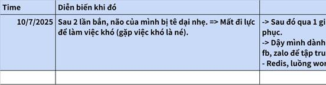

**Click the image to view the sheet.**

**1.2 WHY? MỤC ĐÍCH GAME TÀI CHÍNH - WHY? KIẾM TIỀN ĐỂ LÀM GÌ VÀ CẦN BAO NHIÊU LÀ ĐỦ?** 

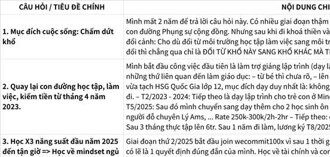

**Click the image to view the sheet.**

|   |   |   |   |
|---|---|---|---|
|1.1.1 Kiếm tiền để làm gì?|1.                   TIỀN BẠC, SỰ NGHIỆP là GAME CỦA THÀNH CÔNG (nó không liên quan gì đến game của HẾT KHỔ). => PHÂN BIỆT THÀNH CÔNG GIÀU CÓ với HẠNH PHÚC HẾT KHỔ.<br><br>2.                   2. TIỀN BẠC LÀ ĐỂ TỰ DO, KHÔNG PHẢI ĐỂ GIÀU CÓ. TỰ DO THẬT SỰ LÀ TỰ DO TÂM TRÍ VÀ CÓ ĐỦ TIỀN ĐỂ TỰ DO LỰA CHỌN - Cuốn Tâm lý học về Tiền và The Art of Spending Money<br><br>+, Tập trung vào game HẾT KHỔ, Tiền bạc và sự nghiệp khi đó sẽ vẫn làm nhưng khổ không khởi lên (giống như việc lập gia đình: giải quyết khổ thân mà không ràng buộc).<br><br>https://www.youtube.com/watch?v=6KzK-4ImTbE  <br>  <br><br>3.                   TỰ DO TÂM TRÍ: NỀN TẢNG CỦA TỰ DO THẬT SỰ<br><br>**Tự do thật sự là tự do trong tâm trí**. Những người hạnh phúc nhất với tiền là những người tìm được cách ngừng nghĩ về tiền. Bạn có thể:[collabfund](https://collabfund.com/blog/my-new-book-the-art-of-spending-money/)<br><br>•                     **Trân trọng tiền**, đánh giá cao nó, thậm chí ngưỡng mộ nó<br><br>•                     **Nhưng nếu tiền không bao giờ rời khỏi tâm trí**, có thể bạn đã có **ám ảnh**[collabfund](https://collabfund.com/blog/my-new-book-the-art-of-spending-money/)<br><br>Tiền có thể trở thành gánh nặng tâm lý, khiến bạn lo lắng, sợ mất mát, hoặc không dám tận hưởng thành quả. **Hãy để tiền phục vụ bạn, đừng để nó trở thành "ông chủ" của mình**.[collabfund+1](https://collabfund.com/blog/a-few-thoughts-on-spending-money/)  <br>  <br>  <br><br>4.                   SOCIAL DEBT - NỢ XÃ HỘI: GÁNH NẶNG TÂM LÝ CỦA TIỀN BẠC<br><br>**Social Debt** là khái niệm phức tạp mà Housel phát triển để mô tả gánh nặng tâm lý khi tiền chuyển từ công cụ sang biểu tượng:[collabfund](https://collabfund.com/blog/rich-and-anonymous/)<br><br>_"Khi tiền không còn là công cụ bạn có thể sử dụng để làm mình hạnh phúc mà trở thành biểu tượng mà người khác đo lường bạn, bạn đã bị chôn vùi trong một loại nợ xã hội khó đo lường nhưng có tác động thực sự đến hạnh phúc"_.[collabfund](https://collabfund.com/blog/rich-and-anonymous/)<br><br>Nhiều người nghĩ mình muốn tiền để sống tốt hơn, nhưng thực tế lại bị cuốn vào vòng xoáy so sánh xã hội, dẫn đến chi tiêu vì sĩ diện hoặc áp lực xã hội.[collabfund+1](https://collabfund.com/blog/a-few-thoughts-on-spending-money/)<br><br>\|   \|<br>\|---\|<br>\|Đặc điểm của Social Debt<br><br>•                     **Rất khó theo dõi** - không xuất hiện trong bảng tài sản nhưng là điều rất thật[instagram](https://www.instagram.com/reel/C20YGr9yX_1/)<br><br>•                     **Càng có nhiều tiền, càng có nhiều Social Debt**[collabfund](https://collabfund.com/blog/rich-and-anonymous/)<br><br>•                     **Mọi đô la tài sản đều đi kèm một vài xu Social Debt**[markmanson](https://markmanson.net/podcast/getting-rich-morgan-housel)<br><br>**Ví dụ: Khi mua xe mới**, bạn không bận tâm xe cũ bẩn hay móp méo. **Nhưng với xe mới đắt tiền**, bạn không thể chịu được khi nó bị bùn bẩn và phát điên khi ai đó làm trầy trong bãi đỗ xe.[collabfund](https://collabfund.com/blog/rich-and-anonymous/)\|<br><br>5.|5.                   ASPIRATIONAL TRICKLE DOWN - CHẠY THEO ĐÁM ĐÔNG<br><br>**Kevin Kelly's Insight**: _"Nếu bạn muốn biết những nhóm thu nhập thấp sẽ khao khát chi tiêu vào gì trong tương lai, hãy nhìn vào những gì các nhóm thu nhập cao làm hôm nay"_.[collabfund](https://collabfund.com/blog/a-few-thoughts-on-spending-money/)<br><br>**Ví dụ**: Du lịch châu Âu, đại học, đầu tư chứng khoán, gia đình hai xe - tất cả đều từng là đặc quyền của người giàu rồi trở thành tiêu chuẩn của đại chúng.[collabfund](https://collabfund.com/blog/a-few-thoughts-on-spending-money/)<br><br>6.                   TỰ DO TIỀN BẠC: TIỀN GIÚP CHÚNG TA CÓ NHIỀU LỰA CHỌN HƠN<br><br>**Tiền không chỉ mua được vật chất, mà còn mua được điều vô hình nhưng có giá trị**: tự do, độc lập, quyền tự chủ và quyền kiểm soát thời gian của mình. Mọi đô la tiết kiệm đều mua được một tấm séc yêu sách về tương lai.[collabfund](https://collabfund.com/blog/a-few-thoughts-on-spending-money/)<br><br>**Nghịch lý của việc trở nên giàu có**: Đối với nhiều người, quá trình trở nên giàu có cảm thấy tốt hơn việc có tài sản.[collabfund](https://collabfund.com/blog/little-rules-about-big-things/)<br><br>TỰ DO TÀI CHÍNH THỰC SỰ LÀ QUYỀN ĐƯỢC TỪ CHỐI.<br><br>7.                   Ý NGHĨA: KHI KHÔNG CÒN NGHĨ VỀ TIỀN  <br>Kiếm tiền đi kèm với đó là phát triển bản thân và tạo giá trị cho mọi người<br><br>Chỉ khi bạn không còn nghĩ về đồng tiền, ý nghĩa mới dễ xuất hiện trong đầu bạn. Việc sử dụng tiền tốt nhất là như một công cụ để tăng cường con người bạn, nhưng không bao giờ để định nghĩa con người bạn.collabfund<br><br>Reverse Obituary là "Viết ra những gì bạn muốn cáo phó của mình nói, sau đó tìm cách sống xứng đáng với nó".collabfund+1<br><br>Quy trình thực hiện:<br><br>1. Viết cáo phó lý tưởng: Những gì bạn muốn người ta nhớ về bạn<br><br>2. Nhận ra điều không có trong đó: Hầu như không ai muốn cáo phó nhắc đến mã lực xe, diện tích nhà, hay giá trị đồ trang sứccollabfund<br><br>3. Làm việc ngược về phía sau: Xây dựng cuộc sống để đạt được những điều trong cáo phó lý tưởng<br><br>Warren Buffett's Version: "Một chiến lược sống tuyệt vời là viết cáo phó của chính mình rồi làm việc ngược từ đó".think2perform||
|1.1.2 Bao nhiêu tiền là đủ: https://www.facebook.com/share/p/185bByKnp5/|[CÀNG ÍT VẤN ĐỀ -> CÀNG ÍT NHU CẦU TIÊU TIỀN. Khởi động 1 sáng Thứ 7]<br><br>Khi kiếm nhiều tiền hơn thì chúng ta có xu hướng chi tiêu nhiều hơn.<br><br>Số ít trong đó, kiếm nhiều hơn, nhưng chi tiêu không đổi.<br><br>Bản chất, ta rút tiền đưa cho người khác là vì ta đang có 1 vấn đề, 1 nhu cầu nào đó.<br><br>Càng ít vấn đề, chi tiêu của ta càng ít, càng tịnh tiến về 0.<br><br>Tiền thì vẫn cứ kiếm, và con số này thì ngày 1 tăng, có nhiều tiền hơn => Ta có sức mạnh hơn, THE POWER, ta có quyền tự do hơn trong các lựa chọn của mình (làm chỗ này làm chỗ kia, con học chỗ này học chỗ kia, ...), ta giúp đỡ được nhiều người hơn khi mn cần (gia đình, xã hội), có nguồn lực để giải quyết những bài toán to hơn của xã hội (giáo dục, đào tạo, ...)<br><br>Tiền thì vẫn cứ kiếm, nhưng chi tiêu của ta không đổi, ta chi cho những thứ cần thiết, và càng ngày ta càng tự do về tài chính, sức khoẻ, mối quan hệ.<br><br>Còn tâm trí, nó rất đặc biệt, ta tự do ngay khi ta hiểu những điều này. Tự do tâm trí là NGAY BÂY GIỜ VÀ TẠI ĐÂY.<br><br>Use cases<br><br>\|   \|<br>\|---\|<br>\|1.                   MẠO HIỂM VAY 2 TỶ ĐỂ MUA CĂN HỘ 3 TỶ, VỢ CHỒNG TRẺ HỐI HẬN KHÔNG KỊP.  <br>- thu nhập hơn 40 triệu đồng/tháng  <br>- Sau nhiều năm đi làm, họ tích cóp được 500 triệu đồng, có thể xoay xở thêm để đủ khoảng 1 tỷ.  <br>- Họ vay ngân hàng 2 tỷ đồng trong 20 năm, lãi suất thực tế khoảng 12%/năm, với khoản trả nợ hàng tháng hơn 20 triệu đồng - chiếm hơn nửa thu nhập.  <br>- Đầu năm nay, công ty anh Thắng gặp khó khăn, anh phải nghỉ việc và nhận trợ cấp thất nghiệp, đẩy gia đình vào khủng hoảng tài chính  <br>-  Nếu không sớm ổn định lại tài chính, họ có thể buộc phải bán căn hộ\||**Xác Định Các Mốc Chi Phí & Mục Tiêu FIRE**<br><br>•                     **Lean FIRE:** Sống tối giản, chi phí tối thiểu (ví dụ: 2,5 triệu/tháng ≈ 30 triệu/năm)<br><br>￮      FIRELean=30,000,000×25=750,000,000 VNDFIRELean=30,000,000×25=750,000,000 VND<br><br>•                     **Regular FIRE:** Mức sống trung bình ổn định (ví dụ: 10 triệu/tháng ≈ 120 triệu/năm)<br><br>￮      FIRERegular=120,000,000×25=3,000,000,000 VNDFIRERegular=120,000,000×25=3,000,000,000 VND<br><br>•                     **Fat FIRE:** Mức sống cao, tài sản lớn (ví dụ: 40-50 triệu/tháng ≈ 480-600 triệu/năm)<br><br>￮      FIREFat=600,000,000×25=15,000,000,000 VNDFIREFat=600,000,000×25=15,000,000,000 VND<br><br>\|   \|<br>\|---\|<br>\|Thực tế chi phí sinh hoạt của mình 1 tháng:<br><br>•                     Thời sinh viên ăn 1 bữa trưa/ 2 bữa trưa tối. => Sự thật giai đoạn ở K7, mình tiêu không đến 2 triệu/tháng (800k tiền phòng, 400k điện nước, tối thường nhịn hoặc ăn cơm không).<br><br>•                      Năm đầu tiên đi làm thì:  <br>+, Sáng chạy bộ về: uống ngủ cốc / 2 quả trứng luộc => 10 quả 1 tuần = 35k.  <br>Trưa: Ăn ở ở công ty từ T2-T6. Sáng + Trưa cuối tuần thì ăn 2 ức gà => Tổng 40k.  <br>+,Tối:Ăn cơm ruốc/vừng/ăn cơm không/thứ gì đó ở quê mang lên/xôi 10k ăn lẫn với cơm  <br>Cuối tuần thì ăn tối bằng 2 cái bánh mì (15k 2 cái).  <br>=> <= 100k 1 tuần  <br>=> 1 tháng cả tiền phòng và ăn nhỏ hơn 3 triệu, và lương khi đó là 14 triệu.<br><br>•                     Mình dùng hơn 100% tiền lương của mình để học tập và nâng cấp bản thân trong suốt từ lúc đi làm cuối năm 3 (6/2024 - T12/2025): 1 năm rưỡi với 1 loạt các khoá học. Sau 1 năm rưỡi mình có sự vững vàng của mình trong nhiều mặt của cuộc sống.<br><br>•                     Sau khi nghe cuốn Million Dollar Weekend - Làm sao khởi nghiệp triệu đô chỉ trong 48h, mình nhận ra rằng chỉ cần công ty cho mình 3 triệu 1 tháng là mình ổn để sống.<br><br>=> Mình sẵn sàng CHỊU LƯƠNG THẤP THẬM CHÍ 3 TRIỆU/THÁNG để THEO ĐUỔI NHỮNG CHIẾN LƯỢC DÀI HẠN VỀ SAU.<br><br>=> Khi xác định được MỨC SỐNG TỐI THIỂU. Mình thấy rất nhẹ nhàng để CHUẨN BỊ CHO NHỮNG CHIẾN LƯỢC DÀI HẠN.  <br>=> Viết lại chi tiêu, mình ko cần nhiều tiền đến thế - https://youtu.be/Lt8zC2ktGmA?si=p__B5CVWXVdvOQKs\|<br><br>  <br>Khi kế hoạch tài chính đơn giản như vậy, hoàn toàn có thể start up với mục tiêu đơn giản là DÒNG TIỀN ĐỀU 1000$/tháng (tính ra 1000 user, mỗi user 1 đô, thay vì là bụp phát đòi công ty tỷ đô)|**SỰ THẬT TÀN NHẪN VỀ "TÍCH LŨY TƯ BẢN NGUYÊN THỦY" - chủ nghĩa tiêu dùng**<br><br>\|   \|<br>\|---\|<br>\|XIỀNG XÍCH SỐ 1: CHỦ NGHĨA TIÊU DÙNG VÀ CỖ MÁY TUYÊN TRUYỀN  <br>Họ không cấm bạn tiết kiệm. Họ chỉ làm cho việc tiết kiệm trở nên lỗi thời, ngu ngốc và đáng xấu hổ.  <br>Họ dùng KOL, KOC, phim ảnh để thổi vào đầu bạn những giá trị ảo:  <br>• "Tiền bạc quyết định hạnh phúc."  <br>• "Phải có nhà, có xe mới có người yêu."  <br>• "Tuổi trẻ chỉ có một lần, phải Yolo, phải đi du lịch sang chảnh, phải trải nghiệm."  <br>Họ biến việc tiêu tiền thành thước đo thành công. Và bạn sợ hãi. Bạn sợ bị bỏ lại. Bạn sợ bị coi là thất bại nếu 30 tuổi chưa có ô tô. Bạn sợ bị chê "quê mùa" nếu không check-in resort 5 sao.  <br>Hậu quả: Bạn lao vào cuộc đua này. Bạn tiêu sạch những gì kiếm được.  <br>10 năm trôi qua, bạn 35 tuổi. Bạn có một chiếc iPhone đời mới nhất, vài tấm ảnh du lịch đẹp, và một tài khoản tiết kiệm RỖNG TUẾCH.  <br>Bạn đã tự tay phá hủy cơ hội tích lũy vốn của mình. Bạn đã làm chính xác những điều họ muốn.\|<br><br>\|   \|<br>\|---\|<br>\|XIỀNG XÍCH SỐ 2: CÁI BẪY "NÂNG CẤP CUỘC SỐNG"  <br>Nếu bạn "lì lợm" vượt qua được ải tiêu dùng, họ sẽ dùng đến vũ khí thứ hai. Nó được bọc đường bằng cái tên mỹ miều: Nâng cấp chất lượng cuộc sống.  <br>• Khi bạn tiết kiệm được 35 triệu: "Đổi điện thoại đi, iPhone 17 mới ra đẹp lắm, xứng tầm với bạn."  <br>• Khi bạn có 350 triệu: "Mua ô tô đi, che mưa che nắng, có xe đối tác mới nể."  <br>• Khi bạn có 3.5 tỷ (lẽ ra đã đủ để tự do): "Mua nhà đi, an cư lạc nghiệp. Cố mua căn chung cư cao cấp 5 tỷ, trả góp 30 năm thôi mà."  <br>Mục đích cuối cùng là gì?  <br>Là RÚT SẠCH TỪNG ĐỒNG trong túi bạn. Là đảm bảo bạn quay lại vạch xuất phát.  <br>Bạn tưởng bạn sở hữu cái nhà, cái xe? Không, bạn đang sở hữu một ĐỐNG NỢ.  <br>Bạn vừa ký vào bản án nô lệ 30 năm cho ngân hàng. Bạn không dám nghỉ việc, không dám cãi sếp, vì nếu thất nghiệp 3 tháng, ngân hàng sẽ siết nhà.\||
|1.1.3 Làm business để làm gì?|•                     Tạo giá trị thực cho xã hội và khách hàng: Giải quyết vấn đề, đáp ứng nhu cầu, làm cuộc sống tốt hơn.<br><br>•                     Business với hiệu ứng: “positive sum game” Business thúc đẩy sự phát triển chung của nền kinh tế (Chẳng hạn giờ ông nào cũng lười, ông nào cũng trồng lúa chăn bò thì sẽ chẳng bao giờ có máy móc, internet, AI, ... hiện đại như ngày nay).<br><br>•                     Va chạm, liên tục vượt ngưỡng giới hạn bản thân và xoá bỏ niềm tin giới hạn, khi tư duy ở vị trí làm chủ, góc nhìn của bạn sẽ dần lên 1 level khác, khi tư duy như 1 nhà đầu tư, góc nhìn lại càng khác<br><br>Ngoài lề:<br><br>•                     Tại sao mn cần thức ăn mà ko phải tất cả mn đều đi trồng lúa? -> Vì chuyên môn hoá mỗi người mạnh yếu khác nhau.<br><br>•                     Nếu ko ai trồng lúa thì lấy gì mà ăn? Thực tế thị trường có cơ chế tự động điều chỉnh phân bổ ngành nghề, chẳng hạn lúa gạo bị ít đi thì giá tự nhiên sẽ đắt lên, mn từ 1 số ngành nghề khác sẽ di chuyển sang ngành trồng lúa).|\|   \|<br>\|---\|<br>\|1.                   Chia sẻ dự định FinTech Global  04/10/2025 với anh Phúc<br><br>Em cảm ơn anh,<br><br>Nọ meet với anh xong, em cũng suy nghĩ thêm về Finance xem đi dài hạn ngành này thì nó có ý nghĩa gì. (Edu với Productivity (cũng là Edu) thì ý nghĩa nó rất rõ ràng, còn Finance thì không rõ ràng lắm).<br><br>Em đi hỏi 1 anh người Việt start up 1 cái FinTech bên Mỹ, ảnh bảo em là: "ở bên Mỹ start up 1 cái FinTech và sau thành công sẽ có thêm công ty con ở Việt Nam." <br><br>Nên không riêng gì Fintech, ... 1 doanh nghiệp gì đó lớn của Việt Nam mà tầm cỡ quốc tế như: google, Microsoft thì sẽ đều giúp được cho người Việt nhiều.<br><br>•                     tạo công ăn việc làm<br><br>•                     đóng thuế cho nhà nước<br><br>•                     Positive Sum Game<br><br>Em hỏi thêm là: mình giàu lên người khác có nghèo đi không, sau em ngẫm ra là: Positive Sum Game (cả xã hội cùng đi lên), thay vì để tiền vào tay mấy ae khác thì tiền vào tay ae mình thì ae mình chủ động được hơn.<br><br>Ổng anh kia cũng theo phong cách Warren Buffet cho đi 95% tài sản.<br><br>---<br><br>Sau anh có thể theo hướng tầm nhìn như này cũng oke ạ :3<br><br>Em cũng đang phân tích ngành Finance thêm để xem có chốt nhảy ngành không hay vẫn bên EduTech.<br><br>--<br><br>Sau ae mình có thể trao đổi thêm với nhau về mô hình kinh doanh, tầm nhìn dài hạn, ... các thứ ạ :D<br><br>2.                   Bài viết a Hảo:  <br>https://www.facebook.com/share/p/1BfSXFG2Th/\|||
|1.1.4 Bao giờ thì bắt đầu, NỖI SỢ CHƯA ĐỦ KINH NGHIỆM VÀ NIỀM TIN GIỚI HẠN - T10/2025.|•                     Chấm dứt tư tưởng đợi mình đủ giỏi, vì không bao giờ là ĐỦ GIỎI cả, mình giỏi luôn có đứa khác giỏi hơn.<br><br>•                     Học bơi trên bờ? Muốn ăn thì lăn vào bếp, học bơi mà ngồi trên bờ học bơi thực sự là lúc nhảy xuống nước, học AI thực sự là lúc vào dự án. Đợi học chuyên môn rồi học Business lý thuyết có mà đến mùa quýt, học được nhiều nhất là lúc làm thực tế.<br><br>•                     Sự thật là: NIỀM TIN GIỚI HẠN chưa đủ giỏi, thiếu cái này cái kia, chờ thêm, ... đi kèm với nó là SỰ NHU NHƯỢC VÀ SỢ HÃI, KO DÁM BƯỚC RA VÙNG AN TOÀN, VÙNG GIỚI HẠN.|||
||Bài siêu hay: -11/11/2025  <br>1. THAY VÌ LÀM VIỆC TRONG 50 NĂM LIÊN TỤC VẤT VẢ, BẠN CÓ THỂ NÉN LẠI LÀM MỌI THỨ TRONG 5-10 NĂM. Value giá trị cần có là ko đổi, dù làm thuê hay làm chủ bản chất giàu có vẫn đến từ việc bạn tạo ra ĐÚNG THỨ NGƯỜI KHÁC MUỐN  <br>Nó ko làm thay đổi quy luật: CHÚNG TA MUỐN/CẦN CỦA CẢI TÀI SẢN, TIỀN CHỈ LÀ VẬT TRUNG GIAN giúp của cải và tài sản dễ dàng lưu thông trong xã hội.  <br>2. NGUỴ BIỆN MIẾNG BÁNH (Đến tận tháng 10/2025 - 22 tuổi - sau hơn 1 năm đi làm mình còn hỏi : thế mình giàu người khác có nghèo đi không).  <br>+, Sau đó 1 người anh trả lời câu hỏi của mình: Khi làm doanh nghiệp, chúng ta tạo ra giá trị lớn hơn, tạo công ăn việc làm cho nhiều người hơn, đóng thuế nhiều hơn. => Mình chuyển từ việc mindset sợ giàu sang mindset làm chủ để trở nên giàu có và GIÚP ĐƯỢC NHIỀU NGƯỜI HƠN.  <br>+, Mãi đến tận tháng 11, khi mình nghe video: https://youtu.be/PnRLrOzxIk8?si=2yesHwbzNUKbBj_q=  <br>  <br>Cần hiểu rằng:  <br>1. CHÚNG TA MUỐN/CẦN thực sự là CỦA CẢI, TÀI SẢN, chứ không phải tiền.   <br>(Hình dung dễ nhất: nếu ở xa mạc hay đảo hoang, thứ chúng ta cần là tài sản, của cải (thức ăn, nước uống, dịch vụ, ... chứ lúc đó không phải là tiền).  <br>Vậy tại sao mọi người ai cũng đi kiếm tiền?   <br>  <br>2. TIỀN LÀ VẬT TRUNG GIAN giúp của cải và tài sản dễ dàng trao đổi, lưu thông trong xã hội.  <br>- Nói về nguồn gốc của tiền:  <br>+, Thời đói kém, mn ai ai cũng ra đồng trồng lúa, trồng khoai. Dần dần thời đói kém qua đi, nhu cầu mọi người tăng thêm mn muốn có quần áo đẹp hơn, chăn ấm hơn, nhiều nhu cầu khác xuất hiện. => Nếu mọi người ai cũng đi trồng lúa hết thì không tận dụng được hết sức mạnh của sự CHUYÊN MÔN HOÁ. => Lúc này người trồng lúa, người làm mộc, người làm nghề khác, ...  <br>+, Khi bạn làm ra 1 cây đàn, bạn ko thể đem nó để đổi lấy gà được vì người nuôi gà ko cần đến nó => và tiền ra đời là 1 thước đo giá trị để giúp của cải tài sản dễ dàng lưu thông.  <br>  <br>3. Vậy thì: Muốn có nhiều của cải, tài sản hơn => Bạn cần tạo ra THỨ NGƯỜI KHÁC CẦN/MUỐN (nói cách khác bạn tạo ra nhiều GIÁ TRỊ (VALUE) hơn), chứ không phải cố gắng kiếm nhiều tiền hơn.  <br>  <br>4. SỐ LƯỢNG TIỀN BẠC LÀ HỮU HẠN (nếu ko in thêm tiền), nhưng CỦA CẢI TÀI SẢN LÀ VÔ HẠN, KO CÓ CHẶN TRÊN.  <br>-  Mọi người thường nghe về: 20% người giàu sở hữu 80% tiền bạc, tài sản. (Đúng hơn là thậm chí 5%), rằng mọi người cho rằng: điều đó thật bất công.  <br>- Tuy nhiên hãy nhớ rằng tiền bạc là hữu hạn, của cải là ko có giới hạn. Vào 1 mùa hè nghỉ 3 tháng, thay vì vui chơi với bạn bè, bạn mua 1 chiếc xe ô tô cũ về và sửa chữa nó  <br>=> lúc này xã hội có 1 chiếc xe mới, bạn tạo thêm của cải mà chẳng làm ai mất mát gì đi cả.  <br>  <br>GIÁ TRỊ 1 ĐỒNG TIỀN = tạm hiểu là = TỔNG TÀI SẢN / SỐ LƯỢNG TIỀN.  <br>+, Khi tất cả mọi người cùng tập trung vào tạo ra tài sản của cải thì 1 đồng mua được rất nhiều thứ.  <br>+, Điều này cũng lý giải tại sao có lạm phát, là do các nước in thêm tiền làm pha loãng tổng tài sản hiện có.  <br>  <br>5. NGƯỜI NGHÈO KIẾM TIỀN, NGƯỜI GIÀU TẬP TRUNG TẠO TÀI SẢN CỦA CẢI.  <br>(Hiểu toàn bộ những điều trên, bạn mới thực sự hiểu được điều này).  <br>Thế nên có 1 câu nói: nếu chia đều tất cả tiền bạc trên trái đất này cho tất cả mọi người, thì chỉ trong 1 thời gian ngắn, tiền bạc lại quay về phân bố giàu nghèo như cũ.|||

**Go Global**

|   |
|---|
|1.                    <br><br>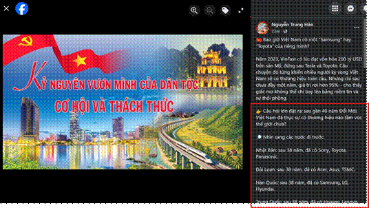|

 Kiếm nhiều tiền hơn - GIẢI QUYẾT VẤN ĐỀ QUAN TRỌNG (ko phải làm việc khó hơn, mà là làm việc giải quyết vấn đề của mn hơn) - TÌM KIẾM VÀ KHAO KHÁT SỰ KHÓ CHỊU -

1.3 QUAN SÁT 1. Tiền, MINDSET về TIỀN,

1.                   MINDSET Tiền (Giáo dục CÔNG NGHIỆP >< GD TÀI CHÍNH) - Triệu Phú, Bán Hàng Giá Cao.

+, PHƯƠNG TIỆN, ĐÒN BẨY(Phương tiện chấm dứt khổ thân, Đòn bẩy cho cảm giác hạnh phúc chứ tiền ko mua được). 

+, VẬT NGANG GIÁ - TRAO ĐỔI GIÁ TRỊ (Không kiếm tiền mà là đổi tiền). => Đào tạo trao đổi, thu phí học viên, trả phí cho học viên thực tập sau đó học viên đóng góp chất xám lại cho DN.

•                     Master Kỹ Năng/Tìm CO-FOUNDER: CHUYÊN GIA + CON NGƯỜI + KINH DOANH(MENTOR - C&D Copy and Development not R&D - WHO not HOW => Đúng MÔ HÌNH KINH DOANH )

2.                   TIẾN BẠC < TÍNH CÁCH (TĨNH) - https://youtu.be/1sLyCzGJ-9k?feature=shared

3.                   KHÔNG HỌC THỨ GÌ KHÔNG DÙNG

4.                   KHÔNG PHẢI LÀM VIỆC KHÓ HƠN MÀ LÀ GIẢI QUYẾT VẤN ĐỀ VALUE HƠN.

5.                   NHỊN KIẾM TIỀN GIAI ĐOẠN ĐẦU - Chiến lược dài hạn Wecommit100x.

Cường ơi tháng 6 tổng em off (trừ đi làm bù rồi) là bnh buổi ý nhỉ?

Thui cứ dùng outcome để tính anh ạ. Tháng 6 phần lớn là em tập trung đồ án.

Outcome với công ty cũng không nhiều chỉ có: fix bug LeanSpeak, test II Agents, Audio Detection, ...

Tháng 6 em xin nhận 1/3 lương anh ạ!

QUAN SÁT 2. TÂM LÝ HỌC VỀ PROBLEM SOLVING: TRÒ CHƠI NGƯỜI VỚI NGƯỜI, TRÒ CHƠI VỀ MẶT TÂM TRÍ.

Đi làm 1 năm, thấy mn cũng nói nhiều về Problem Solving, suy cho cùng mình thấy nó cũng chỉ là: Vấn đề - Nguyên nhân - Giải pháp. Tuy nhiên lại ko thể chạm sâu vào nó. Cho đến khi X3 năm 2025 và học X3 Thời gian

1.                   Đồng nhất Thành công và Hạnh phúc => Sợ và né vấn đề

2.                   Vấn đề là Tiền

3.                   David Goggins: Tự tẩy não mình để THÈM MUỐN CẢM GIÁC KHÓ CHỊU.

4.                   TƯ DUY KO GIỚI HẠN: Chạy 1 dặm dưới ít hơn 4min, Giải 2 bài toán khó nhất Thế Giới vì tưởng là BVN, Thức 36h ko ngủ và làm việc liên tục 28h tại đúng 1 quán caffe.

CÁCH RAISE VẤN ĐỀ -> VẤN ĐỀ VALUE, KÈM GIẢI PHÁP, KÈM DẪN CHỨNG.

1.                   Vấn đề + Giá trị khi giải quyết

2.                   Nguyên nhân + Dẫn chứng

3.                   Giải pháp + Dẫn chứng

4.                   Người khác comment, xác nhận

—-

Vấn đề khác:

1.                   Raise: CHẠY BỘ LÀM FRONTEND KỶ LUẬT + REPORT CHUẨN CẤU TRÚC ĐƯỢC MANAGER CÓ LỜI KHEN (Đấy là em còn chưa xài công thức 1, 2, 3, 4 của sếp Huy) :D

2.                   https://github.com/DoanNgocCuong/home/blob/main/1.%20DailyNote/2025-07-29.md

7.                   Làm business để làm gì, bao giờ bắt đầu, NỖI SỢ CHƯA ĐỦ KINH NGHIỆM VÀ NIỀM TIN GIỚI HẠN - T10/2025.

1.                   Làm business để làm gì?

•                     Tạo giá trị thực cho xã hội và khách hàng: Giải quyết vấn đề, đáp ứng nhu cầu, làm cuộc sống tốt hơn.

•                     Business với hiệu ứng: “positive sum game” Business thúc đẩy sự phát triển chung của nền kinh tế (Chẳng hạn giờ ông nào cũng lười, ông nào cũng trồng lúa chăn bò thì sẽ chẳng bao giờ có máy móc, internet, AI, ... hiện đại như ngày nay).

•                     Va chạm, liên tục vượt ngưỡng giới hạn bản thân và xoá bỏ niềm tin giới hạn, khi tư duy ở vị trí làm chủ, góc nhìn của bạn sẽ dần lên 1 level khác, khi tư duy như 1 nhà đầu tư, góc nhìn lại càng khác

Ngoài lề:

•                     Tại sao mn cần thức ăn mà ko phải tất cả mn đều đi trồng lúa? -> Vì chuyên môn hoá mỗi người mạnh yếu khác nhau.

•                     Nếu ko ai trồng lúa thì lấy gì mà ăn? Thực tế thị trường có cơ chế tự động điều chỉnh phân bổ ngành nghề, chẳng hạn lúa gạo bị ít đi thì giá tự nhiên sẽ đắt lên, mn từ 1 số ngành nghề khác sẽ di chuyển sang ngành trồng lúa).

2.                    

**1.3 WHY? MỤC ĐÍCH TỐI HẬU CỦA TRÒ CHƠI MỐI QUAN HỆ?**

|   |
|---|
|Câu chuyện "Cậu bé mù và cây đèn dầu"|

**2 WHO? NHÂN DẠNG:**

**2.1 NHÂN DẠNG GAME TÀI CHÍNH**

**2.2.0 Tracking Full**

**2.2.0.0 18-22 năm về trước, mình đã đón nhận những cú tát và bật dậy như nào?**

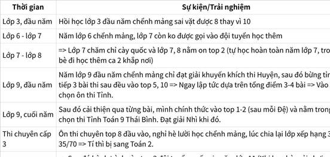

**Click the image to view the sheet.**

|   |
|---|
|**_Mốc 0: Hành trình 4 năm._**<br><br>**Tốt nghiệp bằng khá.**<br><br>**Đội tình nguyện trong và ngoài trường.**<br><br>**Làm công ty nơi thực tập hồi năm 3.**<br><br>**36h không ngủ, 28h quán caffe hoàn thiện 1/3 đồ án.**<br><br>**The Road: Cùng ae Top 1% IT VN Go Global.**<br><br>**Tập trung thứ dài hạn, hệ thống, nhất quán, đủ thời gian.**|

**1.2.0.1 TƯ DUY DÀI HẠN BACKEND-FRONTEND WECOMMIT 100X: DÀI HẠN + NHẤT QUÁN + ĐỦ THỜI GIAN - T2/2025**

[TÀI SẢN HỮU HÌNH](https://csg2ej4iz2hz.sg.larksuite.com/wiki/AkygwYS74iAcLlkdKpVle2hQgLe)

|   |
|---|
|1.                   Điểm nghẽn:  <br>Sau 6 tháng đi làm,  <br>=> Mình băn khoăn và bế tắc trong việc grow tại công ty nơi mình thực tập (Từ T6/2024)<br><br>2.                   Điểm aha, thời gian về quê nghỉ Tết/ Mình may mắn tìm được sếp Huy vào Tháng 2/2025 (Mindset về chiến lược y hệt X3 năng suất) + Cùng lúc đó X3 phát động chương trình (bắt trend video để tạo tài sản số).  <br>=> 2 bước ngoặt lớn trong năm 2025: Gia nhập Wecommit100x 30 củ trở thành 1 trong những người hoạt động năng nổ và gặt hái nhiều phần quà + Gia nhập gói 1 năm X3 năng suất 27 củ và ở đó có TÀI CHÍNH CÁ NHÂN nơi thay đổi toàn bộ mindset của mình về tiền bạc và tiếp xúc với tài chính doanh nghiệp và các network INVESTOR từ đây|

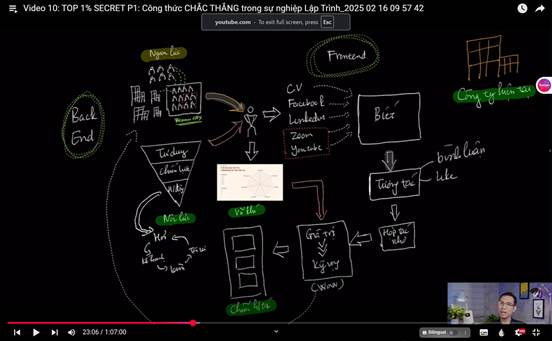

**1.2.0.2 Nhân dạng Version 1 - T4/2025 - NHÂN DẠNG: ĐÂY LÀ THỨ MẠNH HƠN MINDSET. BẠN MUỐN TRỞ THÀNH AI VẬY? WHO? - TẤM BẢN ĐỒ CHI TIẾT - Mentor K22**

|   |
|---|
|Rà nghiệp => Đúc kết lại dựa trên SỐ LIỆU, ĐO LƯỜNG:  <br>1. Học tập và phát triển bản thân - thích làm việc với con người, với chiến lược nhân sự và triết lý.  <br>Dẫn chứng : Có rất nhiều đội mình tạo từ BKE, Gen Z, Duyên cộng đồng từ 2021, ,...  <br>=> Mình dùng Đòn bẩy mạng xã hội và như ngày xưa từng nói: hướng nội thích kết nối.  <br>  <br>2. Tuy nhiên đi kèm với đó là chuyên môn AI. Thích build sản phẩm nhanh từ ngày xưa hồi lớp 12 (vì nó tạo ra động lực chinh phục).  <br>- Trong 7 tháng thực tập lượng code mình đẩy lên xanh lè bản đồ github, minh chứng cho việc thích code như nào, còn lý thuyết thì buổi được buổi nghỉ => Mình: Engineering > Researcher<br><br>  <br>3. Kinh doanh - xem shark tank, cộng đồng - nhiều cộng đồng thiện nguyện cộng đồng năng suất quản trị đội ngũ rèn luyện bản thân xây dựng đội ngũ thiền tu tập, AI, Ngân hàng, Thích ra sản phẩm nhanh, thích coding, học sâu kiến trúc model thì buổi được buổi nghỉ, thích viết bài content, đòn bẩy mạng xã hội, ...  <br>  <br>Nhược điểm duy nhất là:  <br>---  <br>Chọn hướng đi cho mình: ??? (Thử đặt mình vào các vị trí mình chọn => Kaizen liên tục).  <br>  <br>🔥 MỤC ĐÍCH CUỘC SỐNG: Chấm dứt khổ = Con đường Bát Chánh Đạo - [Gosinga, thầy Tuấn Hà, thầy Nam]- Đòn bẩy: 4Freedom : Tự do tài chính - Thời gian - Mối quan hệ - Tâm Trí🔥 SỰ NGHIỆP: AI ENGINEERING🔥 THƯƠNG HIỆU CÁ NHÂN: KOL AI + Community Leader + Expert Business Model. - a Trần Quốc Huy Wecommit100x.  <br>  <br>SAY NO: TỐI ƯU SỰ NGHIỆP BẰNG PHÉP TRỪ - ĐÔI KHI ĐƯA RA TIÊU CHÍ = VIỆC NO VỚI 1 SỐ THỨ LẠI DỄ DÀNG HƠN.  <br>1. No: Data Scientist và Researcher. Vì dòng lịch sử cho thấy nhánh Engineering nổi trội, 80 Engineering - 20% Research. Tuy nhiên về lâu dài vẫn sẽ DATA OPTIMIZATION.  <br>2. Chọn Expert Business Model Kinh Doanh Tri Thức. Say No với việc có quá nhiều nhân sự.    <br>❌ Lý do:    <br>- Không muốn chịu **áp lực vận hành & quản lý nhân sự**.    <br>- Không thích gánh rủi ro tài chính lớn khi phải duy trì công ty.    <br>- Không muốn bị cuốn vào vòng xoáy **tăng trưởng – lợi nhuận – cạnh tranh**.    <br>- Muốn tự do hơn trong sự nghiệp & cuộc sống.    <br>3. No: AI Engineering in Finance quá outscope Banking (Vì độ không ổn định của nó so với khối Banking + Quá nhiều mảng mới như: Quantumn, ...). -> 80% Banking - 20% Finance  <br>4. Say No với công ty lớn do: 1. Banking đã từng thích (nhưng Ko tự do thời gian ko làm được task ngoài, khả năng ko mang được tài nguyên công ty ra ngoài). 2. Khó nhận job ngoài do bank đặc thù, ít job freelancer hơn, ... 3. Khi bị nghỉ thì chỉ có các options khác là vào Banks khác, ... không giống như Product quẩy được đa ngành: Edu, Med, ... => Chọn công ty nhỏ hơn: Production + Finance.  <br>5. Tập trung mục đích chính là 4 Tự do.Domain: Mình ko quá quan trọng là: Product, PO hay PM quan trọng là tiền, Ko quan trọng banking, finance hay Product, cũng ko quan trọng mỹ phẩm làm đẹp hay y tế, ... quan trọng là Tiền X Nhiều Lần. Cơ hội tự tìm đến = KINH NGHIỆM + MỐI QUAN HỆ là Tiền+ ...  <br>  <br>=======  <br>Có 1 sự phân vân giữa 3 nhánh: AI Engineering trong công ty Product nhỏ / AI Engineering trong Bank công ty to hơn / AI Engineering trong công ty Finance.  <br>  <br><br>**🔥 Mục đích cuộc sống: Chấm dứt khổ = Con đường Bát Chánh Đạo (Gosinga, thầy Tuấn Hà, thầy Nam).**  <br>**• Đòn bẩy: 4 Tự do (Tài chính - Thời gian - Mối quan hệ - Tâm trí).**  <br>**🔥 Sự nghiệp: AI Engineering.**  <br>**🔥 Thương hiệu cá nhân: KOL AI + Community Leader + Expert Business Model (Trần Quốc Huy Wecommit100x).**<br><br>e Cường:<br><br>•                     Nhà đầu tư top 1% (tập trung vào cả 3 kiếm tiền - giữ tiền - nhân tiền) (Ko giới hạn khả năng của bản thân và Giữ tiền (dùng tiền làm đòn bẩy cho Network và Chuyên môn)  - ...<br><br>•                     Chuyên gia top 1% (trong AI Engineering, Production, Tài chính, **Expert Business Model** ...) - a Quân Đặng<br><br>•                     Nhà lãnh đạo top 1% (phụng sự ae gia đình đội nhóm cộng đồng) - **KOL trong mảng AI - a Huy Wecommit100x**<br><br>•                     Người chồng hạnh phúc<br><br>•                     Người khoẻ đẹp top 1% (<br><br>•                     Tự do tâm trí top 1% (|

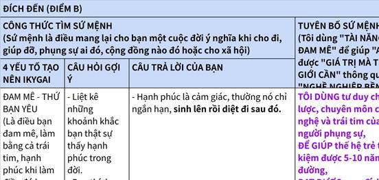

**Click the image to view the sheet.**

**1.2.0.3 Use case 1: Phân vân 10-16/3/2025: ở lại công ty hiện tại 9 tháng hay RỜI ĐI VÀO BANK - Góc nhìn AI Product vs AI Banking .**

**📌 Step 1: Xin góc nhìn từ các Mentor!**

|   |
|---|
|markdown  <br>**SOS GÓC NHỜ TƯ VẤN Ạ:**  <br>**LỰA CHỌN?**  <br>**Ở LẠI HAY RỜI ĐI? RA QUYẾT ĐỊNH Ở LẠI CÔNG TY PRODUCT NHỎ, HAY RỜI SANG CÔNG TY BANK LỚN HƠN. [RESET LẠI TỪ ĐẦU]?**  <br>  <br>**(Em xin phép gắn thẻ 1 số ace chung nhóm ạ. Cảm ơn cả nhà).**  <br>**—-**  <br>  <br>**Em xin phép POST 1 bài cầu cứu SOS, muốn xin góc nhìn từ các anh chị em về hướng đi sắp tới ạ. Em có tầm 1-2 ngày để ra quyết đinh. Cảm ơn cả nhà nhiều ạ.**  <br>   <br>**Em xin phép chia sẻ đôi nét về bản thân ạ.**  <br>  <br>**TỔNG KẾT VỀ BẢN THÂN:**  <br>  <br>**1. Học tập & Phát triển bản thân: Em thích làm việc với con người, quan tâm đến chiến lược nhân sự và triết lý phát triển. Đã từng xây dựng nhiều đội nhóm từ BKE, Gen Z, Duyên cộng đồng từ 2021,...**  <br>**Đòn bẩy: Mạng xã hội (Hướng nội nhưng thích kết nối).**  <br>  <br>**2. Chuyên môn AI: Từ hồi cấp 3 đã thích build sản phẩm nhanh, không thích lý thuyết nhiều. 7 tháng thực tập, lượng code trên GitHub xanh lè, nhưng lý thuyết thì lúc nhớ lúc quên.**  <br>**Kết luận: Engineering > Researcher.**  <br>  <br>**3. Kinh doanh & Cộng đồng: Thích xây dựng cộng đồng, tham gia nhiều nhóm thiện nguyện, năng suất, quản trị đội ngũ, thiền, AI, ngân hàng,... Đặc biệt thích ra sản phẩm nhanh, coding, leverage social media, viết content.**  <br>  <br>**CHỌN HƯỚNG ĐI:**  <br>  <br>**(Thử đặt mình vào các vị trí để Kaizen liên tục).**  <br>  <br>**🔥 Mục đích cuộc sống: Chấm dứt khổ = Con đường Bát Chánh Đạo (Gosinga, thầy Tuấn Hà, thầy Nam).**  <br>  <br>**• Đòn bẩy: 4 Tự do (Tài chính - Thời gian - Mối quan hệ - Tâm trí).**  <br>  <br>**🔥 Sự nghiệp: AI Engineering.**  <br>  <br>**🔥 Thương hiệu cá nhân: KOL AI + Community Leader + Expert Business Model (Trần Quốc Huy Wecommit100x).**  <br>  <br>**SAY NO – TỐI ƯU SỰ NGHIỆP BẰNG PHÉP TRỪ**  <br>  <br>**1. ❌ No Data Scientist & Researcher: Vì 80% nghiêng về Engineering, 20% Research, nhưng về lâu dài vẫn cần tối ưu Data.**  <br>  <br>**2. ❌ No quá nhiều nhân sự:**  <br>**Không muốn chịu áp lực vận hành & quản lý nhân sự.**  <br>**Không thích gánh rủi ro tài chính lớn khi phải duy trì công ty.**  <br>**Không muốn bị cuốn vào vòng xoáy tăng trưởng – lợi nhuận – cạnh tranh.**  <br>**Muốn tự do hơn trong sự nghiệp & cuộc sống.**  <br>  <br>**3. ❌ No AI Engineering in Finance: Vì quá rộng (Quantumn,...) nên 80% Banking - 20% Finance.**  <br>  <br>**4. ❌ No công ty lớn (Banking):**  <br>**Ngày trước thích nhưng bị giới hạn thời gian, khó làm task ngoài.**  <br>**Hạn chế nhận job ngoài.**  <br>**Khi nghỉ, lựa chọn chủ yếu là chuyển Bank khác, không linh hoạt như Product (Edu, Med,...).**  <br>**=> Chọn công ty nhỏ hơn: Product + Finance.**  <br>  <br>**5. Tập trung vào mục tiêu chính: 4 Tự do.**  <br>  <br>**6. Không quá quan trọng domain (Product, PO, PM hay Banking, Finance, Y tế, Mỹ phẩm...). Quan trọng là Tiền x Nhiều Lần. Cơ hội tự tìm đến qua Kinh nghiệm + Mối quan hệ.**  <br>  <br>**PHÂN VÂN GIỮA 3 HƯỚNG ĐI:**  <br>  <br>**1. AI Engineering trong công ty Product nhỏ.**  <br>  <br>**2. AI Engineering trong Bank công ty lớn.**  <br>  <br>**3. AI Engineering trong công ty Finance.**  <br>  <br>**HIỆN TẠI:**  <br>  <br>**• Đang AI Intern 8 tháng tại công ty Product.**  <br>**Cơ hội: Một mình một sân, team AI chỉ có 2 Intern (1 ông ở nước ngoài, em thì chiếm hết spotlight).**  <br>**Môi trường thoải mái, quẩy các task khác trong giờ.**  <br>**Dần có vị trí quan trọng trong team AI, cơ hội lên nắm cao hơn khi công ty mở rộng.**  <br>  <br>**• Có cơ hội chuyển qua Bank: KienLong Bank (lương khởi điểm 3 triệu, không quan trọng lương giai đoạn này).**  <br>**Lộ trình Tự Do Tài Chính trong Bank sẽ như thế nào?**  <br>**Có bị kìm hãm phát triển không? Công nghệ có đi sau?**  <br>**Đi làm về mệt, liệu có thời gian học và quẩy job ngoài không?**  <br>  <br>**CÂU HỎI EM CẦN TƯ VẤN Ạ:**  <br>  <br>**🔹 Nếu nhìn về mục tiêu dài hạn: AI Engineering + KOLs Community + Expert Business Model, thì Bank hay Product có lợi thế hơn?**  <br>**1.  Ở lại công ty Product nhỏ liệu có giúp em đạt mục tiêu nhanh hơn không? 🔹 Bank có thể đạt mục tiêu này không?**  <br>  <br>**2. VỀ ĐƯỜNG DÀI : Tự do tài chính ở Product và Tự do tài chính ở Bank sẽ như nào ạ?**  <br>  <br>**=======**  <br>  <br>**EM PHÂN VÂN 2 HƯỚNG.**  <br>**1. XUỐNG SÂN CỎ.**  <br>**- Còn trẻ thì nhảy vào Bank thử đi, đứng ngoài không biết mình có hợp hay ko?**  <br>  <br>**2. NHÂN DẠNG:**  <br>**- Dựa vào nhân dạng mình mong muốn ?**  <br>  <br>**🔥 Mục đích cuộc sống: Chấm dứt khổ = Con đường Bát Chánh Đạo (Gosinga, thầy Tuấn Hà, thầy Nam).**  <br>  <br>**• Đòn bẩy: 4 Tự do (Tài chính - Thời gian - Mối quan hệ - Tâm trí).**  <br>  <br>**🔥 Sự nghiệp: AI Engineering.**  <br>  <br>**🔥 Thương hiệu cá nhân: KOL AI + Community Leader + Expert Business Model (Trần Quốc Huy Wecommit100x).**  <br>  <br>**========**  <br>  <br>**Mong nhận được góc nhìn của anh chị em!**  <br>  <br>**Em cảm ơn cả nhà nhiều ạ!**  <br>  <br>**— with Huy Bùi and 5 others.**  <br>  <br>**=======**|

|   |
|---|
|yaml  <br>1. Chị Hưng - TCB:  <br>  <br>[16/03/2025 07:43:14] Hưng Happy: tình hình em qđ sao rồi  <br>[16/03/2025 07:43:21] Hưng Happy: thế ko apply vào TCB ah  <br>[16/03/2025 07:46:10] Đoàn Ngọc Cường Nhất Hướng: Em cảm ơn chị. 😁  <br>[16/03/2025 07:46:47] Đoàn Ngọc Cường Nhất Hướng: Bên TCB hình như ko mở tuyển AI Intern thì phải chị ạ. Đợt em tìm chưa thấy  <br>[16/03/2025 07:47:32] Hưng Happy: uh, nếu đc vào bank lớn như TCB thì tốt hơn là NH nhỏ như Kiên Long  <br>[16/03/2025 07:47:52] Hưng Happy: nhưng cứ xem xét xem định hướng thúc đẩy mảng công nghệ bên đó như thế nào  <br>[16/03/2025 07:48:01] Hưng Happy: có triển vọng ko  <br>[16/03/2025 07:48:19] Hưng Happy: còn ko thì chị nghĩ làm bên DN Fintech cũng là lựa chọn tốt vì mảng đó đang phát triển nhanh mà  <br>[16/03/2025 07:54:55] Đoàn Ngọc Cường Nhất Hướng: Em đang apply cả FinSpark chỗ F88 🤣  <br>[16/03/2025 07:55:15] Hưng Happy: thôi giờ còn trẻ cứ thử đi, ko gì  <br>  <br>  <br>2. Chị Hằng:  <br>  <br>Em là SV vừa ra trường, cứ có cơ hội việc làm là làm luôn, không nên lựa chọn. Vì em làm ở đâu thì cũng đâu có bị bắt ràng buộc làm bao lâu (trừ khi họ đầu tư cho em đi học và em phải ký hợp đồng bắt buộc làm trong bao lâu).  <br>  <br>Nếu trong trường hợp em có nhiều lựa chọn, thì làm bảng so sánh pros and cons giữa các lựa chọn.  <br>  <br>Lựa chọn sẽ phụ thuộc vào offer cụ thể của từng công ty  <br>  <br>Nếu em làm ở công ty nhỏ, có thể em sẽ được làm những việc chính và quan trọng  <br>  <br>Còn nếu em làm cho các công ty lớn, có thể em sẽ phải trải qua 1 thời gian dài làm việc từ nhỏ đến lớn.  <br>Tuy nhiên mỗi phương án đều có pros and cons.  <br>  <br>Còn nếu nói về chiến lược, định hướng tìm việc chung chung cho SV mới ra trường thì với kinh nghiệm của chị, chị prefer làm cho các tập đoàn lớn. Lí do: (1) em được đào tạo bài bản theo từng level công việc; (2) Các quy trình công việc chuyên nghiệp; (3) Thương hiệu lớn sẽ giúp cho thương hiệu cá nhân của em; (4) chế độ của các công ty lớn sẽ chuẩn chỉnh theo luật hơn, sẽ trả lương cho em xứng đáng hơn với sức lao động (hạn chế tình trạng lạm dụng sức lao động của NLD tại các công ty tư nhân nhỏ); (5) Cơ hội học hỏi và phát triển career path lâu dài; (6) networking rộng lớn hơn...  <br>  <br>Tuy nhiên mỗi phương án đều có pros and cons.  <br>Em cảm ơn chị nhiều ạ. Để em list hết ra.  <br>  <br>  <br>3. Anh Minh:  <br>```  <br>Câu trả lời thực ở WHO chứ không phải HOW  <br>Ai là người ta muốn trở thành sau 7-10 năm nữa? Và follow họ!  <br>```  <br>  <br>## Group Wecommit100x: https://www.facebook.com/groups/1313533252926778  <br>  <br>4. Nguyet Nguyen:  <br>BTW, tui vẫn thấy bên product có lợi hơn bên bank, mặc dù việc có mentor/senior/... đúng nghĩa rất quan trọng trong việc định hình con người mk nha (giống như việc ở đây có các idol) =))) good luck 2u  <br>  <br>5.Cao Khánh:  <br>Công ty nhỏ thì tiềm lực và nguồn lực có hạn, nên mỗi cá nhân trong cty sẽ phải làm việc kiêm nhiều vị trí. Vì vậy khi em ở trong cty đó em sẽ phải làm mọi thứ để có thể ra sản phẩm cho khách hàng. Từ đó em sẽ có nhiều trải nghiệm ở nhiều vị trí khác nhau. Tuy nhiên cty nhỏ sẽ không có quy trình cụ thể vì vậy khó khăn trong việc đánh giá. Và có thể trong cty sẽ không có mentor đủ để định hướng cho em.  <br>Với cty lớn thì tiềm lực và nguồn lực lớn. Đơn giản là có thể trả lương em tốt hơn. Quy trình sẽ rõ ràng từ đó có KPI đánh giá cụ thể. Em có thể sẽ chỉ làm một vài việc cụ thể ở một bộ phận trong cty lớn và khi như vậy em sẽ làm đào sâu hơn ở một việc cụ thể đó.  <br>Chúc em sớm tìm được con đường phù hợp.  <br>  <br>Công ty nhỏ => Cố gắng đề xuất 1 cái OKRs và Kế hoạch đầu tuần cả team => Để có cái đánh giá + Tập trung vào việc 100x thay vì 10x, 1x dần dần hơn.  <br>  <br>6. Anh Son Do  <br>Quan điểm của a là ở đường bên trái  <br>Không chơi theo đám đông, đi thị trường ngách  <br>---  <br>Son Do Hay quá anh ạ, thế mà em không nhớ đến: Chiến lược đại dương xanh, đi thị trường ngách.  <br>---  <br>Đúng là ngân hàng trăm ngàn ông lao vào, colonthree  <br>Em cảm ơn anh Sơn ạ ^^  <br>  <br>7. Tiến triều: https://www.facebook.com/groups/1313533252926778/user/100004664041597/  <br>- Cuộc đời chỉ mới bắt đầu thôi. Hãy đi để được quay trở về, đi để đi tìm "thuật giả kim" cho chính mình nhé e  <br>- Huy Bùi: Không đến đc Sa Mạc thì làm sao biết đc vàng ngay dưới chân anh nhỉ  <br>  <br>8.   Trịnh Hải Long: https://www.facebook.com/groups/1313533252926778  <br>```  <br>[Trịnh Hải Long](https://www.facebook.com/groups/1313533252926778/user/100076513396680/?__cft__%5b0%5d=AZWAVB0ivEIIhIXfzr_b-jccnlL2AAnEnVRlHtMNuPVDZVGpXuzDmtkBeGWPJBc_-y3K-8wY-GmkyrHH4V-cNsDJnk5Mg7V-P9OctJejpplFsIMZNQlTDoSX_GS9tgkSv8iNDBfk6L_TfJCiyGrtVSk1FtLtkNILxlum-7oEfgmbN7NkvMHux1Gg0Il5EyF3WM-adYKSZTbYWUiw3AmWhW1U&__tn__=R%5d-R)  <br>Mình từng tx và làm việc ở môi trường bank và finance. ( ý kiến cá nhân) mình cảm thấy nó bị gò bó và khá khuôn khổ. May mắn mình gặp đc ng thầy dạy mình nên cũng bơi đc 2 năm. Nhưng về sau mình cũng rời đi để làm prod. Vì bản chất mình muốn hướng đến làm ra những đứa con và mình cảm thấy tự hào hơn :)) đó là quand diểm cá nhân của mình  <br>  <br>[Đoàn Ngọc Cường](https://www.facebook.com/groups/1313533252926778/user/100015223292215/?__cft__%5b0%5d=AZWAVB0ivEIIhIXfzr_b-jccnlL2AAnEnVRlHtMNuPVDZVGpXuzDmtkBeGWPJBc_-y3K-8wY-GmkyrHH4V-cNsDJnk5Mg7V-P9OctJejpplFsIMZNQlTDoSX_GS9tgkSv8iNDBfk6L_TfJCiyGrtVSk1FtLtkNILxlum-7oEfgmbN7NkvMHux1Gg0Il5EyF3WM-adYKSZTbYWUiw3AmWhW1U&__tn__=R%5d-R) Ban ngày làm Bạn, tối về nhận dự án ngoài còn sức không anh nhỉ (ạ) ^^[Trịnh Hải Long](https://www.facebook.com/groups/1313533252926778/user/100076513396680/?__cft__%5b0%5d=AZWAVB0ivEIIhIXfzr_b-jccnlL2AAnEnVRlHtMNuPVDZVGpXuzDmtkBeGWPJBc_-y3K-8wY-GmkyrHH4V-cNsDJnk5Mg7V-P9OctJejpplFsIMZNQlTDoSX_GS9tgkSv8iNDBfk6L_TfJCiyGrtVSk1FtLtkNILxlum-7oEfgmbN7NkvMHux1Gg0Il5EyF3WM-adYKSZTbYWUiw3AmWhW1U&__tn__=R%5d-R) mình làm ở công ty ck nhỏ thôi  <br> nhưng có đi onsite bên 1 vài bên cho bsc với asean  <br> thấy môi trg nó thế á  <br>  <br> còn nha. Cũng tuỳ vào công ty b làm  <br>   <br> 9. Nguyễn Văn Dũng :  <br> A thì thích các cty outSource hơn, đa dạng công nghệ, dự án. Nhịp độ dự án nhanh. Nhiều issue về kỹ thuật được trải nghiệm. Chế độ đào tạo, thăng tiến.  <br>   <br> a Huy Bùi: [Nguyễn Văn Dũng](https://www.facebook.com/groups/1313533252926778/user/100003861671725/?__cft__%5b0%5d=AZWAVB0ivEIIhIXfzr_b-jccnlL2AAnEnVRlHtMNuPVDZVGpXuzDmtkBeGWPJBc_-y3K-8wY-GmkyrHH4V-cNsDJnk5Mg7V-P9OctJejpplFsIMZNQlTDoSX_GS9tgkSv8iNDBfk6L_TfJCiyGrtVSk1FtLtkNILxlum-7oEfgmbN7NkvMHux1Gg0Il5EyF3WM-adYKSZTbYWUiw3AmWhW1U&__tn__=R%5d-R) thế OS nhưng theo dạng framework có sẵn custom từng bên, hoặc chơi theo kiểu cần người đúng domain xoay bài nhanh thì lấy đâu ra cơ hội trải nghiệm anh nhỉ?  <br>   <br>10. Lâm Ngọc Khương:  <br>Nếu còn trẻ em nên đi theo hướng product, khi có nhiều kinh nghiệm, lớn tuổi thì hãy theo bank nếu cần sự ổn định  <br>Mà nếu ổn hơn có thể cân nhắc hướng Outsource nữa, khá nhiều công nghệ để học[Đoàn Ngọc Cường](https://www.facebook.com/groups/1313533252926778/user/100015223292215/?__cft__%5b0%5d=AZWtdIU-AcGEaBwVngi4lHmX3_DrfKj7JnZhD3CModUP8H-msuaiJ63TQs9_iQ-DCT80SkiEyFd9N8K1qNs780clZmCs-GJlc8MrtEXdN9SVlDBfncHVAsyob16SOLny1WkyJXF8dYztvQIiJZ3-6OFA&__tn__=R%5d-R) đúng rồi em, a làm outsource từ lúc mới ra trường đến giờ  <br>11. anh Phan Tôm :  <br>Xin mượn một câu nói mà anh thấy khá tâm đắc của anh [Nguyễn Nam](https://www.facebook.com/groups/1313533252926778/user/100007727201593/?__cft__%5b0%5d=AZWAVB0ivEIIhIXfzr_b-jccnlL2AAnEnVRlHtMNuPVDZVGpXuzDmtkBeGWPJBc_-y3K-8wY-GmkyrHH4V-cNsDJnk5Mg7V-P9OctJejpplFsIMZNQlTDoSX_GS9tgkSv8iNDBfk6L_TfJCiyGrtVSk1FtLtkNILxlum-7oEfgmbN7NkvMHux1Gg0Il5EyF3WM-adYKSZTbYWUiw3AmWhW1U&__tn__=R%5d-R) : "Không có lựa chọn nào sai, chỉ có lựa chọn không được phát huy cách tối đa".  <br>Sự thật là em còn rất trẻ, bằng tuổi em anh cũng không định hướng được như thế. Cho nên cứ đi đi, vấp thì mình lại đứng dậy đi tiếp   <br>  <br>12. Huy Bùi :[Huy Bùi](https://www.facebook.com/groups/1313533252926778/user/100018676801154/?__cft__%5b0%5d=AZWAVB0ivEIIhIXfzr_b-jccnlL2AAnEnVRlHtMNuPVDZVGpXuzDmtkBeGWPJBc_-y3K-8wY-GmkyrHH4V-cNsDJnk5Mg7V-P9OctJejpplFsIMZNQlTDoSX_GS9tgkSv8iNDBfk6L_TfJCiyGrtVSk1FtLtkNILxlum-7oEfgmbN7NkvMHux1Gg0Il5EyF3WM-adYKSZTbYWUiw3AmWhW1U&__tn__=R%5d-R)  <br>Top contributor  <br>Xin phép đặt thêm câu hỏi để thêm góc nhìn:  <br>- Tại sao Công ty to lại bị giới hạn thời gian?  <br>- Nhiều nhân sự chắc gì đã áp lực vận hành? Offload công việc cho người khác để tập trung đúng phần quan trọng nhất thì sao?  <br>------  <br>[Đoàn Ngọc Cường](https://www.facebook.com/groups/1313533252926778/user/100015223292215/?__cft__%5b0%5d=AZWAVB0ivEIIhIXfzr_b-jccnlL2AAnEnVRlHtMNuPVDZVGpXuzDmtkBeGWPJBc_-y3K-8wY-GmkyrHH4V-cNsDJnk5Mg7V-P9OctJejpplFsIMZNQlTDoSX_GS9tgkSv8iNDBfk6L_TfJCiyGrtVSk1FtLtkNILxlum-7oEfgmbN7NkvMHux1Gg0Il5EyF3WM-adYKSZTbYWUiw3AmWhW1U&__tn__=R%5d-R)  <br>Author  <br>[Huy Bùi](https://www.facebook.com/groups/1313533252926778/user/100018676801154/?__cft__%5b0%5d=AZWAVB0ivEIIhIXfzr_b-jccnlL2AAnEnVRlHtMNuPVDZVGpXuzDmtkBeGWPJBc_-y3K-8wY-GmkyrHH4V-cNsDJnk5Mg7V-P9OctJejpplFsIMZNQlTDoSX_GS9tgkSv8iNDBfk6L_TfJCiyGrtVSk1FtLtkNILxlum-7oEfgmbN7NkvMHux1Gg0Il5EyF3WM-adYKSZTbYWUiw3AmWhW1U&__tn__=R%5d-R) Đúng là nếu công ty Product to thì okela anh nhỉ ạ.  <br>Còn nếu mà Bank thì trăm ngàn ông giống nhau anh nhỉ (ạ)  <br>----  <br>a Huy nói thêm: 2-3 năm nữa mới lo, chứ giờ em mới toanh, em quẩy bên nào cũng như nhau.  <br>  <br>13. Nam Nguyễn  <br>  <br>Ngọc cường:  <br>* • Hướng nội thích kết nối? - Nên xem xét góc nhìn này lại 1 chút cho đỡ nhầm nhãn.  <br>* • Eng > Res, Cộng đồng thì ở mức triển khai hay chỉ thực thi?  <br>+ Không nhiều nhân sự?ý này như kiểu lên thành giám đốc start úp luôn rồi ấy  <br>+ Bỏ Finance vì lý do rộng, thôi thì cũng biết em nó thích bank.  <br>Rồi k công ty lớn?  <br>Thực ra rất muốn tấn công cái tư duy còn đang hình thành này mà biết bản thân quản không có nổi.  <br>Phần trên là thông tin, dù cách trình bày bạn viết ra nhiều và hay, tóm gọn lại nó còn vài ý nhỏ.  <br>Có niềm tin, hiểu bản thân ở một mức độ nào đó rồi là một hạnh phúc.  <br>Cũng tự nhìn cho bản thân hướng đi có niềm tin đúng (chắc là đã thấy ưu điểm)  <br>Cũng cung cấp được khả năng và cơ hội lựa chọn  <br>=====  <br>Lựa chọn:  <br>- Ở lại  <br>- Sang bank KienLong  <br>Còn vài cái nữa chưa thấy rõ ràng.  <br>Đứng ở góc độ “gấp” cần khuyên thì khả năng quay quanh kèo:  <br>‘Em có kèo sang KienLong’ em có nên sang k ạ?  <br>Thì nói thật là ở đây thiếu cái tiêu chí đánh giá được áp vào hoàn cảnh cá nhân của Cường.  <br>Đạt mục tiêu nhanh hơn: Là lên trình nhanh? Lên tiền nhanh? Nổi tiếng nhanh? Câu truyện hay? Có nhiều thời gian tự chủ?  <br>Quay lại bài toán gốc là giao dịch bạn đang làm là gì?  <br>Là đang intern cho công ty Product, đổi thời gian, năng lực và gì đó nữa lấy lại kiến thức, kinh nghiệm, trải nghiệm, quan hệ,…  <br>Bạn đang phát huy cái giao dịch này như thế nào và kèo tiếp còn thơm nữa k?  <br>Mỗi khi đổi sang bên mới thì luôn có câu hỏi là: Thế cái gì sẽ thay đổi?  <br>CV ghi thực tập 8 tháng, thực tập nhiều nơi?  <br>CV ghi thực tập 1 nơi lâu dài và mang lại thành tựu?  <br>Kinh nghiệm công ty cũ còn dùng k?  <br>Sang bên mới có ưu điểm gì và khó khăn, rủi ro hay nhược điểm gì? Có phát huy hay khắc phục đc k?  <br>  <br>---  <br>hơi muộn [Đoàn Ngọc Cường](https://www.facebook.com/groups/1313533252926778/user/100015223292215/?__cft__%5b0%5d=AZVGxtUYShQDCRcgfPCkGYgT3NnF1118-UylJ6bDuec0bTQNp_aP1M2RwnLSSm3EcC33-kOAyBXvzpj6BS2U29RInrCGO0-w2cZ4_AKGzL77ZuNdUuILKocKydOz6Hvn8LGvGfyaA0MygwE0ReWKLnM9&__tn__=R%5d-R) còn dùng đc thì dùng.  <br>Mn cũng đưa ra nhiều thông tin rồi, và cách Nam tư duy mn cũng biết rồi  <br>---[Nguyễn Nam](https://www.facebook.com/groups/1313533252926778/user/100007727201593/?__cft__%5b0%5d=AZVGxtUYShQDCRcgfPCkGYgT3NnF1118-UylJ6bDuec0bTQNp_aP1M2RwnLSSm3EcC33-kOAyBXvzpj6BS2U29RInrCGO0-w2cZ4_AKGzL77ZuNdUuILKocKydOz6Hvn8LGvGfyaA0MygwE0ReWKLnM9&__tn__=R%5d-R) Em cảm ơn anh nhiều đã dành thời gian đưa cho em lời khuyên, góc nhìn ạ.  <br>Chắc chắn là vẫn dùng được anh ạ. Mai em sẽ xem lại kỹ hơn comment của anh,  <br>Hồi sáng em có list ra 1 số ý. Dựa vào các chỉ số, em chọn ở lại công ty hiện tại, xong tìm cơ hội nhảy sang AI Engineering bên FINANCE anh ạ. ^^  <br>  <br>14. sếp Huy:[Trần Quốc Huy](https://www.facebook.com/groups/1313533252926778/user/1228558975/?__cft__%5b0%5d=AZUIFR_MUuUhJ1hQylIOxPTAnrFMF5lNbE61gqq7E0QoYs9Ty54lWYRvvoktfJei1NrD6UzCj4SFjkuF23l20HJHJd8W1BiG1dFybRc7ASA3YegCc-nJIqCujyDgIfgDnJgFElGFCwJ9F0KSctw0Q05r&__tn__=R%5d-R)  <br>Bank hay công ty hiện tại chỉ là phương tiện.  <br>Cả 2 phương tiện này đều có thể tới đích nếu đi đúng cách.  <br>Áp dụng theo chiến lược xây dựng sự nghiệp SYSTEM thì có 1 số thứ góp ý cùng chú  <br>Hiện tại chú đã có 1 khách hàng rồi, làm được 8 tháng cho ông khách ấy, và bây giờ có 1 khách hàng mới (có tên tuổi to hơn hợp tác), chú có nên bỏ dự án cũ để nhảy theo dự án mới không ?  <br>Các câu hỏi cần suy ngẫm  <br>1. Đối với khách hàng hiện tại, mình đã tạo được WOW chưa ?  <br>2. Trong 8 tháng đó, mình đã lấy được giá trị đặc biệt nào từ dự án cho bản thân chưa ?  <br>3. Nếu mình thu được các giá trị bên trên thật sự rồi, thì cơ hội khách hàng lớn ở tương lai cò không, hay đây là cơ hội duy nhất ?  <br>4. 8 tháng cuộc đời đã trôi qua, mình LÃI gì rồi, kho vũ khí 7 cạnh thu được gì rồi ?  <br>5. DẪN CHỨNG ĐÂU ?  <br>  <br>----  <br>  <br>[Đoàn Ngọc Cường](https://www.facebook.com/groups/1313533252926778/user/100015223292215/?__cft__%5b0%5d=AZUIFR_MUuUhJ1hQylIOxPTAnrFMF5lNbE61gqq7E0QoYs9Ty54lWYRvvoktfJei1NrD6UzCj4SFjkuF23l20HJHJd8W1BiG1dFybRc7ASA3YegCc-nJIqCujyDgIfgDnJgFElGFCwJ9F0KSctw0Q05r&__tn__=R%5d-R)  <br>[Trần Quốc Huy](https://www.facebook.com/groups/1313533252926778/user/1228558975/?__cft__%5b0%5d=AZUIFR_MUuUhJ1hQylIOxPTAnrFMF5lNbE61gqq7E0QoYs9Ty54lWYRvvoktfJei1NrD6UzCj4SFjkuF23l20HJHJd8W1BiG1dFybRc7ASA3YegCc-nJIqCujyDgIfgDnJgFElGFCwJ9F0KSctw0Q05r&__tn__=R%5d-R) Em cảm ơn sếp Huy nhiều ạ.  <br>1. Khách hàng hiện tại đã tạo được WOW chưa: chưa  <br>2. Trong 8 tháng đã lấy được giá trị đặc biệt gì từ dự án: Lấy được khá nhiều: từ chưa biết Docker đến việc deploy các mini Web, được làm dự án thực từ đầu: Prompting, RAG, Workflow AI agents, ...  <br>=> Thành tích thu được là: 8 tháng phủ xanh github: nguồn chính thu các offer  <br>3. Cơ hội khách hàng lớn tương lai còn: Do được làm dự án thực bên công ty + có ae backend đông trong Wecommit100x + làm dự án với anh Mentor Sơn Đỗ  <br>4. 8 tháng lãi gì trong 7 cạnh: Chuyên môn không, Kinh nghiệm tăng nhiều, Mối quan hệ có - liên kết với ace bên AI Product Builder, Tiền không nhiều, Danh tiếng không, Phẩm chất không, Cống hiến không.  <br>5. DẪN CHỨNG: Profile Github phủ xanh 6 tháng cuối năm, list 10 Web mini Product trong 8 tháng.  <br>--------------------  <br>Nếu sang chỗ mới?  <br>  <br>----  <br>Cửa nào để sang chỗ mới đi được theo system. và nhìn vào mục đích cuối cùng 4 Tự do: Tiền bạc + Tâm trí + Mối quan hệ + Thời gian.  <br>Phân tích có bất lợi và lợi sau:  <br>1. Tiền bạc: Không có nhiều cơ hội làm cái mới, linh hoạt, và bao trọn dự án => Khó có kinh nghiệm để nhận các khách hàng thứ 2 >< Công ty hiện tại quẩy nhiều thứ fullstack: dễ nhận job khách hàng thứ 2. (Đã có khách hàng HCM: khách nhỏ tầm 30 tuổi ).  <br>TUY NHIÊN: Làm wow thì cơ hội với nhiều BANK, nhiều tiền. ?  <br>  <br>2. Tiền bạc: Vào bank là đi vào thị trường đỏ, hàng trăm ngàn ông? Cửa nào để nổi bật. >< So với công ty cũ thị trường App Tiếng Anh, Robot Tiếng Anh công ty đang đi đầu.  <br>TUY NHIÊN: nhìn về đường dài, khi Bank lên các vị trí cao hơn, manager, ... ổn định và bền?  <br>  <br>3. Thời gian: Bank mệt hơn. Công ty thì phải OT cũng nhiều, lúc nhàn thì cũng nhàn, chill trong giờ làm.  <br>4.|

**📌 Step 2. TÍNH LẠI FINAL SCORE CHI TIẾT - Chiều 16/03/2025 - sáng 20/3**

Sau khi phân tích các tiêu chí con, có thể cập nhật lại điểm số dựa trên đánh giá chi tiết hơn:

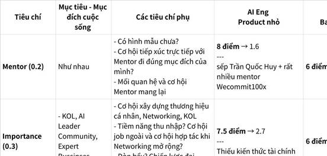

**Click the image to view the sheet.**

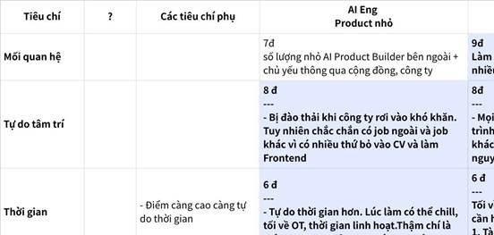

**Click the image to view the sheet.**

Chốt: 16/3/2025: SAU GẦN 1 TUẦN CÂN NHẮC => NẾU BÊN KIÊN LONG BANK CHO LÀM PART TIME THÌ MÌNH LÀM. ĐỂ LẤY KINH NGHIỆM. CÒN KHÔNG THÌ THÔI.  
**Sếp Huy chốt: chú còn trẻ, hãy cho mình chấp nhận rủi ro 1 chút ở bên ngoài để em có thể phát triển bùng nổ hơn.**  
- https://youtu.be/P_yFFabQKA4?feature=shared

**1.2.0.3.0 CÂU HỎI 0: PRODUCT HAY BANK CÓ LỢI THẾ HƠN CHO MỤC TIÊU DÀI HẠN?**

Mục tiêu: AI Engineering + KOL + Community Leader + Business Model Expert + 4 Tự Do


**Click the image to view the sheet.**

**1.2.0.3.1 CÂU HỎI 1: [Làm AI Engineer ở PRODUCT - FINTECH/STOCK - BANKING] Sau khi chấm dứt suy nghĩ nhảy vào đầu tháng 3 -> Mình tập trung làm LEAN SPEAK và nó bùng nổ. Cho đến khi làm xong vào cuối tháng5, đầu tháng 6 làm đồ án, tháng 7 đầu tháng 7 bảo vệ đồ án. => Cuối tháng 6, đầu tháng 7 năm 2025. Từ việc định xin lên fulltime đến việc định nhảy sang Domain Finance (sau khi học X3 Tài chính cá nhân) Phân tích 3 lựa chọn trong sự nghiệp : => Chọn PRODUCT FINANCE: STOCK/INVESTMENT**

|   |
|---|
|1.                   AI Engineering, công ty Product, domain EduTech<br><br>2.                   AI Engineering domain **Finance** (Finance Tech, Fintech): One Mount, Zalo Pay, ...<br><br>3.                   AI Engineering domain **Banking** (Finance Tech, Fintech):<br><br>4.                   AI Engineering domain **Stock/Investment** (Finance Tech, Fintech): DNSE, ...<br><br>_Em thì thích theo: AI Engineering (MLOps, System Design) + Community (làm công đồng, sharing, KOL ...) + Product, Bussiness Model => nên là em thấy Banking hơi gò bó, khó trong việc làm Community (Product với Finance thì thoải mái, tự do hơn), anh nhỉ!_|

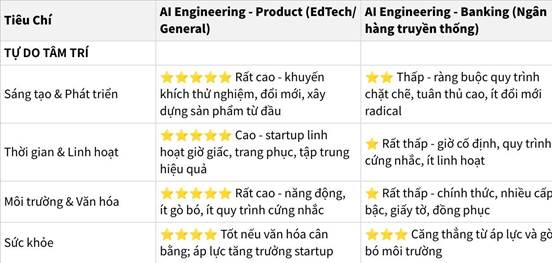

**Click the image to view the sheet.**

**1.2.0.3.2 CÂU HỎI 2: Công ty lớn hay công ty nhỏ? => LỚN HAY NHỎ KO QUAN TRỌNG, QUAN TRỌNG LÀ MÌNH ĐƯỢC CẦM OWNER. => CÔNG TY NHỎ TRƯỚC, RỒI VÀO VỊ TRÍ CAO TRONG CÔNG TY LỚN.**

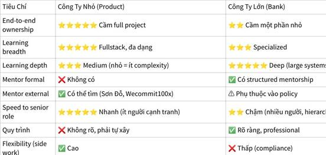

**Click the image to view the sheet.**

**KẾT LUẬN:** Product company **phù hợp nhất** với 80/20 engineering/research ratio

|   |
|---|
|1.                   Làm 80% AI Engineering, 20% AI Research<br><br>2.                   Làm Product (tập trung vào sản phẩm dài hạn), không làm Outsourcing<br><br>3.                   Domain: Finance ưu tiên 80%, các domain khác.<br><br>4.                   Công ty lớn vs công ty nhỏ? nên ưu tiên cái nào?<br><br>•                     Công ty nhỏ: tốt cho việc Bussiness, Community. Engineering thì được cầm các bài end to end, lớn nhanh hơn và được nhanh cầm các hệ thống lớn hơn. Công ty nhỏ ko có mentor nhưng có thể kiếm mentor ở bên ngoài! => Có hướng đúng, sau đó tự đi.  (Công ty lớn có bài toán to nhưng ko dễ để được cầm vào nó, có thể có mentor chuẩn nhưng chưa chắc họ đã chỉ mình và việc mentor mình có thể bù = việc học ở bên ngoài rồi).<br><br>•                     Công ty lớn: có mentor ngon hơn, hệ thống bài toán lớn hơn, tuy nhiên số lượng nhân sự ở đó to. <br><br>=> **Lớn hay nhỏ ko quan trọng, quan trọng họ đều là khách hàng của mình! Ở đâu giúp mình level up nhanh hơn? Đều phải đi trên đôi chân của mình [Thực chiến dự án, dạy lại, mentor feedback and networking]**  <br>=> KHÔNG GIỚI HẠN bản thân trong domain nào cả, nhưng mọi thứ CẦN THỜI GIAN! Về mặt tối ưu: tập trung vào VÙNG LỢI THẾ, MÌNH THÍCH, RA TIỀN NHIỀU VỀ DÀI HẠN để ưu tiên tập trung.|

**1.2.0.3.3 CÂU HỎI 3: PRODUCT HAY OUTSOURCING => CHỌN PRODUCT vì theo mục tiêu dài hạn: CEO, INVESTOR, ĐƯỢC NẮM TỔNG QUAN SYSTEM.**

Tôi sẽ tạo MỘT BẢNG DUY NHẤT tổng hợp toàn diện Product vs Outsourcing theo các tiêu chí dài hạn.

**BẢNG PRODUCT COMPANY VS OUTSOURCING COMPANY (Theo Các Tiêu Chí Dài Hạn - 5-10 Năm)**

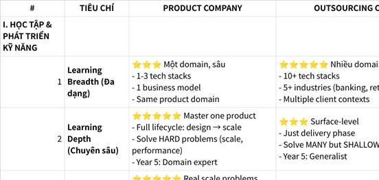

**Click the image to view the sheet.**

TỔNG KẾT ĐIỂM SỐ

**Outsourcing chỉ tốt hơn ở:**

1.                   Learning breadth (Year 1-2)

2.                   Fast initial exposure

3.                   Job security/stability

4.                   Lower company failure risk

5.                   Recession resistance

6.                   Higher entry salary

7.                   Tech stack variety

**Product tốt hơn ở TẤT CẢ các chiều quan trọng:**

1.                   ✅ Learning depth (long-term mastery)

2.                   ✅ Career ceiling (CTO/VP vs Director Delivery)

3.                   ✅ Wealth building (3-5x faster với equity)

4.                   ✅ Portfolio/KOL (visible vs invisible)

5.                   ✅ 4 Tự Do (5-7 years faster)

6.                   ✅ Product thinking (critical skill)

7.                   ✅ Business model expertise

8.                   ✅ Entrepreneurship preparation

9.                   ✅ Ownership & meaning

10.               ✅ YOUR STATED GOALS (80% Finance + Product-focused + KOL)

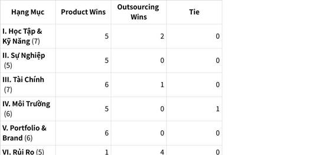

**Click the image to view the sheet.**

**1.2.0.3.5 Câu hỏi 4: FinTech hay EduTech => TÌM CƠ HỘI SANG: PRODUCT FINTECH CÔNG TY BÉ (Product chứ ko Outsourcing để owner, công ty bé trước để được owner, fintech trước để có nhiều tiền và có lợi thế) => Sau đó sang làm INVESTOR.** 

BẢNG SO SÁNH TỔNG HỢP: EDUTECH VS FINTECH (MLOPS/AI ENGINEER)

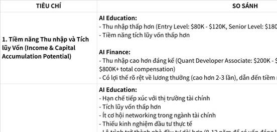

**Click the image to view the sheet.**

**AI Finance thắng trên tất cả 5 tiêu chí:**

•                     ✅ Thu nhập cao hơn 2-3 lần

•                     ✅ Phù hợp tốt hơn với mục tiêu dài hạn (lộ trình ngắn hơn 3-4 năm)

•                     ✅ Cơ hội thị trường và giá trị ứng dụng cao hơn

•                     ✅ Khả năng chuyển đổi kỹ năng khả thi (6-12 tháng)

•                     ✅ Mạng lưới quan hệ phù hợp với mục tiêu trở thành nhà đầu tư

**→ CHỌN AI FINANCE** 🎯

|   |   |   |   |   |   |
|---|---|---|---|---|---|
|#####|TIÊU CHÍ|EDUTECH|FINTECH|WINNER|GAP|
|**I. TÀI CHÍNH & BỒI THƯỜNG**||||||
|1|**Lương Khởi Điểm (Year 1)**|⭐⭐⭐ $60K-$85K/năm<br>-  VN: 40-50M VND/tháng<br>-  Entry ML Engineer<br>-  Modest but stable|⭐⭐⭐⭐⭐ $100K-$150K/năm<br>-  VN: 60-80M VND/tháng<br>-  Entry ML Engineer<br>-  Competitive premium|**FinTech**|+50-70%|
|2|**Lương Mid-Level (Year 3)**|⭐⭐⭐ $80K-$120K<br>-  VN: 50-70M VND/tháng<br>-  Senior ML Engineer<br>-  Linear growth|⭐⭐⭐⭐⭐ $150K-$250K<br>-  VN: 80-120M VND/tháng<br>-  Senior ML Engineer<br>-  Accelerating growth|**FinTech**|+2x|
|3|**Lương Senior (Year 5-7)**|⭐⭐⭐ $120K-$160K<br>-  VN: 70-90M VND/tháng<br>-  Director of AI<br>-  Ceiling lower|⭐⭐⭐⭐⭐ $250K-$500K+<br>-  VN: 120-200M+ VND/tháng<br>-  ML Lead/VP<br>-  Sky's the limit|**FinTech**|+3x|
|4|**Bonus Structure**|⭐⭐ 5-15% of base<br>-  Nếu có<br>-  Tied to revenue<br>-  Modest|⭐⭐⭐⭐⭐ 30-50%+ of base<br>-  Standard<br>-  Performance-based<br>-  Substantial|**FinTech**|+3-5x|
|5|**Equity Potential**|⭐⭐⭐ 0.5-2% typical<br>-  EdTech exits rare<br>-  Valuation: $50M-$500M<br>-  Upside: $50K-$500K|⭐⭐⭐⭐⭐ 0.2-1% typical<br>-  FinTech exits common<br>-  Valuation: $500M-$5B+<br>-  Upside: $500K-$10M+|**FinTech**|+10-20x|
|6|**5-Year Total Compensation**|⭐⭐⭐ ~$480K salary<br>-  + $50-100K equity<br>-  **Total: ~$530-580K**<br>-  After tax: ~$370-400K|⭐⭐⭐⭐⭐ ~$1.2M salary<br>-  + $1-5M equity<br>-  **Total: ~$2.2-6.2M**<br>-  After tax: ~$1.3-3.7M|**FinTech**|+4-10x|
|7|**Timeline đến $1M Net Worth**|⭐⭐ 8-12 years<br>-  Pure salary saving<br>-  Minimal equity upside<br>-  Linear growth|⭐⭐⭐⭐⭐ 3-5 years<br>-  Salary + equity + bonus<br>-  Exponential growth<br>-  Compound effect|**FinTech**|-5 years|
|8|**Side Income Potential**|⭐⭐⭐ $1-3K/month<br>-  Teaching/tutoring<br>-  Course creation<br>-  Limited consulting<br>-  Market smaller|⭐⭐⭐⭐⭐ $3-10K+/month<br>-  High-value consulting<br>-  Algo trading<br>-  Angel investing<br>-  Market huge|**FinTech**|+3-5x|
|9|**Wealth Building Mechanisms**|⭐⭐ Limited<br>-  Salary stacking<br>-  Small equity<br>-  Side teaching<br>-  Slow accumulation|⭐⭐⭐⭐⭐ Multiple<br>-  High salary<br>-  Large bonuses<br>-  Meaningful equity<br>-  Angel/LP opportunities|**FinTech**|+5★|
|10|**Financial Freedom Timeline**|⭐⭐ Year 10-15<br>-  Slow wealth building<br>-  Must work full-time long<br>-  Passive income limited|⭐⭐⭐⭐⭐ Year 3-7<br>-  Fast wealth building<br>-  Can go part-time early<br>-  Multiple income streams|**FinTech**|-7 years|
|**II. KỸ THUẬT & HỌC TẬP**||||||
|11|**Technical Complexity**|⭐⭐⭐ Medium<br>-  Personalization<br>-  Recommendation systems<br>-  NLP for education<br>-  Batch processing OK|⭐⭐⭐⭐⭐ EXTREME<br>-  Real-time fraud detection<br>-  High-frequency trading<br>-  Risk modeling<br>-  Milliseconds matter|**FinTech**|+2★|
|12|**Scale Requirements**|⭐⭐⭐ Medium<br>-  Thousands-millions users<br>-  Can handle some latency<br>-  Less critical uptime|⭐⭐⭐⭐⭐ MASSIVE<br>-  Millions-billions txns/day<br>-  Zero tolerance latency<br>-  99.999% uptime required|**FinTech**|+2★|
|13|**Problem-Solving Difficulty**|⭐⭐⭐ Medium<br>-  Improve learning outcomes<br>-  Engagement optimization<br>-  Content recommendation|⭐⭐⭐⭐⭐ EXTREME<br>-  Prevent fraud ($M stakes)<br>-  Credit risk (±1% = $B)<br>-  Market prediction<br>-  Regulatory compliance|**FinTech**|+2★|
|14|**Production Reliability**|⭐⭐⭐ Important<br>-  Downtime = inconvenience<br>-  Can iterate slowly<br>-  User patience exists|⭐⭐⭐⭐⭐ CRITICAL<br>-  Downtime = huge loss<br>-  Must be perfect<br>-  Zero room for error|**FinTech**|+2★|
|15|**Regulatory/Compliance**|⭐ Minimal<br>-  FERPA (education privacy)<br>-  Basic data protection<br>-  Low stakes|⭐⭐⭐⭐⭐ EXTREME<br>-  PCI DSS, GDPR, SOX<br>-  AML, KYC requirements<br>-  Regulatory audits<br>-  Huge fines if fail|**FinTech**|+4★|
|16|**Model Monitoring Complexity**|⭐⭐⭐ Medium<br>-  Track engagement<br>-  Learning outcomes<br>-  Model drift less critical|⭐⭐⭐⭐⭐ EXTREME<br>-  Real-time monitoring<br>-  Model drift = money loss<br>-  Explainability required<br>-  Constant validation|**FinTech**|+2★|
|17|**Learning Velocity (Forced)**|⭐⭐⭐ Moderate<br>-  Can learn at own pace<br>-  Less pressure<br>-  Iterative improvement|⭐⭐⭐⭐⭐ VERY FAST<br>-  High pressure forces mastery<br>-  Sink or swim<br>-  Rapid skill acquisition|**FinTech**|+2★|
|18|**Tech Stack Sophistication**|⭐⭐⭐ Standard<br>-  Python, TensorFlow<br>-  Standard ML tools<br>-  Cloud platforms|⭐⭐⭐⭐⭐ Advanced<br>-  Python, C++, Scala<br>-  Real-time systems<br>-  Low-latency infra<br>-  Distributed systems|**FinTech**|+2★|
|19|**Domain Knowledge Depth**|⭐⭐⭐ Education pedagogy<br>-  Learning science<br>-  Curriculum design<br>-  Assessment theory|⭐⭐⭐⭐⭐ Finance/Economics<br>-  Risk management<br>-  Trading strategies<br>-  Banking operations<br>-  Market dynamics|**FinTech**|+2★|
|20|**Transferable Skills Value**|⭐⭐⭐ Medium<br>-  ML skills transfer<br>-  But education domain niche<br>-  Harder to pivot|⭐⭐⭐⭐⭐ HIGH<br>-  ML + Finance = golden<br>-  Can go anywhere<br>-  Highly sought after<br>-  Easy to pivot|**FinTech**|+2★|
|**III. CAREER & THĂNG TIẾN**||||||
|21|**Career Trajectory (Year 5)**|⭐⭐⭐ Senior ML Engineer<br>-  Lead education AI team<br>-  Product-focused role<br>-  IC or manager path|⭐⭐⭐⭐⭐ ML Lead/Principal<br>-  Lead risk/fraud teams<br>-  Strategic impact<br>-  High-value contributor|**FinTech**|+2★|
|22|**Career Ceiling (Year 10)**|⭐⭐⭐ Director/VP of AI<br>-  Head of ML at EdTech<br>-  Max: CTO at EdTech<br>-  Industry-specific|⭐⭐⭐⭐⭐ VP Eng/CTO<br>-  Quant Manager<br>-  Hedge Fund Partner<br>-  Multiple paths<br>-  Cross-industry|**FinTech**|+2★|
|23|**Promotion Speed**|⭐⭐⭐ Moderate<br>-  2-3 years per level<br>-  Impact on learning outcomes<br>-  Merit-based|⭐⭐⭐⭐ Fast<br>-  1.5-2 years per level<br>-  Impact on revenue/risk<br>-  High performers rewarded|**FinTech**|+1★|
|24|**Exit Options Diversity**|⭐⭐⭐ Limited<br>-  Other EdTech companies<br>-  Education sector<br>-  Pivot to product (other)<br>-  Found EdTech startup|⭐⭐⭐⭐⭐ MULTIPLE<br>-  Any FinTech<br>-  Hedge funds<br>-  Trading firms<br>-  Banking<br>-  Consulting<br>-  Found FinTech<br>-  Angel investor|**FinTech**|+2★|
|25|**Industry Prestige**|⭐⭐⭐ Moderate<br>-  Education = noble<br>-  But lower status vs finance<br>-  Less "impressive"|⭐⭐⭐⭐ High<br>-  Finance = prestigious<br>-  "Quant" sounds elite<br>-  Competitive field|**FinTech**|+1★|
|26|**Job Market Demand**|⭐⭐⭐ Growing<br>-  ~5K ML roles/year<br>-  Expanding sector<br>-  Moderate competition|⭐⭐⭐⭐⭐ HUGE<br>-  ~20K+ ML roles/year<br>-  Massive demand<br>-  High competition but more spots|**FinTech**|+4x|
|27|**Networking Quality**|⭐⭐⭐ Educators, founders<br>-  Education community<br>-  Government connections<br>-  Impact-focused network|⭐⭐⭐⭐⭐ VCs, quants, founders<br>-  High net worth individuals<br>-  Finance elite<br>-  Capital access<br>-  Deal flow|**FinTech**|+2★|
|28|**Lock-in Effect**|⭐⭐ Low<br>-  Easy to leave EdTech<br>-  Skills portable<br>-  Can switch to other domains|⭐⭐⭐⭐ High<br>-  Hard to leave (golden handcuffs)<br>-  Domain-specific<br>-  But options within finance|**EduTech**|+2★|
|**IV. CÔNG VIỆC & CÂN BẰNG CUỘC SỐNG**||||||
|29|**Typical Hours/Week**|⭐⭐⭐⭐ 40-45 hours<br>-  Predictable schedule<br>-  Rarely weekends<br>-  Sustainable|⭐⭐ 50-70 hours<br>-  Long hours common<br>-  Weekend work<br>-  On-call required<br>-  Intense|**EduTech**|+20 hrs|
|30|**Work-Life Balance**|⭐⭐⭐⭐⭐ Excellent<br>-  Flexible hours<br>-  Family-friendly<br>-  Low stress overall<br>-  Can truly disconnect|⭐⭐ Poor<br>-  Always-on culture<br>-  Market hours matter<br>-  High stress<br>-  Hard to disconnect|**EduTech**|+3★|
|31|**Burnout Risk**|⭐⭐ Low-Medium<br>-  Sustainable pace<br>-  Manageable stress<br>-  Can last decades|⭐⭐⭐⭐ High<br>-  40-50% burnout rate<br>-  Intense pressure<br>-  5-7 year "tour of duty"|**EduTech**|+2★|
|32|**Health Impact**|⭐⭐⭐⭐ Minimal<br>-  Normal stress levels<br>-  Can exercise, sleep<br>-  Healthy lifestyle possible|⭐⭐ Severe<br>-  High stress<br>-  Sleep deprivation<br>-  Health problems common<br>-  Lifestyle sacrifices|**EduTech**|+2★|
|33|**Vacation Reality**|⭐⭐⭐⭐⭐ Can truly take<br>-  Disconnect fully<br>-  No emergency calls<br>-  Respect boundaries|⭐⭐ Always monitoring<br>-  Market alerts<br>-  Can't fully disconnect<br>-  Limited true vacation|**EduTech**|+3★|
|34|**Mental Stress Level**|⭐⭐⭐ Medium<br>-  Failure = learning delay<br>-  Low stakes mistakes<br>-  Forgiving environment|⭐⭐⭐⭐⭐ EXTREME<br>-  Failure = money lost<br>-  High stakes always<br>-  Unforgiving<br>-  Pressure cooker|**EduTech**|+2★|
|35|**Family Time**|⭐⭐⭐⭐⭐ Abundant<br>-  Present for family<br>-  Attend kids' events<br>-  Relationship-friendly|⭐⭐ Limited<br>-  Miss family events<br>-  Work takes priority<br>-  Relationship strain common|**EduTech**|+3★|
|36|**Remote Work Flexibility**|⭐⭐⭐⭐ High (60%+)<br>-  Education = async<br>-  Location-independent<br>-  Digital nomad viable|⭐⭐⭐ Medium (40%)<br>-  Some trading hours required<br>-  Compliance limits<br>-  Hybrid common|**EduTech**|+1★|
|**V. TÁC ĐỘNG XÃ HỘI & Ý NGHĨA**||||||
|37|**Social Impact (Direct)**|⭐⭐⭐⭐⭐ VERY HIGH<br>-  Help students learn<br>-  Improve education access<br>-  Close achievement gaps<br>-  Visible positive impact|⭐⭐ LOW<br>-  Help people manage money<br>-  But often seen as "greed"<br>-  Mixed perception<br>-  Less noble|**EduTech**|+3★|
|38|**Scale of Impact**|⭐⭐⭐⭐ Millions students<br>-  Education outcomes<br>-  Life-changing for learners<br>-  Measurable good|⭐⭐⭐⭐⭐ Billions in txns<br>-  Economic efficiency<br>-  Financial inclusion<br>-  Systemic impact|**FinTech**|+1★|
|39|**Social Perception**|⭐⭐⭐⭐⭐ Very positive<br>-  "Doing good"<br>-  Respected profession<br>-  Family proud|⭐⭐ Negative-neutral<br>-  "Making money"<br>-  Finance = greed stereotype<br>-  Mixed reactions|**EduTech**|+3★|
|40|**Alignment với Gosinga/Phật Giáo**|⭐⭐⭐⭐⭐ PERFECT<br>-  Education = enlightenment<br>-  Help others learn = merit<br>-  Compassion in action<br>-  Right livelihood|⭐ CONFLICT<br>-  Money-chasing ≠ detachment<br>-  Profit-maximization<br>-  Greed vs. equanimity<br>-  Wrong livelihood?|**EduTech**|+4★|
|41|**Long-term Pride in Work**|⭐⭐⭐⭐⭐ "Helped 100K students"<br>-  Meaningful legacy<br>-  Deep satisfaction<br>-  Purpose-driven|⭐⭐ "Made $5M"<br>-  Financial achievement<br>-  But less meaning<br>-  Hollow feeling?|**EduTech**|+3★|
|42|**Community Significance**|⭐⭐⭐⭐ HIGH<br>-  Teachers, parents value<br>-  Education community<br>-  Schools benefit<br>-  Social good clear|⭐⭐ LOW<br>-  Users = numbers<br>-  Transactional<br>-  Less community feeling<br>-  Profit-focused|**EduTech**|+2★|
|**VI. ENTREPRENEURSHIP & FOUNDING**||||||
|43|**Startup Barriers to Entry**|⭐⭐⭐⭐⭐ LOW<br>-  Can build with small team<br>-  Minimal infrastructure<br>-  Low regulatory burden<br>-  Fast to launch|⭐⭐ HIGH<br>-  Regulatory moat<br>-  License requirements<br>-  Compliance costs<br>-  Capital-intensive|**EduTech**|+3★|
|44|**Founder Credibility**|⭐⭐⭐⭐ "Built EdTech product"<br>-  Education background valued<br>-  Can pivot from ML role<br>-  Credible|⭐⭐⭐⭐⭐ "Built FinTech at scale"<br>-  Finance domain + tech<br>-  VCs love this combo<br>-  Highly credible|**FinTech**|+1★|
|45|**Network for Fundraising**|⭐⭐⭐ Education VCs<br>-  Impact investors<br>-  Government grants<br>-  Smaller checks|⭐⭐⭐⭐⭐ Finance VCs<br>-  Angel investors (wealthy)<br>-  Large fund access<br>-  Big checks|**FinTech**|+2★|
|46|**Revenue Model Clarity**|⭐⭐⭐ B2B (schools), B2C (parents)<br>-  Freemium common<br>-  Lower ARPU<br>-  Harder monetization|⭐⭐⭐⭐⭐ Transaction fees, SaaS<br>-  Clear monetization<br>-  High ARPU<br>-  Proven models|**FinTech**|+2★|
|47|**Market Size**|⭐⭐⭐ ~$400B global EdTech<br>-  Growing 15-20%/year<br>-  Fragmented market<br>-  Local regulations|⭐⭐⭐⭐⭐ ~$1.5T global FinTech<br>-  Growing 25-35%/year<br>-  Massive TAM<br>-  Global scalability|**FinTech**|+3.5x|
|48|**Exit Potential**|⭐⭐⭐ IPO rare, M&A medium<br>-  $50M-$500M typical<br>-  Few unicorns<br>-  Exits take 7-10 years|⭐⭐⭐⭐⭐ IPO common, M&A frequent<br>-  $500M-$10B+<br>-  Many unicorns<br>-  Exits 3-7 years|**FinTech**|+10x|
|**VII. ALIGNMENT VỚI 4 TỰ DO**||||||
|49|**Tự Do Tài Chính (Timeline)**|⭐⭐ Year 10-15<br>-  Slow wealth building<br>-  Salary + small equity<br>-  Need to work longer|⭐⭐⭐⭐⭐ Year 3-7<br>-  Fast wealth building<br>-  High income + equity<br>-  Can retire early|**FinTech**|-7 years|
|50|**Tự Do Thời Gian**|⭐⭐⭐⭐ Year 3-5<br>-  Good work-life balance<br>-  Flexible hours<br>-  Control time early|⭐⭐ Year 5-10<br>-  Must grind first<br>-  Time freedom later<br>-  Delayed gratification|**EduTech**|-2 years|
|51|**Tự Do Địa Điểm**|⭐⭐⭐⭐⭐ Year 1+<br>-  Remote-friendly early<br>-  Location-independent<br>-  Digital nomad easy|⭐⭐⭐ Year 3-5<br>-  Some roles remote<br>-  Trading hours constrain<br>-  Hybrid common|**EduTech**|-2 years|
|52|**Tự Do Tâm Trí**|⭐⭐⭐⭐⭐ Day 1<br>-  Meaningful work<br>-  Aligned values<br>-  Peace of mind<br>-  No internal conflict|⭐ NEVER<br>-  Money-chasing<br>-  Value conflict<br>-  Spiritual misalignment<br>-  Internal tension|**EduTech**|∞|
|53|**Overall 4 Freedoms**|⭐⭐⭐⭐ 3/4 fast, 1/4 slow<br>-  Tâm trí: immediate<br>-  Thời gian: fast<br>-  Địa điểm: fast<br>-  Tài chính: SLOW|⭐⭐⭐⭐ 1/4 fast, 3/4 delayed<br>-  Tài chính: VERY FAST<br>-  Thời gian: slow<br>-  Địa điểm: medium<br>-  Tâm trí: NEVER|**Mixed**|Trade-off|

########## TỔNG KẾT ĐIỂM SỐ

|   |   |   |   |
|---|---|---|---|
|Hạng Mục|EduTech Wins|FinTech Wins|Mixed/Tie|
|**I. Tài Chính** (10)|0|10|0|
|**II. Kỹ Thuật** (10)|0|10|0|
|**III. Sự Nghiệp** (8)|1|7|0|
|**IV. Work-Life Balance** (8)|8|0|0|
|**V. Tác Động Xã Hội** (6)|5|1|0|
|**VI. Entrepreneurship** (6)|1|5|0|
|**VII. 4 Tự Do** (5)|3|1|1|
|**TỔNG CỘNG**|**18/53** (34%)|**34/53** (64%)|**1/53** (2%)|

**PHÂN TÍCH THEO MỤC TIÊU CỦA BẠN**

Mục Tiêu Bạn Nêu: "TIỀN + GIẢI QUYẾT VẤN ĐỀ"

|   |   |   |   |
|---|---|---|---|
|Chiều|EduTech Score|FinTech Score|Weight (Your Priority)|
|**TIỀN (Financial Goal)**|2/10|10/10|**60%** (primary)|
|**VẤN ĐỀ (Problem Quality)**|6/10|10/10|**40%** (secondary)|
|**WEIGHTED SCORE**|**3.6/10**|**10/10**|**100%**|

**VERDICT:** FinTech = **2.8x better** for your stated goals ("Tiền + Vấn đề")

**Các nhân vật Tất cả đều: Fin → Edu → Legacy**

Tony Robbins: Làm tài chính – đầu tư – business → Quay lại làm giáo dục mindset, leadership

Ray Dalio: Xây Bridgewater (quỹ đầu tư top 1 thế giới) → Viết sách, làm kênh giáo dục "Principles"

Robert Kiyosaki: Làm đầu tư, bất động sản → Quay lại dạy "Rich Dad – Poor Dad"

Naval Ravikant: Làm AngelList (startup + finance) → Giờ dạy về triết lý, tự do, cuộc sống

**PHÂN TÍCH SÂU: CÁC TRADE-OFFS THEN CHỐT**

**Trade-off 1: TIỀN vs THỜI GIAN/TÂM TRÍ**

|   |   |   |
|---|---|---|
|Path|Bạn Đổi...|Lấy Lại...|
|**FinTech**|-  Time (5-7 năm grind)<br>-  Mental peace (stress, conflict)<br>-  Work-life balance<br>-  Health (burnout risk)|-  $2-6M trong 5 năm<br>-  Financial freedom năm 3-5<br>-  Technical mastery<br>-  Elite network|
|**EduTech**|-  Money (slow wealth)<br>-  Technical challenge<br>-  Financial freedom (delay 10+ năm)|-  Immediate mental peace<br>-  Time freedom sớm<br>-  Work-life balance<br>-  Social impact<br>-  Spiritual alignment|

**Câu hỏi:** Bạn sẵn sàng **hy sinh 5-7 năm** (thời gian + tâm trí) để đổi lấy **$2-5M và financial freedom sớm** không?

**Trade-off #####2: Ý NGHĨA vs TIỀN BẠC**

|   |   |   |
|---|---|---|
|Dimension|EduTech|FinTech|
|**Khi về già, bạn tự hào về...**|"Tôi đã giúp 100,000 học sinh học tốt hơn"|"Tôi đã kiếm được $5M và nghỉ hưu sớm"|
|**Bạn sẽ cảm thấy...**|Meaningful, proud, content|Wealthy, successful, but empty?|
|**Alignment với Gosinga**|✅ PERFECT (giáo dục = giác ngộ)|❌ CONFLICT (tham = khổ)|

**Trade-off #####3: CHIẾN LƯỢC HAI GIAI ĐOẠN**

**Optimal Strategy cho "Tiền + Ý nghĩa":**

|   |   |   |   |   |
|---|---|---|---|---|
|Phase|Path|Duration|Objective|Outcome|
|**Phase 1: Wealth Building**|FinTech|Year 1-5|-  Achieve $1-3M net worth<br>-  Build technical depth<br>-  Elite network<br>-  Financial freedom|✅ Money secured|
|**Phase 2: Impact & Meaning**|EduTech or EdTech Founder|Year 5+|-  Use wealth for runway<br>-  Build education products<br>-  Give back to society<br>-  Spiritual alignment|✅ Meaning found|

**Timeline:**

•                     Year 5: $1-3M saved from FinTech → Financial freedom achieved

•                     Year 5-10: Switch to EdTech with **no financial pressure** (already wealthy)

•                     Year 10+: Pure impact work, fully aligned with Gosinga values

**This gives you BOTH: Money (early) + Meaning (later)**

**🔥 CHỌN FINTECH NẾU:**

✅ **Your Priorities:**

1.                   **Money là primary goal** (you said "Tiền + Vấn đề")

2.                   Muốn technical challenges cao nhất

3.                   Network với successful entrepreneurs/VCs

4.                   High-stakes problem solving (life or death for systems)

5.                   Wealth building opportunities (equity + bonuses)

6.                   Sẵn sàng hy sinh 5-7 năm grind

✅ **Career Goals:**

1.                   Technical co-founder potential (fintech startup)

2.                   High-value consulting practice ($500-$2K/hour)

3.                   Investment/trading expertise (algo trading)

4.                   Banking/finance industry leadership

5.                   Angel investing và wealth management

6.                   $1M+ net worth trong 3-5 năm

**Timeline:** 5-7 năm → Financial freedom → Có thể pivot sang impact work

**🎓 CHỌN EDUTECH NẾU:**

✅ **Your Priorities:**

1.                   Work-life balance quan trọng nhất

2.                   Passion cho education và social impact

3.                   Muốn startup với barriers thấp

4.                   Thích working với content và creativity

5.                   Gia đình ưu tiên stability

6.                   **Spiritual alignment (Gosinga/Bát Chánh Đạo) = non-negotiable**

✅ **Career Goals:**

1.                   Academic partnerships

2.                   Government consulting

3.                   Educational product development

4.                   Content creation business (teaching/courses)

5.                   Teaching và training focus

6.                   Meaningful work > high income

**Timeline:** 10-15 năm → Financial freedom (slower nhưng peaceful journey)

**Based on your stated goal: "TIỀN + GIẢI QUYẾT VẤN ĐỀ"**

✅ **RECOMMENDATION: FINTECH (với 2-Phase Strategy)**

**Lý do:**

1.                   ✅ "Tiền" = 60% priority → FinTech thắng áp đảo (10x faster wealth)

2.                   ✅ "Giải quyết vấn đề" = FinTech có harder problems (fraud, risk, compliance)

3.                   ✅ Bạn đang 21-22 tuổi → **Prime time để grind** (5-7 năm vẫn còn trẻ)

4.                   ✅ 2-Phase Strategy = Best of both worlds:

￮      **Year 1-5:** FinTech → Build $1-3M

￮      **Year 5+:** EdTech/Impact work → With financial freedom

**→ CHỌN FINTECH. Grind 5 năm. Achieve financial freedom. THEN decide impact work.**

**1.2.0.4 CHỐT LẠI T6/2025**

|   |
|---|
|Mục đích cuối cùng Begin with the end X10 in Mind and The end with the number: Tự do Tâm Trí - X3+GOSINGA. Bonus: Tài chính, Mối quan hệ, Sức khỏe<br><br>Điểm giao mình chọn cho sự nghiệp với Chiến lược đại dương xanh, Tích lũy có system, nhất quán, dài hạn; Tái sử dụng siêu cao :<br><br>1.                   AI Engineering (NLP, LLM, MLOps, System Desgin, ... = 10 % Research Model (NLP, LLMs, RAG) + 70% Engineering (MLOps, System Design) + 10 % AI Application (Prompting, AI Workflow, Tools, ...) + 10% Product. ) +<br><br>2.                   Creator - KOL Leader Community<br><br>3.                   Global<br><br>4.                   Investor trường phái đầu tư cơ bản (đầu tư giá trị)<br><br>Optional:<br><br>1.                   Academy: Kết hợp với AI Việt Nam Academy, Full Stack Data Science Academy<br><br>2.                   Product & Business Model & Consulting AI, Edu, Finance.<br><br>Sự lựa chọn công ty:<br><br>1.                   Chọn công ty Product (mục tiêu owner, system, toàn bức tranh) thay vì Outsourcing (cứ bị phân mảnh và phục vụ khách hàng các mảng nhỏ quá).<br><br>2.                   Công ty nhỏ trước để owner => Công ty lớn sau để nắm và quản trị các chức vụ quan trọng.<br><br>3.                   Công ty EduTech => Công ty FinTech giải quyết vấn đề khó hơn, đại dương xanh hơn và ngách hơn, tiền nhiều hơn, gần với mục tiêu Investor hơn.|

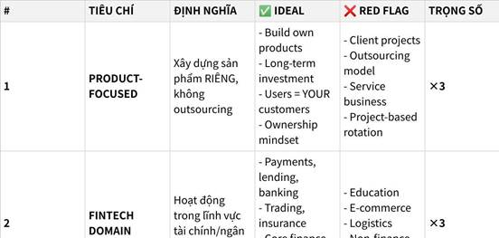

**Click the image to view the sheet.**

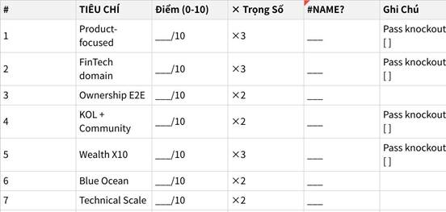

**Click the image to view the sheet.**

**1.2.0.5 Nhìn nhận lại 1 năm đi làm Step Up Education 27/06/2024 - 15/07/2025  + Summary - Cuối tháng 6 đến đầu tháng 7 năm 2025.**

|   |
|---|
|Tính ra 1 năm rồi em làm AI Application nhiều hơn AI Engineering (mảng model ko được đụng mấy được fine tune 1 con BERT trên Product, MLOps cũng ít đa phần là mỗi docker compose, ...)<br><br>**AI Engineering: 10 % Research Model + 70% Engineering (MLOps, System Design) + 10 % AI Application (Prompting, AI Workflow, Tools, ... + NLP, LLMs) + 10% Product.**|

|   |
|---|
|1.                   **Mục đích cuối cùng Begin with the end X10 in Mind and The end with the number: Tự do Tâm Trí - X3+GOSINGA. Bonus: Tài chính, Mối quan hệ, Sức khỏe**<br><br>2.                   **Điểm giao mình chọn cho sự nghiệp với Chiến lược đại dương xanh, Tích lũy có system, nhất quán, dài hạn; Tái sử dụng siêu cao :**  <br>**1. AI Engineering (NLP, LLM, MLOps, System Desgin, ... = 10 % Research Model (NLP, LLMs, RAG) + 70% Engineering (MLOps, System Design) + 10 % AI Application (Prompting, AI Workflow, Tools, ...) + 10% Product. ) +**  <br>**2. Creator - KOL Leader Community**  <br>**3. Global**  <br>**4. Investor trường phái đầu tư cơ bản (đầu tư giá trị)**  <br>**Optional:**  <br>**- Academy: Kết hợp với AI Việt Nam Academy, Full Stack Data Science Academy**  <br>**- Product & Business Model & Consulting AI, Edu, Finance.**<br><br>•                     Làm 80% AI Engineering, 20% AI Research<br><br>•                     Làm Product (tập trung vào sản phẩm dài hạn), không làm Outsourcing.<br><br>•                     Công ty lớn hay công ty nhỏ: => **Lớn hay nhỏ ko quan trọng, quan trọng họ đều là khách hàng của mình! Ở đâu giúp mình level up nhanh hơn + tái sử dụng siêu cao? [Thực chiến dự án, dạy lại, mentor feedback and networking]**<br><br>•                     **Domain: Finance ưu tiên 80%, các domain khác:** Mức lương domain finance cao hơn, chuyên môn nghiệp vụ khó nhằn hơn (Với Edu thì ít nhiều mình xuất thân từ học tập và phát triển bản thân nên ai cũng nhảy vào được), nhưng **Finance thì người mới khó mà nhảy vào, chiến lược tích lũy có lợi thế bất công.**<br><br>=> KHÔNG GIỚI HẠN bản thân trong domain nào cả, nhưng mọi thứ CẦN THỜI GIAN! Về mặt tối ưu: tập trung vào VÙNG LỢI THẾ, MÌNH THÍCH, RA TIỀN NHIỀU VỀ DÀI HẠN để ưu tiên tập trung.  <br>=> Vun bồi Giải quyết vấn đề trong Edu + Tecnical + Finance -> **CONSULTING.**<br><br>3.                   **Mô hình Phân tích và Lựa chọn mục tiêu: Mentor mình bảo sao + Importance có hướng mục đích cuối ko + Độ khẩn cấp + Easy Score (dễ thực thi ko, nguồn lực hiện có).**|

**1.2.0.6 AI Engineer domain Finance và con đường FIRE rõ ràng hơn sau khi học X3 Tài chính cá nhân vào cuối tháng 6, tháng 7. Đến đầu tháng 8 (t8, t9 hợp đồng thử việc đã nói rõ với a Cường là sẽ chuyển sang 1 bên Bank, FinTech với việc đi nhánh domain Fintech dài hạn hơn là EduTech - lúc đó chưa có ý định làm Business, Finance thuần định giá cố vấn đầu tư doanh nghiệp IPO Holdings M&A):**

**1.2.0.6.1 Gửi tín hiệu tới: Thầy Trung DNSE, sếp Đô AI Engineer, sếp Huy + bật tìm PRODUCT - FINANCE (STOCK/INVESTMENT) - AI ENGINEER trên Linkedin**

|   |   |   |
|---|---|---|
|Gửi thông điệp 04/07/2025: thầy Trung DNSE, sếp Đô - AI Enigneering domain Stock!|\|   \|<br>\|---\|<br>\|Dạ vâng ạ. Em cảm ơn thầy ạ!<br><br>Thưa thầy<br><br>Điểm mạnh của em là: gốc HS chuyên Toán thi HSG QG + Engineering + Tài chính cá nhân theo trường phái FIRE và em cũng có nghiên cứu chứng khoán. (em được học từ người thầy đầu tư sở hữu công ty đã lên sàn)<br><br>•                     Định hướng sự nghiệp của em theo hướng: AI Engineering (MLOps, System Design) + Community (làm cộng đồng) + Product, Bussiness Model + Nhà đầu tư.<br><br>=> Các tasks về Engineering, MLOps rất phù hợp với em.<br><br>=> Và em cũng chọn Finance làm domain cho mình.<br><br>Về điểm yếu của em:  <br>1. Chưa có nhiều kinh nghiệm trong AI Finance tuy nhiên em có kinh nghiệm AI Engineering (domain Edutech, RAG, ...) và có 1 phần nền tảng của trường phái tài chính cá nhân FIRE và đầu tư chứng khoán.  <br>2. Hiện tại, em mạnh và yêu thích các task về Engineening hơn so với Research thuần. (80% Engineering, 20% Research. Chẳng hạn: Research về Mem0 ([https://github.com/mem0ai/mem0)](https://github.com/mem0ai/mem0\)) để triển khai Memory lưu thông tin user cho sản phẩm AI, giúp sản phẩm có thể nhớ toàn bộ thông tin người dùng và đưa ra câu trả lời cá nhân hóa).  <br>3. 1 năm kinh nghiệm, các kỹ năng Engineering, chuyên môn vẫn ở mức fresher level.<br><br>Mong muốn:<br><br>Hiện tại em đang làm AI trong domain EduTech (sản phẩm App Tiếng Anh AI Giao Tiếp, Robot Tiếng Anh tích hợp AI - at Step Up Education)<br><br>Mong muốn của em là:  chuyển sang domain Stock, Finance. Tìm 1 môi trường giúp phát triển sự nghiệp theo định hướng của mình! (Có bài toán thực để phát triển Engineering MLOps Finance, có người thầy giỏi, ... ạ)<br><br>Em cảm ơn thầy đã đọc và phản hồi em ạ!\|<br><br>\|   \|<br>\|---\|<br>\|Em chào sếp Đô ạ.<br><br>Anh Đô ơi, a làm trong mảng đầu tư.<br><br>Anh có quen ace công ty nào đang tuyển AI Engneering - fresher level mảng Finance, Stock, ...không ạ. Em muốn xin 1 chân theo các sếp học hỏi ạ.<br><br>Hiện em đang làm AI Engineering trong mảng EduTech (App giao tiếp tiếng anh AI, Robot tiếng anh AI - tại Step Up Education, chỗ a Hiệp) , em tính chuyển sang mảng FinTech ạ.<br><br>Em cảm ơn anh ạ!\|<br><br>\|   \|<br>\|---\|<br>\|Em chào sếp Huy và các anh chị em trong Group mình ạ!<br><br>Đợt tháng 3 năm 2025 vừa rồi. Sau khoảng 9 tháng làm việc tại công ty cũ, em khá băn khoăn có nên chuyển từ AI Engineering domain EduTech (App Tiếng Anh giao tiếp AI, Robot tiếng anh AI) sang Bank không. Em có post 1 bài vào đợt 14/03 đó và được nhiều ace comment tư vấn. Sau đó sếp Huy có tư vấn cho em trong 1 buổi zoom chung thứ 5 của tuần.  <br>  <br>Sau khi nghe tư vấn của sếp Huy và nhiều ace, em quyết định ở lại công ty cũ, với định hướng bản thân lúc đó là:  <br>» AI Engineering (NLP, LLMs, MLOps, System Design, …) + Community Frontend (KOL, Leader Community, …) + Product, Bussiness Model  <br>- Vào Bank môi trường gò bó khó trong việc xây dựng Frontend, tốc độ trải nghiệm nhiều tasks khác nhau và được cầm chính tasks ít hơn  <br>- Trong khi công ty EduTech lúc đó thì môi trường thoải mái tự do trong Frontend, em hay xài Github cá nhân và có khách hàng thứ 2 từ đó, được cầm chính các tasks AI.  <br>  <br>Sau đó giai đoạn cuối tháng 3, 4, 5 em được giao cầm chính 1 dự án (1 sản phẩm AI Automation AI App được làm mới lại từ App cũ, khác ở chỗ AI hoá hoàn toàn). Sản phẩm đã được chạy quảng cáo và có 5K lượt download.  <br>Tháng 6 đa phần em off để tập trung hoàn thành đồ án tốt nghiệp.  <br>Sản phẩm đó được đóng gói để tích hợp vào App cũ (thay vì làm riêng App mới như ban đầu). Thành ra là em lại không cầm chính sản phẩm đó nữa.  <br>  <br>===========  <br>Đầu tháng 7 quay trở lại, em đã 95% đồ án tốt nghiệp xong, chỉ chờ bảo vệ. Và em đứng trước sự lựa chọn là: Ký hợp đồng chính thức với công ty hiện tại / nhảy.  <br>  <br>Sau 1 vài tính toán, và nhìn lại 1 năm ở công ty cũ, em có suy nghĩ muốn chuyển .  <br>1. AI Engineering hiện tại làm Product domain English, → dịch chuyển qua domain Finance để đi vào ngách nhỏ hơn, mang đến lợi thế cạnh tranh.  <br>2. Trong Finance thì chọn công ty Finance, Stock, …  <br>(thay vì vào Bank).  <br>để tiếp tục định hướng:  <br>**AI Engineering (NLP, LLMs, MLOps, System Design, …) + Community Frontend (KOL, Leader Community, …) + Product, Bussiness Model + FINANCE.**  <br>  <br>**—-**  <br>Em post bài để nhờ vả sự hỗ trợ, support của các sếp và các anh chị em. Cảm ơn mọi người nhiều ạ.  <br>Em xin phép tag sếp  ạ! ^^\|<br><br>\|   \|<br>\|---\|<br>\|**NẾU VÀO FINANCE THÌ TỰ BẢN THÂN SẼ KO MẠNH PRODUCT, BUSSINESS MODEL NỮA NHỈ**<br><br>Câu trả lời thẳng thắn là: **KHÔNG, nếu vào Finance, bạn sẽ KHÔNG mất đi sự mạnh mẽ về Product và Business Model. Ngược lại, bạn sẽ phát triển những kỹ năng này lên một tầm cao mới, chuyên biệt và có giá trị hơn rất nhiều.**<br><br>•                      AI/NLP Engineer tại DNSE để phát triển **Ensa - một AI-powered Virtual Investment Assistant**. Ensa là gì? Nó chính xác là một **SẢN PHẨM**.<br><br>•                     Sản phẩm này có người dùng (nhà đầu tư cá nhân), có mục tiêu (đơn giản hóa đầu tư, điều hướng thị trường), và có trải nghiệm người dùng (tương tác với AI, thông tin được truyền tải).<br><br>•                     Việc phát triển Ensa đòi hỏi bạn phải nghĩ về:<br><br>￮      **User Needs:** Nhà đầu tư cần gì? Họ gặp khó khăn gì?<br><br>￮      **Feature Design:** Ensa nên có những tính năng gì? (ví dụ: cá nhân hóa trải nghiệm, dự đoán xu hướng, tối ưu hóa danh mục).<br><br>￮      **User Experience (UX):** Làm thế nào để Ensa tương tác hiệu quả, dễ hiểu, đáng tin cậy? (đặc biệt quan trọng với AI giải thích được - XAI - trong tài chính).<br><br>￮      **Product Roadmap:** Ensa sẽ phát triển như thế nào trong tương lai?<br><br>￮      **Metrics:** Làm thế nào để đo lường sự thành công của Ensa (lượt tải, mức độ tương tác, AUM - Assets Under Management, tỷ lệ giữ chân người dùng)?\|||
|Gửi thông điệp 22/07/2025: thầy Trung DNSE, sếp Đô - AI Enigneering domain Stock! Gửi sếp Huy - Wecommit100x|\|   \|<br>\|---\|<br>\|[**[Em đang tìm job AI Engineering (MLOps), domain Stock, Finance]**](https://primecircle.wecommit.com.vn/c/forum-wecommit100x/em-dang-tim-job-ai-engineering-mlops-domain-stock-finance)<br><br>[**[Góc nhờ vả AI Engineering job, domain Finance]**](https://primecircle.wecommit.com.vn/c/forum-wecommit100x/goc-nh-v-ai-engineering-job-domain-finance)<br><br>Em chào cả nhà ạ. Em tính nhắn riêng hỏi sếp , sau em nghĩ lại đăng forum luôn.<br><br>Hiện em làm mảng AI Application, domain Edu (App Tiếng Anh, Robot Tiếng Anh). Thời gian được 1 năm 1 tháng (hồi em còn là sinh viên hè năm 3 lên năm 4, và giờ em đã xong năm 4). <br><br>Đợt này em tính chuyển sang làm AI, domain Stock, domain tài chính. <br><br>Góc nhìn của em: <br><br>1.                   Domain Tài chính mình càng đi sâu thì mình càng mạnh và không dễ để 1 đối thủ mới có thể nhảy vào.Trong khi đó Edu như mảng em làm (App Tiếng Anh, Robot tiếng anh) nếu em theo ngành 3-5-10 năm, thì 1 đối thủ mới hoàn toàn có thể nhảy vào và đá em ra được (tài chính thì ko dễ như thế). => Lý do em muốn chuyển sang làm AI domain Stock, Tài chính <br><br>2.                   Cộng thêm mảng hệ thống MLOps, System Design <br><br>=> Nhánh em chọn là: AI Engineering (mạnh MLOps, System Design) domain Stock, Tài chính. <br><br>Hồi tháng 3, sếp Huy có tư vấn cho em ở lại công ty lúc đó vì sang Bank ko phù hợp với định hướng lúc đó của em là: build mạnh Frontend. <br><br>Đợt này, em vẫn theo định hướng build mạnh Frontend nên dự tính sang chọn nhánh domain Stock, Finance (fintech năng động hơn). <br><br>Định hướng em chọn: **Chiến lược đại dương xanh, Tích lũy có system, nhất quán, dài hạn; Tái sử dụng siêu cao : AI Engineering (NLP, LLM, MLOps, System Desgin, ... = 10 % Research Model + 70% Engineering (MLOps, System Design) + 10 % AI Application (Prompting, AI Workflow, Tools, ...) + 10% Product. ) + Creator - KOL Leader Community + Business Model & Consulting+ Finance (Personal Finance and Investment).** <br><br>Em nhắn hỏi sếp và các sếp xíu: <br><br>1.                   Em muốn xin góc nhìn từ các sếp <br><br>2.                   Em muốn hỏi các sếp có team Stock, Tài chính nào đang tuyển vị trí này không ạ. Em cảm ơn mn ạ. 😁 <br><br>(Em vẫn đang làm công ty cũ và tìm kiếm cơ hội chuyển cho mình).\|<br><br>\|   \|<br>\|---\|<br>\|https://www.facebook.com/YPFPVietNam/  <br>Ad ơi, công ty mình có tuyển AI Engineering ko ạ  <br>  <br>Điểm mạnh của em là: gốc HS chuyên Toán thi HSG QG + chuyên ngành Data Science and AI BKHN lứa 2021-2025 + AI Engineering (học từ 2 nơi đào tạo AI lớn của Việt Nam: AI Việt Nam và FullStack Data Sicence) + Tài chính cá nhân theo trường phái FIRE (tiết kiệm tối đa và đầu tư dài hạn). (em được học từ người thầy đầu tư sở hữu công ty đã lên sàn, fb: Người Quản Trị: [https://www.facebook.com/nguoiquantri1987](https://www.facebook.com/nguoiquantri1987) )  <br>- Định hướng sự nghiệp của em theo hướng: AI Engineering (MLOps, System Design) + Community (làm cộng đồng) + Product, Bussiness Model + Nhà đầu tư.  <br>=> Hiện em đang làm AI Engineering domain Edu (App Tiếng Anh, Robot Tiếng Anh) tại Step Up Education : [https://www.facebook.com/stepupenglishcenter](https://www.facebook.com/stepupenglishcenter)=> Em đang tìm kiếm cơ hội AI Engineering (MLOps, System Design), Stock/Investment domain  <br>=====  <br>  <br>Github cá nhân của em: [https://github.com/DoanNgocCuong](https://github.com/DoanNgocCuong?fbclid=IwZXh0bgNhZW0CMTAAYnJpZBExTVR6OXJacURrcmNOeGhmTQEeO73BLOP_n1w_4iYhVHd-h-wBnYbmHA9sIX2OjBX2jBc-eDQlX-HCwWcWcfU_aem_mfhIguVN6URWhZ8DrDO7ww)Linkedin cá nhân của em ạ: [https://www.linkedin.com/in/doan-ngoc-cuong/](https://www.linkedin.com/in/doan-ngoc-cuong/?fbclid=IwZXh0bgNhZW0CMTAAYnJpZBExTVR6OXJacURrcmNOeGhmTQEeXAo9jdPjf0GwhClRnum0InfIDeENUrHIUneiJnpJnSHuoDuo8kKU8XpAHFg_aem_fwWWuGvjLkY7AWyJXdo33Q)  <br>---<br><br>Có gì ad cho em xin thông tin đội công nghệ team mình với ạ.<br><br>Triết lý đầu tư (Đầu tư dài hạn) và các mindsets của ad đăng trên kênh (Alex hormozi) rất khớp với những thứ em theo đuổi ^^  <br>Em mong có cơ hội hiểu hơn về đội công nghệ team mình, và cơ hội được làm việc cùng team ạ.<br><br>Để cho ra đời những bot tư vấn đầu tư cá nhân theo trường phái của Team đang theo đuổi (Đầu tư dài hạn ^^ )\|<br><br>\|   \|<br>\|---\|<br>\|Cty anh đang tuyển bộ phận AI thu nhập hấp dẫn. Em @Nguyễn Nhật Tường @Đoàn Ngọc Cường Nhất Hướng ứng tuyển thì bảo anh nhé 👍🤝  <br>=><br><br>@Ngo Kim Thang Nh - Bank - X3 Tài Chính ui, em cảm ơn anh Thắng nhiều ạ. :d<br><br>Trùng hợp phết ạ, đúng đợt này em đang tìm kiếm cơ hội làm AI bên Stock/Investment domain, 1 tuần nay em đang gửi CV kha khá nơi :3\|<br><br>\|   \|<br>\|---\|<br>\|Linkedin: Em đang tìm kiếm cơ hội: AI Engineering (NLP, MLOps, System Design) - Stock/Investment domain\|<br><br>\|   \|<br>\|---\|<br>\|Thưa thầy, thầy có ace, công ty Investment/Stock nào đang tuyển AI Engineeirng không ạ. Em đang tìm kiếm cơ hội ở vị trí AI Engineering (MLOps, System Design) trong Stock/Investment domain, nên em nhắn tin muốn nhờ thầy hỏi hộ xíu ạ hì hì.<br><br>•                     Tính chất công việc sẽ giống job: AI Engineering tại DNSE (CK bò và gấu, trợ lý đầu tư), AI Engineering tại TCBS (Techcombank Security).<br><br>Các sản phẩm như: Chatbot phân tích định lượng cổ phiếu, chatbot trợ lý đầu tư cá nhân, ...<br><br>Về sau nếu suôn sẻ có thể có bạn "Chatbot đầu tư cá nhân MONEYOsophy" dành riêng cho cộng đồng mình ạ 😁<br><br>Em cảm ơn thầy nhiều ạ!\|<br><br>\|   \|<br>\|---\|<br>\|Em cảm ơn chị Hằng đợt đó đã tư vấn cho em. Đợt đó em nghe chị Hằng tư vấn xong thì list hết ra và quyết định ở lại công ty hiện tại lúc đó (lúc đó đang 9 tháng, ở lại đến giờ là tròn 1 năm) thay vì nhảy sang 1 Bank nhỏ lúc đó. ^^<br><br>Đợt này em đang tìm cơ hội để nhảy từ AI Engineering domain Edu sang domain Stock chị Hằng ạ (nên là nếu có team nào đang tuyển có gì chị Hằng giới thiệu em với nhen ạ, hihi, em cảm ơn chị Hằng nhiều ạ).<br><br>Profile của em ạ:<br><br>Em đã tròn 1 năm ở vị trí AI Engineering, domain Edu (năm 3-4 đại học).<br><br>Em đã bảo vệ đồ án tốt nghiệp xong vào đầu tháng 7 vừa rồi.<br><br>Em đang định hướng sự nghiệp 10-20 của em theo hướng: AI Engineering (MLOps, System Design) + Community (làm cộng đồng) + Product, Bussiness Model + Nhà đầu tư Stock, Investment.<br><br>Vì theo em quan sát thấy Edu nếu mình làm 10 năm 20 năm người mới rất dễ nhảy vào.<br><br>Còn mảng tài chính khi đi đủ lâu thì bên ngoài người mới khó mà nhảy vào được.<br><br>Nên là em chuyển hướng từ domain Edu sang domain Stock, Finance để đi đường dài.  ^^<br><br>Em cảm ơn chị ạ.\|<br><br>\|   \|<br>\|---\|<br>\|Hi everyone! I’m seeking a new role and would appreciate your support. If you hear of any opportunities or just want to catch up, please send me a message or comment below. I’d love to reconnect. [hashtag#OpenToWork](https://www.linkedin.com/search/results/all/?keywords=%23opentowork&origin=HASH_TAG_FROM_FEED)  <br>  <br>About me & what I’m looking for:  <br>💼 I’m looking for AI Engineering (NLP, RAG, MLOps, System Design, ...)  <br>Finance, Stock, Investment domain.  <br>  <br>Hiện tại em/mình đang làm AI Engineering Fresher trong Edutech.  <br>Sau khi cân nhắc tính toán xu hướng sở thích, đường dài 10-20-30 năm thứ mà bản thân muốn theo đuổi, em quyết định tìm kiếm cơ hội cho mình trong AI Engineering Finance, Stock, Investment domain.  <br>(Vị trí Intern, Fresher, ...)  <br>  <br>Rất mong được sự hỗ trợ và kết nối của ace ạ!  <br>Thank u so much!!!\|||

**1.2.0.6.2 Cuối tháng 7, ngồi với sếp công ty EduTech hiện tại, ký offer 12 củ thử việc 2 tháng, sau 2 tháng oke lên 15 củ: Chiến lược cố gắng hết sức ở công ty hiện tại + Tính toán RISK KHI NHẢY SANG FINANCE + CHUẨN BỊ CHO VIỆC NHẢY?  
- Mình đã chia sẻ thẳng với sếp về: Kế hoạch tự do tài chính của mình + dự kiến nhảy sang FinTech. (cuối tháng 7)**

**1.2.0.7 ROADMAP SỰ NGHIỆP & TỰ DO TÀI CHÍNH: TỪ AI ENGINEER ĐẾN NHÀ ĐẦU TƯ GIÁ TRỊ - 10/08/2025**

|   |
|---|
|**🚀 ROADMAP SỰ NGHIỆP & TỰ DO TÀI CHÍNH: TỪ AI ENGINEER ĐẾN NHÀ ĐẦU TƯ GIÁ TRỊ**<br><br>Tên: Đoàn Ngọc Cường<br><br>Tuổi: 22 \| Xuất phát điểm: AI Engineer (EduTech)<br><br>Đích đến: Nhà đầu tư Giá trị & Tự do Tâm trí<br><br>Kim chỉ nam: "NHẤT HƯỚNG BÁT CHÁNH ĐẠO. Tích lũy có hệ thống, nhất quán, dài hạn; Tái sử dụng siêu cao." **(TỰ DO TÂM TRÍ - TỰ DO MQH, TÀI CHÍNH, SỨC KHOẺ)**<br><br>**🎯 TẦM NHÌN 15 NĂM SỰ NGHIỆP, TÀI CHÍNH (VISION 2025-2040)**<br><br>Mục tiêu không chỉ là các con số tài chính, mà là xây dựng một sự nghiệp có "Con hào Kinh tế" (Economic Moat) vững chắc, kết hợp 4 trụ cột:<br><br>1.                   AI Engineering (FinTech): Trở thành chuyên gia hàng đầu về MLOps & System Design trong lĩnh vực tài chính.<br><br>2.                   Creator & Community Leader: Xây dựng thương hiệu cá nhân uy tín, dẫn dắt cộng đồng về AI Finance.<br><br>3.                   Global Perspective: Áp dụng kiến thức và xây dựng sản phẩm có tầm nhìn toàn cầu.<br><br>4.                   Value Investor: Tích lũy vốn và kiến thức để trở thành nhà đầu tư giá trị thành công.|

**1.2.0.8 [Xuất hiện nhân dạng PRODUCT AND BUSINESS OWNER]- Đầu tháng 10 năm 2025 - MỌI THỨ HỘI TỤ khiến mình quyết định sang FinTech - Product and Business Owner - Nhân dạng Product and Business Owner (Từ nhân dạng FinTech AI Architect lên nhân dạng Product and Business Owner chủ DN)  - October 11, 2025 - Đây có lẽ là động lực kiếm tiền mạnh nhất mình từng cảm nhận được (làm Fintech đóng góp được nhiều thuế nhất giúp đất nước phát triển + tạo được nhiều công ăn việc làm + và quan trọng là POSITIVE SUM GAME).** 

|   |
|---|
|**BÁN ƯỚC MƠ VÀ BÁN NHÂN DẠNG: Động lực Ý NGHĨA (DS)  >> BUILD SYSTEM PHÁT TRIỂN LIÊN TỤC (Động lực chiến thắng tuýp CDI)**<br><br>=> Mang trong mình câu hỏi: làm doanh nghiệp để làm gì? (nếu mà làm EduTech thì dễ thấy ý nghĩa ngay, thế còn làm Fintech thì chỉ tiền thôi à. Em đi hỏi nhiều nơi và có câu trả lời cho mình). Làm fintech để:<br><br>1.                   Khi 1 doanh nghiệp phát triển mạnh => Đóng thuế nhiều cho nhà nước => Sẽ giúp nước mình phát triển rất nhiều<br><br>2.                   Tạo được công ăn việc làm cho nhiều người hơn.<br><br>3.                   Và không phải mình giàu hơn là người khác nghèo đi. Mà là cùng nhau giàu có lên. (Positive Sum Game, không phải Zero Sum Game).|

|   |   |
|---|---|
||Gặp 3 người anh  <br>1. Product Mindset: anh Phuc Doan - Founder 10000 Hours (Xuống sân cỏ, try hard, làm thật làm nhiều, luôn giữ high standard, improve. Product -> talk to users -> integrate -> launch).  <br>2. Fintech Global Sense: anh Đạt Founder CFO AI Agents (Hiểu được ý nghĩa của làm doanh nghiệp để đóng thuế giúp nhà nước phát triển + tạo công ăn việc làm + Position Sum Game). Mình thấy con đường của mình: https://youtu.be/feo7FEBaIGM  <br>3. Nguồn lực trợ cấp: người hiểu tài chính, tiền, mối quan hệ, nhà đầu tư. Anh Hoàng An và team AI HN.  <br>4. Thêm đúng lúc sếp Khôi có khoá Global Money Models tháng 10, 11 cho mình tiếp xúc với nhiều ac chủ doanh nghiệp.<br><br>\|   \|<br>\|---\|<br>\|Nhưng đến 20/10 1 cuộc điện thoại của anh An với idea muốn start up làm mình ko còn tìm kiếm FinTech nữa mà join để làm FinTech với anh An và fail sau 1 tháng.<br><br>Story Câu chuyện Product hội tụ (October 11, 2025): Sau 1 năm 1 tháng Intern (cuối T6 đến hết T7/2025), sau 2 tháng thử việc (T8, T9/2025), mình chưa nghĩ đến việc làm Product sớm thế. Nhưng sau khi gặp 3 người anh:\||
|21h, 22h T6/03/10/2025|Bước ngoặt: https://youtu.be/feo7FEBaIGM  <br>1. Bắt đầu từ câu hỏi a Phúc: Sao anh không làm Fintech mảng đã có nhiều kinh nghiệm mà nó ngon.  <br>2. Câu chuyện thứ 5, 02/10/2025 đi ăn với a Hiệp. A Hiệp nói về EduTech nó ý nghĩa.  <br>3. Câu hỏi a Đạt  <br>  <br>Anh Đạt ơi, theo anh, mục đích kiếm tiền để làm gì ạ. Qua em đi ăn công ty, ngồi cạnh anh CEO công ty (Công ty em làm về app tiếng anh, robot tiếng anh), xong em hỏi ảnh về việc start up. Em bảo là về sau em sẽ start up 1 cái về Fintech, mục tiêu là CEO Ngân hàng.<br><br>Xong ông CEO hỏi là: thế mục tiêu làm cái đấy để làm gì. Ông CEO em thì có ước mơ là làm Edutech, sản phẩm giáo dục các kiểu giúp trẻ em Việt Nam có trải nghiệm học hành quốc tế, ...<br><br>= Em đặt câu hỏi là: mục tiêu của ae mình về đều là start up 1 cái về Fintech. Về dài hạn ae có theo tiếp hướng này ko, nếu theo dài hạn 10-20 năm thì mục tiêu là giải quyết bài toán gì cho xã hội.<br><br>Chẳng hạn, sau em làm chatbot Fintech của ngon, thì mấy ae giàu dùng là chính, người giàu lại càng giàu hơn thì người nghèo có bị ảnh hưởng gì ko, kinh tế sẽ thế nào ạ. Em vẫn đang suy nghĩ anh ạ 😃|
|22h, T7, 4/10/2025|Em cảm ơn anh Phuc,  <br>Nọ meet với anh xong, em cũng suy nghĩ thêm về Finance xem đi dài hạn ngành này thì nó có ý nghĩa gì. (Edu với Productivity (cũng là Edu) thì ý nghĩa nó rất rõ ràng, còn Finance thì không rõ ràng lắm).  <br>Em đi hỏi 1 anh người Việt start up 1 cái FinTech bên Mỹ, ảnh bảo em là: "ở bên Mỹ start up 1 cái FinTech và sau thành công sẽ có thêm công ty con ở Việt Nam."   <br>Nên không riêng gì Fintech, ... 1 doanh nghiệp gì đó lớn của Việt Nam mà tầm cỡ quốc tế như: google, Microsoft thì sẽ đều giúp được cho người Việt nhiều.  <br>- tạo công ăn việc làm  <br>- đóng thuế cho nhà nước  <br>- Positive Sum Game  <br>Em hỏi thêm là: mình giàu lên người khác có nghèo đi không, sau em ngẫm ra là: Positive Sum Game (cả xã hội cùng đi lên), thay vì để tiền vào tay mấy ae khác thì tiền vào tay ae mình thì ae mình chủ động được hơn.  <br>Ổng anh kia cũng theo phong cách Warren Buffet cho đi 95% tài sản.  <br>Sau anh có thể theo hướng tầm nhìn như này cũng oke ạ  <br>Em cũng đang phân tích ngành Finance thêm để xem có chốt nhảy ngành không hay vẫn bên EduTech.  <br>Sau ae mình có thể trao đổi thêm với nhau về mô hình kinh doanh, tầm nhìn dài hạn, ... các thứ ạ|
||Anh Phúc:<br><br>\|   \|<br>\|---\|<br>\|Anh không follow 1 ng nào hết, chủ yếu là do anh try hard anh làm nhiều tính năg khác nhau, mỗi cái khi làm thì anh đều research các đổi thủ và compare UI với đối thủ -> learn từ đó thôi  <br>+, với lại luôn giữ 1 standrad bar cao  <br>+, luôn luôn improve, chứ không dễ chấp nhận output hiện tại  <br>em cứ practice, làm thật làm nhiều rồi sẽ chắc lọc ra best practice cho mình  <br>+, build the product -> talk to users -> interate -> lauch again (thậm chí ổng còn viết sai chính tả) -))\||
|T4, T5, 18, 19/10/2025|A Đạt:  <br>Sau buổi call với anh hôm trước. Trong đầu em bắt đầu hình dung ra con đường có thể theo đuổi dài hạn.<br><br>Lúc trước em rất thích Bank, Fintech nhưng không nhìn ra được Ý Nghĩa trong đó nhiều.<br><br>Sau buổi call với anh em nhớ được 2 ý<br><br>1.                   Doanh nghiệp đóng được nhiều thuế giúp nhà nước phát triển<br><br>2.                   Tạo được nhiều công ăn việc làm<br><br>và mình giàu lên thì người khác không nghèo đi (vì đây là bài Positive Sum Game, không phải bài Zero Sum Game) ^^|
||2. Thấy ra con đường - https://youtu.be/feo7FEBaIGM  <br>- Mình hỏi anh Đạt?  <br>- Mình hiểu con đường và ahaha trong tâm trí  <br>- Nói con đường lần đầu với a Phúc, nói với bài giới thiệu trong 100M$ Money Model a Khôi, nói với a Đạt, nói với 1 ông bạn cùng lớp mới quen Tâm Nguyễn ko care lắm ổng nghĩ gì. Quan trọng là: niềm tin vào bức tranh to.|
|13h20, 9/10/2025|Em chào sếp Khôi và các anh chị.<br><br>Em là Cường,<br><br>AI Engineer - hơn 1 năm kinh nghiệm. Từ cuối năm 3 đến khi ra trường, em vẫn cắm rễ tại duy nhất 1 công ty. Công ty em làm về EduTech với lõi chính là AI.<br><br>(App luyện tiếng anh với AI, Robot học tiếng anh).<br><br>Trên con đường sự nghiệp, em chọn 1 thứ mà mình có thể đi dài hạn với nó 20, 30, 50 năm. Càng về sau nó càng trở thành lợi thế tích luỹ dài hạn của mình, mà các đối thủ bên ngoài không thể cạnh tranh được. <br><br>+, Chiến lược đại dương xanh,<br><br>+, Tích lũy có hệ thống (system),<br><br>+, Nhất quán, dài hạn, tái sử dụng siêu cao,<br><br>+, và để THỜI GIAN làm phần còn lại của nó.<br><br>Và thứ em chọn là: AI Engineer trong Finance hướng tới Global<br><br>•                     AI Engineering (NLP, LLM, MLOps, System Desgin, Workflow, AI Agents)<br><br>•                     Creator - KOL Leader Community<br><br>•                     FinTech - Investor trường phái đầu tư cơ bản (đầu tư giá trị)<br><br>•                     Product - Business Model - Consulting AI, Finance.<br><br>•                     Global<br><br>•                     Academy: Kết hợp với AI Việt Nam Academy, Full Stack Data Science Academy<br><br>=> Mang trong mình câu hỏi: làm doanh nghiệp để làm gì? (nếu mà làm EduTech thì dễ thấy ý nghĩa ngay, thế còn làm Fintech thì chỉ tiền thôi à. Em đi hỏi nhiều nơi và có câu trả lời cho mình). Làm fintech để:<br><br>1.                   Khi 1 doanh nghiệp phát triển mạnh => Đóng thuế nhiều cho nhà nước => Sẽ giúp nước mình phát triển rất nhiều<br><br>2.                   Tạo được công ăn việc làm cho nhiều người hơn.<br><br>3.                   Và không phải mình giàu hơn là người khác nghèo đi. Mà là cùng nhau giàu có lên. (Positive Sum Game, không phải Zero Sum Game).<br><br>Nguồn lực hiện tại của em và các bài toán đang giải:<br><br>4.                   AI Agents cho bài Robot thương hiệu Việt (chỉ 3 triệu, sản phẩm giải quyết bài toán muốn con tiếp cận công nghệ từ sớm mà ko bị ảnh hưởng nhiều bởi điện thoại, smartphone. 1 người bạn đồng hành kết nối với con như 1 người bạn từ bé đến lớn).<br><br>-> em đang làm tại công ty<br><br>5.                   AI Agents cho bài toán Banking, Finance (1 trong số đó là bài toán: Stock and Business Valuation : Định giá doanh nghiệp trên thị trường chứng khoán, tài chính, đầu tư. Giúp nhà đầu tư có những quyết định dài hạn rất nhanh chóng)-> em đang làm với 1 team nhỏ 3 người ngoài HN<br><br>6.                   CFO AI Agents (thị trường Mỹ, start up của 1 người anh bên Mỹ. Bài toán B2B, CFO AI Agents giúp các nhà hoạch định tài chính CFO có được trợ thủ đắc lực trong việc ra quyết định tối ưu dòng tiền, chi phí, quản lý rủi ro, ra quyết định đầu tư hay mở rộng, ...)<br><br>=> Chốt lại các keywords chính em hướng tới: AI Engineer, FinTech-EduTech, Global<br><br>Em cảm ơn và rất vui được đồng hành cùng các anh chị với mục tiêu giàu có: Postivite Sum Game! Cảm ơn sếp Khôi, ace BTC và mn ạ!|
|25/10/2025|=> Giải quyết bước đầu nỗi sợ từ Technical -> Business<br><br>\|   \|<br>\|---\|<br>\|Sếp Khôi coach cho việc: Sợ hãi khi chuyển sang Business là do: CHƯA CÓ ĐỦ NGUỒN LỰC về súng ống đạn dược, mentor và đồng đội.\||
||=> Bước đầu trả lời câu hỏi: Cố vấn, tư vấn, chiến lược, đầu tư doanh nghiệp IPO, Holdings, M&A có phù hợp với mình ko ?<br><br>\|   \|<br>\|---\|<br>\|Sau cùng mình trả lời câu hỏi mình muốn giống ai? Anh Trung NQT ?<br><br>THE ROAD trở thành người cố vấn mentor investing về Business Model, Money Models  <br>- [https://youtu.be/sXLTqZor0Vs?si=5cN9fYzJ0A3AVyvF](https://youtu.be/sXLTqZor0Vs?si=5cN9fYzJ0A3AVyvF)- [https://www.facebook.com/nguoiquantri1987](https://www.facebook.com/nguoiquantri1987)- [https://www.facebook.com/YPFPVietNam](https://www.facebook.com/YPFPVietNam)\||
|T3,28/10/2025|=> Mô hình hoá các tầng: Mục đích sống, NHÂN DẠNG (Mở khoá khi hiểu Positive Sum Game), NIỀM TIN GIỚI HẠN (mở khoá khi được lời mời CTO)<br><br>\|   \|<br>\|---\|<br>\|1.                   Gặp thêm chị Mai Anh và chị Ngọc cũng tối hôm 28 -> về MỤC ĐÍCH SỐNG - NHÂN DẠNG - GIÁ TRỊ VÀ NIỀM TIN - Năng lực - Hành vi - Môi trường sống. (Là 1 người trải qua cái giây phút chuyển từ nhân dạng làm công sang nhân dạng làm business vì thay đổi mindset về POSTITIVE SUM GAME) + (Trải qua cảm giác nâng niềm tin giới hạn khi thức 28h, khi chạy 18km, khi mà được mời làm CTO 30% share thì 1 khi trần tăng thì cảm giác thời gian của mình rất value và mình ko còn quay về được vị thế trước đây nữa, lương 1K $ rùi thì ...)\||
|T4,29/10/2025|\|   \|<br>\|---\|<br>\|chị Uyên coach tài chính cá nhân<br><br>Mục tiêu 1 tỷ trong 3 năm tới, 15 tỷ trong 15 năm.<br><br>Trở thành: Cố vấn Tài chính cá nhân và doanh nghiệp IPO / Holdings / ESOP  (các hoạt động M&A, IPO, cấu trúc holdings, định giá, gọi vốn, tài chính doanh nghiệp, phát triển tài sản trí tuệ, v.v)<br><br>(như: https://www.facebook.com/nguoiquantri1987)\|<br><br>---> Lộ trình dự kiến của em: AI ARCHITECT FOR FINANCIAL SYSTEMS - FINANCIAL and BUSINESS MODELS STRATEGIST - GLOBAL ECOSYSTEM and HOLDINGS INVESTOR|
|T4. 29/10/2025|+,  <br>1. Nghiện tiền lương (nghiện ma tuý đá) - Vì nó mang lại cảm giác an toàn - (đầu T10/2025) mình nhận ra: Làm công với làm chủ doanh nghiệp bản chất là với cùng 1 công sức bỏ ra, thậm chí nhiều khi làm công còn mệt mỏi hơn nhiều so với làm chủ. Điều khác  biệt giữa người làm công và người làm chủ doanh nghiệp đôi khi chỉ khác nhau ở 'NIỀM TIN GIỚI HẠN và NỖI SỢ' (Giới hạn thật sự nằm trong tâm trí. Nỗi sợ là do bạn chưa có NIỀM TIN + THE ROAD - THE MENTOR - THE COMMUNITY + DO) - https://www.nguoiquantri.com/blog/nghien-tien-luong<br><br>\|   \|<br>\|---\|<br>\|+, Giống như việc bạn đi vào 1 khu rừng hoang sơ ko biết đi đường nào, nhưng sẽ thế nào nếu có nhiều người xung quanh cổ vũ bạn là: yên tâm thể nào cũng ra được vì nhiều người đi qua rồi + 1 tấm bản đồ từ A đến B theo từng mốc từng chặng, 1 người mentor đã đi quá quen khu rừng đó và 1 loạt người ae đồng đội cũng bị lạc đi cùng với bạn + DO (bắt tay vào làm): khi bạn bắt đầu làm bạn sẽ thấy mọi thứ ko hề khó, làm nhiều bạn quen thôi (bởi vì giới hạn nằm ở tâm trí, giống như việc nếu bạn học lớp 1 bạn thấy khó khi đọc viết, nhưng lớp 12 bạn thấy đọc viết chẳng cần suy nghĩ, vì bạn đã làm nó quá nhiều lần rùi  <br>+, Như việc bạn gặp 1 bài toán, sẽ ra sao nếu đứa học kém nhất lớp đều đã làm xong - bạn có niềm tin, sẽ ra sao nếu cả mấy đứa giỏi hơn bạn chưa làm xong mà bạn làm xong rồi - bạn sẽ có phần rè rặt 1 chút, đó là niềm tin. Sự thật là : giới hạn thật sự nằm trong tâm trí. (ngày xưa hơn 1000 năm mn ko tin là chạy được 1 dặm dưới ít hơn 4min cho đến khi có người chạy được thì hàng trăm người chạy được ngay sau đó, hay thầy giáo bỏ nhầm bài toán khó nhất thế giới vào bài tập về nhà của sinh viên  GEORGE DANTZIG - https://www.facebook.com/photo/?fbid=10229052335481979&set=a.10201815568299822  )  <br>+, Chốt lại: Làm công đôi khi còn mệt hơn làm chủ doanh nghiệp. Bạn chưa dám làm chủ doanh nghiệp bởi vì bạn chưa có NIỀM TIN + THE ROAD - THE MENTOR - THE COMMUNITY + DO  <br>+, Có những con đường của chủ doanh nghiệp không có rủi ro  <br>+, TƯ DUY DÀI HẠN: nếu bạn nhìn vào kết quả của năm thứ 3 năm thứ 4 năm thứ 5 bạn sẽ ra quyết định ở những năm đầu tiên rất chuẩn.  Nếu tôi nói rằng: đi theo hướng này 10 năm sau bạn thu nhập gấp 10 lần, thì liệu bạn có đi theo hướng khác với việc tăng 50% lương không?\|<br><br>2.                   POSITIVE SUM GAME - TẠO RA NHIỀU VALUE HƠN - https://www.youtube.com/watch?v=PnRLrOzxIk8<br><br>•                     Làm chủ là nén lại khó khăn trong 1 thời gian ngắn hơn để tiến bộ vượt trội hơn<br><br>•                     Mọi người, kể cả mình đôi khi để ý tiền hơn Value. Nhưng thực sự cái mà doanh nghiệp tạo ra là VALUE (trước mình cứ nghĩ là doanh nghiệp tập trung vào kiếm tiền). MỌI NGƯỜI TẬP TRUNG KIẾM TIỀN MÀ QUÊN MẤT THỨ GỌI LÀ VALUE.<br><br>•                     Là càng ít người càng có ĐO LƯỜNG -> càng có ĐÒN BẨY TỪ ĐO LƯỜNG giúp mn đẩy nhanh hơn<br><br>Mình kể mn nghe về câu chuyện quen thuộc mang tên: “Nguỵ biện miếng bánh”. Tâm lý học về nguỵ biện miếng bánh cho rằng: khi người khác giàu lên là mình sẽ bị nghèo đi, sinh ra tâm lý ghét người giàu và ghét người giỏi.<br><br>Chuyện kể là: vào 1 mùa hè nọ, thay vì các mùa hè khác Alex đi chơi thì Alex ở nhà sửa lại chiếc ô tô cũ trong kho suốt 3 tháng. Sau 3 tháng đó, Alex tạo ra thêm được tài sản là 1 chiếc xe ô tô mới => Tức là Alex giàu lên mà không làm ai nghèo đi cả! => Phá vỡ về nguỵ biện miếng bánh.<br><br>3.                   Tiền và giá trị : Tiền chỉ là cái bóng của giá trị'. Chúng ta thường mải mê đuổi theo cái bóng mà quên mất việc nâng tầm giá trị - https://www.youtube.com/watch?v=h6dERZFwD3U&list=PLu3y6aTxTwcS_qeg-jndePyD__qd5sywp&index=139|
|31/10/2025|https://github.com/DoanNgocCuong/working/blob/main/BUSINESS/0_100M%24GlobalMoneyModel/Business%20Model%20-%20P2%20-%20T%E1%BB%AB%20AI%20Architect%20in%20Finance%20-%20Business%20Model%20Stategy%20-%20Ecosystem%20Investor%20-%20sang%20Finance%20Business%20Model%20Strategy-%20Mentor%20Investing%20-%20Business%20Models%20and%20Money%20Models.md|
|31/10/2025|Chị Mai Anh coach cho mình - https://youtu.be/qMM373eeDJU  <br>1. Mình quá rõ ràng con đường muốn trở thành nhưng NIỀM TIN GIỚI HẠN, SỢ HÃI  <br>2. Mình ko phải ko biết chọn mà là: cả nể và để cảm xúc mọi người chi phối việc ra quyết định (xem kĩ lại video)  <br>3. Thấy rõ 2 con đường: AI ARCHITECT FOR FINANCIAL SYSTEMS - FINANCIAL and BUSINESS MODELS STRATEGIST - GLOBAL ECOSYSTEM and HOLDINGS INVESTOR  <br>và lên thẳng|
|02/11/2025|02/11/2025 Sửa tiêu đề Linkedin: AI Engineer Fresher @ HUST \| MLOps - System Design - NLP, LLMs, RAG, AI Agents, ...  <br>=> AI Engineer Fresher @ HUST \| AI ARCHITECT FOR FINANCIAL SYSTEMS - FINANCIAL and BUSINESS MODELS STRATEGIST - GLOBAL ECOSYSTEM and HOLDINGS INVESTOR|
|13/11/2025<br><br>Mơ lớn bắt đầu từng bước nhỏ và TẬN DỤNG LỢI THẾ CẠNH TRANH BỀN VỮNG. - 13/11/2025|Những giai đoạn mình đuối kém đều là những lúc ko rõ THE ROAD - CON ĐƯỜNG.  <br>1. Năm 1, 2 đại học, tìm mục đích cuộc sống suýt bỏ học theo BKE, GNH => Sau đi Thiền và biết chính xác mục đích cuộc sống là gì.  <br>2. Công ty hiện tại hay vào Bank (T3/2025) 1-2 tuần liền mình ko tập trung xử lý việc được => Sau đó có câu trả lời cho mình và mình quay lại cùng anh Vũ để tạo ra LEAN SPEAK.  <br>3. Giai đoạn sau tốt nghiệp: mình mất 1 tháng liền (tháng 7) đến công ty và chỉ: search xem job này job kia, bank, fintech, ... => Trong 1 tháng đến công ty search xong về. Đến tháng 8, 9 quay lại tạo ra 1000 Nghề.  <br>4. Tháng 10, T11/2025: Con đường càng rõ hơn và mình đứng trước lựa chọn: AI , Business, Finance hẳn, ... Và cùng lúc: đi làm công ty, start up FinAI, thi VPBank, offer 30% share App Productivity và nhiều dự án Finance Mỹ, ... Sau con đường rõ ràng: mình chốt và chốt từng nhánh : AI - Finance - Business - Investor.  <br>5. Chỉ 1-2 tuần trước là giai đoạn cực kì khủng hoảng, mình đến công ty đa phần search về Finance vì mình có idea định bỏ hẳn AI để theo Finance -> Investment Banking.  <br>Sau 1 hồi suy nghĩ, ngành nào cũng thế và rủi ro của việc nhảy ngành là quá cao. Cho dù nhảy thì về sau mình vẫn phải học AI mà thôi. Nên là CHỌN ĐỂ SÂU AI TRƯỚC, ĐỒNG THỜI LÀM StockAI Start Up với team giúp mình sẽ mạnh cả FINANCE về sau.  <br>=> Mình quay lại với 1 sự tập trung tột độ với AI thay vì loăng quăng để nghiên cứu thêm Finance như trước  <br>=> Mình tự tin HACK Finance khi gặp người thầy, có AI + Finance mình lập tức bùng nổ.  <br>=> George Soros-Thiên Tài Hay Kẻ Phá Hoại : Nếu đúng thì có bao nhiêu tiền và sai sẽ mất bao nhiêu tiền.  <br>6. AI - FINANCE - BUSINESS - INVESTOR  <br>16/11/2025: Sau khi đi buổi DAS 15/11, HÃY LÀM NHỮNG GÌ MÌNH LÀM HÀNG NGÀY (mình nhận ra có vẻ ko phải AI cho lắm, mà đó là lập kế hoạch, đọc mindset, tâm lý học, huyền học, não, tài chính, kinh doanh, business model đó là lý do mình học BKE, mình phân vân HUST và FTU vì lý do này, mình xuống tiền đi học cả AIO, FSDS, Wecommit100x toàn là những nơi có cộng đồng, X3, DAS, NQT (chứ marketing, video mình toàn trống) => AI - Finance - Business - Investor|
|15/11/2025|\|   \|<br>\|---\|<br>\|Chị ơi, sang tháng em muốn đầu tư 1 khoản 2 triệu/tháng (kéo dài 1 năm) - Membership 1 cộng đồng Business (1 buổi meet hàng tuần, 6 challenge 1 năm, ... nhiều anh chị chủ doanh nghiệp 30, 40, 50, 60 tuổi), và em đã có 1 tháng sinh hoạt thử cùng cộng đồng và quyết định xuống tiền ạ.<br><br>Điều này đồng nghĩa với việc giai đoạn này có thể khiến em đi chậm 1 chút về mặt tài chính, nhưng đầu tư này là lãi ạ ehehe.<br><br>Có gì lát em xin tham vấn từ chị thêm ạ :d\|<br><br>\|   \|<br>\|---\|<br>\|17/11/2025 ngay 3h sáng: (từ việc chị Hương bảo AI ko đọc được PDF, từ việc 1 ae nào đó đăng bài tìm tool OCR)  <br>Nhận ra OCR tiếng việt là 1 bài có thể làm Agency mà trên thị trường rất hiếm mà nhu cầu ca.  <br>- Mn cần số hoá tài liệu tiếng việt  <br>- Mn cần train chatbot mà chưa có tài liệu markdown chuẩn tiếng việt  <br>- Các tools thị trường trước đó T5/2025 đổ về trước toàn tools OCR Tiếng việt ra không có dấu  <br>- Các đội gặp rào cản khi host. Gần đây có Deep Seek OCR thì cũng gặp rào cản lớn để mà host  <br>  <br>Công ty mang tên: PDF2Text OCR Tiếng Việt cho Người Việt  - ra đời ngay trong đêm  <br>Công nghệ OCR hiện đại, chuyên nhận dạng và chuyển đổi nhanh chóng các file PDF và hình ảnh sang văn bản tiếng Việt có dấu, giữ nguyên định dạng, chính tả chuẩn xác và dễ dàng chỉnh sửa.\||
||NHẤT HƯỚNG x AI - FINANCE - BUSINESS - INVESTOR  - 01/12/2025 - Sau buổi phỏng vấn với ThinkZone thì có lẽ nhảy hẳn sang mảng Business VC (với việc khảo sát thị trường, user định vị khách hàng mục tiêu, marketing, Sales, ... hơi xa với định hướng Finance hiện tại của mình) + Mẩu chuyện về vòng tròn năng lực của Warrent Buffet|
||3.2.0.2.3 MENTOR INVESTING - Quan sát DAS -  <br>AI Architect for Valuation Models and Financial Systems  <br>Strategic Advisor for Financial and Business Model Strategy  <br>Strategic Advisor and Investor for Global Ecosystems IPO, Holdings and M&A   <br>  <br>=> LẮP MENTOR investing vào đây : Strategic Advisor and Investor for Global Ecosystems IPO, Holdings and M&A  <br>=> *** AI Architect for  Financial Systems**<br><br>*** Strategic Mentor-Advisor for Financial and Business Model Strategy**<br><br>**-> tiến tới Global Ecosystems, Business Valuation, IPO, Holdings and M&A**  <br>  <br>AI - Finance - Business - Investor - Hiệu năng 100x - THE ROAD - NHẤT HƯỚNG  <br>Làm AI - Finance + Làm hiệu suất the road nhất hướng +  <br>Làm Business + Làm Investor  <br>  <br>  <br><br>Tầng        Vai trò / Định nghĩa chuyên môn        Ý nghĩa chiến lược<br><br>1️⃣ AI Architect for Valuation Models and Financial Systems        Kiến trúc sư trí tuệ nhân tạo trong định giá & hạ tầng tài chính        Tầng nền tảng công nghệ – tài chính (AI x Fintech x Valuation Models)<br><br>2️⃣ Strategic Advisor for Financial and Business Model Strategy        Cố vấn chiến lược giúp doanh nghiệp thiết kế, tối ưu và định hướng mô hình tài chính – kinh doanh        Tầng hoạch định chiến lược và cấu trúc giá trị (Corporate Strategy x Financial Architecture)<br><br>3️⃣ Strategic Mentor–Advisor & Knowledge Equity Investor for Global Ecosystems, IPO, Holdings and M&A        Nhà cố vấn – nhà đầu tư tri thức toàn cầu, sử dụng kinh nghiệm, hệ thống & chiến lược để đầu tư, mentor và mở rộng hệ sinh thái doanh nghiệp qua mô hình Mentor Investing        Tầng đầu tư tri thức và cấu trúc vốn toàn cầu (Mentor Investing x Holdings x Global Capital Strategy)<br><br>Video này của DAS - Digital Academy Secret (DAS.vn) giải thích rất chi tiết về chiến lược "Mentor Investing" (Đầu tư như một nhà cố vấn doanh nghiệp). Nội dung chính có thể tóm tắt như sau:<br><br>•                     Mentor Investing là phương pháp giúp bạn sở hữu hoặc đồng hành cùng nhiều doanh nghiệp mà không cần trực tiếp quản lý, không cần gọi vốn lớn, không tăng rủi ro cá nhân.<br><br>•                     Thay vì tự mình khởi sự lại từ đầu hoặc gọi thêm vốn, người chủ xây dựng mô hình doanh nghiệp thành một "học viện số". Qua đó, bạn:<br><br>￮      Đóng gói tri thức vận hành và chia sẻ với cộng đồng/doanh nhân khác.<br><br>￮      Thu hút các doanh nghiệp tiềm năng để chuyển giao, hợp tác hoặc đầu tư vào họ.<br><br>￮      Nhận cổ phần hoặc trở thành cổ đông chiến lược của nhiều công ty tiềm năng.<br><br>•                     Mentor investing hợp với ai đã có kinh nghiệm, đã kinh doanh thành công/hệ thống có lợi nhuận ổn định – KHÔNG dành cho người mới hoàn toàn, tự vận hành, hoặc các mô hình chưa sinh lời.<br><br>•                     Cách làm:<br><br>a.    Đóng gói hệ thống kinh doanh thành học viện số.<br><br>b.    Bán mô hình & chuyển giao giá trị với giá cao, tạo thu nhập thụ động.<br><br>c.    Đàm phán cổ phần Win-Win với doanh nghiệp khác (sẵn hệ thống, hỗ trợ tăng trưởng).<br><br>d.    Mở rộng danh mục doanh nghiệp mà giữ được tự do, ít phải tự quản lý.<br><br>•                     Mô hình này giúp tận dụng tri thức, thương hiệu cá nhân, hệ sinh thái/nguồn lực sẵn có để tăng tốc phát triển mà vẫn giữ tự do đầu óc và thời gian.<br><br>•                     Video còn lấy ví dụ của Alex Hormozi, Cody Sanchez, David Fogarty… và hệ sinh thái/mentor investing trên thế giới.<br><br>•                     Kết quả: vừa tạo thêm dòng tiền, vừa nhanh chóng nhân rộng số công ty có cổ phần mà không cần mở rộng theo kiểu truyền thống (tuyển thêm người, gọi vốn…).<br><br>Bạn có thể xem toàn bộ video tại: https://youtu.be/-YLHl6o9oJQ để hiểu sâu về quy trình, các bước và ví dụ thực tế áp dụng chiến lược Mentor Investing từ DAS.<br><br>1.                   https://www.youtube.com/watch?v=-YLHl6o9oJQ|
||**TRÁI TIM MÁCH BẢO (Nguyễn Duy Đạt - https://www.facebook.com/dich.honguyen) - KHÔNG CÒN NHU CẦU VỀ TIỀN THÌ MÌNH MONG MUỐN GÌ (DAS) - Xu hướng nhiều năm của bản thân?**<br><br>\|   \|<br>\|---\|<br>\|Trong 7 năm đầu tiên của sự nghiệp, tôi dùng thuần túy lý trí để đưa ra quyết định. Và thế là những lựa chọn này cho tôi những kết quả vô cùng lý trí: mức lương tăng xx% sau mỗi năm, thăng chức hay thay đổi vị trí sau mỗi 6 tháng. Nhưng niềm vui và sự hào hứng trong công việc cứ theo mỗi năm mà vơi bớt dần. 3 năm gần đây, tôi quyết định lựa chọn khác đi. Tôi để cho con tim và linh tính của mình mách bảo điều gì là tốt cho cuộc sống của mình.<br><br>**You sent**<br><br>Ở mỗi thời điểm, mọi người có thể nhìn thấy tôi ở một định danh khác nhau, nhưng những điều tôi làm lại rất thống nhất. Thực ra, bạn chọn nghề gì cũng được, nếu đủ nhiệt huyết và cống hiến, bạn đều có thể đạt thành tựu trong việc mình làm.  <br>Trong những năm đi làm, thời điểm tôi thấy ít hạnh phúc nhất chính là thời điểm tôi xa rời với sứ mệnh xã hội này mà chỉ theo đuổi tiền lương, chức vụ và kết nối với những người hào nhoáng. Nếu phải đưa ra lựa chọn ở mỗi quyết định nghề nghiệp, tôi chọn làm điều mình thích theo linh tính, lương tri và con tim mình mách bảo.\||

**1.2.0.8.1 ĐIỂM MẠNH LỢI THẾ CẠNH TRANH - ĐIỂM YẾU NIỀM TIN GIỚI HẠN - MỤC TIÊU?**

|   |   |   |   |
|---|---|---|---|
|Timeline|Mạnh|Yếu|Mục tiêu|
|1.                   Đánh giá<br><br>12/10/2025|•                     Mindset và Động lực sản phẩm: Đã có trải nghiệm làm intern, thử việc, và được truyền cảm hứng từ những mentor lớn trong ngành Product, Fintech và tài chính.<br><br>•                     Kỹ năng AI Engineering, Product, Community: Có kiến thức, trải nghiệm thực tế ở AI, hệ thống, kỹ năng coding, networking, portfolio đa dạng.<br><br>•                     Nguồn lực tài chính: Đã có tính toán chi tiết về vay, trả nợ, thu nhập, quản lý dòng tiền cá nhân, hiểu cách đối mặt và ra quyết định với các khoản vay, chi phí lớn.<br><br>•                     Mối quan hệ và đội nhóm: Đang kết nối với nhiều mentor, đồng nghiệp chuyên môn AI, Fintech, lãnh đạo cộng đồng, investor (chỉ cần tăng cường mentor Product thực chiến hơn nữa).<br><br>•                     Kỷ luật hành động: Có thói quen review, tổng kết, tự học, thử nghiệm MVP nhanh, dám làm - dám chịu sai để tiến bộ liên tục.|•                     Nhóm core team cùng đã có nhưng cần hiểu thật sâu ae muốn gì?  <br>- Nếu mục tiêu là tiền, thì nếu có kèo khác về Sale Agent, Computer Vision, ... thì có nhảy không?  <br>- Mục tiêu 10-20 năm, đi siêu dài hạn và all in cho Fintech, Finance, ...  <br>Mục tiêu build cái to như GG, FB: Đóng thuế cho nước mình mạnh hơn + tạo công ăn việc làm + Position Sum Game  <br>- Bài toán chia?<br><br>•                     Engineer: Trải nghiệm thực chiến End-to-End Product: Đã có nhiều project, nhưng còn thiếu trải nghiệm vận hành sản phẩm quy mô lớn từ đầu đến cuối (system design, vận hành thật, review/chấm thử thực chiến).<br><br>•                     Marketing: Chưa có cộng đồng user thật & feedback nhanh: Đã có kế hoạch và ý tưởng mạnh, nhưng chưa xây nhỏ được tập user thật để lặp feedback - iterate thực tế (thường mới dừng ở MVP/lab demo). Kỹ năng marketing, lan tỏa: Còn thiếu kỹ năng/kinh nghiệm đưa sản phẩm ra thị trường, lan tỏa, tạo sự viral, xây dựng thương hiệu sản phẩm cá nhân và hệ sinh thái user.<br><br>•                     Finance: Nguồn lực tài chính chỉ đủ để marketing 0 đồng. Hiện có 1 số nhà đầu tư nội bộ AIO.<br><br>•                     Product: Thiếu mentor Product sát sao: Chưa có người mentor sát sao 1-1 để review sản phẩm/cách làm thực tế, feedback phút mốt.<br><br>•                     KỶ LUẬT TỰ THÂN: Còn học tập AI, học System Design, Full Stack Data Science, ... chưa đủ sâu. ĐỘNG LỰC HỌC VÀ LÀM còn lúc lên lúc xuống. Ngủ nghỉ không điều độ, TD thì vô độ KHÔNG KIỂM SOÁT NỔI BẢN THÂN. MQH thì đôi khi có xu hướng quăng (ae nhắn tin ko rep, ko care, ở nhà ngủ, ...). Quản lý bản thân còn đa mục tiêu, ôm đồm, lên plan và quản lý các lịch thì được 1-2 tuần xong lại quên mất không quản lý. Chưa khắc sâu mindset tạo giá trị cho người mình gặp. Còn cảm thấy khó chịu khi tiếp xúc với 1 số người. Năng lượng giao tiếp vẫn còn ĐEN (tức không giữ được tự tin và bình tĩnh). Cái tôi cao, ko chịu nhận lỗi. Học thì không sâu, hỏi vặn tí là tịt. Tư duy đôi lúc và nhiều lúc quá ngắn hạn. Muốn trải nghiệm cảm giác người giàu, học giỏi, chuyên gia nhưng lại lười học và lướt ván học ngắn hạn các kiến thức quan trọng thì chỉ học lướt, dùng AI nhiều và thối não.  <br>  <br>=> thì lên THỊ TRƯỜNG PRODUCT, FINANCE LỚN HƠN THÌ những tính xấu này sẽ bị khuếch đại lên. => Toang.|Mục tiêu là chọn 1 trong 2 bài để đi dài hạn (dồn lực vào 1 thứ): bên Mỹ (CFO AI Agent) / bài team mình (Stock and Bussiness Valuation AI Agent)  <br>  <br>=> 3 tháng tới có MVP ngon có user dùng thật.|

**1.2.0.8.2 ENGINEER TO BUSINESS INVESTOR NỖI SỢ BỊ PHÁN XÉT - 19/10/2025 TÔI LÀ AI? - THOÁT KHỎI NIỀM TIN GIỚI HẠN VÀ NỖI SỢ: ENGINEER MINDSET VÀ NÕI SỢ NGƯỜI KHÁC NGHĨ MÌNH LÀ ENGINEER - ĐỊNH VỊ MÌNH THEO CON ĐƯỜNG FINANCE, BUSINESS OWNER, INVESTOR (Nỗi sợ hiện tại mình đang theo AI Engineer mn nhìn vào và nói rằng mày chỉ là 1 thằng Engineer không có góc nhìn Business và Owner + Thậm chí bị giới hạn bởi chính câu nói của sếp Huy khi mà sếp bảo: nhiều ae ko tin tưởng con đường kỹ sư này ra nhiều tiền, ae cứ bị nhảy ra chứng khoán, rồi start up chết lăn lóc mà mình giới hạn bản thân. + ??? LÀM SAO ĐỂ THOÁT RA KHỎI NIỀM TIN GIỚI HẠN NÀY?**

|   |   |   |
|---|---|---|
||||
|1.                   **Niềm tin giới hạn hiện tại trong tiềm thức:**|\|   \|<br>\|---\|<br>\|“Kỹ sư chỉ biết làm thuê – không thể tạo ra tiền lớn – không hiểu business.”<br><br>•                     “Mình không hiểu business, mình chỉ là dân kỹ thuật”.<br><br>•                     Mình đang làm Engineer người khác cứ đánh giá mình ko có tư duy business<br><br>•                     Mình đang engieer mà đi làm Business cứ kì kì<br><br>•                     Mình đang engiener, sếp Huy bảo ae Engineer ra start up không có kinh nghiệm business, ko có khách hàng chỉ có tèo. Mình đã chuẩn bị những thứ đó chưa<br><br>•                     Đang làm Engineer ngon ko lo, cứ nhảy ra phân tâm vào Business làm gì<br><br>•                     Đã có doanh nghiệp đâu mà nói như đúng rồi\|<br><br>Đây là niềm tin được **truyền vào đầu mình bởi môi trường**:<br><br>•                     Từ đồng nghiệp (đã từng thất bại khi start-up).<br><br>•                     Từ cấp trên (sếp Huy nói “nhiều người chết lăn lóc”).<br><br>•                     Từ xã hội (gắn nhãn “dân kỹ thuật = làm công ăn lương”).<br><br>➡️ Khi bạn làm AI Engineer, **bạn đang học ngôn ngữ của hệ thống**.  <br>➡️ Nếu bạn học thêm Business, bạn sẽ biết **cách thiết kế dòng tiền chạy trong hệ thống đó**.  <br>➡️Nếu bạn học thêm Leadership, bạn sẽ biết **cách khiến con người vận hành hệ thống cùng mình.**||
|2.                   TÊN GỌI GIỚI HẠN|\|   \|<br>\|---\|<br>\|TÊN GỌI ???<br><br>Ngoài ra: Mình cần 1 cái tên cho role AI Finance theo hướng business và investment thay cho role AI Engineer  <br>=> tên quốc tế: Fintech - Global Business Model - Investor  <br>  <br><br>AI Engineer - Fintech - Global<br><br>Fintech - Global Business Model - Investor<br><br>Role: FFintech Global Business Model Architect & Investor<br><br>✅ “Architect” thêm chiều sâu – thể hiện bạn thiết kế, không chỉ đầu tư.<br><br>✅ Phù hợp profile chuyên gia, startup founder, hoặc ecosystem builder.💡<br><br>“Designing and investing in scalable Fintech business models for the global market.”<br><br>Role: Fintech Global Business Model, Ecosystem Builder and Investor hay Fintech Global Business Model Investor & Ecosystem Builder  ??? nên gọi là gì hay 1 tên gọi khác\|<br><br>**Từ: AI Engineer - FinTech - Global => Fintech Global Business Model Architect & Ecosystem Investor => AI Architect in Financial Systems \| Money Models Strategist \| Global Ecosystem Investor**<br><br>\|   \|<br>\|---\|<br>\|AI - Fintech - Global => Fintech - Global Business Model - Ecosystem - Investor<br><br>Đủ cả: AI - Fintech, Global, Business Model, Architect, Product Builder - Ecosystem Builder, Investor\|<br><br>•                     **Cấp độ System**: Một nền tảng Fintech (VD: một app lending, một automation AI cho dòng tiền). Bạn là AI Architect – thiết kế cấu trúc, thuật toán, dòng vận hành.<br><br>•                     **Cấp độ Ecosystem**: Toàn bộ mạng lưới gồm startup fintech, nhà đầu tư, user, dòng vốn, dữ liệu, API, AI models... kết nối & cộng sinh. Bạn là Ecosystem Investor – người xây dựng, kết nối và cấp vốn để các systems cùng sống, trao giá trị qua lại.<br><br>1.                   **Fintech / Finance-first**: _AI Architect in Finance Systems_ - Bạn thiết kế mô hình, hệ thống tài chính bằng tư duy AI.<br><br>2.                   **AI-first / Technical-first**: _AI System Architect in Finance_ - Bạn thiết kế hạ tầng, pipeline, model AI cho tài chính.||

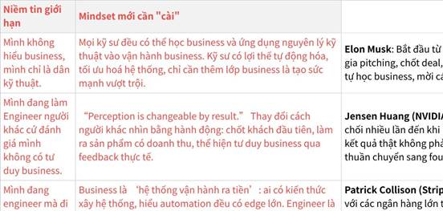

**Click the image to view the sheet.**

**Các lỗi cần tránh của Business Owners**

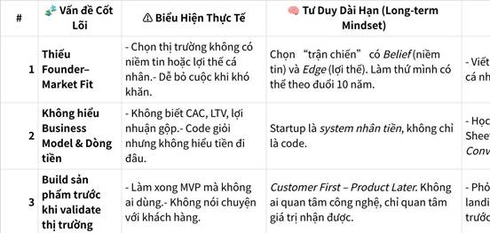

**Click the image to view the sheet.**

**1.2.0.8.3 Từ nhân dạng Business Owner Product FinAI -> lên Finance and Investor: 28/10/2025 - NHÂN DẠNG: AI ARCHITECT FOR FINANCIAL SYSTEMS - FINANCIAL and BUSINESS MODELS STRATEGIST - GLOBAL ECOSYSTEM and HOLDINGS INVESTOR    => Ngay trong lúc sếp Khôi coach thì chuyển sang: ông anh Trung NQT về tài chính cá nhân và doanh nghiệp IPO / Holdings / ESOP  (các hoạt động M&A, IPO, cấu trúc holdings, định giá, gọi vốn, tài chính doanh nghiệp, phát triển tài sản trí tuệ, v.v) + Tự so sánh CTO - CFO - CEO cảm giác thích cái nào hơn qua việc TƯỞNG TƯỢNG TƯƠNG LAI (cách chị Mai Anh và chị Ngọc chỉ dạy) + chị Uyên hỏi về lộ trình tính toán tài chính trong 6 tháng biến động tới** 

|   |
|---|
|*** AI Architect for Financial Systems**<br><br>*** Strategic Advisor for Financial and Business Model Strategy**<br><br>*** Strategic Mentor–Advisor-Investor for Global Ecosystems, Business Valuation, IPO, Holdings and M&A**|

|   |
|---|
|14.11.2025 : AI - FINANCE - BUSINESS - INVESTING  <br>*** AI Architect for Financial Systems**<br><br>*** Advisor, Mentor, and Investor in Financial and Business Model Strategy -> Business Valuation, IPOs, M&A, Holdings, and Global Ecosystems**|

**[Phụ lục] Phân biệt: Advisor - Mentor - Coach - Consultant**

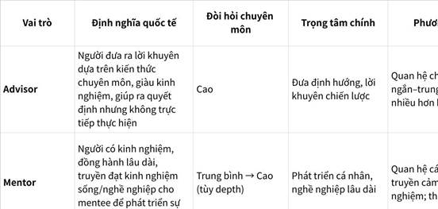

**Click the image to view the sheet.**

**Điểm then chốt quốc tế:**

•                     Advisor: Định hướng tổng quát, đưa ra lời khuyên chiến lược, không trực tiếp tham gia giải quyết từng bước.[assuredstrategy+2](https://www.assuredstrategy.com/what-is-the-difference-between-a-coach-consultant-advisor-or-mentor/)

•                     Mentor: Dài hạn, cá nhân hóa, phát triển con người, thường không phát sinh phí (volunteer, cảm hứng).[reseaumentorat+2](https://www.reseaumentorat.com/en/mentor-or-coach)

•                     Coach: Hỏi thay vì nói, khai mở năng lực cá nhân, ngắn hạn/mục tiêu rõ ràng, không trực tiếp đưa giải pháp hoặc thực thi.[linkedin+2](https://www.linkedin.com/pulse/consultant-advisor-coach-mentor-peter-thommen)

•                     Consultant: Làm dự án, đề xuất giải pháp cụ thể, chuyên sâu nghiệp vụ/kỹ thuật, thường trả phí theo hợp đồng, khả năng thực thi cao.[consulterce+2](https://consulterce.com/difference-consulting-coaching-mentoring/)

Nguồn tham khảo quốc tế trực tiếp: Consulterce, AssuredStrategy, Réseau Mentorat, LinkedIn, EuropeanMarketLink...[md2md+5](https://www.md2md.co.uk/insights/coaches-mentors-advisors-consultants-and-non-executive-directors)

1.                   [https://www.assuredstrategy.com/what-is-the-difference-between-a-coach-consultant-advisor-or-mentor/](https://www.assuredstrategy.com/what-is-the-difference-between-a-coach-consultant-advisor-or-mentor/)

2.                   [https://www.reseaumentorat.com/en/mentor-or-coach](https://www.reseaumentorat.com/en/mentor-or-coach)

3.                   [https://consulterce.com/difference-consulting-coaching-mentoring/](https://consulterce.com/difference-consulting-coaching-mentoring/)

4.                   [https://homebasededucator.com/definitions-of-coach-consultant-tutor-trainer-teacher-mentor-and-adviser/](https://homebasededucator.com/definitions-of-coach-consultant-tutor-trainer-teacher-mentor-and-adviser/)

5.                   [https://www.linkedin.com/pulse/consultant-advisor-coach-mentor-peter-thommen](https://www.linkedin.com/pulse/consultant-advisor-coach-mentor-peter-thommen)

6.                   [https://www.md2md.co.uk/insights/coaches-mentors-advisors-consultants-and-non-executive-directors](https://www.md2md.co.uk/insights/coaches-mentors-advisors-consultants-and-non-executive-directors)

7.                   [https://www.europeanmarketlink.com/2021/01/04/whats-the-difference-between-a-trainer-coach-consultant-and-mentor-define-terms/](https://www.europeanmarketlink.com/2021/01/04/whats-the-difference-between-a-trainer-coach-consultant-and-mentor-define-terms/)

8.                   [https://www.bobbradley.co.uk/Coach](https://www.bobbradley.co.uk/Coach)

9.                   [https://www.linkedin.com/pulse/difference-between-coaches-mentors-advisors-mike-krupit](https://www.linkedin.com/pulse/difference-between-coaches-mentors-advisors-mike-krupit)

10.               [https://janinecoombes.co.uk/definition-coach-consultant-mentor-trainer/](https://janinecoombes.co.uk/definition-coach-consultant-mentor-trainer/)

11.               [https://www.linkedin.com/pulse/whats-difference-business-consultant-advisor-mentor-corlass-mba-pioqc](https://www.linkedin.com/pulse/whats-difference-business-consultant-advisor-mentor-corlass-mba-pioqc)

12.               [https://www.motiveer.eu/blog/coach-vs-mentor-vs-consultant](https://www.motiveer.eu/blog/coach-vs-mentor-vs-consultant)

13.               [https://www.donna-stone.com.au/what-is-a-business-coach-mentor-consultant-advisor/](https://www.donna-stone.com.au/what-is-a-business-coach-mentor-consultant-advisor/)

14.               [https://zim.vn/phan-biet-advisor-mentor-coach-va-consultant](https://zim.vn/phan-biet-advisor-mentor-coach-va-consultant)

15.               [https://coach-accreditation.services/coach-consultant-mentor-advisor-who-should-you-turn-to/](https://coach-accreditation.services/coach-consultant-mentor-advisor-who-should-you-turn-to/)

**1.2.0.8.4 [5 DỰ ÁN VÀ LỜI MỜI HỢP TÁC CÙNG 1 LÚC - LEVEL CTO xuất hiện, mình biết VALUE của mình nằm ở đâu!!!] - Lời mời Co-founder và nhiều dự án start-up - 13/10/2025. NẾU BẠN NHÌN VÀO KẾT QUẢ 5-10 NĂM VỀ SAU, BẠN RA QUYẾT ĐỊNH Ở 1-2 NĂM ĐẦU TIÊN RẤT CHUẨN.**

1.                   Robot AI Agent - 14 triệu GROSS công ty chính

2.                   VP Bank: Kèo chiến lược ảnh hưởng đến công việc chính của mình hiện tại. Sang Fintech, đỗ là qua luôn.

3.                   CFO AI Agent - đã build được team 3 người (mình, 1 HN a Huy, 1 Đà Nẵng a Huy, 1 HCM a Mười)

4.                   Start up: Business and Stock Valuation - core team AIO HN (mình, a Hoàng An, a Nam)

5.                   CTO Co-founder 10000 Hours (Productivity App) - 30% share

6.                   X3 năng suất muốn update web app, tích hợp AI đo lường recommend chiến lược cho ace trên web.

**1.2.0.8.5 🌇 HÀNH TRÌNH CUỘC SỐNG 20 NĂM – AI ARCHITECT → BUSINESS STRATEGIST → ECOSYSTEM INVESTOR (Phương pháp mô phỏng hoá tương lai chị Mai Anh chỉ)**

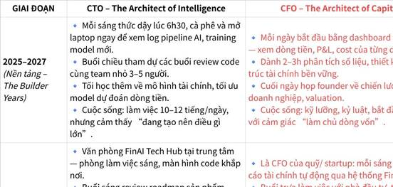

**Click the image to view the sheet.**

**1.2.0.9 [THÊM NHÂN DẠNG: ĐỊNH GIÁ - CỐ VẤN - ĐẦU TƯ]NQT - QUAN SÁT thầy NQT.  => Thêm: ĐỊNH GIÁ - CỐ VẤN - ĐẦU TƯ**

**3.2.0.2.2.1 Các bài viết của thầy NQT**

|   |
|---|
|Dưới đây là danh sách toàn bộ các bài viết trên trang NguoiQuanTri.com (theo nội dung bạn gửi và trích từ trang blog), được đánh số từ 1 trở đi để bạn dễ theo dõi:<br><br>1.                   Trải Nghiệm Cuộc Sống \| Bố tôi bị chấn đoán Ung Thư tuỵ năm 2022  <br>[https://www.nguoiquantri.com/blog/bo-toi-ung-thu-2022](https://www.nguoiquantri.com/blog/bo-toi-ung-thu-2022)<br><br>2.                   Phân tích Case Studies \| Sơ đồ Holdings và cấu trúc cổ phần hoá của CHAGEE trong thương vụ IPO 5.1 tỷ USD trên sàn NASDAQ  <br>[https://www.nguoiquantri.com/blog/chagee-ipo](https://www.nguoiquantri.com/blog/chagee-ipo)<br><br>3.                   Chiến lược IPO \| ESOP - 04 điểm khác biệt Pháp lý & Tài chính giữa Việt Nam và Châu Âu, Mỹ  <br>[https://www.nguoiquantri.com/blog/esop-04-diem-khacbiet-phaply-va-taichinh-giua-vietnam-va-chauau-my](https://www.nguoiquantri.com/blog/esop-04-diem-khacbiet-phaply-va-taichinh-giua-vietnam-va-chauau-my)<br><br>4.                   Tài Chính Doanh Nghiệp \| 5 mô hình chuỗi nhượng quyền phổ biến  <br>[https://www.nguoiquantri.com/blog/5-mo-hinh-nhuong-quyen](https://www.nguoiquantri.com/blog/5-mo-hinh-nhuong-quyen)<br><br>5.                   Tài Chính Cá Nhân \| Đây là số tiền bạn cần để nhân viên ngân hàng nghĩ bạn giàu có  <br>[https://www.nguoiquantri.com/blog/baonhieutienmoilagiauco](https://www.nguoiquantri.com/blog/baonhieutienmoilagiauco)<br><br>6.                   Tài Chính Cá Nhân \| QUY TẮC 4%: NÊN RÚT BAO NHIÊN TIỀN MỖI THÁNG TỪ QUỸ NGHỈ HƯU  <br>[https://www.nguoiquantri.com/blog/quytac4](https://www.nguoiquantri.com/blog/quytac4)<br><br>7.                   Phân tích Case Studies \| Luckin Coffee và chiến lược nhượng quyền "vượt mặt" Starbucks  <br>[https://www.nguoiquantri.com/blog/nhuongquyenluckincoffee](https://www.nguoiquantri.com/blog/nhuongquyenluckincoffee)<br><br>8.                   Phân tích Case Studies \| Starbucks - Thương hiệu nhượng quyền cấp phép được săn đón toàn cầu  <br>[https://www.nguoiquantri.com/blog/nhuongquyencapphepstarbucks](https://www.nguoiquantri.com/blog/nhuongquyencapphepstarbucks)<br><br>9.                   Chiến lược IPO \| Lợi thế thương mại và cách tăng lợi thế thương mại  <br>[https://www.nguoiquantri.com/blog/loithethuongmai](https://www.nguoiquantri.com/blog/loithethuongmai)<br><br>10.               Tài Chính Doanh Nghiệp \| Thặng dư vốn cổ phần và những điều cần biết  <br>[https://www.nguoiquantri.com/blog/thangduvoncophan](https://www.nguoiquantri.com/blog/thangduvoncophan)<br><br>11.               Tài Chính Doanh Nghiệp \| LỢI NHUẬN SAU THUẾ CHƯA PHÂN PHỐI LÀ GÌ  <br>[https://www.nguoiquantri.com/blog/loinhuansauthuechuaphanphoi](https://www.nguoiquantri.com/blog/loinhuansauthuechuaphanphoi)<br><br>12.               Chiến lược IPO \| Kiến thức M&A cơ bản và ví dụ minh họa cụ thể  <br>[https://www.nguoiquantri.com/blog/m-a-va-cac-thuong-vu-m-a](https://www.nguoiquantri.com/blog/m-a-va-cac-thuong-vu-m-a)<br><br>13.               Tài Chính Doanh Nghiệp \| TIỀM NĂNG CỦA MÔ HÌNH HOLDING  <br>[https://www.nguoiquantri.com/blog/mohinhhoiding](https://www.nguoiquantri.com/blog/mohinhhoiding)<br><br>14.               Chiến lược IPO \| Định giá doanh nghiệp? Các phương pháp định giá doanh nghiệp trên thị trường  <br>[https://www.nguoiquantri.com/blog/dinhgiadoanhnghiep](https://www.nguoiquantri.com/blog/dinhgiadoanhnghiep)<br><br>15.               Chiến lược IPO \| Cơ chế huy động vốn cho doanh nghiệp vừa và nhỏ  <br>[https://www.nguoiquantri.com/blog/huydongvon](https://www.nguoiquantri.com/blog/huydongvon)<br><br>16.               Chiến lược IPO \| CÁC LOẠI Ý KIẾN CỦA KIỂM TOÁN VIÊN TRÊN BÁO CÁO KIỂM TOÁN  <br>[https://www.nguoiquantri.com/blog/ykienkiemtoanvien](https://www.nguoiquantri.com/blog/ykienkiemtoanvien)<br><br>17.               Tài Chính Doanh Nghiệp \| ESOP là gì? Các kiến thức cơ bản ESOP cho doanh nghiệp  <br>[https://www.nguoiquantri.com/blog/esopdoanhnghiep](https://www.nguoiquantri.com/blog/esopdoanhnghiep)<br><br>18.               Chiến lược IPO \| [Infographic] 16 Bước Niêm Yết Doanh Nghiệp Trong 4 Năm  <br>[https://www.nguoiquantri.com/blog/16stepsipo](https://www.nguoiquantri.com/blog/16stepsipo)<br><br>19.               Phân tích Case Studies \| 03 điểm lạ khi chuỗi Blank Street Coffee huy động được 87 triệu USD  <br>[https://www.nguoiquantri.com/blog/blankstreetcoffeehuydongvon87trieuusd](https://www.nguoiquantri.com/blog/blankstreetcoffeehuydongvon87trieuusd)<br><br>20.               Chiến lược IPO \| Chiến lược IPO/ LISTING với định vị là cổ phiếu phòng thủ - Defensive Stock  <br>[https://www.nguoiquantri.com/blog/ipo-defensive-stock](https://www.nguoiquantri.com/blog/ipo-defensive-stock)<br><br>21.               Chiến lược IPO \| Nguyên Tắc Định Giá Chứng Khoán  <br>[https://www.nguoiquantri.com/blog/stock-valuation](https://www.nguoiquantri.com/blog/stock-valuation)<br><br>22.               Chiến lược IPO \| BOOTSTRAPPING - TĂNG TRƯỞNG MÀ KHÔNG CẦN GỌI VỐN?  <br>[https://www.nguoiquantri.com/blog/bootstrapping](https://www.nguoiquantri.com/blog/bootstrapping)<br><br>23.               Tài Chính Cá Nhân \| TỰ DO TÀI CHÍNH & NGHỈ HƯU SỚM (F.I.R.E- Financial Independence Retire Early)  <br>[https://www.nguoiquantri.com/blog/fire01](https://www.nguoiquantri.com/blog/fire01)<br><br>24.               Chiến lược IPO \| Phân biệt Listing và IPO: 2 trong 4 cách đưa cổ phiếu lên giao dịch trên sàn chứng khoán  <br>[https://www.nguoiquantri.com/blog/listing-vs-ipo](https://www.nguoiquantri.com/blog/listing-vs-ipo)<br><br>25.               Chiến lược IPO \| PHÂN BIỆT 2 HÌNH THỨC CHÀO BÁN CỔ PHIẾU LẦN ĐẦU RA CÔNG CHÚNG (IPO)  <br>[https://www.nguoiquantri.com/blog/2-hinh-thuc-ipo](https://www.nguoiquantri.com/blog/2-hinh-thuc-ipo)<br><br>26.               Chiến lược IPO \| REV-1st vs UNICORN : 2 mô hình tài chính cho doanh nghiệp định hướng IPO  <br>[https://www.nguoiquantri.com/blog/rev1st](https://www.nguoiquantri.com/blog/rev1st)<br><br>27.               Tài Chính Cá Nhân \| Tỉ lệ phân bổ tài sản khi đầu tư tài chính của NQT  <br>[https://www.nguoiquantri.com/blog/phan-bo-tai-san](https://www.nguoiquantri.com/blog/phan-bo-tai-san)<br><br>28.               Tài Chính Cá Nhân \| VỪA LÀ MỘT DOANH NHÂN, VỪA LÀ MỘT NGƯỜI CHA?  <br>[https://www.nguoiquantri.com/blog/father-and-daughter](https://www.nguoiquantri.com/blog/father-and-daughter)<br><br>29.               Phân tích Case Studies \| BÀI HỌC MBA KINH ĐIỂN TỪ NGƯỜI LÁI XE TAXI  <br>[https://www.nguoiquantri.com/blog/bai-hoc-tu-nguoi-lai-taxi](https://www.nguoiquantri.com/blog/bai-hoc-tu-nguoi-lai-taxi)<br><br>30.               Phân tích Case Studies \| Mô hình Kinh Tế Chia Sẻ (Sharing Economy) của AirBnB sẽ không bền vững?  <br>[https://www.nguoiquantri.com/blog/phantichairbnb](https://www.nguoiquantri.com/blog/phantichairbnb)<br><br>31.               Phân tích Case Studies \| APPLE: Liệu sẽ sụp đổ như NOKIA?  <br>[https://www.nguoiquantri.com/blog/apple-vs-nokia](https://www.nguoiquantri.com/blog/apple-vs-nokia)|

**3.2.0.2.2.2 Công việc ĐỊNH GIÁ - TƯ VẤN CỐ VẤN - ĐẦU TƯ: DOANH NGHIỆP IPO - HOLDINGS - M&A (https://www.facebook.com/nguoiquantri1987)**

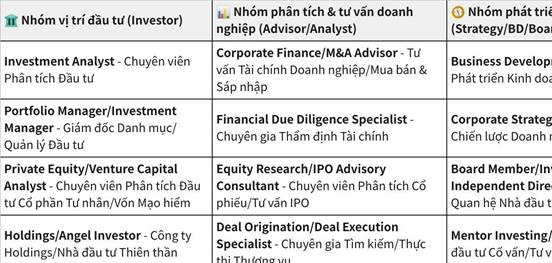

**Click the image to view the sheet.**

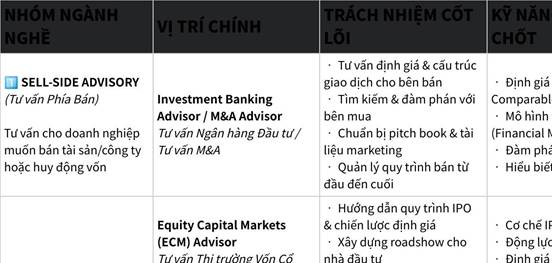

**Click the image to view the sheet.**

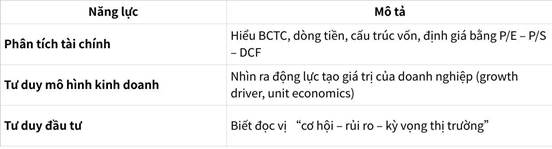

**Click the image to view the sheet.**

**3.2.0.2.2.3 Tìm kiếm cơ hội VÀO NHÁNH TÀI CHÍNH, ĐẦU TƯ.**

|   |   |
|---|---|
|**Ib thầy NQT, anh Bùi Đô - Ngỏ lời vào đêm 01/11/2025:**|\|   \|<br>\|---\|<br>\|Em chào thầy NQT ạ.<br><br>Thưa thầy, em muốn theo đuổi con đường giống anh, trở thành 1 cố vấn, đầu tư doanh nghiệp IPO - Holdings - M&A - Ecosystem - ...<br><br>Đợt này em đang dành thời gian để tập tính định giá doanh nghiệp: Stock and Business Valuation (đọc báo cáo tài chính, tính DCF, ...)<br><br>Thưa thầy, anh có mở khoá đào tạo truyền nhân con đường này không ạ, hoặc team có đang tuyển 1 vị trí nào chạy việc em xin phụng sự anh để có cơ hội gần anh hơn ạ.<br><br>(Em cũng chuyên Toán, IT BKHN, hiện đang làm trong mảng AI ạ)<br><br>Em cảm ơn anh ạ!  <br>  <br><br>Em chào sếp Đô ạ.<br><br>Anh Đô ơi, em muốn theo đuổi con đường trở thành 1 người cố vấn và đầu tư doanh nghiệp.<br><br>Đợt này em đang dành thời gian để tập tính định giá doanh nghiệp (đọc báo cáo tài chính, tính DCF, ...<br><br>Team Thinkzone có đang tuyển vị trí nào không ạ, em muốn xin  apply 1 vị trí thực tập sinh của team ạ.<br><br>Em cảm ơn anh ạ\|<br><br>\|   \|<br>\|---\|<br>\|Trong khi ngày xưa thì chọn AI Engineer (say no với Data Scientist và AI Research) -> mục tiêu thành AI Architect. Nhưng giờ lại rẽ sang Finance nên ...\||
|**Vị trí:** [**Intern - FS Strategy & Operations Consulting**](https://www.linkedin.com/jobs/view/4318017503/?alternateChannel=search&refId=361a87d1-769c-4c27-b141-e0d98afd547a&trackingId=zZD4xoTQQDeDU%2Btz7Ob68Q%3D%3D) **- https://www.linkedin.com/company/pwc/jobs/**|**Vị trí: Data Scientist - HIWEB**<br><br>\|   \|<br>\|---\|<br>\|**Nhiệm vụ chính**<br><br>•                     Nghiên cứu, thiết kế và triển khai các chiến lược giao dịch hệ thống trên nhiều      loại tài sản (cổ phiếu, trái phiếu, ngoại hối, hàng hóa, tiền mã hóa,      v.v.).<br><br>•                     Phân tích các tập dữ liệu lớn và phức tạp để tìm ra mô hình, xu hướng và cơ hội      tạo alpha.<br><br>•                     Kiểm định và xác minh các chiến lược giao dịch nhằm đảm bảo tính vững chắc và ý      nghĩa thống kê.<br><br>•                     Giám sát hiệu suất của các chiến lược đang triển khai và liên tục cải thiện mô      hình theo biến động thị trường.<br><br>•                     Cập nhật các nghiên cứu học thuật, xu hướng ngành và phương pháp mới trong tài      chính định lượng, thống kê và machine learning.\||
|**Vị trí: QUANTITATIVE RESEARCHER (JUNIOR)**<br><br>--<br><br>1.                   Công ty ver-meta làm gì, khách hàng của họ là ai? Họ tạo được giá trị gì cho xã hội<br><br>2.                   Vị trí của mình là làm gì? -> Đến người dùng cuối họ nhận được gì|\|   \|<br>\|---\|<br>\|QUANTITATIVE RESEARCHER (JUNIOR)<br><br>Bạn có tư duy phân tích sắc bén, yêu thích dữ liệu và đam mê thị trường tài chính?<br><br> Đây là cơ hội để bạn bắt đầu hành trình trở thành Nhà nghiên cứu định lượng chuyên nghiệp cùng đội ngũ Hiweb – nơi kết hợp giữa tư duy định lượng, công nghệ và sáng tạo trong đầu tư.<br><br> CÔNG VIỆC CHÍNH:<br><br>• Nghiên cứu, thiết kế và triển khai các chiến lược giao dịch định lượng.<br><br>• Phân tích dữ liệu lớn để nhận diện mô hình, xu hướng và cơ hội tạo alpha.<br><br>• Kiểm định và tối ưu mô hình nhằm đảm bảo hiệu quả và tính ổn định.<br><br>• Theo dõi hiệu suất chiến lược, cải tiến liên tục dựa trên dữ liệu thị trường.\|<br><br>1.                   Công ty Var-meta làm gì & Khách hàng của họ là ai? Họ tạo được giá trị gì cho xã hội:<br><br>•                     Var-meta là một công ty công nghệ chuyên cung cấp giải pháp toàn diện về Blockchain, AI và AR/VR.<br><br>•                     Họ phát triển các sản phẩm công nghệ như: blockchain infrastructure, dApps, DeFi, NFT solutions, SDK, công cụ hỗ trợ quản lý tài sản số; dịch vụ AI tiên tiến (như NLP, Computer Vision, hệ thống khuyến nghị, phân tích dữ liệu…); cũng như giải pháp AR/VR (ứng dụng cho học tập, bán lẻ, game, nghệ thuật…).<br><br>•                     Khách hàng: các doanh nghiệp và tổ chức hoạt động trong lĩnh vực tài chính, logistics, bán lẻ, giáo dục, gaming, nghệ thuật… muốn áp dụng công nghệ mới để tối ưu hóa hoạt động, nâng cấp trải nghiệm khách hàng, tăng hiệu quả quản trị và bảo mật.<br><br>•                     Giá trị tạo ra cho xã hội: giúp các doanh nghiệp chuyển đổi số, tăng hiệu suất vận hành, bảo đảm minh bạch giao dịch, chống gian lận, đổi mới sáng tạo sản phẩm dịch vụ. Ứng dụng blockchain còn giúp giao dịch tài chính an toàn, minh bạch và mở ra cơ hội cho những mô hình kinh doanh mới.<br><br>2.                   Vị trí của bạn là làm gì? Người dùng cuối nhận được gì?<br><br>•                     Vị trí Intern Quant Researcher của bạn là:<br><br>￮      Phân tích dữ liệu giao dịch crypto, xây dựng và tối ưu hóa các mô hình dự đoán giá, thử nghiệm các chiến lược giao dịch định lượng (ứng dụng toán học, học máy…).<br><br>￮      Đánh giá hiệu quả các sản phẩm, mô hình giao dịch trước khi được triển khai thực tế cho khách hàng/doanh nghiệp.<br><br>￮      Đóng góp vào việc tạo ra các sản phẩm như auto-trading system, dashboard phân tích, hoặc công cụ quản trị rủi ro cho doanh nghiệp tài chính số, fintech sử dụng blockchain/crypto.<br><br>•                     Người dùng cuối (doanh nghiệp hoặc khách hàng của Var-meta) sẽ nhận được:<br><br>￮      Công cụ/phần mềm giúp họ quản trị rủi ro tốt hơn khi đầu tư/tích hợp tài sản số;<br><br>￮      Dashboard phân tích giúp ra quyết định đầu tư hiệu quả, minh bạch hơn;<br><br>￮      Hệ thống giao dịch tự động tiết kiệm thời gian, giảm thiểu sai sót do con người;<br><br>￮      Các sản phẩm áp dụng AI/Blockchain giúp tăng hiệu quả vận hành/doanh thu, minh bạch, bảo mật và cập nhật xu thế công nghệ mới.<br><br>Tóm lại:<br><br> Bạn góp phần vào việc tạo ra các giải pháp công nghệ giúp doanh nghiệp/chủ đầu tư dữ liệu sử dụng hiệu quả blockchain và AI, từ đó nâng cấp chất lượng sản phẩm, dịch vụ và tạo giá trị lâu dài cho xã hội thông qua chuyển đổi số và đổi mới sáng tạo.|
||Warren Buffett và Charlie Munger – hai nhà đầu tư huyền thoại và đồng sáng lập Berkshire Hathaway – đều rất phản đối crypto và Bitcoin.<br><br>•                     Warren Buffett từng gọi Bitcoin là “rat poison squared” (tạm dịch: "thuốc chuột gấp đôi"), cho rằng Bitcoin và các loại tiền điện tử không có giá trị nội tại, không tạo ra dòng tiền, không phục vụ sản xuất hay mang lại ích lợi cho xã hội như cổ phiếu hay bất động sản. Ông coi crypto chỉ là công cụ để đầu cơ, “token đánh bạc”, giống các bong bóng tài sản trong lịch sử, và cảnh báo mọi người nên tránh xa.[nasdaq+3](https://www.nasdaq.com/articles/warren-buffetts-anti-crypto-stance-may-have-changed-heres-update)<br><br>•                     Charlie Munger còn chỉ trích gay gắt hơn, mô tả crypto là “kinh tởm”, “chỉ phục vụ cho tội phạm và bắt cóc” và ông ực ủng hộ các quốc gia cấm crypto như Trung Quốc. Ông ví giao dịch crypto giống như “hợp đồng đánh bạc”, có xác suất thua cực cao với người chơi.[soumyajitgoswami+2](https://blog.soumyajitgoswami.in/2025/07/why-warren-buffett-doesnt-believe-in.html)youtube<br><br>Cả hai đều cho rằng nhà đầu tư nên tập trung vào các tài sản có giá trị thực và tạo ra tiền như doanh nghiệp, bất động sản hay trái phiếu, thay vì chạy theo hiệu ứng đám đông và sự biến động giá thất thường của thị trường crypto.<br><br>Tóm lại, Warren Buffett và Charlie Munger đều phản đối đầu tư crypto vì không có giá trị thực, cực kỳ rủi ro, mang tính đầu cơ cao và tiềm ẩn nguy cơ cho nhà đầu tư nhỏ lẻ.|
||\|   \|<br>\|---\|<br>\|Em cảm ơn anh nhiều ạ.<br><br>Em mới có 1 offer vào vị trí Intern Quant Researcher tại Var-meta, (https://www.var-meta.com/) về phân tích dữ liệu giao dịch crypto, phát triển mô hình dự đoán và thử nghiệm chiến lược định lượng tài sản số, ... Nếu hiệu quả và ổn định, mô hình/chiến lược này có thể được đưa vào sản phẩm hoặc giải pháp thực tế: ví dụ như auto-trading, dashboard phân tích cho khách hàng, module quản trị rủi ro cho sản phẩm blockchain/crypto. ( Công ty cung cấp giải pháp AI, Blockchain, AR/VR cho doanh nghiệp phát triển sản phẩm số)<br><br>Em có tìm hiểu nhanh về crypto, gần đây nhà nước ban hành thí điểm TÀI SẢN MÃ HOÁ : https://www.youtube.com/watch?v=JIRKB9rZS3g&list=PLu3y6aTxTwcSsmsuxmzBpgri--vvIO6tH&index=6<br><br>Em muốn xin góc nhìn của anh về Crypto, nơi có tính đầu cơ mạnh và nhiều biến động ạ, liệu đây có phải là dòng FinTech sẽ nổi lên trong 3-5 năm tới không?. Em cảm ơn thầy nhiều ạ!!!\||
||Nếu mục tiêu dài hạn của bạn là trở thành nhà đầu tư giá trị (value investor), bạn cần hiểu rõ sự khác biệt giữa đầu tư giá trị và đầu tư đầu cơ/ngắn hạn – nhất là trong thị trường crypto:<br><br>•                     Đầu tư giá trị là hướng tiếp cận ưu tiên đầu tư vào các tài sản/doanh nghiệp có giá trị nội tại tốt, dòng tiền bền vững, mô hình kinh doanh rõ ràng, quản trị hiệu quả – thường áp dụng cho cổ phiếu, trái phiếu, bất động sản, kinh doanh truyền thống.<br><br>•                     Thị trường crypto hiện nay đa phần vẫn còn mang tính đầu cơ cao, nhiều dự án thiếu giá trị nội tại thực sự (chưa tạo được dòng tiền ổn định, phụ thuộc vào hype/tâm lý đám đông…). Tuy nhiên, cũng xuất hiện dần một số dự án blockchain có ứng dụng thực tế/giá trị công nghệ (chẳng hạn như Ethereum phát triển DeFi, NFT, smart contract…).<br><br>Để chuyển đổi từ kỹ năng định lượng sang đầu tư giá trị lâu dài, bạn có thể:<br><br>•                     Rèn luyện tư duy phân tích doanh nghiệp, đọc báo cáo tài chính, định giá dự án blockchain/crypto dựa vào giá trị thực chứ không chỉ là sóng giá.<br><br>•                     Chọn ra những blockchain/token có ứng dụng thực tế, tạo giá trị thật cho người dùng hoặc doanh nghiệp (không chỉ token “meme” hay coin đầu cơ).<br><br>•                     Kết hợp kỹ năng định lượng để phân tích dữ liệu, nhận diện cơ hội đầu tư giá trị trong lĩnh vực mới như Web3, DeFi, AI kết hợp blockchain…<br><br>•                     Theo dõi quy định pháp lý để đảm bảo hoạt động đầu tư minh bạch, bền vững.<br><br>Tóm lại:<br><br>Bạn hoàn toàn có thể áp dụng tư duy “đầu tư giá trị” vào lĩnh vực mới như blockchain/crypto, dù hiện tại cơ hội này vẫn còn hạn chế so với thị trường vốn truyền thống. Hãy tập trung phát triển nền tảng phân tích, logic đầu tư giá trị và chờ đợi các dự án blockchain thực sự tốt, dùng cho cộng đồng, có nguồn thu và tăng trưởng thực – đó là lúc bạn có thể trở thành “value investor” đúng nghĩa cả trong thị trường mới này.|
|**Vị trí: DOAN NGOC CUONG - Investment Analyst Application - ThinkZone**|\|   \|<br>\|---\|<br>\|Em chào anh Nam và các anh chị ThinkZone Fund!<br><br>Em là Cường. Chuyên Toán chuyên Thái Bình, Data Science and AI ĐH BKHN,<br><br>Hiện tại, em là 1 AI Engineer hơn 1 năm kinh nghiệm.<br><br>Mục tiêu dài hạn của em là xây dựng 1 hệ sinh thái: <br><br>•                     AI Architect for Financial Systems<br><br>•                     Advisor, Mentor, and Investor in Financial and Business Model Strategy -> Business Valuation, IPOs, M&A, Holdings, and Global Ecosystems<br><br>Một thời gian ngắn trước, khi bước chân vào thị trường lao động, em mang theo câu hỏi: 'Mình giàu lên thì người khác có nghèo đi không và mục đích của việc làm doanh nghiệp để làm gì?'<br><br>Sau 6 tháng em có câu trả lời cho mình:<br><br>1.                   Tạo ra càng nhiều thứ người khác muốn: của cải tài sản, VALUE chứ không phải là TIỀN<br><br>2.                   Posititive Sum Game và Nguỵ Biện Miếng Bánh:<br><br>•                     Hiểu nhầm ban đầu của em và đa số mọi người: Tiền bạc nằm trong tay đa số người giàu và điều đó có vẻ bất công. (nguỵ biện miếng bánh - miếng bánh bị giới hạn)<br><br>•                     Nhưng khi hiểu ra: làm doanh nhân, doanh nghiệp là bài toán Posititve Sum Game, tổng dương, tạo giá trị, giải quyết vấn đề và ko ai nghèo đi cả.<br><br>•                     1 mùa hè thay vì ngồi xem ti vi, chúng ta sửa chiếc xe đạp cũ bị hỏng thành như mới, tức là ta đã tạo ra sản phẩm, của cải, giá trị mà ko làm ai nghèo đi cả.<br><br>3.                   Làm doanh nhân, doanh nghiệp là giải bài toán lớn hơn, tạo ra được nhiều giá trị hơn, tạo ra công ăn việc làm, thúc đẩy cuộc sống phát triển. Làm doanh nhân gánh vác trọng trách lớn hơn và khó hơn của xã hội, buộc bản thân phải vượt qua nhiều giới hạn vốn có trước đây.<br><br>Vì vậy từ 1 Engineer, em vượt qua nỗi sợ và nhìn thấy con người mình muốn trở thành 1 doanh nhân, 1 chủ doanh nghiệp, 1 nhà đầu tư, 1 quỹ, 1 hệ sinh thái, ... để tạo ra nhiều value hơn, và phát triển bản thân vượt bậc hơn. Dù điều đó đôi lúc là gánh trên vai cơ hội và cả trách nhiệm.<br><br>Hiện tại em làm việc 14h/ngày (8h công ty AI Engineer, 4h dự án AI Stock, 2h học về Finance và Business), bởi vì em thấy được con người mình muốn trở thành, và điều đó cực kỳ quan trọng!<br><br>Em mong muốn có thể đồng hành cùng ThinkZone Fund để cùng ThinkZone chắp cánh ước mơ đầu tư giá trị, dù đôi lúc không hề màu hồng!!!<br><br>Em xin chân thành cảm ơn ạ!\|<br><br>\|   \|<br>\|---\|<br>\|16/11/2025: Sau khi đi buổi DAS 15/11, HÃY LÀM NHỮNG GÌ MÌNH LÀM HÀNG NGÀY (mình nhận ra có vẻ ko phải AI cho lắm, mà đó là lập kế hoạch, đọc mindset, tâm lý học, huyền học, não, tài chính, kinh doanh, business model đó là lý do mình học BKE, mình phân vân HUST và FTU vì lý do này, mình xuống tiền đi học cả AIO, FSDS, Wecommit100x toàn là những nơi có cộng đồng, X3, DAS, NQT (chứ marketing, video mình toàn trống) => AI - Finance - Business - Investor  <br>  <br><br>Dạ vâng ạ, em cảm ơn anh Nam ạ!!!<br><br>Anh Nam ơi, trong trường hợp xấu nhất không pass, em muốn xin anh chị 1 vị trí thực tập. Với mong muốn đi đường dài cùng Team, làm Business - Investment (Investment Analyst, Investment Banking, ...) ạ!<br><br>(Em xin không nhận lương cho đến khi đủ năng lực tiếp nhận công việc Investment Analyst tại Team ạ)<br><br>Em cảm ơn anh ạ!<br><br>Thank you so much!\|<br><br>\|   \|<br>\|---\|<br>\|27/11/2025 buổi phỏng vấn diễn ra: Trong tâm trí của mình có vẻ như: Tài chính doanh nghiệp là thứ hiện tại đang trong tâm trí của mình mạnh mẽ hơn rất nhiều so với đầu tư doanh nghiệp thông thường khi nhìn vào bài toán Product, bài toán Marketing, Sale - Dĩ nhiên để\||
|**Vị trí : AI x FINANCE x BUSINESS X INVESTING - 01/12/2025 - https://www.perplexity.ai/page/so-sanh-ai-vs-finance-lua-chon-EIpyQJgdTTuA9Pl8SFgmZg#0**|1.                   Em cảm ơn anh, nếu thế thì tuyệt ạ.  <br>Em xin chia sẻ 1 chút:  <br>Định hướng của em: Phát triển bản thân x AI x Finance x Business x Investor  <br>(Phát triển bản thân: Selfhelp, Tâm lý học, Đạo học, ...) (Em đọc về Tâm lý học từ hồi lớp 9)  <br>Học theo vòng tròn năng lực của Warrrent Buffet em mở rộng dần dần: Từ AI -> AI x Finance -> Business AI x Finance -> Investor  <br>Hiện tại em đang chuyển dần từ AI -> AI+Finance  <br>(Công việc chính hiện tại: AI Engineer tại công ty EduTech. Mục tiêu 2026 là chuyển sang AI Engineer trong mảng Finance - Investing.  <br>Để chuẩn bị cho việc chuyển dịch từ Edu sang Finance thì tụi em có tự làm dự án về AI x Stock: phân tích 3 bảng trong báo cáo tài chính, các indicator chuẩn bị cho tính DCF, các metrics định tính từ đại hội cổ đông, giá đóng giá mở, lịch sử công ty, ...) => Tiến tới mô hình trợ lý: Định giá cơ bản + Định giá kỹ thuật).   <br>Sau đó sẽ là bước chuyển từ: AI x Finance -> sang AI x Finance x Business (có thể là mô hình kinh doanh dạng học viện, đào tạo, tư vấn + cộng đồng + SaaS + Business + Investor)   <br>3. Em cũng đã tìm hiểu về nhanh về anh và team FIDT (khá là khớp với em về mảng Tâm lý học x Finance x AI x Business Model (Tư vấn, Đào tạo x SaaS) x Investor:[https://github.com/DoanNgocCuong/working/blob/main/BUSINESS/2_FINANCE/FINTECH/1.%20Ph%C3%A2n%20T%C3%ADch%20C%C3%A1c%20Anh%20%C4%90i%20Tr%C6%B0%E1%BB%9Bc/Anh%20Nguy%E1%BB%85n%20An%20Huy%20v%C3%A0%20Ph%E1%BA%A7n%20m%E1%BB%81m%20Qu%E1%BA%A3n%20l%C3%BD%20T%C3%A0i%20s%E1%BA%A3n%20v%C3%A0%20D%E1%BB%8Bch%20v%E1%BB%A5%20T%C6%B0%20v%E1%BA%A5n%20T%C3%A0i%20ch%C3%ADnh%20To%C3%A0n%20di%E1%BB%87n%20c%E1%BB%A7a%20FIDT.md](https://github.com/DoanNgocCuong/working/blob/main/BUSINESS/2_FINANCE/FINTECH/1.%20Ph%C3%A2n%20T%C3%ADch%20C%C3%A1c%20Anh%20%C4%90i%20Tr%C6%B0%E1%BB%9Bc/Anh%20Nguy%E1%BB%85n%20An%20Huy%20v%C3%A0%20Ph%E1%BA%A7n%20m%E1%BB%81m%20Qu%E1%BA%A3n%20l%C3%BD%20T%C3%A0i%20s%E1%BA%A3n%20v%C3%A0%20D%E1%BB%8Bch%20v%E1%BB%A5%20T%C6%B0%20v%E1%BA%A5n%20T%C3%A0i%20ch%C3%ADnh%20To%C3%A0n%20di%E1%BB%87n%20c%E1%BB%A7a%20FIDT.md?fbclid=IwZXh0bgNhZW0CMTAAYnJpZBExc3YzenJsRVBmVTRWY0J4R3NydGMGYXBwX2lkEDIyMjAzOTE3ODgyMDA4OTIAAR4fYsuppiNSIgtgGoRnfWxWOI7OJ8E0cIqsOKWtmiN5dVClA1kuQ1UFcLyCXw_aem_kiJHZUbhRceHq3RleuTMTw)|
|||

**Công việc của nhóm QUANT RESEARCH**

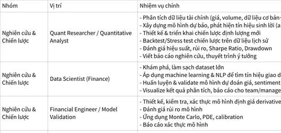

**Click the image to view the sheet.**

Tóm tắt mối quan hệ giữa các nhóm

+, Luồng công việc chính:

Quant Researcher (tạo chiến lược) → Quant Developer (xây hệ thống) → Quant Trader (triển khai & giám sát) → Risk Manager (kiểm soát rủi ro) → CIO (quyết định phân bổ vốn)

+, Vai trò hỗ trợ:

•                     Data Engineer & Data Analyst: cung cấp dữ liệu sạch

•                     Infrastructure/DevOps: đảm bảo hệ thống ổn định

•                     Operations: kiểm tra, đối soát giao dịch

 

**1.2.0.10 [DỪNG TÌM KIẾM VIỆC NHẢY VÀO TÀI CHÍNH => QUAY TRỞ LẠI] Vị trí AI Engineer - 06/12/2025 - 1 tháng trước mình có ý định cực lớn để nhảy sang AI X FINANCE và thậm chí là nhảy hẳn sang FINANCE VÀ BUSINESS THUẦN (Venture Invesment Analysis) => Nghe về VÒNG TRÒN NĂNG LỰC từ lâu cho đến 1 ngày mình nhận ra: VÒNG TRÒN NĂNG LỰC + MỞ RỘNG THEO XOẮN ỐC (a Công) + 10 NĂM LIỀN A HUY CHỈ LÀM VỀ TỐI ƯU DB -> Mình thấy: hmm vòng tròn năng lực.  => Mình quay lại tập trung vào task chính lúc bấy giờ là: Start Up FinTech x Web Browser AI Agent**

**"Vòng Tròn Năng Lực" - Pháo Đài Của Warren Buffett và Charlie Munger - https://www.youtube.com/watch?v=FyCHApY57S4&feature=youtu.be - Vòng Tròn Năng Lực = Chơi trò chơi bạn có lợi thế + Biết chính xác nơi bạn giỏi + Tôn trọng những gì bạn không biết** 

|   |
|---|
|•                     Charlie Munger là người đã hệ thống hóa hơn 90 mô thức tư duy (mental models) từ nhiều lĩnh vực khoa học khác nhau để ứng dụng vào đầu tư, kinh doanh, ra quyết định. Ông tổng hợp, ghi chú, nghiền ngẫm, rồi dùng “latticework of mental models” như một framework cá nhân để giải quyết vấn đề và tối ưu quyết định. Sách “Poor Charlie’s Almanack” là ví dụ điển hình lưu trữ toàn bộ những mô thức này để nghiền ngẫm cả đời. (Charlie Munger là bạn thân lâu năm và là cộng sự hoàn hảo của tỷ phú Warren Buffett. Ông giữ chức Phó Chủ tịch của tập đoàn Berkshire Hathaway hơn 40 năm, Warren Buffett là Chủ tịch tập đoàn).<br><br>https://youtu.be/FyCHApY57S4?si=75DYTTvcV3MrY4V2|

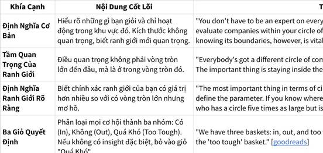

**Click the image to view the sheet.**

**1.2.0.10 Khoảnh khắc tốt nghiệp đại học, mình nhận ra 4 năm đã tạo ra sự chênh lệch lớn - T10/2025 nào**

|   |
|---|
|TÀI CHÍNH: KHI NHÌN SANG TÚI TIỀN CỦA ĐỘI BÊN CẠNH -> LÀ BẠN RẤT DỄ THUA. Vì lúc đó tâm trí bạn ko còn ổn định, và bình tĩnh, bạn leo theo các quyết định ngắn hạn.|

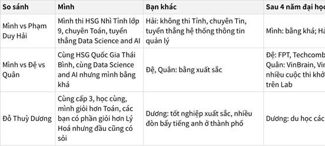

**Click the image to view the sheet.**

**1.2.0.11 - 19/01/2025 - Sau dự án 3 tháng bị fail vì: KHÔNG SAY NO NGAY TỪ ĐẦU (CẢ NỂ, SỢ HÃI GÂY MẤT TÌNH CẢM AE)**

**1.2.0.12 Quay lại chiến lược Doanh Nghiệp bài bản chuẩn bị cho 2026 - START WITH THE DON'T + KẾ HOẠCH BÍ NGÔ.**

|   |   |   |
|---|---|---|
|Tháng 10 - 2025|1.                   Fanpage cá nhân : https://www.facebook.com/doanngoccuong.nhathuong<br><br>\|   \|<br>\|---\|<br>\|1.                   1 - NHẬT HƯƠNG - GOSINGA - MỤC ĐÍCH TỐI HẬU CỦA CUỘC SỐNG - 6 items<br><br>2.                   2 - FINANCE & MATH with SELF-HELP MINDSET - TÂM LÝ HỌC - ĐẠO HỌC - 10 items<br><br>3.                   3 - KẾT QUẢ NỖI SỢ - NIỀM TIN GIỚI HẠN (TÍCH LŨY - HỦ BÀNH QUỸ) - 71 items<br><br>4.                   4 - Mini Habit - HABIT & ENVIRONMENT - 307 items<br><br>5.                   5 - THE MENTOR - THE COMMUNITY - 6 items<br><br>6.                   6 - SHARNG - (không hiển thị số lượng)<br><br>7.                   CKP - AI - FINANCE - BUSINESS - INVESTING - 34 items\|<br><br>2.                   Group - tách riêng ra vì chủ yếu là các bài mình đọc xong mình share để lưu trữ<br><br>\|   \|<br>\|---\|<br>\|1.                   Gen Z - Đi Làm Trong HẠNH PHÚC - Đội ngũ THÂN NHAU&TỰ QUẢN<br><br>2.                    Engineering - TRỞ THÀNH THẾ HỆ KỸ SƯ TỐT HƠN MÌNH CỦA NGÀY HÔM QUA<br><br>3.                   AI - FINANCE - BUSINESS - INVESTOR\|||
||||
|Đầu năm 2026|Fanpage riêng: Vì đăng nhiều<br><br>1.                   Đoàn Ngọc Cường - Consistency - https://www.facebook.com/doanngoccuong.consistency<br><br>+, HABIT CHẠY: Giai đoạn 1 Tháng 2 - Tháng 8 / 2025 + Giai đoạn 2 đầu năm 2026<br><br>2.                   The Story - Doan Ngoc Cuong - Problem Solving - System Thinking -<br><br>3.                   16/2/2026 - 29 âm Tết 2025  <br>The Story Fresher AI Optimization Engineer<br><br>Cộng đồng đóng gói và chuyển giao toàn bộ hành trình đi đến Fresher AI Engineer, 1 dự án phi lợi nhuận đến 95%||
|1|||

Vấn đề hiện tại là quá nhiều thứ bày lên như 1 bàn buffet vậy ?

1.                    

2.                    

3.                    

KHI NHẮC ĐẾN MÌNH MN NHẮC ĐẾN ĐIỀU GÌ?

1.                   Bình an và vui vẻ.

2.                   Kiên trì kỉ luật và sát thần lĩnh vực => Fanpage chạy bộ và khả năng chịu đựng áp lực.

3.                   Kết quả + Tối ưu AI - Finance - Business - Investing. Start with AI Engineer

Chiến thuật dạy trẻ nhà mình, mình cứ giữ lấy, chẳng cần gì phải share vội. Người trí thì ít mà người ngu thì nhiều.

**1.2.0.13 ĐIỀU NÀY ĐÃ LẶP LẠI QUÁ NHIỀU, BUỘC MÌNH PHẢI XỬ LÝ - 07/02/2026**

|   |
|---|
|Đó là khi mình phân vân, mình do dự, mình nghĩ mình tự đã có câu trả lời sau này muốn trở thành ai, 1 CEO, 1 người làm Business, 1 nhà đầu tư. Như câu chuyện đêm qua mình nghe, hồi nhỏ ko ai gán cái nhãn nào vào ta cả, ta cứ thế ta làm ta làm ta làm, rồi lớn lên ta bị gán nhãn là học cái A, học cái B, học cái C, ta biết rõ mình muốn trở thành ai, mình muốn làm Product, làm Business, làm chiến lược. Những lúc như này mình bị mâu thuẫn nội tâm cực mạnh. Năm 2021, 2022 mình mâu thuẫn mình cảm giác học AI thì ko có ý nghĩa, mình muốn về BKE và bỏ học, sau đó mình đi thiền và biết mục đích cuộc sống chấm dứt khổ. Năm 2024,2025, mình bị mâu thuẫn, mình muốn làm Fintech, lúc thì mình muốn làm Finance, lúc mình muốn làm product, lúc mình muốn làm Business, chung quy lại là Product Finance Business: AI - Finance - Business - Investor. 1 kiểu đứng núi này trông núi kia khó ta, và mình rất mau mau chóng chóng để mong muốn được đến cái đích đó. Chẳng khác gì những tù nhân mong muốn được ra tù?  <br>=> 1. Tách biệt GAME THÀNH CÔNG (tự do về tài chính, tiền bạc) và GAME HẠNH PHÚC. (là tự do trong tâm trí). Mục đích cuối cùng của mình là CHẤM DỨT KHỔ, ngay đó mình đã đến đích rồi.  <br>2. GAME THÀNH CÔNG, GAME TÀI CHÍNH:  <br>Không gán nhãn mình chỉ giỏi cái A, mình chỉ giỏi cái B, mình không làm được cái C. Mình là tuýp người A, người B, người C, mình hợp với A, B hay C. Không gán nhãn mình thích A, thích B, thích C nữa...nữa  <br>+, Mình có quyền lựa chọn. Mình không thích, không ghét, mình thích nghi hoàn toàn.  <br>+, Ngành nào thì cũng có cái khó của nó thôi. Mình đặt mục tiêu là: TẠO RA GIÁ TRỊ VÀ ĐỂ LẠI DI SẢN, mục đích đích đến như nhau. Đi xe máy, đi ô tô, đi tàu hỏa thì cũng đến đích cả thôi.  <br>+, Khi cần làm AI Engineer, mình tập trung vào AI Engineer - vòng tròn an toàn của mình hiện tại và mình liên tục mở rộng nó. Khi cần sale mình sale, khi marketing mình làm marketing. Khi cần làm Product, Business, Investor mình cần cái nào, mình làm cái đó. Mình nắm được công thức và trò chơi học tập, mình tìm mentor đã đi con đường đó và nhờ họ chỉ cho. Mình tích lũy mọi thứ có chiến lược và tạo ra nhiều TÀI SẢN, NHIỀU GIÁ TRỊ HƠN = những gì mình đang có.|

**1.2.0.14 Cập nhật thêm role: Product Manager**

|   |
|---|
|12/2/2026  <br>**AI - PRODUCT - FINANCE - BUSINESS - INVESTING**  <br>*** AI Architect and AI Product Manager for Financial Systems**<br><br>*** Advisor, Mentor, and Investor in Financial and Business Model Strategy -> Business Valuation, IPOs, M&A, Holdings, and Global Ecosystems**|

**1.2.0.14.1 Tại sao mình muốn bỏ mảng Agency để tập trung làm cộng đồng AI Engineer - ngày 26/2/2026 (Sau khi mình đăng bài và sau 1 vài hôm bán được cho 1 người (nhắn tin 2 người ấm và 1 người chốt). Cái khoảng khắc bán được cho 1 người đặc biệt vãi) và 1 vài ngày sau mình bắt đầu ngồi cân nhắc:**

1.                   Mình có niềm tin là bán được, mình có niềm tin là bán ko khó

2.                   Mình suy nghĩ về việc làm Agency vẫn là đổi thời gian lấy tiền nhưng giá cao hơn.  
  
+, Hãy nhìn anh Huy: a Huy đi làm lúc đầu => Sau đó làm Agency riêng (1 công việc đổi thời gian lấy tiền nhưng 1 giờ đổi được rất nhiều tiền) + Cộng đồng (Youtube, Wecommit100x, WecommitAI).  
=> Mình nghĩ đến việc: hiện giờ mình có cv Full Time là quá ngon rồi (mình giỏi thì lương cao và dòng tiền đều, còn việc Agency thì cũng cần trình độ mà  + Cộng đồng nữa (trong giai đoạn mình phát triển chuyên môn, chuyên môn mình thấp thì cộng đồng giá thấp, càng lâu sau càng tích luỹ, vì ngày xưa mình có kinh nghiệm dạy 1 đứa em rồi, mình thấp mình dạy thấp và free, mình nhiều kinh nghiệm hơn thì bắt đầu tính tiền). 

|   |   |   |
|---|---|---|
||Công việc đổi thời gian lấy tiền + Gia tăng Skill|Công việc build đường ống (Bài viết kinh nghiệm, video Youtube, Khoá học, Quy trình, Cộng đồng)|
|A Huy|+, Ban đầu anh Huy đi làm là làm cái này.  <br>+, Sau đó anh Huy làm Agency (mở công ty riêng như hiện tại bản chất là làm cái này)  <br>+, Khách hàng thứ 2 của anh Huy bản chất là các bên cty cần thuê a Huy để làm  <br>=> Bản chất vẫn là: Đổi thời gian lấy tiền (a Huy là tiền cao và nhiều cty) + Gia tăng Skill + Làm 1 sản phẩm bán cho nhiều người và customize đi 1 tí.|+, a Huy build Youtube  <br>+, Sau đó anh Huy build Wecommit100X  <br>+, Sau đó a Huy build WecommitAI|
|Mình|+, Ban đầu mình làm các job agency giá rẻ (đồ án tốt nghiệp) lấy giá từ 50k - 4 triệu rưỡi đồ án cử nhân - 10 triệu RAG đồ án thạc sĩ  <br>+, Sau đó mình đi làm, và mình có nhiều job xung quanh ae rủ như: start up FinAI, Web Browser Agent, thi VP Bank, CTO của 10.000 hours, ...  <br>+, Sau đó năm 2026, mình start AI Engineer Challenge tiến tới Cộng đồng theo phong cách DAS và hiện đang có 1 vé rồi.  <br>=> Mình nhận ra.  <br>1. Anh Huy có nhiều khách hàng Agency nhưng đều chung 1 cái là tối ưu DB.  <br>=> Mình sẽ có 1 công ty và nhiều khách hàng Agency NHƯNG mình sẽ ko làm những cái ngoài domain mà chỉ những cái ở cty mình làm được rồi.  <br>=> => Bản chất vẫn là: Đổi thời gian lấy tiền (mình là tiền hiện tại thấp và 1 công ty chính và các bên cty/người quen/người tự tìm đến) + Gia tăng Skill + Làm 1 sản phẩm bán cho nhiều người và customize đi 1 tí.|Tập trung chính cho dự án cộng đồng.  <br>1. NATE HERK tại sao lại bỏ agency để build cộng đồng ?  <br>+, Nate Herk (Nate Herkelman) bỏ agency True Horizon AI để tập trung hoàn toàn vào mô hình cộng đồng vì agency dù đạt doanh thu cao (2.5 triệu USD trong 8 tháng) nhưng không bền vững, gây stress cao và phụ thuộc vào khách hàng.<br><br>Ib cho Thành: Hello ae, sau khi đọc kỹ bài của Nate Herk, tro|

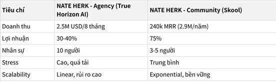

**Click the image to view the sheet.**

**1.2.0.15 [CỰC KỲ QUAN TRỌNG - CỰC KỲ TỰ DO - bước ngoặt mindset 15022026: PHÂN BIỆT NHÂN DẠNG CÁ NHÂN vs NHÂN DẠNG DOANH NGHỆP] - Mình lập các fanpage nơi mình làm những thứ dài hạn**

|   |   |   |
|---|---|---|
||Bị hẹp trong 1 ngách, vùng nhỏ xinh là chân lí, họ phủ nhận các vùng ngoài ...<br><br>=> Họ định vị các ngách đủ nhỏ, và mỗi 1 doanh nghiệp, mỗi 1 dự án hoá thân vào 1 cái gọi là định vị doanh nghiệp<br><br>=> Mỗi 1 dự án nó có 1 định vị hẹp, sai thì kill đi.<br><br>=> Nó khác với định vị cá nhân<br><br>=> nó sẽ ko có cảm giác quyết định đúng thì ăn, sai thì thích<br><br>=> mỗi dự án có 1 skool khác nhau,<br><br>Ko có 1 con đường đúng đắn duy nhất.<br><br>=> ko bị bó buộc,<br><br>Tín, em dậy spa cũng được, expert cũng được, mỗi 1 cái đó định vị hẹp, có thể là dọc hoặc ngang.<br><br>Được quyền thử nghiệm.<br><br>Hành trình hiểu mình cũng đừng có vội, làm cái gì tôi ở trạng thái dòng chảy, tôi ma sát.<br><br>Giai đoạn này hãy cho phép bản thân mình được thử nghiệm thử sai||
||+, Đợt này em cũng đang tách riêng các "thói quen hang ngày của mình". <br><br>Chạy bộ sang 1 fanpage riêng. Viết truyện cũng sang 1 fanpage riêng  <br>  <br>  <br><br>Trước em bị đóng khung mình làm AI Engineer không nên chia sẻ về làm product, ... <br><br>=>à ha, tách riêng ra 2 dự án riêng thì lại rất oke ạ :D||

**1.2.0.0 CÁC CÂU CHUYỆN:**

|   |   |   |
|---|---|---|
|07/02/2026<br><br>•                     Gỡ bỏ nhãn dán mình thích cái này, mình ko thích cái kia, mình giỏi cái này, mình ko giỏi cái kia|**Câu chuyện 1: "Cây Búa, Cây Đục và Người Thợ Mộc" (Gỡ bỏ nhãn dán) - https://www.facebook.com/share/p/1MY182R1nR/**<br><br>Có một chàng trai trẻ đến xin học việc ở xưởng mộc của một bậc thầy vĩ đại.  <br>Ngày đầu tiên, thầy đưa cho anh ta một cái búa và bảo: _"Con hãy dùng cái này để đóng đinh."_  <br>Chàng trai làm rất tốt. Anh ta đóng đinh giỏi nhất xưởng. Mọi người khen ngợi: _"Cậu là một tay búa cừ khôi!"_  <br>Chàng trai tự hào lắm. Anh ta bắt đầu dán nhãn cho mình: "Tôi là Tay Búa Số 1". Đi đâu anh cũng cầm theo cái búa.<br><br>Một ngày nọ, xưởng nhận dự án làm một bức tượng tinh xảo. Thầy đưa cho anh một cái đục và bảo: _"Hãy tạc tượng."_  <br>Chàng trai hoang mang. Anh ta nhìn cái đục, rồi nhìn cái búa. Anh ta nói: _"Nhưng thầy ơi, con là 'Tay Búa' mà? Tay búa thì sao dùng đục được? Dùng đục là phản bội lại danh hiệu của con. Con thấy mâu thuẫn quá."_<br><br>Thầy mỉm cười, gõ nhẹ vào đầu anh:  <br>_"Con không phải là cái búa. Con cũng không phải là cái đục. Con là người thợ mộc."_  <br>_"Cái búa, cái đục, hay cái cưa... chỉ là công cụ trong túi của con. Khi cần đóng đinh, con rút búa ra. Khi cần tạc tượng, con cất búa đi và rút đục ra. Tại sao con lại tự nhốt mình vào trong hộp đồ nghề của chính mình?"_<br><br>💡 Giác ngộ cho bạn:<br><br>Bạn không phải là "AI Engineer". Bạn cũng không phải là "Business Man" hay "Investor". Đó chỉ là Cây Búa và Cái Đục.<br><br>•                     Bạn là "Người Kiến Tạo Giá Trị" (The Creator/The Builder).<br><br>•                     Giai đoạn này, để xây tòa nhà sự nghiệp, bạn cần đóng đinh (làm AI/Tech). Hãy cầm búa lên và đập thật mạnh.<br><br>•                     Giai đoạn sau, khi cần bán sản phẩm, hãy cất búa đi, rút kỹ năng Sale/Marketing ra dùng. Đừng cảm thấy "có lỗi" với cái búa.<br><br>•                     Không gán nhãn: Bạn là người _sử dụng_ kỹ năng, không phải _là_ kỹ năng đó.|**Bài học cốt lõi:**<br><br>•                     **Linh hoạt & Thích ứng:** Không tự đóng khung bản thân vào một danh hiệu hay kỹ năng duy nhất.<br><br>•                     **Công cụ vs. Bản sắc:** Kỹ năng là công cụ, không phải là con người bạn. Hãy sử dụng công cụ phù hợp cho từng nhiệm vụ.<br><br>•                     **Tư duy phát triển:** Sẵn sàng học hỏi và sử dụng những công cụ mới khi cần thiết.<br><br>**Case Study Minh Họa:**<br><br>•                     **❌ KHÔNG Ứng Dụng (Sai lầm): Kodak và sự sụp đổ của "Đế chế phim ảnh"**<br><br>￮      **Bối cảnh:** Kodak từng là "Tay Búa Số 1" trong ngành công nghiệp phim ảnh. Họ tự định nghĩa mình là một công ty sản xuất phim và máy ảnh cơ.<br><br>￮      **Sai lầm:** Khi kỹ thuật số (cái đục) xuất hiện, Kodak đã phát minh ra máy ảnh kỹ thuật số đầu tiên nhưng lại lo sợ nó sẽ "phản bội" lại mảng kinh doanh phim cốt lõi của mình. Họ đã từ chối thay đổi, tiếp tục bám víu vào "cây búa" phim ảnh.<br><br>￮      **Hậu quả:** Kodak phá sản vào năm 2012. Họ đã bị mắc kẹt trong chính nhãn dán "công ty phim ảnh" của mình và không thể thích ứng với công cụ mới.<br><br>•                     **✅ Ứng Dụng (Thành công): Amazon và sự chuyển mình từ "Nhà bán sách" thành "Gã khổng lồ công nghệ"**<br><br>￮      **Bối cảnh:** Jeff Bezos bắt đầu Amazon với vai trò là một "nhà bán sách online". Đó là "cây búa" đầu tiên của ông.<br><br>￮      **Thành công:** Bezos không bao giờ tự dán nhãn Amazon là một công ty bán lẻ. Ông hiểu rằng bán sách chỉ là công cụ ban đầu. Khi nhận thấy cơ hội, ông đã nhanh chóng sử dụng những "cái đục" và "cái cưa" mới: điện toán đám mây (AWS), logistics, streaming (Prime Video), AI (Alexa). Ông không hề cảm thấy "mâu thuẫn" khi một nhà bán sách lại đi làm dịch vụ cloud.<br><br>￮      **Kết quả:** Amazon trở thành một trong những công ty giá trị nhất thế giới. Họ là một "người thợ mộc" bậc thầy, biết sử dụng mọi công cụ để xây dựng đế chế của mình.|
|7/2/2026  <br>- Gỡ bỏ việc đứng núi này trông núi kia và mang theo ước vọng tương lai và nỗi sợ|Dưới đây là một câu chuyện thấm thía để chạm sâu vào tâm thức của bạn về sự nguy hiểm của tâm mong cầu kết quả ("muốn mau mau chóng chóng") và đứng núi này trông núi nọ. Kèm theo đó là giải pháp Gosinga khắc nghiệt nhưng hiệu quả.<br><br>**Câu chuyện: "Người Leo Núi và Hai Hòn Đá" (Buông bỏ tâm mong cầu)**<br><br>Có một chàng trai trẻ tên là **Vọng** (nghĩa là Mong Cầu/Trông Ngóng). Vọng khao khát chinh phục đỉnh núi cao nhất để ngắm bình minh (Biểu tượng của Thành Công/FIRE).<br><br>Vọng bắt đầu leo. Anh ta rất khỏe, rất thông minh (biết AI, Finance, Product). Nhưng Vọng có một thói quen kỳ lạ.  <br> Mỗi khi leo được vài bước, anh ta lại dừng lại, ngước cổ lên nhìn đỉnh núi và than: _"Sao còn xa thế nhỉ? Bao giờ mới tới nơi? Sao người kia leo ngọn núi bên kia trông có vẻ nhanh hơn?"_<br><br>Để "nhanh hơn", Vọng nghĩ ra một cách. Anh ta nhặt **hai hòn đá to**.<br><br>•                     Hòn đá bên tay trái khắc chữ **"Tương Lai Rực Rỡ"** (CEO, Investor, Tự Do).<br><br>•                     Hòn đá bên tay phải khắc chữ **"Lo Lắng Sợ Hãi"** (Sợ sai đường, sợ chậm hơn bạn bè).<br><br>Vọng nắm chặt hai hòn đá này trong tay và tiếp tục leo. Anh nghĩ: _"Cầm theo 'Tương lai' để có động lực, cầm theo 'Nỗi sợ' để không chủ quan."_<br><br>Nhưng càng leo cao, đường càng dốc. Hai hòn đá (Tâm mong cầu & Tâm lo lắng) càng lúc càng nặng trĩu.<br><br>•                     Tay anh mỏi nhừ vì nắm chặt "Tương lai".<br><br>•                     Chân anh run rẩy vì sức nặng của "Nỗi sợ".<br><br>•                     Mắt anh cứ ngước lên đỉnh núi (Đứng núi này trông núi nọ) nên chân anh bước hụt liên tục. Anh trượt ngã, trầy xước khắp người.<br><br>Một thiền sư đi ngang qua, thấy Vọng vừa leo vừa khóc vì kiệt sức. Thiền sư hỏi:  <br>_"Tại sao con leo núi mà lại mang theo hai hòn đá nặng thế kia?"_<br><br>Vọng hổn hển: _"Đây là mục tiêu và động lực của con. Con không thể buông. Nếu buông, con sợ mình sẽ không bao giờ đến đích, con sẽ lạc lối."_<br><br>Thiền sư cười lớn và đẩy Vọng một cái thật mạnh. Vọng hoảng hốt, buông tay theo phản xạ để bám vào vách đá. Hai hòn đá rơi xuống vực sâu mất hút.  <br> Vọng hét lên: _"Thầy làm mất tương lai của con rồi!"_<br><br>Nhưng kỳ lạ thay, khi hai tay không còn nắm đá, Vọng thấy cơ thể nhẹ bẫng. Anh bám chắc vào vách núi. Mắt anh không còn ngước lên đỉnh nữa mà nhìn chằm chằm vào chỗ đặt chân.  <br> Thiền sư nói:  <br>_"Đỉnh núi không chạy đi đâu cả. Nó vẫn ở đó._  <br> _Nhưng cái làm con kiệt sức không phải là độ cao của ngọn núi, mà là **sức nặng của sự mong cầu và nỗi sợ** trong tâm con._  <br> _Khi con nhìn xuống chân và bước từng bước thật chắc (Chánh Niệm), con sẽ đi nhanh gấp mười lần so với việc vừa đi vừa ngước nhìn đỉnh núi."_<br><br>Vọng hiểu ra. Anh leo một mạch, chỉ biết bước chân hiện tại. Và anh lên đến đỉnh khi mặt trời vừa mọc, sớm hơn tất cả những người khác.<br><br>**Bài Học & Giải Pháp (Áp dụng vào case của bạn)**<br><br>**Vấn đề của bạn:** Bạn chính là Vọng.<br><br>•                     Bạn có năng lực (sức khỏe leo núi).<br><br>•                     Nhưng bạn đang nắm chặt hai hòn đá: **"Mong cầu mau chóng đến đích"** (tâm lý Tù nhân) và **"Phân vân đứng núi này trông núi nọ"** (so sánh với người leo núi khác).<br><br>•                     Chính sự "mau mau chóng chóng" đó làm bạn kiệt sức (mâu thuẫn nội tâm), chứ không phải việc học AI/Finance làm bạn kiệt sức.<br><br>**Giải Pháp Gosinga (Khắc kỷ & Chánh Niệm):**<br><br>1.                   **Buông Đá (Buông Tâm Mong Cầu):**<br><br>￮      **Thực hành:** Mỗi khi tâm xuất hiện ý nghĩ _"Làm cái này bao giờ mới giàu?", "Hay là đổi sang cái kia cho nhanh?"_ -> Hãy nhận diện đó là **Hòn đá**.<br><br>￮      **Hành động:** Dừng lại. Hít thở. Nói thầm: _"Đây là Tâm Tham (mong cầu). Nó không phải là mình. Buông."_ -> Quay lại làm việc hiện tại (code, học) với sự chú tâm 100%.<br><br>2.                   **Nhìn Xuống Chân (Tập Trung Vào The Road):**<br><br>￮      Bạn đã chọn con đường: **AI Engineer -> Fintech -> Investor**. Đó là vách núi bạn đang leo.<br><br>￮      Đừng nhìn sang ngọn núi "Làm Product thuần" hay "Làm Business thuần" của người khác. Họ leo núi của họ, kệ họ.<br><br>￮      **Kỷ luật:** Mỗi ngày chỉ tập trung hoàn thành **3 tảng đá nhỏ** (3 tasks quan trọng nhất của The Road). Hoàn thành xong là THÀNH CÔNG của ngày hôm đó. Đừng đòi hỏi thành công của 10 năm sau xuất hiện ngay hôm nay.<br><br>3.                   **Tách Biệt Game:**<br><br>￮      **Game Thành Công (Đỉnh núi):** Là hệ quả. Cứ leo giỏi khắc tới.<br><br>￮      **Game Hạnh Phúc (Bước chân):** Là tận hưởng từng dòng code, từng kiến thức mới _ngay lúc này_. Nếu bạn thấy khổ khi đang làm, nghĩa là bạn đang cầm đá. Buông đá ra, bạn sẽ thấy làm AI cũng vui như chơi game.<br><br>**Kết luận:** Bạn không cần chạy nhanh hơn. Bạn cần **bỏ bớt gánh nặng trong tâm** để đi thanh thoát hơn. Hãy là người leo núi với đôi tay trần và đôi mắt nhìn vào bước chân hiện tại. Đỉnh núi sẽ tự đến dưới chân bạn.|**Bài học cốt lõi:**<br><br>•                     **Tập trung vào hiện tại:** Sức mạnh đến từ việc tập trung 100% vào bước chân hiện tại, không phải từ việc lo lắng về đỉnh núi tương lai.<br><br>•                     **Gánh nặng của sự mong cầu:** Chính sự nôn nóng, đứng núi này trông núi nọ, và nỗi sợ hãi là những hòn đá làm ta kiệt sức.<br><br>•                     **Thành công là hệ quả:** Khi bạn làm tốt việc của hiện tại, thành công sẽ tự đến như một lẽ tự nhiên.<br><br>**Case Study Minh Họa:**<br><br>•                     **❌ KHÔNG Ứng Dụng (Sai lầm): WeWork và tham vọng "đốt tiền" để tăng trưởng bằng mọi giá**<br><br>￮      **Bối cảnh:** Adam Neumann, nhà sáng lập WeWork, bị ám ảnh bởi việc phải nhanh chóng trở thành một công ty công nghệ nghìn tỷ đô. Anh ta nắm rất chặt "Hòn đá Tương Lai Rực Rỡ" (thay đổi thế giới) và "Hòn đá Sợ Hãi" (sợ bỏ lỡ cơ hội).<br><br>￮      **Sai lầm:** Thay vì tập trung vào việc xây dựng một mô hình kinh doanh bền vững (bước từng bước), Neumann đã "đốt tiền" một cách điên cuồng để mở rộng bằng mọi giá. Anh ta liên tục nhìn sang các công ty công nghệ khác và muốn WeWork được định giá như họ, dù bản chất là một công ty bất động sản.<br><br>￮      **Hậu quả:** WeWork sụp đổ trước thềm IPO, Neumann bị sa thải. Gánh nặng của sự mong cầu và nỗi sợ đã khiến công ty kiệt sức và trượt ngã.<br><br>•                     **✅ Ứng Dụng (Thành công): Patagonia và triết lý "xây dựng công ty tốt nhất, không phải lớn nhất"**<br><br>￮      **Bối cảnh:** Yvon Chouinard, nhà sáng lập Patagonia, không bao giờ đặt mục tiêu chinh phục đỉnh núi "tăng trưởng vô hạn". Ông chỉ tập trung vào việc "bước từng bước thật chắc": tạo ra những sản phẩm chất lượng nhất và có trách nhiệm với môi trường.<br><br>￮      **Thành công:** Patagonia nổi tiếng với chiến dịch "Đừng mua chiếc áo khoác này", khuyến khích khách hàng sửa chữa thay vì mua mới. Họ đã "buông bỏ hòn đá mong cầu" về doanh thu ngắn hạn để tập trung vào giá trị cốt lõi. Họ không so sánh mình với các hãng thời trang nhanh khác.<br><br>￮      **Kết quả:** Patagonia trở thành một thương hiệu được yêu mến và cực kỳ thành công. Bằng cách tập trung vào "bước chân hiện tại", họ đã lên đến đỉnh núi của riêng mình một cách bền vững và đầy ý nghĩa.|
|Giải quyết vấn đề: học nhiều mà ko làm.|Bro, cậu đang mắc "bệnh đọc nhiều biết rộng nhưng lười hành động" – một cái bẫy phổ biến khiến bao người "biết để biết" thay vì "biết để làm". Đây là câu chuyện minh họa rõ nét, lấy cảm hứng từ Munger và Gosinga mindset trong file của cậu.<br><br>**Câu chuyện: "Người Đọc Sách và Con Rắn Độc"**<br><br>Có một anh chàng tên **Biết** (Biết Tuốt), sống ở một ngôi làng ven rừng. Biết rất chăm chỉ đọc sách. Anh ta đọc hết sách về nông nghiệp, y học, săn bắn, thậm chí cả sách về... rắn độc. Mỗi ngày, Biết ngồi dưới gốc cây đa, đọc ngấu nghiến: "Rắn độc cắn thì phải hút nọc ngay!", "Dùng dao rạch vết cắn!", "Uống thuốc dân gian từ lá cây X!". Anh ta thuộc lòng mọi lý thuyết, kể cho mọi người nghe say sưa, ai cũng khen Biết "học vấn uyên thâm".<br><br>Một hôm, làng có dịch rắn độc. Con rắn lục dài ngoằng cắn trúng chân ông lão hàng xóm. Dân làng hoảng loạn chạy đến nhà Biết: "Anh Biết ơi, cứu ông với! Anh đọc sách nhiều mà!".<br><br>Biết hí hửng chạy ra, miệng lẩm bẩm lý thuyết: "Phải hút nọc... không, rạch vết cắn trước... hay uống lá X nhỉ?". Anh ta lúng túng, tay cầm sách run run, nhưng không làm gì cả. Trong khi đó, thằng bé **Làm** (hàng xóm nghèo, ít học) lẳng lặng chạy đến, dùng dao rạch vết cắn, hút nọc ra (như sách dạy cơ bản), rồi chạy đi hái lá thuốc đúng loại ông lão hay dùng. Ông lão sống sót.<br><br>Dân làng hỏi Biết: "Sao anh không làm?". Biết ngẩn ngơ: "Em... em biết hết lý thuyết, nhưng... lười làm lắm, sợ bẩn tay, sợ sai!". Từ đó, làng gọi Biết là "Ông Biết Không Làm". Còn thằng bé Làm trở thành anh hùng làng, dù nó chỉ "làm theo những gì biết cơ bản".<br><br>**Vấn Đề Của Cậu**<br><br>Cậu giống **Biết**: Đọc nhiều (Charlie Munger 129 models, Gosinga, X3), biết lý thuyết đầy đầu (AI, Fintech, Product), nhưng **lười hành động** vì:<br><br>•                     Sợ thất bại ("nếu sai thì sao?").<br><br>•                     Tìm lý do ("hôm nay mệt, mai làm").<br><br>•                     "Biết để sướng miệng" thay vì "biết để thay đổi".[Charlie_Munger_129_Mental_Models_Complete.xlsx+1](https://ppl-ai-file-upload.s3.amazonaws.com/web/direct-files/collection_ac2cc0b7-74d2-4a8f-8b6d-20789599b0a9/9b3fb4b3-b217-4b0d-a717-8601fe9d5ae0/Charlie_Munger_129_Mental_Models_Complete.xlsx)<br><br>**Giải Pháp Gosinga (Hành Động Ngay)**<br><br>**Bắt đầu với "Cookie Jar" mindset từ file cậu (David Goggins style):**<br><br>1.                   **Nhận diện "Lười" là kẻ thù**: Mỗi khi lười, viết ra 3 lý do tại sao cậu "biết mà không làm" = tự lừa mình. Ví dụ: "Đọc Munger nhưng không áp Inversion vào task hôm nay".<br><br>2.                   **"One-Second Decision"**: Đếm ngược 5-4-3-2-1 (Mel Robbins), đứng dậy làm task nhỏ nhất ngay (code 1 function AI, không cần hoàn hảo).[[ppl-ai-file-upload.s3.amazonaws](https://ppl-ai-file-upload.s3.amazonaws.com/web/direct-files/collection_ac2cc0b7-74d2-4a8f-8b6d-20789599b0a9/66666beb-e73a-4770-898f-1c7bcebeb082/P1-NHAT-HUONG-DUONG-NAY-DEN-THE-GIAN-DUONG-KIA-DEN-NIET-BAN-TY-KHEO-DE-TU-PHAT-PHAI-HIEU-BIET-RO-RANG-TIEN.docx)]<br><br>3.                   **Hệ thống nhỏ**: Ngày 1: Làm 1 task AI 30p (không đọc thêm). Theo dõi streak (X3 consistency). "Làm trước, hoàn thiện sau" – như Netflix beta liên tục.[[ppl-ai-file-upload.s3.amazonaws](https://ppl-ai-file-upload.s3.amazonaws.com/web/direct-files/collection_ac2cc0b7-74d2-4a8f-8b6d-20789599b0a9/9b3fb4b3-b217-4b0d-a717-8601fe9d5ae0/Charlie_Munger_129_Mental_Models_Complete.xlsx)]<br><br>4.                   **Accountability Mirror**: Nhìn gương mỗi sáng, hỏi: "Hôm nay mày làm gì để xứng đáng với kiến thức đã đọc?". Chia sẻ progress với group X3 (không lười nữa!).<br><br>**Kết quả mong đợi**: Tuần 1: Làm 5 tasks. Tháng 1: Deploy 1 project nhỏ. Đỉnh núi (Tự do Tâm Trí X3 + Gosinga) sẽ gần hơn, vì **hành động = lãi kép kiến thức** (compounding từ file Munger).[[ppl-ai-file-upload.s3.amazonaws](https://ppl-ai-file-upload.s3.amazonaws.com/web/direct-files/collection_ac2cc0b7-74d2-4a8f-8b6d-20789599b0a9/9b3fb4b3-b217-4b0d-a717-8601fe9d5ae0/Charlie_Munger_129_Mental_Models_Complete.xlsx)]<br><br>Bro, lý thuyết cậu đầy rồi. Giờ là lúc **làm**. Bắt đầu task đầu tiên hôm nay đi, báo cáo tao kết quả nhé! 🚀||

**2.2.1 NHÂN DẠNG GAME TÀI CHÍNH**

|   |   |
|---|---|
|2.                   GAME TÀI CHÍNH|1.                   Về Chiến lược sự nghiệp - Sếp Trần Quốc Huy<br><br>\|   \|<br>\|---\|<br>\|Người thầy, người mentor của em trong sự nghiệp IT của em: anh Trần Quốc Huy chị ạ.<br><br>https://www.facebook.com/tranquochuy.toiuu<br><br>•                     Khoá đồng hành 1 năm 28-30 triệu.<br><br>•                     Bên này có nhiều điểm rất giống X3<br><br>1.                   Lãi kép - rất giống X3:<br><br>•                     Đợt em vào khoá của bên cộng đồng Wecommit100x là đầu tháng 2, 2025, lúc đó X3 chưa ra K22. Tại thời điểm đó trong cộng đồng này đã có những ae chuỗi 200, 300 ngày chạy rồi chị ạ.<br><br>•                     Tư duy: làm mọi thứ theo SYSTEM + NHẤT QUÁN + THỜI GIAN.<br><br>Câu nói em ấn tượng: "nếu bạn làm việc gì đó 5-7 ngày thì đó là nhất thời, làm 100 ngày lúc này bạn cảm giác mình sẵn sàng chơi những game dài hơn, 1000 ngày thì nó thành tính cách con người bạn".<br><br>•                     Chạy để làm THƯƠNG HIỆU CÁ NHÂN, chạy để ra tiền - rất giống X3 (lúc đó X3 K22 chưa diễn ra) <br><br>2.                   Muốn đi nhanh phải có Mentor - rất giống X3:<br><br>•                     Đợt em bắt đầu biết đến anh này là do em xem được video của anh này về quy tắc: 5-3-2 (1 lớp học 50% là từ ông thầy và mối quan hệ 5-10 năm của ổng, 30% là mối quan hệ với học viên khác, 20% còn lại mới là kiến thức).<br><br>Em xem xong cái này em thấy sao giống X3 thế.<br><br>=> Thế là em nhắn hỏi Trainer xem em đăng ký bên này ổn không. Trainer bảo ổn.<br><br>3.                   Networking:<br><br>•                     Khoá này đồng hành 1 năm, 300-500 ae thui chứ không tổ chức nhiều khoá 1 tháng ngắn như X3 hiện tại.<br><br>nên là ae add hết fb, linkedin nhau chị ạ.<br><br>Con số 1 năm đồng hành em thấy khá quan trọng. Nó khiến ae add fb nhau.<br><br>•                     Online trưa thứ 5 hàng tuần, offline sáng thứ 7 hàng tuần (các ae lead ở các cụm: HN 2 điểm, HCM, Đà Nẵng)<br><br>5.                   Nhiều thứ khác đặc quyền ngành IT ạ:<br><br>Chẳng hạn:<br><br>•                     Nếu bạn làm giống 1000 ông ngoài kia thì cạnh tranh kiểu gì.<br><br>•                     NHỊN KIẾM TIỀN GIAI ĐOẠN ĐẦU,<br><br>•                     Công ty là 1 khách hàng của mình, khiến khách hàng cảm thấy woa<br><br>•                     Khách hàng thứ 2<br><br>6.                   Anh Huy cũng gọi tên cái gọi là 'lợi thế bất công' (cũng rất giống X3):<br><br>•                     Thay vì chỉ có mỗi chuyên môn IT => Tụi em có: Chuyên môn + Networking thương hiệu cá nhân + TÍNH CÁCH (qua việc duy trì liên tục 1 việc 100 ngày, 1000 ngày) + Networking cộng đồng IT 300 cái đầu ae đi thân với nhau<br><br>Nhiều lúc em tự hỏi là: không biết anh Huy có chơi với vị thầy giấu tên của Trainer Minh không :d<br><br>7.                   Wecommit100x - 30 củ - 08/02/2025: Biến điểm mình tưởng chừng bất lợi (đó là: Hướng nội thích kết nối) -> sang lợi thế: Hướng nội + Networking.\|<br><br>2.                   Về chiến lược TÂM TRÍ - TÀI CHÍNH - SỨC KHOẺ - MQH: X3 năng suất + Mentor Tài Phiệt<br><br>3.                   Về TÀI CHÍNH mảng Kiếm Tiền:  <br>**+, AIO - 27 củ - 17/01/2025**: Đều đặn các tối, tối nào cũng học ko bỏ.  <br>+, Full Stack Data Science 4 củ + 4 cũ = 8 củ  <br>+, **Tiếng Anh - The Anh English - 19/12/2024**: 1. Kết thân được với thầy mentor + 2. Đều đặn hàng ngày video + 3. Đều đặn trong app mỗi ngày 1 videos.<br><br>4.                   VỀ TÀI CHÍNH mảng Nhân Tiền<br><br>+, NQT|

**2.2 NHÂN DẠNG GAME TÂM TRÍ: BKE GNH - GOSINGA - X3 - Warren Buffet, Charlie Murger**

|   |   |
|---|---|
|1.                   Về TÂM TRÍ|1.                   Adam Khoo 2018  <br>> Tôi tài giỏi bạn cũng thế, Làm chủ tư duy thay đổi vận mệnh, Rich Habit Poor Habit (mình tự biết), Rich Habit (a Masan bảo a Công), Rich Dad Poor Dad, 13 cuốn dạy con làm giàu (sếp Khôi, a Minh) siêu phổ biến mà mình chưa bao giờ được đọc và chưa ai bảo mình trước đây???<br><br>2.                   BKE - GNH 2021-2023<br><br>3.                   GOSINGA từ 2023 - now<br><br>4.                   MENTOR TÀI PHIỆT GIẤU MẶT - The Story - những câu chuyện nhỏ khiến chúng ta suy ngẫm  <br>Những case study thành công và thất bại  <br>- https://www.facebook.com/profile.php?id=61560405785643a<br><br>5.                   MENTAL MODELS: Charile Murger + Warren Buffet  <br>Shane Parrish là ông trùm đứng sau fs.blog - nơi Buffett và Munger từng khen “đọc đáng đồng từng chữ”:<br><br>6.                   Bác Hồ|
|||

**2.3 NHÂN DẠNG GAME SỨC KHOẺ: David Goggins và**

|   |   |
|---|---|
|GAME SỨC KHOẺ|1.                   SYSTEM + NHẤT QUÁN + THỜI GIAN (tư duy dài hạn): https://www.facebook.com/doanngoccuong.consistency<br><br>2.                   David Goggins - Tự tẩy não mình bằng cảm giác khó chịu|
||ĐẦU TƯ VÀO SỨC KHỎE – NỀN TẢNG CỦA MỌI THỨ  <br>Warren Buffett từng nói:<br><br>“Bạn chỉ có một bộ óc và một cơ thể để dùng cho cả đời.”<br><br>Hãy tưởng tượng bạn được tặng một chiếc xe và phải dùng nó suốt 70 năm.<br><br>Bạn có bảo dưỡng nó không?<br><br>Hay chờ đến khi hỏng mới sửa?<br><br>Sức khỏe cũng vậy.<br><br>Chi tiền cho:<br><br>Thực phẩm sạch<br><br>Tập luyện đều đặn<br><br>Giấc ngủ chất lượng<br><br>Khám sức khỏe định kỳ<br><br>Đó không phải chi tiêu.<br><br>Đó là bảo toàn vốn gốc của cuộc đời.<br><br>Không có sức khỏe, mọi con số 0 trong tài khoản chỉ là ảo ảnh.|

|   |
|---|
|Sức khoẻ = dinh dưỡng + vận động + lối sống thói quen + tinh thần<br><br>Tháng 6/2025:<br><br>Cân: 53.2 kg<br><br>Mỡ: 11.5%, Xương 2.5kg, Nước 61.2, Cơ 44.6, Tuổi sinh học 18, Mỡ nội tạng 1.0<br><br>Hiện tại : 55.5kg<br><br>Mục tiêu của em: chạy 365 ngày để rèn kỷ luật + rèn sức mạnh, sức bền như Ronado, kỷ luật như David Googins và sống thọ như Chalie Murger, Warren Buffet 😁<br><br>Gõ lại toàn bộ thông số chi tiết, vấn đề, kèm giải thích, giải pháp, giáo án, thực đơn ... thành tài liệu|

**Mua dầu gội: Nguyên Xuân - 85k ở Winmart**

**2.4 NHÂN DẠNG GAME MQH ?**

|   |
|---|
|Cùng một chuyện có 2 cách hiểu khác nhau. Tùy duyên mà con người hiểu là tùy theo sự việc mà mình làm. Nhưng tùy duyên như vậy đưa đến hoặc là phản đối hoặc là a dua trên tà kiến, tham sân đó. Còn trong bát chánh đạo dùng chữ tùy duyên không thích hợp. Vì bát chánh đạo là đưa đến không thích không ghét gì cả. Tùy duyên theo nghĩa thông thường là thuận theo chứ còn người có chánh kiến không thuận theo gì cả, chỉ thuận theo chánh kiến thôi chứ không thuận theo tà kiến. Cho dù không thuận theo tà kiến nhưng mà cũng không tán thán không chê bai.<br><br>Thiền sư Nguyên Tuệ|

**2.6 KHÔNG CÒN NHÂN DẠNG - VÔ NGÃ - CHÁNH KIẾN VỀ NHÂN DẠNG**

|   |   |   |
|---|---|---|
|SỨC MẠNH CỦA NHÂN DẠNG|[**BỐ GIÀ ĐẦU TƯ**](https://www.facebook.com/profile.php?id=61574561327905&__cft__%5b0%5d=AZY_Xfv31K27D7FE7tSskpZp1m620q2yP2malzRQTcKv1zJm-OOMsr57U0yqMjH6hxdq_UJWK5IlPgZ6gEwyu8qSMKpBrHpG8qnzQQPuOxkTp5edODt6DpQTr52WLgDAW9NkDC1T0jAvsFmyT9swepfaFrkb3m7GsyaFdg4c74GOibUGMlHhpvO4a9Kgo4t-SgbZIXfbdNTj3NRdHDfZUwcZ&__tn__=-UC%2CP-R)<br><br>[prnSedstoo05ul:fA1haaMu g g584Fg7t73giau7a1  f7e5rg9b4yr61fu6](https://www.facebook.com/permalink.php?story_fbid=pfbid0yme72eceaFAMr1phoCAUrDv3kgqVnvfujKJf3g74XmoJ8vdBAerGBg4TkxmTUQeol&id=61574561327905&__cft__%5b0%5d=AZY_Xfv31K27D7FE7tSskpZp1m620q2yP2malzRQTcKv1zJm-OOMsr57U0yqMjH6hxdq_UJWK5IlPgZ6gEwyu8qSMKpBrHpG8qnzQQPuOxkTp5edODt6DpQTr52WLgDAW9NkDC1T0jAvsFmyT9swepfaFrkb3m7GsyaFdg4c74GOibUGMlHhpvO4a9Kgo4t-SgbZIXfbdNTj3NRdHDfZUwcZ&__tn__=%2CO%2CP-R) ·<br><br>Nếu bạn đã hứa với bản thân quá nhiều lần mà vẫn giậm chân tại chỗ, thì có thể vấn đề không nằm ở kỷ luật<br><br>Mỗi đầu năm, rất nhiều người lại đặt mục tiêu mới.<br><br>Giảm cân, kiếm nhiều tiền hơn, xây một công việc ý nghĩa, thay đổi cuộc sống.<br><br>Và rồi chỉ vài tuần sau, mọi thứ quay lại như cũ.<br><br>Không phải vì bạn lười.<br><br>Không phải vì bạn kém.<br><br>Mà vì hầu hết mọi người đang cố sửa cuộc đời theo cách sai ngay từ đầu.<br><br>Bài này là phần mình tóm và sắp xếp lại từ một video rất sâu, rất nặng đô, nhưng cực kỳ đáng để nghiền ngẫm.<br><br>Nếu bạn đọc chậm, đọc kỹ, và thật sự dám đối diện với mình, nó có thể thay đổi cách bạn nhìn cuộc đời chỉ trong một ngày.<br><br>1.                   Bạn chưa ở nơi mình muốn vì bạn chưa trở thành con người phù hợp với nơi đó<br><br>Đa số mọi người nghĩ thay đổi cuộc sống là thay đổi hành động.<br><br>Dậy sớm hơn.<br><br>Làm việc chăm hơn.<br><br>Kỷ luật hơn.<br><br>Nhưng đó chỉ là tầng ngoài.<br><br>Tầng quan trọng nhất là bạn đang là ai.<br><br>Một người có thân hình tốt không phải mỗi ngày đều phải vật lộn để ăn lành mạnh.<br><br>Ngược lại, họ phải cố gắng lắm mới ăn uống bừa bãi.<br><br>Một người xây được công việc lớn không phải ép mình làm việc mỗi ngày.<br><br>Họ khó chịu khi không làm.<br><br>Vấn đề của nhiều người là muốn kết quả của một lối sống, nhưng lại không muốn sống theo cách tạo ra kết quả đó.<br><br>Bạn nói bạn muốn thay đổi, nhưng trong đầu bạn vẫn mong đến ngày được quay lại cuộc sống cũ.<br><br>Nếu vậy, bạn không thật sự muốn thay đổi.<br><br>2.                   Bạn không kẹt vì thiếu ý chí, mà vì bạn đang theo đuổi một mục tiêu ngầm khác<br><br>Mọi hành vi đều có mục đích, kể cả những hành vi tự phá mình.<br><br>Bạn trì hoãn không phải vì bạn lười.<br><br>Rất có thể vì bạn đang tránh cảm giác bị đánh giá khi hoàn thành.<br><br>Bạn ở lại một công việc mình ghét không phải vì bạn không dám.<br><br>Mà vì bạn đang theo đuổi sự an toàn, sự quen thuộc, và một cái cớ để không thất bại trước mặt người khác.<br><br>Bạn nghĩ mình muốn A, nhưng hành vi của bạn đang chứng minh bạn thật sự muốn B.<br><br>Muốn thay đổi thật sự, không phải đặt thêm mục tiêu.<br><br>Mà là thay đổi cái thứ bạn đang dùng để bảo vệ bản thân một cách vô thức.<br><br>3.                   Danh tính của bạn được lập trình từ rất sớm, và bạn đang sống theo nó mà không biết<br><br>Ngay từ nhỏ, bạn đã phải học cách phù hợp.<br><br>Phù hợp với gia đình.<br><br>Phù hợp với môi trường.<br><br>Phù hợp để được chấp nhận, được yêu, được an toàn.<br><br>Bạn học niềm tin của cha mẹ.<br><br>Bạn học giá trị của xã hội.<br><br>Bạn học cách cư xử để không bị loại ra.<br><br>Và rất có thể, bạn chưa từng ngồi xuống để tự hỏi:<br><br>Niềm tin này có thật sự là của mình không.<br><br>Hay mình chỉ đang sống theo một kịch bản cũ.<br><br>Khi một niềm tin đã trở thành danh tính, bất kỳ ai chạm vào nó đều khiến bạn phản ứng mạnh.<br><br>Không phải vì họ sai.<br><br>Mà vì bạn đang thấy bị đe doạ.<br><br>4.                   Cuộc đời bạn bị giới hạn bởi tầng nhận thức bạn đang sống trong đó<br><br>Con người phát triển qua nhiều tầng nhận thức khác nhau.<br><br>Từ sinh tồn, phòng thủ, hoà nhập, tự nhận thức, đến tự định hướng, rồi vượt qua bản ngã.<br><br>Mỗi tầng nhìn thế giới bằng một lăng kính khác.<br><br>Có người cảm thấy cuộc sống vô nghĩa.<br><br>Có người cảm thấy mình sinh ra để làm điều gì đó lớn hơn.<br><br>Không phải vì họ khác nhau về năng lực.<br><br>Mà vì họ đang nhìn cuộc đời từ những tầng khác nhau.<br><br>Và bạn không thể giải quyết vấn đề của một tầng bằng tư duy của tầng thấp hơn.<br><br>Nếu bạn cảm thấy bức bối, lạc hướng, rất có thể bạn đã đến lúc cần một lối sống mới, một khung nhìn mới.<br><br>5.                   Trí tuệ không phải là biết nhiều, mà là lấy được thứ mình muốn từ cuộc đời<br><br>Một định nghĩa rất đáng suy nghĩ.<br><br>Trí tuệ là khả năng đạt được điều bạn muốn.<br><br>Muốn vậy, bạn cần ba thứ.<br><br>Chủ động hành động.<br><br>Cơ hội.<br><br>Và khả năng học từ phản hồi.<br><br>Người kém không phải vì họ thất bại.<br><br>Mà vì họ thất bại rồi bỏ cuộc.<br><br>Người mạnh là người xem cuộc đời như một hệ thống thử và sửa.<br><br>Sai thì điều chỉnh.<br><br>Không dán nhãn bản thân là kém cỏi.<br><br>Chỉ coi đó là dữ liệu.<br><br>6.                   Muốn bẻ lái cuộc đời, bạn phải dám ngồi xuống hỏi những câu rất khó<br><br>Có một giai đoạn trước khi đời đổi hướng.<br><br>Đó là khi bạn chán chính cuộc sống mình đang sống.<br><br>Không phải kiểu buồn thoáng qua.<br><br>Mà là một sự khó chịu âm ỉ, kéo dài.<br><br>Và nếu bạn không lấp nó bằng giải trí, bạn bắt đầu nghe thấy tiếng nói thật của mình.<br><br>Bài tập được đề xuất rất nặng.<br><br>Hỏi bạn đang chịu đựng điều gì mỗi ngày mà không dám thay đổi.<br><br>Nếu 5 hay 10 năm nữa không có gì khác đi, một ngày bình thường của bạn sẽ trông như thế nào.<br><br>Bạn sẽ bỏ lỡ điều gì.<br><br>Bạn sẽ trở thành ai.<br><br>Rồi từ đó, tạo ra một phản viễn cảnh, một bức tranh về cuộc đời bạn không bao giờ muốn sống.<br><br>Thứ đó sẽ kéo bạn đi mạnh hơn bất kỳ câu nói tích cực nào.<br><br>7.                   Biến cuộc đời thành một trò chơi có luật, có mục tiêu, có cái giá phải trả<br><br>Cuối cùng, để không quay lại lối cũ, bạn cần một cấu trúc mới.<br><br>Một viễn cảnh bạn đang xây.<br><br>Một viễn cảnh bạn đang tránh.<br><br>Một mục tiêu cho một năm.<br><br>Một dự án cho một tháng.<br><br>Những hành động cụ thể mỗi ngày.<br><br>Và những thứ bạn không chấp nhận đánh đổi.<br><br>Khi mọi thứ rõ ràng, bạn không cần động lực.<br><br>Bạn bị hút vào đó.<br><br>Giống như một trò chơi hay, bạn không cần ai ép cũng muốn chơi tiếp.<br><br>Kết lại, mình nghĩ ý quan trọng nhất không phải là bạn làm được bao nhiêu trong một ngày.<br><br>Mà là trong một ngày đó, bạn có dám nhìn thẳng vào sự thật về mình hay không.<br><br>Nếu bạn dám, cuộc đời có thể rẽ sang hướng khác rất nhanh.<br><br>Không phải vì phép màu.<br><br>Mà vì lần đầu tiên, bạn ngừng chạy trốn.<br><br>[https://static.xx.fbcdn.net/images/emoji.php/v9/t49/1/16/1f4da.png](https://static.xx.fbcdn.net/images/emoji.php/v9/t49/1/16/1f4da.png)<br><br> Tiền không chỉ là con số — nó là tâm lý.<br><br>2 cuốn sách này giúp bạn nhìn rõ cách mình ra quyết định tài chính mỗi ngày… và sửa những thói quen đang kéo bạn xuống.<br><br>[https://s.shopee.vn/7pm8P5LpmS](https://l.facebook.com/l.php?u=https%3A%2F%2Fs.shopee.vn%2F7pm8P5LpmS%3Ffb_content_id%3DQ9-wBQEfaIOirr20bL8g8tvZccJUTJDOkk2r_J4klEWvCzAtbqD6Z2AAcQyi4_leb7HP%26encrypted_payload%3DOCAPwRlCVArkbt8eWutR_kNdBZqOGTL1lqMoD-aWSlnJSbjaH4QucLSDJ75GsMXrzL7kQ1B4KSZW2RGZGmooX_nM3GeleIGyPAMh5DpKPrSyZsK2UWSXOiZbUN8Czqq0yuCFLvRhRp1Pr8wIIA_gstopmm7dXUbJGhEIEqEyx2z0artOzvF3VQqQzIJPApSvABU20p-8VNj5V58DGDc15g%26channel_type%3Dfb%26fbclid%3DIwZXh0bgNhZW0CMTAAYnJpZBExU2doV2ZDRHlXOEFuN0VsNXNydGMGYXBwX2lkEDIyMjAzOTE3ODgyMDA4OTIAAR6KuwAnlGeMB_2sQUFBrnrPmmLK3pmY1tz8uesTZcGnZMIyOm-oLtkh0C5UzA_aem_IEcZCPwxkJR1DiKCI4NFqg&h=ASXlGIlMPOOn3tHizRhs9AUFYQVSY6oB9UCLuLFh5W7luWQYFs2paPhIEuZtPmSmVTCGa9GfQnGxdr22puMKhSDni6FE3EOeClWupS3gGu3THUJL67bw3d_-_uzgQZYpQbg6MjC4Pet7lk40Vg&__tn__=-UK-R&c%5b0%5d=ASXI4OK7r4xc7Jlkh6OKCnt0pjTBGE3sZ3TRxceI3-MD3ESzGAcb7hY6LQ0W2902wWqgNOp0XmN7FdXHUJszlDS20gtd7FL4WqPVcgr_9XFR5UUI1z4Yp4lHqJ2XUbZGDURZYMg3A3PTdJ6kDInys_aGNgZyv4_I_FPOafMoCMJQFQsPnkGlGom7gYj-pUAbYhWMv8sAvUXx3IRaEJ-zmfkFckZjVXW3)||
||Đúc kết ngắn lại em thấy có 3 loại<br><br>1.                   Người rất giỏi:<br><br>+, Nhìn phát hiểu bạn muốn gì, nói rất thẳng thắn, rõ ràng, mạch lạc<br><br>2.                   Người vượt trội:<br><br>+, Cứng rắn mềm dẻo đúng lúc miễn là khi họ thấy lý lẽ của người khác hợp lý thì họ sẽ follow, giỏi nhiều loại ngôn ngữ<br><br>3.                   Người tinh hoa:<br><br>+, Họ không còn gán nhãn mình là ai, họ chuyển vai rất nhanh và mượt.<br><br>+, Họ động tay vào từ những việc nhỏ nhất, rất kỹ trước khi chuyển giao và càng giỏi càng khiêm nhường, tốc độ rep tin nhắn rất nhanh và mượt.||
|16/02/2026|Người giác ngộ không khác gì người bình thường, vẫn ăn cơm, nấu nước, vẫn đi tập ko khác gì  <br>Người giác ngộ không trách mình, không trách ngườ||
|23/2/2026 - NHÂN DẠNG NGỦ NGẦM (NIỀM TIN CŨ TRONG QUÁ KHỨ)  <br>  <br>https://x.com/thedankoe/status/2010751592346030461<br><br>https://youtu.be/K8K09g9XR4s?si=70yR9V89JlGWc91y|I. Bạn không phải là người sẽ ở đó: Bạn cố đổi hành vi (action) trong khi hệ điều hành (identity) vẫn y nguyên, nên sau vài tuần “gồng” là bật lại default. Đổi người → hành vi mới xảy ra tự nhiên; đổi hành vi trên nền identity cũ → sẽ bị đàn hồi ngược.  <br>  <br>II. Bạn thật sự… không muốn ở đó: Mọi hành vi đều có mục tiêu (teleological), nhiều khi là mục tiêu vô thức như né judgment, giữ an toàn, tránh cảm giác thất bại; procrastinate không phải “thiếu kỷ luật” mà là đang bảo vệ bản thân khỏi việc phải đối diện với feedback. Nói “muốn nghỉ job chết” nhưng vẫn bám vì mục tiêu ngầm là an toàn, được công nhận, đỡ mang tiếng “thất bại”.  <br>  <br>+, Ví dụ, nếu bạn không thể ngừng trì hoãn công việc, bạn có thể biện minh bằng lý do “thiếu kỷ luật”, nhưng thực tế, bạn đang cố gắng đạt được một mục tiêu nào đó, như mọi khi. Trong trường hợp này, mục tiêu đó có thể là để _bảo vệ bản thân khỏi sự phán xét khi hoàn thành và chia sẻ công việc của mình._<br><br> +, Nếu bạn nói muốn bỏ công việc bế tắc hiện tại nhưng vẫn tiếp tục làm mà không có lý do chính đáng, bạn có thể bắt đầu nghĩ rằng mình không đủ can đảm, hoặc mình chưa bao giờ thực sự là người “mạo hiểm”, nhưng sự thật là bạn đang theo đuổi mục tiêu an toàn, sự ổn định và một cái cớ để không bị coi là kẻ thất bại trong mắt những người xung quanh, những người coi việc làm một công việc bế tắc là dấu hiệu của sự thành công.<br><br>=> Bài học ở đây là sự thay đổi thực sự đòi hỏi phải thay đổi mục tiêu của bạn.  <br>+, MỤC TIÊU ẨN, VÀ NỖI SỢ VÀ NIỀM TIN ẨN SÂU SAU MỌI HÀNH ĐỘNG?<br><br>\|   \|<br>\|---\|<br>\|- 23/02/2026: Mình trần trừ reply cô gái xinh đẹp : [https://www.facebook.com/phuongthaodo229](https://www.facebook.com/phuongthaodo229) vì điều gì vậy?\|<br><br>III. Bạn sợ phải ở đó: Identity được hình thành từ nhỏ (cha mẹ, văn hóa, phần thưởng–trừng phạt) rồi bạn bám lấy nó như bảo vệ sinh mạng tâm lý. Khi niềm tin hay vai trò (tôn giáo, chính trị, nghề nghiệp, “tôi là kiểu người…”) bị challenge, hệ thống đi vào fight/flight giống như thân thể bị tấn công.<br><br>\|   \|<br>\|---\|<br>\|Điều quan trọng bạn cần nhớ là không quan trọng bạn có ý tưởng đó bằng cách nào hay nó đến từ đâu. Có thể bạn chưa từng gặp một nhà thôi miên chuyên nghiệp. Có thể bạn chưa từng được thôi miên một cách chính thức. Nhưng nếu bạn đã chấp nhận một ý tưởng - từ chính bản thân bạn, thầy cô giáo, cha mẹ, bạn bè, quảng cáo, hoặc bất kỳ nguồn nào khác - và hơn nữa, nếu bạn tin chắc rằng ý tưởng đó là đúng, thì nó có sức mạnh tác động lên bạn giống như lời nói của nhà thôi miên tác động lên người bị thôi miên.<br><br>– Maxwell Maltz\|<br><br>Đây là cách bạn trở thành con người của ngày hôm nay, và cách bạn sẽ trở thành con người của ngày mai. Đây là cấu trúc của bản sắc:<br><br>1.                   Bạn muốn đạt được mục tiêu<br><br>2.                   Bạn nhìn nhận thực tại thông qua lăng kính của mục tiêu đó.<br><br>3.                   Bạn chỉ chú ý đến những thông tin và ý tưởng “quan trọng” giúp bạn đạt được mục tiêu đó (học tập).<br><br>4.                   Bạn hành động hướng tới mục tiêu đó và nhận được phản hồi cho thấy bạn đang tiến bộ.<br><br>5.                   Bạn lặp đi lặp lại hành vi đó cho đến khi nó trở nên tự động và vô thức (quá trình điều kiện hóa).<br><br>6.                   Hành vi đó trở thành một phần con người mà bạn nghĩ về bản thân mình ("Tôi là kiểu người...")<br><br>7.                   Bạn bảo vệ bản sắc của mình để duy trì sự ổn định về mặt tâm lý.<br><br>8.                   Bản sắc của bạn định hình những mục tiêu mới, khởi động lại chu kỳ, và nếu bản sắc đó gây bất lợi cho một cuộc sống tốt đẹp, mọi chuyện sẽ trở nên tồi tệ rất nhanh.<br><br>Thực tế đáng buồn là bạn phải phá vỡ chu trình giữa bước 6 và bước 7, nhưng quá trình này bắt đầu từ khi bạn còn nhỏ.<br><br>Khi mới sinh ra, bạn giống như một miếng bọt biển nhỏ hấp thụ mọi niềm tin (vốn chịu ảnh hưởng sâu sắc bởi văn hóa của bạn) để cảm thấy an toàn và được bảo vệ. Và nếu không cẩn thận, tâm trí bạn có thể trở nên cứng nhắc và điều đó có thể khiến bạn khó sống một cuộc đời ý nghĩa.<br><br>Trí thông minh cao là khả năng lặp đi lặp lại, kiên trì và hiểu được bức tranh toàn cảnh. **Dấu hiệu của trí thông minh thấp là không có khả năng học hỏi từ những sai lầm của mình.**<br><br>Những người có trí thông minh thấp thường bị mắc kẹt trong vấn đề thay vì tìm cách giải quyết. Họ gặp trở ngại và bỏ cuộc. Giống như một nhà văn không thể xây dựng được lượng độc giả và bỏ cuộc vì thiếu khả năng thử những điều mới, thử nghiệm và tìm ra quy trình phù hợp với mình (quan điểm cho rằng không có quy trình hiệu quả nào mà bạn có thể tạo ra là hoàn toàn sai lầm, bất kể niềm tin hạn chế của bạn là gì, do đó cho thấy trí thông minh thấp).<br><br>Trí thông minh cao là khả năng nhận ra rằng mọi vấn đề đều có thể được giải quyết nếu có đủ thời gian. Thực tế là bạn có thể đạt được bất kỳ mục tiêu nào mà bạn đặt ra.<br><br>Trí thông minh là nhận ra rằng _có_ một chuỗi các lựa chọn bạn có thể thực hiện để dẫn đến việc đạt được mục tiêu mong muốn. Bạn hiểu rằng các ý tưởng có tính thứ bậc và bạn không thể chuyển từ giấy cói sang Google Docs chỉ trong một sớm một chiều. Ngay cả khi mục tiêu đó bất khả thi ngay bây giờ, đơn giản là bạn chưa có đủ nguồn lực – những nguồn lực có thể được phát minh trong vài năm tới – để đạt được điều đó.<br><br>Khi tôi nói về "mục tiêu", và như tôi sẽ tiếp tục nhắc lại, tôi không nói theo góc nhìn thông thường của sách tự lực, mặc dù đó là một góc nhìn hữu ích cần áp dụng trong một số trường hợp.<br><br>Tôi đang nói từ góc nhìn của _thuyết mục đích luận_ hay từ _"kosmos" trong tiếng Hy Lạp_ – rằng mọi thứ đều phục vụ một _mục đích_ . Mọi thứ đều là một phần của một tổng thể lớn hơn.<br><br>_Đi học. Kiếm việc làm. Cảm thấy bị xúc phạm. Đóng vai nạn nhân. Nghỉ hưu ở tuổi 65._<br><br>Một phương pháp đã biết nhưng không hiệu quả.<br><br>Để trở nên thông minh hơn, bạn phải:<br><br>•                     Hãy bác bỏ con đường đã biết<br><br>•                     Hãy dấn thân vào điều chưa biết<br><br>•                     Hãy đặt ra những mục tiêu mới, cao hơn để mở rộng tầm nhìn của bạn.<br><br>•                     Hãy đón nhận sự hỗn loạn và cho phép sự phát triển.<br><br>•                     Nghiên cứu các nguyên lý tổng quát của tự nhiên<br><br>•                     Trở thành một chuyên gia đa lĩnh vực||
||Ở tuổi 57, khi nhiều người vẫn còn bận rộn với những cuộc họp và mục tiêu kinh doanh, ông Lý Vĩ, giám đốc một công ty vật liệu xây dựng tại Quảng Châu (Trung Quốc) quyết định nghỉ hưu sớm. Mang theo 1.3 triệu NDT (gần 5 tỷ đồng) tích lũy sau nhiều năm làm việc, ông trở về quê nhà với mong muốn sống những năm tháng an nhàn, gần gũi thiên nhiên và gia đình.<br><br>“Lúc đó tôi chỉ nghĩ rất đơn giản mình đã làm việc cả đời. Bây giờ là lúc tôi trở về quê, trồng rau, uống trà, sống chậm lại”, ông Lý nhớ lại.<br><br>Quê nhà của ông là một thị trấn nhỏ, yên bình, nơi nhịp sống dường như không thay đổi nhiều trong hàng chục năm. Ngôi nhà cũ được sửa sang khang trang, vườn tược xanh mát. Dẫu cha mẹ đã mất song anh em họ hàng vẫn sống quây quần. Những ngày đầu, cuộc sống của ông Lý đúng như mơ ước. Đó là sáng dậy sớm tập thể dục, chiều đi dạo, tối ăn cơm cùng người thân.<br><br>Thế nhưng, chỉ sau hơn một năm, cảm giác an yên dần nhường chỗ cho sự trống trải.<br><br>Là người từng điều hành hàng trăm nhân sự, quen với lịch làm việc dày đặc, những quyết định nhanh và môi trường cạnh tranh, ông cảm thấy nhịp sống chậm rãi không phù hợp với bản thân.<br><br>Ở quê, các cuộc trò chuyện chủ yếu xoay quanh chuyện mùa màng, con cháu, giá cả sinh hoạt. Tham gia vào những cuộc trò chuyện đó, ông cảm thấy lạc lõng.<br><br>“Cả ngày không ai cần đến tôi. Không ai hỏi ý kiến, không ai giao việc, cũng chẳng có mục tiêu nào để theo đuổi. Lúc đầu là nghỉ ngơi, sau đó là buồn chán, rồi đến cảm giác vô dụng”, ông chia sẻ.<br><br>Sự khác biệt trong tư duy và lối sống cũng khiến ông khó hòa nhập hoàn toàn. Bạn bè cùng trang lứa ở quê phần lớn chưa từng rời làng. Trong khi đó, những người đồng nghiệp cũ của ông vẫn ở thành phố, vẫn tiếp tục làm việc, học tập, cập nhật công nghệ và xu hướng mới.<br><br>Đỉnh điểm là khi ông nhận ra mình bắt đầu sợ những ngày dài trôi qua mà không có điểm nhấn. “Tôi không chịu nổi nữa, không phải vì quê hương, mà vì chính bản thân mình”, ông thừa nhận.<br><br>Ở tuổi 58, ông Lý đưa ra quyết định khiến nhiều người bất ngờ: quay trở lại thành phố. Tuy nhiên không phải để làm giám đốc như xưa, ông bắt đầu một cuộc sống mới chậm hơn, nhưng vẫn có mục đích.<br><br>Ông tham gia cố vấn cho một doanh nghiệp trẻ, đồng thời đăng ký các lớp học về công nghệ và quản trị hiện đại. Thu nhập không còn là ưu tiên hàng đầu. Nhưng việc được “hoạt động trí não” mỗi ngày giúp ông cảm thấy mình vẫn đang sống trọn vẹn.<br><br>“Tôi hiểu rằng dưỡng già không có một công thức chung. Có người phù hợp với sự yên tĩnh của làng quê, có người lại cần nhịp sống năng động hơn. Điều quan trọng là lắng nghe chính mình”, ông Lý nói.<br><br>Giờ đây, ở tuổi 58, ông Lý vẫn thường xuyên về quê thăm họ hàng, nhưng không còn tự ép mình phải “an phận” theo một khuôn mẫu có sẵn. Với ông, dưỡng già không chỉ là nghỉ ngơi, mà là tiếp tục được kết nối, được học hỏi và được thấy mình còn giá trị.<br><br>“Tuổi già không phải là lúc dừng lại hoàn toàn. Mà là lúc sống theo cách khiến mình không hối tiếc”, ông cười và nói.<br><br>Theo Phụ nữ mới||
||||

|   |   |
|---|---|
|ĐOÀN NGỌC CƯỜNG|\|   \|<br>\|---\|<br>\|TẦM QUAN TRỌNG CỦA MENTOR: MENTOR 1 BUỔI MENTEE ĐI CẢ 1 CHƯƠNG (TRƯỚC HƠN 3 THÁNG, TIẾT KIỆM 1 THÁNG HỌC CÒN 1-2 BUỔI).  =))<br><br>- cày hết luôn 1 chương kỳ 2, là cũng đỉnh đấy 😀. Làm nhiều bài tập nữa là ngon luôn -))  <br>Nay em thi Toán cuối kỳ luôn rồi cô nhỉ (ạ), con cứ đinh ninh là chưa đến ngày thi của em.  <br>Nay con với em chữa câu cuối của đề thi,  <br>Với nhanh chân, chạy hết Lý Thuyết với bài tập SGK chương 1 (trên tổng 3 chương của kỳ 2 luôn cô ạ).  <br>Nhanh bất ngờ cô ạ. :3  <br>Khả năng lĩnh hội của em con thấy ukii cô ạ. Cẩn thận hơn + làm bài, làm đề đều đặn là không phải lo gì ạ.  :3\|<br><br>\|   \|<br>\|---\|<br>\|1.                   1. Toán:  <br>Học toán cũng từ Foundation -> Sau đó làm bài tập siêu nhiêu, từ những bài thay số đến những bài phát triển về sau .  <br>2. Larkbase:  <br>- Từ việc copy các App họ làm.  <br>- Hỏi mentor, research API => hoàn thiện API  <br>3. NodeJS, Docker:  <br>- Ko có lực và ko cần thiết NodeJS đợt học Intro E.  <br>- Docker học vào chậm  <br>=> Cho đến khi dự án thật HTML, CSS => cày trong 2 ngày deploy ngon, sau đó code full cấu trúc với dự án trong chưa đầy 1 tuần.  <br>4. Learning English  <br>- FOUNDATION 1. LUYỆN TAI NHƯ ĐỨA TRẺ: NGHE NÓI CÂU - VERY SHORT ANSWER, NGHE NÓI ĐOẠN, NO GRAMMAR.(Triển với OPTIMIZATION-KAIZEN-ĐÓNG GÓI)2. ĐI HỌC MẪU GIÁO: PHIÊN ÂM TỪ VỰNG + ĐỌC VIẾT CỤM + NGỮ PHÁP 3. LUYỆN TUYỆT CHIÊU: luyện 1 câu 10000 H CÓ KAIZEN A=A+1.  <br>- DỰ ÁN THỰC: HỌC TÀI LIỆU MỚI, SEARCH USE FULL ENGLISH.\||