**P2 NHẤT HƯỚNG - ĐƯỜNG NÀY ĐẾN THẾ GIAN, ĐƯỜNG KIA ĐẾN NIẾT BÀN! TỲ KHEO ĐỆ TỬ PHẬT, PHẢI HIỂU BIẾT RÕ RÀNG! + TIỀN.** 

**Đường này đến thế gian. Đường kia đến niết bàn, tỳ kheo đệ tử Phật, phải hiểu biết rõ ràng.**

**Cách chia:**

**0.1 Cách chia hồi cấp 3 - Lớp 9-Lớp 12: Học tập (Đầu óc, chiến thuật, thời gian, hiệu suất) + PTBT (niềm tin giới hạn) + MQH (Ny và MQH với mn) + Sức khoẻ, chiều cao.**

**0.2 Khi học BKE thì chia: Thân Tâm Trí. Đạo Đức - Trí Tuệ - Nghị Lực (cũng là cách chia thời gian đầu của các kênh Youtube của mình).**

1.                   Kênh Trí Tuệ => Sau này thành: Rèn Trí + GOSINGA + Nhân sự kế thừa

2.                   Kênh Nghị Lực => Sau thành: Tự học Rèn Nghị Lực: Gồm X3 năng suất + kỷ luật +

3.                   Kênh Đạo Đức => Sau thành: Team (Xây dựng đội ngũ, TYHN là 1 đội ngũ, nuôi dạy con là 1 đội ngũ). 

4.                   Tâm lý học và Huyền học

5.                   Thân => Sức khoẻ

|   |
|---|
|2 năm đầu theo BKE, các kênh youtube <=> Chia các học phần các kênh, thành ra là: đập đi xây lại rất nhiều lần. Đi GOSINGA về lại đập đi 1 lần nữa và đập cực lớn.  <br>+, Sau khi đi GOSINGA được 1 năm thì mình tu tập rốt ráo và xây các kho ở kênh: Đạo Phật Thật (là kênh Rèn Trí Tuệ trước đây) (tức T4/2023 - T6/2024).  <br>+, Sau đó đi làm từ T6/2024 - Hiện tại T2/2026 (Sau 1 năm rưỡi đi làm).|

**3. [THE ROAD] (Sai lầm phải tránh + Nỗi sợ và Niềm tin giới hạn, Mindset sai trong Tâm Trí + Đích đến điểm B, Cấu trúc Structure and System, Milestones)**

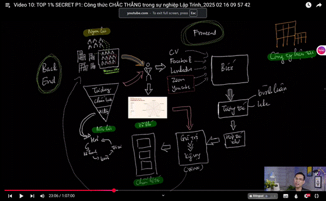

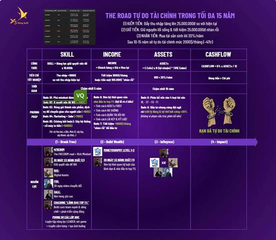

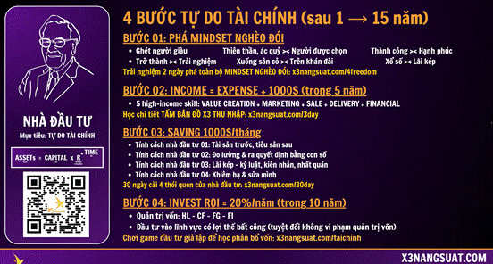

https://www.youtube.com/playlist?list=PL5tPZAhaCUPKl_rHgC3_K5JI25RZxPWiJ

**3.1 SAI LẦM PHẢI TRÁNH khi xây dựng SYSTEM SỰ NGHIỆP**

**1.3.1 SAI LẦM PHẢI TRÁNH khi xây dựng SYSTEM SỰ NGHIỆP**

**1.3.1.1 [XÂY DỰNG SYSTEM] và sai lầm**

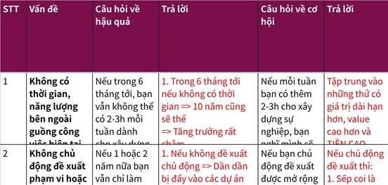

**Click the image to view the sheet.**

**1.3.1.2 [CHỌN DỰ ÁN - KẾ HOẠCH BÍ NGÔ] START WITH THE DON'T + KẾ HOẠCH BÍ NGÔ ĐỂ LÊN TRƯỚC 1 SỐ TIÊU CHÍ khi join 1 dự án.**

|   |   |   |
|---|---|---|
|1.|Không để bị giết chết runway - dòng tiền là cực kì quan trọng.<br><br>\|   \|<br>\|---\|<br>\|https://www.perplexity.ai/page/quyet-dinh-chuyen-part-time-va-cx4lyJRcRze9WTKb9Je0Lg\||Tháng 1/2026: Phá lời hứa nghỉ fulltime để join cùng ae vì.  <br>+, Tiến độ ra MVP quá chậm.  <br>+, Xác suất thành công về mặt Technical và Product yếu.  <br>+, Nghỉ làm fulltime có khi 6 tháng vẫn đói meo.  <br>+, Cày nhiều không có thời gian để suy nghĩ và sức khoẻ<br><br>Có thể sẽ hơi tiếc nuối. Vì xác suất thành công vẫn có do đại ca từng điều hành doanh nghiệp rồi, bố làm to, đọc nhiều bài của các ông lớn go global, học tập AI rất nhanh chóng chỉ trong 3-6 tháng nhiều khi đã vượt mình. >< Risk? Trong trường hợp không có tiền đại ca vẫn có tiền để bo cho ae chi trả tiền trọ cơ mà. + Năng lực của mình ra ngoài tự kiếm job vẫn là có cơ hội.<br><br>Mình đã chọn chơi 1 bước đi an toàn hơn! (dựa theo bài của Chalie Murger, tay vợt đánh trong vòng tròn an toàn thành ra lại đạt điểm số cao hơn)<br><br>ĐÃ LỰA CHỌN PHẢI HOÀN TOÀN CHỊU TRÁCH NHIỆM TRƯỚC LỰA CHỌN ĐÓ, Không hối tiếc khi người khác thành công hơn vì đâu ai biết trước được, mình chỉ chọn lựa theo cách AN TOÀN NHẤT tại thời điểm ra quyết định lúc đó (với 1 lượng thông tin ít ỏi vừa đủ).|
|2|Vòng tròn năng lực|Tập trung vào AI, Agents, tối ưu, DB tại thời điểm T1/2026|
|3|Ko nhận dự án với khách hàng toxic, đòi hỏi, khiến mình mất năng lượng, và mình sợ khi thấy tin nhắn của họ.  <br>Khách làm mình mất niềm niềm tin, không tin tưởng nhau.||
|4|Quyết định nào phá huỷ khả năng compound, khiến mình chết giữa đường và không còn cơ hội đi tiếp.  <br>+, Ko dùng đòn bẩy tài chính quá mức 30%  <br>+, Ko làm việc phá sức khoẻ và tinh thần  <br>+, Ko làm việc phá uy tín/danh tiếng (chẳng hạn làm cho con bạc, đi bar, ...)||
|5|CẨN THẬN VỚI LỜI HỨA  <br>+, Hứa ít làm nhiều. Hứa dưới sức làm vượt mức  <br>+, Ko Cam kết timeline mà chưa breakdown tasks & buffer  <br>Khi lỡ deadline cần báo sớm. Đừng: Biết sẽ miss deadline nhưng chỉ nói muộn; không report bad news vì sợ mắng  <br>+, Commit mà chưa rõ team dynamics & leadership style: Join vào mà chưa hiểu leader work style; chưa assess nếu fail thì bị mắng hay support|Sai lầm: Hứa ra tết dương sẽ nghỉ để xin về part-time. Hứa 1 tháng nữa sẽ nghỉ để xin part-time ... => Sau đó lại ko thực hiện được vì  <br>(+, MVP ko ra được sau 3 tháng => Lời hứa đã ko tính đến việc này :3)|
|6|KO CHIA TỪ ĐẦU => KO LÀM.  <br>"Thất bại chia sẻ, thành công chia lợi" nhưng không define "chia cái gì"||
|7|CÓ NGƯỜI AM HIỂU THỊ TRƯỜNG KO ?|+, Như đợt làm với team Fintech => Fail vì ko có quá nhiều người hiểu thị trường => Sau 3 tháng thì cắt lỗ.<br><br>+, Đợt làm với team 10.000 hours có vẻ ngon hơn vì có người am hiểu thị trường. Với offer 30% cổ phần cho CTO, lúc sau thì 10% cổ phần cho Founder Engineer => cơ mà mình đều chưa kịp chốt ra quyết định thì anh ấy đổi người  ? TỐC ĐỘ RA QUYẾT ĐỊNH KHÁ QUAN TRỌNG.  <br>--  <br>Trong trường hợp đó mình ko thể làm gì hơn vì chưa từng trải qua nên đứng trong vòng tròn an toàn là 1 điều mình oke nhất.|

**3.2 NỖI SỢ, NIỀM TIN GIỚI HẠN, MINDSET SAI TRONG TÂM TRÍ - Bài học về Niềm tin giới hạn Đêm 25/04/2025 = (Tôi tài giỏi bạn cũng thế, Làm chủ tư duy thay đổi vận mệnh, Rich Habit Poor Habit, Rich Habit, Rich Dad Poor Dad, 13 cuốn dạy con làm giàu) + GOSINGA về mục đích cuộc đời + Nhân dạng, trở thành hay trải nghiệm, hoàn thành trước, hoàn hảo sau X3 + Wecommit100x làm theo system lãi kép và nỗi sợ chỉ mất khi bạn hành động  - [NỖI SỢ - NIỀM TIN GIỚI HẠN - HABIT VÀ MÔI TRƯỜNG SỐNG] MÔI TRƯỜNG SỐNG, THÓI QUEN + BỨT PHÁ SỢ, NGẠI, NIỀM TIN GIỚI HẠN BẰNG CHÁNH KIẾN - TULA THẦN LĨNH VỰC, NIỀM TIN KO GIỚI HẠN KO BỊ CHẶN TRÊN - THE ROAD CON ĐƯỜNG TÔI CHỌN, KHÔNG AI ĐI TÔI VẪN ĐI.**

|   |
|---|
|•                     Charlie Munger là người đã hệ thống hóa hơn 90 mô thức tư duy (mental models) từ nhiều lĩnh vực khoa học khác nhau để ứng dụng vào đầu tư, kinh doanh, ra quyết định. Ông tổng hợp, ghi chú, nghiền ngẫm, rồi dùng “latticework of mental models” như một framework cá nhân để giải quyết vấn đề và tối ưu quyết định. Sách “Poor Charlie’s Almanack” là ví dụ điển hình lưu trữ toàn bộ những mô thức này để nghiền ngẫm cả đời. (Charlie Munger là bạn thân lâu năm và là cộng sự hoàn hảo của tỷ phú Warren Buffett. Ông giữ chức Phó Chủ tịch của tập đoàn Berkshire Hathaway hơn 40 năm, Warren Buffett là Chủ tịch tập đoàn).<br><br>https://youtu.be/FyCHApY57S4?si=75DYTTvcV3MrY4V2|

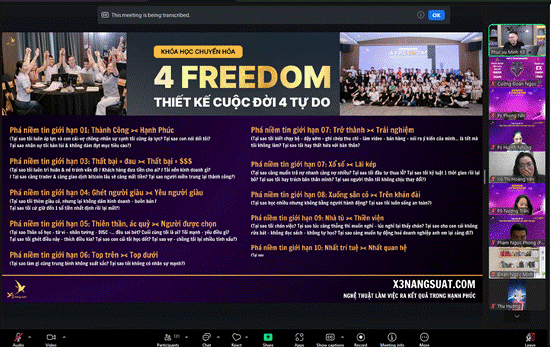

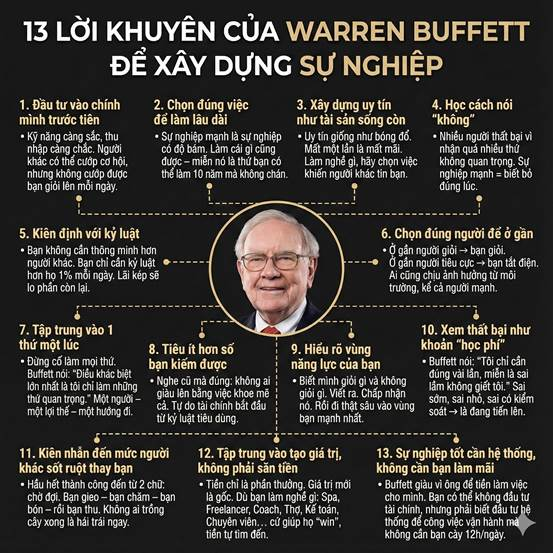

**3.2.0 Toàn bộ mindset và tâm lý chủ đạo và MENTAL MODELS**

|   |
|---|
|1.                   PHÂN BIỆT THÀNH CÔNG VỚI HẠNH PHÚC  <br>- Mục đích cuộc sống là Chấm Dứt Khổ.  <br>- Hạnh phúc là ở bên trong khi tế bào nội xúc  <br>- Thành công là đạt 100% mục tiêu. (Điểm 9 môn Toán vui hay buồn, ... )<br><br>2.                   THE ROAD - CON ĐƯỜNG TÔI CHỌN. THE ROAD - THE IMPACT - THE POWER  <br>- Câu chuyện cậu bé mù và cây đèn dầu, khi có cây đèn cậu bị lệ thuộc vào cây đèn mà mất đi sức mạnh vốn có của mình. Đội ngũ mạnh là khi ae nghỉ hết những người còn lại vẫn chạy, ae không đi thì tôi vẫn đi.  <br>- Tôi biết rất rõ con đường đến đảo giấu vàng, tôi rủ ae cùng đi, tôi cấp sức mạnh cho ae cùng triển. Nếu không có bạn tôi đi thuyền thúng, tôi rủ bạn đi cùng, bạn đi cùng thì chúng ta chung nhau con thuyền to hơn, những gì tôi có tôi sẽ cấp cho bạn.<br><br>3.                   SYSTEM: MAY MẮN DO MÌNH TẠO RA - XỔ SỐ HAY LÃI KÉP  <br>- SYSTEM + NHẤT QUÁN + TIME: Nếu bạn làm 1 thứ trong 5-7 ngày thì nó là chỉ nhất thời, bạn làm 100 ngày lúc này bạn có cảm giác mình có thể chơi những chặng đường dài hơi hơn, 1000 ngày 10000 ngày nó trở thành tích cách, con người bạn. NHẤT QUÁN KỶ LUẬT VÃI NHÁI + GIÚP ĐỠ NHIỆT TÌNH VÃI NHÁI + LÀM VIỆC TỐC ĐỘ RA QUYẾT ĐỊNH NHANH, QUYẾT LIỆT  <br>- ĐÀO SÂU KHÔNG ĐÀO RỘNG: Mn thường học rộng trước, học sâu sau. Hoặc chỉ rộng mà không bao giờ sâu: Có rất nhiều người biết nhiều về thái cực quyền hơn tôi, nhưng TÔI RẤT GIỎI TRONG NHỮNG GÌ TÔI BIẾT  <br>- GOOD THINGS TAKE TIME. HÃY CHO MÌNH ĐỦ THỜI GIAN.  <br>5 năm để chuẩn bị cho 1 cái tết, 10 năm để chuẩn bị tài chính. Câu chuyện cây tre.  <br>  <br>---<br><br>4.                   [VÒNG TRÒN NĂNG LỰC - TẬP TRUNG - TOP 1 - SÁT THẦN LĨNH VỰC]TOP TRÊN HAY TOP DƯỚI + KHÔNG CÓ LÝ DO CŨNG LÀ LÝ DO + TỰ TẨY NÃO MÌNH ĐỂ TÌM KIẾM CẢM GIÁC KHÓ CHỊU  <br>ƯA THÍCH VIỆC GIẢI QUYẾT VẤN ĐỀ CỦA MÌNH, CỦA MN. ĐẶC BIỆT LÀ CÁC VẤN ĐỀ KHÓ, CÀNG KHÓ MÌNH CÀNG THÍCH.  <br>- Top dưới rất rủi ro: bạn thích làm việc với top trên hay top dưới.  <br>- (Tháng 6, 2025, khi phải hành động để xin info bạn nữ mỗi khi đi caffe chạy đồ án)  <br>-  Trong 1 buổi đi ăn với team công ty, khi giới thiệu về: sở thích + 1 điều mn ko biết về mình.  <br>=> Mình đã nói: SỞ THÍCH LÀ GIẢI QUYẾT VẤN ĐỀ KHÓ VÀ LEVEL UP LIÊN TỤC. (Các sở thích khác ko cố định.|

**3.1.0.1 MINDSET 1. [TÂM TRÍ] PHÂN BIỆT THÀNH CÔNG VỚI HẠNH PHÚC  
- Mục đích cuộc sống là Chấm Dứt Khổ.  
- Hạnh phúc là ở bên trong khi tế bào nội xúc  
- Thành công là đạt 100% mục tiêu. (Điểm 9 môn Toán vui hay buồn, ... )  
- THIÊN THẦN HAY ÁC QUỶ - CÂY BÚA, CÂY ĐỤC VÀ NGƯỜI THỢ MỘC, TÔI THÍCH CÁI NÀY TÔI KO THÍCH CÁI KIA, TÔI HỢP LÀM CÁI NÀY, TÔI KO HỢP LÀM CÁI KIA.  
- NGƯỜI LEO NÚI VÀ 2 HÒN ĐÁ. Ước vọng tương lai, đứng núi này trông núi nọ (Ham muốn) và Nỗi sợ => Vứt 2 hòn đá xuống.**

|   |   |
|---|---|
||\|   \|<br>\|---\|<br>\|1.                   1/2/2025: Khi mà đã lên lịch hẹn hò sang phòng mình, cơ mà trời đổ mưa và mình đã dành cả sáng để dọn phòng => Nếu như ngày trước mình sẽ buồn, chán. Nhưng giờ thì mình nhẹ nhàng, đặt lưng xuống giường và ngủ.<br><br>2.                   3/2/2025: Khi ae đại chiến về việc trace response_time của SLM 150ms (3 bên: mình, a Hưng, a Thành) a Trúc đứng giữa làm trung gian. Vẫn với năng lượng toxic cười cười như mọi khi của a Trúc. Trước: mình sẽ giọng run run, lắp ba lắp bắp, cảm thấy khó thở và giải thích giải thích => Giờ thì: mình giọng rất mạnh, sát thần lĩnh vực, và bình tĩnh vô cùng. Mình nói: 'anh đứng giữa anh phải bình tĩnh nhất, a toxic là ko được'.\||
|07/02/2026<br><br>•                     Gỡ bỏ nhãn dán mình thích cái này, mình ko thích cái kia, mình giỏi cái này, mình ko giỏi cái kia. Đứng núi này trông núi nọ|**Câu chuyện 1: "Cây Búa, Cây Đục và Người Thợ Mộc" (Đứng núi này trông núi nọ) - https://www.facebook.com/share/p/1MY182R1nR/**<br><br>Có một chàng trai trẻ đến xin học việc ở xưởng mộc của một bậc thầy vĩ đại.  <br>Ngày đầu tiên, thầy đưa cho anh ta một cái búa và bảo: _"Con hãy dùng cái này để đóng đinh."_  <br>Chàng trai làm rất tốt. Anh ta đóng đinh giỏi nhất xưởng. Mọi người khen ngợi: _"Cậu là một tay búa cừ khôi!"_  <br>Chàng trai tự hào lắm. Anh ta bắt đầu dán nhãn cho mình: "Tôi là Tay Búa Số 1". Đi đâu anh cũng cầm theo cái búa.<br><br>Một ngày nọ, xưởng nhận dự án làm một bức tượng tinh xảo. Thầy đưa cho anh một cái đục và bảo: _"Hãy tạc tượng."_  <br>Chàng trai hoang mang. Anh ta nhìn cái đục, rồi nhìn cái búa. Anh ta nói: _"Nhưng thầy ơi, con là 'Tay Búa' mà? Tay búa thì sao dùng đục được? Dùng đục là phản bội lại danh hiệu của con. Con thấy mâu thuẫn quá."_<br><br>Thầy mỉm cười, gõ nhẹ vào đầu anh:  <br>_"Con không phải là cái búa. Con cũng không phải là cái đục. Con là người thợ mộc."_  <br>_"Cái búa, cái đục, hay cái cưa... chỉ là công cụ trong túi của con. Khi cần đóng đinh, con rút búa ra. Khi cần tạc tượng, con cất búa đi và rút đục ra. Tại sao con lại tự nhốt mình vào trong hộp đồ nghề của chính mình?"_<br><br>**Case Study Minh Họa:**<br><br>•                     **❌ KHÔNG Ứng Dụng (Sai lầm): Kodak và sự sụp đổ của "Đế chế phim ảnh"**<br><br>￮      **Bối cảnh:** Kodak từng là "Tay Búa Số 1" trong ngành công nghiệp phim ảnh. Họ tự định nghĩa mình là một công ty sản xuất phim và máy ảnh cơ.<br><br>￮      **Sai lầm:** Khi kỹ thuật số (cái đục) xuất hiện, Kodak đã phát minh ra máy ảnh kỹ thuật số đầu tiên nhưng lại lo sợ nó sẽ "phản bội" lại mảng kinh doanh phim cốt lõi của mình. Họ đã từ chối thay đổi, tiếp tục bám víu vào "cây búa" phim ảnh.<br><br>￮      **Hậu quả:** Kodak phá sản vào năm 2012. Họ đã bị mắc kẹt trong chính nhãn dán "công ty phim ảnh" của mình và không thể thích ứng với công cụ mới.<br><br>•                     **✅ Ứng Dụng (Thành công): Amazon và sự chuyển mình từ "Nhà bán sách" thành "Gã khổng lồ công nghệ"**<br><br>￮      **Bối cảnh:** Jeff Bezos bắt đầu Amazon với vai trò là một "nhà bán sách online". Đó là "cây búa" đầu tiên của ông.<br><br>￮      **Thành công:** Bezos không bao giờ tự dán nhãn Amazon là một công ty bán lẻ. Ông hiểu rằng bán sách chỉ là công cụ ban đầu. Khi nhận thấy cơ hội, ông đã nhanh chóng sử dụng những "cái đục" và "cái cưa" mới: điện toán đám mây (AWS), logistics, streaming (Prime Video), AI (Alexa). Ông không hề cảm thấy "mâu thuẫn" khi một nhà bán sách lại đi làm dịch vụ cloud.<br><br>￮      **Kết quả:** Amazon trở thành một trong những công ty giá trị nhất thế giới. Họ là một "người thợ mộc" bậc thầy, biết sử dụng mọi công cụ để xây dựng đế chế của mình.|
|7/2/2026  <br>- Gỡ bỏ việc đứng núi này trông núi kia và mang theo ước vọng tương lai và nỗi sợ|**Câu chuyện 2: "Người Leo Núi và Hai Hòn Đá" (Buông bỏ ƯỚC VỌNG TƯƠNG LAI VÀ NỖI SỢ DANH LỢI)**<br><br>Có một chàng trai trẻ tên là **Vọng** (nghĩa là Mong Cầu/Trông Ngóng). Vọng khao khát chinh phục đỉnh núi cao nhất để ngắm bình minh (Biểu tượng của Thành Công/FIRE).<br><br>Vọng bắt đầu leo. Anh ta rất khỏe, rất thông minh (biết AI, Finance, Product). Nhưng Vọng có một thói quen kỳ lạ.  <br> Mỗi khi leo được vài bước, anh ta lại dừng lại, ngước cổ lên nhìn đỉnh núi và than: _"Sao còn xa thế nhỉ? Bao giờ mới tới nơi? Sao người kia leo ngọn núi bên kia trông có vẻ nhanh hơn?"_<br><br>Để "nhanh hơn", Vọng nghĩ ra một cách. Anh ta nhặt **hai hòn đá to**.<br><br>•                     Hòn đá bên tay trái khắc chữ **"Tương Lai Rực Rỡ"** (CEO, Investor, Tự Do).<br><br>•                     Hòn đá bên tay phải khắc chữ **"Lo Lắng Sợ Hãi"** (Sợ sai đường, sợ chậm hơn bạn bè).<br><br>Vọng nắm chặt hai hòn đá này trong tay và tiếp tục leo. Anh nghĩ: _"Cầm theo 'Tương lai' để có động lực, cầm theo 'Nỗi sợ' để không chủ quan."_<br><br>Nhưng càng leo cao, đường càng dốc. Hai hòn đá (Tâm mong cầu & Tâm lo lắng) càng lúc càng nặng trĩu.<br><br>•                     Tay anh mỏi nhừ vì nắm chặt "Tương lai".<br><br>•                     Chân anh run rẩy vì sức nặng của "Nỗi sợ".<br><br>•                     Mắt anh cứ ngước lên đỉnh núi (Đứng núi này trông núi nọ) nên chân anh bước hụt liên tục. Anh trượt ngã, trầy xước khắp người.<br><br>Một thiền sư đi ngang qua, thấy Vọng vừa leo vừa khóc vì kiệt sức. Thiền sư hỏi:  <br>_"Tại sao con leo núi mà lại mang theo hai hòn đá nặng thế kia?"_<br><br>Vọng hổn hển: _"Đây là mục tiêu và động lực của con. Con không thể buông. Nếu buông, con sợ mình sẽ không bao giờ đến đích, con sẽ lạc lối."_<br><br>Thiền sư cười lớn và đẩy Vọng một cái thật mạnh. Vọng hoảng hốt, buông tay theo phản xạ để bám vào vách đá. Hai hòn đá rơi xuống vực sâu mất hút.  <br> Vọng hét lên: _"Thầy làm mất tương lai của con rồi!"_<br><br>Nhưng kỳ lạ thay, khi hai tay không còn nắm đá, Vọng thấy cơ thể nhẹ bẫng. Anh bám chắc vào vách núi. Mắt anh không còn ngước lên đỉnh nữa mà nhìn chằm chằm vào chỗ đặt chân.  <br> Thiền sư nói:  <br>_"Đỉnh núi không chạy đi đâu cả. Nó vẫn ở đó._  <br> _Nhưng cái làm con kiệt sức không phải là độ cao của ngọn núi, mà là **sức nặng của sự mong cầu và nỗi sợ** trong tâm con._  <br> _Khi con nhìn xuống chân và bước từng bước thật chắc (Chánh Niệm), con sẽ đi nhanh gấp mười lần so với việc vừa đi vừa ngước nhìn đỉnh núi."_<br><br>Vọng hiểu ra. Anh leo một mạch, chỉ biết bước chân hiện tại. Và anh lên đến đỉnh khi mặt trời vừa mọc, sớm hơn tất cả những người khác.<br><br>**Case Study Minh Họa:**<br><br>•                     **❌ KHÔNG Ứng Dụng (Sai lầm): WeWork và tham vọng "đốt tiền" để tăng trưởng bằng mọi giá**<br><br>￮      **Bối cảnh:** Adam Neumann, nhà sáng lập WeWork, bị ám ảnh bởi việc phải nhanh chóng trở thành một công ty công nghệ nghìn tỷ đô. Anh ta nắm rất chặt "Hòn đá Tương Lai Rực Rỡ" (thay đổi thế giới) và "Hòn đá Sợ Hãi" (sợ bỏ lỡ cơ hội).<br><br>￮      **Sai lầm:** Thay vì tập trung vào việc xây dựng một mô hình kinh doanh bền vững (bước từng bước), Neumann đã "đốt tiền" một cách điên cuồng để mở rộng bằng mọi giá. Anh ta liên tục nhìn sang các công ty công nghệ khác và muốn WeWork được định giá như họ, dù bản chất là một công ty bất động sản.<br><br>￮      **Hậu quả:** WeWork sụp đổ trước thềm IPO, Neumann bị sa thải. Gánh nặng của sự mong cầu và nỗi sợ đã khiến công ty kiệt sức và trượt ngã.<br><br>•                     **✅ Ứng Dụng (Thành công): Patagonia và triết lý "xây dựng công ty tốt nhất, không phải lớn nhất"**<br><br>￮      **Bối cảnh:** Yvon Chouinard, nhà sáng lập Patagonia, không bao giờ đặt mục tiêu chinh phục đỉnh núi "tăng trưởng vô hạn". Ông chỉ tập trung vào việc "bước từng bước thật chắc": tạo ra những sản phẩm chất lượng nhất và có trách nhiệm với môi trường.<br><br>￮      **Thành công:** Patagonia nổi tiếng với chiến dịch "Đừng mua chiếc áo khoác này", khuyến khích khách hàng sửa chữa thay vì mua mới. Họ đã "buông bỏ hòn đá mong cầu" về doanh thu ngắn hạn để tập trung vào giá trị cốt lõi. Họ không so sánh mình với các hãng thời trang nhanh khác.<br><br>￮      **Kết quả:** Patagonia trở thành một thương hiệu được yêu mến và cực kỳ thành công. Bằng cách tập trung vào "bước chân hiện tại", họ đã lên đến đỉnh núi của riêng mình một cách bền vững và đầy ý nghĩa.|
|10/02/2026  <br>- Xử lý tâm bất như ý<br><br>Haizzz, hôm nay nấu cơm, ăn cơm, dọn dẹp hết tròn 1 h rưỡi từ 9h rưỡi - 11h. (với a Thái)<br><br>Hơi sân 1 tí. Sau đó nghĩ lại, ông anh nhiều lần nấu cơm cho mình nhiều món, dọn dẹp và chẳng hề gọi mình dọn => Biết ơn và từ bi sinh khởi => Vắng lặng (vì có biết ơn sẽ có vô ơn)|**Câu chuyện 3: Ông Lão Và Chiếc Bánh Mì Cháy [BẤT NHƯ Ý]**<br><br>1.                   Bị người khác đối xử tệ bạc <br><br>2.                   Nhớ lại đã từng có người giúp đỡ mình lúc mình khó khăn (có thể là người khác ko phải người đó) <br><br>3.                   Ngay lập tức khởi lên không thích, không chán ghét, hoàn toàn tĩnh lặng của lối sống trung đạo<br><br>  <br>Ông **Tư**, một thợ mộc già tay nghề cao, trong suốt cuộc đời ông đã giúp đỡ rất nhiều người trong thôn của mình, nhưng giờ đây mắt mờ chân chậm, sống lủi thủi trong căn nhà gỗ nhỏ.<br><br>Một sáng nọ, ông Tư ghé tiệm bánh mì đầu ngõ mua bữa sáng. Chủ tiệm là gã hàng xóm mà ông từng giúp sửa lại cả cái mái nhà miễn phí sau trận bão năm ngoái.   <br>Thấy ông Tư cầm mấy đồng tiền lẻ đếm đi đếm lại, gã chủ tiệm cau mày, chọn lấy một ổ bánh mì bị nướng quá lửa, vỏ đen thui, cứng ngắc, kẹp vội vài lát dưa leo héo queo rồi dúi vào tay ông. <br><br>_"Bánh giòn lắm đấy, ăn cho chắc bụng. Tiền ít thì chỉ có loại này thôi."_ <br><br>Gã cười hô hố với đám khách đang xếp hàng, trong khi tay vẫn thu đủ tiền của ông, không bớt một xu.<br><br>Ông Tư cầm ổ bánh mì cháy đen, nóng hổi nhưng thô ráp cứa vào lòng bàn tay. Ông bước chậm rãi ra ghế đá công viên gần đó. Nhìn ổ bánh mì sém cạnh, ông định vứt đi cho bõ tức. Cả đời ông làm mộc, chưa bao giờ giao cho ai một sản phẩm lỗi, vậy mà giờ nhận lại sự rẻ rúng này.<br><br>Nhưng khi đưa tay lên định ném, ông chợt khựng lại. Trong đầu ông hiện lên hình ảnh **một cậu bé đánh giày** ông gặp mười năm trước ở bến xe miền Đông. Hôm đó ông bị móc túi sạch sành sanh, ngồi thẫn thờ bụng đói meo. Cậu bé đánh giày đen nhẻm, gầy gò, đang gặm dở ổ bánh mì khô khốc. Thấy ông già ngồi ôm bụng, thằng bé không nói không rằng, bẻ đôi ổ bánh mì của mình, đưa phần lớn hơn và lành lặn nhất cho ông, còn mình giữ lại phần đuôi cháy sém. Nó nhe hàm răng sún cười: _"Ông ăn đi, con ăn cái đuôi này giòn, thích hơn."_<br><br>Ổ bánh mì cháy trên tay ông bỗng nặng trĩu kỷ niệm. Cái "cháy" của gã chủ tiệm là sự khinh thường. Nhưng cái "cháy" của cậu bé đánh giày năm xưa là sự nhường nhịn cao thượng.<br><br>Ông Tư thở hắt ra một hơi nhẹ nhõm.  Cơn giận với gã hàng xóm tan biến đâu mất. <br><br>Ông thấy lòng mình phẳng lặng như mặt hồ trước mặt. Cuộc đời này lạ thật, cùng là một miếng cháy, người cho vì ghét, kẻ nhận vì thương. Trách móc làm gì cho nặng lòng. Gã chủ tiệm chỉ là một nét vẽ nguệch ngoạc trong bức tranh đời ông, chẳng đáng để bôi xóa hay tô đậm.<br><br>Ông Tư từ tốn bẻ từng miếng bánh mì nhỏ, bỏ vào miệng nhai kỹ. Vị đắng của lớp vỏ cháy hòa lẫn vị ngọt của bột mì. Ông ăn một cách bình thản, tận hưởng ánh nắng ban mai đang xuyên qua kẽ lá, lòng không gợn chút sóng.  <br>  <br><br>Khổ vui không do cảnh.<br><br>Khổ vui từ nội tâm.<br><br>Tham sân si khởi lên<br><br>Thì khổ liền theo đó.<br><br>Thấy như vậy cho rõ,<br><br>Biết như vậy cho sâu.<br><br>Buông tư tưởng lệ thuộc.<br><br>Tâm liền được tự do.|
|17/2/2026<br><br>1.                   Thiền sư Thế à<br><br>2.                   Câu chuyện: Chưa chắc đã tốt chưa chắc đã xấu<br><br>3.                   Ngay từ khi cầm chiếc cốc đã xác định nó sẽ vỡ rồi|Câu chuyện: Khi cầm chiếc cốc đã phải xác định 1 ngày rồi nó|
|BIẾT ƠN|1.                   THÍCH => Có được rồi, sinh Chán => Tìm cái mới.<br><br>2.                   Khi cầm vào chiếc cốc, mình biết chắc 1 ngày nó sẽ vỡ, nên khi chưa vỡ ta trân trọng, vỡ rồi ta bình thản. Giống câu chuyện chiếc cỏ thi bị rơi.<br><br>3.                    <br><br>+, Bạn đang stress vì công việc hiện tại. Ngoài kia có người vừa rải 100 cái CV mà chẳng nhận lại được một lời hồi âm.<br><br>+, Bạn chán ngán căn nhà mình đang ở. Ngoài kia có người tối nay phải ngủ tạm trong xe.<br><br>+, Bạn cảm thấy một tuần trôi qua thật tồi tệ. Ngoài kia có người sẵn sàng đánh đổi cả đời họ chỉ để lấy một ngày "thứ Hai tồi tệ" của bạn.<br><br>+, Chúng ta đang sống trong một thế giới luôn tôn thờ sự "thèm khát". Nhiều tiền hơn. Nhiều danh tiếng hơn. Cái gì cũng phải "hơn". Nhưng chẳng mấy ai nói về cái giá đắt đỏ đằng sau chữ "HƠN" đó: Nó khiến bạn mù quáng trước những gì mình đang có ngay trước mắt.<br><br>Mình đã từng dành nhiều năm chỉ để đuổi theo mục tiêu tiếp theo. Để rồi mỗi khi đạt được, mình lại chẳng thấy hạnh phúc chút nào. Đơn giản là vì lúc đó, mắt mình đã bận nhìn sang một cái đích khác rồi. Đó không phải là tham vọng. Đó là một cái bẫy.<br><br>4.                   Kiếm nhiều tiền hơn mục đích là gì, là để có thể tự do về nhà mỗi ngày với bố mẹ, không cần rời xa ra đình đi tha hương cầu thực, tự do quyết định mọi thứ. Vậy thì những thứ đó bây giờ hoàn toàn mình có được rồi mà nhỉ.  <br>Chẳng phải ước mơ ngày xưa bây giờ đã đạt được rồi sao.|

**3.1.0.2 MINDSET 2. [TÂM TRÍ] THE ROAD - CON ĐƯỜNG TÔI CHỌN. THE ROAD - THE IMPACT - THE POWER**

|   |
|---|
|2. [TÂM TRÍ] THE ROAD - CON ĐƯỜNG TÔI CHỌN. THE ROAD - THE IMPACT - THE POWER  <br>- Câu chuyện cậu bé mù và cây đèn dầu, khi có cây đèn cậu bị lệ thuộc vào cây đèn mà mất đi sức mạnh vốn có của mình. Đội ngũ mạnh là khi ae nghỉ hết những người còn lại vẫn chạy, ae không đi thì tôi vẫn đi.  <br>- Tôi biết rất rõ con đường đến đảo giấu vàng, tôi rủ ae cùng đi, tôi cấp sức mạnh cho ae cùng triển. Nếu không có bạn tôi đi thuyền thúng, tôi rủ bạn đi cùng, bạn đi cùng thì chúng ta chung nhau con thuyền to hơn, những gì tôi có tôi sẽ cấp cho bạn. <br><br>TRỞ THÀNH HAY TRẢI NGHIỆM  <br>- Muốn trải nghiệm cảm giác giàu có 6 múi của Ronadol nhưng mấy ai muốn trở thành Ronadol, trở thành là phải sở hữu thói quen, tính cách, lối sống của nhân dạng  <br>  <br>https://youtu.be/TGDTlBQDbCI?feature=shared  <br>  <br>**[SAI LẦM KHI BẮT ĐẦU MÀ KHÔNG RÕ ĐÍCH ĐẾN LÀ GÌ?]**  <br>+, THE ROAD - BEGIN WITH THE END IN MIND - BẮT ĐẦU VỚI MỤC TIÊU TRONG TÂM TRÍ - ĐẶT TRONG TẤM BẢN ĐỒ.  <br>+, **SỨC MẠNH CỦA VISION BOARD: Mọi thứ có 2 lần xuất hiện, lần 1 là ở trong đầu, lần 2 là ở trong tay.**  <br>+, BEGIN WITH THE END IN MIND AND DEADLINE - THE END WITH THE NUMBER - The SYSTEM => Giúp ra quyết định nhanh hơn và chính xác hơn|
|1.                   Thay đổi hoàn toàn cách bạn nhìn nhận về động lực và thành công!<br><br>\|   \|<br>\|---\|<br>\|1️⃣ Đừng Chờ Đợi "Đam Mê": David khẳng định "đam mê" và "động lực" chỉ là những từ ngữ sáo rỗng. Thành công đến từ HÀNH ĐỘNG LIÊN TỤC, không phải từ cảm xúc nhất thời. Hãy làm, làm nữa, làm mãi, ngay cả khi bạn không thích nó.<br><br>2️⃣ Sức Mạnh Của "Cây Gậy": David đã sống một cuộc đời chỉ có "cây gậy" (thử thách) mà không có "cà rốt" (phần thưởng). Ông cho rằng chính áp lực và khó khăn mới là động lực thực sự để ta tiến lên<br><br>3️⃣ BẠN RÕ RÀNG BIẾT CẦN LÀM GÌ, TÔI CŨNG THẾ.\|<br><br>1.                   Câu chuyện từ khi mình nghe được => giúp mình hiểu rất rõ về ngoại lực, đòn bẩy và nguồn lực bên ngoài => Mình ko vì nó mà đánh mất đi sức mạnh<br><br>2.                   Mình cũng nghĩ ngay đến câu chuyện này khi làm việc cùng đội nhóm FinTech Business. Dù ae ko làm thì mình vẫn làm thôi, vì FinTech Business là con đường mình chọn.<br><br>3.                   Mình kể cho ny LTKH nghe, có nàng thì mình mạnh hơn, vui vẻ hơn. Ko có nàng thì mình vẫn oke, vẫn đi trên con đường mình đã chọn vì đây là THE ROAD, CON ĐƯỜNG MÌNH ĐÃ CHỌN.<br><br>- Cristiano Ronaldo: "Cách đây không lâu, tôi đã đưa con trai mình đến nơi tôi từng sống ở Lisbon khi mới 12 tuổi. Tôi muốn nó tận mắt thấy nơi mình đã lớn lên..."  <br>- Lớp 9 tôi thức dậy lúc 6h, lên trường học đội tuyển, tối học đội tuyển đến 19h tối, sau đó về nhà ăn uống xong lúc 20h30, và sau đó tôi cày bài cày đề nghĩ hết 1 loạt các bài đến 24h, và làm nó đến 2h sáng. (Điều đó không tốt cho sự phát triển)<br><br>Business Model - 19/10/2025 Không có chuyện thích hay không thích. Bạn sẽ luôn cảm thấy là học AI chán thế muốn đi thiện nguyện, đi thiện nguyện chán thế muốn quay lại học AI, làm AI trong EduTech chán thế muốn sang FinTech, làm Fintech đọc Fintech đọc Business 1 lúc lại chán thế nhể giờ chán cả học và làm AI luôn. Suy cho cùng, mình học trò của David Goggins, chẳng có gì là thích và không thích, chẳng có ai đến cứu bạn cả, chỉ có làm, quên những từ xáo rỗng như đam mê và kỷ luật, quên nó đi chỉ có làm và làm - https://studio.youtube.com/video/h507-wi-Jig/edit|
|1.                   Cảm giác sợ hãi là do bạn chưa có THE ROAD!!!<br><br>•                     **Bạn đi lạc vào 1 khu rừng, không biết đi đâu, không biết đường đâu, lạc lõng, sợ hãi.**  <br>**Cho đến khi bạn được cấp: 1 TẤM BẢN ĐỒ + 1 MENTOR + 1 NHÀ ĐẦU TƯ VỚI RẤT NHIỀU NGUỒN LỰC.**  <br>=> Ko còn cảm giác vội vàng đến đích, tự tin - The Road - Ko ai đi, tôi vẫn đi.<br><br>2.                   Sức mạnh của THE ROAD:  <br>- Vision Board Anh Kiên kia chia sẻ. 2015 ảnh từ tay trắng, viết bảng tầm nhìn rõ ràng: năm bao nhiêu mua nhà, nhà như nào, vẽ và dán màu ngôi nhà, mua xe máy gì, mua ô tô gì, năm bao nhiêu, mọi thứ rất rõ ràng, năm 2022 1 triệu đô trong khi 2015 không biết làm sao để đạt được  <br>-> BEGIN WITH THE END IN MIND: Hình dung rõ cuộc sống sau này của mình, vẽ bảng tầm nhìn và mọi thứ chạy theo y hệt.  <br>-> Chơi 1 game ta biết rất rõ mình cần làm gì, số lượng đĩa bay cần gấp là bao nhiêu, số lượng video cần quay là bao nhiêu  <br>=> Ta hình dung rất rõ, có màu sắc về đích đến của mình và DÁN NÓ LÊN TƯỜNG.<br><br>3.                   **"Nếu ngay cả mục tiêu cũng không tìm thấy thì. Vậy mỗi ngày kéo cung có ý nghĩa gì"   -** https://youtu.be/5sI6l-JXkpk  <br>1 chú mèo đi đến ngã 3 hỏi anh cảnh sát nên đi hướng nào, anh cảnh sát hỏi thế chú muốn đi đâu, chú mèo bảo là chú cũng ko biết => Nếu đã ko biết thì đi hướng nào chả như nhau.<br><br>4.                   Vạch ra tiêu chí lựa chọn rõ ràng ngay từ đầu, chính là cách giải mã Paradox of Choice. Tiêu chí này giúp bạn “thấy là chốt”, mà không cần tốn thời gian phân bua 101 tiêu chí phụ khác<br><br>5.                   Làm sao để có The Road và Begin with the end in mind:  <br>- MENTOR LÀ ĐỈNH CAO CỦA HƯỚNG ĐI ĐÚNG QUAN TRỌNG HƠN TỐC ĐỘ, LÃI XUẤT KÉP ĐI ĐƯỜNG DÀI, LÀ CỐT LÕI CỦA TỰ HỌC.<br><br>6.                   **THE ROAD, CON ĐƯỜNG TÔI CHỌN, TIỀN CỦA TÔI, SỐ LƯỢNG NGƯỜI BIẾT CỦA TÔI => TÔI LÀM!  [Chạy bộ: Sức khoẻ, Kỷ luật Nhất quán, Frontend và TIỀN!]**<br><br>•                     **Justin Welsh: "Bạn không cần trở thành người thú vị nhất. Bạn chỉ cần trở thành người rõ ràng và nhất quán nhất trong ngách của mình. Vậy là đủ."**<br><br>\|   \|<br>\|---\|<br>\|Trong ngày cuối cùng trước nghỉ Tết âm 2024-2025 mình quay video đầu tiên và trong gần 20 ngày nghỉ Tết quay video, mình nhận ra rằng: TỰ TIN TRƯỚC ỐNG KÍNH HƠN HẲN VÌ MÌNH QUEN DẦN!!!<br><br>=> Sau đó sếp Thuỷ, sếp Cường, sếp Khiêm có hỏi về việc mình chạy bộ, quay video (chạy hình cá deepseek, mn cười mình, nhưng mn ko nghĩ ra được là chỉ vài tháng trước đó 6 tháng mình từng nói đến việc trở thành Content Creator a Trúc lúc đó khá ? mình. Chỉ sau 6 tháng nhân duyên biết đến Wecommit100x mình từ bình bình vụt lên Content Creator việc bứt lên như vậy làm mn quá bất ngờ và mình nổi rầm rầm => Có 2 khoảnh khắc mà mn bất ngờ: 1 là ngày mình bắt đầu làm, 2 là thời gian 10 năm sau! và đúng là mọi thứ xảy ra đều do nó đã được bắt đầu từ trong tâm trí từ trước đó rồi.\||
|\|   \|<br>\|---\|<br>\|https://www.facebook.com/photo/?fbid=2310807726103315&set=pcb.1493895791826723<br><br>[Em đã đánh cắp 3K $ của sếp Khôi như nào?] - chiều T7/25/10/2025  <br>  <br>1. Về sản phẩm SaaS Fintech hiện tại tụi em đang ấp ủ, em hỏi ...  <br>+, Sếp Khôi hỏi em: Mục tiêu doanh thu - lợi nhuận - định giá năm 1, 2, 3, 4, 5 là gì.  <br>=> Em đứng đơ => Sau đó sếp Khôi đã giúp em bóc nhỏ nó ra.  <br>=> Bài học: À thì ra mình cũng không rõ BEGIN WITH THE END IN MIND lắm.  <br>  <br>2. Em nói về ... gì đó em ko nhớ rõ  <br>=> Sếp Khôi hỏi em: Nhân dạng 10-20 năm nữa em muốn trở thành ai.  <br>=> Hỏi WHO mà em toàn trả lời HOW, nào là: AI Architect in Finance System, ... (BUSINESS MODELS STRATEGIST - GLOBAL ECOSYSTEM INVESTOR) , ... rốt cuộc vẫn là HOW.  <br>=> Mãi sau em mới bật ra được WHO (ông A, ông B) để trả lời.  <br>=> Bài học: À thì ra mình bị nhầm câu hỏi WHO.  <br>  <br>3. Em hỏi thêm 1 câu về: Nỗi sợ khi từ 1 Engineer -> 1 Entrepreneur  <br>=> Sếp Khôi đã lấy ví dụ rất nhanh là: Khi em đối đầu với bọn cầm kiếm em có sợ không, khi đó em được trang bị thêm 1 khẩu Aka em có còn sợ ko?  <br>=> À, em ngộ ra: Khi được trang bị các nguồn lực: về Business (1 tấm bản đồ, 1 mentor, 1 cộng đồng ae cùng chiến) (PHẬT mentor - PHÁP con đường - TĂNG đồng đội) thì tự nhiên mình sẽ hết sợ.  <br>(như việc học lớp 12 cho mình cái đề lớp 1).  <br>=> Bài học: à, thế mà ko nghĩ ra!\||

**3.1.0.3 MINDSET 3. [VÒNG TRÒN NĂNG LỰC - TẬP TRUNG - TOP 1 - SÁT THẦN LĨNH VỰC]TOP TRÊN HAY TOP DƯỚI + KHÔNG CÓ LÝ DO CŨNG LÀ LÝ DO + TỰ TẨY NÃO MÌNH ĐỂ TÌM KIẾM CẢM GIÁC KHÓ CHỊU, ƯA THÍCH VIỆC GIẢI QUYẾT VẤN ĐỀ CỦA MÌNH, CỦA MN. ĐẶC BIỆT LÀ CÁC VẤN ĐỀ KHÓ, CÀNG KHÓ MÌNH CÀNG THÍCH.**

|   |   |
|---|---|
|6|3. [VÒNG TRÒN NĂNG LỰC - TẬP TRUNG - TOP 1 - SÁT THẦN LĨNH VỰC]TOP TRÊN HAY TOP DƯỚI + KHÔNG CÓ LÝ DO CŨNG LÀ LÝ DO + TỰ TẨY NÃO MÌNH ĐỂ TÌM KIẾM CẢM GIÁC KHÓ CHỊU  <br>ƯA THÍCH VIỆC GIẢI QUYẾT VẤN ĐỀ CỦA MÌNH, CỦA MN. ĐẶC BIỆT LÀ CÁC VẤN ĐỀ KHÓ, CÀNG KHÓ MÌNH CÀNG THÍCH.  <br>- Top dưới rất rủi ro: bạn thích làm việc với top trên hay top dưới.  <br>- (Tháng 6, 2025, khi phải hành động để xin info bạn nữ mỗi khi đi caffe chạy đồ án)  <br>-  Trong 1 buổi đi ăn với team công ty, khi giới thiệu về: sở thích + 1 điều mn ko biết về mình.  <br>=> Mình đã nói: SỞ THÍCH LÀ GIẢI QUYẾT VẤN ĐỀ KHÓ VÀ LEVEL UP LIÊN TỤC. (Các sở thích khác ko cố định.<br><br>1.                   [THẬT NGU NGỐC KHI CHIẾN ĐẤU VỚI ĐỐI THỦ Ở NGOÀI VÒNG TRÒN NĂNG LỰC CỦA MÌNH]  <br>+, "Vòng Tròn Năng Lực" - Pháo Đài Của Warren Buffett và Charlie Munger - https://www.youtube.com/watch?v=FyCHApY57S4&feature=youtu.be - **Vòng Tròn Năng Lực** = Chơi trò chơi bạn có lợi thế + Biết chính xác nơi bạn giỏi + Tôn trọng những gì bạn không biết <br><br>2.                   [Sai lầm: LỬA CHÁY NHIỀU ĐẦU]  <br>TƯ DUY MŨI KHOAN - LỬA CHÁY NHIỀU ĐẦU LÀ EM CHẾT CHẮC - CHIẾN LƯỢC THỰC THI - VĂN TUỆ TƯ TUỆ TU TUỆ (TẬP TRUNG bám đuổi nhất quán) - KẾ HOẠCH BÍ NGÔ - Mở rộng theo xoắn ốc - CHIẾN LƯỢC ĐẠI DƯƠNG XANH:|
||Câu hỏi 1: Định nghĩ về Vòng tròn năng lực<br><br>1.                   Hiểu rõ những gì bạn giỏi và chỉ hoạt động trong khu vực đó. Kích thước không quan trọng, biết ranh giới mới quan trọng. Chơi trò chơi người khác giỏi hơn bạn = thua chắc chắn. Phải chơi trong vòng tròn năng lực của mình.<br><br>2.                   KHÔNG CẦN QUÁ NHIỀU CƠ HỘI. **Justin Welsh: "Bạn không cần trở thành người thú vị nhất. Bạn chỉ cần trở thành người rõ ràng và nhất quán nhất trong ngách của mình. Vậy là đủ."**<br><br>3.                   MENTAL MODELS - KHẮC GHI KINH NGHIỆM VÀO MẠNG LƯỚI MÔ HÌNH TRONG ĐẦU.  <br>Sự thật phải được gắn kết trên một mạng lưới lý thuyết. Phải treo kinh nghiệm lên mạng lưới các mô thức trong đầu bạn. "If the facts don't hang together on a latticework of theory, you don't have them in a usable form. You've got to hang experience on a latticework of models in your head" - Charlie Murger (“Nếu các sự kiện không kết nối với nhau trên mạng lưới lý thuyết thì bạn sẽ không có chúng ở dạng có thể sử dụng được. Bạn phải khắc ghi kinh nghiệm vào mạng lưới các mô hình trong đầu mình.")<br><br>MENTOR chỉ điểm Chiến lược đại dương xanh 3C: mình mạnh, khách hàng cần, đối thủ không có.  <br>  <br>Câu hỏi 2: Kết cục của việc ôm nhiều việc (vi phạm THE ONE THING)<br><br>1.                   Ôm nhiều đầu việc: học và làm khiến mình bị bể 1 đống thứ : https://www.linkedin.com/pulse/tony-robbins-mastery-isnt-talent-its-3-habits-tony-robbins-tqg2c/<br><br>•                     1 là cùng lúc đi làm công ty part-time nhưng thời gian làm thì 30h try hard vì có dự án quan trọng mình owner.<br><br>•                     2 là điều quan trọng nhất là đồ án vẫn đang bị pending, trong khi đó lại đăng ký cả AIO treo ko học được, Full stack Data science đăng ký 4+4=8 củ học ko hoàn toàn được tập trung.<br><br>•                     3 là ko nhất quán mục tiêu tháng tuần năm: như đồ án ko được follow mà lại dính các tasks khác. <br><br>•                     Bỏ dở cả AIO và Full Stack Data Science để 1 lúc ôm: Robot công ty - Start up Mỹ Fintech - VP Bank Fintech Senior Track - Co-founder CTO Productivity App - Sale Agent => Sau đã tỉnh và bỏ đi để dồn lực cho thi VP Bank và Start Up FinTech Mỹ.<br><br>2.                   Trở lại với thực tập tháng 6 năm 2024. Mình sau 3 tháng bước vào kì 1 năm học, lúc đó mình vừa công ty, vừa RAG ở lab, vừa nhận thêm đồ án 4.5 củ và đồ án 2 củ -> thứ mình có là TIỀN, mình vui lắm. Sau này mình nhận ra, mình đã mất thứ gọi là: CHI PHÍ CƠ HỘI.<br><br>•                     Lúc đó mình học thêm English để buff nhanh hơn, hoặc học sâu LLMs để buff nhanh hơn thì có lẽ mình vẫn đủ time để full time và cày ở trên trường kỳ 1 năm 4. Kỳ 1 năm 4 làm part-time, sáng thì ngủ trốn cũng chả lên lớp => Thành ra: Làm thì part time, sáng thì ngủ ko lên lớp, tối thì linh tinh, đa nhiệm lửa cháy nhiều đầu và cả RAG lúc đó dù đã biết đến RAG lúc đó là 1 năm, hiện giờ là 2 năm mà tiến vẫn rất chậm.<br><br>•                     Trước đợt vào với a Huy Wecommit100x nhận job RAG 10 củ, tính ra ko bằng mình đi làm full time lương 10 củ thì 2-3 tháng là mình có số đó + tích luỹ mạnh ở công ty và ko trễ đồ án, tính ra 10 củ kia lấy của mình kha khá chi phí cơ hội. Vẫn là các sáng ko quá hiệu quả. Mình thực sự mạnh lên sau 3 tháng ở wecommit100x|
||Câu hỏi 3: CÁI CHẾT CỦA VIỆC KO ĐÀO SÂU VẤN ĐỀ - Hãy để cho nước sôi. Hãy để thần may mắn bắt kịp bạn: Đun sôi nước 100 độ, hãy chậm lại để thần may mắn bắt kịp tốc độ của bạn, thay vì nôn nóng. Việc nóng vội giốg như mong muốn đun sôi nước từ 0-100 độ rtrong 30s  <br>  <br><br>1.                   Chúng ta đang sống trong một thời đại lạ: chưa bao giờ con người tiếp cận được nhiều thông tin đến vậy – nhưng cũng chưa bao giờ suy nghĩ lại rời rạc đến thế. Chúng ta đọc nhanh hơn, lướt nhiều hơn, biết nhiều hơn… nhưng hiểu thì ít hơn. Cái mà ta đang đánh mất không phải là kiến thức – mà là chiều sâu.<br><br>Cái gọi là "não loãng" – không phải là chẩn đoán y khoa, mà là một trạng thái phổ biến: mất kiên nhẫn, thiếu tập trung, lười đào sâu. Đó là hệ quả của việc tiêu thụ quá nhiều nội dung ngắn, nông, nhanh, và liên tục. Khi bạn lướt video 5 giây không thấy hứng thú là next, mở bài nhạc 30 giây không “phê” là đổi, thì bạn đang huấn luyện não từ chối sự chậm rãi – mà chậm rãi lại chính là điều kiện để hiểu.<br><br>Sự phát triển cá nhân – nếu thật sự là phát triển – không thể xảy ra trong vùng tư duy rút gọn. Bởi vì học để trưởng thành đòi hỏi bạn phải va chạm với sự mơ hồ, sự khó hiểu, sự lặp đi lặp lại và cả sự không chắc chắn. Những điều đó không bao giờ hiện diện trong tóm tắt 2 phút hay video tốc độ 2x.<br><br>Người học hời hợt thường nghĩ rằng biết sơ là đủ. Nhưng biết mà không hiểu thì không dùng được. Họ đọc để biết người khác nói gì, chứ không đọc để thay đổi cách mình nghĩ. Họ tưởng là tiết kiệm thời gian, nhưng rồi phải học đi học lại. Trong khi người học sâu chỉ cần một lần – nhưng một lần đủ vững để tạo chuyển hóa.<br><br>Chiều sâu cũng không phải là đặc quyền của thiên tài. Nó là khả năng ai cũng có – nếu dám ngồi yên và đi tới cùng một điều gì đó. Bạn không cần chỉ số IQ cao – bạn chỉ cần đủ kiên nhẫn để không chuyển tab mỗi 10 phút. Và đó lại là kỹ năng hiếm nhất bây giờ.<br><br>Phát triển bản thân không nằm ở việc học được bao nhiêu – mà nằm ở việc giữ được bao lâu. Attention của bạn là vốn. Nếu bạn xài nó để tiêu thụ nội dung vụn vặt, bạn sẽ không còn gì để đầu tư vào chính mình. Mọi sự nghiệp, mọi tư duy vững chắc, mọi mối quan hệ tử tế – đều yêu cầu một bộ não có khả năng đi sâu và đi đủ lâu.<br><br>Vì vậy, câu hỏi đúng không phải là: “Mình nên học cái gì?”<br><br>Mà là: “Mình có đủ chiều sâu để thực sự học không?”<br><br>2.                   Các vận động viên đẳng cấp thế giới không ngừng luyện tập một động tác khi đã làm đúng – họ luyện tập đến khi không thể làm sai.<br><br>3.                   Nhiễu loạn thông tin: đi làm về và mình ngủ ngắn 10min. Sau đó 1 đống thứ : nào là refactor, nào là AIO học, nào là VPBank, nào là bài Fintech bên Mỹ, nào là wecommit100x, Full Stack Data Science, Money Bussiness Model ...<br><br>=> Nhận thấy mình có QUÁ NHIỀU SỰ LỰA CHỌN, QUÁ NHIỀU NGUÒN LỰC. ĐA MỤC TIÊU KO QUAN TRỌNG, KHI CÁC MỤC TIÊU ĐÓ ĐỀU CHUNG 1 HƯỚNG, ĐIỀU TỆ LÀ CÁC MỤC TIÊU BỊ PHÂN TÁN NGUỒN LỰC VÀ TỆ HƠN LÀ KHIẾN ĐẦU MÌNH BỊ CHẺ NHỎ VÀ ĐAU ĐAU.<br><br>=> mĩnh xem và bắn trong 1 tích tắc. cơ mà mình thấy khá thoải mái vì đã ko còn nhắn fwb . Tuy nhiên, bắn xong thì đầu vẫn thê, vẫn đau đau và nhiều hướng.<br><br>BÀI HỌC RÚT RA:<br><br>1.                   TD với việc ko dính đến FW là siêu hạnh phúc dài hạn<br><br>2.                   TD giúp giảm stress chỉ như uống nước muối khi khát<br><br>3.                   Quan trọng là: THẢ HÒN ĐÁ VÀO TRƯỚC - ĂN CON ẾCH TRƯỚC, các hòn đá sau đó tự nhiên có chỗ xếp.<br><br>4.                   TÌM KIẾM CẢM GIÁC KHÓ CHỊU, ƯA THÍCH GIẢI QUYẾT VẤN ĐỀ ĐẶC BIỆT LÀ VẤN ĐỀ KHÓ. Đến việc đối diện với vấn đề chúng ta còn không dám thì nói gì đến chuyện giải quyết được nó.|
||Câu hỏi 3: CÁI CHẾT CỦA VIỆC KO ĐÀO SÂU VẤN ĐỀ<br><br>\|   \|<br>\|---\|<br>\|https://www.facebook.com/CEO.HoangBaTau/posts/pfbid0EUCdfndHwvXDYnU9DCY6CrL3ouZeQ5qtK69CgubQjN2FUq54WgCvP4yHHSD83Bzel?rdid=VHFG4ydyNynpEx9N#<br><br>https://www.facebook.com/nguyenhongcong213/posts/pfbid02bZF8EF1BKqoLigCYohTcxBBkoQoKipkyoY5eCwf71E94eVvTjKy39N2DLYDt7W1Hl?rdid=2eJpDdlyh46v5x4V#  <br>  <br>HOÀNG BÁ TÀU - NGUYỄN HỒNG CÔNG<br><br>1.                   Tôi từng nghĩ: phải làm thật nhiều thứ mới thành công. Sai. Càng đơn giản, tôi càng kiếm được nhiều hơn.<br><br>Có một giai đoạn tôi nghĩ mình đang “phát triển bản thân” — thực ra là đang rối tung mọi thứ.<br><br>Tôi mở 3 dự án cùng lúc.<br><br>Đăng ký học 5 khoá cùng một thời điểm.<br><br>Đọc 10 cuốn sách dang dở, mà chẳng nhớ nổi cuốn nào.<br><br>Lúc đó tôi rất bận. Bận đến mức tưởng mình “đang làm việc lớn”.<br><br>Nhưng rồi sau 6 tháng… tôi nhận ra một sự thật phũ phàng:<br><br>Tôi chẳng tiến lên đâu cả. Tôi chỉ đang xoay vòng — và tự dối mình là mình đang nỗ lực.  <br>  <br><br>2.                   => Nhưng đó là cái bẫy nguy hiểm nhất trong hành trình phát triển bản thân và kinh doanh.<br><br>+, Bạn học xong một khoá, thấy chưa đủ. Bạn mua thêm. Thêm nữa. Rồi lại thêm nữa. Một phần vì sợ thiếu. Một phần vì thấy… mọi người cũng làm vậy. Bạn bị cuốn vào vòng xoáy: Học – Hiểu – Phấn khích – Bỏ dở – Mua khoá mới – Lặp lại.<br><br>=> Và lúc nào cũng thấy mình “chưa đủ tốt”.<br><br>+, Vì kiến thức ngoài kia thì vô hạn. Còn bạn thì vẫn mãi là “người đi học”.<br><br>T+, ony Robbins nói một câu rất gắt mà đúng:<br><br>"Understanding is not mastery. If you’re not doing it, you don’t know it.”<br><br>(Hiểu không có nghĩa là làm chủ. Nếu bạn không thực hành, bạn chưa thật sự biết.)<br><br>Hóa ra Tony Robbins đã nói từ lâu:<br><br>1.                   Modeling – Chọn người giỏi và copy không xấu hổ - Chọn 1 kỹ năng cốt lõi cần nhất trong công việc<br><br>2.                   Immersion – Học kiểu “chìm trong kiến thức”, không phải sưu tập slide<br><br>3.                   Spaced Repetition – Lặp đi lặp lại cho tới khi làm được trong lúc mơ ngủ<br><br>⸻<br><br>ACTION:<br><br>1.                   Bạn không cần học thêm. Bạn cần thực hiện cái bạn đã biết.<br><br>2.                   Bạn không cần 5 mentor, bạn chỉ cần đúng 1 người – thật sự giỏi, và bạn thật sự làm theo. Hoặc thậm chí ko cần ai cả David Goggins: Nếu có ai đến cứu tôi thì người đó đã đến rồi, chẳng có ai cả.<br><br>3.                   Và bạn không cần “đa nhiệm để bắt kịp người ta”. 1 khi bạn để ý đến thành công người khác, so sánh nó là bạn đã mất bình tĩnh và ra những quyết định sai lầm<br><br>4.                   Hủy follow mấy ông thầy nói hay nhưng bạn chẳng bao giờ làm theo => Viết ra kỹ năng bạn cần nhất lúc này – chọn mentor giỏi nhất để học\||
||Câu hỏi 4: THẾ LÀM SAO ĐỂ BIẾT VIỆC ĐÓ QUAN TRỌNG? THẾ CÒN CÁC VIỆC KO QUAN TRỌNG? TÔI CHỌN MÌNH LÀ NGƯỜI ĐƠN MỤC TIÊU<br><br>1.                   THẢ HÒN ĐÁ VÀO TRƯỚC - ĂN CON ẾCH TRƯỚC, các hòn đá sau đó tự nhiên có chỗ xếp.<br><br>2.                   Câu hỏi: THEO CHIẾN LƯỢC KẾ HOẠCH BÍ NGÔ, lúc mà làm sâu về AI - Finance thì có nên học về Business - Investor ko ??? TẠI SAO VẬY<br><br>Việc học về Business và Investor không phải là để tạo ra "Bí Ngô Khổng Lồ" thứ ba hay thứ tư ngay lập tức, mà là để nuôi dưỡng và bảo vệ hai Bí Ngô hiện tại và chuẩn bị cho sự chuyển đổi vai trò trong tương lai.<br><br>Lý do nên học Business - Investor:<br><br>Business (Tư duy NQT, DAS) - Chuyển đổi từ Engineer sang Owner/Architect. Học để hiểu "Ngôn ngữ của Tiền" và "Logic của Thị trường". Tác dụng bảo vệ "Bí Ngô Khổng Lồ": 1. Định hướng Sản phẩm: Giúp bạn thiết kế AI Agent giải quyết vấn đề kinh doanh cốt lõi (Business Problem) thay vì chỉ là vấn đề kỹ thuật. 2. Đóng gói Tri thức: Giúp bạn xây dựng mô hình Học viện số (DAS) hiệu quả, có khả năng mở rộng và tạo ra dòng tiền.<br><br>Investor (Tư duy YPFP) - Đạt được Tự chủ Tài chính (Freedom). Học để tự động hóa việc quản lý tài sản cá nhân. Tác dụng bảo vệ "Bí Ngô Khổng Lồ": 1. Bảo vệ Năng lượng: Giúp bạn loại bỏ sự lo lắng về tiền bạc, cho phép bạn Nhất Hướng toàn bộ năng lượng vào việc xây dựng AI/Ecosystem. 2. Tư duy Dài hạn: Củng cố tư duy đầu tư giá trị (Value Investing) và tư duy hệ thống (System Thinking) vào mọi quyết định sự nghiệp.<br><br>3.                   Chiến lược đại dương xanh  <br>**3C = Mình mạnh × Khách hàng cần × Đối thủ không có**<br><br>**5 Tiêu Chí Lựa Chọn Khách Hàng:**<br><br>**+, Pain - Gain rõ ràng** (Họ đau đớn với vấn đề này)  <br>**+, Có khả năng chi trả** (Budget thực tế)  <br>**+, Cùng hệ giá trị** (Tôn trọng chuyên môn, quan tâm kết quả)  <br>**+, Thị trường ngày càng lớn** (Trend tăng trưởng)  <br>**+, Dễ tiếp cận** (Có network, có kênh)<br><br>\|   \|<br>\|---\|<br>\|**Template:**<br><br>Tôi giúp [AI] thoát khỏi [ĐƯỜNG GÌ] đạt được [ĐIỀU GÌ]  <br>Bằng cách [NÀO] mà không cần phải [LÀM GÌ]\||
||\|   \|<br>\|---\|<br>\|Câu hỏi 3: Bạn sẽ được gì khi đào sâu - THE ONE THING - Xây dựng quả bí ngô khổng lồ : KẾ HOẠCH BÍ NGÔ:<br><br>SẾP TRẦN QUỐC HUY: [https://www.linkedin.com/posts/huytq_wecommit100xshare-activity-7315652386729906177-7Lyk?utm_source=social_share_send&utm_medium=member_desktop_web&rcm=ACoAAC3wojwBYfkOk3q0b6y8Z_UF_N5ELvjQYVI](https://www.linkedin.com/posts/huytq_wecommit100xshare-activity-7315652386729906177-7Lyk?utm_source=social_share_send&utm_medium=member_desktop_web&rcm=ACoAAC3wojwBYfkOk3q0b6y8Z_UF_N5ELvjQYVI)<br><br>Tôi mất 9 năm xây dựng sự nghiệp và bạn chỉ cần 5 phút để đọc đúc kết này.<br><br>Đây là lý do phần lớn anh em Dev nhảy ra ngoài tự làm và cuối cùng chẳng thấy tiền đâu cả.<br><br>1.                   Tập trung vào làm những dịch vụ Outsourcing giá rẻ.<br><br>Khi thành lập Wecommit vào 2016, tôi sợ rằng sẽ không có công ty nào sử dụng dịch vụ tối ưu Database của mình cả, do đó tôi hướng tới cung cấp các dịch vụ giá thấp thôi, khách hàng nào cũng được.<br><br>Nhưng tôi thấy rằng, khách hàng trả càng ít tiền, họ lại càng có nhiều yêu cầu vô lý, họ khó tính hơn và thường quan tâm nhiều tới "quá trình làm", thay vì tập trung ở kết quả.<br><br>Các khách hàng này chiếm hết thời gian, tốn hết tất cả năng lượng mỗi ngày, tôi và anh em không còn khoảng trông để đi tìm khách hàng mới. Cũng chẳng có thời gian để R&D phát triển thêm chất lượng dịch vụ.<br><br>Sau đó tôi chuyển chiến lược, tập trung vào khách hàng cao cấp, họ quan tâm tới KẾT QUẢ và sẵn sàng trả nhiều $$ nếu chúng tôi cung cấp 1 dịch vụ vượt trội.<br><br>Mọi thứ quanh sự nghiệp của tôi khác hẳn từ đó.<br><br>2.                   Làm nhiều thứ khác nhau là dễ tự toạch<br><br>Sau một thời gian làm việc với khách hàng, tôi có sự tin tưởng từ kết quả các dự án trước đó, và tôi được biết nhiều hơn về những kế hoạch dự án tới của khách hàng.<br><br>Tôi biết được các dự án mà khách hàng sẽ dự định triển khai trong năm tới.<br><br>Thường chỗ này anh em sẽ cố nhảy vào nhận hết, xin dự án để được làm mà đôi khi dự án ấy lại không thuộc sở trường của mình.<br><br>Đây là thứ rủi ro lớn vãi chưởng. Vì lúc này anh em đã rời xa CORE VALUE, rời xa thứ thật sự mà khách hàng trả tiền và tìm tới mình.<br><br>Tôi đem giới thiệu các dự án đó cho những bạn bè và đối tác của mình chứ không nhận làm.<br><br>Mọi việc lại dễ thở hơn và tốt đẹp.<br><br>3.                   Lúc ban đầu cung cấp 1 lố dịch vụ, cái gì cũng có<br><br>Những năm đầu tiên, trong danh mục dịch vụ của Wecommit có rất nhiều hạng mục<br><br>•                     Tối ưu Database<br><br>•                     Triển khai các mô hình có tính sẵn sàng cao<br><br>•                     Đào tạo cho doanh nghiệp<br><br>•                     Dịch vụ tư vấn<br><br>Làm 1 hồi chẳng thấy $$ đâu cả.<br><br>Tôi chuyển thành tập trung làm 1 thứ và hướng tới 1 tập khách hàng (công ty tài chính).<br><br>Tôi đỡ tốn thời gian giải thích về việc mình làm gì, mạnh nhất là gì.<br><br>Khách hàng đến với tôi là họ hiểu ngay sẽ dùng dịch vụ gì.<br><br>Làm 1 sản phẩm, cho 1 khách hàng và $$$ về thật, một thời gian sau thì về nhiều.<br><br>Kết luận: Một số đúc kết của tôi<br><br>•                     Xây dựng sự nghiệp là 1 bài toán chiến lược và nó giống như ta xây 1 SYSTEM, chứ không phải là chỉ có mỗi chuyên môn.<br><br>•                     Làm ít hơn đôi khi lại có kết quả nhiều hơn.<br><br>•                     Chiến lược, System quan trọng hơn là chuyên môn\||
||Câu hỏi 5: LÀM VIỆC QUAN TRỌNG VÀ THE ONE THING  <br>1. THẢ HÒN ĐÁ VÀO TRƯỚC - ĂN CON ẾCH TRƯỚC, các hòn đá sau đó tự nhiên có chỗ xếp. - 09/10/2022 - TÌM KIẾM CẢM GIÁC KHÓ CHỊU, ƯA THÍCH GIẢI QUYẾT VẤN ĐỀ ĐẶC BIỆT LÀ VẤN ĐỀ KHÓ. Đến việc đối diện với vấn đề chúng ta còn không dám thì nói gì đến chuyện giải quyết được nó.|

**3.1.0.4 MINDSET 4. SYSTEM + NHẤT QUÁN + TIME: MAY MẮN DO MÌNH TẠO RA - XỔ SỐ HAY LÃI KÉP**

|   |   |
|---|---|
|4. SYSTEM + NHẤT QUÁN + TIME: MAY MẮN DO MÌNH TẠO RA - XỔ SỐ HAY LÃI KÉP<br><br>- [XÂY DỰNG MỌI THỨ 1 CÁCH TUỲ HỨNG MÀ KHÔNG CÓ HỆ THỐNG, SYSTEM]<br><br>: Chiến lược tư duy dài hạn, habit streak quản lý các chuỗi quan trọng vừa rèn năng lực giữ tiền vừa làm minh chứng lịch sử cho sự nhất quán của bản thân.<br><br>- SYSTEM + NHẤT QUÁN + TIME: Nếu bạn làm 1 thứ trong 5-7 ngày thì nó là chỉ nhất thời, bạn làm 100 ngày lúc này bạn có cảm giác mình có thể chơi những chặng đường dài hơi hơn, 1000 ngày 10000 ngày nó trở thành tích cách, con người bạn. NHẤT QUÁN KỶ LUẬT VÃI NHÁI + GIÚP ĐỠ NHIỆT TÌNH VÃI NHÁI + LÀM VIỆC TỐC ĐỘ RA QUYẾT ĐỊNH NHANH, QUYẾT LIỆT<br><br>- ĐÀO SÂU KHÔNG ĐÀO RỘNG: Mn thường học rộng trước, học sâu sau. Hoặc chỉ rộng mà không bao giờ sâu: Có rất nhiều người biết nhiều về thái cực quyền hơn tôi, nhưng TÔI RẤT GIỎI TRONG NHỮNG GÌ TÔI BIẾT<br><br>- GOOD THINGS TAKE TIME. HÃY CHO MÌNH ĐỦ THỜI GIAN.<br><br>5 năm để chuẩn bị cho 1 cái tết, 10 năm để chuẩn bị tài chính. Câu chuyện cây tre.<br><br>- [SAI LẦM: NHỮNG VẾT NỨT NHỎ KHÔNG VÁ => KHI RA BIỂN TO SÓNG VỖ NÁT THUYỀN]<br><br>LỊCH HẸN - LÀM NHẤT QUÁN 1000  NGÀY NẮNG MƯA KO BỎ<br><br>[XÂY DỰNG MỌI THỨ 1 CÁCH TUỲ HỨNG MÀ KHÔNG CÓ HỆ THỐNG, SYSTEM]<br><br>SYSTEM + NHẤT QUÁN + TIME: Chiến lược tư duy dài hạn, habit streak quản lý các chuỗi quan trọng vừa rèn năng lực giữ tiền vừa làm minh chứng lịch sử cho sự nhất quán của bản thân. <br><br>[SAI LẦM: NHỮNG VẾT NỨT NHỎ KHÔNG VÁ => KHI RA BIỂN TO SÓNG VỖ NÁT THUYỀN]<br><br>LỊCH HẸN - LÀM NHẤT QUÁN 1000  NGÀY NẮNG MƯA KO BỎ||
|1.                   [KẾT QUẢ khi xây dựng sự nghiệp có FRONTEND]  <br>Link bài: https://primecircle.wecommit.com.vn/c/win-learn/doan-ngoc-cuong<br><br>Frontend:<br><br>•                     Từ 40 connect Linkedin<br><br>•                     Sau 45 ngày, ngay trong tháng 3/2025, lọt top 64/200 Content Creator trên toàn hệ thống Linkedin Việt Nam => và đương nhiên tiếp tục lọt top trong tháng 4/2025<br><br>•                     Sau 2 tháng = 60 ngày, ngày 13/5/2025, lọt top 10 trong mảng AI and Machine Learning - Content Creator Việt Nam<br><br>=> Hoạt động cùng ace, chịu ảnh hưởng từ sếp, DUY TRÌ CHUỖI CHẠY => em cũng thấy là năng lượng của mình cao hơn hẳn :v [Tâm Fiona bảo: "thấy cậu năng lượng cao"].<br><br>\|   \|<br>\|---\|<br>\|(Trước đó mình nghe về tư duy dài hạn nhiều, nhưng phải đến khi biết đến SYSTEM, mình có tấm bản đồ THE ROAD, mình mới nhìn được mọi thứ theo dài hạn)<br><br>1.                   Thật tình cờ khi Wecommit100x vào và nhắc đến NHẤT QUÁN + SYSTEM + TIME -> TƯ DUY LÃI KÉP DÀI HẠN.<br><br>2.                   Và đúng năm đó, X3 Kaizen lớn, đưa ra khái niệm: WHO - NHÂN DẠNG - TÍCH LUỸ THÓI QUEN GIÁ PHẢI TRẢ - VÀ GOOD THINGS TAKE TIME.\|<br><br>2.                   ĐÓNG GÓI LỊCH TRÌNH:  <br>+, FIX CỨNG """KAs FOR KEY RESULTS""" thành các KHOẢNG THỜI GIAN CỐ ĐỊNH [có thể di chuyển nếu dính lịch hẹn]. (Tránh việc phải suy nghĩ cho nó nhiều, và thuận lợi di chuyển nếu dính lịch hẹn). => MINI HABIT của CÁC NHÂN DẠNG năm 2025  <br>+, Warren Buffet: Bí quyết thành công, mỗi ngày ông bước xuống giường bằng đúng 1 chân  <br>+, Giai đoạn năm 2024-cuối tháng 7 năm 2025 mình đều làm việc này: Fix cứng các khoảng thời gian như: lịch học, lịch đi làm, lịch đi chạy, ... Nhưng 1. là lịch thường chỉ dừng lại ở lịch cố định/hẹn dài khoảng 2h-8h => Cho đến khi: 1. Rõ THE ROAD - TẤM BẢN ĐỒ 2. Làm đồ án 28h và nhận raTIME BLOCKING 5min của Elon Musk và BẢN CHẤT POMODORO HAY DEEPWORK CŨNG LÀ TIME BLOCKING => then, divide time smaller 5-15min-30min tuân thủ theo chiến lược TimeBlocking 5min-Pomodoro-Deepwork như đợt đồ án.<br><br>3.                   LÀM 1000 NGÀY NÓ TRỞ THÀNH TÍNH CÁCH VÀ CON NGƯỜI BẠN  <br>+, Nếu mà làm 1 việc gì đó 7-10 ngày thì nó chỉ là nhất thời thôi, nhưng nếu làm việc đó 100 ngày, 1000 ngày nắng mưa ko bỏ => dần dần nó trở thành CON NGƯỜI, trở thành TÍNH CÁCH của bạn. Lúc này: bạn có cảm giác mình đủ KỶ LUẬT, NHẤT QUÁN để chơi những trận đường dài hơn trong cả mối quan hệ và sự nghiệp => TƯ DUY DÀI HẠN HƠN.<br><br>\|   \|<br>\|---\|<br>\|**We are what we do everyday.**<br><br>**The way we do one thing is the way we do everything.**<br><br>**LÀM ĐIỀU ĐÚNG ĐẮN, TUẦN TỰ, LIÊN TỤC, NHẤT QUÁN, KHÔNG DỪNG LẠI.**\|<br><br>4.                   TƯ DUY DÀI HẠN ĐẾN TỪ VIỆC CÓ SYSTEM - THE ROAD:  <br>+, Trước năm 2025 mình từng nghe nhiều về tư duy dài hạn nhưng ko biết làm cách nào ứng dụng được => Cho đến khi có SYSTEM, THE ROAD.  <br>  <br><br>•                     Video TƯ DUY DÀI HẠN: https://www.youtube.com/watch?v=Ot9KfMYvkrQ<br><br>•                     0:11:00 NẾU NHƯ BẠN NHÌN VÀO 5-10-20 NĂM VỀ SAU, BẠN SẼ RA NHỮNG QUYẾT ĐỊNH Ở NHỮNG NĂM ĐẦU TIÊN RẤT CHUẨN. - Hãy nhìn các kết quả xảy ra ở năm thứ 3, năm thứ 4, năm thứ 5, ... Bạn sẽ ra những quyết định ở năm đầu tiên rất chuẩn- Nếu bạn biết rằng nước đi này sẽ giúp bạn X10 về sau, thay vì nước đi X2 trong hiện tại. Vậy bạn có đi nước đi X2 này không?<br><br>•                     0:14:00 THỜI GIAN TẠO RA CÁC SỰ KIỆN NỐI TIẾP NHAU. Đa số mn khi ra quyết định, ae chỉ nhìn vào kết quả diễn ra ngay sau đó mà thôi. => Nhưng hãy đặt câu hỏi: ĐĂNG SAU QUYẾT ĐỊNH ĐÓ LÀ GÌ.Bởi vì: KHI 1 SỰ KIỆN XẢY RA NÓ KÉO THEO 1 CHUỖI DÀI CÁC SỰ KIỆN XẢY RA.<br><br>\|   \|<br>\|---\|<br>\|Video: Sức mạnh tư duy dài hạn giúp tăng thu nhập liên tục \\| Trần Quốc Huy - Wecommit<br><br>I. Bạn muốn: Lựa chọn Phần thưởng Ngay lập tức hay Chiến thắng Dài hạn về sau.<br><br>•                     **Bẫy của Lựa chọn:** Người thông minh là người có nhiều lựa chọn (chạy theo AI, Cloud, DevOps...), nhưng **người thông thái** là người biết chọn ra điều quan trọng nhất để thực hiện (nguyên tắc 80/20) [[03:14](http://www.youtube.com/watch?v=Ot9KfMYvkrQ&t=194)].<br><br>•                     **Câu hỏi quyết định:** Bạn muốn **phần thưởng ngay bây giờ** (ví dụ: tăng lương 50% bằng cách nhảy việc) hay **chiến thắng vang dội về sau** (thu nhập gấp 10 lần trong 5-10 năm) [[05:42](http://www.youtube.com/watch?v=Ot9KfMYvkrQ&t=342)]. Tư duy dài hạn là thứ sẽ tạo cho bạn lợi thế cạnh tranh bền vững, vì đại đa số mọi người ngoài kia đều chọn kết quả ngắn hạn [[07:44](http://www.youtube.com/watch?v=Ot9KfMYvkrQ&t=464)].<br><br>II. Sức mạnh của Thời gian và Chuỗi sự kiện<br><br>•                     **Thời gian tạo ra sự nối tiếp:** Sai lầm lớn nhất là khi ra quyết định, đa số chỉ nhìn vào **kết quả diễn ra ngay sau đó** mà thôi. Hãy nhìn rộng ra.  [[13:38](http://www.youtube.com/watch?v=Ot9KfMYvkrQ&t=818)].<br><br>•                     **Hãy đặt câu hỏi "Điều gì xảy ra tiếp theo?"** [[17:55](http://www.youtube.com/watch?v=Ot9KfMYvkrQ&t=1075)].<br><br>￮      Khi bạn đưa ra một quyết định, **nó sẽ kéo theo một chuỗi sự kiện diễn ra liên tục, không bao giờ chỉ là một sự kiện** [[15:40](http://www.youtube.com/watch?v=Ot9KfMYvkrQ&t=940)].<br><br>￮      Ví dụ, chấp nhận một dự án khó có rủi ro ban đầu không chỉ mang lại tiền lãi, mà quan trọng hơn là nó mang lại uy tín, mở ra **một chuỗi các dự án/khách hàng lớn hơn** về sau [[16:24](http://www.youtube.com/watch?v=Ot9KfMYvkrQ&t=984)]. => **Nếu bạn nhìn vào những kết quả xảy ra năm thứ ba, năm thứ tư, năm thứ năm, bạn sẽ ra quyết định ở năm đầu tiên nó rất chuẩn** [[11:54](http://www.youtube.com/watch?v=Ot9KfMYvkrQ&t=714)].<br><br>III. Hệ thống và Sự Nhất quán (Tính tích lũy)<br><br>•                     **Tầm nhìn Dài hạn có tính tích lũy (Giống Lãi kép):** Giá trị không tăng theo cấp số cộng mà sẽ tăng theo một đường cong dốc đứng (ví dụ: kênh YouTube mất 5 năm để đạt 30.000, nhưng chỉ 1 năm sau đạt 100.000) [[30:17](http://www.youtube.com/watch?v=Ot9KfMYvkrQ&t=1817)].<br><br>•                     **Vấn đề phân tán nguồn lực:** Rất nhiều người nỗ lực nhưng không đạt được kết quả vì các nỗ lực (chuyên môn, mối quan hệ, sức khỏe) **không chung một hướng** [[33:31](http://www.youtube.com/watch?v=Ot9KfMYvkrQ&t=2011)]. Giỏi chuyên môn nhưng mối quan hệ và sức khỏe kém thì rất khó thành công [[32:50](http://www.youtube.com/watch?v=Ot9KfMYvkrQ&t=1970)].<br><br>2 Yếu tố giúp chuyển Tư duy Dài hạn thành Hành động:<br><br>1.                   **Xây dựng Sự nghiệp theo System (Hệ thống):** Hãy thiết kế sự nghiệp của mình như một hệ thống, nơi tất cả các nguồn lực (đầu vào/đầu ra, chuyên môn, mối quan hệ...) đều đi chung một hướng [[34:31](http://www.youtube.com/watch?v=Ot9KfMYvkrQ&t=2071)].<br><br>2.                   **Sự Nhất Quán (Consistency):** Khi đã có hệ thống, hãy làm mọi thứ với sự nhất quán. Sự nhất quán này sẽ tạo nên tính cách của bạn, giúp bạn áp dụng sự kỷ luật đó vào tất cả các công việc khác [[36:39](http://www.youtube.com/watch?v=Ot9KfMYvkrQ&t=2199)].<br><br>3.                   THỜI GIAN sẽ làm phần còn lại => giúp bạn tạo ra lợi thế cạnh tranh vượt trội [[35:43](http://www.youtube.com/watch?v=Ot9KfMYvkrQ&t=2143)].\|||
|\|   \|<br>\|---\|<br>\|2.                   [HẬU QUẢ CỦA VIỆC KO XÂY DỰNG THEO HỆ THỐNG - THE ROAD]<br><br>+, 17,18/06/2025: nộp quyển đồ án tốt nghiệp 2025. Trong suốt 4 năm đại học mình được học rất nhiều module từ bé đến lớn với 1 sự hỗn độn, không có hệ thống, lúc thì nhảy BKE, lúc thì CLB thiện nguyện, thậm chí giai đoạn học BKE nhiều mà bỏ lỡ cơ hội vào CLB Hỗ trợ học tập tuy nhiên nếu lúc đó vào Hỗ trợ học tập thì ko có Cường biết đến GOSINGA cũng có thể sẽ có học bổng, nhưng có thể ko đi được thiền, X3. -> Tuy nhiên mọi thứ 4 năm học tập khá hỗn độn, KO CÓ SYSTEM HỆ THỐNG, KO CÓ CHIẾN LƯỢC TÍCH LUỸ NHỎ LÃI KÉP, bị chộp giật vào các cơ hội đồ án hộ quá ngắn hạn value cực thấp nếu nhìn lại, thứ mất đó là mất thời gian. <br><br>+, Cùng 1 xuất phát điểm: thi đỗ vào thẳng Data Science and AI. Cùng xuất phát điểm học chung lớp tiếng anh. Cùng 1 lớp Data Science and AI   <br>- https://vietnamnet.vn/nam-sinh-bach-khoa-tot-nghiep-diem-tuyet-doi-2317697.html  <br>- https://vnexpress.net/ba-nam-sinh-bach-khoa-cung-gianh-hoc-bong-tien-si-khoa-hoc-may-tinh-tai-my-4914064.html  <br>- [https://www.facebook.com/share/p/1C1sQzoWhx/](https://www.facebook.com/share/p/1C1sQzoWhx/)  <br>- CÙNG XUẤT PHÁT ĐIỂM CHUNG LỚP ĐẠI HỌC, CÙNG ĐƯỢC TUYỂN THẲNG VÀO Data Science and AI? SAU 4 NĂM MÀ CHÊNH LỆCH RÕ RỆT VẬY ? Điều gì đã xảy ra ?<br><br>2 đứa bạn cùng lớp em sang Mỹ học bổng 10 tỷ anh ạ, 4 năm mà chênh lệnh nhiều quá huhu: Dương + Cao Minh Tuệ (trước tôi học cùng Minh Tuệ 1 môn, 2 đứa tụi tôi 1 nhóm)  (cùng xuất phát điểm, thậm chí ông Dương này chuyên hoá, ông Minh, ô Kiệt còn ko học chuyên) => Em đang tính đi in ảnh 2 đứa này treo trong phòng để nhắc mình mục tiêu, nếu mình không tiến lên thì mình sẽ bị bỏ lại phía sau trong 5-10 năm tới.  <br>=> Ngày xưa cứ thấy thủ khoa với học bổng du học đâu xa. Nay thấy ae cùng lớp với cùng môn học bay Mỹ ác  <br>=> NHỚ RẰNG: SÁT THẦN LĨNH VỰC + MINDSET KẺ CHIẾN THẮNG là CHIẾN THẮNG CHÍNH MÌNH. Khi mình nhìn sang TÚI TIỀN/THÀNH CÔNG CỦA NGƯỜI KHÁC là chúng ta sẽ mất bình tĩnh. Các quyết định lúc này sẽ cảm xúc và dễ sai lầm.\|<br><br>PHỤ LỤC: CHIẾN LƯỢC X3 NĂNG SUẤT<br><br>- CHIẾN LƯỢC ĐẠI DƯƠNG XANH: LỰA CHỌN THÔNG THÁI? (Người thông minh có nhiều lựa chọn, người thông thái biết chọn cái gì ngon nhất).  <br>7 loại thị trường mãi xanh: 1. Relationship 2. Make Money (giúp người khác kiếm gì) 3. Being Parents 4. Beauty 5. Health&Wellness 6. Personal Development 7. Tâm linh <br><br>- LỢI THẾ BẤT CÔNG: CHUYÊN MÔN + CON NGƯỜI  <br>+, Chuyên môn: GIAO CỦA NHIỀU THỨ!  **AI Engineering (NLP, LLM, MLOps, System Desgin, ...) + Creator - KOL Leader Community + Product & Business Model & Consulting+ Finance (Personal Finance and Investment)**  <br>+, CON NGƯỜI (SYSTEM, NHẤT QUÁN, KỶ LUẬT, NĂNG LƯỢNG, NHIỆT TÌNH, ...).  <br>  <br>- VÒNG XOÁY CON ỐC: """NGÁCH NHỎ thật nhỏ, CHỌN MŨI NHỌN, KHOAN + TẬP TRUNG CAO THÀNH SỐ 1 MASTER VÔ CÙNG XUẤT SẮC, tập trung vào những thứ LÀM 1 LẦN XÀI N LẦN + MỞ RỘNG LIÊN QUAN đến thế mạnh đang có, HỆ SINH THÁI (TẬN DỤNG SỰ TÍCH LUỸ TRƯỚC ĐÓ)."""  <br>  <br>- 1-In-60 Rule: Nếu một máy bay bay lệch khỏi đường bay dự định một độ (1°) trong khoảng cách 60 hải lý (nautical miles), thì máy bay sẽ bị lệch khoảng 1 hải lý so với vị trí dự định trên đường bay.||
|CÂU 3: SIÊU DÀI HẠN - WARREN BUFFET<br><br>1.                   Warren Buffett: “The difference between successful people and really successful people is that really successful people say ‘no’ to almost everything. Nếu bạn ko sẵn sàng nắm giữ cổ phiếu đó trong 10 năm thì đừng nghĩ tới việc giữ nó trong 10 phút<br><br>Bối cảnh: Buffett nói về việc quản lý thời gian và năng lượng. Người thành công biết tập trung, nhưng người “thực sự vĩ đại” còn quyết liệt hơn: họ từ chối hầu hết mọi cơ hội để giữ sự tập trung tuyệt đối vào cái chính.<br><br>Thành công bền vững = kỷ luật nói KHÔNG. Đây chính là triết lý “circle of competence” mà Buffett luôn áp dụng.<br><br>2.                   “If you aren’t willing to own a stock for 10 years, don’t even think about owning it for 10 minutes.” “Nếu bạn không sẵn sàng sở hữu một cổ phiếu trong 10 năm, thì đừng nghĩ đến việc sở hữu nó trong 10 phút.” - Warren Buffett.  <br>Đây là câu nói thay đổi nhiều quyết định của mình, nó giúp mình chậm lại và không lao vào các cơ hội ngắn hạn. Khi mình định vào 1 dự án mới như dự án A B C mới mình hỏi mình xem mình có thực sự thấy nó rất phù hợp và đi dài hạn ko bao giờ dừng không. 1 mối quan hệ mới với người này người kia, mình tự hỏi người này có đi dài hạn với mình 10 -20 năm ko bao giờ dừng lại không. Hay khi khởi động 1 thói quen như chạy bộ mình tự hỏi, liệu mình có chạy nó hàng ngày trong 10-20-30 năm mãi mãi không, ...  <br>Mỗi lần mình nhớ nó, ứng dụng nó thì mình đều suôn sẻ. Mỗi lần mình quên nó, mình đều phải trả cái giá rất đắt.<br><br>3.                   Jeff Bezos: “When I’m 80, am I going to regret leaving Wall Street? No. Will I regret missing the beginning of the Internet? Yes.”<br><br>Bối cảnh: Năm 1994, Bezos đang làm ở D.E. Shaw (Wall Street). Khi thấy Internet tăng trưởng 2300%/năm, ông dùng “regret minimization framework”: tưởng tượng mình 80 tuổi và hỏi “Mình sẽ hối tiếc vì điều gì?”.<br><br>•                     Bỏ Wall Street → không hối tiếc.<br><br>•                     Bỏ lỡ Internet → hối tiếc cả đời.<br><br>=> Ông quyết định lập Amazon.<br><br>4.                   Naval Ravikant: “Play long-term games with long-term people.”<br><br>Nguồn: Xuất hiện trong The Almanack of Naval Ravikant. https://www.navalmanack.com/almanack-of-naval-ravikant/play-long-term-games-with-long-term-people<br><br>Bối cảnh: Naval bàn về tích lũy tài sản và hạnh phúc. Trò chơi ngắn hạn có thể kiếm chút lợi nhuận, nhưng sẽ hao tổn niềm tin. Trò chơi dài hạn (long-term games) với đối tác đáng tin cậy (long-term people) → tạo ra lãi kép cả về tiền bạc và quan hệ.<br><br>Ý nghĩa:<br><br>•                     Chỉ hợp tác với người có uy tín, kiên định.<br><br>•                     Đặt cược vào các dự án/quan hệ có lãi kép dài hạn thay vì ăn xổi.<br><br>\|   \|<br>\|---\|<br>\|07/10/2025 : https://www.facebook.com/khoa.le.819690 1 bạn Đà Nẵng hỏi mình về con đường Research Engineer. Mình trải qua rồi và mình có câu trả lời theo ý mình. -> Vì em chủ động nhắn cho mình, nên mình tặng em 1 câu: HÃY NHÌN VÀO CÁC KẾT QUẢ XẢY RA Ở 3 NĂM, 5 NĂM, 10 NĂM SAU... AE MÌNH SẼ RA NHỮNG QUYẾT ĐỊNH CỦA 1-2 NĂM TỚI RẤT CHUẨN XÁC.<br><br>2.                   **(giúp mình ra 1 loạt những quyết định bỏ CTO 10000 Hours, các jobs phụ để đầu tư thời gian vào dự án FinAI Stock and Business Valuation và X3 (giữa T10/2025)**\|<br><br>1.                   THAM LAM DÀI HẠN VÀ THAM LAM NGẮN<br><br>"Be long-term greedy, not short-term greedy."<br><br>"Tham lam dài hạn, chứ đừng tham lam ngắn hạn." (Warren Buffet nhắc lại lời của Gus Levy<br><br>Còn nếu bạn chỉ tham cái trước mắt thì kết quả dài hạn của bạn gần như chắc chắn sẽ chẳng tới đâu." Warren Buffett chia sẻ<br><br>2.                   CHƠI VỚI CON NGƯỜI DÀI HẠN: The difference between successful people and really successful people is that really successful people say no to almost everything.” – Warren Buffett - 02/11/2025<br><br>nếu bạn ko sẵn sàng nắm giữ cổ phiếu đó trong 10 năm thì đừng  nghĩ tới việc giữ nó trong 10 phút||
|- 1 MŨI TÊN TRÚNG N ĐÍCH, LÀM 1 LẦN XÀI N LẦN.<br><br>\|   \|<br>\|---\|<br>\|- 1 MŨI TÊN N ĐÍCH  <br>------ N ĐÍCH THEO CHIỀU SÂU - TƯ DUY MŨI KHOAN Phân biệt 1-N với 2-2(Đa Nhiệm): (đi bộ vừa được cái này vừa được cái kia) KHÁC (vừa đi bộ vừa họp)  <br>------ N ĐÍCH THEO CHIỀU NGANG (LỰA CHỌN ĐÚNG + NỖ LỰC):  (đích quan trọng nhất: Nhất Hướng. Ngoài ra các đích khác coi chừng gián tiếp đưa đến Khổ: 6 loại động lực: giỏi lên, tiền, mqh, điểm mạnh, sức khoẻ, tâm bình an, say mê, phát huy được điểm mạnh, Sự nghiệp + Tâm, Trí + Dạy con + Báo hiếu chữa lành gđ  + Vợ chồng rủ vợ học cùng làm giáo dục hỗ trợ vợ + MQH tốt tam bảo có những người xem lén họ trên youtube giờ nói chuyện cùng + Giải trí + Thời gian nơi chốn được tự do thời gian nào làm cái gì với ai ở đâu tự quyết. ...), Gợi ý: 1. Đẩy giáo dục Nhất Hướng vào công việc hàng ngày. 2. Bổ sung/Dịch chuyển Business Model thông minh( cấu trúc sản phẩm mua 1 lần sang chi trả định kỳ, đổi tệp khách hàng nghèo sang giàu sang bậc cao họ ko kỳ kèo có mối quan hệ mới xịn còn nghèo mình cho đi, đổi mô hình kd hệ thống franchise licencing online tự quản xanh ngọc) + 3. Thả nhân sự vào đúng điểm mạnh, giúp họ đạt mục tiêu tổ chức vừa đạt mục tiêu cá nhân.  <br>- LÀM 1 LẦN XÀI N LẦN(quan trọng nhất trả lời Mục đích cuộc đời, đóng gói, automation 100%, thu nhập thụ động, khách hàng mua đi mua lại định kỳ, dùng lâu dài 30-40 năm, thị trường mãi xanh, ), ĐÒN BẨY THÔNG MINH(Có tự do không gian thời gian, ...) ko?  <br>  <br>LÀM 1 LẦN XÀI N LẦN,  ĐÓNG GÓI CHUYỂN GIAO nhàn hơn, dễ cải tiến (công thức hoá, sơ đồ slide hoá, số hoá).  <br>------ Rào cản: KHE HỞ THỜI GIAN, RỦI RO CÙNG LẮM THÌ, TẦM NHÌN DÀI HẠN, MENTOR CHỈ ĐIỂM CÁI MÌNH KHÔNG BIẾT. (Đóng gói HIỂU BIẾT VÔ MINH VÀ MINH, MINDSET TÂM THẾ KINH NGHIỆM THẾ GIAN, THÓI QUEN TỐT, THẦY MENTOR ĐỒNG ĐỘI MẠNH tìm 1 lần xài N lần, mô hình kinh doanh marketing truyền miệng, tuyển sinh 1 lần, AI bot đóng gói, )  <br>------ RÕ RÀNG SINH DỄ DÀNG (Hạn mức định mức 1 việc, Take note nhỏ gắn kết, KHÁC BIỆT VÀ NỔI TRỘI, ĐƠN GIẢN)  <br>------ QUY TRÌNH, ĐÓNG GÓI BIẾN NHÂN SỰ PHÙ HỢP => CHUYÊN GIA NHANH HƠN (rút 2 tháng đào tạo Sales 80% xuống còn 3 ngày áp suất).   <br>------ QUY TRÌNH việc STEP BY STEP, vào việc nhỏ và nhỏ CẢI TIẾN NHỎ LIÊN TỤC. CẢI TIẾN QUÁ TRÌNH + KẾT QUẢ đã đủ chưa? ĐO LƯỜNG như nào?   <br>------ Phối hợp với OKRs: OKRs tổng quan truyền cảm hứng, KRs – KAs – KAss: việc lặp đi lặp lại: ĐÓNG GÓI VÀ QUY TRÌNH LẠI.   <br>------ QUY TRÌNH HOÁ LỊCH BIỂU CÁ NHÂN LẶP ĐI LẶP LẠI??? Quy trình hoá lịch cá nhân để thực hiện mục tiêu dài hạn.  <br>------ 6 STEPs:  1. MỤC TIÊU DÀI HẠN + 2. XẾP VIỆC CẦN LÀM, NGƯỜI PHỤ TRÁCH + 3. NOTE LƯU Ý CHIẾN THUẬT NHỎ 4. HOÀN THIỆN TRƯỚC HOÀN HẢO SAU KAIZEN LIÊN TỤC 5. NGƯỜI TRIỂN KHAI VIẾT CHÍNH, CẤP CAO CÓ THỂ KO XÀI nhằm sự ĐỘT PHÁ.\|||
|||

**3.1.0.5 MINDSET 5. [ACTIONS] SÁT THẦN LĨNH VỰC (Đấu la đại lục, mặt giày tâm đen) : TIỀN, TỰ CHỦ, KẺ CHIẾN THẮNG, TOP 1, TÌM KIẾM ĂN SỐNG CẢM GIÁC KHÓ CHỊU, CHINH PHỤC, ĐOÁNH NHAU, TIỀN, KINH NGHIỆM, CHÁNH KIẾN MẶT DÀY TÂM ĐEN  >< SÂN SI SỢ**

|   |   |
|---|---|
||**5.** [ACTIONS] **SÁT THẦN LĨNH VỰC: TIỀN, TỰ CHỦ, KẺ CHIẾN THẮNG, TOP 1, TÌM KIẾM ĂN SỐNG CẢM GIÁC KHÓ CHỊU, CHINH PHỤC, ĐOÁNH NHAU, TIỀN, KINH NGHIỆM, CHÁNH KIẾN MẶT DÀY TÂM ĐEN  >< SÂN SI SỢ**<br><br>•                     HÀNH ĐỘNG: XUỐNG SÂN CỎ HAY TRÊN KHÁN ĐÀI. BƯỚC RA NGOÀI VÙNG AN TOÀN.<br><br>•                     SỢ VÀ NGẠI, CẢ NỂ, sợ ae bạn bè thân đánh giá<br><br>•                     [BẪY LƯƠNG TÂM THUẦN TUÝ]  <br>[GAME TÀI CHÍNH] TÂM LÝ HỌC - LƯƠNG TÂM THUẦN TUÝ - GAME THEORY - Thứ lương tâm mang yếu tố chủ quan - 22/06/2025!!!<br><br>•                     ĐUN SÔI NƯỚC ĐẾN 100 ĐỘ THAY VÌ CỨ ĐẾN 70 ĐỘ LÀ DỪNG.<br><br>•                     Chiến thắng và top 1 với chính bản thân mình, khi mình nhìn sang túi tiền của kẻ khác, mình bị tâm lý khiến cho những quyết định của mình trở nên mất đi sự chính xác.|
|NỖI SỢ<br><br>1.                   **QUAN TRỌNG NHẤT LÀ: bình tĩnh, ko thích, ko chán ghét**<br><br>2.                   **Giọng bình tĩnh và đầy nội lực**<br><br>3.                   **Ko đả kích, chỉ ẩn dụ**|Câu 1: CÁC DẤU HIỆU CỦA VIỆC RUN SỢ:<br><br>1.                   Tiến lại gần xin info run cầm cập. KHÔNG LÝ DO CŨNG LÀ LÝ DO.<br><br>2.                   Trainer Minh luôn giơ tay trong lớp NSKT, xin dọn vệ sinh BKE, xin nhận làm dự án X3NS, xin làm trợ giảng tất cả lớp offline của thầy, xin làm người tham vấn cho toàn bộ khoá học BKE, xin mở công ty riêng, ... Mỗi khoảnh khắc làm điều gì mới đều rất run.  <br>- Học dù được 1 tí là làm luôn, triển luôn. BỎ ĐI HOÀN TOÀN TÍNH CÁCH ACADEMY NGÀY XƯA, vì học nhiều tri thức thế gian cũng chả ích gì, kết quả thực sự quan trọng.  <br>- Có 2 nhóm chụp ảnh, nhóm chụp nhiều hơn và nhóm chụp đẹp hơn => Kết quả là nhóm chụp nhiều hơn đạt được số lượng ảnh đẹp và nhiều hơn.  <br>- Ông anh dạy thầy Khánh làm shoppee, ổng cứ làm thôi, vì thể méo nào lần đầu chả bị shoppee reject.  <br>- Bước đầu là sự kiện đầu T10: Làm Business làm doanh nhân vì POSITIVE SUM GAME, KO HÈN NHÁT. Khi nào thì làm ? 23/10/2025 Chấm dứt tư tưởng đợi mình đủ giỏi, vì không bao giờ là ĐỦ GIỎI cả, mình giỏi luôn có đứa khác giỏi hơn. Muốn ăn thì lăn vào bếp, học bơi mà ngồi trên bờ học bơi thực sự là lúc nhảy xuống nước, học AI thực sự là lúc vào dự án. Đợi học chuyên môn rồi học Business lý thuyết có mà đến mùa quýt, học được nhiều nhất là lúc làm thực tế. <br><br>3.                   Ngại ánh nhìn của mn, đây là thứ 6 tháng trước đó tôi hoàn toàn ko bị và tôi đã phát triển bùng nổ.<br><br>Đợt này, tôi lại bị dính: Ko dám đăng bài với anh Khôi vì sợ: team công ty đánh giá là làm việc ko đâu đến đâu mà đòi làm chủ doanh nghiệp + sợ team FinAI đánh giá là đa mục tiêu + Trong 1 phiên coach chị Mai Anh cũng đã chỉ ra mình ngại, cả nể team VPBank và team FinAI nên mình đắn đo và ra những quyết định ko có lợi với bản thân.<br><br>4.                   Định luật Peak-End: T6/2025 học, T11/2025 liên tưởng: https://www.youtube.com/watch?v=PnRLrOzxIk8  <br>1. Tổng nỗi đau sẽ dài hơn khi bạn bám đuổi 1 công việc bạn ko thích (trong bài giảng MoneyOsophy)  <br>2. Quy luật tạo ra VALUE, tạo ra tài sản là ko thay đổi. Bạn có 2 lựa chọn: làm 1 công việc 50 năm với bước ra làm chủ trong 5 năm, bạn nén toàn bộ nỗi đau, áp lực để làm trong 5 năm. Nếu nhìn ra bạn sẽ thấy làm trong 50 năm tổng nỗi đau sẽ lớn hơn.  <br>3. Trong việc lãi ngân hàng:  <br>- Với cùng 1 số tiền vay, thời gian vay càng dài thì số tiền tổng bỏ ra càng cao, mặc dù mỗi tháng thi gói vay dài hạn lại trả 1 số tiền ít hơn.<br><br>5.                   (14/2/2026) Xin chào, nay mình gặp 1 người, người này có 1 chút kĩ năng skill về đọc Nhân tướng (đa phần là: hình tướng) và đã vội phán xét mình.<br><br>Cơ mà điều hắn đã làm được là: khiến mình bị dao động, tâm mình bị mất bình tĩnh và mất đi sự bình tĩnh và tự tin vốn có.<br><br>+, Hắn nói mình là: ae IT ít giao tiếp, hắn nói là phải uống rượu giao tiếp nhiều hơn, hắn nói là nhìn mình đang như đề phòng hắn, hắn nói là mình bắt tay hắn nhẹ và hời hợt, hắn nói là ra đời để xã hội nó dạy (ý hắn nói việc mình không uống rượu, không giao tiếp rộng). Quan trọng nhất là năng lượng hắn nói khiến mình bị "DAO ĐỘNG" (đó là năng lượng đỏ - tức lãnh đạo với tâm thế áp đặt và chèn ép năng lượng người khác). Khác hoàn toàn với năng lượng xanh, lãnh đạo với tâm thế yêu thương, nâng mức năng lượng và giúp người khác thấy bình an.<br><br>=> Mình ngập tràn trong SỢ HÃI  <br>=> Sau đó mình nói với hắn: Khi mà muốn nói người khác điều gì thì cần tạo sự ân trước. Câu chuyện khi các đệ tử của Đưcs Phật giảng mà mn không nghe, Đức Phật bảo hãy bố thí trước. (Đoạn này là mình đang công kích hắn)<br><br>+, Mình nhớ lại cách mình đã phản ánh = SÁT THẦN LĨNH VỰC, BÌNH TĨNH, nhưng ĐẦY MẠNH MẼ, RỰC LỬA trước anh Trúc khi anh ta đứng ra làm trọng tài cho vụ response time cao > 150ms ?  Mình lắng nghe, phản ứng bằng giọng bình tĩnh và rõng rạc "anh nghe em nói, anh đứng giữa anh phải là người bình tĩnh nhất chứ, ..."<br><br>=> Ít ra mình đã nâng từ SỢ HÃI => lên SÁT THẦN LĨNH VỰC.<br><br>1.                   **QUAN TRỌNG NHẤT LÀ: bình tĩnh, ko thích, ko chán ghét**<br><br>2.                   **Giọng bình tĩnh và đầy nội lực**<br><br>3.                   **Ko đả kích, chỉ ẩn dụ**<br><br>+, Này anh, anh đã nghe chuyện thầy bói xem voi chưa. voi nhu cái chổi, với như cột đình, ...<br><br>+, Này anh, anh đang đi đường mà người ta hất nước vào mặt anh thấy sao<br><br>+, Này anh, có ngốc không khi đi tặng 1 thứ mà người khác không cần   <br>+, Này anh, ta đã ko còn gán nhãn mình là a, mình là b hay mình là c.<br><br>+, Anh vẫn còn đang dán nhãn mình là thầy tướng  <br><16/02/2026 - gần 3 ngày để xử lý tâm cho vấn đề này>|
|NIỀM TIN GIỚI HẠN|Câu 2: NIỀM TIN GIỚI HẠN về việc mình ko đủ giỏi, cần phải học thêm đã?<br><br>•                     Chấm dứt tư tưởng đợi mình đủ giỏi, vì không bao giờ là ĐỦ GIỎI cả, mình giỏi luôn có đứa khác giỏi hơn.<br><br>•                     Học bơi trên bờ? Muốn ăn thì lăn vào bếp, học bơi mà ngồi trên bờ học bơi thực sự là lúc nhảy xuống nước, học AI thực sự là lúc vào dự án. Đợi học chuyên môn rồi học Business lý thuyết có mà đến mùa quýt, học được nhiều nhất là lúc làm thực tế.<br><br>•                     Sự thật là: NIỀM TIN GIỚI HẠN chưa đủ giỏi, thiếu cái này cái kia, chờ thêm, ... đi kèm với nó là SỰ NHU NHƯỢC VÀ SỢ HÃI, KO DÁM BƯỚC RA VÙNG AN TOÀN, VÙNG GIỚI HẠN.<br><br>•                     David goggins: Tự tẩy não mình để thèm khát, tìm kiếm CẢM GIÁC KHÓ CHỊU. => Càng khó chịu ta càng mạnh hơn.<br><br>•                     Nỗi sợ chỉ làm ta mạnh hơn khi mà ta thoát ra. (bài Rap: Let'em know Mason Nguyen).<br><br>•                     Sợ bị đánh giá: Tào tháo nói "Ta làm, họ có động đến sợi lông chân nào của ta đâu mà ta sợ :> " Việc đúng đắn thì ta cứ làm, đó là cuộc sống của ta.<br><br>Làm cái méo gì cũng ko ngại: ko mắc các sai lầm thì xin info thì rủ đi chơi (chiến lược hoàn toàn khác so với ngày xưa, ngày xưa có tiêu chí 1, 2, 3 thì ở giai đoạn nào, ... khó áp dụng), xin nghỉ ,nhắn tin trong nhóm chung, thuyết trình trước mn, nói chuyện với tầng C-level bứt phá ko giới hạn niềm tin để thoải mái nói chuyện với tầng C-level, ...<br><br>Câu 2: Dù bạn nghĩ mình đúng hay mình sai thì bạn đều đúng - NHÃN DÁN - CÁI MÁC GÁN LÀM GIỚI HẠN TÂM TRÍ<br><br>1.                   Câu chuyện 1: [SỰ NGUY HIỂM CỦA VIỆC GÁN NHÃN] - (Thí nghiệm tâm thần học của David Rosenhan năm 1973, được ekip Người Quản Trị tóm tắt và ứng dụng trong việc dạy trẻ con về tài chính) Năm 1973, tám người hoàn toàn khỏe mạnh bước vào các bệnh viện tâm thần trên khắp nước Mỹ. Không ai trong số họ mắc bệnh. Không ai có tiền sử rối loạn tâm thần. Và không ai nói điều đó với bệnh viện. Đây không phải tai nạn. Đây là một thí nghiệm.<br><br>=> Sau khi nhập viện, họ ngừng giả vờ và hành xử hoàn toàn bình thường: trò chuyện logic, ghi chép nhật ký, chơi cờ với bệnh nhân khác.  <br>+, Nhưng nhân viên y tế vẫn coi họ là bệnh nhân tâm thần: ghi chú "viết nhật ký là dấu hiệu paranoia", "không cười là trầm cảm".  <br>+, Họ bị giam giữ trung bình 19 ngày (dài nhất 52 ngày), phải uống thuốc an thần thật dù không cần thiết.<br><br>=> Dạy con, đối với ekip Người Quản Trị, vì thế, không phải là tìm nhãn phù hợp cho con, mà là trì hoãn việc dán nhãn càng lâu càng tốt. Không vội kết luận con là người thế này hay thế kia, không biến một giai đoạn thành bản chất, không biến một sai lầm thành định danh. Thay vì nói “con là người như vậy”, hãy nói “con đang làm điều này trong hoàn cảnh này”. Thay vì hỏi “sao con lúc nào cũng thế”, hãy hỏi “điều gì đang xảy ra với con lúc này”. Đó không phải là nuông chiều, mà là giữ cho cánh cửa nhận thức của con chưa bị khóa lại quá sớm.<br><br>=> Khi người lớn tin rằng mình hiểu con rồi, thì rất có thể, từ khoảnh khắc đó, họ đã ngừng nhìn con thật sự.  <br>https://www.facebook.com/share/p/1Diyfxp7BV/<br><br>Câu 2: [HŨ BÁNH QUY] List ra 1 loạt CÂU CHUYỆN ĐỂ XỬ LÝ NIỀM TIN GIỚI HẠN BÊN TRÊN - câu chuyện về NIỀM TIN GIỚI HẠN: MÌNH ÍT KINH NGHIỆM, MÌNH ÍT CHUYÊN MÔN NÊN CHƯA THỂ TƯ DUY ĐƯỢC NHƯ C-LEVEL ĐÂU, y hệ với việc 1 BÀI TOÁN BỊ ĐẶT TRONG ĐỀ LỚP 12 KHI MÌNH HỌC LỚP 10 KHIẾN MÌNH KO TỰ TIN GIẢI :D <br><br>1.                   Câu chuyện về cả thế giới tin là ko thể chạy 1 dăm với ít hơn 4min.<br><br>Vào ngày 6 tháng 5 năm 1954, Roger Bannister, một sinh viên y khoa người Anh, đã trở thành người đầu tiên chạy một dặm (1.609 km) dưới 4 phút, với thời gian 3 phút 59,4 giây tại sân vận động Iffley Road ở Oxford. Thành tích này đã phá vỡ rào cản tâm lý tồn tại lâu dài trong giới điền kinh, khi nhiều người tin rằng con người không thể đạt được tốc độ đó. Chỉ 46 ngày sau, vận động viên người Úc John Landy đã vượt qua kỷ lục này với thời gian 3 phút 58,0 giây. KỲ LẠ LÀ Từ đó, hàng ngàn vận động viên đã vượt qua mốc 4 phút, cho thấy khi niềm tin được khơi dậy, giới hạn tưởng chừng không thể cũng trở nên khả thi.<br><br>-> Giới hạn ko nằm ở khả năng mà là ở niềm tin<br><br>-> CHO THẤY GIỚI HẠN NIỀM TIN CŨ BỊ PHÁ VỠ : https://www.nationalgeographic.com/science/article/faith-kipyegon-four-minute-mile-run-world-record<br><br>2.                   Hay là hồi em học lớp 3 đã học bài: Tuổi mẹ hiện nay hơn tuổi con là 24, sau 2 năm nữa mẹ gấp 9 lần tuổi con, vậy hiện nay mẹ bao nhiêu, con bao nhiêu. Hồi đó thầy cô ko nói đó là bài cấp 2, nên tụi em vẫn học và giải 1 cách bình thường.<br><br>Hay là học toán HSG lớp 11 đã học đến cả giải tích 1 của đại học, lúc đó vượt cấp thấy thoải mái và tự tin vì bạn bè ai cũng học<br><br>•                     Tương tự khi gặp câu hình cuối hay câu cuối.<br><br>Nếu em học lớp 9 thì "niềm tin câu nó dễ" em sẽ giúp em giải nó 1 cách tự tin và thoải mái hơn và giải được có khi nó rất khó.<br><br>Hoặc là nếu em học lớp 7 được giao cho đề có 1 câu lớp 7 dược đặt vào trong đề thi lớp 12 thì có khi em "CẢM GIÁC NÓ KHÓ" mà ko dám làm và bảo ngay là ko làm được. Cũng bài đó đặt trong đề lớp 7 có khi lại giải ngon. <br><br>3.                   Ngày xưa có 1 ông Toán học gì đó được thầy giao bài tập về nhà, xong thầy lỡ kẹp bài Toán khó nhất thế giới chưa ai giải được vào, ổng cứ tưởng đấy là bài về nhà xong ngồi hì hục giải từ sáng đến tôi mang lên nộp thầy.<br><br>Một giai thoại nổi tiếng trong giới toán học, liên quan đến George Bernard Dantzig, một nhà toán học người Mỹ. Vào năm 1939, khi đang là nghiên cứu sinh tại Đại học California, Berkeley, Dantzig đến muộn trong một buổi học môn thống kê do giáo sư Jerzy Neyman giảng dạy. Trên bảng lúc đó có hai bài toán, thực chất là những vấn đề thống kê nổi tiếng chưa được giải quyết, được giáo sư viết lên làm ví dụ. Tuy nhiên, Dantzig tưởng rằng đó là bài tập về nhà nên đã chép lại và cố gắng giải chúng<br><br>1796 (Gauss) giải 3 đề được giáo viên hướng dẫn giao riêng thêm mỗi ngày, mỗi ngày 2 đề, nay tự nhiên có thêm 1 đề: yêu cầu dùng compa thước kẻ ko khắc độ để vẽ 1 hình đúng 17 cạnh, "thầy giao cho em bài toán thứ 3 em phải làm tròn 1 đêm, em đã phụ sự bồi dưỡng của thầy rồi". Bài toán 2000 năm, Archimedes ko giải được, Issac Newton ko, ...->"Nếu có người nói cho tôi biết bài toán này là khó có lịch sử ..."<br><br>4.                   Ngày xưa, khi con voi còn là một chú voi con nhỏ, người ta đã dùng một sợi dây to buộc nó vào một gốc cây. Voi con cố gắng hết sức để thoát ra, nhưng không thể. Dù con voi dùng toàn bộ sức mạnh, sợi dây vẫn giữ nó lại, và con voi cuối cùng từ bỏ cố gắng.<br><br>Khi con voi lớn lên, nó mạnh mẽ và to lớn hơn rất nhiều so với lúc còn nhỏ, nhưng điều kỳ lạ là nó vẫn tiếp tục đứng yên, không cố gắng thoát ra, mặc dù gốc cây và sợi dây đã không còn đủ sức để kiềm chế nó. Lý do chính là, con voi đã từng thất bại khi còn nhỏ, và trong tâm trí nó, sợi dây buộc vẫn có thể cản nó lại. Nó không nhận ra rằng sức mạnh của mình giờ đã vượt xa khả năng của sợi dây.<br><br>5.                   Vào 1 đêm tháng 4 /2025 khó ngủ (sau khi làm xong dự án Lean Speak với 2 người cân cả dự án : mình + a Vũ), tự nhiên trong đầu em văng vằng câu hỏi:<br><br>=> Em nhận ra là: câu chuyện về NIỀM TIN GIỚI HẠN: MÌNH ÍT KINH NGHIỆM, MÌNH ÍT CHUYÊN MÔN NÊN CHƯA THỂ TƯ DUY ĐƯỢC NHƯ C-LEVEL ĐÂU, y hệ với việc 1 BÀI TOÁN BỊ ĐẶT TRONG ĐỀ LỚP 12 KHI MÌNH HỌC LỚP 10 KHIẾN MÌNH KO TỰ TIN GIẢI :D<br><br>6.                   28h không ngủ tại 1 quán caffe. 36h không ngủ để cày đồ án - Chỉ uống nước lọc và ngồi 1 mình https://www.facebook.com/share/v/17SgC6smZg/<br><br>7.                   Chạy từ 3km hàng ngày => Lên 1 phát 12km trong 1 tối nọ T6/2025. Và chạy lên 1 phát 18km Hồ Tây trong 1 ngày nọ Tháng 7/2025<br><br>8.                   Đọc thêm ở: Use cases - Chiến tích - Hũ bánh<br><br>+, 28h không ngủ tại 1 quán caffe. 36h không ngủ  <br>+, Offer co-founder khi 22 tuổi.  <br>+, Học HSG full 12 năm, HSG Quốc gia và học vượt cấp từ năm lớp 3  <br>+, Người trẻ nhiều offer nhất Wecommit100x  <br>+, Lead team leo núi TYHN3G 3 lần (lần 3 hơn 80 người) khi mới học năm 2 (2022, 19 tuổi)  <br>+, Lớp trưởng, lớp phó học tập 12 năm. Uỷ viên lớp đại học. Tiểu đội trưởng - nhà lãnh đạo không chức danh Đội sinh viên Tình nguyện 10/1985 HSV. Thư ký kiêm lead của chi hội 3H (Hai Bà Trưng Hoàn Kiếm Hoàng Mai) gây quỹ 4 triệu rưỡi chỉ với 5 người (1 hát, 1 đẩy loa và xin, 3 xin).<br><br>20/05/2025<br><br>9.                   Đầu năm 2025: Sợ đánh giá trên mạng xã hội khi mình chạy, quay video, đăng bài. Đánh giá độ sợ 5/10,<br><br>=>Với mình mình ko quá sợ điều này, vì đây là quyền tự do của mình, TIỀN CẢ,...<br><br>10.               T6/2025: Sợ "KO CÓ LÝ DO ĐỂ XIN INFO" khi xin info các bạn nữ (nếu người ngồi cạnh/đối diện thì dễ, còn người quay mặt vào cửa sổ khiến mình DO DỰ: 30min, 1h rưỡi.<br><br>=> Bài học: "KO CÓ LÝ DO CŨNG LÀ LÝ DO" + "Cảm xúc muốn hành động chính là lý do" + “Tôi không cần cảm thấy có lý do để hành động. Tôi hành động, rồi lý do sẽ xuất hiện.”  - 08/06/2025 gpt và Cường<br><br>Thông thường: bạn nữ biết tỏng ý định của bạn. => Điều cần làm chỉ là: Thành thật và rõ ràng: “Không vì gì cả, chỉ là tớ muốn biết tên cậu thôi :)”<br><br>11.               NGHỊCH LÝ SỰ LỰA CHỌN, QUAN TRỌNG LÀ TIÊU CHÍ ĐỦ RÕ RÀNG VÀ THỜI GIAN ĐỦ LÂU ĐỂ NÓ LÀ SUY NGHĨ CHỨ KO PHẢI TRÍ NHƠ<br><br>+, Làm điều bản thân muốn: xử lý gọn nghịch lý sự lựa chọn, khi có đủ tiêu chí  <br>năm 2022-> sau 3 ngày rủ LTKH đi thiền, xong dựa vai nắm tay ôm -> Sau 7 ngày thì hôn má, 10 ngày thì hôn môi, ...  <br>Cuối năm 2025, đầu năm 2026 gặp lại nyc, buổi 1 bạn qua phòng mình nắm tay ôm trở lại, buổi 2 về phòng riêng ôm hun sâu nằm trên nằm dưới hun, buổi 3 hun sâu hơn sờ núm v* bạn sờ ch* mình.  <br>T5/2025 -> Ha Vu Nguyet -> off buổi đầu đi ăn chung -> 1 ngày sau đi off riêng<br><br>+, T3/2025: đi phỏng vấn, xin fb hết cả đội chờ pv cả nam cả nữ.<br><br>+, T2/2025: qua nói chuyện làm quen em gái a Khánh, xin fb KL (bạn chị Lan) nói ko được mấy nhưng về cơ bản là biết tỏng: hỏi tên và xin fb<br><br>+, T3/2025: reflection cả team vụ mình - a Trúc: mình lỗi làm lâu, tự làm và ko hỏi ko xin feedback vì a Trúc toxic, a Trúc guide như c + mình bản ngã và cái tôi chi phối, bị mất năng lượng khi bị a Trúc toxic<br><br>12.               17/2/2026 - mùng 1 tết - jasonpham13 - Standford: "Bạn không phải 1 người thất bại, bạn đang so sánh CHƯƠNG KHÓ NHẤT CỦA ĐỜI MÌNH VỚI HIGHLIGTS CỦA NGƯỜI KHÁC.  <br>=> Mình suy nghĩ ngay: NĂM MỚI, THẤT BẠI MỚI, THÀNH CÔNG MỚI. (Giống như việc mình làm 1 dự án, mình cầm 1 chiếc ly, ngay từ đầu mình biết thể nào đến 1 ngày nó cũng vỡ => Nên khi nó chưa vỡ, mình trân trọng nó. Khi nó vỡ rồi thì mình hoan hỉ với nó.  <br>+, Về quê mn toàn khen (vì so với làng xã thì đúng là mình bá đạo thật, cơ mà đúng là người ta chỉ nhìn thấy highlights của tao, còn những thất bại của tau thì họ ko thấy: trượt hsg, dự án fail, ... kkk) => Tự nhiên nhận ra, ừ nhỉ, toàn thấy highlights người khác.<br><br>13.               [SỨC MẠNH CỦA NIỀM TIN: GIA TĂNG ĐIỂM MẠNH - ]<br><br>•                     19/2/2026 => 1 nguồn năng lượng đặc biết khi biết mình là: TỬ VI - PHÁ QUÂN (Hình tượng 1 vị vua đứng mũi chịu xào, tiên phong và bản lĩnh, **Thích hợp kinh doanh, tự mở công ty, lực lượng vũ trang (Công an/Quân đội) hoặc các ngành kỹ thuật mũi nhọn.)**  <br>=> Viết ngay 1 bài lên bán hàng khởi động public challenge  <br>+, Đúng kiểu: Đưa ra thông báo và cam kết trước (như sếp Khôi, sếp Minh, sếp 10x easier than 2x, ...) : Bước đầu bước chân vào thị trường bán khoá học =)))  <br>+, Hành động của mình trong mọi việc: sang nhà bác Miến, vóc dáng di chuyển, ... mọi cái đều TỰ TIN HƠN, MANG SỨC MẠNH CỦA 1 VỊ TƯỚNG HƠN (đương nhiên vẫn giữ sự mềm dẻo, khi cần đổi vai thì đổi vai uyển chuyển).  <br>+, Tự tin hơn khi đọc cuốn: Billie Tỷ Phú - truyện cậu bé kinh doanh thành công và trở thành đại sứ khởi nghiệp trẻ ...<br><br>•                     SỨC MẠNH CỦA VIỆC TỰ TẨY NÃO MÌNH ĐỂ TIN TƯỞNG:  <br>+, Làm mình nhớ đến 1 câu chuyện về: CHIẾC LÁ THẦN KÌ, khi 1 người mang chiếc lá đó và đặt vào tay cậu, cậu cứ tưởng nó là chiếc lá thần kì và phát huy hết năng lực.  <br>+, Câu chuyện về 1 đội bóng, 1 ông cõng ông bạn trên lưng, di chuyển đến giữa sân đã là cả 1 kì tích, nhưng khi thầy lừa: đeo bịt mắt vào anh ấy và cổ vũ cổ vũ, cuối cùng là đi đến tận cuối sân => Đúng câu của David Goggins: khi chúng ta nghĩ chúng ta đã tới giới hạn, thật ra mới chỉ dùng hết 40% giới hạn mà thôi.  <br>+, Việc lá số nói mình mạnh TỬ VI - PHÁ QUÂN đã làm kích hoạt NIỀM TIN Ở MÌNH, giúp mình tự tin từ 40% lên 100%-200%  <br>Cũng như vậy, mình sẽ nói về NIỀM TIN KHÔNG GIỚI HẠN, ĐIỂM MẠNH NHIỀU HƠN LÀ ĐIỂM YẾU dựa vào lá số của trẻ.<br><br>\|   \|<br>\|---\|<br>\|=> Dạy con, đối với ekip Người Quản Trị, vì thế, không phải là tìm nhãn phù hợp cho con, mà là trì hoãn việc dán nhãn càng lâu càng tốt. Không vội kết luận con là người thế này hay thế kia, không biến một giai đoạn thành bản chất, không biến một sai lầm thành định danh. Thay vì nói “con là người như vậy”, hãy nói “con đang làm điều này trong hoàn cảnh này”. Thay vì hỏi “sao con lúc nào cũng thế”, hãy hỏi “điều gì đang xảy ra với con lúc này”. Đó không phải là nuông chiều, mà là giữ cho cánh cửa nhận thức của con chưa bị khóa lại quá sớm.<br><br>=> Khi người lớn tin rằng mình hiểu con rồi, thì rất có thể, từ khoảnh khắc đó, họ đã ngừng nhìn con thật sự.<br><br>[https://www.facebook.com/share/p/1Diyfxp7BV/](https://www.facebook.com/nguoiquantri1987/posts/pfbid02jx9UbHMbgCzWzGoD7rBYdUWPQ2EL3n3obRsa5erRkDZtAJrVMo6kztwQr9XnC3bbl?__cft__%5b0%5d=AZbNGJWvNh3tUPOrdx1J7NeXdJJZrzhKzJwyYVLVujyzZ88xcfF5n1HuiKSVNhUkXl77KoUECmKwx-FgzSTg8WaJokTfadKZtBAQ3GeCBXl9DtgeosmEyhpoJ2ed_8qhCCfyQWMsakNg1zBd58z0HUWYhp7tq6TaeR6qAydGROe0T2jlNr5Qd5ol3LcxFj2Ozss&__tn__=-UK-R)\|<br><br>+, tiếp: Câu chuyện về Edison:  <br>Khi Edison 7 tuổi, cậu mang về nhà lá thư từ thầy giáo ở trường Port Huron, Michigan. Nội dung thư gốc (theo truyền thuyết):  "Con trai ông bà là đứa trẻ đần độn. Chúng tôi không chấp nhận cho cậu bé đến trường nữa".<br><br>Bà Nancy Elliott, mẹ Edison, đọc thư và bật khóc. Tò mò không biết bên trong lá thư viết gì, Edison đã gạn hỏi mẹ. Lúc này, bà Nancy mới lấy lại bình tĩnh, đọc cho con trai nghe: "Con trai của bà là một thiên tài. Ngôi trường này và giáo viên của chúng tôi không đủ khả năng để đào tạo cậu bé. Bà hãy tự dạy dỗ con trai mình".<br><br>Edison chỉ học trường đó 3 tháng trước khi nghỉ hẳn và được mẹ dạy tại nhà, học cả kiến thức lẫn bài học cuộc sống. Edison đã từng bị cho là có vấn đề về thần kinh và chậm phát triển, mãi 4 tuổi mới biết nói, tưởng sẽ không thể sống tới tuổi trưởng thành, sau này ông cũng hay bị đau ốm và bị khiếm thính một bên tai.<br><br>Sau này, khi mẹ qua đời năm 1871, Edison tìm thấy lá thư gốc trong đồ đạc cũ. Tò mò mở ra xem, Edison vô cùng bất ngờ khi phát hiện đó là những dòng chữ của người thầy năm xưa ở trường tiểu học, trong đó có ghi: "Con trai ông bà là đứa trẻ đần độn. Chúng tôi không chấp nhận cho cậu bé đến trường nữa". Lúc này, Edison mới nhận ra những lời nói năm xưa của mẹ là nói dối.<br><br>"Thomas Alva Edison là đứa trẻ đần độn. Nhờ người mẹ anh hùng mà đã trở thành thiên tài của thế kỷ. Cho thấy SỨC MẠNH CỰC KỲ LỚN CỦA NIỀM TIN KHÔNG GIỚI HẠN".<br><br>CHIA SẺ LẦN 1 - X3K23: https://www.facebook.com/doanngoccuong.nhathuong/posts/pfbid0vV71NGNfw98CwoNnAVP7PpkSnkGakpUEnZVz5qQnfaYhSgXfTkatcGECzTm8en3l<br><br>CHIA SẺ LẦN 2 - X3 Thời Gian: https://www.facebook.com/doanngoccuong.nhathuong/posts/pfbid02wV5LEUCMUsU5vi96Ero6em4GxNhQjxHxrd3jywF5cagkTh8DCteg4FK7APF6iJKSl<br><br>Câu 2:|
|NIỀM TIN GIỚI HẠN - NLP - TỰ TẨY NÃO MÌNH||
|CẢ NỂ, CÁI CHẾT CỦA VIỆC PHẢI LÀM HÀI LÒNG NGƯỜI KHÁC  <br>-  <br>SÁT THẦN LĨNH VỰC (Đấu la đại lục, Đường Tam) - Chai sạn ko ai giúp bạn cả (David Goggins) - MẶT DÀY TÂM ĐEN - ĐỐI MẶT Machiavelli|Câu 5: BỘ QUY TẮC<br><br>1.                   LỊCH HẸN? (Chủ động ĐỔ ĐẦY HẾT CÁC CỐC RỖNG trước khi bị người khác đổ đầy nó. HỌC CÁCH TỪ CHỐI khi ng khác CỐ TÌNH RÓT NƯỚC VÀO CỐC MÌNH hoặc CHUẨN BỊ SẴN 1 VÀI CHIẾC RỖNG vào cuối tuần/lịch rảnh nào đó mời họ ghé qua, CHỦ ĐỘNG SỚM NGAY KHI CÓ DẤU HIỆU BỂ LỊCH(báo cáo tiến độ sớm, lịch thay đổi))<br><br>2.                   HÀNH ĐỘNG VÀ BÁO SỚM HƠN. BIẾT LÀ THỂ NÀO CŨNG SẼ BỂ LỊCH BÁO SỚM ĐUÊ. (xin nghỉ vì đi đồ án, xin off, ...) <br><br>Tại sao mình không báo lịch sớm nhỉ (khi thứ 7 đi offline cả ngày mà thứ 6 mới báo ae, khi mai  nghỉ mà nay mới báo - do đâu? SỢ, NGẠI, CẢ NỂ - Hoàng An - T10, T11, T12/2026)<br><br>3.                   **MẶT DÀY TÂM ĐEN - 2025**<br><br>+, Mặt dày: “Không để người khác điều khiển cảm xúc mình bằng lời phán xét.”  <br> Đây là **lớp giáp tinh thần**, giúp bạn dũng cảm hành động vì mục tiêu, dám nghĩ dám làm.<br><br>+, Tâm đen: “Dám ra quyết định dứt khoát, không để cảm xúc mềm yếu làm hỏng đại sự.”  <br> Đây là **ý chí sắt đá**, dùng để xử lý tình huống khó, loại bỏ rào cản, bảo vệ lợi ích chính đáng.<br><br>**+, TÌM KIẾM ĂN SỐNG CẢM GIÁC KHÓ CHỊU - mở khoá hun đúc 1 ý chí sắt đá không thể dao động**<br><br>•                     Tìm kiếm, khao khát "Cảm giác khó chịu" -> để rèn 1 tinh thần và ý chí  (người mentor onl của em và anh Tuấn -> David Goggins<br><br>•                     Khá giống với: Xuống sân cỏ, Nghe khen thì sướng cái tai, nghe chê thì lớn cái thân: Cảm ơn, Xin lỗi, Xin feedback, Nói ra điều mình muốn<br><br>+, Hãy là chính mình:<br><br>– Không cần trả lời mọi câu hỏi.<br><br>– Không cần có mặt ở mọi bữa tiệc.<br><br>– Không cần phải phản hồi những lời đánh giá mà bản thân bạn biết thừa là không đúng.<br><br>4.                   SÁT THẦN LĨNH VỰC được rèn luyện qua sinh tử 100 trận thắng - Đường Tam<br><br>5.                    <br>+, Phim Cá Mập - Cá mập ko bao giờ ngừng bơi - [Review Phim] Mọt sách trở thành trùm nhà tù rồi phá banh võ đài ngầm - https://youtu.be/mzRQR9s7HQo?si=uVv8naSK8gxW7ri1  <br>+, Nếu ngay cả tình huống trước mắt mà ko thể đối mặt thì sau này sao có thể đối mặt trong tương lai: - Nam sinh yếu đuối vừa mới chuyển trường bỗng thành đại ca - Review phim hay -  https://www.youtube.com/watch?v=K6oo9vPoBCM  - Ánh nhìn sắc bén  <br>+, Review Phim: Từ Học Sinh Giỏi Bị Bắt Nạt Thành Chiến Binh Học Đường \| One High School Heroes Full https://youtu.be/PUnTZiMb1Iw?si=hYevs7PbBWJcrW56  + Review Phim Hàn Quốc: Người Hùng Yếu Đuối Season 1+2 \| Tóm Tắt Phim: Weak Hero Class https://youtu.be/DCx4X_8ojnI?si=mhwSAbMNG3vhh_uU<br><br>6.                   0:14:00 LỢI ÍCH CÂN BẰNG CỦA MỐI QUAN HỆ, ĐIỀU TÀN NHẪN BẠN PHẢI BIẾT. - Những bài học tàn nhẫn khiến bạn thông minh hơn - Machiavelli  <br>https://www.youtube.com/watch?v=y3utxGY5TMI|
|LƯỜI - CHÁN - TÂM SI<br><br>•                     Check kỹ phần 1: QUÁN THÂN THỌ TÂM PHÁP<br><br>•                     +, 1. CHUYỂN CẢM GIÁC NỔI TRỘI: [3. P2.1 MUSIC [THỰC TẠI LÀ CẢM GIÁC, LÀ TÂM - CẢM GIÁC HẠNH PHÚC, CẢM GIÁC VỊ NGỌT SỰ NGUY HIỂM](https://www.youtube.com/playlist?list=PLfFdoGwLbh5VIFkxyMnXB_9-IOPyI7jL0)+, 2. DÙNG TÂM ĐÁNH BẠI TÂM: [3. P2.1 [THỰC TẠI LÀ CẢM GIÁC, LÀ TÂM - CẢM GIÁC HẠNH PHÚC, CẢM GIÁC VỊ NGỌT SỰ NGUY HIỂM - TỨ DIỆU](https://www.youtube.com/playlist?list=PLfFdoGwLbh5WwKjz01Y-fnXt62mDO087n)|**CÂU 4. HÃY QUÊN ĐỘNG LỰC, KỶ LUẬT ĐI, CHỈ CÓ LÀM VÀ LÀM. BẠN CHỜ ĐỢI 1 AI ĐÓ ĐẾN CỨU RỖI CUỘC ĐỜI BẠN, 1 NGƯỜI MENTOR NÀO ĐÓ? NẾU ĐẾN HỌ ĐÃ ĐẾN RỒI => LÀM ĐI, SẼ CHẲNG CÓ AI ĐÂU. THE ROAD, CON ĐƯỜNG CỦA CHÍNH MÌNH.**<br><br>1.                   **Xử lý = P1 - Tâm Si - TUỆ TRI VỊ NGỌT - TUỆ TRI SỰ XUẤT LY**<br><br>•                     **+, 1. CHUYỂN CẢM GIÁC NỔI TRỘI:** [**3. P2.1 MUSIC [THỰC TẠI LÀ CẢM GIÁC, LÀ TÂM - CẢM GIÁC HẠNH PHÚC, CẢM GIÁC VỊ NGỌT SỰ NGUY HIỂM**](https://www.youtube.com/playlist?list=PLfFdoGwLbh5VIFkxyMnXB_9-IOPyI7jL0)**+, 2. DÙNG TÂM ĐÁNH BẠI TÂM:** [**3. P2.1 [THỰC TẠI LÀ CẢM GIÁC, LÀ TÂM - CẢM GIÁC HẠNH PHÚC, CẢM GIÁC VỊ NGỌT SỰ NGUY HIỂM - TỨ DIỆU**](https://www.youtube.com/playlist?list=PLfFdoGwLbh5WwKjz01Y-fnXt62mDO087n)  <br>+, 0:05:00 Khi biết cốc nước này có vị ngọt, nhưng uống vào bị bỏng cổ, rát cổ. Thì quý vị sẽ dần dần từ bỏ<br><br>2.                   TỰ TẨY NÃO MÌNH ĐỂ TÌM KIẾM CẢM GIÁC KHÓ CHỊU 2025 https://youtu.be/h507-wi-Jig  <br>[Huberman - David Goggins: Cách Xây Dựng Ý Chí Mạnh Mẽ & Kỷ Luật Phi Thường \| Inner World Podcast](https://youtu.be/ehYTGiQFg7Q?feature=shared)  <br>https://lifeispositive.com/vi/cant-hurt-me/<br><br>\|   \|<br>\|---\|<br>\|Bạn đăng một tấm hình → có like → thấy vui.<br><br>Bạn làm một video ngắn → có view → thấy được công nhận.<br><br>Bạn học 10 phút → xem một clip “tự thưởng” → cảm thấy hài lòng.<br><br>Cứ như vậy, bộ não bắt đầu quen với phần thưởng nhanh chóng, và dần dần mất đi khả năng chờ đợi, chịu đựng sự nhàm chán, hay làm việc mà không có kết quả ngay lập tức.<br><br>Nói cách khác: bạn có thể làm rất tốt những việc “ngắn hạn vì nó có phần thưởng rõ ràng”. Nhưng khi đối mặt với những mục tiêu dài hơi  ví dụ: học một kỹ năng khó, xây dựng mối quan hệ sâu sắc, vượt qua khủng hoảng tinh thần thì não bạn bắt đầu “đình công”.<br><br>Bởi vì phần thưởng đến quá chậm, và bạn đã không còn quen với sự chậm nữa rồi.\|<br><br>3.                    <br><br>\|   \|<br>\|---\|<br>\|Ngày 12/2/2026 T5, 25 âm + 13/2/2026, T6, 26 âm: Khi ở 1 mình, đầu óc mình tự nhiên lại nghĩ về những ký ức cũ. Của việc xxx, của việc tò mò, của nhu cầu nam nữ, chẳng qua nó là thói quen mà thôi. Mình nhớ đến hôm nay 25 tết và có hẹn với nyc, nyc bận nên huỷ, và cảm giác ôm ấp qua 3 lần gặp mặt. => Chẳng qua chỉ là cảm giác mà thôi. => Mình đã ko vượt qua được, sau đó là cảm giác bình thường, tự trách bản thân, hèn nhát, dơ bẩn, xấu hổ, nhục. (Bình tĩnh, ko quá chán ghét bản thân). => Sau đó đi xem các phim về SÁT THẦN LĨNH VỰC\|<br><br>•                     Không phải “mày bẩn”,<br><br>•                     Mà là “não mày đang chạy một vòng lặp cũ, rất bình thường ở đàn ông hiện đại”.|
||**Câu 4: Các câu triết lý của David Goggins**  <br>  <br><br>1.                   **NIỀM TIN KO GIỚI HẠN KO BỊ CHẶN TRÊN - NGAY KHI BẠN NGHĨ RẰNG BẠN ĐÃ CHẠM MỨC GIỚI HẠN THÌ THẬT RA BẠN MỚI CHẠM MỨC 20% THÔI.**<br><br>\|   \|<br>\|---\|<br>\|Deep research toàn bộ các cuốn này<br><br>Tôi tài giỏi bạn cũng thế, Làm chủ tư duy thay đổi vận mệnh, Rich Habit Poor Habit (mình tự biết), Rich Habit (a Masan bảo a Công), Rich Dad Poor Dad, 13 cuốn dạy con làm giàu (sếp Khôi, a Minh) siêu phổ biến mà mình chưa bao giờ được đọc và chưa ai bảo mình trước đây???<br><br>1.                   Cha Giàu Cha Nghèo (Rich Dad, Poor Dad) – 1997<br><br>2.                   Cashflow Quadrant: Tứ Đồ Định Hướng (Rich Dad’s Cashflow Quadrant)<br><br>3.                   Hướng Dẫn Đầu Tư Của Cha Giàu (Rich Dad’s Guide to Investing)<br><br>4.                   Dạy Con Làm Giàu dành cho Teens (Rich Dad Poor Dad for Teens)<br><br>5.                   Rich Kid, Smart Kid: Dạy Con Giỏi Về Tiền<br><br>6.                   Prophecy: Lời Tiên Tri Của Cha Giàu<br><br>7.                   Những Câu Chuyện Thành Công Của Cha Giàu (Rich Dad’s Success Stories)<br><br>8.                   Ai Đã Lấy Tiền Của Tôi? (Rich Dad’s Who Took My Money?)<br><br>9.                   Escape from the Rat Race: Trốn Khỏi Cuộc Đua Chuột<br><br>10.               Before You Quit Your Job: Trước Khi Bạn Nghỉ Việc<br><br>11.               Increase Your Financial IQ: Tăng Chỉ Số Thông Minh Tài Chính<br><br>12.               Plan for Financial Success: Lập Kế Hoạch Thành Công Tài Chính<br><br>13.               Guide to Raising Your Child’s Financial IQ: Dạy Con Nâng Tầm Tư Duy Về Tiền Bạc\|<br><br>2.|
|SỰ THOẢI MÁI - KẺ THÙ NGUY HIỂM NHẤT MÀ BẠN KHÔNG BAO GIỜ NGHI NGỜ|SỰ THOẢI MÁI - KẺ THÙ NGUY HIỂM NHẤT MÀ BẠN KHÔNG BAO GIỜ NGHI NGỜ<br><br>Có một thứ ngục tù mà người ta không muốn thoát ra. Không phải vì cửa khoá quá chắc, mà vì bên trong nó quá… dễ chịu.<br><br>Công nói điều này từ chính trải nghiệm của mình. Những năm làm trong ngành dầu khí, Công có mức lương gấp 3-4 lần bạn bè cùng trang lứa. Công ty trả 8.000 USD học phí mỗi năm. Đi công tác hạng thương gia. Nhà ở thoải mái. Y tế, giải trí mọi thứ đều ở tiêu chuẩn cao nhất. Nghe thì ai cũng nghĩ đó là thành công. Nhưng thực tế, chính những thứ "tốt" đó đã dần dần trở thành một bộ xiềng xích - xiềng xích bằng vàng, nhìn thì sang trọng nhưng vẫn là xiềng xích.<br><br>Vì sao? Vì khi bạn đã quen với một mức sống cao, não bộ bạn không còn tính toán cơ hội nữa. Nó bắt đầu tính toán rủi ro. Mỗi lần nghĩ đến chuyện thay đổi, câu hỏi đầu tiên không phải "mình sẽ được gì" mà là "mình sẽ mất gì". Mất thu nhập ổn định. Mất đặc quyền. Mất vị trí. Mất cảm giác an toàn. Và cứ thế, bạn bám lấy những gì đang có, ngày này qua ngày khác, năm này qua năm khác cho đến khi nhận ra mình đã ngồi yên một chỗ suốt 10 năm mà gọi đó là "sự nghiệp ổn định".<br><br>Điều đáng sợ nhất không phải là bạn thất bại. Điều đáng sợ nhất là bạn thành công vừa đủ để không còn muốn cố gắng thêm nữa.<br><br>Jim Collins từng nói một câu mà Công nghĩ đi nghĩ lại rất nhiều lần: "Cái tốt là kẻ thù của cái vĩ đại." Không phải cái xấu giết chết ước mơ của bạn đâu. Chính cái "đủ tốt", cái "cũng được", cái "tạm ổn" mới là thứ ru ngủ bạn từ từ mà bạn không hay biết. Nó không đến như một cú sốc để bạn giật mình tỉnh dậy. Nó đến nhẹ nhàng, êm ái, như một chiếc giường êm mà bạn không muốn rời khỏi mỗi sáng.<br><br>Vậy thì câu hỏi thật sự không phải là "Bạn muốn đạt được điều gì?" Câu hỏi đúng phải là: "Bạn sẵn sàng buông bỏ điều gì?"<br><br>Công hay dùng một hình ảnh thế này: Hai tay bạn đang cầm hai con cá. Bạn nhìn thấy một con cá lớn hơn ngay trước mặt. Nhưng muốn bắt lấy nó, bạn phải buông một con đang cầm ra. Vấn đề là hầu hết mọi người cứ nắm chặt cả hai tay, rồi đứng nhìn con cá lớn bơi đi mà tiếc nuối. Họ không thiếu khả năng. Họ thiếu sự dũng cảm để buông.<br><br>Rời bỏ sự thoải mái không phải là phủ nhận những gì bạn đã xây dựng. Nó là hành động của một người hiểu rằng: để chạm đến cấp độ tiếp theo, bạn cần đôi tay trống để nắm lấy cơ hội mới.<br><br>Nếu bạn đang ở ngã rẽ giữa "đủ tốt" và "vĩ đại", hãy dành thời gian xem hết video dưới đây. Có thể nó sẽ thay đổi cách bạn nhìn nhận chính cuộc đời mình.|
||1.                    <br><br>MONEYosophy -> Có keywords là mình search được: https://www.facebook.com/ecoblader + Cấp Độ 1 Đến 100 Tình Huống Đạo Đức Khó Xử: https://youtu.be/OwxDnXx6m9w?feature=shared +<br><br>1.                   COPY Bài của bạn, nhanh chóng hoàn thành mục tiêu => Ăn mừng => Giúp đỡ người khác.<br><br>2.                   Nhặt được chiếc Ipad Mini 6 ở lớp không ai biết, có mang về nhà không, đắn đo đắn đo => Và mang về nhà? Lương tâm ?<br><br>3.                   Cây xoài nhà hàng xóm, vặt trộm vặt trộm.<br><br>4.                   Chọn ny? nghịch lý của sự lựa chọn, đầu tư dài hạn, ...<br><br>Sau 2 ngày rất ??? với vấn đề LƯƠNG TÂM THẾ THÌ KHÔNG QUAN TÂM ĐẾN ĐẠO ĐỨC À => MÌNH NHẬN RA: NÓ GIỐNG HỆT GOSINGA. LÀM THIỆN CHƯA CHẮC GẶP QUẢ VUI, LÀM ÁC CHƯA CHẮC GẶP QUẢ ÁC. QUẢ CỦA NGHIỆP LÀ BẤT KHẢ TƯ NGHÌ.<br><br>1.                   Lương tâm, đạo đức mang tính chủ quan! Cẩn thận với 'bẫy lương tâm thuần tuý'<br><br>2.                   Thích nghi: dựa vào điều kiện đầy đủ của từng tình huống để ra quyết định cho mình. QUẢ CỦA NGHIỆP LÀ BẤT KHẢ TƯ NGHÌ!|
||\|   \|<br>\|---\|<br>\|1.                   - 2 ngày cuối tuần đẹp trời 21,22/06/2025 nghe thầy NQT giảng về “Song đề tù nhân - Prisoner’s Dilemma“ (sự phản bội của người tù) giải thích lý do tại sao chúng ta QUÉT CÁI NHÀ CŨNG ĐÙN ĐẨY NHAU, CHÍNH SÁCH LƯƠNG THƯỞNG, ... [<30 triệu]  <br>- Nghịch lý sự lựa chọn (Paradox of Choice): Tại sao có rất nhiều người nhưng bạn vẫn chọn sai, tâm lý muốn nhảy và đắn đo khi lựa chọn: [Paradox of Choice: Tại sao ta vẫn chọn "sai người" dù người nhiều vô kể? \\| Vietcetera](https://vietcetera.com/vn/paradox-of-choice-tai-sao-ta-van-chon-sai-nguoi-du-nguoi-nhieu-vo-ke) [Trả giá = nyc và 7 năm mới nhận ra]  <br>- Trong lúc học bài LLMOps FSDS B1: có nhắc đến Chatbot Arena nền tảng xếp hạng các mô hình ngôn ngữ lớn (LLMs - Large Language Models), ẩn sau bên dưới với thuật toán Elo và Bradley-Terry: [Overview Leaderboard \\| LMArena](https://lmarena.ai/leaderboard) . Cách xếp hạng tuyển thủ cờ vua. [4 triệu]<br><br>2.                   MONEYosophy -> Youtube recommend (lương tâm, game theory). Cấp Độ 1 Đến 100 Tình Huống Đạo Đức Khó Xử: https://youtu.be/OwxDnXx6m9w?feature=shared + Có keywords là mình search được: https://www.facebook.com/ecoblader và https://www.facebook.com/hieuungchimmoi (hiệu ứng chim mồi, tâm lý đầu tư, tâm lý mối quan hệ, xử lý tâm lý, ... trường phái có gì đó khang khác/giông giống với BKE GNH Tham Sân Si Đạo Đức Trí Tuệ Nghị Lực)<br><br>3.                   https://www.youtube.com/@baihoc10phut (Kênh quá khớp Youtube recommend): Chi phí chìm (nỗi đau nhói và nỗi đau âm ỉ, đi được 2/3 chặng đường, chi phí chìm là thứ đã mất đi rồi hãy nhìn vào hiện tại tương lai), thế lưỡng nan của 2 người tù (chạy đua vũ trang, giày cao gót, đùn đẩy nhau dọn nhà, ...)<br><br>4.                   Genspark: "Theory of Games and Economic Behavior", **"Tư duy chiến lược - Lý thuyết trò chơi thực hành" - Avinash K. Dixit và Barry J. Nalebuff;** **"The Art of Strategy"** - Avinash Dixit & Barry Nalebuff   (**"Thinking Strategically"**), "Mặt dày tâm đen", "Cổ học kỳ thư"\||
||Câu chuyện: Bạn tin vào phi công dù chưa từng thất mặt họ, chúng ta tin tưởng vào vô số thứ xa lạ mà chưa từng đặt câu hỏi.  <br>Nhưng khi đối diện với chính mình  <br>Tại sao lại trao niềm tin cho người lạ, cho những ông thầy nhiều khi chỉ muốn lột tiền của mày.  <br>Mà lại ko đặt niềm tin vào chính mình.  <br>  <br>  <br> https://www.facebook.com/share/r/1DB5xcpCmf/|

**Bảng 1: Các Mindset từ "Can't Hurt Me" — Nền Tảng Sắt Đá**

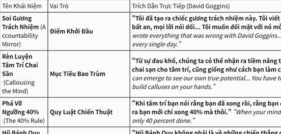

**Click the image to view the sheet.**

**Bảng 2: Các Mindset từ "Never Finished" — Tiến Hóa Vĩnh Viễn**

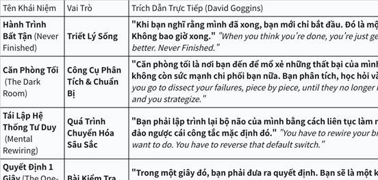

**Click the image to view the sheet.**

**MINDSET 5' BETA FOREVER**

|   |   |
|---|---|
|7/2/2026 - CÂU CHUYỆN CHO VIỆC BIẾT NHIỀU MÀ KO CHỊU THỰC HÀNH|**Câu chuyện: "Người Đọc Sách và Con Rắn Độc" - 07/02/2026**<br><br>Có một anh chàng tên **Biết** (Biết Tuốt), sống ở một ngôi làng ven rừng. Biết rất chăm chỉ đọc sách. Anh ta đọc hết sách về nông nghiệp, y học, săn bắn, thậm chí cả sách về... rắn độc. Mỗi ngày, Biết ngồi dưới gốc cây đa, đọc ngấu nghiến: "Rắn độc cắn thì phải hút nọc ngay!", "Dùng dao rạch vết cắn!", "Uống thuốc dân gian từ lá cây X!". Anh ta thuộc lòng mọi lý thuyết, kể cho mọi người nghe say sưa, ai cũng khen Biết "học vấn uyên thâm".<br><br>Một hôm, làng có dịch rắn độc. Con rắn lục dài ngoằng cắn trúng chân ông lão hàng xóm. Dân làng hoảng loạn chạy đến nhà Biết: "Anh Biết ơi, cứu ông với! Anh đọc sách nhiều mà!".<br><br>Biết hí hửng chạy ra, miệng lẩm bẩm lý thuyết: "Phải hút nọc... không, rạch vết cắn trước... hay uống lá X nhỉ?". Anh ta lúng túng, tay cầm sách run run, nhưng không làm gì cả. Trong khi đó, thằng bé **Làm** (hàng xóm nghèo, ít học) lẳng lặng chạy đến, dùng dao rạch vết cắn, hút nọc ra (như sách dạy cơ bản), rồi chạy đi hái lá thuốc đúng loại ông lão hay dùng. Ông lão sống sót.<br><br>Dân làng hỏi Biết: "Sao anh không làm?". Biết ngẩn ngơ: "Em... em biết hết lý thuyết, nhưng... lười làm lắm, sợ bẩn tay, sợ sai!". Từ đó, làng gọi Biết là "Ông Biết Không Làm". Còn thằng bé Làm trở thành anh hùng làng, dù nó chỉ "làm theo những gì biết cơ bản".<br><br>•                     **❌ KHÔNG Ứng Dụng (Sai lầm): WeWork và tham vọng "đốt tiền" để tăng trưởng bằng mọi giá**<br><br>￮      **Bối cảnh:** Adam Neumann, nhà sáng lập WeWork, bị ám ảnh bởi việc phải nhanh chóng trở thành một công ty công nghệ nghìn tỷ đô. Anh ta nắm rất chặt "Hòn đá Tương Lai Rực Rỡ" (thay đổi thế giới) và "Hòn đá Sợ Hãi" (sợ bỏ lỡ cơ hội).<br><br>￮      **Sai lầm:** Thay vì tập trung vào việc xây dựng một mô hình kinh doanh bền vững (bước từng bước), Neumann đã "đốt tiền" một cách điên cuồng để mở rộng bằng mọi giá. Anh ta liên tục nhìn sang các công ty công nghệ khác và muốn WeWork được định giá như họ, dù bản chất là một công ty bất động sản.<br><br>￮      **Hậu quả:** WeWork sụp đổ trước thềm IPO, Neumann bị sa thải. Gánh nặng của sự mong cầu và nỗi sợ đã khiến công ty kiệt sức và trượt ngã.<br><br>•                     **✅ Ứng Dụng (Thành công): Patagonia và triết lý "xây dựng công ty tốt nhất, không phải lớn nhất"**<br><br>￮      **Bối cảnh:** Yvon Chouinard, nhà sáng lập Patagonia, không bao giờ đặt mục tiêu chinh phục đỉnh núi "tăng trưởng vô hạn". Ông chỉ tập trung vào việc "bước từng bước thật chắc": tạo ra những sản phẩm chất lượng nhất và có trách nhiệm với môi trường.<br><br>￮      **Thành công:** Patagonia nổi tiếng với chiến dịch "Đừng mua chiếc áo khoác này", khuyến khích khách hàng sửa chữa thay vì mua mới. Họ đã "buông bỏ hòn đá mong cầu" về doanh thu ngắn hạn để tập trung vào giá trị cốt lõi. Họ không so sánh mình với các hãng thời trang nhanh khác.<br><br>￮      **Kết quả:** Patagonia trở thành một thương hiệu được yêu mến và cực kỳ thành công. Bằng cách tập trung vào "bước chân hiện tại", họ đã lên đến đỉnh núi của riêng mình một cách bền vững và đầy ý nghĩa.|

**3.1.0.6 MINDSET 6. THE ROAD - THE IMPACT - THE POWER. LUÔN CHỊU TRÁCH NHIỆM DÙ NGƯỜI KHÁC BẢO KHÔNG PHẢI LỖI CỦA MÌNH THÌ CŨNG VẪN PHẢI CHỊU TRÁCH NHIỆM + TÌM HƯỚNG XỬ LÝ.  = 1 TÂM THẾ: KO TRÁCH MÌNH, KO TRÁCH NGƯỜI (NGƯỜI GẦN GIÁC NGỘ).**

|   |
|---|
|NHÂN DẠNG NHÀ LÃNH ĐẠO  <br>1. KHIÊM HẠ SỬA MÌNH: https://www.youtube.com/watch?v=qKGbazS51Iw&list=PLu3y6aTxTwcTqpRXsWdKUq6S5YckE1FaK&index=102  <br>2. **TRỞ THÀNH NHÀ LÃNH ĐẠO - CHỊU TRÁCH NHIỆM - PHỤNG SỰ  https://www.youtube.com/watch?v=cAWew1hXvAY**<br><br>•                     **Chịu trách nhiệm VÌ ĐÓ LÀ LỖI CỦA MÌNH, CỦA ĐỒNG ĐỘI MÌNH.**<br><br>•                     **Mindset chịu trách nhiệm cho team và cho kết quả của mình, cùng giải quyết vấn đề. Mọi thứ chỉ thực sự học khi chúng ta xuống nước**<br><br>•                     **Hành động xuất phát từ giá trị bên trong, không vì sự ghi nhận bên ngoài.**<br><br>•                     **Luôn chủ động “làm phần khó”, “gánh việc nặng” cho tổ chức/đội nhóm.**<br><br>•                     **Coi thành công và thất bại của đội là thành công/thất bại của chính mình.**<br><br>•                     **Phục vụ bằng trái tim, làm gương bằng hành động nhỏ nhất.**<br><br>•                     Báo sớm khi có rủi ro. Không blame, mà cùng fix. Chủ động "đỡ" người khác, dù không ai yêu cầu<br><br>\|   \|<br>\|---\|<br>\|Lỗi đã mắc:   10/11/2025:<br><br>+, Bảo thứ 7, CN ra nhưng 2 ngày liền ko thấy đâu.<br><br>+, 6h dậy chạy, 9h dậy chạy mà ngủ đến 10h (điện thoại hết pin, hôm hẹn 3 ae)<br><br>+, 8h rưỡi dậy, 9h chạy -> 8h rưỡi dậy alo xong ngủ đến 9h15 mới di chuyển.<br><br>+, Hẹn 19h hơn ra -> xong 22h mới ra (do đi ăn ở công ty, và cả nể ko nở mở miệng ra xin về sóm 19h30 như anh Vũ).<br><br>+, Thứ 7 mới báo là chủ nhật này em bận buổi chiều từ 2h, ảnh hưởng đến tinh thần cả team.<br><br>+, Nhắn tin báo là fix bug đi, 3-7 ngày sau mới rep vì lý do : đến phần đó sẽ bắt đầu xử lý mới rep.<br><br>"T sẽ cần mng có ownership nhất định với tính năng chung, chủ động phối hợp với nhau để nhìn ra vấn đề và sắp xếp giải quyết đảm bảo timeline. Chứ không chỉ việc ai người đó làm còn có những phần ở giữa thì lọt, quản lý thì suốt ngày phải hỏi từng đứa một. Vấn đề của đứa này thì đổ cho đứa kia chưa xong, nhưng cũng không rõ đứa kia bao giờ xong, đứa kia thì cũng k chủ động update. Làm việc như trẻ con. "  <br>"Còn phía e, a thấy 1 vấn đề là e phải quan tâm tới mục tiêu chung hơn. Ko nói tới việc e ko nhận được thông tin, mà tối thiểu e phải biết mình đang làm việc gì và việc ấy có giá trị gì, ai sẽ dùng và khi nào được dùng. Đừng chỉ dừng ở việc e done việc của e (mà đáng ra khi nhận việc e phải commit là khi nào xong, chứ ko phải vâng e làm, ko bảo khi nào xong).<br><br>=> Tự owner việc của mình và commit bao giờ xong<br><br>=> Có bug/timeline lệch/lịch bận thì báo sớm (đừng ngại, cả nể mà báo muộn) "\|<br><br>3.                   ĐỔ LỖI<br><br>"Chúng tôi không biết", "Đó không phải việc của tôi" – đây là những câu trả lời kinh điển khi một dự án thất bại. Theo Roger Connors và các cộng sự, đó chính là biểu hiện của "Vùng Nạn Nhân". Ở đó, người ta mải mê đổ lỗi, tìm cớ và thụ động chờ đợi một phép màu nào đó đến giải quyết hộ.  <br>Tên cuốn sách được lấy cảm hứng từ bộ phim Phù thủy xứ Oz: Cô bé Dorothy thực chất luôn có khả năng tự mình về nhà, điều cô cần duy nhất là lòng can đảm để nhận trách nhiệm và hành động.<br><br>Các tác giả đã vẽ ra một "Ranh giới" (The Line) phân định hai kiểu tư duy hoàn toàn khác biệt. Phía dưới ranh giới là sự phủ nhận và trốn tránh; phía trên ranh giới là tinh thần làm chủ với bốn bước: Nhìn thấy - Sở hữu - Giải quyết - Hành động.<br><br>Cuốn sách vạch trần một thực tế cay đắng: Khi một công ty sụp đổ, CEO thường đổ lỗi cho thị trường, quản lý đổ lỗi cho lãnh đạo, còn nhân viên lại đổ lỗi cho quy trình. Kết quả là không một ai thực sự đối mặt với vấn đề. Những hành vi "Dưới ranh giới" như "Tôi đã bảo rồi mà..." hay "Chẳng ai nhắc tôi cả..." thực chất là những liều thuốc độc tiêu diệt sự sáng tạo.<br><br>Điểm đắt giá nhất của Nguyên lý Oz nằm ở khái niệm "Sở hữu" (Own It). Sở hữu ở đây không đơn thuần là nhận lỗi, mà là nhận lấy quyền năng. Thay vì hỏi "Tại sao chuyện này lại xảy ra với tôi?", hãy tự hỏi: "Tôi có thể làm gì để thay đổi điều này?". Một khi bạn ngừng phủ nhận những "sự thật khó chịu", bạn sẽ bắt đầu tìm thấy lối thoát. Đây không chỉ là một cuốn sách quản trị, mà là một cuộc cách mạng về văn hóa – giúp biến một tập thể rệu rã vì đổ lỗi thành một đội ngũ gắn kết bằng trách nhiệm.<br><br>3. LÒNG BIẾT ƠN  <br>- Thích cái cách được sếp tặng quà => Sau này mình cũng sẽ tặng quà ae như thế  <br>- Thích cái cách được người lạ mua đồ ăn cho => Sau này mình cũng sẽ mua cho ae như thế  <br>- Lợi tại nhất thân vật mưu dã, lợi tại thiên hạ tất mưu chi<br><br>Nếu là cái lợi cho bản thân thì đừng tham, nhưng nếu là cái lợi cho thiên hạ thì phải tính.|
|LEVEL CAO HƠN: TĨNH LẶNG: KO TRÁCH MÌNH, KO TRÁCH NGƯỜI  <br>LEVEL CAO HƠN - GIÁC NGỘ: KO THÍCH, KO CHÁN GHÉT.|
|1.                    <br><br>2.|

|   |   |   |
|---|---|---|
|+, Bố, mẹ mỗi người 1 triệu  <br>+, Chị Hà 50k, bé My 200k, Sâu 50k  <br>+, Chị Tuyết 50k, a Kiên 50k  <br>+, Các chú các bác bên nội:  <br>Bác Hùng, Bác Huệ, Chú Báo, Thím Nga mỗi người 20k  <br>Bác Nhị 20k  <br>+, Các cháu bên ngoại: nhà bác Hùng a Dương: Kiên, Bông, Thỏ mỗi cháu 20k  <br>  <br><br>  <br>+, Các chú các bác bên ngoại:  <br>Bà Ngoại 100k  <br>Bác Gái 50k<br><br>Các bác ngày xưa quý mình:  <br>+, Bác Miến 200k (bỏ lì xì, sau ko nên bỏ lì xì)  <br>+, Cô Lựu (Nam) 100k  <br>+, Bố Trung 500k, mẹ Trung 500k (bỏ lì xì, sau ko nên bỏ lì xì), Hiếu 200k, bà nhà Trung mỗi người 100k.|||
||||

**3.1.0.7 MINDSET 7. SONG ĐỀ TÙ NHÂN - CÂN BẰNG NASH: TỐI ƯU HOÁ LỢI ÍCH CỦA TỪNG CÁ NHÂN CHƯA CHẮC TỐI ƯU LỢI ÍCH CỦA TẬP THỂ**

|   |
|---|
|SONG ĐỀ TÙ NHÂN - CÂN BẰNG NASH: TỐI ƯU HOÁ LỢI ÍCH CỦA TỪNG CÁ NHÂN CHƯA CHẮC TỐI ƯU LỢI ÍCH CỦA TẬP THỂ  <br>  <br>**Game Theory trong Toán học, Công nghệ, Kinh Tế và Tâm Lý (trò chơi người với người) -  GAME THEORY - GAME MAKER - LÀM ĐIỀU QUAN TRỌNG CÓ TÍNH SIÊU DÀI HẠN - Nghịch lý của sự lựa chọn (MENTOR + Đóng gói CÁC TIÊU CHÍ)**  <br>  <br>**Game Theory trong Toán học, Công nghệ, Kinh Tế và Tâm Lý (trò chơi người với người) -  GAME THEORY - GAME MAKER - LÀM ĐIỀU QUAN TRỌNG CÓ TÍNH SIÊU DÀI HẠN - Nghịch lý của sự lựa chọn (MENTOR + Đóng gói CÁC TIÊU CHÍ)**|
|**Song đề tù nhân Prisoner’s Dilemma - Game Theory. Nghịch lý sự lựa chọn Paradox of Choice - Barry Chwartz. Thuật toán Elo trong xếp hạng tuyển thủ cờ vua, thuật toán xếp hạng model LLMs Bradley-Terry, … [Bài viết 25/06/2025 sau 3 ngày học]**<br><br>\|   \|<br>\|---\|<br>\|1.                   - 2 ngày cuối tuần đẹp trời 21,22/06/2025 nghe thầy NQT giảng về “Song đề tù nhân - Prisoner’s Dilemma“ (sự phản bội của người tù) giải thích lý do tại sao chúng ta QUÉT CÁI NHÀ CŨNG ĐÙN ĐẨY NHAU, CHÍNH SÁCH LƯƠNG THƯỞNG, ... [<30 triệu]  <br>- Nghịch lý sự lựa chọn (Paradox of Choice): Tại sao có rất nhiều người nhưng bạn vẫn chọn sai, tâm lý muốn nhảy và đắn đo khi lựa chọn: [Paradox of Choice: Tại sao ta vẫn chọn "sai người" dù người nhiều vô kể? \\| Vietcetera](https://vietcetera.com/vn/paradox-of-choice-tai-sao-ta-van-chon-sai-nguoi-du-nguoi-nhieu-vo-ke) [Trả giá = nyc và 7 năm mới nhận ra]  <br>- Trong lúc học bài LLMOps FSDS B1: có nhắc đến Chatbot Arena nền tảng xếp hạng các mô hình ngôn ngữ lớn (LLMs - Large Language Models), ẩn sau bên dưới với thuật toán Elo và Bradley-Terry: [Overview Leaderboard \\| LMArena](https://lmarena.ai/leaderboard) . Cách xếp hạng tuyển thủ cờ vua. [4 triệu]<br><br>2.                   MONEYosophy -> Youtube recommend (lương tâm, game theory). Cấp Độ 1 Đến 100 Tình Huống Đạo Đức Khó Xử: https://youtu.be/OwxDnXx6m9w?feature=shared + Có keywords là mình search được: https://www.facebook.com/ecoblader và https://www.facebook.com/hieuungchimmoi (hiệu ứng chim mồi, tâm lý đầu tư, tâm lý mối quan hệ, xử lý tâm lý, ... trường phái có gì đó khang khác/giông giống với BKE GNH Tham Sân Si Đạo Đức Trí Tuệ Nghị Lực)<br><br>3.                   https://www.youtube.com/@baihoc10phut (Kênh quá khớp Youtube recommend): Chi phí chìm (nỗi đau nhói và nỗi đau âm ỉ, đi được 2/3 chặng đường, chi phí chìm là thứ đã mất đi rồi hãy nhìn vào hiện tại tương lai), thế lưỡng nan của 2 người tù (chạy đua vũ trang, giày cao gót, đùn đẩy nhau dọn nhà, ...)  <br>- Bỏ 1 con Ếch vào nồi nước đang sôi: https://www.youtube.com/watch?v=jmp2CG4s-5c<br><br>4.                   Genspark: "Theory of Games and Economic Behavior", **"Tư duy chiến lược - Lý thuyết trò chơi thực hành" - Avinash K. Dixit và Barry J. Nalebuff;** **"The Art of Strategy"** - Avinash Dixit & Barry Nalebuff   (**"Thinking Strategically"**), "Mặt dày tâm đen", "Cổ học kỳ thư"\|<br><br>Từ Song Đề Tù Nhân đến Cân Bằng NASH: Tối ưu hoá lợi ích cho từng cá nhân chưa chắc đã là cách tối ưu hoá lợi ích cho 1 đám đông.  <br>- Hotelling: 2 quán kem cạnh nhau càng ngày càng dịch vào nhau.  <br>- Tình yêu: Tỏ tình - Đồng ý: 10, 10 \| Không tỏ tình - đồng ý: -10, 0 \| Tỏ tình - Không đồng ý: -5, -5  \| Không tỏ tình - Không đồng ý : 0, 0<br><br>•                     Thế tiến thoái lưỡng nan của tù nhân (Prisoner's Dilemma): Hai nghi phạm bị bắt và đối diện với lựa chọn: hợp tác với nhau hoặc phản bội. Kết quả tối ưu nhất cho cả hai là hợp tác, nhưng do thiếu lòng tin, họ thường chọn phản bội, dẫn đến kết quả kém hơn.<br><br>•                     Trò chơi con gà (Chicken Game): Mô phỏng các tình huống đối đầu, nơi hai bên đều muốn tránh nhượng bộ nhưng kết quả tồi tệ nhất xảy ra nếu cả hai đều cứng đầu.<br><br>•                     Trò chơi phối hợp (Coordination Game): Hai hay nhiều người chơi cần phối hợp để đạt được lợi ích cao nhất, ví dụ như quyết định bên nào sẽ lái bên phải hay bên trái đường.<br><br>Hiệu ứng chim mồi  <br>- Chim mồi 5% đám đông dần theo hết. Chim mồi 9 người trong 10 người thì người thứ 10 chết dí.  <br>- Chim mồi trong 3 món hàng, món hàng thứ 2 đắt, làm món hàng thứ 3 cảm thấy rẻ và được hời.<br><br>Hiệu ứng chi phí chìm: Nỗi đau nhói và nỗi đau âm ỉ, đi được 2/3 chặng đường, chi phí chìm là thứ đã mất đi rồi hãy nhìn vào hiện tại tương lai. Hiệu ứng IKEA.|

**3.1.0.8 MINDSET 8. TÂM LÝ ĐÁM ĐÔNG - BỊ XẺ THỊT**

|   |
|---|
|8 TÂM LÝ ĐÁM ĐÔNG - BỊ XẺ THỊT|
|\|   \|<br>\|---\|<br>\|CON CỦA BA, HÃY CẨN TRỌNG MỖI KHI CON THẤY MÌNH Ở TRONG ĐÁM ĐÔNG....<br><br>Trong dạy con về tài chính và cả cuộc sống, có một bài học rất quan trọng: con phải thật cẩn trọng khi đi theo đám đông. Từ khi còn nhỏ, trẻ đã dễ bị cuốn theo bạn bè. Khi bạn có món đồ chơi mới, con cũng muốn có ngay để không bị lạc lõng. Nếu cha mẹ chỉ chiều theo, thói quen ấy sẽ dần lớn lên thành tâm lý chạy theo số đông mà quên mất giá trị thật sự của sự lựa chọn.<br><br>Trong tài chính, đi theo đám đông thường dẫn đến những cái giá rất đắt. Người ta đổ xô mua đất khi sốt, rồi kẹt vốn nhiều năm. Người ta lao vào chứng khoán khi thị trường hưng phấn, rồi lại hoảng loạn bán tháo khi giá rơi. Người ta chạy theo mốt tiêu dùng, sắm bằng thẻ tín dụng để giữ thể diện, rồi sau đó ôm nợ chồng chất. Trong khi đó, những người biết chậm lại quan sát, biết tự mình tính toán, mới là những người giữ được tiền, giữ được sự tự do.<br><br>Với trẻ con, cha mẹ có thể bắt đầu bằng những câu hỏi rất đời thường: “Con có thật sự cần món đồ này không?” “Nếu bạn bè con đều mua, con có bắt buộc phải giống họ không?” Đó không phải là sự cấm đoán hay phủ nhận mong muốn của con, mà là cách để gieo vào con hạt giống tư duy độc lập. Một đứa trẻ học được cách tự hỏi và tự trả lời, dần dần sẽ hình thành bản lĩnh đứng vững trước áp lực số đông.<br><br>Quan trọng hơn, cha mẹ cần cho con thấy rõ ràng: khác biệt không có nghĩa là bị loại trừ. Con hoàn toàn có thể tôn trọng người khác mà vẫn giữ quyết định riêng của mình. Xã hội luôn có sự lôi kéo, luôn có xu hướng ép người ta giống nhau. Nhưng nếu chỉ vì muốn “fit in” mà đánh mất chính mình, thì đó mới là điều nguy hiểm. Dạy con không chạy theo đám đông chính là trao cho con sự tự tin để đi con đường riêng, dù con đường đó đôi khi ít người chọn. Trong tài chính, điều này càng quan trọng. Người biết giữ kỷ luật, biết đi ngược lại đám đông một cách tỉnh táo, thường chính là người chiến thắng sau cùng.<br><br>Một đứa trẻ được rèn luyện tư duy ấy từ nhỏ sẽ lớn lên trở thành một người trưởng thành biết tiêu tiền bằng sự cân nhắc, đầu tư bằng tầm nhìn, và sống với sự tự tin không bị lay chuyển bởi tiếng ồn bên ngoài. Và đó cũng chính là món quà lớn nhất cha mẹ có thể trao cho con: bản lĩnh để không bị cuốn trôi theo số đông, mà vẫn tìm được chỗ đứng vững vàng cho riêng mình.<br><br>[#FINANCE_for_inheritor](https://www.facebook.com/hashtag/finance_for_inheritor?__eep__=6&__cft__%5b0%5d=AZVAAex4fVmQ6ZaXlRGUYw7zxrDGzqvwCpdxqmOqOMAWtv-Z8PRMDMLKk1QfkRmfWX3YF_2s55PvyG1vEhy3CESdvoN1MA39Jzlfj1-vh1ahJdU1XDxxpfpYEvBBflI6YjIRpP2_h9uvZ0vQcO4EPfMc0cWIxKMLSv3QaZvo4C7ePaCRNwDUGJI13M7PsD4qozquRL83nFP5SAYzGSoXn7CpIoFwDZC89WvPrjNzZDwEb9kQZ09aXkAufO1KQj1dPEv9XQxdCcIQ0Ovsr5MShDFt&__tn__=*NK-y-R)<br><br>[#taichinhchocon](https://www.facebook.com/hashtag/taichinhchocon?__eep__=6&__cft__%5b0%5d=AZVAAex4fVmQ6ZaXlRGUYw7zxrDGzqvwCpdxqmOqOMAWtv-Z8PRMDMLKk1QfkRmfWX3YF_2s55PvyG1vEhy3CESdvoN1MA39Jzlfj1-vh1ahJdU1XDxxpfpYEvBBflI6YjIRpP2_h9uvZ0vQcO4EPfMc0cWIxKMLSv3QaZvo4C7ePaCRNwDUGJI13M7PsD4qozquRL83nFP5SAYzGSoXn7CpIoFwDZC89WvPrjNzZDwEb9kQZ09aXkAufO1KQj1dPEv9XQxdCcIQ0Ovsr5MShDFt&__tn__=*NK-y-R)<br><br>[#Tai_chinh_cho_nguoi_thua_ke](https://www.facebook.com/hashtag/tai_chinh_cho_nguoi_thua_ke?__eep__=6&__cft__%5b0%5d=AZVAAex4fVmQ6ZaXlRGUYw7zxrDGzqvwCpdxqmOqOMAWtv-Z8PRMDMLKk1QfkRmfWX3YF_2s55PvyG1vEhy3CESdvoN1MA39Jzlfj1-vh1ahJdU1XDxxpfpYEvBBflI6YjIRpP2_h9uvZ0vQcO4EPfMc0cWIxKMLSv3QaZvo4C7ePaCRNwDUGJI13M7PsD4qozquRL83nFP5SAYzGSoXn7CpIoFwDZC89WvPrjNzZDwEb9kQZ09aXkAufO1KQj1dPEv9XQxdCcIQ0Ovsr5MShDFt&__tn__=*NK-y-R)<br><br>[#nguoiquantri](https://www.facebook.com/hashtag/nguoiquantri?__eep__=6&__cft__%5b0%5d=AZVAAex4fVmQ6ZaXlRGUYw7zxrDGzqvwCpdxqmOqOMAWtv-Z8PRMDMLKk1QfkRmfWX3YF_2s55PvyG1vEhy3CESdvoN1MA39Jzlfj1-vh1ahJdU1XDxxpfpYEvBBflI6YjIRpP2_h9uvZ0vQcO4EPfMc0cWIxKMLSv3QaZvo4C7ePaCRNwDUGJI13M7PsD4qozquRL83nFP5SAYzGSoXn7CpIoFwDZC89WvPrjNzZDwEb9kQZ09aXkAufO1KQj1dPEv9XQxdCcIQ0Ovsr5MShDFt&__tn__=*NK-y-R)<br><br>[#MONEYosophy](https://www.facebook.com/hashtag/moneyosophy?__eep__=6&__cft__%5b0%5d=AZVAAex4fVmQ6ZaXlRGUYw7zxrDGzqvwCpdxqmOqOMAWtv-Z8PRMDMLKk1QfkRmfWX3YF_2s55PvyG1vEhy3CESdvoN1MA39Jzlfj1-vh1ahJdU1XDxxpfpYEvBBflI6YjIRpP2_h9uvZ0vQcO4EPfMc0cWIxKMLSv3QaZvo4C7ePaCRNwDUGJI13M7PsD4qozquRL83nFP5SAYzGSoXn7CpIoFwDZC89WvPrjNzZDwEb9kQZ09aXkAufO1KQj1dPEv9XQxdCcIQ0Ovsr5MShDFt&__tn__=*NK-y-R)<br><br>•                     Đợt còn đi thực tập: 2 lần em từ chối đi chơi với ace trong công ty (cụ thể là đi du lịch cả công ty) (số tiền rơi vào khoảng 1 - 2 triệu trong khi lúc đó em còn tiết kiệm từng 10k, 20k một). 2 lần đó đến giờ vẫn là những sự lựa chọn rất sáng suốt của em. (Bởi lẽ, chơi ở công ty cũng đã quá thân rồi, lấy lý do không đi là oke ạ).  <br>Những món quà em tặng:  <br>Em My, toàn bộ 3 lần em tặng đều là tặng sách: Bộ sách tập tô tập viết, sách Toán lớp 1, còn bộ sách truyện ở trên tủ (đã mua chưa tặng vì chưa biết đọc)  <br>Anh chị khi tốt nghiệp: em cũng tặng sách (chị Vy bác Miến cuốn Thói quen giàu nghèo, 1 anh nữa: 7 câu hỏi của mọi sếp giỏi, ...)  <br>Sếp ở công ty 3 sếp: em cũng tặng sách. Cuốn: Làm điều quan trọng, ...  <br>và học sinh đứa em làm gia sư: em cũng tặng sách.  (đi gia sư mà vẫn tặng sách -)) )\||

**3.1.0.9 MINDSET 9. BẪY CHI PHÍ CHÌM**

|   |
|---|
|BẪY CHI PHÍ CHÌM|
|\|   \|<br>\|---\|<br>\|2.                   Chi phí chìm:<br><br>@Diện Tech Cảm ơn sếp Diện đã share ạ. ^^<br><br>Nọ em cũng nghe 1 video về 'Chi Phí Chìm', trong đó có ví dụ là:<br><br>•                     Bạn bỏ 100k ra để đi xem 1 bộ phim, tuy nhiên xem đến nửa bạn thấy chán quá, xem chỉ tốn thời gian.<br><br>Bạn đắn đo có nên đi về hay không, vì về thì tiếc tiền vé đã bỏ ra.<br><br>=> Đây là 1 ví dụ về chi phí chìm. Vì: tiền vé bản chất đã mất rồi. Ngồi xem phim thì lại mất thêm thời gian. => Ra về mới là lựa chọn tối ưu nhất!<br><br>Đúng như sếp Diện nói: " Nhận thức rằng các chi phí đã bỏ ra là chi phí chìm và không thể thu hồi. Quyết định đầu tư tiếp theo phải dựa trên triển vọng tương lai của khoản đầu tư, không phải những gì đã mất."  ;-d ;-d ;-d<br><br><Liên hệ: Khá giống với nỗi đau âm ỉ: tiếc cho mối quan hệ, tiếc cho khoảng thời gian dài đã làm việc tại 1 công ty: đang quen công việc, mối quan hệ đồng nghiệp, ... > ;-d\||

**3.1.0.10 MINDSET 10. BẪY TÂM LÝ KHIẾN CHÚNG TA KO BỎ ĐƯỢC CÁC THÓI QUEN CŨ**

|   |
|---|
|BẪY TÂM LÝ KHIẾN CHÚNG TA KO BỎ ĐƯỢC CÁC THÓI QUEN CŨ|
|**Use Case Tâm lý: Bỏ thói quen xấu và thích người khác ?**<br><br>\|   \|<br>\|---\|<br>\|1.                   How to Bỏ 1 thói quen xấu trong nhóm ID "Tự ..."<br><br>**Context:** Định luật Peak-End nói về việc chúng ta sẽ nhớ đến điểm Peak và điểm End còn lại những thứ khác chúng ta không nhớ.<br><br>**Câu hỏi của em:** Định luật Peak-End có thể ứng dụng trong bỏ thói quen xấu không ạ (vì nó )? Hoặc 1 định luật tâm lý học khác, hiệu quả có thể xử lý điều này của em ạ!<br><br>**Context và góc nhìn cá nhân của em:** Em có thói quen xấu liên quan đến việc "tự xử lý **(Masturbation)**" bản thân trong tầm 10 năm (tần xuất tầm 1-2 lần/tuần).<br><br>•                     Điều này xấu không? Không xấu! Đạo đức là góc nhìn chủ quan của mọi người, không có gì cắn rứt lương tâm ở đây cả và cũng ko ảnh hưởng nhiều đến cuộc sống.<br><br>-> Nhưng em muốn bỏ hoàn toàn thói quen này xuống để đi nhanh hơn, mạnh hơn, năng lượng đều đặn hơn, CÒN GIÚP NGƯỜI KHÁC (như anh hay bảo ạ) :D  <br>. Em đã thử nhiều cách nhưng 10 năm chưa xử lý được hoàn toàn<br><br>•                     (Năm 2023 em cũng đi Thiền và nhận ra rằng mục đích Tình Dục của chúng ta rất giống với con nghiện, nó chỉ là để chấm dứt CÁI CẢM GIÁC KHÓ CHỊU gây ra lúc đó nếu không sex, chứ không ai đi thèm muốn mà làm nó nhiều liên tùng tục được. Giống như con nghiện chỉ hút thuốc khi lên cơn vì không hút cảm thấy khó chịu, chứ bình thường nó sẽ không bao giờ hút).<br><br>•                     Sau khi học anh, em cảm giác là món 'Tâm lý học' này rất có thể có câu trả lời cho điều này hoặc giúp em hiểu hơn để tìm cách xử lý nó.<br><br>2.                   Bài toán về sự lựa chọn "Chọn ny" - 1 lựa chọn duy nhất, hạn chế sai!<br><br>**Câu hỏi của em: Cách anh tư duy toán học và tâm lý học trong việc chọn 'ny, chọn vợ' anh đã tư duy như nào! (Các quyết định rất quan trọng và chỉ chọn 1 lần)**  <br>**Context và góc nhìn cá nhân của em:**  <br>1. Chuyện có ny và tán người con gái khác và bài học về 'Nghịch lý của sự lựa chọn'  “Paradox of Choice”  <br>- Qua kinh nghiệm nyc cá nhân em nhận được  1 bài học về "Nghịch lý của sự lựa chọn". Chuyện là: vào năm 2023 em có 1 ny, hợp em tới 90% (đi thiền chung, học phát triển bản thân, tâm lý, đạo lý cũng chung, học vấn oke học chuyên học khối xã hội và cũng đu sang cả công nghệ (em thì thuần công nghệ), ...) Mọi chuyện xảy ra khi em đi Thiền vào T4/2023 9 ngày đó em có thích 1 bạn khác trong khoá Thiền. Sau 9 ngày, em nhắn tin tán bạn này => sau đó ny em biết và bạn đòi tạm dừng, sau khoảng 4-5 tháng tạm dừng theo kiểu mập mờ thì em lên tiếng để chấm dứt hoàn toàn. Để em ko còn ràng buộc vào MQH mập mờ nữa, không bị cắn rứt lương tâm và thoải mái tìm mối mới.  <br>=> Mãi 2 năm về sau (2-3 tháng trở lại đây, em mới nhận được thông điệp gọi là 'Nghịch lý của sự lựa chọn'  “Paradox of Choice”: Paradox of Choice: Tại sao ta vẫn chọn "sai người" dù người nhiều vô kể? \\| Vietcetera  <br>=> Cách chọn đúng là: Có list tiêu chí cho mình => Đủ tiêu chí, chốt! (Giống như việc ta khát nước vào siêu thị thì mua nước thôi, đừng có lăn tăn mà mua thêm bánh thêm mì, ...)  <br>  <br>2. Rất dễ để thích 1 người:  <br>- Nhìn lại từ bé đến lớn, em nhận ra, từ hồi lớp 2 em đã để ý 1 chị tầm lớp 5. Trong suốt từ bé đến lớn, em rất dễ để ý và thích thích 1 người (Cảm giác thích thích, do não tự làm quá lên). Và giờ em vẫn thế, em 2k3 (nyc ở trên là 2k), ... em vẫn rung động trước các chị bình thường (2k3-1996).<br><br>Học bài về "LƯƠNG TÂM THUẦN TUÝ" hôm bữa, em sử dụng góc nhìn: "Triết lý ILY + Đúng pháp luật + Tạo ra giá trị" để nhìn lại điều này ở mình. => Không có gì là 'cắn rứt lương tâm' ở đây cả. Vì vẫn ILY (yêu thương hết anh ạ), vẫn giá trị (đến với ai trao giá trị cho người con gái đó) và đúng pháp luật.  <br>  <br>3. Câu chuyện về ny này rất giống với việc đầu tư và theo dõi 1 cổ phiếu trong dài hạn (thay vì 20 danh mục như Warren Buffet). Tuy nhiên thời gian càng dài thì ta lại càng phát triển hơn, tiêu chí của ta lại càng nhiều hơn.<br><br>•                     Có list tiêu chí cho mình: Kiên định kỉ luật, nhớ bằng tim.<br><br>•                     Trong thời gian càng dài, thì bản thân càng level up / thay đổi => Tiêu chí cũng dần bị thay đổi theo.<br><br>+, Nếu như cổ phiếu đó ta mới theo dõi => Cân nhắc chuyển sang cổ phiếu khác theo tiêu chí mới<br><br>Giống với việc: em đang để ý 1 bạn cùng trường 1 tháng, đi học tâm lý học về tiền về, em thêm tiêu chí săn vợ 1M $ từ các sếp, thì em chỉnh tiêu chí lại :3<br><br>+, Nếu cổ phiếu lâu rồi => Càng phải cân nhắc hơn vì khi chuyển kéo theo 1 loạt hệ quả<br><br>Giống việc: các anh chị có ny rồi thì ko thể đổi vợ được :D<br><br>3.                   Ngoài lề 1 chút: Phần tâm lý học anh dạy làm em nhớ đến cuốn **'Mặt dày tâm đen'  (nói về việc kiên định, tâm lý cứng rắn, hành động quyết liệt để bảo vệ những thứ giá trị).**  <br>- [Đánh giá Mặt dày, tâm đen – Cuốn binh thư Tôn Tử trong thời bình - YouTube](https://youtu.be/cb4G4OD5Dk0?feature=shared)  <br>- Em cũng đi lên từ 12 năm chuyên toán, học IT AI BKHN (hiện em đang năm 4 em xong đồ án và chuẩn bị bảo vệ) cuốn đầu tiên về PTBT em đọc là cuốn 'Tôi tài giỏi bạn cũng thế' của thầy Adam Khoo hồi giữa năm lớp 9. Sau đó đọc: Alpha Male, tán tỉnh bằng sự trung thực, rồi học Tâm lý học, X3, Thiền, ... => Khá khoái mấy món: Phát triển bản thân theo chiều sâu, Thiền, Tâm lý học, Hiệu suất công việc, Lãnh đạo, trò chơi người với người, trò chơi của tâm trí, mindset không giới hạn.  <br>- Phải đến 7 năm sau khi đọc cuốn 'Tôi tài giỏi bạn cũng thế' của thầy Adam Khoo + nhiều điểm chạm khác => Em mới ngộ ra bài học về 'MINDSET KHÔNG GIỚI HẠN' và ứng dụng luôn: 36h không ngủ, 28h ngồi liền tại 1 quán caffe mở 24/7  <br>Link: https://www.facebook.com/share/v/1Buq9yox1t/\||

|   |
|---|
|5.                   ...<br><br>---|

**3.1.0.0 Mental Models - https://graciousquotes.com - BUILD MINDSET THÔNG QUA AI AGENT CÀO CÁC CÂU NÓI NỔI TIẾNG CỦA NGƯỜI GIÀU CÓ VÀ HẠNH PHÚC  “Happiness & Wealth”**

https://graciousquotes.com/naval-ravikant/ , https://sourcesofinsight.com/charlie-munger-mental-models/

1.                   Charlie Murger : Mình biết đến ông khi biết về: Vòng tròn năng lực + Start with the don't (https://youtu.be/FyCHApY57S4?si=DBBQcLLKCbZmtzfo)  
+, Cuốn sách Poor Charlie's Almanack (Niên Giám Của Charlie Tội Nghiệp) tập hợp speeches của Munger, nhấn mạnh: 25mental models cơ bản: Như Inversion (nghĩ ngược), Lollapalooza Effect (hiệu ứng kết hợp bias), Circle of Competence (vòng tròn năng lực): https://www.youtube.com/watch?v=jibfwSXy15w  
+, Danh sách 129 models trên sourcesofinsight.com (psychology 25+, economics, physics...).

|   |
|---|
|Viết cho tớ 1 file excel gồm các cột<br><br>Cột 1 : STT (ĐẢM BẢO ĐỦ 129 MENTAL MODELS có trong 2 file mô tả đính kèm)<br><br>Cột 2: Lĩnh vực (các lĩnh vực trong file đính kèm)<br><br>Cột 3: Nội dung chính/câu nói chính nguyên gốc của charlie murger, warrent buffet (bằng tiếng anh), + kèm nguồn dẫn + giải thích ngắn gọn bằng 3-5 gạch đầu dòng bằng tiếng việt - Mỗi mental models (mỗi dòng đều phải deep research). ĐẢM BẢO TẤT CẢ, TỪNG DÒNG ĐỀU LÀ NGUYÊN GỐC CỦA CHALIE MURGER, WARRENT BUFFET. (Chú ý: cái nào là models chung của cả 2 ông này thì ghi cả 2).<br><br>Cột 4: >=2 câu chuyện/ví dụ nổi tiếng có thật trong thực tế, trong lịch sử. Trong đó: 1 câu chuyện rõ nét sai lầm khi ko dùng models này, 1 câu chuyện rõ nét kết quả đúng đắn khi dùng models này|

2.                   Jim Rohn thầy của Tony Robbins

3.                   Naval Ravikant: Mình biết đến Naval Ravikant khi giải quyết vấn đề: "Cẩn thận với bẫy lương tâm thuần tuý khi xin nghỉ công việc gia sư cho 2 ae đã gắn bó 2 năm để tập trung cho AI"

**Charlie Murger -  sourcesofinsight.com - 129 MENTAL MODELS - https://quotefancy.com/charlie-munger-quotes**

**“Opportunity cost is a huge filter in life. If you’ve got two suitors who are really eager to have you and one is way the hell better than the other, you do not have to spend much time with the other. And that’s the way we filter out buying opportunities.”**

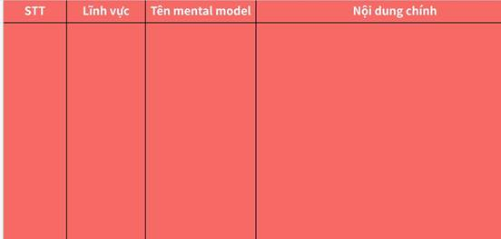

**Click the image to view the sheet.**

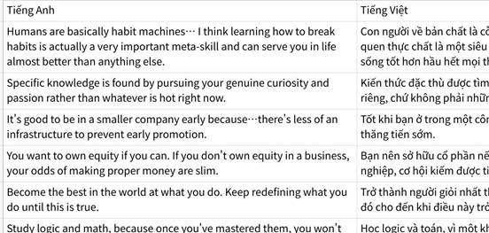

**Click the image to view the sheet.**

**3.1.0.0 Use cases Đóng gói - Charlie Murger đóng thành các MENTAL MODELS - Còn Warren Buffet thì bước xuống giường luôn bằng cùng 1 chân, vào cùng 1 giờ:**

|   |   |   |
|---|---|---|
|Use Cases|Phân tích||
|\|   \|<br>\|---\|<br>\|**Use Case 1: Xin nghỉ gia sư để tập trung AI**<br><br>Con chào cô ạ.<br><br>Con mới tốt nghiệp đợt đầu tháng 7 vừa rồi và đã đi làm fulltime.<br><br>Đi làm full nên thời gian học tập cũng ít lại, cuối tuần 2 ngày con muốn dành nhiều thời gian hơn cho chuyên môn (giai đoạn đầu sự nghiệp khá quan trọng ,<br><br>nên là con xin phép cô chú cho nghỉ gia sư em.<br><br>Con cảm ơn cô chú nhiều ạ.<br><br>---<br><br>Con cũng muốn đồng hành cùng em đến hết lớp 9. Cơ mà giai đoạn đầu sự nghiệp, còn nhiều thứ cần làm, nên con không có nhiều lựa chọn.<br><br>Cảm ơn cô chú đã để con dạy 2 em trong 2 năm ạ.<br><br>Nếu cần tìm gia sư Bách Khoa thì cô chú nhắn con, con sẽ tìm giúp em mấy anh chị năm 1, năm 2 mà con quen ạ.<br><br>Con xin giữ liên lạc với cô chú qua fb ạ: https://www.facebook.com/doanngoccuong.nhathuong <br><br>Ok, mình đã chỉnh lại toàn bộ nội dung theo đúng format bạn muốn: **trích dẫn trong ngoặc kép**, sau đó giải thích, rồi cuối cùng là **> Case này:**.\||\|   \|<br>\|---\|<br>\|**1️⃣ Phương Đông**<br><br>**Phật giáo** “Quả của nghiệp là bất khả tư nghì. Làm thiện chưa chắc vui, làm ác chưa chắc khổ.”  <br> 👉 Nên là: quán sát điều kiện hiện tại, duyên đủ thì tiếp tục, duyên hết thì buông.<br><br>Case này: duyên thầy–trò đã trọn 2 năm, nay duyên hết thì buông, không vướng.<br><br>**Khổng Tử (Trung Dung)** “Quân tử hòa nhi bất đồng.”  <br> 👉 Nên là: nghĩa lớn thì chọn, tình nhỏ thì giảm, nhưng giữ lễ khi kết thúc.<br><br>Case này: ưu tiên sự nghiệp (nghĩa lớn), nhưng exit mềm, bàn giao tử tế.<br><br>**2️⃣ Phương Tây**<br><br>**Immanuel Kant – Mệnh lệnh tuyệt đối (Categorical Imperative)** “Hãy hành động sao cho nguyên tắc của bạn có thể trở thành luật phổ quát.”  <br> 👉 Nên là: nếu ai cũng đặt sự nghiệp dài hạn lên trước, nhưng vẫn exit có trách nhiệm, xã hội vẫn vận hành tốt. Vậy hành động này đúng.<br><br>Case này: ai cũng đặt sự nghiệp lên trước nhưng exit có trách nhiệm → đúng.<br><br>**Aristotle – Đức hạnh trung dung (Nicomachean Ethics II.6)** “Đức hạnh là trung dung giữa hai cực đoan.”  <br> 👉 Nên là: tránh cực đoan, chọn cân bằng.<br><br>Case này: không cực đoan (hy sinh vô hạn hoặc cắt đứt lạnh lùng). Chọn trung dung: dừng để lo sự nghiệp, nhưng exit mềm để trọn tình.<br><br>**3️⃣ Hiện đại – Top 1%**<br><br>**Warren Buffett**  <br> “The difference between successful people and really successful people is that really successful people say NO to almost everything.” 👉 Nên là: phải biết nói KHÔNG với việc không còn aligned, kể cả khi lương tâm thấy áy náy.<br><br>Case này: nếu 80 tuổi nhìn lại, mình sẽ hối tiếc hơn vì bỏ qua thời gian đầu xây dựng sự nghiệp, chứ không phải vì nghỉ 1 job gia sư.<br><br>**Jeff Bezos – Regret Minimization Framework** “Hãy nhìn từ tuổi 80.”  <br> 👉 Nên là: chọn phương án ít hối tiếc nhất về lâu dài.<br><br>Case này: nếu 80 tuổi nhìn lại, mình sẽ hối tiếc hơn vì bỏ qua thời gian đầu xây dựng sự nghiệp, chứ không phải vì nghỉ 1 job gia sư.<br><br>**Naval Ravikant** “Play long-term games with long-term people.”  <br> 👉 Nên là: dành thời gian cho trò chơi có lãi kép.<br><br>Case này: gia sư 1–1 không compound, nên giữ ở mức option nhẹ.\|||

 

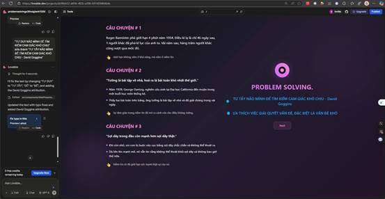

**1.2.1 Vấn đề ngày 09/11/2025**

|   |
|---|
||

**3.1.1 [GAME TÀI CHÍNH] TÂM LÝ HỌC - LƯƠNG TÂM THUẦN TUÝ - GAME THEORY - Thứ lương tâm mang yếu tố chủ quan - 22/06/2025!!!**

 

**Use Cases game Theory**

|   |
|---|
|1.                    <br><br>2.|

**3.2 [CẤU TRÚC - ĐÍCH ĐẾN ĐIỂM B - MILESTONES]**

**3.2.1 [TRÒ CHƠI TIỀN BẠC]**

+, Kiếm tiền  
+, Giữ tiền  
+, Nhân tiền

**3.2.1.1 GAME KIẾM TIỀN => GAME INCOME - GAME SKILL (GIẢI QUYẾT VẤN ĐỀ): CHÌA KHOÁ - WHY, HOW, WHAT? (HỎI - LẬP KẾ HOẠCH - LÀM - KAIZEN TỐI ƯU) PROBLEM SOLVING? - MINDSET KHÔNG GIỚI HẠN VÀ SỞ THÍCH: TỰ TẨY NÃO MÌNH ĐỂ THÍCH GIẢI QUYẾT VẤN ĐỀ KHÓ, CÀNG KHÓ CÀNG THÍCH - SAO CHÉP CON ĐƯỜNG NGẮN NHẤT ĐỂ KIẾM TIỀN**

  
+, HIỂU BIẾT MINH-VÔ MÌNH (GOSINGA) VÀ MINDSET  
-> NGUỒN LỰC BÊN TRONG -> NGUỒN LỰC BÊN NGOÀI: FIND MENTOR, INVESTOR   (PROBLEM SOLVING: CÔNG CỤ SIÊU MẠNH ĐỂ CÔNG PHÁ)

+, Kế hoạch chiến lược - Tốc độ ra quyết định - Tư duy mũi khoan 20%20%20%... Không gì là không thể, không gì là vô lý, mọi vấn đề đều có lời giải.   
+, Làm: động lực bên ngoài, tập trung, trở thành hay trải nghiệm, The Road  
+, Kaizen: Không đo lường được không cải tiến được.

|   |
|---|
|GPT Problem Solving: https://chatgpt.com/g/g-6807205fb4808191818e4b06f2e95fbd-problem-solving-doan-cuong<br><br>+, Giải quyết vấn đề: Cách thăng tiến => TRAO ĐƯỢC NHIỀU GIÁ TRỊ => Để trao được nhiều giá trị thì cần gì? CẦN BIẾT CÁI NÀO LÀ THẬT SỰ CẦN VỚI CÔNG TY  <br>(1. Là ông thân với sếp và công ty có văn hoá chia sẻ + 2 là ông có MENTOR, CÓ MỐI QUAN HỆ, NETWORKING. Ông sẽ biết là cái gì Impact cao dựa trên TRẢI NGHIÊM, ĐÒN BẨY TRÍ TUỆ NÀY).|

**3.2.2.1.1 PROBLEM SOLVING => Ứng dụng trong LEARING, DECISION MAKING: Mối Quan Hệ và Tương Quan**

•                     **Problem Solving** là **lõi**, vì nó cần phải hiểu đúng vấn đề và phân tích các yếu tố gây ra vấn đề trước khi đưa ra bất kỳ quyết định nào.

•                     **Ra Quyết Định** là quá trình **bao phủ** việc lựa chọn giải pháp sau khi vấn đề đã được giải quyết rõ ràng.

**3.2.2.1.2 PROBLEM SOLVING: Tài liệu Nhất Hướng + Problem Sovling => II Agent Full Search => Genspark đánh giá để improve cho II Agent and Manus đưa ra bản 10/10 => combine lại và đánh giá cứ thế lặp lại. LOOP**

Chi tiết nghiên cứu xem tại: https://github.com/DoanNgocCuong/home/tree/main/1.%20DailyNote/Learning

**3.2.2.1.2.1 MINI PROBLEM SOLVING (**

|   |
|---|
|**MINI PROBLEM SOLVING:**|
|**💡 Tips sử dụng:**<br><br>•                     **3O1T-OKRs:** Dùng cho planning, goal setting<br><br>•                     **REPORT:** Dùng cho báo cáo vấn đề, đề xuất giải pháp<br><br>•                     **STORYTELLING:** Dùng cho thuyết trình, chia sẻ kinh nghiệm, case study|
|1. **3O1T - OKRs**|
|✅ 1. **OBJECTIVE** (Mục tiêu dài hạn) - Objective cảm hứng và hướng mục tiêu dài hạn|
|🎯 2. **OUTCOME** (Kết quả tác động)<br><br>**Tác động/Giá trị/Thay đổi mong muốn:**<br><br>•                     [Mô tả outcome]<br><br>**📊 Metrics (Chỉ số đo lường):**<br><br>•                     [Chỉ số 1]: [Mục tiêu số]<br><br>•                     [Chỉ số 2]: [Mục tiêu số]<br><br>**⚖️ Đánh giá ưu tiên (Why?):**<br><br>•                     **Mentor đánh giá:** [Góc nhìn từ mentor/stakeholder]<br><br>•                     **Impact:** Làm thì sao? Không làm thì sao?<br><br>•                     **Time:** Có gấp không?<br><br>•                     **Risk:** Tệ nhất là gì? Làm sao giảm thiểu?|
|📦 **OUTPUT** (Sản phẩm cụ thể)<br><br>**Sản phẩm/Kết quả trực tiếp:**<br><br>**✔ Define to Done (Checklist):**<br><br>•                      [Tiêu chí hoàn thành 1]<br><br>•                      [Tiêu chí hoàn thành 2]<br><br>•                      [Tiêu chí hoàn thành 3]<br><br>**Key Results:**<br><br>1.                   **KR1:** [Kết quả cụ thể, đo lường được]<br><br>2.                   **KR2:** [Kết quả cụ thể, đo lường được]<br><br>3.                   **KR3:** [Kết quả cụ thể, đo lường được]|
|🧩 **Tasks** - 🧩Actions|
||
|2. **REPORT:**|
|1. Vấn đề + Objective, Outcome, Metrics + Output - Key Results Output|
|2. Nguyên nhân + Dẫn chứng [Số liệu/Dữ liệu/Case study]|
|3. Giải pháp + Dẫn chứng [Best practices/Case study thành công] (Tasks, Actions)|
|4. Người khác recommend|
||
|3. **STORY TELLING**|
|Result (Hook: ở đây có ai muốn đạt được điều gì đó)|
|Situation|
|Think (nghĩ, cảm thấy Feel, ...) - 80-20|
|Action|
|Results|
|Call to action|

**3.2.2.1.2.2 Problem Solving 8 tầng + LEARNING: Ultralearning + Tư duy các bộ óc thiên tài:  Leonardo da Vinci, Albert Einstein, Nikola Tesla, Isaac Newton, Steve Jobs, Charlie Munger, và nhiều bộ óc vĩ đại khác,**

**Template: Problem Solving 8 tầng + LEARNING: Ultralearning + Tư duy các bộ óc thiên tài:  Leonardo da Vinci, Albert Einstein, Nikola Tesla, Isaac Newton, Steve Jobs, Charlie Munger, và nhiều bộ óc vĩ đại khác,**

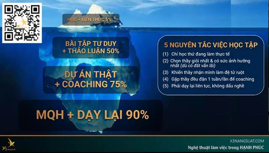

|   |
|---|
|1.                   +, Step 0: Thay vì hỏi: **LÀM SAO KIẾM ĐƯỢC NHIỀU TIỀN HƠN** thì sẽ hỏi: **LÀM SAO TẠO ĐƯỢC NHIỀU VALUE HƠN TỪ NHỮNG SKILL MÌNH CÓ** và **LÀM SAO ĐỂ ĐẠT CẤP 100 CỦA SKILL ĐÓ NHANH NHẤT VÀ MẠNH NHẤT.**  <br>+, Step 1: ĐIỀU MÌNH LÀM HÀNG NGÀY KHÔNG CẦN AI CHI TRẢ TIỀN BẠC (Như đọc các bài viết về AI - Product - Finance - Business - Investing), ... và nó thay đổi theo từng thời điểm  <br>+, Step 2: **DỰ ÁN THẬT/VẤN ĐỀ CỦA MÌNH/NGƯỜI KHÁC**  <br>**+,** Step 3**: ĐƯỢC FEEDBACK, ĐƯỢC COACHING thông qua 1. MENTOR / 2. TÌM COMMUNITY /3. TỰ BUILD COMMUNITY (thông qua trả tiền/networking/personal branding/trao đổi value)**  <br>+, Step 4: **+ DẠY LẠI(ĐÚC KẾT) + NETWORKING MQH**  <br>+, Step 5: **Nhân bản EKIP**  <br>  <br><br>2.                    <br><br>3.                   **CHẮC CHẮN NHIỀU ĐỐI THỦ CỦA TÔI BIẾT NHIỀU VỀ THÁI CỰC QUYỀN HƠN TÔI, NHƯNG TÔI RẤT GIỎI TRONG NHỮNG GÌ TÔI BIẾT**. Hiếm khi có 1 kĩ thuật nào đưa chúng ta lên đỉnh cao, MÀ ĐÚNG HƠN LÀ SỰ THÀNH THẠO SÂU SẮC NHỮNG KỸ NĂNG CƠ BẢN<br><br>**+, ĐI SÂU VÀO TỪNG CHI TIẾT NHỎ ĐỂ HIỂU CÁCH MÀ TỔNG THỂ VẬN HÀNH.**  <br>+, COMPOUNDING LEARNING - SYSTEM - LÃI KÉP - XOẮN ỐC  <br>- Cái bẫy của mn là học lan man  <br>- Mỗi kỹ năng mới phải nối được vào kỹ năng cũ để tạo hiệu ứng lũy thừa.  <br>- AI Engineering → Product → Finance → Business → Investment → Freedom.  <br>- Nếu học cái này xong mà không dùng được vào career hiện tại, hoặc không tạo ra lợi nhuận/thời gian tự do – mình ko/chưa cần học. ???  <br>- Câu hỏi: Học cái này để làm gì? ĐÂU LÀ MŨI KHOAN CẦN HỌC?|

|   |
|---|
|Ở đây, chúng ta sẽ nói nhiều về MINDSET. CÒN VỀ CHI TIẾT CÁC PHƯƠNG PHÁP THÌ MỜI ACE GHÉ QUA phần PROBLEM SOLVING - LEARNIN ở [P2 NHẤT HƯỚNG - ĐƯỜNG NÀY ĐẾN THẾ GIAN, ĐƯỜNG KIA ĐẾN NIẾT BÀN! TỲ KHEO ĐỆ TỬ PHẬT, PHẢI HIỂU BIẾT RÕ RÀNG! + TIỀN.  Copy](https://csg2ej4iz2hz.sg.larksuite.com/wiki/XtSXwCKrJiOhuckmqoglk3HDgne)|

|   |   |   |   |
|---|---|---|---|
|Tầng|Các Yếu Tố & Câu Hỏi Then Chốt<br><br> + Các Sai Lầm Tâm Lý, Mindset Thường Mắc|**Ultralearning Principles áp dụng**|Công Cụ/Framework Hỗ Trợ|
|**0. META-ASSESSMENT** (Mới)<br><br>•                     Đánh giá bối cảnh và chọn lộ trình phù hợp trước khi bắt đầu quá trình ra quyết định.|- **Context Classification:** Đây là quyết định Simple/Complicated/Complex? Mức độ urgency: Crisis/Urgent/Planned? Stakeholder involvement: Individual/Team/Organization? - **Track Selection:** Quick Track (Crisis), Standard Track (Normal), Innovation Track (Complex). - **Quality Gate:** ✅ Track selected & time allocated.<br><br>  <br>- **Context Misreading:** Đánh giá sai độ phức tạp. - **Time Pressure:** Chọn track quá phức tạp. - **Over-simplification:** Đánh giá thấp độ phức tạp của vấn đề.|**(1) Metalearning** **(2) Focus**<br><br>**Tại sao mapping:** Trước khi bắt đầu giải quyết vấn đề, ta cần “học cách học” bối cảnh → giống hệt Metalearning. Đồng thời phải tập trung để chọn đúng track (Quick/Standard/Innovation). **Chi tiết Ultralearning:** _Metalearning_ = nghiên cứu trước 10% thời gian: trả lời **Why** (động lực, mục đích), **What** (cần học/gỉai quyết cụ thể cái gì), **How** (nguồn lực, phương pháp). Đây là cách biến nỗ lực rời rạc thành “chiến dịch chiến lược”. _Focus_ = xử lý 3 vấn đề: khó bắt đầu (procrastination), khó duy trì, tập trung sai hướng. Nếu không có Focus → mất sức mạnh “quyết liệt” của Ultralearning.|- Cynefin Framework- Eisenhower Matrix- RACI Matrix- Time Boxing- Decision Tree- Decision Complexity Assessment Tool|
|**1. Định Hướng & Mục Tiêu** (25%)<br><br>•                     THE ROAIMPORTANT  IN LONG-TERM<br><br>•                     SYSTEM<br><br>•                     CONSISTENCE<br><br>•                     TIME<br><br>•                     HƯỚNG ĐI ĐÚNG, LỰA CHỌN  ĐÚNG QUAN TRỌNG HƠN TỐC ĐỘ, NỖ LỰC<br><br>•                     OUTCOME - OUTPUT - VALUE<br><br>•                     BEGIN WITH THE END IN MIND<br><br>•                      <br><br>Tầng nền tảng xác định "TẠI SAO" và "ĐI ĐÂU" - đảm bảo mọi quyết định đều phục vụ mục tiêu lớn.<br><br>  <br>---<br><br>CÓ VẺ NHƯ NHIỀU QUYẾT ĐỊNH CHỈ CẦN PHÂN TÍCH TẦNG 1 LÀ RA ĐƯỢC.|- **Né tránh PROBLEM**  <br>=> Tự tẩy não mình để thèm khát CẢM GIÁC KHÓ CHỊU.  <br>- Ưa thích giải quyết vấn đề của mình và người khác, đặc biệt là VẤN ĐỀ CÀNG KHÓ CÀNG THÍCH.  <br>- Nhầm lẫn MỤC TIÊU (thiên đường) và HƯỚNG ĐI (nấc thang)  <br>  <br>  <br>  <br>===  <br>- **Nghe về tư duy dài hạn nhiều mà không biết cách ứng dụng:** Là vì bạn chưa có 1 HỆ THỐNG (như hệ thống sự nghiệp Wecommit100x) or TẤM BẢN ĐỒ MAP THE ROAD X3NS  <br>- **BẪY LƯƠNG TÂM THUẦN TÚY:**  <br>+, COPY ĐÁP ÁN, BÁNH XE CÓ SẴN => THÀNH CÔNG => ĂN MỪNG VÀ GIÚP ĐỠ NGƯỜI KHÁC.|**(1) Metalearning** **(9) Experimentation** **(2) Focus**<br><br>  <br>**Tại sao mapping:** Đây là tầng xác định “Tại sao / Đi đâu”. Cần bản đồ (Metalearning), cần thử giả định (Experimentation), và cần kỷ luật tập trung (Focus). **Chi tiết Ultralearning:** _Metalearning_ giúp map mục tiêu thành Objective + Key Results rõ ràng. _Experimentation_ = thử nhỏ để test đòn bẩy, chọn cách tối ưu thay vì suy đoán. _Focus_ giữ sự consistent: tại 1 thời điểm chỉ tập trung 1 mục tiêu quan trọng nhất. Đây chính là khác biệt giữa “làm nhiều việc” và “làm đúng việc”.|- Golden Circle (Why-How-What)  <br>- Values Assessment Matrix  <br>- Long-term Vision Mapping  <br>- Purpose-Profit Matrix  <br>- Ethical Decision Framework  <br>- Strategic Alignment Check<br><br>- ĐI QUA TỪNG MILESTONES (CỦA TẤM BẢN ĐỒ)  <br>= OKRs, 3O1T<br><br>**Copy and Development (Who?) → Begin with the End in Mind (Why?) → OKRs (What? Vượt mục tiêu với tư duy thủ khoa) → SMART (How?) → KPI (Progress?) + HACKTIME(Gantt Chart + Parkinson) 🎯**  <br>→ Copy and Development - Đòn bẩy trí tuệ (Who?)  <br>→ Begin with the End in Mind - Why?  <br>→ Chuyển hóa thành chiến lược cụ thể với OKRs (Objective lớn + Key Results đo lường - What?)  <br>→ Key Results các kết quả then chốt theo SMART (Specific, Measurable, Achievable, Relevant, Time-bound - How?)  <br>→ Theo dõi hiệu suất bằng KPI để đánh giá tiến độ và tối ưu chiến lược (Progress?). 🎯  <br>- KR1: <số đo lường + deadline ngắn cụ thể + cam kết + dự đoán nguồn lực + chia nhỏ 3 KAs>  <br>+, KA1.1: <số đo lường + deadline cụ thể + cam kết + dự đoán nguồn lực>, KA1.2, KA1.3  <br>  <br>  <br><br>OKRs and SMART.  <br>  <br>*** **O: DUY NHẤT 1 OBJECTIVE(**các việc khác vẫn làm, nhưng tại 1 thời điểm chỉ siêu tập trung duy nhất 1 thứ) + RÕ RÀNG TẠO DỄ DÀNG trực quan + VỪA SỨC THỬ THÁCH (6/10 ko quá khó, tự tin làm được - phát sinh động lực chinh phục, ko phát sinh sợ hãi) + CẢM HỨNG HƯỚNG HÀNH ĐỘNG?  <br>  <br>- Smart: rõ, dễ hiểu, nhớ >< Sơ sài + R: Rất quan trọng >< R :  + Available: niềm tin >< AI biết.  <br>*** 3KRs: 3KRs GIẢI QUYẾT O? 3KRs, 3KAs đã xử lý 100% O chưa?  <br>  <br>- Mỗi KRs đều: ĐO LƯỜNG BẤT KỲ LÚC NÀO + DEADLINE NGẮN (Dự án thực - Deadline ngắn, cụ thể rõ ràng) + CAM KẾT(Cái giá phải trả thật đau - đốt thuyền) + OPTIMIZE Comlexity cho mỗi KRs, KAs theo công thức + CHIA NHỎ 3 KAs  <br>  <br>- Measure: đo lường % ở bất kỳ lúc nào >< Mơ màng => KO NÓI SỐ KO CÓ HIỆU SUẤT + T: Time out ><T: thích nào xong thì xong.  <br>- KR1: <số đo lường + deadline ngắn cụ thể + cam kết + dự đoán nguồn lực + chia nhỏ 3 KAs>  <br>- KA1.1: <số đo lường + deadline cụ thể + cam kết + dự đoán nguồn lực>, KA1.2, KA1.3|
|**2. TRUY TÌM NGUYÊN NHÂN LÕI - FIRST PRICIPLE (**15%)  <br>- **STRUCTURE - BÍ MẬT CỦA TÁCH LỚP (PROBLEM - STRUCTURE PROCESS - PLAN, ACTION)**  <br>- **HỌC SÂU HƠN HỌC RỘNG: Đối thủ có thể biết nhiều về thái cực quyền hơn tôi, nhưng tôi RẤT GIỎI TRONG NHỮNG GÌ TÔI BIẾT.**  <br>- REFLECTION: Problem Solving as Money Diary  <br>- STRUCTURING: Bóc tách vấn đề một cách hệ thống<br><br>Tầng này đảm bảo chúng ta hiểu đúng vấn đề và có đủ thông tin để quyết định.|- **Problem Definition:** Vấn đề thực sự là gì? (không phải symptom). Root cause đã được xác định chưa?  <br>- **Information Quality:** Data có đủ accurate, complete, timely không? Source có reliable không?  <br>**- Bias Check:** Có đang bị thiên vị trong việc thu thập thông tin không?  <br>- **Stakeholder Analysis:** Ai bị impact? Power-Interest level? Conflict of interest nào cần lưu ý?  <br>- **Context Understanding:** Hiểu rõ bối cảnh, ràng buộc, điều kiện.  <br>  <br><br>  <br>  <br>- **Định nghĩa sai vấn đề:** Giải quyết triệu chứng thay vì nguyên nhân gốc rễ.  <br>- **Thiếu thông tin/Thông tin sai lệch:** Quyết định dựa trên dữ liệu không đầy đủ hoặc không chính xác.  <br>- **Thiên vị xác nhận (Confirmation Bias):** Chỉ tìm kiếm thông tin xác nhận niềm tin có sẵn.  <br>- **Analysis Paralysis:** Phân tích mãi không xong.<br><br>  <br>  <br><br>2.                   TÒ MÒ?<br><br>- Leonardo Da Vinci: tò mò và đăt câu hỏi về mọi thứ.<br><br>- Albert Einstein: "Tôi không có tài năng đặc biệt. Tôi chỉ có sự tò mò một cách say mê." (I have no special talent. I am only passionately curious.)<br><br>  <br>  <br><br>3.                   **CHẮC CHẮN NHIỀU ĐỐI THỦ CỦA TÔI BIẾT NHIỀU VỀ THÁI CỰC QUYỀN HƠN TÔI, NHƯNG TÔI RẤT GIỎI TRONG NHỮNG GÌ TÔI BIẾT**. Hiếm khi có 1 kĩ thuật nào đưa chúng ta lên đỉnh cao, MÀ ĐÚNG HƠN LÀ SỰ THÀNH THẠO SÂU SẮC NHỮNG KỸ NĂNG CƠ BẢN<br><br>4.                   **ĐI SÂU VÀO TỪNG CHI TIẾT NHỎ ĐỂ HIỂU CÁCH MÀ TỔNG THỂ VẬN HÀNH.**<br><br>5.                    <br><br>6.                   COMPOUNDING LEARNING - SYSTEM - LÃI KÉP - XOẮN ỐC  <br>- Cái bẫy của mn là học lan man  <br>- Mỗi kỹ năng mới phải nối được vào kỹ năng cũ để tạo hiệu ứng lũy thừa.  <br>- AI Engineering → Product → Finance → Business → Investment → Freedom.  <br>- Nếu học cái này xong mà không dùng được vào career hiện tại, hoặc không tạo ra lợi nhuận/thời gian tự do – mình ko/chưa cần học. ???  <br>- Câu hỏi: Học cái này để làm gì? ĐÂU LÀ MŨI KHOAN CẦN HỌC?|**(4) Drill** **(5) Retrieval** **(8) Intuition**  <br>  <br>**Tại sao mapping:** Xác định nguyên nhân lõi cần kỹ năng bóc tách và kiểm chứng. Drill giúp phá bottleneck, Retrieval giúp test hiểu biết, Intuition giúp nhìn bản chất. **Chi tiết Ultralearning:** _Drill_ = deliberate practice, cô lập điểm yếu → luyện micro-exercise để phá nút thắt. _Retrieval_ = Active Recall, thay vì đọc lại → tự test, viết từ trí nhớ, giải thích bằng Feynman Technique. Nỗ lực “gọi lại” mới tạo trí nhớ bền. _Intuition_ = đi sâu vào nguyên lý gốc, “go deep before wide”, giúp thấy pattern và linh hoạt giải quyết vấn đề.<br><br>**1. Tò Mò Vô Hạn & Đặt Câu Hỏi**<br><br>**Da Vinci, Einstein, Feynman:** "Tôi không có tài năng đặc biệt. Tôi chỉ có sự tò mò một cách say mê." Họ không chấp nhận bề mặt của sự việc mà luôn đào sâu đến tận cùng.<br><br>•                     **Thói quen "5 Tại Sao":** Mỗi ngày, chọn một sự vật/hiện tượng (ví dụ: tại sao bầu trời màu xanh) và hỏi "Tại sao?" 5 lần liên tiếp để tìm ra nguyên nhân gốc rễ.<br><br>•                     **Sổ Tay Tò Mò:** Dành 10 phút mỗi ngày để viết ra mọi câu hỏi nảy ra trong đầu, dù là ngớ ngẩn nhất, và chọn 1 câu để tìm hiểu.<br><br>**2. Tư Duy Từ Nguyên Lý Đầu Tiên**<br><br>**Elon Musk, Aristotle:** Phá vỡ mọi vấn đề về những sự thật cơ bản không thể chối cãi, sau đó xây dựng lại giải pháp từ gốc, thay vì sao chép cách làm của người khác.<br><br>•                     **Phân Rã Vấn Đề:** Chọn một mục tiêu nhỏ (ví dụ: "làm sao để đọc sách nhanh hơn?"). Thay vì tìm mẹo, hãy phân rã: "Đọc sách gồm những gì? Mắt di chuyển, não xử lý chữ...". Từ đó tìm cách tối ưu từng phần.<br><br>•                     **Thách Thức Giả Định:** Khi nghe một "sự thật" phổ biến, hãy tự hỏi: "Làm sao tôi biết điều này là đúng? Bằng chứng cơ bản là gì?".<br><br>3.                   NGHI NGỜ SUY NGHĨ CỦA CHÍNH MÌNH, TRONG MỌI CUỘC TÌM GIẢI PHÁP, ĐẦU TIÊN HÃY LUÔN NGHĨ GIẢI PHÁP CỦA MÌNH SAI<br><br>**3. Học Sâu & Nắm Vững Nền Tảng**<br><br>**Josh Waitzkin, Bruce Lee:** "Tôi không sợ kẻ biết 10,000 cú đá, tôi sợ kẻ tập 1 cú đá 10,000 lần." Sự thành thạo sâu sắc kỹ năng cơ bản giá trị hơn biết hời hợt nhiều thứ.<br><br>•                     **"Giờ Vàng" Nền Tảng:** Dành 15-20 phút đầu tiên của buổi học để ôn lại một khái niệm cốt lõi đã biết.<br><br>•                     **Nguyên Tắc "Qua Màn":** Đừng chuyển sang chủ đề mới khi chưa thể giải thích vanh vách chủ đề cũ. Hãy tự kiểm tra bằng Kỹ thuật Feynman.<br><br>•                     **Richard Feynman:** "Nếu bạn không thể giải thích một cách đơn giản, tức là bạn chưa hiểu đủ rõ." Đây là bài kiểm tra cuối cùng cho sự thấu hiểu.|- **5 Whys + Fishbone Diagram**<br><br>- **First Principles Thinking**<br><br>- **MECE Framework**<br><br>- **Stakeholder Power-Interest Grid**<br><br>- **Information Quality Assessment**<br><br>- **Systems Thinking Canvas**<br><br>- **Problem Statement Template**<br><br>- **Data Validation Checklist**<br><br>Mục tiêu của tôi là:<br><br>Hãy giúp tôi giải quyết vấn đề trên<br><br>Nhưng đầu tiên hãy tách lớp thành cấu trúc 4-5 phần quan trọng nhất tác động đến B ....... (sắp xếp theo thứ tự)<br><br>Trong mỗi cấu trúc nhỏ chỉ rõ kết quả đầu ra rõ ràng|
|**3.** OUTSIDE THE BOX THINKING  (10%)  <br>- TƯ DUY TÁC PHẨM.  <br>- MỤC TIÊU X3, GIẢI PHÁP X3<br><br>Tầng này tạo ra và đánh giá các phương án sáng tạo và đột phá cho vấn đề phức tạp (chỉ áp dụng cho Innovation Track).|- **Divergent Thinking:** Đã tạo ra ≥5 phương án khác biệt chưa? Có phương án nào "outside the box"?  <br>- **Innovation Potential:** Có tận dụng được tech/trend mới không? Có potential tạo competitive advantage?  <br>- **Scenario Planning:** Best/Worst/Most likely scenarios? Contingency cho mỗi scenario?  <br>  <br><br>**Phá vỡ tư duy cũ: kẻ phá cách (Break patterns)** Ví dụ: Đặt câu hỏi "Nếu không làm thế này thì sao?", hoặc "Nếu mọi thứ ngược lại thì thế nào?"<br><br>**Kết nối những thứ không liên quan (Making unusual connections)** Ví dụ: "Nếu kết hợp điện thoại và máy ảnh, chúng ta được gì?"<br><br>**Nhìn vấn đề ở góc độ mới (Change perspectives)** Ví dụ: "Khách hàng sẽ nhìn sản phẩm này ra sao? Người già sẽ thấy gì?"<br><br>**Đơn giản hóa hoặc phức tạp hóa vấn đề (Simplify or complicate)** Ví dụ: "Nếu sản phẩm này chỉ có 1 tính năng thì sao? Nếu thêm 10 tính năng thì sao?"|**(9) Experimentation** **(3) Directness**  <br>  <br>**Tại sao mapping:** Giai đoạn này cần sáng tạo giải pháp mới. Experimentation cho phép thử nhiều ý tưởng, Directness giúp biến ý tưởng thành prototype thực tế. **Chi tiết Ultralearning:** _Experimentation_ = thay đổi phương pháp, giả định, công cụ để tìm cách tối ưu. Rất quan trọng với những bài toán không có sẵn “best practice”. _Directness_ = “learning by doing”: học gắn ngay với bối cảnh thật. Thay vì brainstorm lý thuyết, hãy tạo prototype, mockup, thử nghiệm nhỏ để học từ kết quả.<br><br>**9. Học Qua Thực Hành & Dự Án Thực Tế**<br><br>**John Dewey, Richard Branson:** "Học bằng cách làm" (Learning by Doing). Kiến thức chỉ thực sự sống khi được áp dụng vào thực tế. Tránh bẫy "béo phì kiến thức".<br><br>•                     **Nguyên Tắc "Áp Dụng Trong 24h":** Khi học được một mẹo hay hoặc kiến thức mới, hãy tìm cách áp dụng nó vào một việc nhỏ trong vòng 24 giờ.<br><br>•                     **Tạo Dự Án "Tí Hon":** Muốn học kỹ năng mới? Hãy bắt đầu một dự án siêu nhỏ (ví dụ: học code bằng cách làm một trang web chỉ có 1 dòng chữ "Hello World").|- **Design Thinking Process**<br><br>- **SCAMPER Technique**<br><br>- **Brainstorming**<br><br>- **Brainwriting**<br><br>- **Mind Mapping**<br><br>- **Concept Mapping**<br><br>- **Scenario Planning Matrix**<br><br>- **Innovation Canvas**<br><br>- **Blue Ocean Strategy**<br><br>- **Jobs-to-be-Done Framework**|
|**4. Đánh Giá & Phân Tích** (30%)<br><br>Tầng này đánh giá chi tiết các phương án dựa trên tiêu chí khách quan.|- **Evaluation Criteria:** Criteria có SMART và weighted không? Có cân nhắc short-term vs long-term impact?- **Quantitative Analysis:** ROI, NPV, Payback period? Risk probability × impact?- **Qualitative Assessment:** Strategic fit? Cultural fit? Implementation complexity?- **Sensitivity Analysis:** Key assumptions là gì? Nếu sai thì sao?  <br>  <br>- Analysis Paralysis: Phân tích quá chi tiết.- Overconfidence Bias: Quá tin vào số liệu.- Anchoring: Bị ảnh hưởng bởi số đầu tiên.- Sunk Cost Fallacy: Tiếp tục đầu tư vào phương án tệ vì đã bỏ nhiều công sức.|**(6) Feedback** **(5) Retrieval** **(8) Intuition**  <br>**Tại sao mapping:** Đây là tầng kiểm chứng & so sánh. Feedback cho thấy đúng/sai, Retrieval giúp nhớ & đối chiếu dữ liệu, Intuition giúp đánh giá ẩn số. **Chi tiết Ultralearning:** _Feedback_ = GPS học tập. 3 cấp độ: Outcome (đúng/sai), Informational (sai ở đâu), Corrective (cách sửa). Vòng lặp feedback càng nhanh càng giá trị. _Retrieval_ giúp dùng lại kiến thức & dữ liệu trong phân tích (thay vì lệ thuộc vào tài liệu). _Intuition_ = “cảm” được giả định sai, nhạy với biến động → hỗ trợ các phân tích định lượng khô khan.|- **Multi-Criteria Decision Analysis (MCDA)**<br><br>- **Weighted Decision Matrix**<br><br>- **SWOT + TOWS Analysis**<br><br>- **Cost-Benefit Analysis + NPV**<br><br>- **Risk Assessment Matrix**<br><br>- **Sensitivity Analysis**<br><br>- **Monte Carlo Simulation**<br><br>- **Real Options Valuation**<br><br>- **Pugh Matrix**|
|**5. Quyết Định & Cam Kết** (10%)<br><br>Tầng này đưa ra quyết định cuối cùng và cam kết thực hiện.|- **Decision Selection:** Option nào có highest weighted score? Có pass "gut check" không?- **Commitment Building:** Stakeholders có buy-in không? Resources đã được secured chưa?- **Risk Mitigation:** Contingency plans cho top 3 risks? Exit criteria đã được define chưa?- **Communication Plan:** Ai cần biết gì, khi nào?  <br>  <br>- CÁC TIÊU CHÍ TRƯỚC -> ĐỦ CÁC TIÊU CHÍ THÌ CỨ THẾ LÀ CHỐT. (tránh nghịch lý sự lựa chọn)  <br>  <br>- **Decision Fatigue:** Mệt mỏi do quá nhiều quyết định.- **Loss Aversion:** Sợ mất hơn muốn được.- **Framing Effect:** Bị ảnh hưởng cách trình bày.- **Groupthink:** Quyết định theo nhóm mà không suy nghĩ độc lập.|**(2) Focus** **(6) Feedback**<br><br>  <br>**Tại sao mapping:** Sau phân tích phải chốt. Focus giúp không trôi vào “analysis paralysis”, Feedback giúp kiểm tra pre-mortem trước khi commit. **Chi tiết Ultralearning:** _Focus_ = cắt nhiễu, chọn 1 phương án và commit toàn lực. Trong Ultralearning, nếu không dồn trọn block thời gian → chỉ học hời hợt. _Feedback_ = tham khảo stakeholders, mentor, dùng pre-mortem (giả định dự án thất bại rồi hỏi: vì sao?) để lường trước rủi ro.|- **DECIDE Model**<br><br>- **DACI Framework**<br><br>- **RAPID**<br><br>- **Consensus Building Techniques**<br><br>- **Commitment Escalation Check**<br><br>- **Decision Documentation Template**<br><br>- **Stakeholder Communication Plan**|
|**6. Thực Thi TẬP TRUNG** (10%)<br><br>Tầng này đảm bảo quyết định được thực hiện hiệu quả và liên tục cải tiến.|- **Execution Planning:** Action plan có đủ chi tiết không? Dependencies đã được map chưa?  <br>- **Milestones**: Các mốc cần đạt?  <br>**- Progress Monitoring:** Leading vs lagging indicators? Frequency review phù hợp không?  <br>- **Adaptation Capability:** Trigger points để pivot? Learning loops có hoạt động không?  <br>- **Success Measurement:** KPIs có align với original goals không? ROI actual vs projected?  <br>  <br>- **Implementation Drift:** Lệch khỏi plan ban đầu.- **Resource Depletion:** Cạn kiệt giữa chừng.- **Learning Inertia:** Không học từ experience.- **Success Complacency:** Hài lòng với thành công nhỏ, không cải tiến tiếp.  <br>  <br>  <br><br>- Implementation Drift: Lệch khỏi plan ban đầu. <br><br>- Resource Depletion: Cạn kiệt giữa chừng. <br><br>- Thiếu kỷ luật: Không tuân thủ kế hoạch. <br><br>- Tư duy "làm được" thay vì "làm đáng làm": Tập trung vào hoàn thành task thay vì giá trị kinh doanh.<br><br>- Execution Planning: Action plan có đủ chi tiết không? Dependencies đã được map chưa? <br><br>- Progress Monitoring: Leading vs lagging indicators? Frequency review phù hợp không? <br><br>- Resource Allocation: Nguồn lực đã được phân bổ đầy đủ và hiệu quả chưa? <br><br>- Bottleneck Identification: Điểm nghẽn nào cần xử lý để đảm bảo tiến độ?<br><br>  <br>🎯 **3. LÊN GIẢI PHÁP – SO SÁNH ĐA CHIỀU, CHỌN CÁI NGON NHẤT**<br><br>\|   \|<br>\|---\|<br>\|“Không chỉ fix – mà phải tạo ra đòn bẩy mới từ chính vấn đề.”\|<br><br>•                     Brainstorm các kịch bản: A1 – B2 – C3<br><br>•                     Đánh giá bằng:<br><br>￮      🎯 **Importance** (giá trị nếu làm)<br><br>￮      ⏳ **Urgency** (khẩn cấp không?)<br><br>￮      💪 **Easy Score** (nguồn lực đủ không?)<br><br>￮      🔁 **Leverage** (làm 1 xài N lần?)<br><br>**⚡ 4. LÀM – THỰC THI CÓ TRẬT TỰ**<br><br>•                     ác chiến lược thực thi KAIZEN: bản chất là KO ĐO LƯỜNG KO CẢI TIẾN ĐƯỢC. đO LƯỜNG LÀ 1 THÓI QUEN, TÍNH CÁCH??? Các chiến lược thực thi và cải tiến: Như MVP (Minimum Viable Product), Kaizen (Cải tiến liên tục), PDCA (Plan-Do-Check-Act) để triển khai giải pháp hiệu quả và học hỏi từ kết quả.<br><br>**♻️ 5. KAIZEN – ĐÓNG GÓI THÀNH TÀI SẢN VÀ NHÂN RỘNG**|**(3) Directness** **(4) Drill** **(6) Feedback**<br><br>  <br>**Tại sao mapping:** Execution = biến ý tưởng thành hành động. Directness để “làm thật”, Drill để xử lý điểm nghẽn, Feedback để lặp nhanh. **Chi tiết Ultralearning:** _Directness_ = ship nhanh, học ngay từ trải nghiệm thực. _Drill_ = khi gặp bottleneck, tách ra luyện riêng. _Feedback_ = review liên tục (A/B test nhỏ, After Action Review 15’ mỗi tuần) → giúp cải tiến ngay trong khi thực hiện.<br><br>**8. Tập Trung Sâu & Quản Lý Năng Lượng**<br><br>**Cal Newport, Isaac Newton:** Khả năng làm việc sâu (Deep Work) không bị phân tâm là siêu năng lực trong thế kỷ 21. Quản lý năng lượng quan trọng hơn quản lý thời gian.<br><br>•                     **Thực Hành "Tu Sĩ Ngắn Hạn":** Đặt một phiên Pomodoro (25 phút) mỗi ngày, trong đó bạn tắt hết thông báo, để điện thoại phòng khác và chỉ làm một việc duy nhất.<br><br>•                     **Nghi Thức Bắt Đầu:** Tạo một thói quen nhỏ (ví dụ: dọn dẹp bàn, pha một tách trà) để báo hiệu cho não bộ: "Đã đến giờ tập trung".|- PDCA Cycle- OKRs + KPI Dashboard  <br>- Agile/Scrum Methodology  <br>- Gantt Chart + Critical Path  <br>- Kanban Board  <br>- After Action Review (AAR)- Kaizen Continuous Improvement- Lean Startup (Build-Measure-Learn)- Change Management Framework|
|7.                   **KAIZEN VÀ DẠY LẠI**|CỖ MÁY KAIZEN: Kaizen And Optimization - QUAN TRỌNG NHẤT LÀ TRÍ NHỚ CHÁNH, nhớ đến thực hành BCĐ, nhớ đến Kaizen và Lãi suất kép + Nguyên lý: Không đo được liên tục - Không cải tiến được và làm tốt hơn, làm khác đi, làm ngược lại - Report, check in, tracking Còn gì nữa không?  <br>  <br>- Learning & Adaptation: Học hỏi và điều chỉnh. Điều gì học được từ quá trình này?<br>- Continuous Improvement: Làm thế nào để lần sau tốt hơn?<br>- Knowledge Capture: Kinh nghiệm này có thể áp dụng cho tình huống nào khác?<br>- Success Measurement: KPIs có align với original goals không? ROI actual vs projected?<br>- After Action Review (AAR): Đánh giá sau hành động để rút kinh nghiệm.  <br>  <br>SAI LẦM<br><br>•                     Không đo lường: Không biết hiệu quả công việc. <br><br>•                     Không học hỏi: Lặp lại sai lầm cũ. <br><br>•                     Success Complacency: Hài lòng với thành công nhỏ, không cải tiến tiếp. <br><br>•                     Learning Inertia: Không áp dụng được bài học vào thực tế.  <br>  <br>  <br>**_ĐO LƯỜNG LIÊN TỤC  + NIỀM TIN: LUÔN CÓ CÁCH LÀM TỐT HƠN NHANH HƠN 1000 LẦN VỚI CHỈ 1/1000 THỜI GIAN_**<br><br>**_=> 1. Mindset THẤT BẠI THẬT NHANH NHỎ NHIỀU, BETA FOREVER: Có vấn đề gì không, Kaizen, Còn gì nữa không?_**<br><br>**_=> 2. Mindset TƯ DUY TỐI ƯU, TƯ DUY TÁC PHẨM: Làm tốt hơn, làm khác đi, làm ngược lại?(A=A+1, A = A+10, Đảo thứ tự B A C, Làm cái D mới thay cho ABC, ...?)_**<br><br>**=> 3. Mindset TƯ DUY THỦ KHOA (Giữ mọi lời hứa, Làm gì cũng top 1): đến sớm nhất, làm chăm nhất, chăm chỉ nhất (Tư duy và kỹ năng. Đã là kỹ năng thì cứ chăm chỉ kiểu gì cũng giỏi).**<br><br>\|   \|<br>\|---\|<br>\|1.                   **CHỦ ĐỘNG XIN FEEDBACK: 1-0, 1-1, 1-N  (Nghe Khen Sướng Tai, Nghe Chê Lớn Thân) => Mở rộng vùng: ko biết mình không biết.**<br><br>**+, 1-0 Tuệ Quán để khắc sâu Minh, tự vá lỗi.**<br><br>**+, 1-1, 1-2 Coaching, CHECK IN với MENTOR top 1%, ĐỒNG ĐỘI. [1 TUẦN 1 LẦN]** <br><br>**+, 1-N (Đánh giá 360độ).**<br><br>2.                   **CÁCH TỐT NHẤT ĐỂ RÈN KAIZEN LÀ ĐO LƯỜNG TỪ ĐIỀU NHỎ NHẤT! - Bài học: "Cậu bé có chiếc đèn pin phóng to mọi thứ"** (học từ 2022 mà đầu T6/2025 mới nhận ra).  <br>= ÁP SUẤT (Khi ngồi lỳ ở quán 36h ko ngủ, 28h ngồi tại quán) + FLOW, POMODORO (Khi muốn Kaizen hiệu suất ở quán nên mình lôi cái này ra dùng sau 1 năm ko động đến) + OKRs BEGIN WITH THE END IN MIND (Muốn tăng đầu ra thay vì ngồi liền 1 chỗ, nên mình đành phải dùng, sau 1 năm ko dùng) + TIMEBOXING (tiếp thu 1 khái niệm mới của Elon Musk, 5min) + ĐO LƯỜNG MỌI THỨ (từ kiến thức mới của X3 - 2025)  <br>=> Vô tình việc UPDATE LIÊN TỤC + KAIZEN TỪNG TIMEBOXING => Mình được thực hành KAIZEN Ở MỨC GỐC RỄ NHẤT, CĂN BẢN NHẤT, TỪ NHỮNG THỨ NHỎ NHẤT. (Cái mà trước đây 1 ngày ngồi kaizen nhìn lại mình cứ: Vấn đề ngày là gì, nguyên nhân là gì, gốc? giải pháp, bài học, ... mà ko thấy quá hiệu quả cho công việc) Sau này mới nhận ra: CUỐI NGÀY MỚI CHECK NHƯ THẾ THÌ QUÊN HẾT SẠCH RỒI.  <br>**=> !!! KHÔNG ĐO LƯỜNG KHÔNG THỂ CẢI TIẾN + ĐO LƯỜNG MỌI THỨ!!!. + TRẢI NGHIỆM HAY TRỞ THÀNH (SỞ HỮU THÓI QUEN, TƯ DUY, TÍNH CÁCH, HÀNH ĐỘNG CỦA NHÂN DẠNG ĐƯỢC THỂ HIỆN Ở BẢNG ĐO HABIT HÀNG NGÀY).**<br><br>3.                   Kaizen: 1. Mục đích, đích đến 2. Plan-Thực trạng 3. Lịch sử lặp nhiều ko? (Tối ưu DB) + Đồ án (Các câu văn cần được tối ưu hóa, đảm bảo rất khó để thể thêm hoặc bớt đi được dù chỉ một từ)\||**(7) Retention** **(8) Intuition** **(9) Experimentation**<br><br>  <br>**Tại sao mapping:** Kaizen cần duy trì tri thức, khái quát thành nguyên lý, và liên tục cải tiến nhỏ. Retention, Intuition, Experimentation là bộ ba nền tảng. **Chi tiết Ultralearning:** _Retention_ = chống “forgetting curve” bằng Spaced Repetition, Overlearning. Nếu không, sprint học nhanh sẽ mất dần hiệu lực. _Intuition_ = biến trải nghiệm thành pattern, khái quát hóa → tái sử dụng cho bài toán mới. _Experimentation_ = mỗi vòng lặp cải tiến 1%, thử khác đi, sai nhanh – sửa nhanh. Đây là cách biến dự án ngắn hạn thành năng lực dài hạn.<br><br>**5. Ghi Nhớ Chủ Động & Lặp Lại Giãn Cách**<br><br>**Hermann Ebbinghaus, Piotr Wozniak:** Não bộ ghi nhớ tốt nhất khi bị buộc phải _truy xuất_ thông tin (thay vì đọc lại thụ động) và ôn tập vào thời điểm sắp quên.<br><br>•                     **Tự Kiểm Tra Nhanh:** Trước khi bắt đầu công việc, dành 5 phút nhắm mắt và cố gắng nhớ lại 3 ý chính của ngày hôm qua.<br><br>•                     **Sử Dụng Flashcard:** Dùng ứng dụng (Anki, Quizlet) hoặc giấy để tạo flashcard cho các khái niệm quan trọng và ôn tập theo lịch trình nó đề xuất.<br><br>**6. Trực Quan Hóa & Thí Nghiệm Tưởng Tượng**<br><br>**Nikola Tesla, Albert Einstein:** Sử dụng "phòng thí nghiệm trong tâm trí" để chạy thử các ý tưởng, hình dung các kịch bản và giải quyết vấn đề trước khi bắt tay vào làm thực tế.<br><br>•                     **"Chạy Thử" Trong Đầu:** Trước khi bắt đầu một việc (viết email, thuyết trình), hãy dành 2 phút nhắm mắt và hình dung bạn đang thực hiện nó một cách hoàn hảo.<br><br>•                     **Vẽ Ra Giấy:** Khi gặp một vấn đề phức tạp, hãy cố gắng vẽ nó ra giấy dưới dạng sơ đồ, biểu đồ hoặc hình ảnh minh họa.<br><br>**7. Tư Duy Đa Ngành & Tìm Kiếm Mô Thức**<br><br>**Leonardo da Vinci, Charlie Munger:** Vay mượn các "mô hình tư duy" (mental models) từ các lĩnh vực khác nhau để có cái nhìn đa chiều về một vấn đề. Mọi thứ đều liên quan đến nhau.<br><br>•                     **Học Chéo Lĩnh Vực:** Mỗi tuần, dành 30 phút đọc một bài báo hoặc xem một video về một lĩnh vực hoàn toàn không liên quan đến chuyên môn của bạn.<br><br>•                     **Đặt Câu Hỏi Kết Nối:** Khi học một điều mới, hãy tự hỏi: "Nguyên lý này có giống với điều gì trong tự nhiên/kinh doanh/nấu ăn không?".<br><br>**10. Phản Hồi Liên Tục & Dạy Lại Cho Người Khác**<br><br>**Ray Dalio, Seneca:** Tìm kiếm sự thật và cải tiến liên tục thông qua vòng lặp phản hồi. Dạy lại là cách học tốt nhất.<br><br>•                     **Chủ Động Xin Góp Ý:** Sau khi hoàn thành một công việc, hãy gửi cho một người bạn/đồng nghiệp và hỏi một câu cụ thể: "Theo bạn, điểm nào có thể cải thiện được?".<br><br>•                     **Chia Sẻ Hàng Ngày:** Mỗi ngày, chia sẻ một điều thú vị bạn học được lên mạng xã hội hoặc kể cho một người bạn. Việc này buộc bạn phải hệ thống hóa kiến thức.|- PDCA Cycle<br><br>- After Action Review (AAR)<br><br>- Kaizen Continuous Improvement<br><br>- Lean Startup (Build-Measure-Learn)<br><br>- Lessons Learned Database<br><br>- Change Management Framework|
|8.                   QUÊN HẾT|5.                   TÔI ĐÃ TÌM RA MINDSET MẠNH NHẤT VỀ HỌC TẬP  - ĐẦU THÁNG 8 / 2025. - TOÁN, TÂM LÝ HỌC VÀ TIỀN - https://www.facebook.com/tamlihocdamdong - https://www.facebook.com/ecoblader/    + KẾT HỢP VỚI IDEA CỦA BẠN ĐỨC VỀ VIỆC: FULLTIME USE ENGLISH.<br><br>\|   \|<br>\|---\|<br>\|Đỉnh cao của học là… quên hết.<br><br>Trong Ỷ Thiên Đồ Long Ký, có một cảnh rất lạ: Trương Tam Phong truyền thụ tâm pháp Thái Cực Kiếm cho Trương Vô Kỵ. Khi ông hỏi “đã nhớ chưa?”, Trương Vô Kỵ ban đầu đáp: “Đã quên một nửa.” Rồi sau đó, sau khi ngẫm nghĩ, lại trả lời “đã quên hết rồi”. Khi đó, Trương Tam Phong mới gật đầu, tỏ ra hài lòng.<br><br>Người ngoài nghe thấy thì khó hiểu. Học võ mà quên hết thì đánh làm sao?<br><br>Nhưng với một cao thủ võ công như Trương Tam Phong, ông biết rằng, càng quên mới càng thấm, càng không nghĩ mới càng đúng lúc.<br><br>Chỉ khi không còn phải nhớ, con người mới thật sự hành động một cách nhuần nhuyễn. Không còn qua trung gian của lý trí, mà phát ra từ thân thể, như một dòng nước chảy không vấp. Đó không còn là kỹ thuật — mà là bản năng đã được mài dũa.<br><br>Hãy quan sát những người làm giỏi nhất trong lĩnh vực của họ.<br><br>Một vũ công điêu luyện không cần đếm nhịp trong đầu. Một tay kiếm lành nghề không cần nghĩ từng chiêu. Một đầu bếp nêm nếm bằng tay, không cần chiếc muỗng đong. Một thợ mộc lão luyện chỉ cần vuốt nhẹ là biết mặt gỗ đã bằng chưa.<br><br>Họ không cố nhớ, không gồng mình diễn lại bài học cũ. Mọi thứ diễn ra như thể họ sinh ra đã biết làm điều đó. Nhưng đằng sau sự tự nhiên ấy là hàng ngàn giờ luyện tập đến mức nguyên tắc, kỹ thuật, cảm nhận… ngấm vào cơ bắp, vào hơi thở, vào máu.<br><br>Paul Graham từng nói: “Khi bạn thật sự hiểu một điều gì đó, bạn không cần phải cố nhớ nó.” Vì hiểu thật sâu không nằm ở việc lặp lại, mà nằm ở việc không còn cần lặp lại. Kiến thức đã chuyển từ bên ngoài vào bên trong, trở thành cấu trúc của chính bạn.<br><br>Không còn học trò đang diễn lại bài thầy dạy, mà là chính bạn — ứng biến tự do bằng cái biết không lời. Bạn không còn cần lý thuyết để hành động, vì từng hành động của bạn đã trở thành sự chứng minh cho tri thức đó.<br><br>Ta thường nghĩ học là tích lũy: học nhiều, nhớ nhiều, giỏi hơn. Nhưng nghịch lý nằm ở chỗ: càng học cao, càng cần buông bớt. Học sâu không phải là biết thêm, mà là giữ lại ít hơn nhưng vận dụng trúng hơn.<br><br>Khi mới học cưỡi ngựa, ta căng người, cứng tay, run rẩy. Nhưng khi đã quen rồi, ta thả lỏng – vì cơ thể đã tự điều chỉnh. Khi mới học ngoại ngữ, ta dịch từng chữ trong đầu. Nhưng khi đã thông thạo, ta không còn nghĩ bằng tiếng mẹ đẻ nữa — ngôn ngữ trôi ra như hơi thở.<br><br>Ta chuyển từ gồng gánh chủ động sang nhuần nhuyễn thụ động — và đó mới là thành thạo thực sự. Như con chim đã học bay, nó không còn nghĩ về đôi cánh.<br><br>Muốn đạt đến trình độ ấy, bạn phải đi qua ba lớp học:<br><br>+ Học bằng lý trí — hấp thu tri thức, hiểu nguyên tắc, hỏi vì sao.<br><br>+ Luyện bằng hành động — lặp lại, sai, sửa, sai nữa, sửa tiếp.<br><br>+ Và cuối cùng, quên bằng phản xạ — buông lý thuyết, hành động tự nhiên, để tri thức sống qua thân thể.<br><br>Ở lớp học cuối cùng, bảng đen biến mất, thầy giáo rút lui. Chỉ còn bạn và thế giới, và cách bạn ứng xử sẽ là lời trả bài không lời.<br><br>Đừng sợ việc “quên”. Vì quên là khi bạn không còn nghĩ “làm sao để làm đúng”, mà cứ thế làm đúng. Đó là sự tròn đầy không tên.<br><br>Học chưa chắc đã giỏi. Nhớ chưa chắc đã hiểu. Chỉ khi đã quên, thì lúc ấy, bạn mới vượt qua cánh cửa cuối cùng.<br><br>*<br><br>Xin giới thiệu một quyển sách hay nói về cách đúng để thành công: CHÓ SỦA NHẦM CÂY - Tại sao những gì ta biết về thành công có khi lại sai. Sách đang có giá tốt tại [https://s.shopee.vn/709bIUwj7I](https://l.facebook.com/l.php?u=https%3A%2F%2Fs.shopee.vn%2F709bIUwj7I%3Ffb_content_id%3DQ9-wBQFPJdUlMkxwpQ1d3kidPKTmsluW30YcmUZO-8bMWLWsotk8pPYgr4DIQh-G1A%26fbclid%3DIwZXh0bgNhZW0CMTAAYnJpZBExRlFDNTJqQXJMeDhLa2RmdQEebzsHaa30o5xhZyTenI_8bum1cxSGP-3ZEnnRSqXL2loBQ1m3bbRwhdgtkvQ_aem_nbkCv8PnsqjsDUYCeudiCA&h=AT31C-AC0_ybmaCwFvdHjwvPs7GnypozOKX8oXzUW2-w3gFcsUWG5mSDZblLXftQZfSyCXE5kILr0Gq9CagOqND_SetHugGn1ftNSaq0qnvEXHPNiOGuRd8imfivCM6Ji9jDRENP9dBSpvcG&__tn__=-UK-y-R&c%5b0%5d=AT0DVzLtew-xObeml1WePN0rUNGlpnoVdvkYzw0psKpC5f-FRkgypCnUfyB6cjP_MXYsOrdGN5EtMQY9GI4wj3e6uSEf7i0Qow6FZ_CcB1q0H6yFPYN6Tb_Tow6F1GifftudFo4mRKIw6IqMM5KfiSedgETHFPCpDVtNJ-Ywsvkjt1E5wAJzc-UtlTHFdPXo6wTEQ27hiLRPp_RSRAqTYA)\||||

**GHI CHÚ: QUÁ TRÌNH T****ẠO TEMPLATE - LEARNING: Ultralearning + Tư duy các bộ óc thiên tài:  Leonardo da Vinci, Albert Einstein, Nikola Tesla, Isaac Newton, Steve Jobs, Charlie Munger, và nhiều bộ óc vĩ đại khác,**

**Nghiên cứu 1 : X3 NĂNG SUẤT - X3 NĂNG SUẤT - ĐỈNH CAO HỌC TẬP PHƯƠNG ĐÔNG GỌI TÊN "NETWORKING"**


**Nghiên cứu 2: PHƯƠNG PHÁP HỌC TẬP THIÊN TÀI: HIỆU NĂNG X100: https://youtube.com/playlist?list=PLfFdoGwLbh5XUbDluAp8ivWJgbZGdBoIc&feature=shared**

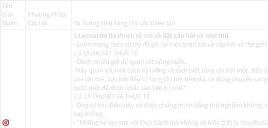

**Click the image to view the sheet.**

**Nghiên cứu các tiêu chí đánh giá PHƯƠNG PHÁP HỌC**

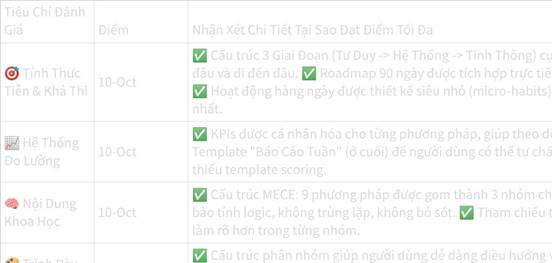

**Click the image to view the sheet.**

**Nghiên cứu 3: BẢNG NGUYÊN TẮC Giảng dạy cho trẻ**

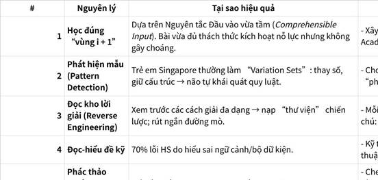

**Click the image to view the sheet.**

**Nghiên cứu 4: Bảng Ultralearning Framework (chi tiết)**

|   |   |   |   |
|---|---|---|---|
|#|Principle|Chi tiết|Case study / Tools|
|1|**Metalearning** (The Map)|Giai đoạn nghiên cứu, “học cách học” trước khi bắt đầu. Trả lời 3 câu hỏi: **Why** (tại sao mình học, động lực cá nhân hay nghề nghiệp), **What** (chính xác kỹ năng/kiến thức nào cần đạt, càng cụ thể càng tốt), **How** (nguồn lực, phương pháp, lộ trình). Scott Young khuyên dành ~10% thời gian tổng để lập bản đồ. Đây là điểm phân biệt lớn giữa Ultralearning và học tự phát: biến nỗ lực rời rạc thành “chiến dịch chiến lược”.|Learning Map, Benchmark curriculum, Expert interview|
|2|**Focus** (The Superpower)|Ultralearning đòi hỏi khả năng tập trung nhanh và sâu. 3 vấn đề thường gặp: (1) khó bắt đầu (procrastination), (2) không duy trì được, (3) tập trung sai hướng. Chiến lược: vượt qua “maximal unpleasantness” ban đầu, chặn nhiễu (digital, môi trường), làm việc theo block chuyên sâu (deep work), tránh đa nhiệm. Không có Focus → “tính quyết liệt” của Ultralearning sụp đổ, dự án biến thành chuỗi học hời hợt.|Deep work ritual, Pomodoro 90–15, Digital detox|
|3|**Directness** (The Application)|Nguyên tắc “learning by doing”: học gắn sát bối cảnh thực tế, giảm khoảng cách giữa lớp học và ứng dụng. Hạn chế lớn của giáo dục truyền thống là **thiếu transfer** (chuyển giao từ lý thuyết sang thực tế). Ultralearning khắc phục bằng “transfer-appropriate processing”: thực hành trong bối cảnh thật ngay từ ngày đầu. Ví dụ: học ngoại ngữ → phải nói ngay, không chỉ học ngữ pháp.|Year Without English, Project-based learning|
|4|**Drill** (The Bottleneck)|Khi áp dụng Directness sẽ gặp nút thắt (bottleneck). Drill = cô lập và xử lý trực tiếp điểm yếu. Đây là ứng dụng cụ thể của **Deliberate Practice**: thiết kế micro-exercise, tập trung duy nhất vào phần khó. Tránh “cái bẫy thoải mái” (chỉ luyện cái đã giỏi). Drill giúp mở khoá tiến bộ vượt trội.|Pronunciation drill, Coding kata, Focused repetition|
|5|**Retrieval** (The Test)|**Active recall > passive review.** Việc cố gắng lôi thông tin ra khỏi trí nhớ củng cố kết nối thần kinh → nhớ lâu hơn. Đây là hiện tượng **desirable difficulties**: khó khăn lại chính là điều giúp học hiệu quả. Kỹ thuật: self-test, viết lại từ trí nhớ, Feynman Technique (giải thích như đang dạy). Scott nhấn mạnh: test bản thân ngay cả khi chưa tự tin hiệu quả hơn đọc lại nhiều lần.|Mock test, Flashcard (Anki), Feynman notebook|
|6|**Feedback** (The Compass)|Feedback = “GPS cá nhân”. 3 loại: **Outcome** (đúng/sai), **Informational** (sai ở đâu), **Corrective** (cách sửa). Feedback càng nhanh, càng cụ thể càng tốt. Người học phải chủ động tạo **feedback loop** (tự tracking, nhờ mentor, peer review). Quan trọng: rèn khả năng chịu đựng và hấp thụ feedback, tránh né sẽ mất tác dụng Ultralearning.|Peer review, Mentor critique, Tight loop|
|7|**Retention** (The Foundation)|Vấn đề trung tâm: sprint nhanh thì giỏi ngay, nhưng mất dần về lâu dài. Để chống **forgetting curve**, phải dùng **Spaced Repetition** và **Overlearning**. Scott thừa nhận điểm yếu MIT Challenge: thiếu overlearning nên năng lực tính toán lõi không bền. Với ngôn ngữ, anh duy trì bằng weekly → monthly speaking session nhiều năm sau. Insight: Ultralearning sprint chỉ cho “đà” ban đầu, còn mastery cần **bảo trì dài hạn**.|Anki / Spaced repetition, Overlearning, Maintenance plan|
|8|**Intuition** (The Sixth Sense)|Trực giác không phải “ma thuật”, mà là sản phẩm của khối lượng trải nghiệm có tổ chức. Muốn phát triển Intuition phải “go deep before wide”: tái tạo nguyên lý gốc, hiểu từ **first principles**. Feynman Technique giúp đơn giản hoá khái niệm phức tạp, lộ rõ lỗ hổng hiểu biết. Mục tiêu: không chỉ nhớ fact, mà kết nối ý tưởng rời rạc để giải quyết vấn đề linh hoạt.|First Principles, Feynman notebook, Analogies|
|9|**Experimentation** (The Explorer)|Thể hiện sự sáng tạo & autonomy của người học. Thay đổi phương pháp, công cụ, môi trường → tìm cách học tối ưu cho bản thân. Đặc biệt quan trọng với người học nâng cao (ít tài nguyên sẵn có). Nguyên tắc này củng cố tinh thần **self-directed**: không chỉ “học cái gì” mà còn “học thế nào”.|Trial & Error, SCAMPER, Kaizen|
|10|**Case Study – MIT Challenge**|Scott Young học toàn bộ chương trình CS MIT 4 năm trong 12 tháng (2012). Thành công: vượt qua 33 kỳ thi, hoàn thành dự án. Nhưng post-mortem chỉ ra: • Retention kém (timeline nén, thiếu spacing). • Thiếu overlearning (khả năng thao tác ký hiệu toán yếu hơn sinh viên MIT thật). • Thiếu peer interaction (bỏ qua yếu tố học nhóm & cơ hội thực tế). • Rigour thấp (tự chấm điểm, đặt chuẩn “qua môn” 50% thay vì GPA cao). Insight: Ultralearning sprint rất mạnh, nhưng để thành mastery phải kết hợp chiến lược duy trì dài hạn.|MIT Challenge (2012), Post-mortem reflection|

📌 **Điểm mấu chốt rút ra:**

•                     Ultralearning không “phát minh” mới → nó **synthesizes** (tổng hợp & đóng gói) các nguyên tắc proven như deliberate practice, active recall, spaced repetition thành một hệ thống project-based.

•                     Khác biệt với self-learning thường: **tính quyết liệt (aggressive)**, **dựa trên dự án (project-based)**, **tập trung vào điểm yếu**.

•                     Điểm yếu cần lưu ý: dễ “nước rút” mà quên “marathon”, nếu không có **Retention + Overlearning plan** thì kiến thức sớm rơi rụng.

**=> ĐÚC KẾT: ĐÃ CÓ TRONG BẢNG PROBLEM SOLVING: CỘT LEARNING STRATEGERY.**

**Các tiêu chí đánh giá Framework Quyết định phiên bản 10/10**

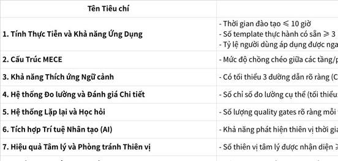

**Click the image to view the sheet.**

**3.1.2.2 RA QUYẾT ĐỊNH - 1 TẦNG SIÊU QUAN TRỌNG TRONG PROBLEM SOLVING - 2 TUẦN ĐỂ RA ĐƯỢC CÔNG THỨC TÍNH IMPORTANT (CÙNG GIAI ĐOẠN PHÁT MINH RA CÔNG THỨC: (THÂN + TÂM + TRÍ) X (ĐỘNG LỰC NGOẠI LỰC + ĐỘNG LỰC NỘI LỰC)**

**CKP: Version 1**

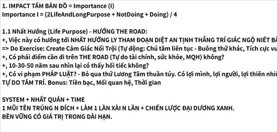

**Click the image to view the sheet.**

**TIÊU CHÍ CHUNG KHI RA QUYẾT ĐỊNH - Version 2 - 22082025 Bảng Hợp Nhất Chi Tiết – Impact (I) - Mình cảm giác rất đam mê với món CÔNG THỨC HOÁ - TOÁN TÂM LÝ TÀI CHÍNH 21082025 - 📑 Bảng Hợp Nhất Chi Tiết – Mentor (M), Resources (Res), Leverage (LF) 22082025**

|   |
|---|
|Với mỗi trường hợp sẽ có các tiêu chí khác nhau:  <br>1. Con người sẽ là tiêu chí: Why, Who nhân dạng, The Road, The habit community, The sharing  <br>2. Ny thì thêm tiêu chí: 1. Cùng Pháp 2. Người cũng sống thích nghi như mình 3. Có sự lựa chọn rõ ràng, tiêu chí rõ ràng 4. Bonus về tài chính và mục tiêu dài hạn|

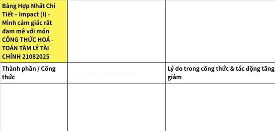

**Click the image to view the sheet.**

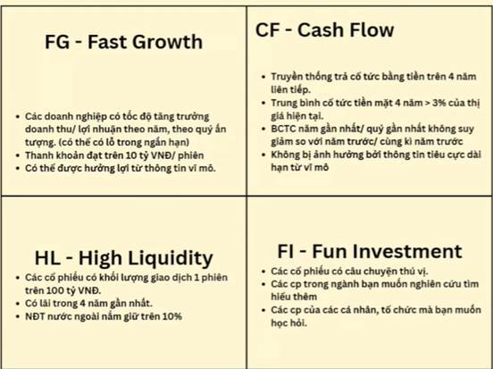

Ví dụ minh họa (vui vẻ, dễ nhớ)

•                     **FG**: Cổ phiếu như một học sinh lớp 10, mỗi năm cao thêm 10cm → Benefit tăng.

•                     **CF**: Cổ phiếu như người yêu chịu khó chuyển khoản tiền ăn hàng tháng → Risk giảm.

•                     **HL**: Cổ phiếu như crush dễ “unfriend” → muốn thoát thì thoát liền, rollback dễ.

•                     **FI**: Cổ phiếu như yêu thử cho vui, nếu fail thì học thêm kinh nghiệm → OptionBoost tăng.

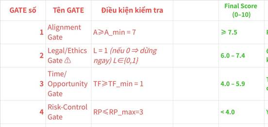

**Click the image to view the sheet.**

**V2 - Final Score (Lựa chọn) = 0.3*I_final+0.3*M+0.25*U+0.15*E           23082025**

|   |
|---|
|**Final Score (Lựa chọn) = I_final+M+U+E**<br><br>**V1: Final Score = Mentor * 0.2 + Importance * 0.3 + Urgency * 0.3 + (Easy BEFORE OKRs) * 0.2  <br>+, Importance = (2LifePurpose + NotDoing + Doing * Leverage) / 4)  <br>+, Easy Score BEFORE OKRs = [10 - TimeEst * (HR*0.7 + MR*0.3)/2 + RISK&EXCEPTIONS_with_Contingency_Plan]/2**<br><br>**V2:   0.3*I_final+0.3*M+0.25*U+0.15*E**       <br>**+, I_final = MIN(10, 0.9*I + 0.1*OptionBoost)**  <br>**= MIN (0.9*[10, min(10, I_base_10)] +  0.1*OptionBoost)**  <br>**= MIN (10, 0.9*[min(10, A × max(0, B – RP) × TF/10)] + 0.1*OptionBoost)**  <br>**= MIN (10, 0.9*[min(10, A × max(0, B – R × (1 - C/10) × (1 - Rev10/10)) ×  [(1+g)/(1+k)]^T/10)]+ 0.1*OptionBoost)**= **MIN (10, 0.9*[min(10, A × max(0, (DB+NotDB)*LeverageB – R × (1 - C/10) × (1 - Rev10/10)) ×  [(1+g)/(1+k)]^T/10)]+ 0.1*OptionBoost)**= **MIN (10, 0.9*[min(10, A × max(0, (DoingBenefit+NotDoingBenefit)×LeverageBenifit – R × (1 - C/10) × (1 - Reversibility10/10)) ×  [(1+g)/(1+k)]^T/10)]+ 0.1*OptionBoost)**  <br>  <br>**+, E = min(10,(10 – Reversibility10) × LeverageE)**|

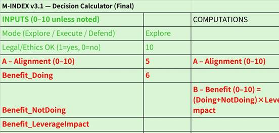

**Click the image to view the sheet.**

**Use Cases cần: Ra quyết định - Thực tế và SIMULATION: Lấy ý tưởng từ việc GIẢ LẬP ĐẦU TƯ - MONEYOsophy module 2.**

|   |   |
|---|---|
|Simulated Problem|Optional|
|**Tình huống giả lập – “Bước rẽ năm 2027”**<br><br>Bối cảnh:<br><br>•                     Năm 2027, bạn 24 tuổi, đang là Tech Lead AI với thu nhập 42 triệu/tháng (35 chính + 7 freelance).<br><br>•                     Mục tiêu dài hạn: **FIRE 15 tỷ vào 2040**, dựa trên 3 giai đoạn Lean – Regular – Fat FIRE.<br><br>•                     Bạn đã xây dựng thương hiệu cá nhân trên LinkedIn (\~5000 followers) và có 1 AI product/service nhỏ.<br><br>•                     Nguyên tắc sống: Nhất Hướng hướng về Tự do tài chính, Sức khỏe, MQH chất lượng, và Tâm trí tự tại.<br><br>**Tình huống xảy ra:**<br><br>Một công ty BigTech quốc tế mời bạn sang Singapore làm Senior AI Researcher.<br><br>•                     **Offer**: 110 triệu VND/tháng (net), 2 năm hợp đồng, bonus \~3 tháng lương/năm.<br><br>•                     **Điều kiện**: Không được vận hành công khai AI startup hiện tại trong thời gian hợp đồng.<br><br>•                     **Cơ hội**: Tiếp cận công nghệ cutting-edge, mở rộng network quốc tế, tăng kỹ năng R\&D.<br><br>•                     **Rủi ro**:<br><br>a.    Gián đoạn 2 năm phát triển sản phẩm AI riêng → mất đà thị trường.<br><br>b.    Không trực tiếp phát triển kênh thu nhập thụ động từ business → chậm mục tiêu FIRE.<br><br>c.    Chi phí sống ở Singapore cao → tiết kiệm không quá đột phá nếu không quản lý tốt.<br><br>•                     **Điểm cộng**:<br><br>a.    Thu nhập cao hơn gấp \~2,6 lần hiện tại.<br><br>b.    Môi trường học hỏi cực mạnh, cơ hội tìm co-founder quốc tế.<br><br>c.    Cơ hội PR cá nhân trong cộng đồng AI quốc tế.|1. LifePurpose (2x): **Đánh giá:** 6/10 → vì tài chính tăng, nhưng mất nhịp tích lũy dài hạn và không trực tiếp đẩy Nhất Hướng.<br><br>2.                   NotDoing: 4/10<br><br>“Không làm chẳng sao, để ưu tiên dài hạn” → nghĩa là rủi ro thấp, hậu quả không nghiêm trọng.<br><br>3.                   Doing: **Đánh giá:** 8/10 (lợi ích tài chính mạnh, nhưng đánh đổi rõ ràng).<br><br>=>  **Kết quả:** Importance = [0(2×6)+4+8] / 4 = **6**  <br>  <br>**6/10** → Dưới ngưỡng 7/10 → _không nên ưu tiên cao_.<br><br>=> KL:<br><br>•                     Với Importance = 6, nếu dùng nguyên tắc của bạn, quyết định **đi Singapore** không nằm trong top ưu tiên dài hạn.<br><br>•                     Nếu đi, phải biến nó thành **đòn bẩy**:<br><br>￮      Xây network để 2 năm sau quay về khởi nghiệp mạnh hơn.<br><br>￮      Tích lũy vốn đầu tư FIRE.<br><br>•                     Nếu ở lại, cần **chiến lược X3 thu nhập tại VN** trong 2 năm bằng AI product, consulting, và xây kênh thu nhập định kỳ.|
|**1 tình huống chọn ny (chọn giữa 2-3 cô gái và chọn có đợi tiếp tương lai ko )**<br><br>**Bối cảnh:**<br><br>•                     Bạn 25 tuổi, đã có sự nghiệp AI ổn định (thu nhập tốt, mục tiêu FIRE rõ ràng).<br><br>•                     Nguyên tắc sống: Nhất Hướng gồm **Tự do tài chính – Sức khỏe – Mối quan hệ chất lượng – Tâm trí tự tại**.<br><br>•                     Bạn gặp 3 cô gái, mỗi người có ưu & nhược riêng, và cả 3 đều có tiềm năng trở thành bạn đời.<br><br>**C1 – Minh Anh**<br><br>•                     Tính cách: Năng động, ham học hỏi, sẵn sàng đồng hành cùng bạn trong công việc AI/Startup.<br><br>•                     Điểm cộng: Có kiến thức tài chính, hỗ trợ được mục tiêu FIRE, tư duy dài hạn.<br><br>•                     Điểm trừ: Chưa thực sự kiên nhẫn trong việc xử lý stress.<br><br>**C2 – Thu Trang**<br><br>•                     Tính cách: Dịu dàng, quan tâm, chăm sóc sức khỏe & tinh thần tốt.<br><br>•                     Điểm cộng: Giúp bạn cân bằng tâm trí, sức khỏe.<br><br>•                     Điểm trừ: Ít hứng thú với công nghệ/khởi nghiệp, khó chia sẻ tầm nhìn FIRE.<br><br>**C3 – Mai Ly**<br><br>•                     Tính cách: Quyết đoán, có sự nghiệp riêng (MC, KOL).<br><br>•                     Điểm cộng: Mối quan hệ xã hội rộng, có thể giúp bạn mở rộng network.<br><br>•                     Điểm trừ: Công việc bận rộn, ít thời gian cho gia đình.||
|2.                   Use case: T5/2025: Có đi offline với anh Hoàn chị Hằng và ace không.<br><br>•                     Tại sao phân vân không đi: vì chưa done các tasks và chưa phụng sự được nhiều<br><br>•                     => Mục đích đi chính để NETWORKING. Và vượt qua việc đi là để: đi để kết nối ace sau này phụng sự được nhiều hơn, thay vì là không đi và vẫn như thế.<br><br>•                     Đã mất 30min để đưa ra quyết định này.||
|3.                   Use cases: ra quán caffe không và có xin info không - xem lại bên dưới.<br><br>+, MỤC TIÊU TĂNG SỐ NGƯỜI BIẾT => ai cũng xin hết. và biết rõ rằng: KO LÀM THỂ NÀO VỀ NHÀ CŨNG TIẾC.||
|4.                   Use cases: đi chơi với team offline 06/06/2025 - lần này chốt nhanh hơn, chỉ khoảng 15min.<br><br>•                     MỤC TIÊU HIỆN TẠI: BEGIN WITH THE END IN MIND LÀ GÌ? là ENGLISH VÀ ĐỒ ÁN, AI.<br><br>Các mục tiêu như networking ở công ty sau khi làm với ace đã khá ổn, networking ở Wecommit100x đã quá nổi, networking ở FSDS và AIO đang cần bổ sung => Chốt ko đi: 1 là mục tiêu hiện tại ko thể bỏ để đi, 2 là mục tiêu đi là networking đã đạt được 80% rồi nên ko đi.||
|5.                   Chọn nhà trọ = bộ tiêu chí rõ ràng:  <br>  <br>Tiêu chí chọn nhà trọ có list các tiêu chí từ quan trọng đến phụ:  <br>- Giá <=3 triệu 2, đủ kê 2 bàn học và bảng. Ở giữa Thanh Xuân Cầu giấy (phụ: diện tích tối thiểu 25m^2, có cửa sổ thoáng, ko gian học tập, có máy giặt oke, chi phí khác oke, có chỗ gửi xe, chỗ ngủ 2 người, bếp ko cần cũng oke, vệ sinh chung cũng oke, ...)  <br>- Tương tự: list tiêu chí cho ny, tiêu chí chọn thầy chọn sếp||

**3.1.2.3 [THỰC THI  - NĂNG LƯỢNG VÀ KAIZEN] PROBLEM SOLVING VÀ ĐỘNG LỰC THỰC THI  
- ĐÒN BẨY ĐỘNG LỰC THỰC THI - LÀM ĐIỀU ĐÚNG ĐẮN, TUẦN TỰ LIÊN TỤC NHẤT QUÁN KHÔNG DỪNG LẠI - TRẢI NGHIỆM HAY TRỞ THÀNH: KẾ HOẠCH KO THỂ THÀNH NẾU THIẾU THỰC THI. nguyên lý: RÈN LUYỆN TRÍ NHỚ CHÁNH = VIỆC ĐO LƯỜNG, TRACKING, CHECKIN, MÔI TRƯỜNG MẠNH HƠN Ý CHÍ, CHÚ TÂM LIÊN TỤC KHÔNG TẬP TRUNG.**

|   |
|---|
|Nguyên tắc chung: Do cái gì có mặt mà cái kia có mặt?  <br>**0. Nguyên lý: NĂNG LỰC THỰC THI <= TRÍ NHỚ CHÁNH(ghi nhớ thông tin) (thấy không có cái biết hoặc biết đúng sự thật) <= CẢM GIÁC NỔI TRỘI <= 1. Cảm giác nổi trội nơi Thân + 2. Đo lường, Checkin liên tục từ Trợ dí, ĐNT, Cộng đồng, Mentor**  <br>- Cảm giác nổi trội nơi Thân: cảm giác răng lưỡi.  <br>- Cảm giác nổi trợi Nội Xúc nơi tế bào: CÁC LOẠI ĐỘNG LỰC:  <br>  <br><br>=> BẢN CHẤT CỦA HÀNH ĐỘNG là: 1. Là những việc KÍCH HOẠT CÁC ĐỘNG LỰC NÀY NGAY thì chúng ta sẽ hành động (Ví dụ: “Làm cái có tiền ngay” hay “Làm cái thì sống, không làm thì chết” hay hành động theo tính dục…)  <br>=> Việc ĐO LƯỜNG, CHECK IN KAIZEN, TRACKING: Làm sao phải Quy toàn bộ mọi việc ra SỐ => THẤY NGAY LÀM VIỆC NÀY THÌ BỊ NHƯ NÀY NHƯ KIA.<br><br>1. TRÍ NHỚ CHÁNH - CHẤM DỨT KHỔ: THẤY KHÔNG SUY NGHĨ. HOẶC LÀ THẤY ĐÚNG SỰ THẬT.<br><br>2. BÁT CHÁNH ĐẠO HIỆP THẾ - ĐÒN BẨY ĐỘNG LỰC, NGOẠI LỰC trên Bát Tà Đạo: kích hoạt CÁC LOẠI ĐỘNG LỰC TRÊN (CẢM GIÁC THÍCH/GHÉT: TÌNH DỤC - Yêu thương kết nối, TRỢ DI, CỘNG ĐỒNG, TỰ CHỦ, CHINH PHỤC GIỎI LÊN Kaizen Checkin Tracking Coaching + TIỀN + SÂN SỢ KHỔ, CHẾT).|

 **TẬP TRUNG Ph TÂY (kích hoạt động lực ngoại lực và nội lực) vs PHƯƠNG ĐÔNG (THE ROAD (Bản đồ: Điểm A, Điểm B, Milestones chiều dọc, Structure chiều ngang + Designer/Mentor + Nguồn lực cá nhân + Investor/Leverage (Đòn bẩy con người, tài chính, thời gian)) - THE IMPACT - THE POWER) + NHẤT QUÁN, NHẤT HƯỚNG GOSINGA + TIME - Sự khác biệt giữa Mindset Giàu - Nghèo: Người Giàu dùng Tiền để tiết kiệm thời gian vs Người Nghèo dùng Thời gian để tiết kiệm Tiền.**

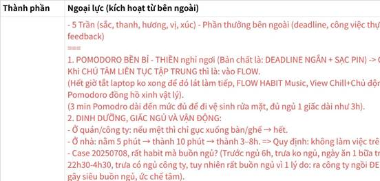

**Click the image to view the sheet.**

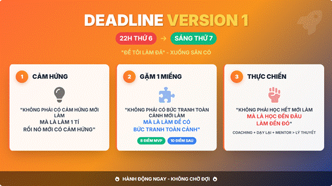

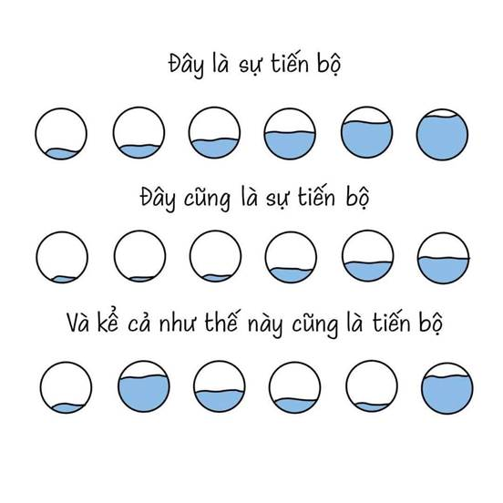

**3.1.2.4 TRACING FULL**

|   |   |   |
|---|---|---|
||\|   \|<br>\|---\|<br>\|**_Hành trình 4 năm._**<br><br>**Tốt nghiệp bằng khá.**<br><br>**Đội tình nguyện trong và ngoài trường.**<br><br>**Làm công ty nơi thực tập hồi năm 3.**<br><br>**36h không ngủ, 28h quán caffe hoàn thiện 1/3 đồ án.**<br><br>**The Road: Cùng ae Top 1% IT VN Go Global.**<br><br>**Tập trung thứ dài hạn, hệ thống, nhất quán, đủ thời gian.**\||Note|
|08/10/2025|1.                   **Học Online**: Các khóa AI, Data Science, NLP, LLMs, MLOps, tham gia khóa FSDS, các cộng đồng AI Vietnam, Wecommit100x, v.v.<br><br>2.                   **Đi làm thực tập/fulltime**:<br><br>￮      Internship NLP Lab HUST: làm project RAG, LLMs, AI agents.<br><br>￮      AI Intern tại Step Up Education: phát triển Chatbot, AI tool, build workflow automation, packaging API, benchmark LLMs, v.v.<br><br>￮      Tham gia Code Mely: sublead kỹ thuật AI, các dự án detection, segmentation, NLP, hackathon, Kaggle, v.v.<br><br>3.                   **Portfolio project**:<br><br>￮      Rất nhiều project: từ detection, recognition, prediction, chatbot, automation, translation, RAG, Mem0, automation pipeline, v.v.<br><br>￮      Project dạng “mini product” nhưng quy mô nhỏ, thiếu system design, thiếu trải nghiệm vận hành/bảo trì.<br><br>￮      Chưa có case _MLOps end-to-end_: monitoring, CI/CD, deployment, retraining, tracking experiment, security, scaling...<br><br>4.                   **Skillset**:<br><br>￮      **Code Python, ML/DL frameworks mạnh**<br><br>￮      **Web Builder, Docker, LLMs stack**<br><br>￮      **Tiếng Anh tạm ổn (B1-5.5), giao tiếp OK cho tech**<br><br>￮      **Community & networking tốt** (nhưng phần mentor thực chiến chưa sâu, chủ yếu tự học, tự làm)<br><br>\|   \|<br>\|---\|<br>\|20251008:<br><br>1.                   **Focus the** **main job** **at the company => Write a PROBLEM SOLVING diary => Level Up Problem Solving Skills in both Technology and Mind.**<br><br>2.                   **English fulltime**<br><br>3.                   **AIO - MLOps - System Design - Database Optimization - full tối T2-tối CN. + Cả ngày CN**<br><br>4.                   **Finance: Full cuối tuần thứ 7.**\|<br><br>\|   \|<br>\|---\|<br>\|“Thiếu chiều sâu chuyên môn, thiếu review, thiếu va chạm thực tế hệ thống lớn!”<br><br>1.                   Điểm mạnh: Chủ động, cực kỳ năng động, coding skill tốt, networking/đội nhóm tốt, portfolio đa dạng.<br><br>2.                   Nút cổ chai 80/20: “Thiếu chiều sâu chuyên môn, thiếu review, thiếu va chạm thực tế hệ thống lớn!”.<br><br>+, Project dừng ở mức “task implementer” hoặc “người build tính năng,” thiếu vai trò “system architect” hoặc “problem owner”.<br><br>+, Thiếu vòng lặp “review sâu, bị hỏi xoáy”, mentoring chất lượng senior/lead, mock interview real-life về system design/MLOps/AI infra.<br><br>+, Portfolio rất nhiều, nhưng “nông”, chưa có 1-2 project “biểu tượng” dám mang đi tranh giải/ứng tuyển Senior (ít nhất với MLOps, System Design, AI Ops, CI/CD, Automation, Monitoring).<br><br>+, Thời gian học chủ yếu phân tán, chưa “găm” kiến thức system – học gì luyện đó, thiếu chu trình “lý thuyết – thực hành – review – tổng hợp – dạy lại”\|||
|07/02/2026|Em có cần 1 người kèm cặp, support không. 😃<br><br>1.                   Anh sẽ kèm em khoảng 2 tháng, đóng gói toàn bộ những gì anh học và làm trong gần 2 năm. Truyền thụ cho em toàn bộ những gì anh có. Nói chung là dốc hết khả năng của anh.<br><br>2.                   1 tuần mình online 1 buổi 2h, em có thể nhắn tin hỏi anh bất cứ khi nào em cần về Engineer, về lộ trình sự nghiệp. .<br><br>3.                   Sau 2 tháng, ae mình về sau có thể làm dự án cùng nhau.<br><br>+, Em sẽ có người support để đi nhanh hơn, anh có cơ hội để đóng gói kiến thức và nhân bản<br><br>Đây là Github của anh: https://github.com/DoanNgocCuong<br><br>Đây là công ty hiện anh đang làm (cty làm Robot AI) (anh mặc áo cam góc bên trái): https://www.facebook.com/photo/?fbid=1346110580871911&set=pcb.1346115244204778|Em còn chưa biết sẽ tính giá như nào, chưa biết sẽ đóng gói và chia sẻ gì cho bạn, ... cơ mà cứ thử testing thị trường trước xem sao ạ.<br><br>(Vì ngày xưa hồi bằng tuổi bạn em cũng mong có anh nào kèm cặp support mình hàng ngày để mình đi nhanh hơn ạ).|
|07/02/2026|||

**3.1.2.4.1 JOB TITTLE: AI ENGINEER (Cuối tháng 6/2024 - cuối năm 3)**

|   |   |   |
|---|---|---|
|Aug-25|Tháng 8/2025  <br>Khi được hỏi về sở thích, mình đã nói điều trên  <br>Trước em hay kén cá chọn canh, kiểu công ty giao bài không đúng xu hướng/định hướng dài hạn của mình (kiểu các task lặt vặt 1 tí thì hơi né).  <br>Định hướng dài hạn của em là: System Design, LLMs Ops + Game Finance + Community + Global  <br>   <br>Sau 1 năm đi làm (2 tháng trở lại đây em mới nhận ra), mấy sếp PM, GM (General Management) ở công ty có 2 điểm.  <br>1. Là bài nào cũng quẩy, chị GM học FTU (Kinh tế) mà gặp mảng nào là quẩy mảng đó từ Sales, Marketing, làm Sản phẩm, làm PM, quẩy mọi bên (sinh 1993, cùng tuổi đó 1 số anh chị khác ở công ty vẫn chỉ bó trong chuyên môn), họ có chuyên môn sâu và không ngại nhảy ra ngoài vùng hiểu biết.  <br>2. Là ông anh PM với chị GM thì cứ bài nào khó là lao vào quẩy.  <br>  <br>=> Sau em chuyển thành:  <br>Chuyển từ việc chỉ chọn task thích để làm => Thành:  <br>1. Ở công ty: cố gắng, khéo léo được nhận task đúng sở trường thì tốt (thực tế là em dần được làm task đúng điểm mạnh hơn khi em level up hơn). Còn không thì giao bài nào quẩy bài đấy, cố gắng giải quyết càng nhiều vấn đề cho công ty càng tốt.  <br>+, Vì không có C level nào (CEO, ...) mà lại chỉ thích giải bài trong điểm mạnh của mình cả 😃  <br>2. Ở nhà: đây mới là lúc học thứ mình thích (System Design, LLMs Ops, Đầu tư Investment, ...)  <br>  <br>  <br>KEY:  <br>TẬP TRUNG GIẢI BÀI KHÓ  <br>ĐÀO SÂU KO ĐÀO RỘNG  <br>SẴN SÀNG NHẢY VÀO GIẢI BÀI TRONG MẢNG LẠ NẾU CẦN||
|Aug-25|||
|15/09/2025|Output không giới han: 15/09/2025  <br>1. Junior thi track của Senior with những đồng đọi mạnh.  <br>2. Sáng đi gặp ông anh cho cái tool Kiro. Code bài 3-5 ngày done trong 1h + 1h rưỡi = 2h rưỡi.  <br>=> Hack không có gì là không thể.|=> Hack không có gì là không thể.|
||1000 NGHỀ - WORKFLOW|MỌI THỨ PHỨC TẠP KHI BREAK RA ĐỀU CHỈ LÀ NHỮNG THỨ ĐƠN GIẢN, VÀ BẠN CÓ THỂ DỄ DÀNG XỬ LÝ CHÚNG  <br>PROBLEM SOLVING SKILL - TỰ TẨY NÃO MÌNH ĐỂ TÌM KIẾM CẢM GIÁC KHÓ CHỊU - CHỦ ĐỘNG TÌM KIẾM CẢM GIÁC KHÓ CHỊU  <br>- ĐẶT MỤC TIÊU 3A/B THAY VÌ A/B - TÁCH LỚP TÁCH NHỎ STRUCTURE - GIẢI QUYẾT NÓ|
||\|   \|<br>\|---\|<br>\|•                     SMART: Tháng 10 năm sau anh muốn ký giấy kết hôn với em.<br><br>1.                   Ngay từ năm 3 đã chạy thêm đồ án: 1 triệu rưỡi, 2 triệu. Lên năm 4 làm đồ án: 3 triệu, 4 triệu rưỡi, 10 triệu, ... => Đây cũng là cách trong 6 tháng cuối năm : lương cứng 30 triệu + 3 đồ án: 2 triệu, 4 triệu rưỡi, 3 triệu rưõi, dạy thêm 2 triệu => 40 triệu.\|||

 

**3.2.2.1.5 TIỀN BẠC VÀ THỜI GIAN, DÀNH TỐI ĐA TIỀN ĐỂ ĐẦU TƯ VÀO TĂNG SKILL CHO ĐẾN KHI SKILL CÓ GIÁ 1000$/THÁNG.**

|   |
|---|
|1.                   Dùng tiền để đi nhanh hơn  <br>- Trong những giai đoạn đầu sự nghiệp, thường đối thủ cất tiền vào túi => Giai đoạn này: DÙNG TIỀN TẬP TRUNG TUYỆT ĐỐI VÀO MUA XĂNG, BƠM XĂNG, đường thì thoáng phải chạy thật nhanh.  <br>- Các khoản này không được xếp vào đầu tư. Đầu tư được tính là khả năng tiền quay về.  <br>Đây được coi là các chi phí cho việc học, mua trang bị. Chi phí nào tốt / tệ.<br><br>2.                   Return on Investment (**Tỷ suất hoàn vốn (ROI)** hoặc **Lợi nhuận trên đầu tư)**<br><br>\|   \|<br>\|---\|<br>\|Ý nghĩa: đo lường **mức lợi nhuận (hoặc giá trị) thu được so với chi phí bỏ ra**.\|<br><br>+, ROI cho việc mua môi trường/lợi thế tập trung **= (Giá trị tiết kiệm được từ thời gian – Chi phí bỏ ra) / Chi phí bỏ ra**<br><br>\|   \|<br>\|---\|<br>\|7-9k nước/sữa chua + 8-12k gửi xe - Ngồi cả ngày.  Việc ngồi quán nươc với <30k mà tiết kiệm được cho mình 1h làm việc (thường là tiết kiệm được 3h) (tiết kiệm ít nhất 100-500k). CHI PHÍ THỜI GIAN CƠ HỘI ẨN TRONG VIỆC KHÔNG ĐỂ LÃNG PHÍ THỜI GIAN  <br>**=> ROI =(T × V - C)/C = (2h × 100k/h – 20k) / 20k = (200k – 20k) / 20k = 180k / 20k = 9  =>** 👉 ROI = **900%**  <br> (Tức là 1 đồng bỏ ra “mua” về 9 đồng giá trị).\|<br><br>3.|

**3.2.1.2 GAME GIỮ TIỀN**

|   |
|---|
|**Sách - Cao thủ săn kèo - Bí quyết đầu tư của tỉ phú - Săn lùng cơ hội làm giàu từ bất động sản và M&A.  Sách - Cao thủ săn kèo - Bí quyết đầu tư của tỉ phú - Săn lùng cơ hội làm giàu từ bất động sản và M&A.**<br><br>Sam Zell — nhà đầu tư nổi tiếng với các thương vụ “săn kèo” — từng nói rõ quan điểm này: ông không đầu tư vào những thứ mà muốn thành công phải phụ thuộc vào quá nhiều người cùng làm đúng việc. - **Sách - Cao thủ săn kèo - Bí quyết đầu tư của tỉ phú - Săn lùng cơ hội làm giàu từ bất động sản và M&A.**  <br>  <br><br>Đầu tư là một kỹ năng quan trọng. Nhưng nếu bạn còn đang ở giai đoạn gom góp từng đồng, thì đầu tư không phải là kỹ năng khẩn cấp. Nhiều người trẻ vội vàng bước vào thị trường với niềm tin rằng nếu chọn đúng mã, đọc đúng tin, thì việc làm giàu chỉ là chuyện sớm muộn.<br><br>Niềm tin đó có vẻ hợp lý, nhưng thường chỉ đúng trong sách vở. Ngoài đời, đầu tư chỉ tạo ra khác biệt khi bạn đã sở hữu một số tiền đủ lớn. Trước ngưỡng đó, dù bạn đầu tư rất giỏi, phần thưởng vẫn nhỏ hơn công sức bỏ ra rất nhiều.<br><br>**Giả sử bạn có 300 triệu và đạt mức sinh lời 10% một năm — tức bạn đã làm tốt hơn đa số. Vậy bạn được thêm khoảng 30 triệu, chia ra mỗi tháng là 2 triệu rưỡi. Trong khi đó, nếu bạn tập trung làm công việc chính tốt hơn, việc tăng thu nhập thêm 3–5 triệu mỗi tháng là hoàn toàn khả thi. (Đó là lý do Trainer Minh cũng hay bảo: nếu tiền nhãn rỗi mỗi tháng là 1000$ hoặc có sẵn 100.000$ = 2 Tỷ rưỡi nhàn rỗi trong tk => Lúc đó mỡi chuyển sang game Đầu Tư).**<br><br>Không chỉ vậy, đầu tư còn tiêu hao rất nhiều năng lượng tinh thần. Bạn phải theo dõi thị trường, chấp nhận rủi ro, chịu áp lực khi giá giảm và có thể mất ngủ vì một quyết định sai. Mọi thứ đó đổi lại một con số quá nhỏ so với mức tăng thu nhập chủ động bạn có thể đạt được.<br><br>Chưa kể khả năng mất tiền là rất thật. Thị trường không quan tâm bạn mới chơi hay đã chơi lâu. Một lần chọn sai thời điểm cũng có thể khiến số tiền tích cóp nhiều năm biến mất chỉ trong vài tuần.<br><br>Với người đã có nhiều tài sản, mất 30% là bài học. Với người mới bắt đầu, mất 30% có thể là mất luôn động lực tích lũy và niềm tin vào bản thân. Cú sốc đó không dễ hồi phục, nhất là khi bạn còn trẻ và chưa có nguồn thu vững.<br><br>Điều đáng nói là: bạn không cần đầu tư xuất sắc để trở nên giàu có. Bạn chỉ cần một công việc ổn định, tăng thu nhập đều, chi tiêu hợp lý và tích lũy đều đặn. Khi bạn đã có một vài tỷ trong tay, chỉ cần đầu tư trung bình cũng đã tạo ra hàng trăm triệu mỗi năm.<br><br>Đầu tư không sai. Sai là ở chỗ nghĩ rằng nó là con đường chính để thoát nghèo khi bạn chưa có gì trong tay. Đừng nhầm lẫn giữa công cụ của người đã có nền tảng và lối thoát cho người đang đi từng bước đầu.<br><br>Khi bạn có tài sản đủ lớn, đầu tư sẽ là đòn bẩy mạnh mẽ. Nhưng trước đó, cách khôn ngoan nhất là xây nền thật chắc. Tập trung làm tốt công việc chính, học kỹ năng thực tế, và tăng thu nhập ổn định. Cơ hội luôn còn đó. Nhưng sức chịu đựng và vốn tích lũy mới là thứ quyết định bạn đi được bao xa trong trò chơi này.  <br>  <br>2. Robert Kiyosaki: Tác giả Cha Giàu, Cha Nghèo.<br><br> Và điều khiến tôi sốc nhất không phải là những “chiêu thức làm giàu”, mà là sự thật:<br><br> 👉 90% người kiếm tiền giỏi vẫn nghèo… vì không hiểu “luật chơi tài chính”.|

**3.2.1.3 GAME NHÂN TIỀN**

**3.2.1.3.1 [NHÂN TIỀN = DOANH NGHIỆP: ĐẦU VÀO CỦA SYSTEM GIÁ TRỊ] - KIẾM TIỀN - XÂY DOANH NGHIỆP - TOP 1% - MINDSET KẺ CHIẾN THẮNG VÀ SÁT THẦN LĨNH VỰC VỚI CHÍNH BẢN THÂN MÌNH, MINDSET TẠO GIÁ TRỊ CHO MỌI NGƯỜI. -  CHIẾN LƯỢC: System Career WECOMMIT100X - Multi-Layer Money Business Model**

 

**3.2.1.3.1.0 Các mốc đã qua - THỰC CHIẾN**

|   |   |   |
|---|---|---|
|19/10/2025<br><br>**FinAI - Planing - Business Model 19/10/2025**|Bánh vẽ planing - 19/10/2025 - Viết 1 Bài Tổng Kết với chủ đề:   <br>Nếu như bạn có mọi nguồn lực cần thiết không giới hạn - Thì Lộ Trình để bạn tạo ra 1 Công Tỷ USD của mình trong 10-20 năm tới sẽ qua những mô hình như thế nào ? Bao nhiêu bước, mỗi bước bao nhiêu năm ? Phân tích chi tiết từng giai đoạn - Mỗi Giai đoạn có 1 hình mẫu để bạn học hỏi.  Và Con người Vĩ Đại nhất mà bạn sẽ trở thành sẽ có đặc điểm như thế nào ? Tối thiểu 2000 chữ. Mình nhận ra, ngay cả khi cho mình đủ mọi nguồn lực cần thiết ko giới hạn, mình vẫn chưa hình dung rõ con đường tạo ra công ty 1 tỷ USD , thế thì khi chưa có nguồn lực đủ thì đến bao giờ => Hãy tập hình dung mọi thứ, mọi mốc trong đầu và làm quyết liệt - D:\vip_DOCUMENTS_OBS\learning\BUSINESS\100 M $ Money Model\Day 3 - Bài Tập.md||
||**1 - Fintech Global Business Model Architect & Ecosystem Investor**  <br>**2 - Business Model: SaaS - Academy - License - Community Platform - Investment - IPO or Build to Sell!**  <br>3 - Bài toán cạnh tranh dựa trên Business Model  <br>4 - FinAI - Bài toán cạnh tranh dựa trên Business Model 20/10/2025 -  SỰ THẮNG LỢI? - Case study đã thành công với xuất phát điểm:  1. Team nhỏ, bắt đầu với 3-5 người sáng lập ?  2. SaaS đấu với rất nhiều ông lớn ?  3. Toàn người trẻ và thuần Technical và vừa học vừa scale Business 4. Có cases nào đã sống được 3-5 năm không or cách họ exit ?   THE ROAD nào cho FinAI: Stock and Business Valuation?  <br>5. B2B or B2C - 27/10/2025 (T2) - Sau buổi sếp Khôi bảo nên B2B hôm chiều thứ 7<br><br>\|   \|<br>\|---\|<br>\|1.                   Ưu và nhược của hướng bán B2B và B2C của các SaaS thành công trong giai đoạn đầu họ tìm kiếm khách hàng? (đặc biệt các công ty lớn)<br><br>2.                   Phân tích với 1 sản phẩm SaaS: Stock and Business Valuation -> định giá doanh nghiệp đưa ra lời tư vấn cho nhà đầu tư, ... B2B hay B2C<br><br>+, Ưu và nhược điểm 2 hướng? Nó nên tiếp cận hướng nào, tại sao?<br><br>+, Dẫn chứng các công ty thành công<br><br>+, Dẫn  chứng từ các chuyên gia trong ngành<br><br>Note: (trích dẫn chi tiết nguồn)<br><br>https://www.perplexity.ai/search/1-uu-va-nhuoc-cua-huong-ban-b2-uIOdR6IsSdCk_fTC2dQKtQ?<br><br>https://www.genspark.ai/agents?id=2fcae21c-8cf0-4540-a6be-f27206c7812d\|||
|FinAI: 28/10/2025 - Câu chuyện bắt đầu từ SaaS thì đi CABIS như nào? (Sau hơn 8h research) S-A-C-B-I nhiều công ty họ làm cách này    >< AIO AI Việt Nam, Anh Trần Quốc Huy Wecommit100x, a Quân Đặng FSDS đều di theo A-C đào tạo 1 ngành. Nếu đã có Business thì đi theo dạng B-A-I (Mentor Investing khá chuẩn)  - https://github.com/DoanNgocCuong/working/blob/main/BUSINESS/0_100M%24GlobalMoneyModel/Business%20Model%20P1%20-%20Ph%C3%A2n%20t%C3%ADch%20m%C3%B4%20h%C3%ACnh%20kinh%20doanh%20ng%C3%A0nh%20Tech%20(2%20xu%20h%C6%B0%E1%BB%9Bng%20r%C3%B5%20r%E1%BB%87t%20-%20Academy%20vs%20Product%20SaaS).md|\|   \|<br>\|---\|<br>\|Note: Trong cả buổi làm T3/28/10/2025, mình đi tìm câu trả lời: trở thành anh Huy, anh Quân Đặng, (Tối ưu DB, AI Engineer + Community) theo A-C (B-I-S) hay trở thành S-A-C-B-I (SaaS=Product đi lên)<br><br>1. sếp Trần Quốc Huy - Wecommit100x: A (Done For U: Các dịch vụ tối ưu DB, Done With U đồng hành 1 năm) Backend of System Carrer - Community (Cộng đồng = Frontend of System Carrer = Dòng chảy kết nối)<br><br>=> Tiến tới Community/Platform Hub, chưa có Business bán kèm, chưa có Investor vào các công ty con (hiện investor chíh các mối quan hệ trong cộng đồng), bắt đầu có Invest chung (challenge cùng phát triển và cùng làm dự án), SaaS chưa có.<br><br>2. Quân Đặng - Full stack data science FSDS: Academy (Do it your self mới có mỗi khoá học mỗi tội học viên ra kết quả quá ít) - Community/Platform Hub (Có các bên tuyển dụng nhưng chưa mạnh, cộng đồng cũng chưa quá mạnh nhưng kiến thức Academy siêu hay) - Business bán kèm chưa có - Invest chưa có - SaaS chưa có. <br><br>3. AI Việt Nam: Academy (Rất mạnh về AI Research nhiều báo từ ad và nhiều báo từ học viên, vấn đề số lượng người rớt cũng kha khá và đa phần các khoá đều ko có cơ chế nhóm xanh ngọc như BKE GNH) - Commnity/Platform Hub (Hệ sinh thái được xây dần qua 5 khoá, mỗi khoá dài 1 năm, ... Có nền tảng học LMS riêng và có nền tảng LMS Online free riêng dạng blog, ..)  - Platform Hub (đang xây dựng hệ sinh thái cùng nhận job bên ngoài, kết nối việc làm cho học viên học xong và phía các doanh nghiệp, cùng nhau Start Up, ...) - chưa có Business và Invest (Hiện đang là đầu tư máy, hỗ trợ các nhóm trong các cuộc thi, hỗ trợ 1 chút lệ phí khi đi tham gia sự kiện) - (Nếu mà có invest thì lúc trước đầu tư mạo hiểm cho Đức - Thinker Cloud có phải ngon luôn ko).\|||

FinAI theo đuổi lộ trình phát triển từ **AI Engineer → Consulting → SaaS → License → Platform → Investment**, lấy cảm hứng từ các mô hình thành công như Crunchbase, Y Combinator và a16z.

**3.2.0.0.1.1 FinAI - Planing - Business Model 19/10/2025**

**3.2.0.0.1.1.1 MÔ HÌNH KINH DOANH**

**Lợi thế cạnh tranh tăng dần theo thời gian:** Product → Data → Distribution → License → Brand → Ecosystem → Investment

**Mục tiêu cuối cùng:** FinAI trở thành **FinTech Ecosystem & Investment Network** độc quyền tại Việt Nam và Đông Nam Á, nơi “data + capital + community” tạo vòng lặp tự tăng trưởng không thể sao chép.

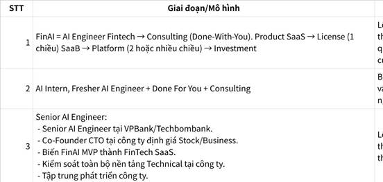

**Click the image to view the sheet.**

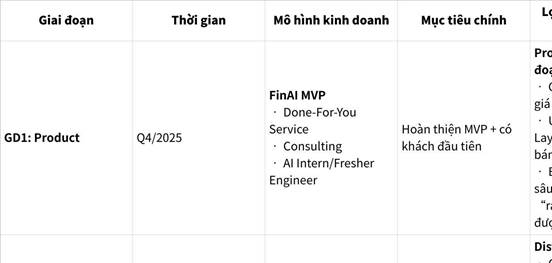

**Click the image to view the sheet.**

**3.2.0.0.1.1.2 LỢI THẾ CẠNH TRANH - TỔNG HỢP 6 TẦNG BẢO VỆ (MOAT) THEO GIAI ĐOẠN**

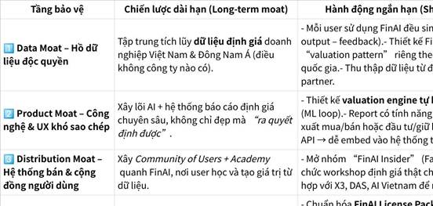

**Click the image to view the sheet.**

**3.2.0.0.1.1.3 MÔ HÌNH TÀI CHÍNH (MONEY MODELS)**

Cạnh tranh về giá - Money Models

Alex Hormozi nói: “The one who can spend the most to acquire a customer, wins.”

=> Nghĩa là: **doanh nghiệp nào có thể chi nhiều hơn đối thủ để giành khách mà vẫn có lời — sẽ chiếm trọn thị trường.** 

=> Tức là **vũ khí để mở rộng thị trường chính là mô hình tài chính và cơ chế “Customer-Financed Acquisition (CFA)”** – khách hàng đầu tài trợ cho khách hàng sau.

|   |   |   |
|---|---|---|
|Chiến lược|Mô tả|Ứng dụng cho FinAI|
|**1. Customer-Financed Growth (CFA)**|Lấy lợi nhuận 30 ngày đầu tài trợ cho ads tháng sau|Gói “FinAI + Coaching” tạo thêm GP ngay lập tức, giúp mở rộng mà không cần vốn ngoài.|
|**2. Payback Period < 30 ngày**|Dùng dòng tiền thẻ tín dụng quay vòng nhanh|Chạy ads mạnh trong tháng, thu tiền khách, hoàn lại trong kỳ hạn 30 ngày.|
|**3. Subscription / Recurring Offers**|Thu tiền định kỳ để có cashflow ổn định|FinAI Pro / FinAI Insight bản tháng hoặc quý.|
|**4. Licensing / Affiliate Revenue**|Cho phép người khác phân phối|Mở mạng lưới đối tác FinAI tại các trường đại học, câu lạc bộ đầu tư.|
|**5. Bundling / Cross-sell**|Bán combo nhiều sản phẩm cùng nhóm khách|Gói “FinAI + Academy” hoặc “FinAI + Investment Report”.|

**3.2.1.3.1.1 MÔ HÌNH KINH DOANH - CABIS - https://chatgpt.com/g/g-6889d46ba27c81918104714e2b9ebb49-das-vn-cabis-strategy**

|   |   |   |
|---|---|---|
||**Master Kỹ Năng/Tìm CO-FOUNDER: CHUYÊN GIA + CON NGƯỜI + KINH DOANH(MENTOR - C&D Copy and Development not R&D - WHO not HOW => Đúng MÔ HÌNH KINH DOANH )**||
||4.2.1.1 CHỌN ĐÚNG NGÁCH (Xoáy trôn ốc - Mở rộng có liên kết): VIÊN THUỐC THỰC SỰ hiệu quả, tận tâm - DOCTOR FRAME(let me help you): "MIỄN LÀ TỐT CHO NGƯỜI DÙNG THÌ TÍNH NĂNG NÀO TEAM CŨNG TÌM MỌI CÁCH ĐỂ LÀM ĐƯỢC, KHÔNG KỂ KHÓ HAY TỐN TIỀN THẾ NÀO."  <br>**Thiết kế VIÊN THUỐC: "Group Discusion and Teaching for Others".**  <br>7 Thị Trường MÃI XANH: Relationship BKE GNH - Make Money - Being Parents - Beauty - Health - Personal Development - Tâm linh.||
||A3. KINH DOANH:  <br>4.2.1: MINDSET Tiền (Giáo dục CÔNG NGHIỆP >< GD TÀI CHÍNH) - Triệu Phú, Bán Hàng Giá Cao.  <br>- PHƯƠNG TIỆN, ĐÒN BẨY(Phương tiện chấm dứt khổ thân, Đòn bẩy cho cảm giác hạnh phúc chứ tiền ko mua được).   <br>- VẬT NGANG GIÁ - TRAO ĐỔI GIÁ TRỊ (Không kiếm tiền mà là đổi tiền). => Đào tạo trao đổi, thu phí học viên, trả phí cho học viên thực tập sau đó học viên đóng góp chất xám lại cho DN.  <br>- Master Kỹ Năng/Tìm CO-FOUNDER: CHUYÊN GIA + CON NGƯỜI + KINH DOANH(MENTOR - C&D Copy and Development not R&D - WHO not HOW => Đúng MÔ HÌNH KINH DOANH )  <br>  <br>  <br>  <br>4.2.1.2 CHOOSE YOUR MARKET:  <br>- CHỌN ĐÚNG Khách hàng KIM CƯƠNG, CAO CẤP, ĐỘ SỈ - BỆNH NHÂN UNG THƯ (Có khả năng chi trả, có nguồn lực đủ để thành công, có cam kết, có tin tưởng ngay từ đầu, BÊNH NHÂN TÔI CHỮA ĐƯỢC MỚI CHỮA)(Cùng 1 chai nước ở sa mạc = cả gia tài, cùng viên thuốc đúng khách hàng ung thư x10, x100, x1000).  <br>  <br>- BẪY CONTENT FREE (ĐƯA THUỐC TỰ PHẪU THUẬT TẠI NHÀ): thu hút những khách hàng free thiếu cam kết, ĐẨY NHỮNG KHÁCH HÀNG KIM CƯƠNG CÓ TIỀN vì họ biết không có thứ gọi là miễn phí nếu nó có giá trị + FREE LỢI NGƯỜI HẠI MÌNH (đôi khi hại cả người hại cả mình - do hv ko được kèm cặp DÙNG SAI THUỐC, ĐƯA THUỐC HỌC VIÊN TỰ UỐNG làm mất uy tín, mất mạng) + Mô hình GIÁ CAO với CAM KẾT&ĐỒNG HÀNH -> Mô hình "THÔNG TIN": FREE ĐƯỢC ĐÓNG GÓI, mô hình "KÈM CẶP" thu tài chính để lan toả mở rộng.  <br>- BÁN GIÁ CAO: **COMBO GIÁ TRỊ: CAM KẾT(Kết Quả 3 tỷ)&ĐỒNG HÀNH(DoneWithYou, Group Coaching, Customize, Accoutability kèm cặp đồng hành vứt code cho cũng ko làm được, bài tập tự học 5 ngày/tuần, học off 2-3 buổi/tuần, ...)&THỜI GIAN(Đi Tắt)&CÔNG NGHỆ(Automation, Done4USystem)&CỘNG ĐỒNG(OnlOff)&CƠ HỘI MỚI(Hợp Tác, Cơ hội có nhà cung cấp hợp tác sau, cập nhật nội dung học lại N lần) ------------**  <br>  <br>```  <br>===> CÁCH TÍNH GIÁ: 29 cách TÁCH NHỎ COMBO GIÁ TRỊ ĐỂ TÍNH GIÁ X10 (tách nhỏ từng gói từng gói: Sản phẩm vật lý, Coaching, customize, Done with you, ĐỘC QUYỀN KÝ TẶNG, tách nhỏ 5 gói: sale, hệ thống như nào, bản đồ, chiến lược, quản lý thời gian dành riêng cho chủ tịch tập đoàn chưa cần coach, tạo ra, rèn kỷ luật kèm cặp ...) (với đk GIÚP HỌC VIÊN X10, hoặc thu 1 tỷ giúp hv kiếm 10 tỷ) + sản phẩm ĐỊNH KỲ MEMBERSHIP, FEE+%, CỔ PHẦN.           <br>===> Thiết kế PROMISE: INPUT(gọi 200 cuộc)/OUTPUT(có 4 KH)/OUTCOME(2 tỷ, đồng hành đến khi X10)/COMBO với ĐIỀU KIỆN (đk học hết nội dung không miss quá 3 buổi, CHỦ DỘNG báo cáo tiến độ hàng ngày ko miss - mình nhàn...) (Uy tín càng cao, càng nhiều case study càng dịch chuyển về INPUT nhiều)  <br>===>  TÔI KO BỊ ÁP LỰC KHI CUNG ỨNG + TÔI PHẢI RẢNH   <br>===>  KIỂM ĐỊNH GIÁ(TESTING OFFER, mẫu chung X10): KHÁCH HÀNG KIỂM ĐỊNH, THIẾT KẾ CHƯƠNG TRÌNH THAY MÌNH (bạn sẵn sàng trả mình bao nhiêu, với offer mình đưa ra bạn oke ko thấy thừa đâu, thiếu đâu, ...  <br>```  <br>  <br>4.2.1.3  <br>  <br>------------------------  <br>2.1.2. MINDSET Tiền (Giáo dục CÔNG NGHIỆP >< GD TÀI CHÍNH) - Triệu Phú, Bán Hàng Giá Cao.  <br>+, PHƯƠNG TIỆN, ĐÒN BẨY(Phương tiện chấm dứt khổ thân, Đòn bẩy cho cảm giác hạnh phúc chứ tiền ko mua được).   <br>+, VẬT NGANG GIÁ - TRAO ĐỔI GIÁ TRỊ (Không kiếm tiền mà là đổi tiền). => Đào tạo trao đổi, thu phí học viên, trả phí cho học viên thực tập sau đó học viên đóng góp chất xám lại cho DN.  <br>-  <br>  <br>2.1.3. MINDSET HÀNH ĐỘNG: CHIẾN!!! HOÀN THÀNH TRƯỚC HOÀN HẢO SAU:  <br>+, "KO PHẢI CÓ CẢM HỨNG MỚI LÀM, MÀ LÀ LÀM 1 TÍ RỒI NÓ MỚI CÓ CẢM HỨNG": BẮN ĐẠN NHỎ GẶM 1 MIẾNG, 1-2-3-4-5.  <br>+, "KHÔNG PHẢI CÓ BỨC TRANH TOÀN CẢNH MỚI LÀM, MÀ LÀ LÀM ĐỂ CÓ BỨC TRANH TOÀN CẢNH": 8 ĐIỂM TRƯỚC, 10 ĐIỂM SAU, 4 KỸ SAU (START UP - BETA FOREVER)  <br>- Sai lầm: Mn cứ xây BỨC TRANH LỚN, đợi chia thành các bước nhỏ, đôi khi mất 1-6 tháng.  <br>- Cách làm của ng START UP, HÀNH ĐỘNG: LÀM LUÔN, KO CẦN ĐỢI HOÀN HẢO, HỌC ĐƯỢC 1/3 DÙNG LUÔN, KHÔNG CẦN ĐỢI HỌC HẾT MỚI LÀM.  <br>TÔI KO PHẢI NGƯỜI HỌC NHIỀU, TÔI LÀ NGƯỜI THỰC CHIẾN. (thay vì LKH chi tiết, ủ, dậm chân 3-6 tháng, treo => Tính toán vừa đủ, LÀM LUÔN, ra demo luôn)  <br>=> tung RẤT NHANH DEMO, BETA, THỬ NGHIỆM, NHẬN FEEDBACK NHỎ NHIỀU KAIZEN LIÊN TỤC CÀNG NHANH, SAI NHỎ NHIỀU TRÁNH NHỮNG CÁI SAI LỚN, ĐÓNG NHANH CẮT GỌN VIN GROUP.  <br>- Ví dụ: (học OKRs X3 phong cách này, 5 ngày X3 ko biết nhưng 1 tuần phải xong, dự án AI Trần Việt Quân 3 ngày 1 version 15 ngày 5 version 80%, chạy trước đã. BỐ MẸ MUA ĐẤT LÀM NHÀ: KO PHẢI ĐỦ TIỀN MỚI LÀM NHÀ-LÀM 1 XÀI N). (Agile Development: Phát triển vòng lặp ngắn, tạo sản phẩm, nhận phản hồi, điều chỉnh (Scrum, Kanban, XP) +++ Lean Startup: Xây dựng MVP(MVP - Minimum Viable Product), đo lường, học hỏi, cải tiến (Lean Canvas, Business Model Canvas)).  <br>+, "KO PHẢI HỌC HẾT MỚI LÀM, MÀ LÀ HỌC ĐẾN ĐÂU LÀM ĐẾN ĐÓ KIẾN THỨC MỚI CÓ GIÁ TRỊ, KO THÌ CHỈ LÀ LÃNG PHÍ".  <br>- Bẫy "NỖ LỰC ẢO", "BÉO PHÌ KIẾN THỨC": Học nhiều nghe nhiều đọc nhiều xem nhiều video, nhưng, chẳng có điều gì xảy ra hết. tưởng ...nhiều đó là đang phát triển bản thân nhưng thực sự chẳng phát triển gì hết, học chẳng chuyển hoá giống như ăn không tiêu hoá gì hết.  <br>=> DẦN DẦN GIEO vào tiềm thức: NÓI LÀ LÀM, BIẾT LÀ LÀM, HỌC ĐẾN ĐÂU LÀM ĐẾN ĐÓ KHÔNG PHẢI KIỂU LÝ THUYẾT SUÔNG. nói là làm, biết là làm, tôi học đến đâu tôi làm đến đó tôi ko phải kiểu lý thuyết xuông.  <br>- ĐỪNG ĐỂ LÝ THUYẾT SỐNG SÓT: Học 1 video có ý thứ 3 dùng được dùng luôn, trang nào dùng được dùng luôn(ko phải hoàn hảo 1, 2, 3, 4, 5, ko cần đọc cả cuốn). TÌM THỰC TẾ, xài ngay DÙ NHỎ, NGHE RẤT VỚ VÂN, KHIẾN TA CHUYỂN DẦN TỪ LÝ THUYẾT SANG THỰC TẾ.  <br>+, THỰC CHIẾN DỰ ÁN THỰC-BƯỚC RA KHỎI VÙNG AN TOÀN: NHẢY VÀO NHỮNG THỨ MỚI KHI THẬM CHÍ CÒN CHƯA BIẾT GÌ VỀ NÓ (nhận project freelancer, tham gia clb có project mở mới, lên lab, những nhà leo núi khao khát đỉnh cao sẽ không say mê 1 dấu chân nào đó trên đường, ...). (Vùng Không biết mình biết, Biết mình không biết, KHÔNG BIẾT MÌNH KHÔNG BIẾT).||

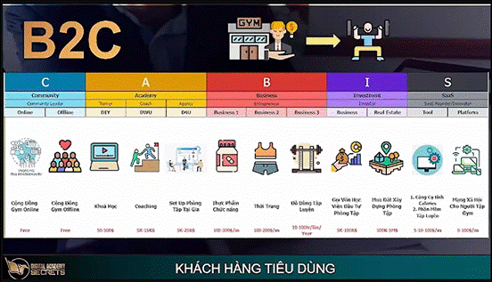

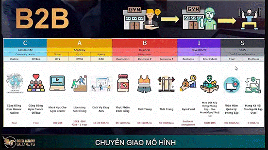

**100M $ MONEY MODELS**

**3.2.2.3 GAME 1: COMMUNITY**

**PRODUCT OF BUSINESS**

**3.1.2.3 Đặt câu hỏi để lấy nhu cầu .**

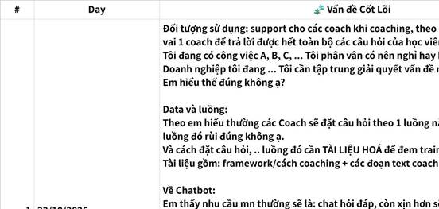

**Click the image to view the sheet.**

 

**3.2.2.4 [GAME 2: MARKETING OF BUSINESS] - Làm thương hiệu để mn biết đến mình có thể làm được gì, mình cũng có thu nhập khi giúp đỡ mn và giải quyết câu chuyện cơm áo gạo tiền để mình có thời gian chuyên môn hoá giải quyết các vấn đề phức tạp hơn. - Tạo ảnh hưởng giúp đỡ được nhiều người hơn,**

 

 

|   |
|---|
|1.                   Mình có 1 viên thuốc tốt, 1 thói quen và 1 lối sống lành mạnh. THAY VÌ ĐỂ NHỮNG THỨ CONTENT BẨN VIRAL thì tại sao những con người như mình lại không lên tiếng để những điều tốt đẹp được viral .  <br>- Tạo giá trị thật cho cộng đồng  <br>- Trung thực và sống thật với giá trị bản thân  <br>- Truyền cảm hứng và động lực  <br>- Xây dựng tầm nhìn dài hạn và cam kết đóng góp xã hội|

|   |   |
|---|---|
|Link: 1. Chấp nhận đi, nếu còn xem kinh doanh là bán hàng thì anh em muôn đời không khá nổi  - THÔNG PHAN: https://www.facebook.com/photo?fbid=10228322269381290&set=a.2245488176130|Dưới đây là **tổng hợp các keyword chính (theo cụm tư duy – chiến lược – hành động)** rút ra từ bài viết cực kỳ giá trị này:<br><br>**🔑 TƯ DUY CHIẾN LƯỢC – MINDSET GỐC**<br><br>•                     **WHERE TO PLAY?** – Chơi ở đâu?<br><br>•                     **HOW TO WIN?** – Thắng như thế nào?<br><br>•                     **Đặt đúng câu hỏi chiến lược** → định hình bàn cờ.<br><br>•                     **Không phải bán gì, mà giải quyết vấn đề gì cho ai?**<br><br>•                     **Tư duy hệ thống (System Thinking)** vs. tư duy điểm lẻ.<br><br>•                     **Xây dựng hệ sinh thái tạo – thu – giữ giá trị.**<br><br>•                     **Không phải mở quán, mà xây mô hình có thể sao chép.**<br><br>•                     **Không kinh doanh – chỉ là “tạo việc cho mình” nếu không thể rút ra.**<br><br>•                     **Khác biệt không nằm ở sản phẩm, mà ở toàn bộ trải nghiệm.**<br><br>**⚙️ CHIẾN LƯỢC THỰC THI – PLAYBOOK**<br><br>•                     **Ám ảnh khách hàng (Customer Obsession)**<br><br>•                     **Trải nghiệm mượt mà – dịch vụ khách hàng xuất sắc**<br><br>•                     **Vị trí trong hệ sinh thái (ecosystem position)**<br><br>•                     **Sự khác biệt không dễ sao chép**<br><br>•                     **Cỗ máy tạo giá trị độc đáo**<br><br>•                     **Chiến thắng thông qua hệ thống**<br><br>•                     **Giao diện → Giá trị → Hệ điều hành thương hiệu**<br><br>**🧠 PHÂN BIỆT CHIẾN LƯỢC vs. CHẠY THEO**<br><br>•                     **Chiến lược không phải là mục tiêu.**<br><br>•                     **Chiến lược không phải “làm nhiều, làm đủ thứ”.**<br><br>•                     **Chiến lược là lựa chọn & từ bỏ – rõ ràng.**<br><br>•                     **Không phục vụ tất cả → chọn khách hàng để phục vụ.**<br><br>**⏳ TƯ DUY THỜI GIAN – KIÊN NHẪN CHIẾN LƯỢC**<br><br>•                     **Cứng nhắc tầm nhìn – linh hoạt thực thi**<br><br>•                     **Ổn định cấu trúc DNA – thay đổi biểu hiện theo môi trường**<br><br>•                     **Kiên định WHY, linh hoạt HOW**<br><br>•                     **Linh hoạt không phải là lộn xộn**<br><br>•                     **“Slow is smooth, smooth is fast.”**<br><br>**🚀 PROMPT + AI HÀNH ĐỘNG**<br><br>•                     WHERE TO PLAY hiện tại/tối ưu<br><br>•                     HOW TO WIN hiện tại/đột phá<br><br>•                     Kiểm tra tính nhất quán chiến lược<br><br>•                     Bản đồ cạnh tranh<br><br>•                     Kế hoạch tình huống (scenario planning)<br><br>•                     Phân tích khoảng cách năng lực<br><br>•                     Thiết kế hệ thống đo lường<br><br>•                     Lộ trình thực hiện<br><br>**📚 SÁCH & NGUỒN THAM KHẢO**<br><br>•                     _Playing to Win_ – Roger Martin & A.G. Lafley<br><br>•                     _Good Strategy, Bad Strategy_ – Richard Rumelt<br><br>•                     Harvard Business Review – Strategy & Execution<br><br>•                     McKinsey Insights – Corporate Strategy<br><br>**🔥 TỔNG KẾT – SỰ KHÁC BIỆT CỐT LÕI**<br><br>Kinh doanh tầm thường        Kinh doanh chiến lược<br><br>Bán sản phẩm        Giải quyết vấn đề<br><br>Làm cho tất cả        Phục vụ một nhóm chọn lọc<br><br>Tối ưu chi phí        Tạo khác biệt không sao chép<br><br>Kiếm tiền từng đơn        Xây dựng hệ thống tạo – giữ giá trị<br><br>“Tự tạo việc làm”        Xây hệ thống hoạt động không cần mình|
|||

|   |   |   |
|---|---|---|
|TẠI SAO PHẢI CHIA SẺ|1.                   Mình có 1 phương thức tốt, mìh không chia sẻ => Đó là 1 cái tội.<br><br>2.                   Thứ xấu ác tốc độ chia sẻ nhanh gấp 1000 lần. Nếu mình còn không chia sẻ thì những thứ tốt đâu được lan toả<br><br>3.                   Chia sẻ để mn cùng tâm thức sẽ hút mình về.<br><br>4.                   Chia sẻ thành tích một cách khiêm tốn, tập trung vào bài học hoặc giá trị mang lại cho cộng đồng (như trong sự nghiệp AI Engineering hay FinTech của bạn), thay vì khoe khoang để thu hút cơ hội. Điều này giúp người khác biết đến bạn mà không khơi ghen ghét, phù hợp với mental model "Inversion" của Munger: nghĩ ngược lại để tránh rủi ro hãm hại. Ví dụ, Munger và Buffett xây dựng uy tín qua hành động nhất quán, không cần khoe mẽ||
|PHÂN VÂN VỀ CÂU CHUYỆN KHIÊM TỐN|1.                   Share kết quả và dẫn chứng thực tế không nói điêu<br><br>2.                   Cậu bé vipasana: không khiêm tốn, cũng chẳng khoe khoang - bình thản - không nói đã đổ mất nửa cốc, ko nói còn hẳn nửa cốc, họ nói: đã đổ nửa cốc và còn nửa cốc.||
||MARKETING = CONTENT THIÊN ĐÀNG ĐỊA NGỤC(ko tiền ko time -> đẩy URGENCY-IMPORTANCE-KO CHỮA LÀ CHẾT, tự tin vào viên thuốc + yêu thương tiếc cho khách nếu ko chữa).  <br>- Có thuốc tốt không bán, ko marketing tốt là 1 tội ác. Viên thuốc bọc đường quảng cáo thứ khách hàng muốn - cho kh thứ họ THỰC SỰ CẦN.  <br>  <br>---------------------------------------  <br>So sánh chiến lược bán hàng giá cao và bán hàng giá thấp  <br>  <br>Theo em thì  <br>  <br>Chiến lược giá cao: Nhắm đến đối tượng có tiền. Họ cần sự đồng hành, kèm cặp, ra kết quả, thực sự giải quyết được vấn đề của họ.   <br>Chiến lược giá thấp: Nhắm đến số đông. Những thứ đóng gói sẵn bán giá thấp hoặc share miễn phí||
||[[Tăng gần 7000 connections khi thực hiện nhất quán chiến lược Frontend 2026]](https://primecircle.wecommit.com.vn/c/forum-wecommit100x/tang-g-n-7000-connections-khi-th-c-hi-n-nh-t-quan-chi-n-l-c-frontend-2026)  <br>Trong năm vừa rồi, dù chỉ có 60% sự tập trung trong việc làm frontend, em đã tăng gần 7000 connections và quả thực có quá nhiều kèo từ chiếc Linkedin và FRONTEND này. (40% thời gian còn lại là quên làm frontend vì bận bịu quá). Với tốc độ tăng trưởng lãi kép thì em nghĩ 3-5 năm sau nếu làm nhất quán em hoàn toàn có thể lên tới con số 30.000-50.000 connections ạ<br><br>Em xin chân thành cảm ơn sếp <br><br>và chúc cho các sếp, các anh, các chị, các bạn … 1 năm mới mạnh BACKEND, mạnh FRONTEND<br><br>SYSTEM + NHẤT QUÁN + THỜI GIAN ạ.<br><br>Mong rằng bài chia sẻ kết quả này là 1 kết quả giúp CÁC ANH EM MỚI TIN TƯỞNG HƠN vào con đường mà cộng đồng mình đang đi. (vì có người đã đạt được nó rồi là sếp Huy và nhiều anh em trong cộng đồng ạ).||
||1.                   Vứt bỏ tư duy “bán được là nhờ may mắn”<br><br>Nếu doanh thu của bạn phụ thuộc vào cảm hứng đăng bài, vào một vài khách quen, hoặc vào những đợt chạy Ads ngẫu nhiên… thì đó không phải kinh doanh. Đó là cầu may.<br><br>Kinh doanh bền vững phải có: kênh thu hút đều, nội dung có chiến lược, quy trình chốt sale rõ ràng.<br><br>Nếu không có hệ thống, bạn chỉ đang làm việc chăm chỉ trong sự bất ổn.<br><br>⸻<br><br>2.                   Vứt bỏ cách làm nội dung không có chiến lược<br><br>Rất nhiều người đăng bài mỗi ngày nhưng không hề có cấu trúc: không chân dung khách hàng rõ ràng, không trục nội dung, không mục tiêu chuyển đổi.<br><br>Năm mới, bạn cần dọn lại:<br><br>Bạn nói về chủ đề gì?<br><br>Bạn muốn thu hút ai?<br><br>Bạn dẫn họ về đâu?<br><br>Content không có chiến lược chỉ tạo tương tác.<br><br>Content có hệ thống mới tạo doanh thu.<br><br>⸻<br><br>⸻<br><br>4.                   Vứt bỏ sản phẩm không được đóng gói rõ ràng<br><br>Bạn có thể rất giỏi. Nhưng nếu khách hàng không hiểu bạn bán gì, giải quyết vấn đề gì, khác biệt ở đâu… họ sẽ không mua.<br><br>Năm mới là lúc rà soát lại:<br><br>Giá trị cốt lõi.<br><br>Lời hứa chuyển đổi.<br><br>Quy trình bạn mang lại.<br><br>Đừng bán dịch vụ.<br><br>Hãy bán một kết quả cụ thể.||

**3.1.2.2 Giai đoạn phát triển thương hiệu**

|   |
|---|
|1.                   Mình có 1 viên thuốc tốt, 1 thói quen và 1 lối sống lành mạnh. THAY VÌ ĐỂ NHỮNG THỨ CONTENT BẨN VIRAL thì tại sao những con người như mình lại không lên tiếng để những điều tốt đẹp được viral .  <br>- Tạo giá trị thật cho cộng đồng  <br>- Trung thực và sống thật với giá trị bản thân  <br>- Truyền cảm hứng và động lực  <br>- Xây dựng tầm nhìn dài hạn và cam kết đóng góp xã hội|

|   |   |
|---|---|
|Link: 1. Chấp nhận đi, nếu còn xem kinh doanh là bán hàng thì anh em muôn đời không khá nổi  - THÔNG PHAN: https://www.facebook.com/photo?fbid=10228322269381290&set=a.2245488176130|Dưới đây là **tổng hợp các keyword chính (theo cụm tư duy – chiến lược – hành động)** rút ra từ bài viết cực kỳ giá trị này:<br><br>**🔑 TƯ DUY CHIẾN LƯỢC – MINDSET GỐC**<br><br>•                     **WHERE TO PLAY?** – Chơi ở đâu?<br><br>•                     **HOW TO WIN?** – Thắng như thế nào?<br><br>•                     **Đặt đúng câu hỏi chiến lược** → định hình bàn cờ.<br><br>•                     **Không phải bán gì, mà giải quyết vấn đề gì cho ai?**<br><br>•                     **Tư duy hệ thống (System Thinking)** vs. tư duy điểm lẻ.<br><br>•                     **Xây dựng hệ sinh thái tạo – thu – giữ giá trị.**<br><br>•                     **Không phải mở quán, mà xây mô hình có thể sao chép.**<br><br>•                     **Không kinh doanh – chỉ là “tạo việc cho mình” nếu không thể rút ra.**<br><br>•                     **Khác biệt không nằm ở sản phẩm, mà ở toàn bộ trải nghiệm.**<br><br>**⚙️ CHIẾN LƯỢC THỰC THI – PLAYBOOK**<br><br>•                     **Ám ảnh khách hàng (Customer Obsession)**<br><br>•                     **Trải nghiệm mượt mà – dịch vụ khách hàng xuất sắc**<br><br>•                     **Vị trí trong hệ sinh thái (ecosystem position)**<br><br>•                     **Sự khác biệt không dễ sao chép**<br><br>•                     **Cỗ máy tạo giá trị độc đáo**<br><br>•                     **Chiến thắng thông qua hệ thống**<br><br>•                     **Giao diện → Giá trị → Hệ điều hành thương hiệu**<br><br>**🧠 PHÂN BIỆT CHIẾN LƯỢC vs. CHẠY THEO**<br><br>•                     **Chiến lược không phải là mục tiêu.**<br><br>•                     **Chiến lược không phải “làm nhiều, làm đủ thứ”.**<br><br>•                     **Chiến lược là lựa chọn & từ bỏ – rõ ràng.**<br><br>•                     **Không phục vụ tất cả → chọn khách hàng để phục vụ.**<br><br>**⏳ TƯ DUY THỜI GIAN – KIÊN NHẪN CHIẾN LƯỢC**<br><br>•                     **Cứng nhắc tầm nhìn – linh hoạt thực thi**<br><br>•                     **Ổn định cấu trúc DNA – thay đổi biểu hiện theo môi trường**<br><br>•                     **Kiên định WHY, linh hoạt HOW**<br><br>•                     **Linh hoạt không phải là lộn xộn**<br><br>•                     **“Slow is smooth, smooth is fast.”**<br><br>**🚀 PROMPT + AI HÀNH ĐỘNG**<br><br>•                     WHERE TO PLAY hiện tại/tối ưu<br><br>•                     HOW TO WIN hiện tại/đột phá<br><br>•                     Kiểm tra tính nhất quán chiến lược<br><br>•                     Bản đồ cạnh tranh<br><br>•                     Kế hoạch tình huống (scenario planning)<br><br>•                     Phân tích khoảng cách năng lực<br><br>•                     Thiết kế hệ thống đo lường<br><br>•                     Lộ trình thực hiện<br><br>**📚 SÁCH & NGUỒN THAM KHẢO**<br><br>•                     _Playing to Win_ – Roger Martin & A.G. Lafley<br><br>•                     _Good Strategy, Bad Strategy_ – Richard Rumelt<br><br>•                     Harvard Business Review – Strategy & Execution<br><br>•                     McKinsey Insights – Corporate Strategy<br><br>**🔥 TỔNG KẾT – SỰ KHÁC BIỆT CỐT LÕI**<br><br>Kinh doanh tầm thường        Kinh doanh chiến lược<br><br>Bán sản phẩm        Giải quyết vấn đề<br><br>Làm cho tất cả        Phục vụ một nhóm chọn lọc<br><br>Tối ưu chi phí        Tạo khác biệt không sao chép<br><br>Kiếm tiền từng đơn        Xây dựng hệ thống tạo – giữ giá trị<br><br>“Tự tạo việc làm”        Xây hệ thống hoạt động không cần mình|
|||

**3.1.2.2.1 Các kênh truyền thông**

Thiết kế 1 giải pháp giá trị cao trước, bán nó cho khách hàng kim cương => Cắt nội dung ra để làm cộng đồng.

**Content trên facebook nhiều như thế, content chất lượng thì ít mà content rác thì nhiều, thui thì mình đăng content sạch của mình , xong xem cũng hay ạ**

Thiết kế 1 giải pháp giá trị cao trước, bán nó cho khách hàng kim cương => Cắt nội dung ra để làm cộng đồng.

**Ra Quyết Định? --- BÓC TÁCH NHỎ ĐỂ ĐO LƯỜNG VÀ TỐI ƯU?**

|   |
|---|
|Plain Text  <br>MENTOR chỉ điểm Chiến lược đại dương xanh 3C: mình mạnh, khách hàng cần, đối thủ không có.  <br>1. Pain - Gain  <br>2, có khả năng chi trả  <br>3. Cùng hệ giá trị với mình  <br>4. Thị trường ngày càng lớn  <br>5. Dễ tiếp cận  <br>  <br>3. CHONJ VÙNG TỐT HƠN KHÁC ĐI NGƯỢC LẠI.  <br>4. Đúc kết. TÔI GIÚP AI, THOÁT KHỎI ĐUÊUF GÌ ĐẠT ĐƯỢC ĐIỀU GÌ  <br>BĂNG CÁCH NÀO MÀ KO CẦN PHẢI LÀM GÌ|

|   |
|---|
|Plain Text  <br>**1. IF REAL PROBLEM: <HƯỚNG MỤC ĐÍCH CUỘC SỐNG?>**  <br>**- HỌC TUẦN TỰ VÀ LIÊN TỤC. HỌC TỪ TỪ HÀNH TỪ TỪ CHỨNG ĐẠT TỪ TỪ => CHẤM DỨT LUÂN HỒI TÁI SINH.**  <br>- **[KO CÓ SỐ, KO THỂ CẢI TIẾN]**  <br>KAIZEN TUẦN TỰ VÀ LIÊN TỤC + BREAKTHROUGH (X10, Reverse thinking, there is always a way to do everything X10 with 1/10 of the time, ...)  <br>=> **PIPES** (Do it once, use N times, 1 arrow hits N targets, Life Purpose,  ...)  <br>  <br>  <br>**1.4 BIẾT MÀ KHÔNG LÀM ??? - chưa LÔNG TÓC DỰNG NGƯỢC.**  <br>**THAM => CÓ VUI HIỆN TẠI NHƯNG KÈM NGUYÊN NHÂN SINH KHỔ [CẢM GIÁC NÀY NỔI TRỘI THÌ CẢM GIÁC KIA KHÔNG NỔI TRỘI]**|

|   |
|---|
|SQL  <br> BẤT KỲ KHI NÀO BẠN ĐI THEO SÓ ĐÔNG, HÃY ĐỨNG LẠI VÀ SUY NGHĨ. Bỏ mẹ rồi, thằng nào cũng giỏi hơn mình rồi.  <br>0:09:00 tăng quá chậm, thằng này giỏi lắm, chuyên môn ngon lắm, rất chăm, nhưng ui không có tiền. - SAI LẦM LÀM THEO MẶC ĐỊNH (ĐI SÂU, LÀM THEO 1000 NGƯỜI - KẾT QUẢ Ở MỨC TRUNG BÌNH). - MUỐN KẾT QUẢ VƯỢT TRỘI THÌ PHẢI LÀM KHÁC ĐI.|

**3.2.3 TRÒ CHƠI SỨC KHOẺ**

**3.2.4 TRÒ CHƠI MỐI QUAN HỆ**