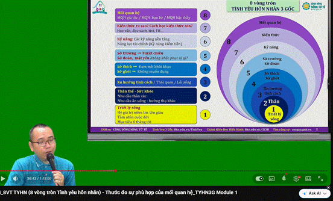
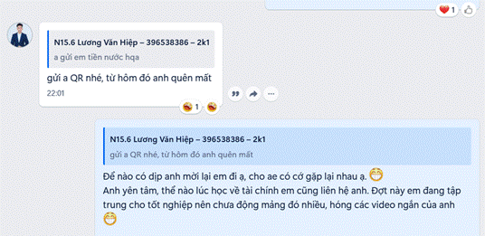

**P3 NHẤT HƯỚNG - ĐƯỜNG NÀY ĐẾN THẾ GIAN, ĐƯỜNG KIA ĐẾN NIẾT BÀN! TỲ KHEO ĐỆ TỬ PHẬT, PHẢI HIỂU BIẾT RÕ RÀNG! + TIỀN.  Copy**

**Đường này đến thế gian. Đường kia đến niết bàn, tỳ kheo đệ tử Phật, phải hiểu biết rõ ràng.**

Mình là Cường. Mình tu tập theo Pháp GOSINGA, những điều ghi chú dưới đây không hoàn toàn đúng ý với Đức Phật và Thiền Sư đã thuyết giảng. Các bạn nên tìm đến giáo Pháp Gốc để đạt được hiểu biết đúng đắn hơn.

|   |
|---|
|•                     Từ 6 động lực hành động của X3 + Thiền học + Trải nghiệm (từ việc ngoại lực, đến việc rèn nội lực bỏ ngoại lực kể cả môi trường bạn bè, ... đến việc kết hợp cả tam bảo và nội lực, đến việc dùng cả các đòn bẩy Tham Sân Si những lúc đuối + Thiền, ... Đúc kết lại thành 4 Đòn Bẩy bên dưới. Điều đặc biệt là nó ko chỉ ứng dụng trong ĐỘNG LỰC LÀM VIỆC -> NÓ VƯỢT XA HƠN VÀ TRỞ THÀNH 4 TẦNG NĂNG LƯỢNG CẦN CỎ TRONG CẢ NGƯỜI (giống như DISC full ko giới hạn và Nội Ngoại kết hợp)  •                     -> KO CHỈ CÒN LÀ ĐỘNG LỰC HÀNH ĐỘNG, MÀ CÒN LÀ CON ĐƯỜNG TU TẬP THEO ĐẤU LA ĐẠI LỤC, CÁCH CHỌN NGƯỜI (map độc đáo, vì lúc trước Chọn người chỉ chọn dựa trên môi trường và tình yêu, ... -> Sau nhận ra chọn người, hiểu người, PT bản thân là 1).|

|   |
|---|
|**1.0 TỨ NIỆM XỨ: NHẤT HƯỚNG LY THAM ĐOẠN DIỆT, AN TỊNH, THẮNG TRÍ, GIÁC NGỘ, NIẾT BÀN >< SÂN SI SỢ**  **1.1 MÔI TRƯỜNG SỐNG, THÓI QUEN + BỨT PHÁ SỢ, NGẠI, NIỀM TIN GIỚI HẠN BẰNG CHÁNH KIẾN, KO CÓ GIỚI HẠN VÀ CHẶN TRÊN - TULA THẦN LĨNH VỰC**  **1.2 TÌNH YÊU: TÌNH DỤC - YÊU THƯƠNG KẾT NỐI NETWORKING PHỤNG SỰ - BIẾT ƠN: TIỀN - Ý NGHĨA, GIÁ TRỊ - CỘNG ĐỒNG, Ý NGHĨA**  **1.2 SÁT THẦN LĨNH VỰC: TIỀN, TỰ CHỦ, KẺ CHIẾN THẮNG, TOP 1, TỰ TẨY NÃO MÌNH = TÌM KIẾM KHAO KHÁT ĂN SỐNG CẢM GIÁC KHÓ CHỊU, CHINH PHỤC, TÁN TỈNH BẰNG SỰ TRUNG THỰC KO CÓ LÝ DO CŨNG CHÍNH LÀ LÝ DO, ĐOÁNH NHAU, TIỀN, KINH NGHIỆM, CHÁNH KIẾN MẶT DÀY TÂM ĐEN, THE ROAD  CON ĐƯỜNG TÔI CHỌN  >< SÂN SI SỢ**|

**4. The Mentor, The Community, The Investor - TÌNH YÊU: TÌNH DỤC - YÊU THƯƠNG KẾT NỐI NETWORKING - BIẾT ƠN: TIỀN - Ý NGHĨA, GIÁ TRỊ - CỘNG ĐỒNG, Ý NGHĨA, BẪY LƯƠNG TÂM THUẦN TUÝ**

**4.1 Để tìm mentor, tìm community, tìm investor bước đầu tiên là ĐỌC VỊ ĐƯỢC CHÍNH MÌNH VÀ MỌI NGƯỜI**

**4.1.1 MÔI TRƯỜNG SỐNG, THÓI QUEN: Bên trong: HIỂU THƯƠNG bài tập rà nghiệp, đúc kết vector + THẦN KHÍ + HÀNH VI THÁI ĐỘ SỐNG.**

|   |
|---|
|**Chánh kiến về xu hướng tính cách: 1 cách tương đối nên mới gọi là xu hướng bởi lẽ bây giờ ngay cả bảo mình summary lại về xu hướng tính cách của mình cũng khó, vì Pháp do duyên khởi, do thói quen**  •                     Môi trường sống nhiều cám dỗ: xăm, thuốc lá rượu bia cờ bạc. (- Khánh Ly  •                     Môi trường sống và thói quen: trai gái gợi cảm uốn éo khoe da khoe thịt quá nhiều.|

**4.1.1.1 PHÁN ĐOÁN bằng bộ môn huyền học: DISC, Thần số, Nhân tướng:**

|   |
|---|
|TẤT CẢ CÁC BỘ MÔN ĐỀU CÓ 1 ĐIỂM CHUNG là xem được XU HƯỚNG nhưng đều phải THỰC SỰ QUAN SÁT HÀNH VI + THÁI ĐỘ SỐNG để chiêm nghiệm.  1.                   ĐIỂM MẠNH NHƯ 1 THANH GƯƠM BÁU LÂU NGÀY KO MÀI RỒI CŨNG HAN, GIỐNG NHƯ CON CHIM ĐẠI BÀNG ĐƯỢC NUÔI TRONG Ổ GÀ MẤT ĐI BẢN LĨNH BAY LƯỢN.  2.                   ĐIỂM YẾU NẾU BIẾT RÈN LUYỆN TỪ SỚM THÌ GIỐNG NHƯ THAY SẮT THÔ GIÁP: CÓ CÔNG MÀI SẮT CÓ NGÀY NÊN KIM, NƯỚC CHẢY ĐÁ MÒN.|

•                     https://www.tinhcach.vn/coban/

•                     https://kinhdich.gnh.vn/thuongha

•                      Đo lường: '''Trí Tuệ: Trán cao, Mũi thông thiên, Tai to + Mắt tinh anh, Lời nói rõ ràng dễ hiểu Góc nhìn ĐA CHIỀU, SÂU SẮC + Tam bảo. *** Nghị Lực: Mũi thông thiên, + Động tác dứt khoát, Mắt có uy, Giọng nói + Tĩnh lặng trước BUỒN VUI + Thích làm chơi việc khó khăn mạo hiểm, Dấu ấn khó. *** Đạo Đức: Gò má lưỡng quyền, quai hàm bạnh (ngang bướng, đanh nghiến) + Ánh mắt Giọng nói BỊ HÚT VÀO SẮC VÀ TIỀN, ánh mắt LỘ, THẦN BẤT TÚC, HAY SO BÌ + Thiện nguyện ít dính mắc.'''

|   |   |   |
|---|---|---|
|Đoàn Ngọc Cường   15h15min  1.                   Lớp 1234 làm lớp trưởng  2.                   Cũng đúng là đào hoa thật =)) học tâm lý tán tỉnh từ năm lớp 9. May mà biết BKE GNH, GOSINGA  3.                   19/2/2026 lúc bắt đầu viết phần tử vi này   => 1 nguồn năng lượng đặc biết khi biết mình là: TỬ VI - PHÁ QUÂN   => Viết ngay 1 bài lên bán hàng khởi động public challenge   +, Đúng kiểu: Đưa ra thông báo và cam kết trước (như sếp Khôi, sếp Minh, sếp 10x easier than 2x, ...) : Bước đầu bước chân vào thị trường bán khoá học =)))  => ĐÂY VỀ BẢN CHẤT VẪN BỊ MẮC BẪY VỀ NIỀM TIN GIỚI HẠN.      Khi bản thân mình đã khá chấp nhận việc mình cũng bình thường thôi, ẩn ẩn 1 chút ko quá giỏi   => thì mình lại đọc được đoạn về TỬ VI PHÁ QUÂN HOÁ LỘC thành ra giống như CON ĐẠI BÀNG Ở TRONG Ổ GÀ 1 NGÀY NÓ BIẾT NÓ LÀ ĐẠI BÀNG.   => Cần giải đó là: Sức mạnh của việc KO GIỚI HẠN BẢN THÂN, KO CÓ 1 GIỚI HẠN NÀO CẢ|1. **Vũ Khí Tối Thượng: Cung Quan Lộc Rực Rỡ**  \|   \| \|---\| \|•                     **Cách cục Tử Vi (Vua) - Phá Quân (Tiên Phong)**  **Hình ảnh một vị vua (Tử Vi) đích thân ra trận (Phá Quân).**  **Chủ về sự khai phá, sáng lập, dám làm những việc người khác không dám.**  •                     **Hóa Lộc (+)  (Tiền Tài) => Biến đam mê thành tiền bạc. Có duyên kiếm tiền từ chính chuyên môn và sự nghiệp của mình.**  **Định hướng nghề nghiệp: Thích hợp kinh doanh, tự mở công ty, lực lượng vũ trang (Công an/Quân đội) hoặc các ngành kỹ thuật mũi nhọn.**  **Lời khuyên: Đừng tìm kiếm sự ổn định nhàm chán. Hãy tìm kiếm sự “Khai phá”. Bạn sinh ra để làm người tiên phong**\|     2. Điểm yếu: Nói về việc giữ tiền kém + Bạn **tuyệt đối không được** dùng tiền lương/thưởng từ nghề AI để đi đánh coin (crypto), chơi chứng khoán lướt sóng hay cờ bạc rủi ro cao. Có tiền thưởng lớn, hãy dùng nó để **mua Bất Động Sản** (vì Quan Lộc phi Hóa Lộc nhập Điền Trạch mang ý nghĩa _làm nên cơ nghiệp nhờ đầu tư nhà đất_      => Sai bét, vì từ nhỏ mình được mệnh danh THẦN GIỮ CỦA.   Giữ tiền cực cực kỳ tốt, ăn uống chi tiêu vô cùng ít, thậm chí năm đầu tiên sau khi đi làm, chi tiêu tới 110% cho việc : ĐỔ XĂNG TĂNG TỐC CHUYÊN MÔN  + Cho đi vô cùng thoải mái với các mối quan hệ thân tình: năm đầu đi làm: Bố mẹ mỗi người 1 triệu, Cô Chú bố mẹ Trung mỗi người 500k, Cô Lưu và Nam mỗi người 100k   => Cơ mà đa phần những pha xuống tiền của mình toàn tiền chục triệu chi cho việc học tập.   => Thử ngẫm xem mình có đầu tư nhà đất không nhé, hay BẤT ĐỘNG SẢN SỐ (tài sản số: thương hiệu, khoá học, năng lực chuyên môn được đóng gói) KKK      3. Điểm yếu và mạnh: Điểm mạnh: SÁT THẦN LĨNH VỰC.  MỆNH: Vũ Khúc - Thất Sát,   - Vũ Khúc (thận trọng nhẫn nại, cô độc tính toán), Thất Sát (liều lĩnh dũng mãnh, nóng nảy, mang theo sát khí)   => S**ự mâu thuẫn nội tại cực kỳ khốc liệt**. Vũ Khúc nhẫn nại >< Thất Sát nóng nảy; Vũ Khúc bảo thủ >< Thất Sát xông xáo (**"trí dũng song toàn"**, nhưng mặt khác lại khiến tâm lý của bạn **"luôn luôn dẫy đầy mâu thuẫn"**)      - Bộ sao: Tuế Phá - Tang Môn - Điếu Khách (luôn không thoả mãn với hiện tại, cái này đúng nè, người ta cho công việc này lại muốn công việc khác) => không hạnh phúc và cũng là động lực thay đổi.      4.||
|Đoàn Văn Tưởng - 7h15|||
|Đoàn Thị Thảo My   Giới tính: Nữ  Ngày sinh: 17/6/2019  Giờ sinh: 21H30 => Hợi (21h-23h)|=> Dạy con, đối với ekip Người Quản Trị, vì thế, không phải là tìm nhãn phù hợp cho con, mà là trì hoãn việc dán nhãn càng lâu càng tốt. Không vội kết luận con là người thế này hay thế kia, không biến một giai đoạn thành bản chất, không biến một sai lầm thành định danh. Thay vì nói “con là người như vậy”, hãy nói “con đang làm điều này trong hoàn cảnh này”. Thay vì hỏi “sao con lúc nào cũng thế”, hãy hỏi “điều gì đang xảy ra với con lúc này”. Đó không phải là nuông chiều, mà là giữ cho cánh cửa nhận thức của con chưa bị khóa lại quá sớm.  => Khi người lớn tin rằng mình hiểu con rồi, thì rất có thể, từ khoảnh khắc đó, họ đã ngừng nhìn con thật sự.  https://www.facebook.com/share/p/1Diyfxp7BV/||

**4.1.1.2 QUAN SÁT THẦN KHÍ + HÀNH VI THÁI ĐỘ SỐNG**

|   |
|---|
|•                     +, THẦN KHÍ(THẦN HỮU DƯ, THẦN TĨNH: mắt, cử động,. KHÍ biểu hiện qua: xương cốt, da thịt, râu tóc, lông mày, âm thanh, khẩu khí).  •                     +, HÀNH VI THÁI ĐỘ SỐNG (nhất là khi có biến động).  •                     +, Đo lường: '''8 Phép chọn tướng Trần Hưng Đạo Gia Cát Lượng: TRÍTUỆ: Hỏi đúng sai, xem chí hướng, rõ ràng? Cật vấn đến kỳ cùng? Hỏi mưu lược, xem tri thức?ĐẠOĐỨC: Qs đa chiều xem đức hạnh? Gián điệp thử xem có trung thành? Giao việc, xem chữ tín?NGHỊLỰC: Lấy của thử? lấy sắc đẹp thử? lấy việc khó thử? Rượu cho uống say, tâm có say không?'''  •                     (Ng quân tử TIẾN THOÁI QUẢ QUYẾT, XEM NGƯỜI THANH THẢN VUI TƯƠI, CHÍ TRỪ TÀN BẠO, khí độ ng Tướng Quốc. Thấy ÁC KO GIẬN LÀNHKOMỪNG, NHANSẮCKOTHAYĐỔI, lượngcủaThiênTử).|
|WARREN BUFFETT - Về Hiring Principles - "You're looking for three things in a person: Intelligence, Energy, and Integrity. And if they don't have the last one, don't even bother with the first two."  Integrity = Làm đúng ngay cả khi không ai nhìn. Buffett nói nếu người đó không có integrity, dù có thông minh và chăm chỉ đến đâu cũng ĐỪNG TUYỂN, vì họ sẽ dùng intelligence + energy để làm hại công ty hiệu quả hơn người bình thường.       Integrity bao gồm:  1.                   Honesty (Trung thực)  •                     Nói thật ngay cả khi khó khăn  •                     Thừa nhận sai lầm  •                     Không nói dối, không che giấu  2.                   Consistency (Nhất quán)  •                     Làm như mình nói  •                     Không "hai mặt"  •                     Principles không thay đổi theo hoàn cảnh  3.                   Accountability (Chịu trách nhiệm)  •                     Đứng ra nhận lỗi  •                     Không đổ lỗi cho người khác  •                     Keep commitments  4.                   Ethics (Đạo đức)  •                     Có chuẩn mực đúng sai rõ ràng  •                     Không làm điều sai dù có lợi  •                     Long-term thinking over short-term gains  Examples thực tế:  Có Integrity:  •                     Phát hiện lỗi mà khách chưa biết → báo ngay cho khách dù mất tiền  •                     Được offer lương cao ở đối thủ → từ chối vì đang ở giữa project quan trọng  •                     Sếp yêu cầu làm điều không đúng → từ chối và giải thích  Không có Integrity:  •                     Lấy credit của người khác  •                     Nói dối về kết quả để trông tốt hơn  •                     Làm việc cá nhân trong giờ công ty  •                     Đổ lỗi cho team khi project fail|

**4.1.1.3 VIẾT NHẬT KÍ Mentor tài phiệt X3 NĂNG SUẤT - Bạn học thiết kế hệ thống nhưng lại không thiết kế hệ thống cho chính mình là bạn toang rồi.**

|   |
|---|
|1.                   DB, Sự nghiệp của bạn sẽ rất ngon, nếu bạn tránh được hết tất cả các sai lầm trong danh sách. (Wecommit100x a Huy)  2.                   Đa phần chúng ta bị những thói quen, pattern lặp lại trong cuộc sống => Viết nhật kí có 2 thứ: 1 là đúc kết từ mình và từ người khác những pattern tốt để biến nó thành của mình, 2 là bỏ đi pattern xấu|

**4.1.1.4 [NHẤT QUÁN, ĐÓNG GÓI TỪ VIỆC NHỎ NHẤT] Bước chân xuống giường với cùng 1 chân - Warren Buffet**

|   |
|---|
|Bạn càng ra ít quyết định, các quyết định của bạn càng chính xác. Mặc cùng 1 cái áo mỗi ngày (thầy trị) đỡ phải suy nghĩ luôn => ĐÓNG GÓI TOÀN BỘ CUỘC SỐNG.|

**4.1 Networking: Mentor - Ny - NSKT - Xây dựng đội ngũ - Nguyên tắc chung là check 4 phần trên.**

**2.1.1 MENTOR: FOLLOW THẦY, KO CẦN SUY NGHĨ HƯỚNG ĐI NHIỀU ĐÂU: 4 Người thầy : 1. GOSINGA + 2. Trần Việt Quân BKE GNH - X3 NĂNG SUẤT + 3. THE ANH ENGISH + 4. AIO + 5. Wecommit100x 6. FULL STACK DATA SCIENCE**

**2.1.1.1 Tiêu chí chọn MENTOR, chọn CO-FOUNDER, chọn SẾP, chọn cộng sự: - T10/2025**

**Top các sai lầm khi tìm Mentor**

|   |   |
|---|---|
||1. RA KẾT QUẢ - LÀM ĐƯỢC RẤT NHIỀU LẦN(nhiều lần thất bại, làm liên tục 5-10 năm)   2. CAO NHÂN XUẤT CAO ĐỒ - NĂNG LỰC ĐÚC KẾT, TRUYỀN ĐAT, THIẾT KẾ MÔI TRƯỜNG, TÂM CHỈ DẠY KHÔNG GIẤU BÀI (có nhiều học trò đã thành tài, theo thầy lâu năm)   3. TƯƠNG HỢP THÔNG TIN, 4 loại đòn bẩy nội lực.   4. SYSTEM, NHẤT QUÁN, CÓ ĐỊNH HƯỚNG DÀI HẠN, THỜI GIAN.|
||**❌ Sai lầm 1: Nói thẳng ra là: "Chó ngáp phải ruồi", "ăn may" một lần, nhưng không thể tái lặp**|
||**❌ Sai lầm 2: Chọn người giỏi làm nhưng không giỏi dạy. Dạy/Giúp đỡ người khác chưa phải DNA của họ.**   - Anh Cường Vũ Cao: 2 tháng đầu vào làm mình đứng yên ko tăng trường, nhiều giai đoạn trong công ty năng lực của mình ko tăng trưởng.   => Tốc độ tăng trưởng của nhân sự chậm. Nếu là mình, mình sẽ hướng dẫn nói chuyện và chỉ dạy bạn cách làm sao để tăng trưởng. Kết nối bạn với ae AI khác để bạn level up phần RAG, Langchain, LangGraph sớm hơn.|
||**❌ Sai lầm 3: Trường năng lượng đen, áp đặt, toxic confidence**  •                     Họ có thể giỏi thật, nhưng năng lượng **gây sợ sệt, đè nén, áp chế**.  •                     Học trò học trong trạng thái **căng cứng, sợ sai** → khó phát triển tự do, sáng tạo.  +, Anh Trúc: áp đặt lính mới, năng lượng toxic toả ra khiến người làm cùng phải run sợ.   Khi mình tách khỏi ảnh 1 cái thì hào quang của mình xuất hiện: Từ LeanSpeak, 1000 Nghề, Tool Search.   Anh Vũ năng lượng quá ấm áp, điềm đạm.|
||**❌ Sai lầm 4: Mentor giấu bài hoặc “vừa dạy vừa cạnh tranh”**  •                     Không thực sự muốn học trò giỏi hơn mình.|

**2.1.1.2 Tin tưởng tuyệt đối vào bản thân và mentor -> Hành động vì nghĩ ko đẻ ra con -> TRỞ THÀNH MẢNH GHÉP, LÀM TẤT CẢ MỌI THỨ, PHỤNG SỰ CHO BỨC TRANH CHUNG CỦA THẦY.**

|   |
|---|
|\|   \| \|---\| \|**Case 1: T7/21/06/2025: Sau N1 mình chỉ networking được với người bên trái, người bên phải và anh Điệp đi ăn cùng -> 3 người hết.**  **=> Mình về kaizen: QUAN TRỌNG NHẤT LÀ MENTOR, NGƯỜI ẢNH HƯỞNG -> LAN RỘNG RA NHỮNG NGƯỜI ẢNH HƯỞNG.**\|  **NGƯỜI DUY NHẤT KHÔNG PHẢI TOP 1 FE SYSTEM NHƯNG CÓ MẶT TRONG "WALL OF LOVE"ĐÂU LÀ LÝ DO:**  1.                   **TIN TƯỞNG TUYỆT ĐỐI VÀO BẢN THÂN, THE ROAD CỦA BẢN THÂN + NGƯỜI THẦY VÀ THE ROAD CỦA NGƯỜI THẦY + SỰ LỰA CHỌN CỦA MÌNH. [KO CÓ GIỚI HẠN]**  \|   \| \|---\| \|Chúc mừng ae, ae đi mạnh giỏi.  Ngày xưa cứ thấy thủ khoa với học bổng du học đâu xa. Nay thấy ae cùng lớp với cùng môn học bay Mỹ ác => thành ra tui cũng thấy có động lực với niềm tin vào bản thân hơn hehehe.  (trước tôi học cùng Minh Tuệ 1 môn, 2 đứa tụi tôi 1 nhóm)\|  2.                   **PHỤNG SỰ NGƯỜI THẦY BUILD BỨC TRANH CHUNG: Vì hoàn toàn tin tưởng Wecommit100x, mình viết bài, mình chạy, mình phụng sự cho bức tranh của wecommit100x chung, lên tiếng để bảo vệ cộng đồng lúc sóng gió, đứng chung chiến tuyến.**  3.                   **XUẤT HIỆN THƯỜNG XUYÊN: 3 tháng đầu offline, online ko bao giờ vắng 1 buổi. Sau 3 tháng chậm lại tí do việc cá nhân**  4.                   **TRỞ THÀNH HỌC TRÒ XUẤT SẮC NHẤT VỚI BEGIN WITH THE END X3-X10 IN MIND:**   **- Người thầy mình viết: Em đã có những mindset và bước đi rất đúng đắn trong giai đoạn đầu sự nghiệp, anh tin em sẽ còn tiến xa hơn nữa. =>**   **- Kết quả đo lường được: 08/02/2025 vào, cuối tháng 4 top 64 Linkedin VN, cuối tháng 5 cũng top, đầu tháng 5 top 10 AI Content Creator Việt Nam luôn.**  5.                   **ĐỒNG THỜI NETWORKING VỚI ACE CHỦ CHỐT XUNG QUANH MENTOR**  **⚠️ Những lỗi cần tránh khi networking với những người xung quanh:**  \|   \| \|---\| \|•                     Chỉ tương tác với những người nổi bật, bỏ qua người khác.  •                     Chỉ quan tâm lợi ích trước mắt thay vì xây dựng mối quan hệ lâu dài.  •                     Giao tiếp thiếu chân thành, máy móc, không tạo được thiện cảm.\|  \|   \| \|---\| \|1.                   **Phân tích chi tiết 5 kỹ thuật bạn đã áp dụng thành công** (tin tưởng tuyệt đối, phụng sự mentor, xuất hiện thường xuyên, trở thành học trò xuất sắc, networking với ace xung quanh)  2.                   **Bí mật networking của top 1% thế giới** - những kỹ thuật độc đáo mà ít người biết  3.                   **Framework tư duy giải quyết vấn đề** theo phương pháp "do cái gì có mặt mà cái kia có mặt, do cái gì không có mặt thì cái kia không có mặt", "quan sát phân tích đúc kết", "giải quyết vấn đề".  4.                   **Ví dụ thực tiễn và case studies** từ những người networking đỉnh cao  5.                   **Các lỗi sai cần tránh và cách khắc phục**\|  ---  \|   \| \|---\| \|Case 1 (tiếp, 22/06/2025)   N2: Kaizen: 1. Bám Mentor thầy dạy hơn tuy chưa có cơ hội nói chuyện. 2. Xin info và chụp chung với chị Nhân sự chủ chốt canh thầy 10 năm 3. Xin chụp ảnh với Trainer Minh, chị Ái, ngồi ăn cạnh chị Nga, chị Nhung, anh Minh Zip, anh Vinh, chị Hẳng, anh Thịnh ảnh chung, anh Diện chị Yến ảnh chung, anh Tươi ảnh chung, anh Đức ảnh chung 4. Đi ăn với ace BTC => Có Trainer, và toàn bộ đội ngũ cạnh thầy. => Trainer bảo: dân X3 sau khi chạy body khoe múi + Kỹ sư CNTT. + 1 lần lên thừa nhận mình nhìn bài = mạnh nhận ra điểm yếu và bẫy tâm lý => Số người biết tăng hẳn, cả chị Yến nhận ra bạn bè FB. => Thành ra: nỗi sợ là do mình tự tưởng tượng ra chứ chị Yến quá nice, quá thân thiện.   => TẬP TRUNG VÀO MENTOR, XUẤT HIỆN CẠNH THẦY ĐỂ THẦY NHỚ VÀ NGƯỜI KHÁC NHỚ. [CÓ ẢNH CHUNG VỚI THẦY]   => TẬP TRUNG VÀO ĐỘI NGŨ KẾ CẬN. [CÓ ẢNH CHUNG VỚI ĐỘI NGŨ KẾ CẬN]  => XIN INFO CHỤP ẢNH VÌ MÌNH MUỐN!!! (Kí ức về việc vượt qua NỖI SỢ, KO LÝ DO CŨNG LÀ LÝ DO, THE ROAD CON ĐƯỜNG TÔI CHỌN -> xin info con gái mình thích, mình muốn tìm hiểu ở quán caffe Lofi caffe đã là 1 dấu ấn =>Mình đến với buổi X3, xin info, xin chụp ảnh chung với mn. Đặc biệt là xin info CHỊ :3 (96, 2k) và xin chụp cùng trong 1 nốt nhạc. [CẢM GIÁC THÍCH THÍCH MÌNH CHƯA GIẢI THÍCH ĐƯỢC].       => Sau rất nhiều cố gắng, học X3K22, X3K23 anh Minh vẫn ko biết mình. Đến tận lúc học TÀI CHÍNH ảnh mới biết   1. Mình đăng bài chạy 3 tháng 6 múi được anh Minh share (tháng 6/2025)   2. Mình học X3 tài chính   3. Mình được sướng tên trong đội ngũ kế thừa X3 (khi học về Deep Work - bài The Road).      => Còn sếp Huy thì mình nổi bật ngay từ những tuần đầu tiên vào Wecommit100x.   - Liên tục vào top.   - Sau 3-4 tháng vào luôn top 10.   - Offline ko sót buổi nào   - Rất nhiều kèo Frontend quá mạnh.\||

**Use cases - Phụng sự cộng đồng:**

|   |
|---|
|\|   \| \|---\| \|1.                   Nay em đang chạy được 4.2km thì có người lạ dắt xe ở bên đường, sau hồi phân vân phải đến 10s, tự nhiên em nhớ a @N15.9Nguyễn Văn Long–334336663–96  Civi  bảo: 'mỗi ngày làm 1 việc tốt' => em chạy quay lại để hỏi xem thì bảo ko nổ được xe. Em bảo ở đấy em phi về lấy xe đi tìm quán, xong em lấy xe phi ra xin sđt phi đi tìm quán, tìm được quán xong tầm 7min quay lại thì bạn bảo là xe nổ được rồi và bạn vừa đi :>\||
|\|   \| \|---\| \|2.                   Tính ra là tớ có: Mentor/Thầy/Cộng đồng Onl và Mentor/Thầy/Cộng đồng Offline  •                     Khi cần giải quyết bất kỳ vấn đề gì liên quan đến Tu tập, Sự nghiệp trong ngành IT đặc biệt là nhánh AI Engineering thì tớ đều có cộng đồng và có người (WHO) để tớ hỏi.  •                     Các mảng như: Sức khoẻ, tài chính thì tớ vẫn chưa có mentor đâu.  ...  •                     Tính ra Mentor 1-1 check in hàng tuần tớ cũng chưa có đâu.  •                     Trước hồi mới đi làm tầm 3-6 tháng tớ cũng muốn tìm mentor trong công ty, mà tìm ko ra (team AI thì có mỗi tớ AI Intern, 1 PO, 1 PM, lúc đó cũng tự hỏi sao công ty ko tuyển thêm AI Mid-level để mentor cho mình)  Sau thì tớ bỏ suy nghĩ đó đi, tớ tìm mentor bên ngoài và level up mình để role AI Intern có thể giải các bài AI khó của AI Mid-Level  => Chuyển sang mindset ko giới hạn để suy nghĩ như tầng C-level  (giống như câu chuyện 1 ông toán học đến muộn và thấy 2 bài trên bảng thầy viết tưởng bài về nhà, ổng về giải, hôm sau mới biết là 2 bài khó nhất thế giới cả thầy cũng chưa giải được).\||
|\|   \| \|---\| \|3.                   **NGƯỜI DUY NHẤT KHÔNG PHẢI TOP 1 FE SYSTEM NHƯNG CÓ MẶT TRONG "WALL OF LOVE"**    **ĐÂU LÀ LÝ DO:**  1.                   **TIN TƯỞNG TUYỆT ĐỐI VÀO BẢN THÂN, THE ROAD CỦA BẢN THÂN + NGƯỜI THẦY VÀ THE ROAD CỦA NGƯỜI THẦY. [KO CÓ GIỚI HẠN]**  2.                   **PHỤNG SỰ NGƯỜI THẦY BUILD BỨC TRANH CHUNG: Vì hoàn toàn tin tưởng Wecommit100x, mình viết bài, mình chạy, mình phụng sự cho bức tranh của wecommit100x chung, lên tiếng để bảo vệ cộng đồng lúc sóng gió, đứng chung chiến tuyến.**  3.                   **XUẤT HIỆN THƯỜNG XUYÊN: 3 tháng đầu offline, online ko bao giờ vắng 1 buổi. Sau 3 tháng chậm lại tí do việc cá nhân**  4.                   **TRỞ THÀNH HỌC TRÒ XUẤT SẮC NHẤT VỚI BEGIN WITH THE END X3-X10 IN MIND:**   **- Người thầy mình viết: Em đã có những mindset và bước đi rất đúng đắn trong giai đoạn đầu sự nghiệp, anh tin em sẽ còn tiến xa hơn nữa. =>**   **- Kết quả đo lường được: 08/02/2025 vào, cuối tháng 4 top 64 Linkedin VN, cuối tháng 5 cũng top, đầu tháng 5 top 10 AI Content Creator Việt Nam luôn.**\||
|\|   \| \|---\| \|5.                   28/05/2025: Phân vân có nên đi offline không?  •                     Đi ăn mừng không phải để chứng minh bạn đã đóng góp, mà là để xây dựng cầu nối giúp bạn đóng góp nhiều hơn trong tương lai.\||

 

**2.1.2 Ny**

**2.1.2.0 CÁC SAI LẦM KHÔNG ĐƯỢC PHÉP MẮC PHẢI**

|   |   |
|---|---|
|1.                   Quá trẻ trâu  2.                   Vô tâm và ko quan tâm đến cô gái, tối thiểu gặp nhau 1 lần 1 tuần lúc chưa kết hôn.  3.                   Ko được vì sự nghiệp mà bỏ quên gia đình.||
|12/09/2023       Abraham Jacob (Lê Thị Khánh Huyền)  Ukii để giờ mình nói những suy nghĩ của mình nhé.  Trước hết là với mình hiện tại vẫn ko có mối quan hệ nào cả, vì mình ko phải là kiểu bắt cá nhiều tay. Và hiện tại cũng không có nhu cầu kiếm người yêu.  Câu trên là trả lời cho tin nhắn của cậu ở trên.  Bây giờ thì mình sẽ nói lên suy nghĩ của mình nhé.  Đầu tiên khi làm quen cậu, thì mình nghĩ đơn giản là có một người bạn ở Bách Khoa và học AI thì sau này sẽ học hỏi được nhiều điều. Và ngay từ lúc đó mình đã xác định mối quan hệ này là bạn bè bình thường và không có nhu cầu muốn tìm hiểu thêm, hay tiến xa hơn.  Nhưng sau đó cậu đã chủ động mong muốn tiến xa hơn trong mối quan hệ, còn bản thân mình lúc đó thì thực sự chưa sẵn sàng và không mong muốn. Nhưng mình nghĩ nếu cậu chủ động thì biết đâu đây cũng là một nhân duyên, nên mình cũng đã cố đồng ý để tìm hiểu thêm.  Nhưng trong quá trình mình tìm hiểu thêm để đi sâu hơn trong mối quan hệ này thì mình thấy rằng như sau:  Có thể với người khác cậu là một hình mẫu lí tưởng  Nhưng đối với mình thì không.  Vì cậu thiếu sự tinh tế, thiếu sự hiểu biết sâu sắc trong một mối quan hệ tình cảm, thiếu sự quan tâm đôi lúc không biết có phải vô tâm hay không. Mối lần hẹn gặp mình cũng cố gắng quan sát, nhưng vẫn chưa thực sự thấy được sự trùng hợp nào về quan điểm tư tưởng.   Về phía mình thì bản thân mình cũng có lỗi vì đã không lắng nghe thực sự bản thân và nói thật ra cũng như rõ ràng về những cảm xúc mà mình thấy.  Rằng ngay từ đầu là bạn bè chứ ko thể tiến xa hơn,  Còn như bên trên cậu nói là mối quan hệ mập mờ thì mình thấy rằng chẳng có một chút mập mờ nào vì nó đã là bạn bè rồi cậu ạ. Vì người yêu thì cũng không kiểu như vậy. Bởi nó cũng chẳng có sự ràng buộc nào cả.  Ngay từ giờ mình khẳng định rõ ràng nhé mình và cậu là mối quan hệ bạn bè và không hơn.  Yess sau việc này mình cũng mong giữa cậu và mình cũng có thể giữa được mối quan hệ bạn bè thiện chí, giúp đỡ và học hỏi nhau nhiều hơn thông qua công việc và học tập cậu nhé.  Cảm ơn cậu nhiều. Đang lẽ mình cần phải nói những điều này sớm hơn, nhưng giờ mới nói.||
|11/02/2026 (gặp lại sau 3 năm và có 3 lần gặp về phòng mình ôm hun)   Helen.  Nhưng tớ chia sẻ thật.  Ko hiểu tại sao. Bây giờ tớ nghĩ đến mỗi lần gặp kiểu hôn các thứ  Tớ thấy chán  Với lại thấy nó vô nghĩa ý  Kiểu suốt một buổi gặp chỉ có thế  Và tớ lại có cảm giác kiểu hôn hít lắm, tốn thời gian, mà kiểu dục vọng nhiều  Và nó làm tớ thấy mệt sau mỗi buổi gặp. Và thấy nó trống rỗng vô nghĩa sau đó.  Rồi đôi khi nghĩ lại lại thấy chán ngấy cậu ạ.  Đó là cảm xúc thật của tớ|Đúng là tớ khá thích những lần ôm hun như thế  Cậu thì thích trò chuyện, tâm sự nhiều hơn so với nhu cầu thể xác.  Thế buổi sau gặp nhau bên ngoài nhá, sẽ hạn chế/cân bằng lại 2 nhu cầu.|
|||

**2.1.2.1 Tâm thế - Mindset - Actions - 2 CUỐN SÁCH THAY ĐỔI MINDSET CỦA MÌNH: ĐÀN ÔNG ALPHA VÀ TÁN TỈNH BẰNG SỰ TRUNG THỰC (Mark Manson)**

|   |
|---|
|1.                   (Kỳ 2 lớp 9) Alpha art - trở thành người đàn ông mọi phụ nữ mơ ước - Nexx & Joker    (Đọc kỳ 2 năm lớp 9): Tổng quan về các steps từ lúc làm quen -> hẹn hò.  •                     Hiểu tâm lý/phụ nữ => Nhiều chiêu trò tâm lý.  •                     Các giai đoạn hẹn hò, mô hình diễn biến cảm xúc, ví dụ thực tế để áp dụng  Khi áp dụng mình mỗi lần nhắn tin đều phải chuẩn bị rất lâu và rất nhiều thứ, cố gắng làm cho cuộc trò chuyện thú vị, viết cả đống tin nhắn và giả lập tình huống ra sách và không quá hiệu quả.  2.                   (Lớp 11) [https://markmanson.net/books/models](https://markmanson.net/books/models)   Đây là cuốn thay đổi hoàn toàn mindset của mình với Tán tỉnh bằng sự trung thực - nói rõ ý định của mình ngay từ đầu (sự trung thực đó tạo ra sức hút rất đặc biệt vì đơn giản mình không nói cô ấy cũng đã biết tỏng).  +, 1 sự bình an, thoải mái khi tiếp cận và chinh phục => Mình dùng nó và thấy rất thoải mái với các cases như: Thành Linh, Quỳnh, ...  3.                   Đạo học: BKE GNH: https://www.youtube.com/watch?v=vzyfH0kTXpY  - 8 VÒNG TRÒN TÌNH YÊU HÔN NHÂN  4.                   SỰ TƯƠNG HỢP THÔNG TIN (Gosinga)|

|   |   |
|---|---|
|MINDSET|Lý do và bài học đúc kết|
|1 - HIỂU BIẾT ĐÚNG VÀ SAI VỀ SỰ TƯƠNG HỢP THÔNG TIN|1.                   **MỞ PHỄU ĐÚNG THỊ TRƯỜNG - THU HÚT ĐẾN TỪ TƯƠNG HỢP THÔNG TIN - THE ROAD (Thiền, Thư viện, Caffe học xuyên đêm, ... là thắng tới 80% rồi) VÀ NETWORKING TẠO CƠ HỘI CHO MÌNH (mở rộng dần ra - con số 250 network - số lượng cũng có chất lượng của nó wecommit100x) LÀM QUEN, TUYỂN KỸ - BUÔNG XẢ LÀM TỐT NHẤT, SÁNG HAY KHÔNG LÀ CHUYỆN CỦA BÓNG ĐÈN:**  •                     Thay đổi mình và người khác đều có thể, và sẽ cần thời gian  •                     SỰ THU HÚT đến từ SỰ TƯƠNG HỢP THÔNG TIN("ko quan trọng bạn nói gì, quan trọng vẻ ngoài và sự tự tin, ko sợ hãi. Con gái bị cuốn hút bởi sự trung thực đồng nhất cả bên trong lẫn bên ngoài"). **SỰ ĐỦ ĐẦY TỪ BÊN TRONG - TẠO GIÁ TRỊ - THE ROAD (ko ai đi, tôi vẫn đi, bạn đi cùng, tôi đồng hành).** (Ràng buộc vật chất, không ràng buộc nơi tư tưởng sở hữu cảm giác). LÀM QUEN TỐT NHẤT,  MỞ LỜI TỐT NHẤT => TỪ CHỐI GIÚP TA TIẾT KIỆM THỜI GIAN VÀ SỨC LỰC, SẴN SÀNG LOẠI BỎ NGAY TỪ ĐẦU  •                     Khi số người biết bạn là 1K cơ hội khác, 100K follow cơ hội khác.  \|   \| \|---\| \|1. (vì bạn không mất thời gian, năng lượng cố gắng thuyết phục cô gái rằng bạn hấp dẫn). (Nếu tôi không chắc có thể làm việc với người đó trong 1 thời gian dài, tôi sẽ không làm việc với người đó dù chỉ là 1 giờ)(còn đi lâu dài hay không còn tuỳ nhân duyên) ("Vì tôi đã đá rất nhiều người ngay từ đầu vì những việc ngu ngốc như thế này để tôi không còn phải lo về nó nữa. Trong chuyện này thì tôi rất tàn nhẫn. Tôi bỏ đi ngay giữa cuӝc hẹn đầu tiên. Tôi bỏ đi ngay giữa lời nói. Tôi không quan tâm. Tôi không có thời gian với những cô gái tệ. Và kết quả là, hoặc là họ thay đổi phù hӧp với mong đӧi của tôi, hoặc là tôi không bao giờ gặp họ nữa. Tôi tôn trọng bản thân và vì thế sẽ không dành thời gian với những cô gái không tôn trọng tôi. Bạn sẽ tự nhiên nghĩ rằng, “Ồ, vậy có nghĩa mình phải gặp gấp đôi số phө nữ, phải bỏ ra gấp đôi công sức, vì mình sẽ từ chối nửa số người thích mình.” Thật ra, bạn sẽ bỏ ra ít công sức hơn, vì bạn không còn phí nhiều thời gian và năng lưӧng cố gắng thuyết phөc cô ấy rằng bạn là mӝt người đàn ông hấp dẫn. Bạn không còn mệt mỏi nghĩ rằng liệu cô ấy có thích bạn đủ nhiều hay không, hoặc lo lắng làm thế nào để gây ấn tưӧng hay thắng lại cô ấy. Khi cô ấy không hӧp với tiêu chuẩn của bạn, tình huống trở nên cực kỳ dễ dàng cho bạn: bạn bỏ đi. Không nghĩ ngӧi gì hết. Không tranh cãi. Không quay lại ngoạn mөc. Chỉ là: hành vì của cô ấy không hӧp với tiêu chuẩn của mình, mình sẽ gặp mӝt người khác")   2. KO HẠ THẤP TIÊU CHUẨN:  “Trí tuệ xúc cảm” của Daniel Goleman - tác phẩm kinh điển nhất về EQ: [https://tinyurl.com/tri-tue-xuc-cam3](https://l.facebook.com/l.php?u=https%3A%2F%2Ftinyurl.com%2Ftri-tue-xuc-cam3%3Ffbclid%3DIwZXh0bgNhZW0CMTAAYnJpZBExQ3hWSXJDRG5pQjhWZHdNZQEeeBwTQnNJ-kuMTpy3cb-S8VQfRbhUhHYjjYUjn8QvWeaZBPm2jPyE8kOHyWg_aem_Clcd98w2NoD56roSeHmQkA&h=AT2SJM8Jf4K6y_Z3YyiXBCNxbHv1jL0owq4CeDqZuWZEJ-RE59O2gIVLIwVR2PZ2Ga_lwiaDBqTW1MW5Y5e9moZ-4cSDd9qD7THEXMaerQM5rRGmkAET2WAMKRBQjOWnUuGpzORG0GGVMgDEEvDd8-ImFUEfQ9d1&__tn__=-UK-R&c%5b0%5d=AT2ugb3GtyZG0BXC2h68-yxfTI2Za8vLYCYSGmPgU8QvMjYakhR7Ejs4-mSNQ0QLVesohTLLC_nZSeENCafIp3OtkJaw39EXYYnQhqTXz5vmo1WqP9ORsgVS-RAzjKeEvdPJ5TAGlwbZjbSQDoGFYC25ZcqpQzJOJhuYaEV4L46FrzBdVu6eoIPl8pK8hlipaM-QqBw3C8EIAtfQc5t-70vbgBoR)  •                     Nỗi đau âm ỉ, Chi phí chìm và "Hiệu ứng cố gắng phi lý" (irrational escalation) – khi bạn đã đầu tư quá nhiều vào một người không rõ ràng, bạn càng khó dừng lại, vì bạn nghĩ: “Mình đã đi xa thế này rồi, chẳng lẽ quay về tay trắng?”  •                     Rất nhiều người, khi bị đối phương lạnh nhạt, lại chọn hạ tiêu chuẩn: Trước đây muốn yêu một người biết trân trọng – giờ chỉ cần người đó đừng biến mất. Trước đây cần sự rõ ràng – giờ chấp nhận cả sự mập mờ, miễn là không bị bỏ rơi. Bạn không cần co lại để “vừa” với một ai đó. Người xứng đáng là người khiến bạn được là chính mình – chứ không phải phiên bản rút gọn để vừa vặn với sự thờ ơ của họ. <27/06/2025: KLinh nhắn gần 10 tin rep 1-2 tin>  •                     Và nếu tình yêu ấy khiến bạn phải giành lấy từng chút quan tâm, chờ đợi từng lần phản hồi, tự vấn giá trị bản thân mỗi ngày – thì bạn có quyền rút lui. Một mối quan hệ khiến bạn phải đoán liên tục. Naval từng nói: "You’re not going to get rich renting out your time.” — bạn cũng sẽ không thể sống sâu khi để sự chú ý của mình bị cho thuê rẻ mạt. <30/06/2025: KLinh nhắn gần 10 tin rep 1-2 tin>\||
|2 - START WITH THE END IN MIND - HÃY RÕ RÀNG Ý ĐỊNH NGAY TỪ ĐẦU. và THÍCH NGHI (**SỰ LỰA CHỌN/RA QUYẾT ĐỊNH DỰA TRÊN PHẢN HỒI)**      (Tiêu chí như nào, sẽ thảo luận bên dưới).|2.                   **RÕ RÀNG Ý ĐỊNH -> MỐI QUAN HỆ LÀ TÁN NGAY TỪ ĐẦU, TÁN MẠNH (Thẳng thắn: xin fb - ko vòng vo vì người ta biết tỏng ý định rồi)**   •                     LÀM ĐÃ LEVEL UP DẦN (Giống như việc 3 tháng đầu năm 2025 T2-02/05/2025 mình lần đầu chạy, viết bài chuyên môn, làm video ĐĂNG LÊN ĐỀU ĐẶN - nỗi sợ chỉ mất đi khi mình làm, vô tình cái dự tính Content Creator nó đến nhanh hơn kế hoạch 2-3 năm)  •                     BẮT ĐẦU VỚI VIỆC: TIẾN ĐẾN VÀ NÓI "TỚ XIN FB CẬU VỚI", Ý ĐỊNH RÕ RÀNG. (KO MỞ ĐẦU, KO LÝ DO, KO KẾT THÚC).  \|   \| \|---\| \|•                     Khánh Ly: Cậu 2k mấy đó, xin facebook được không. (Khánh Ly). Rõ ràng!!!  •                     Hiền: Bạn khác ở quán caffe 5h sáng mình gọi dậy xin info xong chuồn.  •                     Khánh: đang ngồi học mình ra: Xin fb cậu với -> xong cũng chuồn.  •                     ... => Sự thật là trong toàn bộ những lần xin info đợt T5, T6/2025 mình chỉ nói đúng 1 câu : "Tớ xin fb cậu với. (Đa phần ko mở đầu, ko lý do, ko kết thúc)"\|  3.                   **QUAN SÁT: SỰ PHẢN HỒI**   **- Nhu cầu các giới, Nhu cầu TÌNH DỤC :** (con gái XINH ƯA NHÌN, con trai KHÉO TINH TẾ). KHỔ THỌ TÌNH DỤC. Có nhu cầu nhưng ko ở mức biến thái.   **- Networking - Sự đầu tư cho mình, ny, GIA ĐÌNH/MQH của họ:**  \|   \| \|---\| \|Investment in Relationship - IR = (Response Frequency + Interest Level + Communication Quality) / 3  +, Tần suất phản hồi / Response Frequency  +, Mức độ quan tâm / Interest Level: đo lường sự quan tâm, chú ý mà người đó dành cho mối quan hệ,  +, Chất lượng giao tiếp / Communication Quality  => KẾT QUẢ: phân 3 nhóm: ĐẦU TƯ NGƯỢC dựa trên TIẾN TRÌNH TỰ NHIÊN của MQH (DUYÊN KHỞI)  •                     Đèn Xanh (Đáp Lại): gia đình, ny, Mentor - đồng đội thân cận  •                     Đèn Vàng (Lưng Chừng): MQH xã giao, bạn bè, đối tác tiềm năng  •                     Đèn Đỏ (Ko đáp lại): 0  *** Nam và Nữ ***: Phụ nữ suy nghĩ phức tạp, cảm xúc, yêu bằng tai cần ái ngữ chăm sóc yêu thương, TÍNH YÊU THƯƠNG GIÚP ĐỠ CAO >< Đàn ông logic, yêu bằng mắt cần tình dục, TÍNH CHINH PHỤC CAO  Follow fb nhóm đáp lại , bạn thân - Follow story thì để all.\|     **SỰ LỰA CHỌN/RA QUYẾT ĐỊNH DỰA TRÊN PHẢN HỒI: Hãy làm như cách mình từng khuyên người khác.**  \|   \| \|---\| \|•                     1. Triết lý cốt lõi: "Trung thực là vũ khí!"  •                     2. First Date là dịp để thể hiện bản chất thật, không giả tạo.  •                     3. Đừng tự trách mình – Định nghĩa lại sai lầm  Bạn hỏi: “Mình sai ở đâu?”  Không sai vì trung thực, vì chủ động.  Nếu sai – thì chỉ là:  - Bạn đặt cảm xúc quá sớm vào một người chưa rõ ràng.  - Bạn giao tiếp rõ – nhưng chưa chấp nhận rõ sự thật: họ có thể không hứng thú với bạn, và đó là bình thường.  •                     4. Đỏ -> tự động rời đi, ko lý do. Vàng -> nói rõ ý định, Xanh -> chốt đơn!\||
|3 - NGHỊCH LÝ SỰ LỰA CHỌN - START WITH THE DON'T IN MIND|**SAI LẦM LỚN NHẤT SỐ 1: CÓ MỚI NỚI CŨ - NĂM 2022 và BÀI HỌC: Vạch ra tiêu chí lựa chọn rõ ràng ngay từ đầu, chính là cách giải mã Paradox of Choice. Tiêu chí này giúp bạn “thấy là chốt”, mà không cần tốn thời gian phân bua 101 tiêu chí phụ khác.**  \|   \| \|---\| \|Đi Thiền 2022 về, có 1 option khác ngon hơn -> mình nhảy và hỏng hết! => Kéo theo rất nhiều thứ! Sau này đến 2025 mình mới gọi được tên nó là:  •                     Câu chuyện người nông dân tìm bông lúa tốt nhất đến mức đi đến cuối cánh đồng vẫn tay trắng vì vẫn nghĩ ở phía trước có bông lúa ngon hơn.  •                     Nghịch lý sự lựa chọn: https://vietcetera.com/vn/paradox-of-choice-tai-sao-ta-van-chon-sai-nguoi-du-nguoi-nhieu-vo-ke  •                     và Bài học giải mã Paradox of Choice:\|  https://youtu.be/FyCHApY57S4?si=ux8AqNvNUR7Mcefl  1.                   Bắt đầu với những điều "Không nên" (Start with the Don'ts)  •                     Story: Phép loại suy về Tennis: Trong quần vợt nghiệp dư, người chiến thắng thường là người mắc ít lỗi tự đánh hỏng nhất (đánh vào lưới, đánh ra ngoài), chứ không phải người có những cú đánh nhanh nhất hoặc kỹ thuật nhất. Nói 1 cách đơn giản, bạn thắng bằng cách CHƠI AN TOÀN.  +, Cố gắng không ngu ngốc và giữ trong VÒNG TRÒN NĂNG LỰC của mình 1 cách NHẤT QUÁN còn tốt hơn là cố tỏ rất thông minh.  +, Warren Buffett và Charlie Munger đã đứng ngoài các công ty công nghệ trong một thời gian dài. Họ đã bỏ lỡ nhiều cơ hội, nhưng quan trọng hơn, họ đã tránh được rất nhiều sai lầm, ví dụ như việc "chèo lái khá êm ả" qua bong bóng dot-com  => Để đạt được thành công bền vững, đặc biệt trong đầu tư, bạn cần tập trung vào việc tránh mắc sai lầm lớn và duy trì hoạt động trong "vòng tròn năng lực" của mình, thay vì cố gắng tỏ ra quá thông minh hay theo đuổi mọi cơ hội.  +, Chơi an toàn là chìa khóa: Giống như người chơi tennis nghiệp dư chiến thắng nhờ ít mắc lỗi, trong cuộc sống và đầu tư, việc bạn giảm thiểu rủi ro và các hành động thiếu suy nghĩ sẽ dẫn đến thành công hơn là việc bạn cố gắng thực hiện những cú "đánh" mạo hiểm hoặc phức tạp mà bạn không thành thạo.  +. Hiểu rõ giới hạn của bản thân: Bạn cần xác định rõ đâu là lĩnh vực bạn có kiến thức sâu rộng và lợi thế thông tin (vòng tròn năng lực). Đầu tư hay hành động ngoài vòng tròn này sẽ làm tăng đáng kể nguy cơ mắc sai lầm và mất vốn.  +, Tránh xa những điều không hiểu: Charlie Munger và Warren Buffett đã chứng minh rằng việc bỏ lỡ một số cơ hội (như các công ty công nghệ trong giai đoạn đầu) nhưng đổi lại là tránh được những sai lầm thảm khốc (như bong bóng dot-com) là một chiến lược khôn ngoan và mang lại kết quả vượt trội về lâu dài.  +, "Không ngu ngốc" quan trọng hơn "rất thông minh"  Nguyên tắc "Start with the Don'ts" của Charlie Munger dạy chúng ta rằng không ngu ngốc luôn tốt hơn là cố gắng rất thông minh. Trong tìm kiếm bạn đời, điều này có nghĩa:  1.                   Tránh mối quan hệ độc hại quan trọng hơn tìm mối quan hệ "hoàn hảo": Thêm nữa, rất ít cặp vợ chồng có tất cả mọi điều. Nhưng mọi cặp vợ chồng hạnh phúc chia sẻ một điều chung: cả hai người đều không gây hại cho nhau.  2.                   Độc lập tư duy, không phải theo đám đông: Bạn bè, gia đình, và xã hội có thể nói với bạn "Anh ấy/cô ấy rất tốt, tại sao bạn lại phàn nàn?" Nhưng nếu bạn đã xác định rõ ràng những gì bạn không chấp nhận được, bạn có thể tin tưởng vào quyết định của mình.  3.                   Sơ duyệt kỹ lưỡng, lựa chọn dũng cảm: Như Munger cảnh báo với một câu tỏng tục: "Tất cả những gì tôi muốn biết là tôi sẽ chết ở đâu, để tôi sẽ không bao giờ đi đến đó." Áp dụng điều đó vào hẹn hò: Hãy biết những gì bạn không muốn, rồi tránh nó.|
|4.                   THAM LAM DÀI HẠN CHỨ ĐỪNG THAM LAM NGẮN HẠN|1.                   Ngay sau hôm học tài chính cá nhân T6/2025, trong đầu mình hiện lên 2 chữ "à ha", ra là 1 thương vụ tài chính thành công, việc mà có 1 người vợ giàu có, người giàu thì không hề xấu ác như truyện cổ tích đó là 1 đòn bẩy nếu mình cưới được.   Và khi mình càng nhiều tuổi, với tốc độ học tập và mở rộng network, system, nhất quán thì càng thời gian về sau => Mình càng đỉnh   => Càng nhiều cơ hội (nhất là hiện tại mình bắt đầu có network với các anh chị chủ doanh nghiệp ở nhiều mảng)   => Càng nhiều tuổi thì range (khoảng chọn lựa của mình càng ngon).  2.                   Khi gặp lại nyc sau 2 năm vào cuối 2026, được biết nyc cũng làm trong mảng M&A => Mình đưa ra mục tiêu chốt deal trong 3 năm tới, năm mình khoảng 26 tuổi, mình vừa mạnh mà deal này cũng ngon  3.                   17/2/2026 mùng 1 tết đọc được bài: (nói chung khá đúng ý mình) - LINK: https://www.facebook.com/share/p/1Du2YoWFxW/      +, Tuyệt đối không được mang tâm lý FOMO (Hội chứng sợ bị bỏ lỡ) vào chuyện tình cảm! Hôn nhân, về bản chất, là thương vụ M&A (Sáp nhập & Mua lại) lớn nhất cuộc đời bạn. Nếu bạn vội vã "chốt deal" chỉ vì thấy thị trường xung quanh ai cũng mua bán, bạn rất dễ ôm phải "nợ xấu".       PHẦN 1: BẢNG CÂN ĐỐI KẾ TOÁN LỢI ÍCH CỦA VIỆC ĐỘC THÂN  1. Nắm 100% Quyền Biểu Quyết (Tự do quyết định và tự chịu trách nhiệm): Nhà triết học vĩ đại Socrates từng nói một câu định hình toàn bộ tư duy nhân loại: "Hãy tự biết mình" (Know thyself). Nhưng làm sao bạn biết mình thực sự muốn gì khi lúc nào cũng phải nhượng bộ "cổ đông lớn" (người yêu/bạn đời)? Khả năng tự chủ này tôi rèn cho bạn một "tâm lý thép" – thứ vũ khí tối thượng của mọi nhà đầu tư và CEO xuất chúng.   2. Cắt Giảm Tối Đa "Chi Phí Chìm" Dành Cho Drama (Tăng cường mối quan hệ với chính mình):   Độc thân cho phép bạn cắt bỏ hoàn toàn "Overhead cost" (Chi phí vận hành) của cảm xúc tiêu cực, những cơn ghen tuông, những màn dỗi hờn, cãi vã.. Bạn có không gian tĩnh lặng để nhìn vào bên trong. Tỷ phú Warren Buffett từng nói: "Khoản đầu tư tốt nhất mà bạn có thể thực hiện là đầu tư vào chính bản thân mình." Độc thân là lúc bạn dồn mọi nguồn lực R&D (Nghiên cứu & Phát triển) để nâng cấp bộ não và sức khỏe của chính mình.   3. Tối Ưu Hóa "Mạng Lưới Phân Phối" (Nuôi dưỡng các mối quan hệ khác): Khi yêu, người ta thường mắc hội chứng "Tập trung rủi ro vào một rổ". Họ bỏ bê bạn bè, đối tác để quấn quýt bên người tình.   => Khi độc thân, bạn có dư dả thời gian để phân bổ nguồn lực sang các mối quan hệ xã hội, đối tác kinh doanh, anh em chí cốt.      PHẦN 2: CÚ LỪA VỀ TÀI CHÍNH! - ở Việt Nam, chúng ta có quan niệm "An cư lạc nghiệp". Nhiều người làm công ăn lương hay nhà đầu tư F0 bị bố mẹ ép cưới với lý do: "Lấy vợ/chồng đi rồi làm ăn mới ổn định".  +, Lấy nhầm người không mang lại sự ổn định. Lấy nhầm người là bạn đang rước một khoản "Nợ xấu" (Bad Debt) vào nhà, với lãi suất thả nổi, sẵn sàng bào mòn mọi dòng tiền tự do của bạn. Tôi đã thấy vô số bạn trẻ lương 15-20 triệu, vay mượn làm đám cưới linh đình, rồi đẻ con, rồi è cổ trả nợ tín dụng mua bỉm sữa, mua chung cư trả góp. Cuộc đời họ chính thức rơi vào "Vòng xoáy Chuột chạy" (Rat Race). Họ mất sạch sự can đảm để khởi nghiệp hay đầu tư vì sợ rủi ro ảnh hưởng đến gia đình.   +, Trong khi đó, những anh chàng/cô nàng độc thân cùng xuất phát điểm, họ sống tối giản, dùng tiền lương đập vào học hành, mua cổ phiếu, gom vốn mua mảnh đất vùng ven. 5 năm sau, khoảng cách tài sản giữa hai bên là một vực thẳm.      => Vì vậy, lời khuyên cho những người mới: Đừng vội vã sáp nhập doanh nghiệp khi bạn chưa định giá đúng bản thân. Hãy cứ độc thân vui vẻ cho đến khi bạn tìm được một "Cổ đông chiến lược" thực sự đồng điệu về tầm nhìn và giá trị!       PHẦN 3: TẬP TRUNG VÀO MÌNH TẬP TRUNG ĐỔ XĂNG VÀO ĐỂ ĐI NHANH NHẤT CÓ THỂ - THAM LÀM DÀI HẠN CHỨ ĐỪNG THAM LAM NGẮN HẠN (Warren Buffet)   +, CẬU BÉ MÙ VÀ CÂY ĐÈN DẦU: Trong quản trị tài chính, bạn phải luôn "Pay yourself first" (Trả cho mình trước). Trong tình cảm cũng vậy. Nếu bạn không thể tự làm cho mình hạnh phúc, bạn sẽ biến thành một kẻ ăn mày tình cảm, luôn đòi hỏi bạn đời phải làm mình vui. Một đối tác kinh doanh thông minh sẽ bỏ chạy khi thấy bạn là một "công ty" rỗng tuếch chỉ chực chờ hút vốn.      +, TƯ DUY DÀI HẠN:   - a Huy từng nói: trong những giai đoạn đầu khi mới kiếm được tiền, mn thường có xu hướng thưởng cho bản thân, tiêu xài, mua đồ tiêu sản.   Lúc đó nếu ae ĐỔ XĂNG VÀO VÍT CHO THẬT NHANH, đường thì thoáng không có mấy thằng đi, đổ xăng vào vít càng nhanh càng tốt.   - Đặt Mục Tiêu và Giữ Vững Tầm Nhìn Dài Hạn (Giữ vững quan điểm): Kẻ thù lớn nhất của sự vĩ đại là sự nóng vội. Khi thấy bạn bè up ảnh cưới rần rần trên Facebook, rất dễ sinh ra tâm lý tự ti. Nhưng hãy nhớ: Tỷ phú Warren Buffett kiếm được 99% tài sản của mình SAU tuổi 50. Mọi sự vĩ đại đều cần thời gian đơm hoa kết trái.       PHẦN 4: TÍCH GÓP TÀI SẢN   +, Đa Dạng Hóa Danh Mục Kết Nối (Ưu tiên kết nối & Gặp gỡ bạn bè): chủ động bơm vốn thời gian vào việc gặp gỡ bạn bè, tham gia cộng đồng đầu tư, CLB đọc sách, hay nhóm chạy bộ.   +, Hãy lấp đầy thời gian: Buổi tối rảnh rỗi và những ngày cuối tuần chính là "Khung giờ vàng" (Golden Hours). Thay vì lướt TikTok than ế, hãy tham gia các lớp học vẽ, học nấu ăn, học giao tiếp, hoặc bắt đầu một Side Hustle (Nghề tay trái). Viết lách, thiết kế, làm môi giới bất động sản bán thời gian... Việc này không chỉ mở rộng phễu kỹ năng mà còn tạo ra đa nguồn thu (Multiple streams of income). Đột nhiên, bạn thấy mình bận rộn kiếm tiền và phát triển đến mức... không còn thời gian để buồn!   => OUTPUT: Hãy thiết lập mục tiêu cá nhân và tài chính thật rõ ràng. Dùng thời gian độc thân này để xây dựng một nền móng kinh tế vững chãi. Khi bạn đã tự do tài chính, khí chất của bạn sẽ thay đổi. Bạn sẽ tỏa ra một trường năng lượng cực kỳ hấp dẫn. Và tin tôi đi, ở đúng thời điểm bạn rực rỡ nhất, "Người đồng hành" phù hợp sẽ xuất hiện. Lúc đó, đó không phải là sự chắp vá của hai nửa khiếm khuyết, mà là cái bắt tay hợp tác của hai tập đoàn vĩ đại!|

**2.1.2.1.1 Tiêu chí dừng lại - Sự theo đuổi cần là đối xứng - Tự bản thân sẽ cảm nhận được điều đó.  - 18/1/2026**

|   |   |
|---|---|
|1.                   KHÔNG CÓ DUYÊN VỚI PHÁP|Nói không với 1 người phỉ báng Pháp (đã ko hiểu còn tỏ ra coi thường Pháp)  => Ưu tiên người tu tập và ưu tiên người cùng Pháp.  \|   \| \|---\| \|19/1/2026 (Thời điểm mình đã ra trường và quay lại với ny1 LTKH).   Dương - Tester Robot   +, Lửa gần rơm lâu ngày dễ bén. Đi test robot 5 lần thì tất cả đều ngồi cạnh bạn này trên ô tô, chân chạm và tay chạm.   +, Mình thấy rõ đó là cảm giác, cảm thọ nhất thời. Xa là hết cháy ngay ý mà.   +, Mình đã check nhanh về mục đích sống, nhân dạng, ... (nói chung để match với mình thì còn cần duyên với Chánh Pháp và căn cơ tu tập nữa cơ, chứ không thì khó).\||
|2.                   KHÔNG HIỂU PHÁP BẤT NHƯ Ý   +, Câu chuyện thiền sư Thế À   +, Câu chuyện con ngựa và may chưa chắc tốt và rủi chưa chắc tốt   +, Câu chuyện Chiếc ly chắc chắn vỡ.   +, Sống đơn giản|+, Nói không với 1 người kiểu 'chuyện bé xé ra to' khi bất như ý xảy ra.  (Sau nhiều năm, càng ngày mình càng bình thản hơn trước những bất như ý. Ko còn nhiều mong muốn người khác phải thế này thế kia. Ví dụ thực tế: Khi ny hẹn mình 10h-11h đến, mình oke, sau đó hẹn lại 12h, mình cũng oke, sau đó hẹn lại 14h, mình cũng oke, về cơ bản là: đến cùng oke mà ko đến cũng oke hoàn toàn bình thản. Ví dụ thực tế: dọn nhà xong, trời đổ mưa rét. Ny nhắn tin bảo đang mưa to => hoàn toàn bình thản đến thi vui, ko đến thì hẫng tí nhưng ko còn cảm giác khó chịu đau buồn khổ như ngày xưa).   +, Mình có 1 cô ny: mình bảo mua quà thì cũng bảo tự mua được, bảo mua hoa thì phí vì héo, mua đồ ăn thì bảo ăn vào béo… rồi bảo tiền ấy để tiết kiệm đầu tư làm việc gì đó lớn hơn, chứ giờ đi làm kiếm đc đồng nào tiêu đồng ấy thì sau này 2 đứa lấy nhau cần tiêu gì thì lấy đâu ra…|
|3.                   RÕ RÀNG MỤC ĐÍCH CỦA MỐI QUAN HỆ|1.                   Mục đích YÊU ĐƯƠNG => HƯỚNG TỚI KẾT HÔN VÀ SINH 1 ĐỨA CON.   Nói không với sự mập mờ trong 1 MQH (vốn là người rõ ràng, thẳng thắn, mình có bộ tiêu chí trong đầu, dù bộ tiêu chí đang trong quá trình hoàn thiện, nhưng về cơ bản tiêu chí chọn 1 người quan trọng nhất là TƯƠNG HỢP => mình rất nhanh chóng đưa ra được quyết định là mong muốn gì trong mối quan hệ này: <3 năm sẽ cưới, sẽ có 1 em bé sau khi cưới 3-5 năm, ...)  +, Mình nói mong muốn của mình cho ny  +, Mình nói các tiêu chí của mình tại sao chọn ny  +, Tháng 2 năm 2026. Mình dừng lại với nyc.  \|   \| \|---\| \|Có lẽ cậu sẽ từ lập gđ mà tu tập. Người ta nói tu ở đời mới đúng mà.  Có lẽ ở thời điểm hiện tại tớ thích tự do khám phá hơn. Chưa thích ràng buộc  Tớ nghĩ xuất gia, lập gia đình, hay tự tu tập độc lập. Cũng chẳng gọi là một con đường. Nó chỉ là một trải nghiệm nhỏ bé trong vô vàn thứ thôi. Tớ độc lập về tài chính, thích làm gì thì làm, thích đi đâu thì đi. Thích Trải nghiệm gì thì nhích... Tớ nói ở thời điểm hiện tại, nếu có một người bước vào cuộc đời tớ. Thì có lẽ cũng dừng ở việc yêu đương, và trải nghiệm tình yêu...  Còn xa hơn tớ chưa xác định. Cũng có thể tớ với cậu gặp nhau sai thời điểm, khi mà một bên muốn hôn nhân, một bên thích yêu đương tự do. Cũng có thể là chẳng có thời điểm nào phù hợp giữa tớ với cậu. Vì sau này tớ có muốn lấy chồng... Thì cậu lại lấy vợ rồi hi\|  2.                   "Hay là phá nguyên tắc: yêu đương kiểu không ràng buộc tiến xa"  Lợi ích  •                     Giảm stress, tận hưởng khoái cảm tình cảm/thể xác mà không lo "phải cưới".  •                     Phù hợp người trẻ tập trung sự nghiệp (như AI Engineering/FinTech của bạn), tránh mất tự do.  •                     Giúp trưởng thành, học hỏi mà không dính mắc, gần với từ bi Phật giáo bạn quan tâm.  Rủi ro  •                     Dễ gây tổn thương nếu một bên phát triển tình cảm thật, bên kia coi là "qua đường".  •                     Thiếu ổn định, có thể dẫn đến trống rỗng sau thân mật (như trải nghiệm NY bạn từng chia sẻ).  •                     Xã hội Việt Nam vẫn coi là "không nghiêm túc", dễ gặp kỳ thị nếu tiến xa|
|4. **MẤT NĂNG LƯỢNG, KHÔNG ĐƯỢC LÀ CHÍNH MÌNH KHI Ở BÊN CÔ GÁI (Năng lượng cô gái đỏ)**  _(Cô ấy nói dối, thao túng, hoặc làm bạn cảm thấy xấu)_|1.                   CẢM NHẬN NĂNG LƯỢNG: Cô gái chơi trò chơi tâm lý, hoặc làm bạn cảm thấy nhỏ bé + Bạn thấy tệ về bản thân  Đây là dấu hiệu cảnh báo về sự thao túng.  Hành vi kiểm chứng:  •                     Cô ấy cố gắng làm bạn ghen tỵ bằng cách đề cập đến người khác  •                     Cô ấy từ chối cố ý yêu thương của bạn để kiểm soát bạn ("Vì vậy bạn sẽ nhớ đến tôi")  •                     Cô ấy chế giễu bạn về sở thích hoặc lựa chọn của bạn  •                     Cô ấy nói những điều làm bạn cảm thấy xấu hổ hoặc không đủ  •                     Cô ấy "kiểm tra" bạn bằng cách hành xử tệ để xem bạn sẽ ở lại không  Tại sao đó là deal-breaker: Những trò chơi này là tiền thân của sự kiểm soát và lạm dụng. Một người thực sự yêu bạn sẽ không cố ý làm bạn cảm thấy tệ.  2.                   Đây là tiêu chí nội bộ quan trọng nhất—cảm xúc của bạn.  Hành vi kiểm chứng:  •                     Bạn liên tục lo lắng: "Tôi đã nói gì sai?"  •                     Tự tôn trọng của bạn bắt đầu bị ảnh hưởng  •                     Bạn cảm thấy mình phải "kiếm" sự quan tâm của cô ấy  •                     Bạn bỏ qua những lỗi của cô ấy vì sợ cô ấy sẽ rời đi  •                     Bạn cảm thấy lo lắng và an tâm (không bao giờ thư giãn)  •                     Bạn bắt đầu mất bản thân để cố gắng làm cô ấy hạnh phúc  Tại sao đó là deal-breaker: Nếu một người làm bạn cảm thấy tệ về bản thân mình, họ không phải là người cho bạn. Tình yêu nên nâng bạn lên, không kéo bạn xuống  Use cases: 18/02/2026 - mùng 2 Tết, chị Huyền nhà bác gái xuống Tết gồm có cả 3 đứa cháu Tuấn Anh 2k6 + vợ là Luyến và em gái Xuân 2k7 (cũng coi như là same same tuổi mình => và tự nhiên mình cảm thấy năng lượng bản thân mình có 1 sự run sợ nhẹ, run nhẹ, lo lắng nhẹ khi tiếp xúc với con gái same same tuổi như này). [RÕ RÀNG LÀ 1 SỰ MONG CẦU NGƯỜI TA CHÚ Ý ĐẾN MÌNH]|
|5.                   Hiểu Pháp + Năng lượng an lành + Rõ ràng trong MQH  và      **CÔ ẤY NÓI KHÔNG NGAY TỪ ĐẦU**   **=> TỪ CHỐI GIÚP BẠN TIẾT KIỆM ĐƯỢC THỜI GIAN**   **+, RỦ RA NGOÀI GẶP**   **+, RỦ VỀ PHÒNG**      (quan sát hành động, đừng quan sát lời nói)|1. Cô Ấy Nói "Không" Hoặc "Không Quan Tâm"  Nếu cô ấy nói rõ ràng rằng cô ấy không quan tâm hoặc không muốn bạn theo đuổi cô ấy—HÃNG NGỪNG NGAY. Không có gì để tranh luận. Cô ấy đã nói cho bạn biết. Tin cô ấy.  2. Cô Ấy Có Bạn Trai/Vợ Chồng  Điều này rõ ràng. Nếu cô ấy đã được cam kết với ai đó khác, hãy rời đi. Bạn không phải là lựa chọn dự phòng.  3. Cô Ấy Yêu Cầu Bạn Dừng Lại  Nếu bạn bị gọi là "kỳ cục", "bắt nạt" hoặc cô ấy yêu cầu không gặp lại—hãng dừng ngay. Bạn không muốn để lại dấu vết xấu, và cô ấy đã cảnh báo bạn.  \|   \| \|---\| \|("Vì tôi đã đá rất nhiều người ngay từ đầu vì những việc ngu ngốc như thế này để tôi không còn phải lo về nó nữa. Trong chuyện này thì tôi rất tàn nhẫn. Tôi bỏ đi ngay giữa cuӝc hẹn đầu tiên. Tôi bỏ đi ngay giữa lời nói. Tôi không quan tâm. Tôi không có thời gian với những cô gái tệ. Và kết quả là, hoặc là họ thay đổi phù hӧp với mong đӧi của tôi, hoặc là tôi không bao giờ gặp họ nữa. Tôi tôn trọng bản thân và vì thế sẽ không dành thời gian với những cô gái không tôn trọng tôi. Bạn sẽ tự nhiên nghĩ rằng, “Ồ, vậy có nghĩa mình phải gặp gấp đôi số phө nữ, phải bỏ ra gấp đôi công sức, vì mình sẽ từ chối nửa số người thích mình.” Thật ra, bạn sẽ bỏ ra ít công sức hơn, vì bạn không còn phí nhiều thời gian và năng lưӧng cố gắng thuyết phөc cô ấy rằng bạn là mӝt người đàn ông hấp dẫn. Bạn không còn mệt mỏi nghĩ rằng liệu cô ấy có thích bạn đủ nhiều hay không, hoặc lo lắng làm thế nào để gây ấn tưӧng hay thắng lại cô ấy. Khi cô ấy không hӧp với tiêu chuẩn của bạn, tình huống trở nên cực kỳ dễ dàng cho bạn: bạn bỏ đi. Không nghĩ ngӧi gì hết. Không tranh cãi. Không quay lại ngoạn mөc. Chỉ là: hành vì của cô ấy không hӧp với tiêu chuẩn của mình, mình sẽ gặp mӝt người khác")\|  4.                   Cô ấy nói cô ấy chưa chốt được là có lập gia đình hay không? - 31/1/2026  \|   \| \|---\| \|3 điều cậu băn khoăn trong MQH nay cậu nói với tớ.  1.                   Trước đó mong muốn tu tập (có thể ko xuất gia mà theo trường phái ở ẩn nào đó), ko có khái niệm lập gia đình, chồng con từ hồi cấp 3.  +, Lập gia đình rồi thì sao tu tập?  2.                   Khi lập gia đình thì kéo theo 1 đống thứ: các quyết định bị chi phối và ràng buộc với chồng với con  +, Gia đình chồng muốn có em bé?  +, Chồng muốn ...  3.                   Liệu đấy có phải người phù hợp hay chỉ là cảm giác của lần đầu (nôn nao)? Việc này có vội không?\|  +, Chủ động rủ qua phòng mình chơi,   +, Không cho hôn nhưng lúc nằm lên giường hôn vài cái thì lại ngấu nghiến, muốn thử cảm giác nằm trên mình, sờ ngực mình, sờ cu mình -))) Xong về nhà lại bảo:  \|   \| \|---\| \|7/2/2026 (Sau hôm ngủ với nhu lần 3, ôm nhau ko làm gì quá giới hạn cả nhé ae)   Tớ thấy rằng tớ thiên về tu tập nhiều hơn. Và trải nghiệm kiểu thể xác mấy hôm vừa rồi. Sau mỗi lần như thế đi về tớ thấy mệt. Và cảm thấy nó không có ý nghĩa gì lắm. Và cảm thấy càng đi xa thì càng có vẻ sai lệch cậu à.  Tớ thấy rằng ở thế giới này còn nhiều thứ để tớ phải khám.phá. chứ ko phải mục đích cuối cùng của tớ là lập gia đình, kết hôn và sinh con. Còn tớ vẫn ủng hộ cậu tìm một đối tượng khác phù hợp với cậu. Có lẽ cậu muốn lập gia đình nhiều hơn ấy.  Còn với tớ nếu ko đi xa được thì vẫn có thể là những người bạn.\|  \|   \| \|---\| \|13/2/2026 Ko hiểu tại sao. Bây giờ tớ nghĩ đến mỗi lần gặp kiểu hôn các thứ. Tớ thấy chán. Với lại thấy nó vô nghĩa ý. Kiểu suốt một buổi gặp chỉ có thế. Và tớ lại có cảm giác kiểu hôn hít lắm, tốn thời gian, mà kiểu dục vọng nhiều. Và nó làm tớ thấy mệt sau mỗi buổi gặp. Và thấy nó trống rỗng vô nghĩa sau đó. Rồi đôi khi nghĩ lại lại thấy chán ngấy cậu ạ. Đó là cảm xúc thật của tớ  Hay là tớ có tuổi rồi. Nên cảm thấy tình yêu nhạt nhòa nhỉ? Kiểu quả thực là cảm xúc nó ko còn kiểu nồng nhiệt. Như lúc còn trẻ trâu. Hay tớ bị thực tế cuộc sống làm cho chai sạn rồi nhỉ? Tự nhiên có lúc tớ cảm thấy chẳng thiết tha yêu đương gì. Muốn ở một mình =)))\|  \|   \| \|---\| \|20/2/2026 Cơ bản là tớ cảm thấy giằng xé  Giữ việc tiến xa hơn  Hay là có cuộc sống độc lập, tu tập tự do\||
|**6. MẬP MỜ   (Có Pháp, có Pháp bất như ý, Có sự rõ ràng trong MQH)      **  **+, KHÔNG CÓ SỰ CHỦ ĐỘNG TỪ CÔ ẤY**  _(Cô ấy không làm việc để có được bạn)_  **+, THIẾU SỰ TẬP TRUNG & QUAN TÂM THỰC**  _(Cô ấy không quan tâm đủ khi ở bên bạn)_  => RỦ ĐI CHƠI xem phản ứng   => RỦ VỀ PHÒNG xem phản ứng   => RỦ ĐI NGỦ xem phản ứng|Tiêu chí ngừng theo đuổi  1.                   Cô Ấy Không Bao Giờ Chủ Động Liên Hệ + Cô Ấy Từ Chối Hoặc Bạn Phải Hỏi Nhiều Lần + Các phản hồi chậm và không nhất quán + Cô Ấy Không Theo Đuổi Bạn Trở Lại  Đây là bộ lọc đầu tiên và dễ nhất. Nếu bạn luôn bắt đầu cuộc trò chuyện, bạn sẽ không bao giờ nghe lại nó—đó là một dấu hiệu rõ ràng.  Tại sao đó là deal-breaker: Mỗi người có thể bận một lúc nào đó, nhưng nếu ai đó thực sự quan tâm đến bạn, họ sẽ tìm cách liên hệ. Một người không bao giờ chủ động liên hệ không quan tâm đủ để bạn tiếp tục cố gắng.  Tại sao đó là deal-breaker: Nếu cô ấy phải bị thuyết phục để đồng ý gặp bạn, cô ấy sẽ không bao giờ thực sự muốn ở đó  Tại sao đó là deal-breaker: Nếu cô ấy có thể phản hồi nhanh người khác, nhưng bạn lại chậm—thì đó không phải vì cô ấy bận. Đó vì cô ấy không ưu tiên bạn  Tại sao đó là deal-breaker: Một mối quan hệ lành mạnh cần đối xứng. Bạn xứng đáng có ai đó cũng cố gắng cho bạn  \|   \| \|---\| \|VẪN CỐ CHẤP KO CHỊU CẮT LỖ - Quy tắc 3 lần và con số 1.6 <30/06/2025: KLinh nhắn gần 10 tin rep 1-2 tin>: https://www.facebook.com/share/p/1BkMfwe3g6/  •                     Khi bạn hỏi ai đó một chuyện gì, quá 3 tin nhắn họ chưa trả lời tức là họ không muốn trả lời. Hãy tự tìm hiểu!  •                     Một người nhờ bạn giúp không công 3 lần, lần thứ 4 trở đi đều được xếp là lợi dụng.  •                     Khi bạn nhờ ai đó một việc, quá 3 tin nhắn họ chưa xác nhận sẽ giúp, hãy tự làm hoặc tìm người khác.  •                     “Chúng ta không thuộc về nhau” là khi bạn phải chủ động bắt chuyện quá 3 lần/ngày  •                     Không nên nhận phần thiệt về mình quá 3 lần, khi bạn có chỗ đứng rồi thì nửa lần cũng không.  •                     Bạn có thể xuống nước 3 lần để níu kéo một mối quan hệ mà bạn thấy quan trọng. Đến lần thứ 4 làm ơn dẹp đi!  •                     Mỗi biến cố trong đời đều không nên có quá 3 người biết. Mỗi thành tựu trong đời chỉ cần tối đa 3 người chúc mừng.  •                     Chồng giàu, đẹp trai, tài giỏi đến mấy, vợ cũng không nên giả mù quá 3 lần.  •                     Việc gì trì hoãn quá 3 lần đều không tốt.  •                     Hẹn hò bao nhiêu lần cũng được. Khi kể về người cũ, chọn 3 người tốt nhất mà kể.  •                     Tích đủ 3 lần vắng mặt trong hoạn nạn, người yêu trở thành người dưng.\|  2.                   Cô Ấy Chỉ Nói "Có" Khi Có Lợi Thế  Đây là dấu hiệu của sự lợi dụng hoặc xem bạn là một phương tiện để đạt được mục đích.  Hành vi kiểm chứng:  •                     Cô ấy đồng ý đi ăn mà không suy nghĩ (cô ấy sẽ được ăn miễn phí)  •                     Cô ấy hứng thú khi bạn mời cô ấy tới sự kiện hoặc quán bar (nơi có mọi người)  •                     Cô ấy yêu cầu đi ăn ở nhà hàng đắt tiền hoặc yêu cầu những thứ cô ấy không thể mua  •                     Cô ấy làm tắng khi bạn đề xuất các kế hoạch rẻ tiền nhưng hứng thú nếu bạn trả tiền cho cô ấy  Tại sao đó là deal-breaker: Nếu cô ấy chỉ hứng thú khi có thứ gì đó từ bạn, cô ấy không hứng thú với bạn—cô ấy hứng thú với ích lợi của cô ấy.  3.                   Cô Ấy Không Thể Tập Trung Khi Ở Bên Bạn  Đây là dấu hiệu cô ấy không muốn ở đó.  Hành vi kiểm chứng:  •                     Khi bạn nói chuyện, cô ấy liên tục nhìn điện thoại  •                     Cô ấy có ánh mắt "trống rỗng" hoặc vô thần khi bạn nói  •                     Cô ấy nói bằng giọng tầm thường hoặc một chiều (không hỏi bạn câu hỏi)  •                     Cô ấy trông buồn tẻ hoặc không khỏe khoắn  Tại sao đó là deal-breaker: Sự hiện diện của bạn nên gây ra cảm xúc tích cực—nếu bạn gây nhàm chán, bạn sẽ không bao giờ tạo nên sự hấp dẫn.  4.                   Cô Ấy Nói Đến Những Người Đàn Ông Khác  Đây là tín hiệu rõ ràng rằng bạn không phải là trung tâm chú ý của cô ấy.  Hành vi kiểm chứng:  •                     Cô ấy thường xuyên đề cập đến một người đàn ông khác (cũ hoặc mới)  •                     Cô ấy so sánh bạn với người khác  •                     Cô ấy nói về ai đó cô ấy tìm thấy hấp dẫn hoặc gặp phải  •                     Cô ấy không che giấu rằng cô ấy đang nói chuyện với người khác  Tại sao đó là deal-breaker: Nếu cô ấy thực sự quan tâm đến bạn, cô ấy sẽ không liên tục nhắc đến những tùy chọn khác. Điều này cho bạn biết bạn không phải là ưu tiên|
|MÌNH KO THÍCH|\|   \| \|---\| \|1.                   Dương Huyền của đội VCĐ: khen mình cười đẹp, ... => rất chủ động hỏi han và nhắn tin chúc mừng ngày mới mình ... (năm 2022)   => Chủ động quá, mình mất đi cảm giác chinh phục thành ra mình ko thích nữa  2.                   Trịnh Linh 2023 dựa đầu vào vai mình hôm họp Đội, rủ nghe nhạc chung, rủ đi đốt nến, muốn hỏi để mình lai hôm đi cắm trại Hàm Lợn.  3.                   Ny1 LTKH. Thứ 3 quen, thứ 6 đi thiền và đi Hồ Tây ôm sau lưng. Thứ 4 tuần sau đi Hồ Tây và hôn.\||
|ĂN MẶC HỞ HANG - LOẠI TỚI 90%  +, https://www.facebook.com/share/p/1897hYUUQZ/|1.                   Đừng để nhà dột từ nóc. Dịp gia đình, họ hàng, bạn bè sum vầy và gặp gỡ, có cả trẻ em, người già, người lớn tuổi, nên tránh các trang phục mát mẻ như áo hai dây, váy ngắn, áo hở lưng, crop top. Cũng không nên mặc đồ bó sát hoặc đồ gym (riêng đồ gym, đồ tập chỉ nên mặc khi tập, trong phòng gym). Không phải chuyện xấu đẹp, đây là phù hợp hay không phù hợp với môi trường xung quanh. Hoàn toàn không thiếu trang phục kính đáo, lịch sự nhưng vẫn tôn dáng, giá cả dễ tiếp cận.   +, Thời nay, việc lựa chọn trang phục gần như không bị giới hạn về tài chính, vì thế nó thể hiện trước hết là nền tảng giáo dục, sự hiểu biết, sau đó mới đến gu thời trang. Vậy nên chọn trang phục phù hợp với hoàn cảnh là điều nên làm.  2.                   Thuận Đạo.   +, Một là, bạn dám mặc thì người khác dám nói. Vậy nên khi bị người khác nhận xét khó nghe, cũng phải chịu. Muốn phản bác lại, không ai cấm bạn, nhưng cũng phải chấp nhận việc người khác có ý kiến của riêng họ.  +, Hai là, khoe da thịt, mông zú đồng nghĩa với việc thu hút nhiều gã đàn ông thích mông zú, thích đưa bạn lên giường. Đừng đổ lỗi cho đàn ông có suy nghĩ xấu xa. Thứ đầu tiên bạn cho họ thấy là mông zú thì thứ đầu tiên họ nghĩ về bạn không thể là trí thức, nhân cách... Luật Hấp dẫn trong tình huống này sẽ hoạt động như vậy, không khác được.  3.                   Anh chị em cứ sống đủ lâu thì sẽ thấy sự tình: Những đứa trẻ lớn lên trong sự bao bọc của gia đình, nếu nó làm sai, được bố mẹ bảo vệ rằng "trẻ con thì biết gì" hoặc những đứa trẻ ham chơi, lười biếng được bố mẹ sẽ biện minh bằng cách đổ lỗi do bạn bè rủ rê lôi kéo => gần như chắc chắn sẽ không có tương lai tốt đẹp. Nếu sợ rằng nhìn vào trẻ con thì lâu thấy quá, hãy thử nhìn các cô chú anh chị trong họ hàng, hàng xóm xung quanh, đối chiếu với cách giáo dục của bố mẹ họ là sẽ ra ngay.   4.                      +, Cấm like share mông zú. Vì Like/Khen = Thừa nhận và Cổ vũ.   +, Đàn ông thực thụ không được phép để vợ/người yêu khoe mông zú trước mặt (nhiều) thằng khác hay để mua vui cho thiên hạ. Yêu thương phụ nữ (đẹp thì càng tốt) nhưng không được vẫy đuôi, không được đề cao hơn nguyên tắc, giá trị của bản thân.  Với anh em đang yêu, cũng nên nhìn nhận xem tại sao đã yêu mình rồi lại vẫn để cho cả thiên hạ ngắm nhìn cơ thể. Mình có đang chiều chuộng, thiếu nguyên tắc quá không? Mục đích của cô ta là gì? Kiếm mối tiềm năng ngon hơn (kiểu quăng chài) hay là muốn thu hút sự chú ý - hành động điển hình của tuổi trẻ? Mấy câu hỏi này, anh em tự ngẫm.  Nếu anh em có vợ/người yêu làm công việc kiểu mẫu ảnh, DJ, dancer… thì anh em tự cân đối, liệu cơm gắp mắm. Nghề nghiệp đặc thù thì cách nhìn nhận đánh giá sẽ khác, nhưng cũng cần có giới hạn rõ ràng.  +, Cấm xem lắc đích tóp tóp quá 180p/ngày, sẽ thối não.  +, Gìn giữ các giá trị nền tảng tốt đẹp. Đừng để sau này dạy con ăn mặc kín đáo lịch thiệp thì nó cãi lại ngày xưa mẹ toàn mặc hở zú. Đừng chủ quan. Bây giờ các em gái trẻ hở được bao nhiêu thì sau này, khi các cháu thiếu nhi lớn lên, chúng nó còn hở được gấp nhiều lần (cứ so gen z với 9x đời đầu là rõ).|
|bonus|1 tiêu chí bonus: điểm cộng nếu người đó làm trong mảng tài chính, business, đầu tư, ...  (để 2 người sẽ cùng làm, đôi khi đó là đòn bẩy cho mình. Giống như câu chuyện: cậu bé mù và cây đèn dầu. Cậu bé ko vì cây đèn dầu mà phụ thuộc vào nó mà đánh mất đi sức mạnh của mình. Có cây đèn dầu thì cậu đến đích nhanh hơn, về nhà nhanh hơn. Ko có cây đèn dầu thì về cơ bản cậu vẫn về được nhà, ... Vì đây là THE ROAD, con đường cậu lựa chọn)|

**2.1.2.1.2 Tiêu chí lập gia đình : 1. MỤC ĐÍCH SỐNG 2. NHÂN DẠNG 3. NỖI SỢ VÀ NIỀM TIN GIỚI HẠN 4. THÓI QUEN (XU HƯỚNG TÍNH CÁCH, SỞ THÍCH GHÉT, SỞ TRƯỜNG, ĐOẢN) - MENTOR - MÔI TRƯỜNG SỐNG - CỘNG ĐỒNG 5. Thân thể - sức khỏe, Tài chính và Mối quan hệ.**

|   |
|---|
|Tham khảo: 8 VÒNG TRÒN TÌNH YÊU HÔN NHÂN - https://www.youtube.com/watch?v=vzyfH0kTXpY|

**2.1.2.1.3 Step: Làm quen**

|   |   |
|---|---|
|||
|1.                   LÀM QUEN|1.                   **STEP LÀM QUEN: 1. MECE CÁC CASES XẢY RA khi tạo cơ hội cho mình - 07/06/2025 - 2. BEGIN WITH THE END IN MIND + TỐC ĐỘ RA QUYẾT ĐỊNH, TỐC ĐỘ TRỞ LẠI, MẶT DÀY TÂM ĐEN, TÌM KIẾM CẢM GIÁC KHÓ CHỊU, BUÔNG BUÔNG CẢM GIÁC   +  3. SẴN SÀNG RA QUYẾT ĐỊNH TRONG TÌNH TRẠNG BẤT LỢI/THUẬN LỢI NGOÀI DỰ ĐOÁN: LUÔN TRONG TRẠNG THÁI CHIẾN, THẬM CHÍ ĐẾCH CHUẨN BỊ GÌ CŨNG CHIẾN: HÀNH ĐỘNG NGAY HAY BỎ LỠ ĐỂ RỒI HỐI HẬN**  **5.1 END IN MIND :**  \|   \| \|---\| \|- Mục tiêu làm quen:    1. NY: Có tiêu chí rõ ràng -> NÓI RA ĐIỀU MÌNH MUỐN. HÀNH ĐỘNG THAY VÌ VỀ NHÀ SẼ TIẾC.   2. TĂNG SỐ NGƯỜI BIẾT: KHÔNG BAO GIỜ RỜI ĐI MÀ KO XIN OFFER. Với mục tiêu này thì: mình có crush hay người ta có crush thì cũng thế.   - HOW? kiếm mentor, chia sẻ lại.\|  **5.2 NÓI RA ĐIỀU MÌNH MUỐN:**  \|   \| \|---\| \|**-** **TỐC ĐỘ RA QUYẾT ĐỊNH, TỐC ĐỘ TRỞ LẠI, MẶT DÀY TÂM ĐEN, TÌM KIẾM CẢM GIÁC KHÓ CHỊU, BUÔNG BUÔNG CẢM GIÁC**   **- "KO CÓ LÝ DO CŨNG LÀ LÝ DO" + "Cảm xúc muốn hành động chính là lý do" + “Tôi không cần cảm thấy có lý do để hành động. Tôi hành động, rồi lý do sẽ xuất hiện.”**   **- TRẢI NGHIỆM HAY TRỞ THÀNH "NGƯỜI ĐÀN ÔNG, NGƯỜI CHỒNG HẠNH PHÚC".**\|  **5.3 XỬ LÝ TÌNH HUỐNG BẤT NGỜ:  LUÔN TRONG TRẠNG THÁI CHIẾN, THẬM CHÍ ĐẾCH CHUẨN BỊ GÌ CŨNG CHIẾN: HÀNH ĐỘNG NGAY HAY BỎ LỠ ĐỂ RỒI HỐI HẬN**  \|   \| \|---\| \|**Vấn đề:** (Case mình chủ động xin ở giữa/cuối đều oke. Case mà cô gái về trong lúc mình đang tập trung + case thuận lợi quá trong lúc mình đang tập trung )  **Điều chỉnh Tâm Thế: Ưu Tiên Cơ Hội:**  **"KHÔNG BAO GIỜ RỜI ĐI MÀ KHÔNG XIN OFFER", KO XIN THỂ NÀO VỀ CŨNG HỐI HẬN:** Khi có cơ hội làm quen, nó phải là ưu tiên hàng đầu, dù bạn đang làm gì.  **Thực dụng với thời gian, Không sợ gián đoạn:** Hiểu rằng **cơ hội làm quen là hữu hạn** trong một khoảng thời gian nhất định, trong khi việc học/làm việc có thể tiếp tục sau đó. Chấp nhận rằng việc gián đoạn vài phút để xin thông tin là hoàn toàn xứng đáng.  **LUÔN TRONG TRẠNG THÁI CHIẾN, THẬM CHÍ ĐẾCH CHUẨN BỊ GÌ CŨNG CHIẾN: LÀM HAY BỎ LỠ ĐỂ RỒI HỐI HẬN: Tư duy linh hoạt, sẵn sàng chiến đấu bất cứ lúc nào, Cơ hội ẩn mình:** Nắm bắt thay đổi nhỏ nhất, luôn trong trạng thái chiến. Luôn ý thức rằng cơ hội có thể xuất hiện bất cứ lúc nào, ngay cả trong những khoảnh khắc tưởng chừng bình thường nhất.  **9.1 (Case 06/06/2025): Cô gái rời đi khi bạn đang tập trung, ko kịp/ko dám hành động vì nghĩ là cứ phải chuẩn bị đã ??? => LUÔN TRONG TRẠNG THÁI CHIẾN, THẬM CHÍ ĐẾCH CHUẨN BỊ GÌ CŨNG CHIẾN**  •                     **Nguyên nhân chính: Ưu tiên chưa rõ ràng, chưa có sự chuẩn bị, e ngại gián đoạn việc học**.  **9.2 (Case 07/06/2025) Tình huống thuận lợi bất ngờ (ví dụ: chỉ còn hai người trong phòng):** Một cơ hội "trời cho" xuất hiện, nhưng bạn lại bị bất ngờ và không biết cách nắm bắt. => **LUÔN TRONG TRẠNG THÁI CHIẾN, THẬM CHÍ ĐẾCH CHUẨN BỊ GÌ CŨNG CHIẾN**:  •                     **Nguyên nhân chính: bất ngờ thuận lợi mà chưa chuẩn bị.  => ĐẾCH BIẾT GÌ CŨNG TIẾN.**\|  ---  **5.1 MECE các cases xảy ra:**  •                     Không đúng gu (mắc phải 1 trong các tiêu chí sai: có ny, ... -> Bỏ.  •                     Có khả năng:  \|   \| \|---\| \|**1. CÔ GÁI NGỒI 1 MÌNH / CÔ GÁI NGỒI 1-2 NỮ ÍT NGƯỜI / NGỒI VỚI NHÓM ĐÔNG NHƯNG ĐÃ TÁCH RA**  •                     **CASE 1: NGỒI CẠNH: "TỚ NGỒI CẠNH CẬU ĐƯỢC KHÔNG" - KO CẦN LÝ DO (MẶC DÙ XUNG QUANH CÒN ĐẦY GHẾ TRỐNG/MẶC DÙ ĐANG NGỒI YÊN 1 CHỖ RỒI VẪN ĐỔI CHỖ ĐỂ ĐẠT MỤC TIÊU) => DỄ XIN INFO (do tự nó là lý do). => ĐƯA MỌI THỨ VỀ NGỒI CẠNH.**  •                     **CASE 2: NGỒI ĐỐI DIỆN => DỄ XIN INFO (do tự nó là lý do).**  •                     **CASE 3: KO NGỒI CẠNH/KO NGỒI ĐỐI DIỆN: CASE CHẠM MẮT NHIỀU LẦN, BẠN NỮ QUAY MẶT VÀO CỬA SỔ.**   **- NỖI SỢ: Sợ không có lý do hợp lý.**   **- MINDSET ĐÚNG: Khi bạn bước đến, cô gái đã biết quá rõ ý định của bạn rồi => Nói ra điều mình muốn.**   **=> Option 1: (thường làm) TIẾN LÊN VÀ 1 ĐẬP, THẬM CHÍ KO MỞ ĐẦU KO LÝ DO KO KẾT THÚC: "TỚ XIN FB CẬU ĐƯỢC KO"**    **=> Option 2: (an toàn hơn) -> đưa về CASE 1 NGỒI CẠNH.**       •                     CASE CHƯA CHẠM MẮT, ...?     - Case có chỗ ngồi cùng: 23/05/2025. Dược 2k4 tiến lại rất đơn giản là xin ngồi cùng bên cạnh => hỏi được tuổi và ngành học ->ko xin info lúc a Huy chưa tới tiếc, ko xin info vì a Huy bên cạnh tiếc. MÌNH ĐI CÙNG BẠN THÌ ĐÃ SAO VIỆC PHẢI LÀM. NGỒI 1 MÌNH VÀ MÌNH ĐẾN NGỒI CẠNH?   **=> Rất đơn giản là xin ngồi cạnh.**   - Case có chỗ ngồi cùng: 30/05/2025. Case DTr Minh khác cô gái 1 mình bàn 4 chỗ, mình hỏi có ai ngồi chưa -> xong ngồi đối diện.   **=> Rất đơn giản là xin ngồi đối diện.**   - Case 30/5/2025 chọn chỗ ngồi có khoảng trống để người khác chủ động ngồi cùng (Kiều Oanh kéo ghế ngồi sát mình) ->sau đó xin info thì lại chưa quá hợp lúc: lúc đó chay mặt vãi (vì đã quá mệt sau hơn 24 h ko ngủ) ngáo luôn mà (bạn cổ đánh giá ko care nữa rồi).   **=> Rất đơn giản là xin info vì ngồi cạnh**   - Case Hiền ngày 25/05/2025 ko có chỗ ngồi cùng: mình ngồi ở 1 góc và chạm mắt Hiền kha khá -> cơ hội đã đến, cuối buổi đánh thức dậy và xin info, thậm chí: KO CÓ LÝ DO. Cô gái đi cùng 1 người bạn. 2 người để ý nhau từ lúc còn ngồi ở 2 chỗ xa nhau. Ít nhất chạm mắt nhau 4-5 lần. Mình trần trừ 30min ko xin ????Bạn cô gái ngồi xa cổ mà, ko đến cúa đợi. Bạn cô gái ngủ rồi mà, ko lên cứ đợi. Cô gái đang ngủ, đánh thức dậy xin. Ngại bạn cô gái, ngại 1 đôi nam nữ nữa đang ngồi bên cạnh. ... ? : mình tiến lại gần ở khoảng cách siêu xa sau 1 đêm dài học xa vị trí nhau, xin info mà ko 1 lý do, "mình xin info của bạn được không" - bạn nữ trần trừ 1s xong đưa điện thoại, xong cái mình đi luôn, ko nói thêm gì. => Bản thân mất 30min để đưa ra quyết định và cuối cùng HÀNH ĐỘNG vì biết rõ rằng: KO LÀM LÀ TIẾC.   **=> Oke không vi phạm 4 tiêu chí + có chạm mắt 3 lần (mục tiêu đã bị ghim khi chạm mắt)**   **=> Mất 30min để tiến lên (ko có lý do xin info vẫn xin)**   **=> Chốt vì: Ko làm thể nào về cũng tiếc cho mà xem. Sau đó mình lên xin và chỉ nói: mình xin fb cậu được ko và bạn nữ oke luôn.**    - Case 07/06/2025 Thảo Linh: bị miss lần "cô gái đi về trong lúc mình tập trung" ở trước đó (tối M6), mình bật chế độ: sẵn sàng gác lại việc đang học để xin info.   **=> Chỉ mất 1min để tiến lên (ngồi đối diện, lý do quá rõ ràng).**   - Case 07/06/2025 Khánh ko có chỗ ngồi cùng: thậm chí bạn nữ còn quay vào tường để học bài. Có lý do là bên viện toán, chạm mắt nhau. Sau cùng mình vẫn trần trừ 1h30min.  (trước đó thì có chạm mắt mấy lần, chạm mắt là xác suất thành công cao, y như case của Hiền). Tuy nhiên: NỖI SỢ, DO DỰ,... SỢ 'KO CÓ LÝ DO"? đâu là nỗi sợ lớn nhất + sau đó đưa giải pháp: CẢM GIÁC KHÓ CHỊU, TỐC ĐỘ HÀNH ĐỘNG, TỐC ĐỘ QUAY TRỞ LẠI, MẶT DÀY TÂM ĐEN NÓI RA ĐIỀU MÌNH MUỐN, và BUÔNG BUÔNG BUÔNG --- 1 CẢM GIÁC KHÓ CHỊU TỘT CÙNG KHI NỖI SỢ BAO VÂY MÌNH. Sau 1h30min chần chừ như thế (các lần khác của mình chỉ từ 0.5min-30min chần chừ) còn lần này quá lâu. Khi đang định bước đến thì crush nhỏ đến véo má, mấy đứa bạn xung quanh thì bảo: quả này tối nay khỏi ăn cơm. Mình khóc nghẹn luôn. Sau đó chờ 2min-3min, chuông báo đồ uống hắn kêu mình tiến lại và lấy info bạn nữ, và vẫn là câu đã chuẩn bị "Xin chào, mình xin fb của bạn được không, ..." và bạn nữ rút điện thoại cho luôn rồi. (vì cơ bản là chạm mắt nhau 1 số lần là xác định cao sẽ có info).   **=> Duyệt oke, có chạm mắt 3-5 lần => khả năng có số cao!**   **=> Mất 1h30min (ko có lý do xin info tự bịa ra 1 cái), do dự, sợ hãi.**   **=>Chốt vì: Mình đã chờ rất lâu rồi 1h30min, ko thể rời đi mà ko xin offer được, dù có ny rồi đi chăng nữa. Sau đó tiến lên cũng chỉ nói : hello, mình xin fb cậu được ko là bạn nữ oke rồi. (Nói thêm đoạn: mình muốn hỏi thêm về liên chi, ... chỉ là cái cớ cơ mà bạn cũng ko cần cái đó đâu là đã cho info rồi).**   **=> Điều gì khiến mình do dự, nỗi sợ, cảm giác đau khó chịu lâu vậy**       **XỬ LÝ VẤN ĐỀ PHÂN VÂN DO DỰ, KO CÓ LÝ DO ?****=>"KO CÓ LÝ DO CŨNG LÀ LÝ DO" + "Cảm xúc muốn hành động chính là lý do" + “Tôi không cần cảm thấy có lý do để hành động. Tôi hành động, rồi lý do sẽ xuất hiện.”**   - Case Như Ngọc: 12/06/2025  Ban đầu vào ngồi từ 12h rưỡi - 15h40 (mình ngồi đó lâu rồi), ban đầu mình chấm tầm 5/10 thôi cơ mà ngồi chéo nhau mà đảo mắt chạm nhau nhiều quá 3-5 lần. Đến lần thứ 4 là mình quyết định đây là mục tiêu ngày hôm nay rồi Mình cảm nhận viết ra sổ tay như hôm nọ sẽ thấm hơn, mình tìm sổ, tìm bút không có -> Mở vội NotePad lên và viết vội đọc đến 'Cảm xúc muốn hành động chính là lý do -> mình làm luôn'. Đi theo xuống dưới tầng ra hẳn ngoài. "Bạn gì ơi mình xin fb được không" bạn ngưng 3s, làm gì ạ, mình 'mình cũng hay học ở đây ý' -> oke luôn. ---- Mình có phần "run tay" (ko run khi nói vì lúc nói tập trung nói lấy gì mà run, run khi mà cầm điện thoại bấm tên)  **=> The road: Con đường tôi chọn. Đây là con đường tôi chọn.**   **"KO CÓ LÝ DO CŨNG LÀ LÝ DO" + "Cảm xúc muốn hành động chính là lý do" + “Tôi không cần cảm thấy có lý do để hành động. Tôi hành động, rồi lý do sẽ xuất hiện.”**    **LUÔN TRONG TRẠNG THÁI CHIẾN, THẬM CHÍ ĐẾCH CHUẨN BỊ GÌ CŨNG CHIẾN**   => Sau khoảng 4h check thì thấy bị huỷ kết bạn rùi.   => **Luôn sẵn sàng chấp nhận sự từ chối một cách lịch sự:** Nếu đối phương không muốn, hãy tôn trọng quyết định của họ. **TỪ CHỐI SỚM THẬM CHÍ GIÚP MÌNH TIẾT KIỆM RẤT NHIỀU THỜI GIAN.**  2. BẠN CỦA BẠN MÌNH / MÌNH NGỒI CÙNG BẠN, ANH, CHỊ MÌNH, BỐ MẸ.. (Sợ người xung quanh đánh giá + bạn, bố mẹ, người thân mình đánh giá)   - Khánh Ly đã tiến tới: hỏi tên gì, xin facebook luôn.   - Lúc đi đám cưới:  ...   - Case: 01/05/2025 Đám cưới a Kha, 3 khoảnh khắc do dự: 1. Em gái vợ a Kha 2. Liễu con cô Vẻ 3. Con cô gì gì đó ?  •                     Liễu con cô Vẻ: hỏi được tên -> ko nói được gì thêm, và ko xin được info => Về gg: bác Vui, cô Vẻ ->xem fb cô Vẻ ko ra, sau search Liễu ra info chị bạn ấy -> ra info bạn này. https://www.facebook.com/lieuhoang26905 - Add fr xong lại huỷ để TRÁNH RỦI RO.  •                     Em gái vợ a Kha: ko biết tên -> biết tên chị Lê Hà Phương (Lê Ứng - Phạm Hoài Thu)-> vào trng cá nhân search Le  (Từ 1 bài: https://www.facebook.com/share/p/15Qc2qGmsf/ -> Lê Hoài Phương   https://www.facebook.com/profile.php?id=100063655276053  )  3. CÔ GÁI NGỒI VỚI BẠN ĐÔNG: Luôn sẵn sàng thời cơ cô gái tách riêng ra / Lao vào cả nhóm.  - Case cổ ngồi chung với 4 bạn nữ khác và quay vào tường làm bài => Bỏ qua / Chờ thời điểm họ tách ra hoặc ko tập trung nữa / 1 lý do cực kỳ hợp lý.   **=> BỎ LỠ**   - Case 07/06/2025 Khánh: có 1 đội bên liên chi Toán ứng dụng ngồi chấm bài điểm chung HUST, **=> Oke gu, chạm mắt 3-5 lần.**   **=> Khi chung, giả sử: "mn bên liên chi nào đấy. Xong quay sang bạn nữ chủ tịch để xin info"**   **=> Còn ở riêng thì cứ: 1 đập. "mình xin info của bạn được ko, mình muốn hỏi 1 chút về liên chi của bạn".**   - Case 09/06/2025 Vũ Trà Trà NEU: ngồi 1 nhóm 6 người (1 nam, 5 nữ). Ban đầu quét 1 lượt ai cũng như nhau. Sau thấy 1 bạn nổi bật, nhìn và bạn nữ chạm mắt 3-5 lần, bạn còn ngại mắt mình => lên thôi.   => Khi chung: (Sau 20h thức, mình cũng tính lao vào luôn chứ ko đợi nhóm chia nhỏ nữa). "Xin chào, mình cũng làm Sản phẩm, mình có thể xin fb của cậu không".   => Khi riêng: (nghe loáng thoáng bạn đó hay bạn bên cạnh bạn đó ở lại đến đêm). => Ở lại vậy (cơ mà đi ngủ chứ mỏi mắt rồi). **[CHỜ ĐỢI VỚI TÂM THẾ LUÔN SẴN SÀNG VỚI BẤT LỢI/THUẬN LỢI BẤT NGỜ]**  +, Sau đó vẫn đợi đến cuối tầm 23h, nhóm mn đứng lên về, sau 18min thu dọn đồ và ngồi đợi vừa viết RAG vừa viết các câu: -> mình lên và nói: 'bạn gì ơi, mình xin fb của bạn được ko' Bạn ngẩn người ra 5s, mình nói tiếp 'mình cũng làm product ý, xin để có gì connect', bạn gật (3 bạn nữ còn lại, và 1 nam thấy mình xin thì cũng đi trước ra ngoài đợi). => Về ib ko rep   **=> Duyệt oke, có chạm mắt 3-5 lần => khả năng có số cao!**   **=> Tốc độ hành động: Mất 3min, chờ đợi mn bên đó thu đồ.**   **=> Lúc đó tiến lên vì:  THE ROAD Con đường tôi chọn, Không lý do cũng là lý do - tiến lên chính là lý do**      4. ĐANG KHÔNG ĐỂ Ý:   - Case 12/06/2025: 1 bạn nữ ngồi nhóm 3, mình đến lúc 0h30 ban đầu mình cũng có care. Sau đó đến tầm 2h mình đang ngồi bàn bên cạnh thì 1 nhóm đến ngồi cùng nên trong khoảng thời gian 2h mình ko nhìn sang bàn bên nhiều nữa, 4h thì mình đang focus vào nghiên cứu phần: Problem Solving quá, 4h50 thì vào zoom với ae ko thoát ra được,   **=> BỎ LỠ: 1. CHƯA CHẠM MẮT NHAU + 2. KO ĐỂ Ý ĐẾN BẠN NỮ LIÊN TỤC.**\||
|||
|||
||1. Trong 3/4 lần gần nhất từ TB -> HN đều xin info vì oke.   Cả 3 lần xin info mình đều nói đơn giản: "Hello, mình xin info được không". Thường con gái sẽ hỏi lại xin làm gì vậy   => "À, cùng quê nên mình xin". (Đã quen đợt đi caffe đêm học bài xin rồi nên xin quá easy kkk)   23/11/2025: https://www.facebook.com/pham.haianh.7127   Ngồi cạnh, bạn gác chân sang bên trái, người mình với người bạn chạm nhau nhiều.   Bạn này đi múa hát hò + có ny rồi nên cũng thui ko ib luôn.   23/2/2026: https://www.facebook.com/chau.anh.nguyen.332925   Ngồi cạnh, mình cho bạn cái khẩu trang. Bạn này chụp ảnh nhiều, ko phải gu nên cũng ko nhắn thêm      2. Mình trần trừ reply cô gái xinh đẹp : [https://www.facebook.com/phuongthaodo229](https://www.facebook.com/phuongthaodo229) vì điều gì vậy?  Trong cuốn tán tỉnh phụ nữ bằng sự trung thực có các niềm tin đúng như nào về việc làm quen.  +, Cô gái cũng rất mong chờ là: bạn hãy mạnh mẽ lên, hãy đến làm quen đi. Cô ấy cũng rất khao khát người như thế   **Góc nhìn Coaching:** Hầu hết nam giới chần chừ vì đeo một "cặp kính màu xám" (Niềm tin giới hạn), cho rằng mình là kẻ làm phiền. Khi bạn tin rằng cô ấy đang khao khát một người bản lĩnh, bạn đã thay đổi **Mô hình ABC**: Sự kiện (cô ấy xinh đẹp) → Suy nghĩ (cô ấy đang chờ mình) → Cảm xúc (hưng phấn, tự tin). Điều này tạo ra một **lời tiên tri tự ứng nghiệm** tích cực: vì bạn tin mình được chào đón, phong thái của bạn sẽ tự nhiên và thu hút hơn.  +, Tâm lý đám đông ai cũng nghĩ cô gái xinh thế, giỏi thế thì mình ko còn cửa => thành ra để lộ khoảng trống mà mn gọi là: 10x easier than 2x   **Góc nhìn Coaching:** Đây là ứng dụng của **Vòng tròn Ảnh hưởng**. Đám đông tập trung vào "Vòng tròn Quan tâm" (nỗi sợ bị từ chối, so sánh bản thân với người khác) nên họ bất lực và rút lui. Người có tư duy 10X tập trung vào "Vòng tròn Ảnh hưởng" (hành động làm quen). Vì ít đối thủ cạnh tranh ở "phân khúc cao cấp", khả năng thành công của bạn thực tế lại cao hơn.  +, Càng giỏi, càng xinh người ta sẽ càng tử tế và cư xử đúng mực (giống việc người càng giàu càng cư xử tốt, đúng mực, hoàn toàn ko giống người giàu trong truyện cổ tích là vừa xấu vừa đểu).   **Góc nhìn Coaching:** Đây là việc dọn dẹp **"Cỏ dại tiềm thức" (Góc 1)**. Những câu chuyện cổ tích hoặc định kiến xã hội cũ gieo rắc niềm tin rằng "người đẹp/giàu thường kiêu kỳ/đểu cáng". Thực tế, những người ở tầng thứ cao về tư duy thường có sự thấu cảm (Empathy) và chấp nhận tích cực vô điều kiện (Unconditional Positive Regard) tốt hơn. Tiếp cận họ với tâm thế này giúp bạn thoát khỏi **Tam giác Karpman** (không đóng vai nạn nhân sợ hãi trước kẻ bức hại quyền lực).  +, Và về mặt sinh học, cô gái xinh đẹp hay xấu diễn biến cảm xúc của họ đều như nhau. Đều yêu bằng tai, thích 1 sự bảo bọc, bảo vệ che chở.   **Góc nhìn Coaching:** Tâm lý học Nhân văn khẳng định mọi cá nhân đều có những nhu cầu tình cảm cơ bản giống nhau: được lắng nghe, được công nhận và được an toàn. Khi bạn hiểu rằng cô gái ấy cũng có một **"Đứa trẻ bên trong"** cần được vỗ về và kết nối thấu cảm, bạn sẽ không còn thấy cô ấy là một "tượng đài" khó chạm tới.|

**2.2.1.1 Đi ra ngoài Caffe học bài - chuyển việc Flow vào buổi sáng đuê -**

|   |
|---|
|1.                   Mục tiêu chính: Học bài / Ngồi với bạn.  2.                   Chọn đồ uống: 5s chọn đồ uống rẻ nhất. Vì mục tiêu chính là học bài.  3.                   Khi nào thì làm quen: ?   - Mục tiêu làm quen:    1. NY: Có tiêu chí rõ ràng -> NÓI RA ĐIỀU MÌNH MUỐN. HÀNH ĐỘNG THAY VÌ VỀ NHÀ SẼ TIẾC.   2. TĂNG SỐ NGƯỜI BIẾT: KHÔNG BAO GIỜ RỜI ĐI MÀ KO XIN OFFER. Với mục tiêu này thì: mình có crush hay người ta có crush thì cũng thế.  ---  1.                   Ưu tiên 1: Ngồi 1 mình và có chỗ trống -> oke  2.                   Sai lầm 1: ngồi quay mặt vào tường mà không có ghế ở bên cạnh (nếu có ghế bên cạnh thì xác suất người khác ngồi cạnh cao hơn). -> góc ngồi tốt là: xung quanh nhiều chỗ trống và góc nhìn bao quát rộng|

**Use case: Ny, làm quen, ...**

|   |   |   |
|---|---|---|
|18/05/2025|I. 18/05/2025   - Có 1 case lưỡng lự và lưng chừng: Hôm đầu offline cả nhóm, sau mình đi ăn riêng (11/05/2025) và thấy oke. Sang tuần rủ đi offline học bài riêng -> 1. tránh né trả lời chính vào câu hỏi rủ mà cứ trả lời câu hỏi khác 2. lưỡng lự: để xem xét, oke (làm mình phải hỏi lại: oke là chốt rồi nhể), bảo qua đón thì bảo ko cần đón gửi địa chỉ r tự tới.      - Chưa thích bạn nữ ở điểm  •                     Do dự trong việc ra quyết định có đi offline hay không, chỉ nói uki, oke, xem xét, ...  •                     Có gì đó giữ lịch sự, mình bảo đón rùi mà, ... cứ đòi tự đi, xong mình bảo đón, ...  -> mình tháo mũ cho và cài mũ được 2/4 lần.  •                     **Còn gì nữa không?**  Thích ở điểm:   •                     Check pass hết 4/4 tiêu chí chính => duyệt. (người thứ 2 pass 4/4, người 1 năm 2022)  •                     đòi trả tiền nước -> mình trả, rót nước cho mình, mua humberger cho 2 đứa  •                     cho mình thoải mái vào máy tính bảng và điện thoại xem gì thì xem (mình cũng giữ nên cũng ko mò vào xem sâu)  Yếu tố phụ: mệt buồn ngủ nên đòi về sớm từ 16h30 thay vì 18, 19h.  =========  Buổi này mình chưa làm mạnh:  •                     Môi trường Constrast mạnh về học tập vì 2 đứa đang đồ án, chưa có nhiều time để trò chuyện.   Sau đồ án xong thì đi Hồ Tây các kiểu môi trường bên ngoài nhiều dịp để nói hơn !!!  •                     **Còn gì nữa không?**  => sau đó về tầm 3-4 ngày nhắn tin ít hẳn, rủ cuối tuần ko đi, nhắn tin không rep. Sai ở đâu?  **Giao tiếp trung thực và trực tiếp nhưng không vội vàng**  Mark Manson khuyên nên dùng sự trung thực làm “vũ khí” trong tán tỉnh, nghĩa là bạn nên bộc lộ cảm xúc, ý định rõ ràng nhưng không gây áp lực hay làm quá sự việc.  **Cách xử lý:**  •                     Bạn có thể nói thẳng rằng bạn thích dành thời gian với họ và mong muốn được gặp họ nhiều hơn, nhưng cũng hiểu nếu họ cần thời gian.  •                     Ví dụ: “Anh rất thích đi chơi và học cùng em, nhưng anh cũng tôn trọng nếu em cần thời gian suy nghĩ.”  Điều này tạo không gian cho họ cảm thấy an toàn và không bị thúc ép.  **Chấp nhận và đi tiếp nếu đối phương không rõ ràng**  Mark Manson nhấn mạnh: không phải lúc nào cũng có thể thay đổi được suy nghĩ hoặc cảm xúc của người khác. Nếu sau một thời gian, người kia vẫn lưỡng lự, thiếu chủ động, bạn cần cân nhắc lại việc đầu tư thời gian và cảm xúc vào mối quan hệ đó.  **Cách xử lý:**  •                     Nếu đã cố gắng tạo không gian, trung thực và duy trì sự hiện diện mà vẫn không có dấu hiệu rõ ràng, hãy dành thời gian cho bản thân, mở rộng quan hệ khác.  •                     Đừng biến mình thành người “đuổi theo” và mất tự trọng.||
|30/05/2025|30/05/2025 (và cuối T5/2025): mình vướng vào MQH với H và ko được rep ib. và mình vận dụng: 4 ĐÒN BẨY NÀY ĐỂ PUSH LẠI NĂNG LƯỢNG QUÁ OKELA:   - MÌNH ĐÃ KHÓC VÌ ĐỂ CẢM XÚC CỦA MỐI QUAN HỆ VỚI H, LÀM ẢNH HƯỞNG ĐẾN PHẦN HIỂU THƯƠNG CỦA NHÓM VÀ ẢNH HƯỞNG ĐẾN VIỆC SUPPORT ANH LONG CONNECT VỚI CHỊ NHÀ (LỖI CỦA NGƯỜI LEAD QUÁ LỚN). => Đi xe về và đi chạy nghe nhạc: push lại năng lượng từ 8/10 lên 10/10, sau khi xoã hết năng lượng tiêu cực thành: **NẠP NĂNG LƯỢNG = TÌM KIẾM CẢM GIÁC KHÓ CHỊU(CHẠY, LÀM VIỆC KHÓ HƠN, ...)**   - (ko như Hồ Tây ngày xưa với LTKH thì cả 2 đi lung tung đây đó nên là: 3 ngày quen onl thì gặp đi thiền T6 xong nắm tay và ôm. T4 tuần ngay sau gặp ôm và hôn khẩu trang, cuối tuần đó hun luôn xong sờ ...||
||II.  1.                   Chỉ đơn giản đến và nói cậu tên gì thế, ..., tớ xin fb của cậu được không: info của ... đội trưởng đội máu gì ko nhớ nữa đợt đi hiến máu, info Khánh Ly, info hết toàn bộ ace đi phỏng vấn KienLongBank  2.                   24/05/2025: ĐỒ ÁN RAG - BỎ LỠ 1 INFO (dược, 2k4, ... nghĩ đến Hà -> chần chừ nhưng mà giờ tự tin quá rùi hay sao ý, nói với người lạ mà mìh bình tĩnh và năng lượng vãi, ...)  3.                   Case 5h sáng mình run và chần chừ trong hơn 30min trước khi xin info, xin xong thì đâu có sợ như mình nghĩ đâu.  1.                   CÔ GÁI NGỒI 1 MÌNH:  •                     case: 23/05/2025. Dược 2k4 tiến lại rất đơn giản là xin ngồi cùng bên cạnh => hỏi được tuổi và ngành học ->ko xin info lúc a Huy chưa tới tiếc, ko xin info vì a Huy bên cạnh tiếc. MÌNH ĐI CÙNG BẠN THÌ ĐÃ SAO VIỆC PHẢI LÀM. NGỒI 1 MÌNH VÀ MÌNH ĐẾN NGỒI CẠNH?  •                     case: 30/05/2025. Case khác cô gái 1 mình bàn 4 chỗ, mình hỏi có ai ngồi chưa -> xong ngồi đối diện.   2.                   BẠN CỦA BẠN MÌNH.  •                     Khánh Ly đã tiến tới: hỏi tên gì, xin facebook luôn.  3.                   MÌNH NGỒI CÙNG BẠN, ANH, CHỊ.  4.                   CÔ GÁI NGỒI 1-2 NGƯỜI ÍT NGƯỜI: DỄ  5.                   CÔ GÁI NGỒI 1-2-3 NGƯỜI CÓ CON TRAI  6.                   CÔ GÁI NGỒI VỚI BẠN ĐÔNG: CHUNG VỚI 4 NGƯỜI BẠN KHÁC, VÀ QUAY VÀO TƯỜNG VÀ LÀM BÀI, KHÓ.  Đêm 25 ngồi đến sáng 26/05/2025.  III. Đã lâu lắm rồi, từ 2021 đến giờ 30/05/2025 mình mới dành nhiều giấy mực, ký tự để nói về chuyện tình cảm (vì những thứ này trước 2021 mình viết nhiều trong nhật ký).  1.                   Thời điểm mà nyc nói tạm dừng => Mình suy nghĩ nhiều => mệt => mình thấy sai sai => oke dừng.  => Bài học lớn nhất từng học được ở nyc đó là: NGHỊCH LÝ CỦA SỰ LỰA CHỌN, chọn người khác thì vẫn thế thôi, mình sai khi không hiểu điều này và nhảy sang người khác, ko quan tâm đến nyc nữa + nyc chắc vào được fb nên là biết hết mình ib cho ai => Dừng!  2.                   Thời điểm người pass 4 tiêu chí sau nyc tầm 2 năm xuất hiện => đi offline first date xong về ko reply tin nhắn nữa => MÌNH ĐÃ KHÓC TRÊN ĐƯỜNG VỀ NHÀ VÌ ĐỂ CẢM XÚC CỦA MỐI QUAN HỆ VỚI H, LÀM ẢNH HƯỞNG ĐẾN PHẦN HIỂU THƯƠNG CỦA NHÓM VÀ ẢNH HƯỞNG ĐẾN VIỆC SUPPORT ANH LONG CONNECT VỚI CHỊ NHÀ (LỖI CỦA NGƯỜI LEAD QUÁ LỚN). => mình thấy sai sai => dừng.  Tóm lại  Sau 3 lần first date chính  1.                   Với nyc: First date đến đón, đi thiền, xong đi chơi Hồ Tây, dựa vai, nắm tay, về ôm sau lưng.  Thứ 4 ngay tuần sau đó nyc là người chủ động rủ, xong đi ôm hun luôn.  2.                   Thành Linh: mình rủ về quê xe máy cùng, bạn đi làm onl nhưng chả rep hoặc rep rất chậm sau 3-4h, mình nhắn từ sáng, nhận được tin nhắn oke cái thì xách xe về cùng luôn. Đi cùng nói chuyện cũng okela, sau về cũng ko nói gì thêm, ...  •                     Mình quen từ 2021, theo đuổi 1 thời gian, thi thoảng có ib lại, đi về chung năm 2024, sau 2025 mình chốt ra bộ 4 tiêu chí thì mình loại luôn: do bạn không đầu tư vào mqh + ...  3.                   Hà: mình rủ đi ăn ngay buổi đầu 2 đứa offline nhóm -> oke, về nhà ib: mình gọi bạn bằng bé - bạn nữ: ạ, bạn nữ gọi đệ nhị thân, ... Rủ đi học bài offline ngay tuần sau đó: né tránh phản hồi tin nhắn rủ sau đó mãi mới đồng ý + không muốn mình tới đón sau vẫn đồng ý + ngồi học bài với nhau tương tác và quan tâm mình, thoải mái cho mình xài máy tính bảng và điện thoại cá nhân lướt thread, insta, tiktok cá nhân + mình mời và bạn cũng mời lại + bạn đòi về sớm hơn vì buồn ngủ và mệt + ... + sau về nhắn tin hoài bạn chẳng rep +... + đi offline cả nhóm thì cũng chẳng tương tác với mình, tương tác với người khác + chẳng chủ động ib .  => Chốt lại: 1 chút ngọt ngào giống Bùi Linh ngày xưa: 2 đứa ngồi cùng sờ tay, sờ má bạn nữ các kiểu, ... sau nhắn tin riêng tán bạn còn chẳng rep, nhắn hỏi bạn thích mình không bạn bảo không, ... => DẤU HIỆU ĐÃ QUÁ RÕ RÀNG.  4.                   Cũng cần điểm qua số ít người con gái theo đuổi mình: Trịnh Thị Diệu Linh T10, Dương Thị Ngọc Huyền VCĐ, ... đang bạn bè rất oke, người thì dựa vai mình, người thì nhắn là nụ cười mình toả nắng, chủ động ib, ... => Mình ko hợp gu nên thui, mình chẳng response.  1.                   Triết lý cốt lõi: "Trung thực là vũ khí!"  2.                   First Date là dịp để thể hiện bản chất thật, không giả tạo.  Mọi quyết định luôn dựa trên 4 yếu tố:  •                     Mình rủ đi ăn riêng sau buổi offline do 2 đứa ngồi nói chuyện okela  •                     Mình rủ đi offline cuối tuần học bài ngay trong tuần đầu tiên vì nhắn tin toàn: bé - với ạ, với đệ nhị thân  •                     Trong buổi offline không muốn mình đến đón, muốn tự bắt xe về sớm hơn dự tính, ... sau offline ko rep ib => Dấu hiệu quá rõ ràng.  => Thử đặt mình vào vị trí đó xem nếu mình thích 1 người, dù bận vãi chưởng, mệt vãi chưởng mình vẫn ở lại lâu nhất có thể, có khi đến tối muộn. (như mình với nyc, đi chơi xong huỷ luôn buổi online của nhóm).  => Những điều này là dấu hiệu rõ ràng cho thấy họ chưa sẵn sàng, hoặc họ không có cảm xúc tương xứng với bạn.  3.                   Đừng tự trách mình – Định nghĩa lại sai lầm  Bạn hỏi: “Mình sai ở đâu?”  Không sai vì trung thực, vì chủ động.  Nếu sai – thì chỉ là:  •                     Bạn đặt cảm xúc quá sớm vào một người chưa rõ ràng.  •                     Bạn giao tiếp rõ – nhưng chưa chấp nhận rõ sự thật: họ có thể không hứng thú với bạn, và đó là bình thường.  4.                   Đỏ -> tự động rời đi, ko lý do. Vàng -> nói rõ ý định, Xanh -> chốt đơn!  IV. 30/05/2025: Vẫn quán quen, rủ Hiền mà Hiền đi về quê. => Sau 1 bạn nữ ngồi bàn 4 slot (2-2) hỏi để ngồi đối diện -> oke. Mục tiêu: có được infor. (ko son mà khá okela) => Bạn này ngồi cạnh thoải mái nghe nhạc, + với đi ra ngoài nhờ mình trông hộ đồ thế là có info lun => check info đang để hẹn hò + pass1/4 (NEU, học vấn), vi phạm1/4 (ông ny=tuổi, gọi anh, em), định rủ ngồi cùng bên cơ mà ko rủ, đến lúc ng ta call với ny => thôi bỏ. (vừa học bài vừa ngắm người ta, chẳng để làm gì).  V. Use cases: 07/06/2025: quét 1 vòng tầng 1, 2, 3, 4 -> đúng ra cần chốt người đúng gu ngồi tầng 1, sau lại chốt người tạm gu và ngồi 1 mình có chỗ ngồi, nhưng lúc đó chưa xác định người này là gu nên ngồi xa.  Sau đó lên tầng bên trên để ngồi chéo với 2 bạn nữ đúng gu ở tầng 4 lúc 12h đêm.  •                     Lỗi 1: Skin bị lỗi, đúng ra ưu tiên gu là quan trọng nhất chứ ko phải vì bạn ở tầng 1 mình ko có chỗ ngồi nên mình bỏ.  •                     Lỗi 2: Đang học bài nên không đứng lên để cơ hội đi mất  •                        V. Các cases về LƯƠNG TÂM CẮN RỨT! COPY BÀI CỦA BẠN NHANH CHÓNG HOÀN THÀNH MỤC TIÊU  0.                   Copy bài của bạn để hoàn thành bài của mình, lên bên trên và xuống dưới giúp đồng đội!  1.                   Gặp cây xoài trĩu quả của nhà hàng xóm, bạn tính làm 1 quả. (case @Dương Vân Anh Tĩnh Lặng - DN3G  hồi sáng :3 )  2.                   Nhặt được một số tiền trên đường, bạn giữ lại hay tìm cách trả lại chủ?  3.                   Nhân viên trả lại tiền thừa nhiều hơn thực tế, bạn giữ im lặng hay thông báo?  4.                   Sử dụng một chút tài nguyên của công ty (giấy, mực, điện) cho mục đích cá nhân?  5.                   Làm hỏng nhẹ một cuốn sách thư viện, bạn có báo cáo và bồi thường không?  6.                   Tải xuống phim/nhạc bản quyền miễn phí thay vì mua bản gốc?  7.                   Chia sẻ tài khoản Netflix/Spotify với người thân dù vi phạm điều khoản?  8.                   Đánh giá công việc của hai người, trong đó một người là bạn thân?  9.                   Làm nhân chứng trong vụ va chạm giao thông, một bên là người quen?  10.               Chuyển hướng xe điện cứu 5 người nhưng giết 1 người?  11.               Đẩy một người xuống để cứu 5 người khác?  12.               Hợp tác hay phản bội trong tình huống tù nhân?  13.               Hy sinh một số người để cứu phần còn lại?  14.               Phạm pháp để cứu người thân?  15.               Trong một công ty công nghệ lớn, bạn biết sản phẩm chuẩn bị ra mắt có thể gây nghiện cho trẻ em – bạn sẽ rút lui hay tiếp tục để bảo vệ vị trí?  16.               Là lãnh đạo công ty, bạn phát hiện báo cáo tài chính bị bóp méo – công bố minh bạch khiến giá cổ phiếu sụp giảm hay che giấu để bảo vệ cổ đông?  17.               Một AI y tế chẩn đoán sai khiến bệnh nhân tử vong, mọi người không biết đó là lỗi do AI. Bạn là CEO của công ty – có công khai lỗi thuật toán không nếu điều đó chắc chắn sẽ làm phá sản công ty bạn?  18.               Bạn của bạn có 1 người vợ nhưng không hạnh phúc, bạn khuyên người bạn ấy li di đi xong cưới cô khác. Trong khi đến lúc bạn cưới, bạn không dám bỏ mà cứ thế tiếp tục sống chung, đến 1 ngày có cô gái xinh xắn hơn để ngỏ lời muốn sống cùng bạn.  19.               Bạn có ny và sau đó có người khác xinh hơn, giàu hơn, tài giỏi hơn đến và tỏ tình với bạn. Bạn so sánh và thấy ny mình càng ngày càng tệ, cáu kỉnh, gắt gỏng, không phát triển bản thân, nhưng 2 bạn đã yêu được 2 năm.  20.                  Từ ngày học về, em lướt fb cứ gặp mấy cases :> . Mời cả nhà ạ! Mn có cases nào hay cùng thảo luận ạ.  VI. Case 21, 22, 28, 29/06 học X3 Tài chính: case Khánh Linh -> đi ăn cùng cả nhóm, về nhắn tin ko seen -> bỏ lỡ cơ hội cùng nhóm (dày xé nội tâm - TIẾC) -> ngồi chơi bài cùng -> . + gặp lại Bích Hiền (từng nhắn tin zalo, xong tự nhiên mình nói mình kém 1 tuổi) + nhắn FB chưa nhiều.  •                     Đa phần những case mình thành công đều có 1 điểm chung: ngay từ những giây phút đầu người ta đã rất oke với mình rồi (Linh T10, Dương Huyền VCĐ, LTKH nyc1, ... đều là những người đã chọn mình ngay từ đầu, mình thả nhẹ 1 câu là họ đèn xanh liền và mình tiền tới. Hay như Ng Hà mình thả nhẹ đèn xanh, Hà oke đi ăn chung, tuần sau hẹn chung, ... Sau đó về và cả 2 im lặng (mình cũng ko có đề xuất gì thêm sau đó, ngoài việc là do dự, phân tích, nhắn tin, ... ) đi ăn chung với nhóm và ko có tương tác mấy, mình đoán rất có thể Hà có mối khác ngon hơn rồi. Case Fail mình cũng fail nhiều: case đầu tiên là Bùi Thảo năm lớp 8 - fail bô bô cái mồm nhắn tin mà ko dám nói chuyện nhiều khi ở ngoài, Bích Ngọc năm lớp 9 chơi ngoài thân về tỏ tình tin nhắn fail, Lymartin hè lớp 9 đầu năm lớp 10 nhắn tin rất okela xong để lộ và gặp ở ngoài ko biết nói gì, Thuỳ Linh 10-11 ở ngoài bạn bè thân thân quá đến lúc đẩy lên bị fail, Bùi PLinh11-12 ở ngoài đụng chạm nhiều dữ mà ko ngỏ lời cứ đi nhắn tin trò con mèo xong fail thi cử là fail hết, năm 1 Bùi Trà online ko có hẹn được ở bên ngoài cắt lỗ và chán và bỏ sớm quá ko kiên trì với 1 sự lựa chọn, năm 2 nyc fail này là có ny rồi mà đi 9 ngày có options khác ngon hơn, năm 3 Ph Ngọc Lan theo đuổi đen lúc đỏ lúc xanh đoán đau cả đầu ngỏ lời và thả thính fail rõ ràng nhưng vẫn cố gắng ở bên cuối cùng là cắt lỗ MQH dành thời gian cho việc khác, Thành Linh ib kiểu đèn lừng chừng mãi ko rủ ra ngoài được sau rủ về nhà cùng thì okela người này khá lưng chừng khó cho mình, năm 4 Hà 1 tháng, Khánh Linh, ... và nhiều mối ở quán caffe khác thường khá ngắn và MQH mình mở đến mức ko giới hạn, tấm lưới răng ra rất rộng ở rất nhiều mảng từ: học tập BKHN, NEU, - Công ty - X3 - ... (thiền chưa mở do đợt năm 1, 2 đi thiền sinh viên có mở nhưng mở bé)  ->   VI. Mục đích cuối cùng của mình là 1 MQH theo hướng tìm hiểu yêu đương  •                     lưng chừng, đèn đỏ: đã quá rõ ràng. Nhắn 10 tin toàn bị ko seen, 1 tin được rep cho có.  AI Mentor của mình: Nếu cô ấy seen chậm + rep hời hợt, đó không phải là một dấu hiệu tích cực hay tạm thời bận – mà là dấu hiệu hệ thống về sự không phù hợp. Bạn nên xử lý như một người thông minh cảm xúc và quyết đoán: Rút lui. Không vì giận, mà vì biết rõ giá trị của mình.  => Các phương án tính toán sau 30min ra PA: Ép họ ra quyết định: Hi, cuối tuần cậu chạy Hồ Tây hông, muốn rủ chạy chung (chạy nhẹ thui),||
|17/1/2026 - gặp lại lần 1 sau hơn 2 năm (qua phòng, đi dạo, nói chuyện)|Mình đã làm 3 thứ   1.                   Check xem định hướng, mục đích sống. Check xem 2 năm qua bạn như nào, check xem kế hoạch 3 năm tới   2.                   Check độ khớp sau 2 năm   3.                   Check nhu cầu xxx  1.                   Qua phòng mình   => Mình bật chế độ: SÁT THẦN LĨNH VỰC để bảo vệ bạn và mình khỏi mn xung quanh  + bảo vệ chính mình   => Bạn còn chủ động chạm vai, khoác vai mình   2.                   Dẫn đi bộ ra bên phải khu láng 1096, lên chỗ đăng ký đường tàu => mình băng vết thương nhỏ ở tay cho, xong nắm tay lại khi ở trên này trở đi.    3.                   Sau đó mình về lấy xe, cả 2 lên Cv Cầu Giấy => lại ôm nhau, thơm nhau như ngày xưa (ko hôn quá nhiều)   Cả 2 có độ chín chắn hơn. Mình thì   1.                   Check được bạn làm tài chính kiểu giấy tờ cho bên M&A khá đúng gu đấy   => 2 đứa nói nhiều về công việc hơn so với nói triết lí của ngày xưa   2.                   Mình có sát thần lĩnh vực, ko trẻ trâu như ngày xưa. (Vừa có sự điềm tĩnh của thiền, vừa có sát thần lĩnh vực của Đường Tam và David Goggins)  3.                   Nhu cầu tham sân si cũng giảm nhiều: ko bị nóng giận khi bạn đổi lịch hoặc đến muộn, ko khởi lên là nhu cầu hôn, chỉ ôm đã oke rùi, tâm sự nhiều hơn, ko gợn lên ý nghĩ về việc xxx trước người này mà là sự tôn trọng.  [1 SỰ TRONG SÁNG LẠ THƯỜNG CỦA LẦN ĐẦU GẶP LẠI SAU 2 NĂM, còn lần 2, lần 3 thì toàn ôm hun thắm thiết tới 6h 1 lần 12h-18h]  Trong lần gặp lại đầu tiên sau hơn 2 năm, mình chỉ ôm bạn ấy, mình thơm nhẹ vào má bạn ấy, sờ bụng nhau, ...   Mà hoàn toàn không có ý nghĩ tình dục nào nổi lên như (hôn sâu hay sờ tí, ...) => 1 sự trong sáng đến lạ lùng.   Và lúc đó mình hoàn toàn bị hấp dẫn bởi con người làm trong mảng M&A (vì trước lúc gặp lại mình đã có suy nghĩ là: "Sau mấy năm rồi, gặp lại xem sao vì đằng nào mình cũng đang có nhu cầu xxx, nếu người đó già đi nhiều, ko còn hấp dẫn thì mình bỏ nhưg khi gặp lại thì vẫn hấp dẫn giới tính như xưa, hun nhau cũng ko còn bị hơi mùi hôi, lại còn làm M&A nữa, hun sâu (ở lần 2, lần 3) nên mình khoái"  \|   \| \|---\| \|**Góc 1: Giải Mã Niềm Tin**Bạn bước vào cuộc gặp với một "kịch bản" thực dụng (thỏa mãn xxx), nhưng tâm trí đã tự điều chỉnh khi gặp lại con người thật.**Góc 2: Tái Cấu Trúc Nhận Thức**Bạn chuyển từ suy nghĩ "đối tượng xxx" sang "một người làm M&A đầy hấp dẫn". Sự tôn trọng về vị thế xã hội đã kích thích sự hưng phấn ở tầng não bộ cao hơn.**Góc 5: Điều Chỉnh Hành Vi**Từ việc thăm dò nhẹ nhàng (lần 1) đến sự bùng nổ hành vi (lần 2, 3). Đây là sự tiến triển tự nhiên khi lòng tin và sự an toàn được thiết lập.\|||
|24/1/2026|4.                   Lần đầu tiên ngủ ôm 1 người con gái - LTKH.  Điều đó cũng đã đến, vẫn là việc ôm và thoải mái di chuyển tay như mọi lần (chỗ ngực thì vẫn sờ được nhưng sờ bên ngoài thôi).  => Xong dần hôn môi như ngày xưa.  => Rồi đến đoạn hôn cuồng nhiệt luôn (chắc phải 30 cái 1 hiệp). (ban đầu nằm nghiêng 1 bên, sau đổi nghiêng bên kia, sau mình nằm trên, sau H đòi nằm trên mình).  Think: mình vẫn trong tình huống rất tỉnh táo. Mục tiêu chính là 2 người xác định được các mục tiêu ngắn hạn và dài hạn.  và next steps.  +, Kế hoạch của H: <= 3 năm về vườn mở 1 cái Sức khoẻ thuận tự nhiên ở khu Đồng Nai.  +, Điều gì bạn ấy đang lo ngại vậy?  1.                   Lo ngại việc kết hôn với mình thì tương lai thế nào?  Bạn đã qua level về tiền bạc và đến level về vườn mở 1 nơi sức khoẻ thuận tự nhiên rồi.  Còn mình vẫn đang chập chững bước vào level tiền bạc.  Giống như ngày xưa mình toàn nói về Thần số học, ... bạn nghe vẫn nghe thui. Cơ mà 2 năm gặp lại giờ mình nói chuyện đời hơn và ko còn nói về những thứ đó nữa.  Bạn ấy đang kì vọng rằng 3 năm nữa mình sẽ khác, ko còn nói nhiều về triết lý tiền bạc  nữa, lúc đó có sự nghiệp và cuộc đời vả cho sẽ nó (=))) thì thật mà, vì đời nhiều sự thật khốc liệt hơn mà)  2.                   Điều gì mình còn lo ngại vậy?  Mình chỉ lo ngại việc||
|31/1/2026|Nay chúng tôi đã làm gì.  1.                   Đã ôm nhau, hôn nhau như buổi trước. và còn có phần mãnh liệt hơn.  +, Tôi đã chạm vào ngực và núm v* của bạn ấy và bạn ấy đã chạm vào bên dưới của tôi.  +, Tôi hỏi để biết bạn thấy nôn nao khi nào: có ngực, có cổ, và khi cắn môi tôi  +, Bạn ấy tò mò sờ ngực tôi và hỏi điểm nào nhạy cảm ở con trai, tôi trả lời là chỉ có bên dưới.  => Clear rõ ràng rằng: các cảm giác nôn nao là cảm thọ, cảm giác, sinh rồi diệt. Ra khỏi phòng là sẽ tự mất.  +, Giống như việc khi đói muốn ăn và thèm ăn, ăn xong thì thấy no và không còn nhu cầu ăn nữa.  2.                   Tôi đã ngửa bài để nói về 4 tiêu chí khiến mình muốn đi xa trong mối quan hệ 1 cách nhanh chóng.  +, Start with the don't (Charlie Murger nói rằng: Nếu tôi biết tôi sẽ chết khi làm điều đó, tôi sẽ ko làm nó (đại loại như thế))  2.1 Nói không với 1 người phỉ báng Pháp (đã ko hiểu còn tỏ ra coi thường Pháp)  => Ưu tiên người tu tập và ưu tiên người cùng Pháp.  2.2 Nói không với 1 người kiểu 'chuyện bé xé ra to' khi bất như ý xảy ra.  (Sau nhiều năm, càng ngày mình càng bình thản hơn trước những bất như ý. Ko còn nhiều mong muốn người khác phải thế này thế kia. Ví dụ thực tế: Khi ny hẹn mình 10h-11h đến, mình oke, sau đó hẹn lại 12h, mình cũng oke, sau đó hẹn lại 14h, mình cũng oke, về cơ bản là: đến cùng oke mà ko đến cũng oke hoàn toàn bình thản. Ví dụ thực tế: dọn nhà xong, trời đổ mưa rét. Ny nhắn tin bảo đang mưa to => hoàn toàn bình thản đến thi vui, ko đến thì hẫng tí nhưng ko còn cảm giác khó chịu đau buồn khổ như ngày xưa).  2.3 Nói không với sự mập mờ trong 1 MQH (vốn là người rõ ràng, thẳng thắn, mình có bộ tiêu chí trong đầu, dù bộ tiêu chí đang trong quá trình hoàn thiện, nhưng về cơ bản tiêu chí chọn 1 người quan trọng nhất là TƯƠNG HỢP => mình rất nhanh chóng đưa ra được quyết định là mong muốn gì trong mối quan hệ này: <3 năm sẽ cưới, sẽ có 1 em bé sau khi cưới 3-5 năm, ...)  +, Mình nói mong muốn của mình cho ny  +, Mình nói các tiêu chí của mình tại sao chọn ny  => ...  1 tiêu chí bonus: điểm cộng nếu người đó làm trong mảng tài chính, business, đầu tư, ...  (để 2 người sẽ cùng làm, đôi khi đó là đòn bẩy cho mình. Giống như câu chuyện: cậu bé mù và cây đèn dầu. Cậu bé ko vì cây đèn dầu mà phụ thuộc vào nó mà đánh mất đi sức mạnh của mình. Có cây đèn dầu thì cậu đến đích nhanh hơn, về nhà nhanh hơn. Ko có cây đèn dầu thì về cơ bản cậu vẫn về được nhà, ... Vì đây là THE ROAD, con đường cậu lựa chọn)  Câu chuyện "sao cậu hiểu biết": Mình nói với ny về các ví dụ:  +, Giống như ăn cơm, lúc đói muốn ăn, ăn xong sẽ thấy chán (do tâm Si sinh khởi)  +, tuy nhiên 3 ngày ăn 1 lần thì ko thấy chán (do cảm thọ mới)  Cũng giống như trong mối quan hệ cũng thế thôi.  Hoàn toàn có thể cảm nhận Tham Sân Si từ chuyện hàng ngày, tình bạn, ... để suy ra 1 mqh nam nữ cũng sẽ thế.  (Tuy nhiên điều này còn do quá khứ cấp 3 mình đã đọc các sách về tâm lý học phụ nữ, ...)  Quan trọng là nay mình biết được 3 điểm nghẹn của bạn ấy còn băn khoăn trong mối quan hệ.  1.                   Trước đó mong muốn tu tập (có thể ko xuất gia mà theo trường phái ở ẩn nào đó), ko có khái niệm lập gia đình, chồng con từ hồi cấp 3.  +, Lập gia đình rồi thì sao tu tập?  +, Với tớ, việc lập gia đình rồi tu tập cũng khá khó. Như đức phật, dù đời sống của ngài là vua chúa, ko lo đến cơm ăn áo mặc. Nhưng cũng phải bỏ lại để đi tìm con đường hạnh phúc, giải thoát.  +, Bạn ấy đã nói: "Chưa từng nghĩ tới chuyện lập gia đình từ hồi cấp 3 đến giờ. Và chưa trải nghiệm quá nhiều thứ để có thể đi đến kết luận lập gia đình và sinh con."  +, "Tớ thấy rằng tớ thiên về tu tập nhiều hơn. Và trải nghiệm kiểu thể xác mấy hôm vừa rồi. Sau mỗi lần như thế đi về tớ thấy mệt. Và cảm thấy nó không có ý nghĩa gì lắm. Và cảm thấy càng đi xa thì càng có vẻ sai lệch cậu à."  +, "Tớ thấy rằng ở thế giới này còn nhiều thứ để tớ phải khám.phá. chứ ko phải mục đích cuối cùng của tớ là lập gia đình, kết hôn và sinh con."  +, "Còn tớ vẫn ủng hộ cậu tìm một đối tượng khác phù hợp với cậu. Có lẽ cậu muốn lập gia đình nhiều hơn ấy."  +, "Với tớ, việc lập gia đình rồi tu tập cũng khá khó. Như đức phật, dù đời sống của ngài là vua chúa, ko lo đến cơm ăn áo mặc. Nhưng cũng phải bỏ lại để đi tìm con đường hạnh phúc, giải thoát."  =>  âu ki, tớ đồng ý  1.1 Bất cứ lúc nào 1 trong 2 muốn dừng thì dừng. Tuỳ nhân duyên, cả 2 oke tiến xa hơn thì tiến. Đồng ý là sẽ ko ràng buộc từ cả 2.  1.2. Qua vài lần cậu chia sẻ, tớ cũng thấy cậu có thiên hướng tu tập hơn, và chưa từng nghĩ tới chuyện lập gia đình. Nên lúc đó tớ cũng nói là: tự cậu đã có sẵn câu trả lời rùi. Nên tớ cũng khuyến khích cậu đi theo con đường mà trái tim cậu mách bảo. Vì cho dù cậu có đồng ý lập gia đình với tớ, mà tâm trí cậu vẫn ở chuyện xuất gia đi tu, ... thì lúc đó sẽ rất khổ. Còn nếu tu theo kiểu lập gia đình thì vẫn oke (như tớ hiện tại là tu tại gia kiểu lập gia đình sống an nhiên).  1.3. Tớ thấy là: Mục đích cuối cùng đều giống nhau thui, đều là: chấm dứt khổ (khổ tâm), hết sạch khổ, (niết bàn có nghĩa là hết khổ).   Dù đi theo hướng nào. :v  Đi thẳng tu tập thì dễ hơn, lập gia đình rồi tu tập thì là đi đường vòng.  2.                   Khi lập gia đình thì kéo theo 1 đống thứ: các quyết định bị chi phối và ràng buộc với chồng với con  +, Gia đình chồng muốn có em bé?  +, Chồng muốn ...  3.                   Liệu đấy có phải người phù hợp hay chỉ là cảm giác của lần đầu (nôn nao)? Việc này có vội không?  Khi cậu băn khoăn 1 điều, thì tự cậu đã có sẵn câu trả lời rồi.   Giống như tớ, khi tớ băn khoăn 1 điều, tự tớ đã có câu trả lời rồi, đôi khi tớ cứ băn khoăn phải hỏi Mentor người nọ người kia, ... nhưng khi đã băn khoăn thì thường sẽ có cảm giác 1 bên 60, 1 bên 40 và ngồi tĩnh lại, dường như câu trả lời tớ đã có sẵn rồi.||
||Sau chia tay, mình nhìn thấy con gái khác lại có ký ức của nyc ùa về và cảm giác khó chịu. => Hành vi này của bạn không định nghĩa con người bạn là "xấu". Nó chỉ là một mô thức (pattern) đang vận hành trong máy tính não bộ của bạn. (nó khiến mình nhìn vào các vùng như mặt xinh, chân trắng, váy, ngực căng, eo thon.  +, Hình dung một phiên bản của bạn trong 2 năm tới: Một người đàn ông lịch lãm, tự tin, làm chủ được bản năng và nhận được sự tôn trọng tuyệt đối từ phụ nữ.  +, Người đó nhìn phụ nữ như thế nào? Anh ta trân trọng vẻ đẹp tâm hồn và trí tuệ của họ ra sao?. (Như việc mình trân trọng M&A của nyc mình)||

**2.1.3 Đồng Đội và NSKT - Nhà tù hay thiền viện (Đóng gói, chuyển giao cho đồng đội là để có thời gian làm những việc quan trọng hơn, chứ không phải để thoát ra)**

**2.1.3.1 [VỀ PHÍA MÌNH] BÀI TOÁN CHIA và NHÂN DẠNG NHÀ LÃNH ĐẠO PHỤNG SỰ - PHÚC LỢI NHÂN SỰ**

https://www.youtube.com/watch?v=-DmcNwiSg8U  
01/10/2025: Team chiến dự án đầu tiên được lập CFO AI Agents để giải nhiều bài (vì Frontend mình phát triển nhanh quá mà 1 mình làm ko xuể. Với 2 nguyên tắc:  
1. KO AI ĐI TÔI VẪN ĐI, có ae thì tôi ôm được nhiều dự án hơn. Ko có ae thì tôi vẫn kiếm được, nhưng ít hơn.  
2. Bài toán chia, sẵn sàng chia ae hết. Tôi 35, ae 65/2=32.5

**Các sai lầm khiến ngày xưa nhiều đội nhóm mình lập bị fail ?**

|   |   |   |
|---|---|---|
|STT|Đội nhóm bị fail/win|Lý do và bài học đúc kết|
|1|Đội nhóm học tập|1.                   Người lead là mình bận học bên BKE quá ko dành được nhiều thời gian cho team => Mình còn đang bận đi tìm CON ĐƯỜNG  2.                   Mỗi người học 1 ngành nên sau khi học chung các môn toán xong thì các môn còn lại quá khác nhau => Khác mục tiêu|
|2|Đội rèn luyện 1 tháng dậy sớm, tập luyện, báo cáo, lên kế hoạch các kiểu|1.                   Khá thành công nhưng sau 1 tháng thì dừng. Vì chính người lead là mình với a Duy cũng chưa thuần thục được kĩ năng đó.  2.|
|3|Đội AI BKE GNH + Đội học và làm Python   + Đội chatbot|1.                   Tuyển thằng em Nam láo vãi => CHỌN SAI NGƯỜI. + Thằng cu em này làm mất năng lượng của mình vì em nó khá tự cao|
|4|Sau khi xem phim No Pain No Gain tập 15, 16, 17, 18 ngộ + trực tiếp đi nhà máy sau đó được quản lý 4 bạn nhân sự (4 bạn hiệu suất 449 con robot) (mình 1 ngày được 60 con, căng lắm mình + 1 anh nữa là được 100 con).  +, Mình dùng bài học được từ phim: động viên các bạn, phúc lợi tốt mua bánh trái hoa quả và mang cho các bạn, nghỉ ngơi đúng giờ (y như phim) + ae tuỳ ý sáng tạo ...|1.                   ÂN nhiều hơn  2.                   Khi mình làm nhân sự mình muốn 1 người sếp ÂN nhưng UY đúng lúc (kiểu QUYẾT ĐOÁN, NĂNG LƯỢNG CAO và MẠNH nhưng ko gây áp lực)|
||||

|   |   |
|---|---|
|1.                   TẠI SAO CẦN NHÂN BẢN ĐỘI NGŨ|[Chứng kiến sức mạnh của việc nhân bản]   1. Trong những giai đoạn testing sản phẩm X của công ty Y, những ngày đầu hiệu suất test của mình là 60 con / ngày (là 1 con số tương đối trong Team), team mình có anh được 30 con, còn lại toàn 70-80 con/ngày. (Sau này bằng việc 1 anh PO của mình cải tiến thành dây chuyền và hiệu suẩt đã lên 200-300 con / 2 người , 2 người 1 dây chuyền).   +, Đòn bẩy thực sự đến từ việc 1 ngày nọ công ty Y mở chính sách outsource thêm các bạn Z. Sau vài ngày đào tạo, đến hôm T2, ngày 9/2/2026 mình được chứng kiến sức mạnh của việc 449 con / 4 bạn và còn thừa nhiều thời gian nghỉ ngơi. (Nhóm này 4 bạn thì có 3 bạn là những người mình trực tiếp cầm tay chỉ việc và đào tạo).   => Chứng kiến sức mạnh của việc nhân bản.      2. Học theo triết lý từ bộ phim gần đây xem, mang tên: No pain no gain. Phim kể về 1 người tên Bùi Khiêm, bằng việc cố gắng làm công ty thua lỗ nên đã:   +, Cực kỳ tin tưởng nhân viên dù xuất phát điểm họ rất thấp (do anh cố tình tuyển người xuất phát điểm thấp để làm công ty thua lỗ)   +, Trả lương gấp 10 lần nơi khác (lương tháng ở đây = lương năm ở nơi khác)   +, Xây toà nhà riêng cho toàn bộ nhân viên công ty, xây riêng bếp ăn, xây riêng phòng gym cấp thẻ gym bắt đi tập   +, Bắt tan làm đúng 6h và không cho phép tăng ca   => Mình học cách quan tâm 4 bạn = việc động viên, vui vẻ, sẵn sàng hỗ trợ khi có vấn đề, hỏi han để tối ưu, khuyến khích các bạn sáng tạo và không cần theo quy trình quy củ, mang đồ ăn cho ae vì ae ngại.      +, Giá trị nhất ở Thịnh Đạt không phải Tiền, mà là Con Người ở đây. Ông chủ 51%, nhân sự còn lại 49%   +, "Tư thị lậu thất, duy ngô đức hinh": "Đây là căn phòng quê mùa, nhưng chỉ đức hạnh của ta mới tỏa hương thơm". Tư = "đây là", lậu thất = "căn phòng tồi tàn", duy = "chỉ", ngô = "ta/tôi", đức hinh = "đức hạnh thơm tho, cao quý".  \|   \| \|---\| \|"Sơn bất tại cao, hữu tiên tắc danh;  Thủy bất tại thâm, hữu long tắc linh."  (Núi chẳng tại cao, có tiên thì nổi danh; Nước chẳng tại sâu, có rồng ắt sẽ linh.)\|     +, Năm vừa rồi mình được chứng kiến 1 người anh rất kì lạ, mới quen nhưng học tập chung và thường xuyên mua đồ ăn cho tụi mình. + Thậm chí hôm mình tốt nghiệp Đại học còn khao mình 1 bữa buffet bò   +, Mình được chứng kiến sếp của mình ở cty mua quà Tết cho ae, tin tưởng và cho mình cơ hội thực tập từ cuối năm 3, tin tưởng và giao cho mình dự án thực tế chạy Production để mình phát triển và mình lớn.          3. Khi về quê gói bánh, mình gọi đứa cháu năm nay học lớp 10 lại và bảo: "Ra đây chú dạy gói bánh". Mọi người lúc đó bảo: "Gói cho nhanh đi, dạy làm gì?"   Mình thì nghĩ: "Dạy chậm hơn 1 tí, cơ mà năm sau nhàn hơn". Dạy gói và từ cái thứ nhất mình đã để bạn ấy gói, và bạn gói full, mình chỉ ngồi cắt lá =)))   => 1. Tin tưởng vào năng lực truyền đạt của bản thân   => 2. Chấp nhận đi chậm giai đoạn đầu để truyền dạy   => 3. Bạn gói hơi xấu =)) (do mình gói cũng xấu) cơ mà động viên: Cứ gói đi, không sao hết.      4. Mình dẫn cháu ruột lớp 1 đi mua lì xì, mua được 10 cái, mình để bạn tự tính nhẩm thế mà cũng đúng 40   Mình đào tạo rửa bát từ đợt Tết này năm ngoái, 1 trong những video đầu tiên trên reel của mình.   Mình đào tạo bạn khêu ốc vài tháng trước, bằng cách là chơi trò chơi: ai khêu được nhiều ốc hơn   Mình không bao giờ mua đồ ăn hay đồ chơi, mình chỉ mua sách: sách 5 tuổi, chuẩn bị vào lớp 1 thì mua sách lớp 1 + sách cuối lớp 1, mua sách về các vĩ nhân, cổ nhân.      5. Năm lớp 12, vì thi tạch HSG Quốc Gia, nên mình nhận 1 bạn lớp 10 để kèm cặp. Thời điểm đó hoàn toàn không lấy 1 đồng tiền nào, chỉ nghĩ đơn giản là: mình học xong lớp 12 thì kiến thức thi HSG Quốc Gia không còn dùng được nữa, đơn giản là đóng gói lại và dạy lại bạn.   => Năm lớp 11 bạn cũng đi thi giống mình, và đạt khuyến khích. Năm 12, ...      6. Đi dạy hồi đại học: Dạy Toán chuyên cho 2 bạn, 1 bạn đỗ chuyên Tin Amsterdam mình kèm 6 tháng hay 1 năm gì đó, 1 bạn đỗ chuyên Lý KHTN mình kèm 2 tháng (80% đến từ nỗ lực và năng lực của các bạn và thầy cô các bạn, mình có 1 số điểm chạm nhè nhẹ). Nhưng điều mình đã làm đó là   +, mỗi buổi phụ huynh trả mình 2h rưỡi, mình thường sẽ dạy gần 3h.   +, Tin tưởng, động viên để các bạn tự tìm ra hướng giải. (vì mình từng được chứng kiến 1 cô giáo cũ của mình không quá giỏi nhưng học sinh vô cùng xuất sắc vì họ luôn được động viên để tự tìm ra câu trả lời của bài Toán)      7.  Năm mình học cấp 3, mình dạy 1 bạn lớp 8 bơi (ae chơi với nhau dạy nhau bơi tí), cũng trong hè năm đó, dạy thêm 1 bạn lớp 6 bơi => Thế là 3 ae bơi với nhau.      ---  Chốt lại:   1. Mình học về cách đóng gói và đối xử với ae cộng sự từ mình và các anh, các sếp.    2. Thứ quan trọng nhất là sự tin tưởng, niềm tin vào năng lực truyền dạy và năng lực của người được dạy. Người khác đã từng cho mình cơ hội, cho phép sai, cho phép thử sai vì vậy mình cũng cho phép cộng sự của mình sai, được thử sai, vì không có những lần thử sai đó thì không bao giờ có thể lớn được.   3. Phúc lợi tốt nhất, động viên tốt nhất, ... trên cùng 1 chuyến tàu.    4. Câu chuyện: Cậu bé mù và cây đèn dầu, cậu không vì có cây đèn (có người sếp, có cộng sự, ...) mà đánh mất đi sức mạnh của mình. Tôi/Anh biết 1 nơi giấu vàng, chúng ta lên tàu cùng nhau và rủ thêm ae. Nhưng cho dù tôi/anh không đi, những người khác không đi => thì người còn lại vẫn đi. Vì đây là THE ROAD - Con đường ta đã chọn.|
|2.                   PARTNER  •                     TRỞ THÀNH DOANH NGHIỆP MÀ NHÂN SỰ PARTER MUỐN LÀM VIỆC Ở ĐÓ NHẤT  •                     https://www.facebook.com/photo/?fbid=122215630940346859&set=a.122213888090346859  Tầm quan trọng của việc chú trọng phúc lợi nhân sự|1.                   Phim No Pain No Gain - 2026 https://www.youtube.com/watch?v=IqqGSLNGAKE   Phim kể về 1 anh chàng tên Bùi Khiêm, được ông trùm Tư Mã đầu tư số tiền khổng lồ để lập công ty Đằng Đạt với điều kiện kỳ quặc: dự án lãi thì lương cơ bản 5000 tệ/tháng, lỗ thì toàn bộ số lỗ thành tiền thưởng cá nhân của anh   => Để cố gắng làm công ty thua lỗ, anh đã:   +, Cực kỳ tin tưởng nhân viên dù xuất phát điểm họ rất thấp (Bùi Khiêm cố tình tuyển "đám hỗn độn" để dễ thất bại, nhưng họ lại phát huy tối đa nhờ sự tin cậy tuyệt đối từ sếp)   +, Trả lương gấp 10 lần nơi khác (lương tháng ở đây = lương năm ở nơi khác)   +, Xây toà nhà riêng cho toàn bộ nhân viên công ty, xây riêng bếp ăn, xây riêng phòng gym cấp thẻ gym bắt đi tập (mục đích để đốt tiền của công ty)   +, Bắt tan làm đúng 6h và không cho phép tăng ca (cấm OT nghiêm ngặt vì sợ làm thêm sẽ lãi – khác hẳn công ty đối thủ ép OT)   +, No Pain No Gain: _"không có thua lỗ (bề ngoài) thì không có lợi nhuận (thật sự)"_       Bài học 1: Đầu tư vào Con Người — không phải Sở hữu Con Người  Tư Mã không bao giờ cố "giữ" Bùi Khiêm. Ông thiết kế một hợp đồng để Bùi Khiêm tự lớn, rồi để anh đi. Đây là tư duy của nhà đầu tư dài hạn: giá trị không nằm ở việc kiểm soát tài sản, mà nằm ở việc tạo ra người có thể tái tạo giá trị đó lặp đi lặp lại. Người lãnh đạo giỏi nhất không xây đội ngũ phụ thuộc vào mình — họ xây đội ngũ có thể vượt qua mình.       Bài học 2: Buông tay đúng lúc  Nghịch lý lớn nhất của phim: người nắm giữ nhiều nhất lại là người thua (4 ông con trai tranh chấp Thiên Hồng), còn người buông tay lại thắng (Tư Mã). **Bám víu vào sở hữu là phản xạ của nỗi sợ — còn buông đúng lúc là hành động của người hiểu rõ giá trị nằm ở đâu**. Như câu _"Duy ngô đức hinh"_ — phẩm hạnh và tầm nhìn không ai lấy đi được, dù bạn không còn giữ bất cứ tài sản nào.       2.                   Startbuck - https://www.facebook.com/share/p/18HxehyqzH/   +, Tuổi Thơ Định Hình Giá Trị  Howard Schultz sinh năm 1953 tại Brooklyn, New York, lớn lên ở khu nhà ở xã hội Bayview Housing Projects – nơi nghèo khó, ẩm mốc và căng thẳng tài chính là thường trực: nếu ngày mai có biến cố, gia đình sẽ không có gì để bấu víu.     Howard mới bảy tuổi khi một ngày đi học về, cậu nghe mẹ gọi vào nhà vì “bố gặp tai nạn”. Trên chiếc ghế dài ở phòng khách, cha cậu nằm bất động trong lớp bột bó dài, đau đến mức không thể đứng dậy, sau khi trượt trên băng lúc đang làm công việc giao hàng và bị gãy chân/mắt cá. Tai nạn ấy không chỉ làm gãy xương; nó làm gãy cả cảm giác an toàn của một gia đình nghèo—vì ngay sau đó, cha cậu bị “dismissed without notice”, không có lương, không có bảo hiểm y tế, không có workers’ compensation. Mẹ cậu lúc ấy đang mang thai bảy tháng, nên cũng không thể đi làm để gánh phần thiếu hụt.  Những buổi tối sau đó không còn là tuổi thơ đúng nghĩa. Trong nhà, bữa ăn trở thành nơi người lớn nói về những khoản cần vay, về hóa đơn, về “tuần này xoay đâu ra tiền”. Có lúc chuông điện thoại reo, mẹ cậu bảo cậu nói với người đòi nợ rằng bố mẹ không có nhà—một trò che chắn vụng về nhưng cần thiết để giữ lại chút yên ổn mong manh. Cậu bé nhìn thấy tận mắt “sự tan rã của giấc mơ Mỹ”, và những vết sẹo của xấu hổ bám theo đến khi trưởng thành.  Từ khoảnh khắc đó, trong Schultz hình thành một nỗi sợ rất cụ thể: mình có thể lao động chăm chỉ cả đời mà vẫn không được tôn trọng. Cậu không gọi tên được “hệ thống an sinh” hay “quyền lợi lao động”, nhưng cậu cảm nhận rõ một điều: gia đình mình không có một hệ thống nào đứng phía sau. Và chính vì từng sống trong sự bấp bênh ấy, Schultz mang theo một lời hứa âm thầm: nếu một ngày có cơ hội xây công ty, ông sẽ không để người lao động của mình rơi vào cảnh như cha ông.       +, DOANH NGHIỆP ĐẶT CON NGƯỜI Ở TRUNG TÂM  Howard không muốn Starbucks chỉ là một chuỗi cửa hàng. Ông muốn nó là một công ty mà chính ông, khi còn là cậu bé nghèo, đã ước cha mình được làm việc.  Ông gọi nhân viên là “partners", những người đồng hành. Và ông làm một điều gây sốc với giới kinh doanh Mỹ lúc bấy giờ: Cung cấp bảo hiểm y tế cho cả nhân viên bán thời gian.  Đó là quyết định tốn kém, bị nhiều nhà đầu tư phản đối. Nhưng với Howard, đó không phải là chi phí. Đó là lời hứa với quá khứ của chính mình.  Ông từng nói: “Không ai trong gia đình tôi từng có bảo hiểm y tế. Tôi muốn xây dựng một công ty mà cha tôi ước mình được làm việc ở đó.”  Chương Trình Bean Stock: Từ 1991, Bean Stock trao cổ phiếu cho tất cả partner (bao gồm part-time), biến họ thành cổ đông thực thụ, thúc đẩy tinh thần chủ sở hữu|
||1.                   **HOWARD SCHULTZ - Starbucks**  **"You can't expect your employees to exceed the expectations of your customers if you don't exceed the employees' expectations of management."**  “Bạn không thể mong đợi nhân viên của mình vượt quá mong đợi của khách hàng nếu bạn không vượt quá mong đợi của nhân viên về quản lý.”       2.                   **Tony Hsieh (Zappos), Simon Sinek, Richard Branson:**  **"Your customer experience will never exceed your employee experience"**   "Trải nghiệm khách hàng của bạn sẽ không bao giờ vượt quá trải nghiệm của nhân viên"  3.                   **JACK WELCH - General Electric**  "There are only three measurements that tell you nearly everything you need to know about your organization's overall performance:   1. Employee engagement   2. Customer satisfaction   3. Cash flow  It goes without saying that no company, small or large, can win over the long run without energized employees who believe in the mission and understand how to achieve it."       "Chỉ có ba phép đo cho bạn biết gần như mọi thứ bạn cần biết về hiệu suất tổng thể của tổ chức:   1. Sự gắn kết của nhân viên 2. Sự hài lòng của khách hàng 3. Dòng tiền   Không cần phải nói rằng không có công ty nào, dù nhỏ hay lớn, có thể giành chiến thắng lâu dài nếu không có những nhân viên tràn đầy năng lượng, tin tưởng vào sứ mệnh và hiểu cách đạt được nó."       1.                   **SIMON SINEK**  "Customers will never love a company until the employees love it first!"       2.                   **Triết lý:** "You can't expect your employees to exceed the expectations of your customers if you don't exceed the employees' expectations of management." - **HOWARD SCHULTZ - Starbucks**  3.                   **RICHARD BRANSON - Virgin Group**  "Clients do not come first. Employees come first. If you take care of your employees, they will take care of your clients."  4.                   **DOUG CONANT - Campbell's Soup**  "To win in the marketplace you must first win in the workplace"   - Viết tay 30,000+ thank-you notes cho nhân viên   - Coaching-focused leadership|
||1.                   TIÊU CHÍ NHÂN SỰ KẾ THỪA: 1. KHIÊM HẠ, TÔN SƯ TRỌNG ĐẠO, HỌC HÀNH NGHIÊM TÚC SỬA MÌNH LIÊN TỤC - KHI HỌC TRÒ SẴN SÀNG NGƯỜI THẦY XUẤT HIỆN (dễ thương, ham học hỏi, cầu thị, nước sông chảy về biển vì biển thấp hơn mọi dòng sông, lúa càng chín càng cúi đầu) + 2. HÀO PHÓNG KIẾN THỨC - GIỎI RỒI DẠY LẠI KO DẤU NGHỀ KO DẤU BÀI - ĐỒNG HÀNH CÙNG ĐỒNG ĐỘI XÂY ĐỘI NHÓM MẠNH THÂN NHAU.|

|   |
|---|
|1.|

|   |
|---|
|A1 (tiếp) TỨ NHIẾP PHÁP/CHIÊU MỘ WIN WIN:   - QUAN SÁT MÌNH VÀ ĐỘI NGŨ NHIỀU LÊN, HIỂU THƯƠNG/COACHING(ĐỌC NGUỘI + LIÊN KẾT CÂU CHUYỆN + ĐẶT CÂU HỎI MỞ + KỂ CHUYỆN).   - TUYỂN KỸ => SAU 1 THỜI GIAN: LIÊN TỤC SẮP XẾP BÀN CỜ DỤNG NHÂN NHƯ DỤNG MỘC [Chấp nhận/Dứt khoát loại bỏ(hời hợt Gắn kết Ekip)].      ĐỘI NGŨ THÂN NHAU TỰ QUẢN, BIẾN ĐỒNG ĐỘI THÀNH BẠN THÂN: GAME HIỂU THƯƠNG + TỨ NHIẾP PHÁP + ĐỆ NHỊ THÂN + LỤC HOÀ.   - MENTOR THẦY GIỎI giúp mình nhìn: BÀI TOÁN CHIA LÀM SAO ĐỂ AE WIN WIN 6 LOẠI ĐỘNG LỰC + CON NGƯỜI TIN TƯỞNG (có tầm nhìn đường hướng, tâm thức tốt) + GAME ĐỦ HAY ĐỦ HẤP DẪN HỌ.     - Khiêm hạ NHỜ ĐỒNG ĐỘI => bố thí ái ngữ lợi hành đồng sự đồng cam cộng khổ TẬN GIA ĐÌNH(Bánh Mỳ Kẹp Giáo Dục). ÁI NGỮ? (nói mượt, khích lệ ae, xem video, tập chia sẻ nhiều...)   Tạo sóng gió ĐẬP ĐI XÂY LẠI để ae thân. Leader làm gương, cày chịu khổ, phạt X2. [1 bữa nọ TTG đi về mua 1 cái bánh mì bate cho mình, Tulingo mua mình 1 hộp cơm, a Tiến đãi bữa mì cay, Cường phát quà bánh đậu xanh và nước cốt cafe cho Tulingo TTG - Tứ Nhiếp Pháp].   - Dành bao nhiêu thời gian Hiểu Thương đồng đội, thuộc hết thông tin ae.   - Không gian an toàn, Trung thực sửa mình bóc điểm yếu.  A1 (tiếp) 1 số phần chưa xử lý   ĐỀ MỤC 2. TOP MINDSET Làm việc nhóm: KHIÊM HẠ SỬA MÌNH  + TƯ DUY THỦ KHOA(Vượt ngưỡng, Làm Việc Khó Ra Tác Phẩm, Trao quyền và SẴN SÀNG GÁNH TEAMs) + BUÔNG XẢ(LÀM TỐT NHẤT sẵn sàng cho ĐIỀU TỆ NHẤT).   4.1 KHIÊM HẠ + BUÔNG XẢ => tận dụng tối đa ĐÒN BẨY CON NGƯỜI - DỤNG NHÂN NHƯ DỤNG MỘC với sự THÍCH NGHI (dù khúc gỗ dài ngắn ra sao, dù là bất kỳ ai, ở bất kỳ đâu, ko phân biệt môi trường NHƯ Ý HAY BẤT NHƯ Ý).      - Khiêm hạ người giỏi sẽ về, Khiêm hạ được chỉ dạy. Còn cầu thị còn phát triển, cạn khiêm tốn bắt đầu lùi. Cách rèn: 1. LẤY PHỤNG SỰ ĐỂ RÈN TÂM 2. TẬP NHẬN LỖI DÙ MÌNH ĐÚNG HAY SAI 3. NHƯ LÝ TÁC Ý, RÈN TRÍ NHỚ CHÁNH: Cầu cho con khiêm hạ sửa mình.   - BẢN NGÃ: TA HƠN, TA KÉM, TA BẰNG => MẤT KHIÊM HẠ, MẤT ĐÒN BẨY CON NGƯỜI(Khiêm hạ với người GIỎI HƠN MÌNH mà BẰNG/KÉM TUỔI MÌNH, khiêm hạ với người KÉM HƠN MÌNH vì RẤT NHIỀU ĐIỀU MẠNH mình có thể học KHI ĐA CHIỀU KHÔNG VỘI ĐÁNH GIÁ, KO CẮT DUYÊN vì KẺ THÙ DẠY TA NHIỀU BÀI HỌC QUÝ GIÁ)(Câu chuyện: 2021 từ ta hơn rơi xuống ta kém ta bằng + học BKE xong unfriend hết các bạn + được, anh ủng hộ, vừa học bổng, vừa project thì sao, làm được x2, x3 người khác không).   => ÁI NGỮ XUẤT HIỆN khi THỰC SỰ KHIÊM HẠ, THẤY ĐIỂM TỐT CỦA HUYNH ĐỆ.   - Mỹ Linh, Khánh Linh gánh Teams.          5.1 TẠO NHÓM - GOM AE LẠI:    - Có cần thiết gom ae lại ko, đó có phải việc của mình ko?   - TUYỂN KỸ => DỄ GẮN KẾT, DỄ ĐÀO TẠO.   Hiểu RÕ MONG MUỐN riêng từng ae (tránh việc lập nhóm cái bụp chưa rõ ae muốn gì)   - XÁC ĐỊNH CARE ĐƯỢC NHÓM (mới lập nhóm, nhân duyên chưa chín đi lập nhóm là oải). "KO PHẢI ĐỢI LÀ LEADER GIỎI MỚI LEAD NHÓM, MÀ LEAD NHÓM NHIỀU MỚI CÀNG TIẾN BỘ"   - XÂY VĂN HOÁ HIỂU THƯƠNG NGAY TỪ ĐẦU, VÀO NHÓM GIỚI THIỆU ae HIỂU THƯƠNG NGAY(đã lập nhóm rồi xong tương tác bị đơn chiều, đến lúc mới ĐƯA HIỂU THƯƠNG VÀO SẼ KHÓ HƠN).   - LEADER: BỊ NHÂN SỰ KÉM TUỔI HƠN NÓI RA ĐIỂM YẾU MẤT BÌNH TĨNH. (Nam Khúc vỗ ra điểm yếu NĂNG LỰC THỰC THI +  TRIỂN KHAI HIỂU THƯƠNG NGAY TỪ ĐẦU ĐI).      5.2 ĐÀO TẠO:   - Từ Member => LÀM X10 ĐƯỢC GIAO + HOÀ HỢP VĂN HOÁ 10 ĐIỂM (Tứ Nhiếp Pháp với SẾP, Huynh đệ,... CÙNG ăn chơi học hành chịu khổ cùng nhau) => ĐƯỢC TIN TƯỞNG LÊN LEAD - CÓ CƠ HỘI ĐƯA VĂN HOÁ VỀ ĐỘI NHÓM or CHUYỂN NƠI LÀM.   - LEADER LÀM GƯƠNG 1-2 KEY WORDs TRIỂN KHAI THỰC TẾ LUÔN CHO RA KẾT QUẢ, NHÂN SỰ TỰ ĐÚC KẾT(tránh đưa đống lý thuyết về, trì hoãn việc triển khai)+ VẾT DẦU LOANG, CỦI KHÔ CHÁY TRƯỚC + WHY 6 LOẠI ĐỘNG LỰC(ĐẨY NỖI ĐAU ĐẾN TẬN CÙNG, nhân sự đòi làm thay vì mình bảo làm) + SET MÔI TRƯỜNG CHẶT CHẼ KO LÀM KO ĐƯỢC (MÔI TRƯỜNG MẠNH HƠN Ý CHÍ).   - Mục tiêu chung Teams giúp gì cho MỤC TIÊU, NỖI ĐAU của TEAM, SẾP, NHÂN SỰ (dự án Cộng Đồng: Sếp có đang lãng phí thời gian của mình, để share những cái không phải mong muốn của Nhân Sự?)?   Làm thế nào để mn CÙNG NỖ LỰC VÌ 1 MỤC TIÊU CHUNG(tránh sếp giao quản lý, quản lý giao nhân viên): "CÙNG NHAU THIẾT LẬP"(KRs Key Results, KAs Action Plans).   - "RÈN GIỌNG NÓI LỰC KHÍ" mạnh hơn.   1. NỘI LỰC - NĂNG LƯỢNG - LÀM NHIỀU HƠN NÓI - MONG MUỐN TRUYỀN ĐẠT NHƯ NÀO.   2. Bên ngoài: THIẾU HƠI, HỤT HƠI => TẬP NÓI TO, DIỄN ĐẠT TRUYỀN CẢM.|

**Use cases - Case Networking không uống rượu bia**

|   |
|---|
|1.                   Tứ nhiếp pháp ace - 18/05/2025:    1.                   Vấn đề chia đều miếng bánh cho nhân sự:  •                     Khi nhân sự ko được giao việc quan trọng => Họ nghỉ.  Giao nhiều việc ko đúng mong muốn định hướng của nhân sự => Họ nghỉ.  Giao quá nhiều việc dồn deadline => Họ nghỉ.  +, Thiệt hại về mặt công ty: Nhân sự ko ở trạng thái tốt nhất => Ko mang được value cao nhất cho công ty.  +, Thiệt hại phía nhân sự: Không đi nhanh được theo đúng lộ trình đã đề ra + Không có value công ty, đồng nghĩa với việc đồng lương không tăng.|

|   |
|---|
|8.                   Khi ae trong công ty rủ đi bar với mục tiêu gắn kết nhóm. (Có cả 3 sếp to: General Management, PM, Tech Lead) => Nên làm gì?|

|   |   |
|---|---|
|Ngày|Lịch sử|
|22/09/2025   Đi ăn với team AI và sau đó mấy ngày đi ăn team 1000 Nghề|Không uống rượu bia khi ngồi với team AI 6 người  Không uống bia khi ngồi với toàn bộ team Tech + 2-3 ace 1000 Nghề.  Lý do: DỊ ỨNG VỚI RƯỢU BIA. Uống vào bị sẩn ngứa.|
|24/09/2025  Khi ae trong công ty rủ đi bar với mục tiêu gắn kết nhóm. (Có cả 3 sếp to: General Management, PM, Tech Lead) => Nên làm gì?   - Anh Đức gọi riêng mình ra bảo là: đi với các sếp. ĐỌC 1000 Cuốn sách ko bằng đi ra ngoài.|1.                   Bật chế độ tay cầm đá uống => tạo ra cảm giác SIÊU NỔI TRỘI LẠNH BUỐT NƠI TAY ĐỂ CHÁNH NIỆM  2.                   Bật chế độ SÁT THẦN LĨNH VỰC tự động kích hoạt với nhạc => làm mình chuyển Testeron sang vùng CHIẾN ĐẤU  3.                   Thoải mái cùng ae với CHÁNH NIỆM.  => Sau đó còn là người đầu tiên lên sân khấu.   => Cảnh lắc m, lộ q trở nên bình thường hẳn.   Em cảm ơn anh.  Nghe anh nói EQ kém cũng hơi cay, cơ mà em nhận được 3 feedback từ anh.  1.                   Đọc ít sách lại, thực hành nhiều lên, đi với anh chị...  Chơi với ace có nhiều tỷ  2.                   Ra quyết định dứt khoát, rõ ràng, men lỳ hơn. -> Quyết định trong 10s.  3.                   Nghe chửi và ăn feedback nhiều lên  sai hết rồi - a ko bảo EQ m kém a bảo cần trau dồi thêm thôi.  1.đúng nhưng bỏ cái chơi với ace nhiểu tỷ gì đó đi  2.ra quyết định dứt khoát, rõ ràng nhưng cần dựa trên logic lợi ích mà sự lựa chọn đó mang lại => không phải đụp phát ra quyết định bao nhiêu giây j cả.  3.phảu phân biết đc nhue nài là chửi và như nào là góp ý|
|14/02/2026 -||

**2.1.4 Các vấn đè T12/2025**

|   |
|---|
|1.                   Làm sao để cùng 1 lúc tận dụng được hết các đòn bẩy mối quan hệ và cùng 1 lúc hack não để thành thạo 1 năng lực mới trong 1 tháng|