1. Bài viết hay : [9 Laws That Every Software Developer Should Know | by Jarek Orzel | Sep, 2024 | Level Up Coding](https://levelup.gitconnected.com/9-laws-that-every-software-developer-should-know-a5518bfef022)
2. [10 Best Resources to Learn Software Architecture in 2025 | by javinpaul | Javarevisited | Oct, 2024 | Medium](https://medium.com/javarevisited/10-best-resources-to-learn-software-architecture-in-2025-2524ac91dc76)


1. Software Detail Design – SDD
Mục lục
1 Introduction 4
1.1 Purpose . . . . . . . . . . . . . . . . . . . . . . . . . . . . . . . . . . . . . . . . . . . . . 4
1.2 Scope . . . . . . . . . . . . . . . . . . . . . . . . . . . . . . . . . . . . . . . . . . . . . . 4
2 Deployment Diagram 5
3 Architecture design 6
3.1 Phân tích use case . . . . . . . . . . . . . . . . . . . . . . . . . . . . . . . . . . . . . . . 6
3.1.1 Khách . . . . . . . . . . . . . . . . . . . . . . . . . . . . . . . . . . . . . . . . . . 6
Đăng nhập . . . . . . . . . . . . . . . . . . . . . . . . . . . . . . . . . . . . . . . . 6
3.1.2 General . . . . . . . . . . . . . . . . . . . . . . . . . . . . . . . . . . . . . . . . . 7
Change pass word . . . . . . . . . . . . . . . . . . . . . . . . . . . . . . . . . . . . 7
Forgot pass word . . . . . . . . . . . . . . . . . . . . . . . . . . . . . . . . . . . . 7
Update personal information . . . . . . . . . . . . . . . . . . . . . . . . . . . . . . 8
3.1.3 Quản trị viên . . . . . . . . . . . . . . . . . . . . . . . . . . . . . . . . . . . . . . 8
Xoá người dùng . . . . . . . . . . . . . . . . . . . . . . . . . . . . . . . . . . . . . 8
Thêm người dùng . . . . . . . . . . . . . . . . . . . . . . . . . . . . . . . . . . . . 9
Xem người dùng . . . . . . . . . . . . . . . . . . . . . . . . . . . . . . . . . . . . 9
Sửa người dùng . . . . . . . . . . . . . . . . . . . . . . . . . . . . . . . . . . . . . 9
Tìm kiếm người dùng . . . . . . . . . . . . . . . . . . . . . . . . . . . . . . . . . . 10
3.1.4 Nhóm trưởng . . . . . . . . . . . . . . . . . . . . . . . . . . . . . . . . . . . . . . 10
Quản lý ngân hàng câu hỏi . . . . . . . . . . . . . . . . . . . . . . . . . . . . . . . 10
Tạo tiêu chí chấm điểm . . . . . . . . . . . . . . . . . . . . . . . . . . . . . . . . . 11
3.1.5 Giáo viên . . . . . . . . . . . . . . . . . . . . . . . . . . . . . . . . . . . . . . . . 11
Quản lý đề thi . . . . . . . . . . . . . . . . . . . . . . . . . . . . . . . . . . . . . 11
Xem lịch sử đề thi . . . . . . . . . . . . . . . . . . . . . . . . . . . . . . . . . . . 12
Chấm điểm bài thi . . . . . . . . . . . . . . . . . . . . . . . . . . . . . . . . . . . 12
3.1.6 Student . . . . . . . . . . . . . . . . . . . . . . . . . . . . . . . . . . . . . . . . . 13
search and register exam code . . . . . . . . . . . . . . . . . . . . . . . . . . . . . 13
Submit essay . . . . . . . . . . . . . . . . . . . . . . . . . . . . . . . . . . . . . . 14
View Results . . . . . . . . . . . . . . . . . . . . . . . . . . . . . . . . . . . . . . 14
View previous essays . . . . . . . . . . . . . . . . . . . . . . . . . . . . . . . . . . 15
3.2 System Architecture Design . . . . . . . . . . . . . . . . . . . . . . . . . . . . . . . . . . 15
3.3 Detailed Class Design . . . . . . . . . . . . . . . . . . . . . . . . . . . . . . . . . . . . . . 16
3.3.1 Class User . . . . . . . . . . . . . . . . . . . . . . . . . . . . . . . . . . . . . . . . 17
3.3.2 Class GroupLeader, Teacher, Student . . . . . . . . . . . . . . . . . . . . . . . . . 18
3.3.3 Other Classes . . . . . . . . . . . . . . . . . . . . . . . . . . . . . . . . . . . . . . 19
2
4 Data Model Design 20
4.1 Entity Relationship Diagram . . . . . . . . . . . . . . . . . . . . . . . . . . . . . . . . . . 20
4.1.1 Customer . . . . . . . . . . . . . . . . . . . . . . . . . . . . . . . . . . . . . . . . 20
Login . . . . . . . . . . . . . . . . . . . . . . . . . . . . . . . . . . . . . . . . . . . 20
4.1.2 General . . . . . . . . . . . . . . . . . . . . . . . . . . . . . . . . . . . . . . . . . 20
4.1.3 Admin . . . . . . . . . . . . . . . . . . . . . . . . . . . . . . . . . . . . . . . . . . 20
User Search . . . . . . . . . . . . . . . . . . . . . . . . . . . . . . . . . . . . . . . 20
User Management (User Creation) . . . . . . . . . . . . . . . . . . . . . . . . . . 20
4.1.4 Group Leader . . . . . . . . . . . . . . . . . . . . . . . . . . . . . . . . . . . . . . 21
Question Bank Management . . . . . . . . . . . . . . . . . . . . . . . . . . . . . . 21
Create Grading Criteria . . . . . . . . . . . . . . . . . . . . . . . . . . . . . . . . 21
4.1.5 Teacher . . . . . . . . . . . . . . . . . . . . . . . . . . . . . . . . . . . . . . . . . 22
Exam Management (Create Exam) . . . . . . . . . . . . . . . . . . . . . . . . . . 22
View Exam History . . . . . . . . . . . . . . . . . . . . . . . . . . . . . . . . . . . 22
Grade Exams (Create ExamResult) . . . . . . . . . . . . . . . . . . . . . . . . . . 22
4.1.6 Student . . . . . . . . . . . . . . . . . . . . . . . . . . . . . . . . . . . . . . . . . 22
Search and Register for Exam . . . . . . . . . . . . . . . . . . . . . . . . . . . . . 22
Submit Essay . . . . . . . . . . . . . . . . . . . . . . . . . . . . . . . . . . . . . . 23
View Results . . . . . . . . . . . . . . . . . . . . . . . . . . . . . . . . . . . . . . 23
View History of Exam Participated . . . . . . . . . . . . . . . . . . . . . . . . . . 23
4.2 Detailed Table Design . . . . . . . . . . . . . . . . . . . . . . . . . . . . . . . . . . . . . 24
Table User . . . . . . . . . . . . . . . . . . . . . . . . . . . . . . . . . . . . . . . 24
Table QuestionBank . . . . . . . . . . . . . . . . . . . . . . . . . . . . . . . . . . 24
Table ExamResult . . . . . . . . . . . . . . . . . . . . . . . . . . . . . . . . . . . 24
Table Essay . . . . . . . . . . . . . . . . . . . . . . . . . . . . . . . . . . . . . . . 24
Table Question . . . . . . . . . . . . . . . . . . . . . . . . . . . . . . . . . . . . . 25
Table ExamResultCriteria . . . . . . . . . . . . . . . . . . . . . . . . . . . . . . . 25
Table Exam . . . . . . . . . . . . . . . . . . . . . . . . . . . . . . . . . . . . . . 25
Table ExamQuestion . . . . . . . . . . . . . . . . . . . . . . . . . . . . . . . . . . 25
Table Criteria . . . . . . . . . . . . . . . . . . . . . . . . . . . . . . . . . . . . . 25
Table CriteriaDetail . . . . . . . . . . . . . . . . . . . . . . . . . . . . . . . . . . 26
5 Thiết kế giao diện 27
5.1 Giao diện với thiết bị phần cứng . . . . . . . . . . . . . . . . . . . . . . . . . . . . . . . . 27
5.2 Giao diện với phần mềm khác . . . . . . . . . . . . . . . . . . . . . . . . . . . . . . . . . 27
5.3 Giao diện người dùng . . . . . . . . . . . . . . . . . . . . . . . . . . . . . . . . . . . . . . 27
5.3.1 Biểu đồ dịch chuyển màn hình . . . . . . . . . . . . . . . . . . . . . . . . . . . . . 27
5.3.2 Thiết kế giao diện . . . . . . . . . . . . . . . . . . . . . . . . . . . . . . . . . . . . 29
i. Chung . . . . . . . . . . . . . . . . . . . . . . . . . . . . . . . . . . . . . . . . . 29
ii. Quản trị viên . . . . . . . . . . . . . . . . . . . . . . . . . . . . . . . . . . . . . 31
iii. Giáo viên . . . . . . . . . . . . . . . . . . . . . . . . . . . . . . . . . . . . . . 33
iv. Học sinh . . . . . . . . . . . . . . . . . . . . . . . . . . . . . . . . . . . . . . . 36
v. Nhóm trưởng . . . . . . . . . . . . . . . . . . . . . . . . . . . . . . . . . . . . . 38


# 1. Use Cases (Biểu đồ Use Cases và Đặc Tả) 


=============================================================================================================================================================================================

# 2. Sequence Diagram - for Use Cases
Tool 1: [Online FlowChart & Diagrams Editor - Mermaid Live Editor](https://mermaid.live/)

### Một số biểu đồ trình tự theo Role (Guest, General, Admin, Group leader, Teacher, Student) - Web Client - System
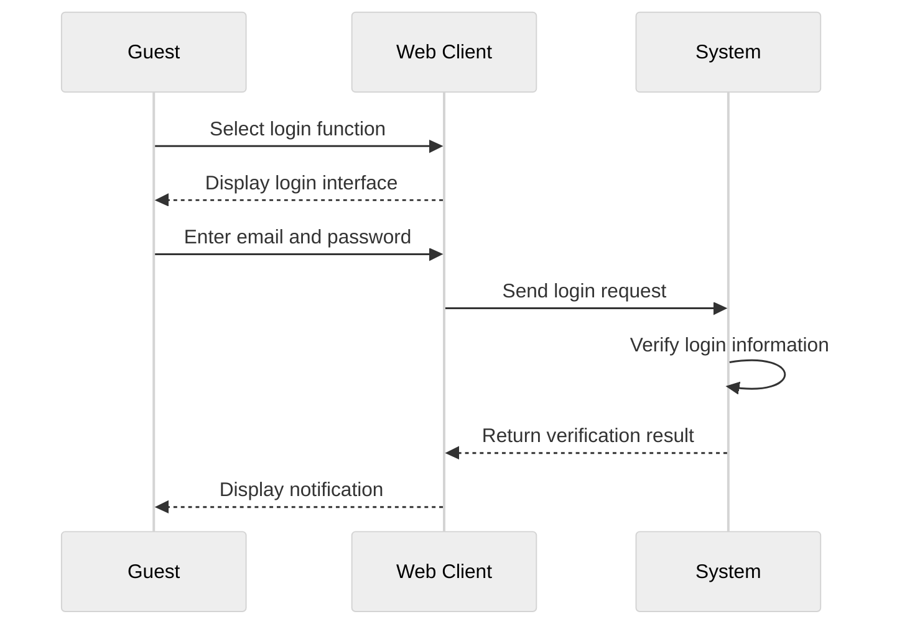
	
Tool 2: [Untitled - WebSequenceDiagrams](https://www.websequencediagrams.com/app)
```[Học sinh nộp bài luận - WebSequenceDiagrams](https://www.websequencediagrams.com/app)
title Học sinh nộp bài luận

actor Học sinh
participant Giao diện
participant Hệ thống
participant Cơ sở dữ liệu

Học sinh -> Giao diện: Click vào textbox
Giao diện -> Giao diện: Hiển thị textbox để soạn thảo
Học sinh -> Giao diện: Soạn thảo câu trả lời rồi chọn nút "Nộp bài luận"
Giao diện -> Hệ thống: Hiển thị hộp thoại xác nhận nộp bài luận
alt [Chọn từ chối]
  Học sinh -> Giao diện: Chọn từ chối
else [Chọn đồng ý]
  Học sinh -> Giao diện: Chọn đồng ý
  Giao diện -> Hệ thống: Lưu thông tin và câu trả lời của học sinh
  Hệ thống -> Cơ sở dữ liệu: Lưu câu trả lời
  Cơ sở dữ liệu -> Hệ thống: Thông báo lưu thành công
  Hệ thống -> Giao diện: Thông báo: Nộp bài luận thành công
end

```


---
VẼ LẠI SEQUENCE DIAGRAM - THEO VIEW-CONTROLLER-MODEL

```

Dưới đây là danh sách các use case được trích xuất từ ảnh:

# Use case analysis
## Guest
- Login

## General
- Change password
- Forgot password 
- Update personal information

## Admin
- Delete user
- Add user
- View user
- Edit user
- Search user

## Group Leader
- Question Bank Management
- Create Scoring Criteria

## Teacher
- Exam management
- View exam history
- Exam grading

## Student
- Student search and register exam code
- Student Submit essay
- View Results
- View previous essays


C4. Sequence diagram  

<kẻ một cái bảng Usecase, model (tên khác là entity classes), view (boundary classes), controller (control classes) cho từng usecase phía trên, để liệt kê các class mà usecase sẽ được sử dụng> 

<sau đó chèn các sequential diagram cho từng usecase> 

 
```


Certainly! Below is the **4. Interaction Analysis** section presented in English. It includes a comprehensive mapping of Use Cases to their respective Model (Entity Classes), View (Boundary Classes), and Controller (Control Classes) classes. Additionally, each Use Case is accompanied by a Sequence Diagram to illustrate the interactions between classes during the execution of the Use Case.

---

## 4. Interaction Analysis

### 4.1 Use Case Mapping

The table below maps each Use Case to the corresponding Model (Entity Classes), View (Boundary Classes), and Controller (Control Classes) that are involved in its execution.

|**Use Case**|**Model Classes**|**View Classes**|**Controller Classes**|
|---|---|---|---|
|**Guest**||||
|- Login|User|V_User|C_User|
|**General**||||
|- Change Password|User|V_User|C_User|
|- Forgot Password|User|V_User|C_User|
|- Update Personal Information|User|V_User|C_User|
|**Admin**||||
|- Delete User|User|V_User|C_User|
|- Add User|User|V_User|C_User|
|- View User|User|V_User|C_User|
|- Edit User|User|V_User|C_User|
|- Search User|User|V_User|C_User|
|**Group Leader**||||
|- Question Bank Management|QuestionBank, Question|V_QuestionBank|C_GroupLeader, C_QuestionBank|
|- Create Scoring Criteria|Criteria, CriteriaDetail|V_Criteria|C_GroupLeader, C_Criteria|
|**Teacher**||||
|- Exam Management|Exam, Question|V_Exam|C_Teacher, C_Exam|
|- View Exam History|Exam, ExamResult|V_ExamHistory|C_Teacher, C_ExamResult|
|- Exam Grading|Essay, ExamResult|V_GradeEssay|C_Teacher, C_Essay, C_ExamResult|
|**Student**||||
|- Student Search and Register Exam Code|Exam, Student|V_StudentExamRegistration|C_Student, C_Exam|
|- Student Submit Essay|Essay|V_EssaySubmission|C_Student, C_Essay|
|- View Results|ExamResult, Essay|V_ExamResults|C_Student, C_ExamResult|
|- View Previous Essays|Essay|V_PreviousEssays|C_Student, C_Essay|

---

### 4.2 Sequence Diagrams for Each Use Case

Below are the Sequence Diagrams for each Use Case, illustrating the interactions between the involved classes.

#### **4.2.1 Use Case: Login**

##### **Sequence Diagram**

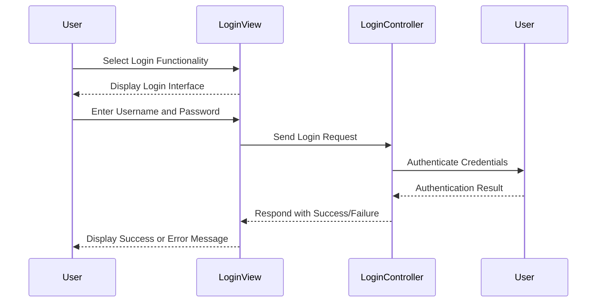

---

#### **4.2.2 Use Case: Change Password**

##### **Sequence Diagram**

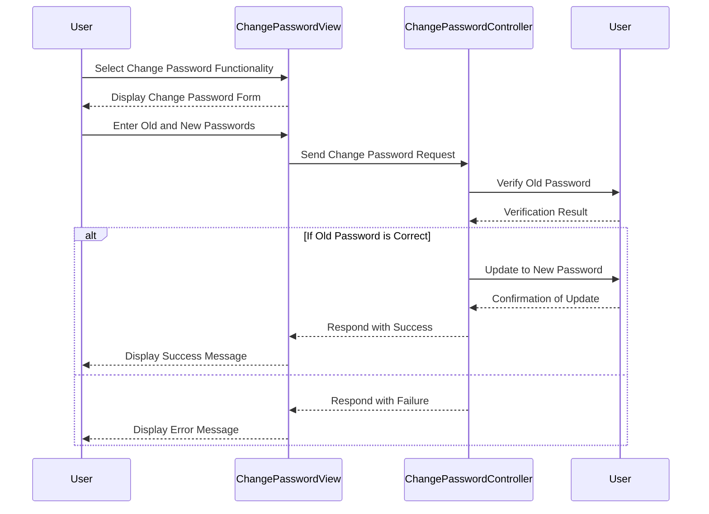

---

#### **4.2.3 Use Case: Forgot Password**

##### **Sequence Diagram**

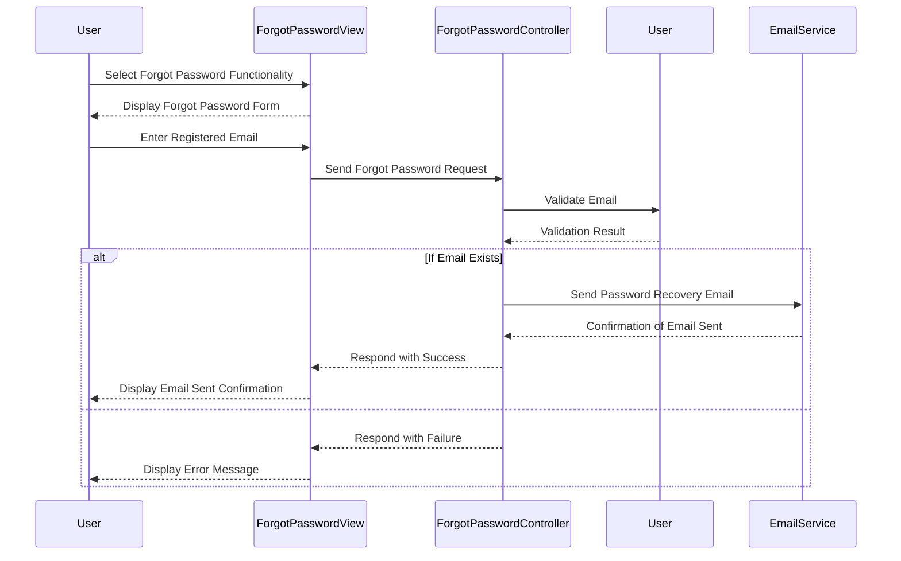

---

#### **4.2.4 Use Case: Update Personal Information**

##### **Sequence Diagram**

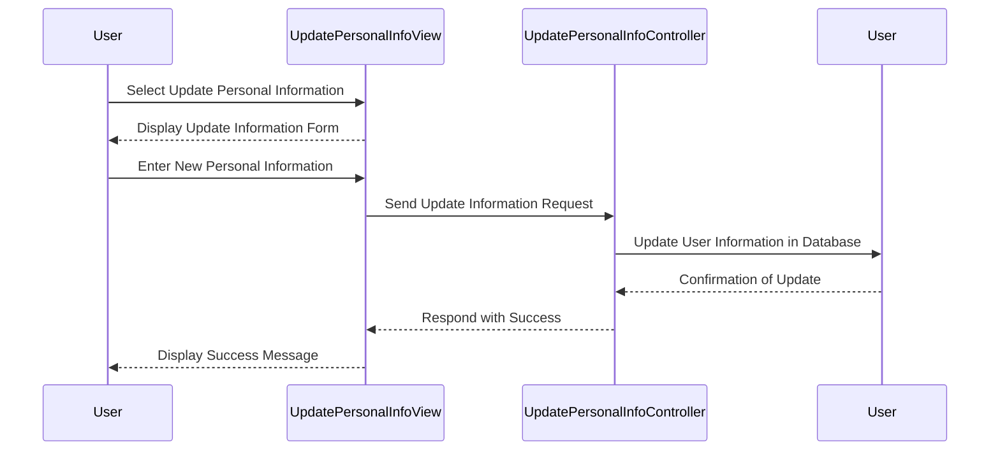

---

#### **4.2.5 Use Case: Delete User**

##### **Sequence Diagram**

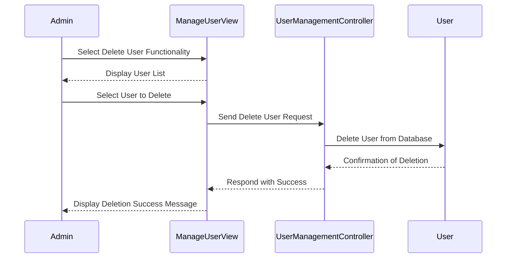

---

#### **4.2.6 Use Case: Add User**

##### **Sequence Diagram**

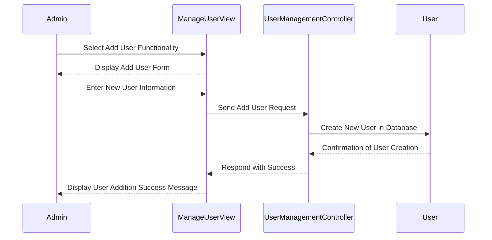

---

#### **4.2.7 Use Case: View User**

##### **Sequence Diagram**

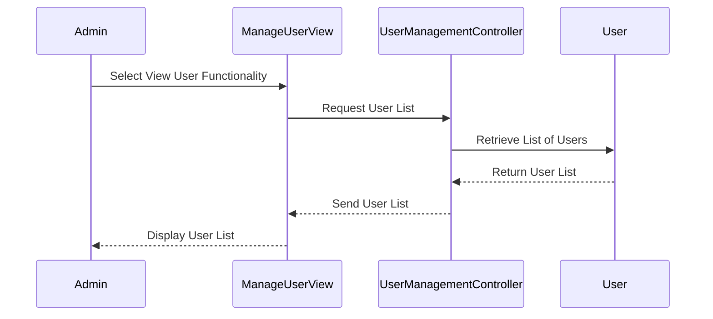

---

#### **4.2.8 Use Case: Edit User**

##### **Sequence Diagram**

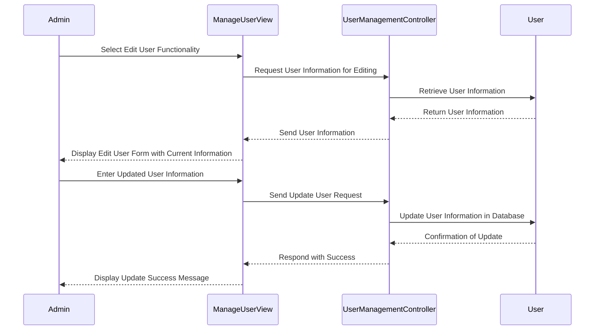

---

#### **4.2.9 Use Case: Search User**

##### **Sequence Diagram**

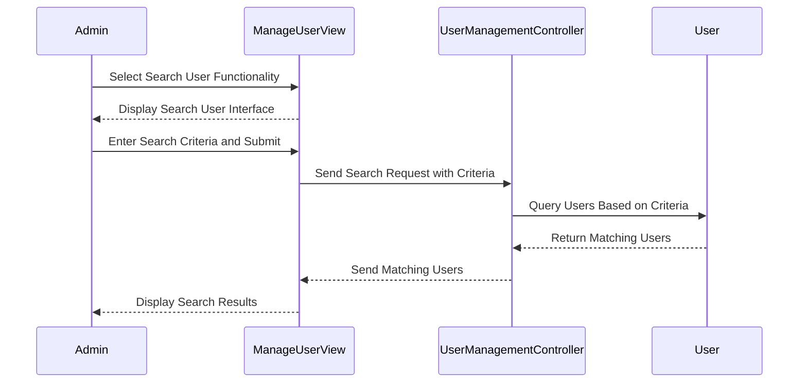

---

#### **4.2.10 Use Case: Question Bank Management**

##### **Sequence Diagram**

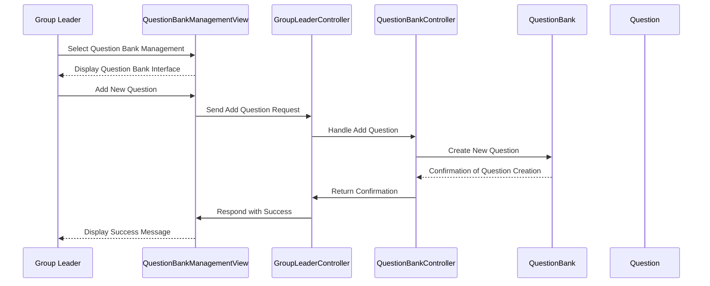

---

#### **4.2.11 Use Case: Create Scoring Criteria**

##### **Sequence Diagram**

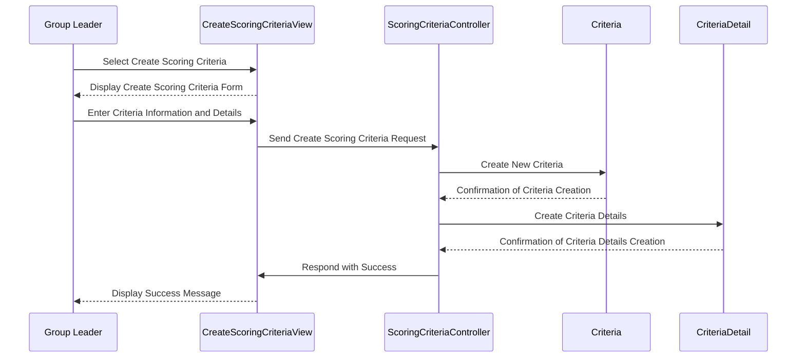

---

#### **4.2.12 Use Case: Exam Management**

##### **Sequence Diagram**

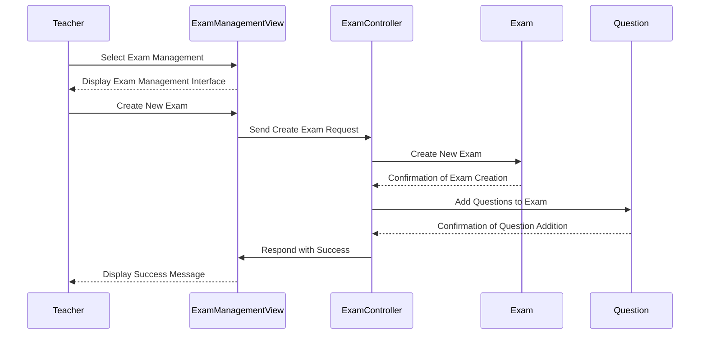

---

#### **4.2.13 Use Case: View Exam History**

##### **Sequence Diagram**

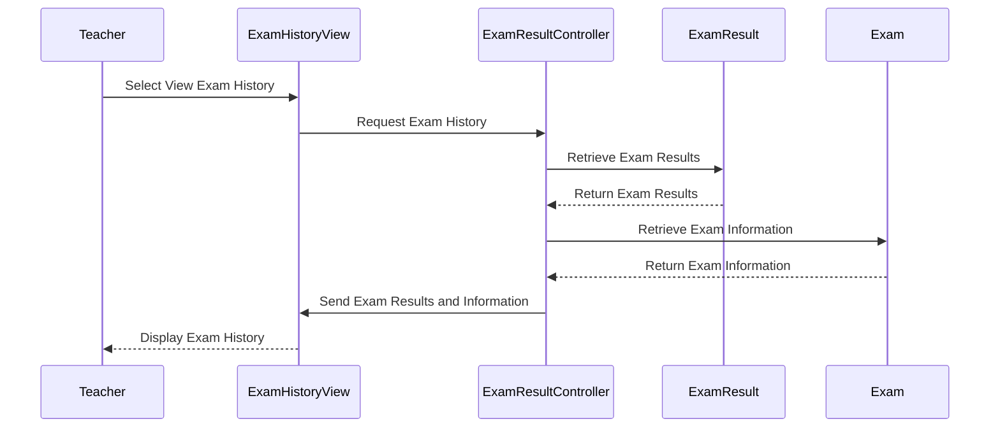

---

#### **4.2.14 Use Case: Exam Grading**

##### **Sequence Diagram**

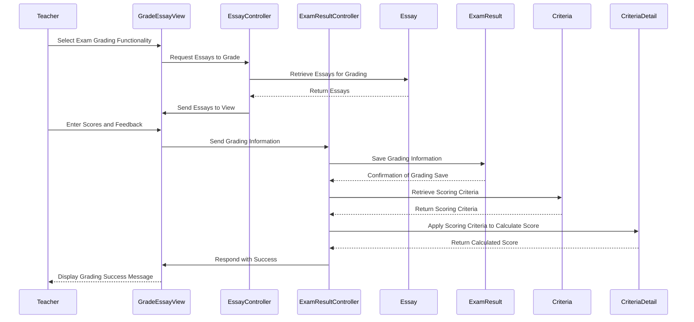

---

#### **4.2.15 Use Case: Student Search and Register Exam Code**

##### **Sequence Diagram**

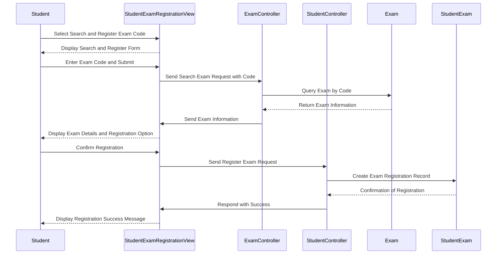

---

#### **4.2.16 Use Case: Student Submit Essay**

##### **Sequence Diagram**

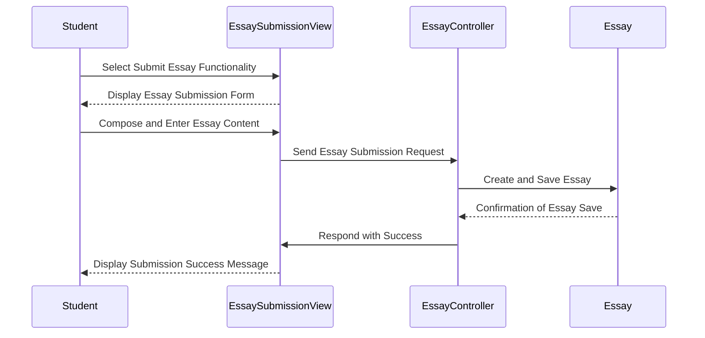

---

#### **4.2.17 Use Case: View Results**

##### **Sequence Diagram**

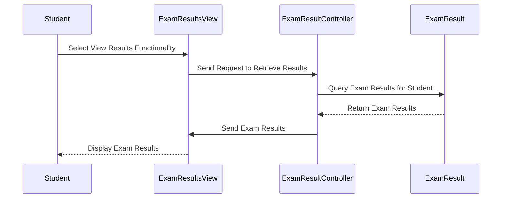

---

#### **4.2.18 Use Case: View Previous Essays**

##### **Sequence Diagram**

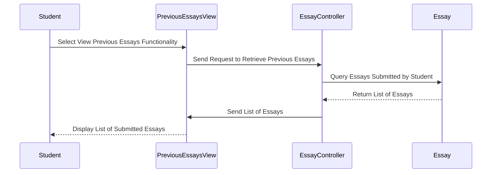

---

### 4.3 Summary

The **Interaction Analysis** section provides a comprehensive overview of how each Use Case interacts with the system's classes. The **Use Case Mapping** table clearly identifies the Model, View, and Controller classes involved in each Use Case, ensuring a structured and organized approach to system design. The accompanying **Sequence Diagrams** visually depict the flow of interactions between these classes during the execution of each Use Case.

**Key Features:**

1. **Comprehensive Functionality:**
    
    - Ensures that all essential functionalities, such as user management, exam administration, essay submission, and grading, are thoroughly supported by the system design.
2. **Clear Relationships:**
    
    - Establishes clear associations between Use Cases and the corresponding classes, promoting maintainability and scalability.
3. **Enhanced Clarity:**
    
    - The inclusion of detailed Sequence Diagrams provides a clear understanding of the interactions and workflows within each Use Case, facilitating easier implementation and debugging.
4. **Adherence to MVC Principles:**
    
    - The structured mapping of Model, View, and Controller classes maintains a clear separation of concerns, which is crucial for scalable and maintainable software architecture.

By following this detailed Interaction Analysis, developers and stakeholders can ensure that the system's design aligns with the functional requirements, enabling efficient development and seamless user experiences.

---

If you require further details or additional Use Cases to be analyzed, please let me know!


=============================================================================================================================================================================================
# 3. Class diagram

General Class Diagram:

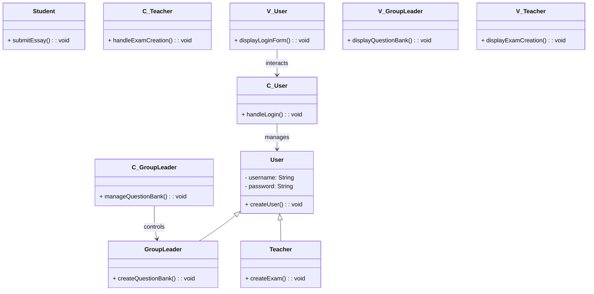


Dưới đây là phiên bản chi tiết biểu diễn các gói Module (M_...) với các mũi tên và quan hệ đã được sửa đúng:

```mermaid
classDiagram
    M_User <|-- M_Student
    M_User <|-- M_GroupLeader
    M_User <|-- M_Teacher

    M_GroupLeader --> M_QuestionBank : manageQuestionBank
    M_QuestionBank --> M_Question : contains
    M_Exam --> M_ExamQuestion : contains
    M_ExamQuestion --> M_Question : partOf
    M_Student --> M_Essay : submitEssay
    M_Teacher --> M_ExamResult : gradeEssay
    M_ExamResult --> M_ExamResultCriteria : associatedWith
    M_ExamResult --> M_Essay : gradeEssay
```

### Giải thích các thay đổi:

1. **Prefix `M_`**:
    
    - Đã thêm prefix `M_` để biểu diễn các module (ví dụ: `M_User`, `M_Student`,...).
2. **Quan hệ**:
    
    - Được điều chỉnh theo logic từ sơ đồ gốc:
        - `M_User` là lớp cha của các module `M_Student`, `M_GroupLeader`, và `M_Teacher`.
        - `M_GroupLeader` quản lý `M_QuestionBank`.
        - `M_QuestionBank` chứa `M_Question`.
        - `M_Exam` chứa `M_ExamQuestion`.
        - `M_ExamQuestion` là một phần của `M_Question`.
        - `M_Student` gửi bài luận (`M_Essay`).
        - `M_Teacher` chấm điểm và quản lý `M_ExamResult`.
        - `M_ExamResult` liên quan đến các tiêu chí (`M_ExamResultCriteria`) và bài luận (`M_Essay`).

- **M_User**: Stores user information in the system, including common attributes such as name, account, and roles. It serves as the parent class for specific user groups like students, group leaders, and teachers.
- **M_Student**: Defines information and functions specific to students, such as submitting essays (**submitEssay**) and viewing exam results.
- **M_GroupLeader**: Responsible for managing question banks (**manageQuestionBank**), including creating, updating, and deleting questions in the system.
- **M_Teacher**: Stores information and functions for teachers, including creating, updating, deleting exams, and grading essays (**gradeEssay**).
- **M_QuestionBank**: Stores information about question banks, which contain related questions (**contains**).
- **M_Question**: Stores detailed information about a specific question in the system. It is part of **M_QuestionBank** and linked to exams through **M_ExamQuestion**.
- **M_Exam**: Manages information about exams, including a list of questions (**contains**).
- **M_ExamQuestion**: Stores information linking exams (**M_Exam**) and questions (**M_Question**), representing a "part of" relationship (**partOf**).
- **M_Essay**: Represents student essays, submitted by **M_Student** via the **submitEssay** function and graded by teachers through **M_ExamResult**.
- **M_ExamResult**: Stores exam results, including scores and related information. These results are linked to evaluation criteria (**M_ExamResultCriteria**) and essays (**M_Essay**) to support grading.
- **M_ExamResultCriteria**: Stores grading criteria for exam results, linked to **M_ExamResult** to ensure transparency in the grading process.

Below is the Mermaid syntax to represent the **Controller package** diagram as shown in the uploaded image:

### Controller Diagram Syntax (Mermaid)

Here’s the updated **Controller** diagram corresponding to the provided Model structure:
ments in English:

The **Controller package** diagram represents the logic-handling layer for the corresponding **Model** structure. Each controller class is dedicated to processing specific actions related to its associated model. Here’s a detailed explanation:

1. **Controller Classes**:
    
    - **C_User**: Acts as the base class for all user-related controllers, handling actions like user login, profile management, and authentication.
    - **C_Student**: Handles operations specific to students, such as submitting essays (**submitEssay**) and accessing exam results.
    - **C_GroupLeader**: Manages the question bank operations, including creating, updating, and deleting question banks (**manageQuestionBank**).
    - **C_Teacher**: Facilitates teacher-specific operations, such as creating exams, grading essays (**gradeEssay**), and reviewing student progress.
    - **C_QuestionBank**, **C_Question**: Manage question banks and their related questions, with clear relationships for "contains" and "part of."
    - **C_Exam**: Manages operations related to exams, linking with exam questions (**C_ExamQuestion**) and results.
    - **C_ExamResult**: Handles the grading and management of exam results, including linking with criteria (**C_ExamResultCriteria**) and essays.
2. **Responsibilities**:
    
    - Each controller receives requests from the **View** layer and uses the **Model** layer to process and fetch data.
    - Controllers implement the business logic needed for specific tasks, ensuring a clear separation of concerns.
3. **Highlights**:
    
    - **Modular Design**: Each controller class is focused on a single domain, enhancing maintainability and reducing coupling.
    - **MVC Integration**: The controllers bridge the View and Model layers, maintaining a smooth data flow and interaction.
    - **Scalability**: Adding new functionality or extending existing ones (e.g., new user types or features for teachers) is straightforward due to the structured controller hierarchy.

This design ensures a robust and scalable system that adheres to **MVC principles**, making it easy to maintain, test, and extend over time.

### Viewer Diagram Syntax (Mermaid)

Here’s the updated **Viewer** diagram corresponding to the provided Model structure:

### Comments in English:

The **Viewer package** diagram illustrates the **View layer** of the application, which is responsible for displaying data and user interfaces to the end users. Each viewer class corresponds to a specific model and controller, facilitating the interaction with users. Below are the details:

1. **Viewer Classes**:
    
    - **V_User**: Serves as the base class for user-related views, managing general UI components for users, such as login screens, user profiles, and dashboard access.
    - **V_Student**: Handles UI components specific to students, such as essay submission forms (**viewEssay**) and pages for viewing exam results.
    - **V_GroupLeader**: Provides views for managing question banks (**viewQuestionBank**) and related operations.
    - **V_Teacher**: Facilitates teacher-specific interfaces, such as grading pages and exam management dashboards (**viewExamResult**).
    - **V_QuestionBank**, **V_Question**: Displays question banks and their related questions, ensuring clear relationships for "contains" and "part of."
    - **V_Exam**: Provides interfaces for creating, managing, and viewing exams, linking with exam questions (**V_ExamQuestion**) and results.
    - **V_ExamResult**: Displays exam results, including linked essays (**linkedTo**) and grading criteria (**associatedWith**).
2. **Responsibilities**:
    
    - Each viewer class focuses on rendering data from the **Controller** layer for the end-user.
    - The viewers handle UI/UX concerns, ensuring that information is displayed in an accessible and user-friendly manner.
3. **Highlights**:
    
    - **User-Centric Design**: Each viewer class is tailored to a specific user role or functionality, enhancing usability and clarity.
    - **MVC Integration**: The viewers rely on the **Controller** layer to fetch and process data, ensuring a clean separation of concerns.
    - **Scalability**: The structured hierarchy and modular approach make it straightforward to add new views or update existing ones without impacting other components.

This design ensures a seamless and user-friendly experience by adhering to the **MVC architecture principles**, making the system intuitive, efficient, and scalable for future enhancements.


Based on further research and confirmation of how the **MVC architecture** operates, the **Controller** and **View** do interact with each other directly, as follows:

Dưới đây là phiên bản đã loại bỏ các dấu mũi tên trong cả Viewer và Controller:

### Viewer Diagram (Mermaid Syntax)

```mermaid
classDiagram
    V_User <|-- V_Student
    V_User <|-- V_GroupLeader
    V_User <|-- V_Teacher

    V_GroupLeader : viewQuestionBank
    V_QuestionBank : contains
    V_Exam : contains
    V_ExamQuestion : partOf
    V_Student : viewEssay
    V_Teacher : viewExamResult
    V_ExamResult : associatedWith
    V_ExamResult : linkedTo
```

### Controller Diagram (Mermaid Syntax)

```mermaid
classDiagram
    C_User <|-- C_Student
    C_User <|-- C_GroupLeader
    C_User <|-- C_Teacher

    C_GroupLeader : manageQuestionBank
    C_QuestionBank : contains
    C_Exam : contains
    C_ExamQuestion : partOf
    C_Student : submitEssay
    C_Teacher : gradeEssay
    C_ExamResult : associatedWith
    C_ExamResult : gradeEssay
```

### Explanation:

- Removed the directional arrows (`-->`) in both Viewer and Controller diagrams because the Viewer and Controller do not directly interact with each other, and the arrows might cause confusion regarding data flow.
- The relationships (e.g., `viewEssay`, `manageQuestionBank`) now appear as annotations to show the role of each class without indicating direct interaction.
### Interaction Details:

1. **Controller to View**:
    
    - The **Controller** processes user inputs received from the **View** and updates the **View** accordingly.
    - It sends instructions to the **View** about what data or changes should be reflected on the user interface.
2. **View to Controller**:
    
    - The **View** captures user actions (like clicks, form submissions, etc.) and passes these as requests to the **Controller** to process.
    - This ensures that the **Controller** is responsible for business logic, while the **View** focuses on presenting information.

### Updated Diagrams with Interaction:

#### Viewer Diagram (with interaction arrows)

```mermaid
classDiagram
    V_User <|-- V_Student
    V_User <|-- V_GroupLeader
    V_User <|-- V_Teacher

    V_GroupLeader --> C_GroupLeader : interactsWith
    V_QuestionBank --> C_QuestionBank : interactsWith
    V_Exam --> C_Exam : interactsWith
    V_ExamQuestion --> C_ExamQuestion : interactsWith
    V_Student --> C_Student : interactsWith
    V_Teacher --> C_Teacher : interactsWith
    V_ExamResult --> C_ExamResult : interactsWith
```

#### Controller Diagram (with interaction arrows)

```mermaid
classDiagram
    C_User <|-- C_Student
    C_User <|-- C_GroupLeader
    C_User <|-- C_Teacher

    C_GroupLeader --> V_GroupLeader : updates
    C_QuestionBank --> V_QuestionBank : updates
    C_Exam --> V_Exam : updates
    C_ExamQuestion --> V_ExamQuestion : updates
    C_Student --> V_Student : updates
    C_Teacher --> V_Teacher : updates
    C_ExamResult --> V_ExamResult : updates
```

### Explanation:

- **Bidirectional Interaction**: Both the Viewer and Controller have interactions (`interactsWith` or `updates`) because they depend on each other for input (View to Controller) and output (Controller to View).
- **View Focus**: The **View** is responsible for capturing user interactions and sending them to the Controller.
- **Controller Focus**: The **Controller** processes these inputs, applies logic, and sends updates or data back to the View to be displayed.

This structure ensures the **MVC architecture** adheres to its principles of separation of concerns while allowing dynamic and responsive communication between layers. Let me know if further refinements are needed!


In the Model-View-Controller (MVC) architecture, the **Controller** and **View** components interact directly to facilitate user interface updates and responses to user inputs. Here's how they interact:

1. **User Interaction**: When a user interacts with the application (e.g., clicking a button or entering data), these actions are captured by the **View**.
    
2. **Controller Processing**: The **View** forwards these user inputs to the **Controller**. The **Controller** processes the inputs, applies the necessary business logic, and may update the **Model** accordingly.
    
3. **Updating the View**: After processing, the **Controller** may instruct the **View** to update the user interface to reflect changes, such as displaying new data or altering the UI state.
    

This direct interaction between the **Controller** and **View** ensures that user inputs are effectively translated into appropriate actions and visual feedback, maintaining a responsive and dynamic user experience.

For a more detailed explanation of the MVC interactions, you can refer to the [Model–view–controller](https://en.wikipedia.org/wiki/Model%E2%80%93view%E2%80%93controller) article on Wikipedia.
### Hướng dẫn sử dụng:

Bạn có thể sao chép đoạn mã này vào [Mermaid Live Editor](https://mermaid.live/) để kiểm tra hoặc hiển thị sơ đồ. Nếu cần thêm chỉnh sửa hoặc chi tiết khác, hãy cho mình biết!

Chi tiết hơn thì 

![[Pasted image 20241209001709.png]]


```
3.3 Detailed Class Design
21
3.3.1 Class User
Attributes (for all users): username, password, role, fullName, birthday, gender. Methods:
• createUser(): Creates a new user.
• getUserById(): Retrieves user information by ID.
• updateUser(): Updates user information.
• deleteUser(): Deletes a user.
• hashPassword(): Hashes the password.
22
3.3.2 Class GroupLeader, Teacher, Student
GroupLeader
• Inherits from the User class.
• Methods:
– createQuestionBank(): Creates a question bank.
– getQuestionBankById(): Retrieves a question bank by ID.
– updateQuestionBank(): Updates a question bank.
– deleteQuestionBank(): Deletes a question bank.
Teacher
• Inherits from the User class.
• Methods:
– createExam(): Creates an exam.
– getExamById(): Retrieves an exam by ID.
– updateExam(): Updates an exam.
– deleteExam(): Deletes an exam.
– gradeEssay(): Grades an essay.
23
Student
• Inherits from the User class.
• Methods:
– submitEssay(): Submits an essay.
– getExamResults(): Retrieves exam results.
3.3.3 Other Classes
• QuestionBank: Stores question bank information.
• Question: Stores question information.
• Exam: Stores exam information.
• Essay: Stores essay information.
• ExamResult: Stores exam result information.
• ExamResultCriteria: Stores grading criteria information for an exam result. (This implies a many-
to-many relationship between ExamResult and Criteria, facilitated by this class)
• Criteria: Stores grading criteria types.
• CriteriaDetail: Stores details for each graded criterion according to the rules. (This likely holds
specific scoring details against a specific Criteria for a given ExamResultCriteria)
```


Certainly! Below is the **3.3 Detailed Class Design** section presented as a comprehensive report, encompassing UML diagrams, Attributes tables, and Methods tables for each class. This structured approach ensures clarity and completeness in the system's design.

---

## 3.3 Detailed Class Design

This section elaborates on the key classes within the system, detailing their attributes, methods, and interrelationships. Each class is accompanied by a UML diagram to provide a visual representation of its structure and associations.

---

### **3.3.1 Class: User**

#### **UML Diagram**

```mermaid
classDiagram
    class User {
        - username: String
        - password: String
        - role: String
        - fullName: String
        - birthday: Date
        - gender: String
        + createUser(user: User): void
        + getUserById(id: int): User
        + updateUser(user: User): void
        + deleteUser(id: int): void
        - hashPassword(password: String): String
    }
```

---

#### **Attributes**

|**Attribute**|**Datatype**|**Access Modifiers**|**Description**|
|---|---|---|---|
|`username`|`String`|`private`|Unique identifier for the user (login username).|
|`password`|`String`|`private`|Hashed password for secure authentication.|
|`role`|`String`|`private`|User role (e.g., GroupLeader, Teacher, Student).|
|`fullName`|`String`|`private`|Full name of the user.|
|`birthday`|`Date`|`private`|Date of birth of the user.|
|`gender`|`String`|`private`|Gender of the user.|

---

#### **Methods**

|**Method**|**Return Type**|**Arguments**|**Access Modifiers**|**Description**|
|---|---|---|---|---|
|`createUser`|`void`|`user: User`|`public`|Creates and stores a new user in the system.|
|`getUserById`|`User`|`id: int`|`public`|Retrieves user information by their unique ID.|
|`updateUser`|`void`|`user: User`|`public`|Updates the details of an existing user.|
|`deleteUser`|`void`|`id: int`|`public`|Deletes a user based on their unique ID.|
|`hashPassword`|`String`|`password: String`|`private`|Hashes the user's password for secure storage.|

---

### **3.3.2 Classes: GroupLeader, Teacher, Student**

#### **3.3.2.1 Class: GroupLeader**

##### **UML Diagram**

```mermaid
classDiagram
    User <|-- GroupLeader
    class GroupLeader {
        + createQuestionBank(questionBank: QuestionBank): void
        + getQuestionBankById(id: int): QuestionBank
        + updateQuestionBank(questionBank: QuestionBank): void
        + deleteQuestionBank(id: int): void
    }
```

---

##### **Attributes**

_GroupLeader_ inherits all attributes from the `User` class.

---

##### **Methods**

|**Method**|**Return Type**|**Arguments**|**Access Modifiers**|**Description**|
|---|---|---|---|---|
|`createQuestionBank`|`void`|`questionBank: QuestionBank`|`public`|Creates a new question bank for the system.|
|`getQuestionBankById`|`QuestionBank`|`id: int`|`public`|Retrieves a question bank's details by its unique ID.|
|`updateQuestionBank`|`void`|`questionBank: QuestionBank`|`public`|Updates the details of an existing question bank.|
|`deleteQuestionBank`|`void`|`id: int`|`public`|Deletes a question bank based on its unique ID.|

---

#### **3.3.2.2 Class: Teacher**

##### **UML Diagram**

```mermaid
classDiagram
    User <|-- Teacher
    class Teacher {
        + createExam(exam: Exam): void
        + getExamById(id: int): Exam
        + updateExam(exam: Exam): void
        + deleteExam(id: int): void
        + gradeEssay(essay: Essay): void
    }
```

---

##### **Attributes**

_Teacher_ inherits all attributes from the `User` class.

---

##### **Methods**

|**Method**|**Return Type**|**Arguments**|**Access Modifiers**|**Description**|
|---|---|---|---|---|
|`createExam`|`void`|`exam: Exam`|`public`|Creates a new exam.|
|`getExamById`|`Exam`|`id: int`|`public`|Retrieves exam details by its unique ID.|
|`updateExam`|`void`|`exam: Exam`|`public`|Updates the details of an existing exam.|
|`deleteExam`|`void`|`id: int`|`public`|Deletes an exam based on its unique ID.|
|`gradeEssay`|`void`|`essay: Essay`|`public`|Grades a student's submitted essay.|

---

#### **3.3.2.3 Class: Student**

##### **UML Diagram**

```mermaid
classDiagram
    User <|-- Student
    class Student {
        + submitEssay(essay: Essay): void
        + getExamResults(): List<ExamResult>
        + searchAndRegisterExamCode(code: String): boolean
        + viewPreviousEssays(): List<Essay>
    }
```

---

##### **Attributes**

_Student_ inherits all attributes from the `User` class.

---

##### **Methods**

|**Method**|**Return Type**|**Arguments**|**Access Modifiers**|**Description**|
|---|---|---|---|---|
|`submitEssay`|`void`|`essay: Essay`|`public`|Submits an essay for evaluation.|
|`getExamResults`|`List<ExamResult>`|`-`|`public`|Retrieves the results of exams taken by the student.|
|`searchAndRegisterExamCode`|`boolean`|`code: String`|`public`|Searches for an exam by code and registers the student.|
|`viewPreviousEssays`|`List<Essay>`|`-`|`public`|Views previously submitted essays by the student.|

---

### **3.3.3 Other Classes**

#### **3.3.3.1 Class: QuestionBank**

##### **UML Diagram**

```mermaid
classDiagram
    class QuestionBank {
        - id: int
        - name: String
        - questions: List<Question>
        + addQuestion(question: Question): void
        + removeQuestion(id: int): void
    }
```

---

##### **Attributes**

|**Attribute**|**Datatype**|**Access Modifiers**|**Description**|
|---|---|---|---|
|`id`|`int`|`private`|Unique identifier for the question bank.|
|`name`|`String`|`private`|Name of the question bank.|
|`questions`|`List<Question>`|`private`|List of questions within the bank.|

---

##### **Methods**

|**Method**|**Return Type**|**Arguments**|**Access Modifiers**|**Description**|
|---|---|---|---|---|
|`addQuestion`|`void`|`question: Question`|`public`|Adds a new question to the question bank.|
|`removeQuestion`|`void`|`id: int`|`public`|Removes a question from the bank by its ID.|

---

#### **3.3.3.2 Class: Question**

#### **UML Diagram**


```mermaid
classDiagram
    class Question {
        - id: int
        - content: String
        - maxScore: float
        - rubric: String
        + evaluateAnswer(answer: String): String
        + calculateScore(answer: String): float
    }

```
---

#### **Attributes**

|**Attribute**|**Datatype**|**Access Modifiers**|**Description**|
|---|---|---|---|
|`id`|`int`|`private`|Unique identifier for the question.|
|`content`|`String`|`private`|Text content of the essay question.|
|`maxScore`|`float`|`private`|Maximum score achievable for the question.|
|`rubric`|`String`|`private`|Grading rubric or guidelines for evaluating the answer.|

---

#### **Methods**

|**Method**|**Return Type**|**Arguments**|**Access Modifiers**|**Description**|
|---|---|---|---|---|
|`evaluateAnswer`|`String`|`answer: String`|`public`|Provides feedback or evaluation based on the answer.|
|`calculateScore`|`float`|`answer: String`|`public`|Calculates the score based on the given answer.|


---

#### **3.3.3.3 Class: Exam**

##### **UML Diagram**

```mermaid
classDiagram
    class Exam {
        - id: int
        - title: String
        - questions: List<Question>
        + addQuestion(question: Question): void
        + removeQuestion(id: int): void
        + getQuestions(): List<Question>
    }
```

---

##### **Attributes**

|**Attribute**|**Datatype**|**Access Modifiers**|**Description**|
|---|---|---|---|
|`id`|`int`|`private`|Unique identifier for the exam.|
|`title`|`String`|`private`|Title or name of the exam.|
|`questions`|`List<Question>`|`private`|List of questions included in the exam.|

---

##### **Methods**

|**Method**|**Return Type**|**Arguments**|**Access Modifiers**|**Description**|
|---|---|---|---|---|
|`addQuestion`|`void`|`question: Question`|`public`|Adds a question to the exam.|
|`removeQuestion`|`void`|`id: int`|`public`|Removes a question from the exam by its ID.|
|`getQuestions`|`List<Question>`|`-`|`public`|Retrieves all questions in the exam.|

---

#### **3.3.3.4 Class: Essay**

##### **UML Diagram**

```mermaid
classDiagram
    class Essay {
        - id: int
        - content: String
        - student: Student
        + submit(): void
        + getContent(): String
    }
```

---

##### **Attributes**

|**Attribute**|**Datatype**|**Access Modifiers**|**Description**|
|---|---|---|---|
|`id`|`int`|`private`|Unique identifier for the essay.|
|`content`|`String`|`private`|The content of the essay.|
|`student`|`Student`|`private`|The student who submitted the essay.|

---

##### **Methods**

|**Method**|**Return Type**|**Arguments**|**Access Modifiers**|**Description**|
|---|---|---|---|---|
|`submit`|`void`|`-`|`public`|Submits the essay for evaluation.|
|`getContent`|`String`|`-`|`public`|Retrieves the content of the essay.|

---

#### **3.3.3.5 Class: ExamResult**

##### **UML Diagram**

```mermaid
classDiagram
    class ExamResult {
        - id: int
        - score: float
        - student: Student
        - exam: Exam
        + calculateFinalScore(): void
        + getScore(): float
    }
```

---

##### **Attributes**

|**Attribute**|**Datatype**|**Access Modifiers**|**Description**|
|---|---|---|---|
|`id`|`int`|`private`|Unique identifier for the exam result.|
|`score`|`float`|`private`|The final score achieved in the exam.|
|`student`|`Student`|`private`|The student associated with this result.|
|`exam`|`Exam`|`private`|The exam associated with this result.|

---

##### **Methods**

|**Method**|**Return Type**|**Arguments**|**Access Modifiers**|**Description**|
|---|---|---|---|---|
|`calculateFinalScore`|`void`|`-`|`public`|Calculates the final score based on criteria.|
|`getScore`|`float`|`-`|`public`|Retrieves the final score of the exam result.|

---

#### **3.3.3.6 Class: Criteria**

##### **UML Diagram**

```mermaid
classDiagram
    class Criteria {
        - id: int
        - description: String
        + getDescription(): String
    }
```

---

##### **Attributes**

|**Attribute**|**Datatype**|**Access Modifiers**|**Description**|
|---|---|---|---|
|`id`|`int`|`private`|Unique identifier for the criteria.|
|`description`|`String`|`private`|Describes the grading criteria.|

---

##### **Methods**

|**Method**|**Return Type**|**Arguments**|**Access Modifiers**|**Description**|
|---|---|---|---|---|
|`getDescription`|`String`|`-`|`public`|Retrieves the description of the criteria.|

---

#### **3.3.3.7 Class: CriteriaDetail**

##### **UML Diagram**

```mermaid
classDiagram
    class CriteriaDetail {
        - id: int
        - details: String
        - criteria: Criteria
        + getDetails(): String
    }
```

---

##### **Attributes**

|**Attribute**|**Datatype**|**Access Modifiers**|**Description**|
|---|---|---|---|
|`id`|`int`|`private`|Unique identifier for the criteria detail.|
|`details`|`String`|`private`|Holds specific grading rules for the criteria.|
|`criteria`|`Criteria`|`private`|The associated criteria for this detail.|

---

##### **Methods**

|**Method**|**Return Type**|**Arguments**|**Access Modifiers**|**Description**|
|---|---|---|---|---|
|`getDetails`|`String`|`-`|`public`|Retrieves the specific details of the criteria.|

---

### **3.3.4 Relationships Between Classes**

To provide a clear understanding of how these classes interact with each other, here's an overview of the relationships:

- **Inheritance**:
    
    - `GroupLeader`, `Teacher`, and `Student` inherit from the `User` class.
- **Associations**:
    
    - `GroupLeader` manages `QuestionBank`.
    - `QuestionBank` contains multiple `Question` instances.
    - `Teacher` creates and manages `Exam`.
    - `Exam` contains multiple `Question` instances.
    - `Student` submits `Essay`.
    - `Student` can search and register for exams using exam codes.
    - `Student` views exam results and previous essays.
    - `Teacher` grades `Essay`, resulting in `ExamResult`.
    - `ExamResult` is associated with `Criteria` through `CriteriaDetail`.
    - `ExamResult` is linked to `Exam`.

---

### **3.3.5 Enhanced UML Diagrams with Relationships**

To visualize the relationships, here is a combined UML diagram illustrating both inheritance and associations.

#### **Combined UML Diagram**

```mermaid
classDiagram
    User <|-- GroupLeader
    User <|-- Teacher
    User <|-- Student

    GroupLeader "1" --> "many" QuestionBank : manages
    QuestionBank "1" --> "many" Question : contains
    Teacher "1" --> "many" Exam : creates
    Exam "1" --> "many" Question : includes
    Student "1" --> "many" Essay : submits
    Student "1" --> "many" ExamResult : receives
    Teacher "1" --> "many" ExamResult : grades
    ExamResult "1" --> "1" Exam : associatedWith
    ExamResult "1" --> "many" CriteriaDetail : basedOn
    CriteriaDetail "1" --> "1" Criteria : defines
    Student "1" --> "many" Essay : viewsPrevious
    Student "1" --> "many" ExamResult : viewsResults
```

---

### **3.3.6 Summary**

This detailed class design serves as a comprehensive blueprint for implementing the system. Each class is meticulously defined with its respective attributes and methods, ensuring clarity in functionality and interaction. The UML diagrams facilitate a visual understanding of the system's architecture, highlighting inheritance and associations that underpin the system's operations.

**Key Features:**

1. **Comprehensive Functionality**:
    
    - Ensures that all required features, such as exam registration and essay management, are adequately supported.
2. **Clear Relationships**:
    
    - Establishes clear associations between classes, promoting maintainability and scalability.
3. **Enhanced Clarity**:
    
    - The inclusion of methods and attributes provides a clear understanding of each class's responsibilities and interactions within the system.
4. **Adherence to MVC Principles**:
    
    - The structured design maintains a clear separation of concerns, facilitating easier testing, maintenance, and future enhancements.

By adhering to this structured and detailed design, developers can ensure consistency, maintainability, and scalability throughout the development lifecycle.


----------------------
Certainly! Including separate UML Class Diagrams for **Controller** and **View** classes, in addition to the **Model** classes, will provide a more comprehensive and organized overview of the system's architecture. This separation enhances clarity, making it easier to understand the distinct responsibilities and interactions of each component within the Model-View-Controller (MVC) framework.

Below, you'll find:

1. **Separate UML Class Diagrams** for **Controller** and **View** classes.
2. **Detailed Descriptions** of each Controller and View class, including their attributes and methods.

---

```
3. Controller class 
<chèn các UML của controller vào nữa, phía trên chỉ mới model thôi> 
4. View class 
<chèn các UML của view vào nữa, phía trên chỉ mới model thôi>
```

## 4. Interaction Analysis

### 4.1 Use Case Mapping

_(This section remains unchanged and maps each Use Case to the corresponding Model, View, and Controller classes.)_

---

### 4.2 Comprehensive Class Diagrams

To provide a clear and organized view of the system's architecture, we present separate UML Class Diagrams for **Model**, **Controller**, and **View** classes.

#### **4.2.1 Model Classes**

_(Refer to the previously provided Model Classes diagram.)_

#### **4.2.2 Controller Classes**

Below is the UML Class Diagram for all **Controller** classes, detailing their relationships and interactions with **Model** classes.

```mermaid
classDiagram
    %% Controller Classes
    class C_User {
        +handleLogin(username: String, password: String): void
        +handleChangePassword(oldPassword: String, newPassword: String): void
        +handleForgotPassword(email: String): void
        +handleUpdatePersonalInfo(user: User): void
        +handleDeleteUser(id: int): void
        +handleAddUser(user: User): void
        +handleViewUser(): void
        +handleEditUser(user: User): void
        +handleSearchUser(criteria: String): void
    }

    class C_GroupLeader {
        +handleAddQuestion(question: Question): void
        +handleDeleteQuestion(id: int): void
    }

    class C_QuestionBank {
        +handleAddQuestion(question: Question): void
        +handleDeleteQuestion(id: int): void
    }

    class C_Criteria {
        +handleCreateCriteria(criteria: Criteria, details: List<CriteriaDetail>): void
    }

    class C_Teacher {
        +handleCreateExam(exam: Exam): void
        +handleGradeEssay(essay: Essay, score: float, feedback: String): void
    }

    class C_Exam {
        +handleCreateExam(exam: Exam): void
        +handleRetrieveExamByCode(code: String): Exam
    }

    class C_Essay {
        +handleSubmitEssay(essay: Essay): void
        +handleRetrieveEssaysForGrading(): List<Essay>
    }

    class C_ExamResult {
        +handleRetrieveExamResults(student: Student): List<ExamResult>
        +handleSaveExamResult(result: ExamResult): void
    }

    class C_Student {
        +handleRegisterExam(exam: Exam, student: Student): void
    }

    %% Relationships
    C_GroupLeader --> C_QuestionBank : interactsWith
    C_Teacher --> C_Exam : manages
    C_Essay --> C_ExamResult : interactsWith
    C_Student --> C_Exam : interactsWith
```

#### **4.2.3 View Classes**

Below is the UML Class Diagram for all **View** classes, detailing their interactions and responsibilities within the system.

```mermaid
classDiagram
    %% View Classes
    class V_User {
        +displayLogin(): void
        +displayChangePassword(): void
        +displayForgotPassword(): void
        +displayUpdatePersonalInfo(): void
        +displayUserList(users: List<User>): void
        +displayUserDetails(user: User): void
        +displaySuccessMessage(message: String): void
        +displayErrorMessage(message: String): void
    }

    class V_QuestionBank {
        +displayQuestionBank(): void
        +displayAddQuestionForm(): void
        +displaySuccessMessage(message: String): void
    }

    class V_Criteria {
        +displayCreateCriteriaForm(): void
        +displaySuccessMessage(message: String): void
    }

    class V_Exam {
        +displayExamManagement(): void
        +displaySuccessMessage(message: String): void
    }

    class V_ExamHistory {
        +displayExamHistory(examResults: List<ExamResult>): void
    }

    class V_GradeEssay {
        +displayEssaysToGrade(essays: List<Essay>): void
        +displaySuccessMessage(message: String): void
    }

    class V_StudentExamRegistration {
        +displayExamDetails(exam: Exam): void
        +displaySuccessMessage(message: String): void
    }

    class V_EssaySubmission {
        +displayEssaySubmissionForm(): void
        +displaySuccessMessage(message: String): void
    }

    class V_ExamResults {
        +displayExamResults(results: List<ExamResult>): void
    }

    class V_PreviousEssays {
        +displayPreviousEssays(essays: List<Essay>): void
    }
```

---

### 4.3 Detailed Class Descriptions

#### **4.3.1 Controller (Control) Classes**

##### **Class: C_User**

Handles all user-related operations such as login, password changes, and user management.

|**Method**|**Return Type**|**Arguments**|**Access Modifiers**|**Description**|
|---|---|---|---|---|
|`handleLogin`|`void`|`username: String, password: String`|`public`|Handles user login requests.|
|`handleChangePassword`|`void`|`oldPassword: String, newPassword: String`|`public`|Handles password change requests.|
|`handleForgotPassword`|`void`|`email: String`|`public`|Handles password recovery requests.|
|`handleUpdatePersonalInfo`|`void`|`user: User`|`public`|Handles updating of personal information.|
|`handleDeleteUser`|`void`|`id: int`|`public`|Handles deletion of a user.|
|`handleAddUser`|`void`|`user: User`|`public`|Handles addition of a new user.|
|`handleViewUser`|`void`|`-`|`public`|Handles retrieval and viewing of users.|
|`handleEditUser`|`void`|`user: User`|`public`|Handles editing of user information.|
|`handleSearchUser`|`void`|`criteria: String`|`public`|Handles searching of users based on criteria.|

##### **Class: C_GroupLeader**

Handles operations specific to the Group Leader, such as managing the question bank.

|**Method**|**Return Type**|**Arguments**|**Access Modifiers**|**Description**|
|---|---|---|---|---|
|`handleAddQuestion`|`void`|`question: Question`|`public`|Handles adding a new question to the bank.|
|`handleDeleteQuestion`|`void`|`id: int`|`public`|Handles deletion of a question from the bank.|

##### **Class: C_QuestionBank**

Manages operations related to the question bank.

|**Method**|**Return Type**|**Arguments**|**Access Modifiers**|**Description**|
|---|---|---|---|---|
|`handleAddQuestion`|`void`|`question: Question`|`public`|Handles adding a new question to the bank.|
|`handleDeleteQuestion`|`void`|`id: int`|`public`|Handles deletion of a question from the bank.|

##### **Class: C_Criteria**

Handles creation of scoring criteria.

|**Method**|**Return Type**|**Arguments**|**Access Modifiers**|**Description**|
|---|---|---|---|---|
|`handleCreateCriteria`|`void`|`criteria: Criteria, details: List<CriteriaDetail>`|`public`|Handles creation of new scoring criteria and details.|

##### **Class: C_Teacher**

Handles operations specific to Teachers, such as creating exams and grading essays.

|**Method**|**Return Type**|**Arguments**|**Access Modifiers**|**Description**|
|---|---|---|---|---|
|`handleCreateExam`|`void`|`exam: Exam`|`public`|Handles creation of a new exam.|
|`handleGradeEssay`|`void`|`essay: Essay, score: float, feedback: String`|`public`|Handles grading of submitted essays.|

##### **Class: C_Exam**

Handles operations related to Exams.

|**Method**|**Return Type**|**Arguments**|**Access Modifiers**|**Description**|
|---|---|---|---|---|
|`handleCreateExam`|`void`|`exam: Exam`|`public`|Handles creation of a new exam.|
|`handleRetrieveExamByCode`|`Exam`|`code: String`|`public`|Retrieves exam information based on exam code.|

##### **Class: C_Essay**

Handles operations related to Essays, such as submission and retrieval for grading.

|**Method**|**Return Type**|**Arguments**|**Access Modifiers**|**Description**|
|---|---|---|---|---|
|`handleSubmitEssay`|`void`|`essay: Essay`|`public`|Handles submission of an essay by a student.|
|`handleRetrieveEssaysForGrading`|`List<Essay>`|`-`|`public`|Retrieves a list of essays that need grading.|

##### **Class: C_ExamResult**

Handles operations related to Exam Results, such as retrieval and saving after grading.

|**Method**|**Return Type**|**Arguments**|**Access Modifiers**|**Description**|
|---|---|---|---|---|
|`handleRetrieveExamResults`|`List<ExamResult>`|`student: Student`|`public`|Retrieves exam results for a specific student.|
|`handleSaveExamResult`|`void`|`result: ExamResult`|`public`|Saves the exam result after grading.|

##### **Class: C_Student**

Handles operations specific to Students, such as registering for exams.

|**Method**|**Return Type**|**Arguments**|**Access Modifiers**|**Description**|
|---|---|---|---|---|
|`handleRegisterExam`|`void`|`exam: Exam, student: Student`|`public`|Handles registration of a student for an exam.|

---

#### **4.3.2 View (Boundary) Classes**

##### **Class: V_User**

Handles the user interface related to user functionalities such as login, password changes, and user management.

| **Method**                  | **Return Type** | **Arguments**       | **Access Modifiers** | **Description**                                |
| --------------------------- | --------------- | ------------------- | -------------------- | ---------------------------------------------- |
| `displayLogin`              | `void`          | `-`                 | `public`             | Displays the login interface.                  |
| `displayChangePassword`     | `void`          | `-`                 | `public`             | Displays the change password form.             |
| `displayForgotPassword`     | `void`          | `-`                 | `public`             | Displays the forgot password form.             |
| `displayUpdatePersonalInfo` | `void`          | `-`                 | `public`             | Displays the update personal information form. |
| `displayUserList`           | `void`          | `users: List<User>` | `public`             | Displays a list of users.                      |
| `displayUserDetails`        | `void`          | `user: User`        | `public`             | Displays details of a specific user.           |
| `displaySuccessMessage`     | `void`          | `message: String`   | `public`             | Displays a success message.                    |
| `displayErrorMessage`       | `void`          | `message: String`   | `public`             | Displays an error message.                     |

##### **Class: V_QuestionBank**

Handles the user interface for managing the question bank.

|**Method**|**Return Type**|**Arguments**|**Access Modifiers**|**Description**|
|---|---|---|---|---|
|`displayQuestionBank`|`void`|`-`|`public`|Displays the question bank interface.|
|`displayAddQuestionForm`|`void`|`-`|`public`|Displays the form to add a new question.|
|`displaySuccessMessage`|`void`|`message: String`|`public`|Displays a success message.|

##### **Class: V_Criteria**

Handles the user interface for creating scoring criteria.

|**Method**|**Return Type**|**Arguments**|**Access Modifiers**|**Description**|
|---|---|---|---|---|
|`displayCreateCriteriaForm`|`void`|`-`|`public`|Displays the form to create scoring criteria.|
|`displaySuccessMessage`|`void`|`message: String`|`public`|Displays a success message.|

##### **Class: V_Exam**

Handles the user interface for exam management.

| **Method**              | **Return Type** | **Arguments**     | **Access Modifiers** | **Description**                         |
| ----------------------- | --------------- | ----------------- | -------------------- | --------------------------------------- |
| `displayExamManagement` | `void`          | `-`               | `public`             | Displays the exam management interface. |
| `displaySuccessMessage` | `void`          | `message: String` | `public`             | Displays a success message.             |
|                         |                 |                   |                      |                                         |

##### **Class: V_ExamHistory**

Handles the user interface for viewing exam history.

|**Method**|**Return Type**|**Arguments**|**Access Modifiers**|**Description**|
|---|---|---|---|---|
|`displayExamHistory`|`void`|`examResults: List<ExamResult>`|`public`|Displays the exam history for a teacher.|

##### **Class: V_GradeEssay**

Handles the user interface for grading essays.

|**Method**|**Return Type**|**Arguments**|**Access Modifiers**|**Description**|
|---|---|---|---|---|
|`displayEssaysToGrade`|`void`|`essays: List<Essay>`|`public`|Displays a list of essays to grade.|
|`displaySuccessMessage`|`void`|`message: String`|`public`|Displays a success message.|

##### **Class: V_StudentExamRegistration**

Handles the user interface for students to search and register for exams using exam codes.

|**Method**|**Return Type**|**Arguments**|**Access Modifiers**|**Description**|
|---|---|---|---|---|
|`displayExamDetails`|`void`|`exam: Exam`|`public`|Displays details of the exam for registration.|
|`displaySuccessMessage`|`void`|`message: String`|`public`|Displays a success message.|

##### **Class: V_EssaySubmission**

Handles the user interface for students to submit essays.

|**Method**|**Return Type**|**Arguments**|**Access Modifiers**|**Description**|
|---|---|---|---|---|
|`displayEssaySubmissionForm`|`void`|`-`|`public`|Displays the essay submission form.|
|`displaySuccessMessage`|`void`|`message: String`|`public`|Displays a success message.|

##### **Class: V_ExamResults**

Handles the user interface for students to view their exam results.

|**Method**|**Return Type**|**Arguments**|**Access Modifiers**|**Description**|
|---|---|---|---|---|
|`displayExamResults`|`void`|`results: List<ExamResult>`|`public`|Displays the exam results for a student.|

##### **Class: V_PreviousEssays**

Handles the user interface for students to view their previously submitted essays.

|**Method**|**Return Type**|**Arguments**|**Access Modifiers**|**Description**|
|---|---|---|---|---|
|`displayPreviousEssays`|`void`|`essays: List<Essay>`|`public`|Displays a list of previously submitted essays.|

---

### 4.4 Sequence Diagrams for Each Use Case

_(This section remains unchanged and includes Sequence Diagrams for each Use Case.)_

---

### 4.5 Comprehensive Class Descriptions

_(This section includes detailed descriptions of Model, View, and Controller classes as previously provided.)_

---

## 4.6 Summary

The **Interaction Analysis** section now provides a detailed and organized overview of how each Use Case interacts with the system's **Model**, **View**, and **Controller** classes. By separating the UML Class Diagrams for each category, the system's architecture becomes clearer, facilitating better understanding, implementation, and maintenance.

**Key Enhancements:**

1. **Separate UML Diagrams:**
    
    - **Controller Classes Diagram:** Illustrates how Controller classes handle user input, interact with Model classes, and update the View.
    - **View Classes Diagram:** Shows the structure and responsibilities of View classes in presenting data to users and capturing user interactions.
    - **Model Classes Diagram:** Depicts the core data structures and business logic of the application.
2. **Detailed Class Descriptions:**
    
    - Provides comprehensive information on each class's attributes and methods, ensuring clarity in their roles and functionalities within the system.
3. **Clear Separation of Concerns:**
    
    - Adheres to the MVC architecture by distinctly separating the responsibilities of Model, View, and Controller classes, promoting scalability and maintainability.
4. **Enhanced Clarity and Organization:**
    
    - The structured approach with separate diagrams and detailed descriptions makes the system's design more accessible to developers and stakeholders, facilitating smoother development and troubleshooting processes.

By following this structured **Interaction Analysis**, the system's design aligns seamlessly with the functional requirements, ensuring an efficient development process and a robust, user-friendly application.

---

If you require further details, additional Use Cases to be analyzed, or modifications to the diagrams and mappings, please let me know!


======================

```

```