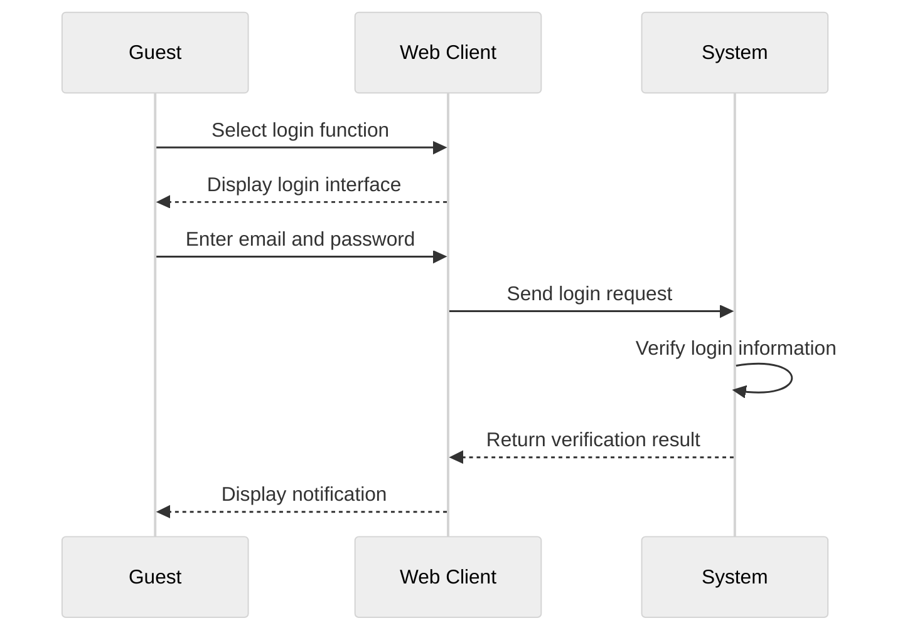
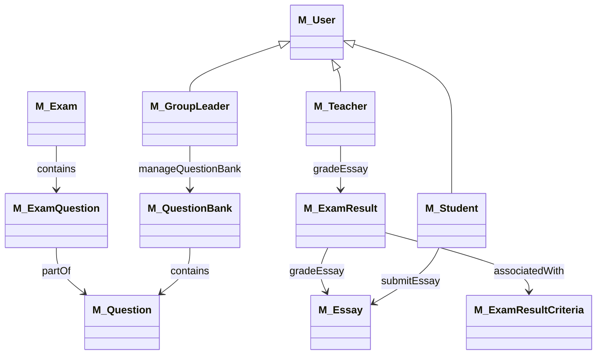
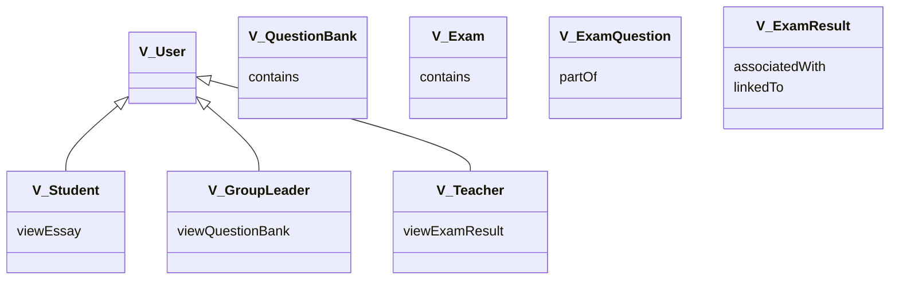
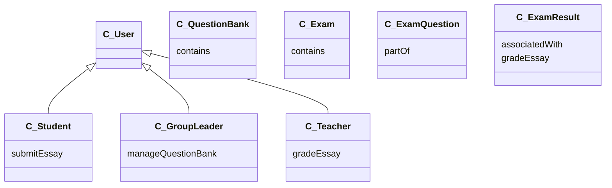
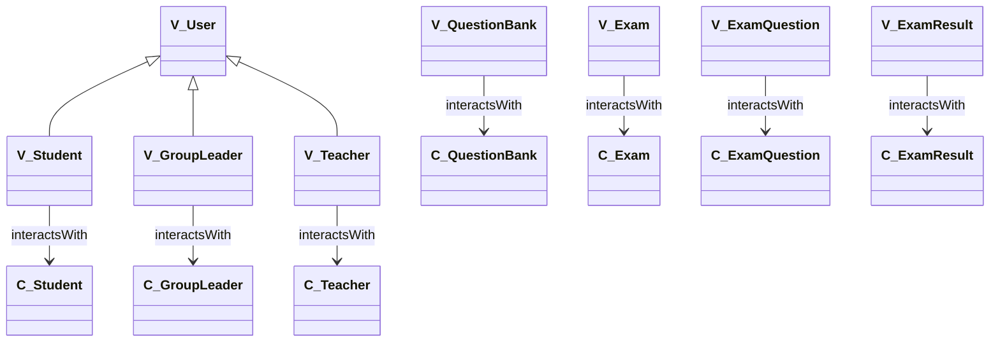
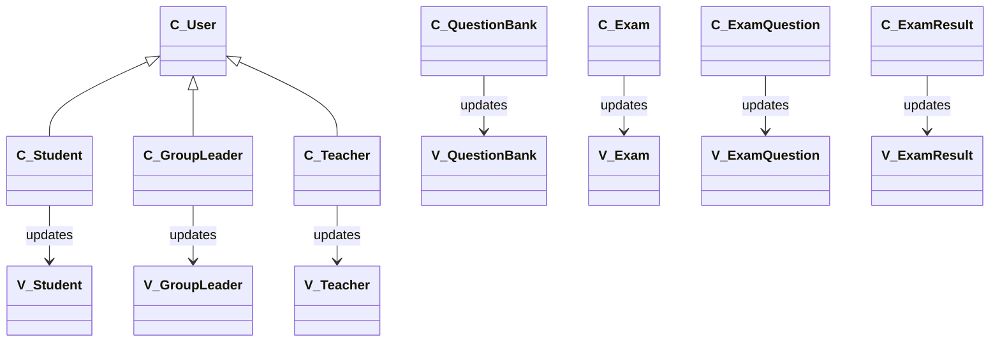

1. Bài viết hay : [9 Laws That Every Software Developer Should Know | by Jarek Orzel | Sep, 2024 | Level Up Coding](https://levelup.gitconnected.com/9-laws-that-every-software-developer-should-know-a5518bfef022)
2. [10 Best Resources to Learn Software Architecture in 2025 | by javinpaul | Javarevisited | Oct, 2024 | Medium](https://medium.com/javarevisited/10-best-resources-to-learn-software-architecture-in-2025-2524ac91dc76)


1. Software Detail Design – SDD
Mục lục
1 Introduction 4
1.1 Purpose . . . . . . . . . . . . . . . . . . . . . . . . . . . . . . . . . . . . . . . . . . . . . 4
1.2 Scope . . . . . . . . . . . . . . . . . . . . . . . . . . . . . . . . . . . . . . . . . . . . . . 4
2 Deployment Diagram 5
3 Architecture design 6
3.1 Phân tích use case . . . . . . . . . . . . . . . . . . . . . . . . . . . . . . . . . . . . . . . 6
3.1.1 Khách . . . . . . . . . . . . . . . . . . . . . . . . . . . . . . . . . . . . . . . . . . 6
Đăng nhập . . . . . . . . . . . . . . . . . . . . . . . . . . . . . . . . . . . . . . . . 6
3.1.2 General . . . . . . . . . . . . . . . . . . . . . . . . . . . . . . . . . . . . . . . . . 7
Change pass word . . . . . . . . . . . . . . . . . . . . . . . . . . . . . . . . . . . . 7
Forgot pass word . . . . . . . . . . . . . . . . . . . . . . . . . . . . . . . . . . . . 7
Update personal information . . . . . . . . . . . . . . . . . . . . . . . . . . . . . . 8
3.1.3 Quản trị viên . . . . . . . . . . . . . . . . . . . . . . . . . . . . . . . . . . . . . . 8
Xoá người dùng . . . . . . . . . . . . . . . . . . . . . . . . . . . . . . . . . . . . . 8
Thêm người dùng . . . . . . . . . . . . . . . . . . . . . . . . . . . . . . . . . . . . 9
Xem người dùng . . . . . . . . . . . . . . . . . . . . . . . . . . . . . . . . . . . . 9
Sửa người dùng . . . . . . . . . . . . . . . . . . . . . . . . . . . . . . . . . . . . . 9
Tìm kiếm người dùng . . . . . . . . . . . . . . . . . . . . . . . . . . . . . . . . . . 10
3.1.4 Nhóm trưởng . . . . . . . . . . . . . . . . . . . . . . . . . . . . . . . . . . . . . . 10
Quản lý ngân hàng câu hỏi . . . . . . . . . . . . . . . . . . . . . . . . . . . . . . . 10
Tạo tiêu chí chấm điểm . . . . . . . . . . . . . . . . . . . . . . . . . . . . . . . . . 11
3.1.5 Giáo viên . . . . . . . . . . . . . . . . . . . . . . . . . . . . . . . . . . . . . . . . 11
Quản lý đề thi . . . . . . . . . . . . . . . . . . . . . . . . . . . . . . . . . . . . . 11
Xem lịch sử đề thi . . . . . . . . . . . . . . . . . . . . . . . . . . . . . . . . . . . 12
Chấm điểm bài thi . . . . . . . . . . . . . . . . . . . . . . . . . . . . . . . . . . . 12
3.1.6 Student . . . . . . . . . . . . . . . . . . . . . . . . . . . . . . . . . . . . . . . . . 13
search and register exam code . . . . . . . . . . . . . . . . . . . . . . . . . . . . . 13
Submit essay . . . . . . . . . . . . . . . . . . . . . . . . . . . . . . . . . . . . . . 14
View Results . . . . . . . . . . . . . . . . . . . . . . . . . . . . . . . . . . . . . . 14
View previous essays . . . . . . . . . . . . . . . . . . . . . . . . . . . . . . . . . . 15
3.2 System Architecture Design . . . . . . . . . . . . . . . . . . . . . . . . . . . . . . . . . . 15
3.3 Detailed Class Design . . . . . . . . . . . . . . . . . . . . . . . . . . . . . . . . . . . . . . 16
3.3.1 Class User . . . . . . . . . . . . . . . . . . . . . . . . . . . . . . . . . . . . . . . . 17
3.3.2 Class GroupLeader, Teacher, Student . . . . . . . . . . . . . . . . . . . . . . . . . 18
3.3.3 Other Classes . . . . . . . . . . . . . . . . . . . . . . . . . . . . . . . . . . . . . . 19
2
4 Data Model Design 20
4.1 Entity Relationship Diagram . . . . . . . . . . . . . . . . . . . . . . . . . . . . . . . . . . 20
4.1.1 Customer . . . . . . . . . . . . . . . . . . . . . . . . . . . . . . . . . . . . . . . . 20
Login . . . . . . . . . . . . . . . . . . . . . . . . . . . . . . . . . . . . . . . . . . . 20
4.1.2 General . . . . . . . . . . . . . . . . . . . . . . . . . . . . . . . . . . . . . . . . . 20
4.1.3 Admin . . . . . . . . . . . . . . . . . . . . . . . . . . . . . . . . . . . . . . . . . . 20
User Search . . . . . . . . . . . . . . . . . . . . . . . . . . . . . . . . . . . . . . . 20
User Management (User Creation) . . . . . . . . . . . . . . . . . . . . . . . . . . 20
4.1.4 Group Leader . . . . . . . . . . . . . . . . . . . . . . . . . . . . . . . . . . . . . . 21
Question Bank Management . . . . . . . . . . . . . . . . . . . . . . . . . . . . . . 21
Create Grading Criteria . . . . . . . . . . . . . . . . . . . . . . . . . . . . . . . . 21
4.1.5 Teacher . . . . . . . . . . . . . . . . . . . . . . . . . . . . . . . . . . . . . . . . . 22
Exam Management (Create Exam) . . . . . . . . . . . . . . . . . . . . . . . . . . 22
View Exam History . . . . . . . . . . . . . . . . . . . . . . . . . . . . . . . . . . . 22
Grade Exams (Create ExamResult) . . . . . . . . . . . . . . . . . . . . . . . . . . 22
4.1.6 Student . . . . . . . . . . . . . . . . . . . . . . . . . . . . . . . . . . . . . . . . . 22
Search and Register for Exam . . . . . . . . . . . . . . . . . . . . . . . . . . . . . 22
Submit Essay . . . . . . . . . . . . . . . . . . . . . . . . . . . . . . . . . . . . . . 23
View Results . . . . . . . . . . . . . . . . . . . . . . . . . . . . . . . . . . . . . . 23
View History of Exam Participated . . . . . . . . . . . . . . . . . . . . . . . . . . 23
4.2 Detailed Table Design . . . . . . . . . . . . . . . . . . . . . . . . . . . . . . . . . . . . . 24
Table User . . . . . . . . . . . . . . . . . . . . . . . . . . . . . . . . . . . . . . . 24
Table QuestionBank . . . . . . . . . . . . . . . . . . . . . . . . . . . . . . . . . . 24
Table ExamResult . . . . . . . . . . . . . . . . . . . . . . . . . . . . . . . . . . . 24
Table Essay . . . . . . . . . . . . . . . . . . . . . . . . . . . . . . . . . . . . . . . 24
Table Question . . . . . . . . . . . . . . . . . . . . . . . . . . . . . . . . . . . . . 25
Table ExamResultCriteria . . . . . . . . . . . . . . . . . . . . . . . . . . . . . . . 25
Table Exam . . . . . . . . . . . . . . . . . . . . . . . . . . . . . . . . . . . . . . 25
Table ExamQuestion . . . . . . . . . . . . . . . . . . . . . . . . . . . . . . . . . . 25
Table Criteria . . . . . . . . . . . . . . . . . . . . . . . . . . . . . . . . . . . . . 25
Table CriteriaDetail . . . . . . . . . . . . . . . . . . . . . . . . . . . . . . . . . . 26
5 Thiết kế giao diện 27
5.1 Giao diện với thiết bị phần cứng . . . . . . . . . . . . . . . . . . . . . . . . . . . . . . . . 27
5.2 Giao diện với phần mềm khác . . . . . . . . . . . . . . . . . . . . . . . . . . . . . . . . . 27
5.3 Giao diện người dùng . . . . . . . . . . . . . . . . . . . . . . . . . . . . . . . . . . . . . . 27
5.3.1 Biểu đồ dịch chuyển màn hình . . . . . . . . . . . . . . . . . . . . . . . . . . . . . 27
5.3.2 Thiết kế giao diện . . . . . . . . . . . . . . . . . . . . . . . . . . . . . . . . . . . . 29
i. Chung . . . . . . . . . . . . . . . . . . . . . . . . . . . . . . . . . . . . . . . . . 29
ii. Quản trị viên . . . . . . . . . . . . . . . . . . . . . . . . . . . . . . . . . . . . . 31
iii. Giáo viên . . . . . . . . . . . . . . . . . . . . . . . . . . . . . . . . . . . . . . 33
iv. Học sinh . . . . . . . . . . . . . . . . . . . . . . . . . . . . . . . . . . . . . . . 36
v. Nhóm trưởng . . . . . . . . . . . . . . . . . . . . . . . . . . . . . . . . . . . . . 38


### 1. Sequence Diagram
Tool 1: [Online FlowChart & Diagrams Editor - Mermaid Live Editor](https://mermaid.live/)



	
Tool 2: [Untitled - WebSequenceDiagrams](https://www.websequencediagrams.com/app)
```[Học sinh nộp bài luận - WebSequenceDiagrams](https://www.websequencediagrams.com/app)
title Học sinh nộp bài luận

actor Học sinh
participant Giao diện
participant Hệ thống
participant Cơ sở dữ liệu

Học sinh -> Giao diện: Click vào textbox
Giao diện -> Giao diện: Hiển thị textbox để soạn thảo
Học sinh -> Giao diện: Soạn thảo câu trả lời rồi chọn nút "Nộp bài luận"
Giao diện -> Hệ thống: Hiển thị hộp thoại xác nhận nộp bài luận
alt [Chọn từ chối]
  Học sinh -> Giao diện: Chọn từ chối
else [Chọn đồng ý]
  Học sinh -> Giao diện: Chọn đồng ý
  Giao diện -> Hệ thống: Lưu thông tin và câu trả lời của học sinh
  Hệ thống -> Cơ sở dữ liệu: Lưu câu trả lời
  Cơ sở dữ liệu -> Hệ thống: Thông báo lưu thành công
  Hệ thống -> Giao diện: Thông báo: Nộp bài luận thành công
end

```

### 2. Thiết kế chi tiết gói


Dưới đây là phiên bản chi tiết biểu diễn các gói Module (M_...) với các mũi tên và quan hệ đã được sửa đúng:



### Giải thích các thay đổi:

1. **Prefix `M_`**:
    
    - Đã thêm prefix `M_` để biểu diễn các module (ví dụ: `M_User`, `M_Student`,...).
2. **Quan hệ**:
    
    - Được điều chỉnh theo logic từ sơ đồ gốc:
        - `M_User` là lớp cha của các module `M_Student`, `M_GroupLeader`, và `M_Teacher`.
        - `M_GroupLeader` quản lý `M_QuestionBank`.
        - `M_QuestionBank` chứa `M_Question`.
        - `M_Exam` chứa `M_ExamQuestion`.
        - `M_ExamQuestion` là một phần của `M_Question`.
        - `M_Student` gửi bài luận (`M_Essay`).
        - `M_Teacher` chấm điểm và quản lý `M_ExamResult`.
        - `M_ExamResult` liên quan đến các tiêu chí (`M_ExamResultCriteria`) và bài luận (`M_Essay`).

- **M_User**: Stores user information in the system, including common attributes such as name, account, and roles. It serves as the parent class for specific user groups like students, group leaders, and teachers.
- **M_Student**: Defines information and functions specific to students, such as submitting essays (**submitEssay**) and viewing exam results.
- **M_GroupLeader**: Responsible for managing question banks (**manageQuestionBank**), including creating, updating, and deleting questions in the system.
- **M_Teacher**: Stores information and functions for teachers, including creating, updating, deleting exams, and grading essays (**gradeEssay**).
- **M_QuestionBank**: Stores information about question banks, which contain related questions (**contains**).
- **M_Question**: Stores detailed information about a specific question in the system. It is part of **M_QuestionBank** and linked to exams through **M_ExamQuestion**.
- **M_Exam**: Manages information about exams, including a list of questions (**contains**).
- **M_ExamQuestion**: Stores information linking exams (**M_Exam**) and questions (**M_Question**), representing a "part of" relationship (**partOf**).
- **M_Essay**: Represents student essays, submitted by **M_Student** via the **submitEssay** function and graded by teachers through **M_ExamResult**.
- **M_ExamResult**: Stores exam results, including scores and related information. These results are linked to evaluation criteria (**M_ExamResultCriteria**) and essays (**M_Essay**) to support grading.
- **M_ExamResultCriteria**: Stores grading criteria for exam results, linked to **M_ExamResult** to ensure transparency in the grading process.

Below is the Mermaid syntax to represent the **Controller package** diagram as shown in the uploaded image:

### Controller Diagram Syntax (Mermaid)

Here’s the updated **Controller** diagram corresponding to the provided Model structure:
ments in English:

The **Controller package** diagram represents the logic-handling layer for the corresponding **Model** structure. Each controller class is dedicated to processing specific actions related to its associated model. Here’s a detailed explanation:

1. **Controller Classes**:
    
    - **C_User**: Acts as the base class for all user-related controllers, handling actions like user login, profile management, and authentication.
    - **C_Student**: Handles operations specific to students, such as submitting essays (**submitEssay**) and accessing exam results.
    - **C_GroupLeader**: Manages the question bank operations, including creating, updating, and deleting question banks (**manageQuestionBank**).
    - **C_Teacher**: Facilitates teacher-specific operations, such as creating exams, grading essays (**gradeEssay**), and reviewing student progress.
    - **C_QuestionBank**, **C_Question**: Manage question banks and their related questions, with clear relationships for "contains" and "part of."
    - **C_Exam**: Manages operations related to exams, linking with exam questions (**C_ExamQuestion**) and results.
    - **C_ExamResult**: Handles the grading and management of exam results, including linking with criteria (**C_ExamResultCriteria**) and essays.
2. **Responsibilities**:
    
    - Each controller receives requests from the **View** layer and uses the **Model** layer to process and fetch data.
    - Controllers implement the business logic needed for specific tasks, ensuring a clear separation of concerns.
3. **Highlights**:
    
    - **Modular Design**: Each controller class is focused on a single domain, enhancing maintainability and reducing coupling.
    - **MVC Integration**: The controllers bridge the View and Model layers, maintaining a smooth data flow and interaction.
    - **Scalability**: Adding new functionality or extending existing ones (e.g., new user types or features for teachers) is straightforward due to the structured controller hierarchy.

This design ensures a robust and scalable system that adheres to **MVC principles**, making it easy to maintain, test, and extend over time.

### Viewer Diagram Syntax (Mermaid)

Here’s the updated **Viewer** diagram corresponding to the provided Model structure:

### Comments in English:

The **Viewer package** diagram illustrates the **View layer** of the application, which is responsible for displaying data and user interfaces to the end users. Each viewer class corresponds to a specific model and controller, facilitating the interaction with users. Below are the details:

1. **Viewer Classes**:
    
    - **V_User**: Serves as the base class for user-related views, managing general UI components for users, such as login screens, user profiles, and dashboard access.
    - **V_Student**: Handles UI components specific to students, such as essay submission forms (**viewEssay**) and pages for viewing exam results.
    - **V_GroupLeader**: Provides views for managing question banks (**viewQuestionBank**) and related operations.
    - **V_Teacher**: Facilitates teacher-specific interfaces, such as grading pages and exam management dashboards (**viewExamResult**).
    - **V_QuestionBank**, **V_Question**: Displays question banks and their related questions, ensuring clear relationships for "contains" and "part of."
    - **V_Exam**: Provides interfaces for creating, managing, and viewing exams, linking with exam questions (**V_ExamQuestion**) and results.
    - **V_ExamResult**: Displays exam results, including linked essays (**linkedTo**) and grading criteria (**associatedWith**).
2. **Responsibilities**:
    
    - Each viewer class focuses on rendering data from the **Controller** layer for the end-user.
    - The viewers handle UI/UX concerns, ensuring that information is displayed in an accessible and user-friendly manner.
3. **Highlights**:
    
    - **User-Centric Design**: Each viewer class is tailored to a specific user role or functionality, enhancing usability and clarity.
    - **MVC Integration**: The viewers rely on the **Controller** layer to fetch and process data, ensuring a clean separation of concerns.
    - **Scalability**: The structured hierarchy and modular approach make it straightforward to add new views or update existing ones without impacting other components.

This design ensures a seamless and user-friendly experience by adhering to the **MVC architecture principles**, making the system intuitive, efficient, and scalable for future enhancements.


Based on further research and confirmation of how the **MVC architecture** operates, the **Controller** and **View** do interact with each other directly, as follows:

Dưới đây là phiên bản đã loại bỏ các dấu mũi tên trong cả Viewer và Controller:

### Viewer Diagram (Mermaid Syntax)



### Controller Diagram (Mermaid Syntax)



### Explanation:

- Removed the directional arrows (`-->`) in both Viewer and Controller diagrams because the Viewer and Controller do not directly interact with each other, and the arrows might cause confusion regarding data flow.
- The relationships (e.g., `viewEssay`, `manageQuestionBank`) now appear as annotations to show the role of each class without indicating direct interaction.
### Interaction Details:

1. **Controller to View**:
    
    - The **Controller** processes user inputs received from the **View** and updates the **View** accordingly.
    - It sends instructions to the **View** about what data or changes should be reflected on the user interface.
2. **View to Controller**:
    
    - The **View** captures user actions (like clicks, form submissions, etc.) and passes these as requests to the **Controller** to process.
    - This ensures that the **Controller** is responsible for business logic, while the **View** focuses on presenting information.

### Updated Diagrams with Interaction:

#### Viewer Diagram (with interaction arrows)



#### Controller Diagram (with interaction arrows)



### Explanation:

- **Bidirectional Interaction**: Both the Viewer and Controller have interactions (`interactsWith` or `updates`) because they depend on each other for input (View to Controller) and output (Controller to View).
- **View Focus**: The **View** is responsible for capturing user interactions and sending them to the Controller.
- **Controller Focus**: The **Controller** processes these inputs, applies logic, and sends updates or data back to the View to be displayed.

This structure ensures the **MVC architecture** adheres to its principles of separation of concerns while allowing dynamic and responsive communication between layers. Let me know if further refinements are needed!


In the Model-View-Controller (MVC) architecture, the **Controller** and **View** components interact directly to facilitate user interface updates and responses to user inputs. Here's how they interact:

1. **User Interaction**: When a user interacts with the application (e.g., clicking a button or entering data), these actions are captured by the **View**.
    
2. **Controller Processing**: The **View** forwards these user inputs to the **Controller**. The **Controller** processes the inputs, applies the necessary business logic, and may update the **Model** accordingly.
    
3. **Updating the View**: After processing, the **Controller** may instruct the **View** to update the user interface to reflect changes, such as displaying new data or altering the UI state.
    

This direct interaction between the **Controller** and **View** ensures that user inputs are effectively translated into appropriate actions and visual feedback, maintaining a responsive and dynamic user experience.

For a more detailed explanation of the MVC interactions, you can refer to the [Model–view–controller](https://en.wikipedia.org/wiki/Model%E2%80%93view%E2%80%93controller) article on Wikipedia.
### Hướng dẫn sử dụng:

Bạn có thể sao chép đoạn mã này vào [Mermaid Live Editor](https://mermaid.live/) để kiểm tra hoặc hiển thị sơ đồ. Nếu cần thêm chỉnh sửa hoặc chi tiết khác, hãy cho mình biết!

Chi tiết hơn thì 

![[Pasted image 20241209001709.png]]


```
3.3 Detailed Class Design
21
3.3.1 Class User
Attributes (for all users): username, password, role, fullName, birthday, gender. Methods:
• createUser(): Creates a new user.
• getUserById(): Retrieves user information by ID.
• updateUser(): Updates user information.
• deleteUser(): Deletes a user.
• hashPassword(): Hashes the password.
22
3.3.2 Class GroupLeader, Teacher, Student
GroupLeader
• Inherits from the User class.
• Methods:
– createQuestionBank(): Creates a question bank.
– getQuestionBankById(): Retrieves a question bank by ID.
– updateQuestionBank(): Updates a question bank.
– deleteQuestionBank(): Deletes a question bank.
Teacher
• Inherits from the User class.
• Methods:
– createExam(): Creates an exam.
– getExamById(): Retrieves an exam by ID.
– updateExam(): Updates an exam.
– deleteExam(): Deletes an exam.
– gradeEssay(): Grades an essay.
23
Student
• Inherits from the User class.
• Methods:
– submitEssay(): Submits an essay.
– getExamResults(): Retrieves exam results.
3.3.3 Other Classes
• QuestionBank: Stores question bank information.
• Question: Stores question information.
• Exam: Stores exam information.
• Essay: Stores essay information.
• ExamResult: Stores exam result information.
• ExamResultCriteria: Stores grading criteria information for an exam result. (This implies a many-
to-many relationship between ExamResult and Criteria, facilitated by this class)
• Criteria: Stores grading criteria types.
• CriteriaDetail: Stores details for each graded criterion according to the rules. (This likely holds
specific scoring details against a specific Criteria for a given ExamResultCriteria)
```

