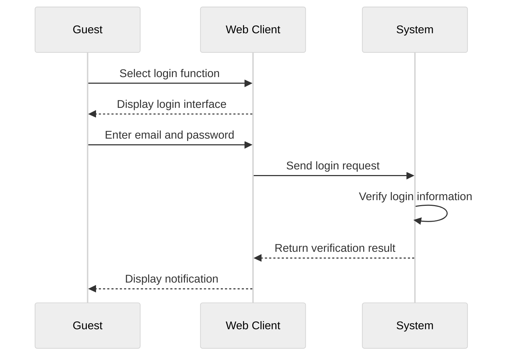

1. Bài viết hay : [9 Laws That Every Software Developer Should Know | by Jarek Orzel | Sep, 2024 | Level Up Coding](https://levelup.gitconnected.com/9-laws-that-every-software-developer-should-know-a5518bfef022)
2. [10 Best Resources to Learn Software Architecture in 2025 | by javinpaul | Javarevisited | Oct, 2024 | Medium](https://medium.com/javarevisited/10-best-resources-to-learn-software-architecture-in-2025-2524ac91dc76)


1. Software Detail Design – SDD
Mục lục
1 Introduction 4
1.1 Purpose . . . . . . . . . . . . . . . . . . . . . . . . . . . . . . . . . . . . . . . . . . . . . 4
1.2 Scope . . . . . . . . . . . . . . . . . . . . . . . . . . . . . . . . . . . . . . . . . . . . . . 4
2 Deployment Diagram 5
3 Architecture design 6
3.1 Phân tích use case . . . . . . . . . . . . . . . . . . . . . . . . . . . . . . . . . . . . . . . 6
3.1.1 Khách . . . . . . . . . . . . . . . . . . . . . . . . . . . . . . . . . . . . . . . . . . 6
Đăng nhập . . . . . . . . . . . . . . . . . . . . . . . . . . . . . . . . . . . . . . . . 6
3.1.2 General . . . . . . . . . . . . . . . . . . . . . . . . . . . . . . . . . . . . . . . . . 7
Change pass word . . . . . . . . . . . . . . . . . . . . . . . . . . . . . . . . . . . . 7
Forgot pass word . . . . . . . . . . . . . . . . . . . . . . . . . . . . . . . . . . . . 7
Update personal information . . . . . . . . . . . . . . . . . . . . . . . . . . . . . . 8
3.1.3 Quản trị viên . . . . . . . . . . . . . . . . . . . . . . . . . . . . . . . . . . . . . . 8
Xoá người dùng . . . . . . . . . . . . . . . . . . . . . . . . . . . . . . . . . . . . . 8
Thêm người dùng . . . . . . . . . . . . . . . . . . . . . . . . . . . . . . . . . . . . 9
Xem người dùng . . . . . . . . . . . . . . . . . . . . . . . . . . . . . . . . . . . . 9
Sửa người dùng . . . . . . . . . . . . . . . . . . . . . . . . . . . . . . . . . . . . . 9
Tìm kiếm người dùng . . . . . . . . . . . . . . . . . . . . . . . . . . . . . . . . . . 10
3.1.4 Nhóm trưởng . . . . . . . . . . . . . . . . . . . . . . . . . . . . . . . . . . . . . . 10
Quản lý ngân hàng câu hỏi . . . . . . . . . . . . . . . . . . . . . . . . . . . . . . . 10
Tạo tiêu chí chấm điểm . . . . . . . . . . . . . . . . . . . . . . . . . . . . . . . . . 11
3.1.5 Giáo viên . . . . . . . . . . . . . . . . . . . . . . . . . . . . . . . . . . . . . . . . 11
Quản lý đề thi . . . . . . . . . . . . . . . . . . . . . . . . . . . . . . . . . . . . . 11
Xem lịch sử đề thi . . . . . . . . . . . . . . . . . . . . . . . . . . . . . . . . . . . 12
Chấm điểm bài thi . . . . . . . . . . . . . . . . . . . . . . . . . . . . . . . . . . . 12
3.1.6 Student . . . . . . . . . . . . . . . . . . . . . . . . . . . . . . . . . . . . . . . . . 13
search and register exam code . . . . . . . . . . . . . . . . . . . . . . . . . . . . . 13
Submit essay . . . . . . . . . . . . . . . . . . . . . . . . . . . . . . . . . . . . . . 14
View Results . . . . . . . . . . . . . . . . . . . . . . . . . . . . . . . . . . . . . . 14
View previous essays . . . . . . . . . . . . . . . . . . . . . . . . . . . . . . . . . . 15
3.2 System Architecture Design . . . . . . . . . . . . . . . . . . . . . . . . . . . . . . . . . . 15
3.3 Detailed Class Design . . . . . . . . . . . . . . . . . . . . . . . . . . . . . . . . . . . . . . 16
3.3.1 Class User . . . . . . . . . . . . . . . . . . . . . . . . . . . . . . . . . . . . . . . . 17
3.3.2 Class GroupLeader, Teacher, Student . . . . . . . . . . . . . . . . . . . . . . . . . 18
3.3.3 Other Classes . . . . . . . . . . . . . . . . . . . . . . . . . . . . . . . . . . . . . . 19
2
4 Data Model Design 20
4.1 Entity Relationship Diagram . . . . . . . . . . . . . . . . . . . . . . . . . . . . . . . . . . 20
4.1.1 Customer . . . . . . . . . . . . . . . . . . . . . . . . . . . . . . . . . . . . . . . . 20
Login . . . . . . . . . . . . . . . . . . . . . . . . . . . . . . . . . . . . . . . . . . . 20
4.1.2 General . . . . . . . . . . . . . . . . . . . . . . . . . . . . . . . . . . . . . . . . . 20
4.1.3 Admin . . . . . . . . . . . . . . . . . . . . . . . . . . . . . . . . . . . . . . . . . . 20
User Search . . . . . . . . . . . . . . . . . . . . . . . . . . . . . . . . . . . . . . . 20
User Management (User Creation) . . . . . . . . . . . . . . . . . . . . . . . . . . 20
4.1.4 Group Leader . . . . . . . . . . . . . . . . . . . . . . . . . . . . . . . . . . . . . . 21
Question Bank Management . . . . . . . . . . . . . . . . . . . . . . . . . . . . . . 21
Create Grading Criteria . . . . . . . . . . . . . . . . . . . . . . . . . . . . . . . . 21
4.1.5 Teacher . . . . . . . . . . . . . . . . . . . . . . . . . . . . . . . . . . . . . . . . . 22
Exam Management (Create Exam) . . . . . . . . . . . . . . . . . . . . . . . . . . 22
View Exam History . . . . . . . . . . . . . . . . . . . . . . . . . . . . . . . . . . . 22
Grade Exams (Create ExamResult) . . . . . . . . . . . . . . . . . . . . . . . . . . 22
4.1.6 Student . . . . . . . . . . . . . . . . . . . . . . . . . . . . . . . . . . . . . . . . . 22
Search and Register for Exam . . . . . . . . . . . . . . . . . . . . . . . . . . . . . 22
Submit Essay . . . . . . . . . . . . . . . . . . . . . . . . . . . . . . . . . . . . . . 23
View Results . . . . . . . . . . . . . . . . . . . . . . . . . . . . . . . . . . . . . . 23
View History of Exam Participated . . . . . . . . . . . . . . . . . . . . . . . . . . 23
4.2 Detailed Table Design . . . . . . . . . . . . . . . . . . . . . . . . . . . . . . . . . . . . . 24
Table User . . . . . . . . . . . . . . . . . . . . . . . . . . . . . . . . . . . . . . . 24
Table QuestionBank . . . . . . . . . . . . . . . . . . . . . . . . . . . . . . . . . . 24
Table ExamResult . . . . . . . . . . . . . . . . . . . . . . . . . . . . . . . . . . . 24
Table Essay . . . . . . . . . . . . . . . . . . . . . . . . . . . . . . . . . . . . . . . 24
Table Question . . . . . . . . . . . . . . . . . . . . . . . . . . . . . . . . . . . . . 25
Table ExamResultCriteria . . . . . . . . . . . . . . . . . . . . . . . . . . . . . . . 25
Table Exam . . . . . . . . . . . . . . . . . . . . . . . . . . . . . . . . . . . . . . 25
Table ExamQuestion . . . . . . . . . . . . . . . . . . . . . . . . . . . . . . . . . . 25
Table Criteria . . . . . . . . . . . . . . . . . . . . . . . . . . . . . . . . . . . . . 25
Table CriteriaDetail . . . . . . . . . . . . . . . . . . . . . . . . . . . . . . . . . . 26
5 Thiết kế giao diện 27
5.1 Giao diện với thiết bị phần cứng . . . . . . . . . . . . . . . . . . . . . . . . . . . . . . . . 27
5.2 Giao diện với phần mềm khác . . . . . . . . . . . . . . . . . . . . . . . . . . . . . . . . . 27
5.3 Giao diện người dùng . . . . . . . . . . . . . . . . . . . . . . . . . . . . . . . . . . . . . . 27
5.3.1 Biểu đồ dịch chuyển màn hình . . . . . . . . . . . . . . . . . . . . . . . . . . . . . 27
5.3.2 Thiết kế giao diện . . . . . . . . . . . . . . . . . . . . . . . . . . . . . . . . . . . . 29
i. Chung . . . . . . . . . . . . . . . . . . . . . . . . . . . . . . . . . . . . . . . . . 29
ii. Quản trị viên . . . . . . . . . . . . . . . . . . . . . . . . . . . . . . . . . . . . . 31
iii. Giáo viên . . . . . . . . . . . . . . . . . . . . . . . . . . . . . . . . . . . . . . 33
iv. Học sinh . . . . . . . . . . . . . . . . . . . . . . . . . . . . . . . . . . . . . . . 36
v. Nhóm trưởng . . . . . . . . . . . . . . . . . . . . . . . . . . . . . . . . . . . . . 38


### 1. Sequence Diagram
Tool 1: [Online FlowChart & Diagrams Editor - Mermaid Live Editor](https://mermaid.live/)



	
Tool 2: [Untitled - WebSequenceDiagrams](https://www.websequencediagrams.com/app)
```[Học sinh nộp bài luận - WebSequenceDiagrams](https://www.websequencediagrams.com/app)
title Học sinh nộp bài luận

actor Học sinh
participant Giao diện
participant Hệ thống
participant Cơ sở dữ liệu

Học sinh -> Giao diện: Click vào textbox
Giao diện -> Giao diện: Hiển thị textbox để soạn thảo
Học sinh -> Giao diện: Soạn thảo câu trả lời rồi chọn nút "Nộp bài luận"
Giao diện -> Hệ thống: Hiển thị hộp thoại xác nhận nộp bài luận
alt [Chọn từ chối]
  Học sinh -> Giao diện: Chọn từ chối
else [Chọn đồng ý]
  Học sinh -> Giao diện: Chọn đồng ý
  Giao diện -> Hệ thống: Lưu thông tin và câu trả lời của học sinh
  Hệ thống -> Cơ sở dữ liệu: Lưu câu trả lời
  Cơ sở dữ liệu -> Hệ thống: Thông báo lưu thành công
  Hệ thống -> Giao diện: Thông báo: Nộp bài luận thành công
end

```

### 2. Thiết kế chi tiết gói

```

```


Chi tiết hơn thì 

![[Pasted image 20241209001709.png]]